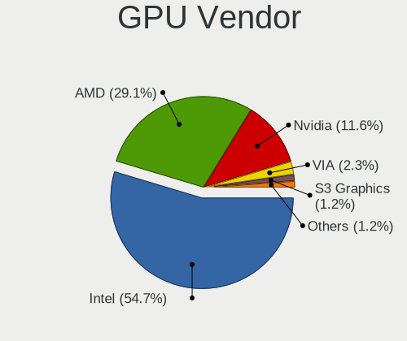
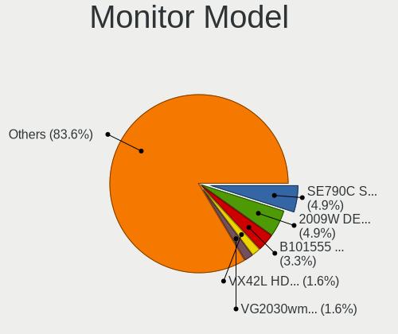
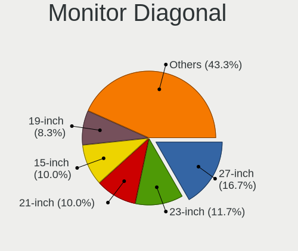
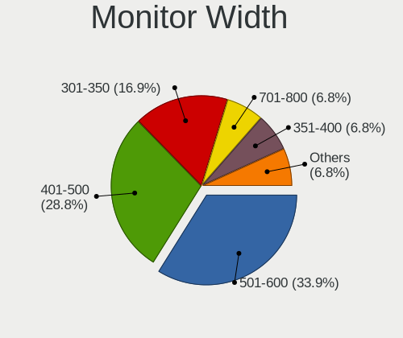

Alpine - Tested Hardware & Statistics (Desktops)
------------------------------------------------

A project to collect tested hardware configurations for Alpine.

Anyone can contribute to this report by the [hw-probe](https://github.com/linuxhw/hw-probe) tool:

    sudo -E hw-probe -all -upload

Please contribute! Especially if your hardware is rare.

Contents
--------

* [ Test Cases ](#test-cases)

* [ System ](#system)
  - [ OS                       ](#os)
  - [ OS Family                ](#os-family)
  - [ Kernel                   ](#kernel)
  - [ Kernel Family            ](#kernel-family)
  - [ Kernel Major Ver.        ](#kernel-major-ver)
  - [ Arch                     ](#arch)
  - [ DE                       ](#de)
  - [ Display Server           ](#display-server)
  - [ Display Manager          ](#display-manager)
  - [ OS Lang                  ](#os-lang)
  - [ Boot Mode                ](#boot-mode)
  - [ Filesystem               ](#filesystem)
  - [ Part. scheme             ](#part-scheme)
  - [ Dual Boot with Linux/BSD ](#dual-boot-with-linuxbsd)
  - [ Dual Boot (Win)          ](#dual-boot-win)

* [ Board ](#board)
  - [ Vendor                   ](#vendor)
  - [ Model                    ](#model)
  - [ Model Family             ](#model-family)
  - [ MFG Year                 ](#mfg-year)
  - [ Form Factor              ](#form-factor)
  - [ Secure Boot              ](#secure-boot)
  - [ Coreboot                 ](#coreboot)
  - [ RAM Size                 ](#ram-size)
  - [ RAM Used                 ](#ram-used)
  - [ Total Drives             ](#total-drives)
  - [ Has CD-ROM               ](#has-cd-rom)
  - [ Has Ethernet             ](#has-ethernet)
  - [ Has WiFi                 ](#has-wifi)
  - [ Has Bluetooth            ](#has-bluetooth)

* [ Location ](#location)
  - [ Country                  ](#country)
  - [ City                     ](#city)

* [ Drives ](#drives)
  - [ Drive Vendor             ](#drive-vendor)
  - [ Drive Model              ](#drive-model)
  - [ HDD Vendor               ](#hdd-vendor)
  - [ SSD Vendor               ](#ssd-vendor)
  - [ Drive Kind               ](#drive-kind)
  - [ Drive Connector          ](#drive-connector)
  - [ Drive Size               ](#drive-size)
  - [ Space Total              ](#space-total)
  - [ Space Used               ](#space-used)
  - [ Malfunc. Drives          ](#malfunc-drives)
  - [ Malfunc. Drive Vendor    ](#malfunc-drive-vendor)
  - [ Malfunc. HDD Vendor      ](#malfunc-hdd-vendor)
  - [ Malfunc. Drive Kind      ](#malfunc-drive-kind)
  - [ Failed Drives            ](#failed-drives)
  - [ Failed Drive Vendor      ](#failed-drive-vendor)
  - [ Drive Status             ](#drive-status)

* [ Storage controller ](#storage-controller)
  - [ Storage Vendor           ](#storage-vendor)
  - [ Storage Model            ](#storage-model)
  - [ Storage Kind             ](#storage-kind)

* [ Processor ](#processor)
  - [ CPU Vendor               ](#cpu-vendor)
  - [ CPU Model                ](#cpu-model)
  - [ CPU Model Family         ](#cpu-model-family)
  - [ CPU Cores                ](#cpu-cores)
  - [ CPU Sockets              ](#cpu-sockets)
  - [ CPU Threads              ](#cpu-threads)
  - [ CPU Op-Modes             ](#cpu-op-modes)
  - [ CPU Microcode            ](#cpu-microcode)
  - [ CPU Microarch            ](#cpu-microarch)

* [ Graphics ](#graphics)
  - [ GPU Vendor               ](#gpu-vendor)
  - [ GPU Model                ](#gpu-model)
  - [ GPU Combo                ](#gpu-combo)
  - [ GPU Driver               ](#gpu-driver)
  - [ GPU Memory               ](#gpu-memory)

* [ Monitor ](#monitor)
  - [ Monitor Vendor           ](#monitor-vendor)
  - [ Monitor Model            ](#monitor-model)
  - [ Monitor Resolution       ](#monitor-resolution)
  - [ Monitor Diagonal         ](#monitor-diagonal)
  - [ Monitor Width            ](#monitor-width)
  - [ Aspect Ratio             ](#aspect-ratio)
  - [ Monitor Area             ](#monitor-area)
  - [ Pixel Density            ](#pixel-density)
  - [ Multiple Monitors        ](#multiple-monitors)

* [ Network ](#network)
  - [ Net Controller Vendor    ](#net-controller-vendor)
  - [ Net Controller Model     ](#net-controller-model)
  - [ Wireless Vendor          ](#wireless-vendor)
  - [ Wireless Model           ](#wireless-model)
  - [ Ethernet Vendor          ](#ethernet-vendor)
  - [ Ethernet Model           ](#ethernet-model)
  - [ Net Controller Kind      ](#net-controller-kind)
  - [ Used Controller          ](#used-controller)
  - [ NICs                     ](#nics)
  - [ IPv6                     ](#ipv6)

* [ Bluetooth ](#bluetooth)
  - [ Bluetooth Vendor         ](#bluetooth-vendor)
  - [ Bluetooth Model          ](#bluetooth-model)

* [ Sound ](#sound)
  - [ Sound Vendor             ](#sound-vendor)
  - [ Sound Model              ](#sound-model)

* [ Memory ](#memory)
  - [ Memory Vendor            ](#memory-vendor)
  - [ Memory Model             ](#memory-model)
  - [ Memory Kind              ](#memory-kind)
  - [ Memory Form Factor       ](#memory-form-factor)
  - [ Memory Size              ](#memory-size)
  - [ Memory Speed             ](#memory-speed)

* [ Printers & scanners ](#printers--scanners)
  - [ Printer Vendor           ](#printer-vendor)
  - [ Printer Model            ](#printer-model)
  - [ Scanner Vendor           ](#scanner-vendor)
  - [ Scanner Model            ](#scanner-model)

* [ Camera ](#camera)
  - [ Camera Vendor            ](#camera-vendor)
  - [ Camera Model             ](#camera-model)

* [ Security ](#security)
  - [ Fingerprint Vendor       ](#fingerprint-vendor)
  - [ Fingerprint Model        ](#fingerprint-model)
  - [ Chipcard Vendor          ](#chipcard-vendor)
  - [ Chipcard Model           ](#chipcard-model)

* [ Unsupported ](#unsupported)
  - [ Unsupported Devices      ](#unsupported-devices)
  - [ Unsupported Device Types ](#unsupported-device-types)

Test Cases
----------

Total: 38

| Vendor        | Model                       | Probe                                                      | Date         |
|---------------|-----------------------------|------------------------------------------------------------|--------------|
| Lenovo        | 31900058 STD                | [d7cc344b2f](https://linux-hardware.org/?probe=d7cc344b2f) | Oct 31, 2022 |
| Lenovo        | 31900058 STD                | [9f7158b883](https://linux-hardware.org/?probe=9f7158b883) | Oct 16, 2022 |
| HP            | 1493                        | [60ebd1d8dd](https://linux-hardware.org/?probe=60ebd1d8dd) | Sep 29, 2022 |
| Gateway       | SX2185                      | [8372be8fe3](https://linux-hardware.org/?probe=8372be8fe3) | Sep 29, 2022 |
| ASRock        | H81M                        | [d59c4705a2](https://linux-hardware.org/?probe=d59c4705a2) | Aug 17, 2022 |
| Intel         | DH61BF AAG81311-101         | [5a3ed0cf62](https://linux-hardware.org/?probe=5a3ed0cf62) | Jul 30, 2022 |
| Intel         | DH61BF AAG81311-101         | [719bbf817c](https://linux-hardware.org/?probe=719bbf817c) | Jul 30, 2022 |
| Intel         | DQ67SW AAG12527-310         | [9a4907d88c](https://linux-hardware.org/?probe=9a4907d88c) | Jul 17, 2022 |
| Unknown       | Unknown                     | [d857b93614](https://linux-hardware.org/?probe=d857b93614) | Jul 13, 2022 |
| Lenovo        | 31900058 STD                | [2f6356a177](https://linux-hardware.org/?probe=2f6356a177) | Jun 17, 2022 |
| Lenovo        | 31900058 STD                | [582fd88dbe](https://linux-hardware.org/?probe=582fd88dbe) | Jun 14, 2022 |
| MSI           | Z170A GAMING PRO            | [73b3e29101](https://linux-hardware.org/?probe=73b3e29101) | Jun 14, 2022 |
| ASRock        | B460 Phantom Gaming 4       | [e692b2a091](https://linux-hardware.org/?probe=e692b2a091) | May 26, 2022 |
| ASUSTek       | H97-PLUS                    | [cab2025064](https://linux-hardware.org/?probe=cab2025064) | May 24, 2022 |
| MSI           | J1900I                      | [86f37a71f5](https://linux-hardware.org/?probe=86f37a71f5) | May 15, 2022 |
| MSI           | J1900I                      | [5a48d83596](https://linux-hardware.org/?probe=5a48d83596) | May 15, 2022 |
| ASUSTek       | Z97-K                       | [53cba6b4f8](https://linux-hardware.org/?probe=53cba6b4f8) | Apr 14, 2022 |
| Gigabyte      | Z490I AORUS ULTRA           | [908edb3724](https://linux-hardware.org/?probe=908edb3724) | Jan 27, 2022 |
| Dell          | 02YRK5 A02                  | [58c2ed388b](https://linux-hardware.org/?probe=58c2ed388b) | Dec 02, 2021 |
| HP            | 21B4 A01                    | [98accc83e4](https://linux-hardware.org/?probe=98accc83e4) | Nov 11, 2021 |
| Dell          | 0T10XW A00                  | [585636f7fe](https://linux-hardware.org/?probe=585636f7fe) | Sep 08, 2021 |
| Shuttle       | FS81                        | [9a98a31681](https://linux-hardware.org/?probe=9a98a31681) | Sep 06, 2021 |
| Dell          | 0VRWRC A00                  | [37a6ad6e02](https://linux-hardware.org/?probe=37a6ad6e02) | Apr 09, 2021 |
| ASUSTek       | P8H67-V                     | [89edd8b343](https://linux-hardware.org/?probe=89edd8b343) | Mar 17, 2021 |
| HP            | ProLiant MicroServer Gen... | [af637820c2](https://linux-hardware.org/?probe=af637820c2) | Feb 12, 2021 |
| VIA Techno... | KM266APro-835               | [1334ad3f74](https://linux-hardware.org/?probe=1334ad3f74) | Dec 22, 2020 |
| Fujitsu       | D2779 S26361-D2779-A1       | [07795a357a](https://linux-hardware.org/?probe=07795a357a) | Oct 09, 2020 |
| Dell          | 0PU052                      | [9a31999f07](https://linux-hardware.org/?probe=9a31999f07) | Aug 31, 2020 |
| ASUSTek       | TS10                        | [71d7f6e110](https://linux-hardware.org/?probe=71d7f6e110) | Aug 20, 2020 |
| VIA Techno... | KM266APro-835               | [25ec3d44ff](https://linux-hardware.org/?probe=25ec3d44ff) | Aug 16, 2020 |
| Gigabyte      | Z490I AORUS ULTRA           | [58dce1215c](https://linux-hardware.org/?probe=58dce1215c) | Aug 13, 2020 |
| ASUSTek       | PRIME H370M-PLUS            | [0c50242cc5](https://linux-hardware.org/?probe=0c50242cc5) | Aug 09, 2020 |
| ASRock        | J3455M                      | [05f9d5c3b4](https://linux-hardware.org/?probe=05f9d5c3b4) | Aug 06, 2020 |
| eMachines     | EL1352G                     | [4513d2931f](https://linux-hardware.org/?probe=4513d2931f) | Jul 03, 2020 |
| eMachines     | EL1352G                     | [4b26717c89](https://linux-hardware.org/?probe=4b26717c89) | Jul 03, 2020 |
| ASRock        | J3455M                      | [3719f96b60](https://linux-hardware.org/?probe=3719f96b60) | Jul 03, 2020 |
| Unknown       | i855GM/E-ITE8712            | [7b9cbd816b](https://linux-hardware.org/?probe=7b9cbd816b) | Dec 27, 2019 |
| ASRock        | D1800B-ITX                  | [f962d4bbf9](https://linux-hardware.org/?probe=f962d4bbf9) | Dec 22, 2019 |

System
------

OS
--

Installed operating systems

| Name                        | Desktops | Percent |
|-----------------------------|----------|---------|
| Alpine 3.12.0               | 5        | 17.24%  |
| Alpine 3.17_alpha20220809   | 3        | 10.34%  |
| Alpine 3.16.0               | 3        | 10.34%  |
| Alpine 3.13.0_alpha20200626 | 3        | 10.34%  |
| Alpine 3.15.4               | 2        | 6.9%    |
| Alpine 3.11.2               | 2        | 6.9%    |
| Alpine 3.8.4                | 1        | 3.45%   |
| Alpine 3.16.1               | 1        | 3.45%   |
| Alpine 3.16.0_alpha20220328 | 1        | 3.45%   |
| Alpine 3.15.6               | 1        | 3.45%   |
| Alpine 3.15.0               | 1        | 3.45%   |
| Alpine 3.14.2               | 1        | 3.45%   |
| Alpine 3.13.6               | 1        | 3.45%   |
| Alpine 3.13.2               | 1        | 3.45%   |
| Alpine 3.13.1               | 1        | 3.45%   |
| Alpine 3.13.0_alpha20201218 | 1        | 3.45%   |
| Alpine 3.12.3               | 1        | 3.45%   |

OS Family
---------

OS without a version

| Name   | Desktops | Percent |
|--------|----------|---------|
| Alpine | 27       | 100%    |

Kernel
------

Version of the Linux kernel

| Version           | Desktops | Percent |
|-------------------|----------|---------|
| 5.4.43-1-lts      | 5        | 17.24%  |
| 5.15.60-0-lts     | 2        | 6.9%    |
| 5.8.0             | 1        | 3.45%   |
| 5.4.84-0-lts      | 1        | 3.45%   |
| 5.4.6-0-lts       | 1        | 3.45%   |
| 5.4.58-0-lts      | 1        | 3.45%   |
| 5.4.57-0-lts      | 1        | 3.45%   |
| 5.18.0-0-asahi    | 1        | 3.45%   |
| 5.17.9-0-edge     | 1        | 3.45%   |
| 5.17.3-0-edge     | 1        | 3.45%   |
| 5.15.70-0-lts     | 1        | 3.45%   |
| 5.15.57-0-lts     | 1        | 3.45%   |
| 5.15.46-1-lts     | 1        | 3.45%   |
| 5.15.40-0-lts     | 1        | 3.45%   |
| 5.15.38-0-lts     | 1        | 3.45%   |
| 5.15.32-0-lts     | 1        | 3.45%   |
| 5.15.17-0-lts     | 1        | 3.45%   |
| 5.10.81           | 1        | 3.45%   |
| 5.10.61-0-lts     | 1        | 3.45%   |
| 5.10.16-0-lts     | 1        | 3.45%   |
| 5.10.12-0-lts     | 1        | 3.45%   |
| 5.10.1-0-lts      | 1        | 3.45%   |
| 4.14.89-0-vanilla | 1        | 3.45%   |
| 3.10.105          | 1        | 3.45%   |

Kernel Family
-------------

Linux kernel without a distro release

| Version  | Desktops | Percent |
|----------|----------|---------|
| 5.4.43   | 5        | 17.24%  |
| 5.15.60  | 2        | 6.9%    |
| 5.8.0    | 1        | 3.45%   |
| 5.4.84   | 1        | 3.45%   |
| 5.4.6    | 1        | 3.45%   |
| 5.4.58   | 1        | 3.45%   |
| 5.4.57   | 1        | 3.45%   |
| 5.18.0   | 1        | 3.45%   |
| 5.17.9   | 1        | 3.45%   |
| 5.17.3   | 1        | 3.45%   |
| 5.15.70  | 1        | 3.45%   |
| 5.15.57  | 1        | 3.45%   |
| 5.15.46  | 1        | 3.45%   |
| 5.15.40  | 1        | 3.45%   |
| 5.15.38  | 1        | 3.45%   |
| 5.15.32  | 1        | 3.45%   |
| 5.15.17  | 1        | 3.45%   |
| 5.10.81  | 1        | 3.45%   |
| 5.10.61  | 1        | 3.45%   |
| 5.10.16  | 1        | 3.45%   |
| 5.10.12  | 1        | 3.45%   |
| 5.10.1   | 1        | 3.45%   |
| 4.14.89  | 1        | 3.45%   |
| 3.10.105 | 1        | 3.45%   |

Kernel Major Ver.
-----------------

Linux kernel major version

| Version | Desktops | Percent |
|---------|----------|---------|
| 5.4     | 9        | 32.14%  |
| 5.15    | 8        | 28.57%  |
| 5.10    | 5        | 17.86%  |
| 5.17    | 2        | 7.14%   |
| 5.8     | 1        | 3.57%   |
| 5.18    | 1        | 3.57%   |
| 4.14    | 1        | 3.57%   |
| 3.10    | 1        | 3.57%   |

Arch
----

OS architecture (x86_64, i586, etc.)

| Name    | Desktops | Percent |
|---------|----------|---------|
| x86_64  | 23       | 85.19%  |
| i686    | 3        | 11.11%  |
| aarch64 | 1        | 3.7%    |

DE
--

Desktop Environment

| Name    | Desktops | Percent |
|---------|----------|---------|
| Unknown | 24       | 88.89%  |
| XFCE    | 1        | 3.7%    |
| sway    | 1        | 3.7%    |
| i3      | 1        | 3.7%    |

Display Server
--------------

X11 or Wayland

| Name    | Desktops | Percent |
|---------|----------|---------|
| Unknown | 21       | 77.78%  |
| X11     | 5        | 18.52%  |
| Wayland | 1        | 3.7%    |

Display Manager
---------------

SDDM, LightDM, etc.

| Name    | Desktops | Percent |
|---------|----------|---------|
| Unknown | 26       | 96.3%   |
| LightDM | 1        | 3.7%    |

OS Lang
-------

Language

| Lang    | Desktops | Percent |
|---------|----------|---------|
| C       | 15       | 55.56%  |
| Unknown | 11       | 40.74%  |
| en_US   | 1        | 3.7%    |

Boot Mode
---------

EFI or BIOS

| Mode | Desktops | Percent |
|------|----------|---------|
| BIOS | 19       | 70.37%  |
| EFI  | 8        | 29.63%  |

Filesystem
----------

Type of filesystem

| Type    | Desktops | Percent |
|---------|----------|---------|
| Ext4    | 24       | 88.89%  |
| Tmpfs   | 1        | 3.7%    |
| Btrfs   | 1        | 3.7%    |
| Unknown | 1        | 3.7%    |

Part. scheme
------------

Scheme of partitioning

| Type    | Desktops | Percent |
|---------|----------|---------|
| Unknown | 15       | 53.57%  |
| GPT     | 9        | 32.14%  |
| MBR     | 4        | 14.29%  |

Dual Boot with Linux/BSD
------------------------

Hosting more than one Linux/BSD

| Dual boot | Desktops | Percent |
|-----------|----------|---------|
| No        | 22       | 81.48%  |
| Yes       | 5        | 18.52%  |

Dual Boot (Win)
---------------

Hosting Linux and Windows

| Dual boot | Desktops | Percent |
|-----------|----------|---------|
| No        | 25       | 92.59%  |
| Yes       | 2        | 7.41%   |

Board
-----

Vendor
------

Motherboard manufacturer

| Name                | Desktops | Percent |
|---------------------|----------|---------|
| ASUSTek Computer    | 5        | 18.52%  |
| Dell                | 4        | 14.81%  |
| ASRock              | 3        | 11.11%  |
| Intel               | 2        | 7.41%   |
| Hewlett-Packard     | 2        | 7.41%   |
| Gigabyte Technology | 2        | 7.41%   |
| Unknown             | 2        | 7.41%   |
| VIA Technologies    | 1        | 3.7%    |
| Shuttle             | 1        | 3.7%    |
| MSI                 | 1        | 3.7%    |
| Lenovo              | 1        | 3.7%    |
| Gateway             | 1        | 3.7%    |
| Fujitsu             | 1        | 3.7%    |
| eMachines           | 1        | 3.7%    |

Model
-----

Motherboard model

| Name                         | Desktops | Percent |
|------------------------------|----------|---------|
| Gigabyte Z490I AORUS ULTRA   | 2        | 7.41%   |
| ASUS All Series              | 2        | 7.41%   |
| Unknown                      | 2        | 7.41%   |
| VIA KM266APro-835            | 1        | 3.7%    |
| Shuttle DS81D                | 1        | 3.7%    |
| MSI MS-7877                  | 1        | 3.7%    |
| Lenovo H535 10117            | 1        | 3.7%    |
| Intel DQ67SW                 | 1        | 3.7%    |
| Intel DH61BF AAG81311-101    | 1        | 3.7%    |
| HP ProLiant MicroServer Gen8 | 1        | 3.7%    |
| HP Compaq 4000 Pro SFF PC    | 1        | 3.7%    |
| Gateway SX2185               | 1        | 3.7%    |
| Fujitsu PRIMERGY TX100 S2    | 1        | 3.7%    |
| eMachines EL1352G            | 1        | 3.7%    |
| Dell OptiPlex 755            | 1        | 3.7%    |
| Dell OptiPlex 3020M          | 1        | 3.7%    |
| Dell OptiPlex 3010           | 1        | 3.7%    |
| Dell Inspiron 3647           | 1        | 3.7%    |
| ASUS TS10                    | 1        | 3.7%    |
| ASUS PRIME H370M-PLUS        | 1        | 3.7%    |
| ASUS P8H67-V                 | 1        | 3.7%    |
| ASRock J3455M                | 1        | 3.7%    |
| ASRock H81M                  | 1        | 3.7%    |
| ASRock D1800B-ITX            | 1        | 3.7%    |

Model Family
------------

Motherboard model prefix

| Name              | Desktops | Percent |
|-------------------|----------|---------|
| Dell OptiPlex     | 3        | 11.11%  |
| Gigabyte Z490I    | 2        | 7.41%   |
| ASUS All          | 2        | 7.41%   |
| Unknown           | 2        | 7.41%   |
| VIA KM266APro-835 | 1        | 3.7%    |
| Shuttle DS81D     | 1        | 3.7%    |
| MSI MS-7877       | 1        | 3.7%    |
| Lenovo H535       | 1        | 3.7%    |
| Intel DQ67SW      | 1        | 3.7%    |
| Intel DH61BF      | 1        | 3.7%    |
| HP ProLiant       | 1        | 3.7%    |
| HP Compaq         | 1        | 3.7%    |
| Gateway SX2185    | 1        | 3.7%    |
| Fujitsu PRIMERGY  | 1        | 3.7%    |
| eMachines EL1352G | 1        | 3.7%    |
| Dell Inspiron     | 1        | 3.7%    |
| ASUS TS10         | 1        | 3.7%    |
| ASUS PRIME        | 1        | 3.7%    |
| ASUS P8H67-V      | 1        | 3.7%    |
| ASRock J3455M     | 1        | 3.7%    |
| ASRock H81M       | 1        | 3.7%    |
| ASRock D1800B-ITX | 1        | 3.7%    |

MFG Year
--------

Motherboard manufacture year

| Year    | Desktops | Percent |
|---------|----------|---------|
| 2014    | 7        | 25.93%  |
| 2013    | 4        | 14.81%  |
| 2010    | 3        | 11.11%  |
| 2020    | 2        | 7.41%   |
| 2018    | 2        | 7.41%   |
| 2012    | 2        | 7.41%   |
| 2017    | 1        | 3.7%    |
| 2016    | 1        | 3.7%    |
| 2011    | 1        | 3.7%    |
| 2009    | 1        | 3.7%    |
| 2007    | 1        | 3.7%    |
| 2004    | 1        | 3.7%    |
| Unknown | 1        | 3.7%    |

Form Factor
-----------

Physical design of the computer

| Name    | Desktops | Percent |
|---------|----------|---------|
| Desktop | 27       | 100%    |

Secure Boot
-----------

Enabled or disabled

| State    | Desktops | Percent |
|----------|----------|---------|
| Disabled | 27       | 100%    |

Coreboot
--------

Have coreboot on board

| Used | Desktops | Percent |
|------|----------|---------|
| No   | 27       | 100%    |

RAM Size
--------

Total RAM memory

| Size in GB | Desktops | Percent |
|------------|----------|---------|
| 3.01-4.0   | 7        | 24.14%  |
| 8.01-16.0  | 6        | 20.69%  |
| 4.01-8.0   | 4        | 13.79%  |
| 32.01-64.0 | 3        | 10.34%  |
| 16.01-24.0 | 3        | 10.34%  |
| 1.01-2.0   | 2        | 6.9%    |
| 0.51-1.0   | 2        | 6.9%    |
| 2.01-3.0   | 1        | 3.45%   |
| 0.01-0.5   | 1        | 3.45%   |

RAM Used
--------

Used RAM memory

| Used GB   | Desktops | Percent |
|-----------|----------|---------|
| 0.01-0.5  | 11       | 40.74%  |
| 1.01-2.0  | 7        | 25.93%  |
| 3.01-4.0  | 3        | 11.11%  |
| 0.51-1.0  | 3        | 11.11%  |
| 4.01-8.0  | 1        | 3.7%    |
| 8.01-16.0 | 1        | 3.7%    |
| Unknown   | 1        | 3.7%    |

Total Drives
------------

Number of drives on board

| Drives | Desktops | Percent |
|--------|----------|---------|
| 1      | 12       | 44.44%  |
| 3      | 6        | 22.22%  |
| 2      | 6        | 22.22%  |
| 4      | 3        | 11.11%  |

Has CD-ROM
----------

Has CD-ROM on board

| Presented | Desktops | Percent |
|-----------|----------|---------|
| No        | 23       | 85.19%  |
| Yes       | 4        | 14.81%  |

Has Ethernet
------------

Has Ethernet on board

| Presented | Desktops | Percent |
|-----------|----------|---------|
| Yes       | 26       | 96.3%   |
| No        | 1        | 3.7%    |

Has WiFi
--------

Has WiFi module

| Presented | Desktops | Percent |
|-----------|----------|---------|
| No        | 21       | 77.78%  |
| Yes       | 6        | 22.22%  |

Has Bluetooth
-------------

Has Bluetooth module

| Presented | Desktops | Percent |
|-----------|----------|---------|
| No        | 23       | 85.19%  |
| Yes       | 4        | 14.81%  |

Location
--------

Country
-------

Geographic location (country)

| Country     | Desktops | Percent |
|-------------|----------|---------|
| USA         | 6        | 22.22%  |
| Russia      | 4        | 14.81%  |
| UK          | 2        | 7.41%   |
| Sweden      | 2        | 7.41%   |
| Norway      | 2        | 7.41%   |
| Germany     | 2        | 7.41%   |
| Ukraine     | 1        | 3.7%    |
| Switzerland | 1        | 3.7%    |
| Spain       | 1        | 3.7%    |
| Poland      | 1        | 3.7%    |
| Pakistan    | 1        | 3.7%    |
| Indonesia   | 1        | 3.7%    |
| Guatemala   | 1        | 3.7%    |
| Austria     | 1        | 3.7%    |
| Argentina   | 1        | 3.7%    |

City
----

Geographic location (city)

| City                | Desktops | Percent |
|---------------------|----------|---------|
| St Petersburg       | 3        | 11.11%  |
| Springfield         | 3        | 11.11%  |
| Manitowoc           | 2        | 7.41%   |
| As                  | 2        | 7.41%   |
| Zurich              | 1        | 3.7%    |
| Stockholm           | 1        | 3.7%    |
| Salzburg            | 1        | 3.7%    |
| Redwood City        | 1        | 3.7%    |
| Penza               | 1        | 3.7%    |
| Lahore              | 1        | 3.7%    |
| Kharkiv             | 1        | 3.7%    |
| Jember              | 1        | 3.7%    |
| Hamburg             | 1        | 3.7%    |
| Guatemala City      | 1        | 3.7%    |
| Gothenburg          | 1        | 3.7%    |
| Glasgow             | 1        | 3.7%    |
| General San Martin  | 1        | 3.7%    |
| Frankfurt am Main   | 1        | 3.7%    |
| Czarna Białostocka | 1        | 3.7%    |
| Barrow in Furness   | 1        | 3.7%    |
| Barcelona           | 1        | 3.7%    |

Drives
------

Drive Vendor
------------

Hard drive vendors

| Vendor              | Desktops | Drives | Percent |
|---------------------|----------|--------|---------|
| Seagate             | 8        | 14     | 20%     |
| Samsung Electronics | 7        | 13     | 17.5%   |
| WDC                 | 5        | 6      | 12.5%   |
| Kingston            | 2        | 2      | 5%      |
| Intel               | 2        | 3      | 5%      |
| Hitachi             | 2        | 2      | 5%      |
| HGST                | 2        | 2      | 5%      |
| A-DATA Technology   | 2        | 2      | 5%      |
| Unknown             | 1        | 1      | 2.5%    |
| Transcend           | 1        | 1      | 2.5%    |
| Toshiba             | 1        | 1      | 2.5%    |
| SK hynix            | 1        | 1      | 2.5%    |
| SanDisk             | 1        | 1      | 2.5%    |
| LITEON              | 1        | 1      | 2.5%    |
| Lexar               | 1        | 1      | 2.5%    |
| Kingmax             | 1        | 1      | 2.5%    |
| Crucial             | 1        | 4      | 2.5%    |
| Apple               | 1        | 3      | 2.5%    |

Drive Model
-----------

Hard drive models

| Model                                 | Desktops | Percent |
|---------------------------------------|----------|---------|
| Samsung SSD 960 EVO 500GB             | 2        | 4.44%   |
| WDC WD800AAJS-00 80GB                 | 1        | 2.22%   |
| WDC WD3200AAKX-0 320GB                | 1        | 2.22%   |
| WDC WD20EZRZ-00Z 2TB                  | 1        | 2.22%   |
| WDC WD1600BEVT-2 160GB                | 1        | 2.22%   |
| WDC WD10JPVX-75JC3T0 1TB              | 1        | 2.22%   |
| WDC WD10EZEX-21M2NA0 1TB              | 1        | 2.22%   |
| Unknown MMC Card  32GB                | 1        | 2.22%   |
| Transcend SSD 1GB                     | 1        | 2.22%   |
| Toshiba MK3252GS 320GB                | 1        | 2.22%   |
| SK hynix SC300 M.2 2280 256 256GB SSD | 1        | 2.22%   |
| Seagate ST980310AS 80GB               | 1        | 2.22%   |
| Seagate ST4000VN008-2DR1 4TB          | 1        | 2.22%   |
| Seagate ST4000NC000-1FR1 4TB          | 1        | 2.22%   |
| Seagate ST380815AS 80GB               | 1        | 2.22%   |
| Seagate ST3500418AS 500GB             | 1        | 2.22%   |
| Seagate ST2000DL001-9VT1 2TB          | 1        | 2.22%   |
| Seagate ST1000LM048-2E71 1TB          | 1        | 2.22%   |
| Seagate ST1000DM010-2EP102 1TB        | 1        | 2.22%   |
| SanDisk SDSA6MM 16GB SSD              | 1        | 2.22%   |
| Samsung SSD 980 PRO 1TB               | 1        | 2.22%   |
| Samsung SSD 980 500GB                 | 1        | 2.22%   |
| Samsung SSD 970 EVO Plus 1TB          | 1        | 2.22%   |
| Samsung SSD 970 EVO 250GB             | 1        | 2.22%   |
| Samsung SSD 870 EVO 1TB               | 1        | 2.22%   |
| Samsung SSD 850 EVO 500GB             | 1        | 2.22%   |
| Samsung SSD 750 EVO 250GB             | 1        | 2.22%   |
| Samsung SP0411N 40GB                  | 1        | 2.22%   |
| LITEON CV3-CE128 128GB SSD            | 1        | 2.22%   |
| Lexar 256GB SSD                       | 1        | 2.22%   |
| Kingston SVP200S 120GB SSD            | 1        | 2.22%   |
| Kingston SA400S3 120GB SSD            | 1        | 2.22%   |
| Kingmax SSD 120G                      | 1        | 2.22%   |
| Intel SSDSC2BW24 240GB                | 1        | 2.22%   |
| Intel SSDSC2BW120A4 120GB             | 1        | 2.22%   |
| Intel SSDSC2BB24 240GB                | 1        | 2.22%   |
| Hitachi HTS54501 160GB                | 1        | 2.22%   |
| Hitachi HDS72105 500GB                | 1        | 2.22%   |
| HGST HTS541010B7 1TB                  | 1        | 2.22%   |
| HGST HDN728080AL 8TB                  | 1        | 2.22%   |

HDD Vendor
----------

Hard disk drive vendors

| Vendor              | Desktops | Drives | Percent |
|---------------------|----------|--------|---------|
| Seagate             | 8        | 14     | 42.11%  |
| WDC                 | 5        | 6      | 26.32%  |
| Hitachi             | 2        | 2      | 10.53%  |
| HGST                | 2        | 2      | 10.53%  |
| Toshiba             | 1        | 1      | 5.26%   |
| Samsung Electronics | 1        | 2      | 5.26%   |

SSD Vendor
----------

Solid state drive vendors

| Vendor              | Desktops | Drives | Percent |
|---------------------|----------|--------|---------|
| Samsung Electronics | 3        | 5      | 18.75%  |
| Kingston            | 2        | 2      | 12.5%   |
| Intel               | 2        | 3      | 12.5%   |
| A-DATA Technology   | 2        | 2      | 12.5%   |
| Transcend           | 1        | 1      | 6.25%   |
| SK hynix            | 1        | 1      | 6.25%   |
| SanDisk             | 1        | 1      | 6.25%   |
| LITEON              | 1        | 1      | 6.25%   |
| Lexar               | 1        | 1      | 6.25%   |
| Kingmax             | 1        | 1      | 6.25%   |
| Crucial             | 1        | 4      | 6.25%   |

Drive Kind
----------

HDD or SSD

| Kind | Desktops | Drives | Percent |
|------|----------|--------|---------|
| HDD  | 16       | 27     | 42.11%  |
| SSD  | 15       | 22     | 39.47%  |
| NVMe | 6        | 9      | 15.79%  |
| MMC  | 1        | 1      | 2.63%   |

Drive Connector
---------------

SATA, SAS, NVMe, etc.

| Type | Desktops | Drives | Percent |
|------|----------|--------|---------|
| SATA | 24       | 47     | 75%     |
| NVMe | 6        | 9      | 18.75%  |
| SAS  | 1        | 2      | 3.13%   |
| MMC  | 1        | 1      | 3.13%   |

Drive Size
----------

Size of hard drive

| Size in TB | Desktops | Drives | Percent |
|------------|----------|--------|---------|
| 0.01-0.5   | 22       | 32     | 73.33%  |
| 0.51-1.0   | 4        | 7      | 13.33%  |
| 3.01-4.0   | 2        | 6      | 6.67%   |
| 1.01-2.0   | 1        | 3      | 3.33%   |
| 4.01-10.0  | 1        | 1      | 3.33%   |

Space Total
-----------

Amount of disk space available on the file system

| Size in GB     | Desktops | Percent |
|----------------|----------|---------|
| 101-250        | 6        | 22.22%  |
| Unknown        | 6        | 22.22%  |
| 21-50          | 4        | 14.81%  |
| 1-20           | 4        | 14.81%  |
| 251-500        | 2        | 7.41%   |
| 2001-3000      | 2        | 7.41%   |
| More than 3000 | 1        | 3.7%    |
| 1001-2000      | 1        | 3.7%    |
| 51-100         | 1        | 3.7%    |

Space Used
----------

Amount of used disk space

| Used GB   | Desktops | Percent |
|-----------|----------|---------|
| 1-20      | 15       | 55.56%  |
| Unknown   | 6        | 22.22%  |
| 21-50     | 2        | 7.41%   |
| 251-500   | 1        | 3.7%    |
| 2001-3000 | 1        | 3.7%    |
| 1001-2000 | 1        | 3.7%    |
| 51-100    | 1        | 3.7%    |

Malfunc. Drives
---------------

Drive models with a malfunction

| Model                            | Desktops | Drives | Percent |
|----------------------------------|----------|--------|---------|
| WDC WD3200AAKX-0 320GB           | 1        | 1      | 20%     |
| Toshiba MK3252GS 320GB           | 1        | 1      | 20%     |
| SanDisk SDSA6MM 16GB SSD         | 1        | 1      | 20%     |
| Samsung Electronics SP0411N 40GB | 1        | 2      | 20%     |
| Kingmax SSD 120G                 | 1        | 1      | 20%     |

Malfunc. Drive Vendor
---------------------

Vendors of faulty drives

| Vendor              | Desktops | Drives | Percent |
|---------------------|----------|--------|---------|
| WDC                 | 1        | 1      | 20%     |
| Toshiba             | 1        | 1      | 20%     |
| SanDisk             | 1        | 1      | 20%     |
| Samsung Electronics | 1        | 2      | 20%     |
| Kingmax             | 1        | 1      | 20%     |

Malfunc. HDD Vendor
-------------------

Vendors of faulty HDD drives

| Vendor              | Desktops | Drives | Percent |
|---------------------|----------|--------|---------|
| WDC                 | 1        | 1      | 33.33%  |
| Toshiba             | 1        | 1      | 33.33%  |
| Samsung Electronics | 1        | 2      | 33.33%  |

Malfunc. Drive Kind
-------------------

Kinds of faulty drives

| Kind | Desktops | Drives | Percent |
|------|----------|--------|---------|
| HDD  | 3        | 4      | 60%     |
| SSD  | 2        | 2      | 40%     |

Failed Drives
-------------

Failed drive models

Zero info for selected period =(

Failed Drive Vendor
-------------------

Failed drive vendors

Zero info for selected period =(

Drive Status
------------

Number of failed and malfunc. drives

| Status   | Desktops | Drives | Percent |
|----------|----------|--------|---------|
| Works    | 23       | 49     | 74.19%  |
| Malfunc  | 5        | 6      | 16.13%  |
| Detected | 3        | 4      | 9.68%   |

Storage controller
------------------

Storage Vendor
--------------

Storage controller vendors

| Vendor                    | Desktops | Percent |
|---------------------------|----------|---------|
| Intel                     | 21       | 61.76%  |
| Samsung Electronics       | 4        | 11.76%  |
| AMD                       | 2        | 5.88%   |
| Adaptec                   | 2        | 5.88%   |
| VIA Technologies          | 1        | 2.94%   |
| Promise Technology        | 1        | 2.94%   |
| Nvidia                    | 1        | 2.94%   |
| LSI Logic / Symbios Logic | 1        | 2.94%   |
| ASMedia Technology        | 1        | 2.94%   |

Storage Model
-------------

Storage controller models

| Model                                                                          | Desktops | Percent |
|--------------------------------------------------------------------------------|----------|---------|
| Intel 8 Series/C220 Series Chipset Family 6-port SATA Controller 1 [AHCI mode] | 4        | 10.53%  |
| Intel 6 Series/C200 Series Chipset Family 6 port Desktop SATA AHCI Controller  | 4        | 10.53%  |
| Samsung NVMe SSD Controller SM981/PM981/PM983                                  | 2        | 5.26%   |
| Samsung NVMe SSD Controller SM961/PM961/SM963                                  | 2        | 5.26%   |
| Intel Comet Lake SATA AHCI Controller                                          | 2        | 5.26%   |
| Intel Atom Processor E3800 Series SATA AHCI Controller                         | 2        | 5.26%   |
| Intel 9 Series Chipset Family SATA Controller [AHCI Mode]                      | 2        | 5.26%   |
| AMD FCH SATA Controller [AHCI mode]                                            | 2        | 5.26%   |
| Adaptec Series 6 - 6G SAS/PCIe 2                                               | 2        | 5.26%   |
| VIA VT82C586A/B/VT82C686/A/B/VT823x/A/C PIPC Bus Master IDE                    | 1        | 2.63%   |
| Samsung NVMe SSD Controller 980                                                | 1        | 2.63%   |
| Promise PDC42819 [FastTrak TX2650/TX4650]                                      | 1        | 2.63%   |
| Nvidia MCP61 SATA Controller                                                   | 1        | 2.63%   |
| Nvidia MCP61 IDE                                                               | 1        | 2.63%   |
| LSI Logic / Symbios Logic SAS2008 PCI-Express Fusion-MPT SAS-2 [Falcon]        | 1        | 2.63%   |
| Intel Celeron N3350/Pentium N4200/Atom E3900 Series SATA AHCI Controller       | 1        | 2.63%   |
| Intel Cannon Lake PCH SATA AHCI Controller                                     | 1        | 2.63%   |
| Intel 82Q35 Express PT IDER Controller                                         | 1        | 2.63%   |
| Intel 82801JD/DO (ICH10 Family) SATA AHCI Controller                           | 1        | 2.63%   |
| Intel 82801IR/IO/IH (ICH9R/DO/DH) 6 port SATA Controller [AHCI mode]           | 1        | 2.63%   |
| Intel 82801DB (ICH4) IDE Controller                                            | 1        | 2.63%   |
| Intel 6 Series/C200 Series Desktop SATA RAID Controller                        | 1        | 2.63%   |
| Intel 6 Series/C200 Series Chipset Family IDE-r Controller                     | 1        | 2.63%   |
| Intel 5 Series/3400 Series Chipset SATA RAID Controller                        | 1        | 2.63%   |
| ASMedia ASM1062 Serial ATA Controller                                          | 1        | 2.63%   |

Storage Kind
------------

Kind of storage controller (IDE, SATA, NVMe, SAS, ...)

| Kind | Desktops | Percent |
|------|----------|---------|
| SATA | 20       | 57.14%  |
| RAID | 5        | 14.29%  |
| IDE  | 5        | 14.29%  |
| NVMe | 4        | 11.43%  |
| SAS  | 1        | 2.86%   |

Processor
---------

CPU Vendor
----------

Processor vendors

| Vendor  | Desktops | Percent |
|---------|----------|---------|
| Intel   | 22       | 81.48%  |
| AMD     | 4        | 14.81%  |
| Unknown | 1        | 3.7%    |

CPU Model
---------

Processor models

| Model                                   | Desktops | Percent |
|-----------------------------------------|----------|---------|
| Intel Core i9-10900 CPU @ 2.80GHz       | 2        | 7.41%   |
| Intel Core i7-4790K CPU @ 4.00GHz       | 2        | 7.41%   |
| Intel Core i3-4150 CPU @ 3.50GHz        | 2        | 7.41%   |
| Intel Xeon CPU X3430 @ 2.40GHz          | 1        | 3.7%    |
| Intel Pentium Dual CPU E2160 @ 1.80GHz  | 1        | 3.7%    |
| Intel Core i5-8400 CPU @ 2.80GHz        | 1        | 3.7%    |
| Intel Core i5-4590T CPU @ 2.00GHz       | 1        | 3.7%    |
| Intel Core i5-3450 CPU @ 3.10GHz        | 1        | 3.7%    |
| Intel Core i5-2400 CPU @ 3.10GHz        | 1        | 3.7%    |
| Intel Core i3-3240 CPU @ 3.40GHz        | 1        | 3.7%    |
| Intel Core i3-3220T CPU @ 2.80GHz       | 1        | 3.7%    |
| Intel Core i3-2100 CPU @ 3.10GHz        | 1        | 3.7%    |
| Intel Celeron M processor 1.00GHz       | 1        | 3.7%    |
| Intel Celeron CPU J3455 @ 1.50GHz       | 1        | 3.7%    |
| Intel Celeron CPU J1900 @ 1.99GHz       | 1        | 3.7%    |
| Intel Celeron CPU J1800 @ 2.41GHz       | 1        | 3.7%    |
| Intel Celeron CPU G1850 @ 2.90GHz       | 1        | 3.7%    |
| Intel Celeron CPU E3400 @ 2.60GHz       | 1        | 3.7%    |
| Intel Atom x5-Z8350 CPU @ 1.44GHz       | 1        | 3.7%    |
| AMD Sempron 145 Processor               | 1        | 3.7%    |
| AMD Mobile Duron processor              | 1        | 3.7%    |
| AMD E1-2500 APU with Radeon HD Graphics | 1        | 3.7%    |
| AMD A8-5500 APU with Radeon HD Graphics | 1        | 3.7%    |
|                                         | 1        | 3.7%    |

CPU Model Family
----------------

Processor model prefix

| Model              | Desktops | Percent |
|--------------------|----------|---------|
| Intel Core i3      | 5        | 18.52%  |
| Intel Celeron      | 5        | 18.52%  |
| Intel Core i5      | 4        | 14.81%  |
| Other              | 2        | 7.41%   |
| Intel Core i9      | 2        | 7.41%   |
| Intel Core i7      | 2        | 7.41%   |
| Intel Xeon         | 1        | 3.7%    |
| Intel Pentium Dual | 1        | 3.7%    |
| Intel Celeron M    | 1        | 3.7%    |
| Intel Atom         | 1        | 3.7%    |
| AMD Sempron        | 1        | 3.7%    |
| AMD E1             | 1        | 3.7%    |
| AMD A8             | 1        | 3.7%    |

CPU Cores
---------

Number of processor cores

| Number | Desktops | Percent |
|--------|----------|---------|
| 4      | 11       | 40.74%  |
| 2      | 10       | 37.04%  |
| 1      | 3        | 11.11%  |
| 10     | 2        | 7.41%   |
| 6      | 1        | 3.7%    |

CPU Sockets
-----------

Number of sockets

| Number | Desktops | Percent |
|--------|----------|---------|
| 1      | 27       | 100%    |

CPU Threads
-----------

Threads per core (Hyper-Threading)

| Number | Desktops | Percent |
|--------|----------|---------|
| 1      | 18       | 66.67%  |
| 2      | 9        | 33.33%  |

CPU Op-Modes
------------

CPU Operation Modes (32-bit, 64-bit)

| Op mode        | Desktops | Percent |
|----------------|----------|---------|
| Unknown        | 14       | 51.85%  |
| 32-bit, 64-bit | 10       | 37.04%  |
| 32-bit         | 2        | 7.41%   |
| 64-bit         | 1        | 3.7%    |

CPU Microcode
-------------

Microcode number

| Number     | Desktops | Percent |
|------------|----------|---------|
| Unknown    | 15       | 53.57%  |
| 0x306c3    | 3        | 10.71%  |
| 0x306a9    | 2        | 7.14%   |
| 0xa0655    | 1        | 3.57%   |
| 0x906ea    | 1        | 3.57%   |
| 0x6fd      | 1        | 3.57%   |
| 0x6d8      | 1        | 3.57%   |
| 0x506c9    | 1        | 3.57%   |
| 0x406c4    | 1        | 3.57%   |
| 0x106e5    | 1        | 3.57%   |
| 0x010000b6 | 1        | 3.57%   |

CPU Microarch
-------------

Microarchitecture

| Name        | Desktops | Percent |
|-------------|----------|---------|
| Haswell     | 6        | 22.22%  |
| Silvermont  | 3        | 11.11%  |
| IvyBridge   | 3        | 11.11%  |
| SandyBridge | 2        | 7.41%   |
| CometLake   | 2        | 7.41%   |
| Piledriver  | 1        | 3.7%    |
| Penryn      | 1        | 3.7%    |
| P6          | 1        | 3.7%    |
| Nehalem     | 1        | 3.7%    |
| KabyLake    | 1        | 3.7%    |
| K6          | 1        | 3.7%    |
| K10         | 1        | 3.7%    |
| Jaguar      | 1        | 3.7%    |
| Goldmont    | 1        | 3.7%    |
| Core        | 1        | 3.7%    |
| Unknown     | 1        | 3.7%    |

Graphics
--------

GPU Vendor
----------

Vendors of graphics cards

| Vendor                     | Desktops | Percent |
|----------------------------|----------|---------|
| Intel                      | 19       | 70.37%  |
| AMD                        | 4        | 14.81%  |
| Nvidia                     | 2        | 7.41%   |
| VIA Technologies           | 1        | 3.7%    |
| Matrox Electronics Systems | 1        | 3.7%    |

GPU Model
---------

Graphics card models

| Model                                                                                    | Desktops | Percent |
|------------------------------------------------------------------------------------------|----------|---------|
| Intel Xeon E3-1200 v3/4th Gen Core Processor Integrated Graphics Controller              | 3        | 11.11%  |
| Intel Xeon E3-1200 v2/3rd Gen Core processor Graphics Controller                         | 2        | 7.41%   |
| Intel CometLake-S GT2 [UHD Graphics 630]                                                 | 2        | 7.41%   |
| Intel Atom Processor Z36xxx/Z37xxx Series Graphics & Display                             | 2        | 7.41%   |
| Intel 4th Generation Core Processor Family Integrated Graphics Controller                | 2        | 7.41%   |
| Intel 2nd Generation Core Processor Family Integrated Graphics Controller                | 2        | 7.41%   |
| VIA Technologies KM400/KN400/P4M800 [S3 UniChrome]                                       | 1        | 3.7%    |
| Nvidia G96C [GeForce GT 120]                                                             | 1        | 3.7%    |
| Nvidia C61 [GeForce 6150SE nForce 430]                                                   | 1        | 3.7%    |
| Matrox Electronics Systems MGA G200EH                                                    | 1        | 3.7%    |
| Intel HD Graphics 500                                                                    | 1        | 3.7%    |
| Intel CoffeeLake-S GT2 [UHD Graphics 630]                                                | 1        | 3.7%    |
| Intel Atom/Celeron/Pentium Processor x5-E8000/J3xxx/N3xxx Integrated Graphics Controller | 1        | 3.7%    |
| Intel 82Q35 Express Integrated Graphics Controller                                       | 1        | 3.7%    |
| Intel 82852/855GM Integrated Graphics Device                                             | 1        | 3.7%    |
| Intel 4 Series Chipset Integrated Graphics Controller                                    | 1        | 3.7%    |
| AMD Trinity [Radeon HD 7560D]                                                            | 1        | 3.7%    |
| AMD Tonga XT / Amethyst XT [Radeon R9 380X / R9 M295X]                                   | 1        | 3.7%    |
| AMD ES1000                                                                               | 1        | 3.7%    |
| AMD Ellesmere [Radeon RX 470/480/570/570X/580/580X/590]                                  | 1        | 3.7%    |

GPU Combo
---------

Combinations of graphics cards

| Name       | Desktops | Percent |
|------------|----------|---------|
| 1 x Intel  | 17       | 62.96%  |
| 1 x AMD    | 4        | 14.81%  |
| 1 x Nvidia | 2        | 7.41%   |
| Other      | 1        | 3.7%    |
| 2 x Intel  | 1        | 3.7%    |
| 1 x VIA    | 1        | 3.7%    |
| 1 x Matrox | 1        | 3.7%    |

GPU Driver
----------

Free vs proprietary

| Driver  | Desktops | Percent |
|---------|----------|---------|
| Free    | 22       | 81.48%  |
| Unknown | 5        | 18.52%  |

GPU Memory
----------

Total video memory

| Size in GB | Desktops | Percent |
|------------|----------|---------|
| Unknown    | 22       | 81.48%  |
| 0.01-0.5   | 2        | 7.41%   |
| 7.01-8.0   | 1        | 3.7%    |
| 3.01-4.0   | 1        | 3.7%    |
| 1.01-2.0   | 1        | 3.7%    |

Monitor
-------

Monitor Vendor
--------------

Monitor vendors

| Vendor              | Desktops | Percent |
|---------------------|----------|---------|
| Dell                | 5        | 25%     |
| Samsung Electronics | 3        | 15%     |
| BenQ                | 3        | 15%     |
| AOC                 | 3        | 15%     |
| Acer                | 2        | 10%     |
| ViewSonic           | 1        | 5%      |
| Mi                  | 1        | 5%      |
| Goldstar            | 1        | 5%      |
| Elo Touch           | 1        | 5%      |

Monitor Model
-------------

Monitor models

| Model                                                                 | Desktops | Percent |
|-----------------------------------------------------------------------|----------|---------|
| Dell 2009W DEL4041 1680x1050 433x270mm 20.1-inch                      | 3        | 14.29%  |
| Samsung Electronics SE790C SAM0BFE 3440x1440 797x333mm 34.0-inch      | 2        | 9.52%   |
| ViewSonic VG2030wm VSCA51E 1680x1050 433x270mm 20.1-inch              | 1        | 4.76%   |
| Samsung Electronics SyncMaster SAM01E1 1280x1024 376x301mm 19.0-inch  | 1        | 4.76%   |
| Samsung Electronics LCD Monitor SAM0B60 1920x1080 887x500mm 40.1-inch | 1        | 4.76%   |
| Mi Monitor XMI2701 2560x1440 597x335mm 27.0-inch                      | 1        | 4.76%   |
| Goldstar Ultra HD GSM5B08 3840x2160 600x340mm 27.2-inch               | 1        | 4.76%   |
| Elo Touch ET1717L ELO1717 1280x1024 338x270mm 17.0-inch               | 1        | 4.76%   |
| Dell P2311H DEL4066 1920x1080 509x286mm 23.0-inch                     | 1        | 4.76%   |
| Dell E172FP DELA00A 1280x1024 338x270mm 17.0-inch                     | 1        | 4.76%   |
| BenQ XL2411Z BNQ7F31 1920x1080 531x298mm 24.0-inch                    | 1        | 4.76%   |
| BenQ GW2280 BNQ78E8 1920x1080 476x268mm 21.5-inch                     | 1        | 4.76%   |
| BenQ BL2405 BNQ8016 1920x1080 531x298mm 24.0-inch                     | 1        | 4.76%   |
| AOC 718Swag-1 AOCC750 1440x900 367x230mm 17.1-inch                    | 1        | 4.76%   |
| AOC 2476WM AOC2476 1920x1080 521x293mm 23.5-inch                      | 1        | 4.76%   |
| AOC 2269WM AOC2269 1920x1080 480x270mm 21.7-inch                      | 1        | 4.76%   |
| Acer SA220Q ACR057D 1920x1080 476x268mm 21.5-inch                     | 1        | 4.76%   |
| Acer S236HL ACR0387 1920x1080 510x286mm 23.0-inch                     | 1        | 4.76%   |

Monitor Resolution
------------------

Monitor screen resolution

| Resolution         | Desktops | Percent |
|--------------------|----------|---------|
| 1920x1080 (FHD)    | 8        | 40%     |
| 1680x1050 (WSXGA+) | 4        | 20%     |
| 1280x1024 (SXGA)   | 3        | 15%     |
| 3440x1440          | 2        | 10%     |
| 3840x2160 (4K)     | 1        | 5%      |
| 2560x1440 (QHD)    | 1        | 5%      |
| 1440x900 (WXGA+)   | 1        | 5%      |

Monitor Diagonal
----------------

Diagonal size in inches

| Inches | Desktops | Percent |
|--------|----------|---------|
| 20     | 4        | 19.05%  |
| 23     | 3        | 14.29%  |
| 21     | 3        | 14.29%  |
| 17     | 3        | 14.29%  |
| 34     | 2        | 9.52%   |
| 27     | 2        | 9.52%   |
| 24     | 2        | 9.52%   |
| 54     | 1        | 4.76%   |
| 19     | 1        | 4.76%   |

Monitor Width
-------------

Physical width

| Width in mm | Desktops | Percent |
|-------------|----------|---------|
| 501-600     | 7        | 33.33%  |
| 401-500     | 7        | 33.33%  |
| 701-800     | 2        | 9.52%   |
| 351-400     | 2        | 9.52%   |
| 301-350     | 2        | 9.52%   |
| 1001-1500   | 1        | 4.76%   |

Aspect Ratio
------------

Proportional relationship between the width and the height

| Ratio | Desktops | Percent |
|-------|----------|---------|
| 16/9  | 9        | 50%     |
| 16/10 | 4        | 22.22%  |
| 5/4   | 3        | 16.67%  |
| 21/9  | 2        | 11.11%  |

Monitor Area
------------

Area in inch²

| Area in inch² | Desktops | Percent |
|----------------|----------|---------|
| 201-250        | 7        | 33.33%  |
| 151-200        | 6        | 28.57%  |
| 351-500        | 2        | 9.52%   |
| 301-350        | 2        | 9.52%   |
| 141-150        | 2        | 9.52%   |
| More than 1000 | 1        | 4.76%   |
| 131-140        | 1        | 4.76%   |

Pixel Density
-------------

Pixels per inch

| Density | Desktops | Percent |
|---------|----------|---------|
| 51-100  | 12       | 63.16%  |
| 1-50    | 3        | 15.79%  |
| 101-120 | 3        | 15.79%  |
| 161-240 | 1        | 5.26%   |

Multiple Monitors
-----------------

Total monitors connected

| Total | Desktops | Percent |
|-------|----------|---------|
| 1     | 16       | 59.26%  |
| 0     | 10       | 37.04%  |
| 4     | 1        | 3.7%    |

Network
-------

Net Controller Vendor
---------------------

Controller vendors

| Vendor                          | Desktops | Percent |
|---------------------------------|----------|---------|
| Realtek Semiconductor           | 15       | 40.54%  |
| Intel                           | 7        | 18.92%  |
| Broadcom                        | 4        | 10.81%  |
| Qualcomm Atheros                | 3        | 8.11%   |
| Xiaomi                          | 2        | 5.41%   |
| VIA Technologies                | 1        | 2.7%    |
| T & A Mobile Phones             | 1        | 2.7%    |
| Qualcomm Atheros Communications | 1        | 2.7%    |
| Qualcomm                        | 1        | 2.7%    |
| Nvidia                          | 1        | 2.7%    |
| D-Link System                   | 1        | 2.7%    |

Net Controller Model
--------------------

Controller models

| Model                                                             | Desktops | Percent |
|-------------------------------------------------------------------|----------|---------|
| Realtek RTL8111/8168/8411 PCI Express Gigabit Ethernet Controller | 13       | 31.71%  |
| Intel Ethernet Controller I225-V                                  | 2        | 4.88%   |
| Intel Comet Lake PCH CNVi WiFi                                    | 2        | 4.88%   |
| Xiaomi Mi/Redmi series (RNDIS)                                    | 1        | 2.44%   |
| Xiaomi Mi/Redmi series (RNDIS + ADB)                              | 1        | 2.44%   |
| VIA VT6102/VT6103 [Rhine-II]                                      | 1        | 2.44%   |
| T & A Mobile Phones Spreadtrum Phone                              | 1        | 2.44%   |
| Realtek RTL8188EE Wireless Network Adapter                        | 1        | 2.44%   |
| Realtek RTL8153 Gigabit Ethernet Adapter                          | 1        | 2.44%   |
| Realtek RTL-8100/8101L/8139 PCI Fast Ethernet Adapter             | 1        | 2.44%   |
| Qualcomm Mobile Router                                            | 1        | 2.44%   |
| Qualcomm Atheros QCA9377 802.11ac Wireless Network Adapter        | 1        | 2.44%   |
| Qualcomm Atheros QCA8171 Gigabit Ethernet                         | 1        | 2.44%   |
| Qualcomm Atheros AR9271 802.11n                                   | 1        | 2.44%   |
| Qualcomm Atheros AR8151 v2.0 Gigabit Ethernet                     | 1        | 2.44%   |
| Nvidia MCP61 Ethernet                                             | 1        | 2.44%   |
| Intel Ethernet Connection (7) I219-V                              | 1        | 2.44%   |
| Intel 82579LM Gigabit Network Connection (Lewisville)             | 1        | 2.44%   |
| Intel 82578DM Gigabit Network Connection                          | 1        | 2.44%   |
| Intel 82567V-4 Gigabit Network Connection                         | 1        | 2.44%   |
| Intel 82566DM-2 Gigabit Network Connection                        | 1        | 2.44%   |
| D-Link System DGE-528T Gigabit Ethernet Adapter                   | 1        | 2.44%   |
| Broadcom NetXtreme BCM5720 Gigabit Ethernet PCIe                  | 1        | 2.44%   |
| Broadcom NetXtreme BCM5719 Gigabit Ethernet PCIe                  | 1        | 2.44%   |
| Broadcom Network controller                                       | 1        | 2.44%   |
| Broadcom BRCM4378 Wireless Network Adapter                        | 1        | 2.44%   |
| Broadcom BCM43227 802.11b/g/n                                     | 1        | 2.44%   |

Wireless Vendor
---------------

Wireless vendors

| Vendor                          | Desktops | Percent |
|---------------------------------|----------|---------|
| Intel                           | 2        | 28.57%  |
| Broadcom                        | 2        | 28.57%  |
| Realtek Semiconductor           | 1        | 14.29%  |
| Qualcomm Atheros Communications | 1        | 14.29%  |
| Qualcomm Atheros                | 1        | 14.29%  |

Wireless Model
--------------

Wireless models

| Model                                                      | Desktops | Percent |
|------------------------------------------------------------|----------|---------|
| Intel Comet Lake PCH CNVi WiFi                             | 2        | 28.57%  |
| Realtek RTL8188EE Wireless Network Adapter                 | 1        | 14.29%  |
| Qualcomm Atheros QCA9377 802.11ac Wireless Network Adapter | 1        | 14.29%  |
| Qualcomm Atheros AR9271 802.11n                            | 1        | 14.29%  |
| Broadcom BRCM4378 Wireless Network Adapter                 | 1        | 14.29%  |
| Broadcom BCM43227 802.11b/g/n                              | 1        | 14.29%  |

Ethernet Vendor
---------------

Ethernet vendors

| Vendor                | Desktops | Percent |
|-----------------------|----------|---------|
| Realtek Semiconductor | 15       | 46.88%  |
| Intel                 | 7        | 21.88%  |
| Xiaomi                | 2        | 6.25%   |
| Qualcomm Atheros      | 2        | 6.25%   |
| Broadcom              | 2        | 6.25%   |
| VIA Technologies      | 1        | 3.13%   |
| Qualcomm              | 1        | 3.13%   |
| Nvidia                | 1        | 3.13%   |
| D-Link System         | 1        | 3.13%   |

Ethernet Model
--------------

Ethernet models

| Model                                                             | Desktops | Percent |
|-------------------------------------------------------------------|----------|---------|
| Realtek RTL8111/8168/8411 PCI Express Gigabit Ethernet Controller | 13       | 40.63%  |
| Intel Ethernet Controller I225-V                                  | 2        | 6.25%   |
| Xiaomi Mi/Redmi series (RNDIS)                                    | 1        | 3.13%   |
| Xiaomi Mi/Redmi series (RNDIS + ADB)                              | 1        | 3.13%   |
| VIA VT6102/VT6103 [Rhine-II]                                      | 1        | 3.13%   |
| Realtek RTL8153 Gigabit Ethernet Adapter                          | 1        | 3.13%   |
| Realtek RTL-8100/8101L/8139 PCI Fast Ethernet Adapter             | 1        | 3.13%   |
| Qualcomm Mobile Router                                            | 1        | 3.13%   |
| Qualcomm Atheros QCA8171 Gigabit Ethernet                         | 1        | 3.13%   |
| Qualcomm Atheros AR8151 v2.0 Gigabit Ethernet                     | 1        | 3.13%   |
| Nvidia MCP61 Ethernet                                             | 1        | 3.13%   |
| Intel Ethernet Connection (7) I219-V                              | 1        | 3.13%   |
| Intel 82579LM Gigabit Network Connection (Lewisville)             | 1        | 3.13%   |
| Intel 82578DM Gigabit Network Connection                          | 1        | 3.13%   |
| Intel 82567V-4 Gigabit Network Connection                         | 1        | 3.13%   |
| Intel 82566DM-2 Gigabit Network Connection                        | 1        | 3.13%   |
| D-Link System DGE-528T Gigabit Ethernet Adapter                   | 1        | 3.13%   |
| Broadcom NetXtreme BCM5720 Gigabit Ethernet PCIe                  | 1        | 3.13%   |
| Broadcom NetXtreme BCM5719 Gigabit Ethernet PCIe                  | 1        | 3.13%   |

Net Controller Kind
-------------------

Ethernet, WiFi or modem

| Kind     | Desktops | Percent |
|----------|----------|---------|
| Ethernet | 26       | 76.47%  |
| WiFi     | 6        | 17.65%  |
| Unknown  | 2        | 5.88%   |

Used Controller
---------------

Currently used network controller

| Kind     | Desktops | Percent |
|----------|----------|---------|
| Ethernet | 23       | 88.46%  |
| WiFi     | 3        | 11.54%  |

NICs
----

Total network controllers on board

| Total | Desktops | Percent |
|-------|----------|---------|
| 1     | 17       | 60.71%  |
| 2     | 7        | 25%     |
| 3     | 2        | 7.14%   |
| 5     | 1        | 3.57%   |
| 4     | 1        | 3.57%   |

IPv6
----

IPv6 vs IPv4

| Used | Desktops | Percent |
|------|----------|---------|
| No   | 25       | 92.59%  |
| Yes  | 2        | 7.41%   |

Bluetooth
---------

Bluetooth Vendor
----------------

Controller vendors

| Vendor                  | Desktops | Percent |
|-------------------------|----------|---------|
| Intel                   | 2        | 50%     |
| IMC Networks            | 1        | 25%     |
| Cambridge Silicon Radio | 1        | 25%     |

Bluetooth Model
---------------

Controller models

| Model                                               | Desktops | Percent |
|-----------------------------------------------------|----------|---------|
| Intel AX201 Bluetooth                               | 2        | 50%     |
| IMC Networks Bluetooth Device                       | 1        | 25%     |
| Cambridge Silicon Radio Bluetooth Dongle (HCI mode) | 1        | 25%     |

Sound
-----

Sound Vendor
------------

Sound card vendors

| Vendor                               | Desktops | Percent |
|--------------------------------------|----------|---------|
| Intel                                | 18       | 66.67%  |
| AMD                                  | 4        | 14.81%  |
| VIA Technologies                     | 1        | 3.7%    |
| Thesycon Systemsoftware & Consulting | 1        | 3.7%    |
| RODE Microphones                     | 1        | 3.7%    |
| Nvidia                               | 1        | 3.7%    |
| Native Instruments                   | 1        | 3.7%    |

Sound Model
-----------

Sound card models

| Model                                                                      | Desktops | Percent |
|----------------------------------------------------------------------------|----------|---------|
| Intel Xeon E3-1200 v3/4th Gen Core Processor HD Audio Controller           | 4        | 12.5%   |
| Intel 8 Series/C220 Series Chipset High Definition Audio Controller        | 3        | 9.38%   |
| Intel 6 Series/C200 Series Chipset Family High Definition Audio Controller | 3        | 9.38%   |
| Intel Comet Lake PCH cAVS                                                  | 2        | 6.25%   |
| Intel Atom Processor Z36xxx/Z37xxx Series High Definition Audio Controller | 2        | 6.25%   |
| Intel 9 Series Chipset Family HD Audio Controller                          | 2        | 6.25%   |
| AMD FCH Azalia Controller                                                  | 2        | 6.25%   |
| VIA Technologies VT8233/A/8235/8237 AC97 Audio Controller                  | 1        | 3.13%   |
| Thesycon Systemsoftware & Consulting D10s                                  | 1        | 3.13%   |
| RODE Microphones RODE NT-USB Mini                                          | 1        | 3.13%   |
| Nvidia MCP61 High Definition Audio                                         | 1        | 3.13%   |
| Native Instruments Komplete Audio 2                                        | 1        | 3.13%   |
| Intel USB PnP Sound Device                                                 | 1        | 3.13%   |
| Intel Celeron N3350/Pentium N4200/Atom E3900 Series Audio Cluster          | 1        | 3.13%   |
| Intel Cannon Lake PCH cAVS                                                 | 1        | 3.13%   |
| Intel 82801JD/DO (ICH10 Family) HD Audio Controller                        | 1        | 3.13%   |
| Intel 82801I (ICH9 Family) HD Audio Controller                             | 1        | 3.13%   |
| Intel 82801DB/DBL/DBM (ICH4/ICH4-L/ICH4-M) AC'97 Audio Controller          | 1        | 3.13%   |
| AMD Trinity HDMI Audio Controller                                          | 1        | 3.13%   |
| AMD Tonga HDMI Audio [Radeon R9 285/380]                                   | 1        | 3.13%   |
| AMD Ellesmere HDMI Audio [Radeon RX 470/480 / 570/580/590]                 | 1        | 3.13%   |

Memory
------

Memory Vendor
-------------

Memory module vendors

| Vendor              | Desktops | Percent |
|---------------------|----------|---------|
| Crucial             | 6        | 16.22%  |
| Unknown             | 5        | 13.51%  |
| SK hynix            | 5        | 13.51%  |
| Kingston            | 5        | 13.51%  |
| Samsung Electronics | 4        | 10.81%  |
| Elpida              | 4        | 10.81%  |
| Micron Technology   | 2        | 5.41%   |
| Qimonda             | 1        | 2.7%    |
| Patriot             | 1        | 2.7%    |
| Hewlett-Packard     | 1        | 2.7%    |
| Corsair             | 1        | 2.7%    |
| Cors                | 1        | 2.7%    |
| A-DATA Technology   | 1        | 2.7%    |

Memory Model
------------

Memory module models

| Model                                                    | Desktops | Percent |
|----------------------------------------------------------|----------|---------|
| Elpida RAM EBJ41UF8BDW0-GN-F 4GB DIMM DDR3 1600MT/s      | 2        | 4.88%   |
| Crucial RAM BL16G36C16U4B.M16FE1 16GB DIMM DDR4 3600MT/s | 2        | 4.88%   |
| Unknown RAM Module 512MB DIMM                            | 1        | 2.44%   |
| Unknown RAM Module 4GB DIMM DDR3 1600MT/s                | 1        | 2.44%   |
| Unknown RAM Module 2048MB DIMM DDR3 1600MT/s             | 1        | 2.44%   |
| Unknown RAM Module 2048MB DIMM DDR3 1333MT/s             | 1        | 2.44%   |
| Unknown RAM Module 128MB DIMM                            | 1        | 2.44%   |
| Unknown RAM Module 1024MB DIMM SDRAM                     | 1        | 2.44%   |
| SK hynix RAM HMT451U6AFR8C-PB 4GB DIMM DDR3 1600MT/s     | 1        | 2.44%   |
| SK hynix RAM HMT451S6BFR8A-PB 4GB DIMM DDR3 1600MT/s     | 1        | 2.44%   |
| SK hynix RAM HMT41GS6BFR8A-PB 8GB SODIMM DDR3 1600MT/s   | 1        | 2.44%   |
| SK hynix RAM HMT41GS6AFR8A-PB 8GB SODIMM DDR3 1600MT/s   | 1        | 2.44%   |
| SK hynix RAM HMT351U6CFR8C-PB 4096MB DIMM DDR3 1800MT/s  | 1        | 2.44%   |
| Samsung RAM Module 2GB DIMM DDR3 1333MT/s                | 1        | 2.44%   |
| Samsung RAM M378B5773DH0-CK0 2GB DIMM DDR3 1600MT/s      | 1        | 2.44%   |
| Samsung RAM M378B5273DH0-CK0 4GB DIMM DDR3 2200MT/s      | 1        | 2.44%   |
| Samsung RAM M378B5173QH0-CK0 4GB DIMM DDR3 1600MT/s      | 1        | 2.44%   |
| Samsung RAM M378B5173EB0-YK0 4GB DIMM DDR3 1600MT/s      | 1        | 2.44%   |
| Qimonda RAM 64T128020HU3SB 1GB DIMM DDR2 667MT/s         | 1        | 2.44%   |
| Patriot RAM PSD38G16002 8GB DIMM DDR3 1600MT/s           | 1        | 2.44%   |
| Micron RAM 8KTF51264AZ-1G9P1 4GB DIMM DDR3 1866MT/s      | 1        | 2.44%   |
| Micron RAM 8JTF51264AZ-1G6E1 4GB DIMM DDR3 1600MT/s      | 1        | 2.44%   |
| Kingston RAM KHX1866C9D3/8GX 8GB DIMM DDR3 1866MT/s      | 1        | 2.44%   |
| Kingston RAM KHX1866C10D3/4G 4GB DIMM DDR3 1867MT/s      | 1        | 2.44%   |
| Kingston RAM 99U5474-010.A00LF 2GB DIMM DDR3 1333MT/s    | 1        | 2.44%   |
| Kingston RAM 99U5471-054.A00LF 8GB DIMM DDR3 1600MT/s    | 1        | 2.44%   |
| Kingston RAM 99U5471-052.A00LF 8GB DIMM DDR3 1333MT/s    | 1        | 2.44%   |
| Kingston RAM 9905595-005.A00LF 2GB DIMM DDR3 1600MT/s    | 1        | 2.44%   |
| Kingston RAM 9905474-019.A00LF 2GB DIMM DDR3 1333MT/s    | 1        | 2.44%   |
| HP RAM Module 4GB DIMM DDR3 1600MT/s                     | 1        | 2.44%   |
| Elpida RAM Module 4GB DIMM DDR3 1600MT/s                 | 1        | 2.44%   |
| Elpida RAM EBE10UE8ACWA-6E-E 1GB DIMM DDR2 667MT/s       | 1        | 2.44%   |
| Crucial RAM CT51264BF160B.C16F 4096MB DIMM DDR3 1600MT/s | 1        | 2.44%   |
| Crucial RAM CT25664BA160B.C16F 2GB DIMM DDR3 1600MT/s    | 1        | 2.44%   |
| Crucial RAM CT102464BA160B.M16 8GB DIMM DDR3 1600MT/s    | 1        | 2.44%   |
| Crucial RAM BLS8G4D240FSEK.8FBD 8GB DIMM DDR4 2400MT/s   | 1        | 2.44%   |
| Corsair RAM Module 8192MB DIMM DDR3 1333MT/s             | 1        | 2.44%   |
| Cors RAM CMX16GX3M2A1333C9 8192MB DIMM DDR3 1333MT/s     | 1        | 2.44%   |
| A-DATA RAM DDR4 2400 2OZ 4GB DIMM DDR4 2400MT/s          | 1        | 2.44%   |

Memory Kind
-----------

Memory module kinds

| Kind    | Desktops | Percent |
|---------|----------|---------|
| DDR3    | 20       | 71.43%  |
| DDR4    | 4        | 14.29%  |
| SDRAM   | 2        | 7.14%   |
| DDR2    | 1        | 3.57%   |
| Unknown | 1        | 3.57%   |

Memory Form Factor
------------------

Physical design of the memory module

| Name   | Desktops | Percent |
|--------|----------|---------|
| DIMM   | 25       | 92.59%  |
| SODIMM | 2        | 7.41%   |

Memory Size
-----------

Memory module size

| Size  | Desktops | Percent |
|-------|----------|---------|
| 8192  | 10       | 31.25%  |
| 4096  | 9        | 28.13%  |
| 2048  | 7        | 21.88%  |
| 16384 | 2        | 6.25%   |
| 1024  | 2        | 6.25%   |
| 512   | 1        | 3.13%   |
| 128   | 1        | 3.13%   |

Memory Speed
------------

Memory module speed

| Speed   | Desktops | Percent |
|---------|----------|---------|
| 1600    | 16       | 50%     |
| 1333    | 4        | 12.5%   |
| 3600    | 2        | 6.25%   |
| 2400    | 2        | 6.25%   |
| 1866    | 2        | 6.25%   |
| Unknown | 2        | 6.25%   |
| 2200    | 1        | 3.13%   |
| 2133    | 1        | 3.13%   |
| 1800    | 1        | 3.13%   |
| 667     | 1        | 3.13%   |

Printers & scanners
-------------------

Printer Vendor
--------------

Printer device vendors

Zero info for selected period =(

Printer Model
-------------

Printer device models

Zero info for selected period =(

Scanner Vendor
--------------

Scanner device vendors

Zero info for selected period =(

Scanner Model
-------------

Scanner device models

Zero info for selected period =(

Camera
------

Camera Vendor
-------------

Camera device vendors

| Vendor                  | Desktops | Percent |
|-------------------------|----------|---------|
| Z-Star Microelectronics | 1        | 100%    |

Camera Model
------------

Camera device models

| Model                             | Desktops | Percent |
|-----------------------------------|----------|---------|
| Z-Star A4 TECH USB2.0 PC Camera J | 1        | 100%    |

Security
--------

Fingerprint Vendor
------------------

Fingerprint sensor vendors

Zero info for selected period =(

Fingerprint Model
-----------------

Fingerprint sensor models

Zero info for selected period =(

Chipcard Vendor
---------------

Chipcard module vendors

Zero info for selected period =(

Chipcard Model
--------------

Chipcard module models

Zero info for selected period =(

Unsupported
-----------

Unsupported Devices
-------------------

Total unsupported devices on board

| Total | Desktops | Percent |
|-------|----------|---------|
| 0     | 20       | 74.07%  |
| 1     | 5        | 18.52%  |
| 5     | 1        | 3.7%    |
| 3     | 1        | 3.7%    |

Unsupported Device Types
------------------------

Types of unsupported devices

| Type                     | Desktops | Percent |
|--------------------------|----------|---------|
| Graphics card            | 5        | 45.45%  |
| Net/wireless             | 2        | 18.18%  |
| Sound                    | 1        | 9.09%   |
| Network                  | 1        | 9.09%   |
| Net/ethernet             | 1        | 9.09%   |
| Communication controller | 1        | 9.09%   |

