Alpine - Tested Hardware & Statistics (Notebooks)
-------------------------------------------------

A project to collect tested hardware configurations for Alpine.

Anyone can contribute to this report by the [hw-probe](https://github.com/linuxhw/hw-probe) tool:

    sudo -E hw-probe -all -upload

Please contribute! Especially if your hardware is rare.

Contents
--------

* [ Test Cases ](#test-cases)

* [ System ](#system)
  - [ OS                       ](#os)
  - [ OS Family                ](#os-family)
  - [ Kernel                   ](#kernel)
  - [ Kernel Family            ](#kernel-family)
  - [ Kernel Major Ver.        ](#kernel-major-ver)
  - [ Arch                     ](#arch)
  - [ DE                       ](#de)
  - [ Display Server           ](#display-server)
  - [ Display Manager          ](#display-manager)
  - [ OS Lang                  ](#os-lang)
  - [ Boot Mode                ](#boot-mode)
  - [ Filesystem               ](#filesystem)
  - [ Part. scheme             ](#part-scheme)
  - [ Dual Boot with Linux/BSD ](#dual-boot-with-linuxbsd)
  - [ Dual Boot (Win)          ](#dual-boot-win)

* [ Board ](#board)
  - [ Vendor                   ](#vendor)
  - [ Model                    ](#model)
  - [ Model Family             ](#model-family)
  - [ MFG Year                 ](#mfg-year)
  - [ Form Factor              ](#form-factor)
  - [ Secure Boot              ](#secure-boot)
  - [ Coreboot                 ](#coreboot)
  - [ RAM Size                 ](#ram-size)
  - [ RAM Used                 ](#ram-used)
  - [ Total Drives             ](#total-drives)
  - [ Has CD-ROM               ](#has-cd-rom)
  - [ Has Ethernet             ](#has-ethernet)
  - [ Has WiFi                 ](#has-wifi)
  - [ Has Bluetooth            ](#has-bluetooth)

* [ Location ](#location)
  - [ Country                  ](#country)
  - [ City                     ](#city)

* [ Drives ](#drives)
  - [ Drive Vendor             ](#drive-vendor)
  - [ Drive Model              ](#drive-model)
  - [ HDD Vendor               ](#hdd-vendor)
  - [ SSD Vendor               ](#ssd-vendor)
  - [ Drive Kind               ](#drive-kind)
  - [ Drive Connector          ](#drive-connector)
  - [ Drive Size               ](#drive-size)
  - [ Space Total              ](#space-total)
  - [ Space Used               ](#space-used)
  - [ Malfunc. Drives          ](#malfunc-drives)
  - [ Malfunc. Drive Vendor    ](#malfunc-drive-vendor)
  - [ Malfunc. HDD Vendor      ](#malfunc-hdd-vendor)
  - [ Malfunc. Drive Kind      ](#malfunc-drive-kind)
  - [ Failed Drives            ](#failed-drives)
  - [ Failed Drive Vendor      ](#failed-drive-vendor)
  - [ Drive Status             ](#drive-status)

* [ Storage controller ](#storage-controller)
  - [ Storage Vendor           ](#storage-vendor)
  - [ Storage Model            ](#storage-model)
  - [ Storage Kind             ](#storage-kind)

* [ Processor ](#processor)
  - [ CPU Vendor               ](#cpu-vendor)
  - [ CPU Model                ](#cpu-model)
  - [ CPU Model Family         ](#cpu-model-family)
  - [ CPU Cores                ](#cpu-cores)
  - [ CPU Sockets              ](#cpu-sockets)
  - [ CPU Threads              ](#cpu-threads)
  - [ CPU Op-Modes             ](#cpu-op-modes)
  - [ CPU Microcode            ](#cpu-microcode)
  - [ CPU Microarch            ](#cpu-microarch)

* [ Graphics ](#graphics)
  - [ GPU Vendor               ](#gpu-vendor)
  - [ GPU Model                ](#gpu-model)
  - [ GPU Combo                ](#gpu-combo)
  - [ GPU Driver               ](#gpu-driver)
  - [ GPU Memory               ](#gpu-memory)

* [ Monitor ](#monitor)
  - [ Monitor Vendor           ](#monitor-vendor)
  - [ Monitor Model            ](#monitor-model)
  - [ Monitor Resolution       ](#monitor-resolution)
  - [ Monitor Diagonal         ](#monitor-diagonal)
  - [ Monitor Width            ](#monitor-width)
  - [ Aspect Ratio             ](#aspect-ratio)
  - [ Monitor Area             ](#monitor-area)
  - [ Pixel Density            ](#pixel-density)
  - [ Multiple Monitors        ](#multiple-monitors)

* [ Network ](#network)
  - [ Net Controller Vendor    ](#net-controller-vendor)
  - [ Net Controller Model     ](#net-controller-model)
  - [ Wireless Vendor          ](#wireless-vendor)
  - [ Wireless Model           ](#wireless-model)
  - [ Ethernet Vendor          ](#ethernet-vendor)
  - [ Ethernet Model           ](#ethernet-model)
  - [ Net Controller Kind      ](#net-controller-kind)
  - [ Used Controller          ](#used-controller)
  - [ NICs                     ](#nics)
  - [ IPv6                     ](#ipv6)

* [ Bluetooth ](#bluetooth)
  - [ Bluetooth Vendor         ](#bluetooth-vendor)
  - [ Bluetooth Model          ](#bluetooth-model)

* [ Sound ](#sound)
  - [ Sound Vendor             ](#sound-vendor)
  - [ Sound Model              ](#sound-model)

* [ Memory ](#memory)
  - [ Memory Vendor            ](#memory-vendor)
  - [ Memory Model             ](#memory-model)
  - [ Memory Kind              ](#memory-kind)
  - [ Memory Form Factor       ](#memory-form-factor)
  - [ Memory Size              ](#memory-size)
  - [ Memory Speed             ](#memory-speed)

* [ Printers & scanners ](#printers--scanners)
  - [ Printer Vendor           ](#printer-vendor)
  - [ Printer Model            ](#printer-model)
  - [ Scanner Vendor           ](#scanner-vendor)
  - [ Scanner Model            ](#scanner-model)

* [ Camera ](#camera)
  - [ Camera Vendor            ](#camera-vendor)
  - [ Camera Model             ](#camera-model)

* [ Security ](#security)
  - [ Fingerprint Vendor       ](#fingerprint-vendor)
  - [ Fingerprint Model        ](#fingerprint-model)
  - [ Chipcard Vendor          ](#chipcard-vendor)
  - [ Chipcard Model           ](#chipcard-model)

* [ Unsupported ](#unsupported)
  - [ Unsupported Devices      ](#unsupported-devices)
  - [ Unsupported Device Types ](#unsupported-device-types)

Test Cases
----------

Total: 215

| Vendor        | Model                       | Probe                                                      | Date         |
|---------------|-----------------------------|------------------------------------------------------------|--------------|
| ASUSTek       | Vivobook Go E1504FA_E150... | [262342545d](https://linux-hardware.org/?probe=262342545d) | Dec 22, 2025 |
| HP            | OMEN Laptop 15-en0xxx       | [2665fab320](https://linux-hardware.org/?probe=2665fab320) | Dec 07, 2025 |
| HP            | Pavilion g7                 | [0df2bc82c1](https://linux-hardware.org/?probe=0df2bc82c1) | Nov 27, 2025 |
| Sony          | VPCZ13V9E                   | [0442db1985](https://linux-hardware.org/?probe=0442db1985) | Nov 24, 2025 |
| Toshiba       | Satellite Pro C660          | [54b404d510](https://linux-hardware.org/?probe=54b404d510) | Nov 23, 2025 |
| Apple         | MacBookPro13,1              | [e28aed36f2](https://linux-hardware.org/?probe=e28aed36f2) | Nov 23, 2025 |
| Sony          | VPCZ13V9E                   | [7aa061e54b](https://linux-hardware.org/?probe=7aa061e54b) | Nov 22, 2025 |
| HP            | Pavilion g7                 | [1f65940fd4](https://linux-hardware.org/?probe=1f65940fd4) | Nov 21, 2025 |
| Google        | Phaser                      | [f190e0be35](https://linux-hardware.org/?probe=f190e0be35) | Nov 06, 2025 |
| Acer          | Nitro AN515-54              | [7e2932acdc](https://linux-hardware.org/?probe=7e2932acdc) | Oct 17, 2025 |
| HP            | Laptop 15-dw1xxx            | [156a7ee4e4](https://linux-hardware.org/?probe=156a7ee4e4) | Oct 05, 2025 |
| HP            | Laptop 15s-fq2xxx           | [69efd2f0c9](https://linux-hardware.org/?probe=69efd2f0c9) | Sep 21, 2025 |
| Dell          | Latitude D430               | [de67ac2e3b](https://linux-hardware.org/?probe=de67ac2e3b) | Sep 16, 2025 |
| Google        | Reef                        | [699180218c](https://linux-hardware.org/?probe=699180218c) | Sep 16, 2025 |
| ASUSTek       | VivoBook_ASUSLaptop X415... | [8ccfbf33fc](https://linux-hardware.org/?probe=8ccfbf33fc) | Sep 15, 2025 |
| Dell          | Latitude 5400               | [7e5bfa23d9](https://linux-hardware.org/?probe=7e5bfa23d9) | Sep 14, 2025 |
| Dell          | Latitude 5400               | [b9b10c1b7b](https://linux-hardware.org/?probe=b9b10c1b7b) | Sep 08, 2025 |
| Google        | Edgar                       | [9c05cc9b33](https://linux-hardware.org/?probe=9c05cc9b33) | Aug 17, 2025 |
| Framework     | Laptop 13 (AMD Ryzen 704... | [6faad1e9c8](https://linux-hardware.org/?probe=6faad1e9c8) | Aug 08, 2025 |
| Fujitsu       | FMVNP8AE                    | [aa8cfb8297](https://linux-hardware.org/?probe=aa8cfb8297) | Jul 27, 2025 |
| Framework     | Laptop 13 (AMD Ryzen 704... | [d1b0e23752](https://linux-hardware.org/?probe=d1b0e23752) | Jul 20, 2025 |
| Notebook      | NS50MU                      | [0931cd9801](https://linux-hardware.org/?probe=0931cd9801) | Jul 15, 2025 |
| Notebook      | NS50MU                      | [c3c8e9cad5](https://linux-hardware.org/?probe=c3c8e9cad5) | Jul 15, 2025 |
| ASUSTek       | X205TA                      | [bb958afaf3](https://linux-hardware.org/?probe=bb958afaf3) | Jul 13, 2025 |
| ASUSTek       | UX303LN                     | [e56c0be698](https://linux-hardware.org/?probe=e56c0be698) | Jun 29, 2025 |
| Framework     | Laptop 13 (AMD Ryzen 704... | [7dea5ff8b0](https://linux-hardware.org/?probe=7dea5ff8b0) | Jun 27, 2025 |
| Google        | Reef                        | [24e750dd90](https://linux-hardware.org/?probe=24e750dd90) | Jun 26, 2025 |
| Acer          | Aspire A315-42G             | [a875107b7e](https://linux-hardware.org/?probe=a875107b7e) | Jun 23, 2025 |
| Kiano         | SlimStick                   | [e047fb7027](https://linux-hardware.org/?probe=e047fb7027) | Jun 23, 2025 |
| ASUSTek       | F5SL                        | [fefbf98988](https://linux-hardware.org/?probe=fefbf98988) | Jun 22, 2025 |
| LG Electro... | 16Z90Q-K.AA78A1             | [be80bdda08](https://linux-hardware.org/?probe=be80bdda08) | Jun 15, 2025 |
| LG Electro... | 16Z90Q-K.AA78A1             | [542eaee885](https://linux-hardware.org/?probe=542eaee885) | Jun 15, 2025 |
| Toshiba       | PORTEGE Z30-A               | [1632bf45f8](https://linux-hardware.org/?probe=1632bf45f8) | Jun 02, 2025 |
| Lenovo        | ThinkPad Z13 Gen 1 21D2C... | [1402af7b9a](https://linux-hardware.org/?probe=1402af7b9a) | May 14, 2025 |
| Lenovo        | ThinkPad Z13 Gen 1 21D2C... | [264e5c94a8](https://linux-hardware.org/?probe=264e5c94a8) | May 14, 2025 |
| GEO           | GeoBook 120                 | [004f93885c](https://linux-hardware.org/?probe=004f93885c) | May 09, 2025 |
| HP            | Stream Laptop 14-ax0XX      | [dddc2a8d99](https://linux-hardware.org/?probe=dddc2a8d99) | May 01, 2025 |
| Lenovo        | S20-30 Touch 20434          | [9d59082c55](https://linux-hardware.org/?probe=9d59082c55) | Apr 18, 2025 |
| Lenovo        | IdeaPad 3 14ITL05 81X7      | [6a1cb3d9be](https://linux-hardware.org/?probe=6a1cb3d9be) | Apr 16, 2025 |
| Lenovo        | IdeaPad 3 14ITL05 81X7      | [683e5c2d9a](https://linux-hardware.org/?probe=683e5c2d9a) | Apr 14, 2025 |
| Lenovo        | Z50-70 20354                | [061cf56d63](https://linux-hardware.org/?probe=061cf56d63) | Apr 06, 2025 |
| HONOR         | MRA-XXX                     | [9ff8adbcba](https://linux-hardware.org/?probe=9ff8adbcba) | Apr 04, 2025 |
| Intel         | powered classmate PC        | [ebb121a713](https://linux-hardware.org/?probe=ebb121a713) | Mar 30, 2025 |
| ASUSTek       | F5SL                        | [3854f60fc8](https://linux-hardware.org/?probe=3854f60fc8) | Mar 25, 2025 |
| Lenovo        | G505 20240                  | [18f2be8bfe](https://linux-hardware.org/?probe=18f2be8bfe) | Mar 23, 2025 |
| Apple         | MacBook7,1                  | [ee8ddf979a](https://linux-hardware.org/?probe=ee8ddf979a) | Mar 17, 2025 |
| Clevo         | Mobile 1540                 | [00350c29b2](https://linux-hardware.org/?probe=00350c29b2) | Mar 12, 2025 |
| Dell          | MXC051                      | [e713f5336d](https://linux-hardware.org/?probe=e713f5336d) | Mar 11, 2025 |
| Lenovo        | ThinkPad T480 20L6S0WY00    | [a2f152c028](https://linux-hardware.org/?probe=a2f152c028) | Mar 10, 2025 |
| HP            | Stream Laptop 14-ax0XX      | [17091267fd](https://linux-hardware.org/?probe=17091267fd) | Mar 10, 2025 |
| Apple         | MacBookAir3,1               | [1efa68f611](https://linux-hardware.org/?probe=1efa68f611) | Feb 24, 2025 |
| HP            | Laptop 15-fd0xxx            | [cbbc5df3a5](https://linux-hardware.org/?probe=cbbc5df3a5) | Feb 24, 2025 |
| Dell          | Vostro 15 7510              | [12b631e9b6](https://linux-hardware.org/?probe=12b631e9b6) | Feb 19, 2025 |
| Apple         | MacBookAir3,1               | [037134d404](https://linux-hardware.org/?probe=037134d404) | Feb 18, 2025 |
| HP            | Pavilion dv5                | [09de09cf20](https://linux-hardware.org/?probe=09de09cf20) | Feb 12, 2025 |
| Lenovo        | IdeaPad 5 Pro 14ACN6 82L... | [efaf4115c9](https://linux-hardware.org/?probe=efaf4115c9) | Feb 03, 2025 |
| HP            | Mini 110 Netbook PC         | [e4b1450e1a](https://linux-hardware.org/?probe=e4b1450e1a) | Jan 20, 2025 |
| HP            | Mini 110 Netbook PC         | [4aad97a4fe](https://linux-hardware.org/?probe=4aad97a4fe) | Jan 20, 2025 |
| HP            | Pavilion Gaming Laptop 1... | [1061d101a9](https://linux-hardware.org/?probe=1061d101a9) | Jan 16, 2025 |
| Google        | Blorb                       | [e0dd96f0e8](https://linux-hardware.org/?probe=e0dd96f0e8) | Jan 10, 2025 |
| Google        | Blorb                       | [c7d94ce7f1](https://linux-hardware.org/?probe=c7d94ce7f1) | Jan 10, 2025 |
| Apple         | MacBookPro12,1              | [face1f6c37](https://linux-hardware.org/?probe=face1f6c37) | Dec 25, 2024 |
| MSI           | Creator 15 A11UE            | [9beee8397d](https://linux-hardware.org/?probe=9beee8397d) | Dec 23, 2024 |
| Lenovo        | ThinkPad T400 27658JG       | [0e628ec7f3](https://linux-hardware.org/?probe=0e628ec7f3) | Dec 06, 2024 |
| Lenovo        | ThinkPad T400 27658JG       | [19da4f0a7b](https://linux-hardware.org/?probe=19da4f0a7b) | Dec 06, 2024 |
| HP            | Laptop 14-dk0xxx            | [413b02dc7a](https://linux-hardware.org/?probe=413b02dc7a) | Nov 25, 2024 |
| HP            | Stream Laptop 11-ak0xxx     | [21f300941c](https://linux-hardware.org/?probe=21f300941c) | Nov 20, 2024 |
| Google        | Kefka                       | [bf5cd8a623](https://linux-hardware.org/?probe=bf5cd8a623) | Nov 12, 2024 |
| Google        | Kefka                       | [affed9dd1e](https://linux-hardware.org/?probe=affed9dd1e) | Nov 12, 2024 |
| Sony          | VPCEC3A4E                   | [6a6d904b6a](https://linux-hardware.org/?probe=6a6d904b6a) | Nov 01, 2024 |
| Lenovo        | V15 G3 IAP 82TT             | [bdb953f731](https://linux-hardware.org/?probe=bdb953f731) | Oct 29, 2024 |
| HP            | EliteBook 820 G2            | [648ab7b15f](https://linux-hardware.org/?probe=648ab7b15f) | Oct 29, 2024 |
| Lenovo        | IdeaPad 5 Pro 14ACN6 82L... | [50274618bd](https://linux-hardware.org/?probe=50274618bd) | Oct 25, 2024 |
| Dell          | XPS 13 7390                 | [4bc8b23ee8](https://linux-hardware.org/?probe=4bc8b23ee8) | Oct 13, 2024 |
| ASUSTek       | F5SL                        | [8b5218d324](https://linux-hardware.org/?probe=8b5218d324) | Oct 12, 2024 |
| Gateway       | MD7811U                     | [7df8e45ea9](https://linux-hardware.org/?probe=7df8e45ea9) | Oct 03, 2024 |
| Gateway       | MD7811U                     | [23ddfbc0e6](https://linux-hardware.org/?probe=23ddfbc0e6) | Oct 03, 2024 |
| HP            | EliteBook 840 G1            | [cb3d0e7a13](https://linux-hardware.org/?probe=cb3d0e7a13) | Sep 06, 2024 |
| Lenovo        | ThinkPad T480 20L6S0WY00    | [c99c4f1732](https://linux-hardware.org/?probe=c99c4f1732) | Aug 25, 2024 |
| Dell          | Inspiron 5547               | [75994d1146](https://linux-hardware.org/?probe=75994d1146) | Aug 18, 2024 |
| Lenovo        | ThinkPad T480 20L6S0WY00    | [2b23906005](https://linux-hardware.org/?probe=2b23906005) | Aug 15, 2024 |
| Samsung       | 100NZC                      | [866404351e](https://linux-hardware.org/?probe=866404351e) | Aug 15, 2024 |
| Acer          | Nitro AN517-51              | [680a0fc9bd](https://linux-hardware.org/?probe=680a0fc9bd) | Aug 05, 2024 |
| Lenovo        | ThinkPad T480 20L6S0WY00    | [41c870c893](https://linux-hardware.org/?probe=41c870c893) | Jul 26, 2024 |
| HP            | ENVY Laptop 13-ad1xx        | [c583344cb5](https://linux-hardware.org/?probe=c583344cb5) | Jul 10, 2024 |
| ASUSTek       | VivoBook 15_ASUS Laptop ... | [1fb3302507](https://linux-hardware.org/?probe=1fb3302507) | Jul 08, 2024 |
| HP            | Laptop 15-bs0xx             | [e7d34a0b87](https://linux-hardware.org/?probe=e7d34a0b87) | Jul 08, 2024 |
| Dell          | Inspiron 1545               | [16a84d453a](https://linux-hardware.org/?probe=16a84d453a) | Jul 05, 2024 |
| Dell          | Inspiron 1545               | [57f7d3d2e8](https://linux-hardware.org/?probe=57f7d3d2e8) | Jul 04, 2024 |
| Dell          | Inspiron 5575               | [7e022ade86](https://linux-hardware.org/?probe=7e022ade86) | Jul 01, 2024 |
| HP            | ProBook 450 G7              | [f45e2bd9fe](https://linux-hardware.org/?probe=f45e2bd9fe) | Jun 26, 2024 |
| Dell          | Inspiron N5110              | [110790c81a](https://linux-hardware.org/?probe=110790c81a) | Jun 14, 2024 |
| HP            | EliteBook 840 G5            | [8d3c1d6921](https://linux-hardware.org/?probe=8d3c1d6921) | Jun 11, 2024 |
| HP            | EliteBook 2560p             | [08989abc4e](https://linux-hardware.org/?probe=08989abc4e) | Jun 09, 2024 |
| HP            | EliteBook 2560p             | [a8eb359b6e](https://linux-hardware.org/?probe=a8eb359b6e) | Jun 09, 2024 |
| Toshiba       | Satellite M50Dt-A           | [40c29073b1](https://linux-hardware.org/?probe=40c29073b1) | May 31, 2024 |
| Sony          | VPCEC3A4E                   | [7cbeb425cf](https://linux-hardware.org/?probe=7cbeb425cf) | May 31, 2024 |
| Lenovo        | ThinkPad T480 20L6S0WY00    | [c84cce1d60](https://linux-hardware.org/?probe=c84cce1d60) | May 26, 2024 |
| Lenovo        | ThinkPad T480 20L6S0WY00    | [7d2a37b22b](https://linux-hardware.org/?probe=7d2a37b22b) | May 26, 2024 |
| Lenovo        | ThinkPad X61 76754KU        | [1a083b94dc](https://linux-hardware.org/?probe=1a083b94dc) | Apr 27, 2024 |
| HP            | Pavilion dv6500             | [339679d475](https://linux-hardware.org/?probe=339679d475) | Apr 22, 2024 |
| HP            | ENVY Laptop 13-ad1xx        | [73379ea508](https://linux-hardware.org/?probe=73379ea508) | Apr 13, 2024 |
| HP            | Laptop 15-bw0xx             | [823f3c3138](https://linux-hardware.org/?probe=823f3c3138) | Apr 09, 2024 |
| HP            | Pavilion Notebook           | [2c5499e776](https://linux-hardware.org/?probe=2c5499e776) | Mar 22, 2024 |
| Lenovo        | V15 G3 IAP 82TT             | [fb281cfb94](https://linux-hardware.org/?probe=fb281cfb94) | Mar 18, 2024 |
| Sony          | VPCEC3A4E                   | [38f3380fcf](https://linux-hardware.org/?probe=38f3380fcf) | Mar 11, 2024 |
| SLIMBOOK      | EXECUTIVE-14                | [39d528dadf](https://linux-hardware.org/?probe=39d528dadf) | Mar 01, 2024 |
| SLIMBOOK      | EXECUTIVE-14                | [5fc24348a8](https://linux-hardware.org/?probe=5fc24348a8) | Mar 01, 2024 |
| HP            | Laptop 15-bw0xx             | [39ed74cf97](https://linux-hardware.org/?probe=39ed74cf97) | Feb 24, 2024 |
| HP            | ENVY Laptop 13-ad1xx        | [340e79c73f](https://linux-hardware.org/?probe=340e79c73f) | Feb 22, 2024 |
| Sony          | VPCEC3A4E                   | [e365c35e91](https://linux-hardware.org/?probe=e365c35e91) | Feb 22, 2024 |
| Sony          | VPCEC3A4E                   | [cc5290daff](https://linux-hardware.org/?probe=cc5290daff) | Feb 18, 2024 |
| Sony          | VPCEC3A4E                   | [b31170da6a](https://linux-hardware.org/?probe=b31170da6a) | Feb 17, 2024 |
| HP            | ENVY Laptop 13-ad1xx        | [f3d4535f87](https://linux-hardware.org/?probe=f3d4535f87) | Feb 13, 2024 |
| ASUSTek       | VivoBook_ASUSLaptop X509... | [6b61926dd2](https://linux-hardware.org/?probe=6b61926dd2) | Feb 09, 2024 |
| Apple         | MacBook5,1                  | [d3a48ce5b5](https://linux-hardware.org/?probe=d3a48ce5b5) | Jan 24, 2024 |
| Apple         | MacBook5,1                  | [2fa13d832c](https://linux-hardware.org/?probe=2fa13d832c) | Jan 24, 2024 |
| Lenovo        | Y70-70 Touch 80DU           | [fb81d9ccfe](https://linux-hardware.org/?probe=fb81d9ccfe) | Jan 20, 2024 |
| Wortmann      | M660SE                      | [225361b7c3](https://linux-hardware.org/?probe=225361b7c3) | Jan 06, 2024 |
| Fujitsu       | LIFEBOOK AH530              | [9d5aa2f8ae](https://linux-hardware.org/?probe=9d5aa2f8ae) | Jan 02, 2024 |
| Fujitsu       | LIFEBOOK AH530              | [db0bed1921](https://linux-hardware.org/?probe=db0bed1921) | Jan 02, 2024 |
| Acer          | Aspire A515-54              | [ea0b7cd870](https://linux-hardware.org/?probe=ea0b7cd870) | Dec 26, 2023 |
| Lenovo        | V15 G3 IAP 82TT             | [d33b5845ef](https://linux-hardware.org/?probe=d33b5845ef) | Dec 20, 2023 |
| Dell          | Latitude 3420               | [b344d71410](https://linux-hardware.org/?probe=b344d71410) | Dec 13, 2023 |
| HP            | Laptop 17-cp0xxx            | [2199caf331](https://linux-hardware.org/?probe=2199caf331) | Dec 10, 2023 |
| ASUSTek       | 1001PX                      | [74bc5aeded](https://linux-hardware.org/?probe=74bc5aeded) | Nov 22, 2023 |
| ASUSTek       | 1001PX                      | [2069694d95](https://linux-hardware.org/?probe=2069694d95) | Nov 22, 2023 |
| ASUSTek       | VivoBook_ASUSLaptop X712... | [f576d94ac0](https://linux-hardware.org/?probe=f576d94ac0) | Nov 17, 2023 |
| Apple         | MacBookAir5,2               | [60e418e27f](https://linux-hardware.org/?probe=60e418e27f) | Nov 14, 2023 |
| Lenovo        | Flex 2-14 20404             | [0656d1a0a8](https://linux-hardware.org/?probe=0656d1a0a8) | Oct 28, 2023 |
| Unknown       | Unknown                     | [cc13e0926e](https://linux-hardware.org/?probe=cc13e0926e) | Sep 17, 2023 |
| HP            | Pavilion Gaming Laptop 1... | [416798463e](https://linux-hardware.org/?probe=416798463e) | Sep 16, 2023 |
| LG Electro... | LW25-B7HG                   | [e9998203e6](https://linux-hardware.org/?probe=e9998203e6) | Sep 12, 2023 |
| HP            | Presario V2000 (ES307UA#... | [6c727b9e00](https://linux-hardware.org/?probe=6c727b9e00) | Aug 23, 2023 |
| Dell          | Latitude 5430 Rugged        | [051aebd1a2](https://linux-hardware.org/?probe=051aebd1a2) | Jul 24, 2023 |
| ASUSTek       | A3AC                        | [1bf0a25c8e](https://linux-hardware.org/?probe=1bf0a25c8e) | Jul 22, 2023 |
| ASUSTek       | A3AC                        | [f7fb9875de](https://linux-hardware.org/?probe=f7fb9875de) | Jul 22, 2023 |
| Toshiba       | Satellite Pro L50-A         | [f1907449fa](https://linux-hardware.org/?probe=f1907449fa) | Jun 24, 2023 |
| Google        | Kefka                       | [c5d9002e23](https://linux-hardware.org/?probe=c5d9002e23) | Jun 23, 2023 |
| Lenovo        | ThinkPad T440p              | [c058d92130](https://linux-hardware.org/?probe=c058d92130) | Jun 05, 2023 |
| Toshiba       | WT8-A                       | [4dc30f1c10](https://linux-hardware.org/?probe=4dc30f1c10) | Jun 04, 2023 |
| MSI           | U200                        | [2fe4d70ea1](https://linux-hardware.org/?probe=2fe4d70ea1) | Jun 02, 2023 |
| Notebook      | NV4XMB,ME,MZ                | [125884d17a](https://linux-hardware.org/?probe=125884d17a) | Apr 05, 2023 |
| Olivetti      | Spring Peak                 | [9678c685d7](https://linux-hardware.org/?probe=9678c685d7) | Mar 31, 2023 |
| Olivetti      | Spring Peak                 | [7878f53f36](https://linux-hardware.org/?probe=7878f53f36) | Mar 31, 2023 |
| Fujitsu       | FMVNP8AE                    | [10efc9f976](https://linux-hardware.org/?probe=10efc9f976) | Mar 21, 2023 |
| Lenovo        | ThinkPad E590 20NB0012RT    | [4c9bfc239a](https://linux-hardware.org/?probe=4c9bfc239a) | Feb 26, 2023 |
| Acer          | Aspire ES1-132              | [386da062e2](https://linux-hardware.org/?probe=386da062e2) | Feb 23, 2023 |
| Lenovo        | V14-ADA 82C6                | [3bd522dc2c](https://linux-hardware.org/?probe=3bd522dc2c) | Feb 13, 2023 |
| Lenovo        | V14-ADA 82C6                | [cfa774a092](https://linux-hardware.org/?probe=cfa774a092) | Feb 13, 2023 |
| Google        | Leona                       | [59b146e197](https://linux-hardware.org/?probe=59b146e197) | Jan 21, 2023 |
| Dell          | Inspiron 3558               | [9635348d10](https://linux-hardware.org/?probe=9635348d10) | Jan 09, 2023 |
| Lenovo        | ThinkPad X131e 33711Q7      | [3336313cae](https://linux-hardware.org/?probe=3336313cae) | Jan 06, 2023 |
| Lenovo        | ThinkPad X131e 33711Q7      | [7e0f8a38bf](https://linux-hardware.org/?probe=7e0f8a38bf) | Jan 04, 2023 |
| Dell          | Inspiron N5010              | [389475ec30](https://linux-hardware.org/?probe=389475ec30) | Dec 25, 2022 |
| Dell          | Inspiron 5447               | [735ac089ab](https://linux-hardware.org/?probe=735ac089ab) | Oct 17, 2022 |
| HP            | Presario V4000 (EQ608PA#... | [f462d80b2a](https://linux-hardware.org/?probe=f462d80b2a) | Oct 06, 2022 |
| Toshiba       | Satellite M645              | [b342f11704](https://linux-hardware.org/?probe=b342f11704) | Aug 16, 2022 |
| Toshiba       | Satellite M645              | [f64d98a9e1](https://linux-hardware.org/?probe=f64d98a9e1) | Aug 16, 2022 |
| Dell          | Inspiron 3180               | [d4dbaf9ec8](https://linux-hardware.org/?probe=d4dbaf9ec8) | Aug 14, 2022 |
| Fujitsu       | LIFEBOOK P702               | [fdbe6c32cd](https://linux-hardware.org/?probe=fdbe6c32cd) | Aug 06, 2022 |
| Sony          | VGN-UX27GN                  | [ed20bd45a4](https://linux-hardware.org/?probe=ed20bd45a4) | Jun 20, 2022 |
| IBM           | ThinkPad X40 2371LBG        | [e7610b86d4](https://linux-hardware.org/?probe=e7610b86d4) | Jun 20, 2022 |
| HP            | EliteBook 8460p             | [a0a6c37152](https://linux-hardware.org/?probe=a0a6c37152) | Jun 19, 2022 |
| ASUSTek       | X555LAB                     | [e47cf70de1](https://linux-hardware.org/?probe=e47cf70de1) | Jun 17, 2022 |
| HP            | ENVY Sleekbook 6 PC         | [28b7e84c50](https://linux-hardware.org/?probe=28b7e84c50) | May 24, 2022 |
| HP            | ENVY Sleekbook 6 PC         | [5d78835d90](https://linux-hardware.org/?probe=5d78835d90) | May 24, 2022 |
| ASUSTek       | N10Jc                       | [ae20ca4c7c](https://linux-hardware.org/?probe=ae20ca4c7c) | May 05, 2022 |
| ASUSTek       | N10Jc                       | [1f688a5b2d](https://linux-hardware.org/?probe=1f688a5b2d) | May 05, 2022 |
| HP            | ProBook 4310s               | [a37901ae30](https://linux-hardware.org/?probe=a37901ae30) | Apr 26, 2022 |
| Haier         | U144S                       | [9a4827b852](https://linux-hardware.org/?probe=9a4827b852) | Mar 26, 2022 |
| Acer          | Aspire E5-553G              | [930cc740b2](https://linux-hardware.org/?probe=930cc740b2) | Mar 24, 2022 |
| Lenovo        | ThinkPad T420 42364F2       | [d82acaba71](https://linux-hardware.org/?probe=d82acaba71) | Mar 23, 2022 |
| Dell          | XPS 15 7590                 | [df2a40363b](https://linux-hardware.org/?probe=df2a40363b) | Mar 18, 2022 |
| ASUSTek       | ZenBook UX431FA             | [b3cbed05f5](https://linux-hardware.org/?probe=b3cbed05f5) | Mar 10, 2022 |
| Lenovo        | ThinkPad X1 Carbon 6th 2... | [94cf359935](https://linux-hardware.org/?probe=94cf359935) | Feb 17, 2022 |
| Lenovo        | ThinkPad X1 Carbon 6th 2... | [822688debe](https://linux-hardware.org/?probe=822688debe) | Feb 16, 2022 |
| ASUSTek       | ZenBook UX431FA             | [519a7a72ab](https://linux-hardware.org/?probe=519a7a72ab) | Jan 24, 2022 |
| HP            | EliteBook 1040 G3 Notebo... | [465c51678d](https://linux-hardware.org/?probe=465c51678d) | Jan 01, 2022 |
| MSI           | GL72M 7REX                  | [6ada534c8b](https://linux-hardware.org/?probe=6ada534c8b) | Dec 13, 2021 |
| Lenovo        | ThinkPad W700 2752RZ2       | [66ea0a02cb](https://linux-hardware.org/?probe=66ea0a02cb) | Nov 25, 2021 |
| Dell          | Inspiron MM061              | [e293d0cf05](https://linux-hardware.org/?probe=e293d0cf05) | Nov 02, 2021 |
| ASUSTek       | X550EA                      | [bbed87466a](https://linux-hardware.org/?probe=bbed87466a) | Oct 05, 2021 |
| HP            | Compaq Mini CQ10-600        | [4603b3336e](https://linux-hardware.org/?probe=4603b3336e) | Oct 01, 2021 |
| Lenovo        | IdeaPad 320-15AST 80XV      | [9ff8561f02](https://linux-hardware.org/?probe=9ff8561f02) | Sep 30, 2021 |
| Lenovo        | Yoga 14sARH 2021 82LB       | [9fa77d455d](https://linux-hardware.org/?probe=9fa77d455d) | Sep 30, 2021 |
| Unknown       | Unknown                     | [d3c742bac9](https://linux-hardware.org/?probe=d3c742bac9) | Sep 26, 2021 |
| Pegatron      | Deepcam                     | [5326e6bf39](https://linux-hardware.org/?probe=5326e6bf39) | Jul 18, 2021 |
| HP            | EliteBook 2740p             | [66479cb1dd](https://linux-hardware.org/?probe=66479cb1dd) | Jul 09, 2021 |
| HP            | EliteBook 2740p             | [652fa48f49](https://linux-hardware.org/?probe=652fa48f49) | Jul 08, 2021 |
| ASUSTek       | X200MA                      | [c9edeec38a](https://linux-hardware.org/?probe=c9edeec38a) | Jun 26, 2021 |
| HP            | Laptop 14-dq1xxx            | [f1b8c01b96](https://linux-hardware.org/?probe=f1b8c01b96) | Jun 22, 2021 |
| IBM           | 264070A                     | [c057e54603](https://linux-hardware.org/?probe=c057e54603) | Jun 08, 2021 |
| HP            | Mini 110-3500               | [be40a38710](https://linux-hardware.org/?probe=be40a38710) | Jun 06, 2021 |
| HP            | ENVY Sleekbook 6 PC         | [0a2464e592](https://linux-hardware.org/?probe=0a2464e592) | Jun 06, 2021 |
| Acer          | Aspire ES1-512              | [01ad8fc793](https://linux-hardware.org/?probe=01ad8fc793) | Jan 30, 2021 |
| Acer          | Aspire 5920G                | [7cf5d7b04a](https://linux-hardware.org/?probe=7cf5d7b04a) | Jan 08, 2021 |
| HP            | Compaq Mini CQ10-600        | [fe7ee46763](https://linux-hardware.org/?probe=fe7ee46763) | Jan 08, 2021 |
| Gateway       | MX3631m                     | [15d8283384](https://linux-hardware.org/?probe=15d8283384) | Jan 03, 2021 |
| Dell          | Studio 1747                 | [b4e0e289f6](https://linux-hardware.org/?probe=b4e0e289f6) | Dec 29, 2020 |
| Dell          | Inspiron 3180               | [4b05b65d0e](https://linux-hardware.org/?probe=4b05b65d0e) | Dec 16, 2020 |
| Dell          | Inspiron 3180               | [0bc140f6f6](https://linux-hardware.org/?probe=0bc140f6f6) | Dec 16, 2020 |
| ASUSTek       | E502SA                      | [0a25648158](https://linux-hardware.org/?probe=0a25648158) | Dec 05, 2020 |
| IBM           | 26446AG                     | [f004231106](https://linux-hardware.org/?probe=f004231106) | Nov 15, 2020 |
| IBM           | 26446AG                     | [29affa3577](https://linux-hardware.org/?probe=29affa3577) | Nov 15, 2020 |
| Google        | Samus                       | [efe40a5a38](https://linux-hardware.org/?probe=efe40a5a38) | Oct 13, 2020 |
| Dell          | Inspiron 5566               | [a12b4d304a](https://linux-hardware.org/?probe=a12b4d304a) | Sep 29, 2020 |
| Apple         | MacBook7,1                  | [6445bfa9bd](https://linux-hardware.org/?probe=6445bfa9bd) | Aug 31, 2020 |
| Lenovo        | ThinkPad 11e 20ED001HUS     | [364afb4113](https://linux-hardware.org/?probe=364afb4113) | Aug 06, 2020 |
| Acer          | Aspire ES1-111M             | [c99b05cc07](https://linux-hardware.org/?probe=c99b05cc07) | Jul 30, 2020 |
| Lenovo        | ThinkPad E485 20KUCTO1WW    | [aa287cffbe](https://linux-hardware.org/?probe=aa287cffbe) | Jun 18, 2020 |
| HP            | ZBook 15 G5                 | [3f3b1f2237](https://linux-hardware.org/?probe=3f3b1f2237) | Apr 05, 2020 |
| Synology      | DS1019+                     | [622ced4019](https://linux-hardware.org/?probe=622ced4019) | Feb 09, 2020 |
| Synology      | DS1019+                     | [c8a69e1c12](https://linux-hardware.org/?probe=c8a69e1c12) | Jan 21, 2020 |
| Synology      | DS1019+                     | [43a8c9674e](https://linux-hardware.org/?probe=43a8c9674e) | Jan 18, 2020 |

System
------

OS
--

Installed operating systems

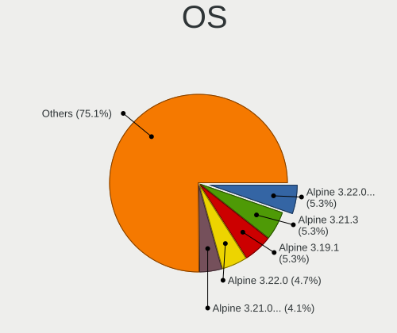

| Name                        | Notebooks | Percent |
|-----------------------------|-----------|---------|
| Alpine 3.22.0_alpha20250108 | 9         | 5.33%   |
| Alpine 3.21.3               | 9         | 5.33%   |
| Alpine 3.19.1               | 9         | 5.33%   |
| Alpine 3.22.0               | 8         | 4.73%   |
| Alpine 3.21.0_alpha20240606 | 7         | 4.14%   |
| Alpine 3.20.3               | 7         | 4.14%   |
| Alpine 3.16.0               | 6         | 3.55%   |
| Alpine 3.15.0               | 6         | 3.55%   |
| Alpine 3.19.0               | 5         | 2.96%   |
| Alpine 3.23.0_alpha20250612 | 4         | 2.37%   |
| Alpine 3.22.2               | 4         | 2.37%   |
| Alpine 3.20.0               | 4         | 2.37%   |
| Alpine 3.18.3               | 4         | 2.37%   |
| Alpine 3.15.0_alpha20210804 | 4         | 2.37%   |
| Alpine 3.14.0               | 4         | 2.37%   |
| Alpine 3.12.0               | 4         | 2.37%   |
| Alpine 3.22.1               | 3         | 1.78%   |
| Alpine 3.21.2               | 3         | 1.78%   |
| Alpine 3.21.0_alpha20240923 | 3         | 1.78%   |
| Alpine 3.20.0_alpha20231219 | 3         | 1.78%   |
| Alpine 3.18.0               | 3         | 1.78%   |
| Alpine 3.17.2               | 3         | 1.78%   |
| Alpine 3.17.0               | 3         | 1.78%   |
| Alpine 3.15.4               | 3         | 1.78%   |
| Alpine 3.23.0_alpha20251016 | 2         | 1.18%   |
| Alpine 3.23.0               | 2         | 1.18%   |
| Alpine 3.21.0               | 2         | 1.18%   |
| Alpine 3.20.2               | 2         | 1.18%   |
| Alpine 3.20.0_alpha20240329 | 2         | 1.18%   |
| Alpine 3.19_alpha20230901   | 2         | 1.18%   |
| Alpine 3.19.8               | 2         | 1.18%   |
| Alpine 3.18_alpha20230329   | 2         | 1.18%   |
| Alpine 3.18.4               | 2         | 1.18%   |
| Alpine 3.17.1               | 2         | 1.18%   |
| Alpine 3.16.2               | 2         | 1.18%   |
| Alpine 3.14.2               | 2         | 1.18%   |
| Alpine 3.13.5               | 2         | 1.18%   |
| Alpine 3.13.0_alpha20201218 | 2         | 1.18%   |
| Alpine 3.13.0_alpha20200917 | 2         | 1.18%   |
| Alpine 3.11.2               | 2         | 1.18%   |

OS Family
---------

OS without a version

| Name   | Notebooks | Percent |
|--------|-----------|---------|
| Alpine | 155       | 100%    |

Kernel
------

Version of the Linux kernel

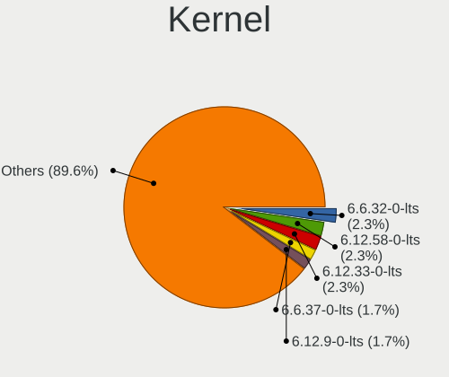

| Version       | Notebooks | Percent |
|---------------|-----------|---------|
| 6.6.32-0-lts  | 4         | 2.31%   |
| 6.12.58-0-lts | 4         | 2.31%   |
| 6.12.33-0-lts | 4         | 2.31%   |
| 6.6.37-0-lts  | 3         | 1.73%   |
| 6.12.9-0-lts  | 3         | 1.73%   |
| 6.12.34-0-lts | 3         | 1.73%   |
| 6.12.17-2-lts | 3         | 1.73%   |
| 6.12.13-0-lts | 3         | 1.73%   |
| 6.6.61-0-lts  | 2         | 1.16%   |
| 6.6.45-0-lts  | 2         | 1.16%   |
| 6.6.35-0-lts  | 2         | 1.16%   |
| 6.6.22-0-lts  | 2         | 1.16%   |
| 6.6.17-0-lts  | 2         | 1.16%   |
| 6.6.16-0-lts  | 2         | 1.16%   |
| 6.12.31-0-lts | 2         | 1.16%   |
| 6.12.18-0-lts | 2         | 1.16%   |
| 6.1.62-0-lts  | 2         | 1.16%   |
| 5.4.83-0-lts  | 2         | 1.16%   |
| 5.4.43-1-lts  | 2         | 1.16%   |
| 5.15.86-0-lts | 2         | 1.16%   |
| 5.15.59-0-lts | 2         | 1.16%   |
| 5.15.47-0-lts | 2         | 1.16%   |
| 5.15.41-0-lts | 2         | 1.16%   |
| 5.15.4-0-lts  | 2         | 1.16%   |
| 6.6.9-0-lts   | 1         | 0.58%   |
| 6.6.73-haos   | 1         | 0.58%   |
| 6.6.7-0-lts   | 1         | 0.58%   |
| 6.6.60-0-lts  | 1         | 0.58%   |
| 6.6.58-1-lts  | 1         | 0.58%   |
| 6.6.58-0-lts  | 1         | 0.58%   |
| 6.6.56-0-lts  | 1         | 0.58%   |
| 6.6.53-0-lts  | 1         | 0.58%   |
| 6.6.49-0-lts  | 1         | 0.58%   |
| 6.6.44-0-lts  | 1         | 0.58%   |
| 6.6.42-1-lts  | 1         | 0.58%   |
| 6.6.4-0-lts   | 1         | 0.58%   |
| 6.6.36-0-lts  | 1         | 0.58%   |
| 6.6.33-haos   | 1         | 0.58%   |
| 6.6.33-0-lts  | 1         | 0.58%   |
| 6.6.30-0-lts  | 1         | 0.58%   |

Kernel Family
-------------

Linux kernel without a distro release

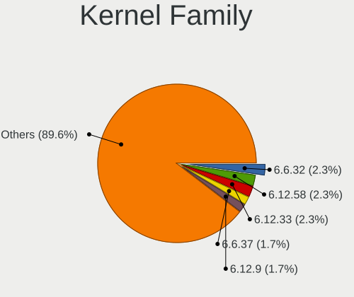

| Version | Notebooks | Percent |
|---------|-----------|---------|
| 6.6.32  | 4         | 2.31%   |
| 6.12.58 | 4         | 2.31%   |
| 6.12.33 | 4         | 2.31%   |
| 6.6.37  | 3         | 1.73%   |
| 6.12.9  | 3         | 1.73%   |
| 6.12.34 | 3         | 1.73%   |
| 6.12.17 | 3         | 1.73%   |
| 6.12.13 | 3         | 1.73%   |
| 6.6.61  | 2         | 1.16%   |
| 6.6.58  | 2         | 1.16%   |
| 6.6.45  | 2         | 1.16%   |
| 6.6.35  | 2         | 1.16%   |
| 6.6.33  | 2         | 1.16%   |
| 6.6.22  | 2         | 1.16%   |
| 6.6.17  | 2         | 1.16%   |
| 6.6.16  | 2         | 1.16%   |
| 6.12.31 | 2         | 1.16%   |
| 6.12.21 | 2         | 1.16%   |
| 6.12.18 | 2         | 1.16%   |
| 6.1.62  | 2         | 1.16%   |
| 5.4.83  | 2         | 1.16%   |
| 5.4.43  | 2         | 1.16%   |
| 5.15.86 | 2         | 1.16%   |
| 5.15.59 | 2         | 1.16%   |
| 5.15.47 | 2         | 1.16%   |
| 5.15.41 | 2         | 1.16%   |
| 5.15.4  | 2         | 1.16%   |
| 6.6.9   | 1         | 0.58%   |
| 6.6.73  | 1         | 0.58%   |
| 6.6.7   | 1         | 0.58%   |
| 6.6.60  | 1         | 0.58%   |
| 6.6.56  | 1         | 0.58%   |
| 6.6.53  | 1         | 0.58%   |
| 6.6.49  | 1         | 0.58%   |
| 6.6.44  | 1         | 0.58%   |
| 6.6.42  | 1         | 0.58%   |
| 6.6.4   | 1         | 0.58%   |
| 6.6.36  | 1         | 0.58%   |
| 6.6.30  | 1         | 0.58%   |
| 6.6.28  | 1         | 0.58%   |

Kernel Major Ver.
-----------------

Linux kernel major version

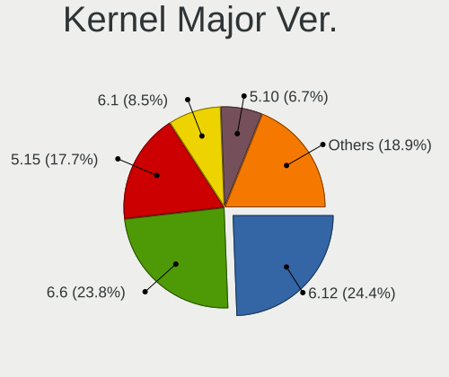

| Version | Notebooks | Percent |
|---------|-----------|---------|
| 6.12    | 40        | 24.39%  |
| 6.6     | 39        | 23.78%  |
| 5.15    | 29        | 17.68%  |
| 6.1     | 14        | 8.54%   |
| 5.10    | 11        | 6.71%   |
| 5.4     | 9         | 5.49%   |
| 6.18    | 2         | 1.22%   |
| 6.16    | 2         | 1.22%   |
| 6.13    | 2         | 1.22%   |
| 6.11    | 2         | 1.22%   |
| 5.17    | 2         | 1.22%   |
| 6.4     | 1         | 0.61%   |
| 6.15    | 1         | 0.61%   |
| 6.14    | 1         | 0.61%   |
| 5.8     | 1         | 0.61%   |
| 5.6     | 1         | 0.61%   |
| 5.16    | 1         | 0.61%   |
| 5.14    | 1         | 0.61%   |
| 5.13    | 1         | 0.61%   |
| 5.12    | 1         | 0.61%   |
| 4.4     | 1         | 0.61%   |
| 3.18    | 1         | 0.61%   |
| 3.10    | 1         | 0.61%   |

Arch
----

OS architecture (x86_64, i586, etc.)

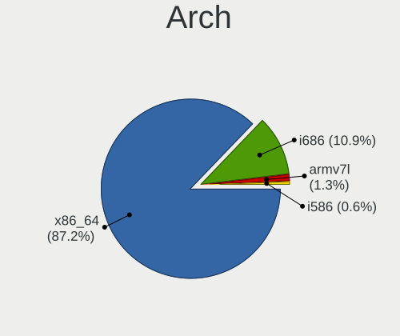

| Name   | Notebooks | Percent |
|--------|-----------|---------|
| x86_64 | 136       | 87.18%  |
| i686   | 17        | 10.9%   |
| armv7l | 2         | 1.28%   |
| i586   | 1         | 0.64%   |

DE
--

Desktop Environment

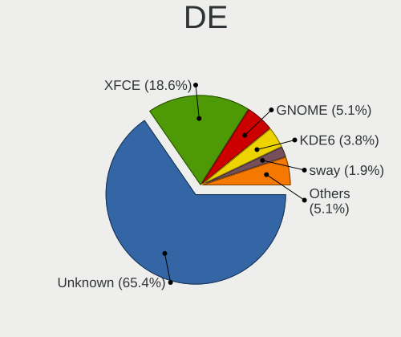

| Name          | Notebooks | Percent |
|---------------|-----------|---------|
| Unknown       | 102       | 65.38%  |
| XFCE          | 29        | 18.59%  |
| GNOME         | 8         | 5.13%   |
| KDE6          | 6         | 3.85%   |
| sway          | 3         | 1.92%   |
| KDE5          | 3         | 1.92%   |
| MATE          | 2         | 1.28%   |
| LXQt          | 2         | 1.28%   |
| GNOME Classic | 1         | 0.64%   |

Display Server
--------------

X11 or Wayland

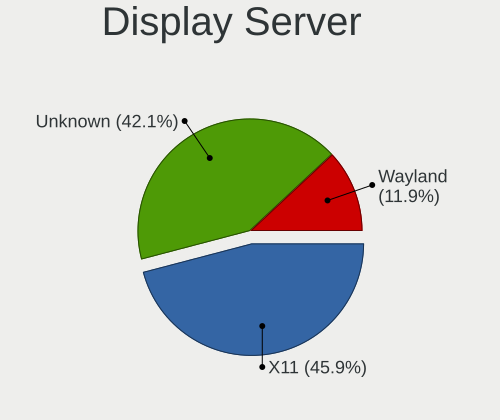

| Name    | Notebooks | Percent |
|---------|-----------|---------|
| X11     | 73        | 45.91%  |
| Unknown | 67        | 42.14%  |
| Wayland | 19        | 11.95%  |

Display Manager
---------------

SDDM, LightDM, etc.

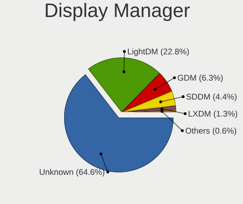

| Name    | Notebooks | Percent |
|---------|-----------|---------|
| Unknown | 102       | 64.56%  |
| LightDM | 36        | 22.78%  |
| GDM     | 10        | 6.33%   |
| SDDM    | 7         | 4.43%   |
| LXDM    | 2         | 1.27%   |
| XDM     | 1         | 0.63%   |

OS Lang
-------

Language

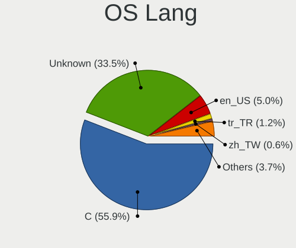

| Lang    | Notebooks | Percent |
|---------|-----------|---------|
| C       | 90        | 55.9%   |
| Unknown | 54        | 33.54%  |
| en_US   | 8         | 4.97%   |
| tr_TR   | 2         | 1.24%   |
| zh_TW   | 1         | 0.62%   |
| uk_UA   | 1         | 0.62%   |
| ru_RU   | 1         | 0.62%   |
| pt_BR   | 1         | 0.62%   |
| nb_NO   | 1         | 0.62%   |
| es_NI   | 1         | 0.62%   |
| en_GB   | 1         | 0.62%   |

Boot Mode
---------

EFI or BIOS

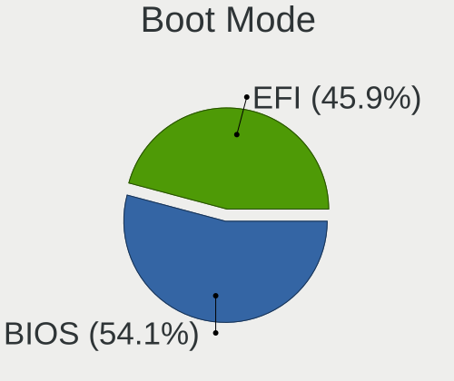

| Mode | Notebooks | Percent |
|------|-----------|---------|
| BIOS | 85        | 54.14%  |
| EFI  | 72        | 45.86%  |

Filesystem
----------

Type of filesystem

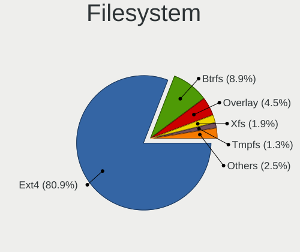

| Type    | Notebooks | Percent |
|---------|-----------|---------|
| Ext4    | 127       | 80.89%  |
| Btrfs   | 14        | 8.92%   |
| Overlay | 7         | 4.46%   |
| Xfs     | 3         | 1.91%   |
| Tmpfs   | 2         | 1.27%   |
| Unknown | 2         | 1.27%   |
| F2fs    | 1         | 0.64%   |
| Ext2    | 1         | 0.64%   |

Part. scheme
------------

Scheme of partitioning

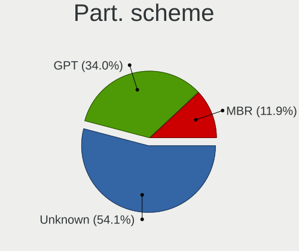

| Type    | Notebooks | Percent |
|---------|-----------|---------|
| Unknown | 86        | 54.09%  |
| GPT     | 54        | 33.96%  |
| MBR     | 19        | 11.95%  |

Dual Boot with Linux/BSD
------------------------

Hosting more than one Linux/BSD

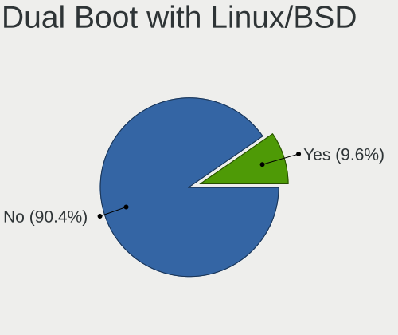

| Dual boot | Notebooks | Percent |
|-----------|-----------|---------|
| No        | 141       | 90.38%  |
| Yes       | 15        | 9.62%   |

Dual Boot (Win)
---------------

Hosting Linux and Windows

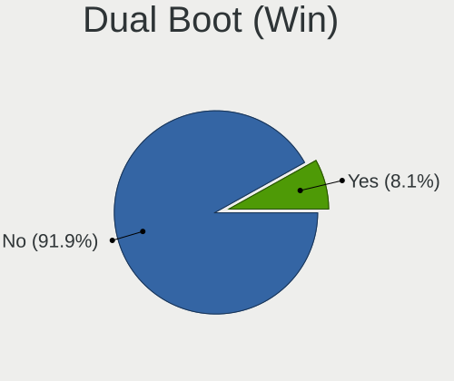

| Dual boot | Notebooks | Percent |
|-----------|-----------|---------|
| No        | 146       | 93.59%  |
| Yes       | 10        | 6.41%   |

Board
-----

Vendor
------

Motherboard manufacturer

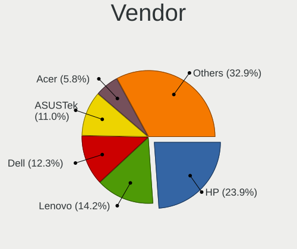

| Name                | Notebooks | Percent |
|---------------------|-----------|---------|
| Hewlett-Packard     | 37        | 23.87%  |
| Lenovo              | 22        | 14.19%  |
| Dell                | 19        | 12.26%  |
| ASUSTek Computer    | 17        | 10.97%  |
| Acer                | 9         | 5.81%   |
| Google              | 8         | 5.16%   |
| Toshiba             | 6         | 3.87%   |
| Apple               | 6         | 3.87%   |
| Sony                | 3         | 1.94%   |
| IBM                 | 3         | 1.94%   |
| Fujitsu             | 3         | 1.94%   |
| Notebook            | 2         | 1.29%   |
| LG Electronics      | 2         | 1.29%   |
| Gateway             | 2         | 1.29%   |
| Unknown             | 2         | 1.29%   |
| Wortmann AG         | 1         | 0.65%   |
| Synology            | 1         | 0.65%   |
| SLIMBOOK            | 1         | 0.65%   |
| Samsung Electronics | 1         | 0.65%   |
| Pegatron            | 1         | 0.65%   |
| Olivetti            | 1         | 0.65%   |
| MSI                 | 1         | 0.65%   |
| Kiano               | 1         | 0.65%   |
| Intel               | 1         | 0.65%   |
| HONOR               | 1         | 0.65%   |
| Haier               | 1         | 0.65%   |
| GEO                 | 1         | 0.65%   |
| Framework           | 1         | 0.65%   |
| Clevo               | 1         | 0.65%   |

Model
-----

Motherboard model

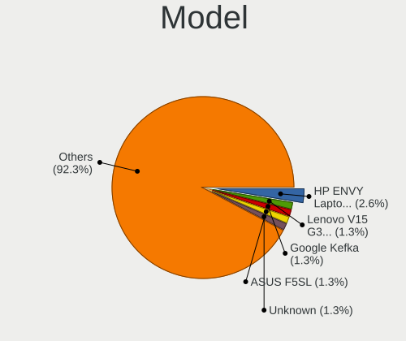

| Name                                     | Notebooks | Percent |
|------------------------------------------|-----------|---------|
| HP ENVY Laptop 13-ad1xx                  | 4         | 2.58%   |
| Lenovo V15 G3 IAP 82TT                   | 2         | 1.29%   |
| Google Kefka                             | 2         | 1.29%   |
| ASUS F5SL                                | 2         | 1.29%   |
| Unknown                                  | 2         | 1.29%   |
| Wortmann AG M660SE                       | 1         | 0.65%   |
| Toshiba WT8-A                            | 1         | 0.65%   |
| Toshiba Satellite Pro L50-A              | 1         | 0.65%   |
| Toshiba Satellite Pro C660               | 1         | 0.65%   |
| Toshiba Satellite M645                   | 1         | 0.65%   |
| Toshiba Satellite M50Dt-A                | 1         | 0.65%   |
| Toshiba PORTEGE Z30-A                    | 1         | 0.65%   |
| Synology DS1019+                         | 1         | 0.65%   |
| Sony VPCZ13V9E                           | 1         | 0.65%   |
| Sony VPCEC3A4E                           | 1         | 0.65%   |
| Sony VGN-UX27GN                          | 1         | 0.65%   |
| SLIMBOOK EXECUTIVE-14                    | 1         | 0.65%   |
| Samsung 100NZC                           | 1         | 0.65%   |
| Pegatron Deepcam                         | 1         | 0.65%   |
| Olivetti Spring Peak                     | 1         | 0.65%   |
| Notebook NV4XMB,ME,MZ                    | 1         | 0.65%   |
| Notebook NS50MU                          | 1         | 0.65%   |
| MSI GL72M 7REX                           | 1         | 0.65%   |
| LG LW25-B7HG                             | 1         | 0.65%   |
| LG 16Z90Q-K.AA78A1                       | 1         | 0.65%   |
| Lenovo Z50-70 20354                      | 1         | 0.65%   |
| Lenovo Yoga 14sARH 2021 82LB             | 1         | 0.65%   |
| Lenovo Y70-70 Touch 80DU                 | 1         | 0.65%   |
| Lenovo V14-ADA 82C6                      | 1         | 0.65%   |
| Lenovo ThinkPad Z13 Gen 1 21D2CTO1WW     | 1         | 0.65%   |
| Lenovo ThinkPad X61 76754KU              | 1         | 0.65%   |
| Lenovo ThinkPad X131e 33711Q7            | 1         | 0.65%   |
| Lenovo ThinkPad X1 Carbon 6th 20KGS17D00 | 1         | 0.65%   |
| Lenovo ThinkPad W700 2752RZ2             | 1         | 0.65%   |
| Lenovo ThinkPad T480 20L6S0WY00          | 1         | 0.65%   |
| Lenovo ThinkPad T420 42364F2             | 1         | 0.65%   |
| Lenovo ThinkPad T400 27658JG             | 1         | 0.65%   |
| Lenovo ThinkPad E590 20NB0012RT          | 1         | 0.65%   |
| Lenovo ThinkPad E485 20KUCTO1WW          | 1         | 0.65%   |
| Lenovo ThinkPad 11e 20ED001HUS           | 1         | 0.65%   |

Model Family
------------

Motherboard model prefix

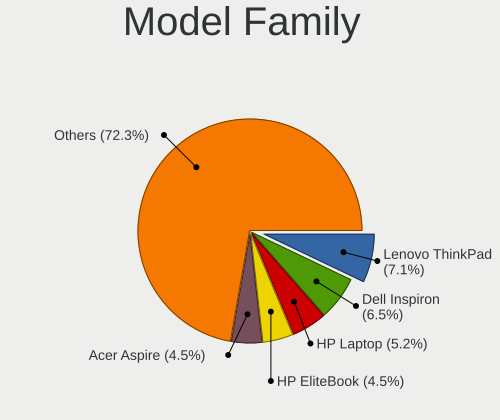

| Name                  | Notebooks | Percent |
|-----------------------|-----------|---------|
| Lenovo ThinkPad       | 11        | 7.1%    |
| Dell Inspiron         | 10        | 6.45%   |
| HP Laptop             | 8         | 5.16%   |
| HP EliteBook          | 7         | 4.52%   |
| Acer Aspire           | 7         | 4.52%   |
| HP Pavilion           | 6         | 3.87%   |
| HP ENVY               | 5         | 3.23%   |
| ASUS VivoBook         | 5         | 3.23%   |
| Toshiba Satellite     | 4         | 2.58%   |
| Dell Latitude         | 4         | 2.58%   |
| Lenovo IdeaPad        | 3         | 1.94%   |
| Lenovo V15            | 2         | 1.29%   |
| HP Stream             | 2         | 1.29%   |
| HP ProBook            | 2         | 1.29%   |
| HP Presario           | 2         | 1.29%   |
| HP Mini               | 2         | 1.29%   |
| Google Kefka          | 2         | 1.29%   |
| Fujitsu LIFEBOOK      | 2         | 1.29%   |
| Dell XPS              | 2         | 1.29%   |
| ASUS F5SL             | 2         | 1.29%   |
| Acer Nitro            | 2         | 1.29%   |
| Unknown               | 2         | 1.29%   |
| Wortmann AG M660SE    | 1         | 0.65%   |
| Toshiba WT8-A         | 1         | 0.65%   |
| Toshiba PORTEGE       | 1         | 0.65%   |
| Synology DS1019+      | 1         | 0.65%   |
| Sony VPCZ13V9E        | 1         | 0.65%   |
| Sony VPCEC3A4E        | 1         | 0.65%   |
| Sony VGN-UX27GN       | 1         | 0.65%   |
| SLIMBOOK EXECUTIVE-14 | 1         | 0.65%   |
| Samsung 100NZC        | 1         | 0.65%   |
| Pegatron Deepcam      | 1         | 0.65%   |
| Olivetti Spring       | 1         | 0.65%   |
| Notebook NV4XMB       | 1         | 0.65%   |
| Notebook NS50MU       | 1         | 0.65%   |
| MSI GL72M             | 1         | 0.65%   |
| LG LW25-B7HG          | 1         | 0.65%   |
| LG 16Z90Q-K.AA78A1    | 1         | 0.65%   |
| Lenovo Z50-70         | 1         | 0.65%   |
| Lenovo Yoga           | 1         | 0.65%   |

MFG Year
--------

Motherboard manufacture year

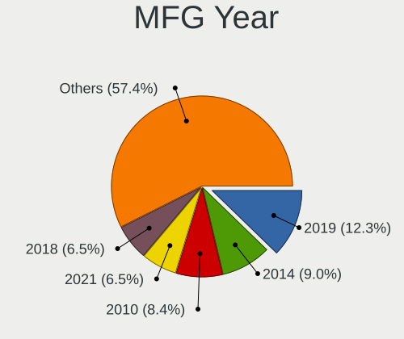

| Year    | Notebooks | Percent |
|---------|-----------|---------|
| 2019    | 19        | 12.26%  |
| 2014    | 14        | 9.03%   |
| 2010    | 13        | 8.39%   |
| 2021    | 10        | 6.45%   |
| 2018    | 10        | 6.45%   |
| 2017    | 10        | 6.45%   |
| 2011    | 8         | 5.16%   |
| 2020    | 7         | 4.52%   |
| 2016    | 6         | 3.87%   |
| 2013    | 6         | 3.87%   |
| 2012    | 6         | 3.87%   |
| 2008    | 6         | 3.87%   |
| 2006    | 6         | 3.87%   |
| 2022    | 5         | 3.23%   |
| 2009    | 5         | 3.23%   |
| 2007    | 5         | 3.23%   |
| 2015    | 4         | 2.58%   |
| 2025    | 3         | 1.94%   |
| 2024    | 3         | 1.94%   |
| 2005    | 3         | 1.94%   |
| Unknown | 3         | 1.94%   |
| 2023    | 2         | 1.29%   |
| 1999    | 1         | 0.65%   |

Form Factor
-----------

Physical design of the computer

| Name     | Notebooks | Percent |
|----------|-----------|---------|
| Notebook | 155       | 100%    |

Secure Boot
-----------

Enabled or disabled

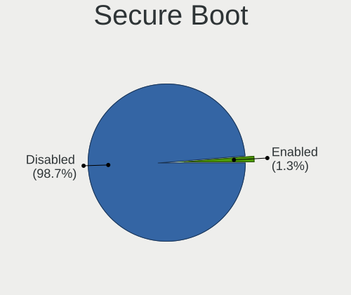

| State    | Notebooks | Percent |
|----------|-----------|---------|
| Disabled | 153       | 98.71%  |
| Enabled  | 2         | 1.29%   |

Coreboot
--------

Have coreboot on board

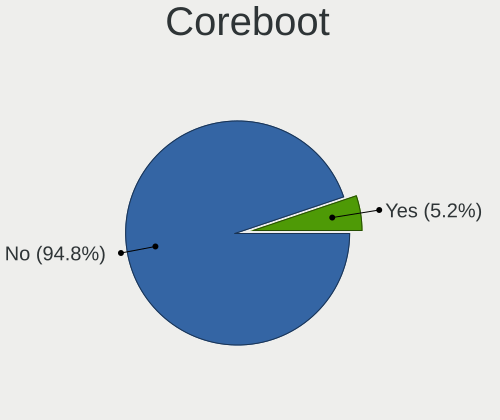

| Used | Notebooks | Percent |
|------|-----------|---------|
| No   | 147       | 94.84%  |
| Yes  | 8         | 5.16%   |

RAM Size
--------

Total RAM memory

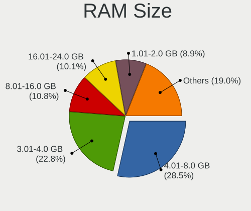

| Size in GB  | Notebooks | Percent |
|-------------|-----------|---------|
| 4.01-8.0    | 45        | 28.48%  |
| 3.01-4.0    | 36        | 22.78%  |
| 8.01-16.0   | 17        | 10.76%  |
| 16.01-24.0  | 16        | 10.13%  |
| 1.01-2.0    | 14        | 8.86%   |
| 0.51-1.0    | 12        | 7.59%   |
| 32.01-64.0  | 9         | 5.7%    |
| 2.01-3.0    | 5         | 3.16%   |
| 0.01-0.5    | 2         | 1.27%   |
| 24.01-32.0  | 1         | 0.63%   |
| 64.01-256.0 | 1         | 0.63%   |

RAM Used
--------

Used RAM memory

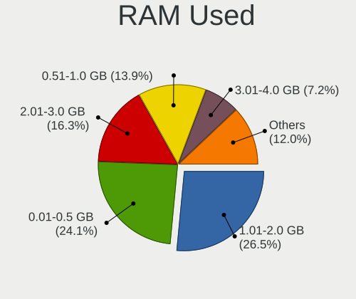

| Used GB   | Notebooks | Percent |
|-----------|-----------|---------|
| 1.01-2.0  | 44        | 26.51%  |
| 0.01-0.5  | 40        | 24.1%   |
| 2.01-3.0  | 27        | 16.27%  |
| 0.51-1.0  | 23        | 13.86%  |
| 3.01-4.0  | 12        | 7.23%   |
| 4.01-8.0  | 11        | 6.63%   |
| 8.01-16.0 | 6         | 3.61%   |
| 0         | 2         | 1.2%    |
| Unknown   | 1         | 0.6%    |

Total Drives
------------

Number of drives on board

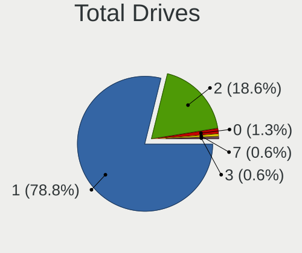

| Drives | Notebooks | Percent |
|--------|-----------|---------|
| 1      | 123       | 78.85%  |
| 2      | 29        | 18.59%  |
| 0      | 2         | 1.28%   |
| 7      | 1         | 0.64%   |
| 3      | 1         | 0.64%   |

Has CD-ROM
----------

Has CD-ROM on board

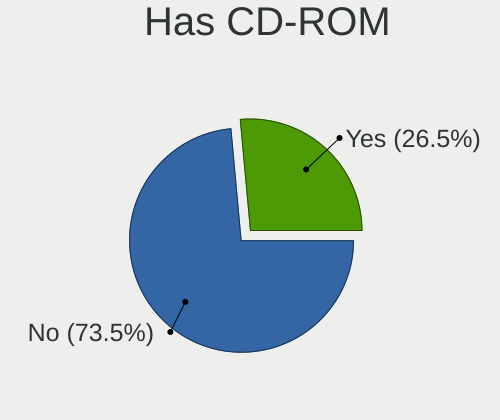

| Presented | Notebooks | Percent |
|-----------|-----------|---------|
| No        | 114       | 73.55%  |
| Yes       | 41        | 26.45%  |

Has Ethernet
------------

Has Ethernet on board

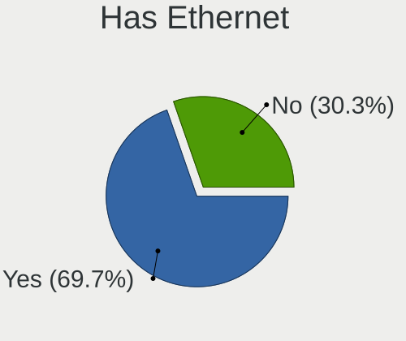

| Presented | Notebooks | Percent |
|-----------|-----------|---------|
| Yes       | 108       | 69.68%  |
| No        | 47        | 30.32%  |

Has WiFi
--------

Has WiFi module

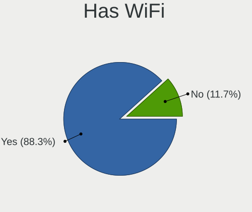

| Presented | Notebooks | Percent |
|-----------|-----------|---------|
| Yes       | 143       | 91.67%  |
| No        | 13        | 8.33%   |

Has Bluetooth
-------------

Has Bluetooth module

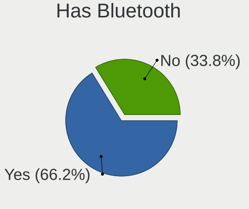

| Presented | Notebooks | Percent |
|-----------|-----------|---------|
| Yes       | 104       | 66.24%  |
| No        | 53        | 33.76%  |

Location
--------

Country
-------

Geographic location (country)

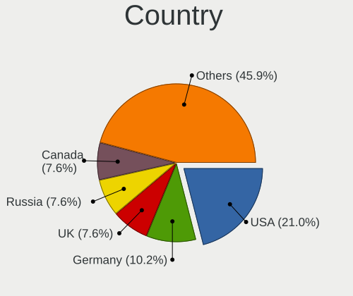

| Country      | Notebooks | Percent |
|--------------|-----------|---------|
| USA          | 33        | 21.02%  |
| Germany      | 16        | 10.19%  |
| UK           | 12        | 7.64%   |
| Russia       | 12        | 7.64%   |
| Canada       | 12        | 7.64%   |
| Brazil       | 9         | 5.73%   |
| Turkey       | 7         | 4.46%   |
| Italy        | 6         | 3.82%   |
| France       | 4         | 2.55%   |
| Slovakia     | 3         | 1.91%   |
| Poland       | 3         | 1.91%   |
| Australia    | 3         | 1.91%   |
| Spain        | 2         | 1.27%   |
| Portugal     | 2         | 1.27%   |
| Netherlands  | 2         | 1.27%   |
| Indonesia    | 2         | 1.27%   |
| Hungary      | 2         | 1.27%   |
| Venezuela    | 1         | 0.64%   |
| Ukraine      | 1         | 0.64%   |
| UAE          | 1         | 0.64%   |
| Switzerland  | 1         | 0.64%   |
| South Africa | 1         | 0.64%   |
| Singapore    | 1         | 0.64%   |
| Romania      | 1         | 0.64%   |
| Puerto Rico  | 1         | 0.64%   |
| Philippines  | 1         | 0.64%   |
| Norway       | 1         | 0.64%   |
| Nicaragua    | 1         | 0.64%   |
| Mexico       | 1         | 0.64%   |
| Lithuania    | 1         | 0.64%   |
| Kenya        | 1         | 0.64%   |
| Jamaica      | 1         | 0.64%   |
| Israel       | 1         | 0.64%   |
| Iran         | 1         | 0.64%   |
| Guatemala    | 1         | 0.64%   |
| Finland      | 1         | 0.64%   |
| Egypt        | 1         | 0.64%   |
| Denmark      | 1         | 0.64%   |
| Czechia      | 1         | 0.64%   |
| Cyprus       | 1         | 0.64%   |

City
----

Geographic location (city)

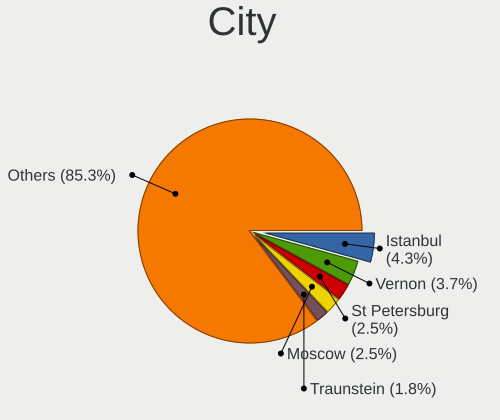

| City             | Notebooks | Percent |
|------------------|-----------|---------|
| Istanbul         | 7         | 4.29%   |
| Vernon           | 6         | 3.68%   |
| St Petersburg    | 4         | 2.45%   |
| Moscow           | 4         | 2.45%   |
| Traunstein       | 3         | 1.84%   |
| Springfield      | 3         | 1.84%   |
| Berlin           | 3         | 1.84%   |
| Waukesha         | 2         | 1.23%   |
| Ufa              | 2         | 1.23%   |
| Stratford        | 2         | 1.23%   |
| Sao Paulo        | 2         | 1.23%   |
| Rio de Janeiro   | 2         | 1.23%   |
| Newham           | 2         | 1.23%   |
| Fulham           | 2         | 1.23%   |
| Bratislava       | 2         | 1.23%   |
| Beverly Hills    | 2         | 1.23%   |
| Bengkulu         | 2         | 1.23%   |
| Zurich           | 1         | 0.61%   |
| Zhangzhou        | 1         | 0.61%   |
| Wimborne Minster | 1         | 0.61%   |
| Warsaw           | 1         | 0.61%   |
| Vragender        | 1         | 0.61%   |
| Vitebsk          | 1         | 0.61%   |
| Vilnius          | 1         | 0.61%   |
| Vienna           | 1         | 0.61%   |
| Tymovskoye       | 1         | 0.61%   |
| Turin            | 1         | 0.61%   |
| Toulouse         | 1         | 0.61%   |
| Tehran           | 1         | 0.61%   |
| Tampa            | 1         | 0.61%   |
| Sydney           | 1         | 0.61%   |
| Stuttgart        | 1         | 0.61%   |
| Stewartstown     | 1         | 0.61%   |
| Stavanger        | 1         | 0.61%   |
| St. Paul         | 1         | 0.61%   |
| Southampton      | 1         | 0.61%   |
| Sisteron         | 1         | 0.61%   |
| Singapore        | 1         | 0.61%   |
| Semily           | 1         | 0.61%   |
| Seattle          | 1         | 0.61%   |

Drives
------

Drive Vendor
------------

Hard drive vendors

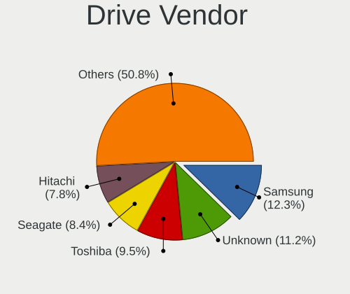

| Vendor                      | Notebooks | Drives | Percent |
|-----------------------------|-----------|--------|---------|
| Samsung Electronics         | 22        | 27     | 12.29%  |
| Unknown                     | 20        | 26     | 11.17%  |
| Toshiba                     | 17        | 19     | 9.5%    |
| Seagate                     | 15        | 25     | 8.38%   |
| Hitachi                     | 14        | 15     | 7.82%   |
| Sandisk                     | 10        | 13     | 5.59%   |
| WDC                         | 8         | 9      | 4.47%   |
| Kingston                    | 8         | 9      | 4.47%   |
| SK hynix                    | 7         | 7      | 3.91%   |
| Intel                       | 6         | 9      | 3.35%   |
| HGST                        | 6         | 6      | 3.35%   |
| Realtek Semiconductor       | 3         | 3      | 1.68%   |
| Micron Technology           | 3         | 3      | 1.68%   |
| Fujitsu                     | 3         | 3      | 1.68%   |
| Crucial                     | 3         | 3      | 1.68%   |
| A-DATA Technology           | 3         | 3      | 1.68%   |
| Yangtze Memory Technologies | 2         | 2      | 1.12%   |
| SPCC                        | 2         | 2      | 1.12%   |
| OCZ                         | 2         | 2      | 1.12%   |
| LITEON                      | 2         | 2      | 1.12%   |
| KIOXIA                      | 2         | 2      | 1.12%   |
| Apple                       | 2         | 3      | 1.12%   |
| V-GeN                       | 1         | 1      | 0.56%   |
| Transcend                   | 1         | 1      | 0.56%   |
| Team                        | 1         | 1      | 0.56%   |
| T-FORCE                     | 1         | 1      | 0.56%   |
| SINTECHI                    | 1         | 1      | 0.56%   |
| KingSpec                    | 1         | 1      | 0.56%   |
| KC600                       | 1         | 1      | 0.56%   |
| JMicron Technology          | 1         | 1      | 0.56%   |
| Intenso                     | 1         | 1      | 0.56%   |
| INNOVATION IT               | 1         | 1      | 0.56%   |
| IBM                         | 1         | 1      | 0.56%   |
| FORESEE                     | 1         | 1      | 0.56%   |
| Emtec                       | 1         | 1      | 0.56%   |
| Dell                        | 1         | 2      | 0.56%   |
| Corsair                     | 1         | 2      | 0.56%   |
| China                       | 1         | 1      | 0.56%   |
| Aura                        | 1         | 1      | 0.56%   |
| ASMT                        | 1         | 1      | 0.56%   |

Drive Model
-----------

Hard drive models

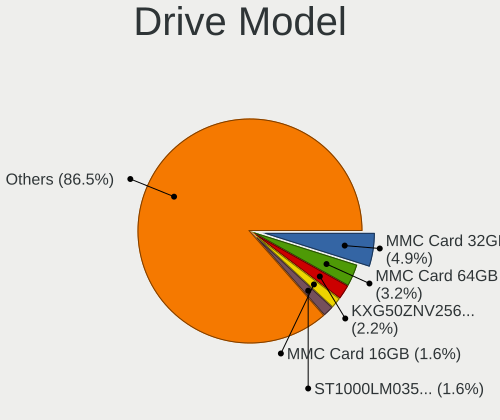

| Model                                                | Notebooks | Percent |
|------------------------------------------------------|-----------|---------|
| Unknown MMC Card  32GB                               | 9         | 4.86%   |
| Unknown MMC Card  64GB                               | 6         | 3.24%   |
| Toshiba KXG50ZNV256G 256GB                           | 4         | 2.16%   |
| Unknown MMC Card  16GB                               | 3         | 1.62%   |
| Seagate ST1000LM035-1RK172 1TB                       | 3         | 1.62%   |
| Unknown SD/MMC/MS PRO 2GB                            | 2         | 1.08%   |
| Toshiba XG6 NVMe SSD Controller 1024GB               | 2         | 1.08%   |
| Toshiba MQ01ABD100 1TB                               | 2         | 1.08%   |
| Toshiba MQ01ABD075 752GB                             | 2         | 1.08%   |
| SK hynix BC501 NVMe Solid State Drive 512GB          | 2         | 1.08%   |
| Seagate ST1000LM024 HN-M101MBB 1TB                   | 2         | 1.08%   |
| Samsung NVMe SSD Controller SM981/PM981/PM983 1TB    | 2         | 1.08%   |
| Samsung NVMe SSD Controller SM961/PM961/SM963 1024GB | 2         | 1.08%   |
| Samsung NVMe SSD Controller PM9A1/PM9A3/980PRO 1TB   | 2         | 1.08%   |
| Kingston SV300S37A120G 120GB SSD                     | 2         | 1.08%   |
| Kingston SA400S37480G 480GB SSD                      | 2         | 1.08%   |
| Hitachi HTS545050B9A300 500GB                        | 2         | 1.08%   |
| Crucial CT500MX500SSD1 500GB                         | 2         | 1.08%   |
| Yangtze Memory YMTC YMSS1ED02B21MC 128GB             | 1         | 0.54%   |
| Yangtze Memory NVMe SSD Drive 1024GB                 | 1         | 0.54%   |
| WDC WDS500G2B0A-00SM50 500GB                         | 1         | 0.54%   |
| WDC WDS240G2G0A-00JH30 240GB SSD                     | 1         | 0.54%   |
| WDC WD5000BEVT-22ZAT0 500GB                          | 1         | 0.54%   |
| WDC WD1600BEVT-60ZCT1 160GB                          | 1         | 0.54%   |
| WDC WD10SPZX-80Z10T2 1TB                             | 1         | 0.54%   |
| WDC WD10SPZX-60Z10T1 1TB                             | 1         | 0.54%   |
| WDC WD10JPVX-60J 1TB                                 | 1         | 0.54%   |
| WDC PC SN520 SDAPNUW-512G-1002 512GB                 | 1         | 0.54%   |
| V-GeN V-GEN09SM22AR1024SDK 1TB SSD                   | 1         | 0.54%   |
| Unknown SD32G  32GB                                  | 1         | 0.54%   |
| Unknown NVMe SSD Drive 1024GB                        | 1         | 0.54%   |
| Unknown MMC Card                                     | 1         | 0.54%   |
| Transcend TS32GSSD370S 32GB                          | 1         | 0.54%   |
| Toshiba THNSNJ128GMCU 128GB SSD                      | 1         | 0.54%   |
| Toshiba NVMe SSD Drive 256GB                         | 1         | 0.54%   |
| Toshiba MQ01ABD1 1TB                                 | 1         | 0.54%   |
| Toshiba MK6008GAH 64GB                               | 1         | 0.54%   |
| Toshiba MK6008GA 64GB                                | 1         | 0.54%   |
| Toshiba MK4009GAL 40GB                               | 1         | 0.54%   |
| Toshiba MK1637GSX 160GB                              | 1         | 0.54%   |

HDD Vendor
----------

Hard disk drive vendors

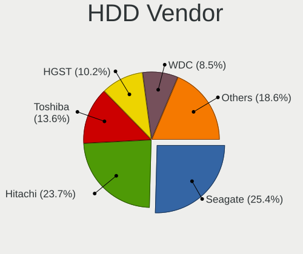

| Vendor              | Notebooks | Drives | Percent |
|---------------------|-----------|--------|---------|
| Seagate             | 15        | 25     | 25.42%  |
| Hitachi             | 14        | 15     | 23.73%  |
| Toshiba             | 8         | 9      | 13.56%  |
| HGST                | 6         | 6      | 10.17%  |
| WDC                 | 5         | 5      | 8.47%   |
| Fujitsu             | 3         | 3      | 5.08%   |
| Unknown             | 2         | 2      | 3.39%   |
| Samsung Electronics | 2         | 3      | 3.39%   |
| SINTECHI            | 1         | 1      | 1.69%   |
| JMicron Technology  | 1         | 1      | 1.69%   |
| IBM                 | 1         | 1      | 1.69%   |
| ASMT                | 1         | 1      | 1.69%   |

SSD Vendor
----------

Solid state drive vendors

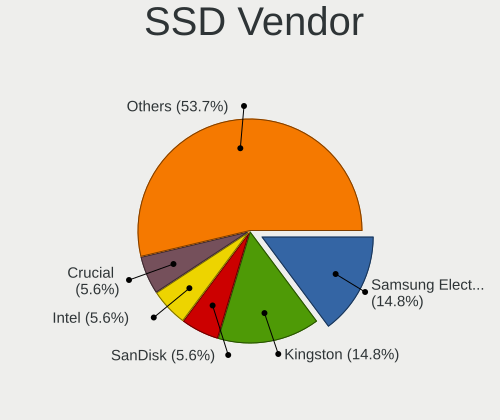

| Vendor              | Notebooks | Drives | Percent |
|---------------------|-----------|--------|---------|
| Samsung Electronics | 8         | 8      | 14.81%  |
| Kingston            | 8         | 9      | 14.81%  |
| SanDisk             | 3         | 3      | 5.56%   |
| Intel               | 3         | 4      | 5.56%   |
| Crucial             | 3         | 3      | 5.56%   |
| WDC                 | 2         | 2      | 3.7%    |
| SPCC                | 2         | 2      | 3.7%    |
| SK hynix            | 2         | 2      | 3.7%    |
| OCZ                 | 2         | 2      | 3.7%    |
| LITEON              | 2         | 2      | 3.7%    |
| A-DATA Technology   | 2         | 2      | 3.7%    |
| V-GeN               | 1         | 1      | 1.85%   |
| Transcend           | 1         | 1      | 1.85%   |
| Toshiba             | 1         | 1      | 1.85%   |
| Team                | 1         | 1      | 1.85%   |
| T-FORCE             | 1         | 1      | 1.85%   |
| Micron Technology   | 1         | 1      | 1.85%   |
| KingSpec            | 1         | 1      | 1.85%   |
| KC600               | 1         | 1      | 1.85%   |
| Intenso             | 1         | 1      | 1.85%   |
| INNOVATION IT       | 1         | 1      | 1.85%   |
| Emtec               | 1         | 1      | 1.85%   |
| Dell                | 1         | 2      | 1.85%   |
| Corsair             | 1         | 2      | 1.85%   |
| China               | 1         | 1      | 1.85%   |
| Aura                | 1         | 1      | 1.85%   |
| Apple               | 1         | 1      | 1.85%   |
| AMD                 | 1         | 1      | 1.85%   |

Drive Kind
----------

HDD or SSD

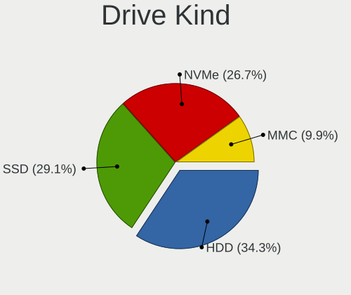

| Kind | Notebooks | Drives | Percent |
|------|-----------|--------|---------|
| HDD  | 59        | 72     | 34.3%   |
| SSD  | 50        | 58     | 29.07%  |
| NVMe | 46        | 62     | 26.74%  |
| MMC  | 17        | 22     | 9.88%   |

Drive Connector
---------------

SATA, SAS, NVMe, etc.

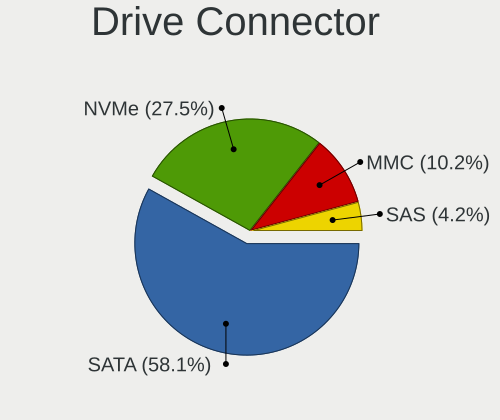

| Type | Notebooks | Drives | Percent |
|------|-----------|--------|---------|
| SATA | 97        | 122    | 58.08%  |
| NVMe | 46        | 62     | 27.54%  |
| MMC  | 17        | 22     | 10.18%  |
| SAS  | 7         | 8      | 4.19%   |

Drive Size
----------

Size of hard drive

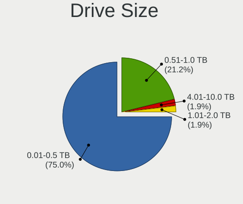

| Size in TB | Notebooks | Drives | Percent |
|------------|-----------|--------|---------|
| 0.01-0.5   | 78        | 94     | 75%     |
| 0.51-1.0   | 22        | 23     | 21.15%  |
| 1.01-2.0   | 2         | 2      | 1.92%   |
| 4.01-10.0  | 2         | 11     | 1.92%   |

Space Total
-----------

Amount of disk space available on the file system

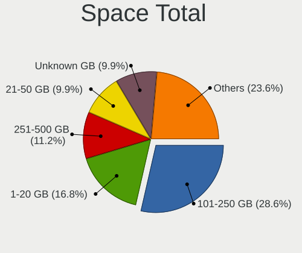

| Size in GB     | Notebooks | Percent |
|----------------|-----------|---------|
| 101-250        | 46        | 28.57%  |
| 1-20           | 27        | 16.77%  |
| 251-500        | 18        | 11.18%  |
| 21-50          | 16        | 9.94%   |
| Unknown        | 16        | 9.94%   |
| 501-1000       | 14        | 8.7%    |
| 51-100         | 11        | 6.83%   |
| More than 3000 | 7         | 4.35%   |
| 1001-2000      | 6         | 3.73%   |

Space Used
----------

Amount of used disk space

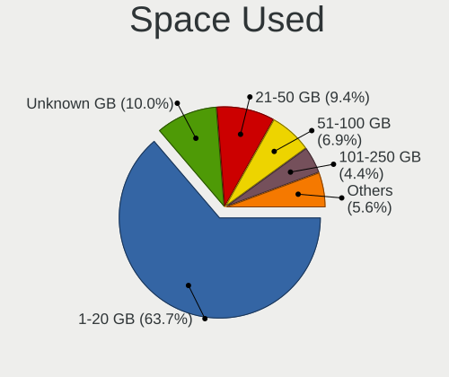

| Used GB   | Notebooks | Percent |
|-----------|-----------|---------|
| 1-20      | 102       | 63.75%  |
| Unknown   | 16        | 10%     |
| 21-50     | 15        | 9.38%   |
| 51-100    | 11        | 6.88%   |
| 101-250   | 7         | 4.38%   |
| 501-1000  | 5         | 3.13%   |
| 1001-2000 | 2         | 1.25%   |
| 251-500   | 1         | 0.63%   |
| 2001-3000 | 1         | 0.63%   |

Malfunc. Drives
---------------

Drive models with a malfunction

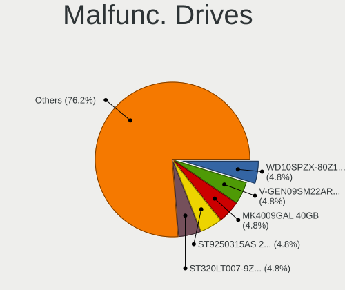

| Model                                          | Notebooks | Drives | Percent |
|------------------------------------------------|-----------|--------|---------|
| WDC WD10SPZX-80Z10T2 1TB                       | 1         | 1      | 4.76%   |
| V-GeN V-GEN09SM22AR1024SDK 1TB SSD             | 1         | 1      | 4.76%   |
| Toshiba MK4009GAL 40GB                         | 1         | 1      | 4.76%   |
| SK hynix HFS128G39TND-N210A 128GB SSD          | 1         | 1      | 4.76%   |
| SK hynix BC711 HFM512GD3JX013N 512GB           | 1         | 1      | 4.76%   |
| Seagate ST9250315AS 250GB                      | 1         | 1      | 4.76%   |
| Seagate ST320LT007-9ZV14 320GB                 | 1         | 2      | 4.76%   |
| Seagate ST2000LM015-2E81 2TB                   | 1         | 1      | 4.76%   |
| Samsung Electronics HM160HI 160GB              | 1         | 2      | 4.76%   |
| Micron Technology 1100_MTFDDAK256TBN 256GB SSD | 1         | 1      | 4.76%   |
| Hitachi HTS725025A9A364 250GB                  | 1         | 1      | 4.76%   |
| Hitachi HTS723232A7A364 320GB                  | 1         | 1      | 4.76%   |
| Hitachi HTS72101 99GB                          | 1         | 1      | 4.76%   |
| Hitachi HTS545032B9A300 320GB                  | 1         | 1      | 4.76%   |
| Hitachi HTS543225L9A300 250GB                  | 1         | 1      | 4.76%   |
| Hitachi HTS542516K9SA00 160GB                  | 1         | 2      | 4.76%   |
| Hitachi HTC426040G9AT00 40GB                   | 1         | 1      | 4.76%   |
| HGST HTS721010A9E630 1TB                       | 1         | 1      | 4.76%   |
| HGST HTS545050A7E380 500GB                     | 1         | 1      | 4.76%   |
| Fujitsu MHV2080AH 80GB                         | 1         | 1      | 4.76%   |
| Corsair Force LE SSD 120GB                     | 1         | 2      | 4.76%   |

Malfunc. Drive Vendor
---------------------

Vendors of faulty drives

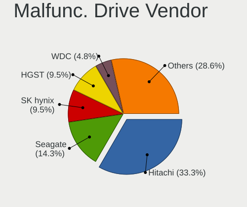

| Vendor              | Notebooks | Drives | Percent |
|---------------------|-----------|--------|---------|
| Hitachi             | 7         | 8      | 33.33%  |
| Seagate             | 3         | 4      | 14.29%  |
| SK hynix            | 2         | 2      | 9.52%   |
| HGST                | 2         | 2      | 9.52%   |
| WDC                 | 1         | 1      | 4.76%   |
| V-GeN               | 1         | 1      | 4.76%   |
| Toshiba             | 1         | 1      | 4.76%   |
| Samsung Electronics | 1         | 2      | 4.76%   |
| Micron Technology   | 1         | 1      | 4.76%   |
| Fujitsu             | 1         | 1      | 4.76%   |
| Corsair             | 1         | 2      | 4.76%   |

Malfunc. HDD Vendor
-------------------

Vendors of faulty HDD drives

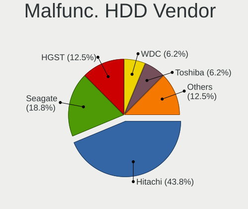

| Vendor              | Notebooks | Drives | Percent |
|---------------------|-----------|--------|---------|
| Hitachi             | 7         | 8      | 43.75%  |
| Seagate             | 3         | 4      | 18.75%  |
| HGST                | 2         | 2      | 12.5%   |
| WDC                 | 1         | 1      | 6.25%   |
| Toshiba             | 1         | 1      | 6.25%   |
| Samsung Electronics | 1         | 2      | 6.25%   |
| Fujitsu             | 1         | 1      | 6.25%   |

Malfunc. Drive Kind
-------------------

Kinds of faulty drives

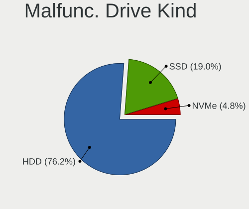

| Kind | Notebooks | Drives | Percent |
|------|-----------|--------|---------|
| HDD  | 16        | 19     | 76.19%  |
| SSD  | 4         | 5      | 19.05%  |
| NVMe | 1         | 1      | 4.76%   |

Failed Drives
-------------

Failed drive models

Zero info for selected period =(

Failed Drive Vendor
-------------------

Failed drive vendors

Zero info for selected period =(

Drive Status
------------

Number of failed and malfunc. drives

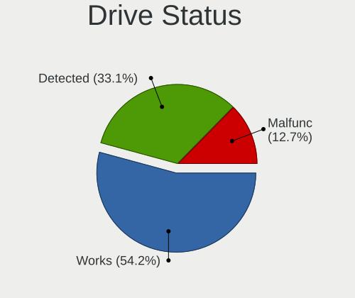

| Status   | Notebooks | Drives | Percent |
|----------|-----------|--------|---------|
| Works    | 90        | 123    | 54.22%  |
| Detected | 55        | 66     | 33.13%  |
| Malfunc  | 21        | 25     | 12.65%  |

Storage controller
------------------

Storage Vendor
--------------

Storage controller vendors

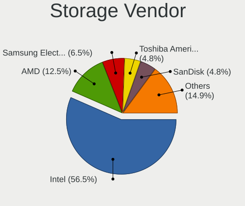

| Vendor                           | Notebooks | Percent |
|----------------------------------|-----------|---------|
| Intel                            | 95        | 56.55%  |
| AMD                              | 21        | 12.5%   |
| Samsung Electronics              | 11        | 6.55%   |
| Toshiba America Info Systems     | 8         | 4.76%   |
| SanDisk                          | 8         | 4.76%   |
| SK hynix                         | 5         | 2.98%   |
| Realtek Semiconductor            | 3         | 1.79%   |
| Nvidia                           | 3         | 1.79%   |
| Yangtze Memory Technologies      | 2         | 1.19%   |
| Silicon Integrated Systems [SiS] | 2         | 1.19%   |
| Micron Technology                | 2         | 1.19%   |
| KIOXIA                           | 2         | 1.19%   |
| ADATA Technology                 | 2         | 1.19%   |
| VIA Technologies                 | 1         | 0.6%    |
| Shenzhen Longsys Electronics     | 1         | 0.6%    |
| Marvell Technology Group         | 1         | 0.6%    |
| Apple                            | 1         | 0.6%    |

Storage Model
-------------

Storage controller models

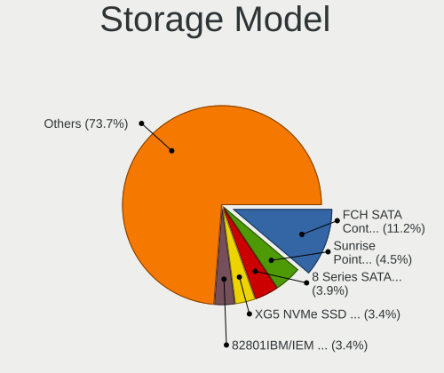

| Model                                                                          | Notebooks | Percent |
|--------------------------------------------------------------------------------|-----------|---------|
| AMD FCH SATA Controller [AHCI mode]                                            | 20        | 11.17%  |
| Intel Sunrise Point-LP SATA Controller [AHCI mode]                             | 8         | 4.47%   |
| Intel 8 Series SATA Controller 1 [AHCI mode]                                   | 7         | 3.91%   |
| Toshiba America Info Systems XG5 NVMe SSD Controller                           | 6         | 3.35%   |
| Intel 82801IBM/IEM (ICH9M/ICH9M-E) 4 port SATA Controller [AHCI mode]          | 6         | 3.35%   |
| Samsung NVMe SSD Controller SM981/PM981/PM983                                  | 5         | 2.79%   |
| Intel Celeron N3350/Pentium N4200/Atom E3900 Series SATA AHCI Controller       | 5         | 2.79%   |
| Intel Cannon Lake Mobile PCH SATA AHCI Controller                              | 5         | 2.79%   |
| Intel 6 Series/C200 Series Chipset Family 6 port Mobile SATA AHCI Controller   | 5         | 2.79%   |
| Intel 5 Series/3400 Series Chipset 4 port SATA AHCI Controller                 | 5         | 2.79%   |
| Intel Wildcat Point-LP SATA Controller [AHCI Mode]                             | 4         | 2.23%   |
| Intel Volume Management Device NVMe RAID Controller                            | 4         | 2.23%   |
| Intel NM10/ICH7 Family SATA Controller [AHCI mode]                             | 4         | 2.23%   |
| Intel 82801GBM/GHM (ICH7-M Family) SATA Controller [IDE mode]                  | 4         | 2.23%   |
| Intel 82801 Mobile SATA Controller [RAID mode]                                 | 4         | 2.23%   |
| SK hynix BC501 NVMe Solid State Drive                                          | 3         | 1.68%   |
| Intel Tiger Lake-LP SATA Controller                                            | 3         | 1.68%   |
| Intel Atom Processor E3800 Series SATA AHCI Controller                         | 3         | 1.68%   |
| Intel 82801HM/HEM (ICH8M/ICH8M-E) SATA Controller [AHCI mode]                  | 3         | 1.68%   |
| Intel 82801HM/HEM (ICH8M/ICH8M-E) IDE Controller                               | 3         | 1.68%   |
| Intel 82801G (ICH7 Family) IDE Controller                                      | 3         | 1.68%   |
| Intel 82801FB/FBM/FR/FW/FRW (ICH6 Family) IDE Controller                       | 3         | 1.68%   |
| Intel 7 Series Chipset Family 6-port SATA Controller [AHCI mode]               | 3         | 1.68%   |
| Intel 5 Series/3400 Series Chipset 6 port SATA AHCI Controller                 | 3         | 1.68%   |
| Toshiba America Info Systems XG6 NVMe SSD Controller                           | 2         | 1.12%   |
| Silicon Integrated Systems [SiS] SATA Controller / IDE mode                    | 2         | 1.12%   |
| Silicon Integrated Systems [SiS] 5513 IDE Controller                           | 2         | 1.12%   |
| Samsung NVMe SSD Controller SM961/PM961/SM963                                  | 2         | 1.12%   |
| Samsung NVMe SSD Controller PM9A1/PM9A3/980PRO                                 | 2         | 1.12%   |
| Realtek RTS5763DL NVMe SSD Controller (DRAM-less)                              | 2         | 1.12%   |
| Nvidia MCP89 SATA Controller (AHCI mode)                                       | 2         | 1.12%   |
| KIOXIA NVMe SSD Controller BG4 (DRAM-less)                                     | 2         | 1.12%   |
| Intel Comet Lake SATA AHCI Controller                                          | 2         | 1.12%   |
| Intel Cannon Point-LP SATA Controller [AHCI Mode]                              | 2         | 1.12%   |
| Intel Alder Lake-P SATA AHCI Controller                                        | 2         | 1.12%   |
| Intel 82371AB/EB/MB PIIX4 IDE                                                  | 2         | 1.12%   |
| Intel 8 Series/C220 Series Chipset Family 6-port SATA Controller 1 [AHCI mode] | 2         | 1.12%   |
| Yangtze Memory PC300 M.2 2280 NVMe SSD (DRAM-less)                             | 1         | 0.56%   |
| Yangtze Memory PC210 M.2 2242 NVMe SSD                                         | 1         | 0.56%   |
| VIA VT82C586A/B/VT82C686/A/B/VT823x/A/C PIPC Bus Master IDE                    | 1         | 0.56%   |

Storage Kind
------------

Kind of storage controller (IDE, SATA, NVMe, SAS, ...)

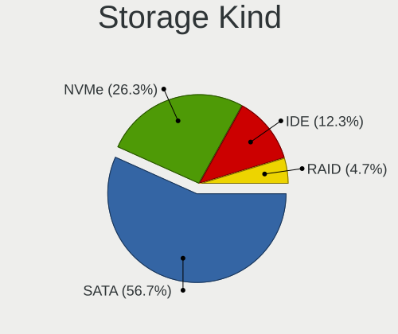

| Kind | Notebooks | Percent |
|------|-----------|---------|
| SATA | 97        | 56.73%  |
| NVMe | 45        | 26.32%  |
| IDE  | 21        | 12.28%  |
| RAID | 8         | 4.68%   |

Processor
---------

CPU Vendor
----------

Processor vendors

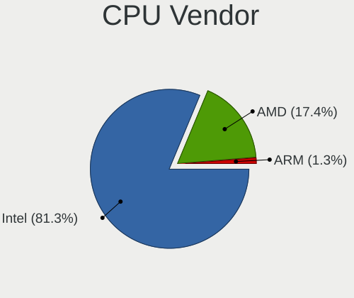

| Vendor | Notebooks | Percent |
|--------|-----------|---------|
| Intel  | 126       | 81.29%  |
| AMD    | 27        | 17.42%  |
| ARM    | 2         | 1.29%   |

CPU Model
---------

Processor models

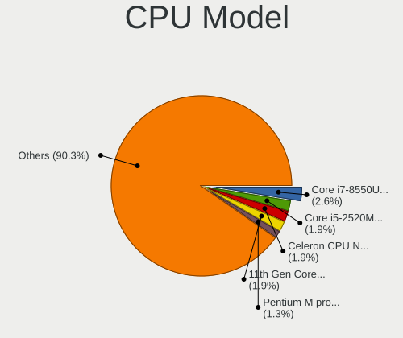

| Model                                         | Notebooks | Percent |
|-----------------------------------------------|-----------|---------|
| Intel Core i7-8550U CPU @ 1.80GHz             | 4         | 2.58%   |
| Intel Core i5-2520M CPU @ 2.50GHz             | 3         | 1.94%   |
| Intel Celeron CPU N3060 @ 1.60GHz             | 3         | 1.94%   |
| Intel 11th Gen Core i5-1135G7 @ 2.40GHz       | 3         | 1.94%   |
| Intel Pentium M processor 1.70GHz             | 2         | 1.29%   |
| Intel Pentium Dual CPU T2390 @ 1.86GHz        | 2         | 1.29%   |
| Intel Core i7-4510U CPU @ 2.00GHz             | 2         | 1.29%   |
| Intel Core i5-9300H CPU @ 2.40GHz             | 2         | 1.29%   |
| Intel Core i5-8350U CPU @ 1.70GHz             | 2         | 1.29%   |
| Intel Core i5-4210U CPU @ 1.70GHz             | 2         | 1.29%   |
| Intel Core i5-4200U CPU @ 1.60GHz             | 2         | 1.29%   |
| Intel Core i5-10210U CPU @ 1.60GHz            | 2         | 1.29%   |
| Intel Core i5 CPU M 480 @ 2.67GHz             | 2         | 1.29%   |
| Intel Core i3 CPU M 370 @ 2.40GHz             | 2         | 1.29%   |
| Intel Core 2 Duo CPU P8600 @ 2.40GHz          | 2         | 1.29%   |
| Intel Celeron N4020 CPU @ 1.10GHz             | 2         | 1.29%   |
| Intel Celeron CPU N3350 @ 1.10GHz             | 2         | 1.29%   |
| Intel Celeron CPU N2840 @ 2.16GHz             | 2         | 1.29%   |
| Intel Atom CPU Z3735F @ 1.33GHz               | 2         | 1.29%   |
| Intel Atom CPU N455 @ 1.66GHz                 | 2         | 1.29%   |
| Intel Atom CPU N450 @ 1.66GHz                 | 2         | 1.29%   |
| Intel Atom CPU N270 @ 1.60GHz                 | 2         | 1.29%   |
| Intel 11th Gen Core i3-1115G4 @ 3.00GHz       | 2         | 1.29%   |
| AMD Ryzen 5 4600H with Radeon Graphics        | 2         | 1.29%   |
| AMD Ryzen 5 3500U with Radeon Vega Mobile Gfx | 2         | 1.29%   |
| AMD Ryzen 5 2500U with Radeon Vega Mobile Gfx | 2         | 1.29%   |
| AMD Ryzen 3 3250U with Radeon Graphics        | 2         | 1.29%   |
| AMD A4-5000 APU with Radeon HD Graphics       | 2         | 1.29%   |
| Intel Xeon E-2176M CPU @ 2.70GHz              | 1         | 0.65%   |
| Intel Pentium M processor 2.00GHz             | 1         | 0.65%   |
| Intel Pentium M processor 1.60GHz             | 1         | 0.65%   |
| Intel Pentium M processor 1.50GHz             | 1         | 0.65%   |
| Intel Pentium III (Coppermine)                | 1         | 0.65%   |
| Intel Pentium CPU N4200 @ 1.10GHz             | 1         | 0.65%   |
| Intel Pentium CPU N3710 @ 1.60GHz             | 1         | 0.65%   |
| Intel Mobile Pentium MMX                      | 1         | 0.65%   |
| Intel Genuine CPU T2400 @ 1.83GHz             | 1         | 0.65%   |
| Intel Core Ultra 7 155H                       | 1         | 0.65%   |
| Intel Core Solo CPU U1500 @ 1.33GHz           | 1         | 0.65%   |
| Intel Core m3-8100Y CPU @ 1.10GHz             | 1         | 0.65%   |

CPU Model Family
----------------

Processor model prefix

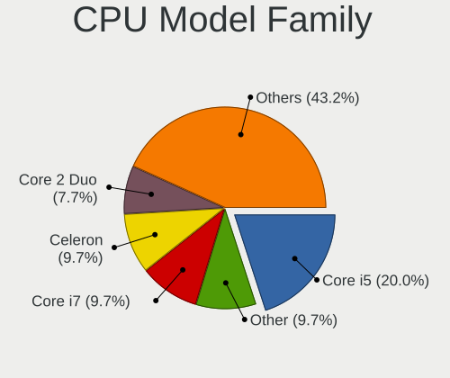

| Model                | Notebooks | Percent |
|----------------------|-----------|---------|
| Intel Core i5        | 31        | 20%     |
| Other                | 15        | 9.68%   |
| Intel Core i7        | 15        | 9.68%   |
| Intel Celeron        | 15        | 9.68%   |
| Intel Core 2 Duo     | 12        | 7.74%   |
| Intel Atom           | 11        | 7.1%    |
| Intel Core i3        | 10        | 6.45%   |
| AMD Ryzen 5          | 9         | 5.81%   |
| Intel Pentium M      | 5         | 3.23%   |
| AMD Ryzen 3          | 4         | 2.58%   |
| AMD A6               | 4         | 2.58%   |
| AMD A4               | 3         | 1.94%   |
| Intel Pentium Dual   | 2         | 1.29%   |
| Intel Pentium        | 2         | 1.29%   |
| Intel Core 2         | 2         | 1.29%   |
| AMD Ryzen 7          | 2         | 1.29%   |
| Intel Xeon           | 1         | 0.65%   |
| Intel Pentium III    | 1         | 0.65%   |
| Intel Genuine        | 1         | 0.65%   |
| Intel Core Solo      | 1         | 0.65%   |
| Intel Core m3        | 1         | 0.65%   |
| Intel Core i9        | 1         | 0.65%   |
| Intel Core Duo       | 1         | 0.65%   |
| Intel Core           | 1         | 0.65%   |
| ARM ARMv7            | 1         | 0.65%   |
| AMD Turion 64 Mobile | 1         | 0.65%   |
| AMD Ryzen 7 PRO      | 1         | 0.65%   |
| AMD E2               | 1         | 0.65%   |
| AMD A10              | 1         | 0.65%   |

CPU Cores
---------

Number of processor cores

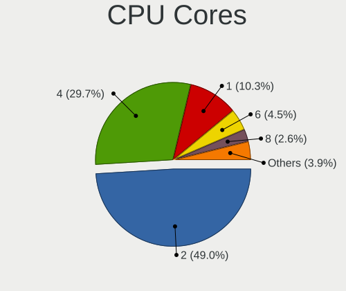

| Number  | Notebooks | Percent |
|---------|-----------|---------|
| 2       | 76        | 49.03%  |
| 4       | 46        | 29.68%  |
| 1       | 16        | 10.32%  |
| 6       | 7         | 4.52%   |
| 8       | 4         | 2.58%   |
| 10      | 2         | 1.29%   |
| 16      | 1         | 0.65%   |
| 12      | 1         | 0.65%   |
| 3       | 1         | 0.65%   |
| Unknown | 1         | 0.65%   |

CPU Sockets
-----------

Number of sockets

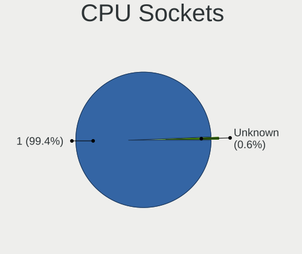

| Number  | Notebooks | Percent |
|---------|-----------|---------|
| 1       | 154       | 99.35%  |
| Unknown | 1         | 0.65%   |

CPU Threads
-----------

Threads per core (Hyper-Threading)

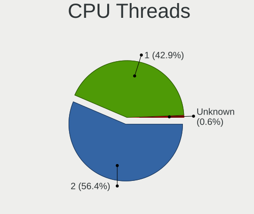

| Number  | Notebooks | Percent |
|---------|-----------|---------|
| 2       | 88        | 56.41%  |
| 1       | 67        | 42.95%  |
| Unknown | 1         | 0.64%   |

CPU Op-Modes
------------

CPU Operation Modes (32-bit, 64-bit)

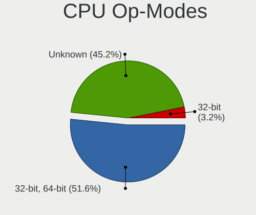

| Op mode        | Notebooks | Percent |
|----------------|-----------|---------|
| 32-bit, 64-bit | 81        | 51.59%  |
| Unknown        | 71        | 45.22%  |
| 32-bit         | 5         | 3.18%   |

CPU Microcode
-------------

Microcode number

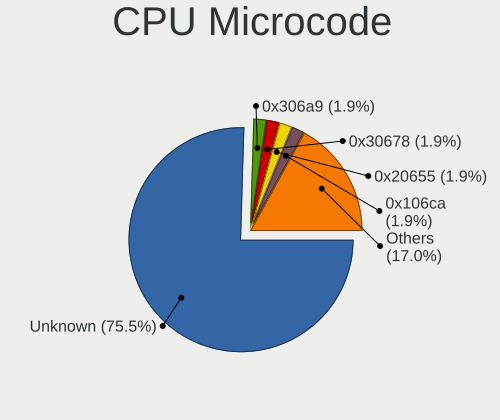

| Number     | Notebooks | Percent |
|------------|-----------|---------|
| Unknown    | 120       | 75.47%  |
| 0x306a9    | 3         | 1.89%   |
| 0x30678    | 3         | 1.89%   |
| 0x20655    | 3         | 1.89%   |
| 0x106ca    | 3         | 1.89%   |
| 0x08108109 | 3         | 1.89%   |
| 0x906ea    | 2         | 1.26%   |
| 0x806eb    | 2         | 1.26%   |
| 0x806c1    | 2         | 1.26%   |
| 0x306c3    | 2         | 1.26%   |
| 0x206a7    | 2         | 1.26%   |
| 0x06006704 | 2         | 1.26%   |
| 0x706e5    | 1         | 0.63%   |
| 0x683      | 1         | 0.63%   |
| 0x506c9    | 1         | 0.63%   |
| 0x406c4    | 1         | 0.63%   |
| 0x306d4    | 1         | 0.63%   |
| 0x106e5    | 1         | 0.63%   |
| 0x1067a    | 1         | 0.63%   |
| 0x08608103 | 1         | 0.63%   |
| 0x08108102 | 1         | 0.63%   |
| 0x0810100b | 1         | 0.63%   |
| 0x0700010f | 1         | 0.63%   |
| 0x06006705 | 1         | 0.63%   |

CPU Microarch
-------------

Microarchitecture

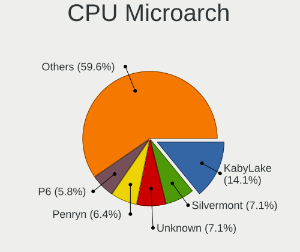

| Name             | Notebooks | Percent |
|------------------|-----------|---------|
| KabyLake         | 22        | 14.1%   |
| Silvermont       | 11        | 7.05%   |
| Unknown          | 11        | 7.05%   |
| Penryn           | 10        | 6.41%   |
| P6               | 9         | 5.77%   |
| Haswell          | 9         | 5.77%   |
| Westmere         | 8         | 5.13%   |
| TigerLake        | 7         | 4.49%   |
| Bonnell          | 7         | 4.49%   |
| Zen+             | 6         | 3.85%   |
| Goldmont         | 6         | 3.85%   |
| Core             | 6         | 3.85%   |
| SandyBridge      | 5         | 3.21%   |
| Broadwell        | 5         | 3.21%   |
| Skylake          | 4         | 2.56%   |
| IvyBridge        | 4         | 2.56%   |
| Goldmont plus    | 4         | 2.56%   |
| Excavator        | 4         | 2.56%   |
| Zen 2            | 3         | 1.92%   |
| Jaguar           | 3         | 1.92%   |
| Alderlake Hybrid | 3         | 1.92%   |
| Zen              | 2         | 1.28%   |
| Zen 3            | 1         | 0.64%   |
| Puma             | 1         | 0.64%   |
| Nehalem          | 1         | 0.64%   |
| K8 Hammer        | 1         | 0.64%   |
| K10 Llano        | 1         | 0.64%   |
| IceLake          | 1         | 0.64%   |
| Bobcat           | 1         | 0.64%   |

Graphics
--------

GPU Vendor
----------

Vendors of graphics cards

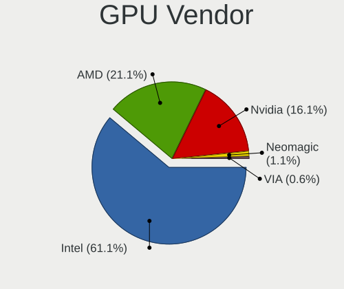

| Vendor           | Notebooks | Percent |
|------------------|-----------|---------|
| Intel            | 110       | 61.11%  |
| AMD              | 38        | 21.11%  |
| Nvidia           | 29        | 16.11%  |
| Neomagic         | 2         | 1.11%   |
| VIA Technologies | 1         | 0.56%   |

GPU Model
---------

Graphics card models

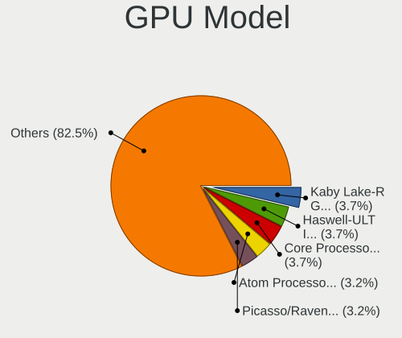

| Model                                                                                    | Notebooks | Percent |
|------------------------------------------------------------------------------------------|-----------|---------|
| Intel Kaby Lake-R GT2 [UHD Graphics 620]                                                 | 7         | 3.7%    |
| Intel Haswell-ULT Integrated Graphics Controller                                         | 7         | 3.7%    |
| Intel Core Processor Integrated Graphics Controller                                      | 7         | 3.7%    |
| Intel Atom Processor Z36xxx/Z37xxx Series Graphics & Display                             | 6         | 3.17%   |
| AMD Picasso/Raven 2 [Radeon Vega Series / Radeon Vega Mobile Series]                     | 6         | 3.17%   |
| Intel TigerLake-LP GT2 [Iris Xe Graphics]                                                | 5         | 2.65%   |
| Intel Mobile 945GM/GMS/GME, 943/940GML Express Integrated Graphics Controller            | 5         | 2.65%   |
| Intel Atom/Celeron/Pentium Processor x5-E8000/J3xxx/N3xxx Integrated Graphics Controller | 5         | 2.65%   |
| Intel Apollo Lake GT1 [HD Graphics 500]                                                  | 5         | 2.65%   |
| Intel 2nd Generation Core Processor Family Integrated Graphics Controller                | 5         | 2.65%   |
| Nvidia GP108M [GeForce MX150]                                                            | 4         | 2.12%   |
| Intel Mobile 915GM/GMS/910GML Express Graphics Controller                                | 4         | 2.12%   |
| Intel GeminiLake [UHD Graphics 600]                                                      | 4         | 2.12%   |
| Intel CometLake-U GT2 [UHD Graphics]                                                     | 4         | 2.12%   |
| Intel CoffeeLake-H GT2 [UHD Graphics 630]                                                | 4         | 2.12%   |
| Intel Broadwell-U GT2 [HD Graphics 5500]                                                 | 4         | 2.12%   |
| Intel Atom Processor D4xx/D5xx/N4xx/N5xx Integrated Graphics Controller                  | 4         | 2.12%   |
| Intel 3rd Gen Core processor Graphics Controller                                         | 4         | 2.12%   |
| Nvidia GM108M [GeForce 840M]                                                             | 3         | 1.59%   |
| Intel WhiskeyLake-U GT2 [UHD Graphics 620]                                               | 3         | 1.59%   |
| Intel Skylake-U GT2 [HD Graphics 520]                                                    | 3         | 1.59%   |
| Intel Mobile 945GM/GMS, 943/940GML Express Integrated Graphics Controller                | 3         | 1.59%   |
| Intel Mobile 4 Series Chipset Integrated Graphics Controller                             | 3         | 1.59%   |
| AMD Stoney [Radeon R2/R3/R4/R5 Graphics]                                                 | 3         | 1.59%   |
| AMD RV620/M82 [Mobility Radeon HD 3450/3470]                                             | 3         | 1.59%   |
| AMD Renoir [Radeon Vega Series / Radeon Vega Mobile Series]                              | 3         | 1.59%   |
| Nvidia TU117M [GeForce GTX 1650 Mobile / Max-Q]                                          | 2         | 1.06%   |
| Nvidia MCP89 [GeForce 320M]                                                              | 2         | 1.06%   |
| Intel Tiger Lake-LP GT2 [UHD Graphics G4]                                                | 2         | 1.06%   |
| Intel Mobile 945GSE Express Integrated Graphics Controller                               | 2         | 1.06%   |
| Intel 4th Gen Core Processor Integrated Graphics Controller                              | 2         | 1.06%   |
| AMD Topaz XT [Radeon R7 M260/M265 / M340/M360 / M440/M445 / 530/535 / 620/625 Mobile]    | 2         | 1.06%   |
| AMD RV635/M86 [Mobility Radeon HD 3650]                                                  | 2         | 1.06%   |
| AMD Raven Ridge [Radeon Vega Series / Radeon Vega Mobile Series]                         | 2         | 1.06%   |
| AMD Kabini [Radeon HD 8330]                                                              | 2         | 1.06%   |
| VIA Technologies CN896/VN896/P4M900 [Chrome 9 HC]                                        | 1         | 0.53%   |
| Nvidia TU117M [GeForce GTX 1650 Ti Mobile]                                               | 1         | 0.53%   |
| Nvidia TU116M [GeForce GTX 1660 Ti Mobile]                                               | 1         | 0.53%   |
| Nvidia GT216M [GeForce GT 330M]                                                          | 1         | 0.53%   |
| Nvidia GP108M [GeForce MX250]                                                            | 1         | 0.53%   |

GPU Combo
---------

Combinations of graphics cards

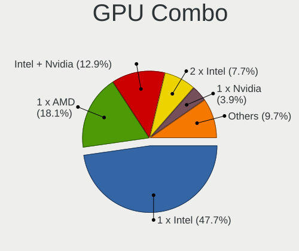

| Name           | Notebooks | Percent |
|----------------|-----------|---------|
| 1 x Intel      | 74        | 47.74%  |
| 1 x AMD        | 28        | 18.06%  |
| Intel + Nvidia | 20        | 12.9%   |
| 2 x Intel      | 12        | 7.74%   |
| 1 x Nvidia     | 6         | 3.87%   |
| Intel + AMD    | 4         | 2.58%   |
| 2 x AMD        | 3         | 1.94%   |
| AMD + Nvidia   | 3         | 1.94%   |
| Other          | 2         | 1.29%   |
| 1 x Neomagic   | 2         | 1.29%   |
| 1 x VIA        | 1         | 0.65%   |

GPU Driver
----------

Free vs proprietary

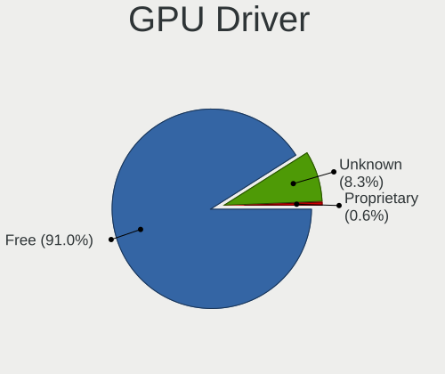

| Driver      | Notebooks | Percent |
|-------------|-----------|---------|
| Free        | 142       | 91.03%  |
| Unknown     | 13        | 8.33%   |
| Proprietary | 1         | 0.64%   |

GPU Memory
----------

Total video memory

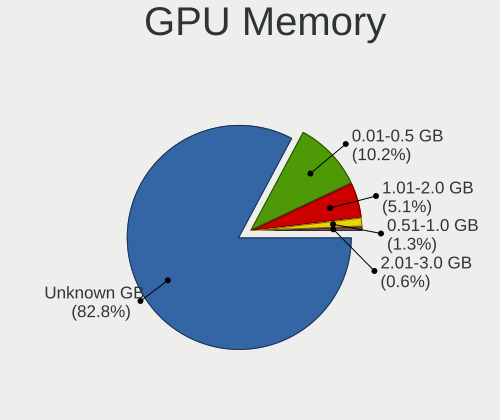

| Size in GB | Notebooks | Percent |
|------------|-----------|---------|
| Unknown    | 130       | 82.8%   |
| 0.01-0.5   | 16        | 10.19%  |
| 1.01-2.0   | 8         | 5.1%    |
| 0.51-1.0   | 2         | 1.27%   |
| 2.01-3.0   | 1         | 0.64%   |

Monitor
-------

Monitor Vendor
--------------

Monitor vendors

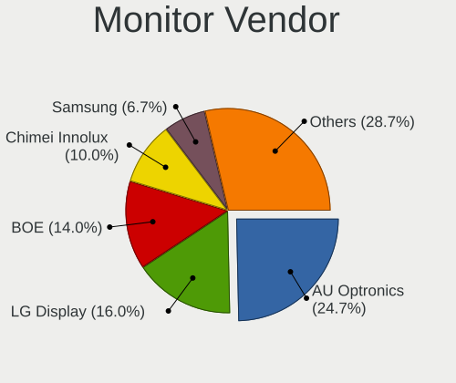

| Vendor                  | Notebooks | Percent |
|-------------------------|-----------|---------|
| AU Optronics            | 37        | 24.67%  |
| LG Display              | 24        | 16%     |
| BOE                     | 21        | 14%     |
| Chimei Innolux          | 15        | 10%     |
| Samsung Electronics     | 10        | 6.67%   |
| Lenovo                  | 6         | 4%      |
| Apple                   | 5         | 3.33%   |
| LG Philips              | 4         | 2.67%   |
| Chi Mei Optoelectronics | 3         | 2%      |
| Sharp                   | 2         | 1.33%   |
| InfoVision              | 2         | 1.33%   |
| HannStar                | 2         | 1.33%   |
| Goldstar                | 2         | 1.33%   |
| CSO                     | 2         | 1.33%   |
| Sony                    | 1         | 0.67%   |
| Quanta Display          | 1         | 0.67%   |
| PANDA                   | 1         | 0.67%   |
| ONN                     | 1         | 0.67%   |
| HKC                     | 1         | 0.67%   |
| Hewlett-Packard         | 1         | 0.67%   |
| Envision                | 1         | 0.67%   |
| EDO                     | 1         | 0.67%   |
| DENON                   | 1         | 0.67%   |
| Dell                    | 1         | 0.67%   |
| CPT                     | 1         | 0.67%   |
| CHD                     | 1         | 0.67%   |
| BenQ                    | 1         | 0.67%   |
| Ancor Communications    | 1         | 0.67%   |
| Acer                    | 1         | 0.67%   |

Monitor Model
-------------

Monitor models

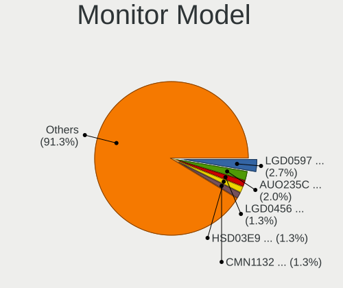

| Model                                                                 | Notebooks | Percent |
|-----------------------------------------------------------------------|-----------|---------|
| LG Display LCD Monitor LGD0597 1920x1080 294x165mm 13.3-inch          | 4         | 2.67%   |
| AU Optronics LCD Monitor AUO235C 1366x768 256x144mm 11.6-inch         | 3         | 2%      |
| LG Display LCD Monitor LGD0456 1366x768 344x194mm 15.5-inch           | 2         | 1.33%   |
| HannStar LCD Monitor HSD03E9 1024x600 220x129mm 10.0-inch             | 2         | 1.33%   |
| CSO LCD Monitor CSO1402 2880x1800 302x188mm 14.0-inch                 | 2         | 1.33%   |
| Chimei Innolux LCD Monitor CMN1132 1366x768 256x144mm 11.6-inch       | 2         | 1.33%   |
| BOE LCD Monitor BOE08F2 1920x1080 310x174mm 14.0-inch                 | 2         | 1.33%   |
| BOE LCD Monitor BOE08D5 1920x1080 344x194mm 15.5-inch                 | 2         | 1.33%   |
| AU Optronics LCD Monitor AUO61ED 1920x1080 344x194mm 15.5-inch        | 2         | 1.33%   |
| AU Optronics LCD Monitor AUO125C 1366x768 256x144mm 11.6-inch         | 2         | 1.33%   |
| Sony LCD SNY06FA 1600x900 291x164mm 13.2-inch                         | 1         | 0.67%   |
| Sharp LCD Monitor SHP1513 1920x1080 309x174mm 14.0-inch               | 1         | 0.67%   |
| Sharp LCD Monitor SHP14AE 1920x1080 294x165mm 13.3-inch               | 1         | 0.67%   |
| Samsung Electronics LCD Monitor SEC5A42 1366x768 309x174mm 14.0-inch  | 1         | 0.67%   |
| Samsung Electronics LCD Monitor SEC5642 1280x768 305x183mm 14.0-inch  | 1         | 0.67%   |
| Samsung Electronics LCD Monitor SEC5541 1366x768 344x193mm 15.5-inch  | 1         | 0.67%   |
| Samsung Electronics LCD Monitor SEC5441 1280x800 331x207mm 15.4-inch  | 1         | 0.67%   |
| Samsung Electronics LCD Monitor SEC3345 1280x800 331x207mm 15.4-inch  | 1         | 0.67%   |
| Samsung Electronics LCD Monitor SEC3157 1280x800 303x190mm 14.1-inch  | 1         | 0.67%   |
| Samsung Electronics LCD Monitor SEC3052 1366x768 256x144mm 11.6-inch  | 1         | 0.67%   |
| Samsung Electronics LCD Monitor SDCA029 3840x2160 344x194mm 15.5-inch | 1         | 0.67%   |
| Samsung Electronics LCD Monitor SDC424A 3200x1800 293x165mm 13.2-inch | 1         | 0.67%   |
| Samsung Electronics LCD Monitor SDC4147 1366x768 344x194mm 15.5-inch  | 1         | 0.67%   |
| Quanta Display LCD Monitor QDS0020 1280x768 305x183mm 14.0-inch       | 1         | 0.67%   |
| PANDA LCD Monitor NCP002E 1920x1080 344x194mm 15.5-inch               | 1         | 0.67%   |
| ONN ONA18HO015 ONN0101 1920x1080 698x393mm 31.5-inch                  | 1         | 0.67%   |
| LG Philips LCD Monitor LPLE300 1280x800 331x207mm 15.4-inch           | 1         | 0.67%   |
| LG Philips LCD Monitor LPLE100 1280x800 331x207mm 15.4-inch           | 1         | 0.67%   |
| LG Philips LCD Monitor LPLB600 1280x800 260x160mm 12.0-inch           | 1         | 0.67%   |
| LG Philips LCD Monitor LPLA900 1280x800 331x207mm 15.4-inch           | 1         | 0.67%   |
| LG Display LP116WH2-TLC1 LGD0232 1366x768 256x144mm 11.6-inch         | 1         | 0.67%   |
| LG Display LCD Monitor LGD7001 1366x768 344x194mm 15.5-inch           | 1         | 0.67%   |
| LG Display LCD Monitor LGD06EB 2560x1600 344x215mm 16.0-inch          | 1         | 0.67%   |
| LG Display LCD Monitor LGD05FE 1920x1080 344x194mm 15.5-inch          | 1         | 0.67%   |
| LG Display LCD Monitor LGD0563 1920x1080 344x194mm 15.5-inch          | 1         | 0.67%   |
| LG Display LCD Monitor LGD0521 1920x1080 309x174mm 14.0-inch          | 1         | 0.67%   |
| LG Display LCD Monitor LGD0469 1920x1080 382x215mm 17.3-inch          | 1         | 0.67%   |
| LG Display LCD Monitor LGD045C 1366x768 345x194mm 15.6-inch           | 1         | 0.67%   |
| LG Display LCD Monitor LGD0446 1920x1080 309x174mm 14.0-inch          | 1         | 0.67%   |
| LG Display LCD Monitor LGD042E 2560x1700 272x181mm 12.9-inch          | 1         | 0.67%   |

Monitor Resolution
------------------

Monitor screen resolution

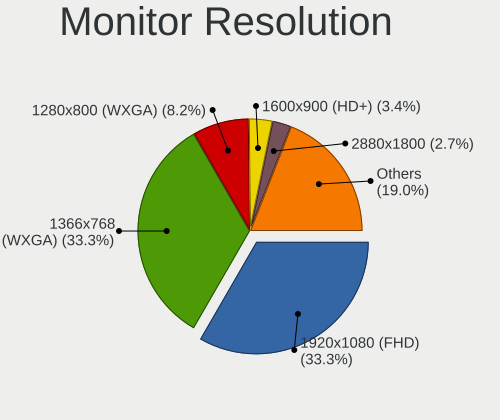

| Resolution        | Notebooks | Percent |
|-------------------|-----------|---------|
| 1920x1080 (FHD)   | 49        | 33.33%  |
| 1366x768 (WXGA)   | 49        | 33.33%  |
| 1280x800 (WXGA)   | 12        | 8.16%   |
| 1600x900 (HD+)    | 5         | 3.4%    |
| 2880x1800         | 4         | 2.72%   |
| 1024x600          | 4         | 2.72%   |
| 3840x2160 (4K)    | 3         | 2.04%   |
| 1440x900 (WXGA+)  | 3         | 2.04%   |
| 2560x1600         | 2         | 1.36%   |
| 2560x1440 (QHD)   | 2         | 1.36%   |
| 1920x1200 (WUXGA) | 2         | 1.36%   |
| 1280x768          | 2         | 1.36%   |
| 3200x1800 (QHD+)  | 1         | 0.68%   |
| 2880x1920         | 1         | 0.68%   |
| 2560x1700         | 1         | 0.68%   |
| 2560x1080         | 1         | 0.68%   |
| 2240x1400         | 1         | 0.68%   |
| 1360x768          | 1         | 0.68%   |
| 1280x1024 (SXGA)  | 1         | 0.68%   |
| 1024x768 (XGA)    | 1         | 0.68%   |
| 1024x576          | 1         | 0.68%   |
| Unknown           | 1         | 0.68%   |

Monitor Diagonal
----------------

Diagonal size in inches

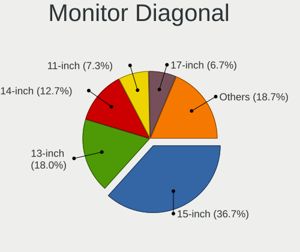

| Inches  | Notebooks | Percent |
|---------|-----------|---------|
| 15      | 55        | 36.67%  |
| 13      | 27        | 18%     |
| 14      | 19        | 12.67%  |
| 11      | 11        | 7.33%   |
| 17      | 10        | 6.67%   |
| 12      | 8         | 5.33%   |
| 10      | 5         | 3.33%   |
| 21      | 4         | 2.67%   |
| 31      | 2         | 1.33%   |
| 24      | 2         | 1.33%   |
| 23      | 2         | 1.33%   |
| 60      | 1         | 0.67%   |
| 32      | 1         | 0.67%   |
| 29      | 1         | 0.67%   |
| 16      | 1         | 0.67%   |
| Unknown | 1         | 0.67%   |

Monitor Width
-------------

Physical width

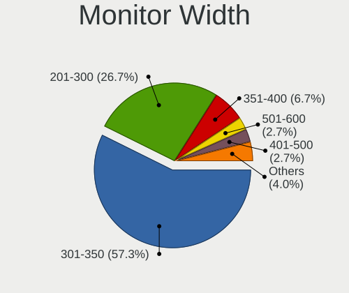

| Width in mm | Notebooks | Percent |
|-------------|-----------|---------|
| 301-350     | 86        | 57.33%  |
| 201-300     | 40        | 26.67%  |
| 351-400     | 10        | 6.67%   |
| 501-600     | 4         | 2.67%   |
| 401-500     | 4         | 2.67%   |
| 601-700     | 3         | 2%      |
| 701-800     | 1         | 0.67%   |
| 1001-1500   | 1         | 0.67%   |
| Unknown     | 1         | 0.67%   |

Aspect Ratio
------------

Proportional relationship between the width and the height

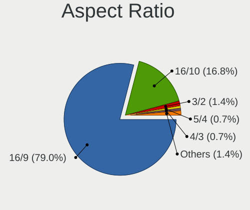

| Ratio   | Notebooks | Percent |
|---------|-----------|---------|
| 16/9    | 113       | 79.02%  |
| 16/10   | 24        | 16.78%  |
| 3/2     | 2         | 1.4%    |
| 5/4     | 1         | 0.7%    |
| 4/3     | 1         | 0.7%    |
| 21/9    | 1         | 0.7%    |
| Unknown | 1         | 0.7%    |

Monitor Area
------------

Area in inch²

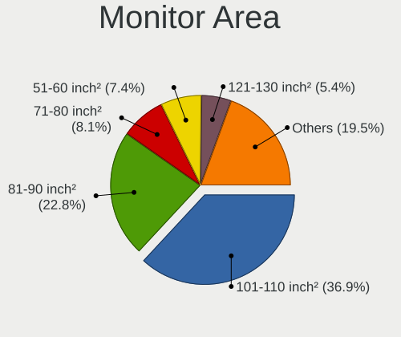

| Area in inch² | Notebooks | Percent |
|----------------|-----------|---------|
| 101-110        | 55        | 36.91%  |
| 81-90          | 34        | 22.82%  |
| 71-80          | 12        | 8.05%   |
| 51-60          | 11        | 7.38%   |
| 121-130        | 8         | 5.37%   |
| 61-70          | 7         | 4.7%    |
| 201-250        | 6         | 4.03%   |
| 41-50          | 5         | 3.36%   |
| 351-500        | 3         | 2.01%   |
| More than 1000 | 1         | 0.67%   |
| 301-350        | 1         | 0.67%   |
| 251-300        | 1         | 0.67%   |
| 151-200        | 1         | 0.67%   |
| 141-150        | 1         | 0.67%   |
| 131-140        | 1         | 0.67%   |
| 111-120        | 1         | 0.67%   |
| Unknown        | 1         | 0.67%   |

Pixel Density
-------------

Pixels per inch

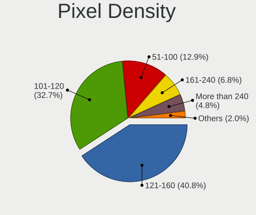

| Density       | Notebooks | Percent |
|---------------|-----------|---------|
| 121-160       | 60        | 40.82%  |
| 101-120       | 48        | 32.65%  |
| 51-100        | 19        | 12.93%  |
| 161-240       | 10        | 6.8%    |
| More than 240 | 7         | 4.76%   |
| 1-50          | 2         | 1.36%   |
| Unknown       | 1         | 0.68%   |

Multiple Monitors
-----------------

Total monitors connected

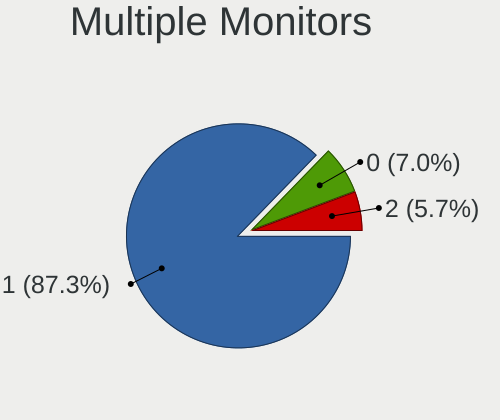

| Total | Notebooks | Percent |
|-------|-----------|---------|
| 1     | 137       | 87.26%  |
| 0     | 11        | 7.01%   |
| 2     | 9         | 5.73%   |

Network
-------

Net Controller Vendor
---------------------

Controller vendors

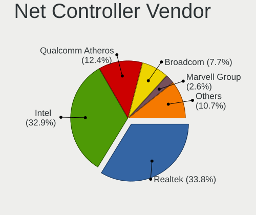

| Vendor                            | Notebooks | Percent |
|-----------------------------------|-----------|---------|
| Realtek Semiconductor             | 79        | 33.76%  |
| Intel                             | 77        | 32.91%  |
| Qualcomm Atheros                  | 29        | 12.39%  |
| Broadcom                          | 18        | 7.69%   |
| Marvell Technology Group          | 6         | 2.56%   |
| Qualcomm                          | 3         | 1.28%   |
| MediaTek                          | 3         | 1.28%   |
| Broadcom Limited                  | 3         | 1.28%   |
| Silicon Integrated Systems [SiS]  | 2         | 0.85%   |
| Shenzhen Goodix Technology        | 2         | 0.85%   |
| Nvidia                            | 2         | 0.85%   |
| LSI                               | 2         | 0.85%   |
| VIA Technologies                  | 1         | 0.43%   |
| Samsung Electronics               | 1         | 0.43%   |
| Qualcomm Atheros Communications   | 1         | 0.43%   |
| Google                            | 1         | 0.43%   |
| Ericsson Business Mobile Networks | 1         | 0.43%   |
| Dresden Elektronik                | 1         | 0.43%   |
| DisplayLink                       | 1         | 0.43%   |
| AMD                               | 1         | 0.43%   |

Net Controller Model
--------------------

Controller models

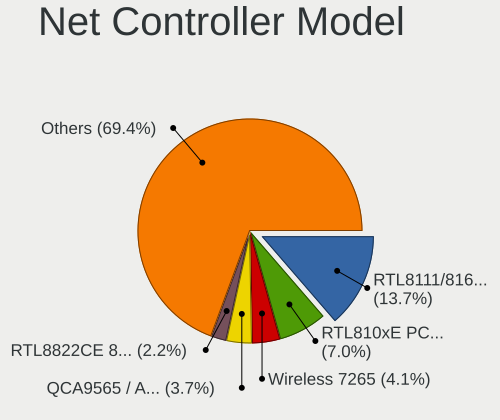

| Model                                                                   | Notebooks | Percent |
|-------------------------------------------------------------------------|-----------|---------|
| Realtek RTL8111/8168/8211/8411 PCI Express Gigabit Ethernet Controller  | 37        | 13.65%  |
| Realtek RTL810xE PCI Express Fast Ethernet controller                   | 19        | 7.01%   |
| Intel Wireless 7265                                                     | 11        | 4.06%   |
| Qualcomm Atheros QCA9565 / AR9565 Wireless Network Adapter              | 10        | 3.69%   |
| Realtek RTL8822CE 802.11ac PCIe Wireless Network Adapter                | 6         | 2.21%   |
| Realtek RTL8821CE 802.11ac PCIe Wireless Network Adapter                | 6         | 2.21%   |
| Realtek RTL8153 Gigabit Ethernet Adapter                                | 6         | 2.21%   |
| Intel Wireless 8265 / 8275                                              | 5         | 1.85%   |
| Intel Wi-Fi 6 AX201                                                     | 5         | 1.85%   |
| Intel Wi-Fi 6 AX200                                                     | 5         | 1.85%   |
| Qualcomm Atheros QCA9377 802.11ac Wireless Network Adapter              | 4         | 1.48%   |
| Qualcomm Atheros AR9485 Wireless Network Adapter                        | 4         | 1.48%   |
| Intel Wireless 3160                                                     | 4         | 1.48%   |
| Broadcom BCM43224 802.11a/b/g/n                                         | 4         | 1.48%   |
| Realtek RTL8723BE PCIe Wireless Network Adapter                         | 3         | 1.11%   |
| Realtek RTL-8100/8101L/8139 PCI Fast Ethernet Adapter                   | 3         | 1.11%   |
| Qualcomm Atheros AR9285 Wireless Network Adapter (PCI-Express)          | 3         | 1.11%   |
| Intel PRO/Wireless 3945ABG [Golan] Network Connection                   | 3         | 1.11%   |
| Intel PRO/Wireless 2200BG [Calexico2] Network Connection                | 3         | 1.11%   |
| Intel Alder Lake-P PCH CNVi WiFi                                        | 3         | 1.11%   |
| Intel 82579LM Gigabit Network Connection (Lewisville)                   | 3         | 1.11%   |
| Broadcom BCM4313 802.11bgn Wireless Network Adapter                     | 3         | 1.11%   |
| Silicon Integrated Systems [SiS] 191 Gigabit Ethernet Adapter           | 2         | 0.74%   |
| Shenzhen Goodix Fingerprint Reader                                      | 2         | 0.74%   |
| Realtek RTL8188CE 802.11b/g/n WiFi Adapter                              | 2         | 0.74%   |
| Realtek RTL8152 Fast Ethernet Adapter                                   | 2         | 0.74%   |
| Qualcomm YUPIK-QRD _SN:AC1D5909                                         | 2         | 0.74%   |
| Qualcomm Atheros QCA8171 Gigabit Ethernet                               | 2         | 0.74%   |
| Qualcomm Atheros AR8132 Fast Ethernet                                   | 2         | 0.74%   |
| Qualcomm Atheros AR242x / AR542x Wireless Network Adapter (PCI-Express) | 2         | 0.74%   |
| Intel Wireless 7260                                                     | 2         | 0.74%   |
| Intel Wi-Fi 5(802.11ac) Wireless-AC 9x6x [Thunder Peak]                 | 2         | 0.74%   |
| Intel Ultimate N WiFi Link 5300                                         | 2         | 0.74%   |
| Intel PRO/Wireless 4965 AG or AGN [Kedron] Network Connection           | 2         | 0.74%   |
| Intel Gemini Lake PCH CNVi WiFi                                         | 2         | 0.74%   |
| Intel Ethernet Connection (4) I219-LM                                   | 2         | 0.74%   |
| Intel Dual Band Wireless-AC 3168NGW [Stone Peak]                        | 2         | 0.74%   |
| Intel Comet Lake PCH-LP CNVi WiFi                                       | 2         | 0.74%   |
| Intel Centrino Advanced-N 6205 [Taylor Peak]                            | 2         | 0.74%   |
| Intel Cannon Point-LP CNVi [Wireless-AC]                                | 2         | 0.74%   |

Wireless Vendor
---------------

Wireless vendors

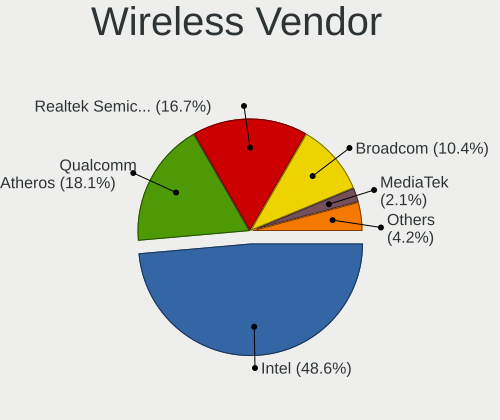

| Vendor                          | Notebooks | Percent |
|---------------------------------|-----------|---------|
| Intel                           | 70        | 48.61%  |
| Qualcomm Atheros                | 26        | 18.06%  |
| Realtek Semiconductor           | 24        | 16.67%  |
| Broadcom                        | 15        | 10.42%  |
| MediaTek                        | 3         | 2.08%   |
| Broadcom Limited                | 3         | 2.08%   |
| Qualcomm Atheros Communications | 1         | 0.69%   |
| Qualcomm                        | 1         | 0.69%   |
| Marvell Technology Group        | 1         | 0.69%   |

Wireless Model
--------------

Wireless models

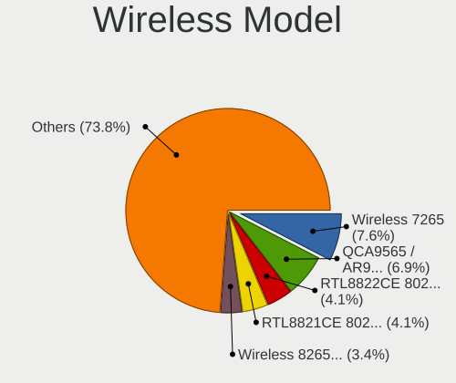

| Model                                                                   | Notebooks | Percent |
|-------------------------------------------------------------------------|-----------|---------|
| Intel Wireless 7265                                                     | 11        | 7.59%   |
| Qualcomm Atheros QCA9565 / AR9565 Wireless Network Adapter              | 10        | 6.9%    |
| Realtek RTL8822CE 802.11ac PCIe Wireless Network Adapter                | 6         | 4.14%   |
| Realtek RTL8821CE 802.11ac PCIe Wireless Network Adapter                | 6         | 4.14%   |
| Intel Wireless 8265 / 8275                                              | 5         | 3.45%   |
| Intel Wi-Fi 6 AX201                                                     | 5         | 3.45%   |
| Intel Wi-Fi 6 AX200                                                     | 5         | 3.45%   |
| Qualcomm Atheros QCA9377 802.11ac Wireless Network Adapter              | 4         | 2.76%   |
| Qualcomm Atheros AR9485 Wireless Network Adapter                        | 4         | 2.76%   |
| Intel Wireless 3160                                                     | 4         | 2.76%   |
| Broadcom BCM43224 802.11a/b/g/n                                         | 4         | 2.76%   |
| Realtek RTL8723BE PCIe Wireless Network Adapter                         | 3         | 2.07%   |
| Qualcomm Atheros AR9285 Wireless Network Adapter (PCI-Express)          | 3         | 2.07%   |
| Intel PRO/Wireless 3945ABG [Golan] Network Connection                   | 3         | 2.07%   |
| Intel PRO/Wireless 2200BG [Calexico2] Network Connection                | 3         | 2.07%   |
| Intel Alder Lake-P PCH CNVi WiFi                                        | 3         | 2.07%   |
| Broadcom BCM4313 802.11bgn Wireless Network Adapter                     | 3         | 2.07%   |
| Realtek RTL8188CE 802.11b/g/n WiFi Adapter                              | 2         | 1.38%   |
| Qualcomm Atheros AR242x / AR542x Wireless Network Adapter (PCI-Express) | 2         | 1.38%   |
| Intel Wireless 7260                                                     | 2         | 1.38%   |
| Intel Wi-Fi 5(802.11ac) Wireless-AC 9x6x [Thunder Peak]                 | 2         | 1.38%   |
| Intel Ultimate N WiFi Link 5300                                         | 2         | 1.38%   |
| Intel PRO/Wireless 4965 AG or AGN [Kedron] Network Connection           | 2         | 1.38%   |
| Intel Gemini Lake PCH CNVi WiFi                                         | 2         | 1.38%   |
| Intel Dual Band Wireless-AC 3168NGW [Stone Peak]                        | 2         | 1.38%   |
| Intel Comet Lake PCH-LP CNVi WiFi                                       | 2         | 1.38%   |
| Intel Centrino Advanced-N 6205 [Taylor Peak]                            | 2         | 1.38%   |
| Intel Cannon Point-LP CNVi [Wireless-AC]                                | 2         | 1.38%   |
| Intel Cannon Lake PCH CNVi WiFi                                         | 2         | 1.38%   |
| Broadcom Limited BCM4352 802.11ac Dual Band Wireless Network Adapter    | 2         | 1.38%   |
| Broadcom BCM4311 802.11b/g WLAN                                         | 2         | 1.38%   |
| Realtek RTL88x2bu [AC1200 Techkey]                                      | 1         | 0.69%   |
| Realtek RTL8852AE 802.11ax PCIe Wireless Network Adapter                | 1         | 0.69%   |
| Realtek RTL8822BE 802.11a/b/g/n/ac WiFi adapter                         | 1         | 0.69%   |
| Realtek RTL8723DE Wireless Network Adapter                              | 1         | 0.69%   |
| Realtek RTL8723BU 802.11b/g/n WLAN Adapter                              | 1         | 0.69%   |
| Realtek RTL8191SEvB Wireless LAN Controller                             | 1         | 0.69%   |
| Realtek RTL8188CUS 802.11n WLAN Adapter                                 | 1         | 0.69%   |
| Realtek RTL8187 Wireless Adapter                                        | 1         | 0.69%   |
| Qualcomm QCNFA765 Wireless Network Adapter                              | 1         | 0.69%   |

Ethernet Vendor
---------------

Ethernet vendors

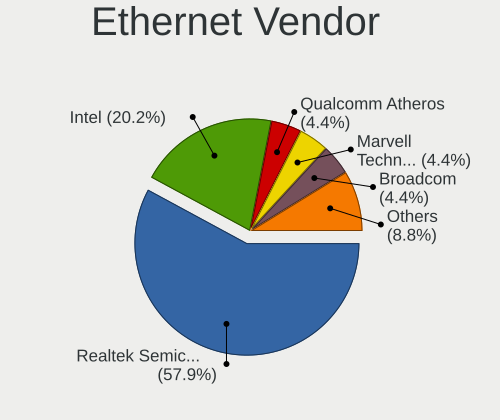

| Vendor                           | Notebooks | Percent |
|----------------------------------|-----------|---------|
| Realtek Semiconductor            | 66        | 57.89%  |
| Intel                            | 23        | 20.18%  |
| Qualcomm Atheros                 | 5         | 4.39%   |
| Marvell Technology Group         | 5         | 4.39%   |
| Broadcom                         | 5         | 4.39%   |
| Silicon Integrated Systems [SiS] | 2         | 1.75%   |
| Qualcomm                         | 2         | 1.75%   |
| Nvidia                           | 2         | 1.75%   |
| VIA Technologies                 | 1         | 0.88%   |
| Samsung Electronics              | 1         | 0.88%   |
| LSI                              | 1         | 0.88%   |
| DisplayLink                      | 1         | 0.88%   |

Ethernet Model
--------------

Ethernet models

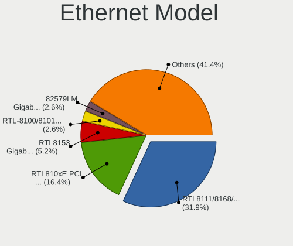

| Model                                                                          | Notebooks | Percent |
|--------------------------------------------------------------------------------|-----------|---------|
| Realtek RTL8111/8168/8211/8411 PCI Express Gigabit Ethernet Controller         | 37        | 31.9%   |
| Realtek RTL810xE PCI Express Fast Ethernet controller                          | 19        | 16.38%  |
| Realtek RTL8153 Gigabit Ethernet Adapter                                       | 6         | 5.17%   |
| Realtek RTL-8100/8101L/8139 PCI Fast Ethernet Adapter                          | 3         | 2.59%   |
| Intel 82579LM Gigabit Network Connection (Lewisville)                          | 3         | 2.59%   |
| Silicon Integrated Systems [SiS] 191 Gigabit Ethernet Adapter                  | 2         | 1.72%   |
| Realtek RTL8152 Fast Ethernet Adapter                                          | 2         | 1.72%   |
| Qualcomm YUPIK-QRD _SN:AC1D5909                                                | 2         | 1.72%   |
| Qualcomm Atheros QCA8171 Gigabit Ethernet                                      | 2         | 1.72%   |
| Qualcomm Atheros AR8132 Fast Ethernet                                          | 2         | 1.72%   |
| Intel Ethernet Connection (4) I219-LM                                          | 2         | 1.72%   |
| Intel 82579V Gigabit Network Connection                                        | 2         | 1.72%   |
| Intel 82577LC Gigabit Network Connection                                       | 2         | 1.72%   |
| Broadcom BCM4401-B0 100Base-TX                                                 | 2         | 1.72%   |
| VIA VT6102/VT6103 [Rhine-II]                                                   | 1         | 0.86%   |
| Samsung Galaxy series, misc. (tethering mode)                                  | 1         | 0.86%   |
| Realtek USB 10/100/1G/2.5 LAN                                                  | 1         | 0.86%   |
| Qualcomm Atheros QCA8172 Fast Ethernet                                         | 1         | 0.86%   |
| Nvidia MCP89 Ethernet                                                          | 1         | 0.86%   |
| Nvidia MCP79 Ethernet                                                          | 1         | 0.86%   |
| Marvell Group Yukon Optima 88E8059 [PCIe Gigabit Ethernet Controller with AVB] | 1         | 0.86%   |
| Marvell Group 88E8072 PCI-E Gigabit Ethernet Controller                        | 1         | 0.86%   |
| Marvell Group 88E8057 PCI-E Gigabit Ethernet Controller                        | 1         | 0.86%   |
| Marvell Group 88E8040 PCI-E Fast Ethernet Controller                           | 1         | 0.86%   |
| Marvell Group 88E8036 PCI-E Fast Ethernet Controller                           | 1         | 0.86%   |
| LSI ET-131x PCI-E Ethernet Controller                                          | 1         | 0.86%   |
| Intel WiMAX Connection 2400m                                                   | 1         | 0.86%   |
| Intel Ethernet Connection I219-LM                                              | 1         | 0.86%   |
| Intel Ethernet Connection I218-V                                               | 1         | 0.86%   |
| Intel Ethernet Connection I218-LM                                              | 1         | 0.86%   |
| Intel Ethernet Connection (7) I219-LM                                          | 1         | 0.86%   |
| Intel Ethernet Connection (6) I219-LM                                          | 1         | 0.86%   |
| Intel Ethernet Connection (4) I219-V                                           | 1         | 0.86%   |
| Intel Ethernet Connection (3) I218-LM                                          | 1         | 0.86%   |
| Intel Ethernet Connection (13) I219-LM                                         | 1         | 0.86%   |
| Intel 82577LM Gigabit Network Connection                                       | 1         | 0.86%   |
| Intel 82567LM Gigabit Network Connection                                       | 1         | 0.86%   |
| Intel 82567LF Gigabit Network Connection                                       | 1         | 0.86%   |
| Intel 82566MM Gigabit Network Connection                                       | 1         | 0.86%   |
| Intel 82541GI Gigabit Ethernet Controller                                      | 1         | 0.86%   |

Net Controller Kind
-------------------

Ethernet, WiFi or modem

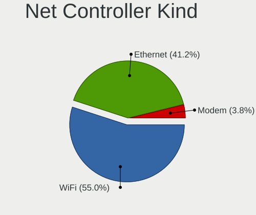

| Kind     | Notebooks | Percent |
|----------|-----------|---------|
| WiFi     | 143       | 55%     |
| Ethernet | 107       | 41.15%  |
| Modem    | 10        | 3.85%   |

Used Controller
---------------

Currently used network controller

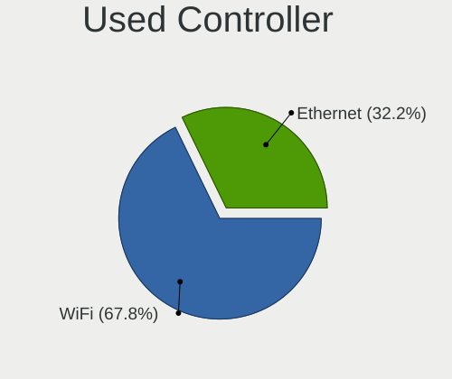

| Kind     | Notebooks | Percent |
|----------|-----------|---------|
| WiFi     | 112       | 71.79%  |
| Ethernet | 44        | 28.21%  |

NICs
----

Total network controllers on board

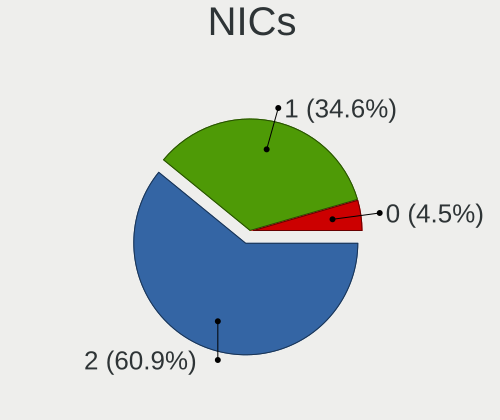

| Total | Notebooks | Percent |
|-------|-----------|---------|
| 2     | 95        | 60.9%   |
| 1     | 54        | 34.62%  |
| 0     | 7         | 4.49%   |

IPv6
----

IPv6 vs IPv4

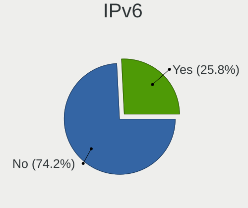

| Used | Notebooks | Percent |
|------|-----------|---------|
| No   | 118       | 74.21%  |
| Yes  | 41        | 25.79%  |

Bluetooth
---------

Bluetooth Vendor
----------------

Controller vendors

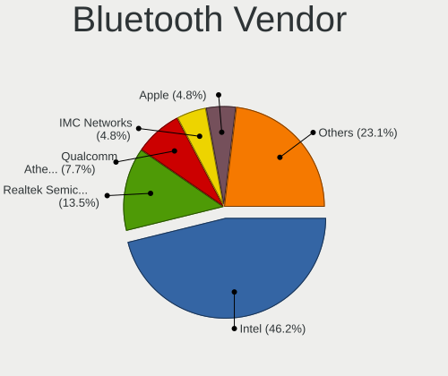

| Vendor                          | Notebooks | Percent |
|---------------------------------|-----------|---------|
| Intel                           | 48        | 46.15%  |
| Realtek Semiconductor           | 14        | 13.46%  |
| Qualcomm Atheros Communications | 8         | 7.69%   |
| IMC Networks                    | 5         | 4.81%   |
| Apple                           | 5         | 4.81%   |
| Lite-On Technology              | 4         | 3.85%   |
| Foxconn / Hon Hai               | 4         | 3.85%   |
| Broadcom                        | 4         | 3.85%   |
| ASUSTek Computer                | 3         | 2.88%   |
| MediaTek                        | 2         | 1.92%   |
| USI                             | 1         | 0.96%   |
| Toshiba                         | 1         | 0.96%   |
| Marvell Semiconductor           | 1         | 0.96%   |
| Hewlett-Packard                 | 1         | 0.96%   |
| Cambridge Silicon Radio         | 1         | 0.96%   |
| Askey Computer                  | 1         | 0.96%   |
| Alps Electric                   | 1         | 0.96%   |

Bluetooth Model
---------------

Controller models

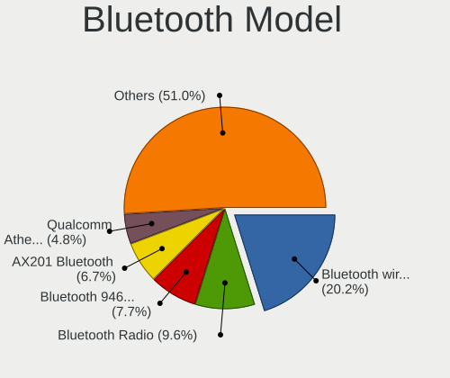

| Model                                                                               | Notebooks | Percent |
|-------------------------------------------------------------------------------------|-----------|---------|
| Intel Bluetooth wireless interface                                                  | 21        | 20.19%  |
| Realtek Bluetooth Radio                                                             | 10        | 9.62%   |
| Intel Bluetooth 9460/9560 Jefferson Peak (JfP)                                      | 8         | 7.69%   |
| Intel AX201 Bluetooth                                                               | 7         | 6.73%   |
| Qualcomm Atheros  Bluetooth Device                                                  | 5         | 4.81%   |
| Intel AX200 Bluetooth                                                               | 5         | 4.81%   |
| Realtek  Bluetooth 4.2 Adapter                                                      | 3         | 2.88%   |
| IMC Networks Bluetooth Radio                                                        | 3         | 2.88%   |
| Apple Bluetooth Host Controller                                                     | 3         | 2.88%   |
| MediaTek Wireless_Device                                                            | 2         | 1.92%   |
| Lite-On Qualcomm Atheros QCA9377 Bluetooth                                          | 2         | 1.92%   |
| Lite-On Atheros AR3012 Bluetooth                                                    | 2         | 1.92%   |
| Intel Wireless-AC 3168 Bluetooth                                                    | 2         | 1.92%   |
| Intel Bluetooth Device                                                              | 2         | 1.92%   |
| Foxconn / Hon Hai Broadcom BCM20702A1 Bluetooth                                     | 2         | 1.92%   |
| ASUS BT-183 Bluetooth 2.0+EDR adapter                                               | 2         | 1.92%   |
| USI Bluetooth Device                                                                | 1         | 0.96%   |
| Toshiba Bluetooth Device                                                            | 1         | 0.96%   |
| Realtek RTL8723B Bluetooth                                                          | 1         | 0.96%   |
| Qualcomm Atheros AR9462 Bluetooth                                                   | 1         | 0.96%   |
| Qualcomm Atheros AR3012 Bluetooth 4.0                                               | 1         | 0.96%   |
| Qualcomm Atheros AR3011 Bluetooth                                                   | 1         | 0.96%   |
| Marvell Bluetooth and Wireless LAN Composite Device                                 | 1         | 0.96%   |
| Intel Centrino Bluetooth Wireless Transceiver                                       | 1         | 0.96%   |
| Intel Centrino Advanced-N 6230 Bluetooth adapter                                    | 1         | 0.96%   |
| Intel AX210 Bluetooth                                                               | 1         | 0.96%   |
| IMC Networks Bluetooth Device                                                       | 1         | 0.96%   |
| IMC Networks Atheros AR3012 Bluetooth 4.0 Adapter                                   | 1         | 0.96%   |
| HP Broadcom 2070 Bluetooth Combo                                                    | 1         | 0.96%   |
| Foxconn / Hon Hai MediaTek Bluetooth Adapter                                        | 1         | 0.96%   |
| Foxconn / Hon Hai Foxconn T77H114 BCM2070 [Single-Chip Bluetooth 2.1 + EDR Adapter] | 1         | 0.96%   |
| Cambridge Silicon Radio Bluetooth Dongle (HCI mode)                                 | 1         | 0.96%   |
| Broadcom HP Portable Bumble Bee                                                     | 1         | 0.96%   |
| Broadcom BCM20702A0                                                                 | 1         | 0.96%   |
| Broadcom BCM2070 Bluetooth 2.1 + EDR                                                | 1         | 0.96%   |
| Broadcom BCM2045 Bluetooth                                                          | 1         | 0.96%   |
| ASUS BT-270 Bluetooth Adapter                                                       | 1         | 0.96%   |
| Askey Bluetooth Device                                                              | 1         | 0.96%   |
| Apple Built-in Bluetooth 2.0+EDR HCI                                                | 1         | 0.96%   |
| Apple Bluetooth USB Host Controller                                                 | 1         | 0.96%   |

Sound
-----

Sound Vendor
------------

Sound card vendors

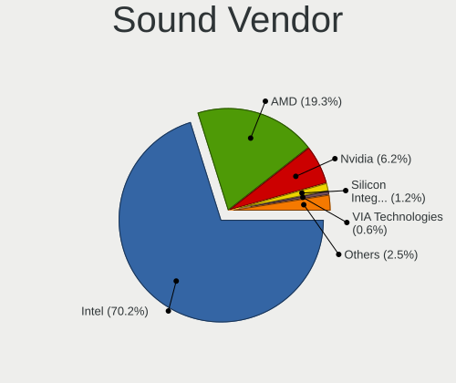

| Vendor                           | Notebooks | Percent |
|----------------------------------|-----------|---------|
| Intel                            | 113       | 70.19%  |
| AMD                              | 31        | 19.25%  |
| Nvidia                           | 10        | 6.21%   |
| Silicon Integrated Systems [SiS] | 2         | 1.24%   |
| VIA Technologies                 | 1         | 0.62%   |
| Sennheiser Communications        | 1         | 0.62%   |
| Realtek Semiconductor            | 1         | 0.62%   |
| Logitech                         | 1         | 0.62%   |
| Cirrus Logic                     | 1         | 0.62%   |

Sound Model
-----------

Sound card models

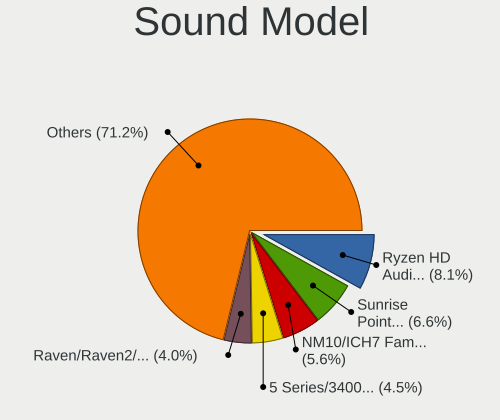

| Model                                                                                             | Notebooks | Percent |
|---------------------------------------------------------------------------------------------------|-----------|---------|
| AMD Ryzen HD Audio Controller                                                                     | 16        | 8.08%   |
| Intel Sunrise Point-LP HD Audio                                                                   | 13        | 6.57%   |
| Intel NM10/ICH7 Family High Definition Audio Controller                                           | 11        | 5.56%   |
| Intel 5 Series/3400 Series Chipset High Definition Audio                                          | 9         | 4.55%   |
| AMD Raven/Raven2/Fenghuang HDMI/DP Audio Controller                                               | 8         | 4.04%   |
| Intel Tiger Lake-LP Smart Sound Technology Audio Controller                                       | 7         | 3.54%   |
| Intel Haswell-ULT HD Audio Controller                                                             | 7         | 3.54%   |
| Intel 8 Series HD Audio Controller                                                                | 7         | 3.54%   |
| Intel Celeron N3350/Pentium N4200/Atom E3900 Series Audio Cluster                                 | 6         | 3.03%   |
| Intel 82801I (ICH9 Family) HD Audio Controller                                                    | 6         | 3.03%   |
| AMD FCH Azalia Controller                                                                         | 6         | 3.03%   |
| Intel Cannon Lake PCH cAVS                                                                        | 5         | 2.53%   |
| Intel Broadwell-U Audio Controller                                                                | 5         | 2.53%   |
| Intel Atom/Celeron/Pentium Processor x5-E8000/J3xxx/N3xxx Series High Definition Audio Controller | 5         | 2.53%   |
| Intel 6 Series/C200 Series Chipset Family High Definition Audio Controller                        | 5         | 2.53%   |
| AMD Kabini HDMI/DP Audio                                                                          | 5         | 2.53%   |
| Intel Wildcat Point-LP High Definition Audio Controller                                           | 4         | 2.02%   |
| Intel Comet Lake PCH-LP cAVS                                                                      | 4         | 2.02%   |
| Intel Celeron/Pentium Silver Processor High Definition Audio                                      | 4         | 2.02%   |
| Intel Alder Lake PCH-P High Definition Audio Controller                                           | 4         | 2.02%   |
| Intel 7 Series/C216 Chipset Family High Definition Audio Controller                               | 4         | 2.02%   |
| AMD Family 15h (Models 60h-6fh) Audio Controller                                                  | 4         | 2.02%   |
| Intel Cannon Point-LP High Definition Audio Controller                                            | 3         | 1.52%   |
| Intel 82801H (ICH8 Family) HD Audio Controller                                                    | 3         | 1.52%   |
| AMD Renoir/Cezanne HDMI/DP Audio Controller                                                       | 3         | 1.52%   |
| AMD Radeon High Definition Audio Controller                                                       | 3         | 1.52%   |
| AMD High Definition Audio Controller                                                              | 3         | 1.52%   |
| Silicon Integrated Systems [SiS] Azalia Audio Controller                                          | 2         | 1.01%   |
| Nvidia TU107 GeForce GTX 1650 High Definition Audio Controller                                    | 2         | 1.01%   |
| Nvidia MCP89 High Definition Audio                                                                | 2         | 1.01%   |
| Intel Xeon E3-1200 v3/4th Gen Core Processor HD Audio Controller                                  | 2         | 1.01%   |
| Intel Atom Processor Z36xxx/Z37xxx Series High Definition Audio Controller                        | 2         | 1.01%   |
| Intel 82801FB/FBM/FR/FW/FRW (ICH6 Family) High Definition Audio Controller                        | 2         | 1.01%   |
| Intel 82801FB/FBM/FR/FW/FRW (ICH6 Family) AC'97 Audio Controller                                  | 2         | 1.01%   |
| Intel 8 Series/C220 Series Chipset High Definition Audio Controller                               | 2         | 1.01%   |
| AMD RV635 HDMI Audio [Radeon HD 3650/3730/3750]                                                   | 2         | 1.01%   |
| VIA Technologies VX900/VT8xxx High Definition Audio Controller                                    | 1         | 0.51%   |
| Sennheiser Communications Sennheiser USB headset                                                  | 1         | 0.51%   |
| Realtek Semiconductor USB Audio                                                                   | 1         | 0.51%   |
| Nvidia TU116 High Definition Audio Controller                                                     | 1         | 0.51%   |

Memory
------

Memory Vendor
-------------

Memory module vendors

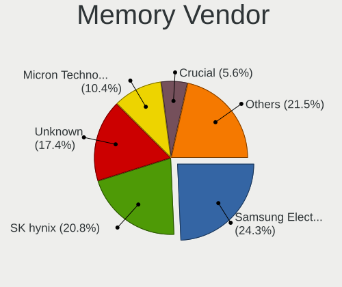

| Vendor              | Notebooks | Percent |
|---------------------|-----------|---------|
| Samsung Electronics | 35        | 24.31%  |
| SK hynix            | 30        | 20.83%  |
| Unknown             | 25        | 17.36%  |
| Micron Technology   | 15        | 10.42%  |
| Crucial             | 8         | 5.56%   |
| Elpida              | 7         | 4.86%   |
| A-DATA Technology   | 5         | 3.47%   |
| Kingston            | 3         | 2.08%   |
| Unknown (ABCD)      | 2         | 1.39%   |
| Nanya Technology    | 2         | 1.39%   |
| 4ea5                | 2         | 1.39%   |
| Unknown             | 2         | 1.39%   |
| Team                | 1         | 0.69%   |
| Silicon Power       | 1         | 0.69%   |
| Ramaxel Technology  | 1         | 0.69%   |
| Gold Key            | 1         | 0.69%   |
| ff                  | 1         | 0.69%   |
| fef5                | 1         | 0.69%   |
| Corsair             | 1         | 0.69%   |
| 48spaces            | 1         | 0.69%   |

Memory Model
------------

Memory module models

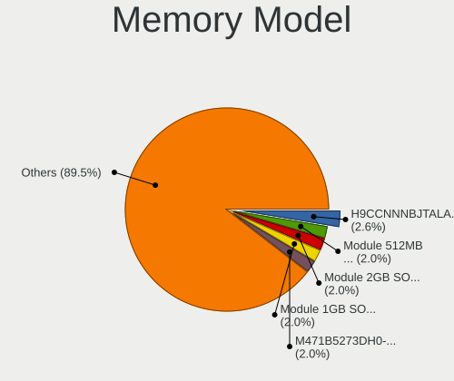

| Model                                                            | Notebooks | Percent |
|------------------------------------------------------------------|-----------|---------|
| SK hynix RAM H9CCNNNBJTALAR-NUD 4GB Row Of Chips LPDDR3 1867MT/s | 4         | 2.61%   |
| Unknown RAM Module 512MB SODIMM DDR                              | 3         | 1.96%   |
| Unknown RAM Module 2GB SODIMM DDR2 667MT/s                       | 3         | 1.96%   |
| Unknown RAM Module 1GB SODIMM SDRAM                              | 3         | 1.96%   |
| Samsung RAM M471B5273DH0-CH9 4GB SODIMM DDR3 1600MT/s            | 3         | 1.96%   |
| Samsung RAM M471A5244CB0-CWE 4GB SODIMM DDR4 3200MT/s            | 3         | 1.96%   |
| Samsung RAM M471A1K43CB1-CTD 8GB SODIMM DDR4 3200MT/s            | 3         | 1.96%   |
| Unknown RAM Module 1GB SODIMM DRAM                               | 2         | 1.31%   |
| Unknown RAM Module 1GB SODIMM DDR                                | 2         | 1.31%   |
| Unknown (ABCD) RAM 123456789012345678 2GB SODIMM LPDDR4 2400MT/s | 2         | 1.31%   |
| Samsung RAM M471B5773DH0-CH9 2GB SODIMM DDR3 1600MT/s            | 2         | 1.31%   |
| Samsung RAM M471B5773CHS-CH9 2GB SODIMM DDR3 4199MT/s            | 2         | 1.31%   |
| Samsung RAM M471B5173QH0-YK0 4GB SODIMM DDR3 1600MT/s            | 2         | 1.31%   |
| Samsung RAM M471B2873FHS-CH9 1GB SODIMM DDR3 1333MT/s            | 2         | 1.31%   |
| Samsung RAM M471A5244CB0-CTD 4GB SODIMM DDR4 3266MT/s            | 2         | 1.31%   |
| Micron RAM 4ATF51264HZ-2G3E1 4GB SODIMM DDR4 2667MT/s            | 2         | 1.31%   |
| Crucial RAM CT51264BF160B.C16F 4GB SODIMM DDR3 4199MT/s          | 2         | 1.31%   |
| Unknown                                                          | 2         | 1.31%   |
| Unknown RAM Module 8GB SODIMM DDR4 2133MT/s                      | 1         | 0.65%   |
| Unknown RAM Module 512MB SODIMM DRAM                             | 1         | 0.65%   |
| Unknown RAM Module 512MB SODIMM DDR2                             | 1         | 0.65%   |
| Unknown RAM Module 4GB SODIMM DDR3 1600MT/s                      | 1         | 0.65%   |
| Unknown RAM Module 2GB SODIMM SDRAM                              | 1         | 0.65%   |
| Unknown RAM Module 2GB SODIMM LPDDR4 2133MT/s                    | 1         | 0.65%   |
| Unknown RAM Module 2GB SODIMM DDR3 1333MT/s                      | 1         | 0.65%   |
| Unknown RAM Module 2GB SODIMM                                    | 1         | 0.65%   |
| Unknown RAM Module 2GB DIMM DDR3 1333MT/s                        | 1         | 0.65%   |
| Unknown RAM Module 256MB SODIMM DDR                              | 1         | 0.65%   |
| Unknown RAM Module 1GB SODIMM LPDDR4 2400MT/s                    | 1         | 0.65%   |
| Unknown RAM Module 1GB SODIMM DDR3 1066MT/s                      | 1         | 0.65%   |
| Unknown RAM Module 1GB SODIMM DDR3                               | 1         | 0.65%   |
| Unknown RAM Module 1GB SODIMM DDR2 667MT/s                       | 1         | 0.65%   |
| Unknown RAM Module 128MB DIMM DRAM                               | 1         | 0.65%   |
| Team RAM TEAMGROUP-SD4-3200 16GB SODIMM DDR4 3200MT/s            | 1         | 0.65%   |
| SK hynix RAM Module 4GB SODIMM LPDDR3 1867MT/s                   | 1         | 0.65%   |
| SK hynix RAM HYMP512S64BP8-C4 1GB SODIMM DDR 533MT/s             | 1         | 0.65%   |
| SK hynix RAM HMT451S6BFR8A-PB 4GB SODIMM DDR3 1600MT/s           | 1         | 0.65%   |
| SK hynix RAM HMT425S6CFR6C-PB 2GB SODIMM DDR3 1066MT/s           | 1         | 0.65%   |
| SK hynix RAM HMT425S6AFR6A-PB 2GB SODIMM DDR3 3200MT/s           | 1         | 0.65%   |
| SK hynix RAM HMT425S2AFR6R-PB 2GB SODIMM DDR3 1333MT/s           | 1         | 0.65%   |

Memory Kind
-----------

Memory module kinds

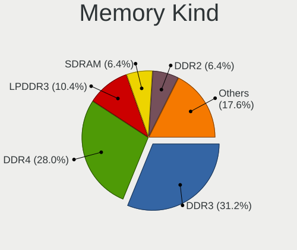

| Kind    | Notebooks | Percent |
|---------|-----------|---------|
| DDR3    | 39        | 31.2%   |
| DDR4    | 35        | 28%     |
| LPDDR3  | 13        | 10.4%   |
| SDRAM   | 8         | 6.4%    |
| DDR2    | 8         | 6.4%    |
| LPDDR4  | 7         | 5.6%    |
| DDR     | 6         | 4.8%    |
| LPDDR5  | 3         | 2.4%    |
| DRAM    | 3         | 2.4%    |
| Unknown | 2         | 1.6%    |
| DDR5    | 1         | 0.8%    |

Memory Form Factor
------------------

Physical design of the memory module

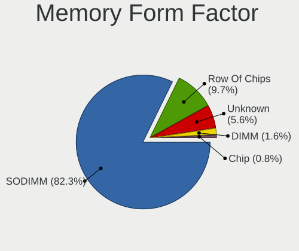

| Name         | Notebooks | Percent |
|--------------|-----------|---------|
| SODIMM       | 102       | 82.26%  |
| Row Of Chips | 12        | 9.68%   |
| Unknown      | 7         | 5.65%   |
| DIMM         | 2         | 1.61%   |
| Chip         | 1         | 0.81%   |

Memory Size
-----------

Memory module size

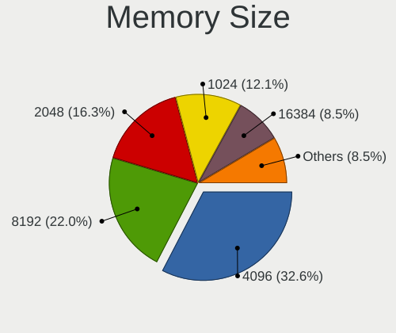

| Size  | Notebooks | Percent |
|-------|-----------|---------|
| 4096  | 46        | 32.62%  |
| 8192  | 31        | 21.99%  |
| 2048  | 23        | 16.31%  |
| 1024  | 17        | 12.06%  |
| 16384 | 12        | 8.51%   |
| 512   | 6         | 4.26%   |
| 32768 | 4         | 2.84%   |
| 256   | 1         | 0.71%   |
| 128   | 1         | 0.71%   |

Memory Speed
------------

Memory module speed

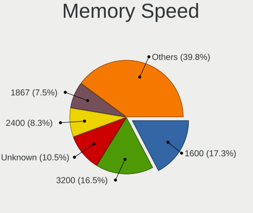

| Speed   | Notebooks | Percent |
|---------|-----------|---------|
| 1600    | 23        | 17.29%  |
| 3200    | 22        | 16.54%  |
| Unknown | 14        | 10.53%  |
| 2400    | 11        | 8.27%   |
| 1867    | 10        | 7.52%   |
| 2667    | 8         | 6.02%   |
| 667     | 6         | 4.51%   |
| 2133    | 5         | 3.76%   |
| 1334    | 5         | 3.76%   |
| 4199    | 4         | 3.01%   |
| 1333    | 4         | 3.01%   |
| 1067    | 4         | 3.01%   |
| 6400    | 3         | 2.26%   |
| 1066    | 3         | 2.26%   |
| 533     | 3         | 2.26%   |
| 3266    | 2         | 1.5%    |
| 8400    | 1         | 0.75%   |
| 5600    | 1         | 0.75%   |
| 3733    | 1         | 0.75%   |
| 1400    | 1         | 0.75%   |
| 1200    | 1         | 0.75%   |
| 800     | 1         | 0.75%   |

Printers & scanners
-------------------

Printer Vendor
--------------

Printer device vendors

Zero info for selected period =(

Printer Model
-------------

Printer device models

Zero info for selected period =(

Scanner Vendor
--------------

Scanner device vendors

Zero info for selected period =(

Scanner Model
-------------

Scanner device models

Zero info for selected period =(

Camera
------

Camera Vendor
-------------

Camera device vendors

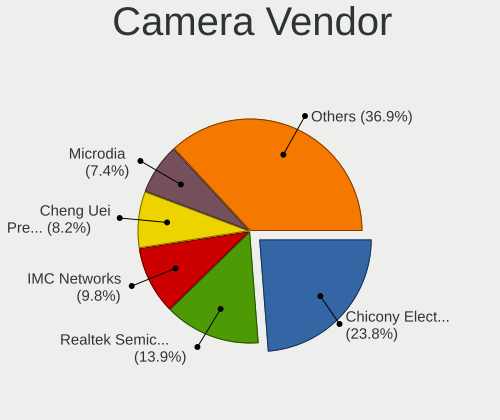

| Vendor                                 | Notebooks | Percent |
|----------------------------------------|-----------|---------|
| Chicony Electronics                    | 29        | 23.77%  |
| Realtek Semiconductor                  | 17        | 13.93%  |
| IMC Networks                           | 12        | 9.84%   |
| Cheng Uei Precision Industry (Foxlink) | 10        | 8.2%    |
| Microdia                               | 9         | 7.38%   |
| Quanta                                 | 8         | 6.56%   |
| Bison Electronics                      | 8         | 6.56%   |
| Apple                                  | 5         | 4.1%    |
| Syntek                                 | 4         | 3.28%   |
| Suyin                                  | 4         | 3.28%   |
| Luxvisions Innotech Limited            | 3         | 2.46%   |
| Sunplus Innovation Technology          | 2         | 1.64%   |
| Silicon Motion                         | 2         | 1.64%   |
| Ricoh                                  | 2         | 1.64%   |
| Lite-On Technology                     | 2         | 1.64%   |
| Lenovo                                 | 2         | 1.64%   |
| webcam                                 | 1         | 0.82%   |
| Samsung Electronics                    | 1         | 0.82%   |
| Framework                              | 1         | 0.82%   |

Camera Model
------------

Camera device models

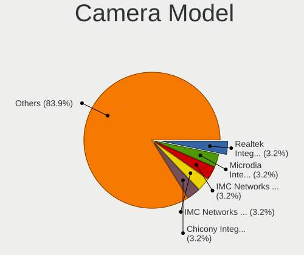

| Model                                               | Notebooks | Percent |
|-----------------------------------------------------|-----------|---------|
| Realtek Integrated_Webcam_HD                        | 4         | 3.23%   |
| Microdia Integrated_Webcam_HD                       | 4         | 3.23%   |
| IMC Networks USB2.0 HD UVC WebCam                   | 4         | 3.23%   |
| IMC Networks Integrated Camera                      | 4         | 3.23%   |
| Chicony Integrated Camera                           | 4         | 3.23%   |
| Realtek HP Webcam                                   | 3         | 2.42%   |
| Chicony HP Wide Vision HD Camera                    | 3         | 2.42%   |
| Realtek Integrated Webcam                           | 2         | 1.61%   |
| Realtek Acer 640 x 480 laptop camera                | 2         | 1.61%   |
| Quanta HP TrueVision HD Camera                      | 2         | 1.61%   |
| Microdia Laptop_Integrated_Webcam_2M                | 2         | 1.61%   |
| Lite-On TOSHIBA Web Camera - HD                     | 2         | 1.61%   |
| Lenovo Integrated Webcam                            | 2         | 1.61%   |
| IMC Networks USB2.0 VGA UVC WebCam                  | 2         | 1.61%   |
| Chicony USB2.0 VGA UVC WebCam                       | 2         | 1.61%   |
| Chicony HP TrueVision HD Camera                     | 2         | 1.61%   |
| Chicony HD WebCam                                   | 2         | 1.61%   |
| Chicony HD User Facing                              | 2         | 1.61%   |
| Chicony 2.0M UVC Webcam / CNF7129                   | 2         | 1.61%   |
| Cheng Uei Precision Industry (Foxlink) Webcam       | 2         | 1.61%   |
| Cheng Uei Precision Industry (Foxlink) HP Webcam    | 2         | 1.61%   |
| Bison Lenovo EasyCamera                             | 2         | 1.61%   |
| Apple Built-in iSight                               | 2         | 1.61%   |
| webcam webcam                                       | 1         | 0.81%   |
| Syntek Sonix USB 2.0 Camera                         | 1         | 0.81%   |
| Syntek Sonix 1.3MPixel USB 2.0 Camera               | 1         | 0.81%   |
| Syntek Lenovo EasyCamera                            | 1         | 0.81%   |
| Syntek EasyCamera                                   | 1         | 0.81%   |
| Suyin Integrated_Webcam_HD                          | 1         | 0.81%   |
| Suyin HP TrueVision HD                              | 1         | 0.81%   |
| Suyin Asus Integrated Webcam                        | 1         | 0.81%   |
| Suyin Acer CrystalEye Webcam                        | 1         | 0.81%   |
| Sunplus HP Universal Camera                         | 1         | 0.81%   |
| Sunplus HD WebCam                                   | 1         | 0.81%   |
| Silicon Motion WebCam SC-03FFL11939N                | 1         | 0.81%   |
| Silicon Motion NCM-G102                             | 1         | 0.81%   |
| Samsung Galaxy series, misc. (MTP mode)             | 1         | 0.81%   |
| Ricoh Visual Communication Camera VGP-VCC3 [R5U870] | 1         | 0.81%   |
| Ricoh Pavilion Webcam [R5U870]                      | 1         | 0.81%   |
| Realtek USB2.0 HD UVC WebCam                        | 1         | 0.81%   |

Security
--------

Fingerprint Vendor
------------------

Fingerprint sensor vendors

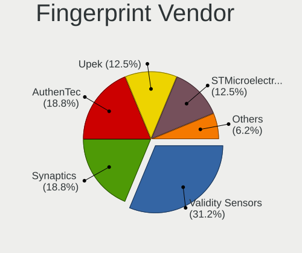

| Vendor                | Notebooks | Percent |
|-----------------------|-----------|---------|
| Validity Sensors      | 5         | 31.25%  |
| Synaptics             | 3         | 18.75%  |
| AuthenTec             | 3         | 18.75%  |
| Upek                  | 2         | 12.5%   |
| STMicroelectronics    | 2         | 12.5%   |
| Elan Microelectronics | 1         | 6.25%   |

Fingerprint Model
-----------------

Fingerprint sensor models

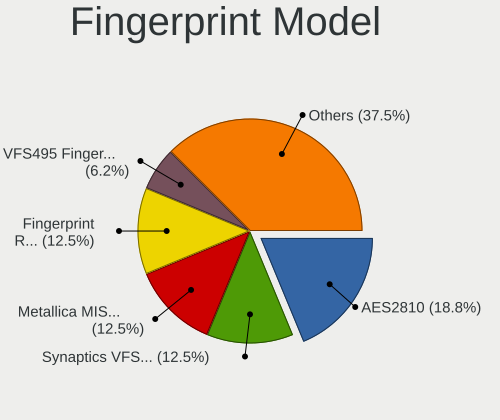

| Model                                                                      | Notebooks | Percent |
|----------------------------------------------------------------------------|-----------|---------|
| AuthenTec AES2810                                                          | 3         | 18.75%  |
| Validity Sensors Synaptics VFS7552 Touch Fingerprint Sensor with PurePrint | 2         | 12.5%   |
| Synaptics Metallica MIS Touch Fingerprint Reader                           | 2         | 12.5%   |
| STMicroelectronics Fingerprint Reader                                      | 2         | 12.5%   |
| Validity Sensors VFS495 Fingerprint Reader                                 | 1         | 6.25%   |
| Validity Sensors VFS451 Fingerprint Reader                                 | 1         | 6.25%   |
| Validity Sensors VFS Fingerprint sensor                                    | 1         | 6.25%   |
| Upek TCS5B Fingerprint sensor                                              | 1         | 6.25%   |
| Upek Biometric Touchchip/Touchstrip Fingerprint Sensor                     | 1         | 6.25%   |
| Synaptics  FS7604 Touch Fingerprint Sensor with PurePrint                  | 1         | 6.25%   |
| Elan ELAN:Fingerprint                                                      | 1         | 6.25%   |

Chipcard Vendor
---------------

Chipcard module vendors

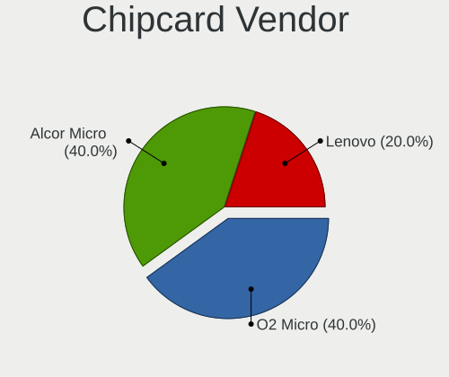

| Vendor      | Notebooks | Percent |
|-------------|-----------|---------|
| O2 Micro    | 2         | 40%     |
| Alcor Micro | 2         | 40%     |
| Lenovo      | 1         | 20%     |

Chipcard Model
--------------

Chipcard module models

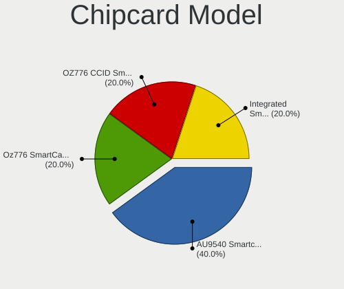

| Model                                | Notebooks | Percent |
|--------------------------------------|-----------|---------|
| Alcor Micro AU9540 Smartcard Reader  | 2         | 40%     |
| O2 Micro Oz776 SmartCard Reader      | 1         | 20%     |
| O2 Micro OZ776 CCID Smartcard Reader | 1         | 20%     |
| Lenovo Integrated Smart Card Reader  | 1         | 20%     |

Unsupported
-----------

Unsupported Devices
-------------------

Total unsupported devices on board

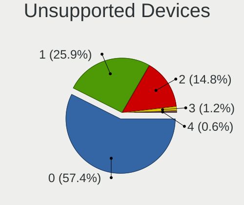

| Total | Notebooks | Percent |
|-------|-----------|---------|
| 0     | 93        | 57.41%  |
| 1     | 42        | 25.93%  |
| 2     | 24        | 14.81%  |
| 3     | 2         | 1.23%   |
| 4     | 1         | 0.62%   |

Unsupported Device Types
------------------------

Types of unsupported devices

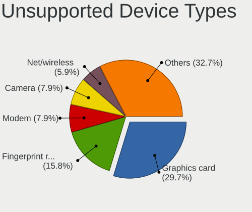

| Type                     | Notebooks | Percent |
|--------------------------|-----------|---------|
| Graphics card            | 30        | 29.7%   |
| Fingerprint reader       | 16        | 15.84%  |
| Modem                    | 8         | 7.92%   |
| Camera                   | 8         | 7.92%   |
| Net/wireless             | 6         | 5.94%   |
| Communication controller | 6         | 5.94%   |
| Bluetooth                | 6         | 5.94%   |
| Chipcard                 | 5         | 4.95%   |
| Card reader              | 5         | 4.95%   |
| Multimedia controller    | 4         | 3.96%   |
| Storage                  | 2         | 1.98%   |
| Network                  | 2         | 1.98%   |
| Unclassified device      | 1         | 0.99%   |
| Sound                    | 1         | 0.99%   |
| Flash memory             | 1         | 0.99%   |

