Alpine - Tested Hardware & Statistics (Notebooks)
-------------------------------------------------

A project to collect tested hardware configurations for Alpine.

Anyone can contribute to this report by the [hw-probe](https://github.com/linuxhw/hw-probe) tool:

    sudo -E hw-probe -all -upload

Please contribute! Especially if your hardware is rare.

Contents
--------

* [ Test Cases ](#test-cases)

* [ System ](#system)
  - [ OS                       ](#os)
  - [ OS Family                ](#os-family)
  - [ Kernel                   ](#kernel)
  - [ Kernel Family            ](#kernel-family)
  - [ Kernel Major Ver.        ](#kernel-major-ver)
  - [ Arch                     ](#arch)
  - [ DE                       ](#de)
  - [ Display Server           ](#display-server)
  - [ Display Manager          ](#display-manager)
  - [ OS Lang                  ](#os-lang)
  - [ Boot Mode                ](#boot-mode)
  - [ Filesystem               ](#filesystem)
  - [ Part. scheme             ](#part-scheme)
  - [ Dual Boot with Linux/BSD ](#dual-boot-with-linuxbsd)
  - [ Dual Boot (Win)          ](#dual-boot-win)

* [ Board ](#board)
  - [ Vendor                   ](#vendor)
  - [ Model                    ](#model)
  - [ Model Family             ](#model-family)
  - [ MFG Year                 ](#mfg-year)
  - [ Form Factor              ](#form-factor)
  - [ Secure Boot              ](#secure-boot)
  - [ Coreboot                 ](#coreboot)
  - [ RAM Size                 ](#ram-size)
  - [ RAM Used                 ](#ram-used)
  - [ Total Drives             ](#total-drives)
  - [ Has CD-ROM               ](#has-cd-rom)
  - [ Has Ethernet             ](#has-ethernet)
  - [ Has WiFi                 ](#has-wifi)
  - [ Has Bluetooth            ](#has-bluetooth)

* [ Location ](#location)
  - [ Country                  ](#country)
  - [ City                     ](#city)

* [ Drives ](#drives)
  - [ Drive Vendor             ](#drive-vendor)
  - [ Drive Model              ](#drive-model)
  - [ HDD Vendor               ](#hdd-vendor)
  - [ SSD Vendor               ](#ssd-vendor)
  - [ Drive Kind               ](#drive-kind)
  - [ Drive Connector          ](#drive-connector)
  - [ Drive Size               ](#drive-size)
  - [ Space Total              ](#space-total)
  - [ Space Used               ](#space-used)
  - [ Malfunc. Drives          ](#malfunc-drives)
  - [ Malfunc. Drive Vendor    ](#malfunc-drive-vendor)
  - [ Malfunc. HDD Vendor      ](#malfunc-hdd-vendor)
  - [ Malfunc. Drive Kind      ](#malfunc-drive-kind)
  - [ Failed Drives            ](#failed-drives)
  - [ Failed Drive Vendor      ](#failed-drive-vendor)
  - [ Drive Status             ](#drive-status)

* [ Storage controller ](#storage-controller)
  - [ Storage Vendor           ](#storage-vendor)
  - [ Storage Model            ](#storage-model)
  - [ Storage Kind             ](#storage-kind)

* [ Processor ](#processor)
  - [ CPU Vendor               ](#cpu-vendor)
  - [ CPU Model                ](#cpu-model)
  - [ CPU Model Family         ](#cpu-model-family)
  - [ CPU Cores                ](#cpu-cores)
  - [ CPU Sockets              ](#cpu-sockets)
  - [ CPU Threads              ](#cpu-threads)
  - [ CPU Op-Modes             ](#cpu-op-modes)
  - [ CPU Microcode            ](#cpu-microcode)
  - [ CPU Microarch            ](#cpu-microarch)

* [ Graphics ](#graphics)
  - [ GPU Vendor               ](#gpu-vendor)
  - [ GPU Model                ](#gpu-model)
  - [ GPU Combo                ](#gpu-combo)
  - [ GPU Driver               ](#gpu-driver)
  - [ GPU Memory               ](#gpu-memory)

* [ Monitor ](#monitor)
  - [ Monitor Vendor           ](#monitor-vendor)
  - [ Monitor Model            ](#monitor-model)
  - [ Monitor Resolution       ](#monitor-resolution)
  - [ Monitor Diagonal         ](#monitor-diagonal)
  - [ Monitor Width            ](#monitor-width)
  - [ Aspect Ratio             ](#aspect-ratio)
  - [ Monitor Area             ](#monitor-area)
  - [ Pixel Density            ](#pixel-density)
  - [ Multiple Monitors        ](#multiple-monitors)

* [ Network ](#network)
  - [ Net Controller Vendor    ](#net-controller-vendor)
  - [ Net Controller Model     ](#net-controller-model)
  - [ Wireless Vendor          ](#wireless-vendor)
  - [ Wireless Model           ](#wireless-model)
  - [ Ethernet Vendor          ](#ethernet-vendor)
  - [ Ethernet Model           ](#ethernet-model)
  - [ Net Controller Kind      ](#net-controller-kind)
  - [ Used Controller          ](#used-controller)
  - [ NICs                     ](#nics)
  - [ IPv6                     ](#ipv6)

* [ Bluetooth ](#bluetooth)
  - [ Bluetooth Vendor         ](#bluetooth-vendor)
  - [ Bluetooth Model          ](#bluetooth-model)

* [ Sound ](#sound)
  - [ Sound Vendor             ](#sound-vendor)
  - [ Sound Model              ](#sound-model)

* [ Memory ](#memory)
  - [ Memory Vendor            ](#memory-vendor)
  - [ Memory Model             ](#memory-model)
  - [ Memory Kind              ](#memory-kind)
  - [ Memory Form Factor       ](#memory-form-factor)
  - [ Memory Size              ](#memory-size)
  - [ Memory Speed             ](#memory-speed)

* [ Printers & scanners ](#printers--scanners)
  - [ Printer Vendor           ](#printer-vendor)
  - [ Printer Model            ](#printer-model)
  - [ Scanner Vendor           ](#scanner-vendor)
  - [ Scanner Model            ](#scanner-model)

* [ Camera ](#camera)
  - [ Camera Vendor            ](#camera-vendor)
  - [ Camera Model             ](#camera-model)

* [ Security ](#security)
  - [ Fingerprint Vendor       ](#fingerprint-vendor)
  - [ Fingerprint Model        ](#fingerprint-model)
  - [ Chipcard Vendor          ](#chipcard-vendor)
  - [ Chipcard Model           ](#chipcard-model)

* [ Unsupported ](#unsupported)
  - [ Unsupported Devices      ](#unsupported-devices)
  - [ Unsupported Device Types ](#unsupported-device-types)

Test Cases
----------

Total: 149

| Vendor        | Model                       | Probe                                                      | Date         |
|---------------|-----------------------------|------------------------------------------------------------|--------------|
| Lenovo        | ThinkPad X61 76754KU        | [1a083b94dc](https://linux-hardware.org/?probe=1a083b94dc) | Apr 27, 2024 |
| HP            | Pavilion dv6500             | [339679d475](https://linux-hardware.org/?probe=339679d475) | Apr 22, 2024 |
| HP            | ENVY Laptop 13-ad1xx        | [73379ea508](https://linux-hardware.org/?probe=73379ea508) | Apr 13, 2024 |
| HP            | Laptop 15-bw0xx             | [823f3c3138](https://linux-hardware.org/?probe=823f3c3138) | Apr 09, 2024 |
| Acer          | Nitro AN515-55              | [9b975edbf7](https://linux-hardware.org/?probe=9b975edbf7) | Mar 23, 2024 |
| HP            | Pavilion Notebook           | [2c5499e776](https://linux-hardware.org/?probe=2c5499e776) | Mar 22, 2024 |
| Lenovo        | V15 G3 IAP 82TT             | [fb281cfb94](https://linux-hardware.org/?probe=fb281cfb94) | Mar 18, 2024 |
| Sony          | VPCEC3A4E                   | [38f3380fcf](https://linux-hardware.org/?probe=38f3380fcf) | Mar 11, 2024 |
| Acer          | Nitro AN515-55              | [98c56ac1d0](https://linux-hardware.org/?probe=98c56ac1d0) | Mar 10, 2024 |
| SLIMBOOK      | EXECUTIVE-14                | [39d528dadf](https://linux-hardware.org/?probe=39d528dadf) | Mar 01, 2024 |
| SLIMBOOK      | EXECUTIVE-14                | [5fc24348a8](https://linux-hardware.org/?probe=5fc24348a8) | Mar 01, 2024 |
| HP            | Laptop 15-bw0xx             | [39ed74cf97](https://linux-hardware.org/?probe=39ed74cf97) | Feb 24, 2024 |
| HP            | ENVY Laptop 13-ad1xx        | [340e79c73f](https://linux-hardware.org/?probe=340e79c73f) | Feb 22, 2024 |
| Sony          | VPCEC3A4E                   | [e365c35e91](https://linux-hardware.org/?probe=e365c35e91) | Feb 22, 2024 |
| Acer          | Nitro AN515-55              | [0ee9f9ca69](https://linux-hardware.org/?probe=0ee9f9ca69) | Feb 18, 2024 |
| Sony          | VPCEC3A4E                   | [cc5290daff](https://linux-hardware.org/?probe=cc5290daff) | Feb 18, 2024 |
| Sony          | VPCEC3A4E                   | [b31170da6a](https://linux-hardware.org/?probe=b31170da6a) | Feb 17, 2024 |
| HP            | ENVY Laptop 13-ad1xx        | [f3d4535f87](https://linux-hardware.org/?probe=f3d4535f87) | Feb 13, 2024 |
| ASUSTek       | VivoBook_ASUSLaptop X509... | [6b61926dd2](https://linux-hardware.org/?probe=6b61926dd2) | Feb 09, 2024 |
| Acer          | Nitro AN515-55              | [1e2603f833](https://linux-hardware.org/?probe=1e2603f833) | Feb 04, 2024 |
| Apple         | MacBook5,1                  | [d3a48ce5b5](https://linux-hardware.org/?probe=d3a48ce5b5) | Jan 24, 2024 |
| Apple         | MacBook5,1                  | [2fa13d832c](https://linux-hardware.org/?probe=2fa13d832c) | Jan 24, 2024 |
| Acer          | Nitro AN515-55              | [876874e8b5](https://linux-hardware.org/?probe=876874e8b5) | Jan 24, 2024 |
| Lenovo        | Y70-70 Touch 80DU           | [fb81d9ccfe](https://linux-hardware.org/?probe=fb81d9ccfe) | Jan 20, 2024 |
| Wortmann      | M660SE                      | [225361b7c3](https://linux-hardware.org/?probe=225361b7c3) | Jan 06, 2024 |
| Acer          | Nitro AN515-55              | [6f9241e288](https://linux-hardware.org/?probe=6f9241e288) | Jan 04, 2024 |
| Fujitsu       | LIFEBOOK AH530              | [9d5aa2f8ae](https://linux-hardware.org/?probe=9d5aa2f8ae) | Jan 02, 2024 |
| Fujitsu       | LIFEBOOK AH530              | [db0bed1921](https://linux-hardware.org/?probe=db0bed1921) | Jan 02, 2024 |
| Acer          | Nitro AN515-55              | [7528cb1c24](https://linux-hardware.org/?probe=7528cb1c24) | Dec 30, 2023 |
| Acer          | Nitro AN515-55              | [f071a372c0](https://linux-hardware.org/?probe=f071a372c0) | Dec 29, 2023 |
| Acer          | Aspire A515-54              | [ea0b7cd870](https://linux-hardware.org/?probe=ea0b7cd870) | Dec 26, 2023 |
| Acer          | Nitro AN515-55              | [2432d4f585](https://linux-hardware.org/?probe=2432d4f585) | Dec 22, 2023 |
| Lenovo        | V15 G3 IAP 82TT             | [d33b5845ef](https://linux-hardware.org/?probe=d33b5845ef) | Dec 20, 2023 |
| Acer          | Nitro AN515-55              | [4b404f8509](https://linux-hardware.org/?probe=4b404f8509) | Dec 15, 2023 |
| Dell          | Latitude 3420               | [b344d71410](https://linux-hardware.org/?probe=b344d71410) | Dec 13, 2023 |
| HP            | Laptop 17-cp0xxx            | [2199caf331](https://linux-hardware.org/?probe=2199caf331) | Dec 10, 2023 |
| ASUSTek       | 1001PX                      | [74bc5aeded](https://linux-hardware.org/?probe=74bc5aeded) | Nov 22, 2023 |
| ASUSTek       | 1001PX                      | [2069694d95](https://linux-hardware.org/?probe=2069694d95) | Nov 22, 2023 |
| Acer          | Nitro AN515-55              | [b312b34d74](https://linux-hardware.org/?probe=b312b34d74) | Nov 20, 2023 |
| ASUSTek       | VivoBook_ASUSLaptop X712... | [f576d94ac0](https://linux-hardware.org/?probe=f576d94ac0) | Nov 17, 2023 |
| Acer          | Nitro AN515-55              | [f48f05994e](https://linux-hardware.org/?probe=f48f05994e) | Nov 14, 2023 |
| Apple         | MacBookAir5,2               | [60e418e27f](https://linux-hardware.org/?probe=60e418e27f) | Nov 14, 2023 |
| Acer          | Nitro AN515-55              | [65a7263504](https://linux-hardware.org/?probe=65a7263504) | Nov 09, 2023 |
| Acer          | Nitro AN515-55              | [ccc7d658ea](https://linux-hardware.org/?probe=ccc7d658ea) | Nov 06, 2023 |
| Lenovo        | Flex 2-14 20404             | [0656d1a0a8](https://linux-hardware.org/?probe=0656d1a0a8) | Oct 28, 2023 |
| Acer          | Nitro AN515-55              | [e116ef83e9](https://linux-hardware.org/?probe=e116ef83e9) | Oct 27, 2023 |
| Acer          | Nitro AN515-55              | [6df3cd6820](https://linux-hardware.org/?probe=6df3cd6820) | Oct 20, 2023 |
| Acer          | Nitro AN515-55              | [8356867b4d](https://linux-hardware.org/?probe=8356867b4d) | Oct 04, 2023 |
| Acer          | Nitro AN515-55              | [1d2bd102c6](https://linux-hardware.org/?probe=1d2bd102c6) | Sep 28, 2023 |
| Acer          | Nitro AN515-55              | [6295f7193c](https://linux-hardware.org/?probe=6295f7193c) | Sep 27, 2023 |
| Acer          | Nitro AN515-55              | [793c32918d](https://linux-hardware.org/?probe=793c32918d) | Sep 23, 2023 |
| ASUSTek       | TUF Gaming FX505DD_FX505... | [b858f753b2](https://linux-hardware.org/?probe=b858f753b2) | Sep 19, 2023 |
| Unknown       | Unknown                     | [cc13e0926e](https://linux-hardware.org/?probe=cc13e0926e) | Sep 17, 2023 |
| HP            | Pavilion Gaming Laptop 1... | [416798463e](https://linux-hardware.org/?probe=416798463e) | Sep 16, 2023 |
| LG Electro... | LW25-B7HG                   | [e9998203e6](https://linux-hardware.org/?probe=e9998203e6) | Sep 12, 2023 |
| Acer          | Nitro AN515-55              | [d59c2170bb](https://linux-hardware.org/?probe=d59c2170bb) | Sep 08, 2023 |
| Acer          | Nitro AN515-55              | [ed1061dbb1](https://linux-hardware.org/?probe=ed1061dbb1) | Sep 07, 2023 |
| Acer          | Nitro AN515-55              | [30368099b8](https://linux-hardware.org/?probe=30368099b8) | Sep 06, 2023 |
| Acer          | Nitro AN515-55              | [f71590bc2b](https://linux-hardware.org/?probe=f71590bc2b) | Sep 03, 2023 |
| HP            | Presario V2000 (ES307UA#... | [6c727b9e00](https://linux-hardware.org/?probe=6c727b9e00) | Aug 23, 2023 |
| Acer          | Nitro AN515-55              | [d81314b86d](https://linux-hardware.org/?probe=d81314b86d) | Aug 12, 2023 |
| Acer          | Nitro AN515-55              | [4d26902a65](https://linux-hardware.org/?probe=4d26902a65) | Aug 12, 2023 |
| Acer          | Nitro AN515-55              | [d4a16b0b3e](https://linux-hardware.org/?probe=d4a16b0b3e) | Aug 10, 2023 |
| Acer          | Nitro AN515-55              | [294dcce02b](https://linux-hardware.org/?probe=294dcce02b) | Aug 04, 2023 |
| Dell          | Latitude 5430 Rugged        | [051aebd1a2](https://linux-hardware.org/?probe=051aebd1a2) | Jul 24, 2023 |
| ASUSTek       | A3AC                        | [1bf0a25c8e](https://linux-hardware.org/?probe=1bf0a25c8e) | Jul 22, 2023 |
| ASUSTek       | A3AC                        | [f7fb9875de](https://linux-hardware.org/?probe=f7fb9875de) | Jul 22, 2023 |
| Toshiba       | Satellite Pro L50-A         | [f1907449fa](https://linux-hardware.org/?probe=f1907449fa) | Jun 24, 2023 |
| Google        | Kefka                       | [c5d9002e23](https://linux-hardware.org/?probe=c5d9002e23) | Jun 23, 2023 |
| Lenovo        | ThinkPad T440p              | [c058d92130](https://linux-hardware.org/?probe=c058d92130) | Jun 05, 2023 |
| Toshiba       | WT8-A                       | [4dc30f1c10](https://linux-hardware.org/?probe=4dc30f1c10) | Jun 04, 2023 |
| MSI           | U200                        | [2fe4d70ea1](https://linux-hardware.org/?probe=2fe4d70ea1) | Jun 02, 2023 |
| Notebook      | NV4XMB,ME,MZ                | [125884d17a](https://linux-hardware.org/?probe=125884d17a) | Apr 05, 2023 |
| Olivetti      | Spring Peak                 | [9678c685d7](https://linux-hardware.org/?probe=9678c685d7) | Mar 31, 2023 |
| Olivetti      | Spring Peak                 | [7878f53f36](https://linux-hardware.org/?probe=7878f53f36) | Mar 31, 2023 |
| Fujitsu       | FMVNP8AE                    | [10efc9f976](https://linux-hardware.org/?probe=10efc9f976) | Mar 21, 2023 |
| Lenovo        | ThinkPad E590 20NB0012RT    | [4c9bfc239a](https://linux-hardware.org/?probe=4c9bfc239a) | Feb 26, 2023 |
| Acer          | Aspire ES1-132              | [386da062e2](https://linux-hardware.org/?probe=386da062e2) | Feb 23, 2023 |
| Lenovo        | V14-ADA 82C6                | [3bd522dc2c](https://linux-hardware.org/?probe=3bd522dc2c) | Feb 13, 2023 |
| Lenovo        | V14-ADA 82C6                | [cfa774a092](https://linux-hardware.org/?probe=cfa774a092) | Feb 13, 2023 |
| Acer          | Nitro AN515-55              | [b3d00219b0](https://linux-hardware.org/?probe=b3d00219b0) | Feb 07, 2023 |
| Google        | Leona                       | [59b146e197](https://linux-hardware.org/?probe=59b146e197) | Jan 21, 2023 |
| Dell          | Inspiron 3558               | [9635348d10](https://linux-hardware.org/?probe=9635348d10) | Jan 09, 2023 |
| Lenovo        | ThinkPad X131e 33711Q7      | [3336313cae](https://linux-hardware.org/?probe=3336313cae) | Jan 06, 2023 |
| Lenovo        | ThinkPad X131e 33711Q7      | [7e0f8a38bf](https://linux-hardware.org/?probe=7e0f8a38bf) | Jan 04, 2023 |
| ASUSTek       | TUF Gaming FX505DD_FX505... | [5da7f2d3a9](https://linux-hardware.org/?probe=5da7f2d3a9) | Dec 27, 2022 |
| Dell          | Inspiron N5010              | [389475ec30](https://linux-hardware.org/?probe=389475ec30) | Dec 25, 2022 |
| Dell          | Inspiron 5447               | [735ac089ab](https://linux-hardware.org/?probe=735ac089ab) | Oct 17, 2022 |
| HP            | Presario V4000 (EQ608PA#... | [f462d80b2a](https://linux-hardware.org/?probe=f462d80b2a) | Oct 06, 2022 |
| Toshiba       | Satellite M645              | [b342f11704](https://linux-hardware.org/?probe=b342f11704) | Aug 16, 2022 |
| Toshiba       | Satellite M645              | [f64d98a9e1](https://linux-hardware.org/?probe=f64d98a9e1) | Aug 16, 2022 |
| Dell          | Inspiron 3180               | [d4dbaf9ec8](https://linux-hardware.org/?probe=d4dbaf9ec8) | Aug 14, 2022 |
| Fujitsu       | LIFEBOOK P702               | [fdbe6c32cd](https://linux-hardware.org/?probe=fdbe6c32cd) | Aug 06, 2022 |
| Sony          | VGN-UX27GN                  | [ed20bd45a4](https://linux-hardware.org/?probe=ed20bd45a4) | Jun 20, 2022 |
| IBM           | ThinkPad X40 2371LBG        | [e7610b86d4](https://linux-hardware.org/?probe=e7610b86d4) | Jun 20, 2022 |
| HP            | EliteBook 8460p             | [a0a6c37152](https://linux-hardware.org/?probe=a0a6c37152) | Jun 19, 2022 |
| ASUSTek       | X555LAB                     | [e47cf70de1](https://linux-hardware.org/?probe=e47cf70de1) | Jun 17, 2022 |
| HP            | ENVY Sleekbook 6 PC         | [28b7e84c50](https://linux-hardware.org/?probe=28b7e84c50) | May 24, 2022 |
| HP            | ENVY Sleekbook 6 PC         | [5d78835d90](https://linux-hardware.org/?probe=5d78835d90) | May 24, 2022 |
| ASUSTek       | N10Jc                       | [ae20ca4c7c](https://linux-hardware.org/?probe=ae20ca4c7c) | May 05, 2022 |
| ASUSTek       | N10Jc                       | [1f688a5b2d](https://linux-hardware.org/?probe=1f688a5b2d) | May 05, 2022 |
| HP            | ProBook 4310s               | [a37901ae30](https://linux-hardware.org/?probe=a37901ae30) | Apr 26, 2022 |
| Haier         | U144S                       | [9a4827b852](https://linux-hardware.org/?probe=9a4827b852) | Mar 26, 2022 |
| Acer          | Aspire E5-553G              | [930cc740b2](https://linux-hardware.org/?probe=930cc740b2) | Mar 24, 2022 |
| Lenovo        | ThinkPad T420 42364F2       | [d82acaba71](https://linux-hardware.org/?probe=d82acaba71) | Mar 23, 2022 |
| Dell          | XPS 15 7590                 | [df2a40363b](https://linux-hardware.org/?probe=df2a40363b) | Mar 18, 2022 |
| ASUSTek       | ZenBook UX431FA             | [b3cbed05f5](https://linux-hardware.org/?probe=b3cbed05f5) | Mar 10, 2022 |
| Lenovo        | ThinkPad X1 Carbon 6th 2... | [94cf359935](https://linux-hardware.org/?probe=94cf359935) | Feb 17, 2022 |
| Lenovo        | ThinkPad X1 Carbon 6th 2... | [822688debe](https://linux-hardware.org/?probe=822688debe) | Feb 16, 2022 |
| ASUSTek       | ZenBook UX431FA             | [519a7a72ab](https://linux-hardware.org/?probe=519a7a72ab) | Jan 24, 2022 |
| HP            | EliteBook 1040 G3 Notebo... | [465c51678d](https://linux-hardware.org/?probe=465c51678d) | Jan 01, 2022 |
| MSI           | GL72M 7REX                  | [6ada534c8b](https://linux-hardware.org/?probe=6ada534c8b) | Dec 13, 2021 |
| Lenovo        | ThinkPad W700 2752RZ2       | [66ea0a02cb](https://linux-hardware.org/?probe=66ea0a02cb) | Nov 25, 2021 |
| Dell          | Inspiron MM061              | [e293d0cf05](https://linux-hardware.org/?probe=e293d0cf05) | Nov 02, 2021 |
| ASUSTek       | X550EA                      | [bbed87466a](https://linux-hardware.org/?probe=bbed87466a) | Oct 05, 2021 |
| HP            | Compaq Mini CQ10-600        | [4603b3336e](https://linux-hardware.org/?probe=4603b3336e) | Oct 01, 2021 |
| Lenovo        | IdeaPad 320-15AST 80XV      | [9ff8561f02](https://linux-hardware.org/?probe=9ff8561f02) | Sep 30, 2021 |
| Lenovo        | Yoga 14sARH 2021 82LB       | [9fa77d455d](https://linux-hardware.org/?probe=9fa77d455d) | Sep 30, 2021 |
| Unknown       | Unknown                     | [d3c742bac9](https://linux-hardware.org/?probe=d3c742bac9) | Sep 26, 2021 |
| Pegatron      | Deepcam                     | [5326e6bf39](https://linux-hardware.org/?probe=5326e6bf39) | Jul 18, 2021 |
| Acer          | Nitro AN515-55              | [3199a22608](https://linux-hardware.org/?probe=3199a22608) | Jul 15, 2021 |
| HP            | EliteBook 2740p             | [66479cb1dd](https://linux-hardware.org/?probe=66479cb1dd) | Jul 09, 2021 |
| HP            | EliteBook 2740p             | [652fa48f49](https://linux-hardware.org/?probe=652fa48f49) | Jul 08, 2021 |
| ASUSTek       | X200MA                      | [c9edeec38a](https://linux-hardware.org/?probe=c9edeec38a) | Jun 26, 2021 |
| HP            | Laptop 14-dq1xxx            | [f1b8c01b96](https://linux-hardware.org/?probe=f1b8c01b96) | Jun 22, 2021 |
| IBM           | 264070A                     | [c057e54603](https://linux-hardware.org/?probe=c057e54603) | Jun 08, 2021 |
| HP            | Mini 110-3500               | [be40a38710](https://linux-hardware.org/?probe=be40a38710) | Jun 06, 2021 |
| HP            | ENVY Sleekbook 6 PC         | [0a2464e592](https://linux-hardware.org/?probe=0a2464e592) | Jun 06, 2021 |
| Acer          | Aspire ES1-512              | [01ad8fc793](https://linux-hardware.org/?probe=01ad8fc793) | Jan 30, 2021 |
| Acer          | Aspire 5920G                | [7cf5d7b04a](https://linux-hardware.org/?probe=7cf5d7b04a) | Jan 08, 2021 |
| HP            | Compaq Mini CQ10-600        | [fe7ee46763](https://linux-hardware.org/?probe=fe7ee46763) | Jan 08, 2021 |
| Gateway       | MX3631m                     | [15d8283384](https://linux-hardware.org/?probe=15d8283384) | Jan 03, 2021 |
| Dell          | Studio 1747                 | [b4e0e289f6](https://linux-hardware.org/?probe=b4e0e289f6) | Dec 29, 2020 |
| Dell          | Inspiron 3180               | [4b05b65d0e](https://linux-hardware.org/?probe=4b05b65d0e) | Dec 16, 2020 |
| Dell          | Inspiron 3180               | [0bc140f6f6](https://linux-hardware.org/?probe=0bc140f6f6) | Dec 16, 2020 |
| ASUSTek       | E502SA                      | [0a25648158](https://linux-hardware.org/?probe=0a25648158) | Dec 05, 2020 |
| IBM           | 26446AG                     | [f004231106](https://linux-hardware.org/?probe=f004231106) | Nov 15, 2020 |
| IBM           | 26446AG                     | [29affa3577](https://linux-hardware.org/?probe=29affa3577) | Nov 15, 2020 |
| Google        | Samus                       | [efe40a5a38](https://linux-hardware.org/?probe=efe40a5a38) | Oct 13, 2020 |
| Dell          | Inspiron 5566               | [a12b4d304a](https://linux-hardware.org/?probe=a12b4d304a) | Sep 29, 2020 |
| Apple         | MacBook7,1                  | [6445bfa9bd](https://linux-hardware.org/?probe=6445bfa9bd) | Aug 31, 2020 |
| Acer          | Nitro AN515-55              | [d05c262e67](https://linux-hardware.org/?probe=d05c262e67) | Aug 06, 2020 |
| Lenovo        | ThinkPad 11e 20ED001HUS     | [364afb4113](https://linux-hardware.org/?probe=364afb4113) | Aug 06, 2020 |
| Acer          | Aspire ES1-111M             | [c99b05cc07](https://linux-hardware.org/?probe=c99b05cc07) | Jul 30, 2020 |
| Lenovo        | ThinkPad E485 20KUCTO1WW    | [aa287cffbe](https://linux-hardware.org/?probe=aa287cffbe) | Jun 18, 2020 |
| HP            | ZBook 15 G5                 | [3f3b1f2237](https://linux-hardware.org/?probe=3f3b1f2237) | Apr 05, 2020 |
| Synology      | DS1019+                     | [622ced4019](https://linux-hardware.org/?probe=622ced4019) | Feb 09, 2020 |
| Synology      | DS1019+                     | [c8a69e1c12](https://linux-hardware.org/?probe=c8a69e1c12) | Jan 21, 2020 |
| Synology      | DS1019+                     | [43a8c9674e](https://linux-hardware.org/?probe=43a8c9674e) | Jan 18, 2020 |

System
------

OS
--

Installed operating systems

| Name                        | Notebooks | Percent |
|-----------------------------|-----------|---------|
| Alpine 3.19.1               | 6         | 6.19%   |
| Alpine 3.16.0               | 6         | 6.19%   |
| Alpine 3.15.0               | 6         | 6.19%   |
| Alpine 3.19.0               | 5         | 5.15%   |
| Alpine 3.14.0               | 5         | 5.15%   |
| Alpine 3.12.0               | 5         | 5.15%   |
| Alpine 3.18.3               | 4         | 4.12%   |
| Alpine 3.15.4               | 4         | 4.12%   |
| Alpine 3.15.0_alpha20210804 | 4         | 4.12%   |
| Alpine 3.20.0_alpha20231219 | 3         | 3.09%   |
| Alpine 3.18.0               | 3         | 3.09%   |
| Alpine 3.17.2               | 3         | 3.09%   |
| Alpine 3.17.0               | 3         | 3.09%   |
| Alpine 3.20.0_alpha20240329 | 2         | 2.06%   |
| Alpine 3.19_alpha20230901   | 2         | 2.06%   |
| Alpine 3.18_alpha20230329   | 2         | 2.06%   |
| Alpine 3.18.4               | 2         | 2.06%   |
| Alpine 3.17.1               | 2         | 2.06%   |
| Alpine 3.16.2               | 2         | 2.06%   |
| Alpine 3.14.2               | 2         | 2.06%   |
| Alpine 3.13.5               | 2         | 2.06%   |
| Alpine 3.13.0_alpha20201218 | 2         | 2.06%   |
| Alpine 3.13.0_alpha20200917 | 2         | 2.06%   |
| Alpine 3.11.2               | 2         | 2.06%   |
| Alpine 3.19.0_rc2           | 1         | 1.03%   |
| Alpine 3.18.6               | 1         | 1.03%   |
| Alpine 3.18.5               | 1         | 1.03%   |
| Alpine 3.18.2               | 1         | 1.03%   |
| Alpine 3.17_alpha20220809   | 1         | 1.03%   |
| Alpine 3.17.3               | 1         | 1.03%   |
| Alpine 3.16.3               | 1         | 1.03%   |
| Alpine 3.16.1               | 1         | 1.03%   |
| Alpine 3.16.0_alpha20220316 | 1         | 1.03%   |
| Alpine 3.15.2               | 1         | 1.03%   |
| Alpine 3.15.0_rc5           | 1         | 1.03%   |
| Alpine 3.14.0_alpha20210212 | 1         | 1.03%   |
| Alpine 3.13.1               | 1         | 1.03%   |
| Alpine 3.13.0_rc2           | 1         | 1.03%   |
| Alpine 3.13.0_alpha20200626 | 1         | 1.03%   |
| Alpine 3.12.3               | 1         | 1.03%   |

OS Family
---------

OS without a version

| Name   | Notebooks | Percent |
|--------|-----------|---------|
| Alpine | 90        | 100%    |

Kernel
------

Version of the Linux kernel

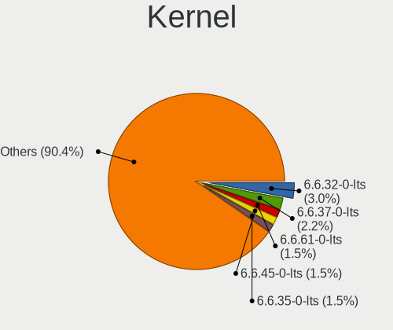

| Version          | Notebooks | Percent |
|------------------|-----------|---------|
| 6.6.17-0-lts     | 2         | 1.9%    |
| 6.6.16-0-lts     | 2         | 1.9%    |
| 6.1.62-0-lts     | 2         | 1.9%    |
| 5.4.83-0-lts     | 2         | 1.9%    |
| 5.4.43-1-lts     | 2         | 1.9%    |
| 5.15.86-0-lts    | 2         | 1.9%    |
| 5.15.59-0-lts    | 2         | 1.9%    |
| 5.15.47-0-lts    | 2         | 1.9%    |
| 5.15.41-0-lts    | 2         | 1.9%    |
| 5.15.4-0-lts     | 2         | 1.9%    |
| 6.6.9-0-lts      | 1         | 0.95%   |
| 6.6.7-0-lts      | 1         | 0.95%   |
| 6.6.4-0-lts      | 1         | 0.95%   |
| 6.6.28-0-lts     | 1         | 0.95%   |
| 6.6.26-0-lts     | 1         | 0.95%   |
| 6.6.24-0-lts     | 1         | 0.95%   |
| 6.6.22-0-lts     | 1         | 0.95%   |
| 6.6.21-0-lts     | 1         | 0.95%   |
| 6.6.20-0-lts     | 1         | 0.95%   |
| 6.6.18-0-lts     | 1         | 0.95%   |
| 6.6.12-0-lts     | 1         | 0.95%   |
| 6.6.1-0-edge     | 1         | 0.95%   |
| 6.5.0-15-generic | 1         | 0.95%   |
| 6.4.4-0-edge     | 1         | 0.95%   |
| 6.2.0-37-generic | 1         | 0.95%   |
| 6.2.0-36-generic | 1         | 0.95%   |
| 6.1.77-0-lts     | 1         | 0.95%   |
| 6.1.71-haos      | 1         | 0.95%   |
| 6.1.69-0-lts     | 1         | 0.95%   |
| 6.1.63-haos      | 1         | 0.95%   |
| 6.1.55-0-lts     | 1         | 0.95%   |
| 6.1.53-0-lts     | 1         | 0.95%   |
| 6.1.52-0-lts     | 1         | 0.95%   |
| 6.1.46-0-lts     | 1         | 0.95%   |
| 6.1.39-0-lts     | 1         | 0.95%   |
| 6.1.34           | 1         | 0.95%   |
| 6.1.24-0-lts     | 1         | 0.95%   |
| 6.1.11-0-edge    | 1         | 0.95%   |
| 5.8.12-0-edge    | 1         | 0.95%   |
| 5.7.4            | 1         | 0.95%   |

Kernel Family
-------------

Linux kernel without a distro release

| Version | Notebooks | Percent |
|---------|-----------|---------|
| 5.15.0  | 3         | 2.97%   |
| 6.6.17  | 2         | 1.98%   |
| 6.6.16  | 2         | 1.98%   |
| 6.1.62  | 2         | 1.98%   |
| 5.4.83  | 2         | 1.98%   |
| 5.4.43  | 2         | 1.98%   |
| 5.15.86 | 2         | 1.98%   |
| 5.15.59 | 2         | 1.98%   |
| 5.15.47 | 2         | 1.98%   |
| 5.15.41 | 2         | 1.98%   |
| 5.15.4  | 2         | 1.98%   |
| 6.6.9   | 1         | 0.99%   |
| 6.6.7   | 1         | 0.99%   |
| 6.6.4   | 1         | 0.99%   |
| 6.6.28  | 1         | 0.99%   |
| 6.6.26  | 1         | 0.99%   |
| 6.6.24  | 1         | 0.99%   |
| 6.6.22  | 1         | 0.99%   |
| 6.6.21  | 1         | 0.99%   |
| 6.6.20  | 1         | 0.99%   |
| 6.6.18  | 1         | 0.99%   |
| 6.6.12  | 1         | 0.99%   |
| 6.6.1   | 1         | 0.99%   |
| 6.5.0   | 1         | 0.99%   |
| 6.4.4   | 1         | 0.99%   |
| 6.2.0   | 1         | 0.99%   |
| 6.1.77  | 1         | 0.99%   |
| 6.1.71  | 1         | 0.99%   |
| 6.1.69  | 1         | 0.99%   |
| 6.1.63  | 1         | 0.99%   |
| 6.1.55  | 1         | 0.99%   |
| 6.1.53  | 1         | 0.99%   |
| 6.1.52  | 1         | 0.99%   |
| 6.1.46  | 1         | 0.99%   |
| 6.1.39  | 1         | 0.99%   |
| 6.1.34  | 1         | 0.99%   |
| 6.1.24  | 1         | 0.99%   |
| 6.1.11  | 1         | 0.99%   |
| 5.8.12  | 1         | 0.99%   |
| 5.7.4   | 1         | 0.99%   |

Kernel Major Ver.
-----------------

Linux kernel major version

| Version | Notebooks | Percent |
|---------|-----------|---------|
| 5.15    | 31        | 31.63%  |
| 6.6     | 15        | 15.31%  |
| 6.1     | 14        | 14.29%  |
| 5.10    | 11        | 11.22%  |
| 5.4     | 10        | 10.2%   |
| 5.17    | 2         | 2.04%   |
| 5.14    | 2         | 2.04%   |
| 6.5     | 1         | 1.02%   |
| 6.4     | 1         | 1.02%   |
| 6.2     | 1         | 1.02%   |
| 5.8     | 1         | 1.02%   |
| 5.7     | 1         | 1.02%   |
| 5.6     | 1         | 1.02%   |
| 5.19    | 1         | 1.02%   |
| 5.16    | 1         | 1.02%   |
| 5.13    | 1         | 1.02%   |
| 5.12    | 1         | 1.02%   |
| 4.4     | 1         | 1.02%   |
| 3.18    | 1         | 1.02%   |
| 3.10    | 1         | 1.02%   |

Arch
----

OS architecture (x86_64, i586, etc.)

| Name   | Notebooks | Percent |
|--------|-----------|---------|
| x86_64 | 76        | 84.44%  |
| i686   | 11        | 12.22%  |
| armv7l | 2         | 2.22%   |
| i586   | 1         | 1.11%   |

DE
--

Desktop Environment

| Name    | Notebooks | Percent |
|---------|-----------|---------|
| Unknown | 65        | 72.22%  |
| XFCE    | 13        | 14.44%  |
| GNOME   | 6         | 6.67%   |
| KDE5    | 3         | 3.33%   |
| LXQt    | 2         | 2.22%   |
| sway    | 1         | 1.11%   |

Display Server
--------------

X11 or Wayland

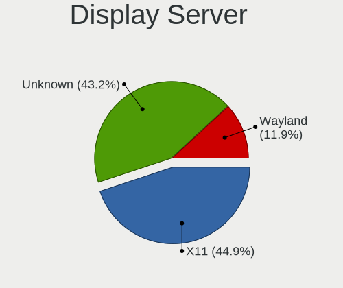

| Name    | Notebooks | Percent |
|---------|-----------|---------|
| Unknown | 43        | 46.74%  |
| X11     | 41        | 44.57%  |
| Wayland | 8         | 8.7%    |

Display Manager
---------------

SDDM, LightDM, etc.

| Name    | Notebooks | Percent |
|---------|-----------|---------|
| Unknown | 61        | 67.78%  |
| LightDM | 17        | 18.89%  |
| GDM     | 6         | 6.67%   |
| SDDM    | 3         | 3.33%   |
| LXDM    | 2         | 2.22%   |
| XDM     | 1         | 1.11%   |

OS Lang
-------

Language

| Lang    | Notebooks | Percent |
|---------|-----------|---------|
| C       | 57        | 60.64%  |
| Unknown | 28        | 29.79%  |
| en_US   | 6         | 6.38%   |
| ru_RU   | 1         | 1.06%   |
| es_NI   | 1         | 1.06%   |
| en_GB   | 1         | 1.06%   |

Boot Mode
---------

EFI or BIOS

| Mode | Notebooks | Percent |
|------|-----------|---------|
| BIOS | 56        | 60.87%  |
| EFI  | 36        | 39.13%  |

Filesystem
----------

Type of filesystem

| Type    | Notebooks | Percent |
|---------|-----------|---------|
| Ext4    | 71        | 74.74%  |
| Btrfs   | 12        | 12.63%  |
| Overlay | 6         | 6.32%   |
| Tmpfs   | 2         | 2.11%   |
| Ext2    | 2         | 2.11%   |
| F2fs    | 1         | 1.05%   |
| Unknown | 1         | 1.05%   |

Part. scheme
------------

Scheme of partitioning

| Type    | Notebooks | Percent |
|---------|-----------|---------|
| Unknown | 57        | 61.29%  |
| GPT     | 27        | 29.03%  |
| MBR     | 9         | 9.68%   |

Dual Boot with Linux/BSD
------------------------

Hosting more than one Linux/BSD

| Dual boot | Notebooks | Percent |
|-----------|-----------|---------|
| No        | 84        | 91.3%   |
| Yes       | 8         | 8.7%    |

Dual Boot (Win)
---------------

Hosting Linux and Windows

| Dual boot | Notebooks | Percent |
|-----------|-----------|---------|
| No        | 86        | 93.48%  |
| Yes       | 6         | 6.52%   |

Board
-----

Vendor
------

Motherboard manufacturer

| Name             | Notebooks | Percent |
|------------------|-----------|---------|
| Hewlett-Packard  | 19        | 21.11%  |
| Lenovo           | 15        | 16.67%  |
| ASUSTek Computer | 11        | 12.22%  |
| Dell             | 10        | 11.11%  |
| Acer             | 7         | 7.78%   |
| Toshiba          | 3         | 3.33%   |
| IBM              | 3         | 3.33%   |
| Google           | 3         | 3.33%   |
| Fujitsu          | 3         | 3.33%   |
| Sony             | 2         | 2.22%   |
| Apple            | 2         | 2.22%   |
| Unknown          | 2         | 2.22%   |
| Wortmann AG      | 1         | 1.11%   |
| Synology         | 1         | 1.11%   |
| SLIMBOOK         | 1         | 1.11%   |
| Pegatron         | 1         | 1.11%   |
| Olivetti         | 1         | 1.11%   |
| Notebook         | 1         | 1.11%   |
| MSI              | 1         | 1.11%   |
| LG Electronics   | 1         | 1.11%   |
| Haier            | 1         | 1.11%   |
| Gateway          | 1         | 1.11%   |

Model
-----

Motherboard model

| Name                                     | Notebooks | Percent |
|------------------------------------------|-----------|---------|
| HP ENVY Laptop 13-ad1xx                  | 3         | 3.33%   |
| Lenovo V15 G3 IAP 82TT                   | 2         | 2.22%   |
| Unknown                                  | 2         | 2.22%   |
| Wortmann AG M660SE                       | 1         | 1.11%   |
| Toshiba WT8-A                            | 1         | 1.11%   |
| Toshiba Satellite Pro L50-A              | 1         | 1.11%   |
| Toshiba Satellite M645                   | 1         | 1.11%   |
| Synology DS1019+                         | 1         | 1.11%   |
| Sony VPCEC3A4E                           | 1         | 1.11%   |
| Sony VGN-UX27GN                          | 1         | 1.11%   |
| SLIMBOOK EXECUTIVE-14                    | 1         | 1.11%   |
| Pegatron Deepcam                         | 1         | 1.11%   |
| Olivetti Spring Peak                     | 1         | 1.11%   |
| Notebook NV4XMB,ME,MZ                    | 1         | 1.11%   |
| MSI GL72M 7REX                           | 1         | 1.11%   |
| LG LW25-B7HG                             | 1         | 1.11%   |
| Lenovo Yoga 14sARH 2021 82LB             | 1         | 1.11%   |
| Lenovo Y70-70 Touch 80DU                 | 1         | 1.11%   |
| Lenovo V14-ADA 82C6                      | 1         | 1.11%   |
| Lenovo ThinkPad X61 76754KU              | 1         | 1.11%   |
| Lenovo ThinkPad X131e 33711Q7            | 1         | 1.11%   |
| Lenovo ThinkPad X1 Carbon 6th 20KGS17D00 | 1         | 1.11%   |
| Lenovo ThinkPad W700 2752RZ2             | 1         | 1.11%   |
| Lenovo ThinkPad T420 42364F2             | 1         | 1.11%   |
| Lenovo ThinkPad E590 20NB0012RT          | 1         | 1.11%   |
| Lenovo ThinkPad E485 20KUCTO1WW          | 1         | 1.11%   |
| Lenovo ThinkPad 11e 20ED001HUS           | 1         | 1.11%   |
| Lenovo IdeaPad 320-15AST 80XV            | 1         | 1.11%   |
| Lenovo Flex 2-14 20404                   | 1         | 1.11%   |
| IBM ThinkPad X40 2371LBG                 | 1         | 1.11%   |
| IBM 26446AG                              | 1         | 1.11%   |
| IBM 264070A                              | 1         | 1.11%   |
| HP ZBook 15 G5                           | 1         | 1.11%   |
| HP ProBook 4310s                         | 1         | 1.11%   |
| HP Presario V4000 (EQ608PA#UUF)          | 1         | 1.11%   |
| HP Presario V2000 (ES307UA#ABL)          | 1         | 1.11%   |
| HP Pavilion Notebook                     | 1         | 1.11%   |
| HP Pavilion Gaming Laptop 15-cx0xxx      | 1         | 1.11%   |
| HP Pavilion dv6500                       | 1         | 1.11%   |
| HP Mini 110-3500                         | 1         | 1.11%   |

Model Family
------------

Motherboard model prefix

| Name                  | Notebooks | Percent |
|-----------------------|-----------|---------|
| Lenovo ThinkPad       | 8         | 8.89%   |
| Dell Inspiron         | 6         | 6.67%   |
| Acer Aspire           | 6         | 6.67%   |
| HP ENVY               | 4         | 4.44%   |
| HP Pavilion           | 3         | 3.33%   |
| HP Laptop             | 3         | 3.33%   |
| HP EliteBook          | 3         | 3.33%   |
| Toshiba Satellite     | 2         | 2.22%   |
| Lenovo V15            | 2         | 2.22%   |
| HP Presario           | 2         | 2.22%   |
| Fujitsu LIFEBOOK      | 2         | 2.22%   |
| Dell Latitude         | 2         | 2.22%   |
| ASUS VivoBook         | 2         | 2.22%   |
| Unknown               | 2         | 2.22%   |
| Wortmann AG M660SE    | 1         | 1.11%   |
| Toshiba WT8-A         | 1         | 1.11%   |
| Synology DS1019+      | 1         | 1.11%   |
| Sony VPCEC3A4E        | 1         | 1.11%   |
| Sony VGN-UX27GN       | 1         | 1.11%   |
| SLIMBOOK EXECUTIVE-14 | 1         | 1.11%   |
| Pegatron Deepcam      | 1         | 1.11%   |
| Olivetti Spring       | 1         | 1.11%   |
| Notebook NV4XMB       | 1         | 1.11%   |
| MSI GL72M             | 1         | 1.11%   |
| LG LW25-B7HG          | 1         | 1.11%   |
| Lenovo Yoga           | 1         | 1.11%   |
| Lenovo Y70-70         | 1         | 1.11%   |
| Lenovo V14-ADA        | 1         | 1.11%   |
| Lenovo IdeaPad        | 1         | 1.11%   |
| Lenovo Flex           | 1         | 1.11%   |
| IBM ThinkPad          | 1         | 1.11%   |
| IBM 26446AG           | 1         | 1.11%   |
| IBM 264070A           | 1         | 1.11%   |
| HP ZBook              | 1         | 1.11%   |
| HP ProBook            | 1         | 1.11%   |
| HP Mini               | 1         | 1.11%   |
| HP Compaq             | 1         | 1.11%   |
| Haier U144S           | 1         | 1.11%   |
| Google Samus          | 1         | 1.11%   |
| Google Leona          | 1         | 1.11%   |

MFG Year
--------

Motherboard manufacture year

| Year    | Notebooks | Percent |
|---------|-----------|---------|
| 2019    | 9         | 10%     |
| 2014    | 9         | 10%     |
| 2010    | 8         | 8.89%   |
| 2017    | 7         | 7.78%   |
| 2012    | 7         | 7.78%   |
| 2021    | 6         | 6.67%   |
| 2018    | 6         | 6.67%   |
| 2006    | 6         | 6.67%   |
| 2016    | 4         | 4.44%   |
| 2007    | 4         | 4.44%   |
| 2022    | 3         | 3.33%   |
| 2013    | 3         | 3.33%   |
| 2011    | 3         | 3.33%   |
| 2009    | 3         | 3.33%   |
| Unknown | 3         | 3.33%   |
| 2020    | 2         | 2.22%   |
| 2015    | 2         | 2.22%   |
| 2005    | 2         | 2.22%   |
| 2023    | 1         | 1.11%   |
| 2008    | 1         | 1.11%   |
| 1999    | 1         | 1.11%   |

Form Factor
-----------

Physical design of the computer

| Name     | Notebooks | Percent |
|----------|-----------|---------|
| Notebook | 90        | 100%    |

Secure Boot
-----------

Enabled or disabled

| State    | Notebooks | Percent |
|----------|-----------|---------|
| Disabled | 89        | 97.8%   |
| Enabled  | 2         | 2.2%    |

Coreboot
--------

Have coreboot on board

| Used | Notebooks | Percent |
|------|-----------|---------|
| No   | 87        | 96.67%  |
| Yes  | 3         | 3.33%   |

RAM Size
--------

Total RAM memory

| Size in GB      | Notebooks | Percent |
|-----------------|-----------|---------|
| 4.01-8.0        | 27        | 28.13%  |
| 3.01-4.0        | 18        | 18.75%  |
| 8.01-16.0       | 11        | 11.46%  |
| 16.01-24.0      | 10        | 10.42%  |
| 0.51-1.0        | 9         | 9.38%   |
| 1.01-2.0        | 7         | 7.29%   |
| 32.01-64.0      | 6         | 6.25%   |
| 2.01-3.0        | 3         | 3.13%   |
| 64.01-256.0     | 2         | 2.08%   |
| 0.01-0.5        | 2         | 2.08%   |
| More than 256.0 | 1         | 1.04%   |

RAM Used
--------

Used RAM memory

| Used GB   | Notebooks | Percent |
|-----------|-----------|---------|
| 0.01-0.5  | 27        | 27.84%  |
| 1.01-2.0  | 24        | 24.74%  |
| 2.01-3.0  | 14        | 14.43%  |
| 0.51-1.0  | 13        | 13.4%   |
| 4.01-8.0  | 8         | 8.25%   |
| 3.01-4.0  | 6         | 6.19%   |
| 8.01-16.0 | 2         | 2.06%   |
| 0         | 2         | 2.06%   |
| Unknown   | 1         | 1.03%   |

Total Drives
------------

Number of drives on board

| Drives | Notebooks | Percent |
|--------|-----------|---------|
| 1      | 71        | 74.74%  |
| 2      | 18        | 18.95%  |
| 3      | 2         | 2.11%   |
| 0      | 2         | 2.11%   |
| 7      | 1         | 1.05%   |
| 5      | 1         | 1.05%   |

Has CD-ROM
----------

Has CD-ROM on board

| Presented | Notebooks | Percent |
|-----------|-----------|---------|
| No        | 63        | 68.48%  |
| Yes       | 29        | 31.52%  |

Has Ethernet
------------

Has Ethernet on board

| Presented | Notebooks | Percent |
|-----------|-----------|---------|
| Yes       | 69        | 76.67%  |
| No        | 21        | 23.33%  |

Has WiFi
--------

Has WiFi module

| Presented | Notebooks | Percent |
|-----------|-----------|---------|
| Yes       | 83        | 90.22%  |
| No        | 9         | 9.78%   |

Has Bluetooth
-------------

Has Bluetooth module

| Presented | Notebooks | Percent |
|-----------|-----------|---------|
| Yes       | 57        | 61.96%  |
| No        | 35        | 38.04%  |

Location
--------

Country
-------

Geographic location (country)

| Country      | Notebooks | Percent |
|--------------|-----------|---------|
| USA          | 19        | 19.39%  |
| Canada       | 9         | 9.18%   |
| Germany      | 8         | 8.16%   |
| Russia       | 7         | 7.14%   |
| Brazil       | 6         | 6.12%   |
| UK           | 5         | 5.1%    |
| Turkey       | 5         | 5.1%    |
| Spain        | 4         | 4.08%   |
| Italy        | 3         | 3.06%   |
| Slovakia     | 2         | 2.04%   |
| Portugal     | 2         | 2.04%   |
| Israel       | 2         | 2.04%   |
| Australia    | 2         | 2.04%   |
| Venezuela    | 1         | 1.02%   |
| UAE          | 1         | 1.02%   |
| Switzerland  | 1         | 1.02%   |
| Sweden       | 1         | 1.02%   |
| South Korea  | 1         | 1.02%   |
| South Africa | 1         | 1.02%   |
| Puerto Rico  | 1         | 1.02%   |
| Poland       | 1         | 1.02%   |
| Philippines  | 1         | 1.02%   |
| Nicaragua    | 1         | 1.02%   |
| Netherlands  | 1         | 1.02%   |
| Mexico       | 1         | 1.02%   |
| Kenya        | 1         | 1.02%   |
| Jamaica      | 1         | 1.02%   |
| Hungary      | 1         | 1.02%   |
| Guatemala    | 1         | 1.02%   |
| Greece       | 1         | 1.02%   |
| France       | 1         | 1.02%   |
| Egypt        | 1         | 1.02%   |
| Czechia      | 1         | 1.02%   |
| Cyprus       | 1         | 1.02%   |
| Colombia     | 1         | 1.02%   |
| China        | 1         | 1.02%   |
| Austria      | 1         | 1.02%   |

City
----

Geographic location (city)

| City          | Notebooks | Percent |
|---------------|-----------|---------|
| Istanbul      | 4         | 4%      |
| Vernon        | 3         | 3%      |
| St Petersburg | 3         | 3%      |
| Springfield   | 3         | 3%      |
| Moscow        | 3         | 3%      |
| Stratford     | 2         | 2%      |
| Manitowoc     | 2         | 2%      |
| Fulham        | 2         | 2%      |
| Zurich        | 1         | 1%      |
| Zhangzhou     | 1         | 1%      |
| Waukesha      | 1         | 1%      |
| Vienna        | 1         | 1%      |
| Ventura       | 1         | 1%      |
| Tymovskoye    | 1         | 1%      |
| Turin         | 1         | 1%      |
| Traunstein    | 1         | 1%      |
| Thornhill     | 1         | 1%      |
| Tampa         | 1         | 1%      |
| Sydney        | 1         | 1%      |
| Stuttgart     | 1         | 1%      |
| Stewartstown  | 1         | 1%      |
| Sisteron      | 1         | 1%      |
| Semily        | 1         | 1%      |
| Seattle       | 1         | 1%      |
| Sao Paulo     | 1         | 1%      |
| San Mateo     | 1         | 1%      |
| Saarbrücken  | 1         | 1%      |
| Rzeszów      | 1         | 1%      |
| Rostock       | 1         | 1%      |
| Ramat Gan     | 1         | 1%      |
| Purdys        | 1         | 1%      |
| Olofstorp     | 1         | 1%      |
| Oakville      | 1         | 1%      |
| Northampton   | 1         | 1%      |
| Nairobi       | 1         | 1%      |
| Montreal      | 1         | 1%      |
| Milano        | 1         | 1%      |
| Merrill       | 1         | 1%      |
| Mérida       | 1         | 1%      |
| Medellín     | 1         | 1%      |

Drives
------

Drive Vendor
------------

Hard drive vendors

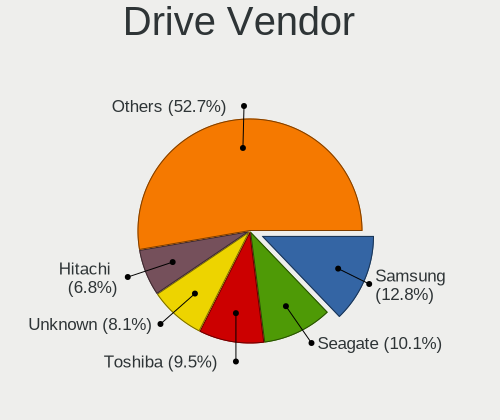

| Vendor                      | Notebooks | Drives | Percent |
|-----------------------------|-----------|--------|---------|
| Samsung Electronics         | 16        | 32     | 13.22%  |
| Toshiba                     | 13        | 16     | 10.74%  |
| WDC                         | 9         | 14     | 7.44%   |
| Seagate                     | 9         | 23     | 7.44%   |
| Unknown                     | 8         | 10     | 6.61%   |
| Hitachi                     | 8         | 8      | 6.61%   |
| Kingston                    | 7         | 11     | 5.79%   |
| HGST                        | 6         | 6      | 4.96%   |
| Sandisk                     | 5         | 5      | 4.13%   |
| Crucial                     | 4         | 4      | 3.31%   |
| SPCC                        | 3         | 3      | 2.48%   |
| SK hynix                    | 3         | 3      | 2.48%   |
| Micron Technology           | 3         | 4      | 2.48%   |
| Intel                       | 3         | 5      | 2.48%   |
| A-DATA Technology           | 3         | 4      | 2.48%   |
| Fujitsu                     | 2         | 2      | 1.65%   |
| SINTECHI                    | 1         | 1      | 0.83%   |
| Secure                      | 1         | 1      | 0.83%   |
| Realtek Semiconductor       | 1         | 1      | 0.83%   |
| OCZ                         | 1         | 1      | 0.83%   |
| Netac                       | 1         | 1      | 0.83%   |
| LITEON                      | 1         | 1      | 0.83%   |
| Kingston Technology Company | 1         | 1      | 0.83%   |
| KingSpec                    | 1         | 1      | 0.83%   |
| KC600                       | 1         | 1      | 0.83%   |
| JMicron Technology          | 1         | 1      | 0.83%   |
| Intenso                     | 1         | 1      | 0.83%   |
| INNOVATION IT               | 1         | 1      | 0.83%   |
| IBM                         | 1         | 1      | 0.83%   |
| Emtec                       | 1         | 1      | 0.83%   |
| Dell                        | 1         | 2      | 0.83%   |
| Corsair                     | 1         | 2      | 0.83%   |
| China                       | 1         | 1      | 0.83%   |
| Aura                        | 1         | 1      | 0.83%   |
| AMD                         | 1         | 1      | 0.83%   |

Drive Model
-----------

Hard drive models

| Model                                       | Notebooks | Percent |
|---------------------------------------------|-----------|---------|
| Unknown MMC Card  16GB                      | 3         | 1.99%   |
| Toshiba KXG50ZNV256G 256GB                  | 3         | 1.99%   |
| Unknown MMC Card  64GB                      | 2         | 1.32%   |
| Toshiba MQ01ABD100 1TB                      | 2         | 1.32%   |
| Toshiba MQ01ABD075 752GB                    | 2         | 1.32%   |
| SK hynix BC501 NVMe Solid State Drive 512GB | 2         | 1.32%   |
| Samsung SSD 970 EVO Plus 250GB              | 2         | 1.32%   |
| Samsung NVMe SSD Drive 1024GB               | 2         | 1.32%   |
| Kingston SV300S37A120G 120GB SSD            | 2         | 1.32%   |
| Crucial CT500MX500SSD1 500GB                | 2         | 1.32%   |
| WDC WDS500G2X0C-00L350 500GB                | 1         | 0.66%   |
| WDC WDS500G2B0A-00SM50 500GB SSD            | 1         | 0.66%   |
| WDC WDS500G2B0A 500GB SSD                   | 1         | 0.66%   |
| WDC WDS250G2B0A 250GB SSD                   | 1         | 0.66%   |
| WDC WDS240G2G0A-00JH30 240GB SSD            | 1         | 0.66%   |
| WDC WD60EFRX-68L 6TB                        | 1         | 0.66%   |
| WDC WD5000BEVT-7 500GB                      | 1         | 0.66%   |
| WDC WD5000BEVT-22ZAT0 500GB                 | 1         | 0.66%   |
| WDC WD10SPZX-80Z10T2 1TB                    | 1         | 0.66%   |
| WDC WD10SPZX-60Z10T1 1TB                    | 1         | 0.66%   |
| WDC WD10JPVX-60J 1TB                        | 1         | 0.66%   |
| WDC WD BLACK SDBPNTY-512G-1106 512GB        | 1         | 0.66%   |
| WDC PC SN520 SDAPNUW-512G-1002 512GB        | 1         | 0.66%   |
| Unknown SD32G  32GB                         | 1         | 0.66%   |
| Unknown NVMe SSD Drive 1024GB               | 1         | 0.66%   |
| Unknown MMC Card  32GB                      | 1         | 0.66%   |
| Unknown MMC Card                            | 1         | 0.66%   |
| Toshiba NVMe SSD Drive 256GB                | 1         | 0.66%   |
| Toshiba MQ04ABF1 1TB                        | 1         | 0.66%   |
| Toshiba MQ01ABD1 1TB                        | 1         | 0.66%   |
| Toshiba MK6008GAH 64GB                      | 1         | 0.66%   |
| Toshiba MK4009GAL 40GB                      | 1         | 0.66%   |
| Toshiba MK1637GSX 160GB                     | 1         | 0.66%   |
| Toshiba KXG5AZNV256G 256GB                  | 1         | 0.66%   |
| Toshiba HDWL110 1TB                         | 1         | 0.66%   |
| Toshiba DT01ACA1 1TB                        | 1         | 0.66%   |
| SPCC Solid State Disk 256GB                 | 1         | 0.66%   |
| SPCC Solid State Disk                       | 1         | 0.66%   |
| SPCC Solid State 120GB                      | 1         | 0.66%   |
| SK hynix SKHynix_HFS512GD9TNI-L2A0B 512GB   | 1         | 0.66%   |

HDD Vendor
----------

Hard disk drive vendors

| Vendor              | Notebooks | Drives | Percent |
|---------------------|-----------|--------|---------|
| Toshiba             | 9         | 11     | 20.45%  |
| Seagate             | 9         | 23     | 20.45%  |
| Hitachi             | 8         | 8      | 18.18%  |
| HGST                | 6         | 6      | 13.64%  |
| WDC                 | 5         | 6      | 11.36%  |
| Samsung Electronics | 2         | 3      | 4.55%   |
| Fujitsu             | 2         | 2      | 4.55%   |
| SINTECHI            | 1         | 1      | 2.27%   |
| JMicron Technology  | 1         | 1      | 2.27%   |
| IBM                 | 1         | 1      | 2.27%   |

SSD Vendor
----------

Solid state drive vendors

| Vendor              | Notebooks | Drives | Percent |
|---------------------|-----------|--------|---------|
| Kingston            | 7         | 9      | 16.67%  |
| Samsung Electronics | 6         | 14     | 14.29%  |
| Crucial             | 4         | 4      | 9.52%   |
| WDC                 | 3         | 4      | 7.14%   |
| SPCC                | 3         | 3      | 7.14%   |
| SanDisk             | 2         | 2      | 4.76%   |
| Secure              | 1         | 1      | 2.38%   |
| OCZ                 | 1         | 1      | 2.38%   |
| Netac               | 1         | 1      | 2.38%   |
| Micron Technology   | 1         | 1      | 2.38%   |
| LITEON              | 1         | 1      | 2.38%   |
| KingSpec            | 1         | 1      | 2.38%   |
| KC600               | 1         | 1      | 2.38%   |
| Intenso             | 1         | 1      | 2.38%   |
| Intel               | 1         | 1      | 2.38%   |
| INNOVATION IT       | 1         | 1      | 2.38%   |
| Emtec               | 1         | 1      | 2.38%   |
| Dell                | 1         | 2      | 2.38%   |
| Corsair             | 1         | 2      | 2.38%   |
| China               | 1         | 1      | 2.38%   |
| Aura                | 1         | 1      | 2.38%   |
| AMD                 | 1         | 1      | 2.38%   |
| A-DATA Technology   | 1         | 1      | 2.38%   |

Drive Kind
----------

HDD or SSD

| Kind | Notebooks | Drives | Percent |
|------|-----------|--------|---------|
| HDD  | 41        | 62     | 39.81%  |
| SSD  | 31        | 55     | 30.1%   |
| NVMe | 24        | 46     | 23.3%   |
| MMC  | 7         | 8      | 6.8%    |

Drive Connector
---------------

SATA, SAS, NVMe, etc.

| Type | Notebooks | Drives | Percent |
|------|-----------|--------|---------|
| SATA | 65        | 112    | 65%     |
| NVMe | 24        | 46     | 24%     |
| MMC  | 7         | 8      | 7%      |
| SAS  | 4         | 5      | 4%      |

Drive Size
----------

Size of hard drive

| Size in TB | Notebooks | Drives | Percent |
|------------|-----------|--------|---------|
| 0.01-0.5   | 50        | 70     | 67.57%  |
| 0.51-1.0   | 19        | 26     | 25.68%  |
| 1.01-2.0   | 2         | 4      | 2.7%    |
| 4.01-10.0  | 2         | 13     | 2.7%    |
| 3.01-4.0   | 1         | 4      | 1.35%   |

Space Total
-----------

Amount of disk space available on the file system

| Size in GB     | Notebooks | Percent |
|----------------|-----------|---------|
| 101-250        | 28        | 29.79%  |
| 1-20           | 16        | 17.02%  |
| Unknown        | 11        | 11.7%   |
| 251-500        | 10        | 10.64%  |
| 21-50          | 7         | 7.45%   |
| 501-1000       | 7         | 7.45%   |
| More than 3000 | 5         | 5.32%   |
| 1001-2000      | 4         | 4.26%   |
| 51-100         | 4         | 4.26%   |
| 2001-3000      | 2         | 2.13%   |

Space Used
----------

Amount of used disk space

| Used GB   | Notebooks | Percent |
|-----------|-----------|---------|
| 1-20      | 59        | 62.77%  |
| Unknown   | 11        | 11.7%   |
| 21-50     | 7         | 7.45%   |
| 51-100    | 7         | 7.45%   |
| 251-500   | 3         | 3.19%   |
| 101-250   | 3         | 3.19%   |
| 501-1000  | 2         | 2.13%   |
| 2001-3000 | 1         | 1.06%   |
| 1001-2000 | 1         | 1.06%   |

Malfunc. Drives
---------------

Drive models with a malfunction

| Model                                          | Notebooks | Drives | Percent |
|------------------------------------------------|-----------|--------|---------|
| WDC WD10SPZX-80Z10T2 1TB                       | 1         | 1      | 5.88%   |
| Toshiba MK4009GAL 40GB                         | 1         | 1      | 5.88%   |
| Secure Net 256GB SSD                           | 1         | 1      | 5.88%   |
| Seagate ST9250315AS 250GB                      | 1         | 1      | 5.88%   |
| Seagate ST320LT007-9ZV14 320GB                 | 1         | 2      | 5.88%   |
| Seagate ST2000LM015-2E81 2TB                   | 1         | 1      | 5.88%   |
| Samsung Electronics HM160HI 160GB              | 1         | 2      | 5.88%   |
| Netac SSD 256GB                                | 1         | 1      | 5.88%   |
| Micron Technology 1100_MTFDDAK256TBN 256GB SSD | 1         | 1      | 5.88%   |
| Hitachi HTS725025A9A364 250GB                  | 1         | 1      | 5.88%   |
| Hitachi HTS723232A7A364 320GB                  | 1         | 1      | 5.88%   |
| Hitachi HTS72101 99GB                          | 1         | 1      | 5.88%   |
| Hitachi HTC426040G9AT00 40GB                   | 1         | 1      | 5.88%   |
| HGST HTS721010A9E630 1TB                       | 1         | 1      | 5.88%   |
| HGST HTS545050A7E380 500GB                     | 1         | 1      | 5.88%   |
| Corsair Force LE SSD 120GB                     | 1         | 2      | 5.88%   |
| A-DATA Technology IM2P33F8ABR1-1TB             | 1         | 1      | 5.88%   |

Malfunc. Drive Vendor
---------------------

Vendors of faulty drives

| Vendor              | Notebooks | Drives | Percent |
|---------------------|-----------|--------|---------|
| Hitachi             | 4         | 4      | 23.53%  |
| Seagate             | 3         | 4      | 17.65%  |
| HGST                | 2         | 2      | 11.76%  |
| WDC                 | 1         | 1      | 5.88%   |
| Toshiba             | 1         | 1      | 5.88%   |
| Secure              | 1         | 1      | 5.88%   |
| Samsung Electronics | 1         | 2      | 5.88%   |
| Netac               | 1         | 1      | 5.88%   |
| Micron Technology   | 1         | 1      | 5.88%   |
| Corsair             | 1         | 2      | 5.88%   |
| A-DATA Technology   | 1         | 1      | 5.88%   |

Malfunc. HDD Vendor
-------------------

Vendors of faulty HDD drives

| Vendor              | Notebooks | Drives | Percent |
|---------------------|-----------|--------|---------|
| Hitachi             | 4         | 4      | 33.33%  |
| Seagate             | 3         | 4      | 25%     |
| HGST                | 2         | 2      | 16.67%  |
| WDC                 | 1         | 1      | 8.33%   |
| Toshiba             | 1         | 1      | 8.33%   |
| Samsung Electronics | 1         | 2      | 8.33%   |

Malfunc. Drive Kind
-------------------

Kinds of faulty drives

| Kind | Notebooks | Drives | Percent |
|------|-----------|--------|---------|
| HDD  | 12        | 14     | 75%     |
| SSD  | 3         | 5      | 18.75%  |
| NVMe | 1         | 1      | 6.25%   |

Failed Drives
-------------

Failed drive models

Zero info for selected period =(

Failed Drive Vendor
-------------------

Failed drive vendors

Zero info for selected period =(

Drive Status
------------

Number of failed and malfunc. drives

| Status   | Notebooks | Drives | Percent |
|----------|-----------|--------|---------|
| Works    | 55        | 115    | 55.56%  |
| Detected | 29        | 36     | 29.29%  |
| Malfunc  | 15        | 20     | 15.15%  |

Storage controller
------------------

Storage Vendor
--------------

Storage controller vendors

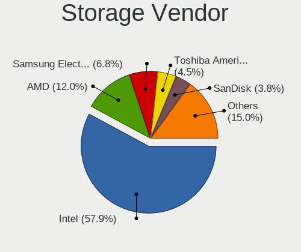

| Vendor                       | Notebooks | Percent |
|------------------------------|-----------|---------|
| Intel                        | 64        | 57.66%  |
| AMD                          | 14        | 12.61%  |
| Samsung Electronics          | 9         | 8.11%   |
| SanDisk                      | 5         | 4.5%    |
| Toshiba America Info Systems | 4         | 3.6%    |
| SK hynix                     | 3         | 2.7%    |
| ADATA Technology             | 3         | 2.7%    |
| Nvidia                       | 2         | 1.8%    |
| Micron Technology            | 2         | 1.8%    |
| VIA Technologies             | 1         | 0.9%    |
| Realtek Semiconductor        | 1         | 0.9%    |
| Marvell Technology Group     | 1         | 0.9%    |
| Kingston Technology Company  | 1         | 0.9%    |
| Broadcom / LSI               | 1         | 0.9%    |

Storage Model
-------------

Storage controller models

| Model                                                                          | Notebooks | Percent |
|--------------------------------------------------------------------------------|-----------|---------|
| AMD FCH SATA Controller [AHCI mode]                                            | 13        | 9.09%   |
| Intel Sunrise Point-LP SATA Controller [AHCI mode]                             | 7         | 4.9%    |
| Samsung NVMe SSD Controller SM981/PM981/PM983                                  | 5         | 3.5%    |
| Toshiba America Info Systems XG5 NVMe SSD Controller                           | 4         | 2.8%    |
| Intel Celeron N3350/Pentium N4200/Atom E3900 Series SATA AHCI Controller       | 4         | 2.8%    |
| Intel Cannon Lake Mobile PCH SATA AHCI Controller                              | 4         | 2.8%    |
| Intel 7 Series Chipset Family 6-port SATA Controller [AHCI mode]               | 4         | 2.8%    |
| Samsung NVMe SSD Controller PM9A1/PM9A3/980PRO                                 | 3         | 2.1%    |
| Intel Wildcat Point-LP SATA Controller [AHCI Mode]                             | 3         | 2.1%    |
| Intel Volume Management Device NVMe RAID Controller                            | 3         | 2.1%    |
| Intel NM10/ICH7 Family SATA Controller [AHCI mode]                             | 3         | 2.1%    |
| Intel Atom Processor E3800 Series SATA AHCI Controller                         | 3         | 2.1%    |
| Intel 82801HM/HEM (ICH8M/ICH8M-E) SATA Controller [AHCI mode]                  | 3         | 2.1%    |
| Intel 82801HM/HEM (ICH8M/ICH8M-E) IDE Controller                               | 3         | 2.1%    |
| Intel 82801GBM/GHM (ICH7-M Family) SATA Controller [IDE mode]                  | 3         | 2.1%    |
| Intel 82801FB/FBM/FR/FW/FRW (ICH6 Family) IDE Controller                       | 3         | 2.1%    |
| Intel 82801 Mobile SATA Controller [RAID mode]                                 | 3         | 2.1%    |
| Intel 8 Series/C220 Series Chipset Family 6-port SATA Controller 1 [AHCI mode] | 3         | 2.1%    |
| Intel 6 Series/C200 Series Chipset Family 6 port Mobile SATA AHCI Controller   | 3         | 2.1%    |
| Intel 5 Series/3400 Series Chipset 6 port SATA AHCI Controller                 | 3         | 2.1%    |
| Intel 5 Series/3400 Series Chipset 4 port SATA AHCI Controller                 | 3         | 2.1%    |
| SK hynix BC501 NVMe Solid State Drive                                          | 2         | 1.4%    |
| Samsung NVMe SSD Controller 980 (DRAM-less)                                    | 2         | 1.4%    |
| Intel Comet Lake SATA AHCI Controller                                          | 2         | 1.4%    |
| Intel Alder Lake-P SATA AHCI Controller                                        | 2         | 1.4%    |
| Intel 82801IBM/IEM (ICH9M/ICH9M-E) 4 port SATA Controller [AHCI mode]          | 2         | 1.4%    |
| Intel 82801G (ICH7 Family) IDE Controller                                      | 2         | 1.4%    |
| Intel 82371AB/EB/MB PIIX4 IDE                                                  | 2         | 1.4%    |
| Intel 8 Series SATA Controller 1 [AHCI mode]                                   | 2         | 1.4%    |
| VIA VT82C586A/B/VT82C686/A/B/VT823x/A/C PIPC Bus Master IDE                    | 1         | 0.7%    |
| VIA VT8237A SATA 2-Port Controller                                             | 1         | 0.7%    |
| SK hynix PC611 NVMe Solid State Drive                                          | 1         | 0.7%    |
| SanDisk WD PC SN810 / Black SN850 NVMe SSD                                     | 1         | 0.7%    |
| SanDisk WD Blue SN500 / PC SN520 x2 M.2 2280 NVMe SSD                          | 1         | 0.7%    |
| SanDisk Ultra 3D / WD Blue SN550 NVMe SSD                                      | 1         | 0.7%    |
| SanDisk PC SN530 NVMe SSD (DRAM-less)                                          | 1         | 0.7%    |
| SanDisk Extreme Pro / WD Black SN750 / PC SN730 / Red SN700 NVMe SSD           | 1         | 0.7%    |
| SanDisk Extreme Pro / WD Black 2018/SN750/PC SN720 NVMe SSD                    | 1         | 0.7%    |
| Samsung NVMe SSD Controller SM961/PM961/SM963                                  | 1         | 0.7%    |
| Realtek RTS5765DL NVMe SSD Controller (DRAM-less)                              | 1         | 0.7%    |

Storage Kind
------------

Kind of storage controller (IDE, SATA, NVMe, SAS, ...)

| Kind | Notebooks | Percent |
|------|-----------|---------|
| SATA | 63        | 58.33%  |
| NVMe | 24        | 22.22%  |
| IDE  | 15        | 13.89%  |
| RAID | 6         | 5.56%   |

Processor
---------

CPU Vendor
----------

Processor vendors

| Vendor | Notebooks | Percent |
|--------|-----------|---------|
| Intel  | 74        | 80.43%  |
| AMD    | 16        | 17.39%  |
| ARM    | 2         | 2.17%   |

CPU Model
---------

Processor models

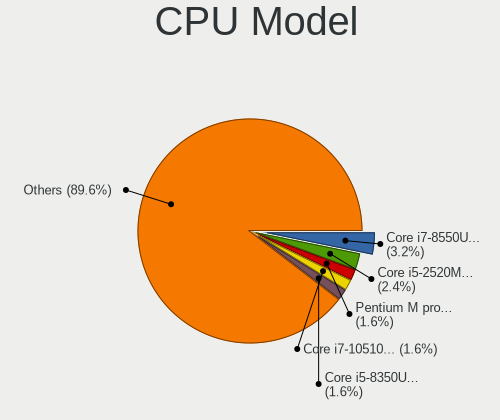

| Model                                   | Notebooks | Percent |
|-----------------------------------------|-----------|---------|
| Intel Core i7-8550U CPU @ 1.80GHz       | 3         | 3%      |
| Intel Pentium M processor 1.70GHz       | 2         | 2%      |
| Intel Core i5-4210U CPU @ 1.70GHz       | 2         | 2%      |
| Intel Core i5-2520M CPU @ 2.50GHz       | 2         | 2%      |
| Intel Celeron CPU N2840 @ 2.16GHz       | 2         | 2%      |
| Intel Atom CPU N455 @ 1.66GHz           | 2         | 2%      |
| Intel 11th Gen Core i5-1135G7 @ 2.40GHz | 2         | 2%      |
| Intel Xeon Gold 6336Y CPU @ 2.40GHz     | 1         | 1%      |
| Intel Xeon Gold 5218 CPU @ 2.30GHz      | 1         | 1%      |
| Intel Xeon E-2176M CPU @ 2.70GHz        | 1         | 1%      |
| Intel Xeon CPU E5-2640 v4 @ 2.40GHz     | 1         | 1%      |
| Intel Pentium M processor 1.60GHz       | 1         | 1%      |
| Intel Pentium M processor 1.50GHz       | 1         | 1%      |
| Intel Pentium III (Coppermine)          | 1         | 1%      |
| Intel Pentium CPU N4200 @ 1.10GHz       | 1         | 1%      |
| Intel Pentium CPU N3710 @ 1.60GHz       | 1         | 1%      |
| Intel Mobile Pentium MMX                | 1         | 1%      |
| Intel Genuine CPU T2400 @ 1.83GHz       | 1         | 1%      |
| Intel Core Solo CPU U1500 @ 1.33GHz     | 1         | 1%      |
| Intel Core m3-8100Y CPU @ 1.10GHz       | 1         | 1%      |
| Intel Core i9-9980HK CPU @ 2.40GHz      | 1         | 1%      |
| Intel Core i7-8565U CPU @ 1.80GHz       | 1         | 1%      |
| Intel Core i7-6500U CPU @ 2.50GHz       | 1         | 1%      |
| Intel Core i7-5500U CPU @ 2.40GHz       | 1         | 1%      |
| Intel Core i7-4790 CPU @ 3.60GHz        | 1         | 1%      |
| Intel Core i7-4720HQ CPU @ 2.60GHz      | 1         | 1%      |
| Intel Core i7-10610U CPU @ 1.80GHz      | 1         | 1%      |
| Intel Core i7-10510U CPU @ 1.80GHz      | 1         | 1%      |
| Intel Core i7 CPU Q 820 @ 1.73GHz       | 1         | 1%      |
| Intel Core i5-8350U CPU @ 1.70GHz       | 1         | 1%      |
| Intel Core i5-8300H CPU @ 2.30GHz       | 1         | 1%      |
| Intel Core i5-8265U CPU @ 1.60GHz       | 1         | 1%      |
| Intel Core i5-7300HQ CPU @ 2.50GHz      | 1         | 1%      |
| Intel Core i5-7200U CPU @ 2.50GHz       | 1         | 1%      |
| Intel Core i5-6300U CPU @ 2.40GHz       | 1         | 1%      |
| Intel Core i5-5200U CPU @ 2.20GHz       | 1         | 1%      |
| Intel Core i5-4200M CPU @ 2.50GHz       | 1         | 1%      |
| Intel Core i5-3427U CPU @ 1.80GHz       | 1         | 1%      |
| Intel Core i5-3340M CPU @ 2.70GHz       | 1         | 1%      |
| Intel Core i5-3317U CPU @ 1.70GHz       | 1         | 1%      |

CPU Model Family
----------------

Processor model prefix

| Model                | Notebooks | Percent |
|----------------------|-----------|---------|
| Intel Core i5        | 18        | 18.56%  |
| Other                | 11        | 11.34%  |
| Intel Core i7        | 9         | 9.28%   |
| Intel Core i3        | 8         | 8.25%   |
| Intel Core 2 Duo     | 6         | 6.19%   |
| Intel Celeron        | 6         | 6.19%   |
| Intel Atom           | 6         | 6.19%   |
| Intel Pentium M      | 4         | 4.12%   |
| AMD Ryzen 5          | 4         | 4.12%   |
| Intel Xeon           | 2         | 2.06%   |
| Intel Pentium        | 2         | 2.06%   |
| AMD Ryzen 7          | 2         | 2.06%   |
| AMD A6               | 2         | 2.06%   |
| AMD A4               | 2         | 2.06%   |
| Intel Xeon Gold      | 1         | 1.03%   |
| Intel Pentium III    | 1         | 1.03%   |
| Intel Genuine        | 1         | 1.03%   |
| Intel Core Solo      | 1         | 1.03%   |
| Intel Core m3        | 1         | 1.03%   |
| Intel Core i9        | 1         | 1.03%   |
| Intel Core Duo       | 1         | 1.03%   |
| Intel Core 2         | 1         | 1.03%   |
| ARM ARMv7            | 1         | 1.03%   |
| AMD Turion 64 Mobile | 1         | 1.03%   |
| AMD Ryzen 9          | 1         | 1.03%   |
| AMD Ryzen 3          | 1         | 1.03%   |
| AMD FX               | 1         | 1.03%   |
| AMD E2               | 1         | 1.03%   |
| AMD A10              | 1         | 1.03%   |

CPU Cores
---------

Number of processor cores

| Number  | Notebooks | Percent |
|---------|-----------|---------|
| 2       | 45        | 46.39%  |
| 4       | 26        | 26.8%   |
| 1       | 12        | 12.37%  |
| 6       | 3         | 3.09%   |
| 10      | 2         | 2.06%   |
| 8       | 2         | 2.06%   |
| 48      | 1         | 1.03%   |
| 32      | 1         | 1.03%   |
| 16      | 1         | 1.03%   |
| 14      | 1         | 1.03%   |
| 12      | 1         | 1.03%   |
| 3       | 1         | 1.03%   |
| Unknown | 1         | 1.03%   |

CPU Sockets
-----------

Number of sockets

| Number  | Notebooks | Percent |
|---------|-----------|---------|
| 1       | 89        | 97.8%   |
| 2       | 1         | 1.1%    |
| Unknown | 1         | 1.1%    |

CPU Threads
-----------

Threads per core (Hyper-Threading)

| Number  | Notebooks | Percent |
|---------|-----------|---------|
| 2       | 49        | 54.44%  |
| 1       | 40        | 44.44%  |
| Unknown | 1         | 1.11%   |

CPU Op-Modes
------------

CPU Operation Modes (32-bit, 64-bit)

| Op mode        | Notebooks | Percent |
|----------------|-----------|---------|
| Unknown        | 47        | 51.09%  |
| 32-bit, 64-bit | 42        | 45.65%  |
| 32-bit         | 3         | 3.26%   |

CPU Microcode
-------------

Microcode number

| Number     | Notebooks | Percent |
|------------|-----------|---------|
| Unknown    | 55        | 55%     |
| 0x306a9    | 3         | 3%      |
| 0x30678    | 3         | 3%      |
| 0x20655    | 3         | 3%      |
| 0x106ca    | 3         | 3%      |
| 0x906ea    | 2         | 2%      |
| 0x806eb    | 2         | 2%      |
| 0x806c1    | 2         | 2%      |
| 0x306c3    | 2         | 2%      |
| 0x206a7    | 2         | 2%      |
| 0x08108109 | 2         | 2%      |
| 0x08108102 | 2         | 2%      |
| 0x06006704 | 2         | 2%      |
| 0xa0671    | 1         | 1%      |
| 0xa0652    | 1         | 1%      |
| 0x906a3    | 1         | 1%      |
| 0x806ec    | 1         | 1%      |
| 0x806ea    | 1         | 1%      |
| 0x706e5    | 1         | 1%      |
| 0x683      | 1         | 1%      |
| 0x606a6    | 1         | 1%      |
| 0x506c9    | 1         | 1%      |
| 0x406c4    | 1         | 1%      |
| 0x306d4    | 1         | 1%      |
| 0x106e5    | 1         | 1%      |
| 0x1067a    | 1         | 1%      |
| 0x08701030 | 1         | 1%      |
| 0x08608103 | 1         | 1%      |
| 0x0810100b | 1         | 1%      |
| 0x06006705 | 1         | 1%      |

CPU Microarch
-------------

Microarchitecture

| Name             | Notebooks | Percent |
|------------------|-----------|---------|
| KabyLake         | 14        | 14.29%  |
| P6               | 8         | 8.16%   |
| Silvermont       | 6         | 6.12%   |
| Westmere         | 5         | 5.1%    |
| Haswell          | 5         | 5.1%    |
| Unknown          | 5         | 5.1%    |
| Zen+             | 4         | 4.08%   |
| TigerLake        | 4         | 4.08%   |
| Penryn           | 4         | 4.08%   |
| IvyBridge        | 4         | 4.08%   |
| Goldmont         | 4         | 4.08%   |
| Excavator        | 4         | 4.08%   |
| Broadwell        | 4         | 4.08%   |
| Bonnell          | 4         | 4.08%   |
| Skylake          | 3         | 3.06%   |
| SandyBridge      | 3         | 3.06%   |
| Core             | 3         | 3.06%   |
| Alderlake Hybrid | 3         | 3.06%   |
| Zen 2            | 2         | 2.04%   |
| Icelake          | 2         | 2.04%   |
| Zen              | 1         | 1.02%   |
| Puma             | 1         | 1.02%   |
| Piledriver       | 1         | 1.02%   |
| Nehalem          | 1         | 1.02%   |
| K8 Hammer        | 1         | 1.02%   |
| Jaguar           | 1         | 1.02%   |
| Bobcat           | 1         | 1.02%   |

Graphics
--------

GPU Vendor
----------

Vendors of graphics cards

| Vendor                     | Notebooks | Percent |
|----------------------------|-----------|---------|
| Intel                      | 64        | 58.72%  |
| AMD                        | 23        | 21.1%   |
| Nvidia                     | 17        | 15.6%   |
| Neomagic                   | 2         | 1.83%   |
| VIA Technologies           | 1         | 0.92%   |
| Matrox Electronics Systems | 1         | 0.92%   |
| ASPEED Technology          | 1         | 0.92%   |

GPU Model
---------

Graphics card models

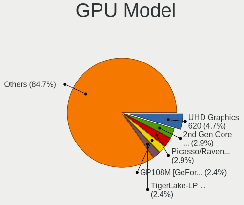

| Model                                                                                    | Notebooks | Percent |
|------------------------------------------------------------------------------------------|-----------|---------|
| Intel UHD Graphics 620                                                                   | 5         | 3.55%   |
| AMD Picasso/Raven 2 [Radeon Vega Series / Radeon Vega Mobile Series]                     | 5         | 3.55%   |
| Intel TigerLake-LP GT2 [Iris Xe Graphics]                                                | 4         | 2.84%   |
| Intel Core Processor Integrated Graphics Controller                                      | 4         | 2.84%   |
| Intel Atom Processor Z36xxx/Z37xxx Series Graphics & Display                             | 4         | 2.84%   |
| Intel 3rd Gen Core processor Graphics Controller                                         | 4         | 2.84%   |
| Nvidia GP108M [GeForce MX150]                                                            | 3         | 2.13%   |
| Intel Mobile 945GM/GMS/GME, 943/940GML Express Integrated Graphics Controller            | 3         | 2.13%   |
| Intel Mobile 915GM/GMS/910GML Express Graphics Controller                                | 3         | 2.13%   |
| Intel HD Graphics 5500                                                                   | 3         | 2.13%   |
| Intel HD Graphics 500                                                                    | 3         | 2.13%   |
| Intel Atom Processor D4xx/D5xx/N4xx/N5xx Integrated Graphics Controller                  | 3         | 2.13%   |
| Intel 2nd Generation Core Processor Family Integrated Graphics Controller                | 3         | 2.13%   |
| AMD Stoney [Radeon R2/R3/R4/R5 Graphics]                                                 | 3         | 2.13%   |
| Intel WhiskeyLake-U GT2 [UHD Graphics 620]                                               | 2         | 1.42%   |
| Intel Skylake GT2 [HD Graphics 520]                                                      | 2         | 1.42%   |
| Intel Mobile 945GM/GMS, 943/940GML Express Integrated Graphics Controller                | 2         | 1.42%   |
| Intel HD Graphics 630                                                                    | 2         | 1.42%   |
| Intel HD Graphics 620                                                                    | 2         | 1.42%   |
| Intel Haswell-ULT Integrated Graphics Controller                                         | 2         | 1.42%   |
| Intel CometLake-U GT2 [UHD Graphics]                                                     | 2         | 1.42%   |
| Intel CoffeeLake-H GT2 [UHD Graphics 630]                                                | 2         | 1.42%   |
| Intel Atom/Celeron/Pentium Processor x5-E8000/J3xxx/N3xxx Integrated Graphics Controller | 2         | 1.42%   |
| Intel 4th Gen Core Processor Integrated Graphics Controller                              | 2         | 1.42%   |
| AMD Topaz XT [Radeon R7 M260/M265 / M340/M360 / M440/M445 / 530/535 / 620/625 Mobile]    | 2         | 1.42%   |
| AMD Lucienne                                                                             | 2         | 1.42%   |
| AMD Lexa PRO [Radeon 540/540X/550/550X / RX 540X/550/550X]                               | 2         | 1.42%   |
| VIA Technologies CN896/VN896/P4M900 [Chrome 9 HC]                                        | 1         | 0.71%   |
| Nvidia TU117M [GeForce GTX 1650 Mobile / Max-Q]                                          | 1         | 0.71%   |
| Nvidia TU116M [GeForce GTX 1660 Ti Mobile]                                               | 1         | 0.71%   |
| Nvidia MCP89 [GeForce 320M]                                                              | 1         | 0.71%   |
| Nvidia GP108M [GeForce MX230]                                                            | 1         | 0.71%   |
| Nvidia GP107M [GeForce GTX 1050 Ti Mobile]                                               | 1         | 0.71%   |
| Nvidia GP107M [GeForce GTX 1050 3 GB Max-Q]                                              | 1         | 0.71%   |
| Nvidia GP107GLM [Quadro P2000 Mobile]                                                    | 1         | 0.71%   |
| Nvidia GP106M [GeForce GTX 1060 Mobile]                                                  | 1         | 0.71%   |
| Nvidia GP104 [GeForce GTX 1070]                                                          | 1         | 0.71%   |
| Nvidia GM206 [GeForce GTX 960]                                                           | 1         | 0.71%   |
| Nvidia GM108M [GeForce 940MX]                                                            | 1         | 0.71%   |
| Nvidia GM108M [GeForce 840M]                                                             | 1         | 0.71%   |

GPU Combo
---------

Combinations of graphics cards

| Name            | Notebooks | Percent |
|-----------------|-----------|---------|
| 1 x Intel       | 42        | 43.75%  |
| 1 x AMD         | 17        | 17.71%  |
| Intel + Nvidia  | 12        | 12.5%   |
| 2 x Intel       | 8         | 8.33%   |
| Intel + AMD     | 4         | 4.17%   |
| 1 x Nvidia      | 3         | 3.13%   |
| Other           | 2         | 2.08%   |
| 1 x Neomagic    | 2         | 2.08%   |
| AMD + Nvidia    | 2         | 2.08%   |
| 2 x AMD         | 1         | 1.04%   |
| 1 x VIA         | 1         | 1.04%   |
| Nvidia + Matrox | 1         | 1.04%   |
| 1 x ASPEED      | 1         | 1.04%   |

GPU Driver
----------

Free vs proprietary

| Driver      | Notebooks | Percent |
|-------------|-----------|---------|
| Free        | 84        | 90.32%  |
| Unknown     | 6         | 6.45%   |
| Proprietary | 3         | 3.23%   |

GPU Memory
----------

Total video memory

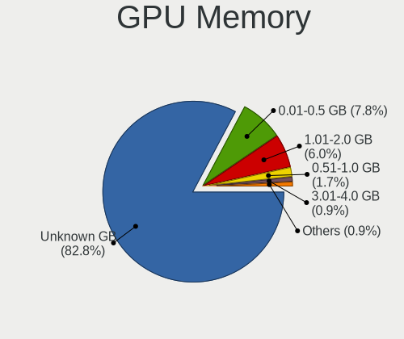

| Size in GB | Notebooks | Percent |
|------------|-----------|---------|
| Unknown    | 77        | 82.8%   |
| 0.01-0.5   | 7         | 7.53%   |
| 1.01-2.0   | 5         | 5.38%   |
| 0.51-1.0   | 2         | 2.15%   |
| 3.01-4.0   | 1         | 1.08%   |
| 2.01-3.0   | 1         | 1.08%   |

Monitor
-------

Monitor Vendor
--------------

Monitor vendors

| Vendor                  | Notebooks | Percent |
|-------------------------|-----------|---------|
| LG Display              | 17        | 17%     |
| AU Optronics            | 16        | 16%     |
| BOE                     | 13        | 13%     |
| Chimei Innolux          | 10        | 10%     |
| Samsung Electronics     | 5         | 5%      |
| LG Philips              | 3         | 3%      |
| Lenovo                  | 3         | 3%      |
| InfoVision              | 3         | 3%      |
| Chi Mei Optoelectronics | 3         | 3%      |
| PANDA                   | 2         | 2%      |
| HannStar                | 2         | 2%      |
| Goldstar                | 2         | 2%      |
| CSO                     | 2         | 2%      |
| Apple                   | 2         | 2%      |
| Vizio                   | 1         | 1%      |
| Sony                    | 1         | 1%      |
| Sharp                   | 1         | 1%      |
| Sceptre Tech            | 1         | 1%      |
| Quanta Display          | 1         | 1%      |
| Philips                 | 1         | 1%      |
| ONN                     | 1         | 1%      |
| KVM                     | 1         | 1%      |
| Envision                | 1         | 1%      |
| Element                 | 1         | 1%      |
| DENON                   | 1         | 1%      |
| Dell                    | 1         | 1%      |
| CPT                     | 1         | 1%      |
| CHD                     | 1         | 1%      |
| BenQ                    | 1         | 1%      |
| ASUSTek Computer        | 1         | 1%      |
| Acer                    | 1         | 1%      |

Monitor Model
-------------

Monitor models

| Model                                                                 | Notebooks | Percent |
|-----------------------------------------------------------------------|-----------|---------|
| LG Display LCD Monitor LGD0597 1920x1080 294x165mm 13.3-inch          | 3         | 2.59%   |
| LG Display LCD Monitor LGD0456 1366x768 344x194mm 15.5-inch           | 2         | 1.72%   |
| HannStar LCD Monitor HSD03E9 1024x600 220x129mm 10.0-inch             | 2         | 1.72%   |
| CSO LCD Monitor CSO1402 2880x1800 302x188mm 14.0-inch                 | 2         | 1.72%   |
| BOE LCD Monitor BOE08D5 1920x1080 344x194mm 15.5-inch                 | 2         | 1.72%   |
| Vizio D40f-J09 VIZ1044 1920x1080 890x490mm 40.0-inch                  | 1         | 0.86%   |
| Sony Nvidia Defaul t Flat Panel SNY06FA 1600x900 360x200mm 16.2-inch  | 1         | 0.86%   |
| Sharp LCD Monitor SHP1513 1920x1080 309x174mm 14.0-inch               | 1         | 0.86%   |
| Sceptre Tech Sceptre F24 SPT09AB 1920x1080 530x290mm 23.8-inch        | 1         | 0.86%   |
| Samsung Electronics SyncMaster SAM0320 1680x1050 474x296mm 22.0-inch  | 1         | 0.86%   |
| Samsung Electronics S24F350 SAM0D20 1920x1080 521x293mm 23.5-inch     | 1         | 0.86%   |
| Samsung Electronics LCD Monitor SEC5A42 1366x768 309x174mm 14.0-inch  | 1         | 0.86%   |
| Samsung Electronics LCD Monitor SEC5642 1280x768 305x183mm 14.0-inch  | 1         | 0.86%   |
| Samsung Electronics LCD Monitor SEC3345 1280x800 331x207mm 15.4-inch  | 1         | 0.86%   |
| Samsung Electronics LCD Monitor SDCA029 3840x2160 344x194mm 15.5-inch | 1         | 0.86%   |
| Samsung Electronics LCD Monitor SAM0B54 1366x768 609x347mm 27.6-inch  | 1         | 0.86%   |
| Quanta Display LCD Monitor QDS0020 1280x768 305x183mm 14.0-inch       | 1         | 0.86%   |
| Philips PHL 242V8 PHLC219 1920x1080 527x296mm 23.8-inch               | 1         | 0.86%   |
| PANDA LCD Monitor NCP0056 1920x1080 309x174mm 14.0-inch               | 1         | 0.86%   |
| PANDA LCD Monitor NCP002D 1920x1080 344x194mm 15.5-inch               | 1         | 0.86%   |
| ONN ONA18HO015 ONN0101 1920x1080 698x393mm 31.5-inch                  | 1         | 0.86%   |
| LG Philips LCD Monitor LPLE100 1280x800 331x207mm 15.4-inch           | 1         | 0.86%   |
| LG Philips LCD Monitor LPLB600 1280x800 260x160mm 12.0-inch           | 1         | 0.86%   |
| LG Philips LCD Monitor LPLA900 1280x800 331x207mm 15.4-inch           | 1         | 0.86%   |
| LG Display LP116WH2-TLC1 LGD0232 1366x768 256x144mm 11.6-inch         | 1         | 0.86%   |
| LG Display LCD Monitor LGD0573 1920x1080 344x194mm 15.5-inch          | 1         | 0.86%   |
| LG Display LCD Monitor LGD0469 1920x1080 382x215mm 17.3-inch          | 1         | 0.86%   |
| LG Display LCD Monitor LGD045C 1366x768 345x194mm 15.6-inch           | 1         | 0.86%   |
| LG Display LCD Monitor LGD0446 1920x1080 309x174mm 14.0-inch          | 1         | 0.86%   |
| LG Display LCD Monitor LGD042E 2560x1700 272x181mm 12.9-inch          | 1         | 0.86%   |
| LG Display LCD Monitor LGD03DB 1366x768 345x194mm 15.6-inch           | 1         | 0.86%   |
| LG Display LCD Monitor LGD02DC 1366x768 344x194mm 15.5-inch           | 1         | 0.86%   |
| LG Display LCD Monitor LGD0266 1366x768 344x194mm 15.5-inch           | 1         | 0.86%   |
| LG Display LCD Monitor LGD022C 1366x768 294x166mm 13.3-inch           | 1         | 0.86%   |
| LG Display LCD Monitor LGD021D 1600x900 382x215mm 17.3-inch           | 1         | 0.86%   |
| LG Display LCD Monitor LGD01F0 1280x800 261x163mm 12.1-inch           | 1         | 0.86%   |
| Lenovo LCD Monitor LEN40BA 1920x1080 344x194mm 15.5-inch              | 1         | 0.86%   |
| Lenovo LCD Monitor LEN4067 1920x1200 367x230mm 17.1-inch              | 1         | 0.86%   |
| Lenovo LCD Monitor LEN4000 1024x768 246x185mm 12.1-inch               | 1         | 0.86%   |
| KVM LCD Monitor191919 KVM4308 1280x1024 376x301mm 19.0-inch           | 1         | 0.86%   |

Monitor Resolution
------------------

Monitor screen resolution

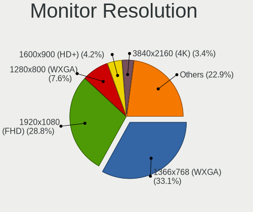

| Resolution         | Notebooks | Percent |
|--------------------|-----------|---------|
| 1366x768 (WXGA)    | 29        | 30.85%  |
| 1920x1080 (FHD)    | 26        | 27.66%  |
| 1280x800 (WXGA)    | 8         | 8.51%   |
| 1600x900 (HD+)     | 5         | 5.32%   |
| 1024x600           | 4         | 4.26%   |
| 3840x2160 (4K)     | 3         | 3.19%   |
| 2560x1440 (QHD)    | 3         | 3.19%   |
| 2880x1800          | 2         | 2.13%   |
| 2560x1080          | 2         | 2.13%   |
| 1920x1200 (WUXGA)  | 2         | 2.13%   |
| 1280x768           | 2         | 2.13%   |
| 1280x1024 (SXGA)   | 2         | 2.13%   |
| 3440x1440          | 1         | 1.06%   |
| 2560x1700          | 1         | 1.06%   |
| 1680x1050 (WSXGA+) | 1         | 1.06%   |
| 1440x900 (WXGA+)   | 1         | 1.06%   |
| 1360x768           | 1         | 1.06%   |
| 1024x768 (XGA)     | 1         | 1.06%   |

Monitor Diagonal
----------------

Diagonal size in inches

| Inches | Notebooks | Percent |
|--------|-----------|---------|
| 15     | 31        | 31%     |
| 14     | 14        | 14%     |
| 13     | 14        | 14%     |
| 17     | 8         | 8%      |
| 11     | 5         | 5%      |
| 12     | 4         | 4%      |
| 10     | 4         | 4%      |
| 31     | 3         | 3%      |
| 32     | 2         | 2%      |
| 23     | 2         | 2%      |
| 72     | 1         | 1%      |
| 60     | 1         | 1%      |
| 40     | 1         | 1%      |
| 34     | 1         | 1%      |
| 29     | 1         | 1%      |
| 27     | 1         | 1%      |
| 25     | 1         | 1%      |
| 24     | 1         | 1%      |
| 22     | 1         | 1%      |
| 21     | 1         | 1%      |
| 20     | 1         | 1%      |
| 19     | 1         | 1%      |
| 16     | 1         | 1%      |

Monitor Width
-------------

Physical width

| Width in mm | Notebooks | Percent |
|-------------|-----------|---------|
| 301-350     | 52        | 56.52%  |
| 201-300     | 20        | 21.74%  |
| 351-400     | 8         | 8.7%    |
| 601-700     | 4         | 4.35%   |
| 701-800     | 2         | 2.17%   |
| 501-600     | 2         | 2.17%   |
| 801-900     | 1         | 1.09%   |
| 401-500     | 1         | 1.09%   |
| 1501-2000   | 1         | 1.09%   |
| 1001-1500   | 1         | 1.09%   |

Aspect Ratio
------------

Proportional relationship between the width and the height

| Ratio | Notebooks | Percent |
|-------|-----------|---------|
| 16/9  | 66        | 77.65%  |
| 16/10 | 13        | 15.29%  |
| 5/4   | 2         | 2.35%   |
| 21/9  | 2         | 2.35%   |
| 4/3   | 1         | 1.18%   |
| 3/2   | 1         | 1.18%   |

Monitor Area
------------

Area in inch²

| Area in inch² | Notebooks | Percent |
|----------------|-----------|---------|
| 101-110        | 31        | 33.33%  |
| 81-90          | 21        | 22.58%  |
| 71-80          | 8         | 8.6%    |
| 121-130        | 6         | 6.45%   |
| 51-60          | 5         | 5.38%   |
| 351-500        | 4         | 4.3%    |
| 41-50          | 4         | 4.3%    |
| 61-70          | 3         | 3.23%   |
| More than 1000 | 2         | 2.15%   |
| 301-350        | 2         | 2.15%   |
| 201-250        | 2         | 2.15%   |
| 251-300        | 1         | 1.08%   |
| 151-200        | 1         | 1.08%   |
| 141-150        | 1         | 1.08%   |
| 131-140        | 1         | 1.08%   |
| 501-1000       | 1         | 1.08%   |

Pixel Density
-------------

Pixels per inch

| Density       | Notebooks | Percent |
|---------------|-----------|---------|
| 121-160       | 32        | 36.78%  |
| 101-120       | 31        | 35.63%  |
| 51-100        | 13        | 14.94%  |
| 161-240       | 5         | 5.75%   |
| More than 240 | 3         | 3.45%   |
| 1-50          | 3         | 3.45%   |

Multiple Monitors
-----------------

Total monitors connected

| Total | Notebooks | Percent |
|-------|-----------|---------|
| 1     | 77        | 82.8%   |
| 0     | 8         | 8.6%    |
| 2     | 7         | 7.53%   |
| 3     | 1         | 1.08%   |

Network
-------

Net Controller Vendor
---------------------

Controller vendors

| Vendor                          | Notebooks | Percent |
|---------------------------------|-----------|---------|
| Realtek Semiconductor           | 54        | 35.29%  |
| Intel                           | 46        | 30.07%  |
| Qualcomm Atheros                | 20        | 13.07%  |
| Broadcom                        | 11        | 7.19%   |
| Marvell Technology Group        | 4         | 2.61%   |
| Broadcom Limited                | 3         | 1.96%   |
| LSI                             | 2         | 1.31%   |
| VIA Technologies                | 1         | 0.65%   |
| TP-Link                         | 1         | 0.65%   |
| Qualcomm Atheros Communications | 1         | 0.65%   |
| Qualcomm                        | 1         | 0.65%   |
| Nvidia                          | 1         | 0.65%   |
| NetGear                         | 1         | 0.65%   |
| Mellanox Technologies           | 1         | 0.65%   |
| MediaTek                        | 1         | 0.65%   |
| Google                          | 1         | 0.65%   |
| Dresden Elektronik              | 1         | 0.65%   |
| DisplayLink                     | 1         | 0.65%   |
| ASIX Electronics                | 1         | 0.65%   |
| AMD                             | 1         | 0.65%   |

Net Controller Model
--------------------

Controller models

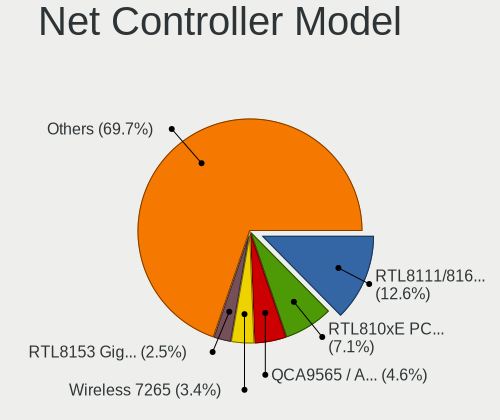

| Model                                                                  | Notebooks | Percent |
|------------------------------------------------------------------------|-----------|---------|
| Realtek RTL8111/8168/8211/8411 PCI Express Gigabit Ethernet Controller | 27        | 13.78%  |
| Realtek RTL810xE PCI Express Fast Ethernet controller                  | 12        | 6.12%   |
| Qualcomm Atheros QCA9565 / AR9565 Wireless Network Adapter             | 9         | 4.59%   |
| Realtek RTL8153 Gigabit Ethernet Adapter                               | 6         | 3.06%   |
| Intel Wireless 7265                                                    | 5         | 2.55%   |
| Broadcom BCM4313 802.11bgn Wireless Network Adapter                    | 4         | 2.04%   |
| Realtek RTL8822CE 802.11ac PCIe Wireless Network Adapter               | 3         | 1.53%   |
| Realtek RTL8821CE 802.11ac PCIe Wireless Network Adapter               | 3         | 1.53%   |
| Realtek RTL-8100/8101L/8139 PCI Fast Ethernet Adapter                  | 3         | 1.53%   |
| Qualcomm Atheros QCA9377 802.11ac Wireless Network Adapter             | 3         | 1.53%   |
| Qualcomm Atheros AR9485 Wireless Network Adapter                       | 3         | 1.53%   |
| Intel Wireless 8265 / 8275                                             | 3         | 1.53%   |
| Intel Wi-Fi 6 AX201                                                    | 3         | 1.53%   |
| Intel Wi-Fi 6 AX200                                                    | 3         | 1.53%   |
| Intel PRO/Wireless 3945ABG [Golan] Network Connection                  | 3         | 1.53%   |
| Intel Alder Lake-P PCH CNVi WiFi                                       | 3         | 1.53%   |
| Intel 82579LM Gigabit Network Connection (Lewisville)                  | 3         | 1.53%   |
| Broadcom BCM43224 802.11a/b/g/n                                        | 3         | 1.53%   |
| Qualcomm Atheros QCA8171 Gigabit Ethernet                              | 2         | 1.02%   |
| Qualcomm Atheros AR9285 Wireless Network Adapter (PCI-Express)         | 2         | 1.02%   |
| Intel Wireless 3160                                                    | 2         | 1.02%   |
| Intel Wi-Fi 5(802.11ac) Wireless-AC 9x6x [Thunder Peak]                | 2         | 1.02%   |
| Intel PRO/Wireless 4965 AG or AGN [Kedron] Network Connection          | 2         | 1.02%   |
| Intel PRO/Wireless 2200BG [Calexico2] Network Connection               | 2         | 1.02%   |
| Intel Ethernet Connection (4) I219-LM                                  | 2         | 1.02%   |
| Intel Dual Band Wireless-AC 3168NGW [Stone Peak]                       | 2         | 1.02%   |
| Intel Comet Lake PCH-LP CNVi WiFi                                      | 2         | 1.02%   |
| Intel Centrino Advanced-N 6205 [Taylor Peak]                           | 2         | 1.02%   |
| Intel Cannon Lake PCH CNVi WiFi                                        | 2         | 1.02%   |
| Intel 82801FB/FBM/FR/FW/FRW (ICH6 Family) AC'97 Modem Controller       | 2         | 1.02%   |
| Intel 82579V Gigabit Network Connection                                | 2         | 1.02%   |
| Broadcom Limited BCM4352 802.11ac Dual Band Wireless Network Adapter   | 2         | 1.02%   |
| VIA VT6102/VT6103 [Rhine-II]                                           | 1         | 0.51%   |
| TP-Link Archer T2U PLUS [RTL8821AU]                                    | 1         | 0.51%   |
| Realtek RTL8822BE 802.11a/b/g/n/ac WiFi adapter                        | 1         | 0.51%   |
| Realtek RTL8723DE Wireless Network Adapter                             | 1         | 0.51%   |
| Realtek RTL8723BU 802.11b/g/n WLAN Adapter                             | 1         | 0.51%   |
| Realtek RTL8723BE PCIe Wireless Network Adapter                        | 1         | 0.51%   |
| Realtek RTL8188FTV 802.11b/g/n 1T1R 2.4G WLAN Adapter                  | 1         | 0.51%   |
| Realtek RTL8188EUS 802.11n Wireless Network Adapter                    | 1         | 0.51%   |

Wireless Vendor
---------------

Wireless vendors

| Vendor                          | Notebooks | Percent |
|---------------------------------|-----------|---------|
| Intel                           | 42        | 46.67%  |
| Qualcomm Atheros                | 19        | 21.11%  |
| Realtek Semiconductor           | 12        | 13.33%  |
| Broadcom                        | 9         | 10%     |
| Broadcom Limited                | 3         | 3.33%   |
| TP-Link                         | 1         | 1.11%   |
| Qualcomm Atheros Communications | 1         | 1.11%   |
| NetGear                         | 1         | 1.11%   |
| MediaTek                        | 1         | 1.11%   |
| Marvell Technology Group        | 1         | 1.11%   |

Wireless Model
--------------

Wireless models

| Model                                                                          | Notebooks | Percent |
|--------------------------------------------------------------------------------|-----------|---------|
| Qualcomm Atheros QCA9565 / AR9565 Wireless Network Adapter                     | 9         | 9%      |
| Intel Wireless 7265                                                            | 5         | 5%      |
| Broadcom BCM4313 802.11bgn Wireless Network Adapter                            | 4         | 4%      |
| Realtek RTL8822CE 802.11ac PCIe Wireless Network Adapter                       | 3         | 3%      |
| Realtek RTL8821CE 802.11ac PCIe Wireless Network Adapter                       | 3         | 3%      |
| Qualcomm Atheros QCA9377 802.11ac Wireless Network Adapter                     | 3         | 3%      |
| Qualcomm Atheros AR9485 Wireless Network Adapter                               | 3         | 3%      |
| Intel Wireless 8265 / 8275                                                     | 3         | 3%      |
| Intel Wi-Fi 6 AX201                                                            | 3         | 3%      |
| Intel Wi-Fi 6 AX200                                                            | 3         | 3%      |
| Intel PRO/Wireless 3945ABG [Golan] Network Connection                          | 3         | 3%      |
| Intel Alder Lake-P PCH CNVi WiFi                                               | 3         | 3%      |
| Broadcom BCM43224 802.11a/b/g/n                                                | 3         | 3%      |
| Qualcomm Atheros AR9285 Wireless Network Adapter (PCI-Express)                 | 2         | 2%      |
| Intel Wireless 3160                                                            | 2         | 2%      |
| Intel Wi-Fi 5(802.11ac) Wireless-AC 9x6x [Thunder Peak]                        | 2         | 2%      |
| Intel PRO/Wireless 4965 AG or AGN [Kedron] Network Connection                  | 2         | 2%      |
| Intel PRO/Wireless 2200BG [Calexico2] Network Connection                       | 2         | 2%      |
| Intel Dual Band Wireless-AC 3168NGW [Stone Peak]                               | 2         | 2%      |
| Intel Comet Lake PCH-LP CNVi WiFi                                              | 2         | 2%      |
| Intel Centrino Advanced-N 6205 [Taylor Peak]                                   | 2         | 2%      |
| Intel Cannon Lake PCH CNVi WiFi                                                | 2         | 2%      |
| Broadcom Limited BCM4352 802.11ac Dual Band Wireless Network Adapter           | 2         | 2%      |
| TP-Link Archer T2U PLUS [RTL8821AU]                                            | 1         | 1%      |
| Realtek RTL8822BE 802.11a/b/g/n/ac WiFi adapter                                | 1         | 1%      |
| Realtek RTL8723DE Wireless Network Adapter                                     | 1         | 1%      |
| Realtek RTL8723BU 802.11b/g/n WLAN Adapter                                     | 1         | 1%      |
| Realtek RTL8723BE PCIe Wireless Network Adapter                                | 1         | 1%      |
| Realtek RTL8188FTV 802.11b/g/n 1T1R 2.4G WLAN Adapter                          | 1         | 1%      |
| Realtek RTL8188EUS 802.11n Wireless Network Adapter                            | 1         | 1%      |
| Realtek RTL8188CUS 802.11n WLAN Adapter                                        | 1         | 1%      |
| Realtek RTL8187 Wireless Adapter                                               | 1         | 1%      |
| Qualcomm Atheros AR9271 802.11n                                                | 1         | 1%      |
| Qualcomm Atheros AR928X Wireless Network Adapter (PCI-Express)                 | 1         | 1%      |
| Qualcomm Atheros AR5413/AR5414 Wireless Network Adapter [AR5006X(S) 802.11abg] | 1         | 1%      |
| Qualcomm Atheros AR5212 802.11abg NIC                                          | 1         | 1%      |
| NetGear WNDA3100v1 802.11abgn [Atheros AR9170+AR9104]                          | 1         | 1%      |
| MediaTek MT7921 802.11ax PCI Express Wireless Network Adapter                  | 1         | 1%      |
| Marvell Group Marvell WLAN controller                                          | 1         | 1%      |
| Intel Wireless 8260                                                            | 1         | 1%      |

Ethernet Vendor
---------------

Ethernet vendors

| Vendor                   | Notebooks | Percent |
|--------------------------|-----------|---------|
| Realtek Semiconductor    | 47        | 59.49%  |
| Intel                    | 15        | 18.99%  |
| Broadcom                 | 4         | 5.06%   |
| Qualcomm Atheros         | 3         | 3.8%    |
| Marvell Technology Group | 3         | 3.8%    |
| VIA Technologies         | 1         | 1.27%   |
| Qualcomm                 | 1         | 1.27%   |
| Nvidia                   | 1         | 1.27%   |
| Mellanox Technologies    | 1         | 1.27%   |
| LSI                      | 1         | 1.27%   |
| DisplayLink              | 1         | 1.27%   |
| ASIX Electronics         | 1         | 1.27%   |

Ethernet Model
--------------

Ethernet models

| Model                                                                          | Notebooks | Percent |
|--------------------------------------------------------------------------------|-----------|---------|
| Realtek RTL8111/8168/8211/8411 PCI Express Gigabit Ethernet Controller         | 27        | 30.34%  |
| Realtek RTL810xE PCI Express Fast Ethernet controller                          | 12        | 13.48%  |
| Realtek RTL8153 Gigabit Ethernet Adapter                                       | 6         | 6.74%   |
| Realtek RTL-8100/8101L/8139 PCI Fast Ethernet Adapter                          | 3         | 3.37%   |
| Intel 82579LM Gigabit Network Connection (Lewisville)                          | 3         | 3.37%   |
| Qualcomm Atheros QCA8171 Gigabit Ethernet                                      | 2         | 2.25%   |
| Intel Ethernet Connection (4) I219-LM                                          | 2         | 2.25%   |
| Intel 82579V Gigabit Network Connection                                        | 2         | 2.25%   |
| VIA VT6102/VT6103 [Rhine-II]                                                   | 1         | 1.12%   |
| Realtek RTL8152 Fast Ethernet Adapter                                          | 1         | 1.12%   |
| Realtek RTL8125 2.5GbE Controller                                              | 1         | 1.12%   |
| Realtek Killer E2600 GbE Controller                                            | 1         | 1.12%   |
| Qualcomm SAMSUNG_Android                                                       | 1         | 1.12%   |
| Qualcomm Atheros AR8132 Fast Ethernet                                          | 1         | 1.12%   |
| Nvidia MCP79 Ethernet                                                          | 1         | 1.12%   |
| Mellanox MT28908 Family [ConnectX-6]                                           | 1         | 1.12%   |
| Marvell Group Yukon Optima 88E8059 [PCIe Gigabit Ethernet Controller with AVB] | 1         | 1.12%   |
| Marvell Group 88E8072 PCI-E Gigabit Ethernet Controller                        | 1         | 1.12%   |
| Marvell Group 88E8036 PCI-E Fast Ethernet Controller                           | 1         | 1.12%   |
| LSI ET-131x PCI-E Ethernet Controller                                          | 1         | 1.12%   |
| Intel WiMAX Connection 2400m                                                   | 1         | 1.12%   |
| Intel Ethernet Controller I225-V                                               | 1         | 1.12%   |
| Intel Ethernet Controller 10G X550T                                            | 1         | 1.12%   |
| Intel Ethernet Connection I219-LM                                              | 1         | 1.12%   |
| Intel Ethernet Connection (7) I219-LM                                          | 1         | 1.12%   |
| Intel Ethernet Connection (2) I219-V                                           | 1         | 1.12%   |
| Intel Ethernet Connection (2) I218-V                                           | 1         | 1.12%   |
| Intel Ethernet Connection (17) I219-LM                                         | 1         | 1.12%   |
| Intel Ethernet Connection (13) I219-LM                                         | 1         | 1.12%   |
| Intel 82577LM Gigabit Network Connection                                       | 1         | 1.12%   |
| Intel 82567LM Gigabit Network Connection                                       | 1         | 1.12%   |
| Intel 82566MM Gigabit Network Connection                                       | 1         | 1.12%   |
| Intel 82541GI Gigabit Ethernet Controller                                      | 1         | 1.12%   |
| DisplayLink Dell D3100 Docking Station                                         | 1         | 1.12%   |
| Broadcom NetXtreme BCM57765 Gigabit Ethernet PCIe                              | 1         | 1.12%   |
| Broadcom NetLink BCM5789 Gigabit Ethernet PCI Express                          | 1         | 1.12%   |
| Broadcom NetLink BCM5787M Gigabit Ethernet PCI Express                         | 1         | 1.12%   |
| Broadcom BCM57416 NetXtreme-E Dual-Media 10G RDMA Ethernet Controller          | 1         | 1.12%   |
| Broadcom BCM4401-B0 100Base-TX                                                 | 1         | 1.12%   |
| ASIX AX88179 Gigabit Ethernet                                                  | 1         | 1.12%   |

Net Controller Kind
-------------------

Ethernet, WiFi or modem

| Kind     | Notebooks | Percent |
|----------|-----------|---------|
| WiFi     | 83        | 52.53%  |
| Ethernet | 68        | 43.04%  |
| Modem    | 7         | 4.43%   |

Used Controller
---------------

Currently used network controller

| Kind     | Notebooks | Percent |
|----------|-----------|---------|
| WiFi     | 62        | 67.39%  |
| Ethernet | 30        | 32.61%  |

NICs
----

Total network controllers on board

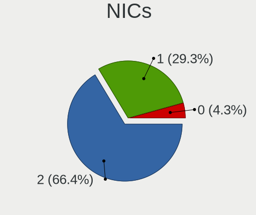

| Total | Notebooks | Percent |
|-------|-----------|---------|
| 2     | 61        | 67.03%  |
| 1     | 25        | 27.47%  |
| 0     | 5         | 5.49%   |

IPv6
----

IPv6 vs IPv4

| Used | Notebooks | Percent |
|------|-----------|---------|
| No   | 72        | 79.12%  |
| Yes  | 19        | 20.88%  |

Bluetooth
---------

Bluetooth Vendor
----------------

Controller vendors

| Vendor                          | Notebooks | Percent |
|---------------------------------|-----------|---------|
| Intel                           | 25        | 38.46%  |
| Realtek Semiconductor           | 6         | 9.23%   |
| Qualcomm Atheros Communications | 5         | 7.69%   |
| IMC Networks                    | 5         | 7.69%   |
| Foxconn / Hon Hai               | 4         | 6.15%   |
| Broadcom                        | 4         | 6.15%   |
| Lite-On Technology              | 3         | 4.62%   |
| Apple                           | 3         | 4.62%   |
| ASUSTek Computer                | 2         | 3.08%   |
| Toshiba                         | 1         | 1.54%   |
| Marvell Semiconductor           | 1         | 1.54%   |
| Hewlett-Packard                 | 1         | 1.54%   |
| Edimax Technology               | 1         | 1.54%   |
| Dell                            | 1         | 1.54%   |
| Cambridge Silicon Radio         | 1         | 1.54%   |
| Askey Computer                  | 1         | 1.54%   |
| Alps Electric                   | 1         | 1.54%   |

Bluetooth Model
---------------

Controller models

| Model                                                                               | Notebooks | Percent |
|-------------------------------------------------------------------------------------|-----------|---------|
| Intel Bluetooth wireless interface                                                  | 6         | 8.96%   |
| Qualcomm Atheros  Bluetooth Device                                                  | 5         | 7.46%   |
| Intel Bluetooth 9460/9560 Jefferson Peak (JfP)                                      | 5         | 7.46%   |
| Intel AX201 Bluetooth                                                               | 5         | 7.46%   |
| Realtek Bluetooth Radio                                                             | 4         | 5.97%   |
| Intel Bluetooth Device                                                              | 4         | 5.97%   |
| Realtek 802.11ac WLAN Adapter                                                       | 2         | 2.99%   |
| Lite-On Atheros AR3012 Bluetooth                                                    | 2         | 2.99%   |
| Intel Wireless-AC 3168 Bluetooth                                                    | 2         | 2.99%   |
| Intel AX200 Bluetooth                                                               | 2         | 2.99%   |
| IMC Networks Bluetooth Radio                                                        | 2         | 2.99%   |
| Foxconn / Hon Hai Broadcom BCM20702A1 Bluetooth                                     | 2         | 2.99%   |
| Apple Bluetooth Host Controller                                                     | 2         | 2.99%   |
| Toshiba Bluetooth Device                                                            | 1         | 1.49%   |
| Marvell Bluetooth and Wireless LAN Composite Device                                 | 1         | 1.49%   |
| Lite-On Qualcomm Atheros QCA9377 Bluetooth                                          | 1         | 1.49%   |
| Intel Centrino Bluetooth Wireless Transceiver                                       | 1         | 1.49%   |
| Intel Centrino Advanced-N 6230 Bluetooth adapter                                    | 1         | 1.49%   |
| Intel AX210 Bluetooth                                                               | 1         | 1.49%   |
| IMC Networks Wireless_Device                                                        | 1         | 1.49%   |
| IMC Networks Bluetooth Device                                                       | 1         | 1.49%   |
| IMC Networks Atheros AR3012 Bluetooth 4.0 Adapter                                   | 1         | 1.49%   |
| HP Broadcom 2070 Bluetooth Combo                                                    | 1         | 1.49%   |
| Foxconn / Hon Hai MediaTek Bluetooth Adapter                                        | 1         | 1.49%   |
| Foxconn / Hon Hai Foxconn T77H114 BCM2070 [Single-Chip Bluetooth 2.1 + EDR Adapter] | 1         | 1.49%   |
| Edimax Edimax Bluetooth Adapter                                                     | 1         | 1.49%   |
| Dell BCM20702A0 Bluetooth Module                                                    | 1         | 1.49%   |
| Cambridge Silicon Radio Bluetooth Dongle (HCI mode)                                 | 1         | 1.49%   |
| Broadcom BCM20702A0 Bluetooth 4.0                                                   | 1         | 1.49%   |
| Broadcom BCM20702A0                                                                 | 1         | 1.49%   |
| Broadcom BCM2070 Bluetooth 2.1 + EDR                                                | 1         | 1.49%   |
| Broadcom BCM2045 Bluetooth                                                          | 1         | 1.49%   |
| ASUS BT-270 Bluetooth Adapter                                                       | 1         | 1.49%   |
| ASUS BT-183 Bluetooth 2.0+EDR adapter                                               | 1         | 1.49%   |
| Askey Bluetooth Device                                                              | 1         | 1.49%   |
| Apple Built-in Bluetooth 2.0+EDR HCI                                                | 1         | 1.49%   |
| Alps Electric Bluetooth Controller (ALPS/UGPZ6)                                     | 1         | 1.49%   |

Sound
-----

Sound Vendor
------------

Sound card vendors

| Vendor                    | Notebooks | Percent |
|---------------------------|-----------|---------|
| Intel                     | 68        | 68.69%  |
| AMD                       | 19        | 19.19%  |
| Nvidia                    | 4         | 4.04%   |
| VIA Technologies          | 1         | 1.01%   |
| Texas Instruments         | 1         | 1.01%   |
| SteelSeries ApS           | 1         | 1.01%   |
| Sennheiser Communications | 1         | 1.01%   |
| Realtek Semiconductor     | 1         | 1.01%   |
| Logitech                  | 1         | 1.01%   |
| Focusrite-Novation        | 1         | 1.01%   |
| Cirrus Logic              | 1         | 1.01%   |

Sound Model
-----------

Sound card models

| Model                                                                                             | Notebooks | Percent |
|---------------------------------------------------------------------------------------------------|-----------|---------|
| Intel Sunrise Point-LP HD Audio                                                                   | 9         | 6.08%   |
| AMD Family 17h/19h HD Audio Controller                                                            | 8         | 5.41%   |
| Intel NM10/ICH7 Family High Definition Audio Controller                                           | 7         | 4.73%   |
| Intel 5 Series/3400 Series Chipset High Definition Audio                                          | 6         | 4.05%   |
| Intel 7 Series/C216 Chipset Family High Definition Audio Controller                               | 5         | 3.38%   |
| AMD Raven/Raven2/Fenghuang HDMI/DP Audio Controller                                               | 5         | 3.38%   |
| Intel Tiger Lake-LP Smart Sound Technology Audio Controller                                       | 4         | 2.7%    |
| Intel Celeron N3350/Pentium N4200/Atom E3900 Series Audio Cluster                                 | 4         | 2.7%    |
| Intel Cannon Lake PCH cAVS                                                                        | 4         | 2.7%    |
| Intel 6 Series/C200 Series Chipset Family High Definition Audio Controller                        | 4         | 2.7%    |
| AMD Family 15h (Models 60h-6fh) Audio Controller                                                  | 4         | 2.7%    |
| Intel Xeon E3-1200 v3/4th Gen Core Processor HD Audio Controller                                  | 3         | 2.03%   |
| Intel Broadwell-U Audio Controller                                                                | 3         | 2.03%   |
| Intel Alder Lake PCH-P High Definition Audio Controller                                           | 3         | 2.03%   |
| Intel 82801H (ICH8 Family) HD Audio Controller                                                    | 3         | 2.03%   |
| Intel 8 Series/C220 Series Chipset High Definition Audio Controller                               | 3         | 2.03%   |
| AMD Renoir Radeon High Definition Audio Controller                                                | 3         | 2.03%   |
| AMD Kabini HDMI/DP Audio                                                                          | 3         | 2.03%   |
| AMD High Definition Audio Controller                                                              | 3         | 2.03%   |
| AMD FCH Azalia Controller                                                                         | 3         | 2.03%   |
| Intel Wildcat Point-LP High Definition Audio Controller                                           | 2         | 1.35%   |
| Intel Haswell-ULT HD Audio Controller                                                             | 2         | 1.35%   |
| Intel Comet Lake PCH-LP cAVS                                                                      | 2         | 1.35%   |
| Intel Cannon Point-LP High Definition Audio Controller                                            | 2         | 1.35%   |
| Intel Atom/Celeron/Pentium Processor x5-E8000/J3xxx/N3xxx Series High Definition Audio Controller | 2         | 1.35%   |
| Intel Atom Processor Z36xxx/Z37xxx Series High Definition Audio Controller                        | 2         | 1.35%   |
| Intel 82801I (ICH9 Family) HD Audio Controller                                                    | 2         | 1.35%   |
| Intel 82801FB/FBM/FR/FW/FRW (ICH6 Family) AC'97 Audio Controller                                  | 2         | 1.35%   |
| Intel 8 Series HD Audio Controller                                                                | 2         | 1.35%   |
| VIA Technologies VX900/VT8xxx High Definition Audio Controller                                    | 1         | 0.68%   |
| Texas Instruments PCM2902 Audio Codec                                                             | 1         | 0.68%   |
| SteelSeries ApS SteelSeries Arctis 7                                                              | 1         | 0.68%   |
| Sennheiser Communications Sennheiser USB headset                                                  | 1         | 0.68%   |
| Realtek Semiconductor USB Audio                                                                   | 1         | 0.68%   |
| Nvidia TU116 High Definition Audio Controller                                                     | 1         | 0.68%   |
| Nvidia MCP89 High Definition Audio                                                                | 1         | 0.68%   |
| Nvidia MCP79 High Definition Audio                                                                | 1         | 0.68%   |
| Nvidia GP107GL High Definition Audio Controller                                                   | 1         | 0.68%   |
| Nvidia GP106 High Definition Audio Controller                                                     | 1         | 0.68%   |
| Nvidia GP104 High Definition Audio Controller                                                     | 1         | 0.68%   |

Memory
------

Memory Vendor
-------------

Memory module vendors

| Vendor              | Notebooks | Percent |
|---------------------|-----------|---------|
| Samsung Electronics | 20        | 21.05%  |
| Unknown             | 19        | 20%     |
| SK hynix            | 18        | 18.95%  |
| Micron Technology   | 9         | 9.47%   |
| Crucial             | 6         | 6.32%   |
| Elpida              | 5         | 5.26%   |
| A-DATA Technology   | 4         | 4.21%   |
| Kingston            | 3         | 3.16%   |
| Unknown (ABCD)      | 2         | 2.11%   |
| Smart Brazil        | 1         | 1.05%   |
| Ramaxel Technology  | 1         | 1.05%   |
| Nanya Technology    | 1         | 1.05%   |
| Lexar               | 1         | 1.05%   |
| GOODRAM             | 1         | 1.05%   |
| Gold Key            | 1         | 1.05%   |
| G.Skill             | 1         | 1.05%   |
| Corsair             | 1         | 1.05%   |
| Unknown             | 1         | 1.05%   |

Memory Model
------------

Memory module models

| Model                                                            | Notebooks | Percent |
|------------------------------------------------------------------|-----------|---------|
| Unknown RAM Module 512MB SODIMM DDR                              | 3         | 2.59%   |
| SK hynix RAM H9CCNNNBJTALAR-NUD 4GB Row Of Chips LPDDR3 1867MT/s | 3         | 2.59%   |
| Unknown RAM Module 2GB SODIMM DDR2 667MT/s                       | 2         | 1.72%   |
| Unknown RAM Module 1GB SODIMM DRAM                               | 2         | 1.72%   |
| Unknown RAM Module 1GB SODIMM DDR                                | 2         | 1.72%   |
| Unknown (ABCD) RAM 123456789012345678 2GB SODIMM LPDDR4 2400MT/s | 2         | 1.72%   |
| SK hynix RAM HMA81GS6CJR8N-VK 8GB SODIMM DDR4 2667MT/s           | 2         | 1.72%   |
| Samsung RAM M471B5273DH0-CH9 4GB SODIMM DDR3 1334MT/s            | 2         | 1.72%   |
| Samsung RAM M471B2873FHS-CH9 1GB SODIMM DDR3 1334MT/s            | 2         | 1.72%   |
| Samsung RAM M471A5244CB0-CWE 4GB SODIMM DDR4 3200MT/s            | 2         | 1.72%   |
| Samsung RAM M471A5244CB0-CTD 4GB SODIMM DDR4 3266MT/s            | 2         | 1.72%   |
| Samsung RAM M471A1K43CB1-CTD 8GB SODIMM DDR4 2667MT/s            | 2         | 1.72%   |
| Samsung RAM M471A1K43CB1-CRC 8GB SODIMM DDR4 2667MT/s            | 2         | 1.72%   |
| Unknown RAM Module 8GB SODIMM DDR4 2133MT/s                      | 1         | 0.86%   |
| Unknown RAM Module 512MB SODIMM DRAM                             | 1         | 0.86%   |
| Unknown RAM Module 512MB SODIMM DDR2                             | 1         | 0.86%   |
| Unknown RAM Module 4GB SODIMM DDR3 1600MT/s                      | 1         | 0.86%   |
| Unknown RAM Module 2GB SODIMM SDRAM                              | 1         | 0.86%   |
| Unknown RAM Module 2GB SODIMM LPDDR4 2133MT/s                    | 1         | 0.86%   |
| Unknown RAM Module 256MB SODIMM DDR                              | 1         | 0.86%   |
| Unknown RAM Module 1GB SODIMM SDRAM                              | 1         | 0.86%   |
| Unknown RAM Module 1GB SODIMM DDR3 1066MT/s                      | 1         | 0.86%   |
| Unknown RAM Module 1GB SODIMM DDR3                               | 1         | 0.86%   |
| Unknown RAM Module 1GB SODIMM DDR2 667MT/s                       | 1         | 0.86%   |
| Unknown RAM Module 16GB SODIMM DDR4 2400MT/s                     | 1         | 0.86%   |
| Unknown RAM Module 128MB DIMM DRAM                               | 1         | 0.86%   |
| Smart Brazil RAM SMS4TDC3C0K0446SCG 4GB SODIMM DDR4 2667MT/s     | 1         | 0.86%   |
| SK hynix RAM HMT451S6BFR8A-PB 4GB SODIMM DDR3 1600MT/s           | 1         | 0.86%   |
| SK hynix RAM HMT425S6AFR6A-PB 2GB SODIMM DDR3 3200MT/s           | 1         | 0.86%   |
| SK hynix RAM HMT425S2AFR6R-PB 2GB SODIMM DDR3 1333MT/s           | 1         | 0.86%   |
| SK hynix RAM HMT41GS6BFR8A-PB 8GB SODIMM DDR3 1600MT/s           | 1         | 0.86%   |
| SK hynix RAM HMT351S6BFR8C-H9 4GB SODIMM DDR3 1333MT/s           | 1         | 0.86%   |
| SK hynix RAM HMT325S6BFR8C-H9 2GB SODIMM DDR3 1600MT/s           | 1         | 0.86%   |
| SK hynix RAM HMAA2GS6AJR8N-XN 16GB SODIMM DDR4 3200MT/s          | 1         | 0.86%   |
| SK hynix RAM HMAA1GS6CMR6N-XN 8GB Row Of Chips DDR4 3200MT/s     | 1         | 0.86%   |
| SK hynix RAM HMAA1GS6CJR6N-XN 8GB Row Of Chips DDR4 3200MT/s     | 1         | 0.86%   |
| SK hynix RAM HMA851S6DJR6N-XN 4GB Row Of Chips DDR4 3200MT/s     | 1         | 0.86%   |
| SK hynix RAM HMA851S6AFR6N-UH 4GB SODIMM DDR4 2400MT/s           | 1         | 0.86%   |
| SK hynix RAM HMA82GS6JJR8N-VK 16GB SODIMM DDR4 2667MT/s          | 1         | 0.86%   |
| SK hynix RAM HMA81GS6DJR8N-XN 8GB SODIMM DDR4 3200MT/s           | 1         | 0.86%   |

Memory Kind
-----------

Memory module kinds

| Kind   | Notebooks | Percent |
|--------|-----------|---------|
| DDR3   | 26        | 35.14%  |
| DDR4   | 21        | 28.38%  |
| LPDDR3 | 8         | 10.81%  |
| DDR2   | 5         | 6.76%   |
| DDR    | 4         | 5.41%   |
| SDRAM  | 3         | 4.05%   |
| LPDDR4 | 3         | 4.05%   |
| DRAM   | 3         | 4.05%   |
| DDR5   | 1         | 1.35%   |

Memory Form Factor
------------------

Physical design of the memory module

| Name         | Notebooks | Percent |
|--------------|-----------|---------|
| SODIMM       | 61        | 80.26%  |
| Row Of Chips | 10        | 13.16%  |
| DIMM         | 2         | 2.63%   |
| Unknown      | 2         | 2.63%   |
| RIMM         | 1         | 1.32%   |

Memory Size
-----------

Memory module size

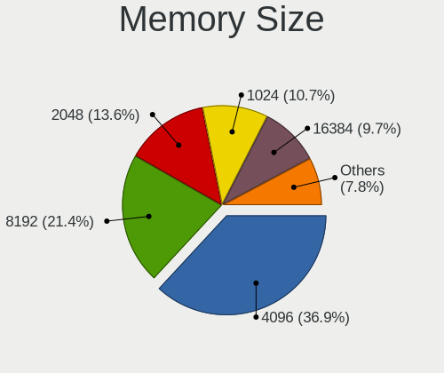

| Size  | Notebooks | Percent |
|-------|-----------|---------|
| 4096  | 28        | 32.94%  |
| 8192  | 23        | 27.06%  |
| 2048  | 11        | 12.94%  |
| 1024  | 9         | 10.59%  |
| 16384 | 6         | 7.06%   |
| 512   | 5         | 5.88%   |
| 32768 | 1         | 1.18%   |
| 256   | 1         | 1.18%   |
| 128   | 1         | 1.18%   |

Memory Speed
------------

Memory module speed

| Speed   | Notebooks | Percent |
|---------|-----------|---------|
| 1600    | 15        | 17.05%  |
| Unknown | 11        | 12.5%   |
| 2667    | 9         | 10.23%  |
| 3200    | 8         | 9.09%   |
| 2400    | 7         | 7.95%   |
| 1334    | 7         | 7.95%   |
| 1867    | 6         | 6.82%   |
| 2133    | 5         | 5.68%   |
| 1333    | 3         | 3.41%   |
| 667     | 3         | 3.41%   |
| 3266    | 2         | 2.27%   |
| 1067    | 2         | 2.27%   |
| 8400    | 1         | 1.14%   |
| 6000    | 1         | 1.14%   |
| 4800    | 1         | 1.14%   |
| 4199    | 1         | 1.14%   |
| 3800    | 1         | 1.14%   |
| 3066    | 1         | 1.14%   |
| 1400    | 1         | 1.14%   |
| 1200    | 1         | 1.14%   |
| 1066    | 1         | 1.14%   |
| 533     | 1         | 1.14%   |

Printers & scanners
-------------------

Printer Vendor
--------------

Printer device vendors

| Vendor          | Notebooks | Percent |
|-----------------|-----------|---------|
| Hewlett-Packard | 1         | 100%    |

Printer Model
-------------

Printer device models

| Model            | Notebooks | Percent |
|------------------|-----------|---------|
| HP LaserJet 1020 | 1         | 50%     |
| HP Deskjet 3050A | 1         | 50%     |

Scanner Vendor
--------------

Scanner device vendors

Zero info for selected period =(

Scanner Model
-------------

Scanner device models

Zero info for selected period =(

Camera
------

Camera Vendor
-------------

Camera device vendors

| Vendor                                 | Notebooks | Percent |
|----------------------------------------|-----------|---------|
| Chicony Electronics                    | 19        | 22.35%  |
| Realtek Semiconductor                  | 9         | 10.59%  |
| Microdia                               | 9         | 10.59%  |
| IMC Networks                           | 9         | 10.59%  |
| Cheng Uei Precision Industry (Foxlink) | 6         | 7.06%   |
| Bison Electronics                      | 6         | 7.06%   |
| Quanta                                 | 4         | 4.71%   |
| Suyin                                  | 3         | 3.53%   |
| Apple                                  | 3         | 3.53%   |
| Syntek                                 | 2         | 2.35%   |
| Sunplus Innovation Technology          | 2         | 2.35%   |
| Ricoh                                  | 2         | 2.35%   |
| Lite-On Technology                     | 2         | 2.35%   |
| Acer                                   | 2         | 2.35%   |
| Trust                                  | 1         | 1.18%   |
| Silicon Motion                         | 1         | 1.18%   |
| Samsung Electronics                    | 1         | 1.18%   |
| Luxvisions Innotech Limited            | 1         | 1.18%   |
| Logitech                               | 1         | 1.18%   |
| Lenovo                                 | 1         | 1.18%   |
| Alcor Micro                            | 1         | 1.18%   |

Camera Model
------------

Camera device models

| Model                                               | Notebooks | Percent |
|-----------------------------------------------------|-----------|---------|
| Realtek Integrated_Webcam_HD                        | 4         | 4.65%   |
| Microdia Integrated_Webcam_HD                       | 4         | 4.65%   |
| IMC Networks USB2.0 HD UVC WebCam                   | 3         | 3.49%   |
| IMC Networks Integrated Camera                      | 3         | 3.49%   |
| Chicony Integrated Camera                           | 3         | 3.49%   |
| Chicony HD Webcam                                   | 3         | 3.49%   |
| Realtek Acer 640 x 480 laptop camera                | 2         | 2.33%   |
| Microdia Laptop_Integrated_Webcam_2M                | 2         | 2.33%   |
| Chicony HP Wide Vision HD Camera                    | 2         | 2.33%   |
| Bison Integrated Camera                             | 2         | 2.33%   |
| Trust QHD Webcam                                    | 1         | 1.16%   |
| Syntek Integrated Camera                            | 1         | 1.16%   |
| Syntek EasyCamera                                   | 1         | 1.16%   |
| Suyin Integrated_Webcam_HD                          | 1         | 1.16%   |
| Suyin HP Truevision HD                              | 1         | 1.16%   |
| Suyin Acer CrystalEye Webcam                        | 1         | 1.16%   |
| Sunplus HP Universal Camera                         | 1         | 1.16%   |
| Sunplus HD WebCam                                   | 1         | 1.16%   |
| Silicon Motion NCM-G102                             | 1         | 1.16%   |
| Samsung Galaxy series, misc. (MTP mode)             | 1         | 1.16%   |
| Ricoh Visual Communication Camera VGP-VCC3 [R5U870] | 1         | 1.16%   |
| Ricoh Pavilion Webcam [R5U870]                      | 1         | 1.16%   |
| Realtek USB2.0 HD UVC WebCam                        | 1         | 1.16%   |
| Realtek USB Camera                                  | 1         | 1.16%   |
| Realtek HP Webcam                                   | 1         | 1.16%   |
| Quanta USB2.0 HD UVC WebCam                         | 1         | 1.16%   |
| Quanta HP Wide Vision HD Camera                     | 1         | 1.16%   |
| Quanta HP TrueVision HD Camera                      | 1         | 1.16%   |
| Quanta HD User Facing                               | 1         | 1.16%   |
| Microdia Webcam                                     | 1         | 1.16%   |
| Microdia Sonix 1.3 MP Laptop Integrated Webcam      | 1         | 1.16%   |
| Microdia Integrated Webcam                          | 1         | 1.16%   |
| Luxvisions Innotech Limited HP HD Camera            | 1         | 1.16%   |
| Logitech Webcam C270                                | 1         | 1.16%   |
| Logitech Webcam C170                                | 1         | 1.16%   |
| Lite-On TOSHIBA Web Camera - HD                     | 1         | 1.16%   |
| Lite-On Integrated Camera                           | 1         | 1.16%   |
| Lenovo Integrated Webcam                            | 1         | 1.16%   |
| IMC Networks VGA UVC WebCam                         | 1         | 1.16%   |
| IMC Networks USB2.0 VGA UVC WebCam                  | 1         | 1.16%   |

Security
--------

Fingerprint Vendor
------------------

Fingerprint sensor vendors

| Vendor                     | Notebooks | Percent |
|----------------------------|-----------|---------|
| Validity Sensors           | 3         | 30%     |
| Synaptics                  | 2         | 20%     |
| STMicroelectronics         | 2         | 20%     |
| AuthenTec                  | 2         | 20%     |
| Shenzhen Goodix Technology | 1         | 10%     |

Fingerprint Model
-----------------

Fingerprint sensor models

| Model                                                                      | Notebooks | Percent |
|----------------------------------------------------------------------------|-----------|---------|
| STMicroelectronics Fingerprint Reader                                      | 2         | 20%     |
| AuthenTec AES2810                                                          | 2         | 20%     |
| Validity Sensors VFS495 Fingerprint Reader                                 | 1         | 10%     |
| Validity Sensors VFS451 Fingerprint Reader                                 | 1         | 10%     |
| Validity Sensors Synaptics VFS7552 Touch Fingerprint Sensor with PurePrint | 1         | 10%     |
| Synaptics  FS7604 Touch Fingerprint Sensor with PurePrint                  | 1         | 10%     |
| Synaptics Metallica MIS Touch Fingerprint Reader                           | 1         | 10%     |
| Shenzhen Goodix  FingerPrint Device                                        | 1         | 10%     |

Chipcard Vendor
---------------

Chipcard module vendors

| Vendor      | Notebooks | Percent |
|-------------|-----------|---------|
| Lenovo      | 1         | 50%     |
| Alcor Micro | 1         | 50%     |

Chipcard Model
--------------

Chipcard module models

| Model                               | Notebooks | Percent |
|-------------------------------------|-----------|---------|
| Lenovo Integrated Smart Card Reader | 1         | 50%     |
| Alcor Micro AU9540 Smartcard Reader | 1         | 50%     |

Unsupported
-----------

Unsupported Devices
-------------------

Total unsupported devices on board

| Total | Notebooks | Percent |
|-------|-----------|---------|
| 0     | 54        | 55.67%  |
| 1     | 22        | 22.68%  |
| 2     | 17        | 17.53%  |
| 4     | 3         | 3.09%   |
| 3     | 1         | 1.03%   |

Unsupported Device Types
------------------------

Types of unsupported devices

| Type                     | Notebooks | Percent |
|--------------------------|-----------|---------|
| Graphics card            | 17        | 24.64%  |
| Fingerprint reader       | 9         | 13.04%  |
| Modem                    | 7         | 10.14%  |
| Communication controller | 6         | 8.7%    |
| Camera                   | 6         | 8.7%    |
| Net/wireless             | 5         | 7.25%   |
| Bluetooth                | 5         | 7.25%   |
| Card reader              | 4         | 5.8%    |
| Multimedia controller    | 2         | 2.9%    |
| Chipcard                 | 2         | 2.9%    |
| Unclassified device      | 1         | 1.45%   |
| Unassigned class         | 1         | 1.45%   |
| Storage                  | 1         | 1.45%   |
| Sound                    | 1         | 1.45%   |
| Network                  | 1         | 1.45%   |
| Flash memory             | 1         | 1.45%   |

