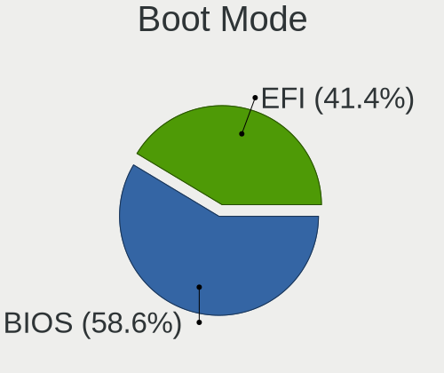
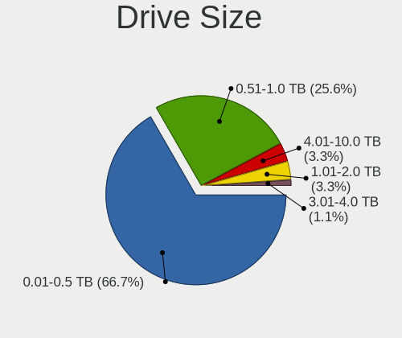
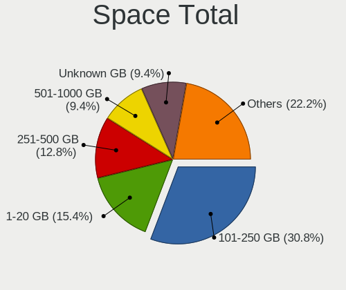
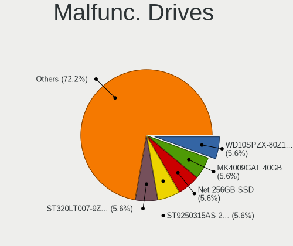
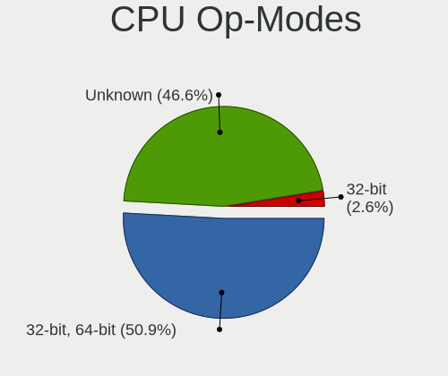
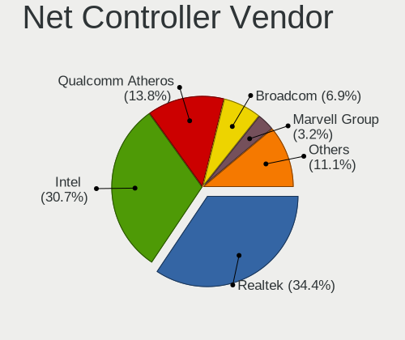

Alpine - Tested Hardware & Statistics (Notebooks)
-------------------------------------------------

A project to collect tested hardware configurations for Alpine.

Anyone can contribute to this report by the [hw-probe](https://github.com/linuxhw/hw-probe) tool:

    sudo -E hw-probe -all -upload

Please contribute! Especially if your hardware is rare.

Contents
--------

* [ Test Cases ](#test-cases)

* [ System ](#system)
  - [ OS                       ](#os)
  - [ OS Family                ](#os-family)
  - [ Kernel                   ](#kernel)
  - [ Kernel Family            ](#kernel-family)
  - [ Kernel Major Ver.        ](#kernel-major-ver)
  - [ Arch                     ](#arch)
  - [ DE                       ](#de)
  - [ Display Server           ](#display-server)
  - [ Display Manager          ](#display-manager)
  - [ OS Lang                  ](#os-lang)
  - [ Boot Mode                ](#boot-mode)
  - [ Filesystem               ](#filesystem)
  - [ Part. scheme             ](#part-scheme)
  - [ Dual Boot with Linux/BSD ](#dual-boot-with-linuxbsd)
  - [ Dual Boot (Win)          ](#dual-boot-win)

* [ Board ](#board)
  - [ Vendor                   ](#vendor)
  - [ Model                    ](#model)
  - [ Model Family             ](#model-family)
  - [ MFG Year                 ](#mfg-year)
  - [ Form Factor              ](#form-factor)
  - [ Secure Boot              ](#secure-boot)
  - [ Coreboot                 ](#coreboot)
  - [ RAM Size                 ](#ram-size)
  - [ RAM Used                 ](#ram-used)
  - [ Total Drives             ](#total-drives)
  - [ Has CD-ROM               ](#has-cd-rom)
  - [ Has Ethernet             ](#has-ethernet)
  - [ Has WiFi                 ](#has-wifi)
  - [ Has Bluetooth            ](#has-bluetooth)

* [ Location ](#location)
  - [ Country                  ](#country)
  - [ City                     ](#city)

* [ Drives ](#drives)
  - [ Drive Vendor             ](#drive-vendor)
  - [ Drive Model              ](#drive-model)
  - [ HDD Vendor               ](#hdd-vendor)
  - [ SSD Vendor               ](#ssd-vendor)
  - [ Drive Kind               ](#drive-kind)
  - [ Drive Connector          ](#drive-connector)
  - [ Drive Size               ](#drive-size)
  - [ Space Total              ](#space-total)
  - [ Space Used               ](#space-used)
  - [ Malfunc. Drives          ](#malfunc-drives)
  - [ Malfunc. Drive Vendor    ](#malfunc-drive-vendor)
  - [ Malfunc. HDD Vendor      ](#malfunc-hdd-vendor)
  - [ Malfunc. Drive Kind      ](#malfunc-drive-kind)
  - [ Failed Drives            ](#failed-drives)
  - [ Failed Drive Vendor      ](#failed-drive-vendor)
  - [ Drive Status             ](#drive-status)

* [ Storage controller ](#storage-controller)
  - [ Storage Vendor           ](#storage-vendor)
  - [ Storage Model            ](#storage-model)
  - [ Storage Kind             ](#storage-kind)

* [ Processor ](#processor)
  - [ CPU Vendor               ](#cpu-vendor)
  - [ CPU Model                ](#cpu-model)
  - [ CPU Model Family         ](#cpu-model-family)
  - [ CPU Cores                ](#cpu-cores)
  - [ CPU Sockets              ](#cpu-sockets)
  - [ CPU Threads              ](#cpu-threads)
  - [ CPU Op-Modes             ](#cpu-op-modes)
  - [ CPU Microcode            ](#cpu-microcode)
  - [ CPU Microarch            ](#cpu-microarch)

* [ Graphics ](#graphics)
  - [ GPU Vendor               ](#gpu-vendor)
  - [ GPU Model                ](#gpu-model)
  - [ GPU Combo                ](#gpu-combo)
  - [ GPU Driver               ](#gpu-driver)
  - [ GPU Memory               ](#gpu-memory)

* [ Monitor ](#monitor)
  - [ Monitor Vendor           ](#monitor-vendor)
  - [ Monitor Model            ](#monitor-model)
  - [ Monitor Resolution       ](#monitor-resolution)
  - [ Monitor Diagonal         ](#monitor-diagonal)
  - [ Monitor Width            ](#monitor-width)
  - [ Aspect Ratio             ](#aspect-ratio)
  - [ Monitor Area             ](#monitor-area)
  - [ Pixel Density            ](#pixel-density)
  - [ Multiple Monitors        ](#multiple-monitors)

* [ Network ](#network)
  - [ Net Controller Vendor    ](#net-controller-vendor)
  - [ Net Controller Model     ](#net-controller-model)
  - [ Wireless Vendor          ](#wireless-vendor)
  - [ Wireless Model           ](#wireless-model)
  - [ Ethernet Vendor          ](#ethernet-vendor)
  - [ Ethernet Model           ](#ethernet-model)
  - [ Net Controller Kind      ](#net-controller-kind)
  - [ Used Controller          ](#used-controller)
  - [ NICs                     ](#nics)
  - [ IPv6                     ](#ipv6)

* [ Bluetooth ](#bluetooth)
  - [ Bluetooth Vendor         ](#bluetooth-vendor)
  - [ Bluetooth Model          ](#bluetooth-model)

* [ Sound ](#sound)
  - [ Sound Vendor             ](#sound-vendor)
  - [ Sound Model              ](#sound-model)

* [ Memory ](#memory)
  - [ Memory Vendor            ](#memory-vendor)
  - [ Memory Model             ](#memory-model)
  - [ Memory Kind              ](#memory-kind)
  - [ Memory Form Factor       ](#memory-form-factor)
  - [ Memory Size              ](#memory-size)
  - [ Memory Speed             ](#memory-speed)

* [ Printers & scanners ](#printers--scanners)
  - [ Printer Vendor           ](#printer-vendor)
  - [ Printer Model            ](#printer-model)
  - [ Scanner Vendor           ](#scanner-vendor)
  - [ Scanner Model            ](#scanner-model)

* [ Camera ](#camera)
  - [ Camera Vendor            ](#camera-vendor)
  - [ Camera Model             ](#camera-model)

* [ Security ](#security)
  - [ Fingerprint Vendor       ](#fingerprint-vendor)
  - [ Fingerprint Model        ](#fingerprint-model)
  - [ Chipcard Vendor          ](#chipcard-vendor)
  - [ Chipcard Model           ](#chipcard-model)

* [ Unsupported ](#unsupported)
  - [ Unsupported Devices      ](#unsupported-devices)
  - [ Unsupported Device Types ](#unsupported-device-types)

Test Cases
----------

Total: 81

| Vendor   | Model                       | Probe                                                      | Date         |
|----------|-----------------------------|------------------------------------------------------------|--------------|
| Dell     | Latitude 5430 Rugged        | [051aebd1a2](https://linux-hardware.org/?probe=051aebd1a2) | Jul 24, 2023 |
| ASUSTek  | A3AC                        | [1bf0a25c8e](https://linux-hardware.org/?probe=1bf0a25c8e) | Jul 22, 2023 |
| ASUSTek  | A3AC                        | [f7fb9875de](https://linux-hardware.org/?probe=f7fb9875de) | Jul 22, 2023 |
| Toshiba  | Satellite Pro L50-A         | [f1907449fa](https://linux-hardware.org/?probe=f1907449fa) | Jun 24, 2023 |
| Google   | Kefka                       | [c5d9002e23](https://linux-hardware.org/?probe=c5d9002e23) | Jun 23, 2023 |
| Lenovo   | ThinkPad T440p              | [c058d92130](https://linux-hardware.org/?probe=c058d92130) | Jun 05, 2023 |
| Toshiba  | WT8-A                       | [4dc30f1c10](https://linux-hardware.org/?probe=4dc30f1c10) | Jun 04, 2023 |
| MSI      | U200                        | [2fe4d70ea1](https://linux-hardware.org/?probe=2fe4d70ea1) | Jun 02, 2023 |
| Notebook | NV4XMB,ME,MZ                | [125884d17a](https://linux-hardware.org/?probe=125884d17a) | Apr 05, 2023 |
| Olivetti | Spring Peak                 | [9678c685d7](https://linux-hardware.org/?probe=9678c685d7) | Mar 31, 2023 |
| Olivetti | Spring Peak                 | [7878f53f36](https://linux-hardware.org/?probe=7878f53f36) | Mar 31, 2023 |
| Fujitsu  | FMVNP8AE                    | [10efc9f976](https://linux-hardware.org/?probe=10efc9f976) | Mar 21, 2023 |
| Lenovo   | ThinkPad E590 20NB0012RT    | [4c9bfc239a](https://linux-hardware.org/?probe=4c9bfc239a) | Feb 26, 2023 |
| Acer     | Aspire ES1-132              | [386da062e2](https://linux-hardware.org/?probe=386da062e2) | Feb 23, 2023 |
| Lenovo   | V14-ADA 82C6                | [3bd522dc2c](https://linux-hardware.org/?probe=3bd522dc2c) | Feb 13, 2023 |
| Lenovo   | V14-ADA 82C6                | [cfa774a092](https://linux-hardware.org/?probe=cfa774a092) | Feb 13, 2023 |
| Google   | Leona                       | [59b146e197](https://linux-hardware.org/?probe=59b146e197) | Jan 21, 2023 |
| Dell     | Inspiron 3558               | [9635348d10](https://linux-hardware.org/?probe=9635348d10) | Jan 09, 2023 |
| Lenovo   | ThinkPad X131e 33711Q7      | [3336313cae](https://linux-hardware.org/?probe=3336313cae) | Jan 06, 2023 |
| Lenovo   | ThinkPad X131e 33711Q7      | [7e0f8a38bf](https://linux-hardware.org/?probe=7e0f8a38bf) | Jan 04, 2023 |
| Dell     | Inspiron N5010              | [389475ec30](https://linux-hardware.org/?probe=389475ec30) | Dec 25, 2022 |
| Dell     | Inspiron 5447               | [735ac089ab](https://linux-hardware.org/?probe=735ac089ab) | Oct 17, 2022 |
| HP       | Presario V4000 (EQ608PA#... | [f462d80b2a](https://linux-hardware.org/?probe=f462d80b2a) | Oct 06, 2022 |
| Toshiba  | Satellite M645              | [b342f11704](https://linux-hardware.org/?probe=b342f11704) | Aug 16, 2022 |
| Toshiba  | Satellite M645              | [f64d98a9e1](https://linux-hardware.org/?probe=f64d98a9e1) | Aug 16, 2022 |
| Dell     | Inspiron 3180               | [d4dbaf9ec8](https://linux-hardware.org/?probe=d4dbaf9ec8) | Aug 14, 2022 |
| Fujitsu  | LIFEBOOK P702               | [fdbe6c32cd](https://linux-hardware.org/?probe=fdbe6c32cd) | Aug 06, 2022 |
| Sony     | VGN-UX27GN                  | [ed20bd45a4](https://linux-hardware.org/?probe=ed20bd45a4) | Jun 20, 2022 |
| IBM      | ThinkPad X40 2371LBG        | [e7610b86d4](https://linux-hardware.org/?probe=e7610b86d4) | Jun 20, 2022 |
| HP       | EliteBook 8460p             | [a0a6c37152](https://linux-hardware.org/?probe=a0a6c37152) | Jun 19, 2022 |
| ASUSTek  | X555LAB                     | [e47cf70de1](https://linux-hardware.org/?probe=e47cf70de1) | Jun 17, 2022 |
| HP       | ENVY Sleekbook 6 PC         | [28b7e84c50](https://linux-hardware.org/?probe=28b7e84c50) | May 24, 2022 |
| HP       | ENVY Sleekbook 6 PC         | [5d78835d90](https://linux-hardware.org/?probe=5d78835d90) | May 24, 2022 |
| ASUSTek  | N10Jc                       | [ae20ca4c7c](https://linux-hardware.org/?probe=ae20ca4c7c) | May 05, 2022 |
| ASUSTek  | N10Jc                       | [1f688a5b2d](https://linux-hardware.org/?probe=1f688a5b2d) | May 05, 2022 |
| HP       | ProBook 4310s               | [a37901ae30](https://linux-hardware.org/?probe=a37901ae30) | Apr 26, 2022 |
| Haier    | U144S                       | [9a4827b852](https://linux-hardware.org/?probe=9a4827b852) | Mar 26, 2022 |
| Acer     | Aspire E5-553G              | [930cc740b2](https://linux-hardware.org/?probe=930cc740b2) | Mar 24, 2022 |
| Lenovo   | ThinkPad T420 42364F2       | [d82acaba71](https://linux-hardware.org/?probe=d82acaba71) | Mar 23, 2022 |
| Dell     | XPS 15 7590                 | [df2a40363b](https://linux-hardware.org/?probe=df2a40363b) | Mar 18, 2022 |
| ASUSTek  | ZenBook UX431FA             | [b3cbed05f5](https://linux-hardware.org/?probe=b3cbed05f5) | Mar 10, 2022 |
| Lenovo   | ThinkPad X1 Carbon 6th 2... | [94cf359935](https://linux-hardware.org/?probe=94cf359935) | Feb 17, 2022 |
| Lenovo   | ThinkPad X1 Carbon 6th 2... | [822688debe](https://linux-hardware.org/?probe=822688debe) | Feb 16, 2022 |
| ASUSTek  | ZenBook UX431FA             | [519a7a72ab](https://linux-hardware.org/?probe=519a7a72ab) | Jan 24, 2022 |
| HP       | EliteBook 1040 G3 Notebo... | [465c51678d](https://linux-hardware.org/?probe=465c51678d) | Jan 01, 2022 |
| MSI      | GL72M 7REX                  | [6ada534c8b](https://linux-hardware.org/?probe=6ada534c8b) | Dec 13, 2021 |
| Lenovo   | ThinkPad W700 2752RZ2       | [66ea0a02cb](https://linux-hardware.org/?probe=66ea0a02cb) | Nov 25, 2021 |
| Dell     | Inspiron MM061              | [e293d0cf05](https://linux-hardware.org/?probe=e293d0cf05) | Nov 02, 2021 |
| ASUSTek  | X550EA                      | [bbed87466a](https://linux-hardware.org/?probe=bbed87466a) | Oct 05, 2021 |
| HP       | Compaq Mini CQ10-600        | [4603b3336e](https://linux-hardware.org/?probe=4603b3336e) | Oct 01, 2021 |
| Lenovo   | IdeaPad 320-15AST 80XV      | [9ff8561f02](https://linux-hardware.org/?probe=9ff8561f02) | Sep 30, 2021 |
| Lenovo   | Yoga 14sARH 2021 82LB       | [9fa77d455d](https://linux-hardware.org/?probe=9fa77d455d) | Sep 30, 2021 |
| Unknown  | Unknown                     | [d3c742bac9](https://linux-hardware.org/?probe=d3c742bac9) | Sep 26, 2021 |
| Pegatron | Deepcam                     | [5326e6bf39](https://linux-hardware.org/?probe=5326e6bf39) | Jul 18, 2021 |
| HP       | EliteBook 2740p             | [66479cb1dd](https://linux-hardware.org/?probe=66479cb1dd) | Jul 09, 2021 |
| HP       | EliteBook 2740p             | [652fa48f49](https://linux-hardware.org/?probe=652fa48f49) | Jul 08, 2021 |
| ASUSTek  | X200MA                      | [c9edeec38a](https://linux-hardware.org/?probe=c9edeec38a) | Jun 26, 2021 |
| HP       | Laptop 14-dq1xxx            | [f1b8c01b96](https://linux-hardware.org/?probe=f1b8c01b96) | Jun 22, 2021 |
| IBM      | 264070A                     | [c057e54603](https://linux-hardware.org/?probe=c057e54603) | Jun 08, 2021 |
| HP       | Mini 110-3500               | [be40a38710](https://linux-hardware.org/?probe=be40a38710) | Jun 06, 2021 |
| HP       | ENVY Sleekbook 6 PC         | [0a2464e592](https://linux-hardware.org/?probe=0a2464e592) | Jun 06, 2021 |
| Acer     | Aspire ES1-512              | [01ad8fc793](https://linux-hardware.org/?probe=01ad8fc793) | Jan 30, 2021 |
| Acer     | Aspire 5920G                | [7cf5d7b04a](https://linux-hardware.org/?probe=7cf5d7b04a) | Jan 08, 2021 |
| HP       | Compaq Mini CQ10-600        | [fe7ee46763](https://linux-hardware.org/?probe=fe7ee46763) | Jan 08, 2021 |
| Gateway  | MX3631m                     | [15d8283384](https://linux-hardware.org/?probe=15d8283384) | Jan 03, 2021 |
| Dell     | Studio 1747                 | [b4e0e289f6](https://linux-hardware.org/?probe=b4e0e289f6) | Dec 29, 2020 |
| Dell     | Inspiron 3180               | [4b05b65d0e](https://linux-hardware.org/?probe=4b05b65d0e) | Dec 16, 2020 |
| Dell     | Inspiron 3180               | [0bc140f6f6](https://linux-hardware.org/?probe=0bc140f6f6) | Dec 16, 2020 |
| ASUSTek  | E502SA                      | [0a25648158](https://linux-hardware.org/?probe=0a25648158) | Dec 05, 2020 |
| IBM      | 26446AG                     | [f004231106](https://linux-hardware.org/?probe=f004231106) | Nov 15, 2020 |
| IBM      | 26446AG                     | [29affa3577](https://linux-hardware.org/?probe=29affa3577) | Nov 15, 2020 |
| Google   | Samus                       | [efe40a5a38](https://linux-hardware.org/?probe=efe40a5a38) | Oct 13, 2020 |
| Dell     | Inspiron 5566               | [a12b4d304a](https://linux-hardware.org/?probe=a12b4d304a) | Sep 29, 2020 |
| Apple    | MacBook7,1                  | [6445bfa9bd](https://linux-hardware.org/?probe=6445bfa9bd) | Aug 31, 2020 |
| Lenovo   | ThinkPad 11e 20ED001HUS     | [364afb4113](https://linux-hardware.org/?probe=364afb4113) | Aug 06, 2020 |
| Acer     | Aspire ES1-111M             | [c99b05cc07](https://linux-hardware.org/?probe=c99b05cc07) | Jul 30, 2020 |
| Lenovo   | ThinkPad E485 20KUCTO1WW    | [aa287cffbe](https://linux-hardware.org/?probe=aa287cffbe) | Jun 18, 2020 |
| HP       | ZBook 15 G5                 | [3f3b1f2237](https://linux-hardware.org/?probe=3f3b1f2237) | Apr 05, 2020 |
| Synology | DS1019+                     | [622ced4019](https://linux-hardware.org/?probe=622ced4019) | Feb 09, 2020 |
| Synology | DS1019+                     | [c8a69e1c12](https://linux-hardware.org/?probe=c8a69e1c12) | Jan 21, 2020 |
| Synology | DS1019+                     | [43a8c9674e](https://linux-hardware.org/?probe=43a8c9674e) | Jan 18, 2020 |

System
------

OS
--

Installed operating systems

| Name                        | Notebooks | Percent |
|-----------------------------|-----------|---------|
| Alpine 3.16.0               | 6         | 9.38%   |
| Alpine 3.15.0               | 6         | 9.38%   |
| Alpine 3.15.0_alpha20210804 | 4         | 6.25%   |
| Alpine 3.14.0               | 4         | 6.25%   |
| Alpine 3.12.0               | 4         | 6.25%   |
| Alpine 3.18.0               | 3         | 4.69%   |
| Alpine 3.17.2               | 3         | 4.69%   |
| Alpine 3.17.0               | 3         | 4.69%   |
| Alpine 3.18_alpha20230329   | 2         | 3.13%   |
| Alpine 3.17.1               | 2         | 3.13%   |
| Alpine 3.16.2               | 2         | 3.13%   |
| Alpine 3.14.2               | 2         | 3.13%   |
| Alpine 3.13.5               | 2         | 3.13%   |
| Alpine 3.13.0_alpha20201218 | 2         | 3.13%   |
| Alpine 3.13.0_alpha20200917 | 2         | 3.13%   |
| Alpine 3.11.2               | 2         | 3.13%   |
| Alpine 3.18.2               | 1         | 1.56%   |
| Alpine 3.17_alpha20220809   | 1         | 1.56%   |
| Alpine 3.17.3               | 1         | 1.56%   |
| Alpine 3.16.1               | 1         | 1.56%   |
| Alpine 3.16.0_alpha20220316 | 1         | 1.56%   |
| Alpine 3.15.4               | 1         | 1.56%   |
| Alpine 3.15.2               | 1         | 1.56%   |
| Alpine 3.15.0_rc5           | 1         | 1.56%   |
| Alpine 3.14.0_alpha20210212 | 1         | 1.56%   |
| Alpine 3.13.1               | 1         | 1.56%   |
| Alpine 3.13.0_rc2           | 1         | 1.56%   |
| Alpine 3.13.0_alpha20200626 | 1         | 1.56%   |
| Alpine 3.12.3               | 1         | 1.56%   |
| Alpine 3.12.1               | 1         | 1.56%   |
| Alpine 3.11.5               | 1         | 1.56%   |

OS Family
---------

OS without a version

| Name   | Notebooks | Percent |
|--------|-----------|---------|
| Alpine | 61        | 100%    |

Kernel
------

Version of the Linux kernel

| Version                | Notebooks | Percent |
|------------------------|-----------|---------|
| 5.4.83-0-lts           | 2         | 3.08%   |
| 5.4.43-1-lts           | 2         | 3.08%   |
| 5.15.86-0-lts          | 2         | 3.08%   |
| 5.15.59-0-lts          | 2         | 3.08%   |
| 5.15.47-0-lts          | 2         | 3.08%   |
| 5.15.41-0-lts          | 2         | 3.08%   |
| 5.15.4-0-lts           | 2         | 3.08%   |
| 6.4.4-0-edge           | 1         | 1.54%   |
| 6.1.39-0-lts           | 1         | 1.54%   |
| 6.1.34                 | 1         | 1.54%   |
| 6.1.24-0-lts           | 1         | 1.54%   |
| 6.1.11-0-edge          | 1         | 1.54%   |
| 5.8.12-0-edge          | 1         | 1.54%   |
| 5.6.2-xanmod1-1-xanmod | 1         | 1.54%   |
| 5.4.84-0-lts           | 1         | 1.54%   |
| 5.4.72-0-lts           | 1         | 1.54%   |
| 5.4.64-0-lts           | 1         | 1.54%   |
| 5.4.46-0-lts           | 1         | 1.54%   |
| 5.4.27-0-lts           | 1         | 1.54%   |
| 5.17.9-0-edge          | 1         | 1.54%   |
| 5.17.0-0-edge          | 1         | 1.54%   |
| 5.16.12-may            | 1         | 1.54%   |
| 5.16.1-may             | 1         | 1.54%   |
| 5.15.96-0-lts          | 1         | 1.54%   |
| 5.15.95-0-lts          | 1         | 1.54%   |
| 5.15.89-0-lts          | 1         | 1.54%   |
| 5.15.85-0-lts          | 1         | 1.54%   |
| 5.15.73-0-lts          | 1         | 1.54%   |
| 5.15.60-0-lts          | 1         | 1.54%   |
| 5.15.46-1-lts          | 1         | 1.54%   |
| 5.15.37-0-lts          | 1         | 1.54%   |
| 5.15.34                | 1         | 1.54%   |
| 5.15.30-0-lts          | 1         | 1.54%   |
| 5.15.28-0-lts          | 1         | 1.54%   |
| 5.15.26-0-lts          | 1         | 1.54%   |
| 5.15.16-0-lts          | 1         | 1.54%   |
| 5.15.12-0-lts          | 1         | 1.54%   |
| 5.15.114-0-lts         | 1         | 1.54%   |
| 5.15.105-0-lts         | 1         | 1.54%   |
| 5.15.104-0-lts         | 1         | 1.54%   |

Kernel Family
-------------

Linux kernel without a distro release

| Version  | Notebooks | Percent |
|----------|-----------|---------|
| 5.4.83   | 2         | 3.08%   |
| 5.4.43   | 2         | 3.08%   |
| 5.15.86  | 2         | 3.08%   |
| 5.15.59  | 2         | 3.08%   |
| 5.15.47  | 2         | 3.08%   |
| 5.15.41  | 2         | 3.08%   |
| 5.15.4   | 2         | 3.08%   |
| 6.4.4    | 1         | 1.54%   |
| 6.1.39   | 1         | 1.54%   |
| 6.1.34   | 1         | 1.54%   |
| 6.1.24   | 1         | 1.54%   |
| 6.1.11   | 1         | 1.54%   |
| 5.8.12   | 1         | 1.54%   |
| 5.6.2    | 1         | 1.54%   |
| 5.4.84   | 1         | 1.54%   |
| 5.4.72   | 1         | 1.54%   |
| 5.4.64   | 1         | 1.54%   |
| 5.4.46   | 1         | 1.54%   |
| 5.4.27   | 1         | 1.54%   |
| 5.17.9   | 1         | 1.54%   |
| 5.17.0   | 1         | 1.54%   |
| 5.16.12  | 1         | 1.54%   |
| 5.16.1   | 1         | 1.54%   |
| 5.15.96  | 1         | 1.54%   |
| 5.15.95  | 1         | 1.54%   |
| 5.15.89  | 1         | 1.54%   |
| 5.15.85  | 1         | 1.54%   |
| 5.15.73  | 1         | 1.54%   |
| 5.15.60  | 1         | 1.54%   |
| 5.15.46  | 1         | 1.54%   |
| 5.15.37  | 1         | 1.54%   |
| 5.15.34  | 1         | 1.54%   |
| 5.15.30  | 1         | 1.54%   |
| 5.15.28  | 1         | 1.54%   |
| 5.15.26  | 1         | 1.54%   |
| 5.15.16  | 1         | 1.54%   |
| 5.15.12  | 1         | 1.54%   |
| 5.15.114 | 1         | 1.54%   |
| 5.15.105 | 1         | 1.54%   |
| 5.15.104 | 1         | 1.54%   |

Kernel Major Ver.
-----------------

Linux kernel major version

| Version | Notebooks | Percent |
|---------|-----------|---------|
| 5.15    | 28        | 44.44%  |
| 5.10    | 11        | 17.46%  |
| 5.4     | 9         | 14.29%  |
| 6.1     | 4         | 6.35%   |
| 5.17    | 2         | 3.17%   |
| 6.4     | 1         | 1.59%   |
| 5.8     | 1         | 1.59%   |
| 5.6     | 1         | 1.59%   |
| 5.16    | 1         | 1.59%   |
| 5.14    | 1         | 1.59%   |
| 5.13    | 1         | 1.59%   |
| 5.12    | 1         | 1.59%   |
| 4.4     | 1         | 1.59%   |
| 3.10    | 1         | 1.59%   |

Arch
----

OS architecture (x86_64, i586, etc.)

| Name   | Notebooks | Percent |
|--------|-----------|---------|
| x86_64 | 50        | 81.97%  |
| i686   | 9         | 14.75%  |
| i586   | 1         | 1.64%   |
| armv7l | 1         | 1.64%   |

DE
--

Desktop Environment

| Name    | Notebooks | Percent |
|---------|-----------|---------|
| Unknown | 47        | 77.05%  |
| XFCE    | 7         | 11.48%  |
| GNOME   | 4         | 6.56%   |
| sway    | 1         | 1.64%   |
| LXQt    | 1         | 1.64%   |
| KDE5    | 1         | 1.64%   |

Display Server
--------------

X11 or Wayland

| Name    | Notebooks | Percent |
|---------|-----------|---------|
| X11     | 29        | 46.03%  |
| Unknown | 28        | 44.44%  |
| Wayland | 6         | 9.52%   |

Display Manager
---------------

SDDM, LightDM, etc.

| Name    | Notebooks | Percent |
|---------|-----------|---------|
| Unknown | 44        | 72.13%  |
| LightDM | 12        | 19.67%  |
| GDM     | 2         | 3.28%   |
| XDM     | 1         | 1.64%   |
| SDDM    | 1         | 1.64%   |
| LXDM    | 1         | 1.64%   |

OS Lang
-------

Language

| Lang    | Notebooks | Percent |
|---------|-----------|---------|
| C       | 37        | 58.73%  |
| Unknown | 18        | 28.57%  |
| en_US   | 6         | 9.52%   |
| ru_RU   | 1         | 1.59%   |
| en_GB   | 1         | 1.59%   |

Boot Mode
---------

EFI or BIOS

| Mode | Notebooks | Percent |
|------|-----------|---------|
| BIOS | 40        | 65.57%  |
| EFI  | 21        | 34.43%  |

Filesystem
----------

Type of filesystem

| Type    | Notebooks | Percent |
|---------|-----------|---------|
| Ext4    | 49        | 79.03%  |
| Btrfs   | 6         | 9.68%   |
| Tmpfs   | 2         | 3.23%   |
| Overlay | 2         | 3.23%   |
| F2fs    | 1         | 1.61%   |
| Ext2    | 1         | 1.61%   |
| Unknown | 1         | 1.61%   |

Part. scheme
------------

Scheme of partitioning

| Type    | Notebooks | Percent |
|---------|-----------|---------|
| Unknown | 40        | 64.52%  |
| GPT     | 15        | 24.19%  |
| MBR     | 7         | 11.29%  |

Dual Boot with Linux/BSD
------------------------

Hosting more than one Linux/BSD

| Dual boot | Notebooks | Percent |
|-----------|-----------|---------|
| No        | 56        | 90.32%  |
| Yes       | 6         | 9.68%   |

Dual Boot (Win)
---------------

Hosting Linux and Windows

| Dual boot | Notebooks | Percent |
|-----------|-----------|---------|
| No        | 57        | 93.44%  |
| Yes       | 4         | 6.56%   |

Board
-----

Vendor
------

Motherboard manufacturer

| Name             | Notebooks | Percent |
|------------------|-----------|---------|
| Lenovo           | 10        | 16.39%  |
| Hewlett-Packard  | 10        | 16.39%  |
| Dell             | 9         | 14.75%  |
| ASUSTek Computer | 7         | 11.48%  |
| Acer             | 5         | 8.2%    |
| Toshiba          | 3         | 4.92%   |
| IBM              | 3         | 4.92%   |
| Google           | 3         | 4.92%   |
| Fujitsu          | 2         | 3.28%   |
| Synology         | 1         | 1.64%   |
| Sony             | 1         | 1.64%   |
| Pegatron         | 1         | 1.64%   |
| Olivetti         | 1         | 1.64%   |
| Notebook         | 1         | 1.64%   |
| MSI              | 1         | 1.64%   |
| Haier            | 1         | 1.64%   |
| Gateway          | 1         | 1.64%   |
| Unknown          | 1         | 1.64%   |

Model
-----

Motherboard model

| Name                                     | Notebooks | Percent |
|------------------------------------------|-----------|---------|
| Toshiba WT8-A                            | 1         | 1.64%   |
| Toshiba Satellite Pro L50-A              | 1         | 1.64%   |
| Toshiba Satellite M645                   | 1         | 1.64%   |
| Synology DS1019+                         | 1         | 1.64%   |
| Sony VGN-UX27GN                          | 1         | 1.64%   |
| Pegatron Deepcam                         | 1         | 1.64%   |
| Olivetti Spring Peak                     | 1         | 1.64%   |
| Notebook NV4XMB,ME,MZ                    | 1         | 1.64%   |
| MSI GL72M 7REX                           | 1         | 1.64%   |
| Lenovo Yoga 14sARH 2021 82LB             | 1         | 1.64%   |
| Lenovo V14-ADA 82C6                      | 1         | 1.64%   |
| Lenovo ThinkPad X131e 33711Q7            | 1         | 1.64%   |
| Lenovo ThinkPad X1 Carbon 6th 20KGS17D00 | 1         | 1.64%   |
| Lenovo ThinkPad W700 2752RZ2             | 1         | 1.64%   |
| Lenovo ThinkPad T420 42364F2             | 1         | 1.64%   |
| Lenovo ThinkPad E590 20NB0012RT          | 1         | 1.64%   |
| Lenovo ThinkPad E485 20KUCTO1WW          | 1         | 1.64%   |
| Lenovo ThinkPad 11e 20ED001HUS           | 1         | 1.64%   |
| Lenovo IdeaPad 320-15AST 80XV            | 1         | 1.64%   |
| IBM ThinkPad X40 2371LBG                 | 1         | 1.64%   |
| IBM 26446AG                              | 1         | 1.64%   |
| IBM 264070A                              | 1         | 1.64%   |
| HP ZBook 15 G5                           | 1         | 1.64%   |
| HP ProBook 4310s                         | 1         | 1.64%   |
| HP Presario V4000 (EQ608PA#UUF)          | 1         | 1.64%   |
| HP Mini 110-3500                         | 1         | 1.64%   |
| HP Laptop 14-dq1xxx                      | 1         | 1.64%   |
| HP ENVY Sleekbook 6 PC                   | 1         | 1.64%   |
| HP EliteBook 8460p                       | 1         | 1.64%   |
| HP EliteBook 2740p                       | 1         | 1.64%   |
| HP EliteBook 1040 G3 Notebook PC         | 1         | 1.64%   |
| HP Compaq Mini CQ10-600                  | 1         | 1.64%   |
| Haier U144S                              | 1         | 1.64%   |
| Google Samus                             | 1         | 1.64%   |
| Google Leona                             | 1         | 1.64%   |
| Google Kefka                             | 1         | 1.64%   |
| Gateway MX3631m                          | 1         | 1.64%   |
| Fujitsu LIFEBOOK P702                    | 1         | 1.64%   |
| Fujitsu FMVNP8AE                         | 1         | 1.64%   |
| Dell XPS 15 7590                         | 1         | 1.64%   |

Model Family
------------

Motherboard model prefix

| Name              | Notebooks | Percent |
|-------------------|-----------|---------|
| Lenovo ThinkPad   | 7         | 11.48%  |
| Dell Inspiron     | 6         | 9.84%   |
| Acer Aspire       | 5         | 8.2%    |
| HP EliteBook      | 3         | 4.92%   |
| Toshiba Satellite | 2         | 3.28%   |
| Toshiba WT8-A     | 1         | 1.64%   |
| Synology DS1019+  | 1         | 1.64%   |
| Sony VGN-UX27GN   | 1         | 1.64%   |
| Pegatron Deepcam  | 1         | 1.64%   |
| Olivetti Spring   | 1         | 1.64%   |
| Notebook NV4XMB   | 1         | 1.64%   |
| MSI GL72M         | 1         | 1.64%   |
| Lenovo Yoga       | 1         | 1.64%   |
| Lenovo V14-ADA    | 1         | 1.64%   |
| Lenovo IdeaPad    | 1         | 1.64%   |
| IBM ThinkPad      | 1         | 1.64%   |
| IBM 26446AG       | 1         | 1.64%   |
| IBM 264070A       | 1         | 1.64%   |
| HP ZBook          | 1         | 1.64%   |
| HP ProBook        | 1         | 1.64%   |
| HP Presario       | 1         | 1.64%   |
| HP Mini           | 1         | 1.64%   |
| HP Laptop         | 1         | 1.64%   |
| HP ENVY           | 1         | 1.64%   |
| HP Compaq         | 1         | 1.64%   |
| Haier U144S       | 1         | 1.64%   |
| Google Samus      | 1         | 1.64%   |
| Google Leona      | 1         | 1.64%   |
| Google Kefka      | 1         | 1.64%   |
| Gateway MX3631m   | 1         | 1.64%   |
| Fujitsu LIFEBOOK  | 1         | 1.64%   |
| Fujitsu FMVNP8AE  | 1         | 1.64%   |
| Dell XPS          | 1         | 1.64%   |
| Dell Studio       | 1         | 1.64%   |
| Dell Latitude     | 1         | 1.64%   |
| ASUS ZenBook      | 1         | 1.64%   |
| ASUS X555LAB      | 1         | 1.64%   |
| ASUS X550EA       | 1         | 1.64%   |
| ASUS X200MA       | 1         | 1.64%   |
| ASUS N10Jc        | 1         | 1.64%   |

MFG Year
--------

Motherboard manufacture year

| Year    | Notebooks | Percent |
|---------|-----------|---------|
| 2014    | 7         | 11.48%  |
| 2019    | 6         | 9.84%   |
| 2018    | 5         | 8.2%    |
| 2010    | 5         | 8.2%    |
| 2012    | 4         | 6.56%   |
| 2006    | 4         | 6.56%   |
| 2021    | 3         | 4.92%   |
| 2017    | 3         | 4.92%   |
| 2016    | 3         | 4.92%   |
| 2013    | 3         | 4.92%   |
| 2011    | 3         | 4.92%   |
| 2020    | 2         | 3.28%   |
| 2015    | 2         | 3.28%   |
| 2009    | 2         | 3.28%   |
| 2005    | 2         | 3.28%   |
| Unknown | 2         | 3.28%   |
| 2023    | 1         | 1.64%   |
| 2022    | 1         | 1.64%   |
| 2008    | 1         | 1.64%   |
| 2007    | 1         | 1.64%   |
| 1999    | 1         | 1.64%   |

Form Factor
-----------

Physical design of the computer

| Name     | Notebooks | Percent |
|----------|-----------|---------|
| Notebook | 61        | 100%    |

Secure Boot
-----------

Enabled or disabled

| State    | Notebooks | Percent |
|----------|-----------|---------|
| Disabled | 61        | 100%    |

Coreboot
--------

Have coreboot on board

| Used | Notebooks | Percent |
|------|-----------|---------|
| No   | 58        | 95.08%  |
| Yes  | 3         | 4.92%   |

RAM Size
--------

Total RAM memory

| Size in GB  | Notebooks | Percent |
|-------------|-----------|---------|
| 4.01-8.0    | 18        | 29.03%  |
| 3.01-4.0    | 14        | 22.58%  |
| 8.01-16.0   | 6         | 9.68%   |
| 16.01-24.0  | 5         | 8.06%   |
| 1.01-2.0    | 5         | 8.06%   |
| 0.51-1.0    | 5         | 8.06%   |
| 32.01-64.0  | 3         | 4.84%   |
| 2.01-3.0    | 3         | 4.84%   |
| 0.01-0.5    | 2         | 3.23%   |
| 64.01-256.0 | 1         | 1.61%   |

RAM Used
--------

Used RAM memory

| Used GB   | Notebooks | Percent |
|-----------|-----------|---------|
| 0.01-0.5  | 21        | 33.33%  |
| 1.01-2.0  | 13        | 20.63%  |
| 0.51-1.0  | 10        | 15.87%  |
| 2.01-3.0  | 7         | 11.11%  |
| 4.01-8.0  | 5         | 7.94%   |
| 3.01-4.0  | 3         | 4.76%   |
| 0         | 2         | 3.17%   |
| 8.01-16.0 | 1         | 1.59%   |
| Unknown   | 1         | 1.59%   |

Total Drives
------------

Number of drives on board

| Drives | Notebooks | Percent |
|--------|-----------|---------|
| 1      | 47        | 75.81%  |
| 2      | 12        | 19.35%  |
| 0      | 2         | 3.23%   |
| 7      | 1         | 1.61%   |

Has CD-ROM
----------

Has CD-ROM on board

| Presented | Notebooks | Percent |
|-----------|-----------|---------|
| No        | 41        | 67.21%  |
| Yes       | 20        | 32.79%  |

Has Ethernet
------------

Has Ethernet on board

| Presented | Notebooks | Percent |
|-----------|-----------|---------|
| Yes       | 48        | 78.69%  |
| No        | 13        | 21.31%  |

Has WiFi
--------

Has WiFi module

| Presented | Notebooks | Percent |
|-----------|-----------|---------|
| Yes       | 55        | 90.16%  |
| No        | 6         | 9.84%   |

Has Bluetooth
-------------

Has Bluetooth module

| Presented | Notebooks | Percent |
|-----------|-----------|---------|
| Yes       | 36        | 59.02%  |
| No        | 25        | 40.98%  |

Location
--------

Country
-------

Geographic location (country)

| Country      | Notebooks | Percent |
|--------------|-----------|---------|
| USA          | 16        | 26.23%  |
| Russia       | 6         | 9.84%   |
| Canada       | 6         | 9.84%   |
| UK           | 5         | 8.2%    |
| Germany      | 4         | 6.56%   |
| Brazil       | 3         | 4.92%   |
| Spain        | 2         | 3.28%   |
| Italy        | 2         | 3.28%   |
| Australia    | 2         | 3.28%   |
| Venezuela    | 1         | 1.64%   |
| UAE          | 1         | 1.64%   |
| South Africa | 1         | 1.64%   |
| Slovakia     | 1         | 1.64%   |
| Portugal     | 1         | 1.64%   |
| Poland       | 1         | 1.64%   |
| Mexico       | 1         | 1.64%   |
| Jamaica      | 1         | 1.64%   |
| Israel       | 1         | 1.64%   |
| Hungary      | 1         | 1.64%   |
| Guatemala    | 1         | 1.64%   |
| France       | 1         | 1.64%   |
| Egypt        | 1         | 1.64%   |
| Czechia      | 1         | 1.64%   |
| China        | 1         | 1.64%   |

City
----

Geographic location (city)

| City             | Notebooks | Percent |
|------------------|-----------|---------|
| St Petersburg    | 3         | 4.84%   |
| Springfield      | 3         | 4.84%   |
| Vernon           | 2         | 3.23%   |
| Stratford        | 2         | 3.23%   |
| Moscow           | 2         | 3.23%   |
| Fulham           | 2         | 3.23%   |
| Zhangzhou        | 1         | 1.61%   |
| Tymovskoye       | 1         | 1.61%   |
| Turin            | 1         | 1.61%   |
| Tampa            | 1         | 1.61%   |
| Sydney           | 1         | 1.61%   |
| Stewartstown     | 1         | 1.61%   |
| Sisteron         | 1         | 1.61%   |
| Semily           | 1         | 1.61%   |
| Seattle          | 1         | 1.61%   |
| Sao Paulo        | 1         | 1.61%   |
| San Mateo        | 1         | 1.61%   |
| Saarbrücken     | 1         | 1.61%   |
| Rzeszów         | 1         | 1.61%   |
| Rostock          | 1         | 1.61%   |
| Purdys           | 1         | 1.61%   |
| Oakville         | 1         | 1.61%   |
| Northampton      | 1         | 1.61%   |
| Merrill          | 1         | 1.61%   |
| Mérida          | 1         | 1.61%   |
| Manitowoc        | 1         | 1.61%   |
| Madrid           | 1         | 1.61%   |
| Lindavista Norte | 1         | 1.61%   |
| Lincoln          | 1         | 1.61%   |
| Leipzig          | 1         | 1.61%   |
| Larkspur         | 1         | 1.61%   |
| Kingston         | 1         | 1.61%   |
| Kecskemét       | 1         | 1.61%   |
| Johannesburg     | 1         | 1.61%   |
| Hampstead        | 1         | 1.61%   |
| Guatemala City   | 1         | 1.61%   |
| Funchal          | 1         | 1.61%   |
| Franklin         | 1         | 1.61%   |
| Emmendingen      | 1         | 1.61%   |
| Ejido            | 1         | 1.61%   |

Drives
------

Drive Vendor
------------

Hard drive vendors

| Vendor              | Notebooks | Drives | Percent |
|---------------------|-----------|--------|---------|
| Samsung Electronics | 8         | 9      | 11.59%  |
| Hitachi             | 8         | 8      | 11.59%  |
| Unknown             | 7         | 9      | 10.14%  |
| Toshiba             | 6         | 8      | 8.7%    |
| Kingston            | 6         | 7      | 8.7%    |
| WDC                 | 4         | 5      | 5.8%    |
| Seagate             | 4         | 13     | 5.8%    |
| HGST                | 3         | 3      | 4.35%   |
| Crucial             | 3         | 3      | 4.35%   |
| SK hynix            | 2         | 2      | 2.9%    |
| Sandisk             | 2         | 2      | 2.9%    |
| Intel               | 2         | 4      | 2.9%    |
| Fujitsu             | 2         | 2      | 2.9%    |
| SPCC                | 1         | 1      | 1.45%   |
| Micron Technology   | 1         | 1      | 1.45%   |
| LITEON              | 1         | 1      | 1.45%   |
| KC600               | 1         | 1      | 1.45%   |
| JMicron Technology  | 1         | 1      | 1.45%   |
| Intenso             | 1         | 1      | 1.45%   |
| IBM                 | 1         | 1      | 1.45%   |
| Emtec               | 1         | 1      | 1.45%   |
| Dell                | 1         | 2      | 1.45%   |
| China               | 1         | 1      | 1.45%   |
| AMD                 | 1         | 1      | 1.45%   |
| A-DATA Technology   | 1         | 1      | 1.45%   |

Drive Model
-----------

Hard drive models

| Model                                               | Notebooks | Percent |
|-----------------------------------------------------|-----------|---------|
| Unknown MMC Card  16GB                              | 3         | 4.11%   |
| Unknown MMC Card  64GB                              | 2         | 2.74%   |
| Toshiba MQ01ABD100 1TB                              | 2         | 2.74%   |
| Toshiba MQ01ABD075 752GB                            | 2         | 2.74%   |
| Kingston SV300S37A120G 120GB SSD                    | 2         | 2.74%   |
| Crucial CT500MX500SSD1 500GB                        | 2         | 2.74%   |
| WDC WDS500G2B0A-00SM50 500GB SSD                    | 1         | 1.37%   |
| WDC WDS240G2G0A-00JH30 240GB SSD                    | 1         | 1.37%   |
| WDC WD5000BEVT-22ZAT0 500GB                         | 1         | 1.37%   |
| WDC PC SN520 SDAPNUW-512G-1002 512GB                | 1         | 1.37%   |
| Unknown SD32G  32GB                                 | 1         | 1.37%   |
| Unknown NVMe SSD Drive 1024GB                       | 1         | 1.37%   |
| Unknown MMC Card  32GB                              | 1         | 1.37%   |
| Toshiba MQ01ABD1 1TB                                | 1         | 1.37%   |
| Toshiba MK4009GAL 40GB                              | 1         | 1.37%   |
| Toshiba KXG5AZNV256G 256GB                          | 1         | 1.37%   |
| Toshiba KBG30ZMS128G 128GB NVMe SSD                 | 1         | 1.37%   |
| SPCC Solid State Disk 256GB                         | 1         | 1.37%   |
| SK hynix SKHynix_HFS512GD9TNI-L2A0B 512GB           | 1         | 1.37%   |
| SK hynix BC501 NVMe Solid State Drive 512GB         | 1         | 1.37%   |
| Seagate ST98823A 80GB                               | 1         | 1.37%   |
| Seagate ST8000VN004-2M2101 8TB                      | 1         | 1.37%   |
| Seagate ST2000LM015-2E81 2TB                        | 1         | 1.37%   |
| Seagate ST1000LM024 HN-M101MBB 1TB                  | 1         | 1.37%   |
| Sandisk WDC PC SN530 SDBPMPZ-256G-1101 256GB        | 1         | 1.37%   |
| SanDisk SSD PLUS 480GB                              | 1         | 1.37%   |
| Samsung SSD 970 EVO Plus 250GB                      | 1         | 1.37%   |
| Samsung Portable SSD T5 1TB                         | 1         | 1.37%   |
| Samsung NVMe SSD Drive 1024GB                       | 1         | 1.37%   |
| Samsung NVMe SSD Controller SM981/PM981/PM983 500GB | 1         | 1.37%   |
| Samsung NVMe SSD Controller PM9A1/PM9A3/980PRO 1TB  | 1         | 1.37%   |
| Samsung MZVLB256HAHQ-000L7 256GB                    | 1         | 1.37%   |
| Samsung MZ7LF120 120GB SSD                          | 1         | 1.37%   |
| Samsung HM160HI 160GB                               | 1         | 1.37%   |
| Micron 1100_MTFDDAK256TBN 256GB SSD                 | 1         | 1.37%   |
| LITEON CV1-8B128-HP 128GB SSD                       | 1         | 1.37%   |
| Kingston SUV500MS480G 480GB SSD                     | 1         | 1.37%   |
| Kingston SA400S37120G 120GB SSD                     | 1         | 1.37%   |
| Kingston RBU-SUS151S364GD 64GB SSD                  | 1         | 1.37%   |
| Kingston KC600 128GB SSD                            | 1         | 1.37%   |

HDD Vendor
----------

Hard disk drive vendors

| Vendor              | Notebooks | Drives | Percent |
|---------------------|-----------|--------|---------|
| Hitachi             | 8         | 8      | 30.77%  |
| Toshiba             | 5         | 6      | 19.23%  |
| Seagate             | 4         | 13     | 15.38%  |
| HGST                | 3         | 3      | 11.54%  |
| Fujitsu             | 2         | 2      | 7.69%   |
| WDC                 | 1         | 1      | 3.85%   |
| Samsung Electronics | 1         | 2      | 3.85%   |
| JMicron Technology  | 1         | 1      | 3.85%   |
| IBM                 | 1         | 1      | 3.85%   |

SSD Vendor
----------

Solid state drive vendors

| Vendor              | Notebooks | Drives | Percent |
|---------------------|-----------|--------|---------|
| Kingston            | 6         | 7      | 25%     |
| Crucial             | 3         | 3      | 12.5%   |
| WDC                 | 2         | 2      | 8.33%   |
| Samsung Electronics | 2         | 2      | 8.33%   |
| SPCC                | 1         | 1      | 4.17%   |
| SanDisk             | 1         | 1      | 4.17%   |
| Micron Technology   | 1         | 1      | 4.17%   |
| LITEON              | 1         | 1      | 4.17%   |
| KC600               | 1         | 1      | 4.17%   |
| Intenso             | 1         | 1      | 4.17%   |
| Emtec               | 1         | 1      | 4.17%   |
| Dell                | 1         | 2      | 4.17%   |
| China               | 1         | 1      | 4.17%   |
| AMD                 | 1         | 1      | 4.17%   |
| A-DATA Technology   | 1         | 1      | 4.17%   |

Drive Kind
----------

HDD or SSD

| Kind | Notebooks | Drives | Percent |
|------|-----------|--------|---------|
| HDD  | 26        | 37     | 39.39%  |
| SSD  | 22        | 26     | 33.33%  |
| NVMe | 12        | 18     | 18.18%  |
| MMC  | 6         | 7      | 9.09%   |

Drive Connector
---------------

SATA, SAS, NVMe, etc.

| Type | Notebooks | Drives | Percent |
|------|-----------|--------|---------|
| SATA | 44        | 60     | 67.69%  |
| NVMe | 12        | 18     | 18.46%  |
| MMC  | 6         | 7      | 9.23%   |
| SAS  | 3         | 3      | 4.62%   |

Drive Size
----------

Size of hard drive

| Size in TB | Notebooks | Drives | Percent |
|------------|-----------|--------|---------|
| 0.01-0.5   | 37        | 42     | 77.08%  |
| 0.51-1.0   | 9         | 10     | 18.75%  |
| 1.01-2.0   | 1         | 1      | 2.08%   |
| 4.01-10.0  | 1         | 10     | 2.08%   |

Space Total
-----------

Amount of disk space available on the file system

| Size in GB     | Notebooks | Percent |
|----------------|-----------|---------|
| 101-250        | 17        | 26.98%  |
| 1-20           | 14        | 22.22%  |
| 251-500        | 8         | 12.7%   |
| Unknown        | 6         | 9.52%   |
| 21-50          | 5         | 7.94%   |
| 501-1000       | 5         | 7.94%   |
| 1001-2000      | 4         | 6.35%   |
| More than 3000 | 2         | 3.17%   |
| 51-100         | 2         | 3.17%   |

Space Used
----------

Amount of used disk space

| Used GB  | Notebooks | Percent |
|----------|-----------|---------|
| 1-20     | 43        | 68.25%  |
| Unknown  | 6         | 9.52%   |
| 21-50    | 4         | 6.35%   |
| 51-100   | 4         | 6.35%   |
| 101-250  | 3         | 4.76%   |
| 501-1000 | 2         | 3.17%   |
| 251-500  | 1         | 1.59%   |

Malfunc. Drives
---------------

Drive models with a malfunction

| Model                                          | Notebooks | Drives | Percent |
|------------------------------------------------|-----------|--------|---------|
| Toshiba MK4009GAL 40GB                         | 1         | 1      | 11.11%  |
| Seagate ST2000LM015-2E81 2TB                   | 1         | 1      | 11.11%  |
| Samsung Electronics HM160HI 160GB              | 1         | 2      | 11.11%  |
| Micron Technology 1100_MTFDDAK256TBN 256GB SSD | 1         | 1      | 11.11%  |
| Hitachi HTS725025A9A364 250GB                  | 1         | 1      | 11.11%  |
| Hitachi HTS723232A7A364 320GB                  | 1         | 1      | 11.11%  |
| Hitachi HTS72101 99GB                          | 1         | 1      | 11.11%  |
| Hitachi HTC426040G9AT00 40GB                   | 1         | 1      | 11.11%  |
| HGST HTS545050A7E380 500GB                     | 1         | 1      | 11.11%  |

Malfunc. Drive Vendor
---------------------

Vendors of faulty drives

| Vendor              | Notebooks | Drives | Percent |
|---------------------|-----------|--------|---------|
| Hitachi             | 4         | 4      | 44.44%  |
| Toshiba             | 1         | 1      | 11.11%  |
| Seagate             | 1         | 1      | 11.11%  |
| Samsung Electronics | 1         | 2      | 11.11%  |
| Micron Technology   | 1         | 1      | 11.11%  |
| HGST                | 1         | 1      | 11.11%  |

Malfunc. HDD Vendor
-------------------

Vendors of faulty HDD drives

| Vendor              | Notebooks | Drives | Percent |
|---------------------|-----------|--------|---------|
| Hitachi             | 4         | 4      | 50%     |
| Toshiba             | 1         | 1      | 12.5%   |
| Seagate             | 1         | 1      | 12.5%   |
| Samsung Electronics | 1         | 2      | 12.5%   |
| HGST                | 1         | 1      | 12.5%   |

Malfunc. Drive Kind
-------------------

Kinds of faulty drives

| Kind | Notebooks | Drives | Percent |
|------|-----------|--------|---------|
| HDD  | 8         | 9      | 88.89%  |
| SSD  | 1         | 1      | 11.11%  |

Failed Drives
-------------

Failed drive models

Zero info for selected period =(

Failed Drive Vendor
-------------------

Failed drive vendors

Zero info for selected period =(

Drive Status
------------

Number of failed and malfunc. drives

| Status   | Notebooks | Drives | Percent |
|----------|-----------|--------|---------|
| Works    | 37        | 57     | 57.81%  |
| Detected | 18        | 21     | 28.13%  |
| Malfunc  | 9         | 10     | 14.06%  |

Storage controller
------------------

Storage Vendor
--------------

Storage controller vendors

| Vendor                       | Notebooks | Percent |
|------------------------------|-----------|---------|
| Intel                        | 43        | 69.35%  |
| AMD                          | 7         | 11.29%  |
| Samsung Electronics          | 5         | 8.06%   |
| SK hynix                     | 2         | 3.23%   |
| SanDisk                      | 2         | 3.23%   |
| Toshiba America Info Systems | 1         | 1.61%   |
| Marvell Technology Group     | 1         | 1.61%   |
| ADATA Technology             | 1         | 1.61%   |

Storage Model
-------------

Storage controller models

| Model                                                                          | Notebooks | Percent |
|--------------------------------------------------------------------------------|-----------|---------|
| AMD FCH SATA Controller [AHCI mode]                                            | 7         | 10.77%  |
| Samsung NVMe SSD Controller SM981/PM981/PM983                                  | 4         | 6.15%   |
| Intel Celeron N3350/Pentium N4200/Atom E3900 Series SATA AHCI Controller       | 4         | 6.15%   |
| Intel Wildcat Point-LP SATA Controller [AHCI Mode]                             | 3         | 4.62%   |
| Intel Atom Processor E3800 Series SATA AHCI Controller                         | 3         | 4.62%   |
| Intel 82801FB/FBM/FR/FW/FRW (ICH6 Family) IDE Controller                       | 3         | 4.62%   |
| Intel 6 Series/C200 Series Chipset Family 6 port Mobile SATA AHCI Controller   | 3         | 4.62%   |
| Intel 5 Series/3400 Series Chipset 6 port SATA AHCI Controller                 | 3         | 4.62%   |
| Intel Sunrise Point-LP SATA Controller [AHCI mode]                             | 2         | 3.08%   |
| Intel NM10/ICH7 Family SATA Controller [AHCI mode]                             | 2         | 3.08%   |
| Intel Cannon Lake Mobile PCH SATA AHCI Controller                              | 2         | 3.08%   |
| Intel 82801IBM/IEM (ICH9M/ICH9M-E) 4 port SATA Controller [AHCI mode]          | 2         | 3.08%   |
| Intel 82801GBM/GHM (ICH7-M Family) SATA Controller [IDE mode]                  | 2         | 3.08%   |
| Intel 82801 Mobile SATA Controller [RAID mode]                                 | 2         | 3.08%   |
| Intel 82371AB/EB/MB PIIX4 IDE                                                  | 2         | 3.08%   |
| Intel 7 Series Chipset Family 6-port SATA Controller [AHCI mode]               | 2         | 3.08%   |
| Toshiba America Info Systems XG5 NVMe SSD Controller                           | 1         | 1.54%   |
| SK hynix PC611 NVMe Solid State Drive                                          | 1         | 1.54%   |
| SK hynix BC501 NVMe Solid State Drive                                          | 1         | 1.54%   |
| SanDisk WD Blue SN500 / PC SN520 NVMe SSD                                      | 1         | 1.54%   |
| SanDisk PC SN530 NVMe SSD (DRAM-less)                                          | 1         | 1.54%   |
| Samsung NVMe SSD Controller PM9A1/PM9A3/980PRO                                 | 1         | 1.54%   |
| Marvell Group 88SE9235 PCIe 2.0 x2 4-port SATA 6 Gb/s Controller               | 1         | 1.54%   |
| Intel SSD 600P Series                                                          | 1         | 1.54%   |
| Intel Optane NVME SSD H10 with Solid State Storage [Teton Glacier]             | 1         | 1.54%   |
| Intel HM170/QM170 Chipset SATA Controller [AHCI Mode]                          | 1         | 1.54%   |
| Intel Cannon Point-LP SATA Controller [AHCI Mode]                              | 1         | 1.54%   |
| Intel 82801HM/HEM (ICH8M/ICH8M-E) SATA Controller [AHCI mode]                  | 1         | 1.54%   |
| Intel 82801HM/HEM (ICH8M/ICH8M-E) IDE Controller                               | 1         | 1.54%   |
| Intel 82801G (ICH7 Family) IDE Controller                                      | 1         | 1.54%   |
| Intel 82801DBM (ICH4-M) IDE Controller                                         | 1         | 1.54%   |
| Intel 8 Series/C220 Series Chipset Family 6-port SATA Controller 1 [AHCI mode] | 1         | 1.54%   |
| Intel 8 Series SATA Controller 1 [AHCI mode]                                   | 1         | 1.54%   |
| Intel 5 Series/3400 Series Chipset 4 port SATA AHCI Controller                 | 1         | 1.54%   |
| ADATA XPG SX8200 Pro PCIe Gen3x4 M.2 2280 Solid State Drive                    | 1         | 1.54%   |

Storage Kind
------------

Kind of storage controller (IDE, SATA, NVMe, SAS, ...)

| Kind | Notebooks | Percent |
|------|-----------|---------|
| SATA | 39        | 61.9%   |
| NVMe | 12        | 19.05%  |
| IDE  | 10        | 15.87%  |
| RAID | 2         | 3.17%   |

Processor
---------

CPU Vendor
----------

Processor vendors

| Vendor | Notebooks | Percent |
|--------|-----------|---------|
| Intel  | 51        | 83.61%  |
| AMD    | 9         | 14.75%  |
| ARM    | 1         | 1.64%   |

CPU Model
---------

Processor models

| Model                                | Notebooks | Percent |
|--------------------------------------|-----------|---------|
| Intel Pentium M processor 1.70GHz    | 2         | 3.28%   |
| Intel Core i5-2520M CPU @ 2.50GHz    | 2         | 3.28%   |
| Intel Celeron CPU N2840 @ 2.16GHz    | 2         | 3.28%   |
| Intel Atom CPU N455 @ 1.66GHz        | 2         | 3.28%   |
| Intel Xeon E-2176M CPU @ 2.70GHz     | 1         | 1.64%   |
| Intel Pentium M processor 1.60GHz    | 1         | 1.64%   |
| Intel Pentium M processor 1.50GHz    | 1         | 1.64%   |
| Intel Pentium III (Coppermine)       | 1         | 1.64%   |
| Intel Pentium CPU N4200 @ 1.10GHz    | 1         | 1.64%   |
| Intel Pentium CPU N3710 @ 1.60GHz    | 1         | 1.64%   |
| Intel Mobile Pentium MMX             | 1         | 1.64%   |
| Intel Core Solo CPU U1500 @ 1.33GHz  | 1         | 1.64%   |
| Intel Core m3-8100Y CPU @ 1.10GHz    | 1         | 1.64%   |
| Intel Core i9-9980HK CPU @ 2.40GHz   | 1         | 1.64%   |
| Intel Core i7-8565U CPU @ 1.80GHz    | 1         | 1.64%   |
| Intel Core i7-5500U CPU @ 2.40GHz    | 1         | 1.64%   |
| Intel Core i7 CPU Q 820 @ 1.73GHz    | 1         | 1.64%   |
| Intel Core i5-8350U CPU @ 1.70GHz    | 1         | 1.64%   |
| Intel Core i5-8265U CPU @ 1.60GHz    | 1         | 1.64%   |
| Intel Core i5-7300HQ CPU @ 2.50GHz   | 1         | 1.64%   |
| Intel Core i5-7200U CPU @ 2.50GHz    | 1         | 1.64%   |
| Intel Core i5-6300U CPU @ 2.40GHz    | 1         | 1.64%   |
| Intel Core i5-5200U CPU @ 2.20GHz    | 1         | 1.64%   |
| Intel Core i5-4210U CPU @ 1.70GHz    | 1         | 1.64%   |
| Intel Core i5-4200M CPU @ 2.50GHz    | 1         | 1.64%   |
| Intel Core i5-3340M CPU @ 2.70GHz    | 1         | 1.64%   |
| Intel Core i5-3317U CPU @ 1.70GHz    | 1         | 1.64%   |
| Intel Core i5-1035G7 CPU @ 1.20GHz   | 1         | 1.64%   |
| Intel Core i5 CPU M 560 @ 2.67GHz    | 1         | 1.64%   |
| Intel Core i5 CPU M 480 @ 2.67GHz    | 1         | 1.64%   |
| Intel Core i3-5020U CPU @ 2.20GHz    | 1         | 1.64%   |
| Intel Core i3-3110M CPU @ 2.40GHz    | 1         | 1.64%   |
| Intel Core i3-2310M CPU @ 2.10GHz    | 1         | 1.64%   |
| Intel Core i3 CPU M 350 @ 2.27GHz    | 1         | 1.64%   |
| Intel Core 2 Duo CPU T9600 @ 2.80GHz | 1         | 1.64%   |
| Intel Core 2 Duo CPU T9300 @ 2.50GHz | 1         | 1.64%   |
| Intel Core 2 Duo CPU P7570 @ 2.26GHz | 1         | 1.64%   |
| Intel Core 2 CPU T7200 @ 2.00GHz     | 1         | 1.64%   |
| Intel Celeron CPU N3350 @ 1.10GHz    | 1         | 1.64%   |
| Intel Celeron CPU N3060 @ 1.60GHz    | 1         | 1.64%   |

CPU Model Family
----------------

Processor model prefix

| Model             | Notebooks | Percent |
|-------------------|-----------|---------|
| Intel Core i5     | 15        | 24.59%  |
| Intel Celeron     | 6         | 9.84%   |
| Other             | 5         | 8.2%    |
| Intel Atom        | 5         | 8.2%    |
| Intel Pentium M   | 4         | 6.56%   |
| Intel Core i3     | 4         | 6.56%   |
| Intel Core i7     | 3         | 4.92%   |
| Intel Core 2 Duo  | 3         | 4.92%   |
| Intel Pentium     | 2         | 3.28%   |
| AMD A4            | 2         | 3.28%   |
| Intel Xeon        | 1         | 1.64%   |
| Intel Pentium III | 1         | 1.64%   |
| Intel Core Solo   | 1         | 1.64%   |
| Intel Core m3     | 1         | 1.64%   |
| Intel Core i9     | 1         | 1.64%   |
| Intel Core 2      | 1         | 1.64%   |
| AMD Ryzen 7       | 1         | 1.64%   |
| AMD Ryzen 5       | 1         | 1.64%   |
| AMD Ryzen 3       | 1         | 1.64%   |
| AMD E2            | 1         | 1.64%   |
| AMD A6            | 1         | 1.64%   |
| AMD A10           | 1         | 1.64%   |

CPU Cores
---------

Number of processor cores

| Number | Notebooks | Percent |
|--------|-----------|---------|
| 2      | 32        | 52.46%  |
| 4      | 15        | 24.59%  |
| 1      | 10        | 16.39%  |
| 8      | 2         | 3.28%   |
| 6      | 1         | 1.64%   |
| 3      | 1         | 1.64%   |

CPU Sockets
-----------

Number of sockets

| Number | Notebooks | Percent |
|--------|-----------|---------|
| 1      | 61        | 100%    |

CPU Threads
-----------

Threads per core (Hyper-Threading)

| Number | Notebooks | Percent |
|--------|-----------|---------|
| 1      | 32        | 52.46%  |
| 2      | 29        | 47.54%  |

CPU Op-Modes
------------

CPU Operation Modes (32-bit, 64-bit)

| Op mode        | Notebooks | Percent |
|----------------|-----------|---------|
| Unknown        | 33        | 53.23%  |
| 32-bit, 64-bit | 26        | 41.94%  |
| 32-bit         | 3         | 4.84%   |

CPU Microcode
-------------

Microcode number

| Number     | Notebooks | Percent |
|------------|-----------|---------|
| Unknown    | 36        | 57.14%  |
| 0x306a9    | 3         | 4.76%   |
| 0x30678    | 3         | 4.76%   |
| 0x806eb    | 2         | 3.17%   |
| 0x206a7    | 2         | 3.17%   |
| 0x106ca    | 2         | 3.17%   |
| 0x06006704 | 2         | 3.17%   |
| 0x906ea    | 1         | 1.59%   |
| 0x806c1    | 1         | 1.59%   |
| 0x706e5    | 1         | 1.59%   |
| 0x683      | 1         | 1.59%   |
| 0x506c9    | 1         | 1.59%   |
| 0x406c4    | 1         | 1.59%   |
| 0x306d4    | 1         | 1.59%   |
| 0x306c3    | 1         | 1.59%   |
| 0x20655    | 1         | 1.59%   |
| 0x106e5    | 1         | 1.59%   |
| 0x1067a    | 1         | 1.59%   |
| 0x08108109 | 1         | 1.59%   |
| 0x0810100b | 1         | 1.59%   |

CPU Microarch
-------------

Microarchitecture

| Name        | Notebooks | Percent |
|-------------|-----------|---------|
| KabyLake    | 8         | 13.11%  |
| Silvermont  | 6         | 9.84%   |
| P6          | 6         | 9.84%   |
| Goldmont    | 4         | 6.56%   |
| Westmere    | 3         | 4.92%   |
| SandyBridge | 3         | 4.92%   |
| Penryn      | 3         | 4.92%   |
| IvyBridge   | 3         | 4.92%   |
| Excavator   | 3         | 4.92%   |
| Broadwell   | 3         | 4.92%   |
| Bonnell     | 3         | 4.92%   |
| TigerLake   | 2         | 3.28%   |
| Haswell     | 2         | 3.28%   |
| Unknown     | 2         | 3.28%   |
| Zen+        | 1         | 1.64%   |
| Zen 2       | 1         | 1.64%   |
| Zen         | 1         | 1.64%   |
| Skylake     | 1         | 1.64%   |
| Puma        | 1         | 1.64%   |
| Nehalem     | 1         | 1.64%   |
| Jaguar      | 1         | 1.64%   |
| IceLake     | 1         | 1.64%   |
| Core        | 1         | 1.64%   |
| Bobcat      | 1         | 1.64%   |

Graphics
--------

GPU Vendor
----------

Vendors of graphics cards

| Vendor   | Notebooks | Percent |
|----------|-----------|---------|
| Intel    | 45        | 67.16%  |
| AMD      | 15        | 22.39%  |
| Nvidia   | 5         | 7.46%   |
| Neomagic | 2         | 2.99%   |

GPU Model
---------

Graphics card models

| Model                                                                                    | Notebooks | Percent |
|------------------------------------------------------------------------------------------|-----------|---------|
| Intel Atom Processor Z36xxx/Z37xxx Series Graphics & Display                             | 4         | 5.71%   |
| Intel Mobile 915GM/GMS/910GML Express Graphics Controller                                | 3         | 4.29%   |
| Intel HD Graphics 5500                                                                   | 3         | 4.29%   |
| Intel HD Graphics 500                                                                    | 3         | 4.29%   |
| Intel Core Processor Integrated Graphics Controller                                      | 3         | 4.29%   |
| Intel 3rd Gen Core processor Graphics Controller                                         | 3         | 4.29%   |
| Intel 2nd Generation Core Processor Family Integrated Graphics Controller                | 3         | 4.29%   |
| Intel WhiskeyLake-U GT2 [UHD Graphics 620]                                               | 2         | 2.86%   |
| Intel TigerLake-LP GT2 [Iris Xe Graphics]                                                | 2         | 2.86%   |
| Intel Mobile 945GM/GMS/GME, 943/940GML Express Integrated Graphics Controller            | 2         | 2.86%   |
| Intel Atom/Celeron/Pentium Processor x5-E8000/J3xxx/N3xxx Integrated Graphics Controller | 2         | 2.86%   |
| Intel Atom Processor D4xx/D5xx/N4xx/N5xx Integrated Graphics Controller                  | 2         | 2.86%   |
| AMD Topaz XT [Radeon R7 M260/M265 / M340/M360 / M440/M445 / 530/535 / 620/625 Mobile]    | 2         | 2.86%   |
| AMD Stoney [Radeon R2/R3/R4/R5 Graphics]                                                 | 2         | 2.86%   |
| Nvidia TU117M [GeForce GTX 1650 Mobile / Max-Q]                                          | 1         | 1.43%   |
| Nvidia GP107M [GeForce GTX 1050 Ti Mobile]                                               | 1         | 1.43%   |
| Nvidia GP107GLM [Quadro P2000 Mobile]                                                    | 1         | 1.43%   |
| Nvidia GK208M [GeForce GT 740M]                                                          | 1         | 1.43%   |
| Nvidia G92GLM [Quadro FX 3700M]                                                          | 1         | 1.43%   |
| Neomagic NM2200 [MagicGraph 256AV]                                                       | 1         | 1.43%   |
| Neomagic NM2160 [MagicGraph 128XD]                                                       | 1         | 1.43%   |
| Intel UHD Graphics 620                                                                   | 1         | 1.43%   |
| Intel UHD Graphics 615                                                                   | 1         | 1.43%   |
| Intel Skylake GT2 [HD Graphics 520]                                                      | 1         | 1.43%   |
| Intel Mobile 945GSE Express Integrated Graphics Controller                               | 1         | 1.43%   |
| Intel Mobile 945GM/GMS, 943/940GML Express Integrated Graphics Controller                | 1         | 1.43%   |
| Intel Mobile 4 Series Chipset Integrated Graphics Controller                             | 1         | 1.43%   |
| Intel Iris Plus Graphics G7                                                              | 1         | 1.43%   |
| Intel HD Graphics 630                                                                    | 1         | 1.43%   |
| Intel HD Graphics 620                                                                    | 1         | 1.43%   |
| Intel Haswell-ULT Integrated Graphics Controller                                         | 1         | 1.43%   |
| Intel CoffeeLake-H GT2 [UHD Graphics 630]                                                | 1         | 1.43%   |
| Intel Coffee Lake-S GT2 [UHD Graphics P630]                                              | 1         | 1.43%   |
| Intel Apollo Lake [HD Graphics 505]                                                      | 1         | 1.43%   |
| Intel 82852/855GM Integrated Graphics Device                                             | 1         | 1.43%   |
| Intel 4th Gen Core Processor Integrated Graphics Controller                              | 1         | 1.43%   |
| AMD Wrestler [Radeon HD 7340]                                                            | 1         | 1.43%   |
| AMD Wani [Radeon R5/R6/R7 Graphics]                                                      | 1         | 1.43%   |
| AMD Thames [Radeon HD 7500M/7600M Series]                                                | 1         | 1.43%   |
| AMD RV730/M96 [Mobility Radeon HD 4650/5165]                                             | 1         | 1.43%   |

GPU Combo
---------

Combinations of graphics cards

| Name           | Notebooks | Percent |
|----------------|-----------|---------|
| 1 x Intel      | 33        | 54.1%   |
| 1 x AMD        | 11        | 18.03%  |
| 2 x Intel      | 5         | 8.2%    |
| Intel + Nvidia | 4         | 6.56%   |
| Intel + AMD    | 3         | 4.92%   |
| 1 x Neomagic   | 2         | 3.28%   |
| Other          | 1         | 1.64%   |
| 2 x AMD        | 1         | 1.64%   |
| 1 x Nvidia     | 1         | 1.64%   |

GPU Driver
----------

Free vs proprietary

| Driver      | Notebooks | Percent |
|-------------|-----------|---------|
| Free        | 57        | 91.94%  |
| Unknown     | 4         | 6.45%   |
| Proprietary | 1         | 1.61%   |

GPU Memory
----------

Total video memory

| Size in GB | Notebooks | Percent |
|------------|-----------|---------|
| Unknown    | 55        | 90.16%  |
| 0.01-0.5   | 3         | 4.92%   |
| 1.01-2.0   | 2         | 3.28%   |
| 0.51-1.0   | 1         | 1.64%   |

Monitor
-------

Monitor Vendor
--------------

Monitor vendors

| Vendor                  | Notebooks | Percent |
|-------------------------|-----------|---------|
| AU Optronics            | 13        | 22.81%  |
| LG Display              | 10        | 17.54%  |
| BOE                     | 7         | 12.28%  |
| Chimei Innolux          | 6         | 10.53%  |
| Samsung Electronics     | 3         | 5.26%   |
| Chi Mei Optoelectronics | 3         | 5.26%   |
| LG Philips              | 2         | 3.51%   |
| Lenovo                  | 2         | 3.51%   |
| InfoVision              | 2         | 3.51%   |
| Sharp                   | 1         | 1.75%   |
| ONN                     | 1         | 1.75%   |
| HannStar                | 1         | 1.75%   |
| Goldstar                | 1         | 1.75%   |
| Envision                | 1         | 1.75%   |
| DENON                   | 1         | 1.75%   |
| CSO                     | 1         | 1.75%   |
| CPT                     | 1         | 1.75%   |
| Acer                    | 1         | 1.75%   |

Monitor Model
-------------

Monitor models

| Model                                                                    | Notebooks | Percent |
|--------------------------------------------------------------------------|-----------|---------|
| LG Display LCD Monitor LGD0456 1366x768 344x194mm 15.5-inch              | 2         | 3.51%   |
| Sharp LCD Monitor SHP1513 1920x1080 309x174mm 14.0-inch                  | 1         | 1.75%   |
| Samsung Electronics LCD Monitor SEC5A42 1366x768 309x174mm 14.0-inch     | 1         | 1.75%   |
| Samsung Electronics LCD Monitor SEC5642 1280x768 305x183mm 14.0-inch     | 1         | 1.75%   |
| Samsung Electronics LCD Monitor SDCA029 3840x2160 344x194mm 15.5-inch    | 1         | 1.75%   |
| ONN 100002480 ONN0101 1920x1080 474x296mm 22.0-inch                      | 1         | 1.75%   |
| LG Philips LCD Monitor LPLE100 1280x800 331x207mm 15.4-inch              | 1         | 1.75%   |
| LG Philips LCD Monitor LPLA900 1280x800 331x207mm 15.4-inch              | 1         | 1.75%   |
| LG Display LP116WH2-TLC1 LGD0232 1366x768 256x144mm 11.6-inch            | 1         | 1.75%   |
| LG Display LCD Monitor LGD045C 1366x768 345x194mm 15.6-inch              | 1         | 1.75%   |
| LG Display LCD Monitor LGD042E 2560x1700 272x181mm 12.9-inch             | 1         | 1.75%   |
| LG Display LCD Monitor LGD03DB 1366x768 345x194mm 15.6-inch              | 1         | 1.75%   |
| LG Display LCD Monitor LGD0266 1366x768 344x194mm 15.5-inch              | 1         | 1.75%   |
| LG Display LCD Monitor LGD022C 1366x768 294x166mm 13.3-inch              | 1         | 1.75%   |
| LG Display LCD Monitor LGD021D 1600x900 382x215mm 17.3-inch              | 1         | 1.75%   |
| LG Display LCD Monitor LGD01F0 1280x800 261x163mm 12.1-inch              | 1         | 1.75%   |
| Lenovo LCD Monitor LEN40BA 1920x1080 344x194mm 15.5-inch                 | 1         | 1.75%   |
| Lenovo LCD Monitor LEN4067 1920x1200 367x230mm 17.1-inch                 | 1         | 1.75%   |
| InfoVision LCD Monitor IVO061A 1366x768 344x193mm 15.5-inch              | 1         | 1.75%   |
| InfoVision LCD Monitor IVO0489 1366x768 256x144mm 11.6-inch              | 1         | 1.75%   |
| HannStar LCD Monitor HSD03E9 1024x600 220x129mm 10.0-inch                | 1         | 1.75%   |
| Goldstar ULTRAWIDE GSM5A2A 2560x1080 677x290mm 29.0-inch                 | 1         | 1.75%   |
| Envision LE24M1475/25 EPI1475 1360x768 708x398mm 32.0-inch               | 1         | 1.75%   |
| DENON AVR DON004B 1920x1080 1330x750mm 60.1-inch                         | 1         | 1.75%   |
| CSO LCD Monitor CSO1402 2880x1800 302x188mm 14.0-inch                    | 1         | 1.75%   |
| CPT LCD Monitor CPT04E2 1024x600 222x130mm 10.1-inch                     | 1         | 1.75%   |
| Chimei Innolux LCD Monitor CMN1735 1920x1080 382x215mm 17.3-inch         | 1         | 1.75%   |
| Chimei Innolux LCD Monitor CMN15DB 1366x768 344x193mm 15.5-inch          | 1         | 1.75%   |
| Chimei Innolux LCD Monitor CMN15B6 1366x768 344x194mm 15.5-inch          | 1         | 1.75%   |
| Chimei Innolux LCD Monitor CMN14D4 1920x1080 309x173mm 13.9-inch         | 1         | 1.75%   |
| Chimei Innolux LCD Monitor CMN1496 1366x768 309x173mm 13.9-inch          | 1         | 1.75%   |
| Chimei Innolux LCD Monitor CMN1132 1366x768 256x144mm 11.6-inch          | 1         | 1.75%   |
| Chi Mei Optoelectronics LCD Monitor CMO15A7 1366x768 344x193mm 15.5-inch | 1         | 1.75%   |
| Chi Mei Optoelectronics LCD Monitor CMO1444 1366x768 309x174mm 14.0-inch | 1         | 1.75%   |
| Chi Mei Optoelectronics LCD Monitor CMO1033 1024x600 222x125mm 10.0-inch | 1         | 1.75%   |
| BOE LCD Monitor BOE08F2 1920x1080 310x174mm 14.0-inch                    | 1         | 1.75%   |
| BOE LCD Monitor BOE08A0 1280x800 261x163mm 12.1-inch                     | 1         | 1.75%   |
| BOE LCD Monitor BOE0718 1920x1080 309x173mm 13.9-inch                    | 1         | 1.75%   |
| BOE LCD Monitor BOE06DF 1920x1080 309x173mm 13.9-inch                    | 1         | 1.75%   |
| BOE LCD Monitor BOE0671 1366x768 344x194mm 15.5-inch                     | 1         | 1.75%   |

Monitor Resolution
------------------

Monitor screen resolution

| Resolution        | Notebooks | Percent |
|-------------------|-----------|---------|
| 1366x768 (WXGA)   | 25        | 43.86%  |
| 1920x1080 (FHD)   | 11        | 19.3%   |
| 1280x800 (WXGA)   | 5         | 8.77%   |
| 1024x600          | 3         | 5.26%   |
| 3840x2160 (4K)    | 2         | 3.51%   |
| 1600x900 (HD+)    | 2         | 3.51%   |
| 2880x1800         | 1         | 1.75%   |
| 2560x1700         | 1         | 1.75%   |
| 2560x1440 (QHD)   | 1         | 1.75%   |
| 2560x1080         | 1         | 1.75%   |
| 1920x1200 (WUXGA) | 1         | 1.75%   |
| 1360x768          | 1         | 1.75%   |
| 1280x768          | 1         | 1.75%   |
| 1280x1024 (SXGA)  | 1         | 1.75%   |
| 1024x768 (XGA)    | 1         | 1.75%   |

Monitor Diagonal
----------------

Diagonal size in inches

| Inches | Notebooks | Percent |
|--------|-----------|---------|
| 15     | 20        | 35.09%  |
| 14     | 10        | 17.54%  |
| 13     | 8         | 14.04%  |
| 11     | 5         | 8.77%   |
| 17     | 4         | 7.02%   |
| 12     | 3         | 5.26%   |
| 10     | 3         | 5.26%   |
| 60     | 1         | 1.75%   |
| 32     | 1         | 1.75%   |
| 31     | 1         | 1.75%   |
| 29     | 1         | 1.75%   |

Monitor Width
-------------

Physical width

| Width in mm | Notebooks | Percent |
|-------------|-----------|---------|
| 301-350     | 37        | 64.91%  |
| 201-300     | 13        | 22.81%  |
| 351-400     | 3         | 5.26%   |
| 601-700     | 2         | 3.51%   |
| 701-800     | 1         | 1.75%   |
| 1001-1500   | 1         | 1.75%   |

Aspect Ratio
------------

Proportional relationship between the width and the height

| Ratio | Notebooks | Percent |
|-------|-----------|---------|
| 16/9  | 44        | 80%     |
| 16/10 | 7         | 12.73%  |
| 5/4   | 1         | 1.82%   |
| 4/3   | 1         | 1.82%   |
| 3/2   | 1         | 1.82%   |
| 21/9  | 1         | 1.82%   |

Monitor Area
------------

Area in inch²

| Area in inch² | Notebooks | Percent |
|----------------|-----------|---------|
| 101-110        | 20        | 35.09%  |
| 81-90          | 16        | 28.07%  |
| 51-60          | 5         | 8.77%   |
| 71-80          | 3         | 5.26%   |
| 41-50          | 3         | 5.26%   |
| 61-70          | 2         | 3.51%   |
| 351-500        | 2         | 3.51%   |
| 121-130        | 2         | 3.51%   |
| More than 1000 | 1         | 1.75%   |
| 301-350        | 1         | 1.75%   |
| 141-150        | 1         | 1.75%   |
| 131-140        | 1         | 1.75%   |

Pixel Density
-------------

Pixels per inch

| Density       | Notebooks | Percent |
|---------------|-----------|---------|
| 101-120       | 22        | 39.29%  |
| 121-160       | 19        | 33.93%  |
| 51-100        | 9         | 16.07%  |
| More than 240 | 2         | 3.57%   |
| 1-50          | 2         | 3.57%   |
| 161-240       | 2         | 3.57%   |

Multiple Monitors
-----------------

Total monitors connected

| Total | Notebooks | Percent |
|-------|-----------|---------|
| 1     | 51        | 83.61%  |
| 2     | 5         | 8.2%    |
| 0     | 5         | 8.2%    |

Network
-------

Net Controller Vendor
---------------------

Controller vendors

| Vendor                          | Notebooks | Percent |
|---------------------------------|-----------|---------|
| Realtek Semiconductor           | 35        | 35.35%  |
| Intel                           | 31        | 31.31%  |
| Qualcomm Atheros                | 16        | 16.16%  |
| Broadcom                        | 7         | 7.07%   |
| Marvell Technology Group        | 3         | 3.03%   |
| Broadcom Limited                | 2         | 2.02%   |
| Qualcomm Atheros Communications | 1         | 1.01%   |
| Qualcomm                        | 1         | 1.01%   |
| LSI                             | 1         | 1.01%   |
| Google                          | 1         | 1.01%   |
| Dresden Elektronik              | 1         | 1.01%   |

Net Controller Model
--------------------

Controller models

| Model                                                                          | Notebooks | Percent |
|--------------------------------------------------------------------------------|-----------|---------|
| Realtek RTL8111/8168/8411 PCI Express Gigabit Ethernet Controller              | 16        | 14.16%  |
| Realtek RTL810xE PCI Express Fast Ethernet controller                          | 9         | 7.96%   |
| Qualcomm Atheros QCA9565 / AR9565 Wireless Network Adapter                     | 8         | 7.08%   |
| Realtek RTL8153 Gigabit Ethernet Adapter                                       | 3         | 2.65%   |
| Broadcom BCM4313 802.11bgn Wireless Network Adapter                            | 3         | 2.65%   |
| Realtek RTL8822CE 802.11ac PCIe Wireless Network Adapter                       | 2         | 1.77%   |
| Realtek RTL-8100/8101L/8139 PCI Fast Ethernet Adapter                          | 2         | 1.77%   |
| Qualcomm Atheros QCA9377 802.11ac Wireless Network Adapter                     | 2         | 1.77%   |
| Qualcomm Atheros QCA8171 Gigabit Ethernet                                      | 2         | 1.77%   |
| Qualcomm Atheros AR9485 Wireless Network Adapter                               | 2         | 1.77%   |
| Intel Wireless-AC 9260                                                         | 2         | 1.77%   |
| Intel Wireless 7265                                                            | 2         | 1.77%   |
| Intel Wi-Fi 6 AX200                                                            | 2         | 1.77%   |
| Intel PRO/Wireless 2200BG [Calexico2] Network Connection                       | 2         | 1.77%   |
| Intel Dual Band Wireless-AC 3168NGW [Stone Peak]                               | 2         | 1.77%   |
| Intel Centrino Advanced-N 6205 [Taylor Peak]                                   | 2         | 1.77%   |
| Intel 82801FB/FBM/FR/FW/FRW (ICH6 Family) AC'97 Modem Controller               | 2         | 1.77%   |
| Intel 82579V Gigabit Network Connection                                        | 2         | 1.77%   |
| Intel 82579LM Gigabit Network Connection (Lewisville)                          | 2         | 1.77%   |
| Realtek RTL8723BU 802.11b/g/n WLAN Adapter                                     | 1         | 0.88%   |
| Realtek RTL8188CUS 802.11n WLAN Adapter                                        | 1         | 0.88%   |
| Realtek RTL8152 Fast Ethernet Adapter                                          | 1         | 0.88%   |
| Qualcomm SM6150-IDP _SN:488AC473                                               | 1         | 0.88%   |
| Qualcomm Atheros AR9271 802.11n                                                | 1         | 0.88%   |
| Qualcomm Atheros AR928X Wireless Network Adapter (PCI-Express)                 | 1         | 0.88%   |
| Qualcomm Atheros AR5413/AR5414 Wireless Network Adapter [AR5006X(S) 802.11abg] | 1         | 0.88%   |
| Qualcomm Atheros AR5212 802.11abg NIC                                          | 1         | 0.88%   |
| Marvell Group Marvell WLAN controller                                          | 1         | 0.88%   |
| Marvell Group 88E8072 PCI-E Gigabit Ethernet Controller                        | 1         | 0.88%   |
| Marvell Group 88E8036 PCI-E Fast Ethernet Controller                           | 1         | 0.88%   |
| LSI WinModem 56k                                                               | 1         | 0.88%   |
| Intel Wireless 8265 / 8275                                                     | 1         | 0.88%   |
| Intel Wireless 8260                                                            | 1         | 0.88%   |
| Intel Wireless 7260                                                            | 1         | 0.88%   |
| Intel Wireless 3160                                                            | 1         | 0.88%   |
| Intel WiMAX Connection 2400m                                                   | 1         | 0.88%   |
| Intel Wi-Fi 6 AX210/AX211/AX411 160MHz                                         | 1         | 0.88%   |
| Intel Wi-Fi 6 AX201                                                            | 1         | 0.88%   |
| Intel Ultimate N WiFi Link 5300                                                | 1         | 0.88%   |
| Intel PRO/Wireless 4965 AG or AGN [Kedron] Network Connection                  | 1         | 0.88%   |

Wireless Vendor
---------------

Wireless vendors

| Vendor                          | Notebooks | Percent |
|---------------------------------|-----------|---------|
| Intel                           | 28        | 50%     |
| Qualcomm Atheros                | 15        | 26.79%  |
| Broadcom                        | 5         | 8.93%   |
| Realtek Semiconductor           | 4         | 7.14%   |
| Broadcom Limited                | 2         | 3.57%   |
| Qualcomm Atheros Communications | 1         | 1.79%   |
| Marvell Technology Group        | 1         | 1.79%   |

Wireless Model
--------------

Wireless models

| Model                                                                          | Notebooks | Percent |
|--------------------------------------------------------------------------------|-----------|---------|
| Qualcomm Atheros QCA9565 / AR9565 Wireless Network Adapter                     | 8         | 14.29%  |
| Broadcom BCM4313 802.11bgn Wireless Network Adapter                            | 3         | 5.36%   |
| Realtek RTL8822CE 802.11ac PCIe Wireless Network Adapter                       | 2         | 3.57%   |
| Qualcomm Atheros QCA9377 802.11ac Wireless Network Adapter                     | 2         | 3.57%   |
| Qualcomm Atheros AR9485 Wireless Network Adapter                               | 2         | 3.57%   |
| Intel Wireless-AC 9260                                                         | 2         | 3.57%   |
| Intel Wireless 7265                                                            | 2         | 3.57%   |
| Intel Wi-Fi 6 AX200                                                            | 2         | 3.57%   |
| Intel PRO/Wireless 2200BG [Calexico2] Network Connection                       | 2         | 3.57%   |
| Intel Dual Band Wireless-AC 3168NGW [Stone Peak]                               | 2         | 3.57%   |
| Intel Centrino Advanced-N 6205 [Taylor Peak]                                   | 2         | 3.57%   |
| Realtek RTL8723BU 802.11b/g/n WLAN Adapter                                     | 1         | 1.79%   |
| Realtek RTL8188CUS 802.11n WLAN Adapter                                        | 1         | 1.79%   |
| Qualcomm Atheros AR9271 802.11n                                                | 1         | 1.79%   |
| Qualcomm Atheros AR928X Wireless Network Adapter (PCI-Express)                 | 1         | 1.79%   |
| Qualcomm Atheros AR5413/AR5414 Wireless Network Adapter [AR5006X(S) 802.11abg] | 1         | 1.79%   |
| Qualcomm Atheros AR5212 802.11abg NIC                                          | 1         | 1.79%   |
| Marvell Group Marvell WLAN controller                                          | 1         | 1.79%   |
| Intel Wireless 8265 / 8275                                                     | 1         | 1.79%   |
| Intel Wireless 8260                                                            | 1         | 1.79%   |
| Intel Wireless 7260                                                            | 1         | 1.79%   |
| Intel Wireless 3160                                                            | 1         | 1.79%   |
| Intel Wi-Fi 6 AX210/AX211/AX411 160MHz                                         | 1         | 1.79%   |
| Intel Wi-Fi 6 AX201                                                            | 1         | 1.79%   |
| Intel Ultimate N WiFi Link 5300                                                | 1         | 1.79%   |
| Intel PRO/Wireless 4965 AG or AGN [Kedron] Network Connection                  | 1         | 1.79%   |
| Intel PRO/Wireless 3945ABG [Golan] Network Connection                          | 1         | 1.79%   |
| Intel Centrino Wireless-N 2230                                                 | 1         | 1.79%   |
| Intel Centrino Wireless-N 1030 [Rainbow Peak]                                  | 1         | 1.79%   |
| Intel Centrino Wireless-N 1000 [Condor Peak]                                   | 1         | 1.79%   |
| Intel Centrino Wireless-N 100                                                  | 1         | 1.79%   |
| Intel Centrino Advanced-N + WiMAX 6250 [Kilmer Peak]                           | 1         | 1.79%   |
| Intel Cannon Point-LP CNVi [Wireless-AC]                                       | 1         | 1.79%   |
| Intel Cannon Lake PCH CNVi WiFi                                                | 1         | 1.79%   |
| Broadcom Limited BCM4352 802.11ac Wireless Network Adapter                     | 1         | 1.79%   |
| Broadcom Limited BCM43228 802.11a/b/g/n                                        | 1         | 1.79%   |
| Broadcom BCM43224 802.11a/b/g/n                                                | 1         | 1.79%   |
| Broadcom BCM4311 802.11b/g WLAN                                                | 1         | 1.79%   |

Ethernet Vendor
---------------

Ethernet vendors

| Vendor                   | Notebooks | Percent |
|--------------------------|-----------|---------|
| Realtek Semiconductor    | 31        | 60.78%  |
| Intel                    | 12        | 23.53%  |
| Broadcom                 | 3         | 5.88%   |
| Qualcomm Atheros         | 2         | 3.92%   |
| Marvell Technology Group | 2         | 3.92%   |
| Qualcomm                 | 1         | 1.96%   |

Ethernet Model
--------------

Ethernet models

| Model                                                             | Notebooks | Percent |
|-------------------------------------------------------------------|-----------|---------|
| Realtek RTL8111/8168/8411 PCI Express Gigabit Ethernet Controller | 16        | 31.37%  |
| Realtek RTL810xE PCI Express Fast Ethernet controller             | 9         | 17.65%  |
| Realtek RTL8153 Gigabit Ethernet Adapter                          | 3         | 5.88%   |
| Realtek RTL-8100/8101L/8139 PCI Fast Ethernet Adapter             | 2         | 3.92%   |
| Qualcomm Atheros QCA8171 Gigabit Ethernet                         | 2         | 3.92%   |
| Intel 82579V Gigabit Network Connection                           | 2         | 3.92%   |
| Intel 82579LM Gigabit Network Connection (Lewisville)             | 2         | 3.92%   |
| Realtek RTL8152 Fast Ethernet Adapter                             | 1         | 1.96%   |
| Qualcomm SM6150-IDP _SN:488AC473                                  | 1         | 1.96%   |
| Marvell Group 88E8072 PCI-E Gigabit Ethernet Controller           | 1         | 1.96%   |
| Marvell Group 88E8036 PCI-E Fast Ethernet Controller              | 1         | 1.96%   |
| Intel WiMAX Connection 2400m                                      | 1         | 1.96%   |
| Intel Ethernet Connection I219-LM                                 | 1         | 1.96%   |
| Intel Ethernet Connection (7) I219-LM                             | 1         | 1.96%   |
| Intel Ethernet Connection (4) I219-LM                             | 1         | 1.96%   |
| Intel Ethernet Connection (13) I219-LM                            | 1         | 1.96%   |
| Intel 82577LM Gigabit Network Connection                          | 1         | 1.96%   |
| Intel 82567LM Gigabit Network Connection                          | 1         | 1.96%   |
| Intel 82541GI Gigabit Ethernet Controller                         | 1         | 1.96%   |
| Broadcom NetLink BCM5789 Gigabit Ethernet PCI Express             | 1         | 1.96%   |
| Broadcom NetLink BCM5787M Gigabit Ethernet PCI Express            | 1         | 1.96%   |
| Broadcom BCM4401-B0 100Base-TX                                    | 1         | 1.96%   |

Net Controller Kind
-------------------

Ethernet, WiFi or modem

| Kind     | Notebooks | Percent |
|----------|-----------|---------|
| WiFi     | 55        | 50.93%  |
| Ethernet | 47        | 43.52%  |
| Modem    | 6         | 5.56%   |

Used Controller
---------------

Currently used network controller

| Kind     | Notebooks | Percent |
|----------|-----------|---------|
| WiFi     | 41        | 67.21%  |
| Ethernet | 20        | 32.79%  |

NICs
----

Total network controllers on board

| Total | Notebooks | Percent |
|-------|-----------|---------|
| 2     | 42        | 68.85%  |
| 1     | 15        | 24.59%  |
| 0     | 4         | 6.56%   |

IPv6
----

IPv6 vs IPv4

| Used | Notebooks | Percent |
|------|-----------|---------|
| No   | 53        | 85.48%  |
| Yes  | 9         | 14.52%  |

Bluetooth
---------

Bluetooth Vendor
----------------

Controller vendors

| Vendor                          | Notebooks | Percent |
|---------------------------------|-----------|---------|
| Intel                           | 16        | 44.44%  |
| Qualcomm Atheros Communications | 4         | 11.11%  |
| Lite-On Technology              | 3         | 8.33%   |
| Broadcom                        | 3         | 8.33%   |
| Realtek Semiconductor           | 2         | 5.56%   |
| IMC Networks                    | 2         | 5.56%   |
| Toshiba                         | 1         | 2.78%   |
| Marvell Semiconductor           | 1         | 2.78%   |
| Hewlett-Packard                 | 1         | 2.78%   |
| Foxconn / Hon Hai               | 1         | 2.78%   |
| ASUSTek Computer                | 1         | 2.78%   |
| Alps Electric                   | 1         | 2.78%   |

Bluetooth Model
---------------

Controller models

| Model                                               | Notebooks | Percent |
|-----------------------------------------------------|-----------|---------|
| Intel Bluetooth wireless interface                  | 6         | 16.67%  |
| Qualcomm Atheros  Bluetooth Device                  | 4         | 11.11%  |
| Realtek Bluetooth Radio                             | 2         | 5.56%   |
| Lite-On Atheros AR3012 Bluetooth                    | 2         | 5.56%   |
| Intel Wireless-AC 3168 Bluetooth                    | 2         | 5.56%   |
| Intel Bluetooth 9460/9560 Jefferson Peak (JfP)      | 2         | 5.56%   |
| Intel AX200 Bluetooth                               | 2         | 5.56%   |
| Toshiba Bluetooth Device                            | 1         | 2.78%   |
| Marvell Bluetooth and Wireless LAN Composite Device | 1         | 2.78%   |
| Lite-On Qualcomm Atheros QCA9377 Bluetooth          | 1         | 2.78%   |
| Intel Centrino Bluetooth Wireless Transceiver       | 1         | 2.78%   |
| Intel Centrino Advanced-N 6230 Bluetooth adapter    | 1         | 2.78%   |
| Intel AX210 Bluetooth                               | 1         | 2.78%   |
| Intel AX201 Bluetooth                               | 1         | 2.78%   |
| IMC Networks Bluetooth Device                       | 1         | 2.78%   |
| IMC Networks Atheros AR3012 Bluetooth 4.0 Adapter   | 1         | 2.78%   |
| HP Broadcom 2070 Bluetooth Combo                    | 1         | 2.78%   |
| Foxconn / Hon Hai Broadcom BCM20702A1 Bluetooth     | 1         | 2.78%   |
| Broadcom BCM20702A0                                 | 1         | 2.78%   |
| Broadcom BCM2070 Bluetooth 2.1 + EDR                | 1         | 2.78%   |
| Broadcom BCM2045 Bluetooth                          | 1         | 2.78%   |
| ASUS BT-183 Bluetooth 2.0+EDR adapter               | 1         | 2.78%   |
| Alps Electric Bluetooth Controller (ALPS/UGPZ6)     | 1         | 2.78%   |

Sound
-----

Sound Vendor
------------

Sound card vendors

| Vendor                    | Notebooks | Percent |
|---------------------------|-----------|---------|
| Intel                     | 47        | 77.05%  |
| AMD                       | 11        | 18.03%  |
| Sennheiser Communications | 1         | 1.64%   |
| Realtek Semiconductor     | 1         | 1.64%   |
| Cirrus Logic              | 1         | 1.64%   |

Sound Model
-----------

Sound card models

| Model                                                                                             | Notebooks | Percent |
|---------------------------------------------------------------------------------------------------|-----------|---------|
| Intel NM10/ICH7 Family High Definition Audio Controller                                           | 5         | 6.76%   |
| Intel Sunrise Point-LP HD Audio                                                                   | 4         | 5.41%   |
| Intel Celeron N3350/Pentium N4200/Atom E3900 Series Audio Cluster                                 | 4         | 5.41%   |
| Intel 5 Series/3400 Series Chipset High Definition Audio                                          | 4         | 5.41%   |
| Intel Broadwell-U Audio Controller                                                                | 3         | 4.05%   |
| Intel 7 Series/C216 Chipset Family High Definition Audio Controller                               | 3         | 4.05%   |
| Intel 6 Series/C200 Series Chipset Family High Definition Audio Controller                        | 3         | 4.05%   |
| AMD Kabini HDMI/DP Audio                                                                          | 3         | 4.05%   |
| AMD FCH Azalia Controller                                                                         | 3         | 4.05%   |
| AMD Family 17h/19h HD Audio Controller                                                            | 3         | 4.05%   |
| AMD Family 15h (Models 60h-6fh) Audio Controller                                                  | 3         | 4.05%   |
| Intel Wildcat Point-LP High Definition Audio Controller                                           | 2         | 2.7%    |
| Intel Tiger Lake-LP Smart Sound Technology Audio Controller                                       | 2         | 2.7%    |
| Intel Cannon Point-LP High Definition Audio Controller                                            | 2         | 2.7%    |
| Intel Cannon Lake PCH cAVS                                                                        | 2         | 2.7%    |
| Intel Atom/Celeron/Pentium Processor x5-E8000/J3xxx/N3xxx Series High Definition Audio Controller | 2         | 2.7%    |
| Intel Atom Processor Z36xxx/Z37xxx Series High Definition Audio Controller                        | 2         | 2.7%    |
| Intel 82801I (ICH9 Family) HD Audio Controller                                                    | 2         | 2.7%    |
| Intel 82801FB/FBM/FR/FW/FRW (ICH6 Family) AC'97 Audio Controller                                  | 2         | 2.7%    |
| AMD Raven/Raven2/Fenghuang HDMI/DP Audio Controller                                               | 2         | 2.7%    |
| AMD High Definition Audio Controller                                                              | 2         | 2.7%    |
| Sennheiser Communications Sennheiser USB headset                                                  | 1         | 1.35%   |
| Realtek Semiconductor USB Audio                                                                   | 1         | 1.35%   |
| Intel Xeon E3-1200 v3/4th Gen Core Processor HD Audio Controller                                  | 1         | 1.35%   |
| Intel Ice Lake-LP Smart Sound Technology Audio Controller                                         | 1         | 1.35%   |
| Intel Haswell-ULT HD Audio Controller                                                             | 1         | 1.35%   |
| Intel CM238 HD Audio Controller                                                                   | 1         | 1.35%   |
| Intel 82801H (ICH8 Family) HD Audio Controller                                                    | 1         | 1.35%   |
| Intel 82801FB/FBM/FR/FW/FRW (ICH6 Family) High Definition Audio Controller                        | 1         | 1.35%   |
| Intel 82801DB/DBL/DBM (ICH4/ICH4-L/ICH4-M) AC'97 Audio Controller                                 | 1         | 1.35%   |
| Intel 8 Series/C220 Series Chipset High Definition Audio Controller                               | 1         | 1.35%   |
| Intel 8 Series HD Audio Controller                                                                | 1         | 1.35%   |
| Cirrus Logic CS 4614/22/24/30 [CrystalClear SoundFusion Audio Accelerator]                        | 1         | 1.35%   |
| AMD Wrestler HDMI Audio                                                                           | 1         | 1.35%   |
| AMD RV710/730 HDMI Audio [Radeon HD 4000 series]                                                  | 1         | 1.35%   |
| AMD RV635 HDMI Audio [Radeon HD 3650/3730/3750]                                                   | 1         | 1.35%   |
| AMD Renoir Radeon High Definition Audio Controller                                                | 1         | 1.35%   |

Memory
------

Memory Vendor
-------------

Memory module vendors

| Vendor              | Notebooks | Percent |
|---------------------|-----------|---------|
| Samsung Electronics | 13        | 23.64%  |
| Unknown             | 11        | 20%     |
| SK hynix            | 10        | 18.18%  |
| Micron Technology   | 5         | 9.09%   |
| Elpida              | 5         | 9.09%   |
| Crucial             | 4         | 7.27%   |
| A-DATA Technology   | 2         | 3.64%   |
| Unknown (ABCD)      | 1         | 1.82%   |
| Ramaxel Technology  | 1         | 1.82%   |
| Nanya Technology    | 1         | 1.82%   |
| Kingston            | 1         | 1.82%   |
| Gold Key            | 1         | 1.82%   |

Memory Model
------------

Memory module models

| Model                                                            | Notebooks | Percent |
|------------------------------------------------------------------|-----------|---------|
| Unknown RAM Module 512MB SODIMM DDR                              | 3         | 5.17%   |
| Unknown RAM Module 1GB SODIMM DDR                                | 2         | 3.45%   |
| Samsung RAM M471B5273DH0-CH9 4GB SODIMM DDR3 1334MT/s            | 2         | 3.45%   |
| Samsung RAM M471B2873FHS-CH9 1GB SODIMM DDR3 1334MT/s            | 2         | 3.45%   |
| Unknown RAM Module 8GB SODIMM DDR4 2133MT/s                      | 1         | 1.72%   |
| Unknown RAM Module 4GB SODIMM DDR3 1600MT/s                      | 1         | 1.72%   |
| Unknown RAM Module 2GB SODIMM SDRAM                              | 1         | 1.72%   |
| Unknown RAM Module 2GB SODIMM LPDDR4 2133MT/s                    | 1         | 1.72%   |
| Unknown RAM Module 256MB SODIMM DDR                              | 1         | 1.72%   |
| Unknown RAM Module 1GB SODIMM SDRAM                              | 1         | 1.72%   |
| Unknown RAM Module 1GB SODIMM DDR3 1066MT/s                      | 1         | 1.72%   |
| Unknown RAM Module 128MB DIMM DRAM                               | 1         | 1.72%   |
| Unknown (ABCD) RAM 123456789012345678 2GB SODIMM LPDDR4 2400MT/s | 1         | 1.72%   |
| SK hynix RAM HMT451S6BFR8A-PB 4GB SODIMM DDR3 1600MT/s           | 1         | 1.72%   |
| SK hynix RAM HMT425S6AFR6A-PB 2GB SODIMM DDR3 3200MT/s           | 1         | 1.72%   |
| SK hynix RAM HMT425S2AFR6R-PB 2GB SODIMM DDR3 1333MT/s           | 1         | 1.72%   |
| SK hynix RAM HMT351S6BFR8C-H9 4GB SODIMM DDR3 1333MT/s           | 1         | 1.72%   |
| SK hynix RAM HMT325S6BFR8C-H9 2GB SODIMM 1600MT/s                | 1         | 1.72%   |
| SK hynix RAM HMAA1GS6CMR6N-XN 8GB Row Of Chips DDR4 3200MT/s     | 1         | 1.72%   |
| SK hynix RAM HMA851S6DJR6N-XN 4GB Row Of Chips DDR4 3200MT/s     | 1         | 1.72%   |
| SK hynix RAM HMA851S6AFR6N-UH 4096MB SODIMM DDR4 2400MT/s        | 1         | 1.72%   |
| SK hynix RAM HMA81GS6CJR8N-VK 8GB SODIMM DDR4 2667MT/s           | 1         | 1.72%   |
| SK hynix RAM HMA81GS6AFR8N-UH 8GB SODIMM DDR4 2400MT/s           | 1         | 1.72%   |
| Samsung RAM M471B5773CHS-CH9 2048MB SODIMM DDR3 4199MT/s         | 1         | 1.72%   |
| Samsung RAM M471B5273CH0-YK0 4GB SODIMM DDR3 1600MT/s            | 1         | 1.72%   |
| Samsung RAM M471B5273CH0-CH9 4GB SODIMM DDR3 1334MT/s            | 1         | 1.72%   |
| Samsung RAM M471A1K43CB1-CTD 8GB SODIMM DDR4 2667MT/s            | 1         | 1.72%   |
| Samsung RAM M471A1K43CB1-CRC 8GB SODIMM DDR4 2667MT/s            | 1         | 1.72%   |
| Samsung RAM M4 70T2953CZ3-CD5 1GB SODIMM DDR2 533MT/s            | 1         | 1.72%   |
| Samsung RAM K4EBE304EB-EGCG 8GB Row Of Chips LPDDR3 2133MT/s     | 1         | 1.72%   |
| Samsung RAM K4E8E324EB-EGCF 2GB LPDDR3 1867MT/s                  | 1         | 1.72%   |
| Samsung RAM K4E6E304EC-EGCG 4GB Row Of Chips LPDDR3 2133MT/s     | 1         | 1.72%   |
| Samsung RAM K4E6E304EC-EGCF 4GB LPDDR3 1867MT/s                  | 1         | 1.72%   |
| Ramaxel RAM RMT3170EB68E9W160 4GB SODIMM DDR3 1600MT/s           | 1         | 1.72%   |
| Nanya RAM NT4GC64B8HG0NS-DI 4GB SODIMM DDR3 1600MT/s             | 1         | 1.72%   |
| Micron RAM 8KTF51264HZ-1G6N1 4GB SODIMM DDR3 1600MT/s            | 1         | 1.72%   |
| Micron RAM 8KTF51264HDZ-1G9P1 4096MB SODIMM DDR3 1400MT/s        | 1         | 1.72%   |
| Micron RAM 8JTF5126 4HZ-1GD 1 4GB SODIMM DDR3 1600MT/s           | 1         | 1.72%   |
| Micron RAM 8JSF25664HZ-1G4D1 2GB SODIMM 1334MT/s                 | 1         | 1.72%   |
| Micron RAM 4ATF51264HZ-2G6E! 4GB SODIMM DDR4 2400MT/s            | 1         | 1.72%   |

Memory Kind
-----------

Memory module kinds

| Kind   | Notebooks | Percent |
|--------|-----------|---------|
| DDR3   | 22        | 44.9%   |
| DDR4   | 11        | 22.45%  |
| LPDDR3 | 5         | 10.2%   |
| DDR    | 4         | 8.16%   |
| SDRAM  | 3         | 6.12%   |
| LPDDR4 | 2         | 4.08%   |
| DRAM   | 1         | 2.04%   |
| DDR2   | 1         | 2.04%   |

Memory Form Factor
------------------

Physical design of the memory module

| Name         | Notebooks | Percent |
|--------------|-----------|---------|
| SODIMM       | 43        | 86%     |
| Row Of Chips | 4         | 8%      |
| Unknown      | 2         | 4%      |
| DIMM         | 1         | 2%      |

Memory Size
-----------

Memory module size

| Size  | Notebooks | Percent |
|-------|-----------|---------|
| 4096  | 18        | 33.33%  |
| 8192  | 16        | 29.63%  |
| 2048  | 9         | 16.67%  |
| 1024  | 5         | 9.26%   |
| 512   | 3         | 5.56%   |
| 16384 | 1         | 1.85%   |
| 256   | 1         | 1.85%   |
| 128   | 1         | 1.85%   |

Memory Speed
------------

Memory module speed

| Speed   | Notebooks | Percent |
|---------|-----------|---------|
| 1600    | 12        | 22.64%  |
| 1334    | 7         | 13.21%  |
| Unknown | 7         | 13.21%  |
| 2400    | 5         | 9.43%   |
| 3200    | 4         | 7.55%   |
| 2133    | 4         | 7.55%   |
| 2667    | 3         | 5.66%   |
| 1867    | 3         | 5.66%   |
| 1333    | 2         | 3.77%   |
| 4199    | 1         | 1.89%   |
| 1400    | 1         | 1.89%   |
| 1200    | 1         | 1.89%   |
| 1067    | 1         | 1.89%   |
| 1066    | 1         | 1.89%   |
| 533     | 1         | 1.89%   |

Printers & scanners
-------------------

Printer Vendor
--------------

Printer device vendors

Zero info for selected period =(

Printer Model
-------------

Printer device models

Zero info for selected period =(

Scanner Vendor
--------------

Scanner device vendors

Zero info for selected period =(

Scanner Model
-------------

Scanner device models

Zero info for selected period =(

Camera
------

Camera Vendor
-------------

Camera device vendors

| Vendor                                 | Notebooks | Percent |
|----------------------------------------|-----------|---------|
| Chicony Electronics                    | 12        | 25%     |
| Realtek Semiconductor                  | 7         | 14.58%  |
| Microdia                               | 6         | 12.5%   |
| IMC Networks                           | 4         | 8.33%   |
| Suyin                                  | 3         | 6.25%   |
| Cheng Uei Precision Industry (Foxlink) | 3         | 6.25%   |
| Sunplus Innovation Technology          | 2         | 4.17%   |
| Quanta                                 | 2         | 4.17%   |
| Bison Electronics                      | 2         | 4.17%   |
| Syntek                                 | 1         | 2.08%   |
| Silicon Motion                         | 1         | 2.08%   |
| Ricoh                                  | 1         | 2.08%   |
| Lite-On Technology                     | 1         | 2.08%   |
| Lenovo                                 | 1         | 2.08%   |
| Apple                                  | 1         | 2.08%   |
| Acer                                   | 1         | 2.08%   |

Camera Model
------------

Camera device models

| Model                                                         | Notebooks | Percent |
|---------------------------------------------------------------|-----------|---------|
| Realtek Integrated_Webcam_HD                                  | 3         | 6.25%   |
| IMC Networks Integrated Camera                                | 3         | 6.25%   |
| Realtek Acer 640 x 480 laptop camera                          | 2         | 4.17%   |
| Microdia Laptop_Integrated_Webcam_2M                          | 2         | 4.17%   |
| Microdia Integrated_Webcam_HD                                 | 2         | 4.17%   |
| Chicony Integrated Camera                                     | 2         | 4.17%   |
| Chicony HD WebCam                                             | 2         | 4.17%   |
| Syntek EasyCamera                                             | 1         | 2.08%   |
| Suyin Integrated_Webcam_HD                                    | 1         | 2.08%   |
| Suyin HP TrueVision HD                                        | 1         | 2.08%   |
| Suyin Acer CrystalEye Webcam                                  | 1         | 2.08%   |
| Sunplus HP Universal Camera                                   | 1         | 2.08%   |
| Sunplus HD WebCam                                             | 1         | 2.08%   |
| Silicon Motion NCM-G102                                       | 1         | 2.08%   |
| Ricoh Visual Communication Camera VGP-VCC3 [R5U870]           | 1         | 2.08%   |
| Realtek USB2.0 HD UVC WebCam                                  | 1         | 2.08%   |
| Realtek USB Camera                                            | 1         | 2.08%   |
| Quanta USB2.0 HD UVC WebCam                                   | 1         | 2.08%   |
| Quanta HP TrueVision HD Camera                                | 1         | 2.08%   |
| Microdia Sonix 1.3 MP Laptop Integrated Webcam                | 1         | 2.08%   |
| Microdia Integrated Webcam                                    | 1         | 2.08%   |
| Lite-On TOSHIBA Web Camera - HD                               | 1         | 2.08%   |
| Lenovo Integrated Webcam                                      | 1         | 2.08%   |
| IMC Networks USB2.0 HD UVC WebCam                             | 1         | 2.08%   |
| Chicony USB2.0 VGA UVC WebCam                                 | 1         | 2.08%   |
| Chicony USB2.0 FHD UVC WebCam                                 | 1         | 2.08%   |
| Chicony Integrated Camera (1280x720@30)                       | 1         | 2.08%   |
| Chicony HP Webcam [2 MP Macro]                                | 1         | 2.08%   |
| Chicony HP HD Camera                                          | 1         | 2.08%   |
| Chicony CNF9055 Toshiba Webcam                                | 1         | 2.08%   |
| Chicony CNF8243 Webcam                                        | 1         | 2.08%   |
| Chicony 2.0M UVC Webcam / CNF7129                             | 1         | 2.08%   |
| Cheng Uei Precision Industry (Foxlink) Webcam                 | 1         | 2.08%   |
| Cheng Uei Precision Industry (Foxlink) USB2.0 UVC 1.3M Webcam | 1         | 2.08%   |
| Cheng Uei Precision Industry (Foxlink) HP Webcam              | 1         | 2.08%   |
| Bison Lenovo Integrated Webcam                                | 1         | 2.08%   |
| Bison BisonCam, NB Pro                                        | 1         | 2.08%   |
| Apple iPhone 5/5C/5S/6/SE/7/8/X                               | 1         | 2.08%   |
| Acer BisonCam,NB Pro                                          | 1         | 2.08%   |

Security
--------

Fingerprint Vendor
------------------

Fingerprint sensor vendors

| Vendor             | Notebooks | Percent |
|--------------------|-----------|---------|
| Validity Sensors   | 3         | 42.86%  |
| AuthenTec          | 2         | 28.57%  |
| Synaptics          | 1         | 14.29%  |
| STMicroelectronics | 1         | 14.29%  |

Fingerprint Model
-----------------

Fingerprint sensor models

| Model                                                                      | Notebooks | Percent |
|----------------------------------------------------------------------------|-----------|---------|
| AuthenTec AES2810                                                          | 2         | 28.57%  |
| Validity Sensors VFS495 Fingerprint Reader                                 | 1         | 14.29%  |
| Validity Sensors VFS451 Fingerprint Reader                                 | 1         | 14.29%  |
| Validity Sensors Synaptics VFS7552 Touch Fingerprint Sensor with PurePrint | 1         | 14.29%  |
| Synaptics Metallica MIS Touch Fingerprint Reader                           | 1         | 14.29%  |
| STMicroelectronics Fingerprint Reader                                      | 1         | 14.29%  |

Chipcard Vendor
---------------

Chipcard module vendors

| Vendor      | Notebooks | Percent |
|-------------|-----------|---------|
| Lenovo      | 1         | 50%     |
| Alcor Micro | 1         | 50%     |

Chipcard Model
--------------

Chipcard module models

| Model                               | Notebooks | Percent |
|-------------------------------------|-----------|---------|
| Lenovo Integrated Smart Card Reader | 1         | 50%     |
| Alcor Micro AU9540 Smartcard Reader | 1         | 50%     |

Unsupported
-----------

Unsupported Devices
-------------------

Total unsupported devices on board

| Total | Notebooks | Percent |
|-------|-----------|---------|
| 0     | 36        | 56.25%  |
| 1     | 17        | 26.56%  |
| 2     | 9         | 14.06%  |
| 4     | 2         | 3.13%   |

Unsupported Device Types
------------------------

Types of unsupported devices

| Type                     | Notebooks | Percent |
|--------------------------|-----------|---------|
| Graphics card            | 10        | 23.26%  |
| Fingerprint reader       | 7         | 16.28%  |
| Modem                    | 6         | 13.95%  |
| Bluetooth                | 4         | 9.3%    |
| Net/wireless             | 3         | 6.98%   |
| Communication controller | 3         | 6.98%   |
| Camera                   | 3         | 6.98%   |
| Chipcard                 | 2         | 4.65%   |
| Unclassified device      | 1         | 2.33%   |
| Storage                  | 1         | 2.33%   |
| Sound                    | 1         | 2.33%   |
| Network                  | 1         | 2.33%   |
| Multimedia controller    | 1         | 2.33%   |

