Alpine - Tested Hardware & Statistics
-------------------------------------

A project to collect tested hardware configurations for Alpine.

Anyone can contribute to this report by the [hw-probe](https://github.com/linuxhw/hw-probe) tool:

    sudo -E hw-probe -all -upload

Please contribute! Especially if your hardware is rare.

This is a report for all computer types. See also reports for [desktops](/Dist/Alpine/Desktop/README.md) and [notebooks](/Dist/Alpine/Notebook/README.md).

Contents
--------

* [ Test Cases ](#test-cases)

* [ System ](#system)
  - [ OS                       ](#os)
  - [ OS Family                ](#os-family)
  - [ Kernel                   ](#kernel)
  - [ Kernel Family            ](#kernel-family)
  - [ Kernel Major Ver.        ](#kernel-major-ver)
  - [ Arch                     ](#arch)
  - [ DE                       ](#de)
  - [ Display Server           ](#display-server)
  - [ Display Manager          ](#display-manager)
  - [ OS Lang                  ](#os-lang)
  - [ Boot Mode                ](#boot-mode)
  - [ Filesystem               ](#filesystem)
  - [ Part. scheme             ](#part-scheme)
  - [ Dual Boot with Linux/BSD ](#dual-boot-with-linuxbsd)
  - [ Dual Boot (Win)          ](#dual-boot-win)

* [ Board ](#board)
  - [ Vendor                   ](#vendor)
  - [ Model                    ](#model)
  - [ Model Family             ](#model-family)
  - [ MFG Year                 ](#mfg-year)
  - [ Form Factor              ](#form-factor)
  - [ Secure Boot              ](#secure-boot)
  - [ Coreboot                 ](#coreboot)
  - [ RAM Size                 ](#ram-size)
  - [ RAM Used                 ](#ram-used)
  - [ Total Drives             ](#total-drives)
  - [ Has CD-ROM               ](#has-cd-rom)
  - [ Has Ethernet             ](#has-ethernet)
  - [ Has WiFi                 ](#has-wifi)
  - [ Has Bluetooth            ](#has-bluetooth)

* [ Location ](#location)
  - [ Country                  ](#country)
  - [ City                     ](#city)

* [ Drives ](#drives)
  - [ Drive Vendor             ](#drive-vendor)
  - [ Drive Model              ](#drive-model)
  - [ HDD Vendor               ](#hdd-vendor)
  - [ SSD Vendor               ](#ssd-vendor)
  - [ Drive Kind               ](#drive-kind)
  - [ Drive Connector          ](#drive-connector)
  - [ Drive Size               ](#drive-size)
  - [ Space Total              ](#space-total)
  - [ Space Used               ](#space-used)
  - [ Malfunc. Drives          ](#malfunc-drives)
  - [ Malfunc. Drive Vendor    ](#malfunc-drive-vendor)
  - [ Malfunc. HDD Vendor      ](#malfunc-hdd-vendor)
  - [ Malfunc. Drive Kind      ](#malfunc-drive-kind)
  - [ Failed Drives            ](#failed-drives)
  - [ Failed Drive Vendor      ](#failed-drive-vendor)
  - [ Drive Status             ](#drive-status)

* [ Storage controller ](#storage-controller)
  - [ Storage Vendor           ](#storage-vendor)
  - [ Storage Model            ](#storage-model)
  - [ Storage Kind             ](#storage-kind)

* [ Processor ](#processor)
  - [ CPU Vendor               ](#cpu-vendor)
  - [ CPU Model                ](#cpu-model)
  - [ CPU Model Family         ](#cpu-model-family)
  - [ CPU Cores                ](#cpu-cores)
  - [ CPU Sockets              ](#cpu-sockets)
  - [ CPU Threads              ](#cpu-threads)
  - [ CPU Op-Modes             ](#cpu-op-modes)
  - [ CPU Microcode            ](#cpu-microcode)
  - [ CPU Microarch            ](#cpu-microarch)

* [ Graphics ](#graphics)
  - [ GPU Vendor               ](#gpu-vendor)
  - [ GPU Model                ](#gpu-model)
  - [ GPU Combo                ](#gpu-combo)
  - [ GPU Driver               ](#gpu-driver)
  - [ GPU Memory               ](#gpu-memory)

* [ Monitor ](#monitor)
  - [ Monitor Vendor           ](#monitor-vendor)
  - [ Monitor Model            ](#monitor-model)
  - [ Monitor Resolution       ](#monitor-resolution)
  - [ Monitor Diagonal         ](#monitor-diagonal)
  - [ Monitor Width            ](#monitor-width)
  - [ Aspect Ratio             ](#aspect-ratio)
  - [ Monitor Area             ](#monitor-area)
  - [ Pixel Density            ](#pixel-density)
  - [ Multiple Monitors        ](#multiple-monitors)

* [ Network ](#network)
  - [ Net Controller Vendor    ](#net-controller-vendor)
  - [ Net Controller Model     ](#net-controller-model)
  - [ Wireless Vendor          ](#wireless-vendor)
  - [ Wireless Model           ](#wireless-model)
  - [ Ethernet Vendor          ](#ethernet-vendor)
  - [ Ethernet Model           ](#ethernet-model)
  - [ Net Controller Kind      ](#net-controller-kind)
  - [ Used Controller          ](#used-controller)
  - [ NICs                     ](#nics)
  - [ IPv6                     ](#ipv6)

* [ Bluetooth ](#bluetooth)
  - [ Bluetooth Vendor         ](#bluetooth-vendor)
  - [ Bluetooth Model          ](#bluetooth-model)

* [ Sound ](#sound)
  - [ Sound Vendor             ](#sound-vendor)
  - [ Sound Model              ](#sound-model)

* [ Memory ](#memory)
  - [ Memory Vendor            ](#memory-vendor)
  - [ Memory Model             ](#memory-model)
  - [ Memory Kind              ](#memory-kind)
  - [ Memory Form Factor       ](#memory-form-factor)
  - [ Memory Size              ](#memory-size)
  - [ Memory Speed             ](#memory-speed)

* [ Printers & scanners ](#printers--scanners)
  - [ Printer Vendor           ](#printer-vendor)
  - [ Printer Model            ](#printer-model)
  - [ Scanner Vendor           ](#scanner-vendor)
  - [ Scanner Model            ](#scanner-model)

* [ Camera ](#camera)
  - [ Camera Vendor            ](#camera-vendor)
  - [ Camera Model             ](#camera-model)

* [ Security ](#security)
  - [ Fingerprint Vendor       ](#fingerprint-vendor)
  - [ Fingerprint Model        ](#fingerprint-model)
  - [ Chipcard Vendor          ](#chipcard-vendor)
  - [ Chipcard Model           ](#chipcard-model)

* [ Unsupported ](#unsupported)
  - [ Unsupported Devices      ](#unsupported-devices)
  - [ Unsupported Device Types ](#unsupported-device-types)

Test Cases
----------

Total: 109

| Vendor        | Model                       | Form-Factor | Probe                                                      | Date         |
|---------------|-----------------------------|-------------|------------------------------------------------------------|--------------|
| Unknown       | Unknown                     | Soc         | [9ebddaa953](https://linux-hardware.org/?probe=9ebddaa953) | Jul 31, 2022 |
| Intel         | DH61BF AAG81311-101         | Desktop     | [5a3ed0cf62](https://linux-hardware.org/?probe=5a3ed0cf62) | Jul 30, 2022 |
| Intel         | DH61BF AAG81311-101         | Desktop     | [719bbf817c](https://linux-hardware.org/?probe=719bbf817c) | Jul 30, 2022 |
| Intel         | DQ67SW AAG12527-310         | Desktop     | [9a4907d88c](https://linux-hardware.org/?probe=9a4907d88c) | Jul 17, 2022 |
| Unknown       | Unknown                     | Desktop     | [d857b93614](https://linux-hardware.org/?probe=d857b93614) | Jul 13, 2022 |
| Sony          | VGN-UX27GN                  | Notebook    | [ed20bd45a4](https://linux-hardware.org/?probe=ed20bd45a4) | Jun 20, 2022 |
| IBM           | ThinkPad X40 2371LBG        | Notebook    | [e7610b86d4](https://linux-hardware.org/?probe=e7610b86d4) | Jun 20, 2022 |
| HP            | EliteBook 8460p             | Notebook    | [a0a6c37152](https://linux-hardware.org/?probe=a0a6c37152) | Jun 19, 2022 |
| Lenovo        | 31900058 STD                | Desktop     | [2f6356a177](https://linux-hardware.org/?probe=2f6356a177) | Jun 17, 2022 |
| ASUSTek       | X555LAB                     | Notebook    | [e47cf70de1](https://linux-hardware.org/?probe=e47cf70de1) | Jun 17, 2022 |
| Lenovo        | 31900058 STD                | Desktop     | [582fd88dbe](https://linux-hardware.org/?probe=582fd88dbe) | Jun 14, 2022 |
| MSI           | Z170A GAMING PRO            | Desktop     | [73b3e29101](https://linux-hardware.org/?probe=73b3e29101) | Jun 14, 2022 |
| Fanless Mi... | Rev GMLR1                   | Mini pc     | [a7f61e2b9b](https://linux-hardware.org/?probe=a7f61e2b9b) | May 28, 2022 |
| ASRock        | B460 Phantom Gaming 4       | Desktop     | [e692b2a091](https://linux-hardware.org/?probe=e692b2a091) | May 26, 2022 |
| HP            | ENVY Sleekbook 6 PC         | Notebook    | [28b7e84c50](https://linux-hardware.org/?probe=28b7e84c50) | May 24, 2022 |
| HP            | ENVY Sleekbook 6 PC         | Notebook    | [5d78835d90](https://linux-hardware.org/?probe=5d78835d90) | May 24, 2022 |
| ASUSTek       | H97-PLUS                    | Desktop     | [cab2025064](https://linux-hardware.org/?probe=cab2025064) | May 24, 2022 |
| MSI           | J1900I                      | Desktop     | [86f37a71f5](https://linux-hardware.org/?probe=86f37a71f5) | May 15, 2022 |
| MSI           | J1900I                      | Desktop     | [5a48d83596](https://linux-hardware.org/?probe=5a48d83596) | May 15, 2022 |
| ASUSTek       | N10Jc                       | Notebook    | [ae20ca4c7c](https://linux-hardware.org/?probe=ae20ca4c7c) | May 05, 2022 |
| ASUSTek       | N10Jc                       | Notebook    | [1f688a5b2d](https://linux-hardware.org/?probe=1f688a5b2d) | May 05, 2022 |
| HP            | ProBook 4310s               | Notebook    | [a37901ae30](https://linux-hardware.org/?probe=a37901ae30) | Apr 26, 2022 |
| Raspberry ... | Raspberry Pi 4 Model B R... | Soc         | [f0671e360b](https://linux-hardware.org/?probe=f0671e360b) | Apr 25, 2022 |
| ASUSTek       | Z97-K                       | Desktop     | [53cba6b4f8](https://linux-hardware.org/?probe=53cba6b4f8) | Apr 14, 2022 |
| Haier         | U144S                       | Notebook    | [9a4827b852](https://linux-hardware.org/?probe=9a4827b852) | Mar 26, 2022 |
| Acer          | Aspire E5-553G              | Notebook    | [930cc740b2](https://linux-hardware.org/?probe=930cc740b2) | Mar 24, 2022 |
| Lenovo        | ThinkPad T420 42364F2       | Notebook    | [d82acaba71](https://linux-hardware.org/?probe=d82acaba71) | Mar 23, 2022 |
| Dell          | XPS 15 7590                 | Notebook    | [df2a40363b](https://linux-hardware.org/?probe=df2a40363b) | Mar 18, 2022 |
| ASUSTek       | ZenBook UX431FA             | Notebook    | [b3cbed05f5](https://linux-hardware.org/?probe=b3cbed05f5) | Mar 10, 2022 |
| Lenovo        | ThinkPad X1 Carbon 6th 2... | Notebook    | [94cf359935](https://linux-hardware.org/?probe=94cf359935) | Feb 17, 2022 |
| Lenovo        | ThinkPad X1 Carbon 6th 2... | Notebook    | [822688debe](https://linux-hardware.org/?probe=822688debe) | Feb 16, 2022 |
| Apple         | Mac-F65AE981FFA204ED Mac... | Mini pc     | [a72ab8595e](https://linux-hardware.org/?probe=a72ab8595e) | Jan 30, 2022 |
| Gigabyte      | Z490I AORUS ULTRA           | Desktop     | [908edb3724](https://linux-hardware.org/?probe=908edb3724) | Jan 27, 2022 |
| Dell          | XPS 13 7390 2-in-1          | Convertible | [6deddd3d32](https://linux-hardware.org/?probe=6deddd3d32) | Jan 25, 2022 |
| ASUSTek       | ZenBook UX431FA             | Notebook    | [519a7a72ab](https://linux-hardware.org/?probe=519a7a72ab) | Jan 24, 2022 |
| HP            | EliteBook 1040 G3 Notebo... | Notebook    | [465c51678d](https://linux-hardware.org/?probe=465c51678d) | Jan 01, 2022 |
| AMI           | Aptio CRB                   | Mini pc     | [f483ddc44f](https://linux-hardware.org/?probe=f483ddc44f) | Jan 01, 2022 |
| MSI           | GL72M 7REX                  | Notebook    | [6ada534c8b](https://linux-hardware.org/?probe=6ada534c8b) | Dec 13, 2021 |
| Dell          | 02YRK5 A02                  | Desktop     | [58c2ed388b](https://linux-hardware.org/?probe=58c2ed388b) | Dec 02, 2021 |
| Lenovo        | ThinkPad W700 2752RZ2       | Notebook    | [66ea0a02cb](https://linux-hardware.org/?probe=66ea0a02cb) | Nov 25, 2021 |
| Supermicro    | X10SLL-F                    | Server      | [84ed224f36](https://linux-hardware.org/?probe=84ed224f36) | Nov 24, 2021 |
| HP            | 21B4 A01                    | Desktop     | [98accc83e4](https://linux-hardware.org/?probe=98accc83e4) | Nov 11, 2021 |
| Dell          | Inspiron MM061              | Notebook    | [e293d0cf05](https://linux-hardware.org/?probe=e293d0cf05) | Nov 02, 2021 |
| HP            | Stream 7 Tablet             | Tablet      | [0297d0f732](https://linux-hardware.org/?probe=0297d0f732) | Oct 25, 2021 |
| HP            | Stream 7 Tablet             | Tablet      | [45b1bba577](https://linux-hardware.org/?probe=45b1bba577) | Oct 24, 2021 |
| ASUSTek       | X550EA                      | Notebook    | [bbed87466a](https://linux-hardware.org/?probe=bbed87466a) | Oct 05, 2021 |
| HP            | ProLiant DL360 G6           | Server      | [6f87d9f9b8](https://linux-hardware.org/?probe=6f87d9f9b8) | Oct 01, 2021 |
| HP            | ProLiant DL360 G6           | Server      | [2668fd795b](https://linux-hardware.org/?probe=2668fd795b) | Oct 01, 2021 |
| HP            | Compaq Mini CQ10-600        | Notebook    | [4603b3336e](https://linux-hardware.org/?probe=4603b3336e) | Oct 01, 2021 |
| Lenovo        | IdeaPad 320-15AST 80XV      | Notebook    | [9ff8561f02](https://linux-hardware.org/?probe=9ff8561f02) | Sep 30, 2021 |
| Lenovo        | Yoga 14sARH 2021 82LB       | Notebook    | [9fa77d455d](https://linux-hardware.org/?probe=9fa77d455d) | Sep 30, 2021 |
| Unknown       | Unknown                     | Notebook    | [d3c742bac9](https://linux-hardware.org/?probe=d3c742bac9) | Sep 26, 2021 |
| HP            | Stream 7 Tablet             | Tablet      | [254589b0bd](https://linux-hardware.org/?probe=254589b0bd) | Sep 16, 2021 |
| HP            | Stream 7 Tablet             | Tablet      | [f5bdbbea34](https://linux-hardware.org/?probe=f5bdbbea34) | Sep 15, 2021 |
| Dell          | 0T10XW A00                  | Desktop     | [585636f7fe](https://linux-hardware.org/?probe=585636f7fe) | Sep 08, 2021 |
| Shuttle       | FS81                        | Desktop     | [9a98a31681](https://linux-hardware.org/?probe=9a98a31681) | Sep 06, 2021 |
| Pegatron      | Deepcam                     | Notebook    | [5326e6bf39](https://linux-hardware.org/?probe=5326e6bf39) | Jul 18, 2021 |
| Dell          | 04WYPY A04                  | Server      | [3199a22608](https://linux-hardware.org/?probe=3199a22608) | Jul 15, 2021 |
| HP            | EliteBook 2740p             | Notebook    | [66479cb1dd](https://linux-hardware.org/?probe=66479cb1dd) | Jul 09, 2021 |
| HP            | EliteBook 2740p             | Notebook    | [652fa48f49](https://linux-hardware.org/?probe=652fa48f49) | Jul 08, 2021 |
| ASUSTek       | X200MA                      | Notebook    | [c9edeec38a](https://linux-hardware.org/?probe=c9edeec38a) | Jun 26, 2021 |
| HP            | Laptop 14-dq1xxx            | Notebook    | [f1b8c01b96](https://linux-hardware.org/?probe=f1b8c01b96) | Jun 22, 2021 |
| IBM           | 264070A                     | Notebook    | [c057e54603](https://linux-hardware.org/?probe=c057e54603) | Jun 08, 2021 |
| HP            | Mini 110-3500               | Notebook    | [be40a38710](https://linux-hardware.org/?probe=be40a38710) | Jun 06, 2021 |
| HP            | ENVY Sleekbook 6 PC         | Notebook    | [0a2464e592](https://linux-hardware.org/?probe=0a2464e592) | Jun 06, 2021 |
| Dell          | 0VRWRC A00                  | Desktop     | [37a6ad6e02](https://linux-hardware.org/?probe=37a6ad6e02) | Apr 09, 2021 |
| Dell          | 0DPRKF A07                  | Server      | [dee1f70644](https://linux-hardware.org/?probe=dee1f70644) | Mar 28, 2021 |
| ASUSTek       | P8H67-V                     | Desktop     | [89edd8b343](https://linux-hardware.org/?probe=89edd8b343) | Mar 17, 2021 |
| F5 Network... | PCA-0377-05                 | Server      | [14c76e0c83](https://linux-hardware.org/?probe=14c76e0c83) | Feb 28, 2021 |
| Intel         | NUC6i7KYB H90766-406        | Mini pc     | [0a01176cbe](https://linux-hardware.org/?probe=0a01176cbe) | Feb 23, 2021 |
| HP            | ProLiant MicroServer Gen... | Desktop     | [af637820c2](https://linux-hardware.org/?probe=af637820c2) | Feb 12, 2021 |
| Acer          | Aspire ES1-512              | Notebook    | [01ad8fc793](https://linux-hardware.org/?probe=01ad8fc793) | Jan 30, 2021 |
| Acer          | Aspire 5920G                | Notebook    | [7cf5d7b04a](https://linux-hardware.org/?probe=7cf5d7b04a) | Jan 08, 2021 |
| HP            | Compaq Mini CQ10-600        | Notebook    | [fe7ee46763](https://linux-hardware.org/?probe=fe7ee46763) | Jan 08, 2021 |
| Gateway       | MX3631m                     | Notebook    | [15d8283384](https://linux-hardware.org/?probe=15d8283384) | Jan 03, 2021 |
| Dell          | Studio 1747                 | Notebook    | [b4e0e289f6](https://linux-hardware.org/?probe=b4e0e289f6) | Dec 29, 2020 |
| VIA Techno... | KM266APro-835               | Desktop     | [1334ad3f74](https://linux-hardware.org/?probe=1334ad3f74) | Dec 22, 2020 |
| Dell          | Inspiron 3180               | Notebook    | [4b05b65d0e](https://linux-hardware.org/?probe=4b05b65d0e) | Dec 16, 2020 |
| Dell          | Inspiron 3180               | Notebook    | [0bc140f6f6](https://linux-hardware.org/?probe=0bc140f6f6) | Dec 16, 2020 |
| ASUSTek       | E502SA                      | Notebook    | [0a25648158](https://linux-hardware.org/?probe=0a25648158) | Dec 05, 2020 |
| IBM           | 26446AG                     | Notebook    | [f004231106](https://linux-hardware.org/?probe=f004231106) | Nov 15, 2020 |
| IBM           | 26446AG                     | Notebook    | [29affa3577](https://linux-hardware.org/?probe=29affa3577) | Nov 15, 2020 |
| HP            | 2B0D A01                    | All in one  | [5c13b7bb96](https://linux-hardware.org/?probe=5c13b7bb96) | Nov 03, 2020 |
| Google        | Samus                       | Notebook    | [efe40a5a38](https://linux-hardware.org/?probe=efe40a5a38) | Oct 13, 2020 |
| Fujitsu       | D2779 S26361-D2779-A1       | Desktop     | [07795a357a](https://linux-hardware.org/?probe=07795a357a) | Oct 09, 2020 |
| Dell          | Inspiron 5566               | Notebook    | [a12b4d304a](https://linux-hardware.org/?probe=a12b4d304a) | Sep 29, 2020 |
| Lenovo        | 314C SDK0J40697 WIN 3305... | Mini pc     | [0f66b49a44](https://linux-hardware.org/?probe=0f66b49a44) | Sep 17, 2020 |
| Dell          | 0PU052                      | Desktop     | [9a31999f07](https://linux-hardware.org/?probe=9a31999f07) | Aug 31, 2020 |
| Apple         | MacBook7,1                  | Notebook    | [6445bfa9bd](https://linux-hardware.org/?probe=6445bfa9bd) | Aug 31, 2020 |
| Supermicro    | X10SLL-F                    | Server      | [dfbdbb0676](https://linux-hardware.org/?probe=dfbdbb0676) | Aug 25, 2020 |
| ASUSTek       | TS10                        | Desktop     | [71d7f6e110](https://linux-hardware.org/?probe=71d7f6e110) | Aug 20, 2020 |
| VIA Techno... | KM266APro-835               | Desktop     | [25ec3d44ff](https://linux-hardware.org/?probe=25ec3d44ff) | Aug 16, 2020 |
| Gigabyte      | Z490I AORUS ULTRA           | Desktop     | [58dce1215c](https://linux-hardware.org/?probe=58dce1215c) | Aug 13, 2020 |
| ASUSTek       | PRIME H370M-PLUS            | Desktop     | [0c50242cc5](https://linux-hardware.org/?probe=0c50242cc5) | Aug 09, 2020 |
| Dell          | 04WYPY A04                  | Server      | [d05c262e67](https://linux-hardware.org/?probe=d05c262e67) | Aug 06, 2020 |
| ASRock        | J3455M                      | Desktop     | [05f9d5c3b4](https://linux-hardware.org/?probe=05f9d5c3b4) | Aug 06, 2020 |
| Lenovo        | ThinkPad 11e 20ED001HUS     | Notebook    | [364afb4113](https://linux-hardware.org/?probe=364afb4113) | Aug 06, 2020 |
| Acer          | Aspire ES1-111M             | Notebook    | [c99b05cc07](https://linux-hardware.org/?probe=c99b05cc07) | Jul 30, 2020 |
| eMachines     | EL1352G                     | Desktop     | [4513d2931f](https://linux-hardware.org/?probe=4513d2931f) | Jul 03, 2020 |
| eMachines     | EL1352G                     | Desktop     | [4b26717c89](https://linux-hardware.org/?probe=4b26717c89) | Jul 03, 2020 |
| ASRock        | J3455M                      | Desktop     | [3719f96b60](https://linux-hardware.org/?probe=3719f96b60) | Jul 03, 2020 |
| Lenovo        | ThinkPad E485 20KUCTO1WW    | Notebook    | [aa287cffbe](https://linux-hardware.org/?probe=aa287cffbe) | Jun 18, 2020 |
| Intel         | Merrifield                  | Tablet      | [d1f5e15d8c](https://linux-hardware.org/?probe=d1f5e15d8c) | May 23, 2020 |
| HP            | ZBook 15 G5                 | Notebook    | [3f3b1f2237](https://linux-hardware.org/?probe=3f3b1f2237) | Apr 05, 2020 |
| Synology      | DS1019+                     | Notebook    | [622ced4019](https://linux-hardware.org/?probe=622ced4019) | Feb 09, 2020 |
| Synology      | DS1019+                     | Notebook    | [c8a69e1c12](https://linux-hardware.org/?probe=c8a69e1c12) | Jan 21, 2020 |
| Synology      | DS1019+                     | Notebook    | [43a8c9674e](https://linux-hardware.org/?probe=43a8c9674e) | Jan 18, 2020 |
| Unknown       | i855GM/E-ITE8712            | Desktop     | [7b9cbd816b](https://linux-hardware.org/?probe=7b9cbd816b) | Dec 27, 2019 |
| ASRock        | D1800B-ITX                  | Desktop     | [f962d4bbf9](https://linux-hardware.org/?probe=f962d4bbf9) | Dec 22, 2019 |

System
------

OS
--

Installed operating systems

| Name                        | Computers | Percent |
|-----------------------------|-----------|---------|
| Alpine 3.12.0               | 11        | 12.36%  |
| Alpine 3.15.0               | 10        | 11.24%  |
| Alpine 3.16.0               | 8         | 8.99%   |
| Alpine 3.15.0_alpha20210804 | 7         | 7.87%   |
| Alpine 3.14.0               | 5         | 5.62%   |
| Alpine 3.15.4               | 4         | 4.49%   |
| Alpine 3.14.2               | 4         | 4.49%   |
| Alpine 3.13.0_alpha20200917 | 4         | 4.49%   |
| Alpine 3.13.0_alpha20200626 | 4         | 4.49%   |
| Alpine 3.11.2               | 4         | 4.49%   |
| Alpine 3.13.1               | 3         | 3.37%   |
| Alpine 3.13.0_alpha20201218 | 3         | 3.37%   |
| Alpine 3.16.1               | 2         | 2.25%   |
| Alpine 3.13.5               | 2         | 2.25%   |
| Alpine 3.13.2               | 2         | 2.25%   |
| Alpine 3.12.3               | 2         | 2.25%   |
| Alpine 3.8.4                | 1         | 1.12%   |
| Alpine 3.16.0_alpha20220328 | 1         | 1.12%   |
| Alpine 3.16.0_alpha20220316 | 1         | 1.12%   |
| Alpine 3.15.2               | 1         | 1.12%   |
| Alpine 3.15.0_rc5           | 1         | 1.12%   |
| Alpine 3.14.3               | 1         | 1.12%   |
| Alpine 3.14.0_alpha20210212 | 1         | 1.12%   |
| Alpine 3.13.6               | 1         | 1.12%   |
| Alpine 3.13.3               | 1         | 1.12%   |
| Alpine 3.13.0_rc2           | 1         | 1.12%   |
| Alpine 3.12.7               | 1         | 1.12%   |
| Alpine 3.12.1               | 1         | 1.12%   |
| Alpine 3.12.0_rc1           | 1         | 1.12%   |
| Alpine 3.11.5               | 1         | 1.12%   |

OS Family
---------

OS without a version

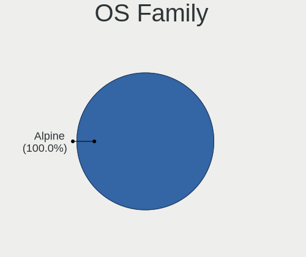

| Name   | Computers | Percent |
|--------|-----------|---------|
| Alpine | 83        | 100%    |

Kernel
------

Version of the Linux kernel

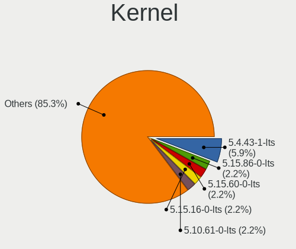

| Version                | Computers | Percent |
|------------------------|-----------|---------|
| 5.4.43-1-lts           | 8         | 8.89%   |
| 5.15.16-0-lts          | 3         | 3.33%   |
| 5.10.61-0-lts          | 3         | 3.33%   |
| 5.4.84-0-lts           | 2         | 2.22%   |
| 5.4.83-0-lts           | 2         | 2.22%   |
| 5.17.9-0-edge          | 2         | 2.22%   |
| 5.15.47-0-lts          | 2         | 2.22%   |
| 5.15.41-0-lts          | 2         | 2.22%   |
| 5.15.4-0-lts           | 2         | 2.22%   |
| 5.15.12-0-lts          | 2         | 2.22%   |
| 5.10.68-0-lts          | 2         | 2.22%   |
| 5.10.16-0-lts          | 2         | 2.22%   |
| 5.8.12-0-edge          | 1         | 1.11%   |
| 5.8.0                  | 1         | 1.11%   |
| 5.7.4                  | 1         | 1.11%   |
| 5.6.2-xanmod1-1-xanmod | 1         | 1.11%   |
| 5.4.99                 | 1         | 1.11%   |
| 5.4.73-0-lts           | 1         | 1.11%   |
| 5.4.72-0-lts           | 1         | 1.11%   |
| 5.4.65-0-lts           | 1         | 1.11%   |
| 5.4.64-0-lts           | 1         | 1.11%   |
| 5.4.6-0-lts            | 1         | 1.11%   |
| 5.4.58-0-lts           | 1         | 1.11%   |
| 5.4.57-0-lts           | 1         | 1.11%   |
| 5.4.46-0-lts           | 1         | 1.11%   |
| 5.4.27-0-lts           | 1         | 1.11%   |
| 5.4.111-0-lts          | 1         | 1.11%   |
| 5.4.0-77-generic       | 1         | 1.11%   |
| 5.19.0-rc8-kukui+      | 1         | 1.11%   |
| 5.18.0-0-asahi         | 1         | 1.11%   |
| 5.17.3-0-edge          | 1         | 1.11%   |
| 5.17.0-0-edge          | 1         | 1.11%   |
| 5.16.12-may            | 1         | 1.11%   |
| 5.16.1-may             | 1         | 1.11%   |
| 5.15.57-0-lts          | 1         | 1.11%   |
| 5.15.46-1-lts          | 1         | 1.11%   |
| 5.15.40-0-lts          | 1         | 1.11%   |
| 5.15.38-0-lts          | 1         | 1.11%   |
| 5.15.37-0-lts          | 1         | 1.11%   |
| 5.15.34                | 1         | 1.11%   |
| 5.15.30-0-lts          | 1         | 1.11%   |
| 5.15.28-0-lts          | 1         | 1.11%   |
| 5.15.26-0-lts          | 1         | 1.11%   |
| 5.15.17-0-lts          | 1         | 1.11%   |
| 5.14.8-0-edge          | 1         | 1.11%   |
| 5.13.0-0-edge          | 1         | 1.11%   |
| 5.12.8-0-edge          | 1         | 1.11%   |
| 5.10.83-v8             | 1         | 1.11%   |
| 5.10.81                | 1         | 1.11%   |
| 5.10.72-1-lts          | 1         | 1.11%   |
| 5.10.70-0-lts          | 1         | 1.11%   |
| 5.10.69-0-lts          | 1         | 1.11%   |
| 5.10.66-0-lts          | 1         | 1.11%   |
| 5.10.5-0-lts           | 1         | 1.11%   |
| 5.10.44-0-lts          | 1         | 1.11%   |
| 5.10.43-0-lts          | 1         | 1.11%   |
| 5.10.42-0-legacy       | 1         | 1.11%   |
| 5.10.4-0-lts           | 1         | 1.11%   |
| 5.10.38-0-lts          | 1         | 1.11%   |
| 5.10.29-0-lts          | 1         | 1.11%   |

Kernel Family
-------------

Linux kernel without a distro release

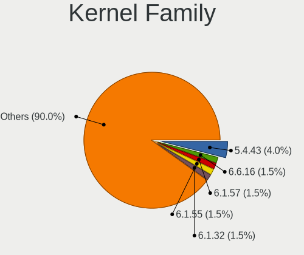

| Version | Computers | Percent |
|---------|-----------|---------|
| 5.4.43  | 8         | 8.89%   |
| 5.15.16 | 3         | 3.33%   |
| 5.10.61 | 3         | 3.33%   |
| 5.4.84  | 2         | 2.22%   |
| 5.4.83  | 2         | 2.22%   |
| 5.17.9  | 2         | 2.22%   |
| 5.15.47 | 2         | 2.22%   |
| 5.15.41 | 2         | 2.22%   |
| 5.15.4  | 2         | 2.22%   |
| 5.15.12 | 2         | 2.22%   |
| 5.10.68 | 2         | 2.22%   |
| 5.10.16 | 2         | 2.22%   |
| 5.8.12  | 1         | 1.11%   |
| 5.8.0   | 1         | 1.11%   |
| 5.7.4   | 1         | 1.11%   |
| 5.6.2   | 1         | 1.11%   |
| 5.4.99  | 1         | 1.11%   |
| 5.4.73  | 1         | 1.11%   |
| 5.4.72  | 1         | 1.11%   |
| 5.4.65  | 1         | 1.11%   |
| 5.4.64  | 1         | 1.11%   |
| 5.4.6   | 1         | 1.11%   |
| 5.4.58  | 1         | 1.11%   |
| 5.4.57  | 1         | 1.11%   |
| 5.4.46  | 1         | 1.11%   |
| 5.4.27  | 1         | 1.11%   |
| 5.4.111 | 1         | 1.11%   |
| 5.4.0   | 1         | 1.11%   |
| 5.19.0  | 1         | 1.11%   |
| 5.18.0  | 1         | 1.11%   |
| 5.17.3  | 1         | 1.11%   |
| 5.17.0  | 1         | 1.11%   |
| 5.16.12 | 1         | 1.11%   |
| 5.16.1  | 1         | 1.11%   |
| 5.15.57 | 1         | 1.11%   |
| 5.15.46 | 1         | 1.11%   |
| 5.15.40 | 1         | 1.11%   |
| 5.15.38 | 1         | 1.11%   |
| 5.15.37 | 1         | 1.11%   |
| 5.15.34 | 1         | 1.11%   |
| 5.15.30 | 1         | 1.11%   |
| 5.15.28 | 1         | 1.11%   |
| 5.15.26 | 1         | 1.11%   |
| 5.15.17 | 1         | 1.11%   |
| 5.14.8  | 1         | 1.11%   |
| 5.13.0  | 1         | 1.11%   |
| 5.12.8  | 1         | 1.11%   |
| 5.10.83 | 1         | 1.11%   |
| 5.10.81 | 1         | 1.11%   |
| 5.10.72 | 1         | 1.11%   |
| 5.10.70 | 1         | 1.11%   |
| 5.10.69 | 1         | 1.11%   |
| 5.10.66 | 1         | 1.11%   |
| 5.10.5  | 1         | 1.11%   |
| 5.10.44 | 1         | 1.11%   |
| 5.10.43 | 1         | 1.11%   |
| 5.10.42 | 1         | 1.11%   |
| 5.10.4  | 1         | 1.11%   |
| 5.10.38 | 1         | 1.11%   |
| 5.10.29 | 1         | 1.11%   |

Kernel Major Ver.
-----------------

Linux kernel major version

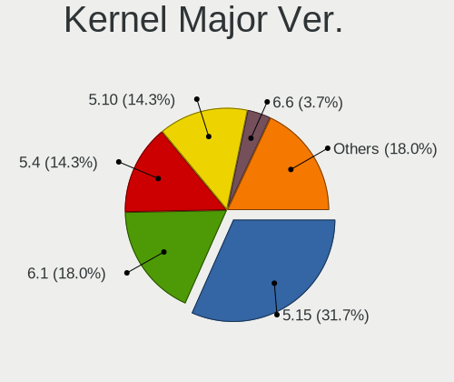

| Version | Computers | Percent |
|---------|-----------|---------|
| 5.4     | 23        | 26.74%  |
| 5.10    | 23        | 26.74%  |
| 5.15    | 21        | 24.42%  |
| 5.17    | 4         | 4.65%   |
| 3.10    | 3         | 3.49%   |
| 5.8     | 2         | 2.33%   |
| 5.7     | 1         | 1.16%   |
| 5.6     | 1         | 1.16%   |
| 5.19    | 1         | 1.16%   |
| 5.18    | 1         | 1.16%   |
| 5.16    | 1         | 1.16%   |
| 5.14    | 1         | 1.16%   |
| 5.13    | 1         | 1.16%   |
| 5.12    | 1         | 1.16%   |
| 4.4     | 1         | 1.16%   |
| 4.14    | 1         | 1.16%   |

Arch
----

OS architecture (x86_64, i586, etc.)

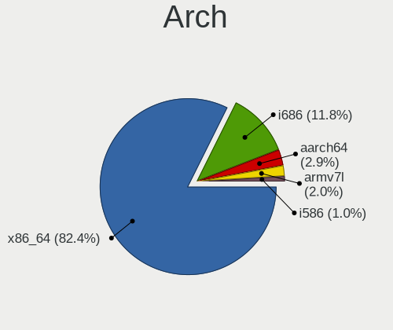

| Name    | Computers | Percent |
|---------|-----------|---------|
| x86_64  | 68        | 81.93%  |
| i686    | 10        | 12.05%  |
| aarch64 | 3         | 3.61%   |
| i586    | 1         | 1.2%    |
| armv7l  | 1         | 1.2%    |

DE
--

Desktop Environment

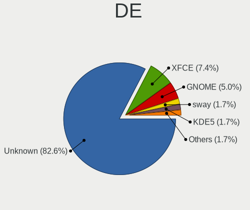

| Name    | Computers | Percent |
|---------|-----------|---------|
| Unknown | 71        | 85.54%  |
| XFCE    | 4         | 4.82%   |
| GNOME   | 4         | 4.82%   |
| sway    | 1         | 1.2%    |
| KDE5    | 1         | 1.2%    |
| KDE     | 1         | 1.2%    |
| i3      | 1         | 1.2%    |

Display Server
--------------

X11 or Wayland

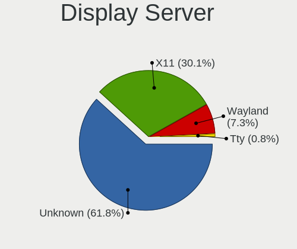

| Name    | Computers | Percent |
|---------|-----------|---------|
| Unknown | 54        | 63.53%  |
| X11     | 24        | 28.24%  |
| Wayland | 6         | 7.06%   |
| Tty     | 1         | 1.18%   |

Display Manager
---------------

SDDM, LightDM, etc.

| Name    | Computers | Percent |
|---------|-----------|---------|
| Unknown | 71        | 84.52%  |
| LightDM | 8         | 9.52%   |
| GDM     | 2         | 2.38%   |
| XDM     | 1         | 1.19%   |
| SDDM    | 1         | 1.19%   |
| LXDM    | 1         | 1.19%   |

OS Lang
-------

Language

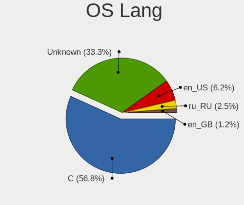

| Lang    | Computers | Percent |
|---------|-----------|---------|
| C       | 48        | 56.47%  |
| Unknown | 29        | 34.12%  |
| en_US   | 5         | 5.88%   |
| ru_RU   | 2         | 2.35%   |
| en_GB   | 1         | 1.18%   |

Boot Mode
---------

EFI or BIOS

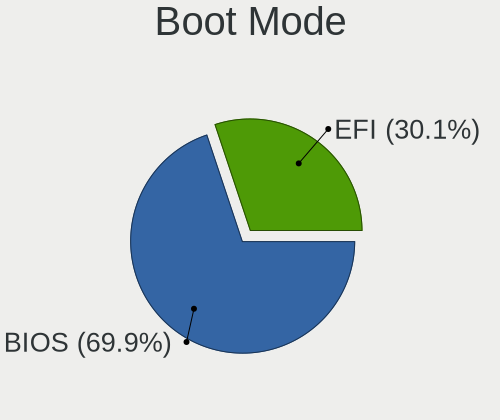

| Mode | Computers | Percent |
|------|-----------|---------|
| BIOS | 58        | 69.88%  |
| EFI  | 25        | 30.12%  |

Filesystem
----------

Type of filesystem

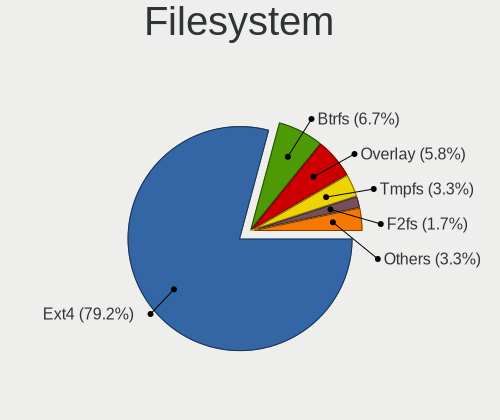

| Type    | Computers | Percent |
|---------|-----------|---------|
| Ext4    | 67        | 78.82%  |
| Overlay | 5         | 5.88%   |
| Btrfs   | 5         | 5.88%   |
| Tmpfs   | 3         | 3.53%   |
| F2fs    | 2         | 2.35%   |
| Unknown | 2         | 2.35%   |
| Ext2    | 1         | 1.18%   |

Part. scheme
------------

Scheme of partitioning

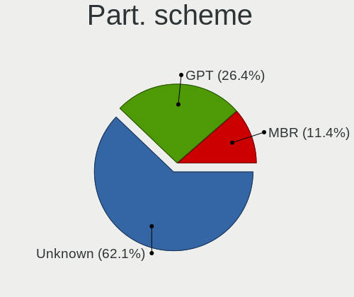

| Type    | Computers | Percent |
|---------|-----------|---------|
| Unknown | 49        | 56.32%  |
| GPT     | 26        | 29.89%  |
| MBR     | 12        | 13.79%  |

Dual Boot with Linux/BSD
------------------------

Hosting more than one Linux/BSD

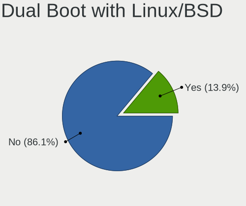

| Dual boot | Computers | Percent |
|-----------|-----------|---------|
| No        | 74        | 89.16%  |
| Yes       | 9         | 10.84%  |

Dual Boot (Win)
---------------

Hosting Linux and Windows

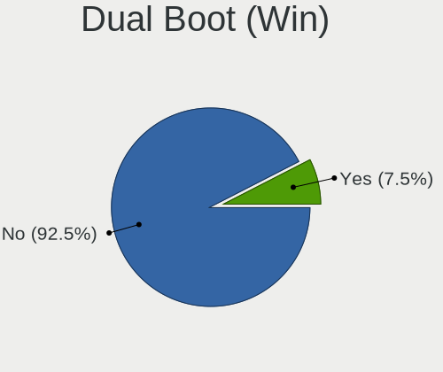

| Dual boot | Computers | Percent |
|-----------|-----------|---------|
| No        | 77        | 91.67%  |
| Yes       | 7         | 8.33%   |

Board
-----

Vendor
------

Motherboard manufacturer

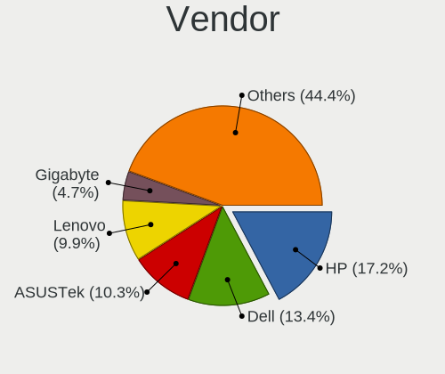

| Name                    | Computers | Percent |
|-------------------------|-----------|---------|
| Hewlett-Packard         | 14        | 16.87%  |
| Dell                    | 12        | 14.46%  |
| ASUSTek Computer        | 11        | 13.25%  |
| Lenovo                  | 9         | 10.84%  |
| Intel                   | 4         | 4.82%   |
| Acer                    | 4         | 4.82%   |
| Unknown                 | 4         | 4.82%   |
| IBM                     | 3         | 3.61%   |
| MSI                     | 2         | 2.41%   |
| Gigabyte Technology     | 2         | 2.41%   |
| ASRock                  | 2         | 2.41%   |
| VIA Technologies        | 1         | 1.2%    |
| Synology                | 1         | 1.2%    |
| Supermicro              | 1         | 1.2%    |
| Sony                    | 1         | 1.2%    |
| Shuttle                 | 1         | 1.2%    |
| Raspberry Pi Foundation | 1         | 1.2%    |
| Pegatron                | 1         | 1.2%    |
| Haier                   | 1         | 1.2%    |
| Google                  | 1         | 1.2%    |
| Gateway                 | 1         | 1.2%    |
| Fujitsu                 | 1         | 1.2%    |
| Fanless Mini PC         | 1         | 1.2%    |
| F5 Networks             | 1         | 1.2%    |
| eMachines               | 1         | 1.2%    |
| Apple                   | 1         | 1.2%    |
| AMI                     | 1         | 1.2%    |

Model
-----

Motherboard model

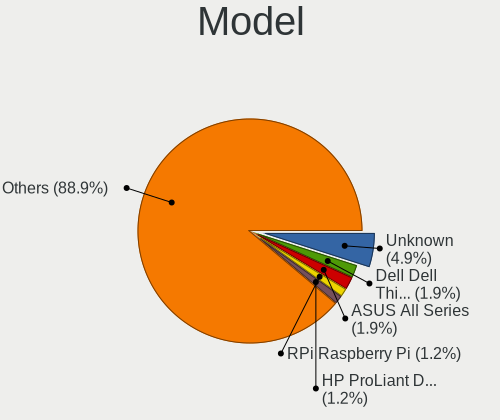

| Name                                     | Computers | Percent |
|------------------------------------------|-----------|---------|
| Unknown                                  | 4         | 4.82%   |
| HP ProLiant DL360 G6                     | 2         | 2.41%   |
| Gigabyte Z490I AORUS ULTRA               | 2         | 2.41%   |
| ASUS All Series                          | 2         | 2.41%   |
| VIA KM266APro-835                        | 1         | 1.2%    |
| Synology DS1019+                         | 1         | 1.2%    |
| Supermicro X10SLL-F                      | 1         | 1.2%    |
| Sony VGN-UX27GN                          | 1         | 1.2%    |
| Shuttle DS81D                            | 1         | 1.2%    |
| RPi Raspberry Pi 4 Model B Rev 1.5       | 1         | 1.2%    |
| Pegatron Deepcam                         | 1         | 1.2%    |
| MSI MS-7877                              | 1         | 1.2%    |
| MSI GL72M 7REX                           | 1         | 1.2%    |
| Lenovo Yoga 14sARH 2021 82LB             | 1         | 1.2%    |
| Lenovo ThinkPad X1 Carbon 6th 20KGS17D00 | 1         | 1.2%    |
| Lenovo ThinkPad W700 2752RZ2             | 1         | 1.2%    |
| Lenovo ThinkPad T420 42364F2             | 1         | 1.2%    |
| Lenovo ThinkPad E485 20KUCTO1WW          | 1         | 1.2%    |
| Lenovo ThinkPad 11e 20ED001HUS           | 1         | 1.2%    |
| Lenovo ThinkCentre M90n-1 11AD000YMX     | 1         | 1.2%    |
| Lenovo IdeaPad 320-15AST 80XV            | 1         | 1.2%    |
| Lenovo H535 10117                        | 1         | 1.2%    |
| Intel NUC6i7KYB H90766-406               | 1         | 1.2%    |
| Intel Merrifield                         | 1         | 1.2%    |
| Intel DQ67SW                             | 1         | 1.2%    |
| Intel DH61BF AAG81311-101                | 1         | 1.2%    |
| IBM ThinkPad X40 2371LBG                 | 1         | 1.2%    |
| IBM 26446AG                              | 1         | 1.2%    |
| IBM 264070A                              | 1         | 1.2%    |
| HP ZBook 15 G5                           | 1         | 1.2%    |
| HP Stream 7 Tablet                       | 1         | 1.2%    |
| HP ProLiant MicroServer Gen8             | 1         | 1.2%    |
| HP ProBook 4310s                         | 1         | 1.2%    |
| HP Mini 110-3500                         | 1         | 1.2%    |
| HP Laptop 14-dq1xxx                      | 1         | 1.2%    |
| HP ENVY Sleekbook 6 PC                   | 1         | 1.2%    |
| HP EliteBook 8460p                       | 1         | 1.2%    |
| HP EliteBook 2740p                       | 1         | 1.2%    |
| HP EliteBook 1040 G3 Notebook PC         | 1         | 1.2%    |
| HP Compaq Mini CQ10-600                  | 1         | 1.2%    |
| HP 23-p030na                             | 1         | 1.2%    |
| Haier U144S                              | 1         | 1.2%    |
| Google Samus                             | 1         | 1.2%    |
| Gateway MX3631m                          | 1         | 1.2%    |
| Fujitsu PRIMERGY TX100 S2                | 1         | 1.2%    |
| Fanless Mini PC Quieter2                 | 1         | 1.2%    |
| F5 Networks C117                         | 1         | 1.2%    |
| eMachines EL1352G                        | 1         | 1.2%    |
| Dell XPS 15 7590                         | 1         | 1.2%    |
| Dell XPS 13 7390 2-in-1                  | 1         | 1.2%    |
| Dell Studio 1747                         | 1         | 1.2%    |
| Dell PowerEdge T640                      | 1         | 1.2%    |
| Dell PowerEdge R510                      | 1         | 1.2%    |
| Dell OptiPlex 755                        | 1         | 1.2%    |
| Dell OptiPlex 3020M                      | 1         | 1.2%    |
| Dell OptiPlex 3010                       | 1         | 1.2%    |
| Dell Inspiron MM061                      | 1         | 1.2%    |
| Dell Inspiron 5566                       | 1         | 1.2%    |
| Dell Inspiron 3647                       | 1         | 1.2%    |
| Dell Inspiron 3180                       | 1         | 1.2%    |

Model Family
------------

Motherboard model prefix

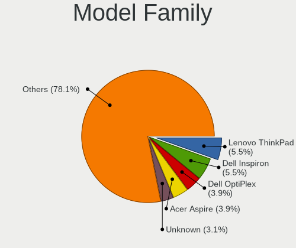

| Name                     | Computers | Percent |
|--------------------------|-----------|---------|
| Lenovo ThinkPad          | 5         | 6.02%   |
| Dell Inspiron            | 4         | 4.82%   |
| Acer Aspire              | 4         | 4.82%   |
| Unknown                  | 4         | 4.82%   |
| HP ProLiant              | 3         | 3.61%   |
| HP EliteBook             | 3         | 3.61%   |
| Dell OptiPlex            | 3         | 3.61%   |
| Gigabyte Z490I           | 2         | 2.41%   |
| Dell XPS                 | 2         | 2.41%   |
| Dell PowerEdge           | 2         | 2.41%   |
| ASUS All                 | 2         | 2.41%   |
| VIA KM266APro-835        | 1         | 1.2%    |
| Synology DS1019+         | 1         | 1.2%    |
| Supermicro X10SLL-F      | 1         | 1.2%    |
| Sony VGN-UX27GN          | 1         | 1.2%    |
| Shuttle DS81D            | 1         | 1.2%    |
| RPi Raspberry            | 1         | 1.2%    |
| Pegatron Deepcam         | 1         | 1.2%    |
| MSI MS-7877              | 1         | 1.2%    |
| MSI GL72M                | 1         | 1.2%    |
| Lenovo Yoga              | 1         | 1.2%    |
| Lenovo ThinkCentre       | 1         | 1.2%    |
| Lenovo IdeaPad           | 1         | 1.2%    |
| Lenovo H535              | 1         | 1.2%    |
| Intel NUC6i7KYB          | 1         | 1.2%    |
| Intel Merrifield         | 1         | 1.2%    |
| Intel DQ67SW             | 1         | 1.2%    |
| Intel DH61BF             | 1         | 1.2%    |
| IBM ThinkPad             | 1         | 1.2%    |
| IBM 26446AG              | 1         | 1.2%    |
| IBM 264070A              | 1         | 1.2%    |
| HP ZBook                 | 1         | 1.2%    |
| HP Stream                | 1         | 1.2%    |
| HP ProBook               | 1         | 1.2%    |
| HP Mini                  | 1         | 1.2%    |
| HP Laptop                | 1         | 1.2%    |
| HP ENVY                  | 1         | 1.2%    |
| HP Compaq                | 1         | 1.2%    |
| HP 23-p030na             | 1         | 1.2%    |
| Haier U144S              | 1         | 1.2%    |
| Google Samus             | 1         | 1.2%    |
| Gateway MX3631m          | 1         | 1.2%    |
| Fujitsu PRIMERGY         | 1         | 1.2%    |
| Fanless Mini PC Quieter2 | 1         | 1.2%    |
| F5 Networks C117         | 1         | 1.2%    |
| eMachines EL1352G        | 1         | 1.2%    |
| Dell Studio              | 1         | 1.2%    |
| ASUS ZenBook             | 1         | 1.2%    |
| ASUS X555LAB             | 1         | 1.2%    |
| ASUS X550EA              | 1         | 1.2%    |
| ASUS X200MA              | 1         | 1.2%    |
| ASUS TS10                | 1         | 1.2%    |
| ASUS PRIME               | 1         | 1.2%    |
| ASUS P8H67-V             | 1         | 1.2%    |
| ASUS N10Jc               | 1         | 1.2%    |
| ASUS E502SA              | 1         | 1.2%    |
| ASRock J3455M            | 1         | 1.2%    |
| ASRock D1800B-ITX        | 1         | 1.2%    |
| Apple Macmini6           | 1         | 1.2%    |
| AMI Aptio                | 1         | 1.2%    |

MFG Year
--------

Motherboard manufacture year

| Year    | Computers | Percent |
|---------|-----------|---------|
| 2014    | 14        | 16.87%  |
| 2018    | 8         | 9.64%   |
| 2019    | 7         | 8.43%   |
| 2010    | 6         | 7.23%   |
| 2016    | 5         | 6.02%   |
| 2012    | 5         | 6.02%   |
| 2009    | 5         | 6.02%   |
| Unknown | 5         | 6.02%   |
| 2017    | 4         | 4.82%   |
| 2015    | 4         | 4.82%   |
| 2021    | 3         | 3.61%   |
| 2020    | 3         | 3.61%   |
| 2013    | 3         | 3.61%   |
| 2006    | 3         | 3.61%   |
| 2011    | 2         | 2.41%   |
| 2007    | 2         | 2.41%   |
| 2008    | 1         | 1.2%    |
| 2005    | 1         | 1.2%    |
| 2004    | 1         | 1.2%    |
| 1999    | 1         | 1.2%    |

Form Factor
-----------

Physical design of the computer

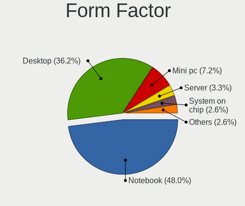

| Name           | Computers | Percent |
|----------------|-----------|---------|
| Notebook       | 42        | 50.6%   |
| Desktop        | 24        | 28.92%  |
| Server         | 6         | 7.23%   |
| Mini pc        | 5         | 6.02%   |
| System on chip | 2         | 2.41%   |
| Tablet         | 2         | 2.41%   |
| Convertible    | 1         | 1.2%    |
| All in one     | 1         | 1.2%    |

Secure Boot
-----------

Enabled or disabled

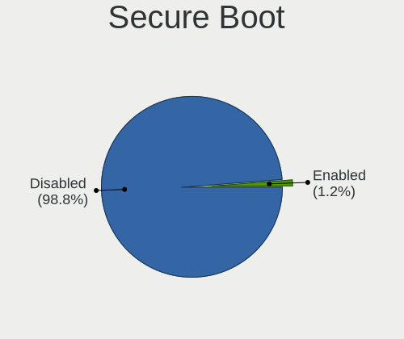

| State    | Computers | Percent |
|----------|-----------|---------|
| Disabled | 83        | 100%    |

Coreboot
--------

Have coreboot on board

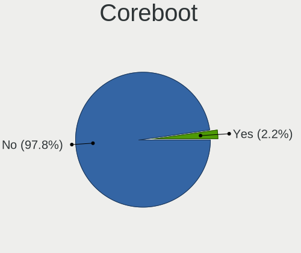

| Used | Computers | Percent |
|------|-----------|---------|
| No   | 82        | 98.8%   |
| Yes  | 1         | 1.2%    |

RAM Size
--------

Total RAM memory

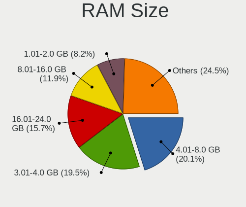

| Size in GB      | Computers | Percent |
|-----------------|-----------|---------|
| 3.01-4.0        | 19        | 22.09%  |
| 4.01-8.0        | 16        | 18.6%   |
| 16.01-24.0      | 14        | 16.28%  |
| 8.01-16.0       | 11        | 12.79%  |
| 0.51-1.0        | 7         | 8.14%   |
| 1.01-2.0        | 5         | 5.81%   |
| 32.01-64.0      | 4         | 4.65%   |
| 2.01-3.0        | 3         | 3.49%   |
| 64.01-256.0     | 3         | 3.49%   |
| 0.01-0.5        | 3         | 3.49%   |
| More than 256.0 | 1         | 1.16%   |

RAM Used
--------

Used RAM memory

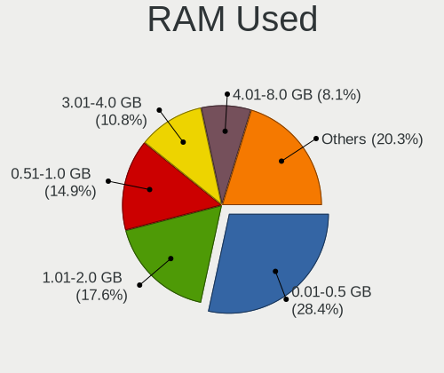

| Used GB   | Computers | Percent |
|-----------|-----------|---------|
| 0.01-0.5  | 26        | 29.55%  |
| 1.01-2.0  | 17        | 19.32%  |
| 0.51-1.0  | 15        | 17.05%  |
| 3.01-4.0  | 9         | 10.23%  |
| 4.01-8.0  | 6         | 6.82%   |
| 2.01-3.0  | 6         | 6.82%   |
| 8.01-16.0 | 4         | 4.55%   |
| Unknown   | 3         | 3.41%   |
| 0         | 2         | 2.27%   |

Total Drives
------------

Number of drives on board

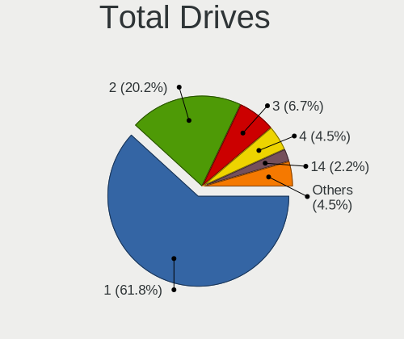

| Drives | Computers | Percent |
|--------|-----------|---------|
| 1      | 54        | 62.79%  |
| 2      | 17        | 19.77%  |
| 3      | 5         | 5.81%   |
| 4      | 4         | 4.65%   |
| 14     | 2         | 2.33%   |
| 10     | 1         | 1.16%   |
| 7      | 1         | 1.16%   |
| 5      | 1         | 1.16%   |
| 0      | 1         | 1.16%   |

Has CD-ROM
----------

Has CD-ROM on board

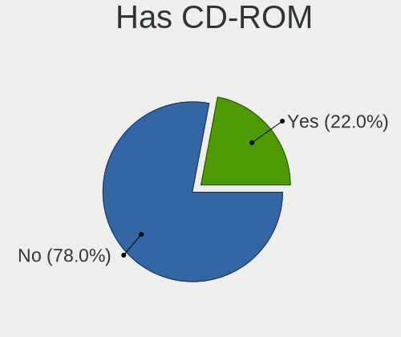

| Presented | Computers | Percent |
|-----------|-----------|---------|
| No        | 64        | 77.11%  |
| Yes       | 19        | 22.89%  |

Has Ethernet
------------

Has Ethernet on board

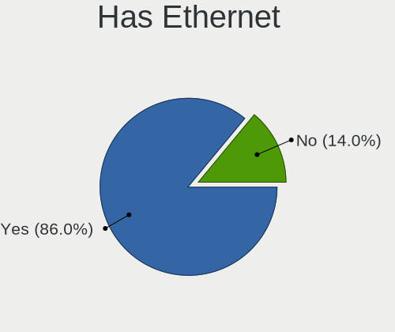

| Presented | Computers | Percent |
|-----------|-----------|---------|
| Yes       | 70        | 84.34%  |
| No        | 13        | 15.66%  |

Has WiFi
--------

Has WiFi module

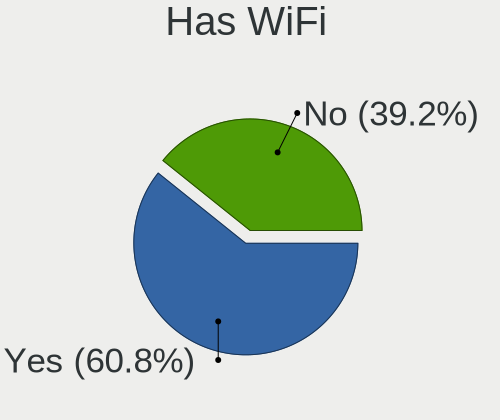

| Presented | Computers | Percent |
|-----------|-----------|---------|
| Yes       | 51        | 61.45%  |
| No        | 32        | 38.55%  |

Has Bluetooth
-------------

Has Bluetooth module

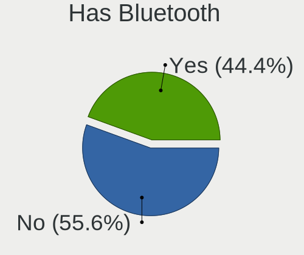

| Presented | Computers | Percent |
|-----------|-----------|---------|
| No        | 48        | 57.83%  |
| Yes       | 35        | 42.17%  |

Location
--------

Country
-------

Geographic location (country)

| Country      | Computers | Percent |
|--------------|-----------|---------|
| USA          | 21        | 25%     |
| Russia       | 9         | 10.71%  |
| UK           | 8         | 9.52%   |
| Canada       | 8         | 9.52%   |
| Germany      | 6         | 7.14%   |
| Sweden       | 4         | 4.76%   |
| Spain        | 2         | 2.38%   |
| Norway       | 2         | 2.38%   |
| Guatemala    | 2         | 2.38%   |
| Brazil       | 2         | 2.38%   |
| Australia    | 2         | 2.38%   |
| Venezuela    | 1         | 1.19%   |
| Ukraine      | 1         | 1.19%   |
| Switzerland  | 1         | 1.19%   |
| South Korea  | 1         | 1.19%   |
| South Africa | 1         | 1.19%   |
| Slovakia     | 1         | 1.19%   |
| Portugal     | 1         | 1.19%   |
| Poland       | 1         | 1.19%   |
| Pakistan     | 1         | 1.19%   |
| Mexico       | 1         | 1.19%   |
| Italy        | 1         | 1.19%   |
| Indonesia    | 1         | 1.19%   |
| France       | 1         | 1.19%   |
| Egypt        | 1         | 1.19%   |
| Czechia      | 1         | 1.19%   |
| China        | 1         | 1.19%   |
| Austria      | 1         | 1.19%   |
| Argentina    | 1         | 1.19%   |

City
----

Geographic location (city)

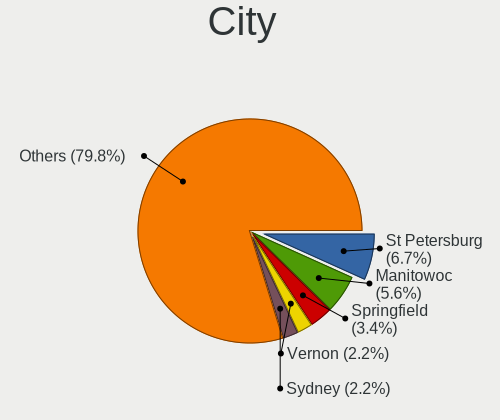

| City               | Computers | Percent |
|--------------------|-----------|---------|
| St Petersburg      | 6         | 7.06%   |
| Manitowoc          | 5         | 5.88%   |
| Vernon             | 2         | 2.35%   |
| Sydney             | 2         | 2.35%   |
| Stratford          | 2         | 2.35%   |
| Springfield        | 2         | 2.35%   |
| Guatemala City     | 2         | 2.35%   |
| Gothenburg         | 2         | 2.35%   |
| Fulham             | 2         | 2.35%   |
| As                 | 2         | 2.35%   |
| Zurich             | 1         | 1.18%   |
| Vancouver          | 1         | 1.18%   |
| Tymovskoye         | 1         | 1.18%   |
| Topeka             | 1         | 1.18%   |
| Thame              | 1         | 1.18%   |
| Tampa              | 1         | 1.18%   |
| Stockholm          | 1         | 1.18%   |
| Stewartstown       | 1         | 1.18%   |
| Sisteron           | 1         | 1.18%   |
| Semily             | 1         | 1.18%   |
| Sao Paulo          | 1         | 1.18%   |
| San Mateo          | 1         | 1.18%   |
| Salzburg           | 1         | 1.18%   |
| Rzeszów           | 1         | 1.18%   |
| Rostock            | 1         | 1.18%   |
| Redwood City       | 1         | 1.18%   |
| Purdys             | 1         | 1.18%   |
| Plymouth           | 1         | 1.18%   |
| Penza              | 1         | 1.18%   |
| Ottawa             | 1         | 1.18%   |
| Oakville           | 1         | 1.18%   |
| Nuremberg          | 1         | 1.18%   |
| Merrill            | 1         | 1.18%   |
| Mérida            | 1         | 1.18%   |
| Mankato            | 1         | 1.18%   |
| Malmo              | 1         | 1.18%   |
| Madrid             | 1         | 1.18%   |
| London             | 1         | 1.18%   |
| Lindavista Norte   | 1         | 1.18%   |
| Lincoln            | 1         | 1.18%   |
| Leipzig            | 1         | 1.18%   |
| Larkspur           | 1         | 1.18%   |
| Lahore             | 1         | 1.18%   |
| Kirkland           | 1         | 1.18%   |
| Kharkiv            | 1         | 1.18%   |
| Kaliningrad        | 1         | 1.18%   |
| Johannesburg       | 1         | 1.18%   |
| Jember             | 1         | 1.18%   |
| Hampstead          | 1         | 1.18%   |
| Hamburg            | 1         | 1.18%   |
| Goyang-si          | 1         | 1.18%   |
| Glasgow            | 1         | 1.18%   |
| General San Martin | 1         | 1.18%   |
| Funchal            | 1         | 1.18%   |
| Franklin           | 1         | 1.18%   |
| Frankfurt am Main  | 1         | 1.18%   |
| Dallas             | 1         | 1.18%   |
| Cologne            | 1         | 1.18%   |
| Chapel Hill        | 1         | 1.18%   |
| Cairo              | 1         | 1.18%   |

Drives
------

Drive Vendor
------------

Hard drive vendors

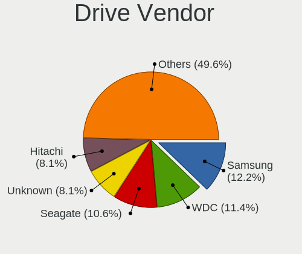

| Vendor              | Computers | Drives | Percent |
|---------------------|-----------|--------|---------|
| WDC                 | 14        | 38     | 12.73%  |
| Samsung Electronics | 14        | 21     | 12.73%  |
| Seagate             | 11        | 29     | 10%     |
| Unknown             | 9         | 11     | 8.18%   |
| Hitachi             | 8         | 8      | 7.27%   |
| Kingston            | 6         | 7      | 5.45%   |
| HGST                | 6         | 6      | 5.45%   |
| Toshiba             | 5         | 6      | 4.55%   |
| Intel               | 5         | 9      | 4.55%   |
| Crucial             | 5         | 11     | 4.55%   |
| SK hynix            | 4         | 6      | 3.64%   |
| Transcend           | 2         | 2      | 1.82%   |
| SanDisk             | 2         | 2      | 1.82%   |
| LITEON              | 2         | 2      | 1.82%   |
| A-DATA Technology   | 2         | 2      | 1.82%   |
| STEC                | 1         | 1      | 0.91%   |
| SPCC                | 1         | 1      | 0.91%   |
| NETAPP              | 1         | 1      | 0.91%   |
| Lexar               | 1         | 1      | 0.91%   |
| Kingmax             | 1         | 1      | 0.91%   |
| KC600               | 1         | 1      | 0.91%   |
| JMicron Technology  | 1         | 1      | 0.91%   |
| Intenso             | 1         | 1      | 0.91%   |
| IBM                 | 1         | 1      | 0.91%   |
| EMTEC               | 1         | 1      | 0.91%   |
| Dell                | 1         | 1      | 0.91%   |
| China               | 1         | 1      | 0.91%   |
| Apple               | 1         | 3      | 0.91%   |
| AMD                 | 1         | 1      | 0.91%   |
| Unknown             | 1         | 1      | 0.91%   |

Drive Model
-----------

Hard drive models

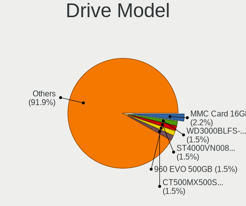

| Model                                     | Computers | Percent |
|-------------------------------------------|-----------|---------|
| WDC WD3000BLFS-60YBU2 304GB               | 2         | 1.68%   |
| Unknown MMC Card  16GB                    | 2         | 1.68%   |
| Seagate ST4000VN008-2DR1 4TB              | 2         | 1.68%   |
| Samsung SSD 960 EVO 500GB                 | 2         | 1.68%   |
| Crucial CT500MX500SSD1 500GB              | 2         | 1.68%   |
| Crucial CT120BX500SSD1 120GB              | 2         | 1.68%   |
| WDC WDS500G2B0A-00SM50 500GB SSD          | 1         | 0.84%   |
| WDC WDS250G2B0A 250GB SSD                 | 1         | 0.84%   |
| WDC WD80EMAZ-00WJTA0 8TB                  | 1         | 0.84%   |
| WDC WD80EFAX-68LHPN0 8TB                  | 1         | 0.84%   |
| WDC WD800AAJS-00 80GB                     | 1         | 0.84%   |
| WDC WD5003ABYZ-0 500GB                    | 1         | 0.84%   |
| WDC WD5000BEVT-22ZAT0 500GB               | 1         | 0.84%   |
| WDC WD3200AAKX-0 320GB                    | 1         | 0.84%   |
| WDC WD20EZRZ-00Z 2TB                      | 1         | 0.84%   |
| WDC WD140EDFZ-11A0VA0 14TB                | 1         | 0.84%   |
| WDC WD10JPVX-75JC3T0 1TB                  | 1         | 0.84%   |
| WDC WD10EZEX-60M2NA0 1TB                  | 1         | 0.84%   |
| WDC WD10EZEX-21M2NA0 1TB                  | 1         | 0.84%   |
| WDC PC SN520 SDAPNUW-512G-1002 512GB      | 1         | 0.84%   |
| Unknown SD64G  64GB                       | 1         | 0.84%   |
| Unknown SD32G  32GB                       | 1         | 0.84%   |
| Unknown SD16G  32GB                       | 1         | 0.84%   |
| Unknown NVMe SSD Drive 1024GB             | 1         | 0.84%   |
| Unknown MMC Card  4GB                     | 1         | 0.84%   |
| Unknown MMC Card  32GB                    | 1         | 0.84%   |
| Unknown MMC Card                          | 1         | 0.84%   |
| Transcend TS128GSSD420I 128GB             | 1         | 0.84%   |
| Transcend SSD 1GB                         | 1         | 0.84%   |
| Toshiba NVMe SSD Drive 256GB              | 1         | 0.84%   |
| Toshiba MQ01ABD075 752GB                  | 1         | 0.84%   |
| Toshiba MK4009GAL 40GB                    | 1         | 0.84%   |
| Toshiba MK3252GS 320GB                    | 1         | 0.84%   |
| Toshiba KXG5AZNV256G 256GB                | 1         | 0.84%   |
| Toshiba KBG40ZPZ512G NVMe 512GB           | 1         | 0.84%   |
| STEC SDT5A-S200SS 200GB                   | 1         | 0.84%   |
| SPCC Solid State Disk 256GB               | 1         | 0.84%   |
| SK hynix SKHynix_HFS512GD9TNI-L2A0B 512GB | 1         | 0.84%   |
| SK hynix SC300 M.2 2280 256 256GB SSD     | 1         | 0.84%   |
| SK hynix HFS480G3H2X069N 480GB            | 1         | 0.84%   |
| SK hynix HBG4e  32GB                      | 1         | 0.84%   |
| Seagate ST98823A 80GB                     | 1         | 0.84%   |
| Seagate ST8000VN004-2M2101 8TB            | 1         | 0.84%   |
| Seagate ST4000VN008-2DR166 4TB            | 1         | 0.84%   |
| Seagate ST380815AS 80GB                   | 1         | 0.84%   |
| Seagate ST3500418AS 500GB                 | 1         | 0.84%   |
| Seagate ST2000LM015-2E81 2TB              | 1         | 0.84%   |
| Seagate ST2000DL001-9VT1 2TB              | 1         | 0.84%   |
| Seagate ST1000LM048-2E71 1TB              | 1         | 0.84%   |
| Seagate ST1000LM024 HN-M101MBB 1TB        | 1         | 0.84%   |
| Seagate ST1000DM010-2EP102 1TB            | 1         | 0.84%   |
| SanDisk SSD PLUS 480GB                    | 1         | 0.84%   |
| SanDisk SDSA6MM 16GB SSD                  | 1         | 0.84%   |
| Samsung SSD 980 PRO 1TB                   | 1         | 0.84%   |
| Samsung SSD 980 500GB                     | 1         | 0.84%   |
| Samsung SSD 970 EVO Plus 250GB            | 1         | 0.84%   |
| Samsung SSD 970 EVO Plus 1TB              | 1         | 0.84%   |
| Samsung SSD 970 EVO 250GB                 | 1         | 0.84%   |
| Samsung SSD 870 EVO 1TB                   | 1         | 0.84%   |
| Samsung SSD 850 EVO 500GB                 | 1         | 0.84%   |

HDD Vendor
----------

Hard disk drive vendors

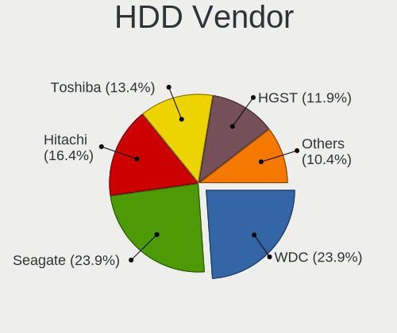

| Vendor              | Computers | Drives | Percent |
|---------------------|-----------|--------|---------|
| WDC                 | 11        | 34     | 26.19%  |
| Seagate             | 11        | 29     | 26.19%  |
| Hitachi             | 8         | 8      | 19.05%  |
| HGST                | 6         | 6      | 14.29%  |
| Toshiba             | 3         | 3      | 7.14%   |
| Samsung Electronics | 2         | 4      | 4.76%   |
| IBM                 | 1         | 1      | 2.38%   |

SSD Vendor
----------

Solid state drive vendors

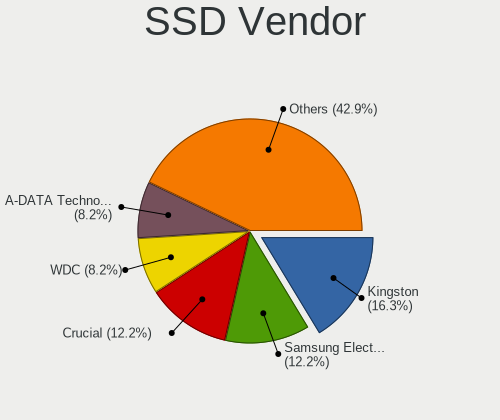

| Vendor              | Computers | Drives | Percent |
|---------------------|-----------|--------|---------|
| Kingston            | 6         | 7      | 15%     |
| Samsung Electronics | 5         | 7      | 12.5%   |
| Crucial             | 5         | 11     | 12.5%   |
| Intel               | 3         | 5      | 7.5%    |
| WDC                 | 2         | 2      | 5%      |
| Transcend           | 2         | 2      | 5%      |
| SK hynix            | 2         | 3      | 5%      |
| SanDisk             | 2         | 2      | 5%      |
| LITEON              | 2         | 2      | 5%      |
| A-DATA Technology   | 2         | 2      | 5%      |
| SPCC                | 1         | 1      | 2.5%    |
| Lexar               | 1         | 1      | 2.5%    |
| Kingmax             | 1         | 1      | 2.5%    |
| KC600               | 1         | 1      | 2.5%    |
| Intenso             | 1         | 1      | 2.5%    |
| EMTEC               | 1         | 1      | 2.5%    |
| Dell                | 1         | 1      | 2.5%    |
| China               | 1         | 1      | 2.5%    |
| AMD                 | 1         | 1      | 2.5%    |

Drive Kind
----------

HDD or SSD

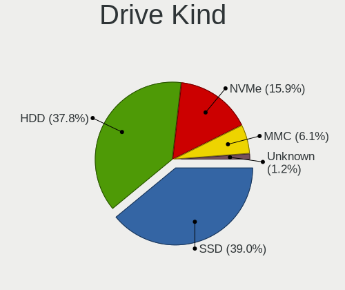

| Kind    | Computers | Drives | Percent |
|---------|-----------|--------|---------|
| HDD     | 39        | 85     | 37.86%  |
| SSD     | 37        | 52     | 35.92%  |
| NVMe    | 17        | 26     | 16.5%   |
| MMC     | 9         | 12     | 8.74%   |
| Unknown | 1         | 2      | 0.97%   |

Drive Connector
---------------

SATA, SAS, NVMe, etc.

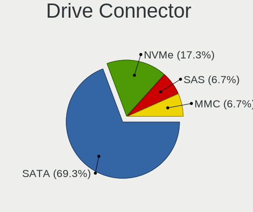

| Type | Computers | Drives | Percent |
|------|-----------|--------|---------|
| SATA | 63        | 133    | 67.74%  |
| NVMe | 16        | 25     | 17.2%   |
| MMC  | 9         | 12     | 9.68%   |
| SAS  | 5         | 7      | 5.38%   |

Drive Size
----------

Size of hard drive

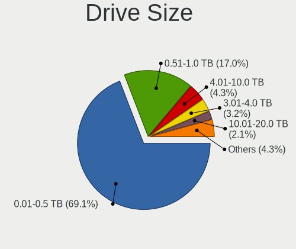

| Size in TB | Computers | Drives | Percent |
|------------|-----------|--------|---------|
| 0.01-0.5   | 54        | 86     | 72.97%  |
| 0.51-1.0   | 12        | 15     | 16.22%  |
| 4.01-10.0  | 3         | 19     | 4.05%   |
| 3.01-4.0   | 2         | 9      | 2.7%    |
| 1.01-2.0   | 2         | 4      | 2.7%    |
| 10.01-20.0 | 1         | 4      | 1.35%   |

Space Total
-----------

Amount of disk space available on the file system

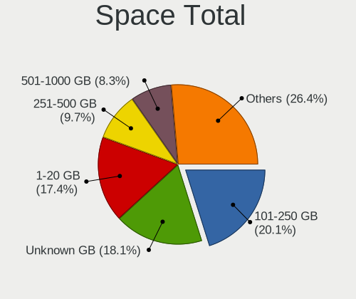

| Size in GB     | Computers | Percent |
|----------------|-----------|---------|
| 101-250        | 20        | 23.26%  |
| 1-20           | 16        | 18.6%   |
| Unknown        | 11        | 12.79%  |
| 21-50          | 10        | 11.63%  |
| 251-500        | 8         | 9.3%    |
| 501-1000       | 8         | 9.3%    |
| 1001-2000      | 5         | 5.81%   |
| 2001-3000      | 3         | 3.49%   |
| 51-100         | 3         | 3.49%   |
| More than 3000 | 2         | 2.33%   |

Space Used
----------

Amount of used disk space

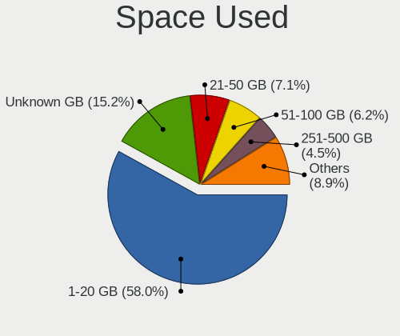

| Used GB   | Computers | Percent |
|-----------|-----------|---------|
| 1-20      | 52        | 61.18%  |
| Unknown   | 11        | 12.94%  |
| 51-100    | 7         | 8.24%   |
| 21-50     | 5         | 5.88%   |
| 251-500   | 3         | 3.53%   |
| 101-250   | 3         | 3.53%   |
| 501-1000  | 3         | 3.53%   |
| 1001-2000 | 1         | 1.18%   |

Malfunc. Drives
---------------

Drive models with a malfunction

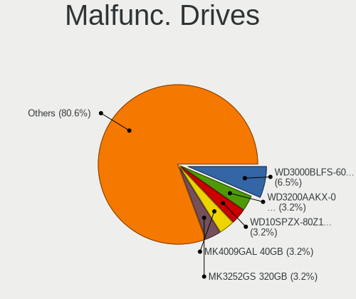

| Model                             | Computers | Drives | Percent |
|-----------------------------------|-----------|--------|---------|
| WDC WD3000BLFS-60YBU2 304GB       | 2         | 14     | 13.33%  |
| WDC WD3200AAKX-0 320GB            | 1         | 1      | 6.67%   |
| Toshiba MK4009GAL 40GB            | 1         | 1      | 6.67%   |
| Toshiba MK3252GS 320GB            | 1         | 1      | 6.67%   |
| Seagate ST2000LM015-2E81 2TB      | 1         | 1      | 6.67%   |
| SanDisk SDSA6MM 16GB SSD          | 1         | 1      | 6.67%   |
| Samsung Electronics SP0411N 40GB  | 1         | 2      | 6.67%   |
| Samsung Electronics HM160HI 160GB | 1         | 2      | 6.67%   |
| Kingmax SSD 120G                  | 1         | 1      | 6.67%   |
| Hitachi HTS725025A9A364 250GB     | 1         | 1      | 6.67%   |
| Hitachi HTS723232A7A364 320GB     | 1         | 1      | 6.67%   |
| Hitachi HTS72101 99GB             | 1         | 1      | 6.67%   |
| Hitachi HTC426040G9AT00 40GB      | 1         | 1      | 6.67%   |
| HGST HTS545050A7E380 500GB        | 1         | 1      | 6.67%   |

Malfunc. Drive Vendor
---------------------

Vendors of faulty drives

| Vendor              | Computers | Drives | Percent |
|---------------------|-----------|--------|---------|
| Hitachi             | 4         | 4      | 26.67%  |
| WDC                 | 3         | 15     | 20%     |
| Toshiba             | 2         | 2      | 13.33%  |
| Samsung Electronics | 2         | 4      | 13.33%  |
| Seagate             | 1         | 1      | 6.67%   |
| SanDisk             | 1         | 1      | 6.67%   |
| Kingmax             | 1         | 1      | 6.67%   |
| HGST                | 1         | 1      | 6.67%   |

Malfunc. HDD Vendor
-------------------

Vendors of faulty HDD drives

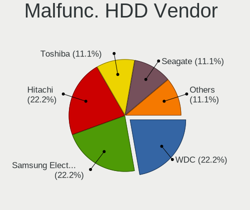

| Vendor              | Computers | Drives | Percent |
|---------------------|-----------|--------|---------|
| Hitachi             | 4         | 4      | 30.77%  |
| WDC                 | 3         | 15     | 23.08%  |
| Toshiba             | 2         | 2      | 15.38%  |
| Samsung Electronics | 2         | 4      | 15.38%  |
| Seagate             | 1         | 1      | 7.69%   |
| HGST                | 1         | 1      | 7.69%   |

Malfunc. Drive Kind
-------------------

Kinds of faulty drives

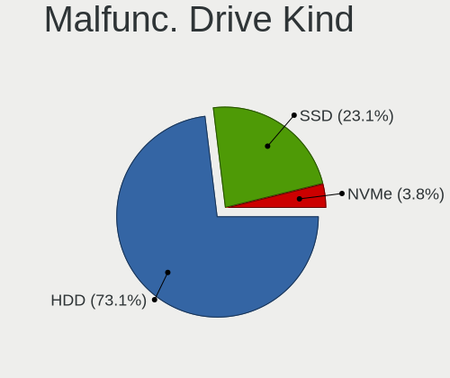

| Kind | Computers | Drives | Percent |
|------|-----------|--------|---------|
| HDD  | 13        | 27     | 86.67%  |
| SSD  | 2         | 2      | 13.33%  |

Failed Drives
-------------

Failed drive models

Zero info for selected period =(

Failed Drive Vendor
-------------------

Failed drive vendors

Zero info for selected period =(

Drive Status
------------

Number of failed and malfunc. drives

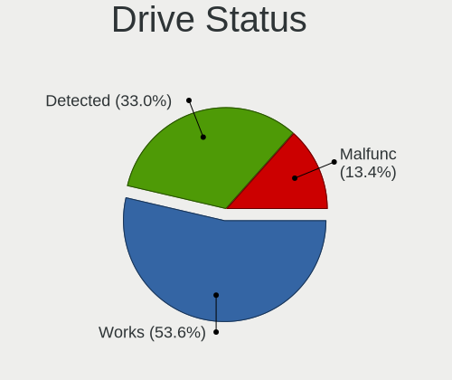

| Status   | Computers | Drives | Percent |
|----------|-----------|--------|---------|
| Works    | 55        | 118    | 59.78%  |
| Detected | 22        | 30     | 23.91%  |
| Malfunc  | 15        | 29     | 16.3%   |

Storage controller
------------------

Storage Vendor
--------------

Storage controller vendors

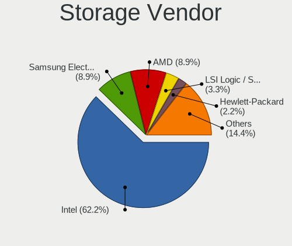

| Vendor                       | Computers | Percent |
|------------------------------|-----------|---------|
| Intel                        | 58        | 62.37%  |
| Samsung Electronics          | 8         | 8.6%    |
| AMD                          | 8         | 8.6%    |
| LSI Logic / Symbios Logic    | 3         | 3.23%   |
| Hewlett-Packard              | 2         | 2.15%   |
| Adaptec                      | 2         | 2.15%   |
| VIA Technologies             | 1         | 1.08%   |
| Toshiba America Info Systems | 1         | 1.08%   |
| SK hynix                     | 1         | 1.08%   |
| SanDisk                      | 1         | 1.08%   |
| Promise Technology           | 1         | 1.08%   |
| Nvidia                       | 1         | 1.08%   |
| Micron/Crucial Technology    | 1         | 1.08%   |
| Marvell Technology Group     | 1         | 1.08%   |
| KIOXIA                       | 1         | 1.08%   |
| Broadcom / LSI               | 1         | 1.08%   |
| ASMedia Technology           | 1         | 1.08%   |
| ADATA Technology             | 1         | 1.08%   |

Storage Model
-------------

Storage controller models

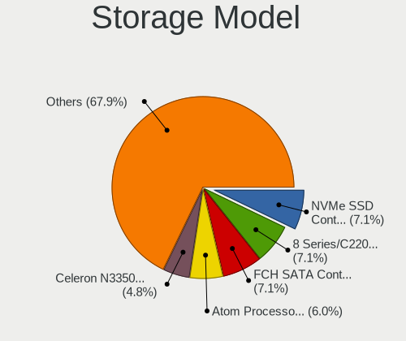

| Model                                                                            | Computers | Percent |
|----------------------------------------------------------------------------------|-----------|---------|
| AMD FCH SATA Controller [AHCI mode]                                              | 7         | 6.93%   |
| Samsung NVMe SSD Controller SM981/PM981/PM983                                    | 6         | 5.94%   |
| Intel Atom Processor E3800 Series SATA AHCI Controller                           | 6         | 5.94%   |
| Intel 8 Series/C220 Series Chipset Family 6-port SATA Controller 1 [AHCI mode]   | 6         | 5.94%   |
| Intel Celeron N3350/Pentium N4200/Atom E3900 Series SATA AHCI Controller         | 4         | 3.96%   |
| Intel 6 Series/C200 Series Chipset Family 6 port Desktop SATA AHCI Controller    | 4         | 3.96%   |
| LSI Logic / Symbios Logic SAS2008 PCI-Express Fusion-MPT SAS-2 [Falcon]          | 3         | 2.97%   |
| Samsung NVMe SSD Controller SM961/PM961/SM963                                    | 2         | 1.98%   |
| Intel Wildcat Point-LP SATA Controller [AHCI Mode]                               | 2         | 1.98%   |
| Intel Sunrise Point-LP SATA Controller [AHCI mode]                               | 2         | 1.98%   |
| Intel NM10/ICH7 Family SATA Controller [AHCI mode]                               | 2         | 1.98%   |
| Intel Comet Lake SATA AHCI Controller                                            | 2         | 1.98%   |
| Intel Cannon Lake Mobile PCH SATA AHCI Controller                                | 2         | 1.98%   |
| Intel 9 Series Chipset Family SATA Controller [AHCI Mode]                        | 2         | 1.98%   |
| Intel 82801IBM/IEM (ICH9M/ICH9M-E) 4 port SATA Controller [AHCI mode]            | 2         | 1.98%   |
| Intel 82801GBM/GHM (ICH7-M Family) SATA Controller [IDE mode]                    | 2         | 1.98%   |
| Intel 82801 Mobile SATA Controller [RAID mode]                                   | 2         | 1.98%   |
| Intel 82371AB/EB/MB PIIX4 IDE                                                    | 2         | 1.98%   |
| Intel 6 Series/C200 Series Chipset Family 6 port Mobile SATA AHCI Controller     | 2         | 1.98%   |
| Intel 5 Series/3400 Series Chipset 6 port SATA AHCI Controller                   | 2         | 1.98%   |
| Adaptec Series 6 - 6G SAS/PCIe 2                                                 | 2         | 1.98%   |
| VIA VT82C586A/B/VT82C686/A/B/VT823x/A/C PIPC Bus Master IDE                      | 1         | 0.99%   |
| Toshiba America Info Systems Toshiba America Info Non-Volatile memory controller | 1         | 0.99%   |
| SK hynix Non-Volatile memory controller                                          | 1         | 0.99%   |
| SanDisk WD Blue SN500 / PC SN520 NVMe SSD                                        | 1         | 0.99%   |
| Samsung NVMe SSD Controller 980                                                  | 1         | 0.99%   |
| Promise PDC42819 [FastTrak TX2650/TX4650]                                        | 1         | 0.99%   |
| Nvidia MCP61 SATA Controller                                                     | 1         | 0.99%   |
| Nvidia MCP61 IDE                                                                 | 1         | 0.99%   |
| Micron/Crucial P2 NVMe PCIe SSD                                                  | 1         | 0.99%   |
| Marvell Group 88SE9235 PCIe 2.0 x2 4-port SATA 6 Gb/s Controller                 | 1         | 0.99%   |
| KIOXIA NVMe SSD Controller BG4                                                   | 1         | 0.99%   |
| Intel SSD 600P Series                                                            | 1         | 0.99%   |
| Intel Non-Volatile memory controller                                             | 1         | 0.99%   |
| Intel HM170/QM170 Chipset SATA Controller [AHCI Mode]                            | 1         | 0.99%   |
| Intel Celeron/Pentium Silver Processor SATA Controller                           | 1         | 0.99%   |
| Intel Cannon Point-LP SATA Controller [AHCI Mode]                                | 1         | 0.99%   |
| Intel Cannon Lake PCH SATA AHCI Controller                                       | 1         | 0.99%   |
| Intel C620 Series Chipset Family SSATA Controller [AHCI mode]                    | 1         | 0.99%   |
| Intel C620 Series Chipset Family SATA Controller [AHCI mode]                     | 1         | 0.99%   |
| Intel 82Q35 Express PT IDER Controller                                           | 1         | 0.99%   |
| Intel 82801IR/IO/IH (ICH9R/DO/DH) 6 port SATA Controller [AHCI mode]             | 1         | 0.99%   |
| Intel 82801HM/HEM (ICH8M/ICH8M-E) SATA Controller [AHCI mode]                    | 1         | 0.99%   |
| Intel 82801HM/HEM (ICH8M/ICH8M-E) IDE Controller                                 | 1         | 0.99%   |
| Intel 82801G (ICH7 Family) IDE Controller                                        | 1         | 0.99%   |
| Intel 82801FB/FBM/FR/FW/FRW (ICH6 Family) IDE Controller                         | 1         | 0.99%   |
| Intel 82801DBM (ICH4-M) IDE Controller                                           | 1         | 0.99%   |
| Intel 82801DB (ICH4) IDE Controller                                              | 1         | 0.99%   |
| Intel 7 Series Chipset Family 6-port SATA Controller [AHCI mode]                 | 1         | 0.99%   |
| Intel 6 Series/C200 Series Desktop SATA RAID Controller                          | 1         | 0.99%   |
| Intel 6 Series/C200 Series Chipset Family IDE-r Controller                       | 1         | 0.99%   |
| Intel 5 Series/3400 Series Chipset SATA RAID Controller                          | 1         | 0.99%   |
| HP Smart Array Gen8 Controllers                                                  | 1         | 0.99%   |
| HP Smart Array G6 controllers                                                    | 1         | 0.99%   |
| Broadcom / LSI MegaRAID SAS-3 3108 [Invader]                                     | 1         | 0.99%   |
| ASMedia ASM1062 Serial ATA Controller                                            | 1         | 0.99%   |
| AMD SB7x0/SB8x0/SB9x0 SATA Controller [AHCI mode]                                | 1         | 0.99%   |
| ADATA XPG SX8200 Pro PCIe Gen3x4 M.2 2280 Solid State Drive                      | 1         | 0.99%   |

Storage Kind
------------

Kind of storage controller (IDE, SATA, NVMe, SAS, ...)

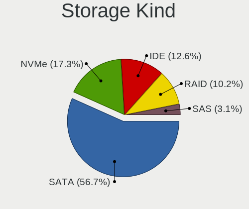

| Kind | Computers | Percent |
|------|-----------|---------|
| SATA | 53        | 56.38%  |
| NVMe | 15        | 15.96%  |
| IDE  | 13        | 13.83%  |
| RAID | 10        | 10.64%  |
| SAS  | 3         | 3.19%   |

Processor
---------

CPU Vendor
----------

Processor vendors

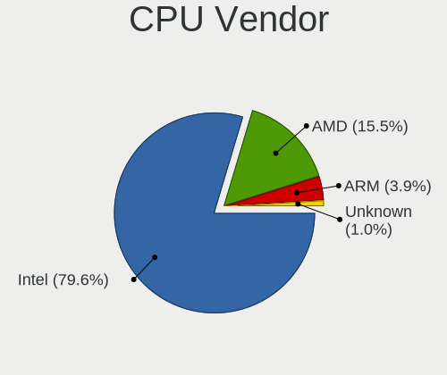

| Vendor  | Computers | Percent |
|---------|-----------|---------|
| Intel   | 69        | 82.14%  |
| AMD     | 11        | 13.1%   |
| ARM     | 3         | 3.57%   |
| Unknown | 1         | 1.19%   |

CPU Model
---------

Processor models

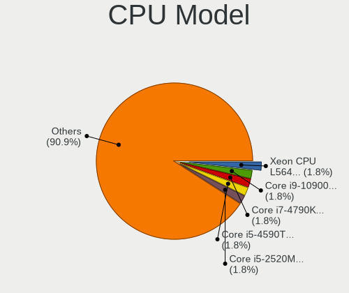

| Model                                  | Computers | Percent |
|----------------------------------------|-----------|---------|
| Intel Xeon CPU L5640 @ 2.27GHz         | 2         | 2.38%   |
| Intel Core i9-10900 CPU @ 2.80GHz      | 2         | 2.38%   |
| Intel Core i7-4790K CPU @ 4.00GHz      | 2         | 2.38%   |
| Intel Core i5-4590T CPU @ 2.00GHz      | 2         | 2.38%   |
| Intel Core i5-2520M CPU @ 2.50GHz      | 2         | 2.38%   |
| Intel Celeron CPU N2840 @ 2.16GHz      | 2         | 2.38%   |
| Intel Celeron CPU J3455 @ 1.50GHz      | 2         | 2.38%   |
| Intel Atom CPU N455 @ 1.66GHz          | 2         | 2.38%   |
| ARM Processor                          | 2         | 2.38%   |
| Intel Xeon Gold 5218 CPU @ 2.30GHz     | 1         | 1.19%   |
| Intel Xeon E-2176M CPU @ 2.70GHz       | 1         | 1.19%   |
| Intel Xeon CPU X3430 @ 2.40GHz         | 1         | 1.19%   |
| Intel Xeon CPU L5630 @ 2.13GHz         | 1         | 1.19%   |
| Intel Xeon CPU E3-1240L v3 @ 2.00GHz   | 1         | 1.19%   |
| Intel Pentium M processor 1.60GHz      | 1         | 1.19%   |
| Intel Pentium M processor 1.50GHz      | 1         | 1.19%   |
| Intel Pentium III (Coppermine)         | 1         | 1.19%   |
| Intel Pentium Dual CPU E2160 @ 1.80GHz | 1         | 1.19%   |
| Intel Pentium CPU N3710 @ 1.60GHz      | 1         | 1.19%   |
| Intel Pentium CPU D1508 @ 2.20GHz      | 1         | 1.19%   |
| Intel Mobile Pentium MMX               | 1         | 1.19%   |
| Intel Genuine CPU 4000 @ 500MHz        | 1         | 1.19%   |
| Intel Core Solo CPU U1500 @ 1.33GHz    | 1         | 1.19%   |
| Intel Core i9-9980HK CPU @ 2.40GHz     | 1         | 1.19%   |
| Intel Core i7-8665U CPU @ 1.90GHz      | 1         | 1.19%   |
| Intel Core i7-6770HQ CPU @ 2.60GHz     | 1         | 1.19%   |
| Intel Core i7-5500U CPU @ 2.40GHz      | 1         | 1.19%   |
| Intel Core i7-3615QM CPU @ 2.30GHz     | 1         | 1.19%   |
| Intel Core i7-1065G7 CPU @ 1.30GHz     | 1         | 1.19%   |
| Intel Core i7 CPU Q 820 @ 1.73GHz      | 1         | 1.19%   |
| Intel Core i5-8400 CPU @ 2.80GHz       | 1         | 1.19%   |
| Intel Core i5-8350U CPU @ 1.70GHz      | 1         | 1.19%   |
| Intel Core i5-8265U CPU @ 1.60GHz      | 1         | 1.19%   |
| Intel Core i5-7300HQ CPU @ 2.50GHz     | 1         | 1.19%   |
| Intel Core i5-7200U CPU @ 2.50GHz      | 1         | 1.19%   |
| Intel Core i5-6300U CPU @ 2.40GHz      | 1         | 1.19%   |
| Intel Core i5-3450 CPU @ 3.10GHz       | 1         | 1.19%   |
| Intel Core i5-3317U CPU @ 1.70GHz      | 1         | 1.19%   |
| Intel Core i5-2400 CPU @ 3.10GHz       | 1         | 1.19%   |
| Intel Core i5-1035G7 CPU @ 1.20GHz     | 1         | 1.19%   |
| Intel Core i5 CPU M 560 @ 2.67GHz      | 1         | 1.19%   |
| Intel Core i3-5020U CPU @ 2.20GHz      | 1         | 1.19%   |
| Intel Core i3-4150 CPU @ 3.50GHz       | 1         | 1.19%   |
| Intel Core i3-3240 CPU @ 3.40GHz       | 1         | 1.19%   |
| Intel Core i3-3220T CPU @ 2.80GHz      | 1         | 1.19%   |
| Intel Core i3-2100 CPU @ 3.10GHz       | 1         | 1.19%   |
| Intel Core 2 Duo CPU T9600 @ 2.80GHz   | 1         | 1.19%   |
| Intel Core 2 Duo CPU T9300 @ 2.50GHz   | 1         | 1.19%   |
| Intel Core 2 Duo CPU P7570 @ 2.26GHz   | 1         | 1.19%   |
| Intel Core 2 CPU T7200 @ 2.00GHz       | 1         | 1.19%   |
| Intel Celeron M processor 1.00GHz      | 1         | 1.19%   |
| Intel Celeron J4125 CPU @ 2.00GHz      | 1         | 1.19%   |
| Intel Celeron CPU N3350 @ 1.10GHz      | 1         | 1.19%   |
| Intel Celeron CPU N2830 @ 2.16GHz      | 1         | 1.19%   |
| Intel Celeron CPU J1900 @ 1.99GHz      | 1         | 1.19%   |
| Intel Celeron CPU J1800 @ 2.41GHz      | 1         | 1.19%   |
| Intel Celeron CPU G1850 @ 2.90GHz      | 1         | 1.19%   |
| Intel Atom x5-Z8350 CPU @ 1.44GHz      | 1         | 1.19%   |
| Intel Atom Processor E3930 @ 1.30GHz   | 1         | 1.19%   |
| Intel Atom CPU Z3735G @ 1.33GHz        | 1         | 1.19%   |

CPU Model Family
----------------

Processor model prefix

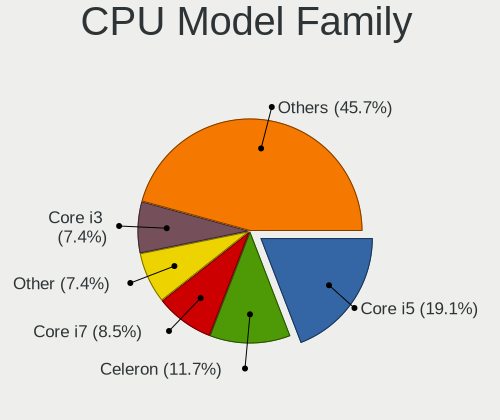

| Model              | Computers | Percent |
|--------------------|-----------|---------|
| Intel Core i5      | 15        | 17.86%  |
| Intel Celeron      | 10        | 11.9%   |
| Intel Core i7      | 8         | 9.52%   |
| Other              | 7         | 8.33%   |
| Intel Atom         | 7         | 8.33%   |
| Intel Xeon         | 6         | 7.14%   |
| Intel Core i3      | 5         | 5.95%   |
| Intel Core i9      | 3         | 3.57%   |
| Intel Core 2 Duo   | 3         | 3.57%   |
| Intel Pentium M    | 2         | 2.38%   |
| Intel Pentium      | 2         | 2.38%   |
| AMD A4             | 2         | 2.38%   |
| Intel Xeon Gold    | 1         | 1.19%   |
| Intel Pentium III  | 1         | 1.19%   |
| Intel Pentium Dual | 1         | 1.19%   |
| Intel Genuine      | 1         | 1.19%   |
| Intel Core Solo    | 1         | 1.19%   |
| Intel Core 2       | 1         | 1.19%   |
| Intel Celeron M    | 1         | 1.19%   |
| AMD Sempron        | 1         | 1.19%   |
| AMD Ryzen 7        | 1         | 1.19%   |
| AMD Ryzen 5        | 1         | 1.19%   |
| AMD FX             | 1         | 1.19%   |
| AMD A8             | 1         | 1.19%   |
| AMD A6             | 1         | 1.19%   |
| AMD A10            | 1         | 1.19%   |

CPU Cores
---------

Number of processor cores

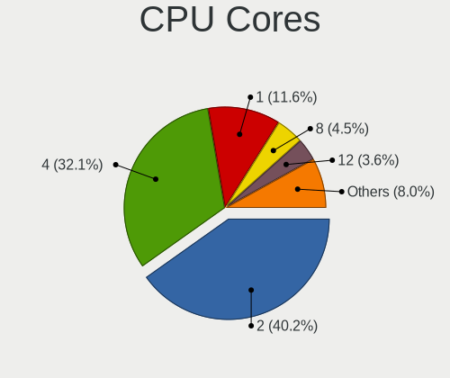

| Number  | Computers | Percent |
|---------|-----------|---------|
| 4       | 31        | 36.9%   |
| 2       | 30        | 35.71%  |
| 1       | 11        | 13.1%   |
| 8       | 3         | 3.57%   |
| 12      | 2         | 2.38%   |
| 10      | 2         | 2.38%   |
| 6       | 2         | 2.38%   |
| 32      | 1         | 1.19%   |
| 3       | 1         | 1.19%   |
| Unknown | 1         | 1.19%   |

CPU Sockets
-----------

Number of sockets

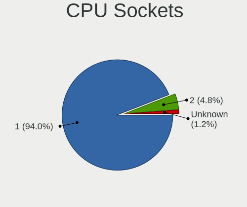

| Number  | Computers | Percent |
|---------|-----------|---------|
| 1       | 79        | 94.05%  |
| 2       | 4         | 4.76%   |
| Unknown | 1         | 1.19%   |

CPU Threads
-----------

Threads per core (Hyper-Threading)

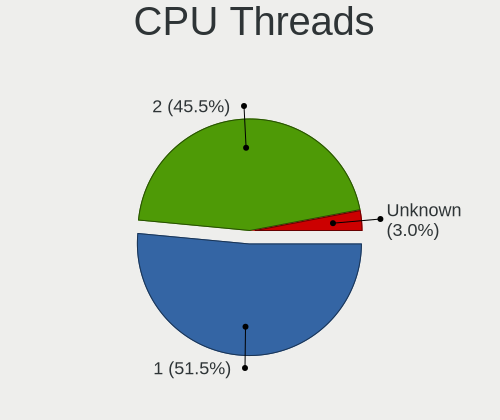

| Number  | Computers | Percent |
|---------|-----------|---------|
| 1       | 45        | 54.22%  |
| 2       | 37        | 44.58%  |
| Unknown | 1         | 1.2%    |

CPU Op-Modes
------------

CPU Operation Modes (32-bit, 64-bit)

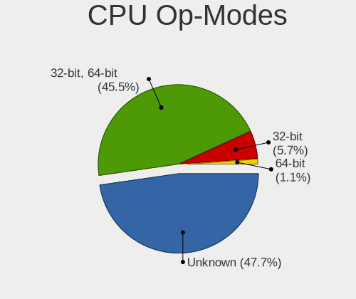

| Op mode        | Computers | Percent |
|----------------|-----------|---------|
| Unknown        | 40        | 47.06%  |
| 32-bit, 64-bit | 39        | 45.88%  |
| 32-bit         | 5         | 5.88%   |
| 64-bit         | 1         | 1.18%   |

CPU Microcode
-------------

Microcode number

| Number     | Computers | Percent |
|------------|-----------|---------|
| Unknown    | 46        | 53.49%  |
| 0x306c3    | 5         | 5.81%   |
| 0x30678    | 4         | 4.65%   |
| 0x306a9    | 3         | 3.49%   |
| 0x206c2    | 3         | 3.49%   |
| 0x906ea    | 2         | 2.33%   |
| 0x506c9    | 2         | 2.33%   |
| 0x406c4    | 2         | 2.33%   |
| 0x206a7    | 2         | 2.33%   |
| 0x106e5    | 2         | 2.33%   |
| 0x106ca    | 2         | 2.33%   |
| 0x06006704 | 2         | 2.33%   |
| 0xa0655    | 1         | 1.16%   |
| 0x806eb    | 1         | 1.16%   |
| 0x706e5    | 1         | 1.16%   |
| 0x6fd      | 1         | 1.16%   |
| 0x6d8      | 1         | 1.16%   |
| 0x683      | 1         | 1.16%   |
| 0x506e3    | 1         | 1.16%   |
| 0x306d4    | 1         | 1.16%   |
| 0x1067a    | 1         | 1.16%   |
| 0x0810100b | 1         | 1.16%   |
| 0x010000b6 | 1         | 1.16%   |

CPU Microarch
-------------

Microarchitecture

| Name          | Computers | Percent |
|---------------|-----------|---------|
| Silvermont    | 9         | 10.71%  |
| KabyLake      | 8         | 9.52%   |
| Haswell       | 7         | 8.33%   |
| Unknown       | 6         | 7.14%   |
| P6            | 5         | 5.95%   |
| IvyBridge     | 5         | 5.95%   |
| Westmere      | 4         | 4.76%   |
| SandyBridge   | 4         | 4.76%   |
| Goldmont      | 4         | 4.76%   |
| Skylake       | 3         | 3.57%   |
| Penryn        | 3         | 3.57%   |
| Excavator     | 3         | 3.57%   |
| Broadwell     | 3         | 3.57%   |
| Bonnell       | 3         | 3.57%   |
| Piledriver    | 2         | 2.38%   |
| Nehalem       | 2         | 2.38%   |
| IceLake       | 2         | 2.38%   |
| Core          | 2         | 2.38%   |
| CometLake     | 2         | 2.38%   |
| Zen 2         | 1         | 1.19%   |
| Zen           | 1         | 1.19%   |
| Puma          | 1         | 1.19%   |
| K6            | 1         | 1.19%   |
| K10           | 1         | 1.19%   |
| Jaguar        | 1         | 1.19%   |
| Goldmont plus | 1         | 1.19%   |

Graphics
--------

GPU Vendor
----------

Vendors of graphics cards

| Vendor                     | Computers | Percent |
|----------------------------|-----------|---------|
| Intel                      | 54        | 62.79%  |
| AMD                        | 18        | 20.93%  |
| Nvidia                     | 6         | 6.98%   |
| Matrox Electronics Systems | 4         | 4.65%   |
| Neomagic                   | 2         | 2.33%   |
| VIA Technologies           | 1         | 1.16%   |
| ASPEED Technology          | 1         | 1.16%   |

GPU Model
---------

Graphics card models

| Model                                                                                    | Computers | Percent |
|------------------------------------------------------------------------------------------|-----------|---------|
| Intel Atom Processor Z36xxx/Z37xxx Series Graphics & Display                             | 7         | 7.87%   |
| Intel Xeon E3-1200 v3/4th Gen Core Processor Integrated Graphics Controller              | 4         | 4.49%   |
| Intel HD Graphics 500                                                                    | 4         | 4.49%   |
| Intel 2nd Generation Core Processor Family Integrated Graphics Controller                | 4         | 4.49%   |
| AMD ES1000                                                                               | 3         | 3.37%   |
| Intel Xeon E3-1200 v2/3rd Gen Core processor Graphics Controller                         | 2         | 2.25%   |
| Intel WhiskeyLake-U GT2 [UHD Graphics 620]                                               | 2         | 2.25%   |
| Intel Mobile 945GM/GMS/GME, 943/940GML Express Integrated Graphics Controller            | 2         | 2.25%   |
| Intel Iris Plus Graphics G7                                                              | 2         | 2.25%   |
| Intel HD Graphics 5500                                                                   | 2         | 2.25%   |
| Intel CometLake-S GT2 [UHD Graphics 630]                                                 | 2         | 2.25%   |
| Intel Atom/Celeron/Pentium Processor x5-E8000/J3xxx/N3xxx Integrated Graphics Controller | 2         | 2.25%   |
| Intel Atom Processor D4xx/D5xx/N4xx/N5xx Integrated Graphics Controller                  | 2         | 2.25%   |
| Intel 82852/855GM Integrated Graphics Device                                             | 2         | 2.25%   |
| Intel 3rd Gen Core processor Graphics Controller                                         | 2         | 2.25%   |
| AMD Stoney [Radeon R2/R3/R4/R5 Graphics]                                                 | 2         | 2.25%   |
| AMD Ellesmere [Radeon RX 470/480/570/570X/580/580X/590]                                  | 2         | 2.25%   |
| VIA Technologies KM400/KN400/P4M800 [S3 UniChrome]                                       | 1         | 1.12%   |
| Nvidia TU117M [GeForce GTX 1650 Mobile / Max-Q]                                          | 1         | 1.12%   |
| Nvidia GP107M [GeForce GTX 1050 Ti Mobile]                                               | 1         | 1.12%   |
| Nvidia GP107GLM [Quadro P2000 Mobile]                                                    | 1         | 1.12%   |
| Nvidia GA102 [GeForce RTX 3090]                                                          | 1         | 1.12%   |
| Nvidia G92GLM [Quadro FX 3700M]                                                          | 1         | 1.12%   |
| Nvidia C61 [GeForce 6150SE nForce 430]                                                   | 1         | 1.12%   |
| Neomagic NM2200 [MagicGraph 256AV]                                                       | 1         | 1.12%   |
| Neomagic NM2160 [MagicGraph 128XD]                                                       | 1         | 1.12%   |
| Matrox Electronics Systems MGA G200eW WPCM450                                            | 1         | 1.12%   |
| Matrox Electronics Systems MGA G200EH                                                    | 1         | 1.12%   |
| Matrox Electronics Systems MGA G200e [Pilot] ServerEngines (SEP1)                        | 1         | 1.12%   |
| Matrox Electronics Systems Integrated Matrox G200eW3 Graphics Controller                 | 1         | 1.12%   |
| Intel UHD Graphics 620                                                                   | 1         | 1.12%   |
| Intel Skylake GT2 [HD Graphics 520]                                                      | 1         | 1.12%   |
| Intel Mobile 945GSE Express Integrated Graphics Controller                               | 1         | 1.12%   |
| Intel Mobile 945GM/GMS, 943/940GML Express Integrated Graphics Controller                | 1         | 1.12%   |
| Intel Mobile 915GM/GMS/910GML Express Graphics Controller                                | 1         | 1.12%   |
| Intel Mobile 4 Series Chipset Integrated Graphics Controller                             | 1         | 1.12%   |
| Intel Iris Pro Graphics 580                                                              | 1         | 1.12%   |
| Intel HD Graphics 630                                                                    | 1         | 1.12%   |
| Intel HD Graphics 620                                                                    | 1         | 1.12%   |
| Intel GeminiLake [UHD Graphics 600]                                                      | 1         | 1.12%   |
| Intel Display controller                                                                 | 1         | 1.12%   |
| Intel Core Processor Integrated Graphics Controller                                      | 1         | 1.12%   |
| Intel CoffeeLake-S GT2 [UHD Graphics 630]                                                | 1         | 1.12%   |
| Intel CoffeeLake-H GT2 [UHD Graphics 630]                                                | 1         | 1.12%   |
| Intel Coffee Lake UHD Graphics P630                                                      | 1         | 1.12%   |
| Intel 82Q35 Express Integrated Graphics Controller                                       | 1         | 1.12%   |
| Intel 4th Generation Core Processor Family Integrated Graphics Controller                | 1         | 1.12%   |
| ASPEED Technology ASPEED Graphics Family                                                 | 1         | 1.12%   |
| AMD Wani [Radeon R5/R6/R7 Graphics]                                                      | 1         | 1.12%   |
| AMD Trinity [Radeon HD 7560D]                                                            | 1         | 1.12%   |
| AMD Topaz XT [Radeon R7 M260/M265 / M340/M360 / M440/M445 / 530/535 / 620/625 Mobile]    | 1         | 1.12%   |
| AMD Tonga XT / Amethyst XT [Radeon R9 380X / R9 M295X]                                   | 1         | 1.12%   |
| AMD Thames [Radeon HD 7500M/7600M Series]                                                | 1         | 1.12%   |
| AMD RV730/M96 [Mobility Radeon HD 4650/5165]                                             | 1         | 1.12%   |
| AMD RV635/M86 [Mobility Radeon HD 3650]                                                  | 1         | 1.12%   |
| AMD RV515/M52 [Mobility Radeon X1300]                                                    | 1         | 1.12%   |
| AMD Renoir                                                                               | 1         | 1.12%   |
| AMD Raven Ridge [Radeon Vega Series / Radeon Vega Mobile Series]                         | 1         | 1.12%   |
| AMD Mullins [Radeon R3 Graphics]                                                         | 1         | 1.12%   |
| AMD Kabini [Radeon HD 8330]                                                              | 1         | 1.12%   |

GPU Combo
---------

Combinations of graphics cards

| Name            | Computers | Percent |
|-----------------|-----------|---------|
| 1 x Intel       | 45        | 53.57%  |
| 1 x AMD         | 16        | 19.05%  |
| Other           | 5         | 5.95%   |
| 2 x Intel       | 3         | 3.57%   |
| 1 x Matrox      | 3         | 3.57%   |
| Intel + Nvidia  | 3         | 3.57%   |
| 1 x Nvidia      | 2         | 2.38%   |
| 1 x Neomagic    | 2         | 2.38%   |
| 2 x AMD         | 1         | 1.19%   |
| 1 x VIA         | 1         | 1.19%   |
| Nvidia + Matrox | 1         | 1.19%   |
| Intel + AMD     | 1         | 1.19%   |
| 1 x ASPEED      | 1         | 1.19%   |

GPU Driver
----------

Free vs proprietary

| Driver      | Computers | Percent |
|-------------|-----------|---------|
| Free        | 69        | 80.23%  |
| Unknown     | 15        | 17.44%  |
| Proprietary | 2         | 2.33%   |

GPU Memory
----------

Total video memory

| Size in GB | Computers | Percent |
|------------|-----------|---------|
| Unknown    | 71        | 85.54%  |
| 0.01-0.5   | 7         | 8.43%   |
| 1.01-2.0   | 2         | 2.41%   |
| 7.01-8.0   | 1         | 1.2%    |
| 3.01-4.0   | 1         | 1.2%    |
| 0.51-1.0   | 1         | 1.2%    |

Monitor
-------

Monitor Vendor
--------------

Monitor vendors

| Vendor                  | Computers | Percent |
|-------------------------|-----------|---------|
| AU Optronics            | 8         | 11.94%  |
| Samsung Electronics     | 7         | 10.45%  |
| LG Display              | 6         | 8.96%   |
| Dell                    | 5         | 7.46%   |
| Chimei Innolux          | 5         | 7.46%   |
| BOE                     | 4         | 5.97%   |
| AOC                     | 3         | 4.48%   |
| Acer                    | 3         | 4.48%   |
| LG Philips              | 2         | 2.99%   |
| Hewlett-Packard         | 2         | 2.99%   |
| Goldstar                | 2         | 2.99%   |
| Chi Mei Optoelectronics | 2         | 2.99%   |
| BenQ                    | 2         | 2.99%   |
| ViewSonic               | 1         | 1.49%   |
| Sony                    | 1         | 1.49%   |
| SKY                     | 1         | 1.49%   |
| Sharp                   | 1         | 1.49%   |
| ONN                     | 1         | 1.49%   |
| Mi                      | 1         | 1.49%   |
| Lenovo                  | 1         | 1.49%   |
| KVM                     | 1         | 1.49%   |
| InfoVision              | 1         | 1.49%   |
| HannStar                | 1         | 1.49%   |
| Envision                | 1         | 1.49%   |
| Elo Touch               | 1         | 1.49%   |
| EDI                     | 1         | 1.49%   |
| DENON                   | 1         | 1.49%   |
| CSO                     | 1         | 1.49%   |
| CPT                     | 1         | 1.49%   |

Monitor Model
-------------

Monitor models

| Model                                                                    | Computers | Percent |
|--------------------------------------------------------------------------|-----------|---------|
| Samsung Electronics SE790C SAM0BFE 3440x1440 797x333mm 34.0-inch         | 2         | 2.94%   |
| ViewSonic VG2030wm VSCA51E 1680x1050 433x270mm 20.1-inch                 | 1         | 1.47%   |
| Sony TV *02 SNY9703 1920x1080 1439x809mm 65.0-inch                       | 1         | 1.47%   |
| SKY TV-monitor SKY0001 1920x1080 890x500mm 40.2-inch                     | 1         | 1.47%   |
| Sharp LCD Monitor SHP14AF 1920x1200 288x180mm 13.4-inch                  | 1         | 1.47%   |
| Samsung Electronics SyncMaster SAM01E1 1280x1024 376x301mm 19.0-inch     | 1         | 1.47%   |
| Samsung Electronics LCD Monitor SEC5A42 1366x768 309x174mm 14.0-inch     | 1         | 1.47%   |
| Samsung Electronics LCD Monitor SEC5642 1280x768 305x183mm 14.0-inch     | 1         | 1.47%   |
| Samsung Electronics LCD Monitor SDCA029 3840x2160 344x194mm 15.5-inch    | 1         | 1.47%   |
| Samsung Electronics LCD Monitor SAM0B60 1920x1080 1210x680mm 54.6-inch   | 1         | 1.47%   |
| Samsung Electronics LCD Monitor SAM0B54 1366x768 609x347mm 27.6-inch     | 1         | 1.47%   |
| ONN ONA24HB19T01 ONN0101 1920x1080 517x323mm 24.0-inch                   | 1         | 1.47%   |
| Mi Monitor XMI2701 2560x1440 600x330mm 27.0-inch                         | 1         | 1.47%   |
| LG Philips LCD Monitor LPLE100 1280x800 331x207mm 15.4-inch              | 1         | 1.47%   |
| LG Philips LCD Monitor LPLA900 1280x800 331x207mm 15.4-inch              | 1         | 1.47%   |
| LG Display LP116WH2-TLC1 LGD0232 1366x768 256x144mm 11.6-inch            | 1         | 1.47%   |
| LG Display LCD Monitor LGD045C 1366x768 345x194mm 15.6-inch              | 1         | 1.47%   |
| LG Display LCD Monitor LGD0456 1366x768 344x194mm 15.5-inch              | 1         | 1.47%   |
| LG Display LCD Monitor LGD042E 2560x1700 272x181mm 12.9-inch             | 1         | 1.47%   |
| LG Display LCD Monitor LGD022C 1366x768 294x166mm 13.3-inch              | 1         | 1.47%   |
| LG Display LCD Monitor LGD021D 1600x900 382x215mm 17.3-inch              | 1         | 1.47%   |
| Lenovo LCD Monitor LEN4067 1920x1200 367x230mm 17.1-inch                 | 1         | 1.47%   |
| KVM LCD Monitor 1 7" KVM4308 1280x1024 338x270mm 17.0-inch               | 1         | 1.47%   |
| InfoVision LCD Monitor IVO0489 1366x768 256x144mm 11.6-inch              | 1         | 1.47%   |
| Hewlett-Packard VH240a HPN3499 1920x1080 530x300mm 24.0-inch             | 1         | 1.47%   |
| Hewlett-Packard All-in-One HWP421A 1920x1080 477x268mm 21.5-inch         | 1         | 1.47%   |
| HannStar HSD101PFW2 HSD03E9 1024x600 222x125mm 10.0-inch                 | 1         | 1.47%   |
| Goldstar LG ULTRAWIDE GSM5A2A 2560x1080 670x280mm 28.6-inch              | 1         | 1.47%   |
| Goldstar LG Ultra HD GSM5B08 3840x2160 600x340mm 27.2-inch               | 1         | 1.47%   |
| Envision LE24M1475/25 EPI1475 1360x768 708x398mm 32.0-inch               | 1         | 1.47%   |
| Elo Touch ET1717L ELO1717 1280x1024 338x270mm 17.0-inch                  | 1         | 1.47%   |
| EDI VGA TO HDMI EDI1209 1920x1080 480x270mm 21.7-inch                    | 1         | 1.47%   |
| DENON AVR DON004B 3840x2160 697x392mm 31.5-inch                          | 1         | 1.47%   |
| Dell U2518D DEL413A 2560x1440 550x310mm 24.9-inch                        | 1         | 1.47%   |
| Dell P2311H DEL4066 1920x1080 509x286mm 23.0-inch                        | 1         | 1.47%   |
| Dell E172FP DELA00A 1280x1024 338x270mm 17.0-inch                        | 1         | 1.47%   |
| Dell E151FPb DELA005 1024x768 304x228mm 15.0-inch                        | 1         | 1.47%   |
| Dell 2009W DEL4041 1680x1050 433x270mm 20.1-inch                         | 1         | 1.47%   |
| CSO LCD Monitor CSO1402 2880x1800 302x188mm 14.0-inch                    | 1         | 1.47%   |
| CPT LCD Monitor CPT04E2 1024x600 222x130mm 10.1-inch                     | 1         | 1.47%   |
| Chimei Innolux LCD Monitor CMN1735 1920x1080 381x214mm 17.2-inch         | 1         | 1.47%   |
| Chimei Innolux LCD Monitor CMN15DB 1366x768 344x193mm 15.5-inch          | 1         | 1.47%   |
| Chimei Innolux LCD Monitor CMN15B6 1366x768 340x190mm 15.3-inch          | 1         | 1.47%   |
| Chimei Innolux LCD Monitor CMN14D4 1920x1080 309x173mm 13.9-inch         | 1         | 1.47%   |
| Chimei Innolux LCD Monitor CMN1132 1366x768 256x144mm 11.6-inch          | 1         | 1.47%   |
| Chi Mei Optoelectronics LCD Monitor CMO15A7 1366x768 344x193mm 15.5-inch | 1         | 1.47%   |
| Chi Mei Optoelectronics LCD Monitor CMO1033 1024x600 222x125mm 10.0-inch | 1         | 1.47%   |
| BOE LCD Monitor BOE08A0 1280x800 261x163mm 12.1-inch                     | 1         | 1.47%   |
| BOE LCD Monitor BOE06DF 1920x1080 309x173mm 13.9-inch                    | 1         | 1.47%   |
| BOE LCD Monitor BOE0671 1366x768 344x194mm 15.5-inch                     | 1         | 1.47%   |
| BOE LCD Monitor BOE0628 1366x768 309x173mm 13.9-inch                     | 1         | 1.47%   |
| BenQ XL2411Z BNQ7F31 1920x1080 531x298mm 24.0-inch                       | 1         | 1.47%   |
| BenQ BL2405 BNQ8016 1920x1080 531x298mm 24.0-inch                        | 1         | 1.47%   |
| AU Optronics LCD Monitor AUO733C 1366x768 309x173mm 13.9-inch            | 1         | 1.47%   |
| AU Optronics LCD Monitor AUO71EC 1366x768 344x193mm 15.5-inch            | 1         | 1.47%   |
| AU Optronics LCD Monitor AUO46EC 1366x768 344x193mm 15.5-inch            | 1         | 1.47%   |
| AU Optronics LCD Monitor AUO423D 1920x1080 309x173mm 13.9-inch           | 1         | 1.47%   |
| AU Optronics LCD Monitor AUO23ED 1920x1080 344x194mm 15.5-inch           | 1         | 1.47%   |
| AU Optronics LCD Monitor AUO213E 1600x900 309x174mm 14.0-inch            | 1         | 1.47%   |
| AU Optronics LCD Monitor AUO132C 1366x768 293x164mm 13.2-inch            | 1         | 1.47%   |

Monitor Resolution
------------------

Monitor screen resolution

| Resolution         | Computers | Percent |
|--------------------|-----------|---------|
| 1920x1080 (FHD)    | 18        | 26.87%  |
| 1366x768 (WXGA)    | 17        | 25.37%  |
| 1280x1024 (SXGA)   | 5         | 7.46%   |
| 3840x2160 (4K)     | 3         | 4.48%   |
| 2560x1440 (QHD)    | 3         | 4.48%   |
| 1280x800 (WXGA)    | 3         | 4.48%   |
| 1024x600           | 3         | 4.48%   |
| 3440x1440          | 2         | 2.99%   |
| 1920x1200 (WUXGA)  | 2         | 2.99%   |
| 1680x1050 (WSXGA+) | 2         | 2.99%   |
| 1600x900 (HD+)     | 2         | 2.99%   |
| 2880x1800          | 1         | 1.49%   |
| 2560x1700          | 1         | 1.49%   |
| 2560x1080          | 1         | 1.49%   |
| 1440x900 (WXGA+)   | 1         | 1.49%   |
| 1360x768           | 1         | 1.49%   |
| 1280x768           | 1         | 1.49%   |
| 1024x768 (XGA)     | 1         | 1.49%   |

Monitor Diagonal
----------------

Diagonal size in inches

| Inches | Computers | Percent |
|--------|-----------|---------|
| 15     | 13        | 19.12%  |
| 13     | 8         | 11.76%  |
| 17     | 7         | 10.29%  |
| 14     | 5         | 7.35%   |
| 23     | 4         | 5.88%   |
| 27     | 3         | 4.41%   |
| 24     | 3         | 4.41%   |
| 21     | 3         | 4.41%   |
| 11     | 3         | 4.41%   |
| 10     | 3         | 4.41%   |
| 34     | 2         | 2.94%   |
| 31     | 2         | 2.94%   |
| 20     | 2         | 2.94%   |
| 19     | 2         | 2.94%   |
| 12     | 2         | 2.94%   |
| 65     | 1         | 1.47%   |
| 54     | 1         | 1.47%   |
| 40     | 1         | 1.47%   |
| 32     | 1         | 1.47%   |
| 29     | 1         | 1.47%   |
| 25     | 1         | 1.47%   |

Monitor Width
-------------

Physical width

| Width in mm | Computers | Percent |
|-------------|-----------|---------|
| 301-350     | 26        | 38.24%  |
| 201-300     | 11        | 16.18%  |
| 501-600     | 10        | 14.71%  |
| 351-400     | 6         | 8.82%   |
| 401-500     | 5         | 7.35%   |
| 601-700     | 4         | 5.88%   |
| 701-800     | 3         | 4.41%   |
| 1001-1500   | 2         | 2.94%   |
| 801-900     | 1         | 1.47%   |

Aspect Ratio
------------

Proportional relationship between the width and the height

| Ratio | Computers | Percent |
|-------|-----------|---------|
| 16/9  | 44        | 70.97%  |
| 16/10 | 8         | 12.9%   |
| 5/4   | 5         | 8.06%   |
| 21/9  | 3         | 4.84%   |
| 4/3   | 1         | 1.61%   |
| 3/2   | 1         | 1.61%   |

Monitor Area
------------

Area in inch²

| Area in inch² | Computers | Percent |
|----------------|-----------|---------|
| 101-110        | 13        | 19.12%  |
| 81-90          | 10        | 14.71%  |
| 201-250        | 9         | 13.24%  |
| 351-500        | 5         | 7.35%   |
| 151-200        | 5         | 7.35%   |
| 71-80          | 4         | 5.88%   |
| 301-350        | 4         | 5.88%   |
| 51-60          | 3         | 4.41%   |
| 41-50          | 3         | 4.41%   |
| 141-150        | 3         | 4.41%   |
| More than 1000 | 2         | 2.94%   |
| 131-140        | 2         | 2.94%   |
| 121-130        | 2         | 2.94%   |
| 61-70          | 1         | 1.47%   |
| 251-300        | 1         | 1.47%   |
| 501-1000       | 1         | 1.47%   |

Pixel Density
-------------

Pixels per inch

| Density       | Computers | Percent |
|---------------|-----------|---------|
| 51-100        | 21        | 32.81%  |
| 101-120       | 20        | 31.25%  |
| 121-160       | 12        | 18.75%  |
| 1-50          | 5         | 7.81%   |
| 161-240       | 4         | 6.25%   |
| More than 240 | 2         | 3.13%   |

Multiple Monitors
-----------------

Total monitors connected

| Total | Computers | Percent |
|-------|-----------|---------|
| 1     | 53        | 62.35%  |
| 0     | 24        | 28.24%  |
| 2     | 7         | 8.24%   |
| 4     | 1         | 1.18%   |

Network
-------

Net Controller Vendor
---------------------

Controller vendors

| Vendor                          | Computers | Percent |
|---------------------------------|-----------|---------|
| Realtek Semiconductor           | 42        | 33.87%  |
| Intel                           | 32        | 25.81%  |
| Qualcomm Atheros                | 16        | 12.9%   |
| Broadcom                        | 16        | 12.9%   |
| Marvell Technology Group        | 3         | 2.42%   |
| Xiaomi                          | 2         | 1.61%   |
| Qualcomm Atheros Communications | 2         | 1.61%   |
| Qualcomm                        | 2         | 1.61%   |
| VIA Technologies                | 1         | 0.81%   |
| T & A Mobile Phones             | 1         | 0.81%   |
| Sigma Designs                   | 1         | 0.81%   |
| Nvidia                          | 1         | 0.81%   |
| Mellanox Technologies           | 1         | 0.81%   |
| LSI                             | 1         | 0.81%   |
| Dresden Elektronik              | 1         | 0.81%   |
| D-Link System                   | 1         | 0.81%   |
| Broadcom Limited                | 1         | 0.81%   |

Net Controller Model
--------------------

Controller models

| Model                                                                          | Computers | Percent |
|--------------------------------------------------------------------------------|-----------|---------|
| Realtek RTL8111/8168/8411 PCI Express Gigabit Ethernet Controller              | 25        | 17.48%  |
| Realtek RTL8153 Gigabit Ethernet Adapter                                       | 6         | 4.2%    |
| Realtek RTL810xE PCI Express Fast Ethernet controller                          | 6         | 4.2%    |
| Qualcomm Atheros QCA9565 / AR9565 Wireless Network Adapter                     | 6         | 4.2%    |
| Qualcomm Atheros QCA9377 802.11ac Wireless Network Adapter                     | 3         | 2.1%    |
| Intel I210 Gigabit Network Connection                                          | 3         | 2.1%    |
| Intel 82579LM Gigabit Network Connection (Lewisville)                          | 3         | 2.1%    |
| Qualcomm Atheros AR9271 802.11n                                                | 2         | 1.4%    |
| Qualcomm Atheros AR9485 Wireless Network Adapter                               | 2         | 1.4%    |
| Intel Wireless 8260                                                            | 2         | 1.4%    |
| Intel Wi-Fi 6 AX200                                                            | 2         | 1.4%    |
| Intel Ethernet Controller I225-V                                               | 2         | 1.4%    |
| Intel Comet Lake PCH CNVi WiFi                                                 | 2         | 1.4%    |
| Intel Centrino Advanced-N 6205 [Taylor Peak]                                   | 2         | 1.4%    |
| Intel Cannon Point-LP CNVi [Wireless-AC]                                       | 2         | 1.4%    |
| Broadcom NetXtreme II BCM5709 Gigabit Ethernet                                 | 2         | 1.4%    |
| Broadcom BCM4313 802.11bgn Wireless Network Adapter                            | 2         | 1.4%    |
| Xiaomi Mi/Redmi series (RNDIS)                                                 | 1         | 0.7%    |
| Xiaomi Mi/Redmi series (RNDIS + ADB)                                           | 1         | 0.7%    |
| VIA VT6102/VT6103 [Rhine-II]                                                   | 1         | 0.7%    |
| T & A Mobile Phones 5087Z                                                      | 1         | 0.7%    |
| Sigma Designs Aeotec Z-Stick Gen5 (ZW090) - UZB                                | 1         | 0.7%    |
| Realtek RTL8822CE 802.11ac PCIe Wireless Network Adapter                       | 1         | 0.7%    |
| Realtek RTL8723BU 802.11b/g/n WLAN Adapter                                     | 1         | 0.7%    |
| Realtek RTL8188EE Wireless Network Adapter                                     | 1         | 0.7%    |
| Realtek RTL8188CUS 802.11n WLAN Adapter                                        | 1         | 0.7%    |
| Realtek RTL8152 Fast Ethernet Adapter                                          | 1         | 0.7%    |
| Realtek RTL-8100/8101L/8139 PCI Fast Ethernet Adapter                          | 1         | 0.7%    |
| Qualcomm BENGAL-QRD _SN:C5464635                                               | 1         | 0.7%    |
| Qualcomm Atheros QCA8171 Gigabit Ethernet                                      | 1         | 0.7%    |
| Qualcomm Atheros AR928X Wireless Network Adapter (PCI-Express)                 | 1         | 0.7%    |
| Qualcomm Atheros AR8151 v2.0 Gigabit Ethernet                                  | 1         | 0.7%    |
| Qualcomm Atheros AR5413/AR5414 Wireless Network Adapter [AR5006X(S) 802.11abg] | 1         | 0.7%    |
| Qualcomm Atheros AR5212 802.11abg NIC                                          | 1         | 0.7%    |
| Qualcomm Android                                                               | 1         | 0.7%    |
| Nvidia MCP61 Ethernet                                                          | 1         | 0.7%    |
| Mellanox MT26448 [ConnectX EN 10GigE, PCIe 2.0 5GT/s]                          | 1         | 0.7%    |
| Marvell Group Marvell WLAN controller                                          | 1         | 0.7%    |
| Marvell Group 88E8072 PCI-E Gigabit Ethernet Controller                        | 1         | 0.7%    |
| Marvell Group 88E8036 PCI-E Fast Ethernet Controller                           | 1         | 0.7%    |
| LSI WinModem 56k                                                               | 1         | 0.7%    |
| Intel Wireless-AC 9260                                                         | 1         | 0.7%    |
| Intel Wireless 8265 / 8275                                                     | 1         | 0.7%    |
| Intel Wireless 7265                                                            | 1         | 0.7%    |
| Intel Wireless 7260                                                            | 1         | 0.7%    |
| Intel Ultimate N WiFi Link 5300                                                | 1         | 0.7%    |
| Intel PRO/Wireless 4965 AG or AGN [Kedron] Network Connection                  | 1         | 0.7%    |
| Intel PRO/Wireless 3945ABG [Golan] Network Connection                          | 1         | 0.7%    |
| Intel PRO/Wireless 2200BG [Calexico2] Network Connection                       | 1         | 0.7%    |
| Intel Ice Lake-LP PCH CNVi WiFi                                                | 1         | 0.7%    |
| Intel Ethernet Connection I219-LM                                              | 1         | 0.7%    |
| Intel Ethernet Connection I217-LM                                              | 1         | 0.7%    |
| Intel Ethernet Connection (7) I219-V                                           | 1         | 0.7%    |
| Intel Ethernet Connection (7) I219-LM                                          | 1         | 0.7%    |
| Intel Ethernet Connection (6) I219-LM                                          | 1         | 0.7%    |
| Intel Ethernet Connection (4) I219-LM                                          | 1         | 0.7%    |
| Intel Ethernet Connection (2) I219-LM                                          | 1         | 0.7%    |
| Intel Dual Band Wireless-AC 3168NGW [Stone Peak]                               | 1         | 0.7%    |
| Intel DH8900CC Null Device                                                     | 1         | 0.7%    |
| Intel Centrino Wireless-N 2230                                                 | 1         | 0.7%    |

Wireless Vendor
---------------

Wireless vendors

| Vendor                          | Computers | Percent |
|---------------------------------|-----------|---------|
| Intel                           | 23        | 43.4%   |
| Qualcomm Atheros                | 14        | 26.42%  |
| Broadcom                        | 8         | 15.09%  |
| Realtek Semiconductor           | 4         | 7.55%   |
| Qualcomm Atheros Communications | 2         | 3.77%   |
| Marvell Technology Group        | 1         | 1.89%   |
| Broadcom Limited                | 1         | 1.89%   |

Wireless Model
--------------

Wireless models

| Model                                                                          | Computers | Percent |
|--------------------------------------------------------------------------------|-----------|---------|
| Qualcomm Atheros QCA9565 / AR9565 Wireless Network Adapter                     | 6         | 11.32%  |
| Qualcomm Atheros QCA9377 802.11ac Wireless Network Adapter                     | 3         | 5.66%   |
| Qualcomm Atheros AR9271 802.11n                                                | 2         | 3.77%   |
| Qualcomm Atheros AR9485 Wireless Network Adapter                               | 2         | 3.77%   |
| Intel Wireless 8260                                                            | 2         | 3.77%   |
| Intel Wi-Fi 6 AX200                                                            | 2         | 3.77%   |
| Intel Comet Lake PCH CNVi WiFi                                                 | 2         | 3.77%   |
| Intel Centrino Advanced-N 6205 [Taylor Peak]                                   | 2         | 3.77%   |
| Intel Cannon Point-LP CNVi [Wireless-AC]                                       | 2         | 3.77%   |
| Broadcom BCM4313 802.11bgn Wireless Network Adapter                            | 2         | 3.77%   |
| Realtek RTL8822CE 802.11ac PCIe Wireless Network Adapter                       | 1         | 1.89%   |
| Realtek RTL8723BU 802.11b/g/n WLAN Adapter                                     | 1         | 1.89%   |
| Realtek RTL8188EE Wireless Network Adapter                                     | 1         | 1.89%   |
| Realtek RTL8188CUS 802.11n WLAN Adapter                                        | 1         | 1.89%   |
| Qualcomm Atheros AR928X Wireless Network Adapter (PCI-Express)                 | 1         | 1.89%   |
| Qualcomm Atheros AR5413/AR5414 Wireless Network Adapter [AR5006X(S) 802.11abg] | 1         | 1.89%   |
| Qualcomm Atheros AR5212 802.11abg NIC                                          | 1         | 1.89%   |
| Marvell Group Marvell WLAN controller                                          | 1         | 1.89%   |
| Intel Wireless-AC 9260                                                         | 1         | 1.89%   |
| Intel Wireless 8265 / 8275                                                     | 1         | 1.89%   |
| Intel Wireless 7265                                                            | 1         | 1.89%   |
| Intel Wireless 7260                                                            | 1         | 1.89%   |
| Intel Ultimate N WiFi Link 5300                                                | 1         | 1.89%   |
| Intel PRO/Wireless 4965 AG or AGN [Kedron] Network Connection                  | 1         | 1.89%   |
| Intel PRO/Wireless 3945ABG [Golan] Network Connection                          | 1         | 1.89%   |
| Intel PRO/Wireless 2200BG [Calexico2] Network Connection                       | 1         | 1.89%   |
| Intel Ice Lake-LP PCH CNVi WiFi                                                | 1         | 1.89%   |
| Intel Dual Band Wireless-AC 3168NGW [Stone Peak]                               | 1         | 1.89%   |
| Intel Centrino Wireless-N 2230                                                 | 1         | 1.89%   |
| Intel Centrino Wireless-N 1000 [Condor Peak]                                   | 1         | 1.89%   |
| Intel Cannon Lake PCH CNVi WiFi                                                | 1         | 1.89%   |
| Broadcom Limited BCM4352 802.11ac Wireless Network Adapter                     | 1         | 1.89%   |
| Broadcom BRCM4378 Wireless Network Adapter                                     | 1         | 1.89%   |
| Broadcom BCM4331 802.11a/b/g/n                                                 | 1         | 1.89%   |
| Broadcom BCM43228 802.11a/b/g/n                                                | 1         | 1.89%   |
| Broadcom BCM43227 802.11b/g/n                                                  | 1         | 1.89%   |
| Broadcom BCM43224 802.11a/b/g/n                                                | 1         | 1.89%   |
| Broadcom BCM4311 802.11b/g WLAN                                                | 1         | 1.89%   |

Ethernet Vendor
---------------

Ethernet vendors

| Vendor                   | Computers | Percent |
|--------------------------|-----------|---------|
| Realtek Semiconductor    | 39        | 48.75%  |
| Intel                    | 19        | 23.75%  |
| Broadcom                 | 10        | 12.5%   |
| Xiaomi                   | 2         | 2.5%    |
| Qualcomm Atheros         | 2         | 2.5%    |
| Qualcomm                 | 2         | 2.5%    |
| Marvell Technology Group | 2         | 2.5%    |
| VIA Technologies         | 1         | 1.25%   |
| Nvidia                   | 1         | 1.25%   |
| Mellanox Technologies    | 1         | 1.25%   |
| D-Link System            | 1         | 1.25%   |

Ethernet Model
--------------

Ethernet models

| Model                                                                 | Computers | Percent |
|-----------------------------------------------------------------------|-----------|---------|
| Realtek RTL8111/8168/8411 PCI Express Gigabit Ethernet Controller     | 25        | 30.49%  |
| Realtek RTL8153 Gigabit Ethernet Adapter                              | 6         | 7.32%   |
| Realtek RTL810xE PCI Express Fast Ethernet controller                 | 6         | 7.32%   |
| Intel I210 Gigabit Network Connection                                 | 3         | 3.66%   |
| Intel 82579LM Gigabit Network Connection (Lewisville)                 | 3         | 3.66%   |
| Intel Ethernet Controller I225-V                                      | 2         | 2.44%   |
| Broadcom NetXtreme II BCM5709 Gigabit Ethernet                        | 2         | 2.44%   |
| Xiaomi Mi/Redmi series (RNDIS)                                        | 1         | 1.22%   |
| Xiaomi Mi/Redmi series (RNDIS + ADB)                                  | 1         | 1.22%   |
| VIA VT6102/VT6103 [Rhine-II]                                          | 1         | 1.22%   |
| Realtek RTL8152 Fast Ethernet Adapter                                 | 1         | 1.22%   |
| Realtek RTL-8100/8101L/8139 PCI Fast Ethernet Adapter                 | 1         | 1.22%   |
| Qualcomm BENGAL-QRD _SN:C5464635                                      | 1         | 1.22%   |
| Qualcomm Atheros QCA8171 Gigabit Ethernet                             | 1         | 1.22%   |
| Qualcomm Atheros AR8151 v2.0 Gigabit Ethernet                         | 1         | 1.22%   |
| Qualcomm Android                                                      | 1         | 1.22%   |
| Nvidia MCP61 Ethernet                                                 | 1         | 1.22%   |
| Mellanox MT26448 [ConnectX EN 10GigE, PCIe 2.0 5GT/s]                 | 1         | 1.22%   |
| Marvell Group 88E8072 PCI-E Gigabit Ethernet Controller               | 1         | 1.22%   |
| Marvell Group 88E8036 PCI-E Fast Ethernet Controller                  | 1         | 1.22%   |
| Intel Ethernet Connection I219-LM                                     | 1         | 1.22%   |
| Intel Ethernet Connection I217-LM                                     | 1         | 1.22%   |
| Intel Ethernet Connection (7) I219-V                                  | 1         | 1.22%   |
| Intel Ethernet Connection (7) I219-LM                                 | 1         | 1.22%   |
| Intel Ethernet Connection (6) I219-LM                                 | 1         | 1.22%   |
| Intel Ethernet Connection (4) I219-LM                                 | 1         | 1.22%   |
| Intel Ethernet Connection (2) I219-LM                                 | 1         | 1.22%   |
| Intel 82583V Gigabit Network Connection                               | 1         | 1.22%   |
| Intel 82578DM Gigabit Network Connection                              | 1         | 1.22%   |
| Intel 82577LM Gigabit Network Connection                              | 1         | 1.22%   |
| Intel 82567LM Gigabit Network Connection                              | 1         | 1.22%   |
| Intel 82566DM-2 Gigabit Network Connection                            | 1         | 1.22%   |
| Intel 82541GI Gigabit Ethernet Controller                             | 1         | 1.22%   |
| D-Link System DGE-528T Gigabit Ethernet Adapter                       | 1         | 1.22%   |
| Broadcom NetXtreme II BCM5716 Gigabit Ethernet                        | 1         | 1.22%   |
| Broadcom NetXtreme BCM57766 Gigabit Ethernet PCIe                     | 1         | 1.22%   |
| Broadcom NetXtreme BCM5720 Gigabit Ethernet PCIe                      | 1         | 1.22%   |
| Broadcom NetXtreme BCM5719 Gigabit Ethernet PCIe                      | 1         | 1.22%   |
| Broadcom NetLink BCM5789 Gigabit Ethernet PCI Express                 | 1         | 1.22%   |
| Broadcom NetLink BCM5787M Gigabit Ethernet PCI Express                | 1         | 1.22%   |
| Broadcom BCM57416 NetXtreme-E Dual-Media 10G RDMA Ethernet Controller | 1         | 1.22%   |
| Broadcom BCM4401-B0 100Base-TX                                        | 1         | 1.22%   |

Net Controller Kind
-------------------

Ethernet, WiFi or modem

| Kind     | Computers | Percent |
|----------|-----------|---------|
| Ethernet | 69        | 53.91%  |
| WiFi     | 51        | 39.84%  |
| Modem    | 5         | 3.91%   |
| Unknown  | 3         | 2.34%   |

Used Controller
---------------

Currently used network controller

| Kind     | Computers | Percent |
|----------|-----------|---------|
| Ethernet | 43        | 56.58%  |
| WiFi     | 33        | 43.42%  |

NICs
----

Total network controllers on board

| Total | Computers | Percent |
|-------|-----------|---------|
| 2     | 45        | 53.57%  |
| 1     | 26        | 30.95%  |
| 0     | 7         | 8.33%   |
| 4     | 3         | 3.57%   |
| 5     | 2         | 2.38%   |
| 3     | 1         | 1.19%   |

IPv6
----

IPv6 vs IPv4

| Used | Computers | Percent |
|------|-----------|---------|
| No   | 73        | 86.9%   |
| Yes  | 11        | 13.1%   |

Bluetooth
---------

Bluetooth Vendor
----------------

Controller vendors

| Vendor                          | Computers | Percent |
|---------------------------------|-----------|---------|
| Intel                           | 15        | 42.86%  |
| Qualcomm Atheros Communications | 3         | 8.57%   |
| Lite-On Technology              | 3         | 8.57%   |
| IMC Networks                    | 3         | 8.57%   |
| Broadcom                        | 3         | 8.57%   |
| Realtek Semiconductor           | 1         | 2.86%   |
| Marvell Semiconductor           | 1         | 2.86%   |
| Hewlett-Packard                 | 1         | 2.86%   |
| Foxconn / Hon Hai               | 1         | 2.86%   |
| Cambridge Silicon Radio         | 1         | 2.86%   |
| ASUSTek Computer                | 1         | 2.86%   |
| Apple                           | 1         | 2.86%   |
| Alps Electric                   | 1         | 2.86%   |

Bluetooth Model
---------------

Controller models

| Model                                               | Computers | Percent |
|-----------------------------------------------------|-----------|---------|
| Intel Bluetooth wireless interface                  | 5         | 14.29%  |
| Qualcomm Atheros  Bluetooth Device                  | 3         | 8.57%   |
| Intel Bluetooth 9460/9560 Jefferson Peak (JfP)      | 3         | 8.57%   |
| Intel AX201 Bluetooth                               | 3         | 8.57%   |
| Lite-On Atheros AR3012 Bluetooth                    | 2         | 5.71%   |
| Intel AX200 Bluetooth                               | 2         | 5.71%   |
| IMC Networks Bluetooth Device                       | 2         | 5.71%   |
| Realtek Bluetooth Radio                             | 1         | 2.86%   |
| Marvell Bluetooth and Wireless LAN Composite Device | 1         | 2.86%   |
| Lite-On Qualcomm Atheros QCA9377 Bluetooth          | 1         | 2.86%   |
| Intel Wireless-AC 3168 Bluetooth                    | 1         | 2.86%   |
| Intel Centrino Bluetooth Wireless Transceiver       | 1         | 2.86%   |
| IMC Networks Atheros AR3012 Bluetooth 4.0 Adapter   | 1         | 2.86%   |
| HP Broadcom 2070 Bluetooth Combo                    | 1         | 2.86%   |
| Foxconn / Hon Hai BCM20702A0                        | 1         | 2.86%   |
| Cambridge Silicon Radio Bluetooth Dongle (HCI mode) | 1         | 2.86%   |
| Broadcom HP Portable Bumble Bee                     | 1         | 2.86%   |
| Broadcom BCM2070 Bluetooth 2.1 + EDR                | 1         | 2.86%   |
| Broadcom BCM2045 Bluetooth                          | 1         | 2.86%   |
| ASUS BT-183 Bluetooth 2.0+EDR adapter               | 1         | 2.86%   |
| Apple Bluetooth USB Host Controller                 | 1         | 2.86%   |
| Alps Electric Bluetooth Controller (ALPS/UGPZ6)     | 1         | 2.86%   |

Sound
-----

Sound Vendor
------------

Sound card vendors

| Vendor                               | Computers | Percent |
|--------------------------------------|-----------|---------|
| Intel                                | 55        | 68.75%  |
| AMD                                  | 13        | 16.25%  |
| Nvidia                               | 2         | 2.5%    |
| VIA Technologies                     | 1         | 1.25%   |
| Thesycon Systemsoftware & Consulting | 1         | 1.25%   |
| Texas Instruments                    | 1         | 1.25%   |
| Sennheiser Communications            | 1         | 1.25%   |
| RODE Microphones                     | 1         | 1.25%   |
| Realtek Semiconductor                | 1         | 1.25%   |
| Native Instruments                   | 1         | 1.25%   |
| Logitech                             | 1         | 1.25%   |
| Cirrus Logic                         | 1         | 1.25%   |
| C-Media Electronics                  | 1         | 1.25%   |

Sound Model
-----------

Sound card models

| Model                                                                                             | Computers | Percent |
|---------------------------------------------------------------------------------------------------|-----------|---------|
| Intel NM10/ICH7 Family High Definition Audio Controller                                           | 5         | 5.32%   |
| Intel 6 Series/C200 Series Chipset Family High Definition Audio Controller                        | 5         | 5.32%   |
| Intel Xeon E3-1200 v3/4th Gen Core Processor HD Audio Controller                                  | 4         | 4.26%   |
| Intel Celeron N3350/Pentium N4200/Atom E3900 Series Audio Cluster                                 | 4         | 4.26%   |
| Intel Atom Processor Z36xxx/Z37xxx Series High Definition Audio Controller                        | 4         | 4.26%   |
| Intel 8 Series/C220 Series Chipset High Definition Audio Controller                               | 4         | 4.26%   |
| Intel Sunrise Point-LP HD Audio                                                                   | 3         | 3.19%   |
| Intel Cannon Lake PCH cAVS                                                                        | 3         | 3.19%   |
| Intel 82801I (ICH9 Family) HD Audio Controller                                                    | 3         | 3.19%   |
| AMD Kabini HDMI/DP Audio                                                                          | 3         | 3.19%   |
| AMD FCH Azalia Controller                                                                         | 3         | 3.19%   |
| AMD Family 15h (Models 60h-6fh) Audio Controller                                                  | 3         | 3.19%   |
| Intel Ice Lake-LP Smart Sound Technology Audio Controller                                         | 2         | 2.13%   |
| Intel Comet Lake PCH cAVS                                                                         | 2         | 2.13%   |
| Intel Cannon Point-LP High Definition Audio Controller                                            | 2         | 2.13%   |
| Intel Broadwell-U Audio Controller                                                                | 2         | 2.13%   |
| Intel 9 Series Chipset Family HD Audio Controller                                                 | 2         | 2.13%   |
| Intel 82801DB/DBL/DBM (ICH4/ICH4-L/ICH4-M) AC'97 Audio Controller                                 | 2         | 2.13%   |
| Intel 7 Series/C216 Chipset Family High Definition Audio Controller                               | 2         | 2.13%   |
| Intel 5 Series/3400 Series Chipset High Definition Audio                                          | 2         | 2.13%   |
| AMD High Definition Audio Controller                                                              | 2         | 2.13%   |
| AMD Family 17h/19h HD Audio Controller                                                            | 2         | 2.13%   |
| AMD Ellesmere HDMI Audio [Radeon RX 470/480 / 570/580/590]                                        | 2         | 2.13%   |
| VIA Technologies VT8233/A/8235/8237 AC97 Audio Controller                                         | 1         | 1.06%   |
| Thesycon Systemsoftware & Consulting DX3 Pro                                                      | 1         | 1.06%   |
| Texas Instruments PCM2902 Audio Codec                                                             | 1         | 1.06%   |
| Sennheiser Communications Sennheiser USB headset                                                  | 1         | 1.06%   |
| RODE Microphones RODE NT-USB Mini                                                                 | 1         | 1.06%   |
| Realtek Semiconductor USB Audio                                                                   | 1         | 1.06%   |
| Nvidia MCP61 High Definition Audio                                                                | 1         | 1.06%   |
| Nvidia GA102 High Definition Audio Controller                                                     | 1         | 1.06%   |
| Native Instruments Komplete Audio 2                                                               | 1         | 1.06%   |
| Logitech G435 Wireless Gaming Headset                                                             | 1         | 1.06%   |
| Intel Wildcat Point-LP High Definition Audio Controller                                           | 1         | 1.06%   |
| Intel USB PnP Sound Device                                                                        | 1         | 1.06%   |
| Intel Multimedia audio controller                                                                 | 1         | 1.06%   |
| Intel CM238 HD Audio Controller                                                                   | 1         | 1.06%   |
| Intel Celeron/Pentium Silver Processor High Definition Audio                                      | 1         | 1.06%   |
| Intel Atom/Celeron/Pentium Processor x5-E8000/J3xxx/N3xxx Series High Definition Audio Controller | 1         | 1.06%   |
| Intel 82801H (ICH8 Family) HD Audio Controller                                                    | 1         | 1.06%   |
| Intel 82801FB/FBM/FR/FW/FRW (ICH6 Family) AC'97 Audio Controller                                  | 1         | 1.06%   |
| Intel 100 Series/C230 Series Chipset Family HD Audio Controller                                   | 1         | 1.06%   |
| Cirrus Logic CS 4614/22/24/30 [CrystalClear SoundFusion Audio Accelerator]                        | 1         | 1.06%   |
| C-Media Electronics USB Advanced Audio Device                                                     | 1         | 1.06%   |
| AMD Trinity HDMI Audio Controller                                                                 | 1         | 1.06%   |
| AMD Tonga HDMI Audio [Radeon R9 285/380]                                                          | 1         | 1.06%   |
| AMD SBx00 Azalia (Intel HDA)                                                                      | 1         | 1.06%   |
| AMD RV710/730 HDMI Audio [Radeon HD 4000 series]                                                  | 1         | 1.06%   |
| AMD RV635 HDMI Audio [Radeon HD 3650/3730/3750]                                                   | 1         | 1.06%   |
| AMD Renoir Radeon High Definition Audio Controller                                                | 1         | 1.06%   |
| AMD Raven/Raven2/Fenghuang HDMI/DP Audio Controller                                               | 1         | 1.06%   |

Memory
------

Memory Vendor
-------------

Memory module vendors

| Vendor              | Computers | Percent |
|---------------------|-----------|---------|
| SK hynix            | 15        | 19.48%  |
| Unknown             | 14        | 18.18%  |
| Samsung Electronics | 10        | 12.99%  |
| Crucial             | 9         | 11.69%  |
| Micron Technology   | 6         | 7.79%   |
| Kingston            | 6         | 7.79%   |
| Elpida              | 6         | 7.79%   |
| A-DATA Technology   | 3         | 3.9%    |
| Corsair             | 2         | 2.6%    |
| Unknown (ABCD)      | 1         | 1.3%    |
| Transcend           | 1         | 1.3%    |
| Qimonda             | 1         | 1.3%    |
| Patriot             | 1         | 1.3%    |
| Hewlett-Packard     | 1         | 1.3%    |
| Cors                | 1         | 1.3%    |

Memory Model
------------

Memory module models

| Model                                                            | Computers | Percent |
|------------------------------------------------------------------|-----------|---------|
| Unknown RAM Module 512MB SODIMM DDR                              | 2         | 2.41%   |
| Unknown RAM Module 1GB SODIMM DDR                                | 2         | 2.41%   |
| Samsung RAM M471B2873FHS-CH9 1024MB SODIMM DDR3 1334MT/s         | 2         | 2.41%   |
| Crucial RAM BL16G36C16U4B.M16FE1 16GB DIMM DDR4 3600MT/s         | 2         | 2.41%   |
| Unknown RAM Module 8GB SODIMM DDR4 2133MT/s                      | 1         | 1.2%    |
| Unknown RAM Module 8GB DIMM DDR3 1333MT/s                        | 1         | 1.2%    |
| Unknown RAM Module 512MB DIMM                                    | 1         | 1.2%    |
| Unknown RAM Module 4GB DIMM DDR3 1600MT/s                        | 1         | 1.2%    |
| Unknown RAM Module 4GB DIMM DDR3 1333MT/s                        | 1         | 1.2%    |
| Unknown RAM Module 2GB SODIMM SDRAM                              | 1         | 1.2%    |
| Unknown RAM Module 2GB SODIMM LPDDR4 2133MT/s                    | 1         | 1.2%    |
| Unknown RAM Module 256MB SODIMM DDR                              | 1         | 1.2%    |
| Unknown RAM Module 2048MB DIMM DDR3 1600MT/s                     | 1         | 1.2%    |
| Unknown RAM Module 2048MB DIMM DDR3 1333MT/s                     | 1         | 1.2%    |
| Unknown RAM Module 128MB DIMM DRAM                               | 1         | 1.2%    |
| Unknown RAM Module 128MB DIMM                                    | 1         | 1.2%    |
| Unknown RAM Module 1024MB DIMM SDRAM                             | 1         | 1.2%    |
| Unknown (ABCD) RAM 123456789012345678 4GB SODIMM LPDDR4 2400MT/s | 1         | 1.2%    |
| Transcend RAM TS512MSK64W3N 4GB DIMM DDR3 1333MT/s               | 1         | 1.2%    |
| SK hynix RAM HMT451U6AFR8C-PB 4GB DIMM DDR3 1600MT/s             | 1         | 1.2%    |
| SK hynix RAM HMT451S6BFR8A-PB 4GB SODIMM DDR3 1600MT/s           | 1         | 1.2%    |
| SK hynix RAM HMT451S6BFR8A-PB 4GB DIMM DDR3 1600MT/s             | 1         | 1.2%    |
| SK hynix RAM HMT425S6AFR6A-PB 2GB SODIMM DDR3 1600MT/s           | 1         | 1.2%    |
| SK hynix RAM HMT425S2AFR6R-PB 2GB SODIMM DDR3 1333MT/s           | 1         | 1.2%    |
| SK hynix RAM HMT41GU7MFR8C-PB 8192MB DIMM DDR3 1600MT/s          | 1         | 1.2%    |
| SK hynix RAM HMT41GS6BFR8A-PB 8GB SODIMM DDR3 1600MT/s           | 1         | 1.2%    |
| SK hynix RAM HMT41GS6AFR8A-PB 8GB SODIMM DDR3 1600MT/s           | 1         | 1.2%    |
| SK hynix RAM HMT351U6CFR8C-PB 4096MB DIMM DDR3 1800MT/s          | 1         | 1.2%    |
| SK hynix RAM HMT351S6BFR8C-H9 4GB SODIMM DDR3 1333MT/s           | 1         | 1.2%    |
| SK hynix RAM HMT151R7BFR4C-G7 4GB DIMM DDR3 1066MT/s             | 1         | 1.2%    |
| SK hynix RAM HMAA1GS6CMR6N-XN 8GB Row Of Chips DDR4 3200MT/s     | 1         | 1.2%    |
| SK hynix RAM HMA851S6AFR6N-UH 4096MB SODIMM DDR4 2400MT/s        | 1         | 1.2%    |
| SK hynix RAM HMA81GS6AFR8N-UH 8192MB SODIMM DDR4 2400MT/s        | 1         | 1.2%    |
| SK hynix RAM H5TC4G63AFR-PBA 1GB SODIMM DDR3 1600MT/s            | 1         | 1.2%    |
| Samsung RAM M471B5273DH0-CH9 4GB SODIMM DDR3 1334MT/s            | 1         | 1.2%    |
| Samsung RAM M471A1K43CB1-CTD 8GB SODIMM DDR4 2667MT/s            | 1         | 1.2%    |
| Samsung RAM M471A1K43CB1-CRC 8GB SODIMM DDR4 2667MT/s            | 1         | 1.2%    |
| Samsung RAM M471A1K43BB1-CTD 8192MB SODIMM DDR4 2667MT/s         | 1         | 1.2%    |
| Samsung RAM M4 70T2953CZ3-CD5 1GB SODIMM DDR2 533MT/s            | 1         | 1.2%    |
| Samsung RAM M378B5173QH0-CK0 4GB DIMM DDR3 1866MT/s              | 1         | 1.2%    |
| Samsung RAM M378B5173EB0-YK0 4GB DIMM DDR3 1600MT/s              | 1         | 1.2%    |
| Samsung RAM K4EBE304EB-EGCG 8GB Row Of Chips LPDDR3 2133MT/s     | 1         | 1.2%    |
| Samsung RAM K4E6E304EC-EGCG 4GB Row Of Chips LPDDR3 2133MT/s     | 1         | 1.2%    |
| Qimonda RAM 64T128020HU3SB 1GB DIMM DDR2 667MT/s                 | 1         | 1.2%    |
| Patriot RAM PSD38G16002 8GB DIMM DDR3 1600MT/s                   | 1         | 1.2%    |
| Micron RAM MT53E1G32D4NQ-046 8GB Row Of Chips LPDDR4 4267MT/s    | 1         | 1.2%    |
| Micron RAM 8KTF51264HZ-1G6N1 4GB SODIMM DDR3 1600MT/s            | 1         | 1.2%    |
| Micron RAM 8KTF51264HDZ-1G9P1 4096MB SODIMM DDR3 1400MT/s        | 1         | 1.2%    |
| Micron RAM 8KTF51264AZ-1G9P1 4GB DIMM DDR3 1866MT/s              | 1         | 1.2%    |
| Micron RAM 8JTF5126 4HZ-1GD 1 4GB SODIMM DDR3 1600MT/s           | 1         | 1.2%    |
| Micron RAM 18ASF2G72PDZ-2G3B1 16GB DIMM DDR4 2400MT/s            | 1         | 1.2%    |
| Kingston RAM KHX1866C9D3/8GX 8GB DIMM DDR3 1866MT/s              | 1         | 1.2%    |
| Kingston RAM KHX1866C10D3/4G 4GB DIMM DDR3 1867MT/s              | 1         | 1.2%    |
| Kingston RAM 99U5474-010.A00LF 2GB DIMM DDR3 1333MT/s            | 1         | 1.2%    |
| Kingston RAM 99U5471-054.A00LF 8GB DIMM DDR3 1600MT/s            | 1         | 1.2%    |
| Kingston RAM 99U5471-052.A00LF 8GB DIMM DDR3 1333MT/s            | 1         | 1.2%    |
| Kingston RAM 9905595-005.A00LF 2GB DIMM DDR3 1600MT/s            | 1         | 1.2%    |
| Kingston RAM 9905474-019.A00LF 2GB DIMM DDR3 1333MT/s            | 1         | 1.2%    |
| Kingston RAM 9905417-074.A00G 4GB SODIMM DDR3 1333MT/s           | 1         | 1.2%    |
| HP RAM Module 4GB DIMM DDR3 1600MT/s                             | 1         | 1.2%    |

Memory Kind
-----------

Memory module kinds

| Kind    | Computers | Percent |
|---------|-----------|---------|
| DDR3    | 38        | 55.88%  |
| DDR4    | 15        | 22.06%  |
| LPDDR4  | 3         | 4.41%   |
| LPDDR3  | 3         | 4.41%   |
| DDR     | 3         | 4.41%   |
| SDRAM   | 2         | 2.94%   |
| DDR2    | 2         | 2.94%   |
| DRAM    | 1         | 1.47%   |
| Unknown | 1         | 1.47%   |

Memory Form Factor
------------------

Physical design of the memory module

| Name         | Computers | Percent |
|--------------|-----------|---------|
| SODIMM       | 35        | 51.47%  |
| DIMM         | 29        | 42.65%  |
| Row Of Chips | 4         | 5.88%   |

Memory Size
-----------

Memory module size

| Size  | Computers | Percent |
|-------|-----------|---------|
| 8192  | 27        | 36.49%  |
| 4096  | 22        | 29.73%  |
| 2048  | 11        | 14.86%  |
| 1024  | 5         | 6.76%   |
| 16384 | 3         | 4.05%   |
| 512   | 3         | 4.05%   |
| 128   | 2         | 2.7%    |
| 256   | 1         | 1.35%   |

Memory Speed
------------

Memory module speed

| Speed   | Computers | Percent |
|---------|-----------|---------|
| 1600    | 22        | 30.99%  |
| 1333    | 8         | 11.27%  |
| 2400    | 7         | 9.86%   |
| Unknown | 7         | 9.86%   |
| 2133    | 5         | 7.04%   |
| 2667    | 4         | 5.63%   |
| 1334    | 4         | 5.63%   |
| 3600    | 2         | 2.82%   |
| 1866    | 2         | 2.82%   |
| 4267    | 1         | 1.41%   |
| 3200    | 1         | 1.41%   |
| 1867    | 1         | 1.41%   |
| 1800    | 1         | 1.41%   |
| 1400    | 1         | 1.41%   |
| 1200    | 1         | 1.41%   |
| 1067    | 1         | 1.41%   |
| 1066    | 1         | 1.41%   |
| 667     | 1         | 1.41%   |
| 533     | 1         | 1.41%   |

Printers & scanners
-------------------

Printer Vendor
--------------

Printer device vendors

Zero info for selected period =(

Printer Model
-------------

Printer device models

Zero info for selected period =(

Scanner Vendor
--------------

Scanner device vendors

Zero info for selected period =(

Scanner Model
-------------

Scanner device models

Zero info for selected period =(

Camera
------

Camera Vendor
-------------

Camera device vendors

| Vendor                                 | Computers | Percent |
|----------------------------------------|-----------|---------|
| Chicony Electronics                    | 11        | 29.73%  |
| Realtek Semiconductor                  | 5         | 13.51%  |
| Suyin                                  | 3         | 8.11%   |
| Sunplus Innovation Technology          | 2         | 5.41%   |
| Microdia                               | 2         | 5.41%   |
| IMC Networks                           | 2         | 5.41%   |
| Cheng Uei Precision Industry (Foxlink) | 2         | 5.41%   |
| Z-Star Microelectronics                | 1         | 2.7%    |
| Syntek                                 | 1         | 2.7%    |
| Silicon Motion                         | 1         | 2.7%    |
| Ricoh                                  | 1         | 2.7%    |
| Quanta                                 | 1         | 2.7%    |
| MacroSilicon                           | 1         | 2.7%    |
| Linux Foundation                       | 1         | 2.7%    |
| Lenovo                                 | 1         | 2.7%    |
| Apple                                  | 1         | 2.7%    |
| Acer                                   | 1         | 2.7%    |

Camera Model
------------

Camera device models

| Model                                               | Computers | Percent |
|-----------------------------------------------------|-----------|---------|
| Realtek Integrated_Webcam_HD                        | 2         | 5.41%   |
| Chicony Integrated Camera                           | 2         | 5.41%   |
| Chicony HD WebCam                                   | 2         | 5.41%   |
| Z-Star A4 TECH USB2.0 PC Camera J                   | 1         | 2.7%    |
| Syntek EasyCamera                                   | 1         | 2.7%    |
| Suyin HP Truevision HD                              | 1         | 2.7%    |
| Suyin HP High Definition 1MP Webcam                 | 1         | 2.7%    |
| Suyin Acer CrystalEye Webcam                        | 1         | 2.7%    |
| Sunplus HP Universal Camera                         | 1         | 2.7%    |
| Sunplus HD WebCam                                   | 1         | 2.7%    |
| Silicon Motion NCM-G102                             | 1         | 2.7%    |
| Ricoh Visual Communication Camera VGP-VCC3 [R5U870] | 1         | 2.7%    |
| Realtek USB2.0 HD UVC WebCam                        | 1         | 2.7%    |
| Realtek USB Camera                                  | 1         | 2.7%    |
| Realtek Acer 640 x 480 laptop camera                | 1         | 2.7%    |
| Quanta HP TrueVision HD Camera                      | 1         | 2.7%    |
| Microdia Laptop_Integrated_Webcam_2M                | 1         | 2.7%    |
| Microdia Integrated_Webcam_HD                       | 1         | 2.7%    |
| MacroSilicon MS210x Video Grabber [EasierCAP]       | 1         | 2.7%    |
| Linux Foundation EEM Gadget                         | 1         | 2.7%    |
| Lenovo Integrated Webcam                            | 1         | 2.7%    |
| IMC Networks USB2.0 HD UVC WebCam                   | 1         | 2.7%    |
| IMC Networks Integrated Camera                      | 1         | 2.7%    |
| Chicony USB2.0 VGA UVC WebCam                       | 1         | 2.7%    |
| Chicony USB2.0 FHD UVC WebCam                       | 1         | 2.7%    |
| Chicony Integrated Camera (1280x720@30)             | 1         | 2.7%    |
| Chicony HP Webcam [2 MP Macro]                      | 1         | 2.7%    |
| Chicony HP HD Camera                                | 1         | 2.7%    |
| Chicony CNF8243 Webcam                              | 1         | 2.7%    |
| Chicony 2.0M UVC Webcam / CNF7129                   | 1         | 2.7%    |
| Cheng Uei Precision Industry (Foxlink) Webcam       | 1         | 2.7%    |
| Cheng Uei Precision Industry (Foxlink) HP Webcam    | 1         | 2.7%    |
| Apple iPhone 5/5C/5S/6/SE                           | 1         | 2.7%    |
| Acer BisonCam, NB Pro                               | 1         | 2.7%    |

Security
--------

Fingerprint Vendor
------------------

Fingerprint sensor vendors

| Vendor             | Computers | Percent |
|--------------------|-----------|---------|
| Validity Sensors   | 3         | 42.86%  |
| AuthenTec          | 2         | 28.57%  |
| Synaptics          | 1         | 14.29%  |
| STMicroelectronics | 1         | 14.29%  |

Fingerprint Model
-----------------

Fingerprint sensor models

| Model                                                                      | Computers | Percent |
|----------------------------------------------------------------------------|-----------|---------|
| AuthenTec AES2810                                                          | 2         | 28.57%  |
| Validity Sensors VFS495 Fingerprint Reader                                 | 1         | 14.29%  |
| Validity Sensors VFS451 Fingerprint Reader                                 | 1         | 14.29%  |
| Validity Sensors Synaptics VFS7552 Touch Fingerprint Sensor with PurePrint | 1         | 14.29%  |
| Synaptics Metallica MIS Touch Fingerprint Reader                           | 1         | 14.29%  |
| STMicroelectronics Fingerprint Reader                                      | 1         | 14.29%  |

Chipcard Vendor
---------------

Chipcard module vendors

| Vendor      | Computers | Percent |
|-------------|-----------|---------|
| Lenovo      | 1         | 50%     |
| Alcor Micro | 1         | 50%     |

Chipcard Model
--------------

Chipcard module models

| Model                               | Computers | Percent |
|-------------------------------------|-----------|---------|
| Lenovo Integrated Smart Card Reader | 1         | 50%     |
| Alcor Micro AU9540 Smartcard Reader | 1         | 50%     |

Unsupported
-----------

Unsupported Devices
-------------------

Total unsupported devices on board

| Total | Computers | Percent |
|-------|-----------|---------|
| 0     | 51        | 59.3%   |
| 1     | 22        | 25.58%  |
| 2     | 8         | 9.3%    |
| 4     | 2         | 2.33%   |
| 3     | 2         | 2.33%   |
| 5     | 1         | 1.16%   |

Unsupported Device Types
------------------------

Types of unsupported devices

| Type                     | Computers | Percent |
|--------------------------|-----------|---------|
| Graphics card            | 13        | 24.53%  |
| Fingerprint reader       | 7         | 13.21%  |
| Communication controller | 7         | 13.21%  |
| Net/wireless             | 5         | 9.43%   |
| Modem                    | 4         | 7.55%   |
| Network                  | 3         | 5.66%   |
| Unassigned class         | 2         | 3.77%   |
| Sound                    | 2         | 3.77%   |
| Multimedia controller    | 2         | 3.77%   |
| Chipcard                 | 2         | 3.77%   |
| Camera                   | 2         | 3.77%   |
| Unclassified device      | 1         | 1.89%   |
| Storage                  | 1         | 1.89%   |
| Net/ethernet             | 1         | 1.89%   |
| Bluetooth                | 1         | 1.89%   |

