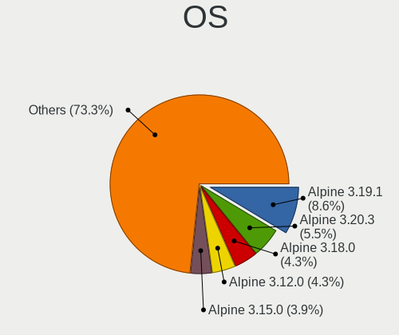
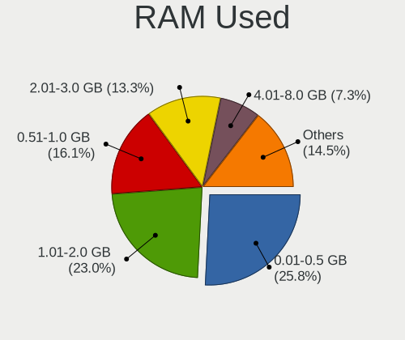
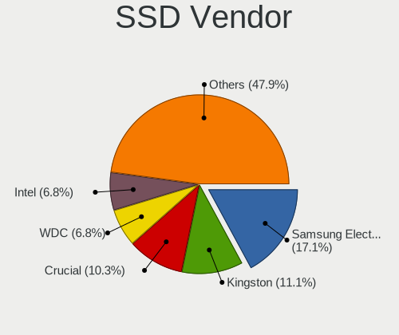
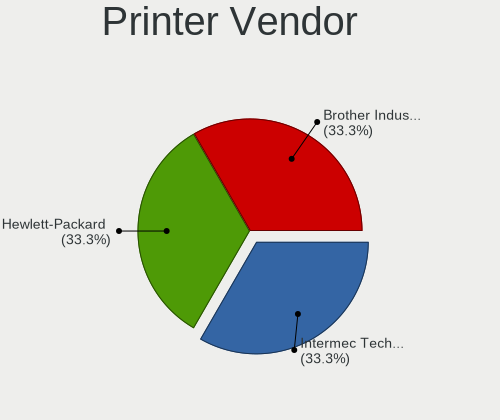

Alpine - Tested Hardware & Statistics
-------------------------------------

A project to collect tested hardware configurations for Alpine.

Anyone can contribute to this report by the [hw-probe](https://github.com/linuxhw/hw-probe) tool:

    sudo -E hw-probe -all -upload

Please contribute! Especially if your hardware is rare.

This is a report for all computer types. See also reports for [desktops](/Dist/Alpine/Desktop/README.md) and [notebooks](/Dist/Alpine/Notebook/README.md).

Contents
--------

* [ Test Cases ](#test-cases)

* [ System ](#system)
  - [ OS                       ](#os)
  - [ OS Family                ](#os-family)
  - [ Kernel                   ](#kernel)
  - [ Kernel Family            ](#kernel-family)
  - [ Kernel Major Ver.        ](#kernel-major-ver)
  - [ Arch                     ](#arch)
  - [ DE                       ](#de)
  - [ Display Server           ](#display-server)
  - [ Display Manager          ](#display-manager)
  - [ OS Lang                  ](#os-lang)
  - [ Boot Mode                ](#boot-mode)
  - [ Filesystem               ](#filesystem)
  - [ Part. scheme             ](#part-scheme)
  - [ Dual Boot with Linux/BSD ](#dual-boot-with-linuxbsd)
  - [ Dual Boot (Win)          ](#dual-boot-win)

* [ Board ](#board)
  - [ Vendor                   ](#vendor)
  - [ Model                    ](#model)
  - [ Model Family             ](#model-family)
  - [ MFG Year                 ](#mfg-year)
  - [ Form Factor              ](#form-factor)
  - [ Secure Boot              ](#secure-boot)
  - [ Coreboot                 ](#coreboot)
  - [ RAM Size                 ](#ram-size)
  - [ RAM Used                 ](#ram-used)
  - [ Total Drives             ](#total-drives)
  - [ Has CD-ROM               ](#has-cd-rom)
  - [ Has Ethernet             ](#has-ethernet)
  - [ Has WiFi                 ](#has-wifi)
  - [ Has Bluetooth            ](#has-bluetooth)

* [ Location ](#location)
  - [ Country                  ](#country)
  - [ City                     ](#city)

* [ Drives ](#drives)
  - [ Drive Vendor             ](#drive-vendor)
  - [ Drive Model              ](#drive-model)
  - [ HDD Vendor               ](#hdd-vendor)
  - [ SSD Vendor               ](#ssd-vendor)
  - [ Drive Kind               ](#drive-kind)
  - [ Drive Connector          ](#drive-connector)
  - [ Drive Size               ](#drive-size)
  - [ Space Total              ](#space-total)
  - [ Space Used               ](#space-used)
  - [ Malfunc. Drives          ](#malfunc-drives)
  - [ Malfunc. Drive Vendor    ](#malfunc-drive-vendor)
  - [ Malfunc. HDD Vendor      ](#malfunc-hdd-vendor)
  - [ Malfunc. Drive Kind      ](#malfunc-drive-kind)
  - [ Failed Drives            ](#failed-drives)
  - [ Failed Drive Vendor      ](#failed-drive-vendor)
  - [ Drive Status             ](#drive-status)

* [ Storage controller ](#storage-controller)
  - [ Storage Vendor           ](#storage-vendor)
  - [ Storage Model            ](#storage-model)
  - [ Storage Kind             ](#storage-kind)

* [ Processor ](#processor)
  - [ CPU Vendor               ](#cpu-vendor)
  - [ CPU Model                ](#cpu-model)
  - [ CPU Model Family         ](#cpu-model-family)
  - [ CPU Cores                ](#cpu-cores)
  - [ CPU Sockets              ](#cpu-sockets)
  - [ CPU Threads              ](#cpu-threads)
  - [ CPU Op-Modes             ](#cpu-op-modes)
  - [ CPU Microcode            ](#cpu-microcode)
  - [ CPU Microarch            ](#cpu-microarch)

* [ Graphics ](#graphics)
  - [ GPU Vendor               ](#gpu-vendor)
  - [ GPU Model                ](#gpu-model)
  - [ GPU Combo                ](#gpu-combo)
  - [ GPU Driver               ](#gpu-driver)
  - [ GPU Memory               ](#gpu-memory)

* [ Monitor ](#monitor)
  - [ Monitor Vendor           ](#monitor-vendor)
  - [ Monitor Model            ](#monitor-model)
  - [ Monitor Resolution       ](#monitor-resolution)
  - [ Monitor Diagonal         ](#monitor-diagonal)
  - [ Monitor Width            ](#monitor-width)
  - [ Aspect Ratio             ](#aspect-ratio)
  - [ Monitor Area             ](#monitor-area)
  - [ Pixel Density            ](#pixel-density)
  - [ Multiple Monitors        ](#multiple-monitors)

* [ Network ](#network)
  - [ Net Controller Vendor    ](#net-controller-vendor)
  - [ Net Controller Model     ](#net-controller-model)
  - [ Wireless Vendor          ](#wireless-vendor)
  - [ Wireless Model           ](#wireless-model)
  - [ Ethernet Vendor          ](#ethernet-vendor)
  - [ Ethernet Model           ](#ethernet-model)
  - [ Net Controller Kind      ](#net-controller-kind)
  - [ Used Controller          ](#used-controller)
  - [ NICs                     ](#nics)
  - [ IPv6                     ](#ipv6)

* [ Bluetooth ](#bluetooth)
  - [ Bluetooth Vendor         ](#bluetooth-vendor)
  - [ Bluetooth Model          ](#bluetooth-model)

* [ Sound ](#sound)
  - [ Sound Vendor             ](#sound-vendor)
  - [ Sound Model              ](#sound-model)

* [ Memory ](#memory)
  - [ Memory Vendor            ](#memory-vendor)
  - [ Memory Model             ](#memory-model)
  - [ Memory Kind              ](#memory-kind)
  - [ Memory Form Factor       ](#memory-form-factor)
  - [ Memory Size              ](#memory-size)
  - [ Memory Speed             ](#memory-speed)

* [ Printers & scanners ](#printers--scanners)
  - [ Printer Vendor           ](#printer-vendor)
  - [ Printer Model            ](#printer-model)
  - [ Scanner Vendor           ](#scanner-vendor)
  - [ Scanner Model            ](#scanner-model)

* [ Camera ](#camera)
  - [ Camera Vendor            ](#camera-vendor)
  - [ Camera Model             ](#camera-model)

* [ Security ](#security)
  - [ Fingerprint Vendor       ](#fingerprint-vendor)
  - [ Fingerprint Model        ](#fingerprint-model)
  - [ Chipcard Vendor          ](#chipcard-vendor)
  - [ Chipcard Model           ](#chipcard-model)

* [ Unsupported ](#unsupported)
  - [ Unsupported Devices      ](#unsupported-devices)
  - [ Unsupported Device Types ](#unsupported-device-types)

Test Cases
----------

Total: 239

| Vendor        | Model                       | Form-Factor | Probe                                                      | Date         |
|---------------|-----------------------------|-------------|------------------------------------------------------------|--------------|
| ASUSTek       | Z87-DELUXE                  | Desktop     | [018238aa79](https://linux-hardware.org/?probe=018238aa79) | Jan 01, 2024 |
| Raspberry ... | Raspberry Pi                | Soc         | [cee7f7036e](https://linux-hardware.org/?probe=cee7f7036e) | Dec 31, 2023 |
| Raspberry ... | Raspberry Pi                | Soc         | [d6121834a4](https://linux-hardware.org/?probe=d6121834a4) | Dec 31, 2023 |
| Chuwi         | HeroBook Pro                | Notebook    | [7528cb1c24](https://linux-hardware.org/?probe=7528cb1c24) | Dec 30, 2023 |
| Chuwi         | HeroBook Pro                | Notebook    | [f071a372c0](https://linux-hardware.org/?probe=f071a372c0) | Dec 29, 2023 |
| Acer          | Aspire A515-54              | Notebook    | [ea0b7cd870](https://linux-hardware.org/?probe=ea0b7cd870) | Dec 26, 2023 |
| Acer          | TDPS05                      | Desktop     | [ce9b5d0c48](https://linux-hardware.org/?probe=ce9b5d0c48) | Dec 23, 2023 |
| Acer          | TDPS05                      | Desktop     | [d0260b1327](https://linux-hardware.org/?probe=d0260b1327) | Dec 23, 2023 |
| Chuwi         | HeroBook Pro                | Notebook    | [2432d4f585](https://linux-hardware.org/?probe=2432d4f585) | Dec 22, 2023 |
| Lenovo        | V15 G3 IAP 82TT             | Notebook    | [d33b5845ef](https://linux-hardware.org/?probe=d33b5845ef) | Dec 20, 2023 |
| Chuwi         | HeroBook Pro                | Notebook    | [4b404f8509](https://linux-hardware.org/?probe=4b404f8509) | Dec 15, 2023 |
| ZOTAC         | Unknown                     | Desktop     | [a91d567af3](https://linux-hardware.org/?probe=a91d567af3) | Dec 14, 2023 |
| Dell          | Latitude 3420               | Notebook    | [b344d71410](https://linux-hardware.org/?probe=b344d71410) | Dec 13, 2023 |
| HP            | Laptop 17-cp0xxx            | Notebook    | [2199caf331](https://linux-hardware.org/?probe=2199caf331) | Dec 10, 2023 |
| Compaq        | 0684h                       | Desktop     | [54c2d84103](https://linux-hardware.org/?probe=54c2d84103) | Dec 02, 2023 |
| Compaq        | 0684h                       | Desktop     | [b2d96b48dc](https://linux-hardware.org/?probe=b2d96b48dc) | Dec 02, 2023 |
| ECS           | M789CG                      | Desktop     | [7c2e2de188](https://linux-hardware.org/?probe=7c2e2de188) | Dec 01, 2023 |
| ASUSTek       | 1001PX                      | Notebook    | [74bc5aeded](https://linux-hardware.org/?probe=74bc5aeded) | Nov 22, 2023 |
| ASUSTek       | 1001PX                      | Notebook    | [2069694d95](https://linux-hardware.org/?probe=2069694d95) | Nov 22, 2023 |
| Chuwi         | HeroBook Pro                | Notebook    | [b312b34d74](https://linux-hardware.org/?probe=b312b34d74) | Nov 20, 2023 |
| ASUSTek       | VivoBook_ASUSLaptop X712... | Notebook    | [f576d94ac0](https://linux-hardware.org/?probe=f576d94ac0) | Nov 17, 2023 |
| Gigabyte      | X570 I AORUS PRO WIFI       | Desktop     | [1909f3fbff](https://linux-hardware.org/?probe=1909f3fbff) | Nov 15, 2023 |
| Chuwi         | HeroBook Pro                | Notebook    | [f48f05994e](https://linux-hardware.org/?probe=f48f05994e) | Nov 14, 2023 |
| Apple         | MacBookAir5,2               | Notebook    | [60e418e27f](https://linux-hardware.org/?probe=60e418e27f) | Nov 14, 2023 |
| Unknown       | Unknown                     | Desktop     | [80774e2d18](https://linux-hardware.org/?probe=80774e2d18) | Nov 14, 2023 |
| Unknown       | MT6737 (DT)                 | Soc         | [ed82b4c1c7](https://linux-hardware.org/?probe=ed82b4c1c7) | Nov 12, 2023 |
| ZOTAC         | ZBOX-EN1070/1060,EN1070K... | Mini pc     | [bfd62247aa](https://linux-hardware.org/?probe=bfd62247aa) | Nov 12, 2023 |
| Chuwi         | HeroBook Pro                | Notebook    | [65a7263504](https://linux-hardware.org/?probe=65a7263504) | Nov 09, 2023 |
| ECS           | M789CG                      | Desktop     | [49edfe005c](https://linux-hardware.org/?probe=49edfe005c) | Nov 07, 2023 |
| Gigabyte      | 945GCM-S2C                  | Desktop     | [c714bf35c2](https://linux-hardware.org/?probe=c714bf35c2) | Nov 06, 2023 |
| Chuwi         | HeroBook Pro                | Notebook    | [ccc7d658ea](https://linux-hardware.org/?probe=ccc7d658ea) | Nov 06, 2023 |
| ECS           | M789CG                      | Desktop     | [87fe73ee84](https://linux-hardware.org/?probe=87fe73ee84) | Nov 02, 2023 |
| Lenovo        | Flex 2-14 20404             | Notebook    | [0656d1a0a8](https://linux-hardware.org/?probe=0656d1a0a8) | Oct 28, 2023 |
| Chuwi         | HeroBook Pro                | Notebook    | [e116ef83e9](https://linux-hardware.org/?probe=e116ef83e9) | Oct 27, 2023 |
| Chuwi         | HeroBook Pro                | Notebook    | [6df3cd6820](https://linux-hardware.org/?probe=6df3cd6820) | Oct 20, 2023 |
| ECS           | M789CG                      | Desktop     | [b767549953](https://linux-hardware.org/?probe=b767549953) | Oct 15, 2023 |
| ASRock        | Q1900B-ITX                  | Desktop     | [8625166ef3](https://linux-hardware.org/?probe=8625166ef3) | Oct 14, 2023 |
| ECS           | M789CG                      | Desktop     | [6f446a6f77](https://linux-hardware.org/?probe=6f446a6f77) | Oct 14, 2023 |
| ECS           | M789CG                      | Desktop     | [0a0df79fcd](https://linux-hardware.org/?probe=0a0df79fcd) | Oct 14, 2023 |
| Inventec      | D CLASS A02                 | Desktop     | [9559c016fb](https://linux-hardware.org/?probe=9559c016fb) | Oct 13, 2023 |
| ASRock        | Z790M-ITX WiFi              | Desktop     | [560aec8a01](https://linux-hardware.org/?probe=560aec8a01) | Oct 06, 2023 |
| Chuwi         | HeroBook Pro                | Notebook    | [8356867b4d](https://linux-hardware.org/?probe=8356867b4d) | Oct 04, 2023 |
| Chuwi         | HeroBook Pro                | Notebook    | [1d2bd102c6](https://linux-hardware.org/?probe=1d2bd102c6) | Sep 28, 2023 |
| Chuwi         | HeroBook Pro                | Notebook    | [6295f7193c](https://linux-hardware.org/?probe=6295f7193c) | Sep 27, 2023 |
| Chuwi         | HeroBook Pro                | Notebook    | [793c32918d](https://linux-hardware.org/?probe=793c32918d) | Sep 23, 2023 |
| ASRock        | H55M-LE                     | Desktop     | [6b7e52fd8c](https://linux-hardware.org/?probe=6b7e52fd8c) | Sep 20, 2023 |
| ASRock        | H55M-LE                     | Desktop     | [ceefe742e2](https://linux-hardware.org/?probe=ceefe742e2) | Sep 20, 2023 |
| ASUSTek       | TUF Gaming FX505DD_FX505... | Notebook    | [b858f753b2](https://linux-hardware.org/?probe=b858f753b2) | Sep 19, 2023 |
| Dell          | 0RY007                      | Desktop     | [3bcbd1f6c3](https://linux-hardware.org/?probe=3bcbd1f6c3) | Sep 19, 2023 |
| Unknown       | Unknown                     | Notebook    | [cc13e0926e](https://linux-hardware.org/?probe=cc13e0926e) | Sep 17, 2023 |
| HP            | Pavilion Gaming Laptop 1... | Notebook    | [416798463e](https://linux-hardware.org/?probe=416798463e) | Sep 16, 2023 |
| LG Electro... | LW25-B7HG                   | Notebook    | [e9998203e6](https://linux-hardware.org/?probe=e9998203e6) | Sep 12, 2023 |
| Chuwi         | HeroBook Pro                | Notebook    | [d59c2170bb](https://linux-hardware.org/?probe=d59c2170bb) | Sep 08, 2023 |
| Unknown       | MT6737 (DT)                 | Soc         | [ca65758798](https://linux-hardware.org/?probe=ca65758798) | Sep 07, 2023 |
| Chuwi         | HeroBook Pro                | Notebook    | [ed1061dbb1](https://linux-hardware.org/?probe=ed1061dbb1) | Sep 07, 2023 |
| Dell          | 096JG8 A01                  | Desktop     | [00e5bebc6a](https://linux-hardware.org/?probe=00e5bebc6a) | Sep 06, 2023 |
| Chuwi         | HeroBook Pro                | Notebook    | [30368099b8](https://linux-hardware.org/?probe=30368099b8) | Sep 06, 2023 |
| Chuwi         | HeroBook Pro                | Notebook    | [f71590bc2b](https://linux-hardware.org/?probe=f71590bc2b) | Sep 03, 2023 |
| HP            | Presario V2000 (ES307UA#... | Notebook    | [6c727b9e00](https://linux-hardware.org/?probe=6c727b9e00) | Aug 23, 2023 |
| Dell          | 007MXD A00                  | Mini pc     | [1eab959e9a](https://linux-hardware.org/?probe=1eab959e9a) | Aug 15, 2023 |
| Chuwi         | HeroBook Pro                | Notebook    | [d81314b86d](https://linux-hardware.org/?probe=d81314b86d) | Aug 12, 2023 |
| Chuwi         | HeroBook Pro                | Notebook    | [4d26902a65](https://linux-hardware.org/?probe=4d26902a65) | Aug 12, 2023 |
| Chuwi         | HeroBook Pro                | Notebook    | [d4a16b0b3e](https://linux-hardware.org/?probe=d4a16b0b3e) | Aug 10, 2023 |
| Chuwi         | HeroBook Pro                | Notebook    | [294dcce02b](https://linux-hardware.org/?probe=294dcce02b) | Aug 04, 2023 |
| Apple         | Mac-8ED6AF5B48C039E1 Mac... | Mini pc     | [2ea9aa9b27](https://linux-hardware.org/?probe=2ea9aa9b27) | Aug 02, 2023 |
| Apple         | Mac-8ED6AF5B48C039E1 Mac... | Mini pc     | [3dcdce4c6d](https://linux-hardware.org/?probe=3dcdce4c6d) | Aug 02, 2023 |
| Dell          | Latitude 5430 Rugged        | Notebook    | [051aebd1a2](https://linux-hardware.org/?probe=051aebd1a2) | Jul 24, 2023 |
| ASUSTek       | A3AC                        | Notebook    | [1bf0a25c8e](https://linux-hardware.org/?probe=1bf0a25c8e) | Jul 22, 2023 |
| ASUSTek       | A3AC                        | Notebook    | [f7fb9875de](https://linux-hardware.org/?probe=f7fb9875de) | Jul 22, 2023 |
| ASRock        | 970 Extreme4                | Desktop     | [de055c3a95](https://linux-hardware.org/?probe=de055c3a95) | Jul 17, 2023 |
| ASUSTek       | Z170-E                      | Desktop     | [8be9720ca6](https://linux-hardware.org/?probe=8be9720ca6) | Jun 29, 2023 |
| Toshiba       | Satellite Pro L50-A         | Notebook    | [f1907449fa](https://linux-hardware.org/?probe=f1907449fa) | Jun 24, 2023 |
| Google        | Kefka                       | Notebook    | [c5d9002e23](https://linux-hardware.org/?probe=c5d9002e23) | Jun 23, 2023 |
| ASUSTek       | PRIME B360M-C               | Desktop     | [4dca77df51](https://linux-hardware.org/?probe=4dca77df51) | Jun 21, 2023 |
| Dell          | 007MXD A00                  | Mini pc     | [b303b8ce0d](https://linux-hardware.org/?probe=b303b8ce0d) | Jun 07, 2023 |
| Dell          | 007MXD A00                  | Mini pc     | [8b904db6cf](https://linux-hardware.org/?probe=8b904db6cf) | Jun 06, 2023 |
| Intel         | NUC7i5BNB J31144-310        | Mini pc     | [0ad2309a50](https://linux-hardware.org/?probe=0ad2309a50) | Jun 05, 2023 |
| Lenovo        | ThinkPad T440p              | Notebook    | [c058d92130](https://linux-hardware.org/?probe=c058d92130) | Jun 05, 2023 |
| Apple         | Mac-F2268CC8                | All in one  | [374a3fef00](https://linux-hardware.org/?probe=374a3fef00) | Jun 05, 2023 |
| Apple         | Mac-F2268CC8                | All in one  | [413d6e5373](https://linux-hardware.org/?probe=413d6e5373) | Jun 05, 2023 |
| Toshiba       | WT8-A                       | Notebook    | [4dc30f1c10](https://linux-hardware.org/?probe=4dc30f1c10) | Jun 04, 2023 |
| MSI           | U200                        | Notebook    | [2fe4d70ea1](https://linux-hardware.org/?probe=2fe4d70ea1) | Jun 02, 2023 |
| HP            | 83E2                        | Desktop     | [0db8dcbc23](https://linux-hardware.org/?probe=0db8dcbc23) | May 28, 2023 |
| MSI           | MAG B460M MORTAR            | Desktop     | [da74cacf64](https://linux-hardware.org/?probe=da74cacf64) | May 18, 2023 |
| Gigabyte      | Z170X-UD5-CF                | Desktop     | [429dc207a6](https://linux-hardware.org/?probe=429dc207a6) | May 15, 2023 |
| Gigabyte      | Z170X-UD5-CF                | Desktop     | [f887e6f037](https://linux-hardware.org/?probe=f887e6f037) | May 15, 2023 |
| UGREEN        | DX4600                      | Desktop     | [cbe70de89c](https://linux-hardware.org/?probe=cbe70de89c) | Apr 19, 2023 |
| Notebook      | NV4XMB,ME,MZ                | Notebook    | [125884d17a](https://linux-hardware.org/?probe=125884d17a) | Apr 05, 2023 |
| Olivetti      | Spring Peak                 | Notebook    | [9678c685d7](https://linux-hardware.org/?probe=9678c685d7) | Mar 31, 2023 |
| Olivetti      | Spring Peak                 | Notebook    | [7878f53f36](https://linux-hardware.org/?probe=7878f53f36) | Mar 31, 2023 |
| ASUSTek       | PRIME B360M-C               | Desktop     | [8cf7b9cc76](https://linux-hardware.org/?probe=8cf7b9cc76) | Mar 23, 2023 |
| Fujitsu       | FMVNP8AE                    | Notebook    | [10efc9f976](https://linux-hardware.org/?probe=10efc9f976) | Mar 21, 2023 |
| Intel         | D525MW AAE93082-401         | Desktop     | [590309a32b](https://linux-hardware.org/?probe=590309a32b) | Mar 18, 2023 |
| Intel         | D525MW AAE93082-401         | Desktop     | [bc847b4586](https://linux-hardware.org/?probe=bc847b4586) | Mar 09, 2023 |
| Intel         | D525MW AAE93082-401         | Desktop     | [d02959f9ad](https://linux-hardware.org/?probe=d02959f9ad) | Mar 02, 2023 |
| Lenovo        | ThinkPad E590 20NB0012RT    | Notebook    | [4c9bfc239a](https://linux-hardware.org/?probe=4c9bfc239a) | Feb 26, 2023 |
| Acer          | Aspire ES1-132              | Notebook    | [386da062e2](https://linux-hardware.org/?probe=386da062e2) | Feb 23, 2023 |
| Lenovo        | V14-ADA 82C6                | Notebook    | [3bd522dc2c](https://linux-hardware.org/?probe=3bd522dc2c) | Feb 13, 2023 |
| Lenovo        | V14-ADA 82C6                | Notebook    | [cfa774a092](https://linux-hardware.org/?probe=cfa774a092) | Feb 13, 2023 |
| Chuwi         | HeroBook Pro                | Notebook    | [b3d00219b0](https://linux-hardware.org/?probe=b3d00219b0) | Feb 07, 2023 |
| Google        | Leona                       | Notebook    | [59b146e197](https://linux-hardware.org/?probe=59b146e197) | Jan 21, 2023 |
| ASRock        | X470 Master SLI/ac          | Desktop     | [d8f1121a19](https://linux-hardware.org/?probe=d8f1121a19) | Jan 19, 2023 |
| Lenovo        | SHARKBAY 0B98401 WIN        | Desktop     | [68a73ee517](https://linux-hardware.org/?probe=68a73ee517) | Jan 19, 2023 |
| ASRock        | X470 Master SLI/ac          | Desktop     | [6b6a4929de](https://linux-hardware.org/?probe=6b6a4929de) | Jan 16, 2023 |
| ASRock        | X470 Master SLI/ac          | Desktop     | [8775308115](https://linux-hardware.org/?probe=8775308115) | Jan 15, 2023 |
| Gigabyte      | X570S AERO G                | Desktop     | [473b4d0e6e](https://linux-hardware.org/?probe=473b4d0e6e) | Jan 11, 2023 |
| Lenovo        | SHARKBAY 0B98401 WIN        | Desktop     | [747c3d8c1f](https://linux-hardware.org/?probe=747c3d8c1f) | Jan 11, 2023 |
| Dell          | Inspiron 3558               | Notebook    | [9635348d10](https://linux-hardware.org/?probe=9635348d10) | Jan 09, 2023 |
| Lenovo        | ThinkPad X131e 33711Q7      | Notebook    | [3336313cae](https://linux-hardware.org/?probe=3336313cae) | Jan 06, 2023 |
| Gigabyte      | X570S AERO G                | Desktop     | [053b8697ce](https://linux-hardware.org/?probe=053b8697ce) | Jan 06, 2023 |
| Lenovo        | ThinkPad X131e 33711Q7      | Notebook    | [7e0f8a38bf](https://linux-hardware.org/?probe=7e0f8a38bf) | Jan 04, 2023 |
| ASUSTek       | TUF Gaming FX505DD_FX505... | Notebook    | [5da7f2d3a9](https://linux-hardware.org/?probe=5da7f2d3a9) | Dec 27, 2022 |
| Dell          | Inspiron N5010              | Notebook    | [389475ec30](https://linux-hardware.org/?probe=389475ec30) | Dec 25, 2022 |
| Dell          | 03V7GF A01                  | Desktop     | [3847c61b81](https://linux-hardware.org/?probe=3847c61b81) | Dec 17, 2022 |
| Dell          | 03V7GF A01                  | Desktop     | [e491b54a3c](https://linux-hardware.org/?probe=e491b54a3c) | Dec 17, 2022 |
| Gigabyte      | B550 AORUS ELITE V2         | Desktop     | [bbf4464c41](https://linux-hardware.org/?probe=bbf4464c41) | Nov 27, 2022 |
| Raspberry ... | Raspberry Pi                | Soc         | [ec837e35d6](https://linux-hardware.org/?probe=ec837e35d6) | Nov 22, 2022 |
| Fujitsu       | FujitsuTP7000 -1            | Desktop     | [89198d262f](https://linux-hardware.org/?probe=89198d262f) | Nov 17, 2022 |
| Lenovo        | 31900058 STD                | Desktop     | [d7cc344b2f](https://linux-hardware.org/?probe=d7cc344b2f) | Oct 31, 2022 |
| Supermicro    | X10SLL-F                    | Server      | [ab9f37ab3a](https://linux-hardware.org/?probe=ab9f37ab3a) | Oct 27, 2022 |
| Dell          | Inspiron 5447               | Notebook    | [735ac089ab](https://linux-hardware.org/?probe=735ac089ab) | Oct 17, 2022 |
| Lenovo        | 31900058 STD                | Desktop     | [9f7158b883](https://linux-hardware.org/?probe=9f7158b883) | Oct 16, 2022 |
| HP            | Presario V4000 (EQ608PA#... | Notebook    | [f462d80b2a](https://linux-hardware.org/?probe=f462d80b2a) | Oct 06, 2022 |
| HP            | 1493                        | Desktop     | [60ebd1d8dd](https://linux-hardware.org/?probe=60ebd1d8dd) | Sep 29, 2022 |
| Gateway       | SX2185                      | Desktop     | [8372be8fe3](https://linux-hardware.org/?probe=8372be8fe3) | Sep 29, 2022 |
| ASRock        | H81M                        | Desktop     | [d59c4705a2](https://linux-hardware.org/?probe=d59c4705a2) | Aug 17, 2022 |
| Toshiba       | Satellite M645              | Notebook    | [b342f11704](https://linux-hardware.org/?probe=b342f11704) | Aug 16, 2022 |
| Toshiba       | Satellite M645              | Notebook    | [f64d98a9e1](https://linux-hardware.org/?probe=f64d98a9e1) | Aug 16, 2022 |
| Dell          | Inspiron 3180               | Notebook    | [d4dbaf9ec8](https://linux-hardware.org/?probe=d4dbaf9ec8) | Aug 14, 2022 |
| Fujitsu       | LIFEBOOK P702               | Notebook    | [fdbe6c32cd](https://linux-hardware.org/?probe=fdbe6c32cd) | Aug 06, 2022 |
| Unknown       | Unknown                     | Soc         | [9ebddaa953](https://linux-hardware.org/?probe=9ebddaa953) | Jul 31, 2022 |
| Intel         | DH61BF AAG81311-101         | Desktop     | [5a3ed0cf62](https://linux-hardware.org/?probe=5a3ed0cf62) | Jul 30, 2022 |
| Intel         | DH61BF AAG81311-101         | Desktop     | [719bbf817c](https://linux-hardware.org/?probe=719bbf817c) | Jul 30, 2022 |
| Intel         | DQ67SW AAG12527-310         | Desktop     | [9a4907d88c](https://linux-hardware.org/?probe=9a4907d88c) | Jul 17, 2022 |
| Unknown       | Unknown                     | Desktop     | [d857b93614](https://linux-hardware.org/?probe=d857b93614) | Jul 13, 2022 |
| Sony          | VGN-UX27GN                  | Notebook    | [ed20bd45a4](https://linux-hardware.org/?probe=ed20bd45a4) | Jun 20, 2022 |
| IBM           | ThinkPad X40 2371LBG        | Notebook    | [e7610b86d4](https://linux-hardware.org/?probe=e7610b86d4) | Jun 20, 2022 |
| HP            | EliteBook 8460p             | Notebook    | [a0a6c37152](https://linux-hardware.org/?probe=a0a6c37152) | Jun 19, 2022 |
| Lenovo        | 31900058 STD                | Desktop     | [2f6356a177](https://linux-hardware.org/?probe=2f6356a177) | Jun 17, 2022 |
| ASUSTek       | X555LAB                     | Notebook    | [e47cf70de1](https://linux-hardware.org/?probe=e47cf70de1) | Jun 17, 2022 |
| Lenovo        | 31900058 STD                | Desktop     | [582fd88dbe](https://linux-hardware.org/?probe=582fd88dbe) | Jun 14, 2022 |
| MSI           | Z170A GAMING PRO            | Desktop     | [73b3e29101](https://linux-hardware.org/?probe=73b3e29101) | Jun 14, 2022 |
| Fanless Mi... | Rev GMLR1                   | Mini pc     | [a7f61e2b9b](https://linux-hardware.org/?probe=a7f61e2b9b) | May 28, 2022 |
| ASRock        | B460 Phantom Gaming 4       | Desktop     | [e692b2a091](https://linux-hardware.org/?probe=e692b2a091) | May 26, 2022 |
| HP            | ENVY Sleekbook 6 PC         | Notebook    | [28b7e84c50](https://linux-hardware.org/?probe=28b7e84c50) | May 24, 2022 |
| HP            | ENVY Sleekbook 6 PC         | Notebook    | [5d78835d90](https://linux-hardware.org/?probe=5d78835d90) | May 24, 2022 |
| ASUSTek       | H97-PLUS                    | Desktop     | [cab2025064](https://linux-hardware.org/?probe=cab2025064) | May 24, 2022 |
| MSI           | J1900I                      | Desktop     | [86f37a71f5](https://linux-hardware.org/?probe=86f37a71f5) | May 15, 2022 |
| MSI           | J1900I                      | Desktop     | [5a48d83596](https://linux-hardware.org/?probe=5a48d83596) | May 15, 2022 |
| ASUSTek       | N10Jc                       | Notebook    | [ae20ca4c7c](https://linux-hardware.org/?probe=ae20ca4c7c) | May 05, 2022 |
| ASUSTek       | N10Jc                       | Notebook    | [1f688a5b2d](https://linux-hardware.org/?probe=1f688a5b2d) | May 05, 2022 |
| HP            | ProBook 4310s               | Notebook    | [a37901ae30](https://linux-hardware.org/?probe=a37901ae30) | Apr 26, 2022 |
| Raspberry ... | Raspberry Pi 4 Model B R... | Soc         | [f0671e360b](https://linux-hardware.org/?probe=f0671e360b) | Apr 25, 2022 |
| ASUSTek       | Z97-K                       | Desktop     | [53cba6b4f8](https://linux-hardware.org/?probe=53cba6b4f8) | Apr 14, 2022 |
| Haier         | U144S                       | Notebook    | [9a4827b852](https://linux-hardware.org/?probe=9a4827b852) | Mar 26, 2022 |
| Acer          | Aspire E5-553G              | Notebook    | [930cc740b2](https://linux-hardware.org/?probe=930cc740b2) | Mar 24, 2022 |
| Lenovo        | ThinkPad T420 42364F2       | Notebook    | [d82acaba71](https://linux-hardware.org/?probe=d82acaba71) | Mar 23, 2022 |
| Dell          | XPS 15 7590                 | Notebook    | [df2a40363b](https://linux-hardware.org/?probe=df2a40363b) | Mar 18, 2022 |
| ASUSTek       | ZenBook UX431FA             | Notebook    | [b3cbed05f5](https://linux-hardware.org/?probe=b3cbed05f5) | Mar 10, 2022 |
| Lenovo        | ThinkPad X1 Carbon 6th 2... | Notebook    | [94cf359935](https://linux-hardware.org/?probe=94cf359935) | Feb 17, 2022 |
| Lenovo        | ThinkPad X1 Carbon 6th 2... | Notebook    | [822688debe](https://linux-hardware.org/?probe=822688debe) | Feb 16, 2022 |
| Apple         | Mac-F65AE981FFA204ED Mac... | Mini pc     | [a72ab8595e](https://linux-hardware.org/?probe=a72ab8595e) | Jan 30, 2022 |
| Gigabyte      | Z490I AORUS ULTRA           | Desktop     | [908edb3724](https://linux-hardware.org/?probe=908edb3724) | Jan 27, 2022 |
| Dell          | XPS 13 7390 2-in-1          | Convertible | [6deddd3d32](https://linux-hardware.org/?probe=6deddd3d32) | Jan 25, 2022 |
| ASUSTek       | ZenBook UX431FA             | Notebook    | [519a7a72ab](https://linux-hardware.org/?probe=519a7a72ab) | Jan 24, 2022 |
| HP            | EliteBook 1040 G3 Notebo... | Notebook    | [465c51678d](https://linux-hardware.org/?probe=465c51678d) | Jan 01, 2022 |
| AMI           | Aptio CRB                   | Mini pc     | [f483ddc44f](https://linux-hardware.org/?probe=f483ddc44f) | Jan 01, 2022 |
| MSI           | GL72M 7REX                  | Notebook    | [6ada534c8b](https://linux-hardware.org/?probe=6ada534c8b) | Dec 13, 2021 |
| Dell          | 02YRK5 A02                  | Desktop     | [58c2ed388b](https://linux-hardware.org/?probe=58c2ed388b) | Dec 02, 2021 |
| Lenovo        | ThinkPad W700 2752RZ2       | Notebook    | [66ea0a02cb](https://linux-hardware.org/?probe=66ea0a02cb) | Nov 25, 2021 |
| Supermicro    | X10SLL-F                    | Server      | [84ed224f36](https://linux-hardware.org/?probe=84ed224f36) | Nov 24, 2021 |
| HP            | 21B4 A01                    | Desktop     | [98accc83e4](https://linux-hardware.org/?probe=98accc83e4) | Nov 11, 2021 |
| Dell          | Inspiron MM061              | Notebook    | [e293d0cf05](https://linux-hardware.org/?probe=e293d0cf05) | Nov 02, 2021 |
| HP            | Stream 7 Tablet             | Tablet      | [0297d0f732](https://linux-hardware.org/?probe=0297d0f732) | Oct 25, 2021 |
| HP            | Stream 7 Tablet             | Tablet      | [45b1bba577](https://linux-hardware.org/?probe=45b1bba577) | Oct 24, 2021 |
| ASUSTek       | X550EA                      | Notebook    | [bbed87466a](https://linux-hardware.org/?probe=bbed87466a) | Oct 05, 2021 |
| HP            | ProLiant DL360 G6           | Server      | [6f87d9f9b8](https://linux-hardware.org/?probe=6f87d9f9b8) | Oct 01, 2021 |
| HP            | ProLiant DL360 G6           | Server      | [2668fd795b](https://linux-hardware.org/?probe=2668fd795b) | Oct 01, 2021 |
| HP            | Compaq Mini CQ10-600        | Notebook    | [4603b3336e](https://linux-hardware.org/?probe=4603b3336e) | Oct 01, 2021 |
| Lenovo        | IdeaPad 320-15AST 80XV      | Notebook    | [9ff8561f02](https://linux-hardware.org/?probe=9ff8561f02) | Sep 30, 2021 |
| Lenovo        | Yoga 14sARH 2021 82LB       | Notebook    | [9fa77d455d](https://linux-hardware.org/?probe=9fa77d455d) | Sep 30, 2021 |
| Unknown       | Unknown                     | Notebook    | [d3c742bac9](https://linux-hardware.org/?probe=d3c742bac9) | Sep 26, 2021 |
| HP            | Stream 7 Tablet             | Tablet      | [254589b0bd](https://linux-hardware.org/?probe=254589b0bd) | Sep 16, 2021 |
| HP            | Stream 7 Tablet             | Tablet      | [f5bdbbea34](https://linux-hardware.org/?probe=f5bdbbea34) | Sep 15, 2021 |
| Dell          | 0T10XW A00                  | Desktop     | [585636f7fe](https://linux-hardware.org/?probe=585636f7fe) | Sep 08, 2021 |
| Shuttle       | FS81                        | Desktop     | [9a98a31681](https://linux-hardware.org/?probe=9a98a31681) | Sep 06, 2021 |
| Pegatron      | Deepcam                     | Notebook    | [5326e6bf39](https://linux-hardware.org/?probe=5326e6bf39) | Jul 18, 2021 |
| Chuwi         | HeroBook Pro                | Notebook    | [3199a22608](https://linux-hardware.org/?probe=3199a22608) | Jul 15, 2021 |
| HP            | EliteBook 2740p             | Notebook    | [66479cb1dd](https://linux-hardware.org/?probe=66479cb1dd) | Jul 09, 2021 |
| HP            | EliteBook 2740p             | Notebook    | [652fa48f49](https://linux-hardware.org/?probe=652fa48f49) | Jul 08, 2021 |
| ASUSTek       | X200MA                      | Notebook    | [c9edeec38a](https://linux-hardware.org/?probe=c9edeec38a) | Jun 26, 2021 |
| HP            | Laptop 14-dq1xxx            | Notebook    | [f1b8c01b96](https://linux-hardware.org/?probe=f1b8c01b96) | Jun 22, 2021 |
| IBM           | 264070A                     | Notebook    | [c057e54603](https://linux-hardware.org/?probe=c057e54603) | Jun 08, 2021 |
| HP            | Mini 110-3500               | Notebook    | [be40a38710](https://linux-hardware.org/?probe=be40a38710) | Jun 06, 2021 |
| HP            | ENVY Sleekbook 6 PC         | Notebook    | [0a2464e592](https://linux-hardware.org/?probe=0a2464e592) | Jun 06, 2021 |
| Dell          | 0VRWRC A00                  | Desktop     | [37a6ad6e02](https://linux-hardware.org/?probe=37a6ad6e02) | Apr 09, 2021 |
| Dell          | 0DPRKF A07                  | Server      | [dee1f70644](https://linux-hardware.org/?probe=dee1f70644) | Mar 28, 2021 |
| ASUSTek       | P8H67-V                     | Desktop     | [89edd8b343](https://linux-hardware.org/?probe=89edd8b343) | Mar 17, 2021 |
| F5 Network... | PCA-0377-05                 | Server      | [14c76e0c83](https://linux-hardware.org/?probe=14c76e0c83) | Feb 28, 2021 |
| Intel         | NUC6i7KYB H90766-406        | Mini pc     | [0a01176cbe](https://linux-hardware.org/?probe=0a01176cbe) | Feb 23, 2021 |
| HP            | ProLiant MicroServer Gen... | Desktop     | [af637820c2](https://linux-hardware.org/?probe=af637820c2) | Feb 12, 2021 |
| Acer          | Aspire ES1-512              | Notebook    | [01ad8fc793](https://linux-hardware.org/?probe=01ad8fc793) | Jan 30, 2021 |
| Acer          | Aspire 5920G                | Notebook    | [7cf5d7b04a](https://linux-hardware.org/?probe=7cf5d7b04a) | Jan 08, 2021 |
| HP            | Compaq Mini CQ10-600        | Notebook    | [fe7ee46763](https://linux-hardware.org/?probe=fe7ee46763) | Jan 08, 2021 |
| Gateway       | MX3631m                     | Notebook    | [15d8283384](https://linux-hardware.org/?probe=15d8283384) | Jan 03, 2021 |
| Dell          | Studio 1747                 | Notebook    | [b4e0e289f6](https://linux-hardware.org/?probe=b4e0e289f6) | Dec 29, 2020 |
| VIA Techno... | KM266APro-835               | Desktop     | [1334ad3f74](https://linux-hardware.org/?probe=1334ad3f74) | Dec 22, 2020 |
| Dell          | Inspiron 3180               | Notebook    | [4b05b65d0e](https://linux-hardware.org/?probe=4b05b65d0e) | Dec 16, 2020 |
| Dell          | Inspiron 3180               | Notebook    | [0bc140f6f6](https://linux-hardware.org/?probe=0bc140f6f6) | Dec 16, 2020 |
| ASUSTek       | E502SA                      | Notebook    | [0a25648158](https://linux-hardware.org/?probe=0a25648158) | Dec 05, 2020 |
| IBM           | 26446AG                     | Notebook    | [f004231106](https://linux-hardware.org/?probe=f004231106) | Nov 15, 2020 |
| IBM           | 26446AG                     | Notebook    | [29affa3577](https://linux-hardware.org/?probe=29affa3577) | Nov 15, 2020 |
| HP            | 2B0D A01                    | All in one  | [5c13b7bb96](https://linux-hardware.org/?probe=5c13b7bb96) | Nov 03, 2020 |
| Google        | Samus                       | Notebook    | [efe40a5a38](https://linux-hardware.org/?probe=efe40a5a38) | Oct 13, 2020 |
| Fujitsu       | D2779 S26361-D2779-A1       | Desktop     | [07795a357a](https://linux-hardware.org/?probe=07795a357a) | Oct 09, 2020 |
| Dell          | Inspiron 5566               | Notebook    | [a12b4d304a](https://linux-hardware.org/?probe=a12b4d304a) | Sep 29, 2020 |
| Lenovo        | 314C SDK0J40697 WIN 3305... | Mini pc     | [0f66b49a44](https://linux-hardware.org/?probe=0f66b49a44) | Sep 17, 2020 |
| Dell          | 0PU052                      | Desktop     | [9a31999f07](https://linux-hardware.org/?probe=9a31999f07) | Aug 31, 2020 |
| Apple         | MacBook7,1                  | Notebook    | [6445bfa9bd](https://linux-hardware.org/?probe=6445bfa9bd) | Aug 31, 2020 |
| Supermicro    | X10SLL-F                    | Server      | [dfbdbb0676](https://linux-hardware.org/?probe=dfbdbb0676) | Aug 25, 2020 |
| ASUSTek       | TS10                        | Desktop     | [71d7f6e110](https://linux-hardware.org/?probe=71d7f6e110) | Aug 20, 2020 |
| VIA Techno... | KM266APro-835               | Desktop     | [25ec3d44ff](https://linux-hardware.org/?probe=25ec3d44ff) | Aug 16, 2020 |
| Gigabyte      | Z490I AORUS ULTRA           | Desktop     | [58dce1215c](https://linux-hardware.org/?probe=58dce1215c) | Aug 13, 2020 |
| ASUSTek       | PRIME H370M-PLUS            | Desktop     | [0c50242cc5](https://linux-hardware.org/?probe=0c50242cc5) | Aug 09, 2020 |
| Chuwi         | HeroBook Pro                | Notebook    | [d05c262e67](https://linux-hardware.org/?probe=d05c262e67) | Aug 06, 2020 |
| ASRock        | J3455M                      | Desktop     | [05f9d5c3b4](https://linux-hardware.org/?probe=05f9d5c3b4) | Aug 06, 2020 |
| Lenovo        | ThinkPad 11e 20ED001HUS     | Notebook    | [364afb4113](https://linux-hardware.org/?probe=364afb4113) | Aug 06, 2020 |
| Acer          | Aspire ES1-111M             | Notebook    | [c99b05cc07](https://linux-hardware.org/?probe=c99b05cc07) | Jul 30, 2020 |
| eMachines     | EL1352G                     | Desktop     | [4513d2931f](https://linux-hardware.org/?probe=4513d2931f) | Jul 03, 2020 |
| eMachines     | EL1352G                     | Desktop     | [4b26717c89](https://linux-hardware.org/?probe=4b26717c89) | Jul 03, 2020 |
| ASRock        | J3455M                      | Desktop     | [3719f96b60](https://linux-hardware.org/?probe=3719f96b60) | Jul 03, 2020 |
| Lenovo        | ThinkPad E485 20KUCTO1WW    | Notebook    | [aa287cffbe](https://linux-hardware.org/?probe=aa287cffbe) | Jun 18, 2020 |
| Intel         | Merrifield                  | Tablet      | [d1f5e15d8c](https://linux-hardware.org/?probe=d1f5e15d8c) | May 23, 2020 |
| HP            | ZBook 15 G5                 | Notebook    | [3f3b1f2237](https://linux-hardware.org/?probe=3f3b1f2237) | Apr 05, 2020 |
| Synology      | DS1019+                     | Notebook    | [622ced4019](https://linux-hardware.org/?probe=622ced4019) | Feb 09, 2020 |
| Synology      | DS1019+                     | Notebook    | [c8a69e1c12](https://linux-hardware.org/?probe=c8a69e1c12) | Jan 21, 2020 |
| Synology      | DS1019+                     | Notebook    | [43a8c9674e](https://linux-hardware.org/?probe=43a8c9674e) | Jan 18, 2020 |
| Unknown       | i855GM/E-ITE8712            | Desktop     | [7b9cbd816b](https://linux-hardware.org/?probe=7b9cbd816b) | Dec 27, 2019 |
| ASRock        | D1800B-ITX                  | Desktop     | [f962d4bbf9](https://linux-hardware.org/?probe=f962d4bbf9) | Dec 22, 2019 |

System
------

OS
--

Installed operating systems

| Name                        | Computers | Percent |
|-----------------------------|-----------|---------|
| Alpine 3.12.0               | 11        | 6.55%   |
| Alpine 3.18.0               | 10        | 5.95%   |
| Alpine 3.15.0               | 10        | 5.95%   |
| Alpine 3.16.0               | 9         | 5.36%   |
| Alpine 3.15.4               | 8         | 4.76%   |
| Alpine 3.18.3               | 7         | 4.17%   |
| Alpine 3.15.0_alpha20210804 | 7         | 4.17%   |
| Alpine 3.19_alpha20230901   | 6         | 3.57%   |
| Alpine 3.18.4               | 6         | 3.57%   |
| Alpine 3.17_alpha20220809   | 5         | 2.98%   |
| Alpine 3.17.2               | 5         | 2.98%   |
| Alpine 3.14.0               | 5         | 2.98%   |
| Alpine 3.18.5               | 4         | 2.38%   |
| Alpine 3.18.2               | 4         | 2.38%   |
| Alpine 3.17.1               | 4         | 2.38%   |
| Alpine 3.17.0               | 4         | 2.38%   |
| Alpine 3.16.1               | 4         | 2.38%   |
| Alpine 3.14.2               | 4         | 2.38%   |
| Alpine 3.13.0_alpha20200917 | 4         | 2.38%   |
| Alpine 3.13.0_alpha20200626 | 4         | 2.38%   |
| Alpine 3.11.2               | 4         | 2.38%   |
| Alpine 3.19.0               | 3         | 1.79%   |
| Alpine 3.16.2               | 3         | 1.79%   |
| Alpine 3.13.1               | 3         | 1.79%   |
| Alpine 3.13.0_alpha20201218 | 3         | 1.79%   |
| Alpine 3.18_alpha20230329   | 2         | 1.19%   |
| Alpine 3.16.3               | 2         | 1.19%   |
| Alpine 3.15.6               | 2         | 1.19%   |
| Alpine 3.14.3               | 2         | 1.19%   |
| Alpine 3.13.5               | 2         | 1.19%   |
| Alpine 3.13.2               | 2         | 1.19%   |
| Alpine 3.12.3               | 2         | 1.19%   |
| Alpine 3.8.4                | 1         | 0.6%    |
| Alpine 3.20.0_alpha20231219 | 1         | 0.6%    |
| Alpine 3.19.0_rc2           | 1         | 0.6%    |
| Alpine 3.17.4               | 1         | 0.6%    |
| Alpine 3.17.3               | 1         | 0.6%    |
| Alpine 3.16.0_alpha20220328 | 1         | 0.6%    |
| Alpine 3.16.0_alpha20220316 | 1         | 0.6%    |
| Alpine 3.15.2               | 1         | 0.6%    |

OS Family
---------

OS without a version

| Name   | Computers | Percent |
|--------|-----------|---------|
| Alpine | 155       | 100%    |

Kernel
------

Version of the Linux kernel

| Version          | Computers | Percent |
|------------------|-----------|---------|
| 5.4.43-1-lts     | 8         | 4.65%   |
| 6.1.57-0-lts     | 3         | 1.74%   |
| 6.1.32-0-lts     | 3         | 1.74%   |
| 5.15.86-0-lts    | 3         | 1.74%   |
| 5.15.60-0-lts    | 3         | 1.74%   |
| 5.15.16-0-lts    | 3         | 1.74%   |
| 5.10.61-0-lts    | 3         | 1.74%   |
| 6.6.7-0-lts      | 2         | 1.16%   |
| 6.6.1-0-edge     | 2         | 1.16%   |
| 6.1.62-0-lts     | 2         | 1.16%   |
| 6.1.55-0-lts     | 2         | 1.16%   |
| 6.1.51-0-lts     | 2         | 1.16%   |
| 6.1.28-2-lts     | 2         | 1.16%   |
| 5.4.84-0-lts     | 2         | 1.16%   |
| 5.4.83-0-lts     | 2         | 1.16%   |
| 5.17.9-0-edge    | 2         | 1.16%   |
| 5.15.74-0-lts    | 2         | 1.16%   |
| 5.15.59-0-lts    | 2         | 1.16%   |
| 5.15.47-0-lts    | 2         | 1.16%   |
| 5.15.46-1-lts    | 2         | 1.16%   |
| 5.15.41-0-lts    | 2         | 1.16%   |
| 5.15.4-0-lts     | 2         | 1.16%   |
| 5.15.12-0-lts    | 2         | 1.16%   |
| 5.10.68-0-lts    | 2         | 1.16%   |
| 5.10.16-0-lts    | 2         | 1.16%   |
| 6.6.8-0-lts      | 1         | 0.58%   |
| 6.6.6-0-lts      | 1         | 0.58%   |
| 6.6.4-0-lts      | 1         | 0.58%   |
| 6.4.4-0-edge     | 1         | 0.58%   |
| 6.3.3-0-edge     | 1         | 0.58%   |
| 6.2.0-37-generic | 1         | 0.58%   |
| 6.2.0-36-generic | 1         | 0.58%   |
| 6.1.69-0-lts     | 1         | 0.58%   |
| 6.1.64-0-rpi     | 1         | 0.58%   |
| 6.1.64-0-lts     | 1         | 0.58%   |
| 6.1.61-0-lts     | 1         | 0.58%   |
| 6.1.60-0-lts     | 1         | 0.58%   |
| 6.1.55-2-lts     | 1         | 0.58%   |
| 6.1.54-0-lts     | 1         | 0.58%   |
| 6.1.53-0-lts     | 1         | 0.58%   |

Kernel Family
-------------

Linux kernel without a distro release

| Version | Computers | Percent |
|---------|-----------|---------|
| 5.4.43  | 8         | 4.71%   |
| 6.1.57  | 3         | 1.76%   |
| 6.1.55  | 3         | 1.76%   |
| 6.1.32  | 3         | 1.76%   |
| 5.15.86 | 3         | 1.76%   |
| 5.15.60 | 3         | 1.76%   |
| 5.15.16 | 3         | 1.76%   |
| 5.15.0  | 3         | 1.76%   |
| 5.10.61 | 3         | 1.76%   |
| 6.6.7   | 2         | 1.18%   |
| 6.6.1   | 2         | 1.18%   |
| 6.1.64  | 2         | 1.18%   |
| 6.1.62  | 2         | 1.18%   |
| 6.1.51  | 2         | 1.18%   |
| 6.1.34  | 2         | 1.18%   |
| 6.1.28  | 2         | 1.18%   |
| 5.4.84  | 2         | 1.18%   |
| 5.4.83  | 2         | 1.18%   |
| 5.19.0  | 2         | 1.18%   |
| 5.17.9  | 2         | 1.18%   |
| 5.15.74 | 2         | 1.18%   |
| 5.15.59 | 2         | 1.18%   |
| 5.15.47 | 2         | 1.18%   |
| 5.15.46 | 2         | 1.18%   |
| 5.15.41 | 2         | 1.18%   |
| 5.15.4  | 2         | 1.18%   |
| 5.15.12 | 2         | 1.18%   |
| 5.10.68 | 2         | 1.18%   |
| 5.10.16 | 2         | 1.18%   |
| 6.6.8   | 1         | 0.59%   |
| 6.6.6   | 1         | 0.59%   |
| 6.6.4   | 1         | 0.59%   |
| 6.4.4   | 1         | 0.59%   |
| 6.3.3   | 1         | 0.59%   |
| 6.2.0   | 1         | 0.59%   |
| 6.1.69  | 1         | 0.59%   |
| 6.1.61  | 1         | 0.59%   |
| 6.1.60  | 1         | 0.59%   |
| 6.1.54  | 1         | 0.59%   |
| 6.1.53  | 1         | 0.59%   |

Kernel Major Ver.
-----------------

Linux kernel major version

| Version | Computers | Percent |
|---------|-----------|---------|
| 5.15    | 51        | 31.1%   |
| 6.1     | 31        | 18.9%   |
| 5.4     | 23        | 14.02%  |
| 5.10    | 23        | 14.02%  |
| 6.6     | 7         | 4.27%   |
| 5.17    | 4         | 2.44%   |
| 3.10    | 3         | 1.83%   |
| 5.8     | 2         | 1.22%   |
| 5.19    | 2         | 1.22%   |
| 5.14    | 2         | 1.22%   |
| 4.4     | 2         | 1.22%   |
| 3.18    | 2         | 1.22%   |
| 6.4     | 1         | 0.61%   |
| 6.3     | 1         | 0.61%   |
| 6.2     | 1         | 0.61%   |
| 6.0     | 1         | 0.61%   |
| 5.7     | 1         | 0.61%   |
| 5.6     | 1         | 0.61%   |
| 5.18    | 1         | 0.61%   |
| 5.16    | 1         | 0.61%   |
| 5.13    | 1         | 0.61%   |
| 5.12    | 1         | 0.61%   |
| 4.20    | 1         | 0.61%   |
| 4.14    | 1         | 0.61%   |

Arch
----

OS architecture (x86_64, i586, etc.)

| Name    | Computers | Percent |
|---------|-----------|---------|
| x86_64  | 128       | 82.58%  |
| i686    | 18        | 11.61%  |
| aarch64 | 4         | 2.58%   |
| armv7l  | 3         | 1.94%   |
| i586    | 1         | 0.65%   |
| armv6l  | 1         | 0.65%   |

DE
--

Desktop Environment

| Name    | Computers | Percent |
|---------|-----------|---------|
| Unknown | 122       | 78.71%  |
| XFCE    | 16        | 10.32%  |
| GNOME   | 7         | 4.52%   |
| KDE5    | 4         | 2.58%   |
| sway    | 2         | 1.29%   |
| LXQt    | 2         | 1.29%   |
| KDE     | 1         | 0.65%   |
| i3      | 1         | 0.65%   |

Display Server
--------------

X11 or Wayland

| Name    | Computers | Percent |
|---------|-----------|---------|
| Unknown | 92        | 58.23%  |
| X11     | 54        | 34.18%  |
| Wayland | 11        | 6.96%   |
| Tty     | 1         | 0.63%   |

Display Manager
---------------

SDDM, LightDM, etc.

| Name    | Computers | Percent |
|---------|-----------|---------|
| Unknown | 125       | 80.13%  |
| LightDM | 21        | 13.46%  |
| SDDM    | 4         | 2.56%   |
| GDM     | 3         | 1.92%   |
| LXDM    | 2         | 1.28%   |
| XDM     | 1         | 0.64%   |

OS Lang
-------

Language

| Lang    | Computers | Percent |
|---------|-----------|---------|
| C       | 96        | 60.38%  |
| Unknown | 49        | 30.82%  |
| en_US   | 7         | 4.4%    |
| ru_RU   | 3         | 1.89%   |
| en_GB   | 2         | 1.26%   |
| pt_BR   | 1         | 0.63%   |
| es_NI   | 1         | 0.63%   |

Boot Mode
---------

EFI or BIOS

| Mode | Computers | Percent |
|------|-----------|---------|
| BIOS | 102       | 64.97%  |
| EFI  | 55        | 35.03%  |

Filesystem
----------

Type of filesystem

| Type    | Computers | Percent |
|---------|-----------|---------|
| Ext4    | 125       | 79.11%  |
| Btrfs   | 11        | 6.96%   |
| Overlay | 8         | 5.06%   |
| Tmpfs   | 6         | 3.8%    |
| F2fs    | 2         | 1.27%   |
| Unknown | 2         | 1.27%   |
| Zfs     | 1         | 0.63%   |
| Rootfs  | 1         | 0.63%   |
| Fake    | 1         | 0.63%   |
| Ext2    | 1         | 0.63%   |

Part. scheme
------------

Scheme of partitioning

| Type    | Computers | Percent |
|---------|-----------|---------|
| Unknown | 99        | 61.49%  |
| GPT     | 44        | 27.33%  |
| MBR     | 18        | 11.18%  |

Dual Boot with Linux/BSD
------------------------

Hosting more than one Linux/BSD

| Dual boot | Computers | Percent |
|-----------|-----------|---------|
| No        | 136       | 86.62%  |
| Yes       | 21        | 13.38%  |

Dual Boot (Win)
---------------

Hosting Linux and Windows

| Dual boot | Computers | Percent |
|-----------|-----------|---------|
| No        | 146       | 92.41%  |
| Yes       | 12        | 7.59%   |

Board
-----

Vendor
------

Motherboard manufacturer

| Name                    | Computers | Percent |
|-------------------------|-----------|---------|
| Dell                    | 22        | 14.19%  |
| Hewlett-Packard         | 20        | 12.9%   |
| ASUSTek Computer        | 18        | 11.61%  |
| Lenovo                  | 15        | 9.68%   |
| ASRock                  | 8         | 5.16%   |
| Gigabyte Technology     | 7         | 4.52%   |
| Acer                    | 7         | 4.52%   |
| Unknown                 | 7         | 4.52%   |
| Intel                   | 6         | 3.87%   |
| Fujitsu                 | 4         | 2.58%   |
| Toshiba                 | 3         | 1.94%   |
| Raspberry Pi Foundation | 3         | 1.94%   |
| MSI                     | 3         | 1.94%   |
| IBM                     | 3         | 1.94%   |
| Google                  | 3         | 1.94%   |
| Apple                   | 3         | 1.94%   |
| ZOTAC                   | 2         | 1.29%   |
| Gateway                 | 2         | 1.29%   |
| VIA Technologies        | 1         | 0.65%   |
| UGREEN                  | 1         | 0.65%   |
| Synology                | 1         | 0.65%   |
| Supermicro              | 1         | 0.65%   |
| Sony                    | 1         | 0.65%   |
| Shuttle                 | 1         | 0.65%   |
| Pegatron                | 1         | 0.65%   |
| Olivetti                | 1         | 0.65%   |
| Notebook                | 1         | 0.65%   |
| LG Electronics          | 1         | 0.65%   |
| Inventec                | 1         | 0.65%   |
| Haier                   | 1         | 0.65%   |
| Fanless Mini PC         | 1         | 0.65%   |
| F5 Networks             | 1         | 0.65%   |
| eMachines               | 1         | 0.65%   |
| ECS                     | 1         | 0.65%   |
| Compaq                  | 1         | 0.65%   |
| Chuwi                   | 1         | 0.65%   |
| AMI                     | 1         | 0.65%   |

Model
-----

Motherboard model

| Name                                     | Computers | Percent |
|------------------------------------------|-----------|---------|
| Unknown                                  | 8         | 5.16%   |
| Dell Dell Thin Client Desktop 3030 LT    | 3         | 1.94%   |
| ASUS All Series                          | 3         | 1.94%   |
| RPi Raspberry Pi                         | 2         | 1.29%   |
| HP ProLiant DL360 G6                     | 2         | 1.29%   |
| Gigabyte Z490I AORUS ULTRA               | 2         | 1.29%   |
| ZOTAC ZBOX-EN1070/1060,EN1070K/1060K     | 1         | 0.65%   |
| VIA KM266APro-835                        | 1         | 0.65%   |
| UGREEN DX4600                            | 1         | 0.65%   |
| Toshiba WT8-A                            | 1         | 0.65%   |
| Toshiba Satellite Pro L50-A              | 1         | 0.65%   |
| Toshiba Satellite M645                   | 1         | 0.65%   |
| Synology DS1019+                         | 1         | 0.65%   |
| Supermicro X10SLL-F                      | 1         | 0.65%   |
| Sony VGN-UX27GN                          | 1         | 0.65%   |
| Shuttle DS81D                            | 1         | 0.65%   |
| RPi Raspberry Pi 4 Model B Rev 1.5       | 1         | 0.65%   |
| Pegatron Deepcam                         | 1         | 0.65%   |
| Olivetti Spring Peak                     | 1         | 0.65%   |
| Notebook NV4XMB,ME,MZ                    | 1         | 0.65%   |
| MSI MS-7C82                              | 1         | 0.65%   |
| MSI MS-7877                              | 1         | 0.65%   |
| MSI GL72M 7REX                           | 1         | 0.65%   |
| LG LW25-B7HG                             | 1         | 0.65%   |
| Lenovo Yoga 14sARH 2021 82LB             | 1         | 0.65%   |
| Lenovo V15 G3 IAP 82TT                   | 1         | 0.65%   |
| Lenovo V14-ADA 82C6                      | 1         | 0.65%   |
| Lenovo ThinkPad X131e 33711Q7            | 1         | 0.65%   |
| Lenovo ThinkPad X1 Carbon 6th 20KGS17D00 | 1         | 0.65%   |
| Lenovo ThinkPad W700 2752RZ2             | 1         | 0.65%   |
| Lenovo ThinkPad T420 42364F2             | 1         | 0.65%   |
| Lenovo ThinkPad E590 20NB0012RT          | 1         | 0.65%   |
| Lenovo ThinkPad E485 20KUCTO1WW          | 1         | 0.65%   |
| Lenovo ThinkPad 11e 20ED001HUS           | 1         | 0.65%   |
| Lenovo ThinkCentre M93p 10AB0016US       | 1         | 0.65%   |
| Lenovo ThinkCentre M90n-1 11AD000YMX     | 1         | 0.65%   |
| Lenovo IdeaPad 320-15AST 80XV            | 1         | 0.65%   |
| Lenovo H535 10117                        | 1         | 0.65%   |
| Lenovo Flex 2-14 20404                   | 1         | 0.65%   |
| Inventec D CLASS                         | 1         | 0.65%   |

Model Family
------------

Motherboard model prefix

| Name                | Computers | Percent |
|---------------------|-----------|---------|
| Dell Inspiron       | 8         | 5.16%   |
| Unknown             | 8         | 5.16%   |
| Lenovo ThinkPad     | 7         | 4.52%   |
| Acer Aspire         | 6         | 3.87%   |
| Dell OptiPlex       | 5         | 3.23%   |
| RPi Raspberry       | 3         | 1.94%   |
| HP ProLiant         | 3         | 1.94%   |
| HP EliteBook        | 3         | 1.94%   |
| Dell Dell           | 3         | 1.94%   |
| ASUS All            | 3         | 1.94%   |
| Toshiba Satellite   | 2         | 1.29%   |
| Lenovo ThinkCentre  | 2         | 1.29%   |
| HP Presario         | 2         | 1.29%   |
| HP Laptop           | 2         | 1.29%   |
| HP Compaq           | 2         | 1.29%   |
| Gigabyte Z490I      | 2         | 1.29%   |
| Dell XPS            | 2         | 1.29%   |
| Dell Latitude       | 2         | 1.29%   |
| ASUS PRIME          | 2         | 1.29%   |
| ZOTAC ZBOX-EN1070   | 1         | 0.65%   |
| VIA KM266APro-835   | 1         | 0.65%   |
| UGREEN DX4600       | 1         | 0.65%   |
| Toshiba WT8-A       | 1         | 0.65%   |
| Synology DS1019+    | 1         | 0.65%   |
| Supermicro X10SLL-F | 1         | 0.65%   |
| Sony VGN-UX27GN     | 1         | 0.65%   |
| Shuttle DS81D       | 1         | 0.65%   |
| Pegatron Deepcam    | 1         | 0.65%   |
| Olivetti Spring     | 1         | 0.65%   |
| Notebook NV4XMB     | 1         | 0.65%   |
| MSI MS-7C82         | 1         | 0.65%   |
| MSI MS-7877         | 1         | 0.65%   |
| MSI GL72M           | 1         | 0.65%   |
| LG LW25-B7HG        | 1         | 0.65%   |
| Lenovo Yoga         | 1         | 0.65%   |
| Lenovo V15          | 1         | 0.65%   |
| Lenovo V14-ADA      | 1         | 0.65%   |
| Lenovo IdeaPad      | 1         | 0.65%   |
| Lenovo H535         | 1         | 0.65%   |
| Lenovo Flex         | 1         | 0.65%   |

MFG Year
--------

Motherboard manufacture year

| Year    | Computers | Percent |
|---------|-----------|---------|
| 2014    | 18        | 11.61%  |
| 2012    | 12        | 7.74%   |
| 2019    | 11        | 7.1%    |
| 2018    | 11        | 7.1%    |
| 2010    | 11        | 7.1%    |
| 2013    | 10        | 6.45%   |
| Unknown | 10        | 6.45%   |
| 2016    | 9         | 5.81%   |
| 2020    | 8         | 5.16%   |
| 2017    | 8         | 5.16%   |
| 2021    | 7         | 4.52%   |
| 2015    | 6         | 3.87%   |
| 2011    | 6         | 3.87%   |
| 2006    | 6         | 3.87%   |
| 2009    | 5         | 3.23%   |
| 2022    | 4         | 2.58%   |
| 2007    | 4         | 2.58%   |
| 2023    | 2         | 1.29%   |
| 2005    | 2         | 1.29%   |
| 2001    | 2         | 1.29%   |
| 2008    | 1         | 0.65%   |
| 2004    | 1         | 0.65%   |
| 1999    | 1         | 0.65%   |

Form Factor
-----------

Physical design of the computer

| Name           | Computers | Percent |
|----------------|-----------|---------|
| Notebook       | 75        | 48.39%  |
| Desktop        | 55        | 35.48%  |
| Mini pc        | 11        | 7.1%    |
| System on chip | 5         | 3.23%   |
| Server         | 5         | 3.23%   |
| Tablet         | 2         | 1.29%   |
| Convertible    | 1         | 0.65%   |
| All in one     | 1         | 0.65%   |

Secure Boot
-----------

Enabled or disabled

| State    | Computers | Percent |
|----------|-----------|---------|
| Disabled | 154       | 98.72%  |
| Enabled  | 2         | 1.28%   |

Coreboot
--------

Have coreboot on board

| Used | Computers | Percent |
|------|-----------|---------|
| No   | 152       | 98.06%  |
| Yes  | 3         | 1.94%   |

RAM Size
--------

Total RAM memory

| Size in GB      | Computers | Percent |
|-----------------|-----------|---------|
| 4.01-8.0        | 32        | 19.75%  |
| 3.01-4.0        | 31        | 19.14%  |
| 16.01-24.0      | 25        | 15.43%  |
| 8.01-16.0       | 20        | 12.35%  |
| 1.01-2.0        | 13        | 8.02%   |
| 0.51-1.0        | 13        | 8.02%   |
| 32.01-64.0      | 11        | 6.79%   |
| 0.01-0.5        | 6         | 3.7%    |
| 2.01-3.0        | 5         | 3.09%   |
| 64.01-256.0     | 5         | 3.09%   |
| More than 256.0 | 1         | 0.62%   |

RAM Used
--------

Used RAM memory

| Used GB   | Computers | Percent |
|-----------|-----------|---------|
| 0.01-0.5  | 47        | 28.66%  |
| 1.01-2.0  | 34        | 20.73%  |
| 0.51-1.0  | 30        | 18.29%  |
| 2.01-3.0  | 17        | 10.37%  |
| 4.01-8.0  | 11        | 6.71%   |
| 3.01-4.0  | 11        | 6.71%   |
| 8.01-16.0 | 5         | 3.05%   |
| 0         | 5         | 3.05%   |
| Unknown   | 4         | 2.44%   |

Total Drives
------------

Number of drives on board

| Drives | Computers | Percent |
|--------|-----------|---------|
| 1      | 100       | 62.5%   |
| 2      | 31        | 19.38%  |
| 3      | 10        | 6.25%   |
| 4      | 8         | 5%      |
| 5      | 3         | 1.88%   |
| 0      | 3         | 1.88%   |
| 14     | 2         | 1.25%   |
| 12     | 1         | 0.63%   |
| 10     | 1         | 0.63%   |
| 7      | 1         | 0.63%   |

Has CD-ROM
----------

Has CD-ROM on board

| Presented | Computers | Percent |
|-----------|-----------|---------|
| No        | 126       | 80.25%  |
| Yes       | 31        | 19.75%  |

Has Ethernet
------------

Has Ethernet on board

| Presented | Computers | Percent |
|-----------|-----------|---------|
| Yes       | 132       | 85.16%  |
| No        | 23        | 14.84%  |

Has WiFi
--------

Has WiFi module

| Presented | Computers | Percent |
|-----------|-----------|---------|
| Yes       | 96        | 60.76%  |
| No        | 62        | 39.24%  |

Has Bluetooth
-------------

Has Bluetooth module

| Presented | Computers | Percent |
|-----------|-----------|---------|
| No        | 89        | 56.69%  |
| Yes       | 68        | 43.31%  |

Location
--------

Country
-------

Geographic location (country)

| Country      | Computers | Percent |
|--------------|-----------|---------|
| USA          | 37        | 22.84%  |
| Germany      | 19        | 11.73%  |
| Canada       | 13        | 8.02%   |
| Russia       | 12        | 7.41%   |
| UK           | 9         | 5.56%   |
| Brazil       | 7         | 4.32%   |
| Sweden       | 5         | 3.09%   |
| Spain        | 5         | 3.09%   |
| Australia    | 4         | 2.47%   |
| Norway       | 3         | 1.85%   |
| China        | 3         | 1.85%   |
| Slovakia     | 2         | 1.23%   |
| Portugal     | 2         | 1.23%   |
| Poland       | 2         | 1.23%   |
| Netherlands  | 2         | 1.23%   |
| Mexico       | 2         | 1.23%   |
| Italy        | 2         | 1.23%   |
| Israel       | 2         | 1.23%   |
| Guatemala    | 2         | 1.23%   |
| France       | 2         | 1.23%   |
| Finland      | 2         | 1.23%   |
| Austria      | 2         | 1.23%   |
| Argentina    | 2         | 1.23%   |
| Vietnam      | 1         | 0.62%   |
| Venezuela    | 1         | 0.62%   |
| Ukraine      | 1         | 0.62%   |
| UAE          | 1         | 0.62%   |
| Switzerland  | 1         | 0.62%   |
| South Korea  | 1         | 0.62%   |
| South Africa | 1         | 0.62%   |
| Romania      | 1         | 0.62%   |
| Philippines  | 1         | 0.62%   |
| Pakistan     | 1         | 0.62%   |
| Nicaragua    | 1         | 0.62%   |
| Kenya        | 1         | 0.62%   |
| Jamaica      | 1         | 0.62%   |
| Ireland      | 1         | 0.62%   |
| Indonesia    | 1         | 0.62%   |
| Hungary      | 1         | 0.62%   |
| Greece       | 1         | 0.62%   |

City
----

Geographic location (city)

| City              | Computers | Percent |
|-------------------|-----------|---------|
| Springfield       | 7         | 4.24%   |
| St Petersburg     | 6         | 3.64%   |
| Manitowoc         | 5         | 3.03%   |
| Vernon            | 4         | 2.42%   |
| Moscow            | 3         | 1.82%   |
| Traunstein        | 2         | 1.21%   |
| Sydney            | 2         | 1.21%   |
| Stratford         | 2         | 1.21%   |
| Siegsdorf         | 2         | 1.21%   |
| Harrisonburg      | 2         | 1.21%   |
| Guatemala City    | 2         | 1.21%   |
| Gothenburg        | 2         | 1.21%   |
| Fulham            | 2         | 1.21%   |
| Frankfurt am Main | 2         | 1.21%   |
| As                | 2         | 1.21%   |
| Zurich            | 1         | 0.61%   |
| Zhangzhou         | 1         | 0.61%   |
| Yakima            | 1         | 0.61%   |
| Vienna            | 1         | 0.61%   |
| Vejle             | 1         | 0.61%   |
| Vancouver         | 1         | 0.61%   |
| Tymovskoye        | 1         | 0.61%   |
| Tuusula           | 1         | 0.61%   |
| Turin             | 1         | 0.61%   |
| Topeka            | 1         | 0.61%   |
| Tinh Binh Duong   | 1         | 0.61%   |
| Thornhill         | 1         | 0.61%   |
| Thame             | 1         | 0.61%   |
| Tampa             | 1         | 0.61%   |
| Stuttgart         | 1         | 0.61%   |
| Stockholm         | 1         | 0.61%   |
| Stewartstown      | 1         | 0.61%   |
| Sorgues           | 1         | 0.61%   |
| Somerset          | 1         | 0.61%   |
| Ski               | 1         | 0.61%   |
| Sisteron          | 1         | 0.61%   |
| Semily            | 1         | 0.61%   |
| Seattle           | 1         | 0.61%   |
| Sao Paulo         | 1         | 0.61%   |
| San Mateo         | 1         | 0.61%   |

Drives
------

Drive Vendor
------------

Hard drive vendors

| Vendor                      | Computers | Drives | Percent |
|-----------------------------|-----------|--------|---------|
| Samsung Electronics         | 29        | 54     | 12.95%  |
| WDC                         | 26        | 58     | 11.61%  |
| Seagate                     | 23        | 57     | 10.27%  |
| Unknown                     | 21        | 27     | 9.38%   |
| Toshiba                     | 16        | 19     | 7.14%   |
| Hitachi                     | 12        | 12     | 5.36%   |
| Kingston                    | 10        | 14     | 4.46%   |
| HGST                        | 10        | 10     | 4.46%   |
| Crucial                     | 10        | 18     | 4.46%   |
| SanDisk                     | 8         | 11     | 3.57%   |
| A-DATA Technology           | 8         | 10     | 3.57%   |
| SK hynix                    | 7         | 9      | 3.13%   |
| Intel                       | 7         | 11     | 3.13%   |
| SPCC                        | 3         | 3      | 1.34%   |
| Micron Technology           | 3         | 3      | 1.34%   |
| Transcend                   | 2         | 2      | 0.89%   |
| LITEON                      | 2         | 2      | 0.89%   |
| Intenso                     | 2         | 2      | 0.89%   |
| Fujitsu                     | 2         | 2      | 0.89%   |
| STEC                        | 1         | 1      | 0.45%   |
| SINTECHI                    | 1         | 1      | 0.45%   |
| Secure                      | 1         | 1      | 0.45%   |
| PNY                         | 1         | 1      | 0.45%   |
| Phison Electronics          | 1         | 1      | 0.45%   |
| NETAPP                      | 1         | 1      | 0.45%   |
| Netac                       | 1         | 1      | 0.45%   |
| Maxtor                      | 1         | 1      | 0.45%   |
| Lexar                       | 1         | 1      | 0.45%   |
| KIOXIA                      | 1         | 1      | 0.45%   |
| Kingston Technology Company | 1         | 1      | 0.45%   |
| Kingmax                     | 1         | 1      | 0.45%   |
| KC600                       | 1         | 1      | 0.45%   |
| JMicron Technology          | 1         | 1      | 0.45%   |
| INNOVATION IT               | 1         | 1      | 0.45%   |
| IBM                         | 1         | 1      | 0.45%   |
| Emtec                       | 1         | 1      | 0.45%   |
| Dell                        | 1         | 2      | 0.45%   |
| China                       | 1         | 1      | 0.45%   |
| Aura                        | 1         | 1      | 0.45%   |
| Apple                       | 1         | 3      | 0.45%   |

Drive Model
-----------

Hard drive models

| Model                                               | Computers | Percent |
|-----------------------------------------------------|-----------|---------|
| Unknown MMC Card  16GB                              | 5         | 1.88%   |
| Unknown MMC Card  4GB                               | 4         | 1.5%    |
| Samsung NVMe SSD Controller SM981/PM981/PM983 512GB | 4         | 1.5%    |
| Unknown MMC Card  32GB                              | 3         | 1.13%   |
| SK hynix BC501 NVMe Solid State Drive 512GB         | 3         | 1.13%   |
| WDC WDS500G2B0A-00SM50 500GB SSD                    | 2         | 0.75%   |
| WDC WD3000BLFS-60YBU2 304GB                         | 2         | 0.75%   |
| Unknown SD/MMC/MS PRO 512GB                         | 2         | 0.75%   |
| Unknown MMC Card  64GB                              | 2         | 0.75%   |
| Unknown MMC Card                                    | 2         | 0.75%   |
| Toshiba MQ01ABD100 1TB                              | 2         | 0.75%   |
| Toshiba MQ01ABD075 752GB                            | 2         | 0.75%   |
| Seagate ST4000VN008-2DR1 4TB                        | 2         | 0.75%   |
| Seagate ST380815AS 80GB                             | 2         | 0.75%   |
| Samsung SSD 980 PRO 1TB                             | 2         | 0.75%   |
| Samsung SSD 960 EVO 500GB                           | 2         | 0.75%   |
| Samsung SSD 870 QVO 1TB                             | 2         | 0.75%   |
| Samsung SSD 870 EVO 1TB                             | 2         | 0.75%   |
| Samsung NVMe SSD Drive 1024GB                       | 2         | 0.75%   |
| Kingston SV300S37A120G 120GB SSD                    | 2         | 0.75%   |
| Kingston SA400S37120G 120GB SSD                     | 2         | 0.75%   |
| Kingston SA400S3 120GB SSD                          | 2         | 0.75%   |
| Intenso SSD 128GB                                   | 2         | 0.75%   |
| Crucial CT500MX500SSD1 500GB                        | 2         | 0.75%   |
| Crucial CT120BX500SSD1 120GB                        | 2         | 0.75%   |
| Crucial CT1000MX500SSD1 1TB                         | 2         | 0.75%   |
| A-DATA SU800 128GB SSD                              | 2         | 0.75%   |
| WDC WDS500G2X0C-00L350 500GB                        | 1         | 0.38%   |
| WDC WDS500G2B0A 500GB SSD                           | 1         | 0.38%   |
| WDC WDS250G2B0B-00YS70 250GB SSD                    | 1         | 0.38%   |
| WDC WDS250G2B0B 250GB SSD                           | 1         | 0.38%   |
| WDC WDS250G2B0A 250GB SSD                           | 1         | 0.38%   |
| WDC WDS240G2G0A-00JH30 240GB SSD                    | 1         | 0.38%   |
| WDC WD80EMAZ-00WJTA0 8TB                            | 1         | 0.38%   |
| WDC WD80EFAX-68LHPN0 8TB                            | 1         | 0.38%   |
| WDC WD800AAJS-00 80GB                               | 1         | 0.38%   |
| WDC WD7500BPKT-80PK4T0 752GB                        | 1         | 0.38%   |
| WDC WD5003ABYZ-0 500GB                              | 1         | 0.38%   |
| WDC WD5000BEVT-7 500GB                              | 1         | 0.38%   |
| WDC WD5000BEVT-22ZAT0 500GB                         | 1         | 0.38%   |

HDD Vendor
----------

Hard disk drive vendors

| Vendor              | Computers | Drives | Percent |
|---------------------|-----------|--------|---------|
| Seagate             | 23        | 57     | 25.84%  |
| WDC                 | 20        | 47     | 22.47%  |
| Toshiba             | 13        | 15     | 14.61%  |
| Hitachi             | 12        | 12     | 13.48%  |
| HGST                | 10        | 10     | 11.24%  |
| Samsung Electronics | 4         | 8      | 4.49%   |
| Unknown             | 2         | 2      | 2.25%   |
| Fujitsu             | 2         | 2      | 2.25%   |
| SINTECHI            | 1         | 1      | 1.12%   |
| Maxtor              | 1         | 1      | 1.12%   |
| IBM                 | 1         | 1      | 1.12%   |

SSD Vendor
----------

Solid state drive vendors

| Vendor              | Computers | Drives | Percent |
|---------------------|-----------|--------|---------|
| Samsung Electronics | 12        | 21     | 15.79%  |
| Kingston            | 10        | 12     | 13.16%  |
| Crucial             | 10        | 18     | 13.16%  |
| WDC                 | 5         | 7      | 6.58%   |
| Intel               | 5         | 7      | 6.58%   |
| A-DATA Technology   | 5         | 5      | 6.58%   |
| SanDisk             | 4         | 5      | 5.26%   |
| SPCC                | 3         | 3      | 3.95%   |
| Transcend           | 2         | 2      | 2.63%   |
| SK hynix            | 2         | 3      | 2.63%   |
| LITEON              | 2         | 2      | 2.63%   |
| Intenso             | 2         | 2      | 2.63%   |
| Toshiba             | 1         | 1      | 1.32%   |
| Secure              | 1         | 1      | 1.32%   |
| PNY                 | 1         | 1      | 1.32%   |
| Netac               | 1         | 1      | 1.32%   |
| Micron Technology   | 1         | 1      | 1.32%   |
| Lexar               | 1         | 1      | 1.32%   |
| Kingmax             | 1         | 1      | 1.32%   |
| KC600               | 1         | 1      | 1.32%   |
| JMicron Technology  | 1         | 1      | 1.32%   |
| INNOVATION IT       | 1         | 1      | 1.32%   |
| Emtec               | 1         | 1      | 1.32%   |
| Dell                | 1         | 2      | 1.32%   |
| China               | 1         | 1      | 1.32%   |
| AMD                 | 1         | 1      | 1.32%   |

Drive Kind
----------

HDD or SSD

| Kind    | Computers | Drives | Percent |
|---------|-----------|--------|---------|
| HDD     | 76        | 156    | 39.58%  |
| SSD     | 60        | 102    | 31.25%  |
| NVMe    | 35        | 63     | 18.23%  |
| MMC     | 19        | 26     | 9.9%    |
| Unknown | 2         | 3      | 1.04%   |

Drive Connector
---------------

SATA, SAS, NVMe, etc.

| Type | Computers | Drives | Percent |
|------|-----------|--------|---------|
| SATA | 113       | 250    | 64.57%  |
| NVMe | 35        | 63     | 20%     |
| MMC  | 19        | 26     | 10.86%  |
| SAS  | 8         | 11     | 4.57%   |

Drive Size
----------

Size of hard drive

| Size in TB | Computers | Drives | Percent |
|------------|-----------|--------|---------|
| 0.01-0.5   | 91        | 152    | 64.54%  |
| 0.51-1.0   | 28        | 40     | 19.86%  |
| 3.01-4.0   | 6         | 17     | 4.26%   |
| 1.01-2.0   | 5         | 8      | 3.55%   |
| 4.01-10.0  | 5         | 21     | 3.55%   |
| 2.01-3.0   | 3         | 7      | 2.13%   |
| 10.01-20.0 | 3         | 13     | 2.13%   |

Space Total
-----------

Amount of disk space available on the file system

| Size in GB     | Computers | Percent |
|----------------|-----------|---------|
| 101-250        | 32        | 20%     |
| Unknown        | 29        | 18.13%  |
| 1-20           | 28        | 17.5%   |
| 251-500        | 16        | 10%     |
| 501-1000       | 15        | 9.38%   |
| 21-50          | 13        | 8.13%   |
| More than 3000 | 8         | 5%      |
| 1001-2000      | 8         | 5%      |
| 51-100         | 7         | 4.38%   |
| 2001-3000      | 4         | 2.5%    |

Space Used
----------

Amount of used disk space

| Used GB        | Computers | Percent |
|----------------|-----------|---------|
| 1-20           | 87        | 54.72%  |
| Unknown        | 29        | 18.24%  |
| 21-50          | 12        | 7.55%   |
| 251-500        | 10        | 6.29%   |
| 51-100         | 9         | 5.66%   |
| 501-1000       | 4         | 2.52%   |
| 101-250        | 3         | 1.89%   |
| 2001-3000      | 2         | 1.26%   |
| 1001-2000      | 2         | 1.26%   |
| More than 3000 | 1         | 0.63%   |

Malfunc. Drives
---------------

Drive models with a malfunction

| Model                                          | Computers | Drives | Percent |
|------------------------------------------------|-----------|--------|---------|
| WDC WD3000BLFS-60YBU2 304GB                    | 2         | 14     | 7.41%   |
| WDC WD3200AAKX-0 320GB                         | 1         | 1      | 3.7%    |
| Toshiba MK4009GAL 40GB                         | 1         | 1      | 3.7%    |
| Toshiba MK3252GS 320GB                         | 1         | 1      | 3.7%    |
| Secure Net 256GB SSD                           | 1         | 1      | 3.7%    |
| Seagate ST9250315AS 250GB                      | 1         | 1      | 3.7%    |
| Seagate ST500LM021-1KJ152 500GB                | 1         | 1      | 3.7%    |
| Seagate ST2000LM015-2E81 2TB                   | 1         | 1      | 3.7%    |
| SanDisk SDSA6MM 16GB SSD                       | 1         | 1      | 3.7%    |
| Samsung Electronics SSD PM81 128GB             | 1         | 1      | 3.7%    |
| Samsung Electronics SP0411N 40GB               | 1         | 2      | 3.7%    |
| Samsung Electronics HM160HI 160GB              | 1         | 2      | 3.7%    |
| Netac SSD 256GB                                | 1         | 1      | 3.7%    |
| Micron Technology 1100_MTFDDAK256TBN 256GB SSD | 1         | 1      | 3.7%    |
| Maxtor 2B020H1 20GB                            | 1         | 1      | 3.7%    |
| Kingmax SSD 120G                               | 1         | 1      | 3.7%    |
| Hitachi HTS725025A9A364 250GB                  | 1         | 1      | 3.7%    |
| Hitachi HTS723232A7A364 320GB                  | 1         | 1      | 3.7%    |
| Hitachi HTS722080K9A300 80GB                   | 1         | 1      | 3.7%    |
| Hitachi HTS72101 99GB                          | 1         | 1      | 3.7%    |
| Hitachi HTC426040G9AT00 40GB                   | 1         | 1      | 3.7%    |
| HGST HTS725050A7 500GB                         | 1         | 1      | 3.7%    |
| HGST HTS721010A9E630 1TB                       | 1         | 1      | 3.7%    |
| HGST HTS545050A7E380 500GB                     | 1         | 1      | 3.7%    |
| A-DATA Technology SU800 128GB SSD              | 1         | 1      | 3.7%    |
| A-DATA Technology IM2P33F8ABR1-1TB             | 1         | 1      | 3.7%    |

Malfunc. Drive Vendor
---------------------

Vendors of faulty drives

| Vendor              | Computers | Drives | Percent |
|---------------------|-----------|--------|---------|
| Hitachi             | 5         | 5      | 18.52%  |
| WDC                 | 3         | 15     | 11.11%  |
| Seagate             | 3         | 3      | 11.11%  |
| Samsung Electronics | 3         | 5      | 11.11%  |
| HGST                | 3         | 3      | 11.11%  |
| Toshiba             | 2         | 2      | 7.41%   |
| A-DATA Technology   | 2         | 2      | 7.41%   |
| Secure              | 1         | 1      | 3.7%    |
| SanDisk             | 1         | 1      | 3.7%    |
| Netac               | 1         | 1      | 3.7%    |
| Micron Technology   | 1         | 1      | 3.7%    |
| Maxtor              | 1         | 1      | 3.7%    |
| Kingmax             | 1         | 1      | 3.7%    |

Malfunc. HDD Vendor
-------------------

Vendors of faulty HDD drives

| Vendor              | Computers | Drives | Percent |
|---------------------|-----------|--------|---------|
| Hitachi             | 5         | 5      | 26.32%  |
| WDC                 | 3         | 15     | 15.79%  |
| Seagate             | 3         | 3      | 15.79%  |
| HGST                | 3         | 3      | 15.79%  |
| Toshiba             | 2         | 2      | 10.53%  |
| Samsung Electronics | 2         | 4      | 10.53%  |
| Maxtor              | 1         | 1      | 5.26%   |

Malfunc. Drive Kind
-------------------

Kinds of faulty drives

| Kind | Computers | Drives | Percent |
|------|-----------|--------|---------|
| HDD  | 19        | 33     | 73.08%  |
| SSD  | 6         | 7      | 23.08%  |
| NVMe | 1         | 1      | 3.85%   |

Failed Drives
-------------

Failed drive models

Zero info for selected period =(

Failed Drive Vendor
-------------------

Failed drive vendors

Zero info for selected period =(

Drive Status
------------

Number of failed and malfunc. drives

| Status   | Computers | Drives | Percent |
|----------|-----------|--------|---------|
| Works    | 93        | 218    | 54.07%  |
| Detected | 55        | 91     | 31.98%  |
| Malfunc  | 24        | 41     | 13.95%  |

Storage controller
------------------

Storage Vendor
--------------

Storage controller vendors

| Vendor                       | Computers | Percent |
|------------------------------|-----------|---------|
| Intel                        | 103       | 56.59%  |
| AMD                          | 20        | 10.99%  |
| Samsung Electronics          | 17        | 9.34%   |
| SanDisk                      | 6         | 3.3%    |
| SK hynix                     | 4         | 2.2%    |
| LSI Logic / Symbios Logic    | 4         | 2.2%    |
| ADATA Technology             | 4         | 2.2%    |
| Marvell Technology Group     | 3         | 1.65%   |
| ASMedia Technology           | 3         | 1.65%   |
| VIA Technologies             | 2         | 1.1%    |
| Nvidia                       | 2         | 1.1%    |
| Micron Technology            | 2         | 1.1%    |
| KIOXIA                       | 2         | 1.1%    |
| Hewlett-Packard              | 2         | 1.1%    |
| Adaptec                      | 2         | 1.1%    |
| Toshiba America Info Systems | 1         | 0.55%   |
| Promise Technology           | 1         | 0.55%   |
| Phison Electronics           | 1         | 0.55%   |
| Micron/Crucial Technology    | 1         | 0.55%   |
| Kingston Technology Company  | 1         | 0.55%   |
| Broadcom / LSI               | 1         | 0.55%   |

Storage Model
-------------

Storage controller models

| Model                                                                          | Computers | Percent |
|--------------------------------------------------------------------------------|-----------|---------|
| AMD FCH SATA Controller [AHCI mode]                                            | 16        | 7.24%   |
| Samsung NVMe SSD Controller SM981/PM981/PM983                                  | 11        | 4.98%   |
| Intel 8 Series/C220 Series Chipset Family 6-port SATA Controller 1 [AHCI mode] | 11        | 4.98%   |
| Intel Atom Processor E3800 Series SATA AHCI Controller                         | 7         | 3.17%   |
| Intel Q170/Q150/B150/H170/H110/Z170/CM236 Chipset SATA Controller [AHCI Mode]  | 5         | 2.26%   |
| Intel Celeron N3350/Pentium N4200/Atom E3900 Series SATA AHCI Controller       | 5         | 2.26%   |
| Intel 7 Series Chipset Family 6-port SATA Controller [AHCI mode]               | 5         | 2.26%   |
| Intel 6 Series/C200 Series Chipset Family 6 port Desktop SATA AHCI Controller  | 5         | 2.26%   |
| LSI Logic / Symbios Logic SAS2008 PCI-Express Fusion-MPT SAS-2 [Falcon]        | 4         | 1.81%   |
| Intel Sunrise Point-LP SATA Controller [AHCI mode]                             | 4         | 1.81%   |
| Intel NM10/ICH7 Family SATA Controller [AHCI mode]                             | 4         | 1.81%   |
| Intel Comet Lake SATA AHCI Controller                                          | 4         | 1.81%   |
| Intel Cannon Lake PCH SATA AHCI Controller                                     | 4         | 1.81%   |
| Intel 6 Series/C200 Series Chipset Family 6 port Mobile SATA AHCI Controller   | 4         | 1.81%   |
| SK hynix BC501 NVMe Solid State Drive                                          | 3         | 1.36%   |
| Samsung NVMe SSD Controller SM961/PM961/SM963                                  | 3         | 1.36%   |
| Samsung NVMe SSD Controller PM9A1/PM9A3/980PRO                                 | 3         | 1.36%   |
| Marvell Group 88SE9235 PCIe 2.0 x2 4-port SATA 6 Gb/s Controller               | 3         | 1.36%   |
| Intel Wildcat Point-LP SATA Controller [AHCI Mode]                             | 3         | 1.36%   |
| Intel Volume Management Device NVMe RAID Controller                            | 3         | 1.36%   |
| Intel Cannon Lake Mobile PCH SATA AHCI Controller                              | 3         | 1.36%   |
| Intel 82801GBM/GHM (ICH7-M Family) SATA Controller [IDE mode]                  | 3         | 1.36%   |
| Intel 82801G (ICH7 Family) IDE Controller                                      | 3         | 1.36%   |
| Intel 82801FB/FBM/FR/FW/FRW (ICH6 Family) IDE Controller                       | 3         | 1.36%   |
| Intel 82801 Mobile SATA Controller [RAID mode]                                 | 3         | 1.36%   |
| Intel 5 Series/3400 Series Chipset 6 port SATA AHCI Controller                 | 3         | 1.36%   |
| ASMedia ASM1062 Serial ATA Controller                                          | 3         | 1.36%   |
| VIA VT82C586A/B/VT82C686/A/B/VT823x/A/C PIPC Bus Master IDE                    | 2         | 0.9%    |
| SanDisk Extreme Pro / WD Black SN750 / PC SN730 / Red SN700 NVMe SSD           | 2         | 0.9%    |
| Samsung NVMe SSD Controller 980 (DRAM-less)                                    | 2         | 0.9%    |
| Intel SATA Controller [RAID mode]                                              | 2         | 0.9%    |
| Intel NM10/ICH7 Family SATA Controller [IDE mode]                              | 2         | 0.9%    |
| Intel Celeron/Pentium Silver Processor SATA Controller                         | 2         | 0.9%    |
| Intel Alder Lake-S PCH SATA Controller [AHCI Mode]                             | 2         | 0.9%    |
| Intel 9 Series Chipset Family SATA Controller [AHCI Mode]                      | 2         | 0.9%    |
| Intel 82801IBM/IEM (ICH9M/ICH9M-E) 4 port SATA Controller [AHCI mode]          | 2         | 0.9%    |
| Intel 82371AB/EB/MB PIIX4 IDE                                                  | 2         | 0.9%    |
| Intel 8 Series SATA Controller 1 [AHCI mode]                                   | 2         | 0.9%    |
| Intel 6 Series/C200 Series Chipset Family IDE-r Controller                     | 2         | 0.9%    |
| AMD SB7x0/SB8x0/SB9x0 SATA Controller [AHCI mode]                              | 2         | 0.9%    |

Storage Kind
------------

Kind of storage controller (IDE, SATA, NVMe, SAS, ...)

| Kind | Computers | Percent |
|------|-----------|---------|
| SATA | 99        | 56.25%  |
| NVMe | 34        | 19.32%  |
| IDE  | 25        | 14.2%   |
| RAID | 14        | 7.95%   |
| SAS  | 4         | 2.27%   |

Processor
---------

CPU Vendor
----------

Processor vendors

| Vendor       | Computers | Percent |
|--------------|-----------|---------|
| Intel        | 123       | 78.34%  |
| AMD          | 24        | 15.29%  |
| ARM          | 7         | 4.46%   |
| iSH          | 1         | 0.64%   |
| CentaurHauls | 1         | 0.64%   |
| Unknown      | 1         | 0.64%   |

CPU Model
---------

Processor models

| Model                                   | Computers | Percent |
|-----------------------------------------|-----------|---------|
| Intel Celeron CPU N2807 @ 1.58GHz       | 3         | 1.85%   |
| Intel Xeon CPU L5640 @ 2.27GHz          | 2         | 1.23%   |
| Intel Pentium M processor 1.70GHz       | 2         | 1.23%   |
| Intel Pentium III (Coppermine)          | 2         | 1.23%   |
| Intel Core i9-10900 CPU @ 2.80GHz       | 2         | 1.23%   |
| Intel Core i7-4790K CPU @ 4.00GHz       | 2         | 1.23%   |
| Intel Core i5-4590T CPU @ 2.00GHz       | 2         | 1.23%   |
| Intel Core i5-4210U CPU @ 1.70GHz       | 2         | 1.23%   |
| Intel Core i5-2520M CPU @ 2.50GHz       | 2         | 1.23%   |
| Intel Core i5-2400 CPU @ 3.10GHz        | 2         | 1.23%   |
| Intel Core i3-4150 CPU @ 3.50GHz        | 2         | 1.23%   |
| Intel Celeron CPU N2840 @ 2.16GHz       | 2         | 1.23%   |
| Intel Celeron CPU J3455 @ 1.50GHz       | 2         | 1.23%   |
| Intel Celeron CPU J1900 @ 1.99GHz       | 2         | 1.23%   |
| Intel Atom CPU N455 @ 1.66GHz           | 2         | 1.23%   |
| Intel Atom CPU D525 @ 1.80GHz           | 2         | 1.23%   |
| Intel 11th Gen Core i5-1135G7 @ 2.40GHz | 2         | 1.23%   |
| ARM Processor                           | 2         | 1.23%   |
| ARM BCM2835 Processor                   | 2         | 1.23%   |
| AMD FX-8350 Eight-Core Processor        | 2         | 1.23%   |
| iSH Processor                           | 1         | 0.62%   |
| Intel Xeon Gold 5218 CPU @ 2.30GHz      | 1         | 0.62%   |
| Intel Xeon E-2176M CPU @ 2.70GHz        | 1         | 0.62%   |
| Intel Xeon CPU X3430 @ 2.40GHz          | 1         | 0.62%   |
| Intel Xeon CPU L5630 @ 2.13GHz          | 1         | 0.62%   |
| Intel Xeon CPU E3-1240L v3 @ 2.00GHz    | 1         | 0.62%   |
| Intel Pentium M processor 1.60GHz       | 1         | 0.62%   |
| Intel Pentium M processor 1.50GHz       | 1         | 0.62%   |
| Intel Pentium Dual CPU E2160 @ 1.80GHz  | 1         | 0.62%   |
| Intel Pentium CPU N4200 @ 1.10GHz       | 1         | 0.62%   |
| Intel Pentium CPU N3710 @ 1.60GHz       | 1         | 0.62%   |
| Intel Pentium CPU E5700 @ 3.00GHz       | 1         | 0.62%   |
| Intel Pentium CPU D1508 @ 2.20GHz       | 1         | 0.62%   |
| Intel Mobile Pentium MMX                | 1         | 0.62%   |
| Intel Genuine CPU T2400 @ 1.83GHz       | 1         | 0.62%   |
| Intel Genuine CPU 4000 @ 500MHz         | 1         | 0.62%   |
| Intel Core Solo CPU U1500 @ 1.33GHz     | 1         | 0.62%   |
| Intel Core m3-8100Y CPU @ 1.10GHz       | 1         | 0.62%   |
| Intel Core i9-9980HK CPU @ 2.40GHz      | 1         | 0.62%   |
| Intel Core i7-8700T CPU @ 2.40GHz       | 1         | 0.62%   |

CPU Model Family
----------------

Processor model prefix

| Model                | Computers | Percent |
|----------------------|-----------|---------|
| Intel Core i5        | 32        | 20%     |
| Intel Celeron        | 18        | 11.25%  |
| Other                | 17        | 10.63%  |
| Intel Core i7        | 13        | 8.13%   |
| Intel Core i3        | 12        | 7.5%    |
| Intel Atom           | 11        | 6.88%   |
| Intel Xeon           | 6         | 3.75%   |
| AMD Ryzen 7          | 5         | 3.13%   |
| Intel Pentium M      | 4         | 2.5%    |
| Intel Pentium        | 4         | 2.5%    |
| Intel Core i9        | 3         | 1.88%   |
| Intel Core 2 Duo     | 3         | 1.88%   |
| AMD Ryzen 5          | 3         | 1.88%   |
| Intel Pentium III    | 2         | 1.25%   |
| Intel Genuine        | 2         | 1.25%   |
| Intel Core 2         | 2         | 1.25%   |
| ARM BCM              | 2         | 1.25%   |
| AMD FX               | 2         | 1.25%   |
| AMD A4               | 2         | 1.25%   |
| Intel Xeon Gold      | 1         | 0.63%   |
| Intel Pentium Dual   | 1         | 0.63%   |
| Intel Core Solo      | 1         | 0.63%   |
| Intel Core m3        | 1         | 0.63%   |
| Intel Celeron M      | 1         | 0.63%   |
| ARM ARMv7            | 1         | 0.63%   |
| ARM AArch64          | 1         | 0.63%   |
| AMD Turion 64 Mobile | 1         | 0.63%   |
| AMD Sempron          | 1         | 0.63%   |
| AMD Ryzen 9          | 1         | 0.63%   |
| AMD Ryzen 3          | 1         | 0.63%   |
| AMD G                | 1         | 0.63%   |
| AMD E2               | 1         | 0.63%   |
| AMD E1               | 1         | 0.63%   |
| AMD A8               | 1         | 0.63%   |
| AMD A6               | 1         | 0.63%   |
| AMD A10              | 1         | 0.63%   |

CPU Cores
---------

Number of processor cores

| Number  | Computers | Percent |
|---------|-----------|---------|
| 2       | 62        | 38.99%  |
| 4       | 49        | 30.82%  |
| 1       | 18        | 11.32%  |
| 8       | 7         | 4.4%    |
| 6       | 6         | 3.77%   |
| Unknown | 6         | 3.77%   |
| 12      | 4         | 2.52%   |
| 10      | 2         | 1.26%   |
| 32      | 1         | 0.63%   |
| 24      | 1         | 0.63%   |
| 16      | 1         | 0.63%   |
| 14      | 1         | 0.63%   |
| 3       | 1         | 0.63%   |

CPU Sockets
-----------

Number of sockets

| Number  | Computers | Percent |
|---------|-----------|---------|
| 1       | 145       | 92.95%  |
| Unknown | 6         | 3.85%   |
| 2       | 4         | 2.56%   |
| 0       | 1         | 0.64%   |

CPU Threads
-----------

Threads per core (Hyper-Threading)

| Number  | Computers | Percent |
|---------|-----------|---------|
| 1       | 77        | 49.68%  |
| 2       | 72        | 46.45%  |
| Unknown | 6         | 3.87%   |

CPU Op-Modes
------------

CPU Operation Modes (32-bit, 64-bit)

| Op mode        | Computers | Percent |
|----------------|-----------|---------|
| Unknown        | 82        | 51.9%   |
| 32-bit, 64-bit | 70        | 44.3%   |
| 32-bit         | 5         | 3.16%   |
| 64-bit         | 1         | 0.63%   |

CPU Microcode
-------------

Microcode number

| Number     | Computers | Percent |
|------------|-----------|---------|
| Unknown    | 93        | 56.36%  |
| 0x306c3    | 7         | 4.24%   |
| 0x306a9    | 5         | 3.03%   |
| 0x30678    | 5         | 3.03%   |
| 0x906ea    | 4         | 2.42%   |
| 0x206c2    | 3         | 1.82%   |
| 0x106ca    | 3         | 1.82%   |
| 0x806eb    | 2         | 1.21%   |
| 0x806c1    | 2         | 1.21%   |
| 0x506e3    | 2         | 1.21%   |
| 0x506c9    | 2         | 1.21%   |
| 0x406c4    | 2         | 1.21%   |
| 0x206a7    | 2         | 1.21%   |
| 0x20655    | 2         | 1.21%   |
| 0x106e5    | 2         | 1.21%   |
| 0x1067a    | 2         | 1.21%   |
| 0x08108102 | 2         | 1.21%   |
| 0x06006704 | 2         | 1.21%   |
| 0xb0671    | 1         | 0.61%   |
| 0xa0671    | 1         | 0.61%   |
| 0xa0655    | 1         | 0.61%   |
| 0x906a3    | 1         | 0.61%   |
| 0x90672    | 1         | 0.61%   |
| 0x806ec    | 1         | 0.61%   |
| 0x806ea    | 1         | 0.61%   |
| 0x706e5    | 1         | 0.61%   |
| 0x6fd      | 1         | 0.61%   |
| 0x6f2      | 1         | 0.61%   |
| 0x6d8      | 1         | 0.61%   |
| 0x68a      | 1         | 0.61%   |
| 0x683      | 1         | 0.61%   |
| 0x306d4    | 1         | 0.61%   |
| 0x0a20120e | 1         | 0.61%   |
| 0x08701021 | 1         | 0.61%   |
| 0x08608103 | 1         | 0.61%   |
| 0x08108109 | 1         | 0.61%   |
| 0x0810100b | 1         | 0.61%   |
| 0x0800820d | 1         | 0.61%   |
| 0x06000817 | 1         | 0.61%   |
| 0x05000101 | 1         | 0.61%   |

CPU Microarch
-------------

Microarchitecture

| Name             | Computers | Percent |
|------------------|-----------|---------|
| Silvermont       | 16        | 10%     |
| KabyLake         | 16        | 10%     |
| Unknown          | 15        | 9.38%   |
| Haswell          | 14        | 8.75%   |
| P6               | 9         | 5.63%   |
| IvyBridge        | 8         | 5%      |
| Westmere         | 7         | 4.38%   |
| Skylake          | 7         | 4.38%   |
| SandyBridge      | 7         | 4.38%   |
| Bonnell          | 6         | 3.75%   |
| Penryn           | 5         | 3.13%   |
| Goldmont         | 5         | 3.13%   |
| Zen+             | 4         | 2.5%    |
| Broadwell        | 4         | 2.5%    |
| Alderlake Hybrid | 4         | 2.5%    |
| TigerLake        | 3         | 1.88%   |
| Piledriver       | 3         | 1.88%   |
| Excavator        | 3         | 1.88%   |
| Core             | 3         | 1.88%   |
| CometLake        | 3         | 1.88%   |
| Zen 3            | 2         | 1.25%   |
| Zen 2            | 2         | 1.25%   |
| Nehalem          | 2         | 1.25%   |
| Jaguar           | 2         | 1.25%   |
| IceLake          | 2         | 1.25%   |
| Bobcat           | 2         | 1.25%   |
| Zen              | 1         | 0.63%   |
| Puma             | 1         | 0.63%   |
| K8 Hammer        | 1         | 0.63%   |
| K6               | 1         | 0.63%   |
| K10              | 1         | 0.63%   |
| Goldmont plus    | 1         | 0.63%   |

Graphics
--------

GPU Vendor
----------

Vendors of graphics cards

| Vendor                     | Computers | Percent |
|----------------------------|-----------|---------|
| Intel                      | 105       | 64.42%  |
| AMD                        | 33        | 20.25%  |
| Nvidia                     | 15        | 9.2%    |
| Matrox Electronics Systems | 4         | 2.45%   |
| VIA Technologies           | 2         | 1.23%   |
| Neomagic                   | 2         | 1.23%   |
| S3 Graphics                | 1         | 0.61%   |
| ASPEED Technology          | 1         | 0.61%   |

GPU Model
---------

Graphics card models

| Model                                                                                    | Computers | Percent |
|------------------------------------------------------------------------------------------|-----------|---------|
| Intel Atom Processor Z36xxx/Z37xxx Series Graphics & Display                             | 12        | 6.35%   |
| Intel Xeon E3-1200 v3/4th Gen Core Processor Integrated Graphics Controller              | 7         | 3.7%    |
| Intel 2nd Generation Core Processor Family Integrated Graphics Controller                | 7         | 3.7%    |
| Intel 3rd Gen Core processor Graphics Controller                                         | 5         | 2.65%   |
| Intel HD Graphics 500                                                                    | 4         | 2.12%   |
| Intel Core Processor Integrated Graphics Controller                                      | 4         | 2.12%   |
| Intel CoffeeLake-S GT2 [UHD Graphics 630]                                                | 4         | 2.12%   |
| Intel Atom/Celeron/Pentium Processor x5-E8000/J3xxx/N3xxx Integrated Graphics Controller | 4         | 2.12%   |
| Intel Atom Processor D4xx/D5xx/N4xx/N5xx Integrated Graphics Controller                  | 4         | 2.12%   |
| AMD Ellesmere [Radeon RX 470/480/570/570X/580/580X/590]                                  | 4         | 2.12%   |
| Intel Xeon E3-1200 v2/3rd Gen Core processor Graphics Controller                         | 3         | 1.59%   |
| Intel WhiskeyLake-U GT2 [UHD Graphics 620]                                               | 3         | 1.59%   |
| Intel TigerLake-LP GT2 [Iris Xe Graphics]                                                | 3         | 1.59%   |
| Intel Mobile 945GM/GMS/GME, 943/940GML Express Integrated Graphics Controller            | 3         | 1.59%   |
| Intel Mobile 915GM/GMS/910GML Express Graphics Controller                                | 3         | 1.59%   |
| Intel HD Graphics 5500                                                                   | 3         | 1.59%   |
| AMD Picasso/Raven 2 [Radeon Vega Series / Radeon Vega Mobile Series]                     | 3         | 1.59%   |
| AMD ES1000                                                                               | 3         | 1.59%   |
| Intel UHD Graphics 620                                                                   | 2         | 1.06%   |
| Intel Mobile 945GM/GMS, 943/940GML Express Integrated Graphics Controller                | 2         | 1.06%   |
| Intel Iris Plus Graphics G7                                                              | 2         | 1.06%   |
| Intel HD Graphics 630                                                                    | 2         | 1.06%   |
| Intel HD Graphics 620                                                                    | 2         | 1.06%   |
| Intel HD Graphics 530                                                                    | 2         | 1.06%   |
| Intel Haswell-ULT Integrated Graphics Controller                                         | 2         | 1.06%   |
| Intel GeminiLake [UHD Graphics 600]                                                      | 2         | 1.06%   |
| Intel CometLake-U GT2 [UHD Graphics]                                                     | 2         | 1.06%   |
| Intel CometLake-S GT2 [UHD Graphics 630]                                                 | 2         | 1.06%   |
| Intel CoffeeLake-H GT2 [UHD Graphics 630]                                                | 2         | 1.06%   |
| Intel AlderLake-S GT1                                                                    | 2         | 1.06%   |
| Intel 82852/855GM Integrated Graphics Device                                             | 2         | 1.06%   |
| Intel 4th Generation Core Processor Family Integrated Graphics Controller                | 2         | 1.06%   |
| AMD Topaz XT [Radeon R7 M260/M265 / M340/M360 / M440/M445 / 530/535 / 620/625 Mobile]    | 2         | 1.06%   |
| AMD Stoney [Radeon R2/R3/R4/R5 Graphics]                                                 | 2         | 1.06%   |
| AMD Navi 23 [Radeon RX 6600/6600 XT/6600M]                                               | 2         | 1.06%   |
| AMD Lucienne                                                                             | 2         | 1.06%   |
| VIA Technologies VT8623 [Apollo CLE266] integrated CastleRock graphics                   | 1         | 0.53%   |
| VIA Technologies KM400/KN400/P4M800 [S3 UniChrome]                                       | 1         | 0.53%   |
| S3 Graphics Savage 4                                                                     | 1         | 0.53%   |
| Nvidia TU117M [GeForce GTX 1650 Mobile / Max-Q]                                          | 1         | 0.53%   |

GPU Combo
---------

Combinations of graphics cards

| Name            | Computers | Percent |
|-----------------|-----------|---------|
| 1 x Intel       | 86        | 53.75%  |
| 1 x AMD         | 27        | 16.88%  |
| Other           | 10        | 6.25%   |
| 2 x Intel       | 8         | 5%      |
| Intel + Nvidia  | 7         | 4.38%   |
| 1 x Nvidia      | 6         | 3.75%   |
| Intel + AMD     | 4         | 2.5%    |
| 1 x Matrox      | 3         | 1.88%   |
| 1 x Neomagic    | 2         | 1.25%   |
| 2 x AMD         | 1         | 0.63%   |
| 1 x VIA         | 1         | 0.63%   |
| 1 x S3 Graphics | 1         | 0.63%   |
| Nvidia + Matrox | 1         | 0.63%   |
| 1 x ASPEED      | 1         | 0.63%   |
| AMD + VIA       | 1         | 0.63%   |
| AMD + Nvidia    | 1         | 0.63%   |

GPU Driver
----------

Free vs proprietary

| Driver      | Computers | Percent |
|-------------|-----------|---------|
| Free        | 129       | 81.13%  |
| Unknown     | 27        | 16.98%  |
| Proprietary | 3         | 1.89%   |

GPU Memory
----------

Total video memory

| Size in GB | Computers | Percent |
|------------|-----------|---------|
| Unknown    | 132       | 84.08%  |
| 0.01-0.5   | 11        | 7.01%   |
| 1.01-2.0   | 4         | 2.55%   |
| 7.01-8.0   | 3         | 1.91%   |
| 0.51-1.0   | 3         | 1.91%   |
| 3.01-4.0   | 2         | 1.27%   |
| 2.01-3.0   | 1         | 0.64%   |
| 8.01-16.0  | 1         | 0.64%   |

Monitor
-------

Monitor Vendor
--------------

Monitor vendors

| Vendor                  | Computers | Percent |
|-------------------------|-----------|---------|
| AU Optronics            | 16        | 11.94%  |
| LG Display              | 12        | 8.96%   |
| BOE                     | 11        | 8.21%   |
| Samsung Electronics     | 10        | 7.46%   |
| Dell                    | 10        | 7.46%   |
| Chimei Innolux          | 8         | 5.97%   |
| Goldstar                | 7         | 5.22%   |
| BenQ                    | 5         | 3.73%   |
| AOC                     | 5         | 3.73%   |
| LG Philips              | 3         | 2.24%   |
| InfoVision              | 3         | 2.24%   |
| Hewlett-Packard         | 3         | 2.24%   |
| Chi Mei Optoelectronics | 3         | 2.24%   |
| Acer                    | 3         | 2.24%   |
| Sharp                   | 2         | 1.49%   |
| Philips                 | 2         | 1.49%   |
| PANDA                   | 2         | 1.49%   |
| Lenovo                  | 2         | 1.49%   |
| Jean                    | 2         | 1.49%   |
| HannStar                | 2         | 1.49%   |
| Belinea                 | 2         | 1.49%   |
| Apple                   | 2         | 1.49%   |
| Vizio                   | 1         | 0.75%   |
| ViewSonic               | 1         | 0.75%   |
| Sony                    | 1         | 0.75%   |
| SKY                     | 1         | 0.75%   |
| Sceptre Tech            | 1         | 0.75%   |
| Quanta Display          | 1         | 0.75%   |
| ONN                     | 1         | 0.75%   |
| Mi                      | 1         | 0.75%   |
| KVM                     | 1         | 0.75%   |
| Huion                   | 1         | 0.75%   |
| Envision                | 1         | 0.75%   |
| Elo Touch               | 1         | 0.75%   |
| Element                 | 1         | 0.75%   |
| EDI                     | 1         | 0.75%   |
| DENON                   | 1         | 0.75%   |
| CTC                     | 1         | 0.75%   |
| CSO                     | 1         | 0.75%   |
| CPT                     | 1         | 0.75%   |

Monitor Model
-------------

Monitor models

| Model                                                                 | Computers | Percent |
|-----------------------------------------------------------------------|-----------|---------|
| Samsung Electronics SE790C SAM0BFE 3440x1440 797x333mm 34.0-inch      | 3         | 2.05%   |
| Dell 2009W DEL4041 1680x1050 433x270mm 20.1-inch                      | 3         | 2.05%   |
| LG Display LCD Monitor LGD0456 1366x768 344x194mm 15.5-inch           | 2         | 1.37%   |
| Jean JT229x6-4 JEN51C6 1680x1050 474x297mm 22.0-inch                  | 2         | 1.37%   |
| HannStar LCD Monitor HSD03E9 1024x600 220x129mm 10.0-inch             | 2         | 1.37%   |
| Belinea B101555 MAX05DF 1024x768 304x228mm 15.0-inch                  | 2         | 1.37%   |
| Vizio D40f-J09 VIZ1044 1920x1080 890x490mm 40.0-inch                  | 1         | 0.68%   |
| ViewSonic VG2030wm VSCA51E 1680x1050 433x270mm 20.1-inch              | 1         | 0.68%   |
| Sony TV *02 SNY9703 1920x1080 1439x809mm 65.0-inch                    | 1         | 0.68%   |
| SKY TV-monitor SKY0001 1920x1080 890x500mm 40.2-inch                  | 1         | 0.68%   |
| Sharp LCD Monitor SHP1513 1920x1080 309x174mm 14.0-inch               | 1         | 0.68%   |
| Sharp LCD Monitor SHP14AF 1920x1200 288x180mm 13.4-inch               | 1         | 0.68%   |
| Sceptre Tech Sceptre C24 SPT09AB 1920x1080 530x300mm 24.0-inch        | 1         | 0.68%   |
| Samsung Electronics SyncMaster SAM0320 1680x1050 474x296mm 22.0-inch  | 1         | 0.68%   |
| Samsung Electronics SyncMaster SAM01E1 1280x1024 380x300mm 19.1-inch  | 1         | 0.68%   |
| Samsung Electronics S27A950D SAM079E 1920x1080 598x336mm 27.0-inch    | 1         | 0.68%   |
| Samsung Electronics S24F350 SAM0D20 1920x1080 521x293mm 23.5-inch     | 1         | 0.68%   |
| Samsung Electronics LS24AG30x SAM7179 1920x1080 527x296mm 23.8-inch   | 1         | 0.68%   |
| Samsung Electronics LCD Monitor SEC5A42 1366x768 309x174mm 14.0-inch  | 1         | 0.68%   |
| Samsung Electronics LCD Monitor SEC5642 1280x768 305x183mm 14.0-inch  | 1         | 0.68%   |
| Samsung Electronics LCD Monitor SDCA029 3840x2160 344x194mm 15.5-inch | 1         | 0.68%   |
| Samsung Electronics LCD Monitor SAM0B54 1366x768 609x347mm 27.6-inch  | 1         | 0.68%   |
| Quanta Display LCD Monitor QDS0020 1280x768 305x183mm 14.0-inch       | 1         | 0.68%   |
| Philips PHL 242V8 PHLC219 1920x1080 527x296mm 23.8-inch               | 1         | 0.68%   |
| Philips PHL 216V6 PHLC10D 1920x1080 419x262mm 19.5-inch               | 1         | 0.68%   |
| PANDA LCD Monitor NCP0056 1920x1080 309x174mm 14.0-inch               | 1         | 0.68%   |
| PANDA LCD Monitor NCP002D 1920x1080 344x194mm 15.5-inch               | 1         | 0.68%   |
| ONN ONA18HO015 ONN0101 1920x1080 698x393mm 31.5-inch                  | 1         | 0.68%   |
| Mi Monitor XMI2701 2560x1440 597x336mm 27.0-inch                      | 1         | 0.68%   |
| LG Philips LCD Monitor LPLE100 1280x800 331x207mm 15.4-inch           | 1         | 0.68%   |
| LG Philips LCD Monitor LPLB600 1280x800 260x160mm 12.0-inch           | 1         | 0.68%   |
| LG Philips LCD Monitor LPLA900 1280x800 331x207mm 15.4-inch           | 1         | 0.68%   |
| LG Display LP116WH2-TLC1 LGD0232 1366x768 256x144mm 11.6-inch         | 1         | 0.68%   |
| LG Display LCD Monitor LGD0573 1920x1080 344x194mm 15.5-inch          | 1         | 0.68%   |
| LG Display LCD Monitor LGD045C 1366x768 345x194mm 15.6-inch           | 1         | 0.68%   |
| LG Display LCD Monitor LGD0446 1920x1080 309x174mm 14.0-inch          | 1         | 0.68%   |
| LG Display LCD Monitor LGD042E 2560x1700 272x181mm 12.9-inch          | 1         | 0.68%   |
| LG Display LCD Monitor LGD03DB 1366x768 345x194mm 15.6-inch           | 1         | 0.68%   |
| LG Display LCD Monitor LGD0266 1366x768 344x194mm 15.5-inch           | 1         | 0.68%   |
| LG Display LCD Monitor LGD022C 1366x768 294x166mm 13.3-inch           | 1         | 0.68%   |

Monitor Resolution
------------------

Monitor screen resolution

| Resolution         | Computers | Percent |
|--------------------|-----------|---------|
| 1920x1080 (FHD)    | 36        | 28.35%  |
| 1366x768 (WXGA)    | 27        | 21.26%  |
| 1680x1050 (WSXGA+) | 7         | 5.51%   |
| 3840x2160 (4K)     | 6         | 4.72%   |
| 2560x1440 (QHD)    | 6         | 4.72%   |
| 1280x800 (WXGA)    | 6         | 4.72%   |
| 1280x1024 (SXGA)   | 6         | 4.72%   |
| 1024x768 (XGA)     | 5         | 3.94%   |
| 3440x1440          | 4         | 3.15%   |
| 1920x1200 (WUXGA)  | 4         | 3.15%   |
| 1600x900 (HD+)     | 4         | 3.15%   |
| 1024x600           | 4         | 3.15%   |
| 1440x900 (WXGA+)   | 3         | 2.36%   |
| 2560x1080          | 2         | 1.57%   |
| 1360x768           | 2         | 1.57%   |
| 1280x768           | 2         | 1.57%   |
| 2880x1800          | 1         | 0.79%   |
| 2560x1700          | 1         | 0.79%   |
| 1280x960           | 1         | 0.79%   |

Monitor Diagonal
----------------

Diagonal size in inches

| Inches | Computers | Percent |
|--------|-----------|---------|
| 15     | 29        | 21.8%   |
| 14     | 13        | 9.77%   |
| 13     | 11        | 8.27%   |
| 17     | 10        | 7.52%   |
| 27     | 7         | 5.26%   |
| 23     | 7         | 5.26%   |
| 24     | 6         | 4.51%   |
| 20     | 5         | 3.76%   |
| 19     | 5         | 3.76%   |
| 11     | 5         | 3.76%   |
| 34     | 4         | 3.01%   |
| 21     | 4         | 3.01%   |
| 12     | 4         | 3.01%   |
| 10     | 4         | 3.01%   |
| 31     | 3         | 2.26%   |
| 22     | 3         | 2.26%   |
| 18     | 3         | 2.26%   |
| 40     | 2         | 1.5%    |
| 32     | 2         | 1.5%    |
| 72     | 1         | 0.75%   |
| 65     | 1         | 0.75%   |
| 60     | 1         | 0.75%   |
| 29     | 1         | 0.75%   |
| 25     | 1         | 0.75%   |
| 16     | 1         | 0.75%   |

Monitor Width
-------------

Physical width

| Width in mm | Computers | Percent |
|-------------|-----------|---------|
| 301-350     | 52        | 41.27%  |
| 501-600     | 18        | 14.29%  |
| 201-300     | 17        | 13.49%  |
| 401-500     | 15        | 11.9%   |
| 351-400     | 9         | 7.14%   |
| 701-800     | 5         | 3.97%   |
| 601-700     | 5         | 3.97%   |
| 801-900     | 2         | 1.59%   |
| 1001-1500   | 2         | 1.59%   |
| 1501-2000   | 1         | 0.79%   |

Aspect Ratio
------------

Proportional relationship between the width and the height

| Ratio | Computers | Percent |
|-------|-----------|---------|
| 16/9  | 77        | 66.38%  |
| 16/10 | 21        | 18.1%   |
| 5/4   | 6         | 5.17%   |
| 4/3   | 5         | 4.31%   |
| 21/9  | 5         | 4.31%   |
| 6/5   | 1         | 0.86%   |
| 3/2   | 1         | 0.86%   |

Monitor Area
------------

Area in inch

| Area in inch | Computers | Percent |
|----------------|-----------|---------|
| 101-110        | 28        | 22.05%  |
| 81-90          | 20        | 15.75%  |
| 201-250        | 15        | 11.81%  |
| 151-200        | 11        | 8.66%   |
| 351-500        | 8         | 6.3%    |
| 301-350        | 8         | 6.3%    |
| 141-150        | 6         | 4.72%   |
| 71-80          | 5         | 3.94%   |
| 51-60          | 5         | 3.94%   |
| 41-50          | 4         | 3.15%   |
| 121-130        | 4         | 3.15%   |
| More than 1000 | 3         | 2.36%   |
| 61-70          | 3         | 2.36%   |
| 251-300        | 2         | 1.57%   |
| 131-140        | 2         | 1.57%   |
| 501-1000       | 2         | 1.57%   |
| 111-120        | 1         | 0.79%   |

Pixel Density
-------------

Pixels per inch

| Density       | Computers | Percent |
|---------------|-----------|---------|
| 51-100        | 43        | 36.13%  |
| 101-120       | 33        | 27.73%  |
| 121-160       | 30        | 25.21%  |
| 1-50          | 7         | 5.88%   |
| 161-240       | 4         | 3.36%   |
| More than 240 | 2         | 1.68%   |

Multiple Monitors
-----------------

Total monitors connected

| Total | Computers | Percent |
|-------|-----------|---------|
| 1     | 104       | 65%     |
| 0     | 43        | 26.88%  |
| 2     | 11        | 6.88%   |
| 4     | 1         | 0.63%   |
| 3     | 1         | 0.63%   |

Network
-------

Net Controller Vendor
---------------------

Controller vendors

| Vendor                          | Computers | Percent |
|---------------------------------|-----------|---------|
| Realtek Semiconductor           | 80        | 34.63%  |
| Intel                           | 72        | 31.17%  |
| Qualcomm Atheros                | 23        | 9.96%   |
| Broadcom                        | 21        | 9.09%   |
| Xiaomi                          | 3         | 1.3%    |
| Marvell Technology Group        | 3         | 1.3%    |
| VIA Technologies                | 2         | 0.87%   |
| Qualcomm Atheros Communications | 2         | 0.87%   |
| Qualcomm                        | 2         | 0.87%   |
| Microchip Technology            | 2         | 0.87%   |
| MediaTek                        | 2         | 0.87%   |
| LSI                             | 2         | 0.87%   |
| Broadcom Limited                | 2         | 0.87%   |
| TP-Link                         | 1         | 0.43%   |
| T & A Mobile Phones             | 1         | 0.43%   |
| Sigma Designs                   | 1         | 0.43%   |
| Ralink Technology               | 1         | 0.43%   |
| Nvidia                          | 1         | 0.43%   |
| NetGear                         | 1         | 0.43%   |
| Mellanox Technologies           | 1         | 0.43%   |
| Google                          | 1         | 0.43%   |
| Dresden Elektronik              | 1         | 0.43%   |
| DisplayLink                     | 1         | 0.43%   |
| D-Link System                   | 1         | 0.43%   |
| D-Link                          | 1         | 0.43%   |
| Belkin Components               | 1         | 0.43%   |
| ASIX Electronics                | 1         | 0.43%   |
| AMD                             | 1         | 0.43%   |

Net Controller Model
--------------------

Controller models

| Model                                                             | Computers | Percent |
|-------------------------------------------------------------------|-----------|---------|
| Realtek RTL8111/8168/8411 PCI Express Gigabit Ethernet Controller | 50        | 17.54%  |
| Realtek RTL810xE PCI Express Fast Ethernet controller             | 11        | 3.86%   |
| Qualcomm Atheros QCA9565 / AR9565 Wireless Network Adapter        | 9         | 3.16%   |
| Realtek RTL8153 Gigabit Ethernet Adapter                          | 8         | 2.81%   |
| Intel Ethernet Controller I225-V                                  | 5         | 1.75%   |
| Intel 82579LM Gigabit Network Connection (Lewisville)             | 5         | 1.75%   |
| Realtek RTL-8100/8101L/8139 PCI Fast Ethernet Adapter             | 4         | 1.4%    |
| Intel Wireless 8265 / 8275                                        | 4         | 1.4%    |
| Intel I210 Gigabit Network Connection                             | 4         | 1.4%    |
| Broadcom BCM4313 802.11bgn Wireless Network Adapter               | 4         | 1.4%    |
| Realtek RTL8822CE 802.11ac PCIe Wireless Network Adapter          | 3         | 1.05%   |
| Realtek RTL8125 2.5GbE Controller                                 | 3         | 1.05%   |
| Qualcomm Atheros QCA9377 802.11ac Wireless Network Adapter        | 3         | 1.05%   |
| Qualcomm Atheros QCA8171 Gigabit Ethernet                         | 3         | 1.05%   |
| Intel Wireless 7265                                               | 3         | 1.05%   |
| Intel Wireless 3160                                               | 3         | 1.05%   |
| Intel Wi-Fi 6 AX200                                               | 3         | 1.05%   |
| Intel I211 Gigabit Network Connection                             | 3         | 1.05%   |
| Intel Ethernet Connection (2) I219-V                              | 3         | 1.05%   |
| Intel Dual Band Wireless-AC 3168NGW [Stone Peak]                  | 3         | 1.05%   |
| Broadcom BCM43224 802.11a/b/g/n                                   | 3         | 1.05%   |
| Xiaomi Mi/Redmi series (RNDIS + ADB)                              | 2         | 0.7%    |
| VIA VT6102/VT6103 [Rhine-II]                                      | 2         | 0.7%    |
| Realtek RTL8821CE 802.11ac PCIe Wireless Network Adapter          | 2         | 0.7%    |
| Realtek RTL8188EUS 802.11n Wireless Network Adapter               | 2         | 0.7%    |
| Qualcomm Atheros AR9271 802.11n                                   | 2         | 0.7%    |
| Qualcomm Atheros AR9485 Wireless Network Adapter                  | 2         | 0.7%    |
| Microchip SMSC9512/9514 Fast Ethernet Adapter                     | 2         | 0.7%    |
| Intel Wireless-AC 9260                                            | 2         | 0.7%    |
| Intel Wireless 8260                                               | 2         | 0.7%    |
| Intel Wi-Fi 6 AX201                                               | 2         | 0.7%    |
| Intel PRO/Wireless 3945ABG [Golan] Network Connection             | 2         | 0.7%    |
| Intel PRO/Wireless 2200BG [Calexico2] Network Connection          | 2         | 0.7%    |
| Intel Ethernet Connection I217-LM                                 | 2         | 0.7%    |
| Intel Ethernet Connection (7) I219-V                              | 2         | 0.7%    |
| Intel Ethernet Connection (7) I219-LM                             | 2         | 0.7%    |
| Intel Ethernet Connection (4) I219-LM                             | 2         | 0.7%    |
| Intel Ethernet Connection (2) I219-LM                             | 2         | 0.7%    |
| Intel Ethernet Connection (17) I219-LM                            | 2         | 0.7%    |
| Intel Comet Lake PCH-LP CNVi WiFi                                 | 2         | 0.7%    |

Wireless Vendor
---------------

Wireless vendors

| Vendor                          | Computers | Percent |
|---------------------------------|-----------|---------|
| Intel                           | 47        | 44.76%  |
| Qualcomm Atheros                | 20        | 19.05%  |
| Broadcom                        | 14        | 13.33%  |
| Realtek Semiconductor           | 12        | 11.43%  |
| Qualcomm Atheros Communications | 2         | 1.9%    |
| MediaTek                        | 2         | 1.9%    |
| Broadcom Limited                | 2         | 1.9%    |
| TP-Link                         | 1         | 0.95%   |
| Ralink Technology               | 1         | 0.95%   |
| NetGear                         | 1         | 0.95%   |
| Marvell Technology Group        | 1         | 0.95%   |
| D-Link                          | 1         | 0.95%   |
| Belkin Components               | 1         | 0.95%   |

Wireless Model
--------------

Wireless models

| Model                                                                                 | Computers | Percent |
|---------------------------------------------------------------------------------------|-----------|---------|
| Qualcomm Atheros QCA9565 / AR9565 Wireless Network Adapter                            | 9         | 8.11%   |
| Intel Wireless 8265 / 8275                                                            | 4         | 3.6%    |
| Broadcom BCM4313 802.11bgn Wireless Network Adapter                                   | 4         | 3.6%    |
| Realtek RTL8822CE 802.11ac PCIe Wireless Network Adapter                              | 3         | 2.7%    |
| Qualcomm Atheros QCA9377 802.11ac Wireless Network Adapter                            | 3         | 2.7%    |
| Intel Wireless 7265                                                                   | 3         | 2.7%    |
| Intel Wireless 3160                                                                   | 3         | 2.7%    |
| Intel Wi-Fi 6 AX200                                                                   | 3         | 2.7%    |
| Intel Dual Band Wireless-AC 3168NGW [Stone Peak]                                      | 3         | 2.7%    |
| Broadcom BCM43224 802.11a/b/g/n                                                       | 3         | 2.7%    |
| Realtek RTL8821CE 802.11ac PCIe Wireless Network Adapter                              | 2         | 1.8%    |
| Realtek RTL8188EUS 802.11n Wireless Network Adapter                                   | 2         | 1.8%    |
| Qualcomm Atheros AR9271 802.11n                                                       | 2         | 1.8%    |
| Qualcomm Atheros AR9485 Wireless Network Adapter                                      | 2         | 1.8%    |
| Intel Wireless-AC 9260                                                                | 2         | 1.8%    |
| Intel Wireless 8260                                                                   | 2         | 1.8%    |
| Intel Wi-Fi 6 AX201                                                                   | 2         | 1.8%    |
| Intel PRO/Wireless 3945ABG [Golan] Network Connection                                 | 2         | 1.8%    |
| Intel PRO/Wireless 2200BG [Calexico2] Network Connection                              | 2         | 1.8%    |
| Intel Comet Lake PCH-LP CNVi WiFi                                                     | 2         | 1.8%    |
| Intel Comet Lake PCH CNVi WiFi                                                        | 2         | 1.8%    |
| Intel Centrino Advanced-N 6205 [Taylor Peak]                                          | 2         | 1.8%    |
| Intel Cannon Point-LP CNVi [Wireless-AC]                                              | 2         | 1.8%    |
| Intel Alder Lake-P PCH CNVi WiFi                                                      | 2         | 1.8%    |
| Broadcom BCM4331 802.11a/b/g/n                                                        | 2         | 1.8%    |
| TP-Link Archer T2U PLUS [RTL8821AU]                                                   | 1         | 0.9%    |
| Realtek RTL88x2bu [AC1200 Techkey]                                                    | 1         | 0.9%    |
| Realtek RTL8822BE 802.11a/b/g/n/ac WiFi adapter                                       | 1         | 0.9%    |
| Realtek RTL8723BU 802.11b/g/n WLAN Adapter                                            | 1         | 0.9%    |
| Realtek RTL8188FTV 802.11b/g/n 1T1R 2.4G WLAN Adapter                                 | 1         | 0.9%    |
| Realtek RTL8188EE Wireless Network Adapter                                            | 1         | 0.9%    |
| Realtek RTL8188CUS 802.11n WLAN Adapter                                               | 1         | 0.9%    |
| Realtek RTL-8185 IEEE 802.11a/b/g Wireless LAN Controller                             | 1         | 0.9%    |
| Ralink RT5370 Wireless Adapter                                                        | 1         | 0.9%    |
| Qualcomm Atheros AR928X Wireless Network Adapter (PCI-Express)                        | 1         | 0.9%    |
| Qualcomm Atheros AR9285 Wireless Network Adapter (PCI-Express)                        | 1         | 0.9%    |
| Qualcomm Atheros AR5418 Wireless Network Adapter [AR5008E 802.11(a)bgn] (PCI-Express) | 1         | 0.9%    |
| Qualcomm Atheros AR5413/AR5414 Wireless Network Adapter [AR5006X(S) 802.11abg]        | 1         | 0.9%    |
| Qualcomm Atheros AR5212 802.11abg NIC                                                 | 1         | 0.9%    |
| Qualcomm Atheros AR242x / AR542x Wireless Network Adapter (PCI-Express)               | 1         | 0.9%    |

Ethernet Vendor
---------------

Ethernet vendors

| Vendor                   | Computers | Percent |
|--------------------------|-----------|---------|
| Realtek Semiconductor    | 74        | 48.68%  |
| Intel                    | 44        | 28.95%  |
| Broadcom                 | 11        | 7.24%   |
| Qualcomm Atheros         | 5         | 3.29%   |
| Xiaomi                   | 3         | 1.97%   |
| VIA Technologies         | 2         | 1.32%   |
| Qualcomm                 | 2         | 1.32%   |
| Microchip Technology     | 2         | 1.32%   |
| Marvell Technology Group | 2         | 1.32%   |
| T & A Mobile Phones      | 1         | 0.66%   |
| Nvidia                   | 1         | 0.66%   |
| Mellanox Technologies    | 1         | 0.66%   |
| LSI                      | 1         | 0.66%   |
| DisplayLink              | 1         | 0.66%   |
| D-Link System            | 1         | 0.66%   |
| ASIX Electronics         | 1         | 0.66%   |

Ethernet Model
--------------

Ethernet models

| Model                                                             | Computers | Percent |
|-------------------------------------------------------------------|-----------|---------|
| Realtek RTL8111/8168/8411 PCI Express Gigabit Ethernet Controller | 50        | 30.49%  |
| Realtek RTL810xE PCI Express Fast Ethernet controller             | 11        | 6.71%   |
| Realtek RTL8153 Gigabit Ethernet Adapter                          | 8         | 4.88%   |
| Intel Ethernet Controller I225-V                                  | 5         | 3.05%   |
| Intel 82579LM Gigabit Network Connection (Lewisville)             | 5         | 3.05%   |
| Realtek RTL-8100/8101L/8139 PCI Fast Ethernet Adapter             | 4         | 2.44%   |
| Intel I210 Gigabit Network Connection                             | 4         | 2.44%   |
| Realtek RTL8125 2.5GbE Controller                                 | 3         | 1.83%   |
| Qualcomm Atheros QCA8171 Gigabit Ethernet                         | 3         | 1.83%   |
| Intel I211 Gigabit Network Connection                             | 3         | 1.83%   |
| Intel Ethernet Connection (2) I219-V                              | 3         | 1.83%   |
| Xiaomi Mi/Redmi series (RNDIS + ADB)                              | 2         | 1.22%   |
| VIA VT6102/VT6103 [Rhine-II]                                      | 2         | 1.22%   |
| Microchip SMSC9512/9514 Fast Ethernet Adapter                     | 2         | 1.22%   |
| Intel Ethernet Connection I217-LM                                 | 2         | 1.22%   |
| Intel Ethernet Connection (7) I219-V                              | 2         | 1.22%   |
| Intel Ethernet Connection (7) I219-LM                             | 2         | 1.22%   |
| Intel Ethernet Connection (4) I219-LM                             | 2         | 1.22%   |
| Intel Ethernet Connection (2) I219-LM                             | 2         | 1.22%   |
| Intel Ethernet Connection (17) I219-LM                            | 2         | 1.22%   |
| Intel 82579V Gigabit Network Connection                           | 2         | 1.22%   |
| Broadcom NetXtreme II BCM5709 Gigabit Ethernet                    | 2         | 1.22%   |
| Broadcom NetXtreme BCM57765 Gigabit Ethernet PCIe                 | 2         | 1.22%   |
| Xiaomi Mi/Redmi series (RNDIS)                                    | 1         | 0.61%   |
| T & A Mobile Phones TCL 20E                                       | 1         | 0.61%   |
| Realtek RTL8152 Fast Ethernet Adapter                             | 1         | 0.61%   |
| Qualcomm FP3                                                      | 1         | 0.61%   |
| Qualcomm CAPE-MTP _SN:14677F87                                    | 1         | 0.61%   |
| Qualcomm Atheros AR8151 v2.0 Gigabit Ethernet                     | 1         | 0.61%   |
| Qualcomm Atheros AR8132 Fast Ethernet                             | 1         | 0.61%   |
| Nvidia MCP61 Ethernet                                             | 1         | 0.61%   |
| Mellanox MT26448 [ConnectX EN 10GigE, PCIe 2.0 5GT/s]             | 1         | 0.61%   |
| Marvell Group 88E8072 PCI-E Gigabit Ethernet Controller           | 1         | 0.61%   |
| Marvell Group 88E8036 PCI-E Fast Ethernet Controller              | 1         | 0.61%   |
| LSI ET-131x PCI-E Ethernet Controller                             | 1         | 0.61%   |
| Intel WiMAX Connection 2400m                                      | 1         | 0.61%   |
| Intel Ethernet Controller I226-V                                  | 1         | 0.61%   |
| Intel Ethernet Controller I219-V                                  | 1         | 0.61%   |
| Intel Ethernet Connection I219-LM                                 | 1         | 0.61%   |
| Intel Ethernet Connection I217-V                                  | 1         | 0.61%   |

Net Controller Kind
-------------------

Ethernet, WiFi or modem

| Kind     | Computers | Percent |
|----------|-----------|---------|
| Ethernet | 131       | 55.27%  |
| WiFi     | 96        | 40.51%  |
| Modem    | 8         | 3.38%   |
| Unknown  | 2         | 0.84%   |

Used Controller
---------------

Currently used network controller

| Kind     | Computers | Percent |
|----------|-----------|---------|
| Ethernet | 87        | 61.27%  |
| WiFi     | 55        | 38.73%  |

NICs
----

Total network controllers on board

| Total | Computers | Percent |
|-------|-----------|---------|
| 2     | 79        | 50.32%  |
| 1     | 55        | 35.03%  |
| 0     | 13        | 8.28%   |
| 4     | 4         | 2.55%   |
| 3     | 4         | 2.55%   |
| 5     | 2         | 1.27%   |

IPv6
----

IPv6 vs IPv4

| Used | Computers | Percent |
|------|-----------|---------|
| No   | 126       | 80.25%  |
| Yes  | 31        | 19.75%  |

Bluetooth
---------

Bluetooth Vendor
----------------

Controller vendors

| Vendor                          | Computers | Percent |
|---------------------------------|-----------|---------|
| Intel                           | 32        | 41.56%  |
| Broadcom                        | 6         | 7.79%   |
| Realtek Semiconductor           | 5         | 6.49%   |
| Qualcomm Atheros Communications | 5         | 6.49%   |
| IMC Networks                    | 5         | 6.49%   |
| Cambridge Silicon Radio         | 5         | 6.49%   |
| Apple                           | 4         | 5.19%   |
| Lite-On Technology              | 3         | 3.9%    |
| Foxconn / Hon Hai               | 2         | 2.6%    |
| ASUSTek Computer                | 2         | 2.6%    |
| Toshiba                         | 1         | 1.3%    |
| MediaTek                        | 1         | 1.3%    |
| Marvell Semiconductor           | 1         | 1.3%    |
| Hewlett-Packard                 | 1         | 1.3%    |
| Edimax Technology               | 1         | 1.3%    |
| Dell                            | 1         | 1.3%    |
| Alps Electric                   | 1         | 1.3%    |
| Actions                         | 1         | 1.3%    |

Bluetooth Model
---------------

Controller models

| Model                                               | Computers | Percent |
|-----------------------------------------------------|-----------|---------|
| Intel Bluetooth wireless interface                  | 12        | 15.38%  |
| Intel Bluetooth Device                              | 8         | 10.26%  |
| Qualcomm Atheros  Bluetooth Device                  | 5         | 6.41%   |
| Cambridge Silicon Radio Bluetooth Dongle (HCI mode) | 5         | 6.41%   |
| Realtek Bluetooth Radio                             | 4         | 5.13%   |
| Intel Bluetooth 9460/9560 Jefferson Peak (JfP)      | 4         | 5.13%   |
| Intel Wireless-AC 3168 Bluetooth                    | 3         | 3.85%   |
| Intel AX200 Bluetooth                               | 3         | 3.85%   |
| Lite-On Atheros AR3012 Bluetooth                    | 2         | 2.56%   |
| IMC Networks Bluetooth Device                       | 2         | 2.56%   |
| Broadcom BCM20702A0                                 | 2         | 2.56%   |
| Apple Bluetooth Host Controller                     | 2         | 2.56%   |
| Toshiba Bluetooth Device                            | 1         | 1.28%   |
| Realtek  Bluetooth 4.2 Adapter                      | 1         | 1.28%   |
| MediaTek Wireless_Device                            | 1         | 1.28%   |
| Marvell Bluetooth and Wireless LAN Composite Device | 1         | 1.28%   |
| Lite-On Qualcomm Atheros QCA9377 Bluetooth          | 1         | 1.28%   |
| Intel Centrino Bluetooth Wireless Transceiver       | 1         | 1.28%   |
| Intel Centrino Advanced-N 6230 Bluetooth adapter    | 1         | 1.28%   |
| Intel AX210 Bluetooth                               | 1         | 1.28%   |
| IMC Networks Wireless_Device                        | 1         | 1.28%   |
| IMC Networks Bluetooth Radio                        | 1         | 1.28%   |
| IMC Networks Atheros AR3012 Bluetooth 4.0 Adapter   | 1         | 1.28%   |
| HP Broadcom 2070 Bluetooth Combo                    | 1         | 1.28%   |
| Foxconn / Hon Hai MediaTek Bluetooth Adapter        | 1         | 1.28%   |
| Foxconn / Hon Hai Broadcom BCM20702A1 Bluetooth     | 1         | 1.28%   |
| Edimax Edimax Bluetooth Adapter                     | 1         | 1.28%   |
| Dell BCM20702A0 Bluetooth Module                    | 1         | 1.28%   |
| Broadcom HP Portable Bumble Bee                     | 1         | 1.28%   |
| Broadcom BCM20702A0 Bluetooth 4.0                   | 1         | 1.28%   |
| Broadcom BCM2070 Bluetooth 2.1 + EDR                | 1         | 1.28%   |
| Broadcom BCM2045 Bluetooth                          | 1         | 1.28%   |
| ASUS BT-270 Bluetooth Adapter                       | 1         | 1.28%   |
| ASUS BT-183 Bluetooth 2.0+EDR adapter               | 1         | 1.28%   |
| Apple Built-in Bluetooth 2.0+EDR HCI                | 1         | 1.28%   |
| Apple Bluetooth USB Host Controller                 | 1         | 1.28%   |
| Alps Electric Bluetooth Controller (ALPS/UGPZ6)     | 1         | 1.28%   |
| Actions general adapter                             | 1         | 1.28%   |

Sound
-----

Sound Vendor
------------

Sound card vendors

| Vendor                               | Computers | Percent |
|--------------------------------------|-----------|---------|
| Intel                                | 107       | 65.64%  |
| AMD                                  | 29        | 17.79%  |
| Nvidia                               | 8         | 4.91%   |
| C-Media Electronics                  | 3         | 1.84%   |
| VIA Technologies                     | 2         | 1.23%   |
| Logitech                             | 2         | 1.23%   |
| Thesycon Systemsoftware & Consulting | 1         | 0.61%   |
| Texas Instruments                    | 1         | 0.61%   |
| SteelSeries ApS                      | 1         | 0.61%   |
| Sennheiser Communications            | 1         | 0.61%   |
| RODE Microphones                     | 1         | 0.61%   |
| Realtek Semiconductor                | 1         | 0.61%   |
| Native Instruments                   | 1         | 0.61%   |
| Generalplus Technology               | 1         | 0.61%   |
| Focusrite-Novation                   | 1         | 0.61%   |
| Creative Labs                        | 1         | 0.61%   |
| Cirrus Logic                         | 1         | 0.61%   |
| Apple                                | 1         | 0.61%   |

Sound Model
-----------

Sound card models

| Model                                                                                             | Computers | Percent |
|---------------------------------------------------------------------------------------------------|-----------|---------|
| Intel NM10/ICH7 Family High Definition Audio Controller                                           | 10        | 4.74%   |
| Intel 6 Series/C200 Series Chipset Family High Definition Audio Controller                        | 9         | 4.27%   |
| Intel Atom Processor Z36xxx/Z37xxx Series High Definition Audio Controller                        | 8         | 3.79%   |
| Intel 8 Series/C220 Series Chipset High Definition Audio Controller                               | 8         | 3.79%   |
| Intel Xeon E3-1200 v3/4th Gen Core Processor HD Audio Controller                                  | 7         | 3.32%   |
| AMD Family 17h/19h HD Audio Controller                                                            | 7         | 3.32%   |
| Intel Sunrise Point-LP HD Audio                                                                   | 6         | 2.84%   |
| Intel Cannon Lake PCH cAVS                                                                        | 6         | 2.84%   |
| Intel 7 Series/C216 Chipset Family High Definition Audio Controller                               | 6         | 2.84%   |
| Intel 100 Series/C230 Series Chipset Family HD Audio Controller                                   | 6         | 2.84%   |
| Intel Celeron N3350/Pentium N4200/Atom E3900 Series Audio Cluster                                 | 5         | 2.37%   |
| Intel 5 Series/3400 Series Chipset High Definition Audio                                          | 5         | 2.37%   |
| AMD FCH Azalia Controller                                                                         | 5         | 2.37%   |
| Intel 82801I (ICH9 Family) HD Audio Controller                                                    | 4         | 1.9%    |
| AMD Ellesmere HDMI Audio [Radeon RX 470/480 / 570/580/590]                                        | 4         | 1.9%    |
| Intel Tiger Lake-LP Smart Sound Technology Audio Controller                                       | 3         | 1.42%   |
| Intel Cannon Point-LP High Definition Audio Controller                                            | 3         | 1.42%   |
| Intel Broadwell-U Audio Controller                                                                | 3         | 1.42%   |
| Intel Atom/Celeron/Pentium Processor x5-E8000/J3xxx/N3xxx Series High Definition Audio Controller | 3         | 1.42%   |
| AMD Starship/Matisse HD Audio Controller                                                          | 3         | 1.42%   |
| AMD SBx00 Azalia (Intel HDA)                                                                      | 3         | 1.42%   |
| AMD Renoir Radeon High Definition Audio Controller                                                | 3         | 1.42%   |
| AMD Raven/Raven2/Fenghuang HDMI/DP Audio Controller                                               | 3         | 1.42%   |
| AMD Kabini HDMI/DP Audio                                                                          | 3         | 1.42%   |
| AMD Family 15h (Models 60h-6fh) Audio Controller                                                  | 3         | 1.42%   |
| VIA Technologies VT8233/A/8235/8237 AC97 Audio Controller                                         | 2         | 0.95%   |
| Nvidia GA102 High Definition Audio Controller                                                     | 2         | 0.95%   |
| Intel Wildcat Point-LP High Definition Audio Controller                                           | 2         | 0.95%   |
| Intel Ice Lake-LP Smart Sound Technology Audio Controller                                         | 2         | 0.95%   |
| Intel Haswell-ULT HD Audio Controller                                                             | 2         | 0.95%   |
| Intel DG2 Audio Controller                                                                        | 2         | 0.95%   |
| Intel Comet Lake PCH-LP cAVS                                                                      | 2         | 0.95%   |
| Intel Comet Lake PCH cAVS                                                                         | 2         | 0.95%   |
| Intel Celeron/Pentium Silver Processor High Definition Audio                                      | 2         | 0.95%   |
| Intel Alder Lake-S HD Audio Controller                                                            | 2         | 0.95%   |
| Intel Alder Lake PCH-P High Definition Audio Controller                                           | 2         | 0.95%   |
| Intel 9 Series Chipset Family HD Audio Controller                                                 | 2         | 0.95%   |
| Intel 82801FB/FBM/FR/FW/FRW (ICH6 Family) AC'97 Audio Controller                                  | 2         | 0.95%   |
| Intel 82801DB/DBL/DBM (ICH4/ICH4-L/ICH4-M) AC'97 Audio Controller                                 | 2         | 0.95%   |
| Intel 8 Series HD Audio Controller                                                                | 2         | 0.95%   |

Memory
------

Memory Vendor
-------------

Memory module vendors

| Vendor              | Computers | Percent |
|---------------------|-----------|---------|
| Samsung Electronics | 27        | 17.65%  |
| Unknown             | 24        | 15.69%  |
| SK hynix            | 23        | 15.03%  |
| Crucial             | 17        | 11.11%  |
| Micron Technology   | 14        | 9.15%   |
| Kingston            | 10        | 6.54%   |
| Elpida              | 10        | 6.54%   |
| Corsair             | 5         | 3.27%   |
| A-DATA Technology   | 4         | 2.61%   |
| Unknown (ABCD)      | 2         | 1.31%   |
| Nanya Technology    | 2         | 1.31%   |
| Unknown             | 2         | 1.31%   |
| Visipro             | 1         | 0.65%   |
| Transcend           | 1         | 0.65%   |
| Team                | 1         | 0.65%   |
| Ramaxel Technology  | 1         | 0.65%   |
| Qimonda             | 1         | 0.65%   |
| PNY                 | 1         | 0.65%   |
| Patriot             | 1         | 0.65%   |
| Novatech            | 1         | 0.65%   |
| Lexar               | 1         | 0.65%   |
| Hewlett-Packard     | 1         | 0.65%   |
| Gold Key            | 1         | 0.65%   |
| G.Skill             | 1         | 0.65%   |
| Cors                | 1         | 0.65%   |

Memory Model
------------

Memory module models

| Model                                                            | Computers | Percent |
|------------------------------------------------------------------|-----------|---------|
| Unknown RAM Module 512MB SODIMM DDR                              | 3         | 1.7%    |
| Unknown RAM Module 1GB SODIMM DDR                                | 2         | 1.14%   |
| Unknown (ABCD) RAM 123456789012345678 2GB SODIMM LPDDR4 2400MT/s | 2         | 1.14%   |
| SK hynix RAM HMA81GS6CJR8N-VK 8GB SODIMM DDR4 2667MT/s           | 2         | 1.14%   |
| Samsung RAM M471B5273DH0-CH9 4096MB SODIMM DDR3 1334MT/s         | 2         | 1.14%   |
| Samsung RAM M471B2873FHS-CH9 1GB SODIMM DDR3 1334MT/s            | 2         | 1.14%   |
| Samsung RAM M471A5244CB0-CWE 4GB SODIMM DDR4 3200MT/s            | 2         | 1.14%   |
| Samsung RAM M471A1K43CB1-CTD 8192MB SODIMM DDR4 2667MT/s         | 2         | 1.14%   |
| Samsung RAM M471A1K43CB1-CRC 8GB SODIMM DDR4 2667MT/s            | 2         | 1.14%   |
| Elpida RAM EBJ41UF8BDW0-GN-F 4GB DIMM DDR3 1600MT/s              | 2         | 1.14%   |
| Crucial RAM BL16G36C16U4B.M16FE1 16GB DIMM DDR4 3600MT/s         | 2         | 1.14%   |
| Unknown                                                          | 2         | 1.14%   |
| Visipro RAM T2G88S1-H9H 2GB DIMM DDR3 1333MT/s                   | 1         | 0.57%   |
| Unknown RAM Module 8GB SODIMM DDR4 2133MT/s                      | 1         | 0.57%   |
| Unknown RAM Module 8GB DIMM DDR3 1333MT/s                        | 1         | 0.57%   |
| Unknown RAM Module 512MB SODIMM DRAM                             | 1         | 0.57%   |
| Unknown RAM Module 512MB SODIMM DDR2                             | 1         | 0.57%   |
| Unknown RAM Module 512MB DIMM                                    | 1         | 0.57%   |
| Unknown RAM Module 4GB SODIMM DDR3 1600MT/s                      | 1         | 0.57%   |
| Unknown RAM Module 4GB DIMM SDRAM                                | 1         | 0.57%   |
| Unknown RAM Module 4GB DIMM DDR3 1600MT/s                        | 1         | 0.57%   |
| Unknown RAM Module 4GB DIMM DDR3 1333MT/s                        | 1         | 0.57%   |
| Unknown RAM Module 2GB SODIMM SDRAM                              | 1         | 0.57%   |
| Unknown RAM Module 2GB SODIMM LPDDR4 2133MT/s                    | 1         | 0.57%   |
| Unknown RAM Module 2GB DIMM DDR3 800MT/s                         | 1         | 0.57%   |
| Unknown RAM Module 2GB DIMM 667MT/s                              | 1         | 0.57%   |
| Unknown RAM Module 256MB SODIMM DDR                              | 1         | 0.57%   |
| Unknown RAM Module 2048MB DIMM DDR3 1600MT/s                     | 1         | 0.57%   |
| Unknown RAM Module 2048MB DIMM DDR3 1333MT/s                     | 1         | 0.57%   |
| Unknown RAM Module 1GB SODIMM SDRAM                              | 1         | 0.57%   |
| Unknown RAM Module 1GB SODIMM DRAM                               | 1         | 0.57%   |
| Unknown RAM Module 1GB SODIMM DDR3 1066MT/s                      | 1         | 0.57%   |
| Unknown RAM Module 1GB SODIMM DDR2 667MT/s                       | 1         | 0.57%   |
| Unknown RAM Module 128MB DIMM DRAM                               | 1         | 0.57%   |
| Unknown RAM Module 128MB DIMM                                    | 1         | 0.57%   |
| Unknown RAM Module 1024MB DIMM SDRAM                             | 1         | 0.57%   |
| Transcend RAM TS512MSK64W3N 4GB DIMM DDR3 1333MT/s               | 1         | 0.57%   |
| Team RAM TEAMGROUP-UD4-3200 32GB DIMM DDR4 3800MT/s              | 1         | 0.57%   |
| SK hynix RAM HMT451U6AFR8C-PB 4GB DIMM DDR3 1600MT/s             | 1         | 0.57%   |
| SK hynix RAM HMT451S6BFR8A-PB 4GB SODIMM DDR3 1600MT/s           | 1         | 0.57%   |

Memory Kind
-----------

Memory module kinds

| Kind    | Computers | Percent |
|---------|-----------|---------|
| DDR3    | 59        | 47.97%  |
| DDR4    | 32        | 26.02%  |
| SDRAM   | 8         | 6.5%    |
| LPDDR3  | 5         | 4.07%   |
| DDR2    | 5         | 4.07%   |
| LPDDR4  | 4         | 3.25%   |
| DDR     | 4         | 3.25%   |
| DRAM    | 2         | 1.63%   |
| DDR5    | 2         | 1.63%   |
| Unknown | 2         | 1.63%   |

Memory Form Factor
------------------

Physical design of the memory module

| Name         | Computers | Percent |
|--------------|-----------|---------|
| SODIMM       | 66        | 54.1%   |
| DIMM         | 47        | 38.52%  |
| Row Of Chips | 7         | 5.74%   |
| Unknown      | 2         | 1.64%   |

Memory Size
-----------

Memory module size

| Size  | Computers | Percent |
|-------|-----------|---------|
| 8192  | 43        | 31.39%  |
| 4096  | 39        | 28.47%  |
| 2048  | 21        | 15.33%  |
| 1024  | 11        | 8.03%   |
| 16384 | 8         | 5.84%   |
| 512   | 6         | 4.38%   |
| 32768 | 5         | 3.65%   |
| 128   | 3         | 2.19%   |
| 256   | 1         | 0.73%   |

Memory Speed
------------

Memory module speed

| Speed   | Computers | Percent |
|---------|-----------|---------|
| 1600    | 37        | 26.81%  |
| Unknown | 12        | 8.7%    |
| 2667    | 11        | 7.97%   |
| 1333    | 11        | 7.97%   |
| 2400    | 10        | 7.25%   |
| 3200    | 9         | 6.52%   |
| 1334    | 7         | 5.07%   |
| 2133    | 5         | 3.62%   |
| 3600    | 4         | 2.9%    |
| 1867    | 4         | 2.9%    |
| 667     | 4         | 2.9%    |
| 1067    | 3         | 2.17%   |
| 3800    | 2         | 1.45%   |
| 1866    | 2         | 1.45%   |
| 1066    | 2         | 1.45%   |
| 8400    | 1         | 0.72%   |
| 5808    | 1         | 0.72%   |
| 4800    | 1         | 0.72%   |
| 4267    | 1         | 0.72%   |
| 4199    | 1         | 0.72%   |
| 3266    | 1         | 0.72%   |
| 3000    | 1         | 0.72%   |
| 2200    | 1         | 0.72%   |
| 1800    | 1         | 0.72%   |
| 1400    | 1         | 0.72%   |
| 1331    | 1         | 0.72%   |
| 1200    | 1         | 0.72%   |
| 800     | 1         | 0.72%   |
| 533     | 1         | 0.72%   |
| 133     | 1         | 0.72%   |

Printers & scanners
-------------------

Printer Vendor
--------------

Printer device vendors

| Vendor                | Computers | Percent |
|-----------------------|-----------|---------|
| Intermec Technologies | 1         | 33.33%  |
| Hewlett-Packard       | 1         | 33.33%  |
| Brother Industries    | 1         | 33.33%  |

Printer Model
-------------

Printer device models

| Model                    | Computers | Percent |
|--------------------------|-----------|---------|
| Intermec PC43t           | 1         | 25%     |
| HP LaserJet 1020         | 1         | 25%     |
| HP Deskjet 3050A         | 1         | 25%     |
| Brother HL-L2360D series | 1         | 25%     |

Scanner Vendor
--------------

Scanner device vendors

Zero info for selected period =(

Scanner Model
-------------

Scanner device models

Zero info for selected period =(

Camera
------

Camera Vendor
-------------

Camera device vendors

| Vendor                                 | Computers | Percent |
|----------------------------------------|-----------|---------|
| Chicony Electronics                    | 15        | 19.74%  |
| Realtek Semiconductor                  | 8         | 10.53%  |
| Microdia                               | 8         | 10.53%  |
| IMC Networks                           | 8         | 10.53%  |
| Suyin                                  | 4         | 5.26%   |
| Cheng Uei Precision Industry (Foxlink) | 4         | 5.26%   |
| Bison Electronics                      | 4         | 5.26%   |
| Quanta                                 | 3         | 3.95%   |
| Apple                                  | 3         | 3.95%   |
| Z-Star Microelectronics                | 2         | 2.63%   |
| Syntek                                 | 2         | 2.63%   |
| Sunplus Innovation Technology          | 2         | 2.63%   |
| Acer                                   | 2         | 2.63%   |
| Trust                                  | 1         | 1.32%   |
| Silicon Motion                         | 1         | 1.32%   |
| Samsung Electronics                    | 1         | 1.32%   |
| Ricoh                                  | 1         | 1.32%   |
| MacroSilicon                           | 1         | 1.32%   |
| Luxvisions Innotech Limited            | 1         | 1.32%   |
| Logitech                               | 1         | 1.32%   |
| Lite-On Technology                     | 1         | 1.32%   |
| Linux Foundation                       | 1         | 1.32%   |
| Lenovo                                 | 1         | 1.32%   |
| Alcor Micro                            | 1         | 1.32%   |

Camera Model
------------

Camera device models

| Model                                               | Computers | Percent |
|-----------------------------------------------------|-----------|---------|
| Realtek Integrated_Webcam_HD                        | 4         | 5.19%   |
| Microdia Integrated_Webcam_HD                       | 4         | 5.19%   |
| IMC Networks USB2.0 HD UVC WebCam                   | 3         | 3.9%    |
| IMC Networks Integrated Camera                      | 3         | 3.9%    |
| Chicony HD Webcam                                   | 3         | 3.9%    |
| Realtek Acer 640 x 480 laptop camera                | 2         | 2.6%    |
| Microdia Laptop_Integrated_Webcam_2M                | 2         | 2.6%    |
| Chicony Integrated Camera                           | 2         | 2.6%    |
| Z-Star Vimicro USB2.0 Camera                        | 1         | 1.3%    |
| Z-Star A4 TECH USB2.0 PC Camera J                   | 1         | 1.3%    |
| Trust QHD Webcam                                    | 1         | 1.3%    |
| Syntek Integrated Camera                            | 1         | 1.3%    |
| Syntek EasyCamera                                   | 1         | 1.3%    |
| Suyin Integrated_Webcam_HD                          | 1         | 1.3%    |
| Suyin HP TrueVision HD                              | 1         | 1.3%    |
| Suyin HP High Definition 1MP Webcam                 | 1         | 1.3%    |
| Suyin Acer CrystalEye Webcam                        | 1         | 1.3%    |
| Sunplus HP Universal Camera                         | 1         | 1.3%    |
| Sunplus HD WebCam                                   | 1         | 1.3%    |
| Silicon Motion NCM-G102                             | 1         | 1.3%    |
| Samsung Galaxy series, misc. (MTP mode)             | 1         | 1.3%    |
| Ricoh Visual Communication Camera VGP-VCC3 [R5U870] | 1         | 1.3%    |
| Realtek USB2.0 HD UVC WebCam                        | 1         | 1.3%    |
| Realtek USB Camera                                  | 1         | 1.3%    |
| Quanta USB2.0 HD UVC WebCam                         | 1         | 1.3%    |
| Quanta HP Wide Vision HD Camera                     | 1         | 1.3%    |
| Quanta HP TrueVision HD Camera                      | 1         | 1.3%    |
| Microdia Sonix 1.3 MP Laptop Integrated Webcam      | 1         | 1.3%    |
| Microdia Integrated Webcam                          | 1         | 1.3%    |
| MacroSilicon MS210x Video Grabber [EasierCAP]       | 1         | 1.3%    |
| Luxvisions Innotech Limited HP HD Camera            | 1         | 1.3%    |
| Logitech Webcam C270                                | 1         | 1.3%    |
| Logitech Webcam C170                                | 1         | 1.3%    |
| Lite-On TOSHIBA Web Camera - HD                     | 1         | 1.3%    |
| Linux Foundation EEM Gadget                         | 1         | 1.3%    |
| Lenovo Integrated Webcam                            | 1         | 1.3%    |
| IMC Networks VGA UVC WebCam                         | 1         | 1.3%    |
| IMC Networks USB2.0 UVC VGA WebCam                  | 1         | 1.3%    |
| Chicony USB2.0 VGA UVC WebCam                       | 1         | 1.3%    |
| Chicony USB2.0 FHD UVC WebCam                       | 1         | 1.3%    |

Security
--------

Fingerprint Vendor
------------------

Fingerprint sensor vendors

| Vendor                     | Computers | Percent |
|----------------------------|-----------|---------|
| Validity Sensors           | 3         | 33.33%  |
| Synaptics                  | 2         | 22.22%  |
| AuthenTec                  | 2         | 22.22%  |
| STMicroelectronics         | 1         | 11.11%  |
| Shenzhen Goodix Technology | 1         | 11.11%  |

Fingerprint Model
-----------------

Fingerprint sensor models

| Model                                                                      | Computers | Percent |
|----------------------------------------------------------------------------|-----------|---------|
| AuthenTec AES2810                                                          | 2         | 22.22%  |
| Validity Sensors VFS495 Fingerprint Reader                                 | 1         | 11.11%  |
| Validity Sensors VFS451 Fingerprint Reader                                 | 1         | 11.11%  |
| Validity Sensors Synaptics VFS7552 Touch Fingerprint Sensor with PurePrint | 1         | 11.11%  |
| Synaptics  FS7604 Touch Fingerprint Sensor with PurePrint                  | 1         | 11.11%  |
| Synaptics Metallica MIS Touch Fingerprint Reader                           | 1         | 11.11%  |
| STMicroelectronics Fingerprint Reader                                      | 1         | 11.11%  |
| Shenzhen Goodix  FingerPrint Device                                        | 1         | 11.11%  |

Chipcard Vendor
---------------

Chipcard module vendors

| Vendor      | Computers | Percent |
|-------------|-----------|---------|
| Lenovo      | 1         | 50%     |
| Alcor Micro | 1         | 50%     |

Chipcard Model
--------------

Chipcard module models

| Model                               | Computers | Percent |
|-------------------------------------|-----------|---------|
| Lenovo Integrated Smart Card Reader | 1         | 50%     |
| Alcor Micro AU9540 Smartcard Reader | 1         | 50%     |

Unsupported
-----------

Unsupported Devices
-------------------

Total unsupported devices on board

| Total | Computers | Percent |
|-------|-----------|---------|
| 0     | 105       | 64.42%  |
| 1     | 34        | 20.86%  |
| 2     | 15        | 9.2%    |
| 4     | 5         | 3.07%   |
| 3     | 3         | 1.84%   |
| 7     | 1         | 0.61%   |

Unsupported Device Types
------------------------

Types of unsupported devices

| Type                     | Computers | Percent |
|--------------------------|-----------|---------|
| Graphics card            | 26        | 28.26%  |
| Communication controller | 12        | 13.04%  |
| Net/wireless             | 10        | 10.87%  |
| Fingerprint reader       | 8         | 8.7%    |
| Modem                    | 7         | 7.61%   |
| Camera                   | 5         | 5.43%   |
| Bluetooth                | 5         | 5.43%   |
| Network                  | 3         | 3.26%   |
| Multimedia controller    | 3         | 3.26%   |
| Unassigned class         | 2         | 2.17%   |
| Storage/ata              | 2         | 2.17%   |
| Sound                    | 2         | 2.17%   |
| Net/ethernet             | 2         | 2.17%   |
| Chipcard                 | 2         | 2.17%   |
| Unclassified device      | 1         | 1.09%   |
| Storage                  | 1         | 1.09%   |
| Card reader              | 1         | 1.09%   |

