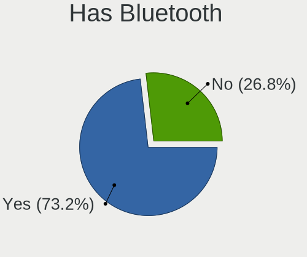
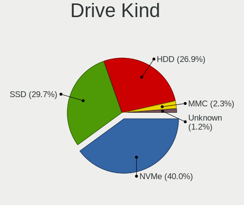
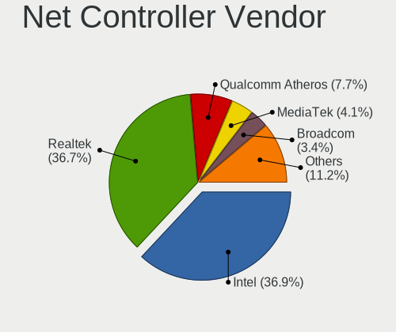

Arch - Tested Hardware & Statistics
-----------------------------------

A project to collect tested hardware configurations for Arch.

Anyone can contribute to this report by the [hw-probe](https://github.com/linuxhw/hw-probe) tool:

    sudo -E hw-probe -all -upload

Please contribute! Especially if your hardware is rare.

This is a report for all computer types. See also reports for [desktops](/Dist/Arch/Desktop/README.md) and [notebooks](/Dist/Arch/Notebook/README.md).

Contents
--------

* [ Test Cases ](#test-cases)

* [ System ](#system)
  - [ OS                       ](#os)
  - [ OS Family                ](#os-family)
  - [ Kernel                   ](#kernel)
  - [ Kernel Family            ](#kernel-family)
  - [ Kernel Major Ver.        ](#kernel-major-ver)
  - [ Arch                     ](#arch)
  - [ DE                       ](#de)
  - [ Display Server           ](#display-server)
  - [ Display Manager          ](#display-manager)
  - [ OS Lang                  ](#os-lang)
  - [ Boot Mode                ](#boot-mode)
  - [ Filesystem               ](#filesystem)
  - [ Part. scheme             ](#part-scheme)
  - [ Dual Boot with Linux/BSD ](#dual-boot-with-linuxbsd)
  - [ Dual Boot (Win)          ](#dual-boot-win)

* [ Board ](#board)
  - [ Vendor                   ](#vendor)
  - [ Model                    ](#model)
  - [ Model Family             ](#model-family)
  - [ MFG Year                 ](#mfg-year)
  - [ Form Factor              ](#form-factor)
  - [ Secure Boot              ](#secure-boot)
  - [ Coreboot                 ](#coreboot)
  - [ RAM Size                 ](#ram-size)
  - [ RAM Used                 ](#ram-used)
  - [ Total Drives             ](#total-drives)
  - [ Has CD-ROM               ](#has-cd-rom)
  - [ Has Ethernet             ](#has-ethernet)
  - [ Has WiFi                 ](#has-wifi)
  - [ Has Bluetooth            ](#has-bluetooth)

* [ Location ](#location)
  - [ Country                  ](#country)
  - [ City                     ](#city)

* [ Drives ](#drives)
  - [ Drive Vendor             ](#drive-vendor)
  - [ Drive Model              ](#drive-model)
  - [ HDD Vendor               ](#hdd-vendor)
  - [ SSD Vendor               ](#ssd-vendor)
  - [ Drive Kind               ](#drive-kind)
  - [ Drive Connector          ](#drive-connector)
  - [ Drive Size               ](#drive-size)
  - [ Space Total              ](#space-total)
  - [ Space Used               ](#space-used)
  - [ Malfunc. Drives          ](#malfunc-drives)
  - [ Malfunc. Drive Vendor    ](#malfunc-drive-vendor)
  - [ Malfunc. HDD Vendor      ](#malfunc-hdd-vendor)
  - [ Malfunc. Drive Kind      ](#malfunc-drive-kind)
  - [ Failed Drives            ](#failed-drives)
  - [ Failed Drive Vendor      ](#failed-drive-vendor)
  - [ Drive Status             ](#drive-status)

* [ Storage controller ](#storage-controller)
  - [ Storage Vendor           ](#storage-vendor)
  - [ Storage Model            ](#storage-model)
  - [ Storage Kind             ](#storage-kind)

* [ Processor ](#processor)
  - [ CPU Vendor               ](#cpu-vendor)
  - [ CPU Model                ](#cpu-model)
  - [ CPU Model Family         ](#cpu-model-family)
  - [ CPU Cores                ](#cpu-cores)
  - [ CPU Sockets              ](#cpu-sockets)
  - [ CPU Threads              ](#cpu-threads)
  - [ CPU Op-Modes             ](#cpu-op-modes)
  - [ CPU Microcode            ](#cpu-microcode)
  - [ CPU Microarch            ](#cpu-microarch)

* [ Graphics ](#graphics)
  - [ GPU Vendor               ](#gpu-vendor)
  - [ GPU Model                ](#gpu-model)
  - [ GPU Combo                ](#gpu-combo)
  - [ GPU Driver               ](#gpu-driver)
  - [ GPU Memory               ](#gpu-memory)

* [ Monitor ](#monitor)
  - [ Monitor Vendor           ](#monitor-vendor)
  - [ Monitor Model            ](#monitor-model)
  - [ Monitor Resolution       ](#monitor-resolution)
  - [ Monitor Diagonal         ](#monitor-diagonal)
  - [ Monitor Width            ](#monitor-width)
  - [ Aspect Ratio             ](#aspect-ratio)
  - [ Monitor Area             ](#monitor-area)
  - [ Pixel Density            ](#pixel-density)
  - [ Multiple Monitors        ](#multiple-monitors)

* [ Network ](#network)
  - [ Net Controller Vendor    ](#net-controller-vendor)
  - [ Net Controller Model     ](#net-controller-model)
  - [ Wireless Vendor          ](#wireless-vendor)
  - [ Wireless Model           ](#wireless-model)
  - [ Ethernet Vendor          ](#ethernet-vendor)
  - [ Ethernet Model           ](#ethernet-model)
  - [ Net Controller Kind      ](#net-controller-kind)
  - [ Used Controller          ](#used-controller)
  - [ NICs                     ](#nics)
  - [ IPv6                     ](#ipv6)

* [ Bluetooth ](#bluetooth)
  - [ Bluetooth Vendor         ](#bluetooth-vendor)
  - [ Bluetooth Model          ](#bluetooth-model)

* [ Sound ](#sound)
  - [ Sound Vendor             ](#sound-vendor)
  - [ Sound Model              ](#sound-model)

* [ Memory ](#memory)
  - [ Memory Vendor            ](#memory-vendor)
  - [ Memory Model             ](#memory-model)
  - [ Memory Kind              ](#memory-kind)
  - [ Memory Form Factor       ](#memory-form-factor)
  - [ Memory Size              ](#memory-size)
  - [ Memory Speed             ](#memory-speed)

* [ Printers & scanners ](#printers--scanners)
  - [ Printer Vendor           ](#printer-vendor)
  - [ Printer Model            ](#printer-model)
  - [ Scanner Vendor           ](#scanner-vendor)
  - [ Scanner Model            ](#scanner-model)

* [ Camera ](#camera)
  - [ Camera Vendor            ](#camera-vendor)
  - [ Camera Model             ](#camera-model)

* [ Security ](#security)
  - [ Fingerprint Vendor       ](#fingerprint-vendor)
  - [ Fingerprint Model        ](#fingerprint-model)
  - [ Chipcard Vendor          ](#chipcard-vendor)
  - [ Chipcard Model           ](#chipcard-model)

* [ Unsupported ](#unsupported)
  - [ Unsupported Devices      ](#unsupported-devices)
  - [ Unsupported Device Types ](#unsupported-device-types)

Test Cases
----------

Total: 10821

| Vendor        | Model                       | Form-Factor | Probe                                                      | Date         |
|---------------|-----------------------------|-------------|------------------------------------------------------------|--------------|
| HP            | ENVY Laptop 17-ch1xxx       | Notebook    | [d41bca7300](https://linux-hardware.org/?probe=d41bca7300) | Dec 24, 2023 |
| HP            | ENVY Laptop 17-ch1xxx       | Notebook    | [8080c75b27](https://linux-hardware.org/?probe=8080c75b27) | Dec 24, 2023 |
| Gigabyte      | AB350N-Gaming WIFI-CF       | Desktop     | [27a814dd64](https://linux-hardware.org/?probe=27a814dd64) | Dec 24, 2023 |
| Samsung       | 750QFG                      | Convertible | [12b0133961](https://linux-hardware.org/?probe=12b0133961) | Dec 24, 2023 |
| Lenovo        | IdeaPad Pro 5 14APH8 83A... | Notebook    | [39e33e4510](https://linux-hardware.org/?probe=39e33e4510) | Dec 24, 2023 |
| Lenovo        | ThinkPad P14s Gen 4 21K5... | Notebook    | [d7b7e34741](https://linux-hardware.org/?probe=d7b7e34741) | Dec 24, 2023 |
| ASRock        | X670E Taichi Carrara        | Desktop     | [3c53e69328](https://linux-hardware.org/?probe=3c53e69328) | Dec 24, 2023 |
| ASRock        | B450 Gaming-ITX/ac          | Desktop     | [6c6f281927](https://linux-hardware.org/?probe=6c6f281927) | Dec 23, 2023 |
| TECNO Mobi... | MEGABOOK T15DA              | Notebook    | [82d65cfce4](https://linux-hardware.org/?probe=82d65cfce4) | Dec 23, 2023 |
| ASRock        | B450 Gaming-ITX/ac          | Desktop     | [5590fcbfaf](https://linux-hardware.org/?probe=5590fcbfaf) | Dec 23, 2023 |
| Lenovo        | G50-80 80L0                 | Notebook    | [21df7039b9](https://linux-hardware.org/?probe=21df7039b9) | Dec 23, 2023 |
| MSI           | MPG B550 GAMING PLUS        | Desktop     | [9aa71593d4](https://linux-hardware.org/?probe=9aa71593d4) | Dec 23, 2023 |
| MSI           | MPG B550 GAMING PLUS        | Desktop     | [3819a04ddd](https://linux-hardware.org/?probe=3819a04ddd) | Dec 23, 2023 |
| Gigabyte      | X570 AORUS ELITE            | Desktop     | [9425eb3c77](https://linux-hardware.org/?probe=9425eb3c77) | Dec 23, 2023 |
| ASUSTek       | ROG STRIX X570-E GAMING     | Desktop     | [b9b670d3c0](https://linux-hardware.org/?probe=b9b670d3c0) | Dec 23, 2023 |
| Lenovo        | ThinkBook 16 G6 ABP 21KK    | Notebook    | [569ce717aa](https://linux-hardware.org/?probe=569ce717aa) | Dec 23, 2023 |
| Lenovo        | Legion 7 16ARHA7 82UH       | Notebook    | [8dad235090](https://linux-hardware.org/?probe=8dad235090) | Dec 23, 2023 |
| ASUSTek       | ASUS TUF Gaming A17 FA70... | Notebook    | [8a36394313](https://linux-hardware.org/?probe=8a36394313) | Dec 23, 2023 |
| ASUSTek       | ASUS TUF Gaming A17 FA70... | Notebook    | [eb035a95fa](https://linux-hardware.org/?probe=eb035a95fa) | Dec 22, 2023 |
| Dell          | Inspiron 5577               | Notebook    | [e6827a291e](https://linux-hardware.org/?probe=e6827a291e) | Dec 22, 2023 |
| Lenovo        | ThinkPad T440p 20AWS0280... | Notebook    | [239bc0b85a](https://linux-hardware.org/?probe=239bc0b85a) | Dec 22, 2023 |
| ASUSTek       | VivoBook_ASUSLaptop K660... | Notebook    | [e1225d2a37](https://linux-hardware.org/?probe=e1225d2a37) | Dec 22, 2023 |
| HP            | G62                         | Notebook    | [9f6a13bc50](https://linux-hardware.org/?probe=9f6a13bc50) | Dec 22, 2023 |
| ASUSTek       | X75A                        | Notebook    | [ed3c88f944](https://linux-hardware.org/?probe=ed3c88f944) | Dec 22, 2023 |
| Microsoft     | Surface Pro 7               | Tablet      | [3fe6ce1b31](https://linux-hardware.org/?probe=3fe6ce1b31) | Dec 22, 2023 |
| Microsoft     | Surface Pro 7               | Tablet      | [b8dcef4553](https://linux-hardware.org/?probe=b8dcef4553) | Dec 22, 2023 |
| ASUSTek       | PRIME X470-PRO              | Desktop     | [45079856a0](https://linux-hardware.org/?probe=45079856a0) | Dec 22, 2023 |
| MSI           | A320M-A PRO MAX             | Desktop     | [37e175c7a2](https://linux-hardware.org/?probe=37e175c7a2) | Dec 21, 2023 |
| Sony          | VPCCA3X1R                   | Notebook    | [156b109950](https://linux-hardware.org/?probe=156b109950) | Dec 21, 2023 |
| HP            | ProBook 6450b               | Notebook    | [dd9c6803cb](https://linux-hardware.org/?probe=dd9c6803cb) | Dec 21, 2023 |
| Dell          | 0HD5W2 A00                  | Desktop     | [2bd748691b](https://linux-hardware.org/?probe=2bd748691b) | Dec 21, 2023 |
| ASUSTek       | PRIME X670-P WIFI           | Desktop     | [64131ee7e0](https://linux-hardware.org/?probe=64131ee7e0) | Dec 21, 2023 |
| ASUSTek       | X75A                        | Notebook    | [6d9c65c8ac](https://linux-hardware.org/?probe=6d9c65c8ac) | Dec 21, 2023 |
| ASRock        | B760M Pro RS                | Desktop     | [f648cda96d](https://linux-hardware.org/?probe=f648cda96d) | Dec 21, 2023 |
| Gigabyte      | B660I AORUS PRO DDR4        | Desktop     | [f9552f9e38](https://linux-hardware.org/?probe=f9552f9e38) | Dec 21, 2023 |
| ASUSTek       | M5A97 LE R2.0               | Desktop     | [e222a97c0b](https://linux-hardware.org/?probe=e222a97c0b) | Dec 21, 2023 |
| ASRock        | B450M Pro4                  | Desktop     | [8bce457975](https://linux-hardware.org/?probe=8bce457975) | Dec 21, 2023 |
| ASUSTek       | PRIME H510M-K               | Desktop     | [5c0166e1f8](https://linux-hardware.org/?probe=5c0166e1f8) | Dec 21, 2023 |
| HP            | ProBook 6570b               | Notebook    | [7dbd0f9be1](https://linux-hardware.org/?probe=7dbd0f9be1) | Dec 21, 2023 |
| Lenovo        | Yoga 9 15IMH5 82DE          | Convertible | [d0d0568d9d](https://linux-hardware.org/?probe=d0d0568d9d) | Dec 21, 2023 |
| HP            | ProBook 6570b               | Notebook    | [7a4a6018b6](https://linux-hardware.org/?probe=7a4a6018b6) | Dec 21, 2023 |
| Dell          | Latitude 5590               | Notebook    | [9877862088](https://linux-hardware.org/?probe=9877862088) | Dec 21, 2023 |
| ASUSTek       | ROG Strix G732LXS_G732LX... | Notebook    | [6e4bcb9311](https://linux-hardware.org/?probe=6e4bcb9311) | Dec 21, 2023 |
| Lenovo        | ThinkPad X280 20KEA00SUK    | Notebook    | [bc380b4334](https://linux-hardware.org/?probe=bc380b4334) | Dec 21, 2023 |
| ASUSTek       | PRIME H510M-E               | Desktop     | [a2194f1fc6](https://linux-hardware.org/?probe=a2194f1fc6) | Dec 21, 2023 |
| HUAWEI        | NBLL-WXX9                   | Notebook    | [c125585a5d](https://linux-hardware.org/?probe=c125585a5d) | Dec 21, 2023 |
| Lenovo        | ThinkPad SL 2746E9G         | Notebook    | [594a56a070](https://linux-hardware.org/?probe=594a56a070) | Dec 21, 2023 |
| HP            | 82F1                        | Desktop     | [6e05cf58df](https://linux-hardware.org/?probe=6e05cf58df) | Dec 20, 2023 |
| ASUSTek       | VivoBook_ASUSLaptop M160... | Notebook    | [5a16e00d6c](https://linux-hardware.org/?probe=5a16e00d6c) | Dec 20, 2023 |
| ASUSTek       | Zenbook UX535QE_UM535QE     | Notebook    | [d420770c44](https://linux-hardware.org/?probe=d420770c44) | Dec 20, 2023 |
| HP            | ProBook 445 14 inch G10 ... | Notebook    | [5b3a77bd87](https://linux-hardware.org/?probe=5b3a77bd87) | Dec 20, 2023 |
| Acer          | Aspire E1-771G              | Notebook    | [07bcd26f94](https://linux-hardware.org/?probe=07bcd26f94) | Dec 20, 2023 |
| ASUSTek       | VivoBook_ASUSLaptop X340... | Notebook    | [00d649079a](https://linux-hardware.org/?probe=00d649079a) | Dec 20, 2023 |
| Gigabyte      | A520M DS3H V2               | Desktop     | [3ba51c21e8](https://linux-hardware.org/?probe=3ba51c21e8) | Dec 20, 2023 |
| ASRock        | M3A UCC                     | Desktop     | [f28e499d94](https://linux-hardware.org/?probe=f28e499d94) | Dec 20, 2023 |
| Lenovo        | 310C SDK0J40705 WIN 3425... | Desktop     | [c1ee1cd84d](https://linux-hardware.org/?probe=c1ee1cd84d) | Dec 19, 2023 |
| Gigabyte      | Z390 UD                     | Desktop     | [8e6c8be806](https://linux-hardware.org/?probe=8e6c8be806) | Dec 19, 2023 |
| Google        | Pantheon                    | Notebook    | [f4640ed7c1](https://linux-hardware.org/?probe=f4640ed7c1) | Dec 19, 2023 |
| MSI           | MAG B550 TOMAHAWK           | Desktop     | [35272a3d20](https://linux-hardware.org/?probe=35272a3d20) | Dec 19, 2023 |
| ASRock        | B550M Pro4                  | Desktop     | [a32cb7798b](https://linux-hardware.org/?probe=a32cb7798b) | Dec 19, 2023 |
| ASUSTek       | Maximus VII HERO            | Desktop     | [30ecc8cbbb](https://linux-hardware.org/?probe=30ecc8cbbb) | Dec 19, 2023 |
| HP            | ElitePad 1000 G2            | Notebook    | [533ccb0c41](https://linux-hardware.org/?probe=533ccb0c41) | Dec 19, 2023 |
| Gigabyte      | B550M DS3H                  | Desktop     | [0fd7e9086a](https://linux-hardware.org/?probe=0fd7e9086a) | Dec 19, 2023 |
| Gigabyte      | X570 AORUS MASTER           | Desktop     | [8dac564efb](https://linux-hardware.org/?probe=8dac564efb) | Dec 19, 2023 |
| Gigabyte      | X570 AORUS MASTER           | Desktop     | [6184376b69](https://linux-hardware.org/?probe=6184376b69) | Dec 19, 2023 |
| MSI           | B550M PRO-VDH WIFI          | Desktop     | [19af9254cb](https://linux-hardware.org/?probe=19af9254cb) | Dec 19, 2023 |
| Dell          | Inspiron 15 3535            | Notebook    | [f86bf3e2f1](https://linux-hardware.org/?probe=f86bf3e2f1) | Dec 18, 2023 |
| MSI           | MAG X670E TOMAHAWK WIFI     | Desktop     | [5255e11641](https://linux-hardware.org/?probe=5255e11641) | Dec 18, 2023 |
| MSI           | MAG B550M MORTAR            | Desktop     | [6d81343411](https://linux-hardware.org/?probe=6d81343411) | Dec 18, 2023 |
| MSI           | B450M MORTAR                | Desktop     | [5de00ab671](https://linux-hardware.org/?probe=5de00ab671) | Dec 18, 2023 |
| MSI           | B450M MORTAR                | Desktop     | [b6e59d6e3e](https://linux-hardware.org/?probe=b6e59d6e3e) | Dec 18, 2023 |
| Apple         | MacBookPro12,1              | Notebook    | [6db91b5eb2](https://linux-hardware.org/?probe=6db91b5eb2) | Dec 18, 2023 |
| Acer          | Nitro AN517-54              | Notebook    | [c18f5d3a21](https://linux-hardware.org/?probe=c18f5d3a21) | Dec 18, 2023 |
| Acer          | Nitro AN517-54              | Notebook    | [982ae3655c](https://linux-hardware.org/?probe=982ae3655c) | Dec 18, 2023 |
| Samsung       | 750XDA                      | Notebook    | [bdaba42db8](https://linux-hardware.org/?probe=bdaba42db8) | Dec 17, 2023 |
| ASUSTek       | ROG STRIX B550-I GAMING     | Desktop     | [0bedf3955a](https://linux-hardware.org/?probe=0bedf3955a) | Dec 17, 2023 |
| Gigabyte      | A320M-S2H-CF                | Desktop     | [74cbcabaa1](https://linux-hardware.org/?probe=74cbcabaa1) | Dec 17, 2023 |
| ASRock        | B450M Pro4                  | Desktop     | [45d168f910](https://linux-hardware.org/?probe=45d168f910) | Dec 17, 2023 |
| Gigabyte      | B550M DS3H                  | Desktop     | [28d755787e](https://linux-hardware.org/?probe=28d755787e) | Dec 17, 2023 |
| Fujitsu       | D3230-A1 S26361-D3230-A1    | Desktop     | [447fb33261](https://linux-hardware.org/?probe=447fb33261) | Dec 17, 2023 |
| ASUSTek       | VivoBook_ASUSLaptop M150... | Notebook    | [ed79377477](https://linux-hardware.org/?probe=ed79377477) | Dec 17, 2023 |
| Gigabyte      | 970A-D3P                    | Desktop     | [27f1370b2c](https://linux-hardware.org/?probe=27f1370b2c) | Dec 17, 2023 |
| Acer          | Aspire M3920                | Desktop     | [ccca1b4884](https://linux-hardware.org/?probe=ccca1b4884) | Dec 17, 2023 |
| ASUSTek       | PRIME B460M-A               | Desktop     | [28b95cc0b7](https://linux-hardware.org/?probe=28b95cc0b7) | Dec 16, 2023 |
| Lenovo        | Legion 5 15ARH05 82B5       | Notebook    | [812cd1effd](https://linux-hardware.org/?probe=812cd1effd) | Dec 16, 2023 |
| Dell          | Latitude 7350               | Notebook    | [ab9a873c1e](https://linux-hardware.org/?probe=ab9a873c1e) | Dec 16, 2023 |
| ASUSTek       | ASUS TUF Gaming A17 FA70... | Notebook    | [bac2e83dd7](https://linux-hardware.org/?probe=bac2e83dd7) | Dec 16, 2023 |
| MSI           | X470 GAMING PLUS MAX        | Desktop     | [fee42ea005](https://linux-hardware.org/?probe=fee42ea005) | Dec 16, 2023 |
| Microsoft     | Surface Laptop Go           | Tablet      | [091abf1a59](https://linux-hardware.org/?probe=091abf1a59) | Dec 16, 2023 |
| ASUSTek       | ROG STRIX B550-F GAMING     | Desktop     | [e1e496f1a9](https://linux-hardware.org/?probe=e1e496f1a9) | Dec 15, 2023 |
| ASUSTek       | ASUS TUF Gaming A17 FA70... | Notebook    | [6689e06c77](https://linux-hardware.org/?probe=6689e06c77) | Dec 15, 2023 |
| MSI           | MAG B550 TOMAHAWK           | Desktop     | [b653a2fdf8](https://linux-hardware.org/?probe=b653a2fdf8) | Dec 15, 2023 |
| Razer         | Blade 17 (2022) - RZ09-0... | Notebook    | [88ffce598c](https://linux-hardware.org/?probe=88ffce598c) | Dec 15, 2023 |
| ASUSTek       | PRIME B450-PLUS             | Desktop     | [971233beec](https://linux-hardware.org/?probe=971233beec) | Dec 15, 2023 |
| Razer         | Blade 15 (2022) - RZ09-0... | Notebook    | [921d38d2df](https://linux-hardware.org/?probe=921d38d2df) | Dec 15, 2023 |
| Lenovo        | IdeaPad Gaming 3 15ACH6 ... | Notebook    | [4cb7a5528b](https://linux-hardware.org/?probe=4cb7a5528b) | Dec 15, 2023 |
| ASUSTek       | Maximus VIII HERO           | Desktop     | [b65075cb67](https://linux-hardware.org/?probe=b65075cb67) | Dec 14, 2023 |
| Lenovo        | Yoga Slim 7 Pro 14ACH5 O... | Notebook    | [0b08ee22d8](https://linux-hardware.org/?probe=0b08ee22d8) | Dec 14, 2023 |
| ASUSTek       | VivoBook_ASUSLaptop M160... | Notebook    | [262bfe0585](https://linux-hardware.org/?probe=262bfe0585) | Dec 14, 2023 |
| Dell          | Precision 5680              | Notebook    | [1e063996da](https://linux-hardware.org/?probe=1e063996da) | Dec 14, 2023 |
| Lenovo        | ThinkPad Mini10 3507A31     | Notebook    | [b5b534e106](https://linux-hardware.org/?probe=b5b534e106) | Dec 14, 2023 |
| Apple         | MacBookPro5,1               | Notebook    | [277dadb387](https://linux-hardware.org/?probe=277dadb387) | Dec 13, 2023 |
| Lenovo        | ThinkPad T480 20L50004MX    | Notebook    | [691f1ae82f](https://linux-hardware.org/?probe=691f1ae82f) | Dec 13, 2023 |
| Gigabyte      | B550 AORUS ELITE AX V2      | Desktop     | [e101fc39e2](https://linux-hardware.org/?probe=e101fc39e2) | Dec 13, 2023 |
| HP            | Laptop 15-bs1xx             | Notebook    | [1785db3e7b](https://linux-hardware.org/?probe=1785db3e7b) | Dec 13, 2023 |
| Timi          | TM1604                      | Notebook    | [67597f3bd5](https://linux-hardware.org/?probe=67597f3bd5) | Dec 13, 2023 |
| Lenovo        | Legion 5 15ACH6H 82JU       | Notebook    | [6a497408c3](https://linux-hardware.org/?probe=6a497408c3) | Dec 13, 2023 |
| HP            | Pavilion g6                 | Notebook    | [f79863b604](https://linux-hardware.org/?probe=f79863b604) | Dec 13, 2023 |
| Lenovo        | ThinkPad T480 20L6SH3L2D    | Notebook    | [73c69f2b50](https://linux-hardware.org/?probe=73c69f2b50) | Dec 13, 2023 |
| Canyon        | I865P/PE                    | Desktop     | [68de5ab5cb](https://linux-hardware.org/?probe=68de5ab5cb) | Dec 12, 2023 |
| HP            | Pavilion Notebook           | Notebook    | [81baeeb4c6](https://linux-hardware.org/?probe=81baeeb4c6) | Dec 12, 2023 |
| Intel         | NUC5PPYB H76558-102         | Mini pc     | [c05cd1b8c9](https://linux-hardware.org/?probe=c05cd1b8c9) | Dec 12, 2023 |
| Lenovo        | ThinkPad T15 Gen 2i 20W5... | Notebook    | [e340ad2e3a](https://linux-hardware.org/?probe=e340ad2e3a) | Dec 12, 2023 |
| HP            | ENVY 15                     | Notebook    | [d8a9e409c9](https://linux-hardware.org/?probe=d8a9e409c9) | Dec 12, 2023 |
| ASUSTek       | K45VD                       | Notebook    | [527a669776](https://linux-hardware.org/?probe=527a669776) | Dec 12, 2023 |
| ASUSTek       | TUF Gaming Z790-PLUS WIF... | Desktop     | [1d510c91de](https://linux-hardware.org/?probe=1d510c91de) | Dec 12, 2023 |
| HP            | Pavilion x360 Convertibl... | Convertible | [2eeac061b2](https://linux-hardware.org/?probe=2eeac061b2) | Dec 12, 2023 |
| Lenovo        | ThinkPad T14s Gen 2a 20X... | Notebook    | [c9dd6aebbd](https://linux-hardware.org/?probe=c9dd6aebbd) | Dec 12, 2023 |
| AMI           | Aptio CRB                   | Mini pc     | [e2d113342f](https://linux-hardware.org/?probe=e2d113342f) | Dec 12, 2023 |
| AMI           | Aptio CRB                   | Mini pc     | [ecd2c34f0a](https://linux-hardware.org/?probe=ecd2c34f0a) | Dec 12, 2023 |
| HP            | ProBook 440 G5              | Notebook    | [af38b45c59](https://linux-hardware.org/?probe=af38b45c59) | Dec 12, 2023 |
| ASRock        | B250M-HDV                   | Desktop     | [6a4ff9d940](https://linux-hardware.org/?probe=6a4ff9d940) | Dec 11, 2023 |
| ASUSTek       | PRIME Z370-P II             | Desktop     | [9311323293](https://linux-hardware.org/?probe=9311323293) | Dec 11, 2023 |
| Framework     | Laptop 13 (AMD Ryzen 704... | Notebook    | [ffcb3c9798](https://linux-hardware.org/?probe=ffcb3c9798) | Dec 11, 2023 |
| ASUSTek       | TUF Gaming B550M-PLUS       | Desktop     | [c71a153915](https://linux-hardware.org/?probe=c71a153915) | Dec 11, 2023 |
| Acer          | Aspire E5-571G              | Notebook    | [c136ca6eff](https://linux-hardware.org/?probe=c136ca6eff) | Dec 11, 2023 |
| HUAWEI        | NBD-WXX9                    | Notebook    | [2e767eb168](https://linux-hardware.org/?probe=2e767eb168) | Dec 11, 2023 |
| ASRock        | A320M-DVS R4.0              | Desktop     | [2349ef67ed](https://linux-hardware.org/?probe=2349ef67ed) | Dec 11, 2023 |
| MSI           | Z590-A PRO                  | Desktop     | [db2d055fa7](https://linux-hardware.org/?probe=db2d055fa7) | Dec 11, 2023 |
| Gigabyte      | A320M-S2H V2-CF             | Desktop     | [15409fd336](https://linux-hardware.org/?probe=15409fd336) | Dec 11, 2023 |
| GPD           | G1619-03                    | Notebook    | [92773d52d8](https://linux-hardware.org/?probe=92773d52d8) | Dec 10, 2023 |
| HP            | EliteBook 840 14 inch G9... | Notebook    | [d9227b24b0](https://linux-hardware.org/?probe=d9227b24b0) | Dec 10, 2023 |
| Gigabyte      | B550 AORUS ELITE V2         | Desktop     | [508ad0be0e](https://linux-hardware.org/?probe=508ad0be0e) | Dec 10, 2023 |
| AZW           | SER V1.0                    | Mini pc     | [ba6f3ac46c](https://linux-hardware.org/?probe=ba6f3ac46c) | Dec 10, 2023 |
| Fujitsu       | D3230-A1 S26361-D3230-A1    | Desktop     | [62b99b4cdd](https://linux-hardware.org/?probe=62b99b4cdd) | Dec 10, 2023 |
| Fujitsu       | D3230-A1 S26361-D3230-A1    | Desktop     | [dd9345ea7d](https://linux-hardware.org/?probe=dd9345ea7d) | Dec 10, 2023 |
| Gigabyte      | Z790 UD AC                  | Desktop     | [09d713ee95](https://linux-hardware.org/?probe=09d713ee95) | Dec 10, 2023 |
| Apple         | Mac-F227BEC8 PVT            | All in one  | [eed0305500](https://linux-hardware.org/?probe=eed0305500) | Dec 10, 2023 |
| Dell          | Latitude 7490               | Notebook    | [d9f20ad453](https://linux-hardware.org/?probe=d9f20ad453) | Dec 10, 2023 |
| ASUSTek       | PRIME B450-PLUS             | Desktop     | [6e1edcba6d](https://linux-hardware.org/?probe=6e1edcba6d) | Dec 10, 2023 |
| MSI           | B550M PRO-VDH WIFI          | Desktop     | [e7872542e1](https://linux-hardware.org/?probe=e7872542e1) | Dec 10, 2023 |
| Dell          | Precision 5480              | Notebook    | [e2ef5d90ca](https://linux-hardware.org/?probe=e2ef5d90ca) | Dec 10, 2023 |
| MSI           | Z590-A PRO                  | Desktop     | [c8e3c94a82](https://linux-hardware.org/?probe=c8e3c94a82) | Dec 10, 2023 |
| ASUSTek       | M4A89GTD-PRO/USB3           | Desktop     | [0a40b25b2d](https://linux-hardware.org/?probe=0a40b25b2d) | Dec 10, 2023 |
| Acer          | Nitro AN515-58              | Notebook    | [9939fe96d2](https://linux-hardware.org/?probe=9939fe96d2) | Dec 10, 2023 |
| Intel         | DG31PR AAD97573-205         | Desktop     | [69597249b3](https://linux-hardware.org/?probe=69597249b3) | Dec 09, 2023 |
| ASUSTek       | ROG Strix G533QM_G533QM     | Notebook    | [200be2174b](https://linux-hardware.org/?probe=200be2174b) | Dec 09, 2023 |
| ASUSTek       | X540SA                      | Notebook    | [71c6b35d56](https://linux-hardware.org/?probe=71c6b35d56) | Dec 09, 2023 |
| ASUSTek       | PRIME B450-PLUS             | Desktop     | [31943290a3](https://linux-hardware.org/?probe=31943290a3) | Dec 09, 2023 |
| AZW           | SER V1.0                    | Mini pc     | [c5a3d157b2](https://linux-hardware.org/?probe=c5a3d157b2) | Dec 09, 2023 |
| HP            | Victus by Laptop 16-e0xx... | Notebook    | [551b412a34](https://linux-hardware.org/?probe=551b412a34) | Dec 09, 2023 |
| Dell          | Inspiron 5567               | Notebook    | [ac6488c0c8](https://linux-hardware.org/?probe=ac6488c0c8) | Dec 09, 2023 |
| Acer          | AOD270                      | Notebook    | [b5729a6428](https://linux-hardware.org/?probe=b5729a6428) | Dec 09, 2023 |
| Dell          | Inspiron 5567               | Notebook    | [f061ab31d0](https://linux-hardware.org/?probe=f061ab31d0) | Dec 09, 2023 |
| ASUSTek       | VivoBook_ASUSLaptop X415... | Notebook    | [051769648f](https://linux-hardware.org/?probe=051769648f) | Dec 09, 2023 |
| ASRock        | B450M Pro4                  | Desktop     | [b3549a6dea](https://linux-hardware.org/?probe=b3549a6dea) | Dec 08, 2023 |
| Dell          | Latitude E5550              | Notebook    | [740c338fbe](https://linux-hardware.org/?probe=740c338fbe) | Dec 08, 2023 |
| GPD           | G1619-03                    | Notebook    | [bc2ade83b8](https://linux-hardware.org/?probe=bc2ade83b8) | Dec 08, 2023 |
| ASUSTek       | ROG Strix G533ZW_G533ZW     | Notebook    | [a696c1d832](https://linux-hardware.org/?probe=a696c1d832) | Dec 08, 2023 |
| ASUSTek       | ROG Flow Z13 GZ301ZE_GZ3... | Tablet      | [5775bf1613](https://linux-hardware.org/?probe=5775bf1613) | Dec 08, 2023 |
| ASUSTek       | PRIME Z370-P II             | Desktop     | [85cd0d0c3d](https://linux-hardware.org/?probe=85cd0d0c3d) | Dec 08, 2023 |
| Lenovo        | SKYBAY SDK0J40709 WIN 32... | Desktop     | [78c824704d](https://linux-hardware.org/?probe=78c824704d) | Dec 08, 2023 |
| Maibenben     | MaiBook X series            | Notebook    | [d3de4cf5b2](https://linux-hardware.org/?probe=d3de4cf5b2) | Dec 08, 2023 |
| ASUSTek       | X540SC                      | Notebook    | [4d5388e6ab](https://linux-hardware.org/?probe=4d5388e6ab) | Dec 08, 2023 |
| Dell          | Latitude E5550              | Notebook    | [52866a9d1a](https://linux-hardware.org/?probe=52866a9d1a) | Dec 08, 2023 |
| Alienware     | x15 R1                      | Notebook    | [08aa034a6d](https://linux-hardware.org/?probe=08aa034a6d) | Dec 08, 2023 |
| ASRock        | M3A UCC                     | Desktop     | [f73d6783e6](https://linux-hardware.org/?probe=f73d6783e6) | Dec 08, 2023 |
| Acer          | Aspire E1-771G              | Notebook    | [099fae46db](https://linux-hardware.org/?probe=099fae46db) | Dec 07, 2023 |
| ASRock        | B760M Pro RS                | Desktop     | [77b3b5fc4d](https://linux-hardware.org/?probe=77b3b5fc4d) | Dec 07, 2023 |
| VPU Compan... | VWNC71429-S                 | Notebook    | [c0b0f86403](https://linux-hardware.org/?probe=c0b0f86403) | Dec 07, 2023 |
| Lenovo        | ThinkPad T480s 20L7001LM... | Notebook    | [37c62fe0ba](https://linux-hardware.org/?probe=37c62fe0ba) | Dec 07, 2023 |
| Lenovo        | ThinkPad E14 Gen 2 20TA0... | Notebook    | [c37147ae36](https://linux-hardware.org/?probe=c37147ae36) | Dec 07, 2023 |
| ASUSTek       | ASUS TUF Gaming F15 FX50... | Notebook    | [87aa35c45c](https://linux-hardware.org/?probe=87aa35c45c) | Dec 07, 2023 |
| ASUSTek       | ROG Maximus Z790 HERO       | Desktop     | [3df79f79ee](https://linux-hardware.org/?probe=3df79f79ee) | Dec 07, 2023 |
| Lenovo        | ThinkBook 14-IIL 20SL       | Notebook    | [36fe4a1de9](https://linux-hardware.org/?probe=36fe4a1de9) | Dec 06, 2023 |
| Gigabyte      | A320M-S2H V2-CF             | Desktop     | [2a593d9294](https://linux-hardware.org/?probe=2a593d9294) | Dec 06, 2023 |
| Acer          | Aspire E1-771G              | Notebook    | [28f6aca279](https://linux-hardware.org/?probe=28f6aca279) | Dec 06, 2023 |
| ASUSTek       | P553UA                      | Notebook    | [4c19d8a91e](https://linux-hardware.org/?probe=4c19d8a91e) | Dec 06, 2023 |
| Medion        | B550A4-EM                   | Desktop     | [bd40049c5d](https://linux-hardware.org/?probe=bd40049c5d) | Dec 06, 2023 |
| HP            | Pavilion x360 14 Convert... | Convertible | [5de0c29333](https://linux-hardware.org/?probe=5de0c29333) | Dec 06, 2023 |
| ASUSTek       | VivoBook_ASUSLaptop X150... | Notebook    | [ed77f35114](https://linux-hardware.org/?probe=ed77f35114) | Dec 06, 2023 |
| ASUSTek       | ASUS TUF Gaming A17 FA70... | Notebook    | [ac764bedcc](https://linux-hardware.org/?probe=ac764bedcc) | Dec 06, 2023 |
| Acer          | Nitro AN515-58              | Notebook    | [a475eb0eb8](https://linux-hardware.org/?probe=a475eb0eb8) | Dec 06, 2023 |
| HP            | 802E                        | Desktop     | [0f4d573a9b](https://linux-hardware.org/?probe=0f4d573a9b) | Dec 06, 2023 |
| Alienware     | 0VDT73 A00                  | Desktop     | [af5f86d3a2](https://linux-hardware.org/?probe=af5f86d3a2) | Dec 06, 2023 |
| ASUSTek       | PRIME A320M-K               | Desktop     | [58e1501577](https://linux-hardware.org/?probe=58e1501577) | Dec 06, 2023 |
| ASUSTek       | ASUS TUF Gaming A16 FA61... | Notebook    | [fae6162d7b](https://linux-hardware.org/?probe=fae6162d7b) | Dec 06, 2023 |
| Gigabyte      | A320M-S2H V2-CF             | Desktop     | [9b6c1bfbf2](https://linux-hardware.org/?probe=9b6c1bfbf2) | Dec 06, 2023 |
| Dell          | 0YWR73 A06                  | Server      | [78e594b5ad](https://linux-hardware.org/?probe=78e594b5ad) | Dec 06, 2023 |
| ASUSTek       | M4A79XTD EVO                | Desktop     | [e52613f035](https://linux-hardware.org/?probe=e52613f035) | Dec 06, 2023 |
| HP            | 802E                        | Desktop     | [9b58aa9c3a](https://linux-hardware.org/?probe=9b58aa9c3a) | Dec 05, 2023 |
| ASUSTek       | TUF Gaming X670E-PLUS WI... | Desktop     | [f42e951aa3](https://linux-hardware.org/?probe=f42e951aa3) | Dec 05, 2023 |
| ASUSTek       | ROG STRIX B650E-F GAMING... | Desktop     | [757356c6f7](https://linux-hardware.org/?probe=757356c6f7) | Dec 05, 2023 |
| Acer          | Aspire E5-772G              | Notebook    | [1be5bb95d1](https://linux-hardware.org/?probe=1be5bb95d1) | Dec 05, 2023 |
| Lenovo        | G500 20236                  | Notebook    | [6d0f07a930](https://linux-hardware.org/?probe=6d0f07a930) | Dec 05, 2023 |
| Gigabyte      | A320M-S2H-CF                | Desktop     | [5a7d45a007](https://linux-hardware.org/?probe=5a7d45a007) | Dec 05, 2023 |
| Gigabyte      | A320M-S2H-CF                | Desktop     | [2d6eaf642b](https://linux-hardware.org/?probe=2d6eaf642b) | Dec 05, 2023 |
| HP            | Pavilion 13 x360 PC         | Notebook    | [3eba272feb](https://linux-hardware.org/?probe=3eba272feb) | Dec 05, 2023 |
| Lenovo        | ThinkPad E14 Gen 2 20TA0... | Notebook    | [a2c9c3b295](https://linux-hardware.org/?probe=a2c9c3b295) | Dec 05, 2023 |
| Intel         | ChiefRiver                  | Desktop     | [6a4b7aebe9](https://linux-hardware.org/?probe=6a4b7aebe9) | Dec 05, 2023 |
| ASUSTek       | PRIME X470-PRO              | Desktop     | [7ccb597e5c](https://linux-hardware.org/?probe=7ccb597e5c) | Dec 05, 2023 |
| ASUSTek       | PRIME X470-PRO              | Desktop     | [be2d11a5b9](https://linux-hardware.org/?probe=be2d11a5b9) | Dec 04, 2023 |
| Dell          | Latitude 9330               | Convertible | [1c8a7db9cf](https://linux-hardware.org/?probe=1c8a7db9cf) | Dec 04, 2023 |
| Intel         | NUC5i5MYBE H47797-205       | Mini pc     | [a68c730c13](https://linux-hardware.org/?probe=a68c730c13) | Dec 04, 2023 |
| ASUSTek       | ROG STRIX X570-E GAMING     | Desktop     | [54b2e1f4f1](https://linux-hardware.org/?probe=54b2e1f4f1) | Dec 04, 2023 |
| ASUSTek       | ROG STRIX X570-E GAMING     | Desktop     | [4d938aed80](https://linux-hardware.org/?probe=4d938aed80) | Dec 04, 2023 |
| Lenovo        | Legion R9000P ARX8 82WM     | Notebook    | [0964d78171](https://linux-hardware.org/?probe=0964d78171) | Dec 04, 2023 |
| Framework     | Laptop 13 (AMD Ryzen 704... | Notebook    | [d91e8dc1a8](https://linux-hardware.org/?probe=d91e8dc1a8) | Dec 04, 2023 |
| ASUSTek       | PRIME Z270-A                | Desktop     | [836c545bcb](https://linux-hardware.org/?probe=836c545bcb) | Dec 04, 2023 |
| Dell          | Latitude 7350               | Notebook    | [74c3983604](https://linux-hardware.org/?probe=74c3983604) | Dec 04, 2023 |
| Fujitsu       | D3230-A1 S26361-D3230-A1    | Desktop     | [a66e59470c](https://linux-hardware.org/?probe=a66e59470c) | Dec 04, 2023 |
| ASUSTek       | VivoBook_ASUSLaptop X513... | Notebook    | [b1fdfbc998](https://linux-hardware.org/?probe=b1fdfbc998) | Dec 03, 2023 |
| Lenovo        | ThinkPad T440s 20AQ005TU... | Notebook    | [3c9d00c839](https://linux-hardware.org/?probe=3c9d00c839) | Dec 03, 2023 |
| ASUSTek       | N552VW                      | Notebook    | [c2e09d65d5](https://linux-hardware.org/?probe=c2e09d65d5) | Dec 03, 2023 |
| Gigabyte      | H81M-S2PH                   | Desktop     | [2cd108c526](https://linux-hardware.org/?probe=2cd108c526) | Dec 03, 2023 |
| HP            | Laptop 15s-eq2xxx           | Notebook    | [b052f32ef5](https://linux-hardware.org/?probe=b052f32ef5) | Dec 03, 2023 |
| ASUSTek       | TUF Gaming B550M-PLUS       | Desktop     | [6c21c9ac7d](https://linux-hardware.org/?probe=6c21c9ac7d) | Dec 03, 2023 |
| HP            | ZBook 17 G2                 | Notebook    | [e1edd54ac3](https://linux-hardware.org/?probe=e1edd54ac3) | Dec 03, 2023 |
| Razer         | Blade 17 (2022) - RZ09-0... | Notebook    | [f4c7fc7890](https://linux-hardware.org/?probe=f4c7fc7890) | Dec 03, 2023 |
| Lenovo        | ThinkPad X1 Yoga Gen 8 2... | Convertible | [10dbf91cb7](https://linux-hardware.org/?probe=10dbf91cb7) | Dec 03, 2023 |
| Lenovo        | ThinkPad X1 Yoga Gen 8 2... | Convertible | [09104cdc15](https://linux-hardware.org/?probe=09104cdc15) | Dec 03, 2023 |
| HP            | ENVY x360 Convertible 15... | Convertible | [c608bb4e30](https://linux-hardware.org/?probe=c608bb4e30) | Dec 03, 2023 |
| System76      | Lemur Pro                   | Notebook    | [8dcc66a7e6](https://linux-hardware.org/?probe=8dcc66a7e6) | Dec 03, 2023 |
| ASUSTek       | Z170-P                      | Desktop     | [55eb62ad2f](https://linux-hardware.org/?probe=55eb62ad2f) | Dec 02, 2023 |
| ASRock        | B550M-HDV                   | Desktop     | [68c7c96b9b](https://linux-hardware.org/?probe=68c7c96b9b) | Dec 02, 2023 |
| Lenovo        | Legion 5 15ACH6H 82JU       | Notebook    | [a18c178195](https://linux-hardware.org/?probe=a18c178195) | Dec 02, 2023 |
| Gigabyte      | AERO 15 KD                  | Notebook    | [58b6cdf11c](https://linux-hardware.org/?probe=58b6cdf11c) | Dec 02, 2023 |
| Lenovo        | ThinkPad L450 20DSS1G63Q    | Notebook    | [0bb363e4fc](https://linux-hardware.org/?probe=0bb363e4fc) | Dec 02, 2023 |
| MSI           | B550-A PRO                  | Desktop     | [6f41c9ca50](https://linux-hardware.org/?probe=6f41c9ca50) | Dec 02, 2023 |
| Gigabyte      | GA-970A-D3                  | Desktop     | [d01b48eb39](https://linux-hardware.org/?probe=d01b48eb39) | Dec 02, 2023 |
| ASUSTek       | X550CC                      | Notebook    | [cc61afde30](https://linux-hardware.org/?probe=cc61afde30) | Dec 02, 2023 |
| HP            | Notebook                    | Notebook    | [399699d1ce](https://linux-hardware.org/?probe=399699d1ce) | Dec 02, 2023 |
| MSI           | MAG B650 TOMAHAWK WIFI      | Desktop     | [7c6a2f74f0](https://linux-hardware.org/?probe=7c6a2f74f0) | Dec 02, 2023 |
| Lenovo        | Legion Slim 7 16APH8 82Y... | Notebook    | [5cf002f5af](https://linux-hardware.org/?probe=5cf002f5af) | Dec 02, 2023 |
| Gigabyte      | X399 AORUS PRO-CF           | Desktop     | [c9a9c0d3b7](https://linux-hardware.org/?probe=c9a9c0d3b7) | Dec 02, 2023 |
| Gigabyte      | X399 AORUS PRO-CF           | Desktop     | [c3ea561754](https://linux-hardware.org/?probe=c3ea561754) | Dec 02, 2023 |
| Acer          | Nitro AN515-58              | Notebook    | [34df3b2497](https://linux-hardware.org/?probe=34df3b2497) | Dec 02, 2023 |
| HP            | ZBook 15 G2                 | Notebook    | [ba6823f38e](https://linux-hardware.org/?probe=ba6823f38e) | Dec 02, 2023 |
| Framework     | Laptop                      | Notebook    | [92f0d97b05](https://linux-hardware.org/?probe=92f0d97b05) | Dec 02, 2023 |
| Framework     | Laptop                      | Notebook    | [995d231691](https://linux-hardware.org/?probe=995d231691) | Dec 02, 2023 |
| Casper        | EXCALIBUR G770              | Notebook    | [f5e978e47d](https://linux-hardware.org/?probe=f5e978e47d) | Dec 01, 2023 |
| Lenovo        | ThinkPad T14 Gen 2i 20W1... | Notebook    | [6ece5a0c44](https://linux-hardware.org/?probe=6ece5a0c44) | Dec 01, 2023 |
| ASUSTek       | ASUS TUF Gaming A15 FA50... | Notebook    | [27ca1601a1](https://linux-hardware.org/?probe=27ca1601a1) | Dec 01, 2023 |
| Samsung       | QX311/QX411/QX412/QX511     | Notebook    | [a82cdb418c](https://linux-hardware.org/?probe=a82cdb418c) | Dec 01, 2023 |
| ASUSTek       | PRIME B550M-K               | Desktop     | [a1ab0858a6](https://linux-hardware.org/?probe=a1ab0858a6) | Dec 01, 2023 |
| Framework     | Laptop 13 (AMD Ryzen 704... | Notebook    | [22263182fb](https://linux-hardware.org/?probe=22263182fb) | Dec 01, 2023 |
| Lenovo        | 14w Gen 2 82N8              | Notebook    | [bc02b5a084](https://linux-hardware.org/?probe=bc02b5a084) | Dec 01, 2023 |
| MSI           | B450M MORTAR MAX            | Desktop     | [973b00d566](https://linux-hardware.org/?probe=973b00d566) | Dec 01, 2023 |
| HP            | 89D8 SMVB                   | Desktop     | [fb2fbabcbe](https://linux-hardware.org/?probe=fb2fbabcbe) | Dec 01, 2023 |
| Lenovo        | B5400 20278                 | Notebook    | [fd17e40f77](https://linux-hardware.org/?probe=fd17e40f77) | Dec 01, 2023 |
| Lenovo        | ThinkPad T470p 20J6CTO1W... | Notebook    | [f98f84669d](https://linux-hardware.org/?probe=f98f84669d) | Dec 01, 2023 |
| Gigabyte      | B450M H                     | Desktop     | [48d13cedfc](https://linux-hardware.org/?probe=48d13cedfc) | Dec 01, 2023 |
| Gigabyte      | X570S AORUS MASTER          | Desktop     | [f3f624e1cf](https://linux-hardware.org/?probe=f3f624e1cf) | Nov 30, 2023 |
| Dell          | Inspiron 15 3520            | Notebook    | [945c324d2b](https://linux-hardware.org/?probe=945c324d2b) | Nov 30, 2023 |
| Acer          | Nitro AN515-54              | Notebook    | [7c4f4d3207](https://linux-hardware.org/?probe=7c4f4d3207) | Nov 30, 2023 |
| Acer          | Nitro N50-610               | Desktop     | [78a6b232e3](https://linux-hardware.org/?probe=78a6b232e3) | Nov 30, 2023 |
| ASUSTek       | VivoBook_ASUSLaptop X530... | Notebook    | [e0e3a6f229](https://linux-hardware.org/?probe=e0e3a6f229) | Nov 30, 2023 |
| Lenovo        | ThinkPad T14s Gen1 20UH0... | Notebook    | [9c37d9bff8](https://linux-hardware.org/?probe=9c37d9bff8) | Nov 30, 2023 |
| Dell          | Precision M6800             | Notebook    | [0112706077](https://linux-hardware.org/?probe=0112706077) | Nov 29, 2023 |
| ASUSTek       | VivoBook_ASUSLaptop K350... | Notebook    | [71cf2f0a79](https://linux-hardware.org/?probe=71cf2f0a79) | Nov 29, 2023 |
| Acer          | Nitro AN515-58              | Notebook    | [eb52097d1b](https://linux-hardware.org/?probe=eb52097d1b) | Nov 29, 2023 |
| HP            | 1495                        | Desktop     | [cf77f4899b](https://linux-hardware.org/?probe=cf77f4899b) | Nov 29, 2023 |
| HP            | 1495                        | Desktop     | [eafdff069c](https://linux-hardware.org/?probe=eafdff069c) | Nov 29, 2023 |
| HP            | EliteBook 840 G1            | Notebook    | [bb1d8fb09e](https://linux-hardware.org/?probe=bb1d8fb09e) | Nov 29, 2023 |
| HP            | EliteBook 8530p             | Notebook    | [d4dbee494a](https://linux-hardware.org/?probe=d4dbee494a) | Nov 29, 2023 |
| Lenovo        | ThinkPad P52s 20LCA0ANUK    | Notebook    | [2cf85106d8](https://linux-hardware.org/?probe=2cf85106d8) | Nov 29, 2023 |
| Lenovo        | Yoga Slim 7 14IIL05 82A1    | Notebook    | [f43aaf1d39](https://linux-hardware.org/?probe=f43aaf1d39) | Nov 29, 2023 |
| HP            | 255 G8 Notebook PC          | Notebook    | [be0c718878](https://linux-hardware.org/?probe=be0c718878) | Nov 29, 2023 |
| Gigabyte      | AERO 15 KD                  | Notebook    | [772e5ce3f6](https://linux-hardware.org/?probe=772e5ce3f6) | Nov 29, 2023 |
| ASUSTek       | K501UW                      | Notebook    | [37ecb34a8a](https://linux-hardware.org/?probe=37ecb34a8a) | Nov 29, 2023 |
| Dell          | 0V0D45 A01                  | All in one  | [1976be5d27](https://linux-hardware.org/?probe=1976be5d27) | Nov 29, 2023 |
| Lenovo        | IdeaPad 700-15ISK 80RU      | Notebook    | [21451de65a](https://linux-hardware.org/?probe=21451de65a) | Nov 28, 2023 |
| Dell          | Venue 11 Pro 7130 vPro      | Notebook    | [2a9b640b54](https://linux-hardware.org/?probe=2a9b640b54) | Nov 28, 2023 |
| Lenovo        | IdeaPad 3 15IIL05 81WE      | Notebook    | [35775b438a](https://linux-hardware.org/?probe=35775b438a) | Nov 28, 2023 |
| HP            | Laptop 14-em0xxx            | Notebook    | [9530bb80db](https://linux-hardware.org/?probe=9530bb80db) | Nov 28, 2023 |
| Gigabyte      | B660M DS3H AX DDR4          | Desktop     | [6eb25169c1](https://linux-hardware.org/?probe=6eb25169c1) | Nov 28, 2023 |
| Dell          | Venue 11 Pro 7130 vPro      | Notebook    | [b8337b50d8](https://linux-hardware.org/?probe=b8337b50d8) | Nov 28, 2023 |
| ASUSTek       | SABERTOOTH P67              | Desktop     | [8b5f96b606](https://linux-hardware.org/?probe=8b5f96b606) | Nov 28, 2023 |
| MSI           | MPG X570 GAMING PLUS        | Desktop     | [5474258ca4](https://linux-hardware.org/?probe=5474258ca4) | Nov 28, 2023 |
| Gigabyte      | B550 AORUS ELITE AX V2      | Desktop     | [7378c9d9a4](https://linux-hardware.org/?probe=7378c9d9a4) | Nov 28, 2023 |
| Gigabyte      | Z390 AORUS MASTER-CF        | Desktop     | [db37ad807a](https://linux-hardware.org/?probe=db37ad807a) | Nov 28, 2023 |
| HP            | EliteBook 845 G7 Noteboo... | Notebook    | [5358617403](https://linux-hardware.org/?probe=5358617403) | Nov 28, 2023 |
| ASRock        | Z370 Professional Gaming... | Desktop     | [92354a1a90](https://linux-hardware.org/?probe=92354a1a90) | Nov 28, 2023 |
| Gigabyte      | Z97X-Gaming 3               | Desktop     | [549e026701](https://linux-hardware.org/?probe=549e026701) | Nov 28, 2023 |
| ASUSTek       | Z170 PRO GAMING             | Desktop     | [f2dae5468d](https://linux-hardware.org/?probe=f2dae5468d) | Nov 27, 2023 |
| Lenovo        | ThinkPad P14s Gen 4 21K5... | Notebook    | [8c51aa422e](https://linux-hardware.org/?probe=8c51aa422e) | Nov 27, 2023 |
| ASUSTek       | G11CB                       | Desktop     | [31f2fc857d](https://linux-hardware.org/?probe=31f2fc857d) | Nov 27, 2023 |
| ASUSTek       | X550ZE                      | Notebook    | [d597be352c](https://linux-hardware.org/?probe=d597be352c) | Nov 27, 2023 |
| HP            | 255 G8 Notebook PC          | Notebook    | [3342bb8661](https://linux-hardware.org/?probe=3342bb8661) | Nov 27, 2023 |
| Dell          | 0XW3KG A02                  | All in one  | [bfab8a5c50](https://linux-hardware.org/?probe=bfab8a5c50) | Nov 27, 2023 |
| ASUSTek       | PRIME Z390-P                | Desktop     | [aae9fdf3a0](https://linux-hardware.org/?probe=aae9fdf3a0) | Nov 26, 2023 |
| ASUSTek       | PRIME A320M-E               | Desktop     | [ea990a4015](https://linux-hardware.org/?probe=ea990a4015) | Nov 26, 2023 |
| HP            | 158A                        | Desktop     | [880d4cc918](https://linux-hardware.org/?probe=880d4cc918) | Nov 26, 2023 |
| Google        | Osiris                      | Notebook    | [104c509853](https://linux-hardware.org/?probe=104c509853) | Nov 26, 2023 |
| ASRock        | B450 Pro4                   | Desktop     | [5aa0f85707](https://linux-hardware.org/?probe=5aa0f85707) | Nov 26, 2023 |
| Apple         | MacBookPro11,1              | Notebook    | [9bb8e96cf9](https://linux-hardware.org/?probe=9bb8e96cf9) | Nov 26, 2023 |
| ASUSTek       | ROG Flow Z13 GZ301ZE_GZ3... | Tablet      | [5cc2969751](https://linux-hardware.org/?probe=5cc2969751) | Nov 26, 2023 |
| Acer          | Aspire Lite AL15-41         | Notebook    | [1ab369fc06](https://linux-hardware.org/?probe=1ab369fc06) | Nov 26, 2023 |
| ASUSTek       | VivoBook_ASUSLaptop X515... | Notebook    | [76ce86d3d6](https://linux-hardware.org/?probe=76ce86d3d6) | Nov 26, 2023 |
| Lenovo        | IdeaPad Gaming 3 15ARH05... | Notebook    | [41443f69e3](https://linux-hardware.org/?probe=41443f69e3) | Nov 26, 2023 |
| ASUSTek       | ROG STRIX X670E-E GAMING... | Desktop     | [325261bf0d](https://linux-hardware.org/?probe=325261bf0d) | Nov 25, 2023 |
| Apple         | Mac-F4208DC8 PVT            | Desktop     | [b425e66375](https://linux-hardware.org/?probe=b425e66375) | Nov 25, 2023 |
| HUAWEI        | HVY-WXX9                    | Notebook    | [e17bdfe79f](https://linux-hardware.org/?probe=e17bdfe79f) | Nov 25, 2023 |
| ASUSTek       | Maximus VII HERO            | Desktop     | [6dce0312bc](https://linux-hardware.org/?probe=6dce0312bc) | Nov 25, 2023 |
| Acer          | Swift SF314-59              | Notebook    | [3ffe3ca5b7](https://linux-hardware.org/?probe=3ffe3ca5b7) | Nov 25, 2023 |
| MSI           | MAG B650 TOMAHAWK WIFI      | Desktop     | [a44be8cd81](https://linux-hardware.org/?probe=a44be8cd81) | Nov 25, 2023 |
| Gigabyte      | B660M DS3H AX DDR4          | Desktop     | [409c3e67d2](https://linux-hardware.org/?probe=409c3e67d2) | Nov 25, 2023 |
| ASUSTek       | ProArt X570-CREATOR WIFI    | Desktop     | [e63dc731c2](https://linux-hardware.org/?probe=e63dc731c2) | Nov 25, 2023 |
| Lenovo        | IdeaPad 1 15AMN7 82VG       | Notebook    | [5cbdf33238](https://linux-hardware.org/?probe=5cbdf33238) | Nov 25, 2023 |
| ASUSTek       | ROG STRIX B650E-E GAMING... | Desktop     | [0a8b21ee58](https://linux-hardware.org/?probe=0a8b21ee58) | Nov 25, 2023 |
| Timi          | TM1604                      | Notebook    | [6dca61908e](https://linux-hardware.org/?probe=6dca61908e) | Nov 25, 2023 |
| ASUSTek       | VivoBook_ASUSLaptop X160... | Notebook    | [5b41f73363](https://linux-hardware.org/?probe=5b41f73363) | Nov 25, 2023 |
| Gigabyte      | B550 AORUS ELITE AX V2      | Desktop     | [5c29cfeb41](https://linux-hardware.org/?probe=5c29cfeb41) | Nov 25, 2023 |
| Lenovo        | Legion 5 15IAH7H 82RB       | Notebook    | [0b974daf24](https://linux-hardware.org/?probe=0b974daf24) | Nov 24, 2023 |
| ASUSTek       | ROG STRIX B550-F GAMING ... | Desktop     | [94177be7ac](https://linux-hardware.org/?probe=94177be7ac) | Nov 24, 2023 |
| Lenovo        | IdeaPad 320-15IKB 80YH      | Notebook    | [d69be34130](https://linux-hardware.org/?probe=d69be34130) | Nov 24, 2023 |
| Lenovo        | ThinkPad P14s Gen 4 21K5... | Notebook    | [e225477a30](https://linux-hardware.org/?probe=e225477a30) | Nov 24, 2023 |
| HP            | EliteBook 1040 14 inch G... | Notebook    | [f84212c870](https://linux-hardware.org/?probe=f84212c870) | Nov 24, 2023 |
| Lenovo        | IdeaPad Slim 5 14ABR8 82... | Notebook    | [432ec62dd0](https://linux-hardware.org/?probe=432ec62dd0) | Nov 24, 2023 |
| Dell          | Inspiron 5577               | Notebook    | [1302407078](https://linux-hardware.org/?probe=1302407078) | Nov 24, 2023 |
| Dell          | Inspiron 5577               | Notebook    | [7871e7654b](https://linux-hardware.org/?probe=7871e7654b) | Nov 24, 2023 |
| HP            | 255 G8 Notebook PC          | Notebook    | [dfe4473084](https://linux-hardware.org/?probe=dfe4473084) | Nov 24, 2023 |
| Apple         | MacBookPro14,3              | Notebook    | [f6a6c2a2fe](https://linux-hardware.org/?probe=f6a6c2a2fe) | Nov 24, 2023 |
| Dell          | G3 3500                     | Notebook    | [c53dff54a2](https://linux-hardware.org/?probe=c53dff54a2) | Nov 24, 2023 |
| A14CR         | Unknown                     | Notebook    | [c0924a368e](https://linux-hardware.org/?probe=c0924a368e) | Nov 24, 2023 |
| HP            | EliteBook 845 14 inch G9... | Notebook    | [c45c9df0f9](https://linux-hardware.org/?probe=c45c9df0f9) | Nov 24, 2023 |
| HP            | ProBook 440 14 inch G9 N... | Notebook    | [422a19e5a3](https://linux-hardware.org/?probe=422a19e5a3) | Nov 24, 2023 |
| ASUSTek       | VivoBook_ASUSLaptop M160... | Notebook    | [aaccb61f12](https://linux-hardware.org/?probe=aaccb61f12) | Nov 24, 2023 |
| ASUSTek       | VivoBook 15_ASUS Laptop ... | Notebook    | [df38b119a1](https://linux-hardware.org/?probe=df38b119a1) | Nov 23, 2023 |
| Framework     | Laptop 13 (AMD Ryzen 704... | Notebook    | [04dd78f309](https://linux-hardware.org/?probe=04dd78f309) | Nov 23, 2023 |
| Apple         | Mac-35C5E08120C7EEAF Mac... | Mini pc     | [7a59ed85d0](https://linux-hardware.org/?probe=7a59ed85d0) | Nov 23, 2023 |
| ASUSTek       | TUF Gaming Z790-PLUS WIF... | Desktop     | [f3956e461c](https://linux-hardware.org/?probe=f3956e461c) | Nov 23, 2023 |
| Lenovo        | ThinkPad T450 20BUS00700    | Notebook    | [e0be96f7e5](https://linux-hardware.org/?probe=e0be96f7e5) | Nov 23, 2023 |
| Colorful T... | iGame Z270 Ymir             | Desktop     | [62929668f5](https://linux-hardware.org/?probe=62929668f5) | Nov 23, 2023 |
| HP            | ProBook 440 14 inch G9 N... | Notebook    | [e01de3faf5](https://linux-hardware.org/?probe=e01de3faf5) | Nov 23, 2023 |
| Gigabyte      | 970A-D3P                    | Desktop     | [a3eefd5bce](https://linux-hardware.org/?probe=a3eefd5bce) | Nov 23, 2023 |
| Acer          | Aspire E5-576               | Notebook    | [714225261c](https://linux-hardware.org/?probe=714225261c) | Nov 23, 2023 |
| Acer          | Nitro AN515-58              | Notebook    | [193588412a](https://linux-hardware.org/?probe=193588412a) | Nov 23, 2023 |
| ASUSTek       | PRIME X370-PRO              | Desktop     | [3dc5073ae3](https://linux-hardware.org/?probe=3dc5073ae3) | Nov 22, 2023 |
| MSI           | X470 GAMING PLUS            | Desktop     | [88c28ecfa9](https://linux-hardware.org/?probe=88c28ecfa9) | Nov 22, 2023 |
| Dell          | Latitude E6420              | Notebook    | [dab1a90459](https://linux-hardware.org/?probe=dab1a90459) | Nov 22, 2023 |
| MSI           | X470 GAMING PLUS MAX        | Desktop     | [9ae52fcb89](https://linux-hardware.org/?probe=9ae52fcb89) | Nov 22, 2023 |
| ASRock        | B550M Pro4                  | Desktop     | [c1d0f0a97d](https://linux-hardware.org/?probe=c1d0f0a97d) | Nov 22, 2023 |
| ASUSTek       | VivoBook_ASUSLaptop X340... | Notebook    | [7172a8aca0](https://linux-hardware.org/?probe=7172a8aca0) | Nov 22, 2023 |
| ASUSTek       | PRIME Z270-A                | Desktop     | [2669814618](https://linux-hardware.org/?probe=2669814618) | Nov 22, 2023 |
| Lenovo        | ThinkPad T14s Gen 3 21CQ... | Notebook    | [b23adf2f66](https://linux-hardware.org/?probe=b23adf2f66) | Nov 22, 2023 |
| Lenovo        | Legion Y540-15IRH-PG0 81... | Notebook    | [c6e62720db](https://linux-hardware.org/?probe=c6e62720db) | Nov 22, 2023 |
| Gigabyte      | B450M DS3H-CF               | Desktop     | [3b58318a77](https://linux-hardware.org/?probe=3b58318a77) | Nov 22, 2023 |
| Dell          | Inspiron 5485 2n1           | Convertible | [5317e6d4a5](https://linux-hardware.org/?probe=5317e6d4a5) | Nov 22, 2023 |
| HUAWEI        | NBLK-WAX9X                  | Notebook    | [522acd0620](https://linux-hardware.org/?probe=522acd0620) | Nov 22, 2023 |
| MSI           | X370 GAMING PLUS            | Desktop     | [df5747727b](https://linux-hardware.org/?probe=df5747727b) | Nov 22, 2023 |
| MSI           | MAG B550 TOMAHAWK           | Desktop     | [cd2ed07d2e](https://linux-hardware.org/?probe=cd2ed07d2e) | Nov 22, 2023 |
| Samsung       | QX311/QX411/QX412/QX511     | Notebook    | [746bd8c3d5](https://linux-hardware.org/?probe=746bd8c3d5) | Nov 21, 2023 |
| Dell          | 0X4H68 A00                  | Desktop     | [9fe4290fb6](https://linux-hardware.org/?probe=9fe4290fb6) | Nov 21, 2023 |
| ASUSTek       | PRIME H310M-R R2.0          | Desktop     | [7c048e0f1a](https://linux-hardware.org/?probe=7c048e0f1a) | Nov 21, 2023 |
| Dell          | 0X4H68 A00                  | Desktop     | [93d573033d](https://linux-hardware.org/?probe=93d573033d) | Nov 21, 2023 |
| Lenovo        | ThinkPad T480s 20L7004PG... | Notebook    | [32665cdd0e](https://linux-hardware.org/?probe=32665cdd0e) | Nov 21, 2023 |
| Grupo Nucl... | Eurocase MB40               | Notebook    | [aaedd81604](https://linux-hardware.org/?probe=aaedd81604) | Nov 21, 2023 |
| Grupo Nucl... | Eurocase MB40               | Notebook    | [6c601d96d9](https://linux-hardware.org/?probe=6c601d96d9) | Nov 21, 2023 |
| Lenovo        | IdeaPad 1 15AMN7 82VG       | Notebook    | [6b88b81e69](https://linux-hardware.org/?probe=6b88b81e69) | Nov 21, 2023 |
| HP            | Laptop 15-dy1xxx            | Notebook    | [9218c25c70](https://linux-hardware.org/?probe=9218c25c70) | Nov 21, 2023 |
| AMI           | INTEL                       | Convertible | [1a42148f23](https://linux-hardware.org/?probe=1a42148f23) | Nov 21, 2023 |
| MSI           | MPG X570 GAMING EDGE WIF... | Desktop     | [6c94522ba3](https://linux-hardware.org/?probe=6c94522ba3) | Nov 21, 2023 |
| Dell          | Latitude E6510              | Notebook    | [1ac84451c5](https://linux-hardware.org/?probe=1ac84451c5) | Nov 21, 2023 |
| ASUSTek       | X456UV                      | Notebook    | [f38105228e](https://linux-hardware.org/?probe=f38105228e) | Nov 21, 2023 |
| Lenovo        | IdeaPad 5 Pro 14ACN6 82L... | Notebook    | [58af364f54](https://linux-hardware.org/?probe=58af364f54) | Nov 20, 2023 |
| Gigabyte      | X470 AORUS ULTRA GAMING-... | Desktop     | [e1e3a4bb80](https://linux-hardware.org/?probe=e1e3a4bb80) | Nov 20, 2023 |
| ASRock        | B650M Pro RS                | Desktop     | [d5c721e44b](https://linux-hardware.org/?probe=d5c721e44b) | Nov 20, 2023 |
| MSI           | PRO H610M-B DDR4            | Desktop     | [f9da55efe2](https://linux-hardware.org/?probe=f9da55efe2) | Nov 20, 2023 |
| Lenovo        | IdeaPad 320-15ABR 80XS      | Notebook    | [4191c265d7](https://linux-hardware.org/?probe=4191c265d7) | Nov 20, 2023 |
| Acer          | Aspire A517-53              | Notebook    | [9572f8f8c1](https://linux-hardware.org/?probe=9572f8f8c1) | Nov 20, 2023 |
| Lenovo        | ThinkPad E15 Gen 4 21E60... | Notebook    | [6381dd5516](https://linux-hardware.org/?probe=6381dd5516) | Nov 20, 2023 |
| HP            | ENVY x360 Convertible 15... | Convertible | [b7c606eb5e](https://linux-hardware.org/?probe=b7c606eb5e) | Nov 20, 2023 |
| MSI           | MAG B550M MORTAR WIFI       | Desktop     | [1252886377](https://linux-hardware.org/?probe=1252886377) | Nov 20, 2023 |
| Apple         | MacBookPro10,2              | Notebook    | [a41e49fbb9](https://linux-hardware.org/?probe=a41e49fbb9) | Nov 20, 2023 |
| ASUSTek       | TUF Gaming B550M-E WIFI     | Desktop     | [f4f0cc26d8](https://linux-hardware.org/?probe=f4f0cc26d8) | Nov 20, 2023 |
| MSI           | X470 GAMING PLUS MAX        | Desktop     | [b9d4174713](https://linux-hardware.org/?probe=b9d4174713) | Nov 19, 2023 |
| Fujitsu       | D3500-A1 S26361-D3500-A1    | Desktop     | [86881fc519](https://linux-hardware.org/?probe=86881fc519) | Nov 19, 2023 |
| ASRock        | B550 Steel Legend           | Desktop     | [d0272f412b](https://linux-hardware.org/?probe=d0272f412b) | Nov 19, 2023 |
| Acer          | Aspire 5920                 | Notebook    | [ceafa361bc](https://linux-hardware.org/?probe=ceafa361bc) | Nov 19, 2023 |
| ASUSTek       | K56CB                       | Notebook    | [b20c5c71dd](https://linux-hardware.org/?probe=b20c5c71dd) | Nov 19, 2023 |
| Apple         | MacBookPro10,2              | Notebook    | [414a04328d](https://linux-hardware.org/?probe=414a04328d) | Nov 19, 2023 |
| ASRock        | X670E Steel Legend          | Desktop     | [90e30a4476](https://linux-hardware.org/?probe=90e30a4476) | Nov 18, 2023 |
| Lenovo        | ThinkBook 16 G5+ ARP 21J... | Notebook    | [e5148f6b93](https://linux-hardware.org/?probe=e5148f6b93) | Nov 18, 2023 |
| Apple         | MacBookAir7,2               | Notebook    | [186bca6f10](https://linux-hardware.org/?probe=186bca6f10) | Nov 18, 2023 |
| Lenovo        | B5400 20278                 | Notebook    | [69336c15b9](https://linux-hardware.org/?probe=69336c15b9) | Nov 18, 2023 |
| HP            | ENVY x360 2-in-1 Laptop ... | Convertible | [5352f0e4f9](https://linux-hardware.org/?probe=5352f0e4f9) | Nov 18, 2023 |
| Lenovo        | IdeaPad 3 15ITL6 82H8       | Notebook    | [67b231cfe0](https://linux-hardware.org/?probe=67b231cfe0) | Nov 18, 2023 |
| Apple         | MacBookPro14,3              | Notebook    | [8f5057710c](https://linux-hardware.org/?probe=8f5057710c) | Nov 18, 2023 |
| Hardkernel    | ODROID-H3                   | Desktop     | [f93730616e](https://linux-hardware.org/?probe=f93730616e) | Nov 18, 2023 |
| ASUSTek       | PRIME H610M-K D4            | Desktop     | [da00d0b6ca](https://linux-hardware.org/?probe=da00d0b6ca) | Nov 18, 2023 |
| Lenovo        | ThinkPad X1 Carbon 4th 2... | Notebook    | [e551d74658](https://linux-hardware.org/?probe=e551d74658) | Nov 17, 2023 |
| Gigabyte      | X570 GAMING X               | Desktop     | [56b8d552fc](https://linux-hardware.org/?probe=56b8d552fc) | Nov 17, 2023 |
| Lenovo        | Yoga 7 14ITL5 82BH          | Convertible | [dd9cd5ea83](https://linux-hardware.org/?probe=dd9cd5ea83) | Nov 17, 2023 |
| MSI           | MAG B650 TOMAHAWK WIFI      | Desktop     | [5fa3bbac39](https://linux-hardware.org/?probe=5fa3bbac39) | Nov 17, 2023 |
| MSI           | B550M-A PRO                 | Desktop     | [753bf22a5f](https://linux-hardware.org/?probe=753bf22a5f) | Nov 17, 2023 |
| Dell          | Latitude 3410               | Notebook    | [edb19e1704](https://linux-hardware.org/?probe=edb19e1704) | Nov 17, 2023 |
| MSI           | MPG X570 GAMING EDGE WIF... | Desktop     | [a8ac01af3d](https://linux-hardware.org/?probe=a8ac01af3d) | Nov 17, 2023 |
| ASUSTek       | Zenbook 15 UM3504DA_UM35... | Notebook    | [6518d0d83e](https://linux-hardware.org/?probe=6518d0d83e) | Nov 17, 2023 |
| Dell          | 0HGFJM A00                  | Desktop     | [7ef2b1b168](https://linux-hardware.org/?probe=7ef2b1b168) | Nov 17, 2023 |
| HP            | Pavilion Laptop 14-ce0xx... | Notebook    | [644a0b97d3](https://linux-hardware.org/?probe=644a0b97d3) | Nov 16, 2023 |
| HONOR         | HYM-WXX                     | Notebook    | [8fd3066986](https://linux-hardware.org/?probe=8fd3066986) | Nov 16, 2023 |
| MSI           | GF75 Thin 10SC              | Notebook    | [5388f8cbdd](https://linux-hardware.org/?probe=5388f8cbdd) | Nov 16, 2023 |
| Samsung       | 300E5M/300E5L               | Notebook    | [0f53418be5](https://linux-hardware.org/?probe=0f53418be5) | Nov 16, 2023 |
| Dell          | 0PRR48 A01                  | Desktop     | [85839a8c00](https://linux-hardware.org/?probe=85839a8c00) | Nov 16, 2023 |
| Lenovo        | ThinkPad T470 20HES04Q00    | Notebook    | [ebb179e02e](https://linux-hardware.org/?probe=ebb179e02e) | Nov 16, 2023 |
| Acer          | Nitro AN515-58              | Notebook    | [29dc31d4de](https://linux-hardware.org/?probe=29dc31d4de) | Nov 16, 2023 |
| ASUSTek       | ROG Strix G513QY_G513QY     | Notebook    | [0f5f7fb08d](https://linux-hardware.org/?probe=0f5f7fb08d) | Nov 16, 2023 |
| HP            | 802E                        | Desktop     | [9046cfa950](https://linux-hardware.org/?probe=9046cfa950) | Nov 16, 2023 |
| Dell          | G5 5505                     | Notebook    | [d764e0bb8a](https://linux-hardware.org/?probe=d764e0bb8a) | Nov 16, 2023 |
| MSI           | Z97-G43 GAMING              | Desktop     | [86f598c692](https://linux-hardware.org/?probe=86f598c692) | Nov 16, 2023 |
| Gigabyte      | B450 I AORUS PRO WIFI-CF    | Desktop     | [bc84c6feed](https://linux-hardware.org/?probe=bc84c6feed) | Nov 16, 2023 |
| Acer          | Nitro AN515-58              | Notebook    | [b612f7a489](https://linux-hardware.org/?probe=b612f7a489) | Nov 16, 2023 |
| Alienware     | m15 R6                      | Notebook    | [c341b25df2](https://linux-hardware.org/?probe=c341b25df2) | Nov 16, 2023 |
| GEO           | GeoFlex 340                 | Convertible | [bd7e176e90](https://linux-hardware.org/?probe=bd7e176e90) | Nov 16, 2023 |
| Lenovo        | ThinkPad X1 Yoga Gen 7 2... | Convertible | [13b5345c35](https://linux-hardware.org/?probe=13b5345c35) | Nov 16, 2023 |
| GEO           | GeoFlex 340                 | Convertible | [75a4902414](https://linux-hardware.org/?probe=75a4902414) | Nov 16, 2023 |
| Acer          | Aspire ES1-512              | Notebook    | [03c6bfd1ee](https://linux-hardware.org/?probe=03c6bfd1ee) | Nov 15, 2023 |
| Acer          | Aspire ES1-512              | Notebook    | [41ae79ffa6](https://linux-hardware.org/?probe=41ae79ffa6) | Nov 15, 2023 |
| ASUSTek       | ROG STRIX B550-F GAMING     | Desktop     | [166de89ec8](https://linux-hardware.org/?probe=166de89ec8) | Nov 15, 2023 |
| Lenovo        | IdeaPad 3 15ITL6 82H8       | Notebook    | [378bb9c07b](https://linux-hardware.org/?probe=378bb9c07b) | Nov 15, 2023 |
| Google        | Markarth                    | Notebook    | [5fb5241c23](https://linux-hardware.org/?probe=5fb5241c23) | Nov 15, 2023 |
| Lenovo        | ThinkPad Z13 Gen 1 21D20... | Notebook    | [bceb77e476](https://linux-hardware.org/?probe=bceb77e476) | Nov 15, 2023 |
| ASUSTek       | ROG STRIX X670E-A GAMING... | Desktop     | [fd4d64a274](https://linux-hardware.org/?probe=fd4d64a274) | Nov 15, 2023 |
| HP            | Spectre Pro x360 G2         | Convertible | [c2e9793535](https://linux-hardware.org/?probe=c2e9793535) | Nov 15, 2023 |
| Lenovo        | IdeaPad 3 15ITL6 82H8       | Notebook    | [0fae742aa3](https://linux-hardware.org/?probe=0fae742aa3) | Nov 15, 2023 |
| MSI           | B450M MORTAR MAX            | Desktop     | [9113371a8d](https://linux-hardware.org/?probe=9113371a8d) | Nov 15, 2023 |
| Dell          | Latitude 3340               | Notebook    | [2b92bb812f](https://linux-hardware.org/?probe=2b92bb812f) | Nov 15, 2023 |
| Lenovo        | Legion Y9000P IAH7H 82RF    | Notebook    | [7725a67bda](https://linux-hardware.org/?probe=7725a67bda) | Nov 15, 2023 |
| Lenovo        | Legion Y9000P IAH7H 82RF    | Notebook    | [d643e4ee02](https://linux-hardware.org/?probe=d643e4ee02) | Nov 15, 2023 |
| HP            | Laptop 14-fq0xxx            | Notebook    | [a5718f2f4d](https://linux-hardware.org/?probe=a5718f2f4d) | Nov 15, 2023 |
| HP            | 3647h                       | Desktop     | [9b0451eab9](https://linux-hardware.org/?probe=9b0451eab9) | Nov 15, 2023 |
| HP            | 3647h                       | Desktop     | [d6de3838ec](https://linux-hardware.org/?probe=d6de3838ec) | Nov 15, 2023 |
| MSI           | MAG Z790 TOMAHAWK WIFI      | Desktop     | [81fb4db1cc](https://linux-hardware.org/?probe=81fb4db1cc) | Nov 15, 2023 |
| ASUSTek       | ROG STRIX Z490-A GAMING     | Desktop     | [340f007a69](https://linux-hardware.org/?probe=340f007a69) | Nov 14, 2023 |
| HP            | 158A                        | Desktop     | [b64a9c4033](https://linux-hardware.org/?probe=b64a9c4033) | Nov 14, 2023 |
| Gigabyte      | X570 UD                     | Desktop     | [4d7c838629](https://linux-hardware.org/?probe=4d7c838629) | Nov 14, 2023 |
| Lenovo        | IdeaPad S540-15IWL GTX 8... | Notebook    | [0b16b45e10](https://linux-hardware.org/?probe=0b16b45e10) | Nov 14, 2023 |
| AMI           | Aptio CRB                   | Mini pc     | [7a178e1a0f](https://linux-hardware.org/?probe=7a178e1a0f) | Nov 14, 2023 |
| Dell          | G3 3779                     | Notebook    | [af4af2b0b5](https://linux-hardware.org/?probe=af4af2b0b5) | Nov 14, 2023 |
| Dell          | G3 3779                     | Notebook    | [e48e3e3d67](https://linux-hardware.org/?probe=e48e3e3d67) | Nov 14, 2023 |
| ASUSTek       | X555QG                      | Notebook    | [243bc51d12](https://linux-hardware.org/?probe=243bc51d12) | Nov 14, 2023 |
| HP            | ZBook 17 G6                 | Notebook    | [b7d9898316](https://linux-hardware.org/?probe=b7d9898316) | Nov 13, 2023 |
| HP            | Pavilion Aero Laptop 13-... | Notebook    | [b8e2bf284d](https://linux-hardware.org/?probe=b8e2bf284d) | Nov 13, 2023 |
| Lenovo        | 330B NOK                    | Mini pc     | [f720496c11](https://linux-hardware.org/?probe=f720496c11) | Nov 13, 2023 |
| MSI           | MAG X570S TOMAHAWK MAX W... | Desktop     | [637f9b3da9](https://linux-hardware.org/?probe=637f9b3da9) | Nov 13, 2023 |
| Lenovo        | IdeaPad 5 15ITL05 82FG      | Notebook    | [f3d934ed44](https://linux-hardware.org/?probe=f3d934ed44) | Nov 13, 2023 |
| ASUSTek       | VivoBook_ASUSLaptop X150... | Notebook    | [ba805ada14](https://linux-hardware.org/?probe=ba805ada14) | Nov 13, 2023 |
| ASUSTek       | VivoBook_ASUSLaptop X150... | Notebook    | [381c8b164d](https://linux-hardware.org/?probe=381c8b164d) | Nov 13, 2023 |
| MSI           | MPG X570S CARBON MAX WIF... | Desktop     | [37b0caaf30](https://linux-hardware.org/?probe=37b0caaf30) | Nov 13, 2023 |
| ASUSTek       | ROG Flow X13 GV301QE_GV3... | Notebook    | [22ba69f09d](https://linux-hardware.org/?probe=22ba69f09d) | Nov 13, 2023 |
| Intel         | H61 V1.5                    | Desktop     | [798841e126](https://linux-hardware.org/?probe=798841e126) | Nov 12, 2023 |
| ASUSTek       | ROG STRIX Z490-E GAMING     | Desktop     | [a3fe3d9ed8](https://linux-hardware.org/?probe=a3fe3d9ed8) | Nov 12, 2023 |
| Gigabyte      | X570 UD                     | Desktop     | [7c3fc962ca](https://linux-hardware.org/?probe=7c3fc962ca) | Nov 12, 2023 |
| AZW           | GTR V21                     | Desktop     | [8c7e39a466](https://linux-hardware.org/?probe=8c7e39a466) | Nov 12, 2023 |
| Acer          | Nitro AN515-54              | Notebook    | [656ba48c77](https://linux-hardware.org/?probe=656ba48c77) | Nov 12, 2023 |
| Acer          | Nitro AN515-54              | Notebook    | [6fb9ac1dd2](https://linux-hardware.org/?probe=6fb9ac1dd2) | Nov 12, 2023 |
| Lenovo        | ThinkPad T420 42369N1       | Notebook    | [632121ae02](https://linux-hardware.org/?probe=632121ae02) | Nov 12, 2023 |
| Dell          | Latitude 5420               | Notebook    | [9f68e8d365](https://linux-hardware.org/?probe=9f68e8d365) | Nov 12, 2023 |
| ASUSTek       | M4A89GTD-PRO/USB3           | Desktop     | [b141c80561](https://linux-hardware.org/?probe=b141c80561) | Nov 12, 2023 |
| Gigabyte      | AB350M-DS3H V2-CF           | Desktop     | [f1f44353e2](https://linux-hardware.org/?probe=f1f44353e2) | Nov 12, 2023 |
| MSI           | B550M PRO-VDH WIFI          | Desktop     | [61b583fe07](https://linux-hardware.org/?probe=61b583fe07) | Nov 12, 2023 |
| Lenovo        | ThinkPad P14s Gen 4 21K5... | Notebook    | [51e8be0935](https://linux-hardware.org/?probe=51e8be0935) | Nov 12, 2023 |
| ASUSTek       | ProArt X670E-CREATOR WIF... | Desktop     | [bbf00de926](https://linux-hardware.org/?probe=bbf00de926) | Nov 12, 2023 |
| HP            | Pavilion g6                 | Notebook    | [e00bbf5062](https://linux-hardware.org/?probe=e00bbf5062) | Nov 12, 2023 |
| Dell          | 08YDFF A00                  | Desktop     | [4eee0e211a](https://linux-hardware.org/?probe=4eee0e211a) | Nov 12, 2023 |
| Lenovo        | ThinkPad T14s Gen 1 20UH... | Notebook    | [4ba028b0e9](https://linux-hardware.org/?probe=4ba028b0e9) | Nov 12, 2023 |
| Lenovo        | ThinkPad T14s Gen 1 20UH... | Notebook    | [a681b54073](https://linux-hardware.org/?probe=a681b54073) | Nov 12, 2023 |
| HP            | Laptop 15s-eq2xxx           | Notebook    | [569f3a5034](https://linux-hardware.org/?probe=569f3a5034) | Nov 11, 2023 |
| HUAWEI        | BOD-WXX9                    | Notebook    | [0ff417d90e](https://linux-hardware.org/?probe=0ff417d90e) | Nov 11, 2023 |
| AZW           | MINI S                      | Desktop     | [c7a46003d0](https://linux-hardware.org/?probe=c7a46003d0) | Nov 11, 2023 |
| ASRock        | Z790M-ITX WiFi              | Desktop     | [1792b41a0e](https://linux-hardware.org/?probe=1792b41a0e) | Nov 11, 2023 |
| Lenovo        | Legion R9000P ARX8 82WM     | Notebook    | [bad94e2ebe](https://linux-hardware.org/?probe=bad94e2ebe) | Nov 11, 2023 |
| MSI           | P55-GD65                    | Desktop     | [5a95aca3cc](https://linux-hardware.org/?probe=5a95aca3cc) | Nov 11, 2023 |
| Lenovo        | ThinkPad P16 Gen 2 21FAC... | Notebook    | [820f65395e](https://linux-hardware.org/?probe=820f65395e) | Nov 11, 2023 |
| Gigabyte      | B650M AORUS ELITE AX        | Desktop     | [4f49f31e87](https://linux-hardware.org/?probe=4f49f31e87) | Nov 11, 2023 |
| HP            | ProLiant ML310e Gen8        | Desktop     | [0483e390e3](https://linux-hardware.org/?probe=0483e390e3) | Nov 11, 2023 |
| Toshiba       | STI 010433                  | Desktop     | [03007d4f6a](https://linux-hardware.org/?probe=03007d4f6a) | Nov 11, 2023 |
| Dell          | Latitude 7390               | Notebook    | [b1f996e81e](https://linux-hardware.org/?probe=b1f996e81e) | Nov 11, 2023 |
| ASUSTek       | VivoBook_ASUSLaptop E410... | Notebook    | [4c24ca4aa2](https://linux-hardware.org/?probe=4c24ca4aa2) | Nov 11, 2023 |
| ASUSTek       | X202E                       | Notebook    | [b78da681e7](https://linux-hardware.org/?probe=b78da681e7) | Nov 11, 2023 |
| ASUSTek       | TUF Gaming X570-PLUS        | Desktop     | [123d86a139](https://linux-hardware.org/?probe=123d86a139) | Nov 10, 2023 |
| Lenovo        | 312D SDK0J40697 WIN 3305... | Mini pc     | [b7ea934fcd](https://linux-hardware.org/?probe=b7ea934fcd) | Nov 10, 2023 |
| Acer          | Veriton X2611G V1.0         | Desktop     | [dd73474667](https://linux-hardware.org/?probe=dd73474667) | Nov 10, 2023 |
| Chuwi         | GemiBook                    | Notebook    | [5fb8105768](https://linux-hardware.org/?probe=5fb8105768) | Nov 10, 2023 |
| Acer          | Veriton X2611G V1.0         | Desktop     | [aaca941b62](https://linux-hardware.org/?probe=aaca941b62) | Nov 10, 2023 |
| Lenovo        | ThinkPad P16v Gen 1 21FC... | Notebook    | [f2e379d36f](https://linux-hardware.org/?probe=f2e379d36f) | Nov 10, 2023 |
| Apple         | MacBookPro9,1               | Notebook    | [3bd9aacc85](https://linux-hardware.org/?probe=3bd9aacc85) | Nov 10, 2023 |
| ASUSTek       | M5A88-M                     | Desktop     | [c997ccc4d2](https://linux-hardware.org/?probe=c997ccc4d2) | Nov 10, 2023 |
| System76      | Pangolin                    | Notebook    | [f71f405b6d](https://linux-hardware.org/?probe=f71f405b6d) | Nov 10, 2023 |
| Lenovo        | ThinkPad P51 20HJS16Q0K     | Notebook    | [ebbeac415f](https://linux-hardware.org/?probe=ebbeac415f) | Nov 10, 2023 |
| ASUSTek       | ROG STRIX B550-F GAMING ... | Desktop     | [7c15ca35c4](https://linux-hardware.org/?probe=7c15ca35c4) | Nov 09, 2023 |
| ASRock        | X570 Phantom Gaming 4       | Desktop     | [0172afec34](https://linux-hardware.org/?probe=0172afec34) | Nov 09, 2023 |
| Lenovo        | ThinkPad L390 20NRCTO1WW    | Notebook    | [47557dd574](https://linux-hardware.org/?probe=47557dd574) | Nov 09, 2023 |
| HP            | Elite x2 1012 G1            | Notebook    | [0ffa68a85f](https://linux-hardware.org/?probe=0ffa68a85f) | Nov 09, 2023 |
| MSI           | MAG B550 TOMAHAWK MAX WI... | Desktop     | [4472ec34fa](https://linux-hardware.org/?probe=4472ec34fa) | Nov 09, 2023 |
| MSI           | MAG B650 TOMAHAWK WIFI      | Desktop     | [e87d6b7612](https://linux-hardware.org/?probe=e87d6b7612) | Nov 09, 2023 |
| ASRock        | B550M Steel Legend          | Desktop     | [a04987895a](https://linux-hardware.org/?probe=a04987895a) | Nov 09, 2023 |
| MSI           | B450 TOMAHAWK MAX           | Desktop     | [656bd0c4c2](https://linux-hardware.org/?probe=656bd0c4c2) | Nov 09, 2023 |
| Lenovo        | IdeaPad Slim 5 14ABR8 82... | Notebook    | [4af4346c2a](https://linux-hardware.org/?probe=4af4346c2a) | Nov 09, 2023 |
| Lenovo        | IdeaPadFlex 5 14ITL05 82... | Convertible | [e73f300089](https://linux-hardware.org/?probe=e73f300089) | Nov 08, 2023 |
| Dell          | Vostro 5402                 | Notebook    | [67a604ba54](https://linux-hardware.org/?probe=67a604ba54) | Nov 08, 2023 |
| Lenovo        | IdeaPad Slim 5 14ABR8 82... | Notebook    | [745cc9650d](https://linux-hardware.org/?probe=745cc9650d) | Nov 08, 2023 |
| Dell          | Latitude 7280               | Notebook    | [a91cab2bb9](https://linux-hardware.org/?probe=a91cab2bb9) | Nov 08, 2023 |
| Dell          | XPS 15 9560                 | Notebook    | [a48d1ad818](https://linux-hardware.org/?probe=a48d1ad818) | Nov 08, 2023 |
| MSI           | X470 GAMING PLUS MAX        | Desktop     | [f482f58c7c](https://linux-hardware.org/?probe=f482f58c7c) | Nov 08, 2023 |
| ASRock        | B760M Steel Legend WiFi     | Desktop     | [02154de863](https://linux-hardware.org/?probe=02154de863) | Nov 08, 2023 |
| Acer          | Nitro AN515-47              | Notebook    | [b5982ee614](https://linux-hardware.org/?probe=b5982ee614) | Nov 08, 2023 |
| Acer          | Swift SF314-511             | Notebook    | [ba5db231dd](https://linux-hardware.org/?probe=ba5db231dd) | Nov 08, 2023 |
| Dell          | Latitude 7280               | Notebook    | [22957cd62d](https://linux-hardware.org/?probe=22957cd62d) | Nov 08, 2023 |
| HP            | 89D8 SMVB                   | Desktop     | [42b79361a6](https://linux-hardware.org/?probe=42b79361a6) | Nov 08, 2023 |
| HP            | 89D8 SMVB                   | Desktop     | [c2ab637fa9](https://linux-hardware.org/?probe=c2ab637fa9) | Nov 08, 2023 |
| Acer          | Nitro AN515-47              | Notebook    | [3cf76cfbda](https://linux-hardware.org/?probe=3cf76cfbda) | Nov 08, 2023 |
| ASUSTek       | ROG Zephyrus G14 GA402RJ... | Notebook    | [598b5837e5](https://linux-hardware.org/?probe=598b5837e5) | Nov 07, 2023 |
| Unknown       | Unknown                     | Desktop     | [ada9cf1c70](https://linux-hardware.org/?probe=ada9cf1c70) | Nov 07, 2023 |
| Lenovo        | Yoga 7 14ITL5 82BH          | Convertible | [88b8f4ff04](https://linux-hardware.org/?probe=88b8f4ff04) | Nov 07, 2023 |
| HP            | 83EE                        | Desktop     | [edba0a0b55](https://linux-hardware.org/?probe=edba0a0b55) | Nov 07, 2023 |
| HP            | 83EE                        | Desktop     | [d1910b3905](https://linux-hardware.org/?probe=d1910b3905) | Nov 07, 2023 |
| ASUSTek       | VivoBook_ASUSLaptop X160... | Notebook    | [b9eabfe817](https://linux-hardware.org/?probe=b9eabfe817) | Nov 07, 2023 |
| Lenovo        | ThinkPad P14s Gen 4 21K5... | Notebook    | [048559335e](https://linux-hardware.org/?probe=048559335e) | Nov 06, 2023 |
| HP            | 8750                        | Desktop     | [7f321e26b8](https://linux-hardware.org/?probe=7f321e26b8) | Nov 06, 2023 |
| Dell          | 0M5DCD A00                  | Desktop     | [547c61e762](https://linux-hardware.org/?probe=547c61e762) | Nov 06, 2023 |
| Dell          | G15 5510                    | Notebook    | [270a41e12b](https://linux-hardware.org/?probe=270a41e12b) | Nov 06, 2023 |
| Acer          | Swift SF314-511             | Notebook    | [1e2ba13164](https://linux-hardware.org/?probe=1e2ba13164) | Nov 06, 2023 |
| MSI           | B85M-E45                    | Desktop     | [a2b6c4ab44](https://linux-hardware.org/?probe=a2b6c4ab44) | Nov 06, 2023 |
| Apple         | MacBookPro11,3              | Notebook    | [0009d8a468](https://linux-hardware.org/?probe=0009d8a468) | Nov 06, 2023 |
| ASRock        | H110M-ITX                   | Desktop     | [c384352141](https://linux-hardware.org/?probe=c384352141) | Nov 06, 2023 |
| MSI           | B450 TOMAHAWK               | Desktop     | [9b0f4eeb46](https://linux-hardware.org/?probe=9b0f4eeb46) | Nov 06, 2023 |
| HP            | Pavilion Plus Laptop 14-... | Notebook    | [5cfef4c0b7](https://linux-hardware.org/?probe=5cfef4c0b7) | Nov 06, 2023 |
| HP            | Pavilion Plus Laptop 14-... | Notebook    | [f1d9fe0bb7](https://linux-hardware.org/?probe=f1d9fe0bb7) | Nov 06, 2023 |
| Lenovo        | ThinkPad Edge E431 62771... | Notebook    | [8d789a3937](https://linux-hardware.org/?probe=8d789a3937) | Nov 06, 2023 |
| MSI           | Bravo 17 C7VF               | Notebook    | [5982277b4b](https://linux-hardware.org/?probe=5982277b4b) | Nov 06, 2023 |
| HP            | EliteBook 830 G5            | Notebook    | [07ef51bd31](https://linux-hardware.org/?probe=07ef51bd31) | Nov 05, 2023 |
| Huanan        | X99-QD4 V1.0                | Desktop     | [3cedc8f704](https://linux-hardware.org/?probe=3cedc8f704) | Nov 05, 2023 |
| Dell          | Latitude 7280               | Notebook    | [3f1419b0ea](https://linux-hardware.org/?probe=3f1419b0ea) | Nov 05, 2023 |
| HP            | ProBook 450 G5              | Notebook    | [6407166dd5](https://linux-hardware.org/?probe=6407166dd5) | Nov 05, 2023 |
| Notebook      | N85_N87,HJ,HJ1,HK1          | Notebook    | [53f5c381aa](https://linux-hardware.org/?probe=53f5c381aa) | Nov 05, 2023 |
| ASUSTek       | PRIME Z390-P                | Desktop     | [4b29646104](https://linux-hardware.org/?probe=4b29646104) | Nov 05, 2023 |
| HP            | ENVY x360 Convertible 15... | Convertible | [d74f909776](https://linux-hardware.org/?probe=d74f909776) | Nov 05, 2023 |
| Lenovo        | ThinkPad T14s Gen 3 21CQ... | Notebook    | [c235d90592](https://linux-hardware.org/?probe=c235d90592) | Nov 05, 2023 |
| ASUSTek       | PRIME B460M-A               | Desktop     | [52a36f5268](https://linux-hardware.org/?probe=52a36f5268) | Nov 04, 2023 |
| MSI           | MAG B650 TOMAHAWK WIFI      | Desktop     | [5832913981](https://linux-hardware.org/?probe=5832913981) | Nov 04, 2023 |
| MSI           | MAG B650 TOMAHAWK WIFI      | Desktop     | [4f6d5932fa](https://linux-hardware.org/?probe=4f6d5932fa) | Nov 04, 2023 |
| Lenovo        | ThinkPad X1 Carbon Gen 9... | Notebook    | [e95c10c89d](https://linux-hardware.org/?probe=e95c10c89d) | Nov 04, 2023 |
| ASUSTek       | H97M-PLUS                   | Desktop     | [69cb1e7068](https://linux-hardware.org/?probe=69cb1e7068) | Nov 04, 2023 |
| Notebook      | N141CU                      | Notebook    | [8f817eeabf](https://linux-hardware.org/?probe=8f817eeabf) | Nov 04, 2023 |
| Microsoft     | Surface Book 3              | Tablet      | [0a0e80ef0f](https://linux-hardware.org/?probe=0a0e80ef0f) | Nov 04, 2023 |
| Lenovo        | 103D SDK0Q40112 WIN 3305... | Desktop     | [76acaae6cc](https://linux-hardware.org/?probe=76acaae6cc) | Nov 04, 2023 |
| ASUSTek       | VivoBook_ASUSLaptop X513... | Notebook    | [34e4bd156f](https://linux-hardware.org/?probe=34e4bd156f) | Nov 04, 2023 |
| Gigabyte      | H470M K                     | Desktop     | [d69493b7d2](https://linux-hardware.org/?probe=d69493b7d2) | Nov 04, 2023 |
| Gigabyte      | H470M K                     | Desktop     | [80085c7047](https://linux-hardware.org/?probe=80085c7047) | Nov 04, 2023 |
| HP            | 255 G8 Notebook PC          | Notebook    | [2d1116cd1b](https://linux-hardware.org/?probe=2d1116cd1b) | Nov 04, 2023 |
| MSI           | B450 TOMAHAWK               | Desktop     | [2b389d48e1](https://linux-hardware.org/?probe=2b389d48e1) | Nov 04, 2023 |
| MSI           | GV62 7RE                    | Notebook    | [a6ce21c9de](https://linux-hardware.org/?probe=a6ce21c9de) | Nov 04, 2023 |
| ASUSTek       | ROG STRIX X570-E GAMING     | Desktop     | [bc3444ed2f](https://linux-hardware.org/?probe=bc3444ed2f) | Nov 04, 2023 |
| ASUSTek       | ROG STRIX X570-E GAMING     | Desktop     | [3c1e4ea8bf](https://linux-hardware.org/?probe=3c1e4ea8bf) | Nov 04, 2023 |
| Lenovo        | IdeaPad 710S Plus-13ISK ... | Notebook    | [f143d09ba7](https://linux-hardware.org/?probe=f143d09ba7) | Nov 04, 2023 |
| Microsoft     | Surface Book 3              | Tablet      | [ba8e987366](https://linux-hardware.org/?probe=ba8e987366) | Nov 03, 2023 |
| Lenovo        | ThinkPad T14s Gen 3 21CQ... | Notebook    | [d17e6059bb](https://linux-hardware.org/?probe=d17e6059bb) | Nov 03, 2023 |
| HP            | OMEN by Laptop 17-ck2xxx    | Notebook    | [e34a0ab109](https://linux-hardware.org/?probe=e34a0ab109) | Nov 03, 2023 |
| ASUSTek       | PRIME H510M-K               | Desktop     | [9501d6d6cf](https://linux-hardware.org/?probe=9501d6d6cf) | Nov 03, 2023 |
| Dell          | Latitude 7280               | Notebook    | [b795f0157b](https://linux-hardware.org/?probe=b795f0157b) | Nov 03, 2023 |
| Lenovo        | ThinkPad X1 Carbon 5th 2... | Notebook    | [2ac0d5a547](https://linux-hardware.org/?probe=2ac0d5a547) | Nov 03, 2023 |
| HUAWEI        | BOM-WXX9                    | Notebook    | [bc3b3daf33](https://linux-hardware.org/?probe=bc3b3daf33) | Nov 03, 2023 |
| Dell          | Latitude 9330               | Convertible | [d4597194bb](https://linux-hardware.org/?probe=d4597194bb) | Nov 03, 2023 |
| Lenovo        | Legion Pro 5 16ARX8 82WM    | Notebook    | [9ea1c674f9](https://linux-hardware.org/?probe=9ea1c674f9) | Nov 03, 2023 |
| Gigabyte      | Z390 AORUS ELITE-CF         | Desktop     | [7aa3982cb4](https://linux-hardware.org/?probe=7aa3982cb4) | Nov 03, 2023 |
| Notebook      | NJ50_70CU                   | Notebook    | [9cabd6fd2c](https://linux-hardware.org/?probe=9cabd6fd2c) | Nov 02, 2023 |
| Notebook      | NJ50_70CU                   | Notebook    | [3414d178f2](https://linux-hardware.org/?probe=3414d178f2) | Nov 02, 2023 |
| Dell          | Inspiron 5567               | Notebook    | [97348209dd](https://linux-hardware.org/?probe=97348209dd) | Nov 02, 2023 |
| ASUSTek       | ASUS TUF Gaming A17 FA70... | Notebook    | [d17a8bc08a](https://linux-hardware.org/?probe=d17a8bc08a) | Nov 02, 2023 |
| Dell          | Latitude E6330              | Notebook    | [b31f60152f](https://linux-hardware.org/?probe=b31f60152f) | Nov 02, 2023 |
| Samsung       | 750XDA                      | Notebook    | [130a1273e5](https://linux-hardware.org/?probe=130a1273e5) | Nov 02, 2023 |
| Fujitsu       | LIFEBOOK A532               | Notebook    | [b596813aeb](https://linux-hardware.org/?probe=b596813aeb) | Nov 02, 2023 |
| Valve         | Jupiter                     | Notebook    | [3ee2512ba0](https://linux-hardware.org/?probe=3ee2512ba0) | Nov 02, 2023 |
| Valve         | Jupiter                     | Notebook    | [2c454d7632](https://linux-hardware.org/?probe=2c454d7632) | Nov 02, 2023 |
| ASUSTek       | ASUS TUF Dash F15 FX517Z... | Notebook    | [c7d2d860fb](https://linux-hardware.org/?probe=c7d2d860fb) | Nov 02, 2023 |
| Schenker      | XMG FUSION 15 (XFU15M22)    | Notebook    | [4ba182f0d5](https://linux-hardware.org/?probe=4ba182f0d5) | Nov 02, 2023 |
| ASUSTek       | ROG STRIX B450-F GAMING ... | Desktop     | [1fd433ec1e](https://linux-hardware.org/?probe=1fd433ec1e) | Nov 02, 2023 |
| ASUSTek       | TUF Gaming X570-PRO         | Desktop     | [993d985e9e](https://linux-hardware.org/?probe=993d985e9e) | Nov 01, 2023 |
| ASUSTek       | K56CB                       | Notebook    | [9fff1dc94c](https://linux-hardware.org/?probe=9fff1dc94c) | Nov 01, 2023 |
| Dell          | Latitude 7370               | Notebook    | [b16724db59](https://linux-hardware.org/?probe=b16724db59) | Nov 01, 2023 |
| HP            | Laptop 15s-eq2xxx           | Notebook    | [3c04d0213b](https://linux-hardware.org/?probe=3c04d0213b) | Nov 01, 2023 |
| ASUSTek       | ZenBook UX325EA_UX325EA     | Notebook    | [6afebfd732](https://linux-hardware.org/?probe=6afebfd732) | Nov 01, 2023 |
| Gigabyte      | B550M AORUS ELITE           | Desktop     | [be72cba293](https://linux-hardware.org/?probe=be72cba293) | Nov 01, 2023 |
| Dell          | 006K82 A00                  | Desktop     | [f8c521f2f6](https://linux-hardware.org/?probe=f8c521f2f6) | Nov 01, 2023 |
| HP            | Pavilion x360 Convertibl... | Convertible | [d1965aca64](https://linux-hardware.org/?probe=d1965aca64) | Nov 01, 2023 |
| HP            | Laptop 15-bs1xx             | Notebook    | [1bd48815fe](https://linux-hardware.org/?probe=1bd48815fe) | Nov 01, 2023 |
| MSI           | MPG B550 GAMING PLUS        | Desktop     | [301a117426](https://linux-hardware.org/?probe=301a117426) | Nov 01, 2023 |
| ASUSTek       | TUF Gaming X570-PRO         | Desktop     | [ba593f267b](https://linux-hardware.org/?probe=ba593f267b) | Nov 01, 2023 |
| ASUSTek       | ROG STRIX B550-F GAMING ... | Desktop     | [56fe3d964b](https://linux-hardware.org/?probe=56fe3d964b) | Nov 01, 2023 |
| Dell          | Inspiron 7520               | Notebook    | [460c9255bd](https://linux-hardware.org/?probe=460c9255bd) | Nov 01, 2023 |
| ASUSTek       | WS X299 SAGE                | Desktop     | [a01ac98915](https://linux-hardware.org/?probe=a01ac98915) | Oct 31, 2023 |
| Gigabyte      | AX370M-Gaming 3-CF          | Desktop     | [d271d2ae41](https://linux-hardware.org/?probe=d271d2ae41) | Oct 31, 2023 |
| Lenovo        | IdeaPad S145-15IWL 81S9     | Notebook    | [446efaf1bb](https://linux-hardware.org/?probe=446efaf1bb) | Oct 31, 2023 |
| ASUSTek       | F5N                         | Notebook    | [8da324b4fa](https://linux-hardware.org/?probe=8da324b4fa) | Oct 31, 2023 |
| Lenovo        | ThinkPad T495 20NJCTO1WW    | Notebook    | [8e86103e06](https://linux-hardware.org/?probe=8e86103e06) | Oct 31, 2023 |
| Lenovo        | 312D SDK0J40697 WIN 3305... | Mini pc     | [abebb8beea](https://linux-hardware.org/?probe=abebb8beea) | Oct 31, 2023 |
| Samsung       | 750XED                      | Notebook    | [9dab50e37e](https://linux-hardware.org/?probe=9dab50e37e) | Oct 31, 2023 |
| ASUSTek       | PRIME Z590-A                | Desktop     | [40f30de33b](https://linux-hardware.org/?probe=40f30de33b) | Oct 31, 2023 |
| Dell          | G15 5515                    | Notebook    | [c59e97ba9e](https://linux-hardware.org/?probe=c59e97ba9e) | Oct 31, 2023 |
| Gigabyte      | 970-GAMING                  | Desktop     | [2b4315885f](https://linux-hardware.org/?probe=2b4315885f) | Oct 31, 2023 |
| Gigabyte      | X570 AORUS ELITE            | Desktop     | [90172d9cef](https://linux-hardware.org/?probe=90172d9cef) | Oct 31, 2023 |
| Dell          | Vostro 3549                 | Notebook    | [259c646ecb](https://linux-hardware.org/?probe=259c646ecb) | Oct 31, 2023 |
| MSI           | Z270 GAMING M5              | Desktop     | [fb56165b30](https://linux-hardware.org/?probe=fb56165b30) | Oct 31, 2023 |
| HP            | Laptop 15s-eq0xxx           | Notebook    | [1323e3ad04](https://linux-hardware.org/?probe=1323e3ad04) | Oct 31, 2023 |
| ASUSTek       | P7P55D LE                   | Desktop     | [26533c338a](https://linux-hardware.org/?probe=26533c338a) | Oct 31, 2023 |
| Lenovo        | G500 20236                  | Notebook    | [6779e74408](https://linux-hardware.org/?probe=6779e74408) | Oct 31, 2023 |
| MSI           | MAG B650 TOMAHAWK WIFI      | Desktop     | [df43f845a1](https://linux-hardware.org/?probe=df43f845a1) | Oct 31, 2023 |
| Gigabyte      | X570 GAMING X               | Desktop     | [85cb35fdc6](https://linux-hardware.org/?probe=85cb35fdc6) | Oct 31, 2023 |
| HP            | 86F1 10100                  | All in one  | [d3079638ae](https://linux-hardware.org/?probe=d3079638ae) | Oct 31, 2023 |
| Lenovo        | Yoga 900-13ISK 80MK         | Notebook    | [38b70999b9](https://linux-hardware.org/?probe=38b70999b9) | Oct 31, 2023 |
| ASUSTek       | ROG STRIX B760-F GAMING ... | Desktop     | [e0971c3b56](https://linux-hardware.org/?probe=e0971c3b56) | Oct 31, 2023 |
| ASUSTek       | PRIME B360M-A               | Desktop     | [ef307df799](https://linux-hardware.org/?probe=ef307df799) | Oct 31, 2023 |
| Gigabyte      | X570S AORUS ELITE AX        | Desktop     | [01ce498c44](https://linux-hardware.org/?probe=01ce498c44) | Oct 30, 2023 |
| Lenovo        | G500 20236                  | Notebook    | [000230db12](https://linux-hardware.org/?probe=000230db12) | Oct 30, 2023 |
| Lenovo        | IdeaPad Gaming 3 15ACH6 ... | Notebook    | [ab5cef69c3](https://linux-hardware.org/?probe=ab5cef69c3) | Oct 30, 2023 |
| HP            | Pavilion Gaming Notebook    | Notebook    | [17dd2ce988](https://linux-hardware.org/?probe=17dd2ce988) | Oct 30, 2023 |
| Lenovo        | Yoga Slim 7 ProX 14ARH7 ... | Notebook    | [5f8cf197d5](https://linux-hardware.org/?probe=5f8cf197d5) | Oct 30, 2023 |
| HP            | 255 G8 Notebook PC          | Notebook    | [941ca289ce](https://linux-hardware.org/?probe=941ca289ce) | Oct 30, 2023 |
| MSI           | GP66 Leopard 10UG           | Notebook    | [47dbfa475a](https://linux-hardware.org/?probe=47dbfa475a) | Oct 30, 2023 |
| HUAWEI        | BOHK-WAX9X                  | Notebook    | [2b883f993f](https://linux-hardware.org/?probe=2b883f993f) | Oct 30, 2023 |
| MSI           | GF75 Thin 10SC              | Notebook    | [7aa47ebfa1](https://linux-hardware.org/?probe=7aa47ebfa1) | Oct 30, 2023 |
| ASUSTek       | PRIME B550-PLUS             | Desktop     | [59f0a72f7b](https://linux-hardware.org/?probe=59f0a72f7b) | Oct 29, 2023 |
| Lenovo        | ThinkPad Yoga 260 20FES1... | Convertible | [eeddd1e3e1](https://linux-hardware.org/?probe=eeddd1e3e1) | Oct 29, 2023 |
| Lenovo        | ThinkPad T480 20L6S0CE13    | Notebook    | [28a8f59777](https://linux-hardware.org/?probe=28a8f59777) | Oct 29, 2023 |
| HP            | 802E                        | Desktop     | [a57f8d5afa](https://linux-hardware.org/?probe=a57f8d5afa) | Oct 29, 2023 |
| Lenovo        | ThinkPad X250 20CMS04J00    | Notebook    | [773098b9e5](https://linux-hardware.org/?probe=773098b9e5) | Oct 29, 2023 |
| Dell          | 0HHV7N A00                  | Desktop     | [85e507b8b2](https://linux-hardware.org/?probe=85e507b8b2) | Oct 29, 2023 |
| Acer          | Nitro N50-610               | Desktop     | [b83310ffb8](https://linux-hardware.org/?probe=b83310ffb8) | Oct 29, 2023 |
| Lenovo        | IdeaPad 5 Pro 16ARH7 82S... | Notebook    | [d690fa8f27](https://linux-hardware.org/?probe=d690fa8f27) | Oct 29, 2023 |
| ASUSTek       | Zenbook 15 UM3504DA_UM35... | Notebook    | [e34ea8701a](https://linux-hardware.org/?probe=e34ea8701a) | Oct 28, 2023 |
| ASRock        | B550M-C                     | Notebook    | [51c187d805](https://linux-hardware.org/?probe=51c187d805) | Oct 28, 2023 |
| MSI           | X570-A PRO                  | Desktop     | [df6ef51245](https://linux-hardware.org/?probe=df6ef51245) | Oct 28, 2023 |
| Lenovo        | IdeaPad Gaming 3 15ARH05... | Notebook    | [b65d7d3b4a](https://linux-hardware.org/?probe=b65d7d3b4a) | Oct 28, 2023 |
| HP            | EliteBook 2570p             | Notebook    | [bc8c6e67a9](https://linux-hardware.org/?probe=bc8c6e67a9) | Oct 28, 2023 |
| MSI           | PRO Z790-P WIFI             | Desktop     | [60372b59fe](https://linux-hardware.org/?probe=60372b59fe) | Oct 28, 2023 |
| Lenovo        | ThinkPad E560 20EV002JUS    | Notebook    | [07a3c8eea8](https://linux-hardware.org/?probe=07a3c8eea8) | Oct 28, 2023 |
| Lenovo        | ThinkPad E560 20EV002JUS    | Notebook    | [906ed51ecf](https://linux-hardware.org/?probe=906ed51ecf) | Oct 27, 2023 |
| Lenovo        | ThinkPad T450 20BUS00700    | Notebook    | [f74328fd58](https://linux-hardware.org/?probe=f74328fd58) | Oct 27, 2023 |
| HONOR         | BOD-WXX9                    | Notebook    | [6de8b3afda](https://linux-hardware.org/?probe=6de8b3afda) | Oct 27, 2023 |
| ASUSTek       | ROG Strix G513QY_G513QY     | Notebook    | [334f8582b0](https://linux-hardware.org/?probe=334f8582b0) | Oct 27, 2023 |
| ASUSTek       | Zenbook 15 UM3504DA_UM35... | Notebook    | [5e0942e6b0](https://linux-hardware.org/?probe=5e0942e6b0) | Oct 27, 2023 |
| ASUSTek       | ASUS TUF Gaming F15 FX50... | Notebook    | [bbba3e21c7](https://linux-hardware.org/?probe=bbba3e21c7) | Oct 27, 2023 |
| Lenovo        | ThinkPad E14 Gen 5 21JKC... | Notebook    | [c9ba633d37](https://linux-hardware.org/?probe=c9ba633d37) | Oct 27, 2023 |
| ASUSTek       | H81M-E                      | Desktop     | [1cd579935b](https://linux-hardware.org/?probe=1cd579935b) | Oct 27, 2023 |
| Dell          | Latitude 5430               | Notebook    | [af33081c9b](https://linux-hardware.org/?probe=af33081c9b) | Oct 27, 2023 |
| ASUSTek       | SABERTOOTH Z77              | Desktop     | [56f2576af1](https://linux-hardware.org/?probe=56f2576af1) | Oct 27, 2023 |
| MSI           | H97 PC Mate                 | Desktop     | [47336d64a9](https://linux-hardware.org/?probe=47336d64a9) | Oct 27, 2023 |
| MSI           | Z77A-G43                    | Desktop     | [7ac5ac2ae2](https://linux-hardware.org/?probe=7ac5ac2ae2) | Oct 27, 2023 |
| LG Electro... | 15Z95N-G.AAC6U1             | Notebook    | [7f2e8a07de](https://linux-hardware.org/?probe=7f2e8a07de) | Oct 27, 2023 |
| Gigabyte      | B550M AORUS PRO-P           | Desktop     | [298718536d](https://linux-hardware.org/?probe=298718536d) | Oct 26, 2023 |
| HP            | Laptop 14s-fq1xxx           | Notebook    | [ae3bbe4ecf](https://linux-hardware.org/?probe=ae3bbe4ecf) | Oct 26, 2023 |
| Intel         | NUC5i5MYBE H47797-205       | Mini pc     | [c8c1fcb418](https://linux-hardware.org/?probe=c8c1fcb418) | Oct 26, 2023 |
| MSI           | PRO B650-P WIFI             | Desktop     | [4d76763d2d](https://linux-hardware.org/?probe=4d76763d2d) | Oct 26, 2023 |
| HP            | 21B4 A01                    | Desktop     | [8f2a8dec3a](https://linux-hardware.org/?probe=8f2a8dec3a) | Oct 26, 2023 |
| ASUSTek       | ROG Zephyrus G14 GA401QC... | Notebook    | [e3c1de1472](https://linux-hardware.org/?probe=e3c1de1472) | Oct 26, 2023 |
| HP            | 8653 A                      | Desktop     | [07aae59bf1](https://linux-hardware.org/?probe=07aae59bf1) | Oct 26, 2023 |
| Fujitsu       | D3162-A1 S26361-D3162-A1    | Desktop     | [37eda24908](https://linux-hardware.org/?probe=37eda24908) | Oct 26, 2023 |
| Gigabyte      | 970A-D3P                    | Desktop     | [7277bcd3bc](https://linux-hardware.org/?probe=7277bcd3bc) | Oct 26, 2023 |
| Lenovo        | IdeaPad Slim 7 Carbon 14... | Notebook    | [cbba790d59](https://linux-hardware.org/?probe=cbba790d59) | Oct 26, 2023 |
| ASUSTek       | ROG STRIX B550-F GAMING ... | Desktop     | [336fa07e6a](https://linux-hardware.org/?probe=336fa07e6a) | Oct 26, 2023 |
| Gigabyte      | B550M AORUS PRO-P           | Desktop     | [b74c61d287](https://linux-hardware.org/?probe=b74c61d287) | Oct 25, 2023 |
| ASUSTek       | Z170M-PLUS                  | Desktop     | [b75faeaf8a](https://linux-hardware.org/?probe=b75faeaf8a) | Oct 25, 2023 |
| Lenovo        | ThinkPad E14 Gen 5 21JRS... | Notebook    | [0ed2bd399f](https://linux-hardware.org/?probe=0ed2bd399f) | Oct 25, 2023 |
| BBEN          | Cherry Trail CR             | Mini pc     | [a37982a5e5](https://linux-hardware.org/?probe=a37982a5e5) | Oct 25, 2023 |
| MSI           | B450M MORTAR MAX            | Desktop     | [824215ab50](https://linux-hardware.org/?probe=824215ab50) | Oct 25, 2023 |
| MSI           | MPG B650I EDGE WIFI         | Desktop     | [7107e2ed21](https://linux-hardware.org/?probe=7107e2ed21) | Oct 25, 2023 |
| Dell          | Latitude 9430               | Convertible | [5e0239fb7c](https://linux-hardware.org/?probe=5e0239fb7c) | Oct 25, 2023 |
| Foxconn       | 2ABF                        | Desktop     | [50abb592dd](https://linux-hardware.org/?probe=50abb592dd) | Oct 25, 2023 |
| HP            | OMEN by Laptop 15-dc1xxx    | Notebook    | [d69762902a](https://linux-hardware.org/?probe=d69762902a) | Oct 25, 2023 |
| Gigabyte      | B650M AORUS ELITE AX        | Desktop     | [8f09f37e41](https://linux-hardware.org/?probe=8f09f37e41) | Oct 25, 2023 |
| MSI           | B560M-A PRO                 | Desktop     | [1fde726024](https://linux-hardware.org/?probe=1fde726024) | Oct 25, 2023 |
| ASUSTek       | PRIME A320M-K               | Desktop     | [f88a2686e9](https://linux-hardware.org/?probe=f88a2686e9) | Oct 25, 2023 |
| ASUSTek       | ROG Ally RC71L_RC71L        | Tablet      | [a25c5e5185](https://linux-hardware.org/?probe=a25c5e5185) | Oct 25, 2023 |
| HP            | EliteBook 845 G7 Noteboo... | Notebook    | [e51b06f086](https://linux-hardware.org/?probe=e51b06f086) | Oct 24, 2023 |
| Apple         | MacBookPro9,2               | Notebook    | [97f4660a4d](https://linux-hardware.org/?probe=97f4660a4d) | Oct 24, 2023 |
| MSI           | MAG B650 TOMAHAWK WIFI      | Desktop     | [268b32d9bf](https://linux-hardware.org/?probe=268b32d9bf) | Oct 24, 2023 |
| TUXEDO        | InfinityBook Pro Gen8 (M... | Notebook    | [3907a62f64](https://linux-hardware.org/?probe=3907a62f64) | Oct 24, 2023 |
| AZW           | GTR V21                     | Desktop     | [beb87ff047](https://linux-hardware.org/?probe=beb87ff047) | Oct 24, 2023 |
| Acer          | Aspire A315-510P            | Notebook    | [332b714861](https://linux-hardware.org/?probe=332b714861) | Oct 24, 2023 |
| Gigabyte      | B365M DS3H                  | Desktop     | [87102526a5](https://linux-hardware.org/?probe=87102526a5) | Oct 24, 2023 |
| Dell          | Inspiron 7559               | Notebook    | [24a664955f](https://linux-hardware.org/?probe=24a664955f) | Oct 23, 2023 |
| Dell          | Inspiron 7559               | Notebook    | [c931b1ef73](https://linux-hardware.org/?probe=c931b1ef73) | Oct 23, 2023 |
| ASUSTek       | ROG Strix G533QM_G533QM     | Notebook    | [a4c0d7be24](https://linux-hardware.org/?probe=a4c0d7be24) | Oct 23, 2023 |
| ASUSTek       | ROG STRIX X470-F GAMING     | Desktop     | [673f62810a](https://linux-hardware.org/?probe=673f62810a) | Oct 23, 2023 |
| ASUSTek       | ASUS TUF Gaming A15 FA50... | Notebook    | [4f06b99b2e](https://linux-hardware.org/?probe=4f06b99b2e) | Oct 23, 2023 |
| ASRock        | B550M-ITX/ac                | Desktop     | [d4d7110981](https://linux-hardware.org/?probe=d4d7110981) | Oct 23, 2023 |
| ASUSTek       | ASUS EXPERTBOOK B9400CEA... | Notebook    | [817e0c8438](https://linux-hardware.org/?probe=817e0c8438) | Oct 23, 2023 |
| Lenovo        | V15 G2 ITL Ua 82KB          | Notebook    | [399c501d43](https://linux-hardware.org/?probe=399c501d43) | Oct 23, 2023 |
| Lenovo        | SHARKBAY SDK0E50515 STD     | Desktop     | [62ca63bc89](https://linux-hardware.org/?probe=62ca63bc89) | Oct 23, 2023 |
| Dell          | Latitude 5430               | Notebook    | [8d552380c4](https://linux-hardware.org/?probe=8d552380c4) | Oct 23, 2023 |
| ASUSTek       | TUF Gaming X570-PLUS        | Desktop     | [f9efd677fe](https://linux-hardware.org/?probe=f9efd677fe) | Oct 23, 2023 |
| Acer          | Aspire A315-58              | Notebook    | [60402f4ad8](https://linux-hardware.org/?probe=60402f4ad8) | Oct 23, 2023 |
| Dell          | XPS 9315                    | Notebook    | [d04399e8fd](https://linux-hardware.org/?probe=d04399e8fd) | Oct 23, 2023 |
| Lenovo        | ThinkPad X1 Yoga 4th 20Q... | Convertible | [3dcdf62e73](https://linux-hardware.org/?probe=3dcdf62e73) | Oct 22, 2023 |
| UNOWHY        | Y13G012S4EI                 | Notebook    | [37680f1ed6](https://linux-hardware.org/?probe=37680f1ed6) | Oct 22, 2023 |
| HP            | 250 G8 Notebook PC          | Notebook    | [9538ff99bf](https://linux-hardware.org/?probe=9538ff99bf) | Oct 22, 2023 |
| Dell          | 0NW6H5 A00                  | Desktop     | [2b88710042](https://linux-hardware.org/?probe=2b88710042) | Oct 22, 2023 |
| Gigabyte      | B660 AORUS MASTER DDR4      | Desktop     | [2157dd6b76](https://linux-hardware.org/?probe=2157dd6b76) | Oct 22, 2023 |
| Dell          | XPS 9315                    | Notebook    | [e3c5d45e2a](https://linux-hardware.org/?probe=e3c5d45e2a) | Oct 22, 2023 |
| Lenovo        | ThinkPad T430 2349B74       | Notebook    | [7f7998c326](https://linux-hardware.org/?probe=7f7998c326) | Oct 22, 2023 |
| Lenovo        | IdeaPad 320-15IAP 80XR      | Notebook    | [2ee834d08a](https://linux-hardware.org/?probe=2ee834d08a) | Oct 22, 2023 |
| Gigabyte      | B450M DS3H V2               | Desktop     | [7c81d548d6](https://linux-hardware.org/?probe=7c81d548d6) | Oct 22, 2023 |
| Unknown       | Unknown                     | Desktop     | [b8a154c0f6](https://linux-hardware.org/?probe=b8a154c0f6) | Oct 22, 2023 |
| Framework     | Laptop 13 (AMD Ryzen 704... | Notebook    | [f3cde0eac8](https://linux-hardware.org/?probe=f3cde0eac8) | Oct 22, 2023 |
| MSI           | B450 TOMAHAWK               | Desktop     | [ed6b4ba6e8](https://linux-hardware.org/?probe=ed6b4ba6e8) | Oct 22, 2023 |
| ASUSTek       | VivoBook_ASUSLaptop M650... | Notebook    | [f204c7469c](https://linux-hardware.org/?probe=f204c7469c) | Oct 21, 2023 |
| Dell          | Precision 5520              | Notebook    | [79b5c73851](https://linux-hardware.org/?probe=79b5c73851) | Oct 21, 2023 |
| Gigabyte      | B450M DS3H-CF               | Desktop     | [7ddf7a94fd](https://linux-hardware.org/?probe=7ddf7a94fd) | Oct 21, 2023 |
| Dell          | 0NW6H5 A00                  | Desktop     | [a7f899353b](https://linux-hardware.org/?probe=a7f899353b) | Oct 21, 2023 |
| HP            | 250 15.6 inch G10 Notebo... | Notebook    | [f5f8e6f37d](https://linux-hardware.org/?probe=f5f8e6f37d) | Oct 21, 2023 |
| Dell          | Latitude D830               | Notebook    | [53cbc541d2](https://linux-hardware.org/?probe=53cbc541d2) | Oct 20, 2023 |
| Avell High... | B.ON                        | Notebook    | [7f8ce9da76](https://linux-hardware.org/?probe=7f8ce9da76) | Oct 20, 2023 |
| ASUSTek       | Zenbook UM3402YAR_UM3402... | Notebook    | [7323684232](https://linux-hardware.org/?probe=7323684232) | Oct 20, 2023 |
| Dell          | Vostro 3300                 | Notebook    | [827b95e65c](https://linux-hardware.org/?probe=827b95e65c) | Oct 20, 2023 |
| ECS           | G31T-M7                     | Desktop     | [297db99cc3](https://linux-hardware.org/?probe=297db99cc3) | Oct 20, 2023 |
| Acer          | Aspire A315-42G             | Notebook    | [46d5d338b3](https://linux-hardware.org/?probe=46d5d338b3) | Oct 20, 2023 |
| ASUSTek       | ROG Maximus Z790 HERO       | Desktop     | [e5b7455426](https://linux-hardware.org/?probe=e5b7455426) | Oct 19, 2023 |
| Dell          | XPS 13 9310                 | Notebook    | [3a6514e61a](https://linux-hardware.org/?probe=3a6514e61a) | Oct 19, 2023 |
| MSI           | GF63 Thin 10SC              | Notebook    | [41635aba8a](https://linux-hardware.org/?probe=41635aba8a) | Oct 19, 2023 |
| MSI           | GF63 Thin 10SC              | Notebook    | [a370d171d1](https://linux-hardware.org/?probe=a370d171d1) | Oct 19, 2023 |
| ASUSTek       | GL553VD                     | Notebook    | [71ffea0397](https://linux-hardware.org/?probe=71ffea0397) | Oct 19, 2023 |
| ASUSTek       | GL553VD                     | Notebook    | [9ab2c722a5](https://linux-hardware.org/?probe=9ab2c722a5) | Oct 19, 2023 |
| Lenovo        | ThinkPad X1 Carbon 2nd 2... | Notebook    | [94cd063a64](https://linux-hardware.org/?probe=94cd063a64) | Oct 19, 2023 |
| ASRock        | N100M                       | Desktop     | [a52836d33c](https://linux-hardware.org/?probe=a52836d33c) | Oct 19, 2023 |
| Dell          | Latitude E7270              | Notebook    | [673245c691](https://linux-hardware.org/?probe=673245c691) | Oct 19, 2023 |
| Gigabyte      | H87-D3H-CF                  | Desktop     | [b1f1e05664](https://linux-hardware.org/?probe=b1f1e05664) | Oct 19, 2023 |
| ASUSTek       | ROG STRIX X299-E GAMING ... | Desktop     | [6a2e115b95](https://linux-hardware.org/?probe=6a2e115b95) | Oct 18, 2023 |
| Gigabyte      | B550M AORUS PRO-P           | Desktop     | [6e17195f7d](https://linux-hardware.org/?probe=6e17195f7d) | Oct 18, 2023 |
| AXDIA Inte... | PRIMO WIN 10                | Tablet      | [50f89c1f2c](https://linux-hardware.org/?probe=50f89c1f2c) | Oct 18, 2023 |
| Acer          | Aspire A514-55              | Notebook    | [f25a7d5b9e](https://linux-hardware.org/?probe=f25a7d5b9e) | Oct 18, 2023 |
| Dell          | 0MWYPT A02                  | Desktop     | [c0e68da51a](https://linux-hardware.org/?probe=c0e68da51a) | Oct 18, 2023 |
| Lenovo        | IdeaPad 3 15IIL05 81WE      | Notebook    | [57dbbcb9f3](https://linux-hardware.org/?probe=57dbbcb9f3) | Oct 18, 2023 |
| Dell          | Inspiron N5110              | Notebook    | [8543bed1b3](https://linux-hardware.org/?probe=8543bed1b3) | Oct 17, 2023 |
| MSI           | B550M PRO-VDH WIFI          | Desktop     | [11d2b5b9c2](https://linux-hardware.org/?probe=11d2b5b9c2) | Oct 17, 2023 |
| MSI           | B550M PRO-VDH WIFI          | Desktop     | [8d289561bf](https://linux-hardware.org/?probe=8d289561bf) | Oct 17, 2023 |
| HUAWEI        | NBLK-WAX9X                  | Notebook    | [843098c658](https://linux-hardware.org/?probe=843098c658) | Oct 17, 2023 |
| Dell          | XPS 13 9310                 | Notebook    | [295c6b08bd](https://linux-hardware.org/?probe=295c6b08bd) | Oct 17, 2023 |
| Dell          | Latitude 7300               | Notebook    | [e68476c5ee](https://linux-hardware.org/?probe=e68476c5ee) | Oct 17, 2023 |
| MSI           | B450 TOMAHAWK               | Desktop     | [3c93567751](https://linux-hardware.org/?probe=3c93567751) | Oct 17, 2023 |
| ASUSTek       | TUF Gaming Z790-PLUS WIF... | Desktop     | [19d60d452f](https://linux-hardware.org/?probe=19d60d452f) | Oct 17, 2023 |
| ASUSTek       | ROG Zephyrus G14 GA402XV... | Notebook    | [b962ac1dff](https://linux-hardware.org/?probe=b962ac1dff) | Oct 17, 2023 |
| Dell          | XPS 9315                    | Notebook    | [e629bbd153](https://linux-hardware.org/?probe=e629bbd153) | Oct 16, 2023 |
| Dell          | XPS 9315                    | Notebook    | [a0b5099438](https://linux-hardware.org/?probe=a0b5099438) | Oct 16, 2023 |
| Dell          | Latitude 7424 Rugged Ext... | Notebook    | [5e2983dfb6](https://linux-hardware.org/?probe=5e2983dfb6) | Oct 16, 2023 |
| Dell          | XPS 13 9300                 | Notebook    | [e66f442843](https://linux-hardware.org/?probe=e66f442843) | Oct 16, 2023 |
| Dell          | XPS 15 9500                 | Notebook    | [0dcdd0a6a6](https://linux-hardware.org/?probe=0dcdd0a6a6) | Oct 16, 2023 |
| BY OEM        | ZRD1103                     | Desktop     | [1f638b4369](https://linux-hardware.org/?probe=1f638b4369) | Oct 16, 2023 |
| Dell          | XPS 13 9300                 | Notebook    | [eab86d1cc0](https://linux-hardware.org/?probe=eab86d1cc0) | Oct 16, 2023 |
| Dell          | Precision M6700             | Notebook    | [2fb2e2e9a5](https://linux-hardware.org/?probe=2fb2e2e9a5) | Oct 16, 2023 |
| ASUSTek       | N551JW                      | Notebook    | [c78d74d584](https://linux-hardware.org/?probe=c78d74d584) | Oct 16, 2023 |
| Acer          | Nitro AN515-52              | Notebook    | [7f9e09a9e1](https://linux-hardware.org/?probe=7f9e09a9e1) | Oct 16, 2023 |
| Acer          | Nitro AN515-52              | Notebook    | [2571e4fd1b](https://linux-hardware.org/?probe=2571e4fd1b) | Oct 16, 2023 |
| HP            | Victus by Gaming Laptop ... | Notebook    | [f7b210b108](https://linux-hardware.org/?probe=f7b210b108) | Oct 16, 2023 |
| Dell          | Precision 3530              | Notebook    | [79e1f32ab8](https://linux-hardware.org/?probe=79e1f32ab8) | Oct 16, 2023 |
| HONOR         | HYM-WXX                     | Notebook    | [eaff1b458a](https://linux-hardware.org/?probe=eaff1b458a) | Oct 15, 2023 |
| ASUSTek       | ROG Strix G513IM_G513IM     | Notebook    | [81cbdd66c8](https://linux-hardware.org/?probe=81cbdd66c8) | Oct 15, 2023 |
| ASUSTek       | Zephyrus M GM501GS          | Notebook    | [ba4661ac35](https://linux-hardware.org/?probe=ba4661ac35) | Oct 15, 2023 |
| ASUSTek       | VivoBook 15_ASUS Laptop ... | Notebook    | [a9438a93a7](https://linux-hardware.org/?probe=a9438a93a7) | Oct 15, 2023 |
| Dell          | XPS 13 9343                 | Notebook    | [97a3c4d92d](https://linux-hardware.org/?probe=97a3c4d92d) | Oct 15, 2023 |
| Gigabyte      | B550I AORUS PRO AX          | Desktop     | [374a5bf116](https://linux-hardware.org/?probe=374a5bf116) | Oct 15, 2023 |
| HP            | Victus by Laptop 16-e0xx... | Notebook    | [585c33a966](https://linux-hardware.org/?probe=585c33a966) | Oct 15, 2023 |
| Gigabyte      | X570S AORUS PRO AX          | Desktop     | [086ecfefb8](https://linux-hardware.org/?probe=086ecfefb8) | Oct 15, 2023 |
| HP            | Pavilion x360 Convertibl... | Convertible | [33173dac85](https://linux-hardware.org/?probe=33173dac85) | Oct 14, 2023 |
| HP            | ProBook 6560b               | Notebook    | [49ffe8b6c5](https://linux-hardware.org/?probe=49ffe8b6c5) | Oct 14, 2023 |
| Dell          | 0M5DCD A00                  | Desktop     | [02958738fb](https://linux-hardware.org/?probe=02958738fb) | Oct 14, 2023 |
| Lenovo        | IdeaPad Gaming 3 16ARH7 ... | Notebook    | [e9d04fdd59](https://linux-hardware.org/?probe=e9d04fdd59) | Oct 14, 2023 |
| ASUSTek       | Zenbook UX535QE_UM535QE     | Notebook    | [ab093317ba](https://linux-hardware.org/?probe=ab093317ba) | Oct 14, 2023 |
| HP            | OMEN by Gaming Laptop 16... | Notebook    | [5584acb2f0](https://linux-hardware.org/?probe=5584acb2f0) | Oct 14, 2023 |
| Dell          | Inspiron 5575               | Notebook    | [c50573f4ae](https://linux-hardware.org/?probe=c50573f4ae) | Oct 14, 2023 |
| Fujitsu       | LIFEBOOK S752               | Notebook    | [4015286a79](https://linux-hardware.org/?probe=4015286a79) | Oct 14, 2023 |
| Dell          | Latitude 7390               | Notebook    | [12de4c5026](https://linux-hardware.org/?probe=12de4c5026) | Oct 14, 2023 |
| HP            | Pavilion x360 Convertibl... | Convertible | [40731b6ac7](https://linux-hardware.org/?probe=40731b6ac7) | Oct 14, 2023 |
| ASUSTek       | H81M-A                      | Desktop     | [0702e52c02](https://linux-hardware.org/?probe=0702e52c02) | Oct 14, 2023 |
| Acer          | Aspire C24-963              | All in one  | [2e9ddbb840](https://linux-hardware.org/?probe=2e9ddbb840) | Oct 13, 2023 |
| Sony          | VPCEB15EL                   | Notebook    | [f7a3de3793](https://linux-hardware.org/?probe=f7a3de3793) | Oct 13, 2023 |
| Lenovo        | ThinkPad X13 Gen 1 20T3S... | Notebook    | [08a6026b21](https://linux-hardware.org/?probe=08a6026b21) | Oct 13, 2023 |
| Acer          | Swift SF314-511             | Notebook    | [3d63dd4590](https://linux-hardware.org/?probe=3d63dd4590) | Oct 13, 2023 |
| Acer          | Aspire E5-523               | Notebook    | [e45e982b6e](https://linux-hardware.org/?probe=e45e982b6e) | Oct 13, 2023 |
| ASRock        | X370 Killer Sli             | Desktop     | [7cc4b0e44f](https://linux-hardware.org/?probe=7cc4b0e44f) | Oct 13, 2023 |
| Lenovo        | ThinkPad X13 Gen 1 20T3S... | Notebook    | [c97af886ef](https://linux-hardware.org/?probe=c97af886ef) | Oct 12, 2023 |
| ASUSTek       | G11CD                       | Desktop     | [32a4a9380e](https://linux-hardware.org/?probe=32a4a9380e) | Oct 12, 2023 |
| Acer          | Predator PH315-54           | Notebook    | [541e679856](https://linux-hardware.org/?probe=541e679856) | Oct 12, 2023 |
| Acer          | Aspire MC605 v1.0           | Desktop     | [e7252be8a1](https://linux-hardware.org/?probe=e7252be8a1) | Oct 12, 2023 |
| Dell          | G3 3500                     | Notebook    | [1f975cc52a](https://linux-hardware.org/?probe=1f975cc52a) | Oct 12, 2023 |
| Acer          | Aspire MC605 v1.0           | Desktop     | [1328071174](https://linux-hardware.org/?probe=1328071174) | Oct 12, 2023 |
| HP            | OMEN Laptop 15-en0xxx       | Notebook    | [d5040f4ca4](https://linux-hardware.org/?probe=d5040f4ca4) | Oct 12, 2023 |
| MSI           | X470 GAMING PRO             | Desktop     | [88057db3aa](https://linux-hardware.org/?probe=88057db3aa) | Oct 11, 2023 |
| Dell          | XPS 13 9300                 | Notebook    | [6a0e699ccc](https://linux-hardware.org/?probe=6a0e699ccc) | Oct 11, 2023 |
| ASUSTek       | ROG STRIX B650E-F GAMING... | Desktop     | [904d65b1c0](https://linux-hardware.org/?probe=904d65b1c0) | Oct 11, 2023 |
| Acidanther... | Mac-27AD2F918AE68F61 Mac... | Desktop     | [81409b14c4](https://linux-hardware.org/?probe=81409b14c4) | Oct 11, 2023 |
| Gigabyte      | X470 AORUS ULTRA GAMING-... | Desktop     | [68372adfc5](https://linux-hardware.org/?probe=68372adfc5) | Oct 10, 2023 |
| ASUSTek       | S550CM                      | Notebook    | [ad1b08de66](https://linux-hardware.org/?probe=ad1b08de66) | Oct 10, 2023 |
| HP            | Notebook                    | Notebook    | [efd1dac9ef](https://linux-hardware.org/?probe=efd1dac9ef) | Oct 10, 2023 |
| HP            | Victus by Laptop 16-e0xx... | Notebook    | [908a750a93](https://linux-hardware.org/?probe=908a750a93) | Oct 10, 2023 |
| HP            | Victus by Laptop 16-e0xx... | Notebook    | [10b2d6465f](https://linux-hardware.org/?probe=10b2d6465f) | Oct 10, 2023 |
| Dell          | Latitude E5440              | Notebook    | [2f6ed33823](https://linux-hardware.org/?probe=2f6ed33823) | Oct 10, 2023 |
| Dell          | Latitude E5440              | Notebook    | [90b9b12b1b](https://linux-hardware.org/?probe=90b9b12b1b) | Oct 10, 2023 |
| Lenovo        | IdeaPad S145-15IWL 81S9     | Notebook    | [c397035651](https://linux-hardware.org/?probe=c397035651) | Oct 10, 2023 |
| HUAWEI        | HN-WX9X                     | Notebook    | [3bb1bed686](https://linux-hardware.org/?probe=3bb1bed686) | Oct 09, 2023 |
| Gigabyte      | 945GZM-S2                   | Desktop     | [f9bafdf396](https://linux-hardware.org/?probe=f9bafdf396) | Oct 09, 2023 |
| HP            | OMEN by Laptop 16-b0xxx     | Notebook    | [6e8b2311e4](https://linux-hardware.org/?probe=6e8b2311e4) | Oct 09, 2023 |
| Lenovo        | ThinkPad E14 Gen 3 20Y7C... | Notebook    | [d739639932](https://linux-hardware.org/?probe=d739639932) | Oct 09, 2023 |
| HP            | Laptop 15s-eq2xxx           | Notebook    | [341fc3d0f1](https://linux-hardware.org/?probe=341fc3d0f1) | Oct 09, 2023 |
| Gigabyte      | 970A-D3P                    | Desktop     | [beac8a6b4d](https://linux-hardware.org/?probe=beac8a6b4d) | Oct 09, 2023 |
| ASRock        | X370 Killer Sli             | Desktop     | [d90cde5a73](https://linux-hardware.org/?probe=d90cde5a73) | Oct 08, 2023 |
| HP            | Victus by Laptop 16-e0xx... | Notebook    | [29c7192a14](https://linux-hardware.org/?probe=29c7192a14) | Oct 08, 2023 |
| Dell          | Latitude 3440               | Notebook    | [88a0ec8369](https://linux-hardware.org/?probe=88a0ec8369) | Oct 08, 2023 |
| MSI           | MAG B550M MORTAR            | Desktop     | [3d6601e877](https://linux-hardware.org/?probe=3d6601e877) | Oct 08, 2023 |
| Dell          | Latitude 7430               | Notebook    | [1de7d3085b](https://linux-hardware.org/?probe=1de7d3085b) | Oct 08, 2023 |
| HP            | Notebook                    | Notebook    | [a181ec12af](https://linux-hardware.org/?probe=a181ec12af) | Oct 08, 2023 |
| HP            | Notebook                    | Notebook    | [039a70e9ce](https://linux-hardware.org/?probe=039a70e9ce) | Oct 07, 2023 |
| Toshiba       | Satellite L655              | Notebook    | [3f3879060f](https://linux-hardware.org/?probe=3f3879060f) | Oct 07, 2023 |
| Gigabyte      | H81M-DS2                    | Desktop     | [93e298660d](https://linux-hardware.org/?probe=93e298660d) | Oct 07, 2023 |
| Dell          | Latitude 9330               | Convertible | [a2b0fe0523](https://linux-hardware.org/?probe=a2b0fe0523) | Oct 07, 2023 |
| Dell          | XPS 15 9530                 | Notebook    | [1423f1793b](https://linux-hardware.org/?probe=1423f1793b) | Oct 07, 2023 |
| Lenovo        | 370A SDK0J40709 WIN 3259... | Desktop     | [38c0c97684](https://linux-hardware.org/?probe=38c0c97684) | Oct 07, 2023 |
| Gigabyte      | B650I AORUS ULTRA           | Desktop     | [590fa0428f](https://linux-hardware.org/?probe=590fa0428f) | Oct 07, 2023 |
| HP            | EliteBook 8460p             | Notebook    | [80b914414e](https://linux-hardware.org/?probe=80b914414e) | Oct 07, 2023 |
| ASUSTek       | TUF Gaming X570-PLUS        | Desktop     | [40c01d2bf5](https://linux-hardware.org/?probe=40c01d2bf5) | Oct 07, 2023 |
| Lenovo        | IdeaPad 3 15ITL6 82H8       | Notebook    | [d8d241531e](https://linux-hardware.org/?probe=d8d241531e) | Oct 07, 2023 |
| Apple         | MacBookPro11,1              | Notebook    | [b30fe669c6](https://linux-hardware.org/?probe=b30fe669c6) | Oct 07, 2023 |
| ASUSTek       | ROG STRIX B550-F GAMING     | Desktop     | [13d4e4c49f](https://linux-hardware.org/?probe=13d4e4c49f) | Oct 07, 2023 |
| Lenovo        | ThinkPad P15v Gen 3 21EM... | Notebook    | [0354977d6c](https://linux-hardware.org/?probe=0354977d6c) | Oct 07, 2023 |
| Lenovo        | Yoga Slim 7 Pro 14ACH5 8... | Notebook    | [faea5bdeba](https://linux-hardware.org/?probe=faea5bdeba) | Oct 07, 2023 |
| HP            | Pavilion Laptop 15-eh0xx... | Notebook    | [446c6847c3](https://linux-hardware.org/?probe=446c6847c3) | Oct 06, 2023 |
| HONOR         | FRI-HXX                     | Notebook    | [fd2a01c055](https://linux-hardware.org/?probe=fd2a01c055) | Oct 06, 2023 |
| HP            | 255 G4                      | Notebook    | [7097fff4ee](https://linux-hardware.org/?probe=7097fff4ee) | Oct 06, 2023 |
| MSI           | MAG Z490 TOMAHAWK           | Desktop     | [192654dc77](https://linux-hardware.org/?probe=192654dc77) | Oct 06, 2023 |
| ASUSTek       | Zenbook UX5401ZAS_UX5401... | Notebook    | [058c6a0ee6](https://linux-hardware.org/?probe=058c6a0ee6) | Oct 06, 2023 |
| ASUSTek       | ZenBook UX425EA_UX425EA     | Notebook    | [9dc2fd3247](https://linux-hardware.org/?probe=9dc2fd3247) | Oct 06, 2023 |
| Dell          | XPS 15 9530                 | Notebook    | [425aa2b0f7](https://linux-hardware.org/?probe=425aa2b0f7) | Oct 05, 2023 |
| MSI           | GE63 Raider RGB 8RE         | Notebook    | [39b9855097](https://linux-hardware.org/?probe=39b9855097) | Oct 05, 2023 |
| MSI           | GE63 Raider RGB 8RE         | Notebook    | [74bb875f9f](https://linux-hardware.org/?probe=74bb875f9f) | Oct 05, 2023 |
| HP            | Laptop 14s-cf2xxx           | Notebook    | [c40356b94d](https://linux-hardware.org/?probe=c40356b94d) | Oct 05, 2023 |
| Lenovo        | ThinkPad P1 Gen 4i 20Y4S... | Notebook    | [e23d98e73b](https://linux-hardware.org/?probe=e23d98e73b) | Oct 05, 2023 |
| ASUSTek       | ROG STRIX B550-E GAMING     | Desktop     | [947c66cb1f](https://linux-hardware.org/?probe=947c66cb1f) | Oct 05, 2023 |
| HP            | OMEN by Laptop 17-an0xx     | Notebook    | [02ff66cc0c](https://linux-hardware.org/?probe=02ff66cc0c) | Oct 05, 2023 |
| ASUSTek       | PRIME H510M-K               | Desktop     | [43dfd73b17](https://linux-hardware.org/?probe=43dfd73b17) | Oct 04, 2023 |
| Timi          | A30                         | Notebook    | [36d352fb7f](https://linux-hardware.org/?probe=36d352fb7f) | Oct 04, 2023 |
| Dell          | Vostro 15-3568              | Notebook    | [3639fedec4](https://linux-hardware.org/?probe=3639fedec4) | Oct 04, 2023 |
| Positivo      | S14BW01                     | Notebook    | [3027fc7d9b](https://linux-hardware.org/?probe=3027fc7d9b) | Oct 04, 2023 |
| Acidanther... | Mac-27AD2F918AE68F61 Mac... | Desktop     | [ef154408cf](https://linux-hardware.org/?probe=ef154408cf) | Oct 04, 2023 |
| Gigabyte      | X570S AORUS PRO AX          | Desktop     | [d034b84815](https://linux-hardware.org/?probe=d034b84815) | Oct 04, 2023 |
| ASUSTek       | TUF Gaming B550M-PLUS       | Desktop     | [18c399ea1e](https://linux-hardware.org/?probe=18c399ea1e) | Oct 04, 2023 |
| Dell          | 06H91J A00                  | All in one  | [5d6d98d8ef](https://linux-hardware.org/?probe=5d6d98d8ef) | Oct 03, 2023 |
| HP            | Pavilion g7                 | Notebook    | [ec5cf4fb00](https://linux-hardware.org/?probe=ec5cf4fb00) | Oct 03, 2023 |
| Dell          | Latitude E7440              | Notebook    | [3cb4fc2857](https://linux-hardware.org/?probe=3cb4fc2857) | Oct 03, 2023 |
| Acer          | Aspire A314-36M             | Notebook    | [5276b99f12](https://linux-hardware.org/?probe=5276b99f12) | Oct 03, 2023 |
| MSI           | B450M MORTAR MAX            | Desktop     | [50f7cba770](https://linux-hardware.org/?probe=50f7cba770) | Oct 03, 2023 |
| MSI           | PRO B550M-VC WIFI           | Desktop     | [34d3a3bd47](https://linux-hardware.org/?probe=34d3a3bd47) | Oct 03, 2023 |
| Dell          | 0P0MXR A00                  | Desktop     | [06af26dae3](https://linux-hardware.org/?probe=06af26dae3) | Oct 03, 2023 |
| Gigabyte      | B550 AORUS ELITE AX V2      | Desktop     | [ab5cf455ba](https://linux-hardware.org/?probe=ab5cf455ba) | Oct 03, 2023 |
| IP3 Tech      | IB8                         | Desktop     | [ca4d58a353](https://linux-hardware.org/?probe=ca4d58a353) | Oct 03, 2023 |
| Gigabyte      | B550M AORUS PRO-P           | Desktop     | [c5223b1e21](https://linux-hardware.org/?probe=c5223b1e21) | Oct 02, 2023 |
| XIAOMI        | Redmi Book Pro 15 2023      | Notebook    | [09b97f9681](https://linux-hardware.org/?probe=09b97f9681) | Oct 02, 2023 |
| Lenovo        | ThinkBook 14 G2 ITL 20VD    | Notebook    | [b0b5262c87](https://linux-hardware.org/?probe=b0b5262c87) | Oct 02, 2023 |
| Sony          | SVF1421PSGB                 | Notebook    | [11d6cad851](https://linux-hardware.org/?probe=11d6cad851) | Oct 02, 2023 |
| Gigabyte      | 970A-D3P                    | Desktop     | [0620cf8cd6](https://linux-hardware.org/?probe=0620cf8cd6) | Oct 02, 2023 |
| ASRock        | B660M-C                     | Desktop     | [c4ef9b73c9](https://linux-hardware.org/?probe=c4ef9b73c9) | Oct 01, 2023 |
| HP            | ProBook 6560b               | Notebook    | [ea59e8557f](https://linux-hardware.org/?probe=ea59e8557f) | Oct 01, 2023 |
| Sony          | SVF1421PSGB                 | Notebook    | [84a0c8ea9b](https://linux-hardware.org/?probe=84a0c8ea9b) | Oct 01, 2023 |
| Gigabyte      | B550M AORUS PRO-P           | Desktop     | [7109a8a11b](https://linux-hardware.org/?probe=7109a8a11b) | Oct 01, 2023 |
| Lenovo        | ThinkPad T14s Gen 3 21CQ... | Notebook    | [6801ddb23b](https://linux-hardware.org/?probe=6801ddb23b) | Oct 01, 2023 |
| Dell          | Latitude E5450              | Notebook    | [76401b3ca2](https://linux-hardware.org/?probe=76401b3ca2) | Oct 01, 2023 |
| HP            | Victus by Laptop 16-d0xx... | Notebook    | [5ee355215f](https://linux-hardware.org/?probe=5ee355215f) | Oct 01, 2023 |
| HP            | Pavilion Gaming Laptop 1... | Notebook    | [c99f28b27d](https://linux-hardware.org/?probe=c99f28b27d) | Oct 01, 2023 |
| Lenovo        | ThinkPad L14 Gen 1 20U6S... | Notebook    | [b79529501a](https://linux-hardware.org/?probe=b79529501a) | Oct 01, 2023 |
| Gigabyte      | B550M AORUS PRO-P           | Desktop     | [b85781f0d8](https://linux-hardware.org/?probe=b85781f0d8) | Oct 01, 2023 |
| ASUSTek       | VivoBook_ASUSLaptop X512... | Notebook    | [ef74c51c65](https://linux-hardware.org/?probe=ef74c51c65) | Oct 01, 2023 |
| Dell          | Inspiron 5567               | Notebook    | [493a83e70a](https://linux-hardware.org/?probe=493a83e70a) | Sep 30, 2023 |
| Lenovo        | Legion Pro 5 16ARX8 82WM    | Notebook    | [0fad85dfc9](https://linux-hardware.org/?probe=0fad85dfc9) | Sep 30, 2023 |
| Shenzhen M... | F7BSC                       | Desktop     | [79b4f4f30e](https://linux-hardware.org/?probe=79b4f4f30e) | Sep 30, 2023 |
| MSI           | B450-A PRO MAX              | Desktop     | [6ee0910511](https://linux-hardware.org/?probe=6ee0910511) | Sep 30, 2023 |
| HP            | ProBook 6560b               | Notebook    | [904f0eb2cb](https://linux-hardware.org/?probe=904f0eb2cb) | Sep 30, 2023 |
| Lenovo        | ThinkPad 13 2nd Gen 20J2... | Notebook    | [702d68e226](https://linux-hardware.org/?probe=702d68e226) | Sep 30, 2023 |
| ASUSTek       | STRIX Z270E GAMING          | Desktop     | [caa5ce0b99](https://linux-hardware.org/?probe=caa5ce0b99) | Sep 29, 2023 |
| eMachines     | eME732Z                     | Notebook    | [ba03824830](https://linux-hardware.org/?probe=ba03824830) | Sep 29, 2023 |
| Shenzhen M... | F7BAA                       | Desktop     | [30268d41d2](https://linux-hardware.org/?probe=30268d41d2) | Sep 29, 2023 |
| Dell          | 0J3C2F A00                  | Desktop     | [0536b81a43](https://linux-hardware.org/?probe=0536b81a43) | Sep 29, 2023 |
| Dell          | Precision 5480              | Notebook    | [5d157102ea](https://linux-hardware.org/?probe=5d157102ea) | Sep 29, 2023 |
| Lenovo        | ThinkPad T480s 20L8002WM... | Notebook    | [eef8975f1e](https://linux-hardware.org/?probe=eef8975f1e) | Sep 29, 2023 |
| Dell          | XPS 13 9360                 | Notebook    | [2a3e49f18f](https://linux-hardware.org/?probe=2a3e49f18f) | Sep 29, 2023 |
| ASUSTek       | PRIME X370-PRO              | Desktop     | [6d725a3ede](https://linux-hardware.org/?probe=6d725a3ede) | Sep 29, 2023 |
| Google        | Lindar                      | Notebook    | [f8f947a025](https://linux-hardware.org/?probe=f8f947a025) | Sep 28, 2023 |
| MSI           | B450M PRO-M2 MAX            | Desktop     | [da030ed703](https://linux-hardware.org/?probe=da030ed703) | Sep 28, 2023 |
| Google        | Lindar                      | Notebook    | [9ddbc21f0d](https://linux-hardware.org/?probe=9ddbc21f0d) | Sep 28, 2023 |
| Dell          | 0J3C2F A00                  | Desktop     | [451d8ac4ca](https://linux-hardware.org/?probe=451d8ac4ca) | Sep 28, 2023 |
| HP            | 240 G8 Notebook PC          | Notebook    | [af9350dd38](https://linux-hardware.org/?probe=af9350dd38) | Sep 28, 2023 |
| Lenovo        | ThinkPad E15 Gen 2 20TDS... | Notebook    | [92d7b8d41e](https://linux-hardware.org/?probe=92d7b8d41e) | Sep 28, 2023 |
| HP            | 240 G8 Notebook PC          | Notebook    | [d40624877e](https://linux-hardware.org/?probe=d40624877e) | Sep 28, 2023 |
| Dell          | Vostro 5470                 | Notebook    | [b6f9976e23](https://linux-hardware.org/?probe=b6f9976e23) | Sep 28, 2023 |
| ASUSTek       | VivoBook_ASUSLaptop X513... | Notebook    | [58fdd789af](https://linux-hardware.org/?probe=58fdd789af) | Sep 28, 2023 |
| Acer          | Aspire E5-571               | Notebook    | [acd3733ebf](https://linux-hardware.org/?probe=acd3733ebf) | Sep 27, 2023 |
| ASUSTek       | ASUS TUF Gaming F15 FX50... | Notebook    | [c5c6c5233a](https://linux-hardware.org/?probe=c5c6c5233a) | Sep 27, 2023 |
| Dell          | G3 3590                     | Notebook    | [3523165978](https://linux-hardware.org/?probe=3523165978) | Sep 27, 2023 |
| ZOTAC         | NM10                        | Desktop     | [8932b16aa1](https://linux-hardware.org/?probe=8932b16aa1) | Sep 27, 2023 |
| ASUSTek       | ROG STRIX B550-F GAMING     | Desktop     | [cc0d6b9ebb](https://linux-hardware.org/?probe=cc0d6b9ebb) | Sep 27, 2023 |
| ASUSTek       | ROG STRIX B550-F GAMING ... | Desktop     | [0f2a543485](https://linux-hardware.org/?probe=0f2a543485) | Sep 27, 2023 |
| ASUSTek       | ROG STRIX B550-F GAMING ... | Desktop     | [75f65a0438](https://linux-hardware.org/?probe=75f65a0438) | Sep 27, 2023 |
| Dell          | Latitude 3540               | Notebook    | [eb8bf9b174](https://linux-hardware.org/?probe=eb8bf9b174) | Sep 26, 2023 |
| Dell          | G5 5590                     | Notebook    | [c7e7205fff](https://linux-hardware.org/?probe=c7e7205fff) | Sep 26, 2023 |
| Gigabyte      | B550M AORUS PRO-P           | Desktop     | [ef982a7d39](https://linux-hardware.org/?probe=ef982a7d39) | Sep 26, 2023 |
| Gigabyte      | B550M AORUS PRO-P           | Desktop     | [d8f229b5d7](https://linux-hardware.org/?probe=d8f229b5d7) | Sep 26, 2023 |
| Dell          | G5 5590                     | Notebook    | [0e80b66cb6](https://linux-hardware.org/?probe=0e80b66cb6) | Sep 26, 2023 |
| MSI           | GF75 Thin 10SC              | Notebook    | [f19700e7b0](https://linux-hardware.org/?probe=f19700e7b0) | Sep 26, 2023 |
| MSI           | GF75 Thin 10SC              | Notebook    | [a7610be494](https://linux-hardware.org/?probe=a7610be494) | Sep 26, 2023 |
| Lenovo        | IdeaPad Y700-17ISK 80Q0     | Notebook    | [742cfeafb0](https://linux-hardware.org/?probe=742cfeafb0) | Sep 26, 2023 |
| ASUSTek       | ASUS TUF Gaming A15 FA50... | Notebook    | [a7d0f8e075](https://linux-hardware.org/?probe=a7d0f8e075) | Sep 26, 2023 |
| Lenovo        | V15 G3 ABA 82TV             | Notebook    | [2568280c44](https://linux-hardware.org/?probe=2568280c44) | Sep 25, 2023 |
| ASUSTek       | Zenbook UN5401QA_UN5401Q... | Convertible | [fee8085d8d](https://linux-hardware.org/?probe=fee8085d8d) | Sep 25, 2023 |
| Lenovo        | IdeaPad 3 17ALC6 82KV       | Notebook    | [1ce8f959f1](https://linux-hardware.org/?probe=1ce8f959f1) | Sep 25, 2023 |
| ASUSTek       | VivoBook 15_ASUS Laptop ... | Notebook    | [549941d843](https://linux-hardware.org/?probe=549941d843) | Sep 25, 2023 |
| Samsung       | 750XDA                      | Notebook    | [dd03d00004](https://linux-hardware.org/?probe=dd03d00004) | Sep 25, 2023 |
| MSI           | Bravo 15 C7VF               | Notebook    | [ab0a5a435f](https://linux-hardware.org/?probe=ab0a5a435f) | Sep 25, 2023 |
| Gigabyte      | X99-UD4-CF                  | Desktop     | [c50564e3bb](https://linux-hardware.org/?probe=c50564e3bb) | Sep 25, 2023 |
| Gigabyte      | B550 AORUS ELITE AX V2      | Desktop     | [6185e37a03](https://linux-hardware.org/?probe=6185e37a03) | Sep 25, 2023 |
| Dell          | Latitude E5440              | Notebook    | [f4accb1cb0](https://linux-hardware.org/?probe=f4accb1cb0) | Sep 25, 2023 |
| Dell          | Latitude E6330              | Notebook    | [1375d355a5](https://linux-hardware.org/?probe=1375d355a5) | Sep 24, 2023 |
| Dell          | Latitude E5470              | Notebook    | [efb0e356d6](https://linux-hardware.org/?probe=efb0e356d6) | Sep 24, 2023 |
| Lenovo        | IdeaPad N581 7505           | Notebook    | [ed2e5eed86](https://linux-hardware.org/?probe=ed2e5eed86) | Sep 24, 2023 |
| Lenovo        | IdeaPad 3 14IIL05 81WD      | Notebook    | [952169c1ce](https://linux-hardware.org/?probe=952169c1ce) | Sep 24, 2023 |
| Dell          | Inspiron 3543               | Notebook    | [2075d98d66](https://linux-hardware.org/?probe=2075d98d66) | Sep 24, 2023 |
| Dell          | Inspiron 7577               | Notebook    | [685f51111f](https://linux-hardware.org/?probe=685f51111f) | Sep 24, 2023 |
| ASRock        | H97 Anniversary             | Desktop     | [018c8fa4d1](https://linux-hardware.org/?probe=018c8fa4d1) | Sep 24, 2023 |
| Lenovo        | ThinkPad Edge E431 62778... | Notebook    | [31b0e8e9ce](https://linux-hardware.org/?probe=31b0e8e9ce) | Sep 24, 2023 |
| Lenovo        | ThinkPad T480s 20L8002WM... | Notebook    | [234fc6a6fb](https://linux-hardware.org/?probe=234fc6a6fb) | Sep 24, 2023 |
| MSI           | B450 TOMAHAWK               | Desktop     | [903a13bdf8](https://linux-hardware.org/?probe=903a13bdf8) | Sep 24, 2023 |
| HP            | ENVY x360 Convertible 15... | Convertible | [109081e9e3](https://linux-hardware.org/?probe=109081e9e3) | Sep 23, 2023 |
| Dell          | Latitude 5580               | Notebook    | [6353ffcdf5](https://linux-hardware.org/?probe=6353ffcdf5) | Sep 23, 2023 |
| MSI           | Katana GF76 11UE            | Notebook    | [8327fd670f](https://linux-hardware.org/?probe=8327fd670f) | Sep 23, 2023 |
| HP            | Pavilion g6                 | Notebook    | [c49107d782](https://linux-hardware.org/?probe=c49107d782) | Sep 22, 2023 |
| Fujitsu       | LIFEBOOK A357               | Notebook    | [d18e2d8811](https://linux-hardware.org/?probe=d18e2d8811) | Sep 22, 2023 |
| Lenovo        | IdeaPad S145-15IWL 81S9     | Notebook    | [04141bd71c](https://linux-hardware.org/?probe=04141bd71c) | Sep 22, 2023 |
| Biostar       | B85MG                       | Desktop     | [f71d8a75fc](https://linux-hardware.org/?probe=f71d8a75fc) | Sep 22, 2023 |
| ASUSTek       | ZenBook UX325EA_UX325EA     | Notebook    | [900334906e](https://linux-hardware.org/?probe=900334906e) | Sep 22, 2023 |
| HP            | Spectre x360 Convertible... | Convertible | [010c663b72](https://linux-hardware.org/?probe=010c663b72) | Sep 22, 2023 |
| Lenovo        | ThinkPad E14 Gen 4 21E30... | Notebook    | [0f097b1b88](https://linux-hardware.org/?probe=0f097b1b88) | Sep 22, 2023 |
| ASUSTek       | ROG STRIX B650E-I GAMING... | Desktop     | [162ff29125](https://linux-hardware.org/?probe=162ff29125) | Sep 22, 2023 |
| MSI           | MPG Z790 CARBON WIFI        | Desktop     | [d9d063b9e8](https://linux-hardware.org/?probe=d9d063b9e8) | Sep 22, 2023 |
| Lenovo        | ThinkPad P1 Gen 5 21DCCT... | Notebook    | [8c65f7a68a](https://linux-hardware.org/?probe=8c65f7a68a) | Sep 21, 2023 |
| ASUSTek       | X99-A/USB                   | Desktop     | [37990955f8](https://linux-hardware.org/?probe=37990955f8) | Sep 21, 2023 |
| MSI           | A88XM-E45                   | Desktop     | [99b5c7c976](https://linux-hardware.org/?probe=99b5c7c976) | Sep 21, 2023 |
| Lenovo        | ThinkPad T440p 20AWS49Q0... | Notebook    | [65fa77246e](https://linux-hardware.org/?probe=65fa77246e) | Sep 21, 2023 |
| MSI           | MPG B550 GAMING PLUS        | Desktop     | [6c75af44c4](https://linux-hardware.org/?probe=6c75af44c4) | Sep 21, 2023 |
| Dell          | Inspiron 15-3567            | Notebook    | [0f189d3c2a](https://linux-hardware.org/?probe=0f189d3c2a) | Sep 21, 2023 |
| ASUSTek       | N551JW                      | Notebook    | [5dae6d6eda](https://linux-hardware.org/?probe=5dae6d6eda) | Sep 21, 2023 |
| Lenovo        | ThinkPad L540 20AU006CRI    | Notebook    | [e8885911a0](https://linux-hardware.org/?probe=e8885911a0) | Sep 21, 2023 |
| Apple         | MacBookPro12,1              | Notebook    | [bb796b1e6e](https://linux-hardware.org/?probe=bb796b1e6e) | Sep 21, 2023 |
| ASUSTek       | PRIME H510M-K               | Desktop     | [4d863063d6](https://linux-hardware.org/?probe=4d863063d6) | Sep 21, 2023 |
| Lenovo        | Legion Y540-15IRH-PG0 81... | Notebook    | [2310ddb9a7](https://linux-hardware.org/?probe=2310ddb9a7) | Sep 21, 2023 |
| ASUSTek       | N551JW                      | Notebook    | [ae062bd5ca](https://linux-hardware.org/?probe=ae062bd5ca) | Sep 21, 2023 |
| ASUSTek       | ROG STRIX B650E-I GAMING... | Desktop     | [2489245463](https://linux-hardware.org/?probe=2489245463) | Sep 21, 2023 |
| MSI           | MPG Z790 CARBON WIFI        | Desktop     | [6aae39a72b](https://linux-hardware.org/?probe=6aae39a72b) | Sep 21, 2023 |
| Unknown       | HX90                        | Desktop     | [a48f203afc](https://linux-hardware.org/?probe=a48f203afc) | Sep 21, 2023 |
| ASUSTek       | PRIME Z690-P WIFI D4        | Desktop     | [3762f344e9](https://linux-hardware.org/?probe=3762f344e9) | Sep 21, 2023 |
| ASRock        | B365 Pro4                   | Desktop     | [7ee2b2178d](https://linux-hardware.org/?probe=7ee2b2178d) | Sep 20, 2023 |
| ASUSTek       | Vivobook Go E1504FA_E150... | Notebook    | [1850488dd1](https://linux-hardware.org/?probe=1850488dd1) | Sep 20, 2023 |
| ASUSTek       | Vivobook Go E1504FA_E150... | Notebook    | [c122be4331](https://linux-hardware.org/?probe=c122be4331) | Sep 20, 2023 |
| Apple         | MacBookPro12,1              | Notebook    | [49ed4b61ff](https://linux-hardware.org/?probe=49ed4b61ff) | Sep 20, 2023 |
| ASUSTek       | PRIME Z590-A                | Desktop     | [a2f44141ba](https://linux-hardware.org/?probe=a2f44141ba) | Sep 20, 2023 |
| ASUSTek       | ZenBook UX425UAZ_UM425UA... | Notebook    | [91c2eeef2f](https://linux-hardware.org/?probe=91c2eeef2f) | Sep 20, 2023 |
| Gigabyte      | X570 AORUS ELITE            | Desktop     | [0d52c010c8](https://linux-hardware.org/?probe=0d52c010c8) | Sep 20, 2023 |
| ASRock        | H310CM-ITX/ac               | Desktop     | [4959eecff1](https://linux-hardware.org/?probe=4959eecff1) | Sep 19, 2023 |
| ASUSTek       | H81M-R                      | Desktop     | [6ed76f72d7](https://linux-hardware.org/?probe=6ed76f72d7) | Sep 19, 2023 |
| Lenovo        | ThinkPad L13 Yoga 20R500... | Convertible | [1c48bd9962](https://linux-hardware.org/?probe=1c48bd9962) | Sep 19, 2023 |
| ASUSTek       | ASUS TUF Gaming F17 FX70... | Notebook    | [052438c7dd](https://linux-hardware.org/?probe=052438c7dd) | Sep 19, 2023 |
| ASUSTek       | ASUS TUF Gaming F17 FX70... | Notebook    | [a87ec029ab](https://linux-hardware.org/?probe=a87ec029ab) | Sep 19, 2023 |
| MSI           | MPG X570S EDGE MAX WIFI     | Desktop     | [58682c1938](https://linux-hardware.org/?probe=58682c1938) | Sep 19, 2023 |
| Dell          | Vostro 15 3515              | Notebook    | [1929f30e86](https://linux-hardware.org/?probe=1929f30e86) | Sep 18, 2023 |
| Gigabyte      | B550 AORUS ELITE AX V2      | Desktop     | [85d131b5fc](https://linux-hardware.org/?probe=85d131b5fc) | Sep 18, 2023 |
| AZW           | GTR V02                     | Desktop     | [094b661573](https://linux-hardware.org/?probe=094b661573) | Sep 18, 2023 |
| ASUSTek       | PRIME B365M-A               | Desktop     | [8922ced8ec](https://linux-hardware.org/?probe=8922ced8ec) | Sep 18, 2023 |
| Lenovo        | IdeaPad 3 14IIL05 81WD      | Notebook    | [e9c24b2427](https://linux-hardware.org/?probe=e9c24b2427) | Sep 18, 2023 |
| Lenovo        | Yoga 6 13ALC7 82UD          | Convertible | [a7f191e99f](https://linux-hardware.org/?probe=a7f191e99f) | Sep 18, 2023 |
| Lenovo        | Yoga 6 13ALC7 82UD          | Convertible | [50a48f1548](https://linux-hardware.org/?probe=50a48f1548) | Sep 18, 2023 |
| ASUSTek       | TUF Gaming B650M-PLUS WI... | Desktop     | [07d34fd9b5](https://linux-hardware.org/?probe=07d34fd9b5) | Sep 18, 2023 |
| Dell          | Latitude 5501               | Notebook    | [66b2685ca5](https://linux-hardware.org/?probe=66b2685ca5) | Sep 18, 2023 |
| ASUSTek       | TUF Gaming B550M-PLUS       | Desktop     | [f12a86bf92](https://linux-hardware.org/?probe=f12a86bf92) | Sep 18, 2023 |
| Gigabyte      | H410M H V3                  | Desktop     | [cdb4402859](https://linux-hardware.org/?probe=cdb4402859) | Sep 18, 2023 |
| HP            | OMEN by Laptop 15-dc0xxx    | Notebook    | [fe68084259](https://linux-hardware.org/?probe=fe68084259) | Sep 18, 2023 |
| Gigabyte      | Z97P-D3                     | Desktop     | [3baa74b1a6](https://linux-hardware.org/?probe=3baa74b1a6) | Sep 17, 2023 |
| ASUSTek       | ASUS TUF Gaming A17 FA70... | Notebook    | [0c21583146](https://linux-hardware.org/?probe=0c21583146) | Sep 17, 2023 |
| MSI           | PRO Z690-A WIFI DDR4        | Desktop     | [544f02c423](https://linux-hardware.org/?probe=544f02c423) | Sep 17, 2023 |
| ASUSTek       | ASUS TUF Gaming A17 FA70... | Notebook    | [1f152eb6fa](https://linux-hardware.org/?probe=1f152eb6fa) | Sep 17, 2023 |
| Lenovo        | ThinkPad X220 4290LT8       | Notebook    | [56d2386012](https://linux-hardware.org/?probe=56d2386012) | Sep 17, 2023 |
| ASUSTek       | PRIME B660M-A WIFI D4       | Desktop     | [ba8a270a86](https://linux-hardware.org/?probe=ba8a270a86) | Sep 17, 2023 |
| Gigabyte      | B360M D2V                   | Desktop     | [eaffff1bae](https://linux-hardware.org/?probe=eaffff1bae) | Sep 17, 2023 |
| ASUSTek       | ZenBook UX425UAZ_UM425UA... | Notebook    | [959cef0f9e](https://linux-hardware.org/?probe=959cef0f9e) | Sep 17, 2023 |
| ASUSTek       | PRIME Z370-A                | Desktop     | [33ec9c1d72](https://linux-hardware.org/?probe=33ec9c1d72) | Sep 16, 2023 |
| Dell          | Inspiron 5505               | Notebook    | [cf501dc9f9](https://linux-hardware.org/?probe=cf501dc9f9) | Sep 16, 2023 |
| ASUSTek       | ROG STRIX Z590-F GAMING ... | Desktop     | [0b88f9bfaa](https://linux-hardware.org/?probe=0b88f9bfaa) | Sep 16, 2023 |
| Gigabyte      | B550M AORUS PRO-P           | Desktop     | [0f3cba16d7](https://linux-hardware.org/?probe=0f3cba16d7) | Sep 16, 2023 |
| ASRock        | B550 Phantom Gaming 4       | Desktop     | [afbaf99497](https://linux-hardware.org/?probe=afbaf99497) | Sep 16, 2023 |
| ASRock        | B365 Pro4                   | Desktop     | [bd6e35e433](https://linux-hardware.org/?probe=bd6e35e433) | Sep 16, 2023 |
| ASUSTek       | ROG Maximus Z790 APEX       | Desktop     | [76d354fede](https://linux-hardware.org/?probe=76d354fede) | Sep 16, 2023 |
| ASUSTek       | ROG Maximus Z790 APEX       | Desktop     | [ae35c7426c](https://linux-hardware.org/?probe=ae35c7426c) | Sep 16, 2023 |
| Gigabyte      | Z490 AORUS ELITE AC         | Desktop     | [c63f4e5865](https://linux-hardware.org/?probe=c63f4e5865) | Sep 16, 2023 |
| HP            | Pavilion Laptop 15-eg3xx... | Notebook    | [506d025e1e](https://linux-hardware.org/?probe=506d025e1e) | Sep 15, 2023 |
| HUAWEI        | NBD-WXX9                    | Notebook    | [282def5c2a](https://linux-hardware.org/?probe=282def5c2a) | Sep 15, 2023 |

...

See full list of test cases in the file [Test_Cases.md](</Dist/Arch/All/Test_Cases.md>).

System
------

OS
--

Installed operating systems

| Name                   | Computers | Percent |
|------------------------|-----------|---------|
| Arch Rolling           | 4690      | 60.92%  |
| Arch                   | 2981      | 38.72%  |
| Arch V20.4.11          | 3         | 0.04%   |
| Arch V19.11.3          | 3         | 0.04%   |
| Arch V20.5.7           | 2         | 0.03%   |
| Arch V20.3.4           | 2         | 0.03%   |
| Arch V19.04.4          | 2         | 0.03%   |
| Arch Workstation       | 1         | 0.01%   |
| Arch V6.9.2            | 1         | 0.01%   |
| Arch V19.09.1          | 1         | 0.01%   |
| Arch V19.07.9          | 1         | 0.01%   |
| Arch V19.07.11         | 1         | 0.01%   |
| Arch V19.06.1          | 1         | 0.01%   |
| Arch V19.05.2          | 1         | 0.01%   |
| Arch V19.01.4          | 1         | 0.01%   |
| Arch Breaking          | 1         | 0.01%   |
| Arch 23.0.0            | 1         | 0.01%   |
| Arch 22.10             | 1         | 0.01%   |
| Arch 20230723.0.166908 | 1         | 0.01%   |
| Arch 2020.09.05        | 1         | 0.01%   |
| Arch 20.08.3           | 1         | 0.01%   |
| Arch 2.7               | 1         | 0.01%   |

OS Family
---------

OS without a version

| Name | Computers | Percent |
|------|-----------|---------|
| Arch | 7501      | 100%    |

Kernel
------

Version of the Linux kernel

| Version         | Computers | Percent |
|-----------------|-----------|---------|
| 6.5.9-arch2-1   | 88        | 0.99%   |
| 5.17.1-arch1-1  | 85        | 0.95%   |
| 6.6.1-arch1-1   | 84        | 0.94%   |
| 6.4.12-arch1-1  | 79        | 0.89%   |
| 6.0.2-arch1-1   | 71        | 0.8%    |
| 5.8.5-arch1-1   | 70        | 0.78%   |
| 5.9.14-arch1-1  | 61        | 0.68%   |
| 5.9.1-arch1-1   | 60        | 0.67%   |
| 5.17.5-arch1-1  | 53        | 0.59%   |
| 5.17.9-arch1-1  | 51        | 0.57%   |
| 5.8.12-arch1-1  | 48        | 0.54%   |
| 5.8.10-arch1-1  | 48        | 0.54%   |
| 6.5.7-arch1-1   | 47        | 0.53%   |
| 5.8.14-arch1-1  | 47        | 0.53%   |
| 6.6.2-arch1-1   | 46        | 0.52%   |
| 6.3.9-arch1-1   | 46        | 0.52%   |
| 6.1.1-arch1-1   | 46        | 0.52%   |
| 5.7.12-arch1-1  | 46        | 0.52%   |
| 6.5.5-arch1-1   | 45        | 0.5%    |
| 6.2.8-arch1-1   | 45        | 0.5%    |
| 5.13.13-arch1-1 | 45        | 0.5%    |
| 6.0.12-arch1-1  | 43        | 0.48%   |
| 5.8.1-arch1-1   | 43        | 0.48%   |
| 6.6.7-arch1-1   | 42        | 0.47%   |
| 6.6.3-arch1-1   | 42        | 0.47%   |
| 6.0.9-arch1-1   | 42        | 0.47%   |
| 5.11.16-arch1-1 | 42        | 0.47%   |
| 6.5.3-arch1-1   | 40        | 0.45%   |
| 6.3.2-arch1-1   | 39        | 0.44%   |
| 6.2.10-arch1-1  | 37        | 0.41%   |
| 6.1.12-arch1-1  | 37        | 0.41%   |
| 5.6.15-arch1-1  | 37        | 0.41%   |
| 6.5.8-arch1-1   | 35        | 0.39%   |
| 6.4.10-arch1-1  | 35        | 0.39%   |
| 6.1.8-arch1-1   | 35        | 0.39%   |
| 6.3.5-arch1-1   | 34        | 0.38%   |
| 5.18.16-arch1-1 | 34        | 0.38%   |
| 5.11.6-arch1-1  | 34        | 0.38%   |
| 5.11.11-arch1-1 | 34        | 0.38%   |
| 6.3.1-arch1-1   | 33        | 0.37%   |

Kernel Family
-------------

Linux kernel without a distro release

| Version | Computers | Percent |
|---------|-----------|---------|
| 6.6.1   | 121       | 1.36%   |
| 6.5.9   | 113       | 1.27%   |
| 5.17.1  | 105       | 1.18%   |
| 5.8.5   | 92        | 1.03%   |
| 6.4.12  | 91        | 1.02%   |
| 6.0.2   | 90        | 1.01%   |
| 5.9.1   | 77        | 0.86%   |
| 5.8.12  | 73        | 0.82%   |
| 5.9.14  | 72        | 0.81%   |
| 5.17.5  | 70        | 0.78%   |
| 6.5.5   | 67        | 0.75%   |
| 6.3.1   | 65        | 0.73%   |
| 6.5.7   | 64        | 0.72%   |
| 5.8.14  | 63        | 0.71%   |
| 5.8.10  | 62        | 0.69%   |
| 5.17.9  | 61        | 0.68%   |
| 6.6.2   | 59        | 0.66%   |
| 6.3.9   | 59        | 0.66%   |
| 6.1.1   | 57        | 0.64%   |
| 6.5.3   | 56        | 0.63%   |
| 5.13.13 | 56        | 0.63%   |
| 6.4.3   | 54        | 0.61%   |
| 6.2.2   | 54        | 0.61%   |
| 6.1.12  | 54        | 0.61%   |
| 6.2.8   | 53        | 0.59%   |
| 5.8.1   | 53        | 0.59%   |
| 5.7.12  | 53        | 0.59%   |
| 6.6.7   | 52        | 0.58%   |
| 6.3.2   | 52        | 0.58%   |
| 6.0.9   | 52        | 0.58%   |
| 6.0.12  | 52        | 0.58%   |
| 5.11.6  | 52        | 0.58%   |
| 6.6.3   | 51        | 0.57%   |
| 6.1.9   | 51        | 0.57%   |
| 5.11.16 | 51        | 0.57%   |
| 6.3.5   | 49        | 0.55%   |
| 6.2.10  | 49        | 0.55%   |
| 6.5.8   | 46        | 0.52%   |
| 6.4.10  | 46        | 0.52%   |
| 6.1.8   | 44        | 0.49%   |

Kernel Major Ver.
-----------------

Linux kernel major version

| Version | Computers | Percent |
|---------|-----------|---------|
| 6.1     | 527       | 6.13%   |
| 5.8     | 522       | 6.07%   |
| 5.15    | 480       | 5.58%   |
| 6.4     | 425       | 4.94%   |
| 6.5     | 416       | 4.84%   |
| 6.0     | 414       | 4.82%   |
| 6.2     | 388       | 4.51%   |
| 5.9     | 384       | 4.47%   |
| 6.3     | 368       | 4.28%   |
| 5.18    | 368       | 4.28%   |
| 6.6     | 358       | 4.16%   |
| 5.10    | 355       | 4.13%   |
| 5.4     | 354       | 4.12%   |
| 5.11    | 350       | 4.07%   |
| 5.19    | 343       | 3.99%   |
| 5.17    | 342       | 3.98%   |
| 5.12    | 310       | 3.61%   |
| 5.16    | 305       | 3.55%   |
| 5.6     | 263       | 3.06%   |
| 5.7     | 260       | 3.02%   |
| 5.14    | 237       | 2.76%   |
| 5.13    | 234       | 2.72%   |
| 5.5     | 148       | 1.72%   |
| 5.3     | 114       | 1.33%   |
| 4.19    | 56        | 0.65%   |
| 5.2     | 54        | 0.63%   |
| 5.0     | 41        | 0.48%   |
| 4.18    | 37        | 0.43%   |
| 5.1     | 32        | 0.37%   |
| 4.20    | 22        | 0.26%   |
| 4.17    | 19        | 0.22%   |
| 4.15    | 15        | 0.17%   |
| 4.14    | 10        | 0.12%   |
| 4.16    | 9         | 0.1%    |
| 4.9     | 5         | 0.06%   |
| 6.7     | 4         | 0.05%   |
| 4.7     | 4         | 0.05%   |
| 4.6     | 4         | 0.05%   |
| 4.11    | 4         | 0.05%   |
| 4.8     | 3         | 0.03%   |

Arch
----

OS architecture (x86_64, i586, etc.)

| Name    | Computers | Percent |
|---------|-----------|---------|
| x86_64  | 7494      | 99.91%  |
| i686    | 6         | 0.08%   |
| riscv64 | 1         | 0.01%   |

DE
--

Desktop Environment

| Name                     | Computers | Percent |
|--------------------------|-----------|---------|
| GNOME                    | 2478      | 31.7%   |
| KDE5                     | 2145      | 27.44%  |
| Unknown                  | 902       | 11.54%  |
| XFCE                     | 597       | 7.64%   |
| i3                       | 390       | 4.99%   |
| KDE                      | 302       | 3.86%   |
| Hyprland                 | 107       | 1.37%   |
| X-Cinnamon               | 105       | 1.34%   |
| sway                     | 104       | 1.33%   |
| MATE                     | 92        | 1.18%   |
| Budgie                   | 88        | 1.13%   |
| Cinnamon                 | 82        | 1.05%   |
| Deepin                   | 71        | 0.91%   |
| LXQt                     | 61        | 0.78%   |
| bspwm                    | 45        | 0.58%   |
| LXDE                     | 40        | 0.51%   |
| awesome                  | 36        | 0.46%   |
| openbox                  | 21        | 0.27%   |
| qtile                    | 20        | 0.26%   |
| DWM                      | 19        | 0.24%   |
| xmonad                   | 15        | 0.19%   |
| GNOME Flashback          | 15        | 0.19%   |
| Unity                    | 12        | 0.15%   |
| GNOME Classic            | 10        | 0.13%   |
| i3-with-shmlog           | 8         | 0.1%    |
| LeftWM                   | 6         | 0.08%   |
| Enlightenment            | 6         | 0.08%   |
| chadwm                   | 4         | 0.05%   |
| KDE6                     | 3         | 0.04%   |
| Yaru:ubuntu:GNOME        | 2         | 0.03%   |
| Wayfire                  | 2         | 0.03%   |
| river                    | 2         | 0.03%   |
| jwm                      | 2         | 0.03%   |
| ICEWM                    | 2         | 0.03%   |
| GNUstep                  | 2         | 0.03%   |
| GNOME-Classic            | 2         | 0.03%   |
| dusk                     | 2         | 0.03%   |
| default                  | 2         | 0.03%   |
| /usr/bin/openbox-session | 2         | 0.03%   |
| xinitrc                  | 1         | 0.01%   |

Display Server
--------------

X11 or Wayland

| Name    | Computers | Percent |
|---------|-----------|---------|
| X11     | 4451      | 57.17%  |
| Wayland | 2104      | 27.02%  |
| Tty     | 696       | 8.94%   |
| Unknown | 534       | 6.86%   |
| Web     | 1         | 0.01%   |

Display Manager
---------------

SDDM, LightDM, etc.

| Name    | Computers | Percent |
|---------|-----------|---------|
| Unknown | 3206      | 41.42%  |
| SDDM    | 1886      | 24.37%  |
| GDM     | 1083      | 13.99%  |
| LightDM | 887       | 11.46%  |
| TDM     | 398       | 5.14%   |
| Ly      | 78        | 1.01%   |
| XDM     | 56        | 0.72%   |
| LXDM    | 54        | 0.7%    |
| SLiM    | 31        | 0.4%    |
| GREETD  | 24        | 0.31%   |
| LY-DM   | 20        | 0.26%   |
| EMPTTY  | 7         | 0.09%   |
| NODM    | 6         | 0.08%   |
| XINIT   | 1         | 0.01%   |
| MDM     | 1         | 0.01%   |
| LEMURS  | 1         | 0.01%   |
| KDM     | 1         | 0.01%   |

OS Lang
-------

Language

| Lang       | Computers | Percent |
|------------|-----------|---------|
| en_US      | 3770      | 49.19%  |
| Unknown    | 656       | 8.56%   |
| en_GB      | 456       | 5.95%   |
| C          | 417       | 5.44%   |
| de_DE      | 309       | 4.03%   |
| it_IT      | 260       | 3.39%   |
| ru_RU      | 250       | 3.26%   |
| pt_BR      | 212       | 2.77%   |
| fr_FR      | 176       | 2.3%    |
| pl_PL      | 94        | 1.23%   |
| zh_CN      | 89        | 1.16%   |
| es_ES      | 85        | 1.11%   |
| en_CA      | 82        | 1.07%   |
| en_AU      | 74        | 0.97%   |
| en_IN      | 73        | 0.95%   |
| en_IE      | 39        | 0.51%   |
| es_MX      | 35        | 0.46%   |
| en_DK      | 32        | 0.42%   |
| hu_HU      | 23        | 0.3%    |
| es_AR      | 23        | 0.3%    |
| tr_TR      | 22        | 0.29%   |
| de_AT      | 22        | 0.29%   |
| pt_PT      | 20        | 0.26%   |
| ja_JP      | 18        | 0.23%   |
| es_CL      | 18        | 0.23%   |
| nl_NL      | 17        | 0.22%   |
| en_NZ      | 17        | 0.22%   |
| es_CO      | 16        | 0.21%   |
| cs_CZ      | 16        | 0.21%   |
| en_DE      | 14        | 0.18%   |
| ru_UA      | 13        | 0.17%   |
| sv_SE      | 12        | 0.16%   |
| en_SG      | 12        | 0.16%   |
| fi_FI      | 10        | 0.13%   |
| en_ZA      | 10        | 0.13%   |
| en_US.UTF8 | 10        | 0.13%   |
| en_AG      | 10        | 0.13%   |
| de_CH      | 10        | 0.13%   |
| zh_TW      | 9         | 0.12%   |
| uk_UA      | 9         | 0.12%   |

Boot Mode
---------

EFI or BIOS

| Mode | Computers | Percent |
|------|-----------|---------|
| EFI  | 4730      | 61.83%  |
| BIOS | 2920      | 38.17%  |

Filesystem
----------

Type of filesystem

| Type                | Computers | Percent |
|---------------------|-----------|---------|
| Ext4                | 5304      | 69.73%  |
| Btrfs               | 1706      | 22.43%  |
| Unknown             | 186       | 2.45%   |
| Xfs                 | 177       | 2.33%   |
| F2fs                | 98        | 1.29%   |
| Overlay             | 53        | 0.7%    |
| Zfs                 | 47        | 0.62%   |
| Tmpfs               | 12        | 0.16%   |
| Ext2                | 8         | 0.11%   |
| XXXXX               | 5         | 0.07%   |
| Ext3                | 3         | 0.04%   |
| XXX4                | 2         | 0.03%   |
| Jfs                 | 2         | 0.03%   |
| Reiserfs            | 1         | 0.01%   |
| Fuse.fuse-overlayfs | 1         | 0.01%   |
| Bcachefs            | 1         | 0.01%   |
| Aufs                | 1         | 0.01%   |

Part. scheme
------------

Scheme of partitioning

| Type    | Computers | Percent |
|---------|-----------|---------|
| GPT     | 4843      | 63.66%  |
| Unknown | 2173      | 28.56%  |
| MBR     | 592       | 7.78%   |

Dual Boot with Linux/BSD
------------------------

Hosting more than one Linux/BSD

| Dual boot | Computers | Percent |
|-----------|-----------|---------|
| No        | 6556      | 86.18%  |
| Yes       | 1051      | 13.82%  |

Dual Boot (Win)
---------------

Hosting Linux and Windows

| Dual boot | Computers | Percent |
|-----------|-----------|---------|
| No        | 5317      | 69.69%  |
| Yes       | 2312      | 30.31%  |

Board
-----

Vendor
------

Motherboard manufacturer

| Name                   | Computers | Percent |
|------------------------|-----------|---------|
| ASUSTek Computer       | 1464      | 19.52%  |
| Lenovo                 | 1356      | 18.08%  |
| Dell                   | 799       | 10.65%  |
| Hewlett-Packard        | 795       | 10.6%   |
| MSI                    | 626       | 8.35%   |
| Gigabyte Technology    | 598       | 7.97%   |
| ASRock                 | 363       | 4.84%   |
| Acer                   | 360       | 4.8%    |
| Apple                  | 120       | 1.6%    |
| Intel                  | 89        | 1.19%   |
| HUAWEI                 | 80        | 1.07%   |
| Samsung Electronics    | 67        | 0.89%   |
| Toshiba                | 48        | 0.64%   |
| Microsoft              | 41        | 0.55%   |
| Unknown                | 37        | 0.49%   |
| Notebook               | 36        | 0.48%   |
| Timi                   | 35        | 0.47%   |
| Google                 | 32        | 0.43%   |
| Fujitsu                | 28        | 0.37%   |
| Sony                   | 27        | 0.36%   |
| Framework              | 24        | 0.32%   |
| TUXEDO                 | 23        | 0.31%   |
| Alienware              | 23        | 0.31%   |
| Razer                  | 18        | 0.24%   |
| Biostar                | 17        | 0.23%   |
| Medion                 | 14        | 0.19%   |
| ECS                    | 14        | 0.19%   |
| LG Electronics         | 13        | 0.17%   |
| System76               | 12        | 0.16%   |
| Pegatron               | 11        | 0.15%   |
| Avell High Performance | 11        | 0.15%   |
| Schenker               | 10        | 0.13%   |
| Positivo               | 10        | 0.13%   |
| Chuwi                  | 10        | 0.13%   |
| AZW                    | 10        | 0.13%   |
| Packard Bell           | 9         | 0.12%   |
| MECHREVO               | 9         | 0.12%   |
| Huanan                 | 9         | 0.12%   |
| HONOR                  | 9         | 0.12%   |
| Supermicro             | 8         | 0.11%   |

Model
-----

Motherboard model

| Name                             | Computers | Percent |
|----------------------------------|-----------|---------|
| ASUS All Series                  | 69        | 0.92%   |
| Unknown                          | 62        | 0.83%   |
| MSI MS-7C37                      | 35        | 0.47%   |
| ASUS TUF Gaming X570-PLUS        | 34        | 0.45%   |
| MSI MS-7C02                      | 32        | 0.43%   |
| MSI MS-7B86                      | 25        | 0.33%   |
| Gigabyte B450M DS3H              | 24        | 0.32%   |
| ASUS ROG STRIX B550-F GAMING     | 22        | 0.29%   |
| MSI MS-7C91                      | 21        | 0.28%   |
| MSI MS-7B89                      | 20        | 0.27%   |
| ASUS PRIME X470-PRO              | 20        | 0.27%   |
| MSI MS-7B79                      | 19        | 0.25%   |
| HP Notebook                      | 19        | 0.25%   |
| Gigabyte X570 AORUS ELITE        | 19        | 0.25%   |
| Dell XPS 15 9500                 | 19        | 0.25%   |
| MSI MS-7C56                      | 18        | 0.24%   |
| Dell XPS 15 9570                 | 18        | 0.24%   |
| MSI MS-7A34                      | 17        | 0.23%   |
| Framework Laptop                 | 17        | 0.23%   |
| ASUS ROG STRIX B450-F GAMING     | 17        | 0.23%   |
| Gigabyte X470 AORUS ULTRA GAMING | 16        | 0.21%   |
| ASUS PRIME X370-PRO              | 16        | 0.21%   |
| ASUS PRIME B450M-A               | 16        | 0.21%   |
| MSI MS-7A38                      | 15        | 0.2%    |
| ASUS ROG STRIX X570-E GAMING     | 15        | 0.2%    |
| Dell XPS 13 9360                 | 14        | 0.19%   |
| MSI MS-7C95                      | 13        | 0.17%   |
| ASUS TUF Gaming B550-PLUS        | 13        | 0.17%   |
| ASRock B450M Pro4                | 13        | 0.17%   |
| Dell XPS 13 9310                 | 12        | 0.16%   |
| ASUS ROG Strix G513QY_G513QY     | 12        | 0.16%   |
| ASUS PRIME A320M-K               | 12        | 0.16%   |
| ASRock X570 Taichi               | 12        | 0.16%   |
| HUAWEI NBLK-WAX9X                | 11        | 0.15%   |
| Gigabyte B450 AORUS ELITE        | 11        | 0.15%   |
| Gigabyte 970A-DS3P               | 11        | 0.15%   |
| Dell XPS 13 9380                 | 11        | 0.15%   |
| ASUS ROG STRIX X470-F GAMING     | 11        | 0.15%   |
| MSI MS-7B98                      | 10        | 0.13%   |
| Lenovo ThinkBook 15 G2 ITL 20VE  | 10        | 0.13%   |

Model Family
------------

Motherboard model prefix

| Name               | Computers | Percent |
|--------------------|-----------|---------|
| Lenovo ThinkPad    | 726       | 9.68%   |
| ASUS ROG           | 297       | 3.96%   |
| Lenovo IdeaPad     | 240       | 3.2%    |
| ASUS PRIME         | 238       | 3.17%   |
| Acer Aspire        | 203       | 2.71%   |
| Dell Inspiron      | 193       | 2.57%   |
| Dell Latitude      | 188       | 2.51%   |
| Dell XPS           | 178       | 2.37%   |
| ASUS TUF           | 163       | 2.17%   |
| HP Pavilion        | 145       | 1.93%   |
| HP EliteBook       | 124       | 1.65%   |
| ASUS VivoBook      | 96        | 1.28%   |
| Lenovo Legion      | 89        | 1.19%   |
| HP Laptop          | 85        | 1.13%   |
| HP ENVY            | 74        | 0.99%   |
| Lenovo Yoga        | 70        | 0.93%   |
| HP ProBook         | 69        | 0.92%   |
| Dell Precision     | 69        | 0.92%   |
| ASUS All           | 69        | 0.92%   |
| Dell OptiPlex      | 68        | 0.91%   |
| Gigabyte X570      | 65        | 0.87%   |
| Unknown            | 62        | 0.83%   |
| Acer Nitro         | 58        | 0.77%   |
| ASUS ASUS          | 53        | 0.71%   |
| ASUS ZenBook       | 48        | 0.64%   |
| Microsoft Surface  | 41        | 0.55%   |
| Gigabyte B450M     | 41        | 0.55%   |
| Acer Swift         | 41        | 0.55%   |
| Toshiba Satellite  | 39        | 0.52%   |
| Lenovo ThinkBook   | 39        | 0.52%   |
| HP OMEN            | 39        | 0.52%   |
| Dell Vostro        | 37        | 0.49%   |
| MSI MS-7C37        | 35        | 0.47%   |
| MSI MS-7C02        | 32        | 0.43%   |
| HP Spectre         | 32        | 0.43%   |
| ASRock X570        | 32        | 0.43%   |
| Gigabyte B450      | 31        | 0.41%   |
| Lenovo ThinkCentre | 30        | 0.4%    |
| HP Compaq          | 28        | 0.37%   |
| MSI MS-7B86        | 25        | 0.33%   |

MFG Year
--------

Motherboard manufacture year

| Year    | Computers | Percent |
|---------|-----------|---------|
| 2018    | 1025      | 13.66%  |
| 2019    | 984       | 13.12%  |
| 2020    | 977       | 13.02%  |
| 2021    | 714       | 9.52%   |
| 2017    | 603       | 8.04%   |
| 2022    | 436       | 5.81%   |
| 2016    | 407       | 5.43%   |
| 2012    | 399       | 5.32%   |
| 2014    | 376       | 5.01%   |
| 2013    | 367       | 4.89%   |
| 2015    | 350       | 4.67%   |
| 2011    | 296       | 3.95%   |
| 2010    | 175       | 2.33%   |
| 2023    | 132       | 1.76%   |
| 2008    | 100       | 1.33%   |
| 2009    | 94        | 1.25%   |
| 2007    | 46        | 0.61%   |
| 2006    | 11        | 0.15%   |
| Unknown | 4         | 0.05%   |
| 2005    | 3         | 0.04%   |
| 2003    | 1         | 0.01%   |
| 2002    | 1         | 0.01%   |

Form Factor
-----------

Physical design of the computer

| Name           | Computers | Percent |
|----------------|-----------|---------|
| Notebook       | 4108      | 54.77%  |
| Desktop        | 2890      | 38.53%  |
| Convertible    | 274       | 3.65%   |
| Tablet         | 83        | 1.11%   |
| Mini pc        | 67        | 0.89%   |
| All in one     | 48        | 0.64%   |
| Server         | 29        | 0.39%   |
| Stick pc       | 1         | 0.01%   |
| System on chip | 1         | 0.01%   |

Secure Boot
-----------

Enabled or disabled

| State    | Computers | Percent |
|----------|-----------|---------|
| Disabled | 7415      | 98.63%  |
| Enabled  | 103       | 1.37%   |

Coreboot
--------

Have coreboot on board

| Used | Computers | Percent |
|------|-----------|---------|
| No   | 7443      | 99.23%  |
| Yes  | 58        | 0.77%   |

RAM Size
--------

Total RAM memory

| Size in GB      | Computers | Percent |
|-----------------|-----------|---------|
| 16.01-24.0      | 2123      | 27.9%   |
| 8.01-16.0       | 1477      | 19.41%  |
| 4.01-8.0        | 1431      | 18.81%  |
| 32.01-64.0      | 1274      | 16.74%  |
| 3.01-4.0        | 595       | 7.82%   |
| 64.01-256.0     | 325       | 4.27%   |
| 24.01-32.0      | 226       | 2.97%   |
| 1.01-2.0        | 89        | 1.17%   |
| 2.01-3.0        | 44        | 0.58%   |
| 0.51-1.0        | 13        | 0.17%   |
| More than 256.0 | 10        | 0.13%   |
| Unknown         | 2         | 0.03%   |

RAM Used
--------

Used RAM memory

| Used GB     | Computers | Percent |
|-------------|-----------|---------|
| 4.01-8.0    | 2061      | 24.81%  |
| 2.01-3.0    | 1913      | 23.03%  |
| 1.01-2.0    | 1660      | 19.99%  |
| 3.01-4.0    | 1389      | 16.72%  |
| 8.01-16.0   | 738       | 8.89%   |
| 0.51-1.0    | 280       | 3.37%   |
| 16.01-24.0  | 116       | 1.4%    |
| 0.01-0.5    | 76        | 0.92%   |
| 24.01-32.0  | 43        | 0.52%   |
| 32.01-64.0  | 26        | 0.31%   |
| 64.01-256.0 | 2         | 0.02%   |
| Unknown     | 2         | 0.02%   |

Total Drives
------------

Number of drives on board

| Drives | Computers | Percent |
|--------|-----------|---------|
| 1      | 3904      | 50.52%  |
| 2      | 2089      | 27.04%  |
| 3      | 845       | 10.94%  |
| 4      | 404       | 5.23%   |
| 5      | 236       | 3.05%   |
| 6      | 104       | 1.35%   |
| 7      | 55        | 0.71%   |
| 0      | 25        | 0.32%   |
| 8      | 23        | 0.3%    |
| 9      | 17        | 0.22%   |
| 12     | 5         | 0.06%   |
| 11     | 5         | 0.06%   |
| 10     | 5         | 0.06%   |
| 14     | 3         | 0.04%   |
| 13     | 3         | 0.04%   |
| 22     | 1         | 0.01%   |
| 19     | 1         | 0.01%   |
| 17     | 1         | 0.01%   |
| 15     | 1         | 0.01%   |

Has CD-ROM
----------

Has CD-ROM on board

| Presented | Computers | Percent |
|-----------|-----------|---------|
| No        | 5975      | 79.14%  |
| Yes       | 1575      | 20.86%  |

Has Ethernet
------------

Has Ethernet on board

| Presented | Computers | Percent |
|-----------|-----------|---------|
| Yes       | 6232      | 82.74%  |
| No        | 1300      | 17.26%  |

Has WiFi
--------

Has WiFi module

| Presented | Computers | Percent |
|-----------|-----------|---------|
| Yes       | 5919      | 78.44%  |
| No        | 1627      | 21.56%  |

Has Bluetooth
-------------

Has Bluetooth module

| Presented | Computers | Percent |
|-----------|-----------|---------|
| Yes       | 5389      | 71%     |
| No        | 2201      | 29%     |

Location
--------

Country
-------

Geographic location (country)

| Country     | Computers | Percent |
|-------------|-----------|---------|
| USA         | 1401      | 18.54%  |
| Germany     | 716       | 9.48%   |
| Russia      | 505       | 6.68%   |
| Italy       | 427       | 5.65%   |
| Brazil      | 391       | 5.18%   |
| France      | 327       | 4.33%   |
| UK          | 293       | 3.88%   |
| India       | 234       | 3.1%    |
| Poland      | 223       | 2.95%   |
| Canada      | 197       | 2.61%   |
| Spain       | 170       | 2.25%   |
| Netherlands | 146       | 1.93%   |
| China       | 130       | 1.72%   |
| Australia   | 126       | 1.67%   |
| Sweden      | 106       | 1.4%    |
| Austria     | 103       | 1.36%   |
| Ukraine     | 97        | 1.28%   |
| Turkey      | 94        | 1.24%   |
| Finland     | 78        | 1.03%   |
| Mexico      | 73        | 0.97%   |
| Switzerland | 72        | 0.95%   |
| Czechia     | 68        | 0.9%    |
| Romania     | 63        | 0.83%   |
| Hungary     | 62        | 0.82%   |
| Indonesia   | 59        | 0.78%   |
| Belgium     | 57        | 0.75%   |
| Argentina   | 57        | 0.75%   |
| Portugal    | 53        | 0.7%    |
| Denmark     | 52        | 0.69%   |
| Japan       | 50        | 0.66%   |
| Vietnam     | 48        | 0.64%   |
| Chile       | 47        | 0.62%   |
| Norway      | 46        | 0.61%   |
| Greece      | 45        | 0.6%    |
| New Zealand | 39        | 0.52%   |
| Colombia    | 39        | 0.52%   |
| Iran        | 38        | 0.5%    |
| Hong Kong   | 36        | 0.48%   |
| Bulgaria    | 32        | 0.42%   |
| Taiwan      | 31        | 0.41%   |

City
----

Geographic location (city)

| City              | Computers | Percent |
|-------------------|-----------|---------|
| Moscow            | 143       | 1.78%   |
| Paris             | 76        | 0.95%   |
| Berlin            | 76        | 0.95%   |
| St Petersburg     | 74        | 0.92%   |
| Sao Paulo         | 61        | 0.76%   |
| Milan             | 61        | 0.76%   |
| Warsaw            | 56        | 0.7%    |
| Vienna            | 55        | 0.69%   |
| Melbourne         | 49        | 0.61%   |
| Munich            | 46        | 0.57%   |
| Helsinki          | 42        | 0.52%   |
| Frankfurt am Main | 39        | 0.49%   |
| Sydney            | 37        | 0.46%   |
| Rome              | 36        | 0.45%   |
| Los Angeles       | 36        | 0.45%   |
| Amsterdam         | 36        | 0.45%   |
| Istanbul          | 33        | 0.41%   |
| New York          | 32        | 0.4%    |
| Prague            | 31        | 0.39%   |
| Hamburg           | 31        | 0.39%   |
| London            | 30        | 0.37%   |
| Valencia          | 29        | 0.36%   |
| Kyiv              | 27        | 0.34%   |
| Budapest          | 27        | 0.34%   |
| Seattle           | 26        | 0.32%   |
| Madrid            | 26        | 0.32%   |
| Bengaluru         | 26        | 0.32%   |
| Singapore         | 25        | 0.31%   |
| Montreal          | 25        | 0.31%   |
| Krakow            | 25        | 0.31%   |
| Beijing           | 25        | 0.31%   |
| Zurich            | 24        | 0.3%    |
| Athens            | 24        | 0.3%    |
| Central           | 22        | 0.27%   |
| Turin             | 21        | 0.26%   |
| Cologne           | 21        | 0.26%   |
| Chennai           | 21        | 0.26%   |
| Auckland          | 21        | 0.26%   |
| Rio de Janeiro    | 20        | 0.25%   |
| Mexico City       | 20        | 0.25%   |

Drives
------

Drive Vendor
------------

Hard drive vendors

| Vendor                      | Computers | Drives | Percent |
|-----------------------------|-----------|--------|---------|
| Samsung Electronics         | 2493      | 3923   | 20.11%  |
| WDC                         | 1640      | 2564   | 13.23%  |
| Seagate                     | 1439      | 2164   | 11.61%  |
| SanDisk                     | 900       | 1213   | 7.26%   |
| Toshiba                     | 736       | 984    | 5.94%   |
| Kingston                    | 651       | 865    | 5.25%   |
| Crucial                     | 511       | 733    | 4.12%   |
| SK hynix                    | 396       | 492    | 3.19%   |
| Intel                       | 360       | 481    | 2.9%    |
| Unknown                     | 303       | 365    | 2.44%   |
| Micron Technology           | 252       | 304    | 2.03%   |
| HGST                        | 201       | 256    | 1.62%   |
| Hitachi                     | 187       | 232    | 1.51%   |
| A-DATA Technology           | 178       | 246    | 1.44%   |
| Micron/Crucial Technology   | 128       | 154    | 1.03%   |
| Phison                      | 118       | 152    | 0.95%   |
| Phison Electronics          | 107       | 131    | 0.86%   |
| KIOXIA                      | 92        | 114    | 0.74%   |
| China                       | 91        | 117    | 0.73%   |
| Silicon Motion              | 90        | 110    | 0.73%   |
| Apple                       | 81        | 98     | 0.65%   |
| Kingston Technology Company | 72        | 76     | 0.58%   |
| SPCC                        | 63        | 69     | 0.51%   |
| OCZ                         | 56        | 74     | 0.45%   |
| PNY                         | 54        | 69     | 0.44%   |
| Corsair                     | 53        | 68     | 0.43%   |
| ADATA Technology            | 53        | 69     | 0.43%   |
| Transcend                   | 50        | 66     | 0.4%    |
| LITEON                      | 48        | 51     | 0.39%   |
| Patriot                     | 41        | 53     | 0.33%   |
| Realtek Semiconductor       | 37        | 45     | 0.3%    |
| GOODRAM                     | 33        | 42     | 0.27%   |
| MAXIO Technology (Hangzhou) | 31        | 32     | 0.25%   |
| Team                        | 28        | 37     | 0.23%   |
| JMicron Technology          | 28        | 47     | 0.23%   |
| XPG                         | 27        | 39     | 0.22%   |
| Intenso                     | 25        | 27     | 0.2%    |
| Plextor                     | 23        | 32     | 0.19%   |
| Hewlett-Packard             | 23        | 26     | 0.19%   |
| Netac                       | 21        | 27     | 0.17%   |

Drive Model
-----------

Hard drive models

| Model                                               | Computers | Percent |
|-----------------------------------------------------|-----------|---------|
| Samsung NVMe SSD Controller SM981/PM981/PM983 250GB | 317       | 2.26%   |
| Samsung NVMe SSD Controller PM9A1/PM9A3/980PRO 2TB  | 174       | 1.24%   |
| Kingston SA400S37240G 240GB SSD                     | 132       | 0.94%   |
| Samsung SSD 860 EVO 500GB                           | 131       | 0.93%   |
| Samsung SSD 850 EVO 500GB                           | 131       | 0.93%   |
| Seagate ST1000LM035-1RK172 1TB                      | 112       | 0.8%    |
| Samsung SSD 860 EVO 1TB                             | 99        | 0.7%    |
| Samsung SSD 850 EVO 250GB                           | 99        | 0.7%    |
| Seagate ST2000DM008-2FR102 2TB                      | 87        | 0.62%   |
| Samsung NVMe SSD Drive 512GB                        | 82        | 0.58%   |
| Crucial CT1000MX500SSD1 1TB                         | 82        | 0.58%   |
| Crucial CT500MX500SSD1 500GB                        | 81        | 0.58%   |
| Seagate ST1000DM010-2EP102 1TB                      | 78        | 0.56%   |
| Samsung SSD 970 EVO Plus 1TB                        | 78        | 0.56%   |
| Sandisk WD Black SN750 / PC SN730 NVMe SSD 500GB    | 68        | 0.48%   |
| Kingston SA400S37120G 120GB SSD                     | 68        | 0.48%   |
| Samsung NVMe SSD Drive 1TB                          | 67        | 0.48%   |
| Samsung SSD 970 EVO Plus 500GB                      | 65        | 0.46%   |
| Samsung NVMe SSD Drive 500GB                        | 64        | 0.46%   |
| Kingston SA400S37480G 480GB SSD                     | 64        | 0.46%   |
| HGST HTS721010A9E630 1TB                            | 64        | 0.46%   |
| Toshiba MQ01ABD100 1TB                              | 63        | 0.45%   |
| WDC WD10EZEX-08WN4A0 1TB                            | 62        | 0.44%   |
| Seagate ST1000LM024 HN-M101MBB 1TB                  | 62        | 0.44%   |
| Micron/Crucial P2 NVMe PCIe SSD 1TB                 | 61        | 0.43%   |
| Sandisk WD Blue SN550 NVMe SSD 512GB                | 59        | 0.42%   |
| Toshiba DT01ACA100 1TB                              | 58        | 0.41%   |
| Samsung SSD 860 EVO 250GB                           | 58        | 0.41%   |
| Samsung SSD 980 1TB                                 | 56        | 0.4%    |
| Seagate ST500DM002-1BD142 500GB                     | 52        | 0.37%   |
| Unknown MMC Card  64GB                              | 51        | 0.36%   |
| Seagate ST4000DM004-2CV104 4TB                      | 51        | 0.36%   |
| SanDisk NVMe SSD Drive 1TB                          | 51        | 0.36%   |
| Toshiba MQ04ABF100 1TB                              | 50        | 0.36%   |
| SanDisk NVMe SSD Drive 512GB                        | 50        | 0.36%   |
| Samsung PM963 2.5" NVMe PCIe SSD 256GB              | 48        | 0.34%   |
| Seagate ST2000DM006-2DM164 2TB                      | 47        | 0.33%   |
| Samsung NVMe SSD Controller SM961/PM961/SM963 256GB | 47        | 0.33%   |
| Unknown MMC Card  32GB                              | 46        | 0.33%   |
| Samsung SSD 860 QVO 1TB                             | 46        | 0.33%   |

HDD Vendor
----------

Hard disk drive vendors

| Vendor              | Computers | Drives | Percent |
|---------------------|-----------|--------|---------|
| Seagate             | 1406      | 2112   | 36.44%  |
| WDC                 | 1277      | 1974   | 33.1%   |
| Toshiba             | 513       | 679    | 13.3%   |
| HGST                | 199       | 254    | 5.16%   |
| Hitachi             | 187       | 232    | 4.85%   |
| Samsung Electronics | 121       | 161    | 3.14%   |
| Unknown             | 29        | 37     | 0.75%   |
| Apple               | 27        | 27     | 0.7%    |
| Fujitsu             | 12        | 13     | 0.31%   |
| TO Exter            | 10        | 16     | 0.26%   |
| Maxtor              | 10        | 10     | 0.26%   |
| External            | 6         | 8      | 0.16%   |
| ASMT                | 6         | 7      | 0.16%   |
| USB3.0              | 4         | 5      | 0.1%    |
| HGST HTS            | 4         | 4      | 0.1%    |
| USB                 | 3         | 3      | 0.08%   |
| StoreJet            | 3         | 3      | 0.08%   |
| SSK                 | 3         | 3      | 0.08%   |
| LaCie               | 3         | 3      | 0.08%   |
| Generic-            | 3         | 4      | 0.08%   |
| ACASIS              | 3         | 4      | 0.08%   |
| SAGE                | 2         | 3      | 0.05%   |
| NeoTech             | 2         | 2      | 0.05%   |
| KESU                | 2         | 2      | 0.05%   |
| Hewlett-Packard     | 2         | 2      | 0.05%   |
| ASUSTOR             | 2         | 2      | 0.05%   |
| WD MediaMax         | 1         | 1      | 0.03%   |
| TDAS                | 1         | 4      | 0.03%   |
| Synology            | 1         | 1      | 0.03%   |
| SABRENT             | 1         | 1      | 0.03%   |
| RSH-319             | 1         | 1      | 0.03%   |
| QNAP                | 1         | 17     | 0.03%   |
| Pioneer             | 1         | 1      | 0.03%   |
| Maxone              | 1         | 1      | 0.03%   |
| MaxDigital          | 1         | 1      | 0.03%   |
| MARVELL             | 1         | 1      | 0.03%   |
| LIO-ORG             | 1         | 2      | 0.03%   |
| JMicron Technology  | 1         | 16     | 0.03%   |
| Intenso             | 1         | 1      | 0.03%   |
| Inateck             | 1         | 1      | 0.03%   |

SSD Vendor
----------

Solid state drive vendors

| Vendor              | Computers | Drives | Percent |
|---------------------|-----------|--------|---------|
| Samsung Electronics | 1103      | 1578   | 27.42%  |
| Kingston            | 502       | 651    | 12.48%  |
| Crucial             | 470       | 672    | 11.69%  |
| SanDisk             | 390       | 538    | 9.7%    |
| WDC                 | 267       | 348    | 6.64%   |
| A-DATA Technology   | 119       | 168    | 2.96%   |
| Intel               | 93        | 110    | 2.31%   |
| China               | 91        | 116    | 2.26%   |
| Toshiba             | 58        | 100    | 1.44%   |
| OCZ                 | 56        | 74     | 1.39%   |
| SPCC                | 54        | 58     | 1.34%   |
| SK hynix            | 54        | 65     | 1.34%   |
| Micron Technology   | 51        | 61     | 1.27%   |
| PNY                 | 49        | 64     | 1.22%   |
| Transcend           | 47        | 63     | 1.17%   |
| LITEON              | 43        | 45     | 1.07%   |
| Patriot             | 41        | 53     | 1.02%   |
| Apple               | 39        | 40     | 0.97%   |
| GOODRAM             | 31        | 40     | 0.77%   |
| Corsair             | 26        | 32     | 0.65%   |
| Intenso             | 24        | 26     | 0.6%    |
| Team                | 22        | 24     | 0.55%   |
| Plextor             | 20        | 21     | 0.5%    |
| Lexar               | 19        | 26     | 0.47%   |
| JMicron Technology  | 18        | 23     | 0.45%   |
| LITEONIT            | 17        | 17     | 0.42%   |
| KingSpec            | 17        | 19     | 0.42%   |
| Netac               | 13        | 14     | 0.32%   |
| Hewlett-Packard     | 12        | 14     | 0.3%    |
| Mushkin             | 11        | 17     | 0.27%   |
| Gigabyte Technology | 11        | 12     | 0.27%   |
| ASMT                | 11        | 12     | 0.27%   |
| Unknown             | 11        | 12     | 0.27%   |
| Apacer              | 8         | 9      | 0.2%    |
| Seagate             | 7         | 7      | 0.17%   |
| AMD                 | 7         | 8      | 0.17%   |
| KingDian            | 6         | 8      | 0.15%   |
| FORESEE             | 6         | 9      | 0.15%   |
| XrayDisk            | 5         | 7      | 0.12%   |
| Verbatim            | 5         | 8      | 0.12%   |

Drive Kind
----------

HDD or SSD

| Kind    | Computers | Drives | Percent |
|---------|-----------|--------|---------|
| NVMe    | 4016      | 5995   | 36.77%  |
| SSD     | 3356      | 5406   | 30.73%  |
| HDD     | 3171      | 5624   | 29.04%  |
| MMC     | 254       | 303    | 2.33%   |
| Unknown | 124       | 146    | 1.14%   |

Drive Connector
---------------

SATA, SAS, NVMe, etc.

| Type | Computers | Drives | Percent |
|------|-----------|--------|---------|
| SATA | 4827      | 10663  | 50.87%  |
| NVMe | 4002      | 5956   | 42.18%  |
| SAS  | 405       | 552    | 4.27%   |
| MMC  | 254       | 303    | 2.68%   |

Drive Size
----------

Size of hard drive

| Size in TB | Computers | Drives | Percent |
|------------|-----------|--------|---------|
| 0.01-0.5   | 3419      | 5470   | 48.72%  |
| 0.51-1.0   | 2232      | 3318   | 31.8%   |
| 1.01-2.0   | 733       | 1120   | 10.44%  |
| 3.01-4.0   | 257       | 435    | 3.66%   |
| 4.01-10.0  | 190       | 363    | 2.71%   |
| 2.01-3.0   | 151       | 238    | 2.15%   |
| 10.01-20.0 | 35        | 85     | 0.5%    |
| 20.01-50.0 | 1         | 1      | 0.01%   |

Space Total
-----------

Amount of disk space available on the file system

| Size in GB     | Computers | Percent |
|----------------|-----------|---------|
| 251-500        | 1680      | 21.41%  |
| 101-250        | 1603      | 20.43%  |
| 501-1000       | 1448      | 18.46%  |
| 1001-2000      | 1080      | 13.77%  |
| More than 3000 | 861       | 10.98%  |
| 2001-3000      | 457       | 5.83%   |
| 51-100         | 286       | 3.65%   |
| Unknown        | 199       | 2.54%   |
| 21-50          | 119       | 1.52%   |
| 1-20           | 112       | 1.43%   |

Space Used
----------

Amount of used disk space

| Used GB        | Computers | Percent |
|----------------|-----------|---------|
| 1-20           | 1542      | 18.84%  |
| 101-250        | 1411      | 17.24%  |
| 21-50          | 1128      | 13.78%  |
| 251-500        | 1011      | 12.35%  |
| 51-100         | 1002      | 12.24%  |
| 501-1000       | 848       | 10.36%  |
| 1001-2000      | 529       | 6.46%   |
| More than 3000 | 308       | 3.76%   |
| 2001-3000      | 206       | 2.52%   |
| Unknown        | 199       | 2.43%   |
| 0              | 1         | 0.01%   |

Malfunc. Drives
---------------

Drive models with a malfunction

| Model                                                           | Computers | Drives | Percent |
|-----------------------------------------------------------------|-----------|--------|---------|
| Seagate ST500DM002-1BD142 500GB                                 | 15        | 17     | 1.72%   |
| Seagate ST1000LM035-1RK172 1TB                                  | 15        | 16     | 1.72%   |
| HGST HTS721010A9E630 1TB                                        | 12        | 12     | 1.38%   |
| HGST HTS541010A9E680 1TB                                        | 9         | 9      | 1.03%   |
| Seagate ST1000LM024 HN-M101MBB 1TB                              | 8         | 13     | 0.92%   |
| WDC WD5000AAKX-001CA0 500GB                                     | 7         | 8      | 0.8%    |
| WDC WD20EARS-00MVWB0 2TB                                        | 7         | 9      | 0.8%    |
| WDC WD10EZEX-08WN4A0 1TB                                        | 7         | 7      | 0.8%    |
| Seagate ST9500325AS 500GB                                       | 7         | 7      | 0.8%    |
| Seagate ST500LT012-1DG142 500GB                                 | 7         | 8      | 0.8%    |
| Seagate ST500LM021-1KJ152 500GB                                 | 7         | 10     | 0.8%    |
| Seagate ST2000DM008-2FR102 2TB                                  | 7         | 10     | 0.8%    |
| Seagate ST2000DM006-2DM164 2TB                                  | 7         | 8      | 0.8%    |
| Kingston SV300S37A120G 120GB SSD                                | 7         | 7      | 0.8%    |
| WDC WD20EZRZ-00Z5HB0 2TB                                        | 6         | 6      | 0.69%   |
| Toshiba MQ01ABD100 1TB                                          | 6         | 9      | 0.69%   |
| Seagate ST3500418AS 500GB                                       | 6         | 7      | 0.69%   |
| Seagate ST31000528AS 1TB                                        | 6         | 6      | 0.69%   |
| Seagate ST1000LX015-1U7172 1TB                                  | 6         | 8      | 0.69%   |
| Seagate ST1000DM010-2EP102 1TB                                  | 6         | 11     | 0.69%   |
| Samsung Electronics NVMe SSD Controller SM981/PM981/PM983 250GB | 6         | 7      | 0.69%   |
| OCZ VERTEX4 256GB SSD                                           | 6         | 9      | 0.69%   |
| HGST HTS725050A7E630 500GB                                      | 6         | 6      | 0.69%   |
| HGST HTS545050A7E680 500GB                                      | 6         | 7      | 0.69%   |
| Crucial CT525MX300SSD1 528GB                                    | 6         | 9      | 0.69%   |
| WDC WD10EZEX-08M2NA0 1TB                                        | 5         | 5      | 0.57%   |
| WDC WD10EARS-00Y5B1 1TB                                         | 5         | 7      | 0.57%   |
| Seagate ST2000LM007-1R8174 2TB                                  | 5         | 5      | 0.57%   |
| Seagate ST1000LM014-SSHD-8GB                                    | 5         | 5      | 0.57%   |
| Seagate ST1000DM003-9YN162 1TB                                  | 5         | 5      | 0.57%   |
| Samsung Electronics SSD 980 1TB                                 | 5         | 5      | 0.57%   |
| Samsung Electronics SSD 960 EVO 250GB                           | 5         | 11     | 0.57%   |
| Realtek Semiconductor RTS5763DL NVMe SSD Controller 512GB       | 5         | 6      | 0.57%   |
| WDC WD40EFRX-68N32N0 4TB                                        | 4         | 4      | 0.46%   |
| WDC WD20EARX-00PASB0 2TB                                        | 4         | 4      | 0.46%   |
| WDC WD10EZEX-00WN4A0 1TB                                        | 4         | 4      | 0.46%   |
| WDC WD1002FAEX-00Z3A0 1TB                                       | 4         | 5      | 0.46%   |
| Toshiba DT01ACA100 1TB                                          | 4         | 5      | 0.46%   |
| SK hynix HFS128G39TND-N210A 128GB SSD                           | 4         | 4      | 0.46%   |
| Seagate ST9250315AS 250GB                                       | 4         | 5      | 0.46%   |

Malfunc. Drive Vendor
---------------------

Vendors of faulty drives

| Vendor                      | Computers | Drives | Percent |
|-----------------------------|-----------|--------|---------|
| Seagate                     | 228       | 289    | 27.34%  |
| WDC                         | 189       | 258    | 22.66%  |
| Samsung Electronics         | 74        | 99     | 8.87%   |
| Toshiba                     | 54        | 67     | 6.47%   |
| Hitachi                     | 51        | 55     | 6.12%   |
| HGST                        | 41        | 42     | 4.92%   |
| SanDisk                     | 25        | 28     | 3%      |
| Kingston                    | 25        | 35     | 3%      |
| Crucial                     | 22        | 27     | 2.64%   |
| Intel                       | 21        | 24     | 2.52%   |
| SK hynix                    | 13        | 14     | 1.56%   |
| OCZ                         | 11        | 18     | 1.32%   |
| A-DATA Technology           | 11        | 12     | 1.32%   |
| Micron Technology           | 6         | 7      | 0.72%   |
| Realtek Semiconductor       | 5         | 6      | 0.6%    |
| LITEON                      | 5         | 5      | 0.6%    |
| Corsair                     | 5         | 5      | 0.6%    |
| Transcend                   | 3         | 11     | 0.36%   |
| Maxtor                      | 3         | 3      | 0.36%   |
| Hewlett-Packard             | 3         | 3      | 0.36%   |
| Drevo                       | 3         | 4      | 0.36%   |
| China                       | 3         | 3      | 0.36%   |
| ASMT                        | 3         | 3      | 0.36%   |
| Apple                       | 3         | 3      | 0.36%   |
| XrayDisk                    | 2         | 4      | 0.24%   |
| SSSTC                       | 2         | 2      | 0.24%   |
| SPCC                        | 2         | 3      | 0.24%   |
| Silicon Motion              | 2         | 2      | 0.24%   |
| PNY                         | 2         | 3      | 0.24%   |
| Plextor                     | 2         | 9      | 0.24%   |
| Patriot                     | 2         | 2      | 0.24%   |
| Fujitsu                     | 2         | 2      | 0.24%   |
| WD MediaMax                 | 1         | 1      | 0.12%   |
| VNYEZ                       | 1         | 1      | 0.12%   |
| TO Exter                    | 1         | 1      | 0.12%   |
| MAXIO Technology (Hangzhou) | 1         | 1      | 0.12%   |
| KingSpec                    | 1         | 1      | 0.12%   |
| Kingrich                    | 1         | 1      | 0.12%   |
| JMicron Technology          | 1         | 1      | 0.12%   |
| INNOVATION IT               | 1         | 1      | 0.12%   |

Malfunc. HDD Vendor
-------------------

Vendors of faulty HDD drives

| Vendor              | Computers | Drives | Percent |
|---------------------|-----------|--------|---------|
| Seagate             | 228       | 289    | 38.97%  |
| WDC                 | 181       | 247    | 30.94%  |
| Hitachi             | 51        | 55     | 8.72%   |
| Toshiba             | 48        | 61     | 8.21%   |
| HGST                | 41        | 42     | 7.01%   |
| Samsung Electronics | 23        | 28     | 3.93%   |
| Maxtor              | 3         | 3      | 0.51%   |
| Apple               | 3         | 3      | 0.51%   |
| Fujitsu             | 2         | 2      | 0.34%   |
| ASMT                | 2         | 2      | 0.34%   |
| WD MediaMax         | 1         | 1      | 0.17%   |
| TO Exter            | 1         | 1      | 0.17%   |
| Hewlett-Packard     | 1         | 1      | 0.17%   |

Malfunc. Drive Kind
-------------------

Kinds of faulty drives

| Kind | Computers | Drives | Percent |
|------|-----------|--------|---------|
| HDD  | 537       | 735    | 68.76%  |
| SSD  | 191       | 247    | 24.46%  |
| NVMe | 53        | 80     | 6.79%   |

Failed Drives
-------------

Failed drive models

| Model                                            | Computers | Drives | Percent |
|--------------------------------------------------|-----------|--------|---------|
| Kingston SV300S37A120G 120GB SSD                 | 2         | 2      | 14.29%  |
| WDC WD4000FYYZ-01UL1B2 4TB                       | 1         | 1      | 7.14%   |
| WDC WD3200BEKT-60V5T1 320GB                      | 1         | 1      | 7.14%   |
| WDC WD2500BEVT-22ZCT0 250GB                      | 1         | 1      | 7.14%   |
| Union Memory (Shenzhen) RPFTJ128PDD2EWX 128GB    | 1         | 1      | 7.14%   |
| Transcend TS128GMTE850 128GB                     | 1         | 1      | 7.14%   |
| Seagate ST500DM002-1BD142 500GB                  | 1         | 1      | 7.14%   |
| Seagate ST32000644NS 2TB                         | 1         | 1      | 7.14%   |
| Samsung Electronics MZVLW128HEGR-000L2 128GB     | 1         | 2      | 7.14%   |
| Samsung Electronics MZNLN128HAHQ-000H1 128GB SSD | 1         | 1      | 7.14%   |
| Samsung Electronics MZ7PC128HAFU-000H1 128GB SSD | 1         | 1      | 7.14%   |
| Samsung Electronics HM251JI 250GB                | 1         | 1      | 7.14%   |
| Phison ESO128GTLC9-E8C-2 128GB                   | 1         | 1      | 7.14%   |

Failed Drive Vendor
-------------------

Failed drive vendors

| Vendor                  | Computers | Drives | Percent |
|-------------------------|-----------|--------|---------|
| Samsung Electronics     | 4         | 5      | 28.57%  |
| WDC                     | 3         | 3      | 21.43%  |
| Seagate                 | 2         | 2      | 14.29%  |
| Kingston                | 2         | 2      | 14.29%  |
| Union Memory (Shenzhen) | 1         | 1      | 7.14%   |
| Transcend               | 1         | 1      | 7.14%   |
| Phison                  | 1         | 1      | 7.14%   |

Drive Status
------------

Number of failed and malfunc. drives

| Status   | Computers | Drives | Percent |
|----------|-----------|--------|---------|
| Works    | 4037      | 8903   | 47.53%  |
| Detected | 3699      | 7493   | 43.55%  |
| Malfunc  | 743       | 1062   | 8.75%   |
| Failed   | 14        | 15     | 0.16%   |
| Limited  | 1         | 1      | 0.01%   |

Storage controller
------------------

Storage Vendor
--------------

Storage controller vendors

| Vendor                           | Computers | Percent |
|----------------------------------|-----------|---------|
| Intel                            | 4083      | 37.98%  |
| AMD                              | 2009      | 18.69%  |
| Samsung Electronics              | 1578      | 14.68%  |
| SanDisk                          | 670       | 6.23%   |
| SK hynix                         | 339       | 3.15%   |
| Phison Electronics               | 268       | 2.49%   |
| Kingston Technology Company      | 227       | 2.11%   |
| ASMedia Technology               | 218       | 2.03%   |
| Micron Technology                | 207       | 1.93%   |
| Toshiba America Info Systems     | 165       | 1.53%   |
| Micron/Crucial Technology        | 165       | 1.53%   |
| ADATA Technology                 | 120       | 1.12%   |
| Silicon Motion                   | 110       | 1.02%   |
| KIOXIA                           | 96        | 0.89%   |
| Marvell Technology Group         | 78        | 0.73%   |
| Realtek Semiconductor            | 48        | 0.45%   |
| JMicron Technology               | 45        | 0.42%   |
| MAXIO Technology (Hangzhou)      | 31        | 0.29%   |
| Union Memory (Shenzhen)          | 29        | 0.27%   |
| Solid State Storage Technology   | 25        | 0.23%   |
| Broadcom / LSI                   | 23        | 0.21%   |
| Yangtze Memory Technologies      | 21        | 0.2%    |
| Nvidia                           | 21        | 0.2%    |
| Lite-On Technology               | 21        | 0.2%    |
| Seagate Technology               | 20        | 0.19%   |
| Apple                            | 19        | 0.18%   |
| Lenovo                           | 18        | 0.17%   |
| Shenzhen Longsys Electronics     | 15        | 0.14%   |
| LSI Logic / Symbios Logic        | 11        | 0.1%    |
| Adaptec                          | 10        | 0.09%   |
| VIA Technologies                 | 7         | 0.07%   |
| Silicon Image                    | 7         | 0.07%   |
| INNOGRIT                         | 7         | 0.07%   |
| Hewlett-Packard                  | 6         | 0.06%   |
| Netac Technology                 | 5         | 0.05%   |
| Biwin Storage Technology         | 5         | 0.05%   |
| Silicon Integrated Systems [SiS] | 4         | 0.04%   |
| OCZ Technology Group             | 4         | 0.04%   |
| Solidigm                         | 3         | 0.03%   |
| Transcend                        | 2         | 0.02%   |

Storage Model
-------------

Storage controller models

| Model                                                                          | Computers | Percent |
|--------------------------------------------------------------------------------|-----------|---------|
| AMD FCH SATA Controller [AHCI mode]                                            | 1498      | 12.49%  |
| Samsung NVMe SSD Controller SM981/PM981/PM983                                  | 871       | 7.26%   |
| AMD 400 Series Chipset SATA Controller                                         | 446       | 3.72%   |
| Intel Sunrise Point-LP SATA Controller [AHCI mode]                             | 377       | 3.14%   |
| Samsung NVMe SSD Controller 980 (DRAM-less)                                    | 259       | 2.16%   |
| Intel 8 Series/C220 Series Chipset Family 6-port SATA Controller 1 [AHCI mode] | 254       | 2.12%   |
| AMD 500 Series Chipset SATA Controller                                         | 244       | 2.03%   |
| Intel 82801 Mobile SATA Controller [RAID mode]                                 | 243       | 2.03%   |
| Intel 7 Series Chipset Family 6-port SATA Controller [AHCI mode]               | 239       | 1.99%   |
| Samsung NVMe SSD Controller PM9A1/PM9A3/980PRO                                 | 237       | 1.98%   |
| Intel Q170/Q150/B150/H170/H110/Z170/CM236 Chipset SATA Controller [AHCI Mode]  | 209       | 1.74%   |
| ASMedia ASM1062 Serial ATA Controller                                          | 205       | 1.71%   |
| Intel Volume Management Device NVMe RAID Controller                            | 189       | 1.58%   |
| Samsung NVMe SSD Controller SM961/PM961/SM963                                  | 186       | 1.55%   |
| Intel Cannon Lake Mobile PCH SATA AHCI Controller                              | 182       | 1.52%   |
| Intel 200 Series PCH SATA controller [AHCI mode]                               | 179       | 1.49%   |
| SanDisk Extreme Pro / WD Black SN750 / PC SN730 / Red SN700 NVMe SSD           | 164       | 1.37%   |
| Intel HM170/QM170 Chipset SATA Controller [AHCI Mode]                          | 142       | 1.18%   |
| Intel 6 Series/C200 Series Chipset Family 6 port Mobile SATA AHCI Controller   | 141       | 1.18%   |
| Intel 8 Series SATA Controller 1 [AHCI mode]                                   | 137       | 1.14%   |
| Phison E12 NVMe Controller                                                     | 135       | 1.13%   |
| Intel Wildcat Point-LP SATA Controller [AHCI Mode]                             | 131       | 1.09%   |
| SK hynix Gold P31/BC711/PC711 NVMe Solid State Drive                           | 129       | 1.08%   |
| SanDisk Ultra 3D / WD Blue SN550 NVMe SSD                                      | 122       | 1.02%   |
| AMD SB7x0/SB8x0/SB9x0 SATA Controller [AHCI mode]                              | 120       | 1%      |
| Intel SSD 660P Series                                                          | 117       | 0.98%   |
| Intel Cannon Lake PCH SATA AHCI Controller                                     | 117       | 0.98%   |
| Intel 6 Series/C200 Series Chipset Family 6 port Desktop SATA AHCI Controller  | 93        | 0.78%   |
| Intel 7 Series/C210 Series Chipset Family 6-port SATA Controller [AHCI mode]   | 86        | 0.72%   |
| ADATA XPG SX8200 Pro PCIe Gen3x4 M.2 2280 Solid State Drive                    | 86        | 0.72%   |
| Intel SATA Controller [RAID mode]                                              | 83        | 0.69%   |
| Intel 400 Series Chipset Family SATA AHCI Controller                           | 79        | 0.66%   |
| AMD 300 Series Chipset SATA Controller                                         | 79        | 0.66%   |
| AMD SB7x0/SB8x0/SB9x0 IDE Controller                                           | 78        | 0.65%   |
| Micron/Crucial P2 [Nick P2] / P3 / P3 Plus NVMe PCIe SSD (DRAM-less)           | 76        | 0.63%   |
| SanDisk Extreme Pro / WD Black 2018/SN750/PC SN720 NVMe SSD                    | 73        | 0.61%   |
| Intel Comet Lake SATA AHCI Controller                                          | 73        | 0.61%   |
| Intel 9 Series Chipset Family SATA Controller [AHCI Mode]                      | 72        | 0.6%    |
| Intel Cannon Point-LP SATA Controller [AHCI Mode]                              | 71        | 0.59%   |
| AMD X370 Series Chipset SATA Controller                                        | 67        | 0.56%   |

Storage Kind
------------

Kind of storage controller (IDE, SATA, NVMe, SAS, ...)

| Kind | Computers | Percent |
|------|-----------|---------|
| SATA | 5352      | 51.7%   |
| NVMe | 4018      | 38.81%  |
| RAID | 594       | 5.74%   |
| IDE  | 353       | 3.41%   |
| SAS  | 28        | 0.27%   |
| SCSI | 8         | 0.08%   |

Processor
---------

CPU Vendor
----------

Processor vendors

| Vendor     | Computers | Percent |
|------------|-----------|---------|
| Intel      | 4920      | 65.59%  |
| AMD        | 2580      | 34.4%   |
| thead,c906 | 1         | 0.01%   |

CPU Model
---------

Processor models

| Model                                         | Computers | Percent |
|-----------------------------------------------|-----------|---------|
| AMD Ryzen 5 3600 6-Core Processor             | 132       | 1.75%   |
| AMD Ryzen 7 3700X 8-Core Processor            | 119       | 1.58%   |
| Intel Core i5-8250U CPU @ 1.60GHz             | 108       | 1.44%   |
| Intel 11th Gen Core i5-1135G7 @ 2.40GHz       | 99        | 1.32%   |
| Intel Core i7-8550U CPU @ 1.80GHz             | 94        | 1.25%   |
| Intel 11th Gen Core i7-1165G7 @ 2.80GHz       | 91        | 1.21%   |
| Intel Core i7-7700HQ CPU @ 2.80GHz            | 84        | 1.12%   |
| Intel Core i7-8565U CPU @ 1.80GHz             | 83        | 1.1%    |
| AMD Ryzen 5 3500U with Radeon Vega Mobile Gfx | 82        | 1.09%   |
| Intel Core i7-8750H CPU @ 2.20GHz             | 81        | 1.08%   |
| Intel Core i7-9750H CPU @ 2.60GHz             | 80        | 1.06%   |
| AMD Ryzen 5 2600 Six-Core Processor           | 74        | 0.98%   |
| AMD Ryzen 5 5600X 6-Core Processor            | 71        | 0.94%   |
| AMD Ryzen 7 2700X Eight-Core Processor        | 67        | 0.89%   |
| Intel Core i5-8265U CPU @ 1.60GHz             | 60        | 0.8%    |
| AMD Ryzen 9 3900X 12-Core Processor           | 60        | 0.8%    |
| AMD Ryzen 7 5800X 8-Core Processor            | 59        | 0.78%   |
| AMD Ryzen 5 5500U with Radeon Graphics        | 59        | 0.78%   |
| Intel Core i7-10510U CPU @ 1.80GHz            | 57        | 0.76%   |
| AMD Ryzen 7 5800H with Radeon Graphics        | 57        | 0.76%   |
| Intel Core i7-10750H CPU @ 2.60GHz            | 56        | 0.74%   |
| Intel Core i5-6200U CPU @ 2.30GHz             | 56        | 0.74%   |
| Intel Core i7-7500U CPU @ 2.70GHz             | 55        | 0.73%   |
| Intel Core i5-7200U CPU @ 2.50GHz             | 55        | 0.73%   |
| AMD Ryzen 9 5900X 12-Core Processor           | 54        | 0.72%   |
| AMD Ryzen 7 5700U with Radeon Graphics        | 53        | 0.7%    |
| AMD Ryzen 7 4800H with Radeon Graphics        | 53        | 0.7%    |
| Intel Core i7-6700HQ CPU @ 2.60GHz            | 46        | 0.61%   |
| Intel Core i5-5200U CPU @ 2.20GHz             | 46        | 0.61%   |
| AMD Ryzen 7 4700U with Radeon Graphics        | 46        | 0.61%   |
| Intel Core i7-6700K CPU @ 4.00GHz             | 44        | 0.58%   |
| Intel Core i5-10210U CPU @ 1.60GHz            | 42        | 0.56%   |
| AMD Ryzen 9 5950X 16-Core Processor           | 41        | 0.54%   |
| AMD Ryzen 5 1600 Six-Core Processor           | 41        | 0.54%   |
| AMD Ryzen 7 3800X 8-Core Processor            | 40        | 0.53%   |
| AMD Ryzen 5 4500U with Radeon Graphics        | 40        | 0.53%   |
| Intel Core i5-3320M CPU @ 2.60GHz             | 39        | 0.52%   |
| Intel Core i5-6300U CPU @ 2.40GHz             | 38        | 0.5%    |
| AMD Ryzen 5 2600X Six-Core Processor          | 38        | 0.5%    |
| Intel Core i7-7700K CPU @ 4.20GHz             | 37        | 0.49%   |

CPU Model Family
----------------

Processor model prefix

| Model                   | Computers | Percent |
|-------------------------|-----------|---------|
| Intel Core i7           | 1626      | 21.65%  |
| Intel Core i5           | 1538      | 20.47%  |
| AMD Ryzen 5             | 840       | 11.18%  |
| AMD Ryzen 7             | 792       | 10.54%  |
| Other                   | 639       | 8.51%   |
| Intel Core i3           | 335       | 4.46%   |
| AMD Ryzen 9             | 309       | 4.11%   |
| Intel Celeron           | 182       | 2.42%   |
| Intel Xeon              | 140       | 1.86%   |
| Intel Core 2 Duo        | 116       | 1.54%   |
| AMD Ryzen 3             | 109       | 1.45%   |
| Intel Pentium           | 104       | 1.38%   |
| AMD FX                  | 93        | 1.24%   |
| AMD Ryzen 7 PRO         | 90        | 1.2%    |
| Intel Core i9           | 79        | 1.05%   |
| Intel Atom              | 61        | 0.81%   |
| AMD A8                  | 37        | 0.49%   |
| AMD Ryzen 5 PRO         | 35        | 0.47%   |
| AMD Ryzen Threadripper  | 34        | 0.45%   |
| AMD A10                 | 31        | 0.41%   |
| AMD A6                  | 29        | 0.39%   |
| Intel Core 2 Quad       | 28        | 0.37%   |
| AMD Athlon              | 23        | 0.31%   |
| Intel Pentium Dual-Core | 21        | 0.28%   |
| Intel Pentium Silver    | 20        | 0.27%   |
| AMD A4                  | 19        | 0.25%   |
| AMD Phenom II X4        | 16        | 0.21%   |
| AMD E2                  | 12        | 0.16%   |
| Intel Genuine           | 10        | 0.13%   |
| Intel Core m3           | 10        | 0.13%   |
| AMD Athlon II X2        | 10        | 0.13%   |
| AMD Athlon II X4        | 9         | 0.12%   |
| AMD E                   | 8         | 0.11%   |
| Intel Pentium Dual      | 7         | 0.09%   |
| Intel Core 2            | 7         | 0.09%   |
| AMD Phenom II X6        | 7         | 0.09%   |
| AMD E1                  | 7         | 0.09%   |
| Intel Core m5           | 6         | 0.08%   |
| AMD Athlon 64 X2        | 6         | 0.08%   |
| AMD Athlon X4           | 5         | 0.07%   |

CPU Cores
---------

Number of processor cores

| Number  | Computers | Percent |
|---------|-----------|---------|
| 4       | 2703      | 35.96%  |
| 2       | 1849      | 24.6%   |
| 6       | 1216      | 16.18%  |
| 8       | 1143      | 15.21%  |
| 12      | 232       | 3.09%   |
| 16      | 132       | 1.76%   |
| 14      | 64        | 0.85%   |
| 10      | 63        | 0.84%   |
| 1       | 38        | 0.51%   |
| 3       | 30        | 0.4%    |
| 24      | 23        | 0.31%   |
| 32      | 8         | 0.11%   |
| 64      | 4         | 0.05%   |
| Unknown | 3         | 0.04%   |
| 28      | 2         | 0.03%   |
| 18      | 2         | 0.03%   |
| 40      | 1         | 0.01%   |
| 22      | 1         | 0.01%   |
| 20      | 1         | 0.01%   |
| 5       | 1         | 0.01%   |

CPU Sockets
-----------

Number of sockets

| Number  | Computers | Percent |
|---------|-----------|---------|
| 1       | 7459      | 99.44%  |
| 2       | 40        | 0.53%   |
| 4       | 1         | 0.01%   |
| Unknown | 1         | 0.01%   |

CPU Threads
-----------

Threads per core (Hyper-Threading)

| Number  | Computers | Percent |
|---------|-----------|---------|
| 2       | 6061      | 80.71%  |
| 1       | 1446      | 19.25%  |
| Unknown | 3         | 0.04%   |

CPU Op-Modes
------------

CPU Operation Modes (32-bit, 64-bit)

| Op mode        | Computers | Percent |
|----------------|-----------|---------|
| 32-bit, 64-bit | 7391      | 98.4%   |
| Unknown        | 115       | 1.53%   |
| 32-bit         | 5         | 0.07%   |

CPU Microcode
-------------

Microcode number

| Number     | Computers | Percent |
|------------|-----------|---------|
| Unknown    | 3056      | 39.06%  |
| 0x08701021 | 221       | 2.83%   |
| 0x306a9    | 209       | 2.67%   |
| 0x906ea    | 204       | 2.61%   |
| 0x306c3    | 202       | 2.58%   |
| 0x206a7    | 181       | 2.31%   |
| 0x906e9    | 173       | 2.21%   |
| 0x806ea    | 171       | 2.19%   |
| 0x0800820d | 158       | 2.02%   |
| 0x0a50000c | 139       | 1.78%   |
| 0x806ec    | 138       | 1.76%   |
| 0x806c1    | 138       | 1.76%   |
| 0x506e3    | 123       | 1.57%   |
| 0x406e3    | 112       | 1.43%   |
| 0x806e9    | 108       | 1.38%   |
| 0x08701013 | 101       | 1.29%   |
| 0x08600106 | 96        | 1.23%   |
| 0x306d4    | 92        | 1.18%   |
| 0x08108102 | 91        | 1.16%   |
| 0x08108109 | 88        | 1.12%   |
| 0x40651    | 87        | 1.11%   |
| 0x1067a    | 68        | 0.87%   |
| 0x08001138 | 65        | 0.83%   |
| 0xa0652    | 63        | 0.81%   |
| 0x0a201016 | 62        | 0.79%   |
| 0x0a50000d | 61        | 0.78%   |
| 0x0a601203 | 59        | 0.75%   |
| 0x08608103 | 58        | 0.74%   |
| 0x08600104 | 56        | 0.72%   |
| 0x0a201009 | 53        | 0.68%   |
| 0x20655    | 50        | 0.64%   |
| 0x0a404102 | 48        | 0.61%   |
| 0x806eb    | 46        | 0.59%   |
| 0x08600103 | 44        | 0.56%   |
| 0x706e5    | 38        | 0.49%   |
| 0x906ed    | 36        | 0.46%   |
| 0x0810100b | 36        | 0.46%   |
| 0x0a20120a | 32        | 0.41%   |
| 0x06000852 | 32        | 0.41%   |
| 0x906a3    | 30        | 0.38%   |

CPU Microarch
-------------

Microarchitecture

| Name             | Computers | Percent |
|------------------|-----------|---------|
| KabyLake         | 1548      | 20.57%  |
| Zen 2            | 707       | 9.39%   |
| Haswell          | 540       | 7.18%   |
| Zen 3            | 535       | 7.11%   |
| Zen+             | 454       | 6.03%   |
| Unknown          | 448       | 5.95%   |
| Skylake          | 433       | 5.75%   |
| IvyBridge        | 368       | 4.89%   |
| SandyBridge      | 319       | 4.24%   |
| TigerLake        | 291       | 3.87%   |
| Zen              | 234       | 3.11%   |
| CometLake        | 218       | 2.9%    |
| Broadwell        | 174       | 2.31%   |
| Alderlake Hybrid | 163       | 2.17%   |
| Penryn           | 152       | 2.02%   |
| Icelake          | 135       | 1.79%   |
| Silvermont       | 118       | 1.57%   |
| Westmere         | 113       | 1.5%    |
| Piledriver       | 113       | 1.5%    |
| Goldmont plus    | 62        | 0.82%   |
| K10              | 56        | 0.74%   |
| Excavator        | 51        | 0.68%   |
| Core             | 49        | 0.65%   |
| Nehalem          | 44        | 0.58%   |
| Goldmont         | 34        | 0.45%   |
| Puma             | 21        | 0.28%   |
| K10 Llano        | 21        | 0.28%   |
| Bonnell          | 21        | 0.28%   |
| Bobcat           | 21        | 0.28%   |
| Steamroller      | 20        | 0.27%   |
| Jaguar           | 15        | 0.2%    |
| Tremont          | 14        | 0.19%   |
| K8 Hammer        | 11        | 0.15%   |
| NetBurst         | 8         | 0.11%   |
| Bulldozer        | 8         | 0.11%   |
| Gracemont        | 3         | 0.04%   |
| P6               | 2         | 0.03%   |
| K8 & K10 hybrid  | 2         | 0.03%   |

Graphics
--------

GPU Vendor
----------

Vendors of graphics cards

| Vendor                           | Computers | Percent |
|----------------------------------|-----------|---------|
| Intel                            | 3835      | 41.21%  |
| Nvidia                           | 2912      | 31.29%  |
| AMD                              | 2521      | 27.09%  |
| Matrox Electronics Systems       | 20        | 0.21%   |
| ASPEED Technology                | 11        | 0.12%   |
| Silicon Integrated Systems [SiS] | 4         | 0.04%   |
| ATI Technologies                 | 3         | 0.03%   |
| VIA Technologies                 | 1         | 0.01%   |

GPU Model
---------

Graphics card models

| Model                                                                                    | Computers | Percent |
|------------------------------------------------------------------------------------------|-----------|---------|
| AMD Ellesmere [Radeon RX 470/480/570/570X/580/580X/590]                                  | 319       | 3.34%   |
| Intel UHD Graphics 620                                                                   | 269       | 2.82%   |
| Intel TigerLake-LP GT2 [Iris Xe Graphics]                                                | 256       | 2.68%   |
| AMD Renoir [Radeon RX Vega 6 (Ryzen 4000/5000 Mobile Series)]                            | 253       | 2.65%   |
| Intel CoffeeLake-H GT2 [UHD Graphics 630]                                                | 239       | 2.5%    |
| AMD Picasso/Raven 2 [Radeon Vega Series / Radeon Vega Mobile Series]                     | 225       | 2.36%   |
| Intel 3rd Gen Core processor Graphics Controller                                         | 223       | 2.33%   |
| AMD Cezanne [Radeon Vega Series / Radeon Vega Mobile Series]                             | 221       | 2.31%   |
| Intel 2nd Generation Core Processor Family Integrated Graphics Controller                | 213       | 2.23%   |
| Intel WhiskeyLake-U GT2 [UHD Graphics 620]                                               | 183       | 1.92%   |
| Intel HD Graphics 630                                                                    | 171       | 1.79%   |
| Intel HD Graphics 620                                                                    | 170       | 1.78%   |
| Intel Skylake GT2 [HD Graphics 520]                                                      | 165       | 1.73%   |
| Intel Haswell-ULT Integrated Graphics Controller                                         | 154       | 1.61%   |
| AMD Navi 10 [Radeon RX 5600 OEM/5600 XT / 5700/5700 XT]                                  | 141       | 1.48%   |
| Intel HD Graphics 5500                                                                   | 132       | 1.38%   |
| Nvidia TU117M [GeForce GTX 1650 Mobile / Max-Q]                                          | 123       | 1.29%   |
| Intel CometLake-H GT2 [UHD Graphics]                                                     | 120       | 1.26%   |
| Intel CometLake-U GT2 [UHD Graphics]                                                     | 118       | 1.24%   |
| AMD Lucienne                                                                             | 117       | 1.22%   |
| Intel HD Graphics 530                                                                    | 111       | 1.16%   |
| Intel 4th Gen Core Processor Integrated Graphics Controller                              | 104       | 1.09%   |
| Nvidia GP107 [GeForce GTX 1050 Ti]                                                       | 103       | 1.08%   |
| Intel Xeon E3-1200 v3/4th Gen Core Processor Integrated Graphics Controller              | 92        | 0.96%   |
| Nvidia GP106 [GeForce GTX 1060 6GB]                                                      | 90        | 0.94%   |
| AMD Rembrandt [Radeon 680M]                                                              | 87        | 0.91%   |
| Nvidia GP107M [GeForce GTX 1050 Mobile]                                                  | 86        | 0.9%    |
| Nvidia GP107M [GeForce GTX 1050 Ti Mobile]                                               | 82        | 0.86%   |
| Intel Alder Lake-P GT2 [Iris Xe Graphics]                                                | 82        | 0.86%   |
| Nvidia GP104 [GeForce GTX 1070]                                                          | 79        | 0.83%   |
| AMD Raven Ridge [Radeon Vega Series / Radeon Vega Mobile Series]                         | 79        | 0.83%   |
| AMD Navi 22 [Radeon RX 6700/6700 XT/6750 XT / 6800M/6850M XT]                            | 69        | 0.72%   |
| Nvidia GA106M [GeForce RTX 3060 Mobile / Max-Q]                                          | 68        | 0.71%   |
| Intel Atom/Celeron/Pentium Processor x5-E8000/J3xxx/N3xxx Integrated Graphics Controller | 68        | 0.71%   |
| Nvidia GP104 [GeForce GTX 1080]                                                          | 67        | 0.7%    |
| Intel CoffeeLake-S GT2 [UHD Graphics 630]                                                | 67        | 0.7%    |
| Intel Core Processor Integrated Graphics Controller                                      | 65        | 0.68%   |
| Nvidia TU117M [GeForce GTX 1650 Ti Mobile]                                               | 62        | 0.65%   |
| Nvidia GM204 [GeForce GTX 970]                                                           | 59        | 0.62%   |
| Intel TigerLake-H GT1 [UHD Graphics]                                                     | 59        | 0.62%   |

GPU Combo
---------

Combinations of graphics cards

| Name                     | Computers | Percent |
|--------------------------|-----------|---------|
| 1 x Intel                | 2362      | 31.19%  |
| 1 x AMD                  | 1889      | 24.94%  |
| 1 x Nvidia               | 1386      | 18.3%   |
| Intel + Nvidia           | 1193      | 15.75%  |
| AMD + Nvidia             | 295       | 3.9%    |
| Intel + AMD              | 193       | 2.55%   |
| 2 x AMD                  | 147       | 1.94%   |
| 2 x Nvidia               | 38        | 0.5%    |
| 2 x Intel                | 17        | 0.22%   |
| 1 x Matrox               | 15        | 0.2%    |
| Other                    | 8         | 0.11%   |
| 1 x ASPEED               | 6         | 0.08%   |
| 1 x SiS                  | 4         | 0.05%   |
| AMD + ASPEED             | 4         | 0.05%   |
| Nvidia + Matrox          | 3         | 0.04%   |
| Intel + AMD + 1 x Nvidia | 3         | 0.04%   |
| 2 x AMD + 1 x Nvidia     | 2         | 0.03%   |
| Intel + 2 x Nvidia       | 2         | 0.03%   |
| AMD + Matrox             | 2         | 0.03%   |
| 3 x Nvidia               | 1         | 0.01%   |
| 1 x VIA                  | 1         | 0.01%   |
| Nvidia + ASPEED          | 1         | 0.01%   |
| AMD + 2 x Nvidia         | 1         | 0.01%   |

GPU Driver
----------

Free vs proprietary

| Driver      | Computers | Percent |
|-------------|-----------|---------|
| Free        | 5451      | 71.84%  |
| Proprietary | 2053      | 27.06%  |
| Unknown     | 84        | 1.11%   |

GPU Memory
----------

Total video memory

| Size in GB | Computers | Percent |
|------------|-----------|---------|
| Unknown    | 4222      | 54.51%  |
| 7.01-8.0   | 743       | 9.59%   |
| 1.01-2.0   | 663       | 8.56%   |
| 0.01-0.5   | 598       | 7.72%   |
| 3.01-4.0   | 582       | 7.51%   |
| 0.51-1.0   | 302       | 3.9%    |
| 5.01-6.0   | 283       | 3.65%   |
| 8.01-16.0  | 256       | 3.31%   |
| 2.01-3.0   | 61        | 0.79%   |
| 16.01-24.0 | 31        | 0.4%    |
| 4.01-5.0   | 3         | 0.04%   |
| 32.01-64.0 | 1         | 0.01%   |

Monitor
-------

Monitor Vendor
--------------

Monitor vendors

| Vendor                  | Computers | Percent |
|-------------------------|-----------|---------|
| AU Optronics            | 1003      | 11.01%  |
| Samsung Electronics     | 988       | 10.85%  |
| BOE                     | 846       | 9.29%   |
| Chimei Innolux          | 731       | 8.03%   |
| LG Display              | 674       | 7.4%    |
| Dell                    | 619       | 6.8%    |
| Goldstar                | 552       | 6.06%   |
| Acer                    | 359       | 3.94%   |
| AOC                     | 290       | 3.18%   |
| BenQ                    | 266       | 2.92%   |
| Hewlett-Packard         | 257       | 2.82%   |
| Sharp                   | 239       | 2.62%   |
| Ancor Communications    | 222       | 2.44%   |
| Philips                 | 178       | 1.95%   |
| Lenovo                  | 151       | 1.66%   |
| PANDA                   | 125       | 1.37%   |
| ViewSonic               | 113       | 1.24%   |
| ASUSTek Computer        | 112       | 1.23%   |
| Apple                   | 110       | 1.21%   |
| Iiyama                  | 94        | 1.03%   |
| InfoVision              | 66        | 0.72%   |
| MSI                     | 61        | 0.67%   |
| LG Electronics          | 60        | 0.66%   |
| CSO                     | 59        | 0.65%   |
| Unknown                 | 51        | 0.56%   |
| Sony                    | 49        | 0.54%   |
| Gigabyte Technology     | 45        | 0.49%   |
| Chi Mei Optoelectronics | 40        | 0.44%   |
| NEC Computers           | 39        | 0.43%   |
| Eizo                    | 35        | 0.38%   |
| TMX                     | 27        | 0.3%    |
| Panasonic               | 25        | 0.27%   |
| Unknown                 | 24        | 0.26%   |
| Sceptre Tech            | 23        | 0.25%   |
| Fujitsu Siemens         | 23        | 0.25%   |
| Vizio                   | 18        | 0.2%    |
| Toshiba                 | 18        | 0.2%    |
| HannStar                | 17        | 0.19%   |
| Valve                   | 16        | 0.18%   |
| HUAWEI                  | 15        | 0.16%   |

Monitor Model
-------------

Monitor models

| Model                                                                | Computers | Percent |
|----------------------------------------------------------------------|-----------|---------|
| Chimei Innolux LCD Monitor CMN14D4 1920x1080 309x173mm 13.9-inch     | 53        | 0.56%   |
| AU Optronics LCD Monitor AUO38ED 1920x1080 344x193mm 15.5-inch       | 45        | 0.47%   |
| AU Optronics LCD Monitor AUO21ED 1920x1080 344x194mm 15.5-inch       | 45        | 0.47%   |
| Goldstar FULL HD GSM5B55 1920x1080 480x270mm 21.7-inch               | 40        | 0.42%   |
| PANDA LCD Monitor NCP004D 1920x1080 344x194mm 15.5-inch              | 35        | 0.37%   |
| Chimei Innolux LCD Monitor CMN15F5 1920x1080 344x193mm 15.5-inch     | 33        | 0.35%   |
| Samsung Electronics S24F350 SAM0D20 1920x1080 521x293mm 23.5-inch    | 32        | 0.34%   |
| AU Optronics LCD Monitor AUO403D 1920x1080 309x174mm 14.0-inch       | 32        | 0.34%   |
| Goldstar LG Ultra HD GSM5B09 3840x2160 600x340mm 27.2-inch           | 29        | 0.31%   |
| Goldstar LG IPS FULLHD GSM5AB8 1920x1080 480x270mm 21.7-inch         | 29        | 0.31%   |
| Samsung Electronics C24F390 SAM0D2C 1920x1080 521x293mm 23.5-inch    | 27        | 0.28%   |
| Goldstar ULTRAWIDE GSM59F1 2560x1080 798x334mm 34.1-inch             | 27        | 0.28%   |
| Chimei Innolux LCD Monitor CMN1521 1920x1080 344x193mm 15.5-inch     | 26        | 0.27%   |
| AOC 24G2W1G4 AOC2402 1920x1080 527x296mm 23.8-inch                   | 25        | 0.26%   |
| Unknown                                                              | 24        | 0.25%   |
| BOE LCD Monitor BOE095F 2256x1504 285x190mm 13.5-inch                | 23        | 0.24%   |
| Dell U2412M DELA07A 1920x1200 518x324mm 24.1-inch                    | 22        | 0.23%   |
| AU Optronics LCD Monitor AUO573D 1920x1080 309x174mm 14.0-inch       | 22        | 0.23%   |
| AU Optronics LCD Monitor AUO106C 1366x768 276x155mm 12.5-inch        | 22        | 0.23%   |
| Chimei Innolux LCD Monitor CMN15E7 1920x1080 344x193mm 15.5-inch     | 21        | 0.22%   |
| Chimei Innolux LCD Monitor CMN15E8 1920x1080 344x193mm 15.5-inch     | 20        | 0.21%   |
| LG Display LCD Monitor LGD046F 1920x1080 344x194mm 15.5-inch         | 19        | 0.2%    |
| Goldstar HDR 4K GSM7706 3840x2160 600x340mm 27.2-inch                | 19        | 0.2%    |
| Ancor Communications VG248 ACI24A4 1920x1080 531x299mm 24.0-inch     | 19        | 0.2%    |
| Samsung Electronics U28E590 SAM0C4D 3840x2160 610x350mm 27.7-inch    | 18        | 0.19%   |
| Chimei Innolux LCD Monitor CMN15DB 1366x768 344x193mm 15.5-inch      | 18        | 0.19%   |
| LG Display LCD Monitor LGD02D8 1366x768 277x156mm 12.5-inch          | 17        | 0.18%   |
| Chimei Innolux LCD Monitor CMN14D5 1920x1080 309x173mm 13.9-inch     | 17        | 0.18%   |
| Chimei Innolux LCD Monitor CMN14C9 1920x1080 309x173mm 13.9-inch     | 17        | 0.18%   |
| AOC 27V2G5 AOC2702 1920x1080 598x336mm 27.0-inch                     | 17        | 0.18%   |
| AOC 24B1W AOC2401 1920x1080 521x293mm 23.5-inch                      | 17        | 0.18%   |
| BOE LCD Monitor BOE0872 1920x1080 344x194mm 15.5-inch                | 16        | 0.17%   |
| BOE LCD Monitor BOE0812 1920x1080 344x194mm 15.5-inch                | 16        | 0.17%   |
| Samsung Electronics LCD Monitor SEC5441 1366x768 309x174mm 14.0-inch | 15        | 0.16%   |
| Samsung Electronics C27F390 SAM0D32 1920x1080 598x336mm 27.0-inch    | 15        | 0.16%   |
| Panasonic LCD Monitor MEI96A2 2880x1620 344x193mm 15.5-inch          | 15        | 0.16%   |
| LG Display LCD Monitor LGD05E5 1920x1080 344x194mm 15.5-inch         | 15        | 0.16%   |
| LG Display LCD Monitor LGD0521 1920x1080 309x174mm 14.0-inch         | 15        | 0.16%   |
| Chimei Innolux LCD Monitor CMN15D5 1920x1080 344x193mm 15.5-inch     | 15        | 0.16%   |
| BOE LCD Monitor BOE0877 1920x1080 309x173mm 13.9-inch                | 15        | 0.16%   |

Monitor Resolution
------------------

Monitor screen resolution

| Resolution         | Computers | Percent |
|--------------------|-----------|---------|
| 1920x1080 (FHD)    | 4108      | 47.97%  |
| 1366x768 (WXGA)    | 966       | 11.28%  |
| 3840x2160 (4K)     | 682       | 7.96%   |
| 2560x1440 (QHD)    | 673       | 7.86%   |
| 1920x1200 (WUXGA)  | 265       | 3.09%   |
| 1600x900 (HD+)     | 219       | 2.56%   |
| 1680x1050 (WSXGA+) | 162       | 1.89%   |
| 3440x1440          | 160       | 1.87%   |
| 1280x1024 (SXGA)   | 144       | 1.68%   |
| Unknown            | 138       | 1.61%   |
| 2560x1600          | 116       | 1.35%   |
| 1440x900 (WXGA+)   | 115       | 1.34%   |
| 2560x1080          | 101       | 1.18%   |
| 2880x1800          | 68        | 0.79%   |
| 1280x800 (WXGA)    | 66        | 0.77%   |
| 3840x1080          | 62        | 0.72%   |
| 1360x768           | 51        | 0.6%    |
| 3840x2400          | 48        | 0.56%   |
| 2256x1504          | 28        | 0.33%   |
| 2160x1440          | 28        | 0.33%   |
| 3840x1600          | 25        | 0.29%   |
| 3200x1800 (QHD+)   | 24        | 0.28%   |
| 1920x540           | 22        | 0.26%   |
| 2736x1824          | 20        | 0.23%   |
| 3200x2000          | 13        | 0.15%   |
| 3000x2000          | 13        | 0.15%   |
| 2288x1287          | 12        | 0.14%   |
| 1600x1200          | 12        | 0.14%   |
| 3072x1920          | 11        | 0.13%   |
| 7680x2160          | 10        | 0.12%   |
| 4480x1440          | 10        | 0.12%   |
| 1920x1280          | 10        | 0.12%   |
| 5760x1080          | 9         | 0.11%   |
| 2240x1400          | 9         | 0.11%   |
| 1024x600           | 9         | 0.11%   |
| 5120x1440          | 8         | 0.09%   |
| 3456x2160          | 8         | 0.09%   |
| 1280x720 (HD)      | 8         | 0.09%   |
| 1024x768 (XGA)     | 8         | 0.09%   |
| 3840x1200          | 6         | 0.07%   |

Monitor Diagonal
----------------

Diagonal size in inches

| Inches  | Computers | Percent |
|---------|-----------|---------|
| 15      | 2015      | 22.28%  |
| 13      | 908       | 10.04%  |
| 27      | 887       | 9.81%   |
| 24      | 840       | 9.29%   |
| 14      | 780       | 8.62%   |
| 23      | 574       | 6.35%   |
| 21      | 499       | 5.52%   |
| Unknown | 431       | 4.77%   |
| 17      | 320       | 3.54%   |
| 34      | 216       | 2.39%   |
| 31      | 202       | 2.23%   |
| 19      | 172       | 1.9%    |
| 12      | 152       | 1.68%   |
| 16      | 122       | 1.35%   |
| 18      | 121       | 1.34%   |
| 22      | 120       | 1.33%   |
| 20      | 83        | 0.92%   |
| 11      | 63        | 0.7%    |
| 84      | 47        | 0.52%   |
| 72      | 46        | 0.51%   |
| 40      | 43        | 0.48%   |
| 25      | 43        | 0.48%   |
| 32      | 34        | 0.38%   |
| 54      | 32        | 0.35%   |
| 26      | 29        | 0.32%   |
| 48      | 27        | 0.3%    |
| 28      | 25        | 0.28%   |
| 10      | 23        | 0.25%   |
| 37      | 22        | 0.24%   |
| 29      | 20        | 0.22%   |
| 142     | 12        | 0.13%   |
| 65      | 12        | 0.13%   |
| 46      | 12        | 0.13%   |
| 33      | 11        | 0.12%   |
| 49      | 10        | 0.11%   |
| 42      | 9         | 0.1%    |
| 35      | 9         | 0.1%    |
| 43      | 8         | 0.09%   |
| 39      | 7         | 0.08%   |
| 74      | 6         | 0.07%   |

Monitor Width
-------------

Physical width

| Width in mm    | Computers | Percent |
|----------------|-----------|---------|
| 301-350        | 3305      | 37.72%  |
| 501-600        | 2056      | 23.47%  |
| 401-500        | 877       | 10.01%  |
| 201-300        | 733       | 8.37%   |
| Unknown        | 431       | 4.92%   |
| 351-400        | 413       | 4.71%   |
| 601-700        | 336       | 3.84%   |
| 701-800        | 265       | 3.02%   |
| 1001-1500      | 118       | 1.35%   |
| 1501-2000      | 101       | 1.15%   |
| 801-900        | 87        | 0.99%   |
| 901-1000       | 18        | 0.21%   |
| More than 2000 | 13        | 0.15%   |
| 101-200        | 4         | 0.05%   |
| 1-100          | 4         | 0.05%   |

Aspect Ratio
------------

Proportional relationship between the width and the height

| Ratio   | Computers | Percent |
|---------|-----------|---------|
| 16/9    | 5932      | 75.06%  |
| 16/10   | 947       | 11.98%  |
| Unknown | 371       | 4.69%   |
| 21/9    | 265       | 3.35%   |
| 5/4     | 144       | 1.82%   |
| 3/2     | 132       | 1.67%   |
| 4/3     | 39        | 0.49%   |
| 32/9    | 37        | 0.47%   |
| 1.00    | 12        | 0.15%   |
| 2.65    | 4         | 0.05%   |
| 6/5     | 3         | 0.04%   |
| 3.40    | 3         | 0.04%   |
| 2.00    | 3         | 0.04%   |
| 3.20    | 2         | 0.03%   |
| 1.96    | 2         | 0.03%   |
| 0.67    | 2         | 0.03%   |
| 1.03    | 1         | 0.01%   |
| 0.89    | 1         | 0.01%   |
| 0.62    | 1         | 0.01%   |
| 0.58    | 1         | 0.01%   |
| 0.57    | 1         | 0.01%   |

Monitor Area
------------

Area in inch

| Area in inch | Computers | Percent |
|----------------|-----------|---------|
| 101-110        | 2009      | 22.55%  |
| 201-250        | 1592      | 17.87%  |
| 81-90          | 1278      | 14.34%  |
| 301-350        | 911       | 10.22%  |
| 351-500        | 493       | 5.53%   |
| Unknown        | 431       | 4.84%   |
| 71-80          | 408       | 4.58%   |
| 151-200        | 359       | 4.03%   |
| 251-300        | 304       | 3.41%   |
| 121-130        | 233       | 2.62%   |
| More than 1000 | 184       | 2.07%   |
| 141-150        | 159       | 1.78%   |
| 501-1000       | 146       | 1.64%   |
| 61-70          | 133       | 1.49%   |
| 111-120        | 109       | 1.22%   |
| 51-60          | 68        | 0.76%   |
| 131-140        | 33        | 0.37%   |
| 91-100         | 32        | 0.36%   |
| 41-50          | 21        | 0.24%   |
| 1-40           | 7         | 0.08%   |

Pixel Density
-------------

Pixels per inch

| Density       | Computers | Percent |
|---------------|-----------|---------|
| 121-160       | 2591      | 30.13%  |
| 51-100        | 2500      | 29.07%  |
| 101-120       | 1819      | 21.15%  |
| 161-240       | 788       | 9.16%   |
| Unknown       | 431       | 5.01%   |
| More than 240 | 322       | 3.74%   |
| 1-50          | 149       | 1.73%   |

Multiple Monitors
-----------------

Total monitors connected

| Total | Computers | Percent |
|-------|-----------|---------|
| 1     | 5593      | 72.77%  |
| 2     | 1642      | 21.36%  |
| 3     | 272       | 3.54%   |
| 0     | 150       | 1.95%   |
| 4     | 26        | 0.34%   |
| 5     | 2         | 0.03%   |
| 6     | 1         | 0.01%   |

Network
-------

Net Controller Vendor
---------------------

Controller vendors

| Vendor                            | Computers | Percent |
|-----------------------------------|-----------|---------|
| Intel                             | 4216      | 37.63%  |
| Realtek Semiconductor             | 4059      | 36.23%  |
| Qualcomm Atheros                  | 964       | 8.6%    |
| Broadcom                          | 393       | 3.51%   |
| MediaTek                          | 311       | 2.78%   |
| TP-Link                           | 115       | 1.03%   |
| Ralink Technology                 | 87        | 0.78%   |
| Microsoft                         | 78        | 0.7%    |
| Broadcom Limited                  | 75        | 0.67%   |
| ASIX Electronics                  | 67        | 0.6%    |
| Marvell Technology Group          | 64        | 0.57%   |
| Ralink                            | 56        | 0.5%    |
| Qualcomm                          | 55        | 0.49%   |
| Lenovo                            | 54        | 0.48%   |
| Xiaomi                            | 41        | 0.37%   |
| Samsung Electronics               | 38        | 0.34%   |
| Sierra Wireless                   | 37        | 0.33%   |
| DisplayLink                       | 32        | 0.29%   |
| Aquantia                          | 32        | 0.29%   |
| Ericsson Business Mobile Networks | 27        | 0.24%   |
| D-Link                            | 26        | 0.23%   |
| NetGear                           | 23        | 0.21%   |
| Google                            | 20        | 0.18%   |
| Dell                              | 20        | 0.18%   |
| Qualcomm Atheros Communications   | 18        | 0.16%   |
| Nvidia                            | 17        | 0.15%   |
| Hewlett-Packard                   | 16        | 0.14%   |
| Apple                             | 16        | 0.14%   |
| Mellanox Technologies             | 14        | 0.12%   |
| Huawei Technologies               | 14        | 0.12%   |
| Microchip Technology              | 13        | 0.12%   |
| ASUSTek Computer                  | 12        | 0.11%   |
| Motorola PCS                      | 11        | 0.1%    |
| OPPO Electronics                  | 10        | 0.09%   |
| Fibocom                           | 10        | 0.09%   |
| Linksys                           | 9         | 0.08%   |
| D-Link System                     | 9         | 0.08%   |
| Cypress Semiconductor             | 8         | 0.07%   |
| Oculus VR                         | 7         | 0.06%   |
| JMicron Technology                | 7         | 0.06%   |

Net Controller Model
--------------------

Controller models

| Model                                                             | Computers | Percent |
|-------------------------------------------------------------------|-----------|---------|
| Realtek RTL8111/8168/8411 PCI Express Gigabit Ethernet Controller | 2825      | 21.4%   |
| Intel Wi-Fi 6 AX200                                               | 623       | 4.72%   |
| Intel I211 Gigabit Network Connection                             | 414       | 3.14%   |
| Intel Wireless 8265 / 8275                                        | 309       | 2.34%   |
| Realtek RTL8125 2.5GbE Controller                                 | 300       | 2.27%   |
| Realtek RTL810xE PCI Express Fast Ethernet controller             | 284       | 2.15%   |
| Realtek RTL8153 Gigabit Ethernet Adapter                          | 252       | 1.91%   |
| Intel Wi-Fi 6 AX201                                               | 221       | 1.67%   |
| Intel 82579LM Gigabit Network Connection (Lewisville)             | 201       | 1.52%   |
| Qualcomm Atheros QCA9377 802.11ac Wireless Network Adapter        | 183       | 1.39%   |
| Intel Cannon Lake PCH CNVi WiFi                                   | 181       | 1.37%   |
| Qualcomm Atheros QCA6174 802.11ac Wireless Network Adapter        | 178       | 1.35%   |
| Realtek RTL8822CE 802.11ac PCIe Wireless Network Adapter          | 176       | 1.33%   |
| Intel Ethernet Connection (2) I219-V                              | 172       | 1.3%    |
| Intel Wireless 7265                                               | 168       | 1.27%   |
| Intel Wireless 8260                                               | 164       | 1.24%   |
| Intel Wi-Fi 6 AX210/AX211/AX411 160MHz                            | 156       | 1.18%   |
| Intel Dual Band Wireless-AC 3168NGW [Stone Peak]                  | 143       | 1.08%   |
| Realtek RTL8821CE 802.11ac PCIe Wireless Network Adapter          | 142       | 1.08%   |
| Intel Ethernet Controller I225-V                                  | 136       | 1.03%   |
| MediaTek MT7921 802.11ax PCI Express Wireless Network Adapter     | 135       | 1.02%   |
| Intel Wireless 7260                                               | 124       | 0.94%   |
| Intel Wireless-AC 9260                                            | 118       | 0.89%   |
| Intel Alder Lake-P PCH CNVi WiFi                                  | 116       | 0.88%   |
| Intel Comet Lake PCH CNVi WiFi                                    | 109       | 0.83%   |
| Intel Cannon Point-LP CNVi [Wireless-AC]                          | 108       | 0.82%   |
| Intel Wireless 3165                                               | 107       | 0.81%   |
| Qualcomm Atheros AR9485 Wireless Network Adapter                  | 106       | 0.8%    |
| Qualcomm Atheros QCA9565 / AR9565 Wireless Network Adapter        | 104       | 0.79%   |
| Intel Comet Lake PCH-LP CNVi WiFi                                 | 101       | 0.76%   |
| MediaTek MT7922 802.11ax PCI Express Wireless Network Adapter     | 99        | 0.75%   |
| Intel Centrino Advanced-N 6205 [Taylor Peak]                      | 96        | 0.73%   |
| Intel Ethernet Connection (7) I219-V                              | 95        | 0.72%   |
| Realtek RTL8822BE 802.11a/b/g/n/ac WiFi adapter                   | 89        | 0.67%   |
| Intel Ethernet Connection I217-LM                                 | 86        | 0.65%   |
| Intel Ethernet Connection (4) I219-LM                             | 82        | 0.62%   |
| Qualcomm Atheros AR9285 Wireless Network Adapter (PCI-Express)    | 70        | 0.53%   |
| Intel Ethernet Connection (4) I219-V                              | 66        | 0.5%    |
| Realtek RTL8852AE 802.11ax PCIe Wireless Network Adapter          | 64        | 0.48%   |
| MediaTek MT7921K (RZ608) Wi-Fi 6E 80MHz                           | 58        | 0.44%   |

Wireless Vendor
---------------

Wireless vendors

| Vendor                            | Computers | Percent |
|-----------------------------------|-----------|---------|
| Intel                             | 3325      | 53.55%  |
| Realtek Semiconductor             | 880       | 14.17%  |
| Qualcomm Atheros                  | 756       | 12.18%  |
| MediaTek                          | 303       | 4.88%   |
| Broadcom                          | 300       | 4.83%   |
| TP-Link                           | 99        | 1.59%   |
| Ralink Technology                 | 87        | 1.4%    |
| Microsoft                         | 70        | 1.13%   |
| Ralink                            | 56        | 0.9%    |
| Broadcom Limited                  | 56        | 0.9%    |
| Qualcomm                          | 49        | 0.79%   |
| Sierra Wireless                   | 37        | 0.6%    |
| D-Link                            | 23        | 0.37%   |
| Marvell Technology Group          | 22        | 0.35%   |
| NetGear                           | 21        | 0.34%   |
| Qualcomm Atheros Communications   | 18        | 0.29%   |
| Dell                              | 14        | 0.23%   |
| Ericsson Business Mobile Networks | 11        | 0.18%   |
| ASUSTek Computer                  | 11        | 0.18%   |
| Fibocom                           | 10        | 0.16%   |
| Linksys                           | 9         | 0.14%   |
| Hewlett-Packard                   | 7         | 0.11%   |
| Edimax Technology                 | 6         | 0.1%    |
| D-Link System                     | 5         | 0.08%   |
| AVM                               | 4         | 0.06%   |
| Wilocity                          | 3         | 0.05%   |
| Mercucys                          | 3         | 0.05%   |
| IMC Networks                      | 3         | 0.05%   |
| Belkin Components                 | 3         | 0.05%   |
| Unknown                           | 3         | 0.05%   |
| Xiaomi                            | 2         | 0.03%   |
| Tenda                             | 2         | 0.03%   |
| Micro Star International          | 2         | 0.03%   |
| ZyXEL Communications              | 1         | 0.02%   |
| ZyDAS                             | 1         | 0.02%   |
| Yoctopuce Sarl                    | 1         | 0.02%   |
| Sitecom Europe                    | 1         | 0.02%   |
| Sagem                             | 1         | 0.02%   |
| Quectel Wireless Solutions        | 1         | 0.02%   |
| BUFFALO                           | 1         | 0.02%   |

Wireless Model
--------------

Wireless models

| Model                                                          | Computers | Percent |
|----------------------------------------------------------------|-----------|---------|
| Intel Wi-Fi 6 AX200                                            | 623       | 9.99%   |
| Intel Wireless 8265 / 8275                                     | 309       | 4.95%   |
| Intel Wi-Fi 6 AX201                                            | 221       | 3.54%   |
| Qualcomm Atheros QCA9377 802.11ac Wireless Network Adapter     | 183       | 2.93%   |
| Intel Cannon Lake PCH CNVi WiFi                                | 181       | 2.9%    |
| Qualcomm Atheros QCA6174 802.11ac Wireless Network Adapter     | 178       | 2.85%   |
| Realtek RTL8822CE 802.11ac PCIe Wireless Network Adapter       | 176       | 2.82%   |
| Intel Wireless 7265                                            | 168       | 2.69%   |
| Intel Wireless 8260                                            | 164       | 2.63%   |
| Intel Wi-Fi 6 AX210/AX211/AX411 160MHz                         | 156       | 2.5%    |
| Intel Dual Band Wireless-AC 3168NGW [Stone Peak]               | 143       | 2.29%   |
| Realtek RTL8821CE 802.11ac PCIe Wireless Network Adapter       | 142       | 2.28%   |
| MediaTek MT7921 802.11ax PCI Express Wireless Network Adapter  | 135       | 2.16%   |
| Intel Wireless 7260                                            | 124       | 1.99%   |
| Intel Wireless-AC 9260                                         | 118       | 1.89%   |
| Intel Alder Lake-P PCH CNVi WiFi                               | 116       | 1.86%   |
| Intel Comet Lake PCH CNVi WiFi                                 | 109       | 1.75%   |
| Intel Cannon Point-LP CNVi [Wireless-AC]                       | 108       | 1.73%   |
| Intel Wireless 3165                                            | 107       | 1.72%   |
| Qualcomm Atheros AR9485 Wireless Network Adapter               | 106       | 1.7%    |
| Qualcomm Atheros QCA9565 / AR9565 Wireless Network Adapter     | 104       | 1.67%   |
| Intel Comet Lake PCH-LP CNVi WiFi                              | 101       | 1.62%   |
| Intel Centrino Advanced-N 6205 [Taylor Peak]                   | 96        | 1.54%   |
| MediaTek MT7922 802.11ax PCI Express Wireless Network Adapter  | 95        | 1.52%   |
| Realtek RTL8822BE 802.11a/b/g/n/ac WiFi adapter                | 89        | 1.43%   |
| Qualcomm Atheros AR9285 Wireless Network Adapter (PCI-Express) | 70        | 1.12%   |
| Realtek RTL8852AE 802.11ax PCIe Wireless Network Adapter       | 64        | 1.03%   |
| MediaTek MT7921K (RZ608) Wi-Fi 6E 80MHz                        | 58        | 0.93%   |
| Intel Ice Lake-LP PCH CNVi WiFi                                | 58        | 0.93%   |
| Intel Wireless 3160                                            | 54        | 0.87%   |
| Broadcom BCM4360 802.11ac Dual Band Wireless Network Adapter   | 52        | 0.83%   |
| Broadcom BCM4313 802.11bgn Wireless Network Adapter            | 49        | 0.79%   |
| Realtek RTL8723BE PCIe Wireless Network Adapter                | 47        | 0.75%   |
| Intel Tiger Lake PCH CNVi WiFi                                 | 42        | 0.67%   |
| Intel Dual Band Wireless-AC 3165 Plus Bluetooth                | 42        | 0.67%   |
| Broadcom BCM43142 802.11b/g/n                                  | 39        | 0.63%   |
| Realtek 802.11ac NIC                                           | 37        | 0.59%   |
| Qualcomm Atheros AR9462 Wireless Network Adapter               | 36        | 0.58%   |
| Qualcomm QCNFA765 Wireless Network Adapter                     | 35        | 0.56%   |
| Microsoft Xbox 360 Wireless Adapter                            | 34        | 0.55%   |

Ethernet Vendor
---------------

Ethernet vendors

| Vendor                                 | Computers | Percent |
|----------------------------------------|-----------|---------|
| Realtek Semiconductor                  | 3684      | 55.27%  |
| Intel                                  | 2059      | 30.89%  |
| Qualcomm Atheros                       | 279       | 4.19%   |
| Broadcom                               | 145       | 2.18%   |
| ASIX Electronics                       | 67        | 1.01%   |
| Lenovo                                 | 49        | 0.74%   |
| Marvell Technology Group               | 42        | 0.63%   |
| Xiaomi                                 | 39        | 0.59%   |
| DisplayLink                            | 32        | 0.48%   |
| Aquantia                               | 32        | 0.48%   |
| Samsung Electronics                    | 21        | 0.32%   |
| Broadcom Limited                       | 19        | 0.29%   |
| Google                                 | 18        | 0.27%   |
| Nvidia                                 | 17        | 0.26%   |
| TP-Link                                | 16        | 0.24%   |
| Apple                                  | 16        | 0.24%   |
| Mellanox Technologies                  | 12        | 0.18%   |
| OPPO Electronics                       | 10        | 0.15%   |
| MediaTek                               | 9         | 0.14%   |
| Motorola PCS                           | 8         | 0.12%   |
| Cypress Semiconductor                  | 8         | 0.12%   |
| Microsoft                              | 7         | 0.11%   |
| JMicron Technology                     | 7         | 0.11%   |
| Huawei Technologies                    | 7         | 0.11%   |
| Qualcomm                               | 6         | 0.09%   |
| ICS Advent                             | 5         | 0.08%   |
| ZTE WCDMA Technologies MSM             | 4         | 0.06%   |
| Silicon Integrated Systems [SiS]       | 4         | 0.06%   |
| D-Link System                          | 4         | 0.06%   |
| Sony Ericsson Mobile Communications AB | 3         | 0.05%   |
| QLogic                                 | 3         | 0.05%   |
| Hewlett-Packard                        | 3         | 0.05%   |
| D-Link                                 | 3         | 0.05%   |
| OnePlus Technology (Shenzhen)          | 2         | 0.03%   |
| NetGear                                | 2         | 0.03%   |
| IBM                                    | 2         | 0.03%   |
| HMD Global                             | 2         | 0.03%   |
| Emulex                                 | 2         | 0.03%   |
| American Megatrends                    | 2         | 0.03%   |
| Xilinx                                 | 1         | 0.02%   |

Ethernet Model
--------------

Ethernet models

| Model                                                             | Computers | Percent |
|-------------------------------------------------------------------|-----------|---------|
| Realtek RTL8111/8168/8411 PCI Express Gigabit Ethernet Controller | 2825      | 41.32%  |
| Intel I211 Gigabit Network Connection                             | 414       | 6.06%   |
| Realtek RTL8125 2.5GbE Controller                                 | 300       | 4.39%   |
| Realtek RTL810xE PCI Express Fast Ethernet controller             | 284       | 4.15%   |
| Realtek RTL8153 Gigabit Ethernet Adapter                          | 252       | 3.69%   |
| Intel 82579LM Gigabit Network Connection (Lewisville)             | 201       | 2.94%   |
| Intel Ethernet Connection (2) I219-V                              | 172       | 2.52%   |
| Intel Ethernet Controller I225-V                                  | 136       | 1.99%   |
| Intel Ethernet Connection (7) I219-V                              | 95        | 1.39%   |
| Intel Ethernet Connection I217-LM                                 | 86        | 1.26%   |
| Intel Ethernet Connection (4) I219-LM                             | 82        | 1.2%    |
| Intel Ethernet Connection (4) I219-V                              | 66        | 0.97%   |
| ASIX AX88179 Gigabit Ethernet                                     | 56        | 0.82%   |
| Intel Ethernet Connection (2) I219-LM                             | 54        | 0.79%   |
| Intel Ethernet Connection (2) I218-V                              | 54        | 0.79%   |
| Intel Ethernet Connection (3) I218-LM                             | 51        | 0.75%   |
| Intel 82579V Gigabit Network Connection                           | 50        | 0.73%   |
| Intel Ethernet Connection I219-LM                                 | 49        | 0.72%   |
| Intel Ethernet Connection (6) I219-V                              | 49        | 0.72%   |
| Qualcomm Atheros Killer E2500 Gigabit Ethernet Controller         | 47        | 0.69%   |
| Qualcomm Atheros Killer E220x Gigabit Ethernet Controller         | 44        | 0.64%   |
| Realtek Killer E2600 Gigabit Ethernet Controller                  | 43        | 0.63%   |
| Qualcomm Atheros AR8151 v2.0 Gigabit Ethernet                     | 42        | 0.61%   |
| Intel Ethernet Connection I218-LM                                 | 42        | 0.61%   |
| Intel Ethernet Connection (7) I219-LM                             | 39        | 0.57%   |
| Intel 82577LM Gigabit Network Connection                          | 33        | 0.48%   |
| Intel I210 Gigabit Network Connection                             | 32        | 0.47%   |
| Qualcomm Atheros Killer E2400 Gigabit Ethernet Controller         | 29        | 0.42%   |
| Intel Ethernet Connection I217-V                                  | 29        | 0.42%   |
| Intel Ethernet Connection (6) I219-LM                             | 28        | 0.41%   |
| Intel 82567LM Gigabit Network Connection                          | 26        | 0.38%   |
| Qualcomm Atheros QCA8171 Gigabit Ethernet                         | 25        | 0.37%   |
| Intel Ethernet Connection I219-V                                  | 25        | 0.37%   |
| Intel Ethernet Connection (10) I219-V                             | 25        | 0.37%   |
| Intel 82574L Gigabit Network Connection                           | 25        | 0.37%   |
| Broadcom NetXtreme BCM57766 Gigabit Ethernet PCIe                 | 24        | 0.35%   |
| Xiaomi Mi/Redmi series (RNDIS)                                    | 23        | 0.34%   |
| Realtek RTL8152 Fast Ethernet Adapter                             | 22        | 0.32%   |
| Samsung Galaxy series, misc. (tethering mode)                     | 21        | 0.31%   |
| Intel Ethernet Connection (5) I219-LM                             | 20        | 0.29%   |

Net Controller Kind
-------------------

Ethernet, WiFi or modem

| Kind     | Computers | Percent |
|----------|-----------|---------|
| Ethernet | 6219      | 50.75%  |
| WiFi     | 5909      | 48.22%  |
| Modem    | 110       | 0.9%    |
| Unknown  | 16        | 0.13%   |

Used Controller
---------------

Currently used network controller

| Kind     | Computers | Percent |
|----------|-----------|---------|
| WiFi     | 4520      | 57.2%   |
| Ethernet | 3378      | 42.75%  |
| Modem    | 4         | 0.05%   |

NICs
----

Total network controllers on board

| Total | Computers | Percent |
|-------|-----------|---------|
| 2     | 3989      | 52.92%  |
| 1     | 3222      | 42.74%  |
| 3     | 217       | 2.88%   |
| 0     | 64        | 0.85%   |
| 4     | 29        | 0.38%   |
| 5     | 9         | 0.12%   |
| 6     | 5         | 0.07%   |
| 10    | 1         | 0.01%   |
| 9     | 1         | 0.01%   |
| 8     | 1         | 0.01%   |

IPv6
----

IPv6 vs IPv4

| Used | Computers | Percent |
|------|-----------|---------|
| No   | 6183      | 81.07%  |
| Yes  | 1444      | 18.93%  |

Bluetooth
---------

Bluetooth Vendor
----------------

Controller vendors

| Vendor                          | Computers | Percent |
|---------------------------------|-----------|---------|
| Intel                           | 2952      | 53.94%  |
| Realtek Semiconductor           | 492       | 8.99%   |
| Cambridge Silicon Radio         | 354       | 6.47%   |
| Qualcomm Atheros Communications | 301       | 5.5%    |
| IMC Networks                    | 225       | 4.11%   |
| Broadcom                        | 192       | 3.51%   |
| Foxconn / Hon Hai               | 188       | 3.44%   |
| Lite-On Technology              | 163       | 2.98%   |
| ASUSTek Computer                | 121       | 2.21%   |
| Apple                           | 110       | 2.01%   |
| MediaTek                        | 89        | 1.63%   |
| Realtek                         | 55        | 1%      |
| Dell                            | 37        | 0.68%   |
| TP-Link                         | 26        | 0.48%   |
| USI                             | 22        | 0.4%    |
| Hewlett-Packard                 | 22        | 0.4%    |
| Marvell Semiconductor           | 20        | 0.37%   |
| HTC (High Tech Computer)        | 16        | 0.29%   |
| Toshiba                         | 14        | 0.26%   |
| Ralink                          | 14        | 0.26%   |
| Foxconn International           | 8         | 0.15%   |
| Edimax Technology               | 8         | 0.15%   |
| Dynex                           | 6         | 0.11%   |
| Opticis                         | 5         | 0.09%   |
| Integrated System Solution      | 4         | 0.07%   |
| Smart Modular Technologies      | 3         | 0.05%   |
| Micro Star International        | 3         | 0.05%   |
| Chicony Electronics             | 3         | 0.05%   |
| Belkin Components               | 3         | 0.05%   |
| Askey Computer                  | 3         | 0.05%   |
| SINO WEALTH                     | 2         | 0.04%   |
| Ralink Technology               | 2         | 0.04%   |
| Alps Electric                   | 2         | 0.04%   |
| Actions                         | 2         | 0.04%   |
| Syntek                          | 1         | 0.02%   |
| Roper                           | 1         | 0.02%   |
| Fujitsu                         | 1         | 0.02%   |
| Cypress Semiconductor           | 1         | 0.02%   |
| Corsair                         | 1         | 0.02%   |
| Unknown                         | 1         | 0.02%   |

Bluetooth Model
---------------

Controller models

| Model                                               | Computers | Percent |
|-----------------------------------------------------|-----------|---------|
| Intel Bluetooth wireless interface                  | 893       | 16.29%  |
| Intel AX200 Bluetooth                               | 597       | 10.89%  |
| Intel AX201 Bluetooth                               | 494       | 9.01%   |
| Intel Bluetooth 9460/9560 Jefferson Peak (JfP)      | 381       | 6.95%   |
| Cambridge Silicon Radio Bluetooth Dongle (HCI mode) | 354       | 6.46%   |
| Realtek Bluetooth Radio                             | 283       | 5.16%   |
| Qualcomm Atheros  Bluetooth Device                  | 163       | 2.97%   |
| Intel AX210 Bluetooth                               | 155       | 2.83%   |
| Intel Wireless-AC 3168 Bluetooth                    | 140       | 2.55%   |
| Intel Bluetooth Device                              | 130       | 2.37%   |
| Intel Wireless-AC 9260 Bluetooth Adapter            | 110       | 2.01%   |
| Realtek  Bluetooth 4.2 Adapter                      | 103       | 1.88%   |
| MediaTek Wireless_Device                            | 88        | 1.61%   |
| IMC Networks Wireless_Device                        | 88        | 1.61%   |
| IMC Networks Bluetooth Radio                        | 75        | 1.37%   |
| Qualcomm Atheros QCA61x4 Bluetooth 4.0              | 63        | 1.15%   |
| Apple Bluetooth Host Controller                     | 61        | 1.11%   |
| Realtek 802.11ac WLAN Adapter                       | 55        | 1%      |
| Lite-On Qualcomm Atheros QCA9377 Bluetooth          | 52        | 0.95%   |
| Lite-On Bluetooth Device                            | 51        | 0.93%   |
| Foxconn / Hon Hai Bluetooth Device                  | 51        | 0.93%   |
| Intel Centrino Bluetooth Wireless Transceiver       | 50        | 0.91%   |
| ASUS Broadcom BCM20702A0 Bluetooth                  | 47        | 0.86%   |
| Foxconn / Hon Hai Wireless_Device                   | 43        | 0.78%   |
| Realtek 802.11ac WLAN Adapter                       | 42        | 0.77%   |
| Broadcom BCM20702A0 Bluetooth 4.0                   | 42        | 0.77%   |
| IMC Networks Bluetooth Device                       | 40        | 0.73%   |
| Foxconn / Hon Hai MediaTek Bluetooth Adapter        | 39        | 0.71%   |
| Broadcom BCM20702 Bluetooth 4.0 [ThinkPad]          | 37        | 0.67%   |
| Qualcomm Atheros AR3012 Bluetooth 4.0               | 33        | 0.6%    |
| Apple Bluetooth USB Host Controller                 | 30        | 0.55%   |
| Broadcom BCM2045B (BDC-2.1)                         | 28        | 0.51%   |
| TP-Link TP-Cdj+ UB5A Adapter                        | 26        | 0.47%   |
| Realtek RTL8822BE Bluetooth 4.2 Adapter             | 24        | 0.44%   |
| Lite-On Wireless_Device                             | 24        | 0.44%   |
| USI Bluetooth Device                                | 22        | 0.4%    |
| Qualcomm Atheros AR3011 Bluetooth                   | 21        | 0.38%   |
| ASUS Qualcomm Bluetooth 4.1                         | 19        | 0.35%   |
| Foxconn / Hon Hai Bluetooth Adapter                 | 18        | 0.33%   |
| ASUS ASUS USB-BT500                                 | 17        | 0.31%   |

Sound
-----

Sound Vendor
------------

Sound card vendors

| Vendor                               | Computers | Percent |
|--------------------------------------|-----------|---------|
| Intel                                | 4775      | 40.13%  |
| AMD                                  | 2921      | 24.55%  |
| Nvidia                               | 2211      | 18.58%  |
| C-Media Electronics                  | 268       | 2.25%   |
| Logitech                             | 138       | 1.16%   |
| Kingston Technology                  | 97        | 0.82%   |
| Texas Instruments                    | 81        | 0.68%   |
| Focusrite-Novation                   | 80        | 0.67%   |
| JMTek                                | 73        | 0.61%   |
| SteelSeries ApS                      | 68        | 0.57%   |
| Razer USA                            | 67        | 0.56%   |
| Realtek Semiconductor                | 61        | 0.51%   |
| Lenovo                               | 54        | 0.45%   |
| Creative Labs                        | 49        | 0.41%   |
| Creative Technology                  | 48        | 0.4%    |
| ASUSTek Computer                     | 48        | 0.4%    |
| Corsair                              | 45        | 0.38%   |
| Blue Microphones                     | 44        | 0.37%   |
| GN Netcom                            | 39        | 0.33%   |
| Samson Technologies                  | 29        | 0.24%   |
| Generalplus Technology               | 28        | 0.24%   |
| Micro Star International             | 25        | 0.21%   |
| Valve Software                       | 24        | 0.2%    |
| Apple                                | 24        | 0.2%    |
| Yamaha                               | 22        | 0.18%   |
| GYROCOM C&C                          | 22        | 0.18%   |
| Sony                                 | 21        | 0.18%   |
| BEHRINGER International              | 21        | 0.18%   |
| RODE Microphones                     | 18        | 0.15%   |
| XMOS                                 | 16        | 0.13%   |
| Plantronics                          | 16        | 0.13%   |
| M-Audio                              | 16        | 0.13%   |
| FiiO Electronics Technology          | 16        | 0.13%   |
| SAVITECH                             | 15        | 0.13%   |
| DSEA A/S                             | 15        | 0.13%   |
| Audio-Technica                       | 15        | 0.13%   |
| Hewlett-Packard                      | 14        | 0.12%   |
| Thesycon Systemsoftware & Consulting | 12        | 0.1%    |
| Microsoft                            | 11        | 0.09%   |
| Dell                                 | 11        | 0.09%   |

Sound Model
-----------

Sound card models

| Model                                                                      | Computers | Percent |
|----------------------------------------------------------------------------|-----------|---------|
| AMD Family 17h/19h HD Audio Controller                                     | 1140      | 7.92%   |
| Intel Sunrise Point-LP HD Audio                                            | 665       | 4.62%   |
| AMD Starship/Matisse HD Audio Controller                                   | 659       | 4.58%   |
| AMD Renoir Radeon High Definition Audio Controller                         | 565       | 3.92%   |
| Intel Cannon Lake PCH cAVS                                                 | 380       | 2.64%   |
| Intel 7 Series/C216 Chipset Family High Definition Audio Controller        | 360       | 2.5%    |
| AMD Family 17h (Models 00h-0fh) HD Audio Controller                        | 345       | 2.4%    |
| AMD Ellesmere HDMI Audio [Radeon RX 470/480 / 570/580/590]                 | 321       | 2.23%   |
| Intel Tiger Lake-LP Smart Sound Technology Audio Controller                | 291       | 2.02%   |
| AMD Raven/Raven2/Fenghuang HDMI/DP Audio Controller                        | 284       | 1.97%   |
| Intel 6 Series/C200 Series Chipset Family High Definition Audio Controller | 278       | 1.93%   |
| Intel 8 Series/C220 Series Chipset High Definition Audio Controller        | 273       | 1.9%    |
| Intel 100 Series/C230 Series Chipset Family HD Audio Controller            | 254       | 1.76%   |
| AMD Navi 21/23 HDMI/DP Audio Controller                                    | 229       | 1.59%   |
| Nvidia GP107GL High Definition Audio Controller                            | 224       | 1.56%   |
| Intel Xeon E3-1200 v3/4th Gen Core Processor HD Audio Controller           | 200       | 1.39%   |
| Intel Cannon Point-LP High Definition Audio Controller                     | 199       | 1.38%   |
| Intel 200 Series PCH HD Audio                                              | 197       | 1.37%   |
| Nvidia GP104 High Definition Audio Controller                              | 189       | 1.31%   |
| AMD Navi 10 HDMI Audio                                                     | 180       | 1.25%   |
| AMD Rembrandt Radeon High Definition Audio Controller                      | 173       | 1.2%    |
| Nvidia TU107 GeForce GTX 1650 High Definition Audio Controller             | 159       | 1.1%    |
| Intel Comet Lake PCH cAVS                                                  | 158       | 1.1%    |
| Intel Haswell-ULT HD Audio Controller                                      | 156       | 1.08%   |
| Intel Broadwell-U Audio Controller                                         | 156       | 1.08%   |
| Intel 8 Series HD Audio Controller                                         | 156       | 1.08%   |
| Nvidia GP106 High Definition Audio Controller                              | 155       | 1.08%   |
| AMD SBx00 Azalia (Intel HDA)                                               | 154       | 1.07%   |
| Intel Wildcat Point-LP High Definition Audio Controller                    | 151       | 1.05%   |
| Nvidia TU106 High Definition Audio Controller                              | 149       | 1.03%   |
| Nvidia GA104 High Definition Audio Controller                              | 144       | 1%      |
| Nvidia TU116 High Definition Audio Controller                              | 141       | 0.98%   |
| Intel CM238 HD Audio Controller                                            | 135       | 0.94%   |
| Intel Comet Lake PCH-LP cAVS                                               | 127       | 0.88%   |
| Intel Alder Lake PCH-P High Definition Audio Controller                    | 124       | 0.86%   |
| Intel 5 Series/3400 Series Chipset High Definition Audio                   | 119       | 0.83%   |
| Nvidia GA106 High Definition Audio Controller                              | 112       | 0.78%   |
| Nvidia Audio device                                                        | 108       | 0.75%   |
| AMD FCH Azalia Controller                                                  | 108       | 0.75%   |
| Nvidia TU104 HD Audio Controller                                           | 107       | 0.74%   |

Memory
------

Memory Vendor
-------------

Memory module vendors

| Vendor                       | Computers | Percent |
|------------------------------|-----------|---------|
| Samsung Electronics          | 1327      | 20.88%  |
| SK hynix                     | 1000      | 15.74%  |
| Kingston                     | 790       | 12.43%  |
| Micron Technology            | 625       | 9.84%   |
| Corsair                      | 611       | 9.62%   |
| Crucial                      | 496       | 7.81%   |
| G.Skill                      | 391       | 6.15%   |
| Unknown                      | 324       | 5.1%    |
| A-DATA Technology            | 127       | 2%      |
| Ramaxel Technology           | 97        | 1.53%   |
| Team                         | 64        | 1.01%   |
| Elpida                       | 57        | 0.9%    |
| Patriot                      | 50        | 0.79%   |
| Unknown                      | 46        | 0.72%   |
| GOODRAM                      | 36        | 0.57%   |
| Nanya Technology             | 31        | 0.49%   |
| Unknown (ABCD)               | 23        | 0.36%   |
| Transcend                    | 22        | 0.35%   |
| Smart                        | 22        | 0.35%   |
| AMD                          | 17        | 0.27%   |
| PNY                          | 15        | 0.24%   |
| Apacer                       | 11        | 0.17%   |
| Goldkey                      | 10        | 0.16%   |
| Smart Brazil                 | 7         | 0.11%   |
| Silicon Power                | 7         | 0.11%   |
| Kingmax                      | 7         | 0.11%   |
| Teikon                       | 6         | 0.09%   |
| Golden Empire                | 6         | 0.09%   |
| GeIL                         | 5         | 0.08%   |
| Avant                        | 5         | 0.08%   |
| Wilk Elektronik              | 4         | 0.06%   |
| Neo Forza                    | 4         | 0.06%   |
| KLEVV                        | 4         | 0.06%   |
| Wilk                         | 3         | 0.05%   |
| V-GeN                        | 3         | 0.05%   |
| V-Color                      | 3         | 0.05%   |
| Timetec                      | 3         | 0.05%   |
| Patriot Memory (PDP Systems) | 3         | 0.05%   |
| Lexar                        | 3         | 0.05%   |
| Kllisre                      | 3         | 0.05%   |

Memory Model
------------

Memory module models

| Model                                                       | Computers | Percent |
|-------------------------------------------------------------|-----------|---------|
| Samsung RAM M471A5244CB0-CTD 4GB SODIMM DDR4 3266MT/s       | 75        | 1.11%   |
| Samsung RAM M471A1G44AB0-CWE 8GB SODIMM DDR4 3200MT/s       | 73        | 1.08%   |
| SK hynix RAM HMA81GS6AFR8N-UH 8GB SODIMM DDR4 2667MT/s      | 70        | 1.03%   |
| Corsair RAM CMK16GX4M2B3200C16 8GB DIMM DDR4 3600MT/s       | 68        | 1%      |
| Corsair RAM CMK16GX4M2B3000C15 8GB DIMM DDR4 3533MT/s       | 56        | 0.83%   |
| Samsung RAM M471A1K43DB1-CWE 8GB SODIMM DDR4 3200MT/s       | 48        | 0.71%   |
| Unknown                                                     | 46        | 0.68%   |
| SK hynix RAM HMA81GS6DJR8N-XN 8GB SODIMM DDR4 3200MT/s      | 43        | 0.63%   |
| Samsung RAM M471A1K43CB1-CRC 8GB SODIMM DDR4 2667MT/s       | 41        | 0.61%   |
| SK hynix RAM HMAA1GS6CJR6N-XN 8GB SODIMM DDR4 3200MT/s      | 38        | 0.56%   |
| Samsung RAM M471A1K43CB1-CTD 8GB SODIMM DDR4 2667MT/s       | 38        | 0.56%   |
| Kingston RAM KHX3200C16D4/8GX 8GB DIMM DDR4 3733MT/s        | 33        | 0.49%   |
| Samsung RAM M471A2K43DB1-CWE 16GB SODIMM DDR4 3200MT/s      | 31        | 0.46%   |
| SK hynix RAM HMT451S6BFR8A-PB 4GB SODIMM DDR3 1600MT/s      | 30        | 0.44%   |
| SK hynix RAM HMA81GS6JJR8N-VK 8GB SODIMM DDR4 2667MT/s      | 30        | 0.44%   |
| Samsung RAM M471A1K43EB1-CWE 8GB SODIMM DDR4 3200MT/s       | 30        | 0.44%   |
| Samsung RAM M471B1G73DB0-YK0 8GB SODIMM DDR3 1600MT/s       | 29        | 0.43%   |
| Samsung RAM M471A1K43DB1-CTD 8GB SODIMM DDR4 2667MT/s       | 29        | 0.43%   |
| Micron RAM 4ATF1G64HZ-3G2E1 8GB SODIMM DDR4 3200MT/s        | 29        | 0.43%   |
| SK hynix RAM HMT41GS6BFR8A-PB 8GB SODIMM DDR3 1600MT/s      | 28        | 0.41%   |
| Samsung RAM M471A5244CB0-CWE 4GB SODIMM DDR4 3200MT/s       | 28        | 0.41%   |
| Samsung RAM M471A5244CB0-CRC 4096MB SODIMM DDR4 2667MT/s    | 28        | 0.41%   |
| G.Skill RAM F4-3200C16-16GVK 16GB DIMM DDR4 3600MT/s        | 28        | 0.41%   |
| SK hynix RAM HMA81GS6CJR8N-VK 8GB SODIMM DDR4 2667MT/s      | 27        | 0.4%    |
| Samsung RAM M471A1K43BB1-CRC 8192MB SODIMM DDR4 2667MT/s    | 27        | 0.4%    |
| Samsung RAM M471B5173QH0-YK0 4GB SODIMM DDR3 1600MT/s       | 26        | 0.38%   |
| Samsung RAM M471B5173EB0-YK0 4GB SODIMM DDR3 1600MT/s       | 26        | 0.38%   |
| Samsung RAM M471B5173DB0-YK0 4GB SODIMM DDR3 1600MT/s       | 26        | 0.38%   |
| Corsair RAM CMK32GX4M2B3200C16 16GB DIMM DDR4 3400MT/s      | 26        | 0.38%   |
| SK hynix RAM HMT351S6CFR8C-PB 4GB SODIMM DDR3 1600MT/s      | 24        | 0.35%   |
| Samsung RAM M471A2G44AM0-CWE 16GB SODIMM DDR4 3200MT/s      | 24        | 0.35%   |
| G.Skill RAM F4-3200C16-8GVKB 8GB DIMM DDR4 3866MT/s         | 24        | 0.35%   |
| Samsung RAM M471B5273CH0-CH9 4GB SODIMM DDR3 1334MT/s       | 22        | 0.32%   |
| SK hynix RAM HMA851S6CJR6N-VK 4GB SODIMM DDR4 2667MT/s      | 21        | 0.31%   |
| SK hynix RAM HMA851S6AFR6N-UH 4GB SODIMM DDR4 2667MT/s      | 21        | 0.31%   |
| Micron RAM 4ATF51264HZ-2G6E1 4GB SODIMM DDR4 2667MT/s       | 21        | 0.31%   |
| Kingston RAM KHX2666C16/8G 8GB DIMM DDR4 3466MT/s           | 21        | 0.31%   |
| Samsung RAM M471A1G44AB0-CWE 8GB Row Of Chips DDR4 3200MT/s | 20        | 0.3%    |
| Micron RAM 8ATF1G64HZ-3G2J1 8GB SODIMM DDR4 3200MT/s        | 20        | 0.3%    |
| Kingston RAM KHX2400C15/8G 8GB DIMM DDR4 3400MT/s           | 20        | 0.3%    |

Memory Kind
-----------

Memory module kinds

| Kind    | Computers | Percent |
|---------|-----------|---------|
| DDR4    | 3348      | 61.23%  |
| DDR3    | 1247      | 22.81%  |
| LPDDR4  | 218       | 3.99%   |
| DDR5    | 179       | 3.27%   |
| LPDDR3  | 154       | 2.82%   |
| LPDDR5  | 97        | 1.77%   |
| Unknown | 70        | 1.28%   |
| SDRAM   | 69        | 1.26%   |
| DDR2    | 66        | 1.21%   |
| DDR     | 17        | 0.31%   |
| DRAM    | 3         | 0.05%   |

Memory Form Factor
------------------

Physical design of the memory module

| Name         | Computers | Percent |
|--------------|-----------|---------|
| SODIMM       | 2865      | 52.35%  |
| DIMM         | 2065      | 37.73%  |
| Row Of Chips | 481       | 8.79%   |
| Chip         | 41        | 0.75%   |
| Unknown      | 16        | 0.29%   |
| RIMM         | 3         | 0.05%   |
| FB-DIMM      | 2         | 0.04%   |

Memory Size
-----------

Memory module size

| Size  | Computers | Percent |
|-------|-----------|---------|
| 8192  | 2709      | 45.61%  |
| 4096  | 1270      | 21.38%  |
| 16384 | 1183      | 19.92%  |
| 2048  | 381       | 6.41%   |
| 32768 | 323       | 5.44%   |
| 1024  | 64        | 1.08%   |
| 512   | 7         | 0.12%   |
| 65536 | 2         | 0.03%   |
| 49152 | 1         | 0.02%   |

Memory Speed
------------

Memory module speed

| Speed   | Computers | Percent |
|---------|-----------|---------|
| 3200    | 1107      | 18.47%  |
| 2667    | 915       | 15.27%  |
| 1600    | 811       | 13.53%  |
| 2400    | 450       | 7.51%   |
| 3600    | 304       | 5.07%   |
| 2133    | 294       | 4.91%   |
| 1333    | 231       | 3.86%   |
| 1867    | 140       | 2.34%   |
| 4267    | 118       | 1.97%   |
| 4800    | 112       | 1.87%   |
| 6400    | 107       | 1.79%   |
| 1334    | 107       | 1.79%   |
| 3733    | 104       | 1.74%   |
| 3400    | 89        | 1.49%   |
| 3266    | 82        | 1.37%   |
| 3800    | 66        | 1.1%    |
| 3000    | 66        | 1.1%    |
| 2933    | 64        | 1.07%   |
| 3533    | 59        | 0.98%   |
| 667     | 52        | 0.87%   |
| 2666    | 49        | 0.82%   |
| 1866    | 44        | 0.73%   |
| 1067    | 40        | 0.67%   |
| Unknown | 39        | 0.65%   |
| 3866    | 36        | 0.6%    |
| 4266    | 35        | 0.58%   |
| 3666    | 33        | 0.55%   |
| 1066    | 32        | 0.53%   |
| 800     | 32        | 0.53%   |
| 3466    | 30        | 0.5%    |
| 2800    | 30        | 0.5%    |
| 5600    | 27        | 0.45%   |
| 1800    | 26        | 0.43%   |
| 6000    | 21        | 0.35%   |
| 8400    | 19        | 0.32%   |
| 4199    | 19        | 0.32%   |
| 4000    | 12        | 0.2%    |
| 2048    | 12        | 0.2%    |
| 400     | 12        | 0.2%    |
| 3333    | 11        | 0.18%   |

Printers & scanners
-------------------

Printer Vendor
--------------

Printer device vendors

| Vendor                   | Computers | Percent |
|--------------------------|-----------|---------|
| Hewlett-Packard          | 37        | 35.92%  |
| Brother Industries       | 18        | 17.48%  |
| Samsung Electronics      | 13        | 12.62%  |
| Canon                    | 13        | 12.62%  |
| Seiko Epson              | 4         | 3.88%   |
| Prolific Technology      | 4         | 3.88%   |
| Dymo-CoStar              | 3         | 2.91%   |
| Xerox                    | 2         | 1.94%   |
| Zebra                    | 1         | 0.97%   |
| XiaoMi                   | 1         | 0.97%   |
| STMicroelectronics       | 1         | 0.97%   |
| Ricoh                    | 1         | 0.97%   |
| QinHeng Electronics      | 1         | 0.97%   |
| Philips (or NXP)         | 1         | 0.97%   |
| Magic Control Technology | 1         | 0.97%   |
| Fuji Xerox               | 1         | 0.97%   |
| Dell                     | 1         | 0.97%   |

Printer Model
-------------

Printer device models

| Model                                                     | Computers | Percent |
|-----------------------------------------------------------|-----------|---------|
| Prolific PL2305 Parallel Port                             | 4         | 3.88%   |
| Samsung M2070 Series                                      | 3         | 2.91%   |
| HP DeskJet 2130 series                                    | 3         | 2.91%   |
| Samsung SCX-4100 Scanner                                  | 2         | 1.94%   |
| HP Officejet Pro 8100                                     | 2         | 1.94%   |
| HP LaserJet P2015 series                                  | 2         | 1.94%   |
| HP LaserJet 1022                                          | 2         | 1.94%   |
| HP LaserJet 1018                                          | 2         | 1.94%   |
| HP LaserJet 1012                                          | 2         | 1.94%   |
| HP DeskJet F4200 series                                   | 2         | 1.94%   |
| HP DeskJet 840c                                           | 2         | 1.94%   |
| HP Deskjet 3050 J610 series                               | 2         | 1.94%   |
| HP DeskJet 2620 All-in-One Printer                        | 2         | 1.94%   |
| Dymo-CoStar LabelWriter 450                               | 2         | 1.94%   |
| Brother Printer                                           | 2         | 1.94%   |
| Brother HL-L2320D series                                  | 2         | 1.94%   |
| Brother HL-5370DW series                                  | 2         | 1.94%   |
| Brother DCP-1510                                          | 2         | 1.94%   |
| Zebra LP2844 Printer                                      | 1         | 0.97%   |
| XiaoMi MIIIW MECH-KBPro                                   | 1         | 0.97%   |
| Xerox Phaser 3020                                         | 1         | 0.97%   |
| Xerox Phaser 3010                                         | 1         | 0.97%   |
| STMicroelectronics LED badge -- mini LED display -- 11x44 | 1         | 0.97%   |
| Seiko Epson XP-7100 Series                                | 1         | 0.97%   |
| Seiko Epson WF-2530 Series                                | 1         | 0.97%   |
| Seiko Epson Printer                                       | 1         | 0.97%   |
| Seiko Epson L3110 Series                                  | 1         | 0.97%   |
| Samsung SCX-4200 series                                   | 1         | 0.97%   |
| Samsung SCX-3200 Series                                   | 1         | 0.97%   |
| Samsung ML-216x Series Laser Printer                      | 1         | 0.97%   |
| Samsung ML-1610 Mono Laser Printer                        | 1         | 0.97%   |
| Samsung M267x 287x Series                                 | 1         | 0.97%   |
| Samsung M2020 Series                                      | 1         | 0.97%   |
| Samsung CLP-325 Color Laser Printer                       | 1         | 0.97%   |
| Samsung C1860 Series                                      | 1         | 0.97%   |
| Ricoh SP 150SU                                            | 1         | 0.97%   |
| QinHeng CH340S                                            | 1         | 0.97%   |
| Philips (or NXP) USB Printer                              | 1         | 0.97%   |
| Magic Control BAY-3U1S1P Parallel Port                    | 1         | 0.97%   |
| HP PSC-1315/PSC-1317                                      | 1         | 0.97%   |

Scanner Vendor
--------------

Scanner device vendors

| Vendor         | Computers | Percent |
|----------------|-----------|---------|
| Canon          | 10        | 55.56%  |
| Seiko Epson    | 6         | 33.33%  |
| Mustek Systems | 2         | 11.11%  |

Scanner Model
-------------

Scanner device models

| Model                                                       | Computers | Percent |
|-------------------------------------------------------------|-----------|---------|
| Seiko Epson GT-X820 [Perfection V600 Photo]                 | 2         | 11.11%  |
| Canon CanoScan N650U/N656U                                  | 2         | 11.11%  |
| Canon CanoScan LiDE 200                                     | 2         | 11.11%  |
| Seiko Epson GT-X900 [Perfection V700/V750 Photo]            | 1         | 5.56%   |
| Seiko Epson GT-F730 [GT-S630/Perfection V33/V330 Photo]     | 1         | 5.56%   |
| Seiko Epson GT-F700 [Perfection V350]                       | 1         | 5.56%   |
| Seiko Epson GT-8200U/GT-8200UF [Perfection 1650/1650 PHOTO] | 1         | 5.56%   |
| Mustek Systems ScanExpress 1200 UB                          | 1         | 5.56%   |
| Mustek Systems BearPaw 1200 CU Plus                         | 1         | 5.56%   |
| Canon CanoScan LiDE 60                                      | 1         | 5.56%   |
| Canon CanoScan LIDE 25                                      | 1         | 5.56%   |
| Canon CanoScan LiDE 220                                     | 1         | 5.56%   |
| Canon CanoScan LiDE 210                                     | 1         | 5.56%   |
| Canon CanoScan LiDE 120                                     | 1         | 5.56%   |
| Canon CanoScan LiDE 110                                     | 1         | 5.56%   |

Camera
------

Camera Vendor
-------------

Camera device vendors

| Vendor                                 | Computers | Percent |
|----------------------------------------|-----------|---------|
| Chicony Electronics                    | 944       | 19.56%  |
| IMC Networks                           | 536       | 11.1%   |
| Logitech                               | 425       | 8.8%    |
| Microdia                               | 392       | 8.12%   |
| Bison Electronics                      | 353       | 7.31%   |
| Realtek Semiconductor                  | 318       | 6.59%   |
| Quanta                                 | 262       | 5.43%   |
| Sunplus Innovation Technology          | 222       | 4.6%    |
| Cheng Uei Precision Industry (Foxlink) | 152       | 3.15%   |
| Syntek                                 | 132       | 2.73%   |
| Lite-On Technology                     | 110       | 2.28%   |
| Luxvisions Innotech Limited            | 103       | 2.13%   |
| Apple                                  | 99        | 2.05%   |
| Suyin                                  | 70        | 1.45%   |
| Acer                                   | 63        | 1.31%   |
| Microsoft                              | 60        | 1.24%   |
| Samsung Electronics                    | 51        | 1.06%   |
| Alcor Micro                            | 45        | 0.93%   |
| Sonix Technology                       | 44        | 0.91%   |
| Silicon Motion                         | 44        | 0.91%   |
| Lenovo                                 | 31        | 0.64%   |
| SunplusIT                              | 27        | 0.56%   |
| Z-Star Microelectronics                | 23        | 0.48%   |
| MacroSilicon                           | 21        | 0.44%   |
| Valve Software                         | 20        | 0.41%   |
| ARC International                      | 16        | 0.33%   |
| Importek                               | 14        | 0.29%   |
| Ricoh                                  | 13        | 0.27%   |
| Razer USA                              | 13        | 0.27%   |
| Generalplus Technology                 | 12        | 0.25%   |
| Creative Technology                    | 12        | 0.25%   |
| KYE Systems (Mouse Systems)            | 11        | 0.23%   |
| ALi                                    | 11        | 0.23%   |
| Primax Electronics                     | 10        | 0.21%   |
| Shenzhen Kingcome Optoelectronic       | 9         | 0.19%   |
| Jieli Technology                       | 9         | 0.19%   |
| LG Electronics                         | 8         | 0.17%   |
| Trust                                  | 6         | 0.12%   |
| Hewlett-Packard                        | 6         | 0.12%   |
| Google                                 | 6         | 0.12%   |

Camera Model
------------

Camera device models

| Model                                               | Computers | Percent |
|-----------------------------------------------------|-----------|---------|
| Chicony Integrated Camera                           | 275       | 5.64%   |
| Microdia Integrated_Webcam_HD                       | 193       | 3.96%   |
| IMC Networks Integrated Camera                      | 176       | 3.61%   |
| IMC Networks USB2.0 HD UVC WebCam                   | 168       | 3.45%   |
| Bison Integrated Camera                             | 137       | 2.81%   |
| Realtek Integrated_Webcam_HD                        | 120       | 2.46%   |
| Chicony HD Webcam                                   | 93        | 1.91%   |
| Syntek Integrated Camera                            | 91        | 1.87%   |
| Logitech HD Pro Webcam C920                         | 89        | 1.83%   |
| Sunplus Integrated_Webcam_HD                        | 85        | 1.74%   |
| Logitech Webcam C270                                | 68        | 1.39%   |
| Lite-On Integrated Camera                           | 55        | 1.13%   |
| Quanta HD User Facing                               | 54        | 1.11%   |
| Bison HD Webcam                                     | 54        | 1.11%   |
| Samsung Galaxy series, misc. (MTP mode)             | 51        | 1.05%   |
| Bison SunplusIT Integrated Camera                   | 47        | 0.96%   |
| Chicony HD User Facing                              | 41        | 0.84%   |
| Chicony Integrated Camera (1280x720@30)             | 39        | 0.8%    |
| Chicony HP HD Camera                                | 39        | 0.8%    |
| IMC Networks USB2.0 VGA UVC WebCam                  | 38        | 0.78%   |
| Chicony HP Wide Vision HD Camera                    | 38        | 0.78%   |
| Apple FaceTime HD Camera (Built-in)                 | 36        | 0.74%   |
| Logitech C922 Pro Stream Webcam                     | 35        | 0.72%   |
| Realtek USB Camera                                  | 34        | 0.7%    |
| Microdia Integrated Webcam                          | 33        | 0.68%   |
| Apple iPhone 5/5C/5S/6/SE/7/8/X/XR                  | 32        | 0.66%   |
| Quanta HP Wide Vision HD Camera                     | 30        | 0.62%   |
| Luxvisions Innotech Limited HP TrueVision HD Camera | 30        | 0.62%   |
| Chicony USB2.0 Camera                               | 29        | 0.59%   |
| Sonix USB2.0 HD UVC WebCam                          | 28        | 0.57%   |
| Chicony HP Truevision HD                            | 28        | 0.57%   |
| Microdia Webcam Vitade AF                           | 26        | 0.53%   |
| IMC Networks ov9734_azurewave_camera                | 26        | 0.53%   |
| Realtek Integrated Webcam                           | 25        | 0.51%   |
| Logitech Webcam C310                                | 24        | 0.49%   |
| Chicony HP Truevision HD camera                     | 24        | 0.49%   |
| Chicony EasyCamera                                  | 24        | 0.49%   |
| Sunplus HD WebCam                                   | 23        | 0.47%   |
| Quanta HP TrueVision HD Camera                      | 23        | 0.47%   |
| Quanta HP HD Camera                                 | 23        | 0.47%   |

Security
--------

Fingerprint Vendor
------------------

Fingerprint sensor vendors

| Vendor                             | Computers | Percent |
|------------------------------------|-----------|---------|
| Synaptics                          | 382       | 37.09%  |
| Validity Sensors                   | 265       | 25.73%  |
| Shenzhen Goodix Technology         | 200       | 19.42%  |
| Elan Microelectronics              | 64        | 6.21%   |
| LighTuning Technology              | 36        | 3.5%    |
| Upek                               | 30        | 2.91%   |
| AuthenTec                          | 21        | 2.04%   |
| STMicroelectronics                 | 10        | 0.97%   |
| Samsung Electronics                | 6         | 0.58%   |
| Realtek USB2.0 Finger Print Bridge | 6         | 0.58%   |
| Microsoft                          | 4         | 0.39%   |
| HOLTEK                             | 4         | 0.39%   |
| Focal-systems.Corp                 | 1         | 0.1%    |
| DigitalPersona                     | 1         | 0.1%    |

Fingerprint Model
-----------------

Fingerprint sensor models

| Model                                                                      | Computers | Percent |
|----------------------------------------------------------------------------|-----------|---------|
| Synaptics Prometheus MIS Touch Fingerprint Reader                          | 131       | 12.72%  |
| Shenzhen Goodix  Fingerprint Device                                        | 105       | 10.19%  |
| Synaptics Metallica MIS Touch Fingerprint Reader                           | 61        | 5.92%   |
| Shenzhen Goodix Fingerprint Reader                                         | 55        | 5.34%   |
| Validity Sensors VFS 5011 fingerprint sensor                               | 46        | 4.47%   |
| Validity Sensors VFS495 Fingerprint Reader                                 | 43        | 4.17%   |
| Shenzhen Goodix FingerPrint                                                | 40        | 3.88%   |
| Validity Sensors Synaptics WBDI                                            | 38        | 3.69%   |
| Elan ELAN:Fingerprint                                                      | 37        | 3.59%   |
| Synaptics UWP WBDI                                                         | 30        | 2.91%   |
| Validity Sensors VFS5011 Fingerprint Reader                                | 29        | 2.82%   |
| Upek Biometric Touchchip/Touchstrip Fingerprint Sensor                     | 28        | 2.72%   |
| Elan ELAN:ARM-M4                                                           | 25        | 2.43%   |
| Synaptics  WBDI                                                            | 22        | 2.14%   |
| Validity Sensors VFS7500 Touch Fingerprint Sensor                          | 21        | 2.04%   |
| Validity Sensors Synaptics VFS7552 Touch Fingerprint Sensor with PurePrint | 21        | 2.04%   |
| Synaptics WBDI                                                             | 21        | 2.04%   |
| Synaptics Metallica MOH Touch Fingerprint Reader                           | 21        | 2.04%   |
| Synaptics Fingerprint reader [HP G6]                                       | 19        | 1.84%   |
| Synaptics UWP WBDI Device                                                  | 17        | 1.65%   |
| Synaptics FS7604 Touch Fingerprint Sensor with PurePrint                   | 15        | 1.46%   |
| LighTuning EgisTec Touch Fingerprint Sensor                                | 15        | 1.46%   |
| Validity Sensors VFS491                                                    | 14        | 1.36%   |
| Synaptics  FS7604 Touch Fingerprint Sensor with PurePrint                  | 14        | 1.36%   |
| LighTuning ES603 Swipe Fingerprint Sensor                                  | 14        | 1.36%   |
| Validity Sensors Fingerprint scanner                                       | 13        | 1.26%   |
| Validity Sensors Synaptics VFS7552 Touch Fingerprint Sensor                | 11        | 1.07%   |
| AuthenTec AES2810                                                          | 11        | 1.07%   |
| STMicroelectronics Fingerprint Reader                                      | 10        | 0.97%   |
| Synaptics WBDI Fingerprint Reader USB 086                                  | 9         | 0.87%   |
| Validity Sensors VFS471 Fingerprint Reader                                 | 7         | 0.68%   |
| Validity Sensors VFS7552 Touch Fingerprint Sensor                          | 6         | 0.58%   |
| Realtek USB2.0 Finger Print Bridge FocalTech Fingerprint Device            | 6         | 0.58%   |
| Validity Sensors Swipe Fingerprint Sensor                                  | 5         | 0.49%   |
| Synaptics WBDI Fingerprint Reader USB 102                                  | 5         | 0.49%   |
| Synaptics TouchPad                                                         | 5         | 0.49%   |
| LighTuning Fingerprint Sensor                                              | 5         | 0.49%   |
| Validity Sensors VFS451 Fingerprint Reader                                 | 4         | 0.39%   |
| Synaptics WBDI Device                                                      | 4         | 0.39%   |
| Synaptics Fingerprint scanner                                              | 4         | 0.39%   |

Chipcard Vendor
---------------

Chipcard module vendors

| Vendor                            | Computers | Percent |
|-----------------------------------|-----------|---------|
| Alcor Micro                       | 159       | 40.15%  |
| Broadcom                          | 133       | 33.59%  |
| Upek                              | 25        | 6.31%   |
| Lenovo                            | 13        | 3.28%   |
| O2 Micro                          | 12        | 3.03%   |
| Clay Logic                        | 8         | 2.02%   |
| Yubico.com                        | 7         | 1.77%   |
| Gemalto (was Gemplus)             | 7         | 1.77%   |
| Advanced Card Systems             | 7         | 1.77%   |
| SCM Microsystems                  | 6         | 1.52%   |
| Reiner SCT Kartensysteme          | 4         | 1.01%   |
| Aladdin Knowledge Systems         | 3         | 0.76%   |
| OmniKey                           | 2         | 0.51%   |
| Aktiv                             | 2         | 0.51%   |
| VASCO Data Security International | 1         | 0.25%   |
| Realtek Semiconductor             | 1         | 0.25%   |
| Microchip Technology              | 1         | 0.25%   |
| Hewlett-Packard                   | 1         | 0.25%   |
| Fujitsu Siemens Computers         | 1         | 0.25%   |
| Chicony Electronics               | 1         | 0.25%   |
| C3PO                              | 1         | 0.25%   |
| Aladdin R.D.                      | 1         | 0.25%   |

Chipcard Model
--------------

Chipcard module models

| Model                                                                        | Computers | Percent |
|------------------------------------------------------------------------------|-----------|---------|
| Alcor Micro AU9540 Smartcard Reader                                          | 157       | 39.65%  |
| Broadcom 5880                                                                | 36        | 9.09%   |
| Broadcom BCM5880 Secure Applications Processor with fingerprint swipe sensor | 33        | 8.33%   |
| Broadcom 58200                                                               | 32        | 8.08%   |
| Broadcom BCM5880 Secure Applications Processor                               | 30        | 7.58%   |
| Upek TouchChip Fingerprint Coprocessor (WBF advanced mode)                   | 25        | 6.31%   |
| Lenovo Integrated Smart Card Reader                                          | 13        | 3.28%   |
| O2 Micro OZ776 CCID Smartcard Reader                                         | 11        | 2.78%   |
| Yubico.com Yubikey 4/5 U2F+CCID                                              | 7         | 1.77%   |
| SCM Microsystems SCR3340 - ExpressCard54 Smart Card Reader                   | 4         | 1.01%   |
| Gemalto (was Gemplus) GemPC Twin SmartCard Reader                            | 3         | 0.76%   |
| Gemalto (was Gemplus) Compact Smart Card Reader Writer                       | 3         | 0.76%   |
| Clay Logic Nitrokey Pro                                                      | 3         | 0.76%   |
| Aladdin Knowledge Systems Token JC                                           | 3         | 0.76%   |
| Advanced Card Systems ACR38 SmartCard Reader                                 | 3         | 0.76%   |
| Reiner SCT Kartensysteme cyberJack one                                       | 2         | 0.51%   |
| Clay Logic Nitrokey Start                                                    | 2         | 0.51%   |
| Clay Logic CanoKey Pigeon                                                    | 2         | 0.51%   |
| Broadcom BCM5880 Secure Applications Processor with fingerprint touch sensor | 2         | 0.51%   |
| Alcor Micro Watchdata W 1981                                                 | 2         | 0.51%   |
| Aktiv Rutoken lite                                                           | 2         | 0.51%   |
| Advanced Card Systems ACR122U                                                | 2         | 0.51%   |
| VASCO Data Security International Digipass 905 SmartCard Reader              | 1         | 0.25%   |
| SCM Microsystems SCR3500 C Contact Reader                                    | 1         | 0.25%   |
| SCM Microsystems SCR331-LC1 / SCR3310 SmartCard Reader                       | 1         | 0.25%   |
| Reiner SCT Kartensysteme tanJack USB                                         | 1         | 0.25%   |
| Reiner SCT Kartensysteme cyberJack RFID basis contactless smartcard reader   | 1         | 0.25%   |
| Realtek Semiconductor Smart Card Reader Interface                            | 1         | 0.25%   |
| OmniKey Smart Card Reader USB                                                | 1         | 0.25%   |
| OmniKey 5022 Smart Card Reader                                               | 1         | 0.25%   |
| O2 Micro Oz776 SmartCard Reader                                              | 1         | 0.25%   |
| Microchip Technology SMSC USX101x Reader                                     | 1         | 0.25%   |
| Hewlett-Packard SC Keyboard - Apollo (Liteon)                                | 1         | 0.25%   |
| Gemalto (was Gemplus) GemPC Key SmartCard Reader                             | 1         | 0.25%   |
| Fujitsu Siemens Computers Keyboard KB100 SCR eSIG                            | 1         | 0.25%   |
| Clay Logic Nitrokey HSM                                                      | 1         | 0.25%   |
| Chicony Electronics HP Skylab USB Smartcard Keyboard                         | 1         | 0.25%   |
| C3PO LTC31v2                                                                 | 1         | 0.25%   |
| Aladdin R.D. JaCarta                                                         | 1         | 0.25%   |
| Advanced Card Systems ACR39U                                                 | 1         | 0.25%   |

Unsupported
-----------

Unsupported Devices
-------------------

Total unsupported devices on board

| Total | Computers | Percent |
|-------|-----------|---------|
| 0     | 5335      | 69.56%  |
| 1     | 1883      | 24.55%  |
| 2     | 360       | 4.69%   |
| 3     | 77        | 1%      |
| 4     | 11        | 0.14%   |
| 6     | 2         | 0.03%   |
| 7     | 1         | 0.01%   |
| 5     | 1         | 0.01%   |

Unsupported Device Types
------------------------

Types of unsupported devices

| Type                     | Computers | Percent |
|--------------------------|-----------|---------|
| Fingerprint reader       | 1005      | 35.98%  |
| Graphics card            | 538       | 19.26%  |
| Chipcard                 | 337       | 12.07%  |
| Net/wireless             | 240       | 8.59%   |
| Multimedia controller    | 204       | 7.3%    |
| Camera                   | 140       | 5.01%   |
| Unassigned class         | 60        | 2.15%   |
| Bluetooth                | 57        | 2.04%   |
| Communication controller | 51        | 1.83%   |
| Sound                    | 40        | 1.43%   |
| Net/ethernet             | 29        | 1.04%   |
| Network                  | 23        | 0.82%   |
| Storage                  | 19        | 0.68%   |
| Card reader              | 18        | 0.64%   |
| Modem                    | 11        | 0.39%   |
| Dvb card                 | 8         | 0.29%   |
| Wireless                 | 2         | 0.07%   |
| Tv card                  | 2         | 0.07%   |
| Storage/raid             | 2         | 0.07%   |
| Storage/nvme             | 2         | 0.07%   |
| Storage/ide              | 2         | 0.07%   |
| Storage/ata              | 1         | 0.04%   |
| Flash memory             | 1         | 0.04%   |
| Firewire controller      | 1         | 0.04%   |

