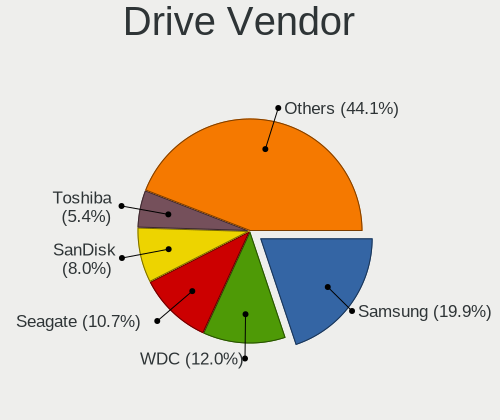

Arch - Tested Hardware & Statistics
-----------------------------------

A project to collect tested hardware configurations for Arch.

Anyone can contribute to this report by the [hw-probe](https://github.com/linuxhw/hw-probe) tool:

    sudo -E hw-probe -all -upload

Please contribute! Especially if your hardware is rare.

This is a report for all computer types. See also reports for [desktops](/Dist/Arch/Desktop/README.md) and [notebooks](/Dist/Arch/Notebook/README.md).

Contents
--------

* [ Test Cases ](#test-cases)

* [ System ](#system)
  - [ OS                       ](#os)
  - [ OS Family                ](#os-family)
  - [ Kernel                   ](#kernel)
  - [ Kernel Family            ](#kernel-family)
  - [ Kernel Major Ver.        ](#kernel-major-ver)
  - [ Arch                     ](#arch)
  - [ DE                       ](#de)
  - [ Display Server           ](#display-server)
  - [ Display Manager          ](#display-manager)
  - [ OS Lang                  ](#os-lang)
  - [ Boot Mode                ](#boot-mode)
  - [ Filesystem               ](#filesystem)
  - [ Part. scheme             ](#part-scheme)
  - [ Dual Boot with Linux/BSD ](#dual-boot-with-linuxbsd)
  - [ Dual Boot (Win)          ](#dual-boot-win)

* [ Board ](#board)
  - [ Vendor                   ](#vendor)
  - [ Model                    ](#model)
  - [ Model Family             ](#model-family)
  - [ MFG Year                 ](#mfg-year)
  - [ Form Factor              ](#form-factor)
  - [ Secure Boot              ](#secure-boot)
  - [ Coreboot                 ](#coreboot)
  - [ RAM Size                 ](#ram-size)
  - [ RAM Used                 ](#ram-used)
  - [ Total Drives             ](#total-drives)
  - [ Has CD-ROM               ](#has-cd-rom)
  - [ Has Ethernet             ](#has-ethernet)
  - [ Has WiFi                 ](#has-wifi)
  - [ Has Bluetooth            ](#has-bluetooth)

* [ Location ](#location)
  - [ Country                  ](#country)
  - [ City                     ](#city)

* [ Drives ](#drives)
  - [ Drive Vendor             ](#drive-vendor)
  - [ Drive Model              ](#drive-model)
  - [ HDD Vendor               ](#hdd-vendor)
  - [ SSD Vendor               ](#ssd-vendor)
  - [ Drive Kind               ](#drive-kind)
  - [ Drive Connector          ](#drive-connector)
  - [ Drive Size               ](#drive-size)
  - [ Space Total              ](#space-total)
  - [ Space Used               ](#space-used)
  - [ Malfunc. Drives          ](#malfunc-drives)
  - [ Malfunc. Drive Vendor    ](#malfunc-drive-vendor)
  - [ Malfunc. HDD Vendor      ](#malfunc-hdd-vendor)
  - [ Malfunc. Drive Kind      ](#malfunc-drive-kind)
  - [ Failed Drives            ](#failed-drives)
  - [ Failed Drive Vendor      ](#failed-drive-vendor)
  - [ Drive Status             ](#drive-status)

* [ Storage controller ](#storage-controller)
  - [ Storage Vendor           ](#storage-vendor)
  - [ Storage Model            ](#storage-model)
  - [ Storage Kind             ](#storage-kind)

* [ Processor ](#processor)
  - [ CPU Vendor               ](#cpu-vendor)
  - [ CPU Model                ](#cpu-model)
  - [ CPU Model Family         ](#cpu-model-family)
  - [ CPU Cores                ](#cpu-cores)
  - [ CPU Sockets              ](#cpu-sockets)
  - [ CPU Threads              ](#cpu-threads)
  - [ CPU Op-Modes             ](#cpu-op-modes)
  - [ CPU Microcode            ](#cpu-microcode)
  - [ CPU Microarch            ](#cpu-microarch)

* [ Graphics ](#graphics)
  - [ GPU Vendor               ](#gpu-vendor)
  - [ GPU Model                ](#gpu-model)
  - [ GPU Combo                ](#gpu-combo)
  - [ GPU Driver               ](#gpu-driver)
  - [ GPU Memory               ](#gpu-memory)

* [ Monitor ](#monitor)
  - [ Monitor Vendor           ](#monitor-vendor)
  - [ Monitor Model            ](#monitor-model)
  - [ Monitor Resolution       ](#monitor-resolution)
  - [ Monitor Diagonal         ](#monitor-diagonal)
  - [ Monitor Width            ](#monitor-width)
  - [ Aspect Ratio             ](#aspect-ratio)
  - [ Monitor Area             ](#monitor-area)
  - [ Pixel Density            ](#pixel-density)
  - [ Multiple Monitors        ](#multiple-monitors)

* [ Network ](#network)
  - [ Net Controller Vendor    ](#net-controller-vendor)
  - [ Net Controller Model     ](#net-controller-model)
  - [ Wireless Vendor          ](#wireless-vendor)
  - [ Wireless Model           ](#wireless-model)
  - [ Ethernet Vendor          ](#ethernet-vendor)
  - [ Ethernet Model           ](#ethernet-model)
  - [ Net Controller Kind      ](#net-controller-kind)
  - [ Used Controller          ](#used-controller)
  - [ NICs                     ](#nics)
  - [ IPv6                     ](#ipv6)

* [ Bluetooth ](#bluetooth)
  - [ Bluetooth Vendor         ](#bluetooth-vendor)
  - [ Bluetooth Model          ](#bluetooth-model)

* [ Sound ](#sound)
  - [ Sound Vendor             ](#sound-vendor)
  - [ Sound Model              ](#sound-model)

* [ Memory ](#memory)
  - [ Memory Vendor            ](#memory-vendor)
  - [ Memory Model             ](#memory-model)
  - [ Memory Kind              ](#memory-kind)
  - [ Memory Form Factor       ](#memory-form-factor)
  - [ Memory Size              ](#memory-size)
  - [ Memory Speed             ](#memory-speed)

* [ Printers & scanners ](#printers--scanners)
  - [ Printer Vendor           ](#printer-vendor)
  - [ Printer Model            ](#printer-model)
  - [ Scanner Vendor           ](#scanner-vendor)
  - [ Scanner Model            ](#scanner-model)

* [ Camera ](#camera)
  - [ Camera Vendor            ](#camera-vendor)
  - [ Camera Model             ](#camera-model)

* [ Security ](#security)
  - [ Fingerprint Vendor       ](#fingerprint-vendor)
  - [ Fingerprint Model        ](#fingerprint-model)
  - [ Chipcard Vendor          ](#chipcard-vendor)
  - [ Chipcard Model           ](#chipcard-model)

* [ Unsupported ](#unsupported)
  - [ Unsupported Devices      ](#unsupported-devices)
  - [ Unsupported Device Types ](#unsupported-device-types)

Test Cases
----------

Total: 14584

| Vendor        | Model                       | Form-Factor | Probe                                                      | Date         |
|---------------|-----------------------------|-------------|------------------------------------------------------------|--------------|
| Lenovo        | ThinkPad 11e 5th Gen 20L... | Notebook    | [f10a0edbdf](https://linux-hardware.org/?probe=f10a0edbdf) | Jan 06, 2025 |
| Acer          | Aspire A715-75G             | Notebook    | [c27afe3737](https://linux-hardware.org/?probe=c27afe3737) | Jan 06, 2025 |
| HP            | Compaq nw8440 (RN043AW#A... | Notebook    | [1a3426f4b6](https://linux-hardware.org/?probe=1a3426f4b6) | Jan 06, 2025 |
| Lenovo        | ThinkPad T450s 20BXCTO1W... | Notebook    | [10131ea72a](https://linux-hardware.org/?probe=10131ea72a) | Jan 06, 2025 |
| Lenovo        | ThinkPad T14s Gen 4 21F8... | Notebook    | [1c78d58aab](https://linux-hardware.org/?probe=1c78d58aab) | Jan 06, 2025 |
| ASUSTek       | ProArt PX13 HN7306WU_HN7... | Convertible | [0338b4e237](https://linux-hardware.org/?probe=0338b4e237) | Jan 06, 2025 |
| Lenovo        | IdeaPad 1 15ALC7 82R4       | Notebook    | [0baddf7cbe](https://linux-hardware.org/?probe=0baddf7cbe) | Jan 06, 2025 |
| HP            | Pavilion Power Laptop 15... | Notebook    | [83a930718f](https://linux-hardware.org/?probe=83a930718f) | Jan 06, 2025 |
| MSI           | B450M PRO-VDH MAX           | Desktop     | [c88a64dee7](https://linux-hardware.org/?probe=c88a64dee7) | Jan 05, 2025 |
| Acer          | Aspire E1-571               | Notebook    | [1be16a65ff](https://linux-hardware.org/?probe=1be16a65ff) | Jan 05, 2025 |
| ASUSTek       | ASUS Zenbook S 16 UM5606... | Notebook    | [9ddd47e13b](https://linux-hardware.org/?probe=9ddd47e13b) | Jan 05, 2025 |
| Lenovo        | ThinkPad T490 20N3S82N1P    | Notebook    | [b9e31a2832](https://linux-hardware.org/?probe=b9e31a2832) | Jan 05, 2025 |
| ASRock        | B650M-HDV/M.2               | Desktop     | [7db2107e2a](https://linux-hardware.org/?probe=7db2107e2a) | Jan 05, 2025 |
| Dell          | Inspiron 14 5435            | Notebook    | [d5776f90e8](https://linux-hardware.org/?probe=d5776f90e8) | Jan 05, 2025 |
| Lenovo        | LOQ 15IRH8 82XV             | Notebook    | [8844fc8d14](https://linux-hardware.org/?probe=8844fc8d14) | Jan 05, 2025 |
| Gigabyte      | A520M K                     | Desktop     | [b725853875](https://linux-hardware.org/?probe=b725853875) | Jan 05, 2025 |
| ASUSTek       | VivoBook_ASUSLaptop X150... | Notebook    | [0f5c50a01c](https://linux-hardware.org/?probe=0f5c50a01c) | Jan 05, 2025 |
| HP            | Victus by Gaming Laptop ... | Notebook    | [5ef06b7cbe](https://linux-hardware.org/?probe=5ef06b7cbe) | Jan 04, 2025 |
| HP            | 89B5 A                      | Desktop     | [6b38b13993](https://linux-hardware.org/?probe=6b38b13993) | Jan 04, 2025 |
| Dell          | XPS 17 9730                 | Notebook    | [699b3afba1](https://linux-hardware.org/?probe=699b3afba1) | Jan 04, 2025 |
| Unknown       | Unknown                     | Soc         | [a9fdc18349](https://linux-hardware.org/?probe=a9fdc18349) | Jan 04, 2025 |
| Biostar       | H61MHV3                     | Desktop     | [d5f3c84801](https://linux-hardware.org/?probe=d5f3c84801) | Jan 04, 2025 |
| Gigabyte      | X470 AORUS ULTRA GAMING-... | Desktop     | [f77ddc1d4e](https://linux-hardware.org/?probe=f77ddc1d4e) | Jan 04, 2025 |
| ASUSTek       | X75VC                       | Notebook    | [5acc8324b3](https://linux-hardware.org/?probe=5acc8324b3) | Jan 04, 2025 |
| Gigabyte      | X470 AORUS ULTRA GAMING-... | Desktop     | [0eb5d3fd27](https://linux-hardware.org/?probe=0eb5d3fd27) | Jan 04, 2025 |
| Lenovo        | IdeaPad 110-15ISK 80UD      | Notebook    | [fefd4c63ee](https://linux-hardware.org/?probe=fefd4c63ee) | Jan 04, 2025 |
| MSI           | B550M PRO-VDH WIFI          | Desktop     | [a3c4d34290](https://linux-hardware.org/?probe=a3c4d34290) | Jan 04, 2025 |
| ASUSTek       | Vivobook Go E1504FA_E150... | Notebook    | [832d6f219e](https://linux-hardware.org/?probe=832d6f219e) | Jan 04, 2025 |
| Gigabyte      | B460M D3H                   | Desktop     | [644e6e2e4e](https://linux-hardware.org/?probe=644e6e2e4e) | Jan 04, 2025 |
| Biostar       | A320MH                      | Desktop     | [a6f434cc49](https://linux-hardware.org/?probe=a6f434cc49) | Jan 04, 2025 |
| Dell          | XPS 15 9570                 | Notebook    | [5eb1399d1e](https://linux-hardware.org/?probe=5eb1399d1e) | Jan 04, 2025 |
| Acer          | Aspire 7530G                | Notebook    | [eaf2bcc73a](https://linux-hardware.org/?probe=eaf2bcc73a) | Jan 04, 2025 |
| Lenovo        | ThinkPad X1 Yoga 4th 20S... | Convertible | [5ecc769c96](https://linux-hardware.org/?probe=5ecc769c96) | Jan 04, 2025 |
| TCL Commun... | 8085                        | Notebook    | [92e147d4fa](https://linux-hardware.org/?probe=92e147d4fa) | Jan 04, 2025 |
| HP            | Compaq 610                  | Notebook    | [794f66ac7e](https://linux-hardware.org/?probe=794f66ac7e) | Jan 03, 2025 |
| HP            | Compaq 610                  | Notebook    | [9e050e5a86](https://linux-hardware.org/?probe=9e050e5a86) | Jan 03, 2025 |
| ASUSTek       | ASUS TUF Gaming A15 FA50... | Notebook    | [a0bbd6cf37](https://linux-hardware.org/?probe=a0bbd6cf37) | Jan 03, 2025 |
| JGINYUE       | X99-D8 Server V1.0          | Desktop     | [686b22c79f](https://linux-hardware.org/?probe=686b22c79f) | Jan 03, 2025 |
| Lenovo        | ThinkPad T440s 20ARS1EQ0... | Notebook    | [84f58ef48f](https://linux-hardware.org/?probe=84f58ef48f) | Jan 03, 2025 |
| Lenovo        | ThinkPad E14 Gen 2 20TB0... | Notebook    | [a301b43994](https://linux-hardware.org/?probe=a301b43994) | Jan 03, 2025 |
| HP            | EliteBook 830 G8 Noteboo... | Notebook    | [dd7ea1bfca](https://linux-hardware.org/?probe=dd7ea1bfca) | Jan 03, 2025 |
| MSI           | Prestige 15 A12SC           | Notebook    | [5749bc91e9](https://linux-hardware.org/?probe=5749bc91e9) | Jan 03, 2025 |
| Shenzhen M... | A5WSR                       | Desktop     | [6a1318e0a6](https://linux-hardware.org/?probe=6a1318e0a6) | Jan 03, 2025 |
| Shenzhen M... | A5WSR                       | Desktop     | [4fc4c2d22d](https://linux-hardware.org/?probe=4fc4c2d22d) | Jan 03, 2025 |
| Infinix       | ZERO BOOK 13                | Notebook    | [13a15ed2a6](https://linux-hardware.org/?probe=13a15ed2a6) | Jan 03, 2025 |
| Infinix       | ZERO BOOK 13                | Notebook    | [ed7c4d2c05](https://linux-hardware.org/?probe=ed7c4d2c05) | Jan 03, 2025 |
| Dell          | Latitude 9420               | Notebook    | [8e4f82962c](https://linux-hardware.org/?probe=8e4f82962c) | Jan 03, 2025 |
| Acer          | Nitro AN515-54              | Notebook    | [3eae42086a](https://linux-hardware.org/?probe=3eae42086a) | Jan 03, 2025 |
| Dell          | 0NC2VH A01                  | Desktop     | [42baf9ae55](https://linux-hardware.org/?probe=42baf9ae55) | Jan 03, 2025 |
| TUXEDO        | Stellaris Slim 15 Intel ... | Notebook    | [ed65b54407](https://linux-hardware.org/?probe=ed65b54407) | Jan 03, 2025 |
| Microsoft     | Surface Laptop Go           | Tablet      | [d8b0dbe711](https://linux-hardware.org/?probe=d8b0dbe711) | Jan 03, 2025 |
| ASUSTek       | ASUS TUF Gaming A15 FA50... | Notebook    | [ffdf653988](https://linux-hardware.org/?probe=ffdf653988) | Jan 03, 2025 |
| Microsoft     | Surface Book 2              | Tablet      | [eaf1bb652c](https://linux-hardware.org/?probe=eaf1bb652c) | Jan 02, 2025 |
| Gigabyte      | X570 UD                     | Desktop     | [8f0c4a3b53](https://linux-hardware.org/?probe=8f0c4a3b53) | Jan 02, 2025 |
| MSI           | B350M MORTAR                | Desktop     | [f946508536](https://linux-hardware.org/?probe=f946508536) | Jan 02, 2025 |
| Lenovo        | ThinkPad T14s Gen 1 20T0... | Notebook    | [6e552e94aa](https://linux-hardware.org/?probe=6e552e94aa) | Jan 02, 2025 |
| HP            | EliteBook x360 1030 G2      | Convertible | [1640751a75](https://linux-hardware.org/?probe=1640751a75) | Jan 02, 2025 |
| Lenovo        | ThinkPad E570 20H50070FR    | Notebook    | [cad0007adb](https://linux-hardware.org/?probe=cad0007adb) | Jan 02, 2025 |
| Gigabyte      | B550 AORUS ELITE AX V2      | Desktop     | [8f4880d03e](https://linux-hardware.org/?probe=8f4880d03e) | Jan 02, 2025 |
| ASUSTek       | ASUS TUF Gaming F15 FX50... | Notebook    | [79854a5556](https://linux-hardware.org/?probe=79854a5556) | Jan 02, 2025 |
| Framework     | Laptop 16 (AMD Ryzen 704... | Notebook    | [6cc92a635d](https://linux-hardware.org/?probe=6cc92a635d) | Jan 02, 2025 |
| Gigabyte      | B550 AORUS ELITE AX V2      | Desktop     | [f85dcfe010](https://linux-hardware.org/?probe=f85dcfe010) | Jan 02, 2025 |
| MSI           | MAG Z790 TOMAHAWK MAX WI... | Desktop     | [a4bf03f97c](https://linux-hardware.org/?probe=a4bf03f97c) | Jan 02, 2025 |
| ASUSTek       | ProArt PX13 HN7306WU_HN7... | Convertible | [109142935c](https://linux-hardware.org/?probe=109142935c) | Jan 02, 2025 |
| Google        | Barla                       | Notebook    | [92ec004230](https://linux-hardware.org/?probe=92ec004230) | Jan 02, 2025 |
| ASRock        | H55M-LE                     | Desktop     | [341c5d1d0a](https://linux-hardware.org/?probe=341c5d1d0a) | Jan 02, 2025 |
| Google        | Barla                       | Notebook    | [b12d7482fe](https://linux-hardware.org/?probe=b12d7482fe) | Jan 02, 2025 |
| Lenovo        | ThinkPad L16 Gen 1 21L70... | Notebook    | [1295119c04](https://linux-hardware.org/?probe=1295119c04) | Jan 01, 2025 |
| MSI           | Prestige 15 A12SC           | Notebook    | [d177ea6bf3](https://linux-hardware.org/?probe=d177ea6bf3) | Jan 01, 2025 |
| Infinix       | YL51A5                      | Notebook    | [431b98dee0](https://linux-hardware.org/?probe=431b98dee0) | Jan 01, 2025 |
| Unknown       | V0.9x                       | Desktop     | [94f488fa63](https://linux-hardware.org/?probe=94f488fa63) | Jan 01, 2025 |
| Gigabyte      | A520 AORUS ELITE            | Desktop     | [21e9277556](https://linux-hardware.org/?probe=21e9277556) | Jan 01, 2025 |
| HUAWEI        | RLEF-XX                     | Notebook    | [51f8d1b6dc](https://linux-hardware.org/?probe=51f8d1b6dc) | Jan 01, 2025 |
| Lenovo        | V15 G2 ITL 82KB             | Notebook    | [17c5dac30c](https://linux-hardware.org/?probe=17c5dac30c) | Jan 01, 2025 |
| Lenovo        | IdeaPad Gaming 3 15ARH05... | Notebook    | [f598642ee7](https://linux-hardware.org/?probe=f598642ee7) | Jan 01, 2025 |
| Apple         | Mac-27ADBB7B4CEE8E61 iMa... | All in one  | [8485c9b6a3](https://linux-hardware.org/?probe=8485c9b6a3) | Jan 01, 2025 |
| Lenovo        | ThinkPad E570 20H50070FR    | Notebook    | [5369e3db69](https://linux-hardware.org/?probe=5369e3db69) | Jan 01, 2025 |
| Framework     | Laptop (13th Gen Intel C... | Notebook    | [705dce2bdc](https://linux-hardware.org/?probe=705dce2bdc) | Dec 31, 2024 |
| Lenovo        | Yoga 730-13IWL 81JR         | Convertible | [9f7c0ced48](https://linux-hardware.org/?probe=9f7c0ced48) | Dec 31, 2024 |
| TUXEDO        | Stellaris Slim 15 Intel ... | Notebook    | [939d33fa22](https://linux-hardware.org/?probe=939d33fa22) | Dec 31, 2024 |
| Dell          | Inspiron 1564               | Notebook    | [2c9fde1f45](https://linux-hardware.org/?probe=2c9fde1f45) | Dec 31, 2024 |
| HP            | EliteBook 8470p             | Notebook    | [7a5df9412c](https://linux-hardware.org/?probe=7a5df9412c) | Dec 31, 2024 |
| Acer          | Aspire E5-573G              | Notebook    | [42555dde71](https://linux-hardware.org/?probe=42555dde71) | Dec 31, 2024 |
| Acer          | TravelMate 5335             | Notebook    | [178a9c1abe](https://linux-hardware.org/?probe=178a9c1abe) | Dec 31, 2024 |
| Lenovo        | ThinkPad T450 20BUS35B00    | Notebook    | [f1f91c5a93](https://linux-hardware.org/?probe=f1f91c5a93) | Dec 31, 2024 |
| Google        | Barla                       | Notebook    | [270f360297](https://linux-hardware.org/?probe=270f360297) | Dec 31, 2024 |
| Acer          | Aspire A715-51G             | Notebook    | [cfd28ac9de](https://linux-hardware.org/?probe=cfd28ac9de) | Dec 31, 2024 |
| Apple         | MacBookAir6,2               | Notebook    | [16df9d43b9](https://linux-hardware.org/?probe=16df9d43b9) | Dec 31, 2024 |
| Gigabyte      | AORUS 15P XD                | Notebook    | [a91ae65b48](https://linux-hardware.org/?probe=a91ae65b48) | Dec 31, 2024 |
| TUXEDO        | Stellaris Slim 15 Intel ... | Notebook    | [b8198ebf58](https://linux-hardware.org/?probe=b8198ebf58) | Dec 31, 2024 |
| Google        | Barla                       | Notebook    | [17c9f8db8c](https://linux-hardware.org/?probe=17c9f8db8c) | Dec 31, 2024 |
| Dell          | Inspiron 3583               | Notebook    | [083ef3a0a2](https://linux-hardware.org/?probe=083ef3a0a2) | Dec 30, 2024 |
| Maibenben     | Perfectum Series            | Notebook    | [db84ebbd71](https://linux-hardware.org/?probe=db84ebbd71) | Dec 30, 2024 |
| MSI           | B450M PRO-VDH MAX           | Desktop     | [9d27b3438a](https://linux-hardware.org/?probe=9d27b3438a) | Dec 30, 2024 |
| Dell          | 03KPVw A00                  | All in one  | [ec101e6744](https://linux-hardware.org/?probe=ec101e6744) | Dec 30, 2024 |
| MSI           | B450M PRO-VDH MAX           | Desktop     | [7de6bd6878](https://linux-hardware.org/?probe=7de6bd6878) | Dec 30, 2024 |
| MSI           | B650M GAMING PLUS WIFI      | Desktop     | [7f4ced1296](https://linux-hardware.org/?probe=7f4ced1296) | Dec 30, 2024 |
| Lenovo        | ThinkPad L14 Gen 1 20U60... | Notebook    | [031c8d3940](https://linux-hardware.org/?probe=031c8d3940) | Dec 30, 2024 |
| MSI           | Prestige 15 A12SC           | Notebook    | [2a23c371cd](https://linux-hardware.org/?probe=2a23c371cd) | Dec 30, 2024 |
| Acer          | Nitro AN515-54              | Notebook    | [ead2772228](https://linux-hardware.org/?probe=ead2772228) | Dec 30, 2024 |
| Lenovo        | ThinkPad E14 Gen 3 20Y70... | Notebook    | [46361a1b83](https://linux-hardware.org/?probe=46361a1b83) | Dec 30, 2024 |
| System76      | Darter Pro                  | Notebook    | [c5c16912fe](https://linux-hardware.org/?probe=c5c16912fe) | Dec 30, 2024 |
| TUXEDO        | InfinityBook Pro AMD Gen... | Notebook    | [5d3fe59ed7](https://linux-hardware.org/?probe=5d3fe59ed7) | Dec 29, 2024 |
| Lenovo        | LOQ 15IRX9 83DV             | Notebook    | [5e54f584cf](https://linux-hardware.org/?probe=5e54f584cf) | Dec 29, 2024 |
| ASUSTek       | S551LN                      | Notebook    | [ef774595d3](https://linux-hardware.org/?probe=ef774595d3) | Dec 29, 2024 |
| Fujitsu       | D2759 S26361-D2759-A13 W... | Server      | [486301061f](https://linux-hardware.org/?probe=486301061f) | Dec 29, 2024 |
| Dell          | Studio 1558                 | Notebook    | [2abf8c0c94](https://linux-hardware.org/?probe=2abf8c0c94) | Dec 29, 2024 |
| Lenovo        | ThinkPad X230 23252UG       | Notebook    | [d8b0adf8fb](https://linux-hardware.org/?probe=d8b0adf8fb) | Dec 29, 2024 |
| Acer          | Aspire A715-42G             | Notebook    | [584e951bfb](https://linux-hardware.org/?probe=584e951bfb) | Dec 29, 2024 |
| PELADN        | WI-6                        | Desktop     | [505a879d82](https://linux-hardware.org/?probe=505a879d82) | Dec 29, 2024 |
| ASRock        | H81M-DG4                    | Desktop     | [63308a03e7](https://linux-hardware.org/?probe=63308a03e7) | Dec 29, 2024 |
| Acer          | Nitro AN517-52              | Notebook    | [693e1ff47b](https://linux-hardware.org/?probe=693e1ff47b) | Dec 29, 2024 |
| Acer          | Nitro AN517-52              | Notebook    | [9208846c2a](https://linux-hardware.org/?probe=9208846c2a) | Dec 29, 2024 |
| Samsung       | 750XGK                      | Notebook    | [13ea2575e9](https://linux-hardware.org/?probe=13ea2575e9) | Dec 29, 2024 |
| Lenovo        | Legion 5 16IRX9 83DG        | Notebook    | [54d9440e0d](https://linux-hardware.org/?probe=54d9440e0d) | Dec 29, 2024 |
| Samsung       | 750XGK                      | Notebook    | [7c0257fc3e](https://linux-hardware.org/?probe=7c0257fc3e) | Dec 28, 2024 |
| ASUSTek       | P8Z77-V LX                  | Desktop     | [a4c88acd7f](https://linux-hardware.org/?probe=a4c88acd7f) | Dec 28, 2024 |
| Dell          | Vostro 5620                 | Notebook    | [8d70ffd3a6](https://linux-hardware.org/?probe=8d70ffd3a6) | Dec 28, 2024 |
| MSI           | Prestige 13 AI+ Evo A2VM... | Notebook    | [c973dc57a1](https://linux-hardware.org/?probe=c973dc57a1) | Dec 28, 2024 |
| Microsoft     | Surface Laptop Go           | Tablet      | [e8a02613fb](https://linux-hardware.org/?probe=e8a02613fb) | Dec 28, 2024 |
| HUAWEI        | VGHH-XX                     | Notebook    | [7ef14dba16](https://linux-hardware.org/?probe=7ef14dba16) | Dec 28, 2024 |
| Microsoft     | Surface Laptop Go           | Tablet      | [b28b752646](https://linux-hardware.org/?probe=b28b752646) | Dec 28, 2024 |
| Lenovo        | ThinkPad T480 20L6SJUS2J    | Notebook    | [55f0836ea7](https://linux-hardware.org/?probe=55f0836ea7) | Dec 28, 2024 |
| MSI           | Thin GF63 12UC              | Notebook    | [80bc381a84](https://linux-hardware.org/?probe=80bc381a84) | Dec 28, 2024 |
| Dell          | 0TTDMJ A00                  | Desktop     | [f1b5e81c74](https://linux-hardware.org/?probe=f1b5e81c74) | Dec 28, 2024 |
| MSI           | B350M MORTAR                | Desktop     | [8f912c3cb7](https://linux-hardware.org/?probe=8f912c3cb7) | Dec 28, 2024 |
| ASRock        | B550M-ITX/ac                | Desktop     | [5a11aa6793](https://linux-hardware.org/?probe=5a11aa6793) | Dec 28, 2024 |
| HP            | Victus by Gaming Laptop ... | Notebook    | [ed4c73ca71](https://linux-hardware.org/?probe=ed4c73ca71) | Dec 28, 2024 |
| HUAWEI        | FLMH-XX                     | Notebook    | [741c280fca](https://linux-hardware.org/?probe=741c280fca) | Dec 28, 2024 |
| HUAWEI        | FLMH-XX                     | Notebook    | [9f52e1834c](https://linux-hardware.org/?probe=9f52e1834c) | Dec 28, 2024 |
| ASUSTek       | PRIME B760M-A AX6 II        | Desktop     | [60215d0dc0](https://linux-hardware.org/?probe=60215d0dc0) | Dec 27, 2024 |
| Maibenben     | PC34 V1.0                   | Desktop     | [1994f8536a](https://linux-hardware.org/?probe=1994f8536a) | Dec 27, 2024 |
| Colorful T... | CVN B650M GAMING FROZEN ... | Desktop     | [f4259d10b6](https://linux-hardware.org/?probe=f4259d10b6) | Dec 27, 2024 |
| Lenovo        | ThinkPad E15 Gen 3 20YG0... | Notebook    | [232b0fc3b1](https://linux-hardware.org/?probe=232b0fc3b1) | Dec 27, 2024 |
| Gigabyte      | B550M S2H                   | Desktop     | [18287a9af1](https://linux-hardware.org/?probe=18287a9af1) | Dec 27, 2024 |
| ASUSTek       | TUF Gaming B650M-PLUS       | Desktop     | [aa2af1b2d7](https://linux-hardware.org/?probe=aa2af1b2d7) | Dec 27, 2024 |
| Dell          | Latitude 5290 2-in-1        | Tablet      | [6f84dea3dc](https://linux-hardware.org/?probe=6f84dea3dc) | Dec 27, 2024 |
| ASUSTek       | TUF B450-PRO GAMING         | Desktop     | [9978434d74](https://linux-hardware.org/?probe=9978434d74) | Dec 27, 2024 |
| ASUSTek       | VivoBook_ASUSLaptop X415... | Notebook    | [0971785105](https://linux-hardware.org/?probe=0971785105) | Dec 26, 2024 |
| MSI           | Katana GF76 12UEOK          | Notebook    | [a3467015fd](https://linux-hardware.org/?probe=a3467015fd) | Dec 26, 2024 |
| ASUSTek       | H97M-E                      | Desktop     | [4bfb3a3198](https://linux-hardware.org/?probe=4bfb3a3198) | Dec 26, 2024 |
| Gigabyte      | B550M S2H                   | Desktop     | [0076231d40](https://linux-hardware.org/?probe=0076231d40) | Dec 26, 2024 |
| Acer          | Aspire 7750G                | Notebook    | [18a8d13fe9](https://linux-hardware.org/?probe=18a8d13fe9) | Dec 26, 2024 |
| Gigabyte      | 970A-DS3P                   | Desktop     | [5178ebb1f5](https://linux-hardware.org/?probe=5178ebb1f5) | Dec 26, 2024 |
| Lenovo        | ThinkPad X1 Tablet Gen 3... | Tablet      | [454126ac6e](https://linux-hardware.org/?probe=454126ac6e) | Dec 26, 2024 |
| Lenovo        | V580c 20160                 | Notebook    | [0cdb0ca83b](https://linux-hardware.org/?probe=0cdb0ca83b) | Dec 26, 2024 |
| Acer          | Swift SF314-71              | Notebook    | [624fb9e1c5](https://linux-hardware.org/?probe=624fb9e1c5) | Dec 25, 2024 |
| MSI           | B450 TOMAHAWK MAX II        | Desktop     | [9f6237983d](https://linux-hardware.org/?probe=9f6237983d) | Dec 25, 2024 |
| ASRock        | B550M Pro4                  | Desktop     | [15ca1a3986](https://linux-hardware.org/?probe=15ca1a3986) | Dec 25, 2024 |
| ASRock        | X570 Taichi                 | Desktop     | [56b87a8422](https://linux-hardware.org/?probe=56b87a8422) | Dec 25, 2024 |
| CyberPower... | Tracer V                    | Notebook    | [a9524e5a4f](https://linux-hardware.org/?probe=a9524e5a4f) | Dec 25, 2024 |
| MSI           | Prestige 15 A12SC           | Notebook    | [482d068493](https://linux-hardware.org/?probe=482d068493) | Dec 25, 2024 |
| ASUSTek       | PRIME Z390-A                | Desktop     | [1202e9754d](https://linux-hardware.org/?probe=1202e9754d) | Dec 25, 2024 |
| ASUSTek       | ASUS Zenbook 14 UM3406HA... | Notebook    | [15d4c80d32](https://linux-hardware.org/?probe=15d4c80d32) | Dec 25, 2024 |
| HP            | Pavilion Notebook           | Notebook    | [ab8938203b](https://linux-hardware.org/?probe=ab8938203b) | Dec 25, 2024 |
| HP            | Pavilion Notebook           | Notebook    | [ac422e1a6c](https://linux-hardware.org/?probe=ac422e1a6c) | Dec 25, 2024 |
| Lenovo        | ThinkPad T480s 20L7002HU... | Notebook    | [568f04a0e1](https://linux-hardware.org/?probe=568f04a0e1) | Dec 24, 2024 |
| Dell          | Inspiron 1545               | Notebook    | [c4301467a3](https://linux-hardware.org/?probe=c4301467a3) | Dec 24, 2024 |
| Dell          | 0GY6Y8 A00                  | Desktop     | [924efb699d](https://linux-hardware.org/?probe=924efb699d) | Dec 24, 2024 |
| Notebook      | L2x0TU                      | Notebook    | [da7db18331](https://linux-hardware.org/?probe=da7db18331) | Dec 24, 2024 |
| Lenovo        | ThinkPad T450s 20BX000WG... | Notebook    | [f435edfb1d](https://linux-hardware.org/?probe=f435edfb1d) | Dec 24, 2024 |
| Lenovo        | V14 G4 ABP 82YX             | Notebook    | [66c7a6f6dc](https://linux-hardware.org/?probe=66c7a6f6dc) | Dec 24, 2024 |
| ASUSTek       | ROG Zephyrus G15 GA503RM    | Notebook    | [5da1cab939](https://linux-hardware.org/?probe=5da1cab939) | Dec 24, 2024 |
| ASUSTek       | G771JM                      | Notebook    | [f76a116151](https://linux-hardware.org/?probe=f76a116151) | Dec 24, 2024 |
| HUAWEI        | KLVL-WXX9                   | Notebook    | [8c5b06dd77](https://linux-hardware.org/?probe=8c5b06dd77) | Dec 23, 2024 |
| HP            | EliteBook 8560w (XX058AV... | Notebook    | [fd12235221](https://linux-hardware.org/?probe=fd12235221) | Dec 23, 2024 |
| Dell          | 0KYWH7 A01                  | Desktop     | [86c6baedbe](https://linux-hardware.org/?probe=86c6baedbe) | Dec 23, 2024 |
| Dell          | 0KYWH7 A01                  | Desktop     | [ac3e1d624b](https://linux-hardware.org/?probe=ac3e1d624b) | Dec 23, 2024 |
| Apple         | MacBookPro9,2               | Notebook    | [584f7243e9](https://linux-hardware.org/?probe=584f7243e9) | Dec 23, 2024 |
| Apple         | MacBookAir7,2               | Notebook    | [c02f6f4421](https://linux-hardware.org/?probe=c02f6f4421) | Dec 23, 2024 |
| Avell         | B.ON                        | Notebook    | [8a06f2de3b](https://linux-hardware.org/?probe=8a06f2de3b) | Dec 23, 2024 |
| Samsung       | 700Z3C/700Z5C               | Notebook    | [4c634dc49d](https://linux-hardware.org/?probe=4c634dc49d) | Dec 23, 2024 |
| ASUSTek       | H97M-PLUS                   | Desktop     | [e5d71e3aba](https://linux-hardware.org/?probe=e5d71e3aba) | Dec 22, 2024 |
| HP            | ZBook 15 G2                 | Notebook    | [64c7294576](https://linux-hardware.org/?probe=64c7294576) | Dec 22, 2024 |
| Lenovo        | ThinkPad T450 20BUS3GN02    | Notebook    | [ebd69fe1aa](https://linux-hardware.org/?probe=ebd69fe1aa) | Dec 22, 2024 |
| MSI           | MPG Z790 CARBON WIFI        | Desktop     | [510b37b7aa](https://linux-hardware.org/?probe=510b37b7aa) | Dec 22, 2024 |
| Lenovo        | ThinkPad T430 2349A17       | Notebook    | [467d5bf559](https://linux-hardware.org/?probe=467d5bf559) | Dec 22, 2024 |
| ASUSTek       | Pro B760M-CT                | Notebook    | [d2a2cc2c88](https://linux-hardware.org/?probe=d2a2cc2c88) | Dec 22, 2024 |
| Apple         | Mac-BE088AF8C5EB4FA2 iMa... | All in one  | [eda26270c4](https://linux-hardware.org/?probe=eda26270c4) | Dec 22, 2024 |
| Gigabyte      | X670 AORUS ELITE AX         | Desktop     | [c64e9ff809](https://linux-hardware.org/?probe=c64e9ff809) | Dec 22, 2024 |
| Gigabyte      | P55-USB3                    | Desktop     | [3fb482feaf](https://linux-hardware.org/?probe=3fb482feaf) | Dec 22, 2024 |
| ASUSTek       | ASUS TUF Gaming A15 FA50... | Notebook    | [7172f26f77](https://linux-hardware.org/?probe=7172f26f77) | Dec 22, 2024 |
| Lenovo        | ThinkPad W541 20EGS1FB00    | Notebook    | [6f758495b3](https://linux-hardware.org/?probe=6f758495b3) | Dec 21, 2024 |
| Lenovo        | ThinkPad P14s Gen 1 20Y2... | Notebook    | [b7ad8c7467](https://linux-hardware.org/?probe=b7ad8c7467) | Dec 21, 2024 |
| ASUSTek       | VivoBook_ASUSLaptop X515... | Notebook    | [81230d7d43](https://linux-hardware.org/?probe=81230d7d43) | Dec 21, 2024 |
| Avell         | B.ON                        | Notebook    | [4cdfce4d81](https://linux-hardware.org/?probe=4cdfce4d81) | Dec 21, 2024 |
| Gigabyte      | B550M DS3H                  | Desktop     | [8387032a00](https://linux-hardware.org/?probe=8387032a00) | Dec 21, 2024 |
| Apple         | Mac-BE088AF8C5EB4FA2 iMa... | All in one  | [6fea2b9985](https://linux-hardware.org/?probe=6fea2b9985) | Dec 21, 2024 |
| HP            | Spectre x360 Convertible... | Convertible | [af6818a82d](https://linux-hardware.org/?probe=af6818a82d) | Dec 21, 2024 |
| Lenovo        | ThinkPad P14s Gen 4 21HF... | Notebook    | [0c9e61a477](https://linux-hardware.org/?probe=0c9e61a477) | Dec 20, 2024 |
| Lenovo        | LOQ 15IRH8 82XV             | Notebook    | [e31581514e](https://linux-hardware.org/?probe=e31581514e) | Dec 20, 2024 |
| Lenovo        | ThinkPad X1 Carbon Gen 1... | Notebook    | [d8ec348d56](https://linux-hardware.org/?probe=d8ec348d56) | Dec 20, 2024 |
| ASUSTek       | ASUS TUF Gaming F15 FX50... | Notebook    | [e2aca4405b](https://linux-hardware.org/?probe=e2aca4405b) | Dec 20, 2024 |
| MSI           | GF65 Thin 9SD               | Notebook    | [404e3c31ea](https://linux-hardware.org/?probe=404e3c31ea) | Dec 20, 2024 |
| HP            | Spectre x360 Convertible... | Convertible | [74bbe2b293](https://linux-hardware.org/?probe=74bbe2b293) | Dec 20, 2024 |
| Lenovo        | ThinkPad T450 20BUS3GN02    | Notebook    | [54fd784e9c](https://linux-hardware.org/?probe=54fd784e9c) | Dec 20, 2024 |
| Compumax C... | ONIX-CEL-0001               | Notebook    | [5c7c3a9849](https://linux-hardware.org/?probe=5c7c3a9849) | Dec 19, 2024 |
| Compumax C... | ONIX-CEL-0001               | Notebook    | [9365cddb5a](https://linux-hardware.org/?probe=9365cddb5a) | Dec 19, 2024 |
| Gigabyte      | Z790 AORUS ELITE AX         | Desktop     | [fadffefa28](https://linux-hardware.org/?probe=fadffefa28) | Dec 19, 2024 |
| Dell          | Precision 5520              | Notebook    | [17f5aaa2c6](https://linux-hardware.org/?probe=17f5aaa2c6) | Dec 19, 2024 |
| Google        | Morphius                    | Notebook    | [efd4a1413c](https://linux-hardware.org/?probe=efd4a1413c) | Dec 18, 2024 |
| ASRock        | X300-ITX                    | Desktop     | [b6a39bc4d8](https://linux-hardware.org/?probe=b6a39bc4d8) | Dec 18, 2024 |
| Lenovo        | FLEX5-14 81X2               | Convertible | [56da00ada2](https://linux-hardware.org/?probe=56da00ada2) | Dec 18, 2024 |
| ASUSTek       | ROG Zephyrus G14 GA402RJ... | Notebook    | [77f57a0535](https://linux-hardware.org/?probe=77f57a0535) | Dec 18, 2024 |
| Apple         | MacBookPro8,1               | Notebook    | [08044442cf](https://linux-hardware.org/?probe=08044442cf) | Dec 18, 2024 |
| ASUSTek       | PRIME B550-PLUS             | Desktop     | [7b074aefcc](https://linux-hardware.org/?probe=7b074aefcc) | Dec 18, 2024 |
| ASUSTek       | ROG STRIX H370-I GAMING     | Desktop     | [0ae519bf73](https://linux-hardware.org/?probe=0ae519bf73) | Dec 18, 2024 |
| Dell          | Precision 5490              | Notebook    | [ee16cc2886](https://linux-hardware.org/?probe=ee16cc2886) | Dec 17, 2024 |
| HP            | 240 G4 Notebook PC          | Notebook    | [1e82cc2079](https://linux-hardware.org/?probe=1e82cc2079) | Dec 17, 2024 |
| Lenovo        | ThinkPad T495 20NKS2JD00    | Notebook    | [31a4026530](https://linux-hardware.org/?probe=31a4026530) | Dec 17, 2024 |
| ASUSTek       | ROG STRIX B550-A GAMING     | Desktop     | [6ca07fcdfb](https://linux-hardware.org/?probe=6ca07fcdfb) | Dec 17, 2024 |
| ASRock        | B550M-ITX/ac                | Desktop     | [fc393a7165](https://linux-hardware.org/?probe=fc393a7165) | Dec 17, 2024 |
| ASUSTek       | ASUS Zenbook 14 UM3406HA... | Notebook    | [fb3afaa6bb](https://linux-hardware.org/?probe=fb3afaa6bb) | Dec 17, 2024 |
| MSI           | MPG X570 GAMING PLUS        | Desktop     | [a157381033](https://linux-hardware.org/?probe=a157381033) | Dec 17, 2024 |
| Lenovo        | ThinkPad T450 20BUS05A09    | Notebook    | [26806171d3](https://linux-hardware.org/?probe=26806171d3) | Dec 17, 2024 |
| Lenovo        | LOQ 15IRH8 82XV             | Notebook    | [18a51b24d7](https://linux-hardware.org/?probe=18a51b24d7) | Dec 17, 2024 |
| ASUSTek       | PRIME X670E-PRO WIFI        | Desktop     | [2207400569](https://linux-hardware.org/?probe=2207400569) | Dec 17, 2024 |
| MSI           | PRO Z690-A DDR4             | Desktop     | [63f734b1e5](https://linux-hardware.org/?probe=63f734b1e5) | Dec 17, 2024 |
| ASUSTek       | VivoBook_ASUSLaptop S540... | Notebook    | [dd3f73cd56](https://linux-hardware.org/?probe=dd3f73cd56) | Dec 17, 2024 |
| Gigabyte      | X870 EAGLE WIFI7            | Desktop     | [0b96421b6c](https://linux-hardware.org/?probe=0b96421b6c) | Dec 17, 2024 |
| ASUSTek       | VivoBook_ASUSLaptop X140... | Notebook    | [50315f1b60](https://linux-hardware.org/?probe=50315f1b60) | Dec 17, 2024 |
| Gigabyte      | B650 GAMING X AX V2         | Desktop     | [e625968bcb](https://linux-hardware.org/?probe=e625968bcb) | Dec 17, 2024 |
| Lenovo        | ThinkPad X280 20KES2EW08    | Notebook    | [bbd058898c](https://linux-hardware.org/?probe=bbd058898c) | Dec 17, 2024 |
| ASUSTek       | TUF Z390-PLUS GAMING        | Desktop     | [3a941c604b](https://linux-hardware.org/?probe=3a941c604b) | Dec 17, 2024 |
| ASUSTek       | CROSSHAIR VI HERO           | Desktop     | [d87aaaf485](https://linux-hardware.org/?probe=d87aaaf485) | Dec 16, 2024 |
| MSI           | B450M MORTAR MAX            | Desktop     | [d76388f034](https://linux-hardware.org/?probe=d76388f034) | Dec 16, 2024 |
| MSI           | B450M MORTAR MAX            | Desktop     | [00eb10a377](https://linux-hardware.org/?probe=00eb10a377) | Dec 16, 2024 |
| ASRock        | A520M-HVS                   | Desktop     | [ad901a965d](https://linux-hardware.org/?probe=ad901a965d) | Dec 16, 2024 |
| Dell          | 0WR7PY A02                  | Desktop     | [cedf8aee7e](https://linux-hardware.org/?probe=cedf8aee7e) | Dec 16, 2024 |
| HP            | 83E2                        | Desktop     | [1b12192911](https://linux-hardware.org/?probe=1b12192911) | Dec 16, 2024 |
| MSI           | X99S GAMING 9 AC            | Desktop     | [dd95266cf8](https://linux-hardware.org/?probe=dd95266cf8) | Dec 16, 2024 |
| MSI           | X99S GAMING 9 AC            | Desktop     | [5e49b2a07b](https://linux-hardware.org/?probe=5e49b2a07b) | Dec 16, 2024 |
| ASUSTek       | ZenBook UX425UA_UM425UA     | Notebook    | [119fb952a9](https://linux-hardware.org/?probe=119fb952a9) | Dec 16, 2024 |
| MSI           | GT73EVR 7RD                 | Notebook    | [c3321b8ab3](https://linux-hardware.org/?probe=c3321b8ab3) | Dec 16, 2024 |
| Apple         | MacBookAir7,2               | Notebook    | [047d8ffeee](https://linux-hardware.org/?probe=047d8ffeee) | Dec 15, 2024 |
| MSI           | PRO B650M-A WIFI            | Desktop     | [ea8ffcb3c8](https://linux-hardware.org/?probe=ea8ffcb3c8) | Dec 15, 2024 |
| MSI           | PRO B650M-A WIFI            | Desktop     | [5c0f89d5b9](https://linux-hardware.org/?probe=5c0f89d5b9) | Dec 15, 2024 |
| Lenovo        | ThinkPad L520 5016NY9       | Notebook    | [1bc4600530](https://linux-hardware.org/?probe=1bc4600530) | Dec 15, 2024 |
| Acer          | Aspire ES1-571              | Notebook    | [91918bcc8e](https://linux-hardware.org/?probe=91918bcc8e) | Dec 15, 2024 |
| Gigabyte      | B450 AORUS ELITE V2         | Desktop     | [b24c0ed46d](https://linux-hardware.org/?probe=b24c0ed46d) | Dec 15, 2024 |
| ASUSTek       | ROG STRIX B650E-E GAMING... | Desktop     | [be06a1068f](https://linux-hardware.org/?probe=be06a1068f) | Dec 15, 2024 |
| ASUSTek       | X550VB                      | Notebook    | [b739f6848e](https://linux-hardware.org/?probe=b739f6848e) | Dec 15, 2024 |
| Dell          | 02GDWG A00                  | Desktop     | [0576666072](https://linux-hardware.org/?probe=0576666072) | Dec 15, 2024 |
| MSI           | H270 TOMAHAWK ARCTIC        | Desktop     | [1274414039](https://linux-hardware.org/?probe=1274414039) | Dec 15, 2024 |
| ASRock        | B650M PG Lightning WiFi     | Desktop     | [1ec00fae66](https://linux-hardware.org/?probe=1ec00fae66) | Dec 14, 2024 |
| ASRock        | AB350 Pro4                  | Desktop     | [8d7dd64d23](https://linux-hardware.org/?probe=8d7dd64d23) | Dec 14, 2024 |
| Dell          | 0T7D40 A00                  | Desktop     | [218ef87925](https://linux-hardware.org/?probe=218ef87925) | Dec 14, 2024 |
| Dell          | 0T7D40 A00                  | Desktop     | [ac9dce6f48](https://linux-hardware.org/?probe=ac9dce6f48) | Dec 14, 2024 |
| Dell          | 0GY6Y8 A00                  | Desktop     | [4d22a711c2](https://linux-hardware.org/?probe=4d22a711c2) | Dec 14, 2024 |
| Foxconn       | H55MXV Series               | Desktop     | [cf67e7336a](https://linux-hardware.org/?probe=cf67e7336a) | Dec 14, 2024 |
| Foxconn       | H55MXV Series               | Desktop     | [6a647c4d4e](https://linux-hardware.org/?probe=6a647c4d4e) | Dec 14, 2024 |
| Acer          | Aspire F5-573G              | Notebook    | [0ca4fe4591](https://linux-hardware.org/?probe=0ca4fe4591) | Dec 14, 2024 |
| ASRock        | B450 Gaming-ITX/ac          | Desktop     | [e6c039f6ca](https://linux-hardware.org/?probe=e6c039f6ca) | Dec 14, 2024 |
| ASUSTek       | TUF B450-PRO GAMING         | Desktop     | [5f5311c4b3](https://linux-hardware.org/?probe=5f5311c4b3) | Dec 14, 2024 |
| HASEE Comp... | CV15S                       | Notebook    | [b1c86ea2a0](https://linux-hardware.org/?probe=b1c86ea2a0) | Dec 14, 2024 |
| ASUSTek       | PRIME B550-PLUS             | Desktop     | [4e821e4adb](https://linux-hardware.org/?probe=4e821e4adb) | Dec 14, 2024 |
| HP            | 255 G8 Notebook PC          | Notebook    | [47a16bb755](https://linux-hardware.org/?probe=47a16bb755) | Dec 13, 2024 |
| Lenovo        | LOQ 15IRH8 82XV             | Notebook    | [e9cba9e18e](https://linux-hardware.org/?probe=e9cba9e18e) | Dec 13, 2024 |
| MSI           | MPG X870E CARBON WIFI       | Desktop     | [852de9c4f7](https://linux-hardware.org/?probe=852de9c4f7) | Dec 13, 2024 |
| Lenovo        | ThinkPad T480s 20L8S7890... | Notebook    | [6cb6a6ef3b](https://linux-hardware.org/?probe=6cb6a6ef3b) | Dec 13, 2024 |
| Apple         | MacBook10,1                 | Notebook    | [5789633a9d](https://linux-hardware.org/?probe=5789633a9d) | Dec 13, 2024 |
| XIAOMI        | Redmi Book Pro 15 2023      | Notebook    | [36fa9187cd](https://linux-hardware.org/?probe=36fa9187cd) | Dec 13, 2024 |
| MSI           | B550M PRO-VDH WIFI          | Desktop     | [99bbee3d81](https://linux-hardware.org/?probe=99bbee3d81) | Dec 13, 2024 |
| Micro Comp... | HX100G                      | Desktop     | [b050952d4a](https://linux-hardware.org/?probe=b050952d4a) | Dec 13, 2024 |
| MSI           | B560-A PRO                  | Desktop     | [521113e45e](https://linux-hardware.org/?probe=521113e45e) | Dec 12, 2024 |
| Lenovo        | ThinkPad T14 Gen 2i 20W1... | Notebook    | [0cd56b6866](https://linux-hardware.org/?probe=0cd56b6866) | Dec 12, 2024 |
| ASUSTek       | ROG Zephyrus G14 GA402RJ... | Notebook    | [985546b639](https://linux-hardware.org/?probe=985546b639) | Dec 12, 2024 |
| HP            | ProBook x360 11 G7 Educa... | Convertible | [fc644dd148](https://linux-hardware.org/?probe=fc644dd148) | Dec 12, 2024 |
| GMKtec        | NucBox K6                   | Desktop     | [0ba5e79a99](https://linux-hardware.org/?probe=0ba5e79a99) | Dec 12, 2024 |
| Lenovo        | IdeaPad 5 14ALC05 82LM      | Notebook    | [cc9e7aed4d](https://linux-hardware.org/?probe=cc9e7aed4d) | Dec 12, 2024 |
| Gigabyte      | H410M H V3                  | Desktop     | [37d81caea8](https://linux-hardware.org/?probe=37d81caea8) | Dec 12, 2024 |
| ASUSTek       | PRIME A320M-K               | Desktop     | [467278b658](https://linux-hardware.org/?probe=467278b658) | Dec 12, 2024 |
| HP            | 89EB 11                     | Desktop     | [d340c8e1e1](https://linux-hardware.org/?probe=d340c8e1e1) | Dec 11, 2024 |
| Gigabyte      | B650 EAGLE AX               | Desktop     | [e7c8036b9d](https://linux-hardware.org/?probe=e7c8036b9d) | Dec 11, 2024 |
| MSI           | Bravo 17 A4DDR              | Notebook    | [d8d5ecc26c](https://linux-hardware.org/?probe=d8d5ecc26c) | Dec 11, 2024 |
| ASRock        | X570 Phantom Gaming 4       | Desktop     | [14a9842241](https://linux-hardware.org/?probe=14a9842241) | Dec 11, 2024 |
| HP            | Syndra                      | Notebook    | [5afea7c0af](https://linux-hardware.org/?probe=5afea7c0af) | Dec 11, 2024 |
| HUAWEI        | FLMH-XX                     | Notebook    | [240c1e7372](https://linux-hardware.org/?probe=240c1e7372) | Dec 11, 2024 |
| Framework     | Laptop                      | Notebook    | [ff03f6aa77](https://linux-hardware.org/?probe=ff03f6aa77) | Dec 11, 2024 |
| JGINYUE       | X99 TITANIUM D3             | Desktop     | [bb9134a8a6](https://linux-hardware.org/?probe=bb9134a8a6) | Dec 11, 2024 |
| ASUSTek       | VivoBook_ASUSLaptop K550... | Notebook    | [6dbbb0dd7b](https://linux-hardware.org/?probe=6dbbb0dd7b) | Dec 11, 2024 |
| ASUSTek       | ROG Flow X13 GV302XI_GV3... | Convertible | [9907f25da7](https://linux-hardware.org/?probe=9907f25da7) | Dec 11, 2024 |
| MSI           | B550M PRO-VDH WIFI          | Desktop     | [4629709a7a](https://linux-hardware.org/?probe=4629709a7a) | Dec 11, 2024 |
| ASUSTek       | TUF Gaming B550M-PLUS       | Desktop     | [0895524ef3](https://linux-hardware.org/?probe=0895524ef3) | Dec 11, 2024 |
| ASUSTek       | TUF Gaming B550M-PLUS       | Desktop     | [e9f46337c3](https://linux-hardware.org/?probe=e9f46337c3) | Dec 11, 2024 |
| Acer          | Predator PO3-620            | Desktop     | [fce8274ab8](https://linux-hardware.org/?probe=fce8274ab8) | Dec 11, 2024 |
| Lenovo        | ThinkPad A485 20MVS08500    | Notebook    | [bf16c326f0](https://linux-hardware.org/?probe=bf16c326f0) | Dec 11, 2024 |
| HP            | 89EB 11                     | Desktop     | [25e020d362](https://linux-hardware.org/?probe=25e020d362) | Dec 11, 2024 |
| Lenovo        | ThinkPad X13 Yoga Gen 4 ... | Convertible | [abaa889c70](https://linux-hardware.org/?probe=abaa889c70) | Dec 11, 2024 |
| Acer          | Predator PHN16-71           | Notebook    | [e18ec1de74](https://linux-hardware.org/?probe=e18ec1de74) | Dec 10, 2024 |
| ASUSTek       | ASUS TUF Gaming A14 FA40... | Notebook    | [3e1d32a05a](https://linux-hardware.org/?probe=3e1d32a05a) | Dec 10, 2024 |
| Medion        | H110H4-EM                   | Desktop     | [c13551963f](https://linux-hardware.org/?probe=c13551963f) | Dec 10, 2024 |
| HP            | Laptop 14-cf2xxx            | Notebook    | [c60ecc3c41](https://linux-hardware.org/?probe=c60ecc3c41) | Dec 10, 2024 |
| MSI           | B450M PRO-M2 MAX            | Desktop     | [8436935283](https://linux-hardware.org/?probe=8436935283) | Dec 10, 2024 |
| ASUSTek       | P553UA                      | Notebook    | [136fda34cf](https://linux-hardware.org/?probe=136fda34cf) | Dec 10, 2024 |
| HP            | Pavilion Gaming Laptop 1... | Notebook    | [440089cb3c](https://linux-hardware.org/?probe=440089cb3c) | Dec 09, 2024 |
| Lenovo        | ThinkPad P51 20HJS16Q0K     | Notebook    | [ecd4468e9c](https://linux-hardware.org/?probe=ecd4468e9c) | Dec 09, 2024 |
| HP            | 1825                        | Desktop     | [a5a96d92a8](https://linux-hardware.org/?probe=a5a96d92a8) | Dec 09, 2024 |
| MSI           | MAG X570 TOMAHAWK WIFI      | Desktop     | [9a987bc4b0](https://linux-hardware.org/?probe=9a987bc4b0) | Dec 09, 2024 |
| MSI           | MAG X870 TOMAHAWK WIFI      | Desktop     | [a1d466a8c2](https://linux-hardware.org/?probe=a1d466a8c2) | Dec 09, 2024 |
| Lenovo        | ThinkPad E14 Gen 2 20TA0... | Notebook    | [cbd8da337a](https://linux-hardware.org/?probe=cbd8da337a) | Dec 09, 2024 |
| AMI           | Intel                       | Notebook    | [8de5915da3](https://linux-hardware.org/?probe=8de5915da3) | Dec 08, 2024 |
| MSI           | Modern 15 A11M              | Notebook    | [c8f5bf1e23](https://linux-hardware.org/?probe=c8f5bf1e23) | Dec 08, 2024 |
| ASUSTek       | ASUS TUF Gaming F15 FX50... | Notebook    | [1fcb1559d5](https://linux-hardware.org/?probe=1fcb1559d5) | Dec 08, 2024 |
| MSI           | B550M PRO-VDH               | Desktop     | [30ad89f2cd](https://linux-hardware.org/?probe=30ad89f2cd) | Dec 08, 2024 |
| HUAWEI        | HKF-WXX                     | Notebook    | [59cd028fb6](https://linux-hardware.org/?probe=59cd028fb6) | Dec 08, 2024 |
| ASUSTek       | N53SN                       | Notebook    | [fcda31ce2d](https://linux-hardware.org/?probe=fcda31ce2d) | Dec 08, 2024 |
| ASRock        | B460M Steel Legend          | Desktop     | [2f90887c93](https://linux-hardware.org/?probe=2f90887c93) | Dec 08, 2024 |
| HP            | EliteBook 8560w (XX058AV... | Notebook    | [8eac1d1836](https://linux-hardware.org/?probe=8eac1d1836) | Dec 08, 2024 |
| ASRock        | B460M Steel Legend          | Desktop     | [47e703a42d](https://linux-hardware.org/?probe=47e703a42d) | Dec 08, 2024 |
| ASRock        | B650M Pro RS WiFi           | Desktop     | [e56c27202c](https://linux-hardware.org/?probe=e56c27202c) | Dec 08, 2024 |
| Dell          | XPS 15 9530                 | Notebook    | [181a07929f](https://linux-hardware.org/?probe=181a07929f) | Dec 07, 2024 |
| Acer          | Predator PHN16-71           | Notebook    | [727d64bac6](https://linux-hardware.org/?probe=727d64bac6) | Dec 07, 2024 |
| Dell          | XPS 15 9530                 | Notebook    | [d37a70d3c2](https://linux-hardware.org/?probe=d37a70d3c2) | Dec 07, 2024 |
| Lenovo        | IdeaPad 3 15ADA6 82KR       | Notebook    | [3fe07f468b](https://linux-hardware.org/?probe=3fe07f468b) | Dec 07, 2024 |
| Gigabyte      | B550 GAMING X V2            | Desktop     | [0a316b6841](https://linux-hardware.org/?probe=0a316b6841) | Dec 07, 2024 |
| ASUSTek       | Maximus VIII HERO           | Desktop     | [57fb114501](https://linux-hardware.org/?probe=57fb114501) | Dec 07, 2024 |
| ASUSTek       | VivoBook_ASUSLaptop M540... | Notebook    | [43ae490d8a](https://linux-hardware.org/?probe=43ae490d8a) | Dec 07, 2024 |
| ASRock        | AB350 Pro4                  | Desktop     | [68e28088be](https://linux-hardware.org/?probe=68e28088be) | Dec 07, 2024 |
| Lenovo        | ThinkPad L13 Gen 2a 21AB... | Notebook    | [8a5754e888](https://linux-hardware.org/?probe=8a5754e888) | Dec 07, 2024 |
| ASUSTek       | ROG STRIX Z690-I GAMING ... | Desktop     | [20a1c20751](https://linux-hardware.org/?probe=20a1c20751) | Dec 06, 2024 |
| ASUSTek       | Zenbook UX3402ZA_UX3402Z... | Notebook    | [f0d77fead4](https://linux-hardware.org/?probe=f0d77fead4) | Dec 06, 2024 |
| Gigabyte      | B450M H                     | Desktop     | [930e73d68c](https://linux-hardware.org/?probe=930e73d68c) | Dec 06, 2024 |
| Dell          | Latitude 5430               | Notebook    | [da4238a565](https://linux-hardware.org/?probe=da4238a565) | Dec 06, 2024 |
| HUAWEI        | FLMH-XX                     | Notebook    | [458a5ab98f](https://linux-hardware.org/?probe=458a5ab98f) | Dec 06, 2024 |
| Lenovo        | Legion-S7-16APH8 82Y4       | Notebook    | [7ce6044500](https://linux-hardware.org/?probe=7ce6044500) | Dec 06, 2024 |
| ASUSTek       | H61M-A/BR                   | Desktop     | [7eae96418c](https://linux-hardware.org/?probe=7eae96418c) | Dec 06, 2024 |
| ASRock        | B650 Pro RS                 | Desktop     | [bd0c55951c](https://linux-hardware.org/?probe=bd0c55951c) | Dec 06, 2024 |
| HP            | EliteBook 845 G8 Noteboo... | Notebook    | [14c1cdd699](https://linux-hardware.org/?probe=14c1cdd699) | Dec 06, 2024 |
| ASUSTek       | ROG STRIX Z490-E GAMING     | Desktop     | [496a116678](https://linux-hardware.org/?probe=496a116678) | Dec 06, 2024 |
| Chuwi         | FreeBook                    | Notebook    | [dbf51cf2eb](https://linux-hardware.org/?probe=dbf51cf2eb) | Dec 06, 2024 |
| Lenovo        | ThinkPad T14 Gen 1 20UD0... | Notebook    | [8ff81d690d](https://linux-hardware.org/?probe=8ff81d690d) | Dec 06, 2024 |
| Dell          | Inspiron 15 3520            | Notebook    | [58cfe39a15](https://linux-hardware.org/?probe=58cfe39a15) | Dec 06, 2024 |
| TUXEDO        | InfinityBook S 15 Gen6      | Notebook    | [4e73bb1e03](https://linux-hardware.org/?probe=4e73bb1e03) | Dec 06, 2024 |
| Dell          | Inspiron 7415 2-in-1        | Convertible | [1c3315060c](https://linux-hardware.org/?probe=1c3315060c) | Dec 06, 2024 |
| TUXEDO        | InfinityBook Pro AMD Gen... | Notebook    | [a7a5047657](https://linux-hardware.org/?probe=a7a5047657) | Dec 05, 2024 |
| ASUSTek       | ASUS TUF Gaming F15 FX50... | Notebook    | [3497127dba](https://linux-hardware.org/?probe=3497127dba) | Dec 05, 2024 |
| MSI           | H510M-A PRO                 | Desktop     | [fcc2b60362](https://linux-hardware.org/?probe=fcc2b60362) | Dec 05, 2024 |
| Acer          | TravelMate Spin B118-G2-... | Convertible | [83d6d9d602](https://linux-hardware.org/?probe=83d6d9d602) | Dec 05, 2024 |
| Lenovo        | ThinkPad T430 2349A17       | Notebook    | [704c8bef39](https://linux-hardware.org/?probe=704c8bef39) | Dec 05, 2024 |
| Fujitsu       | LIFEBOOK AH531              | Notebook    | [36683f8571](https://linux-hardware.org/?probe=36683f8571) | Dec 05, 2024 |
| Lenovo        | ThinkPad P14s Gen 5 AMD ... | Notebook    | [4ec7e106ef](https://linux-hardware.org/?probe=4ec7e106ef) | Dec 05, 2024 |
| TUXEDO        | Stellaris Slim 15 Intel ... | Notebook    | [a5eace7109](https://linux-hardware.org/?probe=a5eace7109) | Dec 05, 2024 |
| ASRock        | B650M Pro RS                | Desktop     | [3e546a0c36](https://linux-hardware.org/?probe=3e546a0c36) | Dec 05, 2024 |
| XIAOMI        | Redmi Book Pro 15 2023      | Notebook    | [064554e6d5](https://linux-hardware.org/?probe=064554e6d5) | Dec 05, 2024 |
| ASRock        | X670E Steel Legend          | Desktop     | [83f29b76a8](https://linux-hardware.org/?probe=83f29b76a8) | Dec 04, 2024 |
| ASUSTek       | ProArt PX13 HN7306WV_HN7... | Convertible | [3fd3e07638](https://linux-hardware.org/?probe=3fd3e07638) | Dec 04, 2024 |
| HP            | 14                          | Notebook    | [28802b9b1c](https://linux-hardware.org/?probe=28802b9b1c) | Dec 04, 2024 |
| Lenovo        | ThinkPad E14 Gen 3 20Y70... | Notebook    | [48f660fc68](https://linux-hardware.org/?probe=48f660fc68) | Dec 04, 2024 |
| ASUSTek       | ROG CROSSHAIR X670E GENE    | Desktop     | [88f51f2492](https://linux-hardware.org/?probe=88f51f2492) | Dec 04, 2024 |
| HP            | 250 15.6 inch G10 Notebo... | Notebook    | [f92ea0cda1](https://linux-hardware.org/?probe=f92ea0cda1) | Dec 04, 2024 |
| ASUSTek       | M5A88-M                     | Desktop     | [39bccb603a](https://linux-hardware.org/?probe=39bccb603a) | Dec 04, 2024 |
| Gigabyte      | B450M DS3H WIFI-CF          | Desktop     | [f610fa78d2](https://linux-hardware.org/?probe=f610fa78d2) | Dec 04, 2024 |
| AMI           | Intel                       | Notebook    | [aea86f3fc2](https://linux-hardware.org/?probe=aea86f3fc2) | Dec 04, 2024 |
| ASUSTek       | Vivobook Go E1404FA_E140... | Notebook    | [d3a555be19](https://linux-hardware.org/?probe=d3a555be19) | Dec 04, 2024 |
| Gigabyte      | B550M AORUS PRO-P           | Desktop     | [3baa420a3f](https://linux-hardware.org/?probe=3baa420a3f) | Dec 03, 2024 |
| HP            | EliteBook 830 G5            | Notebook    | [4987877bbe](https://linux-hardware.org/?probe=4987877bbe) | Dec 03, 2024 |
| Lenovo        | ThinkPad W520 4284FK4       | Notebook    | [0ac4ac5006](https://linux-hardware.org/?probe=0ac4ac5006) | Dec 03, 2024 |
| Lenovo        | IdeaPad Gaming 3 15ARH05... | Notebook    | [b53e3ffba0](https://linux-hardware.org/?probe=b53e3ffba0) | Dec 03, 2024 |
| ASUSTek       | G751JT                      | Notebook    | [2bbcb36d29](https://linux-hardware.org/?probe=2bbcb36d29) | Dec 03, 2024 |
| ASUSTek       | TUF Gaming B650M-PLUS WI... | Desktop     | [b5812f6c37](https://linux-hardware.org/?probe=b5812f6c37) | Dec 03, 2024 |
| Acer          | Aspire E1-532               | Notebook    | [eda3548de6](https://linux-hardware.org/?probe=eda3548de6) | Dec 03, 2024 |
| ASUSTek       | PRIME A320M-K               | Desktop     | [232e1f7313](https://linux-hardware.org/?probe=232e1f7313) | Dec 03, 2024 |
| Dell          | Vostro 3491                 | Notebook    | [361da1df64](https://linux-hardware.org/?probe=361da1df64) | Dec 03, 2024 |
| Gigabyte      | B550 GAMING X V2            | Desktop     | [3f6e18d4c5](https://linux-hardware.org/?probe=3f6e18d4c5) | Dec 03, 2024 |
| Gigabyte      | B550M DS3H AC               | Desktop     | [84fd04ed74](https://linux-hardware.org/?probe=84fd04ed74) | Dec 03, 2024 |
| Lenovo        | ThinkPad T480s 20L7S0BM0... | Notebook    | [77513c5287](https://linux-hardware.org/?probe=77513c5287) | Dec 03, 2024 |
| Gigabyte      | X570S AERO G                | Notebook    | [d3032a686f](https://linux-hardware.org/?probe=d3032a686f) | Dec 03, 2024 |
| ECS           | G31T-M7                     | Desktop     | [fc3fdf0841](https://linux-hardware.org/?probe=fc3fdf0841) | Dec 03, 2024 |
| Lenovo        | ThinkBook 13s G2 ITL 20V... | Notebook    | [a3435f001c](https://linux-hardware.org/?probe=a3435f001c) | Dec 03, 2024 |
| Lenovo        | ThinkBook 13s G2 ITL 20V... | Notebook    | [601d3d0748](https://linux-hardware.org/?probe=601d3d0748) | Dec 02, 2024 |
| HP            | ProBook 4320s               | Notebook    | [f920f58d1e](https://linux-hardware.org/?probe=f920f58d1e) | Dec 02, 2024 |
| ASRock        | B550M Pro4                  | Desktop     | [518a749eaf](https://linux-hardware.org/?probe=518a749eaf) | Dec 02, 2024 |
| Shenzhen M... | DRBAA                       | Desktop     | [1a74597bce](https://linux-hardware.org/?probe=1a74597bce) | Dec 02, 2024 |
| Lenovo        | ThinkPad T495 20NJCTO1WW    | Notebook    | [8ad6c56f00](https://linux-hardware.org/?probe=8ad6c56f00) | Dec 02, 2024 |
| Acer          | Predator PO3-620            | Desktop     | [1de47b5804](https://linux-hardware.org/?probe=1de47b5804) | Dec 02, 2024 |
| Dell          | 0NDYHG A01                  | Desktop     | [282527be25](https://linux-hardware.org/?probe=282527be25) | Dec 02, 2024 |
| Dell          | XPS 15 9520                 | Notebook    | [1c01a47dcd](https://linux-hardware.org/?probe=1c01a47dcd) | Dec 02, 2024 |
| Lenovo        | IdeaPad 3 15ITL6 82H8       | Notebook    | [1723ab7830](https://linux-hardware.org/?probe=1723ab7830) | Dec 02, 2024 |
| Lenovo        | ThinkBook 14 G6+ AHP 21L... | Notebook    | [481811d3d1](https://linux-hardware.org/?probe=481811d3d1) | Dec 02, 2024 |
| Acer          | Nitro AN515-45              | Notebook    | [ca2521a87a](https://linux-hardware.org/?probe=ca2521a87a) | Dec 02, 2024 |
| Lenovo        | IdeaPad Slim 7 14ITL05 8... | Notebook    | [49b9aeed48](https://linux-hardware.org/?probe=49b9aeed48) | Dec 02, 2024 |
| Apple         | Mac-F2268CC8                | All in one  | [811a008aea](https://linux-hardware.org/?probe=811a008aea) | Dec 02, 2024 |
| AZW           | SER V2.0                    | Mini pc     | [9a51037e4a](https://linux-hardware.org/?probe=9a51037e4a) | Dec 02, 2024 |
| Gigabyte      | X870E AORUS ELITE WIFI7     | Desktop     | [5f3a531f82](https://linux-hardware.org/?probe=5f3a531f82) | Dec 01, 2024 |
| ASUSTek       | ROG STRIX B650E-I GAMING... | Desktop     | [25ba31756c](https://linux-hardware.org/?probe=25ba31756c) | Dec 01, 2024 |
| Gigabyte      | X470 AORUS ULTRA GAMING-... | Desktop     | [d3c7962136](https://linux-hardware.org/?probe=d3c7962136) | Dec 01, 2024 |
| MSI           | B550-A PRO                  | Desktop     | [1fe6f379ce](https://linux-hardware.org/?probe=1fe6f379ce) | Dec 01, 2024 |
| Lenovo        | ThinkBook 16 G6 ABP 21KK    | Notebook    | [a33adb8a44](https://linux-hardware.org/?probe=a33adb8a44) | Dec 01, 2024 |
| MSI           | MAG B650 TOMAHAWK WIFI      | Desktop     | [efae733196](https://linux-hardware.org/?probe=efae733196) | Dec 01, 2024 |
| MECHREVO      | WUJIE14 PRO                 | Notebook    | [06cabfde10](https://linux-hardware.org/?probe=06cabfde10) | Dec 01, 2024 |
| Dell          | Inspiron 3443               | Notebook    | [73ce4e96f5](https://linux-hardware.org/?probe=73ce4e96f5) | Dec 01, 2024 |
| HP            | 240 G8 Notebook PC          | Notebook    | [e28f3d21e4](https://linux-hardware.org/?probe=e28f3d21e4) | Dec 01, 2024 |
| MSI           | B450 TOMAHAWK               | Desktop     | [48d351ced9](https://linux-hardware.org/?probe=48d351ced9) | Dec 01, 2024 |
| Dell          | 042P49 A02                  | Desktop     | [a737886efa](https://linux-hardware.org/?probe=a737886efa) | Dec 01, 2024 |
| MSI           | MAG B550M MORTAR            | Desktop     | [d290ab5d70](https://linux-hardware.org/?probe=d290ab5d70) | Dec 01, 2024 |
| Gigabyte      | B760M C                     | Desktop     | [90f032c2a2](https://linux-hardware.org/?probe=90f032c2a2) | Dec 01, 2024 |
| Acer          | Swift SFX14-71G             | Notebook    | [790804236a](https://linux-hardware.org/?probe=790804236a) | Nov 30, 2024 |
| HP            | 0B4Ch D                     | Desktop     | [0408485ffc](https://linux-hardware.org/?probe=0408485ffc) | Nov 30, 2024 |
| Dell          | Latitude E6330              | Notebook    | [f95099755e](https://linux-hardware.org/?probe=f95099755e) | Nov 30, 2024 |
| Dell          | Latitude E6330              | Notebook    | [416ede7598](https://linux-hardware.org/?probe=416ede7598) | Nov 30, 2024 |
| Apple         | MacBookPro9,2               | Notebook    | [182c573df3](https://linux-hardware.org/?probe=182c573df3) | Nov 30, 2024 |
| Lenovo        | ThinkPad X280 20KESD1P00    | Notebook    | [181f001f7a](https://linux-hardware.org/?probe=181f001f7a) | Nov 30, 2024 |
| HP            | Victus by Gaming Laptop ... | Notebook    | [327fdb0e6a](https://linux-hardware.org/?probe=327fdb0e6a) | Nov 30, 2024 |
| Intel         | JSL MRD                     | Desktop     | [0f704c481a](https://linux-hardware.org/?probe=0f704c481a) | Nov 30, 2024 |
| Intel         | JSL MRD                     | Desktop     | [b9e83ac911](https://linux-hardware.org/?probe=b9e83ac911) | Nov 30, 2024 |
| Lenovo        | ThinkPad P53 20QN002LUS     | Notebook    | [c4bb47dc8d](https://linux-hardware.org/?probe=c4bb47dc8d) | Nov 30, 2024 |
| TUXEDO        | Pulse 15 Gen1               | Notebook    | [464f624f9c](https://linux-hardware.org/?probe=464f624f9c) | Nov 30, 2024 |
| Lenovo        | ThinkPad L520 5016NY9       | Notebook    | [18ee47c1da](https://linux-hardware.org/?probe=18ee47c1da) | Nov 30, 2024 |
| Lenovo        | 14w Gen 2 82N8              | Notebook    | [80b52e7c83](https://linux-hardware.org/?probe=80b52e7c83) | Nov 30, 2024 |
| Gigabyte      | B550M AORUS PRO-P           | Desktop     | [d47f4ffd1e](https://linux-hardware.org/?probe=d47f4ffd1e) | Nov 30, 2024 |
| ASUSTek       | PRIME B560M-A               | Desktop     | [97e1069738](https://linux-hardware.org/?probe=97e1069738) | Nov 30, 2024 |
| Dell          | Inspiron 15-3552            | Notebook    | [3f198d1bea](https://linux-hardware.org/?probe=3f198d1bea) | Nov 30, 2024 |
| MSI           | PRO B550-VC                 | Desktop     | [f636da7659](https://linux-hardware.org/?probe=f636da7659) | Nov 30, 2024 |
| ASUSTek       | K53SV                       | Notebook    | [8e09c4ddbe](https://linux-hardware.org/?probe=8e09c4ddbe) | Nov 30, 2024 |
| Dell          | 0HD5W2 A01                  | Desktop     | [7bfeb76357](https://linux-hardware.org/?probe=7bfeb76357) | Nov 30, 2024 |
| Gigabyte      | B650 EAGLE AX               | Desktop     | [cb30ab3228](https://linux-hardware.org/?probe=cb30ab3228) | Nov 30, 2024 |
| MSI           | Thin GF63 12UC              | Notebook    | [28a26dc03b](https://linux-hardware.org/?probe=28a26dc03b) | Nov 29, 2024 |
| MSI           | MPG X570 GAMING PRO CARB... | Desktop     | [fce79773b2](https://linux-hardware.org/?probe=fce79773b2) | Nov 29, 2024 |
| HP            | Spectre x360 Convertible    | Convertible | [ccec9849da](https://linux-hardware.org/?probe=ccec9849da) | Nov 29, 2024 |
| HP            | EliteBook 8470p             | Notebook    | [f03062334f](https://linux-hardware.org/?probe=f03062334f) | Nov 29, 2024 |
| Shenzhen M... | DRBAA                       | Desktop     | [881b836d56](https://linux-hardware.org/?probe=881b836d56) | Nov 29, 2024 |
| MSI           | MEG X570 UNIFY              | Desktop     | [c1cb2f65cb](https://linux-hardware.org/?probe=c1cb2f65cb) | Nov 29, 2024 |
| Lenovo        | Yoga 7 2-in-1 16IML9 83D... | Convertible | [4cc9ab6026](https://linux-hardware.org/?probe=4cc9ab6026) | Nov 29, 2024 |
| HP            | ENVY x360 Convertible 15... | Convertible | [a5f7c00c87](https://linux-hardware.org/?probe=a5f7c00c87) | Nov 29, 2024 |
| Apple         | MacBookPro7,1               | Notebook    | [533533a4a2](https://linux-hardware.org/?probe=533533a4a2) | Nov 29, 2024 |
| Apple         | MacBookPro7,1               | Notebook    | [2deddae67e](https://linux-hardware.org/?probe=2deddae67e) | Nov 29, 2024 |
| HP            | EliteBook x360 1030 G8 N... | Convertible | [003d0cc183](https://linux-hardware.org/?probe=003d0cc183) | Nov 29, 2024 |
| Lenovo        | ThinkPad E14 Gen 6 21M7C... | Notebook    | [a4553836b7](https://linux-hardware.org/?probe=a4553836b7) | Nov 28, 2024 |
| Intel         | NUC5i3MYBE H47781-205       | Mini pc     | [493f078670](https://linux-hardware.org/?probe=493f078670) | Nov 28, 2024 |
| Lenovo        | ThinkPad P1 Gen 3 20THCT... | Notebook    | [fbac8e7a75](https://linux-hardware.org/?probe=fbac8e7a75) | Nov 28, 2024 |
| MSI           | Cyborg 15 A12UCX            | Notebook    | [e75ffb4bf5](https://linux-hardware.org/?probe=e75ffb4bf5) | Nov 28, 2024 |
| MSI           | Z270 GAMING PRO CARBON      | Desktop     | [9c1b2aff8d](https://linux-hardware.org/?probe=9c1b2aff8d) | Nov 28, 2024 |
| Dell          | XPS 13 9380                 | Notebook    | [3f354f5ca6](https://linux-hardware.org/?probe=3f354f5ca6) | Nov 28, 2024 |
| Google        | Bruce                       | Notebook    | [d8ba6d6ccb](https://linux-hardware.org/?probe=d8ba6d6ccb) | Nov 28, 2024 |
| HP            | Pavilion Laptop 15-eh0xx... | Notebook    | [c8ec259d05](https://linux-hardware.org/?probe=c8ec259d05) | Nov 28, 2024 |
| MSI           | X470 GAMING PLUS MAX        | Desktop     | [bfdfec9a0f](https://linux-hardware.org/?probe=bfdfec9a0f) | Nov 28, 2024 |
| MSI           | GT73EVR 7RD                 | Notebook    | [9ca450e437](https://linux-hardware.org/?probe=9ca450e437) | Nov 27, 2024 |
| MSI           | MEG X570 UNIFY              | Desktop     | [1a873a668f](https://linux-hardware.org/?probe=1a873a668f) | Nov 27, 2024 |
| ASUSTek       | ProArt X870E-CREATOR WIF... | Desktop     | [53562a1d40](https://linux-hardware.org/?probe=53562a1d40) | Nov 27, 2024 |
| MSI           | B450M MORTAR                | Desktop     | [39200492be](https://linux-hardware.org/?probe=39200492be) | Nov 27, 2024 |
| MSI           | B450 GAMING PLUS MAX        | Desktop     | [a43093cd01](https://linux-hardware.org/?probe=a43093cd01) | Nov 27, 2024 |
| Lenovo        | IdeaPad Gaming 3 15IAH7 ... | Notebook    | [ea458812c2](https://linux-hardware.org/?probe=ea458812c2) | Nov 27, 2024 |
| HP            | Pavilion Laptop 15-eh0xx... | Notebook    | [13184efc28](https://linux-hardware.org/?probe=13184efc28) | Nov 27, 2024 |
| Google        | Kefka                       | Notebook    | [1bab1809fc](https://linux-hardware.org/?probe=1bab1809fc) | Nov 27, 2024 |
| Lenovo        | ThinkPad X13 Gen 4 21J3C... | Notebook    | [ef4b687e2a](https://linux-hardware.org/?probe=ef4b687e2a) | Nov 26, 2024 |
| Dell          | G15 5510                    | Notebook    | [afb04ad337](https://linux-hardware.org/?probe=afb04ad337) | Nov 26, 2024 |
| ASRock        | X870E Nova WiFi             | Desktop     | [5f91d26eb4](https://linux-hardware.org/?probe=5f91d26eb4) | Nov 26, 2024 |
| ASRock        | X870E Nova WiFi             | Desktop     | [959b1c4a9f](https://linux-hardware.org/?probe=959b1c4a9f) | Nov 26, 2024 |
| Samsung       | 940XGK                      | Notebook    | [6d9574a7ed](https://linux-hardware.org/?probe=6d9574a7ed) | Nov 26, 2024 |
| HP            | EliteBook 735 G6            | Notebook    | [df88a7debc](https://linux-hardware.org/?probe=df88a7debc) | Nov 26, 2024 |
| Acer          | Nitro AN515-57              | Notebook    | [efbde89468](https://linux-hardware.org/?probe=efbde89468) | Nov 26, 2024 |
| Acer          | Nitro AN515-57              | Notebook    | [d0251f8c42](https://linux-hardware.org/?probe=d0251f8c42) | Nov 26, 2024 |
| ASUSTek       | Z87-DELUXE                  | Desktop     | [a7fd7c8dbf](https://linux-hardware.org/?probe=a7fd7c8dbf) | Nov 26, 2024 |
| ASRock        | B560M-C                     | Desktop     | [22b3d0b152](https://linux-hardware.org/?probe=22b3d0b152) | Nov 26, 2024 |
| HP            | Gumboz                      | Notebook    | [528fc2780e](https://linux-hardware.org/?probe=528fc2780e) | Nov 26, 2024 |
| Gigabyte      | X570 AORUS ELITE            | Desktop     | [3583fe4893](https://linux-hardware.org/?probe=3583fe4893) | Nov 26, 2024 |
| Gigabyte      | X570 AORUS ELITE            | Desktop     | [597a17daaf](https://linux-hardware.org/?probe=597a17daaf) | Nov 26, 2024 |
| ASUSTek       | ProArt PX13 HN7306WU_HN7... | Convertible | [1761c074f3](https://linux-hardware.org/?probe=1761c074f3) | Nov 26, 2024 |
| MSI           | X470 GAMING PLUS            | Desktop     | [760b12643d](https://linux-hardware.org/?probe=760b12643d) | Nov 26, 2024 |
| ASUSTek       | PRIME H610M-D D4            | Desktop     | [eb2d759164](https://linux-hardware.org/?probe=eb2d759164) | Nov 26, 2024 |
| Gigabyte      | X570 AORUS ELITE WIFI       | Desktop     | [abca7ea24f](https://linux-hardware.org/?probe=abca7ea24f) | Nov 26, 2024 |
| Gigabyte      | X870 AORUS ELITE WIFI7      | Desktop     | [c84e2162f4](https://linux-hardware.org/?probe=c84e2162f4) | Nov 26, 2024 |
| MSI           | MAG B550 TOMAHAWK           | Desktop     | [d62bf666bf](https://linux-hardware.org/?probe=d62bf666bf) | Nov 25, 2024 |
| Lenovo        | Legion Pro 5 16IRX9 83DF    | Notebook    | [a5494e7f6e](https://linux-hardware.org/?probe=a5494e7f6e) | Nov 25, 2024 |
| HP            | Gumboz                      | Notebook    | [b10cae6218](https://linux-hardware.org/?probe=b10cae6218) | Nov 25, 2024 |
| Positivo B... | VJFE59F11X-B1011H           | Notebook    | [3d6118cb75](https://linux-hardware.org/?probe=3d6118cb75) | Nov 25, 2024 |
| ASUSTek       | PRIME A320M-K               | Desktop     | [32bd6e83f8](https://linux-hardware.org/?probe=32bd6e83f8) | Nov 25, 2024 |
| Apple         | MacBookAir7,2               | Notebook    | [78de1913a3](https://linux-hardware.org/?probe=78de1913a3) | Nov 24, 2024 |
| MSI           | MAG B550 TOMAHAWK           | Desktop     | [f3eb835176](https://linux-hardware.org/?probe=f3eb835176) | Nov 24, 2024 |
| ASUSTek       | X510UNR                     | Notebook    | [9fc9d25b5f](https://linux-hardware.org/?probe=9fc9d25b5f) | Nov 24, 2024 |
| ASUSTek       | PRIME Z690-A                | Desktop     | [082fbca187](https://linux-hardware.org/?probe=082fbca187) | Nov 24, 2024 |
| Lenovo        | IdeaPad 5 Pro 14ACN6 82L... | Notebook    | [1a3c4e52b0](https://linux-hardware.org/?probe=1a3c4e52b0) | Nov 24, 2024 |
| ASUSTek       | X551CA                      | Notebook    | [582d2b81ab](https://linux-hardware.org/?probe=582d2b81ab) | Nov 24, 2024 |
| Chuwi         | CoreBook X                  | Notebook    | [5e2d0c17d4](https://linux-hardware.org/?probe=5e2d0c17d4) | Nov 23, 2024 |
| MSI           | MAG X870 TOMAHAWK WIFI      | Desktop     | [511dc5166d](https://linux-hardware.org/?probe=511dc5166d) | Nov 23, 2024 |
| Apple         | MacBookAir6,2               | Notebook    | [524442d7ed](https://linux-hardware.org/?probe=524442d7ed) | Nov 23, 2024 |
| Lenovo        | XiaoXinPro 14 AHP9 83D3     | Notebook    | [ab6b345348](https://linux-hardware.org/?probe=ab6b345348) | Nov 23, 2024 |
| Google        | Lillipup rev2               | Notebook    | [d770b59a72](https://linux-hardware.org/?probe=d770b59a72) | Nov 23, 2024 |
| Shenzhen M... | F7BRC                       | Desktop     | [b2a44038f5](https://linux-hardware.org/?probe=b2a44038f5) | Nov 23, 2024 |
| MSI           | MAG X570S TOMAHAWK MAX W... | Desktop     | [33cde5f313](https://linux-hardware.org/?probe=33cde5f313) | Nov 23, 2024 |
| Gigabyte      | B550M AORUS PRO-P           | Desktop     | [b8fc63e921](https://linux-hardware.org/?probe=b8fc63e921) | Nov 22, 2024 |
| MSI           | Katana 17 B13VFK            | Notebook    | [c4122d3c4b](https://linux-hardware.org/?probe=c4122d3c4b) | Nov 22, 2024 |
| HP            | 82F1                        | Desktop     | [93b6f2c1a1](https://linux-hardware.org/?probe=93b6f2c1a1) | Nov 22, 2024 |
| MSI           | MAG X570S TOMAHAWK MAX W... | Desktop     | [e4c93b56d2](https://linux-hardware.org/?probe=e4c93b56d2) | Nov 22, 2024 |
| HP            | 82F1                        | Desktop     | [d837edb5bd](https://linux-hardware.org/?probe=d837edb5bd) | Nov 22, 2024 |
| Schenker      | XMG EVO (M24)               | Notebook    | [605df9f69c](https://linux-hardware.org/?probe=605df9f69c) | Nov 22, 2024 |
| Schenker      | XMG EVO (M24)               | Notebook    | [dd1c282bdb](https://linux-hardware.org/?probe=dd1c282bdb) | Nov 22, 2024 |
| HP            | Pavilion Plus Laptop 14-... | Notebook    | [44489ab77c](https://linux-hardware.org/?probe=44489ab77c) | Nov 22, 2024 |
| Lenovo        | ThinkPad X280 20KES5860J    | Notebook    | [e08eed8590](https://linux-hardware.org/?probe=e08eed8590) | Nov 22, 2024 |
| HP            | 8906 SMVB                   | Desktop     | [310f3d9ee4](https://linux-hardware.org/?probe=310f3d9ee4) | Nov 22, 2024 |
| MSI           | B450-A PRO MAX              | Desktop     | [83f630a6e3](https://linux-hardware.org/?probe=83f630a6e3) | Nov 22, 2024 |
| Lenovo        | ThinkPad T530 2392ASU       | Notebook    | [c822bcb2e0](https://linux-hardware.org/?probe=c822bcb2e0) | Nov 22, 2024 |
| ASUSTek       | ASUS TUF Gaming A15 FA50... | Notebook    | [20d1b63b9a](https://linux-hardware.org/?probe=20d1b63b9a) | Nov 22, 2024 |
| ASUSTek       | ASUS TUF Gaming A15 FA50... | Notebook    | [e95b262427](https://linux-hardware.org/?probe=e95b262427) | Nov 22, 2024 |
| ASRock        | B450 Gaming-ITX/ac          | Desktop     | [3ea4b9e276](https://linux-hardware.org/?probe=3ea4b9e276) | Nov 22, 2024 |
| ASUSTek       | ASUS TUF Dash F15 FX516P... | Notebook    | [4e10bbe3d5](https://linux-hardware.org/?probe=4e10bbe3d5) | Nov 22, 2024 |
| Acer          | Aspire one 1-431            | Notebook    | [f8124fcf1e](https://linux-hardware.org/?probe=f8124fcf1e) | Nov 21, 2024 |
| MSI           | MPG X870E CARBON WIFI       | Desktop     | [555300adbd](https://linux-hardware.org/?probe=555300adbd) | Nov 21, 2024 |
| Gigabyte      | H81M-S1                     | Desktop     | [51524c7cfd](https://linux-hardware.org/?probe=51524c7cfd) | Nov 21, 2024 |
| Toshiba       | PORTEGE Z30-C               | Notebook    | [400c49b69f](https://linux-hardware.org/?probe=400c49b69f) | Nov 21, 2024 |
| HP            | ZBook 15u G5                | Notebook    | [066acc45f9](https://linux-hardware.org/?probe=066acc45f9) | Nov 21, 2024 |
| Lenovo        | ThinkPad T14 Gen 1 20UD0... | Notebook    | [09a5bcfa76](https://linux-hardware.org/?probe=09a5bcfa76) | Nov 21, 2024 |
| TongFang      | GX4HRXL                     | Notebook    | [6783d8fc06](https://linux-hardware.org/?probe=6783d8fc06) | Nov 21, 2024 |
| TongFang      | GX4HRXL                     | Notebook    | [0475501c8c](https://linux-hardware.org/?probe=0475501c8c) | Nov 21, 2024 |
| Gigabyte      | X570S AORUS PRO AX          | Desktop     | [4f1d3c3f9d](https://linux-hardware.org/?probe=4f1d3c3f9d) | Nov 21, 2024 |
| MSI           | MAG B550 TOMAHAWK MAX WI... | Desktop     | [252bb8dec4](https://linux-hardware.org/?probe=252bb8dec4) | Nov 21, 2024 |
| Lenovo        | Legion R9000P ARX8 82WM     | Notebook    | [1a57d5d8e3](https://linux-hardware.org/?probe=1a57d5d8e3) | Nov 21, 2024 |
| ASUSTek       | M5A78L-M/USB3               | Desktop     | [136212c8fe](https://linux-hardware.org/?probe=136212c8fe) | Nov 21, 2024 |
| ASRock        | B650E PG Riptide WiFi       | Desktop     | [626f03bfca](https://linux-hardware.org/?probe=626f03bfca) | Nov 21, 2024 |
| ASRock        | B650E PG Riptide WiFi       | Desktop     | [3f345f6fc0](https://linux-hardware.org/?probe=3f345f6fc0) | Nov 21, 2024 |
| ASUSTek       | P9X79 PRO                   | Desktop     | [f7c8a81734](https://linux-hardware.org/?probe=f7c8a81734) | Nov 20, 2024 |
| MSI           | B550M-A PRO                 | Desktop     | [b8da51818e](https://linux-hardware.org/?probe=b8da51818e) | Nov 20, 2024 |
| Dell          | Inspiron 5577               | Notebook    | [3cfba2e637](https://linux-hardware.org/?probe=3cfba2e637) | Nov 20, 2024 |
| Lenovo        | Legion 5 15IAH7H 82TB       | Notebook    | [7c177a6a4a](https://linux-hardware.org/?probe=7c177a6a4a) | Nov 20, 2024 |
| ASUSTek       | X551CA                      | Notebook    | [9a943d9e04](https://linux-hardware.org/?probe=9a943d9e04) | Nov 20, 2024 |
| HP            | ProBook 650 G8 Notebook ... | Notebook    | [43cc1e95be](https://linux-hardware.org/?probe=43cc1e95be) | Nov 20, 2024 |
| ASUSTek       | ROG STRIX B650E-F GAMING... | Desktop     | [30dc93f797](https://linux-hardware.org/?probe=30dc93f797) | Nov 20, 2024 |
| Lenovo        | S21e-20 80M4                | Notebook    | [8a738e2bfe](https://linux-hardware.org/?probe=8a738e2bfe) | Nov 20, 2024 |
| HP            | Pavilion dv4                | Notebook    | [87c9885c13](https://linux-hardware.org/?probe=87c9885c13) | Nov 19, 2024 |
| HP            | Pavilion dv4                | Notebook    | [362374822c](https://linux-hardware.org/?probe=362374822c) | Nov 19, 2024 |
| MSI           | MPG X670E CARBON WIFI       | Desktop     | [6d05aef0fe](https://linux-hardware.org/?probe=6d05aef0fe) | Nov 19, 2024 |
| ASUSTek       | ZenBook UX425QA_UM425QA     | Notebook    | [16e8abbd29](https://linux-hardware.org/?probe=16e8abbd29) | Nov 19, 2024 |
| Gigabyte      | B550M AORUS PRO-P           | Desktop     | [66053712ff](https://linux-hardware.org/?probe=66053712ff) | Nov 19, 2024 |
| HP            | ENVY Laptop 13-aq0xxx       | Notebook    | [2c476e1d06](https://linux-hardware.org/?probe=2c476e1d06) | Nov 19, 2024 |
| NZXT          | N7 Z790                     | Desktop     | [7fda7d7b68](https://linux-hardware.org/?probe=7fda7d7b68) | Nov 19, 2024 |
| Lenovo        | ThinkPad E14 Gen 2 20TB0... | Notebook    | [35c0e60566](https://linux-hardware.org/?probe=35c0e60566) | Nov 19, 2024 |
| Lenovo        | IdeaPad Slim 5 16ABR8 82... | Notebook    | [2720f635d1](https://linux-hardware.org/?probe=2720f635d1) | Nov 19, 2024 |
| MSI           | GP76 Leopard 11UG           | Notebook    | [cbcaeb0284](https://linux-hardware.org/?probe=cbcaeb0284) | Nov 19, 2024 |
| Acer          | Aspire ES1-420              | Notebook    | [b3cb011199](https://linux-hardware.org/?probe=b3cb011199) | Nov 18, 2024 |
| ASUSTek       | ROG Flow X13 GV301QC_GV3... | Notebook    | [42bf3485f0](https://linux-hardware.org/?probe=42bf3485f0) | Nov 18, 2024 |
| Gigabyte      | H110-D3A-CF                 | Desktop     | [1ef77ddfc1](https://linux-hardware.org/?probe=1ef77ddfc1) | Nov 18, 2024 |
| HP            | EliteBook 840 G5            | Notebook    | [2f1b1349c9](https://linux-hardware.org/?probe=2f1b1349c9) | Nov 18, 2024 |
| Acer          | Aspire AV15-52              | Notebook    | [8169c575f6](https://linux-hardware.org/?probe=8169c575f6) | Nov 18, 2024 |
| HP            | Pavilion x360 Convertibl... | Convertible | [df5c76ba28](https://linux-hardware.org/?probe=df5c76ba28) | Nov 18, 2024 |
| HP            | Pavilion Gaming Laptop 1... | Notebook    | [db45208c40](https://linux-hardware.org/?probe=db45208c40) | Nov 18, 2024 |
| MSI           | Z490-A PRO                  | Desktop     | [54f7ac3651](https://linux-hardware.org/?probe=54f7ac3651) | Nov 18, 2024 |
| ASUSTek       | VivoBook_ASUSLaptop M140... | Notebook    | [48d4b2b2d6](https://linux-hardware.org/?probe=48d4b2b2d6) | Nov 18, 2024 |
| MSI           | H61MU-E35                   | Desktop     | [b71a90d84e](https://linux-hardware.org/?probe=b71a90d84e) | Nov 18, 2024 |
| Supermicro    | X10DAI                      | Desktop     | [4bc3d45af0](https://linux-hardware.org/?probe=4bc3d45af0) | Nov 18, 2024 |
| Lenovo        | Legion S7 15ACH6 82K8       | Notebook    | [f96b652500](https://linux-hardware.org/?probe=f96b652500) | Nov 18, 2024 |
| Gigabyte      | B550I AORUS PRO AX          | Desktop     | [70b0b7a856](https://linux-hardware.org/?probe=70b0b7a856) | Nov 18, 2024 |
| Lenovo        | ThinkPad S2 Yoga 3rd Gen... | Convertible | [c500a9dcb9](https://linux-hardware.org/?probe=c500a9dcb9) | Nov 18, 2024 |
| ASUSTek       | ROG Flow X13 GV301QC_GV3... | Notebook    | [accb142325](https://linux-hardware.org/?probe=accb142325) | Nov 17, 2024 |
| Acer          | Aspire A515-57              | Notebook    | [4d419f2834](https://linux-hardware.org/?probe=4d419f2834) | Nov 17, 2024 |
| Lenovo        | Yoga Pro 7 14IMH9 83E2      | Notebook    | [8057e2f08c](https://linux-hardware.org/?probe=8057e2f08c) | Nov 17, 2024 |
| MSI           | H310M PRO-VD                | Desktop     | [05ecf2c89a](https://linux-hardware.org/?probe=05ecf2c89a) | Nov 17, 2024 |
| Lenovo        | 36D9 SDK0J40679 WIN 3273... | Desktop     | [6bd48ece04](https://linux-hardware.org/?probe=6bd48ece04) | Nov 17, 2024 |
| Lenovo        | IdeaPad S145-15API 81UT     | Notebook    | [0aeac8749e](https://linux-hardware.org/?probe=0aeac8749e) | Nov 17, 2024 |
| HONOR         | NBR-WAX9                    | Notebook    | [3eaa1ba85e](https://linux-hardware.org/?probe=3eaa1ba85e) | Nov 17, 2024 |
| HONOR         | NBR-WAX9                    | Notebook    | [c5de0040eb](https://linux-hardware.org/?probe=c5de0040eb) | Nov 17, 2024 |
| Gigabyte      | H310M S2                    | Desktop     | [f025c7ec84](https://linux-hardware.org/?probe=f025c7ec84) | Nov 17, 2024 |
| Lenovo        | 3716 SDK0L77769 WIN 3423... | Desktop     | [74f4ee0967](https://linux-hardware.org/?probe=74f4ee0967) | Nov 17, 2024 |
| ASUSTek       | B150 PRO GAMING             | Desktop     | [e17a913175](https://linux-hardware.org/?probe=e17a913175) | Nov 17, 2024 |
| ASUSTek       | B150 PRO GAMING             | Desktop     | [03c8253d85](https://linux-hardware.org/?probe=03c8253d85) | Nov 17, 2024 |
| Lenovo        | Slim 7 14IRP8 83A4          | Notebook    | [f96e0bb5c2](https://linux-hardware.org/?probe=f96e0bb5c2) | Nov 17, 2024 |
| Dell          | Latitude 7490               | Notebook    | [7199d706be](https://linux-hardware.org/?probe=7199d706be) | Nov 17, 2024 |
| Dell          | Latitude 7490               | Notebook    | [41be043794](https://linux-hardware.org/?probe=41be043794) | Nov 17, 2024 |
| Timi          | A35S                        | Notebook    | [009b192f2b](https://linux-hardware.org/?probe=009b192f2b) | Nov 16, 2024 |
| HP            | Laptop 15-bs0xx             | Notebook    | [a708aafedc](https://linux-hardware.org/?probe=a708aafedc) | Nov 16, 2024 |
| AAEON         | MIX-H310A1 V1.0             | Desktop     | [96b20cb963](https://linux-hardware.org/?probe=96b20cb963) | Nov 16, 2024 |
| MSI           | MAG X670E TOMAHAWK WIFI     | Desktop     | [7cf061125b](https://linux-hardware.org/?probe=7cf061125b) | Nov 16, 2024 |
| MSI           | PRO B760-VC WIFI 7 BULK     | Desktop     | [fc39894cbc](https://linux-hardware.org/?probe=fc39894cbc) | Nov 16, 2024 |
| Gigabyte      | B360M D3H-CF                | Desktop     | [c281cec2c4](https://linux-hardware.org/?probe=c281cec2c4) | Nov 16, 2024 |
| ASUSTek       | ASUS Zenbook S 16 UM5606... | Notebook    | [0571f479ff](https://linux-hardware.org/?probe=0571f479ff) | Nov 16, 2024 |
| HP            | Laptop 15-dw4xxx            | Notebook    | [f1c831146a](https://linux-hardware.org/?probe=f1c831146a) | Nov 16, 2024 |
| ASUSTek       | T304UA                      | Tablet      | [e0485127b1](https://linux-hardware.org/?probe=e0485127b1) | Nov 16, 2024 |
| Gigabyte      | A320M-S2H V2-CF             | Desktop     | [81a38efac3](https://linux-hardware.org/?probe=81a38efac3) | Nov 16, 2024 |
| HP            | Elite Dragonfly G2 Noteb... | Convertible | [be0e3f78fc](https://linux-hardware.org/?probe=be0e3f78fc) | Nov 16, 2024 |
| Lenovo        | Legion Slim 5 16IRH8 82Y... | Notebook    | [315c87d17e](https://linux-hardware.org/?probe=315c87d17e) | Nov 15, 2024 |
| MSI           | MPG X670E CARBON WIFI       | Desktop     | [6caa94f61d](https://linux-hardware.org/?probe=6caa94f61d) | Nov 15, 2024 |
| MSI           | B360 GAMING PLUS            | Desktop     | [97aa607380](https://linux-hardware.org/?probe=97aa607380) | Nov 15, 2024 |
| Gigabyte      | X470 AORUS ULTRA GAMING-... | Desktop     | [913db6a19a](https://linux-hardware.org/?probe=913db6a19a) | Nov 15, 2024 |
| MSI           | GT73EVR 7RF                 | Notebook    | [e18de4cdc1](https://linux-hardware.org/?probe=e18de4cdc1) | Nov 15, 2024 |
| ASUSTek       | VivoBook_ASUSLaptop X150... | Notebook    | [aeea617a28](https://linux-hardware.org/?probe=aeea617a28) | Nov 15, 2024 |
| Gigabyte      | X570S AORUS ELITE AX        | Desktop     | [fdafec0fd8](https://linux-hardware.org/?probe=fdafec0fd8) | Nov 15, 2024 |
| HUAWEI        | KLVD-WXX9                   | Notebook    | [f27eff2279](https://linux-hardware.org/?probe=f27eff2279) | Nov 15, 2024 |
| Gigabyte      | H310M S2 x.x                | Desktop     | [d1de0835ba](https://linux-hardware.org/?probe=d1de0835ba) | Nov 15, 2024 |
| HUAWEI        | KLVD-WXX9                   | Notebook    | [07e19f11fd](https://linux-hardware.org/?probe=07e19f11fd) | Nov 15, 2024 |
| ASUSTek       | PRIME Z490-A                | Desktop     | [67d9c1c592](https://linux-hardware.org/?probe=67d9c1c592) | Nov 15, 2024 |
| MSI           | MEG X570 UNIFY              | Desktop     | [057c9f6d92](https://linux-hardware.org/?probe=057c9f6d92) | Nov 15, 2024 |
| ASUSTek       | TUF Gaming FX505DY_FX505... | Notebook    | [c20991c55f](https://linux-hardware.org/?probe=c20991c55f) | Nov 15, 2024 |
| Apple         | MacBookPro9,2               | Notebook    | [174eea9875](https://linux-hardware.org/?probe=174eea9875) | Nov 15, 2024 |
| Chuwi         | CoreBook X                  | Notebook    | [972031ce24](https://linux-hardware.org/?probe=972031ce24) | Nov 14, 2024 |
| ASUSTek       | ASUS Vivobook S 16 M5606... | Notebook    | [892844a02f](https://linux-hardware.org/?probe=892844a02f) | Nov 14, 2024 |
| ASUSTek       | TUF Gaming B650-PLUS WIF... | Desktop     | [3d319a0574](https://linux-hardware.org/?probe=3d319a0574) | Nov 14, 2024 |
| HUAWEI        | KPL-W0X                     | Notebook    | [b93c0639ce](https://linux-hardware.org/?probe=b93c0639ce) | Nov 14, 2024 |
| MSI           | MPG B550 GAMING EDGE WIF... | Desktop     | [89df07ddfb](https://linux-hardware.org/?probe=89df07ddfb) | Nov 14, 2024 |
| ASRock        | B760 Pro RS/D4              | Desktop     | [f61d4accde](https://linux-hardware.org/?probe=f61d4accde) | Nov 14, 2024 |
| HP            | Pavilion TS 14              | Notebook    | [c1c55466fa](https://linux-hardware.org/?probe=c1c55466fa) | Nov 14, 2024 |
| MSI           | B760M GAMING PLUS WIFI      | Desktop     | [2e86962422](https://linux-hardware.org/?probe=2e86962422) | Nov 14, 2024 |
| MSI           | GT73EVR 7RF                 | Notebook    | [eeb9fb2448](https://linux-hardware.org/?probe=eeb9fb2448) | Nov 14, 2024 |
| Microsoft     | Surface Pro                 | Tablet      | [2ea7fdf492](https://linux-hardware.org/?probe=2ea7fdf492) | Nov 14, 2024 |
| Gigabyte      | B550M AORUS ELITE           | Desktop     | [1ed0db88d9](https://linux-hardware.org/?probe=1ed0db88d9) | Nov 14, 2024 |
| Lenovo        | Legion-S7-16APH8 82Y4       | Notebook    | [97433bc5ca](https://linux-hardware.org/?probe=97433bc5ca) | Nov 13, 2024 |
| Gigabyte      | B450M S2H                   | Desktop     | [f9529df16b](https://linux-hardware.org/?probe=f9529df16b) | Nov 13, 2024 |
| MSI           | PRO B760-P WIFI DDR4        | Desktop     | [1b53092624](https://linux-hardware.org/?probe=1b53092624) | Nov 13, 2024 |
| Acer          | Swift SF314-43              | Notebook    | [6b60f8c4bf](https://linux-hardware.org/?probe=6b60f8c4bf) | Nov 13, 2024 |
| HP            | Laptop 15s-eq2xxx           | Notebook    | [447183451b](https://linux-hardware.org/?probe=447183451b) | Nov 13, 2024 |
| ASUSTek       | PRIME B350-PLUS             | Desktop     | [4a2a45260a](https://linux-hardware.org/?probe=4a2a45260a) | Nov 13, 2024 |
| ASUSTek       | ROG Zephyrus G14 GA401IH... | Notebook    | [e89ff25201](https://linux-hardware.org/?probe=e89ff25201) | Nov 13, 2024 |
| ASUSTek       | B85M-E                      | Desktop     | [ed48355526](https://linux-hardware.org/?probe=ed48355526) | Nov 13, 2024 |
| Infinix       | INBOOK X2 PLUS              | Notebook    | [ab3b8d74e5](https://linux-hardware.org/?probe=ab3b8d74e5) | Nov 13, 2024 |
| MSI           | MAG X570 TOMAHAWK WIFI      | Desktop     | [9bce517a09](https://linux-hardware.org/?probe=9bce517a09) | Nov 13, 2024 |
| Gigabyte      | X570 AORUS ELITE            | Desktop     | [327175be42](https://linux-hardware.org/?probe=327175be42) | Nov 13, 2024 |
| HP            | Laptop 15s-fq2xxx           | Notebook    | [e3de54db8d](https://linux-hardware.org/?probe=e3de54db8d) | Nov 12, 2024 |
| Lenovo        | Yoga Slim 6 14APU8 82X3     | Notebook    | [c9ce1b5431](https://linux-hardware.org/?probe=c9ce1b5431) | Nov 12, 2024 |
| Lenovo        | ThinkPad L390 20NRCTO1WW    | Notebook    | [9365473cc4](https://linux-hardware.org/?probe=9365473cc4) | Nov 12, 2024 |
| Intel         | NUC10i7FNB K61360-302       | Mini pc     | [08f4efbfdd](https://linux-hardware.org/?probe=08f4efbfdd) | Nov 12, 2024 |
| Lenovo        | ThinkPad P51 20HJS16Q0K     | Notebook    | [2fe6978b43](https://linux-hardware.org/?probe=2fe6978b43) | Nov 12, 2024 |
| ASUSTek       | Zenbook 15 UM3504DA_UM35... | Notebook    | [9c65e1c0fd](https://linux-hardware.org/?probe=9c65e1c0fd) | Nov 12, 2024 |
| ASUSTek       | Zenbook 15 UM3504DA_UM35... | Notebook    | [bea18d3e92](https://linux-hardware.org/?probe=bea18d3e92) | Nov 12, 2024 |
| Acer          | Swift SF314-71              | Notebook    | [582c75cc01](https://linux-hardware.org/?probe=582c75cc01) | Nov 12, 2024 |
| Dell          | 0JRJM9 A06                  | Server      | [ca722566db](https://linux-hardware.org/?probe=ca722566db) | Nov 12, 2024 |
| Gigabyte      | B85M-D3H                    | Desktop     | [9e941ab661](https://linux-hardware.org/?probe=9e941ab661) | Nov 12, 2024 |
| HP            | Laptop 15s-eq0xxx           | Notebook    | [364e24bd93](https://linux-hardware.org/?probe=364e24bd93) | Nov 12, 2024 |
| Samsung       | 730QDA                      | Convertible | [b06c33e6c6](https://linux-hardware.org/?probe=b06c33e6c6) | Nov 12, 2024 |
| HP            | Pavilion Notebook           | Notebook    | [9bf9289621](https://linux-hardware.org/?probe=9bf9289621) | Nov 12, 2024 |
| ASUSTek       | ASUS TUF Gaming F15 FX50... | Notebook    | [0cad793541](https://linux-hardware.org/?probe=0cad793541) | Nov 12, 2024 |
| ASUSTek       | ASUS TUF Gaming F15 FX50... | Notebook    | [c8797eb692](https://linux-hardware.org/?probe=c8797eb692) | Nov 12, 2024 |
| ASUSTek       | TUF Gaming X570-PLUS        | Desktop     | [bea19b9d42](https://linux-hardware.org/?probe=bea19b9d42) | Nov 11, 2024 |
| Gigabyte      | B550I AORUS PRO AX          | Desktop     | [01bb6068ce](https://linux-hardware.org/?probe=01bb6068ce) | Nov 11, 2024 |
| MSI           | B450 TOMAHAWK MAX           | Desktop     | [7dccc81e4c](https://linux-hardware.org/?probe=7dccc81e4c) | Nov 11, 2024 |
| Acer          | SFG14-63                    | Notebook    | [48da3de8b8](https://linux-hardware.org/?probe=48da3de8b8) | Nov 11, 2024 |
| ASUSTek       | M5A78L-M LX V2              | Desktop     | [024ecaa0c9](https://linux-hardware.org/?probe=024ecaa0c9) | Nov 11, 2024 |
| ASRock        | B550 Phantom Gaming-ITX/... | Desktop     | [0b8fc5b8af](https://linux-hardware.org/?probe=0b8fc5b8af) | Nov 11, 2024 |
| Acer          | Aspire xxxx                 | Notebook    | [33a1540b7a](https://linux-hardware.org/?probe=33a1540b7a) | Nov 11, 2024 |
| MSI           | H510M-A PRO                 | Desktop     | [109560b470](https://linux-hardware.org/?probe=109560b470) | Nov 11, 2024 |
| Lenovo        | Legion R9000P ARX8 82WM     | Notebook    | [82433e9276](https://linux-hardware.org/?probe=82433e9276) | Nov 10, 2024 |
| MSI           | Thin GF63 12VE              | Notebook    | [dba5f78212](https://linux-hardware.org/?probe=dba5f78212) | Nov 10, 2024 |
| Lenovo        | ThinkPad T470s 20HGS1RQ1... | Notebook    | [701fc032db](https://linux-hardware.org/?probe=701fc032db) | Nov 10, 2024 |
| Lenovo        | 330B SDK0T76530 WIN 3556... | Mini pc     | [e10a7d71ab](https://linux-hardware.org/?probe=e10a7d71ab) | Nov 10, 2024 |
| Lenovo        | ThinkPad E16 Gen 2 21MAC... | Notebook    | [00ed16cf7e](https://linux-hardware.org/?probe=00ed16cf7e) | Nov 10, 2024 |
| ASUSTek       | ROG STRIX B550-F GAMING ... | Desktop     | [41afbb2f7c](https://linux-hardware.org/?probe=41afbb2f7c) | Nov 10, 2024 |
| Lenovo        | G50-80 80E5                 | Notebook    | [3532af1d5e](https://linux-hardware.org/?probe=3532af1d5e) | Nov 10, 2024 |
| Lenovo        | G50-80 80E5                 | Notebook    | [03181287b8](https://linux-hardware.org/?probe=03181287b8) | Nov 10, 2024 |
| Apple         | Mac-BE088AF8C5EB4FA2 iMa... | All in one  | [f487706aee](https://linux-hardware.org/?probe=f487706aee) | Nov 09, 2024 |
| MSI           | MPG B650I EDGE WIFI         | Desktop     | [018c232e17](https://linux-hardware.org/?probe=018c232e17) | Nov 09, 2024 |
| ASUSTek       | PRIME Z370-P II             | Desktop     | [edcee03147](https://linux-hardware.org/?probe=edcee03147) | Nov 09, 2024 |
| MSI           | MAG B550 TOMAHAWK MAX WI... | Desktop     | [8fba563431](https://linux-hardware.org/?probe=8fba563431) | Nov 09, 2024 |
| HP            | Victus by Gaming Laptop ... | Notebook    | [704e7274cc](https://linux-hardware.org/?probe=704e7274cc) | Nov 09, 2024 |
| MSI           | MAG B550 TOMAHAWK MAX WI... | Desktop     | [6b414337bf](https://linux-hardware.org/?probe=6b414337bf) | Nov 09, 2024 |
| ASUSTek       | TUF Gaming B650-PLUS WIF... | Desktop     | [f58b0b5292](https://linux-hardware.org/?probe=f58b0b5292) | Nov 09, 2024 |
| Lenovo        | Legion Pro 5 16IRX9 83DF    | Notebook    | [a004ff5f75](https://linux-hardware.org/?probe=a004ff5f75) | Nov 09, 2024 |
| ASUSTek       | ROG STRIX B550-F GAMING     | Desktop     | [24a60bb59c](https://linux-hardware.org/?probe=24a60bb59c) | Nov 09, 2024 |
| Samsung       | N150/N210/N220              | Notebook    | [3ff57a2986](https://linux-hardware.org/?probe=3ff57a2986) | Nov 09, 2024 |
| MSI           | MAG B550 TOMAHAWK MAX WI... | Desktop     | [f14289e584](https://linux-hardware.org/?probe=f14289e584) | Nov 09, 2024 |
| Gigabyte      | B650 AORUS ELITE AX         | Desktop     | [fe7551c06a](https://linux-hardware.org/?probe=fe7551c06a) | Nov 08, 2024 |
| Lenovo        | ThinkPad T410 2537LV1       | Notebook    | [f98463af64](https://linux-hardware.org/?probe=f98463af64) | Nov 08, 2024 |
| HP            | Victus by Gaming Laptop ... | Notebook    | [4f410e64c1](https://linux-hardware.org/?probe=4f410e64c1) | Nov 08, 2024 |
| HP            | Notebook                    | Notebook    | [19d1189e7b](https://linux-hardware.org/?probe=19d1189e7b) | Nov 08, 2024 |
| Lenovo        | ThinkBook 15 G2 ITL 20VE    | Notebook    | [684edb890e](https://linux-hardware.org/?probe=684edb890e) | Nov 08, 2024 |
| Gigabyte      | B650 AORUS ELITE AX         | Desktop     | [ebefd5de22](https://linux-hardware.org/?probe=ebefd5de22) | Nov 08, 2024 |
| Apple         | MacBookPro9,2               | Notebook    | [7598c3bae1](https://linux-hardware.org/?probe=7598c3bae1) | Nov 08, 2024 |
| Dell          | Precision 5520              | Notebook    | [05aa886c55](https://linux-hardware.org/?probe=05aa886c55) | Nov 08, 2024 |
| MSI           | X470 GAMING PLUS            | Desktop     | [95953f3019](https://linux-hardware.org/?probe=95953f3019) | Nov 08, 2024 |
| MH            | X133-Plus                   | Notebook    | [4ebb754cb5](https://linux-hardware.org/?probe=4ebb754cb5) | Nov 07, 2024 |
| MSI           | Modern 15 A11ML             | Notebook    | [b78b406278](https://linux-hardware.org/?probe=b78b406278) | Nov 07, 2024 |
| HP            | EliteBook 840 G3            | Notebook    | [1c1ee8b2f3](https://linux-hardware.org/?probe=1c1ee8b2f3) | Nov 07, 2024 |
| MSI           | Modern 15 A11ML             | Notebook    | [7420944998](https://linux-hardware.org/?probe=7420944998) | Nov 07, 2024 |
| Lenovo        | ThinkPad X220 4290MM2       | Notebook    | [c1dfdc10d8](https://linux-hardware.org/?probe=c1dfdc10d8) | Nov 07, 2024 |
| MSI           | Modern 14 B11MOL            | Notebook    | [cd8894b314](https://linux-hardware.org/?probe=cd8894b314) | Nov 07, 2024 |
| Nimo Direc... | N151B                       | Notebook    | [8c081ba51c](https://linux-hardware.org/?probe=8c081ba51c) | Nov 07, 2024 |
| Lenovo        | ThinkPad T480s 20L8S3YG2... | Notebook    | [1fc7c10c39](https://linux-hardware.org/?probe=1fc7c10c39) | Nov 06, 2024 |
| Unknown       | Unknown                     | Desktop     | [0447d7aa55](https://linux-hardware.org/?probe=0447d7aa55) | Nov 06, 2024 |
| Lenovo        | ThinkPad T480s 20L8S3YG2... | Notebook    | [bb9e9ced42](https://linux-hardware.org/?probe=bb9e9ced42) | Nov 06, 2024 |
| Lenovo        | ThinkPad T480 20L6S5VP3F    | Notebook    | [07edecf7e4](https://linux-hardware.org/?probe=07edecf7e4) | Nov 06, 2024 |
| ASUSTek       | N750JK                      | Notebook    | [ae863bd2e2](https://linux-hardware.org/?probe=ae863bd2e2) | Nov 06, 2024 |
| TECNO         | MEGABOOK T1                 | Notebook    | [967f21c668](https://linux-hardware.org/?probe=967f21c668) | Nov 06, 2024 |
| Acer          | TravelMate P648-M           | Notebook    | [5f73400d79](https://linux-hardware.org/?probe=5f73400d79) | Nov 06, 2024 |
| Lenovo        | IdeaPad Slim 3 15ABR8 82... | Notebook    | [c4579841cc](https://linux-hardware.org/?probe=c4579841cc) | Nov 06, 2024 |
| Lenovo        | ThinkPad X201 Tablet 298... | Notebook    | [be6cb34c0c](https://linux-hardware.org/?probe=be6cb34c0c) | Nov 05, 2024 |
| ASUSTek       | TUF B450-PRO GAMING         | Desktop     | [97a524736d](https://linux-hardware.org/?probe=97a524736d) | Nov 05, 2024 |
| Gigabyte      | B550M AORUS PRO-P           | Desktop     | [88ac6d8a7f](https://linux-hardware.org/?probe=88ac6d8a7f) | Nov 05, 2024 |
| MSI           | H270 GAMING M3              | Desktop     | [143575ac5b](https://linux-hardware.org/?probe=143575ac5b) | Nov 05, 2024 |
| ASUSTek       | ROG CROSSHAIR VIII HERO     | Desktop     | [9093f85751](https://linux-hardware.org/?probe=9093f85751) | Nov 05, 2024 |
| ASUSTek       | ASUS Zenbook S 14 UX5406... | Notebook    | [9e252f86d2](https://linux-hardware.org/?probe=9e252f86d2) | Nov 05, 2024 |
| ASUSTek       | Pro WS W790E-SAGE SE        | Desktop     | [68f88e3b88](https://linux-hardware.org/?probe=68f88e3b88) | Nov 05, 2024 |
| Gigabyte      | A320M-H-CF                  | Desktop     | [6f0c41f989](https://linux-hardware.org/?probe=6f0c41f989) | Nov 05, 2024 |
| ASUSTek       | ROG CROSSHAIR X670E GENE    | Desktop     | [edec2b8cb5](https://linux-hardware.org/?probe=edec2b8cb5) | Nov 05, 2024 |
| Acer          | Aspire E5-774               | Notebook    | [b81d46ef22](https://linux-hardware.org/?probe=b81d46ef22) | Nov 05, 2024 |
| Lenovo        | ThinkPad L440 20ASA1HCPB    | Notebook    | [f5b2a0d378](https://linux-hardware.org/?probe=f5b2a0d378) | Nov 05, 2024 |
| ASUSTek       | ROG STRIX Z790-F GAMING ... | Desktop     | [b93e8b3828](https://linux-hardware.org/?probe=b93e8b3828) | Nov 04, 2024 |
| h             | Unknown                     | Notebook    | [890d21f9de](https://linux-hardware.org/?probe=890d21f9de) | Nov 04, 2024 |
| ASUSTek       | PRIME H510M-K               | Desktop     | [3cfb0d0974](https://linux-hardware.org/?probe=3cfb0d0974) | Nov 04, 2024 |
| Lenovo        | ThinkPad X1 Yoga 4th 20S... | Convertible | [7fc44930dd](https://linux-hardware.org/?probe=7fc44930dd) | Nov 04, 2024 |
| ASUSTek       | ROG Zephyrus G16 GA605WI... | Notebook    | [30ff08ed99](https://linux-hardware.org/?probe=30ff08ed99) | Nov 04, 2024 |
| HP            | Pavilion dv5                | Notebook    | [0045bac0e5](https://linux-hardware.org/?probe=0045bac0e5) | Nov 04, 2024 |
| Gigabyte      | B450 AORUS PRO-CF           | Desktop     | [50d2f1b047](https://linux-hardware.org/?probe=50d2f1b047) | Nov 04, 2024 |
| Gigabyte      | Z270P-D3-CF                 | Desktop     | [5d9228981e](https://linux-hardware.org/?probe=5d9228981e) | Nov 04, 2024 |
| Lenovo        | ThinkPad X390 Yoga 20NQS... | Convertible | [3a27360883](https://linux-hardware.org/?probe=3a27360883) | Nov 04, 2024 |
| Lenovo        | ThinkPad X390 Yoga 20NQS... | Convertible | [ff66755d2c](https://linux-hardware.org/?probe=ff66755d2c) | Nov 04, 2024 |
| Lenovo        | ThinkPad Yoga 260 20FES2... | Convertible | [237d42f7fc](https://linux-hardware.org/?probe=237d42f7fc) | Nov 04, 2024 |
| Gigabyte      | G5 MF                       | Notebook    | [56f19b991f](https://linux-hardware.org/?probe=56f19b991f) | Nov 04, 2024 |
| Lenovo        | 30D0 SDK0J40697 WIN 3305... | Desktop     | [6fd29971ab](https://linux-hardware.org/?probe=6fd29971ab) | Nov 04, 2024 |
| MSI           | H310M PRO-VD                | Desktop     | [77f61a6e57](https://linux-hardware.org/?probe=77f61a6e57) | Nov 04, 2024 |
| Lenovo        | LOQ 15APH8 82XT             | Notebook    | [2e21380eb1](https://linux-hardware.org/?probe=2e21380eb1) | Nov 04, 2024 |
| HP            | 250 G8                      | Notebook    | [a1a11558dd](https://linux-hardware.org/?probe=a1a11558dd) | Nov 04, 2024 |
| HP            | 250 G8                      | Notebook    | [e38560cea7](https://linux-hardware.org/?probe=e38560cea7) | Nov 04, 2024 |
| HUAWEI        | BOD-WXX9                    | Notebook    | [a68ce1cd19](https://linux-hardware.org/?probe=a68ce1cd19) | Nov 04, 2024 |
| HUAWEI        | BOD-WXX9                    | Notebook    | [ac7db3e8b3](https://linux-hardware.org/?probe=ac7db3e8b3) | Nov 04, 2024 |
| Gigabyte      | B760 GAMING X DDR4          | Desktop     | [d6bd81bd6b](https://linux-hardware.org/?probe=d6bd81bd6b) | Nov 04, 2024 |
| Dell          | Precision 5530              | Notebook    | [82a3124495](https://linux-hardware.org/?probe=82a3124495) | Nov 03, 2024 |
| Dell          | Inspiron 7415 2-in-1        | Convertible | [771013ab51](https://linux-hardware.org/?probe=771013ab51) | Nov 03, 2024 |
| Lenovo        | IdeaPad 1 14IGL05 81VU      | Notebook    | [f851654ac1](https://linux-hardware.org/?probe=f851654ac1) | Nov 03, 2024 |
| Gigabyte      | B450 AORUS PRO-CF           | Desktop     | [1fc45e58b1](https://linux-hardware.org/?probe=1fc45e58b1) | Nov 03, 2024 |
| Lenovo        | IdeaPad S145-15API 81UT     | Notebook    | [5317b1e30b](https://linux-hardware.org/?probe=5317b1e30b) | Nov 03, 2024 |
| Lenovo        | ThinkPad T520 42434WU       | Notebook    | [a8fbc5c8ea](https://linux-hardware.org/?probe=a8fbc5c8ea) | Nov 03, 2024 |
| ASUSTek       | Pro WS W790E-SAGE SE        | Desktop     | [5bbfb8e380](https://linux-hardware.org/?probe=5bbfb8e380) | Nov 03, 2024 |
| Lenovo        | ThinkPad T520 42434WU       | Notebook    | [a0b2c8e7d5](https://linux-hardware.org/?probe=a0b2c8e7d5) | Nov 03, 2024 |
| Dell          | 0NC2VH A01                  | Desktop     | [802b368b02](https://linux-hardware.org/?probe=802b368b02) | Nov 03, 2024 |
| ASUSTek       | ROG STRIX Z490-E GAMING     | Desktop     | [c1564b6ab8](https://linux-hardware.org/?probe=c1564b6ab8) | Nov 03, 2024 |
| HP            | ProBook 6570b               | Notebook    | [4aa25d1213](https://linux-hardware.org/?probe=4aa25d1213) | Nov 02, 2024 |
| MSI           | Modern 15 B5M               | Notebook    | [1da80ec2d8](https://linux-hardware.org/?probe=1da80ec2d8) | Nov 02, 2024 |
| Toshiba       | Satellite L500              | Notebook    | [ff5b901b0f](https://linux-hardware.org/?probe=ff5b901b0f) | Nov 02, 2024 |
| Lenovo        | LOQ 15IRX9 83DV             | Notebook    | [9693bd12e2](https://linux-hardware.org/?probe=9693bd12e2) | Nov 02, 2024 |
| MSI           | PRO H610M-G DDR4            | Desktop     | [46821e691a](https://linux-hardware.org/?probe=46821e691a) | Nov 02, 2024 |
| Timi          | Mi NoteBook 14              | Notebook    | [bd31a530d2](https://linux-hardware.org/?probe=bd31a530d2) | Nov 02, 2024 |
| Timi          | Mi NoteBook 14              | Notebook    | [cea3d5c9e2](https://linux-hardware.org/?probe=cea3d5c9e2) | Nov 02, 2024 |
| Acer          | TravelMate P648-M           | Notebook    | [edc87bbcb7](https://linux-hardware.org/?probe=edc87bbcb7) | Nov 02, 2024 |
| Apple         | MacBookPro8,1               | Notebook    | [e868853b4b](https://linux-hardware.org/?probe=e868853b4b) | Nov 02, 2024 |
| ASUSTek       | SABERTOOTH 990FX R2.0       | Desktop     | [81d667c44a](https://linux-hardware.org/?probe=81d667c44a) | Nov 02, 2024 |
| HUAWEI        | MCLF-XX                     | Notebook    | [282a802337](https://linux-hardware.org/?probe=282a802337) | Nov 01, 2024 |
| HP            | EliteBook 845 14 inch G1... | Notebook    | [e550cab5bc](https://linux-hardware.org/?probe=e550cab5bc) | Nov 01, 2024 |
| ASUSTek       | PRIME Z690-P WIFI D4        | Desktop     | [2dc144d63f](https://linux-hardware.org/?probe=2dc144d63f) | Nov 01, 2024 |
| Dell          | Latitude 7490               | Notebook    | [2852dd1c31](https://linux-hardware.org/?probe=2852dd1c31) | Nov 01, 2024 |
| HP            | EliteBook 830 G5            | Notebook    | [2bbad052d1](https://linux-hardware.org/?probe=2bbad052d1) | Nov 01, 2024 |
| HP            | Notebook                    | Notebook    | [abea0efa1e](https://linux-hardware.org/?probe=abea0efa1e) | Nov 01, 2024 |
| Gigabyte      | X570S AERO G                | Desktop     | [616f53f4b7](https://linux-hardware.org/?probe=616f53f4b7) | Nov 01, 2024 |
| Lenovo        | Legion Y7000P IRH8 82YA     | Notebook    | [6e69005df8](https://linux-hardware.org/?probe=6e69005df8) | Nov 01, 2024 |
| TUXEDO        | N650DU                      | Notebook    | [68f8f8e091](https://linux-hardware.org/?probe=68f8f8e091) | Nov 01, 2024 |
| Lenovo        | ThinkPad T450 20BUS0H200    | Notebook    | [f2c4a96ba0](https://linux-hardware.org/?probe=f2c4a96ba0) | Nov 01, 2024 |
| Lenovo        | ThinkPad T450 20BUS0H200    | Notebook    | [c169540ec2](https://linux-hardware.org/?probe=c169540ec2) | Nov 01, 2024 |
| Apple         | MacBookAir7,2               | Notebook    | [7f1acb1712](https://linux-hardware.org/?probe=7f1acb1712) | Nov 01, 2024 |
| Apple         | MacBookPro8,1               | Notebook    | [225decb89c](https://linux-hardware.org/?probe=225decb89c) | Nov 01, 2024 |
| Lenovo        | IdeaPadFlex 5 16ABR8 82X... | Convertible | [656c72898f](https://linux-hardware.org/?probe=656c72898f) | Oct 31, 2024 |
| MSI           | Prestige 15 A10SC           | Notebook    | [d1046e89e8](https://linux-hardware.org/?probe=d1046e89e8) | Oct 31, 2024 |
| ASRock        | B75 Pro3                    | Desktop     | [9d769e992e](https://linux-hardware.org/?probe=9d769e992e) | Oct 31, 2024 |
| Lenovo        | ThinkPad E570 20H50070FR    | Notebook    | [4824bbad46](https://linux-hardware.org/?probe=4824bbad46) | Oct 31, 2024 |
| Lenovo        | ThinkPad E570 20H50070FR    | Notebook    | [44e59be57f](https://linux-hardware.org/?probe=44e59be57f) | Oct 31, 2024 |
| Gigabyte      | B650M AORUS ELITE AX        | Desktop     | [943a557017](https://linux-hardware.org/?probe=943a557017) | Oct 31, 2024 |
| HP            | EliteBook 835 13 inch G9... | Notebook    | [431d4d03c6](https://linux-hardware.org/?probe=431d4d03c6) | Oct 31, 2024 |
| Google        | Drobit                      | Notebook    | [2f2e33668c](https://linux-hardware.org/?probe=2f2e33668c) | Oct 31, 2024 |
| HUAWEI        | MCLG-XX                     | Notebook    | [30dedba666](https://linux-hardware.org/?probe=30dedba666) | Oct 30, 2024 |
| Lenovo        | ThinkPad E14 Gen 6 21M8C... | Notebook    | [9d65915b5e](https://linux-hardware.org/?probe=9d65915b5e) | Oct 30, 2024 |
| Dell          | Latitude 5340               | Convertible | [5486c4884f](https://linux-hardware.org/?probe=5486c4884f) | Oct 30, 2024 |
| Toshiba       | PORTEGE R30-A               | Notebook    | [4e01e0352a](https://linux-hardware.org/?probe=4e01e0352a) | Oct 30, 2024 |
| Gigabyte      | B550M S2H                   | Desktop     | [3809e7d626](https://linux-hardware.org/?probe=3809e7d626) | Oct 30, 2024 |
| HP            | Laptop 15s-fq5xxx           | Notebook    | [4af4c5982b](https://linux-hardware.org/?probe=4af4c5982b) | Oct 30, 2024 |
| Micro Comp... | V3                          | Tablet      | [db12421235](https://linux-hardware.org/?probe=db12421235) | Oct 30, 2024 |
| Micro Comp... | V3                          | Tablet      | [42d391649b](https://linux-hardware.org/?probe=42d391649b) | Oct 30, 2024 |
| Acer          | Aspire A315-51              | Notebook    | [b493d8024a](https://linux-hardware.org/?probe=b493d8024a) | Oct 30, 2024 |
| HP            | Laptop 15-db0xxx            | Notebook    | [83dfbd18d2](https://linux-hardware.org/?probe=83dfbd18d2) | Oct 30, 2024 |
| HP            | Laptop 15-db0xxx            | Notebook    | [50ecb94284](https://linux-hardware.org/?probe=50ecb94284) | Oct 30, 2024 |
| Acer          | Aspire E5-774               | Notebook    | [24b5385ac1](https://linux-hardware.org/?probe=24b5385ac1) | Oct 30, 2024 |
| MSI           | B450 TOMAHAWK               | Desktop     | [2f1d187f08](https://linux-hardware.org/?probe=2f1d187f08) | Oct 30, 2024 |
| Lenovo        | IdeaPad 5 14ALC05 82LM      | Notebook    | [d1adfd3848](https://linux-hardware.org/?probe=d1adfd3848) | Oct 29, 2024 |
| ASUSTek       | P8B75-M LX                  | Desktop     | [0c780bd9a6](https://linux-hardware.org/?probe=0c780bd9a6) | Oct 29, 2024 |
| Dell          | Inspiron 13-7378            | Notebook    | [bef26cea2c](https://linux-hardware.org/?probe=bef26cea2c) | Oct 29, 2024 |
| Dell          | XPS 15 9500                 | Notebook    | [186970ddb7](https://linux-hardware.org/?probe=186970ddb7) | Oct 29, 2024 |
| Lenovo        | Legion Slim 5 16IRH8 82Y... | Notebook    | [eb4dd2b1af](https://linux-hardware.org/?probe=eb4dd2b1af) | Oct 29, 2024 |
| Acer          | Aspire A315-51              | Notebook    | [2b1c1c8a66](https://linux-hardware.org/?probe=2b1c1c8a66) | Oct 29, 2024 |
| HP            | Pavilion Aero Laptop 13-... | Notebook    | [af371bdd53](https://linux-hardware.org/?probe=af371bdd53) | Oct 29, 2024 |
| Gigabyte      | GA-78LMT-S2                 | Desktop     | [0008dc905f](https://linux-hardware.org/?probe=0008dc905f) | Oct 29, 2024 |
| ASUSTek       | ROG CROSSHAIR VIII DARK ... | Desktop     | [b5efbc2d65](https://linux-hardware.org/?probe=b5efbc2d65) | Oct 29, 2024 |
| Dell          | Latitude 7350               | Notebook    | [b78136cbc8](https://linux-hardware.org/?probe=b78136cbc8) | Oct 29, 2024 |
| ASUSTek       | ROG STRIX X570-E GAMING ... | Desktop     | [5ac3dfaf1d](https://linux-hardware.org/?probe=5ac3dfaf1d) | Oct 29, 2024 |
| Dell          | Latitude 7350               | Notebook    | [ce17283a5d](https://linux-hardware.org/?probe=ce17283a5d) | Oct 29, 2024 |
| Sony          | SVE1513B1EW                 | Notebook    | [adafaaffe0](https://linux-hardware.org/?probe=adafaaffe0) | Oct 28, 2024 |
| MSI           | MAG B650 TOMAHAWK WIFI      | Desktop     | [fcbbf29a16](https://linux-hardware.org/?probe=fcbbf29a16) | Oct 28, 2024 |
| Dell          | Latitude 5580               | Notebook    | [5eb086f8c2](https://linux-hardware.org/?probe=5eb086f8c2) | Oct 28, 2024 |
| ASUSTek       | VivoBook_ASUSLaptop K340... | Notebook    | [b0ef59bd7f](https://linux-hardware.org/?probe=b0ef59bd7f) | Oct 28, 2024 |
| Dell          | G15 5515                    | Notebook    | [e1bfa90d78](https://linux-hardware.org/?probe=e1bfa90d78) | Oct 28, 2024 |
| Apple         | MacBookPro9,2               | Notebook    | [fecd1a4c57](https://linux-hardware.org/?probe=fecd1a4c57) | Oct 28, 2024 |
| MSI           | H61M-E22/W8                 | Desktop     | [d419bafc55](https://linux-hardware.org/?probe=d419bafc55) | Oct 28, 2024 |
| MSI           | H61M-E22/W8                 | Desktop     | [b5b1f9726a](https://linux-hardware.org/?probe=b5b1f9726a) | Oct 28, 2024 |
| HP            | Pavilion G4-2265BR NB PC    | Notebook    | [0fc9859e9e](https://linux-hardware.org/?probe=0fc9859e9e) | Oct 28, 2024 |
| ASUSTek       | ROG Zephyrus G14 GA401QH... | Notebook    | [1d73e46912](https://linux-hardware.org/?probe=1d73e46912) | Oct 27, 2024 |
| Gigabyte      | Z87X-UD5H-CF                | Desktop     | [4f099e9c59](https://linux-hardware.org/?probe=4f099e9c59) | Oct 27, 2024 |
| ASUSTek       | ROG STRIX X570-I GAMING     | Desktop     | [d48f7b52a5](https://linux-hardware.org/?probe=d48f7b52a5) | Oct 27, 2024 |
| Acer          | Aspire A315-55G             | Notebook    | [fe0e0f75ec](https://linux-hardware.org/?probe=fe0e0f75ec) | Oct 27, 2024 |
| MSI           | X670E GAMING PLUS WIFI      | Desktop     | [f3ec231fe2](https://linux-hardware.org/?probe=f3ec231fe2) | Oct 27, 2024 |
| ASUSTek       | TUF Gaming B550-PLUS WIF... | Desktop     | [bdfb8576e5](https://linux-hardware.org/?probe=bdfb8576e5) | Oct 26, 2024 |
| Lenovo        | IdeaPad Y700-15ISK 80NV     | Notebook    | [b6cd810793](https://linux-hardware.org/?probe=b6cd810793) | Oct 26, 2024 |
| ASUSTek       | ASUS Vivobook S 16 M5606... | Notebook    | [452e0bd4d1](https://linux-hardware.org/?probe=452e0bd4d1) | Oct 26, 2024 |
| ASUSTek       | K55VD                       | Notebook    | [e4f91fbd0e](https://linux-hardware.org/?probe=e4f91fbd0e) | Oct 26, 2024 |
| ASUSTek       | ZenBook UX434FAC_UX433FA... | Notebook    | [d545472680](https://linux-hardware.org/?probe=d545472680) | Oct 26, 2024 |
| ASUSTek       | TUF Gaming X570-PLUS        | Desktop     | [9bbb1efcc4](https://linux-hardware.org/?probe=9bbb1efcc4) | Oct 26, 2024 |
| ASRock        | X670E Taichi                | Desktop     | [f0d7df377f](https://linux-hardware.org/?probe=f0d7df377f) | Oct 26, 2024 |
| ASUSTek       | VivoBook_ASUSLaptop M160... | Notebook    | [1fbfa9480a](https://linux-hardware.org/?probe=1fbfa9480a) | Oct 26, 2024 |
| Lenovo        | ThinkPad P16 Gen 2 21FAC... | Notebook    | [02b46efff8](https://linux-hardware.org/?probe=02b46efff8) | Oct 25, 2024 |
| MSI           | MEG Z390 ACE                | Desktop     | [fe092cdddb](https://linux-hardware.org/?probe=fe092cdddb) | Oct 25, 2024 |
| Lenovo        | ThinkBook 13s G2 ITL 20V... | Notebook    | [83ecd0f672](https://linux-hardware.org/?probe=83ecd0f672) | Oct 25, 2024 |
| Pegatron      | 2A9A                        | Desktop     | [24640d55b1](https://linux-hardware.org/?probe=24640d55b1) | Oct 25, 2024 |
| ASRock        | A520M-HVS                   | Desktop     | [46d5f156a2](https://linux-hardware.org/?probe=46d5f156a2) | Oct 25, 2024 |
| ASRock        | A520M-HVS                   | Desktop     | [25bbfe451e](https://linux-hardware.org/?probe=25bbfe451e) | Oct 25, 2024 |
| Acer          | Aspire A315-55G             | Notebook    | [0401925fcf](https://linux-hardware.org/?probe=0401925fcf) | Oct 25, 2024 |
| ASUSTek       | VivoBook_ASUSLaptop K650... | Notebook    | [49d53c27f9](https://linux-hardware.org/?probe=49d53c27f9) | Oct 25, 2024 |
| MSI           | MPG B550 GAMING EDGE WIF... | Desktop     | [544658d9b3](https://linux-hardware.org/?probe=544658d9b3) | Oct 25, 2024 |
| ASUSTek       | ROG STRIX B550-I GAMING     | Desktop     | [b7ecba25e9](https://linux-hardware.org/?probe=b7ecba25e9) | Oct 25, 2024 |
| Gigabyte      | B450 AORUS ELITE V2         | Desktop     | [65e4944972](https://linux-hardware.org/?probe=65e4944972) | Oct 25, 2024 |
| Framework     | Laptop 13 (AMD Ryzen 704... | Notebook    | [6137c247ec](https://linux-hardware.org/?probe=6137c247ec) | Oct 25, 2024 |
| ASUSTek       | TUF Gaming B550M-PLUS WI... | Desktop     | [3aef400bdc](https://linux-hardware.org/?probe=3aef400bdc) | Oct 25, 2024 |
| Acer          | Aspire A315-44P             | Notebook    | [934542a907](https://linux-hardware.org/?probe=934542a907) | Oct 24, 2024 |
| ASUSTek       | PRIME B650M-A WIFI II       | Desktop     | [0c5c97d6d4](https://linux-hardware.org/?probe=0c5c97d6d4) | Oct 24, 2024 |
| ASUSTek       | ROG CROSSHAIR VIII FORMU... | Desktop     | [f6dfb60bd5](https://linux-hardware.org/?probe=f6dfb60bd5) | Oct 24, 2024 |
| ASUSTek       | Z97-K                       | Desktop     | [6bd570d9fb](https://linux-hardware.org/?probe=6bd570d9fb) | Oct 24, 2024 |
| Lenovo        | ThinkPad X13 Gen 4 21J3C... | Notebook    | [c97e5de360](https://linux-hardware.org/?probe=c97e5de360) | Oct 24, 2024 |
| Lenovo        | Yoga 7 2-in-1 14AHP9 83D... | Convertible | [c4478ef8fb](https://linux-hardware.org/?probe=c4478ef8fb) | Oct 24, 2024 |
| ASUSTek       | TUF Gaming B550M-PLUS       | Desktop     | [bead7affc6](https://linux-hardware.org/?probe=bead7affc6) | Oct 24, 2024 |
| ASUSTek       | H81M-A                      | Desktop     | [d65dd94373](https://linux-hardware.org/?probe=d65dd94373) | Oct 24, 2024 |
| Dell          | Latitude E5470              | Notebook    | [430ace52f3](https://linux-hardware.org/?probe=430ace52f3) | Oct 24, 2024 |
| ASUSTek       | PRIME H370M-PLUS            | Desktop     | [909d08958b](https://linux-hardware.org/?probe=909d08958b) | Oct 23, 2024 |
| ASUSTek       | ASUS Zenbook S 16 UM5606... | Notebook    | [b92e7a03a8](https://linux-hardware.org/?probe=b92e7a03a8) | Oct 23, 2024 |
| HP            | Pavilion 15                 | Notebook    | [d49ac4fbd0](https://linux-hardware.org/?probe=d49ac4fbd0) | Oct 23, 2024 |
| ASUSTek       | ROG Flow Z13 GZ301ZE        | Tablet      | [bf2f516483](https://linux-hardware.org/?probe=bf2f516483) | Oct 23, 2024 |
| Gigabyte      | TRX40 AORUS MASTER          | Desktop     | [f0e623c28f](https://linux-hardware.org/?probe=f0e623c28f) | Oct 23, 2024 |
| Gigabyte      | X570S AERO G                | Notebook    | [66cc317e0f](https://linux-hardware.org/?probe=66cc317e0f) | Oct 23, 2024 |
| HP            | Pavilion Laptop 17-ar0xx    | Notebook    | [b9f567f72b](https://linux-hardware.org/?probe=b9f567f72b) | Oct 23, 2024 |
| ASUSTek       | ProArt PX13 HN7306WU_HN7... | Convertible | [f5ab02fbe7](https://linux-hardware.org/?probe=f5ab02fbe7) | Oct 23, 2024 |
| ASUSTek       | ROG CROSSHAIR VIII HERO     | Desktop     | [dccda71823](https://linux-hardware.org/?probe=dccda71823) | Oct 22, 2024 |
| Gigabyte      | TRX40 AORUS MASTER          | Desktop     | [7778bb842b](https://linux-hardware.org/?probe=7778bb842b) | Oct 22, 2024 |
| ASUSTek       | VivoBook_ASUSLaptop K650... | Notebook    | [8ac43abbf3](https://linux-hardware.org/?probe=8ac43abbf3) | Oct 22, 2024 |
| Lenovo        | Legion Slim 7 16APH8 82Y... | Notebook    | [8389699526](https://linux-hardware.org/?probe=8389699526) | Oct 22, 2024 |
| Dell          | 030VXY A02                  | Desktop     | [b2fd88b916](https://linux-hardware.org/?probe=b2fd88b916) | Oct 22, 2024 |
| ASRock        | Z590 Phantom Gaming 4/ac    | Desktop     | [b6c5d66ad9](https://linux-hardware.org/?probe=b6c5d66ad9) | Oct 22, 2024 |
| Lenovo        | Legion 5 15ACH6H 82JU       | Notebook    | [e393f78b8d](https://linux-hardware.org/?probe=e393f78b8d) | Oct 22, 2024 |
| HONOR         | HYM-WXX                     | Notebook    | [aa0f5a62ea](https://linux-hardware.org/?probe=aa0f5a62ea) | Oct 22, 2024 |
| ASUSTek       | TUF Gaming X570-PLUS        | Desktop     | [c2c84774d0](https://linux-hardware.org/?probe=c2c84774d0) | Oct 22, 2024 |
| Lenovo        | Legion 5 15ARH05 82B5       | Notebook    | [cfd54e896b](https://linux-hardware.org/?probe=cfd54e896b) | Oct 22, 2024 |
| ASUSTek       | PRIME Z390-P                | Desktop     | [fad08e2ec4](https://linux-hardware.org/?probe=fad08e2ec4) | Oct 22, 2024 |
| ASUSTek       | ROG STRIX B650E-I GAMING... | Desktop     | [aa357a1b8a](https://linux-hardware.org/?probe=aa357a1b8a) | Oct 22, 2024 |
| Lenovo        | ThinkPad E14 Gen 2 20TB0... | Notebook    | [c2f01e3b64](https://linux-hardware.org/?probe=c2f01e3b64) | Oct 22, 2024 |
| Gigabyte      | B550 AORUS ELITE AX V2      | Desktop     | [4c5e3248ed](https://linux-hardware.org/?probe=4c5e3248ed) | Oct 22, 2024 |
| Dell          | G16 7620                    | Notebook    | [e07506e2c4](https://linux-hardware.org/?probe=e07506e2c4) | Oct 22, 2024 |
| Lenovo        | Z50-75 80EC                 | Notebook    | [6ff4eea4bd](https://linux-hardware.org/?probe=6ff4eea4bd) | Oct 21, 2024 |
| MSI           | X470 GAMING PLUS            | Desktop     | [ef704f4563](https://linux-hardware.org/?probe=ef704f4563) | Oct 21, 2024 |
| Dell          | Latitude E6420              | Notebook    | [c8c280e248](https://linux-hardware.org/?probe=c8c280e248) | Oct 21, 2024 |
| MSI           | Katana 15 B12UDXK           | Notebook    | [f677dd1e5c](https://linux-hardware.org/?probe=f677dd1e5c) | Oct 21, 2024 |
| HUAWEI        | BOD-WXX9                    | Notebook    | [2f520bc00e](https://linux-hardware.org/?probe=2f520bc00e) | Oct 21, 2024 |
| Lenovo        | Legion R9000P2021H 82JQ     | Notebook    | [8ce04e68a7](https://linux-hardware.org/?probe=8ce04e68a7) | Oct 21, 2024 |
| Lenovo        | ThinkPad neo 14 21DN0018... | Notebook    | [6eaa5db5ab](https://linux-hardware.org/?probe=6eaa5db5ab) | Oct 21, 2024 |
| Dell          | Inspiron N5110              | Notebook    | [94b87911a5](https://linux-hardware.org/?probe=94b87911a5) | Oct 21, 2024 |
| HP            | Laptop 14-dq2xxx            | Notebook    | [518f17cc92](https://linux-hardware.org/?probe=518f17cc92) | Oct 21, 2024 |
| ASUSTek       | ROG Zephyrus G14 GA401QC... | Notebook    | [758143fbc9](https://linux-hardware.org/?probe=758143fbc9) | Oct 21, 2024 |
| Dell          | Latitude 5510               | Notebook    | [58a2b04e3e](https://linux-hardware.org/?probe=58a2b04e3e) | Oct 21, 2024 |
| MSI           | H81M-E33                    | Desktop     | [aeb4f8c680](https://linux-hardware.org/?probe=aeb4f8c680) | Oct 20, 2024 |
| Lenovo        | IdeaPad 1 15IJL7 82LX       | Notebook    | [bd3a1195d1](https://linux-hardware.org/?probe=bd3a1195d1) | Oct 20, 2024 |
| Gigabyte      | B550 AORUS ELITE AX V2      | Desktop     | [1f56082622](https://linux-hardware.org/?probe=1f56082622) | Oct 20, 2024 |
| Acer          | Aspire XC-885 V:1.1         | Desktop     | [8f6c21a493](https://linux-hardware.org/?probe=8f6c21a493) | Oct 20, 2024 |
| ASUSTek       | ROG Flow Z13 GZ301ZE        | Tablet      | [cc5d5a528b](https://linux-hardware.org/?probe=cc5d5a528b) | Oct 20, 2024 |
| ASUSTek       | ProArt X870E-CREATOR WIF... | Desktop     | [ab16368de5](https://linux-hardware.org/?probe=ab16368de5) | Oct 20, 2024 |
| MSI           | B760M BOMBER                | Desktop     | [491f19edf4](https://linux-hardware.org/?probe=491f19edf4) | Oct 20, 2024 |
| ASUSTek       | X556UV                      | Notebook    | [f4babc89f1](https://linux-hardware.org/?probe=f4babc89f1) | Oct 20, 2024 |
| MSI           | MPG Z590M GAMING EDGE WI... | Desktop     | [36f15d5e0a](https://linux-hardware.org/?probe=36f15d5e0a) | Oct 20, 2024 |
| ASUSTek       | VivoBook_ASUSLaptop K360... | Notebook    | [eee2e39a57](https://linux-hardware.org/?probe=eee2e39a57) | Oct 19, 2024 |
| Valve         | Jupiter                     | Notebook    | [1f9c50a8d9](https://linux-hardware.org/?probe=1f9c50a8d9) | Oct 19, 2024 |
| XIAOMI        | Redmi G Pro 2024            | Notebook    | [d147a798ae](https://linux-hardware.org/?probe=d147a798ae) | Oct 19, 2024 |
| Gigabyte      | X570 AORUS PRO              | Desktop     | [f1f77cc299](https://linux-hardware.org/?probe=f1f77cc299) | Oct 19, 2024 |
| TUXEDO        | InfinityBook Pro Gen8 (M... | Notebook    | [789750733d](https://linux-hardware.org/?probe=789750733d) | Oct 18, 2024 |
| ASRock        | B75 Pro3                    | Desktop     | [b6b916961a](https://linux-hardware.org/?probe=b6b916961a) | Oct 18, 2024 |
| Gigabyte      | B550 AORUS PRO V2           | Desktop     | [fffd1c7cfd](https://linux-hardware.org/?probe=fffd1c7cfd) | Oct 18, 2024 |
| Acer          | Swift SFG14-71              | Notebook    | [c797a3a841](https://linux-hardware.org/?probe=c797a3a841) | Oct 18, 2024 |
| Dell          | 0VFD52 A01                  | Desktop     | [389583bab9](https://linux-hardware.org/?probe=389583bab9) | Oct 18, 2024 |
| ASUSTek       | PRIME B450-PLUS             | Desktop     | [184a957e1d](https://linux-hardware.org/?probe=184a957e1d) | Oct 18, 2024 |
| ASRock        | B550AM Gaming               | Desktop     | [68a4f036e5](https://linux-hardware.org/?probe=68a4f036e5) | Oct 18, 2024 |
| ASRock        | X670E Steel Legend          | Desktop     | [53b5c5c83b](https://linux-hardware.org/?probe=53b5c5c83b) | Oct 18, 2024 |
| ASUSTek       | Z590 WIFI GUNDAM EDITION    | Desktop     | [09ef620c8b](https://linux-hardware.org/?probe=09ef620c8b) | Oct 18, 2024 |
| ASUSTek       | ROG STRIX Z490-E GAMING     | Desktop     | [9e7a13a9ec](https://linux-hardware.org/?probe=9e7a13a9ec) | Oct 18, 2024 |
| HP            | 3397                        | Desktop     | [6edfda8023](https://linux-hardware.org/?probe=6edfda8023) | Oct 18, 2024 |
| HP            | EliteBook 840 G7 Noteboo... | Notebook    | [d4a940d38f](https://linux-hardware.org/?probe=d4a940d38f) | Oct 18, 2024 |
| ASUSTek       | ROG STRIX Z490-E GAMING     | Desktop     | [a2ee249f8b](https://linux-hardware.org/?probe=a2ee249f8b) | Oct 17, 2024 |
| HP            | EliteBook 840 G7 Noteboo... | Notebook    | [e43e055615](https://linux-hardware.org/?probe=e43e055615) | Oct 17, 2024 |
| Dell          | Latitude E5440              | Notebook    | [e910be9ef4](https://linux-hardware.org/?probe=e910be9ef4) | Oct 17, 2024 |
| MSI           | PRO B650-P WIFI             | Desktop     | [85da03f457](https://linux-hardware.org/?probe=85da03f457) | Oct 17, 2024 |
| Lenovo        | ThinkPad P51 20HJS16Q0K     | Notebook    | [07f65e3a24](https://linux-hardware.org/?probe=07f65e3a24) | Oct 17, 2024 |
| Lenovo        | ThinkPad X230 2325T5Y       | Notebook    | [2a28f693f8](https://linux-hardware.org/?probe=2a28f693f8) | Oct 17, 2024 |
| ASUSTek       | P8B75-V                     | Desktop     | [cba4649eb8](https://linux-hardware.org/?probe=cba4649eb8) | Oct 17, 2024 |
| Micro Comp... | V3                          | Tablet      | [1b39e1ebb7](https://linux-hardware.org/?probe=1b39e1ebb7) | Oct 17, 2024 |
| EVGA          | 122-CK-NF68 2               | Desktop     | [33a2b45bdd](https://linux-hardware.org/?probe=33a2b45bdd) | Oct 17, 2024 |
| Acer          | Nitro ANV15-51              | Notebook    | [17d1356bba](https://linux-hardware.org/?probe=17d1356bba) | Oct 17, 2024 |
| Acer          | Nitro ANV15-51              | Notebook    | [65b2fb14db](https://linux-hardware.org/?probe=65b2fb14db) | Oct 17, 2024 |
| ASUSTek       | PRIME B450M-K II            | Desktop     | [6bd60915e3](https://linux-hardware.org/?probe=6bd60915e3) | Oct 17, 2024 |
| ASUSTek       | ASUS TUF Gaming F17 FX70... | Notebook    | [d98e601a12](https://linux-hardware.org/?probe=d98e601a12) | Oct 17, 2024 |
| ASUSTek       | ASUS TUF Gaming F17 FX70... | Notebook    | [cba7eb028d](https://linux-hardware.org/?probe=cba7eb028d) | Oct 17, 2024 |
| Lenovo        | IdeaPad Slim 5 16AHP9 83... | Notebook    | [46abca1cb7](https://linux-hardware.org/?probe=46abca1cb7) | Oct 16, 2024 |
| Dell          | 0YF8P5 A00                  | Desktop     | [73fb5f11e7](https://linux-hardware.org/?probe=73fb5f11e7) | Oct 16, 2024 |
| Lenovo        | ThinkPad X230 2325T5Y       | Notebook    | [3f8ac2c3d2](https://linux-hardware.org/?probe=3f8ac2c3d2) | Oct 16, 2024 |
| ASRock        | B450M Steel Legend          | Desktop     | [7cc9d84ebc](https://linux-hardware.org/?probe=7cc9d84ebc) | Oct 16, 2024 |
| Framework     | Laptop 16 (AMD Ryzen 704... | Notebook    | [696cf2e579](https://linux-hardware.org/?probe=696cf2e579) | Oct 16, 2024 |
| Dell          | Inspiron 14 5425            | Notebook    | [2b84f09f85](https://linux-hardware.org/?probe=2b84f09f85) | Oct 16, 2024 |
| HUAWEI        | MRGFG-XX                    | Notebook    | [5e9a1bc7d8](https://linux-hardware.org/?probe=5e9a1bc7d8) | Oct 16, 2024 |
| Unknown       | Intel X79                   | Desktop     | [f40c5cb36e](https://linux-hardware.org/?probe=f40c5cb36e) | Oct 16, 2024 |
| HP            | Victus by Gaming Laptop ... | Notebook    | [fc1933d5c8](https://linux-hardware.org/?probe=fc1933d5c8) | Oct 16, 2024 |
| ASUSTek       | ASUS TUF Gaming A15 FA50... | Notebook    | [c30967267a](https://linux-hardware.org/?probe=c30967267a) | Oct 16, 2024 |
| Google        | Bobba                       | Notebook    | [816d2f51b3](https://linux-hardware.org/?probe=816d2f51b3) | Oct 16, 2024 |
| Dell          | Latitude 3310               | Notebook    | [8cc7056a67](https://linux-hardware.org/?probe=8cc7056a67) | Oct 15, 2024 |
| ASUSTek       | ROG Zephyrus G16 GA605WI... | Notebook    | [65b7bf7dc9](https://linux-hardware.org/?probe=65b7bf7dc9) | Oct 15, 2024 |
| ASRock        | X570 Taichi Razer Editio... | Desktop     | [4099cf92ee](https://linux-hardware.org/?probe=4099cf92ee) | Oct 15, 2024 |
| Gigabyte      | B450 I AORUS PRO WIFI-CF    | Desktop     | [961d0d79ee](https://linux-hardware.org/?probe=961d0d79ee) | Oct 15, 2024 |
| Dell          | Latitude 3310               | Notebook    | [bf9e23b622](https://linux-hardware.org/?probe=bf9e23b622) | Oct 15, 2024 |
| MSI           | B550M PRO-VDH               | Desktop     | [8d5f54a866](https://linux-hardware.org/?probe=8d5f54a866) | Oct 15, 2024 |
| Lenovo        | ThinkPad P51 20HJS16Q0K     | Notebook    | [5a9b9eee7c](https://linux-hardware.org/?probe=5a9b9eee7c) | Oct 15, 2024 |
| TUXEDO        | InfinityBook Pro Gen8 (M... | Notebook    | [db3b494def](https://linux-hardware.org/?probe=db3b494def) | Oct 15, 2024 |
| Dell          | XPS 13 9305                 | Notebook    | [59e1852dee](https://linux-hardware.org/?probe=59e1852dee) | Oct 15, 2024 |
| Intel         | DQ57TM AAE92694-401         | Desktop     | [30f4142d3d](https://linux-hardware.org/?probe=30f4142d3d) | Oct 15, 2024 |
| ASUSTek       | ROG Zephyrus Duo 16 GX65... | Notebook    | [5a61ea20a0](https://linux-hardware.org/?probe=5a61ea20a0) | Oct 15, 2024 |
| Lenovo        | LOQ 15IRX9 83DV             | Notebook    | [70855c067f](https://linux-hardware.org/?probe=70855c067f) | Oct 15, 2024 |
| MSI           | B350M PRO-VDH               | Desktop     | [30906c6788](https://linux-hardware.org/?probe=30906c6788) | Oct 15, 2024 |
| ASUSTek       | Vivobook Go E1504FA_E150... | Notebook    | [bcaaa0a8d8](https://linux-hardware.org/?probe=bcaaa0a8d8) | Oct 15, 2024 |
| HP            | Laptop 15s-eq2xxx           | Notebook    | [b5933d6cee](https://linux-hardware.org/?probe=b5933d6cee) | Oct 15, 2024 |
| Gigabyte      | Z170-Gaming K3-CF           | Desktop     | [ce9c318079](https://linux-hardware.org/?probe=ce9c318079) | Oct 15, 2024 |
| HP            | Laptop 15s-eq2xxx           | Notebook    | [e022107a17](https://linux-hardware.org/?probe=e022107a17) | Oct 14, 2024 |
| ASRock        | B550 PG Riptide             | Desktop     | [79f316cb2d](https://linux-hardware.org/?probe=79f316cb2d) | Oct 14, 2024 |
| MSI           | Cyborg 15 AI A1VFK          | Notebook    | [ddd66051bb](https://linux-hardware.org/?probe=ddd66051bb) | Oct 14, 2024 |
| PC Special... | GK5NR0O                     | Notebook    | [9d1671ed2b](https://linux-hardware.org/?probe=9d1671ed2b) | Oct 14, 2024 |
| Acer          | Aspire A314-32              | Notebook    | [f0e0f318dd](https://linux-hardware.org/?probe=f0e0f318dd) | Oct 14, 2024 |
| Dell          | XPS 9320                    | Notebook    | [191e3c8a53](https://linux-hardware.org/?probe=191e3c8a53) | Oct 14, 2024 |
| ASUSTek       | TUF Gaming B650-PLUS        | Desktop     | [5813a68384](https://linux-hardware.org/?probe=5813a68384) | Oct 13, 2024 |
| TUXEDO        | Polaris AMD Gen5            | Notebook    | [89d384617f](https://linux-hardware.org/?probe=89d384617f) | Oct 13, 2024 |
| ASUSTek       | ROG STRIX Z690-I GAMING ... | Desktop     | [3465678d13](https://linux-hardware.org/?probe=3465678d13) | Oct 13, 2024 |
| Dell          | G15 5515                    | Notebook    | [13906ffd4a](https://linux-hardware.org/?probe=13906ffd4a) | Oct 13, 2024 |
| Dell          | G15 5515                    | Notebook    | [876d624fba](https://linux-hardware.org/?probe=876d624fba) | Oct 13, 2024 |
| MSI           | B550M PRO-VDH WIFI          | Desktop     | [da39a314a5](https://linux-hardware.org/?probe=da39a314a5) | Oct 13, 2024 |
| ASRock        | B550AM Gaming               | Desktop     | [1091acc53b](https://linux-hardware.org/?probe=1091acc53b) | Oct 13, 2024 |
| Gigabyte      | Z790 AORUS PRO X            | Desktop     | [cbe00ef6b2](https://linux-hardware.org/?probe=cbe00ef6b2) | Oct 13, 2024 |
| ASUSTek       | ASUS TUF Dash F15 FX516P... | Notebook    | [de8b77384e](https://linux-hardware.org/?probe=de8b77384e) | Oct 13, 2024 |
| ASUSTek       | X510UNR                     | Notebook    | [200df6e03a](https://linux-hardware.org/?probe=200df6e03a) | Oct 13, 2024 |
| ASUSTek       | PRIME H510M-A               | Desktop     | [10344dbe2e](https://linux-hardware.org/?probe=10344dbe2e) | Oct 13, 2024 |
| Lenovo        | ThinkPad L380 20M6S0CJ00    | Notebook    | [a537bdd7ee](https://linux-hardware.org/?probe=a537bdd7ee) | Oct 12, 2024 |
| Lenovo        | ThinkPad E15 Gen 2 20T9S... | Notebook    | [c4604e2890](https://linux-hardware.org/?probe=c4604e2890) | Oct 12, 2024 |
| Sony          | VPCYB25AL                   | Notebook    | [42ecfd4572](https://linux-hardware.org/?probe=42ecfd4572) | Oct 12, 2024 |
| ASRock        | B450M-HDV R4.0              | Desktop     | [0ca6315f8d](https://linux-hardware.org/?probe=0ca6315f8d) | Oct 12, 2024 |
| Acer          | Nitro AN515-45              | Notebook    | [92e637310d](https://linux-hardware.org/?probe=92e637310d) | Oct 12, 2024 |
| Sony          | VPCYB25AL                   | Notebook    | [c3b93f9f40](https://linux-hardware.org/?probe=c3b93f9f40) | Oct 12, 2024 |
| Google        | Cyan                        | Notebook    | [11cd450d50](https://linux-hardware.org/?probe=11cd450d50) | Oct 12, 2024 |
| ASUSTek       | ROG Zephyrus G14 GA401QC... | Notebook    | [bb0bf00fc4](https://linux-hardware.org/?probe=bb0bf00fc4) | Oct 12, 2024 |
| Lenovo        | ThinkPad E14 Gen 2 20TB0... | Notebook    | [2991edd87b](https://linux-hardware.org/?probe=2991edd87b) | Oct 12, 2024 |
| HP            | 0ACCh                       | Desktop     | [93a5e18dd3](https://linux-hardware.org/?probe=93a5e18dd3) | Oct 12, 2024 |
| Gigabyte      | B550M AORUS ELITE           | Desktop     | [54ee3d9efe](https://linux-hardware.org/?probe=54ee3d9efe) | Oct 12, 2024 |
| HP            | OMEN X by Laptop 15-dg0x... | Notebook    | [f0f16c0be5](https://linux-hardware.org/?probe=f0f16c0be5) | Oct 12, 2024 |
| Lenovo        | ThinkPad T490s 20NX000EM... | Notebook    | [f7d0f24b04](https://linux-hardware.org/?probe=f7d0f24b04) | Oct 12, 2024 |
| MSI           | Modern 14 B11MOL            | Notebook    | [620a72c350](https://linux-hardware.org/?probe=620a72c350) | Oct 12, 2024 |
| Lenovo        | ThinkPad X1 Fold 16 Gen ... | Tablet      | [cf313fdfa9](https://linux-hardware.org/?probe=cf313fdfa9) | Oct 12, 2024 |
| Apple         | Mac-35C5E08120C7EEAF Mac... | Mini pc     | [0c16447554](https://linux-hardware.org/?probe=0c16447554) | Oct 12, 2024 |
| MSI           | B350M PRO-VDH               | Desktop     | [c0997f792a](https://linux-hardware.org/?probe=c0997f792a) | Oct 12, 2024 |
| BRX           | H110 Ver:2.33               | Desktop     | [512a987dc0](https://linux-hardware.org/?probe=512a987dc0) | Oct 12, 2024 |
| MSI           | Prestige 16 A13UCX          | Notebook    | [13ecbc66e6](https://linux-hardware.org/?probe=13ecbc66e6) | Oct 12, 2024 |
| Lenovo        | Yoga 7 2-in-1 16AHP9 83D... | Convertible | [9ee18b89db](https://linux-hardware.org/?probe=9ee18b89db) | Oct 11, 2024 |
| HP            | 18E4                        | Desktop     | [121e713fcb](https://linux-hardware.org/?probe=121e713fcb) | Oct 11, 2024 |
| MSI           | X670E GAMING PLUS WIFI      | Desktop     | [4e90d6105f](https://linux-hardware.org/?probe=4e90d6105f) | Oct 11, 2024 |
| ASUSTek       | ROG STRIX X570-F GAMING     | Desktop     | [d284464df1](https://linux-hardware.org/?probe=d284464df1) | Oct 11, 2024 |
| Lenovo        | ThinkPad T420 4236NVG       | Notebook    | [a76195d435](https://linux-hardware.org/?probe=a76195d435) | Oct 11, 2024 |
| ASUSTek       | ASUS Vivobook Pro 15 N65... | Notebook    | [caabd0867c](https://linux-hardware.org/?probe=caabd0867c) | Oct 11, 2024 |
| Lenovo        | ThinkPad T440p              | Notebook    | [7c87b8f0f7](https://linux-hardware.org/?probe=7c87b8f0f7) | Oct 11, 2024 |
| Timi          | A35S                        | Notebook    | [2e925c5cd6](https://linux-hardware.org/?probe=2e925c5cd6) | Oct 11, 2024 |
| TUXEDO        | Book BA1510                 | Notebook    | [a998b178aa](https://linux-hardware.org/?probe=a998b178aa) | Oct 11, 2024 |
| Dell          | XPS 13 7390                 | Notebook    | [3fda9ed519](https://linux-hardware.org/?probe=3fda9ed519) | Oct 11, 2024 |
| Acer          | Aspire A515-47              | Notebook    | [ebd23b3fc4](https://linux-hardware.org/?probe=ebd23b3fc4) | Oct 11, 2024 |
| Lenovo        | IdeaPad Gaming 3 15ACH6 ... | Notebook    | [d46dac315c](https://linux-hardware.org/?probe=d46dac315c) | Oct 11, 2024 |
| ASUSTek       | ASUS Zenbook S 16 UM5606... | Notebook    | [3336dc9858](https://linux-hardware.org/?probe=3336dc9858) | Oct 11, 2024 |
| ASUSTek       | ASUS Zenbook S 16 UM5606... | Notebook    | [b17814b297](https://linux-hardware.org/?probe=b17814b297) | Oct 10, 2024 |
| Gigabyte      | B450M DS3H-CF               | Desktop     | [750d19e330](https://linux-hardware.org/?probe=750d19e330) | Oct 10, 2024 |
| ASUSTek       | PRIME X670E-PRO WIFI        | Desktop     | [8be3e7f510](https://linux-hardware.org/?probe=8be3e7f510) | Oct 10, 2024 |
| HP            | Victus by Gaming Laptop ... | Notebook    | [41f9b55f21](https://linux-hardware.org/?probe=41f9b55f21) | Oct 10, 2024 |
| ASUSTek       | PRIME X670E-PRO WIFI        | Desktop     | [7eacf7ba66](https://linux-hardware.org/?probe=7eacf7ba66) | Oct 10, 2024 |
| Lenovo        | ThinkPad T490s 20NX000EM... | Notebook    | [879ee1edbe](https://linux-hardware.org/?probe=879ee1edbe) | Oct 10, 2024 |
| Dell          | XPS 15 9500                 | Notebook    | [5e34cafa29](https://linux-hardware.org/?probe=5e34cafa29) | Oct 10, 2024 |
| ASUSTek       | ASUS TUF Gaming A15 FA50... | Notebook    | [b2b34b8318](https://linux-hardware.org/?probe=b2b34b8318) | Oct 10, 2024 |
| ASUSTek       | ASUS TUF Gaming A15 FA50... | Notebook    | [dea3d3eef7](https://linux-hardware.org/?probe=dea3d3eef7) | Oct 10, 2024 |
| ASUSTek       | VivoBook_ASUSLaptop M350... | Notebook    | [ec5293df08](https://linux-hardware.org/?probe=ec5293df08) | Oct 10, 2024 |
| Gigabyte      | B550I AORUS PRO AX          | Desktop     | [992478ad99](https://linux-hardware.org/?probe=992478ad99) | Oct 09, 2024 |
| Acer          | Nitro AN515-58              | Notebook    | [cc74ccf112](https://linux-hardware.org/?probe=cc74ccf112) | Oct 09, 2024 |
| Gigabyte      | B550I AORUS PRO AX          | Desktop     | [7ee5755291](https://linux-hardware.org/?probe=7ee5755291) | Oct 09, 2024 |
| Lenovo        | U310                        | Notebook    | [bb887be5e7](https://linux-hardware.org/?probe=bb887be5e7) | Oct 09, 2024 |
| MECHREVO      | JiguangPro Series GM5AR0... | Notebook    | [aa3b29bb06](https://linux-hardware.org/?probe=aa3b29bb06) | Oct 09, 2024 |
| Lenovo        | ThinkPad T440 20B6005RUS    | Notebook    | [5152b1d77d](https://linux-hardware.org/?probe=5152b1d77d) | Oct 09, 2024 |
| Gigabyte      | B85-D3V                     | Desktop     | [80e0a9b3bf](https://linux-hardware.org/?probe=80e0a9b3bf) | Oct 09, 2024 |
| Lenovo        | ThinkPad T490 20N2005VMX    | Notebook    | [68bfe7b560](https://linux-hardware.org/?probe=68bfe7b560) | Oct 09, 2024 |
| HP            | EliteBook 840 G5            | Notebook    | [533e95fac4](https://linux-hardware.org/?probe=533e95fac4) | Oct 09, 2024 |
| HP            | EliteBook 840 G5            | Notebook    | [c40e4f6c66](https://linux-hardware.org/?probe=c40e4f6c66) | Oct 09, 2024 |
| MSI           | MPG X570 GAMING EDGE WIF... | Desktop     | [7e05f315c3](https://linux-hardware.org/?probe=7e05f315c3) | Oct 09, 2024 |
| ASUSTek       | ASUS TUF Gaming F15 FX50... | Notebook    | [7cb8ece683](https://linux-hardware.org/?probe=7cb8ece683) | Oct 08, 2024 |
| ASUSTek       | ROG STRIX B650E-I GAMING... | Desktop     | [bd1a270fb7](https://linux-hardware.org/?probe=bd1a270fb7) | Oct 08, 2024 |
| Apple         | MacBookAir6,2               | Notebook    | [280f27da52](https://linux-hardware.org/?probe=280f27da52) | Oct 08, 2024 |
| Shenzhen M... | DRBAA                       | Desktop     | [616f6b6bfd](https://linux-hardware.org/?probe=616f6b6bfd) | Oct 08, 2024 |
| Acer          | Swift SFG16-72              | Notebook    | [b8f102b8b2](https://linux-hardware.org/?probe=b8f102b8b2) | Oct 08, 2024 |
| ASRock        | X670E Taichi Carrara        | Desktop     | [721f31c471](https://linux-hardware.org/?probe=721f31c471) | Oct 08, 2024 |
| ASUSTek       | PRIME Z690M-PLUS D4         | Desktop     | [4108c7b97e](https://linux-hardware.org/?probe=4108c7b97e) | Oct 08, 2024 |
| HP            | 89EB 11                     | Desktop     | [8e10800ba7](https://linux-hardware.org/?probe=8e10800ba7) | Oct 08, 2024 |
| MSI           | B350M PRO-VDH               | Desktop     | [1f038c8ae1](https://linux-hardware.org/?probe=1f038c8ae1) | Oct 08, 2024 |
| HP            | EliteBook 830 G6            | Notebook    | [6d1c874dc7](https://linux-hardware.org/?probe=6d1c874dc7) | Oct 08, 2024 |
| Dell          | Latitude E5570              | Notebook    | [81ce53f60c](https://linux-hardware.org/?probe=81ce53f60c) | Oct 07, 2024 |
| ASUSTek       | Zenbook UM3402YAR_UM3402... | Notebook    | [440a62c9ca](https://linux-hardware.org/?probe=440a62c9ca) | Oct 07, 2024 |
| Apple         | MacBookPro11,1              | Notebook    | [5cebc42add](https://linux-hardware.org/?probe=5cebc42add) | Oct 07, 2024 |
| Gigabyte      | AB350-Gaming-CF             | Desktop     | [fb684ff8f3](https://linux-hardware.org/?probe=fb684ff8f3) | Oct 07, 2024 |
| Lenovo        | ThinkPad P51 20HJS16Q0K     | Notebook    | [58aaef22a8](https://linux-hardware.org/?probe=58aaef22a8) | Oct 07, 2024 |
| ASUSTek       | ASUS Vivobook S 14 M5406... | Notebook    | [b8741972d4](https://linux-hardware.org/?probe=b8741972d4) | Oct 07, 2024 |
| ASUSTek       | ASUS Vivobook S 14 M5406... | Notebook    | [56c7195dfd](https://linux-hardware.org/?probe=56c7195dfd) | Oct 07, 2024 |
| Lenovo        | ThinkBook 14 G6+ IMH 21L... | Notebook    | [3e569110fc](https://linux-hardware.org/?probe=3e569110fc) | Oct 07, 2024 |
| MSI           | Cyborg 15 A12VE             | Notebook    | [9130fd797f](https://linux-hardware.org/?probe=9130fd797f) | Oct 07, 2024 |

...

See full list of test cases in the file [Test_Cases.md](</Dist/Arch/All/Test_Cases.md>).

System
------

OS
--

Installed operating systems

| Name                   | Computers | Percent |
|------------------------|-----------|---------|
| Arch Rolling           | 7382      | 71.04%  |
| Arch                   | 2983      | 28.7%   |
| Arch V20.4.11          | 3         | 0.03%   |
| Arch V19.11.3          | 3         | 0.03%   |
| Arch V20.5.7           | 2         | 0.02%   |
| Arch V20.3.4           | 2         | 0.02%   |
| Arch V19.04.4          | 2         | 0.02%   |
| Arch Workstation       | 1         | 0.01%   |
| Arch V6.9.2            | 1         | 0.01%   |
| Arch V19.09.1          | 1         | 0.01%   |
| Arch V19.07.9          | 1         | 0.01%   |
| Arch V19.07.11         | 1         | 0.01%   |
| Arch V19.06.1          | 1         | 0.01%   |
| Arch V19.05.2          | 1         | 0.01%   |
| Arch V19.01.4          | 1         | 0.01%   |
| Arch Breaking          | 1         | 0.01%   |
| Arch 23.0.0            | 1         | 0.01%   |
| Arch 22.10             | 1         | 0.01%   |
| Arch 20230723.0.166908 | 1         | 0.01%   |
| Arch 2020.09.05        | 1         | 0.01%   |
| Arch 20.08.3           | 1         | 0.01%   |
| Arch 2.7               | 1         | 0.01%   |

OS Family
---------

OS without a version

| Name | Computers | Percent |
|------|-----------|---------|
| Arch | 10178     | 100%    |

Kernel
------

Version of the Linux kernel

| Version         | Computers | Percent |
|-----------------|-----------|---------|
| 6.12.1-arch1-1  | 100       | 0.82%   |
| 6.10.10-arch1-1 | 94        | 0.77%   |
| 6.5.9-arch2-1   | 89        | 0.73%   |
| 6.6.1-arch1-1   | 88        | 0.72%   |
| 5.17.1-arch1-1  | 85        | 0.7%    |
| 6.4.12-arch1-1  | 79        | 0.65%   |
| 6.9.3-arch1-1   | 77        | 0.63%   |
| 6.10.6-arch1-1  | 74        | 0.61%   |
| 6.0.2-arch1-1   | 71        | 0.58%   |
| 5.8.5-arch1-1   | 70        | 0.58%   |
| 6.12.4-arch1-1  | 67        | 0.55%   |
| 6.6.8-arch1-1   | 62        | 0.51%   |
| 5.9.14-arch1-1  | 61        | 0.5%    |
| 5.9.1-arch1-1   | 60        | 0.49%   |
| 6.11.6-arch1-1  | 59        | 0.49%   |
| 6.7.4-arch1-1   | 57        | 0.47%   |
| 6.6.7-arch1-1   | 57        | 0.47%   |
| 6.8.7-arch1-1   | 56        | 0.46%   |
| 6.11.3-arch1-1  | 56        | 0.46%   |
| 6.8.1-arch1-1   | 55        | 0.45%   |
| 6.11.5-arch1-1  | 55        | 0.45%   |
| 5.17.5-arch1-1  | 53        | 0.44%   |
| 5.17.9-arch1-1  | 51        | 0.42%   |
| 6.7.9-arch1-1   | 49        | 0.4%    |
| 5.8.12-arch1-1  | 48        | 0.4%    |
| 5.8.10-arch1-1  | 48        | 0.4%    |
| 6.1.1-arch1-1   | 47        | 0.39%   |
| 5.8.14-arch1-1  | 47        | 0.39%   |
| 6.6.2-arch1-1   | 46        | 0.38%   |
| 6.5.7-arch1-1   | 46        | 0.38%   |
| 6.5.5-arch1-1   | 46        | 0.38%   |
| 6.3.9-arch1-1   | 46        | 0.38%   |
| 5.7.12-arch1-1  | 46        | 0.38%   |
| 6.6.3-arch1-1   | 45        | 0.37%   |
| 6.2.8-arch1-1   | 45        | 0.37%   |
| 6.10.2-arch1-1  | 45        | 0.37%   |
| 5.13.13-arch1-1 | 45        | 0.37%   |
| 6.9.7-arch1-1   | 43        | 0.35%   |
| 5.8.1-arch1-1   | 43        | 0.35%   |
| 6.8.9-arch1-2   | 42        | 0.35%   |

Kernel Family
-------------

Linux kernel without a distro release

| Version | Computers | Percent |
|---------|-----------|---------|
| 6.12.1  | 140       | 1.15%   |
| 6.6.1   | 125       | 1.03%   |
| 6.10.10 | 116       | 0.96%   |
| 6.5.9   | 114       | 0.94%   |
| 6.9.3   | 105       | 0.86%   |
| 5.17.1  | 105       | 0.86%   |
| 6.8.7   | 99        | 0.82%   |
| 6.10.6  | 98        | 0.81%   |
| 6.8.9   | 93        | 0.77%   |
| 5.8.5   | 92        | 0.76%   |
| 6.4.12  | 91        | 0.75%   |
| 6.0.2   | 90        | 0.74%   |
| 6.10.2  | 79        | 0.65%   |
| 6.6.8   | 78        | 0.64%   |
| 6.11.6  | 78        | 0.64%   |
| 6.7.4   | 77        | 0.63%   |
| 6.11.5  | 77        | 0.63%   |
| 6.11.3  | 77        | 0.63%   |
| 5.9.1   | 77        | 0.63%   |
| 6.8.1   | 75        | 0.62%   |
| 6.12.4  | 73        | 0.6%    |
| 5.8.12  | 73        | 0.6%    |
| 5.9.14  | 72        | 0.59%   |
| 6.7.9   | 70        | 0.58%   |
| 6.6.7   | 70        | 0.58%   |
| 5.17.5  | 70        | 0.58%   |
| 6.8.2   | 69        | 0.57%   |
| 6.5.5   | 68        | 0.56%   |
| 6.3.1   | 65        | 0.54%   |
| 6.5.7   | 63        | 0.52%   |
| 5.8.14  | 63        | 0.52%   |
| 5.8.10  | 62        | 0.51%   |
| 6.7.0   | 61        | 0.5%    |
| 5.17.9  | 61        | 0.5%    |
| 6.9.7   | 59        | 0.49%   |
| 6.7.6   | 59        | 0.49%   |
| 6.6.2   | 59        | 0.49%   |
| 6.3.9   | 59        | 0.49%   |
| 6.9.1   | 58        | 0.48%   |
| 6.1.1   | 58        | 0.48%   |

Kernel Major Ver.
-----------------

Linux kernel major version

| Version | Computers | Percent |
|---------|-----------|---------|
| 6.6     | 745       | 6.37%   |
| 6.10    | 570       | 4.87%   |
| 6.1     | 539       | 4.61%   |
| 5.8     | 521       | 4.45%   |
| 5.15    | 483       | 4.13%   |
| 6.9     | 456       | 3.9%    |
| 6.11    | 452       | 3.86%   |
| 6.7     | 443       | 3.79%   |
| 6.4     | 431       | 3.68%   |
| 6.8     | 423       | 3.62%   |
| 6.5     | 416       | 3.56%   |
| 6.0     | 413       | 3.53%   |
| 6.2     | 388       | 3.32%   |
| 5.9     | 385       | 3.29%   |
| 6.3     | 370       | 3.16%   |
| 5.18    | 369       | 3.15%   |
| 5.4     | 354       | 3.03%   |
| 5.10    | 354       | 3.03%   |
| 5.11    | 349       | 2.98%   |
| 6.12    | 345       | 2.95%   |
| 5.19    | 345       | 2.95%   |
| 5.17    | 342       | 2.92%   |
| 5.12    | 311       | 2.66%   |
| 5.16    | 304       | 2.6%    |
| 5.6     | 264       | 2.26%   |
| 5.7     | 260       | 2.22%   |
| 5.14    | 237       | 2.03%   |
| 5.13    | 235       | 2.01%   |
| 5.5     | 148       | 1.27%   |
| 5.3     | 114       | 0.97%   |
| 4.19    | 56        | 0.48%   |
| 5.2     | 54        | 0.46%   |
| 5.0     | 41        | 0.35%   |
| 4.18    | 38        | 0.32%   |
| 5.1     | 32        | 0.27%   |
| 4.20    | 22        | 0.19%   |
| 4.17    | 18        | 0.15%   |
| 4.15    | 15        | 0.13%   |
| 4.14    | 10        | 0.09%   |
| 4.16    | 9         | 0.08%   |

Arch
----

OS architecture (x86_64, i586, etc.)

| Name        | Computers | Percent |
|-------------|-----------|---------|
| x86_64      | 10168     | 99.9%   |
| i686        | 6         | 0.06%   |
| riscv64     | 2         | 0.02%   |
| loongarch64 | 1         | 0.01%   |
| armv7l      | 1         | 0.01%   |

DE
--

Desktop Environment

| Name                    | Computers | Percent |
|-------------------------|-----------|---------|
| GNOME                   | 3142      | 29.38%  |
| KDE5                    | 2368      | 22.15%  |
| Unknown                 | 1073      | 10.03%  |
| KDE6                    | 927       | 8.67%   |
| XFCE                    | 739       | 6.91%   |
| i3                      | 497       | 4.65%   |
| KDE                     | 468       | 4.38%   |
| Hyprland                | 353       | 3.3%    |
| X-Cinnamon              | 151       | 1.41%   |
| sway                    | 135       | 1.26%   |
| MATE                    | 103       | 0.96%   |
| Budgie                  | 100       | 0.94%   |
| Cinnamon                | 95        | 0.89%   |
| Deepin                  | 83        | 0.78%   |
| LXQt                    | 81        | 0.76%   |
| bspwm                   | 56        | 0.52%   |
| awesome                 | 48        | 0.45%   |
| LXDE                    | 41        | 0.38%   |
| qtile                   | 25        | 0.23%   |
| dwm                     | 25        | 0.23%   |
| openbox                 | 24        | 0.22%   |
| GNOME Classic           | 24        | 0.22%   |
| xmonad                  | 18        | 0.17%   |
| GNOME Flashback         | 16        | 0.15%   |
| Unity                   | 12        | 0.11%   |
| i3-with-shmlog          | 9         | 0.08%   |
| leftwm                  | 7         | 0.07%   |
| Enlightenment           | 6         | 0.06%   |
| xinitrc                 | 4         | 0.04%   |
| wlroots                 | 4         | 0.04%   |
| ICEWM                   | 4         | 0.04%   |
| chadwm                  | 4         | 0.04%   |
| river                   | 3         | 0.03%   |
| gtk                     | 3         | 0.03%   |
| dusk                    | 3         | 0.03%   |
| DDE                     | 3         | 0.03%   |
| Yaru:ubuntu:GNOME       | 2         | 0.02%   |
| X-Generic               | 2         | 0.02%   |
| Wayfire:wayfire:wlroots | 2         | 0.02%   |
| Wayfire                 | 2         | 0.02%   |

Display Server
--------------

X11 or Wayland

| Name    | Computers | Percent |
|---------|-----------|---------|
| X11     | 5442      | 51.33%  |
| Wayland | 3625      | 34.19%  |
| Tty     | 833       | 7.86%   |
| Unknown | 701       | 6.61%   |
| Web     | 1         | 0.01%   |

Display Manager
---------------

SDDM, LightDM, etc.

| Name    | Computers | Percent |
|---------|-----------|---------|
| Unknown | 4507      | 42.86%  |
| SDDM    | 2712      | 25.79%  |
| GDM     | 1338      | 12.72%  |
| LightDM | 1170      | 11.13%  |
| TDM     | 398       | 3.78%   |
| Ly      | 87        | 0.83%   |
| LY-DM   | 73        | 0.69%   |
| LXDM    | 59        | 0.56%   |
| XDM     | 58        | 0.55%   |
| GREETD  | 57        | 0.54%   |
| SLiM    | 34        | 0.32%   |
| EMPTTY  | 9         | 0.09%   |
| NODM    | 6         | 0.06%   |
| LEMURS  | 5         | 0.05%   |
| XINIT   | 1         | 0.01%   |
| MDM     | 1         | 0.01%   |
| KDM     | 1         | 0.01%   |

OS Lang
-------

Language

| Lang       | Computers | Percent |
|------------|-----------|---------|
| en_US      | 5336      | 51.33%  |
| Unknown    | 703       | 6.76%   |
| C          | 601       | 5.78%   |
| en_GB      | 599       | 5.76%   |
| de_DE      | 417       | 4.01%   |
| ru_RU      | 369       | 3.55%   |
| it_IT      | 332       | 3.19%   |
| pt_BR      | 282       | 2.71%   |
| fr_FR      | 221       | 2.13%   |
| pl_PL      | 134       | 1.29%   |
| es_ES      | 129       | 1.24%   |
| zh_CN      | 121       | 1.16%   |
| en_AU      | 104       | 1%      |
| en_CA      | 101       | 0.97%   |
| en_IN      | 90        | 0.87%   |
| es_MX      | 56        | 0.54%   |
| en_IE      | 49        | 0.47%   |
| tr_TR      | 39        | 0.38%   |
| es_AR      | 36        | 0.35%   |
| en_DK      | 36        | 0.35%   |
| de_AT      | 34        | 0.33%   |
| hu_HU      | 29        | 0.28%   |
| es_CL      | 28        | 0.27%   |
| pt_PT      | 25        | 0.24%   |
| cs_CZ      | 22        | 0.21%   |
| nl_NL      | 20        | 0.19%   |
| ja_JP      | 19        | 0.18%   |
| es_CO      | 19        | 0.18%   |
| en_NZ      | 19        | 0.18%   |
| sv_SE      | 18        | 0.17%   |
| en_DE      | 15        | 0.14%   |
| ru_UA      | 13        | 0.13%   |
| fi_FI      | 13        | 0.13%   |
| en_ZA      | 13        | 0.13%   |
| en_US.UTF8 | 13        | 0.13%   |
| en_SG      | 13        | 0.13%   |
| es_PE      | 12        | 0.12%   |
| zh_TW      | 11        | 0.11%   |
| de_CH      | 11        | 0.11%   |
| uk_UA      | 10        | 0.1%    |

Boot Mode
---------

EFI or BIOS

| Mode | Computers | Percent |
|------|-----------|---------|
| EFI  | 6241      | 60.15%  |
| BIOS | 4135      | 39.85%  |

Filesystem
----------

Type of filesystem

| Type                | Computers | Percent |
|---------------------|-----------|---------|
| Ext4                | 7017      | 67.95%  |
| Btrfs               | 2580      | 24.98%  |
| Xfs                 | 221       | 2.14%   |
| Unknown             | 199       | 1.93%   |
| F2fs                | 118       | 1.14%   |
| Overlay             | 67        | 0.65%   |
| Zfs                 | 54        | 0.52%   |
| Tmpfs               | 38        | 0.37%   |
| Ext2                | 10        | 0.1%    |
| Bcachefs            | 7         | 0.07%   |
| XXXXX               | 5         | 0.05%   |
| Ext3                | 3         | 0.03%   |
| XXX4                | 2         | 0.02%   |
| Jfs                 | 2         | 0.02%   |
| XXX                 | 1         | 0.01%   |
| Reiserfs            | 1         | 0.01%   |
| Fuse.fuse-overlayfs | 1         | 0.01%   |
| Aufs                | 1         | 0.01%   |

Part. scheme
------------

Scheme of partitioning

| Type    | Computers | Percent |
|---------|-----------|---------|
| GPT     | 6435      | 62.3%   |
| Unknown | 3213      | 31.11%  |
| MBR     | 681       | 6.59%   |

Dual Boot with Linux/BSD
------------------------

Hosting more than one Linux/BSD

| Dual boot | Computers | Percent |
|-----------|-----------|---------|
| No        | 8986      | 86.92%  |
| Yes       | 1352      | 13.08%  |

Dual Boot (Win)
---------------

Hosting Linux and Windows

| Dual boot | Computers | Percent |
|-----------|-----------|---------|
| No        | 7417      | 71.65%  |
| Yes       | 2934      | 28.35%  |

Board
-----

Vendor
------

Motherboard manufacturer

| Name                                 | Computers | Percent |
|--------------------------------------|-----------|---------|
| ASUSTek Computer                     | 1995      | 19.6%   |
| Lenovo                               | 1830      | 17.98%  |
| Hewlett-Packard                      | 1082      | 10.63%  |
| Dell                                 | 1009      | 9.91%   |
| MSI                                  | 870       | 8.55%   |
| Gigabyte Technology                  | 797       | 7.83%   |
| Acer                                 | 488       | 4.79%   |
| ASRock                               | 476       | 4.68%   |
| Apple                                | 179       | 1.76%   |
| Intel                                | 113       | 1.11%   |
| HUAWEI                               | 113       | 1.11%   |
| Samsung Electronics                  | 89        | 0.87%   |
| Unknown                              | 68        | 0.67%   |
| Toshiba                              | 61        | 0.6%    |
| Microsoft                            | 53        | 0.52%   |
| Google                               | 52        | 0.51%   |
| Framework                            | 52        | 0.51%   |
| Timi                                 | 46        | 0.45%   |
| Notebook                             | 46        | 0.45%   |
| TUXEDO                               | 39        | 0.38%   |
| Fujitsu                              | 38        | 0.37%   |
| Sony                                 | 35        | 0.34%   |
| Alienware                            | 30        | 0.29%   |
| Razer                                | 22        | 0.22%   |
| Biostar                              | 22        | 0.22%   |
| Shenzhen Meigao Electronic Equipment | 18        | 0.18%   |
| LG Electronics                       | 17        | 0.17%   |
| HONOR                                | 17        | 0.17%   |
| Positivo                             | 16        | 0.16%   |
| Medion                               | 16        | 0.16%   |
| MECHREVO                             | 16        | 0.16%   |
| ECS                                  | 15        | 0.15%   |
| AZW                                  | 15        | 0.15%   |
| System76                             | 14        | 0.14%   |
| Schenker                             | 14        | 0.14%   |
| Huanan                               | 13        | 0.13%   |
| Pegatron                             | 12        | 0.12%   |
| Chuwi                                | 12        | 0.12%   |
| Avell High Performance               | 12        | 0.12%   |
| Packard Bell                         | 11        | 0.11%   |

Model
-----

Motherboard model

| Name                             | Computers | Percent |
|----------------------------------|-----------|---------|
| Unknown                          | 98        | 0.96%   |
| ASUS All Series                  | 82        | 0.81%   |
| MSI MS-7C37                      | 45        | 0.44%   |
| ASUS TUF Gaming X570-PLUS        | 43        | 0.42%   |
| MSI MS-7C02                      | 37        | 0.36%   |
| MSI MS-7C56                      | 34        | 0.33%   |
| MSI MS-7B86                      | 34        | 0.33%   |
| MSI MS-7C91                      | 33        | 0.32%   |
| ASUS ROG STRIX B550-F GAMING     | 29        | 0.28%   |
| Gigabyte B450M DS3H              | 28        | 0.28%   |
| HP Notebook                      | 23        | 0.23%   |
| Gigabyte X570 AORUS ELITE        | 23        | 0.23%   |
| Framework Laptop                 | 23        | 0.23%   |
| ASUS PRIME X470-PRO              | 23        | 0.23%   |
| MSI MS-7B79                      | 22        | 0.22%   |
| MSI MS-7C95                      | 21        | 0.21%   |
| MSI MS-7B89                      | 21        | 0.21%   |
| Dell XPS 15 9500                 | 21        | 0.21%   |
| ASUS ROG STRIX B450-F GAMING     | 21        | 0.21%   |
| MSI MS-7A34                      | 20        | 0.2%    |
| ASUS ROG STRIX X570-E GAMING     | 20        | 0.2%    |
| MSI MS-7A38                      | 19        | 0.19%   |
| Dell XPS 15 9570                 | 19        | 0.19%   |
| Gigabyte X470 AORUS ULTRA GAMING | 18        | 0.18%   |
| ASUS TUF Gaming B550-PLUS        | 18        | 0.18%   |
| ASUS PRIME B450M-A               | 18        | 0.18%   |
| ASUS PRIME X370-PRO              | 16        | 0.16%   |
| MSI MS-7D75                      | 15        | 0.15%   |
| Gigabyte B550I AORUS PRO AX      | 15        | 0.15%   |
| Dell XPS 13 9360                 | 15        | 0.15%   |
| ASUS PRIME A320M-K               | 15        | 0.15%   |
| Gigabyte B450 AORUS ELITE        | 14        | 0.14%   |
| Dell XPS 13 9380                 | 14        | 0.14%   |
| Dell XPS 13 9310                 | 14        | 0.14%   |
| ASUS ROG Strix G513QY_G513QY     | 14        | 0.14%   |
| ASUS PRIME X570-P                | 14        | 0.14%   |
| ASRock X570 Taichi               | 14        | 0.14%   |
| ASRock B450M Pro4                | 14        | 0.14%   |
| HP Laptop 15s-eq2xxx             | 13        | 0.13%   |
| ASUS ROG STRIX B550-I GAMING     | 13        | 0.13%   |

Model Family
------------

Motherboard model prefix

| Name               | Computers | Percent |
|--------------------|-----------|---------|
| Lenovo ThinkPad    | 963       | 9.46%   |
| ASUS ROG           | 430       | 4.22%   |
| ASUS PRIME         | 309       | 3.04%   |
| Lenovo IdeaPad     | 306       | 3.01%   |
| Acer Aspire        | 268       | 2.63%   |
| Dell Inspiron      | 251       | 2.47%   |
| Dell Latitude      | 245       | 2.41%   |
| ASUS TUF           | 213       | 2.09%   |
| Dell XPS           | 210       | 2.06%   |
| HP Pavilion        | 200       | 1.97%   |
| HP EliteBook       | 164       | 1.61%   |
| ASUS VivoBook      | 155       | 1.52%   |
| HP Laptop          | 135       | 1.33%   |
| Lenovo Legion      | 129       | 1.27%   |
| ASUS ASUS          | 109       | 1.07%   |
| Lenovo Yoga        | 108       | 1.06%   |
| Unknown            | 98        | 0.96%   |
| HP ProBook         | 94        | 0.92%   |
| Dell Precision     | 94        | 0.92%   |
| Dell OptiPlex      | 87        | 0.85%   |
| Acer Nitro         | 87        | 0.85%   |
| HP ENVY            | 84        | 0.83%   |
| ASUS All           | 82        | 0.81%   |
| Gigabyte X570      | 77        | 0.76%   |
| ASUS ZenBook       | 73        | 0.72%   |
| Acer Swift         | 58        | 0.57%   |
| Lenovo ThinkBook   | 57        | 0.56%   |
| Microsoft Surface  | 53        | 0.52%   |
| HP OMEN            | 52        | 0.51%   |
| Framework Laptop   | 52        | 0.51%   |
| Gigabyte B450M     | 49        | 0.48%   |
| Toshiba Satellite  | 45        | 0.44%   |
| MSI MS-7C37        | 45        | 0.44%   |
| Gigabyte B450      | 43        | 0.42%   |
| Dell Vostro        | 42        | 0.41%   |
| Gigabyte B550      | 41        | 0.4%    |
| ASRock X570        | 41        | 0.4%    |
| Lenovo ThinkCentre | 40        | 0.39%   |
| HP Spectre         | 38        | 0.37%   |
| MSI MS-7C02        | 37        | 0.36%   |

MFG Year
--------

Motherboard manufacture year

| Year    | Computers | Percent |
|---------|-----------|---------|
| 2020    | 1299      | 12.76%  |
| 2018    | 1217      | 11.96%  |
| 2019    | 1209      | 11.88%  |
| 2021    | 1021      | 10.03%  |
| 2022    | 752       | 7.39%   |
| 2017    | 732       | 7.19%   |
| 2012    | 519       | 5.1%    |
| 2023    | 506       | 4.97%   |
| 2016    | 497       | 4.88%   |
| 2013    | 475       | 4.67%   |
| 2014    | 458       | 4.5%    |
| 2015    | 411       | 4.04%   |
| 2011    | 346       | 3.4%    |
| 2010    | 212       | 2.08%   |
| 2024    | 186       | 1.83%   |
| 2008    | 137       | 1.35%   |
| 2009    | 114       | 1.12%   |
| 2007    | 60        | 0.59%   |
| 2006    | 14        | 0.14%   |
| Unknown | 8         | 0.08%   |
| 2005    | 3         | 0.03%   |
| 2003    | 1         | 0.01%   |
| 2002    | 1         | 0.01%   |

Form Factor
-----------

Physical design of the computer

| Name           | Computers | Percent |
|----------------|-----------|---------|
| Notebook       | 5622      | 55.24%  |
| Desktop        | 3859      | 37.92%  |
| Convertible    | 375       | 3.68%   |
| Tablet         | 114       | 1.12%   |
| Mini pc        | 107       | 1.05%   |
| All in one     | 60        | 0.59%   |
| Server         | 36        | 0.35%   |
| System on chip | 3         | 0.03%   |
| Other          | 1         | 0.01%   |
| Stick pc       | 1         | 0.01%   |

Secure Boot
-----------

Enabled or disabled

| State    | Computers | Percent |
|----------|-----------|---------|
| Disabled | 10016     | 98.15%  |
| Enabled  | 189       | 1.85%   |

Coreboot
--------

Have coreboot on board

| Used | Computers | Percent |
|------|-----------|---------|
| No   | 10090     | 99.14%  |
| Yes  | 88        | 0.86%   |

RAM Size
--------

Total RAM memory

| Size in GB      | Computers | Percent |
|-----------------|-----------|---------|
| 16.01-24.0      | 2793      | 27.04%  |
| 8.01-16.0       | 1952      | 18.9%   |
| 4.01-8.0        | 1894      | 18.34%  |
| 32.01-64.0      | 1844      | 17.85%  |
| 3.01-4.0        | 723       | 7%      |
| 64.01-256.0     | 540       | 5.23%   |
| 24.01-32.0      | 386       | 3.74%   |
| 1.01-2.0        | 119       | 1.15%   |
| 2.01-3.0        | 50        | 0.48%   |
| 0.51-1.0        | 15        | 0.15%   |
| More than 256.0 | 11        | 0.11%   |
| Unknown         | 2         | 0.02%   |

RAM Used
--------

Used RAM memory

| Used GB     | Computers | Percent |
|-------------|-----------|---------|
| 4.01-8.0    | 3031      | 26.91%  |
| 2.01-3.0    | 2539      | 22.54%  |
| 1.01-2.0    | 2018      | 17.91%  |
| 3.01-4.0    | 1937      | 17.19%  |
| 8.01-16.0   | 1050      | 9.32%   |
| 0.51-1.0    | 344       | 3.05%   |
| 16.01-24.0  | 153       | 1.36%   |
| 0.01-0.5    | 93        | 0.83%   |
| 24.01-32.0  | 56        | 0.5%    |
| 32.01-64.0  | 40        | 0.36%   |
| 64.01-256.0 | 2         | 0.02%   |
| Unknown     | 2         | 0.02%   |

Total Drives
------------

Number of drives on board

| Drives | Computers | Percent |
|--------|-----------|---------|
| 1      | 5448      | 51.96%  |
| 2      | 2797      | 26.68%  |
| 3      | 1094      | 10.43%  |
| 4      | 535       | 5.1%    |
| 5      | 303       | 2.89%   |
| 6      | 132       | 1.26%   |
| 7      | 66        | 0.63%   |
| 0      | 31        | 0.3%    |
| 8      | 27        | 0.26%   |
| 9      | 24        | 0.23%   |
| 10     | 6         | 0.06%   |
| 12     | 5         | 0.05%   |
| 11     | 5         | 0.05%   |
| 14     | 3         | 0.03%   |
| 13     | 3         | 0.03%   |
| 15     | 2         | 0.02%   |
| 22     | 1         | 0.01%   |
| 19     | 1         | 0.01%   |
| 17     | 1         | 0.01%   |

Has CD-ROM
----------

Has CD-ROM on board

| Presented | Computers | Percent |
|-----------|-----------|---------|
| No        | 8348      | 81.51%  |
| Yes       | 1894      | 18.49%  |

Has Ethernet
------------

Has Ethernet on board

| Presented | Computers | Percent |
|-----------|-----------|---------|
| Yes       | 8368      | 81.86%  |
| No        | 1854      | 18.14%  |

Has WiFi
--------

Has WiFi module

| Presented | Computers | Percent |
|-----------|-----------|---------|
| Yes       | 8036      | 78.51%  |
| No        | 2200      | 21.49%  |

Has Bluetooth
-------------

Has Bluetooth module

| Presented | Computers | Percent |
|-----------|-----------|---------|
| Yes       | 7528      | 73.18%  |
| No        | 2759      | 26.82%  |

Location
--------

Country
-------

Geographic location (country)

| Country     | Computers | Percent |
|-------------|-----------|---------|
| USA         | 1917      | 18.67%  |
| Germany     | 946       | 9.21%   |
| Russia      | 693       | 6.75%   |
| Italy       | 552       | 5.38%   |
| Brazil      | 508       | 4.95%   |
| France      | 426       | 4.15%   |
| UK          | 414       | 4.03%   |
| India       | 333       | 3.24%   |
| Poland      | 314       | 3.06%   |
| Canada      | 269       | 2.62%   |
| Spain       | 218       | 2.12%   |
| Netherlands | 198       | 1.93%   |
| Australia   | 186       | 1.81%   |
| China       | 170       | 1.66%   |
| Sweden      | 147       | 1.43%   |
| Turkey      | 143       | 1.39%   |
| Austria     | 135       | 1.32%   |
| Mexico      | 108       | 1.05%   |
| Ukraine     | 106       | 1.03%   |
| Czechia     | 101       | 0.98%   |
| Switzerland | 100       | 0.97%   |
| Finland     | 94        | 0.92%   |
| Romania     | 84        | 0.82%   |
| Indonesia   | 79        | 0.77%   |
| Argentina   | 79        | 0.77%   |
| Hungary     | 76        | 0.74%   |
| Belgium     | 76        | 0.74%   |
| Portugal    | 73        | 0.71%   |
| Chile       | 72        | 0.7%    |
| Vietnam     | 71        | 0.69%   |
| Japan       | 70        | 0.68%   |
| Norway      | 69        | 0.67%   |
| Denmark     | 65        | 0.63%   |
| Hong Kong   | 62        | 0.6%    |
| Greece      | 62        | 0.6%    |
| Colombia    | 51        | 0.5%    |
| New Zealand | 48        | 0.47%   |
| Iran        | 46        | 0.45%   |
| Bulgaria    | 44        | 0.43%   |
| Belarus     | 43        | 0.42%   |

City
----

Geographic location (city)

| City              | Computers | Percent |
|-------------------|-----------|---------|
| Moscow            | 199       | 1.83%   |
| Berlin            | 102       | 0.94%   |
| Paris             | 96        | 0.88%   |
| St Petersburg     | 92        | 0.84%   |
| Milan             | 80        | 0.73%   |
| Warsaw            | 76        | 0.7%    |
| Sao Paulo         | 75        | 0.69%   |
| Melbourne         | 72        | 0.66%   |
| Vienna            | 70        | 0.64%   |
| Munich            | 55        | 0.5%    |
| Los Angeles       | 54        | 0.5%    |
| Amsterdam         | 51        | 0.47%   |
| Helsinki          | 50        | 0.46%   |
| Frankfurt am Main | 49        | 0.45%   |
| Sydney            | 48        | 0.44%   |
| Rome              | 46        | 0.42%   |
| Istanbul          | 46        | 0.42%   |
| London            | 44        | 0.4%    |
| Prague            | 42        | 0.39%   |
| Hamburg           | 40        | 0.37%   |
| New York          | 38        | 0.35%   |
| Seattle           | 37        | 0.34%   |
| Beijing           | 37        | 0.34%   |
| Bengaluru         | 36        | 0.33%   |
| Zurich            | 34        | 0.31%   |
| Central           | 34        | 0.31%   |
| Montreal          | 33        | 0.3%    |
| Krakow            | 33        | 0.3%    |
| Singapore         | 32        | 0.29%   |
| Athens            | 32        | 0.29%   |
| Valencia          | 31        | 0.28%   |
| Madrid            | 31        | 0.28%   |
| Chennai           | 31        | 0.28%   |
| Santiago          | 30        | 0.28%   |
| Budapest          | 30        | 0.28%   |
| Rio de Janeiro    | 29        | 0.27%   |
| Kyiv              | 29        | 0.27%   |
| Stockholm         | 28        | 0.26%   |
| Ho Chi Minh City  | 27        | 0.25%   |
| Phoenix           | 26        | 0.24%   |

Drives
------

Drive Vendor
------------

Hard drive vendors

| Vendor                       | Computers | Drives | Percent |
|------------------------------|-----------|--------|---------|
| Samsung Electronics          | 3300      | 5146   | 19.87%  |
| WDC                          | 1987      | 3095   | 11.97%  |
| Seagate                      | 1772      | 2660   | 10.67%  |
| SanDisk                      | 1326      | 1786   | 7.99%   |
| Toshiba                      | 897       | 1184   | 5.4%    |
| Kingston                     | 848       | 1143   | 5.11%   |
| Crucial                      | 638       | 908    | 3.84%   |
| SK hynix                     | 578       | 738    | 3.48%   |
| Intel                        | 490       | 658    | 2.95%   |
| Unknown                      | 422       | 531    | 2.54%   |
| Micron Technology            | 418       | 519    | 2.52%   |
| HGST                         | 253       | 324    | 1.52%   |
| Hitachi                      | 236       | 293    | 1.42%   |
| Micron/Crucial Technology    | 231       | 290    | 1.39%   |
| A-DATA Technology            | 222       | 292    | 1.34%   |
| Phison Electronics           | 215       | 275    | 1.29%   |
| KIOXIA                       | 162       | 197    | 0.98%   |
| Kingston Technology Company  | 153       | 176    | 0.92%   |
| China                        | 132       | 168    | 0.79%   |
| Phison                       | 129       | 165    | 0.78%   |
| Silicon Motion               | 125       | 155    | 0.75%   |
| Apple                        | 115       | 143    | 0.69%   |
| ADATA Technology             | 94        | 129    | 0.57%   |
| SPCC                         | 83        | 92     | 0.5%    |
| MAXIO Technology (Hangzhou)  | 74        | 85     | 0.45%   |
| PNY                          | 65        | 83     | 0.39%   |
| Realtek Semiconductor        | 64        | 74     | 0.39%   |
| OCZ                          | 63        | 82     | 0.38%   |
| Transcend                    | 56        | 73     | 0.34%   |
| Patriot                      | 56        | 71     | 0.34%   |
| LITEON                       | 56        | 63     | 0.34%   |
| Corsair                      | 54        | 69     | 0.33%   |
| Shenzhen Longsys Electronics | 48        | 60     | 0.29%   |
| GOODRAM                      | 47        | 61     | 0.28%   |
| Yangtze Memory Technologies  | 37        | 46     | 0.22%   |
| Lexar                        | 37        | 49     | 0.22%   |
| Intenso                      | 36        | 40     | 0.22%   |
| Team                         | 35        | 50     | 0.21%   |
| JMicron Technology           | 34        | 58     | 0.2%    |
| Unknown                      | 34        | 39     | 0.2%    |

Drive Model
-----------

Hard drive models

| Model                                                             | Computers | Percent |
|-------------------------------------------------------------------|-----------|---------|
| Samsung NVMe SSD Controller SM981/PM981/PM983 512GB               | 537       | 2.87%   |
| Samsung NVMe SSD Controller PM9A1/PM9A3/980PRO 512GB              | 320       | 1.71%   |
| Kingston SA400S37240G 240GB SSD                                   | 172       | 0.92%   |
| Samsung SSD 850 EVO 500GB                                         | 154       | 0.82%   |
| Samsung SSD 860 EVO 500GB                                         | 149       | 0.8%    |
| Seagate ST1000LM035-1RK172 1TB                                    | 135       | 0.72%   |
| Samsung SSD 860 EVO 1TB                                           | 126       | 0.67%   |
| Micron/Crucial P2 NVMe PCIe SSD 500GB                             | 118       | 0.63%   |
| Sandisk WD Black SN750 / PC SN730 NVMe SSD 512GB                  | 117       | 0.63%   |
| Seagate ST2000DM008-2FR102 2TB                                    | 115       | 0.61%   |
| Samsung SSD 850 EVO 250GB                                         | 115       | 0.61%   |
| Seagate ST1000DM010-2EP102 1TB                                    | 108       | 0.58%   |
| Crucial CT500MX500SSD1 500GB                                      | 103       | 0.55%   |
| Kingston SA400S37480G 480GB SSD                                   | 102       | 0.55%   |
| Sandisk WD Blue SN550 NVMe SSD 256GB                              | 101       | 0.54%   |
| Crucial CT1000MX500SSD1 1TB                                       | 97        | 0.52%   |
| Samsung SSD 980 1TB                                               | 89        | 0.48%   |
| Samsung NVMe SSD Controller SM961/PM961/SM963 256GB               | 88        | 0.47%   |
| Unknown MMC Card  64GB                                            | 84        | 0.45%   |
| Samsung NVMe SSD Drive 512GB                                      | 82        | 0.44%   |
| WDC WD10EZEX-08WN4A0 1TB                                          | 80        | 0.43%   |
| Kingston SA400S37120G 120GB SSD                                   | 80        | 0.43%   |
| Samsung SSD 970 EVO Plus 1TB                                      | 78        | 0.42%   |
| Phison E12 NVMe Controller 480GB                                  | 77        | 0.41%   |
| HGST HTS721010A9E630 1TB                                          | 76        | 0.41%   |
| Seagate ST1000LM024 HN-M101MBB 1TB                                | 74        | 0.4%    |
| Toshiba MQ01ABD100 1TB                                            | 71        | 0.38%   |
| Toshiba DT01ACA100 1TB                                            | 70        | 0.37%   |
| Seagate ST4000DM004-2CV104 4TB                                    | 69        | 0.37%   |
| Intel SSD 660P Series 1024GB                                      | 69        | 0.37%   |
| Unknown MMC Card  32GB                                            | 68        | 0.36%   |
| Intel SSDPEKNU512GZ 512GB                                         | 68        | 0.36%   |
| Samsung SSD 860 EVO 250GB                                         | 67        | 0.36%   |
| Samsung NVMe SSD Drive 1TB                                        | 67        | 0.36%   |
| Samsung SSD 970 EVO Plus 500GB                                    | 65        | 0.35%   |
| Samsung NVMe SSD Drive 500GB                                      | 64        | 0.34%   |
| Toshiba MQ04ABF100 1TB                                            | 60        | 0.32%   |
| Seagate ST500DM002-1BD142 500GB                                   | 59        | 0.32%   |
| Samsung SSD 840 EVO 250GB                                         | 59        | 0.32%   |
| ADATA XPG SX8200 Pro PCIe Gen3x4 M.2 2280 Solid State Drive 256GB | 57        | 0.3%    |

HDD Vendor
----------

Hard disk drive vendors

| Vendor              | Computers | Drives | Percent |
|---------------------|-----------|--------|---------|
| Seagate             | 1730      | 2590   | 36.17%  |
| WDC                 | 1556      | 2410   | 32.53%  |
| Toshiba             | 618       | 814    | 12.92%  |
| HGST                | 250       | 321    | 5.23%   |
| Hitachi             | 236       | 293    | 4.93%   |
| Samsung Electronics | 153       | 195    | 3.2%    |
| Unknown             | 39        | 49     | 0.82%   |
| Apple               | 36        | 39     | 0.75%   |
| JMicron Technology  | 23        | 47     | 0.48%   |
| SABRENT             | 22        | 24     | 0.46%   |
| Fujitsu             | 15        | 16     | 0.31%   |
| ASMT                | 14        | 17     | 0.29%   |
| Maxtor              | 11        | 12     | 0.23%   |
| TO Exter            | 10        | 16     | 0.21%   |
| External            | 8         | 13     | 0.17%   |
| Hewlett-Packard     | 6         | 6      | 0.13%   |
| HGST HTS            | 5         | 5      | 0.1%    |
| Generic-            | 4         | 5      | 0.08%   |
| USB                 | 3         | 3      | 0.06%   |
| LaCie               | 3         | 3      | 0.06%   |
| ASMedia             | 3         | 3      | 0.06%   |
| ACASIS              | 3         | 4      | 0.06%   |
| USB3.0              | 2         | 3      | 0.04%   |
| StoreJet            | 2         | 2      | 0.04%   |
| SAGE                | 2         | 3      | 0.04%   |
| NeoTech             | 2         | 2      | 0.04%   |
| Maxone              | 2         | 2      | 0.04%   |
| KESU                | 2         | 2      | 0.04%   |
| Inateck             | 2         | 2      | 0.04%   |
| ASUSTOR             | 2         | 2      | 0.04%   |
| XrayDisk            | 1         | 1      | 0.02%   |
| WD MediaMax         | 1         | 1      | 0.02%   |
| WALRAM              | 1         | 1      | 0.02%   |
| TDAS                | 1         | 4      | 0.02%   |
| Synology            | 1         | 1      | 0.02%   |
| RSH-319             | 1         | 1      | 0.02%   |
| QNAP                | 1         | 17     | 0.02%   |
| MSFT                | 1         | 2      | 0.02%   |
| MaxDigital          | 1         | 1      | 0.02%   |
| MARVELL             | 1         | 1      | 0.02%   |

SSD Vendor
----------

Solid state drive vendors

| Vendor              | Computers | Drives | Percent |
|---------------------|-----------|--------|---------|
| Samsung Electronics | 1386      | 1952   | 26.87%  |
| Kingston            | 644       | 842    | 12.48%  |
| Crucial             | 595       | 845    | 11.53%  |
| SanDisk             | 479       | 654    | 9.28%   |
| WDC                 | 343       | 441    | 6.65%   |
| A-DATA Technology   | 157       | 207    | 3.04%   |
| China               | 132       | 167    | 2.56%   |
| Intel               | 118       | 144    | 2.29%   |
| SPCC                | 74        | 81     | 1.43%   |
| Micron Technology   | 72        | 85     | 1.4%    |
| SK hynix            | 71        | 88     | 1.38%   |
| Toshiba             | 70        | 113    | 1.36%   |
| OCZ                 | 63        | 82     | 1.22%   |
| Apple               | 60        | 67     | 1.16%   |
| PNY                 | 59        | 77     | 1.14%   |
| Patriot             | 55        | 70     | 1.07%   |
| Transcend           | 52        | 69     | 1.01%   |
| LITEON              | 51        | 57     | 0.99%   |
| GOODRAM             | 45        | 59     | 0.87%   |
| Intenso             | 35        | 39     | 0.68%   |
| Lexar               | 32        | 43     | 0.62%   |
| Team                | 29        | 37     | 0.56%   |
| Corsair             | 27        | 33     | 0.52%   |
| KingSpec            | 25        | 28     | 0.48%   |
| LITEONIT            | 21        | 22     | 0.41%   |
| Plextor             | 20        | 22     | 0.39%   |
| Apacer              | 20        | 22     | 0.39%   |
| Netac               | 19        | 20     | 0.37%   |
| Unknown             | 17        | 21     | 0.33%   |
| Gigabyte Technology | 16        | 17     | 0.31%   |
| Mushkin             | 14        | 20     | 0.27%   |
| Hewlett-Packard     | 14        | 16     | 0.27%   |
| Verbatim            | 12        | 19     | 0.23%   |
| Seagate             | 9         | 11     | 0.17%   |
| KIOXIA-EXCERIA      | 9         | 13     | 0.17%   |
| AMD                 | 9         | 10     | 0.17%   |
| KingDian            | 8         | 10     | 0.16%   |
| HS-SSD-C100         | 8         | 9      | 0.16%   |
| XrayDisk            | 7         | 10     | 0.14%   |
| FORESEE             | 6         | 9      | 0.12%   |

Drive Kind
----------

HDD or SSD

| Kind    | Computers | Drives | Percent |
|---------|-----------|--------|---------|
| NVMe    | 5850      | 8846   | 39.96%  |
| SSD     | 4341      | 6868   | 29.66%  |
| HDD     | 3931      | 6943   | 26.85%  |
| MMC     | 339       | 417    | 2.32%   |
| Unknown | 177       | 209    | 1.21%   |

Drive Connector
---------------

SATA, SAS, NVMe, etc.

| Type | Computers | Drives | Percent |
|------|-----------|--------|---------|
| SATA | 6155      | 13343  | 47.84%  |
| NVMe | 5845      | 8799   | 45.43%  |
| SAS  | 528       | 724    | 4.1%    |
| MMC  | 339       | 417    | 2.63%   |

Drive Size
----------

Size of hard drive

| Size in TB | Computers | Drives | Percent |
|------------|-----------|--------|---------|
| 0.01-0.5   | 4286      | 6795   | 48.18%  |
| 0.51-1.0   | 2782      | 4115   | 31.27%  |
| 1.01-2.0   | 986       | 1471   | 11.08%  |
| 3.01-4.0   | 364       | 602    | 4.09%   |
| 4.01-10.0  | 228       | 419    | 2.56%   |
| 2.01-3.0   | 186       | 284    | 2.09%   |
| 10.01-20.0 | 63        | 124    | 0.71%   |
| 20.01-50.0 | 1         | 1      | 0.01%   |

Space Total
-----------

Amount of disk space available on the file system

| Size in GB     | Computers | Percent |
|----------------|-----------|---------|
| 251-500        | 2262      | 21.25%  |
| 101-250        | 2073      | 19.47%  |
| 501-1000       | 1974      | 18.54%  |
| 1001-2000      | 1508      | 14.17%  |
| More than 3000 | 1284      | 12.06%  |
| 2001-3000      | 644       | 6.05%   |
| 51-100         | 375       | 3.52%   |
| Unknown        | 243       | 2.28%   |
| 21-50          | 153       | 1.44%   |
| 1-20           | 129       | 1.21%   |

Space Used
----------

Amount of used disk space

| Used GB        | Computers | Percent |
|----------------|-----------|---------|
| 1-20           | 2115      | 18.97%  |
| 101-250        | 1903      | 17.07%  |
| 21-50          | 1605      | 14.4%   |
| 251-500        | 1355      | 12.15%  |
| 51-100         | 1346      | 12.07%  |
| 501-1000       | 1131      | 10.15%  |
| 1001-2000      | 719       | 6.45%   |
| More than 3000 | 437       | 3.92%   |
| 2001-3000      | 293       | 2.63%   |
| Unknown        | 243       | 2.18%   |
| 0              | 1         | 0.01%   |

Malfunc. Drives
---------------

Drive models with a malfunction

| Model                                                           | Computers | Drives | Percent |
|-----------------------------------------------------------------|-----------|--------|---------|
| Seagate ST1000LM035-1RK172 1TB                                  | 18        | 19     | 1.64%   |
| Seagate ST500DM002-1BD142 500GB                                 | 16        | 18     | 1.46%   |
| HGST HTS721010A9E630 1TB                                        | 15        | 15     | 1.37%   |
| Seagate ST2000DM008-2FR102 2TB                                  | 11        | 14     | 1%      |
| WDC WD5000AAKX-001CA0 500GB                                     | 10        | 11     | 0.91%   |
| Samsung Electronics NVMe SSD Controller SM981/PM981/PM983 512GB | 10        | 11     | 0.91%   |
| HGST HTS545050A7E680 500GB                                      | 10        | 11     | 0.91%   |
| HGST HTS541010A9E680 1TB                                        | 10        | 10     | 0.91%   |
| Seagate ST500LT012-1DG142 500GB                                 | 9         | 10     | 0.82%   |
| Seagate ST1000LM024 HN-M101MBB 1TB                              | 9         | 15     | 0.82%   |
| Seagate ST1000DM010-2EP102 1TB                                  | 9         | 17     | 0.82%   |
| Samsung Electronics SSD 980 1TB                                 | 9         | 13     | 0.82%   |
| WDC WD10EZEX-08WN4A0 1TB                                        | 8         | 8      | 0.73%   |
| Seagate ST9500325AS 500GB                                       | 8         | 8      | 0.73%   |
| Seagate ST500LM021-1KJ152 500GB                                 | 8         | 11     | 0.73%   |
| Seagate ST3500418AS 500GB                                       | 8         | 9      | 0.73%   |
| Seagate ST2000DM006-2DM164 2TB                                  | 8         | 9      | 0.73%   |
| Seagate ST1000DM003-9YN162 1TB                                  | 8         | 9      | 0.73%   |
| Kingston SV300S37A120G 120GB SSD                                | 8         | 8      | 0.73%   |
| HGST HTS725050A7E630 500GB                                      | 8         | 8      | 0.73%   |
| WDC WD20EARS-00MVWB0 2TB                                        | 7         | 9      | 0.64%   |
| Toshiba MQ01ABD100 1TB                                          | 7         | 10     | 0.64%   |
| Seagate ST1000LX015-1U7172 1TB                                  | 7         | 9      | 0.64%   |
| SanDisk SSD PLUS 240GB                                          | 7         | 8      | 0.64%   |
| Crucial CT525MX300SSD1 528GB                                    | 7         | 10     | 0.64%   |
| WDC WDS240G2G0A-00JH30 240GB SSD                                | 6         | 7      | 0.55%   |
| WDC WD20EZRZ-00Z5HB0 2TB                                        | 6         | 6      | 0.55%   |
| WDC WD20EFRX-68EUZN0 2TB                                        | 6         | 11     | 0.55%   |
| Seagate ST31000528AS 1TB                                        | 6         | 6      | 0.55%   |
| SanDisk SSD PLUS 480GB                                          | 6         | 7      | 0.55%   |
| Samsung Electronics SSD 870 EVO 1TB                             | 6         | 7      | 0.55%   |
| OCZ VERTEX4 256GB SSD                                           | 6         | 9      | 0.55%   |
| WDC WD10EZEX-08M2NA0 1TB                                        | 5         | 5      | 0.46%   |
| WDC WD10EARS-00Y5B1 1TB                                         | 5         | 7      | 0.46%   |
| WDC WD1002FAEX-00Z3A0 1TB                                       | 5         | 6      | 0.46%   |
| Toshiba DT01ACA100 1TB                                          | 5         | 6      | 0.46%   |
| Seagate ST9320325AS 320GB                                       | 5         | 5      | 0.46%   |
| Seagate ST31000524AS 1TB                                        | 5         | 6      | 0.46%   |
| Seagate ST2000LM007-1R8174 2TB                                  | 5         | 5      | 0.46%   |
| Seagate ST2000DM001-1ER164 2TB                                  | 5         | 5      | 0.46%   |

Malfunc. Drive Vendor
---------------------

Vendors of faulty drives

| Vendor                         | Computers | Drives | Percent |
|--------------------------------|-----------|--------|---------|
| Seagate                        | 282       | 357    | 26.88%  |
| WDC                            | 241       | 334    | 22.97%  |
| Samsung Electronics            | 104       | 136    | 9.91%   |
| Toshiba                        | 68        | 86     | 6.48%   |
| Hitachi                        | 54        | 59     | 5.15%   |
| HGST                           | 52        | 53     | 4.96%   |
| SanDisk                        | 34        | 39     | 3.24%   |
| Kingston                       | 31        | 44     | 2.96%   |
| Crucial                        | 27        | 32     | 2.57%   |
| Intel                          | 24        | 27     | 2.29%   |
| SK hynix                       | 19        | 20     | 1.81%   |
| A-DATA Technology              | 13        | 14     | 1.24%   |
| Micron Technology              | 12        | 14     | 1.14%   |
| OCZ                            | 11        | 18     | 1.05%   |
| Apple                          | 7         | 8      | 0.67%   |
| LITEON                         | 6         | 6      | 0.57%   |
| Realtek Semiconductor          | 5         | 6      | 0.48%   |
| Corsair                        | 5         | 5      | 0.48%   |
| China                          | 4         | 4      | 0.38%   |
| Transcend                      | 3         | 11     | 0.29%   |
| Maxtor                         | 3         | 4      | 0.29%   |
| Hewlett-Packard                | 3         | 3      | 0.29%   |
| Drevo                          | 3         | 4      | 0.29%   |
| ASMT                           | 3         | 3      | 0.29%   |
| XrayDisk                       | 2         | 4      | 0.19%   |
| SSSTC                          | 2         | 2      | 0.19%   |
| SPCC                           | 2         | 3      | 0.19%   |
| Silicon Motion                 | 2         | 2      | 0.19%   |
| PNY                            | 2         | 3      | 0.19%   |
| Plextor                        | 2         | 9      | 0.19%   |
| Patriot                        | 2         | 2      | 0.19%   |
| JMicron Technology             | 2         | 2      | 0.19%   |
| Fujitsu                        | 2         | 2      | 0.19%   |
| WD MediaMax                    | 1         | 1      | 0.1%    |
| WALRAM                         | 1         | 1      | 0.1%    |
| VNYEZ                          | 1         | 1      | 0.1%    |
| TO Exter                       | 1         | 1      | 0.1%    |
| T-FORCE                        | 1         | 1      | 0.1%    |
| Solid State Storage Technology | 1         | 1      | 0.1%    |
| Phison Electronics             | 1         | 1      | 0.1%    |

Malfunc. HDD Vendor
-------------------

Vendors of faulty HDD drives

| Vendor              | Computers | Drives | Percent |
|---------------------|-----------|--------|---------|
| Seagate             | 282       | 357    | 38.9%   |
| WDC                 | 227       | 317    | 31.31%  |
| Toshiba             | 62        | 80     | 8.55%   |
| Hitachi             | 54        | 59     | 7.45%   |
| HGST                | 52        | 53     | 7.17%   |
| Samsung Electronics | 29        | 34     | 4%      |
| Apple               | 6         | 7      | 0.83%   |
| Maxtor              | 3         | 4      | 0.41%   |
| ASMT                | 3         | 3      | 0.41%   |
| JMicron Technology  | 2         | 2      | 0.28%   |
| Fujitsu             | 2         | 2      | 0.28%   |
| WD MediaMax         | 1         | 1      | 0.14%   |
| TO Exter            | 1         | 1      | 0.14%   |
| Hewlett-Packard     | 1         | 1      | 0.14%   |

Malfunc. Drive Kind
-------------------

Kinds of faulty drives

| Kind | Computers | Drives | Percent |
|------|-----------|--------|---------|
| HDD  | 662       | 921    | 67.55%  |
| SSD  | 240       | 308    | 24.49%  |
| NVMe | 78        | 110    | 7.96%   |

Failed Drives
-------------

Failed drive models

| Model                                            | Computers | Drives | Percent |
|--------------------------------------------------|-----------|--------|---------|
| Kingston SV300S37A120G 120GB SSD                 | 2         | 2      | 11.11%  |
| WDC WD4000FYYZ-01UL1B2 4TB                       | 1         | 1      | 5.56%   |
| WDC WD3200BEKT-60V5T1 320GB                      | 1         | 1      | 5.56%   |
| WDC WD2500BEVT-22ZCT0 250GB                      | 1         | 1      | 5.56%   |
| Union Memory (Shenzhen) RPFTJ128PDD2EWX 128GB    | 1         | 2      | 5.56%   |
| Transcend TS128GMTE850 128GB                     | 1         | 1      | 5.56%   |
| Seagate ST500DM002-1BD142 500GB                  | 1         | 1      | 5.56%   |
| Seagate ST3500418AS 500GB                        | 1         | 1      | 5.56%   |
| Seagate ST32000644NS 2TB                         | 1         | 1      | 5.56%   |
| Samsung Electronics SSD 980 500GB                | 1         | 1      | 5.56%   |
| Samsung Electronics MZVLW128HEGR-000L2 128GB     | 1         | 2      | 5.56%   |
| Samsung Electronics MZNLN128HAHQ-000H1 128GB SSD | 1         | 1      | 5.56%   |
| Samsung Electronics MZ7PC128HAFU-000H1 128GB SSD | 1         | 1      | 5.56%   |
| Samsung Electronics HM251JI 250GB                | 1         | 1      | 5.56%   |
| Phison ESO128GTLC9-E8C-2 128GB                   | 1         | 1      | 5.56%   |
| Intel SSDSC2BW120H6 120GB                        | 1         | 2      | 5.56%   |
| Hitachi HDS723030ALA640 3TB                      | 1         | 1      | 5.56%   |

Failed Drive Vendor
-------------------

Failed drive vendors

| Vendor                  | Computers | Drives | Percent |
|-------------------------|-----------|--------|---------|
| Samsung Electronics     | 5         | 6      | 27.78%  |
| WDC                     | 3         | 3      | 16.67%  |
| Seagate                 | 3         | 3      | 16.67%  |
| Kingston                | 2         | 2      | 11.11%  |
| Union Memory (Shenzhen) | 1         | 2      | 5.56%   |
| Transcend               | 1         | 1      | 5.56%   |
| Phison                  | 1         | 1      | 5.56%   |
| Intel                   | 1         | 2      | 5.56%   |
| Hitachi                 | 1         | 1      | 5.56%   |

Drive Status
------------

Number of failed and malfunc. drives

| Status   | Computers | Drives | Percent |
|----------|-----------|--------|---------|
| Works    | 5325      | 11682  | 46.53%  |
| Detected | 5167      | 10239  | 45.15%  |
| Malfunc  | 932       | 1339   | 8.14%   |
| Failed   | 18        | 21     | 0.16%   |
| Limited  | 2         | 2      | 0.02%   |

Storage controller
------------------

Storage Vendor
--------------

Storage controller vendors

| Vendor                                  | Computers | Percent |
|-----------------------------------------|-----------|---------|
| Intel                                   | 5313      | 35.83%  |
| AMD                                     | 2699      | 18.2%   |
| Samsung Electronics                     | 2187      | 14.75%  |
| SanDisk                                 | 1012      | 6.82%   |
| SK hynix                                | 505       | 3.41%   |
| Phison Electronics                      | 387       | 2.61%   |
| Kingston Technology Company             | 364       | 2.45%   |
| Micron Technology                       | 353       | 2.38%   |
| ASMedia Technology                      | 294       | 1.98%   |
| Micron/Crucial Technology               | 269       | 1.81%   |
| Toshiba America Info Systems            | 209       | 1.41%   |
| KIOXIA                                  | 166       | 1.12%   |
| ADATA Technology                        | 166       | 1.12%   |
| Silicon Motion                          | 145       | 0.98%   |
| Marvell Technology Group                | 86        | 0.58%   |
| Realtek Semiconductor                   | 75        | 0.51%   |
| MAXIO Technology (Hangzhou)             | 75        | 0.51%   |
| Shenzhen Longsys Electronics            | 52        | 0.35%   |
| JMicron Technology                      | 49        | 0.33%   |
| Yangtze Memory Technologies             | 41        | 0.28%   |
| Union Memory (Shenzhen)                 | 39        | 0.26%   |
| Nvidia                                  | 36        | 0.24%   |
| Solid State Storage Technology          | 35        | 0.24%   |
| Broadcom / LSI                          | 29        | 0.2%    |
| Seagate Technology                      | 26        | 0.18%   |
| Lite-On Technology                      | 25        | 0.17%   |
| Apple                                   | 23        | 0.16%   |
| INNOGRIT                                | 22        | 0.15%   |
| Lenovo                                  | 21        | 0.14%   |
| Solidigm                                | 16        | 0.11%   |
| LSI Logic / Symbios Logic               | 16        | 0.11%   |
| Shenzhen Unionmemory Information System | 12        | 0.08%   |
| Biwin Storage Technology                | 12        | 0.08%   |
| Netac Technology                        | 10        | 0.07%   |
| Adaptec                                 | 10        | 0.07%   |
| VIA Technologies                        | 7         | 0.05%   |
| Silicon Image                           | 7         | 0.05%   |
| Hewlett-Packard                         | 6         | 0.04%   |
| Silicon Integrated Systems [SiS]        | 5         | 0.03%   |
| Transcend                               | 4         | 0.03%   |

Storage Model
-------------

Storage controller models

| Model                                                                          | Computers | Percent |
|--------------------------------------------------------------------------------|-----------|---------|
| AMD FCH SATA Controller [AHCI mode]                                            | 1758      | 10.7%   |
| Samsung NVMe SSD Controller SM981/PM981/PM983                                  | 1086      | 6.61%   |
| AMD 400 Series Chipset SATA Controller                                         | 541       | 3.29%   |
| Intel Sunrise Point-LP SATA Controller [AHCI mode]                             | 462       | 2.81%   |
| AMD 500 Series Chipset SATA Controller                                         | 396       | 2.41%   |
| Samsung NVMe SSD Controller PM9A1/PM9A3/980PRO                                 | 384       | 2.34%   |
| Samsung NVMe SSD Controller 980 (DRAM-less)                                    | 369       | 2.25%   |
| Intel 8 Series/C220 Series Chipset Family 6-port SATA Controller 1 [AHCI mode] | 320       | 1.95%   |
| Intel Volume Management Device NVMe RAID Controller                            | 319       | 1.94%   |
| Intel 7 Series Chipset Family 6-port SATA Controller [AHCI mode]               | 302       | 1.84%   |
| Intel 82801 Mobile SATA Controller [RAID mode]                                 | 296       | 1.8%    |
| ASMedia ASM1061/ASM1062 Serial ATA Controller                                  | 272       | 1.66%   |
| Intel Q170/Q150/B150/H170/H110/Z170/CM236 Chipset SATA Controller [AHCI Mode]  | 257       | 1.56%   |
| Samsung NVMe SSD Controller SM961/PM961/SM963                                  | 228       | 1.39%   |
| Intel 200 Series PCH SATA controller [AHCI mode]                               | 215       | 1.31%   |
| Intel Cannon Lake Mobile PCH SATA AHCI Controller                              | 213       | 1.3%    |
| SanDisk Extreme Pro / WD Black SN750 / PC SN730 / Red SN700 NVMe SSD           | 211       | 1.28%   |
| AMD 600 Series Chipset SATA Controller                                         | 211       | 1.28%   |
| SK hynix Gold P31/BC711/PC711 NVMe Solid State Drive                           | 186       | 1.13%   |
| Intel 6 Series/C200 Series Chipset Family 6 port Mobile SATA AHCI Controller   | 174       | 1.06%   |
| Intel 8 Series SATA Controller 1 [AHCI mode]                                   | 171       | 1.04%   |
| Phison E12 NVMe Controller                                                     | 167       | 1.02%   |
| Intel Wildcat Point-LP SATA Controller [AHCI Mode]                             | 165       | 1%      |
| SanDisk Ultra 3D / WD PC SN530, IX SN530, Blue SN550 NVMe SSD (DRAM-less)      | 164       | 1%      |
| Intel HM170/QM170 Chipset SATA Controller [AHCI Mode]                          | 164       | 1%      |
| Intel Cannon Lake PCH SATA AHCI Controller                                     | 158       | 0.96%   |
| Intel SSD 660P Series                                                          | 145       | 0.88%   |
| AMD SB7x0/SB8x0/SB9x0 SATA Controller [AHCI mode]                              | 136       | 0.83%   |
| Micron/Crucial P2 [Nick P2] / P3 / P3 Plus NVMe PCIe SSD (DRAM-less)           | 134       | 0.82%   |
| Intel 6 Series/C200 Series Chipset Family 6 port Desktop SATA AHCI Controller  | 119       | 0.72%   |
| SanDisk WD Black SN770 / PC SN740 256GB / PC SN560 (DRAM-less) NVMe SSD        | 118       | 0.72%   |
| Intel SATA Controller [RAID mode]                                              | 111       | 0.68%   |
| Intel 400 Series Chipset Family SATA AHCI Controller                           | 110       | 0.67%   |
| Intel 7 Series/C210 Series Chipset Family 6-port SATA Controller [AHCI mode]   | 108       | 0.66%   |
| ADATA XPG SX8200 Pro PCIe Gen3x4 M.2 2280 Solid State Drive                    | 106       | 0.65%   |
| Intel Comet Lake SATA AHCI Controller                                          | 103       | 0.63%   |
| Intel SSD 670p Series [Keystone Harbor]                                        | 99        | 0.6%    |
| AMD 300 Series Chipset SATA Controller                                         | 98        | 0.6%    |
| KIOXIA NVMe SSD Controller BG4 (DRAM-less)                                     | 91        | 0.55%   |
| Intel Cannon Point-LP SATA Controller [AHCI Mode]                              | 91        | 0.55%   |

Storage Kind
------------

Kind of storage controller (IDE, SATA, NVMe, SAS, ...)

| Kind | Computers | Percent |
|------|-----------|---------|
| SATA | 6998      | 49.33%  |
| NVMe | 5859      | 41.3%   |
| RAID | 872       | 6.15%   |
| IDE  | 416       | 2.93%   |
| SAS  | 34        | 0.24%   |
| SCSI | 8         | 0.06%   |

Processor
---------

CPU Vendor
----------

Processor vendors

| Vendor        | Computers | Percent |
|---------------|-----------|---------|
| Intel         | 6564      | 64.49%  |
| AMD           | 3609      | 35.46%  |
| thead,c906    | 1         | 0.01%   |
| sifive,u74-mc | 1         | 0.01%   |
| Loongson      | 1         | 0.01%   |
| ARM           | 1         | 0.01%   |
| Unknown       | 1         | 0.01%   |

CPU Model
---------

Processor models

| Model                                         | Computers | Percent |
|-----------------------------------------------|-----------|---------|
| AMD Ryzen 5 3600 6-Core Processor             | 157       | 1.54%   |
| Intel 11th Gen Core i5-1135G7 @ 2.40GHz       | 137       | 1.34%   |
| AMD Ryzen 7 3700X 8-Core Processor            | 134       | 1.31%   |
| Intel Core i5-8250U CPU @ 1.60GHz             | 124       | 1.21%   |
| Intel 11th Gen Core i7-1165G7 @ 2.80GHz       | 118       | 1.16%   |
| Intel Core i7-8550U CPU @ 1.80GHz             | 115       | 1.13%   |
| AMD Ryzen 5 5600X 6-Core Processor            | 101       | 0.99%   |
| Intel Core i7-7700HQ CPU @ 2.80GHz            | 96        | 0.94%   |
| Intel Core i7-8565U CPU @ 1.80GHz             | 95        | 0.93%   |
| Intel Core i7-9750H CPU @ 2.60GHz             | 94        | 0.92%   |
| AMD Ryzen 5 3500U with Radeon Vega Mobile Gfx | 90        | 0.88%   |
| AMD Ryzen 7 5800X 8-Core Processor            | 89        | 0.87%   |
| Intel Core i7-8750H CPU @ 2.20GHz             | 88        | 0.86%   |
| AMD Ryzen 5 2600 Six-Core Processor           | 88        | 0.86%   |
| AMD Ryzen 7 5800H with Radeon Graphics        | 80        | 0.78%   |
| Intel Core i5-8265U CPU @ 1.60GHz             | 79        | 0.77%   |
| AMD Ryzen 5 5500U with Radeon Graphics        | 79        | 0.77%   |
| AMD Ryzen 7 5700U with Radeon Graphics        | 77        | 0.75%   |
| Intel Core i5-7200U CPU @ 2.50GHz             | 76        | 0.74%   |
| AMD Ryzen 9 5900X 12-Core Processor           | 76        | 0.74%   |
| AMD Ryzen 9 3900X 12-Core Processor           | 76        | 0.74%   |
| AMD Ryzen 7 2700X Eight-Core Processor        | 76        | 0.74%   |
| Intel Core i7-10750H CPU @ 2.60GHz            | 69        | 0.68%   |
| Intel Core i7-10510U CPU @ 1.80GHz            | 68        | 0.67%   |
| AMD Ryzen 7 4800H with Radeon Graphics        | 67        | 0.66%   |
| Intel Core i7-7500U CPU @ 2.70GHz             | 64        | 0.63%   |
| Intel Core i5-6200U CPU @ 2.30GHz             | 63        | 0.62%   |
| AMD Ryzen 9 5950X 16-Core Processor           | 58        | 0.57%   |
| Intel Core i5-5200U CPU @ 2.20GHz             | 57        | 0.56%   |
| Intel Core i5-10210U CPU @ 1.60GHz            | 56        | 0.55%   |
| AMD Ryzen 5 5600H with Radeon Graphics        | 54        | 0.53%   |
| Intel Core i7-6700HQ CPU @ 2.60GHz            | 52        | 0.51%   |
| Intel Core i5-6300U CPU @ 2.40GHz             | 52        | 0.51%   |
| Intel 12th Gen Core i7-12700H                 | 52        | 0.51%   |
| AMD Ryzen 5 5600G with Radeon Graphics        | 52        | 0.51%   |
| AMD Ryzen 5 1600 Six-Core Processor           | 52        | 0.51%   |
| Intel Core i7-6700K CPU @ 4.00GHz             | 51        | 0.5%    |
| Intel 11th Gen Core i7-11800H @ 2.30GHz       | 51        | 0.5%    |
| AMD Ryzen 7 3800X 8-Core Processor            | 49        | 0.48%   |
| Intel Core i7-8650U CPU @ 1.90GHz             | 48        | 0.47%   |

CPU Model Family
----------------

Processor model prefix

| Model                   | Computers | Percent |
|-------------------------|-----------|---------|
| Intel Core i7           | 1986      | 19.48%  |
| Intel Core i5           | 1974      | 19.37%  |
| AMD Ryzen 7             | 1171      | 11.49%  |
| Other                   | 1139      | 11.17%  |
| AMD Ryzen 5             | 1137      | 11.15%  |
| AMD Ryzen 9             | 491       | 4.82%   |
| Intel Core i3           | 420       | 4.12%   |
| Intel Celeron           | 250       | 2.45%   |
| Intel Xeon              | 183       | 1.8%    |
| Intel Core 2 Duo        | 144       | 1.41%   |
| AMD Ryzen 3             | 139       | 1.36%   |
| Intel Pentium           | 129       | 1.27%   |
| AMD Ryzen 7 PRO         | 113       | 1.11%   |
| Intel Core i9           | 112       | 1.1%    |
| AMD FX                  | 108       | 1.06%   |
| Intel Atom              | 76        | 0.75%   |
| AMD Ryzen 5 PRO         | 56        | 0.55%   |
| Intel Core              | 53        | 0.52%   |
| AMD A8                  | 44        | 0.43%   |
| AMD A6                  | 39        | 0.38%   |
| AMD Ryzen Threadripper  | 36        | 0.35%   |
| AMD A10                 | 36        | 0.35%   |
| Intel Core 2 Quad       | 32        | 0.31%   |
| AMD Athlon              | 31        | 0.3%    |
| Intel Pentium Silver    | 26        | 0.26%   |
| Intel Pentium Dual-Core | 25        | 0.25%   |
| AMD A4                  | 24        | 0.24%   |
| AMD Phenom II X4        | 17        | 0.17%   |
| AMD E                   | 13        | 0.13%   |
| Intel Core m3           | 12        | 0.12%   |
| AMD E2                  | 12        | 0.12%   |
| AMD Athlon II X2        | 12        | 0.12%   |
| Intel Genuine           | 10        | 0.1%    |
| AMD E1                  | 10        | 0.1%    |
| AMD Athlon II X4        | 9         | 0.09%   |
| Intel Pentium Dual      | 8         | 0.08%   |
| Intel Core 2            | 8         | 0.08%   |
| Intel Core m5           | 7         | 0.07%   |
| AMD Phenom II X6        | 7         | 0.07%   |
| Intel Pentium Gold      | 6         | 0.06%   |

CPU Cores
---------

Number of processor cores

| Number  | Computers | Percent |
|---------|-----------|---------|
| 4       | 3417      | 33.5%   |
| 2       | 2326      | 22.81%  |
| 8       | 1675      | 16.42%  |
| 6       | 1633      | 16.01%  |
| 12      | 403       | 3.95%   |
| 16      | 264       | 2.59%   |
| 14      | 156       | 1.53%   |
| 10      | 150       | 1.47%   |
| 24      | 52        | 0.51%   |
| 1       | 50        | 0.49%   |
| 3       | 33        | 0.32%   |
| 20      | 12        | 0.12%   |
| 32      | 8         | 0.08%   |
| 64      | 4         | 0.04%   |
| 18      | 4         | 0.04%   |
| Unknown | 3         | 0.03%   |
| 56      | 2         | 0.02%   |
| 40      | 2         | 0.02%   |
| 28      | 2         | 0.02%   |
| 5       | 2         | 0.02%   |
| 22      | 1         | 0.01%   |

CPU Sockets
-----------

Number of sockets

| Number  | Computers | Percent |
|---------|-----------|---------|
| 1       | 10123     | 99.46%  |
| 2       | 52        | 0.51%   |
| 4       | 2         | 0.02%   |
| Unknown | 1         | 0.01%   |

CPU Threads
-----------

Threads per core (Hyper-Threading)

| Number  | Computers | Percent |
|---------|-----------|---------|
| 2       | 8344      | 81.88%  |
| 1       | 1844      | 18.09%  |
| Unknown | 3         | 0.03%   |

CPU Op-Modes
------------

CPU Operation Modes (32-bit, 64-bit)

| Op mode        | Computers | Percent |
|----------------|-----------|---------|
| 32-bit, 64-bit | 10066     | 98.8%   |
| Unknown        | 117       | 1.15%   |
| 32-bit         | 5         | 0.05%   |

CPU Microcode
-------------

Microcode number

| Number     | Computers | Percent |
|------------|-----------|---------|
| Unknown    | 5730      | 54.07%  |
| 0x08701021 | 225       | 2.12%   |
| 0x306a9    | 209       | 1.97%   |
| 0x906ea    | 204       | 1.93%   |
| 0x306c3    | 202       | 1.91%   |
| 0x206a7    | 181       | 1.71%   |
| 0x906e9    | 174       | 1.64%   |
| 0x806ea    | 171       | 1.61%   |
| 0x0800820d | 160       | 1.51%   |
| 0x0a50000c | 146       | 1.38%   |
| 0x806ec    | 139       | 1.31%   |
| 0x806c1    | 138       | 1.3%    |
| 0x506e3    | 123       | 1.16%   |
| 0x406e3    | 112       | 1.06%   |
| 0x806e9    | 108       | 1.02%   |
| 0x08701013 | 103       | 0.97%   |
| 0x08600106 | 99        | 0.93%   |
| 0x306d4    | 92        | 0.87%   |
| 0x08108109 | 92        | 0.87%   |
| 0x08108102 | 91        | 0.86%   |
| 0x40651    | 87        | 0.82%   |
| 0x1067a    | 68        | 0.64%   |
| 0x0a50000d | 68        | 0.64%   |
| 0x08001138 | 66        | 0.62%   |
| 0xa0652    | 64        | 0.6%    |
| 0x0a601203 | 62        | 0.59%   |
| 0x0a201016 | 62        | 0.59%   |
| 0x08608103 | 62        | 0.59%   |
| 0x08600104 | 58        | 0.55%   |
| 0x0a201009 | 53        | 0.5%    |
| 0x0a404102 | 52        | 0.49%   |
| 0x20655    | 50        | 0.47%   |
| 0x806eb    | 46        | 0.43%   |
| 0x08600103 | 45        | 0.42%   |
| 0x706e5    | 39        | 0.37%   |
| 0x906ed    | 36        | 0.34%   |
| 0x0810100b | 36        | 0.34%   |
| 0x0a20120a | 35        | 0.33%   |
| 0x06000852 | 33        | 0.31%   |
| 0x906a3    | 31        | 0.29%   |

CPU Microarch
-------------

Microarchitecture

| Name              | Computers | Percent |
|-------------------|-----------|---------|
| KabyLake          | 1931      | 18.9%   |
| Unknown           | 1020      | 9.98%   |
| Zen 2             | 860       | 8.42%   |
| Zen 3             | 847       | 8.29%   |
| Haswell           | 670       | 6.56%   |
| Zen+              | 544       | 5.32%   |
| Skylake           | 508       | 4.97%   |
| IvyBridge         | 485       | 4.75%   |
| TigerLake         | 409       | 4%      |
| SandyBridge       | 380       | 3.72%   |
| Alderlake Hybrid  | 355       | 3.47%   |
| CometLake         | 310       | 3.03%   |
| Zen               | 272       | 2.66%   |
| Broadwell         | 220       | 2.15%   |
| Penryn            | 186       | 1.82%   |
| IceLake           | 177       | 1.73%   |
| Silvermont        | 145       | 1.42%   |
| Westmere          | 138       | 1.35%   |
| Piledriver        | 130       | 1.27%   |
| Goldmont plus     | 93        | 0.91%   |
| Excavator         | 66        | 0.65%   |
| K10               | 60        | 0.59%   |
| Core              | 57        | 0.56%   |
| Nehalem           | 50        | 0.49%   |
| Goldmont          | 41        | 0.4%    |
| Meteorlake Hybrid | 37        | 0.36%   |
| Puma              | 30        | 0.29%   |
| Bonnell           | 27        | 0.26%   |
| Bobcat            | 27        | 0.26%   |
| Steamroller       | 25        | 0.24%   |
| K10 Llano         | 21        | 0.21%   |
| Tremont           | 20        | 0.2%    |
| Jaguar            | 19        | 0.19%   |
| Gracemont         | 16        | 0.16%   |
| K8 Hammer         | 12        | 0.12%   |
| NetBurst          | 11        | 0.11%   |
| Bulldozer         | 9         | 0.09%   |
| K8 & K10 hybrid   | 3         | 0.03%   |
| P6                | 2         | 0.02%   |
| Lunarlake Hybrid  | 2         | 0.02%   |

Graphics
--------

GPU Vendor
----------

Vendors of graphics cards

| Vendor                           | Computers | Percent |
|----------------------------------|-----------|---------|
| Intel                            | 5143      | 40.8%   |
| Nvidia                           | 3951      | 31.34%  |
| AMD                              | 3464      | 27.48%  |
| Matrox Electronics Systems       | 25        | 0.2%    |
| ASPEED Technology                | 11        | 0.09%   |
| Silicon Integrated Systems [SiS] | 5         | 0.04%   |
| ATI Technologies                 | 5         | 0.04%   |
| VIA Technologies                 | 1         | 0.01%   |

GPU Model
---------

Graphics card models

| Model                                                                       | Computers | Percent |
|-----------------------------------------------------------------------------|-----------|---------|
| AMD Ellesmere [Radeon RX 470/480/570/570X/580/580X/590]                     | 363       | 2.8%    |
| Intel TigerLake-LP GT2 [Iris Xe Graphics]                                   | 356       | 2.74%   |
| Intel UHD Graphics 620                                                      | 341       | 2.63%   |
| AMD Renoir [Radeon Vega Series / Radeon Vega Mobile Series]                 | 312       | 2.4%    |
| AMD Cezanne [Radeon Vega Series / Radeon Vega Mobile Series]                | 312       | 2.4%    |
| Intel 3rd Gen Core processor Graphics Controller                            | 284       | 2.19%   |
| AMD Picasso/Raven 2 [Radeon Vega Series / Radeon Vega Mobile Series]        | 280       | 2.16%   |
| Intel CoffeeLake-H GT2 [UHD Graphics 630]                                   | 276       | 2.13%   |
| Intel 2nd Generation Core Processor Family Integrated Graphics Controller   | 258       | 1.99%   |
| Intel WhiskeyLake-U GT2 [UHD Graphics 620]                                  | 227       | 1.75%   |
| Intel HD Graphics 620                                                       | 217       | 1.67%   |
| Intel HD Graphics 630                                                       | 204       | 1.57%   |
| Intel Skylake GT2 [HD Graphics 520]                                         | 198       | 1.53%   |
| Intel Haswell-ULT Integrated Graphics Controller                            | 197       | 1.52%   |
| Nvidia TU117M [GeForce GTX 1650 Mobile / Max-Q]                             | 168       | 1.29%   |
| AMD Raphael                                                                 | 166       | 1.28%   |
| AMD Lucienne                                                                | 164       | 1.26%   |
| Intel HD Graphics 5500                                                      | 160       | 1.23%   |
| AMD Navi 10 [Radeon RX 5600 OEM/5600 XT / 5700/5700 XT]                     | 158       | 1.22%   |
| Intel CometLake-H GT2 [UHD Graphics]                                        | 157       | 1.21%   |
| Intel CometLake-U GT2 [UHD Graphics]                                        | 151       | 1.16%   |
| Intel Alder Lake-P GT2 [Iris Xe Graphics]                                   | 150       | 1.16%   |
| AMD Rembrandt [Radeon 680M]                                                 | 133       | 1.03%   |
| Intel 4th Gen Core Processor Integrated Graphics Controller                 | 131       | 1.01%   |
| Intel HD Graphics 530                                                       | 129       | 0.99%   |
| Nvidia GP107 [GeForce GTX 1050 Ti]                                          | 127       | 0.98%   |
| Intel Xeon E3-1200 v3/4th Gen Core Processor Integrated Graphics Controller | 108       | 0.83%   |
| AMD Navi 22 [Radeon RX 6700/6700 XT/6750 XT / 6800M/6850M XT]               | 108       | 0.83%   |
| Nvidia GA106M [GeForce RTX 3060 Mobile / Max-Q]                             | 106       | 0.82%   |
| Nvidia GP106 [GeForce GTX 1060 6GB]                                         | 103       | 0.79%   |
| Nvidia GP107M [GeForce GTX 1050 Mobile]                                     | 100       | 0.77%   |
| Intel Raptor Lake-P [Iris Xe Graphics]                                      | 95        | 0.73%   |
| Nvidia GP104 [GeForce GTX 1070]                                             | 93        | 0.72%   |
| AMD Raven Ridge [Radeon Vega Series / Radeon Vega Mobile Series]            | 93        | 0.72%   |
| AMD Phoenix1                                                                | 93        | 0.72%   |
| AMD Navi 23 [Radeon RX 6600/6600 XT/6600M]                                  | 92        | 0.71%   |
| Nvidia GP107M [GeForce GTX 1050 Ti Mobile]                                  | 91        | 0.7%    |
| Intel CoffeeLake-S GT2 [UHD Graphics 630]                                   | 90        | 0.69%   |
| Intel TigerLake-H GT1 [UHD Graphics]                                        | 88        | 0.68%   |
| AMD Navi 21 [Radeon RX 6800/6800 XT / 6900 XT]                              | 81        | 0.62%   |

GPU Combo
---------

Combinations of graphics cards

| Name                     | Computers | Percent |
|--------------------------|-----------|---------|
| 1 x Intel                | 3211      | 31.25%  |
| 1 x AMD                  | 2540      | 24.72%  |
| 1 x Nvidia               | 1881      | 18.3%   |
| Intel + Nvidia           | 1566      | 15.24%  |
| AMD + Nvidia             | 458       | 4.46%   |
| 2 x AMD                  | 240       | 2.34%   |
| Intel + AMD              | 234       | 2.28%   |
| 2 x Nvidia               | 43        | 0.42%   |
| 2 x Intel                | 33        | 0.32%   |
| 1 x Matrox               | 20        | 0.19%   |
| Other                    | 14        | 0.14%   |
| 1 x ASPEED               | 6         | 0.06%   |
| 1 x SiS                  | 5         | 0.05%   |
| Intel + AMD + 1 x Nvidia | 5         | 0.05%   |
| 2 x AMD + 1 x Nvidia     | 4         | 0.04%   |
| AMD + ASPEED             | 4         | 0.04%   |
| Nvidia + Matrox          | 3         | 0.03%   |
| Intel + 2 x Nvidia       | 3         | 0.03%   |
| AMD + Matrox             | 2         | 0.02%   |
| 3 x Nvidia               | 1         | 0.01%   |
| 1 x VIA                  | 1         | 0.01%   |
| Nvidia + ASPEED          | 1         | 0.01%   |
| AMD + 2 x Nvidia         | 1         | 0.01%   |

GPU Driver
----------

Free vs proprietary

| Driver      | Computers | Percent |
|-------------|-----------|---------|
| Free        | 7204      | 69.9%   |
| Proprietary | 2811      | 27.28%  |
| Unknown     | 291       | 2.82%   |

GPU Memory
----------

Total video memory

| Size in GB | Computers | Percent |
|------------|-----------|---------|
| Unknown    | 5921      | 56.41%  |
| 7.01-8.0   | 939       | 8.95%   |
| 0.01-0.5   | 816       | 7.77%   |
| 1.01-2.0   | 776       | 7.39%   |
| 3.01-4.0   | 717       | 6.83%   |
| 8.01-16.0  | 448       | 4.27%   |
| 5.01-6.0   | 359       | 3.42%   |
| 0.51-1.0   | 359       | 3.42%   |
| 16.01-24.0 | 83        | 0.79%   |
| 2.01-3.0   | 73        | 0.7%    |
| 4.01-5.0   | 4         | 0.04%   |
| 32.01-64.0 | 1         | 0.01%   |

Monitor
-------

Monitor Vendor
--------------

Monitor vendors

| Vendor                  | Computers | Percent |
|-------------------------|-----------|---------|
| Samsung Electronics     | 1367      | 11.06%  |
| AU Optronics            | 1313      | 10.62%  |
| BOE                     | 1189      | 9.62%   |
| Chimei Innolux          | 1015      | 8.21%   |
| LG Display              | 859       | 6.95%   |
| Dell                    | 801       | 6.48%   |
| Goldstar                | 768       | 6.21%   |
| Acer                    | 475       | 3.84%   |
| AOC                     | 387       | 3.13%   |
| Hewlett-Packard         | 337       | 2.73%   |
| BenQ                    | 333       | 2.69%   |
| Sharp                   | 292       | 2.36%   |
| Ancor Communications    | 278       | 2.25%   |
| Philips                 | 243       | 1.97%   |
| Lenovo                  | 195       | 1.58%   |
| ASUSTek Computer        | 185       | 1.5%    |
| PANDA                   | 166       | 1.34%   |
| Apple                   | 158       | 1.28%   |
| ViewSonic               | 137       | 1.11%   |
| Iiyama                  | 118       | 0.95%   |
| CSO                     | 113       | 0.91%   |
| InfoVision              | 100       | 0.81%   |
| MSI                     | 92        | 0.74%   |
| Unknown                 | 84        | 0.68%   |
| LG Electronics          | 74        | 0.6%    |
| Gigabyte Technology     | 68        | 0.55%   |
| Sony                    | 65        | 0.53%   |
| Unknown                 | 55        | 0.44%   |
| Chi Mei Optoelectronics | 52        | 0.42%   |
| TMX                     | 49        | 0.4%    |
| Eizo                    | 47        | 0.38%   |
| NEC Computers           | 44        | 0.36%   |
| Sceptre Tech            | 36        | 0.29%   |
| Panasonic               | 31        | 0.25%   |
| Toshiba                 | 30        | 0.24%   |
| Vizio                   | 29        | 0.23%   |
| Mi                      | 28        | 0.23%   |
| Fujitsu Siemens         | 26        | 0.21%   |
| HKC                     | 25        | 0.2%    |
| HannStar                | 22        | 0.18%   |

Monitor Model
-------------

Monitor models

| Model                                                                 | Computers | Percent |
|-----------------------------------------------------------------------|-----------|---------|
| Chimei Innolux LCD Monitor CMN14D4 1920x1080 309x173mm 13.9-inch      | 66        | 0.51%   |
| Chimei Innolux LCD Monitor CMN1521 1920x1080 344x193mm 15.5-inch      | 62        | 0.48%   |
| AU Optronics LCD Monitor AUO21ED 1920x1080 344x193mm 15.5-inch        | 55        | 0.43%   |
| Unknown                                                               | 55        | 0.43%   |
| Goldstar FULL HD GSM5B55 1920x1080 480x270mm 21.7-inch                | 54        | 0.42%   |
| Chimei Innolux LCD Monitor CMN15F5 1920x1080 344x193mm 15.5-inch      | 53        | 0.41%   |
| PANDA LCD Monitor NCP004D 1920x1080 344x194mm 15.5-inch               | 51        | 0.4%    |
| AU Optronics LCD Monitor AUO38ED 1920x1080 344x193mm 15.5-inch        | 49        | 0.38%   |
| Unknown LCD Monitor FFFF 2288x1287 2550x2550mm 142.0-inch             | 40        | 0.31%   |
| Goldstar Ultra HD GSM5B09 3840x2160 600x340mm 27.2-inch               | 40        | 0.31%   |
| AU Optronics LCD Monitor AUO403D 1920x1080 309x174mm 14.0-inch        | 37        | 0.29%   |
| Samsung Electronics S24F350 SAM0D20 1920x1080 521x293mm 23.5-inch     | 35        | 0.27%   |
| Goldstar ULTRAWIDE GSM59F1 2560x1080 677x290mm 29.0-inch              | 35        | 0.27%   |
| Chimei Innolux LCD Monitor CMN15E7 1920x1080 344x193mm 15.5-inch      | 34        | 0.26%   |
| BOE LCD Monitor BOE095F 2256x1504 285x190mm 13.5-inch                 | 34        | 0.26%   |
| Goldstar IPS FULLHD GSM5AB8 1920x1080 480x270mm 21.7-inch             | 33        | 0.26%   |
| AOC 24G2W1G5 AOC2402 1920x1080 527x296mm 23.8-inch                    | 33        | 0.26%   |
| Samsung Electronics C24F390 SAM0D2C 1920x1080 521x293mm 23.5-inch     | 32        | 0.25%   |
| AOC Q27G2WG4 AOC2702 2560x1440 597x336mm 27.0-inch                    | 28        | 0.22%   |
| AU Optronics LCD Monitor AUO106C 1366x768 277x156mm 12.5-inch         | 27        | 0.21%   |
| Chimei Innolux LCD Monitor CMN15E8 1920x1080 344x193mm 15.5-inch      | 26        | 0.2%    |
| BOE LCD Monitor BOE0872 1920x1080 344x194mm 15.5-inch                 | 26        | 0.2%    |
| Samsung Electronics U28E590 SAM0C4D 3840x2160 607x345mm 27.5-inch     | 24        | 0.19%   |
| Dell U2412M DELA07A 1920x1200 518x324mm 24.1-inch                     | 24        | 0.19%   |
| AU Optronics LCD Monitor AUO573D 1920x1080 309x174mm 14.0-inch        | 23        | 0.18%   |
| Goldstar HDR 4K GSM7706 3840x2160 600x340mm 27.2-inch                 | 22        | 0.17%   |
| Ancor Communications VG248 ACI24A4 1920x1080 531x299mm 24.0-inch      | 22        | 0.17%   |
| LG Display LCD Monitor LGD0521 1920x1080 309x174mm 14.0-inch          | 21        | 0.16%   |
| LG Display LCD Monitor LGD046F 1920x1080 344x194mm 15.5-inch          | 21        | 0.16%   |
| LG Display LCD Monitor LGD02D8 1366x768 277x156mm 12.5-inch           | 21        | 0.16%   |
| Chimei Innolux LCD Monitor CMN14D5 1920x1080 309x173mm 13.9-inch      | 21        | 0.16%   |
| LG Display LCD Monitor LGD0555 2880x1920 274x183mm 13.0-inch          | 20        | 0.16%   |
| Chimei Innolux LCD Monitor CMN15DB 1366x768 344x193mm 15.5-inch       | 20        | 0.16%   |
| Chimei Innolux LCD Monitor CMN14C9 1920x1080 309x173mm 13.9-inch      | 20        | 0.16%   |
| AOC 24B1W1 AOC2401 1920x1080 527x296mm 23.8-inch                      | 20        | 0.16%   |
| Samsung Electronics LCD Monitor SDC4171 2880x1800 302x189mm 14.0-inch | 19        | 0.15%   |
| BOE LCD Monitor BOE0812 1920x1080 344x194mm 15.5-inch                 | 19        | 0.15%   |
| AU Optronics LCD Monitor AUOD1ED 1920x1080 344x193mm 15.5-inch        | 19        | 0.15%   |
| Samsung Electronics C27F390 SAM0D32 1920x1080 600x340mm 27.2-inch     | 18        | 0.14%   |
| LG Display LCD Monitor LGD02DC 1366x768 344x194mm 15.5-inch           | 18        | 0.14%   |

Monitor Resolution
------------------

Monitor screen resolution

| Resolution         | Computers | Percent |
|--------------------|-----------|---------|
| 1920x1080 (FHD)    | 5433      | 46.66%  |
| 1366x768 (WXGA)    | 1253      | 10.76%  |
| 2560x1440 (QHD)    | 962       | 8.26%   |
| 3840x2160 (4K)     | 947       | 8.13%   |
| 1920x1200 (WUXGA)  | 417       | 3.58%   |
| 1600x900 (HD+)     | 267       | 2.29%   |
| 3440x1440          | 224       | 1.92%   |
| 2560x1600          | 221       | 1.9%    |
| 1680x1050 (WSXGA+) | 190       | 1.63%   |
| Unknown            | 183       | 1.57%   |
| 1280x1024 (SXGA)   | 182       | 1.56%   |
| 1440x900 (WXGA+)   | 142       | 1.22%   |
| 2880x1800          | 138       | 1.19%   |
| 2560x1080          | 138       | 1.19%   |
| 3840x1080          | 94        | 0.81%   |
| 1280x800 (WXGA)    | 90        | 0.77%   |
| 3840x2400          | 62        | 0.53%   |
| 1360x768           | 62        | 0.53%   |
| 2256x1504          | 48        | 0.41%   |
| 2288x1287          | 40        | 0.34%   |
| 2160x1440          | 36        | 0.31%   |
| 3840x1600          | 34        | 0.29%   |
| 3200x2000          | 30        | 0.26%   |
| 3200x1800 (QHD+)   | 29        | 0.25%   |
| 1920x540           | 28        | 0.24%   |
| 2880x1920          | 24        | 0.21%   |
| 3072x1920          | 22        | 0.19%   |
| 3000x2000          | 17        | 0.15%   |
| 2240x1400          | 15        | 0.13%   |
| 1920x1280          | 15        | 0.13%   |
| 4480x1440          | 14        | 0.12%   |
| 3456x2160          | 14        | 0.12%   |
| 2880x1620          | 14        | 0.12%   |
| 1600x1200          | 14        | 0.12%   |
| 1024x600           | 13        | 0.11%   |
| 2520x1680          | 11        | 0.09%   |
| 7680x2160          | 10        | 0.09%   |
| 5760x1080          | 10        | 0.09%   |
| 2736x1824          | 10        | 0.09%   |
| 1024x768 (XGA)     | 10        | 0.09%   |

Monitor Diagonal
----------------

Diagonal size in inches

| Inches  | Computers | Percent |
|---------|-----------|---------|
| 15      | 2675      | 21.81%  |
| 27      | 1260      | 10.27%  |
| 13      | 1227      | 10%     |
| 24      | 1140      | 9.29%   |
| 14      | 1081      | 8.81%   |
| 23      | 696       | 5.67%   |
| 21      | 596       | 4.86%   |
| Unknown | 572       | 4.66%   |
| 31      | 397       | 3.24%   |
| 17      | 375       | 3.06%   |
| 34      | 302       | 2.46%   |
| 16      | 295       | 2.41%   |
| 19      | 219       | 1.79%   |
| 12      | 178       | 1.45%   |
| 18      | 149       | 1.21%   |
| 22      | 141       | 1.15%   |
| 20      | 106       | 0.86%   |
| 11      | 89        | 0.73%   |
| 84      | 64        | 0.52%   |
| 72      | 62        | 0.51%   |
| 40      | 55        | 0.45%   |
| 32      | 54        | 0.44%   |
| 25      | 49        | 0.4%    |
| 48      | 44        | 0.36%   |
| 26      | 44        | 0.36%   |
| 142     | 40        | 0.33%   |
| 54      | 39        | 0.32%   |
| 28      | 33        | 0.27%   |
| 29      | 31        | 0.25%   |
| 37      | 30        | 0.24%   |
| 10      | 29        | 0.24%   |
| 49      | 17        | 0.14%   |
| 46      | 15        | 0.12%   |
| 65      | 14        | 0.11%   |
| 35      | 13        | 0.11%   |
| 33      | 13        | 0.11%   |
| 42      | 12        | 0.1%    |
| 52      | 11        | 0.09%   |
| 43      | 11        | 0.09%   |
| 74      | 9         | 0.07%   |

Monitor Width
-------------

Physical width

| Width in mm    | Computers | Percent |
|----------------|-----------|---------|
| 301-350        | 4529      | 38.12%  |
| 501-600        | 2754      | 23.18%  |
| 401-500        | 1064      | 8.96%   |
| 201-300        | 999       | 8.41%   |
| 601-700        | 580       | 4.88%   |
| Unknown        | 572       | 4.81%   |
| 351-400        | 507       | 4.27%   |
| 701-800        | 363       | 3.06%   |
| 1001-1500      | 172       | 1.45%   |
| 1501-2000      | 142       | 1.2%    |
| 801-900        | 119       | 1%      |
| More than 2000 | 41        | 0.35%   |
| 901-1000       | 26        | 0.22%   |
| 1-100          | 7         | 0.06%   |
| 101-200        | 5         | 0.04%   |

Aspect Ratio
------------

Proportional relationship between the width and the height

| Ratio   | Computers | Percent |
|---------|-----------|---------|
| 16/9    | 7890      | 73.37%  |
| 16/10   | 1428      | 13.28%  |
| Unknown | 497       | 4.62%   |
| 21/9    | 375       | 3.49%   |
| 3/2     | 191       | 1.78%   |
| 5/4     | 180       | 1.67%   |
| 32/9    | 60        | 0.56%   |
| 4/3     | 49        | 0.46%   |
| 1.00    | 40        | 0.37%   |
| 3.40    | 6         | 0.06%   |
| 6/5     | 5         | 0.05%   |
| 2.65    | 4         | 0.04%   |
| 2.00    | 4         | 0.04%   |
| 0.67    | 4         | 0.04%   |
| 0.56    | 4         | 0.04%   |
| 1.96    | 3         | 0.03%   |
| 0.89    | 3         | 0.03%   |
| 3.20    | 2         | 0.02%   |
| 0.79    | 2         | 0.02%   |
| 0.62    | 2         | 0.02%   |
| 3.73    | 1         | 0.01%   |
| 2.58    | 1         | 0.01%   |
| 1.03    | 1         | 0.01%   |
| 0.58    | 1         | 0.01%   |
| 0.57    | 1         | 0.01%   |

Monitor Area
------------

Area in inch

| Area in inch | Computers | Percent |
|----------------|-----------|---------|
| 101-110        | 2674      | 22.09%  |
| 201-250        | 1985      | 16.4%   |
| 81-90          | 1733      | 14.32%  |
| 301-350        | 1302      | 10.76%  |
| 351-500        | 802       | 6.63%   |
| Unknown        | 572       | 4.73%   |
| 71-80          | 537       | 4.44%   |
| 151-200        | 461       | 3.81%   |
| 251-300        | 421       | 3.48%   |
| 121-130        | 279       | 2.31%   |
| More than 1000 | 278       | 2.3%    |
| 111-120        | 269       | 2.22%   |
| 501-1000       | 201       | 1.66%   |
| 141-150        | 189       | 1.56%   |
| 61-70          | 167       | 1.38%   |
| 51-60          | 98        | 0.81%   |
| 91-100         | 59        | 0.49%   |
| 131-140        | 39        | 0.32%   |
| 41-50          | 27        | 0.22%   |
| 1-40           | 11        | 0.09%   |

Pixel Density
-------------

Pixels per inch

| Density       | Computers | Percent |
|---------------|-----------|---------|
| 121-160       | 3477      | 29.86%  |
| 51-100        | 3349      | 28.76%  |
| 101-120       | 2385      | 20.48%  |
| 161-240       | 1180      | 10.13%  |
| Unknown       | 572       | 4.91%   |
| More than 240 | 455       | 3.91%   |
| 1-50          | 226       | 1.94%   |

Multiple Monitors
-----------------

Total monitors connected

| Total | Computers | Percent |
|-------|-----------|---------|
| 1     | 7631      | 73.23%  |
| 2     | 2199      | 21.1%   |
| 3     | 367       | 3.52%   |
| 0     | 187       | 1.79%   |
| 4     | 34        | 0.33%   |
| 5     | 2         | 0.02%   |
| 6     | 1         | 0.01%   |

Network
-------

Net Controller Vendor
---------------------

Controller vendors

| Vendor                            | Computers | Percent |
|-----------------------------------|-----------|---------|
| Intel                             | 5619      | 36.95%  |
| Realtek Semiconductor             | 5577      | 36.67%  |
| Qualcomm Atheros                  | 1168      | 7.68%   |
| MediaTek                          | 628       | 4.13%   |
| Broadcom                          | 514       | 3.38%   |
| TP-Link                           | 168       | 1.1%    |
| Broadcom Limited                  | 105       | 0.69%   |
| ASIX Electronics                  | 104       | 0.68%   |
| Ralink Technology                 | 99        | 0.65%   |
| Microsoft                         | 99        | 0.65%   |
| Qualcomm                          | 89        | 0.59%   |
| Marvell Technology Group          | 76        | 0.5%    |
| Samsung Electronics               | 64        | 0.42%   |
| Ralink                            | 64        | 0.42%   |
| Lenovo                            | 60        | 0.39%   |
| Aquantia                          | 52        | 0.34%   |
| Sierra Wireless                   | 51        | 0.34%   |
| Xiaomi                            | 49        | 0.32%   |
| DisplayLink                       | 41        | 0.27%   |
| Ericsson Business Mobile Networks | 32        | 0.21%   |
| Google                            | 30        | 0.2%    |
| D-Link                            | 30        | 0.2%    |
| NetGear                           | 27        | 0.18%   |
| Nvidia                            | 25        | 0.16%   |
| Qualcomm Atheros Communications   | 23        | 0.15%   |
| Dell                              | 23        | 0.15%   |
| Hewlett-Packard                   | 21        | 0.14%   |
| Huawei Technologies               | 19        | 0.12%   |
| OPPO Electronics                  | 18        | 0.12%   |
| Mellanox Technologies             | 18        | 0.12%   |
| Apple                             | 17        | 0.11%   |
| Microchip Technology              | 14        | 0.09%   |
| Fibocom                           | 14        | 0.09%   |
| ASUSTek Computer                  | 14        | 0.09%   |
| Motorola PCS                      | 13        | 0.09%   |
| D-Link System                     | 12        | 0.08%   |
| Qualcomm Technologies             | 11        | 0.07%   |
| Linksys                           | 11        | 0.07%   |
| JMicron Technology                | 10        | 0.07%   |
| Oculus VR                         | 9         | 0.06%   |

Net Controller Model
--------------------

Controller models

| Model                                                                  | Computers | Percent |
|------------------------------------------------------------------------|-----------|---------|
| Realtek RTL8111/8168/8211/8411 PCI Express Gigabit Ethernet Controller | 3739      | 20.84%  |
| Intel Wi-Fi 6 AX200                                                    | 784       | 4.37%   |
| Realtek RTL8125 2.5GbE Controller                                      | 544       | 3.03%   |
| Intel I211 Gigabit Network Connection                                  | 486       | 2.71%   |
| Intel Wireless 8265 / 8275                                             | 400       | 2.23%   |
| Realtek RTL810xE PCI Express Fast Ethernet controller                  | 369       | 2.06%   |
| Realtek RTL8153 Gigabit Ethernet Adapter                               | 346       | 1.93%   |
| Intel Wi-Fi 6 AX201                                                    | 301       | 1.68%   |
| Intel Wi-Fi 6E(802.11ax) AX210/AX1675* 2x2 [Typhoon Peak]              | 280       | 1.56%   |
| Intel 82579LM Gigabit Network Connection (Lewisville)                  | 246       | 1.37%   |
| Realtek RTL8822CE 802.11ac PCIe Wireless Network Adapter               | 242       | 1.35%   |
| MediaTek MT7922 802.11ax PCI Express Wireless Network Adapter          | 233       | 1.3%    |
| Intel Ethernet Controller I225-V                                       | 231       | 1.29%   |
| MediaTek MT7921 802.11ax PCI Express Wireless Network Adapter          | 230       | 1.28%   |
| Qualcomm Atheros QCA9377 802.11ac Wireless Network Adapter             | 224       | 1.25%   |
| Realtek RTL8821CE 802.11ac PCIe Wireless Network Adapter               | 220       | 1.23%   |
| Intel Alder Lake-P PCH CNVi WiFi                                       | 218       | 1.22%   |
| Qualcomm Atheros QCA6174 802.11ac Wireless Network Adapter             | 217       | 1.21%   |
| Intel Wireless 7265                                                    | 212       | 1.18%   |
| Intel Cannon Lake PCH CNVi WiFi                                        | 212       | 1.18%   |
| Intel Wireless 8260                                                    | 196       | 1.09%   |
| Intel Ethernet Connection (2) I219-V                                   | 195       | 1.09%   |
| Intel Dual Band Wireless-AC 3168NGW [Stone Peak]                       | 167       | 0.93%   |
| Intel Wireless 7260                                                    | 161       | 0.9%    |
| Intel Wi-Fi 5(802.11ac) Wireless-AC 9x6x [Thunder Peak]                | 151       | 0.84%   |
| Intel Comet Lake PCH CNVi WiFi                                         | 147       | 0.82%   |
| Intel Cannon Point-LP CNVi [Wireless-AC]                               | 139       | 0.77%   |
| Qualcomm Atheros QCA9565 / AR9565 Wireless Network Adapter             | 134       | 0.75%   |
| Intel Comet Lake PCH-LP CNVi WiFi                                      | 133       | 0.74%   |
| Qualcomm Atheros AR9485 Wireless Network Adapter                       | 130       | 0.72%   |
| Intel Ethernet Connection (4) I219-LM                                  | 124       | 0.69%   |
| Intel Wireless 3165                                                    | 121       | 0.67%   |
| Intel Ethernet Connection (7) I219-V                                   | 121       | 0.67%   |
| Intel Centrino Advanced-N 6205 [Taylor Peak]                           | 116       | 0.65%   |
| Intel Ethernet Connection I217-LM                                      | 105       | 0.59%   |
| Realtek RTL8822BE 802.11a/b/g/n/ac WiFi adapter                        | 101       | 0.56%   |
| Intel Raptor Lake PCH CNVi WiFi                                        | 97        | 0.54%   |
| ASIX AX88179 Gigabit Ethernet                                          | 92        | 0.51%   |
| MediaTek MT7921K (RZ608) Wi-Fi 6E 80MHz                                | 89        | 0.5%    |
| Realtek RTL8852AE 802.11ax PCIe Wireless Network Adapter               | 87        | 0.49%   |

Wireless Vendor
---------------

Wireless vendors

| Vendor                          | Computers | Percent |
|---------------------------------|-----------|---------|
| Intel                           | 4491      | 53.36%  |
| Realtek Semiconductor           | 1226      | 14.57%  |
| Qualcomm Atheros                | 929       | 11.04%  |
| MediaTek                        | 532       | 6.32%   |
| Broadcom                        | 396       | 4.7%    |
| TP-Link                         | 149       | 1.77%   |
| Ralink Technology               | 99        | 1.18%   |
| Microsoft                       | 89        | 1.06%   |
| Broadcom Limited                | 80        | 0.95%   |
| Qualcomm                        | 76        | 0.9%    |
| Ralink                          | 64        | 0.76%   |
| Sierra Wireless                 | 51        | 0.61%   |
| Marvell Technology Group        | 27        | 0.32%   |
| D-Link                          | 27        | 0.32%   |
| NetGear                         | 25        | 0.3%    |
| Qualcomm Atheros Communications | 23        | 0.27%   |
| Dell                            | 15        | 0.18%   |
| Fibocom                         | 14        | 0.17%   |
| ASUSTek Computer                | 13        | 0.15%   |
| Qualcomm Technologies           | 11        | 0.13%   |
| Linksys                         | 11        | 0.13%   |
| Hewlett-Packard                 | 10        | 0.12%   |
| Edimax Technology               | 9         | 0.11%   |
| D-Link System                   | 8         | 0.1%    |
| Mercucys                        | 5         | 0.06%   |
| Wilocity                        | 4         | 0.05%   |
| Belkin Components               | 4         | 0.05%   |
| AVM                             | 4         | 0.05%   |
| Tenda                           | 3         | 0.04%   |
| Quectel Wireless Solutions      | 3         | 0.04%   |
| IMC Networks                    | 3         | 0.04%   |
| Xiaomi                          | 2         | 0.02%   |
| VIA Technologies                | 2         | 0.02%   |
| Micro Star International        | 2         | 0.02%   |
| BUFFALO                         | 2         | 0.02%   |
| ZyXEL Communications            | 1         | 0.01%   |
| ZyDAS                           | 1         | 0.01%   |
| Yoctopuce Sarl                  | 1         | 0.01%   |
| Wacom                           | 1         | 0.01%   |
| Sitecom Europe                  | 1         | 0.01%   |

Wireless Model
--------------

Wireless models

| Model                                                          | Computers | Percent |
|----------------------------------------------------------------|-----------|---------|
| Intel Wi-Fi 6 AX200                                            | 784       | 9.27%   |
| Intel Wireless 8265 / 8275                                     | 400       | 4.73%   |
| Intel Wi-Fi 6 AX201                                            | 301       | 3.56%   |
| Intel Wi-Fi 6E(802.11ax) AX210/AX1675* 2x2 [Typhoon Peak]      | 280       | 3.31%   |
| Realtek RTL8822CE 802.11ac PCIe Wireless Network Adapter       | 242       | 2.86%   |
| MediaTek MT7921 802.11ax PCI Express Wireless Network Adapter  | 230       | 2.72%   |
| Qualcomm Atheros QCA9377 802.11ac Wireless Network Adapter     | 224       | 2.65%   |
| Realtek RTL8821CE 802.11ac PCIe Wireless Network Adapter       | 220       | 2.6%    |
| Qualcomm Atheros QCA6174 802.11ac Wireless Network Adapter     | 217       | 2.57%   |
| Intel Alder Lake-P PCH CNVi WiFi                               | 217       | 2.57%   |
| Intel Wireless 7265                                            | 212       | 2.51%   |
| Intel Cannon Lake PCH CNVi WiFi                                | 212       | 2.51%   |
| Intel Wireless 8260                                            | 196       | 2.32%   |
| Intel Dual Band Wireless-AC 3168NGW [Stone Peak]               | 167       | 1.97%   |
| Intel Wireless 7260                                            | 161       | 1.9%    |
| Intel Wi-Fi 5(802.11ac) Wireless-AC 9x6x [Thunder Peak]        | 151       | 1.79%   |
| MediaTek MT7922 802.11ax PCI Express Wireless Network Adapter  | 150       | 1.77%   |
| Intel Comet Lake PCH CNVi WiFi                                 | 147       | 1.74%   |
| Intel Cannon Point-LP CNVi [Wireless-AC]                       | 139       | 1.64%   |
| Qualcomm Atheros QCA9565 / AR9565 Wireless Network Adapter     | 134       | 1.58%   |
| Intel Comet Lake PCH-LP CNVi WiFi                              | 133       | 1.57%   |
| Qualcomm Atheros AR9485 Wireless Network Adapter               | 130       | 1.54%   |
| Intel Wireless 3165                                            | 121       | 1.43%   |
| Intel Centrino Advanced-N 6205 [Taylor Peak]                   | 116       | 1.37%   |
| Realtek RTL8822BE 802.11a/b/g/n/ac WiFi adapter                | 101       | 1.19%   |
| Intel Raptor Lake PCH CNVi WiFi                                | 97        | 1.15%   |
| MediaTek MT7921K (RZ608) Wi-Fi 6E 80MHz                        | 89        | 1.05%   |
| Realtek RTL8852AE 802.11ax PCIe Wireless Network Adapter       | 87        | 1.03%   |
| Qualcomm Atheros AR9285 Wireless Network Adapter (PCI-Express) | 85        | 1.01%   |
| Intel Ice Lake-LP PCH CNVi WiFi                                | 74        | 0.88%   |
| Broadcom BCM4360 802.11ac Dual Band Wireless Network Adapter   | 72        | 0.85%   |
| Intel Tiger Lake PCH CNVi WiFi                                 | 69        | 0.82%   |
| Realtek RTL8852BE PCIe 802.11ax Wireless Network Controller    | 61        | 0.72%   |
| Intel Wireless 3160                                            | 60        | 0.71%   |
| Qualcomm QCNFA765 Wireless Network Adapter                     | 59        | 0.7%    |
| Broadcom BCM4313 802.11bgn Wireless Network Adapter            | 59        | 0.7%    |
| Realtek RTL8723BE PCIe Wireless Network Adapter                | 57        | 0.67%   |
| Intel Raptor Lake-S PCH CNVi WiFi                              | 54        | 0.64%   |
| Microsoft Xbox Wireless Adapter for Windows                    | 52        | 0.61%   |
| Realtek 802.11ac NIC                                           | 51        | 0.6%    |

Ethernet Vendor
---------------

Ethernet vendors

| Vendor                                 | Computers | Percent |
|----------------------------------------|-----------|---------|
| Realtek Semiconductor                  | 5061      | 56.13%  |
| Intel                                  | 2673      | 29.64%  |
| Qualcomm Atheros                       | 322       | 3.57%   |
| Broadcom                               | 196       | 2.17%   |
| ASIX Electronics                       | 104       | 1.15%   |
| MediaTek                               | 95        | 1.05%   |
| Lenovo                                 | 54        | 0.6%    |
| Aquantia                               | 52        | 0.58%   |
| Marvell Technology Group               | 49        | 0.54%   |
| Xiaomi                                 | 47        | 0.52%   |
| DisplayLink                            | 41        | 0.45%   |
| Samsung Electronics                    | 36        | 0.4%    |
| Nvidia                                 | 25        | 0.28%   |
| Broadcom Limited                       | 25        | 0.28%   |
| Google                                 | 20        | 0.22%   |
| TP-Link                                | 19        | 0.21%   |
| OPPO Electronics                       | 18        | 0.2%    |
| Apple                                  | 17        | 0.19%   |
| Mellanox Technologies                  | 16        | 0.18%   |
| Qualcomm                               | 13        | 0.14%   |
| Motorola PCS                           | 13        | 0.14%   |
| Huawei Technologies                    | 11        | 0.12%   |
| JMicron Technology                     | 10        | 0.11%   |
| Microsoft                              | 9         | 0.1%    |
| Cypress Semiconductor                  | 9         | 0.1%    |
| Suzhou Motorcomm Electronic Technology | 7         | 0.08%   |
| Hewlett-Packard                        | 6         | 0.07%   |
| Silicon Integrated Systems [SiS]       | 5         | 0.06%   |
| ICS Advent                             | 5         | 0.06%   |
| Unknown                                | 5         | 0.06%   |
| Sony Ericsson Mobile Communications AB | 4         | 0.04%   |
| D-Link System                          | 4         | 0.04%   |
| VIA Technologies                       | 3         | 0.03%   |
| QLogic                                 | 3         | 0.03%   |
| IBM                                    | 3         | 0.03%   |
| HMD Global                             | 3         | 0.03%   |
| D-Link                                 | 3         | 0.03%   |
| American Megatrends                    | 3         | 0.03%   |
| Xilinx                                 | 2         | 0.02%   |
| OnePlus Technology (Shenzhen)          | 2         | 0.02%   |

Ethernet Model
--------------

Ethernet models

| Model                                                                  | Computers | Percent |
|------------------------------------------------------------------------|-----------|---------|
| Realtek RTL8111/8168/8211/8411 PCI Express Gigabit Ethernet Controller | 3739      | 40.25%  |
| Realtek RTL8125 2.5GbE Controller                                      | 544       | 5.86%   |
| Intel I211 Gigabit Network Connection                                  | 486       | 5.23%   |
| Realtek RTL810xE PCI Express Fast Ethernet controller                  | 369       | 3.97%   |
| Realtek RTL8153 Gigabit Ethernet Adapter                               | 346       | 3.72%   |
| Intel 82579LM Gigabit Network Connection (Lewisville)                  | 246       | 2.65%   |
| Intel Ethernet Controller I225-V                                       | 231       | 2.49%   |
| Intel Ethernet Connection (2) I219-V                                   | 195       | 2.1%    |
| Intel Ethernet Connection (4) I219-LM                                  | 124       | 1.33%   |
| Intel Ethernet Connection (7) I219-V                                   | 121       | 1.3%    |
| Intel Ethernet Connection I217-LM                                      | 105       | 1.13%   |
| ASIX AX88179 Gigabit Ethernet                                          | 92        | 0.99%   |
| Intel Ethernet Connection (4) I219-V                                   | 84        | 0.9%    |
| MediaTek MT7922 802.11ax PCI Express Wireless Network Adapter          | 83        | 0.89%   |
| Realtek Killer E2600 GbE Controller                                    | 73        | 0.79%   |
| Intel Ethernet Connection (2) I219-LM                                  | 65        | 0.7%    |
| Intel Ethernet Connection I219-LM                                      | 63        | 0.68%   |
| Qualcomm Atheros Killer E2500 Gigabit Ethernet Controller              | 59        | 0.64%   |
| Intel Ethernet Connection (6) I219-V                                   | 57        | 0.61%   |
| Intel Ethernet Connection (3) I218-LM                                  | 57        | 0.61%   |
| Intel Ethernet Connection (2) I218-V                                   | 57        | 0.61%   |
| Intel Ethernet Connection I218-LM                                      | 56        | 0.6%    |
| Intel 82579V Gigabit Network Connection                                | 56        | 0.6%    |
| Intel Ethernet Connection (7) I219-LM                                  | 55        | 0.59%   |
| Qualcomm Atheros AR8151 v2.0 Gigabit Ethernet                          | 48        | 0.52%   |
| Qualcomm Atheros Killer E220x Gigabit Ethernet Controller              | 46        | 0.5%    |
| Intel Ethernet Connection (6) I219-LM                                  | 41        | 0.44%   |
| Intel I210 Gigabit Network Connection                                  | 39        | 0.42%   |
| Intel 82577LM Gigabit Network Connection                               | 38        | 0.41%   |
| Samsung Galaxy series, misc. (tethering mode)                          | 36        | 0.39%   |
| Qualcomm Atheros Killer E2400 Gigabit Ethernet Controller              | 36        | 0.39%   |
| Intel Ethernet Connection I217-V                                       | 36        | 0.39%   |
| Broadcom NetXtreme BCM57766 Gigabit Ethernet PCIe                      | 36        | 0.39%   |
| Intel Ethernet Connection (10) I219-V                                  | 34        | 0.37%   |
| Intel Ethernet Controller I226-V                                       | 31        | 0.33%   |
| Intel Ethernet Connection I219-V                                       | 30        | 0.32%   |
| Intel 82574L Gigabit Network Connection                                | 30        | 0.32%   |
| Broadcom NetXtreme BCM57765 Gigabit Ethernet PCIe                      | 30        | 0.32%   |
| Intel 82567LM Gigabit Network Connection                               | 29        | 0.31%   |
| Xiaomi Mi/Redmi series (RNDIS)                                         | 27        | 0.29%   |

Net Controller Kind
-------------------

Ethernet, WiFi or modem

| Kind     | Computers | Percent |
|----------|-----------|---------|
| Ethernet | 8345      | 50.4%   |
| WiFi     | 8022      | 48.45%  |
| Modem    | 171       | 1.03%   |
| Unknown  | 18        | 0.11%   |

Used Controller
---------------

Currently used network controller

| Kind     | Computers | Percent |
|----------|-----------|---------|
| WiFi     | 6156      | 57.53%  |
| Ethernet | 4535      | 42.38%  |
| Modem    | 10        | 0.09%   |

NICs
----

Total network controllers on board

| Total | Computers | Percent |
|-------|-----------|---------|
| 2     | 5413      | 52.92%  |
| 1     | 4368      | 42.7%   |
| 3     | 289       | 2.83%   |
| 0     | 89        | 0.87%   |
| 4     | 43        | 0.42%   |
| 5     | 14        | 0.14%   |
| 6     | 7         | 0.07%   |
| 10    | 2         | 0.02%   |
| 8     | 2         | 0.02%   |
| 9     | 1         | 0.01%   |
| 7     | 1         | 0.01%   |

IPv6
----

IPv6 vs IPv4

| Used | Computers | Percent |
|------|-----------|---------|
| No   | 8071      | 77.91%  |
| Yes  | 2288      | 22.09%  |

Bluetooth
---------

Bluetooth Vendor
----------------

Controller vendors

| Vendor                          | Computers | Percent |
|---------------------------------|-----------|---------|
| Intel                           | 4059      | 53.02%  |
| Realtek Semiconductor           | 737       | 9.63%   |
| Cambridge Silicon Radio         | 431       | 5.63%   |
| IMC Networks                    | 372       | 4.86%   |
| Qualcomm Atheros Communications | 366       | 4.78%   |
| Foxconn / Hon Hai               | 335       | 4.38%   |
| Broadcom                        | 232       | 3.03%   |
| Lite-On Technology              | 213       | 2.78%   |
| MediaTek                        | 193       | 2.52%   |
| Apple                           | 167       | 2.18%   |
| ASUSTek Computer                | 153       | 2%      |
| Realtek                         | 64        | 0.84%   |
| TP-Link                         | 61        | 0.8%    |
| Dell                            | 43        | 0.56%   |
| USI                             | 38        | 0.5%    |
| Hewlett-Packard                 | 29        | 0.38%   |
| Marvell Semiconductor           | 24        | 0.31%   |
| Ralink                          | 18        | 0.24%   |
| Toshiba                         | 17        | 0.22%   |
| HTC (High Tech Computer)        | 16        | 0.21%   |
| Foxconn International           | 11        | 0.14%   |
| Edimax Technology               | 10        | 0.13%   |
| Opticis                         | 9         | 0.12%   |
| Actions                         | 7         | 0.09%   |
| Dynex                           | 6         | 0.08%   |
| SINO WEALTH                     | 5         | 0.07%   |
| Integrated System Solution      | 5         | 0.07%   |
| Unknown                         | 5         | 0.07%   |
| Belkin Components               | 4         | 0.05%   |
| Smart Modular Technologies      | 3         | 0.04%   |
| Ralink Technology               | 3         | 0.04%   |
| Micro Star International        | 3         | 0.04%   |
| Chicony Electronics             | 3         | 0.04%   |
| Askey Computer                  | 3         | 0.04%   |
| Alps Electric                   | 3         | 0.04%   |
| SiW                             | 2         | 0.03%   |
| Syntek                          | 1         | 0.01%   |
| Roper                           | 1         | 0.01%   |
| Nordic Semiconductor ASA        | 1         | 0.01%   |
| Fujitsu                         | 1         | 0.01%   |

Bluetooth Model
---------------

Controller models

| Model                                               | Computers | Percent |
|-----------------------------------------------------|-----------|---------|
| Intel Bluetooth wireless interface                  | 1101      | 14.36%  |
| Intel AX200 Bluetooth                               | 755       | 9.85%   |
| Intel AX201 Bluetooth                               | 728       | 9.5%    |
| Intel Bluetooth 9460/9560 Jefferson Peak (JfP)      | 487       | 6.35%   |
| Realtek Bluetooth Radio                             | 459       | 5.99%   |
| Cambridge Silicon Radio Bluetooth Dongle (HCI mode) | 431       | 5.62%   |
| Intel AX211 Bluetooth                               | 319       | 4.16%   |
| Intel AX210 Bluetooth                               | 281       | 3.67%   |
| Qualcomm Atheros  Bluetooth Device                  | 196       | 2.56%   |
| MediaTek Wireless_Device                            | 191       | 2.49%   |
| IMC Networks Wireless_Device                        | 176       | 2.3%    |
| Intel Wireless-AC 3168 Bluetooth                    | 164       | 2.14%   |
| Realtek  Bluetooth 4.2 Adapter                      | 142       | 1.85%   |
| Intel Wireless-AC 9260 Bluetooth Adapter            | 140       | 1.83%   |
| Foxconn / Hon Hai Wireless_Device                   | 131       | 1.71%   |
| IMC Networks Bluetooth Radio                        | 122       | 1.59%   |
| Apple Bluetooth Host Controller                     | 94        | 1.23%   |
| Foxconn / Hon Hai Bluetooth Device                  | 83        | 1.08%   |
| Qualcomm Atheros QCA61x4 Bluetooth 4.0              | 78        | 1.02%   |
| Lite-On Qualcomm Atheros QCA9377 Bluetooth          | 70        | 0.91%   |
| Intel Centrino Bluetooth Wireless Transceiver       | 66        | 0.86%   |
| Foxconn / Hon Hai MediaTek Bluetooth Adapter        | 66        | 0.86%   |
| Realtek 802.11ac WLAN Adapter                       | 65        | 0.85%   |
| Realtek Bluetooth Radio                             | 64        | 0.83%   |
| TP-Link TP-Link Bluetooth USB Adapter               | 61        | 0.8%    |
| Lite-On Bluetooth Device                            | 60        | 0.78%   |
| ASUS Broadcom BCM20702A0 Bluetooth                  | 56        | 0.73%   |
| Apple Bluetooth USB Host Controller                 | 50        | 0.65%   |
| Broadcom BCM20702A0 Bluetooth 4.0                   | 49        | 0.64%   |
| Broadcom BCM20702 Bluetooth 4.0 [ThinkPad]          | 45        | 0.59%   |
| IMC Networks Bluetooth Device                       | 44        | 0.57%   |
| Qualcomm Atheros AR3012 Bluetooth 4.0               | 40        | 0.52%   |
| USI Bluetooth Device                                | 38        | 0.5%    |
| Lite-On Wireless_Device                             | 37        | 0.48%   |
| Broadcom BCM2045B (BDC-2.1)                         | 37        | 0.48%   |
| ASUS ASUS USB-BT500                                 | 30        | 0.39%   |
| Qualcomm Atheros AR3011 Bluetooth                   | 26        | 0.34%   |
| Realtek RTL8822BE Bluetooth 4.2 Adapter             | 25        | 0.33%   |
| ASUS Qualcomm Bluetooth 4.1                         | 22        | 0.29%   |
| Marvell Bluetooth and Wireless LAN Composite        | 20        | 0.26%   |

Sound
-----

Sound Vendor
------------

Sound card vendors

| Vendor                               | Computers | Percent |
|--------------------------------------|-----------|---------|
| Intel                                | 6387      | 39.14%  |
| AMD                                  | 4036      | 24.73%  |
| Nvidia                               | 3083      | 18.89%  |
| C-Media Electronics                  | 341       | 2.09%   |
| Logitech                             | 205       | 1.26%   |
| Kingston Technology                  | 132       | 0.81%   |
| Focusrite-Novation                   | 125       | 0.77%   |
| JMTek                                | 113       | 0.69%   |
| Texas Instruments                    | 100       | 0.61%   |
| Razer USA                            | 100       | 0.61%   |
| SteelSeries ApS                      | 92        | 0.56%   |
| ASUSTek Computer                     | 86        | 0.53%   |
| Realtek Semiconductor                | 76        | 0.47%   |
| Lenovo                               | 66        | 0.4%    |
| Corsair                              | 64        | 0.39%   |
| Creative Technology                  | 62        | 0.38%   |
| Creative Labs                        | 62        | 0.38%   |
| Micro Star International             | 53        | 0.32%   |
| Blue Microphones                     | 52        | 0.32%   |
| GN Netcom                            | 48        | 0.29%   |
| Generalplus Technology               | 43        | 0.26%   |
| Sony                                 | 40        | 0.25%   |
| Hewlett-Packard                      | 34        | 0.21%   |
| Samson Technologies                  | 32        | 0.2%    |
| GYROCOM C&C                          | 30        | 0.18%   |
| Apple                                | 29        | 0.18%   |
| Valve Software                       | 28        | 0.17%   |
| BEHRINGER International              | 28        | 0.17%   |
| Unknown                              | 27        | 0.17%   |
| Yamaha                               | 26        | 0.16%   |
| RODE Microphones                     | 26        | 0.16%   |
| XMOS                                 | 22        | 0.13%   |
| Plantronics                          | 21        | 0.13%   |
| FiiO Electronics Technology          | 21        | 0.13%   |
| KTMicro                              | 20        | 0.12%   |
| Audio-Technica                       | 19        | 0.12%   |
| M-Audio                              | 18        | 0.11%   |
| DSEA A/S                             | 18        | 0.11%   |
| Thesycon Systemsoftware & Consulting | 17        | 0.1%    |
| SAVITECH                             | 17        | 0.1%    |

Sound Model
-----------

Sound card models

| Model                                                                      | Computers | Percent |
|----------------------------------------------------------------------------|-----------|---------|
| AMD Family 17h/19h/1ah HD Audio Controller                                 | 1763      | 8.9%    |
| AMD Starship/Matisse HD Audio Controller                                   | 892       | 4.5%    |
| Intel Sunrise Point-LP HD Audio                                            | 830       | 4.19%   |
| AMD Renoir Radeon High Definition Audio Controller                         | 795       | 4.01%   |
| Intel Cannon Lake PCH cAVS                                                 | 471       | 2.38%   |
| Intel 7 Series/C216 Chipset Family High Definition Audio Controller        | 456       | 2.3%    |
| AMD Rembrandt Radeon High Definition Audio Controller                      | 446       | 2.25%   |
| Intel Tiger Lake-LP Smart Sound Technology Audio Controller                | 409       | 2.07%   |
| AMD Family 17h (Models 00h-0fh) HD Audio Controller                        | 401       | 2.02%   |
| AMD Ellesmere HDMI Audio [Radeon RX 470/480 / 570/580/590]                 | 375       | 1.89%   |
| Intel 6 Series/C200 Series Chipset Family High Definition Audio Controller | 349       | 1.76%   |
| AMD Navi 21/23 HDMI/DP Audio Controller                                    | 349       | 1.76%   |
| AMD Raven/Raven2/Fenghuang HDMI/DP Audio Controller                        | 348       | 1.76%   |
| Intel 8 Series/C220 Series Chipset High Definition Audio Controller        | 347       | 1.75%   |
| Intel 100 Series/C230 Series Chipset Family HD Audio Controller            | 306       | 1.55%   |
| Nvidia GP107GL High Definition Audio Controller                            | 277       | 1.4%    |
| Intel Alder Lake PCH-P High Definition Audio Controller                    | 256       | 1.29%   |
| Intel Cannon Point-LP High Definition Audio Controller                     | 246       | 1.24%   |
| Intel Xeon E3-1200 v3/4th Gen Core Processor HD Audio Controller           | 243       | 1.23%   |
| Intel 200 Series PCH HD Audio                                              | 235       | 1.19%   |
| Nvidia GP104 High Definition Audio Controller                              | 222       | 1.12%   |
| Nvidia TU107 GeForce GTX 1650 High Definition Audio Controller             | 217       | 1.1%    |
| Intel Comet Lake PCH cAVS                                                  | 215       | 1.09%   |
| Nvidia GA104 High Definition Audio Controller                              | 213       | 1.08%   |
| AMD Navi 10 HDMI Audio                                                     | 205       | 1.04%   |
| Intel Haswell-ULT HD Audio Controller                                      | 199       | 1%      |
| Intel 8 Series HD Audio Controller                                         | 199       | 1%      |
| Intel Broadwell-U Audio Controller                                         | 198       | 1%      |
| Nvidia TU106 High Definition Audio Controller                              | 195       | 0.98%   |
| Nvidia GA106 High Definition Audio Controller                              | 192       | 0.97%   |
| Intel Wildcat Point-LP High Definition Audio Controller                    | 192       | 0.97%   |
| Nvidia TU116 High Definition Audio Controller                              | 191       | 0.96%   |
| Nvidia GP106 High Definition Audio Controller                              | 182       | 0.92%   |
| AMD SBx00 Azalia (Intel HDA)                                               | 177       | 0.89%   |
| Intel Comet Lake PCH-LP cAVS                                               | 165       | 0.83%   |
| Intel CM238 HD Audio Controller                                            | 159       | 0.8%    |
| Intel 5 Series/3400 Series Chipset High Definition Audio                   | 145       | 0.73%   |
| Nvidia TU104 HD Audio Controller                                           | 139       | 0.7%    |
| Intel Tiger Lake-H HD Audio Controller                                     | 133       | 0.67%   |
| AMD FCH Azalia Controller                                                  | 132       | 0.67%   |

Memory
------

Memory Vendor
-------------

Memory module vendors

| Vendor                                  | Computers | Percent |
|-----------------------------------------|-----------|---------|
| Samsung Electronics                     | 1756      | 21.11%  |
| SK hynix                                | 1287      | 15.47%  |
| Kingston                                | 985       | 11.84%  |
| Micron Technology                       | 883       | 10.61%  |
| Corsair                                 | 775       | 9.32%   |
| Crucial                                 | 637       | 7.66%   |
| G.Skill                                 | 518       | 6.23%   |
| Unknown                                 | 386       | 4.64%   |
| A-DATA Technology                       | 167       | 2.01%   |
| Ramaxel Technology                      | 127       | 1.53%   |
| Unknown                                 | 104       | 1.25%   |
| Team                                    | 85        | 1.02%   |
| Elpida                                  | 74        | 0.89%   |
| Patriot                                 | 61        | 0.73%   |
| GOODRAM                                 | 43        | 0.52%   |
| Nanya Technology                        | 40        | 0.48%   |
| Smart                                   | 30        | 0.36%   |
| Unknown (ABCD)                          | 28        | 0.34%   |
| Transcend                               | 28        | 0.34%   |
| AMD                                     | 21        | 0.25%   |
| Apacer                                  | 17        | 0.2%    |
| PNY                                     | 15        | 0.18%   |
| Goldkey                                 | 11        | 0.13%   |
| Patriot Memory (PDP Systems)            | 9         | 0.11%   |
| Smart Brazil                            | 8         | 0.1%    |
| Silicon Power                           | 8         | 0.1%    |
| Lexar                                   | 8         | 0.1%    |
| Avant                                   | 8         | 0.1%    |
| Teikon                                  | 7         | 0.08%   |
| Kingmax                                 | 7         | 0.08%   |
| Hikvision                               | 6         | 0.07%   |
| Golden Empire                           | 6         | 0.07%   |
| CSX                                     | 6         | 0.07%   |
| 4ea5                                    | 6         | 0.07%   |
| Wilk                                    | 5         | 0.06%   |
| GeIL                                    | 5         | 0.06%   |
| Wilk Elektronik                         | 4         | 0.05%   |
| V-GeN                                   | 4         | 0.05%   |
| Timetec                                 | 4         | 0.05%   |
| Silicon Power Computer & Communications | 4         | 0.05%   |

Memory Model
------------

Memory module models

| Model                                                          | Computers | Percent |
|----------------------------------------------------------------|-----------|---------|
| Unknown                                                        | 104       | 1.17%   |
| Samsung RAM M471A1G44AB0-CWE 8GB SODIMM DDR4 3200MT/s          | 92        | 1.04%   |
| Samsung RAM M471A5244CB0-CTD 4GB SODIMM DDR4 3266MT/s          | 87        | 0.98%   |
| Corsair RAM CMK16GX4M2B3200C16 8GB DIMM DDR4 3600MT/s          | 82        | 0.93%   |
| SK hynix RAM HMA81GS6AFR8N-UH 8GB SODIMM DDR4 2667MT/s         | 80        | 0.9%    |
| Corsair RAM CMK16GX4M2B3000C15 8GB DIMM DDR4 3600MT/s          | 62        | 0.7%    |
| SK hynix RAM HMA81GS6DJR8N-XN 8GB SODIMM DDR4 3200MT/s         | 59        | 0.67%   |
| Samsung RAM M471A1K43DB1-CWE 8GB SODIMM DDR4 3200MT/s          | 59        | 0.67%   |
| SK hynix RAM HMAA1GS6CJR6N-XN 8GB SODIMM DDR4 3200MT/s         | 54        | 0.61%   |
| Samsung RAM M471A1K43EB1-CWE 8GB SODIMM DDR4 3200MT/s          | 51        | 0.58%   |
| Samsung RAM M471A1K43CB1-CTD 8GB SODIMM DDR4 2667MT/s          | 48        | 0.54%   |
| Samsung RAM M471A1K43CB1-CRC 8GB SODIMM DDR4 2667MT/s          | 47        | 0.53%   |
| Samsung RAM M471A2K43DB1-CWE 16GB SODIMM DDR4 3200MT/s         | 37        | 0.42%   |
| Micron RAM 4ATF1G64HZ-3G2E1 8GB SODIMM DDR4 3200MT/s           | 37        | 0.42%   |
| Kingston RAM KHX3200C16D4/8GX 8GB DIMM DDR4 3733MT/s           | 37        | 0.42%   |
| G.Skill RAM F4-3200C16-16GVK 16GB DIMM DDR4 3600MT/s           | 37        | 0.42%   |
| Samsung RAM M471A5244CB0-CWE 4096MB SODIMM DDR4 3200MT/s       | 36        | 0.41%   |
| SK hynix RAM HMT41GS6BFR8A-PB 8GB SODIMM DDR3 1600MT/s         | 35        | 0.4%    |
| Samsung RAM M471A5244CB0-CRC 4GB SODIMM DDR4 2667MT/s          | 35        | 0.4%    |
| Samsung RAM M471A1K43BB1-CRC 8GB SODIMM DDR4 2667MT/s          | 35        | 0.4%    |
| Samsung RAM M471B1G73DB0-YK0 8GB SODIMM DDR3 1600MT/s          | 34        | 0.38%   |
| Samsung RAM M471A1K43DB1-CTD 8GB SODIMM DDR4 2667MT/s          | 34        | 0.38%   |
| Samsung RAM M471B5173DB0-YK0 4GB SODIMM DDR3 1600MT/s          | 33        | 0.37%   |
| SK hynix RAM HMA81GS6JJR8N-VK 8GB SODIMM DDR4 2667MT/s         | 32        | 0.36%   |
| Samsung RAM M471B5173QH0-YK0 4GB SODIMM DDR3 1600MT/s          | 32        | 0.36%   |
| Samsung RAM M471B5173EB0-YK0 4GB SODIMM DDR3 1600MT/s          | 32        | 0.36%   |
| SK hynix RAM HMT451S6BFR8A-PB 4096MB SODIMM DDR3 1600MT/s      | 31        | 0.35%   |
| Samsung RAM M471A1G44BB0-CWE 8GB SODIMM DDR4 3200MT/s          | 31        | 0.35%   |
| SK hynix RAM HMA81GS6CJR8N-VK 8GB SODIMM DDR4 2667MT/s         | 29        | 0.33%   |
| Samsung RAM M471A1G44AB0-CWE 8GB Row Of Chips DDR4 3200MT/s    | 29        | 0.33%   |
| SK hynix RAM HMT351S6CFR8C-PB 4GB SODIMM DDR3 1600MT/s         | 28        | 0.32%   |
| Samsung RAM M471A2G44AM0-CWE 16GB SODIMM DDR4 3200MT/s         | 28        | 0.32%   |
| G.Skill RAM F4-3200C16-8GVKB 8GB DIMM DDR4 4000MT/s            | 28        | 0.32%   |
| Samsung RAM M471A5244CB0-CWE 4096MB Row Of Chips DDR4 3200MT/s | 27        | 0.31%   |
| Micron RAM 4ATF51264HZ-2G6E1 4GB SODIMM DDR4 2667MT/s          | 27        | 0.31%   |
| SK hynix RAM HMA851S6CJR6N-VK 4GB SODIMM DDR4 2667MT/s         | 26        | 0.29%   |
| Samsung RAM M471B1G73EB0-YK0 8GB SODIMM DDR3 1600MT/s          | 26        | 0.29%   |
| Micron RAM 8ATF1G64HZ-3G2J1 8GB SODIMM DDR4 3200MT/s           | 26        | 0.29%   |
| Corsair RAM CMK32GX4M2B3200C16 16GB DIMM DDR4 3800MT/s         | 26        | 0.29%   |
| SK hynix RAM HMA851S6AFR6N-UH 4GB SODIMM DDR4 2667MT/s         | 25        | 0.28%   |

Memory Kind
-----------

Memory module kinds

| Kind    | Computers | Percent |
|---------|-----------|---------|
| DDR4    | 4220      | 58.94%  |
| DDR3    | 1469      | 20.52%  |
| DDR5    | 453       | 6.33%   |
| LPDDR4  | 295       | 4.12%   |
| LPDDR5  | 264       | 3.69%   |
| LPDDR3  | 196       | 2.74%   |
| Unknown | 81        | 1.13%   |
| SDRAM   | 80        | 1.12%   |
| DDR2    | 79        | 1.1%    |
| DDR     | 17        | 0.24%   |
| DRAM    | 6         | 0.08%   |

Memory Form Factor
------------------

Physical design of the memory module

| Name         | Computers | Percent |
|--------------|-----------|---------|
| SODIMM       | 3745      | 52.22%  |
| DIMM         | 2602      | 36.28%  |
| Row Of Chips | 740       | 10.32%  |
| Chip         | 53        | 0.74%   |
| Unknown      | 26        | 0.36%   |
| RIMM         | 3         | 0.04%   |
| FB-DIMM      | 3         | 0.04%   |

Memory Size
-----------

Memory module size

| Size  | Computers | Percent |
|-------|-----------|---------|
| 8192  | 3347      | 42.89%  |
| 16384 | 1813      | 23.23%  |
| 4096  | 1599      | 20.49%  |
| 32768 | 479       | 6.14%   |
| 2048  | 450       | 5.77%   |
| 1024  | 85        | 1.09%   |
| 512   | 8         | 0.1%    |
| 49152 | 7         | 0.09%   |
| 65536 | 4         | 0.05%   |
| 12288 | 4         | 0.05%   |
| 6144  | 4         | 0.05%   |
| 24576 | 2         | 0.03%   |
| 3072  | 2         | 0.03%   |

Memory Speed
------------

Memory module speed

| Speed   | Computers | Percent |
|---------|-----------|---------|
| 3200    | 1509      | 19.31%  |
| 2667    | 1105      | 14.14%  |
| 1600    | 955       | 12.22%  |
| 2400    | 557       | 7.13%   |
| 3600    | 441       | 5.64%   |
| 2133    | 354       | 4.53%   |
| 1333    | 267       | 3.42%   |
| 6400    | 192       | 2.46%   |
| 4800    | 185       | 2.37%   |
| 1867    | 161       | 2.06%   |
| 4267    | 159       | 2.03%   |
| 3800    | 126       | 1.61%   |
| 1334    | 125       | 1.6%    |
| 5600    | 124       | 1.59%   |
| 3733    | 122       | 1.56%   |
| 3266    | 95        | 1.22%   |
| 3000    | 84        | 1.07%   |
| 6000    | 80        | 1.02%   |
| 3400    | 72        | 0.92%   |
| 2933    | 66        | 0.84%   |
| 667     | 63        | 0.81%   |
| 2666    | 60        | 0.77%   |
| 7500    | 54        | 0.69%   |
| 4000    | 50        | 0.64%   |
| 1067    | 49        | 0.63%   |
| Unknown | 48        | 0.61%   |
| 4266    | 47        | 0.6%    |
| 1866    | 45        | 0.58%   |
| 3666    | 43        | 0.55%   |
| 3466    | 42        | 0.54%   |
| 800     | 36        | 0.46%   |
| 1066    | 35        | 0.45%   |
| 5200    | 34        | 0.44%   |
| 3866    | 31        | 0.4%    |
| 1800    | 30        | 0.38%   |
| 2800    | 28        | 0.36%   |
| 8400    | 23        | 0.29%   |
| 4199    | 20        | 0.26%   |
| 3066    | 20        | 0.26%   |
| 7467    | 16        | 0.2%    |

Printers & scanners
-------------------

Printer Vendor
--------------

Printer device vendors

| Vendor                   | Computers | Percent |
|--------------------------|-----------|---------|
| Hewlett-Packard          | 49        | 35.51%  |
| Brother Industries       | 25        | 18.12%  |
| Canon                    | 18        | 13.04%  |
| Samsung Electronics      | 17        | 12.32%  |
| Seiko Epson              | 6         | 4.35%   |
| Prolific Technology      | 4         | 2.9%    |
| QinHeng Electronics      | 3         | 2.17%   |
| Dymo-CoStar              | 3         | 2.17%   |
| Xiaomi                   | 2         | 1.45%   |
| Xerox                    | 2         | 1.45%   |
| STMicroelectronics       | 2         | 1.45%   |
| Zebra                    | 1         | 0.72%   |
| Ricoh                    | 1         | 0.72%   |
| Philips (or NXP)         | 1         | 0.72%   |
| Magic Control Technology | 1         | 0.72%   |
| Lexmark International    | 1         | 0.72%   |
| Fuji Xerox               | 1         | 0.72%   |
| Dell                     | 1         | 0.72%   |

Printer Model
-------------

Printer device models

| Model                                                     | Computers | Percent |
|-----------------------------------------------------------|-----------|---------|
| Prolific PL2305 Parallel Port                             | 4         | 2.9%    |
| Samsung M2070 Series                                      | 3         | 2.17%   |
| QinHeng CH340S                                            | 3         | 2.17%   |
| HP DeskJet 2700 series                                    | 3         | 2.17%   |
| HP DeskJet 2620 All-in-One Printer                        | 3         | 2.17%   |
| HP DeskJet 2130 series                                    | 3         | 2.17%   |
| STMicroelectronics LED badge -- mini LED display -- 11x44 | 2         | 1.45%   |
| Samsung SCX-4200 series                                   | 2         | 1.45%   |
| Samsung SCX-4100 Scanner                                  | 2         | 1.45%   |
| HP Officejet Pro 8100                                     | 2         | 1.45%   |
| HP LaserJet P2015 series                                  | 2         | 1.45%   |
| HP LaserJet P1005                                         | 2         | 1.45%   |
| HP LaserJet 1320                                          | 2         | 1.45%   |
| HP LaserJet 1022                                          | 2         | 1.45%   |
| HP LaserJet 1018                                          | 2         | 1.45%   |
| HP LaserJet 1012                                          | 2         | 1.45%   |
| HP Ink Tank 310 series                                    | 2         | 1.45%   |
| HP HP LaserJet M14-M17                                    | 2         | 1.45%   |
| HP ENVY Photo 6200 series                                 | 2         | 1.45%   |
| HP DeskJet F4200 series                                   | 2         | 1.45%   |
| HP DeskJet 840c                                           | 2         | 1.45%   |
| HP Deskjet 3050 J610 series                               | 2         | 1.45%   |
| Dymo-CoStar LabelWriter 450                               | 2         | 1.45%   |
| Canon PIXMA MX320 series                                  | 2         | 1.45%   |
| Canon LiDE 400                                            | 2         | 1.45%   |
| Canon G4010 series                                        | 2         | 1.45%   |
| Brother Printer                                           | 2         | 1.45%   |
| Brother HL-L2320D series                                  | 2         | 1.45%   |
| Brother HL-5370DW series                                  | 2         | 1.45%   |
| Brother HL-2130 series                                    | 2         | 1.45%   |
| Brother DCP-1510                                          | 2         | 1.45%   |
| Zebra LP2844 Printer                                      | 1         | 0.72%   |
| Xiaomi MiMouse 2                                          | 1         | 0.72%   |
| XiaoMi MIIIW MECH-KBPro                                   | 1         | 0.72%   |
| Xerox Phaser 3020                                         | 1         | 0.72%   |
| Xerox Phaser 3010                                         | 1         | 0.72%   |
| Seiko Epson XP-7100 Series                                | 1         | 0.72%   |
| Seiko Epson WF-2530 Series                                | 1         | 0.72%   |
| Seiko Epson Printer                                       | 1         | 0.72%   |
| Seiko Epson M1140 Series                                  | 1         | 0.72%   |

Scanner Vendor
--------------

Scanner device vendors

| Vendor         | Computers | Percent |
|----------------|-----------|---------|
| Canon          | 12        | 60%     |
| Seiko Epson    | 6         | 30%     |
| Mustek Systems | 2         | 10%     |

Scanner Model
-------------

Scanner device models

| Model                                                       | Computers | Percent |
|-------------------------------------------------------------|-----------|---------|
| Seiko Epson GT-X820 [Perfection V600 Photo]                 | 2         | 10%     |
| Canon CanoScan N650U/N656U                                  | 2         | 10%     |
| Canon CanoScan LiDE 220                                     | 2         | 10%     |
| Canon CanoScan LiDE 200                                     | 2         | 10%     |
| Canon CanoScan LiDE 120                                     | 2         | 10%     |
| Seiko Epson GT-X900 [Perfection V700/V750 Photo]            | 1         | 5%      |
| Seiko Epson GT-F730 [GT-S630/Perfection V33/V330 Photo]     | 1         | 5%      |
| Seiko Epson GT-F700 [Perfection V350]                       | 1         | 5%      |
| Seiko Epson GT-8200U/GT-8200UF [Perfection 1650/1650 PHOTO] | 1         | 5%      |
| Mustek Systems ScanExpress 1200 UB                          | 1         | 5%      |
| Mustek Systems BearPaw 1200 CU Plus                         | 1         | 5%      |
| Canon CanoScan LiDE 60                                      | 1         | 5%      |
| Canon CanoScan LIDE 25                                      | 1         | 5%      |
| Canon CanoScan LiDE 210                                     | 1         | 5%      |
| Canon CanoScan LiDE 110                                     | 1         | 5%      |

Camera
------

Camera Vendor
-------------

Camera device vendors

| Vendor                                 | Computers | Percent |
|----------------------------------------|-----------|---------|
| Chicony Electronics                    | 1292      | 19.56%  |
| IMC Networks                           | 712       | 10.78%  |
| Logitech                               | 557       | 8.43%   |
| Microdia                               | 517       | 7.83%   |
| Bison Electronics                      | 440       | 6.66%   |
| Realtek Semiconductor                  | 420       | 6.36%   |
| Quanta                                 | 364       | 5.51%   |
| Sunplus Innovation Technology          | 296       | 4.48%   |
| Cheng Uei Precision Industry (Foxlink) | 199       | 3.01%   |
| Luxvisions Innotech Limited            | 193       | 2.92%   |
| Syntek                                 | 183       | 2.77%   |
| Lite-On Technology                     | 145       | 2.19%   |
| Apple                                  | 141       | 2.13%   |
| Acer                                   | 109       | 1.65%   |
| Sonix Technology                       | 95        | 1.44%   |
| Suyin                                  | 89        | 1.35%   |
| Microsoft                              | 73        | 1.11%   |
| Silicon Motion                         | 60        | 0.91%   |
| Samsung Electronics                    | 60        | 0.91%   |
| Alcor Micro                            | 50        | 0.76%   |
| SunplusIT                              | 47        | 0.71%   |
| Shinetech                              | 47        | 0.71%   |
| Lenovo                                 | 38        | 0.58%   |
| MacroSilicon                           | 27        | 0.41%   |
| Z-Star Microelectronics                | 25        | 0.38%   |
| Valve Software                         | 24        | 0.36%   |
| Razer USA                              | 21        | 0.32%   |
| Creative Technology                    | 18        | 0.27%   |
| Generalplus Technology                 | 17        | 0.26%   |
| Ricoh                                  | 16        | 0.24%   |
| ARC International                      | 16        | 0.24%   |
| Importek                               | 14        | 0.21%   |
| KYE Systems (Mouse Systems)            | 13        | 0.2%    |
| kingcome                               | 12        | 0.18%   |
| Jieli Technology                       | 12        | 0.18%   |
| ALi                                    | 12        | 0.18%   |
| Shenzhen Kingcome Optoelectronic       | 11        | 0.17%   |
| Primax Electronics                     | 11        | 0.17%   |
| Shine-optics                           | 9         | 0.14%   |
| LG Electronics                         | 8         | 0.12%   |

Camera Model
------------

Camera device models

| Model                                               | Computers | Percent |
|-----------------------------------------------------|-----------|---------|
| Chicony Integrated Camera                           | 390       | 5.85%   |
| Microdia Integrated_Webcam_HD                       | 249       | 3.73%   |
| IMC Networks USB2.0 HD UVC WebCam                   | 234       | 3.51%   |
| IMC Networks Integrated Camera                      | 228       | 3.42%   |
| Bison Integrated Camera                             | 154       | 2.31%   |
| Realtek Integrated_Webcam_HD                        | 152       | 2.28%   |
| Syntek Integrated Camera                            | 133       | 1.99%   |
| Logitech HD Pro Webcam C920                         | 130       | 1.95%   |
| Chicony HD WebCam                                   | 97        | 1.45%   |
| Sunplus Integrated_Webcam_HD                        | 95        | 1.42%   |
| Logitech Webcam C270                                | 91        | 1.36%   |
| Bison HD Webcam                                     | 77        | 1.15%   |
| Lite-On Integrated Camera                           | 73        | 1.09%   |
| Quanta HD User Facing                               | 71        | 1.06%   |
| Chicony Integrated Camera (1280x720@30)             | 61        | 0.91%   |
| Chicony HP HD Camera                                | 61        | 0.91%   |
| Samsung Galaxy series, misc. (MTP mode)             | 60        | 0.9%    |
| Luxvisions Innotech Limited Integrated Camera       | 58        | 0.87%   |
| Bison SunplusIT Integrated Camera                   | 56        | 0.84%   |
| Sonix USB2.0 HD UVC WebCam                          | 55        | 0.82%   |
| Chicony HD User Facing                              | 54        | 0.81%   |
| Logitech C922 Pro Stream Webcam                     | 53        | 0.79%   |
| Chicony HP Wide Vision HD Camera                    | 51        | 0.76%   |
| Luxvisions Innotech Limited HP TrueVision HD Camera | 47        | 0.7%    |
| IMC Networks USB2.0 VGA UVC WebCam                  | 47        | 0.7%    |
| Apple iPhone 5/5C/5S/6/SE/7/8/X/XR                  | 47        | 0.7%    |
| Apple FaceTime HD Camera (Built-in)                 | 45        | 0.67%   |
| Chicony USB2.0 Camera                               | 42        | 0.63%   |
| Quanta HP Wide Vision HD Camera                     | 41        | 0.61%   |
| Quanta HP TrueVision HD Camera                      | 39        | 0.58%   |
| IMC Networks HD Camera                              | 39        | 0.58%   |
| Microdia Integrated Webcam                          | 38        | 0.57%   |
| Chicony HP TrueVision HD Camera                     | 38        | 0.57%   |
| Logitech BRIO Ultra HD Webcam                       | 37        | 0.55%   |
| Acer Integrated Camera                              | 37        | 0.55%   |
| Sunplus HD WebCam                                   | 35        | 0.52%   |
| Chicony Integrated IR Camera                        | 35        | 0.52%   |
| Realtek USB Camera                                  | 34        | 0.51%   |
| Microdia USB 2.0 Camera                             | 34        | 0.51%   |
| Microdia Webcam Vitade AF                           | 33        | 0.49%   |

Security
--------

Fingerprint Vendor
------------------

Fingerprint sensor vendors

| Vendor                             | Computers | Percent |
|------------------------------------|-----------|---------|
| Synaptics                          | 517       | 38.99%  |
| Validity Sensors                   | 334       | 25.19%  |
| Shenzhen Goodix Technology         | 243       | 18.33%  |
| Elan Microelectronics              | 88        | 6.64%   |
| LighTuning Technology              | 41        | 3.09%   |
| Upek                               | 34        | 2.56%   |
| AuthenTec                          | 26        | 1.96%   |
| Realtek USB2.0 Finger Print Bridge | 11        | 0.83%   |
| STMicroelectronics                 | 10        | 0.75%   |
| Samsung Electronics                | 7         | 0.53%   |
| Microsoft                          | 4         | 0.3%    |
| HOLTEK                             | 3         | 0.23%   |
| Focal-systems.Corp                 | 3         | 0.23%   |
| DigitalPersona                     | 3         | 0.23%   |
| FocalTech                          | 1         | 0.08%   |
| Dell                               | 1         | 0.08%   |

Fingerprint Model
-----------------

Fingerprint sensor models

| Model                                                                      | Computers | Percent |
|----------------------------------------------------------------------------|-----------|---------|
| Synaptics Prometheus MIS Touch Fingerprint Reader                          | 164       | 12.37%  |
| Shenzhen Goodix  FingerPrint Device                                        | 133       | 10.03%  |
| Synaptics Metallica MIS Touch Fingerprint Reader                           | 88        | 6.64%   |
| Validity Sensors VFS 5011 fingerprint sensor                               | 66        | 4.98%   |
| Shenzhen Goodix Fingerprint Reader                                         | 64        | 4.83%   |
| Validity Sensors VFS495 Fingerprint Reader                                 | 56        | 4.22%   |
| Validity Sensors Synaptics WBDI                                            | 54        | 4.07%   |
| Shenzhen Goodix FingerPrint                                                | 46        | 3.47%   |
| Elan ELAN:ARM-M4                                                           | 41        | 3.09%   |
| Elan ELAN:Fingerprint                                                      | 34        | 2.56%   |
| Upek Biometric Touchchip/Touchstrip Fingerprint Sensor                     | 32        | 2.41%   |
| Synaptics UWP WBDI                                                         | 32        | 2.41%   |
| Validity Sensors VFS5011 Fingerprint Reader                                | 29        | 2.19%   |
| Synaptics WBDI                                                             | 28        | 2.11%   |
| Validity Sensors Synaptics VFS7552 Touch Fingerprint Sensor with PurePrint | 27        | 2.04%   |
| Synaptics  WBDI                                                            | 26        | 1.96%   |
| Synaptics Prometheus Fingerprint Reader                                    | 26        | 1.96%   |
| Synaptics Metallica MOH Touch Fingerprint Reader                           | 25        | 1.89%   |
| Validity Sensors VFS7500 Touch Fingerprint Sensor                          | 24        | 1.81%   |
| Synaptics Fingerprint reader [HP G6]                                       | 24        | 1.81%   |
| Synaptics UWP WBDI Device                                                  | 23        | 1.73%   |
| Synaptics FS7604 Touch Fingerprint Sensor with PurePrint                   | 23        | 1.73%   |
| Synaptics  FS7604 Touch Fingerprint Sensor with PurePrint                  | 21        | 1.58%   |
| Validity Sensors VFS491                                                    | 17        | 1.28%   |
| LighTuning ES603 Swipe Fingerprint Sensor                                  | 17        | 1.28%   |
| LighTuning EgisTec Touch Fingerprint Sensor                                | 16        | 1.21%   |
| Synaptics WBDI Fingerprint Reader USB 086                                  | 14        | 1.06%   |
| Validity Sensors Fingerprint scanner                                       | 13        | 0.98%   |
| Validity Sensors Synaptics VFS7552 Touch Fingerprint Sensor                | 12        | 0.9%    |
| Validity Sensors VFS471 Fingerprint Reader                                 | 11        | 0.83%   |
| Realtek USB2.0 Finger Print Bridge FocalTech Fingerprint Device            | 11        | 0.83%   |
| AuthenTec AES2810                                                          | 11        | 0.83%   |
| STMicroelectronics Fingerprint Reader                                      | 10        | 0.75%   |
| Elan WBF Fingerprint Sensor                                                | 8         | 0.6%    |
| Validity Sensors VFS7552 Touch Fingerprint Sensor                          | 6         | 0.45%   |
| LighTuning Fingerprint Sensor                                              | 6         | 0.45%   |
| AuthenTec Fingerprint Sensor                                               | 6         | 0.45%   |
| Validity Sensors VFS451 Fingerprint Reader                                 | 5         | 0.38%   |
| Validity Sensors Swipe Fingerprint Sensor                                  | 5         | 0.38%   |
| Synaptics WBDI Fingerprint Reader USB 102                                  | 5         | 0.38%   |

Chipcard Vendor
---------------

Chipcard module vendors

| Vendor                            | Computers | Percent |
|-----------------------------------|-----------|---------|
| Alcor Micro                       | 200       | 40.49%  |
| Broadcom                          | 173       | 35.02%  |
| Upek                              | 31        | 6.28%   |
| O2 Micro                          | 16        | 3.24%   |
| Lenovo                            | 14        | 2.83%   |
| Yubico.com                        | 8         | 1.62%   |
| Gemalto (was Gemplus)             | 8         | 1.62%   |
| Clay Logic                        | 8         | 1.62%   |
| Advanced Card Systems             | 8         | 1.62%   |
| SCM Microsystems                  | 6         | 1.21%   |
| Reiner SCT Kartensysteme          | 4         | 0.81%   |
| Aladdin Knowledge Systems         | 3         | 0.61%   |
| Aktiv                             | 3         | 0.61%   |
| OmniKey                           | 2         | 0.4%    |
| Chicony Electronics               | 2         | 0.4%    |
| VASCO Data Security International | 1         | 0.2%    |
| Realtek Semiconductor             | 1         | 0.2%    |
| Microchip Technology              | 1         | 0.2%    |
| Hewlett-Packard                   | 1         | 0.2%    |
| Fujitsu Siemens Computers         | 1         | 0.2%    |
| Cherry                            | 1         | 0.2%    |
| C3PO                              | 1         | 0.2%    |
| Aladdin R.D.                      | 1         | 0.2%    |

Chipcard Model
--------------

Chipcard module models

| Model                                                                        | Computers | Percent |
|------------------------------------------------------------------------------|-----------|---------|
| Alcor Micro AU9540 Smartcard Reader                                          | 198       | 40.08%  |
| Broadcom 58200                                                               | 52        | 10.53%  |
| Broadcom 5880                                                                | 43        | 8.7%    |
| Broadcom BCM5880 Secure Applications Processor with fingerprint swipe sensor | 40        | 8.1%    |
| Broadcom BCM5880 Secure Applications Processor                               | 36        | 7.29%   |
| Upek TouchChip Fingerprint Coprocessor (WBF advanced mode)                   | 31        | 6.28%   |
| O2 Micro OZ776 CCID Smartcard Reader                                         | 15        | 3.04%   |
| Lenovo Integrated Smart Card Reader                                          | 14        | 2.83%   |
| Yubico.com Yubikey 4/5 U2F+CCID                                              | 8         | 1.62%   |
| SCM Microsystems SCR3340 - ExpressCard54 Smart Card Reader                   | 4         | 0.81%   |
| Gemalto (was Gemplus) GemPC Twin SmartCard Reader                            | 4         | 0.81%   |
| Gemalto (was Gemplus) Compact Smart Card Reader Writer                       | 3         | 0.61%   |
| Clay Logic Nitrokey Pro                                                      | 3         | 0.61%   |
| Aladdin Knowledge Systems Token JC                                           | 3         | 0.61%   |
| Aktiv Rutoken lite                                                           | 3         | 0.61%   |
| Advanced Card Systems ACR38 SmartCard Reader                                 | 3         | 0.61%   |
| Reiner SCT Kartensysteme cyberJack one                                       | 2         | 0.4%    |
| Clay Logic Nitrokey Start                                                    | 2         | 0.4%    |
| Clay Logic CanoKey Pigeon                                                    | 2         | 0.4%    |
| Chicony Electronics HP Skylab USB Smartcard Keyboard                         | 2         | 0.4%    |
| Broadcom BCM5880 Secure Applications Processor with fingerprint touch sensor | 2         | 0.4%    |
| Alcor Micro Watchdata W 1981                                                 | 2         | 0.4%    |
| Advanced Card Systems ACR122U                                                | 2         | 0.4%    |
| VASCO Data Security International Digipass 905 SmartCard Reader              | 1         | 0.2%    |
| SCM Microsystems SCR3500 C Contact Reader                                    | 1         | 0.2%    |
| SCM Microsystems SCR331-LC1 / SCR3310 SmartCard Reader                       | 1         | 0.2%    |
| Reiner SCT Kartensysteme tanJack USB                                         | 1         | 0.2%    |
| Reiner SCT Kartensysteme cyberJack RFID basis contactless smartcard reader   | 1         | 0.2%    |
| Realtek Semiconductor Smart Card Reader Interface                            | 1         | 0.2%    |
| OmniKey Smart Card Reader USB                                                | 1         | 0.2%    |
| OmniKey CardMan 5022                                                         | 1         | 0.2%    |
| O2 Micro Oz776 SmartCard Reader                                              | 1         | 0.2%    |
| Microchip Technology SMSC USX101x Reader                                     | 1         | 0.2%    |
| Hewlett-Packard SC Keyboard - Apollo (Liteon)                                | 1         | 0.2%    |
| Gemalto (was Gemplus) GemPC Key SmartCard Reader                             | 1         | 0.2%    |
| Fujitsu Siemens Computers Keyboard KB100 SCR eSIG                            | 1         | 0.2%    |
| Clay Logic Nitrokey HSM                                                      | 1         | 0.2%    |
| Cherry Smart Terminal XX44                                                   | 1         | 0.2%    |
| C3PO LTC31v2                                                                 | 1         | 0.2%    |
| Aladdin R.D. JaCarta                                                         | 1         | 0.2%    |

Unsupported
-----------

Unsupported Devices
-------------------

Total unsupported devices on board

| Total | Computers | Percent |
|-------|-----------|---------|
| 0     | 7328      | 70.39%  |
| 1     | 2501      | 24.02%  |
| 2     | 482       | 4.63%   |
| 3     | 84        | 0.81%   |
| 4     | 11        | 0.11%   |
| 6     | 2         | 0.02%   |
| 7     | 1         | 0.01%   |
| 5     | 1         | 0.01%   |

Unsupported Device Types
------------------------

Types of unsupported devices

| Type                     | Computers | Percent |
|--------------------------|-----------|---------|
| Fingerprint reader       | 1295      | 35.52%  |
| Graphics card            | 701       | 19.23%  |
| Chipcard                 | 428       | 11.74%  |
| Net/wireless             | 319       | 8.75%   |
| Multimedia controller    | 293       | 8.04%   |
| Camera                   | 170       | 4.66%   |
| Bluetooth                | 73        | 2%      |
| Communication controller | 70        | 1.92%   |
| Unassigned class         | 69        | 1.89%   |
| Net/ethernet             | 53        | 1.45%   |
| Sound                    | 52        | 1.43%   |
| Network                  | 28        | 0.77%   |
| Card reader              | 28        | 0.77%   |
| Storage                  | 24        | 0.66%   |
| Modem                    | 17        | 0.47%   |
| Dvb card                 | 9         | 0.25%   |
| Storage/raid             | 4         | 0.11%   |
| Storage/ide              | 3         | 0.08%   |
| Wireless                 | 2         | 0.05%   |
| Tv card                  | 2         | 0.05%   |
| Storage/nvme             | 2         | 0.05%   |
| Flash memory             | 2         | 0.05%   |
| Storage/ata              | 1         | 0.03%   |
| Firewire controller      | 1         | 0.03%   |

