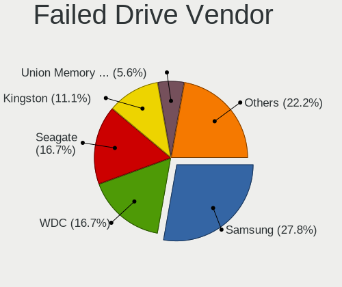
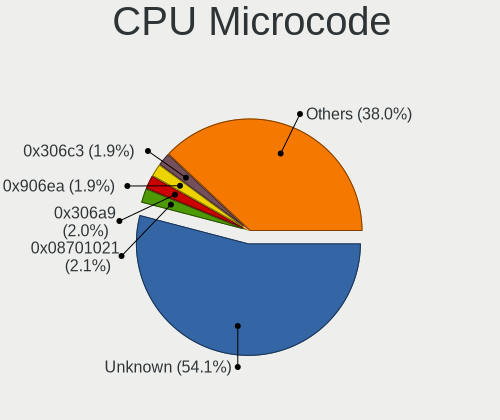
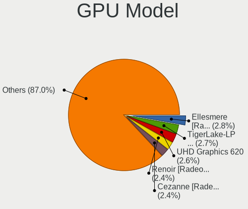
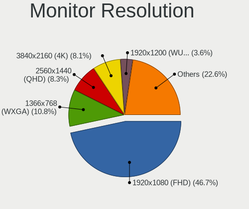
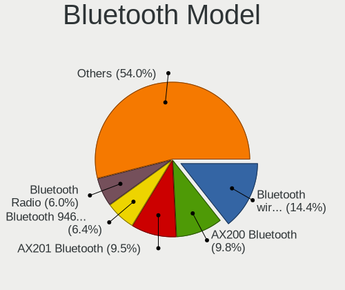

Arch - Tested Hardware & Statistics
-----------------------------------

A project to collect tested hardware configurations for Arch.

Anyone can contribute to this report by the [hw-probe](https://github.com/linuxhw/hw-probe) tool:

    sudo -E hw-probe -all -upload

Please contribute! Especially if your hardware is rare.

This is a report for all computer types. See also reports for [desktops](/Dist/Arch/Desktop/README.md) and [notebooks](/Dist/Arch/Notebook/README.md).

Contents
--------

* [ Test Cases ](#test-cases)

* [ System ](#system)
  - [ OS                       ](#os)
  - [ OS Family                ](#os-family)
  - [ Kernel                   ](#kernel)
  - [ Kernel Family            ](#kernel-family)
  - [ Kernel Major Ver.        ](#kernel-major-ver)
  - [ Arch                     ](#arch)
  - [ DE                       ](#de)
  - [ Display Server           ](#display-server)
  - [ Display Manager          ](#display-manager)
  - [ OS Lang                  ](#os-lang)
  - [ Boot Mode                ](#boot-mode)
  - [ Filesystem               ](#filesystem)
  - [ Part. scheme             ](#part-scheme)
  - [ Dual Boot with Linux/BSD ](#dual-boot-with-linuxbsd)
  - [ Dual Boot (Win)          ](#dual-boot-win)

* [ Board ](#board)
  - [ Vendor                   ](#vendor)
  - [ Model                    ](#model)
  - [ Model Family             ](#model-family)
  - [ MFG Year                 ](#mfg-year)
  - [ Form Factor              ](#form-factor)
  - [ Secure Boot              ](#secure-boot)
  - [ Coreboot                 ](#coreboot)
  - [ RAM Size                 ](#ram-size)
  - [ RAM Used                 ](#ram-used)
  - [ Total Drives             ](#total-drives)
  - [ Has CD-ROM               ](#has-cd-rom)
  - [ Has Ethernet             ](#has-ethernet)
  - [ Has WiFi                 ](#has-wifi)
  - [ Has Bluetooth            ](#has-bluetooth)

* [ Location ](#location)
  - [ Country                  ](#country)
  - [ City                     ](#city)

* [ Drives ](#drives)
  - [ Drive Vendor             ](#drive-vendor)
  - [ Drive Model              ](#drive-model)
  - [ HDD Vendor               ](#hdd-vendor)
  - [ SSD Vendor               ](#ssd-vendor)
  - [ Drive Kind               ](#drive-kind)
  - [ Drive Connector          ](#drive-connector)
  - [ Drive Size               ](#drive-size)
  - [ Space Total              ](#space-total)
  - [ Space Used               ](#space-used)
  - [ Malfunc. Drives          ](#malfunc-drives)
  - [ Malfunc. Drive Vendor    ](#malfunc-drive-vendor)
  - [ Malfunc. HDD Vendor      ](#malfunc-hdd-vendor)
  - [ Malfunc. Drive Kind      ](#malfunc-drive-kind)
  - [ Failed Drives            ](#failed-drives)
  - [ Failed Drive Vendor      ](#failed-drive-vendor)
  - [ Drive Status             ](#drive-status)

* [ Storage controller ](#storage-controller)
  - [ Storage Vendor           ](#storage-vendor)
  - [ Storage Model            ](#storage-model)
  - [ Storage Kind             ](#storage-kind)

* [ Processor ](#processor)
  - [ CPU Vendor               ](#cpu-vendor)
  - [ CPU Model                ](#cpu-model)
  - [ CPU Model Family         ](#cpu-model-family)
  - [ CPU Cores                ](#cpu-cores)
  - [ CPU Sockets              ](#cpu-sockets)
  - [ CPU Threads              ](#cpu-threads)
  - [ CPU Op-Modes             ](#cpu-op-modes)
  - [ CPU Microcode            ](#cpu-microcode)
  - [ CPU Microarch            ](#cpu-microarch)

* [ Graphics ](#graphics)
  - [ GPU Vendor               ](#gpu-vendor)
  - [ GPU Model                ](#gpu-model)
  - [ GPU Combo                ](#gpu-combo)
  - [ GPU Driver               ](#gpu-driver)
  - [ GPU Memory               ](#gpu-memory)

* [ Monitor ](#monitor)
  - [ Monitor Vendor           ](#monitor-vendor)
  - [ Monitor Model            ](#monitor-model)
  - [ Monitor Resolution       ](#monitor-resolution)
  - [ Monitor Diagonal         ](#monitor-diagonal)
  - [ Monitor Width            ](#monitor-width)
  - [ Aspect Ratio             ](#aspect-ratio)
  - [ Monitor Area             ](#monitor-area)
  - [ Pixel Density            ](#pixel-density)
  - [ Multiple Monitors        ](#multiple-monitors)

* [ Network ](#network)
  - [ Net Controller Vendor    ](#net-controller-vendor)
  - [ Net Controller Model     ](#net-controller-model)
  - [ Wireless Vendor          ](#wireless-vendor)
  - [ Wireless Model           ](#wireless-model)
  - [ Ethernet Vendor          ](#ethernet-vendor)
  - [ Ethernet Model           ](#ethernet-model)
  - [ Net Controller Kind      ](#net-controller-kind)
  - [ Used Controller          ](#used-controller)
  - [ NICs                     ](#nics)
  - [ IPv6                     ](#ipv6)

* [ Bluetooth ](#bluetooth)
  - [ Bluetooth Vendor         ](#bluetooth-vendor)
  - [ Bluetooth Model          ](#bluetooth-model)

* [ Sound ](#sound)
  - [ Sound Vendor             ](#sound-vendor)
  - [ Sound Model              ](#sound-model)

* [ Memory ](#memory)
  - [ Memory Vendor            ](#memory-vendor)
  - [ Memory Model             ](#memory-model)
  - [ Memory Kind              ](#memory-kind)
  - [ Memory Form Factor       ](#memory-form-factor)
  - [ Memory Size              ](#memory-size)
  - [ Memory Speed             ](#memory-speed)

* [ Printers & scanners ](#printers--scanners)
  - [ Printer Vendor           ](#printer-vendor)
  - [ Printer Model            ](#printer-model)
  - [ Scanner Vendor           ](#scanner-vendor)
  - [ Scanner Model            ](#scanner-model)

* [ Camera ](#camera)
  - [ Camera Vendor            ](#camera-vendor)
  - [ Camera Model             ](#camera-model)

* [ Security ](#security)
  - [ Fingerprint Vendor       ](#fingerprint-vendor)
  - [ Fingerprint Model        ](#fingerprint-model)
  - [ Chipcard Vendor          ](#chipcard-vendor)
  - [ Chipcard Model           ](#chipcard-model)

* [ Unsupported ](#unsupported)
  - [ Unsupported Devices      ](#unsupported-devices)
  - [ Unsupported Device Types ](#unsupported-device-types)

Test Cases
----------

Total: 9504

| Vendor        | Model                       | Form-Factor | Probe                                                      | Date         |
|---------------|-----------------------------|-------------|------------------------------------------------------------|--------------|
| ASUSTek       | ASUS TUF Gaming A15 FA50... | Notebook    | [49662a8ac9](https://linux-hardware.org/?probe=49662a8ac9) | Aug 12, 2023 |
| ASUSTek       | ASUS TUF Gaming A15 FA50... | Notebook    | [c946b79f5a](https://linux-hardware.org/?probe=c946b79f5a) | Aug 12, 2023 |
| Alienware     | 15                          | Notebook    | [d6c9c4f931](https://linux-hardware.org/?probe=d6c9c4f931) | Aug 12, 2023 |
| Acer          | Aspire E1-571G              | Notebook    | [ca51aaad9f](https://linux-hardware.org/?probe=ca51aaad9f) | Aug 12, 2023 |
| Timi          | RedmiBook Pro 15S           | Notebook    | [20559d710a](https://linux-hardware.org/?probe=20559d710a) | Aug 12, 2023 |
| Gigabyte      | H61M-DS2                    | Desktop     | [3181a592ac](https://linux-hardware.org/?probe=3181a592ac) | Aug 12, 2023 |
| HP            | EliteBook 840 G1            | Notebook    | [95d93fda2c](https://linux-hardware.org/?probe=95d93fda2c) | Aug 11, 2023 |
| Intel         | NUC7i5BNB J31144-303        | Mini pc     | [144f77980e](https://linux-hardware.org/?probe=144f77980e) | Aug 11, 2023 |
| Gigabyte      | B365 HD3                    | Desktop     | [e2ebf1941c](https://linux-hardware.org/?probe=e2ebf1941c) | Aug 11, 2023 |
| Lenovo        | ThinkPad P1 Gen 4i 20Y30... | Notebook    | [79889c3f89](https://linux-hardware.org/?probe=79889c3f89) | Aug 11, 2023 |
| Lenovo        | IdeaPad S145-15IWL 81S9     | Notebook    | [7fe6adce5e](https://linux-hardware.org/?probe=7fe6adce5e) | Aug 10, 2023 |
| Dell          | Inspiron 5570               | Notebook    | [3771669b84](https://linux-hardware.org/?probe=3771669b84) | Aug 10, 2023 |
| ASRock        | H310CM-HG4                  | Desktop     | [773b111412](https://linux-hardware.org/?probe=773b111412) | Aug 10, 2023 |
| ASRock        | H310CM-HG4                  | Desktop     | [70c4f2863b](https://linux-hardware.org/?probe=70c4f2863b) | Aug 10, 2023 |
| ASUSTek       | ROG STRIX B550-F GAMING     | Desktop     | [d38ef662d4](https://linux-hardware.org/?probe=d38ef662d4) | Aug 10, 2023 |
| Lenovo        | ThinkPad T14 Gen 3 21CF0... | Notebook    | [89cb081c1f](https://linux-hardware.org/?probe=89cb081c1f) | Aug 10, 2023 |
| Lenovo        | ThinkPad T420 4236W1W       | Notebook    | [0b8fc947af](https://linux-hardware.org/?probe=0b8fc947af) | Aug 10, 2023 |
| Lenovo        | ThinkPad P51 20HH0015IX     | Notebook    | [77c11473b2](https://linux-hardware.org/?probe=77c11473b2) | Aug 10, 2023 |
| Lenovo        | MIIX 310-10ICR 80SG         | Tablet      | [6e7a8f72dd](https://linux-hardware.org/?probe=6e7a8f72dd) | Aug 10, 2023 |
| Dell          | Inspiron 5567               | Notebook    | [fdfeffb5f3](https://linux-hardware.org/?probe=fdfeffb5f3) | Aug 10, 2023 |
| Dell          | Inspiron 5567               | Notebook    | [71424c4380](https://linux-hardware.org/?probe=71424c4380) | Aug 10, 2023 |
| HP            | Pavilion x360 Convertibl... | Convertible | [84d6b99d2c](https://linux-hardware.org/?probe=84d6b99d2c) | Aug 10, 2023 |
| ASRock        | B365 Pro4                   | Desktop     | [45da50b5c8](https://linux-hardware.org/?probe=45da50b5c8) | Aug 10, 2023 |
| ASRock        | B365 Pro4                   | Desktop     | [03cb2690f7](https://linux-hardware.org/?probe=03cb2690f7) | Aug 10, 2023 |
| Acer          | Aspire A514-53              | Notebook    | [26e60daa62](https://linux-hardware.org/?probe=26e60daa62) | Aug 10, 2023 |
| HP            | Pavilion 17                 | Notebook    | [65733120b0](https://linux-hardware.org/?probe=65733120b0) | Aug 09, 2023 |
| HUAWEI        | NBLK-WAX9X                  | Notebook    | [51fa860c87](https://linux-hardware.org/?probe=51fa860c87) | Aug 09, 2023 |
| Gigabyte      | H61M-DS2                    | Desktop     | [939205ed85](https://linux-hardware.org/?probe=939205ed85) | Aug 09, 2023 |
| ASUSTek       | PRIME X470-PRO              | Desktop     | [afef0bb361](https://linux-hardware.org/?probe=afef0bb361) | Aug 09, 2023 |
| Gigabyte      | X399 AORUS PRO-CF           | Desktop     | [3ecd6d3f74](https://linux-hardware.org/?probe=3ecd6d3f74) | Aug 09, 2023 |
| Acer          | Swift SF114-32              | Notebook    | [3474fa639e](https://linux-hardware.org/?probe=3474fa639e) | Aug 08, 2023 |
| Lenovo        | IdeaPad 5 15IIL05 81YK      | Notebook    | [3cd08fb125](https://linux-hardware.org/?probe=3cd08fb125) | Aug 08, 2023 |
| HP            | Laptop 14-cm0xxx            | Notebook    | [ffd0be48c6](https://linux-hardware.org/?probe=ffd0be48c6) | Aug 08, 2023 |
| Dell          | Inspiron 13-7353            | Notebook    | [0b797c9368](https://linux-hardware.org/?probe=0b797c9368) | Aug 08, 2023 |
| Dell          | Inspiron 13-7353            | Notebook    | [90fbc716ed](https://linux-hardware.org/?probe=90fbc716ed) | Aug 07, 2023 |
| Lenovo        | Legion S7 15ARH5 82HM       | Notebook    | [044df6f82e](https://linux-hardware.org/?probe=044df6f82e) | Aug 07, 2023 |
| Gigabyte      | B450M DS3H WIFI-CF          | Desktop     | [608c3967b2](https://linux-hardware.org/?probe=608c3967b2) | Aug 07, 2023 |
| ASUSTek       | P8H61-M LX3 PLUS R2.0       | Desktop     | [e6955ee04c](https://linux-hardware.org/?probe=e6955ee04c) | Aug 07, 2023 |
| MSI           | B450M MORTAR MAX            | Desktop     | [f772c670ff](https://linux-hardware.org/?probe=f772c670ff) | Aug 07, 2023 |
| MSI           | B450M MORTAR MAX            | Desktop     | [fc8b72dd99](https://linux-hardware.org/?probe=fc8b72dd99) | Aug 07, 2023 |
| MSI           | H370M BAZOOKA               | Desktop     | [760051e27b](https://linux-hardware.org/?probe=760051e27b) | Aug 07, 2023 |
| Schenker      | XMG FUSION 15 (XFU15M22)    | Notebook    | [5510e9c316](https://linux-hardware.org/?probe=5510e9c316) | Aug 06, 2023 |
| MSI           | Z270 TOMAHAWK OPT BOOST     | Desktop     | [6baabbdd21](https://linux-hardware.org/?probe=6baabbdd21) | Aug 06, 2023 |
| MSI           | MPG X670E CARBON WIFI       | Desktop     | [01b9adfb02](https://linux-hardware.org/?probe=01b9adfb02) | Aug 05, 2023 |
| ASUSTek       | K73SV                       | Notebook    | [c908f2bfdd](https://linux-hardware.org/?probe=c908f2bfdd) | Aug 05, 2023 |
| Dell          | Inspiron 15 3525            | Notebook    | [0219350ae0](https://linux-hardware.org/?probe=0219350ae0) | Aug 05, 2023 |
| Dell          | Inspiron 15 3525            | Notebook    | [350a405f33](https://linux-hardware.org/?probe=350a405f33) | Aug 05, 2023 |
| Dell          | Inspiron 15 7000 Gaming     | Notebook    | [21eaf09dc9](https://linux-hardware.org/?probe=21eaf09dc9) | Aug 05, 2023 |
| Dell          | Latitude E5440              | Notebook    | [f6981c56b7](https://linux-hardware.org/?probe=f6981c56b7) | Aug 05, 2023 |
| Gigabyte      | Z790 AORUS ELITE AX         | Desktop     | [9365c3de56](https://linux-hardware.org/?probe=9365c3de56) | Aug 05, 2023 |
| HP            | OMEN by Laptop              | Notebook    | [78566a197e](https://linux-hardware.org/?probe=78566a197e) | Aug 05, 2023 |
| Lenovo        | IdeaPadFlex 5 15ALC05 82... | Convertible | [2f2d909df8](https://linux-hardware.org/?probe=2f2d909df8) | Aug 05, 2023 |
| Acer          | Nitro AN515-54              | Notebook    | [c4d1667ffe](https://linux-hardware.org/?probe=c4d1667ffe) | Aug 05, 2023 |
| ASRock        | P67 Pro3                    | Desktop     | [da235e8c08](https://linux-hardware.org/?probe=da235e8c08) | Aug 05, 2023 |
| Dell          | Inspiron 14-3462            | Notebook    | [9300232981](https://linux-hardware.org/?probe=9300232981) | Aug 05, 2023 |
| HP            | EliteBook 840 G2            | Notebook    | [64810e5a10](https://linux-hardware.org/?probe=64810e5a10) | Aug 05, 2023 |
| ASRock        | B550 PG Velocita            | Desktop     | [71ca443602](https://linux-hardware.org/?probe=71ca443602) | Aug 05, 2023 |
| Lenovo        | IdeaPad S340-15API 81NC     | Notebook    | [f1e284ec93](https://linux-hardware.org/?probe=f1e284ec93) | Aug 04, 2023 |
| ASUSTek       | ASUS TUF Gaming A17 FA70... | Notebook    | [5799f1a89c](https://linux-hardware.org/?probe=5799f1a89c) | Aug 04, 2023 |
| ASUSTek       | ASUS TUF Gaming A17 FA70... | Notebook    | [058011da0f](https://linux-hardware.org/?probe=058011da0f) | Aug 04, 2023 |
| Chuwi         | GemiBook Pro                | Notebook    | [87ecdcb4bd](https://linux-hardware.org/?probe=87ecdcb4bd) | Aug 04, 2023 |
| HP            | 83E8                        | Desktop     | [0d285189b9](https://linux-hardware.org/?probe=0d285189b9) | Aug 04, 2023 |
| ASUSTek       | Zenbook UX535QE_UM535QE     | Notebook    | [59dda0e2b7](https://linux-hardware.org/?probe=59dda0e2b7) | Aug 04, 2023 |
| Lenovo        | ThinkPad T470 W10DG 20JN... | Notebook    | [bd2d5f588f](https://linux-hardware.org/?probe=bd2d5f588f) | Aug 04, 2023 |
| HP            | Notebook                    | Notebook    | [9b9a2bd44a](https://linux-hardware.org/?probe=9b9a2bd44a) | Aug 04, 2023 |
| PC Special... | Lafite Pro III 17           | Notebook    | [702cdf4138](https://linux-hardware.org/?probe=702cdf4138) | Aug 03, 2023 |
| Gigabyte      | Z490M GAMING X              | Desktop     | [ad51d2548b](https://linux-hardware.org/?probe=ad51d2548b) | Aug 03, 2023 |
| ASUSTek       | ZenBook UX425UG_Q408UG      | Notebook    | [a251ad988c](https://linux-hardware.org/?probe=a251ad988c) | Aug 03, 2023 |
| Acer          | Predator PHN16-71           | Notebook    | [1d1937f1d6](https://linux-hardware.org/?probe=1d1937f1d6) | Aug 03, 2023 |
| ASUSTek       | TUF Gaming Z690-PLUS WIF... | Desktop     | [986cf08dc9](https://linux-hardware.org/?probe=986cf08dc9) | Aug 03, 2023 |
| ASUSTek       | TUF Gaming Z690-PLUS WIF... | Desktop     | [da8d764a97](https://linux-hardware.org/?probe=da8d764a97) | Aug 03, 2023 |
| ASUSTek       | ROG Zephyrus G15 GA503RM... | Notebook    | [c96666b80d](https://linux-hardware.org/?probe=c96666b80d) | Aug 03, 2023 |
| ASUSTek       | TUF Gaming FX505DD_FX505... | Notebook    | [67d851300e](https://linux-hardware.org/?probe=67d851300e) | Aug 03, 2023 |
| Timi          | A7S                         | Notebook    | [7de693ff63](https://linux-hardware.org/?probe=7de693ff63) | Aug 03, 2023 |
| LG Electro... | 16Z90R-K.ADB9U1             | Notebook    | [d3a9e05559](https://linux-hardware.org/?probe=d3a9e05559) | Aug 02, 2023 |
| Dell          | XPS 15 9500                 | Notebook    | [5c8ad99a3c](https://linux-hardware.org/?probe=5c8ad99a3c) | Aug 02, 2023 |
| Lenovo        | Yoga 6 13ARE05 82FN         | Convertible | [2703b03104](https://linux-hardware.org/?probe=2703b03104) | Aug 02, 2023 |
| ASUSTek       | VivoBook_ASUSLaptop K350... | Notebook    | [32d205bbdf](https://linux-hardware.org/?probe=32d205bbdf) | Aug 02, 2023 |
| ASRock        | B650M PG Riptide            | Desktop     | [bdccf9a3db](https://linux-hardware.org/?probe=bdccf9a3db) | Aug 01, 2023 |
| Lenovo        | ThinkPad T480s 20L8002WM... | Notebook    | [6cfc0b2281](https://linux-hardware.org/?probe=6cfc0b2281) | Aug 01, 2023 |
| Gigabyte      | B660 GAMING X DDR4          | Desktop     | [28f1074e0a](https://linux-hardware.org/?probe=28f1074e0a) | Aug 01, 2023 |
| Packard Be... | EasyNote TJ65               | Notebook    | [e5193cc5d3](https://linux-hardware.org/?probe=e5193cc5d3) | Aug 01, 2023 |
| HUAWEI        | KPR-WX9                     | Notebook    | [8918c544fe](https://linux-hardware.org/?probe=8918c544fe) | Aug 01, 2023 |
| Dell          | Latitude 5590               | Notebook    | [466fdce7aa](https://linux-hardware.org/?probe=466fdce7aa) | Aug 01, 2023 |
| Apple         | MacBookPro14,1              | Notebook    | [cb322d77a4](https://linux-hardware.org/?probe=cb322d77a4) | Aug 01, 2023 |
| Microsoft     | Surface Pro 4               | Tablet      | [35f27e05c6](https://linux-hardware.org/?probe=35f27e05c6) | Jul 31, 2023 |
| Lenovo        | ThinkPad Yoga 370 20JJS1... | Convertible | [af6a2cb993](https://linux-hardware.org/?probe=af6a2cb993) | Jul 31, 2023 |
| Lenovo        | ThinkPad X1 Carbon Gen 1... | Notebook    | [f7be9307b1](https://linux-hardware.org/?probe=f7be9307b1) | Jul 31, 2023 |
| ASUSTek       | ROG Strix G713RW_G713RW     | Notebook    | [91887235b2](https://linux-hardware.org/?probe=91887235b2) | Jul 31, 2023 |
| Dell          | G15 5511                    | Notebook    | [278d65cdc0](https://linux-hardware.org/?probe=278d65cdc0) | Jul 31, 2023 |
| Dell          | G15 5511                    | Notebook    | [e4570caa8f](https://linux-hardware.org/?probe=e4570caa8f) | Jul 31, 2023 |
| Dell          | Latitude E6400              | Notebook    | [5863677081](https://linux-hardware.org/?probe=5863677081) | Jul 31, 2023 |
| Lenovo        | ThinkPad P50s 20FLCTO1WW    | Notebook    | [1594795f9e](https://linux-hardware.org/?probe=1594795f9e) | Jul 31, 2023 |
| HP            | ENVY x360 2-in-1 Laptop ... | Convertible | [264f400d7e](https://linux-hardware.org/?probe=264f400d7e) | Jul 30, 2023 |
| MSI           | MPG B550 GAMING PLUS        | Desktop     | [e16ea772e1](https://linux-hardware.org/?probe=e16ea772e1) | Jul 30, 2023 |
| Acer          | Aspire A315-53              | Notebook    | [28ff56233b](https://linux-hardware.org/?probe=28ff56233b) | Jul 30, 2023 |
| Dell          | Latitude 5421               | Notebook    | [3872b1f799](https://linux-hardware.org/?probe=3872b1f799) | Jul 30, 2023 |
| Lenovo        | ThinkPad T480s 20L8S3JE0... | Notebook    | [5e1021c76b](https://linux-hardware.org/?probe=5e1021c76b) | Jul 30, 2023 |
| Gigabyte      | Z170X-Gaming 3              | Desktop     | [3bbfa332c0](https://linux-hardware.org/?probe=3bbfa332c0) | Jul 30, 2023 |
| HP            | 843B                        | Desktop     | [c570a7c5f2](https://linux-hardware.org/?probe=c570a7c5f2) | Jul 29, 2023 |
| ASRock        | X300M-STX                   | Desktop     | [e43da17360](https://linux-hardware.org/?probe=e43da17360) | Jul 29, 2023 |
| Razer         | Blade                       | Notebook    | [6c3ef3aa59](https://linux-hardware.org/?probe=6c3ef3aa59) | Jul 29, 2023 |
| Microsoft     | Surface Pro 3               | Tablet      | [e4efeb0276](https://linux-hardware.org/?probe=e4efeb0276) | Jul 29, 2023 |
| HP            | EliteBook 745 G3            | Notebook    | [30e5e63466](https://linux-hardware.org/?probe=30e5e63466) | Jul 29, 2023 |
| Lenovo        | ThinkPad T480s 20L8S3JE0... | Notebook    | [6426edf740](https://linux-hardware.org/?probe=6426edf740) | Jul 29, 2023 |
| HP            | ProBook 455R G6             | Notebook    | [3731e7465c](https://linux-hardware.org/?probe=3731e7465c) | Jul 29, 2023 |
| Lenovo        | IdeaPadFlex 5 14ALC7 82R... | Convertible | [8d3733b439](https://linux-hardware.org/?probe=8d3733b439) | Jul 29, 2023 |
| Lenovo        | IdeaPadFlex 5 14ALC7 82R... | Convertible | [28bd5d7d66](https://linux-hardware.org/?probe=28bd5d7d66) | Jul 29, 2023 |
| Lenovo        | IdeaPad 5 Pro 16ACH6 82L... | Notebook    | [a8e51655da](https://linux-hardware.org/?probe=a8e51655da) | Jul 28, 2023 |
| Framework     | Laptop (12th Gen Intel C... | Notebook    | [d94c3cc0e8](https://linux-hardware.org/?probe=d94c3cc0e8) | Jul 28, 2023 |
| Gigabyte      | B450 I AORUS PRO WIFI-CF    | Desktop     | [aaa06048d5](https://linux-hardware.org/?probe=aaa06048d5) | Jul 28, 2023 |
| Acer          | Aspire A517-53              | Notebook    | [41c9602cac](https://linux-hardware.org/?probe=41c9602cac) | Jul 28, 2023 |
| Acer          | Aspire 5350                 | Notebook    | [698672b19c](https://linux-hardware.org/?probe=698672b19c) | Jul 28, 2023 |
| MSI           | Raider GE78HX 13VI          | Notebook    | [0b179ca997](https://linux-hardware.org/?probe=0b179ca997) | Jul 28, 2023 |
| Lenovo        | ThinkPad X220 Tablet 429... | Notebook    | [ea402f269e](https://linux-hardware.org/?probe=ea402f269e) | Jul 28, 2023 |
| Google        | Atlas                       | Notebook    | [c3f0326575](https://linux-hardware.org/?probe=c3f0326575) | Jul 28, 2023 |
| ASUSTek       | ROG Strix G533ZW_G533ZW     | Notebook    | [407859fa58](https://linux-hardware.org/?probe=407859fa58) | Jul 27, 2023 |
| HP            | ProBook 4530s               | Notebook    | [46852380f2](https://linux-hardware.org/?probe=46852380f2) | Jul 27, 2023 |
| HUAWEI        | MACHC-WAX9                  | Notebook    | [bf3f7b4c2d](https://linux-hardware.org/?probe=bf3f7b4c2d) | Jul 27, 2023 |
| Lenovo        | ThinkBook 15 G2 ITL 20VE    | Notebook    | [6546d49225](https://linux-hardware.org/?probe=6546d49225) | Jul 27, 2023 |
| HUAWEI        | KPR-WX9                     | Notebook    | [2231e66b3d](https://linux-hardware.org/?probe=2231e66b3d) | Jul 26, 2023 |
| Lenovo        | ThinkPad E14 20RBCTO1WW     | Notebook    | [1bac11c715](https://linux-hardware.org/?probe=1bac11c715) | Jul 26, 2023 |
| Lenovo        | ThinkPad E14 20RBCTO1WW     | Notebook    | [1409af2a38](https://linux-hardware.org/?probe=1409af2a38) | Jul 26, 2023 |
| Lenovo        | 13w Yoga 82S1               | Convertible | [3516b91dc0](https://linux-hardware.org/?probe=3516b91dc0) | Jul 26, 2023 |
| MSI           | MPG X570 GAMING PLUS        | Desktop     | [e79fd50f34](https://linux-hardware.org/?probe=e79fd50f34) | Jul 26, 2023 |
| MECHREVO      | F7BFD V1.0                  | Desktop     | [f9be0fc5a7](https://linux-hardware.org/?probe=f9be0fc5a7) | Jul 26, 2023 |
| ASUSTek       | Pro WS X570-ACE             | Desktop     | [8c8e7f5edd](https://linux-hardware.org/?probe=8c8e7f5edd) | Jul 26, 2023 |
| Lenovo        | IdeaPad S145-15IWL 81S9     | Notebook    | [6c978ec74d](https://linux-hardware.org/?probe=6c978ec74d) | Jul 26, 2023 |
| ASRock        | B450M-HDV R4.0              | Desktop     | [864fcc639d](https://linux-hardware.org/?probe=864fcc639d) | Jul 25, 2023 |
| Acer          | Aspire A514-54              | Notebook    | [787270abee](https://linux-hardware.org/?probe=787270abee) | Jul 25, 2023 |
| ASUSTek       | ZenBook UX325EA_UX325EA     | Notebook    | [7910b0c067](https://linux-hardware.org/?probe=7910b0c067) | Jul 25, 2023 |
| ASUSTek       | ROG Flow X13 GV302XI_GV3... | Convertible | [a326770d26](https://linux-hardware.org/?probe=a326770d26) | Jul 25, 2023 |
| ASUSTek       | PRIME H310M-A R2.0          | Desktop     | [5399a2e19e](https://linux-hardware.org/?probe=5399a2e19e) | Jul 24, 2023 |
| HP            | Pavilion Gaming Laptop 1... | Notebook    | [412bc51f72](https://linux-hardware.org/?probe=412bc51f72) | Jul 24, 2023 |
| Timi          | Mi NoteBook Ultra           | Notebook    | [e1fea727ff](https://linux-hardware.org/?probe=e1fea727ff) | Jul 24, 2023 |
| Gigabyte      | H110M-H-CF                  | Desktop     | [6dbfb1d71e](https://linux-hardware.org/?probe=6dbfb1d71e) | Jul 24, 2023 |
| Lenovo        | MAHOBAY 0B98401 PRO         | Desktop     | [b571da19fb](https://linux-hardware.org/?probe=b571da19fb) | Jul 24, 2023 |
| Gigabyte      | G5 KE                       | Notebook    | [4837040c2a](https://linux-hardware.org/?probe=4837040c2a) | Jul 24, 2023 |
| ASUSTek       | Zenbook UX535QE_UM535QE     | Notebook    | [cb7e913e03](https://linux-hardware.org/?probe=cb7e913e03) | Jul 24, 2023 |
| ASUSTek       | ROG CROSSHAIR VIII HERO     | Desktop     | [2ff464874e](https://linux-hardware.org/?probe=2ff464874e) | Jul 24, 2023 |
| ASUSTek       | M4A87TD EVO                 | Desktop     | [2a23928116](https://linux-hardware.org/?probe=2a23928116) | Jul 24, 2023 |
| ASUSTek       | M4A87TD EVO                 | Desktop     | [247870abec](https://linux-hardware.org/?probe=247870abec) | Jul 24, 2023 |
| Acer          | Nitro AN515-46              | Notebook    | [a2d73523d4](https://linux-hardware.org/?probe=a2d73523d4) | Jul 24, 2023 |
| HP            | Pavilion Laptop 15-eg3xx... | Notebook    | [313f3aa210](https://linux-hardware.org/?probe=313f3aa210) | Jul 23, 2023 |
| Acer          | Nitro AN515-54              | Notebook    | [f1db825d10](https://linux-hardware.org/?probe=f1db825d10) | Jul 23, 2023 |
| ASUSTek       | ASUS TUF Gaming A17 FA70... | Notebook    | [3bd5c9d59c](https://linux-hardware.org/?probe=3bd5c9d59c) | Jul 23, 2023 |
| HUAWEI        | HVY-WXX9                    | Notebook    | [44958ef86b](https://linux-hardware.org/?probe=44958ef86b) | Jul 23, 2023 |
| XIAOMI        | Redmi Book Pro 15 2023      | Notebook    | [0e123e6d85](https://linux-hardware.org/?probe=0e123e6d85) | Jul 23, 2023 |
| ASUSTek       | PRIME X399-A                | Desktop     | [3dac76b45f](https://linux-hardware.org/?probe=3dac76b45f) | Jul 23, 2023 |
| ASUSTek       | VivoBook_ASUSLaptop M140... | Notebook    | [4222b801a9](https://linux-hardware.org/?probe=4222b801a9) | Jul 23, 2023 |
| HUAWEI        | NBLB-WAX9N                  | Notebook    | [ddb8dbe4e4](https://linux-hardware.org/?probe=ddb8dbe4e4) | Jul 23, 2023 |
| HUAWEI        | NBLB-WAX9N                  | Notebook    | [82242fa0a6](https://linux-hardware.org/?probe=82242fa0a6) | Jul 23, 2023 |
| HP            | Pavilion Plus Laptop 14-... | Notebook    | [a6e2f105ed](https://linux-hardware.org/?probe=a6e2f105ed) | Jul 23, 2023 |
| ECS           | A780LM-M2                   | Desktop     | [b8b1304632](https://linux-hardware.org/?probe=b8b1304632) | Jul 22, 2023 |
| Infinix       | INBOOK X2 GEN11             | Notebook    | [2b3d4271bf](https://linux-hardware.org/?probe=2b3d4271bf) | Jul 22, 2023 |
| ASUSTek       | P9X79                       | Desktop     | [2f8efec736](https://linux-hardware.org/?probe=2f8efec736) | Jul 22, 2023 |
| HUAWEI        | MACHC-WAX9                  | Notebook    | [fdbe29a1db](https://linux-hardware.org/?probe=fdbe29a1db) | Jul 22, 2023 |
| Biostar       | A320MH                      | Desktop     | [b4ad5e7452](https://linux-hardware.org/?probe=b4ad5e7452) | Jul 22, 2023 |
| XIAOMI        | Redmi Book Pro 15 2023      | Notebook    | [45065697ac](https://linux-hardware.org/?probe=45065697ac) | Jul 22, 2023 |
| ASUSTek       | ROG STRIX Z790-I GAMING ... | Desktop     | [625e829a7e](https://linux-hardware.org/?probe=625e829a7e) | Jul 22, 2023 |
| ASUSTek       | ZenBook UX363EA_UX363EA     | Convertible | [a96fbb9461](https://linux-hardware.org/?probe=a96fbb9461) | Jul 22, 2023 |
| Lenovo        | IdeaPad Z510 20287          | Notebook    | [fd2bcebb1d](https://linux-hardware.org/?probe=fd2bcebb1d) | Jul 22, 2023 |
| MSI           | MAG B550 TOMAHAWK MAX WI... | Desktop     | [d47c43e734](https://linux-hardware.org/?probe=d47c43e734) | Jul 22, 2023 |
| MSI           | Z490-A PRO                  | Desktop     | [a55a67fa01](https://linux-hardware.org/?probe=a55a67fa01) | Jul 22, 2023 |
| Acer          | Aspire V5-551               | Notebook    | [8a13138f82](https://linux-hardware.org/?probe=8a13138f82) | Jul 21, 2023 |
| Lenovo        | ThinkPad X390 20SDA018CD    | Notebook    | [b2f5443fc2](https://linux-hardware.org/?probe=b2f5443fc2) | Jul 21, 2023 |
| Lenovo        | ThinkPad X390 20SDA018CD    | Notebook    | [3161baf648](https://linux-hardware.org/?probe=3161baf648) | Jul 21, 2023 |
| ASUSTek       | VivoBook_ASUSLaptop M150... | Notebook    | [55639a6416](https://linux-hardware.org/?probe=55639a6416) | Jul 21, 2023 |
| MSI           | MPG X570S EDGE MAX WIFI     | Desktop     | [478fb56a7d](https://linux-hardware.org/?probe=478fb56a7d) | Jul 21, 2023 |
| HP            | ProBook 4530s               | Notebook    | [450e93a8de](https://linux-hardware.org/?probe=450e93a8de) | Jul 21, 2023 |
| ASUSTek       | VivoBook_ASUSLaptop M150... | Notebook    | [8b2077101c](https://linux-hardware.org/?probe=8b2077101c) | Jul 21, 2023 |
| Lenovo        | IdeaPad Z510 20287          | Notebook    | [daff830182](https://linux-hardware.org/?probe=daff830182) | Jul 21, 2023 |
| ASUSTek       | TUF Gaming B650-PLUS WIF... | Desktop     | [cc9f1fdcd8](https://linux-hardware.org/?probe=cc9f1fdcd8) | Jul 21, 2023 |
| ASUSTek       | TUF Gaming B650-PLUS WIF... | Desktop     | [fc0fcad674](https://linux-hardware.org/?probe=fc0fcad674) | Jul 21, 2023 |
| Dell          | Latitude 5580               | Notebook    | [f115a04168](https://linux-hardware.org/?probe=f115a04168) | Jul 20, 2023 |
| Lenovo        | IdeaPad S145-15AST 81N3     | Notebook    | [cb2cdb1a94](https://linux-hardware.org/?probe=cb2cdb1a94) | Jul 20, 2023 |
| HP            | Laptop 15s-eq2xxx           | Notebook    | [9a2d353d76](https://linux-hardware.org/?probe=9a2d353d76) | Jul 20, 2023 |
| Panasonic     | CFSZ5-3                     | Notebook    | [9eb560d292](https://linux-hardware.org/?probe=9eb560d292) | Jul 20, 2023 |
| ASUSTek       | VC66                        | Desktop     | [369cd2ba96](https://linux-hardware.org/?probe=369cd2ba96) | Jul 20, 2023 |
| ASUSTek       | N501VW                      | Notebook    | [08cd5a81b2](https://linux-hardware.org/?probe=08cd5a81b2) | Jul 19, 2023 |
| Lenovo        | IdeaPad S145-15IWL 81S9     | Notebook    | [9b44d7bd03](https://linux-hardware.org/?probe=9b44d7bd03) | Jul 19, 2023 |
| MSI           | A88XM-E35 V2                | Desktop     | [7ab6252e08](https://linux-hardware.org/?probe=7ab6252e08) | Jul 19, 2023 |
| ASRock        | X570 Taichi                 | Desktop     | [db2a22c2eb](https://linux-hardware.org/?probe=db2a22c2eb) | Jul 19, 2023 |
| ASUSTek       | ZenBook UX562IA_UM562IA     | Convertible | [08b6a97698](https://linux-hardware.org/?probe=08b6a97698) | Jul 19, 2023 |
| ASUSTek       | TUF B450-PLUS GAMING        | Desktop     | [b12aa2eb63](https://linux-hardware.org/?probe=b12aa2eb63) | Jul 19, 2023 |
| HP            | Pavilion Notebook           | Notebook    | [6623b71de2](https://linux-hardware.org/?probe=6623b71de2) | Jul 19, 2023 |
| ASUSTek       | TUF Gaming Z790-PLUS WIF... | Desktop     | [ab65cec6fe](https://linux-hardware.org/?probe=ab65cec6fe) | Jul 19, 2023 |
| ASUSTek       | PRIME X370-PRO              | Desktop     | [8a9fabbdc0](https://linux-hardware.org/?probe=8a9fabbdc0) | Jul 19, 2023 |
| Dell          | Inspiron 7400               | Notebook    | [f145687601](https://linux-hardware.org/?probe=f145687601) | Jul 19, 2023 |
| AZW           | U59                         | Desktop     | [1c919967a8](https://linux-hardware.org/?probe=1c919967a8) | Jul 19, 2023 |
| Avell High... | B.ON                        | Notebook    | [bf1f683383](https://linux-hardware.org/?probe=bf1f683383) | Jul 18, 2023 |
| Apple         | MacBookPro11,2              | Notebook    | [3121fc5450](https://linux-hardware.org/?probe=3121fc5450) | Jul 18, 2023 |
| ASUSTek       | TUF Gaming B550M-PLUS       | Desktop     | [c5475d0982](https://linux-hardware.org/?probe=c5475d0982) | Jul 18, 2023 |
| ONDA          | A320SD4-ITX Ver:2.00        | Desktop     | [ffe435deca](https://linux-hardware.org/?probe=ffe435deca) | Jul 18, 2023 |
| ASRock        | X470 Gaming K4              | Desktop     | [7217058966](https://linux-hardware.org/?probe=7217058966) | Jul 18, 2023 |
| Microsoft     | Surface Pro                 | Tablet      | [e68c02f317](https://linux-hardware.org/?probe=e68c02f317) | Jul 18, 2023 |
| ASUSTek       | PRIME Z790-P WIFI           | Desktop     | [02f8df2129](https://linux-hardware.org/?probe=02f8df2129) | Jul 18, 2023 |
| ASUSTek       | PRIME Z790-P WIFI           | Desktop     | [e7e056881b](https://linux-hardware.org/?probe=e7e056881b) | Jul 18, 2023 |
| Lenovo        | B50-45 20388                | Notebook    | [54b4137669](https://linux-hardware.org/?probe=54b4137669) | Jul 18, 2023 |
| ASUSTek       | VivoBook_ASUSLaptop X421... | Notebook    | [50e78d6df5](https://linux-hardware.org/?probe=50e78d6df5) | Jul 18, 2023 |
| Lenovo        | ThinkPad T440s 20AQ005TU... | Notebook    | [53c97d91d4](https://linux-hardware.org/?probe=53c97d91d4) | Jul 18, 2023 |
| HP            | EliteBook 830 G5            | Notebook    | [42eb1edbb6](https://linux-hardware.org/?probe=42eb1edbb6) | Jul 17, 2023 |
| Apple         | MacBookPro11,2              | Notebook    | [6bebb2e751](https://linux-hardware.org/?probe=6bebb2e751) | Jul 17, 2023 |
| ASUSTek       | PRIME X670E-PRO WIFI        | Desktop     | [4e4d74fab5](https://linux-hardware.org/?probe=4e4d74fab5) | Jul 17, 2023 |
| Dell          | 0TY565                      | Desktop     | [1d6edab344](https://linux-hardware.org/?probe=1d6edab344) | Jul 17, 2023 |
| HP            | Pavilion Gaming Laptop 1... | Notebook    | [13ba381894](https://linux-hardware.org/?probe=13ba381894) | Jul 17, 2023 |
| TUXEDO        | Aura 15 Gen1                | Notebook    | [b53aa427b9](https://linux-hardware.org/?probe=b53aa427b9) | Jul 17, 2023 |
| Dell          | XPS 15 9500                 | Notebook    | [5be1306636](https://linux-hardware.org/?probe=5be1306636) | Jul 17, 2023 |
| Dell          | XPS 15 9500                 | Notebook    | [2b81f8a707](https://linux-hardware.org/?probe=2b81f8a707) | Jul 17, 2023 |
| MSI           | H110M PRO-VD PLUS           | Desktop     | [98acac35e7](https://linux-hardware.org/?probe=98acac35e7) | Jul 17, 2023 |
| MSI           | H110M PRO-VD PLUS           | Desktop     | [de9a7deb3b](https://linux-hardware.org/?probe=de9a7deb3b) | Jul 17, 2023 |
| Gigabyte      | B450M H                     | Desktop     | [c659d8d6b5](https://linux-hardware.org/?probe=c659d8d6b5) | Jul 17, 2023 |
| Gigabyte      | Z77X-D3H                    | Desktop     | [8464b9ef50](https://linux-hardware.org/?probe=8464b9ef50) | Jul 17, 2023 |
| ASUSTek       | ROG STRIX B550-A GAMING     | Desktop     | [15d7862757](https://linux-hardware.org/?probe=15d7862757) | Jul 16, 2023 |
| Apple         | Mac-F221BEC8                | Desktop     | [5202874aa5](https://linux-hardware.org/?probe=5202874aa5) | Jul 16, 2023 |
| HP            | Pavilion 17                 | Notebook    | [7c39d851fd](https://linux-hardware.org/?probe=7c39d851fd) | Jul 16, 2023 |
| MSI           | G41M-P33 Combo              | Desktop     | [3f15239dd2](https://linux-hardware.org/?probe=3f15239dd2) | Jul 16, 2023 |
| MSI           | MPG X570S EDGE MAX WIFI     | Desktop     | [cbab6d2236](https://linux-hardware.org/?probe=cbab6d2236) | Jul 16, 2023 |
| MSI           | B450 TOMAHAWK MAX           | Desktop     | [01ed316904](https://linux-hardware.org/?probe=01ed316904) | Jul 16, 2023 |
| Lenovo        | M490s 20215                 | Notebook    | [d029f6cf0b](https://linux-hardware.org/?probe=d029f6cf0b) | Jul 16, 2023 |
| Gigabyte      | Z390 AORUS PRO-CF           | Desktop     | [a4bd524029](https://linux-hardware.org/?probe=a4bd524029) | Jul 15, 2023 |
| ASUSTek       | ASUS TUF Gaming F15 FX50... | Notebook    | [2f2887fc32](https://linux-hardware.org/?probe=2f2887fc32) | Jul 15, 2023 |
| ASUSTek       | VivoBook 12_ASUS Laptop ... | Notebook    | [c36495481b](https://linux-hardware.org/?probe=c36495481b) | Jul 15, 2023 |
| Dell          | Inspiron 16 5625            | Notebook    | [97e2731292](https://linux-hardware.org/?probe=97e2731292) | Jul 15, 2023 |
| Gigabyte      | B360M DS3H                  | Desktop     | [08dede9db3](https://linux-hardware.org/?probe=08dede9db3) | Jul 15, 2023 |
| ASUSTek       | ROG Zephyrus G15 GA503QM... | Notebook    | [e204dc6cf1](https://linux-hardware.org/?probe=e204dc6cf1) | Jul 15, 2023 |
| Gigabyte      | B550 AORUS ELITE V2         | Desktop     | [4dc6731c7a](https://linux-hardware.org/?probe=4dc6731c7a) | Jul 14, 2023 |
| Gigabyte      | B550 AORUS ELITE V2         | Desktop     | [e32b594990](https://linux-hardware.org/?probe=e32b594990) | Jul 14, 2023 |
| HUAWEI        | HN-WX9X                     | Notebook    | [9868eab45f](https://linux-hardware.org/?probe=9868eab45f) | Jul 14, 2023 |
| Acer          | Swift SF313-52              | Notebook    | [3b393fc916](https://linux-hardware.org/?probe=3b393fc916) | Jul 14, 2023 |
| ASUSTek       | VivoBook_ASUSLaptop M340... | Notebook    | [e042e7c94e](https://linux-hardware.org/?probe=e042e7c94e) | Jul 14, 2023 |
| Dell          | XPS 15 7590                 | Notebook    | [28b21d099f](https://linux-hardware.org/?probe=28b21d099f) | Jul 14, 2023 |
| Pegatron      | 2ACB                        | Desktop     | [1f05cae239](https://linux-hardware.org/?probe=1f05cae239) | Jul 14, 2023 |
| Lenovo        | ThinkPad X260 20F5S4NR00    | Notebook    | [281c5a429c](https://linux-hardware.org/?probe=281c5a429c) | Jul 13, 2023 |
| ASUSTek       | ROG Zephyrus G15 GA503QM... | Notebook    | [793289bc48](https://linux-hardware.org/?probe=793289bc48) | Jul 13, 2023 |
| ASUSTek       | STRIX Z270G GAMING          | Desktop     | [1857fae531](https://linux-hardware.org/?probe=1857fae531) | Jul 13, 2023 |
| ASUSTek       | PRIME H370-PLUS             | Desktop     | [8a2aeb02b0](https://linux-hardware.org/?probe=8a2aeb02b0) | Jul 13, 2023 |
| ASUSTek       | VivoBook_ASUSLaptop M340... | Notebook    | [934947072a](https://linux-hardware.org/?probe=934947072a) | Jul 13, 2023 |
| Acer          | TravelMate P246-MG          | Notebook    | [62348fa6ed](https://linux-hardware.org/?probe=62348fa6ed) | Jul 13, 2023 |
| Lenovo        | IdeaPad 330-15IGM 81D1      | Notebook    | [adab548264](https://linux-hardware.org/?probe=adab548264) | Jul 13, 2023 |
| Lenovo        | IdeaPad 330-15IGM 81D1      | Notebook    | [ce2deb4b1d](https://linux-hardware.org/?probe=ce2deb4b1d) | Jul 13, 2023 |
| Dell          | Inspiron 7577               | Notebook    | [a9b5963254](https://linux-hardware.org/?probe=a9b5963254) | Jul 13, 2023 |
| Dell          | Latitude 7480               | Notebook    | [a375f7685c](https://linux-hardware.org/?probe=a375f7685c) | Jul 13, 2023 |
| Lenovo        | ThinkPad T550 20CJS0P300    | Notebook    | [2c96c19647](https://linux-hardware.org/?probe=2c96c19647) | Jul 13, 2023 |
| Lenovo        | IdeaPad S340-14API 81NB     | Notebook    | [23e018569e](https://linux-hardware.org/?probe=23e018569e) | Jul 13, 2023 |
| ASUSTek       | VivoBook_ASUSLaptop X515... | Notebook    | [392b02a797](https://linux-hardware.org/?probe=392b02a797) | Jul 13, 2023 |
| ASRock        | B450M Pro4                  | Desktop     | [30403bcd32](https://linux-hardware.org/?probe=30403bcd32) | Jul 12, 2023 |
| ASUSTek       | ROG Strix G731GU_G731GU     | Notebook    | [222924f1c2](https://linux-hardware.org/?probe=222924f1c2) | Jul 12, 2023 |
| Dell          | 051FJ8 A02                  | Desktop     | [d8310de68b](https://linux-hardware.org/?probe=d8310de68b) | Jul 12, 2023 |
| ASUSTek       | ROG STRIX X570-E GAMING ... | Desktop     | [7573efcc6c](https://linux-hardware.org/?probe=7573efcc6c) | Jul 12, 2023 |
| TUXEDO        | Pulse 15 Gen1               | Notebook    | [e2792f841d](https://linux-hardware.org/?probe=e2792f841d) | Jul 12, 2023 |
| ASUSTek       | Maximus VI EXTREME          | Desktop     | [ea9603099a](https://linux-hardware.org/?probe=ea9603099a) | Jul 12, 2023 |
| Lenovo        | ThinkPad A285 20MXS0JR14    | Notebook    | [08bbd89b8c](https://linux-hardware.org/?probe=08bbd89b8c) | Jul 11, 2023 |
| Lenovo        | ThinkPad A285 20MXS0JR14    | Notebook    | [23b123605f](https://linux-hardware.org/?probe=23b123605f) | Jul 11, 2023 |
| MSI           | Z170A PC MATE               | Desktop     | [39b5c3bb23](https://linux-hardware.org/?probe=39b5c3bb23) | Jul 11, 2023 |
| ASUSTek       | ROG Strix G513QY_G513QY     | Notebook    | [38f91b870c](https://linux-hardware.org/?probe=38f91b870c) | Jul 11, 2023 |
| HP            | Pavilion Gaming Laptop 1... | Notebook    | [b89cab90c0](https://linux-hardware.org/?probe=b89cab90c0) | Jul 11, 2023 |
| ASUSTek       | ROG Strix G513QY_G513QY     | Notebook    | [e0c7ec0cbc](https://linux-hardware.org/?probe=e0c7ec0cbc) | Jul 11, 2023 |
| Dell          | Precision M4700             | Notebook    | [69a672ec44](https://linux-hardware.org/?probe=69a672ec44) | Jul 11, 2023 |
| ASUSTek       | B85M-G R2.0                 | Desktop     | [477ec4d403](https://linux-hardware.org/?probe=477ec4d403) | Jul 11, 2023 |
| HP            | ENVY x360 Convertible 15... | Convertible | [380c2c8a9e](https://linux-hardware.org/?probe=380c2c8a9e) | Jul 11, 2023 |
| ASUSTek       | TUF Gaming B450M-PLUS II    | Desktop     | [eb024b5188](https://linux-hardware.org/?probe=eb024b5188) | Jul 10, 2023 |
| HP            | ENVY x360 Convertible 15... | Convertible | [54b445c5c1](https://linux-hardware.org/?probe=54b445c5c1) | Jul 10, 2023 |
| Acer          | SF714-52T                   | Notebook    | [97b079be51](https://linux-hardware.org/?probe=97b079be51) | Jul 10, 2023 |
| ASRock        | A75 Extreme6                | Desktop     | [1c0eb1b3ea](https://linux-hardware.org/?probe=1c0eb1b3ea) | Jul 10, 2023 |
| HP            | 1998                        | Desktop     | [03da98871c](https://linux-hardware.org/?probe=03da98871c) | Jul 10, 2023 |
| Lenovo        | IdeaPad 1 14AMN7 82VF       | Notebook    | [de7dbebf49](https://linux-hardware.org/?probe=de7dbebf49) | Jul 10, 2023 |
| Lenovo        | ThinkPad E15 Gen 3 20YG0... | Notebook    | [42aaaa0acb](https://linux-hardware.org/?probe=42aaaa0acb) | Jul 09, 2023 |
| AYANEO        | AIR Pro                     | Tablet      | [90413e073a](https://linux-hardware.org/?probe=90413e073a) | Jul 09, 2023 |
| ASUSTek       | ROG Zephyrus Duo 16 GX65... | Notebook    | [ee5ef8132f](https://linux-hardware.org/?probe=ee5ef8132f) | Jul 09, 2023 |
| Lenovo        | ThinkPad P51 20HJS16Q0K     | Notebook    | [866af72fb6](https://linux-hardware.org/?probe=866af72fb6) | Jul 09, 2023 |
| ASRock        | B650 PG Lightning           | Desktop     | [86c4d26a95](https://linux-hardware.org/?probe=86c4d26a95) | Jul 09, 2023 |
| Lenovo        | Legion R9000X ARHA7 82UG    | Notebook    | [5da53d3f61](https://linux-hardware.org/?probe=5da53d3f61) | Jul 09, 2023 |
| HUAWEI        | HN-WX9X                     | Notebook    | [c01a765f59](https://linux-hardware.org/?probe=c01a765f59) | Jul 09, 2023 |
| ASUSTek       | ROG STRIX B450-I GAMING     | Desktop     | [aa2805e577](https://linux-hardware.org/?probe=aa2805e577) | Jul 09, 2023 |
| Lenovo        | IdeaPad S340-14API 81NB     | Notebook    | [214dd1ad57](https://linux-hardware.org/?probe=214dd1ad57) | Jul 09, 2023 |
| ASUSTek       | ROG STRIX Z790-I GAMING ... | Desktop     | [a1b896bd04](https://linux-hardware.org/?probe=a1b896bd04) | Jul 09, 2023 |
| HP            | ProBook 6460b               | Notebook    | [af3006237f](https://linux-hardware.org/?probe=af3006237f) | Jul 09, 2023 |
| ASUSTek       | TUF Gaming X670E-PLUS WI... | Desktop     | [3540170054](https://linux-hardware.org/?probe=3540170054) | Jul 08, 2023 |
| MSI           | B450M MORTAR MAX            | Desktop     | [6b4669ec61](https://linux-hardware.org/?probe=6b4669ec61) | Jul 08, 2023 |
| HP            | OMEN by Laptop              | Notebook    | [87a1bbb5cc](https://linux-hardware.org/?probe=87a1bbb5cc) | Jul 08, 2023 |
| Lenovo        | ThinkPad T14s Gen 3 21CQ... | Notebook    | [72af2d01c0](https://linux-hardware.org/?probe=72af2d01c0) | Jul 08, 2023 |
| Apple         | MacBookPro13,1              | Notebook    | [3a64eabd9b](https://linux-hardware.org/?probe=3a64eabd9b) | Jul 08, 2023 |
| Positivo      | POS-PIG43BC SIM             | Desktop     | [42727a7888](https://linux-hardware.org/?probe=42727a7888) | Jul 08, 2023 |
| Lenovo        | IdeaPad 330-15IKB 81FE      | Notebook    | [dd8bd37036](https://linux-hardware.org/?probe=dd8bd37036) | Jul 08, 2023 |
| ASUSTek       | ZenBook UX564EH_Q528EH      | Convertible | [cbea798725](https://linux-hardware.org/?probe=cbea798725) | Jul 08, 2023 |
| ASUSTek       | ZenBook UX564EH_Q528EH      | Convertible | [af380bf3d8](https://linux-hardware.org/?probe=af380bf3d8) | Jul 07, 2023 |
| ASUSTek       | Zenbook UM5401QAB_UM5401... | Notebook    | [6f3284cac3](https://linux-hardware.org/?probe=6f3284cac3) | Jul 07, 2023 |
| ASRockRack    | E3C236D4U                   | Desktop     | [83ed95f0d3](https://linux-hardware.org/?probe=83ed95f0d3) | Jul 07, 2023 |
| Purism        | Librem 14                   | Notebook    | [18db47d3f6](https://linux-hardware.org/?probe=18db47d3f6) | Jul 07, 2023 |
| HP            | Laptop 14s-dk0xxx           | Notebook    | [8f01854bc7](https://linux-hardware.org/?probe=8f01854bc7) | Jul 07, 2023 |
| Medion        | Erazer P7643 MD60299        | Notebook    | [2c74ffe58f](https://linux-hardware.org/?probe=2c74ffe58f) | Jul 07, 2023 |
| Lenovo        | B50-70 20384                | Notebook    | [8a0a97b362](https://linux-hardware.org/?probe=8a0a97b362) | Jul 07, 2023 |
| HP            | EliteBook 840 G1            | Notebook    | [2fd3eada0f](https://linux-hardware.org/?probe=2fd3eada0f) | Jul 07, 2023 |
| ASUSTek       | PRIME A320M-K               | Desktop     | [c199c7040b](https://linux-hardware.org/?probe=c199c7040b) | Jul 07, 2023 |
| Lenovo        | Legion R9000P2021 82JS      | Notebook    | [0376dd3cbd](https://linux-hardware.org/?probe=0376dd3cbd) | Jul 07, 2023 |
| MSI           | MAG B650 TOMAHAWK WIFI      | Desktop     | [49c59b6c86](https://linux-hardware.org/?probe=49c59b6c86) | Jul 07, 2023 |
| MSI           | MAG B650 TOMAHAWK WIFI      | Desktop     | [df2a737853](https://linux-hardware.org/?probe=df2a737853) | Jul 07, 2023 |
| Lenovo        | ThinkPad X1 Yoga 2nd 20J... | Convertible | [d908a5a02e](https://linux-hardware.org/?probe=d908a5a02e) | Jul 07, 2023 |
| HP            | ENVY 15                     | Notebook    | [d519c2699c](https://linux-hardware.org/?probe=d519c2699c) | Jul 06, 2023 |
| HP            | EliteBook 845 G7 Noteboo... | Notebook    | [cf134cbdd9](https://linux-hardware.org/?probe=cf134cbdd9) | Jul 06, 2023 |
| Lenovo        | SHARKBAY NOK                | Desktop     | [40d2eef376](https://linux-hardware.org/?probe=40d2eef376) | Jul 06, 2023 |
| Dell          | G3 3590                     | Notebook    | [e3cfb2968a](https://linux-hardware.org/?probe=e3cfb2968a) | Jul 06, 2023 |
| Lenovo        | ThinkPad T14 Gen 2a 20XL... | Notebook    | [0fc498ccfb](https://linux-hardware.org/?probe=0fc498ccfb) | Jul 06, 2023 |
| ASUSTek       | PRIME H310M-E R2.0/BR       | Desktop     | [25ea01643a](https://linux-hardware.org/?probe=25ea01643a) | Jul 06, 2023 |
| ASUSTek       | G750JZA                     | Notebook    | [fb2477dd61](https://linux-hardware.org/?probe=fb2477dd61) | Jul 06, 2023 |
| ASUSTek       | ROG CROSSHAIR VIII DARK ... | Desktop     | [e5539c7298](https://linux-hardware.org/?probe=e5539c7298) | Jul 06, 2023 |
| Lenovo        | ThinkPad E15 Gen 2 20TDS... | Notebook    | [e17ab8bbe7](https://linux-hardware.org/?probe=e17ab8bbe7) | Jul 06, 2023 |
| Gigabyte      | Z390 AORUS PRO-CF           | Desktop     | [79bd04036c](https://linux-hardware.org/?probe=79bd04036c) | Jul 05, 2023 |
| Lenovo        | IdeaPad Gaming 3 15ARH05... | Notebook    | [e555b073b5](https://linux-hardware.org/?probe=e555b073b5) | Jul 05, 2023 |
| Acer          | TravelMate P246-MG          | Notebook    | [e1e4548a49](https://linux-hardware.org/?probe=e1e4548a49) | Jul 05, 2023 |
| Lenovo        | IdeaPad Gaming 3 15ARH05... | Notebook    | [b11fe33b8c](https://linux-hardware.org/?probe=b11fe33b8c) | Jul 05, 2023 |
| Dell          | G3 3590                     | Notebook    | [35906fded9](https://linux-hardware.org/?probe=35906fded9) | Jul 05, 2023 |
| Dell          | Latitude 7350               | Notebook    | [bc00420bfc](https://linux-hardware.org/?probe=bc00420bfc) | Jul 05, 2023 |
| Gigabyte      | B450 AORUS ELITE            | Desktop     | [a4b93f17c2](https://linux-hardware.org/?probe=a4b93f17c2) | Jul 05, 2023 |
| ASRock        | B450M Pro4                  | Desktop     | [3cf621f13b](https://linux-hardware.org/?probe=3cf621f13b) | Jul 05, 2023 |
| ASRock        | B450M Pro4                  | Desktop     | [eb325b1c2a](https://linux-hardware.org/?probe=eb325b1c2a) | Jul 04, 2023 |
| Lenovo        | IdeaPad S340-14API 81NB     | Notebook    | [c387c4fbf1](https://linux-hardware.org/?probe=c387c4fbf1) | Jul 04, 2023 |
| Gigabyte      | B450 AORUS ELITE            | Desktop     | [5699e37170](https://linux-hardware.org/?probe=5699e37170) | Jul 04, 2023 |
| Dell          | Latitude 7350               | Notebook    | [14d41ff667](https://linux-hardware.org/?probe=14d41ff667) | Jul 04, 2023 |
| ASUSTek       | G750JZA                     | Notebook    | [72fc73822c](https://linux-hardware.org/?probe=72fc73822c) | Jul 04, 2023 |
| ASUSTek       | ROG STRIX X570-E GAMING ... | Desktop     | [4b2cf13c22](https://linux-hardware.org/?probe=4b2cf13c22) | Jul 03, 2023 |
| HP            | 3047h                       | Desktop     | [7dfd0078f7](https://linux-hardware.org/?probe=7dfd0078f7) | Jul 03, 2023 |
| Lenovo        | IdeaPad S145-15IWL 81S9     | Notebook    | [7ee43d9cad](https://linux-hardware.org/?probe=7ee43d9cad) | Jul 03, 2023 |
| Lenovo        | Legion 5 Pro 16ACH6 82JS    | Notebook    | [90b6b19a97](https://linux-hardware.org/?probe=90b6b19a97) | Jul 03, 2023 |
| HP            | Laptop 15s-eq2xxx           | Notebook    | [25d3329df1](https://linux-hardware.org/?probe=25d3329df1) | Jul 03, 2023 |
| ASUSTek       | 1015BX                      | Notebook    | [c4bc43a932](https://linux-hardware.org/?probe=c4bc43a932) | Jul 03, 2023 |
| Huanan        | H610M-PLUS V1.2             | Desktop     | [0bc6a5e828](https://linux-hardware.org/?probe=0bc6a5e828) | Jul 03, 2023 |
| HP            | Elite x2 G4                 | Tablet      | [ae4fa28fb5](https://linux-hardware.org/?probe=ae4fa28fb5) | Jul 03, 2023 |
| ASUSTek       | ProArt X670E-CREATOR WIF... | Desktop     | [5af51ee197](https://linux-hardware.org/?probe=5af51ee197) | Jul 03, 2023 |
| MSI           | Z590 PRO WIFI               | Desktop     | [4fb1a41361](https://linux-hardware.org/?probe=4fb1a41361) | Jul 03, 2023 |
| ASUSTek       | ROG STRIX X670E-E GAMING... | Desktop     | [364082f281](https://linux-hardware.org/?probe=364082f281) | Jul 03, 2023 |
| Pegatron      | 2AD3                        | Desktop     | [fd445e9894](https://linux-hardware.org/?probe=fd445e9894) | Jul 02, 2023 |
| ASUSTek       | VivoBook 15_ASUS Laptop ... | Notebook    | [da24c07da6](https://linux-hardware.org/?probe=da24c07da6) | Jul 02, 2023 |
| ASRock        | B550M PG Riptide            | Desktop     | [e578144ebb](https://linux-hardware.org/?probe=e578144ebb) | Jul 02, 2023 |
| Lenovo        | ThinkPad T520 4243B65       | Notebook    | [07584ce70c](https://linux-hardware.org/?probe=07584ce70c) | Jul 02, 2023 |
| Gigabyte      | GA-78LMT-S2P                | Desktop     | [47654b63c6](https://linux-hardware.org/?probe=47654b63c6) | Jul 02, 2023 |
| ASRock        | B550M PG Riptide            | Desktop     | [83fd2dc626](https://linux-hardware.org/?probe=83fd2dc626) | Jul 02, 2023 |
| ASUSTek       | P8H77-M PRO                 | Desktop     | [5c3eb7ce7c](https://linux-hardware.org/?probe=5c3eb7ce7c) | Jul 02, 2023 |
| Lenovo        | ThinkPad T410 2537PW4       | Notebook    | [10079a3e26](https://linux-hardware.org/?probe=10079a3e26) | Jul 02, 2023 |
| Unknown       | Unknown                     | Desktop     | [556867d0f2](https://linux-hardware.org/?probe=556867d0f2) | Jul 02, 2023 |
| Unknown       | Unknown                     | Desktop     | [b36612c9e4](https://linux-hardware.org/?probe=b36612c9e4) | Jul 02, 2023 |
| Lenovo        | ThinkPad T530 2429AA9       | Notebook    | [708fe309bc](https://linux-hardware.org/?probe=708fe309bc) | Jul 02, 2023 |
| Lex BayTra... | 2I380D                      | Notebook    | [d69c578d83](https://linux-hardware.org/?probe=d69c578d83) | Jul 02, 2023 |
| Lex BayTra... | 2I380D                      | Notebook    | [2e20df184f](https://linux-hardware.org/?probe=2e20df184f) | Jul 02, 2023 |
| Lenovo        | SHARKBAY 0B98401 PRO        | Desktop     | [b4e7dadba8](https://linux-hardware.org/?probe=b4e7dadba8) | Jul 02, 2023 |
| MSI           | MPG X570 GAMING PLUS        | Desktop     | [9e65cd9bd1](https://linux-hardware.org/?probe=9e65cd9bd1) | Jul 02, 2023 |
| Dell          | Inspiron 7460               | Notebook    | [07f04b7377](https://linux-hardware.org/?probe=07f04b7377) | Jul 01, 2023 |
| Dell          | Inspiron 7460               | Notebook    | [65c2a81637](https://linux-hardware.org/?probe=65c2a81637) | Jul 01, 2023 |
| MSI           | MPG X570 GAMING PRO CARB... | Desktop     | [a57586f69b](https://linux-hardware.org/?probe=a57586f69b) | Jul 01, 2023 |
| Apple         | MacBookPro11,1              | Notebook    | [998267633e](https://linux-hardware.org/?probe=998267633e) | Jul 01, 2023 |
| HP            | Spectre x360 2-in-1 Lapt... | Convertible | [b49269ab3c](https://linux-hardware.org/?probe=b49269ab3c) | Jul 01, 2023 |
| Lenovo        | ThinkPad P17 Gen 2i 20YU... | Notebook    | [2ba1cce30e](https://linux-hardware.org/?probe=2ba1cce30e) | Jul 01, 2023 |
| Fujitsu       | D3401-A1 S26361-D3401-A1    | Desktop     | [f50a86955f](https://linux-hardware.org/?probe=f50a86955f) | Jul 01, 2023 |
| Dell          | 08NPPY A00                  | Desktop     | [9f1aec7e08](https://linux-hardware.org/?probe=9f1aec7e08) | Jul 01, 2023 |
| Gigabyte      | X79-UD3                     | Desktop     | [36fed79d81](https://linux-hardware.org/?probe=36fed79d81) | Jul 01, 2023 |
| Pegatron      | 2ACB                        | Desktop     | [ceb2b4c1c5](https://linux-hardware.org/?probe=ceb2b4c1c5) | Jun 30, 2023 |
| ASUSTek       | TUF Gaming X570-PLUS        | Desktop     | [ef49f25cf8](https://linux-hardware.org/?probe=ef49f25cf8) | Jun 30, 2023 |
| HP            | Spectre x360 Convertible... | Convertible | [a3c2f0155c](https://linux-hardware.org/?probe=a3c2f0155c) | Jun 30, 2023 |
| Lenovo        | ThinkPad E490 20N80017RT    | Notebook    | [a2a1011725](https://linux-hardware.org/?probe=a2a1011725) | Jun 30, 2023 |
| Chuwi         | CoreBook XPro               | Notebook    | [501d899938](https://linux-hardware.org/?probe=501d899938) | Jun 30, 2023 |
| Lenovo        | ThinkPad X1 Carbon Gen 1... | Notebook    | [31db4fffd0](https://linux-hardware.org/?probe=31db4fffd0) | Jun 30, 2023 |
| HP            | EliteBook 830 G6            | Notebook    | [6c6741deb9](https://linux-hardware.org/?probe=6c6741deb9) | Jun 30, 2023 |
| Dell          | Latitude E5440              | Notebook    | [1fd8c9652a](https://linux-hardware.org/?probe=1fd8c9652a) | Jun 30, 2023 |
| Gigabyte      | Z590 AORUS ULTRA            | Desktop     | [45d5903c62](https://linux-hardware.org/?probe=45d5903c62) | Jun 30, 2023 |
| Gigabyte      | X79-UD3                     | Desktop     | [5a88d6945d](https://linux-hardware.org/?probe=5a88d6945d) | Jun 29, 2023 |
| HP            | Pavilion Notebook           | Notebook    | [a33602b335](https://linux-hardware.org/?probe=a33602b335) | Jun 29, 2023 |
| Lenovo        | 3000 G530 4151/200          | Notebook    | [f3482421c4](https://linux-hardware.org/?probe=f3482421c4) | Jun 29, 2023 |
| HP            | Pavilion Gaming Laptop 1... | Notebook    | [06212dc183](https://linux-hardware.org/?probe=06212dc183) | Jun 29, 2023 |
| Acer          | Aspire XC-830               | Desktop     | [eccf186dfd](https://linux-hardware.org/?probe=eccf186dfd) | Jun 29, 2023 |
| Lenovo        | SHARKBAY SDK0E50510 PRO     | Desktop     | [56e2b61337](https://linux-hardware.org/?probe=56e2b61337) | Jun 29, 2023 |
| MSI           | B450 TOMAHAWK               | Desktop     | [86866241cd](https://linux-hardware.org/?probe=86866241cd) | Jun 29, 2023 |
| MSI           | B550-A PRO                  | Desktop     | [722b0302f4](https://linux-hardware.org/?probe=722b0302f4) | Jun 29, 2023 |
| Lenovo        | Yoga 14sITL 2021 82G2       | Notebook    | [9814b54843](https://linux-hardware.org/?probe=9814b54843) | Jun 29, 2023 |
| Lenovo        | Yoga 14sITL 2021 82G2       | Notebook    | [5b82e1dd39](https://linux-hardware.org/?probe=5b82e1dd39) | Jun 29, 2023 |
| Acer          | Swift SF314-43              | Notebook    | [363067c171](https://linux-hardware.org/?probe=363067c171) | Jun 29, 2023 |
| Schenker      | XMG FUSION 15 (XFU15M22)    | Notebook    | [b62328e801](https://linux-hardware.org/?probe=b62328e801) | Jun 28, 2023 |
| ASUSTek       | VivoBook_ASUSLaptop TN34... | Convertible | [c6402add6a](https://linux-hardware.org/?probe=c6402add6a) | Jun 28, 2023 |
| Lenovo        | ThinkPad L13 Yoga Gen 3 ... | Convertible | [d6d67cffd3](https://linux-hardware.org/?probe=d6d67cffd3) | Jun 28, 2023 |
| HP            | OMEN by Laptop              | Notebook    | [971852cb38](https://linux-hardware.org/?probe=971852cb38) | Jun 28, 2023 |
| TUXEDO        | Polaris AMD Gen2 (REN)      | Notebook    | [18847b167a](https://linux-hardware.org/?probe=18847b167a) | Jun 28, 2023 |
| Dell          | 0PC5F7 A01                  | Desktop     | [133ed5cc64](https://linux-hardware.org/?probe=133ed5cc64) | Jun 28, 2023 |
| MSI           | MPG Z490 GAMING EDGE WIF... | Desktop     | [238e77122e](https://linux-hardware.org/?probe=238e77122e) | Jun 28, 2023 |
| COLORFUL      | X16 Pro 23                  | Notebook    | [656cf52198](https://linux-hardware.org/?probe=656cf52198) | Jun 28, 2023 |
| Acer          | Veriton M490G               | Desktop     | [1f3da6e87f](https://linux-hardware.org/?probe=1f3da6e87f) | Jun 28, 2023 |
| MSI           | S3361                       | Server      | [81c0a2f5b6](https://linux-hardware.org/?probe=81c0a2f5b6) | Jun 28, 2023 |
| MSI           | B550M PRO-VDH WIFI          | Desktop     | [cd0c241308](https://linux-hardware.org/?probe=cd0c241308) | Jun 28, 2023 |
| Lenovo        | Legion Y7000 81FW           | Notebook    | [6615a04065](https://linux-hardware.org/?probe=6615a04065) | Jun 28, 2023 |
| Lenovo        | ThinkPad X1 Carbon 5th 2... | Notebook    | [c9cbb8f947](https://linux-hardware.org/?probe=c9cbb8f947) | Jun 27, 2023 |
| ASUSTek       | PRIME B660M-K D4            | Desktop     | [48b0ff43fa](https://linux-hardware.org/?probe=48b0ff43fa) | Jun 27, 2023 |
| Lenovo        | Legion Y7000 81FW           | Notebook    | [c0af461776](https://linux-hardware.org/?probe=c0af461776) | Jun 27, 2023 |
| Lenovo        | IdeaPad 330-15IGM 81D1      | Notebook    | [47451d9f30](https://linux-hardware.org/?probe=47451d9f30) | Jun 27, 2023 |
| Lenovo        | ThinkPad X230 2325CW1       | Notebook    | [70cbf738e8](https://linux-hardware.org/?probe=70cbf738e8) | Jun 27, 2023 |
| GPU Compan... | GWTN141-10                  | Notebook    | [474833dcec](https://linux-hardware.org/?probe=474833dcec) | Jun 27, 2023 |
| ASUSTek       | VivoBook_ASUSLaptop X160... | Notebook    | [85c3968edc](https://linux-hardware.org/?probe=85c3968edc) | Jun 26, 2023 |
| HP            | 18E7                        | Desktop     | [1ae4c92b7f](https://linux-hardware.org/?probe=1ae4c92b7f) | Jun 26, 2023 |
| Gigabyte      | AERO 15 KD                  | Notebook    | [1a17b8ee06](https://linux-hardware.org/?probe=1a17b8ee06) | Jun 26, 2023 |
| Gigabyte      | AERO 15 KD                  | Notebook    | [2fd779cefc](https://linux-hardware.org/?probe=2fd779cefc) | Jun 26, 2023 |
| Dell          | Precision 5570              | Notebook    | [dbf68aa669](https://linux-hardware.org/?probe=dbf68aa669) | Jun 26, 2023 |
| HP            | EliteBook 840 G3            | Notebook    | [ef2e8da48a](https://linux-hardware.org/?probe=ef2e8da48a) | Jun 26, 2023 |
| ASUSTek       | ASUS TUF Gaming A17 FA70... | Notebook    | [00cf0b0faa](https://linux-hardware.org/?probe=00cf0b0faa) | Jun 26, 2023 |
| Dell          | XPS 9315                    | Notebook    | [41bb8bd332](https://linux-hardware.org/?probe=41bb8bd332) | Jun 25, 2023 |
| Fujitsu       | LIFEBOOK S751               | Notebook    | [94fe70521f](https://linux-hardware.org/?probe=94fe70521f) | Jun 25, 2023 |
| Lenovo        | ThinkPad Helix 36986DG      | Notebook    | [ba30e1369c](https://linux-hardware.org/?probe=ba30e1369c) | Jun 25, 2023 |
| Lenovo        | ThinkPad P14s Gen 2a 21A... | Notebook    | [8b0180f4d4](https://linux-hardware.org/?probe=8b0180f4d4) | Jun 25, 2023 |
| ASUSTek       | N501VW                      | Notebook    | [7513f535f9](https://linux-hardware.org/?probe=7513f535f9) | Jun 25, 2023 |
| HUAWEI        | BOD-WXX9                    | Notebook    | [aa75d0dace](https://linux-hardware.org/?probe=aa75d0dace) | Jun 25, 2023 |
| Notebook      | PCX0DX                      | Notebook    | [d02e6a9fa6](https://linux-hardware.org/?probe=d02e6a9fa6) | Jun 25, 2023 |
| Lenovo        | IdeaPad 3 14ADA05 81W0      | Notebook    | [2b4069db98](https://linux-hardware.org/?probe=2b4069db98) | Jun 25, 2023 |
| MSI           | GS63 7RD                    | Notebook    | [310191e110](https://linux-hardware.org/?probe=310191e110) | Jun 24, 2023 |
| HONOR         | GLO-GXXX                    | Notebook    | [0e22fb1d65](https://linux-hardware.org/?probe=0e22fb1d65) | Jun 24, 2023 |
| ASRock        | H55M                        | Desktop     | [cb9e89e20e](https://linux-hardware.org/?probe=cb9e89e20e) | Jun 24, 2023 |
| Dell          | Inspiron 7460               | Notebook    | [dcfef21d2b](https://linux-hardware.org/?probe=dcfef21d2b) | Jun 24, 2023 |
| Dell          | Inspiron 7460               | Notebook    | [62d08bd4ca](https://linux-hardware.org/?probe=62d08bd4ca) | Jun 24, 2023 |
| Dell          | Precision 3581              | Notebook    | [2e960d89db](https://linux-hardware.org/?probe=2e960d89db) | Jun 23, 2023 |
| HP            | Laptop 15s-eq2xxx           | Notebook    | [2faa400326](https://linux-hardware.org/?probe=2faa400326) | Jun 23, 2023 |
| Gigabyte      | G1.Sniper Z87               | Desktop     | [8df9a683cb](https://linux-hardware.org/?probe=8df9a683cb) | Jun 23, 2023 |
| Gigabyte      | G1.Sniper Z87               | Desktop     | [4d419c5b63](https://linux-hardware.org/?probe=4d419c5b63) | Jun 23, 2023 |
| Gigabyte      | B550 AORUS ELITE V2         | Desktop     | [56208916c9](https://linux-hardware.org/?probe=56208916c9) | Jun 23, 2023 |
| Dell          | Inspiron 5406 2n1           | Convertible | [4430ccf679](https://linux-hardware.org/?probe=4430ccf679) | Jun 23, 2023 |
| Lenovo        | 30C0 SDK0J40705 WIN 3425... | Desktop     | [4cfd97f850](https://linux-hardware.org/?probe=4cfd97f850) | Jun 23, 2023 |
| Lenovo        | Yoga Slim 7 Carbon 14ACN... | Notebook    | [856acf81ed](https://linux-hardware.org/?probe=856acf81ed) | Jun 22, 2023 |
| HUAWEI        | BOD-WXX9                    | Notebook    | [83d89a8751](https://linux-hardware.org/?probe=83d89a8751) | Jun 22, 2023 |
| Lenovo        | 3717 SDK0R32862 WIN 3258... | Desktop     | [7bf78e33d4](https://linux-hardware.org/?probe=7bf78e33d4) | Jun 22, 2023 |
| IP3 Techno... | ACB19                       | Mini pc     | [db5c45e4f7](https://linux-hardware.org/?probe=db5c45e4f7) | Jun 22, 2023 |
| MSI           | B250M PRO-VDH               | Desktop     | [e8391a9f3d](https://linux-hardware.org/?probe=e8391a9f3d) | Jun 22, 2023 |
| Lenovo        | XiaoXinPro 14ITL 2021 82... | Notebook    | [928f167dee](https://linux-hardware.org/?probe=928f167dee) | Jun 22, 2023 |
| Acer          | Nitro AN515-58              | Notebook    | [cbf5b19c76](https://linux-hardware.org/?probe=cbf5b19c76) | Jun 21, 2023 |
| Casper        | EXCALIBUR G770              | Notebook    | [9fef8732b6](https://linux-hardware.org/?probe=9fef8732b6) | Jun 21, 2023 |
| Dell          | Inspiron 3558               | Notebook    | [baab7764b1](https://linux-hardware.org/?probe=baab7764b1) | Jun 21, 2023 |
| Lenovo        | ThinkPad X1 Carbon 7th 2... | Notebook    | [26a3b9b3e9](https://linux-hardware.org/?probe=26a3b9b3e9) | Jun 21, 2023 |
| HP            | 21EF                        | Desktop     | [6022eb31ff](https://linux-hardware.org/?probe=6022eb31ff) | Jun 21, 2023 |
| Dell          | Inspiron 5737               | Notebook    | [a7e4d1a6bd](https://linux-hardware.org/?probe=a7e4d1a6bd) | Jun 21, 2023 |
| Lenovo        | IdeaPad S145-15IWL 81S9     | Notebook    | [e67932c5a0](https://linux-hardware.org/?probe=e67932c5a0) | Jun 21, 2023 |
| ASUSTek       | M5A78L-M LX/BR              | Desktop     | [ae2beb307a](https://linux-hardware.org/?probe=ae2beb307a) | Jun 20, 2023 |
| ASUSTek       | M5A78L-M LX/BR              | Desktop     | [c2c2365360](https://linux-hardware.org/?probe=c2c2365360) | Jun 20, 2023 |
| Gigabyte      | B450 AORUS ELITE            | Desktop     | [092370b958](https://linux-hardware.org/?probe=092370b958) | Jun 20, 2023 |
| Acer          | Nitro AN517-51              | Notebook    | [b4423e6ac2](https://linux-hardware.org/?probe=b4423e6ac2) | Jun 20, 2023 |
| Lenovo        | ThinkPad P53 20QNCTO1WW     | Notebook    | [dd152b03bc](https://linux-hardware.org/?probe=dd152b03bc) | Jun 20, 2023 |
| Dell          | Inspiron 3558               | Notebook    | [3375eaaeb3](https://linux-hardware.org/?probe=3375eaaeb3) | Jun 20, 2023 |
| Lenovo        | ThinkPad T590 20N5S14V00    | Notebook    | [6f81cc6d57](https://linux-hardware.org/?probe=6f81cc6d57) | Jun 19, 2023 |
| ASUSTek       | PRIME X470-PRO              | Desktop     | [9e30c629f3](https://linux-hardware.org/?probe=9e30c629f3) | Jun 19, 2023 |
| HASEE Comp... | NH5x_NH7x_HHx_HJx_HKx       | Notebook    | [2c0be5d314](https://linux-hardware.org/?probe=2c0be5d314) | Jun 19, 2023 |
| ASUSTek       | ROG Zephyrus G14 GA402RK... | Notebook    | [5bd2521f5c](https://linux-hardware.org/?probe=5bd2521f5c) | Jun 19, 2023 |
| Apple         | Mac-81E3E92DD6088272 iMa... | All in one  | [0f15219a46](https://linux-hardware.org/?probe=0f15219a46) | Jun 19, 2023 |
| Lenovo        | XiaoXinPro 14ITL 2021 82... | Notebook    | [6a63f44627](https://linux-hardware.org/?probe=6a63f44627) | Jun 19, 2023 |
| ASRock        | B550M-ITX/ac                | Desktop     | [e9865c622f](https://linux-hardware.org/?probe=e9865c622f) | Jun 19, 2023 |
| ASRock        | Z87 Extreme4                | Desktop     | [dcd3e79cb1](https://linux-hardware.org/?probe=dcd3e79cb1) | Jun 18, 2023 |
| ASUSTek       | ASUS EXPERTBOOK B1400CEA... | Notebook    | [c1472b1c25](https://linux-hardware.org/?probe=c1472b1c25) | Jun 18, 2023 |
| Intel         | NUC5PPYB H76558-108         | Mini pc     | [1d1386c5e2](https://linux-hardware.org/?probe=1d1386c5e2) | Jun 18, 2023 |
| MSI           | Z97-G45 GAMING              | Desktop     | [cb20c2c912](https://linux-hardware.org/?probe=cb20c2c912) | Jun 18, 2023 |
| Acer          | Veriton M490G               | Desktop     | [f9405b8bd2](https://linux-hardware.org/?probe=f9405b8bd2) | Jun 18, 2023 |
| Lenovo        | ThinkPad X230 2324CD1       | Notebook    | [9ee6ed4144](https://linux-hardware.org/?probe=9ee6ed4144) | Jun 18, 2023 |
| Gigabyte      | H410M S2H V3                | Desktop     | [26e276dc29](https://linux-hardware.org/?probe=26e276dc29) | Jun 18, 2023 |
| Gigabyte      | H410M S2H V3                | Desktop     | [978e506718](https://linux-hardware.org/?probe=978e506718) | Jun 18, 2023 |
| Dell          | Latitude E7440              | Notebook    | [60d14fe6ab](https://linux-hardware.org/?probe=60d14fe6ab) | Jun 18, 2023 |
| ASUSTek       | ROG STRIX B550-F GAMING ... | Desktop     | [94999d2965](https://linux-hardware.org/?probe=94999d2965) | Jun 18, 2023 |
| Acer          | Aspire A314-22              | Notebook    | [676efbb266](https://linux-hardware.org/?probe=676efbb266) | Jun 18, 2023 |
| ASUSTek       | PRIME B550M-A               | Desktop     | [9b5c44b13a](https://linux-hardware.org/?probe=9b5c44b13a) | Jun 17, 2023 |
| Lenovo        | IdeaPad 330-15IGM 81D1      | Notebook    | [d5ba369651](https://linux-hardware.org/?probe=d5ba369651) | Jun 17, 2023 |
| HP            | Pavilion dv7                | Notebook    | [f010c487a1](https://linux-hardware.org/?probe=f010c487a1) | Jun 17, 2023 |
| ASUSTek       | TUF Gaming Z790-PLUS WIF... | Desktop     | [6294c25695](https://linux-hardware.org/?probe=6294c25695) | Jun 17, 2023 |
| Acer          | Nitro AN517-51              | Notebook    | [d2f2f70083](https://linux-hardware.org/?probe=d2f2f70083) | Jun 16, 2023 |
| ASUSTek       | ASUS TUF Gaming F15 FX50... | Notebook    | [0d47dc3760](https://linux-hardware.org/?probe=0d47dc3760) | Jun 16, 2023 |
| MECHREVO      | Jiaolong16K Series GM6BG... | Notebook    | [bfa70344e3](https://linux-hardware.org/?probe=bfa70344e3) | Jun 16, 2023 |
| Samsung       | 750XDA                      | Notebook    | [e04dd13d49](https://linux-hardware.org/?probe=e04dd13d49) | Jun 16, 2023 |
| ASUSTek       | ROG STRIX X570-F GAMING     | Desktop     | [c338e10965](https://linux-hardware.org/?probe=c338e10965) | Jun 16, 2023 |
| Samsung       | 930QCG                      | Convertible | [339858c7c7](https://linux-hardware.org/?probe=339858c7c7) | Jun 16, 2023 |
| ASUSTek       | TUF Gaming Z790-PLUS WIF... | Desktop     | [176973d157](https://linux-hardware.org/?probe=176973d157) | Jun 16, 2023 |
| Dell          | XPS 13 9350                 | Notebook    | [1150629ceb](https://linux-hardware.org/?probe=1150629ceb) | Jun 16, 2023 |
| Lenovo        | ThinkPad E480 20KNA047CD    | Notebook    | [918de7de03](https://linux-hardware.org/?probe=918de7de03) | Jun 16, 2023 |
| ASUSTek       | Maximus VI HERO             | Desktop     | [ae9d05ff3a](https://linux-hardware.org/?probe=ae9d05ff3a) | Jun 15, 2023 |
| Lenovo        | Legion 5 15ACH6H 82JU       | Notebook    | [67b278ea0e](https://linux-hardware.org/?probe=67b278ea0e) | Jun 15, 2023 |
| Acer          | Aspire XC-830               | Desktop     | [ca0cba861a](https://linux-hardware.org/?probe=ca0cba861a) | Jun 15, 2023 |
| Lenovo        | ThinkPad T495 20NKS0TG00    | Notebook    | [628c8fb554](https://linux-hardware.org/?probe=628c8fb554) | Jun 15, 2023 |
| Lenovo        | IdeaPad S145-15IWL 81S9     | Notebook    | [a6f63a08e2](https://linux-hardware.org/?probe=a6f63a08e2) | Jun 15, 2023 |
| Microsoft     | Surface Laptop              | Tablet      | [2111a059f3](https://linux-hardware.org/?probe=2111a059f3) | Jun 15, 2023 |
| Acer          | Aspire A715-41G             | Notebook    | [66cc56555d](https://linux-hardware.org/?probe=66cc56555d) | Jun 15, 2023 |
| Lenovo        | ThinkPad L420 78545EG       | Notebook    | [bb42ee1009](https://linux-hardware.org/?probe=bb42ee1009) | Jun 14, 2023 |
| HP            | ProBook 650 G2              | Notebook    | [535950bae5](https://linux-hardware.org/?probe=535950bae5) | Jun 14, 2023 |
| MSI           | X470 GAMING PLUS MAX        | Desktop     | [c05a02e77b](https://linux-hardware.org/?probe=c05a02e77b) | Jun 14, 2023 |
| ASUSTek       | P553UA                      | Notebook    | [2543eb4ce8](https://linux-hardware.org/?probe=2543eb4ce8) | Jun 14, 2023 |
| ASUSTek       | PRIME B350-PLUS             | Desktop     | [b548786e27](https://linux-hardware.org/?probe=b548786e27) | Jun 13, 2023 |
| ASUSTek       | PRIME B350-PLUS             | Desktop     | [928063a305](https://linux-hardware.org/?probe=928063a305) | Jun 13, 2023 |
| MSI           | PRO Z790-P WIFI DDR4        | Desktop     | [f0f0a1b2ac](https://linux-hardware.org/?probe=f0f0a1b2ac) | Jun 13, 2023 |
| HP            | Laptop 15s-eq2xxx           | Notebook    | [20c6793733](https://linux-hardware.org/?probe=20c6793733) | Jun 13, 2023 |
| Lenovo        | ThinkPad E14 Gen 2 20TB0... | Notebook    | [d2e4302f28](https://linux-hardware.org/?probe=d2e4302f28) | Jun 13, 2023 |
| Lenovo        | ThinkPad E14 Gen 2 20TB0... | Notebook    | [e858489484](https://linux-hardware.org/?probe=e858489484) | Jun 13, 2023 |
| ASUSTek       | TUF Gaming X670E-PLUS WI... | Desktop     | [74b5d0e60a](https://linux-hardware.org/?probe=74b5d0e60a) | Jun 13, 2023 |
| Dell          | Inspiron 7786               | Convertible | [d6fa177357](https://linux-hardware.org/?probe=d6fa177357) | Jun 12, 2023 |
| ASUSTek       | PRIME B450M-K II            | Desktop     | [0fe4687002](https://linux-hardware.org/?probe=0fe4687002) | Jun 12, 2023 |
| MSI           | Z590-A PRO                  | Desktop     | [bac6eb2f16](https://linux-hardware.org/?probe=bac6eb2f16) | Jun 12, 2023 |
| Dell          | Inspiron 7786               | Convertible | [afd9c5a18f](https://linux-hardware.org/?probe=afd9c5a18f) | Jun 12, 2023 |
| HP            | EliteBook 845 G8 Noteboo... | Notebook    | [6fcdcaa48c](https://linux-hardware.org/?probe=6fcdcaa48c) | Jun 12, 2023 |
| Acer          | Aspire A715-41G             | Notebook    | [7082d05ede](https://linux-hardware.org/?probe=7082d05ede) | Jun 12, 2023 |
| Microsoft     | Surface Laptop 4            | Tablet      | [5678f7fb1f](https://linux-hardware.org/?probe=5678f7fb1f) | Jun 12, 2023 |
| HP            | Laptop 14-fq0xxx            | Notebook    | [41526d21bc](https://linux-hardware.org/?probe=41526d21bc) | Jun 12, 2023 |
| HP            | Laptop 14-fq0xxx            | Notebook    | [6154060edd](https://linux-hardware.org/?probe=6154060edd) | Jun 12, 2023 |
| ASUSTek       | ROG Zephyrus G14 GA402RK... | Notebook    | [2aaa4324d0](https://linux-hardware.org/?probe=2aaa4324d0) | Jun 12, 2023 |
| Acer          | Veriton M490G               | Desktop     | [78ff85b0a4](https://linux-hardware.org/?probe=78ff85b0a4) | Jun 11, 2023 |
| ASUSTek       | ASUS TUF Gaming A17 FA70... | Notebook    | [b88dfc7e5c](https://linux-hardware.org/?probe=b88dfc7e5c) | Jun 11, 2023 |
| HUAWEI        | BoDE-WXX9                   | Notebook    | [8bc28cc12c](https://linux-hardware.org/?probe=8bc28cc12c) | Jun 11, 2023 |
| Lenovo        | ThinkPad X13 Gen 3 21BNC... | Notebook    | [ba129cd52d](https://linux-hardware.org/?probe=ba129cd52d) | Jun 11, 2023 |
| ASUSTek       | TUF Gaming FX505DV_FX505... | Notebook    | [67867c022f](https://linux-hardware.org/?probe=67867c022f) | Jun 11, 2023 |
| MSI           | MPG B550 GAMING PLUS        | Desktop     | [e7d498373d](https://linux-hardware.org/?probe=e7d498373d) | Jun 11, 2023 |
| Medion        | E2291                       | Convertible | [4e834d645d](https://linux-hardware.org/?probe=4e834d645d) | Jun 11, 2023 |
| Lenovo        | Legion R9000P2021H 82JQ     | Notebook    | [7a081b66af](https://linux-hardware.org/?probe=7a081b66af) | Jun 11, 2023 |
| Samsung       | 300E4C/300E5C/300E7C        | Notebook    | [4ecff82426](https://linux-hardware.org/?probe=4ecff82426) | Jun 11, 2023 |
| Unknown       | Unknown                     | Desktop     | [0d80451f80](https://linux-hardware.org/?probe=0d80451f80) | Jun 11, 2023 |
| Unknown       | Unknown                     | Desktop     | [b25c3a4ecb](https://linux-hardware.org/?probe=b25c3a4ecb) | Jun 11, 2023 |
| Acer          | Swift SF314-43              | Notebook    | [823925da4a](https://linux-hardware.org/?probe=823925da4a) | Jun 11, 2023 |
| NEC Comput... | PC-LM550LS6R                | Notebook    | [695f9825a6](https://linux-hardware.org/?probe=695f9825a6) | Jun 11, 2023 |
| Dell          | Latitude E5470              | Notebook    | [cc81f6c74c](https://linux-hardware.org/?probe=cc81f6c74c) | Jun 11, 2023 |
| HP            | EliteBook 840 G2            | Notebook    | [80bc2607fb](https://linux-hardware.org/?probe=80bc2607fb) | Jun 11, 2023 |
| ASUSTek       | ROG Zephyrus G14 GA401QC... | Notebook    | [57f37d5836](https://linux-hardware.org/?probe=57f37d5836) | Jun 10, 2023 |
| Lenovo        | IdeaPad S145-15IWL 81S9     | Notebook    | [0b0c11a052](https://linux-hardware.org/?probe=0b0c11a052) | Jun 09, 2023 |
| Gigabyte      | B460M DS3H                  | Desktop     | [63c9d6c822](https://linux-hardware.org/?probe=63c9d6c822) | Jun 09, 2023 |
| MECHREVO      | Jiaolong16K Series GM6BG... | Notebook    | [a165849009](https://linux-hardware.org/?probe=a165849009) | Jun 09, 2023 |
| Dell          | Latitude E5470              | Notebook    | [c9b909273b](https://linux-hardware.org/?probe=c9b909273b) | Jun 09, 2023 |
| MECHREVO      | Jiaolong16K Series GM6BG... | Notebook    | [05c07442a3](https://linux-hardware.org/?probe=05c07442a3) | Jun 09, 2023 |
| Gigabyte      | B550 AORUS PRO              | Desktop     | [61a0a2ea5f](https://linux-hardware.org/?probe=61a0a2ea5f) | Jun 09, 2023 |
| Gigabyte      | H61M-DS2                    | Desktop     | [8b8c6949b6](https://linux-hardware.org/?probe=8b8c6949b6) | Jun 09, 2023 |
| HP            | 14                          | Notebook    | [1540a787fb](https://linux-hardware.org/?probe=1540a787fb) | Jun 09, 2023 |
| HP            | 14                          | Notebook    | [1404218cab](https://linux-hardware.org/?probe=1404218cab) | Jun 09, 2023 |
| Dell          | XPS 17 9730                 | Notebook    | [bb7335618d](https://linux-hardware.org/?probe=bb7335618d) | Jun 08, 2023 |
| Gigabyte      | H81M-S2H                    | Desktop     | [fc60082dfe](https://linux-hardware.org/?probe=fc60082dfe) | Jun 08, 2023 |
| ASUSTek       | Maximus VI HERO             | Desktop     | [5861bc7cef](https://linux-hardware.org/?probe=5861bc7cef) | Jun 08, 2023 |
| Lenovo        | ThinkBook 15-IIL 20SM       | Notebook    | [97d002b53a](https://linux-hardware.org/?probe=97d002b53a) | Jun 08, 2023 |
| ASUSTek       | PRIME B350M-A               | Desktop     | [ba4bfc1fe1](https://linux-hardware.org/?probe=ba4bfc1fe1) | Jun 08, 2023 |
| Gigabyte      | H81M-S2H                    | Desktop     | [5533070ec1](https://linux-hardware.org/?probe=5533070ec1) | Jun 08, 2023 |
| ASUSTek       | ASUS TUF Gaming A17 FA70... | Notebook    | [19c6b51f80](https://linux-hardware.org/?probe=19c6b51f80) | Jun 08, 2023 |
| Lenovo        | ThinkPad T14 Gen 2a 20XL... | Notebook    | [3cfa2bccb7](https://linux-hardware.org/?probe=3cfa2bccb7) | Jun 08, 2023 |
| HP            | ZBook 15 G2                 | Notebook    | [ac292cca00](https://linux-hardware.org/?probe=ac292cca00) | Jun 08, 2023 |
| ASRock        | H81M-VG4                    | Desktop     | [04d84e44a5](https://linux-hardware.org/?probe=04d84e44a5) | Jun 08, 2023 |
| Fujitsu       | FMVNA4NE-                   | Notebook    | [59c8fdd841](https://linux-hardware.org/?probe=59c8fdd841) | Jun 08, 2023 |
| Dell          | G15 5520                    | Notebook    | [2410d016d6](https://linux-hardware.org/?probe=2410d016d6) | Jun 08, 2023 |
| Lenovo        | ThinkPad L13 Yoga Gen 2a... | Convertible | [41dea00814](https://linux-hardware.org/?probe=41dea00814) | Jun 08, 2023 |
| Google        | Edgar                       | Notebook    | [bec197cb98](https://linux-hardware.org/?probe=bec197cb98) | Jun 07, 2023 |
| Gigabyte      | H610M H DDR4                | Desktop     | [e7cdd7e89b](https://linux-hardware.org/?probe=e7cdd7e89b) | Jun 07, 2023 |
| ASUSTek       | P8Z77-V LE PLUS             | Desktop     | [45cc99775f](https://linux-hardware.org/?probe=45cc99775f) | Jun 07, 2023 |
| HP            | OMEN by Laptop 16-c0xxx     | Notebook    | [9529a983b8](https://linux-hardware.org/?probe=9529a983b8) | Jun 07, 2023 |
| HP            | 3396                        | Desktop     | [ca540b449f](https://linux-hardware.org/?probe=ca540b449f) | Jun 07, 2023 |
| Lenovo        | Yoga 500-14ISK 80R5         | Notebook    | [2b1a1d3e39](https://linux-hardware.org/?probe=2b1a1d3e39) | Jun 07, 2023 |
| Gigabyte      | X670 GAMING X AX            | Desktop     | [05d49007a4](https://linux-hardware.org/?probe=05d49007a4) | Jun 07, 2023 |
| Lenovo        | Yoga 500-14ISK 80R5         | Notebook    | [3308d91565](https://linux-hardware.org/?probe=3308d91565) | Jun 07, 2023 |
| ASUSTek       | VivoBook_ASUSLaptop X150... | Notebook    | [1f4ef72dbd](https://linux-hardware.org/?probe=1f4ef72dbd) | Jun 07, 2023 |
| ASUSTek       | VivoBook_ASUSLaptop X421... | Notebook    | [78f12c4671](https://linux-hardware.org/?probe=78f12c4671) | Jun 07, 2023 |
| Acer          | Aspire A515-47              | Notebook    | [db7f17cbe1](https://linux-hardware.org/?probe=db7f17cbe1) | Jun 07, 2023 |
| Acer          | Swift SF314-43              | Notebook    | [9636ea4dc5](https://linux-hardware.org/?probe=9636ea4dc5) | Jun 07, 2023 |
| ASUSTek       | X99-DELUXE II               | Desktop     | [aab84214f1](https://linux-hardware.org/?probe=aab84214f1) | Jun 06, 2023 |
| Dell          | Latitude 5480               | Notebook    | [dd2fef35ee](https://linux-hardware.org/?probe=dd2fef35ee) | Jun 06, 2023 |
| Dell          | Latitude 5480               | Notebook    | [7917512387](https://linux-hardware.org/?probe=7917512387) | Jun 06, 2023 |
| ASUSTek       | GL752VW                     | Notebook    | [662e292b55](https://linux-hardware.org/?probe=662e292b55) | Jun 06, 2023 |
| ASUSTek       | GL752VW                     | Notebook    | [024a1f80a1](https://linux-hardware.org/?probe=024a1f80a1) | Jun 06, 2023 |
| ASUSTek       | TUF Z370-PLUS GAMING        | Desktop     | [6cd3cfcacf](https://linux-hardware.org/?probe=6cd3cfcacf) | Jun 06, 2023 |
| Lenovo        | ThinkPad 21CKCT01WW         | Notebook    | [92c9ec75c4](https://linux-hardware.org/?probe=92c9ec75c4) | Jun 05, 2023 |
| MSI           | Crosshair 15 C12VF          | Notebook    | [6cd11169d0](https://linux-hardware.org/?probe=6cd11169d0) | Jun 05, 2023 |
| Apple         | MacBookPro7,1               | Notebook    | [e92db65759](https://linux-hardware.org/?probe=e92db65759) | Jun 05, 2023 |
| HUAWEI        | KPR-WX9                     | Notebook    | [3eb711e453](https://linux-hardware.org/?probe=3eb711e453) | Jun 05, 2023 |
| Timi          | Redmi Book Pro 15 2022      | Notebook    | [a3089228b1](https://linux-hardware.org/?probe=a3089228b1) | Jun 05, 2023 |
| MSI           | B450M MORTAR                | Desktop     | [6d2c05fd11](https://linux-hardware.org/?probe=6d2c05fd11) | Jun 05, 2023 |
| HP            | OMEN by Laptop 16-b0xxx     | Notebook    | [f8f07099c7](https://linux-hardware.org/?probe=f8f07099c7) | Jun 05, 2023 |
| Lenovo        | Legion R70002021 82JW       | Notebook    | [f4e7c7034f](https://linux-hardware.org/?probe=f4e7c7034f) | Jun 05, 2023 |
| ASUSTek       | TUF Gaming B550M-E WIFI     | Desktop     | [54e2e07ac6](https://linux-hardware.org/?probe=54e2e07ac6) | Jun 05, 2023 |
| ASUSTek       | TUF Gaming B450-PLUS II     | Desktop     | [292e41c0e9](https://linux-hardware.org/?probe=292e41c0e9) | Jun 05, 2023 |
| Apple         | MacBookPro12,1              | Notebook    | [bfce53d6f5](https://linux-hardware.org/?probe=bfce53d6f5) | Jun 05, 2023 |
| Acer          | Aspire A315-42G             | Notebook    | [eb67866c74](https://linux-hardware.org/?probe=eb67866c74) | Jun 05, 2023 |
| ASUSTek       | ROG CROSSHAIR VIII DARK ... | Desktop     | [8c6a275a93](https://linux-hardware.org/?probe=8c6a275a93) | Jun 05, 2023 |
| Huanan        | X99-F8 GAMING V5.0          | Desktop     | [8cbfe4cdf0](https://linux-hardware.org/?probe=8cbfe4cdf0) | Jun 05, 2023 |
| Apple         | Mac-7BA5B2DFE22DDD8C Mac... | Mini pc     | [ecad21f91c](https://linux-hardware.org/?probe=ecad21f91c) | Jun 04, 2023 |
| MSI           | Katana GF66 11UG            | Notebook    | [d50f02e996](https://linux-hardware.org/?probe=d50f02e996) | Jun 04, 2023 |
| MSI           | MPG X570 GAMING PLUS        | Desktop     | [3d29012888](https://linux-hardware.org/?probe=3d29012888) | Jun 04, 2023 |
| ASUSTek       | X505BP                      | Notebook    | [f92e294ba0](https://linux-hardware.org/?probe=f92e294ba0) | Jun 04, 2023 |
| ASRock        | QC5000M-ITX/PH              | Desktop     | [bdf4ee4d4f](https://linux-hardware.org/?probe=bdf4ee4d4f) | Jun 04, 2023 |
| MSI           | B450M MORTAR MAX            | Desktop     | [72ccbe10aa](https://linux-hardware.org/?probe=72ccbe10aa) | Jun 04, 2023 |
| HP            | OMEN Laptop 15-en0xxx       | Notebook    | [2eeb67613f](https://linux-hardware.org/?probe=2eeb67613f) | Jun 04, 2023 |
| HP            | EliteBook 850 G8 Noteboo... | Notebook    | [7179829c20](https://linux-hardware.org/?probe=7179829c20) | Jun 04, 2023 |
| HP            | Pavilion Gaming Laptop 1... | Notebook    | [038871f5be](https://linux-hardware.org/?probe=038871f5be) | Jun 04, 2023 |
| Unknown       | Intel X79                   | Desktop     | [0e2e65a79e](https://linux-hardware.org/?probe=0e2e65a79e) | Jun 04, 2023 |
| Cube          | i16-L                       | Notebook    | [5e0bd26a26](https://linux-hardware.org/?probe=5e0bd26a26) | Jun 04, 2023 |
| MSI           | PRO Z790-P WIFI             | Desktop     | [fb0c1a4922](https://linux-hardware.org/?probe=fb0c1a4922) | Jun 04, 2023 |
| ASUSTek       | ROG Strix G713RM_G713RM     | Notebook    | [d45c069b9f](https://linux-hardware.org/?probe=d45c069b9f) | Jun 04, 2023 |
| Lenovo        | SHARKBAY SDK0E50510 WIN     | Desktop     | [a90856c944](https://linux-hardware.org/?probe=a90856c944) | Jun 04, 2023 |
| ASUSTek       | Zenbook UM5401RA_RM5401R... | Notebook    | [763a52f3e8](https://linux-hardware.org/?probe=763a52f3e8) | Jun 03, 2023 |
| ASUSTek       | ROG CROSSHAIR VIII DARK ... | Desktop     | [0523005c68](https://linux-hardware.org/?probe=0523005c68) | Jun 03, 2023 |
| Acer          | Swift SF314-511             | Notebook    | [6754a25d1d](https://linux-hardware.org/?probe=6754a25d1d) | Jun 03, 2023 |
| Gigabyte      | H67MA-USB3-B3               | Desktop     | [1908e7e6f5](https://linux-hardware.org/?probe=1908e7e6f5) | Jun 03, 2023 |
| ASUSTek       | ROG Strix G814JV_G814JV     | Notebook    | [e0f06316db](https://linux-hardware.org/?probe=e0f06316db) | Jun 03, 2023 |
| Samsung       | 950XCJ/951XCJ/950XCR        | Notebook    | [95ec288436](https://linux-hardware.org/?probe=95ec288436) | Jun 03, 2023 |
| Samsung       | 950XCJ/951XCJ/950XCR        | Notebook    | [7720a9f71c](https://linux-hardware.org/?probe=7720a9f71c) | Jun 03, 2023 |
| Gigabyte      | AERO 15WV8                  | Notebook    | [a8700141be](https://linux-hardware.org/?probe=a8700141be) | Jun 03, 2023 |
| ASUSTek       | Z170-A                      | Desktop     | [4f512af4c2](https://linux-hardware.org/?probe=4f512af4c2) | Jun 03, 2023 |
| ASUSTek       | TUF Gaming B550-PLUS        | Desktop     | [d2189d4a5f](https://linux-hardware.org/?probe=d2189d4a5f) | Jun 02, 2023 |
| ASUSTek       | ASUS TUF Dash F15 FX516P... | Notebook    | [49ca1fd34f](https://linux-hardware.org/?probe=49ca1fd34f) | Jun 02, 2023 |
| ASUSTek       | Zenbook UM3402YA_UM3402Y... | Notebook    | [d75ea1f93f](https://linux-hardware.org/?probe=d75ea1f93f) | Jun 02, 2023 |
| Acer          | Nitro AN515-55              | Notebook    | [947c70d6b6](https://linux-hardware.org/?probe=947c70d6b6) | Jun 02, 2023 |
| HP            | Pavilion Gaming Laptop 1... | Notebook    | [c9e1edde25](https://linux-hardware.org/?probe=c9e1edde25) | Jun 02, 2023 |
| Gigabyte      | Z690 GAMING X DDR4          | Desktop     | [d61bd0903e](https://linux-hardware.org/?probe=d61bd0903e) | Jun 02, 2023 |
| Lenovo        | ThinkPad T430s 2352CTO      | Notebook    | [1f18cef2df](https://linux-hardware.org/?probe=1f18cef2df) | Jun 01, 2023 |
| Lenovo        | ThinkBook 14s Yoga ITL 2... | Convertible | [38a0e17081](https://linux-hardware.org/?probe=38a0e17081) | Jun 01, 2023 |
| Lenovo        | ThinkPad T430s 2352CTO      | Notebook    | [7ae3edd73e](https://linux-hardware.org/?probe=7ae3edd73e) | Jun 01, 2023 |
| Dell          | Vostro 7590                 | Notebook    | [d9bfa42b63](https://linux-hardware.org/?probe=d9bfa42b63) | Jun 01, 2023 |
| ASRock        | X370 Pro4                   | Desktop     | [aaeac4c226](https://linux-hardware.org/?probe=aaeac4c226) | Jun 01, 2023 |
| Dell          | XPS 13 9310                 | Notebook    | [b3eed1356b](https://linux-hardware.org/?probe=b3eed1356b) | Jun 01, 2023 |
| Dell          | Inspiron 5515               | Notebook    | [f383c5193d](https://linux-hardware.org/?probe=f383c5193d) | Jun 01, 2023 |
| ASUSTek       | ROG Flow X16 GV601VI_GV6... | Convertible | [76ec545734](https://linux-hardware.org/?probe=76ec545734) | Jun 01, 2023 |
| Dell          | Latitude E6400              | Notebook    | [efe855c429](https://linux-hardware.org/?probe=efe855c429) | May 31, 2023 |
| Dell          | Latitude E6400              | Notebook    | [c56e8318db](https://linux-hardware.org/?probe=c56e8318db) | May 31, 2023 |
| MSI           | Modern 14 B4MW              | Notebook    | [2c4acbbad3](https://linux-hardware.org/?probe=2c4acbbad3) | May 31, 2023 |
| Lenovo        | IdeaPad 5 Pro 16ARH7 82S... | Notebook    | [ceaf9120eb](https://linux-hardware.org/?probe=ceaf9120eb) | May 31, 2023 |
| Dell          | Inspiron 5593               | Notebook    | [ac6f421fef](https://linux-hardware.org/?probe=ac6f421fef) | May 31, 2023 |
| MSI           | MAG B460 TOMAHAWK           | Desktop     | [8389c76bd3](https://linux-hardware.org/?probe=8389c76bd3) | May 31, 2023 |
| Dell          | Latitude E6420              | Notebook    | [102e4634b1](https://linux-hardware.org/?probe=102e4634b1) | May 31, 2023 |
| Dell          | 0N4YC8 A00                  | Desktop     | [4a3e8c4d6f](https://linux-hardware.org/?probe=4a3e8c4d6f) | May 31, 2023 |
| Lenovo        | 3730 SDK0T76463 WIN 3422... | Desktop     | [4dfacbbeb1](https://linux-hardware.org/?probe=4dfacbbeb1) | May 31, 2023 |
| ASUSTek       | Zenbook UM3402YA_UM3402Y... | Notebook    | [8a6ceb7d8b](https://linux-hardware.org/?probe=8a6ceb7d8b) | May 30, 2023 |
| ASRock        | B550M Steel Legend          | Desktop     | [ab97cb7f09](https://linux-hardware.org/?probe=ab97cb7f09) | May 30, 2023 |
| Intel         | NUC11TNBi5 M11904-404       | Mini pc     | [b706fad8dc](https://linux-hardware.org/?probe=b706fad8dc) | May 30, 2023 |
| Gigabyte      | X399 AORUS PRO-CF           | Desktop     | [b00cd1c84e](https://linux-hardware.org/?probe=b00cd1c84e) | May 30, 2023 |
| Cincoze       | 1.0.01.001                  | Desktop     | [1552e93368](https://linux-hardware.org/?probe=1552e93368) | May 30, 2023 |
| Dell          | 02N3WF A01                  | Desktop     | [c02695ea7d](https://linux-hardware.org/?probe=c02695ea7d) | May 30, 2023 |
| ASUSTek       | N61Jv                       | Notebook    | [7184d6add6](https://linux-hardware.org/?probe=7184d6add6) | May 30, 2023 |
| HP            | Laptop 15-ef1xxx            | Notebook    | [55b500a1a9](https://linux-hardware.org/?probe=55b500a1a9) | May 30, 2023 |
| Lenovo        | Yoga 6 13ALC7 82UD          | Convertible | [4fbe93ecc5](https://linux-hardware.org/?probe=4fbe93ecc5) | May 30, 2023 |
| ASRock        | B450M Pro4                  | Desktop     | [c98400b6eb](https://linux-hardware.org/?probe=c98400b6eb) | May 30, 2023 |
| HP            | Victus by Laptop 16-e0xx... | Notebook    | [d4cc055d3a](https://linux-hardware.org/?probe=d4cc055d3a) | May 30, 2023 |
| Dell          | Inspiron 1525               | Notebook    | [29d2e377ad](https://linux-hardware.org/?probe=29d2e377ad) | May 29, 2023 |
| Lenovo        | ThinkPad E15 Gen 2 20T9S... | Notebook    | [b8e68f9227](https://linux-hardware.org/?probe=b8e68f9227) | May 29, 2023 |
| Dell          | 0XPDFK A01                  | Desktop     | [10e4fd14b5](https://linux-hardware.org/?probe=10e4fd14b5) | May 29, 2023 |
| HP            | OMEN by Laptop 15-dc1xxx    | Notebook    | [541e16d421](https://linux-hardware.org/?probe=541e16d421) | May 29, 2023 |
| HP            | 14                          | Notebook    | [977d26c9b5](https://linux-hardware.org/?probe=977d26c9b5) | May 29, 2023 |
| Dell          | Inspiron 1525               | Notebook    | [7adfc9796d](https://linux-hardware.org/?probe=7adfc9796d) | May 29, 2023 |
| Lenovo        | ThinkPad X230 23301E0       | Notebook    | [84781c068a](https://linux-hardware.org/?probe=84781c068a) | May 29, 2023 |
| Lenovo        | ThinkPad X230 23301E0       | Notebook    | [97f0880258](https://linux-hardware.org/?probe=97f0880258) | May 29, 2023 |
| Acer          | Aspire A515-41G             | Notebook    | [644a5d7a16](https://linux-hardware.org/?probe=644a5d7a16) | May 29, 2023 |
| Dell          | Inspiron 5447               | Notebook    | [270e3cd993](https://linux-hardware.org/?probe=270e3cd993) | May 29, 2023 |
| ASUSTek       | ROG Strix G513RM_G513RM     | Notebook    | [12838b3e3b](https://linux-hardware.org/?probe=12838b3e3b) | May 28, 2023 |
| Dell          | Inspiron 1525               | Notebook    | [99540846c4](https://linux-hardware.org/?probe=99540846c4) | May 28, 2023 |
| Dell          | Inspiron 1525               | Notebook    | [99c9a792f5](https://linux-hardware.org/?probe=99c9a792f5) | May 28, 2023 |
| Apple         | MacBookPro7,1               | Notebook    | [47ac3b9c43](https://linux-hardware.org/?probe=47ac3b9c43) | May 28, 2023 |
| ASRock        | Z370 Professional Gaming... | Desktop     | [f7d00f30cb](https://linux-hardware.org/?probe=f7d00f30cb) | May 28, 2023 |
| ASUSTek       | PRIME Z590-A                | Desktop     | [b5e36f87e6](https://linux-hardware.org/?probe=b5e36f87e6) | May 28, 2023 |
| HP            | EliteBook 840 G5            | Notebook    | [4a54b4e82c](https://linux-hardware.org/?probe=4a54b4e82c) | May 28, 2023 |
| ASRock        | H510M-HVS R2.0              | Desktop     | [c4ee84b38e](https://linux-hardware.org/?probe=c4ee84b38e) | May 28, 2023 |
| ASUSTek       | TUF Gaming FX505DT_FX505... | Notebook    | [462ae1c4f5](https://linux-hardware.org/?probe=462ae1c4f5) | May 28, 2023 |
| Gigabyte      | B660 DS3H DDR4              | Desktop     | [807dd44df4](https://linux-hardware.org/?probe=807dd44df4) | May 28, 2023 |
| Unknown       | Unknown                     | Soc         | [cb86a495e2](https://linux-hardware.org/?probe=cb86a495e2) | May 27, 2023 |
| HP            | 2AF7                        | Desktop     | [b459ce46cb](https://linux-hardware.org/?probe=b459ce46cb) | May 27, 2023 |
| Unknown       | Unknown                     | Soc         | [0ddad101d8](https://linux-hardware.org/?probe=0ddad101d8) | May 27, 2023 |
| Lenovo        | ThinkPad T560 20FJS0CX00    | Notebook    | [cf7d5b7149](https://linux-hardware.org/?probe=cf7d5b7149) | May 27, 2023 |
| Dell          | Latitude E6440              | Notebook    | [821e3e3246](https://linux-hardware.org/?probe=821e3e3246) | May 27, 2023 |
| Acer          | Swift SF514-54GT            | Notebook    | [dd79b67b18](https://linux-hardware.org/?probe=dd79b67b18) | May 27, 2023 |
| Lenovo        | ThinkPad X1 Carbon 5th 2... | Notebook    | [737d3fe7fb](https://linux-hardware.org/?probe=737d3fe7fb) | May 27, 2023 |
| HP            | EliteBook 8440p             | Notebook    | [cbcea9cc58](https://linux-hardware.org/?probe=cbcea9cc58) | May 27, 2023 |
| ASRock        | H81M-VG4                    | Desktop     | [4e7b273239](https://linux-hardware.org/?probe=4e7b273239) | May 27, 2023 |
| Dell          | Precision 3581              | Notebook    | [9fb00fd492](https://linux-hardware.org/?probe=9fb00fd492) | May 27, 2023 |
| Lenovo        | ThinkPad P14s Gen 2a 21A... | Notebook    | [16ee98f9cc](https://linux-hardware.org/?probe=16ee98f9cc) | May 26, 2023 |
| Lenovo        | ThinkPad P14s Gen 2a 21A... | Notebook    | [39cf075935](https://linux-hardware.org/?probe=39cf075935) | May 26, 2023 |
| Lenovo        | IdeaPad 320-14IKB 80YF      | Notebook    | [8b93a6ab33](https://linux-hardware.org/?probe=8b93a6ab33) | May 26, 2023 |
| Dell          | Latitude 5430               | Notebook    | [e8b9199229](https://linux-hardware.org/?probe=e8b9199229) | May 26, 2023 |
| MSI           | B450 GAMING PLUS MAX        | Desktop     | [acee298918](https://linux-hardware.org/?probe=acee298918) | May 26, 2023 |
| Acer          | WG43M                       | Desktop     | [9afcfc4a44](https://linux-hardware.org/?probe=9afcfc4a44) | May 26, 2023 |
| Lenovo        | Yoga Slim 7 proX 14ARH7 ... | Notebook    | [684751d3db](https://linux-hardware.org/?probe=684751d3db) | May 26, 2023 |
| Acer          | Nitro AN515-45              | Notebook    | [a9e0505d3f](https://linux-hardware.org/?probe=a9e0505d3f) | May 26, 2023 |
| Lenovo        | IdeaPad 1 14AMN7 82VF       | Notebook    | [db7d7cf31d](https://linux-hardware.org/?probe=db7d7cf31d) | May 26, 2023 |
| Gigabyte      | B650M AORUS ELITE AX        | Desktop     | [f757bc2c6e](https://linux-hardware.org/?probe=f757bc2c6e) | May 25, 2023 |
| Lenovo        | IdeaPad Z580                | Notebook    | [8d9c3b024d](https://linux-hardware.org/?probe=8d9c3b024d) | May 25, 2023 |
| Lenovo        | ThinkPad X1 Carbon 3460A... | Notebook    | [f876b5169a](https://linux-hardware.org/?probe=f876b5169a) | May 25, 2023 |
| HP            | 8643 SMVB                   | Desktop     | [961a04643c](https://linux-hardware.org/?probe=961a04643c) | May 25, 2023 |
| ASUSTek       | S551LB                      | Notebook    | [86f50d3933](https://linux-hardware.org/?probe=86f50d3933) | May 25, 2023 |
| MSI           | X99A GAMING PRO CARBON      | Desktop     | [4c9595e6ea](https://linux-hardware.org/?probe=4c9595e6ea) | May 24, 2023 |
| HP            | EliteBook 855 G8 Noteboo... | Notebook    | [fb5edbbd6b](https://linux-hardware.org/?probe=fb5edbbd6b) | May 24, 2023 |
| Acer          | Swift SF314-71              | Notebook    | [00979b3baa](https://linux-hardware.org/?probe=00979b3baa) | May 24, 2023 |
| HP            | Victus by Laptop 16-e0xx... | Notebook    | [d92b2ec905](https://linux-hardware.org/?probe=d92b2ec905) | May 24, 2023 |
| Acer          | Swift SF314-71              | Notebook    | [84d9f5a2cc](https://linux-hardware.org/?probe=84d9f5a2cc) | May 24, 2023 |
| ASUSTek       | ROG Strix G513QY_G513QY     | Notebook    | [e6c958dd68](https://linux-hardware.org/?probe=e6c958dd68) | May 24, 2023 |
| Lenovo        | Legion 7 15IMH05 81YT       | Notebook    | [82183f4762](https://linux-hardware.org/?probe=82183f4762) | May 24, 2023 |
| Acer          | Aspire A315-58              | Notebook    | [43069955ee](https://linux-hardware.org/?probe=43069955ee) | May 23, 2023 |
| Toshiba       | Satellite C645D             | Notebook    | [97abd98fdd](https://linux-hardware.org/?probe=97abd98fdd) | May 23, 2023 |
| ASUSTek       | Strix 17 GL703GE            | Notebook    | [e752398b87](https://linux-hardware.org/?probe=e752398b87) | May 23, 2023 |
| Gigabyte      | X570 I AORUS PRO WIFI       | Desktop     | [e4c9c425f8](https://linux-hardware.org/?probe=e4c9c425f8) | May 23, 2023 |
| ASUSTek       | ASUS TUF Gaming A17 FA70... | Notebook    | [01c17ab9dc](https://linux-hardware.org/?probe=01c17ab9dc) | May 23, 2023 |
| ASUSTek       | VivoBook_ASUSLaptop X412... | Notebook    | [6e1c91c725](https://linux-hardware.org/?probe=6e1c91c725) | May 23, 2023 |
| ASUSTek       | PRIME X399-A                | Desktop     | [a5a990a94c](https://linux-hardware.org/?probe=a5a990a94c) | May 23, 2023 |
| HP            | Pavilion 17                 | Notebook    | [eb6c222cf7](https://linux-hardware.org/?probe=eb6c222cf7) | May 23, 2023 |
| MSI           | X99A GAMING PRO CARBON      | Desktop     | [d0312b1a56](https://linux-hardware.org/?probe=d0312b1a56) | May 23, 2023 |
| ASUSTek       | PRIME X570-PRO              | Desktop     | [aa33ddd283](https://linux-hardware.org/?probe=aa33ddd283) | May 23, 2023 |
| MSI           | B550-A PRO[CEC]             | Desktop     | [66b4de8c55](https://linux-hardware.org/?probe=66b4de8c55) | May 22, 2023 |
| Apple         | MacBookPro7,1               | Notebook    | [324a8d5c88](https://linux-hardware.org/?probe=324a8d5c88) | May 22, 2023 |
| ASUSTek       | ROG Zephyrus G14 GA402RK... | Notebook    | [97687a73c3](https://linux-hardware.org/?probe=97687a73c3) | May 22, 2023 |
| Lenovo        | Legion 5 15ARH05H 82B1      | Notebook    | [5300f7df17](https://linux-hardware.org/?probe=5300f7df17) | May 22, 2023 |
| Acer          | Nitro AN515-45              | Notebook    | [179e48239b](https://linux-hardware.org/?probe=179e48239b) | May 22, 2023 |
| MSI           | MAG B650 TOMAHAWK WIFI      | Desktop     | [a8e6f277e2](https://linux-hardware.org/?probe=a8e6f277e2) | May 22, 2023 |
| HP            | Laptop 14-cf2xxx            | Notebook    | [c2d03bd839](https://linux-hardware.org/?probe=c2d03bd839) | May 22, 2023 |
| Apple         | MacBookPro7,1               | Notebook    | [88830e9fe8](https://linux-hardware.org/?probe=88830e9fe8) | May 22, 2023 |
| HP            | Laptop 15s-eq2xxx           | Notebook    | [cccb529fd3](https://linux-hardware.org/?probe=cccb529fd3) | May 21, 2023 |
| MSI           | GF63 Thin 11UC              | Notebook    | [ca280c2e18](https://linux-hardware.org/?probe=ca280c2e18) | May 21, 2023 |
| MSI           | MPG Z790 EDGE WIFI          | Desktop     | [30e9eb3dd1](https://linux-hardware.org/?probe=30e9eb3dd1) | May 21, 2023 |
| ASUSTek       | ROG STRIX X670E-I GAMING... | Desktop     | [1e231f6e75](https://linux-hardware.org/?probe=1e231f6e75) | May 21, 2023 |
| HP            | 339A                        | Desktop     | [d4a8f3dbb1](https://linux-hardware.org/?probe=d4a8f3dbb1) | May 21, 2023 |
| Dell          | G3 3500                     | Notebook    | [490bdc1f92](https://linux-hardware.org/?probe=490bdc1f92) | May 21, 2023 |
| ASRock        | Z790M-ITX WiFi              | Desktop     | [2229714a14](https://linux-hardware.org/?probe=2229714a14) | May 21, 2023 |
| HP            | Laptop 15-dy4xxx            | Notebook    | [d739b1ab41](https://linux-hardware.org/?probe=d739b1ab41) | May 21, 2023 |
| HASEE Comp... | V1x0PNPx                    | Notebook    | [ce5f16dcfe](https://linux-hardware.org/?probe=ce5f16dcfe) | May 20, 2023 |
| ASRock        | 970A-G                      | Desktop     | [fd39b2185b](https://linux-hardware.org/?probe=fd39b2185b) | May 20, 2023 |
| ASUSTek       | TUF Gaming X570-PLUS        | Desktop     | [6bcf177a20](https://linux-hardware.org/?probe=6bcf177a20) | May 20, 2023 |
| HP            | 8437                        | Desktop     | [d41a0c8439](https://linux-hardware.org/?probe=d41a0c8439) | May 20, 2023 |
| HP            | Laptop 15s-eq3xxx           | Notebook    | [d82bf9332f](https://linux-hardware.org/?probe=d82bf9332f) | May 20, 2023 |
| ASRock        | 970A-G                      | Desktop     | [fac3e3c961](https://linux-hardware.org/?probe=fac3e3c961) | May 20, 2023 |
| Dell          | Latitude D630               | Notebook    | [d5d56f7183](https://linux-hardware.org/?probe=d5d56f7183) | May 20, 2023 |
| Dell          | Latitude D630               | Notebook    | [af41a1c303](https://linux-hardware.org/?probe=af41a1c303) | May 20, 2023 |
| Apple         | MacBookPro15,2              | Notebook    | [d52cf51575](https://linux-hardware.org/?probe=d52cf51575) | May 19, 2023 |
| Lenovo        | ThinkPad X240 20AMA21D00    | Notebook    | [a692a56bc0](https://linux-hardware.org/?probe=a692a56bc0) | May 19, 2023 |
| HP            | 8437                        | Desktop     | [ceacc79bf6](https://linux-hardware.org/?probe=ceacc79bf6) | May 19, 2023 |
| Gigabyte      | X470 AORUS GAMING 7 WIFI... | Desktop     | [515e752ecb](https://linux-hardware.org/?probe=515e752ecb) | May 19, 2023 |
| HP            | Unknown                     | Notebook    | [8ae91264ca](https://linux-hardware.org/?probe=8ae91264ca) | May 19, 2023 |
| ASUSTek       | X555LPB                     | Notebook    | [c1082eef21](https://linux-hardware.org/?probe=c1082eef21) | May 18, 2023 |
| ASUSTek       | TUF B360M-PLUS GAMING S     | Desktop     | [693c7b6d9b](https://linux-hardware.org/?probe=693c7b6d9b) | May 18, 2023 |
| Lenovo        | ThinkPad X61 7673V4Q        | Notebook    | [7df5747f30](https://linux-hardware.org/?probe=7df5747f30) | May 18, 2023 |
| Dell          | Latitude 5500               | Notebook    | [f03dddbf42](https://linux-hardware.org/?probe=f03dddbf42) | May 18, 2023 |
| HP            | EliteBook 850 G8 Noteboo... | Notebook    | [25e9a17dd0](https://linux-hardware.org/?probe=25e9a17dd0) | May 18, 2023 |
| Digma         | EVE 15 P417 NP3158CXW01     | Notebook    | [fdb0fb3d9c](https://linux-hardware.org/?probe=fdb0fb3d9c) | May 18, 2023 |
| Lenovo        | MIIX 310-10ICR 80SG         | Tablet      | [cb6f71a6c4](https://linux-hardware.org/?probe=cb6f71a6c4) | May 18, 2023 |
| Lenovo        | MIIX 310-10ICR 80SG         | Tablet      | [d58889925f](https://linux-hardware.org/?probe=d58889925f) | May 18, 2023 |
| ASUSTek       | F1A75-M PRO/CSM             | Desktop     | [e0ebac1371](https://linux-hardware.org/?probe=e0ebac1371) | May 18, 2023 |
| Lenovo        | MIIX 310-10ICR 80SG         | Tablet      | [b07c7291d1](https://linux-hardware.org/?probe=b07c7291d1) | May 18, 2023 |
| Dell          | Latitude 5420               | Notebook    | [bd0c08b7b8](https://linux-hardware.org/?probe=bd0c08b7b8) | May 18, 2023 |
| Lenovo        | MIIX 310-10ICR 80SG         | Tablet      | [220fb1cfbc](https://linux-hardware.org/?probe=220fb1cfbc) | May 18, 2023 |
| Lenovo        | IdeaPad S340-15API 81NC     | Notebook    | [aa625a94a0](https://linux-hardware.org/?probe=aa625a94a0) | May 18, 2023 |
| Apple         | MacBookPro11,1              | Notebook    | [d23967583a](https://linux-hardware.org/?probe=d23967583a) | May 18, 2023 |
| Acer          | Swift SF315-51G             | Notebook    | [4361a75669](https://linux-hardware.org/?probe=4361a75669) | May 17, 2023 |
| Lenovo        | ThinkPad X1 Carbon 5th 2... | Notebook    | [42f598550a](https://linux-hardware.org/?probe=42f598550a) | May 17, 2023 |
| HP            | Spectre x360 2-in-1 Lapt... | Convertible | [1a12100c5f](https://linux-hardware.org/?probe=1a12100c5f) | May 17, 2023 |
| ASUSTek       | PRIME X570-PRO              | Desktop     | [09e723be6f](https://linux-hardware.org/?probe=09e723be6f) | May 17, 2023 |
| Lenovo        | ThinkPad L13 Gen 3 21BAS... | Notebook    | [2df1a28c50](https://linux-hardware.org/?probe=2df1a28c50) | May 17, 2023 |
| HP            | Pavilion x360 Convertibl... | Convertible | [8ffa28e78e](https://linux-hardware.org/?probe=8ffa28e78e) | May 17, 2023 |
| Emdoor        | AG958                       | Notebook    | [7ff5858830](https://linux-hardware.org/?probe=7ff5858830) | May 17, 2023 |
| HP            | EliteBook 845 G7 Noteboo... | Notebook    | [4d1cd4ec12](https://linux-hardware.org/?probe=4d1cd4ec12) | May 17, 2023 |
| Framework     | Laptop (12th Gen Intel C... | Notebook    | [de0485927b](https://linux-hardware.org/?probe=de0485927b) | May 17, 2023 |
| Google        | Cyan                        | Notebook    | [41811cace9](https://linux-hardware.org/?probe=41811cace9) | May 17, 2023 |
| ASUSTek       | P7H55D-M PRO                | Desktop     | [dc1bf86813](https://linux-hardware.org/?probe=dc1bf86813) | May 17, 2023 |
| Dell          | Latitude 5330               | Notebook    | [3cc5328fee](https://linux-hardware.org/?probe=3cc5328fee) | May 16, 2023 |
| GPD           | MicroPC                     | Notebook    | [0da3fc7738](https://linux-hardware.org/?probe=0da3fc7738) | May 16, 2023 |
| Google        | Cyan                        | Notebook    | [65c63caab7](https://linux-hardware.org/?probe=65c63caab7) | May 16, 2023 |
| Huanan        | X99-F8 GAMING V5.0          | Desktop     | [377fe6aa67](https://linux-hardware.org/?probe=377fe6aa67) | May 16, 2023 |
| ASUSTek       | ASUS EXPERTBOOK B5402CBA... | Notebook    | [170341ae00](https://linux-hardware.org/?probe=170341ae00) | May 15, 2023 |
| Lenovo        | SHARKBAY NOK                | Desktop     | [16308738b3](https://linux-hardware.org/?probe=16308738b3) | May 15, 2023 |
| Lenovo        | ThinkPad P14s Gen 2a 21A... | Notebook    | [b788039ba1](https://linux-hardware.org/?probe=b788039ba1) | May 15, 2023 |
| ASUSTek       | ROG Strix G713PV_G713PV     | Notebook    | [dc5dd8c32a](https://linux-hardware.org/?probe=dc5dd8c32a) | May 15, 2023 |
| Lenovo        | IdeaPad S145-15IWL 81S9     | Notebook    | [5dadcb24d0](https://linux-hardware.org/?probe=5dadcb24d0) | May 15, 2023 |
| Dell          | XPS 17 9700                 | Notebook    | [55eb2f47b9](https://linux-hardware.org/?probe=55eb2f47b9) | May 15, 2023 |
| HONOR         | NMH-WCX9                    | Notebook    | [b938ce8d64](https://linux-hardware.org/?probe=b938ce8d64) | May 15, 2023 |
| Lenovo        | IdeaPad 3 15ITL6 82H8       | Notebook    | [2750a05721](https://linux-hardware.org/?probe=2750a05721) | May 15, 2023 |
| Dell          | XPS 17 9700                 | Notebook    | [85c2869727](https://linux-hardware.org/?probe=85c2869727) | May 15, 2023 |
| HP            | ENVY x360 2-in-1 Laptop ... | Convertible | [66f97c57e2](https://linux-hardware.org/?probe=66f97c57e2) | May 14, 2023 |
| Acer          | Swift SF114-34              | Notebook    | [360db31139](https://linux-hardware.org/?probe=360db31139) | May 14, 2023 |
| Acer          | Swift SF114-34              | Notebook    | [c3bbc544d3](https://linux-hardware.org/?probe=c3bbc544d3) | May 14, 2023 |
| Lenovo        | ThinkPad T570 20H90002GE    | Notebook    | [e6ff63678e](https://linux-hardware.org/?probe=e6ff63678e) | May 14, 2023 |
| Gigabyte      | X570S AERO G                | Desktop     | [0f70383aab](https://linux-hardware.org/?probe=0f70383aab) | May 14, 2023 |
| Gigabyte      | Z170X-UD5 TH-CF             | Desktop     | [6a84af6428](https://linux-hardware.org/?probe=6a84af6428) | May 14, 2023 |
| HP            | OMEN by Laptop 15-dc1xxx    | Notebook    | [ba47df6545](https://linux-hardware.org/?probe=ba47df6545) | May 14, 2023 |
| HP            | OMEN by Laptop 15-dc1xxx    | Notebook    | [0b6c34eefa](https://linux-hardware.org/?probe=0b6c34eefa) | May 14, 2023 |
| ASUSTek       | ZenBook S UX391UA           | Notebook    | [fe36fee27a](https://linux-hardware.org/?probe=fe36fee27a) | May 14, 2023 |
| HP            | EliteBook 8470p             | Notebook    | [b9f9ed1b25](https://linux-hardware.org/?probe=b9f9ed1b25) | May 14, 2023 |
| Lenovo        | ThinkPad X1 Carbon Gen 1... | Notebook    | [92c052d9b4](https://linux-hardware.org/?probe=92c052d9b4) | May 14, 2023 |
| ASUSTek       | ProArt X670E-CREATOR WIF... | Desktop     | [6bfe747b4d](https://linux-hardware.org/?probe=6bfe747b4d) | May 13, 2023 |
| Gigabyte      | B550 AORUS ELITE            | Desktop     | [7a38cda53d](https://linux-hardware.org/?probe=7a38cda53d) | May 13, 2023 |
| Huanan        | X99-F8 GAMING V5.0          | Desktop     | [2c03c64f49](https://linux-hardware.org/?probe=2c03c64f49) | May 13, 2023 |
| Huanan        | X99-F8 GAMING V5.0          | Desktop     | [e5dbe4c6f4](https://linux-hardware.org/?probe=e5dbe4c6f4) | May 13, 2023 |
| ASUSTek       | P8Z77-V LE                  | Desktop     | [0a23198016](https://linux-hardware.org/?probe=0a23198016) | May 13, 2023 |
| ASUSTek       | ROG CROSSHAIR VIII DARK ... | Desktop     | [1146828988](https://linux-hardware.org/?probe=1146828988) | May 13, 2023 |
| TUXEDO        | Polaris Intel Gen3 (TGL)    | Notebook    | [4b296f5c40](https://linux-hardware.org/?probe=4b296f5c40) | May 12, 2023 |
| Razer         | Blade 15 Studio Edition ... | Notebook    | [f1884eebc6](https://linux-hardware.org/?probe=f1884eebc6) | May 12, 2023 |
| realme        | RMNBXXXX                    | Notebook    | [16782746d8](https://linux-hardware.org/?probe=16782746d8) | May 12, 2023 |
| ASRock        | A320M/ac                    | Desktop     | [c244810475](https://linux-hardware.org/?probe=c244810475) | May 12, 2023 |
| ASUSTek       | TUF Gaming B550-PLUS        | Desktop     | [713564ccd4](https://linux-hardware.org/?probe=713564ccd4) | May 12, 2023 |
| Gigabyte      | X570S AERO G                | Desktop     | [ff26b44641](https://linux-hardware.org/?probe=ff26b44641) | May 12, 2023 |
| Gigabyte      | X570S AERO G                | Desktop     | [00abecb77e](https://linux-hardware.org/?probe=00abecb77e) | May 12, 2023 |
| Dell          | Latitude 7390               | Notebook    | [cbd8c5fdbe](https://linux-hardware.org/?probe=cbd8c5fdbe) | May 12, 2023 |
| Dell          | Latitude 7390               | Notebook    | [5677bfdac5](https://linux-hardware.org/?probe=5677bfdac5) | May 12, 2023 |
| Medion        | Crawler E40                 | Notebook    | [d0df38a2da](https://linux-hardware.org/?probe=d0df38a2da) | May 12, 2023 |
| MSI           | B450 GAMING PRO CARBON A... | Desktop     | [cfa81980a9](https://linux-hardware.org/?probe=cfa81980a9) | May 12, 2023 |
| Medion        | Crawler E40                 | Notebook    | [c58193ce55](https://linux-hardware.org/?probe=c58193ce55) | May 12, 2023 |
| Dell          | Latitude 7400               | Notebook    | [c8ce2e462f](https://linux-hardware.org/?probe=c8ce2e462f) | May 11, 2023 |
| Huanan        | X99-F8 Gaming 2021          | Desktop     | [fb4cf864f2](https://linux-hardware.org/?probe=fb4cf864f2) | May 11, 2023 |
| Lenovo        | ThinkPad X61 7673V4Q        | Notebook    | [38acb76489](https://linux-hardware.org/?probe=38acb76489) | May 11, 2023 |
| Lenovo        | IdeaPad 3 14IGL05 81WH      | Notebook    | [79d149ff5c](https://linux-hardware.org/?probe=79d149ff5c) | May 11, 2023 |
| Dell          | Latitude 5480               | Notebook    | [eb671ee7d2](https://linux-hardware.org/?probe=eb671ee7d2) | May 11, 2023 |
| ASRock        | B450 Pro4                   | Desktop     | [928216a0a5](https://linux-hardware.org/?probe=928216a0a5) | May 10, 2023 |
| HP            | OMEN Laptop 15-en0xxx       | Notebook    | [39dd8fc09a](https://linux-hardware.org/?probe=39dd8fc09a) | May 10, 2023 |
| Microsoft     | Surface Book 2              | Tablet      | [aaa0837c89](https://linux-hardware.org/?probe=aaa0837c89) | May 10, 2023 |
| Lenovo        | ThinkPad T450s 20BWS34A0... | Notebook    | [775c2839fa](https://linux-hardware.org/?probe=775c2839fa) | May 10, 2023 |
| MSI           | B550M PRO-VDH WIFI          | Desktop     | [bd5c79fbaf](https://linux-hardware.org/?probe=bd5c79fbaf) | May 10, 2023 |
| ASUSTek       | ROG CROSSHAIR VIII HERO     | Desktop     | [47fea42b65](https://linux-hardware.org/?probe=47fea42b65) | May 09, 2023 |
| Lenovo        | ThinkPad P14s Gen 2i 20V... | Notebook    | [0a1c43b710](https://linux-hardware.org/?probe=0a1c43b710) | May 09, 2023 |
| MSI           | PS42 Modern 8RA             | Notebook    | [8371e35044](https://linux-hardware.org/?probe=8371e35044) | May 08, 2023 |
| HP            | ENVY x360 Convertible 15... | Convertible | [d51304433e](https://linux-hardware.org/?probe=d51304433e) | May 08, 2023 |
| Lenovo        | IdeaPad Gaming 3 15ARH05... | Notebook    | [5cbf24306a](https://linux-hardware.org/?probe=5cbf24306a) | May 08, 2023 |
| Acer          | Aspire A315-22              | Notebook    | [8849d7a1c9](https://linux-hardware.org/?probe=8849d7a1c9) | May 08, 2023 |
| HUAWEI        | NBLK-WAX9X                  | Notebook    | [a4f5dce6d6](https://linux-hardware.org/?probe=a4f5dce6d6) | May 08, 2023 |
| Gigabyte      | Z97X-Gaming 3               | Desktop     | [2cbff804d8](https://linux-hardware.org/?probe=2cbff804d8) | May 08, 2023 |
| Acer          | Aspire V3-772G              | Notebook    | [bbf20cfdad](https://linux-hardware.org/?probe=bbf20cfdad) | May 08, 2023 |
| Gigabyte      | X99-UD4-CF                  | Desktop     | [9e3f14cf8d](https://linux-hardware.org/?probe=9e3f14cf8d) | May 08, 2023 |
| ASUSTek       | VivoBook_ASUSLaptop TN34... | Convertible | [679f0c2f88](https://linux-hardware.org/?probe=679f0c2f88) | May 07, 2023 |
| MSI           | GV63 8SE                    | Notebook    | [55bfa86f43](https://linux-hardware.org/?probe=55bfa86f43) | May 07, 2023 |
| ASUSTek       | TUF Gaming B650-PLUS WIF... | Desktop     | [ecfcb0cab6](https://linux-hardware.org/?probe=ecfcb0cab6) | May 07, 2023 |
| Lenovo        | ThinkPad E14 Gen 2 20T60... | Notebook    | [af9591cedc](https://linux-hardware.org/?probe=af9591cedc) | May 07, 2023 |
| ASRock        | 4X4-4000 Series             | Desktop     | [df056ec6f1](https://linux-hardware.org/?probe=df056ec6f1) | May 07, 2023 |
| MSI           | 970A-G46                    | Desktop     | [37f3da239a](https://linux-hardware.org/?probe=37f3da239a) | May 07, 2023 |
| ASUSTek       | M4N72-E                     | Desktop     | [30deed8e5a](https://linux-hardware.org/?probe=30deed8e5a) | May 07, 2023 |
| Microsoft     | Surface Laptop Go           | Tablet      | [fd7a2486f2](https://linux-hardware.org/?probe=fd7a2486f2) | May 07, 2023 |
| ASRock        | B450M Steel Legend          | Desktop     | [dc317ab270](https://linux-hardware.org/?probe=dc317ab270) | May 06, 2023 |
| Dell          | Precision 7720              | Notebook    | [9e0a1bd8ef](https://linux-hardware.org/?probe=9e0a1bd8ef) | May 06, 2023 |
| Toshiba       | Satellite C855              | Notebook    | [775c7346eb](https://linux-hardware.org/?probe=775c7346eb) | May 06, 2023 |
| Dell          | Inspiron 15-3567            | Notebook    | [9a510bb01b](https://linux-hardware.org/?probe=9a510bb01b) | May 06, 2023 |
| Dell          | Precision 7550              | Notebook    | [5f962aaea0](https://linux-hardware.org/?probe=5f962aaea0) | May 06, 2023 |
| HP            | Laptop 15s-eq0xxx           | Notebook    | [a5252d48f3](https://linux-hardware.org/?probe=a5252d48f3) | May 06, 2023 |
| ASUSTek       | P8Z77-V LE                  | Desktop     | [2e02937097](https://linux-hardware.org/?probe=2e02937097) | May 06, 2023 |
| ASUSTek       | P8Z77-V LE                  | Desktop     | [051da44921](https://linux-hardware.org/?probe=051da44921) | May 06, 2023 |
| ASUSTek       | VivoBook_ASUSLaptop TP42... | Convertible | [c99531c4e3](https://linux-hardware.org/?probe=c99531c4e3) | May 06, 2023 |
| ASUSTek       | ROG STRIX B650E-I GAMING... | Desktop     | [3c8f9ed664](https://linux-hardware.org/?probe=3c8f9ed664) | May 06, 2023 |
| ASUSTek       | Z170-P                      | Desktop     | [756e372a11](https://linux-hardware.org/?probe=756e372a11) | May 06, 2023 |
| ASUSTek       | ASUS TUF Dash F15 FX516P... | Notebook    | [b4f013c967](https://linux-hardware.org/?probe=b4f013c967) | May 06, 2023 |
| ASUSTek       | ROG STRIX B650E-I GAMING... | Desktop     | [f2d8df2880](https://linux-hardware.org/?probe=f2d8df2880) | May 05, 2023 |
| Gigabyte      | Z590 UD AC                  | Desktop     | [b8f920797f](https://linux-hardware.org/?probe=b8f920797f) | May 05, 2023 |
| Gigabyte      | X570 AORUS MASTER           | Desktop     | [9b013ebf89](https://linux-hardware.org/?probe=9b013ebf89) | May 05, 2023 |
| ASRock        | A320M-DVS R4.0              | Desktop     | [2b273ee426](https://linux-hardware.org/?probe=2b273ee426) | May 05, 2023 |
| Lenovo        | ThinkPad X131e 33712MU      | Notebook    | [6957336ed7](https://linux-hardware.org/?probe=6957336ed7) | May 05, 2023 |
| ASUSTek       | ASUS TUF Gaming F15 FX50... | Notebook    | [5f4447aa45](https://linux-hardware.org/?probe=5f4447aa45) | May 05, 2023 |
| HP            | EliteBook 850 G8 Noteboo... | Notebook    | [907a94ae07](https://linux-hardware.org/?probe=907a94ae07) | May 05, 2023 |
| MSI           | GV63 8SE                    | Notebook    | [1c78e3feb9](https://linux-hardware.org/?probe=1c78e3feb9) | May 05, 2023 |
| Dell          | 04HJX8 A00                  | All in one  | [d7ed216be7](https://linux-hardware.org/?probe=d7ed216be7) | May 05, 2023 |
| Lenovo        | IdeaPad Gaming 3 15ARH7 ... | Notebook    | [bd885c202d](https://linux-hardware.org/?probe=bd885c202d) | May 05, 2023 |
| Apple         | MacBookPro14,2              | Notebook    | [4124bb2dde](https://linux-hardware.org/?probe=4124bb2dde) | May 04, 2023 |
| ASUSTek       | N550JK                      | Notebook    | [a799667521](https://linux-hardware.org/?probe=a799667521) | May 04, 2023 |
| Lenovo        | G505s 20255                 | Notebook    | [44c5b43b8d](https://linux-hardware.org/?probe=44c5b43b8d) | May 04, 2023 |
| Quanta        | UW3 TBD                     | Notebook    | [0c951d032e](https://linux-hardware.org/?probe=0c951d032e) | May 04, 2023 |
| MSI           | Z390-A PRO                  | Desktop     | [0501f3a43b](https://linux-hardware.org/?probe=0501f3a43b) | May 04, 2023 |
| TUXEDO        | Aura 15 Gen1                | Notebook    | [7d642208ec](https://linux-hardware.org/?probe=7d642208ec) | May 04, 2023 |
| TUXEDO        | Aura 15 Gen1                | Notebook    | [e31ba8f396](https://linux-hardware.org/?probe=e31ba8f396) | May 04, 2023 |
| MSI           | Z270-A PRO                  | Desktop     | [ec8586e070](https://linux-hardware.org/?probe=ec8586e070) | May 04, 2023 |
| HUAWEI        | BOM-WXX9                    | Notebook    | [abc1819fc1](https://linux-hardware.org/?probe=abc1819fc1) | May 04, 2023 |
| ASUSTek       | ROG STRIX Z590-E GAMING ... | Desktop     | [e42327b375](https://linux-hardware.org/?probe=e42327b375) | May 04, 2023 |
| HP            | Spectre x360 Convertible    | Convertible | [a695d92fbc](https://linux-hardware.org/?probe=a695d92fbc) | May 04, 2023 |
| Lenovo        | B490 37722XP                | Notebook    | [62808a2dee](https://linux-hardware.org/?probe=62808a2dee) | May 04, 2023 |
| Quanta        | UW3 TBD                     | Notebook    | [c138f57a47](https://linux-hardware.org/?probe=c138f57a47) | May 04, 2023 |
| ASUSTek       | VivoBook_ASUSLaptop X513... | Notebook    | [02df3a407e](https://linux-hardware.org/?probe=02df3a407e) | May 03, 2023 |
| MSI           | PRO B550M-VC WIFI           | Desktop     | [f677ec7e51](https://linux-hardware.org/?probe=f677ec7e51) | May 03, 2023 |
| ASUSTek       | PRIME X470-PRO              | Desktop     | [df62d15ecc](https://linux-hardware.org/?probe=df62d15ecc) | May 03, 2023 |
| Timi          | Xiaomi Book Air 13 2022     | Convertible | [dc5bb44710](https://linux-hardware.org/?probe=dc5bb44710) | May 03, 2023 |
| ASUSTek       | ROG STRIX X570-F GAMING     | Desktop     | [aac11fced2](https://linux-hardware.org/?probe=aac11fced2) | May 03, 2023 |
| Timi          | Xiaomi Book Air 13 2022     | Convertible | [8cf5ba1b0c](https://linux-hardware.org/?probe=8cf5ba1b0c) | May 03, 2023 |
| Acer          | Predator G9-793             | Notebook    | [b3bd1a1031](https://linux-hardware.org/?probe=b3bd1a1031) | May 03, 2023 |
| Samsung       | 750XDA                      | Notebook    | [2e99c882ff](https://linux-hardware.org/?probe=2e99c882ff) | May 03, 2023 |
| Lenovo        | ThinkPad T530 24297ZG       | Notebook    | [7c56fae21c](https://linux-hardware.org/?probe=7c56fae21c) | May 03, 2023 |
| Gigabyte      | Z170X-Gaming 3              | Desktop     | [50f922927f](https://linux-hardware.org/?probe=50f922927f) | May 03, 2023 |
| HP            | ENVY x360 Convertible 15... | Convertible | [66d8e4a703](https://linux-hardware.org/?probe=66d8e4a703) | May 02, 2023 |
| ASUSTek       | TUF Gaming B450M-PLUS II    | Desktop     | [c8b7ffa6dc](https://linux-hardware.org/?probe=c8b7ffa6dc) | May 02, 2023 |
| Lenovo        | IdeaPad L340-17IRH Gamin... | Notebook    | [26bb61d72f](https://linux-hardware.org/?probe=26bb61d72f) | May 02, 2023 |
| Lenovo        | Yoga 6 13ALC7 82UD          | Convertible | [ae3ef173a7](https://linux-hardware.org/?probe=ae3ef173a7) | May 02, 2023 |
| Lenovo        | ThinkPad T530 24297ZG       | Notebook    | [2a4cf994ac](https://linux-hardware.org/?probe=2a4cf994ac) | May 02, 2023 |
| ASUSTek       | ROG Zephyrus Duo 16 GX65... | Notebook    | [abd1474dfc](https://linux-hardware.org/?probe=abd1474dfc) | May 02, 2023 |
| HP            | Pavilion x360 Convertibl... | Convertible | [8fea3db366](https://linux-hardware.org/?probe=8fea3db366) | May 02, 2023 |
| Lenovo        | IdeaPad 1 14AMN7 82VF       | Notebook    | [9035ec79cd](https://linux-hardware.org/?probe=9035ec79cd) | May 02, 2023 |
| Lenovo        | Yoga 6 13ALC7 82UD          | Convertible | [f28e109a4b](https://linux-hardware.org/?probe=f28e109a4b) | May 02, 2023 |
| Lenovo        | IdeaPad S145-15IWL 81S9     | Notebook    | [a5ac1bf5b4](https://linux-hardware.org/?probe=a5ac1bf5b4) | May 01, 2023 |
| Lenovo        | IdeaPadFlex 5 14ITL05 82... | Convertible | [ecc18e59bc](https://linux-hardware.org/?probe=ecc18e59bc) | May 01, 2023 |
| Gigabyte      | X99-UD4-CF                  | Desktop     | [c2dcdb892d](https://linux-hardware.org/?probe=c2dcdb892d) | May 01, 2023 |
| HP            | ProBook 430 G1              | Notebook    | [56542de280](https://linux-hardware.org/?probe=56542de280) | May 01, 2023 |
| MSI           | B450M PRO-VDH MAX           | Desktop     | [8fb29cf081](https://linux-hardware.org/?probe=8fb29cf081) | May 01, 2023 |
| Dell          | Inspiron 5458               | Notebook    | [c38d3e6513](https://linux-hardware.org/?probe=c38d3e6513) | May 01, 2023 |
| HP            | 8906 SMVB                   | Desktop     | [3fc2c4e9d9](https://linux-hardware.org/?probe=3fc2c4e9d9) | May 01, 2023 |
| Gigabyte      | Z97X-Gaming 3               | Desktop     | [dd0a47b6fc](https://linux-hardware.org/?probe=dd0a47b6fc) | May 01, 2023 |
| Gigabyte      | Z97X-Gaming 3               | Desktop     | [7087295cd7](https://linux-hardware.org/?probe=7087295cd7) | May 01, 2023 |
| HP            | EliteBook 830 G5            | Notebook    | [6b61472a4a](https://linux-hardware.org/?probe=6b61472a4a) | May 01, 2023 |
| ASUSTek       | ROG STRIX Z370-F GAMING     | Desktop     | [0aa17c06c5](https://linux-hardware.org/?probe=0aa17c06c5) | Apr 30, 2023 |
| Lenovo        | IdeaPad 3 15ALC6 82MF       | Notebook    | [bd460bdc62](https://linux-hardware.org/?probe=bd460bdc62) | Apr 30, 2023 |
| Lenovo        | IdeaPad 3 15ALC6 82MF       | Notebook    | [edfcd7daa6](https://linux-hardware.org/?probe=edfcd7daa6) | Apr 30, 2023 |
| HP            | Laptop 15s-eq3xxx           | Notebook    | [3c321c476a](https://linux-hardware.org/?probe=3c321c476a) | Apr 30, 2023 |
| ASUSTek       | ROG Strix G513QY_G513QY     | Notebook    | [408aa18a63](https://linux-hardware.org/?probe=408aa18a63) | Apr 30, 2023 |
| MSI           | B360M MORTAR                | Desktop     | [352a47b8a0](https://linux-hardware.org/?probe=352a47b8a0) | Apr 30, 2023 |
| HP            | Pavilion Aero Laptop 13-... | Notebook    | [df9cc0160a](https://linux-hardware.org/?probe=df9cc0160a) | Apr 30, 2023 |
| Dell          | XPS 13 9310                 | Notebook    | [2f3308a2ee](https://linux-hardware.org/?probe=2f3308a2ee) | Apr 29, 2023 |
| Intel         | NUC6i7KYB H90766-405        | Mini pc     | [19bb30e27a](https://linux-hardware.org/?probe=19bb30e27a) | Apr 29, 2023 |
| Lenovo        | Legion 5 Pro 16IAH7H 82R... | Notebook    | [4a8b2ebf8a](https://linux-hardware.org/?probe=4a8b2ebf8a) | Apr 29, 2023 |
| Lenovo        | ThinkPad P1 Gen 5 21DCCT... | Notebook    | [34420e9478](https://linux-hardware.org/?probe=34420e9478) | Apr 28, 2023 |
| ASUSTek       | S550CM                      | Notebook    | [068365f788](https://linux-hardware.org/?probe=068365f788) | Apr 28, 2023 |
| Apple         | Mac-77EB7D7DAF985301 iMa... | All in one  | [c53a69bd72](https://linux-hardware.org/?probe=c53a69bd72) | Apr 28, 2023 |
| Dell          | Latitude 7210 2-in-1        | Tablet      | [2de1d6f6f5](https://linux-hardware.org/?probe=2de1d6f6f5) | Apr 28, 2023 |
| Dell          | XPS 15 9520                 | Notebook    | [96194bc912](https://linux-hardware.org/?probe=96194bc912) | Apr 28, 2023 |
| ASRock        | B550 Pro4                   | Desktop     | [5d0819f25c](https://linux-hardware.org/?probe=5d0819f25c) | Apr 28, 2023 |
| Dell          | 0XNNCJ A03                  | Server      | [ad555bfde2](https://linux-hardware.org/?probe=ad555bfde2) | Apr 27, 2023 |
| Lenovo        | IdeaPad S145-15IWL 81S9     | Notebook    | [6926565982](https://linux-hardware.org/?probe=6926565982) | Apr 27, 2023 |
| HP            | 82F2 A01                    | Desktop     | [ea8f7364db](https://linux-hardware.org/?probe=ea8f7364db) | Apr 27, 2023 |
| ASRock        | A330GC                      | Desktop     | [d1a2e8dd13](https://linux-hardware.org/?probe=d1a2e8dd13) | Apr 27, 2023 |
| ASUSTek       | ROG Strix G513QY_G513QY     | Notebook    | [640a71aea3](https://linux-hardware.org/?probe=640a71aea3) | Apr 27, 2023 |
| Dell          | Latitude 7420               | Notebook    | [7ceeb888fd](https://linux-hardware.org/?probe=7ceeb888fd) | Apr 27, 2023 |
| Dell          | Latitude E5440              | Notebook    | [0217386dbe](https://linux-hardware.org/?probe=0217386dbe) | Apr 27, 2023 |
| Sony          | SVE11113FXW                 | Notebook    | [248c7717a4](https://linux-hardware.org/?probe=248c7717a4) | Apr 26, 2023 |
| Apple         | MacBookPro14,2              | Notebook    | [4e1caf5a7a](https://linux-hardware.org/?probe=4e1caf5a7a) | Apr 26, 2023 |
| ASUSTek       | ROG STRIX X470-F GAMING     | Desktop     | [62996d1f05](https://linux-hardware.org/?probe=62996d1f05) | Apr 26, 2023 |
| ASUSTek       | PRIME B450M-A II            | Desktop     | [1ce9a878f3](https://linux-hardware.org/?probe=1ce9a878f3) | Apr 26, 2023 |
| ASRock        | B450 Pro4                   | Desktop     | [bd406c08f8](https://linux-hardware.org/?probe=bd406c08f8) | Apr 25, 2023 |
| HUAWEI        | NBLB-WAX9N                  | Notebook    | [50930ebe57](https://linux-hardware.org/?probe=50930ebe57) | Apr 25, 2023 |
| Lenovo        | ThinkPad X250 20CMCTO1WW    | Notebook    | [bf207e9dc3](https://linux-hardware.org/?probe=bf207e9dc3) | Apr 25, 2023 |
| MSI           | Prestige 14 A12UC           | Notebook    | [137a3623dc](https://linux-hardware.org/?probe=137a3623dc) | Apr 25, 2023 |
| Gigabyte      | H87-D3H-CF                  | Desktop     | [b3a3115f0c](https://linux-hardware.org/?probe=b3a3115f0c) | Apr 25, 2023 |
| Gigabyte      | X570 AORUS PRO WIFI         | Desktop     | [7595e7d8f9](https://linux-hardware.org/?probe=7595e7d8f9) | Apr 25, 2023 |
| Lenovo        | ThinkPad X1 Yoga Gen 7 2... | Convertible | [3f8b64c10c](https://linux-hardware.org/?probe=3f8b64c10c) | Apr 25, 2023 |
| Notebook      | N85_N87HCHNHZ               | Notebook    | [ecb3270b4a](https://linux-hardware.org/?probe=ecb3270b4a) | Apr 24, 2023 |
| eMachines     | EMCP73VT-PM                 | Desktop     | [d1a5ad5a38](https://linux-hardware.org/?probe=d1a5ad5a38) | Apr 24, 2023 |
| ASUSTek       | ROG STRIX B550-F GAMING     | Desktop     | [b4b468d0db](https://linux-hardware.org/?probe=b4b468d0db) | Apr 24, 2023 |
| ASUSTek       | PRIME B350-PLUS             | Desktop     | [34278ef67e](https://linux-hardware.org/?probe=34278ef67e) | Apr 24, 2023 |
| HP            | EliteBook 650 15.6 inch ... | Notebook    | [78686e5784](https://linux-hardware.org/?probe=78686e5784) | Apr 24, 2023 |
| Acer          | One S1003                   | Tablet      | [140992e52d](https://linux-hardware.org/?probe=140992e52d) | Apr 24, 2023 |
| Intel         | HM570                       | Desktop     | [1220357b3d](https://linux-hardware.org/?probe=1220357b3d) | Apr 24, 2023 |
| HP            | 240 G4                      | Notebook    | [997e6e6a0b](https://linux-hardware.org/?probe=997e6e6a0b) | Apr 24, 2023 |
| HP            | Elite x2 1012 G2            | Tablet      | [f76dc1b9b7](https://linux-hardware.org/?probe=f76dc1b9b7) | Apr 24, 2023 |
| ASUSTek       | ROG Strix G733QS_G733QS     | Notebook    | [6cacf7a9f9](https://linux-hardware.org/?probe=6cacf7a9f9) | Apr 24, 2023 |
| Gigabyte      | Z390 GAMING X-CF            | Desktop     | [c11ea1fc19](https://linux-hardware.org/?probe=c11ea1fc19) | Apr 23, 2023 |
| Gigabyte      | Z390 GAMING X-CF            | Desktop     | [1a316c62a1](https://linux-hardware.org/?probe=1a316c62a1) | Apr 23, 2023 |
| Notebook      | N15_N17RD1                  | Notebook    | [8bba7a7447](https://linux-hardware.org/?probe=8bba7a7447) | Apr 23, 2023 |
| Notebook      | NH5x_NH7x_HHx_HJx_HKx       | Notebook    | [0be1fdd77a](https://linux-hardware.org/?probe=0be1fdd77a) | Apr 23, 2023 |
| Lenovo        | ThinkPad X1 Carbon 5th 2... | Notebook    | [52001c8ac6](https://linux-hardware.org/?probe=52001c8ac6) | Apr 23, 2023 |
| Acer          | Swift SF314-43              | Notebook    | [b18f893905](https://linux-hardware.org/?probe=b18f893905) | Apr 23, 2023 |
| ASUSTek       | ASUS EXPERTBOOK P2451FA_... | Notebook    | [5ecd3ed1bd](https://linux-hardware.org/?probe=5ecd3ed1bd) | Apr 23, 2023 |
| Acidanther... | Mac-CFF7D910A743CAAF iMa... | All in one  | [332429fc14](https://linux-hardware.org/?probe=332429fc14) | Apr 23, 2023 |
| ASRock        | A520M-ITX/ac                | Desktop     | [ef59f5ff9b](https://linux-hardware.org/?probe=ef59f5ff9b) | Apr 23, 2023 |
| ASUSTek       | ROG STRIX X570-E GAMING ... | Desktop     | [dfb9f87dad](https://linux-hardware.org/?probe=dfb9f87dad) | Apr 22, 2023 |
| ASUSTek       | ROG Strix G733QS_G733QS     | Notebook    | [72088721ec](https://linux-hardware.org/?probe=72088721ec) | Apr 22, 2023 |
| HP            | 240 G4                      | Notebook    | [887b406c56](https://linux-hardware.org/?probe=887b406c56) | Apr 22, 2023 |
| ASRock        | H61M/U3S3                   | Desktop     | [8fd7aea5ea](https://linux-hardware.org/?probe=8fd7aea5ea) | Apr 22, 2023 |
| Gigabyte      | AERO 15-X9                  | Notebook    | [5eb2235e10](https://linux-hardware.org/?probe=5eb2235e10) | Apr 22, 2023 |
| ASUSTek       | TUF Gaming X570-PLUS        | Desktop     | [0de425d51e](https://linux-hardware.org/?probe=0de425d51e) | Apr 21, 2023 |
| ASRock        | H510M-HVS R2.0              | Desktop     | [1de5b776a3](https://linux-hardware.org/?probe=1de5b776a3) | Apr 21, 2023 |
| Lenovo        | ThinkPad T530 24297ZG       | Notebook    | [3f01c5df6e](https://linux-hardware.org/?probe=3f01c5df6e) | Apr 21, 2023 |
| Lenovo        | ThinkPad T530 24297ZG       | Notebook    | [a5ef39681b](https://linux-hardware.org/?probe=a5ef39681b) | Apr 21, 2023 |
| HP            | 15                          | Notebook    | [4f563db114](https://linux-hardware.org/?probe=4f563db114) | Apr 21, 2023 |
| ASUSTek       | VivoBook_ASUSLaptop TP47... | Convertible | [e76fb532be](https://linux-hardware.org/?probe=e76fb532be) | Apr 21, 2023 |
| Gigabyte      | B450 AORUS PRO WIFI-CF      | Desktop     | [a7b05c2528](https://linux-hardware.org/?probe=a7b05c2528) | Apr 20, 2023 |
| Valve         | Jupiter                     | Notebook    | [a0ee1dbeff](https://linux-hardware.org/?probe=a0ee1dbeff) | Apr 20, 2023 |
| Lenovo        | 300e 2nd Gen 82GK           | Convertible | [54c7413bc5](https://linux-hardware.org/?probe=54c7413bc5) | Apr 20, 2023 |
| MSI           | MAG B650 TOMAHAWK WIFI      | Desktop     | [68e853f4c1](https://linux-hardware.org/?probe=68e853f4c1) | Apr 20, 2023 |
| Intel         | X79-SERVER V1.1             | Desktop     | [384c50e703](https://linux-hardware.org/?probe=384c50e703) | Apr 20, 2023 |
| MSI           | H110M PRO-VD                | Desktop     | [509d9126e1](https://linux-hardware.org/?probe=509d9126e1) | Apr 19, 2023 |
| Acer          | Aspire A715-71G             | Notebook    | [83b48fff59](https://linux-hardware.org/?probe=83b48fff59) | Apr 19, 2023 |
| ASRock        | B250M Pro4                  | Desktop     | [5d27011671](https://linux-hardware.org/?probe=5d27011671) | Apr 19, 2023 |
| ASRock        | B550 Steel Legend           | Desktop     | [35534cbfba](https://linux-hardware.org/?probe=35534cbfba) | Apr 19, 2023 |
| MSI           | Bravo 15 B5DD               | Notebook    | [433c482314](https://linux-hardware.org/?probe=433c482314) | Apr 19, 2023 |
| Lenovo        | ThinkPad X1 Carbon Gen 1... | Notebook    | [be217cbc1e](https://linux-hardware.org/?probe=be217cbc1e) | Apr 19, 2023 |
| Lenovo        | ThinkPad X1 Carbon Gen 1... | Notebook    | [d5e90c4b14](https://linux-hardware.org/?probe=d5e90c4b14) | Apr 19, 2023 |
| HP            | ENVY x360 2-in-1 Laptop ... | Convertible | [ed5cdbbcd0](https://linux-hardware.org/?probe=ed5cdbbcd0) | Apr 18, 2023 |
| HP            | 8906 SMVB                   | Desktop     | [c00d85072e](https://linux-hardware.org/?probe=c00d85072e) | Apr 18, 2023 |
| Lenovo        | Legion 5 15IMH05H 81Y6      | Notebook    | [146c678131](https://linux-hardware.org/?probe=146c678131) | Apr 18, 2023 |
| HP            | Laptop 15-da0xxx            | Notebook    | [d1d3cf9928](https://linux-hardware.org/?probe=d1d3cf9928) | Apr 17, 2023 |
| HP            | Laptop 15-da0xxx            | Notebook    | [786daebed0](https://linux-hardware.org/?probe=786daebed0) | Apr 17, 2023 |
| ASUSTek       | ROG Zephyrus G15 GA503QM... | Notebook    | [65a5b3f43d](https://linux-hardware.org/?probe=65a5b3f43d) | Apr 17, 2023 |
| Apple         | Mac-77EB7D7DAF985301 iMa... | All in one  | [39106da598](https://linux-hardware.org/?probe=39106da598) | Apr 17, 2023 |
| MSI           | GF75 Thin 9SC               | Notebook    | [40b6c3bad6](https://linux-hardware.org/?probe=40b6c3bad6) | Apr 17, 2023 |
| ASRock        | A320M-DVS R4.0              | Desktop     | [b715989fc4](https://linux-hardware.org/?probe=b715989fc4) | Apr 16, 2023 |
| ASRock        | A320M-DVS R4.0              | Desktop     | [213ac87204](https://linux-hardware.org/?probe=213ac87204) | Apr 16, 2023 |
| ASUSTek       | M5A97 EVO R2.0              | Desktop     | [7820a9b7bc](https://linux-hardware.org/?probe=7820a9b7bc) | Apr 16, 2023 |
| ASUSTek       | ROG STRIX X570-E GAMING     | Desktop     | [4375bd0fb6](https://linux-hardware.org/?probe=4375bd0fb6) | Apr 16, 2023 |
| HP            | Pavilion dv6                | Notebook    | [fc41269cf8](https://linux-hardware.org/?probe=fc41269cf8) | Apr 16, 2023 |
| HP            | ENVY x360 Convertible 15... | Convertible | [8d18a06897](https://linux-hardware.org/?probe=8d18a06897) | Apr 16, 2023 |
| ASUSTek       | ASUS TUF Gaming F15 FX50... | Notebook    | [9b05d61f11](https://linux-hardware.org/?probe=9b05d61f11) | Apr 16, 2023 |
| Timi          | Redmi Book Pro 15 2022      | Notebook    | [040d876c1e](https://linux-hardware.org/?probe=040d876c1e) | Apr 16, 2023 |
| Lenovo        | ThinkPad P16 Gen 1 21D6S... | Notebook    | [6686a91041](https://linux-hardware.org/?probe=6686a91041) | Apr 16, 2023 |
| Lenovo        | ThinkPad T14 Gen 2i 20W1... | Notebook    | [9b23be6c48](https://linux-hardware.org/?probe=9b23be6c48) | Apr 16, 2023 |
| Acer          | Aspire A515-45              | Notebook    | [5ce7874f2e](https://linux-hardware.org/?probe=5ce7874f2e) | Apr 16, 2023 |
| Lenovo        | ThinkPad X1 Carbon 5th 2... | Notebook    | [2fcbae14f2](https://linux-hardware.org/?probe=2fcbae14f2) | Apr 16, 2023 |
| HP            | Laptop 15s-eq3xxx           | Notebook    | [fff7f3dd1f](https://linux-hardware.org/?probe=fff7f3dd1f) | Apr 15, 2023 |
| ASUSTek       | VivoBook 15_ASUS Laptop ... | Notebook    | [71e03c5459](https://linux-hardware.org/?probe=71e03c5459) | Apr 15, 2023 |
| Dell          | Inspiron 5570               | Notebook    | [d582f92277](https://linux-hardware.org/?probe=d582f92277) | Apr 15, 2023 |
| Lenovo        | ThinkPad P52 20MAS1LH00     | Notebook    | [06ba20dc47](https://linux-hardware.org/?probe=06ba20dc47) | Apr 15, 2023 |
| HP            | Laptop 15-dw2xxx            | Notebook    | [e9e05a1bb3](https://linux-hardware.org/?probe=e9e05a1bb3) | Apr 15, 2023 |
| HP            | Laptop 15-dw2xxx            | Notebook    | [0b4fdfd30e](https://linux-hardware.org/?probe=0b4fdfd30e) | Apr 15, 2023 |
| ASUSTek       | PRIME X670-P WIFI           | Desktop     | [0f678c5ded](https://linux-hardware.org/?probe=0f678c5ded) | Apr 15, 2023 |
| ASUSTek       | PRIME X670-P WIFI           | Desktop     | [ee48e89e45](https://linux-hardware.org/?probe=ee48e89e45) | Apr 15, 2023 |
| Gigabyte      | X670 GAMING X AX            | Desktop     | [57cc389eff](https://linux-hardware.org/?probe=57cc389eff) | Apr 14, 2023 |
| Lenovo        | ThinkPad T470s W10DG 20J... | Notebook    | [c7b7e028e4](https://linux-hardware.org/?probe=c7b7e028e4) | Apr 14, 2023 |
| Lenovo        | ThinkPad Z13 Gen 1 21D20... | Notebook    | [e0ad93045c](https://linux-hardware.org/?probe=e0ad93045c) | Apr 14, 2023 |
| Lenovo        | V15-ADA 82C7                | Notebook    | [f604f6e212](https://linux-hardware.org/?probe=f604f6e212) | Apr 14, 2023 |
| Biostar       | G31D-M7                     | Desktop     | [bb518a8623](https://linux-hardware.org/?probe=bb518a8623) | Apr 14, 2023 |
| Dell          | Latitude 9420               | Notebook    | [529aa83bbc](https://linux-hardware.org/?probe=529aa83bbc) | Apr 14, 2023 |
| Avell High... | B.ON                        | Notebook    | [0ac252a73b](https://linux-hardware.org/?probe=0ac252a73b) | Apr 14, 2023 |
| HP            | ProBook 430 G6              | Notebook    | [9a4bce918e](https://linux-hardware.org/?probe=9a4bce918e) | Apr 14, 2023 |
| Gigabyte      | AB350-Gaming 3-CF           | Desktop     | [71d89005dd](https://linux-hardware.org/?probe=71d89005dd) | Apr 14, 2023 |
| System76      | Pangolin                    | Notebook    | [b5dd9f13b9](https://linux-hardware.org/?probe=b5dd9f13b9) | Apr 14, 2023 |
| Microsoft     | Surface Laptop Go           | Tablet      | [03e40fe2cd](https://linux-hardware.org/?probe=03e40fe2cd) | Apr 14, 2023 |
| Gigabyte      | X570 AORUS ELITE WIFI       | Desktop     | [9f723bfac9](https://linux-hardware.org/?probe=9f723bfac9) | Apr 14, 2023 |
| System76      | Pangolin                    | Notebook    | [a1a17fa4c4](https://linux-hardware.org/?probe=a1a17fa4c4) | Apr 14, 2023 |
| Lenovo        | ThinkPad X1 Yoga Gen 5 2... | Convertible | [7ae190d0be](https://linux-hardware.org/?probe=7ae190d0be) | Apr 14, 2023 |
| Lenovo        | ThinkPad T460 20FMS0E22C    | Notebook    | [ee911053e5](https://linux-hardware.org/?probe=ee911053e5) | Apr 13, 2023 |
| ASRock        | B450M Pro4                  | Desktop     | [62dd8e069f](https://linux-hardware.org/?probe=62dd8e069f) | Apr 13, 2023 |
| MSI           | Prestige 14 A12UC           | Notebook    | [43e044c37a](https://linux-hardware.org/?probe=43e044c37a) | Apr 13, 2023 |
| HP            | ProBook 450 G6              | Notebook    | [3364cf411c](https://linux-hardware.org/?probe=3364cf411c) | Apr 13, 2023 |
| ASUSTek       | TUF Gaming FX505GD_FX505... | Notebook    | [1280936eba](https://linux-hardware.org/?probe=1280936eba) | Apr 13, 2023 |
| Lenovo        | ThinkBook 13s G2 ITL 20V... | Notebook    | [8e641b5fd5](https://linux-hardware.org/?probe=8e641b5fd5) | Apr 13, 2023 |
| HP            | 8906 SMVB                   | Desktop     | [c639e22b34](https://linux-hardware.org/?probe=c639e22b34) | Apr 13, 2023 |
| MSI           | Stealth 14Studio A13VF      | Notebook    | [b6cd64a19b](https://linux-hardware.org/?probe=b6cd64a19b) | Apr 13, 2023 |

...

See full list of test cases in the file [Test_Cases.md](</Dist/Arch/All/Test_Cases.md>).

System
------

OS
--

Installed operating systems

| Name             | Computers | Percent |
|------------------|-----------|---------|
| Arch Rolling     | 3793      | 55.77%  |
| Arch             | 2982      | 43.85%  |
| Arch V20.4.11    | 3         | 0.04%   |
| Arch V19.11.3    | 3         | 0.04%   |
| Arch V20.5.7     | 2         | 0.03%   |
| Arch V20.3.4     | 2         | 0.03%   |
| Arch V19.04.4    | 2         | 0.03%   |
| Arch Workstation | 1         | 0.01%   |
| Arch V6.9.2      | 1         | 0.01%   |
| Arch V19.09.1    | 1         | 0.01%   |
| Arch V19.07.9    | 1         | 0.01%   |
| Arch V19.07.11   | 1         | 0.01%   |
| Arch V19.06.1    | 1         | 0.01%   |
| Arch V19.05.2    | 1         | 0.01%   |
| Arch V19.01.4    | 1         | 0.01%   |
| Arch Breaking    | 1         | 0.01%   |
| Arch 23.0.0      | 1         | 0.01%   |
| Arch 22.10       | 1         | 0.01%   |
| Arch 2020.09.05  | 1         | 0.01%   |
| Arch 20.08.3     | 1         | 0.01%   |
| Arch 2.7         | 1         | 0.01%   |

OS Family
---------

OS without a version

| Name | Computers | Percent |
|------|-----------|---------|
| Arch | 6615      | 100%    |

Kernel
------

Version of the Linux kernel

| Version         | Computers | Percent |
|-----------------|-----------|---------|
| 5.17.1-arch1-1  | 85        | 1.08%   |
| 6.0.2-arch1-1   | 71        | 0.91%   |
| 5.8.5-arch1-1   | 70        | 0.89%   |
| 5.9.14-arch1-1  | 61        | 0.78%   |
| 5.9.1-arch1-1   | 60        | 0.77%   |
| 5.17.5-arch1-1  | 53        | 0.68%   |
| 5.17.9-arch1-1  | 51        | 0.65%   |
| 5.8.12-arch1-1  | 48        | 0.61%   |
| 5.8.10-arch1-1  | 48        | 0.61%   |
| 5.8.14-arch1-1  | 47        | 0.6%    |
| 6.3.9-arch1-1   | 46        | 0.59%   |
| 6.1.1-arch1-1   | 46        | 0.59%   |
| 5.7.12-arch1-1  | 46        | 0.59%   |
| 6.2.8-arch1-1   | 45        | 0.57%   |
| 5.13.13-arch1-1 | 45        | 0.57%   |
| 6.0.12-arch1-1  | 43        | 0.55%   |
| 5.8.1-arch1-1   | 43        | 0.55%   |
| 6.0.9-arch1-1   | 42        | 0.54%   |
| 5.11.16-arch1-1 | 42        | 0.54%   |
| 6.3.2-arch1-1   | 38        | 0.48%   |
| 6.2.10-arch1-1  | 37        | 0.47%   |
| 6.1.12-arch1-1  | 37        | 0.47%   |
| 5.6.15-arch1-1  | 37        | 0.47%   |
| 6.1.8-arch1-1   | 35        | 0.45%   |
| 5.18.16-arch1-1 | 34        | 0.43%   |
| 5.11.6-arch1-1  | 34        | 0.43%   |
| 5.11.11-arch1-1 | 34        | 0.43%   |
| 6.3.5-arch1-1   | 33        | 0.42%   |
| 6.3.1-arch1-1   | 33        | 0.42%   |
| 5.12.15-arch1-1 | 33        | 0.42%   |
| 5.10.16-arch1-1 | 33        | 0.42%   |
| 6.2.12-arch1-1  | 32        | 0.41%   |
| 6.0.10-arch2-1  | 32        | 0.41%   |
| 5.19.13-arch1-1 | 32        | 0.41%   |
| 5.18.1-arch1-1  | 32        | 0.41%   |
| 6.2.2-arch1-1   | 31        | 0.4%    |
| 6.0.7-arch1-1   | 31        | 0.4%    |
| 5.8.3-arch1-1   | 31        | 0.4%    |
| 5.19.7-arch1-1  | 31        | 0.4%    |
| 5.15.7-arch1-1  | 31        | 0.4%    |

Kernel Family
-------------

Linux kernel without a distro release

| Version | Computers | Percent |
|---------|-----------|---------|
| 5.17.1  | 105       | 1.34%   |
| 5.8.5   | 92        | 1.17%   |
| 6.0.2   | 90        | 1.15%   |
| 5.9.1   | 77        | 0.98%   |
| 5.8.12  | 73        | 0.93%   |
| 5.9.14  | 72        | 0.92%   |
| 5.17.5  | 70        | 0.89%   |
| 6.3.1   | 65        | 0.83%   |
| 5.8.14  | 63        | 0.8%    |
| 5.8.10  | 62        | 0.79%   |
| 5.17.9  | 61        | 0.78%   |
| 6.3.9   | 59        | 0.75%   |
| 6.1.1   | 57        | 0.73%   |
| 5.13.13 | 56        | 0.71%   |
| 6.2.2   | 54        | 0.69%   |
| 6.1.12  | 54        | 0.69%   |
| 6.2.8   | 53        | 0.68%   |
| 5.8.1   | 53        | 0.68%   |
| 5.7.12  | 53        | 0.68%   |
| 6.0.9   | 52        | 0.66%   |
| 6.0.12  | 52        | 0.66%   |
| 5.11.6  | 52        | 0.66%   |
| 6.4.3   | 51        | 0.65%   |
| 6.3.2   | 51        | 0.65%   |
| 6.1.9   | 51        | 0.65%   |
| 5.11.16 | 51        | 0.65%   |
| 6.2.10  | 49        | 0.63%   |
| 6.3.5   | 48        | 0.61%   |
| 6.1.8   | 44        | 0.56%   |
| 5.11.2  | 43        | 0.55%   |
| 6.0.8   | 42        | 0.54%   |
| 5.12.15 | 42        | 0.54%   |
| 5.10.16 | 42        | 0.54%   |
| 6.0.11  | 41        | 0.52%   |
| 5.19.7  | 41        | 0.52%   |
| 5.18.16 | 41        | 0.52%   |
| 5.11.11 | 41        | 0.52%   |
| 6.0.10  | 40        | 0.51%   |
| 5.19.13 | 40        | 0.51%   |
| 6.2.12  | 39        | 0.5%    |

Kernel Major Ver.
-----------------

Linux kernel major version

| Version | Computers | Percent |
|---------|-----------|---------|
| 5.8     | 522       | 6.91%   |
| 5.15    | 479       | 6.34%   |
| 6.1     | 461       | 6.11%   |
| 6.0     | 413       | 5.47%   |
| 6.2     | 385       | 5.1%    |
| 5.9     | 384       | 5.09%   |
| 6.3     | 367       | 4.86%   |
| 5.18    | 367       | 4.86%   |
| 5.10    | 355       | 4.7%    |
| 5.4     | 353       | 4.67%   |
| 5.11    | 350       | 4.64%   |
| 5.19    | 343       | 4.54%   |
| 5.17    | 342       | 4.53%   |
| 5.12    | 310       | 4.11%   |
| 5.16    | 305       | 4.04%   |
| 5.6     | 263       | 3.48%   |
| 5.7     | 260       | 3.44%   |
| 5.14    | 237       | 3.14%   |
| 5.13    | 234       | 3.1%    |
| 6.4     | 232       | 3.07%   |
| 5.5     | 148       | 1.96%   |
| 5.3     | 114       | 1.51%   |
| 4.19    | 56        | 0.74%   |
| 5.2     | 54        | 0.72%   |
| 5.0     | 41        | 0.54%   |
| 4.18    | 37        | 0.49%   |
| 5.1     | 32        | 0.42%   |
| 4.20    | 22        | 0.29%   |
| 4.17    | 19        | 0.25%   |
| 4.15    | 14        | 0.19%   |
| 4.14    | 10        | 0.13%   |
| 4.16    | 9         | 0.12%   |
| 4.9     | 5         | 0.07%   |
| 4.7     | 4         | 0.05%   |
| 4.6     | 4         | 0.05%   |
| 4.11    | 4         | 0.05%   |
| 4.8     | 3         | 0.04%   |
| 4.4     | 3         | 0.04%   |
| 4.13    | 3         | 0.04%   |
| 6.5     | 2         | 0.03%   |

Arch
----

OS architecture (x86_64, i586, etc.)

| Name    | Computers | Percent |
|---------|-----------|---------|
| x86_64  | 6609      | 99.91%  |
| i686    | 5         | 0.08%   |
| riscv64 | 1         | 0.02%   |

DE
--

Desktop Environment

| Name                     | Computers | Percent |
|--------------------------|-----------|---------|
| GNOME                    | 2190      | 31.76%  |
| KDE5                     | 1805      | 26.18%  |
| Unknown                  | 847       | 12.28%  |
| XFCE                     | 536       | 7.77%   |
| i3                       | 340       | 4.93%   |
| KDE                      | 296       | 4.29%   |
| X-Cinnamon               | 96        | 1.39%   |
| sway                     | 91        | 1.32%   |
| MATE                     | 85        | 1.23%   |
| Budgie                   | 82        | 1.19%   |
| Cinnamon                 | 81        | 1.17%   |
| Deepin                   | 68        | 0.99%   |
| Hyprland                 | 59        | 0.86%   |
| LXQt                     | 54        | 0.78%   |
| LXDE                     | 40        | 0.58%   |
| bspwm                    | 39        | 0.57%   |
| awesome                  | 34        | 0.49%   |
| Openbox                  | 20        | 0.29%   |
| qtile                    | 19        | 0.28%   |
| GNOME Flashback          | 15        | 0.22%   |
| DWM                      | 15        | 0.22%   |
| xmonad                   | 14        | 0.2%    |
| Unity                    | 12        | 0.17%   |
| GNOME Classic            | 9         | 0.13%   |
| LeftWM                   | 6         | 0.09%   |
| i3-with-shmlog           | 6         | 0.09%   |
| Enlightenment            | 5         | 0.07%   |
| chadwm                   | 4         | 0.06%   |
| Wayfire                  | 2         | 0.03%   |
| river                    | 2         | 0.03%   |
| jwm                      | 2         | 0.03%   |
| ICEWM                    | 2         | 0.03%   |
| GNUstep                  | 2         | 0.03%   |
| GNOME-Classic            | 2         | 0.03%   |
| dusk                     | 2         | 0.03%   |
| default                  | 2         | 0.03%   |
| /usr/bin/openbox-session | 2         | 0.03%   |
| Yaru:ubuntu:GNOME        | 1         | 0.01%   |
| xinitrc                  | 1         | 0.01%   |
| X-Generic                | 1         | 0.01%   |

Display Server
--------------

X11 or Wayland

| Name    | Computers | Percent |
|---------|-----------|---------|
| X11     | 4033      | 58.85%  |
| Wayland | 1700      | 24.81%  |
| Tty     | 634       | 9.25%   |
| Unknown | 485       | 7.08%   |
| Web     | 1         | 0.01%   |

Display Manager
---------------

SDDM, LightDM, etc.

| Name    | Computers | Percent |
|---------|-----------|---------|
| Unknown | 2835      | 41.53%  |
| SDDM    | 1624      | 23.79%  |
| GDM     | 967       | 14.16%  |
| LightDM | 751       | 11%     |
| TDM     | 398       | 5.83%   |
| Ly      | 76        | 1.11%   |
| XDM     | 56        | 0.82%   |
| LXDM    | 53        | 0.78%   |
| SLiM    | 27        | 0.4%    |
| GREETD  | 20        | 0.29%   |
| LY-DM   | 6         | 0.09%   |
| EMPTTY  | 6         | 0.09%   |
| NODM    | 5         | 0.07%   |
| XINIT   | 1         | 0.01%   |
| MDM     | 1         | 0.01%   |
| KDM     | 1         | 0.01%   |

OS Lang
-------

Language

| Lang       | Computers | Percent |
|------------|-----------|---------|
| en_US      | 3295      | 48.69%  |
| Unknown    | 638       | 9.43%   |
| en_GB      | 394       | 5.82%   |
| C          | 357       | 5.28%   |
| de_DE      | 276       | 4.08%   |
| ru_RU      | 209       | 3.09%   |
| it_IT      | 206       | 3.04%   |
| pt_BR      | 186       | 2.75%   |
| fr_FR      | 155       | 2.29%   |
| pl_PL      | 87        | 1.29%   |
| zh_CN      | 76        | 1.12%   |
| en_CA      | 76        | 1.12%   |
| es_ES      | 75        | 1.11%   |
| en_IN      | 67        | 0.99%   |
| en_AU      | 67        | 0.99%   |
| en_IE      | 36        | 0.53%   |
| en_DK      | 29        | 0.43%   |
| es_MX      | 28        | 0.41%   |
| de_AT      | 22        | 0.33%   |
| hu_HU      | 21        | 0.31%   |
| pt_PT      | 19        | 0.28%   |
| es_AR      | 19        | 0.28%   |
| tr_TR      | 17        | 0.25%   |
| ja_JP      | 17        | 0.25%   |
| en_NZ      | 17        | 0.25%   |
| nl_NL      | 16        | 0.24%   |
| cs_CZ      | 16        | 0.24%   |
| es_CL      | 15        | 0.22%   |
| es_CO      | 14        | 0.21%   |
| en_DE      | 14        | 0.21%   |
| ru_UA      | 13        | 0.19%   |
| sv_SE      | 11        | 0.16%   |
| en_SG      | 11        | 0.16%   |
| en_ZA      | 10        | 0.15%   |
| en_US.UTF8 | 10        | 0.15%   |
| lv_LV      | 9         | 0.13%   |
| fi_FI      | 9         | 0.13%   |
| de_CH      | 9         | 0.13%   |
| zh_TW      | 8         | 0.12%   |
| en_AG      | 8         | 0.12%   |

Boot Mode
---------

EFI or BIOS

| Mode | Computers | Percent |
|------|-----------|---------|
| EFI  | 4183      | 61.93%  |
| BIOS | 2571      | 38.07%  |

Filesystem
----------

Type of filesystem

| Type     | Computers | Percent |
|----------|-----------|---------|
| Ext4     | 4729      | 70.48%  |
| Btrfs    | 1441      | 21.48%  |
| Unknown  | 182       | 2.71%   |
| Xfs      | 158       | 2.35%   |
| F2fs     | 90        | 1.34%   |
| Overlay  | 46        | 0.69%   |
| Zfs      | 38        | 0.57%   |
| Ext2     | 8         | 0.12%   |
| Tmpfs    | 7         | 0.1%    |
| XXXXX    | 4         | 0.06%   |
| Jfs      | 2         | 0.03%   |
| Ext3     | 2         | 0.03%   |
| XXX4     | 1         | 0.01%   |
| Reiserfs | 1         | 0.01%   |
| Aufs     | 1         | 0.01%   |

Part. scheme
------------

Scheme of partitioning

| Type    | Computers | Percent |
|---------|-----------|---------|
| GPT     | 4260      | 63.44%  |
| Unknown | 1903      | 28.34%  |
| MBR     | 552       | 8.22%   |

Dual Boot with Linux/BSD
------------------------

Hosting more than one Linux/BSD

| Dual boot | Computers | Percent |
|-----------|-----------|---------|
| No        | 5779      | 86.16%  |
| Yes       | 928       | 13.84%  |

Dual Boot (Win)
---------------

Hosting Linux and Windows

| Dual boot | Computers | Percent |
|-----------|-----------|---------|
| No        | 4668      | 69.38%  |
| Yes       | 2060      | 30.62%  |

Board
-----

Vendor
------

Motherboard manufacturer

| Name                   | Computers | Percent |
|------------------------|-----------|---------|
| ASUSTek Computer       | 1279      | 19.33%  |
| Lenovo                 | 1196      | 18.08%  |
| Dell                   | 702       | 10.61%  |
| Hewlett-Packard        | 698       | 10.55%  |
| MSI                    | 546       | 8.25%   |
| Gigabyte Technology    | 533       | 8.06%   |
| ASRock                 | 336       | 5.08%   |
| Acer                   | 322       | 4.87%   |
| Apple                  | 106       | 1.6%    |
| Intel                  | 81        | 1.22%   |
| HUAWEI                 | 68        | 1.03%   |
| Samsung Electronics    | 61        | 0.92%   |
| Toshiba                | 47        | 0.71%   |
| Microsoft              | 37        | 0.56%   |
| Unknown                | 34        | 0.51%   |
| Notebook               | 33        | 0.5%    |
| Timi                   | 30        | 0.45%   |
| Google                 | 28        | 0.42%   |
| Sony                   | 24        | 0.36%   |
| Fujitsu                | 23        | 0.35%   |
| TUXEDO                 | 22        | 0.33%   |
| Framework              | 20        | 0.3%    |
| Alienware              | 19        | 0.29%   |
| Biostar                | 16        | 0.24%   |
| Razer                  | 15        | 0.23%   |
| Medion                 | 13        | 0.2%    |
| LG Electronics         | 12        | 0.18%   |
| Pegatron               | 11        | 0.17%   |
| ECS                    | 11        | 0.17%   |
| Avell High Performance | 11        | 0.17%   |
| System76               | 10        | 0.15%   |
| Schenker               | 10        | 0.15%   |
| Positivo               | 9         | 0.14%   |
| Packard Bell           | 9         | 0.14%   |
| MECHREVO               | 9         | 0.14%   |
| Supermicro             | 8         | 0.12%   |
| Huanan                 | 8         | 0.12%   |
| Chuwi                  | 8         | 0.12%   |
| GPD                    | 6         | 0.09%   |
| ZOTAC                  | 5         | 0.08%   |

Model
-----

Motherboard model

| Name                             | Computers | Percent |
|----------------------------------|-----------|---------|
| ASUS All Series                  | 62        | 0.94%   |
| Unknown                          | 58        | 0.88%   |
| MSI MS-7C37                      | 31        | 0.47%   |
| MSI MS-7C02                      | 30        | 0.45%   |
| ASUS TUF Gaming X570-PLUS        | 30        | 0.45%   |
| MSI MS-7B86                      | 23        | 0.35%   |
| Gigabyte B450M DS3H              | 22        | 0.33%   |
| ASUS ROG STRIX B550-F GAMING     | 19        | 0.29%   |
| Dell XPS 15 9570                 | 18        | 0.27%   |
| ASUS PRIME X470-PRO              | 18        | 0.27%   |
| MSI MS-7B89                      | 17        | 0.26%   |
| MSI MS-7A34                      | 17        | 0.26%   |
| Gigabyte X570 AORUS ELITE        | 17        | 0.26%   |
| ASUS ROG STRIX B450-F GAMING     | 17        | 0.26%   |
| MSI MS-7C91                      | 16        | 0.24%   |
| MSI MS-7B79                      | 16        | 0.24%   |
| HP Notebook                      | 16        | 0.24%   |
| Framework Laptop                 | 16        | 0.24%   |
| Dell XPS 15 9500                 | 16        | 0.24%   |
| ASUS PRIME X370-PRO              | 16        | 0.24%   |
| ASUS PRIME B450M-A               | 16        | 0.24%   |
| MSI MS-7A38                      | 15        | 0.23%   |
| Gigabyte X470 AORUS ULTRA GAMING | 14        | 0.21%   |
| MSI MS-7C56                      | 13        | 0.2%    |
| Dell XPS 13 9360                 | 13        | 0.2%    |
| ASUS TUF Gaming B550-PLUS        | 13        | 0.2%    |
| ASUS ROG STRIX X570-E GAMING     | 12        | 0.18%   |
| ASRock X570 Taichi               | 12        | 0.18%   |
| ASRock B450M Pro4                | 12        | 0.18%   |
| Gigabyte B450 AORUS ELITE        | 11        | 0.17%   |
| Gigabyte 970A-DS3P               | 11        | 0.17%   |
| Dell XPS 13 9380                 | 11        | 0.17%   |
| Dell Inspiron 15 7000 Gaming     | 11        | 0.17%   |
| ASUS ROG STRIX X470-F GAMING     | 11        | 0.17%   |
| ASUS PRIME A320M-K               | 11        | 0.17%   |
| HUAWEI NBLK-WAX9X                | 10        | 0.15%   |
| Gigabyte X570 I AORUS PRO WIFI   | 10        | 0.15%   |
| Dell XPS 15 7590                 | 10        | 0.15%   |
| Dell XPS 13 9310                 | 10        | 0.15%   |
| Dell Latitude E6430              | 10        | 0.15%   |

Model Family
------------

Motherboard model prefix

| Name               | Computers | Percent |
|--------------------|-----------|---------|
| Lenovo ThinkPad    | 649       | 9.81%   |
| ASUS ROG           | 254       | 3.84%   |
| ASUS PRIME         | 210       | 3.17%   |
| Lenovo IdeaPad     | 208       | 3.14%   |
| Acer Aspire        | 185       | 2.8%    |
| Dell Inspiron      | 177       | 2.68%   |
| Dell XPS           | 163       | 2.46%   |
| Dell Latitude      | 159       | 2.4%    |
| ASUS TUF           | 150       | 2.27%   |
| HP Pavilion        | 127       | 1.92%   |
| HP EliteBook       | 112       | 1.69%   |
| HP Laptop          | 74        | 1.12%   |
| ASUS VivoBook      | 71        | 1.07%   |
| Lenovo Legion      | 69        | 1.04%   |
| HP ENVY            | 69        | 1.04%   |
| Lenovo Yoga        | 62        | 0.94%   |
| ASUS All           | 62        | 0.94%   |
| HP ProBook         | 60        | 0.91%   |
| Gigabyte X570      | 60        | 0.91%   |
| Dell Precision     | 59        | 0.89%   |
| Unknown            | 58        | 0.88%   |
| Dell OptiPlex      | 57        | 0.86%   |
| Acer Nitro         | 46        | 0.7%    |
| ASUS Zenbook       | 39        | 0.59%   |
| ASUS ASUS          | 39        | 0.59%   |
| Acer Swift         | 39        | 0.59%   |
| Toshiba Satellite  | 38        | 0.57%   |
| Microsoft Surface  | 37        | 0.56%   |
| Gigabyte B450M     | 34        | 0.51%   |
| MSI MS-7C37        | 31        | 0.47%   |
| Lenovo ThinkBook   | 31        | 0.47%   |
| HP OMEN            | 31        | 0.47%   |
| Dell Vostro        | 31        | 0.47%   |
| ASRock X570        | 31        | 0.47%   |
| MSI MS-7C02        | 30        | 0.45%   |
| HP Spectre         | 30        | 0.45%   |
| Gigabyte B450      | 30        | 0.45%   |
| Lenovo ThinkCentre | 27        | 0.41%   |
| HP Compaq          | 26        | 0.39%   |
| MSI MS-7B86        | 23        | 0.35%   |

MFG Year
--------

Motherboard manufacture year

| Year    | Computers | Percent |
|---------|-----------|---------|
| 2018    | 954       | 14.42%  |
| 2019    | 921       | 13.92%  |
| 2020    | 862       | 13.03%  |
| 2021    | 594       | 8.98%   |
| 2017    | 555       | 8.39%   |
| 2016    | 382       | 5.77%   |
| 2012    | 355       | 5.37%   |
| 2015    | 328       | 4.96%   |
| 2013    | 327       | 4.94%   |
| 2014    | 322       | 4.87%   |
| 2022    | 303       | 4.58%   |
| 2011    | 273       | 4.13%   |
| 2010    | 161       | 2.43%   |
| 2008    | 94        | 1.42%   |
| 2009    | 85        | 1.28%   |
| 2023    | 47        | 0.71%   |
| 2007    | 33        | 0.5%    |
| 2006    | 11        | 0.17%   |
| Unknown | 4         | 0.06%   |
| 2005    | 3         | 0.05%   |
| 2002    | 1         | 0.02%   |

Form Factor
-----------

Physical design of the computer

| Name           | Computers | Percent |
|----------------|-----------|---------|
| Notebook       | 3613      | 54.62%  |
| Desktop        | 2552      | 38.58%  |
| Convertible    | 246       | 3.72%   |
| Tablet         | 74        | 1.12%   |
| Mini pc        | 58        | 0.88%   |
| All in one     | 43        | 0.65%   |
| Server         | 27        | 0.41%   |
| Stick pc       | 1         | 0.02%   |
| System on chip | 1         | 0.02%   |

Secure Boot
-----------

Enabled or disabled

| State    | Computers | Percent |
|----------|-----------|---------|
| Disabled | 6543      | 98.67%  |
| Enabled  | 88        | 1.33%   |

Coreboot
--------

Have coreboot on board

| Used | Computers | Percent |
|------|-----------|---------|
| No   | 6564      | 99.23%  |
| Yes  | 51        | 0.77%   |

RAM Size
--------

Total RAM memory

| Size in GB      | Computers | Percent |
|-----------------|-----------|---------|
| 16.01-24.0      | 1928      | 28.74%  |
| 8.01-16.0       | 1299      | 19.36%  |
| 4.01-8.0        | 1261      | 18.8%   |
| 32.01-64.0      | 1087      | 16.2%   |
| 3.01-4.0        | 542       | 8.08%   |
| 64.01-256.0     | 274       | 4.08%   |
| 24.01-32.0      | 178       | 2.65%   |
| 1.01-2.0        | 79        | 1.18%   |
| 2.01-3.0        | 38        | 0.57%   |
| 0.51-1.0        | 13        | 0.19%   |
| More than 256.0 | 8         | 0.12%   |
| Unknown         | 2         | 0.03%   |

RAM Used
--------

Used RAM memory

| Used GB     | Computers | Percent |
|-------------|-----------|---------|
| 4.01-8.0    | 1758      | 24.05%  |
| 2.01-3.0    | 1719      | 23.52%  |
| 1.01-2.0    | 1519      | 20.78%  |
| 3.01-4.0    | 1199      | 16.4%   |
| 8.01-16.0   | 631       | 8.63%   |
| 0.51-1.0    | 254       | 3.47%   |
| 16.01-24.0  | 100       | 1.37%   |
| 0.01-0.5    | 68        | 0.93%   |
| 24.01-32.0  | 37        | 0.51%   |
| 32.01-64.0  | 21        | 0.29%   |
| 64.01-256.0 | 2         | 0.03%   |
| Unknown     | 2         | 0.03%   |

Total Drives
------------

Number of drives on board

| Drives | Computers | Percent |
|--------|-----------|---------|
| 1      | 3417      | 50.16%  |
| 2      | 1845      | 27.08%  |
| 3      | 755       | 11.08%  |
| 4      | 362       | 5.31%   |
| 5      | 208       | 3.05%   |
| 6      | 94        | 1.38%   |
| 7      | 52        | 0.76%   |
| 0      | 21        | 0.31%   |
| 8      | 20        | 0.29%   |
| 9      | 16        | 0.23%   |
| 11     | 5         | 0.07%   |
| 12     | 4         | 0.06%   |
| 10     | 4         | 0.06%   |
| 13     | 3         | 0.04%   |
| 14     | 2         | 0.03%   |
| 22     | 1         | 0.01%   |
| 19     | 1         | 0.01%   |
| 17     | 1         | 0.01%   |
| 15     | 1         | 0.01%   |

Has CD-ROM
----------

Has CD-ROM on board

| Presented | Computers | Percent |
|-----------|-----------|---------|
| No        | 5271      | 79.19%  |
| Yes       | 1385      | 20.81%  |

Has Ethernet
------------

Has Ethernet on board

| Presented | Computers | Percent |
|-----------|-----------|---------|
| Yes       | 5508      | 82.95%  |
| No        | 1132      | 17.05%  |

Has WiFi
--------

Has WiFi module

| Presented | Computers | Percent |
|-----------|-----------|---------|
| Yes       | 5180      | 77.82%  |
| No        | 1476      | 22.18%  |

Has Bluetooth
-------------

Has Bluetooth module

| Presented | Computers | Percent |
|-----------|-----------|---------|
| Yes       | 4688      | 70.04%  |
| No        | 2005      | 29.96%  |

Location
--------

Country
-------

Geographic location (country)

| Country     | Computers | Percent |
|-------------|-----------|---------|
| USA         | 1251      | 18.78%  |
| Germany     | 648       | 9.73%   |
| Russia      | 439       | 6.59%   |
| Brazil      | 353       | 5.3%    |
| Italy       | 348       | 5.23%   |
| France      | 292       | 4.38%   |
| UK          | 255       | 3.83%   |
| Poland      | 197       | 2.96%   |
| India       | 197       | 2.96%   |
| Canada      | 182       | 2.73%   |
| Spain       | 148       | 2.22%   |
| Netherlands | 130       | 1.95%   |
| Australia   | 114       | 1.71%   |
| China       | 112       | 1.68%   |
| Sweden      | 100       | 1.5%    |
| Austria     | 96        | 1.44%   |
| Ukraine     | 90        | 1.35%   |
| Turkey      | 81        | 1.22%   |
| Finland     | 71        | 1.07%   |
| Switzerland | 61        | 0.92%   |
| Czechia     | 60        | 0.9%    |
| Hungary     | 56        | 0.84%   |
| Mexico      | 55        | 0.83%   |
| Romania     | 53        | 0.8%    |
| Indonesia   | 50        | 0.75%   |
| Argentina   | 49        | 0.74%   |
| Denmark     | 48        | 0.72%   |
| Portugal    | 47        | 0.71%   |
| Belgium     | 47        | 0.71%   |
| Norway      | 44        | 0.66%   |
| Japan       | 44        | 0.66%   |
| Greece      | 43        | 0.65%   |
| Chile       | 41        | 0.62%   |
| Vietnam     | 38        | 0.57%   |
| New Zealand | 36        | 0.54%   |
| Iran        | 35        | 0.53%   |
| Colombia    | 34        | 0.51%   |
| Hong Kong   | 33        | 0.5%    |
| Bulgaria    | 27        | 0.41%   |
| Taiwan      | 26        | 0.39%   |

City
----

Geographic location (city)

| City              | Computers | Percent |
|-------------------|-----------|---------|
| Moscow            | 126       | 1.78%   |
| Paris             | 73        | 1.03%   |
| St Petersburg     | 66        | 0.93%   |
| Berlin            | 66        | 0.93%   |
| Sao Paulo         | 54        | 0.76%   |
| Warsaw            | 53        | 0.75%   |
| Vienna            | 53        | 0.75%   |
| Milan             | 52        | 0.74%   |
| Melbourne         | 46        | 0.65%   |
| Munich            | 43        | 0.61%   |
| Helsinki          | 39        | 0.55%   |
| Frankfurt am Main | 36        | 0.51%   |
| Amsterdam         | 34        | 0.48%   |
| Sydney            | 32        | 0.45%   |
| Los Angeles       | 31        | 0.44%   |
| New York          | 29        | 0.41%   |
| Istanbul          | 29        | 0.41%   |
| Hamburg           | 29        | 0.41%   |
| Valencia          | 28        | 0.4%    |
| Prague            | 28        | 0.4%    |
| Rome              | 26        | 0.37%   |
| London            | 26        | 0.37%   |
| Montreal          | 25        | 0.35%   |
| Kyiv              | 25        | 0.35%   |
| Budapest          | 24        | 0.34%   |
| Athens            | 24        | 0.34%   |
| Singapore         | 23        | 0.33%   |
| Seattle           | 23        | 0.33%   |
| Madrid            | 22        | 0.31%   |
| Bengaluru         | 22        | 0.31%   |
| Krakow            | 20        | 0.28%   |
| Dallas            | 20        | 0.28%   |
| Cologne           | 20        | 0.28%   |
| Beijing           | 20        | 0.28%   |
| Mexico City       | 19        | 0.27%   |
| Central           | 19        | 0.27%   |
| Zurich            | 18        | 0.25%   |
| Stockholm         | 18        | 0.25%   |
| Phoenix           | 18        | 0.25%   |
| Chicago           | 18        | 0.25%   |

Drives
------

Drive Vendor
------------

Hard drive vendors

| Vendor                      | Computers | Drives | Percent |
|-----------------------------|-----------|--------|---------|
| Samsung Electronics         | 2214      | 3489   | 20.18%  |
| WDC                         | 1513      | 2346   | 13.79%  |
| Seagate                     | 1295      | 1948   | 11.81%  |
| SanDisk                     | 762       | 1008   | 6.95%   |
| Toshiba                     | 677       | 904    | 6.17%   |
| Kingston                    | 578       | 767    | 5.27%   |
| Crucial                     | 470       | 672    | 4.28%   |
| SK hynix                    | 341       | 414    | 3.11%   |
| Intel                       | 316       | 420    | 2.88%   |
| Unknown                     | 278       | 335    | 2.53%   |
| Micron Technology           | 205       | 247    | 1.87%   |
| HGST                        | 186       | 235    | 1.7%    |
| Hitachi                     | 172       | 214    | 1.57%   |
| A-DATA Technology           | 161       | 224    | 1.47%   |
| Phison                      | 117       | 151    | 1.07%   |
| Micron/Crucial Technology   | 89        | 104    | 0.81%   |
| Phison Electronics          | 86        | 104    | 0.78%   |
| China                       | 76        | 98     | 0.69%   |
| Silicon Motion              | 75        | 89     | 0.68%   |
| KIOXIA                      | 74        | 89     | 0.67%   |
| Apple                       | 73        | 90     | 0.67%   |
| OCZ                         | 54        | 72     | 0.49%   |
| SPCC                        | 53        | 58     | 0.48%   |
| Kingston Technology Company | 49        | 52     | 0.45%   |
| Corsair                     | 49        | 63     | 0.45%   |
| PNY                         | 48        | 58     | 0.44%   |
| Transcend                   | 47        | 62     | 0.43%   |
| LITEON                      | 43        | 46     | 0.39%   |
| ADATA Technology            | 43        | 51     | 0.39%   |
| Patriot                     | 40        | 51     | 0.36%   |
| GOODRAM                     | 31        | 39     | 0.28%   |
| Realtek Semiconductor       | 29        | 36     | 0.26%   |
| XPG                         | 27        | 39     | 0.25%   |
| JMicron Technology          | 27        | 36     | 0.25%   |
| Plextor                     | 23        | 32     | 0.21%   |
| Hewlett-Packard             | 23        | 25     | 0.21%   |
| Intenso                     | 22        | 24     | 0.2%    |
| Team                        | 21        | 30     | 0.19%   |
| Lenovo                      | 20        | 25     | 0.18%   |
| Lexar                       | 19        | 26     | 0.17%   |

Drive Model
-----------

Hard drive models

| Model                                               | Computers | Percent |
|-----------------------------------------------------|-----------|---------|
| Samsung NVMe SSD Controller SM981/PM981/PM983 500GB | 235       | 1.89%   |
| Samsung SSD 850 EVO 500GB                           | 118       | 0.95%   |
| Samsung SSD 860 EVO 500GB                           | 116       | 0.93%   |
| Samsung NVMe SSD Controller PM9A1/PM9A3/980PRO 1TB  | 115       | 0.92%   |
| Kingston SA400S37240G 240GB SSD                     | 112       | 0.9%    |
| Seagate ST1000LM035-1RK172 1TB                      | 99        | 0.79%   |
| Samsung SSD 860 EVO 1TB                             | 88        | 0.71%   |
| Samsung SSD 850 EVO 250GB                           | 88        | 0.71%   |
| Samsung NVMe SSD Drive 512GB                        | 82        | 0.66%   |
| Seagate ST2000DM008-2FR102 2TB                      | 81        | 0.65%   |
| Samsung SSD 970 EVO Plus 1TB                        | 77        | 0.62%   |
| Crucial CT500MX500SSD1 500GB                        | 75        | 0.6%    |
| Crucial CT1000MX500SSD1 1TB                         | 75        | 0.6%    |
| Samsung NVMe SSD Drive 1TB                          | 67        | 0.54%   |
| Samsung SSD 970 EVO Plus 500GB                      | 65        | 0.52%   |
| Samsung NVMe SSD Drive 500GB                        | 64        | 0.51%   |
| Kingston SA400S37120G 120GB SSD                     | 64        | 0.51%   |
| Seagate ST1000DM010-2EP102 1TB                      | 63        | 0.51%   |
| HGST HTS721010A9E630 1TB                            | 59        | 0.47%   |
| Seagate ST1000LM024 HN-M101MBB 1TB                  | 58        | 0.47%   |
| Kingston SA400S37480G 480GB SSD                     | 58        | 0.47%   |
| Toshiba MQ01ABD100 1TB                              | 57        | 0.46%   |
| Sandisk WD Black SN750 / PC SN730 NVMe SSD 1024GB   | 56        | 0.45%   |
| WDC WD10EZEX-08WN4A0 1TB                            | 55        | 0.44%   |
| Samsung SSD 860 EVO 250GB                           | 55        | 0.44%   |
| Toshiba DT01ACA100 1TB                              | 50        | 0.4%    |
| SanDisk NVMe SSD Drive 512GB                        | 50        | 0.4%    |
| SanDisk NVMe SSD Drive 1TB                          | 50        | 0.4%    |
| Samsung NVMe SSD Drive 256GB                        | 48        | 0.39%   |
| Seagate ST500DM002-1BD142 500GB                     | 47        | 0.38%   |
| Seagate ST4000DM004-2CV104 4TB                      | 47        | 0.38%   |
| Sandisk WD Blue SN550 NVMe SSD 250GB                | 47        | 0.38%   |
| Unknown MMC Card  64GB                              | 45        | 0.36%   |
| Unknown MMC Card  32GB                              | 45        | 0.36%   |
| Toshiba MQ04ABF100 1TB                              | 44        | 0.35%   |
| Seagate ST2000DM006-2DM164 2TB                      | 44        | 0.35%   |
| SK hynix NVMe SSD Drive 512GB                       | 43        | 0.35%   |
| Samsung SSD 860 QVO 1TB                             | 43        | 0.35%   |
| Samsung SSD 840 EVO 250GB                           | 43        | 0.35%   |
| Kingston SV300S37A120G 120GB SSD                    | 41        | 0.33%   |

HDD Vendor
----------

Hard disk drive vendors

| Vendor              | Computers | Drives | Percent |
|---------------------|-----------|--------|---------|
| Seagate             | 1265      | 1900   | 35.86%  |
| WDC                 | 1172      | 1792   | 33.22%  |
| Toshiba             | 469       | 617    | 13.29%  |
| HGST                | 184       | 233    | 5.22%   |
| Hitachi             | 172       | 214    | 4.88%   |
| Samsung Electronics | 116       | 155    | 3.29%   |
| Unknown             | 28        | 36     | 0.79%   |
| Apple               | 26        | 26     | 0.74%   |
| JMicron Technology  | 19        | 29     | 0.54%   |
| Fujitsu             | 11        | 11     | 0.31%   |
| ASMT                | 10        | 12     | 0.28%   |
| Maxtor              | 8         | 8      | 0.23%   |
| External            | 6         | 8      | 0.17%   |
| USB3.0              | 4         | 5      | 0.11%   |
| HGST HTS            | 4         | 4      | 0.11%   |
| SSK                 | 3         | 3      | 0.09%   |
| LaCie               | 2         | 2      | 0.06%   |
| KESU                | 2         | 2      | 0.06%   |
| Hewlett-Packard     | 2         | 2      | 0.06%   |
| Generic-            | 2         | 3      | 0.06%   |
| ASUSTOR             | 2         | 2      | 0.06%   |
| ASMedia             | 2         | 2      | 0.06%   |
| ACASIS              | 2         | 2      | 0.06%   |
| USB                 | 1         | 1      | 0.03%   |
| Synology            | 1         | 1      | 0.03%   |
| StoreJet            | 1         | 1      | 0.03%   |
| RSH-319             | 1         | 1      | 0.03%   |
| QNAP                | 1         | 11     | 0.03%   |
| Pioneer             | 1         | 1      | 0.03%   |
| PHD 3.0             | 1         | 1      | 0.03%   |
| NeoTech             | 1         | 1      | 0.03%   |
| Maxone              | 1         | 1      | 0.03%   |
| MaxDigital          | 1         | 1      | 0.03%   |
| MARVELL             | 1         | 1      | 0.03%   |
| LIO-ORG             | 1         | 2      | 0.03%   |
| Intenso             | 1         | 1      | 0.03%   |
| Inateck             | 1         | 1      | 0.03%   |
| H/W                 | 1         | 1      | 0.03%   |
| Config              | 1         | 1      | 0.03%   |
| Unknown             | 1         | 1      | 0.03%   |

SSD Vendor
----------

Solid state drive vendors

| Vendor              | Computers | Drives | Percent |
|---------------------|-----------|--------|---------|
| Samsung Electronics | 1004      | 1435   | 27.87%  |
| Kingston            | 447       | 578    | 12.41%  |
| Crucial             | 429       | 613    | 11.91%  |
| SanDisk             | 353       | 484    | 9.8%    |
| WDC                 | 239       | 313    | 6.64%   |
| A-DATA Technology   | 105       | 150    | 2.92%   |
| Intel               | 87        | 103    | 2.42%   |
| China               | 76        | 98     | 2.11%   |
| Toshiba             | 55        | 94     | 1.53%   |
| OCZ                 | 54        | 72     | 1.5%    |
| SK hynix            | 49        | 57     | 1.36%   |
| Micron Technology   | 49        | 59     | 1.36%   |
| Transcend           | 44        | 59     | 1.22%   |
| SPCC                | 44        | 47     | 1.22%   |
| PNY                 | 43        | 53     | 1.19%   |
| Patriot             | 40        | 51     | 1.11%   |
| LITEON              | 38        | 40     | 1.05%   |
| Apple               | 33        | 34     | 0.92%   |
| GOODRAM             | 29        | 37     | 0.81%   |
| Corsair             | 22        | 27     | 0.61%   |
| Intenso             | 21        | 23     | 0.58%   |
| Plextor             | 20        | 21     | 0.56%   |
| LITEONIT            | 17        | 17     | 0.47%   |
| Lexar               | 17        | 23     | 0.47%   |
| Team                | 15        | 17     | 0.42%   |
| KingSpec            | 15        | 16     | 0.42%   |
| Hewlett-Packard     | 12        | 13     | 0.33%   |
| Mushkin             | 10        | 15     | 0.28%   |
| Gigabyte Technology | 10        | 11     | 0.28%   |
| TO Exter            | 9         | 15     | 0.25%   |
| Netac               | 9         | 9      | 0.25%   |
| Unknown             | 9         | 10     | 0.25%   |
| Seagate             | 7         | 7      | 0.19%   |
| FORESEE             | 6         | 9      | 0.17%   |
| Phison              | 5         | 5      | 0.14%   |
| KingDian            | 5         | 6      | 0.14%   |
| AMD                 | 5         | 6      | 0.14%   |
| XrayDisk            | 4         | 5      | 0.11%   |
| Unknown             | 4         | 4      | 0.11%   |
| HS-SSD-C100         | 4         | 4      | 0.11%   |

Drive Kind
----------

HDD or SSD

| Kind    | Computers | Drives | Percent |
|---------|-----------|--------|---------|
| NVMe    | 3431      | 5083   | 35.46%  |
| SSD     | 3014      | 4839   | 31.15%  |
| HDD     | 2891      | 5096   | 29.88%  |
| MMC     | 236       | 281    | 2.44%   |
| Unknown | 104       | 126    | 1.07%   |

Drive Connector
---------------

SATA, SAS, NVMe, etc.

| Type | Computers | Drives | Percent |
|------|-----------|--------|---------|
| SATA | 4345      | 9605   | 52%     |
| NVMe | 3419      | 5056   | 40.92%  |
| SAS  | 355       | 483    | 4.25%   |
| MMC  | 236       | 281    | 2.82%   |

Drive Size
----------

Size of hard drive

| Size in TB | Computers | Drives | Percent |
|------------|-----------|--------|---------|
| 0.01-0.5   | 3095      | 4951   | 48.71%  |
| 0.51-1.0   | 2019      | 2970   | 31.78%  |
| 1.01-2.0   | 668       | 1016   | 10.51%  |
| 3.01-4.0   | 227       | 386    | 3.57%   |
| 4.01-10.0  | 171       | 322    | 2.69%   |
| 2.01-3.0   | 144       | 223    | 2.27%   |
| 10.01-20.0 | 29        | 66     | 0.46%   |
| 20.01-50.0 | 1         | 1      | 0.02%   |

Space Total
-----------

Amount of disk space available on the file system

| Size in GB     | Computers | Percent |
|----------------|-----------|---------|
| 251-500        | 1496      | 21.64%  |
| 101-250        | 1444      | 20.89%  |
| 501-1000       | 1275      | 18.44%  |
| 1001-2000      | 940       | 13.6%   |
| More than 3000 | 728       | 10.53%  |
| 2001-3000      | 395       | 5.71%   |
| 51-100         | 257       | 3.72%   |
| Unknown        | 180       | 2.6%    |
| 21-50          | 104       | 1.5%    |
| 1-20           | 95        | 1.37%   |

Space Used
----------

Amount of used disk space

| Used GB        | Computers | Percent |
|----------------|-----------|---------|
| 1-20           | 1339      | 18.58%  |
| 101-250        | 1250      | 17.35%  |
| 21-50          | 1016      | 14.1%   |
| 251-500        | 898       | 12.46%  |
| 51-100         | 871       | 12.09%  |
| 501-1000       | 743       | 10.31%  |
| 1001-2000      | 463       | 6.43%   |
| More than 3000 | 268       | 3.72%   |
| Unknown        | 180       | 2.5%    |
| 2001-3000      | 176       | 2.44%   |
| 0              | 1         | 0.01%   |

Malfunc. Drives
---------------

Drive models with a malfunction

| Model                                                           | Computers | Drives | Percent |
|-----------------------------------------------------------------|-----------|--------|---------|
| Seagate ST500DM002-1BD142 500GB                                 | 14        | 16     | 1.81%   |
| Seagate ST1000LM035-1RK172 1TB                                  | 14        | 14     | 1.81%   |
| HGST HTS721010A9E630 1TB                                        | 11        | 11     | 1.42%   |
| HGST HTS541010A9E680 1TB                                        | 8         | 8      | 1.03%   |
| Seagate ST9500325AS 500GB                                       | 7         | 7      | 0.9%    |
| Seagate ST500LT012-1DG142 500GB                                 | 7         | 8      | 0.9%    |
| Seagate ST2000DM008-2FR102 2TB                                  | 7         | 10     | 0.9%    |
| Kingston SV300S37A120G 120GB SSD                                | 7         | 7      | 0.9%    |
| WDC WD5000AAKX-001CA0 500GB                                     | 6         | 7      | 0.77%   |
| WDC WD20EZRZ-00Z5HB0 2TB                                        | 6         | 6      | 0.77%   |
| WDC WD20EARS-00MVWB0 2TB                                        | 6         | 8      | 0.77%   |
| Toshiba MQ01ABD100 1TB                                          | 6         | 9      | 0.77%   |
| Seagate ST500LM021-1KJ152 500GB                                 | 6         | 9      | 0.77%   |
| Seagate ST2000DM006-2DM164 2TB                                  | 6         | 7      | 0.77%   |
| Seagate ST1000LX015-1U7172 1TB                                  | 6         | 8      | 0.77%   |
| Seagate ST1000LM024 HN-M101MBB 1TB                              | 6         | 10     | 0.77%   |
| OCZ VERTEX4 256GB SSD                                           | 6         | 9      | 0.77%   |
| Seagate ST31000528AS 1TB                                        | 5         | 5      | 0.65%   |
| Seagate ST1000LM014-SSHD-8GB                                    | 5         | 5      | 0.65%   |
| Seagate ST1000DM010-2EP102 1TB                                  | 5         | 6      | 0.65%   |
| Seagate ST1000DM003-9YN162 1TB                                  | 5         | 5      | 0.65%   |
| Samsung Electronics SSD 960 EVO 250GB                           | 5         | 11     | 0.65%   |
| Samsung Electronics NVMe SSD Controller SM981/PM981/PM983 500GB | 5         | 6      | 0.65%   |
| HGST HTS725050A7E630 500GB                                      | 5         | 5      | 0.65%   |
| HGST HTS545050A7E680 500GB                                      | 5         | 6      | 0.65%   |
| Crucial CT525MX300SSD1 528GB                                    | 5         | 7      | 0.65%   |
| WDC WD20EARX-00PASB0 2TB                                        | 4         | 4      | 0.52%   |
| WDC WD10EZEX-08WN4A0 1TB                                        | 4         | 4      | 0.52%   |
| WDC WD10EZEX-00WN4A0 1TB                                        | 4         | 4      | 0.52%   |
| WDC WD10EARS-00Y5B1 1TB                                         | 4         | 6      | 0.52%   |
| SK hynix HFS128G39TND-N210A 128GB SSD                           | 4         | 4      | 0.52%   |
| Seagate ST9250315AS 250GB                                       | 4         | 4      | 0.52%   |
| Seagate ST3320620AS 320GB                                       | 4         | 4      | 0.52%   |
| Seagate ST2000LM007-1R8174 2TB                                  | 4         | 4      | 0.52%   |
| Seagate ST2000DM001-1ER164 2TB                                  | 4         | 4      | 0.52%   |
| Seagate ST2000DM001-1CH164 2TB                                  | 4         | 4      | 0.52%   |
| Seagate ST1000DM003-1ER162 1TB                                  | 4         | 4      | 0.52%   |
| Samsung Electronics HD103SJ 1TB                                 | 4         | 6      | 0.52%   |
| LITEON CV8-8E128-HP 128GB SSD                                   | 4         | 4      | 0.52%   |
| WDC WD5000AAKX-22ERMA0 500GB                                    | 3         | 4      | 0.39%   |

Malfunc. Drive Vendor
---------------------

Vendors of faulty drives

| Vendor                | Computers | Drives | Percent |
|-----------------------|-----------|--------|---------|
| Seagate               | 206       | 252    | 27.76%  |
| WDC                   | 166       | 225    | 22.37%  |
| Samsung Electronics   | 64        | 87     | 8.63%   |
| Toshiba               | 52        | 64     | 7.01%   |
| Hitachi               | 43        | 46     | 5.8%    |
| HGST                  | 37        | 38     | 4.99%   |
| Kingston              | 23        | 28     | 3.1%    |
| SanDisk               | 20        | 22     | 2.7%    |
| Intel                 | 20        | 23     | 2.7%    |
| Crucial               | 20        | 24     | 2.7%    |
| SK hynix              | 13        | 14     | 1.75%   |
| OCZ                   | 11        | 18     | 1.48%   |
| A-DATA Technology     | 9         | 10     | 1.21%   |
| Micron Technology     | 5         | 6      | 0.67%   |
| LITEON                | 5         | 5      | 0.67%   |
| Corsair               | 4         | 4      | 0.54%   |
| Transcend             | 3         | 10     | 0.4%    |
| Hewlett-Packard       | 3         | 3      | 0.4%    |
| Drevo                 | 3         | 4      | 0.4%    |
| ASMT                  | 3         | 3      | 0.4%    |
| Apple                 | 3         | 3      | 0.4%    |
| XrayDisk              | 2         | 3      | 0.27%   |
| SSSTC                 | 2         | 2      | 0.27%   |
| SPCC                  | 2         | 3      | 0.27%   |
| Realtek Semiconductor | 2         | 3      | 0.27%   |
| PNY                   | 2         | 3      | 0.27%   |
| Plextor               | 2         | 9      | 0.27%   |
| Patriot               | 2         | 2      | 0.27%   |
| Maxtor                | 2         | 2      | 0.27%   |
| China                 | 2         | 2      | 0.27%   |
| VNYEZ                 | 1         | 1      | 0.13%   |
| TO Exter              | 1         | 1      | 0.13%   |
| Silicon Motion        | 1         | 1      | 0.13%   |
| KingSpec              | 1         | 1      | 0.13%   |
| Kingrich              | 1         | 1      | 0.13%   |
| JMicron Technology    | 1         | 1      | 0.13%   |
| INNOVATION IT         | 1         | 1      | 0.13%   |
| GLOWAY                | 1         | 1      | 0.13%   |
| Gigabyte Technology   | 1         | 1      | 0.13%   |
| Fujitsu               | 1         | 1      | 0.13%   |

Malfunc. HDD Vendor
-------------------

Vendors of faulty HDD drives

| Vendor              | Computers | Drives | Percent |
|---------------------|-----------|--------|---------|
| Seagate             | 206       | 252    | 39.31%  |
| WDC                 | 160       | 217    | 30.53%  |
| Toshiba             | 46        | 58     | 8.78%   |
| Hitachi             | 43        | 46     | 8.21%   |
| HGST                | 37        | 38     | 7.06%   |
| Samsung Electronics | 22        | 27     | 4.2%    |
| Apple               | 3         | 3      | 0.57%   |
| Maxtor              | 2         | 2      | 0.38%   |
| ASMT                | 2         | 2      | 0.38%   |
| JMicron Technology  | 1         | 1      | 0.19%   |
| Hewlett-Packard     | 1         | 1      | 0.19%   |
| Fujitsu             | 1         | 1      | 0.19%   |

Malfunc. Drive Kind
-------------------

Kinds of faulty drives

| Kind | Computers | Drives | Percent |
|------|-----------|--------|---------|
| HDD  | 485       | 648    | 69.58%  |
| SSD  | 169       | 216    | 24.25%  |
| NVMe | 43        | 68     | 6.17%   |

Failed Drives
-------------

Failed drive models

| Model                                            | Computers | Drives | Percent |
|--------------------------------------------------|-----------|--------|---------|
| Kingston SV300S37A120G 120GB SSD                 | 2         | 2      | 15.38%  |
| WDC WD4000FYYZ-01UL1B2 4TB                       | 1         | 1      | 7.69%   |
| WDC WD3200BEKT-60V5T1 320GB                      | 1         | 1      | 7.69%   |
| WDC WD2500BEVT-22ZCT0 250GB                      | 1         | 1      | 7.69%   |
| Transcend TS128GMTE850 128GB                     | 1         | 1      | 7.69%   |
| Seagate ST500DM002-1BD142 500GB                  | 1         | 1      | 7.69%   |
| Seagate ST32000644NS 2TB                         | 1         | 1      | 7.69%   |
| Samsung Electronics MZVLW128HEGR-000L2 128GB     | 1         | 2      | 7.69%   |
| Samsung Electronics MZNLN128HAHQ-000H1 128GB SSD | 1         | 1      | 7.69%   |
| Samsung Electronics MZ7PC128HAFU-000H1 128GB SSD | 1         | 1      | 7.69%   |
| Samsung Electronics HM251JI 250GB                | 1         | 1      | 7.69%   |
| Phison ESO128GTLC9-E8C-2 128GB                   | 1         | 1      | 7.69%   |

Failed Drive Vendor
-------------------

Failed drive vendors

| Vendor              | Computers | Drives | Percent |
|---------------------|-----------|--------|---------|
| Samsung Electronics | 4         | 5      | 30.77%  |
| WDC                 | 3         | 3      | 23.08%  |
| Seagate             | 2         | 2      | 15.38%  |
| Kingston            | 2         | 2      | 15.38%  |
| Transcend           | 1         | 1      | 7.69%   |
| Phison              | 1         | 1      | 7.69%   |

Drive Status
------------

Number of failed and malfunc. drives

| Status   | Computers | Drives | Percent |
|----------|-----------|--------|---------|
| Works    | 3548      | 7788   | 47.29%  |
| Detected | 3275      | 6690   | 43.66%  |
| Malfunc  | 665       | 932    | 8.86%   |
| Failed   | 13        | 14     | 0.17%   |
| Limited  | 1         | 1      | 0.01%   |

Storage controller
------------------

Storage Vendor
--------------

Storage controller vendors

| Vendor                           | Computers | Percent |
|----------------------------------|-----------|---------|
| Intel                            | 3641      | 38.71%  |
| AMD                              | 1787      | 19%     |
| Samsung Electronics              | 1371      | 14.58%  |
| SanDisk                          | 565       | 6.01%   |
| SK hynix                         | 289       | 3.07%   |
| Phison Electronics               | 247       | 2.63%   |
| ASMedia Technology               | 188       | 2%      |
| Kingston Technology Company      | 186       | 1.98%   |
| Micron Technology                | 162       | 1.72%   |
| Toshiba America Info Systems     | 153       | 1.63%   |
| Micron/Crucial Technology        | 126       | 1.34%   |
| ADATA Technology                 | 108       | 1.15%   |
| Silicon Motion                   | 95        | 1.01%   |
| KIOXIA                           | 77        | 0.82%   |
| Marvell Technology Group         | 72        | 0.77%   |
| JMicron Technology               | 41        | 0.44%   |
| Realtek Semiconductor            | 40        | 0.43%   |
| Union Memory (Shenzhen)          | 24        | 0.26%   |
| Lite-On Technology               | 20        | 0.21%   |
| Broadcom / LSI                   | 19        | 0.2%    |
| Yangtze Memory Technologies      | 18        | 0.19%   |
| Nvidia                           | 18        | 0.19%   |
| Lenovo                           | 18        | 0.19%   |
| Apple                            | 18        | 0.19%   |
| Solid State Storage Technology   | 17        | 0.18%   |
| Seagate Technology               | 16        | 0.17%   |
| MAXIO Technology (Hangzhou)      | 15        | 0.16%   |
| LSI Logic / Symbios Logic        | 11        | 0.12%   |
| Adaptec                          | 10        | 0.11%   |
| Shenzhen Longsys Electronics     | 9         | 0.1%    |
| VIA Technologies                 | 7         | 0.07%   |
| Silicon Image                    | 7         | 0.07%   |
| Hewlett-Packard                  | 6         | 0.06%   |
| Silicon Integrated Systems [SiS] | 4         | 0.04%   |
| OCZ Technology Group             | 4         | 0.04%   |
| Netac Technology                 | 4         | 0.04%   |
| INNOGRIT                         | 3         | 0.03%   |
| Biwin Storage Technology         | 3         | 0.03%   |
| Integrated Technology Express    | 2         | 0.02%   |
| Transcend                        | 1         | 0.01%   |

Storage Model
-------------

Storage controller models

| Model                                                                          | Computers | Percent |
|--------------------------------------------------------------------------------|-----------|---------|
| AMD FCH SATA Controller [AHCI mode]                                            | 1352      | 12.87%  |
| Samsung NVMe SSD Controller SM981/PM981/PM983                                  | 791       | 7.53%   |
| AMD 400 Series Chipset SATA Controller                                         | 412       | 3.92%   |
| Intel Sunrise Point-LP SATA Controller [AHCI mode]                             | 347       | 3.3%    |
| Intel 8 Series/C220 Series Chipset Family 6-port SATA Controller 1 [AHCI mode] | 234       | 2.23%   |
| Intel 82801 Mobile SATA Controller [RAID mode]                                 | 221       | 2.1%    |
| Samsung NVMe SSD Controller 980                                                | 209       | 1.99%   |
| Intel 7 Series Chipset Family 6-port SATA Controller [AHCI mode]               | 209       | 1.99%   |
| Intel Q170/Q150/B150/H170/H110/Z170/CM236 Chipset SATA Controller [AHCI Mode]  | 194       | 1.85%   |
| AMD 500 Series Chipset SATA Controller                                         | 192       | 1.83%   |
| Samsung NVMe SSD Controller PM9A1/PM9A3/980PRO                                 | 179       | 1.7%    |
| ASMedia ASM1062 Serial ATA Controller                                          | 179       | 1.7%    |
| Samsung NVMe SSD Controller SM961/PM961/SM963                                  | 174       | 1.66%   |
| Intel Cannon Lake Mobile PCH SATA AHCI Controller                              | 167       | 1.59%   |
| Intel 200 Series PCH SATA controller [AHCI mode]                               | 158       | 1.5%    |
| SanDisk WD Black SN750 / PC SN730 NVMe SSD                                     | 152       | 1.45%   |
| Intel Volume Management Device NVMe RAID Controller                            | 145       | 1.38%   |
| Intel 6 Series/C200 Series Chipset Family 6 port Mobile SATA AHCI Controller   | 130       | 1.24%   |
| Intel HM170/QM170 Chipset SATA Controller [AHCI Mode]                          | 129       | 1.23%   |
| Phison E12 NVMe Controller                                                     | 126       | 1.2%    |
| Intel 8 Series SATA Controller 1 [AHCI mode]                                   | 123       | 1.17%   |
| Intel Wildcat Point-LP SATA Controller [AHCI Mode]                             | 114       | 1.09%   |
| AMD SB7x0/SB8x0/SB9x0 SATA Controller [AHCI mode]                              | 114       | 1.09%   |
| SK hynix Gold P31/BC711/PC711 NVMe Solid State Drive                           | 112       | 1.07%   |
| SanDisk WD Blue SN550 NVMe SSD                                                 | 111       | 1.06%   |
| Intel SSD 660P Series                                                          | 105       | 1%      |
| Intel Cannon Lake PCH SATA AHCI Controller                                     | 104       | 0.99%   |
| Intel 7 Series/C210 Series Chipset Family 6-port SATA Controller [AHCI mode]   | 83        | 0.79%   |
| Intel 6 Series/C200 Series Chipset Family 6 port Desktop SATA AHCI Controller  | 83        | 0.79%   |
| ADATA XPG SX8200 Pro PCIe Gen3x4 M.2 2280 Solid State Drive                    | 81        | 0.77%   |
| Intel SATA Controller [RAID mode]                                              | 77        | 0.73%   |
| AMD 300 Series Chipset SATA Controller                                         | 75        | 0.71%   |
| AMD SB7x0/SB8x0/SB9x0 IDE Controller                                           | 72        | 0.69%   |
| SanDisk WD Black 2018/SN750 / PC SN720 NVMe SSD                                | 67        | 0.64%   |
| Intel Cannon Point-LP SATA Controller [AHCI Mode]                              | 67        | 0.64%   |
| Intel 400 Series Chipset Family SATA AHCI Controller                           | 67        | 0.64%   |
| Intel Comet Lake SATA AHCI Controller                                          | 63        | 0.6%    |
| AMD X370 Series Chipset SATA Controller                                        | 63        | 0.6%    |
| Intel 9 Series Chipset Family SATA Controller [AHCI Mode]                      | 62        | 0.59%   |
| Intel 82801IBM/IEM (ICH9M/ICH9M-E) 4 port SATA Controller [AHCI mode]          | 61        | 0.58%   |

Storage Kind
------------

Kind of storage controller (IDE, SATA, NVMe, SAS, ...)

| Kind | Computers | Percent |
|------|-----------|---------|
| SATA | 4773      | 52.65%  |
| NVMe | 3434      | 37.88%  |
| RAID | 505       | 5.57%   |
| IDE  | 322       | 3.55%   |
| SAS  | 23        | 0.25%   |
| SCSI | 8         | 0.09%   |

Processor
---------

CPU Vendor
----------

Processor vendors

| Vendor     | Computers | Percent |
|------------|-----------|---------|
| Intel      | 4381      | 66.23%  |
| AMD        | 2233      | 33.76%  |
| thead,c906 | 1         | 0.02%   |

CPU Model
---------

Processor models

| Model                                         | Computers | Percent |
|-----------------------------------------------|-----------|---------|
| AMD Ryzen 5 3600 6-Core Processor             | 115       | 1.73%   |
| AMD Ryzen 7 3700X 8-Core Processor            | 109       | 1.64%   |
| Intel Core i5-8250U CPU @ 1.60GHz             | 101       | 1.52%   |
| Intel Core i7-8550U CPU @ 1.80GHz             | 88        | 1.33%   |
| Intel 11th Gen Core i5-1135G7 @ 2.40GHz       | 83        | 1.25%   |
| Intel 11th Gen Core i7-1165G7 @ 2.80GHz       | 81        | 1.22%   |
| Intel Core i7-8565U CPU @ 1.80GHz             | 80        | 1.21%   |
| Intel Core i7-7700HQ CPU @ 2.80GHz            | 79        | 1.19%   |
| AMD Ryzen 5 3500U with Radeon Vega Mobile Gfx | 79        | 1.19%   |
| Intel Core i7-8750H CPU @ 2.20GHz             | 76        | 1.15%   |
| Intel Core i7-9750H CPU @ 2.60GHz             | 75        | 1.13%   |
| AMD Ryzen 5 2600 Six-Core Processor           | 68        | 1.02%   |
| AMD Ryzen 7 2700X Eight-Core Processor        | 65        | 0.98%   |
| AMD Ryzen 9 3900X 12-Core Processor           | 56        | 0.84%   |
| Intel Core i5-8265U CPU @ 1.60GHz             | 55        | 0.83%   |
| Intel Core i7-7500U CPU @ 2.70GHz             | 53        | 0.8%    |
| Intel Core i7-10510U CPU @ 1.80GHz            | 53        | 0.8%    |
| Intel Core i5-7200U CPU @ 2.50GHz             | 52        | 0.78%   |
| Intel Core i5-6200U CPU @ 2.30GHz             | 52        | 0.78%   |
| AMD Ryzen 5 5600X 6-Core Processor            | 52        | 0.78%   |
| AMD Ryzen 5 5500U with Radeon Graphics        | 51        | 0.77%   |
| AMD Ryzen 7 5800X 8-Core Processor            | 50        | 0.75%   |
| Intel Core i7-10750H CPU @ 2.60GHz            | 49        | 0.74%   |
| AMD Ryzen 7 4800H with Radeon Graphics        | 49        | 0.74%   |
| AMD Ryzen 9 5900X 12-Core Processor           | 48        | 0.72%   |
| AMD Ryzen 7 5800H with Radeon Graphics        | 47        | 0.71%   |
| AMD Ryzen 7 5700U with Radeon Graphics        | 45        | 0.68%   |
| AMD Ryzen 7 4700U with Radeon Graphics        | 45        | 0.68%   |
| Intel Core i7-6700HQ CPU @ 2.60GHz            | 42        | 0.63%   |
| Intel Core i7-6700K CPU @ 4.00GHz             | 41        | 0.62%   |
| Intel Core i5-5200U CPU @ 2.20GHz             | 41        | 0.62%   |
| Intel Core i5-3320M CPU @ 2.60GHz             | 38        | 0.57%   |
| AMD Ryzen 9 5950X 16-Core Processor           | 38        | 0.57%   |
| AMD Ryzen 5 1600 Six-Core Processor           | 38        | 0.57%   |
| Intel Core i5-10210U CPU @ 1.60GHz            | 37        | 0.56%   |
| AMD Ryzen 7 3800X 8-Core Processor            | 37        | 0.56%   |
| AMD Ryzen 5 4500U with Radeon Graphics        | 37        | 0.56%   |
| AMD Ryzen 5 2600X Six-Core Processor          | 37        | 0.56%   |
| Intel Core i5-8300H CPU @ 2.30GHz             | 36        | 0.54%   |
| Intel Core i5-6300U CPU @ 2.40GHz             | 35        | 0.53%   |

CPU Model Family
----------------

Processor model prefix

| Model                   | Computers | Percent |
|-------------------------|-----------|---------|
| Intel Core i7           | 1491      | 22.51%  |
| Intel Core i5           | 1386      | 20.92%  |
| AMD Ryzen 5             | 725       | 10.94%  |
| AMD Ryzen 7             | 681       | 10.28%  |
| Other                   | 495       | 7.47%   |
| Intel Core i3           | 301       | 4.54%   |
| AMD Ryzen 9             | 259       | 3.91%   |
| Intel Celeron           | 165       | 2.49%   |
| Intel Xeon              | 124       | 1.87%   |
| Intel Core 2 Duo        | 107       | 1.62%   |
| AMD Ryzen 3             | 98        | 1.48%   |
| Intel Pentium           | 90        | 1.36%   |
| AMD FX                  | 87        | 1.31%   |
| AMD Ryzen 7 PRO         | 73        | 1.1%    |
| Intel Core i9           | 69        | 1.04%   |
| Intel Atom              | 56        | 0.85%   |
| AMD Ryzen Threadripper  | 33        | 0.5%    |
| AMD A8                  | 33        | 0.5%    |
| AMD Ryzen 5 PRO         | 32        | 0.48%   |
| Intel Core 2 Quad       | 28        | 0.42%   |
| AMD A6                  | 27        | 0.41%   |
| AMD A10                 | 25        | 0.38%   |
| AMD Athlon              | 20        | 0.3%    |
| Intel Pentium Silver    | 18        | 0.27%   |
| Intel Pentium Dual-Core | 18        | 0.27%   |
| AMD A4                  | 18        | 0.27%   |
| AMD Phenom II X4        | 14        | 0.21%   |
| Intel Genuine           | 10        | 0.15%   |
| Intel Core m3           | 10        | 0.15%   |
| AMD E2                  | 10        | 0.15%   |
| AMD Athlon II X2        | 9         | 0.14%   |
| AMD Athlon II X4        | 8         | 0.12%   |
| Intel Core 2            | 7         | 0.11%   |
| AMD Phenom II X6        | 7         | 0.11%   |
| AMD E                   | 7         | 0.11%   |
| Intel Pentium Dual      | 6         | 0.09%   |
| AMD E1                  | 6         | 0.09%   |
| AMD Athlon 64 X2        | 6         | 0.09%   |
| Intel Core m5           | 5         | 0.08%   |
| AMD Athlon X4           | 4         | 0.06%   |

CPU Cores
---------

Number of processor cores

| Number  | Computers | Percent |
|---------|-----------|---------|
| 4       | 2465      | 37.19%  |
| 2       | 1662      | 25.07%  |
| 6       | 1046      | 15.78%  |
| 8       | 960       | 14.48%  |
| 12      | 199       | 3%      |
| 16      | 115       | 1.73%   |
| 10      | 42        | 0.63%   |
| 14      | 41        | 0.62%   |
| 1       | 36        | 0.54%   |
| 3       | 28        | 0.42%   |
| 24      | 14        | 0.21%   |
| 32      | 7         | 0.11%   |
| 64      | 4         | 0.06%   |
| Unknown | 3         | 0.05%   |
| 18      | 2         | 0.03%   |
| 40      | 1         | 0.02%   |
| 28      | 1         | 0.02%   |
| 22      | 1         | 0.02%   |
| 20      | 1         | 0.02%   |
| 5       | 1         | 0.02%   |

CPU Sockets
-----------

Number of sockets

| Number  | Computers | Percent |
|---------|-----------|---------|
| 1       | 6577      | 99.43%  |
| 2       | 37        | 0.56%   |
| Unknown | 1         | 0.02%   |

CPU Threads
-----------

Threads per core (Hyper-Threading)

| Number  | Computers | Percent |
|---------|-----------|---------|
| 2       | 5298      | 79.99%  |
| 1       | 1322      | 19.96%  |
| Unknown | 3         | 0.05%   |

CPU Op-Modes
------------

CPU Operation Modes (32-bit, 64-bit)

| Op mode        | Computers | Percent |
|----------------|-----------|---------|
| 32-bit, 64-bit | 6506      | 98.2%   |
| Unknown        | 115       | 1.74%   |
| 32-bit         | 4         | 0.06%   |

CPU Microcode
-------------

Microcode number

| Number     | Computers | Percent |
|------------|-----------|---------|
| Unknown    | 2419      | 35.08%  |
| 0x08701021 | 210       | 3.05%   |
| 0x306a9    | 206       | 2.99%   |
| 0x906ea    | 202       | 2.93%   |
| 0x306c3    | 200       | 2.9%    |
| 0x206a7    | 179       | 2.6%    |
| 0x906e9    | 172       | 2.49%   |
| 0x806ea    | 169       | 2.45%   |
| 0x0800820d | 150       | 2.18%   |
| 0x806ec    | 138       | 2%      |
| 0x806c1    | 136       | 1.97%   |
| 0x506e3    | 123       | 1.78%   |
| 0x0a50000c | 114       | 1.65%   |
| 0x406e3    | 110       | 1.6%    |
| 0x806e9    | 104       | 1.51%   |
| 0x08701013 | 98        | 1.42%   |
| 0x306d4    | 90        | 1.31%   |
| 0x08108102 | 90        | 1.31%   |
| 0x40651    | 87        | 1.26%   |
| 0x08600106 | 85        | 1.23%   |
| 0x08108109 | 82        | 1.19%   |
| 0x1067a    | 68        | 0.99%   |
| 0xa0652    | 62        | 0.9%    |
| 0x08001138 | 61        | 0.88%   |
| 0x0a201016 | 57        | 0.83%   |
| 0x08600104 | 53        | 0.77%   |
| 0x20655    | 50        | 0.73%   |
| 0x0a201009 | 50        | 0.73%   |
| 0x08608103 | 48        | 0.7%    |
| 0x806eb    | 46        | 0.67%   |
| 0x08600103 | 43        | 0.62%   |
| 0x706e5    | 38        | 0.55%   |
| 0x0a50000d | 37        | 0.54%   |
| 0x906ed    | 36        | 0.52%   |
| 0x0810100b | 36        | 0.52%   |
| 0x0a601203 | 34        | 0.49%   |
| 0x0a404102 | 32        | 0.46%   |
| 0x08001137 | 29        | 0.42%   |
| 0x906a3    | 28        | 0.41%   |
| 0x406c4    | 27        | 0.39%   |

CPU Microarch
-------------

Microarchitecture

| Name             | Computers | Percent |
|------------------|-----------|---------|
| KabyLake         | 1425      | 21.48%  |
| Zen 2            | 645       | 9.72%   |
| Haswell          | 491       | 7.4%    |
| Zen+             | 428       | 6.45%   |
| Zen 3            | 424       | 6.39%   |
| Skylake          | 394       | 5.94%   |
| IvyBridge        | 329       | 4.96%   |
| Unknown          | 309       | 4.66%   |
| SandyBridge      | 291       | 4.39%   |
| TigerLake        | 243       | 3.66%   |
| Zen              | 225       | 3.39%   |
| CometLake        | 186       | 2.8%    |
| Broadwell        | 152       | 2.29%   |
| Penryn           | 143       | 2.16%   |
| IceLake          | 112       | 1.69%   |
| Silvermont       | 107       | 1.61%   |
| Westmere         | 105       | 1.58%   |
| Piledriver       | 105       | 1.58%   |
| Alderlake Hybrid | 103       | 1.55%   |
| Goldmont plus    | 57        | 0.86%   |
| K10              | 52        | 0.78%   |
| Excavator        | 46        | 0.69%   |
| Core             | 44        | 0.66%   |
| Nehalem          | 41        | 0.62%   |
| Goldmont         | 33        | 0.5%    |
| K10 Llano        | 20        | 0.3%    |
| Bobcat           | 20        | 0.3%    |
| Bonnell          | 19        | 0.29%   |
| Steamroller      | 18        | 0.27%   |
| Puma             | 15        | 0.23%   |
| Jaguar           | 13        | 0.2%    |
| Tremont          | 11        | 0.17%   |
| K8 Hammer        | 10        | 0.15%   |
| NetBurst         | 7         | 0.11%   |
| Bulldozer        | 7         | 0.11%   |
| P6               | 2         | 0.03%   |
| K8 & K10 hybrid  | 2         | 0.03%   |
| Gracemont        | 1         | 0.02%   |

Graphics
--------

GPU Vendor
----------

Vendors of graphics cards

| Vendor                           | Computers | Percent |
|----------------------------------|-----------|---------|
| Intel                            | 3404      | 41.55%  |
| Nvidia                           | 2565      | 31.31%  |
| AMD                              | 2188      | 26.71%  |
| Matrox Electronics Systems       | 17        | 0.21%   |
| ASPEED Technology                | 10        | 0.12%   |
| Silicon Integrated Systems [SiS] | 4         | 0.05%   |
| ATI Technologies                 | 3         | 0.04%   |
| VIA Technologies                 | 1         | 0.01%   |

GPU Model
---------

Graphics card models

| Model                                                                                    | Computers | Percent |
|------------------------------------------------------------------------------------------|-----------|---------|
| AMD Ellesmere [Radeon RX 470/480/570/570X/580/580X/590]                                  | 296       | 3.53%   |
| Intel UHD Graphics 620                                                                   | 250       | 2.98%   |
| AMD Renoir                                                                               | 229       | 2.73%   |
| Intel CoffeeLake-H GT2 [UHD Graphics 630]                                                | 220       | 2.62%   |
| Intel TigerLake-LP GT2 [Iris Xe Graphics]                                                | 219       | 2.61%   |
| AMD Picasso/Raven 2 [Radeon Vega Series / Radeon Vega Mobile Series]                     | 212       | 2.53%   |
| Intel 2nd Generation Core Processor Family Integrated Graphics Controller                | 196       | 2.34%   |
| Intel 3rd Gen Core processor Graphics Controller                                         | 192       | 2.29%   |
| Intel WhiskeyLake-U GT2 [UHD Graphics 620]                                               | 172       | 2.05%   |
| AMD Cezanne [Radeon Vega Series / Radeon Vega Mobile Series]                             | 171       | 2.04%   |
| Intel HD Graphics 630                                                                    | 157       | 1.87%   |
| Intel HD Graphics 620                                                                    | 157       | 1.87%   |
| Intel Skylake GT2 [HD Graphics 520]                                                      | 150       | 1.79%   |
| Intel Haswell-ULT Integrated Graphics Controller                                         | 138       | 1.64%   |
| AMD Navi 10 [Radeon RX 5600 OEM/5600 XT / 5700/5700 XT]                                  | 134       | 1.6%    |
| Intel HD Graphics 5500                                                                   | 115       | 1.37%   |
| Intel CometLake-H GT2 [UHD Graphics]                                                     | 107       | 1.28%   |
| Intel CometLake-U GT2 [UHD Graphics]                                                     | 106       | 1.26%   |
| AMD Lucienne                                                                             | 100       | 1.19%   |
| Intel HD Graphics 530                                                                    | 99        | 1.18%   |
| Intel 4th Gen Core Processor Integrated Graphics Controller                              | 97        | 1.16%   |
| Nvidia GP107 [GeForce GTX 1050 Ti]                                                       | 94        | 1.12%   |
| Nvidia GP106 [GeForce GTX 1060 6GB]                                                      | 85        | 1.01%   |
| Intel Xeon E3-1200 v3/4th Gen Core Processor Integrated Graphics Controller              | 83        | 0.99%   |
| Nvidia GP107M [GeForce GTX 1050 Ti Mobile]                                               | 80        | 0.95%   |
| Nvidia GP107M [GeForce GTX 1050 Mobile]                                                  | 79        | 0.94%   |
| AMD Raven Ridge [Radeon Vega Series / Radeon Vega Mobile Series]                         | 77        | 0.92%   |
| Nvidia GP104 [GeForce GTX 1070]                                                          | 74        | 0.88%   |
| Nvidia TU117M [GeForce GTX 1650 Mobile / Max-Q]                                          | 68        | 0.81%   |
| Intel Alder Lake-P Integrated Graphics Controller                                        | 68        | 0.81%   |
| Nvidia GP104 [GeForce GTX 1080]                                                          | 62        | 0.74%   |
| Intel Core Processor Integrated Graphics Controller                                      | 59        | 0.7%    |
| Intel CoffeeLake-S GT2 [UHD Graphics 630]                                                | 59        | 0.7%    |
| Intel Atom/Celeron/Pentium Processor x5-E8000/J3xxx/N3xxx Integrated Graphics Controller | 59        | 0.7%    |
| AMD Rembrandt [Radeon 680M]                                                              | 59        | 0.7%    |
| Nvidia GM204 [GeForce GTX 970]                                                           | 57        | 0.68%   |
| Nvidia GA106M [GeForce RTX 3060 Mobile / Max-Q]                                          | 54        | 0.64%   |
| Nvidia TU117M [GeForce GTX 1650 Ti Mobile]                                               | 51        | 0.61%   |
| Nvidia GP108M [GeForce MX150]                                                            | 51        | 0.61%   |
| Intel Mobile 4 Series Chipset Integrated Graphics Controller                             | 51        | 0.61%   |

GPU Combo
---------

Combinations of graphics cards

| Name                     | Computers | Percent |
|--------------------------|-----------|---------|
| 1 x Intel                | 2094      | 31.38%  |
| 1 x AMD                  | 1671      | 25.04%  |
| 1 x Nvidia               | 1233      | 18.47%  |
| Intel + Nvidia           | 1061      | 15.9%   |
| AMD + Nvidia             | 236       | 3.54%   |
| Intel + AMD              | 169       | 2.53%   |
| 2 x AMD                  | 115       | 1.72%   |
| 2 x Nvidia               | 34        | 0.51%   |
| 2 x Intel                | 14        | 0.21%   |
| 1 x Matrox               | 13        | 0.19%   |
| Other                    | 8         | 0.12%   |
| 1 x ASPEED               | 5         | 0.07%   |
| 1 x SiS                  | 4         | 0.06%   |
| AMD + ASPEED             | 4         | 0.06%   |
| 2 x AMD + 1 x Nvidia     | 2         | 0.03%   |
| Nvidia + Matrox          | 2         | 0.03%   |
| Intel + 2 x Nvidia       | 2         | 0.03%   |
| Intel + AMD + 1 x Nvidia | 2         | 0.03%   |
| AMD + Matrox             | 2         | 0.03%   |
| 3 x Nvidia               | 1         | 0.01%   |
| 1 x VIA                  | 1         | 0.01%   |
| Nvidia + ASPEED          | 1         | 0.01%   |

GPU Driver
----------

Free vs proprietary

| Driver      | Computers | Percent |
|-------------|-----------|---------|
| Free        | 4811      | 71.96%  |
| Proprietary | 1809      | 27.06%  |
| Unknown     | 66        | 0.99%   |

GPU Memory
----------

Total video memory

| Size in GB | Computers | Percent |
|------------|-----------|---------|
| Unknown    | 3703      | 54.26%  |
| 7.01-8.0   | 660       | 9.67%   |
| 1.01-2.0   | 611       | 8.95%   |
| 3.01-4.0   | 519       | 7.61%   |
| 0.01-0.5   | 517       | 7.58%   |
| 0.51-1.0   | 274       | 4.02%   |
| 5.01-6.0   | 263       | 3.85%   |
| 8.01-16.0  | 203       | 2.97%   |
| 2.01-3.0   | 55        | 0.81%   |
| 16.01-24.0 | 16        | 0.23%   |
| 4.01-5.0   | 3         | 0.04%   |

Monitor
-------

Monitor Vendor
--------------

Monitor vendors

| Vendor                  | Computers | Percent |
|-------------------------|-----------|---------|
| AU Optronics            | 880       | 10.95%  |
| Samsung Electronics     | 879       | 10.93%  |
| BOE                     | 725       | 9.02%   |
| Chimei Innolux          | 636       | 7.91%   |
| LG Display              | 618       | 7.69%   |
| Dell                    | 557       | 6.93%   |
| Goldstar                | 478       | 5.95%   |
| Acer                    | 313       | 3.89%   |
| AOC                     | 265       | 3.3%    |
| BenQ                    | 243       | 3.02%   |
| Hewlett-Packard         | 232       | 2.89%   |
| Sharp                   | 216       | 2.69%   |
| Ancor Communications    | 204       | 2.54%   |
| Philips                 | 151       | 1.88%   |
| Lenovo                  | 134       | 1.67%   |
| PANDA                   | 115       | 1.43%   |
| ViewSonic               | 104       | 1.29%   |
| Apple                   | 97        | 1.21%   |
| ASUSTek Computer        | 91        | 1.13%   |
| Iiyama                  | 87        | 1.08%   |
| InfoVision              | 60        | 0.75%   |
| LG Electronics          | 57        | 0.71%   |
| Sony                    | 45        | 0.56%   |
| CSO                     | 44        | 0.55%   |
| MSI                     | 42        | 0.52%   |
| Unknown                 | 38        | 0.47%   |
| Gigabyte Technology     | 37        | 0.46%   |
| NEC Computers           | 36        | 0.45%   |
| Eizo                    | 33        | 0.41%   |
| Chi Mei Optoelectronics | 32        | 0.4%    |
| Panasonic               | 22        | 0.27%   |
| Fujitsu Siemens         | 21        | 0.26%   |
| TMX                     | 20        | 0.25%   |
| Sceptre Tech            | 19        | 0.24%   |
| Unknown                 | 19        | 0.24%   |
| Toshiba                 | 16        | 0.2%    |
| HannStar                | 16        | 0.2%    |
| Vizio                   | 15        | 0.19%   |
| Pixio                   | 14        | 0.17%   |
| Valve                   | 13        | 0.16%   |

Monitor Model
-------------

Monitor models

| Model                                                                | Computers | Percent |
|----------------------------------------------------------------------|-----------|---------|
| Chimei Innolux LCD Monitor CMN14D4 1920x1080 309x173mm 13.9-inch     | 50        | 0.6%    |
| AU Optronics LCD Monitor AUO38ED 1920x1080 344x193mm 15.5-inch       | 41        | 0.49%   |
| AU Optronics LCD Monitor AUO21ED 1920x1080 344x194mm 15.5-inch       | 36        | 0.43%   |
| Goldstar FULL HD GSM5B55 1920x1080 480x270mm 21.7-inch               | 35        | 0.42%   |
| PANDA LCD Monitor NCP004D 1920x1080 344x194mm 15.5-inch              | 31        | 0.37%   |
| AU Optronics LCD Monitor AUO403D 1920x1080 309x174mm 14.0-inch       | 31        | 0.37%   |
| Chimei Innolux LCD Monitor CMN15F5 1920x1080 344x193mm 15.5-inch     | 29        | 0.35%   |
| Samsung Electronics S24F350 SAM0D20 1920x1080 521x293mm 23.5-inch    | 28        | 0.33%   |
| Goldstar Ultra HD GSM5B09 3840x2160 600x340mm 27.2-inch              | 27        | 0.32%   |
| Goldstar LG IPS FULLHD GSM5AB8 1920x1080 480x270mm 21.7-inch         | 25        | 0.3%    |
| Samsung Electronics C24F390 SAM0D2C 1920x1080 521x293mm 23.5-inch    | 24        | 0.29%   |
| AOC 24B2W1 AOC2402 1920x1080 527x296mm 23.8-inch                     | 24        | 0.29%   |
| Goldstar ULTRAWIDE GSM59F1 2560x1080 673x284mm 28.8-inch             | 22        | 0.26%   |
| Dell U2412M DELA07A 1920x1200 518x324mm 24.1-inch                    | 22        | 0.26%   |
| BOE LCD Monitor BOE095F 2256x1504 285x190mm 13.5-inch                | 21        | 0.25%   |
| Chimei Innolux LCD Monitor CMN1521 1920x1080 344x193mm 15.5-inch     | 20        | 0.24%   |
| AU Optronics LCD Monitor AUO573D 1920x1080 310x170mm 13.9-inch       | 20        | 0.24%   |
| Unknown                                                              | 19        | 0.23%   |
| Chimei Innolux LCD Monitor CMN15E8 1920x1080 344x193mm 15.5-inch     | 18        | 0.21%   |
| Chimei Innolux LCD Monitor CMN15E7 1920x1080 344x193mm 15.5-inch     | 18        | 0.21%   |
| AU Optronics LCD Monitor AUO106C 1366x768 277x156mm 12.5-inch        | 18        | 0.21%   |
| Ancor Communications VG248 ACI24A4 1920x1080 531x299mm 24.0-inch     | 18        | 0.21%   |
| LG Display LCD Monitor LGD046F 1920x1080 344x194mm 15.5-inch         | 17        | 0.2%    |
| LG Display LCD Monitor LGD02D8 1366x768 277x156mm 12.5-inch          | 16        | 0.19%   |
| Goldstar HDR 4K GSM7706 3840x2160 600x340mm 27.2-inch                | 16        | 0.19%   |
| Chimei Innolux LCD Monitor CMN14D5 1920x1080 309x173mm 13.9-inch     | 16        | 0.19%   |
| Samsung Electronics LCD Monitor SEC5441 1366x768 344x194mm 15.5-inch | 15        | 0.18%   |
| LG Display LCD Monitor LGD0521 1920x1080 309x174mm 14.0-inch         | 15        | 0.18%   |
| Chimei Innolux LCD Monitor CMN15DB 1366x768 344x193mm 15.5-inch      | 15        | 0.18%   |
| BOE LCD Monitor BOE0812 1920x1080 344x194mm 15.5-inch                | 15        | 0.18%   |
| AU Optronics LCD Monitor AUO71EC 1366x768 344x193mm 15.5-inch        | 15        | 0.18%   |
| Samsung Electronics U28E590 SAM0C4D 3840x2160 607x345mm 27.5-inch    | 14        | 0.17%   |
| Samsung Electronics C27F390 SAM0D32 1920x1080 598x336mm 27.0-inch    | 14        | 0.17%   |
| LG Display LCD Monitor LGD05E5 1920x1080 344x194mm 15.5-inch         | 14        | 0.17%   |
| Lenovo LCD Monitor LEN40BA 1920x1080 344x194mm 15.5-inch             | 14        | 0.17%   |
| Chimei Innolux LCD Monitor CMN1735 1920x1080 382x215mm 17.3-inch     | 14        | 0.17%   |
| AOC Q27G2SG4 AOC2702 2560x1440 597x336mm 27.0-inch                   | 14        | 0.17%   |
| AOC 24P1W1 AOC2401 1920x1080 527x296mm 23.8-inch                     | 14        | 0.17%   |
| Panasonic LCD Monitor MEI96A2 2560x1440 309x173mm 13.9-inch          | 13        | 0.15%   |
| Chimei Innolux LCD Monitor CMN14C9 1920x1080 309x173mm 13.9-inch     | 13        | 0.15%   |

Monitor Resolution
------------------

Monitor screen resolution

| Resolution         | Computers | Percent |
|--------------------|-----------|---------|
| 1920x1080 (FHD)    | 3648      | 48.22%  |
| 1366x768 (WXGA)    | 866       | 11.45%  |
| 3840x2160 (4K)     | 604       | 7.98%   |
| 2560x1440 (QHD)    | 594       | 7.85%   |
| 1920x1200 (WUXGA)  | 220       | 2.91%   |
| 1600x900 (HD+)     | 198       | 2.62%   |
| 1680x1050 (WSXGA+) | 146       | 1.93%   |
| 3440x1440          | 137       | 1.81%   |
| Unknown            | 128       | 1.69%   |
| 1280x1024 (SXGA)   | 127       | 1.68%   |
| 1440x900 (WXGA+)   | 102       | 1.35%   |
| 2560x1080          | 90        | 1.19%   |
| 2560x1600          | 82        | 1.08%   |
| 1280x800 (WXGA)    | 59        | 0.78%   |
| 3840x1080          | 58        | 0.77%   |
| 2880x1800          | 54        | 0.71%   |
| 1360x768           | 47        | 0.62%   |
| 3840x2400          | 42        | 0.56%   |
| 2256x1504          | 24        | 0.32%   |
| 2160x1440          | 24        | 0.32%   |
| 3840x1600          | 22        | 0.29%   |
| 3200x1800 (QHD+)   | 21        | 0.28%   |
| 1920x540           | 20        | 0.26%   |
| 2736x1824          | 18        | 0.24%   |
| 3000x2000          | 13        | 0.17%   |
| 7680x2160          | 10        | 0.13%   |
| 3200x2000          | 10        | 0.13%   |
| 3072x1920          | 10        | 0.13%   |
| 1920x1280          | 10        | 0.13%   |
| 1600x1200          | 10        | 0.13%   |
| 5760x1080          | 9         | 0.12%   |
| 2240x1400          | 9         | 0.12%   |
| 5120x1440          | 8         | 0.11%   |
| 4480x1440          | 8         | 0.11%   |
| 1024x600           | 8         | 0.11%   |
| 1280x720 (HD)      | 7         | 0.09%   |
| 1024x768 (XGA)     | 6         | 0.08%   |
| 6400x2160          | 5         | 0.07%   |
| 3840x1200          | 5         | 0.07%   |
| 2520x1680          | 5         | 0.07%   |

Monitor Diagonal
----------------

Diagonal size in inches

| Inches  | Computers | Percent |
|---------|-----------|---------|
| 15      | 1789      | 22.38%  |
| 13      | 804       | 10.06%  |
| 27      | 785       | 9.82%   |
| 24      | 755       | 9.45%   |
| 14      | 682       | 8.53%   |
| 23      | 526       | 6.58%   |
| 21      | 444       | 5.56%   |
| Unknown | 400       | 5.01%   |
| 17      | 280       | 3.5%    |
| 34      | 187       | 2.34%   |
| 31      | 174       | 2.18%   |
| 19      | 150       | 1.88%   |
| 12      | 138       | 1.73%   |
| 18      | 107       | 1.34%   |
| 22      | 104       | 1.3%    |
| 16      | 81        | 1.01%   |
| 20      | 74        | 0.93%   |
| 11      | 59        | 0.74%   |
| 84      | 42        | 0.53%   |
| 72      | 41        | 0.51%   |
| 25      | 40        | 0.5%    |
| 40      | 28        | 0.35%   |
| 48      | 26        | 0.33%   |
| 32      | 26        | 0.33%   |
| 54      | 25        | 0.31%   |
| 28      | 23        | 0.29%   |
| 26      | 23        | 0.29%   |
| 10      | 21        | 0.26%   |
| 37      | 19        | 0.24%   |
| 29      | 18        | 0.23%   |
| 46      | 11        | 0.14%   |
| 35      | 11        | 0.14%   |
| 65      | 10        | 0.13%   |
| 33      | 10        | 0.13%   |
| 49      | 7         | 0.09%   |
| 43      | 7         | 0.09%   |
| 42      | 7         | 0.09%   |
| 39      | 7         | 0.09%   |
| 74      | 5         | 0.06%   |
| 57      | 5         | 0.06%   |

Monitor Width
-------------

Physical width

| Width in mm    | Computers | Percent |
|----------------|-----------|---------|
| 301-350        | 2895      | 37.44%  |
| 501-600        | 1843      | 23.83%  |
| 401-500        | 777       | 10.05%  |
| 201-300        | 661       | 8.55%   |
| Unknown        | 400       | 5.17%   |
| 351-400        | 354       | 4.58%   |
| 601-700        | 293       | 3.79%   |
| 701-800        | 226       | 2.92%   |
| 1001-1500      | 102       | 1.32%   |
| 1501-2000      | 89        | 1.15%   |
| 801-900        | 70        | 0.91%   |
| 901-1000       | 15        | 0.19%   |
| 101-200        | 3         | 0.04%   |
| 1-100          | 3         | 0.04%   |
| More than 2000 | 2         | 0.03%   |

Aspect Ratio
------------

Proportional relationship between the width and the height

| Ratio   | Computers | Percent |
|---------|-----------|---------|
| 16/9    | 5257      | 75.55%  |
| 16/10   | 790       | 11.35%  |
| Unknown | 342       | 4.92%   |
| 21/9    | 232       | 3.33%   |
| 5/4     | 128       | 1.84%   |
| 3/2     | 120       | 1.72%   |
| 32/9    | 34        | 0.49%   |
| 4/3     | 33        | 0.47%   |
| 2.65    | 4         | 0.06%   |
| 3.40    | 3         | 0.04%   |
| 2.00    | 3         | 0.04%   |
| 6/5     | 2         | 0.03%   |
| 1.96    | 2         | 0.03%   |
| 3.20    | 1         | 0.01%   |
| 1.03    | 1         | 0.01%   |
| 1.00    | 1         | 0.01%   |
| 0.89    | 1         | 0.01%   |
| 0.67    | 1         | 0.01%   |
| 0.62    | 1         | 0.01%   |
| 0.58    | 1         | 0.01%   |
| 0.57    | 1         | 0.01%   |

Monitor Area
------------

Area in inch

| Area in inch | Computers | Percent |
|----------------|-----------|---------|
| 101-110        | 1778      | 22.59%  |
| 201-250        | 1432      | 18.19%  |
| 81-90          | 1121      | 14.24%  |
| 301-350        | 806       | 10.24%  |
| 351-500        | 428       | 5.44%   |
| Unknown        | 400       | 5.08%   |
| 71-80          | 364       | 4.62%   |
| 151-200        | 320       | 4.07%   |
| 251-300        | 272       | 3.46%   |
| 121-130        | 195       | 2.48%   |
| More than 1000 | 150       | 1.91%   |
| 141-150        | 142       | 1.8%    |
| 61-70          | 123       | 1.56%   |
| 501-1000       | 118       | 1.5%    |
| 111-120        | 77        | 0.98%   |
| 51-60          | 64        | 0.81%   |
| 131-140        | 31        | 0.39%   |
| 91-100         | 26        | 0.33%   |
| 41-50          | 19        | 0.24%   |
| 1-40           | 5         | 0.06%   |

Pixel Density
-------------

Pixels per inch

| Density       | Computers | Percent |
|---------------|-----------|---------|
| 121-160       | 2300      | 30.33%  |
| 51-100        | 2206      | 29.09%  |
| 101-120       | 1613      | 21.27%  |
| 161-240       | 659       | 8.69%   |
| Unknown       | 400       | 5.27%   |
| More than 240 | 286       | 3.77%   |
| 1-50          | 120       | 1.58%   |

Multiple Monitors
-----------------

Total monitors connected

| Total | Computers | Percent |
|-------|-----------|---------|
| 1     | 4907      | 72.46%  |
| 2     | 1455      | 21.49%  |
| 3     | 249       | 3.68%   |
| 0     | 137       | 2.02%   |
| 4     | 21        | 0.31%   |
| 5     | 2         | 0.03%   |
| 6     | 1         | 0.01%   |

Network
-------

Net Controller Vendor
---------------------

Controller vendors

| Vendor                            | Computers | Percent |
|-----------------------------------|-----------|---------|
| Intel                             | 3743      | 37.98%  |
| Realtek Semiconductor             | 3553      | 36.05%  |
| Qualcomm Atheros                  | 902       | 9.15%   |
| Broadcom                          | 352       | 3.57%   |
| MediaTek                          | 204       | 2.07%   |
| TP-Link                           | 102       | 1.04%   |
| Ralink Technology                 | 81        | 0.82%   |
| Microsoft                         | 68        | 0.69%   |
| Broadcom Limited                  | 65        | 0.66%   |
| Marvell Technology Group          | 60        | 0.61%   |
| ASIX Electronics                  | 53        | 0.54%   |
| Ralink                            | 48        | 0.49%   |
| Lenovo                            | 45        | 0.46%   |
| Qualcomm                          | 38        | 0.39%   |
| Sierra Wireless                   | 35        | 0.36%   |
| Samsung Electronics               | 32        | 0.32%   |
| Xiaomi                            | 30        | 0.3%    |
| DisplayLink                       | 28        | 0.28%   |
| Aquantia                          | 27        | 0.27%   |
| Ericsson Business Mobile Networks | 26        | 0.26%   |
| D-Link                            | 23        | 0.23%   |
| NetGear                           | 21        | 0.21%   |
| Dell                              | 19        | 0.19%   |
| Qualcomm Atheros Communications   | 18        | 0.18%   |
| Google                            | 18        | 0.18%   |
| Apple                             | 16        | 0.16%   |
| Hewlett-Packard                   | 15        | 0.15%   |
| Nvidia                            | 14        | 0.14%   |
| Huawei Technologies               | 14        | 0.14%   |
| Mellanox Technologies             | 12        | 0.12%   |
| Microchip Technology              | 11        | 0.11%   |
| ASUSTek Computer                  | 10        | 0.1%    |
| OPPO Electronics                  | 9         | 0.09%   |
| Linksys                           | 8         | 0.08%   |
| D-Link System                     | 8         | 0.08%   |
| Cypress Semiconductor             | 8         | 0.08%   |
| Fibocom                           | 7         | 0.07%   |
| Oculus VR                         | 6         | 0.06%   |
| Motorola PCS                      | 6         | 0.06%   |
| JMicron Technology                | 6         | 0.06%   |

Net Controller Model
--------------------

Controller models

| Model                                                             | Computers | Percent |
|-------------------------------------------------------------------|-----------|---------|
| Realtek RTL8111/8168/8411 PCI Express Gigabit Ethernet Controller | 2504      | 21.55%  |
| Intel Wi-Fi 6 AX200                                               | 569       | 4.9%    |
| Intel I211 Gigabit Network Connection                             | 395       | 3.4%    |
| Intel Wireless 8265 / 8275                                        | 285       | 2.45%   |
| Realtek RTL810xE PCI Express Fast Ethernet controller             | 256       | 2.2%    |
| Realtek RTL8125 2.5GbE Controller                                 | 231       | 1.99%   |
| Realtek RTL8153 Gigabit Ethernet Adapter                          | 219       | 1.88%   |
| Intel 82579LM Gigabit Network Connection (Lewisville)             | 186       | 1.6%    |
| Intel Wi-Fi 6 AX201                                               | 182       | 1.57%   |
| Qualcomm Atheros QCA6174 802.11ac Wireless Network Adapter        | 173       | 1.49%   |
| Qualcomm Atheros QCA9377 802.11ac Wireless Network Adapter        | 168       | 1.45%   |
| Intel Cannon Lake PCH CNVi WiFi                                   | 165       | 1.42%   |
| Intel Ethernet Connection (2) I219-V                              | 161       | 1.39%   |
| Realtek RTL8822CE 802.11ac PCIe Wireless Network Adapter          | 155       | 1.33%   |
| Intel Wireless 8260                                               | 148       | 1.27%   |
| Intel Wireless 7265                                               | 146       | 1.26%   |
| Intel Dual Band Wireless-AC 3168NGW [Stone Peak]                  | 128       | 1.1%    |
| Intel Wi-Fi 6 AX210/AX211/AX411 160MHz                            | 126       | 1.08%   |
| Realtek RTL8821CE 802.11ac PCIe Wireless Network Adapter          | 123       | 1.06%   |
| Intel Wireless 7260                                               | 110       | 0.95%   |
| Intel Wireless-AC 9260                                            | 107       | 0.92%   |
| MediaTek MT7921 802.11ax PCI Express Wireless Network Adapter     | 106       | 0.91%   |
| Intel Cannon Point-LP CNVi [Wireless-AC]                          | 100       | 0.86%   |
| Intel Wireless 3165                                               | 98        | 0.84%   |
| Intel Ethernet Controller I225-V                                  | 96        | 0.83%   |
| Qualcomm Atheros QCA9565 / AR9565 Wireless Network Adapter        | 93        | 0.8%    |
| Qualcomm Atheros AR9485 Wireless Network Adapter                  | 93        | 0.8%    |
| Intel Comet Lake PCH CNVi WiFi                                    | 93        | 0.8%    |
| Intel Comet Lake PCH-LP CNVi WiFi                                 | 92        | 0.79%   |
| Intel Centrino Advanced-N 6205 [Taylor Peak]                      | 90        | 0.77%   |
| Intel Ethernet Connection (7) I219-V                              | 87        | 0.75%   |
| Intel Alder Lake-P PCH CNVi WiFi                                  | 85        | 0.73%   |
| Realtek RTL8822BE 802.11a/b/g/n/ac WiFi adapter                   | 84        | 0.72%   |
| Intel Ethernet Connection I217-LM                                 | 78        | 0.67%   |
| Intel Ethernet Connection (4) I219-LM                             | 72        | 0.62%   |
| Qualcomm Atheros AR9285 Wireless Network Adapter (PCI-Express)    | 67        | 0.58%   |
| Intel Ethernet Connection (4) I219-V                              | 60        | 0.52%   |
| MediaTek MT7922 802.11ax PCI Express Wireless Network Adapter     | 54        | 0.46%   |
| Intel Wireless 3160                                               | 52        | 0.45%   |
| Intel Ethernet Connection (2) I218-V                              | 50        | 0.43%   |

Wireless Vendor
---------------

Wireless vendors

| Vendor                            | Computers | Percent |
|-----------------------------------|-----------|---------|
| Intel                             | 2938      | 54.03%  |
| Realtek Semiconductor             | 763       | 14.03%  |
| Qualcomm Atheros                  | 707       | 13%     |
| Broadcom                          | 268       | 4.93%   |
| MediaTek                          | 200       | 3.68%   |
| TP-Link                           | 88        | 1.62%   |
| Ralink Technology                 | 81        | 1.49%   |
| Microsoft                         | 60        | 1.1%    |
| Broadcom Limited                  | 50        | 0.92%   |
| Ralink                            | 48        | 0.88%   |
| Sierra Wireless                   | 35        | 0.64%   |
| Qualcomm                          | 33        | 0.61%   |
| Marvell Technology Group          | 21        | 0.39%   |
| D-Link                            | 20        | 0.37%   |
| NetGear                           | 19        | 0.35%   |
| Qualcomm Atheros Communications   | 18        | 0.33%   |
| Dell                              | 12        | 0.22%   |
| Ericsson Business Mobile Networks | 11        | 0.2%    |
| ASUSTek Computer                  | 10        | 0.18%   |
| Linksys                           | 8         | 0.15%   |
| Fibocom                           | 7         | 0.13%   |
| Hewlett-Packard                   | 6         | 0.11%   |
| Edimax Technology                 | 6         | 0.11%   |
| D-Link System                     | 4         | 0.07%   |
| AVM                               | 4         | 0.07%   |
| Wilocity                          | 3         | 0.06%   |
| Mercucys                          | 3         | 0.06%   |
| Belkin Components                 | 3         | 0.06%   |
| Xiaomi                            | 2         | 0.04%   |
| Micro Star International          | 2         | 0.04%   |
| IMC Networks                      | 2         | 0.04%   |
| ZyXEL Communications              | 1         | 0.02%   |
| Yoctopuce Sarl                    | 1         | 0.02%   |
| Sagem                             | 1         | 0.02%   |
| Quectel Wireless Solutions        | 1         | 0.02%   |
| BUFFALO                           | 1         | 0.02%   |
| AboCom Systems                    | 1         | 0.02%   |

Wireless Model
--------------

Wireless models

| Model                                                          | Computers | Percent |
|----------------------------------------------------------------|-----------|---------|
| Intel Wi-Fi 6 AX200                                            | 569       | 10.42%  |
| Intel Wireless 8265 / 8275                                     | 285       | 5.22%   |
| Intel Wi-Fi 6 AX201                                            | 182       | 3.33%   |
| Qualcomm Atheros QCA6174 802.11ac Wireless Network Adapter     | 173       | 3.17%   |
| Qualcomm Atheros QCA9377 802.11ac Wireless Network Adapter     | 168       | 3.08%   |
| Intel Cannon Lake PCH CNVi WiFi                                | 165       | 3.02%   |
| Realtek RTL8822CE 802.11ac PCIe Wireless Network Adapter       | 155       | 2.84%   |
| Intel Wireless 8260                                            | 148       | 2.71%   |
| Intel Wireless 7265                                            | 146       | 2.67%   |
| Intel Dual Band Wireless-AC 3168NGW [Stone Peak]               | 128       | 2.34%   |
| Intel Wi-Fi 6 AX210/AX211/AX411 160MHz                         | 126       | 2.31%   |
| Realtek RTL8821CE 802.11ac PCIe Wireless Network Adapter       | 123       | 2.25%   |
| Intel Wireless 7260                                            | 110       | 2.01%   |
| Intel Wireless-AC 9260                                         | 107       | 1.96%   |
| MediaTek MT7921 802.11ax PCI Express Wireless Network Adapter  | 106       | 1.94%   |
| Intel Cannon Point-LP CNVi [Wireless-AC]                       | 100       | 1.83%   |
| Intel Wireless 3165                                            | 98        | 1.79%   |
| Qualcomm Atheros QCA9565 / AR9565 Wireless Network Adapter     | 93        | 1.7%    |
| Qualcomm Atheros AR9485 Wireless Network Adapter               | 93        | 1.7%    |
| Intel Comet Lake PCH CNVi WiFi                                 | 93        | 1.7%    |
| Intel Comet Lake PCH-LP CNVi WiFi                              | 92        | 1.68%   |
| Intel Centrino Advanced-N 6205 [Taylor Peak]                   | 90        | 1.65%   |
| Intel Alder Lake-P PCH CNVi WiFi                               | 85        | 1.56%   |
| Realtek RTL8822BE 802.11a/b/g/n/ac WiFi adapter                | 84        | 1.54%   |
| Qualcomm Atheros AR9285 Wireless Network Adapter (PCI-Express) | 67        | 1.23%   |
| MediaTek MT7922 802.11ax PCI Express Wireless Network Adapter  | 54        | 0.99%   |
| Intel Wireless 3160                                            | 52        | 0.95%   |
| Broadcom BCM4360 802.11ac Wireless Network Adapter             | 48        | 0.88%   |
| Realtek RTL8852AE 802.11ax PCIe Wireless Network Adapter       | 47        | 0.86%   |
| Intel Ice Lake-LP PCH CNVi WiFi                                | 47        | 0.86%   |
| Realtek RTL8723BE PCIe Wireless Network Adapter                | 43        | 0.79%   |
| Intel Dual Band Wireless-AC 3165 Plus Bluetooth                | 41        | 0.75%   |
| Broadcom BCM4313 802.11bgn Wireless Network Adapter            | 40        | 0.73%   |
| Qualcomm Atheros AR9462 Wireless Network Adapter               | 36        | 0.66%   |
| Intel Tiger Lake PCH CNVi WiFi                                 | 36        | 0.66%   |
| Broadcom BCM43142 802.11b/g/n                                  | 34        | 0.62%   |
| Realtek 802.11ac NIC                                           | 33        | 0.6%    |
| MediaTek MT7921K (RZ608) Wi-Fi 6E 80MHz                        | 33        | 0.6%    |
| Microsoft Xbox 360 Wireless Adapter                            | 32        | 0.59%   |
| Intel Centrino Ultimate-N 6300                                 | 31        | 0.57%   |

Ethernet Vendor
---------------

Ethernet vendors

| Vendor                                 | Computers | Percent |
|----------------------------------------|-----------|---------|
| Realtek Semiconductor                  | 3227      | 54.75%  |
| Intel                                  | 1850      | 31.39%  |
| Qualcomm Atheros                       | 258       | 4.38%   |
| Broadcom                               | 132       | 2.24%   |
| ASIX Electronics                       | 53        | 0.9%    |
| Lenovo                                 | 43        | 0.73%   |
| Marvell Technology Group               | 39        | 0.66%   |
| Xiaomi                                 | 28        | 0.48%   |
| DisplayLink                            | 28        | 0.48%   |
| Aquantia                               | 27        | 0.46%   |
| Samsung Electronics                    | 18        | 0.31%   |
| Google                                 | 16        | 0.27%   |
| Apple                                  | 16        | 0.27%   |
| Broadcom Limited                       | 15        | 0.25%   |
| TP-Link                                | 14        | 0.24%   |
| Nvidia                                 | 14        | 0.24%   |
| Mellanox Technologies                  | 12        | 0.2%    |
| OPPO Electronics                       | 9         | 0.15%   |
| Cypress Semiconductor                  | 8         | 0.14%   |
| Microsoft                              | 7         | 0.12%   |
| Huawei Technologies                    | 7         | 0.12%   |
| JMicron Technology                     | 6         | 0.1%    |
| Qualcomm                               | 5         | 0.08%   |
| ZTE WCDMA Technologies MSM             | 4         | 0.07%   |
| Silicon Integrated Systems [SiS]       | 4         | 0.07%   |
| Motorola PCS                           | 4         | 0.07%   |
| MediaTek                               | 4         | 0.07%   |
| ICS Advent                             | 4         | 0.07%   |
| D-Link System                          | 4         | 0.07%   |
| QLogic                                 | 3         | 0.05%   |
| Hewlett-Packard                        | 3         | 0.05%   |
| D-Link                                 | 3         | 0.05%   |
| Tenda                                  | 2         | 0.03%   |
| Sony Ericsson Mobile Communications AB | 2         | 0.03%   |
| OnePlus Technology (Shenzhen)          | 2         | 0.03%   |
| NetGear                                | 2         | 0.03%   |
| IBM                                    | 2         | 0.03%   |
| HMD Global                             | 2         | 0.03%   |
| American Megatrends                    | 2         | 0.03%   |
| Xilinx                                 | 1         | 0.02%   |

Ethernet Model
--------------

Ethernet models

| Model                                                             | Computers | Percent |
|-------------------------------------------------------------------|-----------|---------|
| Realtek RTL8111/8168/8411 PCI Express Gigabit Ethernet Controller | 2504      | 41.44%  |
| Intel I211 Gigabit Network Connection                             | 395       | 6.54%   |
| Realtek RTL810xE PCI Express Fast Ethernet controller             | 256       | 4.24%   |
| Realtek RTL8125 2.5GbE Controller                                 | 231       | 3.82%   |
| Realtek RTL8153 Gigabit Ethernet Adapter                          | 219       | 3.62%   |
| Intel 82579LM Gigabit Network Connection (Lewisville)             | 186       | 3.08%   |
| Intel Ethernet Connection (2) I219-V                              | 161       | 2.66%   |
| Intel Ethernet Controller I225-V                                  | 96        | 1.59%   |
| Intel Ethernet Connection (7) I219-V                              | 87        | 1.44%   |
| Intel Ethernet Connection I217-LM                                 | 78        | 1.29%   |
| Intel Ethernet Connection (4) I219-LM                             | 72        | 1.19%   |
| Intel Ethernet Connection (4) I219-V                              | 60        | 0.99%   |
| Intel Ethernet Connection (2) I218-V                              | 50        | 0.83%   |
| Intel Ethernet Connection (6) I219-V                              | 47        | 0.78%   |
| Intel Ethernet Connection (2) I219-LM                             | 46        | 0.76%   |
| ASIX AX88179 Gigabit Ethernet                                     | 46        | 0.76%   |
| Intel Ethernet Connection I219-LM                                 | 44        | 0.73%   |
| Qualcomm Atheros Killer E2500 Gigabit Ethernet Controller         | 43        | 0.71%   |
| Intel Ethernet Connection (3) I218-LM                             | 43        | 0.71%   |
| Qualcomm Atheros Killer E220x Gigabit Ethernet Controller         | 42        | 0.7%    |
| Intel 82579V Gigabit Network Connection                           | 41        | 0.68%   |
| Intel Ethernet Connection I218-LM                                 | 38        | 0.63%   |
| Qualcomm Atheros AR8151 v2.0 Gigabit Ethernet                     | 37        | 0.61%   |
| Intel Ethernet Connection (7) I219-LM                             | 37        | 0.61%   |
| Realtek Killer E2600 Gigabit Ethernet Controller                  | 32        | 0.53%   |
| Intel 82577LM Gigabit Network Connection                          | 32        | 0.53%   |
| Intel I210 Gigabit Network Connection                             | 30        | 0.5%    |
| Qualcomm Atheros Killer E2400 Gigabit Ethernet Controller         | 27        | 0.45%   |
| Intel Ethernet Connection I217-V                                  | 27        | 0.45%   |
| Intel Ethernet Connection (6) I219-LM                             | 25        | 0.41%   |
| Intel 82567LM Gigabit Network Connection                          | 25        | 0.41%   |
| Qualcomm Atheros QCA8171 Gigabit Ethernet                         | 24        | 0.4%    |
| Intel Ethernet Connection (10) I219-V                             | 23        | 0.38%   |
| Intel 82574L Gigabit Network Connection                           | 23        | 0.38%   |
| Broadcom NetXtreme BCM57766 Gigabit Ethernet PCIe                 | 23        | 0.38%   |
| Intel Ethernet Connection I219-V                                  | 22        | 0.36%   |
| Xiaomi Mi/Redmi series (RNDIS)                                    | 18        | 0.3%    |
| Samsung Galaxy series, misc. (tethering mode)                     | 18        | 0.3%    |
| Qualcomm Atheros AR8161 Gigabit Ethernet                          | 17        | 0.28%   |
| Intel Ethernet Connection (5) I219-LM                             | 17        | 0.28%   |

Net Controller Kind
-------------------

Ethernet, WiFi or modem

| Kind     | Computers | Percent |
|----------|-----------|---------|
| Ethernet | 5496      | 50.95%  |
| WiFi     | 5174      | 47.97%  |
| Modem    | 101       | 0.94%   |
| Unknown  | 15        | 0.14%   |

Used Controller
---------------

Currently used network controller

| Kind     | Computers | Percent |
|----------|-----------|---------|
| WiFi     | 3958      | 56.77%  |
| Ethernet | 3011      | 43.19%  |
| Modem    | 3         | 0.04%   |

NICs
----

Total network controllers on board

| Total | Computers | Percent |
|-------|-----------|---------|
| 2     | 3499      | 52.66%  |
| 1     | 2859      | 43.02%  |
| 3     | 195       | 2.93%   |
| 0     | 56        | 0.84%   |
| 4     | 21        | 0.32%   |
| 5     | 7         | 0.11%   |
| 6     | 5         | 0.08%   |
| 10    | 1         | 0.02%   |
| 9     | 1         | 0.02%   |
| 8     | 1         | 0.02%   |

IPv6
----

IPv6 vs IPv4

| Used | Computers | Percent |
|------|-----------|---------|
| No   | 5529      | 82.24%  |
| Yes  | 1194      | 17.76%  |

Bluetooth
---------

Bluetooth Vendor
----------------

Controller vendors

| Vendor                          | Computers | Percent |
|---------------------------------|-----------|---------|
| Intel                           | 2588      | 54.37%  |
| Realtek Semiconductor           | 423       | 8.89%   |
| Cambridge Silicon Radio         | 317       | 6.66%   |
| Qualcomm Atheros Communications | 281       | 5.9%    |
| IMC Networks                    | 180       | 3.78%   |
| Broadcom                        | 176       | 3.7%    |
| Lite-On Technology              | 147       | 3.09%   |
| Foxconn / Hon Hai               | 143       | 3%      |
| ASUSTek Computer                | 108       | 2.27%   |
| Apple                           | 98        | 2.06%   |
| MediaTek                        | 48        | 1.01%   |
| Realtek                         | 47        | 0.99%   |
| Dell                            | 33        | 0.69%   |
| TP-Link                         | 21        | 0.44%   |
| Hewlett-Packard                 | 20        | 0.42%   |
| Marvell Semiconductor           | 19        | 0.4%    |
| HTC (High Tech Computer)        | 14        | 0.29%   |
| USI                             | 13        | 0.27%   |
| Toshiba                         | 13        | 0.27%   |
| Ralink                          | 11        | 0.23%   |
| Foxconn International           | 8         | 0.17%   |
| Edimax Technology               | 8         | 0.17%   |
| Dynex                           | 6         | 0.13%   |
| Opticis                         | 4         | 0.08%   |
| Integrated System Solution      | 4         | 0.08%   |
| Smart Modular Technologies      | 3         | 0.06%   |
| Micro Star International        | 3         | 0.06%   |
| Chicony Electronics             | 3         | 0.06%   |
| Askey Computer                  | 3         | 0.06%   |
| SINO WEALTH                     | 2         | 0.04%   |
| Ralink Technology               | 2         | 0.04%   |
| ISSC                            | 2         | 0.04%   |
| Belkin Components               | 2         | 0.04%   |
| Alps Electric                   | 2         | 0.04%   |
| Actions                         | 2         | 0.04%   |
| Syntek                          | 1         | 0.02%   |
| Roper                           | 1         | 0.02%   |
| Fujitsu                         | 1         | 0.02%   |
| Cypress Semiconductor           | 1         | 0.02%   |
| Corsair                         | 1         | 0.02%   |

Bluetooth Model
---------------

Controller models

| Model                                                                | Computers | Percent |
|----------------------------------------------------------------------|-----------|---------|
| Intel Bluetooth wireless interface                                   | 809       | 16.97%  |
| Intel AX200 Bluetooth                                                | 545       | 11.43%  |
| Intel AX201 Bluetooth                                                | 408       | 8.56%   |
| Intel Bluetooth 9460/9560 Jefferson Peak (JfP)                       | 337       | 7.07%   |
| Cambridge Silicon Radio Bluetooth Dongle (HCI mode)                  | 317       | 6.65%   |
| Realtek Bluetooth Radio                                              | 270       | 5.66%   |
| Qualcomm Atheros  Bluetooth Device                                   | 149       | 3.13%   |
| Intel AX210 Bluetooth                                                | 126       | 2.64%   |
| Intel Wireless-AC 3168 Bluetooth                                     | 125       | 2.62%   |
| Intel Wireless-AC 9260 Bluetooth Adapter                             | 99        | 2.08%   |
| Realtek  Bluetooth 4.2 Adapter                                       | 94        | 1.97%   |
| Intel Bluetooth Device                                               | 89        | 1.87%   |
| IMC Networks Wireless_Device                                         | 62        | 1.3%    |
| IMC Networks Bluetooth Radio                                         | 62        | 1.3%    |
| Qualcomm Atheros QCA61x4 Bluetooth 4.0                               | 61        | 1.28%   |
| Lite-On Qualcomm Atheros QCA9377 Bluetooth                           | 49        | 1.03%   |
| Lite-On Bluetooth Device                                             | 49        | 1.03%   |
| MediaTek Wireless_Device                                             | 47        | 0.99%   |
| Intel Centrino Bluetooth Wireless Transceiver                        | 47        | 0.99%   |
| Foxconn / Hon Hai Bluetooth Device                                   | 46        | 0.96%   |
| Apple Bluetooth USB Host Controller                                  | 43        | 0.9%    |
| ASUS Broadcom BCM20702A0 Bluetooth                                   | 42        | 0.88%   |
| Broadcom BCM20702A0 Bluetooth 4.0                                    | 38        | 0.8%    |
| IMC Networks Bluetooth Device                                        | 37        | 0.78%   |
| Broadcom BCM20702 Bluetooth 4.0 [ThinkPad]                           | 37        | 0.78%   |
| Apple Bluetooth Host Controller                                      | 37        | 0.78%   |
| Realtek 802.11ac WLAN Adapter                                        | 36        | 0.76%   |
| Foxconn / Hon Hai Wireless_Device                                    | 33        | 0.69%   |
| Qualcomm Atheros AR3012 Bluetooth 4.0                                | 30        | 0.63%   |
| Foxconn / Hon Hai MediaTek Bluetooth Adapter                         | 30        | 0.63%   |
| Broadcom BCM2045B (BDC-2.1)                                          | 26        | 0.55%   |
| Lite-On Wireless_Device                                              | 22        | 0.46%   |
| TP-Link UB500 Adapter                                                | 21        | 0.44%   |
| Realtek RTL8822BE Bluetooth 4.2 Adapter                              | 21        | 0.44%   |
| Qualcomm Atheros AR3011 Bluetooth                                    | 21        | 0.44%   |
| ASUS Qualcomm Bluetooth 4.1                                          | 18        | 0.38%   |
| Realtek RTL8821A Bluetooth                                           | 15        | 0.31%   |
| Marvell Bluetooth and Wireless LAN Composite                         | 15        | 0.31%   |
| Realtek RTL8723B Bluetooth                                           | 14        | 0.29%   |
| HTC (High Tech Computer) Vive Hub Bluetooth 4.1 (Broadcom BCM920703) | 14        | 0.29%   |

Sound
-----

Sound Vendor
------------

Sound card vendors

| Vendor                      | Computers | Percent |
|-----------------------------|-----------|---------|
| Intel                       | 4247      | 40.64%  |
| AMD                         | 2544      | 24.34%  |
| Nvidia                      | 1936      | 18.52%  |
| C-Media Electronics         | 240       | 2.3%    |
| Logitech                    | 118       | 1.13%   |
| Kingston Technology         | 87        | 0.83%   |
| Texas Instruments           | 69        | 0.66%   |
| JMTek                       | 64        | 0.61%   |
| Focusrite-Novation          | 64        | 0.61%   |
| SteelSeries ApS             | 60        | 0.57%   |
| Razer USA                   | 60        | 0.57%   |
| Realtek Semiconductor       | 55        | 0.53%   |
| Lenovo                      | 45        | 0.43%   |
| Creative Labs               | 44        | 0.42%   |
| Creative Technology         | 43        | 0.41%   |
| Corsair                     | 41        | 0.39%   |
| Blue Microphones            | 37        | 0.35%   |
| ASUSTek Computer            | 30        | 0.29%   |
| GN Netcom                   | 29        | 0.28%   |
| Samson Technologies         | 27        | 0.26%   |
| Valve Software              | 22        | 0.21%   |
| Generalplus Technology      | 22        | 0.21%   |
| Yamaha                      | 21        | 0.2%    |
| Apple                       | 21        | 0.2%    |
| GYROCOM C&C                 | 20        | 0.19%   |
| BEHRINGER International     | 20        | 0.19%   |
| Sony                        | 18        | 0.17%   |
| Plantronics                 | 16        | 0.15%   |
| FiiO Electronics Technology | 15        | 0.14%   |
| Audio-Technica              | 15        | 0.14%   |
| XMOS                        | 14        | 0.13%   |
| SAVITECH                    | 14        | 0.13%   |
| RODE Microphones            | 14        | 0.13%   |
| Micro Star International    | 13        | 0.12%   |
| M-Audio                     | 13        | 0.12%   |
| Hewlett-Packard             | 11        | 0.11%   |
| DSEA A/S                    | 11        | 0.11%   |
| Cambridge Silicon Radio     | 11        | 0.11%   |
| Microsoft                   | 10        | 0.1%    |
| Dell                        | 10        | 0.1%    |

Sound Model
-----------

Sound card models

| Model                                                                      | Computers | Percent |
|----------------------------------------------------------------------------|-----------|---------|
| AMD Family 17h/19h HD Audio Controller                                     | 937       | 7.44%   |
| Intel Sunrise Point-LP HD Audio                                            | 615       | 4.88%   |
| AMD Starship/Matisse HD Audio Controller                                   | 582       | 4.62%   |
| AMD Renoir Radeon High Definition Audio Controller                         | 470       | 3.73%   |
| Intel Cannon Lake PCH cAVS                                                 | 349       | 2.77%   |
| AMD Family 17h (Models 00h-0fh) HD Audio Controller                        | 327       | 2.59%   |
| Intel 7 Series/C216 Chipset Family High Definition Audio Controller        | 322       | 2.56%   |
| AMD Ellesmere HDMI Audio [Radeon RX 470/480 / 570/580/590]                 | 297       | 2.36%   |
| AMD Raven/Raven2/Fenghuang HDMI/DP Audio Controller                        | 270       | 2.14%   |
| Intel 6 Series/C200 Series Chipset Family High Definition Audio Controller | 253       | 2.01%   |
| Intel 8 Series/C220 Series Chipset High Definition Audio Controller        | 251       | 1.99%   |
| Intel Tiger Lake-LP Smart Sound Technology Audio Controller                | 243       | 1.93%   |
| Intel 100 Series/C230 Series Chipset Family HD Audio Controller            | 233       | 1.85%   |
| Nvidia GP107GL High Definition Audio Controller                            | 209       | 1.66%   |
| Intel Cannon Point-LP High Definition Audio Controller                     | 188       | 1.49%   |
| Intel Xeon E3-1200 v3/4th Gen Core Processor HD Audio Controller           | 182       | 1.44%   |
| Nvidia GP104 High Definition Audio Controller                              | 177       | 1.4%    |
| Intel 200 Series PCH HD Audio                                              | 175       | 1.39%   |
| AMD Navi 10 HDMI Audio                                                     | 171       | 1.36%   |
| AMD Navi 21/23 HDMI/DP Audio Controller                                    | 169       | 1.34%   |
| AMD SBx00 Azalia (Intel HDA)                                               | 144       | 1.14%   |
| Nvidia TU106 High Definition Audio Controller                              | 141       | 1.12%   |
| Nvidia GP106 High Definition Audio Controller                              | 141       | 1.12%   |
| Intel Haswell-ULT HD Audio Controller                                      | 139       | 1.1%    |
| Intel 8 Series HD Audio Controller                                         | 139       | 1.1%    |
| Intel Comet Lake PCH cAVS                                                  | 137       | 1.09%   |
| Intel Broadwell-U Audio Controller                                         | 136       | 1.08%   |
| Nvidia TU107 GeForce GTX 1650 High Definition Audio Controller             | 134       | 1.06%   |
| Intel Wildcat Point-LP High Definition Audio Controller                    | 131       | 1.04%   |
| Intel CM238 HD Audio Controller                                            | 125       | 0.99%   |
| Nvidia TU116 High Definition Audio Controller                              | 124       | 0.98%   |
| Intel Comet Lake PCH-LP cAVS                                               | 115       | 0.91%   |
| Nvidia GA104 High Definition Audio Controller                              | 112       | 0.89%   |
| Intel 5 Series/3400 Series Chipset High Definition Audio                   | 109       | 0.86%   |
| Nvidia TU104 HD Audio Controller                                           | 101       | 0.8%    |
| AMD Baffin HDMI/DP Audio [Radeon RX 550 640SP / RX 560/560X]               | 100       | 0.79%   |
| AMD FCH Azalia Controller                                                  | 95        | 0.75%   |
| Intel Alder Lake PCH-P High Definition Audio Controller                    | 93        | 0.74%   |
| AMD Rembrandt Radeon High Definition Audio Controller                      | 92        | 0.73%   |
| Nvidia GA106 High Definition Audio Controller                              | 84        | 0.67%   |

Memory
------

Memory Vendor
-------------

Memory module vendors

| Vendor                       | Computers | Percent |
|------------------------------|-----------|---------|
| Samsung Electronics          | 1178      | 20.94%  |
| SK hynix                     | 887       | 15.77%  |
| Kingston                     | 697       | 12.39%  |
| Micron Technology            | 548       | 9.74%   |
| Corsair                      | 543       | 9.65%   |
| Crucial                      | 447       | 7.95%   |
| G.Skill                      | 353       | 6.28%   |
| Unknown                      | 296       | 5.26%   |
| A-DATA Technology            | 111       | 1.97%   |
| Ramaxel Technology           | 85        | 1.51%   |
| Elpida                       | 52        | 0.92%   |
| Team                         | 51        | 0.91%   |
| Patriot                      | 47        | 0.84%   |
| GOODRAM                      | 35        | 0.62%   |
| Nanya Technology             | 27        | 0.48%   |
| Unknown                      | 26        | 0.46%   |
| Unknown (ABCD)               | 22        | 0.39%   |
| Smart                        | 19        | 0.34%   |
| Transcend                    | 18        | 0.32%   |
| AMD                          | 15        | 0.27%   |
| PNY                          | 14        | 0.25%   |
| Goldkey                      | 9         | 0.16%   |
| Apacer                       | 9         | 0.16%   |
| Smart Brazil                 | 7         | 0.12%   |
| Teikon                       | 6         | 0.11%   |
| Silicon Power                | 5         | 0.09%   |
| Golden Empire                | 5         | 0.09%   |
| GeIL                         | 5         | 0.09%   |
| Avant                        | 5         | 0.09%   |
| Wilk Elektronik              | 4         | 0.07%   |
| Neo Forza                    | 4         | 0.07%   |
| Kingmax                      | 4         | 0.07%   |
| V-GeN                        | 3         | 0.05%   |
| V-Color                      | 3         | 0.05%   |
| Patriot Memory (PDP Systems) | 3         | 0.05%   |
| KLEVV                        | 3         | 0.05%   |
| GSkill                       | 3         | 0.05%   |
| ASint Technology             | 3         | 0.05%   |
| A Force                      | 3         | 0.05%   |
| 48spaces                     | 3         | 0.05%   |

Memory Model
------------

Memory module models

| Model                                                            | Computers | Percent |
|------------------------------------------------------------------|-----------|---------|
| Samsung RAM M471A5244CB0-CTD 4GB SODIMM DDR4 3266MT/s            | 70        | 1.17%   |
| SK hynix RAM HMA81GS6AFR8N-UH 8GB SODIMM DDR4 2667MT/s           | 66        | 1.1%    |
| Samsung RAM M471A1G44AB0-CWE 8GB SODIMM DDR4 3200MT/s            | 64        | 1.07%   |
| Corsair RAM CMK16GX4M2B3200C16 8GB DIMM DDR4 3600MT/s            | 57        | 0.95%   |
| Corsair RAM CMK16GX4M2B3000C15 8GB DIMM DDR4 3533MT/s            | 54        | 0.9%    |
| Samsung RAM M471A1K43DB1-CWE 8192MB SODIMM DDR4 3200MT/s         | 45        | 0.75%   |
| SK hynix RAM HMA81GS6DJR8N-XN 8GB SODIMM DDR4 3200MT/s           | 39        | 0.65%   |
| Samsung RAM M471A1K43CB1-CRC 8GB SODIMM DDR4 2667MT/s            | 37        | 0.62%   |
| Samsung RAM M471A1K43CB1-CTD 8GB SODIMM DDR4 2667MT/s            | 35        | 0.58%   |
| Kingston RAM KHX3200C16D4/8GX 8GB DIMM DDR4 3600MT/s             | 32        | 0.53%   |
| SK hynix RAM HMAA1GS6CJR6N-XN 8GB SODIMM DDR4 3200MT/s           | 30        | 0.5%    |
| SK hynix RAM HMA81GS6JJR8N-VK 8GB SODIMM DDR4 2667MT/s           | 30        | 0.5%    |
| Samsung RAM M471A2K43DB1-CWE 16GB SODIMM DDR4 3200MT/s           | 30        | 0.5%    |
| SK hynix RAM HMT451S6BFR8A-PB 4GB SODIMM DDR3 1600MT/s           | 28        | 0.47%   |
| Samsung RAM M471A1K43DB1-CTD 8GB SODIMM DDR4 2667MT/s            | 28        | 0.47%   |
| Micron RAM 4ATF1G64HZ-3G2E1 8GB SODIMM DDR4 3200MT/s             | 27        | 0.45%   |
| SK hynix RAM HMA81GS6CJR8N-VK 8GB SODIMM DDR4 2667MT/s           | 26        | 0.43%   |
| Samsung RAM M471B1G73DB0-YK0 8GB SODIMM DDR3 1600MT/s            | 26        | 0.43%   |
| Samsung RAM M471A1K43BB1-CRC 8GB SODIMM DDR4 2667MT/s            | 26        | 0.43%   |
| Unknown                                                          | 26        | 0.43%   |
| SK hynix RAM HMT41GS6BFR8A-PB 8GB SODIMM DDR3 1600MT/s           | 25        | 0.42%   |
| Samsung RAM M471B5173EB0-YK0 4GB SODIMM DDR3 1600MT/s            | 25        | 0.42%   |
| Samsung RAM M471A5244CB0-CRC 4GB SODIMM DDR4 2667MT/s            | 25        | 0.42%   |
| Samsung RAM M471A1K43EB1-CWE 8GB SODIMM DDR4 3200MT/s            | 25        | 0.42%   |
| Corsair RAM CMK32GX4M2B3200C16 16384MB DIMM DDR4 3400MT/s        | 25        | 0.42%   |
| Samsung RAM M471B5173DB0-YK0 4GB SODIMM DDR3 1600MT/s            | 24        | 0.4%    |
| Samsung RAM M471B5173QH0-YK0 4096MB SODIMM DDR3 1600MT/s         | 23        | 0.38%   |
| G.Skill RAM F4-3200C16-16GVK 16GB DIMM DDR4 3600MT/s             | 23        | 0.38%   |
| Samsung RAM M471A2G44AM0-CWE 16GB SODIMM DDR4 3200MT/s           | 22        | 0.37%   |
| SK hynix RAM HMT351S6CFR8C-PB 4GB SODIMM DDR3 1600MT/s           | 21        | 0.35%   |
| Micron RAM 4ATF51264HZ-2G6E1 4GB SODIMM DDR4 2667MT/s            | 21        | 0.35%   |
| SK hynix RAM HMA851S6AFR6N-UH 4096MB SODIMM DDR4 2667MT/s        | 20        | 0.33%   |
| Kingston RAM KHX2400C15/8G 8GB DIMM DDR4 3400MT/s                | 20        | 0.33%   |
| G.Skill RAM F4-3200C16-8GVKB 8GB DIMM DDR4 3866MT/s              | 20        | 0.33%   |
| SK hynix RAM HMA851S6CJR6N-VK 4GB SODIMM DDR4 2667MT/s           | 19        | 0.32%   |
| SK hynix RAM H9CCNNNCLGALAR-NVD 8GB Row Of Chips LPDDR3 2133MT/s | 18        | 0.3%    |
| Samsung RAM M471B5273CH0-CH9 4GB SODIMM DDR3 1334MT/s            | 18        | 0.3%    |
| Samsung RAM M471B1G73EB0-YK0 8GB SODIMM DDR3 1600MT/s            | 18        | 0.3%    |
| Samsung RAM M471A5244CB0-CWE 4GB SODIMM DDR4 3200MT/s            | 18        | 0.3%    |
| Samsung RAM M471A1G44AB0-CWE 8GB Row Of Chips DDR4 3200MT/s      | 18        | 0.3%    |

Memory Kind
-----------

Memory module kinds

| Kind    | Computers | Percent |
|---------|-----------|---------|
| DDR4    | 2997      | 61.91%  |
| DDR3    | 1137      | 23.49%  |
| LPDDR4  | 190       | 3.92%   |
| LPDDR3  | 147       | 3.04%   |
| DDR5    | 98        | 2.02%   |
| Unknown | 67        | 1.38%   |
| LPDDR5  | 66        | 1.36%   |
| SDRAM   | 63        | 1.3%    |
| DDR2    | 60        | 1.24%   |
| DDR     | 15        | 0.31%   |
| DRAM    | 1         | 0.02%   |

Memory Form Factor
------------------

Physical design of the memory module

| Name         | Computers | Percent |
|--------------|-----------|---------|
| SODIMM       | 2537      | 52.41%  |
| DIMM         | 1834      | 37.88%  |
| Row Of Chips | 415       | 8.57%   |
| Chip         | 37        | 0.76%   |
| Unknown      | 15        | 0.31%   |
| RIMM         | 2         | 0.04%   |
| FB-DIMM      | 1         | 0.02%   |

Memory Size
-----------

Memory module size

| Size  | Computers | Percent |
|-------|-----------|---------|
| 8192  | 2431      | 46.36%  |
| 4096  | 1149      | 21.91%  |
| 16384 | 1002      | 19.11%  |
| 2048  | 354       | 6.75%   |
| 32768 | 244       | 4.65%   |
| 1024  | 57        | 1.09%   |
| 512   | 6         | 0.11%   |
| 65536 | 1         | 0.02%   |

Memory Speed
------------

Memory module speed

| Speed   | Computers | Percent |
|---------|-----------|---------|
| 3200    | 928       | 17.53%  |
| 2667    | 855       | 16.15%  |
| 1600    | 741       | 14%     |
| 2400    | 449       | 8.48%   |
| 3600    | 280       | 5.29%   |
| 2133    | 272       | 5.14%   |
| 1333    | 210       | 3.97%   |
| 1867    | 126       | 2.38%   |
| 4267    | 100       | 1.89%   |
| 1334    | 100       | 1.89%   |
| 3266    | 86        | 1.62%   |
| 3400    | 75        | 1.42%   |
| 6400    | 73        | 1.38%   |
| 4800    | 72        | 1.36%   |
| 3733    | 61        | 1.15%   |
| 3533    | 57        | 1.08%   |
| 3000    | 57        | 1.08%   |
| 2933    | 52        | 0.98%   |
| 3800    | 50        | 0.94%   |
| 667     | 49        | 0.93%   |
| 1067    | 38        | 0.72%   |
| 1866    | 36        | 0.68%   |
| Unknown | 34        | 0.64%   |
| 3866    | 31        | 0.59%   |
| 2800    | 31        | 0.59%   |
| 1066    | 31        | 0.59%   |
| 3666    | 29        | 0.55%   |
| 2666    | 29        | 0.55%   |
| 4266    | 28        | 0.53%   |
| 3466    | 27        | 0.51%   |
| 800     | 27        | 0.51%   |
| 1800    | 25        | 0.47%   |
| 4199    | 19        | 0.36%   |
| 8400    | 18        | 0.34%   |
| 3333    | 14        | 0.26%   |
| 400     | 12        | 0.23%   |
| 4000    | 11        | 0.21%   |
| 2048    | 10        | 0.19%   |
| 3066    | 9         | 0.17%   |
| 2733    | 9         | 0.17%   |

Printers & scanners
-------------------

Printer Vendor
--------------

Printer device vendors

| Vendor                   | Computers | Percent |
|--------------------------|-----------|---------|
| Hewlett-Packard          | 36        | 37.5%   |
| Brother Industries       | 16        | 16.67%  |
| Samsung Electronics      | 13        | 13.54%  |
| Canon                    | 12        | 12.5%   |
| Seiko Epson              | 4         | 4.17%   |
| Prolific Technology      | 4         | 4.17%   |
| Dymo-CoStar              | 3         | 3.13%   |
| Zebra                    | 1         | 1.04%   |
| STMicroelectronics       | 1         | 1.04%   |
| Ricoh                    | 1         | 1.04%   |
| QinHeng Electronics      | 1         | 1.04%   |
| Philips (or NXP)         | 1         | 1.04%   |
| Magic Control Technology | 1         | 1.04%   |
| Fuji Xerox               | 1         | 1.04%   |
| Dell                     | 1         | 1.04%   |

Printer Model
-------------

Printer device models

| Model                                                     | Computers | Percent |
|-----------------------------------------------------------|-----------|---------|
| Prolific PL2305 Parallel Port                             | 4         | 4.17%   |
| Samsung M2070 Series                                      | 3         | 3.13%   |
| HP DeskJet 2130 series                                    | 3         | 3.13%   |
| Samsung SCX-4100 Scanner                                  | 2         | 2.08%   |
| HP Officejet Pro 8100                                     | 2         | 2.08%   |
| HP LaserJet P2015 series                                  | 2         | 2.08%   |
| HP LaserJet 1022                                          | 2         | 2.08%   |
| HP LaserJet 1018                                          | 2         | 2.08%   |
| HP LaserJet 1012                                          | 2         | 2.08%   |
| HP DeskJet 840c                                           | 2         | 2.08%   |
| HP Deskjet 3050 J610 series                               | 2         | 2.08%   |
| HP DeskJet 2620 All-in-One Printer                        | 2         | 2.08%   |
| Dymo-CoStar LabelWriter 450                               | 2         | 2.08%   |
| Brother Printer                                           | 2         | 2.08%   |
| Brother HL-L2320D series                                  | 2         | 2.08%   |
| Brother HL-5370DW series                                  | 2         | 2.08%   |
| Zebra LP2844 Printer                                      | 1         | 1.04%   |
| STMicroelectronics LED badge -- mini LED display -- 11x44 | 1         | 1.04%   |
| Seiko Epson XP-7100 Series                                | 1         | 1.04%   |
| Seiko Epson WF-2530 Series                                | 1         | 1.04%   |
| Seiko Epson Printer                                       | 1         | 1.04%   |
| Seiko Epson L3110 Series                                  | 1         | 1.04%   |
| Samsung SCX-4200 series                                   | 1         | 1.04%   |
| Samsung SCX-3200 Series                                   | 1         | 1.04%   |
| Samsung ML-216x Series Laser Printer                      | 1         | 1.04%   |
| Samsung ML-1610 Mono Laser Printer                        | 1         | 1.04%   |
| Samsung M267x 287x Series                                 | 1         | 1.04%   |
| Samsung M2020 Series                                      | 1         | 1.04%   |
| Samsung CLP-325 Color Laser Printer                       | 1         | 1.04%   |
| Samsung C1860 Series                                      | 1         | 1.04%   |
| Ricoh SP 150SU                                            | 1         | 1.04%   |
| QinHeng CH340S                                            | 1         | 1.04%   |
| Philips (or NXP) USB Printer                              | 1         | 1.04%   |
| Magic Control BAY-3U1S1P Parallel Port                    | 1         | 1.04%   |
| HP PSC-1315/PSC-1317                                      | 1         | 1.04%   |
| HP OfficeJet 5600 (USBHUB)                                | 1         | 1.04%   |
| HP Officejet 4500 G510g-m                                 | 1         | 1.04%   |
| HP LaserJet P1102                                         | 1         | 1.04%   |
| HP LaserJet P1005                                         | 1         | 1.04%   |
| HP LaserJet M14-M17                                       | 1         | 1.04%   |

Scanner Vendor
--------------

Scanner device vendors

| Vendor         | Computers | Percent |
|----------------|-----------|---------|
| Canon          | 10        | 55.56%  |
| Seiko Epson    | 6         | 33.33%  |
| Mustek Systems | 2         | 11.11%  |

Scanner Model
-------------

Scanner device models

| Model                                                       | Computers | Percent |
|-------------------------------------------------------------|-----------|---------|
| Seiko Epson GT-X820 [Perfection V600 Photo]                 | 2         | 11.11%  |
| Canon CanoScan N650U/N656U                                  | 2         | 11.11%  |
| Canon CanoScan LiDE 200                                     | 2         | 11.11%  |
| Seiko Epson GT-X900 [Perfection V700/V750 Photo]            | 1         | 5.56%   |
| Seiko Epson GT-F730 [GT-S630/Perfection V33/V330 Photo]     | 1         | 5.56%   |
| Seiko Epson GT-F700 [Perfection V350]                       | 1         | 5.56%   |
| Seiko Epson GT-8200U/GT-8200UF [Perfection 1650/1650 PHOTO] | 1         | 5.56%   |
| Mustek Systems ScanExpress 1200 UB                          | 1         | 5.56%   |
| Mustek Systems BearPaw 1200 CU Plus                         | 1         | 5.56%   |
| Canon CanoScan LiDE 60                                      | 1         | 5.56%   |
| Canon CanoScan LIDE 25                                      | 1         | 5.56%   |
| Canon CanoScan LiDE 220                                     | 1         | 5.56%   |
| Canon CanoScan LiDE 210                                     | 1         | 5.56%   |
| Canon CanoScan LiDE 120                                     | 1         | 5.56%   |
| Canon CanoScan LiDE 110                                     | 1         | 5.56%   |

Camera
------

Camera Vendor
-------------

Camera device vendors

| Vendor                                 | Computers | Percent |
|----------------------------------------|-----------|---------|
| Chicony Electronics                    | 841       | 19.79%  |
| IMC Networks                           | 465       | 10.94%  |
| Logitech                               | 374       | 8.8%    |
| Microdia                               | 360       | 8.47%   |
| Realtek Semiconductor                  | 275       | 6.47%   |
| Quanta                                 | 230       | 5.41%   |
| Bison Electronics                      | 225       | 5.29%   |
| Sunplus Innovation Technology          | 187       | 4.4%    |
| Acer                                   | 150       | 3.53%   |
| Cheng Uei Precision Industry (Foxlink) | 135       | 3.18%   |
| Syntek                                 | 111       | 2.61%   |
| Lite-On Technology                     | 103       | 2.42%   |
| Apple                                  | 89        | 2.09%   |
| Luxvisions Innotech Limited            | 76        | 1.79%   |
| Suyin                                  | 64        | 1.51%   |
| Microsoft                              | 57        | 1.34%   |
| Samsung Electronics                    | 45        | 1.06%   |
| Alcor Micro                            | 43        | 1.01%   |
| Silicon Motion                         | 42        | 0.99%   |
| Lenovo                                 | 29        | 0.68%   |
| Sonix Technology                       | 26        | 0.61%   |
| Z-Star Microelectronics                | 23        | 0.54%   |
| MacroSilicon                           | 19        | 0.45%   |
| Valve Software                         | 18        | 0.42%   |
| SunplusIT                              | 16        | 0.38%   |
| Razer USA                              | 13        | 0.31%   |
| Importek                               | 13        | 0.31%   |
| ARC International                      | 13        | 0.31%   |
| Ricoh                                  | 11        | 0.26%   |
| KYE Systems (Mouse Systems)            | 11        | 0.26%   |
| ALi                                    | 11        | 0.26%   |
| Creative Technology                    | 10        | 0.24%   |
| Shenzhen Kingcome Optoelectronic       | 9         | 0.21%   |
| Primax Electronics                     | 9         | 0.21%   |
| Generalplus Technology                 | 9         | 0.21%   |
| LG Electronics                         | 8         | 0.19%   |
| Jieli Technology                       | 8         | 0.19%   |
| Google                                 | 6         | 0.14%   |
| Unknown                                | 5         | 0.12%   |
| Trust                                  | 5         | 0.12%   |

Camera Model
------------

Camera device models

| Model                                                                      | Computers | Percent |
|----------------------------------------------------------------------------|-----------|---------|
| Chicony Integrated Camera                                                  | 241       | 5.6%    |
| Microdia Integrated_Webcam_HD                                              | 179       | 4.16%   |
| IMC Networks Integrated Camera                                             | 157       | 3.65%   |
| IMC Networks USB2.0 HD UVC WebCam                                          | 139       | 3.23%   |
| Realtek Integrated_Webcam_HD                                               | 103       | 2.39%   |
| Chicony HD WebCam                                                          | 92        | 2.14%   |
| Logitech HD Pro Webcam C920                                                | 81        | 1.88%   |
| Syntek Integrated Camera                                                   | 74        | 1.72%   |
| Sunplus Integrated_Webcam_HD                                               | 74        | 1.72%   |
| Acer Integrated Camera                                                     | 71        | 1.65%   |
| Logitech Webcam C270                                                       | 59        | 1.37%   |
| Bison Integrated Camera                                                    | 54        | 1.26%   |
| Quanta HD User Facing                                                      | 51        | 1.19%   |
| Lite-On Integrated Camera                                                  | 50        | 1.16%   |
| Samsung Galaxy series, misc. (MTP mode)                                    | 45        | 1.05%   |
| Bison SunplusIT Integrated Camera                                          | 45        | 1.05%   |
| Chicony USB2.0 Camera                                                      | 36        | 0.84%   |
| Chicony Integrated Camera (1280x720@30)                                    | 36        | 0.84%   |
| IMC Networks USB2.0 VGA UVC WebCam                                         | 35        | 0.81%   |
| Chicony HP HD Camera                                                       | 35        | 0.81%   |
| Apple FaceTime HD Camera (Built-in)                                        | 35        | 0.81%   |
| Chicony HD User Facing                                                     | 34        | 0.79%   |
| Chicony HP Wide Vision HD Camera                                           | 33        | 0.77%   |
| Logitech C922 Pro Stream Webcam                                            | 32        | 0.74%   |
| Microdia Integrated Webcam                                                 | 31        | 0.72%   |
| Bison HD Webcam                                                            | 31        | 0.72%   |
| Realtek USB Camera                                                         | 29        | 0.67%   |
| Apple iPhone 5/5C/5S/6/SE/7/8/X                                            | 28        | 0.65%   |
| Quanta HP Wide Vision HD Camera                                            | 27        | 0.63%   |
| Sunplus HD WebCam                                                          | 25        | 0.58%   |
| Cheng Uei Precision Industry (Foxlink) HP Wide Vision HD integrated webcam | 25        | 0.58%   |
| Realtek Integrated Webcam                                                  | 23        | 0.53%   |
| Microdia Webcam Vitade AF                                                  | 23        | 0.53%   |
| Luxvisions Innotech Limited HP TrueVision HD Camera                        | 23        | 0.53%   |
| Logitech BRIO Ultra HD Webcam                                              | 23        | 0.53%   |
| IMC Networks HD Camera                                                     | 23        | 0.53%   |
| Chicony Integrated IR Camera                                               | 23        | 0.53%   |
| Chicony EasyCamera                                                         | 23        | 0.53%   |
| Quanta VGA WebCam                                                          | 22        | 0.51%   |
| Quanta HP TrueVision HD Camera                                             | 22        | 0.51%   |

Security
--------

Fingerprint Vendor
------------------

Fingerprint sensor vendors

| Vendor                             | Computers | Percent |
|------------------------------------|-----------|---------|
| Synaptics                          | 350       | 38.04%  |
| Validity Sensors                   | 234       | 25.43%  |
| Shenzhen Goodix Technology         | 169       | 18.37%  |
| Elan Microelectronics              | 58        | 6.3%    |
| LighTuning Technology              | 31        | 3.37%   |
| Upek                               | 29        | 3.15%   |
| AuthenTec                          | 21        | 2.28%   |
| STMicroelectronics                 | 10        | 1.09%   |
| Samsung Electronics                | 6         | 0.65%   |
| Realtek USB2.0 Finger Print Bridge | 4         | 0.43%   |
| Microsoft                          | 4         | 0.43%   |
| HOLTEK                             | 2         | 0.22%   |
| Focal-systems.Corp                 | 1         | 0.11%   |
| DigitalPersona                     | 1         | 0.11%   |

Fingerprint Model
-----------------

Fingerprint sensor models

| Model                                                                      | Computers | Percent |
|----------------------------------------------------------------------------|-----------|---------|
| Synaptics Prometheus MIS Touch Fingerprint Reader                          | 122       | 13.26%  |
| Shenzhen Goodix  Fingerprint Device                                        | 87        | 9.46%   |
| Synaptics Metallica MIS Touch Fingerprint Reader                           | 55        | 5.98%   |
| Shenzhen Goodix Fingerprint Reader                                         | 49        | 5.33%   |
| Validity Sensors VFS 5011 fingerprint sensor                               | 42        | 4.57%   |
| Validity Sensors VFS495 Fingerprint Reader                                 | 37        | 4.02%   |
| Elan ELAN:Fingerprint                                                      | 34        | 3.7%    |
| Shenzhen Goodix FingerPrint                                                | 33        | 3.59%   |
| Synaptics UWP WBDI                                                         | 32        | 3.48%   |
| Validity Sensors Synaptics WBDI                                            | 31        | 3.37%   |
| Upek Biometric Touchchip/Touchstrip Fingerprint Sensor                     | 27        | 2.93%   |
| Validity Sensors VFS5011 Fingerprint Reader                                | 24        | 2.61%   |
| Synaptics  WBDI                                                            | 22        | 2.39%   |
| Elan ELAN:ARM-M4                                                           | 22        | 2.39%   |
| Validity Sensors Synaptics VFS7552 Touch Fingerprint Sensor with PurePrint | 20        | 2.17%   |
| Synaptics WBDI                                                             | 20        | 2.17%   |
| Synaptics Metallica MOH Touch Fingerprint Reader                           | 20        | 2.17%   |
| Validity Sensors VFS7500 Touch Fingerprint Sensor                          | 18        | 1.96%   |
| Synaptics Fingerprint reader [HP G6]                                       | 18        | 1.96%   |
| LighTuning EgisTec Touch Fingerprint Sensor                                | 15        | 1.63%   |
| Synaptics UWP WBDI Device                                                  | 14        | 1.52%   |
| Validity Sensors VFS491                                                    | 13        | 1.41%   |
| LighTuning ES603 Swipe Fingerprint Sensor                                  | 13        | 1.41%   |
| Validity Sensors Fingerprint scanner                                       | 12        | 1.3%    |
| Synaptics FS7604 Touch Fingerprint Sensor with PurePrint                   | 12        | 1.3%    |
| Validity Sensors Synaptics VFS7552 Touch Fingerprint Sensor                | 11        | 1.2%    |
| Synaptics  FS7604 Touch Fingerprint Sensor with PurePrint                  | 11        | 1.2%    |
| AuthenTec AES2810                                                          | 11        | 1.2%    |
| STMicroelectronics Fingerprint Reader                                      | 10        | 1.09%   |
| Synaptics WBDI Fingerprint Reader USB 086                                  | 9         | 0.98%   |
| Validity Sensors VFS7552 Touch Fingerprint Sensor                          | 6         | 0.65%   |
| Validity Sensors VFS471 Fingerprint Reader                                 | 6         | 0.65%   |
| Synaptics WBDI Fingerprint Reader USB 102                                  | 5         | 0.54%   |
| Validity Sensors VFS451 Fingerprint Reader                                 | 4         | 0.43%   |
| Validity Sensors Swipe Fingerprint Sensor                                  | 4         | 0.43%   |
| Synaptics WBDI Device                                                      | 4         | 0.43%   |
| Realtek USB2.0 Finger Print Bridge FocalTech Fingerprint Device            | 4         | 0.43%   |
| Microsoft Fingerprint Reader                                               | 4         | 0.43%   |
| AuthenTec Fingerprint Sensor                                               | 4         | 0.43%   |
| Validity Sensors VFS301 Fingerprint Reader                                 | 3         | 0.33%   |

Chipcard Vendor
---------------

Chipcard module vendors

| Vendor                            | Computers | Percent |
|-----------------------------------|-----------|---------|
| Alcor Micro                       | 141       | 40.4%   |
| Broadcom                          | 116       | 33.24%  |
| Upek                              | 23        | 6.59%   |
| Lenovo                            | 13        | 3.72%   |
| O2 Micro                          | 8         | 2.29%   |
| Clay Logic                        | 8         | 2.29%   |
| Yubico.com                        | 6         | 1.72%   |
| Gemalto (was Gemplus)             | 6         | 1.72%   |
| Advanced Card Systems             | 6         | 1.72%   |
| SCM Microsystems                  | 5         | 1.43%   |
| Reiner SCT Kartensysteme          | 4         | 1.15%   |
| Aladdin Knowledge Systems         | 3         | 0.86%   |
| OmniKey                           | 2         | 0.57%   |
| VASCO Data Security International | 1         | 0.29%   |
| Realtek Semiconductor             | 1         | 0.29%   |
| Hewlett-Packard                   | 1         | 0.29%   |
| Fujitsu Siemens Computers         | 1         | 0.29%   |
| Chicony Electronics               | 1         | 0.29%   |
| C3PO                              | 1         | 0.29%   |
| Aladdin R.D.                      | 1         | 0.29%   |
| Aktiv                             | 1         | 0.29%   |

Chipcard Model
--------------

Chipcard module models

| Model                                                                        | Computers | Percent |
|------------------------------------------------------------------------------|-----------|---------|
| Alcor Micro AU9540 Smartcard Reader                                          | 139       | 39.83%  |
| Broadcom 5880                                                                | 33        | 9.46%   |
| Broadcom BCM5880 Secure Applications Processor with fingerprint swipe sensor | 30        | 8.6%    |
| Broadcom BCM5880 Secure Applications Processor                               | 26        | 7.45%   |
| Broadcom 58200                                                               | 25        | 7.16%   |
| Upek TouchChip Fingerprint Coprocessor (WBF advanced mode)                   | 23        | 6.59%   |
| Lenovo Integrated Smart Card Reader                                          | 13        | 3.72%   |
| O2 Micro OZ776 CCID Smartcard Reader                                         | 7         | 2.01%   |
| Yubico.com Yubikey 4/5 U2F+CCID                                              | 6         | 1.72%   |
| SCM Microsystems SCR3340 - ExpressCard54 Smart Card Reader                   | 3         | 0.86%   |
| Gemalto (was Gemplus) Compact Smart Card Reader Writer                       | 3         | 0.86%   |
| Clay Logic Nitrokey Pro                                                      | 3         | 0.86%   |
| Aladdin Knowledge Systems Token JC                                           | 3         | 0.86%   |
| Advanced Card Systems ACR38 SmartCard Reader                                 | 3         | 0.86%   |
| Reiner SCT Kartensysteme cyberJack one                                       | 2         | 0.57%   |
| Gemalto (was Gemplus) GemPC Twin SmartCard Reader                            | 2         | 0.57%   |
| Clay Logic Nitrokey Start                                                    | 2         | 0.57%   |
| Clay Logic CanoKey Pigeon                                                    | 2         | 0.57%   |
| Broadcom BCM5880 Secure Applications Processor with fingerprint touch sensor | 2         | 0.57%   |
| Alcor Micro Watchdata W 1981                                                 | 2         | 0.57%   |
| VASCO Data Security International Digipass 905 SmartCard Reader              | 1         | 0.29%   |
| SCM Microsystems SCR3500 C Contact Reader                                    | 1         | 0.29%   |
| SCM Microsystems SCR331-LC1 / SCR3310 SmartCard Reader                       | 1         | 0.29%   |
| Reiner SCT Kartensysteme tanJack USB                                         | 1         | 0.29%   |
| Reiner SCT Kartensysteme cyberJack RFID basis contactless smartcard reader   | 1         | 0.29%   |
| Realtek Semiconductor Smart Card Reader Interface                            | 1         | 0.29%   |
| OmniKey Smart Card Reader USB                                                | 1         | 0.29%   |
| OmniKey 5022 Smart Card Reader                                               | 1         | 0.29%   |
| O2 Micro Oz776 SmartCard Reader                                              | 1         | 0.29%   |
| Hewlett-Packard SC Keyboard - Apollo (Liteon)                                | 1         | 0.29%   |
| Gemalto (was Gemplus) GemPC Key SmartCard Reader                             | 1         | 0.29%   |
| Fujitsu Siemens Computers Keyboard KB100 SCR eSIG                            | 1         | 0.29%   |
| Clay Logic Nitrokey HSM                                                      | 1         | 0.29%   |
| Chicony Electronics HP Skylab USB Smartcard Keyboard                         | 1         | 0.29%   |
| C3PO LTC31v2                                                                 | 1         | 0.29%   |
| Aladdin R.D. JaCarta                                                         | 1         | 0.29%   |
| Aktiv Rutoken lite                                                           | 1         | 0.29%   |
| Advanced Card Systems ACR39U                                                 | 1         | 0.29%   |
| Advanced Card Systems ACR1252 Dual Reader                                    | 1         | 0.29%   |
| Advanced Card Systems ACR122U                                                | 1         | 0.29%   |

Unsupported
-----------

Unsupported Devices
-------------------

Total unsupported devices on board

| Total | Computers | Percent |
|-------|-----------|---------|
| 0     | 4711      | 69.73%  |
| 1     | 1636      | 24.22%  |
| 2     | 327       | 4.84%   |
| 3     | 68        | 1.01%   |
| 4     | 10        | 0.15%   |
| 6     | 2         | 0.03%   |
| 7     | 1         | 0.01%   |
| 5     | 1         | 0.01%   |

Unsupported Device Types
------------------------

Types of unsupported devices

| Type                     | Computers | Percent |
|--------------------------|-----------|---------|
| Fingerprint reader       | 897       | 36.48%  |
| Graphics card            | 452       | 18.38%  |
| Chipcard                 | 295       | 12%     |
| Net/wireless             | 212       | 8.62%   |
| Multimedia controller    | 176       | 7.16%   |
| Camera                   | 128       | 5.21%   |
| Unassigned class         | 56        | 2.28%   |
| Bluetooth                | 48        | 1.95%   |
| Communication controller | 45        | 1.83%   |
| Sound                    | 38        | 1.55%   |
| Net/ethernet             | 26        | 1.06%   |
| Network                  | 24        | 0.98%   |
| Storage                  | 18        | 0.73%   |
| Card reader              | 13        | 0.53%   |
| Modem                    | 11        | 0.45%   |
| Dvb card                 | 8         | 0.33%   |
| Wireless                 | 2         | 0.08%   |
| Storage/raid             | 2         | 0.08%   |
| Storage/nvme             | 2         | 0.08%   |
| Storage/ide              | 2         | 0.08%   |
| Tv card                  | 1         | 0.04%   |
| Storage/ata              | 1         | 0.04%   |
| Flash memory             | 1         | 0.04%   |
| Firewire controller      | 1         | 0.04%   |

