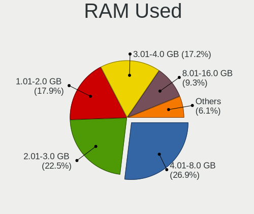
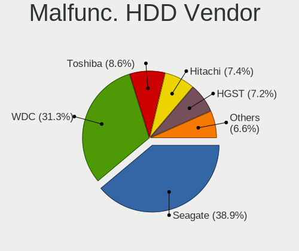
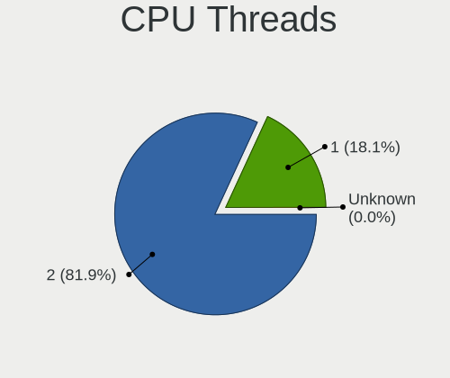
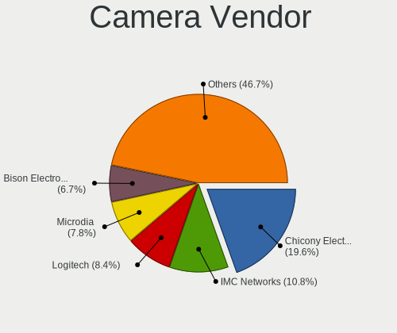

Arch - Tested Hardware & Statistics
-----------------------------------

A project to collect tested hardware configurations for Arch.

Anyone can contribute to this report by the [hw-probe](https://github.com/linuxhw/hw-probe) tool:

    sudo -E hw-probe -all -upload

Please contribute! Especially if your hardware is rare.

This is a report for all computer types. See also reports for [desktops](/Dist/Arch/Desktop/README.md) and [notebooks](/Dist/Arch/Notebook/README.md).

Contents
--------

* [ Test Cases ](#test-cases)

* [ System ](#system)
  - [ OS                       ](#os)
  - [ OS Family                ](#os-family)
  - [ Kernel                   ](#kernel)
  - [ Kernel Family            ](#kernel-family)
  - [ Kernel Major Ver.        ](#kernel-major-ver)
  - [ Arch                     ](#arch)
  - [ DE                       ](#de)
  - [ Display Server           ](#display-server)
  - [ Display Manager          ](#display-manager)
  - [ OS Lang                  ](#os-lang)
  - [ Boot Mode                ](#boot-mode)
  - [ Filesystem               ](#filesystem)
  - [ Part. scheme             ](#part-scheme)
  - [ Dual Boot with Linux/BSD ](#dual-boot-with-linuxbsd)
  - [ Dual Boot (Win)          ](#dual-boot-win)

* [ Board ](#board)
  - [ Vendor                   ](#vendor)
  - [ Model                    ](#model)
  - [ Model Family             ](#model-family)
  - [ MFG Year                 ](#mfg-year)
  - [ Form Factor              ](#form-factor)
  - [ Secure Boot              ](#secure-boot)
  - [ Coreboot                 ](#coreboot)
  - [ RAM Size                 ](#ram-size)
  - [ RAM Used                 ](#ram-used)
  - [ Total Drives             ](#total-drives)
  - [ Has CD-ROM               ](#has-cd-rom)
  - [ Has Ethernet             ](#has-ethernet)
  - [ Has WiFi                 ](#has-wifi)
  - [ Has Bluetooth            ](#has-bluetooth)

* [ Location ](#location)
  - [ Country                  ](#country)
  - [ City                     ](#city)

* [ Drives ](#drives)
  - [ Drive Vendor             ](#drive-vendor)
  - [ Drive Model              ](#drive-model)
  - [ HDD Vendor               ](#hdd-vendor)
  - [ SSD Vendor               ](#ssd-vendor)
  - [ Drive Kind               ](#drive-kind)
  - [ Drive Connector          ](#drive-connector)
  - [ Drive Size               ](#drive-size)
  - [ Space Total              ](#space-total)
  - [ Space Used               ](#space-used)
  - [ Malfunc. Drives          ](#malfunc-drives)
  - [ Malfunc. Drive Vendor    ](#malfunc-drive-vendor)
  - [ Malfunc. HDD Vendor      ](#malfunc-hdd-vendor)
  - [ Malfunc. Drive Kind      ](#malfunc-drive-kind)
  - [ Failed Drives            ](#failed-drives)
  - [ Failed Drive Vendor      ](#failed-drive-vendor)
  - [ Drive Status             ](#drive-status)

* [ Storage controller ](#storage-controller)
  - [ Storage Vendor           ](#storage-vendor)
  - [ Storage Model            ](#storage-model)
  - [ Storage Kind             ](#storage-kind)

* [ Processor ](#processor)
  - [ CPU Vendor               ](#cpu-vendor)
  - [ CPU Model                ](#cpu-model)
  - [ CPU Model Family         ](#cpu-model-family)
  - [ CPU Cores                ](#cpu-cores)
  - [ CPU Sockets              ](#cpu-sockets)
  - [ CPU Threads              ](#cpu-threads)
  - [ CPU Op-Modes             ](#cpu-op-modes)
  - [ CPU Microcode            ](#cpu-microcode)
  - [ CPU Microarch            ](#cpu-microarch)

* [ Graphics ](#graphics)
  - [ GPU Vendor               ](#gpu-vendor)
  - [ GPU Model                ](#gpu-model)
  - [ GPU Combo                ](#gpu-combo)
  - [ GPU Driver               ](#gpu-driver)
  - [ GPU Memory               ](#gpu-memory)

* [ Monitor ](#monitor)
  - [ Monitor Vendor           ](#monitor-vendor)
  - [ Monitor Model            ](#monitor-model)
  - [ Monitor Resolution       ](#monitor-resolution)
  - [ Monitor Diagonal         ](#monitor-diagonal)
  - [ Monitor Width            ](#monitor-width)
  - [ Aspect Ratio             ](#aspect-ratio)
  - [ Monitor Area             ](#monitor-area)
  - [ Pixel Density            ](#pixel-density)
  - [ Multiple Monitors        ](#multiple-monitors)

* [ Network ](#network)
  - [ Net Controller Vendor    ](#net-controller-vendor)
  - [ Net Controller Model     ](#net-controller-model)
  - [ Wireless Vendor          ](#wireless-vendor)
  - [ Wireless Model           ](#wireless-model)
  - [ Ethernet Vendor          ](#ethernet-vendor)
  - [ Ethernet Model           ](#ethernet-model)
  - [ Net Controller Kind      ](#net-controller-kind)
  - [ Used Controller          ](#used-controller)
  - [ NICs                     ](#nics)
  - [ IPv6                     ](#ipv6)

* [ Bluetooth ](#bluetooth)
  - [ Bluetooth Vendor         ](#bluetooth-vendor)
  - [ Bluetooth Model          ](#bluetooth-model)

* [ Sound ](#sound)
  - [ Sound Vendor             ](#sound-vendor)
  - [ Sound Model              ](#sound-model)

* [ Memory ](#memory)
  - [ Memory Vendor            ](#memory-vendor)
  - [ Memory Model             ](#memory-model)
  - [ Memory Kind              ](#memory-kind)
  - [ Memory Form Factor       ](#memory-form-factor)
  - [ Memory Size              ](#memory-size)
  - [ Memory Speed             ](#memory-speed)

* [ Printers & scanners ](#printers--scanners)
  - [ Printer Vendor           ](#printer-vendor)
  - [ Printer Model            ](#printer-model)
  - [ Scanner Vendor           ](#scanner-vendor)
  - [ Scanner Model            ](#scanner-model)

* [ Camera ](#camera)
  - [ Camera Vendor            ](#camera-vendor)
  - [ Camera Model             ](#camera-model)

* [ Security ](#security)
  - [ Fingerprint Vendor       ](#fingerprint-vendor)
  - [ Fingerprint Model        ](#fingerprint-model)
  - [ Chipcard Vendor          ](#chipcard-vendor)
  - [ Chipcard Model           ](#chipcard-model)

* [ Unsupported ](#unsupported)
  - [ Unsupported Devices      ](#unsupported-devices)
  - [ Unsupported Device Types ](#unsupported-device-types)

Test Cases
----------

Total: 7168

| Vendor        | Model                       | Form-Factor | Probe                                                      | Date         |
|---------------|-----------------------------|-------------|------------------------------------------------------------|--------------|
| ASUSTek       | H81T                        | Desktop     | [7598a634e6](https://linux-hardware.org/?probe=7598a634e6) | Nov 02, 2022 |
| GPD           | P3 MAX                      | Notebook    | [8b198da775](https://linux-hardware.org/?probe=8b198da775) | Nov 02, 2022 |
| GPD           | P3 MAX                      | Notebook    | [aea8f8bb50](https://linux-hardware.org/?probe=aea8f8bb50) | Nov 02, 2022 |
| Notebook      | P65xHP                      | Notebook    | [68d40fd2c7](https://linux-hardware.org/?probe=68d40fd2c7) | Nov 02, 2022 |
| ASUSTek       | PRIME B550M-A               | Desktop     | [454939df34](https://linux-hardware.org/?probe=454939df34) | Nov 02, 2022 |
| ASUSTek       | N53Jg                       | Notebook    | [8e4782c668](https://linux-hardware.org/?probe=8e4782c668) | Nov 01, 2022 |
| Acer          | Swift SF314-512             | Notebook    | [4c80b212c6](https://linux-hardware.org/?probe=4c80b212c6) | Nov 01, 2022 |
| Acer          | Swift SF314-512             | Notebook    | [4e92800709](https://linux-hardware.org/?probe=4e92800709) | Nov 01, 2022 |
| Lenovo        | ThinkBook 15 G2 ITL 20VE    | Notebook    | [7603f28400](https://linux-hardware.org/?probe=7603f28400) | Nov 01, 2022 |
| ASUSTek       | PRIME B550M-A               | Desktop     | [321eae8d23](https://linux-hardware.org/?probe=321eae8d23) | Nov 01, 2022 |
| ASUSTek       | K54C                        | Notebook    | [dd4f63b1e4](https://linux-hardware.org/?probe=dd4f63b1e4) | Nov 01, 2022 |
| ASUSTek       | PRIME A320M-K               | Desktop     | [689b5a4022](https://linux-hardware.org/?probe=689b5a4022) | Nov 01, 2022 |
| Lenovo        | 3102 SDK0J40697 WIN 3305... | Desktop     | [a5d58af861](https://linux-hardware.org/?probe=a5d58af861) | Oct 31, 2022 |
| Avell High... | B.ON                        | Notebook    | [1eb1bf21ed](https://linux-hardware.org/?probe=1eb1bf21ed) | Oct 31, 2022 |
| Lenovo        | Legion Y7000 2019 1050 8... | Notebook    | [3821dabcb9](https://linux-hardware.org/?probe=3821dabcb9) | Oct 31, 2022 |
| ASRock        | X670E Pro RS                | Desktop     | [5ebdf73c67](https://linux-hardware.org/?probe=5ebdf73c67) | Oct 31, 2022 |
| ASUSTek       | PRIME Z690-A                | Desktop     | [b1027d78bc](https://linux-hardware.org/?probe=b1027d78bc) | Oct 31, 2022 |
| MSI           | B550M PRO-VDH WIFI          | Desktop     | [472a3f2707](https://linux-hardware.org/?probe=472a3f2707) | Oct 30, 2022 |
| ASUSTek       | ROG STRIX B450-F GAMING     | Desktop     | [71de876615](https://linux-hardware.org/?probe=71de876615) | Oct 30, 2022 |
| MSI           | B550-A PRO                  | Desktop     | [0d67856d8a](https://linux-hardware.org/?probe=0d67856d8a) | Oct 30, 2022 |
| MSI           | B550-A PRO                  | Desktop     | [9845791d39](https://linux-hardware.org/?probe=9845791d39) | Oct 30, 2022 |
| HP            | ProBook 450 G6              | Notebook    | [224f9c8141](https://linux-hardware.org/?probe=224f9c8141) | Oct 30, 2022 |
| Gigabyte      | G1.Sniper B5-CF             | Desktop     | [c128f85cdc](https://linux-hardware.org/?probe=c128f85cdc) | Oct 30, 2022 |
| ASUSTek       | PRIME H310M-E R2.0/BR       | Desktop     | [93d25dfb1f](https://linux-hardware.org/?probe=93d25dfb1f) | Oct 30, 2022 |
| HP            | EliteBook 840 G5            | Notebook    | [f8c58b7061](https://linux-hardware.org/?probe=f8c58b7061) | Oct 30, 2022 |
| ASUSTek       | PRIME H310M-E R2.0/BR       | Desktop     | [8384c9e137](https://linux-hardware.org/?probe=8384c9e137) | Oct 30, 2022 |
| MSI           | MPG B550 GAMING PLUS        | Desktop     | [1f7df5159e](https://linux-hardware.org/?probe=1f7df5159e) | Oct 30, 2022 |
| ASUSTek       | P6TD DELUXE                 | Desktop     | [faa61ea635](https://linux-hardware.org/?probe=faa61ea635) | Oct 30, 2022 |
| Dell          | Latitude E5430 non-vPro     | Notebook    | [70a0354dba](https://linux-hardware.org/?probe=70a0354dba) | Oct 30, 2022 |
| HP            | ProBook 640 G4              | Notebook    | [0a7776630f](https://linux-hardware.org/?probe=0a7776630f) | Oct 30, 2022 |
| Apple         | MacBookPro11,2              | Notebook    | [c5955c7440](https://linux-hardware.org/?probe=c5955c7440) | Oct 29, 2022 |
| MSI           | Prestige 14 A10SC           | Notebook    | [1504398ef8](https://linux-hardware.org/?probe=1504398ef8) | Oct 29, 2022 |
| Gigabyte      | B550 AORUS ELITE            | Desktop     | [957fc9af86](https://linux-hardware.org/?probe=957fc9af86) | Oct 29, 2022 |
| ASUSTek       | ROG Zephyrus G14 GA402RJ... | Notebook    | [1753d78397](https://linux-hardware.org/?probe=1753d78397) | Oct 29, 2022 |
| HP            | OMEN by Laptop              | Notebook    | [610be75cca](https://linux-hardware.org/?probe=610be75cca) | Oct 29, 2022 |
| Gigabyte      | B550M DS3H                  | Desktop     | [4234f1fe02](https://linux-hardware.org/?probe=4234f1fe02) | Oct 29, 2022 |
| Gigabyte      | B550M DS3H                  | Desktop     | [6ab822b64c](https://linux-hardware.org/?probe=6ab822b64c) | Oct 29, 2022 |
| HP            | Pavilion dv5                | Notebook    | [8bd42e12c3](https://linux-hardware.org/?probe=8bd42e12c3) | Oct 29, 2022 |
| Lenovo        | ThinkBook 15 G2 ITL 20VE    | Notebook    | [be41a03a4d](https://linux-hardware.org/?probe=be41a03a4d) | Oct 29, 2022 |
| ASUSTek       | VivoBook_ASUSLaptop X530... | Notebook    | [893d006e2f](https://linux-hardware.org/?probe=893d006e2f) | Oct 29, 2022 |
| Gigabyte      | EX58-UD3R                   | Desktop     | [0d76cc7e31](https://linux-hardware.org/?probe=0d76cc7e31) | Oct 29, 2022 |
| HP            | 250 G8 Notebook PC          | Notebook    | [59c02d4967](https://linux-hardware.org/?probe=59c02d4967) | Oct 28, 2022 |
| Lenovo        | ThinkBook 16 G4+ ARA 21D... | Notebook    | [0dde1fbb38](https://linux-hardware.org/?probe=0dde1fbb38) | Oct 28, 2022 |
| Lenovo        | ThinkBook 16 G4+ ARA 21D... | Notebook    | [8cf64e81cd](https://linux-hardware.org/?probe=8cf64e81cd) | Oct 28, 2022 |
| Avell High... | B.ON                        | Notebook    | [194a1eddc3](https://linux-hardware.org/?probe=194a1eddc3) | Oct 28, 2022 |
| HP            | 255 G8 Notebook PC          | Notebook    | [2ad60a938a](https://linux-hardware.org/?probe=2ad60a938a) | Oct 28, 2022 |
| Lenovo        | IdeaPad Gaming 3 15ARH05... | Notebook    | [7d99f01f0e](https://linux-hardware.org/?probe=7d99f01f0e) | Oct 28, 2022 |
| Lenovo        | ThinkPad W540 20BHS0730D    | Notebook    | [f24dc12e06](https://linux-hardware.org/?probe=f24dc12e06) | Oct 28, 2022 |
| Lenovo        | IdeaPadFlex 5 14ALC7 82R... | Convertible | [ebdd62cbe3](https://linux-hardware.org/?probe=ebdd62cbe3) | Oct 28, 2022 |
| ASUSTek       | M5A99FX PRO R2.0            | Desktop     | [060c8aadd1](https://linux-hardware.org/?probe=060c8aadd1) | Oct 28, 2022 |
| Unknown       | Unknown                     | Notebook    | [a03935aadd](https://linux-hardware.org/?probe=a03935aadd) | Oct 27, 2022 |
| ASUSTek       | TUF Gaming FX505DT_FX505... | Notebook    | [639503102e](https://linux-hardware.org/?probe=639503102e) | Oct 27, 2022 |
| HP            | EliteBook 850 G8 Noteboo... | Notebook    | [84acb8d19b](https://linux-hardware.org/?probe=84acb8d19b) | Oct 27, 2022 |
| Unknown       | Unknown                     | Notebook    | [069ce9d405](https://linux-hardware.org/?probe=069ce9d405) | Oct 27, 2022 |
| HP            | Pavilion x360 Convertibl... | Convertible | [19859b5baf](https://linux-hardware.org/?probe=19859b5baf) | Oct 27, 2022 |
| HP            | Pavilion x360 Convertibl... | Convertible | [810ec3e083](https://linux-hardware.org/?probe=810ec3e083) | Oct 27, 2022 |
| Lenovo        | IdeaPadFlex 5 14ITL05 82... | Convertible | [0d31bc8f88](https://linux-hardware.org/?probe=0d31bc8f88) | Oct 27, 2022 |
| Apple         | MacBookAir7,2               | Notebook    | [abadd71c90](https://linux-hardware.org/?probe=abadd71c90) | Oct 27, 2022 |
| ASUSTek       | PRIME B550M-A               | Desktop     | [6650af69ad](https://linux-hardware.org/?probe=6650af69ad) | Oct 27, 2022 |
| HP            | ENVY x360 Convertible 13... | Convertible | [51877edd1e](https://linux-hardware.org/?probe=51877edd1e) | Oct 27, 2022 |
| HP            | ENVY x360 Convertible 13... | Convertible | [aca9e00b3d](https://linux-hardware.org/?probe=aca9e00b3d) | Oct 27, 2022 |
| Lenovo        | ThinkPad T480s 20L8S5YM0... | Notebook    | [c348de09bf](https://linux-hardware.org/?probe=c348de09bf) | Oct 26, 2022 |
| Gigabyte      | X570 AORUS ELITE            | Desktop     | [82fcc1ecc7](https://linux-hardware.org/?probe=82fcc1ecc7) | Oct 26, 2022 |
| Lenovo        | ThinkPad T480 20L50000IX    | Notebook    | [bcb1b11c50](https://linux-hardware.org/?probe=bcb1b11c50) | Oct 26, 2022 |
| Intel         | H55                         | Desktop     | [f634aefb9a](https://linux-hardware.org/?probe=f634aefb9a) | Oct 26, 2022 |
| Lenovo        | IdeaPad 5 14ALC05 82LM      | Notebook    | [56c91f99e7](https://linux-hardware.org/?probe=56c91f99e7) | Oct 26, 2022 |
| MSI           | ZH77A-G43                   | Desktop     | [ff43c876e9](https://linux-hardware.org/?probe=ff43c876e9) | Oct 26, 2022 |
| HP            | 250 G8 Notebook PC          | Notebook    | [d4ebaa71a2](https://linux-hardware.org/?probe=d4ebaa71a2) | Oct 26, 2022 |
| Dell          | Precision 5570              | Notebook    | [67d7b55dab](https://linux-hardware.org/?probe=67d7b55dab) | Oct 26, 2022 |
| Gigabyte      | X570 AORUS ELITE            | Desktop     | [8a718e0ade](https://linux-hardware.org/?probe=8a718e0ade) | Oct 26, 2022 |
| Timi          | A7S                         | Notebook    | [004df6b9a1](https://linux-hardware.org/?probe=004df6b9a1) | Oct 26, 2022 |
| Dell          | Latitude E6440              | Notebook    | [307356784a](https://linux-hardware.org/?probe=307356784a) | Oct 26, 2022 |
| Lenovo        | IdeaPadFlex 5 14ITL05 82... | Convertible | [b05308c0f0](https://linux-hardware.org/?probe=b05308c0f0) | Oct 26, 2022 |
| Dell          | Latitude E5570              | Notebook    | [2d59f069b4](https://linux-hardware.org/?probe=2d59f069b4) | Oct 26, 2022 |
| HP            | Pavilion x360 Convertibl... | Convertible | [40447b0a52](https://linux-hardware.org/?probe=40447b0a52) | Oct 26, 2022 |
| HP            | Pavilion x360 Convertibl... | Convertible | [040b99188b](https://linux-hardware.org/?probe=040b99188b) | Oct 26, 2022 |
| HP            | Pavilion x360 Convertibl... | Convertible | [7b20f93496](https://linux-hardware.org/?probe=7b20f93496) | Oct 26, 2022 |
| HUAWEI        | HN-WX9X                     | Notebook    | [042ffc026d](https://linux-hardware.org/?probe=042ffc026d) | Oct 26, 2022 |
| Timi          | A7S                         | Notebook    | [77a87009dd](https://linux-hardware.org/?probe=77a87009dd) | Oct 26, 2022 |
| Apple         | MacBookPro10,1              | Notebook    | [212ce8900d](https://linux-hardware.org/?probe=212ce8900d) | Oct 26, 2022 |
| Lenovo        | ThinkPad X1 Carbon 3rd 2... | Notebook    | [53e6b23ebf](https://linux-hardware.org/?probe=53e6b23ebf) | Oct 26, 2022 |
| Dell          | Latitude E6430              | Notebook    | [f196a9762f](https://linux-hardware.org/?probe=f196a9762f) | Oct 25, 2022 |
| Dell          | Latitude E6430              | Notebook    | [8062ec17fd](https://linux-hardware.org/?probe=8062ec17fd) | Oct 25, 2022 |
| Lenovo        | IdeaPad 3 15ADA05 81W1      | Notebook    | [2d7fa062e3](https://linux-hardware.org/?probe=2d7fa062e3) | Oct 25, 2022 |
| Lenovo        | ThinkPad T14s Gen 1 20UH... | Notebook    | [cca91f3fe8](https://linux-hardware.org/?probe=cca91f3fe8) | Oct 25, 2022 |
| Lenovo        | ThinkPad T14s Gen 1 20UH... | Notebook    | [8f34a9c24c](https://linux-hardware.org/?probe=8f34a9c24c) | Oct 25, 2022 |
| ASUSTek       | ROG Flow Z13 GZ301ZE_GZ3... | Tablet      | [dee13eac1d](https://linux-hardware.org/?probe=dee13eac1d) | Oct 25, 2022 |
| ASUSTek       | ROG Flow Z13 GZ301ZE_GZ3... | Tablet      | [1bc80461df](https://linux-hardware.org/?probe=1bc80461df) | Oct 25, 2022 |
| Lenovo        | ThinkPad T470 20HES0FW00    | Notebook    | [1f939e0414](https://linux-hardware.org/?probe=1f939e0414) | Oct 25, 2022 |
| MSI           | X470 GAMING PLUS MAX        | Desktop     | [040714e135](https://linux-hardware.org/?probe=040714e135) | Oct 25, 2022 |
| Acer          | Aspire A715-42G             | Notebook    | [72b73a6552](https://linux-hardware.org/?probe=72b73a6552) | Oct 25, 2022 |
| Lenovo        | ThinkPad T14s Gen 2a 20X... | Notebook    | [26415e4b74](https://linux-hardware.org/?probe=26415e4b74) | Oct 25, 2022 |
| Dell          | Inspiron 7559               | Notebook    | [2a1b8eb060](https://linux-hardware.org/?probe=2a1b8eb060) | Oct 25, 2022 |
| HP            | 255 G8 Notebook PC          | Notebook    | [30c305f07c](https://linux-hardware.org/?probe=30c305f07c) | Oct 25, 2022 |
| HP            | Laptop 15s-eq2xxx           | Notebook    | [3146a3d644](https://linux-hardware.org/?probe=3146a3d644) | Oct 25, 2022 |
| HP            | ENVY x360 Convertible 13... | Convertible | [c55b37c393](https://linux-hardware.org/?probe=c55b37c393) | Oct 25, 2022 |
| ASUSTek       | GL553VD                     | Notebook    | [20278229cd](https://linux-hardware.org/?probe=20278229cd) | Oct 25, 2022 |
| Microsoft     | Surface Laptop 4            | Tablet      | [4bff3b131d](https://linux-hardware.org/?probe=4bff3b131d) | Oct 25, 2022 |
| Acer          | Aspire A515-45              | Notebook    | [4584821ae6](https://linux-hardware.org/?probe=4584821ae6) | Oct 25, 2022 |
| Lenovo        | ThinkPad T495 20NJ000XIX    | Notebook    | [169601c723](https://linux-hardware.org/?probe=169601c723) | Oct 25, 2022 |
| Lenovo        | ThinkPad T495 20NJ000XIX    | Notebook    | [efb9c3d448](https://linux-hardware.org/?probe=efb9c3d448) | Oct 25, 2022 |
| ASUSTek       | PRIME B550M-A               | Desktop     | [a55a6ef774](https://linux-hardware.org/?probe=a55a6ef774) | Oct 25, 2022 |
| ASUSTek       | Pro WS X570-ACE             | Desktop     | [52a4b91a1e](https://linux-hardware.org/?probe=52a4b91a1e) | Oct 25, 2022 |
| Lenovo        | B51-80 80LM                 | Notebook    | [aaed1997fd](https://linux-hardware.org/?probe=aaed1997fd) | Oct 25, 2022 |
| ASUSTek       | TUF Gaming X570-PLUS        | Desktop     | [6e98085fc5](https://linux-hardware.org/?probe=6e98085fc5) | Oct 25, 2022 |
| Fujitsu       | LIFEBOOK A532               | Notebook    | [e176b2ac7c](https://linux-hardware.org/?probe=e176b2ac7c) | Oct 25, 2022 |
| MSI           | Z170A GAMING M7             | Desktop     | [3326f67ecf](https://linux-hardware.org/?probe=3326f67ecf) | Oct 25, 2022 |
| Dell          | Inspiron 13-7359            | Notebook    | [5a6d4ce6e7](https://linux-hardware.org/?probe=5a6d4ce6e7) | Oct 25, 2022 |
| ASRock        | H110M-ITX                   | Desktop     | [6818d9b7e2](https://linux-hardware.org/?probe=6818d9b7e2) | Oct 24, 2022 |
| Acer          | Aspire A515-52G             | Notebook    | [f569841512](https://linux-hardware.org/?probe=f569841512) | Oct 24, 2022 |
| Microsoft     | Surface Laptop 4            | Tablet      | [bdb6b876db](https://linux-hardware.org/?probe=bdb6b876db) | Oct 24, 2022 |
| Lenovo        | Yoga Slim 7 14ITL05 82A3    | Notebook    | [4948eb3b16](https://linux-hardware.org/?probe=4948eb3b16) | Oct 24, 2022 |
| ASUSTek       | ROG STRIX X470-F GAMING     | Desktop     | [b4f3e516e3](https://linux-hardware.org/?probe=b4f3e516e3) | Oct 24, 2022 |
| Gigabyte      | X570 AORUS ELITE            | Desktop     | [581fb21345](https://linux-hardware.org/?probe=581fb21345) | Oct 24, 2022 |
| ASRock        | B450 Gaming-ITX/ac          | Desktop     | [c76c6f0a0e](https://linux-hardware.org/?probe=c76c6f0a0e) | Oct 24, 2022 |
| Lenovo        | ThinkPad T480 20L5000AIX    | Notebook    | [43650773c9](https://linux-hardware.org/?probe=43650773c9) | Oct 24, 2022 |
| Lenovo        | ThinkBook 13s G3 ACN 20Y... | Notebook    | [d663683611](https://linux-hardware.org/?probe=d663683611) | Oct 24, 2022 |
| ASUSTek       | PRIME B550M-A               | Desktop     | [baf284f131](https://linux-hardware.org/?probe=baf284f131) | Oct 24, 2022 |
| Lenovo        | ThinkPad T14 Gen 1 20S00... | Notebook    | [417beae8e5](https://linux-hardware.org/?probe=417beae8e5) | Oct 24, 2022 |
| ASUSTek       | VivoBook_ASUSLaptop E510... | Notebook    | [7733e4f8d5](https://linux-hardware.org/?probe=7733e4f8d5) | Oct 24, 2022 |
| ASUSTek       | PRIME B360M-A               | Desktop     | [19ccd70ee8](https://linux-hardware.org/?probe=19ccd70ee8) | Oct 24, 2022 |
| MSI           | MPG Z490 GAMING EDGE WIF... | Desktop     | [01c09a61ae](https://linux-hardware.org/?probe=01c09a61ae) | Oct 24, 2022 |
| MSI           | MAG X570S TORPEDO MAX       | Desktop     | [a8ab16a5c5](https://linux-hardware.org/?probe=a8ab16a5c5) | Oct 24, 2022 |
| Acer          | Aspire A315-42              | Notebook    | [20dcade848](https://linux-hardware.org/?probe=20dcade848) | Oct 24, 2022 |
| MSI           | B450M MORTAR TITANIUM       | Desktop     | [37a0403fc9](https://linux-hardware.org/?probe=37a0403fc9) | Oct 24, 2022 |
| ASUSTek       | VivoBook_ASUSLaptop E510... | Notebook    | [d4c62f39e3](https://linux-hardware.org/?probe=d4c62f39e3) | Oct 24, 2022 |
| Acer          | Aspire A515-45              | Notebook    | [b39d63f4f2](https://linux-hardware.org/?probe=b39d63f4f2) | Oct 24, 2022 |
| ASUSTek       | K54C                        | Notebook    | [acf64b4ced](https://linux-hardware.org/?probe=acf64b4ced) | Oct 24, 2022 |
| ASUSTek       | PRIME B550M-A               | Desktop     | [c9b4dc7a70](https://linux-hardware.org/?probe=c9b4dc7a70) | Oct 24, 2022 |
| ASUSTek       | PRIME B550M-A               | Desktop     | [b237965d1c](https://linux-hardware.org/?probe=b237965d1c) | Oct 24, 2022 |
| MSI           | MAG Z490 TOMAHAWK           | Desktop     | [25db15ea87](https://linux-hardware.org/?probe=25db15ea87) | Oct 24, 2022 |
| Apple         | MacBookAir7,2               | Notebook    | [d7e99b5869](https://linux-hardware.org/?probe=d7e99b5869) | Oct 24, 2022 |
| Lenovo        | IdeaPad 330-15IKB 81DE      | Notebook    | [c24c3f0836](https://linux-hardware.org/?probe=c24c3f0836) | Oct 23, 2022 |
| Dell          | Vostro 3491                 | Notebook    | [8809be3a93](https://linux-hardware.org/?probe=8809be3a93) | Oct 23, 2022 |
| Lenovo        | ThinkPad T460s 20FAS6EH0... | Notebook    | [794fa1859f](https://linux-hardware.org/?probe=794fa1859f) | Oct 23, 2022 |
| MSI           | MAG B550M MORTAR WIFI       | Desktop     | [ce7a9a3171](https://linux-hardware.org/?probe=ce7a9a3171) | Oct 23, 2022 |
| Gigabyte      | B550 AORUS PRO              | Desktop     | [76c1dffd95](https://linux-hardware.org/?probe=76c1dffd95) | Oct 23, 2022 |
| ASUSTek       | PRIME X670-P WIFI           | Desktop     | [e2d21dcb54](https://linux-hardware.org/?probe=e2d21dcb54) | Oct 23, 2022 |
| ASUSTek       | ROG Zephyrus G14 GA401QE... | Notebook    | [e21d202e50](https://linux-hardware.org/?probe=e21d202e50) | Oct 22, 2022 |
| Lenovo        | IdeaPad S145-15IWL 81S9     | Notebook    | [514642847b](https://linux-hardware.org/?probe=514642847b) | Oct 22, 2022 |
| MSI           | MPG X570 GAMING EDGE WIF... | Desktop     | [edf45abefe](https://linux-hardware.org/?probe=edf45abefe) | Oct 21, 2022 |
| Lenovo        | ThinkPad T16 Gen 1 21CHC... | Notebook    | [a22e54462c](https://linux-hardware.org/?probe=a22e54462c) | Oct 21, 2022 |
| Lenovo        | ThinkBook 15-IIL 20SM       | Notebook    | [07acd27a70](https://linux-hardware.org/?probe=07acd27a70) | Oct 21, 2022 |
| HP            | EliteBook 840 G1            | Notebook    | [837845f259](https://linux-hardware.org/?probe=837845f259) | Oct 20, 2022 |
| Dell          | Latitude E6500              | Notebook    | [d64ffd6f2e](https://linux-hardware.org/?probe=d64ffd6f2e) | Oct 20, 2022 |
| ASUSTek       | TUF Gaming FX505GT_FX505... | Notebook    | [1a99b642cc](https://linux-hardware.org/?probe=1a99b642cc) | Oct 20, 2022 |
| HP            | ZBook Firefly 15 inch G8... | Notebook    | [4c0b27f18e](https://linux-hardware.org/?probe=4c0b27f18e) | Oct 20, 2022 |
| HP            | Pavilion Aero Laptop 13-... | Notebook    | [7cd6e349f0](https://linux-hardware.org/?probe=7cd6e349f0) | Oct 20, 2022 |
| Acer          | Predator PO3-630            | Desktop     | [aae61f30c7](https://linux-hardware.org/?probe=aae61f30c7) | Oct 20, 2022 |
| Lenovo        | IdeaPad 700-15ISK 80RU      | Notebook    | [d042d922e5](https://linux-hardware.org/?probe=d042d922e5) | Oct 20, 2022 |
| HP            | 250 G8 Notebook PC          | Notebook    | [e8dc04cc0e](https://linux-hardware.org/?probe=e8dc04cc0e) | Oct 20, 2022 |
| ASUSTek       | PRIME B550M-A               | Desktop     | [68b839f16e](https://linux-hardware.org/?probe=68b839f16e) | Oct 20, 2022 |
| ASUSTek       | TUF Gaming X570-PRO         | Desktop     | [6be0c6ee5f](https://linux-hardware.org/?probe=6be0c6ee5f) | Oct 20, 2022 |
| Dell          | Inspiron 5584               | Notebook    | [79ec522ef8](https://linux-hardware.org/?probe=79ec522ef8) | Oct 20, 2022 |
| MSI           | B450 TOMAHAWK MAX           | Desktop     | [8b459ac79b](https://linux-hardware.org/?probe=8b459ac79b) | Oct 20, 2022 |
| Lenovo        | Yoga 7 14ARB7 82QF          | Convertible | [e389da5691](https://linux-hardware.org/?probe=e389da5691) | Oct 20, 2022 |
| Lenovo        | Yoga 7 14ARB7 82QF          | Convertible | [ad9d78fb43](https://linux-hardware.org/?probe=ad9d78fb43) | Oct 19, 2022 |
| HP            | Pavilion dm4                | Notebook    | [d96f382cc2](https://linux-hardware.org/?probe=d96f382cc2) | Oct 19, 2022 |
| HP            | Pavilion dm4                | Notebook    | [171745a6e8](https://linux-hardware.org/?probe=171745a6e8) | Oct 19, 2022 |
| Dell          | Inspiron 5584               | Notebook    | [4dac48ea7f](https://linux-hardware.org/?probe=4dac48ea7f) | Oct 19, 2022 |
| MOTILE        | M141                        | Notebook    | [a6da22306f](https://linux-hardware.org/?probe=a6da22306f) | Oct 19, 2022 |
| Acer          | Aspire A515-51              | Notebook    | [0022d7c5ef](https://linux-hardware.org/?probe=0022d7c5ef) | Oct 19, 2022 |
| HP            | 255 G8 Notebook PC          | Notebook    | [2f69a96661](https://linux-hardware.org/?probe=2f69a96661) | Oct 18, 2022 |
| Samsung       | 270E5J/2570EJ               | Notebook    | [f2750b0a70](https://linux-hardware.org/?probe=f2750b0a70) | Oct 18, 2022 |
| ASUSTek       | ROG Strix G513QY_G513QY     | Notebook    | [8bc82af4e5](https://linux-hardware.org/?probe=8bc82af4e5) | Oct 18, 2022 |
| HP            | 8056                        | Desktop     | [37ed8a6b64](https://linux-hardware.org/?probe=37ed8a6b64) | Oct 18, 2022 |
| Gigabyte      | X99-UD7 WIFI-CF             | Desktop     | [9c484b6d22](https://linux-hardware.org/?probe=9c484b6d22) | Oct 18, 2022 |
| Lenovo        | ThinkPad X1 Carbon Gen 1... | Notebook    | [437cb780cb](https://linux-hardware.org/?probe=437cb780cb) | Oct 18, 2022 |
| ASRock        | X300M-STX                   | Desktop     | [549fe857a6](https://linux-hardware.org/?probe=549fe857a6) | Oct 18, 2022 |
| Gigabyte      | AB350-Gaming 3-CF           | Desktop     | [7891f1e18c](https://linux-hardware.org/?probe=7891f1e18c) | Oct 18, 2022 |
| Gigabyte      | B450M DS3H-CF               | Desktop     | [36c0e4dd87](https://linux-hardware.org/?probe=36c0e4dd87) | Oct 18, 2022 |
| ASUSTek       | PRIME B550M-A               | Desktop     | [8d774a5771](https://linux-hardware.org/?probe=8d774a5771) | Oct 18, 2022 |
| Avell High... | B.ON                        | Notebook    | [fc8b4d7534](https://linux-hardware.org/?probe=fc8b4d7534) | Oct 18, 2022 |
| Dell          | Vostro 7580                 | Notebook    | [69cc3a8c62](https://linux-hardware.org/?probe=69cc3a8c62) | Oct 18, 2022 |
| ASUSTek       | ROG STRIX B550-F GAMING     | Desktop     | [d727afe327](https://linux-hardware.org/?probe=d727afe327) | Oct 17, 2022 |
| HP            | 255 G8 Notebook PC          | Notebook    | [cb651a5071](https://linux-hardware.org/?probe=cb651a5071) | Oct 17, 2022 |
| MACHINIST     | X99-RS9 V2.0                | Desktop     | [9d4d455bb2](https://linux-hardware.org/?probe=9d4d455bb2) | Oct 17, 2022 |
| Lenovo        | ThinkPad T470s 20HGS1R90... | Notebook    | [e3eba59f05](https://linux-hardware.org/?probe=e3eba59f05) | Oct 17, 2022 |
| MECHREVO      | Code01 Ver2.0               | Notebook    | [5fbae9cfcf](https://linux-hardware.org/?probe=5fbae9cfcf) | Oct 17, 2022 |
| Timi          | Xiaomi Book Pro 14 2022     | Notebook    | [18e52559a4](https://linux-hardware.org/?probe=18e52559a4) | Oct 17, 2022 |
| Lenovo        | ThinkPad X1 Yoga Gen 7 2... | Convertible | [2f952f7898](https://linux-hardware.org/?probe=2f952f7898) | Oct 17, 2022 |
| Samsung       | 950XDB/951XDB/950XDY        | Notebook    | [e39622cea9](https://linux-hardware.org/?probe=e39622cea9) | Oct 17, 2022 |
| Dell          | Inspiron 3521               | Notebook    | [f7b9f3cab2](https://linux-hardware.org/?probe=f7b9f3cab2) | Oct 17, 2022 |
| Lenovo        | Y520-15IKBN 80WK            | Notebook    | [e38add57d6](https://linux-hardware.org/?probe=e38add57d6) | Oct 17, 2022 |
| Dell          | 0HHV7N A00                  | Desktop     | [fec2e273f7](https://linux-hardware.org/?probe=fec2e273f7) | Oct 17, 2022 |
| Gigabyte      | B460M DS3H V2               | Desktop     | [4fe1c6d3e8](https://linux-hardware.org/?probe=4fe1c6d3e8) | Oct 17, 2022 |
| PCWare        | IPMH110G                    | Desktop     | [cde154a026](https://linux-hardware.org/?probe=cde154a026) | Oct 16, 2022 |
| Intel         | D955XBK AAC96732-501        | Desktop     | [57a5e6cd9a](https://linux-hardware.org/?probe=57a5e6cd9a) | Oct 16, 2022 |
| ASUSTek       | M5A99FX PRO R2.0            | Desktop     | [24c63dcc9e](https://linux-hardware.org/?probe=24c63dcc9e) | Oct 16, 2022 |
| Lenovo        | ThinkPad P50 20EQS6DV00     | Notebook    | [472b64041d](https://linux-hardware.org/?probe=472b64041d) | Oct 16, 2022 |
| HP            | Pavilion Laptop 14-ec0xx... | Notebook    | [babb66e9c9](https://linux-hardware.org/?probe=babb66e9c9) | Oct 16, 2022 |
| ASUSTek       | PRIME B550-PLUS             | Desktop     | [e71107e8cd](https://linux-hardware.org/?probe=e71107e8cd) | Oct 16, 2022 |
| Microsoft     | Surface Go 3                | Tablet      | [70494f7310](https://linux-hardware.org/?probe=70494f7310) | Oct 16, 2022 |
| ASUSTek       | PRIME B550M-A               | Desktop     | [4aa372d298](https://linux-hardware.org/?probe=4aa372d298) | Oct 16, 2022 |
| ASUSTek       | PRIME X370-PRO              | Desktop     | [2495f40df9](https://linux-hardware.org/?probe=2495f40df9) | Oct 16, 2022 |
| Alienware     | m15 R6                      | Notebook    | [3cb0cb3e9d](https://linux-hardware.org/?probe=3cb0cb3e9d) | Oct 15, 2022 |
| ASUSTek       | PRIME X370-PRO              | Desktop     | [ba8acdb280](https://linux-hardware.org/?probe=ba8acdb280) | Oct 15, 2022 |
| Acer          | Aspire A515-45              | Notebook    | [7a8b3b953d](https://linux-hardware.org/?probe=7a8b3b953d) | Oct 15, 2022 |
| ASUSTek       | ROG Strix G513QY_G513QY     | Notebook    | [d56a8a035a](https://linux-hardware.org/?probe=d56a8a035a) | Oct 15, 2022 |
| HP            | ProBook 445 G8 Notebook ... | Notebook    | [6adb156840](https://linux-hardware.org/?probe=6adb156840) | Oct 15, 2022 |
| Dell          | Precision M4500             | Notebook    | [36048a8407](https://linux-hardware.org/?probe=36048a8407) | Oct 15, 2022 |
| Lenovo        | ThinkPad L420 78545EG       | Notebook    | [d2c975644c](https://linux-hardware.org/?probe=d2c975644c) | Oct 15, 2022 |
| ASUSTek       | X553MA                      | Notebook    | [ade1f0f879](https://linux-hardware.org/?probe=ade1f0f879) | Oct 14, 2022 |
| Lenovo        | IdeaPad 5 15IIL05 81YK      | Notebook    | [fbb018d1ef](https://linux-hardware.org/?probe=fbb018d1ef) | Oct 14, 2022 |
| Dell          | Precision M4800             | Notebook    | [aa9a1680fd](https://linux-hardware.org/?probe=aa9a1680fd) | Oct 14, 2022 |
| Gigabyte      | AB350M-HD3-CF se1           | Desktop     | [89060aa147](https://linux-hardware.org/?probe=89060aa147) | Oct 13, 2022 |
| Lenovo        | ThinkPad Z16 Gen 1 21D40... | Notebook    | [973f501233](https://linux-hardware.org/?probe=973f501233) | Oct 13, 2022 |
| Lenovo        | ThinkPad X201 3680FAG       | Notebook    | [f80eb01da1](https://linux-hardware.org/?probe=f80eb01da1) | Oct 13, 2022 |
| HP            | ProBook 640 G4              | Notebook    | [3d832d1780](https://linux-hardware.org/?probe=3d832d1780) | Oct 12, 2022 |
| Lenovo        | ThinkPad L15 Gen 2a 20X7... | Notebook    | [d3ade506f7](https://linux-hardware.org/?probe=d3ade506f7) | Oct 12, 2022 |
| Acer          | Nitro AN515-52              | Notebook    | [212c135857](https://linux-hardware.org/?probe=212c135857) | Oct 12, 2022 |
| ASUSTek       | P6T SE                      | Desktop     | [4ba4bc909d](https://linux-hardware.org/?probe=4ba4bc909d) | Oct 12, 2022 |
| Intel         | DH87RL AAG74240-400         | Desktop     | [82d2063927](https://linux-hardware.org/?probe=82d2063927) | Oct 12, 2022 |
| Lenovo        | ThinkBook 14 G4+ IAP 21C... | Notebook    | [8b554dcfe0](https://linux-hardware.org/?probe=8b554dcfe0) | Oct 12, 2022 |
| Dell          | Latitude E6420              | Notebook    | [0083bd14b8](https://linux-hardware.org/?probe=0083bd14b8) | Oct 12, 2022 |
| ASUSTek       | ROG STRIX B550-A GAMING     | Desktop     | [ec470df515](https://linux-hardware.org/?probe=ec470df515) | Oct 11, 2022 |
| Unknown       | Unknown                     | Notebook    | [ac743b08fa](https://linux-hardware.org/?probe=ac743b08fa) | Oct 11, 2022 |
| Acer          | Aspire E5-551               | Notebook    | [9d281c015c](https://linux-hardware.org/?probe=9d281c015c) | Oct 11, 2022 |
| Acer          | Aspire E5-551               | Notebook    | [6c351b94ff](https://linux-hardware.org/?probe=6c351b94ff) | Oct 11, 2022 |
| Dell          | 0WR7PY A02                  | Desktop     | [e464adc2d9](https://linux-hardware.org/?probe=e464adc2d9) | Oct 11, 2022 |
| PCWare        | IPMH110G                    | Desktop     | [2bcf719742](https://linux-hardware.org/?probe=2bcf719742) | Oct 11, 2022 |
| Lenovo        | ThinkPad X201 3680FAG       | Notebook    | [f44ca565c1](https://linux-hardware.org/?probe=f44ca565c1) | Oct 11, 2022 |
| AMI           | Cherry Trail CR             | Notebook    | [7d3c652547](https://linux-hardware.org/?probe=7d3c652547) | Oct 11, 2022 |
| Lenovo        | ThinkPad T410 2522E38       | Notebook    | [7d923eff3f](https://linux-hardware.org/?probe=7d923eff3f) | Oct 11, 2022 |
| ASUSTek       | ROG STRIX B550-I GAMING     | Desktop     | [2f346a2afb](https://linux-hardware.org/?probe=2f346a2afb) | Oct 11, 2022 |
| Gigabyte      | B450 AORUS ELITE            | Desktop     | [a2b8a7d46c](https://linux-hardware.org/?probe=a2b8a7d46c) | Oct 11, 2022 |
| Acer          | Nitro AN515-52              | Notebook    | [8e1e663189](https://linux-hardware.org/?probe=8e1e663189) | Oct 10, 2022 |
| HP            | Victus by Laptop 16-e0xx... | Notebook    | [d6e11d36a8](https://linux-hardware.org/?probe=d6e11d36a8) | Oct 10, 2022 |
| ASUSTek       | PRIME B550M-A               | Desktop     | [0bbe955a36](https://linux-hardware.org/?probe=0bbe955a36) | Oct 10, 2022 |
| Gigabyte      | B450M DS3H V2               | Desktop     | [e60a581f5f](https://linux-hardware.org/?probe=e60a581f5f) | Oct 10, 2022 |
| Framework     | Laptop                      | Notebook    | [b5fe425089](https://linux-hardware.org/?probe=b5fe425089) | Oct 10, 2022 |
| ASUSTek       | ROG STRIX B550-I GAMING     | Desktop     | [cde031e816](https://linux-hardware.org/?probe=cde031e816) | Oct 10, 2022 |
| HP            | EliteBook 8730w             | Notebook    | [e7545a94b2](https://linux-hardware.org/?probe=e7545a94b2) | Oct 09, 2022 |
| HP            | EliteBook 8730w             | Notebook    | [b938a96086](https://linux-hardware.org/?probe=b938a96086) | Oct 09, 2022 |
| ASUSTek       | ASUS TUF Gaming A17 FA70... | Notebook    | [62e134c294](https://linux-hardware.org/?probe=62e134c294) | Oct 09, 2022 |
| Dell          | XPS 13 9370                 | Notebook    | [17f73f4f28](https://linux-hardware.org/?probe=17f73f4f28) | Oct 09, 2022 |
| Timi          | Mi Laptop Pro 15            | Notebook    | [f756c2bb92](https://linux-hardware.org/?probe=f756c2bb92) | Oct 09, 2022 |
| HP            | 2B4B                        | Desktop     | [b36dc773b0](https://linux-hardware.org/?probe=b36dc773b0) | Oct 09, 2022 |
| ASUSTek       | PRIME X370-PRO              | Desktop     | [be9437ed6b](https://linux-hardware.org/?probe=be9437ed6b) | Oct 08, 2022 |
| Intel         | DH55TC AAE70932-302         | Desktop     | [696f55a7c4](https://linux-hardware.org/?probe=696f55a7c4) | Oct 07, 2022 |
| ASRock        | Z490 Steel Legend           | Desktop     | [ac371fb998](https://linux-hardware.org/?probe=ac371fb998) | Oct 07, 2022 |
| ASRock        | B450M Pro4                  | Desktop     | [92998a2fa1](https://linux-hardware.org/?probe=92998a2fa1) | Oct 07, 2022 |
| Lenovo        | ThinkPad E14 Gen 2 20T6S... | Notebook    | [a431b20f04](https://linux-hardware.org/?probe=a431b20f04) | Oct 07, 2022 |
| ASUSTek       | PRIME B550M-A               | Desktop     | [f4a339aa76](https://linux-hardware.org/?probe=f4a339aa76) | Oct 07, 2022 |
| ASUSTek       | PRIME Z390-P                | Desktop     | [db5dd33683](https://linux-hardware.org/?probe=db5dd33683) | Oct 07, 2022 |
| Acer          | Aspire A515-57G             | Notebook    | [f8d3a419e6](https://linux-hardware.org/?probe=f8d3a419e6) | Oct 07, 2022 |
| ASRock        | B450M Pro4                  | Desktop     | [87936d87c6](https://linux-hardware.org/?probe=87936d87c6) | Oct 06, 2022 |
| Fujitsu       | D3071-S1 S26361-D3071-S1    | Desktop     | [852194f41b](https://linux-hardware.org/?probe=852194f41b) | Oct 06, 2022 |
| Lenovo        | 0B98401 PRO                 | Desktop     | [6d338f36ef](https://linux-hardware.org/?probe=6d338f36ef) | Oct 06, 2022 |
| Fujitsu       | LIFEBOOK LH531              | Notebook    | [5ace2d0c1f](https://linux-hardware.org/?probe=5ace2d0c1f) | Oct 06, 2022 |
| Gigabyte      | B450 AORUS ELITE            | Desktop     | [b5cf733c51](https://linux-hardware.org/?probe=b5cf733c51) | Oct 06, 2022 |
| ASUSTek       | PRIME H410M-E               | Desktop     | [abe6a3fde2](https://linux-hardware.org/?probe=abe6a3fde2) | Oct 06, 2022 |
| MSI           | B450-A PRO MAX              | Desktop     | [bb71e0e8c3](https://linux-hardware.org/?probe=bb71e0e8c3) | Oct 05, 2022 |
| Gigabyte      | B85M-DS3H-A                 | Desktop     | [9395944d67](https://linux-hardware.org/?probe=9395944d67) | Oct 05, 2022 |
| MSI           | X470 GAMING PRO MAX         | Desktop     | [2e45442f11](https://linux-hardware.org/?probe=2e45442f11) | Oct 05, 2022 |
| MSI           | Modern 15 A5M               | Notebook    | [035a9bb7fa](https://linux-hardware.org/?probe=035a9bb7fa) | Oct 05, 2022 |
| Fujitsu       | LIFEBOOK LH531              | Notebook    | [3338607f1a](https://linux-hardware.org/?probe=3338607f1a) | Oct 05, 2022 |
| Lenovo        | IdeaPad S145-15IWL 81S9     | Notebook    | [74130061ff](https://linux-hardware.org/?probe=74130061ff) | Oct 05, 2022 |
| HP            | Pavilion Gaming Laptop 1... | Notebook    | [72a5f6b03c](https://linux-hardware.org/?probe=72a5f6b03c) | Oct 05, 2022 |
| HP            | Pavilion Gaming Laptop 1... | Notebook    | [a51c98849b](https://linux-hardware.org/?probe=a51c98849b) | Oct 05, 2022 |
| Dell          | XPS 15 9570                 | Notebook    | [0edf82b5be](https://linux-hardware.org/?probe=0edf82b5be) | Oct 05, 2022 |
| Avell High... | B.ON                        | Notebook    | [2b629889c7](https://linux-hardware.org/?probe=2b629889c7) | Oct 05, 2022 |
| HP            | 2AA2                        | Desktop     | [e6bc6050b6](https://linux-hardware.org/?probe=e6bc6050b6) | Oct 05, 2022 |
| ASUSTek       | PRIME B550M-A               | Desktop     | [a430b0d43a](https://linux-hardware.org/?probe=a430b0d43a) | Oct 05, 2022 |
| ASRock        | AB350M Pro4                 | Desktop     | [6207d55486](https://linux-hardware.org/?probe=6207d55486) | Oct 05, 2022 |
| Lenovo        | ThinkPad X1 Carbon Gen 9... | Notebook    | [a4b830a39b](https://linux-hardware.org/?probe=a4b830a39b) | Oct 04, 2022 |
| Acer          | Aspire ES1-572              | Notebook    | [1bd18c9a15](https://linux-hardware.org/?probe=1bd18c9a15) | Oct 04, 2022 |
| ASUSTek       | TUF Gaming X570-PLUS_BR     | Desktop     | [16f99421ab](https://linux-hardware.org/?probe=16f99421ab) | Oct 04, 2022 |
| ASUSTek       | Z87-DELUXE                  | Desktop     | [59bc735625](https://linux-hardware.org/?probe=59bc735625) | Oct 04, 2022 |
| Lenovo        | ThinkPad E14 Gen 2 20T6S... | Notebook    | [62b67bffae](https://linux-hardware.org/?probe=62b67bffae) | Oct 04, 2022 |
| Lenovo        | ThinkPad T15p Gen 3 21DA... | Notebook    | [e07e70b822](https://linux-hardware.org/?probe=e07e70b822) | Oct 04, 2022 |
| HP            | 1850                        | Desktop     | [f111f19884](https://linux-hardware.org/?probe=f111f19884) | Oct 04, 2022 |
| ASUSTek       | ZenBook UX325EA_UX325EA     | Notebook    | [790114327c](https://linux-hardware.org/?probe=790114327c) | Oct 04, 2022 |
| Gigabyte      | B360M D2V                   | Desktop     | [e0bf78b6b1](https://linux-hardware.org/?probe=e0bf78b6b1) | Oct 04, 2022 |
| ASUSTek       | ZenBook UX425UAZ_UM425UA... | Notebook    | [85bcec60e7](https://linux-hardware.org/?probe=85bcec60e7) | Oct 04, 2022 |
| Lenovo        | ThinkStation C20 4263BA7    | Desktop     | [339dcddca7](https://linux-hardware.org/?probe=339dcddca7) | Oct 03, 2022 |
| ASUSTek       | PRIME B550M-A               | Desktop     | [6cdbcf8067](https://linux-hardware.org/?probe=6cdbcf8067) | Oct 03, 2022 |
| Dell          | XPS 13 9300                 | Notebook    | [00ecde42a1](https://linux-hardware.org/?probe=00ecde42a1) | Oct 02, 2022 |
| MSI           | B450 TOMAHAWK MAX           | Desktop     | [ff11bc4efb](https://linux-hardware.org/?probe=ff11bc4efb) | Oct 02, 2022 |
| UNOWHY        | Y13G012S4EI                 | Notebook    | [5c4c517651](https://linux-hardware.org/?probe=5c4c517651) | Oct 02, 2022 |
| HP            | Pavilion Laptop 15-eh0xx... | Notebook    | [9a2de7b77f](https://linux-hardware.org/?probe=9a2de7b77f) | Oct 02, 2022 |
| MSI           | X370 GAMING PRO CARBON      | Desktop     | [e1043db8cf](https://linux-hardware.org/?probe=e1043db8cf) | Oct 02, 2022 |
| Apple         | Mac-031B6874CF7F642A iMa... | All in one  | [26df10ca7d](https://linux-hardware.org/?probe=26df10ca7d) | Oct 02, 2022 |
| UNOWHY        | Y13G012S4EI                 | Notebook    | [014d8c23f8](https://linux-hardware.org/?probe=014d8c23f8) | Oct 01, 2022 |
| Google        | Blooglet                    | Notebook    | [0081fa7064](https://linux-hardware.org/?probe=0081fa7064) | Oct 01, 2022 |
| Lenovo        | ThinkPad E15 Gen 2 20T9S... | Notebook    | [0a022a22c6](https://linux-hardware.org/?probe=0a022a22c6) | Oct 01, 2022 |
| MSI           | Z270-A PRO                  | Desktop     | [6f96dc34e2](https://linux-hardware.org/?probe=6f96dc34e2) | Oct 01, 2022 |
| HP            | 655                         | Notebook    | [6b10f9eda8](https://linux-hardware.org/?probe=6b10f9eda8) | Oct 01, 2022 |
| MSI           | MPG B550 GAMING PLUS        | Desktop     | [fca2e4409a](https://linux-hardware.org/?probe=fca2e4409a) | Oct 01, 2022 |
| Dell          | Inspiron 5567               | Notebook    | [82e89b9263](https://linux-hardware.org/?probe=82e89b9263) | Oct 01, 2022 |
| Dell          | Inspiron 5567               | Notebook    | [e64a9cf0e2](https://linux-hardware.org/?probe=e64a9cf0e2) | Oct 01, 2022 |
| Lenovo        | Yoga 730-13IKB 81CT         | Convertible | [cffd9dadf8](https://linux-hardware.org/?probe=cffd9dadf8) | Oct 01, 2022 |
| ASUSTek       | PRIME B550M-A               | Desktop     | [4d1cbd14c2](https://linux-hardware.org/?probe=4d1cbd14c2) | Oct 01, 2022 |
| ASUSTek       | PRIME B550M-A               | Desktop     | [00ded2a3ed](https://linux-hardware.org/?probe=00ded2a3ed) | Oct 01, 2022 |
| Toshiba       | PORTEGE Z10t-A              | Notebook    | [1aa913c010](https://linux-hardware.org/?probe=1aa913c010) | Oct 01, 2022 |
| Gigabyte      | B550 AORUS ELITE            | Desktop     | [bc6bcfe3f2](https://linux-hardware.org/?probe=bc6bcfe3f2) | Oct 01, 2022 |
| ASUSTek       | TUF Gaming B550M-E WIFI     | Desktop     | [2d1e938e68](https://linux-hardware.org/?probe=2d1e938e68) | Oct 01, 2022 |
| Acer          | Swift SF314-43              | Notebook    | [cfd0c22e29](https://linux-hardware.org/?probe=cfd0c22e29) | Sep 30, 2022 |
| Lenovo        | IdeaPad S540-14API 81NH     | Notebook    | [71ef5c4f0e](https://linux-hardware.org/?probe=71ef5c4f0e) | Sep 30, 2022 |
| Gigabyte      | B660M DS3H AX DDR4          | Desktop     | [97e7d2d80f](https://linux-hardware.org/?probe=97e7d2d80f) | Sep 30, 2022 |
| Lenovo        | ThinkBook 15p Gen 2 21B1    | Notebook    | [16f1ddb076](https://linux-hardware.org/?probe=16f1ddb076) | Sep 30, 2022 |
| ASUSTek       | PRIME B550M-A               | Desktop     | [1472407523](https://linux-hardware.org/?probe=1472407523) | Sep 30, 2022 |
| Dell          | XPS 13 7390                 | Notebook    | [c4ccdf9992](https://linux-hardware.org/?probe=c4ccdf9992) | Sep 30, 2022 |
| Gigabyte      | H410M S2H V3                | Desktop     | [8ded1bb1f8](https://linux-hardware.org/?probe=8ded1bb1f8) | Sep 30, 2022 |
| Lenovo        | SHARKBAY NOK                | Desktop     | [aa0eeeda6b](https://linux-hardware.org/?probe=aa0eeeda6b) | Sep 29, 2022 |
| Lenovo        | ThinkPad E590 20NB002AMB    | Notebook    | [0c8a6ce686](https://linux-hardware.org/?probe=0c8a6ce686) | Sep 29, 2022 |
| TUXEDO        | Book_XA1510                 | Notebook    | [f39b64916d](https://linux-hardware.org/?probe=f39b64916d) | Sep 29, 2022 |
| HP            | 8464                        | Desktop     | [52d29e8721](https://linux-hardware.org/?probe=52d29e8721) | Sep 29, 2022 |
| Lenovo        | ThinkPad T430 23501K0       | Notebook    | [124afba97e](https://linux-hardware.org/?probe=124afba97e) | Sep 28, 2022 |
| ASUSTek       | P5K Premium                 | Desktop     | [ec3962c685](https://linux-hardware.org/?probe=ec3962c685) | Sep 28, 2022 |
| ASUSTek       | ROG Strix G513QY_G513QY     | Notebook    | [fbc4f29134](https://linux-hardware.org/?probe=fbc4f29134) | Sep 28, 2022 |
| Lenovo        | Legion R70002021 82JW       | Notebook    | [b12e5d06a3](https://linux-hardware.org/?probe=b12e5d06a3) | Sep 28, 2022 |
| Gigabyte      | X570S AORUS ELITE AX        | Desktop     | [10b723415e](https://linux-hardware.org/?probe=10b723415e) | Sep 28, 2022 |
| Lenovo        | ThinkPad T440s 20ARS06C0... | Notebook    | [a5aa60c709](https://linux-hardware.org/?probe=a5aa60c709) | Sep 28, 2022 |
| Gigabyte      | Z390 AORUS PRO-CF           | Desktop     | [960c35d712](https://linux-hardware.org/?probe=960c35d712) | Sep 28, 2022 |
| Lenovo        | IdeaPad Z510 20287          | Notebook    | [d4797ada2a](https://linux-hardware.org/?probe=d4797ada2a) | Sep 28, 2022 |
| Dell          | XPS 13 9310                 | Notebook    | [4073c084df](https://linux-hardware.org/?probe=4073c084df) | Sep 28, 2022 |
| ASUSTek       | PRIME B560-PLUS             | Desktop     | [03fff6add6](https://linux-hardware.org/?probe=03fff6add6) | Sep 27, 2022 |
| ASUSTek       | ROG Maximus XI HERO         | Desktop     | [3553d42d14](https://linux-hardware.org/?probe=3553d42d14) | Sep 27, 2022 |
| ASUSTek       | Zenbook UM5401QA_UM5401Q... | Notebook    | [04fbd64661](https://linux-hardware.org/?probe=04fbd64661) | Sep 27, 2022 |
| ASUSTek       | ROG STRIX Z590-A GAMING ... | Desktop     | [88f0d42935](https://linux-hardware.org/?probe=88f0d42935) | Sep 27, 2022 |
| HP            | Laptop 15-dw3xxx            | Notebook    | [d7dcd834e2](https://linux-hardware.org/?probe=d7dcd834e2) | Sep 27, 2022 |
| Lenovo        | ThinkPad T15p Gen 3 21DA... | Notebook    | [56131c4db0](https://linux-hardware.org/?probe=56131c4db0) | Sep 27, 2022 |
| Timi          | TM1604                      | Notebook    | [2ee795db1a](https://linux-hardware.org/?probe=2ee795db1a) | Sep 27, 2022 |
| ASRock        | AB350 Gaming K4             | Desktop     | [184070d232](https://linux-hardware.org/?probe=184070d232) | Sep 26, 2022 |
| Gigabyte      | 990FXA-UD5                  | Desktop     | [89303afdb5](https://linux-hardware.org/?probe=89303afdb5) | Sep 26, 2022 |
| Lenovo        | V15-ADA 82C7                | Notebook    | [e53b87c0fd](https://linux-hardware.org/?probe=e53b87c0fd) | Sep 26, 2022 |
| Lenovo        | IdeaPad 330-15IKB 81DC      | Notebook    | [95c0fd6047](https://linux-hardware.org/?probe=95c0fd6047) | Sep 26, 2022 |
| Lenovo        | IdeaPad S145-15IWL 81S9     | Notebook    | [d9187e470e](https://linux-hardware.org/?probe=d9187e470e) | Sep 26, 2022 |
| MSI           | B450M-A PRO MAX             | Desktop     | [dce9d30a10](https://linux-hardware.org/?probe=dce9d30a10) | Sep 26, 2022 |
| Dell          | G15 5511                    | Notebook    | [f960f38940](https://linux-hardware.org/?probe=f960f38940) | Sep 26, 2022 |
| ASUSTek       | PRIME B450M-A               | Desktop     | [75087953dd](https://linux-hardware.org/?probe=75087953dd) | Sep 26, 2022 |
| Gigabyte      | H61M-S2P-R3                 | Desktop     | [21d9eb0a71](https://linux-hardware.org/?probe=21d9eb0a71) | Sep 26, 2022 |
| Lenovo        | ThinkPad T14s Gen 3 21CQ... | Notebook    | [109d0ef34c](https://linux-hardware.org/?probe=109d0ef34c) | Sep 26, 2022 |
| MSI           | GS65 Stealth 9SE            | Notebook    | [0c8e0eb1f5](https://linux-hardware.org/?probe=0c8e0eb1f5) | Sep 26, 2022 |
| Dell          | Inspiron 5570               | Notebook    | [6af4756d35](https://linux-hardware.org/?probe=6af4756d35) | Sep 25, 2022 |
| Gigabyte      | B660M DS3H DDR4             | Desktop     | [382798365a](https://linux-hardware.org/?probe=382798365a) | Sep 25, 2022 |
| ASUSTek       | TUF Gaming X570-PLUS        | Desktop     | [0f4b7501b3](https://linux-hardware.org/?probe=0f4b7501b3) | Sep 25, 2022 |
| Intel         | NUC11ATBC4 M53051-302       | Mini pc     | [a398ca1184](https://linux-hardware.org/?probe=a398ca1184) | Sep 25, 2022 |
| ASUSTek       | PRIME Z590M-PLUS            | Desktop     | [ba4b216db1](https://linux-hardware.org/?probe=ba4b216db1) | Sep 25, 2022 |
| ASUSTek       | ROG STRIX B550-E GAMING     | Desktop     | [c6c3ce5c04](https://linux-hardware.org/?probe=c6c3ce5c04) | Sep 25, 2022 |
| ASUSTek       | PRIME B660M-K D4            | Desktop     | [e939330716](https://linux-hardware.org/?probe=e939330716) | Sep 25, 2022 |
| MECHREVO      | Code01 Ver2.0               | Notebook    | [18246c5a9e](https://linux-hardware.org/?probe=18246c5a9e) | Sep 25, 2022 |
| Dell          | XPS 15 9510                 | Notebook    | [1ccf6c5c41](https://linux-hardware.org/?probe=1ccf6c5c41) | Sep 25, 2022 |
| MSI           | MPG X570 GAMING PLUS        | Desktop     | [0047e2de0e](https://linux-hardware.org/?probe=0047e2de0e) | Sep 24, 2022 |
| Lenovo        | ThinkPad P14s Gen 2a 21A... | Notebook    | [bdc8453efc](https://linux-hardware.org/?probe=bdc8453efc) | Sep 24, 2022 |
| Biostar       | TB250-BTC                   | Desktop     | [0a4522a059](https://linux-hardware.org/?probe=0a4522a059) | Sep 24, 2022 |
| Acer          | Aspire A314-22              | Notebook    | [31b11c4544](https://linux-hardware.org/?probe=31b11c4544) | Sep 24, 2022 |
| Dell          | Precision 7560              | Notebook    | [8124a7a3eb](https://linux-hardware.org/?probe=8124a7a3eb) | Sep 24, 2022 |
| Intel         | X99 V1.0                    | Desktop     | [7565f85860](https://linux-hardware.org/?probe=7565f85860) | Sep 24, 2022 |
| MSI           | X470 GAMING PLUS            | Desktop     | [efe1609ac0](https://linux-hardware.org/?probe=efe1609ac0) | Sep 24, 2022 |
| ASUSTek       | PRIME B550M-A               | Desktop     | [6ccd3b916a](https://linux-hardware.org/?probe=6ccd3b916a) | Sep 24, 2022 |
| HP            | ENVY x360 2-in-1 Laptop ... | Convertible | [2b886fd64c](https://linux-hardware.org/?probe=2b886fd64c) | Sep 24, 2022 |
| ASUSTek       | PRIME B550M-A               | Desktop     | [055cd5f884](https://linux-hardware.org/?probe=055cd5f884) | Sep 23, 2022 |
| Lenovo        | ThinkPad P52s 20LCS03L38    | Notebook    | [5d9c8cd268](https://linux-hardware.org/?probe=5d9c8cd268) | Sep 23, 2022 |
| Intel         | NUC8BEB J72688-309          | Mini pc     | [7d035aef45](https://linux-hardware.org/?probe=7d035aef45) | Sep 23, 2022 |
| ASUSTek       | PRIME B550M-A               | Desktop     | [31f002c762](https://linux-hardware.org/?probe=31f002c762) | Sep 23, 2022 |
| Lenovo        | ThinkPad Z16 Gen 1 21D40... | Notebook    | [0121aac33a](https://linux-hardware.org/?probe=0121aac33a) | Sep 22, 2022 |
| Gigabyte      | Z690 AORUS ELITE AX DDR4    | Desktop     | [74dcd96704](https://linux-hardware.org/?probe=74dcd96704) | Sep 22, 2022 |
| Samsung       | 950XDB/951XDB/950XDY        | Notebook    | [672d6f2fc8](https://linux-hardware.org/?probe=672d6f2fc8) | Sep 22, 2022 |
| HP            | Laptop 15-bs1xx             | Notebook    | [5657597c18](https://linux-hardware.org/?probe=5657597c18) | Sep 22, 2022 |
| Gigabyte      | AX370-Gaming K5-CF          | Desktop     | [d79e046c6d](https://linux-hardware.org/?probe=d79e046c6d) | Sep 22, 2022 |
| Intel         | DN2800MT AAG23738-801       | Desktop     | [0019b51cff](https://linux-hardware.org/?probe=0019b51cff) | Sep 21, 2022 |
| Lenovo        | ThinkPad E14 Gen 3 20Y70... | Notebook    | [52bb32a60c](https://linux-hardware.org/?probe=52bb32a60c) | Sep 21, 2022 |
| ASUSTek       | ROG Strix G512LV_G512LV     | Notebook    | [0be5b29760](https://linux-hardware.org/?probe=0be5b29760) | Sep 21, 2022 |
| ASRock        | Z690 Pro RS                 | Desktop     | [787589762f](https://linux-hardware.org/?probe=787589762f) | Sep 21, 2022 |
| Lenovo        | IdeaPad 3 14ADA05 81W0      | Notebook    | [628fd0d32d](https://linux-hardware.org/?probe=628fd0d32d) | Sep 21, 2022 |
| Intel         | H55                         | Desktop     | [6de435d14c](https://linux-hardware.org/?probe=6de435d14c) | Sep 20, 2022 |
| ASUSTek       | K46CB                       | Notebook    | [88cbbeaee6](https://linux-hardware.org/?probe=88cbbeaee6) | Sep 20, 2022 |
| Valve         | Jupiter                     | Notebook    | [3aeb184ce4](https://linux-hardware.org/?probe=3aeb184ce4) | Sep 20, 2022 |
| Supermicro    | X9DRi-LN4+/X9DR3-LN4+       | Server      | [6fc004b792](https://linux-hardware.org/?probe=6fc004b792) | Sep 20, 2022 |
| HP            | EliteBook 850 G3            | Notebook    | [7bbcf621e1](https://linux-hardware.org/?probe=7bbcf621e1) | Sep 20, 2022 |
| Dell          | Inspiron 5570               | Notebook    | [16d661b4e5](https://linux-hardware.org/?probe=16d661b4e5) | Sep 20, 2022 |
| MSI           | B450M PRO-VDH MAX           | Desktop     | [06d6be8b85](https://linux-hardware.org/?probe=06d6be8b85) | Sep 20, 2022 |
| Lenovo        | Legion R70002021 82JW       | Notebook    | [b84e8d2682](https://linux-hardware.org/?probe=b84e8d2682) | Sep 20, 2022 |
| Lenovo        | Legion R70002021 82JW       | Notebook    | [4779dfc2b0](https://linux-hardware.org/?probe=4779dfc2b0) | Sep 20, 2022 |
| Lenovo        | ThinkPad L14 Gen 1 20U1S... | Notebook    | [e33202084e](https://linux-hardware.org/?probe=e33202084e) | Sep 20, 2022 |
| ASUSTek       | TUF B450-PRO GAMING         | Desktop     | [37673aa4e2](https://linux-hardware.org/?probe=37673aa4e2) | Sep 20, 2022 |
| ASUSTek       | PRIME A320M-K/BR            | Desktop     | [38234e238c](https://linux-hardware.org/?probe=38234e238c) | Sep 20, 2022 |
| ASUSTek       | PRIME X570-P                | Desktop     | [a1f237c86a](https://linux-hardware.org/?probe=a1f237c86a) | Sep 20, 2022 |
| Lenovo        | IdeaPad 3 14ADA05 81W0      | Notebook    | [b07937de6a](https://linux-hardware.org/?probe=b07937de6a) | Sep 20, 2022 |
| Gigabyte      | B450M DS3H-CF               | Desktop     | [54d0318e27](https://linux-hardware.org/?probe=54d0318e27) | Sep 20, 2022 |
| HP            | Dev One Notebook PC         | Notebook    | [97426638ff](https://linux-hardware.org/?probe=97426638ff) | Sep 20, 2022 |
| HP            | Dev One Notebook PC         | Notebook    | [5367a8e71f](https://linux-hardware.org/?probe=5367a8e71f) | Sep 20, 2022 |
| Foxconn       | 2ABF                        | Desktop     | [b6192d691a](https://linux-hardware.org/?probe=b6192d691a) | Sep 20, 2022 |
| HP            | Spectre x360 Convertible... | Convertible | [fed50b9211](https://linux-hardware.org/?probe=fed50b9211) | Sep 19, 2022 |
| Gigabyte      | A520M DS3H AC               | Desktop     | [9d26eb4243](https://linux-hardware.org/?probe=9d26eb4243) | Sep 19, 2022 |
| Huanan        | X99-F8 Gaming 2021          | Desktop     | [8a290737bd](https://linux-hardware.org/?probe=8a290737bd) | Sep 19, 2022 |
| Dell          | Latitude 7390               | Notebook    | [268add52b3](https://linux-hardware.org/?probe=268add52b3) | Sep 19, 2022 |
| ASUSTek       | TUF B450-PRO GAMING         | Desktop     | [8c4a94cb33](https://linux-hardware.org/?probe=8c4a94cb33) | Sep 19, 2022 |
| MSI           | Z590-A PRO                  | Desktop     | [42bc6e4e69](https://linux-hardware.org/?probe=42bc6e4e69) | Sep 19, 2022 |
| MSI           | MPG X570 GAMING EDGE WIF... | Desktop     | [a479d9ef5f](https://linux-hardware.org/?probe=a479d9ef5f) | Sep 19, 2022 |
| Lenovo        | ThinkPad T14s Gen 1 20UH... | Notebook    | [e149495b74](https://linux-hardware.org/?probe=e149495b74) | Sep 19, 2022 |
| HUAWEI        | NBLK-WAX9X                  | Notebook    | [f454a8f6a5](https://linux-hardware.org/?probe=f454a8f6a5) | Sep 19, 2022 |
| MSI           | MAG B550 TOMAHAWK           | Desktop     | [57ab60faec](https://linux-hardware.org/?probe=57ab60faec) | Sep 19, 2022 |
| Lenovo        | Yoga Slim 7 Pro 14ACH5 8... | Notebook    | [3862ccf53f](https://linux-hardware.org/?probe=3862ccf53f) | Sep 19, 2022 |
| Acer          | Swift SF314-42              | Notebook    | [f52b35d82d](https://linux-hardware.org/?probe=f52b35d82d) | Sep 19, 2022 |
| ASUSTek       | PRIME X570-PRO              | Desktop     | [06f5febda2](https://linux-hardware.org/?probe=06f5febda2) | Sep 19, 2022 |
| Dell          | XPS 13 9305                 | Notebook    | [9d61a37458](https://linux-hardware.org/?probe=9d61a37458) | Sep 19, 2022 |
| Dell          | Inspiron 5566               | Notebook    | [58d84150d6](https://linux-hardware.org/?probe=58d84150d6) | Sep 18, 2022 |
| Lenovo        | IdeaPad 3 15ALC6 82MF       | Notebook    | [cd1441d5a4](https://linux-hardware.org/?probe=cd1441d5a4) | Sep 18, 2022 |
| PCWare        | IPMH110G                    | Desktop     | [6ba309be15](https://linux-hardware.org/?probe=6ba309be15) | Sep 18, 2022 |
| Lenovo        | Legion S7 15ACH6 82K8       | Notebook    | [dce5b5917c](https://linux-hardware.org/?probe=dce5b5917c) | Sep 18, 2022 |
| HP            | Victus by Laptop 16-d0xx... | Notebook    | [aa3908e5fc](https://linux-hardware.org/?probe=aa3908e5fc) | Sep 17, 2022 |
| HP            | EliteBook 840 G5            | Notebook    | [eb488dae73](https://linux-hardware.org/?probe=eb488dae73) | Sep 17, 2022 |
| Gigabyte      | B365M DS3H                  | Desktop     | [36a7673265](https://linux-hardware.org/?probe=36a7673265) | Sep 17, 2022 |
| MSI           | MPG X570 GAMING PLUS        | Desktop     | [980e4272fb](https://linux-hardware.org/?probe=980e4272fb) | Sep 17, 2022 |
| ASUSTek       | VivoBook_ASUSLaptop X571... | Notebook    | [abca74f17e](https://linux-hardware.org/?probe=abca74f17e) | Sep 17, 2022 |
| ASUSTek       | PRIME B550M-A               | Desktop     | [e6c4a47a86](https://linux-hardware.org/?probe=e6c4a47a86) | Sep 17, 2022 |
| Lenovo        | 3100 SDK0J40700 WIN 3258... | Desktop     | [3ba3a4becf](https://linux-hardware.org/?probe=3ba3a4becf) | Sep 16, 2022 |
| Gateway       | SX2803                      | Desktop     | [870c8a3ff4](https://linux-hardware.org/?probe=870c8a3ff4) | Sep 16, 2022 |
| Lenovo        | IdeaPadFlex 5 14ARE05 81... | Convertible | [fbe2b37462](https://linux-hardware.org/?probe=fbe2b37462) | Sep 16, 2022 |
| HP            | EliteBook 840 G5            | Notebook    | [eb406c0e81](https://linux-hardware.org/?probe=eb406c0e81) | Sep 15, 2022 |
| HP            | Pavilion Gaming Laptop 1... | Notebook    | [a26e1ad502](https://linux-hardware.org/?probe=a26e1ad502) | Sep 15, 2022 |
| ASUSTek       | PRIME B550M-A               | Desktop     | [800fd51ccb](https://linux-hardware.org/?probe=800fd51ccb) | Sep 15, 2022 |
| ASUSTek       | ASUS TUF Gaming A17 FA70... | Notebook    | [6ff152e455](https://linux-hardware.org/?probe=6ff152e455) | Sep 15, 2022 |
| HUAWEI        | KLVD-WXX9                   | Notebook    | [9e0c10b8e3](https://linux-hardware.org/?probe=9e0c10b8e3) | Sep 14, 2022 |
| ASRock        | B550M Pro4                  | Desktop     | [7f6ce1e4ea](https://linux-hardware.org/?probe=7f6ce1e4ea) | Sep 14, 2022 |
| Microsoft     | Surface Laptop Go           | Tablet      | [efde420a70](https://linux-hardware.org/?probe=efde420a70) | Sep 14, 2022 |
| Lenovo        | IdeaPad Gaming 3 15IHU6 ... | Notebook    | [d0d43b3cc5](https://linux-hardware.org/?probe=d0d43b3cc5) | Sep 14, 2022 |
| Lenovo        | ThinkPad L15 Gen 1 20U4S... | Notebook    | [b7ed5c7f4a](https://linux-hardware.org/?probe=b7ed5c7f4a) | Sep 14, 2022 |
| Acer          | Aspire XC-830               | Desktop     | [962c59a3ba](https://linux-hardware.org/?probe=962c59a3ba) | Sep 13, 2022 |
| HP            | EliteBook 840 G5            | Notebook    | [6b6e4efdfc](https://linux-hardware.org/?probe=6b6e4efdfc) | Sep 13, 2022 |
| Acer          | Aspire X3990                | Desktop     | [64cddc5f85](https://linux-hardware.org/?probe=64cddc5f85) | Sep 13, 2022 |
| Samsung       | 950XED                      | Notebook    | [f8a15210f0](https://linux-hardware.org/?probe=f8a15210f0) | Sep 13, 2022 |
| ASUSTek       | X555LJ                      | Notebook    | [5d27ea49aa](https://linux-hardware.org/?probe=5d27ea49aa) | Sep 13, 2022 |
| ASUSTek       | PRIME B450-PLUS             | Desktop     | [3c37d36ba8](https://linux-hardware.org/?probe=3c37d36ba8) | Sep 13, 2022 |
| HP            | ENVY x360 Convertible 15... | Convertible | [1b8d9a04ae](https://linux-hardware.org/?probe=1b8d9a04ae) | Sep 13, 2022 |
| Gigabyte      | B450M H                     | Desktop     | [5ae6fea41e](https://linux-hardware.org/?probe=5ae6fea41e) | Sep 13, 2022 |
| ASUSTek       | PRIME X370-PRO              | Desktop     | [93567a4d15](https://linux-hardware.org/?probe=93567a4d15) | Sep 13, 2022 |
| ASUSTek       | ROG STRIX B550-E GAMING     | Desktop     | [7fb82d496f](https://linux-hardware.org/?probe=7fb82d496f) | Sep 12, 2022 |
| Toshiba       | Satellite U845W             | Notebook    | [030a371841](https://linux-hardware.org/?probe=030a371841) | Sep 12, 2022 |
| ASUSTek       | PRIME B550-PLUS             | Desktop     | [321432c752](https://linux-hardware.org/?probe=321432c752) | Sep 12, 2022 |
| HP            | 3047h                       | Desktop     | [097b5b2f29](https://linux-hardware.org/?probe=097b5b2f29) | Sep 12, 2022 |
| Gigabyte      | X470 AORUS ULTRA GAMING-... | Desktop     | [8b44500d70](https://linux-hardware.org/?probe=8b44500d70) | Sep 12, 2022 |
| Chuwi         | UBook                       | Tablet      | [89a54f0af1](https://linux-hardware.org/?probe=89a54f0af1) | Sep 12, 2022 |
| Lenovo        | ThinkPad X1 Carbon Gen 9... | Notebook    | [410b905321](https://linux-hardware.org/?probe=410b905321) | Sep 11, 2022 |
| MECHREVO      | Code01 Ver2.0               | Notebook    | [c55fd8d477](https://linux-hardware.org/?probe=c55fd8d477) | Sep 11, 2022 |
| MSI           | Alpha 15 B5EEK              | Notebook    | [c59ebfd9e8](https://linux-hardware.org/?probe=c59ebfd9e8) | Sep 11, 2022 |
| Lenovo        | Legion 5 15ACH6H 82JU       | Notebook    | [46c51b7097](https://linux-hardware.org/?probe=46c51b7097) | Sep 11, 2022 |
| Dell          | Latitude 7424 Rugged Ext... | Notebook    | [0e5e98a9e2](https://linux-hardware.org/?probe=0e5e98a9e2) | Sep 11, 2022 |
| HP            | 255 G8 Notebook PC          | Notebook    | [d2c057ed6e](https://linux-hardware.org/?probe=d2c057ed6e) | Sep 11, 2022 |
| Lenovo        | Yoga 720-15IKB              | Convertible | [078c865d26](https://linux-hardware.org/?probe=078c865d26) | Sep 11, 2022 |
| Lenovo        | ThinkPad T430 23444ZG       | Notebook    | [d83eee9752](https://linux-hardware.org/?probe=d83eee9752) | Sep 11, 2022 |
| ASUSTek       | TUF Gaming B550-PLUS        | Desktop     | [ee06685499](https://linux-hardware.org/?probe=ee06685499) | Sep 11, 2022 |
| Samsung       | 750XED                      | Notebook    | [ea68f0910d](https://linux-hardware.org/?probe=ea68f0910d) | Sep 10, 2022 |
| ASUSTek       | PN41                        | Mini pc     | [be7516b088](https://linux-hardware.org/?probe=be7516b088) | Sep 10, 2022 |
| Samsung       | 750XED                      | Notebook    | [475088329e](https://linux-hardware.org/?probe=475088329e) | Sep 10, 2022 |
| Framework     | Laptop                      | Notebook    | [b0b7801b11](https://linux-hardware.org/?probe=b0b7801b11) | Sep 10, 2022 |
| Lenovo        | ThinkPad X230 23252QG       | Notebook    | [4146ff55f9](https://linux-hardware.org/?probe=4146ff55f9) | Sep 10, 2022 |
| ASUSTek       | VivoBook_ASUSLaptop X509... | Notebook    | [3c214d75b2](https://linux-hardware.org/?probe=3c214d75b2) | Sep 10, 2022 |
| HP            | Spectre x360 Convertible... | Convertible | [1e8c2730c9](https://linux-hardware.org/?probe=1e8c2730c9) | Sep 10, 2022 |
| Dell          | 0VNM11 A00                  | Desktop     | [9ae0ae5ac4](https://linux-hardware.org/?probe=9ae0ae5ac4) | Sep 10, 2022 |
| Apple         | Mac-35C5E08120C7EEAF Mac... | Mini pc     | [80626826a3](https://linux-hardware.org/?probe=80626826a3) | Sep 10, 2022 |
| Lenovo        | IdeaPad 5 15ALC05 82LN      | Notebook    | [4911a898bd](https://linux-hardware.org/?probe=4911a898bd) | Sep 09, 2022 |
| HP            | ENVY x360 Convertible 15... | Convertible | [d9c6274ead](https://linux-hardware.org/?probe=d9c6274ead) | Sep 09, 2022 |
| ASUSTek       | ASUS TUF Dash F15 FX517Z... | Notebook    | [f5c538e2c7](https://linux-hardware.org/?probe=f5c538e2c7) | Sep 09, 2022 |
| Lenovo        | Legion Y7000P-1060 81LF     | Notebook    | [b018911117](https://linux-hardware.org/?probe=b018911117) | Sep 09, 2022 |
| ASUSTek       | TUF B365M-PLUS GAMING       | Desktop     | [c61b5df29b](https://linux-hardware.org/?probe=c61b5df29b) | Sep 09, 2022 |
| ZOTAC         | ZBOX-EN72080V/EN72070V/E... | Mini pc     | [8e84bc9dac](https://linux-hardware.org/?probe=8e84bc9dac) | Sep 09, 2022 |
| MSI           | B450 TOMAHAWK MAX           | Desktop     | [43311add57](https://linux-hardware.org/?probe=43311add57) | Sep 09, 2022 |
| MSI           | B450 TOMAHAWK MAX           | Desktop     | [c13cd2c2ac](https://linux-hardware.org/?probe=c13cd2c2ac) | Sep 09, 2022 |
| Medion        | S4216                       | Notebook    | [1f1e6b24bf](https://linux-hardware.org/?probe=1f1e6b24bf) | Sep 08, 2022 |
| Dell          | Latitude 7350               | Notebook    | [4a30d9431e](https://linux-hardware.org/?probe=4a30d9431e) | Sep 08, 2022 |
| MSI           | B550M-A PRO                 | Desktop     | [b2cd3df6bc](https://linux-hardware.org/?probe=b2cd3df6bc) | Sep 08, 2022 |
| Google        | Rabbid                      | Notebook    | [636b8205ae](https://linux-hardware.org/?probe=636b8205ae) | Sep 08, 2022 |
| Google        | Rabbid                      | Notebook    | [f33074ee09](https://linux-hardware.org/?probe=f33074ee09) | Sep 08, 2022 |
| LG Electro... | 17Z90P-G.AA86D              | Notebook    | [1f304e9792](https://linux-hardware.org/?probe=1f304e9792) | Sep 07, 2022 |
| Lenovo        | ThinkPad E14 Gen 3 20Y70... | Notebook    | [a5fdc97073](https://linux-hardware.org/?probe=a5fdc97073) | Sep 07, 2022 |
| ASUSTek       | PRIME B460M-A               | Desktop     | [c89a7d5488](https://linux-hardware.org/?probe=c89a7d5488) | Sep 07, 2022 |
| ASRock        | X300M-STX                   | Desktop     | [52f4b6e022](https://linux-hardware.org/?probe=52f4b6e022) | Sep 07, 2022 |
| Dell          | XPS 13 9310 2-in-1          | Convertible | [b5270dfd32](https://linux-hardware.org/?probe=b5270dfd32) | Sep 07, 2022 |
| HP            | Pavilion Gaming Laptop 1... | Notebook    | [e88363a341](https://linux-hardware.org/?probe=e88363a341) | Sep 07, 2022 |
| ASUSTek       | PRIME Z590-A                | Desktop     | [c8a237d75e](https://linux-hardware.org/?probe=c8a237d75e) | Sep 07, 2022 |
| Lenovo        | Slim 7 ProX 14ARH7 82V2     | Notebook    | [ec22409311](https://linux-hardware.org/?probe=ec22409311) | Sep 07, 2022 |
| MSI           | MAG B550 TOMAHAWK           | Desktop     | [803410686e](https://linux-hardware.org/?probe=803410686e) | Sep 07, 2022 |
| Fujitsu       | LIFEBOOK U9311X             | Convertible | [934e3e7ff1](https://linux-hardware.org/?probe=934e3e7ff1) | Sep 06, 2022 |
| Acer          | Aspire A315-34              | Notebook    | [893afb133c](https://linux-hardware.org/?probe=893afb133c) | Sep 06, 2022 |
| Dell          | 08NPPY A00                  | Desktop     | [bddf00d17f](https://linux-hardware.org/?probe=bddf00d17f) | Sep 06, 2022 |
| ASUSTek       | PRIME B550M-A               | Desktop     | [5733156bf5](https://linux-hardware.org/?probe=5733156bf5) | Sep 06, 2022 |
| Acer          | Aspire A515-44G             | Notebook    | [a4f8e52425](https://linux-hardware.org/?probe=a4f8e52425) | Sep 06, 2022 |
| ASUSTek       | PRIME B550M-A               | Desktop     | [d88badf739](https://linux-hardware.org/?probe=d88badf739) | Sep 06, 2022 |
| Lenovo        | Y520-15IKBN 80WK            | Notebook    | [3ce6c0f44c](https://linux-hardware.org/?probe=3ce6c0f44c) | Sep 06, 2022 |
| Acer          | Aspire A515-44G             | Notebook    | [0daca2662d](https://linux-hardware.org/?probe=0daca2662d) | Sep 06, 2022 |
| ASUSTek       | TUF Gaming X570-PRO         | Desktop     | [acb5c353ed](https://linux-hardware.org/?probe=acb5c353ed) | Sep 05, 2022 |
| Lenovo        | ThinkPad X1 Carbon Gen 9... | Notebook    | [d55d359a3e](https://linux-hardware.org/?probe=d55d359a3e) | Sep 05, 2022 |
| Dell          | Latitude E6520              | Notebook    | [e37ba07a92](https://linux-hardware.org/?probe=e37ba07a92) | Sep 05, 2022 |
| Lenovo        | ThinkPad T14s Gen 2a 20X... | Notebook    | [92d04feeca](https://linux-hardware.org/?probe=92d04feeca) | Sep 05, 2022 |
| Dell          | Precision 3571              | Notebook    | [d9939fbfd4](https://linux-hardware.org/?probe=d9939fbfd4) | Sep 05, 2022 |
| Gigabyte      | X570 AORUS PRO WIFI         | Desktop     | [e12af15c84](https://linux-hardware.org/?probe=e12af15c84) | Sep 05, 2022 |
| Gigabyte      | 990XA-UD3                   | Desktop     | [43f7cbff06](https://linux-hardware.org/?probe=43f7cbff06) | Sep 05, 2022 |
| Google        | Coral                       | Notebook    | [af898f9be4](https://linux-hardware.org/?probe=af898f9be4) | Sep 05, 2022 |
| Acer          | Swift SF314-41              | Notebook    | [aa90cb0d30](https://linux-hardware.org/?probe=aa90cb0d30) | Sep 04, 2022 |
| ASUSTek       | ROG STRIX Z370-E GAMING     | Desktop     | [bf4936f3bc](https://linux-hardware.org/?probe=bf4936f3bc) | Sep 04, 2022 |
| Dell          | 0D24M8 A01                  | Desktop     | [a746f6faa6](https://linux-hardware.org/?probe=a746f6faa6) | Sep 04, 2022 |
| Lenovo        | IdeaPad 110-15ISK 80UD      | Notebook    | [c9d51bfae8](https://linux-hardware.org/?probe=c9d51bfae8) | Sep 04, 2022 |
| Samsung       | 950QDB                      | Convertible | [ec7cdfdff7](https://linux-hardware.org/?probe=ec7cdfdff7) | Sep 04, 2022 |
| Dell          | 0T1D10 A01                  | Desktop     | [3064d08dc1](https://linux-hardware.org/?probe=3064d08dc1) | Sep 03, 2022 |
| ASUSTek       | PRIME X470-PRO              | Desktop     | [87a6f9162a](https://linux-hardware.org/?probe=87a6f9162a) | Sep 03, 2022 |
| Acer          | Swift SF314-41              | Notebook    | [1394aca8b2](https://linux-hardware.org/?probe=1394aca8b2) | Sep 03, 2022 |
| MSI           | MPG B550 GAMING PLUS        | Desktop     | [6de688d21a](https://linux-hardware.org/?probe=6de688d21a) | Sep 03, 2022 |
| Lenovo        | ThinkPad X1 Extreme 2nd ... | Notebook    | [e30f86bc30](https://linux-hardware.org/?probe=e30f86bc30) | Sep 03, 2022 |
| Dell          | Latitude 7350               | Notebook    | [f52406cbf2](https://linux-hardware.org/?probe=f52406cbf2) | Sep 03, 2022 |
| Dell          | XPS 15 9570                 | Notebook    | [b313706909](https://linux-hardware.org/?probe=b313706909) | Sep 03, 2022 |
| ASRock        | Z370M-ITX/ac                | Desktop     | [0151fa47ef](https://linux-hardware.org/?probe=0151fa47ef) | Sep 03, 2022 |
| TUXEDO        | Book_XA1510                 | Notebook    | [e379f966da](https://linux-hardware.org/?probe=e379f966da) | Sep 03, 2022 |
| Apple         | MacBook5,1                  | Notebook    | [0f5aab705f](https://linux-hardware.org/?probe=0f5aab705f) | Sep 03, 2022 |
| ASRock        | Z97 Pro3                    | Desktop     | [7ec410bfe6](https://linux-hardware.org/?probe=7ec410bfe6) | Sep 03, 2022 |
| ASUSTek       | ROG STRIX X470-F GAMING     | Desktop     | [08cfa37b81](https://linux-hardware.org/?probe=08cfa37b81) | Sep 03, 2022 |
| ASUSTek       | VivoBook 15_ASUS Laptop ... | Notebook    | [6b62abaaaf](https://linux-hardware.org/?probe=6b62abaaaf) | Sep 03, 2022 |
| ASRock        | FM2A88X-ITX+                | Desktop     | [9c22b70a4f](https://linux-hardware.org/?probe=9c22b70a4f) | Sep 03, 2022 |
| ASUSTek       | VivoBook 15_ASUS Laptop ... | Notebook    | [ec466abbf7](https://linux-hardware.org/?probe=ec466abbf7) | Sep 03, 2022 |
| Lenovo        | Yoga C640-13IML 81UE        | Convertible | [5d6b0d60df](https://linux-hardware.org/?probe=5d6b0d60df) | Sep 03, 2022 |
| MSI           | B550-A PRO                  | Desktop     | [65bfdaa6ea](https://linux-hardware.org/?probe=65bfdaa6ea) | Sep 03, 2022 |
| Gigabyte      | B560M DS3H V2               | Desktop     | [4d9025cf5c](https://linux-hardware.org/?probe=4d9025cf5c) | Sep 03, 2022 |
| HP            | 15                          | Notebook    | [48493c0282](https://linux-hardware.org/?probe=48493c0282) | Sep 03, 2022 |
| Lenovo        | IdeaPad Gaming 3 15IMH05... | Notebook    | [c073d9fb9f](https://linux-hardware.org/?probe=c073d9fb9f) | Sep 03, 2022 |
| ASUSTek       | TUF Gaming FX505DT_FX505... | Notebook    | [2199481d0a](https://linux-hardware.org/?probe=2199481d0a) | Sep 03, 2022 |
| Dell          | XPS 13 7390 2-in-1          | Convertible | [4489539bae](https://linux-hardware.org/?probe=4489539bae) | Sep 03, 2022 |
| Lenovo        | ThinkPad L390 20NSS11E00    | Notebook    | [d5dbbd658f](https://linux-hardware.org/?probe=d5dbbd658f) | Sep 03, 2022 |
| ASUSTek       | N501VW                      | Notebook    | [e7e5ddf474](https://linux-hardware.org/?probe=e7e5ddf474) | Sep 03, 2022 |
| Lenovo        | ThinkPad P14s Gen 2a 21A... | Notebook    | [7c04c344cb](https://linux-hardware.org/?probe=7c04c344cb) | Sep 02, 2022 |
| Gigabyte      | X570 AORUS MASTER           | Desktop     | [7829cfc920](https://linux-hardware.org/?probe=7829cfc920) | Sep 02, 2022 |
| Dell          | Inspiron 5577               | Notebook    | [b06eacf424](https://linux-hardware.org/?probe=b06eacf424) | Sep 02, 2022 |
| Lenovo        | ThinkPad P14s Gen 2a 21A... | Notebook    | [cd935b0146](https://linux-hardware.org/?probe=cd935b0146) | Sep 02, 2022 |
| ASUSTek       | ROG Strix G512LV_G512LV     | Notebook    | [b91c67af87](https://linux-hardware.org/?probe=b91c67af87) | Sep 02, 2022 |
| MSI           | X99A GAMING 7               | Desktop     | [347f4d8534](https://linux-hardware.org/?probe=347f4d8534) | Sep 02, 2022 |
| Gigabyte      | H310N x.x                   | Desktop     | [c6c8617f48](https://linux-hardware.org/?probe=c6c8617f48) | Sep 02, 2022 |
| Dell          | XPS 15 9520                 | Notebook    | [f1cfdb5e32](https://linux-hardware.org/?probe=f1cfdb5e32) | Sep 02, 2022 |
| Acer          | Aspire 5742                 | Notebook    | [fadbc676b4](https://linux-hardware.org/?probe=fadbc676b4) | Sep 02, 2022 |
| ASUSTek       | BM6630_BM6330_BP6230        | Desktop     | [d510db88c4](https://linux-hardware.org/?probe=d510db88c4) | Sep 02, 2022 |
| Toshiba       | Satellite C55D-B            | Notebook    | [4f9267de27](https://linux-hardware.org/?probe=4f9267de27) | Sep 02, 2022 |
| MECHREVO      | Code01 Ver2.0               | Notebook    | [6456a1b04f](https://linux-hardware.org/?probe=6456a1b04f) | Sep 02, 2022 |
| Acer          | Aspire 4349                 | Notebook    | [1918459ea4](https://linux-hardware.org/?probe=1918459ea4) | Sep 02, 2022 |
| MSI           | MAG B550 TOMAHAWK           | Desktop     | [cfdc88587a](https://linux-hardware.org/?probe=cfdc88587a) | Sep 02, 2022 |
| ASUSTek       | PRIME B550M-A               | Desktop     | [b0750b0e0a](https://linux-hardware.org/?probe=b0750b0e0a) | Sep 02, 2022 |
| HP            | EliteBook x360 830 G6       | Convertible | [751aeabd5d](https://linux-hardware.org/?probe=751aeabd5d) | Sep 01, 2022 |
| MECHREVO      | Code01 Ver2.0               | Notebook    | [f88772c4dc](https://linux-hardware.org/?probe=f88772c4dc) | Sep 01, 2022 |
| Purism        | Librem 14                   | Notebook    | [54d6cbb49d](https://linux-hardware.org/?probe=54d6cbb49d) | Sep 01, 2022 |
| ASUSTek       | PRIME B550M-A               | Desktop     | [8fc60cb459](https://linux-hardware.org/?probe=8fc60cb459) | Sep 01, 2022 |
| ASUSTek       | TUF Gaming FX505DT_FX505... | Notebook    | [c9841acd77](https://linux-hardware.org/?probe=c9841acd77) | Sep 01, 2022 |
| Gigabyte      | B450 AORUS PRO WIFI-CF      | Desktop     | [8e1734f31a](https://linux-hardware.org/?probe=8e1734f31a) | Sep 01, 2022 |
| HUAWEI        | HKD-WXX                     | Notebook    | [7ff88a93c2](https://linux-hardware.org/?probe=7ff88a93c2) | Sep 01, 2022 |
| MECHREVO      | Code01 Ver2.0               | Notebook    | [bbe5fe0eac](https://linux-hardware.org/?probe=bbe5fe0eac) | Aug 31, 2022 |
| HP            | 18E5                        | Desktop     | [e7c5ab6cc4](https://linux-hardware.org/?probe=e7c5ab6cc4) | Aug 31, 2022 |
| Toshiba       | TECRA S5                    | Notebook    | [121c8e110b](https://linux-hardware.org/?probe=121c8e110b) | Aug 31, 2022 |
| Toshiba       | TECRA S5                    | Notebook    | [6ec2bd9539](https://linux-hardware.org/?probe=6ec2bd9539) | Aug 31, 2022 |
| Notebook      | NH5xAx                      | Notebook    | [e8487cd15f](https://linux-hardware.org/?probe=e8487cd15f) | Aug 31, 2022 |
| Lenovo        | IdeaPad 320-15IKB 81BT      | Notebook    | [ef34b3c3aa](https://linux-hardware.org/?probe=ef34b3c3aa) | Aug 31, 2022 |
| 16512-2316... | MPG X570 GAMING EDGE WIF... | Desktop     | [d523a89d9b](https://linux-hardware.org/?probe=d523a89d9b) | Aug 31, 2022 |
| ASUSTek       | VivoBook_ASUSLaptop X512... | Notebook    | [3d7c0ee13d](https://linux-hardware.org/?probe=3d7c0ee13d) | Aug 30, 2022 |
| Lenovo        | Yoga 9 14IAP7 82LU          | Convertible | [dcdfb21686](https://linux-hardware.org/?probe=dcdfb21686) | Aug 30, 2022 |
| ASUSTek       | E202SA                      | Notebook    | [393cb25da2](https://linux-hardware.org/?probe=393cb25da2) | Aug 30, 2022 |
| ASRock        | Q1900-ITX                   | Desktop     | [c5a0ce2143](https://linux-hardware.org/?probe=c5a0ce2143) | Aug 30, 2022 |
| Gigabyte      | B550M DS3H                  | Desktop     | [2e6d572c33](https://linux-hardware.org/?probe=2e6d572c33) | Aug 30, 2022 |
| MACHINIST     | X99-RS9 V2.0                | Desktop     | [d972083fa3](https://linux-hardware.org/?probe=d972083fa3) | Aug 30, 2022 |
| Lenovo        | IdeaPad 5 Pro 14ACN6 82L... | Notebook    | [b4a9d1fecc](https://linux-hardware.org/?probe=b4a9d1fecc) | Aug 30, 2022 |
| HP            | EliteBook 820 G3            | Notebook    | [4ea311ca8e](https://linux-hardware.org/?probe=4ea311ca8e) | Aug 30, 2022 |
| Gigabyte      | Z390 AORUS MASTER-CF        | Desktop     | [1a8ff186c7](https://linux-hardware.org/?probe=1a8ff186c7) | Aug 29, 2022 |
| ASUSTek       | TUF B450-PLUS GAMING        | Desktop     | [4b37519faf](https://linux-hardware.org/?probe=4b37519faf) | Aug 29, 2022 |
| ASUSTek       | PRIME B550M-A               | Desktop     | [1ff074d641](https://linux-hardware.org/?probe=1ff074d641) | Aug 29, 2022 |
| Lenovo        | Legion 5 15ARH05 82B5       | Notebook    | [c44a50e117](https://linux-hardware.org/?probe=c44a50e117) | Aug 29, 2022 |
| MSI           | Modern 14 B10MW             | Notebook    | [c107217cf8](https://linux-hardware.org/?probe=c107217cf8) | Aug 28, 2022 |
| MSI           | B75A-G41                    | Desktop     | [1d0e275f3e](https://linux-hardware.org/?probe=1d0e275f3e) | Aug 28, 2022 |
| Lenovo        | Yoga C940-14IIL 81Q9        | Convertible | [9a83e7ee58](https://linux-hardware.org/?probe=9a83e7ee58) | Aug 28, 2022 |
| Framework     | Laptop                      | Notebook    | [71c896cd39](https://linux-hardware.org/?probe=71c896cd39) | Aug 28, 2022 |
| Dell          | Inspiron 5577               | Notebook    | [b40621d5f6](https://linux-hardware.org/?probe=b40621d5f6) | Aug 28, 2022 |
| Fujitsu Si... | ESPRIMO Mobile U9210        | Notebook    | [1d29556c76](https://linux-hardware.org/?probe=1d29556c76) | Aug 28, 2022 |
| Gigabyte      | H97-HD3                     | Desktop     | [25e4d6c064](https://linux-hardware.org/?probe=25e4d6c064) | Aug 28, 2022 |
| HP            | Pavilion Laptop 15-eg0xx... | Notebook    | [d056fbc982](https://linux-hardware.org/?probe=d056fbc982) | Aug 28, 2022 |
| BBEN          | G16                         | Notebook    | [6b0b170e1c](https://linux-hardware.org/?probe=6b0b170e1c) | Aug 28, 2022 |
| BBEN          | G16                         | Notebook    | [66fc9bd46b](https://linux-hardware.org/?probe=66fc9bd46b) | Aug 28, 2022 |
| HP            | Pavilion Laptop 15-eg0xx... | Notebook    | [aa84c700c6](https://linux-hardware.org/?probe=aa84c700c6) | Aug 28, 2022 |
| Lenovo        | Yoga C940-14IIL 81Q9        | Convertible | [638f08fc43](https://linux-hardware.org/?probe=638f08fc43) | Aug 27, 2022 |
| Dell          | Latitude 3150               | Notebook    | [09f1514148](https://linux-hardware.org/?probe=09f1514148) | Aug 27, 2022 |
| Gigabyte      | H61MS                       | Desktop     | [8ccf243309](https://linux-hardware.org/?probe=8ccf243309) | Aug 27, 2022 |
| Gigabyte      | H61MS                       | Desktop     | [24164369fd](https://linux-hardware.org/?probe=24164369fd) | Aug 27, 2022 |
| Lenovo        | Legion 5 15ACH6H 82JU       | Notebook    | [8841ba5f53](https://linux-hardware.org/?probe=8841ba5f53) | Aug 27, 2022 |
| HP            | 8054                        | Desktop     | [af4f950786](https://linux-hardware.org/?probe=af4f950786) | Aug 27, 2022 |
| ASUSTek       | VivoBook_ASUSLaptop X435... | Notebook    | [02c6bde77b](https://linux-hardware.org/?probe=02c6bde77b) | Aug 27, 2022 |
| ASUSTek       | PRIME B450M-A II            | Desktop     | [37bdc91d97](https://linux-hardware.org/?probe=37bdc91d97) | Aug 26, 2022 |
| Dell          | Latitude 7350               | Notebook    | [c784fd2743](https://linux-hardware.org/?probe=c784fd2743) | Aug 26, 2022 |
| Acer          | Aspire A515-45              | Notebook    | [c0b89ea222](https://linux-hardware.org/?probe=c0b89ea222) | Aug 26, 2022 |
| Lenovo        | ThinkPad T430 2344BMU       | Notebook    | [c164d20c15](https://linux-hardware.org/?probe=c164d20c15) | Aug 26, 2022 |
| Dell          | Latitude 7424 Rugged Ext... | Notebook    | [9770e301cd](https://linux-hardware.org/?probe=9770e301cd) | Aug 26, 2022 |
| ASRock        | B450M Steel Legend          | Desktop     | [5c8244526c](https://linux-hardware.org/?probe=5c8244526c) | Aug 25, 2022 |
| ASUSTek       | PRIME A320M-K/BR            | Desktop     | [da0b51aa63](https://linux-hardware.org/?probe=da0b51aa63) | Aug 25, 2022 |
| ASUSTek       | TUF Gaming X570-PLUS        | Desktop     | [d8286d5ca0](https://linux-hardware.org/?probe=d8286d5ca0) | Aug 25, 2022 |
| ASUSTek       | TUF Gaming X570-PLUS        | Desktop     | [b7263cf041](https://linux-hardware.org/?probe=b7263cf041) | Aug 25, 2022 |
| ASUSTek       | TUF Gaming X570-PLUS        | Desktop     | [13cd1e5eed](https://linux-hardware.org/?probe=13cd1e5eed) | Aug 25, 2022 |
| Gigabyte      | B450 AORUS PRO WIFI-CF      | Desktop     | [866cc080e0](https://linux-hardware.org/?probe=866cc080e0) | Aug 25, 2022 |
| HUAWEI        | KLVL-WXX9                   | Notebook    | [fcfd89bb32](https://linux-hardware.org/?probe=fcfd89bb32) | Aug 25, 2022 |
| ASUSTek       | X580VD                      | Notebook    | [c579b49e4c](https://linux-hardware.org/?probe=c579b49e4c) | Aug 25, 2022 |
| ASUSTek       | ROG ZENITH EXTREME          | Desktop     | [156da35e98](https://linux-hardware.org/?probe=156da35e98) | Aug 24, 2022 |
| ASUSTek       | PRIME B550M-A               | Desktop     | [b8af477a84](https://linux-hardware.org/?probe=b8af477a84) | Aug 24, 2022 |
| HP            | ZBook 15 G6                 | Notebook    | [e51675ce88](https://linux-hardware.org/?probe=e51675ce88) | Aug 24, 2022 |
| ASRock        | AD2550-ITX                  | Desktop     | [79e491790d](https://linux-hardware.org/?probe=79e491790d) | Aug 24, 2022 |
| ASUSTek       | X751LD                      | Notebook    | [7ce95dab0a](https://linux-hardware.org/?probe=7ce95dab0a) | Aug 24, 2022 |
| ASUSTek       | TUF B450-PRO GAMING         | Desktop     | [e3d3a359b5](https://linux-hardware.org/?probe=e3d3a359b5) | Aug 24, 2022 |
| MSI           | MEG Z490 GODLIKE            | Desktop     | [eb92b93947](https://linux-hardware.org/?probe=eb92b93947) | Aug 24, 2022 |
| Acer          | Swift SF114-33              | Notebook    | [115ca42bb8](https://linux-hardware.org/?probe=115ca42bb8) | Aug 24, 2022 |
| Samsung       | 730QAA                      | Convertible | [be9b44a8c5](https://linux-hardware.org/?probe=be9b44a8c5) | Aug 24, 2022 |
| Dell          | XPS L421X                   | Notebook    | [227df9dc9e](https://linux-hardware.org/?probe=227df9dc9e) | Aug 24, 2022 |
| HP            | ENVY x360 Convertible 15... | Convertible | [8af1d0e421](https://linux-hardware.org/?probe=8af1d0e421) | Aug 23, 2022 |
| Acer          | Nitro AN515-45              | Notebook    | [98c26372c2](https://linux-hardware.org/?probe=98c26372c2) | Aug 23, 2022 |
| LG Electro... | S430-G.BC33P1               | Notebook    | [d0b4cf47fe](https://linux-hardware.org/?probe=d0b4cf47fe) | Aug 23, 2022 |
| ASUSTek       | TUF Gaming Z690-PLUS D4     | Desktop     | [1d0c242f30](https://linux-hardware.org/?probe=1d0c242f30) | Aug 23, 2022 |
| Acer          | Swift SF114-33              | Notebook    | [0ab380f8ac](https://linux-hardware.org/?probe=0ab380f8ac) | Aug 23, 2022 |
| MSI           | GS73VR 6RF                  | Notebook    | [870534e620](https://linux-hardware.org/?probe=870534e620) | Aug 23, 2022 |
| MSI           | Z87-GD65 GAMING             | Desktop     | [f6f358dde8](https://linux-hardware.org/?probe=f6f358dde8) | Aug 23, 2022 |
| ASUSTek       | PRIME Z370-A II             | Desktop     | [d7dee32799](https://linux-hardware.org/?probe=d7dee32799) | Aug 23, 2022 |
| MSI           | GL75 Leopard 10SDK          | Notebook    | [7004b23b33](https://linux-hardware.org/?probe=7004b23b33) | Aug 23, 2022 |
| ASUSTek       | ROG CROSSHAIR VIII HERO     | Desktop     | [46c6096b6e](https://linux-hardware.org/?probe=46c6096b6e) | Aug 23, 2022 |
| ASRock        | Z170M Pro4S                 | Desktop     | [0bfb94df6e](https://linux-hardware.org/?probe=0bfb94df6e) | Aug 23, 2022 |
| Gigabyte      | B450 AORUS PRO WIFI-CF      | Desktop     | [93f28535f8](https://linux-hardware.org/?probe=93f28535f8) | Aug 23, 2022 |
| Dell          | XPS 15 9570                 | Notebook    | [6cc47c9a0d](https://linux-hardware.org/?probe=6cc47c9a0d) | Aug 23, 2022 |
| Acer          | Predator G3-710             | Desktop     | [7a58c9348e](https://linux-hardware.org/?probe=7a58c9348e) | Aug 22, 2022 |
| Microsoft     | Surface Pro 4               | Tablet      | [e3169f9b1c](https://linux-hardware.org/?probe=e3169f9b1c) | Aug 22, 2022 |
| Dell          | Latitude 7390               | Notebook    | [0d626db6e1](https://linux-hardware.org/?probe=0d626db6e1) | Aug 22, 2022 |
| ASRock        | Z75 Pro3                    | Desktop     | [4fbe3d2710](https://linux-hardware.org/?probe=4fbe3d2710) | Aug 22, 2022 |
| Lenovo        | IdeaPad 5 Pro 14ACN6 82L... | Notebook    | [d08e00053f](https://linux-hardware.org/?probe=d08e00053f) | Aug 22, 2022 |
| Dell          | 052RF2 A01                  | Server      | [82830908ab](https://linux-hardware.org/?probe=82830908ab) | Aug 22, 2022 |
| MSI           | MAG B660M MORTAR WIFI DD... | Desktop     | [8898d24c48](https://linux-hardware.org/?probe=8898d24c48) | Aug 22, 2022 |
| Toshiba       | Satellite P55t-C            | Notebook    | [70560700a6](https://linux-hardware.org/?probe=70560700a6) | Aug 22, 2022 |
| ASUSTek       | X555UB                      | Notebook    | [a1db92c63c](https://linux-hardware.org/?probe=a1db92c63c) | Aug 22, 2022 |
| ASUSTek       | ASUS TUF Gaming A15 FA50... | Notebook    | [cb533d9c12](https://linux-hardware.org/?probe=cb533d9c12) | Aug 22, 2022 |
| Lenovo        | IdeaPad 5 14ARE05 81YM      | Notebook    | [ada7663387](https://linux-hardware.org/?probe=ada7663387) | Aug 21, 2022 |
| ASUSTek       | PRIME X570-P                | Desktop     | [14cade3bfe](https://linux-hardware.org/?probe=14cade3bfe) | Aug 21, 2022 |
| HP            | ENVY x360 Convertible 15... | Convertible | [750425c2c2](https://linux-hardware.org/?probe=750425c2c2) | Aug 21, 2022 |
| SLIMBOOK      | PROX14-AMD                  | Notebook    | [f01fb4784c](https://linux-hardware.org/?probe=f01fb4784c) | Aug 21, 2022 |
| HP            | Laptop 14-dk1xxx            | Notebook    | [4875c1533b](https://linux-hardware.org/?probe=4875c1533b) | Aug 21, 2022 |
| BBEN          | G16                         | Notebook    | [f9768aedb9](https://linux-hardware.org/?probe=f9768aedb9) | Aug 21, 2022 |
| BBEN          | G16                         | Notebook    | [d491f08ce0](https://linux-hardware.org/?probe=d491f08ce0) | Aug 21, 2022 |
| HP            | Pavilion g4                 | Notebook    | [f8c2fc628e](https://linux-hardware.org/?probe=f8c2fc628e) | Aug 21, 2022 |
| Acer          | Aspire E5-575               | Notebook    | [8b1a8497c7](https://linux-hardware.org/?probe=8b1a8497c7) | Aug 21, 2022 |
| Acer          | Aspire A315-23G             | Notebook    | [e31fb3f3cf](https://linux-hardware.org/?probe=e31fb3f3cf) | Aug 21, 2022 |
| HP            | ENVY 15                     | Notebook    | [5d984dedf6](https://linux-hardware.org/?probe=5d984dedf6) | Aug 20, 2022 |
| MSI           | Modern 14 B5M               | Notebook    | [9a8166de9b](https://linux-hardware.org/?probe=9a8166de9b) | Aug 20, 2022 |
| realme        | RMNBXXXX                    | Notebook    | [d98be8821f](https://linux-hardware.org/?probe=d98be8821f) | Aug 20, 2022 |
| ASUSTek       | ROG Zephyrus G15 GA503RW... | Notebook    | [4f711bf806](https://linux-hardware.org/?probe=4f711bf806) | Aug 20, 2022 |
| ASUSTek       | PRIME Z390-A                | Desktop     | [c1b5d9ffc1](https://linux-hardware.org/?probe=c1b5d9ffc1) | Aug 19, 2022 |
| Apple         | Mac-35C5E08120C7EEAF Mac... | Mini pc     | [001ac5c374](https://linux-hardware.org/?probe=001ac5c374) | Aug 19, 2022 |
| ASUSTek       | ASUS TUF Dash F15 FX516P... | Notebook    | [c6bb19402d](https://linux-hardware.org/?probe=c6bb19402d) | Aug 19, 2022 |
| MSI           | MEG X570 UNIFY              | Desktop     | [e32743d60f](https://linux-hardware.org/?probe=e32743d60f) | Aug 19, 2022 |
| HP            | EliteBook 840 G6            | Notebook    | [8af519565f](https://linux-hardware.org/?probe=8af519565f) | Aug 18, 2022 |
| Dell          | Inspiron 5558               | Notebook    | [b4bc42c01c](https://linux-hardware.org/?probe=b4bc42c01c) | Aug 18, 2022 |
| Framework     | Laptop                      | Notebook    | [a8988f1665](https://linux-hardware.org/?probe=a8988f1665) | Aug 18, 2022 |
| Dell          | Latitude 7390               | Notebook    | [d726450b55](https://linux-hardware.org/?probe=d726450b55) | Aug 18, 2022 |
| MSI           | B550M PRO-VDH WIFI          | Desktop     | [83d7ac44e3](https://linux-hardware.org/?probe=83d7ac44e3) | Aug 18, 2022 |
| ASUSTek       | ROG STRIX B550-A GAMING     | Desktop     | [16b9aa5d1b](https://linux-hardware.org/?probe=16b9aa5d1b) | Aug 17, 2022 |
| Lenovo        | ThinkPad E15 Gen 2 20T9S... | Notebook    | [0dbc32a26d](https://linux-hardware.org/?probe=0dbc32a26d) | Aug 17, 2022 |
| ASRock        | B550M-ITX/ac                | Desktop     | [6a95ac6709](https://linux-hardware.org/?probe=6a95ac6709) | Aug 17, 2022 |
| MSI           | A320M-A PRO M2              | Desktop     | [abad46b854](https://linux-hardware.org/?probe=abad46b854) | Aug 17, 2022 |
| Lenovo        | ThinkPad L14 Gen 1 20U2S... | Notebook    | [ff64bb7593](https://linux-hardware.org/?probe=ff64bb7593) | Aug 17, 2022 |
| TPVAOC        | AA183M                      | Notebook    | [089472ea13](https://linux-hardware.org/?probe=089472ea13) | Aug 16, 2022 |
| ASRock        | AB350M-HDV                  | Desktop     | [3e3ab3842f](https://linux-hardware.org/?probe=3e3ab3842f) | Aug 16, 2022 |
| Dell          | Vostro 2420                 | Notebook    | [1d2b1aa4bf](https://linux-hardware.org/?probe=1d2b1aa4bf) | Aug 16, 2022 |
| MSI           | B450-A PRO MAX              | Desktop     | [8341abd9e2](https://linux-hardware.org/?probe=8341abd9e2) | Aug 16, 2022 |
| Lenovo        | Yoga 720-15IKB              | Convertible | [33bd89a7e0](https://linux-hardware.org/?probe=33bd89a7e0) | Aug 16, 2022 |
| Lenovo        | ThinkPad E15 Gen 2 20TD0... | Notebook    | [eb37729065](https://linux-hardware.org/?probe=eb37729065) | Aug 16, 2022 |
| HP            | ENVY m7                     | Notebook    | [9142b4fff0](https://linux-hardware.org/?probe=9142b4fff0) | Aug 16, 2022 |
| ASUSTek       | TUF Gaming FX705GE_FX705... | Notebook    | [6132aea83b](https://linux-hardware.org/?probe=6132aea83b) | Aug 16, 2022 |
| Lenovo        | IdeaPad 5-15ARE05 81YQ      | Notebook    | [0a48289c39](https://linux-hardware.org/?probe=0a48289c39) | Aug 16, 2022 |
| ASUSTek       | TUF Gaming X570-PRO         | Desktop     | [3799febe71](https://linux-hardware.org/?probe=3799febe71) | Aug 16, 2022 |
| Lenovo        | IdeaPad S145-15IWL 81S9     | Notebook    | [35cd057234](https://linux-hardware.org/?probe=35cd057234) | Aug 16, 2022 |
| Dell          | 0H21J3 A04                  | Server      | [14f7add408](https://linux-hardware.org/?probe=14f7add408) | Aug 16, 2022 |
| Intel         | X79 (INTEL Xeon E5/Corei... | Desktop     | [f223d64d8f](https://linux-hardware.org/?probe=f223d64d8f) | Aug 15, 2022 |
| ASUSTek       | PRIME B550M-A               | Desktop     | [855a5955c8](https://linux-hardware.org/?probe=855a5955c8) | Aug 15, 2022 |
| Acer          | Celadon-RN                  | Notebook    | [043b0c9fd7](https://linux-hardware.org/?probe=043b0c9fd7) | Aug 15, 2022 |
| Dell          | Vostro 7500                 | Notebook    | [94309eee94](https://linux-hardware.org/?probe=94309eee94) | Aug 15, 2022 |
| HP            | EliteBook 845 14 inch G9... | Notebook    | [4e05ac232c](https://linux-hardware.org/?probe=4e05ac232c) | Aug 15, 2022 |
| ASUSTek       | P5K-E                       | Desktop     | [08bf3d620e](https://linux-hardware.org/?probe=08bf3d620e) | Aug 15, 2022 |
| Dell          | Vostro 7500                 | Notebook    | [3e084bba8b](https://linux-hardware.org/?probe=3e084bba8b) | Aug 15, 2022 |
| ASRock        | B450M Steel Legend          | Desktop     | [1e198f7c54](https://linux-hardware.org/?probe=1e198f7c54) | Aug 15, 2022 |
| HP            | ENVY Laptop 13-aq0xxx       | Notebook    | [1db8ed0da4](https://linux-hardware.org/?probe=1db8ed0da4) | Aug 14, 2022 |
| HP            | ENVY Laptop 13-aq0xxx       | Notebook    | [105367d5d6](https://linux-hardware.org/?probe=105367d5d6) | Aug 14, 2022 |
| Lenovo        | Y70-70 Touch 80DU           | Notebook    | [7817924a07](https://linux-hardware.org/?probe=7817924a07) | Aug 14, 2022 |
| ASRock        | B450M Pro4                  | Desktop     | [286fd1791a](https://linux-hardware.org/?probe=286fd1791a) | Aug 14, 2022 |
| MSI           | A320M-A PRO M2              | Desktop     | [d0831907e8](https://linux-hardware.org/?probe=d0831907e8) | Aug 14, 2022 |
| Dell          | 0978PJ A03                  | Server      | [382f999542](https://linux-hardware.org/?probe=382f999542) | Aug 14, 2022 |
| ASUSTek       | PRIME B550M-A               | Desktop     | [4e7f1dc861](https://linux-hardware.org/?probe=4e7f1dc861) | Aug 13, 2022 |
| Lenovo        | IdeaPad 5 Pro 14ACN6 82L... | Notebook    | [97f75c2be0](https://linux-hardware.org/?probe=97f75c2be0) | Aug 13, 2022 |
| Lenovo        | ThinkPad T440p 20AWS1C00... | Notebook    | [dbbae31450](https://linux-hardware.org/?probe=dbbae31450) | Aug 13, 2022 |
| HP            | 250 G6 Notebook PC          | Notebook    | [ee2f627cb6](https://linux-hardware.org/?probe=ee2f627cb6) | Aug 13, 2022 |
| ASUSTek       | Zenbook UX3402ZA_Q409ZA     | Convertible | [c926de11d3](https://linux-hardware.org/?probe=c926de11d3) | Aug 13, 2022 |
| Lenovo        | ThinkPad X1 Carbon 7th 2... | Notebook    | [26c131aca1](https://linux-hardware.org/?probe=26c131aca1) | Aug 13, 2022 |
| Gigabyte      | B450M AORUS ELITE           | Desktop     | [c001e6e62b](https://linux-hardware.org/?probe=c001e6e62b) | Aug 12, 2022 |
| ASUSTek       | GL552VX                     | Notebook    | [16c1976ac6](https://linux-hardware.org/?probe=16c1976ac6) | Aug 12, 2022 |
| Lenovo        | ThinkBook 14s-IWL 20RM      | Notebook    | [0045f412a9](https://linux-hardware.org/?probe=0045f412a9) | Aug 12, 2022 |
| HP            | Spectre x360 Convertible... | Convertible | [c63936c0ef](https://linux-hardware.org/?probe=c63936c0ef) | Aug 12, 2022 |
| Dell          | XPS 13 9360                 | Notebook    | [a78c885366](https://linux-hardware.org/?probe=a78c885366) | Aug 12, 2022 |
| Lenovo        | ThinkPad L15 Gen 2a 20X7... | Notebook    | [e3be6b79c1](https://linux-hardware.org/?probe=e3be6b79c1) | Aug 12, 2022 |
| Acer          | Predator PH315-52           | Notebook    | [fad6aace6a](https://linux-hardware.org/?probe=fad6aace6a) | Aug 11, 2022 |
| Lenovo        | ThinkPad T14s Gen 1 20UH... | Notebook    | [69843536ef](https://linux-hardware.org/?probe=69843536ef) | Aug 11, 2022 |
| HP            | 2B4B                        | Desktop     | [6763057a55](https://linux-hardware.org/?probe=6763057a55) | Aug 11, 2022 |
| HP            | ProBook 640 G5              | Notebook    | [321cb5faf4](https://linux-hardware.org/?probe=321cb5faf4) | Aug 11, 2022 |
| HP            | ProBook 640 G5              | Notebook    | [b71c89e139](https://linux-hardware.org/?probe=b71c89e139) | Aug 11, 2022 |
| Gigabyte      | G31M-S2C                    | Desktop     | [3f67c470be](https://linux-hardware.org/?probe=3f67c470be) | Aug 11, 2022 |
| HP            | Pavilion Gaming Notebook    | Notebook    | [673ef8a276](https://linux-hardware.org/?probe=673ef8a276) | Aug 11, 2022 |
| ASUSTek       | VivoBook_ASUSLaptop X421... | Notebook    | [d61320f9c5](https://linux-hardware.org/?probe=d61320f9c5) | Aug 11, 2022 |
| ASUSTek       | TUF Gaming FX505DT_FX505... | Notebook    | [bc7a8afe56](https://linux-hardware.org/?probe=bc7a8afe56) | Aug 11, 2022 |
| Lenovo        | Slim 7 ProX 14ARH7 82V2     | Notebook    | [27b3fb870a](https://linux-hardware.org/?probe=27b3fb870a) | Aug 11, 2022 |
| HP            | Laptop 17-cn0xxx            | Notebook    | [94a67b764b](https://linux-hardware.org/?probe=94a67b764b) | Aug 11, 2022 |
| Gigabyte      | B550 AORUS MASTER           | Desktop     | [0009de2dbb](https://linux-hardware.org/?probe=0009de2dbb) | Aug 11, 2022 |
| Dell          | XPS 13 9380                 | Notebook    | [534c1142c2](https://linux-hardware.org/?probe=534c1142c2) | Aug 10, 2022 |
| Dell          | XPS 13 9380                 | Notebook    | [0724d34f68](https://linux-hardware.org/?probe=0724d34f68) | Aug 10, 2022 |
| HP            | EliteBook 845 14 inch G9... | Notebook    | [644f2ccaaf](https://linux-hardware.org/?probe=644f2ccaaf) | Aug 10, 2022 |
| Lenovo        | IdeaPad Y410P 20216         | Notebook    | [df3068aea1](https://linux-hardware.org/?probe=df3068aea1) | Aug 10, 2022 |
| ASUSTek       | PRIME B550M-A               | Desktop     | [5c904a18b2](https://linux-hardware.org/?probe=5c904a18b2) | Aug 10, 2022 |
| ASUSTek       | TUF B450M-PLUS GAMING       | Desktop     | [aebd9902eb](https://linux-hardware.org/?probe=aebd9902eb) | Aug 10, 2022 |
| MSI           | GP66 Leopard 11UH           | Notebook    | [a85b442a71](https://linux-hardware.org/?probe=a85b442a71) | Aug 09, 2022 |
| HP            | Laptop 14-fq0xxx            | Notebook    | [598febc046](https://linux-hardware.org/?probe=598febc046) | Aug 09, 2022 |
| ASUSTek       | ROG STRIX B450-F GAMING     | Desktop     | [e59d15ee54](https://linux-hardware.org/?probe=e59d15ee54) | Aug 09, 2022 |
| Lenovo        | IdeaPad Gaming 3 15IMH05... | Notebook    | [a4e02af6d9](https://linux-hardware.org/?probe=a4e02af6d9) | Aug 09, 2022 |
| ASRock        | B450M Steel Legend          | Desktop     | [1b55fc7b56](https://linux-hardware.org/?probe=1b55fc7b56) | Aug 09, 2022 |
| ECS           | A55F-M4                     | Desktop     | [9c032723ab](https://linux-hardware.org/?probe=9c032723ab) | Aug 09, 2022 |
| ASUSTek       | PRIME X370-PRO              | Desktop     | [73e439f7f9](https://linux-hardware.org/?probe=73e439f7f9) | Aug 09, 2022 |
| Lenovo        | IdeaPad 3 15ALC6 82KU       | Notebook    | [fc8542afef](https://linux-hardware.org/?probe=fc8542afef) | Aug 09, 2022 |
| Alienware     | x15 R1                      | Notebook    | [59b6412e2f](https://linux-hardware.org/?probe=59b6412e2f) | Aug 09, 2022 |
| ASRock        | H61M-DGS                    | Desktop     | [726b790d1a](https://linux-hardware.org/?probe=726b790d1a) | Aug 09, 2022 |
| ASUSTek       | ROG Zephyrus G14 GA401QM... | Notebook    | [1636ef38d5](https://linux-hardware.org/?probe=1636ef38d5) | Aug 09, 2022 |
| HP            | EliteBook 840 G5            | Notebook    | [16b59e0aae](https://linux-hardware.org/?probe=16b59e0aae) | Aug 08, 2022 |
| HP            | ZBook 15 G6                 | Notebook    | [f833eca9da](https://linux-hardware.org/?probe=f833eca9da) | Aug 08, 2022 |
| Lenovo        | IdeaPad 330s-15ARR 81FB     | Notebook    | [4546912e7b](https://linux-hardware.org/?probe=4546912e7b) | Aug 08, 2022 |
| MSI           | X570-A PRO                  | Desktop     | [b075418a73](https://linux-hardware.org/?probe=b075418a73) | Aug 07, 2022 |
| Lenovo        | Legion R70002021 82JW       | Notebook    | [949598482f](https://linux-hardware.org/?probe=949598482f) | Aug 07, 2022 |
| ASRock        | H81M-HDS                    | Desktop     | [1d636956f2](https://linux-hardware.org/?probe=1d636956f2) | Aug 07, 2022 |
| HUAWEI        | CREM-WXX9                   | Notebook    | [409cc97b53](https://linux-hardware.org/?probe=409cc97b53) | Aug 07, 2022 |
| HP            | Laptop 15s-gr0xxx           | Notebook    | [457fa11671](https://linux-hardware.org/?probe=457fa11671) | Aug 07, 2022 |
| ASUSTek       | PRIME B550M-A               | Desktop     | [3f8908c77d](https://linux-hardware.org/?probe=3f8908c77d) | Aug 07, 2022 |
| Lenovo        | ThinkPad E14 20RA004WUS     | Notebook    | [b140ac0aea](https://linux-hardware.org/?probe=b140ac0aea) | Aug 07, 2022 |
| Framework     | Laptop (12th Gen Intel C... | Notebook    | [3f71cac385](https://linux-hardware.org/?probe=3f71cac385) | Aug 06, 2022 |
| Intel         | NUC7JYB J67967-404          | Mini pc     | [9bc488a1b5](https://linux-hardware.org/?probe=9bc488a1b5) | Aug 06, 2022 |
| Acer          | Predator G3-571             | Notebook    | [e5e720b21b](https://linux-hardware.org/?probe=e5e720b21b) | Aug 06, 2022 |
| Gigabyte      | B550I AORUS PRO AX          | Desktop     | [21d06392bc](https://linux-hardware.org/?probe=21d06392bc) | Aug 06, 2022 |
| MECHREVO      | Code 01 Series PF5NU1G      | Notebook    | [3c42214ad0](https://linux-hardware.org/?probe=3c42214ad0) | Aug 06, 2022 |
| Lenovo        | ThinkPad T61 6457VE6        | Notebook    | [a6a1de13e4](https://linux-hardware.org/?probe=a6a1de13e4) | Aug 05, 2022 |
| ASUSTek       | G20AJ                       | Desktop     | [36bc9464db](https://linux-hardware.org/?probe=36bc9464db) | Aug 05, 2022 |
| HP            | ZBook 15 G6                 | Notebook    | [034cd98301](https://linux-hardware.org/?probe=034cd98301) | Aug 05, 2022 |
| Dell          | Latitude E5440              | Notebook    | [7d828eb093](https://linux-hardware.org/?probe=7d828eb093) | Aug 05, 2022 |
| MSI           | A320M-A PRO M2              | Desktop     | [dd98f4e118](https://linux-hardware.org/?probe=dd98f4e118) | Aug 05, 2022 |
| Gigabyte      | B450M AORUS ELITE           | Desktop     | [ab52d0fc52](https://linux-hardware.org/?probe=ab52d0fc52) | Aug 05, 2022 |
| Lenovo        | Legion R70002021 82JW       | Notebook    | [7a3c7a2886](https://linux-hardware.org/?probe=7a3c7a2886) | Aug 04, 2022 |
| ASUSTek       | GL752VW                     | Notebook    | [ff8fd29d96](https://linux-hardware.org/?probe=ff8fd29d96) | Aug 03, 2022 |
| ASUSTek       | PRIME B550M-A               | Desktop     | [2f1b2efe5b](https://linux-hardware.org/?probe=2f1b2efe5b) | Aug 03, 2022 |
| Lenovo        | ThinkBook 15 G2 ITL 20VE    | Notebook    | [900f1d3f01](https://linux-hardware.org/?probe=900f1d3f01) | Aug 03, 2022 |
| ASUSTek       | VivoBook_ASUSLaptop X513... | Notebook    | [4c75e1d374](https://linux-hardware.org/?probe=4c75e1d374) | Aug 03, 2022 |
| ASUSTek       | G550JK                      | Notebook    | [76414b53ee](https://linux-hardware.org/?probe=76414b53ee) | Aug 03, 2022 |
| Lenovo        | ThinkBook 13s G3 ACN 20Y... | Notebook    | [66c117c18e](https://linux-hardware.org/?probe=66c117c18e) | Aug 03, 2022 |
| HP            | EliteBook 840 G5            | Notebook    | [62a6f6b85a](https://linux-hardware.org/?probe=62a6f6b85a) | Aug 02, 2022 |
| HP            | EliteBook 840 G5            | Notebook    | [f93096f2ff](https://linux-hardware.org/?probe=f93096f2ff) | Aug 02, 2022 |
| HP            | OMEN by Laptop 16-b0xxx     | Notebook    | [9beb1b8221](https://linux-hardware.org/?probe=9beb1b8221) | Aug 02, 2022 |
| Lenovo        | ThinkPad Edge E431 62771... | Notebook    | [563bd9cecd](https://linux-hardware.org/?probe=563bd9cecd) | Aug 02, 2022 |
| ASRock        | X370 Pro4                   | Desktop     | [674f15b7f7](https://linux-hardware.org/?probe=674f15b7f7) | Aug 02, 2022 |
| ASRock        | X370 Pro4                   | Desktop     | [d907eedbad](https://linux-hardware.org/?probe=d907eedbad) | Aug 02, 2022 |
| TUXEDO        | Pulse 15 Gen2               | Notebook    | [e650b177cc](https://linux-hardware.org/?probe=e650b177cc) | Aug 02, 2022 |
| Lenovo        | ThinkPad E14 20RAS0KX00     | Notebook    | [d9c5b6d4c5](https://linux-hardware.org/?probe=d9c5b6d4c5) | Aug 02, 2022 |
| Microsoft     | Surface Laptop 3            | Tablet      | [dd8b9dc221](https://linux-hardware.org/?probe=dd8b9dc221) | Aug 02, 2022 |
| ASUSTek       | PRIME B550M-A               | Desktop     | [049630bcaa](https://linux-hardware.org/?probe=049630bcaa) | Aug 02, 2022 |
| HP            | Stream Laptop 14-ds0xxx     | Notebook    | [a008ad925d](https://linux-hardware.org/?probe=a008ad925d) | Aug 01, 2022 |
| Acidanther... | MacBookPro13,1              | Notebook    | [5c8158f059](https://linux-hardware.org/?probe=5c8158f059) | Aug 01, 2022 |
| MSI           | MPG X570 GAMING EDGE WIF... | Desktop     | [64a21844e4](https://linux-hardware.org/?probe=64a21844e4) | Aug 01, 2022 |
| HP            | Spectre                     | Convertible | [afab893436](https://linux-hardware.org/?probe=afab893436) | Aug 01, 2022 |
| HP            | Spectre                     | Convertible | [60d75d422c](https://linux-hardware.org/?probe=60d75d422c) | Aug 01, 2022 |
| ASUSTek       | PRIME B550M-A               | Desktop     | [eafb78a31c](https://linux-hardware.org/?probe=eafb78a31c) | Aug 01, 2022 |
| Lenovo        | ThinkPad X1 Carbon 5th 2... | Notebook    | [d77ac14ae9](https://linux-hardware.org/?probe=d77ac14ae9) | Aug 01, 2022 |
| Lenovo        | ThinkPad T420 4180LN1       | Notebook    | [65d5b19d40](https://linux-hardware.org/?probe=65d5b19d40) | Aug 01, 2022 |
| Lenovo        | ThinkPad T420 4180LN1       | Notebook    | [35304c2321](https://linux-hardware.org/?probe=35304c2321) | Aug 01, 2022 |
| Lenovo        | ThinkPad E14 Gen 3 20YDS... | Notebook    | [b2385a694b](https://linux-hardware.org/?probe=b2385a694b) | Jul 31, 2022 |
| Toshiba       | dynabook Satellite B35/R    | Notebook    | [4600fb0c71](https://linux-hardware.org/?probe=4600fb0c71) | Jul 31, 2022 |
| ASUSTek       | Zenbook UX5401ZAS_UX5401... | Notebook    | [d3b270c068](https://linux-hardware.org/?probe=d3b270c068) | Jul 31, 2022 |
| ASUSTek       | PRIME X399-A                | Desktop     | [4fba223020](https://linux-hardware.org/?probe=4fba223020) | Jul 31, 2022 |
| ASUSTek       | PRIME B550M-A               | Desktop     | [0709f2eed9](https://linux-hardware.org/?probe=0709f2eed9) | Jul 30, 2022 |
| HP            | Victus by Laptop 16-e0xx... | Notebook    | [97f6892c6c](https://linux-hardware.org/?probe=97f6892c6c) | Jul 30, 2022 |
| HP            | 21B4 A01                    | Desktop     | [474779f0b9](https://linux-hardware.org/?probe=474779f0b9) | Jul 30, 2022 |
| HP            | Spectre x360 Convertible... | Convertible | [d31203b4de](https://linux-hardware.org/?probe=d31203b4de) | Jul 30, 2022 |
| Acer          | Nitro AN515-55              | Notebook    | [3b08b42260](https://linux-hardware.org/?probe=3b08b42260) | Jul 30, 2022 |
| Dell          | Inspiron N4010              | Notebook    | [7589775fb4](https://linux-hardware.org/?probe=7589775fb4) | Jul 30, 2022 |
| Lenovo        | ThinkPad E480 20KN001QRT    | Notebook    | [e0e0792a71](https://linux-hardware.org/?probe=e0e0792a71) | Jul 30, 2022 |
| Clevo         | W150HNM/W170HN              | Notebook    | [31c83153b5](https://linux-hardware.org/?probe=31c83153b5) | Jul 29, 2022 |
| MSI           | GF75 Thin 9SC               | Notebook    | [a6113f2e35](https://linux-hardware.org/?probe=a6113f2e35) | Jul 29, 2022 |
| Toshiba       | Satellite L70-B             | Notebook    | [bee2cdca79](https://linux-hardware.org/?probe=bee2cdca79) | Jul 29, 2022 |
| Lenovo        | ThinkPad T14 Gen 1 20UES... | Notebook    | [ef7aa9cb2e](https://linux-hardware.org/?probe=ef7aa9cb2e) | Jul 29, 2022 |
| Dell          | 0W0CHX A00                  | Desktop     | [be7cc4f033](https://linux-hardware.org/?probe=be7cc4f033) | Jul 29, 2022 |
| Dell          | Latitude 5480               | Notebook    | [2e2d540cb0](https://linux-hardware.org/?probe=2e2d540cb0) | Jul 29, 2022 |
| ASUSTek       | TUF Gaming X570-PLUS        | Desktop     | [8345e7dd74](https://linux-hardware.org/?probe=8345e7dd74) | Jul 29, 2022 |
| Framework     | Laptop                      | Notebook    | [626e3266c7](https://linux-hardware.org/?probe=626e3266c7) | Jul 29, 2022 |
| HP            | ZBook 15v G5                | Notebook    | [b08d670a98](https://linux-hardware.org/?probe=b08d670a98) | Jul 28, 2022 |
| HP            | 255 G7 Notebook PC          | Notebook    | [bc1a82a647](https://linux-hardware.org/?probe=bc1a82a647) | Jul 28, 2022 |
| Dell          | XPS 15 9500                 | Notebook    | [e5d7cc54e7](https://linux-hardware.org/?probe=e5d7cc54e7) | Jul 28, 2022 |
| Timi          | TM1703                      | Notebook    | [b3c578658f](https://linux-hardware.org/?probe=b3c578658f) | Jul 28, 2022 |
| Acer          | Aspire A715-42G             | Notebook    | [8d87e3bb3b](https://linux-hardware.org/?probe=8d87e3bb3b) | Jul 28, 2022 |
| Gigabyte      | Z390 AORUS PRO-CF           | Desktop     | [3c665fb25f](https://linux-hardware.org/?probe=3c665fb25f) | Jul 28, 2022 |
| Lenovo        | ThinkPad X230 2325TXV       | Notebook    | [2c5c6ba837](https://linux-hardware.org/?probe=2c5c6ba837) | Jul 28, 2022 |
| ASUSTek       | ROG STRIX B550-I GAMING     | Desktop     | [c3f34f2c91](https://linux-hardware.org/?probe=c3f34f2c91) | Jul 28, 2022 |
| Apple         | MacBookAir7,2               | Notebook    | [b547e23eb1](https://linux-hardware.org/?probe=b547e23eb1) | Jul 28, 2022 |
| MSI           | B350 TOMAHAWK               | Desktop     | [1d04421fd5](https://linux-hardware.org/?probe=1d04421fd5) | Jul 27, 2022 |
| Lenovo        | IdeaPad Gaming 3 15ARH05... | Notebook    | [7d9d58c2da](https://linux-hardware.org/?probe=7d9d58c2da) | Jul 27, 2022 |
| Dell          | G5 5590                     | Notebook    | [ae478a8f82](https://linux-hardware.org/?probe=ae478a8f82) | Jul 27, 2022 |
| Samsung       | 935XDB                      | Notebook    | [d6149a337b](https://linux-hardware.org/?probe=d6149a337b) | Jul 26, 2022 |
| Lenovo        | ThinkPad P1 Gen 4i 20Y30... | Notebook    | [75c2236b06](https://linux-hardware.org/?probe=75c2236b06) | Jul 26, 2022 |
| Lenovo        | ThinkPad P1 Gen 4i 20Y30... | Notebook    | [6577d30f3e](https://linux-hardware.org/?probe=6577d30f3e) | Jul 26, 2022 |
| ASUSTek       | PRIME B550M-A               | Desktop     | [8ff77bee59](https://linux-hardware.org/?probe=8ff77bee59) | Jul 26, 2022 |
| Alienware     | m15 R4                      | Notebook    | [2f80ebdd19](https://linux-hardware.org/?probe=2f80ebdd19) | Jul 26, 2022 |
| ASUSTek       | PRIME Z270-A                | Desktop     | [70ddacf43f](https://linux-hardware.org/?probe=70ddacf43f) | Jul 25, 2022 |
| ASRock        | X570 Phantom Gaming 4       | Desktop     | [960fefaee7](https://linux-hardware.org/?probe=960fefaee7) | Jul 25, 2022 |
| Gigabyte      | Z97X-UD3H-BK-CF             | Desktop     | [b63e85ff7e](https://linux-hardware.org/?probe=b63e85ff7e) | Jul 25, 2022 |
| ASUSTek       | ROG STRIX Z370-F GAMING     | Desktop     | [c7c46e080e](https://linux-hardware.org/?probe=c7c46e080e) | Jul 25, 2022 |
| Dell          | Precision 7560              | Notebook    | [2fdcece648](https://linux-hardware.org/?probe=2fdcece648) | Jul 25, 2022 |
| Dell          | Precision 7560              | Notebook    | [02fb353f1e](https://linux-hardware.org/?probe=02fb353f1e) | Jul 25, 2022 |
| ASUSTek       | Maximus VIII HERO           | Desktop     | [669bb060e5](https://linux-hardware.org/?probe=669bb060e5) | Jul 25, 2022 |
| Samsung       | 950QDB                      | Convertible | [b606f34f7e](https://linux-hardware.org/?probe=b606f34f7e) | Jul 24, 2022 |
| Dell          | Vostro 3491                 | Notebook    | [6ce65dccb7](https://linux-hardware.org/?probe=6ce65dccb7) | Jul 24, 2022 |
| ASRock        | H61M-DGS                    | Desktop     | [0dc55c5b73](https://linux-hardware.org/?probe=0dc55c5b73) | Jul 24, 2022 |
| Samsung       | 950QDB                      | Convertible | [a823d9679a](https://linux-hardware.org/?probe=a823d9679a) | Jul 24, 2022 |
| HP            | Pavilion Gaming Laptop 1... | Notebook    | [ce2ecc0fd8](https://linux-hardware.org/?probe=ce2ecc0fd8) | Jul 24, 2022 |
| ASUSTek       | TUF Gaming B550-PLUS        | Desktop     | [a1aa08113d](https://linux-hardware.org/?probe=a1aa08113d) | Jul 24, 2022 |
| Timi          | RedmiBook 14 II             | Notebook    | [cd8d5a1ee6](https://linux-hardware.org/?probe=cd8d5a1ee6) | Jul 24, 2022 |
| Lenovo        | ThinkPad X280 20KES2SN00    | Notebook    | [202423ba73](https://linux-hardware.org/?probe=202423ba73) | Jul 24, 2022 |
| Google        | Wolf                        | Notebook    | [f2397aadef](https://linux-hardware.org/?probe=f2397aadef) | Jul 23, 2022 |
| Google        | Wolf                        | Notebook    | [ffa74c4dc0](https://linux-hardware.org/?probe=ffa74c4dc0) | Jul 23, 2022 |
| MSI           | PRO B660M-A WIFI            | Desktop     | [e8da564bb8](https://linux-hardware.org/?probe=e8da564bb8) | Jul 23, 2022 |
| Lenovo        | IdeaPad 130-15IKB 81H7      | Notebook    | [492b4e1236](https://linux-hardware.org/?probe=492b4e1236) | Jul 23, 2022 |
| ASUSTek       | X555LD                      | Notebook    | [bc783f5d64](https://linux-hardware.org/?probe=bc783f5d64) | Jul 23, 2022 |
| Apple         | MacBookAir7,1               | Notebook    | [51d002e1b7](https://linux-hardware.org/?probe=51d002e1b7) | Jul 23, 2022 |
| Apple         | MacBookAir7,1               | Notebook    | [41d0e95039](https://linux-hardware.org/?probe=41d0e95039) | Jul 23, 2022 |
| ASUSTek       | PRIME B550M-A               | Desktop     | [bfbbb40d56](https://linux-hardware.org/?probe=bfbbb40d56) | Jul 22, 2022 |
| MSI           | MAG B550 TOMAHAWK           | Desktop     | [0b6a41a9b8](https://linux-hardware.org/?probe=0b6a41a9b8) | Jul 22, 2022 |
| Timi          | Redmi Book Pro 15 2022      | Notebook    | [3428364c49](https://linux-hardware.org/?probe=3428364c49) | Jul 22, 2022 |
| Acer          | Nitro AN515-55              | Notebook    | [85f2ffe45a](https://linux-hardware.org/?probe=85f2ffe45a) | Jul 22, 2022 |
| Gigabyte      | X470 AORUS GAMING 7 WIFI... | Desktop     | [540a660447](https://linux-hardware.org/?probe=540a660447) | Jul 22, 2022 |
| Microsoft     | Surface Laptop 3            | Tablet      | [7a5b89e10c](https://linux-hardware.org/?probe=7a5b89e10c) | Jul 22, 2022 |
| Lenovo        | IdeaPad S145-15IWL 81S9     | Notebook    | [b8ce5a0377](https://linux-hardware.org/?probe=b8ce5a0377) | Jul 22, 2022 |
| ASUSTek       | PRIME B450-PLUS             | Desktop     | [afb076562c](https://linux-hardware.org/?probe=afb076562c) | Jul 21, 2022 |
| Lenovo        | ThinkPad P52 20M9CTO1WW     | Notebook    | [02dd3c2357](https://linux-hardware.org/?probe=02dd3c2357) | Jul 21, 2022 |
| HP            | 8704                        | Desktop     | [eaa4bc0059](https://linux-hardware.org/?probe=eaa4bc0059) | Jul 21, 2022 |
| Samsung       | 935XDB                      | Notebook    | [e01b518899](https://linux-hardware.org/?probe=e01b518899) | Jul 21, 2022 |
| Lenovo        | ThinkPad X13 Gen 2a 20XH... | Notebook    | [8505a7d575](https://linux-hardware.org/?probe=8505a7d575) | Jul 21, 2022 |
| ASUSTek       | TUF Gaming B550-PLUS WIF... | Desktop     | [7ff3bd3639](https://linux-hardware.org/?probe=7ff3bd3639) | Jul 20, 2022 |
| Lenovo        | Legion Y7000P 2019 81Q5     | Notebook    | [d101f95ac2](https://linux-hardware.org/?probe=d101f95ac2) | Jul 20, 2022 |
| Lenovo        | ThinkPad L13 Yoga Gen 2a... | Convertible | [6dfbd97685](https://linux-hardware.org/?probe=6dfbd97685) | Jul 20, 2022 |
| ASUSTek       | Pro WS 565-ACE              | Desktop     | [9558ff01e9](https://linux-hardware.org/?probe=9558ff01e9) | Jul 20, 2022 |
| Gigabyte      | B450M DS3H-CF               | Desktop     | [8a0136fd65](https://linux-hardware.org/?probe=8a0136fd65) | Jul 20, 2022 |
| Lenovo        | SHARKBAY SDK0E50510 WIN     | Desktop     | [52ca04ad6b](https://linux-hardware.org/?probe=52ca04ad6b) | Jul 20, 2022 |
| Lenovo        | V570 HuronRiver Platform    | Notebook    | [7e317412e0](https://linux-hardware.org/?probe=7e317412e0) | Jul 20, 2022 |
| Machinist/... | X99Z GAMING Beta            | Desktop     | [4f26d9126f](https://linux-hardware.org/?probe=4f26d9126f) | Jul 20, 2022 |
| HP            | ProBook 640 G5              | Notebook    | [36a725c595](https://linux-hardware.org/?probe=36a725c595) | Jul 19, 2022 |
| ASUSTek       | STRIX Z270G GAMING          | Desktop     | [795808bf39](https://linux-hardware.org/?probe=795808bf39) | Jul 19, 2022 |
| MSI           | A320M BAZOOKA               | Desktop     | [d1a4b7b468](https://linux-hardware.org/?probe=d1a4b7b468) | Jul 19, 2022 |
| MSI           | Stealth GS77 12UGS          | Notebook    | [8d6d581aac](https://linux-hardware.org/?probe=8d6d581aac) | Jul 19, 2022 |
| Acer          | Aspire A515-45              | Notebook    | [323aa03c61](https://linux-hardware.org/?probe=323aa03c61) | Jul 18, 2022 |
| ASUSTek       | P5K-E                       | Desktop     | [68023f05e9](https://linux-hardware.org/?probe=68023f05e9) | Jul 18, 2022 |
| ASUSTek       | GL752VW                     | Notebook    | [b13a184720](https://linux-hardware.org/?probe=b13a184720) | Jul 18, 2022 |
| HP            | ZHAN 99 Mobile Workstati... | Notebook    | [cafc6119f3](https://linux-hardware.org/?probe=cafc6119f3) | Jul 18, 2022 |
| ASUSTek       | PRIME B550M-A               | Desktop     | [f37266608c](https://linux-hardware.org/?probe=f37266608c) | Jul 18, 2022 |
| MSI           | GS75 Stealth 9SF            | Notebook    | [24e8aca8d1](https://linux-hardware.org/?probe=24e8aca8d1) | Jul 17, 2022 |
| System76      | Lemur Pro                   | Notebook    | [a4adde6cf9](https://linux-hardware.org/?probe=a4adde6cf9) | Jul 17, 2022 |
| ASUSTek       | TUF Gaming Z690-PLUS D4     | Desktop     | [dc94f6ef14](https://linux-hardware.org/?probe=dc94f6ef14) | Jul 17, 2022 |
| ASUSTek       | M5A97 EVO R2.0              | Desktop     | [e1313016ee](https://linux-hardware.org/?probe=e1313016ee) | Jul 17, 2022 |
| ASUSTek       | ROG CROSSHAIR VII HERO      | Desktop     | [05c33c9ff5](https://linux-hardware.org/?probe=05c33c9ff5) | Jul 17, 2022 |
| HUAWEI        | NBLK-WAX9X                  | Notebook    | [321c1a6e7a](https://linux-hardware.org/?probe=321c1a6e7a) | Jul 17, 2022 |
| Gigabyte      | Z170X-Gaming 7              | Desktop     | [5096e0dfea](https://linux-hardware.org/?probe=5096e0dfea) | Jul 17, 2022 |
| HP            | EliteBook 845 G7 Noteboo... | Notebook    | [03839f9fef](https://linux-hardware.org/?probe=03839f9fef) | Jul 17, 2022 |
| Samsung       | 3570R/370R/470R/450R/510... | Notebook    | [ebcca43b7f](https://linux-hardware.org/?probe=ebcca43b7f) | Jul 17, 2022 |
| Samsung       | 3570R/370R/470R/450R/510... | Notebook    | [e94cde9ec6](https://linux-hardware.org/?probe=e94cde9ec6) | Jul 17, 2022 |
| Dell          | Latitude E6540              | Notebook    | [595eeced49](https://linux-hardware.org/?probe=595eeced49) | Jul 16, 2022 |
| Dell          | Latitude E6540              | Notebook    | [804dad339b](https://linux-hardware.org/?probe=804dad339b) | Jul 16, 2022 |
| HP            | Pavilion Gaming Laptop 1... | Notebook    | [a6e936c29d](https://linux-hardware.org/?probe=a6e936c29d) | Jul 16, 2022 |
| HP            | Pavilion Gaming Laptop 1... | Notebook    | [d465259da1](https://linux-hardware.org/?probe=d465259da1) | Jul 16, 2022 |
| HP            | ProBook 640 G5              | Notebook    | [93e838afb1](https://linux-hardware.org/?probe=93e838afb1) | Jul 16, 2022 |
| Lenovo        | ThinkPad P17 Gen 2i 20YU... | Notebook    | [1dc42453a1](https://linux-hardware.org/?probe=1dc42453a1) | Jul 15, 2022 |
| Lenovo        | ThinkPad P17 Gen 2i 20YU... | Notebook    | [164d1ff988](https://linux-hardware.org/?probe=164d1ff988) | Jul 15, 2022 |
| HP            | Pavilion Gaming Laptop 1... | Notebook    | [e4530dd7b4](https://linux-hardware.org/?probe=e4530dd7b4) | Jul 15, 2022 |
| MSI           | MAG B550M MORTAR WIFI       | Desktop     | [6ff44b9490](https://linux-hardware.org/?probe=6ff44b9490) | Jul 15, 2022 |
| Lenovo        | ThinkPad T14s Gen 3 21CQ... | Notebook    | [c475c84f19](https://linux-hardware.org/?probe=c475c84f19) | Jul 15, 2022 |
| HP            | EliteBook 8570w             | Notebook    | [c21885de7f](https://linux-hardware.org/?probe=c21885de7f) | Jul 15, 2022 |
| MSI           | Stealth GS77 12UGS          | Notebook    | [b5f57e7b95](https://linux-hardware.org/?probe=b5f57e7b95) | Jul 14, 2022 |
| Hyperbook     | Z15 Zen                     | Notebook    | [41129ecc5e](https://linux-hardware.org/?probe=41129ecc5e) | Jul 14, 2022 |
| ASUSTek       | PRIME B550M-A               | Desktop     | [831f0fd0f1](https://linux-hardware.org/?probe=831f0fd0f1) | Jul 14, 2022 |
| Dell          | Inspiron 7570               | Notebook    | [872ca81b40](https://linux-hardware.org/?probe=872ca81b40) | Jul 13, 2022 |
| Lenovo        | IdeaPad 3 15ADA05 81W1      | Notebook    | [896226e566](https://linux-hardware.org/?probe=896226e566) | Jul 13, 2022 |
| Lenovo        | ThinkPad T430 2349CV8       | Notebook    | [fac90d81d0](https://linux-hardware.org/?probe=fac90d81d0) | Jul 13, 2022 |
| MSI           | H77MA-G43                   | Desktop     | [4cb547564b](https://linux-hardware.org/?probe=4cb547564b) | Jul 13, 2022 |
| MSI           | B450 TOMAHAWK MAX           | Desktop     | [ac37352e9b](https://linux-hardware.org/?probe=ac37352e9b) | Jul 13, 2022 |
| HP            | Pavilion Laptop 13-an0xx... | Notebook    | [6021e75347](https://linux-hardware.org/?probe=6021e75347) | Jul 13, 2022 |
| Lenovo        | ThinkBook 15 G2 ITL 20VE    | Notebook    | [eb05f4aed9](https://linux-hardware.org/?probe=eb05f4aed9) | Jul 13, 2022 |
| Microsoft     | Surface Go                  | Tablet      | [5170dca44d](https://linux-hardware.org/?probe=5170dca44d) | Jul 13, 2022 |
| ASUSTek       | ROG STRIX B350-F GAMING     | Desktop     | [4816483377](https://linux-hardware.org/?probe=4816483377) | Jul 13, 2022 |
| Gigabyte      | Z370 AORUS Gaming 5-CF      | Desktop     | [05d81c0d1e](https://linux-hardware.org/?probe=05d81c0d1e) | Jul 13, 2022 |
| Gigabyte      | Z370 AORUS Gaming 5-CF      | Desktop     | [ac5f241f98](https://linux-hardware.org/?probe=ac5f241f98) | Jul 13, 2022 |
| Toshiba       | Satellite M645              | Notebook    | [0149367a4e](https://linux-hardware.org/?probe=0149367a4e) | Jul 12, 2022 |
| HP            | Spectre x360 Convertible... | Convertible | [e96661c5ec](https://linux-hardware.org/?probe=e96661c5ec) | Jul 12, 2022 |
| ASUSTek       | ASUS TUF Gaming A17 FA70... | Notebook    | [eac5600627](https://linux-hardware.org/?probe=eac5600627) | Jul 12, 2022 |
| MSI           | X99S GAMING 9 AC            | Desktop     | [5f682aadd5](https://linux-hardware.org/?probe=5f682aadd5) | Jul 12, 2022 |
| MSI           | MAG B550M MORTAR WIFI       | Desktop     | [d9122a14c0](https://linux-hardware.org/?probe=d9122a14c0) | Jul 12, 2022 |
| Unknown       | 1.0                         | Desktop     | [24e4b4e948](https://linux-hardware.org/?probe=24e4b4e948) | Jul 12, 2022 |
| Notebook      | NL5xRU                      | Notebook    | [a4bc7e790c](https://linux-hardware.org/?probe=a4bc7e790c) | Jul 11, 2022 |
| HP            | ProBook 440 G6              | Notebook    | [6a065093ba](https://linux-hardware.org/?probe=6a065093ba) | Jul 10, 2022 |
| Acer          | Nitro AN515-44              | Notebook    | [1478a70c4b](https://linux-hardware.org/?probe=1478a70c4b) | Jul 10, 2022 |
| Gigabyte      | B550 AORUS ELITE AX V2      | Desktop     | [57227ff9c1](https://linux-hardware.org/?probe=57227ff9c1) | Jul 10, 2022 |
| Gigabyte      | B450M S2H                   | Desktop     | [144a2f33ee](https://linux-hardware.org/?probe=144a2f33ee) | Jul 10, 2022 |
| Lenovo        | ThinkPad X13 Gen 2a 20XH... | Notebook    | [de4d640168](https://linux-hardware.org/?probe=de4d640168) | Jul 10, 2022 |
| Lenovo        | 1030 SDK0E50510 WIN 2625... | Desktop     | [bc7d8ae7c7](https://linux-hardware.org/?probe=bc7d8ae7c7) | Jul 09, 2022 |
| Acer          | Nitro AN515-45              | Notebook    | [a9dd7c4072](https://linux-hardware.org/?probe=a9dd7c4072) | Jul 08, 2022 |
| HP            | 85BA 00100                  | All in one  | [3acda0ef6a](https://linux-hardware.org/?probe=3acda0ef6a) | Jul 08, 2022 |
| ASUSTek       | U36SG                       | Notebook    | [878e0283d9](https://linux-hardware.org/?probe=878e0283d9) | Jul 08, 2022 |
| MSI           | B450-A PRO MAX              | Desktop     | [32d1c38bf4](https://linux-hardware.org/?probe=32d1c38bf4) | Jul 08, 2022 |
| ASUSTek       | PRIME B550M-A               | Desktop     | [d6664c4c1b](https://linux-hardware.org/?probe=d6664c4c1b) | Jul 08, 2022 |
| ASUSTek       | GL702VSK                    | Notebook    | [4fe32d25e5](https://linux-hardware.org/?probe=4fe32d25e5) | Jul 08, 2022 |
| ASUSTek       | TUF Gaming X570-PLUS        | Desktop     | [8b1d9534ff](https://linux-hardware.org/?probe=8b1d9534ff) | Jul 07, 2022 |
| Apple         | MacBookPro12,1              | Notebook    | [62fb099dfd](https://linux-hardware.org/?probe=62fb099dfd) | Jul 07, 2022 |
| Gigabyte      | X470 AORUS ULTRA GAMING-... | Desktop     | [bb0bb0b58f](https://linux-hardware.org/?probe=bb0bb0b58f) | Jul 07, 2022 |
| MSI           | B250M BAZOOKA               | Desktop     | [e04f1fc85c](https://linux-hardware.org/?probe=e04f1fc85c) | Jul 07, 2022 |
| Dell          | 0YC03K A03                  | Desktop     | [ecb4303984](https://linux-hardware.org/?probe=ecb4303984) | Jul 07, 2022 |
| Gigabyte      | Z170XP-SLI-CF               | Desktop     | [36546bd458](https://linux-hardware.org/?probe=36546bd458) | Jul 06, 2022 |
| Gigabyte      | Z170XP-SLI-CF               | Desktop     | [b523713f83](https://linux-hardware.org/?probe=b523713f83) | Jul 06, 2022 |
| ASUSTek       | VivoBook_ASUSLaptop TP42... | Convertible | [b80097333e](https://linux-hardware.org/?probe=b80097333e) | Jul 06, 2022 |
| Lenovo        | IdeaPad 110-15ISK 80UD      | Notebook    | [92b59598e5](https://linux-hardware.org/?probe=92b59598e5) | Jul 06, 2022 |
| ASUSTek       | H110M-E/M.2                 | Desktop     | [cfe354b7b2](https://linux-hardware.org/?probe=cfe354b7b2) | Jul 06, 2022 |
| MSI           | GP66 Leopard 10UH           | Notebook    | [dcbe6f403d](https://linux-hardware.org/?probe=dcbe6f403d) | Jul 06, 2022 |
| Lenovo        | 312D NOK                    | Mini pc     | [a03e04d76a](https://linux-hardware.org/?probe=a03e04d76a) | Jul 05, 2022 |
| HP            | Pavilion Aero Laptop 13-... | Notebook    | [9ad51a3a2c](https://linux-hardware.org/?probe=9ad51a3a2c) | Jul 05, 2022 |
| Lenovo        | ThinkPad T14 Gen 1 20S1S... | Notebook    | [341858c479](https://linux-hardware.org/?probe=341858c479) | Jul 05, 2022 |
| MSI           | B350 GAMING PLUS            | Desktop     | [de014d917d](https://linux-hardware.org/?probe=de014d917d) | Jul 05, 2022 |
| MSI           | GP66 Leopard 11UG           | Notebook    | [bc37067029](https://linux-hardware.org/?probe=bc37067029) | Jul 05, 2022 |
| ASUSTek       | PRIME B550M-A               | Desktop     | [83af97ccc6](https://linux-hardware.org/?probe=83af97ccc6) | Jul 04, 2022 |
| Acer          | Aspire E5-522               | Notebook    | [9693c1d4ff](https://linux-hardware.org/?probe=9693c1d4ff) | Jul 04, 2022 |
| ASUSTek       | P8H61-M LX3 PLUS            | Desktop     | [df4856796e](https://linux-hardware.org/?probe=df4856796e) | Jul 04, 2022 |
| Medion        | B250H4-EM                   | Desktop     | [2c42d7ef06](https://linux-hardware.org/?probe=2c42d7ef06) | Jul 04, 2022 |
| ASUSTek       | ASUS TUF Gaming A17 FA70... | Notebook    | [4829f98af6](https://linux-hardware.org/?probe=4829f98af6) | Jul 04, 2022 |
| MSI           | B450-A PRO MAX              | Desktop     | [e2ff106ce0](https://linux-hardware.org/?probe=e2ff106ce0) | Jul 03, 2022 |
| HP            | 250 G6 Notebook PC          | Notebook    | [fed0993c92](https://linux-hardware.org/?probe=fed0993c92) | Jul 03, 2022 |
| Dell          | Vostro 2420                 | Notebook    | [ce9585eac5](https://linux-hardware.org/?probe=ce9585eac5) | Jul 03, 2022 |
| MSI           | B365M PRO-VDH               | Desktop     | [8ce7059868](https://linux-hardware.org/?probe=8ce7059868) | Jul 03, 2022 |
| Dell          | Latitude 5285               | Tablet      | [cf54a0fd6c](https://linux-hardware.org/?probe=cf54a0fd6c) | Jul 03, 2022 |
| Intel         | HuronRiver Platform         | Notebook    | [c0d79569d8](https://linux-hardware.org/?probe=c0d79569d8) | Jul 03, 2022 |
| ASUSTek       | TUF Gaming B550-PLUS        | Desktop     | [ffde44eef6](https://linux-hardware.org/?probe=ffde44eef6) | Jul 02, 2022 |
| ASRock        | B550 Steel Legend           | Desktop     | [70e0a9a17c](https://linux-hardware.org/?probe=70e0a9a17c) | Jul 02, 2022 |
| Acer          | Aspire VX5-591G             | Notebook    | [5393a13046](https://linux-hardware.org/?probe=5393a13046) | Jul 02, 2022 |
| Infinix       | INBOOK X2                   | Notebook    | [eedac976d8](https://linux-hardware.org/?probe=eedac976d8) | Jul 02, 2022 |
| Acer          | Swift SF314-42              | Notebook    | [bd4792ebd8](https://linux-hardware.org/?probe=bd4792ebd8) | Jul 02, 2022 |
| Apple         | MacBookPro14,1              | Notebook    | [aad648ac8d](https://linux-hardware.org/?probe=aad648ac8d) | Jul 02, 2022 |
| Lenovo        | ThinkPad L14 Gen 1 20U6S... | Notebook    | [5950f35d56](https://linux-hardware.org/?probe=5950f35d56) | Jul 02, 2022 |
| ASUSTek       | ROG STRIX B550-F GAMING     | Desktop     | [301d0caf4d](https://linux-hardware.org/?probe=301d0caf4d) | Jul 02, 2022 |
| ASUSTek       | ROG Strix G713RW_G713RW     | Notebook    | [6904140540](https://linux-hardware.org/?probe=6904140540) | Jul 02, 2022 |
| Lenovo        | ThinkPad X1 Yoga Gen 7 2... | Convertible | [5f076638f4](https://linux-hardware.org/?probe=5f076638f4) | Jul 01, 2022 |
| Razer         | Blade 14 (2022) - RZ09-0... | Notebook    | [927dbb8452](https://linux-hardware.org/?probe=927dbb8452) | Jul 01, 2022 |
| ASUSTek       | PRIME B550M-A               | Desktop     | [9f4f6d2323](https://linux-hardware.org/?probe=9f4f6d2323) | Jul 01, 2022 |
| Razer         | Blade 15 Base Model (Ear... | Notebook    | [7e809da3ad](https://linux-hardware.org/?probe=7e809da3ad) | Jul 01, 2022 |
| Lenovo        | ThinkPad W510 4318CTO       | Notebook    | [27cd378ed6](https://linux-hardware.org/?probe=27cd378ed6) | Jul 01, 2022 |
| HP            | Pavilion g4                 | Notebook    | [3626d9afe4](https://linux-hardware.org/?probe=3626d9afe4) | Jul 01, 2022 |
| ASUSTek       | ROG Flow X13 GV301RE_GV3... | Convertible | [03dd055ce5](https://linux-hardware.org/?probe=03dd055ce5) | Jun 30, 2022 |
| Dell          | XPS M1330                   | Notebook    | [b891e49fac](https://linux-hardware.org/?probe=b891e49fac) | Jun 30, 2022 |
| Gigabyte      | B450 AORUS ELITE            | Desktop     | [7287dd0ad5](https://linux-hardware.org/?probe=7287dd0ad5) | Jun 30, 2022 |
| Gigabyte      | B450 AORUS ELITE            | Desktop     | [3c478faa0c](https://linux-hardware.org/?probe=3c478faa0c) | Jun 30, 2022 |
| Gigabyte      | AX370-Gaming 5              | Desktop     | [bd54eb7f9c](https://linux-hardware.org/?probe=bd54eb7f9c) | Jun 30, 2022 |
| HP            | EliteBook 8470p             | Notebook    | [96b07cbbd5](https://linux-hardware.org/?probe=96b07cbbd5) | Jun 30, 2022 |
| ASUSTek       | ROG Strix G713RW_G713RW     | Notebook    | [abebd5c659](https://linux-hardware.org/?probe=abebd5c659) | Jun 30, 2022 |
| Gigabyte      | Z87P-D3                     | Desktop     | [2ae62ac227](https://linux-hardware.org/?probe=2ae62ac227) | Jun 30, 2022 |
| Dell          | Vostro 5625                 | Notebook    | [0a047126ba](https://linux-hardware.org/?probe=0a047126ba) | Jun 30, 2022 |
| HUAWEI        | HVY-WXX9                    | Notebook    | [e7f3ea5cf5](https://linux-hardware.org/?probe=e7f3ea5cf5) | Jun 30, 2022 |
| Gigabyte      | X570S AORUS ELITE AX        | Desktop     | [ec8f2e717c](https://linux-hardware.org/?probe=ec8f2e717c) | Jun 29, 2022 |
| Infinix       | INBOOK X2                   | Notebook    | [1c87102f96](https://linux-hardware.org/?probe=1c87102f96) | Jun 29, 2022 |
| Lenovo        | ThinkPad P50 20EQS5M100     | Notebook    | [d0b6aa0a1a](https://linux-hardware.org/?probe=d0b6aa0a1a) | Jun 29, 2022 |
| Gigabyte      | H81M-S1                     | Desktop     | [6dfee96211](https://linux-hardware.org/?probe=6dfee96211) | Jun 29, 2022 |
| Dell          | XPS 13 9310                 | Notebook    | [6a2b56796c](https://linux-hardware.org/?probe=6a2b56796c) | Jun 28, 2022 |
| Acer          | Aspire M5-582PT             | Notebook    | [e159de9f3e](https://linux-hardware.org/?probe=e159de9f3e) | Jun 28, 2022 |
| HP            | EliteBook 840 G2            | Notebook    | [79a978476b](https://linux-hardware.org/?probe=79a978476b) | Jun 28, 2022 |
| Dell          | Latitude 7350               | Notebook    | [427cc37d76](https://linux-hardware.org/?probe=427cc37d76) | Jun 28, 2022 |
| Dell          | Latitude 7350               | Notebook    | [65d1c5c6f5](https://linux-hardware.org/?probe=65d1c5c6f5) | Jun 28, 2022 |
| Lenovo        | ThinkBook 13s G2 ITL 20V... | Notebook    | [20054c6da2](https://linux-hardware.org/?probe=20054c6da2) | Jun 27, 2022 |
| Lenovo        | ThinkPad T580 20LAS6XC00    | Notebook    | [a4b9098138](https://linux-hardware.org/?probe=a4b9098138) | Jun 26, 2022 |
| Lenovo        | Yoga 710-15IKB 80V5         | Convertible | [088e3e2f28](https://linux-hardware.org/?probe=088e3e2f28) | Jun 26, 2022 |
| HP            | Pavilion Gaming Laptop 1... | Notebook    | [0beecf61e4](https://linux-hardware.org/?probe=0beecf61e4) | Jun 26, 2022 |
| MSI           | B250 GAMING M3              | Desktop     | [f79c31ad28](https://linux-hardware.org/?probe=f79c31ad28) | Jun 26, 2022 |
| ASRock        | X570 Taichi                 | Desktop     | [70a0ba730c](https://linux-hardware.org/?probe=70a0ba730c) | Jun 26, 2022 |
| Dell          | Inspiron 3442               | Notebook    | [72286bac00](https://linux-hardware.org/?probe=72286bac00) | Jun 26, 2022 |
| Lenovo        | ThinkPad X1 Extreme 20MF... | Notebook    | [68e2e0bbdb](https://linux-hardware.org/?probe=68e2e0bbdb) | Jun 25, 2022 |
| ASRock        | B550 Taichi                 | Desktop     | [a84e0d9197](https://linux-hardware.org/?probe=a84e0d9197) | Jun 25, 2022 |
| ASUSTek       | ROG Strix G733QS_G733QS     | Notebook    | [27343a622f](https://linux-hardware.org/?probe=27343a622f) | Jun 25, 2022 |
| Dell          | Latitude 5420               | Notebook    | [2149a24612](https://linux-hardware.org/?probe=2149a24612) | Jun 25, 2022 |
| Dell          | Latitude 5490               | Notebook    | [4c3d48724c](https://linux-hardware.org/?probe=4c3d48724c) | Jun 25, 2022 |
| Dell          | Latitude 5490               | Notebook    | [3bb8a81dbf](https://linux-hardware.org/?probe=3bb8a81dbf) | Jun 25, 2022 |
| ASUSTek       | G551JM                      | Notebook    | [2d8e7ffcb2](https://linux-hardware.org/?probe=2d8e7ffcb2) | Jun 24, 2022 |
| HP            | ENVY x360 Convertible 13... | Convertible | [a2f3ee6e42](https://linux-hardware.org/?probe=a2f3ee6e42) | Jun 24, 2022 |
| Lenovo        | ThinkBook 14 G4+ ARA 21D... | Notebook    | [5bd3ad4d01](https://linux-hardware.org/?probe=5bd3ad4d01) | Jun 24, 2022 |
| HP            | 8906 SMVB                   | Desktop     | [a10adc5a33](https://linux-hardware.org/?probe=a10adc5a33) | Jun 24, 2022 |
| Dell          | Inspiron 15 7000 Gaming     | Notebook    | [fac01563a9](https://linux-hardware.org/?probe=fac01563a9) | Jun 24, 2022 |
| ASUSTek       | TUF Gaming B550M-E WIFI     | Desktop     | [08e5f734f9](https://linux-hardware.org/?probe=08e5f734f9) | Jun 24, 2022 |
| Gigabyte      | B550 AORUS ELITE            | Desktop     | [95d5fd3cd1](https://linux-hardware.org/?probe=95d5fd3cd1) | Jun 24, 2022 |
| ASRock        | X370 Taichi                 | Desktop     | [788acf13f2](https://linux-hardware.org/?probe=788acf13f2) | Jun 24, 2022 |
| Acer          | Nitro AN715-51              | Notebook    | [a8df58056b](https://linux-hardware.org/?probe=a8df58056b) | Jun 24, 2022 |
| Lenovo        | ThinkPad T580 20LAS6XC00    | Notebook    | [55e631d9b6](https://linux-hardware.org/?probe=55e631d9b6) | Jun 24, 2022 |
| ASUSTek       | ROG Strix G513QY_G513QY     | Notebook    | [1780abcf08](https://linux-hardware.org/?probe=1780abcf08) | Jun 24, 2022 |
| Lenovo        | Legion Y740-15IRHg 81UH     | Notebook    | [e0da282c48](https://linux-hardware.org/?probe=e0da282c48) | Jun 23, 2022 |
| ASUSTek       | ASUS TUF Gaming A17 FA70... | Notebook    | [a1a0b3b43b](https://linux-hardware.org/?probe=a1a0b3b43b) | Jun 23, 2022 |
| Lenovo        | Legion 5 15ARH05H 82B1      | Notebook    | [cacc2464af](https://linux-hardware.org/?probe=cacc2464af) | Jun 23, 2022 |
| HP            | EliteBook 850 G8 Noteboo... | Notebook    | [7d5a943ab0](https://linux-hardware.org/?probe=7d5a943ab0) | Jun 23, 2022 |
| ASUSTek       | VivoBook_ASUSLaptop M350... | Notebook    | [f2b61e1e02](https://linux-hardware.org/?probe=f2b61e1e02) | Jun 23, 2022 |
| Acer          | Aspire E1-570               | Notebook    | [906b1f465e](https://linux-hardware.org/?probe=906b1f465e) | Jun 23, 2022 |
| ASUSTek       | PRIME X370-PRO              | Desktop     | [165a04e05f](https://linux-hardware.org/?probe=165a04e05f) | Jun 23, 2022 |

...

See full list of test cases in the file [Test_Cases.md](</Dist/Arch/All/Test_Cases.md>).

System
------

OS
--

Installed operating systems

| Name             | Computers | Percent |
|------------------|-----------|---------|
| Arch             | 2984      | 57.5%   |
| Arch Rolling     | 2182      | 42.04%  |
| Arch V20.4.11    | 3         | 0.06%   |
| Arch V19.11.3    | 3         | 0.06%   |
| Arch V20.5.7     | 2         | 0.04%   |
| Arch V20.3.4     | 2         | 0.04%   |
| Arch V19.04.4    | 2         | 0.04%   |
| Arch Workstation | 1         | 0.02%   |
| Arch V6.9.2      | 1         | 0.02%   |
| Arch V19.09.1    | 1         | 0.02%   |
| Arch V19.07.9    | 1         | 0.02%   |
| Arch V19.07.11   | 1         | 0.02%   |
| Arch V19.06.1    | 1         | 0.02%   |
| Arch V19.05.2    | 1         | 0.02%   |
| Arch V19.01.4    | 1         | 0.02%   |
| Arch Breaking    | 1         | 0.02%   |
| Arch 2020.09.05  | 1         | 0.02%   |
| Arch 20.08.3     | 1         | 0.02%   |
| Arch 2.7         | 1         | 0.02%   |

OS Family
---------

OS without a version

| Name | Computers | Percent |
|------|-----------|---------|
| Arch | 5059      | 100%    |

Kernel
------

Version of the Linux kernel

| Version         | Computers | Percent |
|-----------------|-----------|---------|
| 5.17.1-arch1-1  | 85        | 1.43%   |
| 5.8.5-arch1-1   | 70        | 1.18%   |
| 6.0.2-arch1-1   | 67        | 1.13%   |
| 5.9.14-arch1-1  | 61        | 1.02%   |
| 5.9.1-arch1-1   | 60        | 1.01%   |
| 5.17.5-arch1-1  | 53        | 0.89%   |
| 5.17.9-arch1-1  | 50        | 0.84%   |
| 5.8.12-arch1-1  | 48        | 0.81%   |
| 5.8.10-arch1-1  | 48        | 0.81%   |
| 5.8.14-arch1-1  | 47        | 0.79%   |
| 5.7.12-arch1-1  | 46        | 0.77%   |
| 5.13.13-arch1-1 | 45        | 0.76%   |
| 5.8.1-arch1-1   | 43        | 0.72%   |
| 5.11.16-arch1-1 | 42        | 0.71%   |
| 5.6.15-arch1-1  | 37        | 0.62%   |
| 5.18.16-arch1-1 | 34        | 0.57%   |
| 5.11.6-arch1-1  | 34        | 0.57%   |
| 5.11.11-arch1-1 | 34        | 0.57%   |
| 5.12.15-arch1-1 | 33        | 0.55%   |
| 5.10.16-arch1-1 | 33        | 0.55%   |
| 5.18.1-arch1-1  | 32        | 0.54%   |
| 5.8.3-arch1-1   | 31        | 0.52%   |
| 5.15.7-arch1-1  | 31        | 0.52%   |
| 5.14.14-arch1-1 | 31        | 0.52%   |
| 5.9.11-arch2-1  | 30        | 0.5%    |
| 5.9.10-arch1-1  | 30        | 0.5%    |
| 5.19.7-arch1-1  | 30        | 0.5%    |
| 5.13.12-arch1-1 | 30        | 0.5%    |
| 5.7.6-arch1-1   | 29        | 0.49%   |
| 5.6.13-arch1-1  | 29        | 0.49%   |
| 5.18.5-arch1-1  | 29        | 0.49%   |
| 5.11.2-arch1-1  | 29        | 0.49%   |
| 5.19.13-arch1-1 | 28        | 0.47%   |
| 5.12.14-arch1-1 | 28        | 0.47%   |
| 5.18.12-arch1-1 | 27        | 0.45%   |
| 5.14.8-arch1-1  | 27        | 0.45%   |
| 5.8.7-arch1-1   | 26        | 0.44%   |
| 5.18.14-arch1-1 | 26        | 0.44%   |
| 5.16.16-arch1-1 | 26        | 0.44%   |
| 5.9.8-arch1-1   | 25        | 0.42%   |

Kernel Family
-------------

Linux kernel without a distro release

| Version | Computers | Percent |
|---------|-----------|---------|
| 5.17.1  | 105       | 1.76%   |
| 5.8.5   | 92        | 1.55%   |
| 6.0.2   | 85        | 1.43%   |
| 5.9.1   | 77        | 1.29%   |
| 5.8.12  | 73        | 1.23%   |
| 5.9.14  | 72        | 1.21%   |
| 5.17.5  | 70        | 1.18%   |
| 5.8.14  | 63        | 1.06%   |
| 5.8.10  | 62        | 1.04%   |
| 5.17.9  | 60        | 1.01%   |
| 5.13.13 | 56        | 0.94%   |
| 5.8.1   | 53        | 0.89%   |
| 5.7.12  | 53        | 0.89%   |
| 5.11.6  | 52        | 0.87%   |
| 5.11.16 | 51        | 0.86%   |
| 5.11.2  | 43        | 0.72%   |
| 5.12.15 | 42        | 0.71%   |
| 5.10.16 | 42        | 0.71%   |
| 5.18.16 | 41        | 0.69%   |
| 5.11.11 | 41        | 0.69%   |
| 5.19.7  | 40        | 0.67%   |
| 5.7.6   | 38        | 0.64%   |
| 5.6.15  | 38        | 0.64%   |
| 5.18.1  | 38        | 0.64%   |
| 5.15.7  | 38        | 0.64%   |
| 5.14.14 | 38        | 0.64%   |
| 5.12.14 | 38        | 0.64%   |
| 5.16.2  | 37        | 0.62%   |
| 5.8.3   | 36        | 0.6%    |
| 5.16.16 | 36        | 0.6%    |
| 5.14.8  | 36        | 0.6%    |
| 5.13.12 | 36        | 0.6%    |
| 5.12.9  | 36        | 0.6%    |
| 5.9.11  | 35        | 0.59%   |
| 5.6.13  | 35        | 0.59%   |
| 5.19.13 | 35        | 0.59%   |
| 5.18.5  | 35        | 0.59%   |
| 5.18.3  | 35        | 0.59%   |
| 5.18.12 | 35        | 0.59%   |
| 5.19.9  | 33        | 0.55%   |

Kernel Major Ver.
-----------------

Linux kernel major version

| Version | Computers | Percent |
|---------|-----------|---------|
| 5.8     | 522       | 9.09%   |
| 5.15    | 419       | 7.3%    |
| 5.9     | 384       | 6.69%   |
| 5.18    | 361       | 6.29%   |
| 5.10    | 354       | 6.16%   |
| 5.4     | 353       | 6.15%   |
| 5.11    | 350       | 6.09%   |
| 5.17    | 340       | 5.92%   |
| 5.19    | 333       | 5.8%    |
| 5.12    | 309       | 5.38%   |
| 5.16    | 305       | 5.31%   |
| 5.6     | 263       | 4.58%   |
| 5.7     | 260       | 4.53%   |
| 5.14    | 236       | 4.11%   |
| 5.13    | 233       | 4.06%   |
| 5.5     | 148       | 2.58%   |
| 6.0     | 133       | 2.32%   |
| 5.3     | 114       | 1.99%   |
| 4.19    | 56        | 0.98%   |
| 5.2     | 54        | 0.94%   |
| 5.0     | 41        | 0.71%   |
| 4.18    | 37        | 0.64%   |
| 5.1     | 32        | 0.56%   |
| 4.20    | 22        | 0.38%   |
| 4.17    | 19        | 0.33%   |
| 4.15    | 14        | 0.24%   |
| 4.14    | 10        | 0.17%   |
| 4.16    | 9         | 0.16%   |
| 4.9     | 5         | 0.09%   |
| 4.7     | 4         | 0.07%   |
| 4.6     | 4         | 0.07%   |
| 4.11    | 4         | 0.07%   |
| 4.8     | 3         | 0.05%   |
| 4.4     | 3         | 0.05%   |
| 4.13    | 3         | 0.05%   |
| 6.1     | 2         | 0.03%   |
| 4.10    | 2         | 0.03%   |
| 4.12    | 1         | 0.02%   |
| Unknown | 1         | 0.02%   |

Arch
----

OS architecture (x86_64, i586, etc.)

| Name   | Computers | Percent |
|--------|-----------|---------|
| x86_64 | 5055      | 99.92%  |
| i686   | 4         | 0.08%   |

DE
--

Desktop Environment

| Name                     | Computers | Percent |
|--------------------------|-----------|---------|
| GNOME                    | 1699      | 32.23%  |
| KDE5                     | 1208      | 22.92%  |
| Unknown                  | 724       | 13.74%  |
| XFCE                     | 427       | 8.1%    |
| KDE                      | 285       | 5.41%   |
| i3                       | 265       | 5.03%   |
| Budgie                   | 78        | 1.48%   |
| MATE                     | 77        | 1.46%   |
| Cinnamon                 | 72        | 1.37%   |
| X-Cinnamon               | 64        | 1.21%   |
| Deepin                   | 63        | 1.2%    |
| sway                     | 60        | 1.14%   |
| LXQt                     | 43        | 0.82%   |
| LXDE                     | 30        | 0.57%   |
| bspwm                    | 26        | 0.49%   |
| awesome                  | 26        | 0.49%   |
| qtile                    | 17        | 0.32%   |
| Openbox                  | 17        | 0.32%   |
| GNOME Flashback          | 15        | 0.28%   |
| xmonad                   | 11        | 0.21%   |
| Unity                    | 9         | 0.17%   |
| Hyprland                 | 8         | 0.15%   |
| dwm                      | 8         | 0.15%   |
| i3-with-shmlog           | 5         | 0.09%   |
| GNOME Classic            | 5         | 0.09%   |
| Enlightenment            | 4         | 0.08%   |
| river                    | 2         | 0.04%   |
| LeftWM                   | 2         | 0.04%   |
| jwm                      | 2         | 0.04%   |
| ICEWM                    | 2         | 0.04%   |
| GNUstep                  | 2         | 0.04%   |
| dusk                     | 2         | 0.04%   |
| default                  | 2         | 0.04%   |
| /usr/bin/openbox-session | 2         | 0.04%   |
| Yaru:ubuntu:GNOME        | 1         | 0.02%   |
| xinitrc                  | 1         | 0.02%   |
| X-Generic                | 1         | 0.02%   |
| Wayfire                  | 1         | 0.02%   |
| sway:Unity               | 1         | 0.02%   |
| Pantheon                 | 1         | 0.02%   |

Display Server
--------------

X11 or Wayland

| Name    | Computers | Percent |
|---------|-----------|---------|
| X11     | 3238      | 61.96%  |
| Wayland | 1123      | 21.49%  |
| Tty     | 503       | 9.62%   |
| Unknown | 361       | 6.91%   |
| Web     | 1         | 0.02%   |

Display Manager
---------------

SDDM, LightDM, etc.

| Name    | Computers | Percent |
|---------|-----------|---------|
| Unknown | 2186      | 41.84%  |
| SDDM    | 1179      | 22.56%  |
| GDM     | 749       | 14.33%  |
| LightDM | 515       | 9.86%   |
| TDM     | 398       | 7.62%   |
| Ly      | 60        | 1.15%   |
| XDM     | 54        | 1.03%   |
| LXDM    | 44        | 0.84%   |
| SLiM    | 22        | 0.42%   |
| GREETD  | 9         | 0.17%   |
| NODM    | 4         | 0.08%   |
| EMPTTY  | 2         | 0.04%   |
| XINIT   | 1         | 0.02%   |
| MDM     | 1         | 0.02%   |
| KDM     | 1         | 0.02%   |

OS Lang
-------

Language

| Lang       | Computers | Percent |
|------------|-----------|---------|
| en_US      | 2500      | 48.26%  |
| Unknown    | 583       | 11.25%  |
| en_GB      | 304       | 5.87%   |
| C          | 230       | 4.44%   |
| de_DE      | 211       | 4.07%   |
| ru_RU      | 148       | 2.86%   |
| pt_BR      | 142       | 2.74%   |
| it_IT      | 142       | 2.74%   |
| fr_FR      | 120       | 2.32%   |
| pl_PL      | 72        | 1.39%   |
| en_IN      | 60        | 1.16%   |
| es_ES      | 58        | 1.12%   |
| en_CA      | 57        | 1.1%    |
| en_AU      | 48        | 0.93%   |
| zh_CN      | 46        | 0.89%   |
| en_IE      | 30        | 0.58%   |
| es_MX      | 20        | 0.39%   |
| en_DK      | 19        | 0.37%   |
| de_AT      | 19        | 0.37%   |
| hu_HU      | 17        | 0.33%   |
| es_AR      | 16        | 0.31%   |
| en_NZ      | 15        | 0.29%   |
| nl_NL      | 14        | 0.27%   |
| tr_TR      | 13        | 0.25%   |
| ru_UA      | 13        | 0.25%   |
| es_CL      | 13        | 0.25%   |
| ja_JP      | 11        | 0.21%   |
| es_CO      | 11        | 0.21%   |
| cs_CZ      | 11        | 0.21%   |
| pt_PT      | 10        | 0.19%   |
| en_US.UTF8 | 10        | 0.19%   |
| en_SG      | 10        | 0.19%   |
| en_DE      | 9         | 0.17%   |
| sv_SE      | 8         | 0.15%   |
| en_ZA      | 8         | 0.15%   |
| de_CH      | 8         | 0.15%   |
| uk_UA      | 7         | 0.14%   |
| lv_LV      | 7         | 0.14%   |
| ca_ES      | 7         | 0.14%   |
| zh_TW      | 6         | 0.12%   |

Boot Mode
---------

EFI or BIOS

| Mode | Computers | Percent |
|------|-----------|---------|
| EFI  | 3196      | 61.77%  |
| BIOS | 1978      | 38.23%  |

Filesystem
----------

Type of filesystem

| Type     | Computers | Percent |
|----------|-----------|---------|
| Ext4     | 3716      | 72.45%  |
| Btrfs    | 963       | 18.78%  |
| Unknown  | 176       | 3.43%   |
| Xfs      | 127       | 2.48%   |
| F2fs     | 76        | 1.48%   |
| Overlay  | 28        | 0.55%   |
| Zfs      | 25        | 0.49%   |
| Ext2     | 8         | 0.16%   |
| XXXXX    | 4         | 0.08%   |
| Ext3     | 2         | 0.04%   |
| XXX4     | 1         | 0.02%   |
| Reiserfs | 1         | 0.02%   |
| Jfs      | 1         | 0.02%   |
| Aufs     | 1         | 0.02%   |

Part. scheme
------------

Scheme of partitioning

| Type    | Computers | Percent |
|---------|-----------|---------|
| GPT     | 3216      | 62.6%   |
| Unknown | 1462      | 28.46%  |
| MBR     | 459       | 8.94%   |

Dual Boot with Linux/BSD
------------------------

Hosting more than one Linux/BSD

| Dual boot | Computers | Percent |
|-----------|-----------|---------|
| No        | 4395      | 85.69%  |
| Yes       | 734       | 14.31%  |

Dual Boot (Win)
---------------

Hosting Linux and Windows

| Dual boot | Computers | Percent |
|-----------|-----------|---------|
| No        | 3513      | 68.32%  |
| Yes       | 1629      | 31.68%  |

Board
-----

Vendor
------

Motherboard manufacturer

| Name                   | Computers | Percent |
|------------------------|-----------|---------|
| ASUSTek Computer       | 979       | 19.35%  |
| Lenovo                 | 907       | 17.93%  |
| Dell                   | 541       | 10.69%  |
| Hewlett-Packard        | 524       | 10.36%  |
| MSI                    | 426       | 8.42%   |
| Gigabyte Technology    | 422       | 8.34%   |
| ASRock                 | 272       | 5.38%   |
| Acer                   | 247       | 4.88%   |
| Apple                  | 82        | 1.62%   |
| Intel                  | 65        | 1.28%   |
| Samsung Electronics    | 54        | 1.07%   |
| HUAWEI                 | 44        | 0.87%   |
| Toshiba                | 36        | 0.71%   |
| Notebook               | 27        | 0.53%   |
| Unknown                | 26        | 0.51%   |
| Microsoft              | 24        | 0.47%   |
| Timi                   | 19        | 0.38%   |
| Google                 | 19        | 0.38%   |
| Sony                   | 18        | 0.36%   |
| Framework              | 17        | 0.34%   |
| Fujitsu                | 15        | 0.3%    |
| TUXEDO                 | 14        | 0.28%   |
| Alienware              | 14        | 0.28%   |
| Razer                  | 13        | 0.26%   |
| Biostar                | 13        | 0.26%   |
| Pegatron               | 10        | 0.2%    |
| LG Electronics         | 10        | 0.2%    |
| ECS                    | 10        | 0.2%    |
| Medion                 | 9         | 0.18%   |
| Avell High Performance | 9         | 0.18%   |
| System76               | 8         | 0.16%   |
| Positivo               | 8         | 0.16%   |
| Supermicro             | 7         | 0.14%   |
| Schenker               | 7         | 0.14%   |
| Packard Bell           | 7         | 0.14%   |
| MECHREVO               | 6         | 0.12%   |
| Huanan                 | 6         | 0.12%   |
| Chuwi                  | 6         | 0.12%   |
| ZOTAC                  | 4         | 0.08%   |
| Teclast                | 4         | 0.08%   |

Model
-----

Motherboard model

| Name                             | Computers | Percent |
|----------------------------------|-----------|---------|
| ASUS All Series                  | 56        | 1.11%   |
| Unknown                          | 46        | 0.91%   |
| MSI MS-7C37                      | 27        | 0.53%   |
| ASUS TUF Gaming X570-PLUS        | 24        | 0.47%   |
| MSI MS-7C02                      | 23        | 0.45%   |
| MSI MS-7B86                      | 20        | 0.4%    |
| Gigabyte B450M DS3H              | 20        | 0.4%    |
| MSI MS-7A34                      | 16        | 0.32%   |
| Framework Laptop                 | 16        | 0.32%   |
| ASUS ROG STRIX B450-F GAMING     | 15        | 0.3%    |
| ASUS PRIME X470-PRO              | 15        | 0.3%    |
| ASUS PRIME X370-PRO              | 15        | 0.3%    |
| MSI MS-7C91                      | 14        | 0.28%   |
| MSI MS-7B89                      | 14        | 0.28%   |
| MSI MS-7A38                      | 14        | 0.28%   |
| Dell XPS 15 9570                 | 14        | 0.28%   |
| HP Notebook                      | 13        | 0.26%   |
| Gigabyte X570 AORUS ELITE        | 13        | 0.26%   |
| Gigabyte X470 AORUS ULTRA GAMING | 13        | 0.26%   |
| ASUS PRIME B450M-A               | 13        | 0.26%   |
| MSI MS-7B79                      | 12        | 0.24%   |
| Dell XPS 15 9500                 | 12        | 0.24%   |
| Gigabyte 970A-DS3P               | 11        | 0.22%   |
| ASUS ROG STRIX B550-F GAMING     | 11        | 0.22%   |
| Gigabyte B450 AORUS ELITE        | 10        | 0.2%    |
| Dell XPS 13 9360                 | 10        | 0.2%    |
| Dell Inspiron 15 7000 Gaming     | 10        | 0.2%    |
| ASUS ROG STRIX X570-E GAMING     | 10        | 0.2%    |
| ASRock X570 Taichi               | 10        | 0.2%    |
| HP EliteBook 840 G6              | 9         | 0.18%   |
| Dell XPS 15 7590                 | 9         | 0.18%   |
| Dell XPS 13 9380                 | 9         | 0.18%   |
| Dell XPS 13 9370                 | 9         | 0.18%   |
| ASUS ROG STRIX X470-F GAMING     | 9         | 0.18%   |
| ASRock B450M Pro4                | 9         | 0.18%   |
| MSI MS-7C56                      | 8         | 0.16%   |
| Lenovo IdeaPad 5 14ARE05 81YM    | 8         | 0.16%   |
| HUAWEI NBLK-WAX9X                | 8         | 0.16%   |
| HP EliteBook x360 1030 G2        | 8         | 0.16%   |
| Gigabyte X570 I AORUS PRO WIFI   | 8         | 0.16%   |

Model Family
------------

Motherboard model prefix

| Name               | Computers | Percent |
|--------------------|-----------|---------|
| Lenovo ThinkPad    | 496       | 9.8%    |
| ASUS ROG           | 175       | 3.46%   |
| ASUS PRIME         | 161       | 3.18%   |
| Lenovo IdeaPad     | 151       | 2.98%   |
| Acer Aspire        | 145       | 2.87%   |
| Dell Inspiron      | 141       | 2.79%   |
| Dell XPS           | 126       | 2.49%   |
| Dell Latitude      | 118       | 2.33%   |
| ASUS TUF           | 110       | 2.17%   |
| HP Pavilion        | 94        | 1.86%   |
| HP EliteBook       | 88        | 1.74%   |
| ASUS All           | 56        | 1.11%   |
| HP ENVY            | 54        | 1.07%   |
| Lenovo Legion      | 50        | 0.99%   |
| Lenovo Yoga        | 49        | 0.97%   |
| Dell Precision     | 49        | 0.97%   |
| HP Laptop          | 48        | 0.95%   |
| ASUS VivoBook      | 48        | 0.95%   |
| HP ProBook         | 47        | 0.93%   |
| Gigabyte X570      | 47        | 0.93%   |
| Unknown            | 46        | 0.91%   |
| Dell OptiPlex      | 41        | 0.81%   |
| Acer Nitro         | 35        | 0.69%   |
| Gigabyte B450M     | 29        | 0.57%   |
| Toshiba Satellite  | 28        | 0.55%   |
| Dell Vostro        | 28        | 0.55%   |
| MSI MS-7C37        | 27        | 0.53%   |
| Gigabyte B450      | 27        | 0.53%   |
| ASRock X570        | 26        | 0.51%   |
| Acer Swift         | 25        | 0.49%   |
| Microsoft Surface  | 24        | 0.47%   |
| MSI MS-7C02        | 23        | 0.45%   |
| HP Spectre         | 23        | 0.45%   |
| Lenovo ThinkBook   | 22        | 0.43%   |
| ASUS ZenBook       | 21        | 0.42%   |
| MSI MS-7B86        | 20        | 0.4%    |
| HP OMEN            | 20        | 0.4%    |
| HP Compaq          | 20        | 0.4%    |
| ASUS STRIX         | 20        | 0.4%    |
| Lenovo ThinkCentre | 19        | 0.38%   |

MFG Year
--------

Motherboard manufacture year

| Year    | Computers | Percent |
|---------|-----------|---------|
| 2018    | 790       | 15.62%  |
| 2019    | 751       | 14.84%  |
| 2020    | 643       | 12.71%  |
| 2017    | 469       | 9.27%   |
| 2021    | 365       | 7.21%   |
| 2016    | 310       | 6.13%   |
| 2012    | 291       | 5.75%   |
| 2015    | 278       | 5.5%    |
| 2013    | 278       | 5.5%    |
| 2014    | 260       | 5.14%   |
| 2011    | 230       | 4.55%   |
| 2010    | 133       | 2.63%   |
| 2008    | 80        | 1.58%   |
| 2022    | 72        | 1.42%   |
| 2009    | 69        | 1.36%   |
| 2007    | 25        | 0.49%   |
| 2006    | 9         | 0.18%   |
| Unknown | 3         | 0.06%   |
| 2005    | 2         | 0.04%   |
| 2002    | 1         | 0.02%   |

Form Factor
-----------

Physical design of the computer

| Name        | Computers | Percent |
|-------------|-----------|---------|
| Notebook    | 2725      | 53.86%  |
| Desktop     | 2016      | 39.85%  |
| Convertible | 177       | 3.5%    |
| Tablet      | 47        | 0.93%   |
| Mini pc     | 44        | 0.87%   |
| All in one  | 31        | 0.61%   |
| Server      | 18        | 0.36%   |
| Stick pc    | 1         | 0.02%   |

Secure Boot
-----------

Enabled or disabled

| State    | Computers | Percent |
|----------|-----------|---------|
| Disabled | 5022      | 99.09%  |
| Enabled  | 46        | 0.91%   |

Coreboot
--------

Have coreboot on board

| Used | Computers | Percent |
|------|-----------|---------|
| No   | 5024      | 99.31%  |
| Yes  | 35        | 0.69%   |

RAM Size
--------

Total RAM memory

| Size in GB      | Computers | Percent |
|-----------------|-----------|---------|
| 16.01-24.0      | 1521      | 29.63%  |
| 8.01-16.0       | 1000      | 19.48%  |
| 4.01-8.0        | 959       | 18.68%  |
| 32.01-64.0      | 796       | 15.51%  |
| 3.01-4.0        | 441       | 8.59%   |
| 64.01-256.0     | 181       | 3.53%   |
| 24.01-32.0      | 121       | 2.36%   |
| 1.01-2.0        | 66        | 1.29%   |
| 2.01-3.0        | 28        | 0.55%   |
| 0.51-1.0        | 11        | 0.21%   |
| More than 256.0 | 7         | 0.14%   |
| Unknown         | 2         | 0.04%   |

RAM Used
--------

Used RAM memory

| Used GB     | Computers | Percent |
|-------------|-----------|---------|
| 2.01-3.0    | 1317      | 23.62%  |
| 4.01-8.0    | 1270      | 22.78%  |
| 1.01-2.0    | 1269      | 22.76%  |
| 3.01-4.0    | 888       | 15.93%  |
| 8.01-16.0   | 449       | 8.05%   |
| 0.51-1.0    | 208       | 3.73%   |
| 16.01-24.0  | 77        | 1.38%   |
| 0.01-0.5    | 50        | 0.9%    |
| 24.01-32.0  | 31        | 0.56%   |
| 32.01-64.0  | 13        | 0.23%   |
| Unknown     | 2         | 0.04%   |
| 64.01-256.0 | 1         | 0.02%   |

Total Drives
------------

Number of drives on board

| Drives | Computers | Percent |
|--------|-----------|---------|
| 1      | 2533      | 48.69%  |
| 2      | 1449      | 27.85%  |
| 3      | 597       | 11.48%  |
| 4      | 282       | 5.42%   |
| 5      | 161       | 3.09%   |
| 6      | 73        | 1.4%    |
| 7      | 41        | 0.79%   |
| 0      | 19        | 0.37%   |
| 8      | 17        | 0.33%   |
| 9      | 15        | 0.29%   |
| 11     | 4         | 0.08%   |
| 12     | 3         | 0.06%   |
| 10     | 3         | 0.06%   |
| 14     | 2         | 0.04%   |
| 22     | 1         | 0.02%   |
| 17     | 1         | 0.02%   |
| 15     | 1         | 0.02%   |

Has CD-ROM
----------

Has CD-ROM on board

| Presented | Computers | Percent |
|-----------|-----------|---------|
| No        | 3946      | 77.4%   |
| Yes       | 1152      | 22.6%   |

Has Ethernet
------------

Has Ethernet on board

| Presented | Computers | Percent |
|-----------|-----------|---------|
| Yes       | 4294      | 84.58%  |
| No        | 783       | 15.42%  |

Has WiFi
--------

Has WiFi module

| Presented | Computers | Percent |
|-----------|-----------|---------|
| Yes       | 3899      | 76.66%  |
| No        | 1187      | 23.34%  |

Has Bluetooth
-------------

Has Bluetooth module

| Presented | Computers | Percent |
|-----------|-----------|---------|
| Yes       | 3475      | 67.9%   |
| No        | 1643      | 32.1%   |

Location
--------

Country
-------

Geographic location (country)

| Country     | Computers | Percent |
|-------------|-----------|---------|
| USA         | 979       | 19.22%  |
| Germany     | 491       | 9.64%   |
| Russia      | 324       | 6.36%   |
| Brazil      | 272       | 5.34%   |
| Italy       | 232       | 4.56%   |
| France      | 230       | 4.52%   |
| UK          | 198       | 3.89%   |
| India       | 160       | 3.14%   |
| Poland      | 153       | 3%      |
| Canada      | 133       | 2.61%   |
| Spain       | 115       | 2.26%   |
| Netherlands | 106       | 2.08%   |
| Ukraine     | 86        | 1.69%   |
| China       | 84        | 1.65%   |
| Australia   | 82        | 1.61%   |
| Austria     | 81        | 1.59%   |
| Sweden      | 80        | 1.57%   |
| Turkey      | 58        | 1.14%   |
| Finland     | 55        | 1.08%   |
| Switzerland | 48        | 0.94%   |
| Czechia     | 47        | 0.92%   |
| Mexico      | 46        | 0.9%    |
| Belgium     | 44        | 0.86%   |
| Hungary     | 43        | 0.84%   |
| Romania     | 40        | 0.79%   |
| Greece      | 38        | 0.75%   |
| Indonesia   | 37        | 0.73%   |
| Argentina   | 37        | 0.73%   |
| Norway      | 35        | 0.69%   |
| Japan       | 32        | 0.63%   |
| Chile       | 32        | 0.63%   |
| Iran        | 29        | 0.57%   |
| Vietnam     | 28        | 0.55%   |
| Portugal    | 28        | 0.55%   |
| Denmark     | 28        | 0.55%   |
| New Zealand | 26        | 0.51%   |
| Colombia    | 26        | 0.51%   |
| Serbia      | 22        | 0.43%   |
| Bulgaria    | 21        | 0.41%   |
| Hong Kong   | 20        | 0.39%   |

City
----

Geographic location (city)

| City              | Computers | Percent |
|-------------------|-----------|---------|
| Moscow            | 92        | 1.72%   |
| Paris             | 54        | 1.01%   |
| St Petersburg     | 50        | 0.93%   |
| Berlin            | 47        | 0.88%   |
| Sao Paulo         | 44        | 0.82%   |
| Vienna            | 43        | 0.8%    |
| Warsaw            | 39        | 0.73%   |
| Milan             | 34        | 0.63%   |
| Munich            | 32        | 0.6%    |
| Helsinki          | 29        | 0.54%   |
| Frankfurt am Main | 28        | 0.52%   |
| Amsterdam         | 28        | 0.52%   |
| Los Angeles       | 27        | 0.5%    |
| Sydney            | 25        | 0.47%   |
| Melbourne         | 25        | 0.47%   |
| Prague            | 23        | 0.43%   |
| Kyiv              | 23        | 0.43%   |
| Hamburg           | 22        | 0.41%   |
| New York          | 21        | 0.39%   |
| London            | 21        | 0.39%   |
| Valencia          | 20        | 0.37%   |
| Istanbul          | 20        | 0.37%   |
| Athens            | 20        | 0.37%   |
| Seattle           | 18        | 0.34%   |
| Budapest          | 18        | 0.34%   |
| Bengaluru         | 18        | 0.34%   |
| Rome              | 17        | 0.32%   |
| Montreal          | 17        | 0.32%   |
| Madrid            | 17        | 0.32%   |
| Krakow            | 17        | 0.32%   |
| Cologne           | 17        | 0.32%   |
| Dallas            | 16        | 0.3%    |
| Singapore         | 15        | 0.28%   |
| Shanghai          | 15        | 0.28%   |
| Phoenix           | 15        | 0.28%   |
| Belgrade          | 15        | 0.28%   |
| Beijing           | 15        | 0.28%   |
| Zurich            | 14        | 0.26%   |
| Tallinn           | 14        | 0.26%   |
| Stockholm         | 14        | 0.26%   |

Drives
------

Drive Vendor
------------

Hard drive vendors

| Vendor                    | Computers | Drives | Percent |
|---------------------------|-----------|--------|---------|
| Samsung Electronics       | 1714      | 2688   | 20.25%  |
| WDC                       | 1277      | 1951   | 15.09%  |
| Seagate                   | 1074      | 1608   | 12.69%  |
| Toshiba                   | 573       | 754    | 6.77%   |
| SanDisk                   | 530       | 696    | 6.26%   |
| Kingston                  | 443       | 574    | 5.23%   |
| Crucial                   | 376       | 533    | 4.44%   |
| SK hynix                  | 252       | 302    | 2.98%   |
| Intel                     | 238       | 313    | 2.81%   |
| Unknown                   | 207       | 250    | 2.45%   |
| HGST                      | 151       | 189    | 1.78%   |
| Hitachi                   | 146       | 181    | 1.73%   |
| A-DATA Technology         | 133       | 186    | 1.57%   |
| Micron Technology         | 123       | 145    | 1.45%   |
| Phison                    | 109       | 142    | 1.29%   |
| Apple                     | 56        | 67     | 0.66%   |
| Silicon Motion            | 52        | 62     | 0.61%   |
| China                     | 49        | 60     | 0.58%   |
| OCZ                       | 46        | 63     | 0.54%   |
| Corsair                   | 46        | 59     | 0.54%   |
| SPCC                      | 42        | 46     | 0.5%    |
| Micron/Crucial Technology | 41        | 47     | 0.48%   |
| KIOXIA                    | 41        | 52     | 0.48%   |
| Transcend                 | 40        | 50     | 0.47%   |
| LITEON                    | 38        | 41     | 0.45%   |
| PNY                       | 35        | 42     | 0.41%   |
| Patriot                   | 35        | 41     | 0.41%   |
| XPG                       | 26        | 36     | 0.31%   |
| Phison Electronics        | 22        | 24     | 0.26%   |
| Goodram                   | 22        | 25     | 0.26%   |
| Plextor                   | 20        | 29     | 0.24%   |
| Hewlett-Packard           | 20        | 21     | 0.24%   |
| ADATA Technology          | 18        | 20     | 0.21%   |
| Lenovo                    | 17        | 19     | 0.2%    |
| Realtek Semiconductor     | 16        | 19     | 0.19%   |
| Lexar                     | 15        | 19     | 0.18%   |
| JMicron Technology        | 15        | 15     | 0.18%   |
| Intenso                   | 15        | 16     | 0.18%   |
| Gigabyte Technology       | 15        | 17     | 0.18%   |
| SABRENT                   | 14        | 15     | 0.17%   |

Drive Model
-----------

Hard drive models

| Model                                               | Computers | Percent |
|-----------------------------------------------------|-----------|---------|
| Samsung SSD 850 EVO 500GB                           | 103       | 1.07%   |
| Samsung SSD 860 EVO 500GB                           | 99        | 1.02%   |
| Seagate ST1000LM035-1RK172 1TB                      | 88        | 0.91%   |
| Samsung NVMe SSD Drive 512GB                        | 82        | 0.85%   |
| Kingston SA400S37240G 240GB SSD                     | 78        | 0.81%   |
| Samsung SSD 850 EVO 250GB                           | 76        | 0.79%   |
| Samsung SSD 970 EVO Plus 1TB                        | 75        | 0.78%   |
| Samsung SSD 860 EVO 1TB                             | 74        | 0.77%   |
| Samsung NVMe SSD Drive 1TB                          | 67        | 0.69%   |
| Samsung SSD 970 EVO Plus 500GB                      | 65        | 0.67%   |
| Samsung NVMe SSD Drive 500GB                        | 64        | 0.66%   |
| Seagate ST2000DM008-2FR102 2TB                      | 63        | 0.65%   |
| Crucial CT500MX500SSD1 500GB                        | 61        | 0.63%   |
| Crucial CT1000MX500SSD1 1TB                         | 54        | 0.56%   |
| Toshiba MQ01ABD100 1TB                              | 51        | 0.53%   |
| Kingston SA400S37120G 120GB SSD                     | 51        | 0.53%   |
| Seagate ST1000LM024 HN-M101MBB 1TB                  | 50        | 0.52%   |
| HGST HTS721010A9E630 1TB                            | 50        | 0.52%   |
| Seagate ST1000DM010-2EP102 1TB                      | 49        | 0.51%   |
| SanDisk NVMe SSD Drive 1TB                          | 49        | 0.51%   |
| Samsung SSD 860 EVO 250GB                           | 49        | 0.51%   |
| SanDisk NVMe SSD Drive 512GB                        | 48        | 0.5%    |
| Samsung SM963 2.5" NVMe PCIe SSD 256GB              | 48        | 0.5%    |
| Samsung NVMe SSD Controller SM981/PM981/PM983 500GB | 48        | 0.5%    |
| Kingston SA400S37480G 480GB SSD                     | 45        | 0.47%   |
| Toshiba DT01ACA100 1TB                              | 43        | 0.45%   |
| SK hynix NVMe SSD Drive 512GB                       | 43        | 0.45%   |
| WDC WD10EZEX-08WN4A0 1TB                            | 42        | 0.43%   |
| Seagate ST2000DM006-2DM164 2TB                      | 42        | 0.43%   |
| Seagate ST500DM002-1BD142 500GB                     | 40        | 0.41%   |
| Seagate ST4000DM004-2CV104 4TB                      | 38        | 0.39%   |
| Samsung SSD 970 EVO 500GB                           | 37        | 0.38%   |
| Samsung SSD 860 QVO 1TB                             | 37        | 0.38%   |
| Kingston SV300S37A120G 120GB SSD                    | 37        | 0.38%   |
| Toshiba MQ04ABF100 1TB                              | 36        | 0.37%   |
| Samsung SSD 840 EVO 250GB                           | 35        | 0.36%   |
| Toshiba HDWD110 1TB                                 | 32        | 0.33%   |
| Samsung SSD 970 EVO 1TB                             | 32        | 0.33%   |
| WDC WD20EZRZ-00Z5HB0 2TB                            | 31        | 0.32%   |
| Crucial CT240BX500SSD1 240GB                        | 31        | 0.32%   |

HDD Vendor
----------

Hard disk drive vendors

| Vendor              | Computers | Drives | Percent |
|---------------------|-----------|--------|---------|
| Seagate             | 1053      | 1571   | 36.19%  |
| WDC                 | 961       | 1449   | 33.02%  |
| Toshiba             | 401       | 518    | 13.78%  |
| HGST                | 149       | 187    | 5.12%   |
| Hitachi             | 146       | 181    | 5.02%   |
| Samsung Electronics | 101       | 135    | 3.47%   |
| Unknown             | 24        | 30     | 0.82%   |
| Apple               | 20        | 20     | 0.69%   |
| SABRENT             | 12        | 13     | 0.41%   |
| Fujitsu             | 9         | 9      | 0.31%   |
| Maxtor              | 5         | 5      | 0.17%   |
| ASMT                | 3         | 3      | 0.1%    |
| USB3.0              | 2         | 3      | 0.07%   |
| HGST HTS            | 2         | 2      | 0.07%   |
| Hewlett-Packard     | 2         | 2      | 0.07%   |
| USB                 | 1         | 1      | 0.03%   |
| TrueNAS             | 1         | 1      | 0.03%   |
| Synology            | 1         | 1      | 0.03%   |
| SAGE                | 1         | 1      | 0.03%   |
| RSH-319             | 1         | 1      | 0.03%   |
| PHD 3.0             | 1         | 1      | 0.03%   |
| NeoTech             | 1         | 1      | 0.03%   |
| Maxone              | 1         | 1      | 0.03%   |
| MaxDigital          | 1         | 1      | 0.03%   |
| MARVELL             | 1         | 1      | 0.03%   |
| LIO-ORG             | 1         | 2      | 0.03%   |
| LaCie               | 1         | 1      | 0.03%   |
| KESU                | 1         | 1      | 0.03%   |
| Intenso             | 1         | 1      | 0.03%   |
| H/W                 | 1         | 1      | 0.03%   |
| Generic-            | 1         | 1      | 0.03%   |
| Config              | 1         | 1      | 0.03%   |
| ASUSTOR             | 1         | 1      | 0.03%   |
| ASMT109x            | 1         | 1      | 0.03%   |
| ASMedia             | 1         | 1      | 0.03%   |

SSD Vendor
----------

Solid state drive vendors

| Vendor              | Computers | Drives | Percent |
|---------------------|-----------|--------|---------|
| Samsung Electronics | 849       | 1202   | 28.95%  |
| Kingston            | 354       | 448    | 12.07%  |
| Crucial             | 337       | 476    | 11.49%  |
| SanDisk             | 295       | 402    | 10.06%  |
| WDC                 | 203       | 262    | 6.92%   |
| A-DATA Technology   | 85        | 124    | 2.9%    |
| Intel               | 72        | 85     | 2.45%   |
| China               | 49        | 60     | 1.67%   |
| Toshiba             | 47        | 74     | 1.6%    |
| OCZ                 | 46        | 63     | 1.57%   |
| SK hynix            | 45        | 53     | 1.53%   |
| Micron Technology   | 39        | 48     | 1.33%   |
| Transcend           | 38        | 48     | 1.3%    |
| Patriot             | 35        | 41     | 1.19%   |
| SPCC                | 34        | 36     | 1.16%   |
| LITEON              | 33        | 35     | 1.13%   |
| PNY                 | 30        | 37     | 1.02%   |
| Apple               | 28        | 29     | 0.95%   |
| GOODRAM             | 20        | 23     | 0.68%   |
| Corsair             | 19        | 24     | 0.65%   |
| Plextor             | 17        | 18     | 0.58%   |
| LITEONIT            | 14        | 14     | 0.48%   |
| KingSpec            | 14        | 15     | 0.48%   |
| Intenso             | 14        | 15     | 0.48%   |
| Lexar               | 13        | 16     | 0.44%   |
| Hewlett-Packard     | 9         | 9      | 0.31%   |
| ASMT                | 9         | 10     | 0.31%   |
| Mushkin             | 8         | 13     | 0.27%   |
| TO Exter            | 7         | 8      | 0.24%   |
| Seagate             | 7         | 7      | 0.24%   |
| Netac               | 7         | 7      | 0.24%   |
| Gigabyte Technology | 7         | 7      | 0.24%   |
| Team                | 6         | 7      | 0.2%    |
| FORESEE             | 6         | 8      | 0.2%    |
| KingDian            | 5         | 6      | 0.17%   |
| Unknown             | 4         | 4      | 0.14%   |
| AMD                 | 4         | 5      | 0.14%   |
| Teclast             | 3         | 3      | 0.1%    |
| TCSUNBOW            | 3         | 4      | 0.1%    |
| Phison              | 3         | 3      | 0.1%    |

Drive Kind
----------

HDD or SSD

| Kind    | Computers | Drives | Percent |
|---------|-----------|--------|---------|
| SSD     | 2441      | 3892   | 32.7%   |
| NVMe    | 2405      | 3522   | 32.22%  |
| HDD     | 2380      | 4149   | 31.88%  |
| MMC     | 173       | 208    | 2.32%   |
| Unknown | 66        | 74     | 0.88%   |

Drive Connector
---------------

SATA, SAS, NVMe, etc.

| Type | Computers | Drives | Percent |
|------|-----------|--------|---------|
| SATA | 3533      | 7797   | 55.5%   |
| NVMe | 2397      | 3499   | 37.65%  |
| SAS  | 263       | 341    | 4.13%   |
| MMC  | 173       | 208    | 2.72%   |

Drive Size
----------

Size of hard drive

| Size in TB | Computers | Drives | Percent |
|------------|-----------|--------|---------|
| 0.01-0.5   | 2528      | 4013   | 48.74%  |
| 0.51-1.0   | 1639      | 2373   | 31.6%   |
| 1.01-2.0   | 563       | 854    | 10.85%  |
| 3.01-4.0   | 191       | 318    | 3.68%   |
| 4.01-10.0  | 127       | 249    | 2.45%   |
| 2.01-3.0   | 120       | 185    | 2.31%   |
| 10.01-20.0 | 19        | 49     | 0.37%   |

Space Total
-----------

Amount of disk space available on the file system

| Size in GB     | Computers | Percent |
|----------------|-----------|---------|
| 101-250        | 1144      | 21.67%  |
| 251-500        | 1137      | 21.54%  |
| 501-1000       | 990       | 18.75%  |
| 1001-2000      | 707       | 13.39%  |
| More than 3000 | 519       | 9.83%   |
| 2001-3000      | 292       | 5.53%   |
| 51-100         | 201       | 3.81%   |
| Unknown        | 137       | 2.6%    |
| 21-50          | 83        | 1.57%   |
| 1-20           | 69        | 1.31%   |

Space Used
----------

Amount of used disk space

| Used GB        | Computers | Percent |
|----------------|-----------|---------|
| 1-20           | 990       | 18.07%  |
| 101-250        | 962       | 17.56%  |
| 21-50          | 768       | 14.02%  |
| 251-500        | 685       | 12.5%   |
| 51-100         | 672       | 12.27%  |
| 501-1000       | 578       | 10.55%  |
| 1001-2000      | 350       | 6.39%   |
| More than 3000 | 195       | 3.56%   |
| 2001-3000      | 141       | 2.57%   |
| Unknown        | 137       | 2.5%    |

Malfunc. Drives
---------------

Drive models with a malfunction

| Model                                 | Computers | Drives | Percent |
|---------------------------------------|-----------|--------|---------|
| Seagate ST500DM002-1BD142 500GB       | 11        | 13     | 1.81%   |
| Seagate ST1000LM035-1RK172 1TB        | 11        | 11     | 1.81%   |
| HGST HTS721010A9E630 1TB              | 9         | 9      | 1.48%   |
| HGST HTS541010A9E680 1TB              | 7         | 7      | 1.15%   |
| WDC WD20EZRZ-00Z5HB0 2TB              | 6         | 6      | 0.99%   |
| OCZ VERTEX4 256GB SSD                 | 6         | 9      | 0.99%   |
| Kingston SV300S37A120G 120GB SSD      | 6         | 6      | 0.99%   |
| WDC WD5000AAKX-001CA0 500GB           | 5         | 6      | 0.82%   |
| Toshiba MQ01ABD100 1TB                | 5         | 8      | 0.82%   |
| Seagate ST500LT012-1DG142 500GB       | 5         | 5      | 0.82%   |
| Seagate ST31000528AS 1TB              | 5         | 5      | 0.82%   |
| Seagate ST2000DM006-2DM164 2TB        | 5         | 6      | 0.82%   |
| Seagate ST1000LM024 HN-M101MBB 1TB    | 5         | 8      | 0.82%   |
| Seagate ST1000LM014-SSHD-8GB          | 5         | 5      | 0.82%   |
| Seagate ST1000DM003-9YN162 1TB        | 5         | 5      | 0.82%   |
| Samsung Electronics SSD 960 EVO 250GB | 5         | 11     | 0.82%   |
| HGST HTS725050A7E630 500GB            | 5         | 5      | 0.82%   |
| HGST HTS545050A7E680 500GB            | 5         | 6      | 0.82%   |
| WDC WD20EARX-00PASB0 2TB              | 4         | 4      | 0.66%   |
| WDC WD20EARS-00MVWB0 2TB              | 4         | 5      | 0.66%   |
| SK hynix HFS128G39TND-N210A 128GB SSD | 4         | 4      | 0.66%   |
| Seagate ST9500325AS 500GB             | 4         | 4      | 0.66%   |
| Seagate ST2000LM007-1R8174 2TB        | 4         | 4      | 0.66%   |
| Seagate ST2000DM008-2FR102 2TB        | 4         | 6      | 0.66%   |
| Seagate ST1000LX015-1U7172 1TB        | 4         | 5      | 0.66%   |
| Samsung Electronics HD103SJ 1TB       | 4         | 6      | 0.66%   |
| LITEON CV8-8E128-HP 128GB SSD         | 4         | 4      | 0.66%   |
| WDC WD10EARS-00Y5B1 1TB               | 3         | 4      | 0.49%   |
| Toshiba MK3261GSYN 320GB              | 3         | 3      | 0.49%   |
| Seagate ST9250315AS 250GB             | 3         | 3      | 0.49%   |
| Seagate ST500LT012-9WS142 500GB       | 3         | 3      | 0.49%   |
| Seagate ST500LM021-1KJ152 500GB       | 3         | 3      | 0.49%   |
| Seagate ST4000DM004-2CV104 4TB        | 3         | 3      | 0.49%   |
| Seagate ST3500418AS 500GB             | 3         | 4      | 0.49%   |
| Seagate ST3500312CS 500GB             | 3         | 4      | 0.49%   |
| Seagate ST3320620AS 320GB             | 3         | 3      | 0.49%   |
| Seagate ST31000524AS 1TB              | 3         | 3      | 0.49%   |
| Seagate ST2000LX001-1RG174 2TB        | 3         | 3      | 0.49%   |
| Seagate ST2000DM001-1ER164 2TB        | 3         | 3      | 0.49%   |
| Seagate ST2000DM001-1CH164 2TB        | 3         | 3      | 0.49%   |

Malfunc. Drive Vendor
---------------------

Vendors of faulty drives

| Vendor              | Computers | Drives | Percent |
|---------------------|-----------|--------|---------|
| Seagate             | 166       | 195    | 28.33%  |
| WDC                 | 130       | 165    | 22.18%  |
| Samsung Electronics | 49        | 65     | 8.36%   |
| Toshiba             | 42        | 53     | 7.17%   |
| Hitachi             | 37        | 40     | 6.31%   |
| HGST                | 31        | 32     | 5.29%   |
| Kingston            | 19        | 20     | 3.24%   |
| Intel               | 17        | 20     | 2.9%    |
| SanDisk             | 15        | 16     | 2.56%   |
| Crucial             | 15        | 17     | 2.56%   |
| SK hynix            | 10        | 11     | 1.71%   |
| OCZ                 | 10        | 17     | 1.71%   |
| A-DATA Technology   | 6         | 7      | 1.02%   |
| LITEON              | 5         | 5      | 0.85%   |
| Transcend           | 3         | 6      | 0.51%   |
| Hewlett-Packard     | 3         | 3      | 0.51%   |
| Drevo               | 3         | 4      | 0.51%   |
| Corsair             | 3         | 3      | 0.51%   |
| SPCC                | 2         | 3      | 0.34%   |
| PNY                 | 2         | 3      | 0.34%   |
| Plextor             | 2         | 9      | 0.34%   |
| Patriot             | 2         | 2      | 0.34%   |
| Micron Technology   | 2         | 3      | 0.34%   |
| ASMT                | 2         | 2      | 0.34%   |
| XrayDisk            | 1         | 1      | 0.17%   |
| SSSTC               | 1         | 1      | 0.17%   |
| KingSpec            | 1         | 1      | 0.17%   |
| Kingrich            | 1         | 1      | 0.17%   |
| JMicron Technology  | 1         | 1      | 0.17%   |
| INNOVATION IT       | 1         | 1      | 0.17%   |
| Gigabyte Technology | 1         | 1      | 0.17%   |
| China               | 1         | 1      | 0.17%   |
| BAITITON            | 1         | 4      | 0.17%   |
| Apple               | 1         | 1      | 0.17%   |

Malfunc. HDD Vendor
-------------------

Vendors of faulty HDD drives

| Vendor              | Computers | Drives | Percent |
|---------------------|-----------|--------|---------|
| Seagate             | 166       | 195    | 39.62%  |
| WDC                 | 126       | 160    | 30.07%  |
| Hitachi             | 37        | 40     | 8.83%   |
| Toshiba             | 36        | 47     | 8.59%   |
| HGST                | 31        | 32     | 7.4%    |
| Samsung Electronics | 20        | 24     | 4.77%   |
| Hewlett-Packard     | 1         | 1      | 0.24%   |
| ASMT                | 1         | 1      | 0.24%   |
| Apple               | 1         | 1      | 0.24%   |

Malfunc. Drive Kind
-------------------

Kinds of faulty drives

| Kind | Computers | Drives | Percent |
|------|-----------|--------|---------|
| HDD  | 386       | 501    | 70.31%  |
| SSD  | 131       | 163    | 23.86%  |
| NVMe | 32        | 50     | 5.83%   |

Failed Drives
-------------

Failed drive models

| Model                                            | Computers | Drives | Percent |
|--------------------------------------------------|-----------|--------|---------|
| Kingston SV300S37A120G 120GB SSD                 | 2         | 2      | 20%     |
| WDC WD4000FYYZ-01UL1B2 4TB                       | 1         | 1      | 10%     |
| WDC WD2500BEVT-22ZCT0 250GB                      | 1         | 1      | 10%     |
| Transcend TS128GMTE850 128GB                     | 1         | 1      | 10%     |
| Seagate ST32000644NS 2TB                         | 1         | 1      | 10%     |
| Samsung Electronics MZVLW128HEGR-000L2 128GB     | 1         | 2      | 10%     |
| Samsung Electronics MZNLN128HAHQ-000H1 128GB SSD | 1         | 1      | 10%     |
| Samsung Electronics HM251JI 250GB                | 1         | 1      | 10%     |
| Phison ESO128GTLC9-E8C-2 128GB                   | 1         | 1      | 10%     |

Failed Drive Vendor
-------------------

Failed drive vendors

| Vendor              | Computers | Drives | Percent |
|---------------------|-----------|--------|---------|
| Samsung Electronics | 3         | 4      | 30%     |
| WDC                 | 2         | 2      | 20%     |
| Kingston            | 2         | 2      | 20%     |
| Transcend           | 1         | 1      | 10%     |
| Seagate             | 1         | 1      | 10%     |
| Phison              | 1         | 1      | 10%     |

Drive Status
------------

Number of failed and malfunc. drives

| Status   | Computers | Drives | Percent |
|----------|-----------|--------|---------|
| Works    | 2666      | 5878   | 46.4%   |
| Detected | 2542      | 5242   | 44.24%  |
| Malfunc  | 528       | 714    | 9.19%   |
| Failed   | 10        | 11     | 0.17%   |

Storage controller
------------------

Storage Vendor
--------------

Storage controller vendors

| Vendor                           | Computers | Percent |
|----------------------------------|-----------|---------|
| Intel                            | 2892      | 40.89%  |
| AMD                              | 1388      | 19.62%  |
| Samsung Electronics              | 982       | 13.88%  |
| SanDisk                          | 394       | 5.57%   |
| SK hynix                         | 204       | 2.88%   |
| Phison Electronics               | 177       | 2.5%    |
| ASMedia Technology               | 150       | 2.12%   |
| Toshiba America Info Systems     | 125       | 1.77%   |
| Kingston Technology Company      | 106       | 1.5%    |
| Micron Technology                | 89        | 1.26%   |
| Micron/Crucial Technology        | 77        | 1.09%   |
| ADATA Technology                 | 77        | 1.09%   |
| Silicon Motion                   | 73        | 1.03%   |
| Marvell Technology Group         | 62        | 0.88%   |
| KIOXIA                           | 44        | 0.62%   |
| JMicron Technology               | 36        | 0.51%   |
| Realtek Semiconductor            | 27        | 0.38%   |
| Union Memory (Shenzhen)          | 18        | 0.25%   |
| Lite-On Technology               | 16        | 0.23%   |
| Lenovo                           | 15        | 0.21%   |
| Nvidia                           | 14        | 0.2%    |
| Broadcom / LSI                   | 12        | 0.17%   |
| Apple                            | 12        | 0.17%   |
| LSI Logic / Symbios Logic        | 11        | 0.16%   |
| Adaptec                          | 8         | 0.11%   |
| Yangtze Memory Technologies      | 7         | 0.1%    |
| Silicon Image                    | 7         | 0.1%    |
| Seagate Technology               | 7         | 0.1%    |
| VIA Technologies                 | 6         | 0.08%   |
| Solid State Storage Technology   | 6         | 0.08%   |
| Hewlett-Packard                  | 6         | 0.08%   |
| Silicon Integrated Systems [SiS] | 4         | 0.06%   |
| Shenzhen Longsys Electronics     | 4         | 0.06%   |
| OCZ Technology Group             | 4         | 0.06%   |
| MAXIO Technology (Hangzhou)      | 4         | 0.06%   |
| Biwin Storage Technology         | 3         | 0.04%   |
| Unknown                          | 2         | 0.03%   |
| Integrated Technology Express    | 2         | 0.03%   |
| Promise Technology               | 1         | 0.01%   |
| ATTO Technology                  | 1         | 0.01%   |

Storage Model
-------------

Storage controller models

| Model                                                                          | Computers | Percent |
|--------------------------------------------------------------------------------|-----------|---------|
| AMD FCH SATA Controller [AHCI mode]                                            | 1060      | 13.32%  |
| Samsung NVMe SSD Controller SM981/PM981/PM983                                  | 617       | 7.75%   |
| AMD 400 Series Chipset SATA Controller                                         | 344       | 4.32%   |
| Intel Sunrise Point-LP SATA Controller [AHCI mode]                             | 291       | 3.66%   |
| Intel 8 Series/C220 Series Chipset Family 6-port SATA Controller 1 [AHCI mode] | 194       | 2.44%   |
| Intel 7 Series Chipset Family 6-port SATA Controller [AHCI mode]               | 174       | 2.19%   |
| Intel 82801 Mobile SATA Controller [RAID mode]                                 | 168       | 2.11%   |
| Intel Q170/Q150/B150/H170/H110/Z170/CM236 Chipset SATA Controller [AHCI Mode]  | 165       | 2.07%   |
| Samsung NVMe SSD Controller SM961/PM961/SM963                                  | 148       | 1.86%   |
| ASMedia ASM1062 Serial ATA Controller                                          | 145       | 1.82%   |
| Intel Cannon Lake Mobile PCH SATA AHCI Controller                              | 139       | 1.75%   |
| Intel 200 Series PCH SATA controller [AHCI mode]                               | 136       | 1.71%   |
| AMD 500 Series Chipset SATA Controller                                         | 131       | 1.65%   |
| Samsung NVMe SSD Controller 980                                                | 118       | 1.48%   |
| Intel HM170/QM170 Chipset SATA Controller [AHCI Mode]                          | 116       | 1.46%   |
| SanDisk WD Black SN750 / PC SN730 NVMe SSD                                     | 112       | 1.41%   |
| Intel 6 Series/C200 Series Chipset Family 6 port Mobile SATA AHCI Controller   | 111       | 1.39%   |
| Intel 8 Series SATA Controller 1 [AHCI mode]                                   | 101       | 1.27%   |
| Phison E12 NVMe Controller                                                     | 100       | 1.26%   |
| AMD SB7x0/SB8x0/SB9x0 SATA Controller [AHCI mode]                              | 100       | 1.26%   |
| Intel Wildcat Point-LP SATA Controller [AHCI Mode]                             | 95        | 1.19%   |
| Micron Non-Volatile memory controller                                          | 87        | 1.09%   |
| Intel SSD 660P Series                                                          | 87        | 1.09%   |
| Samsung NVMe SSD Controller PM9A1/PM9A3/980PRO                                 | 85        | 1.07%   |
| SanDisk WD Blue SN550 NVMe SSD                                                 | 79        | 0.99%   |
| Intel Cannon Lake PCH SATA AHCI Controller                                     | 78        | 0.98%   |
| SK hynix Gold P31 SSD                                                          | 74        | 0.93%   |
| Intel 7 Series/C210 Series Chipset Family 6-port SATA Controller [AHCI mode]   | 69        | 0.87%   |
| Intel 6 Series/C200 Series Chipset Family 6 port Desktop SATA AHCI Controller  | 69        | 0.87%   |
| Intel Volume Management Device NVMe RAID Controller                            | 65        | 0.82%   |
| AMD SB7x0/SB8x0/SB9x0 IDE Controller                                           | 65        | 0.82%   |
| AMD 300 Series Chipset SATA Controller                                         | 62        | 0.78%   |
| ADATA XPG SX8200 Pro PCIe Gen3x4 M.2 2280 Solid State Drive                    | 62        | 0.78%   |
| Intel SATA Controller [RAID mode]                                              | 60        | 0.75%   |
| SanDisk WD Black 2018/SN750 / PC SN720 NVMe SSD                                | 59        | 0.74%   |
| Intel 9 Series Chipset Family SATA Controller [AHCI Mode]                      | 59        | 0.74%   |
| AMD X370 Series Chipset SATA Controller                                        | 59        | 0.74%   |
| Intel Cannon Point-LP SATA Controller [AHCI Mode]                              | 58        | 0.73%   |
| Intel 82801IBM/IEM (ICH9M/ICH9M-E) 4 port SATA Controller [AHCI mode]          | 53        | 0.67%   |
| SanDisk WD Blue SN500 / PC SN520 NVMe SSD                                      | 50        | 0.63%   |

Storage Kind
------------

Kind of storage controller (IDE, SATA, NVMe, SAS, ...)

| Kind | Computers | Percent |
|------|-----------|---------|
| SATA | 3811      | 55.59%  |
| NVMe | 2412      | 35.19%  |
| RAID | 332       | 4.84%   |
| IDE  | 275       | 4.01%   |
| SAS  | 17        | 0.25%   |
| SCSI | 8         | 0.12%   |

Processor
---------

CPU Vendor
----------

Processor vendors

| Vendor | Computers | Percent |
|--------|-----------|---------|
| Intel  | 3397      | 67.15%  |
| AMD    | 1662      | 32.85%  |

CPU Model
---------

Processor models

| Model                                         | Computers | Percent |
|-----------------------------------------------|-----------|---------|
| AMD Ryzen 7 3700X 8-Core Processor            | 93        | 1.83%   |
| AMD Ryzen 5 3600 6-Core Processor             | 93        | 1.83%   |
| Intel Core i5-8250U CPU @ 1.60GHz             | 85        | 1.68%   |
| Intel Core i7-8550U CPU @ 1.80GHz             | 78        | 1.54%   |
| Intel Core i7-8565U CPU @ 1.80GHz             | 72        | 1.42%   |
| Intel Core i7-7700HQ CPU @ 2.80GHz            | 70        | 1.38%   |
| AMD Ryzen 5 3500U with Radeon Vega Mobile Gfx | 64        | 1.26%   |
| Intel Core i7-9750H CPU @ 2.60GHz             | 63        | 1.24%   |
| Intel 11th Gen Core i7-1165G7 @ 2.80GHz       | 63        | 1.24%   |
| Intel Core i7-8750H CPU @ 2.20GHz             | 62        | 1.22%   |
| AMD Ryzen 5 2600 Six-Core Processor           | 60        | 1.18%   |
| AMD Ryzen 7 2700X Eight-Core Processor        | 59        | 1.16%   |
| Intel Core i7-7500U CPU @ 2.70GHz             | 48        | 0.95%   |
| Intel Core i5-8265U CPU @ 1.60GHz             | 45        | 0.89%   |
| Intel Core i5-6200U CPU @ 2.30GHz             | 44        | 0.87%   |
| Intel 11th Gen Core i5-1135G7 @ 2.40GHz       | 44        | 0.87%   |
| AMD Ryzen 9 3900X 12-Core Processor           | 43        | 0.85%   |
| AMD Ryzen 7 4800H with Radeon Graphics        | 42        | 0.83%   |
| Intel Core i5-7200U CPU @ 2.50GHz             | 40        | 0.79%   |
| AMD Ryzen 5 5600X 6-Core Processor            | 40        | 0.79%   |
| Intel Core i7-10510U CPU @ 1.80GHz            | 39        | 0.77%   |
| Intel Core i7-6700K CPU @ 4.00GHz             | 38        | 0.75%   |
| Intel Core i7-6700HQ CPU @ 2.60GHz            | 36        | 0.71%   |
| Intel Core i7-10750H CPU @ 2.60GHz            | 36        | 0.71%   |
| AMD Ryzen 9 5900X 12-Core Processor           | 35        | 0.69%   |
| Intel Core i5-5200U CPU @ 2.20GHz             | 34        | 0.67%   |
| AMD Ryzen 7 4700U with Radeon Graphics        | 34        | 0.67%   |
| AMD Ryzen 5 2600X Six-Core Processor          | 33        | 0.65%   |
| AMD Ryzen 7 5800X 8-Core Processor            | 32        | 0.63%   |
| AMD Ryzen 5 4500U with Radeon Graphics        | 32        | 0.63%   |
| Intel Core i5-3320M CPU @ 2.60GHz             | 31        | 0.61%   |
| AMD Ryzen 5 1600 Six-Core Processor           | 31        | 0.61%   |
| AMD Ryzen 7 3800X 8-Core Processor            | 30        | 0.59%   |
| Intel Core i7-7700K CPU @ 4.20GHz             | 29        | 0.57%   |
| AMD Ryzen 7 5800H with Radeon Graphics        | 29        | 0.57%   |
| Intel Core i5-8300H CPU @ 2.30GHz             | 28        | 0.55%   |
| AMD Ryzen 5 2500U with Radeon Vega Mobile Gfx | 28        | 0.55%   |
| Intel Core i5-6300U CPU @ 2.40GHz             | 27        | 0.53%   |
| Intel Core i5-10210U CPU @ 1.60GHz            | 27        | 0.53%   |
| AMD Ryzen 5 5500U with Radeon Graphics        | 27        | 0.53%   |

CPU Model Family
----------------

Processor model prefix

| Model                   | Computers | Percent |
|-------------------------|-----------|---------|
| Intel Core i7           | 1230      | 24.28%  |
| Intel Core i5           | 1110      | 21.92%  |
| AMD Ryzen 5             | 547       | 10.8%   |
| AMD Ryzen 7             | 498       | 9.83%   |
| Intel Core i3           | 245       | 4.84%   |
| Other                   | 240       | 4.74%   |
| AMD Ryzen 9             | 167       | 3.3%    |
| Intel Celeron           | 121       | 2.39%   |
| Intel Xeon              | 100       | 1.97%   |
| Intel Core 2 Duo        | 89        | 1.76%   |
| Intel Pentium           | 80        | 1.58%   |
| AMD Ryzen 3             | 79        | 1.56%   |
| AMD FX                  | 78        | 1.54%   |
| Intel Core i9           | 57        | 1.13%   |
| AMD Ryzen 7 PRO         | 51        | 1.01%   |
| Intel Atom              | 41        | 0.81%   |
| AMD Ryzen Threadripper  | 26        | 0.51%   |
| AMD A8                  | 26        | 0.51%   |
| AMD Ryzen 5 PRO         | 22        | 0.43%   |
| Intel Core 2 Quad       | 21        | 0.41%   |
| AMD A6                  | 21        | 0.41%   |
| AMD A10                 | 20        | 0.39%   |
| Intel Pentium Dual-Core | 17        | 0.34%   |
| AMD Athlon              | 15        | 0.3%    |
| AMD A4                  | 15        | 0.3%    |
| Intel Pentium Silver    | 14        | 0.28%   |
| AMD Phenom II X4        | 13        | 0.26%   |
| Intel Genuine           | 7         | 0.14%   |
| Intel Core m3           | 7         | 0.14%   |
| Intel Core 2            | 7         | 0.14%   |
| AMD E2                  | 7         | 0.14%   |
| AMD E                   | 7         | 0.14%   |
| AMD Athlon II X2        | 7         | 0.14%   |
| AMD Phenom II X6        | 6         | 0.12%   |
| AMD Athlon II X4        | 6         | 0.12%   |
| AMD Athlon 64 X2        | 6         | 0.12%   |
| Intel Pentium Dual      | 5         | 0.1%    |
| Intel Core m5           | 5         | 0.1%    |
| AMD E1                  | 4         | 0.08%   |
| Intel Pentium 4         | 3         | 0.06%   |

CPU Cores
---------

Number of processor cores

| Number  | Computers | Percent |
|---------|-----------|---------|
| 4       | 1976      | 38.99%  |
| 2       | 1344      | 26.52%  |
| 6       | 782       | 15.43%  |
| 8       | 680       | 13.42%  |
| 12      | 116       | 2.29%   |
| 16      | 64        | 1.26%   |
| 1       | 29        | 0.57%   |
| 3       | 24        | 0.47%   |
| 10      | 17        | 0.34%   |
| 14      | 10        | 0.2%    |
| 24      | 8         | 0.16%   |
| 32      | 6         | 0.12%   |
| 64      | 4         | 0.08%   |
| 18      | 2         | 0.04%   |
| Unknown | 2         | 0.04%   |
| 40      | 1         | 0.02%   |
| 28      | 1         | 0.02%   |
| 20      | 1         | 0.02%   |
| 5       | 1         | 0.02%   |

CPU Sockets
-----------

Number of sockets

| Number | Computers | Percent |
|--------|-----------|---------|
| 1      | 5032      | 99.47%  |
| 2      | 27        | 0.53%   |

CPU Threads
-----------

Threads per core (Hyper-Threading)

| Number  | Computers | Percent |
|---------|-----------|---------|
| 2       | 3992      | 78.78%  |
| 1       | 1073      | 21.18%  |
| Unknown | 2         | 0.04%   |

CPU Op-Modes
------------

CPU Operation Modes (32-bit, 64-bit)

| Op mode        | Computers | Percent |
|----------------|-----------|---------|
| 32-bit, 64-bit | 4951      | 97.67%  |
| Unknown        | 114       | 2.25%   |
| 32-bit         | 4         | 0.08%   |

CPU Microcode
-------------

Microcode number

| Number     | Computers | Percent |
|------------|-----------|---------|
| Unknown    | 1451      | 27.58%  |
| 0x306a9    | 195       | 3.71%   |
| 0x306c3    | 193       | 3.67%   |
| 0x906ea    | 189       | 3.59%   |
| 0x08701021 | 175       | 3.33%   |
| 0x206a7    | 165       | 3.14%   |
| 0x906e9    | 162       | 3.08%   |
| 0x806ea    | 154       | 2.93%   |
| 0x0800820d | 135       | 2.57%   |
| 0x806ec    | 126       | 2.39%   |
| 0x506e3    | 117       | 2.22%   |
| 0x406e3    | 107       | 2.03%   |
| 0x806c1    | 102       | 1.94%   |
| 0x806e9    | 95        | 1.81%   |
| 0x08701013 | 91        | 1.73%   |
| 0x306d4    | 88        | 1.67%   |
| 0x08108102 | 83        | 1.58%   |
| 0x40651    | 80        | 1.52%   |
| 0x0a50000c | 71        | 1.35%   |
| 0x08600106 | 66        | 1.25%   |
| 0x1067a    | 63        | 1.2%    |
| 0x08108109 | 61        | 1.16%   |
| 0x08001138 | 54        | 1.03%   |
| 0xa0652    | 53        | 1.01%   |
| 0x20655    | 49        | 0.93%   |
| 0x0a201009 | 48        | 0.91%   |
| 0x08600104 | 48        | 0.91%   |
| 0x806eb    | 42        | 0.8%    |
| 0x08600103 | 40        | 0.76%   |
| 0x0a201016 | 38        | 0.72%   |
| 0x0810100b | 35        | 0.67%   |
| 0x906ed    | 32        | 0.61%   |
| 0x706e5    | 31        | 0.59%   |
| 0x08608103 | 26        | 0.49%   |
| 0x06000852 | 26        | 0.49%   |
| 0x08001137 | 24        | 0.46%   |
| 0x406c4    | 23        | 0.44%   |
| 0x10676    | 22        | 0.42%   |
| 0x706a1    | 21        | 0.4%    |
| 0x506c9    | 21        | 0.4%    |

CPU Microarch
-------------

Microarchitecture

| Name             | Computers | Percent |
|------------------|-----------|---------|
| KabyLake         | 1152      | 22.72%  |
| Zen 2            | 530       | 10.45%  |
| Haswell          | 406       | 8.01%   |
| Zen+             | 360       | 7.1%    |
| Skylake          | 332       | 6.55%   |
| IvyBridge        | 279       | 5.5%    |
| Zen 3            | 244       | 4.81%   |
| SandyBridge      | 241       | 4.75%   |
| Zen              | 202       | 3.98%   |
| TigerLake        | 145       | 2.86%   |
| Broadwell        | 130       | 2.56%   |
| CometLake        | 127       | 2.5%    |
| Unknown          | 124       | 2.45%   |
| Penryn           | 122       | 2.41%   |
| Piledriver       | 95        | 1.87%   |
| Westmere         | 87        | 1.72%   |
| Silvermont       | 78        | 1.54%   |
| IceLake          | 73        | 1.44%   |
| K10              | 45        | 0.89%   |
| Goldmont plus    | 42        | 0.83%   |
| Nehalem          | 34        | 0.67%   |
| Core             | 34        | 0.67%   |
| Excavator        | 32        | 0.63%   |
| Goldmont         | 27        | 0.53%   |
| Alderlake Hybrid | 19        | 0.37%   |
| K10 Llano        | 18        | 0.35%   |
| Bonnell          | 17        | 0.34%   |
| Steamroller      | 16        | 0.32%   |
| Bobcat           | 14        | 0.28%   |
| Jaguar           | 10        | 0.2%    |
| Puma             | 9         | 0.18%   |
| K8 Hammer        | 9         | 0.18%   |
| Tremont          | 5         | 0.1%    |
| NetBurst         | 5         | 0.1%    |
| Bulldozer        | 5         | 0.1%    |
| P6               | 2         | 0.04%   |
| K8 & K10 hybrid  | 1         | 0.02%   |

Graphics
--------

GPU Vendor
----------

Vendors of graphics cards

| Vendor                           | Computers | Percent |
|----------------------------------|-----------|---------|
| Intel                            | 2608      | 41.66%  |
| Nvidia                           | 1967      | 31.42%  |
| AMD                              | 1658      | 26.49%  |
| Matrox Electronics Systems       | 11        | 0.18%   |
| ASPEED Technology                | 9         | 0.14%   |
| Silicon Integrated Systems [SiS] | 4         | 0.06%   |
| ATI Technologies                 | 2         | 0.03%   |
| VIA Technologies                 | 1         | 0.02%   |

GPU Model
---------

Graphics card models

| Model                                                                                    | Computers | Percent |
|------------------------------------------------------------------------------------------|-----------|---------|
| AMD Ellesmere [Radeon RX 470/480/570/570X/580/580X/590]                                  | 255       | 3.99%   |
| Intel UHD Graphics 620                                                                   | 203       | 3.18%   |
| AMD Renoir                                                                               | 188       | 2.94%   |
| Intel CoffeeLake-H GT2 [UHD Graphics 630]                                                | 182       | 2.85%   |
| AMD Picasso/Raven 2 [Radeon Vega Series / Radeon Vega Mobile Series]                     | 167       | 2.61%   |
| Intel 2nd Generation Core Processor Family Integrated Graphics Controller                | 166       | 2.6%    |
| Intel 3rd Gen Core processor Graphics Controller                                         | 165       | 2.58%   |
| Intel WhiskeyLake-U GT2 [UHD Graphics 620]                                               | 147       | 2.3%    |
| Intel HD Graphics 630                                                                    | 138       | 2.16%   |
| Intel TigerLake-LP GT2 [Iris Xe Graphics]                                                | 135       | 2.11%   |
| Intel HD Graphics 620                                                                    | 123       | 1.92%   |
| Intel Skylake GT2 [HD Graphics 520]                                                      | 121       | 1.89%   |
| AMD Navi 10 [Radeon RX 5600 OEM/5600 XT / 5700/5700 XT]                                  | 118       | 1.85%   |
| Intel Haswell-ULT Integrated Graphics Controller                                         | 110       | 1.72%   |
| AMD Cezanne                                                                              | 101       | 1.58%   |
| Intel HD Graphics 5500                                                                   | 95        | 1.49%   |
| Intel 4th Gen Core Processor Integrated Graphics Controller                              | 84        | 1.31%   |
| Intel HD Graphics 530                                                                    | 82        | 1.28%   |
| Nvidia GP106 [GeForce GTX 1060 6GB]                                                      | 77        | 1.2%    |
| Intel CometLake-U GT2 [UHD Graphics]                                                     | 76        | 1.19%   |
| Intel CometLake-H GT2 [UHD Graphics]                                                     | 75        | 1.17%   |
| Nvidia GP107 [GeForce GTX 1050 Ti]                                                       | 72        | 1.13%   |
| AMD Raven Ridge [Radeon Vega Series / Radeon Vega Mobile Series]                         | 72        | 1.13%   |
| Nvidia GP107M [GeForce GTX 1050 Mobile]                                                  | 70        | 1.1%    |
| Intel Xeon E3-1200 v3/4th Gen Core Processor Integrated Graphics Controller              | 67        | 1.05%   |
| Nvidia GP107M [GeForce GTX 1050 Ti Mobile]                                               | 66        | 1.03%   |
| Nvidia GP104 [GeForce GTX 1070]                                                          | 61        | 0.95%   |
| Nvidia GP104 [GeForce GTX 1080]                                                          | 56        | 0.88%   |
| AMD Lucienne                                                                             | 56        | 0.88%   |
| Nvidia TU117M [GeForce GTX 1650 Mobile / Max-Q]                                          | 51        | 0.8%    |
| Nvidia GM204 [GeForce GTX 970]                                                           | 51        | 0.8%    |
| Intel Core Processor Integrated Graphics Controller                                      | 49        | 0.77%   |
| Intel CoffeeLake-S GT2 [UHD Graphics 630]                                                | 48        | 0.75%   |
| Intel Mobile 4 Series Chipset Integrated Graphics Controller                             | 47        | 0.74%   |
| Nvidia GP108M [GeForce MX150]                                                            | 44        | 0.69%   |
| AMD Vega 10 XL/XT [Radeon RX Vega 56/64]                                                 | 43        | 0.67%   |
| Nvidia GP102 [GeForce GTX 1080 Ti]                                                       | 41        | 0.64%   |
| Intel Atom/Celeron/Pentium Processor x5-E8000/J3xxx/N3xxx Integrated Graphics Controller | 41        | 0.64%   |
| Nvidia TU117M [GeForce GTX 1650 Ti Mobile]                                               | 38        | 0.59%   |
| Nvidia GM108M [GeForce 940MX]                                                            | 37        | 0.58%   |

GPU Combo
---------

Combinations of graphics cards

| Name                     | Computers | Percent |
|--------------------------|-----------|---------|
| 1 x Intel                | 1592      | 31.2%   |
| 1 x AMD                  | 1290      | 25.28%  |
| 1 x Nvidia               | 976       | 19.13%  |
| Intel + Nvidia           | 812       | 15.91%  |
| AMD + Nvidia             | 154       | 3.02%   |
| Intel + AMD              | 139       | 2.72%   |
| 2 x AMD                  | 75        | 1.47%   |
| 2 x Nvidia               | 26        | 0.51%   |
| 1 x Matrox               | 9         | 0.18%   |
| Other                    | 5         | 0.1%    |
| 1 x ASPEED               | 5         | 0.1%    |
| 1 x SiS                  | 4         | 0.08%   |
| 2 x Intel                | 3         | 0.06%   |
| AMD + ASPEED             | 3         | 0.06%   |
| Intel + 2 x Nvidia       | 2         | 0.04%   |
| Intel + AMD + 1 x Nvidia | 2         | 0.04%   |
| AMD + Matrox             | 2         | 0.04%   |
| 3 x Nvidia               | 1         | 0.02%   |
| 2 x AMD + 1 x Nvidia     | 1         | 0.02%   |
| 1 x VIA                  | 1         | 0.02%   |
| Nvidia + ASPEED          | 1         | 0.02%   |

GPU Driver
----------

Free vs proprietary

| Driver      | Computers | Percent |
|-------------|-----------|---------|
| Free        | 3678      | 71.98%  |
| Proprietary | 1388      | 27.16%  |
| Unknown     | 44        | 0.86%   |

GPU Memory
----------

Total video memory

| Size in GB | Computers | Percent |
|------------|-----------|---------|
| Unknown    | 2733      | 52.51%  |
| 7.01-8.0   | 528       | 10.14%  |
| 1.01-2.0   | 518       | 9.95%   |
| 3.01-4.0   | 427       | 8.2%    |
| 0.01-0.5   | 376       | 7.22%   |
| 0.51-1.0   | 229       | 4.4%    |
| 5.01-6.0   | 212       | 4.07%   |
| 8.01-16.0  | 129       | 2.48%   |
| 2.01-3.0   | 46        | 0.88%   |
| 16.01-24.0 | 4         | 0.08%   |
| 4.01-5.0   | 3         | 0.06%   |

Monitor
-------

Monitor Vendor
--------------

Monitor vendors

| Vendor                  | Computers | Percent |
|-------------------------|-----------|---------|
| AU Optronics            | 706       | 11.32%  |
| Samsung Electronics     | 682       | 10.94%  |
| BOE                     | 524       | 8.4%    |
| LG Display              | 481       | 7.71%   |
| Dell                    | 466       | 7.47%   |
| Chimei Innolux          | 457       | 7.33%   |
| Goldstar                | 395       | 6.34%   |
| Acer                    | 257       | 4.12%   |
| AOC                     | 208       | 3.34%   |
| BenQ                    | 193       | 3.1%    |
| Hewlett-Packard         | 179       | 2.87%   |
| Ancor Communications    | 175       | 2.81%   |
| Sharp                   | 164       | 2.63%   |
| Philips                 | 129       | 2.07%   |
| Lenovo                  | 107       | 1.72%   |
| PANDA                   | 82        | 1.32%   |
| ViewSonic               | 80        | 1.28%   |
| Apple                   | 76        | 1.22%   |
| Iiyama                  | 75        | 1.2%    |
| ASUSTek Computer        | 61        | 0.98%   |
| InfoVision              | 47        | 0.75%   |
| LG Electronics          | 40        | 0.64%   |
| Sony                    | 35        | 0.56%   |
| Unknown                 | 33        | 0.53%   |
| NEC Computers           | 33        | 0.53%   |
| MSI                     | 30        | 0.48%   |
| Chi Mei Optoelectronics | 27        | 0.43%   |
| CSO                     | 24        | 0.38%   |
| Eizo                    | 22        | 0.35%   |
| Fujitsu Siemens         | 17        | 0.27%   |
| Panasonic               | 16        | 0.26%   |
| Toshiba                 | 15        | 0.24%   |
| Sceptre Tech            | 15        | 0.24%   |
| Gigabyte Technology     | 15        | 0.24%   |
| Vizio                   | 13        | 0.21%   |
| HannStar                | 13        | 0.21%   |
| Valve                   | 10        | 0.16%   |
| Pixio                   | 10        | 0.16%   |
| Medion                  | 9         | 0.14%   |
| Hitachi                 | 9         | 0.14%   |

Monitor Model
-------------

Monitor models

| Model                                                                | Computers | Percent |
|----------------------------------------------------------------------|-----------|---------|
| Chimei Innolux LCD Monitor CMN14D4 1920x1080 309x173mm 13.9-inch     | 40        | 0.61%   |
| AU Optronics LCD Monitor AUO38ED 1920x1080 344x193mm 15.5-inch       | 40        | 0.61%   |
| AU Optronics LCD Monitor AUO21ED 1920x1080 344x193mm 15.5-inch       | 30        | 0.46%   |
| Goldstar FULL HD GSM5B55 1920x1080 480x270mm 21.7-inch               | 29        | 0.44%   |
| AU Optronics LCD Monitor AUO61ED 1920x1080 344x194mm 15.5-inch       | 28        | 0.43%   |
| AU Optronics LCD Monitor AUO403D 1920x1080 309x173mm 13.9-inch       | 25        | 0.38%   |
| PANDA LCD Monitor NCP004D 1920x1080 344x194mm 15.5-inch              | 22        | 0.34%   |
| Goldstar ULTRAWIDE GSM59F1 2560x1080 798x334mm 34.1-inch             | 21        | 0.32%   |
| Goldstar Ultra HD GSM5B09 3840x2160 600x340mm 27.2-inch              | 21        | 0.32%   |
| Goldstar IPS FULLHD GSM5AB8 1920x1080 480x270mm 21.7-inch            | 21        | 0.32%   |
| Dell U2412M DELA07A 1920x1200 518x324mm 24.1-inch                    | 21        | 0.32%   |
| Samsung Electronics S24F350 SAM0D20 1920x1080 521x293mm 23.5-inch    | 20        | 0.31%   |
| Dell U2412M DELA07B 1920x1200 518x324mm 24.1-inch                    | 20        | 0.31%   |
| Chimei Innolux LCD Monitor CMN15F5 1920x1080 344x193mm 15.5-inch     | 20        | 0.31%   |
| Goldstar 27GL850 GSM5B7F 2560x1440 597x336mm 27.0-inch               | 19        | 0.29%   |
| Samsung Electronics C24F390 SAM0D2C 1920x1080 520x290mm 23.4-inch    | 17        | 0.26%   |
| Goldstar LG HDR 4K GSM7707 3840x2160 600x340mm 27.2-inch             | 17        | 0.26%   |
| BOE LCD Monitor BOE095F 2256x1504 285x190mm 13.5-inch                | 17        | 0.26%   |
| AU Optronics LCD Monitor AUO573D 1920x1080 309x174mm 14.0-inch       | 17        | 0.26%   |
| AOC 24V2W1G5 AOC2402 1920x1080 527x296mm 23.8-inch                   | 17        | 0.26%   |
| Samsung Electronics LCD Monitor SEC5441 1366x768 344x194mm 15.5-inch | 15        | 0.23%   |
| LG Display LCD Monitor LGD0521 1920x1080 309x174mm 14.0-inch         | 14        | 0.21%   |
| LG Display LCD Monitor LGD046F 1920x1080 345x194mm 15.6-inch         | 14        | 0.21%   |
| Goldstar HDR 4K GSM7706 3840x2160 600x340mm 27.2-inch                | 14        | 0.21%   |
| Chimei Innolux LCD Monitor CMN15E8 1920x1080 344x193mm 15.5-inch     | 14        | 0.21%   |
| Chimei Innolux LCD Monitor CMN15E7 1920x1080 344x193mm 15.5-inch     | 14        | 0.21%   |
| Chimei Innolux LCD Monitor CMN14D5 1920x1080 309x173mm 13.9-inch     | 14        | 0.21%   |
| AU Optronics LCD Monitor AUO71EC 1366x768 344x193mm 15.5-inch        | 14        | 0.21%   |
| Ancor Communications VG248 ACI24A4 1920x1080 530x300mm 24.0-inch     | 14        | 0.21%   |
| Chimei Innolux LCD Monitor CMN1735 1920x1080 382x215mm 17.3-inch     | 13        | 0.2%    |
| AU Optronics LCD Monitor AUO106C 1366x768 276x155mm 12.5-inch        | 13        | 0.2%    |
| AOC 24G1WG3 AOC2401 1920x1080 521x293mm 23.5-inch                    | 13        | 0.2%    |
| LG Display LCD Monitor LGD05E5 1920x1080 344x194mm 15.5-inch         | 12        | 0.18%   |
| Chimei Innolux LCD Monitor CMN15D5 1920x1080 344x193mm 15.5-inch     | 12        | 0.18%   |
| BOE LCD Monitor BOE0812 1920x1080 344x194mm 15.5-inch                | 12        | 0.18%   |
| Samsung Electronics C27F390 SAM0D32 1920x1080 598x336mm 27.0-inch    | 11        | 0.17%   |
| LG Display LCD Monitor LGD02D8 1366x768 277x156mm 12.5-inch          | 11        | 0.17%   |
| Lenovo LCD Monitor LEN40BA 1920x1080 344x194mm 15.5-inch             | 11        | 0.17%   |
| Chimei Innolux LCD Monitor CMN15DB 1366x768 344x193mm 15.5-inch      | 11        | 0.17%   |
| Chimei Innolux LCD Monitor CMN14C9 1920x1080 309x173mm 13.9-inch     | 11        | 0.17%   |

Monitor Resolution
------------------

Monitor screen resolution

| Resolution         | Computers | Percent |
|--------------------|-----------|---------|
| 1920x1080 (FHD)    | 2852      | 48.69%  |
| 1366x768 (WXGA)    | 692       | 11.81%  |
| 3840x2160 (4K)     | 480       | 8.2%    |
| 2560x1440 (QHD)    | 443       | 7.56%   |
| 1600x900 (HD+)     | 168       | 2.87%   |
| 1920x1200 (WUXGA)  | 164       | 2.8%    |
| 1680x1050 (WSXGA+) | 124       | 2.12%   |
| 1280x1024 (SXGA)   | 103       | 1.76%   |
| 3440x1440          | 97        | 1.66%   |
| Unknown            | 94        | 1.6%    |
| 1440x900 (WXGA+)   | 87        | 1.49%   |
| 2560x1080          | 72        | 1.23%   |
| 1280x800 (WXGA)    | 53        | 0.9%    |
| 3840x1080          | 39        | 0.67%   |
| 2560x1600          | 37        | 0.63%   |
| 1360x768           | 36        | 0.61%   |
| 2880x1800          | 30        | 0.51%   |
| 3840x2400          | 25        | 0.43%   |
| 2256x1504          | 20        | 0.34%   |
| 3200x1800 (QHD+)   | 19        | 0.32%   |
| 3840x1600          | 17        | 0.29%   |
| 2160x1440          | 17        | 0.29%   |
| 1920x540           | 14        | 0.24%   |
| 2736x1824          | 10        | 0.17%   |
| 7680x2160          | 9         | 0.15%   |
| 3000x2000          | 9         | 0.15%   |
| 1920x1280          | 7         | 0.12%   |
| 1024x768 (XGA)     | 7         | 0.12%   |
| 5120x1440          | 6         | 0.1%    |
| 4480x1440          | 6         | 0.1%    |
| 3072x1920          | 6         | 0.1%    |
| 1280x720 (HD)      | 6         | 0.1%    |
| 1024x600           | 6         | 0.1%    |
| 5760x1080          | 5         | 0.09%   |
| 2240x1400          | 5         | 0.09%   |
| 1600x1200          | 5         | 0.09%   |
| 6400x2160          | 4         | 0.07%   |
| 6400x1440          | 4         | 0.07%   |
| 3840x1200          | 4         | 0.07%   |
| 3286x1080          | 4         | 0.07%   |

Monitor Diagonal
----------------

Diagonal size in inches

| Inches  | Computers | Percent |
|---------|-----------|---------|
| 15      | 1383      | 22.34%  |
| 27      | 643       | 10.38%  |
| 13      | 621       | 10.03%  |
| 24      | 620       | 10.01%  |
| 14      | 499       | 8.06%   |
| 23      | 432       | 6.98%   |
| 21      | 355       | 5.73%   |
| Unknown | 289       | 4.67%   |
| 17      | 219       | 3.54%   |
| 34      | 140       | 2.26%   |
| 19      | 128       | 2.07%   |
| 31      | 125       | 2.02%   |
| 12      | 111       | 1.79%   |
| 22      | 83        | 1.34%   |
| 18      | 83        | 1.34%   |
| 20      | 60        | 0.97%   |
| 11      | 41        | 0.66%   |
| 84      | 35        | 0.57%   |
| 25      | 34        | 0.55%   |
| 16      | 33        | 0.53%   |
| 72      | 32        | 0.52%   |
| 28      | 20        | 0.32%   |
| 54      | 19        | 0.31%   |
| 48      | 19        | 0.31%   |
| 26      | 17        | 0.27%   |
| 10      | 16        | 0.26%   |
| 37      | 14        | 0.23%   |
| 32      | 14        | 0.23%   |
| 29      | 13        | 0.21%   |
| 40      | 11        | 0.18%   |
| 46      | 10        | 0.16%   |
| 35      | 7         | 0.11%   |
| 33      | 7         | 0.11%   |
| 49      | 6         | 0.1%    |
| 43      | 6         | 0.1%    |
| 42      | 5         | 0.08%   |
| 39      | 5         | 0.08%   |
| 74      | 4         | 0.06%   |
| 65      | 4         | 0.06%   |
| 57      | 3         | 0.05%   |

Monitor Width
-------------

Physical width

| Width in mm | Computers | Percent |
|-------------|-----------|---------|
| 301-350     | 2189      | 36.65%  |
| 501-600     | 1505      | 25.2%   |
| 401-500     | 625       | 10.47%  |
| 201-300     | 506       | 8.47%   |
| Unknown     | 289       | 4.84%   |
| 351-400     | 274       | 4.59%   |
| 601-700     | 220       | 3.68%   |
| 701-800     | 163       | 2.73%   |
| 1001-1500   | 74        | 1.24%   |
| 1501-2000   | 73        | 1.22%   |
| 801-900     | 39        | 0.65%   |
| 901-1000    | 13        | 0.22%   |
| 101-200     | 2         | 0.03%   |

Aspect Ratio
------------

Proportional relationship between the width and the height

| Ratio   | Computers | Percent |
|---------|-----------|---------|
| 16/9    | 4130      | 76.82%  |
| 16/10   | 572       | 10.64%  |
| Unknown | 246       | 4.58%   |
| 21/9    | 171       | 3.18%   |
| 5/4     | 106       | 1.97%   |
| 3/2     | 88        | 1.64%   |
| 4/3     | 26        | 0.48%   |
| 32/9    | 26        | 0.48%   |
| 2.65    | 4         | 0.07%   |
| 0.62    | 2         | 0.04%   |
| 3.40    | 1         | 0.02%   |
| 2.00    | 1         | 0.02%   |
| 1.96    | 1         | 0.02%   |
| 1.03    | 1         | 0.02%   |
| 0.57    | 1         | 0.02%   |

Monitor Area
------------

Area in inch

| Area in inch | Computers | Percent |
|----------------|-----------|---------|
| 101-110        | 1381      | 22.69%  |
| 201-250        | 1155      | 18.97%  |
| 81-90          | 837       | 13.75%  |
| 301-350        | 658       | 10.81%  |
| 351-500        | 308       | 5.06%   |
| Unknown        | 289       | 4.75%   |
| 71-80          | 284       | 4.67%   |
| 151-200        | 253       | 4.16%   |
| 251-300        | 240       | 3.94%   |
| 121-130        | 149       | 2.45%   |
| 141-150        | 117       | 1.92%   |
| More than 1000 | 112       | 1.84%   |
| 61-70          | 101       | 1.66%   |
| 501-1000       | 81        | 1.33%   |
| 51-60          | 43        | 0.71%   |
| 111-120        | 24        | 0.39%   |
| 131-140        | 21        | 0.34%   |
| 91-100         | 18        | 0.3%    |
| 41-50          | 15        | 0.25%   |
| 1-40           | 1         | 0.02%   |

Pixel Density
-------------

Pixels per inch

| Density       | Computers | Percent |
|---------------|-----------|---------|
| 51-100        | 1775      | 30.29%  |
| 121-160       | 1756      | 29.97%  |
| 101-120       | 1285      | 21.93%  |
| 161-240       | 462       | 7.88%   |
| Unknown       | 289       | 4.93%   |
| More than 240 | 203       | 3.46%   |
| 1-50          | 90        | 1.54%   |

Multiple Monitors
-----------------

Total monitors connected

| Total | Computers | Percent |
|-------|-----------|---------|
| 1     | 3750      | 72.32%  |
| 2     | 1136      | 21.91%  |
| 3     | 189       | 3.65%   |
| 0     | 93        | 1.79%   |
| 4     | 15        | 0.29%   |
| 5     | 2         | 0.04%   |

Network
-------

Net Controller Vendor
---------------------

Controller vendors

| Vendor                            | Computers | Percent |
|-----------------------------------|-----------|---------|
| Intel                             | 2876      | 38.11%  |
| Realtek Semiconductor             | 2733      | 36.22%  |
| Qualcomm Atheros                  | 760       | 10.07%  |
| Broadcom                          | 274       | 3.63%   |
| MediaTek                          | 77        | 1.02%   |
| TP-Link                           | 67        | 0.89%   |
| Ralink Technology                 | 67        | 0.89%   |
| Microsoft                         | 55        | 0.73%   |
| Broadcom Limited                  | 52        | 0.69%   |
| Marvell Technology Group          | 46        | 0.61%   |
| Ralink                            | 42        | 0.56%   |
| Lenovo                            | 36        | 0.48%   |
| ASIX Electronics                  | 34        | 0.45%   |
| Sierra Wireless                   | 26        | 0.34%   |
| Ericsson Business Mobile Networks | 24        | 0.32%   |
| Samsung Electronics               | 21        | 0.28%   |
| Aquantia                          | 21        | 0.28%   |
| Xiaomi                            | 20        | 0.27%   |
| DisplayLink                       | 20        | 0.27%   |
| Qualcomm                          | 19        | 0.25%   |
| D-Link                            | 19        | 0.25%   |
| NetGear                           | 18        | 0.24%   |
| Hewlett-Packard                   | 14        | 0.19%   |
| Dell                              | 14        | 0.19%   |
| Qualcomm Atheros Communications   | 13        | 0.17%   |
| Apple                             | 13        | 0.17%   |
| Nvidia                            | 12        | 0.16%   |
| Huawei Technologies               | 12        | 0.16%   |
| Google                            | 12        | 0.16%   |
| Microchip Technology              | 10        | 0.13%   |
| Mellanox Technologies             | 10        | 0.13%   |
| Cypress Semiconductor             | 8         | 0.11%   |
| Linksys                           | 7         | 0.09%   |
| D-Link System                     | 7         | 0.09%   |
| JMicron Technology                | 6         | 0.08%   |
| Edimax Technology                 | 6         | 0.08%   |
| ASUSTek Computer                  | 6         | 0.08%   |
| FIBOCOM                           | 5         | 0.07%   |
| Silicon Integrated Systems [SiS]  | 4         | 0.05%   |
| Oculus VR                         | 4         | 0.05%   |

Net Controller Model
--------------------

Controller models

| Model                                                             | Computers | Percent |
|-------------------------------------------------------------------|-----------|---------|
| Realtek RTL8111/8168/8411 PCI Express Gigabit Ethernet Controller | 1980      | 22.26%  |
| Intel Wi-Fi 6 AX200                                               | 460       | 5.17%   |
| Intel I211 Gigabit Network Connection                             | 325       | 3.65%   |
| Intel Wireless 8265 / 8275                                        | 223       | 2.51%   |
| Realtek RTL810xE PCI Express Fast Ethernet controller             | 212       | 2.38%   |
| Realtek RTL8153 Gigabit Ethernet Adapter                          | 158       | 1.78%   |
| Intel 82579LM Gigabit Network Connection (Lewisville)             | 154       | 1.73%   |
| Intel Ethernet Connection (2) I219-V                              | 146       | 1.64%   |
| Qualcomm Atheros QCA6174 802.11ac Wireless Network Adapter        | 142       | 1.6%    |
| Intel Cannon Lake PCH CNVi WiFi                                   | 136       | 1.53%   |
| Qualcomm Atheros QCA9377 802.11ac Wireless Network Adapter        | 134       | 1.51%   |
| Realtek RTL8125 2.5GbE Controller                                 | 132       | 1.48%   |
| Intel Wireless 7265                                               | 120       | 1.35%   |
| Intel Wireless 8260                                               | 119       | 1.34%   |
| Intel Dual Band Wireless-AC 3168NGW [Stone Peak]                  | 110       | 1.24%   |
| Realtek RTL8822CE 802.11ac PCIe Wireless Network Adapter          | 104       | 1.17%   |
| Intel Wi-Fi 6 AX201                                               | 100       | 1.12%   |
| Intel Wireless 7260                                               | 89        | 1%      |
| Intel Cannon Point-LP CNVi [Wireless-AC]                          | 88        | 0.99%   |
| Intel Wireless-AC 9260                                            | 85        | 0.96%   |
| Realtek RTL8821CE 802.11ac PCIe Wireless Network Adapter          | 84        | 0.94%   |
| Intel Wireless 3165                                               | 83        | 0.93%   |
| Qualcomm Atheros AR9485 Wireless Network Adapter                  | 80        | 0.9%    |
| Qualcomm Atheros QCA9565 / AR9565 Wireless Network Adapter        | 78        | 0.88%   |
| Intel Wi-Fi 6 AX210/AX211/AX411 160MHz                            | 78        | 0.88%   |
| Intel Centrino Advanced-N 6205 [Taylor Peak]                      | 77        | 0.87%   |
| Realtek RTL8822BE 802.11a/b/g/n/ac WiFi adapter                   | 76        | 0.85%   |
| Intel Ethernet Connection (7) I219-V                              | 66        | 0.74%   |
| Intel Comet Lake PCH-LP CNVi WiFi                                 | 66        | 0.74%   |
| Intel Comet Lake PCH CNVi WiFi                                    | 66        | 0.74%   |
| Intel Ethernet Connection I217-LM                                 | 59        | 0.66%   |
| Qualcomm Atheros AR9285 Wireless Network Adapter (PCI-Express)    | 56        | 0.63%   |
| MediaTek MT7921 802.11ax PCI Express Wireless Network Adapter     | 54        | 0.61%   |
| Intel Ethernet Controller I225-V                                  | 53        | 0.6%    |
| Intel Ethernet Connection (4) I219-V                              | 50        | 0.56%   |
| Intel Wireless 3160                                               | 47        | 0.53%   |
| Intel Ethernet Connection (6) I219-V                              | 45        | 0.51%   |
| Intel Ethernet Connection (2) I218-V                              | 44        | 0.49%   |
| Intel Ethernet Connection (4) I219-LM                             | 42        | 0.47%   |
| Intel Ethernet Connection (2) I219-LM                             | 42        | 0.47%   |

Wireless Vendor
---------------

Wireless vendors

| Vendor                          | Computers | Percent |
|---------------------------------|-----------|---------|
| Intel                           | 2233      | 54.76%  |
| Qualcomm Atheros                | 586       | 14.37%  |
| Realtek Semiconductor           | 560       | 13.73%  |
| Broadcom                        | 210       | 5.15%   |
| MediaTek                        | 73        | 1.79%   |
| Ralink Technology               | 67        | 1.64%   |
| TP-Link                         | 56        | 1.37%   |
| Microsoft                       | 49        | 1.2%    |
| Ralink                          | 42        | 1.03%   |
| Broadcom Limited                | 39        | 0.96%   |
| Sierra Wireless                 | 26        | 0.64%   |
| Qualcomm                        | 16        | 0.39%   |
| NetGear                         | 16        | 0.39%   |
| D-Link                          | 16        | 0.39%   |
| Marvell Technology Group        | 14        | 0.34%   |
| Qualcomm Atheros Communications | 13        | 0.32%   |
| Linksys                         | 7         | 0.17%   |
| Dell                            | 7         | 0.17%   |
| Edimax Technology               | 6         | 0.15%   |
| ASUSTek Computer                | 6         | 0.15%   |
| Hewlett-Packard                 | 5         | 0.12%   |
| FIBOCOM                         | 5         | 0.12%   |
| AVM                             | 4         | 0.1%    |
| Wilocity                        | 3         | 0.07%   |
| Mercucys                        | 3         | 0.07%   |
| D-Link System                   | 3         | 0.07%   |
| Belkin Components               | 3         | 0.07%   |
| Xiaomi                          | 2         | 0.05%   |
| Micro Star International        | 2         | 0.05%   |
| IMC Networks                    | 2         | 0.05%   |
| ZyXEL Communications            | 1         | 0.02%   |
| Tenda                           | 1         | 0.02%   |
| Sagem                           | 1         | 0.02%   |
| AboCom Systems                  | 1         | 0.02%   |

Wireless Model
--------------

Wireless models

| Model                                                          | Computers | Percent |
|----------------------------------------------------------------|-----------|---------|
| Intel Wi-Fi 6 AX200                                            | 460       | 11.23%  |
| Intel Wireless 8265 / 8275                                     | 223       | 5.44%   |
| Qualcomm Atheros QCA6174 802.11ac Wireless Network Adapter     | 142       | 3.47%   |
| Intel Cannon Lake PCH CNVi WiFi                                | 136       | 3.32%   |
| Qualcomm Atheros QCA9377 802.11ac Wireless Network Adapter     | 134       | 3.27%   |
| Intel Wireless 7265                                            | 120       | 2.93%   |
| Intel Wireless 8260                                            | 119       | 2.91%   |
| Intel Dual Band Wireless-AC 3168NGW [Stone Peak]               | 110       | 2.69%   |
| Realtek RTL8822CE 802.11ac PCIe Wireless Network Adapter       | 104       | 2.54%   |
| Intel Wi-Fi 6 AX201                                            | 100       | 2.44%   |
| Intel Wireless 7260                                            | 89        | 2.17%   |
| Intel Cannon Point-LP CNVi [Wireless-AC]                       | 88        | 2.15%   |
| Intel Wireless-AC 9260                                         | 85        | 2.08%   |
| Realtek RTL8821CE 802.11ac PCIe Wireless Network Adapter       | 84        | 2.05%   |
| Intel Wireless 3165                                            | 83        | 2.03%   |
| Qualcomm Atheros AR9485 Wireless Network Adapter               | 80        | 1.95%   |
| Qualcomm Atheros QCA9565 / AR9565 Wireless Network Adapter     | 78        | 1.9%    |
| Intel Wi-Fi 6 AX210/AX211/AX411 160MHz                         | 78        | 1.9%    |
| Intel Centrino Advanced-N 6205 [Taylor Peak]                   | 77        | 1.88%   |
| Realtek RTL8822BE 802.11a/b/g/n/ac WiFi adapter                | 76        | 1.86%   |
| Intel Comet Lake PCH-LP CNVi WiFi                              | 66        | 1.61%   |
| Intel Comet Lake PCH CNVi WiFi                                 | 66        | 1.61%   |
| Qualcomm Atheros AR9285 Wireless Network Adapter (PCI-Express) | 56        | 1.37%   |
| MediaTek MT7921 802.11ax PCI Express Wireless Network Adapter  | 54        | 1.32%   |
| Intel Wireless 3160                                            | 47        | 1.15%   |
| Realtek RTL8723BE PCIe Wireless Network Adapter                | 37        | 0.9%    |
| Intel Dual Band Wireless-AC 3165 Plus Bluetooth                | 36        | 0.88%   |
| Broadcom BCM4360 802.11ac Wireless Network Adapter             | 36        | 0.88%   |
| Intel Ice Lake-LP PCH CNVi WiFi                                | 35        | 0.85%   |
| Broadcom BCM4313 802.11bgn Wireless Network Adapter            | 33        | 0.81%   |
| Qualcomm Atheros AR9462 Wireless Network Adapter               | 30        | 0.73%   |
| Realtek RTL8852AE 802.11ax PCIe Wireless Network Adapter       | 29        | 0.71%   |
| Realtek RTL8188EUS 802.11n Wireless Network Adapter            | 28        | 0.68%   |
| Microsoft Xbox 360 Wireless Adapter                            | 28        | 0.68%   |
| Qualcomm Atheros AR93xx Wireless Network Adapter               | 24        | 0.59%   |
| Intel Centrino Ultimate-N 6300                                 | 24        | 0.59%   |
| Realtek 802.11ac NIC                                           | 23        | 0.56%   |
| Intel Centrino Advanced-N 6235                                 | 23        | 0.56%   |
| Broadcom BCM43142 802.11b/g/n                                  | 23        | 0.56%   |
| Ralink MT7601U Wireless Adapter                                | 22        | 0.54%   |

Ethernet Vendor
---------------

Ethernet vendors

| Vendor                                        | Computers | Percent |
|-----------------------------------------------|-----------|---------|
| Realtek Semiconductor                         | 2491      | 54.23%  |
| Intel                                         | 1448      | 31.53%  |
| Qualcomm Atheros                              | 227       | 4.94%   |
| Broadcom                                      | 100       | 2.18%   |
| Lenovo                                        | 36        | 0.78%   |
| ASIX Electronics                              | 34        | 0.74%   |
| Marvell Technology Group                      | 32        | 0.7%    |
| Samsung Electronics                           | 21        | 0.46%   |
| Aquantia                                      | 21        | 0.46%   |
| DisplayLink                                   | 20        | 0.44%   |
| Xiaomi                                        | 18        | 0.39%   |
| Broadcom Limited                              | 13        | 0.28%   |
| Apple                                         | 13        | 0.28%   |
| Nvidia                                        | 12        | 0.26%   |
| TP-Link                                       | 11        | 0.24%   |
| Google                                        | 11        | 0.24%   |
| Mellanox Technologies                         | 10        | 0.22%   |
| Cypress Semiconductor                         | 8         | 0.17%   |
| JMicron Technology                            | 6         | 0.13%   |
| Huawei Technologies                           | 6         | 0.13%   |
| Microsoft                                     | 5         | 0.11%   |
| Silicon Integrated Systems [SiS]              | 4         | 0.09%   |
| Motorola PCS                                  | 4         | 0.09%   |
| MediaTek                                      | 4         | 0.09%   |
| D-Link System                                 | 4         | 0.09%   |
| Qualcomm                                      | 3         | 0.07%   |
| OPPO Electronics                              | 3         | 0.07%   |
| ICS Advent                                    | 3         | 0.07%   |
| Hewlett-Packard                               | 3         | 0.07%   |
| D-Link                                        | 3         | 0.07%   |
| ZTE WCDMA Technologies MSM                    | 2         | 0.04%   |
| OnePlus                                       | 2         | 0.04%   |
| NetGear                                       | 2         | 0.04%   |
| HMD Global                                    | 2         | 0.04%   |
| VIA Technologies                              | 1         | 0.02%   |
| Standard Microsystems [SMC]                   | 1         | 0.02%   |
| QNAP System                                   | 1         | 0.02%   |
| Netchip Technology                            | 1         | 0.02%   |
| Linux 2.6.35.3-571-gcca29a0 with fsl-usb2-udc | 1         | 0.02%   |
| LG Electronics                                | 1         | 0.02%   |

Ethernet Model
--------------

Ethernet models

| Model                                                             | Computers | Percent |
|-------------------------------------------------------------------|-----------|---------|
| Realtek RTL8111/8168/8411 PCI Express Gigabit Ethernet Controller | 1980      | 42.06%  |
| Intel I211 Gigabit Network Connection                             | 325       | 6.9%    |
| Realtek RTL810xE PCI Express Fast Ethernet controller             | 212       | 4.5%    |
| Realtek RTL8153 Gigabit Ethernet Adapter                          | 158       | 3.36%   |
| Intel 82579LM Gigabit Network Connection (Lewisville)             | 154       | 3.27%   |
| Intel Ethernet Connection (2) I219-V                              | 146       | 3.1%    |
| Realtek RTL8125 2.5GbE Controller                                 | 132       | 2.8%    |
| Intel Ethernet Connection (7) I219-V                              | 66        | 1.4%    |
| Intel Ethernet Connection I217-LM                                 | 59        | 1.25%   |
| Intel Ethernet Controller I225-V                                  | 53        | 1.13%   |
| Intel Ethernet Connection (4) I219-V                              | 50        | 1.06%   |
| Intel Ethernet Connection (6) I219-V                              | 45        | 0.96%   |
| Intel Ethernet Connection (2) I218-V                              | 44        | 0.93%   |
| Intel Ethernet Connection (4) I219-LM                             | 42        | 0.89%   |
| Intel Ethernet Connection (2) I219-LM                             | 42        | 0.89%   |
| Qualcomm Atheros Killer E2500 Gigabit Ethernet Controller         | 36        | 0.76%   |
| Qualcomm Atheros Killer E220x Gigabit Ethernet Controller         | 36        | 0.76%   |
| Intel Ethernet Connection (7) I219-LM                             | 33        | 0.7%    |
| Intel Ethernet Connection (3) I218-LM                             | 33        | 0.7%    |
| Intel Ethernet Connection I219-LM                                 | 32        | 0.68%   |
| Intel 82579V Gigabit Network Connection                           | 32        | 0.68%   |
| Qualcomm Atheros AR8151 v2.0 Gigabit Ethernet                     | 31        | 0.66%   |
| ASIX AX88179 Gigabit Ethernet                                     | 28        | 0.59%   |
| Intel Ethernet Connection I218-LM                                 | 27        | 0.57%   |
| Intel 82577LM Gigabit Network Connection                          | 27        | 0.57%   |
| Qualcomm Atheros Killer E2400 Gigabit Ethernet Controller         | 26        | 0.55%   |
| Intel I210 Gigabit Network Connection                             | 26        | 0.55%   |
| Intel 82567LM Gigabit Network Connection                          | 24        | 0.51%   |
| Intel Ethernet Connection I217-V                                  | 23        | 0.49%   |
| Realtek Killer E2600 Gigabit Ethernet Controller                  | 21        | 0.45%   |
| Qualcomm Atheros QCA8171 Gigabit Ethernet                         | 21        | 0.45%   |
| Intel Ethernet Connection (6) I219-LM                             | 21        | 0.45%   |
| Intel 82574L Gigabit Network Connection                           | 20        | 0.42%   |
| Intel Ethernet Connection (10) I219-V                             | 19        | 0.4%    |
| Intel Ethernet Connection I219-V                                  | 18        | 0.38%   |
| Qualcomm Atheros AR8161 Gigabit Ethernet                          | 16        | 0.34%   |
| Broadcom NetXtreme BCM57766 Gigabit Ethernet PCIe                 | 16        | 0.34%   |
| Realtek RTL-8100/8101L/8139 PCI Fast Ethernet Adapter             | 13        | 0.28%   |
| Broadcom NetXtreme BCM57765 Gigabit Ethernet PCIe                 | 13        | 0.28%   |
| Samsung Galaxy series, misc. (tethering mode)                     | 12        | 0.25%   |

Net Controller Kind
-------------------

Ethernet, WiFi or modem

| Kind     | Computers | Percent |
|----------|-----------|---------|
| Ethernet | 4286      | 51.83%  |
| WiFi     | 3896      | 47.11%  |
| Modem    | 78        | 0.94%   |
| Unknown  | 10        | 0.12%   |

Used Controller
---------------

Currently used network controller

| Kind     | Computers | Percent |
|----------|-----------|---------|
| WiFi     | 2973      | 55.73%  |
| Ethernet | 2360      | 44.24%  |
| Modem    | 2         | 0.04%   |

NICs
----

Total network controllers on board

| Total | Computers | Percent |
|-------|-----------|---------|
| 2     | 2718      | 53.57%  |
| 1     | 2147      | 42.31%  |
| 3     | 147       | 2.9%    |
| 0     | 40        | 0.79%   |
| 4     | 15        | 0.3%    |
| 6     | 4         | 0.08%   |
| 5     | 3         | 0.06%   |

IPv6
----

IPv6 vs IPv4

| Used | Computers | Percent |
|------|-----------|---------|
| No   | 4397      | 85.69%  |
| Yes  | 734       | 14.31%  |

Bluetooth
---------

Bluetooth Vendor
----------------

Controller vendors

| Vendor                          | Computers | Percent |
|---------------------------------|-----------|---------|
| Intel                           | 1926      | 54.68%  |
| Realtek Semiconductor           | 294       | 8.35%   |
| Cambridge Silicon Radio         | 266       | 7.55%   |
| Qualcomm Atheros Communications | 222       | 6.3%    |
| Broadcom                        | 148       | 4.2%    |
| IMC Networks                    | 119       | 3.38%   |
| Lite-On Technology              | 116       | 3.29%   |
| ASUSTek Computer                | 92        | 2.61%   |
| Foxconn / Hon Hai               | 76        | 2.16%   |
| Apple                           | 76        | 2.16%   |
| Realtek                         | 32        | 0.91%   |
| Dell                            | 31        | 0.88%   |
| Hewlett-Packard                 | 15        | 0.43%   |
| Marvell Semiconductor           | 13        | 0.37%   |
| HTC (High Tech Computer)        | 13        | 0.37%   |
| MediaTek                        | 11        | 0.31%   |
| Toshiba                         | 9         | 0.26%   |
| Ralink                          | 9         | 0.26%   |
| TP-Link                         | 7         | 0.2%    |
| Foxconn International           | 6         | 0.17%   |
| Edimax Technology               | 6         | 0.17%   |
| USI                             | 4         | 0.11%   |
| Dynex                           | 4         | 0.11%   |
| Micro Star International        | 3         | 0.09%   |
| Integrated System Solution      | 3         | 0.09%   |
| Chicony Electronics             | 3         | 0.09%   |
| Askey Computer                  | 3         | 0.09%   |
| Unknown                         | 2         | 0.06%   |
| Ralink Technology               | 2         | 0.06%   |
| Belkin Components               | 2         | 0.06%   |
| Alps Electric                   | 2         | 0.06%   |
| Syntek                          | 1         | 0.03%   |
| SINO WEALTH                     | 1         | 0.03%   |
| Roper                           | 1         | 0.03%   |
| Opticis                         | 1         | 0.03%   |
| Fujitsu                         | 1         | 0.03%   |
| Corsair                         | 1         | 0.03%   |
| Unknown                         | 1         | 0.03%   |

Bluetooth Model
---------------

Controller models

| Model                                                                | Computers | Percent |
|----------------------------------------------------------------------|-----------|---------|
| Intel Bluetooth wireless interface                                   | 655       | 18.56%  |
| Intel AX200 Bluetooth                                                | 436       | 12.35%  |
| Cambridge Silicon Radio Bluetooth Dongle (HCI mode)                  | 266       | 7.54%   |
| Intel Bluetooth 9460/9560 Jefferson Peak (JfP)                       | 261       | 7.4%    |
| Intel AX201 Bluetooth                                                | 245       | 6.94%   |
| Realtek Bluetooth Radio                                              | 176       | 4.99%   |
| Qualcomm Atheros  Bluetooth Device                                   | 115       | 3.26%   |
| Intel Wireless-AC 3168 Bluetooth                                     | 106       | 3%      |
| Intel Wireless-AC 9260 Bluetooth Adapter                             | 80        | 2.27%   |
| Intel AX210 Bluetooth                                                | 78        | 2.21%   |
| Realtek  Bluetooth 4.2 Adapter                                       | 73        | 2.07%   |
| Qualcomm Atheros QCA61x4 Bluetooth 4.0                               | 47        | 1.33%   |
| Lite-On Bluetooth Device                                             | 45        | 1.28%   |
| Intel Centrino Bluetooth Wireless Transceiver                        | 42        | 1.19%   |
| IMC Networks Bluetooth Radio                                         | 41        | 1.16%   |
| Lite-On Qualcomm Atheros QCA9377 Bluetooth                           | 38        | 1.08%   |
| Foxconn / Hon Hai Bluetooth Device                                   | 37        | 1.05%   |
| ASUS Broadcom BCM20702A0 Bluetooth                                   | 37        | 1.05%   |
| Broadcom BCM20702A0 Bluetooth 4.0                                    | 35        | 0.99%   |
| Apple Bluetooth USB Host Controller                                  | 33        | 0.94%   |
| Realtek Bluetooth Radio                                              | 32        | 0.91%   |
| IMC Networks Bluetooth Device                                        | 31        | 0.88%   |
| IMC Networks Wireless_Device                                         | 30        | 0.85%   |
| Broadcom BCM20702 Bluetooth 4.0 [ThinkPad]                           | 29        | 0.82%   |
| Apple Bluetooth Host Controller                                      | 27        | 0.77%   |
| Qualcomm Atheros AR3012 Bluetooth 4.0                                | 24        | 0.68%   |
| Broadcom BCM2045B (BDC-2.1)                                          | 22        | 0.62%   |
| Intel Bluetooth Device                                               | 21        | 0.6%    |
| Qualcomm Atheros AR3011 Bluetooth                                    | 19        | 0.54%   |
| Realtek RTL8822BE Bluetooth 4.2 Adapter                              | 18        | 0.51%   |
| Foxconn / Hon Hai Wireless_Device                                    | 17        | 0.48%   |
| ASUS Qualcomm Bluetooth 4.1                                          | 16        | 0.45%   |
| ASUS Bluetooth Radio                                                 | 14        | 0.4%    |
| Realtek RTL8821A Bluetooth                                           | 13        | 0.37%   |
| Lite-On Atheros AR3012 Bluetooth                                     | 13        | 0.37%   |
| HTC (High Tech Computer) Vive Hub Bluetooth 4.1 (Broadcom BCM920703) | 13        | 0.37%   |
| Lite-On Wireless_Device                                              | 12        | 0.34%   |
| Dell DW375 Bluetooth Module                                          | 12        | 0.34%   |
| Realtek RTL8723B Bluetooth                                           | 11        | 0.31%   |
| Apple Built-in Bluetooth 2.0+EDR HCI                                 | 11        | 0.31%   |

Sound
-----

Sound Vendor
------------

Sound card vendors

| Vendor                               | Computers | Percent |
|--------------------------------------|-----------|---------|
| Intel                                | 3292      | 41.29%  |
| AMD                                  | 1928      | 24.18%  |
| Nvidia                               | 1461      | 18.33%  |
| C-Media Electronics                  | 187       | 2.35%   |
| Logitech                             | 92        | 1.15%   |
| Kingston Technology                  | 64        | 0.8%    |
| Focusrite-Novation                   | 60        | 0.75%   |
| Texas Instruments                    | 55        | 0.69%   |
| SteelSeries ApS                      | 47        | 0.59%   |
| JMTek                                | 47        | 0.59%   |
| Realtek Semiconductor                | 44        | 0.55%   |
| Razer USA                            | 42        | 0.53%   |
| Creative Labs                        | 40        | 0.5%    |
| Lenovo                               | 37        | 0.46%   |
| Creative Technology                  | 34        | 0.43%   |
| Corsair                              | 33        | 0.41%   |
| Blue Microphones                     | 29        | 0.36%   |
| Samson Technologies                  | 22        | 0.28%   |
| Valve Software                       | 18        | 0.23%   |
| GYROCOM C&C                          | 17        | 0.21%   |
| GN Netcom                            | 17        | 0.21%   |
| Apple                                | 17        | 0.21%   |
| Yamaha                               | 15        | 0.19%   |
| Generalplus Technology               | 15        | 0.19%   |
| BEHRINGER International              | 15        | 0.19%   |
| SAVITECH                             | 13        | 0.16%   |
| Plantronics                          | 13        | 0.16%   |
| ASUSTek Computer                     | 13        | 0.16%   |
| XMOS                                 | 12        | 0.15%   |
| Sony                                 | 10        | 0.13%   |
| RODE Microphones                     | 10        | 0.13%   |
| FiiO Electronics Technology          | 10        | 0.13%   |
| Audio-Technica                       | 10        | 0.13%   |
| Sennheiser Communications            | 9         | 0.11%   |
| Dell                                 | 9         | 0.11%   |
| M-Audio                              | 8         | 0.1%    |
| Cambridge Silicon Radio              | 8         | 0.1%    |
| Microsoft                            | 7         | 0.09%   |
| Giga-Byte Technology                 | 7         | 0.09%   |
| Thesycon Systemsoftware & Consulting | 6         | 0.08%   |

Sound Model
-----------

Sound card models

| Model                                                                      | Computers | Percent |
|----------------------------------------------------------------------------|-----------|---------|
| AMD Family 17h/19h HD Audio Controller                                     | 621       | 6.48%   |
| Intel Sunrise Point-LP HD Audio                                            | 488       | 5.09%   |
| AMD Starship/Matisse HD Audio Controller                                   | 448       | 4.68%   |
| AMD Renoir Radeon High Definition Audio Controller                         | 297       | 3.1%    |
| AMD Family 17h (Models 00h-0fh) HD Audio Controller                        | 291       | 3.04%   |
| Intel Cannon Lake PCH cAVS                                                 | 281       | 2.93%   |
| Intel 7 Series/C216 Chipset Family High Definition Audio Controller        | 268       | 2.8%    |
| AMD Ellesmere HDMI Audio [Radeon RX 470/480 / 570/580/590]                 | 255       | 2.66%   |
| AMD Raven/Raven2/Fenghuang HDMI/DP Audio Controller                        | 225       | 2.35%   |
| Intel 6 Series/C200 Series Chipset Family High Definition Audio Controller | 214       | 2.23%   |
| Intel 8 Series/C220 Series Chipset High Definition Audio Controller        | 204       | 2.13%   |
| Intel 100 Series/C230 Series Chipset Family HD Audio Controller            | 201       | 2.1%    |
| Nvidia GP107GL High Definition Audio Controller                            | 170       | 1.77%   |
| Intel Cannon Point-LP High Definition Audio Controller                     | 160       | 1.67%   |
| Intel Xeon E3-1200 v3/4th Gen Core Processor HD Audio Controller           | 153       | 1.6%    |
| Nvidia GP104 High Definition Audio Controller                              | 151       | 1.58%   |
| Intel 200 Series PCH HD Audio                                              | 149       | 1.55%   |
| AMD Navi 10 HDMI Audio                                                     | 149       | 1.55%   |
| Intel Tiger Lake-LP Smart Sound Technology Audio Controller                | 145       | 1.51%   |
| AMD SBx00 Azalia (Intel HDA)                                               | 128       | 1.34%   |
| Nvidia GP106 High Definition Audio Controller                              | 123       | 1.28%   |
| Intel Broadwell-U Audio Controller                                         | 115       | 1.2%    |
| Intel Haswell-ULT HD Audio Controller                                      | 111       | 1.16%   |
| Intel 8 Series HD Audio Controller                                         | 111       | 1.16%   |
| Intel Wildcat Point-LP High Definition Audio Controller                    | 110       | 1.15%   |
| Intel CM238 HD Audio Controller                                            | 107       | 1.12%   |
| Nvidia TU106 High Definition Audio Controller                              | 103       | 1.07%   |
| Nvidia TU116 High Definition Audio Controller                              | 95        | 0.99%   |
| Intel Comet Lake PCH cAVS                                                  | 94        | 0.98%   |
| Nvidia TU107 GeForce GTX 1650 High Definition Audio Controller             | 91        | 0.95%   |
| Intel 5 Series/3400 Series Chipset High Definition Audio                   | 90        | 0.94%   |
| AMD Baffin HDMI/DP Audio [Radeon RX 550 640SP / RX 560/560X]               | 89        | 0.93%   |
| Intel Comet Lake PCH-LP cAVS                                               | 83        | 0.87%   |
| AMD Navi 21/23 HDMI/DP Audio Controller                                    | 82        | 0.86%   |
| Nvidia TU104 HD Audio Controller                                           | 80        | 0.83%   |
| AMD FCH Azalia Controller                                                  | 75        | 0.78%   |
| Intel 82801I (ICH9 Family) HD Audio Controller                             | 71        | 0.74%   |
| Nvidia GM204 High Definition Audio Controller                              | 70        | 0.73%   |
| Nvidia GK208 HDMI/DP Audio Controller                                      | 69        | 0.72%   |
| Nvidia GA104 High Definition Audio Controller                              | 62        | 0.65%   |

Memory
------

Memory Vendor
-------------

Memory module vendors

| Vendor              | Computers | Percent |
|---------------------|-----------|---------|
| Samsung Electronics | 881       | 20.51%  |
| SK hynix            | 661       | 15.39%  |
| Kingston            | 553       | 12.87%  |
| Corsair             | 448       | 10.43%  |
| Micron Technology   | 392       | 9.12%   |
| Crucial             | 347       | 8.08%   |
| G.Skill             | 283       | 6.59%   |
| Unknown             | 233       | 5.42%   |
| A-DATA Technology   | 82        | 1.91%   |
| Ramaxel Technology  | 73        | 1.7%    |
| Elpida              | 43        | 1%      |
| Patriot             | 39        | 0.91%   |
| Team                | 34        | 0.79%   |
| GOODRAM             | 21        | 0.49%   |
| Nanya Technology    | 20        | 0.47%   |
| Unknown (ABCD)      | 18        | 0.42%   |
| Smart               | 17        | 0.4%    |
| Transcend           | 14        | 0.33%   |
| PNY                 | 10        | 0.23%   |
| AMD                 | 10        | 0.23%   |
| Goldkey             | 9         | 0.21%   |
| Unknown             | 8         | 0.19%   |
| Apacer              | 6         | 0.14%   |
| Teikon              | 5         | 0.12%   |
| Smart Brazil        | 5         | 0.12%   |
| GeIL                | 5         | 0.12%   |
| Silicon Power       | 4         | 0.09%   |
| Neo Forza           | 4         | 0.09%   |
| Golden Empire       | 4         | 0.09%   |
| Wilk Elektronik     | 3         | 0.07%   |
| V-GeN               | 3         | 0.07%   |
| KLEVV               | 3         | 0.07%   |
| Kingmax             | 3         | 0.07%   |
| Avant               | 3         | 0.07%   |
| 48spaces            | 3         | 0.07%   |
| Thermaltake         | 2         | 0.05%   |
| PKI/Kingston        | 2         | 0.05%   |
| Kllisre             | 2         | 0.05%   |
| High Bridge         | 2         | 0.05%   |
| Hewlett-Packard     | 2         | 0.05%   |

Memory Model
------------

Memory module models

| Model                                                               | Computers | Percent |
|---------------------------------------------------------------------|-----------|---------|
| Samsung RAM M471A5244CB0-CTD 4GB SODIMM DDR4 3266MT/s               | 59        | 1.28%   |
| SK hynix RAM HMA81GS6AFR8N-UH 8GB SODIMM DDR4 2667MT/s              | 55        | 1.2%    |
| Corsair RAM CMK16GX4M2B3000C15 8GB DIMM DDR4 3200MT/s               | 51        | 1.11%   |
| Samsung RAM M471A1G44AB0-CWE 8GB SODIMM DDR4 3200MT/s               | 48        | 1.04%   |
| Corsair RAM CMK16GX4M2B3200C16 8192MB DIMM DDR4 3600MT/s            | 46        | 1%      |
| Samsung RAM M471A1K43DB1-CWE 8GB SODIMM DDR4 3200MT/s               | 38        | 0.83%   |
| Samsung RAM M471A1K43CB1-CRC 8GB SODIMM DDR4 2667MT/s               | 33        | 0.72%   |
| SK hynix RAM HMA81GS6JJR8N-VK 8GB SODIMM DDR4 2667MT/s              | 27        | 0.59%   |
| Kingston RAM KHX3200C16D4/8GX 8GB DIMM DDR4 3600MT/s                | 26        | 0.57%   |
| SK hynix RAM HMA81GS6DJR8N-XN 8GB SODIMM DDR4 3200MT/s              | 24        | 0.52%   |
| Samsung RAM M471A1K43CB1-CTD 8GB SODIMM DDR4 2667MT/s               | 23        | 0.5%    |
| Samsung RAM M471B1G73DB0-YK0 8GB SODIMM DDR3 1600MT/s               | 22        | 0.48%   |
| SK hynix RAM HMT451S6BFR8A-PB 4GB SODIMM DDR3 1600MT/s              | 21        | 0.46%   |
| SK hynix RAM HMT41GS6BFR8A-PB 8GB SODIMM DDR3 1600MT/s              | 21        | 0.46%   |
| Samsung RAM M471B5173EB0-YK0 4GB SODIMM DDR3 1600MT/s               | 21        | 0.46%   |
| Samsung RAM M471B5173DB0-YK0 4GB SODIMM DDR3 1600MT/s               | 21        | 0.46%   |
| Samsung RAM M471A1K43DB1-CTD 8GB SODIMM DDR4 2667MT/s               | 21        | 0.46%   |
| Samsung RAM M471A1K43BB1-CRC 8GB SODIMM DDR4 2667MT/s               | 21        | 0.46%   |
| Micron RAM 4ATF1G64HZ-3G2E1 8GB SODIMM DDR4 3200MT/s                | 21        | 0.46%   |
| SK hynix RAM HMA81GS6CJR8N-VK 8GB SODIMM DDR4 2667MT/s              | 20        | 0.44%   |
| Samsung RAM M471A5244CB0-CRC 4GB SODIMM DDR4 2667MT/s               | 20        | 0.44%   |
| Micron RAM 4ATF51264HZ-2G6E1 4GB SODIMM DDR4 2667MT/s               | 20        | 0.44%   |
| Kingston RAM KHX2400C15/8G 8GB DIMM DDR4 3400MT/s                   | 20        | 0.44%   |
| Corsair RAM CMK32GX4M2B3200C16 16GB DIMM DDR4 3400MT/s              | 20        | 0.44%   |
| Samsung RAM M471B5173QH0-YK0 4GB SODIMM DDR3 1600MT/s               | 19        | 0.41%   |
| Samsung RAM M471A2K43DB1-CWE 16GB SODIMM DDR4 3200MT/s              | 19        | 0.41%   |
| G.Skill RAM F4-3200C16-16GVK 16GB DIMM DDR4 3600MT/s                | 19        | 0.41%   |
| SK hynix RAM HMT351S6CFR8C-PB 4GB SODIMM DDR3 1600MT/s              | 18        | 0.39%   |
| Samsung RAM M471B5273CH0-CH9 4GB SODIMM DDR3 1334MT/s               | 18        | 0.39%   |
| Samsung RAM M471B1G73EB0-YK0 8GB SODIMM DDR3 1600MT/s               | 17        | 0.37%   |
| Kingston RAM KHX2666C16/8G 8GB DIMM DDR4 3466MT/s                   | 17        | 0.37%   |
| Kingston RAM KHX1600C10D3/8G 8GB DIMM DDR3 1600MT/s                 | 17        | 0.37%   |
| SK hynix RAM HMA851S6CJR6N-VK 4GB SODIMM DDR4 2667MT/s              | 16        | 0.35%   |
| SK hynix RAM HMA851S6AFR6N-UH 4GB SODIMM DDR4 2667MT/s              | 16        | 0.35%   |
| Micron RAM 8ATF1G64HZ-3G2J1 8GB SODIMM DDR4 3200MT/s                | 16        | 0.35%   |
| G.Skill RAM F4-3200C16-8GVKB 8GB DIMM DDR4 3866MT/s                 | 16        | 0.35%   |
| SK hynix RAM H9CCNNNCLGALAR-NVD 8192MB Row Of Chips LPDDR3 2133MT/s | 15        | 0.33%   |
| Samsung RAM M471B1G73QH0-YK0 8GB SODIMM DDR3 1600MT/s               | 15        | 0.33%   |
| Samsung RAM M471A2G44AM0-CWE 16384MB SODIMM DDR4 3200MT/s           | 15        | 0.33%   |
| Samsung RAM M471B5273DH0-CH9 4GB SODIMM DDR3 1334MT/s               | 14        | 0.3%    |

Memory Kind
-----------

Memory module kinds

| Kind    | Computers | Percent |
|---------|-----------|---------|
| DDR4    | 2322      | 62.88%  |
| DDR3    | 939       | 25.43%  |
| LPDDR4  | 123       | 3.33%   |
| LPDDR3  | 113       | 3.06%   |
| Unknown | 57        | 1.54%   |
| DDR2    | 50        | 1.35%   |
| SDRAM   | 47        | 1.27%   |
| LPDDR5  | 21        | 0.57%   |
| DDR5    | 10        | 0.27%   |
| DDR     | 10        | 0.27%   |
| DRAM    | 1         | 0.03%   |

Memory Form Factor
------------------

Physical design of the memory module

| Name         | Computers | Percent |
|--------------|-----------|---------|
| SODIMM       | 1909      | 51.79%  |
| DIMM         | 1462      | 39.66%  |
| Row Of Chips | 274       | 7.43%   |
| Chip         | 30        | 0.81%   |
| Unknown      | 8         | 0.22%   |
| RIMM         | 2         | 0.05%   |
| FB-DIMM      | 1         | 0.03%   |

Memory Size
-----------

Memory module size

| Size  | Computers | Percent |
|-------|-----------|---------|
| 8192  | 1843      | 46.14%  |
| 4096  | 960       | 24.04%  |
| 16384 | 710       | 17.78%  |
| 2048  | 273       | 6.84%   |
| 32768 | 154       | 3.86%   |
| 1024  | 47        | 1.18%   |
| 512   | 6         | 0.15%   |
| 65536 | 1         | 0.03%   |

Memory Speed
------------

Memory module speed

| Speed   | Computers | Percent |
|---------|-----------|---------|
| 2667    | 696       | 17.16%  |
| 3200    | 636       | 15.68%  |
| 1600    | 621       | 15.31%  |
| 2400    | 366       | 9.02%   |
| 2133    | 237       | 5.84%   |
| 3600    | 222       | 5.47%   |
| 1333    | 172       | 4.24%   |
| 1867    | 103       | 2.54%   |
| 1334    | 83        | 2.05%   |
| 3466    | 72        | 1.78%   |
| 3266    | 67        | 1.65%   |
| 4267    | 64        | 1.58%   |
| 3400    | 63        | 1.55%   |
| 3000    | 53        | 1.31%   |
| 2933    | 42        | 1.04%   |
| 667     | 41        | 1.01%   |
| 3733    | 38        | 0.94%   |
| 3800    | 30        | 0.74%   |
| 1067    | 28        | 0.69%   |
| 1066    | 28        | 0.69%   |
| Unknown | 28        | 0.69%   |
| 1866    | 27        | 0.67%   |
| 2800    | 26        | 0.64%   |
| 3866    | 24        | 0.59%   |
| 2666    | 23        | 0.57%   |
| 800     | 23        | 0.57%   |
| 6400    | 21        | 0.52%   |
| 4199    | 15        | 0.37%   |
| 8400    | 14        | 0.35%   |
| 4266    | 14        | 0.35%   |
| 4800    | 12        | 0.3%    |
| 3666    | 11        | 0.27%   |
| 3333    | 10        | 0.25%   |
| 400     | 10        | 0.25%   |
| 3066    | 9         | 0.22%   |
| 2733    | 9         | 0.22%   |
| 2048    | 9         | 0.22%   |
| 4000    | 8         | 0.2%    |
| 1800    | 8         | 0.2%    |
| 3151    | 7         | 0.17%   |

Printers & scanners
-------------------

Printer Vendor
--------------

Printer device vendors

| Vendor                   | Computers | Percent |
|--------------------------|-----------|---------|
| Hewlett-Packard          | 29        | 37.18%  |
| Brother Industries       | 15        | 19.23%  |
| Samsung Electronics      | 12        | 15.38%  |
| Canon                    | 8         | 10.26%  |
| Seiko Epson              | 3         | 3.85%   |
| Prolific Technology      | 3         | 3.85%   |
| Dymo-CoStar              | 3         | 3.85%   |
| Zebra                    | 1         | 1.28%   |
| STMicroelectronics       | 1         | 1.28%   |
| Ricoh                    | 1         | 1.28%   |
| Magic Control Technology | 1         | 1.28%   |
| Fuji Xerox               | 1         | 1.28%   |

Printer Model
-------------

Printer device models

| Model                                                     | Computers | Percent |
|-----------------------------------------------------------|-----------|---------|
| Samsung M2070 Series                                      | 3         | 3.85%   |
| Prolific PL2305 Parallel Port                             | 3         | 3.85%   |
| HP DeskJet 2130 series                                    | 3         | 3.85%   |
| Samsung SCX-4100 Scanner                                  | 2         | 2.56%   |
| HP Officejet Pro 8100                                     | 2         | 2.56%   |
| HP LaserJet P2015 series                                  | 2         | 2.56%   |
| HP Deskjet 3050 J610 series                               | 2         | 2.56%   |
| HP DeskJet 2620 All-in-One Printer                        | 2         | 2.56%   |
| Dymo-CoStar LabelWriter 450                               | 2         | 2.56%   |
| Brother Printer                                           | 2         | 2.56%   |
| Brother HL-5370DW series                                  | 2         | 2.56%   |
| Zebra LP2844 Printer                                      | 1         | 1.28%   |
| STMicroelectronics LED badge -- mini LED display -- 11x44 | 1         | 1.28%   |
| Seiko Epson XP-7100 Series                                | 1         | 1.28%   |
| Seiko Epson WF-2530 Series                                | 1         | 1.28%   |
| Seiko Epson Printer                                       | 1         | 1.28%   |
| Samsung SCX-4200 series                                   | 1         | 1.28%   |
| Samsung SCX-3200 Series                                   | 1         | 1.28%   |
| Samsung ML-216x Series Laser Printer                      | 1         | 1.28%   |
| Samsung ML-1610 Mono Laser Printer                        | 1         | 1.28%   |
| Samsung M2020 Series                                      | 1         | 1.28%   |
| Samsung CLP-325 Color Laser Printer                       | 1         | 1.28%   |
| Samsung C1860 Series                                      | 1         | 1.28%   |
| Ricoh SP 150SU                                            | 1         | 1.28%   |
| Magic Control BAY-3U1S1P Parallel Port                    | 1         | 1.28%   |
| HP OfficeJet 5600 (USBHUB)                                | 1         | 1.28%   |
| HP Officejet 4500 G510g-m                                 | 1         | 1.28%   |
| HP LaserJet P1005                                         | 1         | 1.28%   |
| HP LaserJet M14-M17                                       | 1         | 1.28%   |
| HP LaserJet 1320                                          | 1         | 1.28%   |
| HP LaserJet 1200                                          | 1         | 1.28%   |
| HP LaserJet 1022                                          | 1         | 1.28%   |
| HP LaserJet 1020                                          | 1         | 1.28%   |
| HP LaserJet 1018                                          | 1         | 1.28%   |
| HP LaserJet 1012                                          | 1         | 1.28%   |
| HP Ink Tank 310 series                                    | 1         | 1.28%   |
| HP ENVY Photo 6200 series                                 | 1         | 1.28%   |
| HP ENVY 5540 series                                       | 1         | 1.28%   |
| HP ENVY 5000 series                                       | 1         | 1.28%   |
| HP DeskJet F4200 series                                   | 1         | 1.28%   |

Scanner Vendor
--------------

Scanner device vendors

| Vendor         | Computers | Percent |
|----------------|-----------|---------|
| Canon          | 8         | 57.14%  |
| Seiko Epson    | 4         | 28.57%  |
| Mustek Systems | 2         | 14.29%  |

Scanner Model
-------------

Scanner device models

| Model                                                       | Computers | Percent |
|-------------------------------------------------------------|-----------|---------|
| Canon CanoScan N650U/N656U                                  | 2         | 14.29%  |
| Canon CanoScan LiDE 200                                     | 2         | 14.29%  |
| Seiko Epson GT-X820 [Perfection V600 Photo]                 | 1         | 7.14%   |
| Seiko Epson GT-F730 [GT-S630/Perfection V33/V330 Photo]     | 1         | 7.14%   |
| Seiko Epson GT-F700 [Perfection V350]                       | 1         | 7.14%   |
| Seiko Epson GT-8200U/GT-8200UF [Perfection 1650/1650 PHOTO] | 1         | 7.14%   |
| Mustek Systems ScanExpress 1200 UB                          | 1         | 7.14%   |
| Mustek Systems BearPaw 1200 CU Plus                         | 1         | 7.14%   |
| Canon CanoScan LiDE 60                                      | 1         | 7.14%   |
| Canon CanoScan LIDE 25                                      | 1         | 7.14%   |
| Canon CanoScan LiDE 210                                     | 1         | 7.14%   |
| Canon CanoScan LiDE 110                                     | 1         | 7.14%   |

Camera
------

Camera Vendor
-------------

Camera device vendors

| Vendor                                 | Computers | Percent |
|----------------------------------------|-----------|---------|
| Chicony Electronics                    | 643       | 19.96%  |
| IMC Networks                           | 338       | 10.49%  |
| Logitech                               | 291       | 9.03%   |
| Acer                                   | 272       | 8.44%   |
| Microdia                               | 269       | 8.35%   |
| Realtek Semiconductor                  | 223       | 6.92%   |
| Quanta                                 | 166       | 5.15%   |
| Sunplus Innovation Technology          | 145       | 4.5%    |
| Cheng Uei Precision Industry (Foxlink) | 108       | 3.35%   |
| Lite-On Technology                     | 86        | 2.67%   |
| Syntek                                 | 85        | 2.64%   |
| Apple                                  | 73        | 2.27%   |
| Suyin                                  | 54        | 1.68%   |
| Microsoft                              | 41        | 1.27%   |
| Samsung Electronics                    | 40        | 1.24%   |
| Luxvisions Innotech Limited            | 39        | 1.21%   |
| Silicon Motion                         | 38        | 1.18%   |
| Alcor Micro                            | 35        | 1.09%   |
| Lenovo                                 | 24        | 0.75%   |
| Z-Star Microelectronics                | 20        | 0.62%   |
| Valve Software                         | 16        | 0.5%    |
| MacroSilicon                           | 16        | 0.5%    |
| ARC International                      | 12        | 0.37%   |
| Ricoh                                  | 10        | 0.31%   |
| Unknown                                | 9         | 0.28%   |
| Razer USA                              | 9         | 0.28%   |
| Importek                               | 9         | 0.28%   |
| ALi                                    | 9         | 0.28%   |
| Primax Electronics                     | 8         | 0.25%   |
| KYE Systems (Mouse Systems)            | 8         | 0.25%   |
| Generalplus Technology                 | 8         | 0.25%   |
| Sonix Technology                       | 7         | 0.22%   |
| LG Electronics                         | 7         | 0.22%   |
| Creative Technology                    | 7         | 0.22%   |
| SunplusIT                              | 6         | 0.19%   |
| Jieli Technology                       | 5         | 0.16%   |
| Google                                 | 5         | 0.16%   |
| Huawei Technologies                    | 4         | 0.12%   |
| Cubeternet                             | 4         | 0.12%   |
| YGTek                                  | 3         | 0.09%   |

Camera Model
------------

Camera device models

| Model                                   | Computers | Percent |
|-----------------------------------------|-----------|---------|
| Chicony Integrated Camera               | 182       | 5.58%   |
| Microdia Integrated_Webcam_HD           | 129       | 3.95%   |
| IMC Networks Integrated Camera          | 120       | 3.68%   |
| IMC Networks USB2.0 HD UVC WebCam       | 96        | 2.94%   |
| Acer Integrated Camera                  | 95        | 2.91%   |
| Realtek Integrated_Webcam_HD            | 82        | 2.51%   |
| Chicony HD Webcam                       | 77        | 2.36%   |
| Logitech HD Pro Webcam C920             | 62        | 1.9%    |
| Sunplus Integrated_Webcam_HD            | 57        | 1.75%   |
| Logitech Webcam C270                    | 52        | 1.59%   |
| Syntek Integrated Camera                | 51        | 1.56%   |
| Samsung Galaxy series, misc. (MTP mode) | 40        | 1.23%   |
| Quanta HD User Facing                   | 40        | 1.23%   |
| Lite-On Integrated Camera               | 39        | 1.2%    |
| Acer SunplusIT Integrated Camera        | 33        | 1.01%   |
| Acer HD Webcam                          | 31        | 0.95%   |
| Chicony HP Wide Vision HD Camera        | 29        | 0.89%   |
| Chicony Integrated Camera (1280x720@30) | 28        | 0.86%   |
| Apple FaceTime HD Camera (Built-in)     | 28        | 0.86%   |
| IMC Networks USB2.0 VGA UVC WebCam      | 27        | 0.83%   |
| Chicony USB2.0 Camera                   | 26        | 0.8%    |
| Logitech C922 Pro Stream Webcam         | 25        | 0.77%   |
| Microdia Integrated Webcam              | 23        | 0.71%   |
| Chicony HP HD Camera                    | 23        | 0.71%   |
| Chicony HD User Facing                  | 22        | 0.67%   |
| Chicony EasyCamera                      | 22        | 0.67%   |
| Apple iPhone 5/5C/5S/6/SE               | 22        | 0.67%   |
| Acer Lenovo EasyCamera                  | 21        | 0.64%   |
| Realtek Integrated Webcam               | 19        | 0.58%   |
| Chicony USB2.0 HD UVC WebCam            | 19        | 0.58%   |
| Syntek Lenovo EasyCamera                | 18        | 0.55%   |
| Realtek USB Camera                      | 18        | 0.55%   |
| Microdia Webcam Vitade AF               | 18        | 0.55%   |
| Logitech Webcam C310                    | 18        | 0.55%   |
| Lite-On HP HD Camera                    | 18        | 0.55%   |
| Acer EasyCamera                         | 18        | 0.55%   |
| Sunplus HD WebCam                       | 17        | 0.52%   |
| Quanta VGA WebCam                       | 17        | 0.52%   |
| Quanta HP Wide Vision HD Camera         | 17        | 0.52%   |
| Quanta HD Webcam                        | 17        | 0.52%   |

Security
--------

Fingerprint Vendor
------------------

Fingerprint sensor vendors

| Vendor                             | Computers | Percent |
|------------------------------------|-----------|---------|
| Synaptics                          | 263       | 38.34%  |
| Validity Sensors                   | 180       | 26.24%  |
| Shenzhen Goodix Technology         | 120       | 17.49%  |
| Elan Microelectronics              | 40        | 5.83%   |
| Upek                               | 25        | 3.64%   |
| LighTuning Technology              | 25        | 3.64%   |
| AuthenTec                          | 20        | 2.92%   |
| STMicroelectronics                 | 8         | 1.17%   |
| Samsung Electronics                | 3         | 0.44%   |
| Realtek USB2.0 Finger Print Bridge | 1         | 0.15%   |
| Microsoft                          | 1         | 0.15%   |

Fingerprint Model
-----------------

Fingerprint sensor models

| Model                                                                      | Computers | Percent |
|----------------------------------------------------------------------------|-----------|---------|
| Synaptics Prometheus MIS Touch Fingerprint Reader                          | 99        | 14.43%  |
| Unknown                                                                    | 61        | 8.89%   |
| Shenzhen Goodix  FingerPrint Device                                        | 59        | 8.6%    |
| Synaptics Metallica MIS Touch Fingerprint Reader                           | 39        | 5.69%   |
| Shenzhen Goodix Fingerprint Reader                                         | 39        | 5.69%   |
| Validity Sensors VFS 5011 fingerprint sensor                               | 34        | 4.96%   |
| Elan ELAN:Fingerprint                                                      | 28        | 4.08%   |
| Validity Sensors VFS495 Fingerprint Reader                                 | 25        | 3.64%   |
| Upek Biometric Touchchip/Touchstrip Fingerprint Sensor                     | 23        | 3.35%   |
| Shenzhen Goodix FingerPrint                                                | 22        | 3.21%   |
| Validity Sensors VFS5011 Fingerprint Reader                                | 21        | 3.06%   |
| Synaptics  WBDI                                                            | 20        | 2.92%   |
| Validity Sensors Synaptics WBDI                                            | 17        | 2.48%   |
| Synaptics Metallica MOH Touch Fingerprint Reader                           | 17        | 2.48%   |
| Validity Sensors VFS7500 Touch Fingerprint Sensor                          | 16        | 2.33%   |
| Validity Sensors Synaptics VFS7552 Touch Fingerprint Sensor with PurePrint | 15        | 2.19%   |
| Synaptics  VFS7552 Touch Fingerprint Sensor with PurePrint                 | 15        | 2.19%   |
| LighTuning EgisTec_ES603                                                   | 12        | 1.75%   |
| Validity Sensors VFS491                                                    | 11        | 1.6%    |
| Validity Sensors Synaptics VFS7552 Touch Fingerprint Sensor                | 11        | 1.6%    |
| LighTuning EgisTec Touch Fingerprint Sensor                                | 11        | 1.6%    |
| AuthenTec AES2810                                                          | 11        | 1.6%    |
| Elan ELAN:ARM-M4                                                           | 10        | 1.46%   |
| Validity Sensors Fingerprint scanner                                       | 9         | 1.31%   |
| STMicroelectronics Fingerprint Reader                                      | 8         | 1.17%   |
| Synaptics  FS7604 Touch Fingerprint Sensor with PurePrint                  | 7         | 1.02%   |
| Validity Sensors VFS7552 Touch Fingerprint Sensor                          | 6         | 0.87%   |
| Validity Sensors Swipe Fingerprint Sensor                                  | 4         | 0.58%   |
| Validity Sensors VFS471 Fingerprint Reader                                 | 3         | 0.44%   |
| Validity Sensors VFS451 Fingerprint Reader                                 | 3         | 0.44%   |
| Validity Sensors VFS301 Fingerprint Reader                                 | 3         | 0.44%   |
| Synaptics WBDI Device                                                      | 3         | 0.44%   |
| AuthenTec Fingerprint Sensor                                               | 3         | 0.44%   |
| Validity Sensors VFS Fingerprint sensor                                    | 2         | 0.29%   |
| Upek TCS5B Fingerprint sensor                                              | 2         | 0.29%   |
| Synaptics  WBDI Fingerprint Reader - USB 052                               | 2         | 0.29%   |
| Samsung Fingerprint Device                                                 | 2         | 0.29%   |
| LighTuning Fingerprint Reader                                              | 2         | 0.29%   |
| Elan fingerprint sensor [FeinTech FPS00200]                                | 2         | 0.29%   |
| AuthenTec AES2550 Fingerprint Sensor                                       | 2         | 0.29%   |

Chipcard Vendor
---------------

Chipcard module vendors

| Vendor                            | Computers | Percent |
|-----------------------------------|-----------|---------|
| Alcor Micro                       | 109       | 39.64%  |
| Broadcom                          | 97        | 35.27%  |
| Upek                              | 16        | 5.82%   |
| Lenovo                            | 10        | 3.64%   |
| Clay Logic                        | 7         | 2.55%   |
| Advanced Card Systems             | 6         | 2.18%   |
| Yubico.com                        | 5         | 1.82%   |
| O2 Micro                          | 5         | 1.82%   |
| SCM Microsystems                  | 4         | 1.45%   |
| Reiner SCT Kartensysteme          | 4         | 1.45%   |
| Gemalto (was Gemplus)             | 3         | 1.09%   |
| Aladdin Knowledge Systems         | 2         | 0.73%   |
| VASCO Data Security International | 1         | 0.36%   |
| OmniKey                           | 1         | 0.36%   |
| Hewlett-Packard                   | 1         | 0.36%   |
| Fujitsu Siemens Computers         | 1         | 0.36%   |
| Chicony Electronics               | 1         | 0.36%   |
| Aladdin R.D.                      | 1         | 0.36%   |
| Aktiv                             | 1         | 0.36%   |

Chipcard Model
--------------

Chipcard module models

| Model                                                                        | Computers | Percent |
|------------------------------------------------------------------------------|-----------|---------|
| Alcor Micro AU9540 Smartcard Reader                                          | 107       | 38.91%  |
| Broadcom 5880                                                                | 27        | 9.82%   |
| Broadcom BCM5880 Secure Applications Processor with fingerprint swipe sensor | 26        | 9.45%   |
| Broadcom BCM5880 Secure Applications Processor                               | 22        | 8%      |
| Broadcom 58200                                                               | 20        | 7.27%   |
| Upek TouchChip Fingerprint Coprocessor (WBF advanced mode)                   | 16        | 5.82%   |
| Lenovo Integrated Smart Card Reader                                          | 10        | 3.64%   |
| Yubico.com Yubikey 4/5 U2F+CCID                                              | 5         | 1.82%   |
| O2 Micro OZ776 CCID Smartcard Reader                                         | 4         | 1.45%   |
| Clay Logic Nitrokey Pro                                                      | 3         | 1.09%   |
| Advanced Card Systems ACR38 SmartCard Reader                                 | 3         | 1.09%   |
| SCM Microsystems SCR3340 - ExpressCard54 Smart Card Reader                   | 2         | 0.73%   |
| Reiner SCT Kartensysteme cyberJack one                                       | 2         | 0.73%   |
| Clay Logic CanoKey Pigeon                                                    | 2         | 0.73%   |
| Broadcom BCM5880 Secure Applications Processor with fingerprint touch sensor | 2         | 0.73%   |
| Alcor Micro Watchdata W 1981                                                 | 2         | 0.73%   |
| Aladdin Knowledge Systems Token JC                                           | 2         | 0.73%   |
| VASCO Data Security International Digipass 905 SmartCard Reader              | 1         | 0.36%   |
| SCM Microsystems SCR3500 C Contact Reader                                    | 1         | 0.36%   |
| SCM Microsystems SCR331-LC1 / SCR3310 SmartCard Reader                       | 1         | 0.36%   |
| Reiner SCT Kartensysteme tanJack USB                                         | 1         | 0.36%   |
| Reiner SCT Kartensysteme cyberJack RFID basis contactless smartcard reader   | 1         | 0.36%   |
| OmniKey Smart Card Reader USB                                                | 1         | 0.36%   |
| O2 Micro Oz776 SmartCard Reader                                              | 1         | 0.36%   |
| Hewlett-Packard SC Keyboard - Apollo (Liteon)                                | 1         | 0.36%   |
| Gemalto (was Gemplus) GemPC Twin SmartCard Reader                            | 1         | 0.36%   |
| Gemalto (was Gemplus) GemPC Key SmartCard Reader                             | 1         | 0.36%   |
| Gemalto (was Gemplus) Compact Smart Card Reader Writer                       | 1         | 0.36%   |
| Fujitsu Siemens Computers Keyboard KB100 SCR eSIG                            | 1         | 0.36%   |
| Clay Logic Nitrokey Start                                                    | 1         | 0.36%   |
| Clay Logic Nitrokey HSM                                                      | 1         | 0.36%   |
| Chicony Electronics HP Skylab USB Smartcard Keyboard                         | 1         | 0.36%   |
| Aladdin R.D. JaCarta                                                         | 1         | 0.36%   |
| Aktiv Rutoken lite                                                           | 1         | 0.36%   |
| Advanced Card Systems ACR39U                                                 | 1         | 0.36%   |
| Advanced Card Systems ACR1252 Dual Reader                                    | 1         | 0.36%   |
| Advanced Card Systems ACR122U                                                | 1         | 0.36%   |

Unsupported
-----------

Unsupported Devices
-------------------

Total unsupported devices on board

| Total | Computers | Percent |
|-------|-----------|---------|
| 0     | 3639      | 70.47%  |
| 1     | 1215      | 23.53%  |
| 2     | 243       | 4.71%   |
| 3     | 57        | 1.1%    |
| 4     | 8         | 0.15%   |
| 7     | 1         | 0.02%   |
| 6     | 1         | 0.02%   |

Unsupported Device Types
------------------------

Types of unsupported devices

| Type                     | Computers | Percent |
|--------------------------|-----------|---------|
| Fingerprint reader       | 673       | 36.32%  |
| Graphics card            | 320       | 17.27%  |
| Chipcard                 | 238       | 12.84%  |
| Net/wireless             | 157       | 8.47%   |
| Multimedia controller    | 120       | 6.48%   |
| Camera                   | 106       | 5.72%   |
| Unassigned class         | 49        | 2.64%   |
| Communication controller | 38        | 2.05%   |
| Bluetooth                | 36        | 1.94%   |
| Sound                    | 28        | 1.51%   |
| Net/ethernet             | 22        | 1.19%   |
| Network                  | 18        | 0.97%   |
| Storage                  | 17        | 0.92%   |
| Card reader              | 11        | 0.59%   |
| Modem                    | 4         | 0.22%   |
| Dvb card                 | 4         | 0.22%   |
| Wireless                 | 2         | 0.11%   |
| Storage/raid             | 2         | 0.11%   |
| Storage/nvme             | 2         | 0.11%   |
| Storage/ide              | 2         | 0.11%   |
| Tv card                  | 1         | 0.05%   |
| Storage/ata              | 1         | 0.05%   |
| Flash memory             | 1         | 0.05%   |
| Firewire controller      | 1         | 0.05%   |

