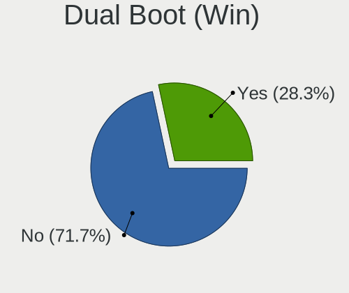
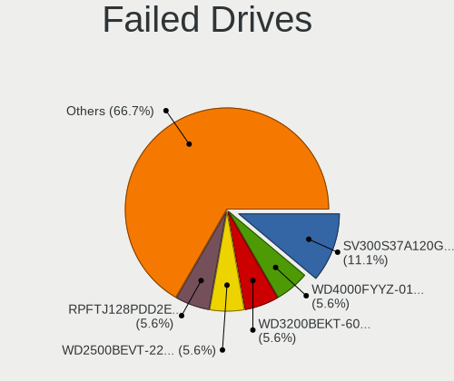
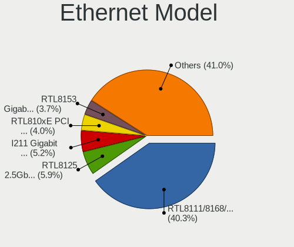
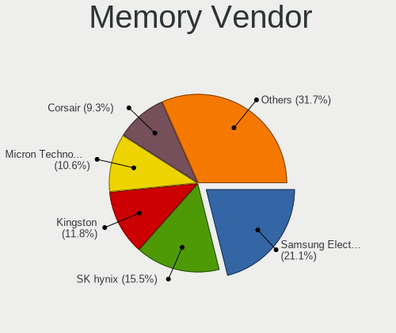

Arch - Tested Hardware & Statistics
-----------------------------------

A project to collect tested hardware configurations for Arch.

Anyone can contribute to this report by the [hw-probe](https://github.com/linuxhw/hw-probe) tool:

    sudo -E hw-probe -all -upload

Please contribute! Especially if your hardware is rare.

This is a report for all computer types. See also reports for [desktops](/Dist/Arch/Desktop/README.md) and [notebooks](/Dist/Arch/Notebook/README.md).

Contents
--------

* [ Test Cases ](#test-cases)

* [ System ](#system)
  - [ OS                       ](#os)
  - [ OS Family                ](#os-family)
  - [ Kernel                   ](#kernel)
  - [ Kernel Family            ](#kernel-family)
  - [ Kernel Major Ver.        ](#kernel-major-ver)
  - [ Arch                     ](#arch)
  - [ DE                       ](#de)
  - [ Display Server           ](#display-server)
  - [ Display Manager          ](#display-manager)
  - [ OS Lang                  ](#os-lang)
  - [ Boot Mode                ](#boot-mode)
  - [ Filesystem               ](#filesystem)
  - [ Part. scheme             ](#part-scheme)
  - [ Dual Boot with Linux/BSD ](#dual-boot-with-linuxbsd)
  - [ Dual Boot (Win)          ](#dual-boot-win)

* [ Board ](#board)
  - [ Vendor                   ](#vendor)
  - [ Model                    ](#model)
  - [ Model Family             ](#model-family)
  - [ MFG Year                 ](#mfg-year)
  - [ Form Factor              ](#form-factor)
  - [ Secure Boot              ](#secure-boot)
  - [ Coreboot                 ](#coreboot)
  - [ RAM Size                 ](#ram-size)
  - [ RAM Used                 ](#ram-used)
  - [ Total Drives             ](#total-drives)
  - [ Has CD-ROM               ](#has-cd-rom)
  - [ Has Ethernet             ](#has-ethernet)
  - [ Has WiFi                 ](#has-wifi)
  - [ Has Bluetooth            ](#has-bluetooth)

* [ Location ](#location)
  - [ Country                  ](#country)
  - [ City                     ](#city)

* [ Drives ](#drives)
  - [ Drive Vendor             ](#drive-vendor)
  - [ Drive Model              ](#drive-model)
  - [ HDD Vendor               ](#hdd-vendor)
  - [ SSD Vendor               ](#ssd-vendor)
  - [ Drive Kind               ](#drive-kind)
  - [ Drive Connector          ](#drive-connector)
  - [ Drive Size               ](#drive-size)
  - [ Space Total              ](#space-total)
  - [ Space Used               ](#space-used)
  - [ Malfunc. Drives          ](#malfunc-drives)
  - [ Malfunc. Drive Vendor    ](#malfunc-drive-vendor)
  - [ Malfunc. HDD Vendor      ](#malfunc-hdd-vendor)
  - [ Malfunc. Drive Kind      ](#malfunc-drive-kind)
  - [ Failed Drives            ](#failed-drives)
  - [ Failed Drive Vendor      ](#failed-drive-vendor)
  - [ Drive Status             ](#drive-status)

* [ Storage controller ](#storage-controller)
  - [ Storage Vendor           ](#storage-vendor)
  - [ Storage Model            ](#storage-model)
  - [ Storage Kind             ](#storage-kind)

* [ Processor ](#processor)
  - [ CPU Vendor               ](#cpu-vendor)
  - [ CPU Model                ](#cpu-model)
  - [ CPU Model Family         ](#cpu-model-family)
  - [ CPU Cores                ](#cpu-cores)
  - [ CPU Sockets              ](#cpu-sockets)
  - [ CPU Threads              ](#cpu-threads)
  - [ CPU Op-Modes             ](#cpu-op-modes)
  - [ CPU Microcode            ](#cpu-microcode)
  - [ CPU Microarch            ](#cpu-microarch)

* [ Graphics ](#graphics)
  - [ GPU Vendor               ](#gpu-vendor)
  - [ GPU Model                ](#gpu-model)
  - [ GPU Combo                ](#gpu-combo)
  - [ GPU Driver               ](#gpu-driver)
  - [ GPU Memory               ](#gpu-memory)

* [ Monitor ](#monitor)
  - [ Monitor Vendor           ](#monitor-vendor)
  - [ Monitor Model            ](#monitor-model)
  - [ Monitor Resolution       ](#monitor-resolution)
  - [ Monitor Diagonal         ](#monitor-diagonal)
  - [ Monitor Width            ](#monitor-width)
  - [ Aspect Ratio             ](#aspect-ratio)
  - [ Monitor Area             ](#monitor-area)
  - [ Pixel Density            ](#pixel-density)
  - [ Multiple Monitors        ](#multiple-monitors)

* [ Network ](#network)
  - [ Net Controller Vendor    ](#net-controller-vendor)
  - [ Net Controller Model     ](#net-controller-model)
  - [ Wireless Vendor          ](#wireless-vendor)
  - [ Wireless Model           ](#wireless-model)
  - [ Ethernet Vendor          ](#ethernet-vendor)
  - [ Ethernet Model           ](#ethernet-model)
  - [ Net Controller Kind      ](#net-controller-kind)
  - [ Used Controller          ](#used-controller)
  - [ NICs                     ](#nics)
  - [ IPv6                     ](#ipv6)

* [ Bluetooth ](#bluetooth)
  - [ Bluetooth Vendor         ](#bluetooth-vendor)
  - [ Bluetooth Model          ](#bluetooth-model)

* [ Sound ](#sound)
  - [ Sound Vendor             ](#sound-vendor)
  - [ Sound Model              ](#sound-model)

* [ Memory ](#memory)
  - [ Memory Vendor            ](#memory-vendor)
  - [ Memory Model             ](#memory-model)
  - [ Memory Kind              ](#memory-kind)
  - [ Memory Form Factor       ](#memory-form-factor)
  - [ Memory Size              ](#memory-size)
  - [ Memory Speed             ](#memory-speed)

* [ Printers & scanners ](#printers--scanners)
  - [ Printer Vendor           ](#printer-vendor)
  - [ Printer Model            ](#printer-model)
  - [ Scanner Vendor           ](#scanner-vendor)
  - [ Scanner Model            ](#scanner-model)

* [ Camera ](#camera)
  - [ Camera Vendor            ](#camera-vendor)
  - [ Camera Model             ](#camera-model)

* [ Security ](#security)
  - [ Fingerprint Vendor       ](#fingerprint-vendor)
  - [ Fingerprint Model        ](#fingerprint-model)
  - [ Chipcard Vendor          ](#chipcard-vendor)
  - [ Chipcard Model           ](#chipcard-model)

* [ Unsupported ](#unsupported)
  - [ Unsupported Devices      ](#unsupported-devices)
  - [ Unsupported Device Types ](#unsupported-device-types)

Test Cases
----------

Total: 8156

| Vendor        | Model                       | Form-Factor | Probe                                                      | Date         |
|---------------|-----------------------------|-------------|------------------------------------------------------------|--------------|
| Dell          | XPS 15 9550                 | Notebook    | [0ffe1f9541](https://linux-hardware.org/?probe=0ffe1f9541) | Feb 28, 2023 |
| HP            | Laptop 15s-eq3xxx           | Notebook    | [a08a3c36ab](https://linux-hardware.org/?probe=a08a3c36ab) | Feb 28, 2023 |
| ASRock        | B660M-STX                   | Desktop     | [5a32d2e162](https://linux-hardware.org/?probe=5a32d2e162) | Feb 28, 2023 |
| MSI           | 760GMA-P34                  | Desktop     | [9707436005](https://linux-hardware.org/?probe=9707436005) | Feb 28, 2023 |
| ASRock        | B365M-HDV                   | Desktop     | [def987e32c](https://linux-hardware.org/?probe=def987e32c) | Feb 28, 2023 |
| ASUSTek       | Zenbook UX535QE_UM535QE     | Notebook    | [456504fe92](https://linux-hardware.org/?probe=456504fe92) | Feb 28, 2023 |
| HP            | Laptop 15s-eq1xxx           | Notebook    | [c070966ad7](https://linux-hardware.org/?probe=c070966ad7) | Feb 28, 2023 |
| Apple         | MacBookPro8,1               | Notebook    | [ec1f27de09](https://linux-hardware.org/?probe=ec1f27de09) | Feb 28, 2023 |
| ASUSTek       | CM6870                      | Desktop     | [e338b721af](https://linux-hardware.org/?probe=e338b721af) | Feb 28, 2023 |
| MECHREVO      | Jiaolong Series MRID6       | Notebook    | [1643b96eae](https://linux-hardware.org/?probe=1643b96eae) | Feb 28, 2023 |
| MECHREVO      | Jiaolong Series MRID6       | Notebook    | [b48cc99ce3](https://linux-hardware.org/?probe=b48cc99ce3) | Feb 28, 2023 |
| ASUSTek       | ROG STRIX Z390-E GAMING     | Desktop     | [62a7d7ef5c](https://linux-hardware.org/?probe=62a7d7ef5c) | Feb 28, 2023 |
| MSI           | B550-A PRO[CEC]             | Desktop     | [2465135444](https://linux-hardware.org/?probe=2465135444) | Feb 28, 2023 |
| MSI           | X470 GAMING PLUS MAX        | Desktop     | [05542207ee](https://linux-hardware.org/?probe=05542207ee) | Feb 28, 2023 |
| Lenovo        | IdeaPad S145-15IWL 81S9     | Notebook    | [915fc4d913](https://linux-hardware.org/?probe=915fc4d913) | Feb 28, 2023 |
| Intel Clie... | LAPRC510                    | Notebook    | [925c24b3db](https://linux-hardware.org/?probe=925c24b3db) | Feb 28, 2023 |
| Gigabyte      | AX370-Gaming K7             | Desktop     | [d4bcf9b7a2](https://linux-hardware.org/?probe=d4bcf9b7a2) | Feb 28, 2023 |
| HP            | ProBook 430 G1              | Notebook    | [fa75658ee0](https://linux-hardware.org/?probe=fa75658ee0) | Feb 28, 2023 |
| Dell          | G15 5510                    | Notebook    | [77ff8fd545](https://linux-hardware.org/?probe=77ff8fd545) | Feb 28, 2023 |
| Dell          | G15 5510                    | Notebook    | [2c8f883abe](https://linux-hardware.org/?probe=2c8f883abe) | Feb 28, 2023 |
| ASUSTek       | VivoBook_ASUSLaptop M760... | Notebook    | [1f80bce21e](https://linux-hardware.org/?probe=1f80bce21e) | Feb 27, 2023 |
| ASUSTek       | VivoBook_ASUSLaptop M760... | Notebook    | [08e6c7285a](https://linux-hardware.org/?probe=08e6c7285a) | Feb 27, 2023 |
| Dell          | Latitude 7390               | Notebook    | [a2167ae72b](https://linux-hardware.org/?probe=a2167ae72b) | Feb 27, 2023 |
| Lenovo        | IdeaPadFlex 5 14ARE05 81... | Convertible | [b5a08d19e9](https://linux-hardware.org/?probe=b5a08d19e9) | Feb 27, 2023 |
| Schenker      | VISION (E22)                | Notebook    | [498444ca02](https://linux-hardware.org/?probe=498444ca02) | Feb 27, 2023 |
| MSI           | Z390-A PRO                  | Desktop     | [979b4559fe](https://linux-hardware.org/?probe=979b4559fe) | Feb 27, 2023 |
| ASUSTek       | ROG STRIX B550-F GAMING     | Desktop     | [3ac3b5424a](https://linux-hardware.org/?probe=3ac3b5424a) | Feb 26, 2023 |
| ASUSTek       | A68HM-K                     | Desktop     | [d6f5b00609](https://linux-hardware.org/?probe=d6f5b00609) | Feb 26, 2023 |
| ASUSTek       | A68HM-K                     | Desktop     | [89cd5d5c44](https://linux-hardware.org/?probe=89cd5d5c44) | Feb 26, 2023 |
| HP            | ProBook 430 G1              | Notebook    | [1354e0b47e](https://linux-hardware.org/?probe=1354e0b47e) | Feb 26, 2023 |
| ASUSTek       | ROG Zephyrus G15 GA503RW... | Notebook    | [848e43f7c3](https://linux-hardware.org/?probe=848e43f7c3) | Feb 26, 2023 |
| MSI           | B350 TOMAHAWK ARCTIC        | Desktop     | [83c075f5c5](https://linux-hardware.org/?probe=83c075f5c5) | Feb 26, 2023 |
| Sony          | SVE1712C1EW                 | Notebook    | [20bd9411d9](https://linux-hardware.org/?probe=20bd9411d9) | Feb 26, 2023 |
| Lenovo        | ThinkPad X1 Carbon Gen 1... | Notebook    | [9755df8e75](https://linux-hardware.org/?probe=9755df8e75) | Feb 25, 2023 |
| Lenovo        | ThinkPad Z13 Gen 1 21D2C... | Notebook    | [e07445a583](https://linux-hardware.org/?probe=e07445a583) | Feb 25, 2023 |
| MSI           | B550-A PRO[CEC]             | Desktop     | [9c1dad9bdc](https://linux-hardware.org/?probe=9c1dad9bdc) | Feb 25, 2023 |
| Lenovo        | ThinkPad T14 Gen 3 21CFC... | Notebook    | [d475dd1788](https://linux-hardware.org/?probe=d475dd1788) | Feb 25, 2023 |
| Star Labs     | StarBook                    | Notebook    | [fbd529b953](https://linux-hardware.org/?probe=fbd529b953) | Feb 25, 2023 |
| Timi          | Xiaomi Book Pro 14 2022     | Notebook    | [46aedb5579](https://linux-hardware.org/?probe=46aedb5579) | Feb 25, 2023 |
| HP            | Laptop 15s-eq2xxx           | Notebook    | [64504d9860](https://linux-hardware.org/?probe=64504d9860) | Feb 24, 2023 |
| ASRock        | B450 Pro4                   | Desktop     | [926fcff980](https://linux-hardware.org/?probe=926fcff980) | Feb 24, 2023 |
| ASUSTek       | SABERTOOTH P67              | Desktop     | [efdc981614](https://linux-hardware.org/?probe=efdc981614) | Feb 24, 2023 |
| HP            | EliteBook 845 14 inch G9... | Notebook    | [8a573735cb](https://linux-hardware.org/?probe=8a573735cb) | Feb 24, 2023 |
| ASUSTek       | ROG Zephyrus Duo 15 SE G... | Notebook    | [ac2d78d240](https://linux-hardware.org/?probe=ac2d78d240) | Feb 24, 2023 |
| Dell          | XPS 13 9310                 | Notebook    | [1b60ef35ce](https://linux-hardware.org/?probe=1b60ef35ce) | Feb 24, 2023 |
| Lenovo        | ThinkPad X61s 7667CG7       | Notebook    | [f090aa4d60](https://linux-hardware.org/?probe=f090aa4d60) | Feb 24, 2023 |
| ASUSTek       | ROG STRIX X470-F GAMING     | Desktop     | [bea010d25e](https://linux-hardware.org/?probe=bea010d25e) | Feb 24, 2023 |
| HP            | Elite Dragonfly G2 Noteb... | Convertible | [51e3518d50](https://linux-hardware.org/?probe=51e3518d50) | Feb 24, 2023 |
| Lenovo        | ThinkBook 14 G4+ IAP 21C... | Notebook    | [028814b990](https://linux-hardware.org/?probe=028814b990) | Feb 24, 2023 |
| Dell          | Inspiron 3476               | Notebook    | [58bff0319e](https://linux-hardware.org/?probe=58bff0319e) | Feb 24, 2023 |
| HUAWEI        | NBD-WXX9                    | Notebook    | [ea2663126f](https://linux-hardware.org/?probe=ea2663126f) | Feb 24, 2023 |
| Avell High... | A70 MOB                     | Notebook    | [1bf7d82ab3](https://linux-hardware.org/?probe=1bf7d82ab3) | Feb 23, 2023 |
| Lenovo        | IdeaPadFlex 5 14ARE05 81... | Convertible | [7780f02f45](https://linux-hardware.org/?probe=7780f02f45) | Feb 23, 2023 |
| Apple         | Mac-031AEE4D24BFF0B1 Mac... | Mini pc     | [82889a28a0](https://linux-hardware.org/?probe=82889a28a0) | Feb 23, 2023 |
| ASRock        | B450M Steel Legend          | Desktop     | [69475d0fa7](https://linux-hardware.org/?probe=69475d0fa7) | Feb 23, 2023 |
| Lenovo        | Legion S7 15ACH6 82K8       | Notebook    | [c69ac67426](https://linux-hardware.org/?probe=c69ac67426) | Feb 23, 2023 |
| Lenovo        | IdeaPad S145-15IWL 81S9     | Notebook    | [d74903e764](https://linux-hardware.org/?probe=d74903e764) | Feb 23, 2023 |
| Acer          | Swift SF514-54GT            | Notebook    | [dbccc5afa9](https://linux-hardware.org/?probe=dbccc5afa9) | Feb 23, 2023 |
| HP            | Stream Laptop 14-cb1xxx     | Notebook    | [14cf9e07e0](https://linux-hardware.org/?probe=14cf9e07e0) | Feb 23, 2023 |
| HP            | Stream Laptop 14-cb1xxx     | Notebook    | [388f34d16e](https://linux-hardware.org/?probe=388f34d16e) | Feb 23, 2023 |
| Dell          | Latitude 7300               | Notebook    | [c4bb27e884](https://linux-hardware.org/?probe=c4bb27e884) | Feb 23, 2023 |
| ASUSTek       | ROG STRIX X670E-I GAMING... | Desktop     | [beb6e53cb7](https://linux-hardware.org/?probe=beb6e53cb7) | Feb 23, 2023 |
| ASUSTek       | TUF Gaming X570-PLUS        | Desktop     | [640957cabe](https://linux-hardware.org/?probe=640957cabe) | Feb 23, 2023 |
| HP            | Spectre                     | Convertible | [2366c11489](https://linux-hardware.org/?probe=2366c11489) | Feb 22, 2023 |
| Lenovo        | IdeaPad 3 15ITL6 82MD       | Notebook    | [d16dd6d1f3](https://linux-hardware.org/?probe=d16dd6d1f3) | Feb 22, 2023 |
| Lenovo        | ThinkPad X1 Carbon Gen 1... | Notebook    | [701608fad1](https://linux-hardware.org/?probe=701608fad1) | Feb 22, 2023 |
| HP            | ProBook 640 G5              | Notebook    | [e90b71c2fd](https://linux-hardware.org/?probe=e90b71c2fd) | Feb 22, 2023 |
| ASUSTek       | PRIME H610M-K D4            | Desktop     | [601836815c](https://linux-hardware.org/?probe=601836815c) | Feb 22, 2023 |
| Acer          | Aspire ES1-533              | Notebook    | [4a7563bd8e](https://linux-hardware.org/?probe=4a7563bd8e) | Feb 22, 2023 |
| ASUSTek       | PRIME A320M-K/BR            | Desktop     | [aa39c9a471](https://linux-hardware.org/?probe=aa39c9a471) | Feb 22, 2023 |
| MSI           | B450 TOMAHAWK               | Desktop     | [53e8b0db7d](https://linux-hardware.org/?probe=53e8b0db7d) | Feb 22, 2023 |
| ASUSTek       | PRIME B550M-K               | Desktop     | [cfcf2ff473](https://linux-hardware.org/?probe=cfcf2ff473) | Feb 21, 2023 |
| ASUSTek       | G11CD                       | Desktop     | [4fc47f45be](https://linux-hardware.org/?probe=4fc47f45be) | Feb 21, 2023 |
| ASUSTek       | ROG STRIX X570-F GAMING     | Desktop     | [ecc97fee86](https://linux-hardware.org/?probe=ecc97fee86) | Feb 21, 2023 |
| Compaq        | 430                         | Notebook    | [4bd84653a5](https://linux-hardware.org/?probe=4bd84653a5) | Feb 21, 2023 |
| Lenovo        | ThinkPad T15p Gen 3 21DA... | Notebook    | [dd12dc45d7](https://linux-hardware.org/?probe=dd12dc45d7) | Feb 21, 2023 |
| Dell          | XPS 13 9360                 | Notebook    | [f36328511d](https://linux-hardware.org/?probe=f36328511d) | Feb 21, 2023 |
| HP            | ProBook 430 G1              | Notebook    | [1505165a73](https://linux-hardware.org/?probe=1505165a73) | Feb 20, 2023 |
| ASUSTek       | X555LPB                     | Notebook    | [29eb95639c](https://linux-hardware.org/?probe=29eb95639c) | Feb 20, 2023 |
| ASUSTek       | Zenbook UX535QE_UM535QE     | Notebook    | [e008fd489b](https://linux-hardware.org/?probe=e008fd489b) | Feb 20, 2023 |
| Lenovo        | ThinkPad T15p Gen 3 21DA... | Notebook    | [defde684a0](https://linux-hardware.org/?probe=defde684a0) | Feb 20, 2023 |
| Microsoft     | Surface Laptop Go           | Tablet      | [08d8865fcf](https://linux-hardware.org/?probe=08d8865fcf) | Feb 20, 2023 |
| Lenovo        | ThinkPad Z13 Gen 1 21D2C... | Notebook    | [1832e70d83](https://linux-hardware.org/?probe=1832e70d83) | Feb 20, 2023 |
| Lenovo        | ThinkPad Z13 Gen 1 21D2C... | Notebook    | [9adf6b834b](https://linux-hardware.org/?probe=9adf6b834b) | Feb 20, 2023 |
| Dell          | XPS 15 9520                 | Notebook    | [d346153872](https://linux-hardware.org/?probe=d346153872) | Feb 20, 2023 |
| AZW           | GK55                        | Desktop     | [e8376dbc54](https://linux-hardware.org/?probe=e8376dbc54) | Feb 19, 2023 |
| ASRock        | AB350 Pro4                  | Desktop     | [0f1365d8d8](https://linux-hardware.org/?probe=0f1365d8d8) | Feb 19, 2023 |
| Gigabyte      | B85M-D3V-A-SI               | Desktop     | [5b452754c0](https://linux-hardware.org/?probe=5b452754c0) | Feb 19, 2023 |
| Gigabyte      | X570 AORUS ELITE            | Desktop     | [82fd276e35](https://linux-hardware.org/?probe=82fd276e35) | Feb 19, 2023 |
| Gigabyte      | X570 AORUS ELITE            | Desktop     | [f8f6e2baea](https://linux-hardware.org/?probe=f8f6e2baea) | Feb 19, 2023 |
| HUAWEI        | MACHC-WAX9                  | Notebook    | [69a8710cbb](https://linux-hardware.org/?probe=69a8710cbb) | Feb 18, 2023 |
| HUAWEI        | MACHC-WAX9                  | Notebook    | [db5d2b956a](https://linux-hardware.org/?probe=db5d2b956a) | Feb 18, 2023 |
| HP            | Pavilion Gaming Laptop 1... | Notebook    | [6aae20aa14](https://linux-hardware.org/?probe=6aae20aa14) | Feb 18, 2023 |
| Apple         | Mac-031AEE4D24BFF0B1 Mac... | Mini pc     | [61befa2690](https://linux-hardware.org/?probe=61befa2690) | Feb 18, 2023 |
| MSI           | A320M-A PRO MAX             | Desktop     | [c1e5226b6e](https://linux-hardware.org/?probe=c1e5226b6e) | Feb 18, 2023 |
| Acer          | Nitro AN515-46              | Notebook    | [bf63748499](https://linux-hardware.org/?probe=bf63748499) | Feb 18, 2023 |
| Gigabyte      | B450M DS3H WIFI-CF          | Desktop     | [be751c4a5b](https://linux-hardware.org/?probe=be751c4a5b) | Feb 18, 2023 |
| Google        | Celes                       | Notebook    | [3004fce0ed](https://linux-hardware.org/?probe=3004fce0ed) | Feb 18, 2023 |
| Lenovo        | Legion 5 Pro 16IAH7H 82R... | Notebook    | [2e22d32463](https://linux-hardware.org/?probe=2e22d32463) | Feb 18, 2023 |
| Gigabyte      | X570 AORUS ELITE            | Desktop     | [d0bb58e003](https://linux-hardware.org/?probe=d0bb58e003) | Feb 18, 2023 |
| ASUSTek       | ROG STRIX Z390-E GAMING     | Desktop     | [322588bc4e](https://linux-hardware.org/?probe=322588bc4e) | Feb 18, 2023 |
| MSI           | GL65 9SD                    | Notebook    | [a702514760](https://linux-hardware.org/?probe=a702514760) | Feb 17, 2023 |
| Lenovo        | Legion 5 15ACH6H 82JU       | Notebook    | [bfeb3ab070](https://linux-hardware.org/?probe=bfeb3ab070) | Feb 17, 2023 |
| Lenovo        | ThinkBook 14 G4+ IAP 21C... | Notebook    | [c4ec00ef99](https://linux-hardware.org/?probe=c4ec00ef99) | Feb 17, 2023 |
| TUXEDO        | Unknown                     | Notebook    | [d770ba8b7b](https://linux-hardware.org/?probe=d770ba8b7b) | Feb 17, 2023 |
| Gateway       | SX2803                      | Desktop     | [a1b20489b4](https://linux-hardware.org/?probe=a1b20489b4) | Feb 17, 2023 |
| Acer          | Nitro AN515-46              | Notebook    | [162b72d7a8](https://linux-hardware.org/?probe=162b72d7a8) | Feb 17, 2023 |
| MSI           | MAG B550M MORTAR WIFI       | Desktop     | [4948ea8836](https://linux-hardware.org/?probe=4948ea8836) | Feb 17, 2023 |
| HP            | Elite Dragonfly G2 Noteb... | Convertible | [a9d6ae7b72](https://linux-hardware.org/?probe=a9d6ae7b72) | Feb 17, 2023 |
| HP            | 18E7                        | Desktop     | [821ea2c921](https://linux-hardware.org/?probe=821ea2c921) | Feb 17, 2023 |
| Acer          | Aspire A515-51G             | Notebook    | [065827a397](https://linux-hardware.org/?probe=065827a397) | Feb 16, 2023 |
| MSI           | A520M-A PRO                 | Desktop     | [fd678baa9f](https://linux-hardware.org/?probe=fd678baa9f) | Feb 16, 2023 |
| Dell          | Latitude 5330               | Notebook    | [497897c322](https://linux-hardware.org/?probe=497897c322) | Feb 16, 2023 |
| Dell          | Latitude 5330               | Notebook    | [aa55aaad48](https://linux-hardware.org/?probe=aa55aaad48) | Feb 16, 2023 |
| Lenovo        | B40-70 20392                | Notebook    | [7197aacb00](https://linux-hardware.org/?probe=7197aacb00) | Feb 16, 2023 |
| Dell          | Latitude 5480               | Notebook    | [ee1b786fd9](https://linux-hardware.org/?probe=ee1b786fd9) | Feb 15, 2023 |
| ASRock        | Z390M Pro4                  | Desktop     | [cf96b55907](https://linux-hardware.org/?probe=cf96b55907) | Feb 15, 2023 |
| HP            | EliteBook 650 15.6 inch ... | Notebook    | [2be1a08ef2](https://linux-hardware.org/?probe=2be1a08ef2) | Feb 15, 2023 |
| HUAWEI        | NBD-WXX9                    | Notebook    | [8f5697ea3a](https://linux-hardware.org/?probe=8f5697ea3a) | Feb 15, 2023 |
| HP            | EliteBook x360 1040 G8 N... | Convertible | [e1d323e96f](https://linux-hardware.org/?probe=e1d323e96f) | Feb 15, 2023 |
| Microsoft     | Surface Laptop Go           | Tablet      | [987c9b1854](https://linux-hardware.org/?probe=987c9b1854) | Feb 15, 2023 |
| ASUSTek       | Zenbook UX535QE_UM535QE     | Notebook    | [138839541a](https://linux-hardware.org/?probe=138839541a) | Feb 15, 2023 |
| ASUSTek       | ROG STRIX B450-F GAMING     | Desktop     | [4e3ff30332](https://linux-hardware.org/?probe=4e3ff30332) | Feb 15, 2023 |
| Intel         | NUC11PHBi7 M26151-404       | Mini pc     | [77e13c5748](https://linux-hardware.org/?probe=77e13c5748) | Feb 14, 2023 |
| MSI           | A320M-A PRO MAX             | Desktop     | [dd2017324e](https://linux-hardware.org/?probe=dd2017324e) | Feb 14, 2023 |
| Lenovo        | ThinkPad T490 20N3S3UL00    | Notebook    | [dc352cd9dc](https://linux-hardware.org/?probe=dc352cd9dc) | Feb 14, 2023 |
| Lenovo        | IdeaPad Gaming 3 15ARH05... | Notebook    | [a3eb6fde29](https://linux-hardware.org/?probe=a3eb6fde29) | Feb 14, 2023 |
| Dell          | Latitude 5480               | Notebook    | [ab1652f0da](https://linux-hardware.org/?probe=ab1652f0da) | Feb 14, 2023 |
| Dell          | Venue 8 Pro 5855            | Notebook    | [6e5eacb53a](https://linux-hardware.org/?probe=6e5eacb53a) | Feb 14, 2023 |
| ASUSTek       | PRIME Z590-A                | Desktop     | [926e34c5a9](https://linux-hardware.org/?probe=926e34c5a9) | Feb 14, 2023 |
| ASUSTek       | ROG STRIX B550-F GAMING     | Desktop     | [d1171fb67b](https://linux-hardware.org/?probe=d1171fb67b) | Feb 14, 2023 |
| Lenovo        | G50-80 80R0                 | Notebook    | [86422b9261](https://linux-hardware.org/?probe=86422b9261) | Feb 14, 2023 |
| Toshiba       | Satellite P870              | Notebook    | [dcfa5b1fc5](https://linux-hardware.org/?probe=dcfa5b1fc5) | Feb 13, 2023 |
| Toshiba       | Satellite P870              | Notebook    | [3a4a4dedc3](https://linux-hardware.org/?probe=3a4a4dedc3) | Feb 13, 2023 |
| Dell          | Latitude E6530              | Notebook    | [c79c336ef7](https://linux-hardware.org/?probe=c79c336ef7) | Feb 13, 2023 |
| Acer          | Swift SF514-54GT            | Notebook    | [b7e961dae3](https://linux-hardware.org/?probe=b7e961dae3) | Feb 13, 2023 |
| ASUSTek       | ROG STRIX B650E-I GAMING... | Desktop     | [cd29998b19](https://linux-hardware.org/?probe=cd29998b19) | Feb 13, 2023 |
| ASUSTek       | ROG Strix G513RM_G513RM     | Notebook    | [b3ab77c355](https://linux-hardware.org/?probe=b3ab77c355) | Feb 13, 2023 |
| ASUSTek       | ROG Strix G513RM_G513RM     | Notebook    | [37c223623f](https://linux-hardware.org/?probe=37c223623f) | Feb 13, 2023 |
| ASUSTek       | Zenbook UX535QE_UM535QE     | Notebook    | [3f25b64868](https://linux-hardware.org/?probe=3f25b64868) | Feb 13, 2023 |
| Gigabyte      | B450 AORUS PRO WIFI-CF      | Desktop     | [89f1272cd8](https://linux-hardware.org/?probe=89f1272cd8) | Feb 13, 2023 |
| ASUSTek       | PRIME Z390-P                | Desktop     | [8ac5b193cb](https://linux-hardware.org/?probe=8ac5b193cb) | Feb 13, 2023 |
| ASUSTek       | PRIME Z390-P                | Desktop     | [156fae6b82](https://linux-hardware.org/?probe=156fae6b82) | Feb 13, 2023 |
| HP            | 3397                        | Desktop     | [83dc4a9ea0](https://linux-hardware.org/?probe=83dc4a9ea0) | Feb 13, 2023 |
| ASUSTek       | X205TA                      | Notebook    | [dfc9ada1af](https://linux-hardware.org/?probe=dfc9ada1af) | Feb 13, 2023 |
| HP            | 3397                        | Desktop     | [cc7019baaa](https://linux-hardware.org/?probe=cc7019baaa) | Feb 13, 2023 |
| HP            | ProBook 430 G1              | Notebook    | [8d414de313](https://linux-hardware.org/?probe=8d414de313) | Feb 12, 2023 |
| MSI           | A320M-A PRO MAX             | Desktop     | [f5ef3d92cb](https://linux-hardware.org/?probe=f5ef3d92cb) | Feb 12, 2023 |
| MSI           | MEG X570 UNIFY              | Desktop     | [219157717b](https://linux-hardware.org/?probe=219157717b) | Feb 12, 2023 |
| MSI           | MEG X570 UNIFY              | Desktop     | [cdc63fb05e](https://linux-hardware.org/?probe=cdc63fb05e) | Feb 12, 2023 |
| Lenovo        | ThinkPad L13 Yoga Gen 2 ... | Convertible | [27411524db](https://linux-hardware.org/?probe=27411524db) | Feb 12, 2023 |
| Lenovo        | ThinkPad Z13 Gen 1 21D2C... | Notebook    | [afb25c8733](https://linux-hardware.org/?probe=afb25c8733) | Feb 12, 2023 |
| MSI           | Modern 14 B11MOU            | Notebook    | [547c8e5750](https://linux-hardware.org/?probe=547c8e5750) | Feb 12, 2023 |
| Lenovo        | ThinkPad Z13 Gen 1 21D2C... | Notebook    | [35d68b3769](https://linux-hardware.org/?probe=35d68b3769) | Feb 12, 2023 |
| Gigabyte      | B450M DS3H V2               | Desktop     | [a326374047](https://linux-hardware.org/?probe=a326374047) | Feb 12, 2023 |
| Lenovo        | ThinkPad T16 Gen 1 21CH0... | Notebook    | [5335da53d0](https://linux-hardware.org/?probe=5335da53d0) | Feb 11, 2023 |
| Lenovo        | ThinkPad T460s 20FAS2K13... | Notebook    | [5f2fb779b4](https://linux-hardware.org/?probe=5f2fb779b4) | Feb 11, 2023 |
| Samsung       | 767XCL                      | Notebook    | [8a62be0577](https://linux-hardware.org/?probe=8a62be0577) | Feb 11, 2023 |
| HP            | Laptop 15s-eq3xxx           | Notebook    | [36dd5f42fc](https://linux-hardware.org/?probe=36dd5f42fc) | Feb 11, 2023 |
| Dell          | 0M017G A00                  | Desktop     | [f2deee99d1](https://linux-hardware.org/?probe=f2deee99d1) | Feb 11, 2023 |
| ASRock        | Z790M-ITX WiFi              | Desktop     | [ca7e69040a](https://linux-hardware.org/?probe=ca7e69040a) | Feb 11, 2023 |
| Unknown       | Unknown                     | Notebook    | [31d099a8db](https://linux-hardware.org/?probe=31d099a8db) | Feb 11, 2023 |
| Dell          | 0M017G A00                  | Desktop     | [30965e948d](https://linux-hardware.org/?probe=30965e948d) | Feb 10, 2023 |
| Dell          | 04YJ19 A00                  | Desktop     | [972fb9a299](https://linux-hardware.org/?probe=972fb9a299) | Feb 10, 2023 |
| Acer          | Aspire A515-45              | Notebook    | [ca5ff923cc](https://linux-hardware.org/?probe=ca5ff923cc) | Feb 10, 2023 |
| ASRock        | B450 Gaming-ITX/ac          | Desktop     | [04929299d7](https://linux-hardware.org/?probe=04929299d7) | Feb 10, 2023 |
| Lenovo        | IdeaPad L340-15IRH Gamin... | Notebook    | [fd8d478a5b](https://linux-hardware.org/?probe=fd8d478a5b) | Feb 10, 2023 |
| MSI           | X470 GAMING PRO             | Desktop     | [a53ab3e915](https://linux-hardware.org/?probe=a53ab3e915) | Feb 10, 2023 |
| Acer          | Aspire V5-551               | Notebook    | [cb3ab0bbf5](https://linux-hardware.org/?probe=cb3ab0bbf5) | Feb 10, 2023 |
| ASUSTek       | ROG Strix G513RW_G513RW     | Notebook    | [482b3ea2be](https://linux-hardware.org/?probe=482b3ea2be) | Feb 10, 2023 |
| Acer          | Aspire V5-551               | Notebook    | [132d55b2ed](https://linux-hardware.org/?probe=132d55b2ed) | Feb 09, 2023 |
| ASRock        | B450M Pro4-F                | Desktop     | [35bd9cf04c](https://linux-hardware.org/?probe=35bd9cf04c) | Feb 09, 2023 |
| Sony          | VPCEH1M1E                   | Notebook    | [43f51d50c1](https://linux-hardware.org/?probe=43f51d50c1) | Feb 09, 2023 |
| Lenovo        | ThinkPad T460s 20FAS2K13... | Notebook    | [fc292cd441](https://linux-hardware.org/?probe=fc292cd441) | Feb 09, 2023 |
| ASUSTek       | PRIME B450M-A               | Desktop     | [f669c49cf5](https://linux-hardware.org/?probe=f669c49cf5) | Feb 09, 2023 |
| Lenovo        | ThinkPad E490 20N9S2AS00    | Notebook    | [5d2f191a6f](https://linux-hardware.org/?probe=5d2f191a6f) | Feb 09, 2023 |
| Lenovo        | G50-70 20351                | Notebook    | [af3d5cd04c](https://linux-hardware.org/?probe=af3d5cd04c) | Feb 09, 2023 |
| ASUSTek       | TUF B360M-PLUS GAMING       | Desktop     | [fa2a1dba2d](https://linux-hardware.org/?probe=fa2a1dba2d) | Feb 09, 2023 |
| Lenovo        | IdeaPad 330S-15IKB 81F5     | Notebook    | [02b69364a6](https://linux-hardware.org/?probe=02b69364a6) | Feb 09, 2023 |
| Lenovo        | IdeaPad 330S-15IKB 81F5     | Notebook    | [83efc68bd7](https://linux-hardware.org/?probe=83efc68bd7) | Feb 09, 2023 |
| Lenovo        | ThinkPad E490 20N9S2AS00    | Notebook    | [668b9a0bfe](https://linux-hardware.org/?probe=668b9a0bfe) | Feb 09, 2023 |
| Lenovo        | SHARKBAY SDK0E50510 WIN     | Desktop     | [cdfbd3e72a](https://linux-hardware.org/?probe=cdfbd3e72a) | Feb 09, 2023 |
| Gigabyte      | B650M AORUS ELITE AX        | Desktop     | [58346a45de](https://linux-hardware.org/?probe=58346a45de) | Feb 08, 2023 |
| Lenovo        | IdeaPad 3 15ITL6 82H8       | Notebook    | [5ce86509b6](https://linux-hardware.org/?probe=5ce86509b6) | Feb 08, 2023 |
| Gigabyte      | H61M-S2V-B3                 | Desktop     | [e533f4d15f](https://linux-hardware.org/?probe=e533f4d15f) | Feb 08, 2023 |
| Lenovo        | ThinkPad X280 20KEA0VCUK    | Notebook    | [e39c3cefa0](https://linux-hardware.org/?probe=e39c3cefa0) | Feb 08, 2023 |
| Dell          | Latitude E5470              | Notebook    | [e0634fdc6e](https://linux-hardware.org/?probe=e0634fdc6e) | Feb 08, 2023 |
| MSI           | H510M PRO-E                 | Desktop     | [577d1f97d8](https://linux-hardware.org/?probe=577d1f97d8) | Feb 08, 2023 |
| MSI           | H510M PRO-E                 | Desktop     | [2b7b643f2e](https://linux-hardware.org/?probe=2b7b643f2e) | Feb 08, 2023 |
| Lenovo        | IdeaPad Flex-14API 81SS     | Notebook    | [0e174666ba](https://linux-hardware.org/?probe=0e174666ba) | Feb 07, 2023 |
| HUAWEI        | NBD-WXX9                    | Notebook    | [2bb967f6b3](https://linux-hardware.org/?probe=2bb967f6b3) | Feb 07, 2023 |
| Lenovo        | ThinkBook 14 G4+ IAP 21C... | Notebook    | [a127a79277](https://linux-hardware.org/?probe=a127a79277) | Feb 07, 2023 |
| Dell          | Precision M4800             | Notebook    | [2572c61169](https://linux-hardware.org/?probe=2572c61169) | Feb 07, 2023 |
| ASUSTek       | ROG Strix G533ZW_G533ZW     | Notebook    | [6e7434a708](https://linux-hardware.org/?probe=6e7434a708) | Feb 07, 2023 |
| Microsoft     | Surface Go 2                | Tablet      | [3be676928d](https://linux-hardware.org/?probe=3be676928d) | Feb 07, 2023 |
| ASUSTek       | ROG STRIX B550-I GAMING     | Desktop     | [01872da4ea](https://linux-hardware.org/?probe=01872da4ea) | Feb 07, 2023 |
| Dell          | Inspiron 7791 2n1           | Convertible | [b666459988](https://linux-hardware.org/?probe=b666459988) | Feb 06, 2023 |
| Dell          | Inspiron 7791 2n1           | Convertible | [dee03d9aff](https://linux-hardware.org/?probe=dee03d9aff) | Feb 06, 2023 |
| Gigabyte      | B550 AORUS PRO AC           | Desktop     | [c73a4ad56a](https://linux-hardware.org/?probe=c73a4ad56a) | Feb 06, 2023 |
| ASUSTek       | ASUS TUF Gaming F15 FX50... | Notebook    | [149a2716a8](https://linux-hardware.org/?probe=149a2716a8) | Feb 06, 2023 |
| HP            | Stream x360 Convertible ... | Convertible | [3e487446eb](https://linux-hardware.org/?probe=3e487446eb) | Feb 06, 2023 |
| Lenovo        | G505 20240                  | Notebook    | [31e2c2f5e1](https://linux-hardware.org/?probe=31e2c2f5e1) | Feb 06, 2023 |
| Dell          | 0XNNCJ A03                  | Server      | [a0b1f2a7b4](https://linux-hardware.org/?probe=a0b1f2a7b4) | Feb 06, 2023 |
| Toshiba       | Satellite Pro L510          | Notebook    | [c8dc3a76e5](https://linux-hardware.org/?probe=c8dc3a76e5) | Feb 06, 2023 |
| Lenovo        | ThinkBook 15-IIL 20SM       | Notebook    | [8d0a0a0422](https://linux-hardware.org/?probe=8d0a0a0422) | Feb 06, 2023 |
| Gigabyte      | Z790 AORUS ELITE AX         | Desktop     | [f91035a72a](https://linux-hardware.org/?probe=f91035a72a) | Feb 05, 2023 |
| Apple         | MacBookPro11,4              | Notebook    | [cfcea0a331](https://linux-hardware.org/?probe=cfcea0a331) | Feb 05, 2023 |
| ASUSTek       | ROG STRIX B550-E GAMING     | Desktop     | [bdd3224e6c](https://linux-hardware.org/?probe=bdd3224e6c) | Feb 05, 2023 |
| MSI           | Modern 14 B11SBU            | Notebook    | [50538fe8fd](https://linux-hardware.org/?probe=50538fe8fd) | Feb 05, 2023 |
| Microsoft     | Surface Go 2                | Tablet      | [44c671bfa6](https://linux-hardware.org/?probe=44c671bfa6) | Feb 05, 2023 |
| HP            | Laptop 15s-eq3xxx           | Notebook    | [ba7531b9db](https://linux-hardware.org/?probe=ba7531b9db) | Feb 05, 2023 |
| Acer          | Nitro AN517-52              | Notebook    | [e409f042e2](https://linux-hardware.org/?probe=e409f042e2) | Feb 05, 2023 |
| HP            | Laptop 15s-eq3xxx           | Notebook    | [72228118bb](https://linux-hardware.org/?probe=72228118bb) | Feb 05, 2023 |
| ASUSTek       | ROG STRIX B450-F GAMING     | Desktop     | [79548473df](https://linux-hardware.org/?probe=79548473df) | Feb 05, 2023 |
| Unknown       | X79A                        | Desktop     | [eedea973ca](https://linux-hardware.org/?probe=eedea973ca) | Feb 05, 2023 |
| Dell          | XPS 15 9520                 | Notebook    | [90c48082e0](https://linux-hardware.org/?probe=90c48082e0) | Feb 05, 2023 |
| Apple         | MacBookPro13,1              | Notebook    | [76cf23841d](https://linux-hardware.org/?probe=76cf23841d) | Feb 05, 2023 |
| Lenovo        | IdeaPad 3 15IML05 81WB      | Notebook    | [42d855f568](https://linux-hardware.org/?probe=42d855f568) | Feb 04, 2023 |
| Dell          | G3 3579                     | Notebook    | [a3b4edbfd9](https://linux-hardware.org/?probe=a3b4edbfd9) | Feb 04, 2023 |
| Lenovo        | ThinkPad X240 20AMS1FW00    | Notebook    | [cee7b3fa93](https://linux-hardware.org/?probe=cee7b3fa93) | Feb 04, 2023 |
| HUAWEI        | NBD-WXX9                    | Notebook    | [0eb4367fb4](https://linux-hardware.org/?probe=0eb4367fb4) | Feb 04, 2023 |
| Dell          | 0GDG8Y A00                  | Desktop     | [b9b0a6cccb](https://linux-hardware.org/?probe=b9b0a6cccb) | Feb 04, 2023 |
| Toshiba       | Satellite P500              | Notebook    | [78ebd7c272](https://linux-hardware.org/?probe=78ebd7c272) | Feb 04, 2023 |
| MSI           | Z490-A PRO                  | Desktop     | [d82820c304](https://linux-hardware.org/?probe=d82820c304) | Feb 04, 2023 |
| Gigabyte      | B660 GAMING X DDR4          | Desktop     | [2594dddd54](https://linux-hardware.org/?probe=2594dddd54) | Feb 04, 2023 |
| ASUSTek       | PRIME Z690-P WIFI           | Desktop     | [4d007a868e](https://linux-hardware.org/?probe=4d007a868e) | Feb 04, 2023 |
| Lenovo        | ThinkPad X280 20KEA0VCUK    | Notebook    | [48d07b6859](https://linux-hardware.org/?probe=48d07b6859) | Feb 04, 2023 |
| ASUSTek       | ROG STRIX X670E-E GAMING... | Desktop     | [29dc75351d](https://linux-hardware.org/?probe=29dc75351d) | Feb 03, 2023 |
| ASUSTek       | ROG STRIX X670E-E GAMING... | Desktop     | [54d35f2b7f](https://linux-hardware.org/?probe=54d35f2b7f) | Feb 03, 2023 |
| Gigabyte      | G31M-S2C                    | Desktop     | [3e5a2f20cc](https://linux-hardware.org/?probe=3e5a2f20cc) | Feb 03, 2023 |
| Medion        | S17405                      | Notebook    | [85cdfa1290](https://linux-hardware.org/?probe=85cdfa1290) | Feb 03, 2023 |
| Dell          | XPS 15 9520                 | Notebook    | [830188ba1b](https://linux-hardware.org/?probe=830188ba1b) | Feb 03, 2023 |
| ASRock        | X300M-STX                   | Desktop     | [5ce1aa97c6](https://linux-hardware.org/?probe=5ce1aa97c6) | Feb 02, 2023 |
| MSI           | GE63 Raider RGB 9SE         | Notebook    | [b7ec016843](https://linux-hardware.org/?probe=b7ec016843) | Feb 02, 2023 |
| Lenovo        | IdeaPad Slim 7 14ITL05 8... | Notebook    | [7c6794cc63](https://linux-hardware.org/?probe=7c6794cc63) | Feb 02, 2023 |
| HP            | 8906 SMVB                   | Desktop     | [82845bb849](https://linux-hardware.org/?probe=82845bb849) | Feb 02, 2023 |
| Monster       | ABRA A7 V11.1               | Notebook    | [d839e9036f](https://linux-hardware.org/?probe=d839e9036f) | Feb 02, 2023 |
| Monster       | ABRA A7 V11.1               | Notebook    | [ed1785494a](https://linux-hardware.org/?probe=ed1785494a) | Feb 02, 2023 |
| ASUSTek       | Pro WS X570-ACE             | Desktop     | [1ca0a608f9](https://linux-hardware.org/?probe=1ca0a608f9) | Feb 02, 2023 |
| Gigabyte      | Z170XP-SLI-CF               | Desktop     | [1fddf279a5](https://linux-hardware.org/?probe=1fddf279a5) | Feb 02, 2023 |
| Lenovo        | IdeaPad 720S-15IKB 81AC     | Notebook    | [1752779e0c](https://linux-hardware.org/?probe=1752779e0c) | Feb 02, 2023 |
| Lenovo        | IdeaPad 720S-15IKB 81AC     | Notebook    | [ef707954b8](https://linux-hardware.org/?probe=ef707954b8) | Feb 02, 2023 |
| Fujitsu       | D3230-A1 S26361-D3230-A1    | Desktop     | [09430385c6](https://linux-hardware.org/?probe=09430385c6) | Feb 02, 2023 |
| Lenovo        | ThinkPad T480 20L6S3PV00    | Notebook    | [08f4e80cb9](https://linux-hardware.org/?probe=08f4e80cb9) | Feb 02, 2023 |
| Dell          | 0T10XW A02                  | Desktop     | [10e5f7904a](https://linux-hardware.org/?probe=10e5f7904a) | Feb 02, 2023 |
| Gigabyte      | B650M DS3H                  | Desktop     | [981bcc29a7](https://linux-hardware.org/?probe=981bcc29a7) | Feb 01, 2023 |
| Gigabyte      | B550 GAMING X V2            | Desktop     | [adb2f19fcd](https://linux-hardware.org/?probe=adb2f19fcd) | Feb 01, 2023 |
| MSI           | D2415 S26361-D2415-A21      | Desktop     | [3acfaaf14c](https://linux-hardware.org/?probe=3acfaaf14c) | Feb 01, 2023 |
| Lenovo        | IdeaPad S145-15IWL 81S9     | Notebook    | [2be076637c](https://linux-hardware.org/?probe=2be076637c) | Feb 01, 2023 |
| ASUSTek       | Zenbook UX535QE_UM535QE     | Notebook    | [ee219f2f82](https://linux-hardware.org/?probe=ee219f2f82) | Feb 01, 2023 |
| ASUSTek       | Zenbook UX535QE_UM535QE     | Notebook    | [af2f6edc6f](https://linux-hardware.org/?probe=af2f6edc6f) | Feb 01, 2023 |
| MSI           | B250M PRO-VDH               | Desktop     | [1dbacce612](https://linux-hardware.org/?probe=1dbacce612) | Feb 01, 2023 |
| Gigabyte      | B450M H                     | Desktop     | [2d4aa2e1a0](https://linux-hardware.org/?probe=2d4aa2e1a0) | Feb 01, 2023 |
| ASUSTek       | TUF Gaming FX504GE_FX80G... | Notebook    | [3fc59532b8](https://linux-hardware.org/?probe=3fc59532b8) | Feb 01, 2023 |
| Gigabyte      | X570 AORUS ELITE            | Desktop     | [caa1c9e23a](https://linux-hardware.org/?probe=caa1c9e23a) | Jan 31, 2023 |
| HP            | Laptop 15s-eq3xxx           | Notebook    | [e9525c9a86](https://linux-hardware.org/?probe=e9525c9a86) | Jan 31, 2023 |
| HP            | Laptop 15s-eq3xxx           | Notebook    | [e6cb9d8296](https://linux-hardware.org/?probe=e6cb9d8296) | Jan 31, 2023 |
| ASUSTek       | VivoBook_ASUSLaptop X530... | Notebook    | [78bd5ea99c](https://linux-hardware.org/?probe=78bd5ea99c) | Jan 31, 2023 |
| Dell          | 0J1C3P A00                  | Desktop     | [8512c1d0cc](https://linux-hardware.org/?probe=8512c1d0cc) | Jan 31, 2023 |
| ASUSTek       | TUF Gaming X570-PLUS        | Desktop     | [eb4687961f](https://linux-hardware.org/?probe=eb4687961f) | Jan 31, 2023 |
| MACHINIST     | X99Z V102 IENGINEER         | Desktop     | [d2cfaf56df](https://linux-hardware.org/?probe=d2cfaf56df) | Jan 31, 2023 |
| Lenovo        | Legion R9000P ARH7H 82RG    | Notebook    | [15cda8e776](https://linux-hardware.org/?probe=15cda8e776) | Jan 30, 2023 |
| Lenovo        | IdeaPad 1 14AMN7 82VF       | Notebook    | [0c220851f3](https://linux-hardware.org/?probe=0c220851f3) | Jan 30, 2023 |
| Gigabyte      | X570 I AORUS PRO WIFI       | Desktop     | [7893a67a4b](https://linux-hardware.org/?probe=7893a67a4b) | Jan 30, 2023 |
| HP            | Laptop 15s-eq1xxx           | Notebook    | [9f093d7cff](https://linux-hardware.org/?probe=9f093d7cff) | Jan 30, 2023 |
| Lenovo        | Legion 7 15IMH05 81YT       | Notebook    | [b88f08d400](https://linux-hardware.org/?probe=b88f08d400) | Jan 29, 2023 |
| Dell          | G15 5520                    | Notebook    | [ae4bf1777e](https://linux-hardware.org/?probe=ae4bf1777e) | Jan 29, 2023 |
| Microsoft     | Surface Laptop 4            | Tablet      | [77c9cc065f](https://linux-hardware.org/?probe=77c9cc065f) | Jan 29, 2023 |
| Microsoft     | Surface Laptop 4            | Tablet      | [1ddc17833b](https://linux-hardware.org/?probe=1ddc17833b) | Jan 29, 2023 |
| Lenovo        | IdeaPad 3 15ITL6 82H8       | Notebook    | [8727d22cba](https://linux-hardware.org/?probe=8727d22cba) | Jan 29, 2023 |
| ASUSTek       | TUF Gaming X570-PLUS        | Desktop     | [97aa61aba5](https://linux-hardware.org/?probe=97aa61aba5) | Jan 29, 2023 |
| Apple         | Mac-27ADBB7B4CEE8E61 iMa... | All in one  | [4042b92ee1](https://linux-hardware.org/?probe=4042b92ee1) | Jan 29, 2023 |
| ASUSTek       | ROG Strix G513RM_G513RM     | Notebook    | [4603f92b18](https://linux-hardware.org/?probe=4603f92b18) | Jan 29, 2023 |
| ASUSTek       | Z170M-E D3                  | Desktop     | [2b466d1b19](https://linux-hardware.org/?probe=2b466d1b19) | Jan 29, 2023 |
| Gigabyte      | Z170XP-SLI-CF               | Desktop     | [b9a38b7494](https://linux-hardware.org/?probe=b9a38b7494) | Jan 29, 2023 |
| ASUSTek       | ASUS TUF Gaming F15 FX50... | Notebook    | [608c0b8c88](https://linux-hardware.org/?probe=608c0b8c88) | Jan 29, 2023 |
| Toshiba       | STI 010433                  | Desktop     | [fead488cf1](https://linux-hardware.org/?probe=fead488cf1) | Jan 29, 2023 |
| Dell          | Latitude E6530              | Notebook    | [87bca9f2a4](https://linux-hardware.org/?probe=87bca9f2a4) | Jan 29, 2023 |
| Dell          | G15 5520                    | Notebook    | [a0c269c5b1](https://linux-hardware.org/?probe=a0c269c5b1) | Jan 28, 2023 |
| Gigabyte      | Z390 AORUS ULTRA-CF         | Desktop     | [cba2528a29](https://linux-hardware.org/?probe=cba2528a29) | Jan 28, 2023 |
| ASRock        | X570 Pro4                   | Desktop     | [bf09bd7413](https://linux-hardware.org/?probe=bf09bd7413) | Jan 28, 2023 |
| ASUSTek       | PRIME B660M-A D4            | Desktop     | [41ff395299](https://linux-hardware.org/?probe=41ff395299) | Jan 28, 2023 |
| Lenovo        | ThinkPad T14 Gen 2a 20XK... | Notebook    | [85e23fef85](https://linux-hardware.org/?probe=85e23fef85) | Jan 28, 2023 |
| HP            | Pavilion x360 Convertibl... | Convertible | [7961073f5f](https://linux-hardware.org/?probe=7961073f5f) | Jan 28, 2023 |
| MSI           | 970A-G46                    | Desktop     | [ece518ec34](https://linux-hardware.org/?probe=ece518ec34) | Jan 28, 2023 |
| HP            | ENVY x360 2-in-1 Laptop ... | Convertible | [40672aba71](https://linux-hardware.org/?probe=40672aba71) | Jan 28, 2023 |
| ASUSTek       | X555LAB                     | Notebook    | [343025f50f](https://linux-hardware.org/?probe=343025f50f) | Jan 28, 2023 |
| Apple         | Mac-27ADBB7B4CEE8E61 iMa... | All in one  | [f1f0543123](https://linux-hardware.org/?probe=f1f0543123) | Jan 28, 2023 |
| TUXEDO        | InfinityBook S 15 Gen6      | Notebook    | [f5ebfcecc5](https://linux-hardware.org/?probe=f5ebfcecc5) | Jan 27, 2023 |
| Lenovo        | IdeaPad Gaming 3 15ACH6 ... | Notebook    | [56cb1ce2a6](https://linux-hardware.org/?probe=56cb1ce2a6) | Jan 27, 2023 |
| Acer          | Aspire ES1-572              | Notebook    | [9f745ecc18](https://linux-hardware.org/?probe=9f745ecc18) | Jan 27, 2023 |
| Acer          | Aspire E5-553G              | Notebook    | [e851efaf39](https://linux-hardware.org/?probe=e851efaf39) | Jan 27, 2023 |
| Lenovo        | IdeaPad 3 14ITL05 81X7      | Notebook    | [ff67a5eb33](https://linux-hardware.org/?probe=ff67a5eb33) | Jan 27, 2023 |
| HUAWEI        | BOHK-WAX9X                  | Notebook    | [bd0b1f7e94](https://linux-hardware.org/?probe=bd0b1f7e94) | Jan 27, 2023 |
| ASUSTek       | VivoBook_ASUSLaptop TP42... | Convertible | [9912417dc3](https://linux-hardware.org/?probe=9912417dc3) | Jan 27, 2023 |
| Gigabyte      | J3455N-D3H                  | Desktop     | [3eb9131ab1](https://linux-hardware.org/?probe=3eb9131ab1) | Jan 27, 2023 |
| HP            | 8054                        | Desktop     | [864f5f225e](https://linux-hardware.org/?probe=864f5f225e) | Jan 26, 2023 |
| Acer          | Aspire ES1-411              | Notebook    | [110767fd86](https://linux-hardware.org/?probe=110767fd86) | Jan 26, 2023 |
| Dell          | XPS 15 9500                 | Notebook    | [4109360c56](https://linux-hardware.org/?probe=4109360c56) | Jan 26, 2023 |
| HUAWEI        | BOHK-WAX9X                  | Notebook    | [a22071f9ec](https://linux-hardware.org/?probe=a22071f9ec) | Jan 26, 2023 |
| Dell          | G3 3500                     | Notebook    | [ea11767144](https://linux-hardware.org/?probe=ea11767144) | Jan 26, 2023 |
| ASUSTek       | ROG STRIX B650E-E GAMING... | Desktop     | [4ad0b3594f](https://linux-hardware.org/?probe=4ad0b3594f) | Jan 26, 2023 |
| ASUSTek       | Zenbook UX535QE_UM535QE     | Notebook    | [4a3c63f3f0](https://linux-hardware.org/?probe=4a3c63f3f0) | Jan 26, 2023 |
| Lenovo        | ThinkPad X1 Carbon 6th 2... | Notebook    | [2026175299](https://linux-hardware.org/?probe=2026175299) | Jan 26, 2023 |
| Intel         | NUC7JYB J67967-404          | Mini pc     | [3fbe56012b](https://linux-hardware.org/?probe=3fbe56012b) | Jan 25, 2023 |
| ASUSTek       | Zenbook UX535QE_UM535QE     | Notebook    | [702b3c77fc](https://linux-hardware.org/?probe=702b3c77fc) | Jan 25, 2023 |
| HUAWEI        | KLVL-WXX9                   | Notebook    | [f04915614f](https://linux-hardware.org/?probe=f04915614f) | Jan 25, 2023 |
| Lenovo        | IdeaPad 3 15ALC6 82MF       | Notebook    | [0ef51b9eda](https://linux-hardware.org/?probe=0ef51b9eda) | Jan 25, 2023 |
| ASUSTek       | PRIME H310M-K               | Desktop     | [ec43ef5c17](https://linux-hardware.org/?probe=ec43ef5c17) | Jan 25, 2023 |
| ASUSTek       | TUF Gaming FX505DY_TUF50... | Notebook    | [92a3e34781](https://linux-hardware.org/?probe=92a3e34781) | Jan 24, 2023 |
| MSI           | Alpha 15 B5EEK              | Notebook    | [d815a80782](https://linux-hardware.org/?probe=d815a80782) | Jan 24, 2023 |
| Dell          | Latitude E7470              | Notebook    | [5258f49771](https://linux-hardware.org/?probe=5258f49771) | Jan 24, 2023 |
| Dell          | XPS 15 9570                 | Notebook    | [270a9bf553](https://linux-hardware.org/?probe=270a9bf553) | Jan 24, 2023 |
| TUXEDO        | Unknown                     | Notebook    | [5973888b27](https://linux-hardware.org/?probe=5973888b27) | Jan 24, 2023 |
| MSI           | Alpha 15 B5EEK              | Notebook    | [d2c9a02f60](https://linux-hardware.org/?probe=d2c9a02f60) | Jan 24, 2023 |
| ASUSTek       | ROG STRIX X670E-E GAMING... | Desktop     | [78b817b650](https://linux-hardware.org/?probe=78b817b650) | Jan 24, 2023 |
| MSI           | MPG X570 GAMING PRO CARB... | Desktop     | [81c1e35182](https://linux-hardware.org/?probe=81c1e35182) | Jan 24, 2023 |
| Dell          | Latitude E7470              | Notebook    | [647c279ad4](https://linux-hardware.org/?probe=647c279ad4) | Jan 24, 2023 |
| Dell          | XPS 13 9365                 | Convertible | [f3fb4632c2](https://linux-hardware.org/?probe=f3fb4632c2) | Jan 24, 2023 |
| Dell          | XPS 13 9360                 | Notebook    | [fabda16ea6](https://linux-hardware.org/?probe=fabda16ea6) | Jan 23, 2023 |
| Lenovo        | IdeaPad 3 15ALC6 82KU       | Notebook    | [4c6da4840e](https://linux-hardware.org/?probe=4c6da4840e) | Jan 23, 2023 |
| Dell          | XPS 13 9360                 | Notebook    | [45f94cdedc](https://linux-hardware.org/?probe=45f94cdedc) | Jan 23, 2023 |
| HP            | Laptop 15s-eq3xxx           | Notebook    | [b00e46e17f](https://linux-hardware.org/?probe=b00e46e17f) | Jan 23, 2023 |
| Lenovo        | Legion 5 Pro 16IAH7H 82R... | Notebook    | [85bfcb35ff](https://linux-hardware.org/?probe=85bfcb35ff) | Jan 23, 2023 |
| HP            | ZBook x2 G4                 | Tablet      | [f2799f616c](https://linux-hardware.org/?probe=f2799f616c) | Jan 23, 2023 |
| Fujitsu       | LIFEBOOK U9311A             | Notebook    | [6bdcfeae43](https://linux-hardware.org/?probe=6bdcfeae43) | Jan 23, 2023 |
| HP            | 2B2C                        | Desktop     | [01cb4bc77f](https://linux-hardware.org/?probe=01cb4bc77f) | Jan 23, 2023 |
| T-bao         | MINI PC V1.0                | Desktop     | [6d1c897198](https://linux-hardware.org/?probe=6d1c897198) | Jan 23, 2023 |
| MSI           | B150 PC MATE                | Desktop     | [741901eb8f](https://linux-hardware.org/?probe=741901eb8f) | Jan 23, 2023 |
| HP            | OMEN by Laptop 15-dc0xxx    | Notebook    | [023f1e3cdc](https://linux-hardware.org/?probe=023f1e3cdc) | Jan 23, 2023 |
| HP            | Laptop 15s-eq3xxx           | Notebook    | [1a9aaa1cb2](https://linux-hardware.org/?probe=1a9aaa1cb2) | Jan 22, 2023 |
| HP            | Laptop 15s-eq3xxx           | Notebook    | [4ed27b0b56](https://linux-hardware.org/?probe=4ed27b0b56) | Jan 22, 2023 |
| ASRock        | B450 Pro4                   | Desktop     | [9beaa4240c](https://linux-hardware.org/?probe=9beaa4240c) | Jan 22, 2023 |
| Lenovo        | ThinkPad P51 20HJS16Q0K     | Notebook    | [00e6c3575f](https://linux-hardware.org/?probe=00e6c3575f) | Jan 22, 2023 |
| Lenovo        | IdeaPad 300-15ISK 80Q7      | Notebook    | [ae3846db38](https://linux-hardware.org/?probe=ae3846db38) | Jan 22, 2023 |
| Lenovo        | ThinkPad L430 2466DS2       | Notebook    | [8be9a889b7](https://linux-hardware.org/?probe=8be9a889b7) | Jan 22, 2023 |
| Gigabyte      | A320M-H-CF                  | Desktop     | [14a5fa99db](https://linux-hardware.org/?probe=14a5fa99db) | Jan 22, 2023 |
| Dell          | G3 3500                     | Notebook    | [b3a545ee30](https://linux-hardware.org/?probe=b3a545ee30) | Jan 22, 2023 |
| HP            | Laptop 15s-eq3xxx           | Notebook    | [0ba680dd8f](https://linux-hardware.org/?probe=0ba680dd8f) | Jan 22, 2023 |
| HP            | Pavilion Gaming Laptop 1... | Notebook    | [15b2f3fc5e](https://linux-hardware.org/?probe=15b2f3fc5e) | Jan 22, 2023 |
| ASUSTek       | TUF X470-PLUS GAMING        | Desktop     | [77a744c052](https://linux-hardware.org/?probe=77a744c052) | Jan 22, 2023 |
| Lenovo        | Legion 5 15ACH6H 82JU       | Notebook    | [082d1b40bc](https://linux-hardware.org/?probe=082d1b40bc) | Jan 21, 2023 |
| HP            | Pavilion Gaming Laptop 1... | Notebook    | [cd1f6d8306](https://linux-hardware.org/?probe=cd1f6d8306) | Jan 21, 2023 |
| Dell          | Vostro 15 3515              | Notebook    | [51234f64dd](https://linux-hardware.org/?probe=51234f64dd) | Jan 21, 2023 |
| Lenovo        | IdeaPad Slim 7 14ITL05 8... | Notebook    | [45bc9c5f3f](https://linux-hardware.org/?probe=45bc9c5f3f) | Jan 21, 2023 |
| Lenovo        | MAHOBAY Win8 Pro DPK TPG    | Desktop     | [0d70d03543](https://linux-hardware.org/?probe=0d70d03543) | Jan 21, 2023 |
| ASUSTek       | ROG STRIX B550-F GAMING     | Desktop     | [b4591be73d](https://linux-hardware.org/?probe=b4591be73d) | Jan 21, 2023 |
| HP            | Pavilion Gaming Laptop 1... | Notebook    | [f33b08f626](https://linux-hardware.org/?probe=f33b08f626) | Jan 21, 2023 |
| Sony          | VPCF13Z1E                   | Notebook    | [3eaeffde09](https://linux-hardware.org/?probe=3eaeffde09) | Jan 21, 2023 |
| Gigabyte      | GB-BRR7H-4800               | Desktop     | [0f0f1ed390](https://linux-hardware.org/?probe=0f0f1ed390) | Jan 20, 2023 |
| ASUSTek       | PRIME A320M-K               | Desktop     | [b6b4b01344](https://linux-hardware.org/?probe=b6b4b01344) | Jan 20, 2023 |
| MSI           | GP66 Leopard 11UH           | Notebook    | [cf6837bb85](https://linux-hardware.org/?probe=cf6837bb85) | Jan 20, 2023 |
| Dell          | Vostro 5620                 | Notebook    | [e70af512c8](https://linux-hardware.org/?probe=e70af512c8) | Jan 20, 2023 |
| ASUSTek       | PRIME B360-PLUS             | Desktop     | [9b4b20b28d](https://linux-hardware.org/?probe=9b4b20b28d) | Jan 20, 2023 |
| Lenovo        | IdeaPad S145-15IWL 81S9     | Notebook    | [169ba5d31f](https://linux-hardware.org/?probe=169ba5d31f) | Jan 20, 2023 |
| Unknown       | Unknown                     | Notebook    | [1de254a697](https://linux-hardware.org/?probe=1de254a697) | Jan 20, 2023 |
| Dell          | G3 3579                     | Notebook    | [d418b797c8](https://linux-hardware.org/?probe=d418b797c8) | Jan 20, 2023 |
| ASUSTek       | H110M-R                     | Desktop     | [f872a64ba1](https://linux-hardware.org/?probe=f872a64ba1) | Jan 20, 2023 |
| HP            | 1000                        | Notebook    | [62ee01ee38](https://linux-hardware.org/?probe=62ee01ee38) | Jan 20, 2023 |
| ASUSTek       | TUF Gaming X570-PLUS        | Desktop     | [02089f3393](https://linux-hardware.org/?probe=02089f3393) | Jan 20, 2023 |
| Lenovo        | IdeaPad Duet 5 12IAU7 82... | Tablet      | [065167a01c](https://linux-hardware.org/?probe=065167a01c) | Jan 19, 2023 |
| Dell          | XPS 13 7390                 | Notebook    | [01f3a78934](https://linux-hardware.org/?probe=01f3a78934) | Jan 19, 2023 |
| Dell          | XPS 15 9570                 | Notebook    | [ebd319efff](https://linux-hardware.org/?probe=ebd319efff) | Jan 19, 2023 |
| MSI           | PRO B650M-A WIFI            | Desktop     | [3eb4809e32](https://linux-hardware.org/?probe=3eb4809e32) | Jan 19, 2023 |
| ASUSTek       | H110M-C/BR                  | Desktop     | [58bed7db63](https://linux-hardware.org/?probe=58bed7db63) | Jan 19, 2023 |
| MSI           | MAG B550 TOMAHAWK           | Desktop     | [0c77a64f45](https://linux-hardware.org/?probe=0c77a64f45) | Jan 18, 2023 |
| MSI           | MPG Z490 GAMING PLUS        | Desktop     | [457c3d4d50](https://linux-hardware.org/?probe=457c3d4d50) | Jan 18, 2023 |
| Lenovo        | ThinkPad X1 Titanium Gen... | Convertible | [cda19bda99](https://linux-hardware.org/?probe=cda19bda99) | Jan 18, 2023 |
| HP            | EliteBook 840 G5            | Notebook    | [c0667c5ea5](https://linux-hardware.org/?probe=c0667c5ea5) | Jan 18, 2023 |
| HP            | ProBook 640 G5              | Notebook    | [095355c9fc](https://linux-hardware.org/?probe=095355c9fc) | Jan 18, 2023 |
| MSI           | MAG B550M MORTAR            | Desktop     | [bcae5d5664](https://linux-hardware.org/?probe=bcae5d5664) | Jan 18, 2023 |
| Acer          | Aspire A515-51              | Notebook    | [1aac8c57f8](https://linux-hardware.org/?probe=1aac8c57f8) | Jan 18, 2023 |
| Gigabyte      | Z370 HD3-CF                 | Desktop     | [273e93cce5](https://linux-hardware.org/?probe=273e93cce5) | Jan 18, 2023 |
| ASUSTek       | ASUS TUF Gaming F15 FX50... | Notebook    | [987dcf118c](https://linux-hardware.org/?probe=987dcf118c) | Jan 17, 2023 |
| Sony          | VPCF13Z1E                   | Notebook    | [aa93abde02](https://linux-hardware.org/?probe=aa93abde02) | Jan 17, 2023 |
| HP            | Laptop 15s-fq2xxx           | Notebook    | [133972f199](https://linux-hardware.org/?probe=133972f199) | Jan 17, 2023 |
| MSI           | GP66 Leopard 11UH           | Notebook    | [269015d6a4](https://linux-hardware.org/?probe=269015d6a4) | Jan 17, 2023 |
| HP            | OMEN by Laptop 16-c0xxx     | Notebook    | [8474e8ce69](https://linux-hardware.org/?probe=8474e8ce69) | Jan 17, 2023 |
| ASUSTek       | Zenbook UX535QE_UM535QE     | Notebook    | [a5ddfa16b9](https://linux-hardware.org/?probe=a5ddfa16b9) | Jan 17, 2023 |
| ASUSTek       | Z97M-PLUS                   | Desktop     | [ea58101334](https://linux-hardware.org/?probe=ea58101334) | Jan 17, 2023 |
| Lenovo        | ThinkPad X230 2325CW1       | Notebook    | [44a8ae0b56](https://linux-hardware.org/?probe=44a8ae0b56) | Jan 17, 2023 |
| BANGHO        | MOV                         | Notebook    | [bc4f98d4ff](https://linux-hardware.org/?probe=bc4f98d4ff) | Jan 17, 2023 |
| HP            | OMEN by Laptop 16-c0xxx     | Notebook    | [11ca9b863c](https://linux-hardware.org/?probe=11ca9b863c) | Jan 16, 2023 |
| Lenovo        | IdeaPad 3 15ADA6 82KR       | Notebook    | [5b56cf615b](https://linux-hardware.org/?probe=5b56cf615b) | Jan 16, 2023 |
| MSI           | GE66 Raider 10SF            | Notebook    | [55f5300c59](https://linux-hardware.org/?probe=55f5300c59) | Jan 16, 2023 |
| Lenovo        | Legion R70002021 82JW       | Notebook    | [5e5628739f](https://linux-hardware.org/?probe=5e5628739f) | Jan 16, 2023 |
| Lenovo        | IdeaPad 5-15ARE05 81YQ      | Notebook    | [4c9bb70ea2](https://linux-hardware.org/?probe=4c9bb70ea2) | Jan 16, 2023 |
| Lenovo        | IdeaPad Slim 7 Carbon 14... | Notebook    | [620185bf98](https://linux-hardware.org/?probe=620185bf98) | Jan 15, 2023 |
| ASUSTek       | ROG STRIX X570-F GAMING     | Desktop     | [0e57f4ecbe](https://linux-hardware.org/?probe=0e57f4ecbe) | Jan 15, 2023 |
| Foxconn       | nT-i2000 Series PCB         | Desktop     | [a879fdd461](https://linux-hardware.org/?probe=a879fdd461) | Jan 15, 2023 |
| Supermicro    | X9DRi-LN4+/X9DR3-LN4+       | Server      | [bd3c9aa4fd](https://linux-hardware.org/?probe=bd3c9aa4fd) | Jan 15, 2023 |
| Lenovo        | ThinkPad E590 20NCS00800    | Notebook    | [8751d5b445](https://linux-hardware.org/?probe=8751d5b445) | Jan 15, 2023 |
| Apple         | Mac-BE088AF8C5EB4FA2 iMa... | All in one  | [f5246578fe](https://linux-hardware.org/?probe=f5246578fe) | Jan 15, 2023 |
| Dell          | Vostro 15 3515              | Notebook    | [fdf3113afb](https://linux-hardware.org/?probe=fdf3113afb) | Jan 15, 2023 |
| HP            | Pavilion Laptop 14-ce0xx... | Notebook    | [dd0a234ebb](https://linux-hardware.org/?probe=dd0a234ebb) | Jan 14, 2023 |
| ASRock        | X570 Phantom Gaming 4       | Desktop     | [482cc76bce](https://linux-hardware.org/?probe=482cc76bce) | Jan 14, 2023 |
| ASRock        | X570 Phantom Gaming 4       | Desktop     | [662223c5f6](https://linux-hardware.org/?probe=662223c5f6) | Jan 14, 2023 |
| ASRock        | AB350 Pro4                  | Desktop     | [77adbc7487](https://linux-hardware.org/?probe=77adbc7487) | Jan 14, 2023 |
| ASRock        | AB350 Pro4                  | Desktop     | [e430030b47](https://linux-hardware.org/?probe=e430030b47) | Jan 14, 2023 |
| Dell          | XPS 15 9570                 | Notebook    | [bff6278ed8](https://linux-hardware.org/?probe=bff6278ed8) | Jan 14, 2023 |
| MSI           | B450 TOMAHAWK MAX           | Desktop     | [8fbf586d24](https://linux-hardware.org/?probe=8fbf586d24) | Jan 14, 2023 |
| ASUSTek       | PRIME B550M-A               | Desktop     | [3365f7d56f](https://linux-hardware.org/?probe=3365f7d56f) | Jan 14, 2023 |
| Gigabyte      | B550M DS3H                  | Desktop     | [5de8333ea3](https://linux-hardware.org/?probe=5de8333ea3) | Jan 14, 2023 |
| Microsoft     | Surface Laptop Go           | Tablet      | [d5fb8523c7](https://linux-hardware.org/?probe=d5fb8523c7) | Jan 14, 2023 |
| ASUSTek       | ROG STRIX X370-F GAMING     | Desktop     | [fcda893618](https://linux-hardware.org/?probe=fcda893618) | Jan 13, 2023 |
| HP            | Pavilion Laptop 15-cs2xx... | Notebook    | [e7bab74a13](https://linux-hardware.org/?probe=e7bab74a13) | Jan 13, 2023 |
| Dell          | Latitude E6430              | Notebook    | [5951bc10ca](https://linux-hardware.org/?probe=5951bc10ca) | Jan 13, 2023 |
| MSI           | 970A-G46                    | Desktop     | [32479ec724](https://linux-hardware.org/?probe=32479ec724) | Jan 13, 2023 |
| TUXEDO        | Unknown                     | Notebook    | [5721ffbc43](https://linux-hardware.org/?probe=5721ffbc43) | Jan 13, 2023 |
| ASUSTek       | N53SM                       | Notebook    | [fdf56c0639](https://linux-hardware.org/?probe=fdf56c0639) | Jan 13, 2023 |
| ASUSTek       | PRIME B550M-A               | Desktop     | [25a1763f73](https://linux-hardware.org/?probe=25a1763f73) | Jan 13, 2023 |
| Lenovo        | IdeaPad 3 15ALC6 82MF       | Notebook    | [e4912e6bfc](https://linux-hardware.org/?probe=e4912e6bfc) | Jan 12, 2023 |
| HP            | ENVY x360 Convertible 13... | Convertible | [8322c3202b](https://linux-hardware.org/?probe=8322c3202b) | Jan 12, 2023 |
| Acer          | Aspire A315-58              | Notebook    | [855dfb5e62](https://linux-hardware.org/?probe=855dfb5e62) | Jan 12, 2023 |
| Lenovo        | ThinkPad T14s Gen 2a 20X... | Notebook    | [998a408a04](https://linux-hardware.org/?probe=998a408a04) | Jan 12, 2023 |
| ASUSTek       | B85M-E                      | Desktop     | [5ee23ee475](https://linux-hardware.org/?probe=5ee23ee475) | Jan 12, 2023 |
| Notebook      | NS50MU                      | Notebook    | [7d94a36b67](https://linux-hardware.org/?probe=7d94a36b67) | Jan 12, 2023 |
| Nvidia        | AN-M2                       | Desktop     | [8a7aad3266](https://linux-hardware.org/?probe=8a7aad3266) | Jan 12, 2023 |
| Dell          | 0DXJD9 A01                  | Desktop     | [78549912fa](https://linux-hardware.org/?probe=78549912fa) | Jan 12, 2023 |
| MSI           | Z490-A PRO                  | Desktop     | [bbcffca1e1](https://linux-hardware.org/?probe=bbcffca1e1) | Jan 11, 2023 |
| ASUSTek       | PRIME A320M-K               | Desktop     | [54711252e5](https://linux-hardware.org/?probe=54711252e5) | Jan 11, 2023 |
| Dell          | 0K3CM7 A00                  | Desktop     | [2c317eaef8](https://linux-hardware.org/?probe=2c317eaef8) | Jan 11, 2023 |
| ASUSTek       | ROG STRIX B650E-E GAMING... | Desktop     | [a1e541c1b3](https://linux-hardware.org/?probe=a1e541c1b3) | Jan 11, 2023 |
| ASUSTek       | ROG Strix G513RM_G513RM     | Notebook    | [5076e36526](https://linux-hardware.org/?probe=5076e36526) | Jan 11, 2023 |
| HP            | Pavilion Gaming Laptop 1... | Notebook    | [2455d11a72](https://linux-hardware.org/?probe=2455d11a72) | Jan 11, 2023 |
| Lenovo        | IdeaPad 5-15ARE05 81YQ      | Notebook    | [b5d071346b](https://linux-hardware.org/?probe=b5d071346b) | Jan 11, 2023 |
| HP            | 8767 A                      | Desktop     | [7b2c61c215](https://linux-hardware.org/?probe=7b2c61c215) | Jan 11, 2023 |
| ASUSTek       | ROG STRIX B650E-E GAMING... | Desktop     | [a57b3e3df6](https://linux-hardware.org/?probe=a57b3e3df6) | Jan 11, 2023 |
| ASUSTek       | ROG STRIX B650E-E GAMING... | Desktop     | [694c5c31f9](https://linux-hardware.org/?probe=694c5c31f9) | Jan 10, 2023 |
| ASUSTek       | VivoBook_ASUSLaptop X415... | Notebook    | [3b767cfcef](https://linux-hardware.org/?probe=3b767cfcef) | Jan 10, 2023 |
| ASUSTek       | VivoBook_ASUSLaptop X415... | Notebook    | [ac7ae437c8](https://linux-hardware.org/?probe=ac7ae437c8) | Jan 10, 2023 |
| ASUSTek       | TUF Gaming X670E-PLUS WI... | Desktop     | [47ac5c5ee1](https://linux-hardware.org/?probe=47ac5c5ee1) | Jan 10, 2023 |
| ASUSTek       | ROG STRIX B550-I GAMING     | Desktop     | [8e857e93de](https://linux-hardware.org/?probe=8e857e93de) | Jan 10, 2023 |
| Dell          | Latitude 3570               | Notebook    | [2748121a05](https://linux-hardware.org/?probe=2748121a05) | Jan 10, 2023 |
| Gigabyte      | H410M S2H V3                | Desktop     | [1ec26d7d15](https://linux-hardware.org/?probe=1ec26d7d15) | Jan 10, 2023 |
| Dell          | Inspiron 5502               | Notebook    | [b09655552e](https://linux-hardware.org/?probe=b09655552e) | Jan 09, 2023 |
| ASRock        | B450 Gaming-ITX/ac          | Desktop     | [7193f85a8c](https://linux-hardware.org/?probe=7193f85a8c) | Jan 09, 2023 |
| Gigabyte      | B550M DS3H                  | Desktop     | [3e39bca3ed](https://linux-hardware.org/?probe=3e39bca3ed) | Jan 09, 2023 |
| Lenovo        | MIIX 310-10ICR 80SG         | Tablet      | [8f9cd3c097](https://linux-hardware.org/?probe=8f9cd3c097) | Jan 09, 2023 |
| MSI           | Modern 14 B11MOU            | Notebook    | [0db2c1a27c](https://linux-hardware.org/?probe=0db2c1a27c) | Jan 09, 2023 |
| MSI           | B450 TOMAHAWK MAX           | Desktop     | [9bf425bc2d](https://linux-hardware.org/?probe=9bf425bc2d) | Jan 09, 2023 |
| ASUSTek       | PRIME B550M-A               | Desktop     | [153884836e](https://linux-hardware.org/?probe=153884836e) | Jan 09, 2023 |
| MSI           | MPG B550 GAMING PLUS        | Desktop     | [06f9209282](https://linux-hardware.org/?probe=06f9209282) | Jan 08, 2023 |
| Lenovo        | ThinkBook 15 G2 ITL 20VE    | Notebook    | [b6e56e8d87](https://linux-hardware.org/?probe=b6e56e8d87) | Jan 08, 2023 |
| HP            | ZHAN 66 Pro G1              | Notebook    | [76e588ab0a](https://linux-hardware.org/?probe=76e588ab0a) | Jan 08, 2023 |
| ASUSTek       | Zenbook UX535QE_UM535QE     | Notebook    | [66ba6bf6d3](https://linux-hardware.org/?probe=66ba6bf6d3) | Jan 08, 2023 |
| ASUSTek       | Zenbook UX535QE_UM535QE     | Notebook    | [7a02a3b48b](https://linux-hardware.org/?probe=7a02a3b48b) | Jan 08, 2023 |
| Gigabyte      | B550M DS3H                  | Desktop     | [faf4eff378](https://linux-hardware.org/?probe=faf4eff378) | Jan 08, 2023 |
| Toshiba       | Satellite C55Dt-A           | Notebook    | [e7b268e7e5](https://linux-hardware.org/?probe=e7b268e7e5) | Jan 08, 2023 |
| ASUSTek       | PRIME B550M-A               | Desktop     | [a885b118ab](https://linux-hardware.org/?probe=a885b118ab) | Jan 08, 2023 |
| Lenovo        | ThinkPad T14 Gen 3 21CF0... | Notebook    | [14273d90fd](https://linux-hardware.org/?probe=14273d90fd) | Jan 08, 2023 |
| MSI           | B450 TOMAHAWK MAX           | Desktop     | [27c42e99db](https://linux-hardware.org/?probe=27c42e99db) | Jan 08, 2023 |
| MSI           | Z270 PC MATE                | Desktop     | [4d780d6bf9](https://linux-hardware.org/?probe=4d780d6bf9) | Jan 08, 2023 |
| Lenovo        | ThinkPad E15 Gen 2 20T9S... | Notebook    | [7ce97bb3ec](https://linux-hardware.org/?probe=7ce97bb3ec) | Jan 08, 2023 |
| Acer          | Nitro AN515-54              | Notebook    | [cfabe67812](https://linux-hardware.org/?probe=cfabe67812) | Jan 07, 2023 |
| ASUSTek       | PRIME B550M-A               | Desktop     | [ddae48cdbb](https://linux-hardware.org/?probe=ddae48cdbb) | Jan 07, 2023 |
| HP            | Pavilion dv6                | Notebook    | [7e1ac76fc9](https://linux-hardware.org/?probe=7e1ac76fc9) | Jan 07, 2023 |
| ASUSTek       | PRIME B550M-A               | Desktop     | [8b38f9336f](https://linux-hardware.org/?probe=8b38f9336f) | Jan 07, 2023 |
| HP            | ZBook 15                    | Notebook    | [3e2f33f6c1](https://linux-hardware.org/?probe=3e2f33f6c1) | Jan 07, 2023 |
| Dell          | Inspiron 5515               | Notebook    | [3b8a41b7af](https://linux-hardware.org/?probe=3b8a41b7af) | Jan 07, 2023 |
| ASUSTek       | PRIME B550M-A               | Desktop     | [7a2744ca03](https://linux-hardware.org/?probe=7a2744ca03) | Jan 06, 2023 |
| ASUSTek       | PRIME B360M-C               | Desktop     | [aa21c2b75f](https://linux-hardware.org/?probe=aa21c2b75f) | Jan 06, 2023 |
| ASUSTek       | M5A97 R2.0                  | Desktop     | [6cd2288696](https://linux-hardware.org/?probe=6cd2288696) | Jan 06, 2023 |
| ASUSTek       | PRIME B550M-A               | Desktop     | [ed168f4e29](https://linux-hardware.org/?probe=ed168f4e29) | Jan 05, 2023 |
| Lenovo        | ThinkPad P14s Gen 1 20S4... | Notebook    | [2227400f4c](https://linux-hardware.org/?probe=2227400f4c) | Jan 05, 2023 |
| Lenovo        | ThinkPad Yoga 370 20JJS0... | Convertible | [a2a0663674](https://linux-hardware.org/?probe=a2a0663674) | Jan 05, 2023 |
| Dell          | 0HY9JP A01                  | Desktop     | [0532ee0c1e](https://linux-hardware.org/?probe=0532ee0c1e) | Jan 05, 2023 |
| Acer          | IPMBW-BR                    | All in one  | [1485ad36a9](https://linux-hardware.org/?probe=1485ad36a9) | Jan 05, 2023 |
| ASRock        | H310M-HDV/M.2               | Desktop     | [cf98b88234](https://linux-hardware.org/?probe=cf98b88234) | Jan 05, 2023 |
| Gigabyte      | AERO 16 XE4                 | Notebook    | [e05dd3f797](https://linux-hardware.org/?probe=e05dd3f797) | Jan 05, 2023 |
| ASRock        | X570 Steel Legend           | Desktop     | [584234b202](https://linux-hardware.org/?probe=584234b202) | Jan 05, 2023 |
| Lenovo        | ThinkPad T14 Gen 2i 20W0... | Notebook    | [e4a7ff414a](https://linux-hardware.org/?probe=e4a7ff414a) | Jan 05, 2023 |
| Lenovo        | B40-70 20392                | Notebook    | [71c1ae09af](https://linux-hardware.org/?probe=71c1ae09af) | Jan 05, 2023 |
| MSI           | GP66 Leopard 11UH           | Notebook    | [63f0536a21](https://linux-hardware.org/?probe=63f0536a21) | Jan 04, 2023 |
| Valve         | Jupiter                     | Notebook    | [e7e5475978](https://linux-hardware.org/?probe=e7e5475978) | Jan 04, 2023 |
| MSI           | Prestige 15 A11SCX          | Notebook    | [86850a5925](https://linux-hardware.org/?probe=86850a5925) | Jan 04, 2023 |
| Lenovo        | ThinkPad X230 2320LFG       | Notebook    | [e8e510f4e6](https://linux-hardware.org/?probe=e8e510f4e6) | Jan 04, 2023 |
| Gigabyte      | H87-D3H-CF                  | Desktop     | [5b13eb0dad](https://linux-hardware.org/?probe=5b13eb0dad) | Jan 04, 2023 |
| MSI           | H110M PRO-VD                | Desktop     | [5b2857e18b](https://linux-hardware.org/?probe=5b2857e18b) | Jan 04, 2023 |
| Intel         | NUC13SBBi9 M58736-302       | Mini pc     | [f30031a156](https://linux-hardware.org/?probe=f30031a156) | Jan 04, 2023 |
| Lenovo        | ThinkPad W541 20EFCTO1WW    | Notebook    | [a10abfb25a](https://linux-hardware.org/?probe=a10abfb25a) | Jan 03, 2023 |
| Gigabyte      | Z490M GAMING X              | Desktop     | [9012a42d6e](https://linux-hardware.org/?probe=9012a42d6e) | Jan 03, 2023 |
| Acer          | Aspire R7-572G              | Notebook    | [56e5de8317](https://linux-hardware.org/?probe=56e5de8317) | Jan 03, 2023 |
| ASUSTek       | Maximus IX CODE             | Desktop     | [25d993017e](https://linux-hardware.org/?probe=25d993017e) | Jan 02, 2023 |
| Acer          | Aspire A515-57G             | Notebook    | [854bee8efb](https://linux-hardware.org/?probe=854bee8efb) | Jan 02, 2023 |
| HUAWEI        | MACH-WX9                    | Notebook    | [525ea65bc1](https://linux-hardware.org/?probe=525ea65bc1) | Jan 02, 2023 |
| HP            | ProBook 635 Aero G8         | Notebook    | [f710248f3c](https://linux-hardware.org/?probe=f710248f3c) | Jan 02, 2023 |
| Gigabyte      | B550M AORUS PRO             | Desktop     | [bc36d65732](https://linux-hardware.org/?probe=bc36d65732) | Jan 02, 2023 |
| PCWare        | IPMH110G                    | Desktop     | [a795f33f7a](https://linux-hardware.org/?probe=a795f33f7a) | Jan 02, 2023 |
| Toshiba       | Satellite P755              | Notebook    | [1296e73b50](https://linux-hardware.org/?probe=1296e73b50) | Jan 02, 2023 |
| Lenovo        | ThinkPad T480 20L5000BGE    | Notebook    | [acdb8c643e](https://linux-hardware.org/?probe=acdb8c643e) | Jan 02, 2023 |
| Lenovo        | ThinkPad L13 Yoga Gen 3 ... | Convertible | [18d10ee7ac](https://linux-hardware.org/?probe=18d10ee7ac) | Jan 01, 2023 |
| Gigabyte      | B560M AORUS PRO AX          | Desktop     | [30abdaa93b](https://linux-hardware.org/?probe=30abdaa93b) | Jan 01, 2023 |
| Lenovo        | IdeaPad 100S-11IBY 80R2     | Notebook    | [0179007813](https://linux-hardware.org/?probe=0179007813) | Jan 01, 2023 |
| Acer          | Aspire A515-47              | Notebook    | [aaf0830ffc](https://linux-hardware.org/?probe=aaf0830ffc) | Jan 01, 2023 |
| ASUSTek       | X550VX                      | Notebook    | [e83ccf9576](https://linux-hardware.org/?probe=e83ccf9576) | Jan 01, 2023 |
| ASUSTek       | PRIME B550M-A               | Desktop     | [a6540a8761](https://linux-hardware.org/?probe=a6540a8761) | Jan 01, 2023 |
| Dell          | Latitude E7450              | Notebook    | [f48717bb6f](https://linux-hardware.org/?probe=f48717bb6f) | Jan 01, 2023 |
| MSI           | B450 GAMING PRO CARBON M... | Desktop     | [0db2db0d47](https://linux-hardware.org/?probe=0db2db0d47) | Jan 01, 2023 |
| ASUSTek       | PRIME B550M-A               | Desktop     | [162ad451eb](https://linux-hardware.org/?probe=162ad451eb) | Dec 31, 2022 |
| ASUSTek       | TUF Gaming X570-PLUS        | Desktop     | [ea3b140a7f](https://linux-hardware.org/?probe=ea3b140a7f) | Dec 31, 2022 |
| Lenovo        | ThinkBook 15-IIL 20SM       | Notebook    | [a30f96dea4](https://linux-hardware.org/?probe=a30f96dea4) | Dec 31, 2022 |
| MSI           | MPG X570 GAMING PRO CARB... | Desktop     | [ecf944f539](https://linux-hardware.org/?probe=ecf944f539) | Dec 31, 2022 |
| ASUSTek       | PRIME B250M-K               | Desktop     | [9db6f0fda7](https://linux-hardware.org/?probe=9db6f0fda7) | Dec 31, 2022 |
| ASUSTek       | PRIME H610M-K D4            | Desktop     | [0031785936](https://linux-hardware.org/?probe=0031785936) | Dec 31, 2022 |
| ASUSTek       | PRIME H610M-K D4            | Desktop     | [4bd2096c80](https://linux-hardware.org/?probe=4bd2096c80) | Dec 31, 2022 |
| Dell          | Latitude E6430              | Notebook    | [de9b03cf29](https://linux-hardware.org/?probe=de9b03cf29) | Dec 31, 2022 |
| Dell          | Latitude 3420               | Notebook    | [05095533cd](https://linux-hardware.org/?probe=05095533cd) | Dec 31, 2022 |
| ASUSTek       | Pro WS X570-ACE             | Desktop     | [fc2f55c02e](https://linux-hardware.org/?probe=fc2f55c02e) | Dec 31, 2022 |
| Dell          | G3 3579                     | Notebook    | [cad48f0160](https://linux-hardware.org/?probe=cad48f0160) | Dec 30, 2022 |
| ASUSTek       | PRIME B550M-A               | Desktop     | [83810bf0a9](https://linux-hardware.org/?probe=83810bf0a9) | Dec 30, 2022 |
| MSI           | MPG X570 GAMING PRO CARB... | Desktop     | [7b3c89637b](https://linux-hardware.org/?probe=7b3c89637b) | Dec 30, 2022 |
| Apple         | Mac-77F17D7DA9285301 iMa... | All in one  | [eab8778810](https://linux-hardware.org/?probe=eab8778810) | Dec 30, 2022 |
| HUAWEI        | BOM-WXX9                    | Notebook    | [4409746122](https://linux-hardware.org/?probe=4409746122) | Dec 30, 2022 |
| ASUSTek       | VivoBook_ASUSLaptop M340... | Notebook    | [d7806eec79](https://linux-hardware.org/?probe=d7806eec79) | Dec 30, 2022 |
| ASUSTek       | PRIME B550M-A               | Desktop     | [da9b785d2a](https://linux-hardware.org/?probe=da9b785d2a) | Dec 30, 2022 |
| ASRock        | B650M PG Riptide            | Desktop     | [614e6307eb](https://linux-hardware.org/?probe=614e6307eb) | Dec 29, 2022 |
| HP            | ProBook 430 G8 Notebook ... | Notebook    | [3f4178001d](https://linux-hardware.org/?probe=3f4178001d) | Dec 29, 2022 |
| ASUSTek       | VivoBook_ASUSLaptop X515... | Notebook    | [ce66958f69](https://linux-hardware.org/?probe=ce66958f69) | Dec 29, 2022 |
| Acer          | Aspire A715-41G             | Notebook    | [92f3c92191](https://linux-hardware.org/?probe=92f3c92191) | Dec 29, 2022 |
| HP            | Pavilion Laptop 15-cs2xx... | Notebook    | [587aa5f819](https://linux-hardware.org/?probe=587aa5f819) | Dec 29, 2022 |
| ASUSTek       | PRIME B550M-A               | Desktop     | [e6ac6cac6c](https://linux-hardware.org/?probe=e6ac6cac6c) | Dec 29, 2022 |
| Lenovo        | ThinkPad E580 20KS001RIX    | Notebook    | [4ca01731b4](https://linux-hardware.org/?probe=4ca01731b4) | Dec 29, 2022 |
| HP            | Pavilion Gaming Laptop 1... | Notebook    | [1cf63ef1ad](https://linux-hardware.org/?probe=1cf63ef1ad) | Dec 28, 2022 |
| ASUSTek       | PRIME B550M-A               | Desktop     | [1219225d5d](https://linux-hardware.org/?probe=1219225d5d) | Dec 28, 2022 |
| Acer          | AO756                       | Notebook    | [d0cf64acd1](https://linux-hardware.org/?probe=d0cf64acd1) | Dec 28, 2022 |
| Acer          | Swift SF314-41              | Notebook    | [2923c4c0fc](https://linux-hardware.org/?probe=2923c4c0fc) | Dec 28, 2022 |
| ASRock        | X570M Pro4                  | Desktop     | [71d2c76079](https://linux-hardware.org/?probe=71d2c76079) | Dec 28, 2022 |
| HP            | ENVY x360 2-in-1 Laptop ... | Convertible | [0382c36a9d](https://linux-hardware.org/?probe=0382c36a9d) | Dec 28, 2022 |
| HP            | ENVY x360 2-in-1 Laptop ... | Convertible | [a42da327a2](https://linux-hardware.org/?probe=a42da327a2) | Dec 28, 2022 |
| System76      | Darter Pro                  | Notebook    | [a46000c111](https://linux-hardware.org/?probe=a46000c111) | Dec 28, 2022 |
| HP            | 250 G8 Notebook PC          | Notebook    | [7d79eadc7d](https://linux-hardware.org/?probe=7d79eadc7d) | Dec 28, 2022 |
| Lenovo        | ThinkPad P50 20EQS3BT1R     | Notebook    | [a86fddc0b9](https://linux-hardware.org/?probe=a86fddc0b9) | Dec 28, 2022 |
| ASUSTek       | P8Z77-V PRO                 | Desktop     | [79427500b5](https://linux-hardware.org/?probe=79427500b5) | Dec 28, 2022 |
| ASUSTek       | P8H61-M LE R2.0             | Desktop     | [b9fd8381a4](https://linux-hardware.org/?probe=b9fd8381a4) | Dec 27, 2022 |
| MouseCompu... | BC-MB1485UD11A-191          | Convertible | [b24a434561](https://linux-hardware.org/?probe=b24a434561) | Dec 27, 2022 |
| Acer          | Aspire 5741                 | Notebook    | [1c41b5afb0](https://linux-hardware.org/?probe=1c41b5afb0) | Dec 27, 2022 |
| ASRock        | H61M-HG4                    | Desktop     | [8658fa0fa3](https://linux-hardware.org/?probe=8658fa0fa3) | Dec 27, 2022 |
| Dell          | 0YDJK3 A02                  | Server      | [83c3b04914](https://linux-hardware.org/?probe=83c3b04914) | Dec 27, 2022 |
| HP            | Pavilion Laptop 15-cs0xx... | Notebook    | [d75dbe1e39](https://linux-hardware.org/?probe=d75dbe1e39) | Dec 27, 2022 |
| Lenovo        | MIIX 310-10ICR 80SG         | Tablet      | [bef58a2317](https://linux-hardware.org/?probe=bef58a2317) | Dec 26, 2022 |
| Lenovo        | MIIX 310-10ICR 80SG         | Tablet      | [f37619077b](https://linux-hardware.org/?probe=f37619077b) | Dec 26, 2022 |
| HP            | 2B29                        | Desktop     | [b83d4fafa0](https://linux-hardware.org/?probe=b83d4fafa0) | Dec 26, 2022 |
| ASUSTek       | B85M-GAMER                  | Desktop     | [ded2e7e4e6](https://linux-hardware.org/?probe=ded2e7e4e6) | Dec 26, 2022 |
| ASUSTek       | ROG Zephyrus G14 GA401QM... | Notebook    | [196d570869](https://linux-hardware.org/?probe=196d570869) | Dec 26, 2022 |
| ASUSTek       | ASUS TUF Gaming A15 FA50... | Notebook    | [c82ebf8b80](https://linux-hardware.org/?probe=c82ebf8b80) | Dec 26, 2022 |
| HP            | Pavilion Laptop 15-cs0xx... | Notebook    | [38a87e716e](https://linux-hardware.org/?probe=38a87e716e) | Dec 26, 2022 |
| ASUSTek       | ZenBook UX425UG_Q408UG      | Notebook    | [9fb13764cc](https://linux-hardware.org/?probe=9fb13764cc) | Dec 26, 2022 |
| ASUSTek       | PRIME B550M-A               | Desktop     | [8ca73d6b87](https://linux-hardware.org/?probe=8ca73d6b87) | Dec 26, 2022 |
| Lenovo        | ThinkPad T440p 20AW007QM... | Notebook    | [6e3d39b4ae](https://linux-hardware.org/?probe=6e3d39b4ae) | Dec 25, 2022 |
| ASUSTek       | ROG STRIX X670E-E GAMING... | Desktop     | [5d95c28ac6](https://linux-hardware.org/?probe=5d95c28ac6) | Dec 25, 2022 |
| ASUSTek       | GL752VW                     | Notebook    | [021903d3d7](https://linux-hardware.org/?probe=021903d3d7) | Dec 25, 2022 |
| Biostar       | AM1MHP                      | Desktop     | [a4c61d5381](https://linux-hardware.org/?probe=a4c61d5381) | Dec 25, 2022 |
| ASUSTek       | M5A97 PLUS                  | Desktop     | [8a1cb3f5e7](https://linux-hardware.org/?probe=8a1cb3f5e7) | Dec 25, 2022 |
| MSI           | 970A-G46                    | Desktop     | [4b2435b250](https://linux-hardware.org/?probe=4b2435b250) | Dec 25, 2022 |
| ASUSTek       | PRIME B550M-A               | Desktop     | [8bfc8d2560](https://linux-hardware.org/?probe=8bfc8d2560) | Dec 25, 2022 |
| WYSE          | XM CLASS                    | Notebook    | [948bfb388d](https://linux-hardware.org/?probe=948bfb388d) | Dec 25, 2022 |
| ASUSTek       | ROG STRIX X670E-E GAMING... | Desktop     | [a98ca87f6a](https://linux-hardware.org/?probe=a98ca87f6a) | Dec 25, 2022 |
| ASUSTek       | ROG STRIX X670E-E GAMING... | Desktop     | [00af244895](https://linux-hardware.org/?probe=00af244895) | Dec 25, 2022 |
| MSI           | B450 TOMAHAWK MAX           | Desktop     | [457612540c](https://linux-hardware.org/?probe=457612540c) | Dec 24, 2022 |
| Gigabyte      | AX370-Gaming-CF             | Desktop     | [4770daed30](https://linux-hardware.org/?probe=4770daed30) | Dec 24, 2022 |
| Lenovo        | IdeaPad 5 Pro 14ACN6 82L... | Notebook    | [1ae154433a](https://linux-hardware.org/?probe=1ae154433a) | Dec 24, 2022 |
| ASUSTek       | PRIME B550M-A               | Desktop     | [52edc0816c](https://linux-hardware.org/?probe=52edc0816c) | Dec 24, 2022 |
| ASUSTek       | PRIME B450M-K II            | Desktop     | [9a6b000b23](https://linux-hardware.org/?probe=9a6b000b23) | Dec 23, 2022 |
| Lenovo        | ThinkPad L14 Gen 3 21C5C... | Notebook    | [f980d6ed2e](https://linux-hardware.org/?probe=f980d6ed2e) | Dec 23, 2022 |
| Lenovo        | ThinkPad L14 Gen 3 21C5C... | Notebook    | [a5dcdfece2](https://linux-hardware.org/?probe=a5dcdfece2) | Dec 23, 2022 |
| ASUSTek       | ASUS TUF Dash F15 FX516P... | Notebook    | [97749ab6b4](https://linux-hardware.org/?probe=97749ab6b4) | Dec 23, 2022 |
| Google        | Babytiger                   | Notebook    | [352d1a547b](https://linux-hardware.org/?probe=352d1a547b) | Dec 23, 2022 |
| Google        | Babytiger                   | Notebook    | [4b2ae6579f](https://linux-hardware.org/?probe=4b2ae6579f) | Dec 23, 2022 |
| ASUSTek       | TUF Gaming X570-PLUS        | Desktop     | [fe5df748b0](https://linux-hardware.org/?probe=fe5df748b0) | Dec 23, 2022 |
| HP            | Pavilion Aero Laptop 13-... | Notebook    | [0246231a61](https://linux-hardware.org/?probe=0246231a61) | Dec 22, 2022 |
| ASUSTek       | PRIME B550M-A               | Desktop     | [83436ff428](https://linux-hardware.org/?probe=83436ff428) | Dec 22, 2022 |
| Lenovo        | IdeaPad 110-15IBR 80T7      | Notebook    | [0ee0790d0a](https://linux-hardware.org/?probe=0ee0790d0a) | Dec 22, 2022 |
| Lenovo        | IdeaPad 110-15IBR 80T7      | Notebook    | [c2dd6d0281](https://linux-hardware.org/?probe=c2dd6d0281) | Dec 22, 2022 |
| ASUSTek       | PRIME B550M-A               | Desktop     | [90f9fb28f8](https://linux-hardware.org/?probe=90f9fb28f8) | Dec 22, 2022 |
| Lenovo        | IdeaPad 320-15IKB 81BT      | Notebook    | [543b6fc9db](https://linux-hardware.org/?probe=543b6fc9db) | Dec 21, 2022 |
| Lenovo        | ThinkPad T470s 20HF003QU... | Notebook    | [5145350f9a](https://linux-hardware.org/?probe=5145350f9a) | Dec 21, 2022 |
| Gigabyte      | B450 AORUS M                | Desktop     | [74f0c818d6](https://linux-hardware.org/?probe=74f0c818d6) | Dec 21, 2022 |
| ASUSTek       | PRIME H510M-K               | Desktop     | [768834619c](https://linux-hardware.org/?probe=768834619c) | Dec 21, 2022 |
| ASUSTek       | Zenbook UX535QE_UM535QE     | Notebook    | [95b8e650ce](https://linux-hardware.org/?probe=95b8e650ce) | Dec 21, 2022 |
| ASUSTek       | Zenbook UX535QE_UM535QE     | Notebook    | [5262e622da](https://linux-hardware.org/?probe=5262e622da) | Dec 21, 2022 |
| ASUSTek       | PRIME X399-A                | Desktop     | [243fccb6fa](https://linux-hardware.org/?probe=243fccb6fa) | Dec 21, 2022 |
| ASUSTek       | PRIME B550M-A               | Desktop     | [3f3d7ab961](https://linux-hardware.org/?probe=3f3d7ab961) | Dec 21, 2022 |
| Dell          | 0YDJK3 A02                  | Server      | [8b7f633e4c](https://linux-hardware.org/?probe=8b7f633e4c) | Dec 21, 2022 |
| ASUSTek       | ASUS TUF Dash F15 FX517Z... | Notebook    | [d2e0ceb9a5](https://linux-hardware.org/?probe=d2e0ceb9a5) | Dec 20, 2022 |
| Lenovo        | Legion R9000P ARH7H 82RG    | Notebook    | [bbc48ee483](https://linux-hardware.org/?probe=bbc48ee483) | Dec 20, 2022 |
| HUAWEI        | NBLB-WAX9N                  | Notebook    | [2b8c2f06eb](https://linux-hardware.org/?probe=2b8c2f06eb) | Dec 20, 2022 |
| Notebook      | PCX0DX                      | Notebook    | [83c28a3013](https://linux-hardware.org/?probe=83c28a3013) | Dec 20, 2022 |
| ASUSTek       | PRIME B550M-A               | Desktop     | [487d7751d8](https://linux-hardware.org/?probe=487d7751d8) | Dec 20, 2022 |
| Acer          | Swift SF314-71              | Notebook    | [36d833d9c2](https://linux-hardware.org/?probe=36d833d9c2) | Dec 20, 2022 |
| Acer          | Swift SF314-71              | Notebook    | [c065eec185](https://linux-hardware.org/?probe=c065eec185) | Dec 20, 2022 |
| Lenovo        | ThinkPad P50 20EQS3BT1R     | Notebook    | [cd16c6fb41](https://linux-hardware.org/?probe=cd16c6fb41) | Dec 20, 2022 |
| ASUSTek       | VivoBook_ASUSLaptop X509... | Notebook    | [593cdd8cf6](https://linux-hardware.org/?probe=593cdd8cf6) | Dec 19, 2022 |
| Dell          | XPS 15 9560                 | Notebook    | [1f1c0123c7](https://linux-hardware.org/?probe=1f1c0123c7) | Dec 19, 2022 |
| ASUSTek       | PRIME B550-PLUS             | Desktop     | [70b20b876e](https://linux-hardware.org/?probe=70b20b876e) | Dec 19, 2022 |
| Alienware     | x17 R1                      | Notebook    | [a5ff52a7ce](https://linux-hardware.org/?probe=a5ff52a7ce) | Dec 19, 2022 |
| Alienware     | x14                         | Notebook    | [d965b3510e](https://linux-hardware.org/?probe=d965b3510e) | Dec 19, 2022 |
| ASUSTek       | TUF Gaming B650-PLUS WIF... | Desktop     | [afcae667f0](https://linux-hardware.org/?probe=afcae667f0) | Dec 19, 2022 |
| ASRock        | B450 Gaming-ITX/ac          | Desktop     | [17618a8281](https://linux-hardware.org/?probe=17618a8281) | Dec 18, 2022 |
| HP            | 85BA 00100                  | All in one  | [a67c97653f](https://linux-hardware.org/?probe=a67c97653f) | Dec 18, 2022 |
| ASUSTek       | PRIME B550-PLUS             | Desktop     | [8d21cb0063](https://linux-hardware.org/?probe=8d21cb0063) | Dec 18, 2022 |
| Lenovo        | Yoga Slim 7 ProX 14IAH7 ... | Notebook    | [3fe5be03b1](https://linux-hardware.org/?probe=3fe5be03b1) | Dec 18, 2022 |
| Lenovo        | Yoga Slim 7 ProX 14IAH7 ... | Notebook    | [b34d0f3a2c](https://linux-hardware.org/?probe=b34d0f3a2c) | Dec 18, 2022 |
| Gigabyte      | B450M DS3H-CF               | Desktop     | [2d046f9339](https://linux-hardware.org/?probe=2d046f9339) | Dec 18, 2022 |
| Gigabyte      | PH67A-D3-B3                 | Desktop     | [4760b50d21](https://linux-hardware.org/?probe=4760b50d21) | Dec 18, 2022 |
| ASUSTek       | PRIME B550-PLUS             | Desktop     | [7964862f29](https://linux-hardware.org/?probe=7964862f29) | Dec 18, 2022 |
| Intel         | H55                         | Desktop     | [a5033f178f](https://linux-hardware.org/?probe=a5033f178f) | Dec 18, 2022 |
| Lenovo        | Legion 7 16ARHA7 82UH       | Notebook    | [2a39f517ef](https://linux-hardware.org/?probe=2a39f517ef) | Dec 18, 2022 |
| ASUSTek       | PRIME B550-PLUS             | Desktop     | [43d229d12e](https://linux-hardware.org/?probe=43d229d12e) | Dec 17, 2022 |
| ASUSTek       | TUF Gaming B550-PLUS        | Desktop     | [a8936bc5e3](https://linux-hardware.org/?probe=a8936bc5e3) | Dec 17, 2022 |
| ASUSTek       | Zenbook UM5302TA_UM5302T... | Notebook    | [b0f674ae6f](https://linux-hardware.org/?probe=b0f674ae6f) | Dec 17, 2022 |
| ASUSTek       | PRIME B550-PLUS             | Desktop     | [f9f06d0bcb](https://linux-hardware.org/?probe=f9f06d0bcb) | Dec 17, 2022 |
| Gigabyte      | G5 KE                       | Notebook    | [9ff3d65e35](https://linux-hardware.org/?probe=9ff3d65e35) | Dec 17, 2022 |
| ASUSTek       | PRIME B550-PLUS             | Desktop     | [5f8287cae9](https://linux-hardware.org/?probe=5f8287cae9) | Dec 17, 2022 |
| HP            | EliteBook Folio 1040 G3     | Notebook    | [278cdcd567](https://linux-hardware.org/?probe=278cdcd567) | Dec 17, 2022 |
| Dell          | Inspiron 7415 2-in-1        | Convertible | [d37c2f05fd](https://linux-hardware.org/?probe=d37c2f05fd) | Dec 17, 2022 |
| HP            | ProBook 445 G8 Notebook ... | Notebook    | [87b21382ec](https://linux-hardware.org/?probe=87b21382ec) | Dec 17, 2022 |
| HP            | 83EE                        | Desktop     | [a008cde5ae](https://linux-hardware.org/?probe=a008cde5ae) | Dec 17, 2022 |
| Lenovo        | ThinkPad X1 Extreme 2nd ... | Notebook    | [9768b1fe82](https://linux-hardware.org/?probe=9768b1fe82) | Dec 16, 2022 |
| Dell          | Precision 5570              | Notebook    | [9468beba51](https://linux-hardware.org/?probe=9468beba51) | Dec 16, 2022 |
| HP            | Laptop 15-dw4xxx            | Notebook    | [ac9c6384ca](https://linux-hardware.org/?probe=ac9c6384ca) | Dec 16, 2022 |
| Lenovo        | ThinkPad T15p Gen 3 21DA... | Notebook    | [6d51ea5c76](https://linux-hardware.org/?probe=6d51ea5c76) | Dec 16, 2022 |
| Intel         | DH55PJ AAE93812-303         | Desktop     | [bf511c3913](https://linux-hardware.org/?probe=bf511c3913) | Dec 16, 2022 |
| Lenovo        | IdeaPad Gaming 3 15ARH05... | Notebook    | [30fda215a5](https://linux-hardware.org/?probe=30fda215a5) | Dec 16, 2022 |
| Lenovo        | ThinkBook 15-IIL 20SM       | Notebook    | [36a0b6f8d9](https://linux-hardware.org/?probe=36a0b6f8d9) | Dec 16, 2022 |
| Lenovo        | ThinkBook 15-IIL 20SM       | Notebook    | [61dd034d23](https://linux-hardware.org/?probe=61dd034d23) | Dec 16, 2022 |
| Intel         | NUC13SBBi9 M58736-302       | Mini pc     | [de15eb8246](https://linux-hardware.org/?probe=de15eb8246) | Dec 16, 2022 |
| HUAWEI        | KLVL-WXXW                   | Notebook    | [302dc680df](https://linux-hardware.org/?probe=302dc680df) | Dec 16, 2022 |
| Gigabyte      | B150-HD3P-CF                | Desktop     | [18b9f94390](https://linux-hardware.org/?probe=18b9f94390) | Dec 16, 2022 |
| HP            | Laptop 15-da0xxx            | Notebook    | [d871acfe36](https://linux-hardware.org/?probe=d871acfe36) | Dec 16, 2022 |
| HUAWEI        | KLVL-WXXW                   | Notebook    | [d289646ec3](https://linux-hardware.org/?probe=d289646ec3) | Dec 16, 2022 |
| Lenovo        | ThinkPad X240 20AMA40QLM    | Notebook    | [ec9133f05d](https://linux-hardware.org/?probe=ec9133f05d) | Dec 16, 2022 |
| ASUSTek       | PRIME B550-PLUS             | Desktop     | [62395615bf](https://linux-hardware.org/?probe=62395615bf) | Dec 15, 2022 |
| ASUSTek       | PRIME B550M-A               | Desktop     | [2495c6742d](https://linux-hardware.org/?probe=2495c6742d) | Dec 15, 2022 |
| ASUSTek       | TUF Gaming FX505DT_FX505... | Notebook    | [7ea1bad26b](https://linux-hardware.org/?probe=7ea1bad26b) | Dec 15, 2022 |
| Dell          | 0HY9JP A00                  | Desktop     | [82d5ee3bbe](https://linux-hardware.org/?probe=82d5ee3bbe) | Dec 15, 2022 |
| ASUSTek       | PRIME B550M-A               | Desktop     | [eace53ab64](https://linux-hardware.org/?probe=eace53ab64) | Dec 15, 2022 |
| MSI           | B450 TOMAHAWK MAX           | Desktop     | [d087536cbf](https://linux-hardware.org/?probe=d087536cbf) | Dec 14, 2022 |
| MSI           | GL75 Leopard 10SDK          | Notebook    | [03dc950ee5](https://linux-hardware.org/?probe=03dc950ee5) | Dec 14, 2022 |
| Dell          | Latitude 5490               | Notebook    | [d05d57e241](https://linux-hardware.org/?probe=d05d57e241) | Dec 14, 2022 |
| ASUSTek       | PRIME B550M-A               | Desktop     | [a2fc1288f1](https://linux-hardware.org/?probe=a2fc1288f1) | Dec 14, 2022 |
| PCWare        | IPMH110G                    | Desktop     | [baa0f26af0](https://linux-hardware.org/?probe=baa0f26af0) | Dec 13, 2022 |
| Samsung       | 730QED                      | Convertible | [b2c224e73a](https://linux-hardware.org/?probe=b2c224e73a) | Dec 13, 2022 |
| Samsung       | 730QAA                      | Convertible | [3c97d3d801](https://linux-hardware.org/?probe=3c97d3d801) | Dec 13, 2022 |
| Gigabyte      | B550 AORUS ELITE AX V2      | Desktop     | [3d835ed57d](https://linux-hardware.org/?probe=3d835ed57d) | Dec 12, 2022 |
| Lenovo        | ThinkPad X12 Detachable ... | Tablet      | [869c239d63](https://linux-hardware.org/?probe=869c239d63) | Dec 12, 2022 |
| Lenovo        | ThinkPad E14 Gen 4 21E3S... | Notebook    | [40cf8dd049](https://linux-hardware.org/?probe=40cf8dd049) | Dec 12, 2022 |
| Lenovo        | IdeaPad 1 14AMN7 82VF       | Notebook    | [ed087084fb](https://linux-hardware.org/?probe=ed087084fb) | Dec 12, 2022 |
| ASUSTek       | PRIME B550M-K               | Desktop     | [fa85be7b33](https://linux-hardware.org/?probe=fa85be7b33) | Dec 12, 2022 |
| Dell          | XPS 13 9380                 | Notebook    | [665b87269c](https://linux-hardware.org/?probe=665b87269c) | Dec 12, 2022 |
| Lenovo        | IdeaPad S145-15IWL 81S9     | Notebook    | [304bad9c19](https://linux-hardware.org/?probe=304bad9c19) | Dec 12, 2022 |
| ASUSTek       | ROG Flow X13 GV301QH_GV3... | Notebook    | [1461a09931](https://linux-hardware.org/?probe=1461a09931) | Dec 12, 2022 |
| ASUSTek       | PRIME B450M-A               | Desktop     | [2c52e941ea](https://linux-hardware.org/?probe=2c52e941ea) | Dec 11, 2022 |
| LG Electro... | 15Z95N-G.AAC6U1             | Notebook    | [f8dae62b0c](https://linux-hardware.org/?probe=f8dae62b0c) | Dec 11, 2022 |
| HP            | Compaq Presario CQ71        | Notebook    | [57ab22c9c2](https://linux-hardware.org/?probe=57ab22c9c2) | Dec 11, 2022 |
| Sony          | VPCEB3D4R                   | Notebook    | [5f85b7c516](https://linux-hardware.org/?probe=5f85b7c516) | Dec 11, 2022 |
| HP            | Compaq Presario CQ71        | Notebook    | [b3f0bf2008](https://linux-hardware.org/?probe=b3f0bf2008) | Dec 11, 2022 |
| ZOTAC         | ZBOX-ID42-BE                | Mini pc     | [98600510bf](https://linux-hardware.org/?probe=98600510bf) | Dec 11, 2022 |
| MSI           | Modern 14 B11MOU            | Notebook    | [ec8ac9bbd7](https://linux-hardware.org/?probe=ec8ac9bbd7) | Dec 11, 2022 |
| HP            | Laptop 14s-fq1xxx           | Notebook    | [811092647b](https://linux-hardware.org/?probe=811092647b) | Dec 11, 2022 |
| ASUSTek       | S551LN                      | Notebook    | [9aabc2d159](https://linux-hardware.org/?probe=9aabc2d159) | Dec 11, 2022 |
| Acer          | Swift SF314-57G             | Notebook    | [3ba8e00e00](https://linux-hardware.org/?probe=3ba8e00e00) | Dec 11, 2022 |
| Lenovo        | Yoga 6 13ALC7 82UD          | Convertible | [eb171830a5](https://linux-hardware.org/?probe=eb171830a5) | Dec 11, 2022 |
| Lenovo        | HASWELLREFRESHDT 3190005... | All in one  | [b73060ce38](https://linux-hardware.org/?probe=b73060ce38) | Dec 10, 2022 |
| ASUSTek       | PRIME A320M-K               | Desktop     | [5073afb493](https://linux-hardware.org/?probe=5073afb493) | Dec 10, 2022 |
| ASUSTek       | Zenbook UX535QE_UM535QE     | Notebook    | [92d1403bdf](https://linux-hardware.org/?probe=92d1403bdf) | Dec 10, 2022 |
| Gigabyte      | B550M AORUS PRO-P           | Desktop     | [ad6dc99c8a](https://linux-hardware.org/?probe=ad6dc99c8a) | Dec 10, 2022 |
| Lenovo        | ThinkBook 15-IIL 20SM       | Notebook    | [17cbc91488](https://linux-hardware.org/?probe=17cbc91488) | Dec 10, 2022 |
| Lenovo        | ThinkBook 15-IIL 20SM       | Notebook    | [4b9eb9fcab](https://linux-hardware.org/?probe=4b9eb9fcab) | Dec 10, 2022 |
| Dell          | XPS 15 9500                 | Notebook    | [a933e298c7](https://linux-hardware.org/?probe=a933e298c7) | Dec 10, 2022 |
| Dell          | XPS 15 9500                 | Notebook    | [0e7dd9fbdb](https://linux-hardware.org/?probe=0e7dd9fbdb) | Dec 10, 2022 |
| Dell          | Latitude E6430              | Notebook    | [f28775142d](https://linux-hardware.org/?probe=f28775142d) | Dec 09, 2022 |
| Acer          | Swift SFX16-52G             | Notebook    | [02a7a5e487](https://linux-hardware.org/?probe=02a7a5e487) | Dec 09, 2022 |
| Lenovo        | ThinkPad P15v Gen 1 20TQ... | Notebook    | [91b65d2fa1](https://linux-hardware.org/?probe=91b65d2fa1) | Dec 09, 2022 |
| Dell          | Inspiron 3583               | Notebook    | [93934b74f5](https://linux-hardware.org/?probe=93934b74f5) | Dec 09, 2022 |
| Acer          | Aspire A315-55G             | Notebook    | [0c6e399e4f](https://linux-hardware.org/?probe=0c6e399e4f) | Dec 09, 2022 |
| Acer          | Aspire A315-55G             | Notebook    | [9c083ab22c](https://linux-hardware.org/?probe=9c083ab22c) | Dec 09, 2022 |
| ASUSTek       | PRIME B550M-K               | Desktop     | [c8890a2f74](https://linux-hardware.org/?probe=c8890a2f74) | Dec 09, 2022 |
| ASRock        | X300M-STX                   | Desktop     | [a6f72ec4e3](https://linux-hardware.org/?probe=a6f72ec4e3) | Dec 09, 2022 |
| Lenovo        | MIIX 300-10IBY 80NR         | Tablet      | [b9e3c45caa](https://linux-hardware.org/?probe=b9e3c45caa) | Dec 09, 2022 |
| HP            | Laptop 14s-dq1xxx           | Notebook    | [6af7fadd72](https://linux-hardware.org/?probe=6af7fadd72) | Dec 09, 2022 |
| HP            | Laptop 14s-dq1xxx           | Notebook    | [7e1510d6c6](https://linux-hardware.org/?probe=7e1510d6c6) | Dec 09, 2022 |
| MSI           | B450 TOMAHAWK               | Desktop     | [b822420d6d](https://linux-hardware.org/?probe=b822420d6d) | Dec 09, 2022 |
| ASUSTek       | P8P67 DELUXE                | Desktop     | [82fdec2637](https://linux-hardware.org/?probe=82fdec2637) | Dec 09, 2022 |
| HP            | EliteBook 840 G5            | Notebook    | [946807e266](https://linux-hardware.org/?probe=946807e266) | Dec 08, 2022 |
| ASUSTek       | PRIME B550M-A               | Desktop     | [5e58e0fc36](https://linux-hardware.org/?probe=5e58e0fc36) | Dec 08, 2022 |
| Dell          | Latitude 3400               | Notebook    | [d01726a4d0](https://linux-hardware.org/?probe=d01726a4d0) | Dec 08, 2022 |
| MSI           | Alpha 15 A4DEK              | Notebook    | [d2a30990d9](https://linux-hardware.org/?probe=d2a30990d9) | Dec 08, 2022 |
| HP            | Pavilion Aero Laptop 13-... | Notebook    | [8924598f09](https://linux-hardware.org/?probe=8924598f09) | Dec 08, 2022 |
| MSI           | Modern 14 B11MOU            | Notebook    | [426e23829e](https://linux-hardware.org/?probe=426e23829e) | Dec 08, 2022 |
| HP            | ZBook Fury 17 G7 Mobile ... | Notebook    | [cb45484bb6](https://linux-hardware.org/?probe=cb45484bb6) | Dec 08, 2022 |
| MSI           | Vector GP76 12UGS           | Notebook    | [d6c55a874f](https://linux-hardware.org/?probe=d6c55a874f) | Dec 08, 2022 |
| HP            | EliteBook 840 G5            | Notebook    | [bb11ec4f3f](https://linux-hardware.org/?probe=bb11ec4f3f) | Dec 08, 2022 |
| ASUSTek       | ASUS TUF Gaming F15 FX50... | Notebook    | [ea7638c0f9](https://linux-hardware.org/?probe=ea7638c0f9) | Dec 07, 2022 |
| MSI           | Modern 14 B11MOU            | Notebook    | [49e70cf65f](https://linux-hardware.org/?probe=49e70cf65f) | Dec 07, 2022 |
| Positivo B... | VJFE42F11X-XXXXXX           | Notebook    | [8575adb47e](https://linux-hardware.org/?probe=8575adb47e) | Dec 07, 2022 |
| Dell          | Inspiron 5505               | Notebook    | [183c4593a7](https://linux-hardware.org/?probe=183c4593a7) | Dec 07, 2022 |
| Gigabyte      | B550 GAMING X V2            | Desktop     | [7ac17baea3](https://linux-hardware.org/?probe=7ac17baea3) | Dec 07, 2022 |
| HP            | Laptop 14s-dq2xxx           | Notebook    | [383bc11a0d](https://linux-hardware.org/?probe=383bc11a0d) | Dec 07, 2022 |
| ASUSTek       | PRIME B550M-A               | Desktop     | [5b4cf72d01](https://linux-hardware.org/?probe=5b4cf72d01) | Dec 07, 2022 |
| Gigabyte      | B550 AORUS PRO V2           | Desktop     | [def749869a](https://linux-hardware.org/?probe=def749869a) | Dec 07, 2022 |
| Acer          | Aspire R5-571T              | Convertible | [1530922d4f](https://linux-hardware.org/?probe=1530922d4f) | Dec 06, 2022 |
| Packard Be... | EasyNote LJ65               | Notebook    | [1ca8a161fd](https://linux-hardware.org/?probe=1ca8a161fd) | Dec 06, 2022 |
| Acer          | Aspire R5-571T              | Convertible | [12160f0234](https://linux-hardware.org/?probe=12160f0234) | Dec 06, 2022 |
| Lenovo        | Yoga Slim 7 14ITL05 82A3    | Notebook    | [db1a2c7a74](https://linux-hardware.org/?probe=db1a2c7a74) | Dec 06, 2022 |
| Toshiba       | Satellite R630              | Notebook    | [3826be6846](https://linux-hardware.org/?probe=3826be6846) | Dec 06, 2022 |
| Toshiba       | Satellite R630              | Notebook    | [eebafcab9e](https://linux-hardware.org/?probe=eebafcab9e) | Dec 06, 2022 |
| Lenovo        | Yoga Slim 7 14ITL05 82A3    | Notebook    | [6ae5470891](https://linux-hardware.org/?probe=6ae5470891) | Dec 06, 2022 |
| Lenovo        | IdeaPad 1 14AMN7 82VF       | Notebook    | [c2d30310e8](https://linux-hardware.org/?probe=c2d30310e8) | Dec 06, 2022 |
| Lenovo        | IdeaPad 1 14AMN7 82VF       | Notebook    | [a978cbc03b](https://linux-hardware.org/?probe=a978cbc03b) | Dec 06, 2022 |
| HP            | ProBook 6560b               | Notebook    | [a73750fc79](https://linux-hardware.org/?probe=a73750fc79) | Dec 06, 2022 |
| ASUSTek       | P5Q DELUXE                  | Desktop     | [1519fb3a87](https://linux-hardware.org/?probe=1519fb3a87) | Dec 06, 2022 |
| MSI           | B550M PRO-VDH WIFI          | Desktop     | [2ddb168532](https://linux-hardware.org/?probe=2ddb168532) | Dec 05, 2022 |
| HP            | Pavilion Laptop 15-cs0xx... | Notebook    | [dd7a026e5e](https://linux-hardware.org/?probe=dd7a026e5e) | Dec 05, 2022 |
| MSI           | X470 GAMING PRO CARBON      | Desktop     | [76ce7610ea](https://linux-hardware.org/?probe=76ce7610ea) | Dec 05, 2022 |
| ASUSTek       | ASUS TUF Dash F15 FX517Z... | Notebook    | [d69f4daaa6](https://linux-hardware.org/?probe=d69f4daaa6) | Dec 05, 2022 |
| PCWare        | IPMH110G                    | Desktop     | [0574aeace9](https://linux-hardware.org/?probe=0574aeace9) | Dec 05, 2022 |
| eMachines     | E520 V1.06                  | Notebook    | [0ef424fa9b](https://linux-hardware.org/?probe=0ef424fa9b) | Dec 05, 2022 |
| Lenovo        | ThinkPad P51 20HJS16Q0K     | Notebook    | [3dfd18754f](https://linux-hardware.org/?probe=3dfd18754f) | Dec 05, 2022 |
| Dell          | 0NNFGG A00                  | Desktop     | [b955357ccc](https://linux-hardware.org/?probe=b955357ccc) | Dec 05, 2022 |
| ASUSTek       | PRIME B550M-A               | Desktop     | [d081f85083](https://linux-hardware.org/?probe=d081f85083) | Dec 05, 2022 |
| Google        | Lick                        | Notebook    | [7ee6b1918e](https://linux-hardware.org/?probe=7ee6b1918e) | Dec 04, 2022 |
| HUAWEI        | BOHK-WAX9X                  | Notebook    | [cf810b2e09](https://linux-hardware.org/?probe=cf810b2e09) | Dec 04, 2022 |
| ASRock        | J4205-ITX                   | Desktop     | [f5eb647cc9](https://linux-hardware.org/?probe=f5eb647cc9) | Dec 04, 2022 |
| Lenovo        | ThinkPad P51 20HJS1G900     | Notebook    | [aaf35cbcc4](https://linux-hardware.org/?probe=aaf35cbcc4) | Dec 04, 2022 |
| Acer          | Aspire A315-23              | Notebook    | [8c3beba1e1](https://linux-hardware.org/?probe=8c3beba1e1) | Dec 03, 2022 |
| HUAWEI        | BOHK-WAX9X                  | Notebook    | [f34caf87d5](https://linux-hardware.org/?probe=f34caf87d5) | Dec 03, 2022 |
| Lenovo        | IdeaPad 520-15IKB 80YL      | Notebook    | [6dbc014a04](https://linux-hardware.org/?probe=6dbc014a04) | Dec 03, 2022 |
| Gigabyte      | Z370M DS3H-CF               | Desktop     | [580b716020](https://linux-hardware.org/?probe=580b716020) | Dec 03, 2022 |
| HONOR         | NMH-WCX9                    | Notebook    | [3f107d24d1](https://linux-hardware.org/?probe=3f107d24d1) | Dec 03, 2022 |
| ASUSTek       | X580VD                      | Notebook    | [027cd08fb1](https://linux-hardware.org/?probe=027cd08fb1) | Dec 03, 2022 |
| MSI           | MPG B550 GAMING EDGE WIF... | Desktop     | [f477b8f059](https://linux-hardware.org/?probe=f477b8f059) | Dec 03, 2022 |
| Gigabyte      | X570 AORUS MASTER           | Desktop     | [7a778f7987](https://linux-hardware.org/?probe=7a778f7987) | Dec 02, 2022 |
| Lenovo        | IdeaPad Gaming 3 15IHU6 ... | Notebook    | [e16c372c9c](https://linux-hardware.org/?probe=e16c372c9c) | Dec 02, 2022 |
| Lenovo        | ThinkPad X1 Carbon 6th 2... | Notebook    | [c544d40ecb](https://linux-hardware.org/?probe=c544d40ecb) | Dec 02, 2022 |
| IBM           | 90Y4784                     | Server      | [a9289ca04c](https://linux-hardware.org/?probe=a9289ca04c) | Dec 02, 2022 |
| Dell          | 01V648 A02                  | Server      | [b8747a97b7](https://linux-hardware.org/?probe=b8747a97b7) | Dec 02, 2022 |
| Intel         | S1200RP G62251-405          | Server      | [28f4ceb8ee](https://linux-hardware.org/?probe=28f4ceb8ee) | Dec 02, 2022 |
| IBM           | 00MV214                     | Server      | [f2d1382390](https://linux-hardware.org/?probe=f2d1382390) | Dec 02, 2022 |
| Dell          | XPS 13 9310                 | Notebook    | [ca1fab4db1](https://linux-hardware.org/?probe=ca1fab4db1) | Dec 02, 2022 |
| ASUSTek       | SABERTOOTH X79              | Desktop     | [85f6854ce5](https://linux-hardware.org/?probe=85f6854ce5) | Dec 02, 2022 |
| Lenovo        | SHARKBAY SDK0E50510 WIN     | Desktop     | [919c5d80c8](https://linux-hardware.org/?probe=919c5d80c8) | Dec 02, 2022 |
| Gigabyte      | X570 I AORUS PRO WIFI       | Desktop     | [0949d0916c](https://linux-hardware.org/?probe=0949d0916c) | Dec 02, 2022 |
| Shuttle       | FS81                        | Desktop     | [6352050887](https://linux-hardware.org/?probe=6352050887) | Dec 02, 2022 |
| Dell          | XPS 13 9310                 | Notebook    | [2adab1a5b2](https://linux-hardware.org/?probe=2adab1a5b2) | Dec 02, 2022 |
| Gigabyte      | B360M D3H-CF                | Desktop     | [e902390c9c](https://linux-hardware.org/?probe=e902390c9c) | Dec 02, 2022 |
| Gigabyte      | X570 I AORUS PRO WIFI       | Desktop     | [f9ff6b9e31](https://linux-hardware.org/?probe=f9ff6b9e31) | Dec 02, 2022 |
| ASUSTek       | ROG STRIX X670E-E GAMING... | Desktop     | [3c05de2bb5](https://linux-hardware.org/?probe=3c05de2bb5) | Dec 02, 2022 |
| ASUSTek       | ROG STRIX X670E-E GAMING... | Desktop     | [17e6d4dbb5](https://linux-hardware.org/?probe=17e6d4dbb5) | Dec 02, 2022 |
| Lenovo        | IdeaPad S145-15IWL 81S9     | Notebook    | [ae8f8361c1](https://linux-hardware.org/?probe=ae8f8361c1) | Dec 02, 2022 |
| Microsoft     | Surface Pro 7               | Tablet      | [89ab28028e](https://linux-hardware.org/?probe=89ab28028e) | Dec 02, 2022 |
| Gigabyte      | X570S AORUS PRO AX          | Notebook    | [253135f8dc](https://linux-hardware.org/?probe=253135f8dc) | Dec 01, 2022 |
| ASUSTek       | TUF Gaming X570-PLUS_BR     | Desktop     | [7ff54a3b05](https://linux-hardware.org/?probe=7ff54a3b05) | Dec 01, 2022 |
| Lenovo        | ThinkBook 15 G3 ACL 21A4    | Notebook    | [d57de89542](https://linux-hardware.org/?probe=d57de89542) | Dec 01, 2022 |
| Lenovo        | B40-70 20392                | Notebook    | [a527c5b6e6](https://linux-hardware.org/?probe=a527c5b6e6) | Dec 01, 2022 |
| ASUSTek       | PRIME B550M-A               | Desktop     | [5b86ca0927](https://linux-hardware.org/?probe=5b86ca0927) | Dec 01, 2022 |
| Lenovo        | ThinkPad X13 Gen 1 20UFC... | Notebook    | [cccb2da575](https://linux-hardware.org/?probe=cccb2da575) | Dec 01, 2022 |
| MSI           | B450-A PRO MAX              | Desktop     | [8de79673ea](https://linux-hardware.org/?probe=8de79673ea) | Dec 01, 2022 |
| MSI           | B450-A PRO MAX              | Desktop     | [e2f97abdea](https://linux-hardware.org/?probe=e2f97abdea) | Nov 30, 2022 |
| Samsung       | 730QAA                      | Convertible | [7ec4c2ecfd](https://linux-hardware.org/?probe=7ec4c2ecfd) | Nov 30, 2022 |
| ASUSTek       | P8P67 DELUXE                | Desktop     | [c117ba54ea](https://linux-hardware.org/?probe=c117ba54ea) | Nov 30, 2022 |
| Dell          | 0WWJRX A00                  | Desktop     | [83ef480c7d](https://linux-hardware.org/?probe=83ef480c7d) | Nov 30, 2022 |
| MSI           | MAG B550M MORTAR            | Desktop     | [b4c010a2b2](https://linux-hardware.org/?probe=b4c010a2b2) | Nov 30, 2022 |
| ASUSTek       | P8P67 DELUXE                | Desktop     | [47131749a5](https://linux-hardware.org/?probe=47131749a5) | Nov 30, 2022 |
| ASUSTek       | E403SA                      | Notebook    | [d3a1f181d5](https://linux-hardware.org/?probe=d3a1f181d5) | Nov 30, 2022 |
| Positivo B... | S14SL03                     | Notebook    | [a42ebacec4](https://linux-hardware.org/?probe=a42ebacec4) | Nov 29, 2022 |
| MSI           | GF75 Thin 9SC               | Notebook    | [50a779c35d](https://linux-hardware.org/?probe=50a779c35d) | Nov 29, 2022 |
| IBM           | MSI-9151 Boards             | Desktop     | [720ff829b9](https://linux-hardware.org/?probe=720ff829b9) | Nov 29, 2022 |
| ASUSTek       | Zenbook UX535QE_UM535QE     | Notebook    | [9f473cbdeb](https://linux-hardware.org/?probe=9f473cbdeb) | Nov 29, 2022 |
| Gigabyte      | B550 AORUS ELITE AX V2      | Desktop     | [ff119f84e6](https://linux-hardware.org/?probe=ff119f84e6) | Nov 29, 2022 |
| Dell          | Inspiron 15-3567            | Notebook    | [b06377f324](https://linux-hardware.org/?probe=b06377f324) | Nov 29, 2022 |
| ASUSTek       | ZenBook UX425IA_UM425IA     | Notebook    | [d258962c35](https://linux-hardware.org/?probe=d258962c35) | Nov 28, 2022 |
| ASUSTek       | Zenbook UX535QE_UM535QE     | Notebook    | [a3c2004787](https://linux-hardware.org/?probe=a3c2004787) | Nov 28, 2022 |
| Lenovo        | ThinkBook 15 G3 ACL 21A4    | Notebook    | [ceb78dbe4e](https://linux-hardware.org/?probe=ceb78dbe4e) | Nov 28, 2022 |
| Timi          | TM1613                      | Notebook    | [37036a425d](https://linux-hardware.org/?probe=37036a425d) | Nov 28, 2022 |
| ASUSTek       | H110M-K                     | Desktop     | [becbfa5cc7](https://linux-hardware.org/?probe=becbfa5cc7) | Nov 28, 2022 |
| Dell          | G15 5520                    | Notebook    | [251078d1b4](https://linux-hardware.org/?probe=251078d1b4) | Nov 28, 2022 |
| HP            | Pavilion Laptop 14-ce3xx... | Notebook    | [ccc431ef2e](https://linux-hardware.org/?probe=ccc431ef2e) | Nov 28, 2022 |
| Lenovo        | Yoga Slim 7 ProX 14ARH7 ... | Notebook    | [0d99651537](https://linux-hardware.org/?probe=0d99651537) | Nov 28, 2022 |
| Lenovo        | Yoga Slim 7 ProX 14ARH7 ... | Notebook    | [3f660318ea](https://linux-hardware.org/?probe=3f660318ea) | Nov 28, 2022 |
| Lenovo        | ThinkPad X1 Extreme 20MF... | Notebook    | [f18a4c8031](https://linux-hardware.org/?probe=f18a4c8031) | Nov 28, 2022 |
| ASUSTek       | ROG STRIX B550-E GAMING     | Desktop     | [b0078eda9b](https://linux-hardware.org/?probe=b0078eda9b) | Nov 27, 2022 |
| Acer          | Predator PH315-54           | Notebook    | [15909202b8](https://linux-hardware.org/?probe=15909202b8) | Nov 27, 2022 |
| Lenovo        | ThinkPad E15 Gen 4 21EES... | Notebook    | [d8bb1b1d38](https://linux-hardware.org/?probe=d8bb1b1d38) | Nov 27, 2022 |
| ASUSTek       | P7H55-M                     | Desktop     | [e5ac492508](https://linux-hardware.org/?probe=e5ac492508) | Nov 27, 2022 |
| MSI           | X570-A PRO                  | Desktop     | [c2c27cf47f](https://linux-hardware.org/?probe=c2c27cf47f) | Nov 27, 2022 |
| Lenovo        | Legion 5 Pro 16IAH7H 82R... | Notebook    | [4825bcbe78](https://linux-hardware.org/?probe=4825bcbe78) | Nov 27, 2022 |
| Dell          | Latitude E7440              | Notebook    | [3709af0366](https://linux-hardware.org/?probe=3709af0366) | Nov 27, 2022 |
| ASUSTek       | PRIME B550M-A               | Desktop     | [7bdb03388b](https://linux-hardware.org/?probe=7bdb03388b) | Nov 27, 2022 |
| Sony          | VPCEA45FG                   | Notebook    | [847b1cb39a](https://linux-hardware.org/?probe=847b1cb39a) | Nov 26, 2022 |
| HP            | Laptop 14s-dq1xxx           | Notebook    | [9b3a058fda](https://linux-hardware.org/?probe=9b3a058fda) | Nov 26, 2022 |
| HP            | ENVY x360 2-in-1 Laptop ... | Convertible | [1b3355afbc](https://linux-hardware.org/?probe=1b3355afbc) | Nov 26, 2022 |
| ASUSTek       | K70AB                       | Notebook    | [8b7e3c4b9e](https://linux-hardware.org/?probe=8b7e3c4b9e) | Nov 26, 2022 |
| Dell          | Latitude 5490               | Notebook    | [7aedc1fbd7](https://linux-hardware.org/?probe=7aedc1fbd7) | Nov 26, 2022 |
| Lenovo        | Legion R9000P ARH7H 82RG    | Notebook    | [0e3f081937](https://linux-hardware.org/?probe=0e3f081937) | Nov 26, 2022 |
| ASUSTek       | TUF B350M-PLUS GAMING       | Desktop     | [098116b1d6](https://linux-hardware.org/?probe=098116b1d6) | Nov 26, 2022 |
| MSI           | Alpha 17 B5EEK              | Notebook    | [0cd6df782e](https://linux-hardware.org/?probe=0cd6df782e) | Nov 26, 2022 |
| ASUSTek       | VivoBook_ASUSLaptop M350... | Notebook    | [cd9478ab62](https://linux-hardware.org/?probe=cd9478ab62) | Nov 26, 2022 |
| ASRock        | B460M-HDV                   | Desktop     | [00c07e7aa9](https://linux-hardware.org/?probe=00c07e7aa9) | Nov 25, 2022 |
| HP            | EliteBook 850 G8 Noteboo... | Notebook    | [1f2bd09174](https://linux-hardware.org/?probe=1f2bd09174) | Nov 25, 2022 |
| MSI           | Modern 14 B10MW             | Notebook    | [9768df6ae0](https://linux-hardware.org/?probe=9768df6ae0) | Nov 25, 2022 |
| MSI           | Modern 14 B10MW             | Notebook    | [1564025817](https://linux-hardware.org/?probe=1564025817) | Nov 25, 2022 |
| Acer          | Nitro AN515-52              | Notebook    | [c639db74cb](https://linux-hardware.org/?probe=c639db74cb) | Nov 25, 2022 |
| Lenovo        | ThinkPad T14s Gen 2a 20X... | Notebook    | [2d1c8c7ea5](https://linux-hardware.org/?probe=2d1c8c7ea5) | Nov 24, 2022 |
| ASUSTek       | ASUS TUF Gaming A15 FA50... | Notebook    | [ce5f08445d](https://linux-hardware.org/?probe=ce5f08445d) | Nov 24, 2022 |
| Lenovo        | IdeaPad 5 Pro 14ACN6 82L... | Notebook    | [4efc557c1b](https://linux-hardware.org/?probe=4efc557c1b) | Nov 24, 2022 |
| Gigabyte      | B550 AORUS ELITE            | Desktop     | [d2d484b35b](https://linux-hardware.org/?probe=d2d484b35b) | Nov 24, 2022 |
| Gateway       | SX2803                      | Desktop     | [68a008f332](https://linux-hardware.org/?probe=68a008f332) | Nov 24, 2022 |
| MECER         | YA13Q20-DP_PRO              | Notebook    | [c51a900a73](https://linux-hardware.org/?probe=c51a900a73) | Nov 23, 2022 |
| ASUSTek       | PRIME B550M-A               | Desktop     | [ed9d641fda](https://linux-hardware.org/?probe=ed9d641fda) | Nov 23, 2022 |
| HP            | Laptop 15-dw3xxx            | Notebook    | [4f6911ae2c](https://linux-hardware.org/?probe=4f6911ae2c) | Nov 23, 2022 |
| MSI           | Modern 15 A5M               | Notebook    | [51ca9fa048](https://linux-hardware.org/?probe=51ca9fa048) | Nov 23, 2022 |
| MSI           | Modern 15 A5M               | Notebook    | [0ca1ce1d74](https://linux-hardware.org/?probe=0ca1ce1d74) | Nov 23, 2022 |
| Lenovo        | Legion 5 Pro 16IAH7H 82R... | Notebook    | [47d808147c](https://linux-hardware.org/?probe=47d808147c) | Nov 23, 2022 |
| Lenovo        | ThinkPad T480 20L50011US    | Notebook    | [2f32726e0d](https://linux-hardware.org/?probe=2f32726e0d) | Nov 23, 2022 |
| Lenovo        | ThinkPad T440p 20AWS3RJ0... | Notebook    | [43f6a19d9a](https://linux-hardware.org/?probe=43f6a19d9a) | Nov 22, 2022 |
| Lenovo        | ThinkPad X1 Carbon Gen 9... | Notebook    | [65a3383e83](https://linux-hardware.org/?probe=65a3383e83) | Nov 22, 2022 |
| PCWare        | IPMH110G                    | Desktop     | [7d952c2b0d](https://linux-hardware.org/?probe=7d952c2b0d) | Nov 22, 2022 |
| Lenovo        | IdeaPad 5 14ITL05 82FE      | Notebook    | [0584338e31](https://linux-hardware.org/?probe=0584338e31) | Nov 22, 2022 |
| HP            | ProBook 6570b               | Notebook    | [b7bd63db1c](https://linux-hardware.org/?probe=b7bd63db1c) | Nov 22, 2022 |
| HP            | EliteBook 8460w             | Notebook    | [cdb72eea80](https://linux-hardware.org/?probe=cdb72eea80) | Nov 22, 2022 |
| Gigabyte      | H110M-H-CF                  | Desktop     | [fdafa2db2a](https://linux-hardware.org/?probe=fdafa2db2a) | Nov 22, 2022 |
| Dell          | XPS 13 9300                 | Notebook    | [3f9c0d5b63](https://linux-hardware.org/?probe=3f9c0d5b63) | Nov 22, 2022 |
| ASUSTek       | GL503VS                     | Notebook    | [18fa411a6d](https://linux-hardware.org/?probe=18fa411a6d) | Nov 22, 2022 |
| Acer          | Nitro AN515-52              | Notebook    | [57b2e84560](https://linux-hardware.org/?probe=57b2e84560) | Nov 22, 2022 |
| ASUSTek       | X455YA                      | Notebook    | [70267d756a](https://linux-hardware.org/?probe=70267d756a) | Nov 21, 2022 |
| Acer          | Nitro AN515-52              | Notebook    | [308968646b](https://linux-hardware.org/?probe=308968646b) | Nov 21, 2022 |
| ASUSTek       | P5E3 Deluxe                 | Desktop     | [c14020107c](https://linux-hardware.org/?probe=c14020107c) | Nov 21, 2022 |
| Gigabyte      | B450M DS3H-CF               | Desktop     | [8de96e0012](https://linux-hardware.org/?probe=8de96e0012) | Nov 20, 2022 |
| HP            | Pavilion Laptop 14-ce2xx... | Notebook    | [cd2b457ffb](https://linux-hardware.org/?probe=cd2b457ffb) | Nov 20, 2022 |
| HP            | Notebook                    | Notebook    | [1278403b39](https://linux-hardware.org/?probe=1278403b39) | Nov 20, 2022 |
| HP            | EliteBook 850 G8 Noteboo... | Notebook    | [2db5ac853d](https://linux-hardware.org/?probe=2db5ac853d) | Nov 20, 2022 |
| ASUSTek       | PRIME TRX40-PRO             | Desktop     | [ecafbb7acb](https://linux-hardware.org/?probe=ecafbb7acb) | Nov 20, 2022 |
| ASUSTek       | PRIME B450-PLUS             | Desktop     | [9b0f3f926d](https://linux-hardware.org/?probe=9b0f3f926d) | Nov 20, 2022 |
| ASUSTek       | PRIME Z590-A                | Desktop     | [ba2c2a39ed](https://linux-hardware.org/?probe=ba2c2a39ed) | Nov 20, 2022 |
| ASUSTek       | PRIME Z590-A                | Desktop     | [07985535f4](https://linux-hardware.org/?probe=07985535f4) | Nov 20, 2022 |
| ASRock        | AB350M-HDV                  | Desktop     | [9484c00cb6](https://linux-hardware.org/?probe=9484c00cb6) | Nov 20, 2022 |
| HP            | 8055                        | Desktop     | [65b0ad04f1](https://linux-hardware.org/?probe=65b0ad04f1) | Nov 20, 2022 |
| MSI           | PRO Z690-A WIFI DDR4        | Desktop     | [08372f6535](https://linux-hardware.org/?probe=08372f6535) | Nov 20, 2022 |
| Dell          | XPS 9320                    | Notebook    | [e590d602a9](https://linux-hardware.org/?probe=e590d602a9) | Nov 19, 2022 |
| Lenovo        | Legion 5 Pro 16ACH6H 82J... | Notebook    | [7ac338ce0d](https://linux-hardware.org/?probe=7ac338ce0d) | Nov 19, 2022 |
| Lenovo        | Legion 5 Pro 16ACH6H 82J... | Notebook    | [50bd30f30d](https://linux-hardware.org/?probe=50bd30f30d) | Nov 19, 2022 |
| Lenovo        | ThinkPad X220 Tablet 429... | Notebook    | [85e0869ac9](https://linux-hardware.org/?probe=85e0869ac9) | Nov 19, 2022 |
| ASUSTek       | PRIME H310M-E R2.0          | Desktop     | [9d276a36d8](https://linux-hardware.org/?probe=9d276a36d8) | Nov 19, 2022 |
| Gigabyte      | B660M DS3H DDR4             | Desktop     | [4956957df8](https://linux-hardware.org/?probe=4956957df8) | Nov 19, 2022 |
| ASUSTek       | PRIME H310M-E R2.0          | Desktop     | [362cf69f1f](https://linux-hardware.org/?probe=362cf69f1f) | Nov 19, 2022 |
| Dell          | Latitude E5440              | Notebook    | [f423bbe9b0](https://linux-hardware.org/?probe=f423bbe9b0) | Nov 19, 2022 |
| HP            | Pavilion Laptop 15-cs0xx... | Notebook    | [865fa07274](https://linux-hardware.org/?probe=865fa07274) | Nov 19, 2022 |
| HP            | Pavilion Laptop 15-cs0xx... | Notebook    | [68d651f36b](https://linux-hardware.org/?probe=68d651f36b) | Nov 19, 2022 |
| ASUSTek       | ASUS TUF Dash F15 FX516P... | Notebook    | [87219ba8e3](https://linux-hardware.org/?probe=87219ba8e3) | Nov 19, 2022 |
| ASUSTek       | ZenBook UX425UG_Q408UG      | Notebook    | [6a39161e50](https://linux-hardware.org/?probe=6a39161e50) | Nov 19, 2022 |
| ASUSTek       | PRIME B550M-A               | Desktop     | [9b19115bc7](https://linux-hardware.org/?probe=9b19115bc7) | Nov 18, 2022 |
| Dell          | Latitude E5440              | Notebook    | [0f98fe6066](https://linux-hardware.org/?probe=0f98fe6066) | Nov 18, 2022 |
| Lenovo        | Legion 5 Pro 16IAH7H 82R... | Notebook    | [0cdd3b10fc](https://linux-hardware.org/?probe=0cdd3b10fc) | Nov 18, 2022 |
| ASRock        | X470 Taichi Ultimate        | Desktop     | [7c8a72cae4](https://linux-hardware.org/?probe=7c8a72cae4) | Nov 18, 2022 |
| MSI           | H110M PRO-VH PLUS           | Desktop     | [54f40f8c4b](https://linux-hardware.org/?probe=54f40f8c4b) | Nov 18, 2022 |
| Gigabyte      | B550M DS3H                  | Desktop     | [469ead98f8](https://linux-hardware.org/?probe=469ead98f8) | Nov 17, 2022 |
| Foxconn       | 2ABF                        | Desktop     | [018a2825bf](https://linux-hardware.org/?probe=018a2825bf) | Nov 17, 2022 |
| ASUSTek       | TUF Gaming B550-PLUS        | Desktop     | [bb2db87e9a](https://linux-hardware.org/?probe=bb2db87e9a) | Nov 17, 2022 |
| MSI           | B450 GAMING PLUS MAX        | Desktop     | [8a9570e828](https://linux-hardware.org/?probe=8a9570e828) | Nov 17, 2022 |
| Alienware     | m17                         | Notebook    | [e3e14a271a](https://linux-hardware.org/?probe=e3e14a271a) | Nov 17, 2022 |
| Dell          | XPS 15 9570                 | Notebook    | [d62ee2298d](https://linux-hardware.org/?probe=d62ee2298d) | Nov 16, 2022 |
| Lenovo        | ThinkPad T490 20RYCTO1WW    | Notebook    | [69f54ed610](https://linux-hardware.org/?probe=69f54ed610) | Nov 16, 2022 |
| MSI           | Z590 PRO WIFI               | Desktop     | [c53f301391](https://linux-hardware.org/?probe=c53f301391) | Nov 16, 2022 |
| Lenovo        | ThinkPad E14 Gen 3 20Y70... | Notebook    | [3eaa12ef7a](https://linux-hardware.org/?probe=3eaa12ef7a) | Nov 16, 2022 |
| Apple         | MacBookPro11,4              | Notebook    | [91268b9919](https://linux-hardware.org/?probe=91268b9919) | Nov 16, 2022 |
| ASUSTek       | TUF B450-PRO GAMING         | Desktop     | [b0c0ad46de](https://linux-hardware.org/?probe=b0c0ad46de) | Nov 16, 2022 |
| ASUSTek       | ZenBook UX425UG_Q408UG      | Notebook    | [e2982c0c35](https://linux-hardware.org/?probe=e2982c0c35) | Nov 16, 2022 |
| ASUSTek       | PRIME B550M-A               | Desktop     | [5ce6a414cd](https://linux-hardware.org/?probe=5ce6a414cd) | Nov 16, 2022 |
| HP            | 83EE                        | Desktop     | [182682b17c](https://linux-hardware.org/?probe=182682b17c) | Nov 16, 2022 |
| HP            | 83EE                        | Desktop     | [65d7bade6e](https://linux-hardware.org/?probe=65d7bade6e) | Nov 16, 2022 |
| Unknown       | Unknown                     | Desktop     | [ca24381492](https://linux-hardware.org/?probe=ca24381492) | Nov 15, 2022 |
| ASUSTek       | X550VX                      | Notebook    | [a1e3d4527c](https://linux-hardware.org/?probe=a1e3d4527c) | Nov 15, 2022 |
| Lenovo        | ThinkPad P52 20MAS70500     | Notebook    | [96db8793b2](https://linux-hardware.org/?probe=96db8793b2) | Nov 15, 2022 |
| Lenovo        | ThinkPad P52 20MAS70500     | Notebook    | [c576805c81](https://linux-hardware.org/?probe=c576805c81) | Nov 15, 2022 |
| Lenovo        | IdeaPad Gaming 3 15ACH6 ... | Notebook    | [35cb137655](https://linux-hardware.org/?probe=35cb137655) | Nov 15, 2022 |
| Alienware     | m17                         | Notebook    | [4140c68e95](https://linux-hardware.org/?probe=4140c68e95) | Nov 15, 2022 |
| ASUSTek       | A58M-A/USB3                 | Desktop     | [f6342a3d18](https://linux-hardware.org/?probe=f6342a3d18) | Nov 15, 2022 |
| Acer          | Aspire A715-42G             | Notebook    | [403bc1b6b5](https://linux-hardware.org/?probe=403bc1b6b5) | Nov 14, 2022 |
| Acer          | Aspire A715-42G             | Notebook    | [6209796b42](https://linux-hardware.org/?probe=6209796b42) | Nov 14, 2022 |
| Lenovo        | IdeaPad 3 15ADA6 82KR       | Notebook    | [d28a778811](https://linux-hardware.org/?probe=d28a778811) | Nov 14, 2022 |
| Dell          | XPS 13 9380                 | Notebook    | [1501d641b4](https://linux-hardware.org/?probe=1501d641b4) | Nov 14, 2022 |
| Gigabyte      | B450M DS3H V2               | Desktop     | [dc808c4131](https://linux-hardware.org/?probe=dc808c4131) | Nov 14, 2022 |
| Lenovo        | Legion R9000P ARH7H 82RG    | Notebook    | [d584008808](https://linux-hardware.org/?probe=d584008808) | Nov 14, 2022 |
| Fujitsu       | LIFEBOOK U7511              | Notebook    | [66656bedcf](https://linux-hardware.org/?probe=66656bedcf) | Nov 14, 2022 |
| Dell          | 03KWTV A02                  | Desktop     | [2853121816](https://linux-hardware.org/?probe=2853121816) | Nov 14, 2022 |
| Lenovo        | XiaoXinPro 14ACH 2021 82... | Notebook    | [d74b37eebb](https://linux-hardware.org/?probe=d74b37eebb) | Nov 13, 2022 |
| HP            | Laptop 14-dq2xxx            | Notebook    | [dcb6d439d4](https://linux-hardware.org/?probe=dcb6d439d4) | Nov 13, 2022 |
| Gigabyte      | B550M DS3H                  | Desktop     | [c16c0f7d8f](https://linux-hardware.org/?probe=c16c0f7d8f) | Nov 13, 2022 |
| Lenovo        | ThinkPad T16 Gen 1 21CH0... | Notebook    | [7290725ced](https://linux-hardware.org/?probe=7290725ced) | Nov 13, 2022 |
| HP            | 88BE                        | Desktop     | [1c03e5957d](https://linux-hardware.org/?probe=1c03e5957d) | Nov 13, 2022 |
| EVGA          | Z690 CLASSIFIED.0           | Desktop     | [aabaab5ceb](https://linux-hardware.org/?probe=aabaab5ceb) | Nov 13, 2022 |
| ASUSTek       | PRIME B550M-A               | Desktop     | [0bc3c759d6](https://linux-hardware.org/?probe=0bc3c759d6) | Nov 13, 2022 |
| HONOR         | BOD-WXX9                    | Notebook    | [ca8b207b30](https://linux-hardware.org/?probe=ca8b207b30) | Nov 12, 2022 |
| Lenovo        | Yoga C640-13IML 81UE        | Convertible | [768efc0c32](https://linux-hardware.org/?probe=768efc0c32) | Nov 12, 2022 |
| ASUSTek       | P8P67 EVO                   | Desktop     | [c033c311f3](https://linux-hardware.org/?probe=c033c311f3) | Nov 12, 2022 |
| ASUSTek       | PRIME X470-PRO              | Desktop     | [2d2cdbb40b](https://linux-hardware.org/?probe=2d2cdbb40b) | Nov 12, 2022 |
| Packard Be... | EasyNote LJ65               | Notebook    | [1de1737600](https://linux-hardware.org/?probe=1de1737600) | Nov 12, 2022 |
| Gigabyte      | G5 KE                       | Notebook    | [aefbee04fd](https://linux-hardware.org/?probe=aefbee04fd) | Nov 12, 2022 |
| Acer          | AO722                       | Notebook    | [5c51412f98](https://linux-hardware.org/?probe=5c51412f98) | Nov 12, 2022 |
| ASUSTek       | ROG STRIX X570-E GAMING     | Desktop     | [d134c6d6bf](https://linux-hardware.org/?probe=d134c6d6bf) | Nov 12, 2022 |
| ASUSTek       | A68HM-K                     | Desktop     | [842f768168](https://linux-hardware.org/?probe=842f768168) | Nov 12, 2022 |
| Lenovo        | ThinkPad T16 Gen 1 21CH0... | Notebook    | [7fded9a538](https://linux-hardware.org/?probe=7fded9a538) | Nov 12, 2022 |
| Dell          | Inspiron 15 3511            | Notebook    | [361f37b08d](https://linux-hardware.org/?probe=361f37b08d) | Nov 11, 2022 |
| Google        | Blooglet                    | Notebook    | [bd55466988](https://linux-hardware.org/?probe=bd55466988) | Nov 11, 2022 |
| ASRock        | X570 Taichi                 | Desktop     | [8bbd88e580](https://linux-hardware.org/?probe=8bbd88e580) | Nov 11, 2022 |
| Komplett      | LAPQC71B                    | Notebook    | [b5ee8960c6](https://linux-hardware.org/?probe=b5ee8960c6) | Nov 11, 2022 |
| Lenovo        | Yoga 720-13IKB 80X6         | Convertible | [38763f3628](https://linux-hardware.org/?probe=38763f3628) | Nov 11, 2022 |
| MSI           | D2415 S26361-D2415-A10      | Desktop     | [924e18bdcc](https://linux-hardware.org/?probe=924e18bdcc) | Nov 10, 2022 |
| ASUSTek       | K54C                        | Notebook    | [e347d4a0f5](https://linux-hardware.org/?probe=e347d4a0f5) | Nov 10, 2022 |
| MSI           | GV62 8RC                    | Notebook    | [859227b2bb](https://linux-hardware.org/?probe=859227b2bb) | Nov 10, 2022 |
| Lenovo        | ThinkPad T14s Gen 1 20UJ... | Notebook    | [d6fd1a5ecd](https://linux-hardware.org/?probe=d6fd1a5ecd) | Nov 10, 2022 |
| ASUSTek       | ROG STRIX B365-F GAMING     | Desktop     | [f20eddfba9](https://linux-hardware.org/?probe=f20eddfba9) | Nov 10, 2022 |
| ASUSTek       | PRIME B550M-A               | Desktop     | [34e25768ae](https://linux-hardware.org/?probe=34e25768ae) | Nov 10, 2022 |
| ASUSTek       | Rampage IV EXTREME          | Desktop     | [39b6ceb06c](https://linux-hardware.org/?probe=39b6ceb06c) | Nov 10, 2022 |
| Panasonic     | CF-R9KWCTDR                 | Notebook    | [2a414f5dc5](https://linux-hardware.org/?probe=2a414f5dc5) | Nov 10, 2022 |
| MSI           | X470 GAMING PLUS MAX        | Desktop     | [9c6a00b034](https://linux-hardware.org/?probe=9c6a00b034) | Nov 09, 2022 |
| Lenovo        | ThinkPad E14 20RA004VPH     | Notebook    | [abbb784ea9](https://linux-hardware.org/?probe=abbb784ea9) | Nov 09, 2022 |
| MSI           | GL63 8RD                    | Notebook    | [e10069a2f8](https://linux-hardware.org/?probe=e10069a2f8) | Nov 09, 2022 |
| HP            | Elite x2 1012 G1            | Notebook    | [0847b8a5d7](https://linux-hardware.org/?probe=0847b8a5d7) | Nov 09, 2022 |
| HP            | Elite x2 1012 G1            | Notebook    | [a5446ab998](https://linux-hardware.org/?probe=a5446ab998) | Nov 09, 2022 |
| Dell          | XPS 15 9550                 | Notebook    | [6642f568d4](https://linux-hardware.org/?probe=6642f568d4) | Nov 09, 2022 |
| HP            | ProBook 430 G3              | Notebook    | [e69d9794fd](https://linux-hardware.org/?probe=e69d9794fd) | Nov 09, 2022 |
| ASUSTek       | ROG STRIX B365-F GAMING     | Desktop     | [3e90cd2d25](https://linux-hardware.org/?probe=3e90cd2d25) | Nov 09, 2022 |
| OKI Brasil    | ST 4280 Padrao              | Desktop     | [f2841b0f4d](https://linux-hardware.org/?probe=f2841b0f4d) | Nov 08, 2022 |
| DERE          | V14                         | Notebook    | [0431077216](https://linux-hardware.org/?probe=0431077216) | Nov 08, 2022 |
| OKI Brasil    | ST 4280 Padrao              | Desktop     | [58cb07d7e1](https://linux-hardware.org/?probe=58cb07d7e1) | Nov 08, 2022 |
| ASRock        | X370 Gaming K4              | Desktop     | [f0634d863e](https://linux-hardware.org/?probe=f0634d863e) | Nov 08, 2022 |
| HP            | ProBook 430 G3              | Notebook    | [d8bae2c402](https://linux-hardware.org/?probe=d8bae2c402) | Nov 08, 2022 |
| Intel         | NUC10i7FNB M38062-307       | Mini pc     | [f36e8a56db](https://linux-hardware.org/?probe=f36e8a56db) | Nov 08, 2022 |
| HP            | 8906 SMVB                   | Desktop     | [2670a536f0](https://linux-hardware.org/?probe=2670a536f0) | Nov 08, 2022 |
| HP            | Pavilion Laptop 15-cw1xx... | Notebook    | [b4d22497e8](https://linux-hardware.org/?probe=b4d22497e8) | Nov 08, 2022 |
| Gigabyte      | B360M D3H-CF                | Desktop     | [ee895bde1f](https://linux-hardware.org/?probe=ee895bde1f) | Nov 08, 2022 |
| Gigabyte      | X570 I AORUS PRO WIFI       | Desktop     | [0e2747c7ab](https://linux-hardware.org/?probe=0e2747c7ab) | Nov 08, 2022 |
| Dell          | XPS 13 9310                 | Notebook    | [5f358af327](https://linux-hardware.org/?probe=5f358af327) | Nov 08, 2022 |
| ASUSTek       | Zenbook UM5401QA_UM5401Q... | Notebook    | [d19fce3e6c](https://linux-hardware.org/?probe=d19fce3e6c) | Nov 08, 2022 |
| Intel         | NUC10i7FNB M38062-307       | Mini pc     | [47ac77d647](https://linux-hardware.org/?probe=47ac77d647) | Nov 08, 2022 |
| Dell          | XPS 13 9360                 | Notebook    | [a35aee6ec2](https://linux-hardware.org/?probe=a35aee6ec2) | Nov 08, 2022 |
| ASUSTek       | TUF Gaming FX505DV_FX505... | Notebook    | [95b5d8b8ca](https://linux-hardware.org/?probe=95b5d8b8ca) | Nov 07, 2022 |
| ASUSTek       | PRIME X670-P WIFI           | Desktop     | [b49062def4](https://linux-hardware.org/?probe=b49062def4) | Nov 07, 2022 |
| MSI           | Modern 14 B5M               | Notebook    | [c2e7afc800](https://linux-hardware.org/?probe=c2e7afc800) | Nov 07, 2022 |
| ASRock        | X570 Taichi                 | Desktop     | [79475d514b](https://linux-hardware.org/?probe=79475d514b) | Nov 07, 2022 |
| ASRock        | X570 Taichi                 | Desktop     | [442c68f23d](https://linux-hardware.org/?probe=442c68f23d) | Nov 07, 2022 |
| ASUSTek       | TUF Gaming X570-PLUS        | Desktop     | [b414369067](https://linux-hardware.org/?probe=b414369067) | Nov 07, 2022 |
| ASUSTek       | P5Q DELUXE                  | Desktop     | [82bf0e80f0](https://linux-hardware.org/?probe=82bf0e80f0) | Nov 06, 2022 |
| ASUSTek       | P5Q DELUXE                  | Desktop     | [28af0c9803](https://linux-hardware.org/?probe=28af0c9803) | Nov 06, 2022 |
| Dell          | 0GDG8Y A02                  | Desktop     | [e61ccb96d0](https://linux-hardware.org/?probe=e61ccb96d0) | Nov 06, 2022 |
| Packard Be... | EasyNote LJ65               | Notebook    | [c75f470cf8](https://linux-hardware.org/?probe=c75f470cf8) | Nov 06, 2022 |
| Teclast       | F6 Pro                      | Notebook    | [bfba140f45](https://linux-hardware.org/?probe=bfba140f45) | Nov 06, 2022 |
| Lenovo        | IdeaPad 320S-14IKB 80X4     | Notebook    | [0d7567fb3f](https://linux-hardware.org/?probe=0d7567fb3f) | Nov 06, 2022 |
| Lenovo        | IdeaPad 320S-14IKB 80X4     | Notebook    | [c3a3d8d222](https://linux-hardware.org/?probe=c3a3d8d222) | Nov 06, 2022 |
| HP            | ProBook 6570b               | Notebook    | [1fec197471](https://linux-hardware.org/?probe=1fec197471) | Nov 06, 2022 |
| Lenovo        | ThinkBook 15 G2 ITL 20VE    | Notebook    | [006e91ea03](https://linux-hardware.org/?probe=006e91ea03) | Nov 06, 2022 |
| PCWare        | IPMH110G                    | Desktop     | [3409bf9968](https://linux-hardware.org/?probe=3409bf9968) | Nov 06, 2022 |
| ASRock        | B550M-ITX/ac                | Desktop     | [e351ee8496](https://linux-hardware.org/?probe=e351ee8496) | Nov 06, 2022 |
| MSI           | 880GMS-E41                  | Desktop     | [2f53fa13ed](https://linux-hardware.org/?probe=2f53fa13ed) | Nov 06, 2022 |
| ASUSTek       | PRIME B550M-A               | Desktop     | [690e470acf](https://linux-hardware.org/?probe=690e470acf) | Nov 06, 2022 |
| Lenovo        | ThinkPad P1 Gen 4i 20Y3A... | Notebook    | [d53e6cef83](https://linux-hardware.org/?probe=d53e6cef83) | Nov 06, 2022 |
| Gigabyte      | H61M-S2PV                   | Desktop     | [5db0a08b25](https://linux-hardware.org/?probe=5db0a08b25) | Nov 06, 2022 |
| MSI           | MPG B550 GAMING PLUS        | Desktop     | [c7a85b52dc](https://linux-hardware.org/?probe=c7a85b52dc) | Nov 05, 2022 |
| ASUSTek       | ROG STRIX B350-F GAMING     | Desktop     | [958f0c8551](https://linux-hardware.org/?probe=958f0c8551) | Nov 05, 2022 |
| ASRock        | X670E Taichi                | Desktop     | [c5227abc14](https://linux-hardware.org/?probe=c5227abc14) | Nov 05, 2022 |
| Lenovo        | 3730 SDK0T76465 WIN 3422... | Desktop     | [f59d3d75ed](https://linux-hardware.org/?probe=f59d3d75ed) | Nov 05, 2022 |
| Dell          | Latitude 3390 2-in-1        | Convertible | [56d14a3b3f](https://linux-hardware.org/?probe=56d14a3b3f) | Nov 05, 2022 |
| Gigabyte      | H61M-S2PV                   | Desktop     | [1c2a17391f](https://linux-hardware.org/?probe=1c2a17391f) | Nov 05, 2022 |
| Clevo         | Modified by dsanke          | Notebook    | [b0c6c10d48](https://linux-hardware.org/?probe=b0c6c10d48) | Nov 05, 2022 |
| HP            | 83E9                        | Desktop     | [837b4320c1](https://linux-hardware.org/?probe=837b4320c1) | Nov 05, 2022 |
| COLORFUL      | X15 XS 22                   | Notebook    | [38bc70c9b2](https://linux-hardware.org/?probe=38bc70c9b2) | Nov 04, 2022 |
| COLORFUL      | X15 XS 22                   | Notebook    | [342a90f101](https://linux-hardware.org/?probe=342a90f101) | Nov 04, 2022 |
| Gigabyte      | B560M D3H                   | Desktop     | [e8364f4018](https://linux-hardware.org/?probe=e8364f4018) | Nov 04, 2022 |
| Lenovo        | ThinkPad E14 20RA004VPH     | Notebook    | [fbe5c4578c](https://linux-hardware.org/?probe=fbe5c4578c) | Nov 04, 2022 |
| MSI           | Bravo 15 A4DDR              | Notebook    | [8598cf3c36](https://linux-hardware.org/?probe=8598cf3c36) | Nov 04, 2022 |
| Lenovo        | IdeaPad Creator 5 15IMH0... | Notebook    | [72b1a49ec9](https://linux-hardware.org/?probe=72b1a49ec9) | Nov 04, 2022 |
| Lenovo        | ThinkPad T16 Gen 1 21CHC... | Notebook    | [eeda582315](https://linux-hardware.org/?probe=eeda582315) | Nov 04, 2022 |
| ASUSTek       | TUF Gaming X570-PLUS        | Desktop     | [27bc8e172c](https://linux-hardware.org/?probe=27bc8e172c) | Nov 04, 2022 |
| ASUSTek       | X555LJ                      | Notebook    | [b46456d0c2](https://linux-hardware.org/?probe=b46456d0c2) | Nov 04, 2022 |
| ASUSTek       | X555LJ                      | Notebook    | [e57ec28998](https://linux-hardware.org/?probe=e57ec28998) | Nov 03, 2022 |
| Gigabyte      | X570 AORUS ELITE            | Desktop     | [97d8c001ef](https://linux-hardware.org/?probe=97d8c001ef) | Nov 03, 2022 |
| ASUSTek       | X550LD                      | Notebook    | [0847d7c7e6](https://linux-hardware.org/?probe=0847d7c7e6) | Nov 03, 2022 |
| Avell High... | B.ON                        | Notebook    | [f0ea745f7d](https://linux-hardware.org/?probe=f0ea745f7d) | Nov 03, 2022 |
| Microsoft     | Surface Book 2              | Tablet      | [fe997bad04](https://linux-hardware.org/?probe=fe997bad04) | Nov 03, 2022 |
| Lenovo        | ThinkPad P14s Gen 2a 21A... | Notebook    | [e2f82d9c90](https://linux-hardware.org/?probe=e2f82d9c90) | Nov 03, 2022 |
| HUAWEI        | NBLK-WAX9X                  | Notebook    | [ec7425c123](https://linux-hardware.org/?probe=ec7425c123) | Nov 03, 2022 |
| Lenovo        | IdeaPad 5 15ALC05 82LN      | Notebook    | [608c7f56e6](https://linux-hardware.org/?probe=608c7f56e6) | Nov 03, 2022 |
| Lenovo        | ThinkPad E15 Gen 2 20TES... | Notebook    | [209e99f964](https://linux-hardware.org/?probe=209e99f964) | Nov 02, 2022 |
| Lenovo        | ThinkPad E15 Gen 2 20TES... | Notebook    | [f12fc289fa](https://linux-hardware.org/?probe=f12fc289fa) | Nov 02, 2022 |
| Lenovo        | ThinkPad L13 Gen 2 20VH0... | Notebook    | [de1cd69b53](https://linux-hardware.org/?probe=de1cd69b53) | Nov 02, 2022 |
| Gigabyte      | Z690 AORUS MASTER           | Desktop     | [2c9714bc6b](https://linux-hardware.org/?probe=2c9714bc6b) | Nov 02, 2022 |
| ASUSTek       | H81T                        | Desktop     | [7598a634e6](https://linux-hardware.org/?probe=7598a634e6) | Nov 02, 2022 |
| GPD           | P3 MAX                      | Notebook    | [8b198da775](https://linux-hardware.org/?probe=8b198da775) | Nov 02, 2022 |
| GPD           | P3 MAX                      | Notebook    | [aea8f8bb50](https://linux-hardware.org/?probe=aea8f8bb50) | Nov 02, 2022 |
| Notebook      | P65xHP                      | Notebook    | [68d40fd2c7](https://linux-hardware.org/?probe=68d40fd2c7) | Nov 02, 2022 |
| ASUSTek       | PRIME B550M-A               | Desktop     | [454939df34](https://linux-hardware.org/?probe=454939df34) | Nov 02, 2022 |
| ASUSTek       | N53Jg                       | Notebook    | [8e4782c668](https://linux-hardware.org/?probe=8e4782c668) | Nov 01, 2022 |
| Acer          | Swift SF314-512             | Notebook    | [4c80b212c6](https://linux-hardware.org/?probe=4c80b212c6) | Nov 01, 2022 |
| Acer          | Swift SF314-512             | Notebook    | [4e92800709](https://linux-hardware.org/?probe=4e92800709) | Nov 01, 2022 |
| Lenovo        | ThinkBook 15 G2 ITL 20VE    | Notebook    | [7603f28400](https://linux-hardware.org/?probe=7603f28400) | Nov 01, 2022 |
| ASUSTek       | PRIME B550M-A               | Desktop     | [321eae8d23](https://linux-hardware.org/?probe=321eae8d23) | Nov 01, 2022 |
| ASUSTek       | K54C                        | Notebook    | [dd4f63b1e4](https://linux-hardware.org/?probe=dd4f63b1e4) | Nov 01, 2022 |
| ASUSTek       | PRIME A320M-K               | Desktop     | [689b5a4022](https://linux-hardware.org/?probe=689b5a4022) | Nov 01, 2022 |
| Lenovo        | 3102 SDK0J40697 WIN 3305... | Desktop     | [a5d58af861](https://linux-hardware.org/?probe=a5d58af861) | Oct 31, 2022 |

...

See full list of test cases in the file [Test_Cases.md](</Dist/Arch/All/Test_Cases.md>).

System
------

OS
--

Installed operating systems

| Name             | Computers | Percent |
|------------------|-----------|---------|
| Arch             | 2983      | 51.08%  |
| Arch Rolling     | 2833      | 48.51%  |
| Arch V20.4.11    | 3         | 0.05%   |
| Arch V19.11.3    | 3         | 0.05%   |
| Arch V20.5.7     | 2         | 0.03%   |
| Arch V20.3.4     | 2         | 0.03%   |
| Arch V19.04.4    | 2         | 0.03%   |
| Arch Workstation | 1         | 0.02%   |
| Arch V6.9.2      | 1         | 0.02%   |
| Arch V19.09.1    | 1         | 0.02%   |
| Arch V19.07.9    | 1         | 0.02%   |
| Arch V19.07.11   | 1         | 0.02%   |
| Arch V19.06.1    | 1         | 0.02%   |
| Arch V19.05.2    | 1         | 0.02%   |
| Arch V19.01.4    | 1         | 0.02%   |
| Arch Breaking    | 1         | 0.02%   |
| Arch 2020.09.05  | 1         | 0.02%   |
| Arch 20.08.3     | 1         | 0.02%   |
| Arch 2.7         | 1         | 0.02%   |

OS Family
---------

OS without a version

| Name | Computers | Percent |
|------|-----------|---------|
| Arch | 5680      | 100%    |

Kernel
------

Version of the Linux kernel

| Version         | Computers | Percent |
|-----------------|-----------|---------|
| 5.17.1-arch1-1  | 85        | 1.26%   |
| 6.0.2-arch1-1   | 71        | 1.06%   |
| 5.8.5-arch1-1   | 70        | 1.04%   |
| 5.9.14-arch1-1  | 61        | 0.91%   |
| 5.9.1-arch1-1   | 60        | 0.89%   |
| 5.17.5-arch1-1  | 53        | 0.79%   |
| 5.17.9-arch1-1  | 51        | 0.76%   |
| 5.8.12-arch1-1  | 48        | 0.71%   |
| 5.8.10-arch1-1  | 48        | 0.71%   |
| 5.8.14-arch1-1  | 47        | 0.7%    |
| 5.7.12-arch1-1  | 46        | 0.68%   |
| 5.13.13-arch1-1 | 45        | 0.67%   |
| 6.1.1-arch1-1   | 43        | 0.64%   |
| 5.8.1-arch1-1   | 43        | 0.64%   |
| 6.0.9-arch1-1   | 42        | 0.62%   |
| 5.11.16-arch1-1 | 42        | 0.62%   |
| 6.0.12-arch1-1  | 41        | 0.61%   |
| 5.6.15-arch1-1  | 37        | 0.55%   |
| 5.18.16-arch1-1 | 34        | 0.51%   |
| 5.11.6-arch1-1  | 34        | 0.51%   |
| 5.11.11-arch1-1 | 34        | 0.51%   |
| 6.1.12-arch1-1  | 33        | 0.49%   |
| 5.12.15-arch1-1 | 33        | 0.49%   |
| 5.10.16-arch1-1 | 33        | 0.49%   |
| 6.1.8-arch1-1   | 32        | 0.48%   |
| 6.0.10-arch2-1  | 32        | 0.48%   |
| 5.19.13-arch1-1 | 32        | 0.48%   |
| 5.18.1-arch1-1  | 32        | 0.48%   |
| 6.0.7-arch1-1   | 31        | 0.46%   |
| 5.8.3-arch1-1   | 31        | 0.46%   |
| 5.19.7-arch1-1  | 31        | 0.46%   |
| 5.15.7-arch1-1  | 31        | 0.46%   |
| 5.14.14-arch1-1 | 31        | 0.46%   |
| 6.0.8-arch1-1   | 30        | 0.45%   |
| 5.9.11-arch2-1  | 30        | 0.45%   |
| 5.9.10-arch1-1  | 30        | 0.45%   |
| 5.13.12-arch1-1 | 30        | 0.45%   |
| 6.1.9-arch1-1   | 29        | 0.43%   |
| 6.0.11-arch1-1  | 29        | 0.43%   |
| 5.7.6-arch1-1   | 29        | 0.43%   |

Kernel Family
-------------

Linux kernel without a distro release

| Version | Computers | Percent |
|---------|-----------|---------|
| 5.17.1  | 105       | 1.56%   |
| 5.8.5   | 92        | 1.37%   |
| 6.0.2   | 90        | 1.34%   |
| 5.9.1   | 77        | 1.15%   |
| 5.8.12  | 73        | 1.09%   |
| 5.9.14  | 72        | 1.07%   |
| 5.17.5  | 70        | 1.04%   |
| 5.8.14  | 63        | 0.94%   |
| 5.8.10  | 62        | 0.92%   |
| 5.17.9  | 61        | 0.91%   |
| 5.13.13 | 56        | 0.83%   |
| 6.1.1   | 54        | 0.8%    |
| 5.8.1   | 53        | 0.79%   |
| 5.7.12  | 53        | 0.79%   |
| 6.0.9   | 52        | 0.77%   |
| 5.11.6  | 52        | 0.77%   |
| 5.11.16 | 51        | 0.76%   |
| 6.1.9   | 50        | 0.74%   |
| 6.0.12  | 50        | 0.74%   |
| 6.1.12  | 43        | 0.64%   |
| 5.11.2  | 43        | 0.64%   |
| 6.0.8   | 42        | 0.63%   |
| 5.12.15 | 42        | 0.63%   |
| 5.10.16 | 42        | 0.63%   |
| 6.1.8   | 41        | 0.61%   |
| 6.0.11  | 41        | 0.61%   |
| 5.19.7  | 41        | 0.61%   |
| 5.18.16 | 41        | 0.61%   |
| 5.11.11 | 41        | 0.61%   |
| 6.0.10  | 40        | 0.6%    |
| 5.19.13 | 40        | 0.6%    |
| 5.7.6   | 38        | 0.57%   |
| 5.6.15  | 38        | 0.57%   |
| 5.18.1  | 38        | 0.57%   |
| 5.15.7  | 38        | 0.57%   |
| 5.14.14 | 38        | 0.57%   |
| 5.12.14 | 38        | 0.57%   |
| 6.0.7   | 37        | 0.55%   |
| 5.18.12 | 37        | 0.55%   |
| 5.16.2  | 37        | 0.55%   |

Kernel Major Ver.
-----------------

Linux kernel major version

| Version | Computers | Percent |
|---------|-----------|---------|
| 5.8     | 522       | 8.07%   |
| 5.15    | 477       | 7.38%   |
| 6.0     | 410       | 6.34%   |
| 5.9     | 384       | 5.94%   |
| 5.18    | 366       | 5.66%   |
| 6.1     | 361       | 5.58%   |
| 5.10    | 355       | 5.49%   |
| 5.4     | 353       | 5.46%   |
| 5.11    | 350       | 5.41%   |
| 5.19    | 342       | 5.29%   |
| 5.17    | 341       | 5.27%   |
| 5.12    | 309       | 4.78%   |
| 5.16    | 305       | 4.72%   |
| 5.6     | 263       | 4.07%   |
| 5.7     | 260       | 4.02%   |
| 5.14    | 237       | 3.67%   |
| 5.13    | 234       | 3.62%   |
| 5.5     | 148       | 2.29%   |
| 5.3     | 114       | 1.76%   |
| 4.19    | 56        | 0.87%   |
| 5.2     | 54        | 0.84%   |
| 5.0     | 41        | 0.63%   |
| 4.18    | 37        | 0.57%   |
| 5.1     | 32        | 0.49%   |
| 4.20    | 22        | 0.34%   |
| 4.17    | 19        | 0.29%   |
| 4.15    | 14        | 0.22%   |
| 6.2     | 11        | 0.17%   |
| 4.14    | 10        | 0.15%   |
| 4.16    | 9         | 0.14%   |
| 4.9     | 5         | 0.08%   |
| 4.7     | 4         | 0.06%   |
| 4.6     | 4         | 0.06%   |
| 4.11    | 4         | 0.06%   |
| 4.8     | 3         | 0.05%   |
| 4.4     | 3         | 0.05%   |
| 4.13    | 3         | 0.05%   |
| 4.10    | 2         | 0.03%   |
| 4.12    | 1         | 0.02%   |
| Unknown | 1         | 0.02%   |

Arch
----

OS architecture (x86_64, i586, etc.)

| Name   | Computers | Percent |
|--------|-----------|---------|
| x86_64 | 5675      | 99.91%  |
| i686   | 5         | 0.09%   |

DE
--

Desktop Environment

| Name                     | Computers | Percent |
|--------------------------|-----------|---------|
| GNOME                    | 1921      | 32.43%  |
| KDE5                     | 1415      | 23.89%  |
| Unknown                  | 771       | 13.01%  |
| XFCE                     | 464       | 7.83%   |
| i3                       | 302       | 5.1%    |
| KDE                      | 286       | 4.83%   |
| MATE                     | 81        | 1.37%   |
| Budgie                   | 81        | 1.37%   |
| X-Cinnamon               | 79        | 1.33%   |
| sway                     | 79        | 1.33%   |
| Cinnamon                 | 79        | 1.33%   |
| Deepin                   | 66        | 1.11%   |
| LXQt                     | 48        | 0.81%   |
| LXDE                     | 37        | 0.62%   |
| bspwm                    | 31        | 0.52%   |
| awesome                  | 30        | 0.51%   |
| Hyprland                 | 20        | 0.34%   |
| qtile                    | 19        | 0.32%   |
| openbox                  | 19        | 0.32%   |
| GNOME Flashback          | 15        | 0.25%   |
| xmonad                   | 12        | 0.2%    |
| Unity                    | 11        | 0.19%   |
| DWM                      | 11        | 0.19%   |
| GNOME Classic            | 7         | 0.12%   |
| leftwm                   | 5         | 0.08%   |
| i3-with-shmlog           | 5         | 0.08%   |
| Enlightenment            | 4         | 0.07%   |
| river                    | 2         | 0.03%   |
| jwm                      | 2         | 0.03%   |
| ICEWM                    | 2         | 0.03%   |
| GNUstep                  | 2         | 0.03%   |
| dusk                     | 2         | 0.03%   |
| default                  | 2         | 0.03%   |
| chadwm                   | 2         | 0.03%   |
| /usr/bin/openbox-session | 2         | 0.03%   |
| Yaru:ubuntu:GNOME        | 1         | 0.02%   |
| xinitrc                  | 1         | 0.02%   |
| X-Generic                | 1         | 0.02%   |
| Wayfire                  | 1         | 0.02%   |
| sway:Unity               | 1         | 0.02%   |

Display Server
--------------

X11 or Wayland

| Name    | Computers | Percent |
|---------|-----------|---------|
| X11     | 3569      | 60.68%  |
| Wayland | 1341      | 22.8%   |
| Tty     | 554       | 9.42%   |
| Unknown | 417       | 7.09%   |
| Web     | 1         | 0.02%   |

Display Manager
---------------

SDDM, LightDM, etc.

| Name    | Computers | Percent |
|---------|-----------|---------|
| Unknown | 2444      | 41.66%  |
| SDDM    | 1333      | 22.72%  |
| GDM     | 838       | 14.29%  |
| LightDM | 627       | 10.69%  |
| TDM     | 398       | 6.78%   |
| Ly      | 70        | 1.19%   |
| XDM     | 56        | 0.95%   |
| LXDM    | 49        | 0.84%   |
| SLiM    | 25        | 0.43%   |
| GREETD  | 16        | 0.27%   |
| NODM    | 4         | 0.07%   |
| EMPTTY  | 3         | 0.05%   |
| XINIT   | 1         | 0.02%   |
| MDM     | 1         | 0.02%   |
| KDM     | 1         | 0.02%   |

OS Lang
-------

Language

| Lang       | Computers | Percent |
|------------|-----------|---------|
| en_US      | 2809      | 48.31%  |
| Unknown    | 603       | 10.37%  |
| en_GB      | 339       | 5.83%   |
| C          | 277       | 4.76%   |
| de_DE      | 244       | 4.2%    |
| it_IT      | 177       | 3.04%   |
| ru_RU      | 173       | 2.98%   |
| pt_BR      | 159       | 2.73%   |
| fr_FR      | 132       | 2.27%   |
| pl_PL      | 76        | 1.31%   |
| en_IN      | 63        | 1.08%   |
| es_ES      | 62        | 1.07%   |
| en_CA      | 62        | 1.07%   |
| en_AU      | 60        | 1.03%   |
| zh_CN      | 56        | 0.96%   |
| en_IE      | 34        | 0.58%   |
| en_DK      | 27        | 0.46%   |
| es_MX      | 22        | 0.38%   |
| de_AT      | 20        | 0.34%   |
| hu_HU      | 18        | 0.31%   |
| es_AR      | 18        | 0.31%   |
| en_NZ      | 17        | 0.29%   |
| ja_JP      | 16        | 0.28%   |
| nl_NL      | 15        | 0.26%   |
| tr_TR      | 14        | 0.24%   |
| es_CO      | 14        | 0.24%   |
| es_CL      | 14        | 0.24%   |
| ru_UA      | 13        | 0.22%   |
| cs_CZ      | 13        | 0.22%   |
| pt_PT      | 11        | 0.19%   |
| en_US.UTF8 | 10        | 0.17%   |
| en_SG      | 10        | 0.17%   |
| sv_SE      | 9         | 0.15%   |
| lv_LV      | 9         | 0.15%   |
| en_ZA      | 9         | 0.15%   |
| en_DE      | 9         | 0.15%   |
| fi_FI      | 8         | 0.14%   |
| de_CH      | 8         | 0.14%   |
| uk_UA      | 7         | 0.12%   |
| ko_KR      | 7         | 0.12%   |

Boot Mode
---------

EFI or BIOS

| Mode | Computers | Percent |
|------|-----------|---------|
| EFI  | 3578      | 61.66%  |
| BIOS | 2225      | 38.34%  |

Filesystem
----------

Type of filesystem

| Type     | Computers | Percent |
|----------|-----------|---------|
| Ext4     | 4141      | 71.92%  |
| Btrfs    | 1133      | 19.68%  |
| Unknown  | 179       | 3.11%   |
| Xfs      | 141       | 2.45%   |
| F2fs     | 81        | 1.41%   |
| Zfs      | 35        | 0.61%   |
| Overlay  | 30        | 0.52%   |
| Ext2     | 8         | 0.14%   |
| XXXXX    | 4         | 0.07%   |
| Ext3     | 2         | 0.03%   |
| XXX4     | 1         | 0.02%   |
| Reiserfs | 1         | 0.02%   |
| Jfs      | 1         | 0.02%   |
| Aufs     | 1         | 0.02%   |

Part. scheme
------------

Scheme of partitioning

| Type    | Computers | Percent |
|---------|-----------|---------|
| GPT     | 3625      | 62.9%   |
| Unknown | 1640      | 28.46%  |
| MBR     | 498       | 8.64%   |

Dual Boot with Linux/BSD
------------------------

Hosting more than one Linux/BSD

| Dual boot | Computers | Percent |
|-----------|-----------|---------|
| No        | 4958      | 86.05%  |
| Yes       | 804       | 13.95%  |

Dual Boot (Win)
---------------

Hosting Linux and Windows

| Dual boot | Computers | Percent |
|-----------|-----------|---------|
| No        | 3969      | 68.72%  |
| Yes       | 1807      | 31.28%  |

Board
-----

Vendor
------

Motherboard manufacturer

| Name                   | Computers | Percent |
|------------------------|-----------|---------|
| ASUSTek Computer       | 1096      | 19.3%   |
| Lenovo                 | 1020      | 17.96%  |
| Dell                   | 614       | 10.81%  |
| Hewlett-Packard        | 588       | 10.35%  |
| MSI                    | 481       | 8.47%   |
| Gigabyte Technology    | 470       | 8.27%   |
| ASRock                 | 294       | 5.18%   |
| Acer                   | 273       | 4.81%   |
| Apple                  | 89        | 1.57%   |
| Intel                  | 72        | 1.27%   |
| Samsung Electronics    | 56        | 0.99%   |
| HUAWEI                 | 56        | 0.99%   |
| Toshiba                | 41        | 0.72%   |
| Unknown                | 31        | 0.55%   |
| Microsoft              | 30        | 0.53%   |
| Notebook               | 29        | 0.51%   |
| Sony                   | 23        | 0.4%    |
| Google                 | 23        | 0.4%    |
| Timi                   | 20        | 0.35%   |
| Fujitsu                | 18        | 0.32%   |
| Framework              | 17        | 0.3%    |
| Alienware              | 17        | 0.3%    |
| TUXEDO                 | 16        | 0.28%   |
| Biostar                | 14        | 0.25%   |
| Razer                  | 13        | 0.23%   |
| LG Electronics         | 11        | 0.19%   |
| Pegatron               | 10        | 0.18%   |
| Medion                 | 10        | 0.18%   |
| ECS                    | 10        | 0.18%   |
| Avell High Performance | 10        | 0.18%   |
| System76               | 9         | 0.16%   |
| Supermicro             | 8         | 0.14%   |
| Schenker               | 8         | 0.14%   |
| Positivo               | 8         | 0.14%   |
| Packard Bell           | 8         | 0.14%   |
| MECHREVO               | 7         | 0.12%   |
| Huanan                 | 6         | 0.11%   |
| Chuwi                  | 6         | 0.11%   |
| ZOTAC                  | 5         | 0.09%   |
| Teclast                | 5         | 0.09%   |

Model
-----

Motherboard model

| Name                             | Computers | Percent |
|----------------------------------|-----------|---------|
| ASUS All Series                  | 58        | 1.02%   |
| Unknown                          | 53        | 0.93%   |
| MSI MS-7C37                      | 28        | 0.49%   |
| MSI MS-7C02                      | 27        | 0.48%   |
| ASUS TUF Gaming X570-PLUS        | 27        | 0.48%   |
| MSI MS-7B86                      | 22        | 0.39%   |
| Gigabyte B450M DS3H              | 22        | 0.39%   |
| MSI MS-7A34                      | 17        | 0.3%    |
| Dell XPS 15 9570                 | 17        | 0.3%    |
| ASUS ROG STRIX B450-F GAMING     | 17        | 0.3%    |
| Gigabyte X570 AORUS ELITE        | 16        | 0.28%   |
| Framework Laptop                 | 16        | 0.28%   |
| MSI MS-7C91                      | 15        | 0.26%   |
| MSI MS-7B79                      | 15        | 0.26%   |
| ASUS PRIME X470-PRO              | 15        | 0.26%   |
| ASUS PRIME X370-PRO              | 15        | 0.26%   |
| ASUS PRIME B450M-A               | 15        | 0.26%   |
| MSI MS-7B89                      | 14        | 0.25%   |
| MSI MS-7A38                      | 14        | 0.25%   |
| HP Notebook                      | 14        | 0.25%   |
| ASUS ROG STRIX B550-F GAMING     | 14        | 0.25%   |
| Gigabyte X470 AORUS ULTRA GAMING | 13        | 0.23%   |
| Dell XPS 15 9500                 | 13        | 0.23%   |
| Dell XPS 13 9360                 | 13        | 0.23%   |
| Gigabyte 970A-DS3P               | 11        | 0.19%   |
| Dell XPS 13 9380                 | 11        | 0.19%   |
| ASRock X570 Taichi               | 11        | 0.19%   |
| MSI MS-7C56                      | 10        | 0.18%   |
| Gigabyte B450 AORUS ELITE        | 10        | 0.18%   |
| Dell Latitude E6430              | 10        | 0.18%   |
| Dell Inspiron 15 7000 Gaming     | 10        | 0.18%   |
| ASUS TUF Gaming B550-PLUS        | 10        | 0.18%   |
| ASUS ROG STRIX X570-E GAMING     | 10        | 0.18%   |
| ASUS ROG STRIX X470-F GAMING     | 10        | 0.18%   |
| ASUS ROG STRIX B550-I GAMING     | 10        | 0.18%   |
| ASUS PRIME A320M-K               | 10        | 0.18%   |
| HUAWEI NBLK-WAX9X                | 9         | 0.16%   |
| HP EliteBook 840 G6              | 9         | 0.16%   |
| Gigabyte X570 I AORUS PRO WIFI   | 9         | 0.16%   |
| Gigabyte B450 AORUS M            | 9         | 0.16%   |

Model Family
------------

Motherboard model prefix

| Name               | Computers | Percent |
|--------------------|-----------|---------|
| Lenovo ThinkPad    | 552       | 9.72%   |
| ASUS ROG           | 204       | 3.59%   |
| ASUS PRIME         | 183       | 3.22%   |
| Lenovo IdeaPad     | 179       | 3.15%   |
| Acer Aspire        | 161       | 2.83%   |
| Dell Inspiron      | 151       | 2.66%   |
| Dell XPS           | 148       | 2.61%   |
| Dell Latitude      | 135       | 2.38%   |
| ASUS TUF           | 122       | 2.15%   |
| HP Pavilion        | 108       | 1.9%    |
| HP EliteBook       | 96        | 1.69%   |
| HP Laptop          | 59        | 1.04%   |
| HP ENVY            | 58        | 1.02%   |
| ASUS All           | 58        | 1.02%   |
| Lenovo Legion      | 57        | 1%      |
| Lenovo Yoga        | 55        | 0.97%   |
| ASUS VivoBook      | 54        | 0.95%   |
| HP ProBook         | 53        | 0.93%   |
| Unknown            | 53        | 0.93%   |
| Gigabyte X570      | 52        | 0.92%   |
| Dell Precision     | 52        | 0.92%   |
| Dell OptiPlex      | 47        | 0.83%   |
| Acer Nitro         | 38        | 0.67%   |
| Toshiba Satellite  | 33        | 0.58%   |
| Gigabyte B450M     | 33        | 0.58%   |
| Microsoft Surface  | 30        | 0.53%   |
| Dell Vostro        | 30        | 0.53%   |
| ASRock X570        | 30        | 0.53%   |
| Acer Swift         | 29        | 0.51%   |
| MSI MS-7C37        | 28        | 0.49%   |
| Gigabyte B450      | 28        | 0.49%   |
| ASUS ZenBook       | 28        | 0.49%   |
| MSI MS-7C02        | 27        | 0.48%   |
| Lenovo ThinkBook   | 27        | 0.48%   |
| ASUS ASUS          | 25        | 0.44%   |
| HP Spectre         | 24        | 0.42%   |
| MSI MS-7B86        | 22        | 0.39%   |
| HP OMEN            | 22        | 0.39%   |
| HP Compaq          | 22        | 0.39%   |
| Lenovo ThinkCentre | 21        | 0.37%   |

MFG Year
--------

Motherboard manufacture year

| Year    | Computers | Percent |
|---------|-----------|---------|
| 2018    | 857       | 15.09%  |
| 2019    | 822       | 14.47%  |
| 2020    | 740       | 13.03%  |
| 2017    | 498       | 8.77%   |
| 2021    | 460       | 8.1%    |
| 2016    | 339       | 5.97%   |
| 2012    | 326       | 5.74%   |
| 2015    | 298       | 5.25%   |
| 2013    | 295       | 5.19%   |
| 2014    | 282       | 4.96%   |
| 2011    | 245       | 4.31%   |
| 2022    | 165       | 2.9%    |
| 2010    | 145       | 2.55%   |
| 2008    | 86        | 1.51%   |
| 2009    | 74        | 1.3%    |
| 2007    | 28        | 0.49%   |
| 2006    | 11        | 0.19%   |
| 2023    | 3         | 0.05%   |
| Unknown | 3         | 0.05%   |
| 2005    | 2         | 0.04%   |
| 2002    | 1         | 0.02%   |

Form Factor
-----------

Physical design of the computer

| Name        | Computers | Percent |
|-------------|-----------|---------|
| Notebook    | 3071      | 54.07%  |
| Desktop     | 2239      | 39.42%  |
| Convertible | 201       | 3.54%   |
| Tablet      | 57        | 1%      |
| Mini pc     | 50        | 0.88%   |
| All in one  | 36        | 0.63%   |
| Server      | 25        | 0.44%   |
| Stick pc    | 1         | 0.02%   |

Secure Boot
-----------

Enabled or disabled

| State    | Computers | Percent |
|----------|-----------|---------|
| Disabled | 5632      | 98.95%  |
| Enabled  | 60        | 1.05%   |

Coreboot
--------

Have coreboot on board

| Used | Computers | Percent |
|------|-----------|---------|
| No   | 5639      | 99.28%  |
| Yes  | 41        | 0.72%   |

RAM Size
--------

Total RAM memory

| Size in GB      | Computers | Percent |
|-----------------|-----------|---------|
| 16.01-24.0      | 1676      | 29.08%  |
| 8.01-16.0       | 1120      | 19.43%  |
| 4.01-8.0        | 1080      | 18.74%  |
| 32.01-64.0      | 919       | 15.95%  |
| 3.01-4.0        | 482       | 8.36%   |
| 64.01-256.0     | 220       | 3.82%   |
| 24.01-32.0      | 142       | 2.46%   |
| 1.01-2.0        | 71        | 1.23%   |
| 2.01-3.0        | 32        | 0.56%   |
| 0.51-1.0        | 11        | 0.19%   |
| More than 256.0 | 8         | 0.14%   |
| Unknown         | 2         | 0.03%   |

RAM Used
--------

Used RAM memory

| Used GB     | Computers | Percent |
|-------------|-----------|---------|
| 2.01-3.0    | 1484      | 23.68%  |
| 4.01-8.0    | 1465      | 23.38%  |
| 1.01-2.0    | 1378      | 21.99%  |
| 3.01-4.0    | 1001      | 15.97%  |
| 8.01-16.0   | 521       | 8.31%   |
| 0.51-1.0    | 222       | 3.54%   |
| 16.01-24.0  | 86        | 1.37%   |
| 0.01-0.5    | 54        | 0.86%   |
| 24.01-32.0  | 34        | 0.54%   |
| 32.01-64.0  | 18        | 0.29%   |
| 64.01-256.0 | 2         | 0.03%   |
| Unknown     | 2         | 0.03%   |

Total Drives
------------

Number of drives on board

| Drives | Computers | Percent |
|--------|-----------|---------|
| 1      | 2878      | 49.26%  |
| 2      | 1614      | 27.62%  |
| 3      | 656       | 11.23%  |
| 4      | 317       | 5.43%   |
| 5      | 178       | 3.05%   |
| 6      | 82        | 1.4%    |
| 7      | 44        | 0.75%   |
| 8      | 19        | 0.33%   |
| 0      | 19        | 0.33%   |
| 9      | 16        | 0.27%   |
| 11     | 5         | 0.09%   |
| 12     | 4         | 0.07%   |
| 13     | 3         | 0.05%   |
| 10     | 3         | 0.05%   |
| 14     | 2         | 0.03%   |
| 22     | 1         | 0.02%   |
| 17     | 1         | 0.02%   |
| 15     | 1         | 0.02%   |

Has CD-ROM
----------

Has CD-ROM on board

| Presented | Computers | Percent |
|-----------|-----------|---------|
| No        | 4464      | 78.1%   |
| Yes       | 1252      | 21.9%   |

Has Ethernet
------------

Has Ethernet on board

| Presented | Computers | Percent |
|-----------|-----------|---------|
| Yes       | 4786      | 83.95%  |
| No        | 915       | 16.05%  |

Has WiFi
--------

Has WiFi module

| Presented | Computers | Percent |
|-----------|-----------|---------|
| Yes       | 4379      | 76.62%  |
| No        | 1336      | 23.38%  |

Has Bluetooth
-------------

Has Bluetooth module

| Presented | Computers | Percent |
|-----------|-----------|---------|
| Yes       | 3947      | 68.66%  |
| No        | 1802      | 31.34%  |

Location
--------

Country
-------

Geographic location (country)

| Country     | Computers | Percent |
|-------------|-----------|---------|
| USA         | 1098      | 19.2%   |
| Germany     | 556       | 9.72%   |
| Russia      | 367       | 6.42%   |
| Brazil      | 303       | 5.3%    |
| Italy       | 293       | 5.12%   |
| France      | 251       | 4.39%   |
| UK          | 217       | 3.79%   |
| India       | 180       | 3.15%   |
| Poland      | 170       | 2.97%   |
| Canada      | 148       | 2.59%   |
| Spain       | 125       | 2.19%   |
| Netherlands | 116       | 2.03%   |
| Australia   | 98        | 1.71%   |
| China       | 90        | 1.57%   |
| Ukraine     | 87        | 1.52%   |
| Sweden      | 85        | 1.49%   |
| Austria     | 84        | 1.47%   |
| Turkey      | 66        | 1.15%   |
| Finland     | 64        | 1.12%   |
| Switzerland | 55        | 0.96%   |
| Czechia     | 53        | 0.93%   |
| Mexico      | 48        | 0.84%   |
| Hungary     | 46        | 0.8%    |
| Indonesia   | 45        | 0.79%   |
| Belgium     | 45        | 0.79%   |
| Romania     | 44        | 0.77%   |
| Argentina   | 43        | 0.75%   |
| Japan       | 40        | 0.7%    |
| Greece      | 40        | 0.7%    |
| Denmark     | 37        | 0.65%   |
| Norway      | 36        | 0.63%   |
| Portugal    | 34        | 0.59%   |
| Chile       | 34        | 0.59%   |
| Vietnam     | 32        | 0.56%   |
| New Zealand | 32        | 0.56%   |
| Iran        | 30        | 0.52%   |
| Colombia    | 30        | 0.52%   |
| Serbia      | 24        | 0.42%   |
| Bulgaria    | 24        | 0.42%   |
| Hong Kong   | 23        | 0.4%    |

City
----

Geographic location (city)

| City              | Computers | Percent |
|-------------------|-----------|---------|
| Moscow            | 107       | 1.77%   |
| Paris             | 67        | 1.11%   |
| St Petersburg     | 56        | 0.93%   |
| Berlin            | 50        | 0.83%   |
| Sao Paulo         | 48        | 0.79%   |
| Warsaw            | 46        | 0.76%   |
| Milan             | 46        | 0.76%   |
| Vienna            | 45        | 0.74%   |
| Munich            | 36        | 0.59%   |
| Melbourne         | 36        | 0.59%   |
| Helsinki          | 35        | 0.58%   |
| Amsterdam         | 32        | 0.53%   |
| Frankfurt am Main | 30        | 0.5%    |
| Sydney            | 29        | 0.48%   |
| Los Angeles       | 27        | 0.45%   |
| Valencia          | 25        | 0.41%   |
| New York          | 25        | 0.41%   |
| Hamburg           | 25        | 0.41%   |
| Prague            | 24        | 0.4%    |
| Kyiv              | 24        | 0.4%    |
| Istanbul          | 23        | 0.38%   |
| Rome              | 22        | 0.36%   |
| London            | 22        | 0.36%   |
| Athens            | 22        | 0.36%   |
| Seattle           | 20        | 0.33%   |
| Madrid            | 20        | 0.33%   |
| Cologne           | 20        | 0.33%   |
| Bengaluru         | 20        | 0.33%   |
| Montreal          | 19        | 0.31%   |
| Krakow            | 19        | 0.31%   |
| Budapest          | 19        | 0.31%   |
| Phoenix           | 18        | 0.3%    |
| Zurich            | 17        | 0.28%   |
| Singapore         | 17        | 0.28%   |
| Beijing           | 17        | 0.28%   |
| Mexico City       | 16        | 0.26%   |
| Dublin            | 16        | 0.26%   |
| Dallas            | 16        | 0.26%   |
| Barcelona         | 16        | 0.26%   |
| Tallinn           | 15        | 0.25%   |

Drives
------

Drive Vendor
------------

Hard drive vendors

| Vendor                      | Computers | Drives | Percent |
|-----------------------------|-----------|--------|---------|
| Samsung Electronics         | 1921      | 3033   | 20.26%  |
| WDC                         | 1370      | 2119   | 14.45%  |
| Seagate                     | 1173      | 1758   | 12.37%  |
| SanDisk                     | 633       | 829    | 6.68%   |
| Toshiba                     | 608       | 809    | 6.41%   |
| Kingston                    | 500       | 651    | 5.27%   |
| Crucial                     | 414       | 589    | 4.37%   |
| SK hynix                    | 289       | 350    | 3.05%   |
| Intel                       | 265       | 353    | 2.79%   |
| Unknown                     | 237       | 287    | 2.5%    |
| HGST                        | 165       | 207    | 1.74%   |
| Hitachi                     | 159       | 198    | 1.68%   |
| Micron Technology           | 153       | 184    | 1.61%   |
| A-DATA Technology           | 144       | 203    | 1.52%   |
| Phison                      | 112       | 145    | 1.18%   |
| China                       | 62        | 75     | 0.65%   |
| Apple                       | 62        | 74     | 0.65%   |
| Micron/Crucial Technology   | 61        | 70     | 0.64%   |
| Silicon Motion              | 58        | 70     | 0.61%   |
| KIOXIA                      | 50        | 61     | 0.53%   |
| SPCC                        | 49        | 54     | 0.52%   |
| OCZ                         | 49        | 67     | 0.52%   |
| Phison Electronics          | 48        | 57     | 0.51%   |
| Corsair                     | 47        | 60     | 0.5%    |
| Transcend                   | 43        | 55     | 0.45%   |
| PNY                         | 40        | 48     | 0.42%   |
| LITEON                      | 40        | 43     | 0.42%   |
| Patriot                     | 38        | 47     | 0.4%    |
| XPG                         | 27        | 38     | 0.28%   |
| ADATA Technology            | 27        | 33     | 0.28%   |
| GOODRAM                     | 25        | 28     | 0.26%   |
| Realtek Semiconductor       | 23        | 28     | 0.24%   |
| Kingston Technology Company | 23        | 25     | 0.24%   |
| JMicron Technology          | 22        | 29     | 0.23%   |
| Hewlett-Packard             | 22        | 23     | 0.23%   |
| Plextor                     | 20        | 29     | 0.21%   |
| Lenovo                      | 19        | 23     | 0.2%    |
| Team                        | 18        | 26     | 0.19%   |
| Intenso                     | 18        | 19     | 0.19%   |
| LITEONIT                    | 16        | 16     | 0.17%   |

Drive Model
-----------

Hard drive models

| Model                                                | Computers | Percent |
|------------------------------------------------------|-----------|---------|
| Samsung NVMe SSD Controller SM981/PM981/PM983 250GB  | 130       | 1.2%    |
| Samsung SSD 850 EVO 500GB                            | 112       | 1.04%   |
| Samsung SSD 860 EVO 500GB                            | 109       | 1.01%   |
| Kingston SA400S37240G 240GB SSD                      | 93        | 0.86%   |
| Seagate ST1000LM035-1RK172 1TB                       | 92        | 0.85%   |
| Samsung NVMe SSD Drive 512GB                         | 82        | 0.76%   |
| Samsung SSD 850 EVO 250GB                            | 81        | 0.75%   |
| Samsung SSD 860 EVO 1TB                              | 78        | 0.72%   |
| Samsung SSD 970 EVO Plus 1TB                         | 76        | 0.7%    |
| Seagate ST2000DM008-2FR102 2TB                       | 71        | 0.66%   |
| Samsung NVMe SSD Drive 1TB                           | 67        | 0.62%   |
| Crucial CT500MX500SSD1 500GB                         | 66        | 0.61%   |
| Samsung SSD 970 EVO Plus 500GB                       | 65        | 0.6%    |
| Crucial CT1000MX500SSD1 1TB                          | 65        | 0.6%    |
| Samsung NVMe SSD Drive 500GB                         | 64        | 0.59%   |
| Samsung NVMe SSD Controller PM9A1/PM9A3/980PRO 960GB | 61        | 0.56%   |
| Kingston SA400S37120G 120GB SSD                      | 60        | 0.56%   |
| Seagate ST1000LM024 HN-M101MBB 1TB                   | 55        | 0.51%   |
| HGST HTS721010A9E630 1TB                             | 55        | 0.51%   |
| Seagate ST1000DM010-2EP102 1TB                       | 54        | 0.5%    |
| Toshiba MQ01ABD100 1TB                               | 52        | 0.48%   |
| Samsung SSD 860 EVO 250GB                            | 52        | 0.48%   |
| SanDisk NVMe SSD Drive 1TB                           | 50        | 0.46%   |
| Kingston SA400S37480G 480GB SSD                      | 49        | 0.45%   |
| WDC WD10EZEX-08WN4A0 1TB                             | 48        | 0.44%   |
| Toshiba DT01ACA100 1TB                               | 48        | 0.44%   |
| SanDisk NVMe SSD Drive 512GB                         | 48        | 0.44%   |
| Samsung SM963 2.5" NVMe PCIe SSD 256GB               | 48        | 0.44%   |
| Seagate ST2000DM006-2DM164 2TB                       | 44        | 0.41%   |
| SK hynix NVMe SSD Drive 512GB                        | 43        | 0.4%    |
| Seagate ST500DM002-1BD142 500GB                      | 43        | 0.4%    |
| Seagate ST4000DM004-2CV104 4TB                       | 41        | 0.38%   |
| Samsung SSD 860 QVO 1TB                              | 41        | 0.38%   |
| Kingston SV300S37A120G 120GB SSD                     | 40        | 0.37%   |
| Toshiba MQ04ABF100 1TB                               | 37        | 0.34%   |
| Samsung SSD 970 EVO 500GB                            | 37        | 0.34%   |
| Samsung SSD 840 EVO 250GB                            | 36        | 0.33%   |
| Seagate ST1000LM048-2E7172 1TB                       | 35        | 0.32%   |
| WDC WD20EZRZ-00Z5HB0 2TB                             | 34        | 0.31%   |
| Sandisk WD Black SN750 / PC SN730 NVMe SSD 512GB     | 34        | 0.31%   |

HDD Vendor
----------

Hard disk drive vendors

| Vendor              | Computers | Drives | Percent |
|---------------------|-----------|--------|---------|
| Seagate             | 1144      | 1712   | 36.1%   |
| WDC                 | 1043      | 1595   | 32.91%  |
| Toshiba             | 420       | 550    | 13.25%  |
| HGST                | 163       | 205    | 5.14%   |
| Hitachi             | 159       | 198    | 5.02%   |
| Samsung Electronics | 105       | 139    | 3.31%   |
| Unknown             | 26        | 32     | 0.82%   |
| Apple               | 25        | 25     | 0.79%   |
| JMicron Technology  | 15        | 21     | 0.47%   |
| SABRENT             | 12        | 13     | 0.38%   |
| Fujitsu             | 10        | 10     | 0.32%   |
| ASMT                | 6         | 6      | 0.19%   |
| Maxtor              | 5         | 5      | 0.16%   |
| HGST HTS            | 4         | 4      | 0.13%   |
| USB3.0              | 3         | 4      | 0.09%   |
| LaCie               | 2         | 2      | 0.06%   |
| KESU                | 2         | 2      | 0.06%   |
| Hewlett-Packard     | 2         | 2      | 0.06%   |
| ASMedia             | 2         | 2      | 0.06%   |
| USB                 | 1         | 1      | 0.03%   |
| TrueNAS             | 1         | 1      | 0.03%   |
| Synology            | 1         | 1      | 0.03%   |
| StoreJet            | 1         | 1      | 0.03%   |
| SAGE                | 1         | 1      | 0.03%   |
| RSH-319             | 1         | 1      | 0.03%   |
| QNAP                | 1         | 7      | 0.03%   |
| Pioneer             | 1         | 1      | 0.03%   |
| PHD 3.0             | 1         | 1      | 0.03%   |
| NeoTech             | 1         | 1      | 0.03%   |
| Maxone              | 1         | 1      | 0.03%   |
| MaxDigital          | 1         | 1      | 0.03%   |
| MARVELL             | 1         | 1      | 0.03%   |
| LIO-ORG             | 1         | 2      | 0.03%   |
| Intenso             | 1         | 1      | 0.03%   |
| H/W                 | 1         | 1      | 0.03%   |
| Generic-            | 1         | 1      | 0.03%   |
| Config              | 1         | 1      | 0.03%   |
| ASUSTOR             | 1         | 1      | 0.03%   |
| ASMT109x            | 1         | 1      | 0.03%   |
| ACASIS              | 1         | 1      | 0.03%   |

SSD Vendor
----------

Solid state drive vendors

| Vendor              | Computers | Drives | Percent |
|---------------------|-----------|--------|---------|
| Samsung Electronics | 918       | 1311   | 28.55%  |
| Kingston            | 397       | 506    | 12.35%  |
| Crucial             | 373       | 530    | 11.6%   |
| SanDisk             | 325       | 442    | 10.11%  |
| WDC                 | 218       | 284    | 6.78%   |
| A-DATA Technology   | 93        | 137    | 2.89%   |
| Intel               | 76        | 89     | 2.36%   |
| China               | 62        | 75     | 1.93%   |
| Toshiba             | 52        | 85     | 1.62%   |
| OCZ                 | 49        | 67     | 1.52%   |
| SK hynix            | 46        | 54     | 1.43%   |
| Transcend           | 40        | 52     | 1.24%   |
| SPCC                | 40        | 43     | 1.24%   |
| Micron Technology   | 40        | 49     | 1.24%   |
| Patriot             | 38        | 47     | 1.18%   |
| PNY                 | 35        | 43     | 1.09%   |
| LITEON              | 35        | 37     | 1.09%   |
| Apple               | 28        | 29     | 0.87%   |
| GOODRAM             | 23        | 26     | 0.72%   |
| Corsair             | 20        | 25     | 0.62%   |
| Plextor             | 17        | 18     | 0.53%   |
| Intenso             | 17        | 18     | 0.53%   |
| LITEONIT            | 16        | 16     | 0.5%    |
| KingSpec            | 14        | 15     | 0.44%   |
| Lexar               | 13        | 17     | 0.4%    |
| Team                | 12        | 13     | 0.37%   |
| Hewlett-Packard     | 11        | 11     | 0.34%   |
| TO Exter            | 9         | 13     | 0.28%   |
| Mushkin             | 9         | 14     | 0.28%   |
| Unknown             | 8         | 9      | 0.25%   |
| Seagate             | 7         | 7      | 0.22%   |
| Netac               | 7         | 7      | 0.22%   |
| Gigabyte Technology | 7         | 7      | 0.22%   |
| ASMT                | 7         | 8      | 0.22%   |
| FORESEE             | 6         | 8      | 0.19%   |
| KingDian            | 5         | 6      | 0.16%   |
| Unknown             | 4         | 4      | 0.12%   |
| HS-SSD-C100         | 4         | 4      | 0.12%   |
| AMD                 | 4         | 5      | 0.12%   |
| XrayDisk            | 3         | 3      | 0.09%   |

Drive Kind
----------

HDD or SSD

| Kind    | Computers | Drives | Percent |
|---------|-----------|--------|---------|
| NVMe    | 2808      | 4140   | 33.54%  |
| SSD     | 2681      | 4295   | 32.02%  |
| HDD     | 2600      | 4555   | 31.05%  |
| MMC     | 200       | 242    | 2.39%   |
| Unknown | 84        | 103    | 1%      |

Drive Connector
---------------

SATA, SAS, NVMe, etc.

| Type | Computers | Drives | Percent |
|------|-----------|--------|---------|
| SATA | 3860      | 8556   | 53.86%  |
| NVMe | 2804      | 4125   | 39.12%  |
| SAS  | 303       | 412    | 4.23%   |
| MMC  | 200       | 242    | 2.79%   |

Drive Size
----------

Size of hard drive

| Size in TB | Computers | Drives | Percent |
|------------|-----------|--------|---------|
| 0.01-0.5   | 2775      | 4431   | 49%     |
| 0.51-1.0   | 1791      | 2626   | 31.63%  |
| 1.01-2.0   | 592       | 907    | 10.45%  |
| 3.01-4.0   | 200       | 340    | 3.53%   |
| 4.01-10.0  | 148       | 282    | 2.61%   |
| 2.01-3.0   | 135       | 211    | 2.38%   |
| 10.01-20.0 | 22        | 53     | 0.39%   |

Space Total
-----------

Amount of disk space available on the file system

| Size in GB     | Computers | Percent |
|----------------|-----------|---------|
| 251-500        | 1285      | 21.63%  |
| 101-250        | 1278      | 21.52%  |
| 501-1000       | 1099      | 18.5%   |
| 1001-2000      | 809       | 13.62%  |
| More than 3000 | 588       | 9.9%    |
| 2001-3000      | 335       | 5.64%   |
| 51-100         | 222       | 3.74%   |
| Unknown        | 152       | 2.56%   |
| 21-50          | 91        | 1.53%   |
| 1-20           | 81        | 1.36%   |

Space Used
----------

Amount of used disk space

| Used GB        | Computers | Percent |
|----------------|-----------|---------|
| 1-20           | 1131      | 18.31%  |
| 101-250        | 1077      | 17.44%  |
| 21-50          | 869       | 14.07%  |
| 251-500        | 784       | 12.69%  |
| 51-100         | 746       | 12.08%  |
| 501-1000       | 650       | 10.52%  |
| 1001-2000      | 386       | 6.25%   |
| More than 3000 | 223       | 3.61%   |
| 2001-3000      | 157       | 2.54%   |
| Unknown        | 152       | 2.46%   |
| 0              | 1         | 0.02%   |

Malfunc. Drives
---------------

Drive models with a malfunction

| Model                                                           | Computers | Drives | Percent |
|-----------------------------------------------------------------|-----------|--------|---------|
| Seagate ST500DM002-1BD142 500GB                                 | 13        | 15     | 1.94%   |
| Seagate ST1000LM035-1RK172 1TB                                  | 11        | 11     | 1.64%   |
| HGST HTS721010A9E630 1TB                                        | 9         | 9      | 1.34%   |
| Kingston SV300S37A120G 120GB SSD                                | 7         | 7      | 1.04%   |
| HGST HTS541010A9E680 1TB                                        | 7         | 7      | 1.04%   |
| WDC WD20EZRZ-00Z5HB0 2TB                                        | 6         | 6      | 0.89%   |
| Seagate ST9500325AS 500GB                                       | 6         | 6      | 0.89%   |
| Seagate ST500LT012-1DG142 500GB                                 | 6         | 6      | 0.89%   |
| Seagate ST2000DM008-2FR102 2TB                                  | 6         | 9      | 0.89%   |
| Seagate ST1000LM024 HN-M101MBB 1TB                              | 6         | 9      | 0.89%   |
| OCZ VERTEX4 256GB SSD                                           | 6         | 9      | 0.89%   |
| WDC WD5000AAKX-001CA0 500GB                                     | 5         | 6      | 0.75%   |
| WDC WD20EARS-00MVWB0 2TB                                        | 5         | 7      | 0.75%   |
| Toshiba MQ01ABD100 1TB                                          | 5         | 8      | 0.75%   |
| Seagate ST31000528AS 1TB                                        | 5         | 5      | 0.75%   |
| Seagate ST2000DM006-2DM164 2TB                                  | 5         | 6      | 0.75%   |
| Seagate ST1000LM014-SSHD-8GB                                    | 5         | 5      | 0.75%   |
| Seagate ST1000DM003-9YN162 1TB                                  | 5         | 5      | 0.75%   |
| Samsung Electronics SSD 960 EVO 250GB                           | 5         | 11     | 0.75%   |
| HGST HTS725050A7E630 500GB                                      | 5         | 5      | 0.75%   |
| HGST HTS545050A7E680 500GB                                      | 5         | 6      | 0.75%   |
| WDC WD20EARX-00PASB0 2TB                                        | 4         | 4      | 0.6%    |
| WDC WD10EZEX-08WN4A0 1TB                                        | 4         | 4      | 0.6%    |
| SK hynix HFS128G39TND-N210A 128GB SSD                           | 4         | 4      | 0.6%    |
| Seagate ST500LM021-1KJ152 500GB                                 | 4         | 4      | 0.6%    |
| Seagate ST3320620AS 320GB                                       | 4         | 4      | 0.6%    |
| Seagate ST2000LM007-1R8174 2TB                                  | 4         | 4      | 0.6%    |
| Seagate ST2000DM001-1ER164 2TB                                  | 4         | 4      | 0.6%    |
| Seagate ST1000LX015-1U7172 1TB                                  | 4         | 5      | 0.6%    |
| Seagate ST1000DM003-1ER162 1TB                                  | 4         | 4      | 0.6%    |
| Samsung Electronics NVMe SSD Controller SM981/PM981/PM983 250GB | 4         | 4      | 0.6%    |
| Samsung Electronics HD103SJ 1TB                                 | 4         | 6      | 0.6%    |
| LITEON CV8-8E128-HP 128GB SSD                                   | 4         | 4      | 0.6%    |
| WDC WD40EFRX-68WT0N0 4TB                                        | 3         | 5      | 0.45%   |
| WDC WD40EFRX-68N32N0 4TB                                        | 3         | 3      | 0.45%   |
| WDC WD30EFRX-68EUZN0 3TB                                        | 3         | 3      | 0.45%   |
| WDC WD10JPVX-22JC3T0 1TB                                        | 3         | 3      | 0.45%   |
| WDC WD10EZEX-08M2NA0 1TB                                        | 3         | 3      | 0.45%   |
| WDC WD10EARS-00Y5B1 1TB                                         | 3         | 5      | 0.45%   |
| Toshiba MK3261GSYN 320GB                                        | 3         | 3      | 0.45%   |

Malfunc. Drive Vendor
---------------------

Vendors of faulty drives

| Vendor                | Computers | Drives | Percent |
|-----------------------|-----------|--------|---------|
| Seagate               | 182       | 219    | 28.3%   |
| WDC                   | 141       | 184    | 21.93%  |
| Samsung Electronics   | 57        | 74     | 8.86%   |
| Toshiba               | 45        | 57     | 7%      |
| Hitachi               | 41        | 44     | 6.38%   |
| HGST                  | 31        | 32     | 4.82%   |
| Kingston              | 21        | 23     | 3.27%   |
| Intel                 | 18        | 21     | 2.8%    |
| SanDisk               | 16        | 17     | 2.49%   |
| Crucial               | 16        | 19     | 2.49%   |
| SK hynix              | 12        | 13     | 1.87%   |
| OCZ                   | 10        | 17     | 1.56%   |
| A-DATA Technology     | 8         | 9      | 1.24%   |
| LITEON                | 5         | 5      | 0.78%   |
| Transcend             | 3         | 8      | 0.47%   |
| Micron Technology     | 3         | 4      | 0.47%   |
| Hewlett-Packard       | 3         | 3      | 0.47%   |
| Drevo                 | 3         | 4      | 0.47%   |
| Corsair               | 3         | 3      | 0.47%   |
| XrayDisk              | 2         | 2      | 0.31%   |
| SPCC                  | 2         | 3      | 0.31%   |
| Realtek Semiconductor | 2         | 3      | 0.31%   |
| PNY                   | 2         | 3      | 0.31%   |
| Plextor               | 2         | 9      | 0.31%   |
| Patriot               | 2         | 2      | 0.31%   |
| ASMT                  | 2         | 2      | 0.31%   |
| Apple                 | 2         | 2      | 0.31%   |
| SSSTC                 | 1         | 1      | 0.16%   |
| KingSpec              | 1         | 1      | 0.16%   |
| Kingrich              | 1         | 1      | 0.16%   |
| JMicron Technology    | 1         | 1      | 0.16%   |
| INNOVATION IT         | 1         | 1      | 0.16%   |
| GLOWAY                | 1         | 1      | 0.16%   |
| Gigabyte Technology   | 1         | 1      | 0.16%   |
| China                 | 1         | 1      | 0.16%   |
| BAITITON              | 1         | 4      | 0.16%   |

Malfunc. HDD Vendor
-------------------

Vendors of faulty HDD drives

| Vendor              | Computers | Drives | Percent |
|---------------------|-----------|--------|---------|
| Seagate             | 182       | 219    | 40.09%  |
| WDC                 | 136       | 178    | 29.96%  |
| Hitachi             | 41        | 44     | 9.03%   |
| Toshiba             | 39        | 51     | 8.59%   |
| HGST                | 31        | 32     | 6.83%   |
| Samsung Electronics | 20        | 24     | 4.41%   |
| Apple               | 2         | 2      | 0.44%   |
| JMicron Technology  | 1         | 1      | 0.22%   |
| Hewlett-Packard     | 1         | 1      | 0.22%   |
| ASMT                | 1         | 1      | 0.22%   |

Malfunc. Drive Kind
-------------------

Kinds of faulty drives

| Kind | Computers | Drives | Percent |
|------|-----------|--------|---------|
| HDD  | 422       | 553    | 69.64%  |
| SSD  | 143       | 179    | 23.6%   |
| NVMe | 41        | 62     | 6.77%   |

Failed Drives
-------------

Failed drive models

| Model                                            | Computers | Drives | Percent |
|--------------------------------------------------|-----------|--------|---------|
| Kingston SV300S37A120G 120GB SSD                 | 2         | 2      | 16.67%  |
| WDC WD4000FYYZ-01UL1B2 4TB                       | 1         | 1      | 8.33%   |
| WDC WD2500BEVT-22ZCT0 250GB                      | 1         | 1      | 8.33%   |
| Transcend TS128GMTE850 128GB                     | 1         | 1      | 8.33%   |
| Seagate ST500DM002-1BD142 500GB                  | 1         | 1      | 8.33%   |
| Seagate ST32000644NS 2TB                         | 1         | 1      | 8.33%   |
| Samsung Electronics MZVLW128HEGR-000L2 128GB     | 1         | 2      | 8.33%   |
| Samsung Electronics MZNLN128HAHQ-000H1 128GB SSD | 1         | 1      | 8.33%   |
| Samsung Electronics MZ7PC128HAFU-000H1 128GB SSD | 1         | 1      | 8.33%   |
| Samsung Electronics HM251JI 250GB                | 1         | 1      | 8.33%   |
| Phison ESO128GTLC9-E8C-2 128GB                   | 1         | 1      | 8.33%   |

Failed Drive Vendor
-------------------

Failed drive vendors

| Vendor              | Computers | Drives | Percent |
|---------------------|-----------|--------|---------|
| Samsung Electronics | 4         | 5      | 33.33%  |
| WDC                 | 2         | 2      | 16.67%  |
| Seagate             | 2         | 2      | 16.67%  |
| Kingston            | 2         | 2      | 16.67%  |
| Transcend           | 1         | 1      | 8.33%   |
| Phison              | 1         | 1      | 8.33%   |

Drive Status
------------

Number of failed and malfunc. drives

| Status   | Computers | Drives | Percent |
|----------|-----------|--------|---------|
| Works    | 2995      | 6661   | 46.51%  |
| Detected | 2849      | 5866   | 44.25%  |
| Malfunc  | 582       | 794    | 9.04%   |
| Failed   | 12        | 13     | 0.19%   |
| Limited  | 1         | 1      | 0.02%   |

Storage controller
------------------

Storage Vendor
--------------

Storage controller vendors

| Vendor                           | Computers | Percent |
|----------------------------------|-----------|---------|
| Intel                            | 3183      | 39.78%  |
| AMD                              | 1549      | 19.36%  |
| Samsung Electronics              | 1141      | 14.26%  |
| SanDisk                          | 465       | 5.81%   |
| SK hynix                         | 240       | 3%      |
| Phison Electronics               | 207       | 2.59%   |
| ASMedia Technology               | 166       | 2.07%   |
| Toshiba America Info Systems     | 136       | 1.7%    |
| Kingston Technology Company      | 132       | 1.65%   |
| Micron Technology                | 119       | 1.49%   |
| Micron/Crucial Technology        | 98        | 1.22%   |
| ADATA Technology                 | 89        | 1.11%   |
| Silicon Motion                   | 79        | 0.99%   |
| Marvell Technology Group         | 66        | 0.82%   |
| KIOXIA                           | 53        | 0.66%   |
| JMicron Technology               | 37        | 0.46%   |
| Realtek Semiconductor            | 33        | 0.41%   |
| Union Memory (Shenzhen)          | 22        | 0.27%   |
| Broadcom / LSI                   | 19        | 0.24%   |
| Lite-On Technology               | 18        | 0.22%   |
| Lenovo                           | 17        | 0.21%   |
| Nvidia                           | 15        | 0.19%   |
| Seagate Technology               | 13        | 0.16%   |
| Apple                            | 13        | 0.16%   |
| Solid State Storage Technology   | 12        | 0.15%   |
| LSI Logic / Symbios Logic        | 11        | 0.14%   |
| Adaptec                          | 10        | 0.12%   |
| Yangtze Memory Technologies      | 8         | 0.1%    |
| MAXIO Technology (Hangzhou)      | 8         | 0.1%    |
| Silicon Image                    | 7         | 0.09%   |
| VIA Technologies                 | 6         | 0.07%   |
| Hewlett-Packard                  | 6         | 0.07%   |
| Silicon Integrated Systems [SiS] | 4         | 0.05%   |
| Shenzhen Longsys Electronics     | 4         | 0.05%   |
| OCZ Technology Group             | 4         | 0.05%   |
| INNOGRIT                         | 3         | 0.04%   |
| Biwin Storage Technology         | 3         | 0.04%   |
| Integrated Technology Express    | 2         | 0.02%   |
| Transcend                        | 1         | 0.01%   |
| Promise Technology               | 1         | 0.01%   |

Storage Model
-------------

Storage controller models

| Model                                                                          | Computers | Percent |
|--------------------------------------------------------------------------------|-----------|---------|
| AMD FCH SATA Controller [AHCI mode]                                            | 1159      | 12.92%  |
| Samsung NVMe SSD Controller SM981/PM981/PM983                                  | 693       | 7.73%   |
| AMD 400 Series Chipset SATA Controller                                         | 375       | 4.18%   |
| Intel Sunrise Point-LP SATA Controller [AHCI mode]                             | 316       | 3.52%   |
| Intel 8 Series/C220 Series Chipset Family 6-port SATA Controller 1 [AHCI mode] | 210       | 2.34%   |
| Intel 82801 Mobile SATA Controller [RAID mode]                                 | 193       | 2.15%   |
| Intel 7 Series Chipset Family 6-port SATA Controller [AHCI mode]               | 188       | 2.1%    |
| Intel Q170/Q150/B150/H170/H110/Z170/CM236 Chipset SATA Controller [AHCI Mode]  | 179       | 2%      |
| ASMedia ASM1062 Serial ATA Controller                                          | 159       | 1.77%   |
| Samsung NVMe SSD Controller SM961/PM961/SM963                                  | 158       | 1.76%   |
| AMD 500 Series Chipset SATA Controller                                         | 158       | 1.76%   |
| Samsung NVMe SSD Controller 980                                                | 154       | 1.72%   |
| Intel Cannon Lake Mobile PCH SATA AHCI Controller                              | 151       | 1.68%   |
| Intel 200 Series PCH SATA controller [AHCI mode]                               | 145       | 1.62%   |
| SanDisk WD Black SN750 / PC SN730 NVMe SSD                                     | 130       | 1.45%   |
| Samsung NVMe SSD Controller PM9A1/PM9A3/980PRO                                 | 123       | 1.37%   |
| Intel HM170/QM170 Chipset SATA Controller [AHCI Mode]                          | 120       | 1.34%   |
| Intel 6 Series/C200 Series Chipset Family 6 port Mobile SATA AHCI Controller   | 118       | 1.32%   |
| Micron Non-Volatile memory controller                                          | 117       | 1.3%    |
| Phison E12 NVMe Controller                                                     | 110       | 1.23%   |
| Intel 8 Series SATA Controller 1 [AHCI mode]                                   | 108       | 1.2%    |
| AMD SB7x0/SB8x0/SB9x0 SATA Controller [AHCI mode]                              | 107       | 1.19%   |
| Intel Wildcat Point-LP SATA Controller [AHCI Mode]                             | 99        | 1.1%    |
| Intel Volume Management Device NVMe RAID Controller                            | 99        | 1.1%    |
| Intel SSD 660P Series                                                          | 97        | 1.08%   |
| SK hynix Gold P31/PC711 NVMe Solid State Drive                                 | 93        | 1.04%   |
| SanDisk WD Blue SN550 NVMe SSD                                                 | 91        | 1.01%   |
| Intel Cannon Lake PCH SATA AHCI Controller                                     | 90        | 1%      |
| Intel 6 Series/C200 Series Chipset Family 6 port Desktop SATA AHCI Controller  | 76        | 0.85%   |
| Intel 7 Series/C210 Series Chipset Family 6-port SATA Controller [AHCI mode]   | 72        | 0.8%    |
| ADATA XPG SX8200 Pro PCIe Gen3x4 M.2 2280 Solid State Drive                    | 68        | 0.76%   |
| AMD 300 Series Chipset SATA Controller                                         | 67        | 0.75%   |
| AMD SB7x0/SB8x0/SB9x0 IDE Controller                                           | 66        | 0.74%   |
| SanDisk Non-Volatile memory controller                                         | 65        | 0.72%   |
| Intel SATA Controller [RAID mode]                                              | 65        | 0.72%   |
| AMD X370 Series Chipset SATA Controller                                        | 62        | 0.69%   |
| SanDisk WD Black 2018/SN750 / PC SN720 NVMe SSD                                | 60        | 0.67%   |
| Intel Cannon Point-LP SATA Controller [AHCI Mode]                              | 59        | 0.66%   |
| Intel 9 Series Chipset Family SATA Controller [AHCI Mode]                      | 59        | 0.66%   |
| Intel 82801IBM/IEM (ICH9M/ICH9M-E) 4 port SATA Controller [AHCI mode]          | 56        | 0.62%   |

Storage Kind
------------

Kind of storage controller (IDE, SATA, NVMe, SAS, ...)

| Kind | Computers | Percent |
|------|-----------|---------|
| SATA | 4187      | 54.12%  |
| NVMe | 2819      | 36.44%  |
| RAID | 407       | 5.26%   |
| IDE  | 293       | 3.79%   |
| SAS  | 23        | 0.3%    |
| SCSI | 8         | 0.1%    |

Processor
---------

CPU Vendor
----------

Processor vendors

| Vendor | Computers | Percent |
|--------|-----------|---------|
| Intel  | 3789      | 66.71%  |
| AMD    | 1891      | 33.29%  |

CPU Model
---------

Processor models

| Model                                         | Computers | Percent |
|-----------------------------------------------|-----------|---------|
| AMD Ryzen 7 3700X 8-Core Processor            | 104       | 1.83%   |
| AMD Ryzen 5 3600 6-Core Processor             | 103       | 1.81%   |
| Intel Core i5-8250U CPU @ 1.60GHz             | 92        | 1.62%   |
| Intel Core i7-8550U CPU @ 1.80GHz             | 84        | 1.47%   |
| Intel Core i7-8565U CPU @ 1.80GHz             | 77        | 1.35%   |
| Intel Core i7-7700HQ CPU @ 2.80GHz            | 73        | 1.28%   |
| Intel 11th Gen Core i7-1165G7 @ 2.80GHz       | 73        | 1.28%   |
| AMD Ryzen 5 3500U with Radeon Vega Mobile Gfx | 71        | 1.25%   |
| Intel Core i7-8750H CPU @ 2.20GHz             | 68        | 1.19%   |
| Intel Core i7-9750H CPU @ 2.60GHz             | 67        | 1.18%   |
| AMD Ryzen 5 2600 Six-Core Processor           | 64        | 1.12%   |
| AMD Ryzen 7 2700X Eight-Core Processor        | 62        | 1.09%   |
| Intel 11th Gen Core i5-1135G7 @ 2.40GHz       | 61        | 1.07%   |
| Intel Core i7-7500U CPU @ 2.70GHz             | 50        | 0.88%   |
| Intel Core i5-6200U CPU @ 2.30GHz             | 48        | 0.84%   |
| AMD Ryzen 9 3900X 12-Core Processor           | 48        | 0.84%   |
| Intel Core i5-8265U CPU @ 1.60GHz             | 47        | 0.83%   |
| Intel Core i7-10510U CPU @ 1.80GHz            | 46        | 0.81%   |
| Intel Core i5-7200U CPU @ 2.50GHz             | 46        | 0.81%   |
| AMD Ryzen 5 5600X 6-Core Processor            | 46        | 0.81%   |
| AMD Ryzen 7 4800H with Radeon Graphics        | 44        | 0.77%   |
| AMD Ryzen 9 5900X 12-Core Processor           | 41        | 0.72%   |
| AMD Ryzen 7 5800X 8-Core Processor            | 41        | 0.72%   |
| Intel Core i7-6700HQ CPU @ 2.60GHz            | 40        | 0.7%    |
| Intel Core i7-10750H CPU @ 2.60GHz            | 39        | 0.68%   |
| Intel Core i7-6700K CPU @ 4.00GHz             | 38        | 0.67%   |
| AMD Ryzen 7 5800H with Radeon Graphics        | 38        | 0.67%   |
| AMD Ryzen 7 4700U with Radeon Graphics        | 38        | 0.67%   |
| Intel Core i5-5200U CPU @ 2.20GHz             | 36        | 0.63%   |
| AMD Ryzen 5 5500U with Radeon Graphics        | 36        | 0.63%   |
| AMD Ryzen 7 5700U with Radeon Graphics        | 35        | 0.61%   |
| AMD Ryzen 5 4500U with Radeon Graphics        | 35        | 0.61%   |
| AMD Ryzen 5 2600X Six-Core Processor          | 35        | 0.61%   |
| AMD Ryzen 5 1600 Six-Core Processor           | 35        | 0.61%   |
| Intel Core i5-8300H CPU @ 2.30GHz             | 34        | 0.6%    |
| Intel Core i5-3320M CPU @ 2.60GHz             | 33        | 0.58%   |
| AMD Ryzen 7 3800X 8-Core Processor            | 32        | 0.56%   |
| Intel Core i7-7700K CPU @ 4.20GHz             | 31        | 0.54%   |
| Intel Core i5-10210U CPU @ 1.60GHz            | 31        | 0.54%   |
| Intel Core i5-6300U CPU @ 2.40GHz             | 29        | 0.51%   |

CPU Model Family
----------------

Processor model prefix

| Model                   | Computers | Percent |
|-------------------------|-----------|---------|
| Intel Core i7           | 1323      | 23.26%  |
| Intel Core i5           | 1218      | 21.42%  |
| AMD Ryzen 5             | 620       | 10.9%   |
| AMD Ryzen 7             | 571       | 10.04%  |
| Other                   | 345       | 6.07%   |
| Intel Core i3           | 273       | 4.8%    |
| AMD Ryzen 9             | 201       | 3.53%   |
| Intel Celeron           | 140       | 2.46%   |
| Intel Xeon              | 115       | 2.02%   |
| Intel Core 2 Duo        | 94        | 1.65%   |
| AMD Ryzen 3             | 88        | 1.55%   |
| Intel Pentium           | 85        | 1.49%   |
| AMD FX                  | 83        | 1.46%   |
| Intel Core i9           | 62        | 1.09%   |
| AMD Ryzen 7 PRO         | 62        | 1.09%   |
| Intel Atom              | 45        | 0.79%   |
| AMD A8                  | 30        | 0.53%   |
| AMD Ryzen Threadripper  | 28        | 0.49%   |
| AMD A10                 | 24        | 0.42%   |
| Intel Core 2 Quad       | 23        | 0.4%    |
| AMD Ryzen 5 PRO         | 23        | 0.4%    |
| AMD A6                  | 23        | 0.4%    |
| Intel Pentium Dual-Core | 17        | 0.3%    |
| AMD Athlon              | 17        | 0.3%    |
| AMD A4                  | 15        | 0.26%   |
| Intel Pentium Silver    | 14        | 0.25%   |
| AMD Phenom II X4        | 13        | 0.23%   |
| Intel Genuine           | 9         | 0.16%   |
| Intel Core m3           | 8         | 0.14%   |
| Intel Core 2            | 7         | 0.12%   |
| AMD E2                  | 7         | 0.12%   |
| AMD E                   | 7         | 0.12%   |
| AMD Athlon II X4        | 7         | 0.12%   |
| AMD Athlon II X2        | 7         | 0.12%   |
| AMD Phenom II X6        | 6         | 0.11%   |
| AMD E1                  | 6         | 0.11%   |
| AMD Athlon 64 X2        | 6         | 0.11%   |
| Intel Pentium Dual      | 5         | 0.09%   |
| Intel Core m5           | 5         | 0.09%   |
| AMD Athlon X4           | 4         | 0.07%   |

CPU Cores
---------

Number of processor cores

| Number  | Computers | Percent |
|---------|-----------|---------|
| 4       | 2179      | 38.3%   |
| 2       | 1467      | 25.78%  |
| 6       | 883       | 15.52%  |
| 8       | 797       | 14.01%  |
| 12      | 145       | 2.55%   |
| 16      | 81        | 1.42%   |
| 1       | 32        | 0.56%   |
| 10      | 27        | 0.47%   |
| 14      | 25        | 0.44%   |
| 3       | 25        | 0.44%   |
| 24      | 10        | 0.18%   |
| 32      | 7         | 0.12%   |
| 64      | 4         | 0.07%   |
| 18      | 2         | 0.04%   |
| Unknown | 2         | 0.04%   |
| 40      | 1         | 0.02%   |
| 28      | 1         | 0.02%   |
| 20      | 1         | 0.02%   |
| 5       | 1         | 0.02%   |

CPU Sockets
-----------

Number of sockets

| Number | Computers | Percent |
|--------|-----------|---------|
| 1      | 5646      | 99.4%   |
| 2      | 34        | 0.6%    |

CPU Threads
-----------

Threads per core (Hyper-Threading)

| Number  | Computers | Percent |
|---------|-----------|---------|
| 2       | 4512      | 79.32%  |
| 1       | 1174      | 20.64%  |
| Unknown | 2         | 0.04%   |

CPU Op-Modes
------------

CPU Operation Modes (32-bit, 64-bit)

| Op mode        | Computers | Percent |
|----------------|-----------|---------|
| 32-bit, 64-bit | 5572      | 97.93%  |
| Unknown        | 114       | 2%      |
| 32-bit         | 4         | 0.07%   |

CPU Microcode
-------------

Microcode number

| Number     | Computers | Percent |
|------------|-----------|---------|
| Unknown    | 1718      | 29.1%   |
| 0x306a9    | 203       | 3.44%   |
| 0x906ea    | 199       | 3.37%   |
| 0x306c3    | 199       | 3.37%   |
| 0x08701021 | 192       | 3.25%   |
| 0x206a7    | 177       | 3%      |
| 0x906e9    | 171       | 2.9%    |
| 0x806ea    | 167       | 2.83%   |
| 0x0800820d | 143       | 2.42%   |
| 0x806ec    | 136       | 2.3%    |
| 0x806c1    | 134       | 2.27%   |
| 0x506e3    | 121       | 2.05%   |
| 0x406e3    | 110       | 1.86%   |
| 0x806e9    | 103       | 1.74%   |
| 0x08701013 | 95        | 1.61%   |
| 0x306d4    | 90        | 1.52%   |
| 0x0a50000c | 89        | 1.51%   |
| 0x40651    | 86        | 1.46%   |
| 0x08108102 | 83        | 1.41%   |
| 0x08600106 | 73        | 1.24%   |
| 0x08108109 | 69        | 1.17%   |
| 0x1067a    | 67        | 1.13%   |
| 0xa0652    | 61        | 1.03%   |
| 0x08001138 | 57        | 0.97%   |
| 0x20655    | 50        | 0.85%   |
| 0x08600104 | 50        | 0.85%   |
| 0x0a201016 | 49        | 0.83%   |
| 0x0a201009 | 49        | 0.83%   |
| 0x806eb    | 46        | 0.78%   |
| 0x08600103 | 41        | 0.69%   |
| 0x706e5    | 37        | 0.63%   |
| 0x906ed    | 35        | 0.59%   |
| 0x08608103 | 35        | 0.59%   |
| 0x0810100b | 35        | 0.59%   |
| 0x406c4    | 27        | 0.46%   |
| 0x906a3    | 26        | 0.44%   |
| 0x06000852 | 26        | 0.44%   |
| 0x08001137 | 25        | 0.42%   |
| 0x08101016 | 24        | 0.41%   |
| 0x506c9    | 23        | 0.39%   |

CPU Microarch
-------------

Microarchitecture

| Name             | Computers | Percent |
|------------------|-----------|---------|
| KabyLake         | 1265      | 22.21%  |
| Zen 2            | 579       | 10.17%  |
| Haswell          | 435       | 7.64%   |
| Zen+             | 387       | 6.8%    |
| Skylake          | 354       | 6.22%   |
| Zen 3            | 313       | 5.5%    |
| IvyBridge        | 298       | 5.23%   |
| SandyBridge      | 263       | 4.62%   |
| Zen              | 212       | 3.72%   |
| Unknown          | 201       | 3.53%   |
| TigerLake        | 195       | 3.42%   |
| CometLake        | 149       | 2.62%   |
| Broadwell        | 135       | 2.37%   |
| Penryn           | 129       | 2.27%   |
| Piledriver       | 102       | 1.79%   |
| Westmere         | 97        | 1.7%    |
| Silvermont       | 89        | 1.56%   |
| IceLake          | 85        | 1.49%   |
| Goldmont plus    | 48        | 0.84%   |
| K10              | 46        | 0.81%   |
| Alderlake Hybrid | 46        | 0.81%   |
| Nehalem          | 39        | 0.68%   |
| Excavator        | 37        | 0.65%   |
| Core             | 37        | 0.65%   |
| Goldmont         | 29        | 0.51%   |
| K10 Llano        | 18        | 0.32%   |
| Steamroller      | 17        | 0.3%    |
| Bonnell          | 17        | 0.3%    |
| Bobcat           | 17        | 0.3%    |
| Jaguar           | 13        | 0.23%   |
| Puma             | 11        | 0.19%   |
| K8 Hammer        | 10        | 0.18%   |
| Tremont          | 7         | 0.12%   |
| NetBurst         | 6         | 0.11%   |
| Bulldozer        | 5         | 0.09%   |
| P6               | 2         | 0.04%   |
| K8 & K10 hybrid  | 2         | 0.04%   |

Graphics
--------

GPU Vendor
----------

Vendors of graphics cards

| Vendor                           | Computers | Percent |
|----------------------------------|-----------|---------|
| Intel                            | 2916      | 41.43%  |
| Nvidia                           | 2206      | 31.34%  |
| AMD                              | 1882      | 26.74%  |
| Matrox Electronics Systems       | 17        | 0.24%   |
| ASPEED Technology                | 9         | 0.13%   |
| Silicon Integrated Systems [SiS] | 4         | 0.06%   |
| ATI Technologies                 | 3         | 0.04%   |
| VIA Technologies                 | 1         | 0.01%   |

GPU Model
---------

Graphics card models

| Model                                                                                    | Computers | Percent |
|------------------------------------------------------------------------------------------|-----------|---------|
| AMD Ellesmere [Radeon RX 470/480/570/570X/580/580X/590]                                  | 280       | 3.89%   |
| Intel UHD Graphics 620                                                                   | 224       | 3.11%   |
| AMD Renoir                                                                               | 204       | 2.84%   |
| Intel CoffeeLake-H GT2 [UHD Graphics 630]                                                | 199       | 2.77%   |
| AMD Picasso/Raven 2 [Radeon Vega Series / Radeon Vega Mobile Series]                     | 181       | 2.52%   |
| Intel 2nd Generation Core Processor Family Integrated Graphics Controller                | 176       | 2.45%   |
| Intel TigerLake-LP GT2 [Iris Xe Graphics]                                                | 174       | 2.42%   |
| Intel 3rd Gen Core processor Graphics Controller                                         | 174       | 2.42%   |
| Intel WhiskeyLake-U GT2 [UHD Graphics 620]                                               | 157       | 2.18%   |
| Intel HD Graphics 630                                                                    | 143       | 1.99%   |
| Intel HD Graphics 620                                                                    | 136       | 1.89%   |
| AMD Cezanne [Radeon Vega Series / Radeon Vega Mobile Series]                             | 131       | 1.82%   |
| Intel Skylake GT2 [HD Graphics 520]                                                      | 130       | 1.81%   |
| AMD Navi 10 [Radeon RX 5600 OEM/5600 XT / 5700/5700 XT]                                  | 126       | 1.75%   |
| Intel Haswell-ULT Integrated Graphics Controller                                         | 118       | 1.64%   |
| Intel HD Graphics 5500                                                                   | 100       | 1.39%   |
| Intel HD Graphics 530                                                                    | 90        | 1.25%   |
| Intel CometLake-U GT2 [UHD Graphics]                                                     | 89        | 1.24%   |
| Intel 4th Gen Core Processor Integrated Graphics Controller                              | 89        | 1.24%   |
| Intel CometLake-H GT2 [UHD Graphics]                                                     | 86        | 1.2%    |
| Nvidia GP107 [GeForce GTX 1050 Ti]                                                       | 81        | 1.13%   |
| Nvidia GP106 [GeForce GTX 1060 6GB]                                                      | 78        | 1.08%   |
| Nvidia GP107M [GeForce GTX 1050 Ti Mobile]                                               | 75        | 1.04%   |
| AMD Raven Ridge [Radeon Vega Series / Radeon Vega Mobile Series]                         | 75        | 1.04%   |
| AMD Lucienne                                                                             | 75        | 1.04%   |
| Nvidia GP107M [GeForce GTX 1050 Mobile]                                                  | 73        | 1.02%   |
| Intel Xeon E3-1200 v3/4th Gen Core Processor Integrated Graphics Controller              | 72        | 1%      |
| Nvidia GP104 [GeForce GTX 1070]                                                          | 66        | 0.92%   |
| Nvidia GP104 [GeForce GTX 1080]                                                          | 58        | 0.81%   |
| Nvidia TU117M [GeForce GTX 1650 Mobile / Max-Q]                                          | 56        | 0.78%   |
| Nvidia GM204 [GeForce GTX 970]                                                           | 54        | 0.75%   |
| Intel Core Processor Integrated Graphics Controller                                      | 53        | 0.74%   |
| Intel CoffeeLake-S GT2 [UHD Graphics 630]                                                | 53        | 0.74%   |
| Nvidia GP108M [GeForce MX150]                                                            | 49        | 0.68%   |
| Intel Mobile 4 Series Chipset Integrated Graphics Controller                             | 49        | 0.68%   |
| Intel Atom/Celeron/Pentium Processor x5-E8000/J3xxx/N3xxx Integrated Graphics Controller | 49        | 0.68%   |
| Intel Alder Lake-P Integrated Graphics Controller                                        | 43        | 0.6%    |
| AMD Vega 10 XL/XT [Radeon RX Vega 56/64]                                                 | 43        | 0.6%    |
| Nvidia GP102 [GeForce GTX 1080 Ti]                                                       | 42        | 0.58%   |
| Nvidia TU117M [GeForce GTX 1650 Ti Mobile]                                               | 41        | 0.57%   |

GPU Combo
---------

Combinations of graphics cards

| Name                     | Computers | Percent |
|--------------------------|-----------|---------|
| 1 x Intel                | 1782      | 31.09%  |
| 1 x AMD                  | 1453      | 25.35%  |
| 1 x Nvidia               | 1076      | 18.77%  |
| Intel + Nvidia           | 910       | 15.88%  |
| AMD + Nvidia             | 190       | 3.31%   |
| Intel + AMD              | 154       | 2.69%   |
| 2 x AMD                  | 89        | 1.55%   |
| 2 x Nvidia               | 29        | 0.51%   |
| 1 x Matrox               | 13        | 0.23%   |
| Other                    | 6         | 0.1%    |
| 2 x Intel                | 6         | 0.1%    |
| 1 x ASPEED               | 5         | 0.09%   |
| 1 x SiS                  | 4         | 0.07%   |
| AMD + ASPEED             | 3         | 0.05%   |
| Nvidia + Matrox          | 2         | 0.03%   |
| Intel + 2 x Nvidia       | 2         | 0.03%   |
| Intel + AMD + 1 x Nvidia | 2         | 0.03%   |
| AMD + Matrox             | 2         | 0.03%   |
| 3 x Nvidia               | 1         | 0.02%   |
| 2 x AMD + 1 x Nvidia     | 1         | 0.02%   |
| 1 x VIA                  | 1         | 0.02%   |
| Nvidia + ASPEED          | 1         | 0.02%   |

GPU Driver
----------

Free vs proprietary

| Driver      | Computers | Percent |
|-------------|-----------|---------|
| Free        | 4137      | 72.1%   |
| Proprietary | 1551      | 27.03%  |
| Unknown     | 50        | 0.87%   |

GPU Memory
----------

Total video memory

| Size in GB | Computers | Percent |
|------------|-----------|---------|
| Unknown    | 3127      | 53.46%  |
| 7.01-8.0   | 590       | 10.09%  |
| 1.01-2.0   | 553       | 9.45%   |
| 3.01-4.0   | 467       | 7.98%   |
| 0.01-0.5   | 425       | 7.27%   |
| 0.51-1.0   | 245       | 4.19%   |
| 5.01-6.0   | 225       | 3.85%   |
| 8.01-16.0  | 151       | 2.58%   |
| 2.01-3.0   | 53        | 0.91%   |
| 16.01-24.0 | 10        | 0.17%   |
| 4.01-5.0   | 3         | 0.05%   |

Monitor
-------

Monitor Vendor
--------------

Monitor vendors

| Vendor                  | Computers | Percent |
|-------------------------|-----------|---------|
| AU Optronics            | 785       | 11.22%  |
| Samsung Electronics     | 775       | 11.07%  |
| BOE                     | 599       | 8.56%   |
| LG Display              | 532       | 7.6%    |
| Chimei Innolux          | 528       | 7.55%   |
| Dell                    | 507       | 7.24%   |
| Goldstar                | 457       | 6.53%   |
| Acer                    | 275       | 3.93%   |
| AOC                     | 227       | 3.24%   |
| BenQ                    | 210       | 3%      |
| Hewlett-Packard         | 204       | 2.92%   |
| Sharp                   | 193       | 2.76%   |
| Ancor Communications    | 191       | 2.73%   |
| Philips                 | 135       | 1.93%   |
| Lenovo                  | 116       | 1.66%   |
| PANDA                   | 95        | 1.36%   |
| ViewSonic               | 93        | 1.33%   |
| Apple                   | 82        | 1.17%   |
| Iiyama                  | 78        | 1.11%   |
| ASUSTek Computer        | 74        | 1.06%   |
| InfoVision              | 50        | 0.71%   |
| LG Electronics          | 48        | 0.69%   |
| Sony                    | 41        | 0.59%   |
| MSI                     | 38        | 0.54%   |
| NEC Computers           | 36        | 0.51%   |
| Unknown                 | 35        | 0.5%    |
| CSO                     | 32        | 0.46%   |
| Chi Mei Optoelectronics | 29        | 0.41%   |
| Eizo                    | 26        | 0.37%   |
| Gigabyte Technology     | 22        | 0.31%   |
| Fujitsu Siemens         | 19        | 0.27%   |
| Sceptre Tech            | 18        | 0.26%   |
| Panasonic               | 18        | 0.26%   |
| Toshiba                 | 16        | 0.23%   |
| Vizio                   | 14        | 0.2%    |
| HannStar                | 13        | 0.19%   |
| Pixio                   | 11        | 0.16%   |
| Valve                   | 10        | 0.14%   |
| Vestel Elektronik       | 9         | 0.13%   |
| Medion                  | 9         | 0.13%   |

Monitor Model
-------------

Monitor models

| Model                                                                | Computers | Percent |
|----------------------------------------------------------------------|-----------|---------|
| Chimei Innolux LCD Monitor CMN14D4 1920x1080 309x173mm 13.9-inch     | 45        | 0.61%   |
| AU Optronics LCD Monitor AUO38ED 1920x1080 344x193mm 15.5-inch       | 41        | 0.56%   |
| AU Optronics LCD Monitor AUO21ED 1920x1080 344x193mm 15.5-inch       | 33        | 0.45%   |
| Goldstar FULL HD GSM5B55 1920x1080 480x270mm 21.7-inch               | 32        | 0.44%   |
| AU Optronics LCD Monitor AUO61ED 1920x1080 344x193mm 15.5-inch       | 31        | 0.42%   |
| Samsung Electronics S24F350 SAM0D20 1920x1080 521x293mm 23.5-inch    | 27        | 0.37%   |
| AU Optronics LCD Monitor AUO403D 1920x1080 309x173mm 13.9-inch       | 27        | 0.37%   |
| Chimei Innolux LCD Monitor CMN15F5 1920x1080 344x193mm 15.5-inch     | 25        | 0.34%   |
| Goldstar Ultra HD GSM5B09 3840x2160 600x340mm 27.2-inch              | 24        | 0.33%   |
| PANDA LCD Monitor NCP004D 1920x1080 344x194mm 15.5-inch              | 23        | 0.31%   |
| Goldstar IPS FULLHD GSM5AB8 1920x1080 480x270mm 21.7-inch            | 23        | 0.31%   |
| Goldstar ULTRAWIDE GSM59F1 2560x1080 798x334mm 34.1-inch             | 22        | 0.3%    |
| Goldstar ULTRAGEAR GSM5B7F 2560x1440 597x336mm 27.0-inch             | 22        | 0.3%    |
| Dell U2412M DELA07B 1920x1200 518x324mm 24.1-inch                    | 22        | 0.3%    |
| Dell U2412M DELA07A 1920x1200 518x324mm 24.1-inch                    | 22        | 0.3%    |
| Samsung Electronics C24F390 SAM0D2C 1920x1080 521x293mm 23.5-inch    | 21        | 0.29%   |
| Goldstar HDR 4K GSM7707 3840x2160 600x340mm 27.2-inch                | 20        | 0.27%   |
| AU Optronics LCD Monitor AUO573D 1920x1080 309x174mm 14.0-inch       | 19        | 0.26%   |
| AOC 24B2W1G5 AOC2402 1920x1080 527x296mm 23.8-inch                   | 19        | 0.26%   |
| Chimei Innolux LCD Monitor CMN15E8 1920x1080 344x193mm 15.5-inch     | 17        | 0.23%   |
| BOE LCD Monitor BOE095F 2256x1504 285x190mm 13.5-inch                | 17        | 0.23%   |
| Ancor Communications VG248 ACI24A4 1920x1080 531x299mm 24.0-inch     | 17        | 0.23%   |
| AU Optronics LCD Monitor AUO106C 1366x768 277x156mm 12.5-inch        | 16        | 0.22%   |
| Samsung Electronics LCD Monitor SEC5441 1366x768 293x165mm 13.2-inch | 15        | 0.2%    |
| LG Display LCD Monitor LGD0521 1920x1080 309x174mm 14.0-inch         | 15        | 0.2%    |
| LG Display LCD Monitor LGD046F 1920x1080 344x194mm 15.5-inch         | 15        | 0.2%    |
| Goldstar HDR 4K GSM7706 3840x2160 600x340mm 27.2-inch                | 15        | 0.2%    |
| Chimei Innolux LCD Monitor CMN15E7 1920x1080 344x193mm 15.5-inch     | 15        | 0.2%    |
| AU Optronics LCD Monitor AUO71EC 1366x768 344x193mm 15.5-inch        | 15        | 0.2%    |
| Chimei Innolux LCD Monitor CMN1521 1920x1080 344x193mm 15.5-inch     | 14        | 0.19%   |
| Chimei Innolux LCD Monitor CMN14D5 1920x1080 309x173mm 13.9-inch     | 14        | 0.19%   |
| Samsung Electronics C27F390 SAM0D32 1920x1080 598x336mm 27.0-inch    | 13        | 0.18%   |
| LG Display LCD Monitor LGD02D8 1366x768 277x156mm 12.5-inch          | 13        | 0.18%   |
| Lenovo LCD Monitor LEN40BA 1920x1080 344x194mm 15.5-inch             | 13        | 0.18%   |
| Chimei Innolux LCD Monitor CMN1735 1920x1080 382x215mm 17.3-inch     | 13        | 0.18%   |
| BOE LCD Monitor BOE0812 1920x1080 344x194mm 15.5-inch                | 13        | 0.18%   |
| AOC 24G1WG4 AOC2401 1920x1080 521x293mm 23.5-inch                    | 13        | 0.18%   |
| Samsung Electronics U28E590 SAM0C4D 3840x2160 607x345mm 27.5-inch    | 12        | 0.16%   |
| LG Display LCD Monitor LGD05E5 1920x1080 344x194mm 15.5-inch         | 12        | 0.16%   |
| Chimei Innolux LCD Monitor CMN15DB 1366x768 344x193mm 15.5-inch      | 12        | 0.16%   |

Monitor Resolution
------------------

Monitor screen resolution

| Resolution         | Computers | Percent |
|--------------------|-----------|---------|
| 1920x1080 (FHD)    | 3206      | 48.77%  |
| 1366x768 (WXGA)    | 761       | 11.58%  |
| 3840x2160 (4K)     | 530       | 8.06%   |
| 2560x1440 (QHD)    | 508       | 7.73%   |
| 1920x1200 (WUXGA)  | 194       | 2.95%   |
| 1600x900 (HD+)     | 181       | 2.75%   |
| 1680x1050 (WSXGA+) | 131       | 1.99%   |
| 3440x1440          | 119       | 1.81%   |
| 1280x1024 (SXGA)   | 113       | 1.72%   |
| Unknown            | 104       | 1.58%   |
| 1440x900 (WXGA+)   | 89        | 1.35%   |
| 2560x1080          | 81        | 1.23%   |
| 1280x800 (WXGA)    | 55        | 0.84%   |
| 2560x1600          | 50        | 0.76%   |
| 3840x1080          | 48        | 0.73%   |
| 1360x768           | 42        | 0.64%   |
| 2880x1800          | 39        | 0.59%   |
| 3840x2400          | 31        | 0.47%   |
| 3200x1800 (QHD+)   | 20        | 0.3%    |
| 2256x1504          | 20        | 0.3%    |
| 2160x1440          | 19        | 0.29%   |
| 3840x1600          | 18        | 0.27%   |
| 1920x540           | 15        | 0.23%   |
| 2736x1824          | 13        | 0.2%    |
| 3000x2000          | 11        | 0.17%   |
| 7680x2160          | 9         | 0.14%   |
| 1920x1280          | 9         | 0.14%   |
| 3072x1920          | 8         | 0.12%   |
| 5760x1080          | 7         | 0.11%   |
| 4480x1440          | 7         | 0.11%   |
| 2240x1400          | 7         | 0.11%   |
| 1600x1200          | 7         | 0.11%   |
| 1024x768 (XGA)     | 7         | 0.11%   |
| 5120x1440          | 6         | 0.09%   |
| 1280x720 (HD)      | 6         | 0.09%   |
| 1024x600           | 6         | 0.09%   |
| 6400x2160          | 4         | 0.06%   |
| 6400x1440          | 4         | 0.06%   |
| 3840x1200          | 4         | 0.06%   |
| 3286x1080          | 4         | 0.06%   |

Monitor Diagonal
----------------

Diagonal size in inches

| Inches  | Computers | Percent |
|---------|-----------|---------|
| 15      | 1558      | 22.4%   |
| 27      | 720       | 10.35%  |
| 13      | 697       | 10.02%  |
| 24      | 689       | 9.91%   |
| 14      | 570       | 8.19%   |
| 23      | 483       | 6.94%   |
| 21      | 384       | 5.52%   |
| Unknown | 330       | 4.74%   |
| 17      | 237       | 3.41%   |
| 34      | 166       | 2.39%   |
| 31      | 143       | 2.06%   |
| 19      | 139       | 2%      |
| 12      | 121       | 1.74%   |
| 22      | 94        | 1.35%   |
| 18      | 92        | 1.32%   |
| 20      | 64        | 0.92%   |
| 16      | 48        | 0.69%   |
| 11      | 47        | 0.68%   |
| 84      | 38        | 0.55%   |
| 72      | 37        | 0.53%   |
| 25      | 36        | 0.52%   |
| 40      | 26        | 0.37%   |
| 54      | 21        | 0.3%    |
| 48      | 21        | 0.3%    |
| 32      | 19        | 0.27%   |
| 28      | 19        | 0.27%   |
| 26      | 18        | 0.26%   |
| 10      | 17        | 0.24%   |
| 37      | 15        | 0.22%   |
| 29      | 15        | 0.22%   |
| 46      | 11        | 0.16%   |
| 35      | 8         | 0.12%   |
| 49      | 7         | 0.1%    |
| 33      | 7         | 0.1%    |
| 43      | 6         | 0.09%   |
| 42      | 6         | 0.09%   |
| 74      | 5         | 0.07%   |
| 39      | 5         | 0.07%   |
| 65      | 4         | 0.06%   |
| 38      | 4         | 0.06%   |

Monitor Width
-------------

Physical width

| Width in mm    | Computers | Percent |
|----------------|-----------|---------|
| 301-350        | 2476      | 36.88%  |
| 501-600        | 1678      | 25%     |
| 401-500        | 683       | 10.17%  |
| 201-300        | 574       | 8.55%   |
| Unknown        | 330       | 4.92%   |
| 351-400        | 296       | 4.41%   |
| 601-700        | 246       | 3.66%   |
| 701-800        | 193       | 2.88%   |
| 1501-2000      | 81        | 1.21%   |
| 1001-1500      | 81        | 1.21%   |
| 801-900        | 58        | 0.86%   |
| 901-1000       | 14        | 0.21%   |
| 101-200        | 2         | 0.03%   |
| More than 2000 | 1         | 0.01%   |

Aspect Ratio
------------

Proportional relationship between the width and the height

| Ratio   | Computers | Percent |
|---------|-----------|---------|
| 16/9    | 4612      | 76.38%  |
| 16/10   | 657       | 10.88%  |
| Unknown | 280       | 4.64%   |
| 21/9    | 202       | 3.35%   |
| 5/4     | 115       | 1.9%    |
| 3/2     | 100       | 1.66%   |
| 4/3     | 30        | 0.5%    |
| 32/9    | 30        | 0.5%    |
| 2.65    | 4         | 0.07%   |
| 0.62    | 3         | 0.05%   |
| 3.40    | 1         | 0.02%   |
| 2.00    | 1         | 0.02%   |
| 1.96    | 1         | 0.02%   |
| 1.03    | 1         | 0.02%   |
| 0.57    | 1         | 0.02%   |

Monitor Area
------------

Area in inch

| Area in inch | Computers | Percent |
|----------------|-----------|---------|
| 101-110        | 1553      | 22.69%  |
| 201-250        | 1278      | 18.67%  |
| 81-90          | 943       | 13.78%  |
| 301-350        | 738       | 10.78%  |
| 351-500        | 356       | 5.2%    |
| Unknown        | 330       | 4.82%   |
| 71-80          | 326       | 4.76%   |
| 151-200        | 277       | 4.05%   |
| 251-300        | 266       | 3.89%   |
| 121-130        | 164       | 2.4%    |
| 141-150        | 129       | 1.88%   |
| More than 1000 | 125       | 1.83%   |
| 61-70          | 108       | 1.58%   |
| 501-1000       | 101       | 1.48%   |
| 51-60          | 50        | 0.73%   |
| 111-120        | 39        | 0.57%   |
| 131-140        | 23        | 0.34%   |
| 91-100         | 22        | 0.32%   |
| 41-50          | 15        | 0.22%   |
| 1-40           | 1         | 0.01%   |

Pixel Density
-------------

Pixels per inch

| Density       | Computers | Percent |
|---------------|-----------|---------|
| 121-160       | 1984      | 30.11%  |
| 51-100        | 1982      | 30.08%  |
| 101-120       | 1417      | 21.5%   |
| 161-240       | 542       | 8.22%   |
| Unknown       | 330       | 5.01%   |
| More than 240 | 232       | 3.52%   |
| 1-50          | 103       | 1.56%   |

Multiple Monitors
-----------------

Total monitors connected

| Total | Computers | Percent |
|-------|-----------|---------|
| 1     | 4206      | 72.26%  |
| 2     | 1269      | 21.8%   |
| 3     | 215       | 3.69%   |
| 0     | 111       | 1.91%   |
| 4     | 17        | 0.29%   |
| 5     | 2         | 0.03%   |
| 6     | 1         | 0.02%   |

Network
-------

Net Controller Vendor
---------------------

Controller vendors

| Vendor                            | Computers | Percent |
|-----------------------------------|-----------|---------|
| Intel                             | 3215      | 37.93%  |
| Realtek Semiconductor             | 3068      | 36.2%   |
| Qualcomm Atheros                  | 823       | 9.71%   |
| Broadcom                          | 303       | 3.57%   |
| MediaTek                          | 119       | 1.4%    |
| TP-Link                           | 88        | 1.04%   |
| Ralink Technology                 | 72        | 0.85%   |
| Microsoft                         | 61        | 0.72%   |
| Broadcom Limited                  | 59        | 0.7%    |
| Marvell Technology Group          | 52        | 0.61%   |
| Lenovo                            | 43        | 0.51%   |
| Ralink                            | 42        | 0.5%    |
| ASIX Electronics                  | 42        | 0.5%    |
| Sierra Wireless                   | 28        | 0.33%   |
| Samsung Electronics               | 27        | 0.32%   |
| Qualcomm                          | 27        | 0.32%   |
| Ericsson Business Mobile Networks | 25        | 0.29%   |
| DisplayLink                       | 25        | 0.29%   |
| Xiaomi                            | 24        | 0.28%   |
| Aquantia                          | 23        | 0.27%   |
| D-Link                            | 20        | 0.24%   |
| NetGear                           | 19        | 0.22%   |
| Qualcomm Atheros Communications   | 17        | 0.2%    |
| Dell                              | 16        | 0.19%   |
| Apple                             | 15        | 0.18%   |
| Hewlett-Packard                   | 14        | 0.17%   |
| Nvidia                            | 13        | 0.15%   |
| Huawei Technologies               | 13        | 0.15%   |
| Google                            | 13        | 0.15%   |
| Mellanox Technologies             | 11        | 0.13%   |
| Microchip Technology              | 10        | 0.12%   |
| ASUSTek Computer                  | 9         | 0.11%   |
| Linksys                           | 8         | 0.09%   |
| Cypress Semiconductor             | 8         | 0.09%   |
| D-Link System                     | 7         | 0.08%   |
| JMicron Technology                | 6         | 0.07%   |
| Fibocom                           | 6         | 0.07%   |
| Edimax Technology                 | 6         | 0.07%   |
| Oculus VR                         | 5         | 0.06%   |
| Motorola PCS                      | 5         | 0.06%   |

Net Controller Model
--------------------

Controller models

| Model                                                             | Computers | Percent |
|-------------------------------------------------------------------|-----------|---------|
| Realtek RTL8111/8168/8411 PCI Express Gigabit Ethernet Controller | 2194      | 21.98%  |
| Intel Wi-Fi 6 AX200                                               | 504       | 5.05%   |
| Intel I211 Gigabit Network Connection                             | 351       | 3.52%   |
| Intel Wireless 8265 / 8275                                        | 241       | 2.41%   |
| Realtek RTL810xE PCI Express Fast Ethernet controller             | 226       | 2.26%   |
| Realtek RTL8153 Gigabit Ethernet Adapter                          | 181       | 1.81%   |
| Realtek RTL8125 2.5GbE Controller                                 | 166       | 1.66%   |
| Intel 82579LM Gigabit Network Connection (Lewisville)             | 165       | 1.65%   |
| Qualcomm Atheros QCA6174 802.11ac Wireless Network Adapter        | 162       | 1.62%   |
| Intel Ethernet Connection (2) I219-V                              | 152       | 1.52%   |
| Intel Cannon Lake PCH CNVi WiFi                                   | 150       | 1.5%    |
| Qualcomm Atheros QCA9377 802.11ac Wireless Network Adapter        | 143       | 1.43%   |
| Intel Wi-Fi 6 AX201                                               | 139       | 1.39%   |
| Realtek RTL8822CE 802.11ac PCIe Wireless Network Adapter          | 131       | 1.31%   |
| Intel Wireless 8260                                               | 129       | 1.29%   |
| Intel Wireless 7265                                               | 126       | 1.26%   |
| Intel Dual Band Wireless-AC 3168NGW [Stone Peak]                  | 114       | 1.14%   |
| Realtek RTL8821CE 802.11ac PCIe Wireless Network Adapter          | 105       | 1.05%   |
| Intel Wireless 7260                                               | 98        | 0.98%   |
| Intel Wireless-AC 9260                                            | 97        | 0.97%   |
| Intel Wi-Fi 6 AX210/AX211/AX411 160MHz                            | 95        | 0.95%   |
| Intel Cannon Point-LP CNVi [Wireless-AC]                          | 90        | 0.9%    |
| Intel Wireless 3165                                               | 89        | 0.89%   |
| Qualcomm Atheros AR9485 Wireless Network Adapter                  | 86        | 0.86%   |
| Qualcomm Atheros QCA9565 / AR9565 Wireless Network Adapter        | 85        | 0.85%   |
| Intel Centrino Advanced-N 6205 [Taylor Peak]                      | 82        | 0.82%   |
| Realtek RTL8822BE 802.11a/b/g/n/ac WiFi adapter                   | 77        | 0.77%   |
| Intel Comet Lake PCH-LP CNVi WiFi                                 | 77        | 0.77%   |
| Intel Ethernet Connection (7) I219-V                              | 75        | 0.75%   |
| Intel Comet Lake PCH CNVi WiFi                                    | 75        | 0.75%   |
| Intel Ethernet Controller I225-V                                  | 71        | 0.71%   |
| MediaTek MT7921 802.11ax PCI Express Wireless Network Adapter     | 68        | 0.68%   |
| Intel Ethernet Connection I217-LM                                 | 66        | 0.66%   |
| Qualcomm Atheros AR9285 Wireless Network Adapter (PCI-Express)    | 62        | 0.62%   |
| Intel Ethernet Connection (4) I219-V                              | 52        | 0.52%   |
| Intel Ethernet Connection (4) I219-LM                             | 52        | 0.52%   |
| Intel Wireless 3160                                               | 48        | 0.48%   |
| Intel Alder Lake-P PCH CNVi WiFi                                  | 48        | 0.48%   |
| Intel Ethernet Connection (6) I219-V                              | 46        | 0.46%   |
| Intel Ethernet Connection (2) I218-V                              | 46        | 0.46%   |

Wireless Vendor
---------------

Wireless vendors

| Vendor                            | Computers | Percent |
|-----------------------------------|-----------|---------|
| Intel                             | 2496      | 54.24%  |
| Realtek Semiconductor             | 651       | 14.15%  |
| Qualcomm Atheros                  | 643       | 13.97%  |
| Broadcom                          | 232       | 5.04%   |
| MediaTek                          | 92        | 2%      |
| TP-Link                           | 76        | 1.65%   |
| Ralink Technology                 | 72        | 1.56%   |
| Microsoft                         | 55        | 1.2%    |
| Broadcom Limited                  | 45        | 0.98%   |
| Ralink                            | 42        | 0.91%   |
| Sierra Wireless                   | 28        | 0.61%   |
| Qualcomm                          | 23        | 0.5%    |
| Qualcomm Atheros Communications   | 17        | 0.37%   |
| NetGear                           | 17        | 0.37%   |
| D-Link                            | 17        | 0.37%   |
| Marvell Technology Group          | 15        | 0.33%   |
| Ericsson Business Mobile Networks | 11        | 0.24%   |
| Dell                              | 9         | 0.2%    |
| ASUSTek Computer                  | 9         | 0.2%    |
| Linksys                           | 8         | 0.17%   |
| Fibocom                           | 6         | 0.13%   |
| Edimax Technology                 | 6         | 0.13%   |
| Hewlett-Packard                   | 5         | 0.11%   |
| AVM                               | 4         | 0.09%   |
| Wilocity                          | 3         | 0.07%   |
| Mercucys                          | 3         | 0.07%   |
| D-Link System                     | 3         | 0.07%   |
| Belkin Components                 | 3         | 0.07%   |
| Xiaomi                            | 2         | 0.04%   |
| Micro Star International          | 2         | 0.04%   |
| IMC Networks                      | 2         | 0.04%   |
| ZyXEL Communications              | 1         | 0.02%   |
| Tenda                             | 1         | 0.02%   |
| Sagem                             | 1         | 0.02%   |
| Quectel Wireless Solutions        | 1         | 0.02%   |
| AboCom Systems                    | 1         | 0.02%   |

Wireless Model
--------------

Wireless models

| Model                                                          | Computers | Percent |
|----------------------------------------------------------------|-----------|---------|
| Intel Wi-Fi 6 AX200                                            | 504       | 10.9%   |
| Intel Wireless 8265 / 8275                                     | 241       | 5.21%   |
| Qualcomm Atheros QCA6174 802.11ac Wireless Network Adapter     | 162       | 3.5%    |
| Intel Cannon Lake PCH CNVi WiFi                                | 150       | 3.24%   |
| Qualcomm Atheros QCA9377 802.11ac Wireless Network Adapter     | 143       | 3.09%   |
| Intel Wi-Fi 6 AX201                                            | 139       | 3.01%   |
| Realtek RTL8822CE 802.11ac PCIe Wireless Network Adapter       | 131       | 2.83%   |
| Intel Wireless 8260                                            | 129       | 2.79%   |
| Intel Wireless 7265                                            | 126       | 2.73%   |
| Intel Dual Band Wireless-AC 3168NGW [Stone Peak]               | 114       | 2.47%   |
| Realtek RTL8821CE 802.11ac PCIe Wireless Network Adapter       | 105       | 2.27%   |
| Intel Wireless 7260                                            | 98        | 2.12%   |
| Intel Wireless-AC 9260                                         | 97        | 2.1%    |
| Intel Wi-Fi 6 AX210/AX211/AX411 160MHz                         | 95        | 2.05%   |
| Intel Cannon Point-LP CNVi [Wireless-AC]                       | 90        | 1.95%   |
| Intel Wireless 3165                                            | 89        | 1.93%   |
| Qualcomm Atheros AR9485 Wireless Network Adapter               | 86        | 1.86%   |
| Qualcomm Atheros QCA9565 / AR9565 Wireless Network Adapter     | 85        | 1.84%   |
| Intel Centrino Advanced-N 6205 [Taylor Peak]                   | 82        | 1.77%   |
| Realtek RTL8822BE 802.11a/b/g/n/ac WiFi adapter                | 77        | 1.67%   |
| Intel Comet Lake PCH-LP CNVi WiFi                              | 77        | 1.67%   |
| Intel Comet Lake PCH CNVi WiFi                                 | 75        | 1.62%   |
| Qualcomm Atheros AR9285 Wireless Network Adapter (PCI-Express) | 62        | 1.34%   |
| Intel Wireless 3160                                            | 48        | 1.04%   |
| Intel Alder Lake-P PCH CNVi WiFi                               | 48        | 1.04%   |
| MediaTek MT7921 802.11ax PCI Express Wireless Network Adapter  | 45        | 0.97%   |
| Intel Ice Lake-LP PCH CNVi WiFi                                | 42        | 0.91%   |
| Broadcom BCM4360 802.11ac Wireless Network Adapter             | 40        | 0.87%   |
| Realtek RTL8723BE PCIe Wireless Network Adapter                | 39        | 0.84%   |
| Intel Dual Band Wireless-AC 3165 Plus Bluetooth                | 37        | 0.8%    |
| Broadcom BCM4313 802.11bgn Wireless Network Adapter            | 36        | 0.78%   |
| Realtek RTL8852AE 802.11ax PCIe Wireless Network Adapter       | 34        | 0.74%   |
| Qualcomm Atheros AR9462 Wireless Network Adapter               | 34        | 0.74%   |
| Microsoft Xbox 360 Wireless Adapter                            | 30        | 0.65%   |
| Realtek RTL8188EUS 802.11n Wireless Network Adapter            | 28        | 0.61%   |
| Realtek RTL8821AE 802.11ac PCIe Wireless Network Adapter       | 26        | 0.56%   |
| Qualcomm Atheros AR93xx Wireless Network Adapter               | 26        | 0.56%   |
| Intel Centrino Ultimate-N 6300                                 | 26        | 0.56%   |
| Broadcom BCM43142 802.11b/g/n                                  | 26        | 0.56%   |
| Realtek 802.11ac NIC                                           | 25        | 0.54%   |

Ethernet Vendor
---------------

Ethernet vendors

| Vendor                                 | Computers | Percent |
|----------------------------------------|-----------|---------|
| Realtek Semiconductor                  | 2779      | 54.08%  |
| Intel                                  | 1607      | 31.27%  |
| Qualcomm Atheros                       | 238       | 4.63%   |
| Broadcom                               | 113       | 2.2%    |
| ASIX Electronics                       | 42        | 0.82%   |
| Lenovo                                 | 41        | 0.8%    |
| Marvell Technology Group               | 37        | 0.72%   |
| Samsung Electronics                    | 27        | 0.53%   |
| MediaTek                               | 27        | 0.53%   |
| DisplayLink                            | 25        | 0.49%   |
| Aquantia                               | 23        | 0.45%   |
| Xiaomi                                 | 22        | 0.43%   |
| Apple                                  | 15        | 0.29%   |
| Broadcom Limited                       | 14        | 0.27%   |
| Nvidia                                 | 13        | 0.25%   |
| TP-Link                                | 12        | 0.23%   |
| Google                                 | 12        | 0.23%   |
| Mellanox Technologies                  | 11        | 0.21%   |
| Cypress Semiconductor                  | 8         | 0.16%   |
| JMicron Technology                     | 6         | 0.12%   |
| Huawei Technologies                    | 6         | 0.12%   |
| Microsoft                              | 5         | 0.1%    |
| Silicon Integrated Systems [SiS]       | 4         | 0.08%   |
| Qualcomm                               | 4         | 0.08%   |
| Motorola PCS                           | 4         | 0.08%   |
| ICS Advent                             | 4         | 0.08%   |
| D-Link System                          | 4         | 0.08%   |
| QLogic                                 | 3         | 0.06%   |
| OPPO                                   | 3         | 0.06%   |
| Hewlett-Packard                        | 3         | 0.06%   |
| D-Link                                 | 3         | 0.06%   |
| ZTE WCDMA Technologies MSM             | 2         | 0.04%   |
| OnePlus Technology (Shenzhen)          | 2         | 0.04%   |
| NetGear                                | 2         | 0.04%   |
| IBM                                    | 2         | 0.04%   |
| HMD Global                             | 2         | 0.04%   |
| VIA Technologies                       | 1         | 0.02%   |
| Standard Microsystems [SMC]            | 1         | 0.02%   |
| Sony Ericsson Mobile Communications AB | 1         | 0.02%   |
| QNAP System                            | 1         | 0.02%   |

Ethernet Model
--------------

Ethernet models

| Model                                                             | Computers | Percent |
|-------------------------------------------------------------------|-----------|---------|
| Realtek RTL8111/8168/8411 PCI Express Gigabit Ethernet Controller | 2194      | 41.62%  |
| Intel I211 Gigabit Network Connection                             | 351       | 6.66%   |
| Realtek RTL810xE PCI Express Fast Ethernet controller             | 226       | 4.29%   |
| Realtek RTL8153 Gigabit Ethernet Adapter                          | 181       | 3.43%   |
| Realtek RTL8125 2.5GbE Controller                                 | 166       | 3.15%   |
| Intel 82579LM Gigabit Network Connection (Lewisville)             | 165       | 3.13%   |
| Intel Ethernet Connection (2) I219-V                              | 152       | 2.88%   |
| Intel Ethernet Connection (7) I219-V                              | 75        | 1.42%   |
| Intel Ethernet Controller I225-V                                  | 71        | 1.35%   |
| Intel Ethernet Connection I217-LM                                 | 66        | 1.25%   |
| Intel Ethernet Connection (4) I219-V                              | 52        | 0.99%   |
| Intel Ethernet Connection (4) I219-LM                             | 52        | 0.99%   |
| Intel Ethernet Connection (6) I219-V                              | 46        | 0.87%   |
| Intel Ethernet Connection (2) I218-V                              | 46        | 0.87%   |
| Intel Ethernet Connection (2) I219-LM                             | 44        | 0.83%   |
| Qualcomm Atheros Killer E2500 Gigabit Ethernet Controller         | 40        | 0.76%   |
| Intel 82579V Gigabit Network Connection                           | 39        | 0.74%   |
| Qualcomm Atheros Killer E220x Gigabit Ethernet Controller         | 36        | 0.68%   |
| Intel Ethernet Connection I219-LM                                 | 36        | 0.68%   |
| ASIX AX88179 Gigabit Ethernet                                     | 36        | 0.68%   |
| Intel Ethernet Connection (7) I219-LM                             | 35        | 0.66%   |
| Intel Ethernet Connection (3) I218-LM                             | 34        | 0.65%   |
| Qualcomm Atheros AR8151 v2.0 Gigabit Ethernet                     | 32        | 0.61%   |
| Intel Ethernet Connection I218-LM                                 | 31        | 0.59%   |
| Intel I210 Gigabit Network Connection                             | 28        | 0.53%   |
| Intel 82577LM Gigabit Network Connection                          | 28        | 0.53%   |
| Qualcomm Atheros Killer E2400 Gigabit Ethernet Controller         | 26        | 0.49%   |
| Realtek Killer E2600 Gigabit Ethernet Controller                  | 25        | 0.47%   |
| Intel Ethernet Connection I217-V                                  | 24        | 0.46%   |
| Intel 82567LM Gigabit Network Connection                          | 24        | 0.46%   |
| Qualcomm Atheros QCA8171 Gigabit Ethernet                         | 23        | 0.44%   |
| MediaTek MT7921 802.11ax PCI Express Wireless Network Adapter     | 23        | 0.44%   |
| Intel Ethernet Connection (6) I219-LM                             | 22        | 0.42%   |
| Intel Ethernet Connection (10) I219-V                             | 21        | 0.4%    |
| Intel 82574L Gigabit Network Connection                           | 21        | 0.4%    |
| Broadcom NetXtreme BCM57766 Gigabit Ethernet PCIe                 | 20        | 0.38%   |
| Intel Ethernet Connection I219-V                                  | 19        | 0.36%   |
| Qualcomm Atheros AR8161 Gigabit Ethernet                          | 17        | 0.32%   |
| Xiaomi Mi/Redmi series (RNDIS)                                    | 15        | 0.28%   |
| Samsung Galaxy series, misc. (tethering mode)                     | 14        | 0.27%   |

Net Controller Kind
-------------------

Ethernet, WiFi or modem

| Kind     | Computers | Percent |
|----------|-----------|---------|
| Ethernet | 4777      | 51.71%  |
| WiFi     | 4376      | 47.37%  |
| Modem    | 75        | 0.81%   |
| Unknown  | 10        | 0.11%   |

Used Controller
---------------

Currently used network controller

| Kind     | Computers | Percent |
|----------|-----------|---------|
| WiFi     | 3339      | 55.74%  |
| Ethernet | 2649      | 44.22%  |
| Modem    | 2         | 0.03%   |

NICs
----

Total network controllers on board

| Total | Computers | Percent |
|-------|-----------|---------|
| 2     | 3017      | 52.89%  |
| 1     | 2445      | 42.86%  |
| 3     | 164       | 2.88%   |
| 0     | 46        | 0.81%   |
| 4     | 19        | 0.33%   |
| 5     | 7         | 0.12%   |
| 6     | 5         | 0.09%   |
| 8     | 1         | 0.02%   |

IPv6
----

IPv6 vs IPv4

| Used | Computers | Percent |
|------|-----------|---------|
| No   | 4863      | 84.35%  |
| Yes  | 902       | 15.65%  |

Bluetooth
---------

Bluetooth Vendor
----------------

Controller vendors

| Vendor                          | Computers | Percent |
|---------------------------------|-----------|---------|
| Intel                           | 2173      | 54.3%   |
| Realtek Semiconductor           | 354       | 8.85%   |
| Cambridge Silicon Radio         | 288       | 7.2%    |
| Qualcomm Atheros Communications | 249       | 6.22%   |
| Broadcom                        | 160       | 4%      |
| IMC Networks                    | 136       | 3.4%    |
| Lite-On Technology              | 126       | 3.15%   |
| Foxconn / Hon Hai               | 110       | 2.75%   |
| ASUSTek Computer                | 98        | 2.45%   |
| Apple                           | 83        | 2.07%   |
| Realtek                         | 41        | 1.02%   |
| Dell                            | 32        | 0.8%    |
| MediaTek                        | 20        | 0.5%    |
| Hewlett-Packard                 | 16        | 0.4%    |
| TP-Link                         | 15        | 0.37%   |
| Marvell Semiconductor           | 14        | 0.35%   |
| HTC (High Tech Computer)        | 13        | 0.32%   |
| Toshiba                         | 11        | 0.27%   |
| Ralink                          | 9         | 0.22%   |
| USI                             | 8         | 0.2%    |
| Edimax Technology               | 8         | 0.2%    |
| Foxconn International           | 6         | 0.15%   |
| Dynex                           | 4         | 0.1%    |
| Micro Star International        | 3         | 0.07%   |
| Integrated System Solution      | 3         | 0.07%   |
| Chicony Electronics             | 3         | 0.07%   |
| Askey Computer                  | 3         | 0.07%   |
| Unknown                         | 2         | 0.05%   |
| Ralink Technology               | 2         | 0.05%   |
| Belkin Components               | 2         | 0.05%   |
| Alps Electric                   | 2         | 0.05%   |
| Syntek                          | 1         | 0.02%   |
| SINO WEALTH                     | 1         | 0.02%   |
| Roper                           | 1         | 0.02%   |
| Opticis                         | 1         | 0.02%   |
| Fujitsu                         | 1         | 0.02%   |
| Cypress Semiconductor           | 1         | 0.02%   |
| Corsair                         | 1         | 0.02%   |
| Unknown                         | 1         | 0.02%   |

Bluetooth Model
---------------

Controller models

| Model                                                                | Computers | Percent |
|----------------------------------------------------------------------|-----------|---------|
| Intel Bluetooth wireless interface                                   | 704       | 17.56%  |
| Intel AX200 Bluetooth                                                | 480       | 11.97%  |
| Intel AX201 Bluetooth                                                | 309       | 7.71%   |
| Intel Bluetooth 9460/9560 Jefferson Peak (JfP)                       | 290       | 7.23%   |
| Cambridge Silicon Radio Bluetooth Dongle (HCI mode)                  | 288       | 7.18%   |
| Realtek Bluetooth Radio                                              | 222       | 5.54%   |
| Qualcomm Atheros  Bluetooth Device                                   | 128       | 3.19%   |
| Intel Wireless-AC 3168 Bluetooth                                     | 111       | 2.77%   |
| Intel AX210 Bluetooth                                                | 95        | 2.37%   |
| Intel Wireless-AC 9260 Bluetooth Adapter                             | 91        | 2.27%   |
| Realtek  Bluetooth 4.2 Adapter                                       | 82        | 2.04%   |
| Qualcomm Atheros QCA61x4 Bluetooth 4.0                               | 55        | 1.37%   |
| IMC Networks Bluetooth Radio                                         | 48        | 1.2%    |
| Intel Bluetooth Device                                               | 47        | 1.17%   |
| Lite-On Bluetooth Device                                             | 46        | 1.15%   |
| Intel Centrino Bluetooth Wireless Transceiver                        | 45        | 1.12%   |
| Lite-On Qualcomm Atheros QCA9377 Bluetooth                           | 43        | 1.07%   |
| Foxconn / Hon Hai Bluetooth Device                                   | 41        | 1.02%   |
| Foxconn / Hon Hai Wireless_Device                                    | 40        | 1%      |
| ASUS Broadcom BCM20702A0 Bluetooth                                   | 39        | 0.97%   |
| Apple Bluetooth USB Host Controller                                  | 38        | 0.95%   |
| IMC Networks Wireless_Device                                         | 37        | 0.92%   |
| Broadcom BCM20702A0 Bluetooth 4.0                                    | 37        | 0.92%   |
| IMC Networks Bluetooth Device                                        | 34        | 0.85%   |
| Realtek 802.11ac WLAN Adapter                                        | 32        | 0.8%    |
| Broadcom BCM20702 Bluetooth 4.0 [ThinkPad]                           | 31        | 0.77%   |
| Apple Bluetooth Host Controller                                      | 29        | 0.72%   |
| Qualcomm Atheros AR3012 Bluetooth 4.0                                | 27        | 0.67%   |
| Broadcom BCM2045B (BDC-2.1)                                          | 22        | 0.55%   |
| Qualcomm Atheros AR3011 Bluetooth                                    | 21        | 0.52%   |
| Realtek RTL8822BE Bluetooth 4.2 Adapter                              | 19        | 0.47%   |
| MediaTek Wireless_Device                                             | 19        | 0.47%   |
| ASUS Qualcomm Bluetooth 4.1                                          | 17        | 0.42%   |
| TP-Link TPuLink UB500 Adapter                                        | 15        | 0.37%   |
| Realtek RTL8821A Bluetooth                                           | 15        | 0.37%   |
| ASUS Bluetooth Radio                                                 | 14        | 0.35%   |
| Lite-On Wireless_Device                                              | 13        | 0.32%   |
| Lite-On Atheros AR3012 Bluetooth                                     | 13        | 0.32%   |
| HTC (High Tech Computer) Vive Hub Bluetooth 4.1 (Broadcom BCM920703) | 13        | 0.32%   |
| Realtek RTL8723B Bluetooth                                           | 12        | 0.3%    |

Sound
-----

Sound Vendor
------------

Sound card vendors

| Vendor                               | Computers | Percent |
|--------------------------------------|-----------|---------|
| Intel                                | 3667      | 40.86%  |
| AMD                                  | 2187      | 24.37%  |
| Nvidia                               | 1646      | 18.34%  |
| C-Media Electronics                  | 212       | 2.36%   |
| Logitech                             | 101       | 1.13%   |
| Kingston Technology                  | 74        | 0.82%   |
| Focusrite-Novation                   | 64        | 0.71%   |
| Texas Instruments                    | 59        | 0.66%   |
| JMTek                                | 56        | 0.62%   |
| SteelSeries ApS                      | 53        | 0.59%   |
| Razer USA                            | 49        | 0.55%   |
| Realtek Semiconductor                | 48        | 0.53%   |
| Lenovo                               | 42        | 0.47%   |
| Creative Labs                        | 42        | 0.47%   |
| Corsair                              | 38        | 0.42%   |
| Creative Technology                  | 37        | 0.41%   |
| Blue Microphones                     | 34        | 0.38%   |
| Samson Technologies                  | 25        | 0.28%   |
| GN Netcom                            | 24        | 0.27%   |
| ASUSTek Computer                     | 21        | 0.23%   |
| Valve Software                       | 19        | 0.21%   |
| GYROCOM C&C                          | 18        | 0.2%    |
| Generalplus Technology               | 18        | 0.2%    |
| Yamaha                               | 17        | 0.19%   |
| BEHRINGER International              | 17        | 0.19%   |
| Apple                                | 17        | 0.19%   |
| Sony                                 | 15        | 0.17%   |
| Plantronics                          | 14        | 0.16%   |
| Audio-Technica                       | 14        | 0.16%   |
| SAVITECH                             | 13        | 0.14%   |
| FiiO Electronics Technology          | 13        | 0.14%   |
| XMOS                                 | 12        | 0.13%   |
| RODE Microphones                     | 10        | 0.11%   |
| M-Audio                              | 10        | 0.11%   |
| Dell                                 | 10        | 0.11%   |
| DSEA A/S                             | 9         | 0.1%    |
| Cambridge Silicon Radio              | 9         | 0.1%    |
| Thesycon Systemsoftware & Consulting | 7         | 0.08%   |
| Microsoft                            | 7         | 0.08%   |
| Hewlett-Packard                      | 7         | 0.08%   |

Sound Model
-----------

Sound card models

| Model                                                                      | Computers | Percent |
|----------------------------------------------------------------------------|-----------|---------|
| AMD Family 17h/19h HD Audio Controller                                     | 738       | 6.84%   |
| Intel Sunrise Point-LP HD Audio                                            | 536       | 4.97%   |
| AMD Starship/Matisse HD Audio Controller                                   | 508       | 4.71%   |
| AMD Renoir Radeon High Definition Audio Controller                         | 365       | 3.38%   |
| Intel Cannon Lake PCH cAVS                                                 | 310       | 2.87%   |
| AMD Family 17h (Models 00h-0fh) HD Audio Controller                        | 309       | 2.86%   |
| Intel 7 Series/C216 Chipset Family High Definition Audio Controller        | 287       | 2.66%   |
| AMD Ellesmere HDMI Audio [Radeon RX 470/480 / 570/580/590]                 | 280       | 2.6%    |
| AMD Raven/Raven2/Fenghuang HDMI/DP Audio Controller                        | 241       | 2.23%   |
| Intel 6 Series/C200 Series Chipset Family High Definition Audio Controller | 232       | 2.15%   |
| Intel 8 Series/C220 Series Chipset High Definition Audio Controller        | 221       | 2.05%   |
| Intel 100 Series/C230 Series Chipset Family HD Audio Controller            | 219       | 2.03%   |
| Intel Tiger Lake-LP Smart Sound Technology Audio Controller                | 195       | 1.81%   |
| Nvidia GP107GL High Definition Audio Controller                            | 186       | 1.72%   |
| Intel Cannon Point-LP High Definition Audio Controller                     | 170       | 1.58%   |
| Intel Xeon E3-1200 v3/4th Gen Core Processor HD Audio Controller           | 163       | 1.51%   |
| Nvidia GP104 High Definition Audio Controller                              | 161       | 1.49%   |
| Intel 200 Series PCH HD Audio                                              | 159       | 1.47%   |
| AMD Navi 10 HDMI Audio                                                     | 158       | 1.46%   |
| AMD SBx00 Azalia (Intel HDA)                                               | 135       | 1.25%   |
| Nvidia GP106 High Definition Audio Controller                              | 128       | 1.19%   |
| Intel Broadwell-U Audio Controller                                         | 120       | 1.11%   |
| Intel Haswell-ULT HD Audio Controller                                      | 119       | 1.1%    |
| Intel 8 Series HD Audio Controller                                         | 119       | 1.1%    |
| AMD Navi 21/23 HDMI/DP Audio Controller                                    | 119       | 1.1%    |
| Nvidia TU106 High Definition Audio Controller                              | 118       | 1.09%   |
| Intel Wildcat Point-LP High Definition Audio Controller                    | 115       | 1.07%   |
| Intel CM238 HD Audio Controller                                            | 111       | 1.03%   |
| Intel Comet Lake PCH cAVS                                                  | 109       | 1.01%   |
| Nvidia TU107 GeForce GTX 1650 High Definition Audio Controller             | 107       | 0.99%   |
| Nvidia TU116 High Definition Audio Controller                              | 105       | 0.97%   |
| Intel 5 Series/3400 Series Chipset High Definition Audio                   | 101       | 0.94%   |
| Intel Comet Lake PCH-LP cAVS                                               | 97        | 0.9%    |
| AMD Baffin HDMI/DP Audio [Radeon RX 550 640SP / RX 560/560X]               | 96        | 0.89%   |
| Nvidia TU104 HD Audio Controller                                           | 92        | 0.85%   |
| Nvidia GA104 High Definition Audio Controller                              | 85        | 0.79%   |
| AMD FCH Azalia Controller                                                  | 85        | 0.79%   |
| Intel 82801I (ICH9 Family) HD Audio Controller                             | 76        | 0.7%    |
| Nvidia GM204 High Definition Audio Controller                              | 73        | 0.68%   |
| Nvidia GK208 HDMI/DP Audio Controller                                      | 73        | 0.68%   |

Memory
------

Memory Vendor
-------------

Memory module vendors

| Vendor                       | Computers | Percent |
|------------------------------|-----------|---------|
| Samsung Electronics          | 997       | 20.68%  |
| SK hynix                     | 749       | 15.54%  |
| Kingston                     | 609       | 12.63%  |
| Corsair                      | 481       | 9.98%   |
| Micron Technology            | 461       | 9.56%   |
| Crucial                      | 387       | 8.03%   |
| G.Skill                      | 308       | 6.39%   |
| Unknown                      | 261       | 5.41%   |
| A-DATA Technology            | 96        | 1.99%   |
| Ramaxel Technology           | 75        | 1.56%   |
| Elpida                       | 44        | 0.91%   |
| Team                         | 43        | 0.89%   |
| Patriot                      | 40        | 0.83%   |
| GOODRAM                      | 27        | 0.56%   |
| Nanya Technology             | 22        | 0.46%   |
| Unknown (ABCD)               | 20        | 0.41%   |
| Smart                        | 18        | 0.37%   |
| Unknown                      | 18        | 0.37%   |
| Transcend                    | 16        | 0.33%   |
| AMD                          | 11        | 0.23%   |
| PNY                          | 10        | 0.21%   |
| Goldkey                      | 9         | 0.19%   |
| Apacer                       | 7         | 0.15%   |
| Smart Brazil                 | 6         | 0.12%   |
| Teikon                       | 5         | 0.1%    |
| GeIL                         | 5         | 0.1%    |
| Wilk Elektronik              | 4         | 0.08%   |
| Silicon Power                | 4         | 0.08%   |
| Neo Forza                    | 4         | 0.08%   |
| Golden Empire                | 4         | 0.08%   |
| V-GeN                        | 3         | 0.06%   |
| Patriot Memory (PDP Systems) | 3         | 0.06%   |
| KLEVV                        | 3         | 0.06%   |
| Kingmax                      | 3         | 0.06%   |
| Avant                        | 3         | 0.06%   |
| ASint Technology             | 3         | 0.06%   |
| 48spaces                     | 3         | 0.06%   |
| Wilk                         | 2         | 0.04%   |
| Thermaltake                  | 2         | 0.04%   |
| PKI/Kingston                 | 2         | 0.04%   |

Memory Model
------------

Memory module models

| Model                                                            | Computers | Percent |
|------------------------------------------------------------------|-----------|---------|
| Samsung RAM M471A5244CB0-CTD 4GB SODIMM DDR4 3266MT/s            | 62        | 1.2%    |
| SK hynix RAM HMA81GS6AFR8N-UH 8GB SODIMM DDR4 2667MT/s           | 57        | 1.11%   |
| Samsung RAM M471A1G44AB0-CWE 8GB SODIMM DDR4 3200MT/s            | 55        | 1.07%   |
| Corsair RAM CMK16GX4M2B3000C15 8GB DIMM DDR4 3200MT/s            | 53        | 1.03%   |
| Corsair RAM CMK16GX4M2B3200C16 8GB DIMM DDR4 3600MT/s            | 51        | 0.99%   |
| Samsung RAM M471A1K43DB1-CWE 8GB SODIMM DDR4 3200MT/s            | 41        | 0.8%    |
| Samsung RAM M471A1K43CB1-CRC 8GB SODIMM DDR4 2667MT/s            | 34        | 0.66%   |
| SK hynix RAM HMA81GS6DJR8N-XN 8GB SODIMM DDR4 3200MT/s           | 30        | 0.58%   |
| Samsung RAM M471A1K43CB1-CTD 8GB SODIMM DDR4 2667MT/s            | 29        | 0.56%   |
| Kingston RAM KHX3200C16D4/8GX 8GB DIMM DDR4 3600MT/s             | 29        | 0.56%   |
| SK hynix RAM HMA81GS6JJR8N-VK 8GB SODIMM DDR4 2667MT/s           | 28        | 0.54%   |
| SK hynix RAM HMT451S6BFR8A-PB 4GB SODIMM DDR3 1600MT/s           | 26        | 0.5%    |
| Samsung RAM M471B5173EB0-YK0 4GB SODIMM DDR3 1600MT/s            | 24        | 0.47%   |
| Samsung RAM M471B5173DB0-YK0 4GB SODIMM DDR3 1600MT/s            | 24        | 0.47%   |
| Samsung RAM M471A1K43DB1-CTD 8GB SODIMM DDR4 2667MT/s            | 24        | 0.47%   |
| Micron RAM 4ATF1G64HZ-3G2E1 8GB SODIMM DDR4 3200MT/s             | 24        | 0.47%   |
| Samsung RAM M471A5244CB0-CRC 4GB SODIMM DDR4 2667MT/s            | 23        | 0.45%   |
| Samsung RAM M471A2K43DB1-CWE 16GB SODIMM DDR4 3200MT/s           | 23        | 0.45%   |
| SK hynix RAM HMT41GS6BFR8A-PB 8GB SODIMM DDR3 1600MT/s           | 22        | 0.43%   |
| SK hynix RAM HMA81GS6CJR8N-VK 8GB SODIMM DDR4 2667MT/s           | 22        | 0.43%   |
| Samsung RAM M471B1G73DB0-YK0 8192MB SODIMM DDR3 1600MT/s         | 22        | 0.43%   |
| G.Skill RAM F4-3200C16-16GVK 16GB DIMM DDR4 3600MT/s             | 22        | 0.43%   |
| Samsung RAM M471A1K43BB1-CRC 8GB SODIMM DDR4 2667MT/s            | 21        | 0.41%   |
| Samsung RAM M471B5173QH0-YK0 4GB SODIMM DDR3 1600MT/s            | 20        | 0.39%   |
| Micron RAM 4ATF51264HZ-2G6E1 4GB SODIMM DDR4 2667MT/s            | 20        | 0.39%   |
| Kingston RAM KHX2400C15/8G 8GB DIMM DDR4 3400MT/s                | 20        | 0.39%   |
| Corsair RAM CMK32GX4M2B3200C16 16GB DIMM DDR4 3400MT/s           | 20        | 0.39%   |
| SK hynix RAM HMA851S6AFR6N-UH 4GB SODIMM DDR4 2667MT/s           | 19        | 0.37%   |
| Samsung RAM M471A2G44AM0-CWE 16GB SODIMM DDR4 3200MT/s           | 19        | 0.37%   |
| G.Skill RAM F4-3200C16-8GVKB 8GB DIMM DDR4 3866MT/s              | 19        | 0.37%   |
| SK hynix RAM HMT351S6CFR8C-PB 4GB SODIMM DDR3 1600MT/s           | 18        | 0.35%   |
| SK hynix RAM H9CCNNNCLGALAR-NVD 8GB Row Of Chips LPDDR3 2133MT/s | 18        | 0.35%   |
| Samsung RAM M471B5273CH0-CH9 4GB SODIMM DDR3 1334MT/s            | 18        | 0.35%   |
| Unknown                                                          | 18        | 0.35%   |
| SK hynix RAM HMA851S6CJR6N-VK 4GB SODIMM DDR4 2667MT/s           | 17        | 0.33%   |
| Samsung RAM M471B1G73EB0-YK0 8192MB SODIMM DDR3 1600MT/s         | 17        | 0.33%   |
| Micron RAM 8ATF1G64HZ-3G2J1 8GB SODIMM DDR4 3200MT/s             | 17        | 0.33%   |
| Kingston RAM KHX2666C16/8G 8GB DIMM DDR4 3466MT/s                | 17        | 0.33%   |
| Kingston RAM KHX1600C10D3/8G 8GB DIMM DDR3 1600MT/s              | 17        | 0.33%   |
| Samsung RAM M471B5273DH0-CH9 4GB SODIMM DDR3 1334MT/s            | 15        | 0.29%   |

Memory Kind
-----------

Memory module kinds

| Kind    | Computers | Percent |
|---------|-----------|---------|
| DDR4    | 2594      | 62.57%  |
| DDR3    | 1015      | 24.48%  |
| LPDDR4  | 153       | 3.69%   |
| LPDDR3  | 126       | 3.04%   |
| Unknown | 61        | 1.47%   |
| DDR2    | 55        | 1.33%   |
| SDRAM   | 53        | 1.28%   |
| DDR5    | 39        | 0.94%   |
| LPDDR5  | 36        | 0.87%   |
| DDR     | 13        | 0.31%   |
| DRAM    | 1         | 0.02%   |

Memory Form Factor
------------------

Physical design of the memory module

| Name         | Computers | Percent |
|--------------|-----------|---------|
| SODIMM       | 2149      | 51.86%  |
| DIMM         | 1616      | 39%     |
| Row Of Chips | 336       | 8.11%   |
| Chip         | 30        | 0.72%   |
| Unknown      | 10        | 0.24%   |
| RIMM         | 2         | 0.05%   |
| FB-DIMM      | 1         | 0.02%   |

Memory Size
-----------

Memory module size

| Size  | Computers | Percent |
|-------|-----------|---------|
| 8192  | 2064      | 46.06%  |
| 4096  | 1040      | 23.21%  |
| 16384 | 818       | 18.25%  |
| 2048  | 310       | 6.92%   |
| 32768 | 190       | 4.24%   |
| 1024  | 52        | 1.16%   |
| 512   | 6         | 0.13%   |
| 65536 | 1         | 0.02%   |

Memory Speed
------------

Memory module speed

| Speed   | Computers | Percent |
|---------|-----------|---------|
| 2667    | 753       | 16.55%  |
| 3200    | 751       | 16.5%   |
| 1600    | 672       | 14.77%  |
| 2400    | 400       | 8.79%   |
| 2133    | 257       | 5.65%   |
| 3600    | 233       | 5.12%   |
| 1333    | 191       | 4.2%    |
| 1867    | 109       | 2.4%    |
| 1334    | 87        | 1.91%   |
| 4267    | 78        | 1.71%   |
| 3266    | 78        | 1.71%   |
| 3466    | 75        | 1.65%   |
| 3400    | 74        | 1.63%   |
| 3000    | 57        | 1.25%   |
| 3733    | 51        | 1.12%   |
| 2933    | 48        | 1.05%   |
| 667     | 44        | 0.97%   |
| 3800    | 39        | 0.86%   |
| 6400    | 36        | 0.79%   |
| 4800    | 35        | 0.77%   |
| 1866    | 33        | 0.73%   |
| 1067    | 33        | 0.73%   |
| Unknown | 31        | 0.68%   |
| 2800    | 30        | 0.66%   |
| 3866    | 28        | 0.62%   |
| 1066    | 27        | 0.59%   |
| 800     | 25        | 0.55%   |
| 3666    | 24        | 0.53%   |
| 2666    | 24        | 0.53%   |
| 4266    | 20        | 0.44%   |
| 8400    | 17        | 0.37%   |
| 4199    | 17        | 0.37%   |
| 3333    | 11        | 0.24%   |
| 400     | 11        | 0.24%   |
| 2048    | 10        | 0.22%   |
| 4000    | 9         | 0.2%    |
| 3066    | 9         | 0.2%    |
| 2733    | 9         | 0.2%    |
| 1800    | 9         | 0.2%    |
| 3151    | 7         | 0.15%   |

Printers & scanners
-------------------

Printer Vendor
--------------

Printer device vendors

| Vendor                   | Computers | Percent |
|--------------------------|-----------|---------|
| Hewlett-Packard          | 31        | 36.47%  |
| Brother Industries       | 15        | 17.65%  |
| Samsung Electronics      | 13        | 15.29%  |
| Canon                    | 10        | 11.76%  |
| Seiko Epson              | 4         | 4.71%   |
| Prolific Technology      | 3         | 3.53%   |
| Dymo-CoStar              | 3         | 3.53%   |
| Zebra                    | 1         | 1.18%   |
| STMicroelectronics       | 1         | 1.18%   |
| Ricoh                    | 1         | 1.18%   |
| QinHeng Electronics      | 1         | 1.18%   |
| Magic Control Technology | 1         | 1.18%   |
| Fuji Xerox               | 1         | 1.18%   |

Printer Model
-------------

Printer device models

| Model                                                     | Computers | Percent |
|-----------------------------------------------------------|-----------|---------|
| Samsung M2070 Series                                      | 3         | 3.53%   |
| Prolific PL2305 Parallel Port                             | 3         | 3.53%   |
| HP DeskJet 2130 series                                    | 3         | 3.53%   |
| Samsung SCX-4100 Scanner                                  | 2         | 2.35%   |
| HP Officejet Pro 8100                                     | 2         | 2.35%   |
| HP LaserJet P2015 series                                  | 2         | 2.35%   |
| HP LaserJet 1022                                          | 2         | 2.35%   |
| HP LaserJet 1012                                          | 2         | 2.35%   |
| HP Deskjet 3050 J610 series                               | 2         | 2.35%   |
| HP DeskJet 2620 All-in-One Printer                        | 2         | 2.35%   |
| Dymo-CoStar LabelWriter 450                               | 2         | 2.35%   |
| Brother Printer                                           | 2         | 2.35%   |
| Brother HL-5370DW series                                  | 2         | 2.35%   |
| Zebra LP2844 Printer                                      | 1         | 1.18%   |
| STMicroelectronics LED badge -- mini LED display -- 11x44 | 1         | 1.18%   |
| Seiko Epson XP-7100 Series                                | 1         | 1.18%   |
| Seiko Epson WF-2530 Series                                | 1         | 1.18%   |
| Seiko Epson Printer                                       | 1         | 1.18%   |
| Seiko Epson L3110 Series                                  | 1         | 1.18%   |
| Samsung SCX-4200 series                                   | 1         | 1.18%   |
| Samsung SCX-3200 Series                                   | 1         | 1.18%   |
| Samsung ML-216x Series Laser Printer                      | 1         | 1.18%   |
| Samsung ML-1610 Mono Laser Printer                        | 1         | 1.18%   |
| Samsung M267x 287x Series                                 | 1         | 1.18%   |
| Samsung M2020 Series                                      | 1         | 1.18%   |
| Samsung CLP-325 Color Laser Printer                       | 1         | 1.18%   |
| Samsung C1860 Series                                      | 1         | 1.18%   |
| Ricoh SP 150SU                                            | 1         | 1.18%   |
| QinHeng CH340S                                            | 1         | 1.18%   |
| Magic Control BAY-3U1S1P Parallel Port                    | 1         | 1.18%   |
| HP OfficeJet 5600 (USBHUB)                                | 1         | 1.18%   |
| HP Officejet 4500 G510g-m                                 | 1         | 1.18%   |
| HP LaserJet P1005                                         | 1         | 1.18%   |
| HP LaserJet M14-M17                                       | 1         | 1.18%   |
| HP LaserJet 1320                                          | 1         | 1.18%   |
| HP LaserJet 1200                                          | 1         | 1.18%   |
| HP LaserJet 1020                                          | 1         | 1.18%   |
| HP LaserJet 1018                                          | 1         | 1.18%   |
| HP Ink Tank 310 series                                    | 1         | 1.18%   |
| HP ENVY Photo 6200 series                                 | 1         | 1.18%   |

Scanner Vendor
--------------

Scanner device vendors

| Vendor         | Computers | Percent |
|----------------|-----------|---------|
| Canon          | 10        | 55.56%  |
| Seiko Epson    | 6         | 33.33%  |
| Mustek Systems | 2         | 11.11%  |

Scanner Model
-------------

Scanner device models

| Model                                                       | Computers | Percent |
|-------------------------------------------------------------|-----------|---------|
| Seiko Epson GT-X820 [Perfection V600 Photo]                 | 2         | 11.11%  |
| Canon CanoScan N650U/N656U                                  | 2         | 11.11%  |
| Canon CanoScan LiDE 200                                     | 2         | 11.11%  |
| Seiko Epson GT-X900 [Perfection V700/V750 Photo]            | 1         | 5.56%   |
| Seiko Epson GT-F730 [GT-S630/Perfection V33/V330 Photo]     | 1         | 5.56%   |
| Seiko Epson GT-F700 [Perfection V350]                       | 1         | 5.56%   |
| Seiko Epson GT-8200U/GT-8200UF [Perfection 1650/1650 PHOTO] | 1         | 5.56%   |
| Mustek Systems ScanExpress 1200 UB                          | 1         | 5.56%   |
| Mustek Systems BearPaw 1200 CU Plus                         | 1         | 5.56%   |
| Canon CanoScan LiDE 60                                      | 1         | 5.56%   |
| Canon CanoScan LIDE 25                                      | 1         | 5.56%   |
| Canon CanoScan LiDE 220                                     | 1         | 5.56%   |
| Canon CanoScan LiDE 210                                     | 1         | 5.56%   |
| Canon CanoScan LiDE 120                                     | 1         | 5.56%   |
| Canon CanoScan LiDE 110                                     | 1         | 5.56%   |

Camera
------

Camera Vendor
-------------

Camera device vendors

| Vendor                                 | Computers | Percent |
|----------------------------------------|-----------|---------|
| Chicony Electronics                    | 725       | 19.96%  |
| IMC Networks                           | 383       | 10.54%  |
| Logitech                               | 324       | 8.92%   |
| Microdia                               | 313       | 8.62%   |
| Acer                                   | 310       | 8.53%   |
| Realtek Semiconductor                  | 246       | 6.77%   |
| Quanta                                 | 193       | 5.31%   |
| Sunplus Innovation Technology          | 157       | 4.32%   |
| Cheng Uei Precision Industry (Foxlink) | 120       | 3.3%    |
| Syntek                                 | 96        | 2.64%   |
| Lite-On Technology                     | 92        | 2.53%   |
| Apple                                  | 80        | 2.2%    |
| Suyin                                  | 59        | 1.62%   |
| Luxvisions Innotech Limited            | 48        | 1.32%   |
| Microsoft                              | 47        | 1.29%   |
| Samsung Electronics                    | 44        | 1.21%   |
| Silicon Motion                         | 39        | 1.07%   |
| Alcor Micro                            | 36        | 0.99%   |
| Lenovo                                 | 25        | 0.69%   |
| Z-Star Microelectronics                | 22        | 0.61%   |
| Valve Software                         | 17        | 0.47%   |
| MacroSilicon                           | 16        | 0.44%   |
| ARC International                      | 13        | 0.36%   |
| Sonix Technology                       | 12        | 0.33%   |
| KYE Systems (Mouse Systems)            | 11        | 0.3%    |
| Importek                               | 11        | 0.3%    |
| ALi                                    | 11        | 0.3%    |
| Unknown                                | 10        | 0.28%   |
| Ricoh                                  | 10        | 0.28%   |
| Razer USA                              | 9         | 0.25%   |
| Primax Electronics                     | 9         | 0.25%   |
| Generalplus Technology                 | 9         | 0.25%   |
| SunplusIT                              | 7         | 0.19%   |
| LG Electronics                         | 7         | 0.19%   |
| DLEQNA19IFK6G2                         | 7         | 0.19%   |
| Creative Technology                    | 7         | 0.19%   |
| Jieli Technology                       | 6         | 0.17%   |
| Google                                 | 6         | 0.17%   |
| Hewlett-Packard                        | 5         | 0.14%   |
| Trust                                  | 4         | 0.11%   |

Camera Model
------------

Camera device models

| Model                                                                      | Computers | Percent |
|----------------------------------------------------------------------------|-----------|---------|
| Chicony Integrated Camera                                                  | 210       | 5.71%   |
| Microdia Integrated_Webcam_HD                                              | 156       | 4.24%   |
| IMC Networks Integrated Camera                                             | 136       | 3.7%    |
| IMC Networks USB2.0 HD UVC WebCam                                          | 110       | 2.99%   |
| Acer Integrated Camera                                                     | 106       | 2.88%   |
| Realtek Integrated_Webcam_HD                                               | 88        | 2.39%   |
| Chicony HD Webcam                                                          | 84        | 2.28%   |
| Logitech HD Pro Webcam C920                                                | 68        | 1.85%   |
| Sunplus Integrated_Webcam_HD                                               | 64        | 1.74%   |
| Syntek Integrated Camera                                                   | 59        | 1.6%    |
| Logitech Webcam C270                                                       | 55        | 1.5%    |
| Quanta HD User Facing                                                      | 45        | 1.22%   |
| Samsung Galaxy A5 (MTP)                                                    | 44        | 1.2%    |
| Lite-On Integrated Camera                                                  | 42        | 1.14%   |
| Acer HD Webcam                                                             | 39        | 1.06%   |
| Acer SunplusIT Integrated Camera                                           | 36        | 0.98%   |
| Chicony USB2.0 Camera                                                      | 31        | 0.84%   |
| Chicony HP Wide Vision HD Camera                                           | 31        | 0.84%   |
| Apple FaceTime HD Camera (Built-in)                                        | 31        | 0.84%   |
| Chicony Integrated Camera (1280x720@30)                                    | 30        | 0.82%   |
| IMC Networks USB2.0 VGA UVC WebCam                                         | 29        | 0.79%   |
| Chicony HP HD Camera                                                       | 29        | 0.79%   |
| Microdia Integrated Webcam                                                 | 28        | 0.76%   |
| Logitech C922 Pro Stream Webcam                                            | 28        | 0.76%   |
| Apple iPhone 5/5C/5S/6/SE                                                  | 25        | 0.68%   |
| Chicony HD User Facing                                                     | 24        | 0.65%   |
| Cheng Uei Precision Industry (Foxlink) HP Wide Vision HD Integrated Webcam | 24        | 0.65%   |
| Acer Lenovo EasyCamera                                                     | 24        | 0.65%   |
| Realtek USB Camera                                                         | 23        | 0.63%   |
| Chicony EasyCamera                                                         | 23        | 0.63%   |
| IMC Networks ov9734_azurewave_camera                                       | 22        | 0.6%    |
| Realtek Integrated Webcam                                                  | 21        | 0.57%   |
| Microdia Webcam Vitade AF                                                  | 21        | 0.57%   |
| Acer EasyCamera                                                            | 21        | 0.57%   |
| Chicony USB2.0 HD UVC WebCam                                               | 20        | 0.54%   |
| Quanta VGA WebCam                                                          | 19        | 0.52%   |
| Quanta HP Wide Vision HD Camera                                            | 19        | 0.52%   |
| Logitech BRIO Ultra HD Webcam                                              | 19        | 0.52%   |
| Lite-On HP HD Camera                                                       | 19        | 0.52%   |
| Chicony ThinkPad T490 Webcam                                               | 19        | 0.52%   |

Security
--------

Fingerprint Vendor
------------------

Fingerprint sensor vendors

| Vendor                             | Computers | Percent |
|------------------------------------|-----------|---------|
| Synaptics                          | 304       | 38.78%  |
| Validity Sensors                   | 196       | 25%     |
| Shenzhen Goodix Technology         | 144       | 18.37%  |
| Elan Microelectronics              | 47        | 5.99%   |
| LighTuning Technology              | 27        | 3.44%   |
| Upek                               | 26        | 3.32%   |
| AuthenTec                          | 21        | 2.68%   |
| STMicroelectronics                 | 8         | 1.02%   |
| Samsung Electronics                | 4         | 0.51%   |
| Microsoft                          | 3         | 0.38%   |
| Realtek USB2.0 Finger Print Bridge | 2         | 0.26%   |
| Focal-systems.Corp                 | 1         | 0.13%   |
| DigitalPersona                     | 1         | 0.13%   |

Fingerprint Model
-----------------

Fingerprint sensor models

| Model                                                                      | Computers | Percent |
|----------------------------------------------------------------------------|-----------|---------|
| Synaptics Prometheus MIS Touch Fingerprint Reader                          | 109       | 13.9%   |
| Unknown                                                                    | 79        | 10.08%  |
| Shenzhen Goodix  Fingerprint Device                                        | 76        | 9.69%   |
| Synaptics Metallica MIS Touch Fingerprint Reader                           | 46        | 5.87%   |
| Shenzhen Goodix Fingerprint Reader                                         | 42        | 5.36%   |
| Validity Sensors VFS 5011 fingerprint sensor                               | 37        | 4.72%   |
| Validity Sensors VFS495 Fingerprint Reader                                 | 29        | 3.7%    |
| Elan ELAN:Fingerprint                                                      | 29        | 3.7%    |
| Shenzhen Goodix FingerPrint                                                | 26        | 3.32%   |
| Upek Biometric Touchchip/Touchstrip Fingerprint Sensor                     | 24        | 3.06%   |
| Validity Sensors VFS5011 Fingerprint Reader                                | 22        | 2.81%   |
| Synaptics  WBDI                                                            | 22        | 2.81%   |
| Validity Sensors Synaptics WBDI                                            | 19        | 2.42%   |
| Validity Sensors VFS7500 Touch Fingerprint Sensor                          | 18        | 2.3%    |
| Synaptics Metallica MOH Touch Fingerprint Reader                           | 18        | 2.3%    |
| Elan ELAN:ARM-M4                                                           | 16        | 2.04%   |
| Validity Sensors Synaptics VFS7552 Touch Fingerprint Sensor with PurePrint | 15        | 1.91%   |
| Synaptics  VFS7552 Touch Fingerprint Sensor with PurePrint                 | 15        | 1.91%   |
| Validity Sensors VFS491                                                    | 13        | 1.66%   |
| LighTuning EgisTec Touch Fingerprint Sensor                                | 13        | 1.66%   |
| LighTuning ES603 Swipe Fingerprint Sensor                                  | 12        | 1.53%   |
| Validity Sensors Synaptics VFS7552 Touch Fingerprint Sensor                | 11        | 1.4%    |
| AuthenTec AES2810                                                          | 11        | 1.4%    |
| Validity Sensors Fingerprint scanner                                       | 9         | 1.15%   |
| Synaptics  FS7604 Touch Fingerprint Sensor with PurePrint                  | 9         | 1.15%   |
| STMicroelectronics Fingerprint Reader                                      | 8         | 1.02%   |
| Validity Sensors VFS7552 Touch Fingerprint Sensor                          | 6         | 0.77%   |
| Validity Sensors VFS471 Fingerprint Reader                                 | 5         | 0.64%   |
| Validity Sensors Swipe Fingerprint Sensor                                  | 4         | 0.51%   |
| Synaptics WBDI Device                                                      | 4         | 0.51%   |
| AuthenTec Fingerprint Sensor                                               | 4         | 0.51%   |
| Validity Sensors VFS451 Fingerprint Reader                                 | 3         | 0.38%   |
| Validity Sensors VFS301 Fingerprint Reader                                 | 3         | 0.38%   |
| Samsung Fingerprint Device                                                 | 3         | 0.38%   |
| Microsoft Fingerprint Reader                                               | 3         | 0.38%   |
| Validity Sensors VFS Fingerprint sensor                                    | 2         | 0.26%   |
| Upek TCS5B Fingerprint sensor                                              | 2         | 0.26%   |
| Synaptics  WBDI Fingerprint Reader - USB 052                               | 2         | 0.26%   |
| Realtek USB2.0 Finger Print Bridge FocalTech Fingerprint Device            | 2         | 0.26%   |
| LighTuning Fingerprint Reader                                              | 2         | 0.26%   |

Chipcard Vendor
---------------

Chipcard module vendors

| Vendor                            | Computers | Percent |
|-----------------------------------|-----------|---------|
| Alcor Micro                       | 123       | 40.73%  |
| Broadcom                          | 104       | 34.44%  |
| Upek                              | 18        | 5.96%   |
| Lenovo                            | 10        | 3.31%   |
| Clay Logic                        | 8         | 2.65%   |
| Advanced Card Systems             | 6         | 1.99%   |
| Yubico.com                        | 5         | 1.66%   |
| O2 Micro                          | 5         | 1.66%   |
| SCM Microsystems                  | 4         | 1.32%   |
| Reiner SCT Kartensysteme          | 4         | 1.32%   |
| Gemalto (was Gemplus)             | 4         | 1.32%   |
| OmniKey                           | 2         | 0.66%   |
| Aladdin Knowledge Systems         | 2         | 0.66%   |
| VASCO Data Security International | 1         | 0.33%   |
| Realtek Semiconductor             | 1         | 0.33%   |
| Hewlett-Packard                   | 1         | 0.33%   |
| Fujitsu Siemens Computers         | 1         | 0.33%   |
| Chicony Electronics               | 1         | 0.33%   |
| Aladdin R.D.                      | 1         | 0.33%   |
| Aktiv                             | 1         | 0.33%   |

Chipcard Model
--------------

Chipcard module models

| Model                                                                        | Computers | Percent |
|------------------------------------------------------------------------------|-----------|---------|
| Alcor Micro AU9540 Smartcard Reader                                          | 121       | 40.07%  |
| Broadcom 5880                                                                | 30        | 9.93%   |
| Broadcom BCM5880 Secure Applications Processor with fingerprint swipe sensor | 28        | 9.27%   |
| Broadcom BCM5880 Secure Applications Processor                               | 23        | 7.62%   |
| Broadcom 58200                                                               | 21        | 6.95%   |
| Upek TouchChip Fingerprint Coprocessor (WBF advanced mode)                   | 18        | 5.96%   |
| Lenovo Integrated Smart Card Reader                                          | 10        | 3.31%   |
| Yubico.com Yubikey 4 U2F+CCID                                                | 5         | 1.66%   |
| O2 Micro OZ776 CCID Smartcard Reader                                         | 4         | 1.32%   |
| Clay Logic Nitrokey Pro                                                      | 3         | 0.99%   |
| Advanced Card Systems ACR38 SmartCard Reader                                 | 3         | 0.99%   |
| SCM Microsystems SCR3340 - ExpressCard54 Smart Card Reader                   | 2         | 0.66%   |
| Reiner SCT Kartensysteme cyberJack one                                       | 2         | 0.66%   |
| Gemalto (was Gemplus) GemPC Twin SmartCard Reader                            | 2         | 0.66%   |
| Clay Logic Nitrokey Start                                                    | 2         | 0.66%   |
| Clay Logic CanoKey Pigeon                                                    | 2         | 0.66%   |
| Broadcom BCM5880 Secure Applications Processor with fingerprint touch sensor | 2         | 0.66%   |
| Alcor Micro Watchdata W 1981                                                 | 2         | 0.66%   |
| Aladdin Knowledge Systems Token JC                                           | 2         | 0.66%   |
| VASCO Data Security International Digipass 905 SmartCard Reader              | 1         | 0.33%   |
| SCM Microsystems SCR3500 C Contact Reader                                    | 1         | 0.33%   |
| SCM Microsystems SCR331-LC1 / SCR3310 SmartCard Reader                       | 1         | 0.33%   |
| Reiner SCT Kartensysteme tanJack USB                                         | 1         | 0.33%   |
| Reiner SCT Kartensysteme cyberJack RFID basis contactless smartcard reader   | 1         | 0.33%   |
| Realtek Semiconductor Smart Card Reader Interface                            | 1         | 0.33%   |
| OmniKey Smart Card Reader USB                                                | 1         | 0.33%   |
| OmniKey 5022 Smart Card Reader                                               | 1         | 0.33%   |
| O2 Micro Oz776 SmartCard Reader                                              | 1         | 0.33%   |
| Hewlett-Packard SC Keyboard - Apollo (Liteon)                                | 1         | 0.33%   |
| Gemalto (was Gemplus) GemPC Key SmartCard Reader                             | 1         | 0.33%   |
| Gemalto (was Gemplus) Compact Smart Card Reader Writer                       | 1         | 0.33%   |
| Fujitsu Siemens Computers Keyboard KB100 SCR eSIG                            | 1         | 0.33%   |
| Clay Logic Nitrokey HSM                                                      | 1         | 0.33%   |
| Chicony Electronics HP Skylab USB Smartcard Keyboard                         | 1         | 0.33%   |
| Aladdin R.D. JaCarta                                                         | 1         | 0.33%   |
| Aktiv Rutoken lite                                                           | 1         | 0.33%   |
| Advanced Card Systems ACR39U                                                 | 1         | 0.33%   |
| Advanced Card Systems ACR1252 Dual Reader                                    | 1         | 0.33%   |
| Advanced Card Systems ACR122U                                                | 1         | 0.33%   |

Unsupported
-----------

Unsupported Devices
-------------------

Total unsupported devices on board

| Total | Computers | Percent |
|-------|-----------|---------|
| 0     | 4055      | 69.85%  |
| 1     | 1390      | 23.94%  |
| 2     | 286       | 4.93%   |
| 3     | 61        | 1.05%   |
| 4     | 10        | 0.17%   |
| 7     | 1         | 0.02%   |
| 6     | 1         | 0.02%   |
| 5     | 1         | 0.02%   |

Unsupported Device Types
------------------------

Types of unsupported devices

| Type                     | Computers | Percent |
|--------------------------|-----------|---------|
| Fingerprint reader       | 767       | 36.15%  |
| Graphics card            | 387       | 18.24%  |
| Chipcard                 | 257       | 12.11%  |
| Net/wireless             | 190       | 8.95%   |
| Multimedia controller    | 139       | 6.55%   |
| Camera                   | 114       | 5.37%   |
| Unassigned class         | 51        | 2.4%    |
| Communication controller | 43        | 2.03%   |
| Bluetooth                | 43        | 2.03%   |
| Sound                    | 35        | 1.65%   |
| Net/ethernet             | 22        | 1.04%   |
| Network                  | 20        | 0.94%   |
| Storage                  | 17        | 0.8%    |
| Card reader              | 12        | 0.57%   |
| Modem                    | 8         | 0.38%   |
| Dvb card                 | 5         | 0.24%   |
| Wireless                 | 2         | 0.09%   |
| Storage/raid             | 2         | 0.09%   |
| Storage/nvme             | 2         | 0.09%   |
| Storage/ide              | 2         | 0.09%   |
| Tv card                  | 1         | 0.05%   |
| Storage/ata              | 1         | 0.05%   |
| Flash memory             | 1         | 0.05%   |
| Firewire controller      | 1         | 0.05%   |

