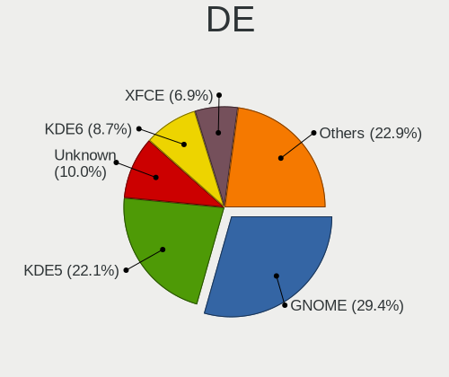
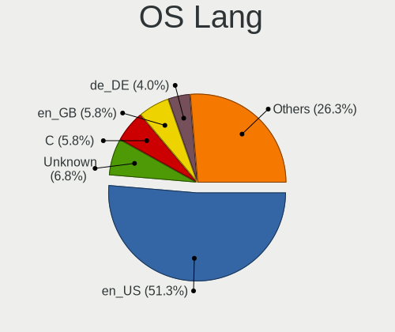
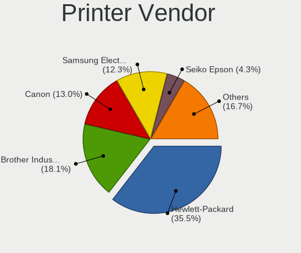

Arch - Tested Hardware & Statistics
-----------------------------------

A project to collect tested hardware configurations for Arch.

Anyone can contribute to this report by the [hw-probe](https://github.com/linuxhw/hw-probe) tool:

    sudo -E hw-probe -all -upload

Please contribute! Especially if your hardware is rare.

This is a report for all computer types. See also reports for [desktops](/Dist/Arch/Desktop/README.md) and [notebooks](/Dist/Arch/Notebook/README.md).

Contents
--------

* [ Test Cases ](#test-cases)

* [ System ](#system)
  - [ OS                       ](#os)
  - [ OS Family                ](#os-family)
  - [ Kernel                   ](#kernel)
  - [ Kernel Family            ](#kernel-family)
  - [ Kernel Major Ver.        ](#kernel-major-ver)
  - [ Arch                     ](#arch)
  - [ DE                       ](#de)
  - [ Display Server           ](#display-server)
  - [ Display Manager          ](#display-manager)
  - [ OS Lang                  ](#os-lang)
  - [ Boot Mode                ](#boot-mode)
  - [ Filesystem               ](#filesystem)
  - [ Part. scheme             ](#part-scheme)
  - [ Dual Boot with Linux/BSD ](#dual-boot-with-linuxbsd)
  - [ Dual Boot (Win)          ](#dual-boot-win)

* [ Board ](#board)
  - [ Vendor                   ](#vendor)
  - [ Model                    ](#model)
  - [ Model Family             ](#model-family)
  - [ MFG Year                 ](#mfg-year)
  - [ Form Factor              ](#form-factor)
  - [ Secure Boot              ](#secure-boot)
  - [ Coreboot                 ](#coreboot)
  - [ RAM Size                 ](#ram-size)
  - [ RAM Used                 ](#ram-used)
  - [ Total Drives             ](#total-drives)
  - [ Has CD-ROM               ](#has-cd-rom)
  - [ Has Ethernet             ](#has-ethernet)
  - [ Has WiFi                 ](#has-wifi)
  - [ Has Bluetooth            ](#has-bluetooth)

* [ Location ](#location)
  - [ Country                  ](#country)
  - [ City                     ](#city)

* [ Drives ](#drives)
  - [ Drive Vendor             ](#drive-vendor)
  - [ Drive Model              ](#drive-model)
  - [ HDD Vendor               ](#hdd-vendor)
  - [ SSD Vendor               ](#ssd-vendor)
  - [ Drive Kind               ](#drive-kind)
  - [ Drive Connector          ](#drive-connector)
  - [ Drive Size               ](#drive-size)
  - [ Space Total              ](#space-total)
  - [ Space Used               ](#space-used)
  - [ Malfunc. Drives          ](#malfunc-drives)
  - [ Malfunc. Drive Vendor    ](#malfunc-drive-vendor)
  - [ Malfunc. HDD Vendor      ](#malfunc-hdd-vendor)
  - [ Malfunc. Drive Kind      ](#malfunc-drive-kind)
  - [ Failed Drives            ](#failed-drives)
  - [ Failed Drive Vendor      ](#failed-drive-vendor)
  - [ Drive Status             ](#drive-status)

* [ Storage controller ](#storage-controller)
  - [ Storage Vendor           ](#storage-vendor)
  - [ Storage Model            ](#storage-model)
  - [ Storage Kind             ](#storage-kind)

* [ Processor ](#processor)
  - [ CPU Vendor               ](#cpu-vendor)
  - [ CPU Model                ](#cpu-model)
  - [ CPU Model Family         ](#cpu-model-family)
  - [ CPU Cores                ](#cpu-cores)
  - [ CPU Sockets              ](#cpu-sockets)
  - [ CPU Threads              ](#cpu-threads)
  - [ CPU Op-Modes             ](#cpu-op-modes)
  - [ CPU Microcode            ](#cpu-microcode)
  - [ CPU Microarch            ](#cpu-microarch)

* [ Graphics ](#graphics)
  - [ GPU Vendor               ](#gpu-vendor)
  - [ GPU Model                ](#gpu-model)
  - [ GPU Combo                ](#gpu-combo)
  - [ GPU Driver               ](#gpu-driver)
  - [ GPU Memory               ](#gpu-memory)

* [ Monitor ](#monitor)
  - [ Monitor Vendor           ](#monitor-vendor)
  - [ Monitor Model            ](#monitor-model)
  - [ Monitor Resolution       ](#monitor-resolution)
  - [ Monitor Diagonal         ](#monitor-diagonal)
  - [ Monitor Width            ](#monitor-width)
  - [ Aspect Ratio             ](#aspect-ratio)
  - [ Monitor Area             ](#monitor-area)
  - [ Pixel Density            ](#pixel-density)
  - [ Multiple Monitors        ](#multiple-monitors)

* [ Network ](#network)
  - [ Net Controller Vendor    ](#net-controller-vendor)
  - [ Net Controller Model     ](#net-controller-model)
  - [ Wireless Vendor          ](#wireless-vendor)
  - [ Wireless Model           ](#wireless-model)
  - [ Ethernet Vendor          ](#ethernet-vendor)
  - [ Ethernet Model           ](#ethernet-model)
  - [ Net Controller Kind      ](#net-controller-kind)
  - [ Used Controller          ](#used-controller)
  - [ NICs                     ](#nics)
  - [ IPv6                     ](#ipv6)

* [ Bluetooth ](#bluetooth)
  - [ Bluetooth Vendor         ](#bluetooth-vendor)
  - [ Bluetooth Model          ](#bluetooth-model)

* [ Sound ](#sound)
  - [ Sound Vendor             ](#sound-vendor)
  - [ Sound Model              ](#sound-model)

* [ Memory ](#memory)
  - [ Memory Vendor            ](#memory-vendor)
  - [ Memory Model             ](#memory-model)
  - [ Memory Kind              ](#memory-kind)
  - [ Memory Form Factor       ](#memory-form-factor)
  - [ Memory Size              ](#memory-size)
  - [ Memory Speed             ](#memory-speed)

* [ Printers & scanners ](#printers--scanners)
  - [ Printer Vendor           ](#printer-vendor)
  - [ Printer Model            ](#printer-model)
  - [ Scanner Vendor           ](#scanner-vendor)
  - [ Scanner Model            ](#scanner-model)

* [ Camera ](#camera)
  - [ Camera Vendor            ](#camera-vendor)
  - [ Camera Model             ](#camera-model)

* [ Security ](#security)
  - [ Fingerprint Vendor       ](#fingerprint-vendor)
  - [ Fingerprint Model        ](#fingerprint-model)
  - [ Chipcard Vendor          ](#chipcard-vendor)
  - [ Chipcard Model           ](#chipcard-model)

* [ Unsupported ](#unsupported)
  - [ Unsupported Devices      ](#unsupported-devices)
  - [ Unsupported Device Types ](#unsupported-device-types)

Test Cases
----------

Total: 7657

| Vendor        | Model                       | Form-Factor | Probe                                                      | Date         |
|---------------|-----------------------------|-------------|------------------------------------------------------------|--------------|
| ASUSTek       | PRIME B550M-A               | Desktop     | [162ad451eb](https://linux-hardware.org/?probe=162ad451eb) | Dec 31, 2022 |
| ASUSTek       | TUF Gaming X570-PLUS        | Desktop     | [ea3b140a7f](https://linux-hardware.org/?probe=ea3b140a7f) | Dec 31, 2022 |
| Lenovo        | ThinkBook 15-IIL 20SM       | Notebook    | [a30f96dea4](https://linux-hardware.org/?probe=a30f96dea4) | Dec 31, 2022 |
| MSI           | MPG X570 GAMING PRO CARB... | Desktop     | [ecf944f539](https://linux-hardware.org/?probe=ecf944f539) | Dec 31, 2022 |
| ASUSTek       | PRIME B250M-K               | Desktop     | [9db6f0fda7](https://linux-hardware.org/?probe=9db6f0fda7) | Dec 31, 2022 |
| ASUSTek       | PRIME H610M-K D4            | Desktop     | [0031785936](https://linux-hardware.org/?probe=0031785936) | Dec 31, 2022 |
| ASUSTek       | PRIME H610M-K D4            | Desktop     | [4bd2096c80](https://linux-hardware.org/?probe=4bd2096c80) | Dec 31, 2022 |
| Dell          | Latitude E6430              | Notebook    | [de9b03cf29](https://linux-hardware.org/?probe=de9b03cf29) | Dec 31, 2022 |
| Dell          | Latitude 3420               | Notebook    | [05095533cd](https://linux-hardware.org/?probe=05095533cd) | Dec 31, 2022 |
| ASUSTek       | Pro WS X570-ACE             | Desktop     | [fc2f55c02e](https://linux-hardware.org/?probe=fc2f55c02e) | Dec 31, 2022 |
| Dell          | G3 3579                     | Notebook    | [cad48f0160](https://linux-hardware.org/?probe=cad48f0160) | Dec 30, 2022 |
| ASUSTek       | PRIME B550M-A               | Desktop     | [83810bf0a9](https://linux-hardware.org/?probe=83810bf0a9) | Dec 30, 2022 |
| MSI           | MPG X570 GAMING PRO CARB... | Desktop     | [7b3c89637b](https://linux-hardware.org/?probe=7b3c89637b) | Dec 30, 2022 |
| Apple         | Mac-77F17D7DA9285301 iMa... | All in one  | [eab8778810](https://linux-hardware.org/?probe=eab8778810) | Dec 30, 2022 |
| HUAWEI        | BOM-WXX9                    | Notebook    | [4409746122](https://linux-hardware.org/?probe=4409746122) | Dec 30, 2022 |
| ASUSTek       | VivoBook_ASUSLaptop M340... | Notebook    | [d7806eec79](https://linux-hardware.org/?probe=d7806eec79) | Dec 30, 2022 |
| ASUSTek       | PRIME B550M-A               | Desktop     | [da9b785d2a](https://linux-hardware.org/?probe=da9b785d2a) | Dec 30, 2022 |
| ASRock        | B650M PG Riptide            | Desktop     | [614e6307eb](https://linux-hardware.org/?probe=614e6307eb) | Dec 29, 2022 |
| HP            | ProBook 430 G8 Notebook ... | Notebook    | [3f4178001d](https://linux-hardware.org/?probe=3f4178001d) | Dec 29, 2022 |
| ASUSTek       | VivoBook_ASUSLaptop X515... | Notebook    | [ce66958f69](https://linux-hardware.org/?probe=ce66958f69) | Dec 29, 2022 |
| Acer          | Aspire A715-41G             | Notebook    | [92f3c92191](https://linux-hardware.org/?probe=92f3c92191) | Dec 29, 2022 |
| HP            | Pavilion Laptop 15-cs2xx... | Notebook    | [587aa5f819](https://linux-hardware.org/?probe=587aa5f819) | Dec 29, 2022 |
| ASUSTek       | PRIME B550M-A               | Desktop     | [e6ac6cac6c](https://linux-hardware.org/?probe=e6ac6cac6c) | Dec 29, 2022 |
| Lenovo        | ThinkPad E580 20KS001RIX    | Notebook    | [4ca01731b4](https://linux-hardware.org/?probe=4ca01731b4) | Dec 29, 2022 |
| HP            | Pavilion Gaming Laptop 1... | Notebook    | [1cf63ef1ad](https://linux-hardware.org/?probe=1cf63ef1ad) | Dec 28, 2022 |
| ASUSTek       | PRIME B550M-A               | Desktop     | [1219225d5d](https://linux-hardware.org/?probe=1219225d5d) | Dec 28, 2022 |
| Acer          | AO756                       | Notebook    | [d0cf64acd1](https://linux-hardware.org/?probe=d0cf64acd1) | Dec 28, 2022 |
| Acer          | Swift SF314-41              | Notebook    | [2923c4c0fc](https://linux-hardware.org/?probe=2923c4c0fc) | Dec 28, 2022 |
| ASRock        | X570M Pro4                  | Desktop     | [71d2c76079](https://linux-hardware.org/?probe=71d2c76079) | Dec 28, 2022 |
| HP            | ENVY x360 2-in-1 Laptop ... | Convertible | [0382c36a9d](https://linux-hardware.org/?probe=0382c36a9d) | Dec 28, 2022 |
| HP            | ENVY x360 2-in-1 Laptop ... | Convertible | [a42da327a2](https://linux-hardware.org/?probe=a42da327a2) | Dec 28, 2022 |
| System76      | Darter Pro                  | Notebook    | [a46000c111](https://linux-hardware.org/?probe=a46000c111) | Dec 28, 2022 |
| HP            | 250 G8 Notebook PC          | Notebook    | [7d79eadc7d](https://linux-hardware.org/?probe=7d79eadc7d) | Dec 28, 2022 |
| Lenovo        | ThinkPad P50 20EQS3BT1R     | Notebook    | [a86fddc0b9](https://linux-hardware.org/?probe=a86fddc0b9) | Dec 28, 2022 |
| ASUSTek       | P8Z77-V PRO                 | Desktop     | [79427500b5](https://linux-hardware.org/?probe=79427500b5) | Dec 28, 2022 |
| ASUSTek       | P8H61-M LE R2.0             | Desktop     | [b9fd8381a4](https://linux-hardware.org/?probe=b9fd8381a4) | Dec 27, 2022 |
| MouseCompu... | BC-MB1485UD11A-191          | Convertible | [b24a434561](https://linux-hardware.org/?probe=b24a434561) | Dec 27, 2022 |
| Acer          | Aspire 5741                 | Notebook    | [1c41b5afb0](https://linux-hardware.org/?probe=1c41b5afb0) | Dec 27, 2022 |
| ASRock        | H61M-HG4                    | Desktop     | [8658fa0fa3](https://linux-hardware.org/?probe=8658fa0fa3) | Dec 27, 2022 |
| Dell          | 0YDJK3 A02                  | Server      | [83c3b04914](https://linux-hardware.org/?probe=83c3b04914) | Dec 27, 2022 |
| HP            | Pavilion Laptop 15-cs0xx... | Notebook    | [d75dbe1e39](https://linux-hardware.org/?probe=d75dbe1e39) | Dec 27, 2022 |
| Lenovo        | MIIX 310-10ICR 80SG         | Tablet      | [bef58a2317](https://linux-hardware.org/?probe=bef58a2317) | Dec 26, 2022 |
| Lenovo        | MIIX 310-10ICR 80SG         | Tablet      | [f37619077b](https://linux-hardware.org/?probe=f37619077b) | Dec 26, 2022 |
| HP            | 2B29                        | Desktop     | [b83d4fafa0](https://linux-hardware.org/?probe=b83d4fafa0) | Dec 26, 2022 |
| ASUSTek       | B85M-GAMER                  | Desktop     | [ded2e7e4e6](https://linux-hardware.org/?probe=ded2e7e4e6) | Dec 26, 2022 |
| ASUSTek       | ROG Zephyrus G14 GA401QM... | Notebook    | [196d570869](https://linux-hardware.org/?probe=196d570869) | Dec 26, 2022 |
| ASUSTek       | ASUS TUF Gaming A15 FA50... | Notebook    | [c82ebf8b80](https://linux-hardware.org/?probe=c82ebf8b80) | Dec 26, 2022 |
| HP            | Pavilion Laptop 15-cs0xx... | Notebook    | [38a87e716e](https://linux-hardware.org/?probe=38a87e716e) | Dec 26, 2022 |
| ASUSTek       | ZenBook UX425UG_Q408UG      | Notebook    | [9fb13764cc](https://linux-hardware.org/?probe=9fb13764cc) | Dec 26, 2022 |
| ASUSTek       | PRIME B550M-A               | Desktop     | [8ca73d6b87](https://linux-hardware.org/?probe=8ca73d6b87) | Dec 26, 2022 |
| Lenovo        | ThinkPad T440p 20AW007QM... | Notebook    | [6e3d39b4ae](https://linux-hardware.org/?probe=6e3d39b4ae) | Dec 25, 2022 |
| ASUSTek       | ROG STRIX X670E-E GAMING... | Desktop     | [5d95c28ac6](https://linux-hardware.org/?probe=5d95c28ac6) | Dec 25, 2022 |
| ASUSTek       | GL752VW                     | Notebook    | [021903d3d7](https://linux-hardware.org/?probe=021903d3d7) | Dec 25, 2022 |
| Biostar       | AM1MHP                      | Desktop     | [a4c61d5381](https://linux-hardware.org/?probe=a4c61d5381) | Dec 25, 2022 |
| ASUSTek       | M5A97 PLUS                  | Desktop     | [8a1cb3f5e7](https://linux-hardware.org/?probe=8a1cb3f5e7) | Dec 25, 2022 |
| MSI           | 970A-G46                    | Desktop     | [4b2435b250](https://linux-hardware.org/?probe=4b2435b250) | Dec 25, 2022 |
| ASUSTek       | PRIME B550M-A               | Desktop     | [8bfc8d2560](https://linux-hardware.org/?probe=8bfc8d2560) | Dec 25, 2022 |
| WYSE          | XM CLASS                    | Notebook    | [948bfb388d](https://linux-hardware.org/?probe=948bfb388d) | Dec 25, 2022 |
| ASUSTek       | ROG STRIX X670E-E GAMING... | Desktop     | [a98ca87f6a](https://linux-hardware.org/?probe=a98ca87f6a) | Dec 25, 2022 |
| ASUSTek       | ROG STRIX X670E-E GAMING... | Desktop     | [00af244895](https://linux-hardware.org/?probe=00af244895) | Dec 25, 2022 |
| MSI           | B450 TOMAHAWK MAX           | Desktop     | [457612540c](https://linux-hardware.org/?probe=457612540c) | Dec 24, 2022 |
| Gigabyte      | AX370-Gaming-CF             | Desktop     | [4770daed30](https://linux-hardware.org/?probe=4770daed30) | Dec 24, 2022 |
| Lenovo        | IdeaPad 5 Pro 14ACN6 82L... | Notebook    | [1ae154433a](https://linux-hardware.org/?probe=1ae154433a) | Dec 24, 2022 |
| ASUSTek       | PRIME B550M-A               | Desktop     | [52edc0816c](https://linux-hardware.org/?probe=52edc0816c) | Dec 24, 2022 |
| ASUSTek       | PRIME B450M-K II            | Desktop     | [9a6b000b23](https://linux-hardware.org/?probe=9a6b000b23) | Dec 23, 2022 |
| Lenovo        | ThinkPad L14 Gen 3 21C5C... | Notebook    | [f980d6ed2e](https://linux-hardware.org/?probe=f980d6ed2e) | Dec 23, 2022 |
| Lenovo        | ThinkPad L14 Gen 3 21C5C... | Notebook    | [a5dcdfece2](https://linux-hardware.org/?probe=a5dcdfece2) | Dec 23, 2022 |
| ASUSTek       | ASUS TUF Dash F15 FX516P... | Notebook    | [97749ab6b4](https://linux-hardware.org/?probe=97749ab6b4) | Dec 23, 2022 |
| Google        | Babytiger                   | Notebook    | [352d1a547b](https://linux-hardware.org/?probe=352d1a547b) | Dec 23, 2022 |
| Google        | Babytiger                   | Notebook    | [4b2ae6579f](https://linux-hardware.org/?probe=4b2ae6579f) | Dec 23, 2022 |
| ASUSTek       | TUF Gaming X570-PLUS        | Desktop     | [fe5df748b0](https://linux-hardware.org/?probe=fe5df748b0) | Dec 23, 2022 |
| HP            | Pavilion Aero Laptop 13-... | Notebook    | [0246231a61](https://linux-hardware.org/?probe=0246231a61) | Dec 22, 2022 |
| ASUSTek       | PRIME B550M-A               | Desktop     | [83436ff428](https://linux-hardware.org/?probe=83436ff428) | Dec 22, 2022 |
| Lenovo        | IdeaPad 110-15IBR 80T7      | Notebook    | [0ee0790d0a](https://linux-hardware.org/?probe=0ee0790d0a) | Dec 22, 2022 |
| Lenovo        | IdeaPad 110-15IBR 80T7      | Notebook    | [c2dd6d0281](https://linux-hardware.org/?probe=c2dd6d0281) | Dec 22, 2022 |
| ASUSTek       | PRIME B550M-A               | Desktop     | [90f9fb28f8](https://linux-hardware.org/?probe=90f9fb28f8) | Dec 22, 2022 |
| Lenovo        | IdeaPad 320-15IKB 81BT      | Notebook    | [543b6fc9db](https://linux-hardware.org/?probe=543b6fc9db) | Dec 21, 2022 |
| Lenovo        | ThinkPad T470s 20HF003QU... | Notebook    | [5145350f9a](https://linux-hardware.org/?probe=5145350f9a) | Dec 21, 2022 |
| Gigabyte      | B450 AORUS M                | Desktop     | [74f0c818d6](https://linux-hardware.org/?probe=74f0c818d6) | Dec 21, 2022 |
| ASUSTek       | PRIME H510M-K               | Desktop     | [768834619c](https://linux-hardware.org/?probe=768834619c) | Dec 21, 2022 |
| ASUSTek       | Zenbook UX535QE_UM535QE     | Notebook    | [95b8e650ce](https://linux-hardware.org/?probe=95b8e650ce) | Dec 21, 2022 |
| ASUSTek       | Zenbook UX535QE_UM535QE     | Notebook    | [5262e622da](https://linux-hardware.org/?probe=5262e622da) | Dec 21, 2022 |
| ASUSTek       | PRIME X399-A                | Desktop     | [243fccb6fa](https://linux-hardware.org/?probe=243fccb6fa) | Dec 21, 2022 |
| ASUSTek       | PRIME B550M-A               | Desktop     | [3f3d7ab961](https://linux-hardware.org/?probe=3f3d7ab961) | Dec 21, 2022 |
| Dell          | 0YDJK3 A02                  | Server      | [8b7f633e4c](https://linux-hardware.org/?probe=8b7f633e4c) | Dec 21, 2022 |
| ASUSTek       | ASUS TUF Dash F15 FX517Z... | Notebook    | [d2e0ceb9a5](https://linux-hardware.org/?probe=d2e0ceb9a5) | Dec 20, 2022 |
| Lenovo        | Legion R9000P ARH7H 82RG    | Notebook    | [bbc48ee483](https://linux-hardware.org/?probe=bbc48ee483) | Dec 20, 2022 |
| HUAWEI        | NBLB-WAX9N                  | Notebook    | [2b8c2f06eb](https://linux-hardware.org/?probe=2b8c2f06eb) | Dec 20, 2022 |
| Notebook      | PCX0DX                      | Notebook    | [83c28a3013](https://linux-hardware.org/?probe=83c28a3013) | Dec 20, 2022 |
| ASUSTek       | PRIME B550M-A               | Desktop     | [487d7751d8](https://linux-hardware.org/?probe=487d7751d8) | Dec 20, 2022 |
| Acer          | Swift SF314-71              | Notebook    | [36d833d9c2](https://linux-hardware.org/?probe=36d833d9c2) | Dec 20, 2022 |
| Acer          | Swift SF314-71              | Notebook    | [c065eec185](https://linux-hardware.org/?probe=c065eec185) | Dec 20, 2022 |
| Lenovo        | ThinkPad P50 20EQS3BT1R     | Notebook    | [cd16c6fb41](https://linux-hardware.org/?probe=cd16c6fb41) | Dec 20, 2022 |
| ASUSTek       | VivoBook_ASUSLaptop X509... | Notebook    | [593cdd8cf6](https://linux-hardware.org/?probe=593cdd8cf6) | Dec 19, 2022 |
| Dell          | XPS 15 9560                 | Notebook    | [1f1c0123c7](https://linux-hardware.org/?probe=1f1c0123c7) | Dec 19, 2022 |
| ASUSTek       | PRIME B550-PLUS             | Desktop     | [70b20b876e](https://linux-hardware.org/?probe=70b20b876e) | Dec 19, 2022 |
| Alienware     | x17 R1                      | Notebook    | [a5ff52a7ce](https://linux-hardware.org/?probe=a5ff52a7ce) | Dec 19, 2022 |
| Alienware     | x14                         | Notebook    | [d965b3510e](https://linux-hardware.org/?probe=d965b3510e) | Dec 19, 2022 |
| ASUSTek       | TUF Gaming B650-PLUS WIF... | Desktop     | [afcae667f0](https://linux-hardware.org/?probe=afcae667f0) | Dec 19, 2022 |
| ASRock        | B450 Gaming-ITX/ac          | Desktop     | [17618a8281](https://linux-hardware.org/?probe=17618a8281) | Dec 18, 2022 |
| HP            | 85BA 00100                  | All in one  | [a67c97653f](https://linux-hardware.org/?probe=a67c97653f) | Dec 18, 2022 |
| ASUSTek       | PRIME B550-PLUS             | Desktop     | [8d21cb0063](https://linux-hardware.org/?probe=8d21cb0063) | Dec 18, 2022 |
| Lenovo        | Yoga Slim 7 ProX 14IAH7 ... | Notebook    | [3fe5be03b1](https://linux-hardware.org/?probe=3fe5be03b1) | Dec 18, 2022 |
| Lenovo        | Yoga Slim 7 ProX 14IAH7 ... | Notebook    | [b34d0f3a2c](https://linux-hardware.org/?probe=b34d0f3a2c) | Dec 18, 2022 |
| Gigabyte      | B450M DS3H-CF               | Desktop     | [2d046f9339](https://linux-hardware.org/?probe=2d046f9339) | Dec 18, 2022 |
| Gigabyte      | PH67A-D3-B3                 | Desktop     | [4760b50d21](https://linux-hardware.org/?probe=4760b50d21) | Dec 18, 2022 |
| ASUSTek       | PRIME B550-PLUS             | Desktop     | [7964862f29](https://linux-hardware.org/?probe=7964862f29) | Dec 18, 2022 |
| Intel         | H55                         | Desktop     | [a5033f178f](https://linux-hardware.org/?probe=a5033f178f) | Dec 18, 2022 |
| Lenovo        | Legion 7 16ARHA7 82UH       | Notebook    | [2a39f517ef](https://linux-hardware.org/?probe=2a39f517ef) | Dec 18, 2022 |
| ASUSTek       | PRIME B550-PLUS             | Desktop     | [43d229d12e](https://linux-hardware.org/?probe=43d229d12e) | Dec 17, 2022 |
| ASUSTek       | TUF Gaming B550-PLUS        | Desktop     | [a8936bc5e3](https://linux-hardware.org/?probe=a8936bc5e3) | Dec 17, 2022 |
| ASUSTek       | Zenbook UM5302TA_UM5302T... | Notebook    | [b0f674ae6f](https://linux-hardware.org/?probe=b0f674ae6f) | Dec 17, 2022 |
| ASUSTek       | PRIME B550-PLUS             | Desktop     | [f9f06d0bcb](https://linux-hardware.org/?probe=f9f06d0bcb) | Dec 17, 2022 |
| Gigabyte      | G5 KE                       | Notebook    | [9ff3d65e35](https://linux-hardware.org/?probe=9ff3d65e35) | Dec 17, 2022 |
| ASUSTek       | PRIME B550-PLUS             | Desktop     | [5f8287cae9](https://linux-hardware.org/?probe=5f8287cae9) | Dec 17, 2022 |
| HP            | EliteBook Folio 1040 G3     | Notebook    | [278cdcd567](https://linux-hardware.org/?probe=278cdcd567) | Dec 17, 2022 |
| Dell          | Inspiron 7415 2-in-1        | Convertible | [d37c2f05fd](https://linux-hardware.org/?probe=d37c2f05fd) | Dec 17, 2022 |
| HP            | ProBook 445 G8 Notebook ... | Notebook    | [87b21382ec](https://linux-hardware.org/?probe=87b21382ec) | Dec 17, 2022 |
| HP            | 83EE                        | Desktop     | [a008cde5ae](https://linux-hardware.org/?probe=a008cde5ae) | Dec 17, 2022 |
| Lenovo        | ThinkPad X1 Extreme 2nd ... | Notebook    | [9768b1fe82](https://linux-hardware.org/?probe=9768b1fe82) | Dec 16, 2022 |
| Dell          | Precision 5570              | Notebook    | [9468beba51](https://linux-hardware.org/?probe=9468beba51) | Dec 16, 2022 |
| HP            | Laptop 15-dw4xxx            | Notebook    | [ac9c6384ca](https://linux-hardware.org/?probe=ac9c6384ca) | Dec 16, 2022 |
| Lenovo        | ThinkPad T15p Gen 3 21DA... | Notebook    | [6d51ea5c76](https://linux-hardware.org/?probe=6d51ea5c76) | Dec 16, 2022 |
| Intel         | DH55PJ AAE93812-303         | Desktop     | [bf511c3913](https://linux-hardware.org/?probe=bf511c3913) | Dec 16, 2022 |
| Lenovo        | IdeaPad Gaming 3 15ARH05... | Notebook    | [30fda215a5](https://linux-hardware.org/?probe=30fda215a5) | Dec 16, 2022 |
| Lenovo        | ThinkBook 15-IIL 20SM       | Notebook    | [36a0b6f8d9](https://linux-hardware.org/?probe=36a0b6f8d9) | Dec 16, 2022 |
| Lenovo        | ThinkBook 15-IIL 20SM       | Notebook    | [61dd034d23](https://linux-hardware.org/?probe=61dd034d23) | Dec 16, 2022 |
| Intel         | NUC13SBBi9 M58736-302       | Mini pc     | [de15eb8246](https://linux-hardware.org/?probe=de15eb8246) | Dec 16, 2022 |
| HUAWEI        | KLVL-WXXW                   | Notebook    | [302dc680df](https://linux-hardware.org/?probe=302dc680df) | Dec 16, 2022 |
| Gigabyte      | B150-HD3P-CF                | Desktop     | [18b9f94390](https://linux-hardware.org/?probe=18b9f94390) | Dec 16, 2022 |
| HP            | Laptop 15-da0xxx            | Notebook    | [d871acfe36](https://linux-hardware.org/?probe=d871acfe36) | Dec 16, 2022 |
| HUAWEI        | KLVL-WXXW                   | Notebook    | [d289646ec3](https://linux-hardware.org/?probe=d289646ec3) | Dec 16, 2022 |
| Lenovo        | ThinkPad X240 20AMA40QLM    | Notebook    | [ec9133f05d](https://linux-hardware.org/?probe=ec9133f05d) | Dec 16, 2022 |
| ASUSTek       | PRIME B550-PLUS             | Desktop     | [62395615bf](https://linux-hardware.org/?probe=62395615bf) | Dec 15, 2022 |
| ASUSTek       | PRIME B550M-A               | Desktop     | [2495c6742d](https://linux-hardware.org/?probe=2495c6742d) | Dec 15, 2022 |
| ASUSTek       | TUF Gaming FX505DT_FX505... | Notebook    | [7ea1bad26b](https://linux-hardware.org/?probe=7ea1bad26b) | Dec 15, 2022 |
| Dell          | 0HY9JP A00                  | Desktop     | [82d5ee3bbe](https://linux-hardware.org/?probe=82d5ee3bbe) | Dec 15, 2022 |
| ASUSTek       | PRIME B550M-A               | Desktop     | [eace53ab64](https://linux-hardware.org/?probe=eace53ab64) | Dec 15, 2022 |
| MSI           | B450 TOMAHAWK MAX           | Desktop     | [d087536cbf](https://linux-hardware.org/?probe=d087536cbf) | Dec 14, 2022 |
| MSI           | GL75 Leopard 10SDK          | Notebook    | [03dc950ee5](https://linux-hardware.org/?probe=03dc950ee5) | Dec 14, 2022 |
| Dell          | Latitude 5490               | Notebook    | [d05d57e241](https://linux-hardware.org/?probe=d05d57e241) | Dec 14, 2022 |
| ASUSTek       | PRIME B550M-A               | Desktop     | [a2fc1288f1](https://linux-hardware.org/?probe=a2fc1288f1) | Dec 14, 2022 |
| PCWare        | IPMH110G                    | Desktop     | [baa0f26af0](https://linux-hardware.org/?probe=baa0f26af0) | Dec 13, 2022 |
| Samsung       | 730QED                      | Convertible | [b2c224e73a](https://linux-hardware.org/?probe=b2c224e73a) | Dec 13, 2022 |
| Samsung       | 730QAA                      | Convertible | [3c97d3d801](https://linux-hardware.org/?probe=3c97d3d801) | Dec 13, 2022 |
| Gigabyte      | B550 AORUS ELITE AX V2      | Desktop     | [3d835ed57d](https://linux-hardware.org/?probe=3d835ed57d) | Dec 12, 2022 |
| Lenovo        | ThinkPad X12 Detachable ... | Tablet      | [869c239d63](https://linux-hardware.org/?probe=869c239d63) | Dec 12, 2022 |
| Lenovo        | ThinkPad E14 Gen 4 21E3S... | Notebook    | [40cf8dd049](https://linux-hardware.org/?probe=40cf8dd049) | Dec 12, 2022 |
| Lenovo        | IdeaPad 1 14AMN7 82VF       | Notebook    | [ed087084fb](https://linux-hardware.org/?probe=ed087084fb) | Dec 12, 2022 |
| ASUSTek       | PRIME B550M-K               | Desktop     | [fa85be7b33](https://linux-hardware.org/?probe=fa85be7b33) | Dec 12, 2022 |
| Dell          | XPS 13 9380                 | Notebook    | [665b87269c](https://linux-hardware.org/?probe=665b87269c) | Dec 12, 2022 |
| Lenovo        | IdeaPad S145-15IWL 81S9     | Notebook    | [304bad9c19](https://linux-hardware.org/?probe=304bad9c19) | Dec 12, 2022 |
| ASUSTek       | ROG Flow X13 GV301QH_GV3... | Notebook    | [1461a09931](https://linux-hardware.org/?probe=1461a09931) | Dec 12, 2022 |
| ASUSTek       | PRIME B450M-A               | Desktop     | [2c52e941ea](https://linux-hardware.org/?probe=2c52e941ea) | Dec 11, 2022 |
| LG Electro... | 15Z95N-G.AAC6U1             | Notebook    | [f8dae62b0c](https://linux-hardware.org/?probe=f8dae62b0c) | Dec 11, 2022 |
| HP            | Compaq Presario CQ71        | Notebook    | [57ab22c9c2](https://linux-hardware.org/?probe=57ab22c9c2) | Dec 11, 2022 |
| Sony          | VPCEB3D4R                   | Notebook    | [5f85b7c516](https://linux-hardware.org/?probe=5f85b7c516) | Dec 11, 2022 |
| HP            | Compaq Presario CQ71        | Notebook    | [b3f0bf2008](https://linux-hardware.org/?probe=b3f0bf2008) | Dec 11, 2022 |
| ZOTAC         | ZBOX-ID42-BE                | Mini pc     | [98600510bf](https://linux-hardware.org/?probe=98600510bf) | Dec 11, 2022 |
| MSI           | Modern 14 B11MOU            | Notebook    | [ec8ac9bbd7](https://linux-hardware.org/?probe=ec8ac9bbd7) | Dec 11, 2022 |
| HP            | Laptop 14s-fq1xxx           | Notebook    | [811092647b](https://linux-hardware.org/?probe=811092647b) | Dec 11, 2022 |
| ASUSTek       | S551LN                      | Notebook    | [9aabc2d159](https://linux-hardware.org/?probe=9aabc2d159) | Dec 11, 2022 |
| Acer          | Swift SF314-57G             | Notebook    | [3ba8e00e00](https://linux-hardware.org/?probe=3ba8e00e00) | Dec 11, 2022 |
| Lenovo        | Yoga 6 13ALC7 82UD          | Convertible | [eb171830a5](https://linux-hardware.org/?probe=eb171830a5) | Dec 11, 2022 |
| Lenovo        | HASWELLREFRESHDT 3190005... | All in one  | [b73060ce38](https://linux-hardware.org/?probe=b73060ce38) | Dec 10, 2022 |
| ASUSTek       | PRIME A320M-K               | Desktop     | [5073afb493](https://linux-hardware.org/?probe=5073afb493) | Dec 10, 2022 |
| ASUSTek       | Zenbook UX535QE_UM535QE     | Notebook    | [92d1403bdf](https://linux-hardware.org/?probe=92d1403bdf) | Dec 10, 2022 |
| Gigabyte      | B550M AORUS PRO-P           | Desktop     | [ad6dc99c8a](https://linux-hardware.org/?probe=ad6dc99c8a) | Dec 10, 2022 |
| Lenovo        | ThinkBook 15-IIL 20SM       | Notebook    | [17cbc91488](https://linux-hardware.org/?probe=17cbc91488) | Dec 10, 2022 |
| Lenovo        | ThinkBook 15-IIL 20SM       | Notebook    | [4b9eb9fcab](https://linux-hardware.org/?probe=4b9eb9fcab) | Dec 10, 2022 |
| Dell          | XPS 15 9500                 | Notebook    | [a933e298c7](https://linux-hardware.org/?probe=a933e298c7) | Dec 10, 2022 |
| Dell          | XPS 15 9500                 | Notebook    | [0e7dd9fbdb](https://linux-hardware.org/?probe=0e7dd9fbdb) | Dec 10, 2022 |
| Dell          | Latitude E6430              | Notebook    | [f28775142d](https://linux-hardware.org/?probe=f28775142d) | Dec 09, 2022 |
| Acer          | Swift SFX16-52G             | Notebook    | [02a7a5e487](https://linux-hardware.org/?probe=02a7a5e487) | Dec 09, 2022 |
| Lenovo        | ThinkPad P15v Gen 1 20TQ... | Notebook    | [91b65d2fa1](https://linux-hardware.org/?probe=91b65d2fa1) | Dec 09, 2022 |
| Dell          | Inspiron 3583               | Notebook    | [93934b74f5](https://linux-hardware.org/?probe=93934b74f5) | Dec 09, 2022 |
| Acer          | Aspire A315-55G             | Notebook    | [0c6e399e4f](https://linux-hardware.org/?probe=0c6e399e4f) | Dec 09, 2022 |
| Acer          | Aspire A315-55G             | Notebook    | [9c083ab22c](https://linux-hardware.org/?probe=9c083ab22c) | Dec 09, 2022 |
| ASUSTek       | PRIME B550M-K               | Desktop     | [c8890a2f74](https://linux-hardware.org/?probe=c8890a2f74) | Dec 09, 2022 |
| ASRock        | X300M-STX                   | Desktop     | [a6f72ec4e3](https://linux-hardware.org/?probe=a6f72ec4e3) | Dec 09, 2022 |
| Lenovo        | MIIX 300-10IBY 80NR         | Tablet      | [b9e3c45caa](https://linux-hardware.org/?probe=b9e3c45caa) | Dec 09, 2022 |
| HP            | Laptop 14s-dq1xxx           | Notebook    | [6af7fadd72](https://linux-hardware.org/?probe=6af7fadd72) | Dec 09, 2022 |
| HP            | Laptop 14s-dq1xxx           | Notebook    | [7e1510d6c6](https://linux-hardware.org/?probe=7e1510d6c6) | Dec 09, 2022 |
| MSI           | B450 TOMAHAWK               | Desktop     | [b822420d6d](https://linux-hardware.org/?probe=b822420d6d) | Dec 09, 2022 |
| ASUSTek       | P8P67 DELUXE                | Desktop     | [82fdec2637](https://linux-hardware.org/?probe=82fdec2637) | Dec 09, 2022 |
| HP            | EliteBook 840 G5            | Notebook    | [946807e266](https://linux-hardware.org/?probe=946807e266) | Dec 08, 2022 |
| ASUSTek       | PRIME B550M-A               | Desktop     | [5e58e0fc36](https://linux-hardware.org/?probe=5e58e0fc36) | Dec 08, 2022 |
| Dell          | Latitude 3400               | Notebook    | [d01726a4d0](https://linux-hardware.org/?probe=d01726a4d0) | Dec 08, 2022 |
| MSI           | Alpha 15 A4DEK              | Notebook    | [d2a30990d9](https://linux-hardware.org/?probe=d2a30990d9) | Dec 08, 2022 |
| HP            | Pavilion Aero Laptop 13-... | Notebook    | [8924598f09](https://linux-hardware.org/?probe=8924598f09) | Dec 08, 2022 |
| MSI           | Modern 14 B11MOU            | Notebook    | [426e23829e](https://linux-hardware.org/?probe=426e23829e) | Dec 08, 2022 |
| HP            | ZBook Fury 17 G7 Mobile ... | Notebook    | [cb45484bb6](https://linux-hardware.org/?probe=cb45484bb6) | Dec 08, 2022 |
| MSI           | Vector GP76 12UGS           | Notebook    | [d6c55a874f](https://linux-hardware.org/?probe=d6c55a874f) | Dec 08, 2022 |
| HP            | EliteBook 840 G5            | Notebook    | [bb11ec4f3f](https://linux-hardware.org/?probe=bb11ec4f3f) | Dec 08, 2022 |
| ASUSTek       | ASUS TUF Gaming F15 FX50... | Notebook    | [ea7638c0f9](https://linux-hardware.org/?probe=ea7638c0f9) | Dec 07, 2022 |
| MSI           | Modern 14 B11MOU            | Notebook    | [49e70cf65f](https://linux-hardware.org/?probe=49e70cf65f) | Dec 07, 2022 |
| Positivo B... | VJFE42F11X-XXXXXX           | Notebook    | [8575adb47e](https://linux-hardware.org/?probe=8575adb47e) | Dec 07, 2022 |
| Dell          | Inspiron 5505               | Notebook    | [183c4593a7](https://linux-hardware.org/?probe=183c4593a7) | Dec 07, 2022 |
| Gigabyte      | B550 GAMING X V2            | Desktop     | [7ac17baea3](https://linux-hardware.org/?probe=7ac17baea3) | Dec 07, 2022 |
| HP            | Laptop 14s-dq2xxx           | Notebook    | [383bc11a0d](https://linux-hardware.org/?probe=383bc11a0d) | Dec 07, 2022 |
| ASUSTek       | PRIME B550M-A               | Desktop     | [5b4cf72d01](https://linux-hardware.org/?probe=5b4cf72d01) | Dec 07, 2022 |
| Gigabyte      | B550 AORUS PRO V2           | Desktop     | [def749869a](https://linux-hardware.org/?probe=def749869a) | Dec 07, 2022 |
| Acer          | Aspire R5-571T              | Convertible | [1530922d4f](https://linux-hardware.org/?probe=1530922d4f) | Dec 06, 2022 |
| Packard Be... | EasyNote LJ65               | Notebook    | [1ca8a161fd](https://linux-hardware.org/?probe=1ca8a161fd) | Dec 06, 2022 |
| Acer          | Aspire R5-571T              | Convertible | [12160f0234](https://linux-hardware.org/?probe=12160f0234) | Dec 06, 2022 |
| Lenovo        | Yoga Slim 7 14ITL05 82A3    | Notebook    | [db1a2c7a74](https://linux-hardware.org/?probe=db1a2c7a74) | Dec 06, 2022 |
| Toshiba       | Satellite R630              | Notebook    | [3826be6846](https://linux-hardware.org/?probe=3826be6846) | Dec 06, 2022 |
| Toshiba       | Satellite R630              | Notebook    | [eebafcab9e](https://linux-hardware.org/?probe=eebafcab9e) | Dec 06, 2022 |
| Lenovo        | Yoga Slim 7 14ITL05 82A3    | Notebook    | [6ae5470891](https://linux-hardware.org/?probe=6ae5470891) | Dec 06, 2022 |
| Lenovo        | IdeaPad 1 14AMN7 82VF       | Notebook    | [c2d30310e8](https://linux-hardware.org/?probe=c2d30310e8) | Dec 06, 2022 |
| Lenovo        | IdeaPad 1 14AMN7 82VF       | Notebook    | [a978cbc03b](https://linux-hardware.org/?probe=a978cbc03b) | Dec 06, 2022 |
| HP            | ProBook 6560b               | Notebook    | [a73750fc79](https://linux-hardware.org/?probe=a73750fc79) | Dec 06, 2022 |
| ASUSTek       | P5Q DELUXE                  | Desktop     | [1519fb3a87](https://linux-hardware.org/?probe=1519fb3a87) | Dec 06, 2022 |
| MSI           | B550M PRO-VDH WIFI          | Desktop     | [2ddb168532](https://linux-hardware.org/?probe=2ddb168532) | Dec 05, 2022 |
| HP            | Pavilion Laptop 15-cs0xx... | Notebook    | [dd7a026e5e](https://linux-hardware.org/?probe=dd7a026e5e) | Dec 05, 2022 |
| MSI           | X470 GAMING PRO CARBON      | Desktop     | [76ce7610ea](https://linux-hardware.org/?probe=76ce7610ea) | Dec 05, 2022 |
| ASUSTek       | ASUS TUF Dash F15 FX517Z... | Notebook    | [d69f4daaa6](https://linux-hardware.org/?probe=d69f4daaa6) | Dec 05, 2022 |
| PCWare        | IPMH110G                    | Desktop     | [0574aeace9](https://linux-hardware.org/?probe=0574aeace9) | Dec 05, 2022 |
| eMachines     | E520 V1.06                  | Notebook    | [0ef424fa9b](https://linux-hardware.org/?probe=0ef424fa9b) | Dec 05, 2022 |
| Lenovo        | ThinkPad P51 20HJS16Q0K     | Notebook    | [3dfd18754f](https://linux-hardware.org/?probe=3dfd18754f) | Dec 05, 2022 |
| Dell          | 0NNFGG A00                  | Desktop     | [b955357ccc](https://linux-hardware.org/?probe=b955357ccc) | Dec 05, 2022 |
| ASUSTek       | PRIME B550M-A               | Desktop     | [d081f85083](https://linux-hardware.org/?probe=d081f85083) | Dec 05, 2022 |
| Google        | Lick                        | Notebook    | [7ee6b1918e](https://linux-hardware.org/?probe=7ee6b1918e) | Dec 04, 2022 |
| HUAWEI        | BOHK-WAX9X                  | Notebook    | [cf810b2e09](https://linux-hardware.org/?probe=cf810b2e09) | Dec 04, 2022 |
| ASRock        | J4205-ITX                   | Desktop     | [f5eb647cc9](https://linux-hardware.org/?probe=f5eb647cc9) | Dec 04, 2022 |
| Lenovo        | ThinkPad P51 20HJS1G900     | Notebook    | [aaf35cbcc4](https://linux-hardware.org/?probe=aaf35cbcc4) | Dec 04, 2022 |
| Acer          | Aspire A315-23              | Notebook    | [8c3beba1e1](https://linux-hardware.org/?probe=8c3beba1e1) | Dec 03, 2022 |
| HUAWEI        | BOHK-WAX9X                  | Notebook    | [f34caf87d5](https://linux-hardware.org/?probe=f34caf87d5) | Dec 03, 2022 |
| Lenovo        | IdeaPad 520-15IKB 80YL      | Notebook    | [6dbc014a04](https://linux-hardware.org/?probe=6dbc014a04) | Dec 03, 2022 |
| Gigabyte      | Z370M DS3H-CF               | Desktop     | [580b716020](https://linux-hardware.org/?probe=580b716020) | Dec 03, 2022 |
| HONOR         | NMH-WCX9                    | Notebook    | [3f107d24d1](https://linux-hardware.org/?probe=3f107d24d1) | Dec 03, 2022 |
| ASUSTek       | X580VD                      | Notebook    | [027cd08fb1](https://linux-hardware.org/?probe=027cd08fb1) | Dec 03, 2022 |
| MSI           | MPG B550 GAMING EDGE WIF... | Desktop     | [f477b8f059](https://linux-hardware.org/?probe=f477b8f059) | Dec 03, 2022 |
| Gigabyte      | X570 AORUS MASTER           | Desktop     | [7a778f7987](https://linux-hardware.org/?probe=7a778f7987) | Dec 02, 2022 |
| Lenovo        | IdeaPad Gaming 3 15IHU6 ... | Notebook    | [e16c372c9c](https://linux-hardware.org/?probe=e16c372c9c) | Dec 02, 2022 |
| Lenovo        | ThinkPad X1 Carbon 6th 2... | Notebook    | [c544d40ecb](https://linux-hardware.org/?probe=c544d40ecb) | Dec 02, 2022 |
| IBM           | 90Y4784                     | Server      | [a9289ca04c](https://linux-hardware.org/?probe=a9289ca04c) | Dec 02, 2022 |
| Dell          | 01V648 A02                  | Server      | [b8747a97b7](https://linux-hardware.org/?probe=b8747a97b7) | Dec 02, 2022 |
| Intel         | S1200RP G62251-405          | Server      | [28f4ceb8ee](https://linux-hardware.org/?probe=28f4ceb8ee) | Dec 02, 2022 |
| IBM           | 00MV214                     | Server      | [f2d1382390](https://linux-hardware.org/?probe=f2d1382390) | Dec 02, 2022 |
| Dell          | XPS 13 9310                 | Notebook    | [ca1fab4db1](https://linux-hardware.org/?probe=ca1fab4db1) | Dec 02, 2022 |
| ASUSTek       | SABERTOOTH X79              | Desktop     | [85f6854ce5](https://linux-hardware.org/?probe=85f6854ce5) | Dec 02, 2022 |
| Lenovo        | SHARKBAY SDK0E50510 WIN     | Desktop     | [919c5d80c8](https://linux-hardware.org/?probe=919c5d80c8) | Dec 02, 2022 |
| Gigabyte      | X570 I AORUS PRO WIFI       | Desktop     | [0949d0916c](https://linux-hardware.org/?probe=0949d0916c) | Dec 02, 2022 |
| Shuttle       | FS81                        | Desktop     | [6352050887](https://linux-hardware.org/?probe=6352050887) | Dec 02, 2022 |
| Dell          | XPS 13 9310                 | Notebook    | [2adab1a5b2](https://linux-hardware.org/?probe=2adab1a5b2) | Dec 02, 2022 |
| Gigabyte      | B360M D3H-CF                | Desktop     | [e902390c9c](https://linux-hardware.org/?probe=e902390c9c) | Dec 02, 2022 |
| Gigabyte      | X570 I AORUS PRO WIFI       | Desktop     | [f9ff6b9e31](https://linux-hardware.org/?probe=f9ff6b9e31) | Dec 02, 2022 |
| ASUSTek       | ROG STRIX X670E-E GAMING... | Desktop     | [3c05de2bb5](https://linux-hardware.org/?probe=3c05de2bb5) | Dec 02, 2022 |
| ASUSTek       | ROG STRIX X670E-E GAMING... | Desktop     | [17e6d4dbb5](https://linux-hardware.org/?probe=17e6d4dbb5) | Dec 02, 2022 |
| Lenovo        | IdeaPad S145-15IWL 81S9     | Notebook    | [ae8f8361c1](https://linux-hardware.org/?probe=ae8f8361c1) | Dec 02, 2022 |
| Microsoft     | Surface Pro 7               | Tablet      | [89ab28028e](https://linux-hardware.org/?probe=89ab28028e) | Dec 02, 2022 |
| Gigabyte      | X570S AORUS PRO AX          | Notebook    | [253135f8dc](https://linux-hardware.org/?probe=253135f8dc) | Dec 01, 2022 |
| ASUSTek       | TUF Gaming X570-PLUS_BR     | Desktop     | [7ff54a3b05](https://linux-hardware.org/?probe=7ff54a3b05) | Dec 01, 2022 |
| Lenovo        | ThinkBook 15 G3 ACL 21A4    | Notebook    | [d57de89542](https://linux-hardware.org/?probe=d57de89542) | Dec 01, 2022 |
| Lenovo        | B40-70 20392                | Notebook    | [a527c5b6e6](https://linux-hardware.org/?probe=a527c5b6e6) | Dec 01, 2022 |
| ASUSTek       | PRIME B550M-A               | Desktop     | [5b86ca0927](https://linux-hardware.org/?probe=5b86ca0927) | Dec 01, 2022 |
| Lenovo        | ThinkPad X13 Gen 1 20UFC... | Notebook    | [cccb2da575](https://linux-hardware.org/?probe=cccb2da575) | Dec 01, 2022 |
| MSI           | B450-A PRO MAX              | Desktop     | [8de79673ea](https://linux-hardware.org/?probe=8de79673ea) | Dec 01, 2022 |
| MSI           | B450-A PRO MAX              | Desktop     | [e2f97abdea](https://linux-hardware.org/?probe=e2f97abdea) | Nov 30, 2022 |
| Samsung       | 730QAA                      | Convertible | [7ec4c2ecfd](https://linux-hardware.org/?probe=7ec4c2ecfd) | Nov 30, 2022 |
| ASUSTek       | P8P67 DELUXE                | Desktop     | [c117ba54ea](https://linux-hardware.org/?probe=c117ba54ea) | Nov 30, 2022 |
| Dell          | 0WWJRX A00                  | Desktop     | [83ef480c7d](https://linux-hardware.org/?probe=83ef480c7d) | Nov 30, 2022 |
| MSI           | MAG B550M MORTAR            | Desktop     | [b4c010a2b2](https://linux-hardware.org/?probe=b4c010a2b2) | Nov 30, 2022 |
| ASUSTek       | P8P67 DELUXE                | Desktop     | [47131749a5](https://linux-hardware.org/?probe=47131749a5) | Nov 30, 2022 |
| ASUSTek       | E403SA                      | Notebook    | [d3a1f181d5](https://linux-hardware.org/?probe=d3a1f181d5) | Nov 30, 2022 |
| Positivo B... | S14SL03                     | Notebook    | [a42ebacec4](https://linux-hardware.org/?probe=a42ebacec4) | Nov 29, 2022 |
| MSI           | GF75 Thin 9SC               | Notebook    | [50a779c35d](https://linux-hardware.org/?probe=50a779c35d) | Nov 29, 2022 |
| IBM           | MSI-9151 Boards             | Desktop     | [720ff829b9](https://linux-hardware.org/?probe=720ff829b9) | Nov 29, 2022 |
| ASUSTek       | Zenbook UX535QE_UM535QE     | Notebook    | [9f473cbdeb](https://linux-hardware.org/?probe=9f473cbdeb) | Nov 29, 2022 |
| Gigabyte      | B550 AORUS ELITE AX V2      | Desktop     | [ff119f84e6](https://linux-hardware.org/?probe=ff119f84e6) | Nov 29, 2022 |
| Dell          | Inspiron 15-3567            | Notebook    | [b06377f324](https://linux-hardware.org/?probe=b06377f324) | Nov 29, 2022 |
| ASUSTek       | ZenBook UX425IA_UM425IA     | Notebook    | [d258962c35](https://linux-hardware.org/?probe=d258962c35) | Nov 28, 2022 |
| ASUSTek       | Zenbook UX535QE_UM535QE     | Notebook    | [a3c2004787](https://linux-hardware.org/?probe=a3c2004787) | Nov 28, 2022 |
| Lenovo        | ThinkBook 15 G3 ACL 21A4    | Notebook    | [ceb78dbe4e](https://linux-hardware.org/?probe=ceb78dbe4e) | Nov 28, 2022 |
| Timi          | TM1613                      | Notebook    | [37036a425d](https://linux-hardware.org/?probe=37036a425d) | Nov 28, 2022 |
| ASUSTek       | H110M-K                     | Desktop     | [becbfa5cc7](https://linux-hardware.org/?probe=becbfa5cc7) | Nov 28, 2022 |
| Dell          | G15 5520                    | Notebook    | [251078d1b4](https://linux-hardware.org/?probe=251078d1b4) | Nov 28, 2022 |
| HP            | Pavilion Laptop 14-ce3xx... | Notebook    | [ccc431ef2e](https://linux-hardware.org/?probe=ccc431ef2e) | Nov 28, 2022 |
| Lenovo        | Yoga Slim 7 ProX 14ARH7 ... | Notebook    | [0d99651537](https://linux-hardware.org/?probe=0d99651537) | Nov 28, 2022 |
| Lenovo        | Yoga Slim 7 ProX 14ARH7 ... | Notebook    | [3f660318ea](https://linux-hardware.org/?probe=3f660318ea) | Nov 28, 2022 |
| Lenovo        | ThinkPad X1 Extreme 20MF... | Notebook    | [f18a4c8031](https://linux-hardware.org/?probe=f18a4c8031) | Nov 28, 2022 |
| ASUSTek       | ROG STRIX B550-E GAMING     | Desktop     | [b0078eda9b](https://linux-hardware.org/?probe=b0078eda9b) | Nov 27, 2022 |
| Acer          | Predator PH315-54           | Notebook    | [15909202b8](https://linux-hardware.org/?probe=15909202b8) | Nov 27, 2022 |
| Lenovo        | ThinkPad E15 Gen 4 21EES... | Notebook    | [d8bb1b1d38](https://linux-hardware.org/?probe=d8bb1b1d38) | Nov 27, 2022 |
| ASUSTek       | P7H55-M                     | Desktop     | [e5ac492508](https://linux-hardware.org/?probe=e5ac492508) | Nov 27, 2022 |
| MSI           | X570-A PRO                  | Desktop     | [c2c27cf47f](https://linux-hardware.org/?probe=c2c27cf47f) | Nov 27, 2022 |
| Lenovo        | Legion 5 Pro 16IAH7H 82R... | Notebook    | [4825bcbe78](https://linux-hardware.org/?probe=4825bcbe78) | Nov 27, 2022 |
| Dell          | Latitude E7440              | Notebook    | [3709af0366](https://linux-hardware.org/?probe=3709af0366) | Nov 27, 2022 |
| ASUSTek       | PRIME B550M-A               | Desktop     | [7bdb03388b](https://linux-hardware.org/?probe=7bdb03388b) | Nov 27, 2022 |
| Sony          | VPCEA45FG                   | Notebook    | [847b1cb39a](https://linux-hardware.org/?probe=847b1cb39a) | Nov 26, 2022 |
| HP            | Laptop 14s-dq1xxx           | Notebook    | [9b3a058fda](https://linux-hardware.org/?probe=9b3a058fda) | Nov 26, 2022 |
| HP            | ENVY x360 2-in-1 Laptop ... | Convertible | [1b3355afbc](https://linux-hardware.org/?probe=1b3355afbc) | Nov 26, 2022 |
| ASUSTek       | K70AB                       | Notebook    | [8b7e3c4b9e](https://linux-hardware.org/?probe=8b7e3c4b9e) | Nov 26, 2022 |
| Dell          | Latitude 5490               | Notebook    | [7aedc1fbd7](https://linux-hardware.org/?probe=7aedc1fbd7) | Nov 26, 2022 |
| Lenovo        | Legion R9000P ARH7H 82RG    | Notebook    | [0e3f081937](https://linux-hardware.org/?probe=0e3f081937) | Nov 26, 2022 |
| ASUSTek       | TUF B350M-PLUS GAMING       | Desktop     | [098116b1d6](https://linux-hardware.org/?probe=098116b1d6) | Nov 26, 2022 |
| MSI           | Alpha 17 B5EEK              | Notebook    | [0cd6df782e](https://linux-hardware.org/?probe=0cd6df782e) | Nov 26, 2022 |
| ASUSTek       | VivoBook_ASUSLaptop M350... | Notebook    | [cd9478ab62](https://linux-hardware.org/?probe=cd9478ab62) | Nov 26, 2022 |
| ASRock        | B460M-HDV                   | Desktop     | [00c07e7aa9](https://linux-hardware.org/?probe=00c07e7aa9) | Nov 25, 2022 |
| HP            | EliteBook 850 G8 Noteboo... | Notebook    | [1f2bd09174](https://linux-hardware.org/?probe=1f2bd09174) | Nov 25, 2022 |
| MSI           | Modern 14 B10MW             | Notebook    | [9768df6ae0](https://linux-hardware.org/?probe=9768df6ae0) | Nov 25, 2022 |
| MSI           | Modern 14 B10MW             | Notebook    | [1564025817](https://linux-hardware.org/?probe=1564025817) | Nov 25, 2022 |
| Acer          | Nitro AN515-52              | Notebook    | [c639db74cb](https://linux-hardware.org/?probe=c639db74cb) | Nov 25, 2022 |
| Lenovo        | ThinkPad T14s Gen 2a 20X... | Notebook    | [2d1c8c7ea5](https://linux-hardware.org/?probe=2d1c8c7ea5) | Nov 24, 2022 |
| ASUSTek       | ASUS TUF Gaming A15 FA50... | Notebook    | [ce5f08445d](https://linux-hardware.org/?probe=ce5f08445d) | Nov 24, 2022 |
| Lenovo        | IdeaPad 5 Pro 14ACN6 82L... | Notebook    | [4efc557c1b](https://linux-hardware.org/?probe=4efc557c1b) | Nov 24, 2022 |
| Gigabyte      | B550 AORUS ELITE            | Desktop     | [d2d484b35b](https://linux-hardware.org/?probe=d2d484b35b) | Nov 24, 2022 |
| Gateway       | SX2803                      | Desktop     | [68a008f332](https://linux-hardware.org/?probe=68a008f332) | Nov 24, 2022 |
| MECER         | YA13Q20-DP_PRO              | Notebook    | [c51a900a73](https://linux-hardware.org/?probe=c51a900a73) | Nov 23, 2022 |
| ASUSTek       | PRIME B550M-A               | Desktop     | [ed9d641fda](https://linux-hardware.org/?probe=ed9d641fda) | Nov 23, 2022 |
| HP            | Laptop 15-dw3xxx            | Notebook    | [4f6911ae2c](https://linux-hardware.org/?probe=4f6911ae2c) | Nov 23, 2022 |
| MSI           | Modern 15 A5M               | Notebook    | [51ca9fa048](https://linux-hardware.org/?probe=51ca9fa048) | Nov 23, 2022 |
| MSI           | Modern 15 A5M               | Notebook    | [0ca1ce1d74](https://linux-hardware.org/?probe=0ca1ce1d74) | Nov 23, 2022 |
| Lenovo        | Legion 5 Pro 16IAH7H 82R... | Notebook    | [47d808147c](https://linux-hardware.org/?probe=47d808147c) | Nov 23, 2022 |
| Lenovo        | ThinkPad T480 20L50011US    | Notebook    | [2f32726e0d](https://linux-hardware.org/?probe=2f32726e0d) | Nov 23, 2022 |
| Lenovo        | ThinkPad T440p 20AWS3RJ0... | Notebook    | [43f6a19d9a](https://linux-hardware.org/?probe=43f6a19d9a) | Nov 22, 2022 |
| Lenovo        | ThinkPad X1 Carbon Gen 9... | Notebook    | [65a3383e83](https://linux-hardware.org/?probe=65a3383e83) | Nov 22, 2022 |
| PCWare        | IPMH110G                    | Desktop     | [7d952c2b0d](https://linux-hardware.org/?probe=7d952c2b0d) | Nov 22, 2022 |
| Lenovo        | IdeaPad 5 14ITL05 82FE      | Notebook    | [0584338e31](https://linux-hardware.org/?probe=0584338e31) | Nov 22, 2022 |
| HP            | ProBook 6570b               | Notebook    | [b7bd63db1c](https://linux-hardware.org/?probe=b7bd63db1c) | Nov 22, 2022 |
| HP            | EliteBook 8460w             | Notebook    | [cdb72eea80](https://linux-hardware.org/?probe=cdb72eea80) | Nov 22, 2022 |
| Gigabyte      | H110M-H-CF                  | Desktop     | [fdafa2db2a](https://linux-hardware.org/?probe=fdafa2db2a) | Nov 22, 2022 |
| Dell          | XPS 13 9300                 | Notebook    | [3f9c0d5b63](https://linux-hardware.org/?probe=3f9c0d5b63) | Nov 22, 2022 |
| ASUSTek       | GL503VS                     | Notebook    | [18fa411a6d](https://linux-hardware.org/?probe=18fa411a6d) | Nov 22, 2022 |
| Acer          | Nitro AN515-52              | Notebook    | [57b2e84560](https://linux-hardware.org/?probe=57b2e84560) | Nov 22, 2022 |
| ASUSTek       | X455YA                      | Notebook    | [70267d756a](https://linux-hardware.org/?probe=70267d756a) | Nov 21, 2022 |
| Acer          | Nitro AN515-52              | Notebook    | [308968646b](https://linux-hardware.org/?probe=308968646b) | Nov 21, 2022 |
| ASUSTek       | P5E3 Deluxe                 | Desktop     | [c14020107c](https://linux-hardware.org/?probe=c14020107c) | Nov 21, 2022 |
| Gigabyte      | B450M DS3H-CF               | Desktop     | [8de96e0012](https://linux-hardware.org/?probe=8de96e0012) | Nov 20, 2022 |
| HP            | Pavilion Laptop 14-ce2xx... | Notebook    | [cd2b457ffb](https://linux-hardware.org/?probe=cd2b457ffb) | Nov 20, 2022 |
| HP            | Notebook                    | Notebook    | [1278403b39](https://linux-hardware.org/?probe=1278403b39) | Nov 20, 2022 |
| HP            | EliteBook 850 G8 Noteboo... | Notebook    | [2db5ac853d](https://linux-hardware.org/?probe=2db5ac853d) | Nov 20, 2022 |
| ASUSTek       | PRIME TRX40-PRO             | Desktop     | [ecafbb7acb](https://linux-hardware.org/?probe=ecafbb7acb) | Nov 20, 2022 |
| ASUSTek       | PRIME B450-PLUS             | Desktop     | [9b0f3f926d](https://linux-hardware.org/?probe=9b0f3f926d) | Nov 20, 2022 |
| ASUSTek       | PRIME Z590-A                | Desktop     | [ba2c2a39ed](https://linux-hardware.org/?probe=ba2c2a39ed) | Nov 20, 2022 |
| ASUSTek       | PRIME Z590-A                | Desktop     | [07985535f4](https://linux-hardware.org/?probe=07985535f4) | Nov 20, 2022 |
| ASRock        | AB350M-HDV                  | Desktop     | [9484c00cb6](https://linux-hardware.org/?probe=9484c00cb6) | Nov 20, 2022 |
| HP            | 8055                        | Desktop     | [65b0ad04f1](https://linux-hardware.org/?probe=65b0ad04f1) | Nov 20, 2022 |
| MSI           | PRO Z690-A WIFI DDR4        | Desktop     | [08372f6535](https://linux-hardware.org/?probe=08372f6535) | Nov 20, 2022 |
| Dell          | XPS 9320                    | Notebook    | [e590d602a9](https://linux-hardware.org/?probe=e590d602a9) | Nov 19, 2022 |
| Lenovo        | Legion 5 Pro 16ACH6H 82J... | Notebook    | [7ac338ce0d](https://linux-hardware.org/?probe=7ac338ce0d) | Nov 19, 2022 |
| Lenovo        | Legion 5 Pro 16ACH6H 82J... | Notebook    | [50bd30f30d](https://linux-hardware.org/?probe=50bd30f30d) | Nov 19, 2022 |
| Lenovo        | ThinkPad X220 Tablet 429... | Notebook    | [85e0869ac9](https://linux-hardware.org/?probe=85e0869ac9) | Nov 19, 2022 |
| ASUSTek       | PRIME H310M-E R2.0          | Desktop     | [9d276a36d8](https://linux-hardware.org/?probe=9d276a36d8) | Nov 19, 2022 |
| Gigabyte      | B660M DS3H DDR4             | Desktop     | [4956957df8](https://linux-hardware.org/?probe=4956957df8) | Nov 19, 2022 |
| ASUSTek       | PRIME H310M-E R2.0          | Desktop     | [362cf69f1f](https://linux-hardware.org/?probe=362cf69f1f) | Nov 19, 2022 |
| Dell          | Latitude E5440              | Notebook    | [f423bbe9b0](https://linux-hardware.org/?probe=f423bbe9b0) | Nov 19, 2022 |
| HP            | Pavilion Laptop 15-cs0xx... | Notebook    | [865fa07274](https://linux-hardware.org/?probe=865fa07274) | Nov 19, 2022 |
| HP            | Pavilion Laptop 15-cs0xx... | Notebook    | [68d651f36b](https://linux-hardware.org/?probe=68d651f36b) | Nov 19, 2022 |
| ASUSTek       | ASUS TUF Dash F15 FX516P... | Notebook    | [87219ba8e3](https://linux-hardware.org/?probe=87219ba8e3) | Nov 19, 2022 |
| ASUSTek       | ZenBook UX425UG_Q408UG      | Notebook    | [6a39161e50](https://linux-hardware.org/?probe=6a39161e50) | Nov 19, 2022 |
| ASUSTek       | PRIME B550M-A               | Desktop     | [9b19115bc7](https://linux-hardware.org/?probe=9b19115bc7) | Nov 18, 2022 |
| Dell          | Latitude E5440              | Notebook    | [0f98fe6066](https://linux-hardware.org/?probe=0f98fe6066) | Nov 18, 2022 |
| Lenovo        | Legion 5 Pro 16IAH7H 82R... | Notebook    | [0cdd3b10fc](https://linux-hardware.org/?probe=0cdd3b10fc) | Nov 18, 2022 |
| ASRock        | X470 Taichi Ultimate        | Desktop     | [7c8a72cae4](https://linux-hardware.org/?probe=7c8a72cae4) | Nov 18, 2022 |
| MSI           | H110M PRO-VH PLUS           | Desktop     | [54f40f8c4b](https://linux-hardware.org/?probe=54f40f8c4b) | Nov 18, 2022 |
| Gigabyte      | B550M DS3H                  | Desktop     | [469ead98f8](https://linux-hardware.org/?probe=469ead98f8) | Nov 17, 2022 |
| Foxconn       | 2ABF                        | Desktop     | [018a2825bf](https://linux-hardware.org/?probe=018a2825bf) | Nov 17, 2022 |
| ASUSTek       | TUF Gaming B550-PLUS        | Desktop     | [bb2db87e9a](https://linux-hardware.org/?probe=bb2db87e9a) | Nov 17, 2022 |
| MSI           | B450 GAMING PLUS MAX        | Desktop     | [8a9570e828](https://linux-hardware.org/?probe=8a9570e828) | Nov 17, 2022 |
| Alienware     | m17                         | Notebook    | [e3e14a271a](https://linux-hardware.org/?probe=e3e14a271a) | Nov 17, 2022 |
| Dell          | XPS 15 9570                 | Notebook    | [d62ee2298d](https://linux-hardware.org/?probe=d62ee2298d) | Nov 16, 2022 |
| Lenovo        | ThinkPad T490 20RYCTO1WW    | Notebook    | [69f54ed610](https://linux-hardware.org/?probe=69f54ed610) | Nov 16, 2022 |
| MSI           | Z590 PRO WIFI               | Desktop     | [c53f301391](https://linux-hardware.org/?probe=c53f301391) | Nov 16, 2022 |
| Lenovo        | ThinkPad E14 Gen 3 20Y70... | Notebook    | [3eaa12ef7a](https://linux-hardware.org/?probe=3eaa12ef7a) | Nov 16, 2022 |
| Apple         | MacBookPro11,4              | Notebook    | [91268b9919](https://linux-hardware.org/?probe=91268b9919) | Nov 16, 2022 |
| ASUSTek       | TUF B450-PRO GAMING         | Desktop     | [b0c0ad46de](https://linux-hardware.org/?probe=b0c0ad46de) | Nov 16, 2022 |
| ASUSTek       | ZenBook UX425UG_Q408UG      | Notebook    | [e2982c0c35](https://linux-hardware.org/?probe=e2982c0c35) | Nov 16, 2022 |
| ASUSTek       | PRIME B550M-A               | Desktop     | [5ce6a414cd](https://linux-hardware.org/?probe=5ce6a414cd) | Nov 16, 2022 |
| HP            | 83EE                        | Desktop     | [182682b17c](https://linux-hardware.org/?probe=182682b17c) | Nov 16, 2022 |
| HP            | 83EE                        | Desktop     | [65d7bade6e](https://linux-hardware.org/?probe=65d7bade6e) | Nov 16, 2022 |
| Unknown       | Unknown                     | Desktop     | [ca24381492](https://linux-hardware.org/?probe=ca24381492) | Nov 15, 2022 |
| ASUSTek       | X550VX                      | Notebook    | [a1e3d4527c](https://linux-hardware.org/?probe=a1e3d4527c) | Nov 15, 2022 |
| Lenovo        | ThinkPad P52 20MAS70500     | Notebook    | [96db8793b2](https://linux-hardware.org/?probe=96db8793b2) | Nov 15, 2022 |
| Lenovo        | ThinkPad P52 20MAS70500     | Notebook    | [c576805c81](https://linux-hardware.org/?probe=c576805c81) | Nov 15, 2022 |
| Lenovo        | IdeaPad Gaming 3 15ACH6 ... | Notebook    | [35cb137655](https://linux-hardware.org/?probe=35cb137655) | Nov 15, 2022 |
| Alienware     | m17                         | Notebook    | [4140c68e95](https://linux-hardware.org/?probe=4140c68e95) | Nov 15, 2022 |
| ASUSTek       | A58M-A/USB3                 | Desktop     | [f6342a3d18](https://linux-hardware.org/?probe=f6342a3d18) | Nov 15, 2022 |
| Acer          | Aspire A715-42G             | Notebook    | [403bc1b6b5](https://linux-hardware.org/?probe=403bc1b6b5) | Nov 14, 2022 |
| Acer          | Aspire A715-42G             | Notebook    | [6209796b42](https://linux-hardware.org/?probe=6209796b42) | Nov 14, 2022 |
| Lenovo        | IdeaPad 3 15ADA6 82KR       | Notebook    | [d28a778811](https://linux-hardware.org/?probe=d28a778811) | Nov 14, 2022 |
| Dell          | XPS 13 9380                 | Notebook    | [1501d641b4](https://linux-hardware.org/?probe=1501d641b4) | Nov 14, 2022 |
| Gigabyte      | B450M DS3H V2               | Desktop     | [dc808c4131](https://linux-hardware.org/?probe=dc808c4131) | Nov 14, 2022 |
| Lenovo        | Legion R9000P ARH7H 82RG    | Notebook    | [d584008808](https://linux-hardware.org/?probe=d584008808) | Nov 14, 2022 |
| Fujitsu       | LIFEBOOK U7511              | Notebook    | [66656bedcf](https://linux-hardware.org/?probe=66656bedcf) | Nov 14, 2022 |
| Dell          | 03KWTV A02                  | Desktop     | [2853121816](https://linux-hardware.org/?probe=2853121816) | Nov 14, 2022 |
| Lenovo        | XiaoXinPro 14ACH 2021 82... | Notebook    | [d74b37eebb](https://linux-hardware.org/?probe=d74b37eebb) | Nov 13, 2022 |
| HP            | Laptop 14-dq2xxx            | Notebook    | [dcb6d439d4](https://linux-hardware.org/?probe=dcb6d439d4) | Nov 13, 2022 |
| Gigabyte      | B550M DS3H                  | Desktop     | [c16c0f7d8f](https://linux-hardware.org/?probe=c16c0f7d8f) | Nov 13, 2022 |
| Lenovo        | ThinkPad T16 Gen 1 21CH0... | Notebook    | [7290725ced](https://linux-hardware.org/?probe=7290725ced) | Nov 13, 2022 |
| HP            | 88BE                        | Desktop     | [1c03e5957d](https://linux-hardware.org/?probe=1c03e5957d) | Nov 13, 2022 |
| EVGA          | Z690 CLASSIFIED.0           | Desktop     | [aabaab5ceb](https://linux-hardware.org/?probe=aabaab5ceb) | Nov 13, 2022 |
| ASUSTek       | PRIME B550M-A               | Desktop     | [0bc3c759d6](https://linux-hardware.org/?probe=0bc3c759d6) | Nov 13, 2022 |
| HONOR         | BOD-WXX9                    | Notebook    | [ca8b207b30](https://linux-hardware.org/?probe=ca8b207b30) | Nov 12, 2022 |
| Lenovo        | Yoga C640-13IML 81UE        | Convertible | [768efc0c32](https://linux-hardware.org/?probe=768efc0c32) | Nov 12, 2022 |
| ASUSTek       | P8P67 EVO                   | Desktop     | [c033c311f3](https://linux-hardware.org/?probe=c033c311f3) | Nov 12, 2022 |
| ASUSTek       | PRIME X470-PRO              | Desktop     | [2d2cdbb40b](https://linux-hardware.org/?probe=2d2cdbb40b) | Nov 12, 2022 |
| Packard Be... | EasyNote LJ65               | Notebook    | [1de1737600](https://linux-hardware.org/?probe=1de1737600) | Nov 12, 2022 |
| Gigabyte      | G5 KE                       | Notebook    | [aefbee04fd](https://linux-hardware.org/?probe=aefbee04fd) | Nov 12, 2022 |
| Acer          | AO722                       | Notebook    | [5c51412f98](https://linux-hardware.org/?probe=5c51412f98) | Nov 12, 2022 |
| ASUSTek       | ROG STRIX X570-E GAMING     | Desktop     | [d134c6d6bf](https://linux-hardware.org/?probe=d134c6d6bf) | Nov 12, 2022 |
| ASUSTek       | A68HM-K                     | Desktop     | [842f768168](https://linux-hardware.org/?probe=842f768168) | Nov 12, 2022 |
| Lenovo        | ThinkPad T16 Gen 1 21CH0... | Notebook    | [7fded9a538](https://linux-hardware.org/?probe=7fded9a538) | Nov 12, 2022 |
| Dell          | Inspiron 15 3511            | Notebook    | [361f37b08d](https://linux-hardware.org/?probe=361f37b08d) | Nov 11, 2022 |
| Google        | Blooglet                    | Notebook    | [bd55466988](https://linux-hardware.org/?probe=bd55466988) | Nov 11, 2022 |
| ASRock        | X570 Taichi                 | Desktop     | [8bbd88e580](https://linux-hardware.org/?probe=8bbd88e580) | Nov 11, 2022 |
| Komplett      | LAPQC71B                    | Notebook    | [b5ee8960c6](https://linux-hardware.org/?probe=b5ee8960c6) | Nov 11, 2022 |
| Lenovo        | Yoga 720-13IKB 80X6         | Convertible | [38763f3628](https://linux-hardware.org/?probe=38763f3628) | Nov 11, 2022 |
| MSI           | D2415 S26361-D2415-A10      | Desktop     | [924e18bdcc](https://linux-hardware.org/?probe=924e18bdcc) | Nov 10, 2022 |
| ASUSTek       | K54C                        | Notebook    | [e347d4a0f5](https://linux-hardware.org/?probe=e347d4a0f5) | Nov 10, 2022 |
| MSI           | GV62 8RC                    | Notebook    | [859227b2bb](https://linux-hardware.org/?probe=859227b2bb) | Nov 10, 2022 |
| Lenovo        | ThinkPad T14s Gen 1 20UJ... | Notebook    | [d6fd1a5ecd](https://linux-hardware.org/?probe=d6fd1a5ecd) | Nov 10, 2022 |
| ASUSTek       | ROG STRIX B365-F GAMING     | Desktop     | [f20eddfba9](https://linux-hardware.org/?probe=f20eddfba9) | Nov 10, 2022 |
| ASUSTek       | PRIME B550M-A               | Desktop     | [34e25768ae](https://linux-hardware.org/?probe=34e25768ae) | Nov 10, 2022 |
| ASUSTek       | Rampage IV EXTREME          | Desktop     | [39b6ceb06c](https://linux-hardware.org/?probe=39b6ceb06c) | Nov 10, 2022 |
| Panasonic     | CF-R9KWCTDR                 | Notebook    | [2a414f5dc5](https://linux-hardware.org/?probe=2a414f5dc5) | Nov 10, 2022 |
| MSI           | X470 GAMING PLUS MAX        | Desktop     | [9c6a00b034](https://linux-hardware.org/?probe=9c6a00b034) | Nov 09, 2022 |
| Lenovo        | ThinkPad E14 20RA004VPH     | Notebook    | [abbb784ea9](https://linux-hardware.org/?probe=abbb784ea9) | Nov 09, 2022 |
| MSI           | GL63 8RD                    | Notebook    | [e10069a2f8](https://linux-hardware.org/?probe=e10069a2f8) | Nov 09, 2022 |
| HP            | Elite x2 1012 G1            | Notebook    | [0847b8a5d7](https://linux-hardware.org/?probe=0847b8a5d7) | Nov 09, 2022 |
| HP            | Elite x2 1012 G1            | Notebook    | [a5446ab998](https://linux-hardware.org/?probe=a5446ab998) | Nov 09, 2022 |
| Dell          | XPS 15 9550                 | Notebook    | [6642f568d4](https://linux-hardware.org/?probe=6642f568d4) | Nov 09, 2022 |
| HP            | ProBook 430 G3              | Notebook    | [e69d9794fd](https://linux-hardware.org/?probe=e69d9794fd) | Nov 09, 2022 |
| ASUSTek       | ROG STRIX B365-F GAMING     | Desktop     | [3e90cd2d25](https://linux-hardware.org/?probe=3e90cd2d25) | Nov 09, 2022 |
| OKI Brasil    | ST 4280 Padrao              | Desktop     | [f2841b0f4d](https://linux-hardware.org/?probe=f2841b0f4d) | Nov 08, 2022 |
| DERE          | V14                         | Notebook    | [0431077216](https://linux-hardware.org/?probe=0431077216) | Nov 08, 2022 |
| OKI Brasil    | ST 4280 Padrao              | Desktop     | [58cb07d7e1](https://linux-hardware.org/?probe=58cb07d7e1) | Nov 08, 2022 |
| ASRock        | X370 Gaming K4              | Desktop     | [f0634d863e](https://linux-hardware.org/?probe=f0634d863e) | Nov 08, 2022 |
| HP            | ProBook 430 G3              | Notebook    | [d8bae2c402](https://linux-hardware.org/?probe=d8bae2c402) | Nov 08, 2022 |
| Intel         | NUC10i7FNB M38062-307       | Mini pc     | [f36e8a56db](https://linux-hardware.org/?probe=f36e8a56db) | Nov 08, 2022 |
| HP            | 8906 SMVB                   | Desktop     | [2670a536f0](https://linux-hardware.org/?probe=2670a536f0) | Nov 08, 2022 |
| HP            | Pavilion Laptop 15-cw1xx... | Notebook    | [b4d22497e8](https://linux-hardware.org/?probe=b4d22497e8) | Nov 08, 2022 |
| Gigabyte      | B360M D3H-CF                | Desktop     | [ee895bde1f](https://linux-hardware.org/?probe=ee895bde1f) | Nov 08, 2022 |
| Gigabyte      | X570 I AORUS PRO WIFI       | Desktop     | [0e2747c7ab](https://linux-hardware.org/?probe=0e2747c7ab) | Nov 08, 2022 |
| Dell          | XPS 13 9310                 | Notebook    | [5f358af327](https://linux-hardware.org/?probe=5f358af327) | Nov 08, 2022 |
| ASUSTek       | Zenbook UM5401QA_UM5401Q... | Notebook    | [d19fce3e6c](https://linux-hardware.org/?probe=d19fce3e6c) | Nov 08, 2022 |
| Intel         | NUC10i7FNB M38062-307       | Mini pc     | [47ac77d647](https://linux-hardware.org/?probe=47ac77d647) | Nov 08, 2022 |
| Dell          | XPS 13 9360                 | Notebook    | [a35aee6ec2](https://linux-hardware.org/?probe=a35aee6ec2) | Nov 08, 2022 |
| ASUSTek       | TUF Gaming FX505DV_FX505... | Notebook    | [95b5d8b8ca](https://linux-hardware.org/?probe=95b5d8b8ca) | Nov 07, 2022 |
| ASUSTek       | PRIME X670-P WIFI           | Desktop     | [b49062def4](https://linux-hardware.org/?probe=b49062def4) | Nov 07, 2022 |
| MSI           | Modern 14 B5M               | Notebook    | [c2e7afc800](https://linux-hardware.org/?probe=c2e7afc800) | Nov 07, 2022 |
| ASRock        | X570 Taichi                 | Desktop     | [79475d514b](https://linux-hardware.org/?probe=79475d514b) | Nov 07, 2022 |
| ASRock        | X570 Taichi                 | Desktop     | [442c68f23d](https://linux-hardware.org/?probe=442c68f23d) | Nov 07, 2022 |
| ASUSTek       | TUF Gaming X570-PLUS        | Desktop     | [b414369067](https://linux-hardware.org/?probe=b414369067) | Nov 07, 2022 |
| ASUSTek       | P5Q DELUXE                  | Desktop     | [82bf0e80f0](https://linux-hardware.org/?probe=82bf0e80f0) | Nov 06, 2022 |
| ASUSTek       | P5Q DELUXE                  | Desktop     | [28af0c9803](https://linux-hardware.org/?probe=28af0c9803) | Nov 06, 2022 |
| Dell          | 0GDG8Y A02                  | Desktop     | [e61ccb96d0](https://linux-hardware.org/?probe=e61ccb96d0) | Nov 06, 2022 |
| Packard Be... | EasyNote LJ65               | Notebook    | [c75f470cf8](https://linux-hardware.org/?probe=c75f470cf8) | Nov 06, 2022 |
| Teclast       | F6 Pro                      | Notebook    | [bfba140f45](https://linux-hardware.org/?probe=bfba140f45) | Nov 06, 2022 |
| Lenovo        | IdeaPad 320S-14IKB 80X4     | Notebook    | [0d7567fb3f](https://linux-hardware.org/?probe=0d7567fb3f) | Nov 06, 2022 |
| Lenovo        | IdeaPad 320S-14IKB 80X4     | Notebook    | [c3a3d8d222](https://linux-hardware.org/?probe=c3a3d8d222) | Nov 06, 2022 |
| HP            | ProBook 6570b               | Notebook    | [1fec197471](https://linux-hardware.org/?probe=1fec197471) | Nov 06, 2022 |
| Lenovo        | ThinkBook 15 G2 ITL 20VE    | Notebook    | [006e91ea03](https://linux-hardware.org/?probe=006e91ea03) | Nov 06, 2022 |
| PCWare        | IPMH110G                    | Desktop     | [3409bf9968](https://linux-hardware.org/?probe=3409bf9968) | Nov 06, 2022 |
| ASRock        | B550M-ITX/ac                | Desktop     | [e351ee8496](https://linux-hardware.org/?probe=e351ee8496) | Nov 06, 2022 |
| MSI           | 880GMS-E41                  | Desktop     | [2f53fa13ed](https://linux-hardware.org/?probe=2f53fa13ed) | Nov 06, 2022 |
| ASUSTek       | PRIME B550M-A               | Desktop     | [690e470acf](https://linux-hardware.org/?probe=690e470acf) | Nov 06, 2022 |
| Lenovo        | ThinkPad P1 Gen 4i 20Y3A... | Notebook    | [d53e6cef83](https://linux-hardware.org/?probe=d53e6cef83) | Nov 06, 2022 |
| Gigabyte      | H61M-S2PV                   | Desktop     | [5db0a08b25](https://linux-hardware.org/?probe=5db0a08b25) | Nov 06, 2022 |
| MSI           | MPG B550 GAMING PLUS        | Desktop     | [c7a85b52dc](https://linux-hardware.org/?probe=c7a85b52dc) | Nov 05, 2022 |
| ASUSTek       | ROG STRIX B350-F GAMING     | Desktop     | [958f0c8551](https://linux-hardware.org/?probe=958f0c8551) | Nov 05, 2022 |
| ASRock        | X670E Taichi                | Desktop     | [c5227abc14](https://linux-hardware.org/?probe=c5227abc14) | Nov 05, 2022 |
| Lenovo        | 3730 SDK0T76465 WIN 3422... | Desktop     | [f59d3d75ed](https://linux-hardware.org/?probe=f59d3d75ed) | Nov 05, 2022 |
| Dell          | Latitude 3390 2-in-1        | Convertible | [56d14a3b3f](https://linux-hardware.org/?probe=56d14a3b3f) | Nov 05, 2022 |
| Gigabyte      | H61M-S2PV                   | Desktop     | [1c2a17391f](https://linux-hardware.org/?probe=1c2a17391f) | Nov 05, 2022 |
| Clevo         | Modified by dsanke          | Notebook    | [b0c6c10d48](https://linux-hardware.org/?probe=b0c6c10d48) | Nov 05, 2022 |
| HP            | 83E9                        | Desktop     | [837b4320c1](https://linux-hardware.org/?probe=837b4320c1) | Nov 05, 2022 |
| COLORFUL      | X15 XS 22                   | Notebook    | [38bc70c9b2](https://linux-hardware.org/?probe=38bc70c9b2) | Nov 04, 2022 |
| COLORFUL      | X15 XS 22                   | Notebook    | [342a90f101](https://linux-hardware.org/?probe=342a90f101) | Nov 04, 2022 |
| Gigabyte      | B560M D3H                   | Desktop     | [e8364f4018](https://linux-hardware.org/?probe=e8364f4018) | Nov 04, 2022 |
| Lenovo        | ThinkPad E14 20RA004VPH     | Notebook    | [fbe5c4578c](https://linux-hardware.org/?probe=fbe5c4578c) | Nov 04, 2022 |
| MSI           | Bravo 15 A4DDR              | Notebook    | [8598cf3c36](https://linux-hardware.org/?probe=8598cf3c36) | Nov 04, 2022 |
| Lenovo        | IdeaPad Creator 5 15IMH0... | Notebook    | [72b1a49ec9](https://linux-hardware.org/?probe=72b1a49ec9) | Nov 04, 2022 |
| Lenovo        | ThinkPad T16 Gen 1 21CHC... | Notebook    | [eeda582315](https://linux-hardware.org/?probe=eeda582315) | Nov 04, 2022 |
| ASUSTek       | TUF Gaming X570-PLUS        | Desktop     | [27bc8e172c](https://linux-hardware.org/?probe=27bc8e172c) | Nov 04, 2022 |
| ASUSTek       | X555LJ                      | Notebook    | [b46456d0c2](https://linux-hardware.org/?probe=b46456d0c2) | Nov 04, 2022 |
| ASUSTek       | X555LJ                      | Notebook    | [e57ec28998](https://linux-hardware.org/?probe=e57ec28998) | Nov 03, 2022 |
| Gigabyte      | X570 AORUS ELITE            | Desktop     | [97d8c001ef](https://linux-hardware.org/?probe=97d8c001ef) | Nov 03, 2022 |
| ASUSTek       | X550LD                      | Notebook    | [0847d7c7e6](https://linux-hardware.org/?probe=0847d7c7e6) | Nov 03, 2022 |
| Avell High... | B.ON                        | Notebook    | [f0ea745f7d](https://linux-hardware.org/?probe=f0ea745f7d) | Nov 03, 2022 |
| Microsoft     | Surface Book 2              | Tablet      | [fe997bad04](https://linux-hardware.org/?probe=fe997bad04) | Nov 03, 2022 |
| Lenovo        | ThinkPad P14s Gen 2a 21A... | Notebook    | [e2f82d9c90](https://linux-hardware.org/?probe=e2f82d9c90) | Nov 03, 2022 |
| HUAWEI        | NBLK-WAX9X                  | Notebook    | [ec7425c123](https://linux-hardware.org/?probe=ec7425c123) | Nov 03, 2022 |
| Lenovo        | IdeaPad 5 15ALC05 82LN      | Notebook    | [608c7f56e6](https://linux-hardware.org/?probe=608c7f56e6) | Nov 03, 2022 |
| Lenovo        | ThinkPad E15 Gen 2 20TES... | Notebook    | [209e99f964](https://linux-hardware.org/?probe=209e99f964) | Nov 02, 2022 |
| Lenovo        | ThinkPad E15 Gen 2 20TES... | Notebook    | [f12fc289fa](https://linux-hardware.org/?probe=f12fc289fa) | Nov 02, 2022 |
| Lenovo        | ThinkPad L13 Gen 2 20VH0... | Notebook    | [de1cd69b53](https://linux-hardware.org/?probe=de1cd69b53) | Nov 02, 2022 |
| Gigabyte      | Z690 AORUS MASTER           | Desktop     | [2c9714bc6b](https://linux-hardware.org/?probe=2c9714bc6b) | Nov 02, 2022 |
| ASUSTek       | H81T                        | Desktop     | [7598a634e6](https://linux-hardware.org/?probe=7598a634e6) | Nov 02, 2022 |
| GPD           | P3 MAX                      | Notebook    | [8b198da775](https://linux-hardware.org/?probe=8b198da775) | Nov 02, 2022 |
| GPD           | P3 MAX                      | Notebook    | [aea8f8bb50](https://linux-hardware.org/?probe=aea8f8bb50) | Nov 02, 2022 |
| Notebook      | P65xHP                      | Notebook    | [68d40fd2c7](https://linux-hardware.org/?probe=68d40fd2c7) | Nov 02, 2022 |
| ASUSTek       | PRIME B550M-A               | Desktop     | [454939df34](https://linux-hardware.org/?probe=454939df34) | Nov 02, 2022 |
| ASUSTek       | N53Jg                       | Notebook    | [8e4782c668](https://linux-hardware.org/?probe=8e4782c668) | Nov 01, 2022 |
| Acer          | Swift SF314-512             | Notebook    | [4c80b212c6](https://linux-hardware.org/?probe=4c80b212c6) | Nov 01, 2022 |
| Acer          | Swift SF314-512             | Notebook    | [4e92800709](https://linux-hardware.org/?probe=4e92800709) | Nov 01, 2022 |
| Lenovo        | ThinkBook 15 G2 ITL 20VE    | Notebook    | [7603f28400](https://linux-hardware.org/?probe=7603f28400) | Nov 01, 2022 |
| ASUSTek       | PRIME B550M-A               | Desktop     | [321eae8d23](https://linux-hardware.org/?probe=321eae8d23) | Nov 01, 2022 |
| ASUSTek       | K54C                        | Notebook    | [dd4f63b1e4](https://linux-hardware.org/?probe=dd4f63b1e4) | Nov 01, 2022 |
| ASUSTek       | PRIME A320M-K               | Desktop     | [689b5a4022](https://linux-hardware.org/?probe=689b5a4022) | Nov 01, 2022 |
| Lenovo        | 3102 SDK0J40697 WIN 3305... | Desktop     | [a5d58af861](https://linux-hardware.org/?probe=a5d58af861) | Oct 31, 2022 |
| Avell High... | B.ON                        | Notebook    | [1eb1bf21ed](https://linux-hardware.org/?probe=1eb1bf21ed) | Oct 31, 2022 |
| Lenovo        | Legion Y7000 2019 1050 8... | Notebook    | [3821dabcb9](https://linux-hardware.org/?probe=3821dabcb9) | Oct 31, 2022 |
| ASRock        | X670E Pro RS                | Desktop     | [5ebdf73c67](https://linux-hardware.org/?probe=5ebdf73c67) | Oct 31, 2022 |
| ASUSTek       | PRIME Z690-A                | Desktop     | [b1027d78bc](https://linux-hardware.org/?probe=b1027d78bc) | Oct 31, 2022 |
| MSI           | B550M PRO-VDH WIFI          | Desktop     | [472a3f2707](https://linux-hardware.org/?probe=472a3f2707) | Oct 30, 2022 |
| ASUSTek       | ROG STRIX B450-F GAMING     | Desktop     | [71de876615](https://linux-hardware.org/?probe=71de876615) | Oct 30, 2022 |
| MSI           | B550-A PRO                  | Desktop     | [0d67856d8a](https://linux-hardware.org/?probe=0d67856d8a) | Oct 30, 2022 |
| MSI           | B550-A PRO                  | Desktop     | [9845791d39](https://linux-hardware.org/?probe=9845791d39) | Oct 30, 2022 |
| HP            | ProBook 450 G6              | Notebook    | [224f9c8141](https://linux-hardware.org/?probe=224f9c8141) | Oct 30, 2022 |
| Gigabyte      | G1.Sniper B5-CF             | Desktop     | [c128f85cdc](https://linux-hardware.org/?probe=c128f85cdc) | Oct 30, 2022 |
| ASUSTek       | PRIME H310M-E R2.0/BR       | Desktop     | [93d25dfb1f](https://linux-hardware.org/?probe=93d25dfb1f) | Oct 30, 2022 |
| HP            | EliteBook 840 G5            | Notebook    | [f8c58b7061](https://linux-hardware.org/?probe=f8c58b7061) | Oct 30, 2022 |
| ASUSTek       | PRIME H310M-E R2.0/BR       | Desktop     | [8384c9e137](https://linux-hardware.org/?probe=8384c9e137) | Oct 30, 2022 |
| MSI           | MPG B550 GAMING PLUS        | Desktop     | [1f7df5159e](https://linux-hardware.org/?probe=1f7df5159e) | Oct 30, 2022 |
| ASUSTek       | P6TD DELUXE                 | Desktop     | [faa61ea635](https://linux-hardware.org/?probe=faa61ea635) | Oct 30, 2022 |
| Dell          | Latitude E5430 non-vPro     | Notebook    | [70a0354dba](https://linux-hardware.org/?probe=70a0354dba) | Oct 30, 2022 |
| HP            | ProBook 640 G4              | Notebook    | [0a7776630f](https://linux-hardware.org/?probe=0a7776630f) | Oct 30, 2022 |
| Apple         | MacBookPro11,2              | Notebook    | [c5955c7440](https://linux-hardware.org/?probe=c5955c7440) | Oct 29, 2022 |
| MSI           | Prestige 14 A10SC           | Notebook    | [1504398ef8](https://linux-hardware.org/?probe=1504398ef8) | Oct 29, 2022 |
| Gigabyte      | B550 AORUS ELITE            | Desktop     | [957fc9af86](https://linux-hardware.org/?probe=957fc9af86) | Oct 29, 2022 |
| ASUSTek       | ROG Zephyrus G14 GA402RJ... | Notebook    | [1753d78397](https://linux-hardware.org/?probe=1753d78397) | Oct 29, 2022 |
| HP            | OMEN by Laptop              | Notebook    | [610be75cca](https://linux-hardware.org/?probe=610be75cca) | Oct 29, 2022 |
| Gigabyte      | B550M DS3H                  | Desktop     | [4234f1fe02](https://linux-hardware.org/?probe=4234f1fe02) | Oct 29, 2022 |
| Gigabyte      | B550M DS3H                  | Desktop     | [6ab822b64c](https://linux-hardware.org/?probe=6ab822b64c) | Oct 29, 2022 |
| HP            | Pavilion dv5                | Notebook    | [8bd42e12c3](https://linux-hardware.org/?probe=8bd42e12c3) | Oct 29, 2022 |
| Lenovo        | ThinkBook 15 G2 ITL 20VE    | Notebook    | [be41a03a4d](https://linux-hardware.org/?probe=be41a03a4d) | Oct 29, 2022 |
| ASUSTek       | VivoBook_ASUSLaptop X530... | Notebook    | [893d006e2f](https://linux-hardware.org/?probe=893d006e2f) | Oct 29, 2022 |
| Gigabyte      | EX58-UD3R                   | Desktop     | [0d76cc7e31](https://linux-hardware.org/?probe=0d76cc7e31) | Oct 29, 2022 |
| HP            | 250 G8 Notebook PC          | Notebook    | [59c02d4967](https://linux-hardware.org/?probe=59c02d4967) | Oct 28, 2022 |
| Lenovo        | ThinkBook 16 G4+ ARA 21D... | Notebook    | [0dde1fbb38](https://linux-hardware.org/?probe=0dde1fbb38) | Oct 28, 2022 |
| Lenovo        | ThinkBook 16 G4+ ARA 21D... | Notebook    | [8cf64e81cd](https://linux-hardware.org/?probe=8cf64e81cd) | Oct 28, 2022 |
| Avell High... | B.ON                        | Notebook    | [194a1eddc3](https://linux-hardware.org/?probe=194a1eddc3) | Oct 28, 2022 |
| HP            | 255 G8 Notebook PC          | Notebook    | [2ad60a938a](https://linux-hardware.org/?probe=2ad60a938a) | Oct 28, 2022 |
| Lenovo        | IdeaPad Gaming 3 15ARH05... | Notebook    | [7d99f01f0e](https://linux-hardware.org/?probe=7d99f01f0e) | Oct 28, 2022 |
| Lenovo        | ThinkPad W540 20BHS0730D    | Notebook    | [f24dc12e06](https://linux-hardware.org/?probe=f24dc12e06) | Oct 28, 2022 |
| Lenovo        | IdeaPadFlex 5 14ALC7 82R... | Convertible | [ebdd62cbe3](https://linux-hardware.org/?probe=ebdd62cbe3) | Oct 28, 2022 |
| ASUSTek       | M5A99FX PRO R2.0            | Desktop     | [060c8aadd1](https://linux-hardware.org/?probe=060c8aadd1) | Oct 28, 2022 |
| Unknown       | Unknown                     | Notebook    | [a03935aadd](https://linux-hardware.org/?probe=a03935aadd) | Oct 27, 2022 |
| ASUSTek       | TUF Gaming FX505DT_FX505... | Notebook    | [639503102e](https://linux-hardware.org/?probe=639503102e) | Oct 27, 2022 |
| HP            | EliteBook 850 G8 Noteboo... | Notebook    | [84acb8d19b](https://linux-hardware.org/?probe=84acb8d19b) | Oct 27, 2022 |
| Unknown       | Unknown                     | Notebook    | [069ce9d405](https://linux-hardware.org/?probe=069ce9d405) | Oct 27, 2022 |
| HP            | Pavilion x360 Convertibl... | Convertible | [19859b5baf](https://linux-hardware.org/?probe=19859b5baf) | Oct 27, 2022 |
| HP            | Pavilion x360 Convertibl... | Convertible | [810ec3e083](https://linux-hardware.org/?probe=810ec3e083) | Oct 27, 2022 |
| Lenovo        | IdeaPadFlex 5 14ITL05 82... | Convertible | [0d31bc8f88](https://linux-hardware.org/?probe=0d31bc8f88) | Oct 27, 2022 |
| Apple         | MacBookAir7,2               | Notebook    | [abadd71c90](https://linux-hardware.org/?probe=abadd71c90) | Oct 27, 2022 |
| ASUSTek       | PRIME B550M-A               | Desktop     | [6650af69ad](https://linux-hardware.org/?probe=6650af69ad) | Oct 27, 2022 |
| HP            | ENVY x360 Convertible 13... | Convertible | [51877edd1e](https://linux-hardware.org/?probe=51877edd1e) | Oct 27, 2022 |
| HP            | ENVY x360 Convertible 13... | Convertible | [aca9e00b3d](https://linux-hardware.org/?probe=aca9e00b3d) | Oct 27, 2022 |
| Lenovo        | ThinkPad T480s 20L8S5YM0... | Notebook    | [c348de09bf](https://linux-hardware.org/?probe=c348de09bf) | Oct 26, 2022 |
| Gigabyte      | X570 AORUS ELITE            | Desktop     | [82fcc1ecc7](https://linux-hardware.org/?probe=82fcc1ecc7) | Oct 26, 2022 |
| Lenovo        | ThinkPad T480 20L50000IX    | Notebook    | [bcb1b11c50](https://linux-hardware.org/?probe=bcb1b11c50) | Oct 26, 2022 |
| Intel         | H55                         | Desktop     | [f634aefb9a](https://linux-hardware.org/?probe=f634aefb9a) | Oct 26, 2022 |
| Lenovo        | IdeaPad 5 14ALC05 82LM      | Notebook    | [56c91f99e7](https://linux-hardware.org/?probe=56c91f99e7) | Oct 26, 2022 |
| MSI           | ZH77A-G43                   | Desktop     | [ff43c876e9](https://linux-hardware.org/?probe=ff43c876e9) | Oct 26, 2022 |
| HP            | 250 G8 Notebook PC          | Notebook    | [d4ebaa71a2](https://linux-hardware.org/?probe=d4ebaa71a2) | Oct 26, 2022 |
| Dell          | Precision 5570              | Notebook    | [67d7b55dab](https://linux-hardware.org/?probe=67d7b55dab) | Oct 26, 2022 |
| Gigabyte      | X570 AORUS ELITE            | Desktop     | [8a718e0ade](https://linux-hardware.org/?probe=8a718e0ade) | Oct 26, 2022 |
| Timi          | A7S                         | Notebook    | [004df6b9a1](https://linux-hardware.org/?probe=004df6b9a1) | Oct 26, 2022 |
| Dell          | Latitude E6440              | Notebook    | [307356784a](https://linux-hardware.org/?probe=307356784a) | Oct 26, 2022 |
| Lenovo        | IdeaPadFlex 5 14ITL05 82... | Convertible | [b05308c0f0](https://linux-hardware.org/?probe=b05308c0f0) | Oct 26, 2022 |
| Dell          | Latitude E5570              | Notebook    | [2d59f069b4](https://linux-hardware.org/?probe=2d59f069b4) | Oct 26, 2022 |
| HP            | Pavilion x360 Convertibl... | Convertible | [40447b0a52](https://linux-hardware.org/?probe=40447b0a52) | Oct 26, 2022 |
| HP            | Pavilion x360 Convertibl... | Convertible | [040b99188b](https://linux-hardware.org/?probe=040b99188b) | Oct 26, 2022 |
| HP            | Pavilion x360 Convertibl... | Convertible | [7b20f93496](https://linux-hardware.org/?probe=7b20f93496) | Oct 26, 2022 |
| HUAWEI        | HN-WX9X                     | Notebook    | [042ffc026d](https://linux-hardware.org/?probe=042ffc026d) | Oct 26, 2022 |
| Timi          | A7S                         | Notebook    | [77a87009dd](https://linux-hardware.org/?probe=77a87009dd) | Oct 26, 2022 |
| Apple         | MacBookPro10,1              | Notebook    | [212ce8900d](https://linux-hardware.org/?probe=212ce8900d) | Oct 26, 2022 |
| Lenovo        | ThinkPad X1 Carbon 3rd 2... | Notebook    | [53e6b23ebf](https://linux-hardware.org/?probe=53e6b23ebf) | Oct 26, 2022 |
| Dell          | Latitude E6430              | Notebook    | [f196a9762f](https://linux-hardware.org/?probe=f196a9762f) | Oct 25, 2022 |
| Dell          | Latitude E6430              | Notebook    | [8062ec17fd](https://linux-hardware.org/?probe=8062ec17fd) | Oct 25, 2022 |
| Lenovo        | IdeaPad 3 15ADA05 81W1      | Notebook    | [2d7fa062e3](https://linux-hardware.org/?probe=2d7fa062e3) | Oct 25, 2022 |
| Lenovo        | ThinkPad T14s Gen 1 20UH... | Notebook    | [cca91f3fe8](https://linux-hardware.org/?probe=cca91f3fe8) | Oct 25, 2022 |
| Lenovo        | ThinkPad T14s Gen 1 20UH... | Notebook    | [8f34a9c24c](https://linux-hardware.org/?probe=8f34a9c24c) | Oct 25, 2022 |
| ASUSTek       | ROG Flow Z13 GZ301ZE_GZ3... | Tablet      | [dee13eac1d](https://linux-hardware.org/?probe=dee13eac1d) | Oct 25, 2022 |
| ASUSTek       | ROG Flow Z13 GZ301ZE_GZ3... | Tablet      | [1bc80461df](https://linux-hardware.org/?probe=1bc80461df) | Oct 25, 2022 |
| Lenovo        | ThinkPad T470 20HES0FW00    | Notebook    | [1f939e0414](https://linux-hardware.org/?probe=1f939e0414) | Oct 25, 2022 |
| MSI           | X470 GAMING PLUS MAX        | Desktop     | [040714e135](https://linux-hardware.org/?probe=040714e135) | Oct 25, 2022 |
| Acer          | Aspire A715-42G             | Notebook    | [72b73a6552](https://linux-hardware.org/?probe=72b73a6552) | Oct 25, 2022 |
| Lenovo        | ThinkPad T14s Gen 2a 20X... | Notebook    | [26415e4b74](https://linux-hardware.org/?probe=26415e4b74) | Oct 25, 2022 |
| Dell          | Inspiron 7559               | Notebook    | [2a1b8eb060](https://linux-hardware.org/?probe=2a1b8eb060) | Oct 25, 2022 |
| HP            | 255 G8 Notebook PC          | Notebook    | [30c305f07c](https://linux-hardware.org/?probe=30c305f07c) | Oct 25, 2022 |
| HP            | Laptop 15s-eq2xxx           | Notebook    | [3146a3d644](https://linux-hardware.org/?probe=3146a3d644) | Oct 25, 2022 |
| HP            | ENVY x360 Convertible 13... | Convertible | [c55b37c393](https://linux-hardware.org/?probe=c55b37c393) | Oct 25, 2022 |
| ASUSTek       | GL553VD                     | Notebook    | [20278229cd](https://linux-hardware.org/?probe=20278229cd) | Oct 25, 2022 |
| Microsoft     | Surface Laptop 4            | Tablet      | [4bff3b131d](https://linux-hardware.org/?probe=4bff3b131d) | Oct 25, 2022 |
| Acer          | Aspire A515-45              | Notebook    | [4584821ae6](https://linux-hardware.org/?probe=4584821ae6) | Oct 25, 2022 |
| Lenovo        | ThinkPad T495 20NJ000XIX    | Notebook    | [169601c723](https://linux-hardware.org/?probe=169601c723) | Oct 25, 2022 |
| Lenovo        | ThinkPad T495 20NJ000XIX    | Notebook    | [efb9c3d448](https://linux-hardware.org/?probe=efb9c3d448) | Oct 25, 2022 |
| ASUSTek       | PRIME B550M-A               | Desktop     | [a55a6ef774](https://linux-hardware.org/?probe=a55a6ef774) | Oct 25, 2022 |
| ASUSTek       | Pro WS X570-ACE             | Desktop     | [52a4b91a1e](https://linux-hardware.org/?probe=52a4b91a1e) | Oct 25, 2022 |
| Lenovo        | B51-80 80LM                 | Notebook    | [aaed1997fd](https://linux-hardware.org/?probe=aaed1997fd) | Oct 25, 2022 |
| ASUSTek       | TUF Gaming X570-PLUS        | Desktop     | [6e98085fc5](https://linux-hardware.org/?probe=6e98085fc5) | Oct 25, 2022 |
| Fujitsu       | LIFEBOOK A532               | Notebook    | [e176b2ac7c](https://linux-hardware.org/?probe=e176b2ac7c) | Oct 25, 2022 |
| MSI           | Z170A GAMING M7             | Desktop     | [3326f67ecf](https://linux-hardware.org/?probe=3326f67ecf) | Oct 25, 2022 |
| Dell          | Inspiron 13-7359            | Notebook    | [5a6d4ce6e7](https://linux-hardware.org/?probe=5a6d4ce6e7) | Oct 25, 2022 |
| ASRock        | H110M-ITX                   | Desktop     | [6818d9b7e2](https://linux-hardware.org/?probe=6818d9b7e2) | Oct 24, 2022 |
| Acer          | Aspire A515-52G             | Notebook    | [f569841512](https://linux-hardware.org/?probe=f569841512) | Oct 24, 2022 |
| Microsoft     | Surface Laptop 4            | Tablet      | [bdb6b876db](https://linux-hardware.org/?probe=bdb6b876db) | Oct 24, 2022 |
| Lenovo        | Yoga Slim 7 14ITL05 82A3    | Notebook    | [4948eb3b16](https://linux-hardware.org/?probe=4948eb3b16) | Oct 24, 2022 |
| ASUSTek       | ROG STRIX X470-F GAMING     | Desktop     | [b4f3e516e3](https://linux-hardware.org/?probe=b4f3e516e3) | Oct 24, 2022 |
| Gigabyte      | X570 AORUS ELITE            | Desktop     | [581fb21345](https://linux-hardware.org/?probe=581fb21345) | Oct 24, 2022 |
| ASRock        | B450 Gaming-ITX/ac          | Desktop     | [c76c6f0a0e](https://linux-hardware.org/?probe=c76c6f0a0e) | Oct 24, 2022 |
| Lenovo        | ThinkPad T480 20L5000AIX    | Notebook    | [43650773c9](https://linux-hardware.org/?probe=43650773c9) | Oct 24, 2022 |
| Lenovo        | ThinkBook 13s G3 ACN 20Y... | Notebook    | [d663683611](https://linux-hardware.org/?probe=d663683611) | Oct 24, 2022 |
| ASUSTek       | PRIME B550M-A               | Desktop     | [baf284f131](https://linux-hardware.org/?probe=baf284f131) | Oct 24, 2022 |
| Lenovo        | ThinkPad T14 Gen 1 20S00... | Notebook    | [417beae8e5](https://linux-hardware.org/?probe=417beae8e5) | Oct 24, 2022 |
| ASUSTek       | VivoBook_ASUSLaptop E510... | Notebook    | [7733e4f8d5](https://linux-hardware.org/?probe=7733e4f8d5) | Oct 24, 2022 |
| ASUSTek       | PRIME B360M-A               | Desktop     | [19ccd70ee8](https://linux-hardware.org/?probe=19ccd70ee8) | Oct 24, 2022 |
| MSI           | MPG Z490 GAMING EDGE WIF... | Desktop     | [01c09a61ae](https://linux-hardware.org/?probe=01c09a61ae) | Oct 24, 2022 |
| MSI           | MAG X570S TORPEDO MAX       | Desktop     | [a8ab16a5c5](https://linux-hardware.org/?probe=a8ab16a5c5) | Oct 24, 2022 |
| Acer          | Aspire A315-42              | Notebook    | [20dcade848](https://linux-hardware.org/?probe=20dcade848) | Oct 24, 2022 |
| MSI           | B450M MORTAR TITANIUM       | Desktop     | [37a0403fc9](https://linux-hardware.org/?probe=37a0403fc9) | Oct 24, 2022 |
| ASUSTek       | VivoBook_ASUSLaptop E510... | Notebook    | [d4c62f39e3](https://linux-hardware.org/?probe=d4c62f39e3) | Oct 24, 2022 |
| Acer          | Aspire A515-45              | Notebook    | [b39d63f4f2](https://linux-hardware.org/?probe=b39d63f4f2) | Oct 24, 2022 |
| ASUSTek       | K54C                        | Notebook    | [acf64b4ced](https://linux-hardware.org/?probe=acf64b4ced) | Oct 24, 2022 |
| ASUSTek       | PRIME B550M-A               | Desktop     | [c9b4dc7a70](https://linux-hardware.org/?probe=c9b4dc7a70) | Oct 24, 2022 |
| ASUSTek       | PRIME B550M-A               | Desktop     | [b237965d1c](https://linux-hardware.org/?probe=b237965d1c) | Oct 24, 2022 |
| MSI           | MAG Z490 TOMAHAWK           | Desktop     | [25db15ea87](https://linux-hardware.org/?probe=25db15ea87) | Oct 24, 2022 |
| Apple         | MacBookAir7,2               | Notebook    | [d7e99b5869](https://linux-hardware.org/?probe=d7e99b5869) | Oct 24, 2022 |
| Lenovo        | IdeaPad 330-15IKB 81DE      | Notebook    | [c24c3f0836](https://linux-hardware.org/?probe=c24c3f0836) | Oct 23, 2022 |
| Dell          | Vostro 3491                 | Notebook    | [8809be3a93](https://linux-hardware.org/?probe=8809be3a93) | Oct 23, 2022 |
| Lenovo        | ThinkPad T460s 20FAS6EH0... | Notebook    | [794fa1859f](https://linux-hardware.org/?probe=794fa1859f) | Oct 23, 2022 |
| MSI           | MAG B550M MORTAR WIFI       | Desktop     | [ce7a9a3171](https://linux-hardware.org/?probe=ce7a9a3171) | Oct 23, 2022 |
| Gigabyte      | B550 AORUS PRO              | Desktop     | [76c1dffd95](https://linux-hardware.org/?probe=76c1dffd95) | Oct 23, 2022 |
| ASUSTek       | PRIME X670-P WIFI           | Desktop     | [e2d21dcb54](https://linux-hardware.org/?probe=e2d21dcb54) | Oct 23, 2022 |
| ASUSTek       | ROG Zephyrus G14 GA401QE... | Notebook    | [e21d202e50](https://linux-hardware.org/?probe=e21d202e50) | Oct 22, 2022 |
| Lenovo        | IdeaPad S145-15IWL 81S9     | Notebook    | [514642847b](https://linux-hardware.org/?probe=514642847b) | Oct 22, 2022 |
| MSI           | MPG X570 GAMING EDGE WIF... | Desktop     | [edf45abefe](https://linux-hardware.org/?probe=edf45abefe) | Oct 21, 2022 |
| Lenovo        | ThinkPad T16 Gen 1 21CHC... | Notebook    | [a22e54462c](https://linux-hardware.org/?probe=a22e54462c) | Oct 21, 2022 |
| Lenovo        | ThinkBook 15-IIL 20SM       | Notebook    | [07acd27a70](https://linux-hardware.org/?probe=07acd27a70) | Oct 21, 2022 |
| HP            | EliteBook 840 G1            | Notebook    | [837845f259](https://linux-hardware.org/?probe=837845f259) | Oct 20, 2022 |
| Dell          | Latitude E6500              | Notebook    | [d64ffd6f2e](https://linux-hardware.org/?probe=d64ffd6f2e) | Oct 20, 2022 |
| ASUSTek       | TUF Gaming FX505GT_FX505... | Notebook    | [1a99b642cc](https://linux-hardware.org/?probe=1a99b642cc) | Oct 20, 2022 |
| HP            | ZBook Firefly 15 inch G8... | Notebook    | [4c0b27f18e](https://linux-hardware.org/?probe=4c0b27f18e) | Oct 20, 2022 |
| HP            | Pavilion Aero Laptop 13-... | Notebook    | [7cd6e349f0](https://linux-hardware.org/?probe=7cd6e349f0) | Oct 20, 2022 |
| Acer          | Predator PO3-630            | Desktop     | [aae61f30c7](https://linux-hardware.org/?probe=aae61f30c7) | Oct 20, 2022 |
| Lenovo        | IdeaPad 700-15ISK 80RU      | Notebook    | [d042d922e5](https://linux-hardware.org/?probe=d042d922e5) | Oct 20, 2022 |
| HP            | 250 G8 Notebook PC          | Notebook    | [e8dc04cc0e](https://linux-hardware.org/?probe=e8dc04cc0e) | Oct 20, 2022 |
| ASUSTek       | PRIME B550M-A               | Desktop     | [68b839f16e](https://linux-hardware.org/?probe=68b839f16e) | Oct 20, 2022 |
| ASUSTek       | TUF Gaming X570-PRO         | Desktop     | [6be0c6ee5f](https://linux-hardware.org/?probe=6be0c6ee5f) | Oct 20, 2022 |
| Dell          | Inspiron 5584               | Notebook    | [79ec522ef8](https://linux-hardware.org/?probe=79ec522ef8) | Oct 20, 2022 |
| MSI           | B450 TOMAHAWK MAX           | Desktop     | [8b459ac79b](https://linux-hardware.org/?probe=8b459ac79b) | Oct 20, 2022 |
| Lenovo        | Yoga 7 14ARB7 82QF          | Convertible | [e389da5691](https://linux-hardware.org/?probe=e389da5691) | Oct 20, 2022 |
| Lenovo        | Yoga 7 14ARB7 82QF          | Convertible | [ad9d78fb43](https://linux-hardware.org/?probe=ad9d78fb43) | Oct 19, 2022 |
| HP            | Pavilion dm4                | Notebook    | [d96f382cc2](https://linux-hardware.org/?probe=d96f382cc2) | Oct 19, 2022 |
| HP            | Pavilion dm4                | Notebook    | [171745a6e8](https://linux-hardware.org/?probe=171745a6e8) | Oct 19, 2022 |
| Dell          | Inspiron 5584               | Notebook    | [4dac48ea7f](https://linux-hardware.org/?probe=4dac48ea7f) | Oct 19, 2022 |
| MOTILE        | M141                        | Notebook    | [a6da22306f](https://linux-hardware.org/?probe=a6da22306f) | Oct 19, 2022 |
| Acer          | Aspire A515-51              | Notebook    | [0022d7c5ef](https://linux-hardware.org/?probe=0022d7c5ef) | Oct 19, 2022 |
| HP            | 255 G8 Notebook PC          | Notebook    | [2f69a96661](https://linux-hardware.org/?probe=2f69a96661) | Oct 18, 2022 |
| Samsung       | 270E5J/2570EJ               | Notebook    | [f2750b0a70](https://linux-hardware.org/?probe=f2750b0a70) | Oct 18, 2022 |
| ASUSTek       | ROG Strix G513QY_G513QY     | Notebook    | [8bc82af4e5](https://linux-hardware.org/?probe=8bc82af4e5) | Oct 18, 2022 |
| HP            | 8056                        | Desktop     | [37ed8a6b64](https://linux-hardware.org/?probe=37ed8a6b64) | Oct 18, 2022 |
| Gigabyte      | X99-UD7 WIFI-CF             | Desktop     | [9c484b6d22](https://linux-hardware.org/?probe=9c484b6d22) | Oct 18, 2022 |
| Lenovo        | ThinkPad X1 Carbon Gen 1... | Notebook    | [437cb780cb](https://linux-hardware.org/?probe=437cb780cb) | Oct 18, 2022 |
| ASRock        | X300M-STX                   | Desktop     | [549fe857a6](https://linux-hardware.org/?probe=549fe857a6) | Oct 18, 2022 |
| Gigabyte      | AB350-Gaming 3-CF           | Desktop     | [7891f1e18c](https://linux-hardware.org/?probe=7891f1e18c) | Oct 18, 2022 |
| Gigabyte      | B450M DS3H-CF               | Desktop     | [36c0e4dd87](https://linux-hardware.org/?probe=36c0e4dd87) | Oct 18, 2022 |
| ASUSTek       | PRIME B550M-A               | Desktop     | [8d774a5771](https://linux-hardware.org/?probe=8d774a5771) | Oct 18, 2022 |
| Avell High... | B.ON                        | Notebook    | [fc8b4d7534](https://linux-hardware.org/?probe=fc8b4d7534) | Oct 18, 2022 |
| Dell          | Vostro 7580                 | Notebook    | [69cc3a8c62](https://linux-hardware.org/?probe=69cc3a8c62) | Oct 18, 2022 |
| ASUSTek       | ROG STRIX B550-F GAMING     | Desktop     | [d727afe327](https://linux-hardware.org/?probe=d727afe327) | Oct 17, 2022 |
| HP            | 255 G8 Notebook PC          | Notebook    | [cb651a5071](https://linux-hardware.org/?probe=cb651a5071) | Oct 17, 2022 |
| MACHINIST     | X99-RS9 V2.0                | Desktop     | [9d4d455bb2](https://linux-hardware.org/?probe=9d4d455bb2) | Oct 17, 2022 |
| Lenovo        | ThinkPad T470s 20HGS1R90... | Notebook    | [e3eba59f05](https://linux-hardware.org/?probe=e3eba59f05) | Oct 17, 2022 |
| MECHREVO      | Code01 Ver2.0               | Notebook    | [5fbae9cfcf](https://linux-hardware.org/?probe=5fbae9cfcf) | Oct 17, 2022 |
| Timi          | Xiaomi Book Pro 14 2022     | Notebook    | [18e52559a4](https://linux-hardware.org/?probe=18e52559a4) | Oct 17, 2022 |
| Lenovo        | ThinkPad X1 Yoga Gen 7 2... | Convertible | [2f952f7898](https://linux-hardware.org/?probe=2f952f7898) | Oct 17, 2022 |
| Samsung       | 950XDB/951XDB/950XDY        | Notebook    | [e39622cea9](https://linux-hardware.org/?probe=e39622cea9) | Oct 17, 2022 |
| Dell          | Inspiron 3521               | Notebook    | [f7b9f3cab2](https://linux-hardware.org/?probe=f7b9f3cab2) | Oct 17, 2022 |
| Lenovo        | Y520-15IKBN 80WK            | Notebook    | [e38add57d6](https://linux-hardware.org/?probe=e38add57d6) | Oct 17, 2022 |
| Dell          | 0HHV7N A00                  | Desktop     | [fec2e273f7](https://linux-hardware.org/?probe=fec2e273f7) | Oct 17, 2022 |
| Gigabyte      | B460M DS3H V2               | Desktop     | [4fe1c6d3e8](https://linux-hardware.org/?probe=4fe1c6d3e8) | Oct 17, 2022 |
| PCWare        | IPMH110G                    | Desktop     | [cde154a026](https://linux-hardware.org/?probe=cde154a026) | Oct 16, 2022 |
| Intel         | D955XBK AAC96732-501        | Desktop     | [57a5e6cd9a](https://linux-hardware.org/?probe=57a5e6cd9a) | Oct 16, 2022 |
| ASUSTek       | M5A99FX PRO R2.0            | Desktop     | [24c63dcc9e](https://linux-hardware.org/?probe=24c63dcc9e) | Oct 16, 2022 |
| Lenovo        | ThinkPad P50 20EQS6DV00     | Notebook    | [472b64041d](https://linux-hardware.org/?probe=472b64041d) | Oct 16, 2022 |
| HP            | Pavilion Laptop 14-ec0xx... | Notebook    | [babb66e9c9](https://linux-hardware.org/?probe=babb66e9c9) | Oct 16, 2022 |
| ASUSTek       | PRIME B550-PLUS             | Desktop     | [e71107e8cd](https://linux-hardware.org/?probe=e71107e8cd) | Oct 16, 2022 |
| Microsoft     | Surface Go 3                | Tablet      | [70494f7310](https://linux-hardware.org/?probe=70494f7310) | Oct 16, 2022 |
| ASUSTek       | PRIME B550M-A               | Desktop     | [4aa372d298](https://linux-hardware.org/?probe=4aa372d298) | Oct 16, 2022 |
| ASUSTek       | PRIME X370-PRO              | Desktop     | [2495f40df9](https://linux-hardware.org/?probe=2495f40df9) | Oct 16, 2022 |
| Alienware     | m15 R6                      | Notebook    | [3cb0cb3e9d](https://linux-hardware.org/?probe=3cb0cb3e9d) | Oct 15, 2022 |
| ASUSTek       | PRIME X370-PRO              | Desktop     | [ba8acdb280](https://linux-hardware.org/?probe=ba8acdb280) | Oct 15, 2022 |
| Acer          | Aspire A515-45              | Notebook    | [7a8b3b953d](https://linux-hardware.org/?probe=7a8b3b953d) | Oct 15, 2022 |
| ASUSTek       | ROG Strix G513QY_G513QY     | Notebook    | [d56a8a035a](https://linux-hardware.org/?probe=d56a8a035a) | Oct 15, 2022 |
| HP            | ProBook 445 G8 Notebook ... | Notebook    | [6adb156840](https://linux-hardware.org/?probe=6adb156840) | Oct 15, 2022 |
| Dell          | Precision M4500             | Notebook    | [36048a8407](https://linux-hardware.org/?probe=36048a8407) | Oct 15, 2022 |
| Lenovo        | ThinkPad L420 78545EG       | Notebook    | [d2c975644c](https://linux-hardware.org/?probe=d2c975644c) | Oct 15, 2022 |
| ASUSTek       | X553MA                      | Notebook    | [ade1f0f879](https://linux-hardware.org/?probe=ade1f0f879) | Oct 14, 2022 |
| Lenovo        | IdeaPad 5 15IIL05 81YK      | Notebook    | [fbb018d1ef](https://linux-hardware.org/?probe=fbb018d1ef) | Oct 14, 2022 |
| Dell          | Precision M4800             | Notebook    | [aa9a1680fd](https://linux-hardware.org/?probe=aa9a1680fd) | Oct 14, 2022 |
| Gigabyte      | AB350M-HD3-CF se1           | Desktop     | [89060aa147](https://linux-hardware.org/?probe=89060aa147) | Oct 13, 2022 |
| Lenovo        | ThinkPad Z16 Gen 1 21D40... | Notebook    | [973f501233](https://linux-hardware.org/?probe=973f501233) | Oct 13, 2022 |
| Lenovo        | ThinkPad X201 3680FAG       | Notebook    | [f80eb01da1](https://linux-hardware.org/?probe=f80eb01da1) | Oct 13, 2022 |
| HP            | ProBook 640 G4              | Notebook    | [3d832d1780](https://linux-hardware.org/?probe=3d832d1780) | Oct 12, 2022 |
| Lenovo        | ThinkPad L15 Gen 2a 20X7... | Notebook    | [d3ade506f7](https://linux-hardware.org/?probe=d3ade506f7) | Oct 12, 2022 |
| Acer          | Nitro AN515-52              | Notebook    | [212c135857](https://linux-hardware.org/?probe=212c135857) | Oct 12, 2022 |
| ASUSTek       | P6T SE                      | Desktop     | [4ba4bc909d](https://linux-hardware.org/?probe=4ba4bc909d) | Oct 12, 2022 |
| Intel         | DH87RL AAG74240-400         | Desktop     | [82d2063927](https://linux-hardware.org/?probe=82d2063927) | Oct 12, 2022 |
| Lenovo        | ThinkBook 14 G4+ IAP 21C... | Notebook    | [8b554dcfe0](https://linux-hardware.org/?probe=8b554dcfe0) | Oct 12, 2022 |
| Dell          | Latitude E6420              | Notebook    | [0083bd14b8](https://linux-hardware.org/?probe=0083bd14b8) | Oct 12, 2022 |
| ASUSTek       | ROG STRIX B550-A GAMING     | Desktop     | [ec470df515](https://linux-hardware.org/?probe=ec470df515) | Oct 11, 2022 |
| Unknown       | Unknown                     | Notebook    | [ac743b08fa](https://linux-hardware.org/?probe=ac743b08fa) | Oct 11, 2022 |
| Acer          | Aspire E5-551               | Notebook    | [9d281c015c](https://linux-hardware.org/?probe=9d281c015c) | Oct 11, 2022 |
| Acer          | Aspire E5-551               | Notebook    | [6c351b94ff](https://linux-hardware.org/?probe=6c351b94ff) | Oct 11, 2022 |
| Dell          | 0WR7PY A02                  | Desktop     | [e464adc2d9](https://linux-hardware.org/?probe=e464adc2d9) | Oct 11, 2022 |
| PCWare        | IPMH110G                    | Desktop     | [2bcf719742](https://linux-hardware.org/?probe=2bcf719742) | Oct 11, 2022 |
| Lenovo        | ThinkPad X201 3680FAG       | Notebook    | [f44ca565c1](https://linux-hardware.org/?probe=f44ca565c1) | Oct 11, 2022 |
| AMI           | Cherry Trail CR             | Notebook    | [7d3c652547](https://linux-hardware.org/?probe=7d3c652547) | Oct 11, 2022 |
| Lenovo        | ThinkPad T410 2522E38       | Notebook    | [7d923eff3f](https://linux-hardware.org/?probe=7d923eff3f) | Oct 11, 2022 |
| ASUSTek       | ROG STRIX B550-I GAMING     | Desktop     | [2f346a2afb](https://linux-hardware.org/?probe=2f346a2afb) | Oct 11, 2022 |
| Gigabyte      | B450 AORUS ELITE            | Desktop     | [a2b8a7d46c](https://linux-hardware.org/?probe=a2b8a7d46c) | Oct 11, 2022 |
| Acer          | Nitro AN515-52              | Notebook    | [8e1e663189](https://linux-hardware.org/?probe=8e1e663189) | Oct 10, 2022 |
| HP            | Victus by Laptop 16-e0xx... | Notebook    | [d6e11d36a8](https://linux-hardware.org/?probe=d6e11d36a8) | Oct 10, 2022 |
| ASUSTek       | PRIME B550M-A               | Desktop     | [0bbe955a36](https://linux-hardware.org/?probe=0bbe955a36) | Oct 10, 2022 |
| Gigabyte      | B450M DS3H V2               | Desktop     | [e60a581f5f](https://linux-hardware.org/?probe=e60a581f5f) | Oct 10, 2022 |
| Framework     | Laptop                      | Notebook    | [b5fe425089](https://linux-hardware.org/?probe=b5fe425089) | Oct 10, 2022 |
| ASUSTek       | ROG STRIX B550-I GAMING     | Desktop     | [cde031e816](https://linux-hardware.org/?probe=cde031e816) | Oct 10, 2022 |
| HP            | EliteBook 8730w             | Notebook    | [e7545a94b2](https://linux-hardware.org/?probe=e7545a94b2) | Oct 09, 2022 |
| HP            | EliteBook 8730w             | Notebook    | [b938a96086](https://linux-hardware.org/?probe=b938a96086) | Oct 09, 2022 |
| ASUSTek       | ASUS TUF Gaming A17 FA70... | Notebook    | [62e134c294](https://linux-hardware.org/?probe=62e134c294) | Oct 09, 2022 |
| Dell          | XPS 13 9370                 | Notebook    | [17f73f4f28](https://linux-hardware.org/?probe=17f73f4f28) | Oct 09, 2022 |
| Timi          | Mi Laptop Pro 15            | Notebook    | [f756c2bb92](https://linux-hardware.org/?probe=f756c2bb92) | Oct 09, 2022 |
| HP            | 2B4B                        | Desktop     | [b36dc773b0](https://linux-hardware.org/?probe=b36dc773b0) | Oct 09, 2022 |
| ASUSTek       | PRIME X370-PRO              | Desktop     | [be9437ed6b](https://linux-hardware.org/?probe=be9437ed6b) | Oct 08, 2022 |
| Intel         | DH55TC AAE70932-302         | Desktop     | [696f55a7c4](https://linux-hardware.org/?probe=696f55a7c4) | Oct 07, 2022 |
| ASRock        | Z490 Steel Legend           | Desktop     | [ac371fb998](https://linux-hardware.org/?probe=ac371fb998) | Oct 07, 2022 |
| ASRock        | B450M Pro4                  | Desktop     | [92998a2fa1](https://linux-hardware.org/?probe=92998a2fa1) | Oct 07, 2022 |
| Lenovo        | ThinkPad E14 Gen 2 20T6S... | Notebook    | [a431b20f04](https://linux-hardware.org/?probe=a431b20f04) | Oct 07, 2022 |
| ASUSTek       | PRIME B550M-A               | Desktop     | [f4a339aa76](https://linux-hardware.org/?probe=f4a339aa76) | Oct 07, 2022 |
| ASUSTek       | PRIME Z390-P                | Desktop     | [db5dd33683](https://linux-hardware.org/?probe=db5dd33683) | Oct 07, 2022 |
| Acer          | Aspire A515-57G             | Notebook    | [f8d3a419e6](https://linux-hardware.org/?probe=f8d3a419e6) | Oct 07, 2022 |
| ASRock        | B450M Pro4                  | Desktop     | [87936d87c6](https://linux-hardware.org/?probe=87936d87c6) | Oct 06, 2022 |
| Fujitsu       | D3071-S1 S26361-D3071-S1    | Desktop     | [852194f41b](https://linux-hardware.org/?probe=852194f41b) | Oct 06, 2022 |
| Lenovo        | 0B98401 PRO                 | Desktop     | [6d338f36ef](https://linux-hardware.org/?probe=6d338f36ef) | Oct 06, 2022 |
| Fujitsu       | LIFEBOOK LH531              | Notebook    | [5ace2d0c1f](https://linux-hardware.org/?probe=5ace2d0c1f) | Oct 06, 2022 |
| Gigabyte      | B450 AORUS ELITE            | Desktop     | [b5cf733c51](https://linux-hardware.org/?probe=b5cf733c51) | Oct 06, 2022 |
| ASUSTek       | PRIME H410M-E               | Desktop     | [abe6a3fde2](https://linux-hardware.org/?probe=abe6a3fde2) | Oct 06, 2022 |
| MSI           | B450-A PRO MAX              | Desktop     | [bb71e0e8c3](https://linux-hardware.org/?probe=bb71e0e8c3) | Oct 05, 2022 |
| Gigabyte      | B85M-DS3H-A                 | Desktop     | [9395944d67](https://linux-hardware.org/?probe=9395944d67) | Oct 05, 2022 |
| MSI           | X470 GAMING PRO MAX         | Desktop     | [2e45442f11](https://linux-hardware.org/?probe=2e45442f11) | Oct 05, 2022 |
| MSI           | Modern 15 A5M               | Notebook    | [035a9bb7fa](https://linux-hardware.org/?probe=035a9bb7fa) | Oct 05, 2022 |
| Fujitsu       | LIFEBOOK LH531              | Notebook    | [3338607f1a](https://linux-hardware.org/?probe=3338607f1a) | Oct 05, 2022 |
| Lenovo        | IdeaPad S145-15IWL 81S9     | Notebook    | [74130061ff](https://linux-hardware.org/?probe=74130061ff) | Oct 05, 2022 |
| HP            | Pavilion Gaming Laptop 1... | Notebook    | [72a5f6b03c](https://linux-hardware.org/?probe=72a5f6b03c) | Oct 05, 2022 |
| HP            | Pavilion Gaming Laptop 1... | Notebook    | [a51c98849b](https://linux-hardware.org/?probe=a51c98849b) | Oct 05, 2022 |
| Dell          | XPS 15 9570                 | Notebook    | [0edf82b5be](https://linux-hardware.org/?probe=0edf82b5be) | Oct 05, 2022 |
| Avell High... | B.ON                        | Notebook    | [2b629889c7](https://linux-hardware.org/?probe=2b629889c7) | Oct 05, 2022 |
| HP            | 2AA2                        | Desktop     | [e6bc6050b6](https://linux-hardware.org/?probe=e6bc6050b6) | Oct 05, 2022 |
| ASUSTek       | PRIME B550M-A               | Desktop     | [a430b0d43a](https://linux-hardware.org/?probe=a430b0d43a) | Oct 05, 2022 |
| ASRock        | AB350M Pro4                 | Desktop     | [6207d55486](https://linux-hardware.org/?probe=6207d55486) | Oct 05, 2022 |
| Lenovo        | ThinkPad X1 Carbon Gen 9... | Notebook    | [a4b830a39b](https://linux-hardware.org/?probe=a4b830a39b) | Oct 04, 2022 |
| Acer          | Aspire ES1-572              | Notebook    | [1bd18c9a15](https://linux-hardware.org/?probe=1bd18c9a15) | Oct 04, 2022 |
| ASUSTek       | TUF Gaming X570-PLUS_BR     | Desktop     | [16f99421ab](https://linux-hardware.org/?probe=16f99421ab) | Oct 04, 2022 |
| ASUSTek       | Z87-DELUXE                  | Desktop     | [59bc735625](https://linux-hardware.org/?probe=59bc735625) | Oct 04, 2022 |
| Lenovo        | ThinkPad E14 Gen 2 20T6S... | Notebook    | [62b67bffae](https://linux-hardware.org/?probe=62b67bffae) | Oct 04, 2022 |
| Lenovo        | ThinkPad T15p Gen 3 21DA... | Notebook    | [e07e70b822](https://linux-hardware.org/?probe=e07e70b822) | Oct 04, 2022 |
| HP            | 1850                        | Desktop     | [f111f19884](https://linux-hardware.org/?probe=f111f19884) | Oct 04, 2022 |
| ASUSTek       | ZenBook UX325EA_UX325EA     | Notebook    | [790114327c](https://linux-hardware.org/?probe=790114327c) | Oct 04, 2022 |
| Gigabyte      | B360M D2V                   | Desktop     | [e0bf78b6b1](https://linux-hardware.org/?probe=e0bf78b6b1) | Oct 04, 2022 |
| ASUSTek       | ZenBook UX425UAZ_UM425UA... | Notebook    | [85bcec60e7](https://linux-hardware.org/?probe=85bcec60e7) | Oct 04, 2022 |
| Lenovo        | ThinkStation C20 4263BA7    | Desktop     | [339dcddca7](https://linux-hardware.org/?probe=339dcddca7) | Oct 03, 2022 |
| ASUSTek       | PRIME B550M-A               | Desktop     | [6cdbcf8067](https://linux-hardware.org/?probe=6cdbcf8067) | Oct 03, 2022 |
| Dell          | XPS 13 9300                 | Notebook    | [00ecde42a1](https://linux-hardware.org/?probe=00ecde42a1) | Oct 02, 2022 |
| MSI           | B450 TOMAHAWK MAX           | Desktop     | [ff11bc4efb](https://linux-hardware.org/?probe=ff11bc4efb) | Oct 02, 2022 |
| UNOWHY        | Y13G012S4EI                 | Notebook    | [5c4c517651](https://linux-hardware.org/?probe=5c4c517651) | Oct 02, 2022 |
| HP            | Pavilion Laptop 15-eh0xx... | Notebook    | [9a2de7b77f](https://linux-hardware.org/?probe=9a2de7b77f) | Oct 02, 2022 |
| MSI           | X370 GAMING PRO CARBON      | Desktop     | [e1043db8cf](https://linux-hardware.org/?probe=e1043db8cf) | Oct 02, 2022 |
| Apple         | Mac-031B6874CF7F642A iMa... | All in one  | [26df10ca7d](https://linux-hardware.org/?probe=26df10ca7d) | Oct 02, 2022 |
| UNOWHY        | Y13G012S4EI                 | Notebook    | [014d8c23f8](https://linux-hardware.org/?probe=014d8c23f8) | Oct 01, 2022 |
| Google        | Blooglet                    | Notebook    | [0081fa7064](https://linux-hardware.org/?probe=0081fa7064) | Oct 01, 2022 |
| Lenovo        | ThinkPad E15 Gen 2 20T9S... | Notebook    | [0a022a22c6](https://linux-hardware.org/?probe=0a022a22c6) | Oct 01, 2022 |
| MSI           | Z270-A PRO                  | Desktop     | [6f96dc34e2](https://linux-hardware.org/?probe=6f96dc34e2) | Oct 01, 2022 |
| HP            | 655                         | Notebook    | [6b10f9eda8](https://linux-hardware.org/?probe=6b10f9eda8) | Oct 01, 2022 |
| MSI           | MPG B550 GAMING PLUS        | Desktop     | [fca2e4409a](https://linux-hardware.org/?probe=fca2e4409a) | Oct 01, 2022 |
| Dell          | Inspiron 5567               | Notebook    | [82e89b9263](https://linux-hardware.org/?probe=82e89b9263) | Oct 01, 2022 |
| Dell          | Inspiron 5567               | Notebook    | [e64a9cf0e2](https://linux-hardware.org/?probe=e64a9cf0e2) | Oct 01, 2022 |
| Lenovo        | Yoga 730-13IKB 81CT         | Convertible | [cffd9dadf8](https://linux-hardware.org/?probe=cffd9dadf8) | Oct 01, 2022 |
| ASUSTek       | PRIME B550M-A               | Desktop     | [4d1cbd14c2](https://linux-hardware.org/?probe=4d1cbd14c2) | Oct 01, 2022 |
| ASUSTek       | PRIME B550M-A               | Desktop     | [00ded2a3ed](https://linux-hardware.org/?probe=00ded2a3ed) | Oct 01, 2022 |
| Toshiba       | PORTEGE Z10t-A              | Notebook    | [1aa913c010](https://linux-hardware.org/?probe=1aa913c010) | Oct 01, 2022 |
| Gigabyte      | B550 AORUS ELITE            | Desktop     | [bc6bcfe3f2](https://linux-hardware.org/?probe=bc6bcfe3f2) | Oct 01, 2022 |
| ASUSTek       | TUF Gaming B550M-E WIFI     | Desktop     | [2d1e938e68](https://linux-hardware.org/?probe=2d1e938e68) | Oct 01, 2022 |
| Acer          | Swift SF314-43              | Notebook    | [cfd0c22e29](https://linux-hardware.org/?probe=cfd0c22e29) | Sep 30, 2022 |
| Lenovo        | IdeaPad S540-14API 81NH     | Notebook    | [71ef5c4f0e](https://linux-hardware.org/?probe=71ef5c4f0e) | Sep 30, 2022 |
| Gigabyte      | B660M DS3H AX DDR4          | Desktop     | [97e7d2d80f](https://linux-hardware.org/?probe=97e7d2d80f) | Sep 30, 2022 |
| Lenovo        | ThinkBook 15p Gen 2 21B1    | Notebook    | [16f1ddb076](https://linux-hardware.org/?probe=16f1ddb076) | Sep 30, 2022 |
| ASUSTek       | PRIME B550M-A               | Desktop     | [1472407523](https://linux-hardware.org/?probe=1472407523) | Sep 30, 2022 |
| Dell          | XPS 13 7390                 | Notebook    | [c4ccdf9992](https://linux-hardware.org/?probe=c4ccdf9992) | Sep 30, 2022 |
| Gigabyte      | H410M S2H V3                | Desktop     | [8ded1bb1f8](https://linux-hardware.org/?probe=8ded1bb1f8) | Sep 30, 2022 |
| Lenovo        | SHARKBAY NOK                | Desktop     | [aa0eeeda6b](https://linux-hardware.org/?probe=aa0eeeda6b) | Sep 29, 2022 |
| Lenovo        | ThinkPad E590 20NB002AMB    | Notebook    | [0c8a6ce686](https://linux-hardware.org/?probe=0c8a6ce686) | Sep 29, 2022 |
| TUXEDO        | Book_XA1510                 | Notebook    | [f39b64916d](https://linux-hardware.org/?probe=f39b64916d) | Sep 29, 2022 |
| HP            | 8464                        | Desktop     | [52d29e8721](https://linux-hardware.org/?probe=52d29e8721) | Sep 29, 2022 |
| Lenovo        | ThinkPad T430 23501K0       | Notebook    | [124afba97e](https://linux-hardware.org/?probe=124afba97e) | Sep 28, 2022 |
| ASUSTek       | P5K Premium                 | Desktop     | [ec3962c685](https://linux-hardware.org/?probe=ec3962c685) | Sep 28, 2022 |
| ASUSTek       | ROG Strix G513QY_G513QY     | Notebook    | [fbc4f29134](https://linux-hardware.org/?probe=fbc4f29134) | Sep 28, 2022 |
| Lenovo        | Legion R70002021 82JW       | Notebook    | [b12e5d06a3](https://linux-hardware.org/?probe=b12e5d06a3) | Sep 28, 2022 |
| Gigabyte      | X570S AORUS ELITE AX        | Desktop     | [10b723415e](https://linux-hardware.org/?probe=10b723415e) | Sep 28, 2022 |
| Lenovo        | ThinkPad T440s 20ARS06C0... | Notebook    | [a5aa60c709](https://linux-hardware.org/?probe=a5aa60c709) | Sep 28, 2022 |
| Gigabyte      | Z390 AORUS PRO-CF           | Desktop     | [960c35d712](https://linux-hardware.org/?probe=960c35d712) | Sep 28, 2022 |
| Lenovo        | IdeaPad Z510 20287          | Notebook    | [d4797ada2a](https://linux-hardware.org/?probe=d4797ada2a) | Sep 28, 2022 |
| Dell          | XPS 13 9310                 | Notebook    | [4073c084df](https://linux-hardware.org/?probe=4073c084df) | Sep 28, 2022 |
| ASUSTek       | PRIME B560-PLUS             | Desktop     | [03fff6add6](https://linux-hardware.org/?probe=03fff6add6) | Sep 27, 2022 |
| ASUSTek       | ROG Maximus XI HERO         | Desktop     | [3553d42d14](https://linux-hardware.org/?probe=3553d42d14) | Sep 27, 2022 |
| ASUSTek       | Zenbook UM5401QA_UM5401Q... | Notebook    | [04fbd64661](https://linux-hardware.org/?probe=04fbd64661) | Sep 27, 2022 |
| ASUSTek       | ROG STRIX Z590-A GAMING ... | Desktop     | [88f0d42935](https://linux-hardware.org/?probe=88f0d42935) | Sep 27, 2022 |
| HP            | Laptop 15-dw3xxx            | Notebook    | [d7dcd834e2](https://linux-hardware.org/?probe=d7dcd834e2) | Sep 27, 2022 |
| Lenovo        | ThinkPad T15p Gen 3 21DA... | Notebook    | [56131c4db0](https://linux-hardware.org/?probe=56131c4db0) | Sep 27, 2022 |
| Timi          | TM1604                      | Notebook    | [2ee795db1a](https://linux-hardware.org/?probe=2ee795db1a) | Sep 27, 2022 |
| ASRock        | AB350 Gaming K4             | Desktop     | [184070d232](https://linux-hardware.org/?probe=184070d232) | Sep 26, 2022 |
| Gigabyte      | 990FXA-UD5                  | Desktop     | [89303afdb5](https://linux-hardware.org/?probe=89303afdb5) | Sep 26, 2022 |
| Lenovo        | V15-ADA 82C7                | Notebook    | [e53b87c0fd](https://linux-hardware.org/?probe=e53b87c0fd) | Sep 26, 2022 |
| Lenovo        | IdeaPad 330-15IKB 81DC      | Notebook    | [95c0fd6047](https://linux-hardware.org/?probe=95c0fd6047) | Sep 26, 2022 |
| Lenovo        | IdeaPad S145-15IWL 81S9     | Notebook    | [d9187e470e](https://linux-hardware.org/?probe=d9187e470e) | Sep 26, 2022 |
| MSI           | B450M-A PRO MAX             | Desktop     | [dce9d30a10](https://linux-hardware.org/?probe=dce9d30a10) | Sep 26, 2022 |
| Dell          | G15 5511                    | Notebook    | [f960f38940](https://linux-hardware.org/?probe=f960f38940) | Sep 26, 2022 |
| ASUSTek       | PRIME B450M-A               | Desktop     | [75087953dd](https://linux-hardware.org/?probe=75087953dd) | Sep 26, 2022 |
| Gigabyte      | H61M-S2P-R3                 | Desktop     | [21d9eb0a71](https://linux-hardware.org/?probe=21d9eb0a71) | Sep 26, 2022 |
| Lenovo        | ThinkPad T14s Gen 3 21CQ... | Notebook    | [109d0ef34c](https://linux-hardware.org/?probe=109d0ef34c) | Sep 26, 2022 |
| MSI           | GS65 Stealth 9SE            | Notebook    | [0c8e0eb1f5](https://linux-hardware.org/?probe=0c8e0eb1f5) | Sep 26, 2022 |
| Dell          | Inspiron 5570               | Notebook    | [6af4756d35](https://linux-hardware.org/?probe=6af4756d35) | Sep 25, 2022 |
| Gigabyte      | B660M DS3H DDR4             | Desktop     | [382798365a](https://linux-hardware.org/?probe=382798365a) | Sep 25, 2022 |
| ASUSTek       | TUF Gaming X570-PLUS        | Desktop     | [0f4b7501b3](https://linux-hardware.org/?probe=0f4b7501b3) | Sep 25, 2022 |
| Intel         | NUC11ATBC4 M53051-302       | Mini pc     | [a398ca1184](https://linux-hardware.org/?probe=a398ca1184) | Sep 25, 2022 |
| ASUSTek       | PRIME Z590M-PLUS            | Desktop     | [ba4b216db1](https://linux-hardware.org/?probe=ba4b216db1) | Sep 25, 2022 |
| ASUSTek       | ROG STRIX B550-E GAMING     | Desktop     | [c6c3ce5c04](https://linux-hardware.org/?probe=c6c3ce5c04) | Sep 25, 2022 |
| ASUSTek       | PRIME B660M-K D4            | Desktop     | [e939330716](https://linux-hardware.org/?probe=e939330716) | Sep 25, 2022 |
| MECHREVO      | Code01 Ver2.0               | Notebook    | [18246c5a9e](https://linux-hardware.org/?probe=18246c5a9e) | Sep 25, 2022 |
| Dell          | XPS 15 9510                 | Notebook    | [1ccf6c5c41](https://linux-hardware.org/?probe=1ccf6c5c41) | Sep 25, 2022 |
| MSI           | MPG X570 GAMING PLUS        | Desktop     | [0047e2de0e](https://linux-hardware.org/?probe=0047e2de0e) | Sep 24, 2022 |
| Lenovo        | ThinkPad P14s Gen 2a 21A... | Notebook    | [bdc8453efc](https://linux-hardware.org/?probe=bdc8453efc) | Sep 24, 2022 |
| Biostar       | TB250-BTC                   | Desktop     | [0a4522a059](https://linux-hardware.org/?probe=0a4522a059) | Sep 24, 2022 |
| Acer          | Aspire A314-22              | Notebook    | [31b11c4544](https://linux-hardware.org/?probe=31b11c4544) | Sep 24, 2022 |
| Dell          | Precision 7560              | Notebook    | [8124a7a3eb](https://linux-hardware.org/?probe=8124a7a3eb) | Sep 24, 2022 |
| Intel         | X99 V1.0                    | Desktop     | [7565f85860](https://linux-hardware.org/?probe=7565f85860) | Sep 24, 2022 |
| MSI           | X470 GAMING PLUS            | Desktop     | [efe1609ac0](https://linux-hardware.org/?probe=efe1609ac0) | Sep 24, 2022 |
| ASUSTek       | PRIME B550M-A               | Desktop     | [6ccd3b916a](https://linux-hardware.org/?probe=6ccd3b916a) | Sep 24, 2022 |
| HP            | ENVY x360 2-in-1 Laptop ... | Convertible | [2b886fd64c](https://linux-hardware.org/?probe=2b886fd64c) | Sep 24, 2022 |
| ASUSTek       | PRIME B550M-A               | Desktop     | [055cd5f884](https://linux-hardware.org/?probe=055cd5f884) | Sep 23, 2022 |
| Lenovo        | ThinkPad P52s 20LCS03L38    | Notebook    | [5d9c8cd268](https://linux-hardware.org/?probe=5d9c8cd268) | Sep 23, 2022 |
| Intel         | NUC8BEB J72688-309          | Mini pc     | [7d035aef45](https://linux-hardware.org/?probe=7d035aef45) | Sep 23, 2022 |
| ASUSTek       | PRIME B550M-A               | Desktop     | [31f002c762](https://linux-hardware.org/?probe=31f002c762) | Sep 23, 2022 |
| Lenovo        | ThinkPad Z16 Gen 1 21D40... | Notebook    | [0121aac33a](https://linux-hardware.org/?probe=0121aac33a) | Sep 22, 2022 |
| Gigabyte      | Z690 AORUS ELITE AX DDR4    | Desktop     | [74dcd96704](https://linux-hardware.org/?probe=74dcd96704) | Sep 22, 2022 |
| Samsung       | 950XDB/951XDB/950XDY        | Notebook    | [672d6f2fc8](https://linux-hardware.org/?probe=672d6f2fc8) | Sep 22, 2022 |
| HP            | Laptop 15-bs1xx             | Notebook    | [5657597c18](https://linux-hardware.org/?probe=5657597c18) | Sep 22, 2022 |
| Gigabyte      | AX370-Gaming K5-CF          | Desktop     | [d79e046c6d](https://linux-hardware.org/?probe=d79e046c6d) | Sep 22, 2022 |
| Intel         | DN2800MT AAG23738-801       | Desktop     | [0019b51cff](https://linux-hardware.org/?probe=0019b51cff) | Sep 21, 2022 |
| Lenovo        | ThinkPad E14 Gen 3 20Y70... | Notebook    | [52bb32a60c](https://linux-hardware.org/?probe=52bb32a60c) | Sep 21, 2022 |
| ASUSTek       | ROG Strix G512LV_G512LV     | Notebook    | [0be5b29760](https://linux-hardware.org/?probe=0be5b29760) | Sep 21, 2022 |
| ASRock        | Z690 Pro RS                 | Desktop     | [787589762f](https://linux-hardware.org/?probe=787589762f) | Sep 21, 2022 |
| Lenovo        | IdeaPad 3 14ADA05 81W0      | Notebook    | [628fd0d32d](https://linux-hardware.org/?probe=628fd0d32d) | Sep 21, 2022 |
| Intel         | H55                         | Desktop     | [6de435d14c](https://linux-hardware.org/?probe=6de435d14c) | Sep 20, 2022 |
| ASUSTek       | K46CB                       | Notebook    | [88cbbeaee6](https://linux-hardware.org/?probe=88cbbeaee6) | Sep 20, 2022 |
| Valve         | Jupiter                     | Notebook    | [3aeb184ce4](https://linux-hardware.org/?probe=3aeb184ce4) | Sep 20, 2022 |
| Supermicro    | X9DRi-LN4+/X9DR3-LN4+       | Server      | [6fc004b792](https://linux-hardware.org/?probe=6fc004b792) | Sep 20, 2022 |
| HP            | EliteBook 850 G3            | Notebook    | [7bbcf621e1](https://linux-hardware.org/?probe=7bbcf621e1) | Sep 20, 2022 |
| Dell          | Inspiron 5570               | Notebook    | [16d661b4e5](https://linux-hardware.org/?probe=16d661b4e5) | Sep 20, 2022 |
| MSI           | B450M PRO-VDH MAX           | Desktop     | [06d6be8b85](https://linux-hardware.org/?probe=06d6be8b85) | Sep 20, 2022 |
| Lenovo        | Legion R70002021 82JW       | Notebook    | [b84e8d2682](https://linux-hardware.org/?probe=b84e8d2682) | Sep 20, 2022 |
| Lenovo        | Legion R70002021 82JW       | Notebook    | [4779dfc2b0](https://linux-hardware.org/?probe=4779dfc2b0) | Sep 20, 2022 |
| Lenovo        | ThinkPad L14 Gen 1 20U1S... | Notebook    | [e33202084e](https://linux-hardware.org/?probe=e33202084e) | Sep 20, 2022 |
| ASUSTek       | TUF B450-PRO GAMING         | Desktop     | [37673aa4e2](https://linux-hardware.org/?probe=37673aa4e2) | Sep 20, 2022 |
| ASUSTek       | PRIME A320M-K/BR            | Desktop     | [38234e238c](https://linux-hardware.org/?probe=38234e238c) | Sep 20, 2022 |
| ASUSTek       | PRIME X570-P                | Desktop     | [a1f237c86a](https://linux-hardware.org/?probe=a1f237c86a) | Sep 20, 2022 |
| Lenovo        | IdeaPad 3 14ADA05 81W0      | Notebook    | [b07937de6a](https://linux-hardware.org/?probe=b07937de6a) | Sep 20, 2022 |
| Gigabyte      | B450M DS3H-CF               | Desktop     | [54d0318e27](https://linux-hardware.org/?probe=54d0318e27) | Sep 20, 2022 |
| HP            | Dev One Notebook PC         | Notebook    | [97426638ff](https://linux-hardware.org/?probe=97426638ff) | Sep 20, 2022 |
| HP            | Dev One Notebook PC         | Notebook    | [5367a8e71f](https://linux-hardware.org/?probe=5367a8e71f) | Sep 20, 2022 |
| Foxconn       | 2ABF                        | Desktop     | [b6192d691a](https://linux-hardware.org/?probe=b6192d691a) | Sep 20, 2022 |
| HP            | Spectre x360 Convertible... | Convertible | [fed50b9211](https://linux-hardware.org/?probe=fed50b9211) | Sep 19, 2022 |
| Gigabyte      | A520M DS3H AC               | Desktop     | [9d26eb4243](https://linux-hardware.org/?probe=9d26eb4243) | Sep 19, 2022 |
| Huanan        | X99-F8 Gaming 2021          | Desktop     | [8a290737bd](https://linux-hardware.org/?probe=8a290737bd) | Sep 19, 2022 |
| Dell          | Latitude 7390               | Notebook    | [268add52b3](https://linux-hardware.org/?probe=268add52b3) | Sep 19, 2022 |
| ASUSTek       | TUF B450-PRO GAMING         | Desktop     | [8c4a94cb33](https://linux-hardware.org/?probe=8c4a94cb33) | Sep 19, 2022 |
| MSI           | Z590-A PRO                  | Desktop     | [42bc6e4e69](https://linux-hardware.org/?probe=42bc6e4e69) | Sep 19, 2022 |
| MSI           | MPG X570 GAMING EDGE WIF... | Desktop     | [a479d9ef5f](https://linux-hardware.org/?probe=a479d9ef5f) | Sep 19, 2022 |
| Lenovo        | ThinkPad T14s Gen 1 20UH... | Notebook    | [e149495b74](https://linux-hardware.org/?probe=e149495b74) | Sep 19, 2022 |
| HUAWEI        | NBLK-WAX9X                  | Notebook    | [f454a8f6a5](https://linux-hardware.org/?probe=f454a8f6a5) | Sep 19, 2022 |
| MSI           | MAG B550 TOMAHAWK           | Desktop     | [57ab60faec](https://linux-hardware.org/?probe=57ab60faec) | Sep 19, 2022 |
| Lenovo        | Yoga Slim 7 Pro 14ACH5 8... | Notebook    | [3862ccf53f](https://linux-hardware.org/?probe=3862ccf53f) | Sep 19, 2022 |
| Acer          | Swift SF314-42              | Notebook    | [f52b35d82d](https://linux-hardware.org/?probe=f52b35d82d) | Sep 19, 2022 |
| ASUSTek       | PRIME X570-PRO              | Desktop     | [06f5febda2](https://linux-hardware.org/?probe=06f5febda2) | Sep 19, 2022 |
| Dell          | XPS 13 9305                 | Notebook    | [9d61a37458](https://linux-hardware.org/?probe=9d61a37458) | Sep 19, 2022 |
| Dell          | Inspiron 5566               | Notebook    | [58d84150d6](https://linux-hardware.org/?probe=58d84150d6) | Sep 18, 2022 |
| Lenovo        | IdeaPad 3 15ALC6 82MF       | Notebook    | [cd1441d5a4](https://linux-hardware.org/?probe=cd1441d5a4) | Sep 18, 2022 |
| PCWare        | IPMH110G                    | Desktop     | [6ba309be15](https://linux-hardware.org/?probe=6ba309be15) | Sep 18, 2022 |
| Lenovo        | Legion S7 15ACH6 82K8       | Notebook    | [dce5b5917c](https://linux-hardware.org/?probe=dce5b5917c) | Sep 18, 2022 |
| HP            | Victus by Laptop 16-d0xx... | Notebook    | [aa3908e5fc](https://linux-hardware.org/?probe=aa3908e5fc) | Sep 17, 2022 |
| HP            | EliteBook 840 G5            | Notebook    | [eb488dae73](https://linux-hardware.org/?probe=eb488dae73) | Sep 17, 2022 |
| Gigabyte      | B365M DS3H                  | Desktop     | [36a7673265](https://linux-hardware.org/?probe=36a7673265) | Sep 17, 2022 |
| MSI           | MPG X570 GAMING PLUS        | Desktop     | [980e4272fb](https://linux-hardware.org/?probe=980e4272fb) | Sep 17, 2022 |
| ASUSTek       | VivoBook_ASUSLaptop X571... | Notebook    | [abca74f17e](https://linux-hardware.org/?probe=abca74f17e) | Sep 17, 2022 |
| ASUSTek       | PRIME B550M-A               | Desktop     | [e6c4a47a86](https://linux-hardware.org/?probe=e6c4a47a86) | Sep 17, 2022 |
| Lenovo        | 3100 SDK0J40700 WIN 3258... | Desktop     | [3ba3a4becf](https://linux-hardware.org/?probe=3ba3a4becf) | Sep 16, 2022 |
| Gateway       | SX2803                      | Desktop     | [870c8a3ff4](https://linux-hardware.org/?probe=870c8a3ff4) | Sep 16, 2022 |
| Lenovo        | IdeaPadFlex 5 14ARE05 81... | Convertible | [fbe2b37462](https://linux-hardware.org/?probe=fbe2b37462) | Sep 16, 2022 |
| HP            | EliteBook 840 G5            | Notebook    | [eb406c0e81](https://linux-hardware.org/?probe=eb406c0e81) | Sep 15, 2022 |
| HP            | Pavilion Gaming Laptop 1... | Notebook    | [a26e1ad502](https://linux-hardware.org/?probe=a26e1ad502) | Sep 15, 2022 |
| ASUSTek       | PRIME B550M-A               | Desktop     | [800fd51ccb](https://linux-hardware.org/?probe=800fd51ccb) | Sep 15, 2022 |
| ASUSTek       | ASUS TUF Gaming A17 FA70... | Notebook    | [6ff152e455](https://linux-hardware.org/?probe=6ff152e455) | Sep 15, 2022 |
| HUAWEI        | KLVD-WXX9                   | Notebook    | [9e0c10b8e3](https://linux-hardware.org/?probe=9e0c10b8e3) | Sep 14, 2022 |
| ASRock        | B550M Pro4                  | Desktop     | [7f6ce1e4ea](https://linux-hardware.org/?probe=7f6ce1e4ea) | Sep 14, 2022 |
| Microsoft     | Surface Laptop Go           | Tablet      | [efde420a70](https://linux-hardware.org/?probe=efde420a70) | Sep 14, 2022 |
| Lenovo        | IdeaPad Gaming 3 15IHU6 ... | Notebook    | [d0d43b3cc5](https://linux-hardware.org/?probe=d0d43b3cc5) | Sep 14, 2022 |
| Lenovo        | ThinkPad L15 Gen 1 20U4S... | Notebook    | [b7ed5c7f4a](https://linux-hardware.org/?probe=b7ed5c7f4a) | Sep 14, 2022 |
| Acer          | Aspire XC-830               | Desktop     | [962c59a3ba](https://linux-hardware.org/?probe=962c59a3ba) | Sep 13, 2022 |
| HP            | EliteBook 840 G5            | Notebook    | [6b6e4efdfc](https://linux-hardware.org/?probe=6b6e4efdfc) | Sep 13, 2022 |
| Acer          | Aspire X3990                | Desktop     | [64cddc5f85](https://linux-hardware.org/?probe=64cddc5f85) | Sep 13, 2022 |
| Samsung       | 950XED                      | Notebook    | [f8a15210f0](https://linux-hardware.org/?probe=f8a15210f0) | Sep 13, 2022 |
| ASUSTek       | X555LJ                      | Notebook    | [5d27ea49aa](https://linux-hardware.org/?probe=5d27ea49aa) | Sep 13, 2022 |
| ASUSTek       | PRIME B450-PLUS             | Desktop     | [3c37d36ba8](https://linux-hardware.org/?probe=3c37d36ba8) | Sep 13, 2022 |
| HP            | ENVY x360 Convertible 15... | Convertible | [1b8d9a04ae](https://linux-hardware.org/?probe=1b8d9a04ae) | Sep 13, 2022 |
| Gigabyte      | B450M H                     | Desktop     | [5ae6fea41e](https://linux-hardware.org/?probe=5ae6fea41e) | Sep 13, 2022 |
| ASUSTek       | PRIME X370-PRO              | Desktop     | [93567a4d15](https://linux-hardware.org/?probe=93567a4d15) | Sep 13, 2022 |
| ASUSTek       | ROG STRIX B550-E GAMING     | Desktop     | [7fb82d496f](https://linux-hardware.org/?probe=7fb82d496f) | Sep 12, 2022 |
| Toshiba       | Satellite U845W             | Notebook    | [030a371841](https://linux-hardware.org/?probe=030a371841) | Sep 12, 2022 |
| ASUSTek       | PRIME B550-PLUS             | Desktop     | [321432c752](https://linux-hardware.org/?probe=321432c752) | Sep 12, 2022 |
| HP            | 3047h                       | Desktop     | [097b5b2f29](https://linux-hardware.org/?probe=097b5b2f29) | Sep 12, 2022 |
| Gigabyte      | X470 AORUS ULTRA GAMING-... | Desktop     | [8b44500d70](https://linux-hardware.org/?probe=8b44500d70) | Sep 12, 2022 |
| Chuwi         | UBook                       | Tablet      | [89a54f0af1](https://linux-hardware.org/?probe=89a54f0af1) | Sep 12, 2022 |
| Lenovo        | ThinkPad X1 Carbon Gen 9... | Notebook    | [410b905321](https://linux-hardware.org/?probe=410b905321) | Sep 11, 2022 |
| MECHREVO      | Code01 Ver2.0               | Notebook    | [c55fd8d477](https://linux-hardware.org/?probe=c55fd8d477) | Sep 11, 2022 |
| MSI           | Alpha 15 B5EEK              | Notebook    | [c59ebfd9e8](https://linux-hardware.org/?probe=c59ebfd9e8) | Sep 11, 2022 |
| Lenovo        | Legion 5 15ACH6H 82JU       | Notebook    | [46c51b7097](https://linux-hardware.org/?probe=46c51b7097) | Sep 11, 2022 |
| Dell          | Latitude 7424 Rugged Ext... | Notebook    | [0e5e98a9e2](https://linux-hardware.org/?probe=0e5e98a9e2) | Sep 11, 2022 |
| HP            | 255 G8 Notebook PC          | Notebook    | [d2c057ed6e](https://linux-hardware.org/?probe=d2c057ed6e) | Sep 11, 2022 |
| Lenovo        | Yoga 720-15IKB              | Convertible | [078c865d26](https://linux-hardware.org/?probe=078c865d26) | Sep 11, 2022 |
| Lenovo        | ThinkPad T430 23444ZG       | Notebook    | [d83eee9752](https://linux-hardware.org/?probe=d83eee9752) | Sep 11, 2022 |
| ASUSTek       | TUF Gaming B550-PLUS        | Desktop     | [ee06685499](https://linux-hardware.org/?probe=ee06685499) | Sep 11, 2022 |
| Samsung       | 750XED                      | Notebook    | [ea68f0910d](https://linux-hardware.org/?probe=ea68f0910d) | Sep 10, 2022 |
| ASUSTek       | PN41                        | Mini pc     | [be7516b088](https://linux-hardware.org/?probe=be7516b088) | Sep 10, 2022 |
| Samsung       | 750XED                      | Notebook    | [475088329e](https://linux-hardware.org/?probe=475088329e) | Sep 10, 2022 |
| Framework     | Laptop                      | Notebook    | [b0b7801b11](https://linux-hardware.org/?probe=b0b7801b11) | Sep 10, 2022 |
| Lenovo        | ThinkPad X230 23252QG       | Notebook    | [4146ff55f9](https://linux-hardware.org/?probe=4146ff55f9) | Sep 10, 2022 |
| ASUSTek       | VivoBook_ASUSLaptop X509... | Notebook    | [3c214d75b2](https://linux-hardware.org/?probe=3c214d75b2) | Sep 10, 2022 |
| HP            | Spectre x360 Convertible... | Convertible | [1e8c2730c9](https://linux-hardware.org/?probe=1e8c2730c9) | Sep 10, 2022 |
| Dell          | 0VNM11 A00                  | Desktop     | [9ae0ae5ac4](https://linux-hardware.org/?probe=9ae0ae5ac4) | Sep 10, 2022 |
| Apple         | Mac-35C5E08120C7EEAF Mac... | Mini pc     | [80626826a3](https://linux-hardware.org/?probe=80626826a3) | Sep 10, 2022 |
| Lenovo        | IdeaPad 5 15ALC05 82LN      | Notebook    | [4911a898bd](https://linux-hardware.org/?probe=4911a898bd) | Sep 09, 2022 |
| HP            | ENVY x360 Convertible 15... | Convertible | [d9c6274ead](https://linux-hardware.org/?probe=d9c6274ead) | Sep 09, 2022 |
| ASUSTek       | ASUS TUF Dash F15 FX517Z... | Notebook    | [f5c538e2c7](https://linux-hardware.org/?probe=f5c538e2c7) | Sep 09, 2022 |
| Lenovo        | Legion Y7000P-1060 81LF     | Notebook    | [b018911117](https://linux-hardware.org/?probe=b018911117) | Sep 09, 2022 |
| ASUSTek       | TUF B365M-PLUS GAMING       | Desktop     | [c61b5df29b](https://linux-hardware.org/?probe=c61b5df29b) | Sep 09, 2022 |
| ZOTAC         | ZBOX-EN72080V/EN72070V/E... | Mini pc     | [8e84bc9dac](https://linux-hardware.org/?probe=8e84bc9dac) | Sep 09, 2022 |
| MSI           | B450 TOMAHAWK MAX           | Desktop     | [43311add57](https://linux-hardware.org/?probe=43311add57) | Sep 09, 2022 |
| MSI           | B450 TOMAHAWK MAX           | Desktop     | [c13cd2c2ac](https://linux-hardware.org/?probe=c13cd2c2ac) | Sep 09, 2022 |
| Medion        | S4216                       | Notebook    | [1f1e6b24bf](https://linux-hardware.org/?probe=1f1e6b24bf) | Sep 08, 2022 |
| Dell          | Latitude 7350               | Notebook    | [4a30d9431e](https://linux-hardware.org/?probe=4a30d9431e) | Sep 08, 2022 |
| MSI           | B550M-A PRO                 | Desktop     | [b2cd3df6bc](https://linux-hardware.org/?probe=b2cd3df6bc) | Sep 08, 2022 |
| Google        | Rabbid                      | Notebook    | [636b8205ae](https://linux-hardware.org/?probe=636b8205ae) | Sep 08, 2022 |
| Google        | Rabbid                      | Notebook    | [f33074ee09](https://linux-hardware.org/?probe=f33074ee09) | Sep 08, 2022 |
| LG Electro... | 17Z90P-G.AA86D              | Notebook    | [1f304e9792](https://linux-hardware.org/?probe=1f304e9792) | Sep 07, 2022 |
| Lenovo        | ThinkPad E14 Gen 3 20Y70... | Notebook    | [a5fdc97073](https://linux-hardware.org/?probe=a5fdc97073) | Sep 07, 2022 |
| ASUSTek       | PRIME B460M-A               | Desktop     | [c89a7d5488](https://linux-hardware.org/?probe=c89a7d5488) | Sep 07, 2022 |
| ASRock        | X300M-STX                   | Desktop     | [52f4b6e022](https://linux-hardware.org/?probe=52f4b6e022) | Sep 07, 2022 |
| Dell          | XPS 13 9310 2-in-1          | Convertible | [b5270dfd32](https://linux-hardware.org/?probe=b5270dfd32) | Sep 07, 2022 |
| HP            | Pavilion Gaming Laptop 1... | Notebook    | [e88363a341](https://linux-hardware.org/?probe=e88363a341) | Sep 07, 2022 |
| ASUSTek       | PRIME Z590-A                | Desktop     | [c8a237d75e](https://linux-hardware.org/?probe=c8a237d75e) | Sep 07, 2022 |
| Lenovo        | Slim 7 ProX 14ARH7 82V2     | Notebook    | [ec22409311](https://linux-hardware.org/?probe=ec22409311) | Sep 07, 2022 |
| MSI           | MAG B550 TOMAHAWK           | Desktop     | [803410686e](https://linux-hardware.org/?probe=803410686e) | Sep 07, 2022 |
| Fujitsu       | LIFEBOOK U9311X             | Convertible | [934e3e7ff1](https://linux-hardware.org/?probe=934e3e7ff1) | Sep 06, 2022 |
| Acer          | Aspire A315-34              | Notebook    | [893afb133c](https://linux-hardware.org/?probe=893afb133c) | Sep 06, 2022 |
| Dell          | 08NPPY A00                  | Desktop     | [bddf00d17f](https://linux-hardware.org/?probe=bddf00d17f) | Sep 06, 2022 |
| ASUSTek       | PRIME B550M-A               | Desktop     | [5733156bf5](https://linux-hardware.org/?probe=5733156bf5) | Sep 06, 2022 |
| Acer          | Aspire A515-44G             | Notebook    | [a4f8e52425](https://linux-hardware.org/?probe=a4f8e52425) | Sep 06, 2022 |
| ASUSTek       | PRIME B550M-A               | Desktop     | [d88badf739](https://linux-hardware.org/?probe=d88badf739) | Sep 06, 2022 |
| Lenovo        | Y520-15IKBN 80WK            | Notebook    | [3ce6c0f44c](https://linux-hardware.org/?probe=3ce6c0f44c) | Sep 06, 2022 |
| Acer          | Aspire A515-44G             | Notebook    | [0daca2662d](https://linux-hardware.org/?probe=0daca2662d) | Sep 06, 2022 |
| ASUSTek       | TUF Gaming X570-PRO         | Desktop     | [acb5c353ed](https://linux-hardware.org/?probe=acb5c353ed) | Sep 05, 2022 |
| Lenovo        | ThinkPad X1 Carbon Gen 9... | Notebook    | [d55d359a3e](https://linux-hardware.org/?probe=d55d359a3e) | Sep 05, 2022 |
| Dell          | Latitude E6520              | Notebook    | [e37ba07a92](https://linux-hardware.org/?probe=e37ba07a92) | Sep 05, 2022 |
| Lenovo        | ThinkPad T14s Gen 2a 20X... | Notebook    | [92d04feeca](https://linux-hardware.org/?probe=92d04feeca) | Sep 05, 2022 |
| Dell          | Precision 3571              | Notebook    | [d9939fbfd4](https://linux-hardware.org/?probe=d9939fbfd4) | Sep 05, 2022 |
| Gigabyte      | X570 AORUS PRO WIFI         | Desktop     | [e12af15c84](https://linux-hardware.org/?probe=e12af15c84) | Sep 05, 2022 |
| Gigabyte      | 990XA-UD3                   | Desktop     | [43f7cbff06](https://linux-hardware.org/?probe=43f7cbff06) | Sep 05, 2022 |
| Google        | Coral                       | Notebook    | [af898f9be4](https://linux-hardware.org/?probe=af898f9be4) | Sep 05, 2022 |
| Acer          | Swift SF314-41              | Notebook    | [aa90cb0d30](https://linux-hardware.org/?probe=aa90cb0d30) | Sep 04, 2022 |
| ASUSTek       | ROG STRIX Z370-E GAMING     | Desktop     | [bf4936f3bc](https://linux-hardware.org/?probe=bf4936f3bc) | Sep 04, 2022 |
| Dell          | 0D24M8 A01                  | Desktop     | [a746f6faa6](https://linux-hardware.org/?probe=a746f6faa6) | Sep 04, 2022 |
| Lenovo        | IdeaPad 110-15ISK 80UD      | Notebook    | [c9d51bfae8](https://linux-hardware.org/?probe=c9d51bfae8) | Sep 04, 2022 |
| Samsung       | 950QDB                      | Convertible | [ec7cdfdff7](https://linux-hardware.org/?probe=ec7cdfdff7) | Sep 04, 2022 |
| Dell          | 0T1D10 A01                  | Desktop     | [3064d08dc1](https://linux-hardware.org/?probe=3064d08dc1) | Sep 03, 2022 |
| ASUSTek       | PRIME X470-PRO              | Desktop     | [87a6f9162a](https://linux-hardware.org/?probe=87a6f9162a) | Sep 03, 2022 |
| Acer          | Swift SF314-41              | Notebook    | [1394aca8b2](https://linux-hardware.org/?probe=1394aca8b2) | Sep 03, 2022 |
| MSI           | MPG B550 GAMING PLUS        | Desktop     | [6de688d21a](https://linux-hardware.org/?probe=6de688d21a) | Sep 03, 2022 |
| Lenovo        | ThinkPad X1 Extreme 2nd ... | Notebook    | [e30f86bc30](https://linux-hardware.org/?probe=e30f86bc30) | Sep 03, 2022 |
| Dell          | Latitude 7350               | Notebook    | [f52406cbf2](https://linux-hardware.org/?probe=f52406cbf2) | Sep 03, 2022 |
| Dell          | XPS 15 9570                 | Notebook    | [b313706909](https://linux-hardware.org/?probe=b313706909) | Sep 03, 2022 |
| ASRock        | Z370M-ITX/ac                | Desktop     | [0151fa47ef](https://linux-hardware.org/?probe=0151fa47ef) | Sep 03, 2022 |
| TUXEDO        | Book_XA1510                 | Notebook    | [e379f966da](https://linux-hardware.org/?probe=e379f966da) | Sep 03, 2022 |
| Apple         | MacBook5,1                  | Notebook    | [0f5aab705f](https://linux-hardware.org/?probe=0f5aab705f) | Sep 03, 2022 |
| ASRock        | Z97 Pro3                    | Desktop     | [7ec410bfe6](https://linux-hardware.org/?probe=7ec410bfe6) | Sep 03, 2022 |
| ASUSTek       | ROG STRIX X470-F GAMING     | Desktop     | [08cfa37b81](https://linux-hardware.org/?probe=08cfa37b81) | Sep 03, 2022 |
| ASUSTek       | VivoBook 15_ASUS Laptop ... | Notebook    | [6b62abaaaf](https://linux-hardware.org/?probe=6b62abaaaf) | Sep 03, 2022 |
| ASRock        | FM2A88X-ITX+                | Desktop     | [9c22b70a4f](https://linux-hardware.org/?probe=9c22b70a4f) | Sep 03, 2022 |
| ASUSTek       | VivoBook 15_ASUS Laptop ... | Notebook    | [ec466abbf7](https://linux-hardware.org/?probe=ec466abbf7) | Sep 03, 2022 |

...

See full list of test cases in the file [Test_Cases.md](</Dist/Arch/All/Test_Cases.md>).

System
------

OS
--

Installed operating systems

| Name             | Computers | Percent |
|------------------|-----------|---------|
| Arch             | 2984      | 54.12%  |
| Arch Rolling     | 2506      | 45.45%  |
| Arch V20.4.11    | 3         | 0.05%   |
| Arch V19.11.3    | 3         | 0.05%   |
| Arch V20.5.7     | 2         | 0.04%   |
| Arch V20.3.4     | 2         | 0.04%   |
| Arch V19.04.4    | 2         | 0.04%   |
| Arch Workstation | 1         | 0.02%   |
| Arch V6.9.2      | 1         | 0.02%   |
| Arch V19.09.1    | 1         | 0.02%   |
| Arch V19.07.9    | 1         | 0.02%   |
| Arch V19.07.11   | 1         | 0.02%   |
| Arch V19.06.1    | 1         | 0.02%   |
| Arch V19.05.2    | 1         | 0.02%   |
| Arch V19.01.4    | 1         | 0.02%   |
| Arch Breaking    | 1         | 0.02%   |
| Arch 2020.09.05  | 1         | 0.02%   |
| Arch 20.08.3     | 1         | 0.02%   |
| Arch 2.7         | 1         | 0.02%   |

OS Family
---------

OS without a version

| Name | Computers | Percent |
|------|-----------|---------|
| Arch | 5367      | 100%    |

Kernel
------

Version of the Linux kernel

| Version         | Computers | Percent |
|-----------------|-----------|---------|
| 5.17.1-arch1-1  | 85        | 1.34%   |
| 6.0.2-arch1-1   | 71        | 1.12%   |
| 5.8.5-arch1-1   | 70        | 1.11%   |
| 5.9.14-arch1-1  | 61        | 0.96%   |
| 5.9.1-arch1-1   | 60        | 0.95%   |
| 5.17.5-arch1-1  | 53        | 0.84%   |
| 5.17.9-arch1-1  | 50        | 0.79%   |
| 5.8.12-arch1-1  | 48        | 0.76%   |
| 5.8.10-arch1-1  | 48        | 0.76%   |
| 5.8.14-arch1-1  | 47        | 0.74%   |
| 5.7.12-arch1-1  | 46        | 0.73%   |
| 5.13.13-arch1-1 | 45        | 0.71%   |
| 5.8.1-arch1-1   | 43        | 0.68%   |
| 5.11.16-arch1-1 | 42        | 0.66%   |
| 6.0.12-arch1-1  | 41        | 0.65%   |
| 6.0.9-arch1-1   | 40        | 0.63%   |
| 5.6.15-arch1-1  | 37        | 0.58%   |
| 5.18.16-arch1-1 | 34        | 0.54%   |
| 5.11.6-arch1-1  | 34        | 0.54%   |
| 5.11.11-arch1-1 | 34        | 0.54%   |
| 5.12.15-arch1-1 | 33        | 0.52%   |
| 5.10.16-arch1-1 | 33        | 0.52%   |
| 5.18.1-arch1-1  | 32        | 0.51%   |
| 6.0.7-arch1-1   | 31        | 0.49%   |
| 5.8.3-arch1-1   | 31        | 0.49%   |
| 5.19.13-arch1-1 | 31        | 0.49%   |
| 5.15.7-arch1-1  | 31        | 0.49%   |
| 5.14.14-arch1-1 | 31        | 0.49%   |
| 6.0.8-arch1-1   | 30        | 0.47%   |
| 6.0.10-arch2-1  | 30        | 0.47%   |
| 5.9.11-arch2-1  | 30        | 0.47%   |
| 5.9.10-arch1-1  | 30        | 0.47%   |
| 5.19.7-arch1-1  | 30        | 0.47%   |
| 5.13.12-arch1-1 | 30        | 0.47%   |
| 6.1.1-arch1-1   | 29        | 0.46%   |
| 5.7.6-arch1-1   | 29        | 0.46%   |
| 5.6.13-arch1-1  | 29        | 0.46%   |
| 5.18.5-arch1-1  | 29        | 0.46%   |
| 5.11.2-arch1-1  | 29        | 0.46%   |
| 6.0.11-arch1-1  | 28        | 0.44%   |

Kernel Family
-------------

Linux kernel without a distro release

| Version | Computers | Percent |
|---------|-----------|---------|
| 5.17.1  | 105       | 1.66%   |
| 5.8.5   | 92        | 1.45%   |
| 6.0.2   | 90        | 1.42%   |
| 5.9.1   | 77        | 1.22%   |
| 5.8.12  | 73        | 1.15%   |
| 5.9.14  | 72        | 1.14%   |
| 5.17.5  | 70        | 1.11%   |
| 5.8.14  | 63        | 1%      |
| 5.8.10  | 62        | 0.98%   |
| 5.17.9  | 60        | 0.95%   |
| 5.13.13 | 56        | 0.89%   |
| 5.8.1   | 53        | 0.84%   |
| 5.7.12  | 53        | 0.84%   |
| 5.11.6  | 52        | 0.82%   |
| 5.11.16 | 51        | 0.81%   |
| 6.0.9   | 50        | 0.79%   |
| 6.0.12  | 50        | 0.79%   |
| 5.11.2  | 43        | 0.68%   |
| 6.0.8   | 42        | 0.66%   |
| 5.12.15 | 42        | 0.66%   |
| 5.10.16 | 42        | 0.66%   |
| 5.18.16 | 41        | 0.65%   |
| 5.11.11 | 41        | 0.65%   |
| 5.19.7  | 40        | 0.63%   |
| 5.19.13 | 39        | 0.62%   |
| 6.0.11  | 38        | 0.6%    |
| 6.0.10  | 38        | 0.6%    |
| 5.7.6   | 38        | 0.6%    |
| 5.6.15  | 38        | 0.6%    |
| 5.18.1  | 38        | 0.6%    |
| 5.15.7  | 38        | 0.6%    |
| 5.14.14 | 38        | 0.6%    |
| 5.12.14 | 38        | 0.6%    |
| 6.0.7   | 37        | 0.58%   |
| 5.16.2  | 37        | 0.58%   |
| 5.8.3   | 36        | 0.57%   |
| 5.16.16 | 36        | 0.57%   |
| 5.14.8  | 36        | 0.57%   |
| 5.13.12 | 36        | 0.57%   |
| 5.12.9  | 36        | 0.57%   |

Kernel Major Ver.
-----------------

Linux kernel major version

| Version | Computers | Percent |
|---------|-----------|---------|
| 5.8     | 522       | 8.56%   |
| 5.15    | 453       | 7.43%   |
| 6.0     | 402       | 6.59%   |
| 5.9     | 384       | 6.3%    |
| 5.18    | 364       | 5.97%   |
| 5.10    | 354       | 5.81%   |
| 5.4     | 353       | 5.79%   |
| 5.11    | 350       | 5.74%   |
| 5.19    | 340       | 5.58%   |
| 5.17    | 340       | 5.58%   |
| 5.12    | 309       | 5.07%   |
| 5.16    | 305       | 5%      |
| 5.6     | 263       | 4.31%   |
| 5.7     | 260       | 4.26%   |
| 5.14    | 236       | 3.87%   |
| 5.13    | 233       | 3.82%   |
| 5.5     | 148       | 2.43%   |
| 5.3     | 114       | 1.87%   |
| 4.19    | 56        | 0.92%   |
| 5.2     | 54        | 0.89%   |
| 6.1     | 43        | 0.71%   |
| 5.0     | 41        | 0.67%   |
| 4.18    | 37        | 0.61%   |
| 5.1     | 32        | 0.52%   |
| 4.20    | 22        | 0.36%   |
| 4.17    | 19        | 0.31%   |
| 4.15    | 14        | 0.23%   |
| 4.14    | 10        | 0.16%   |
| 4.16    | 9         | 0.15%   |
| 4.9     | 5         | 0.08%   |
| 4.7     | 4         | 0.07%   |
| 4.6     | 4         | 0.07%   |
| 4.11    | 4         | 0.07%   |
| 4.8     | 3         | 0.05%   |
| 4.4     | 3         | 0.05%   |
| 4.13    | 3         | 0.05%   |
| 4.10    | 2         | 0.03%   |
| 4.12    | 1         | 0.02%   |
| Unknown | 1         | 0.02%   |

Arch
----

OS architecture (x86_64, i586, etc.)

| Name   | Computers | Percent |
|--------|-----------|---------|
| x86_64 | 5362      | 99.91%  |
| i686   | 5         | 0.09%   |

DE
--

Desktop Environment

| Name                     | Computers | Percent |
|--------------------------|-----------|---------|
| GNOME                    | 1806      | 32.28%  |
| KDE5                     | 1308      | 23.38%  |
| Unknown                  | 746       | 13.33%  |
| XFCE                     | 448       | 8.01%   |
| KDE                      | 286       | 5.11%   |
| i3                       | 286       | 5.11%   |
| MATE                     | 80        | 1.43%   |
| Budgie                   | 79        | 1.41%   |
| Cinnamon                 | 76        | 1.36%   |
| sway                     | 73        | 1.3%    |
| X-Cinnamon               | 71        | 1.27%   |
| Deepin                   | 64        | 1.14%   |
| LXQt                     | 45        | 0.8%    |
| LXDE                     | 36        | 0.64%   |
| bspwm                    | 29        | 0.52%   |
| awesome                  | 28        | 0.5%    |
| openbox                  | 18        | 0.32%   |
| qtile                    | 17        | 0.3%    |
| GNOME Flashback          | 15        | 0.27%   |
| Hyprland                 | 13        | 0.23%   |
| xmonad                   | 11        | 0.2%    |
| Unity                    | 10        | 0.18%   |
| DWM                      | 9         | 0.16%   |
| GNOME Classic            | 6         | 0.11%   |
| i3-with-shmlog           | 5         | 0.09%   |
| Enlightenment            | 4         | 0.07%   |
| river                    | 2         | 0.04%   |
| LeftWM                   | 2         | 0.04%   |
| jwm                      | 2         | 0.04%   |
| ICEWM                    | 2         | 0.04%   |
| GNUstep                  | 2         | 0.04%   |
| dusk                     | 2         | 0.04%   |
| default                  | 2         | 0.04%   |
| /usr/bin/openbox-session | 2         | 0.04%   |
| Yaru:ubuntu:GNOME        | 1         | 0.02%   |
| xinitrc                  | 1         | 0.02%   |
| X-Generic                | 1         | 0.02%   |
| Wayfire                  | 1         | 0.02%   |
| sway:Unity               | 1         | 0.02%   |
| Pantheon                 | 1         | 0.02%   |

Display Server
--------------

X11 or Wayland

| Name    | Computers | Percent |
|---------|-----------|---------|
| X11     | 3406      | 61.4%   |
| Wayland | 1220      | 21.99%  |
| Tty     | 530       | 9.55%   |
| Unknown | 390       | 7.03%   |
| Web     | 1         | 0.02%   |

Display Manager
---------------

SDDM, LightDM, etc.

| Name    | Computers | Percent |
|---------|-----------|---------|
| Unknown | 2312      | 41.73%  |
| SDDM    | 1256      | 22.67%  |
| GDM     | 790       | 14.26%  |
| LightDM | 571       | 10.3%   |
| TDM     | 398       | 7.18%   |
| Ly      | 64        | 1.16%   |
| XDM     | 56        | 1.01%   |
| LXDM    | 47        | 0.85%   |
| SLiM    | 22        | 0.4%    |
| GREETD  | 15        | 0.27%   |
| NODM    | 4         | 0.07%   |
| EMPTTY  | 3         | 0.05%   |
| XINIT   | 1         | 0.02%   |
| MDM     | 1         | 0.02%   |
| KDM     | 1         | 0.02%   |

OS Lang
-------

Language

| Lang       | Computers | Percent |
|------------|-----------|---------|
| en_US      | 2648      | 48.2%   |
| Unknown    | 593       | 10.79%  |
| en_GB      | 320       | 5.82%   |
| C          | 253       | 4.61%   |
| de_DE      | 223       | 4.06%   |
| ru_RU      | 165       | 3%      |
| it_IT      | 165       | 3%      |
| pt_BR      | 147       | 2.68%   |
| fr_FR      | 126       | 2.29%   |
| pl_PL      | 74        | 1.35%   |
| es_ES      | 61        | 1.11%   |
| en_IN      | 61        | 1.11%   |
| en_CA      | 59        | 1.07%   |
| en_AU      | 58        | 1.06%   |
| zh_CN      | 50        | 0.91%   |
| en_IE      | 31        | 0.56%   |
| en_DK      | 23        | 0.42%   |
| es_MX      | 22        | 0.4%    |
| de_AT      | 19        | 0.35%   |
| hu_HU      | 18        | 0.33%   |
| es_AR      | 17        | 0.31%   |
| ja_JP      | 16        | 0.29%   |
| en_NZ      | 16        | 0.29%   |
| tr_TR      | 14        | 0.25%   |
| nl_NL      | 14        | 0.25%   |
| ru_UA      | 13        | 0.24%   |
| es_CL      | 13        | 0.24%   |
| cs_CZ      | 13        | 0.24%   |
| pt_PT      | 11        | 0.2%    |
| es_CO      | 11        | 0.2%    |
| en_US.UTF8 | 10        | 0.18%   |
| en_SG      | 10        | 0.18%   |
| en_ZA      | 9         | 0.16%   |
| en_DE      | 9         | 0.16%   |
| sv_SE      | 8         | 0.15%   |
| de_CH      | 8         | 0.15%   |
| uk_UA      | 7         | 0.13%   |
| lv_LV      | 7         | 0.13%   |
| ca_ES      | 7         | 0.13%   |
| zh_TW      | 6         | 0.11%   |

Boot Mode
---------

EFI or BIOS

| Mode | Computers | Percent |
|------|-----------|---------|
| EFI  | 3379      | 61.63%  |
| BIOS | 2104      | 38.37%  |

Filesystem
----------

Type of filesystem

| Type     | Computers | Percent |
|----------|-----------|---------|
| Ext4     | 3927      | 72.17%  |
| Btrfs    | 1044      | 19.19%  |
| Unknown  | 177       | 3.25%   |
| Xfs      | 133       | 2.44%   |
| F2fs     | 79        | 1.45%   |
| Zfs      | 34        | 0.62%   |
| Overlay  | 29        | 0.53%   |
| Ext2     | 8         | 0.15%   |
| XXXXX    | 4         | 0.07%   |
| Ext3     | 2         | 0.04%   |
| XXX4     | 1         | 0.02%   |
| Reiserfs | 1         | 0.02%   |
| Jfs      | 1         | 0.02%   |
| Aufs     | 1         | 0.02%   |

Part. scheme
------------

Scheme of partitioning

| Type    | Computers | Percent |
|---------|-----------|---------|
| GPT     | 3417      | 62.74%  |
| Unknown | 1547      | 28.41%  |
| MBR     | 482       | 8.85%   |

Dual Boot with Linux/BSD
------------------------

Hosting more than one Linux/BSD

| Dual boot | Computers | Percent |
|-----------|-----------|---------|
| No        | 4667      | 85.77%  |
| Yes       | 774       | 14.23%  |

Dual Boot (Win)
---------------

Hosting Linux and Windows

| Dual boot | Computers | Percent |
|-----------|-----------|---------|
| No        | 3736      | 68.48%  |
| Yes       | 1720      | 31.52%  |

Board
-----

Vendor
------

Motherboard manufacturer

| Name                   | Computers | Percent |
|------------------------|-----------|---------|
| ASUSTek Computer       | 1042      | 19.41%  |
| Lenovo                 | 967       | 18.02%  |
| Dell                   | 572       | 10.66%  |
| Hewlett-Packard        | 558       | 10.4%   |
| MSI                    | 452       | 8.42%   |
| Gigabyte Technology    | 443       | 8.25%   |
| ASRock                 | 280       | 5.22%   |
| Acer                   | 258       | 4.81%   |
| Apple                  | 84        | 1.57%   |
| Intel                  | 70        | 1.3%    |
| Samsung Electronics    | 56        | 1.04%   |
| HUAWEI                 | 50        | 0.93%   |
| Toshiba                | 37        | 0.69%   |
| Notebook               | 28        | 0.52%   |
| Unknown                | 28        | 0.52%   |
| Microsoft              | 26        | 0.48%   |
| Google                 | 22        | 0.41%   |
| Timi                   | 20        | 0.37%   |
| Sony                   | 20        | 0.37%   |
| Framework              | 17        | 0.32%   |
| Alienware              | 17        | 0.32%   |
| Fujitsu                | 16        | 0.3%    |
| TUXEDO                 | 14        | 0.26%   |
| Biostar                | 14        | 0.26%   |
| Razer                  | 13        | 0.24%   |
| LG Electronics         | 11        | 0.2%    |
| Pegatron               | 10        | 0.19%   |
| ECS                    | 10        | 0.19%   |
| System76               | 9         | 0.17%   |
| Medion                 | 9         | 0.17%   |
| Avell High Performance | 9         | 0.17%   |
| Positivo               | 8         | 0.15%   |
| Packard Bell           | 8         | 0.15%   |
| Supermicro             | 7         | 0.13%   |
| Schenker               | 7         | 0.13%   |
| MECHREVO               | 6         | 0.11%   |
| Huanan                 | 6         | 0.11%   |
| Chuwi                  | 6         | 0.11%   |
| ZOTAC                  | 5         | 0.09%   |
| Teclast                | 5         | 0.09%   |

Model
-----

Motherboard model

| Name                             | Computers | Percent |
|----------------------------------|-----------|---------|
| ASUS All Series                  | 57        | 1.06%   |
| Unknown                          | 48        | 0.89%   |
| MSI MS-7C37                      | 28        | 0.52%   |
| MSI MS-7C02                      | 26        | 0.48%   |
| ASUS TUF Gaming X570-PLUS        | 26        | 0.48%   |
| MSI MS-7B86                      | 22        | 0.41%   |
| Gigabyte B450M DS3H              | 22        | 0.41%   |
| MSI MS-7A34                      | 16        | 0.3%    |
| Framework Laptop                 | 16        | 0.3%    |
| ASUS ROG STRIX B450-F GAMING     | 15        | 0.28%   |
| ASUS PRIME X470-PRO              | 15        | 0.28%   |
| ASUS PRIME X370-PRO              | 15        | 0.28%   |
| MSI MS-7C91                      | 14        | 0.26%   |
| MSI MS-7B89                      | 14        | 0.26%   |
| MSI MS-7A38                      | 14        | 0.26%   |
| HP Notebook                      | 14        | 0.26%   |
| Dell XPS 15 9570                 | 14        | 0.26%   |
| ASUS PRIME B450M-A               | 14        | 0.26%   |
| MSI MS-7B79                      | 13        | 0.24%   |
| Gigabyte X570 AORUS ELITE        | 13        | 0.24%   |
| Gigabyte X470 AORUS ULTRA GAMING | 13        | 0.24%   |
| Dell XPS 15 9500                 | 13        | 0.24%   |
| Gigabyte 970A-DS3P               | 11        | 0.2%    |
| Dell XPS 13 9380                 | 11        | 0.2%    |
| Dell XPS 13 9360                 | 11        | 0.2%    |
| ASUS ROG STRIX B550-F GAMING     | 11        | 0.2%    |
| ASRock X570 Taichi               | 11        | 0.2%    |
| Gigabyte B450 AORUS ELITE        | 10        | 0.19%   |
| Dell Inspiron 15 7000 Gaming     | 10        | 0.19%   |
| ASUS TUF Gaming B550-PLUS        | 10        | 0.19%   |
| ASUS ROG STRIX X570-E GAMING     | 10        | 0.19%   |
| MSI MS-7C56                      | 9         | 0.17%   |
| HUAWEI NBLK-WAX9X                | 9         | 0.17%   |
| HP EliteBook 840 G6              | 9         | 0.17%   |
| Gigabyte B450 AORUS M            | 9         | 0.17%   |
| Dell XPS 15 7590                 | 9         | 0.17%   |
| Dell XPS 13 9370                 | 9         | 0.17%   |
| Dell Latitude E6430              | 9         | 0.17%   |
| ASUS ROG STRIX X470-F GAMING     | 9         | 0.17%   |
| ASRock X570M Pro4                | 9         | 0.17%   |

Model Family
------------

Motherboard model prefix

| Name               | Computers | Percent |
|--------------------|-----------|---------|
| Lenovo ThinkPad    | 526       | 9.8%    |
| ASUS ROG           | 182       | 3.39%   |
| ASUS PRIME         | 173       | 3.22%   |
| Lenovo IdeaPad     | 162       | 3.02%   |
| Acer Aspire        | 150       | 2.79%   |
| Dell Inspiron      | 146       | 2.72%   |
| Dell XPS           | 135       | 2.52%   |
| Dell Latitude      | 126       | 2.35%   |
| ASUS TUF           | 117       | 2.18%   |
| HP Pavilion        | 102       | 1.9%    |
| HP EliteBook       | 93        | 1.73%   |
| ASUS All           | 57        | 1.06%   |
| HP ENVY            | 56        | 1.04%   |
| Lenovo Yoga        | 55        | 1.02%   |
| Lenovo Legion      | 54        | 1.01%   |
| HP Laptop          | 54        | 1.01%   |
| HP ProBook         | 52        | 0.97%   |
| ASUS VivoBook      | 52        | 0.97%   |
| Dell Precision     | 50        | 0.93%   |
| Gigabyte X570      | 48        | 0.89%   |
| Unknown            | 48        | 0.89%   |
| Dell OptiPlex      | 45        | 0.84%   |
| Acer Nitro         | 35        | 0.65%   |
| Gigabyte B450M     | 32        | 0.6%    |
| Toshiba Satellite  | 29        | 0.54%   |
| MSI MS-7C37        | 28        | 0.52%   |
| Gigabyte B450      | 28        | 0.52%   |
| Dell Vostro        | 28        | 0.52%   |
| Acer Swift         | 28        | 0.52%   |
| ASUS ZenBook       | 27        | 0.5%    |
| ASRock X570        | 27        | 0.5%    |
| MSI MS-7C02        | 26        | 0.48%   |
| Microsoft Surface  | 26        | 0.48%   |
| Lenovo ThinkBook   | 25        | 0.47%   |
| ASUS ASUS          | 24        | 0.45%   |
| HP Spectre         | 23        | 0.43%   |
| MSI MS-7B86        | 22        | 0.41%   |
| HP Compaq          | 21        | 0.39%   |
| Lenovo ThinkCentre | 20        | 0.37%   |
| HP OMEN            | 20        | 0.37%   |

MFG Year
--------

Motherboard manufacture year

| Year    | Computers | Percent |
|---------|-----------|---------|
| 2018    | 823       | 15.33%  |
| 2019    | 786       | 14.65%  |
| 2020    | 690       | 12.86%  |
| 2017    | 484       | 9.02%   |
| 2021    | 412       | 7.68%   |
| 2016    | 320       | 5.96%   |
| 2012    | 305       | 5.68%   |
| 2015    | 291       | 5.42%   |
| 2013    | 285       | 5.31%   |
| 2014    | 274       | 5.11%   |
| 2011    | 238       | 4.43%   |
| 2010    | 141       | 2.63%   |
| 2022    | 119       | 2.22%   |
| 2008    | 83        | 1.55%   |
| 2009    | 73        | 1.36%   |
| 2007    | 26        | 0.48%   |
| 2006    | 11        | 0.2%    |
| Unknown | 3         | 0.06%   |
| 2005    | 2         | 0.04%   |
| 2002    | 1         | 0.02%   |

Form Factor
-----------

Physical design of the computer

| Name        | Computers | Percent |
|-------------|-----------|---------|
| Notebook    | 2906      | 54.15%  |
| Desktop     | 2119      | 39.48%  |
| Convertible | 187       | 3.48%   |
| Tablet      | 51        | 0.95%   |
| Mini pc     | 47        | 0.88%   |
| All in one  | 33        | 0.61%   |
| Server      | 23        | 0.43%   |
| Stick pc    | 1         | 0.02%   |

Secure Boot
-----------

Enabled or disabled

| State    | Computers | Percent |
|----------|-----------|---------|
| Disabled | 5327      | 99.09%  |
| Enabled  | 49        | 0.91%   |

Coreboot
--------

Have coreboot on board

| Used | Computers | Percent |
|------|-----------|---------|
| No   | 5328      | 99.27%  |
| Yes  | 39        | 0.73%   |

RAM Size
--------

Total RAM memory

| Size in GB      | Computers | Percent |
|-----------------|-----------|---------|
| 16.01-24.0      | 1590      | 29.2%   |
| 8.01-16.0       | 1058      | 19.43%  |
| 4.01-8.0        | 1025      | 18.82%  |
| 32.01-64.0      | 856       | 15.72%  |
| 3.01-4.0        | 462       | 8.48%   |
| 64.01-256.0     | 200       | 3.67%   |
| 24.01-32.0      | 134       | 2.46%   |
| 1.01-2.0        | 69        | 1.27%   |
| 2.01-3.0        | 31        | 0.57%   |
| 0.51-1.0        | 11        | 0.2%    |
| More than 256.0 | 7         | 0.13%   |
| Unknown         | 2         | 0.04%   |

RAM Used
--------

Used RAM memory

| Used GB     | Computers | Percent |
|-------------|-----------|---------|
| 2.01-3.0    | 1397      | 23.63%  |
| 4.01-8.0    | 1359      | 22.99%  |
| 1.01-2.0    | 1322      | 22.37%  |
| 3.01-4.0    | 944       | 15.97%  |
| 8.01-16.0   | 487       | 8.24%   |
| 0.51-1.0    | 216       | 3.65%   |
| 16.01-24.0  | 80        | 1.35%   |
| 0.01-0.5    | 52        | 0.88%   |
| 24.01-32.0  | 33        | 0.56%   |
| 32.01-64.0  | 17        | 0.29%   |
| 64.01-256.0 | 2         | 0.03%   |
| Unknown     | 2         | 0.03%   |

Total Drives
------------

Number of drives on board

| Drives | Computers | Percent |
|--------|-----------|---------|
| 1      | 2704      | 48.98%  |
| 2      | 1529      | 27.69%  |
| 3      | 628       | 11.37%  |
| 4      | 302       | 5.47%   |
| 5      | 170       | 3.08%   |
| 6      | 77        | 1.39%   |
| 7      | 41        | 0.74%   |
| 8      | 19        | 0.34%   |
| 0      | 19        | 0.34%   |
| 9      | 15        | 0.27%   |
| 11     | 4         | 0.07%   |
| 12     | 3         | 0.05%   |
| 10     | 3         | 0.05%   |
| 14     | 2         | 0.04%   |
| 13     | 2         | 0.04%   |
| 22     | 1         | 0.02%   |
| 17     | 1         | 0.02%   |
| 15     | 1         | 0.02%   |

Has CD-ROM
----------

Has CD-ROM on board

| Presented | Computers | Percent |
|-----------|-----------|---------|
| No        | 4195      | 77.66%  |
| Yes       | 1207      | 22.34%  |

Has Ethernet
------------

Has Ethernet on board

| Presented | Computers | Percent |
|-----------|-----------|---------|
| Yes       | 4533      | 84.15%  |
| No        | 854       | 15.85%  |

Has WiFi
--------

Has WiFi module

| Presented | Computers | Percent |
|-----------|-----------|---------|
| Yes       | 4147      | 76.87%  |
| No        | 1248      | 23.13%  |

Has Bluetooth
-------------

Has Bluetooth module

| Presented | Computers | Percent |
|-----------|-----------|---------|
| Yes       | 3707      | 68.29%  |
| No        | 1721      | 31.71%  |

Location
--------

Country
-------

Geographic location (country)

| Country     | Computers | Percent |
|-------------|-----------|---------|
| USA         | 1032      | 19.1%   |
| Germany     | 518       | 9.59%   |
| Russia      | 349       | 6.46%   |
| Brazil      | 282       | 5.22%   |
| Italy       | 273       | 5.05%   |
| France      | 240       | 4.44%   |
| UK          | 206       | 3.81%   |
| India       | 172       | 3.18%   |
| Poland      | 161       | 2.98%   |
| Canada      | 139       | 2.57%   |
| Spain       | 120       | 2.22%   |
| Netherlands | 111       | 2.05%   |
| Australia   | 93        | 1.72%   |
| China       | 88        | 1.63%   |
| Ukraine     | 86        | 1.59%   |
| Austria     | 83        | 1.54%   |
| Sweden      | 81        | 1.5%    |
| Turkey      | 62        | 1.15%   |
| Finland     | 59        | 1.09%   |
| Czechia     | 50        | 0.93%   |
| Switzerland | 49        | 0.91%   |
| Mexico      | 47        | 0.87%   |
| Belgium     | 45        | 0.83%   |
| Hungary     | 44        | 0.81%   |
| Romania     | 43        | 0.8%    |
| Indonesia   | 42        | 0.78%   |
| Argentina   | 41        | 0.76%   |
| Japan       | 39        | 0.72%   |
| Greece      | 38        | 0.7%    |
| Norway      | 36        | 0.67%   |
| Portugal    | 34        | 0.63%   |
| Denmark     | 34        | 0.63%   |
| Chile       | 32        | 0.59%   |
| Vietnam     | 30        | 0.56%   |
| New Zealand | 29        | 0.54%   |
| Iran        | 29        | 0.54%   |
| Colombia    | 26        | 0.48%   |
| Serbia      | 24        | 0.44%   |
| Hong Kong   | 22        | 0.41%   |
| Bulgaria    | 22        | 0.41%   |

City
----

Geographic location (city)

| City              | Computers | Percent |
|-------------------|-----------|---------|
| Moscow            | 103       | 1.81%   |
| Paris             | 62        | 1.09%   |
| St Petersburg     | 55        | 0.96%   |
| Berlin            | 50        | 0.88%   |
| Sao Paulo         | 45        | 0.79%   |
| Vienna            | 44        | 0.77%   |
| Warsaw            | 42        | 0.74%   |
| Milan             | 41        | 0.72%   |
| Munich            | 34        | 0.6%    |
| Melbourne         | 34        | 0.6%    |
| Helsinki          | 32        | 0.56%   |
| Amsterdam         | 31        | 0.54%   |
| Frankfurt am Main | 29        | 0.51%   |
| Sydney            | 27        | 0.47%   |
| Los Angeles       | 27        | 0.47%   |
| Valencia          | 23        | 0.4%    |
| Prague            | 23        | 0.4%    |
| Kyiv              | 23        | 0.4%    |
| Istanbul          | 22        | 0.39%   |
| Hamburg           | 22        | 0.39%   |
| New York          | 21        | 0.37%   |
| London            | 21        | 0.37%   |
| Rome              | 20        | 0.35%   |
| Athens            | 20        | 0.35%   |
| Seattle           | 19        | 0.33%   |
| Madrid            | 19        | 0.33%   |
| Krakow            | 18        | 0.32%   |
| Budapest          | 18        | 0.32%   |
| Bengaluru         | 18        | 0.32%   |
| Phoenix           | 17        | 0.3%    |
| Montreal          | 17        | 0.3%    |
| Cologne           | 17        | 0.3%    |
| Dallas            | 16        | 0.28%   |
| Stockholm         | 15        | 0.26%   |
| Singapore         | 15        | 0.26%   |
| Shanghai          | 15        | 0.26%   |
| Mexico City       | 15        | 0.26%   |
| Chicago           | 15        | 0.26%   |
| Belgrade          | 15        | 0.26%   |
| Beijing           | 15        | 0.26%   |

Drives
------

Drive Vendor
------------

Hard drive vendors

| Vendor                      | Computers | Drives | Percent |
|-----------------------------|-----------|--------|---------|
| Samsung Electronics         | 1821      | 2864   | 20.31%  |
| WDC                         | 1320      | 2032   | 14.72%  |
| Seagate                     | 1118      | 1677   | 12.47%  |
| Toshiba                     | 594       | 787    | 6.63%   |
| SanDisk                     | 582       | 760    | 6.49%   |
| Kingston                    | 468       | 605    | 5.22%   |
| Crucial                     | 396       | 560    | 4.42%   |
| SK hynix                    | 270       | 326    | 3.01%   |
| Intel                       | 252       | 334    | 2.81%   |
| Unknown                     | 220       | 265    | 2.45%   |
| HGST                        | 158       | 199    | 1.76%   |
| Hitachi                     | 153       | 192    | 1.71%   |
| A-DATA Technology           | 139       | 195    | 1.55%   |
| Micron Technology           | 137       | 161    | 1.53%   |
| Phison                      | 110       | 143    | 1.23%   |
| Apple                       | 57        | 68     | 0.64%   |
| Silicon Motion              | 55        | 65     | 0.61%   |
| China                       | 54        | 66     | 0.6%    |
| Micron/Crucial Technology   | 50        | 57     | 0.56%   |
| OCZ                         | 48        | 66     | 0.54%   |
| SPCC                        | 47        | 51     | 0.52%   |
| Corsair                     | 47        | 60     | 0.52%   |
| KIOXIA                      | 46        | 57     | 0.51%   |
| Transcend                   | 41        | 52     | 0.46%   |
| LITEON                      | 40        | 43     | 0.45%   |
| PNY                         | 39        | 47     | 0.43%   |
| Phison Electronics          | 37        | 43     | 0.41%   |
| Patriot                     | 35        | 41     | 0.39%   |
| XPG                         | 26        | 37     | 0.29%   |
| GOODRAM                     | 24        | 27     | 0.27%   |
| ADATA Technology            | 23        | 28     | 0.26%   |
| Hewlett-Packard             | 21        | 22     | 0.23%   |
| Realtek Semiconductor       | 20        | 25     | 0.22%   |
| Plextor                     | 20        | 29     | 0.22%   |
| JMicron Technology          | 19        | 19     | 0.21%   |
| Lenovo                      | 18        | 21     | 0.2%    |
| Kingston Technology Company | 18        | 19     | 0.2%    |
| LITEONIT                    | 16        | 16     | 0.18%   |
| Intenso                     | 16        | 17     | 0.18%   |
| Team                        | 15        | 23     | 0.17%   |

Drive Model
-----------

Hard drive models

| Model                                               | Computers | Percent |
|-----------------------------------------------------|-----------|---------|
| Samsung SSD 850 EVO 500GB                           | 107       | 1.05%   |
| Samsung SSD 860 EVO 500GB                           | 102       | 1%      |
| Seagate ST1000LM035-1RK172 1TB                      | 91        | 0.89%   |
| Samsung NVMe SSD Controller SM981/PM981/PM983 500GB | 89        | 0.87%   |
| Kingston SA400S37240G 240GB SSD                     | 85        | 0.83%   |
| Samsung NVMe SSD Drive 512GB                        | 82        | 0.8%    |
| Samsung SSD 850 EVO 250GB                           | 79        | 0.77%   |
| Samsung SSD 860 EVO 1TB                             | 77        | 0.75%   |
| Samsung SSD 970 EVO Plus 1TB                        | 76        | 0.74%   |
| Samsung NVMe SSD Drive 1TB                          | 67        | 0.65%   |
| Seagate ST2000DM008-2FR102 2TB                      | 66        | 0.65%   |
| Samsung SSD 970 EVO Plus 500GB                      | 65        | 0.64%   |
| Samsung NVMe SSD Drive 500GB                        | 64        | 0.63%   |
| Crucial CT500MX500SSD1 500GB                        | 64        | 0.63%   |
| Crucial CT1000MX500SSD1 1TB                         | 58        | 0.57%   |
| Kingston SA400S37120G 120GB SSD                     | 54        | 0.53%   |
| Toshiba MQ01ABD100 1TB                              | 52        | 0.51%   |
| Seagate ST1000LM024 HN-M101MBB 1TB                  | 52        | 0.51%   |
| Seagate ST1000DM010-2EP102 1TB                      | 52        | 0.51%   |
| HGST HTS721010A9E630 1TB                            | 52        | 0.51%   |
| Samsung SSD 860 EVO 250GB                           | 51        | 0.5%    |
| SanDisk NVMe SSD Drive 1TB                          | 50        | 0.49%   |
| SanDisk NVMe SSD Drive 512GB                        | 48        | 0.47%   |
| Samsung SM963 2.5" NVMe PCIe SSD 256GB              | 48        | 0.47%   |
| Kingston SA400S37480G 480GB SSD                     | 47        | 0.46%   |
| WDC WD10EZEX-08WN4A0 1TB                            | 46        | 0.45%   |
| Toshiba DT01ACA100 1TB                              | 45        | 0.44%   |
| Seagate ST2000DM006-2DM164 2TB                      | 44        | 0.43%   |
| SK hynix NVMe SSD Drive 512GB                       | 43        | 0.42%   |
| Seagate ST500DM002-1BD142 500GB                     | 42        | 0.41%   |
| Samsung NVMe SSD Controller PM9A1/PM9A3/980PRO 2TB  | 42        | 0.41%   |
| Samsung SSD 860 QVO 1TB                             | 41        | 0.4%    |
| Seagate ST4000DM004-2CV104 4TB                      | 39        | 0.38%   |
| Kingston SV300S37A120G 120GB SSD                    | 38        | 0.37%   |
| Toshiba MQ04ABF100 1TB                              | 37        | 0.36%   |
| Samsung SSD 970 EVO 500GB                           | 37        | 0.36%   |
| Samsung SSD 840 EVO 250GB                           | 35        | 0.34%   |
| Samsung SSD 970 EVO 1TB                             | 33        | 0.32%   |
| WDC WD20EZRZ-00Z5HB0 2TB                            | 32        | 0.31%   |
| Toshiba HDWD110 1TB                                 | 32        | 0.31%   |

HDD Vendor
----------

Hard disk drive vendors

| Vendor              | Computers | Drives | Percent |
|---------------------|-----------|--------|---------|
| Seagate             | 1093      | 1635   | 36.19%  |
| WDC                 | 1000      | 1522   | 33.11%  |
| Toshiba             | 414       | 539    | 13.71%  |
| HGST                | 156       | 197    | 5.17%   |
| Hitachi             | 153       | 192    | 5.07%   |
| Samsung Electronics | 102       | 136    | 3.38%   |
| Unknown             | 25        | 31     | 0.83%   |
| Apple               | 21        | 21     | 0.7%    |
| ASMT                | 10        | 12     | 0.33%   |
| Fujitsu             | 9         | 9      | 0.3%    |
| Maxtor              | 5         | 5      | 0.17%   |
| HGST HTS            | 4         | 4      | 0.13%   |
| USB3.0              | 2         | 3      | 0.07%   |
| LaCie               | 2         | 2      | 0.07%   |
| Hewlett-Packard     | 2         | 2      | 0.07%   |
| USB                 | 1         | 1      | 0.03%   |
| TrueNAS             | 1         | 1      | 0.03%   |
| Synology            | 1         | 1      | 0.03%   |
| StoreJet            | 1         | 1      | 0.03%   |
| SAGE                | 1         | 1      | 0.03%   |
| RSH-319             | 1         | 1      | 0.03%   |
| Pioneer             | 1         | 1      | 0.03%   |
| PHD 3.0             | 1         | 1      | 0.03%   |
| NeoTech             | 1         | 1      | 0.03%   |
| Maxone              | 1         | 1      | 0.03%   |
| MaxDigital          | 1         | 1      | 0.03%   |
| MARVELL             | 1         | 1      | 0.03%   |
| LIO-ORG             | 1         | 2      | 0.03%   |
| KESU                | 1         | 1      | 0.03%   |
| Intenso             | 1         | 1      | 0.03%   |
| H/W                 | 1         | 1      | 0.03%   |
| Generic-            | 1         | 1      | 0.03%   |
| Config              | 1         | 1      | 0.03%   |
| ASUSTOR             | 1         | 1      | 0.03%   |
| ASMT109x            | 1         | 1      | 0.03%   |
| ASMedia             | 1         | 1      | 0.03%   |
| ACASIS              | 1         | 1      | 0.03%   |

SSD Vendor
----------

Solid state drive vendors

| Vendor              | Computers | Drives | Percent |
|---------------------|-----------|--------|---------|
| Samsung Electronics | 882       | 1256   | 28.64%  |
| Kingston            | 372       | 471    | 12.08%  |
| Crucial             | 355       | 501    | 11.53%  |
| SanDisk             | 312       | 422    | 10.13%  |
| WDC                 | 209       | 270    | 6.79%   |
| A-DATA Technology   | 90        | 131    | 2.92%   |
| Intel               | 75        | 88     | 2.44%   |
| China               | 54        | 66     | 1.75%   |
| Toshiba             | 50        | 80     | 1.62%   |
| OCZ                 | 48        | 66     | 1.56%   |
| SK hynix            | 45        | 53     | 1.46%   |
| Transcend           | 39        | 50     | 1.27%   |
| Micron Technology   | 39        | 48     | 1.27%   |
| SPCC                | 38        | 40     | 1.23%   |
| Patriot             | 35        | 41     | 1.14%   |
| LITEON              | 35        | 37     | 1.14%   |
| PNY                 | 34        | 42     | 1.1%    |
| Apple               | 28        | 29     | 0.91%   |
| GOODRAM             | 22        | 25     | 0.71%   |
| Corsair             | 20        | 25     | 0.65%   |
| Plextor             | 17        | 18     | 0.55%   |
| LITEONIT            | 16        | 16     | 0.52%   |
| Intenso             | 15        | 16     | 0.49%   |
| KingSpec            | 14        | 15     | 0.45%   |
| Lexar               | 13        | 17     | 0.42%   |
| JMicron Technology  | 13        | 14     | 0.42%   |
| Hewlett-Packard     | 10        | 10     | 0.32%   |
| Team                | 9         | 10     | 0.29%   |
| Mushkin             | 9         | 14     | 0.29%   |
| TO Exter            | 8         | 10     | 0.26%   |
| Seagate             | 7         | 7      | 0.23%   |
| Netac               | 7         | 7      | 0.23%   |
| Gigabyte Technology | 7         | 7      | 0.23%   |
| FORESEE             | 6         | 8      | 0.19%   |
| Unknown             | 6         | 7      | 0.19%   |
| KingDian            | 5         | 6      | 0.16%   |
| Unknown             | 4         | 4      | 0.13%   |
| AMD                 | 4         | 5      | 0.13%   |
| Verbatim            | 3         | 3      | 0.1%    |
| Teclast             | 3         | 3      | 0.1%    |

Drive Kind
----------

HDD or SSD

| Kind    | Computers | Drives | Percent |
|---------|-----------|--------|---------|
| NVMe    | 2610      | 3837   | 32.99%  |
| SSD     | 2563      | 4091   | 32.39%  |
| HDD     | 2481      | 4333   | 31.36%  |
| MMC     | 184       | 222    | 2.33%   |
| Unknown | 74        | 91     | 0.94%   |

Drive Connector
---------------

SATA, SAS, NVMe, etc.

| Type | Computers | Drives | Percent |
|------|-----------|--------|---------|
| SATA | 3695      | 8166   | 54.67%  |
| NVMe | 2599      | 3812   | 38.45%  |
| SAS  | 281       | 374    | 4.16%   |
| MMC  | 184       | 222    | 2.72%   |

Drive Size
----------

Size of hard drive

| Size in TB | Computers | Drives | Percent |
|------------|-----------|--------|---------|
| 0.01-0.5   | 2651      | 4213   | 48.87%  |
| 0.51-1.0   | 1700      | 2453   | 31.34%  |
| 1.01-2.0   | 567       | 873    | 10.45%  |
| 3.01-4.0   | 219       | 363    | 4.04%   |
| 4.01-10.0  | 138       | 268    | 2.54%   |
| 2.01-3.0   | 127       | 200    | 2.34%   |
| 10.01-20.0 | 23        | 54     | 0.42%   |

Space Total
-----------

Amount of disk space available on the file system

| Size in GB     | Computers | Percent |
|----------------|-----------|---------|
| 251-500        | 1222      | 21.79%  |
| 101-250        | 1208      | 21.54%  |
| 501-1000       | 1036      | 18.47%  |
| 1001-2000      | 755       | 13.46%  |
| More than 3000 | 549       | 9.79%   |
| 2001-3000      | 315       | 5.62%   |
| 51-100         | 215       | 3.83%   |
| Unknown        | 147       | 2.62%   |
| 21-50          | 83        | 1.48%   |
| 1-20           | 78        | 1.39%   |

Space Used
----------

Amount of used disk space

| Used GB        | Computers | Percent |
|----------------|-----------|---------|
| 1-20           | 1056      | 18.14%  |
| 101-250        | 1021      | 17.54%  |
| 21-50          | 816       | 14.02%  |
| 251-500        | 735       | 12.63%  |
| 51-100         | 709       | 12.18%  |
| 501-1000       | 613       | 10.53%  |
| 1001-2000      | 366       | 6.29%   |
| More than 3000 | 208       | 3.57%   |
| 2001-3000      | 150       | 2.58%   |
| Unknown        | 147       | 2.53%   |

Malfunc. Drives
---------------

Drive models with a malfunction

| Model                                 | Computers | Drives | Percent |
|---------------------------------------|-----------|--------|---------|
| Seagate ST500DM002-1BD142 500GB       | 12        | 14     | 1.9%    |
| Seagate ST1000LM035-1RK172 1TB        | 11        | 11     | 1.74%   |
| HGST HTS721010A9E630 1TB              | 9         | 9      | 1.42%   |
| Kingston SV300S37A120G 120GB SSD      | 7         | 7      | 1.11%   |
| HGST HTS541010A9E680 1TB              | 7         | 7      | 1.11%   |
| WDC WD20EZRZ-00Z5HB0 2TB              | 6         | 6      | 0.95%   |
| Seagate ST2000DM008-2FR102 2TB        | 6         | 9      | 0.95%   |
| OCZ VERTEX4 256GB SSD                 | 6         | 9      | 0.95%   |
| WDC WD5000AAKX-001CA0 500GB           | 5         | 6      | 0.79%   |
| Toshiba MQ01ABD100 1TB                | 5         | 8      | 0.79%   |
| Seagate ST500LT012-1DG142 500GB       | 5         | 5      | 0.79%   |
| Seagate ST31000528AS 1TB              | 5         | 5      | 0.79%   |
| Seagate ST2000DM006-2DM164 2TB        | 5         | 6      | 0.79%   |
| Seagate ST1000LM024 HN-M101MBB 1TB    | 5         | 8      | 0.79%   |
| Seagate ST1000LM014-SSHD-8GB          | 5         | 5      | 0.79%   |
| Seagate ST1000DM003-9YN162 1TB        | 5         | 5      | 0.79%   |
| Samsung Electronics SSD 960 EVO 250GB | 5         | 11     | 0.79%   |
| HGST HTS725050A7E630 500GB            | 5         | 5      | 0.79%   |
| HGST HTS545050A7E680 500GB            | 5         | 6      | 0.79%   |
| WDC WD20EARX-00PASB0 2TB              | 4         | 4      | 0.63%   |
| WDC WD20EARS-00MVWB0 2TB              | 4         | 5      | 0.63%   |
| WDC WD10EZEX-08WN4A0 1TB              | 4         | 4      | 0.63%   |
| SK hynix HFS128G39TND-N210A 128GB SSD | 4         | 4      | 0.63%   |
| Seagate ST9500325AS 500GB             | 4         | 4      | 0.63%   |
| Seagate ST3320620AS 320GB             | 4         | 4      | 0.63%   |
| Seagate ST2000LM007-1R8174 2TB        | 4         | 4      | 0.63%   |
| Seagate ST1000LX015-1U7172 1TB        | 4         | 5      | 0.63%   |
| Seagate ST1000DM003-1ER162 1TB        | 4         | 4      | 0.63%   |
| Samsung Electronics HD103SJ 1TB       | 4         | 6      | 0.63%   |
| LITEON CV8-8E128-HP 128GB SSD         | 4         | 4      | 0.63%   |
| WDC WD40EFRX-68N32N0 4TB              | 3         | 3      | 0.47%   |
| WDC WD10EZEX-08M2NA0 1TB              | 3         | 3      | 0.47%   |
| WDC WD10EARS-00Y5B1 1TB               | 3         | 4      | 0.47%   |
| Toshiba MK3261GSYN 320GB              | 3         | 3      | 0.47%   |
| Toshiba DT01ACA100 1TB                | 3         | 3      | 0.47%   |
| Seagate ST9250315AS 250GB             | 3         | 3      | 0.47%   |
| Seagate ST500LT012-9WS142 500GB       | 3         | 3      | 0.47%   |
| Seagate ST500LM021-1KJ152 500GB       | 3         | 3      | 0.47%   |
| Seagate ST4000DM004-2CV104 4TB        | 3         | 3      | 0.47%   |
| Seagate ST3500418AS 500GB             | 3         | 4      | 0.47%   |

Malfunc. Drive Vendor
---------------------

Vendors of faulty drives

| Vendor                | Computers | Drives | Percent |
|-----------------------|-----------|--------|---------|
| Seagate               | 171       | 202    | 28.13%  |
| WDC                   | 132       | 170    | 21.71%  |
| Samsung Electronics   | 52        | 69     | 8.55%   |
| Toshiba               | 45        | 56     | 7.4%    |
| Hitachi               | 38        | 41     | 6.25%   |
| HGST                  | 31        | 32     | 5.1%    |
| Kingston              | 20        | 21     | 3.29%   |
| Intel                 | 18        | 21     | 2.96%   |
| SanDisk               | 15        | 16     | 2.47%   |
| Crucial               | 15        | 17     | 2.47%   |
| SK hynix              | 10        | 11     | 1.64%   |
| OCZ                   | 10        | 17     | 1.64%   |
| A-DATA Technology     | 8         | 9      | 1.32%   |
| LITEON                | 5         | 5      | 0.82%   |
| Transcend             | 3         | 7      | 0.49%   |
| Micron Technology     | 3         | 4      | 0.49%   |
| Hewlett-Packard       | 3         | 3      | 0.49%   |
| Drevo                 | 3         | 4      | 0.49%   |
| Corsair               | 3         | 3      | 0.49%   |
| SPCC                  | 2         | 3      | 0.33%   |
| Realtek Semiconductor | 2         | 3      | 0.33%   |
| PNY                   | 2         | 3      | 0.33%   |
| Plextor               | 2         | 9      | 0.33%   |
| Patriot               | 2         | 2      | 0.33%   |
| ASMT                  | 2         | 2      | 0.33%   |
| XrayDisk              | 1         | 1      | 0.16%   |
| SSSTC                 | 1         | 1      | 0.16%   |
| KingSpec              | 1         | 1      | 0.16%   |
| Kingrich              | 1         | 1      | 0.16%   |
| JMicron Technology    | 1         | 1      | 0.16%   |
| INNOVATION IT         | 1         | 1      | 0.16%   |
| GLOWAY                | 1         | 1      | 0.16%   |
| Gigabyte Technology   | 1         | 1      | 0.16%   |
| China                 | 1         | 1      | 0.16%   |
| BAITITON              | 1         | 4      | 0.16%   |
| Apple                 | 1         | 1      | 0.16%   |

Malfunc. HDD Vendor
-------------------

Vendors of faulty HDD drives

| Vendor              | Computers | Drives | Percent |
|---------------------|-----------|--------|---------|
| Seagate             | 171       | 202    | 39.77%  |
| WDC                 | 128       | 165    | 29.77%  |
| Toshiba             | 39        | 50     | 9.07%   |
| Hitachi             | 38        | 41     | 8.84%   |
| HGST                | 31        | 32     | 7.21%   |
| Samsung Electronics | 20        | 24     | 4.65%   |
| Hewlett-Packard     | 1         | 1      | 0.23%   |
| ASMT                | 1         | 1      | 0.23%   |
| Apple               | 1         | 1      | 0.23%   |

Malfunc. Drive Kind
-------------------

Kinds of faulty drives

| Kind | Computers | Drives | Percent |
|------|-----------|--------|---------|
| HDD  | 398       | 517    | 69.7%   |
| SSD  | 138       | 171    | 24.17%  |
| NVMe | 35        | 56     | 6.13%   |

Failed Drives
-------------

Failed drive models

| Model                                            | Computers | Drives | Percent |
|--------------------------------------------------|-----------|--------|---------|
| Kingston SV300S37A120G 120GB SSD                 | 2         | 2      | 20%     |
| WDC WD4000FYYZ-01UL1B2 4TB                       | 1         | 1      | 10%     |
| WDC WD2500BEVT-22ZCT0 250GB                      | 1         | 1      | 10%     |
| Transcend TS128GMTE850 128GB                     | 1         | 1      | 10%     |
| Seagate ST32000644NS 2TB                         | 1         | 1      | 10%     |
| Samsung Electronics MZVLW128HEGR-000L2 128GB     | 1         | 2      | 10%     |
| Samsung Electronics MZNLN128HAHQ-000H1 128GB SSD | 1         | 1      | 10%     |
| Samsung Electronics HM251JI 250GB                | 1         | 1      | 10%     |
| Phison ESO128GTLC9-E8C-2 128GB                   | 1         | 1      | 10%     |

Failed Drive Vendor
-------------------

Failed drive vendors

| Vendor              | Computers | Drives | Percent |
|---------------------|-----------|--------|---------|
| Samsung Electronics | 3         | 4      | 30%     |
| WDC                 | 2         | 2      | 20%     |
| Kingston            | 2         | 2      | 20%     |
| Transcend           | 1         | 1      | 10%     |
| Seagate             | 1         | 1      | 10%     |
| Phison              | 1         | 1      | 10%     |

Drive Status
------------

Number of failed and malfunc. drives

| Status   | Computers | Drives | Percent |
|----------|-----------|--------|---------|
| Works    | 2827      | 6266   | 46.54%  |
| Detected | 2688      | 5553   | 44.25%  |
| Malfunc  | 549       | 744    | 9.04%   |
| Failed   | 10        | 11     | 0.16%   |

Storage controller
------------------

Storage Vendor
--------------

Storage controller vendors

| Vendor                           | Computers | Percent |
|----------------------------------|-----------|---------|
| Intel                            | 3038      | 40.24%  |
| AMD                              | 1470      | 19.47%  |
| Samsung Electronics              | 1067      | 14.13%  |
| SanDisk                          | 427       | 5.66%   |
| SK hynix                         | 222       | 2.94%   |
| Phison Electronics               | 194       | 2.57%   |
| ASMedia Technology               | 159       | 2.11%   |
| Toshiba America Info Systems     | 130       | 1.72%   |
| Kingston Technology Company      | 120       | 1.59%   |
| Micron Technology                | 104       | 1.38%   |
| Micron/Crucial Technology        | 87        | 1.15%   |
| ADATA Technology                 | 83        | 1.1%    |
| Silicon Motion                   | 76        | 1.01%   |
| Marvell Technology Group         | 66        | 0.87%   |
| KIOXIA                           | 49        | 0.65%   |
| JMicron Technology               | 37        | 0.49%   |
| Realtek Semiconductor            | 30        | 0.4%    |
| Union Memory (Shenzhen)          | 19        | 0.25%   |
| Broadcom / LSI                   | 18        | 0.24%   |
| Lite-On Technology               | 17        | 0.23%   |
| Lenovo                           | 16        | 0.21%   |
| Nvidia                           | 14        | 0.19%   |
| Apple                            | 12        | 0.16%   |
| Seagate Technology               | 11        | 0.15%   |
| LSI Logic / Symbios Logic        | 11        | 0.15%   |
| Adaptec                          | 10        | 0.13%   |
| Yangtze Memory Technologies      | 8         | 0.11%   |
| Solid State Storage Technology   | 8         | 0.11%   |
| Silicon Image                    | 7         | 0.09%   |
| VIA Technologies                 | 6         | 0.08%   |
| Hewlett-Packard                  | 6         | 0.08%   |
| MAXIO Technology (Hangzhou)      | 5         | 0.07%   |
| Silicon Integrated Systems [SiS] | 4         | 0.05%   |
| Shenzhen Longsys Electronics     | 4         | 0.05%   |
| OCZ Technology Group             | 4         | 0.05%   |
| Biwin Storage Technology         | 3         | 0.04%   |
| Integrated Technology Express    | 2         | 0.03%   |
| INNOGRIT                         | 2         | 0.03%   |
| Promise Technology               | 1         | 0.01%   |
| Netac Technology                 | 1         | 0.01%   |

Storage Model
-------------

Storage controller models

| Model                                                                          | Computers | Percent |
|--------------------------------------------------------------------------------|-----------|---------|
| AMD FCH SATA Controller [AHCI mode]                                            | 1109      | 13.09%  |
| Samsung NVMe SSD Controller SM981/PM981/PM983                                  | 654       | 7.72%   |
| AMD 400 Series Chipset SATA Controller                                         | 361       | 4.26%   |
| Intel Sunrise Point-LP SATA Controller [AHCI mode]                             | 303       | 3.58%   |
| Intel 8 Series/C220 Series Chipset Family 6-port SATA Controller 1 [AHCI mode] | 201       | 2.37%   |
| Intel 82801 Mobile SATA Controller [RAID mode]                                 | 181       | 2.14%   |
| Intel 7 Series Chipset Family 6-port SATA Controller [AHCI mode]               | 179       | 2.11%   |
| Intel Q170/Q150/B150/H170/H110/Z170/CM236 Chipset SATA Controller [AHCI Mode]  | 173       | 2.04%   |
| Samsung NVMe SSD Controller SM961/PM961/SM963                                  | 153       | 1.81%   |
| ASMedia ASM1062 Serial ATA Controller                                          | 153       | 1.81%   |
| Intel Cannon Lake Mobile PCH SATA AHCI Controller                              | 144       | 1.7%    |
| AMD 500 Series Chipset SATA Controller                                         | 143       | 1.69%   |
| Samsung NVMe SSD Controller 980                                                | 141       | 1.66%   |
| Intel 200 Series PCH SATA controller [AHCI mode]                               | 141       | 1.66%   |
| SanDisk WD Black SN750 / PC SN730 NVMe SSD                                     | 124       | 1.46%   |
| Intel HM170/QM170 Chipset SATA Controller [AHCI Mode]                          | 119       | 1.4%    |
| Intel 6 Series/C200 Series Chipset Family 6 port Mobile SATA AHCI Controller   | 114       | 1.35%   |
| Phison E12 NVMe Controller                                                     | 108       | 1.27%   |
| Intel 8 Series SATA Controller 1 [AHCI mode]                                   | 105       | 1.24%   |
| AMD SB7x0/SB8x0/SB9x0 SATA Controller [AHCI mode]                              | 105       | 1.24%   |
| Samsung NVMe SSD Controller PM9A1/PM9A3/980PRO                                 | 104       | 1.23%   |
| Micron Non-Volatile memory controller                                          | 102       | 1.2%    |
| Intel Wildcat Point-LP SATA Controller [AHCI Mode]                             | 96        | 1.13%   |
| Intel SSD 660P Series                                                          | 92        | 1.09%   |
| SanDisk WD Blue SN550 NVMe SSD                                                 | 84        | 0.99%   |
| Intel Volume Management Device NVMe RAID Controller                            | 84        | 0.99%   |
| SK hynix Gold P31/PC711 NVMe Solid State Drive                                 | 81        | 0.96%   |
| Intel Cannon Lake PCH SATA AHCI Controller                                     | 80        | 0.94%   |
| Intel 6 Series/C200 Series Chipset Family 6 port Desktop SATA AHCI Controller  | 73        | 0.86%   |
| Intel 7 Series/C210 Series Chipset Family 6-port SATA Controller [AHCI mode]   | 70        | 0.83%   |
| ADATA XPG SX8200 Pro PCIe Gen3x4 M.2 2280 Solid State Drive                    | 67        | 0.79%   |
| AMD SB7x0/SB8x0/SB9x0 IDE Controller                                           | 65        | 0.77%   |
| AMD 300 Series Chipset SATA Controller                                         | 65        | 0.77%   |
| Intel SATA Controller [RAID mode]                                              | 62        | 0.73%   |
| AMD X370 Series Chipset SATA Controller                                        | 61        | 0.72%   |
| SanDisk WD Black 2018/SN750 / PC SN720 NVMe SSD                                | 59        | 0.7%    |
| Intel 9 Series Chipset Family SATA Controller [AHCI Mode]                      | 59        | 0.7%    |
| Intel Cannon Point-LP SATA Controller [AHCI Mode]                              | 58        | 0.68%   |
| Intel 82801IBM/IEM (ICH9M/ICH9M-E) 4 port SATA Controller [AHCI mode]          | 56        | 0.66%   |
| SanDisk Non-Volatile memory controller                                         | 55        | 0.65%   |

Storage Kind
------------

Kind of storage controller (IDE, SATA, NVMe, SAS, ...)

| Kind | Computers | Percent |
|------|-----------|---------|
| SATA | 3993      | 54.7%   |
| NVMe | 2614      | 35.81%  |
| RAID | 377       | 5.16%   |
| IDE  | 286       | 3.92%   |
| SAS  | 22        | 0.3%    |
| SCSI | 8         | 0.11%   |

Processor
---------

CPU Vendor
----------

Processor vendors

| Vendor | Computers | Percent |
|--------|-----------|---------|
| Intel  | 3589      | 66.87%  |
| AMD    | 1778      | 33.13%  |

CPU Model
---------

Processor models

| Model                                         | Computers | Percent |
|-----------------------------------------------|-----------|---------|
| AMD Ryzen 5 3600 6-Core Processor             | 98        | 1.82%   |
| AMD Ryzen 7 3700X 8-Core Processor            | 97        | 1.8%    |
| Intel Core i5-8250U CPU @ 1.60GHz             | 90        | 1.67%   |
| Intel Core i7-8550U CPU @ 1.80GHz             | 81        | 1.51%   |
| Intel Core i7-8565U CPU @ 1.80GHz             | 75        | 1.39%   |
| Intel Core i7-7700HQ CPU @ 2.80GHz            | 73        | 1.36%   |
| AMD Ryzen 5 3500U with Radeon Vega Mobile Gfx | 69        | 1.28%   |
| Intel 11th Gen Core i7-1165G7 @ 2.80GHz       | 66        | 1.23%   |
| Intel Core i7-8750H CPU @ 2.20GHz             | 65        | 1.21%   |
| Intel Core i7-9750H CPU @ 2.60GHz             | 64        | 1.19%   |
| AMD Ryzen 5 2600 Six-Core Processor           | 61        | 1.13%   |
| AMD Ryzen 7 2700X Eight-Core Processor        | 59        | 1.1%    |
| Intel 11th Gen Core i5-1135G7 @ 2.40GHz       | 51        | 0.95%   |
| Intel Core i7-7500U CPU @ 2.70GHz             | 49        | 0.91%   |
| Intel Core i5-6200U CPU @ 2.30GHz             | 47        | 0.87%   |
| AMD Ryzen 9 3900X 12-Core Processor           | 47        | 0.87%   |
| Intel Core i5-8265U CPU @ 1.60GHz             | 46        | 0.85%   |
| Intel Core i5-7200U CPU @ 2.50GHz             | 44        | 0.82%   |
| AMD Ryzen 7 4800H with Radeon Graphics        | 44        | 0.82%   |
| AMD Ryzen 5 5600X 6-Core Processor            | 43        | 0.8%    |
| Intel Core i7-10510U CPU @ 1.80GHz            | 41        | 0.76%   |
| Intel Core i7-6700K CPU @ 4.00GHz             | 38        | 0.71%   |
| Intel Core i7-6700HQ CPU @ 2.60GHz            | 38        | 0.71%   |
| AMD Ryzen 9 5900X 12-Core Processor           | 38        | 0.71%   |
| Intel Core i7-10750H CPU @ 2.60GHz            | 37        | 0.69%   |
| AMD Ryzen 7 5800X 8-Core Processor            | 37        | 0.69%   |
| Intel Core i5-5200U CPU @ 2.20GHz             | 35        | 0.65%   |
| AMD Ryzen 7 4700U with Radeon Graphics        | 35        | 0.65%   |
| AMD Ryzen 5 5500U with Radeon Graphics        | 35        | 0.65%   |
| AMD Ryzen 7 5800H with Radeon Graphics        | 34        | 0.63%   |
| AMD Ryzen 5 2600X Six-Core Processor          | 34        | 0.63%   |
| AMD Ryzen 5 4500U with Radeon Graphics        | 33        | 0.61%   |
| Intel Core i5-3320M CPU @ 2.60GHz             | 32        | 0.59%   |
| AMD Ryzen 5 1600 Six-Core Processor           | 32        | 0.59%   |
| Intel Core i5-8300H CPU @ 2.30GHz             | 31        | 0.58%   |
| Intel Core i5-10210U CPU @ 1.60GHz            | 31        | 0.58%   |
| AMD Ryzen 7 5700U with Radeon Graphics        | 31        | 0.58%   |
| AMD Ryzen 7 3800X 8-Core Processor            | 31        | 0.58%   |
| Intel Core i7-7700K CPU @ 4.20GHz             | 29        | 0.54%   |
| AMD Ryzen 5 2500U with Radeon Vega Mobile Gfx | 28        | 0.52%   |

CPU Model Family
----------------

Processor model prefix

| Model                   | Computers | Percent |
|-------------------------|-----------|---------|
| Intel Core i7           | 1272      | 23.67%  |
| Intel Core i5           | 1164      | 21.66%  |
| AMD Ryzen 5             | 586       | 10.91%  |
| AMD Ryzen 7             | 535       | 9.96%   |
| Other                   | 292       | 5.43%   |
| Intel Core i3           | 261       | 4.86%   |
| AMD Ryzen 9             | 184       | 3.42%   |
| Intel Celeron           | 129       | 2.4%    |
| Intel Xeon              | 109       | 2.03%   |
| Intel Core 2 Duo        | 91        | 1.69%   |
| Intel Pentium           | 82        | 1.53%   |
| AMD Ryzen 3             | 81        | 1.51%   |
| AMD FX                  | 80        | 1.49%   |
| Intel Core i9           | 59        | 1.1%    |
| AMD Ryzen 7 PRO         | 56        | 1.04%   |
| Intel Atom              | 42        | 0.78%   |
| AMD A8                  | 29        | 0.54%   |
| AMD Ryzen Threadripper  | 28        | 0.52%   |
| AMD Ryzen 5 PRO         | 23        | 0.43%   |
| Intel Core 2 Quad       | 22        | 0.41%   |
| AMD A10                 | 22        | 0.41%   |
| AMD A6                  | 21        | 0.39%   |
| Intel Pentium Dual-Core | 17        | 0.32%   |
| AMD Athlon              | 16        | 0.3%    |
| AMD A4                  | 15        | 0.28%   |
| Intel Pentium Silver    | 14        | 0.26%   |
| AMD Phenom II X4        | 13        | 0.24%   |
| Intel Genuine           | 8         | 0.15%   |
| Intel Core m3           | 8         | 0.15%   |
| Intel Core 2            | 7         | 0.13%   |
| AMD E2                  | 7         | 0.13%   |
| AMD E                   | 7         | 0.13%   |
| AMD Athlon II X4        | 7         | 0.13%   |
| AMD Athlon II X2        | 7         | 0.13%   |
| AMD Phenom II X6        | 6         | 0.11%   |
| AMD Athlon 64 X2        | 6         | 0.11%   |
| Intel Pentium Dual      | 5         | 0.09%   |
| Intel Core m5           | 5         | 0.09%   |
| AMD E1                  | 4         | 0.07%   |
| Intel Pentium 4         | 3         | 0.06%   |

CPU Cores
---------

Number of processor cores

| Number  | Computers | Percent |
|---------|-----------|---------|
| 4       | 2079      | 38.67%  |
| 2       | 1403      | 26.1%   |
| 6       | 833       | 15.49%  |
| 8       | 735       | 13.67%  |
| 12      | 131       | 2.44%   |
| 16      | 74        | 1.38%   |
| 1       | 30        | 0.56%   |
| 3       | 24        | 0.45%   |
| 10      | 23        | 0.43%   |
| 14      | 16        | 0.3%    |
| 24      | 9         | 0.17%   |
| 32      | 7         | 0.13%   |
| 64      | 4         | 0.07%   |
| 18      | 2         | 0.04%   |
| Unknown | 2         | 0.04%   |
| 40      | 1         | 0.02%   |
| 28      | 1         | 0.02%   |
| 20      | 1         | 0.02%   |
| 5       | 1         | 0.02%   |

CPU Sockets
-----------

Number of sockets

| Number | Computers | Percent |
|--------|-----------|---------|
| 1      | 5335      | 99.4%   |
| 2      | 32        | 0.6%    |

CPU Threads
-----------

Threads per core (Hyper-Threading)

| Number  | Computers | Percent |
|---------|-----------|---------|
| 2       | 4254      | 79.14%  |
| 1       | 1119      | 20.82%  |
| Unknown | 2         | 0.04%   |

CPU Op-Modes
------------

CPU Operation Modes (32-bit, 64-bit)

| Op mode        | Computers | Percent |
|----------------|-----------|---------|
| 32-bit, 64-bit | 5259      | 97.81%  |
| Unknown        | 114       | 2.12%   |
| 32-bit         | 4         | 0.07%   |

CPU Microcode
-------------

Microcode number

| Number     | Computers | Percent |
|------------|-----------|---------|
| Unknown    | 1584      | 28.41%  |
| 0x306a9    | 200       | 3.59%   |
| 0x906ea    | 197       | 3.53%   |
| 0x306c3    | 194       | 3.48%   |
| 0x08701021 | 183       | 3.28%   |
| 0x206a7    | 171       | 3.07%   |
| 0x906e9    | 168       | 3.01%   |
| 0x806ea    | 161       | 2.89%   |
| 0x0800820d | 137       | 2.46%   |
| 0x806ec    | 128       | 2.3%    |
| 0x506e3    | 119       | 2.13%   |
| 0x806c1    | 113       | 2.03%   |
| 0x406e3    | 109       | 1.96%   |
| 0x806e9    | 98        | 1.76%   |
| 0x08701013 | 93        | 1.67%   |
| 0x306d4    | 89        | 1.6%    |
| 0x40651    | 84        | 1.51%   |
| 0x08108102 | 83        | 1.49%   |
| 0x0a50000c | 78        | 1.4%    |
| 0x08600106 | 68        | 1.22%   |
| 0x08108109 | 68        | 1.22%   |
| 0x1067a    | 66        | 1.18%   |
| 0xa0652    | 56        | 1%      |
| 0x08001138 | 56        | 1%      |
| 0x20655    | 50        | 0.9%    |
| 0x0a201009 | 49        | 0.88%   |
| 0x08600104 | 49        | 0.88%   |
| 0x806eb    | 44        | 0.79%   |
| 0x0a201016 | 43        | 0.77%   |
| 0x08600103 | 40        | 0.72%   |
| 0x706e5    | 35        | 0.63%   |
| 0x0810100b | 35        | 0.63%   |
| 0x906ed    | 32        | 0.57%   |
| 0x08608103 | 31        | 0.56%   |
| 0x406c4    | 26        | 0.47%   |
| 0x06000852 | 26        | 0.47%   |
| 0x08001137 | 25        | 0.45%   |
| 0x506c9    | 22        | 0.39%   |
| 0x10676    | 22        | 0.39%   |
| 0x08101016 | 22        | 0.39%   |

CPU Microarch
-------------

Microarchitecture

| Name             | Computers | Percent |
|------------------|-----------|---------|
| KabyLake         | 1205      | 22.4%   |
| Zen 2            | 555       | 10.32%  |
| Haswell          | 419       | 7.79%   |
| Zen+             | 373       | 6.93%   |
| Skylake          | 343       | 6.38%   |
| IvyBridge        | 289       | 5.37%   |
| Zen 3            | 280       | 5.21%   |
| SandyBridge      | 251       | 4.67%   |
| Zen              | 206       | 3.83%   |
| TigerLake        | 169       | 3.14%   |
| Unknown          | 163       | 3.03%   |
| CometLake        | 137       | 2.55%   |
| Broadwell        | 131       | 2.44%   |
| Penryn           | 127       | 2.36%   |
| Piledriver       | 98        | 1.82%   |
| Westmere         | 96        | 1.78%   |
| Silvermont       | 82        | 1.52%   |
| Icelake          | 80        | 1.49%   |
| K10              | 46        | 0.86%   |
| Goldmont plus    | 44        | 0.82%   |
| Nehalem          | 37        | 0.69%   |
| Core             | 35        | 0.65%   |
| Excavator        | 33        | 0.61%   |
| Alderlake Hybrid | 32        | 0.59%   |
| Goldmont         | 28        | 0.52%   |
| K10 Llano        | 18        | 0.33%   |
| Steamroller      | 17        | 0.32%   |
| Bonnell          | 17        | 0.32%   |
| Bobcat           | 16        | 0.3%    |
| Puma             | 11        | 0.2%    |
| Jaguar           | 11        | 0.2%    |
| K8 Hammer        | 9         | 0.17%   |
| Tremont          | 6         | 0.11%   |
| NetBurst         | 6         | 0.11%   |
| Bulldozer        | 5         | 0.09%   |
| P6               | 2         | 0.04%   |
| K8 & K10 hybrid  | 2         | 0.04%   |

Graphics
--------

GPU Vendor
----------

Vendors of graphics cards

| Vendor                           | Computers | Percent |
|----------------------------------|-----------|---------|
| Intel                            | 2760      | 41.57%  |
| Nvidia                           | 2077      | 31.28%  |
| AMD                              | 1771      | 26.67%  |
| Matrox Electronics Systems       | 16        | 0.24%   |
| ASPEED Technology                | 9         | 0.14%   |
| Silicon Integrated Systems [SiS] | 4         | 0.06%   |
| ATI Technologies                 | 2         | 0.03%   |
| VIA Technologies                 | 1         | 0.02%   |

GPU Model
---------

Graphics card models

| Model                                                                                    | Computers | Percent |
|------------------------------------------------------------------------------------------|-----------|---------|
| AMD Ellesmere [Radeon RX 470/480/570/570X/580/580X/590]                                  | 268       | 3.95%   |
| Intel UHD Graphics 620                                                                   | 214       | 3.16%   |
| AMD Renoir                                                                               | 196       | 2.89%   |
| Intel CoffeeLake-H GT2 [UHD Graphics 630]                                                | 189       | 2.79%   |
| AMD Picasso/Raven 2 [Radeon Vega Series / Radeon Vega Mobile Series]                     | 177       | 2.61%   |
| Intel 2nd Generation Core Processor Family Integrated Graphics Controller                | 171       | 2.52%   |
| Intel 3rd Gen Core processor Graphics Controller                                         | 168       | 2.48%   |
| Intel TigerLake-LP GT2 [Iris Xe Graphics]                                                | 153       | 2.26%   |
| Intel WhiskeyLake-U GT2 [UHD Graphics 620]                                               | 152       | 2.24%   |
| Intel HD Graphics 630                                                                    | 142       | 2.09%   |
| Intel HD Graphics 620                                                                    | 130       | 1.92%   |
| Intel Skylake GT2 [HD Graphics 520]                                                      | 126       | 1.86%   |
| AMD Navi 10 [Radeon RX 5600 OEM/5600 XT / 5700/5700 XT]                                  | 121       | 1.78%   |
| AMD Cezanne [Radeon Vega Series / Radeon Vega Mobile Series]                             | 117       | 1.73%   |
| Intel Haswell-ULT Integrated Graphics Controller                                         | 115       | 1.7%    |
| Intel HD Graphics 5500                                                                   | 96        | 1.42%   |
| Intel HD Graphics 530                                                                    | 87        | 1.28%   |
| Intel 4th Gen Core Processor Integrated Graphics Controller                              | 86        | 1.27%   |
| Intel CometLake-U GT2 [UHD Graphics]                                                     | 83        | 1.22%   |
| Intel CometLake-H GT2 [UHD Graphics]                                                     | 80        | 1.18%   |
| Nvidia GP106 [GeForce GTX 1060 6GB]                                                      | 78        | 1.15%   |
| Nvidia GP107 [GeForce GTX 1050 Ti]                                                       | 75        | 1.11%   |
| Nvidia GP107M [GeForce GTX 1050 Mobile]                                                  | 72        | 1.06%   |
| AMD Raven Ridge [Radeon Vega Series / Radeon Vega Mobile Series]                         | 72        | 1.06%   |
| Intel Xeon E3-1200 v3/4th Gen Core Processor Integrated Graphics Controller              | 70        | 1.03%   |
| Nvidia GP107M [GeForce GTX 1050 Ti Mobile]                                               | 69        | 1.02%   |
| AMD Lucienne                                                                             | 69        | 1.02%   |
| Nvidia GP104 [GeForce GTX 1070]                                                          | 64        | 0.94%   |
| Nvidia GP104 [GeForce GTX 1080]                                                          | 57        | 0.84%   |
| Nvidia GM204 [GeForce GTX 970]                                                           | 53        | 0.78%   |
| Intel Core Processor Integrated Graphics Controller                                      | 53        | 0.78%   |
| Nvidia TU117M [GeForce GTX 1650 Mobile / Max-Q]                                          | 52        | 0.77%   |
| Intel CoffeeLake-S GT2 [UHD Graphics 630]                                                | 50        | 0.74%   |
| Intel Mobile 4 Series Chipset Integrated Graphics Controller                             | 49        | 0.72%   |
| Nvidia GP108M [GeForce MX150]                                                            | 45        | 0.66%   |
| Intel Atom/Celeron/Pentium Processor x5-E8000/J3xxx/N3xxx Integrated Graphics Controller | 45        | 0.66%   |
| AMD Vega 10 XL/XT [Radeon RX Vega 56/64]                                                 | 43        | 0.63%   |
| Nvidia GP102 [GeForce GTX 1080 Ti]                                                       | 42        | 0.62%   |
| Nvidia TU117M [GeForce GTX 1650 Ti Mobile]                                               | 40        | 0.59%   |
| Nvidia GM108M [GeForce 940MX]                                                            | 39        | 0.58%   |

GPU Combo
---------

Combinations of graphics cards

| Name                     | Computers | Percent |
|--------------------------|-----------|---------|
| 1 x Intel                | 1688      | 31.19%  |
| 1 x AMD                  | 1374      | 25.39%  |
| 1 x Nvidia               | 1019      | 18.83%  |
| Intel + Nvidia           | 858       | 15.85%  |
| AMD + Nvidia             | 172       | 3.18%   |
| Intel + AMD              | 144       | 2.66%   |
| 2 x AMD                  | 82        | 1.52%   |
| 2 x Nvidia               | 28        | 0.52%   |
| 1 x Matrox               | 13        | 0.24%   |
| Other                    | 6         | 0.11%   |
| 2 x Intel                | 5         | 0.09%   |
| 1 x ASPEED               | 5         | 0.09%   |
| 1 x SiS                  | 4         | 0.07%   |
| AMD + ASPEED             | 3         | 0.06%   |
| Intel + 2 x Nvidia       | 2         | 0.04%   |
| Intel + AMD + 1 x Nvidia | 2         | 0.04%   |
| AMD + Matrox             | 2         | 0.04%   |
| 3 x Nvidia               | 1         | 0.02%   |
| 2 x AMD + 1 x Nvidia     | 1         | 0.02%   |
| 1 x VIA                  | 1         | 0.02%   |
| Nvidia + Matrox          | 1         | 0.02%   |
| Nvidia + ASPEED          | 1         | 0.02%   |

GPU Driver
----------

Free vs proprietary

| Driver      | Computers | Percent |
|-------------|-----------|---------|
| Free        | 3909      | 72.12%  |
| Proprietary | 1465      | 27.03%  |
| Unknown     | 46        | 0.85%   |

GPU Memory
----------

Total video memory

| Size in GB | Computers | Percent |
|------------|-----------|---------|
| Unknown    | 2931      | 53.11%  |
| 7.01-8.0   | 556       | 10.07%  |
| 1.01-2.0   | 537       | 9.73%   |
| 3.01-4.0   | 445       | 8.06%   |
| 0.01-0.5   | 399       | 7.23%   |
| 0.51-1.0   | 236       | 4.28%   |
| 5.01-6.0   | 218       | 3.95%   |
| 8.01-16.0  | 139       | 2.52%   |
| 2.01-3.0   | 49        | 0.89%   |
| 16.01-24.0 | 6         | 0.11%   |
| 4.01-5.0   | 3         | 0.05%   |

Monitor
-------

Monitor Vendor
--------------

Monitor vendors

| Vendor                  | Computers | Percent |
|-------------------------|-----------|---------|
| AU Optronics            | 747       | 11.3%   |
| Samsung Electronics     | 723       | 10.93%  |
| BOE                     | 567       | 8.58%   |
| LG Display              | 504       | 7.62%   |
| Chimei Innolux          | 489       | 7.4%    |
| Dell                    | 487       | 7.37%   |
| Goldstar                | 430       | 6.5%    |
| Acer                    | 266       | 4.02%   |
| AOC                     | 213       | 3.22%   |
| BenQ                    | 202       | 3.06%   |
| Hewlett-Packard         | 189       | 2.86%   |
| Ancor Communications    | 183       | 2.77%   |
| Sharp                   | 178       | 2.69%   |
| Philips                 | 130       | 1.97%   |
| Lenovo                  | 113       | 1.71%   |
| PANDA                   | 92        | 1.39%   |
| ViewSonic               | 88        | 1.33%   |
| Apple                   | 78        | 1.18%   |
| Iiyama                  | 76        | 1.15%   |
| ASUSTek Computer        | 67        | 1.01%   |
| InfoVision              | 48        | 0.73%   |
| LG Electronics          | 45        | 0.68%   |
| Sony                    | 38        | 0.57%   |
| NEC Computers           | 35        | 0.53%   |
| Unknown                 | 33        | 0.5%    |
| MSI                     | 32        | 0.48%   |
| CSO                     | 29        | 0.44%   |
| Chi Mei Optoelectronics | 28        | 0.42%   |
| Eizo                    | 24        | 0.36%   |
| Gigabyte Technology     | 20        | 0.3%    |
| Fujitsu Siemens         | 19        | 0.29%   |
| Sceptre Tech            | 17        | 0.26%   |
| Panasonic               | 17        | 0.26%   |
| Toshiba                 | 15        | 0.23%   |
| Vizio                   | 13        | 0.2%    |
| HannStar                | 13        | 0.2%    |
| Pixio                   | 11        | 0.17%   |
| Valve                   | 10        | 0.15%   |
| Medion                  | 9         | 0.14%   |
| Hitachi                 | 9         | 0.14%   |

Monitor Model
-------------

Monitor models

| Model                                                                | Computers | Percent |
|----------------------------------------------------------------------|-----------|---------|
| Chimei Innolux LCD Monitor CMN14D4 1920x1080 309x173mm 13.9-inch     | 42        | 0.61%   |
| AU Optronics LCD Monitor AUO38ED 1920x1080 344x193mm 15.5-inch       | 41        | 0.59%   |
| AU Optronics LCD Monitor AUO21ED 1920x1080 344x193mm 15.5-inch       | 32        | 0.46%   |
| AU Optronics LCD Monitor AUO61ED 1920x1080 344x194mm 15.5-inch       | 31        | 0.45%   |
| Goldstar FULL HD GSM5B55 1920x1080 480x270mm 21.7-inch               | 30        | 0.43%   |
| AU Optronics LCD Monitor AUO403D 1920x1080 309x173mm 13.9-inch       | 27        | 0.39%   |
| Samsung Electronics S24F350 SAM0D20 1920x1080 520x290mm 23.4-inch    | 25        | 0.36%   |
| PANDA LCD Monitor NCP004D 1920x1080 344x194mm 15.5-inch              | 23        | 0.33%   |
| Goldstar Ultra HD GSM5B09 3840x2160 600x340mm 27.2-inch              | 23        | 0.33%   |
| Chimei Innolux LCD Monitor CMN15F5 1920x1080 344x193mm 15.5-inch     | 23        | 0.33%   |
| Goldstar IPS FULLHD GSM5AB8 1920x1080 480x270mm 21.7-inch            | 22        | 0.32%   |
| Dell U2412M DELA07B 1920x1200 518x324mm 24.1-inch                    | 22        | 0.32%   |
| Dell U2412M DELA07A 1920x1200 518x324mm 24.1-inch                    | 22        | 0.32%   |
| Goldstar ULTRAWIDE GSM59F1 2560x1080 798x334mm 34.1-inch             | 21        | 0.3%    |
| Goldstar LG ULTRAGEAR GSM5B7F 2560x1440 600x340mm 27.2-inch          | 20        | 0.29%   |
| Samsung Electronics C24F390 SAM0D2C 1920x1080 521x293mm 23.5-inch    | 18        | 0.26%   |
| Goldstar HDR 4K GSM7707 3840x2160 600x340mm 27.2-inch                | 18        | 0.26%   |
| BOE LCD Monitor BOE095F 2256x1504 285x190mm 13.5-inch                | 17        | 0.25%   |
| AU Optronics LCD Monitor AUO573D 1920x1080 309x174mm 14.0-inch       | 17        | 0.25%   |
| AOC 24G2W1G5 AOC2402 1920x1080 527x296mm 23.8-inch                   | 17        | 0.25%   |
| Samsung Electronics LCD Monitor SEC5441 1366x768 344x194mm 15.5-inch | 15        | 0.22%   |
| Goldstar HDR 4K GSM7706 3840x2160 600x340mm 27.2-inch                | 15        | 0.22%   |
| Chimei Innolux LCD Monitor CMN15E8 1920x1080 344x193mm 15.5-inch     | 15        | 0.22%   |
| Ancor Communications VG248 ACI24A4 1920x1080 531x299mm 24.0-inch     | 15        | 0.22%   |
| LG Display LCD Monitor LGD0521 1920x1080 309x174mm 14.0-inch         | 14        | 0.2%    |
| LG Display LCD Monitor LGD046F 1920x1080 344x194mm 15.5-inch         | 14        | 0.2%    |
| Chimei Innolux LCD Monitor CMN15E7 1920x1080 344x193mm 15.5-inch     | 14        | 0.2%    |
| Chimei Innolux LCD Monitor CMN14D5 1920x1080 309x173mm 13.9-inch     | 14        | 0.2%    |
| AU Optronics LCD Monitor AUO71EC 1366x768 344x193mm 15.5-inch        | 14        | 0.2%    |
| AU Optronics LCD Monitor AUO106C 1366x768 276x155mm 12.5-inch        | 14        | 0.2%    |
| Chimei Innolux LCD Monitor CMN1735 1920x1080 382x215mm 17.3-inch     | 13        | 0.19%   |
| AOC 24B1W AOC2401 1920x1080 521x293mm 23.5-inch                      | 13        | 0.19%   |
| Samsung Electronics C27F390 SAM0D32 1920x1080 598x336mm 27.0-inch    | 12        | 0.17%   |
| LG Display LCD Monitor LGD05E5 1920x1080 340x190mm 15.3-inch         | 12        | 0.17%   |
| LG Display LCD Monitor LGD02D8 1366x768 277x156mm 12.5-inch          | 12        | 0.17%   |
| Lenovo LCD Monitor LEN40BA 1920x1080 344x194mm 15.5-inch             | 12        | 0.17%   |
| Chimei Innolux LCD Monitor CMN15D5 1920x1080 344x193mm 15.5-inch     | 12        | 0.17%   |
| BOE LCD Monitor BOE0812 1920x1080 344x194mm 15.5-inch                | 12        | 0.17%   |
| Sharp LCD Monitor SHP14D0 3840x2400 336x210mm 15.6-inch              | 11        | 0.16%   |
| Chimei Innolux LCD Monitor CMN15DB 1366x768 344x193mm 15.5-inch      | 11        | 0.16%   |

Monitor Resolution
------------------

Monitor screen resolution

| Resolution         | Computers | Percent |
|--------------------|-----------|---------|
| 1920x1080 (FHD)    | 3031      | 48.83%  |
| 1366x768 (WXGA)    | 725       | 11.68%  |
| 3840x2160 (4K)     | 500       | 8.06%   |
| 2560x1440 (QHD)    | 468       | 7.54%   |
| 1920x1200 (WUXGA)  | 182       | 2.93%   |
| 1600x900 (HD+)     | 175       | 2.82%   |
| 1680x1050 (WSXGA+) | 129       | 2.08%   |
| 1280x1024 (SXGA)   | 108       | 1.74%   |
| 3440x1440          | 106       | 1.71%   |
| Unknown            | 99        | 1.59%   |
| 1440x900 (WXGA+)   | 89        | 1.43%   |
| 2560x1080          | 77        | 1.24%   |
| 1280x800 (WXGA)    | 54        | 0.87%   |
| 2560x1600          | 48        | 0.77%   |
| 3840x1080          | 43        | 0.69%   |
| 1360x768           | 38        | 0.61%   |
| 2880x1800          | 35        | 0.56%   |
| 3840x2400          | 27        | 0.43%   |
| 2256x1504          | 20        | 0.32%   |
| 3200x1800 (QHD+)   | 19        | 0.31%   |
| 2160x1440          | 18        | 0.29%   |
| 3840x1600          | 17        | 0.27%   |
| 1920x540           | 14        | 0.23%   |
| 2736x1824          | 11        | 0.18%   |
| 7680x2160          | 9         | 0.14%   |
| 3000x2000          | 9         | 0.14%   |
| 3072x1920          | 8         | 0.13%   |
| 1920x1280          | 8         | 0.13%   |
| 4480x1440          | 7         | 0.11%   |
| 2240x1400          | 7         | 0.11%   |
| 1024x768 (XGA)     | 7         | 0.11%   |
| 5120x1440          | 6         | 0.1%    |
| 1280x720 (HD)      | 6         | 0.1%    |
| 1024x600           | 6         | 0.1%    |
| 5760x1080          | 5         | 0.08%   |
| 1600x1200          | 5         | 0.08%   |
| 6400x2160          | 4         | 0.06%   |
| 6400x1440          | 4         | 0.06%   |
| 3840x1200          | 4         | 0.06%   |
| 3286x1080          | 4         | 0.06%   |

Monitor Diagonal
----------------

Diagonal size in inches

| Inches  | Computers | Percent |
|---------|-----------|---------|
| 15      | 1470      | 22.37%  |
| 27      | 684       | 10.41%  |
| 13      | 661       | 10.06%  |
| 24      | 655       | 9.97%   |
| 14      | 539       | 8.2%    |
| 23      | 456       | 6.94%   |
| 21      | 370       | 5.63%   |
| Unknown | 303       | 4.61%   |
| 17      | 230       | 3.5%    |
| 34      | 153       | 2.33%   |
| 31      | 134       | 2.04%   |
| 19      | 134       | 2.04%   |
| 12      | 115       | 1.75%   |
| 22      | 92        | 1.4%    |
| 18      | 88        | 1.34%   |
| 20      | 60        | 0.91%   |
| 11      | 44        | 0.67%   |
| 16      | 41        | 0.62%   |
| 84      | 36        | 0.55%   |
| 25      | 34        | 0.52%   |
| 72      | 33        | 0.5%    |
| 54      | 21        | 0.32%   |
| 48      | 21        | 0.32%   |
| 28      | 18        | 0.27%   |
| 26      | 18        | 0.27%   |
| 32      | 17        | 0.26%   |
| 10      | 16        | 0.24%   |
| 37      | 14        | 0.21%   |
| 29      | 14        | 0.21%   |
| 40      | 12        | 0.18%   |
| 46      | 11        | 0.17%   |
| 35      | 7         | 0.11%   |
| 33      | 7         | 0.11%   |
| 49      | 6         | 0.09%   |
| 43      | 6         | 0.09%   |
| 42      | 5         | 0.08%   |
| 39      | 5         | 0.08%   |
| 74      | 4         | 0.06%   |
| 65      | 4         | 0.06%   |
| 38      | 4         | 0.06%   |

Monitor Width
-------------

Physical width

| Width in mm    | Computers | Percent |
|----------------|-----------|---------|
| 301-350        | 2338      | 36.89%  |
| 501-600        | 1595      | 25.17%  |
| 401-500        | 657       | 10.37%  |
| 201-300        | 540       | 8.52%   |
| Unknown        | 303       | 4.78%   |
| 351-400        | 285       | 4.5%    |
| 601-700        | 229       | 3.61%   |
| 701-800        | 178       | 2.81%   |
| 1001-1500      | 80        | 1.26%   |
| 1501-2000      | 74        | 1.17%   |
| 801-900        | 42        | 0.66%   |
| 901-1000       | 13        | 0.21%   |
| 101-200        | 2         | 0.03%   |
| More than 2000 | 1         | 0.02%   |

Aspect Ratio
------------

Proportional relationship between the width and the height

| Ratio   | Computers | Percent |
|---------|-----------|---------|
| 16/9    | 4373      | 76.61%  |
| 16/10   | 626       | 10.97%  |
| Unknown | 258       | 4.52%   |
| 21/9    | 185       | 3.24%   |
| 5/4     | 110       | 1.93%   |
| 3/2     | 92        | 1.61%   |
| 32/9    | 27        | 0.47%   |
| 4/3     | 26        | 0.46%   |
| 2.65    | 4         | 0.07%   |
| 0.62    | 2         | 0.04%   |
| 3.40    | 1         | 0.02%   |
| 2.00    | 1         | 0.02%   |
| 1.96    | 1         | 0.02%   |
| 1.03    | 1         | 0.02%   |
| 0.57    | 1         | 0.02%   |

Monitor Area
------------

Area in inch

| Area in inch | Computers | Percent |
|----------------|-----------|---------|
| 101-110        | 1465      | 22.67%  |
| 201-250        | 1217      | 18.84%  |
| 81-90          | 895       | 13.85%  |
| 301-350        | 701       | 10.85%  |
| 351-500        | 331       | 5.12%   |
| 71-80          | 305       | 4.72%   |
| Unknown        | 303       | 4.69%   |
| 151-200        | 263       | 4.07%   |
| 251-300        | 254       | 3.93%   |
| 121-130        | 158       | 2.45%   |
| 141-150        | 124       | 1.92%   |
| More than 1000 | 118       | 1.83%   |
| 61-70          | 104       | 1.61%   |
| 501-1000       | 85        | 1.32%   |
| 51-60          | 46        | 0.71%   |
| 111-120        | 33        | 0.51%   |
| 91-100         | 22        | 0.34%   |
| 131-140        | 21        | 0.33%   |
| 41-50          | 15        | 0.23%   |
| 1-40           | 1         | 0.02%   |

Pixel Density
-------------

Pixels per inch

| Density       | Computers | Percent |
|---------------|-----------|---------|
| 51-100        | 1879      | 30.2%   |
| 121-160       | 1869      | 30.04%  |
| 101-120       | 1345      | 21.62%  |
| 161-240       | 511       | 8.21%   |
| Unknown       | 303       | 4.87%   |
| More than 240 | 215       | 3.46%   |
| 1-50          | 99        | 1.59%   |

Multiple Monitors
-----------------

Total monitors connected

| Total | Computers | Percent |
|-------|-----------|---------|
| 1     | 3982      | 72.4%   |
| 2     | 1197      | 21.76%  |
| 3     | 203       | 3.69%   |
| 0     | 99        | 1.8%    |
| 4     | 16        | 0.29%   |
| 5     | 2         | 0.04%   |
| 6     | 1         | 0.02%   |

Network
-------

Net Controller Vendor
---------------------

Controller vendors

| Vendor                            | Computers | Percent |
|-----------------------------------|-----------|---------|
| Intel                             | 3044      | 38.04%  |
| Realtek Semiconductor             | 2894      | 36.17%  |
| Qualcomm Atheros                  | 794       | 9.92%   |
| Broadcom                          | 291       | 3.64%   |
| MediaTek                          | 95        | 1.19%   |
| TP-Link                           | 79        | 0.99%   |
| Ralink Technology                 | 69        | 0.86%   |
| Microsoft                         | 57        | 0.71%   |
| Broadcom Limited                  | 55        | 0.69%   |
| Marvell Technology Group          | 51        | 0.64%   |
| Ralink                            | 42        | 0.52%   |
| Lenovo                            | 39        | 0.49%   |
| ASIX Electronics                  | 36        | 0.45%   |
| Sierra Wireless                   | 26        | 0.32%   |
| Ericsson Business Mobile Networks | 25        | 0.31%   |
| Xiaomi                            | 23        | 0.29%   |
| Samsung Electronics               | 23        | 0.29%   |
| Qualcomm                          | 23        | 0.29%   |
| DisplayLink                       | 23        | 0.29%   |
| Aquantia                          | 23        | 0.29%   |
| D-Link                            | 20        | 0.25%   |
| NetGear                           | 18        | 0.22%   |
| Hewlett-Packard                   | 14        | 0.17%   |
| Dell                              | 14        | 0.17%   |
| Apple                             | 14        | 0.17%   |
| Qualcomm Atheros Communications   | 13        | 0.16%   |
| Nvidia                            | 12        | 0.15%   |
| Huawei Technologies               | 12        | 0.15%   |
| Google                            | 12        | 0.15%   |
| Microchip Technology              | 10        | 0.12%   |
| Mellanox Technologies             | 10        | 0.12%   |
| Linksys                           | 8         | 0.1%    |
| Cypress Semiconductor             | 8         | 0.1%    |
| D-Link System                     | 7         | 0.09%   |
| ASUSTek Computer                  | 7         | 0.09%   |
| JMicron Technology                | 6         | 0.07%   |
| Edimax Technology                 | 6         | 0.07%   |
| Fibocom                           | 5         | 0.06%   |
| Arduino SA                        | 5         | 0.06%   |
| Silicon Integrated Systems [SiS]  | 4         | 0.05%   |

Net Controller Model
--------------------

Controller models

| Model                                                             | Computers | Percent |
|-------------------------------------------------------------------|-----------|---------|
| Realtek RTL8111/8168/8411 PCI Express Gigabit Ethernet Controller | 2086      | 22.12%  |
| Intel Wi-Fi 6 AX200                                               | 487       | 5.16%   |
| Intel I211 Gigabit Network Connection                             | 335       | 3.55%   |
| Intel Wireless 8265 / 8275                                        | 231       | 2.45%   |
| Realtek RTL810xE PCI Express Fast Ethernet controller             | 219       | 2.32%   |
| Realtek RTL8153 Gigabit Ethernet Adapter                          | 170       | 1.8%    |
| Intel 82579LM Gigabit Network Connection (Lewisville)             | 158       | 1.68%   |
| Qualcomm Atheros QCA6174 802.11ac Wireless Network Adapter        | 156       | 1.65%   |
| Intel Ethernet Connection (2) I219-V                              | 148       | 1.57%   |
| Realtek RTL8125 2.5GbE Controller                                 | 147       | 1.56%   |
| Intel Cannon Lake PCH CNVi WiFi                                   | 141       | 1.5%    |
| Qualcomm Atheros QCA9377 802.11ac Wireless Network Adapter        | 137       | 1.45%   |
| Intel Wireless 8260                                               | 125       | 1.33%   |
| Intel Wireless 7265                                               | 122       | 1.29%   |
| Realtek RTL8822CE 802.11ac PCIe Wireless Network Adapter          | 118       | 1.25%   |
| Intel Wi-Fi 6 AX201                                               | 118       | 1.25%   |
| Intel Dual Band Wireless-AC 3168NGW [Stone Peak]                  | 110       | 1.17%   |
| Realtek RTL8821CE 802.11ac PCIe Wireless Network Adapter          | 95        | 1.01%   |
| Intel Wireless 7260                                               | 95        | 1.01%   |
| Intel Wireless-AC 9260                                            | 89        | 0.94%   |
| Intel Cannon Point-LP CNVi [Wireless-AC]                          | 88        | 0.93%   |
| Intel Wi-Fi 6 AX210/AX211/AX411 160MHz                            | 87        | 0.92%   |
| Intel Wireless 3165                                               | 86        | 0.91%   |
| Qualcomm Atheros AR9485 Wireless Network Adapter                  | 83        | 0.88%   |
| Qualcomm Atheros QCA9565 / AR9565 Wireless Network Adapter        | 82        | 0.87%   |
| Intel Centrino Advanced-N 6205 [Taylor Peak]                      | 80        | 0.85%   |
| Realtek RTL8822BE 802.11a/b/g/n/ac WiFi adapter                   | 76        | 0.81%   |
| Intel Comet Lake PCH-LP CNVi WiFi                                 | 73        | 0.77%   |
| Intel Comet Lake PCH CNVi WiFi                                    | 69        | 0.73%   |
| Intel Ethernet Connection (7) I219-V                              | 68        | 0.72%   |
| MediaTek MT7921 802.11ax PCI Express Wireless Network Adapter     | 62        | 0.66%   |
| Intel Ethernet Connection I217-LM                                 | 62        | 0.66%   |
| Qualcomm Atheros AR9285 Wireless Network Adapter (PCI-Express)    | 60        | 0.64%   |
| Intel Ethernet Controller I225-V                                  | 60        | 0.64%   |
| Intel Ethernet Connection (4) I219-V                              | 51        | 0.54%   |
| Intel Wireless 3160                                               | 48        | 0.51%   |
| Intel Ethernet Connection (4) I219-LM                             | 47        | 0.5%    |
| Intel Ethernet Connection (6) I219-V                              | 46        | 0.49%   |
| Intel Ethernet Connection (2) I218-V                              | 45        | 0.48%   |
| Intel Ethernet Connection (2) I219-LM                             | 44        | 0.47%   |

Wireless Vendor
---------------

Wireless vendors

| Vendor                          | Computers | Percent |
|---------------------------------|-----------|---------|
| Intel                           | 2365      | 54.51%  |
| Qualcomm Atheros                | 617       | 14.22%  |
| Realtek Semiconductor           | 604       | 13.92%  |
| Broadcom                        | 221       | 5.09%   |
| MediaTek                        | 91        | 2.1%    |
| Ralink Technology               | 69        | 1.59%   |
| TP-Link                         | 67        | 1.54%   |
| Microsoft                       | 51        | 1.18%   |
| Ralink                          | 42        | 0.97%   |
| Broadcom Limited                | 41        | 0.94%   |
| Sierra Wireless                 | 26        | 0.6%    |
| Qualcomm                        | 19        | 0.44%   |
| D-Link                          | 17        | 0.39%   |
| NetGear                         | 16        | 0.37%   |
| Marvell Technology Group        | 15        | 0.35%   |
| Qualcomm Atheros Communications | 13        | 0.3%    |
| Linksys                         | 8         | 0.18%   |
| Dell                            | 7         | 0.16%   |
| ASUSTek Computer                | 7         | 0.16%   |
| Edimax Technology               | 6         | 0.14%   |
| Hewlett-Packard                 | 5         | 0.12%   |
| Fibocom                         | 5         | 0.12%   |
| AVM                             | 4         | 0.09%   |
| Wilocity                        | 3         | 0.07%   |
| Mercucys                        | 3         | 0.07%   |
| D-Link System                   | 3         | 0.07%   |
| Belkin Components               | 3         | 0.07%   |
| Xiaomi                          | 2         | 0.05%   |
| Micro Star International        | 2         | 0.05%   |
| IMC Networks                    | 2         | 0.05%   |
| ZyXEL Communications            | 1         | 0.02%   |
| Tenda                           | 1         | 0.02%   |
| Sagem                           | 1         | 0.02%   |
| Quectel Wireless Solutions      | 1         | 0.02%   |
| AboCom Systems                  | 1         | 0.02%   |

Wireless Model
--------------

Wireless models

| Model                                                          | Computers | Percent |
|----------------------------------------------------------------|-----------|---------|
| Intel Wi-Fi 6 AX200                                            | 487       | 11.17%  |
| Intel Wireless 8265 / 8275                                     | 231       | 5.3%    |
| Qualcomm Atheros QCA6174 802.11ac Wireless Network Adapter     | 156       | 3.58%   |
| Intel Cannon Lake PCH CNVi WiFi                                | 141       | 3.24%   |
| Qualcomm Atheros QCA9377 802.11ac Wireless Network Adapter     | 137       | 3.14%   |
| Intel Wireless 8260                                            | 125       | 2.87%   |
| Intel Wireless 7265                                            | 122       | 2.8%    |
| Realtek RTL8822CE 802.11ac PCIe Wireless Network Adapter       | 118       | 2.71%   |
| Intel Wi-Fi 6 AX201                                            | 118       | 2.71%   |
| Intel Dual Band Wireless-AC 3168NGW [Stone Peak]               | 110       | 2.52%   |
| Realtek RTL8821CE 802.11ac PCIe Wireless Network Adapter       | 95        | 2.18%   |
| Intel Wireless 7260                                            | 95        | 2.18%   |
| Intel Wireless-AC 9260                                         | 89        | 2.04%   |
| Intel Cannon Point-LP CNVi [Wireless-AC]                       | 88        | 2.02%   |
| Intel Wi-Fi 6 AX210/AX211/AX411 160MHz                         | 87        | 2%      |
| Intel Wireless 3165                                            | 86        | 1.97%   |
| Qualcomm Atheros AR9485 Wireless Network Adapter               | 83        | 1.9%    |
| Qualcomm Atheros QCA9565 / AR9565 Wireless Network Adapter     | 82        | 1.88%   |
| Intel Centrino Advanced-N 6205 [Taylor Peak]                   | 80        | 1.84%   |
| Realtek RTL8822BE 802.11a/b/g/n/ac WiFi adapter                | 76        | 1.74%   |
| Intel Comet Lake PCH-LP CNVi WiFi                              | 73        | 1.68%   |
| Intel Comet Lake PCH CNVi WiFi                                 | 69        | 1.58%   |
| MediaTek MT7921 802.11ax PCI Express Wireless Network Adapter  | 62        | 1.42%   |
| Qualcomm Atheros AR9285 Wireless Network Adapter (PCI-Express) | 60        | 1.38%   |
| Intel Wireless 3160                                            | 48        | 1.1%    |
| Realtek RTL8723BE PCIe Wireless Network Adapter                | 39        | 0.89%   |
| Intel Ice Lake-LP PCH CNVi WiFi                                | 39        | 0.89%   |
| Intel Dual Band Wireless-AC 3165 Plus Bluetooth                | 37        | 0.85%   |
| Broadcom BCM4360 802.11ac Wireless Network Adapter             | 37        | 0.85%   |
| Intel Alder Lake-P PCH CNVi WiFi                               | 35        | 0.8%    |
| Broadcom BCM4313 802.11bgn Wireless Network Adapter            | 35        | 0.8%    |
| Realtek RTL8852AE 802.11ax PCIe Wireless Network Adapter       | 32        | 0.73%   |
| Qualcomm Atheros AR9462 Wireless Network Adapter               | 31        | 0.71%   |
| Realtek RTL8188EUS 802.11n Wireless Network Adapter            | 28        | 0.64%   |
| Microsoft Xbox 360 Wireless Adapter                            | 28        | 0.64%   |
| Qualcomm Atheros AR93xx Wireless Network Adapter               | 26        | 0.6%    |
| Intel Centrino Ultimate-N 6300                                 | 25        | 0.57%   |
| Realtek RTL8821AE 802.11ac PCIe Wireless Network Adapter       | 24        | 0.55%   |
| Ralink MT7601U Wireless Adapter                                | 24        | 0.55%   |
| Broadcom BCM43142 802.11b/g/n                                  | 24        | 0.55%   |

Ethernet Vendor
---------------

Ethernet vendors

| Vendor                           | Computers | Percent |
|----------------------------------|-----------|---------|
| Realtek Semiconductor            | 2631      | 54.21%  |
| Intel                            | 1526      | 31.44%  |
| Qualcomm Atheros                 | 233       | 4.8%    |
| Broadcom                         | 108       | 2.23%   |
| Lenovo                           | 37        | 0.76%   |
| Marvell Technology Group         | 36        | 0.74%   |
| ASIX Electronics                 | 36        | 0.74%   |
| Samsung Electronics              | 23        | 0.47%   |
| DisplayLink                      | 23        | 0.47%   |
| Aquantia                         | 23        | 0.47%   |
| Xiaomi                           | 21        | 0.43%   |
| Broadcom Limited                 | 14        | 0.29%   |
| Apple                            | 14        | 0.29%   |
| TP-Link                          | 12        | 0.25%   |
| Nvidia                           | 12        | 0.25%   |
| Google                           | 11        | 0.23%   |
| Mellanox Technologies            | 10        | 0.21%   |
| Cypress Semiconductor            | 8         | 0.16%   |
| JMicron Technology               | 6         | 0.12%   |
| Huawei Technologies              | 6         | 0.12%   |
| Microsoft                        | 5         | 0.1%    |
| Silicon Integrated Systems [SiS] | 4         | 0.08%   |
| Qualcomm                         | 4         | 0.08%   |
| Motorola PCS                     | 4         | 0.08%   |
| MediaTek                         | 4         | 0.08%   |
| ICS Advent                       | 4         | 0.08%   |
| D-Link System                    | 4         | 0.08%   |
| QLogic                           | 3         | 0.06%   |
| OPPO Electronics                 | 3         | 0.06%   |
| Hewlett-Packard                  | 3         | 0.06%   |
| D-Link                           | 3         | 0.06%   |
| ZTE WCDMA Technologies MSM       | 2         | 0.04%   |
| OnePlus Technology (Shenzhen)    | 2         | 0.04%   |
| NetGear                          | 2         | 0.04%   |
| IBM                              | 2         | 0.04%   |
| HMD Global                       | 2         | 0.04%   |
| VIA Technologies                 | 1         | 0.02%   |
| Standard Microsystems [SMC]      | 1         | 0.02%   |
| QNAP System                      | 1         | 0.02%   |
| Netchip Technology               | 1         | 0.02%   |

Ethernet Model
--------------

Ethernet models

| Model                                                             | Computers | Percent |
|-------------------------------------------------------------------|-----------|---------|
| Realtek RTL8111/8168/8411 PCI Express Gigabit Ethernet Controller | 2086      | 41.91%  |
| Intel I211 Gigabit Network Connection                             | 335       | 6.73%   |
| Realtek RTL810xE PCI Express Fast Ethernet controller             | 219       | 4.4%    |
| Realtek RTL8153 Gigabit Ethernet Adapter                          | 170       | 3.42%   |
| Intel 82579LM Gigabit Network Connection (Lewisville)             | 158       | 3.17%   |
| Intel Ethernet Connection (2) I219-V                              | 148       | 2.97%   |
| Realtek RTL8125 2.5GbE Controller                                 | 147       | 2.95%   |
| Intel Ethernet Connection (7) I219-V                              | 68        | 1.37%   |
| Intel Ethernet Connection I217-LM                                 | 62        | 1.25%   |
| Intel Ethernet Controller I225-V                                  | 60        | 1.21%   |
| Intel Ethernet Connection (4) I219-V                              | 51        | 1.02%   |
| Intel Ethernet Connection (4) I219-LM                             | 47        | 0.94%   |
| Intel Ethernet Connection (6) I219-V                              | 46        | 0.92%   |
| Intel Ethernet Connection (2) I218-V                              | 45        | 0.9%    |
| Intel Ethernet Connection (2) I219-LM                             | 44        | 0.88%   |
| Intel 82579V Gigabit Network Connection                           | 39        | 0.78%   |
| Qualcomm Atheros Killer E2500 Gigabit Ethernet Controller         | 38        | 0.76%   |
| Qualcomm Atheros Killer E220x Gigabit Ethernet Controller         | 36        | 0.72%   |
| Intel Ethernet Connection (7) I219-LM                             | 35        | 0.7%    |
| Intel Ethernet Connection I219-LM                                 | 33        | 0.66%   |
| Intel Ethernet Connection (3) I218-LM                             | 33        | 0.66%   |
| Qualcomm Atheros AR8151 v2.0 Gigabit Ethernet                     | 31        | 0.62%   |
| Intel Ethernet Connection I218-LM                                 | 30        | 0.6%    |
| ASIX AX88179 Gigabit Ethernet                                     | 30        | 0.6%    |
| Intel I210 Gigabit Network Connection                             | 28        | 0.56%   |
| Intel 82577LM Gigabit Network Connection                          | 28        | 0.56%   |
| Qualcomm Atheros Killer E2400 Gigabit Ethernet Controller         | 26        | 0.52%   |
| Intel 82567LM Gigabit Network Connection                          | 24        | 0.48%   |
| Qualcomm Atheros QCA8171 Gigabit Ethernet                         | 23        | 0.46%   |
| Intel Ethernet Connection I217-V                                  | 23        | 0.46%   |
| Realtek Killer E2600 Gigabit Ethernet Controller                  | 22        | 0.44%   |
| Intel Ethernet Connection (6) I219-LM                             | 21        | 0.42%   |
| Intel Ethernet Connection (10) I219-V                             | 20        | 0.4%    |
| Intel 82574L Gigabit Network Connection                           | 20        | 0.4%    |
| Intel Ethernet Connection I219-V                                  | 18        | 0.36%   |
| Broadcom NetXtreme BCM57766 Gigabit Ethernet PCIe                 | 17        | 0.34%   |
| Qualcomm Atheros AR8161 Gigabit Ethernet                          | 16        | 0.32%   |
| Xiaomi Mi/Redmi series (RNDIS)                                    | 14        | 0.28%   |
| Intel Ethernet Connection (14) I219-V                             | 14        | 0.28%   |
| Realtek RTL-8100/8101L/8139 PCI Fast Ethernet Adapter             | 13        | 0.26%   |

Net Controller Kind
-------------------

Ethernet, WiFi or modem

| Kind     | Computers | Percent |
|----------|-----------|---------|
| Ethernet | 4525      | 51.65%  |
| WiFi     | 4144      | 47.3%   |
| Modem    | 83        | 0.95%   |
| Unknown  | 9         | 0.1%    |

Used Controller
---------------

Currently used network controller

| Kind     | Computers | Percent |
|----------|-----------|---------|
| WiFi     | 3166      | 56.01%  |
| Ethernet | 2485      | 43.96%  |
| Modem    | 2         | 0.04%   |

NICs
----

Total network controllers on board

| Total | Computers | Percent |
|-------|-----------|---------|
| 2     | 2868      | 53.25%  |
| 1     | 2288      | 42.48%  |
| 3     | 158       | 2.93%   |
| 0     | 44        | 0.82%   |
| 4     | 17        | 0.32%   |
| 5     | 6         | 0.11%   |
| 6     | 4         | 0.07%   |
| 8     | 1         | 0.02%   |

IPv6
----

IPv6 vs IPv4

| Used | Computers | Percent |
|------|-----------|---------|
| No   | 4631      | 85.08%  |
| Yes  | 812       | 14.92%  |

Bluetooth
---------

Bluetooth Vendor
----------------

Controller vendors

| Vendor                          | Computers | Percent |
|---------------------------------|-----------|---------|
| Intel                           | 2048      | 54.47%  |
| Realtek Semiconductor           | 327       | 8.7%    |
| Cambridge Silicon Radio         | 274       | 7.29%   |
| Qualcomm Atheros Communications | 236       | 6.28%   |
| Broadcom                        | 153       | 4.07%   |
| IMC Networks                    | 128       | 3.4%    |
| Lite-On Technology              | 119       | 3.16%   |
| ASUSTek Computer                | 95        | 2.53%   |
| Foxconn / Hon Hai               | 94        | 2.5%    |
| Apple                           | 79        | 2.1%    |
| Realtek                         | 38        | 1.01%   |
| Dell                            | 32        | 0.85%   |
| Hewlett-Packard                 | 16        | 0.43%   |
| MediaTek                        | 15        | 0.4%    |
| Marvell Semiconductor           | 14        | 0.37%   |
| HTC (High Tech Computer)        | 13        | 0.35%   |
| TP-Link                         | 11        | 0.29%   |
| Toshiba                         | 10        | 0.27%   |
| Ralink                          | 9         | 0.24%   |
| Edimax Technology               | 7         | 0.19%   |
| Foxconn International           | 6         | 0.16%   |
| USI                             | 5         | 0.13%   |
| Dynex                           | 4         | 0.11%   |
| Micro Star International        | 3         | 0.08%   |
| Integrated System Solution      | 3         | 0.08%   |
| Chicony Electronics             | 3         | 0.08%   |
| Askey Computer                  | 3         | 0.08%   |
| Unknown                         | 2         | 0.05%   |
| Ralink Technology               | 2         | 0.05%   |
| Belkin Components               | 2         | 0.05%   |
| Alps Electric                   | 2         | 0.05%   |
| Syntek                          | 1         | 0.03%   |
| SINO WEALTH                     | 1         | 0.03%   |
| Roper                           | 1         | 0.03%   |
| Opticis                         | 1         | 0.03%   |
| Fujitsu                         | 1         | 0.03%   |
| Corsair                         | 1         | 0.03%   |
| Unknown                         | 1         | 0.03%   |

Bluetooth Model
---------------

Controller models

| Model                                                                | Computers | Percent |
|----------------------------------------------------------------------|-----------|---------|
| Intel Bluetooth wireless interface                                   | 680       | 18.05%  |
| Intel AX200 Bluetooth                                                | 463       | 12.29%  |
| Intel AX201 Bluetooth                                                | 274       | 7.27%   |
| Cambridge Silicon Radio Bluetooth Dongle (HCI mode)                  | 274       | 7.27%   |
| Intel Bluetooth 9460/9560 Jefferson Peak (JfP)                       | 273       | 7.25%   |
| Realtek Bluetooth Radio                                              | 217       | 5.76%   |
| Qualcomm Atheros  Bluetooth Device                                   | 123       | 3.26%   |
| Intel Wireless-AC 3168 Bluetooth                                     | 107       | 2.84%   |
| Intel AX210 Bluetooth                                                | 87        | 2.31%   |
| Intel Wireless-AC 9260 Bluetooth Adapter                             | 84        | 2.23%   |
| Realtek  Bluetooth 4.2 Adapter                                       | 79        | 2.1%    |
| Qualcomm Atheros QCA61x4 Bluetooth 4.0                               | 52        | 1.38%   |
| Lite-On Bluetooth Device                                             | 46        | 1.22%   |
| IMC Networks Bluetooth Radio                                         | 45        | 1.19%   |
| Intel Centrino Bluetooth Wireless Transceiver                        | 43        | 1.14%   |
| Lite-On Qualcomm Atheros QCA9377 Bluetooth                           | 40        | 1.06%   |
| Foxconn / Hon Hai Bluetooth Device                                   | 40        | 1.06%   |
| Realtek Bluetooth Radio                                              | 38        | 1.01%   |
| ASUS Broadcom BCM20702A0 Bluetooth                                   | 38        | 1.01%   |
| Intel Bluetooth Device                                               | 36        | 0.96%   |
| Broadcom BCM20702A0 Bluetooth 4.0                                    | 35        | 0.93%   |
| Apple Bluetooth USB Host Controller                                  | 35        | 0.93%   |
| IMC Networks Bluetooth Device                                        | 34        | 0.9%    |
| IMC Networks Wireless_Device                                         | 32        | 0.85%   |
| Foxconn / Hon Hai Wireless_Device                                    | 30        | 0.8%    |
| Broadcom BCM20702 Bluetooth 4.0 [ThinkPad]                           | 29        | 0.77%   |
| Apple Bluetooth Host Controller                                      | 28        | 0.74%   |
| Qualcomm Atheros AR3012 Bluetooth 4.0                                | 24        | 0.64%   |
| Broadcom BCM2045B (BDC-2.1)                                          | 22        | 0.58%   |
| Qualcomm Atheros AR3011 Bluetooth                                    | 20        | 0.53%   |
| ASUS Qualcomm Bluetooth 4.1                                          | 16        | 0.42%   |
| Realtek RTL8821A Bluetooth                                           | 15        | 0.4%    |
| MediaTek Wireless_Device                                             | 14        | 0.37%   |
| ASUS Bluetooth Radio                                                 | 14        | 0.37%   |
| Lite-On Atheros AR3012 Bluetooth                                     | 13        | 0.35%   |
| HTC (High Tech Computer) Vive Hub Bluetooth 4.1 (Broadcom BCM920703) | 13        | 0.35%   |
| Realtek RTL8723B Bluetooth                                           | 12        | 0.32%   |
| Lite-On Wireless_Device                                              | 12        | 0.32%   |
| Dell DW375 Bluetooth Module                                          | 12        | 0.32%   |
| TP-Link UB500 Adapter                                                | 11        | 0.29%   |

Sound
-----

Sound Vendor
------------

Sound card vendors

| Vendor                      | Computers | Percent |
|-----------------------------|-----------|---------|
| Intel                       | 3472      | 41.1%   |
| AMD                         | 2061      | 24.4%   |
| Nvidia                      | 1545      | 18.29%  |
| C-Media Electronics         | 199       | 2.36%   |
| Logitech                    | 96        | 1.14%   |
| Kingston Technology         | 67        | 0.79%   |
| Focusrite-Novation          | 63        | 0.75%   |
| Texas Instruments           | 57        | 0.67%   |
| JMTek                       | 50        | 0.59%   |
| SteelSeries ApS             | 48        | 0.57%   |
| Realtek Semiconductor       | 46        | 0.54%   |
| Razer USA                   | 43        | 0.51%   |
| Creative Labs               | 41        | 0.49%   |
| Lenovo                      | 37        | 0.44%   |
| Creative Technology         | 36        | 0.43%   |
| Corsair                     | 35        | 0.41%   |
| Blue Microphones            | 32        | 0.38%   |
| Samson Technologies         | 24        | 0.28%   |
| Valve Software              | 19        | 0.22%   |
| GN Netcom                   | 18        | 0.21%   |
| ASUSTek Computer            | 18        | 0.21%   |
| GYROCOM C&C                 | 17        | 0.2%    |
| BEHRINGER International     | 17        | 0.2%    |
| Apple                       | 17        | 0.2%    |
| Generalplus Technology      | 16        | 0.19%   |
| Yamaha                      | 15        | 0.18%   |
| SAVITECH                    | 13        | 0.15%   |
| Plantronics                 | 13        | 0.15%   |
| XMOS                        | 12        | 0.14%   |
| Sony                        | 12        | 0.14%   |
| FiiO Electronics Technology | 12        | 0.14%   |
| Audio-Technica              | 12        | 0.14%   |
| RODE Microphones            | 10        | 0.12%   |
| M-Audio                     | 10        | 0.12%   |
| Dell                        | 9         | 0.11%   |
| Sennheiser Communications   | 8         | 0.09%   |
| Cambridge Silicon Radio     | 8         | 0.09%   |
| Microsoft                   | 7         | 0.08%   |
| Giga-Byte Technology        | 7         | 0.08%   |
| DSEA A/S                    | 7         | 0.08%   |

Sound Model
-----------

Sound card models

| Model                                                                      | Computers | Percent |
|----------------------------------------------------------------------------|-----------|---------|
| AMD Family 17h/19h HD Audio Controller                                     | 682       | 6.71%   |
| Intel Sunrise Point-LP HD Audio                                            | 511       | 5.03%   |
| AMD Starship/Matisse HD Audio Controller                                   | 479       | 4.71%   |
| AMD Renoir Radeon High Definition Audio Controller                         | 336       | 3.31%   |
| AMD Family 17h (Models 00h-0fh) HD Audio Controller                        | 298       | 2.93%   |
| Intel Cannon Lake PCH cAVS                                                 | 291       | 2.86%   |
| Intel 7 Series/C216 Chipset Family High Definition Audio Controller        | 274       | 2.7%    |
| AMD Ellesmere HDMI Audio [Radeon RX 470/480 / 570/580/590]                 | 268       | 2.64%   |
| AMD Raven/Raven2/Fenghuang HDMI/DP Audio Controller                        | 234       | 2.3%    |
| Intel 6 Series/C200 Series Chipset Family High Definition Audio Controller | 225       | 2.21%   |
| Intel 8 Series/C220 Series Chipset High Definition Audio Controller        | 211       | 2.08%   |
| Intel 100 Series/C230 Series Chipset Family HD Audio Controller            | 211       | 2.08%   |
| Nvidia GP107GL High Definition Audio Controller                            | 177       | 1.74%   |
| Intel Tiger Lake-LP Smart Sound Technology Audio Controller                | 169       | 1.66%   |
| Intel Cannon Point-LP High Definition Audio Controller                     | 165       | 1.62%   |
| Intel Xeon E3-1200 v3/4th Gen Core Processor HD Audio Controller           | 159       | 1.56%   |
| Nvidia GP104 High Definition Audio Controller                              | 157       | 1.54%   |
| Intel 200 Series PCH HD Audio                                              | 154       | 1.52%   |
| AMD Navi 10 HDMI Audio                                                     | 153       | 1.51%   |
| AMD SBx00 Azalia (Intel HDA)                                               | 133       | 1.31%   |
| Nvidia GP106 High Definition Audio Controller                              | 125       | 1.23%   |
| Intel Haswell-ULT HD Audio Controller                                      | 116       | 1.14%   |
| Intel Broadwell-U Audio Controller                                         | 116       | 1.14%   |
| Intel 8 Series HD Audio Controller                                         | 116       | 1.14%   |
| Intel Wildcat Point-LP High Definition Audio Controller                    | 111       | 1.09%   |
| Intel CM238 HD Audio Controller                                            | 110       | 1.08%   |
| Nvidia TU106 High Definition Audio Controller                              | 108       | 1.06%   |
| Nvidia TU116 High Definition Audio Controller                              | 100       | 0.98%   |
| Nvidia TU107 GeForce GTX 1650 High Definition Audio Controller             | 99        | 0.97%   |
| Intel Comet Lake PCH cAVS                                                  | 99        | 0.97%   |
| Intel 5 Series/3400 Series Chipset High Definition Audio                   | 98        | 0.96%   |
| AMD Navi 21/23 HDMI/DP Audio Controller                                    | 97        | 0.95%   |
| AMD Baffin HDMI/DP Audio [Radeon RX 550 640SP / RX 560/560X]               | 93        | 0.92%   |
| Intel Comet Lake PCH-LP cAVS                                               | 91        | 0.9%    |
| Nvidia TU104 HD Audio Controller                                           | 84        | 0.83%   |
| AMD FCH Azalia Controller                                                  | 80        | 0.79%   |
| Nvidia GA104 High Definition Audio Controller                              | 75        | 0.74%   |
| Intel 82801I (ICH9 Family) HD Audio Controller                             | 75        | 0.74%   |
| Nvidia GM204 High Definition Audio Controller                              | 72        | 0.71%   |
| Nvidia GK208 HDMI/DP Audio Controller                                      | 71        | 0.7%    |

Memory
------

Memory Vendor
-------------

Memory module vendors

| Vendor              | Computers | Percent |
|---------------------|-----------|---------|
| Samsung Electronics | 939       | 20.6%   |
| SK hynix            | 709       | 15.56%  |
| Kingston            | 580       | 12.72%  |
| Corsair             | 461       | 10.11%  |
| Micron Technology   | 435       | 9.54%   |
| Crucial             | 369       | 8.1%    |
| G.Skill             | 297       | 6.52%   |
| Unknown             | 247       | 5.42%   |
| A-DATA Technology   | 82        | 1.8%    |
| Ramaxel Technology  | 74        | 1.62%   |
| Elpida              | 44        | 0.97%   |
| Team                | 39        | 0.86%   |
| Patriot             | 39        | 0.86%   |
| GOODRAM             | 23        | 0.5%    |
| Nanya Technology    | 21        | 0.46%   |
| Unknown (ABCD)      | 18        | 0.39%   |
| Smart               | 17        | 0.37%   |
| Transcend           | 16        | 0.35%   |
| Unknown             | 13        | 0.29%   |
| AMD                 | 11        | 0.24%   |
| PNY                 | 10        | 0.22%   |
| Goldkey             | 9         | 0.2%    |
| Apacer              | 6         | 0.13%   |
| Teikon              | 5         | 0.11%   |
| Smart Brazil        | 5         | 0.11%   |
| GeIL                | 5         | 0.11%   |
| Wilk Elektronik     | 4         | 0.09%   |
| Silicon Power       | 4         | 0.09%   |
| Neo Forza           | 4         | 0.09%   |
| Golden Empire       | 4         | 0.09%   |
| V-GeN               | 3         | 0.07%   |
| KLEVV               | 3         | 0.07%   |
| Kingmax             | 3         | 0.07%   |
| Avant               | 3         | 0.07%   |
| 48spaces            | 3         | 0.07%   |
| Thermaltake         | 2         | 0.04%   |
| PKI/Kingston        | 2         | 0.04%   |
| Kllisre             | 2         | 0.04%   |
| High Bridge         | 2         | 0.04%   |
| Hewlett-Packard     | 2         | 0.04%   |

Memory Model
------------

Memory module models

| Model                                                            | Computers | Percent |
|------------------------------------------------------------------|-----------|---------|
| Samsung RAM M471A5244CB0-CTD 4GB SODIMM DDR4 3266MT/s            | 60        | 1.23%   |
| SK hynix RAM HMA81GS6AFR8N-UH 8GB SODIMM DDR4 2667MT/s           | 57        | 1.17%   |
| Samsung RAM M471A1G44AB0-CWE 8GB SODIMM DDR4 3200MT/s            | 52        | 1.07%   |
| Corsair RAM CMK16GX4M2B3000C15 8GB DIMM DDR4 3200MT/s            | 52        | 1.07%   |
| Corsair RAM CMK16GX4M2B3200C16 8GB DIMM DDR4 3600MT/s            | 47        | 0.96%   |
| Samsung RAM M471A1K43DB1-CWE 8GB SODIMM DDR4 3200MT/s            | 39        | 0.8%    |
| Samsung RAM M471A1K43CB1-CRC 8GB SODIMM DDR4 2667MT/s            | 33        | 0.68%   |
| SK hynix RAM HMA81GS6JJR8N-VK 8GB SODIMM DDR4 2667MT/s           | 28        | 0.57%   |
| Kingston RAM KHX3200C16D4/8GX 8GB DIMM DDR4 3600MT/s             | 28        | 0.57%   |
| SK hynix RAM HMA81GS6DJR8N-XN 8GB SODIMM DDR4 3200MT/s           | 26        | 0.53%   |
| Samsung RAM M471A1K43CB1-CTD 8GB SODIMM DDR4 2667MT/s            | 25        | 0.51%   |
| SK hynix RAM HMT451S6BFR8A-PB 4GB SODIMM DDR3 1600MT/s           | 24        | 0.49%   |
| Samsung RAM M471B5173EB0-YK0 4GB SODIMM DDR3 1600MT/s            | 24        | 0.49%   |
| Micron RAM 4ATF1G64HZ-3G2E1 8GB SODIMM DDR4 3200MT/s             | 24        | 0.49%   |
| Samsung RAM M471B5173DB0-YK0 4GB SODIMM DDR3 1600MT/s            | 23        | 0.47%   |
| Samsung RAM M471A5244CB0-CRC 4GB SODIMM DDR4 2667MT/s            | 23        | 0.47%   |
| SK hynix RAM HMT41GS6BFR8A-PB 8GB SODIMM DDR3 1600MT/s           | 22        | 0.45%   |
| Samsung RAM M471B1G73DB0-YK0 8GB SODIMM DDR3 1600MT/s            | 22        | 0.45%   |
| Samsung RAM M471A1K43DB1-CTD 8GB SODIMM DDR4 2667MT/s            | 22        | 0.45%   |
| SK hynix RAM HMA81GS6CJR8N-VK 8GB SODIMM DDR4 2667MT/s           | 21        | 0.43%   |
| Samsung RAM M471A2K43DB1-CWE 16GB SODIMM DDR4 3200MT/s           | 21        | 0.43%   |
| Samsung RAM M471A1K43BB1-CRC 8192MB SODIMM DDR4 2667MT/s         | 21        | 0.43%   |
| Samsung RAM M471B5173QH0-YK0 4GB SODIMM DDR3 1600MT/s            | 20        | 0.41%   |
| Micron RAM 4ATF51264HZ-2G6E1 4GB SODIMM DDR4 2667MT/s            | 20        | 0.41%   |
| Kingston RAM KHX2400C15/8G 8192MB DIMM DDR4 3400MT/s             | 20        | 0.41%   |
| G.Skill RAM F4-3200C16-16GVK 16GB DIMM DDR4 3600MT/s             | 20        | 0.41%   |
| Corsair RAM CMK32GX4M2B3200C16 16GB DIMM DDR4 3400MT/s           | 20        | 0.41%   |
| SK hynix RAM HMT351S6CFR8C-PB 4GB SODIMM DDR3 1600MT/s           | 18        | 0.37%   |
| SK hynix RAM HMAA1GS6CJR6N-XN 8GB SODIMM DDR4 3200MT/s           | 18        | 0.37%   |
| Samsung RAM M471B5273CH0-CH9 4GB SODIMM DDR3 1334MT/s            | 18        | 0.37%   |
| SK hynix RAM HMA851S6CJR6N-VK 4GB SODIMM DDR4 2667MT/s           | 17        | 0.35%   |
| SK hynix RAM H9CCNNNCLGALAR-NVD 8GB Row Of Chips LPDDR3 2133MT/s | 17        | 0.35%   |
| Samsung RAM M471B1G73EB0-YK0 8GB SODIMM DDR3 1600MT/s            | 17        | 0.35%   |
| Samsung RAM M471A2G44AM0-CWE 16GB SODIMM DDR4 3200MT/s           | 17        | 0.35%   |
| Micron RAM 8ATF1G64HZ-3G2J1 8GB SODIMM DDR4 3200MT/s             | 17        | 0.35%   |
| Kingston RAM KHX2666C16/8G 8GB DIMM DDR4 3466MT/s                | 17        | 0.35%   |
| Kingston RAM KHX1600C10D3/8G 8192MB DIMM DDR3 1600MT/s           | 17        | 0.35%   |
| G.Skill RAM F4-3200C16-8GVKB 8GB DIMM DDR4 3866MT/s              | 17        | 0.35%   |
| SK hynix RAM HMA851S6AFR6N-UH 2GB SODIMM LPDDR4 2667MT/s         | 16        | 0.33%   |
| Samsung RAM M471B5273DH0-CH9 4096MB SODIMM DDR3 1334MT/s         | 15        | 0.31%   |

Memory Kind
-----------

Memory module kinds

| Kind    | Computers | Percent |
|---------|-----------|---------|
| DDR4    | 2455      | 62.68%  |
| DDR3    | 983       | 25.1%   |
| LPDDR4  | 132       | 3.37%   |
| LPDDR3  | 120       | 3.06%   |
| Unknown | 58        | 1.48%   |
| DDR2    | 53        | 1.35%   |
| SDRAM   | 51        | 1.3%    |
| LPDDR5  | 30        | 0.77%   |
| DDR5    | 21        | 0.54%   |
| DDR     | 13        | 0.33%   |
| DRAM    | 1         | 0.03%   |

Memory Form Factor
------------------

Physical design of the memory module

| Name         | Computers | Percent |
|--------------|-----------|---------|
| SODIMM       | 2029      | 51.92%  |
| DIMM         | 1535      | 39.28%  |
| Row Of Chips | 301       | 7.7%    |
| Chip         | 30        | 0.77%   |
| Unknown      | 10        | 0.26%   |
| RIMM         | 2         | 0.05%   |
| FB-DIMM      | 1         | 0.03%   |

Memory Size
-----------

Memory module size

| Size  | Computers | Percent |
|-------|-----------|---------|
| 8192  | 1955      | 46.17%  |
| 4096  | 992       | 23.43%  |
| 16384 | 768       | 18.14%  |
| 2048  | 294       | 6.94%   |
| 32768 | 168       | 3.97%   |
| 1024  | 50        | 1.18%   |
| 512   | 6         | 0.14%   |
| 65536 | 1         | 0.02%   |

Memory Speed
------------

Memory module speed

| Speed   | Computers | Percent |
|---------|-----------|---------|
| 2667    | 725       | 16.85%  |
| 3200    | 708       | 16.45%  |
| 1600    | 652       | 15.15%  |
| 2400    | 384       | 8.92%   |
| 2133    | 249       | 5.79%   |
| 3600    | 235       | 5.46%   |
| 1333    | 181       | 4.21%   |
| 1867    | 108       | 2.51%   |
| 1334    | 85        | 1.98%   |
| 3466    | 74        | 1.72%   |
| 4267    | 67        | 1.56%   |
| 3400    | 62        | 1.44%   |
| 3266    | 61        | 1.42%   |
| 3000    | 55        | 1.28%   |
| 3733    | 47        | 1.09%   |
| 2933    | 47        | 1.09%   |
| 667     | 43        | 1%      |
| 1866    | 32        | 0.74%   |
| 3800    | 31        | 0.72%   |
| 1067    | 31        | 0.72%   |
| 6400    | 30        | 0.7%    |
| Unknown | 29        | 0.67%   |
| 2800    | 27        | 0.63%   |
| 1066    | 27        | 0.63%   |
| 3866    | 25        | 0.58%   |
| 800     | 25        | 0.58%   |
| 2666    | 23        | 0.53%   |
| 4800    | 21        | 0.49%   |
| 8400    | 16        | 0.37%   |
| 4266    | 16        | 0.37%   |
| 4199    | 16        | 0.37%   |
| 3666    | 12        | 0.28%   |
| 400     | 11        | 0.26%   |
| 3333    | 10        | 0.23%   |
| 2048    | 10        | 0.23%   |
| 3066    | 9         | 0.21%   |
| 2733    | 9         | 0.21%   |
| 4000    | 8         | 0.19%   |
| 1800    | 8         | 0.19%   |
| 3151    | 7         | 0.16%   |

Printers & scanners
-------------------

Printer Vendor
--------------

Printer device vendors

| Vendor                   | Computers | Percent |
|--------------------------|-----------|---------|
| Hewlett-Packard          | 30        | 36.59%  |
| Brother Industries       | 15        | 18.29%  |
| Samsung Electronics      | 13        | 15.85%  |
| Canon                    | 10        | 12.2%   |
| Seiko Epson              | 3         | 3.66%   |
| Prolific Technology      | 3         | 3.66%   |
| Dymo-CoStar              | 3         | 3.66%   |
| Zebra                    | 1         | 1.22%   |
| STMicroelectronics       | 1         | 1.22%   |
| Ricoh                    | 1         | 1.22%   |
| Magic Control Technology | 1         | 1.22%   |
| Fuji Xerox               | 1         | 1.22%   |

Printer Model
-------------

Printer device models

| Model                                                     | Computers | Percent |
|-----------------------------------------------------------|-----------|---------|
| Samsung M2070 Series                                      | 3         | 3.66%   |
| Prolific PL2305 Parallel Port                             | 3         | 3.66%   |
| HP DeskJet 2130 series                                    | 3         | 3.66%   |
| Samsung SCX-4100 Scanner                                  | 2         | 2.44%   |
| HP Officejet Pro 8100                                     | 2         | 2.44%   |
| HP LaserJet P2015 series                                  | 2         | 2.44%   |
| HP LaserJet 1012                                          | 2         | 2.44%   |
| HP Deskjet 3050 J610 series                               | 2         | 2.44%   |
| HP DeskJet 2620 All-in-One Printer                        | 2         | 2.44%   |
| Dymo-CoStar LabelWriter 450                               | 2         | 2.44%   |
| Brother Printer                                           | 2         | 2.44%   |
| Brother HL-5370DW series                                  | 2         | 2.44%   |
| Zebra LP2844 Printer                                      | 1         | 1.22%   |
| STMicroelectronics LED badge -- mini LED display -- 11x44 | 1         | 1.22%   |
| Seiko Epson XP-7100 Series                                | 1         | 1.22%   |
| Seiko Epson WF-2530 Series                                | 1         | 1.22%   |
| Seiko Epson Printer                                       | 1         | 1.22%   |
| Samsung SCX-4200 series                                   | 1         | 1.22%   |
| Samsung SCX-3200 Series                                   | 1         | 1.22%   |
| Samsung ML-216x Series Laser Printer                      | 1         | 1.22%   |
| Samsung ML-1610 Mono Laser Printer                        | 1         | 1.22%   |
| Samsung M267x 287x Series                                 | 1         | 1.22%   |
| Samsung M2020 Series                                      | 1         | 1.22%   |
| Samsung CLP-325 Color Laser Printer                       | 1         | 1.22%   |
| Samsung C1860 Series                                      | 1         | 1.22%   |
| Ricoh SP 150SU                                            | 1         | 1.22%   |
| Magic Control BAY-3U1S1P Parallel Port                    | 1         | 1.22%   |
| HP OfficeJet 5600 (USBHUB)                                | 1         | 1.22%   |
| HP Officejet 4500 G510g-m                                 | 1         | 1.22%   |
| HP LaserJet P1005                                         | 1         | 1.22%   |
| HP LaserJet M14-M17                                       | 1         | 1.22%   |
| HP LaserJet 1320                                          | 1         | 1.22%   |
| HP LaserJet 1200                                          | 1         | 1.22%   |
| HP LaserJet 1022                                          | 1         | 1.22%   |
| HP LaserJet 1020                                          | 1         | 1.22%   |
| HP LaserJet 1018                                          | 1         | 1.22%   |
| HP Ink Tank 310 series                                    | 1         | 1.22%   |
| HP ENVY Photo 6200 series                                 | 1         | 1.22%   |
| HP ENVY 5540 series                                       | 1         | 1.22%   |
| HP ENVY 5000 series                                       | 1         | 1.22%   |

Scanner Vendor
--------------

Scanner device vendors

| Vendor         | Computers | Percent |
|----------------|-----------|---------|
| Canon          | 9         | 56.25%  |
| Seiko Epson    | 5         | 31.25%  |
| Mustek Systems | 2         | 12.5%   |

Scanner Model
-------------

Scanner device models

| Model                                                       | Computers | Percent |
|-------------------------------------------------------------|-----------|---------|
| Seiko Epson GT-X820 [Perfection V600 Photo]                 | 2         | 12.5%   |
| Canon CanoScan N650U/N656U                                  | 2         | 12.5%   |
| Canon CanoScan LiDE 200                                     | 2         | 12.5%   |
| Seiko Epson GT-F730 [GT-S630/Perfection V33/V330 Photo]     | 1         | 6.25%   |
| Seiko Epson GT-F700 [Perfection V350]                       | 1         | 6.25%   |
| Seiko Epson GT-8200U/GT-8200UF [Perfection 1650/1650 PHOTO] | 1         | 6.25%   |
| Mustek Systems ScanExpress 1200 UB                          | 1         | 6.25%   |
| Mustek Systems BearPaw 1200 CU Plus                         | 1         | 6.25%   |
| Canon CanoScan LiDE 60                                      | 1         | 6.25%   |
| Canon CanoScan LIDE 25                                      | 1         | 6.25%   |
| Canon CanoScan LiDE 220                                     | 1         | 6.25%   |
| Canon CanoScan LiDE 210                                     | 1         | 6.25%   |
| Canon CanoScan LiDE 110                                     | 1         | 6.25%   |

Camera
------

Camera Vendor
-------------

Camera device vendors

| Vendor                                 | Computers | Percent |
|----------------------------------------|-----------|---------|
| Chicony Electronics                    | 686       | 19.98%  |
| IMC Networks                           | 363       | 10.57%  |
| Logitech                               | 307       | 8.94%   |
| Acer                                   | 296       | 8.62%   |
| Microdia                               | 292       | 8.51%   |
| Realtek Semiconductor                  | 232       | 6.76%   |
| Quanta                                 | 178       | 5.18%   |
| Sunplus Innovation Technology          | 151       | 4.4%    |
| Cheng Uei Precision Industry (Foxlink) | 111       | 3.23%   |
| Lite-On Technology                     | 90        | 2.62%   |
| Syntek                                 | 89        | 2.59%   |
| Apple                                  | 75        | 2.18%   |
| Suyin                                  | 57        | 1.66%   |
| Luxvisions Innotech Limited            | 47        | 1.37%   |
| Samsung Electronics                    | 44        | 1.28%   |
| Microsoft                              | 42        | 1.22%   |
| Silicon Motion                         | 39        | 1.14%   |
| Alcor Micro                            | 36        | 1.05%   |
| Lenovo                                 | 24        | 0.7%    |
| Z-Star Microelectronics                | 21        | 0.61%   |
| Valve Software                         | 17        | 0.5%    |
| MacroSilicon                           | 16        | 0.47%   |
| ARC International                      | 12        | 0.35%   |
| ALi                                    | 11        | 0.32%   |
| Sonix Technology                       | 10        | 0.29%   |
| Ricoh                                  | 10        | 0.29%   |
| KYE Systems (Mouse Systems)            | 10        | 0.29%   |
| Unknown                                | 9         | 0.26%   |
| Razer USA                              | 9         | 0.26%   |
| Primax Electronics                     | 9         | 0.26%   |
| Importek                               | 9         | 0.26%   |
| Generalplus Technology                 | 9         | 0.26%   |
| SunplusIT                              | 7         | 0.2%    |
| LG Electronics                         | 7         | 0.2%    |
| Creative Technology                    | 7         | 0.2%    |
| Jieli Technology                       | 6         | 0.17%   |
| Google                                 | 6         | 0.17%   |
| Trust                                  | 4         | 0.12%   |
| Huawei Technologies                    | 4         | 0.12%   |
| Hewlett-Packard                        | 4         | 0.12%   |

Camera Model
------------

Camera device models

| Model                                                                      | Computers | Percent |
|----------------------------------------------------------------------------|-----------|---------|
| Chicony Integrated Camera                                                  | 197       | 5.67%   |
| Microdia Integrated_Webcam_HD                                              | 156       | 4.49%   |
| IMC Networks Integrated Camera                                             | 126       | 3.62%   |
| Acer Integrated Camera                                                     | 113       | 3.25%   |
| IMC Networks USB2.0 HD UVC WebCam                                          | 106       | 3.05%   |
| Realtek Integrated_Webcam_HD                                               | 87        | 2.5%    |
| Chicony HD WebCam                                                          | 79        | 2.27%   |
| Logitech HD Pro Webcam C920                                                | 66        | 1.9%    |
| Sunplus Integrated_Webcam_HD                                               | 61        | 1.75%   |
| Logitech Webcam C270                                                       | 55        | 1.58%   |
| Syntek Integrated Camera                                                   | 53        | 1.52%   |
| Samsung Galaxy A5 (MTP)                                                    | 44        | 1.27%   |
| Quanta HD User Facing                                                      | 41        | 1.18%   |
| Lite-On Integrated Camera                                                  | 41        | 1.18%   |
| Acer HD Webcam                                                             | 36        | 1.04%   |
| Acer SunplusIT Integrated Camera                                           | 34        | 0.98%   |
| Chicony HP Wide Vision HD Camera                                           | 30        | 0.86%   |
| Chicony Integrated Camera (1280x720@30)                                    | 29        | 0.83%   |
| Apple FaceTime HD Camera (Built-in)                                        | 29        | 0.83%   |
| IMC Networks USB2.0 VGA UVC WebCam                                         | 28        | 0.81%   |
| Chicony USB2.0 Camera                                                      | 28        | 0.81%   |
| Logitech C922 Pro Stream Webcam                                            | 26        | 0.75%   |
| Chicony HP HD Camera                                                       | 26        | 0.75%   |
| Realtek USB Camera                                                         | 25        | 0.72%   |
| Microdia Integrated Webcam                                                 | 25        | 0.72%   |
| Chicony HD User Facing                                                     | 23        | 0.66%   |
| Chicony EasyCamera                                                         | 23        | 0.66%   |
| Cheng Uei Precision Industry (Foxlink) HP Wide Vision HD Integrated Webcam | 23        | 0.66%   |
| Apple iPhone5/5C/5S/6                                                      | 23        | 0.66%   |
| Acer Lenovo EasyCamera                                                     | 22        | 0.63%   |
| Microdia USB 2.0 Camera                                                    | 21        | 0.6%    |
| IMC Networks ov9734_azurewave_camera                                       | 21        | 0.6%    |
| Acer EasyCamera                                                            | 20        | 0.58%   |
| Realtek Integrated Webcam                                                  | 19        | 0.55%   |
| Quanta VGA WebCam                                                          | 19        | 0.55%   |
| Quanta HP Wide Vision HD Camera                                            | 19        | 0.55%   |
| Microdia Webcam Vitade AF                                                  | 19        | 0.55%   |
| Lite-On HP HD Camera                                                       | 19        | 0.55%   |
| Chicony USB2.0 HD UVC WebCam                                               | 19        | 0.55%   |
| Syntek Lenovo EasyCamera                                                   | 18        | 0.52%   |

Security
--------

Fingerprint Vendor
------------------

Fingerprint sensor vendors

| Vendor                             | Computers | Percent |
|------------------------------------|-----------|---------|
| Synaptics                          | 281       | 38.08%  |
| Validity Sensors                   | 190       | 25.75%  |
| Shenzhen Goodix Technology         | 134       | 18.16%  |
| Elan Microelectronics              | 44        | 5.96%   |
| Upek                               | 26        | 3.52%   |
| LighTuning Technology              | 26        | 3.52%   |
| AuthenTec                          | 20        | 2.71%   |
| STMicroelectronics                 | 8         | 1.08%   |
| Samsung Electronics                | 4         | 0.54%   |
| Realtek USB2.0 Finger Print Bridge | 2         | 0.27%   |
| Microsoft                          | 2         | 0.27%   |
| Focal-systems.Corp                 | 1         | 0.14%   |

Fingerprint Model
-----------------

Fingerprint sensor models

| Model                                                                      | Computers | Percent |
|----------------------------------------------------------------------------|-----------|---------|
| Synaptics Prometheus MIS Touch Fingerprint Reader                          | 105       | 14.23%  |
| Shenzhen Goodix  Fingerprint Device                                        | 69        | 9.35%   |
| Unknown                                                                    | 65        | 8.81%   |
| Synaptics Metallica MIS Touch Fingerprint Reader                           | 43        | 5.83%   |
| Shenzhen Goodix Fingerprint Reader                                         | 40        | 5.42%   |
| Validity Sensors VFS 5011 fingerprint sensor                               | 36        | 4.88%   |
| Elan ELAN:Fingerprint                                                      | 29        | 3.93%   |
| Validity Sensors VFS495 Fingerprint Reader                                 | 26        | 3.52%   |
| Shenzhen Goodix FingerPrint                                                | 25        | 3.39%   |
| Upek Biometric Touchchip/Touchstrip Fingerprint Sensor                     | 24        | 3.25%   |
| Validity Sensors VFS5011 Fingerprint Reader                                | 22        | 2.98%   |
| Synaptics  WBDI                                                            | 21        | 2.85%   |
| Validity Sensors Synaptics WBDI                                            | 18        | 2.44%   |
| Synaptics Metallica MOH Touch Fingerprint Reader                           | 18        | 2.44%   |
| Validity Sensors VFS7500 Touch Fingerprint Sensor                          | 17        | 2.3%    |
| Validity Sensors Synaptics VFS7552 Touch Fingerprint Sensor with PurePrint | 15        | 2.03%   |
| Synaptics  VFS7552 Touch Fingerprint Sensor with PurePrint                 | 15        | 2.03%   |
| Validity Sensors VFS491                                                    | 13        | 1.76%   |
| Elan ELAN:ARM-M4                                                           | 13        | 1.76%   |
| LighTuning ES603 Swipe Fingerprint Sensor                                  | 12        | 1.63%   |
| LighTuning EgisTec Touch Fingerprint Sensor                                | 12        | 1.63%   |
| Validity Sensors Synaptics VFS7552 Touch Fingerprint Sensor                | 11        | 1.49%   |
| AuthenTec AES2810                                                          | 11        | 1.49%   |
| Validity Sensors Fingerprint scanner                                       | 9         | 1.22%   |
| Synaptics  FS7604 Touch Fingerprint Sensor with PurePrint                  | 8         | 1.08%   |
| STMicroelectronics Fingerprint Reader                                      | 8         | 1.08%   |
| Validity Sensors VFS7552 Touch Fingerprint Sensor                          | 6         | 0.81%   |
| Validity Sensors VFS471 Fingerprint Reader                                 | 5         | 0.68%   |
| Validity Sensors Swipe Fingerprint Sensor                                  | 4         | 0.54%   |
| Synaptics WBDI Device                                                      | 4         | 0.54%   |
| Validity Sensors VFS451 Fingerprint Reader                                 | 3         | 0.41%   |
| Validity Sensors VFS301 Fingerprint Reader                                 | 3         | 0.41%   |
| Samsung Fingerprint Device                                                 | 3         | 0.41%   |
| AuthenTec Fingerprint Sensor                                               | 3         | 0.41%   |
| Validity Sensors VFS Fingerprint sensor                                    | 2         | 0.27%   |
| Upek TCS5B Fingerprint sensor                                              | 2         | 0.27%   |
| Synaptics  WBDI Fingerprint Reader - USB 052                               | 2         | 0.27%   |
| Realtek USB2.0 Finger Print Bridge FocalTech Fingerprint Device            | 2         | 0.27%   |
| Microsoft Fingerprint Reader                                               | 2         | 0.27%   |
| LighTuning Fingerprint Reader                                              | 2         | 0.27%   |

Chipcard Vendor
---------------

Chipcard module vendors

| Vendor                            | Computers | Percent |
|-----------------------------------|-----------|---------|
| Alcor Micro                       | 116       | 40.7%   |
| Broadcom                          | 100       | 35.09%  |
| Upek                              | 16        | 5.61%   |
| Lenovo                            | 10        | 3.51%   |
| Clay Logic                        | 7         | 2.46%   |
| Advanced Card Systems             | 6         | 2.11%   |
| Yubico.com                        | 5         | 1.75%   |
| O2 Micro                          | 5         | 1.75%   |
| SCM Microsystems                  | 4         | 1.4%    |
| Reiner SCT Kartensysteme          | 4         | 1.4%    |
| Gemalto (was Gemplus)             | 3         | 1.05%   |
| Aladdin Knowledge Systems         | 2         | 0.7%    |
| VASCO Data Security International | 1         | 0.35%   |
| OmniKey                           | 1         | 0.35%   |
| Hewlett-Packard                   | 1         | 0.35%   |
| Fujitsu Siemens Computers         | 1         | 0.35%   |
| Chicony Electronics               | 1         | 0.35%   |
| Aladdin R.D.                      | 1         | 0.35%   |
| Aktiv                             | 1         | 0.35%   |

Chipcard Model
--------------

Chipcard module models

| Model                                                                        | Computers | Percent |
|------------------------------------------------------------------------------|-----------|---------|
| Alcor Micro AU9540 Smartcard Reader                                          | 114       | 40%     |
| Broadcom BCM5880 Secure Applications Processor with fingerprint swipe sensor | 28        | 9.82%   |
| Broadcom 5880                                                                | 28        | 9.82%   |
| Broadcom BCM5880 Secure Applications Processor                               | 22        | 7.72%   |
| Broadcom 58200                                                               | 20        | 7.02%   |
| Upek TouchChip Fingerprint Coprocessor (WBF advanced mode)                   | 16        | 5.61%   |
| Lenovo Integrated Smart Card Reader                                          | 10        | 3.51%   |
| Yubico.com Yubikey 4/5 U2F+CCID                                              | 5         | 1.75%   |
| O2 Micro OZ776 CCID Smartcard Reader                                         | 4         | 1.4%    |
| Clay Logic Nitrokey Pro                                                      | 3         | 1.05%   |
| Advanced Card Systems ACR38 SmartCard Reader                                 | 3         | 1.05%   |
| SCM Microsystems SCR3340 - ExpressCard54 Smart Card Reader                   | 2         | 0.7%    |
| Reiner SCT Kartensysteme cyberJack one                                       | 2         | 0.7%    |
| Clay Logic CanoKey Pigeon                                                    | 2         | 0.7%    |
| Broadcom BCM5880 Secure Applications Processor with fingerprint touch sensor | 2         | 0.7%    |
| Alcor Micro Watchdata W 1981                                                 | 2         | 0.7%    |
| Aladdin Knowledge Systems Token JC                                           | 2         | 0.7%    |
| VASCO Data Security International Digipass 905 SmartCard Reader              | 1         | 0.35%   |
| SCM Microsystems SCR3500 C Contact Reader                                    | 1         | 0.35%   |
| SCM Microsystems SCR331-LC1 / SCR3310 SmartCard Reader                       | 1         | 0.35%   |
| Reiner SCT Kartensysteme tanJack USB                                         | 1         | 0.35%   |
| Reiner SCT Kartensysteme cyberJack RFID basis contactless smartcard reader   | 1         | 0.35%   |
| OmniKey Smart Card Reader USB                                                | 1         | 0.35%   |
| O2 Micro Oz776 SmartCard Reader                                              | 1         | 0.35%   |
| Hewlett-Packard SC Keyboard - Apollo (Liteon)                                | 1         | 0.35%   |
| Gemalto (was Gemplus) GemPC Twin SmartCard Reader                            | 1         | 0.35%   |
| Gemalto (was Gemplus) GemPC Key SmartCard Reader                             | 1         | 0.35%   |
| Gemalto (was Gemplus) Compact Smart Card Reader Writer                       | 1         | 0.35%   |
| Fujitsu Siemens Computers Keyboard KB100 SCR eSIG                            | 1         | 0.35%   |
| Clay Logic Nitrokey Start                                                    | 1         | 0.35%   |
| Clay Logic Nitrokey HSM                                                      | 1         | 0.35%   |
| Chicony Electronics HP Skylab USB Smartcard Keyboard                         | 1         | 0.35%   |
| Aladdin R.D. JaCarta                                                         | 1         | 0.35%   |
| Aktiv Rutoken lite                                                           | 1         | 0.35%   |
| Advanced Card Systems ACR39U                                                 | 1         | 0.35%   |
| Advanced Card Systems ACR1252 Dual Reader                                    | 1         | 0.35%   |
| Advanced Card Systems ACR122U                                                | 1         | 0.35%   |

Unsupported
-----------

Unsupported Devices
-------------------

Total unsupported devices on board

| Total | Computers | Percent |
|-------|-----------|---------|
| 0     | 3848      | 70.18%  |
| 1     | 1298      | 23.67%  |
| 2     | 266       | 4.85%   |
| 3     | 59        | 1.08%   |
| 4     | 10        | 0.18%   |
| 7     | 1         | 0.02%   |
| 6     | 1         | 0.02%   |

Unsupported Device Types
------------------------

Types of unsupported devices

| Type                     | Computers | Percent |
|--------------------------|-----------|---------|
| Fingerprint reader       | 722       | 36.3%   |
| Graphics card            | 358       | 18%     |
| Chipcard                 | 245       | 12.32%  |
| Net/wireless             | 172       | 8.65%   |
| Multimedia controller    | 132       | 6.64%   |
| Camera                   | 110       | 5.53%   |
| Unassigned class         | 49        | 2.46%   |
| Bluetooth                | 40        | 2.01%   |
| Communication controller | 38        | 1.91%   |
| Sound                    | 32        | 1.61%   |
| Net/ethernet             | 22        | 1.11%   |
| Network                  | 19        | 0.96%   |
| Storage                  | 17        | 0.85%   |
| Card reader              | 12        | 0.6%    |
| Dvb card                 | 5         | 0.25%   |
| Modem                    | 4         | 0.2%    |
| Wireless                 | 2         | 0.1%    |
| Storage/raid             | 2         | 0.1%    |
| Storage/nvme             | 2         | 0.1%    |
| Storage/ide              | 2         | 0.1%    |
| Tv card                  | 1         | 0.05%   |
| Storage/ata              | 1         | 0.05%   |
| Flash memory             | 1         | 0.05%   |
| Firewire controller      | 1         | 0.05%   |

