Arch - Tested Hardware & Statistics (Desktops)
----------------------------------------------

A project to collect tested hardware configurations for Arch.

Anyone can contribute to this report by the [hw-probe](https://github.com/linuxhw/hw-probe) tool:

    sudo -E hw-probe -all -upload

Please contribute! Especially if your hardware is rare.

Contents
--------

* [ Test Cases ](#test-cases)

* [ System ](#system)
  - [ OS                       ](#os)
  - [ OS Family                ](#os-family)
  - [ Kernel                   ](#kernel)
  - [ Kernel Family            ](#kernel-family)
  - [ Kernel Major Ver.        ](#kernel-major-ver)
  - [ Arch                     ](#arch)
  - [ DE                       ](#de)
  - [ Display Server           ](#display-server)
  - [ Display Manager          ](#display-manager)
  - [ OS Lang                  ](#os-lang)
  - [ Boot Mode                ](#boot-mode)
  - [ Filesystem               ](#filesystem)
  - [ Part. scheme             ](#part-scheme)
  - [ Dual Boot with Linux/BSD ](#dual-boot-with-linuxbsd)
  - [ Dual Boot (Win)          ](#dual-boot-win)

* [ Board ](#board)
  - [ Vendor                   ](#vendor)
  - [ Model                    ](#model)
  - [ Model Family             ](#model-family)
  - [ MFG Year                 ](#mfg-year)
  - [ Form Factor              ](#form-factor)
  - [ Secure Boot              ](#secure-boot)
  - [ Coreboot                 ](#coreboot)
  - [ RAM Size                 ](#ram-size)
  - [ RAM Used                 ](#ram-used)
  - [ Total Drives             ](#total-drives)
  - [ Has CD-ROM               ](#has-cd-rom)
  - [ Has Ethernet             ](#has-ethernet)
  - [ Has WiFi                 ](#has-wifi)
  - [ Has Bluetooth            ](#has-bluetooth)

* [ Location ](#location)
  - [ Country                  ](#country)
  - [ City                     ](#city)

* [ Drives ](#drives)
  - [ Drive Vendor             ](#drive-vendor)
  - [ Drive Model              ](#drive-model)
  - [ HDD Vendor               ](#hdd-vendor)
  - [ SSD Vendor               ](#ssd-vendor)
  - [ Drive Kind               ](#drive-kind)
  - [ Drive Connector          ](#drive-connector)
  - [ Drive Size               ](#drive-size)
  - [ Space Total              ](#space-total)
  - [ Space Used               ](#space-used)
  - [ Malfunc. Drives          ](#malfunc-drives)
  - [ Malfunc. Drive Vendor    ](#malfunc-drive-vendor)
  - [ Malfunc. HDD Vendor      ](#malfunc-hdd-vendor)
  - [ Malfunc. Drive Kind      ](#malfunc-drive-kind)
  - [ Failed Drives            ](#failed-drives)
  - [ Failed Drive Vendor      ](#failed-drive-vendor)
  - [ Drive Status             ](#drive-status)

* [ Storage controller ](#storage-controller)
  - [ Storage Vendor           ](#storage-vendor)
  - [ Storage Model            ](#storage-model)
  - [ Storage Kind             ](#storage-kind)

* [ Processor ](#processor)
  - [ CPU Vendor               ](#cpu-vendor)
  - [ CPU Model                ](#cpu-model)
  - [ CPU Model Family         ](#cpu-model-family)
  - [ CPU Cores                ](#cpu-cores)
  - [ CPU Sockets              ](#cpu-sockets)
  - [ CPU Threads              ](#cpu-threads)
  - [ CPU Op-Modes             ](#cpu-op-modes)
  - [ CPU Microcode            ](#cpu-microcode)
  - [ CPU Microarch            ](#cpu-microarch)

* [ Graphics ](#graphics)
  - [ GPU Vendor               ](#gpu-vendor)
  - [ GPU Model                ](#gpu-model)
  - [ GPU Combo                ](#gpu-combo)
  - [ GPU Driver               ](#gpu-driver)
  - [ GPU Memory               ](#gpu-memory)

* [ Monitor ](#monitor)
  - [ Monitor Vendor           ](#monitor-vendor)
  - [ Monitor Model            ](#monitor-model)
  - [ Monitor Resolution       ](#monitor-resolution)
  - [ Monitor Diagonal         ](#monitor-diagonal)
  - [ Monitor Width            ](#monitor-width)
  - [ Aspect Ratio             ](#aspect-ratio)
  - [ Monitor Area             ](#monitor-area)
  - [ Pixel Density            ](#pixel-density)
  - [ Multiple Monitors        ](#multiple-monitors)

* [ Network ](#network)
  - [ Net Controller Vendor    ](#net-controller-vendor)
  - [ Net Controller Model     ](#net-controller-model)
  - [ Wireless Vendor          ](#wireless-vendor)
  - [ Wireless Model           ](#wireless-model)
  - [ Ethernet Vendor          ](#ethernet-vendor)
  - [ Ethernet Model           ](#ethernet-model)
  - [ Net Controller Kind      ](#net-controller-kind)
  - [ Used Controller          ](#used-controller)
  - [ NICs                     ](#nics)
  - [ IPv6                     ](#ipv6)

* [ Bluetooth ](#bluetooth)
  - [ Bluetooth Vendor         ](#bluetooth-vendor)
  - [ Bluetooth Model          ](#bluetooth-model)

* [ Sound ](#sound)
  - [ Sound Vendor             ](#sound-vendor)
  - [ Sound Model              ](#sound-model)

* [ Memory ](#memory)
  - [ Memory Vendor            ](#memory-vendor)
  - [ Memory Model             ](#memory-model)
  - [ Memory Kind              ](#memory-kind)
  - [ Memory Form Factor       ](#memory-form-factor)
  - [ Memory Size              ](#memory-size)
  - [ Memory Speed             ](#memory-speed)

* [ Printers & scanners ](#printers--scanners)
  - [ Printer Vendor           ](#printer-vendor)
  - [ Printer Model            ](#printer-model)
  - [ Scanner Vendor           ](#scanner-vendor)
  - [ Scanner Model            ](#scanner-model)

* [ Camera ](#camera)
  - [ Camera Vendor            ](#camera-vendor)
  - [ Camera Model             ](#camera-model)

* [ Security ](#security)
  - [ Fingerprint Vendor       ](#fingerprint-vendor)
  - [ Fingerprint Model        ](#fingerprint-model)
  - [ Chipcard Vendor          ](#chipcard-vendor)
  - [ Chipcard Model           ](#chipcard-model)

* [ Unsupported ](#unsupported)
  - [ Unsupported Devices      ](#unsupported-devices)
  - [ Unsupported Device Types ](#unsupported-device-types)

Test Cases
----------

Total: 7043

| Vendor        | Model                       | Probe                                                      | Date         |
|---------------|-----------------------------|------------------------------------------------------------|--------------|
| Gigabyte      | X870E AORUS ELITE WIFI7     | [1d43157396](https://linux-hardware.org/?probe=1d43157396) | Jan 03, 2026 |
| Gigabyte      | X870E AORUS ELITE WIFI7     | [a9a8467632](https://linux-hardware.org/?probe=a9a8467632) | Jan 03, 2026 |
| MSI           | A520M-A PRO                 | [43d033633c](https://linux-hardware.org/?probe=43d033633c) | Jan 03, 2026 |
| Gigabyte      | B450M S2H V2                | [6612df4e71](https://linux-hardware.org/?probe=6612df4e71) | Jan 03, 2026 |
| MSI           | MPG X570 GAMING EDGE WIF... | [abf54f4741](https://linux-hardware.org/?probe=abf54f4741) | Jan 02, 2026 |
| MSI           | PRO B650-VC WIFI III        | [c35b31d0d6](https://linux-hardware.org/?probe=c35b31d0d6) | Jan 02, 2026 |
| MSI           | PRO B650-VC WIFI III        | [5def865fd8](https://linux-hardware.org/?probe=5def865fd8) | Jan 01, 2026 |
| Dell          | 040DDP A00                  | [aee238d8c6](https://linux-hardware.org/?probe=aee238d8c6) | Dec 31, 2025 |
| GHIA          | PRIME A320M-K               | [771a983b39](https://linux-hardware.org/?probe=771a983b39) | Dec 30, 2025 |
| Gigabyte      | B650 GAMING X AX V2         | [a6eb7857ce](https://linux-hardware.org/?probe=a6eb7857ce) | Dec 30, 2025 |
| ASRock        | A320M-HDV R4.0              | [4fbadfcb23](https://linux-hardware.org/?probe=4fbadfcb23) | Dec 29, 2025 |
| ASUSTek       | TUF Gaming Z790-PLUS WIF... | [66a4ecafef](https://linux-hardware.org/?probe=66a4ecafef) | Dec 28, 2025 |
| Gigabyte      | B850M GAMING X WIFI6E       | [090b6bd3e9](https://linux-hardware.org/?probe=090b6bd3e9) | Dec 28, 2025 |
| Gigabyte      | X570 AORUS ULTRA            | [8a12d75387](https://linux-hardware.org/?probe=8a12d75387) | Dec 28, 2025 |
| WeiBu         | ADL-N Prod                  | [5e9e0d019f](https://linux-hardware.org/?probe=5e9e0d019f) | Dec 28, 2025 |
| ASUSTek       | Pro WS WRX80E-SAGE SE WI... | [d2af67b2b5](https://linux-hardware.org/?probe=d2af67b2b5) | Dec 28, 2025 |
| Gigabyte      | X870E AORUS PRO X3D ICE     | [8f08028a70](https://linux-hardware.org/?probe=8f08028a70) | Dec 28, 2025 |
| MSI           | B550-A PRO                  | [98bd0a5099](https://linux-hardware.org/?probe=98bd0a5099) | Dec 27, 2025 |
| Dell          | 04VHC5 A05                  | [b94afa706d](https://linux-hardware.org/?probe=b94afa706d) | Dec 27, 2025 |
| ASUSTek       | ROG STRIX X570-E GAMING ... | [2dcdfcdbb9](https://linux-hardware.org/?probe=2dcdfcdbb9) | Dec 27, 2025 |
| Dell          | 04VHC5 A05                  | [ee0c5229bf](https://linux-hardware.org/?probe=ee0c5229bf) | Dec 27, 2025 |
| Gigabyte      | B550 GAMING X V2            | [0f7d2dea79](https://linux-hardware.org/?probe=0f7d2dea79) | Dec 27, 2025 |
| ASRock        | B250M Pro4                  | [ccdca07581](https://linux-hardware.org/?probe=ccdca07581) | Dec 26, 2025 |
| ASUSTek       | ROG STRIX X670E-F GAMING... | [640f4df36f](https://linux-hardware.org/?probe=640f4df36f) | Dec 26, 2025 |
| ASUSTek       | PRIME B660-PLUS D4          | [4783000454](https://linux-hardware.org/?probe=4783000454) | Dec 25, 2025 |
| ASUSTek       | PRIME B660-PLUS D4          | [f2b43c2e79](https://linux-hardware.org/?probe=f2b43c2e79) | Dec 25, 2025 |
| Gigabyte      | X870 EAGLE WIFI7            | [a9b8058335](https://linux-hardware.org/?probe=a9b8058335) | Dec 25, 2025 |
| ASUSTek       | ROG CROSSHAIR X870E HERO    | [eb71f0c03e](https://linux-hardware.org/?probe=eb71f0c03e) | Dec 25, 2025 |
| MSI           | MAG Z390 TOMAHAWK           | [ea09e6ecc9](https://linux-hardware.org/?probe=ea09e6ecc9) | Dec 25, 2025 |
| GHIA          | PRIME A320M-K               | [8a22488089](https://linux-hardware.org/?probe=8a22488089) | Dec 25, 2025 |
| ASUSTek       | TUF B450-PRO GAMING         | [25c6bd0338](https://linux-hardware.org/?probe=25c6bd0338) | Dec 24, 2025 |
| ASUSTek       | TUF Gaming X570-PLUS        | [67131879bf](https://linux-hardware.org/?probe=67131879bf) | Dec 24, 2025 |
| Gigabyte      | B150M-D3H DDR3-CF           | [1a5b5770bd](https://linux-hardware.org/?probe=1a5b5770bd) | Dec 23, 2025 |
| MSI           | B450M PRO-M2 MAX            | [5e81d492bc](https://linux-hardware.org/?probe=5e81d492bc) | Dec 23, 2025 |
| MSI           | Creator X299                | [483b047bc1](https://linux-hardware.org/?probe=483b047bc1) | Dec 23, 2025 |
| ASUSTek       | ROG Maximus XI CODE         | [7d83666636](https://linux-hardware.org/?probe=7d83666636) | Dec 22, 2025 |
| ASUSTek       | TUF Gaming B550M-PLUS WI... | [4a4c262163](https://linux-hardware.org/?probe=4a4c262163) | Dec 22, 2025 |
| HP            | 83F0                        | [80761c9897](https://linux-hardware.org/?probe=80761c9897) | Dec 22, 2025 |
| ASUSTek       | TUF Gaming B650-E WIFI      | [caa1c42d16](https://linux-hardware.org/?probe=caa1c42d16) | Dec 21, 2025 |
| ASUSTek       | TUF Gaming B550-PLUS        | [ac916f4d38](https://linux-hardware.org/?probe=ac916f4d38) | Dec 21, 2025 |
| WeiBu         | ADL-N Prod                  | [95d20d23ee](https://linux-hardware.org/?probe=95d20d23ee) | Dec 21, 2025 |
| MSI           | MPG B550 GAMING PLUS        | [455996d16c](https://linux-hardware.org/?probe=455996d16c) | Dec 21, 2025 |
| MSI           | MAG B550 TOMAHAWK           | [629fa5510e](https://linux-hardware.org/?probe=629fa5510e) | Dec 20, 2025 |
| MSI           | B650 GAMING PLUS WIFI       | [d814487d6b](https://linux-hardware.org/?probe=d814487d6b) | Dec 20, 2025 |
| MSI           | P43T-C51                    | [0cd76adb57](https://linux-hardware.org/?probe=0cd76adb57) | Dec 19, 2025 |
| ASUSTek       | H81M-E                      | [7325690526](https://linux-hardware.org/?probe=7325690526) | Dec 19, 2025 |
| Gigabyte      | Z270X-DESIGNARE-CF          | [52d1ed7ee7](https://linux-hardware.org/?probe=52d1ed7ee7) | Dec 19, 2025 |
| ASUSTek       | PRIME Z790-V AX             | [1e59a8b3fc](https://linux-hardware.org/?probe=1e59a8b3fc) | Dec 19, 2025 |
| Gigabyte      | B550 AORUS PRO AC           | [c30a49cde4](https://linux-hardware.org/?probe=c30a49cde4) | Dec 18, 2025 |
| Gigabyte      | B650M C V2-Y1               | [cb73486c26](https://linux-hardware.org/?probe=cb73486c26) | Dec 17, 2025 |
| ECS           | H81H3-M4                    | [ee12afa721](https://linux-hardware.org/?probe=ee12afa721) | Dec 17, 2025 |
| ASRock        | B450M Steel Legend          | [e48edcca1d](https://linux-hardware.org/?probe=e48edcca1d) | Dec 17, 2025 |
| ASUSTek       | ROG CROSSHAIR X670E HERO    | [09839de809](https://linux-hardware.org/?probe=09839de809) | Dec 16, 2025 |
| Gigabyte      | X570S AERO G                | [76fe06b96b](https://linux-hardware.org/?probe=76fe06b96b) | Dec 16, 2025 |
| ASUSTek       | TUF Gaming B850-PLUS WIF... | [38c112bc96](https://linux-hardware.org/?probe=38c112bc96) | Dec 16, 2025 |
| ASUSTek       | PRIME Z790-P                | [fa96a2b502](https://linux-hardware.org/?probe=fa96a2b502) | Dec 16, 2025 |
| Gigabyte      | Z590 AORUS MASTER           | [9802e6ad33](https://linux-hardware.org/?probe=9802e6ad33) | Dec 16, 2025 |
| ASUSTek       | ROG CROSSHAIR X870E HERO    | [1bf5114a42](https://linux-hardware.org/?probe=1bf5114a42) | Dec 15, 2025 |
| ASUSTek       | TUF Gaming X570-PLUS        | [03a642e473](https://linux-hardware.org/?probe=03a642e473) | Dec 15, 2025 |
| Dell          | 0MN1TX A03                  | [4c4db8fa1b](https://linux-hardware.org/?probe=4c4db8fa1b) | Dec 15, 2025 |
| Gigabyte      | Z790 UD AX                  | [2cecbb7b53](https://linux-hardware.org/?probe=2cecbb7b53) | Dec 14, 2025 |
| Huanan        | X99-QD4 V1.0                | [1e6f62ab06](https://linux-hardware.org/?probe=1e6f62ab06) | Dec 14, 2025 |
| Gigabyte      | B550M S2H                   | [b27f9d8f05](https://linux-hardware.org/?probe=b27f9d8f05) | Dec 14, 2025 |
| ASRock        | B450M/ac R2.0               | [4db9550032](https://linux-hardware.org/?probe=4db9550032) | Dec 14, 2025 |
| ASUSTek       | TUF B450M-PLUS GAMING       | [7019c2ba45](https://linux-hardware.org/?probe=7019c2ba45) | Dec 13, 2025 |
| ASUSTek       | PRIME H610M-K               | [ff8d94a38a](https://linux-hardware.org/?probe=ff8d94a38a) | Dec 13, 2025 |
| Intel         | DH61BF AAG81311-102         | [a4b618d4c3](https://linux-hardware.org/?probe=a4b618d4c3) | Dec 13, 2025 |
| ASRock        | B550M Pro4                  | [1d5172aa80](https://linux-hardware.org/?probe=1d5172aa80) | Dec 13, 2025 |
| MSI           | MPG Z490 GAMING PLUS        | [ee31e647dd](https://linux-hardware.org/?probe=ee31e647dd) | Dec 13, 2025 |
| Gigabyte      | B450M GAMING                | [741c8600f7](https://linux-hardware.org/?probe=741c8600f7) | Dec 13, 2025 |
| ASUSTek       | B760M MAX GAMING WIFI       | [d1594ced6e](https://linux-hardware.org/?probe=d1594ced6e) | Dec 13, 2025 |
| MSI           | B450 TOMAHAWK MAX           | [683b98eaf6](https://linux-hardware.org/?probe=683b98eaf6) | Dec 13, 2025 |
| MSI           | B360M Pro4                  | [ef61bc8a16](https://linux-hardware.org/?probe=ef61bc8a16) | Dec 13, 2025 |
| ASRock        | Z77 Pro3                    | [54b85a230f](https://linux-hardware.org/?probe=54b85a230f) | Dec 13, 2025 |
| ASUSTek       | TUF Gaming X670E-PLUS WI... | [b2c5085ae6](https://linux-hardware.org/?probe=b2c5085ae6) | Dec 13, 2025 |
| MSI           | B650 GAMING PLUS WIFI       | [64258336a3](https://linux-hardware.org/?probe=64258336a3) | Dec 12, 2025 |
| Gigabyte      | X870E AORUS PRO ICE         | [eb720b7dd3](https://linux-hardware.org/?probe=eb720b7dd3) | Dec 12, 2025 |
| ASUSTek       | TUF Gaming B650M-E WIFI     | [4f8401a5e2](https://linux-hardware.org/?probe=4f8401a5e2) | Dec 12, 2025 |
| MACHINIST     | E5-D8-MAX V1.1              | [0018aef54f](https://linux-hardware.org/?probe=0018aef54f) | Dec 12, 2025 |
| MSI           | MAG X870 TOMAHAWK WIFI      | [c10f04886b](https://linux-hardware.org/?probe=c10f04886b) | Dec 12, 2025 |
| MSI           | MPG B550 GAMING PLUS        | [9e27c35981](https://linux-hardware.org/?probe=9e27c35981) | Dec 12, 2025 |
| IBM           | 8215D1U                     | [85921d3314](https://linux-hardware.org/?probe=85921d3314) | Dec 11, 2025 |
| ASUSTek       | PRIME A320M-K               | [cc41f83b1d](https://linux-hardware.org/?probe=cc41f83b1d) | Dec 11, 2025 |
| ASUSTek       | ROG STRIX B550-F GAMING     | [e254d163cb](https://linux-hardware.org/?probe=e254d163cb) | Dec 11, 2025 |
| ASUSTek       | ProArt X870E-CREATOR WIF... | [ffe4fa73f3](https://linux-hardware.org/?probe=ffe4fa73f3) | Dec 11, 2025 |
| ASUSTek       | ROG STRIX Z490-E GAMING     | [b70ebed59d](https://linux-hardware.org/?probe=b70ebed59d) | Dec 11, 2025 |
| ASUSTek       | ROG STRIX Z490-E GAMING     | [ef60ca111f](https://linux-hardware.org/?probe=ef60ca111f) | Dec 11, 2025 |
| Gigabyte      | X870E AORUS ELITE WIFI7     | [870d820f58](https://linux-hardware.org/?probe=870d820f58) | Dec 10, 2025 |
| Gigabyte      | X870E AORUS ELITE WIFI7     | [c53ce4e9f5](https://linux-hardware.org/?probe=c53ce4e9f5) | Dec 10, 2025 |
| ASUSTek       | SABERTOOTH 990FX            | [96443fc1bd](https://linux-hardware.org/?probe=96443fc1bd) | Dec 10, 2025 |
| MSI           | Z890 GAMING PLUS WIFI       | [a60bba1706](https://linux-hardware.org/?probe=a60bba1706) | Dec 10, 2025 |
| ASRock        | B550 Steel Legend           | [6a742b8fbf](https://linux-hardware.org/?probe=6a742b8fbf) | Dec 10, 2025 |
| ASUSTek       | TUF Gaming B550M-PLUS WI... | [2c50a47420](https://linux-hardware.org/?probe=2c50a47420) | Dec 10, 2025 |
| ASUSTek       | ROG STRIX B550-F GAMING     | [07dca02e1b](https://linux-hardware.org/?probe=07dca02e1b) | Dec 09, 2025 |
| MSI           | MAG Z790 TOMAHAWK WIFI      | [631f6b82c2](https://linux-hardware.org/?probe=631f6b82c2) | Dec 09, 2025 |
| ASUSTek       | PRIME B350-PLUS             | [cedac6048f](https://linux-hardware.org/?probe=cedac6048f) | Dec 09, 2025 |
| ASUSTek       | ROG STRIX B350-F GAMING     | [e03c35b689](https://linux-hardware.org/?probe=e03c35b689) | Dec 09, 2025 |
| MSI           | Z87-G45 GAMING              | [3703bfe769](https://linux-hardware.org/?probe=3703bfe769) | Dec 08, 2025 |
| ASRock        | C2750D4I                    | [0025a5cc7b](https://linux-hardware.org/?probe=0025a5cc7b) | Dec 08, 2025 |
| ASRock        | X570 Phantom Gaming 4       | [eb3c1ab9a7](https://linux-hardware.org/?probe=eb3c1ab9a7) | Dec 08, 2025 |
| ASUSTek       | Pro WS X570-ACE             | [95b48d7e46](https://linux-hardware.org/?probe=95b48d7e46) | Dec 08, 2025 |
| Gigabyte      | X570 GAMING X               | [8f607932de](https://linux-hardware.org/?probe=8f607932de) | Dec 07, 2025 |
| ASRock        | X570 Pro4                   | [50df70b096](https://linux-hardware.org/?probe=50df70b096) | Dec 07, 2025 |
| Gigabyte      | X870E AORUS PRO ICE         | [0460bde0d3](https://linux-hardware.org/?probe=0460bde0d3) | Dec 07, 2025 |
| Gigabyte      | B550 AORUS ELITE AX V2      | [810fcd5291](https://linux-hardware.org/?probe=810fcd5291) | Dec 07, 2025 |
| ASRock        | B650M-HDV/M.2               | [7aace85a62](https://linux-hardware.org/?probe=7aace85a62) | Dec 07, 2025 |
| ASUSTek       | ROG STRIX B650E-I GAMING... | [6fce20963a](https://linux-hardware.org/?probe=6fce20963a) | Dec 07, 2025 |
| ASUSTek       | TUF Gaming X670E-PLUS       | [ad0dc8cbaa](https://linux-hardware.org/?probe=ad0dc8cbaa) | Dec 07, 2025 |
| MSI           | PRO B650-A WIFI             | [f65f1d367d](https://linux-hardware.org/?probe=f65f1d367d) | Dec 07, 2025 |
| Gigabyte      | A320M-H-CF                  | [9568b1e3c9](https://linux-hardware.org/?probe=9568b1e3c9) | Dec 07, 2025 |
| Gigabyte      | B650M AORUS ELITE AX ICE    | [4876d5e051](https://linux-hardware.org/?probe=4876d5e051) | Dec 07, 2025 |
| Unknown       | Unknown                     | [5507f67378](https://linux-hardware.org/?probe=5507f67378) | Dec 07, 2025 |
| ASRock        | B550 Phantom Gaming 4       | [ca5cac4f81](https://linux-hardware.org/?probe=ca5cac4f81) | Dec 07, 2025 |
| MSI           | MAG X870 TOMAHAWK WIFI      | [6994d18861](https://linux-hardware.org/?probe=6994d18861) | Dec 07, 2025 |
| MSI           | MPG X570 GAMING PLUS        | [5ea1e08a0b](https://linux-hardware.org/?probe=5ea1e08a0b) | Dec 07, 2025 |
| MSI           | B550M PRO-VDH WIFI          | [bbb842175e](https://linux-hardware.org/?probe=bbb842175e) | Dec 07, 2025 |
| ASRock        | B550M Phantom Gaming 4      | [f24886a5d6](https://linux-hardware.org/?probe=f24886a5d6) | Dec 07, 2025 |
| MSI           | MAG X570 TOMAHAWK WIFI      | [2d9dbfb378](https://linux-hardware.org/?probe=2d9dbfb378) | Dec 07, 2025 |
| Gigabyte      | Z690 AORUS ELITE AX         | [509fe803ed](https://linux-hardware.org/?probe=509fe803ed) | Dec 07, 2025 |
| MSI           | Z87-G45 GAMING              | [6c1d38dc7c](https://linux-hardware.org/?probe=6c1d38dc7c) | Dec 07, 2025 |
| MSI           | MAG B550 TOMAHAWK           | [36a4e01bcf](https://linux-hardware.org/?probe=36a4e01bcf) | Dec 07, 2025 |
| MSI           | MPG B650 EDGE WIFI          | [7390b3b652](https://linux-hardware.org/?probe=7390b3b652) | Dec 07, 2025 |
| MSI           | B560M PRO-E                 | [fa9ccc3ccf](https://linux-hardware.org/?probe=fa9ccc3ccf) | Dec 06, 2025 |
| ASRock        | X399 Taichi                 | [23a66b9eea](https://linux-hardware.org/?probe=23a66b9eea) | Dec 06, 2025 |
| ASRock        | B650M-HDV/M.2               | [6973f274fa](https://linux-hardware.org/?probe=6973f274fa) | Dec 06, 2025 |
| Gigabyte      | B450 I AORUS PRO WIFI-CF    | [bc24f8a902](https://linux-hardware.org/?probe=bc24f8a902) | Dec 06, 2025 |
| MSI           | PRO A620M-B                 | [9912953d70](https://linux-hardware.org/?probe=9912953d70) | Dec 06, 2025 |
| ASUSTek       | ProArt X570-CREATOR WIFI    | [0b32f3ed18](https://linux-hardware.org/?probe=0b32f3ed18) | Dec 06, 2025 |
| ASUSTek       | PRIME B550M-A               | [cd0599e71d](https://linux-hardware.org/?probe=cd0599e71d) | Dec 06, 2025 |
| Gigabyte      | Z690 AORUS PRO              | [e08f087d03](https://linux-hardware.org/?probe=e08f087d03) | Dec 06, 2025 |
| Gigabyte      | B550 AORUS ELITE V2         | [dcaa6b079f](https://linux-hardware.org/?probe=dcaa6b079f) | Dec 06, 2025 |
| MSI           | B850 GAMING PLUS WIFI       | [1892a2cc7b](https://linux-hardware.org/?probe=1892a2cc7b) | Dec 06, 2025 |
| MSI           | MPG X570 GAMING PLUS        | [d4da434d7b](https://linux-hardware.org/?probe=d4da434d7b) | Dec 06, 2025 |
| Gigabyte      | X870 GAMING WIFI6           | [83c50c49c6](https://linux-hardware.org/?probe=83c50c49c6) | Dec 06, 2025 |
| ASRock        | A320M-HDV R4.0              | [966188d1b7](https://linux-hardware.org/?probe=966188d1b7) | Dec 06, 2025 |
| Gigabyte      | X570 AORUS MASTER           | [7942c28091](https://linux-hardware.org/?probe=7942c28091) | Dec 06, 2025 |
| MSI           | MAG X570 TOMAHAWK WIFI      | [958f12e549](https://linux-hardware.org/?probe=958f12e549) | Dec 06, 2025 |
| ASUSTek       | TUF Gaming B650-PLUS WIF... | [094fd452bc](https://linux-hardware.org/?probe=094fd452bc) | Dec 06, 2025 |
| MSI           | MPG Z790 EDGE WIFI          | [65864fe2ae](https://linux-hardware.org/?probe=65864fe2ae) | Dec 06, 2025 |
| ASUSTek       | PRIME Z790-P WIFI           | [2fefcbe886](https://linux-hardware.org/?probe=2fefcbe886) | Dec 06, 2025 |
| MSI           | B550-A PRO                  | [eb384ffc7d](https://linux-hardware.org/?probe=eb384ffc7d) | Dec 06, 2025 |
| MSI           | MPG X570 GAMING EDGE WIF... | [a44fcd74cb](https://linux-hardware.org/?probe=a44fcd74cb) | Dec 06, 2025 |
| Gigabyte      | B450 AORUS M                | [962dad17da](https://linux-hardware.org/?probe=962dad17da) | Dec 06, 2025 |
| MSI           | MPG Z690 EDGE WIFI DDR4     | [f914c0bfe9](https://linux-hardware.org/?probe=f914c0bfe9) | Dec 06, 2025 |
| ASUSTek       | TUF Gaming B550-PRO         | [0f3a603000](https://linux-hardware.org/?probe=0f3a603000) | Dec 06, 2025 |
| Gigabyte      | AX370-Gaming 5              | [9a0b136aad](https://linux-hardware.org/?probe=9a0b136aad) | Dec 06, 2025 |
| MSI           | B550M PRO-VDH WIFI          | [59fe64f3a5](https://linux-hardware.org/?probe=59fe64f3a5) | Dec 06, 2025 |
| ASUSTek       | PRIME Z790-A WIFI           | [329c004f55](https://linux-hardware.org/?probe=329c004f55) | Dec 06, 2025 |
| ASUSTek       | PRIME B650-PLUS WIFI        | [9ddba82947](https://linux-hardware.org/?probe=9ddba82947) | Dec 06, 2025 |
| Medion        | B360H4-EM V1.0              | [bab575ecee](https://linux-hardware.org/?probe=bab575ecee) | Dec 06, 2025 |
| ASUSTek       | PRIME Z590M-PLUS            | [da6af253e9](https://linux-hardware.org/?probe=da6af253e9) | Dec 06, 2025 |
| ASRock        | B550M-HDV                   | [397ed7d565](https://linux-hardware.org/?probe=397ed7d565) | Dec 06, 2025 |
| MSI           | MAG B550M MORTAR WIFI       | [5ece52a259](https://linux-hardware.org/?probe=5ece52a259) | Dec 06, 2025 |
| Gigabyte      | B550 AORUS PRO V2           | [23f2d150b0](https://linux-hardware.org/?probe=23f2d150b0) | Dec 06, 2025 |
| MSI           | A520M-A PRO                 | [335d462af3](https://linux-hardware.org/?probe=335d462af3) | Dec 06, 2025 |
| Gigabyte      | B450 AORUS ELITE V2         | [dc41618731](https://linux-hardware.org/?probe=dc41618731) | Dec 06, 2025 |
| ASUSTek       | X99-E WS                    | [9d9bb6cf45](https://linux-hardware.org/?probe=9d9bb6cf45) | Dec 06, 2025 |
| ASUSTek       | PRIME X570-P                | [e0d741aa52](https://linux-hardware.org/?probe=e0d741aa52) | Dec 06, 2025 |
| Gigabyte      | X870E AORUS ELITE WIFI7     | [f667ecc8de](https://linux-hardware.org/?probe=f667ecc8de) | Dec 05, 2025 |
| Gigabyte      | B650 AORUS ELITE AX         | [3aa3bf6b19](https://linux-hardware.org/?probe=3aa3bf6b19) | Dec 05, 2025 |
| MSI           | B550-A PRO                  | [b157cda012](https://linux-hardware.org/?probe=b157cda012) | Dec 05, 2025 |
| Gigabyte      | Z270X-DESIGNARE-CF          | [debd3c6d74](https://linux-hardware.org/?probe=debd3c6d74) | Dec 05, 2025 |
| Gigabyte      | B650M AORUS ELITE AX ICE    | [0a589627c9](https://linux-hardware.org/?probe=0a589627c9) | Dec 04, 2025 |
| ASUSTek       | TUF B365M-PLUS GAMING       | [4a9aaa793a](https://linux-hardware.org/?probe=4a9aaa793a) | Dec 04, 2025 |
| Gigabyte      | X870E AORUS ELITE WIFI7     | [3ccffc84ad](https://linux-hardware.org/?probe=3ccffc84ad) | Dec 04, 2025 |
| Gigabyte      | Z790 UD AX                  | [570fa5f9ee](https://linux-hardware.org/?probe=570fa5f9ee) | Dec 04, 2025 |
| Dell          | 09KPNV A01                  | [3a56a8cdde](https://linux-hardware.org/?probe=3a56a8cdde) | Dec 04, 2025 |
| ASUSTek       | TUF Gaming B850-PLUS WIF... | [fd8d248f67](https://linux-hardware.org/?probe=fd8d248f67) | Dec 04, 2025 |
| MSI           | PRO H610M-E DDR4            | [783d7ebddb](https://linux-hardware.org/?probe=783d7ebddb) | Dec 04, 2025 |
| MSI           | X570-A PRO                  | [514b85107f](https://linux-hardware.org/?probe=514b85107f) | Dec 04, 2025 |
| MSI           | X570-A PRO                  | [9a2c106549](https://linux-hardware.org/?probe=9a2c106549) | Dec 04, 2025 |
| ASUSTek       | TUF Gaming B850-PLUS WIF... | [6409badf83](https://linux-hardware.org/?probe=6409badf83) | Dec 04, 2025 |
| Gigabyte      | B450 AORUS ELITE            | [d2f015c4aa](https://linux-hardware.org/?probe=d2f015c4aa) | Dec 04, 2025 |
| Gigabyte      | Z370 AORUS Gaming 7         | [fc202d9153](https://linux-hardware.org/?probe=fc202d9153) | Dec 04, 2025 |
| ASUSTek       | ROG Maximus XII EXTREME     | [38acd962c8](https://linux-hardware.org/?probe=38acd962c8) | Dec 04, 2025 |
| ASUSTek       | SABERTOOTH Z87              | [289bfaf3d9](https://linux-hardware.org/?probe=289bfaf3d9) | Dec 04, 2025 |
| MSI           | X99A SLI PLUS               | [bea983b4e0](https://linux-hardware.org/?probe=bea983b4e0) | Dec 03, 2025 |
| MSI           | PRO B650-P WIFI             | [a9c834ee99](https://linux-hardware.org/?probe=a9c834ee99) | Dec 03, 2025 |
| JGINYUE       | B550i-GAMING                | [63f42e4156](https://linux-hardware.org/?probe=63f42e4156) | Dec 02, 2025 |
| Gigabyte      | B850M GAMING X WIFI6E       | [50e1859096](https://linux-hardware.org/?probe=50e1859096) | Dec 02, 2025 |
| MSI           | MAG X570S TORPEDO MAX       | [8cc64398e6](https://linux-hardware.org/?probe=8cc64398e6) | Dec 01, 2025 |
| ASRock        | B650M Pro RS                | [831af22721](https://linux-hardware.org/?probe=831af22721) | Dec 01, 2025 |
| ASUSTek       | TUF Gaming A520M-PLUS WI... | [d1e9f61bbd](https://linux-hardware.org/?probe=d1e9f61bbd) | Dec 01, 2025 |
| MSI           | B550-A PRO                  | [ef2e5333d8](https://linux-hardware.org/?probe=ef2e5333d8) | Dec 01, 2025 |
| Unknown       | Unknown                     | [d8cec39953](https://linux-hardware.org/?probe=d8cec39953) | Dec 01, 2025 |
| ASUSTek       | PRIME X570-P                | [0b78fde6c8](https://linux-hardware.org/?probe=0b78fde6c8) | Dec 01, 2025 |
| Gigabyte      | Z790 UD AX                  | [3b57cefd72](https://linux-hardware.org/?probe=3b57cefd72) | Nov 30, 2025 |
| MSI           | X570-A PRO                  | [6eb05adb94](https://linux-hardware.org/?probe=6eb05adb94) | Nov 30, 2025 |
| ASUSTek       | PRIME Z790-V AX             | [013d7902fa](https://linux-hardware.org/?probe=013d7902fa) | Nov 30, 2025 |
| Gigabyte      | B150M-D3H-CF                | [4d041663b2](https://linux-hardware.org/?probe=4d041663b2) | Nov 30, 2025 |
| ASUSTek       | PRIME H610M-E D4            | [26e95f9e80](https://linux-hardware.org/?probe=26e95f9e80) | Nov 29, 2025 |
| Gigabyte      | X870 AORUS ELITE WIFI7 I... | [73cc89de01](https://linux-hardware.org/?probe=73cc89de01) | Nov 29, 2025 |
| MSI           | MAG X570 TOMAHAWK WIFI      | [6dd7e51e1a](https://linux-hardware.org/?probe=6dd7e51e1a) | Nov 29, 2025 |
| MSI           | MAG B650M MORTAR            | [d74283ee06](https://linux-hardware.org/?probe=d74283ee06) | Nov 29, 2025 |
| ASUSTek       | Maximus V FORMULA           | [2015d94397](https://linux-hardware.org/?probe=2015d94397) | Nov 29, 2025 |
| Gigabyte      | X870 AORUS ELITE WIFI7 I... | [51d4662da0](https://linux-hardware.org/?probe=51d4662da0) | Nov 29, 2025 |
| MSI           | B550M PRO-VDH WIFI          | [eb544c449d](https://linux-hardware.org/?probe=eb544c449d) | Nov 28, 2025 |
| MSI           | PRO B650-VC WIFI III        | [e444a12608](https://linux-hardware.org/?probe=e444a12608) | Nov 28, 2025 |
| Gigabyte      | B650E AORUS ELITE X AX I... | [c5d52c0629](https://linux-hardware.org/?probe=c5d52c0629) | Nov 27, 2025 |
| MSI           | MPG Z690 EDGE WIFI DDR4     | [b29d6a1a1a](https://linux-hardware.org/?probe=b29d6a1a1a) | Nov 26, 2025 |
| ASRock        | H81 Pro BTC R2.0            | [608affe123](https://linux-hardware.org/?probe=608affe123) | Nov 26, 2025 |
| Gigabyte      | X570 I AORUS PRO WIFI       | [7cfdb0eaf0](https://linux-hardware.org/?probe=7cfdb0eaf0) | Nov 26, 2025 |
| HP            | 2B29                        | [4c674ed191](https://linux-hardware.org/?probe=4c674ed191) | Nov 26, 2025 |
| ASUSTek       | PRIME B650M-A WIFI II       | [f22f5763b4](https://linux-hardware.org/?probe=f22f5763b4) | Nov 26, 2025 |
| Gigabyte      | B850 GAMING WIFI6           | [54c6da69d6](https://linux-hardware.org/?probe=54c6da69d6) | Nov 25, 2025 |
| Gigabyte      | B850 GAMING WIFI6           | [9f4981b37a](https://linux-hardware.org/?probe=9f4981b37a) | Nov 25, 2025 |
| ASUSTek       | TUF Gaming B450M-PRO II     | [e0106d8040](https://linux-hardware.org/?probe=e0106d8040) | Nov 24, 2025 |
| ASRock        | B560M Pro4                  | [4e6b56e732](https://linux-hardware.org/?probe=4e6b56e732) | Nov 23, 2025 |
| MSI           | MAG B550 TOMAHAWK           | [acae63b02f](https://linux-hardware.org/?probe=acae63b02f) | Nov 22, 2025 |
| ASUSTek       | ROG STRIX X570-E GAMING ... | [ddde4f61ad](https://linux-hardware.org/?probe=ddde4f61ad) | Nov 20, 2025 |
| ASUSTek       | ROG STRIX B650E-I GAMING... | [f0601b969d](https://linux-hardware.org/?probe=f0601b969d) | Nov 20, 2025 |
| Dell          | 0100P6 A01                  | [9f65ffd740](https://linux-hardware.org/?probe=9f65ffd740) | Nov 20, 2025 |
| MSI           | MPG B550 GAMING PLUS        | [09122963f7](https://linux-hardware.org/?probe=09122963f7) | Nov 20, 2025 |
| ASUSTek       | PRIME Z590-P WIFI           | [1c05556f4b](https://linux-hardware.org/?probe=1c05556f4b) | Nov 19, 2025 |
| MSI           | MAG B650 TOMAHAWK WIFI      | [582220f27f](https://linux-hardware.org/?probe=582220f27f) | Nov 19, 2025 |
| Acer          | Aspire TC-1760              | [807b31edc5](https://linux-hardware.org/?probe=807b31edc5) | Nov 19, 2025 |
| Gigabyte      | B450 AORUS M                | [d30e24d69b](https://linux-hardware.org/?probe=d30e24d69b) | Nov 19, 2025 |
| Apple         | Mac-F221BEC8                | [1de4ec40db](https://linux-hardware.org/?probe=1de4ec40db) | Nov 19, 2025 |
| ASUSTek       | PRIME B760M-A WIFI D4       | [83dc05bd57](https://linux-hardware.org/?probe=83dc05bd57) | Nov 19, 2025 |
| ASRock        | H110M-ITX                   | [75c4c73971](https://linux-hardware.org/?probe=75c4c73971) | Nov 19, 2025 |
| Gigabyte      | B75M-D3H                    | [ebf87f29b8](https://linux-hardware.org/?probe=ebf87f29b8) | Nov 19, 2025 |
| Lenovo        | 3111 SDK0J40697 WIN 3305... | [53a12df75a](https://linux-hardware.org/?probe=53a12df75a) | Nov 18, 2025 |
| Lenovo        | 3111 SDK0J40697 WIN 3305... | [4a7c689434](https://linux-hardware.org/?probe=4a7c689434) | Nov 18, 2025 |
| MSI           | X99A SLI Krait Edition      | [24d4e26243](https://linux-hardware.org/?probe=24d4e26243) | Nov 18, 2025 |
| MSI           | B450 GAMING PLUS MAX        | [b164992236](https://linux-hardware.org/?probe=b164992236) | Nov 18, 2025 |
| ASUSTek       | TUF Gaming B760M-PLUS II    | [869576b914](https://linux-hardware.org/?probe=869576b914) | Nov 17, 2025 |
| HP            | 2ADC                        | [5f109faeb9](https://linux-hardware.org/?probe=5f109faeb9) | Nov 17, 2025 |
| ASUSTek       | PRIME B650M-A WIFI II       | [67835dfa3f](https://linux-hardware.org/?probe=67835dfa3f) | Nov 16, 2025 |
| ASRock        | Z370 Pro4                   | [37edd9561a](https://linux-hardware.org/?probe=37edd9561a) | Nov 16, 2025 |
| MSI           | MPG Z390 GAMING PLUS        | [85cb496b3f](https://linux-hardware.org/?probe=85cb496b3f) | Nov 16, 2025 |
| MSI           | MPG Z390 GAMING PLUS        | [559050547f](https://linux-hardware.org/?probe=559050547f) | Nov 16, 2025 |
| Gigabyte      | B850 GAMING X WIFI6E        | [ac77faedcb](https://linux-hardware.org/?probe=ac77faedcb) | Nov 15, 2025 |
| Gigabyte      | X870E AORUS ELITE WIFI7     | [0bf9cb1a28](https://linux-hardware.org/?probe=0bf9cb1a28) | Nov 15, 2025 |
| MSI           | MAG X870 TOMAHAWK WIFI      | [39d172fa5f](https://linux-hardware.org/?probe=39d172fa5f) | Nov 15, 2025 |
| Dell          | 0MWYPT A02                  | [5aa9e98873](https://linux-hardware.org/?probe=5aa9e98873) | Nov 15, 2025 |
| Gigabyte      | X870E AORUS ELITE WIFI7     | [c30ff2ce66](https://linux-hardware.org/?probe=c30ff2ce66) | Nov 15, 2025 |
| Gigabyte      | B660 DS3H AX DDR4           | [9fa7c59c09](https://linux-hardware.org/?probe=9fa7c59c09) | Nov 15, 2025 |
| MSI           | MAG B550 TOMAHAWK           | [88c3c11ce7](https://linux-hardware.org/?probe=88c3c11ce7) | Nov 14, 2025 |
| ASUSTek       | ROG Maximus Z690 HERO       | [a685219666](https://linux-hardware.org/?probe=a685219666) | Nov 14, 2025 |
| ASUSTek       | ROG STRIX X870E-E GAMING... | [530de63234](https://linux-hardware.org/?probe=530de63234) | Nov 13, 2025 |
| Gigabyte      | P55-USB3                    | [df1418406a](https://linux-hardware.org/?probe=df1418406a) | Nov 13, 2025 |
| Gigabyte      | A320M-H-CF                  | [809d82d7d0](https://linux-hardware.org/?probe=809d82d7d0) | Nov 13, 2025 |
| MSI           | A520M-A PRO                 | [6b8105b72e](https://linux-hardware.org/?probe=6b8105b72e) | Nov 12, 2025 |
| ASUSTek       | TUF Gaming B550-PLUS WIF... | [32a20300cd](https://linux-hardware.org/?probe=32a20300cd) | Nov 12, 2025 |
| MSI           | PRO Z690-A DDR4             | [0a91c25d86](https://linux-hardware.org/?probe=0a91c25d86) | Nov 12, 2025 |
| MSI           | PRO Z690-A DDR4             | [438b7edb7f](https://linux-hardware.org/?probe=438b7edb7f) | Nov 12, 2025 |
| ASRock        | B550M Pro4                  | [ef69b9e956](https://linux-hardware.org/?probe=ef69b9e956) | Nov 12, 2025 |
| ASUSTek       | PRIME B350-PLUS             | [9e6647ffb1](https://linux-hardware.org/?probe=9e6647ffb1) | Nov 11, 2025 |
| NZXT          | N7 Z790                     | [ab54815219](https://linux-hardware.org/?probe=ab54815219) | Nov 11, 2025 |
| Gigabyte      | B760 GAMING X DDR4          | [4800118c24](https://linux-hardware.org/?probe=4800118c24) | Nov 10, 2025 |
| Gigabyte      | X570 AORUS PRO WIFI         | [46e1789571](https://linux-hardware.org/?probe=46e1789571) | Nov 10, 2025 |
| ASRock        | X570 Steel Legend WiFi a... | [721f2b1e2c](https://linux-hardware.org/?probe=721f2b1e2c) | Nov 10, 2025 |
| MSI           | B850M GAMING PLUS WIFI      | [c8f00da7e7](https://linux-hardware.org/?probe=c8f00da7e7) | Nov 09, 2025 |
| ASUSTek       | PRIME Z490-A                | [0c8b0ef924](https://linux-hardware.org/?probe=0c8b0ef924) | Nov 09, 2025 |
| ASUSTek       | PRIME Z490-A                | [e4e14642b1](https://linux-hardware.org/?probe=e4e14642b1) | Nov 09, 2025 |
| HP            | 3399                        | [c04505a4c2](https://linux-hardware.org/?probe=c04505a4c2) | Nov 09, 2025 |
| ASUSTek       | H110M-A/M.2                 | [3fdcf576e2](https://linux-hardware.org/?probe=3fdcf576e2) | Nov 09, 2025 |
| Gigabyte      | Z790 AORUS ELITE AX         | [6d4b2d0030](https://linux-hardware.org/?probe=6d4b2d0030) | Nov 09, 2025 |
| Lenovo        | SHARKBAY SDK0E50510 WIN     | [ae48ff6128](https://linux-hardware.org/?probe=ae48ff6128) | Nov 08, 2025 |
| Gigabyte      | G41M-ES2L                   | [2880d82fcc](https://linux-hardware.org/?probe=2880d82fcc) | Nov 07, 2025 |
| MSI           | MAG B650M MORTAR            | [6db9bb306e](https://linux-hardware.org/?probe=6db9bb306e) | Nov 07, 2025 |
| HP            | 8717                        | [634309a836](https://linux-hardware.org/?probe=634309a836) | Nov 07, 2025 |
| MSI           | B350M GAMING PRO            | [4be7577872](https://linux-hardware.org/?probe=4be7577872) | Nov 07, 2025 |
| MSI           | B850 GAMING PLUS WIFI       | [562e4d3dad](https://linux-hardware.org/?probe=562e4d3dad) | Nov 06, 2025 |
| MSI           | B650 GAMING PLUS WIFI       | [35af252f9d](https://linux-hardware.org/?probe=35af252f9d) | Nov 06, 2025 |
| ASUSTek       | ROG STRIX Z490-F GAMING     | [2daea1cbc6](https://linux-hardware.org/?probe=2daea1cbc6) | Nov 06, 2025 |
| ASUSTek       | TUF Gaming B650-PLUS WIF... | [bc7f9a725c](https://linux-hardware.org/?probe=bc7f9a725c) | Nov 06, 2025 |
| STGAUBRON     | B250DA1                     | [b36bb1526f](https://linux-hardware.org/?probe=b36bb1526f) | Nov 05, 2025 |
| ASRock        | H310CM-HDV                  | [87add37e15](https://linux-hardware.org/?probe=87add37e15) | Nov 05, 2025 |
| MSI           | A520M-A PRO                 | [2edda8b979](https://linux-hardware.org/?probe=2edda8b979) | Nov 04, 2025 |
| MSI           | MAG X870E TOMAHAWK WIFI     | [4927920bae](https://linux-hardware.org/?probe=4927920bae) | Nov 04, 2025 |
| ASUSTek       | TUF Gaming X670E-PLUS WI... | [c2258eab91](https://linux-hardware.org/?probe=c2258eab91) | Nov 04, 2025 |
| ASUSTek       | TUF Gaming B550M-PLUS WI... | [1ca6be30e5](https://linux-hardware.org/?probe=1ca6be30e5) | Nov 03, 2025 |
| MSI           | MPG Z490 GAMING EDGE WIF... | [213b107f54](https://linux-hardware.org/?probe=213b107f54) | Nov 03, 2025 |
| ASUSTek       | STRIX Z270E GAMING          | [983fceac12](https://linux-hardware.org/?probe=983fceac12) | Nov 02, 2025 |
| Gigabyte      | B650E AORUS ELITE X AX I... | [64a72b7969](https://linux-hardware.org/?probe=64a72b7969) | Nov 02, 2025 |
| Gigabyte      | Z790 AORUS ELITE AX         | [cf2c591999](https://linux-hardware.org/?probe=cf2c591999) | Nov 02, 2025 |
| Intel         | X99                         | [9194308882](https://linux-hardware.org/?probe=9194308882) | Nov 02, 2025 |
| Acer          | Aspire XC-1760              | [75312525eb](https://linux-hardware.org/?probe=75312525eb) | Nov 01, 2025 |
| ASRock        | H310CM-HDV                  | [cb0ddac74e](https://linux-hardware.org/?probe=cb0ddac74e) | Nov 01, 2025 |
| Gigabyte      | B550 AORUS ELITE V2         | [65e20cde54](https://linux-hardware.org/?probe=65e20cde54) | Nov 01, 2025 |
| Lenovo        | SHARKBAY SDK0E50510 WIN     | [1c0c2eedff](https://linux-hardware.org/?probe=1c0c2eedff) | Oct 31, 2025 |
| Lenovo        | SHARKBAY SDK0E50510 WIN     | [a532ddc472](https://linux-hardware.org/?probe=a532ddc472) | Oct 31, 2025 |
| Lenovo        | SHARKBAY 0B98401 PRO        | [64fccee2dc](https://linux-hardware.org/?probe=64fccee2dc) | Oct 31, 2025 |
| Lenovo        | SHARKBAY 0B98401 PRO        | [f52148a8a2](https://linux-hardware.org/?probe=f52148a8a2) | Oct 31, 2025 |
| MSI           | MPG B550 GAMING PLUS        | [a6fefa0b1a](https://linux-hardware.org/?probe=a6fefa0b1a) | Oct 31, 2025 |
| Dell          | 0F5C5X A00                  | [bd7f947a73](https://linux-hardware.org/?probe=bd7f947a73) | Oct 31, 2025 |
| ASUSTek       | PRIME B550M-A               | [29245d698a](https://linux-hardware.org/?probe=29245d698a) | Oct 31, 2025 |
| ASUSTek       | PRIME B550M-A               | [c919189ae9](https://linux-hardware.org/?probe=c919189ae9) | Oct 31, 2025 |
| Gigabyte      | X570 AORUS MASTER           | [424ce8ea5c](https://linux-hardware.org/?probe=424ce8ea5c) | Oct 31, 2025 |
| ASUSTek       | TUF Gaming X570-PLUS        | [158a8e0ef3](https://linux-hardware.org/?probe=158a8e0ef3) | Oct 31, 2025 |
| MSI           | B650 GAMING PLUS WIFI       | [e366a5c7f4](https://linux-hardware.org/?probe=e366a5c7f4) | Oct 30, 2025 |
| ASRock        | B850I Lightning WiFi        | [5431e96712](https://linux-hardware.org/?probe=5431e96712) | Oct 30, 2025 |
| ASUSTek       | TUF Gaming B560M-PLUS WI... | [0c75d433c7](https://linux-hardware.org/?probe=0c75d433c7) | Oct 30, 2025 |
| ASUSTek       | PRIME B550M-A WIFI II       | [5ba2720b4e](https://linux-hardware.org/?probe=5ba2720b4e) | Oct 30, 2025 |
| Gigabyte      | B650 EAGLE AX               | [78588a3301](https://linux-hardware.org/?probe=78588a3301) | Oct 29, 2025 |
| MSI           | B650 GAMING PLUS WIFI       | [ea66c99011](https://linux-hardware.org/?probe=ea66c99011) | Oct 29, 2025 |
| ASUSTek       | TUF B450-PRO GAMING         | [38a4dbcc47](https://linux-hardware.org/?probe=38a4dbcc47) | Oct 29, 2025 |
| ASUSTek       | PRIME X670E-PRO WIFI        | [3039e09f7c](https://linux-hardware.org/?probe=3039e09f7c) | Oct 29, 2025 |
| MSI           | MAG B650M MORTAR            | [c54acd2fe5](https://linux-hardware.org/?probe=c54acd2fe5) | Oct 29, 2025 |
| Gigabyte      | A320M-H-CF                  | [b37e8ff6f6](https://linux-hardware.org/?probe=b37e8ff6f6) | Oct 28, 2025 |
| MSI           | B85-G43 GAMING              | [8f2da5994b](https://linux-hardware.org/?probe=8f2da5994b) | Oct 28, 2025 |
| ASRock        | X370 Taichi                 | [d027b144c9](https://linux-hardware.org/?probe=d027b144c9) | Oct 28, 2025 |
| ASRock        | B450M Pro4-F                | [adde969299](https://linux-hardware.org/?probe=adde969299) | Oct 28, 2025 |
| Lenovo        | 3140 NOK                    | [e7fbeb6a25](https://linux-hardware.org/?probe=e7fbeb6a25) | Oct 28, 2025 |
| ASRock        | B650M PG Riptide WiFi       | [d6c7c5acff](https://linux-hardware.org/?probe=d6c7c5acff) | Oct 28, 2025 |
| Gigabyte      | Z390 AORUS ELITE-CF         | [3bb44b39ca](https://linux-hardware.org/?probe=3bb44b39ca) | Oct 27, 2025 |
| ASUSTek       | TUF B450-PLUS GAMING        | [fde424520c](https://linux-hardware.org/?probe=fde424520c) | Oct 27, 2025 |
| ASUSTek       | ROG STRIX B860-I GAMING ... | [17c1298d03](https://linux-hardware.org/?probe=17c1298d03) | Oct 27, 2025 |
| ASRock        | B550 Phantom Gaming 4       | [26d7283fac](https://linux-hardware.org/?probe=26d7283fac) | Oct 27, 2025 |
| ASUSTek       | ROG CROSSHAIR X870E EXTR... | [fdc71efc86](https://linux-hardware.org/?probe=fdc71efc86) | Oct 27, 2025 |
| ASUSTek       | ROG CROSSHAIR X870E EXTR... | [7f45ed4f8b](https://linux-hardware.org/?probe=7f45ed4f8b) | Oct 27, 2025 |
| ASUSTek       | ROG STRIX B850-G GAMING ... | [8fb9f45907](https://linux-hardware.org/?probe=8fb9f45907) | Oct 26, 2025 |
| ASUSTek       | ProArt X570-CREATOR WIFI    | [2e921d10aa](https://linux-hardware.org/?probe=2e921d10aa) | Oct 26, 2025 |
| ASUSTek       | PRIME B450-PLUS             | [03c1033fe6](https://linux-hardware.org/?probe=03c1033fe6) | Oct 26, 2025 |
| Gigabyte      | H110M-S2-CF                 | [840dba19b7](https://linux-hardware.org/?probe=840dba19b7) | Oct 26, 2025 |
| Unknown       | Unknown                     | [3f32a6423b](https://linux-hardware.org/?probe=3f32a6423b) | Oct 26, 2025 |
| Soyo          | SY-YL B550M                 | [c5eafd05ee](https://linux-hardware.org/?probe=c5eafd05ee) | Oct 26, 2025 |
| AZW           | MINI S                      | [71c51a50a4](https://linux-hardware.org/?probe=71c51a50a4) | Oct 25, 2025 |
| Gigabyte      | EP43T-UD3L                  | [ef80fc943b](https://linux-hardware.org/?probe=ef80fc943b) | Oct 25, 2025 |
| ASRock        | B650 LiveMixer              | [465a742dac](https://linux-hardware.org/?probe=465a742dac) | Oct 25, 2025 |
| Gigabyte      | B550M DS3H AC               | [6d49f5ba52](https://linux-hardware.org/?probe=6d49f5ba52) | Oct 25, 2025 |
| Gigabyte      | Z490 UD                     | [8647967d25](https://linux-hardware.org/?probe=8647967d25) | Oct 25, 2025 |
| ASRock        | X570 Taichi                 | [81679d5f6d](https://linux-hardware.org/?probe=81679d5f6d) | Oct 25, 2025 |
| Gigabyte      | X570 AORUS ELITE WIFI       | [bd60d8cc0e](https://linux-hardware.org/?probe=bd60d8cc0e) | Oct 25, 2025 |
| ASRock        | B550M PG Riptide            | [48f978a667](https://linux-hardware.org/?probe=48f978a667) | Oct 25, 2025 |
| ASRock        | B550M PG Riptide            | [31d5d7e6c1](https://linux-hardware.org/?probe=31d5d7e6c1) | Oct 25, 2025 |
| ASUSTek       | TUF Gaming X870-PLUS WIF... | [53a524efac](https://linux-hardware.org/?probe=53a524efac) | Oct 24, 2025 |
| Dell          | 0VYXHD A00                  | [7d22f0410e](https://linux-hardware.org/?probe=7d22f0410e) | Oct 24, 2025 |
| MSI           | MAG B650 TOMAHAWK WIFI      | [246fd84aea](https://linux-hardware.org/?probe=246fd84aea) | Oct 23, 2025 |
| MSI           | MAG B650 TOMAHAWK WIFI      | [fca08f8783](https://linux-hardware.org/?probe=fca08f8783) | Oct 23, 2025 |
| MSI           | B450M MORTAR                | [36c845887f](https://linux-hardware.org/?probe=36c845887f) | Oct 23, 2025 |
| ASUSTek       | P8P67 LE                    | [70f581e844](https://linux-hardware.org/?probe=70f581e844) | Oct 22, 2025 |
| MSI           | MAG B550 TOMAHAWK           | [423ed801ef](https://linux-hardware.org/?probe=423ed801ef) | Oct 21, 2025 |
| ASUSTek       | F2A85-M                     | [32a5190340](https://linux-hardware.org/?probe=32a5190340) | Oct 21, 2025 |
| Biostar       | H61MGC                      | [43f06edd34](https://linux-hardware.org/?probe=43f06edd34) | Oct 21, 2025 |
| Gigabyte      | B650M C V2-Y1               | [474962530b](https://linux-hardware.org/?probe=474962530b) | Oct 20, 2025 |
| ASUSTek       | ROG CROSSHAIR VIII HERO     | [db5a5ef43f](https://linux-hardware.org/?probe=db5a5ef43f) | Oct 20, 2025 |
| Intel         | X99                         | [6ad166bbdd](https://linux-hardware.org/?probe=6ad166bbdd) | Oct 20, 2025 |
| MSI           | PRO B650-VC WIFI III        | [3574ce1f0a](https://linux-hardware.org/?probe=3574ce1f0a) | Oct 20, 2025 |
| Gigabyte      | X870E AORUS ELITE WIFI7     | [177dfcfd6e](https://linux-hardware.org/?probe=177dfcfd6e) | Oct 20, 2025 |
| MSI           | H410M PRO-VH                | [b4d1434e07](https://linux-hardware.org/?probe=b4d1434e07) | Oct 19, 2025 |
| Gigabyte      | X870E AORUS ELITE WIFI7     | [b7eab35865](https://linux-hardware.org/?probe=b7eab35865) | Oct 19, 2025 |
| MSI           | PRO B650-VC WIFI III        | [a627f428c6](https://linux-hardware.org/?probe=a627f428c6) | Oct 19, 2025 |
| HP            | 8A98                        | [0a85112bdc](https://linux-hardware.org/?probe=0a85112bdc) | Oct 19, 2025 |
| HP            | 8A98                        | [91618ff97a](https://linux-hardware.org/?probe=91618ff97a) | Oct 19, 2025 |
| Huanan        | X99-F8D PLUS V1.0           | [b102c9364d](https://linux-hardware.org/?probe=b102c9364d) | Oct 19, 2025 |
| Huanan        | X99-F8D PLUS V1.0           | [80d7b28a2e](https://linux-hardware.org/?probe=80d7b28a2e) | Oct 19, 2025 |
| ASRock        | X870E Nova WiFi             | [49b378e10d](https://linux-hardware.org/?probe=49b378e10d) | Oct 19, 2025 |
| ASUSTek       | PRIME B350-PLUS             | [fd7e22a4c6](https://linux-hardware.org/?probe=fd7e22a4c6) | Oct 18, 2025 |
| MSI           | PRO X870-P WIFI             | [cf11761c10](https://linux-hardware.org/?probe=cf11761c10) | Oct 18, 2025 |
| MSI           | B550M PRO-VDH WIFI          | [85eea281f0](https://linux-hardware.org/?probe=85eea281f0) | Oct 17, 2025 |
| HP            | 8455                        | [5fe941765d](https://linux-hardware.org/?probe=5fe941765d) | Oct 15, 2025 |
| Dell          | 02GDWG A00                  | [8c7e23d284](https://linux-hardware.org/?probe=8c7e23d284) | Oct 15, 2025 |
| MSI           | X670E GAMING PLUS WIFI      | [0e4bb4c675](https://linux-hardware.org/?probe=0e4bb4c675) | Oct 15, 2025 |
| MSI           | X670E GAMING PLUS WIFI      | [14669601ed](https://linux-hardware.org/?probe=14669601ed) | Oct 15, 2025 |
| MSI           | PRO B650-P WIFI             | [e81a4da7b5](https://linux-hardware.org/?probe=e81a4da7b5) | Oct 15, 2025 |
| Gigabyte      | Z170X-Gaming 7              | [05c4b738a3](https://linux-hardware.org/?probe=05c4b738a3) | Oct 15, 2025 |
| eMachines     | EL1352                      | [86584658c9](https://linux-hardware.org/?probe=86584658c9) | Oct 14, 2025 |
| MSI           | MPG B550 GAMING EDGE WIF... | [5e4a8bfb97](https://linux-hardware.org/?probe=5e4a8bfb97) | Oct 14, 2025 |
| ASRock        | B450 Gaming K4              | [ccc265d6fc](https://linux-hardware.org/?probe=ccc265d6fc) | Oct 14, 2025 |
| Gigabyte      | B550 GAMING X               | [be586a9d34](https://linux-hardware.org/?probe=be586a9d34) | Oct 14, 2025 |
| Gigabyte      | B650 EAGLE AX               | [90cd7a83f3](https://linux-hardware.org/?probe=90cd7a83f3) | Oct 14, 2025 |
| ASUSTek       | PRIME B450M-A II            | [cbf5b495d6](https://linux-hardware.org/?probe=cbf5b495d6) | Oct 13, 2025 |
| Gigabyte      | Z390 AORUS ELITE-CF         | [0c1a6bd889](https://linux-hardware.org/?probe=0c1a6bd889) | Oct 13, 2025 |
| MSI           | Z370M MORTAR                | [8c152ca094](https://linux-hardware.org/?probe=8c152ca094) | Oct 13, 2025 |
| ASUSTek       | TUF Gaming B650M-PLUS       | [b7169ed2f8](https://linux-hardware.org/?probe=b7169ed2f8) | Oct 12, 2025 |
| ASUSTek       | PRIME H510M-A R2.0          | [bef3e418a2](https://linux-hardware.org/?probe=bef3e418a2) | Oct 12, 2025 |
| ASUSTek       | PRIME H510M-A R2.0          | [809e686215](https://linux-hardware.org/?probe=809e686215) | Oct 12, 2025 |
| HP            | 18E7                        | [d6e38c868f](https://linux-hardware.org/?probe=d6e38c868f) | Oct 12, 2025 |
| Gigabyte      | Z790 GAMING PLUS AX         | [0fea373d11](https://linux-hardware.org/?probe=0fea373d11) | Oct 12, 2025 |
| MSI           | B350 PC MATE                | [695912bc23](https://linux-hardware.org/?probe=695912bc23) | Oct 11, 2025 |
| Gigabyte      | B550M DS3H AC               | [cfe1a01603](https://linux-hardware.org/?probe=cfe1a01603) | Oct 11, 2025 |
| Gigabyte      | X870 GAMING WIFI6           | [282bcefe6f](https://linux-hardware.org/?probe=282bcefe6f) | Oct 11, 2025 |
| ASRock        | X870E Nova WiFi             | [4be79406d5](https://linux-hardware.org/?probe=4be79406d5) | Oct 11, 2025 |
| MSI           | B650 GAMING PLUS WIFI       | [0d5bc5a4cb](https://linux-hardware.org/?probe=0d5bc5a4cb) | Oct 10, 2025 |
| ASUSTek       | PRIME B660M-A AC D4         | [f7326c3f13](https://linux-hardware.org/?probe=f7326c3f13) | Oct 10, 2025 |
| MSI           | B550 GAMING GEN3            | [e9768bc65c](https://linux-hardware.org/?probe=e9768bc65c) | Oct 10, 2025 |
| ASUSTek       | H81M-PLUS                   | [46ca4a55c1](https://linux-hardware.org/?probe=46ca4a55c1) | Oct 09, 2025 |
| Gigabyte      | X870E AORUS PRO             | [5f7d65a7f3](https://linux-hardware.org/?probe=5f7d65a7f3) | Oct 09, 2025 |
| Gigabyte      | X570 AORUS ULTRA            | [ca25bf9ace](https://linux-hardware.org/?probe=ca25bf9ace) | Oct 09, 2025 |
| Gigabyte      | A520 AORUS ELITE            | [59c5b08710](https://linux-hardware.org/?probe=59c5b08710) | Oct 09, 2025 |
| MSI           | MAG X870 TOMAHAWK WIFI      | [addc6775fe](https://linux-hardware.org/?probe=addc6775fe) | Oct 09, 2025 |
| Gigabyte      | X670 AORUS ELITE AX         | [7387986677](https://linux-hardware.org/?probe=7387986677) | Oct 08, 2025 |
| ASUSTek       | F1A55-M LX PLUS R2.0        | [8bc81bc475](https://linux-hardware.org/?probe=8bc81bc475) | Oct 08, 2025 |
| ASUSTek       | P8B75-M                     | [bc1f963689](https://linux-hardware.org/?probe=bc1f963689) | Oct 07, 2025 |
| MSI           | MAG Z790 TOMAHAWK MAX WI... | [d66a29ac09](https://linux-hardware.org/?probe=d66a29ac09) | Oct 07, 2025 |
| ASUSTek       | ROG STRIX X670E-E GAMING... | [4aaf8b7f51](https://linux-hardware.org/?probe=4aaf8b7f51) | Oct 07, 2025 |
| MSI           | B550 GAMING GEN3            | [5efdc17dca](https://linux-hardware.org/?probe=5efdc17dca) | Oct 07, 2025 |
| ASRock        | B75M-GL R2.0                | [cef3130c78](https://linux-hardware.org/?probe=cef3130c78) | Oct 07, 2025 |
| ASRock        | B75M-GL R2.0                | [e97ce0f62c](https://linux-hardware.org/?probe=e97ce0f62c) | Oct 07, 2025 |
| ASUSTek       | ROG STRIX X670E-E GAMING... | [023c32bdd0](https://linux-hardware.org/?probe=023c32bdd0) | Oct 06, 2025 |
| MSI           | 2A9C                        | [7f2f193bc3](https://linux-hardware.org/?probe=7f2f193bc3) | Oct 06, 2025 |
| Gigabyte      | B860I AORUS PRO ICE         | [81ec858586](https://linux-hardware.org/?probe=81ec858586) | Oct 06, 2025 |
| Gigabyte      | B650 GAMING X AX V2         | [002025b0a1](https://linux-hardware.org/?probe=002025b0a1) | Oct 06, 2025 |
| MSI           | 970 GAMING                  | [4285e414d8](https://linux-hardware.org/?probe=4285e414d8) | Oct 05, 2025 |
| ASRock        | B450M Pro4-F R2.0           | [37ca78d7b1](https://linux-hardware.org/?probe=37ca78d7b1) | Oct 04, 2025 |
| MSI           | MPG X570 GAMING PLUS        | [b8683df5bb](https://linux-hardware.org/?probe=b8683df5bb) | Oct 04, 2025 |
| MSI           | MPG X570 GAMING PLUS        | [792b8c86cc](https://linux-hardware.org/?probe=792b8c86cc) | Oct 04, 2025 |
| AZW           | MINI S                      | [782e569094](https://linux-hardware.org/?probe=782e569094) | Oct 04, 2025 |
| Unknown       | HX90                        | [c281c3c17d](https://linux-hardware.org/?probe=c281c3c17d) | Oct 04, 2025 |
| MSI           | B550-A PRO                  | [7b376162bb](https://linux-hardware.org/?probe=7b376162bb) | Oct 03, 2025 |
| HP            | 304Ah                       | [b0c4041aaa](https://linux-hardware.org/?probe=b0c4041aaa) | Oct 03, 2025 |
| ASUSTek       | TUF Gaming B650-E WIFI      | [6ded28e106](https://linux-hardware.org/?probe=6ded28e106) | Oct 03, 2025 |
| MSI           | MPG Z490 GAMING EDGE WIF... | [4ab0548496](https://linux-hardware.org/?probe=4ab0548496) | Oct 03, 2025 |
| ASRock        | A620M Pro RS WiFi           | [621a1e7347](https://linux-hardware.org/?probe=621a1e7347) | Oct 03, 2025 |
| ASUSTek       | ROG STRIX B650E-E GAMING... | [fb8d5de1d2](https://linux-hardware.org/?probe=fb8d5de1d2) | Oct 02, 2025 |
| MSI           | X670E GAMING PLUS WIFI      | [a989eea063](https://linux-hardware.org/?probe=a989eea063) | Oct 02, 2025 |
| MSI           | MPG B550I GAMING EDGE WI... | [770374ac2c](https://linux-hardware.org/?probe=770374ac2c) | Oct 02, 2025 |
| Gigabyte      | X870 GAMING WIFI6           | [080d17d1b8](https://linux-hardware.org/?probe=080d17d1b8) | Oct 02, 2025 |
| Gigabyte      | X570 AORUS PRO WIFI         | [9948c1b006](https://linux-hardware.org/?probe=9948c1b006) | Oct 01, 2025 |
| MSI           | IONA                        | [14bfad868f](https://linux-hardware.org/?probe=14bfad868f) | Sep 30, 2025 |
| Gigabyte      | B650 GAMING X AX V2         | [7a9c4c481f](https://linux-hardware.org/?probe=7a9c4c481f) | Sep 30, 2025 |
| Intel         | H61                         | [f22e46ed35](https://linux-hardware.org/?probe=f22e46ed35) | Sep 30, 2025 |
| Gigabyte      | P67A-D3-B3                  | [b5ef715972](https://linux-hardware.org/?probe=b5ef715972) | Sep 30, 2025 |
| ASUSTek       | ProArt X870E-CREATOR WIF... | [f052362090](https://linux-hardware.org/?probe=f052362090) | Sep 30, 2025 |
| HP            | 0AACh                       | [95233ca98a](https://linux-hardware.org/?probe=95233ca98a) | Sep 29, 2025 |
| Quanta        | 2ABB 101                    | [09afc765ac](https://linux-hardware.org/?probe=09afc765ac) | Sep 29, 2025 |
| ASUSTek       | ROG STRIX B650E-F GAMING... | [da3aa74248](https://linux-hardware.org/?probe=da3aa74248) | Sep 29, 2025 |
| Gigabyte      | B550 AORUS ELITE            | [708eefc5f3](https://linux-hardware.org/?probe=708eefc5f3) | Sep 28, 2025 |
| ASRock        | Z270 Gaming K6              | [4aed7fe737](https://linux-hardware.org/?probe=4aed7fe737) | Sep 28, 2025 |
| MSI           | Z370M MORTAR                | [9b6c1eb809](https://linux-hardware.org/?probe=9b6c1eb809) | Sep 28, 2025 |
| MSI           | Z370M MORTAR                | [44ce55c252](https://linux-hardware.org/?probe=44ce55c252) | Sep 28, 2025 |
| MSI           | PRO B650-VC WIFI III        | [f0fbf7daa2](https://linux-hardware.org/?probe=f0fbf7daa2) | Sep 28, 2025 |
| HP            | 83E1                        | [22749e5ff8](https://linux-hardware.org/?probe=22749e5ff8) | Sep 27, 2025 |
| Gigabyte      | X570 AORUS ELITE            | [7e21af7e71](https://linux-hardware.org/?probe=7e21af7e71) | Sep 27, 2025 |
| ASRock        | X300M-STX                   | [bdec712135](https://linux-hardware.org/?probe=bdec712135) | Sep 27, 2025 |
| ASUSTek       | TUF Gaming B550-PLUS        | [29bf0f7a62](https://linux-hardware.org/?probe=29bf0f7a62) | Sep 26, 2025 |
| ASRock        | B450 Gaming-ITX/ac          | [f886131483](https://linux-hardware.org/?probe=f886131483) | Sep 26, 2025 |
| Gigabyte      | X570 I AORUS PRO WIFI       | [126a51ddd3](https://linux-hardware.org/?probe=126a51ddd3) | Sep 26, 2025 |
| HP            | 2ADC                        | [c664551bfb](https://linux-hardware.org/?probe=c664551bfb) | Sep 26, 2025 |
| MSI           | FM2-A75MA-E35               | [a54e2f5edd](https://linux-hardware.org/?probe=a54e2f5edd) | Sep 26, 2025 |
| ASUSTek       | PRIME X370-PRO              | [91b3b01312](https://linux-hardware.org/?probe=91b3b01312) | Sep 25, 2025 |
| Gigabyte      | B660M DS3H AX DDR4          | [b48a15679e](https://linux-hardware.org/?probe=b48a15679e) | Sep 25, 2025 |
| MSI           | MEG B550 UNIFY-X            | [52c5333f69](https://linux-hardware.org/?probe=52c5333f69) | Sep 25, 2025 |
| MSI           | MAG X870 TOMAHAWK WIFI      | [80e785b1a6](https://linux-hardware.org/?probe=80e785b1a6) | Sep 24, 2025 |
| ASUSTek       | ProArt X570-CREATOR WIFI    | [2b78ac0c70](https://linux-hardware.org/?probe=2b78ac0c70) | Sep 23, 2025 |
| MACHINIST     | X99 PR9                     | [b214d722be](https://linux-hardware.org/?probe=b214d722be) | Sep 23, 2025 |
| ASUSTek       | CM6330_CM6630_CM6730_CM6... | [95351c88fd](https://linux-hardware.org/?probe=95351c88fd) | Sep 23, 2025 |
| ASRock        | X870E Taichi                | [1d90591e1a](https://linux-hardware.org/?probe=1d90591e1a) | Sep 23, 2025 |
| ASUSTek       | P8B75-M                     | [b205f87f4a](https://linux-hardware.org/?probe=b205f87f4a) | Sep 23, 2025 |
| MSI           | B450 GAMING PLUS            | [f565d3a4be](https://linux-hardware.org/?probe=f565d3a4be) | Sep 23, 2025 |
| MSI           | B460M PRO-VDH WIFI          | [595c34c046](https://linux-hardware.org/?probe=595c34c046) | Sep 23, 2025 |
| ASRock        | B650E PG Riptide WiFi       | [d53f9bcab4](https://linux-hardware.org/?probe=d53f9bcab4) | Sep 23, 2025 |
| MSI           | MAG X570 TOMAHAWK WIFI      | [a4ef1ee843](https://linux-hardware.org/?probe=a4ef1ee843) | Sep 23, 2025 |
| Dell          | 06X1TJ A00                  | [90fd996649](https://linux-hardware.org/?probe=90fd996649) | Sep 22, 2025 |
| ASUSTek       | TUF Gaming B650-PLUS        | [c75ef71976](https://linux-hardware.org/?probe=c75ef71976) | Sep 22, 2025 |
| Gigabyte      | B550 VISION D-P             | [f6d7db5777](https://linux-hardware.org/?probe=f6d7db5777) | Sep 21, 2025 |
| Gigabyte      | B450M S2H                   | [90c483d81b](https://linux-hardware.org/?probe=90c483d81b) | Sep 20, 2025 |
| MSI           | B450I GAMING PLUS AC        | [065ccbbefd](https://linux-hardware.org/?probe=065ccbbefd) | Sep 20, 2025 |
| Gigabyte      | B550 AORUS ELITE AX V2      | [c89b673d90](https://linux-hardware.org/?probe=c89b673d90) | Sep 20, 2025 |
| MSI           | B550-A PRO                  | [0f374f1a13](https://linux-hardware.org/?probe=0f374f1a13) | Sep 20, 2025 |
| HP            | 1632                        | [06796c3574](https://linux-hardware.org/?probe=06796c3574) | Sep 20, 2025 |
| ASUSTek       | G11CD                       | [7d85fc4b65](https://linux-hardware.org/?probe=7d85fc4b65) | Sep 20, 2025 |
| MSI           | MPG Z390 GAMING EDGE AC     | [c2f6cbffd1](https://linux-hardware.org/?probe=c2f6cbffd1) | Sep 20, 2025 |
| ASUSTek       | PRIME B550-PLUS             | [904e540366](https://linux-hardware.org/?probe=904e540366) | Sep 19, 2025 |
| ECS           | G31T-M7                     | [ec0caa28f9](https://linux-hardware.org/?probe=ec0caa28f9) | Sep 19, 2025 |
| Supermicro    | X10DAi                      | [109ff22f05](https://linux-hardware.org/?probe=109ff22f05) | Sep 19, 2025 |
| Gigabyte      | B550M DS3H AC R2            | [0cbf2e13e3](https://linux-hardware.org/?probe=0cbf2e13e3) | Sep 17, 2025 |
| ASUSTek       | ROG STRIX B550-A GAMING     | [152f73dd7a](https://linux-hardware.org/?probe=152f73dd7a) | Sep 17, 2025 |
| ASRock        | B650M Pro RS WiFi           | [590df7097d](https://linux-hardware.org/?probe=590df7097d) | Sep 17, 2025 |
| MSI           | PRO B550M-VC WIFI           | [f32672f1a5](https://linux-hardware.org/?probe=f32672f1a5) | Sep 17, 2025 |
| Apple         | Mac-F221BEC8                | [2787039eb6](https://linux-hardware.org/?probe=2787039eb6) | Sep 16, 2025 |
| MSI           | H61M-E22/W8                 | [101cf208ea](https://linux-hardware.org/?probe=101cf208ea) | Sep 16, 2025 |
| Lenovo        | SHARKBAY SDK0E50510 WIN     | [0a21224bad](https://linux-hardware.org/?probe=0a21224bad) | Sep 16, 2025 |
| Apple         | Mac-F221BEC8                | [339893bee7](https://linux-hardware.org/?probe=339893bee7) | Sep 16, 2025 |
| MSI           | PRO B650-VC WIFI            | [febcce46d1](https://linux-hardware.org/?probe=febcce46d1) | Sep 16, 2025 |
| MSI           | PRO B760M-P DDR4            | [071ce81d56](https://linux-hardware.org/?probe=071ce81d56) | Sep 15, 2025 |
| ASUSTek       | ProArt X570-CREATOR WIFI    | [61b395d8e9](https://linux-hardware.org/?probe=61b395d8e9) | Sep 15, 2025 |
| ASRock        | A520M-ITX/ac                | [7df87d6736](https://linux-hardware.org/?probe=7df87d6736) | Sep 15, 2025 |
| ASUSTek       | ROG STRIX Z890-E GAMING ... | [f56e146126](https://linux-hardware.org/?probe=f56e146126) | Sep 14, 2025 |
| MSI           | MAG B550 TOMAHAWK MAX WI... | [c406c1fd6b](https://linux-hardware.org/?probe=c406c1fd6b) | Sep 14, 2025 |
| MSI           | MAG B550 TOMAHAWK MAX WI... | [89e08af1cb](https://linux-hardware.org/?probe=89e08af1cb) | Sep 14, 2025 |
| ASRock        | X670E Pro RS                | [f244c18f66](https://linux-hardware.org/?probe=f244c18f66) | Sep 14, 2025 |
| Lenovo        | SHARKBAY NOK                | [aa28846692](https://linux-hardware.org/?probe=aa28846692) | Sep 13, 2025 |
| Gigabyte      | B450 AORUS ELITE            | [26c28e3248](https://linux-hardware.org/?probe=26c28e3248) | Sep 13, 2025 |
| Lenovo        | 3733 SDK0T76461 WIN 3422... | [45e3d9217a](https://linux-hardware.org/?probe=45e3d9217a) | Sep 13, 2025 |
| ASUSTek       | ROG CROSSHAIR VIII DARK ... | [2a9d240c2d](https://linux-hardware.org/?probe=2a9d240c2d) | Sep 13, 2025 |
| ASUSTek       | ROG Maximus Z790 DARK HE... | [8cde289b81](https://linux-hardware.org/?probe=8cde289b81) | Sep 12, 2025 |
| ASUSTek       | ROG CROSSHAIR VIII DARK ... | [71ed9d52e2](https://linux-hardware.org/?probe=71ed9d52e2) | Sep 12, 2025 |
| Gigabyte      | X870E AORUS ELITE WIFI7     | [926f546c1e](https://linux-hardware.org/?probe=926f546c1e) | Sep 12, 2025 |
| ASUSTek       | ProArt X570-CREATOR WIFI    | [7cf316e0bc](https://linux-hardware.org/?probe=7cf316e0bc) | Sep 12, 2025 |
| MSI           | MAG B550 TOMAHAWK MAX WI... | [a6ca3ad92d](https://linux-hardware.org/?probe=a6ca3ad92d) | Sep 12, 2025 |
| Loongson      | 3A6000-HV-7A2000-1w-EVB-... | [be0853c561](https://linux-hardware.org/?probe=be0853c561) | Sep 11, 2025 |
| Positivo      | POS-AG31AP                  | [410e1da0f8](https://linux-hardware.org/?probe=410e1da0f8) | Sep 11, 2025 |
| Gigabyte      | Z690 AORUS PRO              | [11943647f6](https://linux-hardware.org/?probe=11943647f6) | Sep 11, 2025 |
| Lenovo        | 3098                        | [f2d565d1d6](https://linux-hardware.org/?probe=f2d565d1d6) | Sep 11, 2025 |
| Lenovo        | SHARKBAY SDK0E50510 WIN     | [d1b459708c](https://linux-hardware.org/?probe=d1b459708c) | Sep 10, 2025 |
| Gigabyte      | 970A-DS3P                   | [d4a0066255](https://linux-hardware.org/?probe=d4a0066255) | Sep 10, 2025 |
| MSI           | B450 TOMAHAWK MAX II        | [1ec49ab765](https://linux-hardware.org/?probe=1ec49ab765) | Sep 10, 2025 |
| MSI           | FM2-A75MA-E35               | [c16d8ccedd](https://linux-hardware.org/?probe=c16d8ccedd) | Sep 08, 2025 |
| Gigabyte      | 970A-DS3P                   | [8417de9321](https://linux-hardware.org/?probe=8417de9321) | Sep 08, 2025 |
| Gigabyte      | X570 I AORUS PRO WIFI       | [c94ae27b28](https://linux-hardware.org/?probe=c94ae27b28) | Sep 08, 2025 |
| ASUSTek       | TUF Gaming B550M-PLUS WI... | [29670cdca3](https://linux-hardware.org/?probe=29670cdca3) | Sep 08, 2025 |
| Gigabyte      | A520M DS3H V2               | [fbdd5e7822](https://linux-hardware.org/?probe=fbdd5e7822) | Sep 08, 2025 |
| Gigabyte      | A520M DS3H V2               | [fb031bb477](https://linux-hardware.org/?probe=fb031bb477) | Sep 08, 2025 |
| MSI           | PRO B650-P WIFI             | [5a36ac9810](https://linux-hardware.org/?probe=5a36ac9810) | Sep 07, 2025 |
| ASUSTek       | TUF Gaming A620-PRO WIFI    | [17c1fbfb6c](https://linux-hardware.org/?probe=17c1fbfb6c) | Sep 07, 2025 |
| Dell          | 0MG3PY A00                  | [8e2dcb0a53](https://linux-hardware.org/?probe=8e2dcb0a53) | Sep 07, 2025 |
| Acer          | Nitro N50-640               | [e2aad5e21a](https://linux-hardware.org/?probe=e2aad5e21a) | Sep 06, 2025 |
| ASUSTek       | PRIME A520M-K               | [722fd45b85](https://linux-hardware.org/?probe=722fd45b85) | Sep 06, 2025 |
| ASUSTek       | TUF Gaming B650-PLUS WIF... | [c9280cf6ab](https://linux-hardware.org/?probe=c9280cf6ab) | Sep 06, 2025 |
| MSI           | MPG X570 GAMING PLUS        | [4595514154](https://linux-hardware.org/?probe=4595514154) | Sep 06, 2025 |
| MSI           | H61M-E22/W8                 | [2eed178511](https://linux-hardware.org/?probe=2eed178511) | Sep 05, 2025 |
| ASUSTek       | ProArt X870E-CREATOR WIF... | [828714c153](https://linux-hardware.org/?probe=828714c153) | Sep 05, 2025 |
| Gigabyte      | Z270-Gaming K3              | [ad5c6ba113](https://linux-hardware.org/?probe=ad5c6ba113) | Sep 05, 2025 |
| MSI           | PRO B650M-P                 | [641560bf86](https://linux-hardware.org/?probe=641560bf86) | Sep 05, 2025 |
| MSI           | PRO B650M-P                 | [95629e1c75](https://linux-hardware.org/?probe=95629e1c75) | Sep 05, 2025 |
| MSI           | B360M Pro4                  | [95b28dc9e0](https://linux-hardware.org/?probe=95b28dc9e0) | Sep 04, 2025 |
| MSI           | MAG B850 TOMAHAWK MAX WI... | [2c572243f0](https://linux-hardware.org/?probe=2c572243f0) | Sep 04, 2025 |
| Gigabyte      | Mac-27AD2F918AE68F61 Mac... | [005dcb2ab8](https://linux-hardware.org/?probe=005dcb2ab8) | Sep 03, 2025 |
| HP            | 3397                        | [6857521114](https://linux-hardware.org/?probe=6857521114) | Sep 03, 2025 |
| Alienware     | 07W25T A00                  | [a0364cf53d](https://linux-hardware.org/?probe=a0364cf53d) | Sep 03, 2025 |
| Biostar       | TB250-BTC                   | [2617fff756](https://linux-hardware.org/?probe=2617fff756) | Sep 02, 2025 |
| Unknown       | Unknown                     | [3939792e3f](https://linux-hardware.org/?probe=3939792e3f) | Sep 02, 2025 |
| ASUSTek       | PRIME B550-PLUS             | [64bc25fb52](https://linux-hardware.org/?probe=64bc25fb52) | Sep 02, 2025 |
| GEEKOM        | Mini IT12                   | [20c187ac2c](https://linux-hardware.org/?probe=20c187ac2c) | Sep 02, 2025 |
| MSI           | B365M PRO-VH                | [da42ca1571](https://linux-hardware.org/?probe=da42ca1571) | Sep 02, 2025 |
| Intel         | H61                         | [6622936bdd](https://linux-hardware.org/?probe=6622936bdd) | Sep 02, 2025 |
| MSI           | H110M PRO-VD                | [ba904379ec](https://linux-hardware.org/?probe=ba904379ec) | Sep 01, 2025 |
| ASUSTek       | TUF Gaming B660M-E D4       | [e4f9f29d57](https://linux-hardware.org/?probe=e4f9f29d57) | Sep 01, 2025 |
| MSI           | PRO B650-P WIFI             | [ddc246838e](https://linux-hardware.org/?probe=ddc246838e) | Sep 01, 2025 |
| Dell          | 02YYK5 A01                  | [c892096447](https://linux-hardware.org/?probe=c892096447) | Aug 31, 2025 |
| MSI           | B450 GAMING PLUS MAX        | [b8bc1b4876](https://linux-hardware.org/?probe=b8bc1b4876) | Aug 31, 2025 |
| MSI           | B450 GAMING PLUS MAX        | [822131bd80](https://linux-hardware.org/?probe=822131bd80) | Aug 31, 2025 |
| ASUSTek       | TUF B450M-PLUS GAMING       | [247c15912b](https://linux-hardware.org/?probe=247c15912b) | Aug 30, 2025 |
| MSI           | X670E GAMING PLUS WIFI      | [2137a7e11b](https://linux-hardware.org/?probe=2137a7e11b) | Aug 30, 2025 |
| MSI           | PRO B650-VC WIFI III        | [5f8538177e](https://linux-hardware.org/?probe=5f8538177e) | Aug 30, 2025 |
| ASRock        | X300-ITX                    | [6103e45f83](https://linux-hardware.org/?probe=6103e45f83) | Aug 29, 2025 |
| AZW           | SEi                         | [32ce74a11a](https://linux-hardware.org/?probe=32ce74a11a) | Aug 29, 2025 |
| Dell          | 06X1TJ A00                  | [f5c85043a4](https://linux-hardware.org/?probe=f5c85043a4) | Aug 29, 2025 |
| ASUSTek       | TUF Gaming A620M-PLUS WI... | [53224e63e6](https://linux-hardware.org/?probe=53224e63e6) | Aug 28, 2025 |
| Unknown       | Unknown                     | [5056d7e052](https://linux-hardware.org/?probe=5056d7e052) | Aug 28, 2025 |
| Gigabyte      | Z170X-Gaming 7              | [152d5efa46](https://linux-hardware.org/?probe=152d5efa46) | Aug 28, 2025 |
| ASRock        | B550M Pro4                  | [cac965f288](https://linux-hardware.org/?probe=cac965f288) | Aug 27, 2025 |
| Gigabyte      | Z590 GAMING X               | [04fdba2c4a](https://linux-hardware.org/?probe=04fdba2c4a) | Aug 27, 2025 |
| Gigabyte      | X870E AORUS ELITE WIFI7     | [8f16e93653](https://linux-hardware.org/?probe=8f16e93653) | Aug 27, 2025 |
| ASRock        | X670E PG Lightning          | [17e1887eba](https://linux-hardware.org/?probe=17e1887eba) | Aug 26, 2025 |
| Gigabyte      | A520 AORUS ELITE            | [3c6021fdb6](https://linux-hardware.org/?probe=3c6021fdb6) | Aug 26, 2025 |
| HP            | 845A                        | [325c3e94eb](https://linux-hardware.org/?probe=325c3e94eb) | Aug 26, 2025 |
| ASUSTek       | PRIME B550-PLUS AC-HES      | [7651c14326](https://linux-hardware.org/?probe=7651c14326) | Aug 26, 2025 |
| ASUSTek       | PRIME B360M-A               | [f452a4da64](https://linux-hardware.org/?probe=f452a4da64) | Aug 25, 2025 |
| MSI           | PRO B650M-P                 | [bb7b40a4d1](https://linux-hardware.org/?probe=bb7b40a4d1) | Aug 25, 2025 |
| ASUSTek       | Maximus V FORMULA           | [0cb96a38d1](https://linux-hardware.org/?probe=0cb96a38d1) | Aug 25, 2025 |
| Shenzhen D... | MP100                       | [ad5623c3d4](https://linux-hardware.org/?probe=ad5623c3d4) | Aug 23, 2025 |
| ASRock        | B760M-HDV/M.2               | [6c20174a0d](https://linux-hardware.org/?probe=6c20174a0d) | Aug 23, 2025 |
| MSI           | MAG Z490 TOMAHAWK           | [999b0eb6a6](https://linux-hardware.org/?probe=999b0eb6a6) | Aug 23, 2025 |
| MSI           | MAG Z490 TOMAHAWK           | [8708ce0aea](https://linux-hardware.org/?probe=8708ce0aea) | Aug 22, 2025 |
| ASUSTek       | ROG STRIX X870-A GAMING ... | [2ab9efb38f](https://linux-hardware.org/?probe=2ab9efb38f) | Aug 22, 2025 |
| ASRock        | Z690 Phantom Gaming 4       | [b5cc92c18a](https://linux-hardware.org/?probe=b5cc92c18a) | Aug 22, 2025 |
| GEEKOM        | AE7                         | [545ec0d8f9](https://linux-hardware.org/?probe=545ec0d8f9) | Aug 22, 2025 |
| ASRock        | B760M-HDV/M.2               | [b137497b07](https://linux-hardware.org/?probe=b137497b07) | Aug 22, 2025 |
| ASUSTek       | PRIME H510M-A R2.0          | [7bacc1dd99](https://linux-hardware.org/?probe=7bacc1dd99) | Aug 21, 2025 |
| HP            | 18E7                        | [6269efd6b1](https://linux-hardware.org/?probe=6269efd6b1) | Aug 21, 2025 |
| MSI           | MAG B550 TOMAHAWK           | [6041d1852b](https://linux-hardware.org/?probe=6041d1852b) | Aug 20, 2025 |
| MSI           | MAG B850M MORTAR WIFI       | [95ff187054](https://linux-hardware.org/?probe=95ff187054) | Aug 20, 2025 |
| ASRock        | AB350M Pro4                 | [7d4f44215d](https://linux-hardware.org/?probe=7d4f44215d) | Aug 20, 2025 |
| MSI           | Z490-A PRO                  | [a803f8d203](https://linux-hardware.org/?probe=a803f8d203) | Aug 20, 2025 |
| MSI           | Z490-A PRO                  | [008379cc8d](https://linux-hardware.org/?probe=008379cc8d) | Aug 20, 2025 |
| MSI           | B360-A PRO                  | [2834a02b9f](https://linux-hardware.org/?probe=2834a02b9f) | Aug 20, 2025 |
| HP            | 0AA8h                       | [0d1b9b1b9b](https://linux-hardware.org/?probe=0d1b9b1b9b) | Aug 19, 2025 |
| ASUSTek       | M5A78L-M LE/USB3            | [b04e8df595](https://linux-hardware.org/?probe=b04e8df595) | Aug 19, 2025 |
| ASUSTek       | ROG STRIX B850-A GAMING ... | [0773c27b45](https://linux-hardware.org/?probe=0773c27b45) | Aug 19, 2025 |
| ASUSTek       | PRIME B450M-A II            | [cf765adef6](https://linux-hardware.org/?probe=cf765adef6) | Aug 18, 2025 |
| Gigabyte      | H61M-S2PV                   | [f015b4236a](https://linux-hardware.org/?probe=f015b4236a) | Aug 18, 2025 |
| ASRock        | B760M-HDV/M.2               | [30120cfc9e](https://linux-hardware.org/?probe=30120cfc9e) | Aug 18, 2025 |
| HP            | 198E                        | [43c563bed1](https://linux-hardware.org/?probe=43c563bed1) | Aug 18, 2025 |
| MSI           | PRO B660M-A CEC WIFI DDR... | [dade0cc38a](https://linux-hardware.org/?probe=dade0cc38a) | Aug 18, 2025 |
| Gigabyte      | X870E AORUS ELITE WIFI7     | [75b4a14476](https://linux-hardware.org/?probe=75b4a14476) | Aug 18, 2025 |
| MSI           | B650M PROJECT ZERO          | [b95c45ba32](https://linux-hardware.org/?probe=b95c45ba32) | Aug 18, 2025 |
| MSI           | PRO B650-S WIFI             | [28d6edb23e](https://linux-hardware.org/?probe=28d6edb23e) | Aug 18, 2025 |
| ASRock        | AMD BC-250                  | [046ecbd107](https://linux-hardware.org/?probe=046ecbd107) | Aug 18, 2025 |
| ASRock        | AMD BC-250                  | [3f75a94034](https://linux-hardware.org/?probe=3f75a94034) | Aug 18, 2025 |
| ASUSTek       | H61M-E                      | [0cc9ad5c28](https://linux-hardware.org/?probe=0cc9ad5c28) | Aug 18, 2025 |
| ASUSTek       | H61M-E                      | [ee6324eafe](https://linux-hardware.org/?probe=ee6324eafe) | Aug 18, 2025 |
| Gigabyte      | B650M AORUS ELITE AX ICE    | [512861efd2](https://linux-hardware.org/?probe=512861efd2) | Aug 18, 2025 |
| MSI           | MAG B850M MORTAR WIFI       | [b66f1ea062](https://linux-hardware.org/?probe=b66f1ea062) | Aug 17, 2025 |
| MSI           | B550-A PRO                  | [ca267ecd1b](https://linux-hardware.org/?probe=ca267ecd1b) | Aug 17, 2025 |
| Gigabyte      | H370M DS3H-CF               | [abdacafef8](https://linux-hardware.org/?probe=abdacafef8) | Aug 17, 2025 |
| Toshiba       | STI 012887                  | [5fd4bfc726](https://linux-hardware.org/?probe=5fd4bfc726) | Aug 17, 2025 |
| Gigabyte      | X870E AORUS PRO ICE         | [27e2118ee5](https://linux-hardware.org/?probe=27e2118ee5) | Aug 16, 2025 |
| ASUSTek       | Salmon                      | [a14f85a070](https://linux-hardware.org/?probe=a14f85a070) | Aug 16, 2025 |
| MSI           | PRO B760M-P DDR4            | [c362dd9953](https://linux-hardware.org/?probe=c362dd9953) | Aug 16, 2025 |
| MSI           | MEG X570 UNIFY              | [98ca8191d0](https://linux-hardware.org/?probe=98ca8191d0) | Aug 15, 2025 |
| MSI           | H110M PRO-VD                | [79f0a3e06d](https://linux-hardware.org/?probe=79f0a3e06d) | Aug 15, 2025 |
| ASUSTek       | ProArt X670E-CREATOR WIF... | [ed379b387a](https://linux-hardware.org/?probe=ed379b387a) | Aug 14, 2025 |
| MSI           | B450 GAMING PLUS MAX        | [c5c9b77e67](https://linux-hardware.org/?probe=c5c9b77e67) | Aug 14, 2025 |
| Dell          | 0782GW A01                  | [7a72aa9b8f](https://linux-hardware.org/?probe=7a72aa9b8f) | Aug 14, 2025 |
| Gigabyte      | B650M AORUS ELITE AX        | [0f8caee70e](https://linux-hardware.org/?probe=0f8caee70e) | Aug 14, 2025 |
| ASRock        | X670E PG Lightning          | [237bc1f01a](https://linux-hardware.org/?probe=237bc1f01a) | Aug 14, 2025 |
| MSI           | PRIME H510M-A               | [2d1419cf8b](https://linux-hardware.org/?probe=2d1419cf8b) | Aug 13, 2025 |
| ASUSTek       | G10CE                       | [16ca9827c3](https://linux-hardware.org/?probe=16ca9827c3) | Aug 13, 2025 |
| ASUSTek       | ROG STRIX X870E-E GAMING... | [d17f09b27c](https://linux-hardware.org/?probe=d17f09b27c) | Aug 13, 2025 |
| Gigabyte      | B360 AORUS GAMING 3 WIFI... | [38b06db27b](https://linux-hardware.org/?probe=38b06db27b) | Aug 13, 2025 |
| MSI           | Z170A KRAIT GAMING          | [ac48331ff2](https://linux-hardware.org/?probe=ac48331ff2) | Aug 13, 2025 |
| ASUSTek       | ROG STRIX B650E-F GAMING... | [e82028585d](https://linux-hardware.org/?probe=e82028585d) | Aug 13, 2025 |
| ASUSTek       | ROG STRIX B850-A GAMING ... | [6fdddf20ce](https://linux-hardware.org/?probe=6fdddf20ce) | Aug 12, 2025 |
| Medion        | MS-7848                     | [6bd9a6e591](https://linux-hardware.org/?probe=6bd9a6e591) | Aug 12, 2025 |
| Gigabyte      | GA-MA790XT-UD4P             | [ec16a7bee9](https://linux-hardware.org/?probe=ec16a7bee9) | Aug 11, 2025 |
| MSI           | B450 GAMING PLUS MAX        | [298e8f0266](https://linux-hardware.org/?probe=298e8f0266) | Aug 11, 2025 |
| Gigabyte      | 990FXA-UD3                  | [fea21bc343](https://linux-hardware.org/?probe=fea21bc343) | Aug 10, 2025 |
| Biostar       | B650MT                      | [1432788e48](https://linux-hardware.org/?probe=1432788e48) | Aug 10, 2025 |
| Huanan        | X99-F8D PLUS V1.4           | [d72516f4d6](https://linux-hardware.org/?probe=d72516f4d6) | Aug 10, 2025 |
| ASUSTek       | PRIME Z390-P                | [9123e8fbbc](https://linux-hardware.org/?probe=9123e8fbbc) | Aug 10, 2025 |
| HP            | 8CF4                        | [995c2b4ba5](https://linux-hardware.org/?probe=995c2b4ba5) | Aug 10, 2025 |
| Gigabyte      | A320M-S2H-CF                | [645b14166c](https://linux-hardware.org/?probe=645b14166c) | Aug 09, 2025 |
| MSI           | MAG Z690 TOMAHAWK WIFI D... | [55270e39f5](https://linux-hardware.org/?probe=55270e39f5) | Aug 09, 2025 |
| ASUSTek       | PRIME A320M-K               | [a1a0884b8b](https://linux-hardware.org/?probe=a1a0884b8b) | Aug 09, 2025 |
| ASUSTek       | PRIME B250-PLUS             | [351fb8c515](https://linux-hardware.org/?probe=351fb8c515) | Aug 09, 2025 |
| ASUSTek       | ROG CROSSHAIR VIII DARK ... | [45e5ad865e](https://linux-hardware.org/?probe=45e5ad865e) | Aug 09, 2025 |
| Dell          | 0KWVT8 A00                  | [e6f046a377](https://linux-hardware.org/?probe=e6f046a377) | Aug 09, 2025 |
| Gigabyte      | B450M DS3H WIFI-CF          | [4c85ad9c1b](https://linux-hardware.org/?probe=4c85ad9c1b) | Aug 09, 2025 |
| ASUSTek       | ROG STRIX B850-A GAMING ... | [0aab4d53bc](https://linux-hardware.org/?probe=0aab4d53bc) | Aug 08, 2025 |
| Gigabyte      | AB350-Gaming 3-CF           | [3fee4080a5](https://linux-hardware.org/?probe=3fee4080a5) | Aug 07, 2025 |
| Gigabyte      | B850 AORUS ELITE WIFI7 I... | [342dbe65f0](https://linux-hardware.org/?probe=342dbe65f0) | Aug 07, 2025 |
| ASRock        | J3455M                      | [fdab8e65a1](https://linux-hardware.org/?probe=fdab8e65a1) | Aug 07, 2025 |
| ASUSTek       | TUF Gaming B850M-PLUS WI... | [4d1a0a803d](https://linux-hardware.org/?probe=4d1a0a803d) | Aug 07, 2025 |
| MSI           | A520M-A PRO                 | [b27e9b2876](https://linux-hardware.org/?probe=b27e9b2876) | Aug 07, 2025 |
| MSI           | A520M-A PRO                 | [440de32eb0](https://linux-hardware.org/?probe=440de32eb0) | Aug 06, 2025 |
| Gigabyte      | B650 EAGLE                  | [07159deac7](https://linux-hardware.org/?probe=07159deac7) | Aug 06, 2025 |
| Gigabyte      | B450 AORUS ELITE V2         | [65850cae4b](https://linux-hardware.org/?probe=65850cae4b) | Aug 06, 2025 |
| Gigabyte      | H61M-S2PV                   | [3edab8eca9](https://linux-hardware.org/?probe=3edab8eca9) | Aug 06, 2025 |
| ECS           | A520AM4-M3                  | [76314e93dd](https://linux-hardware.org/?probe=76314e93dd) | Aug 06, 2025 |
| HP            | 83E8                        | [d14c58c55a](https://linux-hardware.org/?probe=d14c58c55a) | Aug 05, 2025 |
| Gigabyte      | X870 GAMING X WIFI7         | [58d9c46c49](https://linux-hardware.org/?probe=58d9c46c49) | Aug 05, 2025 |
| HP            | 805D                        | [f7c3efe9dd](https://linux-hardware.org/?probe=f7c3efe9dd) | Aug 05, 2025 |
| MSI           | MAG Z690 TORPEDO            | [637da6dedc](https://linux-hardware.org/?probe=637da6dedc) | Aug 05, 2025 |
| MSI           | MAG Z690 TORPEDO            | [3d0b3647b1](https://linux-hardware.org/?probe=3d0b3647b1) | Aug 05, 2025 |
| Gigabyte      | X570S AORUS ELITE AX        | [cbea212f15](https://linux-hardware.org/?probe=cbea212f15) | Aug 05, 2025 |
| MSI           | PRO B760M-E DDR4            | [062ae6d8fa](https://linux-hardware.org/?probe=062ae6d8fa) | Aug 04, 2025 |
| MSI           | MPG X570 GAMING PLUS        | [631b11e75b](https://linux-hardware.org/?probe=631b11e75b) | Aug 04, 2025 |
| Gigabyte      | B650 AORUS ELITE AX         | [7e89339813](https://linux-hardware.org/?probe=7e89339813) | Aug 04, 2025 |
| HP            | 1495                        | [218563e7f6](https://linux-hardware.org/?probe=218563e7f6) | Aug 04, 2025 |
| MSI           | B360M Pro4                  | [25faf32ad3](https://linux-hardware.org/?probe=25faf32ad3) | Aug 04, 2025 |
| Gigabyte      | B660 DS3H AX DDR4           | [969f53d12a](https://linux-hardware.org/?probe=969f53d12a) | Aug 04, 2025 |
| MSI           | MS-B1831                    | [495238d2a9](https://linux-hardware.org/?probe=495238d2a9) | Aug 04, 2025 |
| MSI           | MS-B1831                    | [a0160fc796](https://linux-hardware.org/?probe=a0160fc796) | Aug 04, 2025 |
| MSI           | MPG X570 GAMING PLUS        | [bd5e4c80e1](https://linux-hardware.org/?probe=bd5e4c80e1) | Aug 04, 2025 |
| ASUSTek       | Z87-A                       | [f2cb94899f](https://linux-hardware.org/?probe=f2cb94899f) | Aug 04, 2025 |
| MSI           | PRO B760M-E DDR4            | [75fae8b00e](https://linux-hardware.org/?probe=75fae8b00e) | Aug 03, 2025 |
| ASRock        | X300-ITX                    | [0a61a3da54](https://linux-hardware.org/?probe=0a61a3da54) | Aug 03, 2025 |
| ASUSTek       | H61M-A/BR                   | [ca7d5a1e2f](https://linux-hardware.org/?probe=ca7d5a1e2f) | Aug 03, 2025 |
| ASUSTek       | ROG STRIX X570-E GAMING ... | [c9b5794630](https://linux-hardware.org/?probe=c9b5794630) | Aug 03, 2025 |
| MAXSUN        | MS-Challenger B660M         | [400759fdfc](https://linux-hardware.org/?probe=400759fdfc) | Aug 03, 2025 |
| Biostar       | H310MHC2                    | [d87e1944f6](https://linux-hardware.org/?probe=d87e1944f6) | Aug 02, 2025 |
| ASUSTek       | ROG STRIX X570-E GAMING ... | [bc1357d5b2](https://linux-hardware.org/?probe=bc1357d5b2) | Aug 02, 2025 |
| MSI           | MAG B650 TOMAHAWK WIFI      | [460ec325f7](https://linux-hardware.org/?probe=460ec325f7) | Aug 02, 2025 |
| ASUSTek       | TUF Gaming B850M-PLUS WI... | [6cca13905d](https://linux-hardware.org/?probe=6cca13905d) | Aug 02, 2025 |
| ASUSTek       | TUF Gaming B850M-PLUS WI... | [6e6b2eeecb](https://linux-hardware.org/?probe=6e6b2eeecb) | Aug 02, 2025 |
| ASRock        | B850M Steel Legend WiFi     | [f8abce4b49](https://linux-hardware.org/?probe=f8abce4b49) | Aug 02, 2025 |
| ASUSTek       | TUF Gaming B560-PLUS WIF... | [52b617c97f](https://linux-hardware.org/?probe=52b617c97f) | Aug 02, 2025 |
| Intel         | DP67BG AAG10491-305         | [fe3cc77a24](https://linux-hardware.org/?probe=fe3cc77a24) | Aug 01, 2025 |
| MSI           | B450 GAMING PRO CARBON A... | [b1626125e6](https://linux-hardware.org/?probe=b1626125e6) | Aug 01, 2025 |
| Unknown       | Unknown                     | [ac193afb3c](https://linux-hardware.org/?probe=ac193afb3c) | Aug 01, 2025 |
| ASUSTek       | TUF Gaming B850-PLUS WIF... | [fe2a915673](https://linux-hardware.org/?probe=fe2a915673) | Aug 01, 2025 |
| HP            | 2B00 A01                    | [5eb08746aa](https://linux-hardware.org/?probe=5eb08746aa) | Jul 31, 2025 |
| HP            | 3029h                       | [40fe7ec9c9](https://linux-hardware.org/?probe=40fe7ec9c9) | Jul 31, 2025 |
| Dell          | 0VD5HY A07                  | [cdfc4bb2df](https://linux-hardware.org/?probe=cdfc4bb2df) | Jul 30, 2025 |
| Gigabyte      | X870 GAMING X WIFI7         | [c724f29034](https://linux-hardware.org/?probe=c724f29034) | Jul 30, 2025 |
| MSI           | B450-A PRO MAX              | [cd189a02ba](https://linux-hardware.org/?probe=cd189a02ba) | Jul 30, 2025 |
| OEM           | MCR-A520M-DXV4 V1.0         | [bce2b9dbfc](https://linux-hardware.org/?probe=bce2b9dbfc) | Jul 30, 2025 |
| Gigabyte      | B650M D3HP AX               | [b731b8aa32](https://linux-hardware.org/?probe=b731b8aa32) | Jul 30, 2025 |
| ASRock        | B650M Pro RS                | [1281dedf7d](https://linux-hardware.org/?probe=1281dedf7d) | Jul 30, 2025 |
| MSI           | B450-A PRO MAX              | [8c523e07da](https://linux-hardware.org/?probe=8c523e07da) | Jul 30, 2025 |
| Gigabyte      | B550I AORUS PRO AX          | [83850e0faa](https://linux-hardware.org/?probe=83850e0faa) | Jul 30, 2025 |
| MAXSUN        | MS-Challenger B450M         | [4ffc35f21d](https://linux-hardware.org/?probe=4ffc35f21d) | Jul 29, 2025 |
| MSI           | Z370 GAMING PRO CARBON      | [809c903a86](https://linux-hardware.org/?probe=809c903a86) | Jul 29, 2025 |
| ASUSTek       | CROSSBLADE RANGER           | [4b021c9517](https://linux-hardware.org/?probe=4b021c9517) | Jul 28, 2025 |
| HP            | 0A58h                       | [86f1a06802](https://linux-hardware.org/?probe=86f1a06802) | Jul 27, 2025 |
| ASUSTek       | ROG STRIX B850-I GAMING ... | [b01d65ccf6](https://linux-hardware.org/?probe=b01d65ccf6) | Jul 27, 2025 |
| ASUSTek       | PRIME B550-PLUS AC-HES      | [eed2685a24](https://linux-hardware.org/?probe=eed2685a24) | Jul 27, 2025 |
| ASUSTek       | TUF Gaming X670E-PLUS WI... | [55adaf1501](https://linux-hardware.org/?probe=55adaf1501) | Jul 26, 2025 |
| ASUSTek       | ROG STRIX X870-I GAMING ... | [02bc397776](https://linux-hardware.org/?probe=02bc397776) | Jul 25, 2025 |
| MSI           | MAG B550 TOMAHAWK           | [9af80b156d](https://linux-hardware.org/?probe=9af80b156d) | Jul 24, 2025 |
| MSI           | MAG B550 TOMAHAWK           | [6a4a9daee2](https://linux-hardware.org/?probe=6a4a9daee2) | Jul 24, 2025 |
| MSI           | B450 GAMING PLUS MAX        | [28c95c3199](https://linux-hardware.org/?probe=28c95c3199) | Jul 24, 2025 |
| ASUSTek       | ProArt B550-CREATOR         | [929e673c42](https://linux-hardware.org/?probe=929e673c42) | Jul 24, 2025 |
| Gigabyte      | B650 AORUS PRO AX           | [684107e5f7](https://linux-hardware.org/?probe=684107e5f7) | Jul 23, 2025 |
| MSI           | PRO H610M-E DDR4            | [8e389b3125](https://linux-hardware.org/?probe=8e389b3125) | Jul 23, 2025 |
| MSI           | MAG B550 TOMAHAWK           | [104cbaf990](https://linux-hardware.org/?probe=104cbaf990) | Jul 22, 2025 |
| MSI           | MAG B550 TOMAHAWK           | [eb4a33e626](https://linux-hardware.org/?probe=eb4a33e626) | Jul 22, 2025 |
| ASRock        | B660M Pro RS                | [e8c7f9f220](https://linux-hardware.org/?probe=e8c7f9f220) | Jul 21, 2025 |
| MSI           | Z270 TOMAHAWK               | [198ba4c169](https://linux-hardware.org/?probe=198ba4c169) | Jul 21, 2025 |
| Gigabyte      | B450M DS3H WIFI-CF          | [bc7ae1f96f](https://linux-hardware.org/?probe=bc7ae1f96f) | Jul 21, 2025 |
| ASRock        | B450M Steel Legend          | [9dca7f9100](https://linux-hardware.org/?probe=9dca7f9100) | Jul 21, 2025 |
| ASRock        | B450 Gaming-ITX/ac          | [b8c9600655](https://linux-hardware.org/?probe=b8c9600655) | Jul 20, 2025 |
| Biostar       | X370GT7                     | [71d6002d29](https://linux-hardware.org/?probe=71d6002d29) | Jul 20, 2025 |
| ASRock        | X670E Steel Legend          | [b76849800c](https://linux-hardware.org/?probe=b76849800c) | Jul 20, 2025 |
| Lenovo        | 36C8 SDK0J40700 WIN 3258... | [05586a4d2e](https://linux-hardware.org/?probe=05586a4d2e) | Jul 20, 2025 |
| Lenovo        | 36C8 SDK0J40700 WIN 3258... | [09f2dc28f5](https://linux-hardware.org/?probe=09f2dc28f5) | Jul 20, 2025 |
| MSI           | B550-A PRO                  | [47d7ced717](https://linux-hardware.org/?probe=47d7ced717) | Jul 20, 2025 |
| Fujitsu       | D3603-A1 S26361-D3603-A1    | [e8352669e4](https://linux-hardware.org/?probe=e8352669e4) | Jul 20, 2025 |
| MACHINIST     | X99 PR9                     | [6322a21ab5](https://linux-hardware.org/?probe=6322a21ab5) | Jul 20, 2025 |
| ASRock        | X870 Steel Legend WiFi      | [ee092e6e99](https://linux-hardware.org/?probe=ee092e6e99) | Jul 20, 2025 |
| ICP / iEi     | TS-459 PRO II V1.0          | [c582f73523](https://linux-hardware.org/?probe=c582f73523) | Jul 20, 2025 |
| ASUSTek       | ROG STRIX Z790-F GAMING ... | [d676c67821](https://linux-hardware.org/?probe=d676c67821) | Jul 19, 2025 |
| Intel         | B75                         | [907ec82992](https://linux-hardware.org/?probe=907ec82992) | Jul 19, 2025 |
| ASUSTek       | ROG CROSSHAIR VIII HERO     | [c092c9c214](https://linux-hardware.org/?probe=c092c9c214) | Jul 19, 2025 |
| ASUSTek       | ROG CROSSHAIR VIII HERO     | [0e958afecd](https://linux-hardware.org/?probe=0e958afecd) | Jul 19, 2025 |
| ASUSTek       | ROG STRIX Z790-F GAMING ... | [f4a482b2b3](https://linux-hardware.org/?probe=f4a482b2b3) | Jul 19, 2025 |
| MSI           | B550-A PRO                  | [a94e1aea49](https://linux-hardware.org/?probe=a94e1aea49) | Jul 19, 2025 |
| ASRock        | Z77 Pro3                    | [51e10cb896](https://linux-hardware.org/?probe=51e10cb896) | Jul 19, 2025 |
| ASUSTek       | ROG STRIX B850-I GAMING ... | [ed1863a7ae](https://linux-hardware.org/?probe=ed1863a7ae) | Jul 18, 2025 |
| ASUSTek       | ROG STRIX B550-A GAMING     | [ecdd611459](https://linux-hardware.org/?probe=ecdd611459) | Jul 18, 2025 |
| Gigabyte      | B550M AORUS PRO-P           | [a3e44c68cf](https://linux-hardware.org/?probe=a3e44c68cf) | Jul 18, 2025 |
| ASRock        | B650E PG Riptide WiFi       | [039f003f6b](https://linux-hardware.org/?probe=039f003f6b) | Jul 18, 2025 |
| ASRock        | X870 Steel Legend WiFi      | [3266a36b17](https://linux-hardware.org/?probe=3266a36b17) | Jul 18, 2025 |
| MSI           | MAG B650 TOMAHAWK WIFI      | [54f135a2c2](https://linux-hardware.org/?probe=54f135a2c2) | Jul 18, 2025 |
| Gigabyte      | H610M H DDR4                | [736141081e](https://linux-hardware.org/?probe=736141081e) | Jul 18, 2025 |
| ASRock        | B450 Steel Legend           | [a1dc68f28a](https://linux-hardware.org/?probe=a1dc68f28a) | Jul 18, 2025 |
| Dell          | 0HD5W2 A01                  | [7bc686c6d8](https://linux-hardware.org/?probe=7bc686c6d8) | Jul 18, 2025 |
| Dell          | 0DR845                      | [a6d655b702](https://linux-hardware.org/?probe=a6d655b702) | Jul 18, 2025 |
| Dell          | 0X9M3X A01                  | [d368bd13a8](https://linux-hardware.org/?probe=d368bd13a8) | Jul 18, 2025 |
| ASUSTek       | PRIME B550M-A WIFI II       | [8273f95c76](https://linux-hardware.org/?probe=8273f95c76) | Jul 18, 2025 |
| Gigabyte      | H610M H DDR4                | [6d9df2c5a6](https://linux-hardware.org/?probe=6d9df2c5a6) | Jul 17, 2025 |
| ASUSTek       | TUF B450M-PLUS GAMING       | [bcfd7dec50](https://linux-hardware.org/?probe=bcfd7dec50) | Jul 17, 2025 |
| HP            | 1850                        | [9525760814](https://linux-hardware.org/?probe=9525760814) | Jul 16, 2025 |
| ASUSTek       | TUF Gaming A620M-PLUS WI... | [5d550aa725](https://linux-hardware.org/?probe=5d550aa725) | Jul 16, 2025 |
| ASRock        | X670E Taichi                | [9eebf90c8f](https://linux-hardware.org/?probe=9eebf90c8f) | Jul 16, 2025 |
| Lenovo        | MAHOBAY NOK                 | [8d150e17c5](https://linux-hardware.org/?probe=8d150e17c5) | Jul 16, 2025 |
| MSI           | X670E GAMING PLUS WIFI      | [7a372a2932](https://linux-hardware.org/?probe=7a372a2932) | Jul 15, 2025 |
| ASUSTek       | PRIME A620M-A               | [b5d828df77](https://linux-hardware.org/?probe=b5d828df77) | Jul 15, 2025 |
| ASUSTek       | ROG STRIX X570-E GAMING ... | [b555264b80](https://linux-hardware.org/?probe=b555264b80) | Jul 15, 2025 |
| ASUSTek       | TUF Gaming X570-PLUS        | [4d1e088628](https://linux-hardware.org/?probe=4d1e088628) | Jul 14, 2025 |
| ASRock        | A55M-VS                     | [8568c0223f](https://linux-hardware.org/?probe=8568c0223f) | Jul 14, 2025 |
| MSI           | MAG X570 TOMAHAWK WIFI      | [4ca6dc62ac](https://linux-hardware.org/?probe=4ca6dc62ac) | Jul 14, 2025 |
| MSI           | MAG X570 TOMAHAWK WIFI      | [9a92479165](https://linux-hardware.org/?probe=9a92479165) | Jul 14, 2025 |
| Gigabyte      | H610M H DDR4                | [fa10652dcc](https://linux-hardware.org/?probe=fa10652dcc) | Jul 14, 2025 |
| Gigabyte      | H610M H DDR4                | [a8dec61e9c](https://linux-hardware.org/?probe=a8dec61e9c) | Jul 14, 2025 |
| Shenzhen M... | F7BFC                       | [1220538887](https://linux-hardware.org/?probe=1220538887) | Jul 13, 2025 |
| Gigabyte      | B550M DS3H                  | [8fc304d169](https://linux-hardware.org/?probe=8fc304d169) | Jul 13, 2025 |
| Gigabyte      | B650 GAMING X AX            | [40913c0fb7](https://linux-hardware.org/?probe=40913c0fb7) | Jul 13, 2025 |
| Gigabyte      | X570 AORUS PRO WIFI         | [3d4a65d64c](https://linux-hardware.org/?probe=3d4a65d64c) | Jul 13, 2025 |
| ASUSTek       | Z170 PRO GAMING             | [d6de0148aa](https://linux-hardware.org/?probe=d6de0148aa) | Jul 13, 2025 |
| ASUSTek       | P7P55D PREMIUM              | [260f3355b5](https://linux-hardware.org/?probe=260f3355b5) | Jul 13, 2025 |
| Gigabyte      | B550M K                     | [cdab7da3f7](https://linux-hardware.org/?probe=cdab7da3f7) | Jul 12, 2025 |
| ASUSTek       | TUF B450-PLUS GAMING        | [424394e00f](https://linux-hardware.org/?probe=424394e00f) | Jul 12, 2025 |
| Gigabyte      | X670E AORUS PRO X           | [3643eac695](https://linux-hardware.org/?probe=3643eac695) | Jul 12, 2025 |
| MSI           | B450M PRO-VDH MAX           | [50ff5e1499](https://linux-hardware.org/?probe=50ff5e1499) | Jul 11, 2025 |
| Gigabyte      | A520M K V2                  | [fe88c148a3](https://linux-hardware.org/?probe=fe88c148a3) | Jul 11, 2025 |
| Gigabyte      | Z170X-Gaming 7              | [fe068f28e1](https://linux-hardware.org/?probe=fe068f28e1) | Jul 11, 2025 |
| Gigabyte      | B550 AORUS PRO V2           | [7edbeb9dd6](https://linux-hardware.org/?probe=7edbeb9dd6) | Jul 11, 2025 |
| ASUSTek       | PRIME A320M-K               | [6f999ba3d8](https://linux-hardware.org/?probe=6f999ba3d8) | Jul 11, 2025 |
| ASUSTek       | PRIME X670E-PRO WIFI        | [9fa564b51c](https://linux-hardware.org/?probe=9fa564b51c) | Jul 10, 2025 |
| ASUSTek       | ROG STRIX B450-F GAMING     | [cf9ae139bb](https://linux-hardware.org/?probe=cf9ae139bb) | Jul 10, 2025 |
| ASUSTek       | PRIME B450M-A               | [db7ad3e56f](https://linux-hardware.org/?probe=db7ad3e56f) | Jul 10, 2025 |
| MSI           | MPG Z390 GAMING PRO CARB... | [1c615c695d](https://linux-hardware.org/?probe=1c615c695d) | Jul 10, 2025 |
| Gigabyte      | B550 AORUS ELITE AX V2      | [f0f1d940f8](https://linux-hardware.org/?probe=f0f1d940f8) | Jul 10, 2025 |
| MSI           | MPG B550 GAMING PLUS        | [1adf607bc2](https://linux-hardware.org/?probe=1adf607bc2) | Jul 09, 2025 |
| Gigabyte      | B550 GAMING X V2            | [7a85a4d4c0](https://linux-hardware.org/?probe=7a85a4d4c0) | Jul 09, 2025 |
| ASRock        | H81 Pro BTC R2.0            | [01711b7e31](https://linux-hardware.org/?probe=01711b7e31) | Jul 09, 2025 |
| JHZD          | BQM5                        | [0ea4352dea](https://linux-hardware.org/?probe=0ea4352dea) | Jul 09, 2025 |
| MSI           | PRO B650M-P                 | [b115bc9f0c](https://linux-hardware.org/?probe=b115bc9f0c) | Jul 09, 2025 |
| MSI           | B360M Pro4                  | [4a3f6d31b2](https://linux-hardware.org/?probe=4a3f6d31b2) | Jul 09, 2025 |
| MSI           | MAG Z790 TOMAHAWK MAX WI... | [5cc2cf5970](https://linux-hardware.org/?probe=5cc2cf5970) | Jul 09, 2025 |
| ASUSTek       | ROG STRIX X870-F GAMING ... | [83088186fb](https://linux-hardware.org/?probe=83088186fb) | Jul 08, 2025 |
| MSI           | PRO Z790-A MAX WIFI         | [7426399627](https://linux-hardware.org/?probe=7426399627) | Jul 08, 2025 |
| ASRock        | H510M-HVS R2.0              | [fd38fb90bb](https://linux-hardware.org/?probe=fd38fb90bb) | Jul 08, 2025 |
| Gigabyte      | X670E AORUS PRO X           | [2eba3e64e0](https://linux-hardware.org/?probe=2eba3e64e0) | Jul 07, 2025 |
| Gigabyte      | X670E AORUS PRO X           | [ebb9d4b23e](https://linux-hardware.org/?probe=ebb9d4b23e) | Jul 07, 2025 |
| ASUSTek       | PRIME B450M-A II            | [e21f48b864](https://linux-hardware.org/?probe=e21f48b864) | Jul 07, 2025 |
| HP            | 8061                        | [3bb8f78e3f](https://linux-hardware.org/?probe=3bb8f78e3f) | Jul 07, 2025 |
| AZW           | GTi                         | [4c81296a36](https://linux-hardware.org/?probe=4c81296a36) | Jul 07, 2025 |
| MSI           | B650 GAMING PLUS WIFI       | [95b31ab099](https://linux-hardware.org/?probe=95b31ab099) | Jul 07, 2025 |
| MSI           | B650 GAMING PLUS WIFI       | [5ce09f8e9d](https://linux-hardware.org/?probe=5ce09f8e9d) | Jul 07, 2025 |
| ASUSTek       | ROG CROSSHAIR X670E HERO    | [748a7ecb5a](https://linux-hardware.org/?probe=748a7ecb5a) | Jul 07, 2025 |
| ASRock        | H81 Pro BTC R2.0            | [352eb4b06d](https://linux-hardware.org/?probe=352eb4b06d) | Jul 07, 2025 |
| Gigabyte      | B650M AORUS ELITE           | [99f4f37f26](https://linux-hardware.org/?probe=99f4f37f26) | Jul 07, 2025 |
| Intel         | H61                         | [2247d5ce90](https://linux-hardware.org/?probe=2247d5ce90) | Jul 06, 2025 |
| ASUSTek       | TUF Gaming A620M-PLUS WI... | [924105ba6c](https://linux-hardware.org/?probe=924105ba6c) | Jul 06, 2025 |
| ASUSTek       | H110M-E                     | [e2cac20534](https://linux-hardware.org/?probe=e2cac20534) | Jul 06, 2025 |
| MSI           | B550 GAMING GEN3            | [1cb36dc576](https://linux-hardware.org/?probe=1cb36dc576) | Jul 06, 2025 |
| MSI           | MAG Z390 TOMAHAWK           | [caa04fa5ea](https://linux-hardware.org/?probe=caa04fa5ea) | Jul 06, 2025 |
| Gigabyte      | Z270X-Ultra Gaming-CF       | [5df3aab403](https://linux-hardware.org/?probe=5df3aab403) | Jul 05, 2025 |
| Tianbei       | GEM10                       | [bdf3ab9453](https://linux-hardware.org/?probe=bdf3ab9453) | Jul 05, 2025 |
| Gigabyte      | Z170X-Gaming 7              | [5684cbbc3e](https://linux-hardware.org/?probe=5684cbbc3e) | Jul 05, 2025 |
| ASUSTek       | ROG STRIX B350-F GAMING     | [05c474a78e](https://linux-hardware.org/?probe=05c474a78e) | Jul 05, 2025 |
| ASUSTek       | PRIME B350-PLUS             | [b2de007120](https://linux-hardware.org/?probe=b2de007120) | Jul 04, 2025 |
| Shenzhen M... | F7BFC                       | [7b6ba229e5](https://linux-hardware.org/?probe=7b6ba229e5) | Jul 04, 2025 |
| Intel         | H110                        | [fa4f1d2370](https://linux-hardware.org/?probe=fa4f1d2370) | Jul 04, 2025 |
| ASUSTek       | PRIME B350-PLUS             | [da768d748f](https://linux-hardware.org/?probe=da768d748f) | Jul 04, 2025 |
| MSI           | B760M BOMBER DDR4           | [7f91c75174](https://linux-hardware.org/?probe=7f91c75174) | Jul 04, 2025 |
| Shenzhen M... | F7BAA                       | [7de53d6b6f](https://linux-hardware.org/?probe=7de53d6b6f) | Jul 04, 2025 |
| Toshiba       | STI 012887                  | [42fbbb129e](https://linux-hardware.org/?probe=42fbbb129e) | Jul 04, 2025 |
| Gigabyte      | Z370 AORUS Gaming K3-CF     | [84ec27af15](https://linux-hardware.org/?probe=84ec27af15) | Jul 03, 2025 |
| MACHINIST     | X99-RS9 V2.0                | [c76c450b2c](https://linux-hardware.org/?probe=c76c450b2c) | Jul 03, 2025 |
| ASUSTek       | ROG STRIX Z790-F GAMING ... | [211346b4cf](https://linux-hardware.org/?probe=211346b4cf) | Jul 03, 2025 |
| ASUSTek       | ROG STRIX X870-F GAMING ... | [cd2aa8c814](https://linux-hardware.org/?probe=cd2aa8c814) | Jul 03, 2025 |
| ASUSTek       | B85M-E                      | [8032625eb0](https://linux-hardware.org/?probe=8032625eb0) | Jul 03, 2025 |
| AZW           | GTi                         | [9afa88f223](https://linux-hardware.org/?probe=9afa88f223) | Jul 03, 2025 |
| ASUSTek       | PRIME X370-PRO              | [49603ce746](https://linux-hardware.org/?probe=49603ce746) | Jul 03, 2025 |
| MSI           | MAG X570 TOMAHAWK WIFI      | [5a7a2c03e5](https://linux-hardware.org/?probe=5a7a2c03e5) | Jul 02, 2025 |
| ASUSTek       | TUF Gaming B460-PRO         | [8d58a5c67f](https://linux-hardware.org/?probe=8d58a5c67f) | Jul 02, 2025 |
| ASUSTek       | TUF Gaming B460-PRO         | [b1db59ab84](https://linux-hardware.org/?probe=b1db59ab84) | Jul 02, 2025 |
| ASUSTek       | E3 PRO GAMING V5            | [af7cba84bc](https://linux-hardware.org/?probe=af7cba84bc) | Jul 02, 2025 |
| MSI           | X870 GAMING PLUS WIFI       | [581ae02a3b](https://linux-hardware.org/?probe=581ae02a3b) | Jul 02, 2025 |
| Gigabyte      | X870E AORUS ELITE WIFI7     | [476eb99e64](https://linux-hardware.org/?probe=476eb99e64) | Jul 02, 2025 |
| Gigabyte      | B450M DS3H-CF               | [cd79f04ccb](https://linux-hardware.org/?probe=cd79f04ccb) | Jul 01, 2025 |
| Gigabyte      | GA-MA790XT-UD4P             | [dfe8ea0e46](https://linux-hardware.org/?probe=dfe8ea0e46) | Jul 01, 2025 |
| ASUSTek       | G15CF                       | [66d2440cc4](https://linux-hardware.org/?probe=66d2440cc4) | Jul 01, 2025 |
| Huanan        | X99-F8D PLUS V1.0           | [30f01947ca](https://linux-hardware.org/?probe=30f01947ca) | Jun 30, 2025 |
| Gigabyte      | Z270XP-SLI-CF               | [5eee0c03f8](https://linux-hardware.org/?probe=5eee0c03f8) | Jun 30, 2025 |
| Lenovo        | 3098                        | [9cf48cc19d](https://linux-hardware.org/?probe=9cf48cc19d) | Jun 30, 2025 |
| Soyo          | SY-YL B550M                 | [4950139e18](https://linux-hardware.org/?probe=4950139e18) | Jun 29, 2025 |
| ASUSTek       | PRIME X570-PRO              | [553cc05f95](https://linux-hardware.org/?probe=553cc05f95) | Jun 29, 2025 |
| MSI           | PRO B650M-B                 | [f3f4139dba](https://linux-hardware.org/?probe=f3f4139dba) | Jun 29, 2025 |
| MSI           | B450 TOMAHAWK MAX           | [73e254428c](https://linux-hardware.org/?probe=73e254428c) | Jun 29, 2025 |
| ASUSTek       | TUF Gaming A620M-PLUS WI... | [93f71536f8](https://linux-hardware.org/?probe=93f71536f8) | Jun 29, 2025 |
| Gigabyte      | X570 I AORUS PRO WIFI       | [5702f4c178](https://linux-hardware.org/?probe=5702f4c178) | Jun 28, 2025 |
| Intel         | X99E V1.0                   | [e0386fafaf](https://linux-hardware.org/?probe=e0386fafaf) | Jun 28, 2025 |
| Lenovo        | 3102 SDK0J40697 WIN 3305... | [38308d7cc5](https://linux-hardware.org/?probe=38308d7cc5) | Jun 28, 2025 |
| ASUSTek       | PRIME B350-PLUS             | [f88f49a549](https://linux-hardware.org/?probe=f88f49a549) | Jun 28, 2025 |
| Huanan        | X99-F8 V2.0                 | [86c159250e](https://linux-hardware.org/?probe=86c159250e) | Jun 28, 2025 |
| ASRock        | B450M Steel Legend          | [be967feadb](https://linux-hardware.org/?probe=be967feadb) | Jun 28, 2025 |
| MSI           | FM2-A75MA-E35               | [4ff9a04d7b](https://linux-hardware.org/?probe=4ff9a04d7b) | Jun 27, 2025 |
| ASUSTek       | TUF Gaming B650M-E WIFI     | [66c2708c16](https://linux-hardware.org/?probe=66c2708c16) | Jun 27, 2025 |
| ASUSTek       | TUF Gaming B550M-PLUS       | [b4c6f139d8](https://linux-hardware.org/?probe=b4c6f139d8) | Jun 27, 2025 |
| Gigabyte      | Z390 GAMING X-CF            | [b86228325e](https://linux-hardware.org/?probe=b86228325e) | Jun 26, 2025 |
| Gigabyte      | X670 GAMING X AX            | [482562fdfa](https://linux-hardware.org/?probe=482562fdfa) | Jun 26, 2025 |
| HP            | 2187 A01                    | [1f23b911aa](https://linux-hardware.org/?probe=1f23b911aa) | Jun 26, 2025 |
| ASUSTek       | ROG STRIX X870E-E GAMING... | [bf475b7515](https://linux-hardware.org/?probe=bf475b7515) | Jun 26, 2025 |
| Huanan        | X99-8M-F V1.2               | [32fbf85477](https://linux-hardware.org/?probe=32fbf85477) | Jun 25, 2025 |
| Lenovo        | 30D2 SDK0J40705 WIN 3425... | [9d4872e7d0](https://linux-hardware.org/?probe=9d4872e7d0) | Jun 25, 2025 |
| HP            | 88BE                        | [95d46e4175](https://linux-hardware.org/?probe=95d46e4175) | Jun 25, 2025 |
| Gigabyte      | X570 UD                     | [9f1ee3e355](https://linux-hardware.org/?probe=9f1ee3e355) | Jun 24, 2025 |
| Gigabyte      | B550 AORUS ELITE V2         | [0afd9cd2d5](https://linux-hardware.org/?probe=0afd9cd2d5) | Jun 24, 2025 |
| MSI           | B350 GAMING PLUS            | [9bfa925b91](https://linux-hardware.org/?probe=9bfa925b91) | Jun 24, 2025 |
| Gigabyte      | X870E AORUS ELITE WIFI7     | [b2e45ae5db](https://linux-hardware.org/?probe=b2e45ae5db) | Jun 23, 2025 |
| Gigabyte      | X870E AORUS ELITE WIFI7     | [6b987b7b56](https://linux-hardware.org/?probe=6b987b7b56) | Jun 23, 2025 |
| ASUSTek       | Z87M-PLUS                   | [1b00125d02](https://linux-hardware.org/?probe=1b00125d02) | Jun 23, 2025 |
| MSI           | B360M Pro4                  | [1e8ab70c14](https://linux-hardware.org/?probe=1e8ab70c14) | Jun 23, 2025 |
| Dell          | 06D7TR A00                  | [015d2cf526](https://linux-hardware.org/?probe=015d2cf526) | Jun 23, 2025 |
| MSI           | B350 TOMAHAWK               | [80da17689f](https://linux-hardware.org/?probe=80da17689f) | Jun 23, 2025 |
| MSI           | PRO B650-VC WIFI III        | [f7452aab80](https://linux-hardware.org/?probe=f7452aab80) | Jun 22, 2025 |
| Gigabyte      | B550M AORUS ELITE           | [3dda34dc73](https://linux-hardware.org/?probe=3dda34dc73) | Jun 22, 2025 |
| ASUSTek       | ROG STRIX X870-F GAMING ... | [f36130741c](https://linux-hardware.org/?probe=f36130741c) | Jun 22, 2025 |
| ASUSTek       | TUF Gaming X570-PLUS        | [07af2cfb78](https://linux-hardware.org/?probe=07af2cfb78) | Jun 21, 2025 |
| Gigabyte      | B550 GAMING X V2            | [051b988c34](https://linux-hardware.org/?probe=051b988c34) | Jun 21, 2025 |
| Dell          | 0FR2VJ A00                  | [b829ef1dcd](https://linux-hardware.org/?probe=b829ef1dcd) | Jun 21, 2025 |
| MSI           | MPG B550 GAMING PLUS        | [404493a607](https://linux-hardware.org/?probe=404493a607) | Jun 21, 2025 |
| ASUSTek       | PRIME A320M-K               | [f97e7fa8be](https://linux-hardware.org/?probe=f97e7fa8be) | Jun 21, 2025 |
| ASUSTek       | PRIME Z390-P                | [a05ddeea34](https://linux-hardware.org/?probe=a05ddeea34) | Jun 20, 2025 |
| MSI           | B650 GAMING PLUS WIFI       | [09336011ef](https://linux-hardware.org/?probe=09336011ef) | Jun 20, 2025 |
| Gigabyte      | H81M-S                      | [91145ec08d](https://linux-hardware.org/?probe=91145ec08d) | Jun 19, 2025 |
| MSI           | B650 GAMING PLUS WIFI       | [3897d7b0b9](https://linux-hardware.org/?probe=3897d7b0b9) | Jun 19, 2025 |
| Soyo          | SY-YL B550M                 | [d5b0e05732](https://linux-hardware.org/?probe=d5b0e05732) | Jun 18, 2025 |
| Pegatron      | Benicia                     | [8b739c40af](https://linux-hardware.org/?probe=8b739c40af) | Jun 18, 2025 |
| ASUSTek       | ROG CROSSHAIR VII HERO      | [c49a8ffb9a](https://linux-hardware.org/?probe=c49a8ffb9a) | Jun 18, 2025 |
| MSI           | MPG B550 GAMING PLUS        | [9a8f3f9700](https://linux-hardware.org/?probe=9a8f3f9700) | Jun 18, 2025 |
| Lenovo        | 30D2 SDK0J40705 WIN 3425... | [7c08b68b88](https://linux-hardware.org/?probe=7c08b68b88) | Jun 18, 2025 |
| Gigabyte      | H61M-DS2                    | [b929673aa0](https://linux-hardware.org/?probe=b929673aa0) | Jun 18, 2025 |
| ASRock        | B650M Pro RS WiFi           | [6e7a907b10](https://linux-hardware.org/?probe=6e7a907b10) | Jun 18, 2025 |
| ASRock        | B550M Phantom Gaming 4      | [5009f5ccac](https://linux-hardware.org/?probe=5009f5ccac) | Jun 17, 2025 |
| Gigabyte      | Z390 GAMING SLI-CF          | [8b9998a261](https://linux-hardware.org/?probe=8b9998a261) | Jun 17, 2025 |
| ASRock        | H61M                        | [a0f13b40df](https://linux-hardware.org/?probe=a0f13b40df) | Jun 17, 2025 |
| Gigabyte      | H310M H x.x                 | [3e5fb276d8](https://linux-hardware.org/?probe=3e5fb276d8) | Jun 17, 2025 |
| MSI           | B450 TOMAHAWK MAX II        | [8456164da3](https://linux-hardware.org/?probe=8456164da3) | Jun 17, 2025 |
| Gigabyte      | B850 AORUS ELITE WIFI7 I... | [5bf68abef3](https://linux-hardware.org/?probe=5bf68abef3) | Jun 17, 2025 |
| Gigabyte      | Z170-HD3-CF                 | [661116425b](https://linux-hardware.org/?probe=661116425b) | Jun 16, 2025 |
| ASUSTek       | PRIME B760M-A D4            | [9bc376cc34](https://linux-hardware.org/?probe=9bc376cc34) | Jun 16, 2025 |
| ASUSTek       | TUF H310M-PLUS GAMING/BR    | [3e3d731791](https://linux-hardware.org/?probe=3e3d731791) | Jun 16, 2025 |
| MSI           | PRO B760M-P DDR4            | [cc4384bb80](https://linux-hardware.org/?probe=cc4384bb80) | Jun 16, 2025 |
| ASUSTek       | TUF Gaming B450-PLUS II     | [be6c03a3f8](https://linux-hardware.org/?probe=be6c03a3f8) | Jun 16, 2025 |
| ASUSTek       | TUF Gaming B450-PLUS II     | [ac4e2f2719](https://linux-hardware.org/?probe=ac4e2f2719) | Jun 16, 2025 |
| MSI           | B450M PRO-VDH MAX           | [f6f537ec05](https://linux-hardware.org/?probe=f6f537ec05) | Jun 15, 2025 |
| MSI           | X870 GAMING PLUS WIFI       | [8749a2bcec](https://linux-hardware.org/?probe=8749a2bcec) | Jun 15, 2025 |
| ASRock        | B450M Pro4-F                | [34bead63d6](https://linux-hardware.org/?probe=34bead63d6) | Jun 15, 2025 |
| ASRock        | B650M PG Riptide            | [86d61b8ff0](https://linux-hardware.org/?probe=86d61b8ff0) | Jun 14, 2025 |
| MSI           | PRO Z690-A DDR4             | [d9490cafdd](https://linux-hardware.org/?probe=d9490cafdd) | Jun 14, 2025 |
| Soyo          | SY-YL B550M                 | [a52447b654](https://linux-hardware.org/?probe=a52447b654) | Jun 13, 2025 |
| ASUSTek       | TUF Gaming X670E-PLUS WI... | [c8d2c745e9](https://linux-hardware.org/?probe=c8d2c745e9) | Jun 13, 2025 |
| ASUSTek       | P8B75-M                     | [cd5d421d47](https://linux-hardware.org/?probe=cd5d421d47) | Jun 13, 2025 |
| ASUSTek       | P8B75-M                     | [e0b6bfb6c1](https://linux-hardware.org/?probe=e0b6bfb6c1) | Jun 13, 2025 |
| Intel         | DH67BL AAG10189-211         | [9f2490aa6b](https://linux-hardware.org/?probe=9f2490aa6b) | Jun 13, 2025 |
| MSI           | MPG B550 GAMING CARBON W... | [9ff67808de](https://linux-hardware.org/?probe=9ff67808de) | Jun 13, 2025 |
| ASRock        | Z370 Taichi                 | [a6607b75c5](https://linux-hardware.org/?probe=a6607b75c5) | Jun 11, 2025 |
| ASUSTek       | PRIME TRX40-PRO             | [871025a9a2](https://linux-hardware.org/?probe=871025a9a2) | Jun 11, 2025 |
| MSI           | PRO B650M-P                 | [c1194d3869](https://linux-hardware.org/?probe=c1194d3869) | Jun 11, 2025 |
| ASUSTek       | TUF Gaming B460M-PLUS       | [a0297573a1](https://linux-hardware.org/?probe=a0297573a1) | Jun 11, 2025 |
| HP            | 1905                        | [ad91f250db](https://linux-hardware.org/?probe=ad91f250db) | Jun 11, 2025 |
| HP            | 1905                        | [5a7f62b703](https://linux-hardware.org/?probe=5a7f62b703) | Jun 11, 2025 |
| ASUSTek       | PRIME B350M-A               | [cb072f080b](https://linux-hardware.org/?probe=cb072f080b) | Jun 11, 2025 |
| MSI           | PRO B650-S WIFI             | [a79b8e2c68](https://linux-hardware.org/?probe=a79b8e2c68) | Jun 11, 2025 |
| MSI           | PRO B650M-P                 | [b7bcb936ee](https://linux-hardware.org/?probe=b7bcb936ee) | Jun 11, 2025 |
| ASUSTek       | TUF Gaming X570-PRO         | [269a5864b9](https://linux-hardware.org/?probe=269a5864b9) | Jun 11, 2025 |
| Gigabyte      | B550 GAMING X V2            | [e32bed1bdb](https://linux-hardware.org/?probe=e32bed1bdb) | Jun 11, 2025 |
| ASRock        | A620M Pro RS WiFi           | [aeca73359b](https://linux-hardware.org/?probe=aeca73359b) | Jun 11, 2025 |
| ASUSTek       | ROG STRIX Z490-E GAMING     | [ae53801aa4](https://linux-hardware.org/?probe=ae53801aa4) | Jun 11, 2025 |
| ASUSTek       | TUF Gaming Z790-PRO WIFI    | [a89b832911](https://linux-hardware.org/?probe=a89b832911) | Jun 11, 2025 |
| Gigabyte      | B650 AORUS ELITE AX ICE     | [71d46ccefd](https://linux-hardware.org/?probe=71d46ccefd) | Jun 10, 2025 |
| MSI           | B450 GAMING PLUS            | [1304cbac1c](https://linux-hardware.org/?probe=1304cbac1c) | Jun 10, 2025 |
| MSI           | MPG X870E CARBON WIFI       | [28fcc995d5](https://linux-hardware.org/?probe=28fcc995d5) | Jun 10, 2025 |
| MSI           | MAG B550 TOMAHAWK           | [52b0a2bb7a](https://linux-hardware.org/?probe=52b0a2bb7a) | Jun 10, 2025 |
| ASUSTek       | ROG STRIX B550-F GAMING     | [79d04cef08](https://linux-hardware.org/?probe=79d04cef08) | Jun 10, 2025 |
| Gigabyte      | Z790 AORUS ELITE AX         | [f1e692db61](https://linux-hardware.org/?probe=f1e692db61) | Jun 10, 2025 |
| MSI           | B550-A PRO                  | [d1039be258](https://linux-hardware.org/?probe=d1039be258) | Jun 10, 2025 |
| Dell          | 0FDY5C A00                  | [a06e331ee6](https://linux-hardware.org/?probe=a06e331ee6) | Jun 10, 2025 |
| Gigabyte      | Z790 D AX                   | [03a0489fe0](https://linux-hardware.org/?probe=03a0489fe0) | Jun 10, 2025 |
| ASRock        | B650 PG Lightning           | [5e3e0a7928](https://linux-hardware.org/?probe=5e3e0a7928) | Jun 10, 2025 |
| ASRock        | X470 Taichi                 | [e0f9e1a639](https://linux-hardware.org/?probe=e0f9e1a639) | Jun 10, 2025 |
| ASUSTek       | P5B-Deluxe                  | [628956a333](https://linux-hardware.org/?probe=628956a333) | Jun 10, 2025 |
| ASUSTek       | PRIME Z390-A                | [8d7a7f9c2a](https://linux-hardware.org/?probe=8d7a7f9c2a) | Jun 10, 2025 |
| Biostar       | H610MH                      | [ff44b1adf6](https://linux-hardware.org/?probe=ff44b1adf6) | Jun 09, 2025 |
| ASUSTek       | ROG STRIX X570-E GAMING ... | [78cb43efe3](https://linux-hardware.org/?probe=78cb43efe3) | Jun 09, 2025 |
| MSI           | MAG B550 TOMAHAWK           | [3a768d0b0e](https://linux-hardware.org/?probe=3a768d0b0e) | Jun 09, 2025 |
| HP            | 1495                        | [386b7686cf](https://linux-hardware.org/?probe=386b7686cf) | Jun 08, 2025 |
| ASRock        | B450 Pro4                   | [ff288160c9](https://linux-hardware.org/?probe=ff288160c9) | Jun 08, 2025 |
| MSI           | MAG B650M MORTAR WIFI       | [f854050c93](https://linux-hardware.org/?probe=f854050c93) | Jun 08, 2025 |
| MSI           | MPG X570S CARBON MAX WIF... | [2eca3a50b9](https://linux-hardware.org/?probe=2eca3a50b9) | Jun 08, 2025 |
| ASUSTek       | PRIME X670E-PRO WIFI        | [ba40050786](https://linux-hardware.org/?probe=ba40050786) | Jun 08, 2025 |
| ASRock        | X670E PG Lightning          | [db1ef63954](https://linux-hardware.org/?probe=db1ef63954) | Jun 08, 2025 |
| ASUSTek       | TUF Gaming B550M-PLUS WI... | [5b7f870911](https://linux-hardware.org/?probe=5b7f870911) | Jun 08, 2025 |
| ASUSTek       | ROG STRIX Z490-E GAMING     | [063bb8808a](https://linux-hardware.org/?probe=063bb8808a) | Jun 08, 2025 |
| ASRock        | B550M Pro4                  | [9b2a214953](https://linux-hardware.org/?probe=9b2a214953) | Jun 08, 2025 |
| ASUSTek       | PRIME B365M-A               | [bfac04a920](https://linux-hardware.org/?probe=bfac04a920) | Jun 07, 2025 |
| ASUSTek       | PRIME Z390-A                | [049aaa14f3](https://linux-hardware.org/?probe=049aaa14f3) | Jun 07, 2025 |
| ASUSTek       | P8P67 LE                    | [67dbc87a4a](https://linux-hardware.org/?probe=67dbc87a4a) | Jun 07, 2025 |
| Dell          | 0KWVT8 A00                  | [b4e74de347](https://linux-hardware.org/?probe=b4e74de347) | Jun 07, 2025 |
| Gigabyte      | X570 AORUS ELITE            | [10c92094eb](https://linux-hardware.org/?probe=10c92094eb) | Jun 07, 2025 |
| LCO           | TUF Gaming B560M-PLUS WI... | [0444bd42a5](https://linux-hardware.org/?probe=0444bd42a5) | Jun 07, 2025 |
| ASRock        | Z790 PG Lightning           | [a04a094ee6](https://linux-hardware.org/?probe=a04a094ee6) | Jun 06, 2025 |
| Shenzhen M... | F6BBA                       | [130056ae45](https://linux-hardware.org/?probe=130056ae45) | Jun 06, 2025 |
| ASUSTek       | ROG STRIX B650E-F GAMING... | [0a4d0bd92d](https://linux-hardware.org/?probe=0a4d0bd92d) | Jun 06, 2025 |
| MSI           | B550M PRO-VDH WIFI          | [fda98c30c6](https://linux-hardware.org/?probe=fda98c30c6) | Jun 06, 2025 |
| Dell          | 0GXM1W A00                  | [b1c7accbb7](https://linux-hardware.org/?probe=b1c7accbb7) | Jun 05, 2025 |
| MSI           | B450 GAMING PLUS MAX        | [cd20a422c3](https://linux-hardware.org/?probe=cd20a422c3) | Jun 05, 2025 |
| MSI           | MPG X570S CARBON MAX WIF... | [1073ab6e85](https://linux-hardware.org/?probe=1073ab6e85) | Jun 05, 2025 |
| Dell          | 0D24M8 A01                  | [23d6ec9514](https://linux-hardware.org/?probe=23d6ec9514) | Jun 05, 2025 |
| ASRock        | B550M Pro4                  | [b73a642128](https://linux-hardware.org/?probe=b73a642128) | Jun 05, 2025 |
| Gigabyte      | Z390 AORUS ELITE-CF         | [a5a1063485](https://linux-hardware.org/?probe=a5a1063485) | Jun 05, 2025 |
| Dell          | 002KVM A01                  | [fd7a0af9c9](https://linux-hardware.org/?probe=fd7a0af9c9) | Jun 05, 2025 |
| Gigabyte      | B650 EAGLE AX               | [765cf68312](https://linux-hardware.org/?probe=765cf68312) | Jun 04, 2025 |
| ASUSTek       | ROG STRIX X670E-E GAMING... | [996ce11fd3](https://linux-hardware.org/?probe=996ce11fd3) | Jun 04, 2025 |
| Dell          | 002KVM A01                  | [002eed2312](https://linux-hardware.org/?probe=002eed2312) | Jun 04, 2025 |
| ECS           | 945GCT-M3                   | [d323f8e4f9](https://linux-hardware.org/?probe=d323f8e4f9) | Jun 04, 2025 |
| ASUSTek       | PRIME B550M-K               | [9dc3b5b86c](https://linux-hardware.org/?probe=9dc3b5b86c) | Jun 04, 2025 |
| ASRock        | H510M-HDV R2.0              | [ee2adb0b6f](https://linux-hardware.org/?probe=ee2adb0b6f) | Jun 04, 2025 |
| JGINYUE       | B760I Snow Dream D5 V1.0    | [33bd50dccf](https://linux-hardware.org/?probe=33bd50dccf) | Jun 03, 2025 |
| Gigabyte      | X670E AORUS PRO X           | [27ce8447a6](https://linux-hardware.org/?probe=27ce8447a6) | Jun 03, 2025 |
| ASUSTek       | TUF Gaming B550M-PLUS WI... | [3a26b3c536](https://linux-hardware.org/?probe=3a26b3c536) | Jun 02, 2025 |
| MSI           | B350M MORTAR                | [b775e6db35](https://linux-hardware.org/?probe=b775e6db35) | Jun 02, 2025 |
| ASUSTek       | ROG STRIX Z590-A GAMING ... | [b017818466](https://linux-hardware.org/?probe=b017818466) | Jun 01, 2025 |
| ASUSTek       | TUF Gaming A520M-PLUS WI... | [ecfbc3875d](https://linux-hardware.org/?probe=ecfbc3875d) | Jun 01, 2025 |
| Gigabyte      | 970A-DS3P FX                | [02df0c04fb](https://linux-hardware.org/?probe=02df0c04fb) | Jun 01, 2025 |
| MACHINIST     | X99-RS9 V2.0                | [e8434d5e38](https://linux-hardware.org/?probe=e8434d5e38) | Jun 01, 2025 |
| ASRock        | B450M Steel Legend          | [9a75216e21](https://linux-hardware.org/?probe=9a75216e21) | Jun 01, 2025 |
| ASUSTek       | M32CD_A_F_K20CD_K31CD       | [9e4fa24715](https://linux-hardware.org/?probe=9e4fa24715) | Jun 01, 2025 |
| MSI           | A320M-A PRO MAX             | [6a243652f6](https://linux-hardware.org/?probe=6a243652f6) | Jun 01, 2025 |
| MSI           | B450M PRO-M2 MAX            | [2b29702211](https://linux-hardware.org/?probe=2b29702211) | Jun 01, 2025 |
| MSI           | PRO B650-P WIFI             | [afa3359ae4](https://linux-hardware.org/?probe=afa3359ae4) | Jun 01, 2025 |
| ASRock        | B450 Pro4                   | [07c12edb0b](https://linux-hardware.org/?probe=07c12edb0b) | May 31, 2025 |
| ASUSTek       | PRIME B450M-A II            | [720ae70428](https://linux-hardware.org/?probe=720ae70428) | May 31, 2025 |
| ASUSTek       | ROG STRIX X470-F GAMING     | [206a113b74](https://linux-hardware.org/?probe=206a113b74) | May 31, 2025 |
| ASUSTek       | ROG STRIX B550-F GAMING     | [193aabf160](https://linux-hardware.org/?probe=193aabf160) | May 31, 2025 |
| Gigabyte      | B550 AORUS ELITE V2         | [f64017876b](https://linux-hardware.org/?probe=f64017876b) | May 30, 2025 |
| ASUSTek       | PRIME B350-PLUS             | [d4947c7a93](https://linux-hardware.org/?probe=d4947c7a93) | May 30, 2025 |
| Dell          | 0HD5W2 A01                  | [caf34c08f5](https://linux-hardware.org/?probe=caf34c08f5) | May 29, 2025 |
| MSI           | B550-A PRO                  | [79f397dc31](https://linux-hardware.org/?probe=79f397dc31) | May 29, 2025 |
| MSI           | B550-A PRO                  | [8a1bc63f1e](https://linux-hardware.org/?probe=8a1bc63f1e) | May 29, 2025 |
| ASUSTek       | B85M-E                      | [c4fc7200b4](https://linux-hardware.org/?probe=c4fc7200b4) | May 29, 2025 |
| ASUSTek       | ROG STRIX Z490-E GAMING     | [b72658ae69](https://linux-hardware.org/?probe=b72658ae69) | May 29, 2025 |
| ASUSTek       | PRIME A320M-K               | [cdea5b8808](https://linux-hardware.org/?probe=cdea5b8808) | May 28, 2025 |
| Gigabyte      | X570 AORUS ELITE            | [14a2548e78](https://linux-hardware.org/?probe=14a2548e78) | May 28, 2025 |
| ASRock        | B650M PG Riptide            | [7ff6781a98](https://linux-hardware.org/?probe=7ff6781a98) | May 28, 2025 |
| Gigabyte      | X670E AORUS MASTER          | [3df84b0b7f](https://linux-hardware.org/?probe=3df84b0b7f) | May 28, 2025 |
| MSI           | MPG B550 GAMING EDGE WIF... | [d1e3c519d5](https://linux-hardware.org/?probe=d1e3c519d5) | May 28, 2025 |
| ASUSTek       | Maximus IX CODE             | [11fcdab348](https://linux-hardware.org/?probe=11fcdab348) | May 26, 2025 |
| MSI           | H110M PRO-VD PLUS           | [13bc571a63](https://linux-hardware.org/?probe=13bc571a63) | May 26, 2025 |
| ASUSTek       | ROG STRIX B650E-E GAMING... | [4f067c15fb](https://linux-hardware.org/?probe=4f067c15fb) | May 24, 2025 |
| ASRock        | B450 Pro4                   | [7fc9489cc0](https://linux-hardware.org/?probe=7fc9489cc0) | May 24, 2025 |
| ASRock        | B450 Pro4                   | [875e0a9930](https://linux-hardware.org/?probe=875e0a9930) | May 24, 2025 |
| ASUSTek       | PRIME B660M-K D4            | [0aeb52899a](https://linux-hardware.org/?probe=0aeb52899a) | May 24, 2025 |
| MSI           | Z390-A PRO                  | [bf37e30ef6](https://linux-hardware.org/?probe=bf37e30ef6) | May 23, 2025 |
| Dell          | 0NKW6Y A01                  | [f210b5faf3](https://linux-hardware.org/?probe=f210b5faf3) | May 22, 2025 |
| ASUSTek       | ROG CROSSHAIR X870E HERO    | [47d3c6e105](https://linux-hardware.org/?probe=47d3c6e105) | May 22, 2025 |
| ASUSTek       | ROG CROSSHAIR X870E HERO    | [86a163dc17](https://linux-hardware.org/?probe=86a163dc17) | May 22, 2025 |
| ASUSTek       | ROG CROSSHAIR X870E HERO    | [0d86b03153](https://linux-hardware.org/?probe=0d86b03153) | May 21, 2025 |
| ASRock        | H310M-HG4                   | [507cc4fa33](https://linux-hardware.org/?probe=507cc4fa33) | May 21, 2025 |
| ASRock        | H310M-HG4                   | [b3e887b834](https://linux-hardware.org/?probe=b3e887b834) | May 21, 2025 |
| Gigabyte      | Z390 AORUS ELITE-CF         | [077e7a4557](https://linux-hardware.org/?probe=077e7a4557) | May 21, 2025 |
| MSI           | MEG X670E ACE               | [514662f036](https://linux-hardware.org/?probe=514662f036) | May 21, 2025 |
| MSI           | PRO B650-P WIFI             | [056fcbc5af](https://linux-hardware.org/?probe=056fcbc5af) | May 20, 2025 |
| MSI           | MPG B550 GAMING PLUS        | [f5f47c2cd2](https://linux-hardware.org/?probe=f5f47c2cd2) | May 20, 2025 |
| ASUSTek       | TUF Gaming A620M-PLUS WI... | [8be2833d2a](https://linux-hardware.org/?probe=8be2833d2a) | May 20, 2025 |
| ASUSTek       | PRIME X470-PRO              | [305397ffd5](https://linux-hardware.org/?probe=305397ffd5) | May 19, 2025 |
| ASUSTek       | TUF Gaming X670E-PLUS WI... | [838d7261e7](https://linux-hardware.org/?probe=838d7261e7) | May 19, 2025 |
| TYAN Compu... | S8030GM2NE 5411T6180007     | [fc9ee7f3d1](https://linux-hardware.org/?probe=fc9ee7f3d1) | May 19, 2025 |
| Gigabyte      | B650I AX                    | [81c1e619bd](https://linux-hardware.org/?probe=81c1e619bd) | May 19, 2025 |
| ASUSTek       | PRIME Z490-A                | [5317c4b5ef](https://linux-hardware.org/?probe=5317c4b5ef) | May 19, 2025 |
| ASUSTek       | P5KPL-CM                    | [4fdbb9481d](https://linux-hardware.org/?probe=4fdbb9481d) | May 19, 2025 |
| ASUSTek       | P5KPL-CM                    | [be557afce9](https://linux-hardware.org/?probe=be557afce9) | May 19, 2025 |
| ASUSTek       | PRIME B360M-C               | [ed437fbd06](https://linux-hardware.org/?probe=ed437fbd06) | May 18, 2025 |
| MSI           | H410M PRO-VH                | [1437123bd2](https://linux-hardware.org/?probe=1437123bd2) | May 18, 2025 |
| MSI           | X670E GAMING PLUS WIFI      | [30bf924e17](https://linux-hardware.org/?probe=30bf924e17) | May 18, 2025 |
| ASUSTek       | ROG STRIX B550-A GAMING     | [d692f9a7d2](https://linux-hardware.org/?probe=d692f9a7d2) | May 18, 2025 |
| ASUSTek       | ROG Maximus XII HERO        | [a0c2533836](https://linux-hardware.org/?probe=a0c2533836) | May 18, 2025 |
| MSI           | MPG X570 GAMING EDGE WIF... | [15adbff3f7](https://linux-hardware.org/?probe=15adbff3f7) | May 18, 2025 |
| Gigabyte      | X670E AORUS MASTER          | [2cfbc74b0e](https://linux-hardware.org/?probe=2cfbc74b0e) | May 17, 2025 |
| ASUSTek       | PRIME X470-PRO              | [c4dc1d4834](https://linux-hardware.org/?probe=c4dc1d4834) | May 17, 2025 |
| ASUSTek       | M5A97 LE R2.0               | [18183f43a0](https://linux-hardware.org/?probe=18183f43a0) | May 17, 2025 |
| Gigabyte      | B550M DS3H AC               | [4691e73c7e](https://linux-hardware.org/?probe=4691e73c7e) | May 17, 2025 |

...

See full list of test cases in the file [Test_Cases.md](</Dist/Arch/Desktop/Test_Cases.md>).

System
------

OS
--

Installed operating systems

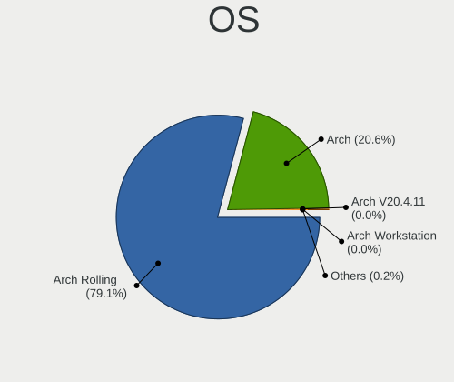

| Name             | Desktops | Percent |
|------------------|----------|---------|
| Arch Rolling     | 3992     | 79.1%   |
| Arch             | 1041     | 20.63%  |
| Arch V20.4.11    | 2        | 0.04%   |
| Arch V19.11.3    | 2        | 0.04%   |
| Arch Workstation | 1        | 0.02%   |
| Arch V20.3.4     | 1        | 0.02%   |
| Arch V19.09.1    | 1        | 0.02%   |
| Arch V19.07.11   | 1        | 0.02%   |
| Arch V19.05.2    | 1        | 0.02%   |
| Arch Breaking    | 1        | 0.02%   |
| Arch 2020.09.05  | 1        | 0.02%   |
| Arch 20.08.3     | 1        | 0.02%   |
| Arch 1.2         | 1        | 0.02%   |
| Arch 1.1         | 1        | 0.02%   |

OS Family
---------

OS without a version

| Name | Desktops | Percent |
|------|----------|---------|
| Arch | 4976     | 100%    |

Kernel
------

Version of the Linux kernel

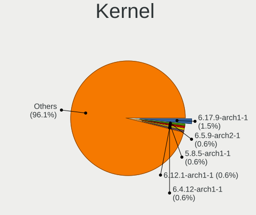

| Version           | Desktops | Percent |
|-------------------|----------|---------|
| 6.17.9-arch1-1    | 90       | 1.51%   |
| 6.5.9-arch2-1     | 38       | 0.64%   |
| 5.8.5-arch1-1     | 36       | 0.61%   |
| 6.12.1-arch1-1    | 35       | 0.59%   |
| 6.4.12-arch1-1    | 33       | 0.55%   |
| 6.6.1-arch1-1     | 32       | 0.54%   |
| 6.14.6-arch1-1    | 32       | 0.54%   |
| 6.12.10-arch1-1   | 31       | 0.52%   |
| 6.13.8-arch1-1    | 30       | 0.5%    |
| 6.12.4-arch1-1    | 29       | 0.49%   |
| 6.10.10-arch1-1   | 28       | 0.47%   |
| 5.9.14-arch1-1    | 28       | 0.47%   |
| 5.9.1-arch1-1     | 28       | 0.47%   |
| 5.17.1-arch1-1    | 28       | 0.47%   |
| 5.8.12-arch1-1    | 27       | 0.45%   |
| 6.17.8-arch1-1    | 25       | 0.42%   |
| 6.10.6-arch1-1    | 25       | 0.42%   |
| 5.17.9-arch1-1    | 25       | 0.42%   |
| 6.6.7-arch1-1     | 24       | 0.4%    |
| 6.17.5-arch1-1    | 24       | 0.4%    |
| 6.15.2-arch1-1    | 24       | 0.4%    |
| 6.14.2-arch1-1    | 24       | 0.4%    |
| 6.13.2-arch1-1    | 24       | 0.4%    |
| 6.6.8-arch1-1     | 23       | 0.39%   |
| 6.15.9-arch1-1    | 23       | 0.39%   |
| 6.11.6-arch1-1    | 23       | 0.39%   |
| 6.7.8-arch1-1     | 21       | 0.35%   |
| 6.17.9-zen1-1-zen | 21       | 0.35%   |
| 6.17.7-arch1-1    | 21       | 0.35%   |
| 6.16.8-arch3-1    | 21       | 0.35%   |
| 6.13.5-arch1-1    | 21       | 0.35%   |
| 6.1.12-arch1-1    | 21       | 0.35%   |
| 5.8.14-arch1-1    | 21       | 0.35%   |
| 5.17.5-arch1-1    | 21       | 0.35%   |
| 6.6.2-arch1-1     | 20       | 0.34%   |
| 6.3.9-arch1-1     | 20       | 0.34%   |
| 6.15.4-arch2-1    | 20       | 0.34%   |
| 6.13.7-arch1-1    | 20       | 0.34%   |
| 6.11.3-arch1-1    | 20       | 0.34%   |
| 5.8.10-arch1-1    | 20       | 0.34%   |

Kernel Family
-------------

Linux kernel without a distro release

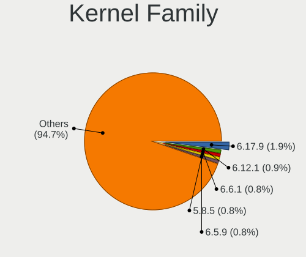

| Version | Desktops | Percent |
|---------|----------|---------|
| 6.17.9  | 115      | 1.93%   |
| 6.12.1  | 54       | 0.91%   |
| 6.6.1   | 49       | 0.82%   |
| 5.8.5   | 48       | 0.81%   |
| 6.5.9   | 47       | 0.79%   |
| 6.14.6  | 45       | 0.76%   |
| 6.14.2  | 45       | 0.76%   |
| 5.8.12  | 45       | 0.76%   |
| 6.12.10 | 43       | 0.72%   |
| 6.16.8  | 41       | 0.69%   |
| 6.13.8  | 40       | 0.67%   |
| 6.10.10 | 40       | 0.67%   |
| 6.4.12  | 38       | 0.64%   |
| 5.9.1   | 36       | 0.61%   |
| 5.17.1  | 35       | 0.59%   |
| 6.8.9   | 34       | 0.57%   |
| 6.8.2   | 34       | 0.57%   |
| 6.13.2  | 34       | 0.57%   |
| 5.11.6  | 34       | 0.57%   |
| 6.17.5  | 33       | 0.55%   |
| 6.12.4  | 33       | 0.55%   |
| 6.11.6  | 33       | 0.55%   |
| 6.10.6  | 33       | 0.55%   |
| 6.6.7   | 32       | 0.54%   |
| 6.17.8  | 32       | 0.54%   |
| 6.15.9  | 32       | 0.54%   |
| 6.14.4  | 32       | 0.54%   |
| 5.9.14  | 32       | 0.54%   |
| 6.8.7   | 31       | 0.52%   |
| 6.6.8   | 31       | 0.52%   |
| 6.17.7  | 31       | 0.52%   |
| 6.13.5  | 31       | 0.52%   |
| 5.8.10  | 31       | 0.52%   |
| 6.15.2  | 30       | 0.5%    |
| 6.7.8   | 29       | 0.49%   |
| 6.11.3  | 29       | 0.49%   |
| 5.8.14  | 29       | 0.49%   |
| 6.4.3   | 28       | 0.47%   |
| 5.17.9  | 28       | 0.47%   |
| 6.9.7   | 27       | 0.45%   |

Kernel Major Ver.
-----------------

Linux kernel major version

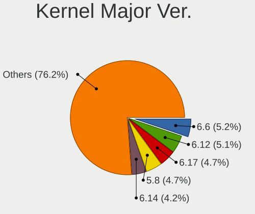

| Version | Desktops | Percent |
|---------|----------|---------|
| 6.6     | 298      | 5.18%   |
| 6.12    | 292      | 5.08%   |
| 6.17    | 269      | 4.68%   |
| 5.8     | 269      | 4.68%   |
| 6.14    | 240      | 4.17%   |
| 6.15    | 212      | 3.69%   |
| 6.1     | 203      | 3.53%   |
| 6.10    | 194      | 3.37%   |
| 6.13    | 191      | 3.32%   |
| 5.15    | 184      | 3.2%    |
| 6.11    | 177      | 3.08%   |
| 6.9     | 169      | 2.94%   |
| 6.4     | 166      | 2.89%   |
| 6.8     | 159      | 2.77%   |
| 6.7     | 159      | 2.77%   |
| 5.11    | 158      | 2.75%   |
| 6.16    | 155      | 2.7%    |
| 6.5     | 152      | 2.64%   |
| 5.9     | 152      | 2.64%   |
| 5.10    | 150      | 2.61%   |
| 5.12    | 144      | 2.5%    |
| 6.0     | 141      | 2.45%   |
| 5.4     | 140      | 2.44%   |
| 5.19    | 135      | 2.35%   |
| 6.2     | 131      | 2.28%   |
| 5.17    | 127      | 2.21%   |
| 6.3     | 122      | 2.12%   |
| 5.18    | 122      | 2.12%   |
| 5.6     | 107      | 1.86%   |
| 5.7     | 106      | 1.84%   |
| 5.16    | 93       | 1.62%   |
| 5.14    | 93       | 1.62%   |
| 5.13    | 78       | 1.36%   |
| 5.5     | 46       | 0.8%    |
| 5.3     | 42       | 0.73%   |
| 6.18    | 38       | 0.66%   |
| 4.19    | 26       | 0.45%   |
| 5.0     | 19       | 0.33%   |
| 4.18    | 19       | 0.33%   |
| 5.2     | 15       | 0.26%   |

Arch
----

OS architecture (x86_64, i586, etc.)

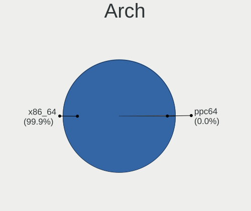

| Name        | Desktops | Percent |
|-------------|----------|---------|
| x86_64      | 4971     | 99.9%   |
| loongarch64 | 2        | 0.04%   |
| i686        | 2        | 0.04%   |
| ppc64       | 1        | 0.02%   |

DE
--

Desktop Environment

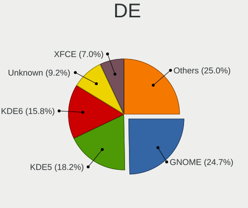

| Name                    | Desktops | Percent |
|-------------------------|----------|---------|
| GNOME                   | 1292     | 24.7%   |
| KDE5                    | 953      | 18.22%  |
| KDE6                    | 827      | 15.81%  |
| Unknown                 | 483      | 9.23%   |
| XFCE                    | 368      | 7.03%   |
| KDE                     | 289      | 5.52%   |
| Hyprland                | 252      | 4.82%   |
| i3                      | 202      | 3.86%   |
| X-Cinnamon              | 86       | 1.64%   |
| MATE                    | 55       | 1.05%   |
| Cinnamon                | 52       | 0.99%   |
| Budgie                  | 50       | 0.96%   |
| sway                    | 47       | 0.9%    |
| Deepin                  | 47       | 0.9%    |
| LXQt                    | 32       | 0.61%   |
| bspwm                   | 28       | 0.54%   |
| LXDE                    | 20       | 0.38%   |
| awesome                 | 17       | 0.32%   |
| Openbox                 | 14       | 0.27%   |
| GNOME Classic           | 14       | 0.27%   |
| qtile                   | 13       | 0.25%   |
| niri                    | 10       | 0.19%   |
| dwm                     | 8        | 0.15%   |
| xmonad                  | 6        | 0.11%   |
| COSMIC                  | 6        | 0.11%   |
| sway:wlroots            | 5        | 0.1%    |
| GNOME Flashback         | 5        | 0.1%    |
| leftwm                  | 4        | 0.08%   |
| i3-with-shmlog          | 4        | 0.08%   |
| chadwm                  | 4        | 0.08%   |
| wlroots                 | 3        | 0.06%   |
| Unity                   | 3        | 0.06%   |
| ICEWM                   | 3        | 0.06%   |
| Yaru:ubuntu:GNOME       | 2        | 0.04%   |
| Wayfire:wayfire:wlroots | 2        | 0.04%   |
| labwc:wlroots           | 2        | 0.04%   |
| GNUstep                 | 2        | 0.04%   |
| Enlightenment           | 2        | 0.04%   |
| xinitrc                 | 1        | 0.02%   |
| wds                     | 1        | 0.02%   |

Display Server
--------------

X11 or Wayland

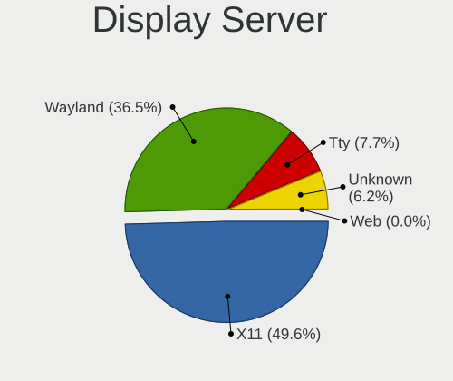

| Name    | Desktops | Percent |
|---------|----------|---------|
| X11     | 2573     | 49.57%  |
| Wayland | 1897     | 36.54%  |
| Tty     | 398      | 7.67%   |
| Unknown | 322      | 6.2%    |
| Web     | 1        | 0.02%   |

Display Manager
---------------

SDDM, LightDM, etc.

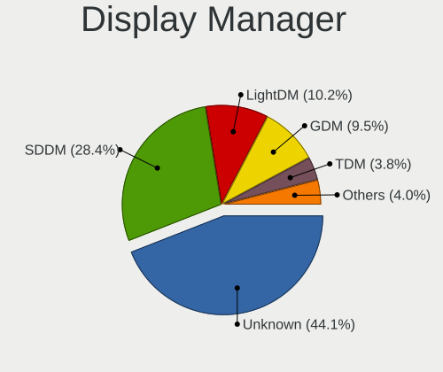

| Name    | Desktops | Percent |
|---------|----------|---------|
| Unknown | 2259     | 44.05%  |
| SDDM    | 1456     | 28.39%  |
| LightDM | 523      | 10.2%   |
| GDM     | 488      | 9.52%   |
| TDM     | 195      | 3.8%    |
| LY-DM   | 54       | 1.05%   |
| GREETD  | 38       | 0.74%   |
| Ly      | 36       | 0.7%    |
| LXDM    | 30       | 0.59%   |
| XDM     | 25       | 0.49%   |
| SLiM    | 13       | 0.25%   |
| LEMURS  | 4        | 0.08%   |
| NODM    | 3        | 0.06%   |
| EMPTTY  | 2        | 0.04%   |
| XINIT   | 1        | 0.02%   |
| KDM     | 1        | 0.02%   |

OS Lang
-------

Language

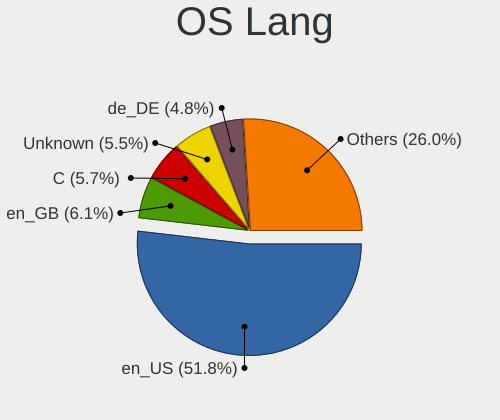

| Lang       | Desktops | Percent |
|------------|----------|---------|
| en_US      | 2627     | 51.82%  |
| en_GB      | 309      | 6.1%    |
| C          | 291      | 5.74%   |
| Unknown    | 281      | 5.54%   |
| de_DE      | 244      | 4.81%   |
| ru_RU      | 212      | 4.18%   |
| pt_BR      | 161      | 3.18%   |
| it_IT      | 125      | 2.47%   |
| fr_FR      | 95       | 1.87%   |
| pl_PL      | 71       | 1.4%    |
| es_ES      | 69       | 1.36%   |
| en_AU      | 61       | 1.2%    |
| en_CA      | 47       | 0.93%   |
| zh_CN      | 33       | 0.65%   |
| en_IE      | 33       | 0.65%   |
| en_IN      | 28       | 0.55%   |
| tr_TR      | 26       | 0.51%   |
| en_DK      | 22       | 0.43%   |
| hu_HU      | 21       | 0.41%   |
| es_AR      | 19       | 0.37%   |
| de_AT      | 16       | 0.32%   |
| es_MX      | 15       | 0.3%    |
| en_NZ      | 14       | 0.28%   |
| pt_PT      | 12       | 0.24%   |
| es_CL      | 11       | 0.22%   |
| nl_NL      | 10       | 0.2%    |
| fi_FI      | 10       | 0.2%    |
| sv_SE      | 9        | 0.18%   |
| ja_JP      | 9        | 0.18%   |
| es_CO      | 9        | 0.18%   |
| en_DE      | 9        | 0.18%   |
| en_ZA      | 8        | 0.16%   |
| ru_UA      | 7        | 0.14%   |
| en_US.UTF8 | 7        | 0.14%   |
| de_CH      | 7        | 0.14%   |
| uk_UA      | 6        | 0.12%   |
| nb_NO      | 6        | 0.12%   |
| cs_CZ      | 6        | 0.12%   |
| es_VE      | 5        | 0.1%    |
| et_EE      | 4        | 0.08%   |

Boot Mode
---------

EFI or BIOS

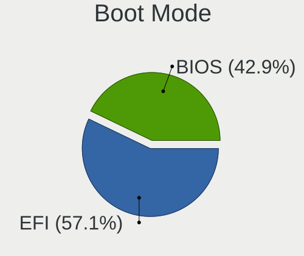

| Mode | Desktops | Percent |
|------|----------|---------|
| EFI  | 2892     | 57.11%  |
| BIOS | 2172     | 42.89%  |

Filesystem
----------

Type of filesystem

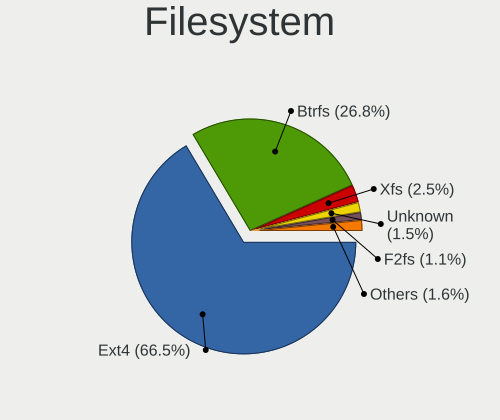

| Type     | Desktops | Percent |
|----------|----------|---------|
| Ext4     | 3364     | 66.46%  |
| Btrfs    | 1359     | 26.85%  |
| Xfs      | 129      | 2.55%   |
| Unknown  | 74       | 1.46%   |
| F2fs     | 56       | 1.11%   |
| Overlay  | 31       | 0.61%   |
| Zfs      | 22       | 0.43%   |
| Tmpfs    | 16       | 0.32%   |
| Ext2     | 3        | 0.06%   |
| XXXXX    | 2        | 0.04%   |
| Bcachefs | 2        | 0.04%   |
| XXX      | 1        | 0.02%   |
| Reiserfs | 1        | 0.02%   |
| Jfs      | 1        | 0.02%   |
| Ext3     | 1        | 0.02%   |

Part. scheme
------------

Scheme of partitioning

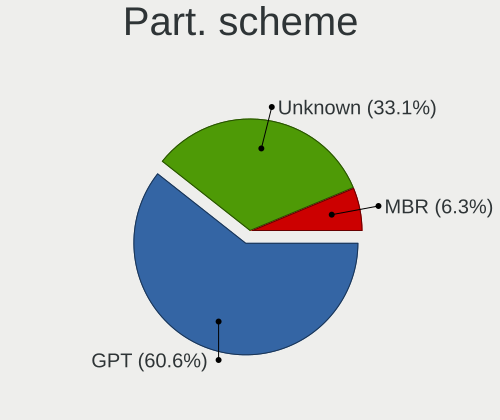

| Type    | Desktops | Percent |
|---------|----------|---------|
| GPT     | 3061     | 60.63%  |
| Unknown | 1671     | 33.1%   |
| MBR     | 317      | 6.28%   |

Dual Boot with Linux/BSD
------------------------

Hosting more than one Linux/BSD

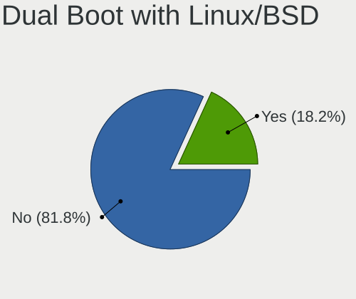

| Dual boot | Desktops | Percent |
|-----------|----------|---------|
| No        | 4161     | 81.83%  |
| Yes       | 924      | 18.17%  |

Dual Boot (Win)
---------------

Hosting Linux and Windows

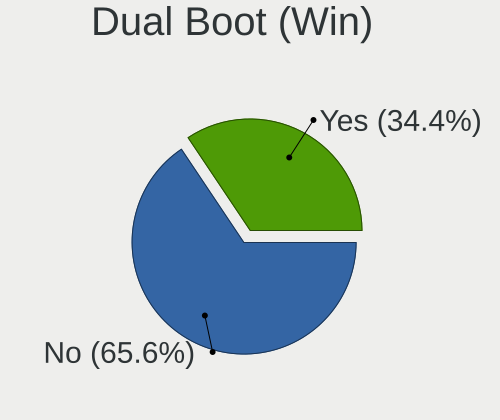

| Dual boot | Desktops | Percent |
|-----------|----------|---------|
| No        | 3333     | 65.61%  |
| Yes       | 1747     | 34.39%  |

Board
-----

Vendor
------

Motherboard manufacturer

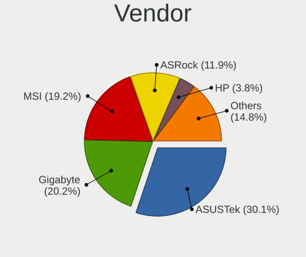

| Name                                 | Desktops | Percent |
|--------------------------------------|----------|---------|
| ASUSTek Computer                     | 1500     | 30.14%  |
| Gigabyte Technology                  | 1007     | 20.24%  |
| MSI                                  | 957      | 19.23%  |
| ASRock                               | 590      | 11.86%  |
| Hewlett-Packard                      | 188      | 3.78%   |
| Dell                                 | 173      | 3.48%   |
| Lenovo                               | 83       | 1.67%   |
| Intel                                | 83       | 1.67%   |
| Unknown                              | 52       | 1.05%   |
| Acer                                 | 43       | 0.86%   |
| Biostar                              | 30       | 0.6%    |
| Huanan                               | 19       | 0.38%   |
| ECS                                  | 19       | 0.38%   |
| Shenzhen Meigao Electronic Equipment | 18       | 0.36%   |
| Fujitsu                              | 16       | 0.32%   |
| Pegatron                             | 14       | 0.28%   |
| AZW                                  | 13       | 0.26%   |
| Medion                               | 10       | 0.2%    |
| MACHINIST                            | 10       | 0.2%    |
| Apple                                | 9        | 0.18%   |
| Foxconn                              | 8        | 0.16%   |
| Positivo                             | 7        | 0.14%   |
| NZXT                                 | 5        | 0.1%    |
| GEEKOM                               | 5        | 0.1%    |
| Shuttle                              | 4        | 0.08%   |
| MAXSUN                               | 4        | 0.08%   |
| JGINYUE                              | 4        | 0.08%   |
| EVGA                                 | 4        | 0.08%   |
| Colorful Technology                  | 4        | 0.08%   |
| Alienware                            | 4        | 0.08%   |
| Supermicro                           | 3        | 0.06%   |
| Semp Toshiba                         | 3        | 0.06%   |
| PCWare                               | 3        | 0.06%   |
| OEM                                  | 3        | 0.06%   |
| GMKtec                               | 3        | 0.06%   |
| Gateway                              | 3        | 0.06%   |
| BESSTAR Tech                         | 3        | 0.06%   |
| AMI                                  | 3        | 0.06%   |
| AAEON                                | 3        | 0.06%   |
| TYAN Computer                        | 2        | 0.04%   |

Model
-----

Motherboard model

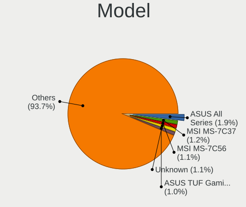

| Name                             | Desktops | Percent |
|----------------------------------|----------|---------|
| ASUS All Series                  | 96       | 1.93%   |
| MSI MS-7C37                      | 59       | 1.19%   |
| MSI MS-7C56                      | 55       | 1.11%   |
| Unknown                          | 54       | 1.09%   |
| ASUS TUF Gaming X570-PLUS        | 51       | 1.02%   |
| MSI MS-7C91                      | 50       | 1%      |
| MSI MS-7B86                      | 47       | 0.94%   |
| MSI MS-7C02                      | 44       | 0.88%   |
| Gigabyte B450M DS3H              | 36       | 0.72%   |
| ASUS ROG STRIX B550-F GAMING     | 35       | 0.7%    |
| MSI MS-7C95                      | 29       | 0.58%   |
| Gigabyte X570 AORUS ELITE        | 27       | 0.54%   |
| MSI MS-7B79                      | 25       | 0.5%    |
| ASUS PRIME X470-PRO              | 24       | 0.48%   |
| MSI MS-7D75                      | 23       | 0.46%   |
| MSI MS-7A34                      | 23       | 0.46%   |
| ASUS ROG STRIX B450-F GAMING     | 23       | 0.46%   |
| MSI MS-7B89                      | 22       | 0.44%   |
| MSI MS-7A38                      | 22       | 0.44%   |
| ASUS TUF Gaming B550-PLUS        | 20       | 0.4%    |
| ASUS ROG STRIX X570-E GAMING     | 20       | 0.4%    |
| ASUS PRIME B450M-A               | 20       | 0.4%    |
| Gigabyte X470 AORUS ULTRA GAMING | 18       | 0.36%   |
| Gigabyte B450 AORUS ELITE        | 17       | 0.34%   |
| ASUS PRIME A320M-K               | 17       | 0.34%   |
| ASRock B550M Pro4                | 17       | 0.34%   |
| Gigabyte B550I AORUS PRO AX      | 16       | 0.32%   |
| ASUS PRIME X570-P                | 16       | 0.32%   |
| ASUS PRIME X370-PRO              | 16       | 0.32%   |
| ASRock X570 Taichi               | 16       | 0.32%   |
| ASRock B450M Steel Legend        | 16       | 0.32%   |
| MSI MS-7E26                      | 15       | 0.3%    |
| Gigabyte B550 AORUS ELITE V2     | 15       | 0.3%    |
| ASRock B450M Pro4                | 15       | 0.3%    |
| MSI MS-7C96                      | 14       | 0.28%   |
| MSI MS-7C84                      | 14       | 0.28%   |
| Gigabyte B550M DS3H              | 14       | 0.28%   |
| ASUS TUF Gaming B550M-PLUS       | 14       | 0.28%   |
| ASUS ROG CROSSHAIR VIII HERO     | 14       | 0.28%   |
| MSI MS-7B98                      | 13       | 0.26%   |

Model Family
------------

Motherboard model prefix

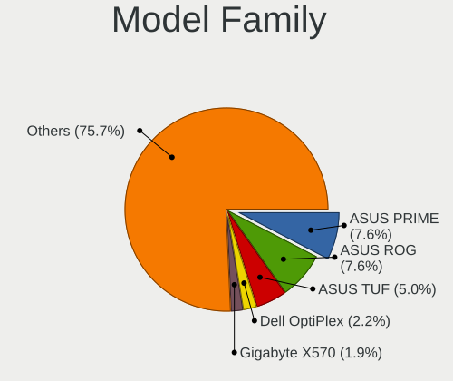

| Name               | Desktops | Percent |
|--------------------|----------|---------|
| ASUS PRIME         | 379      | 7.62%   |
| ASUS ROG           | 377      | 7.58%   |
| ASUS TUF           | 248      | 4.98%   |
| Dell OptiPlex      | 109      | 2.19%   |
| Gigabyte X570      | 97       | 1.95%   |
| ASUS All           | 96       | 1.93%   |
| Gigabyte B450M     | 66       | 1.33%   |
| MSI MS-7C37        | 59       | 1.19%   |
| Gigabyte B550      | 59       | 1.19%   |
| MSI MS-7C56        | 55       | 1.11%   |
| Unknown            | 54       | 1.09%   |
| Gigabyte B450      | 52       | 1.05%   |
| MSI MS-7C91        | 50       | 1%      |
| MSI MS-7B86        | 47       | 0.94%   |
| ASRock X570        | 46       | 0.92%   |
| MSI MS-7C02        | 44       | 0.88%   |
| ASRock B450M       | 43       | 0.86%   |
| Lenovo ThinkCentre | 40       | 0.8%    |
| Gigabyte B550M     | 40       | 0.8%    |
| HP Compaq          | 37       | 0.74%   |
| Gigabyte B650      | 36       | 0.72%   |
| ASRock B450        | 34       | 0.68%   |
| MSI MS-7C95        | 29       | 0.58%   |
| Gigabyte Z390      | 29       | 0.58%   |
| ASRock B550M       | 29       | 0.58%   |
| HP EliteDesk       | 26       | 0.52%   |
| Dell Precision     | 26       | 0.52%   |
| MSI MS-7B79        | 25       | 0.5%    |
| Gigabyte X470      | 25       | 0.5%    |
| Acer Aspire        | 24       | 0.48%   |
| MSI MS-7D75        | 23       | 0.46%   |
| MSI MS-7A34        | 23       | 0.46%   |
| MSI MS-7B89        | 22       | 0.44%   |
| MSI MS-7A38        | 22       | 0.44%   |
| HP Pavilion        | 22       | 0.44%   |
| ASRock B550        | 22       | 0.44%   |
| HP ProDesk         | 21       | 0.42%   |
| ASUS STRIX         | 21       | 0.42%   |
| ASUS Maximus       | 21       | 0.42%   |
| ASUS P8Z77-V       | 19       | 0.38%   |

MFG Year
--------

Motherboard manufacture year

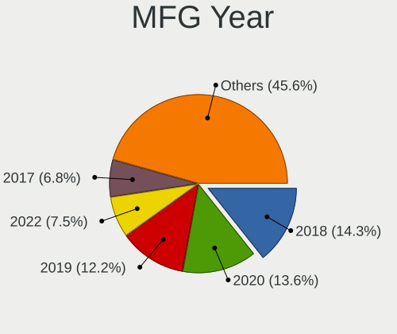

| Year    | Desktops | Percent |
|---------|----------|---------|
| 2018    | 712      | 14.31%  |
| 2020    | 675      | 13.57%  |
| 2019    | 609      | 12.24%  |
| 2022    | 373      | 7.5%    |
| 2017    | 336      | 6.75%   |
| 2021    | 317      | 6.37%   |
| 2012    | 268      | 5.39%   |
| 2023    | 261      | 5.25%   |
| 2013    | 223      | 4.48%   |
| 2014    | 222      | 4.46%   |
| 2016    | 220      | 4.42%   |
| 2015    | 168      | 3.38%   |
| 2024    | 163      | 3.28%   |
| 2011    | 152      | 3.05%   |
| 2010    | 92       | 1.85%   |
| 2009    | 69       | 1.39%   |
| 2008    | 38       | 0.76%   |
| 2007    | 35       | 0.7%    |
| 2025    | 22       | 0.44%   |
| 2006    | 11       | 0.22%   |
| Unknown | 5        | 0.1%    |
| 2005    | 3        | 0.06%   |
| 2003    | 1        | 0.02%   |
| 2002    | 1        | 0.02%   |

Form Factor
-----------

Physical design of the computer

| Name    | Desktops | Percent |
|---------|----------|---------|
| Desktop | 4976     | 100%    |

Secure Boot
-----------

Enabled or disabled

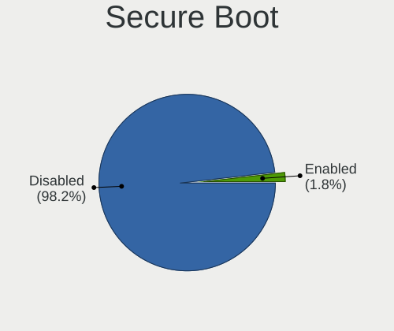

| State    | Desktops | Percent |
|----------|----------|---------|
| Disabled | 4905     | 98.2%   |
| Enabled  | 90       | 1.8%    |

Coreboot
--------

Have coreboot on board

| Used | Desktops | Percent |
|------|----------|---------|
| No   | 4972     | 99.92%  |
| Yes  | 4        | 0.08%   |

RAM Size
--------

Total RAM memory

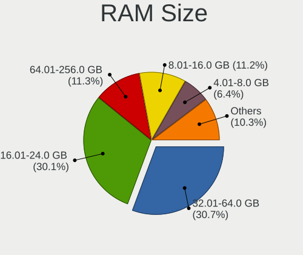

| Size in GB      | Desktops | Percent |
|-----------------|----------|---------|
| 32.01-64.0      | 1555     | 30.67%  |
| 16.01-24.0      | 1528     | 30.14%  |
| 64.01-256.0     | 573      | 11.3%   |
| 8.01-16.0       | 566      | 11.16%  |
| 4.01-8.0        | 327      | 6.45%   |
| 24.01-32.0      | 313      | 6.17%   |
| 3.01-4.0        | 150      | 2.96%   |
| 1.01-2.0        | 25       | 0.49%   |
| 2.01-3.0        | 16       | 0.32%   |
| More than 256.0 | 7        | 0.14%   |
| 0.51-1.0        | 7        | 0.14%   |
| Unknown         | 2        | 0.04%   |
| 0.01-0.5        | 1        | 0.02%   |

RAM Used
--------

Used RAM memory

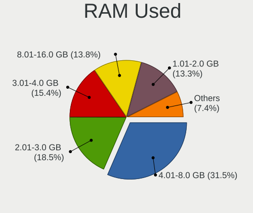

| Used GB     | Desktops | Percent |
|-------------|----------|---------|
| 4.01-8.0    | 1731     | 31.52%  |
| 2.01-3.0    | 1016     | 18.5%   |
| 3.01-4.0    | 847      | 15.43%  |
| 8.01-16.0   | 757      | 13.79%  |
| 1.01-2.0    | 732      | 13.33%  |
| 16.01-24.0  | 146      | 2.66%   |
| 0.51-1.0    | 125      | 2.28%   |
| 24.01-32.0  | 49       | 0.89%   |
| 32.01-64.0  | 41       | 0.75%   |
| 0.01-0.5    | 40       | 0.73%   |
| 64.01-256.0 | 5        | 0.09%   |
| Unknown     | 2        | 0.04%   |

Total Drives
------------

Number of drives on board

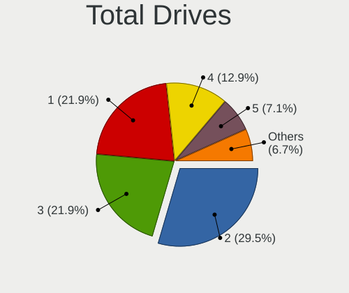

| Drives | Desktops | Percent |
|--------|----------|---------|
| 2      | 1542     | 29.52%  |
| 3      | 1145     | 21.92%  |
| 1      | 1142     | 21.86%  |
| 4      | 672      | 12.87%  |
| 5      | 372      | 7.12%   |
| 6      | 167      | 3.2%    |
| 7      | 82       | 1.57%   |
| 8      | 37       | 0.71%   |
| 9      | 25       | 0.48%   |
| 0      | 13       | 0.25%   |
| 10     | 8        | 0.15%   |
| 12     | 7        | 0.13%   |
| 11     | 4        | 0.08%   |
| 14     | 2        | 0.04%   |
| 13     | 2        | 0.04%   |
| 22     | 1        | 0.02%   |
| 17     | 1        | 0.02%   |
| 15     | 1        | 0.02%   |

Has CD-ROM
----------

Has CD-ROM on board

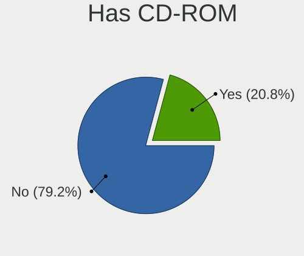

| Presented | Desktops | Percent |
|-----------|----------|---------|
| No        | 3980     | 79.19%  |
| Yes       | 1046     | 20.81%  |

Has Ethernet
------------

Has Ethernet on board

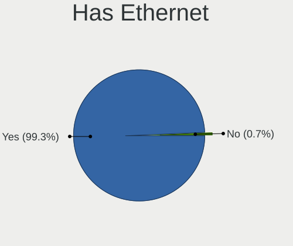

| Presented | Desktops | Percent |
|-----------|----------|---------|
| Yes       | 4943     | 99.32%  |
| No        | 34       | 0.68%   |

Has WiFi
--------

Has WiFi module

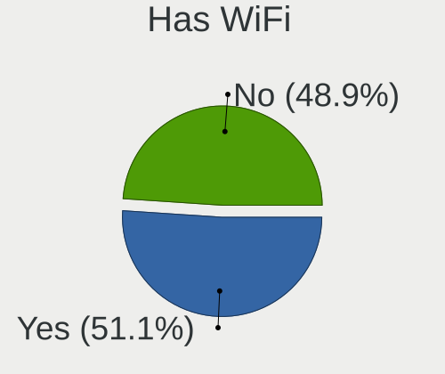

| Presented | Desktops | Percent |
|-----------|----------|---------|
| Yes       | 2570     | 51.05%  |
| No        | 2464     | 48.95%  |

Has Bluetooth
-------------

Has Bluetooth module

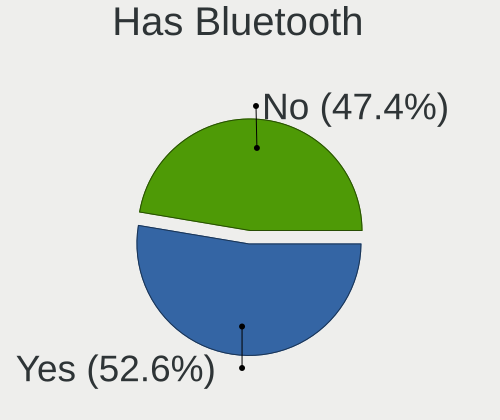

| Presented | Desktops | Percent |
|-----------|----------|---------|
| Yes       | 2659     | 52.64%  |
| No        | 2392     | 47.36%  |

Location
--------

Country
-------

Geographic location (country)

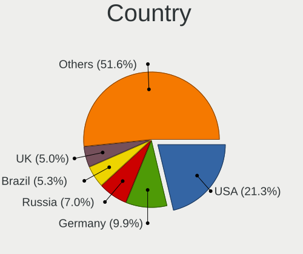

| Country     | Desktops | Percent |
|-------------|----------|---------|
| USA         | 1065     | 21.27%  |
| Germany     | 495      | 9.89%   |
| Russia      | 351      | 7.01%   |
| Brazil      | 263      | 5.25%   |
| UK          | 249      | 4.97%   |
| Italy       | 207      | 4.13%   |
| France      | 178      | 3.56%   |
| Poland      | 171      | 3.42%   |
| Canada      | 144      | 2.88%   |
| Spain       | 110      | 2.2%    |
| Australia   | 107      | 2.14%   |
| Netherlands | 104      | 2.08%   |
| Sweden      | 83       | 1.66%   |
| Austria     | 76       | 1.52%   |
| India       | 74       | 1.48%   |
| Finland     | 71       | 1.42%   |
| China       | 63       | 1.26%   |
| Turkey      | 59       | 1.18%   |
| Ukraine     | 57       | 1.14%   |
| Switzerland | 51       | 1.02%   |
| Hungary     | 48       | 0.96%   |
| Argentina   | 46       | 0.92%   |
| Romania     | 40       | 0.8%    |
| Norway      | 40       | 0.8%    |
| Mexico      | 38       | 0.76%   |
| Czechia     | 38       | 0.76%   |
| Greece      | 37       | 0.74%   |
| Denmark     | 34       | 0.68%   |
| Chile       | 31       | 0.62%   |
| New Zealand | 28       | 0.56%   |
| Bulgaria    | 28       | 0.56%   |
| Belgium     | 28       | 0.56%   |
| Vietnam     | 26       | 0.52%   |
| Portugal    | 25       | 0.5%    |
| Japan       | 25       | 0.5%    |
| Israel      | 25       | 0.5%    |
| Hong Kong   | 21       | 0.42%   |
| Ireland     | 20       | 0.4%    |
| Estonia     | 19       | 0.38%   |
| Colombia    | 19       | 0.38%   |

City
----

Geographic location (city)

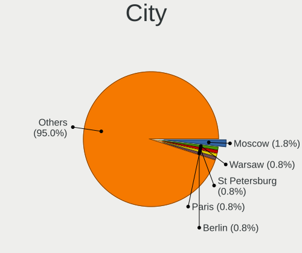

| City              | Desktops | Percent |
|-------------------|----------|---------|
| Moscow            | 94       | 1.79%   |
| Warsaw            | 43       | 0.82%   |
| St Petersburg     | 43       | 0.82%   |
| Paris             | 41       | 0.78%   |
| Berlin            | 41       | 0.78%   |
| Vienna            | 38       | 0.72%   |
| Sao Paulo         | 37       | 0.7%    |
| Melbourne         | 37       | 0.7%    |
| Helsinki          | 36       | 0.68%   |
| Amsterdam         | 28       | 0.53%   |
| Sydney            | 27       | 0.51%   |
| Rome              | 26       | 0.49%   |
| Munich            | 26       | 0.49%   |
| Los Angeles       | 26       | 0.49%   |
| London            | 26       | 0.49%   |
| Milan             | 22       | 0.42%   |
| Hamburg           | 21       | 0.4%    |
| Frankfurt am Main | 21       | 0.4%    |
| Seattle           | 20       | 0.38%   |
| New York          | 20       | 0.38%   |
| Zurich            | 17       | 0.32%   |
| Dublin            | 17       | 0.32%   |
| Chicago           | 17       | 0.32%   |
| Istanbul          | 16       | 0.3%    |
| Ho Chi Minh City  | 16       | 0.3%    |
| Budapest          | 16       | 0.3%    |
| Athens            | 16       | 0.3%    |
| Singapore         | 15       | 0.28%   |
| Rio de Janeiro    | 15       | 0.28%   |
| Krakow            | 15       | 0.28%   |
| Tallinn           | 14       | 0.27%   |
| Prague            | 14       | 0.27%   |
| Dallas            | 14       | 0.27%   |
| Yekaterinburg     | 13       | 0.25%   |
| Toronto           | 13       | 0.25%   |
| Stockholm         | 13       | 0.25%   |
| Santiago          | 13       | 0.25%   |
| Phoenix           | 13       | 0.25%   |
| Madrid            | 13       | 0.25%   |
| Barcelona         | 13       | 0.25%   |

Drives
------

Drive Vendor
------------

Hard drive vendors

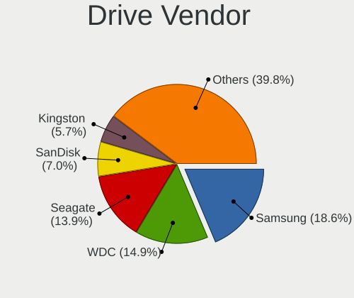

| Vendor                       | Desktops | Drives | Percent |
|------------------------------|----------|--------|---------|
| Samsung Electronics          | 2051     | 3747   | 18.65%  |
| WDC                          | 1644     | 2767   | 14.95%  |
| Seagate                      | 1527     | 2438   | 13.88%  |
| SanDisk                      | 774      | 1158   | 7.04%   |
| Kingston                     | 630      | 881    | 5.73%   |
| Crucial                      | 553      | 786    | 5.03%   |
| Toshiba                      | 492      | 714    | 4.47%   |
| Micron/Crucial Technology    | 258      | 336    | 2.35%   |
| Phison Electronics           | 208      | 272    | 1.89%   |
| Kingston Technology Company  | 184      | 219    | 1.67%   |
| Intel                        | 184      | 245    | 1.67%   |
| Hitachi                      | 178      | 243    | 1.62%   |
| A-DATA Technology            | 157      | 206    | 1.43%   |
| HGST                         | 113      | 174    | 1.03%   |
| China                        | 107      | 142    | 0.97%   |
| ADATA Technology             | 104      | 155    | 0.95%   |
| Silicon Motion               | 103      | 129    | 0.94%   |
| Micron Technology            | 96       | 123    | 0.87%   |
| SK hynix                     | 94       | 137    | 0.85%   |
| MAXIO Technology (Hangzhou)  | 94       | 114    | 0.85%   |
| Phison                       | 88       | 119    | 0.8%    |
| Unknown                      | 71       | 99     | 0.65%   |
| Realtek Semiconductor        | 66       | 77     | 0.6%    |
| SPCC                         | 60       | 70     | 0.55%   |
| OCZ                          | 59       | 78     | 0.54%   |
| PNY                          | 57       | 71     | 0.52%   |
| Patriot                      | 52       | 63     | 0.47%   |
| Corsair                      | 50       | 65     | 0.45%   |
| Shenzhen Longsys Electronics | 40       | 51     | 0.36%   |
| KIOXIA                       | 36       | 46     | 0.33%   |
| GOODRAM                      | 35       | 49     | 0.32%   |
| Team                         | 34       | 47     | 0.31%   |
| Lexar                        | 32       | 36     | 0.29%   |
| Intenso                      | 28       | 29     | 0.25%   |
| Gigabyte Technology          | 26       | 32     | 0.24%   |
| Transcend                    | 24       | 39     | 0.22%   |
| Unknown                      | 24       | 28     | 0.22%   |
| XPG                          | 21       | 28     | 0.19%   |
| Hewlett-Packard              | 21       | 22     | 0.19%   |
| Plextor                      | 20       | 30     | 0.18%   |

Drive Model
-----------

Hard drive models

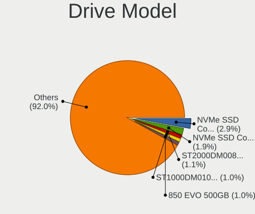

| Model                                                              | Desktops | Percent |
|--------------------------------------------------------------------|----------|---------|
| Samsung NVMe SSD Controller SM981/PM981/PM983 1TB                  | 385      | 2.92%   |
| Samsung NVMe SSD Controller PM9A1/PM9A3/980PRO 1TB                 | 255      | 1.94%   |
| Seagate ST2000DM008-2FR102 2TB                                     | 147      | 1.12%   |
| Seagate ST1000DM010-2EP102 1TB                                     | 136      | 1.03%   |
| Samsung SSD 850 EVO 500GB                                          | 134      | 1.02%   |
| Samsung SSD 860 EVO 500GB                                          | 129      | 0.98%   |
| Samsung SSD 860 EVO 1TB                                            | 126      | 0.96%   |
| Kingston SA400S37240G 240GB SSD                                    | 125      | 0.95%   |
| Samsung SSD 850 EVO 250GB                                          | 114      | 0.87%   |
| Micron/Crucial P2 NVMe PCIe SSD 2TB                                | 105      | 0.8%    |
| WDC WD10EZEX-08WN4A0 1TB                                           | 101      | 0.77%   |
| Kingston SA400S37480G 480GB SSD                                    | 96       | 0.73%   |
| Crucial CT1000MX500SSD1 1TB                                        | 89       | 0.68%   |
| Crucial CT500MX500SSD1 500GB                                       | 84       | 0.64%   |
| Seagate ST4000DM004-2CV104 4TB                                     | 80       | 0.61%   |
| Toshiba DT01ACA100 1TB                                             | 79       | 0.6%    |
| Seagate ST500DM002-1BD142 500GB                                    | 74       | 0.56%   |
| Phison E12 NVMe Controller 1TB                                     | 73       | 0.55%   |
| Samsung SSD 980 1TB                                                | 70       | 0.53%   |
| ADATA XPG SX8200 Pro PCIe Gen3x4 M.2 2280 Solid State Drive 1024GB | 64       | 0.49%   |
| Toshiba HDWD110 1TB                                                | 61       | 0.46%   |
| Seagate ST2000DM006-2DM164 2TB                                     | 61       | 0.46%   |
| Kingston SA400S37120G 120GB SSD                                    | 60       | 0.46%   |
| MAXIO (Hangzhou) NVMe SSD Controller MAP1202 2TB                   | 59       | 0.45%   |
| Samsung SSD 840 EVO 250GB                                          | 56       | 0.43%   |
| Seagate ST1000DM003-1CH162 1TB                                     | 55       | 0.42%   |
| Samsung SSD 970 EVO Plus 1TB                                       | 54       | 0.41%   |
| Samsung SSD 860 QVO 1TB                                            | 54       | 0.41%   |
| Samsung SSD 860 EVO 250GB                                          | 54       | 0.41%   |
| Sandisk WD Blue SN550 NVMe SSD 1024GB                              | 52       | 0.39%   |
| Samsung NVMe SSD Controller SM961/PM961/SM963 1024GB               | 52       | 0.39%   |
| Crucial CT480BX500SSD1 480GB                                       | 52       | 0.39%   |
| Seagate ST1000DM003-1ER162 1TB                                     | 51       | 0.39%   |
| Phison E16 PCIe4 NVMe Controller 1TB                               | 51       | 0.39%   |
| WDC WD10EZEX-00BN5A0 1TB                                           | 50       | 0.38%   |
| Samsung SSD 870 QVO 1TB                                            | 50       | 0.38%   |
| Samsung SSD 990 PRO 2TB                                            | 48       | 0.36%   |
| Kingston SV300S37A120G 120GB SSD                                   | 48       | 0.36%   |
| Samsung NVMe SSD Drive 1TB                                         | 47       | 0.36%   |
| WDC WD20EZRZ-00Z5HB0 2TB                                           | 45       | 0.34%   |

HDD Vendor
----------

Hard disk drive vendors

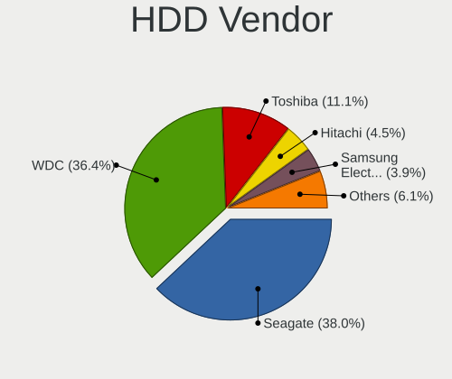

| Vendor              | Desktops | Drives | Percent |
|---------------------|----------|--------|---------|
| Seagate             | 1493     | 2369   | 37.98%  |
| WDC                 | 1432     | 2349   | 36.43%  |
| Toshiba             | 438      | 613    | 11.14%  |
| Hitachi             | 178      | 243    | 4.53%   |
| Samsung Electronics | 152      | 197    | 3.87%   |
| HGST                | 110      | 171    | 2.8%    |
| Unknown             | 27       | 37     | 0.69%   |
| Maxtor              | 16       | 18     | 0.41%   |
| JMicron Technology  | 14       | 33     | 0.36%   |
| Apple               | 9        | 13     | 0.23%   |
| Fujitsu             | 6        | 6      | 0.15%   |
| TO Exter            | 5        | 6      | 0.13%   |
| Hewlett-Packard     | 5        | 4      | 0.13%   |
| USB3.0              | 3        | 4      | 0.08%   |
| HGST HTS            | 3        | 3      | 0.08%   |
| ASMT                | 3        | 3      | 0.08%   |
| ASMedia             | 3        | 3      | 0.08%   |
| T-FORCE             | 2        | 3      | 0.05%   |
| LaCie               | 2        | 2      | 0.05%   |
| HGST HUS            | 2        | 2      | 0.05%   |
| ASUSTOR             | 2        | 4      | 0.05%   |
| Unknown             | 2        | 2      | 0.05%   |
| WD MediaMax         | 1        | 1      | 0.03%   |
| WALRAM              | 1        | 1      | 0.03%   |
| USB                 | 1        | 1      | 0.03%   |
| TrueNAS             | 1        | 1      | 0.03%   |
| TDAS                | 1        | 4      | 0.03%   |
| TANDBERG            | 1        | 1      | 0.03%   |
| Synology            | 1        | 1      | 0.03%   |
| StoreJet            | 1        | 1      | 0.03%   |
| SSK                 | 1        | 1      | 0.03%   |
| SABRENT             | 1        | 1      | 0.03%   |
| RSH-319             | 1        | 1      | 0.03%   |
| QNAP                | 1        | 17     | 0.03%   |
| MSFT                | 1        | 2      | 0.03%   |
| MaxDigital          | 1        | 1      | 0.03%   |
| MARVELL             | 1        | 1      | 0.03%   |
| Magnetic Data       | 1        | 1      | 0.03%   |
| LIO-ORG             | 1        | 2      | 0.03%   |
| Intenso             | 1        | 1      | 0.03%   |

SSD Vendor
----------

Solid state drive vendors

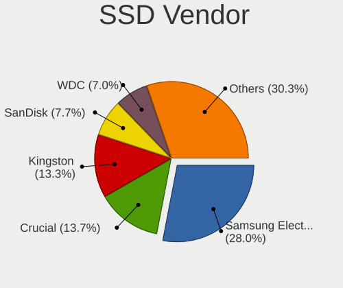

| Vendor              | Desktops | Drives | Percent |
|---------------------|----------|--------|---------|
| Samsung Electronics | 1080     | 1661   | 28.02%  |
| Crucial             | 528      | 752    | 13.7%   |
| Kingston            | 513      | 696    | 13.31%  |
| SanDisk             | 298      | 455    | 7.73%   |
| WDC                 | 269      | 349    | 6.98%   |
| A-DATA Technology   | 124      | 162    | 3.22%   |
| China               | 106      | 141    | 2.75%   |
| Intel               | 66       | 88     | 1.71%   |
| OCZ                 | 59       | 78     | 1.53%   |
| SPCC                | 55       | 64     | 1.43%   |
| PNY                 | 53       | 67     | 1.38%   |
| Patriot             | 51       | 62     | 1.32%   |
| GOODRAM             | 34       | 48     | 0.88%   |
| Toshiba             | 32       | 67     | 0.83%   |
| Team                | 30       | 36     | 0.78%   |
| Lexar               | 30       | 34     | 0.78%   |
| Corsair             | 28       | 35     | 0.73%   |
| Intenso             | 27       | 28     | 0.7%    |
| Micron Technology   | 26       | 29     | 0.67%   |
| Transcend           | 21       | 36     | 0.54%   |
| SK hynix            | 19       | 21     | 0.49%   |
| Apacer              | 19       | 20     | 0.49%   |
| Plextor             | 17       | 19     | 0.44%   |
| Gigabyte Technology | 17       | 21     | 0.44%   |
| Unknown             | 16       | 20     | 0.42%   |
| LITEON              | 14       | 14     | 0.36%   |
| SABRENT             | 13       | 15     | 0.34%   |
| Seagate             | 12       | 18     | 0.31%   |
| Mushkin             | 11       | 16     | 0.29%   |
| LITEONIT            | 11       | 12     | 0.29%   |
| KingSpec            | 11       | 11     | 0.29%   |
| Verbatim            | 10       | 18     | 0.26%   |
| T-FORCE             | 10       | 10     | 0.26%   |
| KIOXIA-EXCERIA      | 10       | 16     | 0.26%   |
| Netac               | 9        | 9      | 0.23%   |
| Hewlett-Packard     | 9        | 10     | 0.23%   |
| Fanxiang            | 9        | 9      | 0.23%   |
| AMD                 | 9        | 10     | 0.23%   |
| XrayDisk            | 7        | 10     | 0.18%   |
| Emtec               | 7        | 7      | 0.18%   |

Drive Kind
----------

HDD or SSD

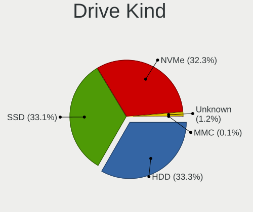

| Kind    | Desktops | Drives | Percent |
|---------|----------|--------|---------|
| HDD     | 3014     | 6132   | 33.3%   |
| SSD     | 2993     | 5408   | 33.07%  |
| NVMe    | 2922     | 5150   | 32.28%  |
| Unknown | 109      | 133    | 1.2%    |
| MMC     | 13       | 13     | 0.14%   |

Drive Connector
---------------

SATA, SAS, NVMe, etc.

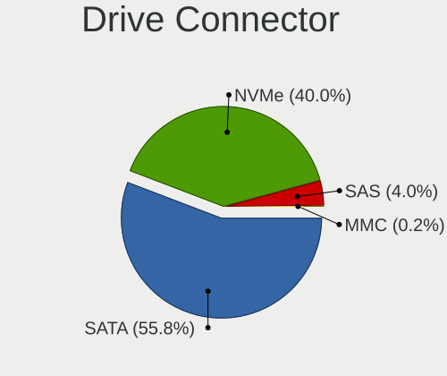

| Type | Desktops | Drives | Percent |
|------|----------|--------|---------|
| SATA | 4072     | 11262  | 55.8%   |
| NVMe | 2918     | 5127   | 39.98%  |
| SAS  | 295      | 434    | 4.04%   |
| MMC  | 13       | 13     | 0.18%   |

Drive Size
----------

Size of hard drive

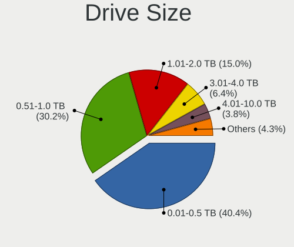

| Size in TB | Desktops | Drives | Percent |
|------------|----------|--------|---------|
| 0.01-0.5   | 2746     | 4973   | 40.38%  |
| 0.51-1.0   | 2053     | 3302   | 30.19%  |
| 1.01-2.0   | 1021     | 1561   | 15.01%  |
| 3.01-4.0   | 435      | 738    | 6.4%    |
| 4.01-10.0  | 256      | 475    | 3.76%   |
| 2.01-3.0   | 213      | 340    | 3.13%   |
| 10.01-20.0 | 74       | 145    | 1.09%   |
| 20.01-50.0 | 3        | 6      | 0.04%   |

Space Total
-----------

Amount of disk space available on the file system

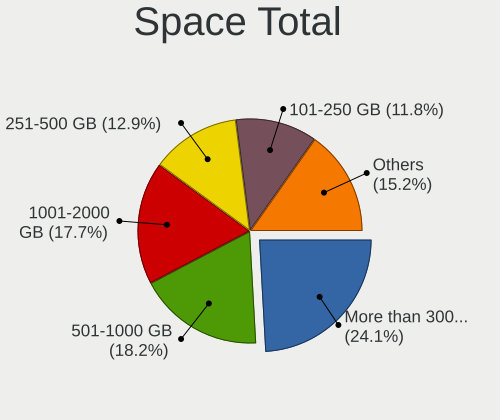

| Size in GB     | Desktops | Percent |
|----------------|----------|---------|
| More than 3000 | 1262     | 24.12%  |
| 501-1000       | 952      | 18.2%   |
| 1001-2000      | 928      | 17.74%  |
| 251-500        | 676      | 12.92%  |
| 101-250        | 617      | 11.79%  |
| 2001-3000      | 496      | 9.48%   |
| Unknown        | 111      | 2.12%   |
| 51-100         | 106      | 2.03%   |
| 1-20           | 45       | 0.86%   |
| 21-50          | 39       | 0.75%   |

Space Used
----------

Amount of used disk space

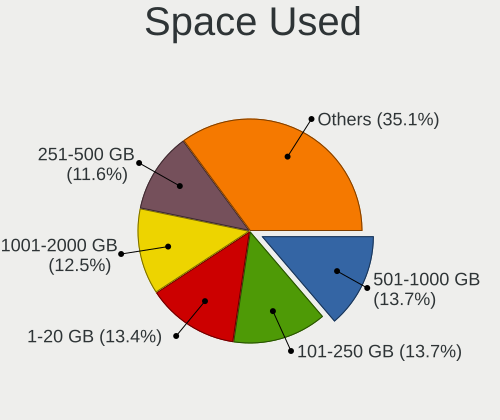

| Used GB        | Desktops | Percent |
|----------------|----------|---------|
| 501-1000       | 748      | 13.74%  |
| 101-250        | 743      | 13.65%  |
| 1-20           | 728      | 13.37%  |
| 1001-2000      | 679      | 12.47%  |
| 251-500        | 634      | 11.65%  |
| 21-50          | 542      | 9.96%   |
| More than 3000 | 491      | 9.02%   |
| 51-100         | 464      | 8.52%   |
| 2001-3000      | 303      | 5.57%   |
| Unknown        | 111      | 2.04%   |

Malfunc. Drives
---------------

Drive models with a malfunction

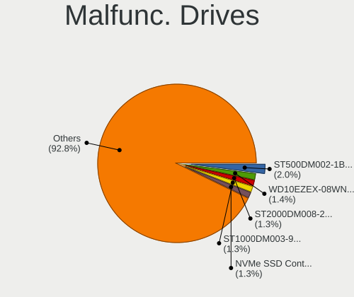

| Model                                                          | Desktops | Drives | Percent |
|----------------------------------------------------------------|----------|--------|---------|
| Seagate ST500DM002-1BD142 500GB                                | 19       | 21     | 2.01%   |
| WDC WD10EZEX-08WN4A0 1TB                                       | 13       | 15     | 1.38%   |
| Seagate ST2000DM008-2FR102 2TB                                 | 12       | 15     | 1.27%   |
| Seagate ST1000DM003-9YN162 1TB                                 | 12       | 13     | 1.27%   |
| Samsung Electronics NVMe SSD Controller SM981/PM981/PM983 1TB  | 12       | 14     | 1.27%   |
| Seagate ST1000DM010-2EP102 1TB                                 | 11       | 21     | 1.17%   |
| WDC WD5000AAKX-001CA0 500GB                                    | 10       | 12     | 1.06%   |
| Samsung Electronics SSD 870 EVO 1TB                            | 10       | 10     | 1.06%   |
| Seagate ST3500418AS 500GB                                      | 9        | 10     | 0.95%   |
| Seagate ST2000DM006-2DM164 2TB                                 | 9        | 10     | 0.95%   |
| Kingston SV300S37A120G 120GB SSD                               | 9        | 9      | 0.95%   |
| WDC WD20EARS-00MVWB0 2TB                                       | 8        | 10     | 0.85%   |
| Seagate ST31000528AS 1TB                                       | 8        | 8      | 0.85%   |
| Seagate ST2000DM001-1ER164 2TB                                 | 8        | 10     | 0.85%   |
| Crucial CT525MX300SSD1 528GB                                   | 8        | 11     | 0.85%   |
| WDC WDS240G2G0A-00JH30 240GB SSD                               | 7        | 12     | 0.74%   |
| WDC WD20EFRX-68EUZN0 2TB                                       | 7        | 15     | 0.74%   |
| Seagate ST31000524AS 1TB                                       | 7        | 11     | 0.74%   |
| Seagate ST1000DM003-1ER162 1TB                                 | 7        | 7      | 0.74%   |
| Samsung Electronics SSD 980 1TB                                | 7        | 11     | 0.74%   |
| Samsung Electronics NVMe SSD Controller PM9A1/PM9A3/980PRO 1TB | 7        | 14     | 0.74%   |
| WDC WD40EFRX-68N32N0 4TB                                       | 6        | 6      | 0.64%   |
| WDC WD20EZRZ-00Z5HB0 2TB                                       | 6        | 6      | 0.64%   |
| WDC WD20EARX-00PASB0 2TB                                       | 6        | 7      | 0.64%   |
| WDC WD1002FAEX-00Z3A0 1TB                                      | 6        | 7      | 0.64%   |
| Seagate ST4000DM004-2CV104 4TB                                 | 6        | 6      | 0.64%   |
| SanDisk SSD PLUS 480GB                                         | 6        | 7      | 0.64%   |
| WDC WD5000AAKX-00ERMA0 500GB                                   | 5        | 8      | 0.53%   |
| WDC WD30EFRX-68EUZN0 3TB                                       | 5        | 5      | 0.53%   |
| WDC WD10EARS-00Y5B1 1TB                                        | 5        | 7      | 0.53%   |
| Seagate ST500LT012-1DG142 500GB                                | 5        | 5      | 0.53%   |
| Seagate ST2000DM001-9YN164 2TB                                 | 5        | 5      | 0.53%   |
| Seagate ST2000DM001-1CH164 2TB                                 | 5        | 6      | 0.53%   |
| Seagate ST1000LM024 HN-M101MBB 1TB                             | 5        | 11     | 0.53%   |
| Seagate ST1000DM003-1CH162 1TB                                 | 5        | 5      | 0.53%   |
| SanDisk SSD PLUS 240GB                                         | 5        | 6      | 0.53%   |
| Samsung Electronics SSD 960 EVO 250GB                          | 5        | 11     | 0.53%   |
| OCZ VERTEX4 256GB SSD                                          | 5        | 8      | 0.53%   |
| WDC WD60EFRX-68L0BN1 6TB                                       | 4        | 9      | 0.42%   |
| WDC WD40EFRX-68WT0N0 4TB                                       | 4        | 10     | 0.42%   |

Malfunc. Drive Vendor
---------------------

Vendors of faulty drives

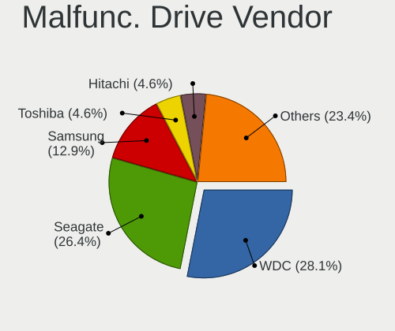

| Vendor                      | Desktops | Drives | Percent |
|-----------------------------|----------|--------|---------|
| WDC                         | 249      | 360    | 28.07%  |
| Seagate                     | 234      | 318    | 26.38%  |
| Samsung Electronics         | 114      | 150    | 12.85%  |
| Toshiba                     | 41       | 59     | 4.62%   |
| Hitachi                     | 41       | 45     | 4.62%   |
| Kingston                    | 28       | 41     | 3.16%   |
| Crucial                     | 25       | 33     | 2.82%   |
| SanDisk                     | 23       | 28     | 2.59%   |
| HGST                        | 17       | 18     | 1.92%   |
| Intel                       | 16       | 21     | 1.8%    |
| OCZ                         | 12       | 19     | 1.35%   |
| A-DATA Technology           | 12       | 13     | 1.35%   |
| Corsair                     | 6        | 6      | 0.68%   |
| Maxtor                      | 5        | 7      | 0.56%   |
| Silicon Motion              | 4        | 5      | 0.45%   |
| Realtek Semiconductor       | 4        | 5      | 0.45%   |
| China                       | 4        | 7      | 0.45%   |
| SPCC                        | 3        | 4      | 0.34%   |
| PNY                         | 3        | 4      | 0.34%   |
| Micron Technology           | 3        | 4      | 0.34%   |
| MAXIO Technology (Hangzhou) | 3        | 3      | 0.34%   |
| Hewlett-Packard             | 3        | 3      | 0.34%   |
| Drevo                       | 3        | 4      | 0.34%   |
| Apple                       | 3        | 4      | 0.34%   |
| XrayDisk                    | 2        | 4      | 0.23%   |
| Plextor                     | 2        | 9      | 0.23%   |
| Patriot                     | 2        | 2      | 0.23%   |
| LITEON                      | 2        | 2      | 0.23%   |
| JMicron Technology          | 2        | 2      | 0.23%   |
| ADATA Technology            | 2        | 3      | 0.23%   |
| WD MediaMax                 | 1        | 1      | 0.11%   |
| WALRAM                      | 1        | 1      | 0.11%   |
| Transcend                   | 1        | 8      | 0.11%   |
| TO Exter                    | 1        | 1      | 0.11%   |
| T-FORCE                     | 1        | 1      | 0.11%   |
| SSSTC                       | 1        | 1      | 0.11%   |
| SK hynix                    | 1        | 1      | 0.11%   |
| Mushkin                     | 1        | 1      | 0.11%   |
| Micron/Crucial Technology   | 1        | 1      | 0.11%   |
| Kingrich                    | 1        | 1      | 0.11%   |

Malfunc. HDD Vendor
-------------------

Vendors of faulty HDD drives

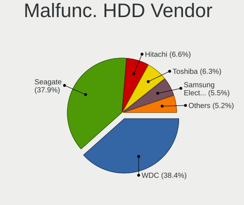

| Vendor              | Desktops | Drives | Percent |
|---------------------|----------|--------|---------|
| WDC                 | 237      | 340    | 38.41%  |
| Seagate             | 234      | 317    | 37.93%  |
| Hitachi             | 41       | 45     | 6.65%   |
| Toshiba             | 39       | 56     | 6.32%   |
| Samsung Electronics | 34       | 40     | 5.51%   |
| HGST                | 17       | 18     | 2.76%   |
| Maxtor              | 5        | 7      | 0.81%   |
| Apple               | 3        | 4      | 0.49%   |
| JMicron Technology  | 2        | 2      | 0.32%   |
| WD MediaMax         | 1        | 1      | 0.16%   |
| TO Exter            | 1        | 1      | 0.16%   |
| HGST HUS            | 1        | 1      | 0.16%   |
| Hewlett-Packard     | 1        | 1      | 0.16%   |
| Fujitsu             | 1        | 1      | 0.16%   |

Malfunc. Drive Kind
-------------------

Kinds of faulty drives

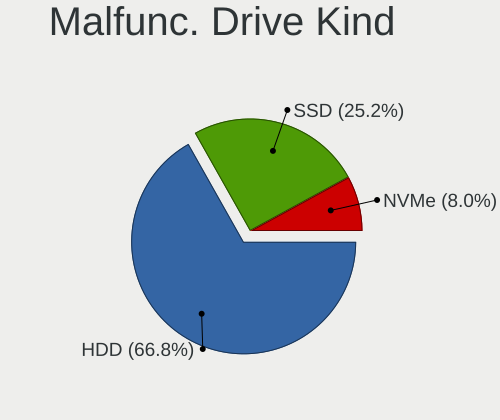

| Kind | Desktops | Drives | Percent |
|------|----------|--------|---------|
| HDD  | 538      | 834    | 66.83%  |
| SSD  | 203      | 281    | 25.22%  |
| NVMe | 64       | 100    | 7.95%   |

Failed Drives
-------------

Failed drive models

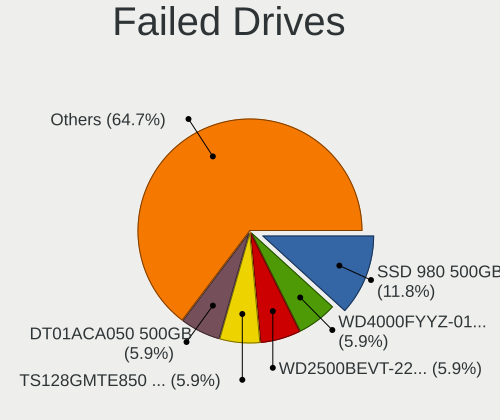

| Model                                            | Desktops | Drives | Percent |
|--------------------------------------------------|----------|--------|---------|
| Samsung Electronics SSD 980 500GB                | 2        | 2      | 11.76%  |
| WDC WD4000FYYZ-01UL1B2 4TB                       | 1        | 1      | 5.88%   |
| WDC WD2500BEVT-22ZCT0 250GB                      | 1        | 1      | 5.88%   |
| Transcend TS128GMTE850 128GB                     | 1        | 1      | 5.88%   |
| Toshiba DT01ACA050 500GB                         | 1        | 1      | 5.88%   |
| Seagate ST91000430AS 1TB                         | 1        | 1      | 5.88%   |
| Seagate ST500DM002-1BD142 500GB                  | 1        | 1      | 5.88%   |
| Seagate ST3500418AS 500GB                        | 1        | 1      | 5.88%   |
| Seagate ST32000644NS 2TB                         | 1        | 1      | 5.88%   |
| Seagate ST31000528AS 1TB                         | 1        | 1      | 5.88%   |
| Seagate ST2000DL003-9VT166 2TB                   | 1        | 1      | 5.88%   |
| Samsung Electronics MZ7PC128HAFU-000H1 128GB SSD | 1        | 1      | 5.88%   |
| Samsung Electronics HM251JI 250GB                | 1        | 1      | 5.88%   |
| Kingston SV300S37A120G 120GB SSD                 | 1        | 1      | 5.88%   |
| Hitachi HUA722020ALA330 2TB                      | 1        | 1      | 5.88%   |
| Hitachi HDS723030ALA640 3TB                      | 1        | 1      | 5.88%   |

Failed Drive Vendor
-------------------

Failed drive vendors

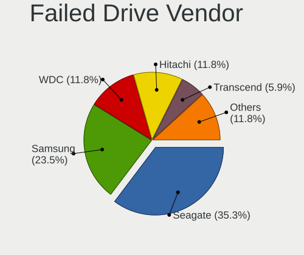

| Vendor              | Desktops | Drives | Percent |
|---------------------|----------|--------|---------|
| Seagate             | 6        | 6      | 35.29%  |
| Samsung Electronics | 4        | 4      | 23.53%  |
| WDC                 | 2        | 2      | 11.76%  |
| Hitachi             | 2        | 2      | 11.76%  |
| Transcend           | 1        | 1      | 5.88%   |
| Toshiba             | 1        | 1      | 5.88%   |
| Kingston            | 1        | 1      | 5.88%   |

Drive Status
------------

Number of failed and malfunc. drives

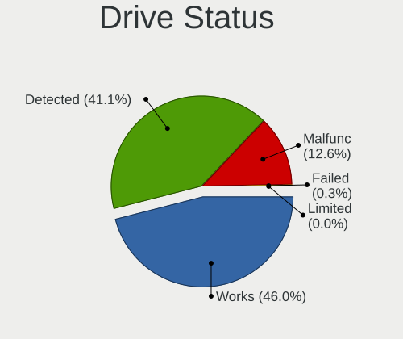

| Status   | Desktops | Drives | Percent |
|----------|----------|--------|---------|
| Works    | 2719     | 8746   | 46.01%  |
| Detected | 2427     | 6856   | 41.07%  |
| Malfunc  | 744      | 1215   | 12.59%  |
| Failed   | 17       | 17     | 0.29%   |
| Limited  | 2        | 2      | 0.03%   |

Storage controller
------------------

Storage Vendor
--------------

Storage controller vendors

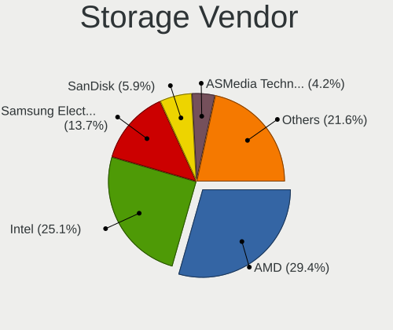

| Vendor                           | Desktops | Percent |
|----------------------------------|----------|---------|
| AMD                              | 2666     | 29.4%   |
| Intel                            | 2276     | 25.1%   |
| Samsung Electronics              | 1244     | 13.72%  |
| SanDisk                          | 538      | 5.93%   |
| ASMedia Technology               | 385      | 4.25%   |
| Phison Electronics               | 333      | 3.67%   |
| Kingston Technology Company      | 306      | 3.37%   |
| Micron/Crucial Technology        | 279      | 3.08%   |
| ADATA Technology                 | 148      | 1.63%   |
| Silicon Motion                   | 116      | 1.28%   |
| MAXIO Technology (Hangzhou)      | 93       | 1.03%   |
| Marvell Technology Group         | 88       | 0.97%   |
| SK hynix                         | 77       | 0.85%   |
| Micron Technology                | 74       | 0.82%   |
| Realtek Semiconductor            | 72       | 0.79%   |
| JMicron Technology               | 58       | 0.64%   |
| Shenzhen Longsys Electronics     | 45       | 0.5%    |
| KIOXIA                           | 40       | 0.44%   |
| Seagate Technology               | 32       | 0.35%   |
| Toshiba America Info Systems     | 23       | 0.25%   |
| INNOGRIT                         | 20       | 0.22%   |
| Broadcom / LSI                   | 17       | 0.19%   |
| Nvidia                           | 16       | 0.18%   |
| LSI Logic / Symbios Logic        | 13       | 0.14%   |
| Yangtze Memory Technologies      | 11       | 0.12%   |
| Solidigm                         | 10       | 0.11%   |
| Lite-On Technology               | 9        | 0.1%    |
| Adaptec                          | 9        | 0.1%    |
| VIA Technologies                 | 7        | 0.08%   |
| Silicon Image                    | 7        | 0.08%   |
| Netac Technology                 | 7        | 0.08%   |
| Biwin Storage Technology         | 7        | 0.08%   |
| Hosin Global Electronics         | 6        | 0.07%   |
| OCZ Technology Group             | 4        | 0.04%   |
| Hewlett-Packard                  | 4        | 0.04%   |
| Transcend                        | 2        | 0.02%   |
| TenaFe                           | 2        | 0.02%   |
| Silicon Integrated Systems [SiS] | 2        | 0.02%   |
| O2 Micro                         | 2        | 0.02%   |
| Loongson Technology              | 2        | 0.02%   |

Storage Model
-------------

Storage controller models

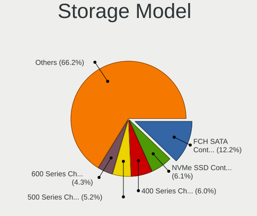

| Model                                                                          | Desktops | Percent |
|--------------------------------------------------------------------------------|----------|---------|
| AMD FCH SATA Controller [AHCI mode]                                            | 1286     | 12.16%  |
| Samsung NVMe SSD Controller SM981/PM981/PM983                                  | 649      | 6.14%   |
| AMD 400 Series Chipset SATA Controller                                         | 634      | 5.99%   |
| AMD 500 Series Chipset SATA Controller                                         | 553      | 5.23%   |
| AMD 600 Series Chipset SATA Controller                                         | 454      | 4.29%   |
| ASMedia ASM1061/ASM1062 Serial ATA Controller                                  | 341      | 3.22%   |
| Samsung NVMe SSD Controller PM9A1/PM9A3/980PRO                                 | 291      | 2.75%   |
| Intel 200 Series PCH SATA controller [AHCI mode]                               | 250      | 2.36%   |
| Intel 8 Series/C220 Series Chipset Family 6-port SATA Controller 1 [AHCI mode] | 230      | 2.17%   |
| Intel Q170/Q150/B150/H170/H110/Z170/CM236 Chipset SATA Controller [AHCI Mode]  | 219      | 2.07%   |
| Intel Cannon Lake PCH SATA AHCI Controller                                     | 192      | 1.82%   |
| Phison E12 NVMe Controller                                                     | 139      | 1.31%   |
| Micron/Crucial P2 [Nick P2] / P3 / P3 Plus NVMe PCIe SSD (DRAM-less)           | 137      | 1.3%    |
| Intel 6 Series/C200 Series Chipset Family 6 port Desktop SATA AHCI Controller  | 135      | 1.28%   |
| Samsung NVMe SSD Controller 980 (DRAM-less)                                    | 130      | 1.23%   |
| Intel SATA Controller [RAID mode]                                              | 130      | 1.23%   |
| Samsung NVMe SSD Controller SM961/PM961/SM963                                  | 127      | 1.2%    |
| Intel 7 Series/C210 Series Chipset Family 6-port SATA Controller [AHCI mode]   | 122      | 1.15%   |
| AMD SB7x0/SB8x0/SB9x0 SATA Controller [AHCI mode]                              | 118      | 1.12%   |
| Samsung NVMe SSD Controller S4LV008[Pascal]                                    | 115      | 1.09%   |
| Intel Alder Lake-S PCH SATA Controller [AHCI Mode]                             | 114      | 1.08%   |
| AMD 300 Series Chipset SATA Controller                                         | 113      | 1.07%   |
| Intel Raptor Lake SATA AHCI Controller                                         | 106      | 1%      |
| ADATA XPG SX8200 Pro PCIe Gen3x4 M.2 2280 Solid State Drive                    | 103      | 0.97%   |
| Intel 500 Series Chipset Family SATA AHCI Controller                           | 98       | 0.93%   |
| AMD SB7x0/SB8x0/SB9x0 IDE Controller                                           | 92       | 0.87%   |
| Phison E16 PCIe4 NVMe Controller                                               | 89       | 0.84%   |
| AMD A320 Chipset SATA Controller [AHCI mode]                                   | 85       | 0.8%    |
| Intel 9 Series Chipset Family SATA Controller [AHCI Mode]                      | 82       | 0.78%   |
| Sandisk WD Black SN850X NVMe SSD                                               | 81       | 0.77%   |
| AMD X370 Series Chipset SATA Controller                                        | 78       | 0.74%   |
| SanDisk Ultra 3D / WD PC SN530, IX SN530, Blue SN550 NVMe SSD (DRAM-less)      | 76       | 0.72%   |
| SanDisk Extreme Pro / WD Black SN750 / PC SN730 / Red SN700 NVMe SSD           | 75       | 0.71%   |
| SanDisk WD SN560/SN740/SN770/SN5000 NVMe SSD                                   | 73       | 0.69%   |
| Silicon Motion SM2263EN/SM2263XT (DRAM-less) NVMe SSD Controllers              | 70       | 0.66%   |
| MAXIO (Hangzhou) NVMe SSD Controller MAP1202 (DRAM-less)                       | 66       | 0.62%   |
| Kingston Company KC3000/FURY Renegade NVMe SSD [E18]                           | 66       | 0.62%   |
| Kingston Company NV2 NVMe SSD [SM2267XT] (DRAM-less)                           | 63       | 0.6%    |
| Kingston Company A2000 NVMe SSD [SM2263EN]                                     | 62       | 0.59%   |
| SanDisk Ultra 3D / WD Blue SN570 NVMe SSD (DRAM-less)                          | 59       | 0.56%   |

Storage Kind
------------

Kind of storage controller (IDE, SATA, NVMe, SAS, ...)

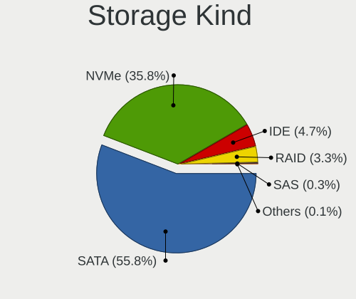

| Kind | Desktops | Percent |
|------|----------|---------|
| SATA | 4564     | 55.84%  |
| NVMe | 2927     | 35.81%  |
| IDE  | 381      | 4.66%   |
| RAID | 267      | 3.27%   |
| SAS  | 27       | 0.33%   |
| SCSI | 7        | 0.09%   |

Processor
---------

CPU Vendor
----------

Processor vendors

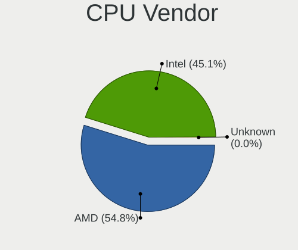

| Vendor             | Desktops | Percent |
|--------------------|----------|---------|
| AMD                | 2728     | 54.82%  |
| Intel              | 2244     | 45.1%   |
| Loongson           | 2        | 0.04%   |
| Xenon Game Console | 1        | 0.02%   |
| Unknown            | 1        | 0.02%   |

CPU Model
---------

Processor models

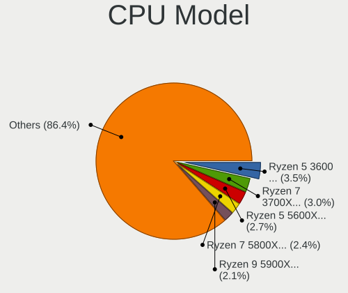

| Model                                  | Desktops | Percent |
|----------------------------------------|----------|---------|
| AMD Ryzen 5 3600 6-Core Processor      | 176      | 3.51%   |
| AMD Ryzen 7 3700X 8-Core Processor     | 149      | 2.97%   |
| AMD Ryzen 5 5600X 6-Core Processor     | 134      | 2.67%   |
| AMD Ryzen 7 5800X 8-Core Processor     | 118      | 2.35%   |
| AMD Ryzen 9 5900X 12-Core Processor    | 106      | 2.11%   |
| AMD Ryzen 5 2600 Six-Core Processor    | 102      | 2.04%   |
| AMD Ryzen 9 3900X 12-Core Processor    | 86       | 1.72%   |
| AMD Ryzen 7 2700X Eight-Core Processor | 83       | 1.66%   |
| AMD Ryzen 9 5950X 16-Core Processor    | 77       | 1.54%   |
| AMD Ryzen 5 5600G with Radeon Graphics | 71       | 1.42%   |
| AMD Ryzen 7 7800X3D 8-Core Processor   | 58       | 1.16%   |
| AMD Ryzen 7 5700G with Radeon Graphics | 58       | 1.16%   |
| Intel Core i7-6700K CPU @ 4.00GHz      | 56       | 1.12%   |
| AMD Ryzen 7 3800X 8-Core Processor     | 56       | 1.12%   |
| AMD Ryzen 5 1600 Six-Core Processor    | 55       | 1.1%    |
| Intel Core i7-7700K CPU @ 4.20GHz      | 52       | 1.04%   |
| AMD Ryzen 9 7950X 16-Core Processor    | 51       | 1.02%   |
| AMD Ryzen 7 7700X 8-Core Processor     | 51       | 1.02%   |
| AMD Ryzen 7 5700X 8-Core Processor     | 49       | 0.98%   |
| Intel Core i5-3470 CPU @ 3.20GHz       | 48       | 0.96%   |
| AMD Ryzen 5 2600X Six-Core Processor   | 48       | 0.96%   |
| AMD Ryzen 5 5600 6-Core Processor      | 43       | 0.86%   |
| Intel Core i7-6700 CPU @ 3.40GHz       | 40       | 0.8%    |
| AMD Ryzen 7 5800X3D 8-Core Processor   | 40       | 0.8%    |
| Intel Core i9-9900K CPU @ 3.60GHz      | 39       | 0.78%   |
| Intel Core i7-3770 CPU @ 3.40GHz       | 39       | 0.78%   |
| Intel Core i5-9400F CPU @ 2.90GHz      | 38       | 0.76%   |
| Intel Core i5-10400F CPU @ 2.90GHz     | 37       | 0.74%   |
| AMD Ryzen 9 7900X 12-Core Processor    | 37       | 0.74%   |
| Intel Core i5-7400 CPU @ 3.00GHz       | 36       | 0.72%   |
| Intel Core i7-8700 CPU @ 3.20GHz       | 35       | 0.7%    |
| AMD Ryzen 9 7950X3D 16-Core Processor  | 35       | 0.7%    |
| AMD Ryzen 5 3600X 6-Core Processor     | 35       | 0.7%    |
| AMD Ryzen 7 2700 Eight-Core Processor  | 33       | 0.66%   |
| Intel Core i7-8700K CPU @ 3.70GHz      | 32       | 0.64%   |
| Intel Core i7-7700 CPU @ 3.60GHz       | 32       | 0.64%   |
| Intel Core i7-9700K CPU @ 3.60GHz      | 31       | 0.62%   |
| Intel Core i7-4790 CPU @ 3.60GHz       | 31       | 0.62%   |
| AMD FX-6300 Six-Core Processor         | 31       | 0.62%   |
| AMD Ryzen 7 1700 Eight-Core Processor  | 30       | 0.6%    |

CPU Model Family
----------------

Processor model prefix

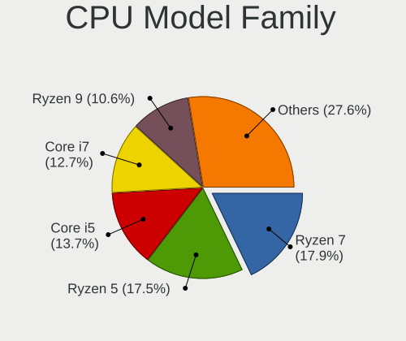

| Model                   | Desktops | Percent |
|-------------------------|----------|---------|
| AMD Ryzen 7             | 892      | 17.86%  |
| AMD Ryzen 5             | 876      | 17.54%  |
| Intel Core i5           | 683      | 13.68%  |
| Intel Core i7           | 634      | 12.7%   |
| AMD Ryzen 9             | 530      | 10.61%  |
| Other                   | 282      | 5.65%   |
| Intel Xeon              | 183      | 3.66%   |
| Intel Core i3           | 162      | 3.24%   |
| AMD FX                  | 116      | 2.32%   |
| Intel Core i9           | 85       | 1.7%    |
| AMD Ryzen 3             | 82       | 1.64%   |
| Intel Celeron           | 52       | 1.04%   |
| Intel Pentium           | 49       | 0.98%   |
| AMD Ryzen Threadripper  | 39       | 0.78%   |
| Intel Core 2 Quad       | 36       | 0.72%   |
| Intel Core 2 Duo        | 32       | 0.64%   |
| AMD A8                  | 32       | 0.64%   |
| AMD A10                 | 21       | 0.42%   |
| AMD Athlon              | 20       | 0.4%    |
| AMD Phenom II X4        | 19       | 0.38%   |
| Intel Pentium Dual-Core | 18       | 0.36%   |
| AMD Ryzen 5 PRO         | 15       | 0.3%    |
| Intel Atom              | 13       | 0.26%   |
| AMD Athlon II X2        | 13       | 0.26%   |
| AMD A6                  | 12       | 0.24%   |
| AMD Athlon II X4        | 9        | 0.18%   |
| AMD Phenom II X6        | 8        | 0.16%   |
| AMD A4                  | 8        | 0.16%   |
| Intel Pentium Dual      | 6        | 0.12%   |
| AMD Athlon X4           | 6        | 0.12%   |
| AMD Athlon 64 X2        | 6        | 0.12%   |
| Intel Pentium 4         | 5        | 0.1%    |
| Intel Core              | 5        | 0.1%    |
| AMD GX                  | 5        | 0.1%    |
| Intel Genuine           | 4        | 0.08%   |
| Intel Core 2            | 4        | 0.08%   |
| AMD Ryzen 3 PRO         | 4        | 0.08%   |
| AMD E                   | 4        | 0.08%   |
| Intel Pentium Gold      | 3        | 0.06%   |
| AMD Phenom              | 3        | 0.06%   |

CPU Cores
---------

Number of processor cores

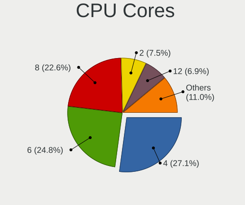

| Number  | Desktops | Percent |
|---------|----------|---------|
| 4       | 1357     | 27.15%  |
| 6       | 1238     | 24.76%  |
| 8       | 1132     | 22.64%  |
| 2       | 376      | 7.52%   |
| 12      | 344      | 6.88%   |
| 16      | 294      | 5.88%   |
| 10      | 73       | 1.46%   |
| 24      | 43       | 0.86%   |
| 14      | 38       | 0.76%   |
| 3       | 33       | 0.66%   |
| 1       | 24       | 0.48%   |
| 20      | 23       | 0.46%   |
| 32      | 8        | 0.16%   |
| 64      | 4        | 0.08%   |
| 18      | 4        | 0.08%   |
| 28      | 2        | 0.04%   |
| Unknown | 2        | 0.04%   |
| 56      | 1        | 0.02%   |
| 40      | 1        | 0.02%   |
| 22      | 1        | 0.02%   |
| 5       | 1        | 0.02%   |

CPU Sockets
-----------

Number of sockets

| Number | Desktops | Percent |
|--------|----------|---------|
| 1      | 4939     | 99.26%  |
| 2      | 37       | 0.74%   |

CPU Threads
-----------

Threads per core (Hyper-Threading)

| Number  | Desktops | Percent |
|---------|----------|---------|
| 2       | 3809     | 76.41%  |
| 1       | 1174     | 23.55%  |
| Unknown | 2        | 0.04%   |

CPU Op-Modes
------------

CPU Operation Modes (32-bit, 64-bit)

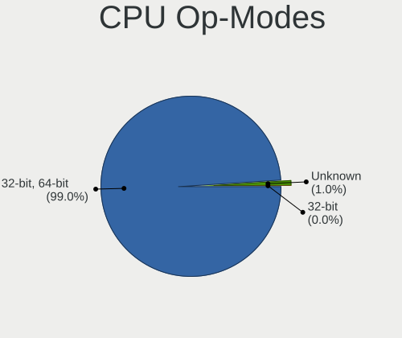

| Op mode        | Desktops | Percent |
|----------------|----------|---------|
| 32-bit, 64-bit | 4931     | 98.98%  |
| Unknown        | 49       | 0.98%   |
| 32-bit         | 2        | 0.04%   |

CPU Microcode
-------------

Microcode number

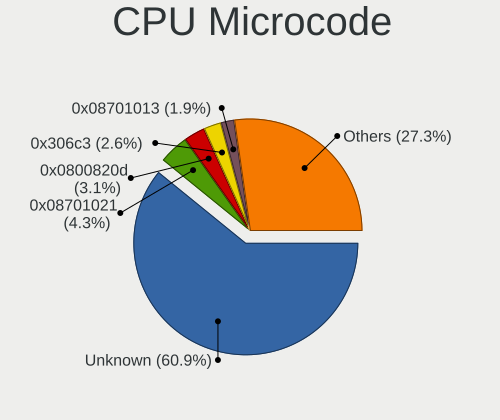

| Number     | Desktops | Percent |
|------------|----------|---------|
| Unknown    | 3150     | 60.86%  |
| 0x08701021 | 225      | 4.35%   |
| 0x0800820d | 159      | 3.07%   |
| 0x306c3    | 132      | 2.55%   |
| 0x08701013 | 99       | 1.91%   |
| 0x906e9    | 81       | 1.56%   |
| 0x306a9    | 79       | 1.53%   |
| 0x506e3    | 73       | 1.41%   |
| 0x206a7    | 69       | 1.33%   |
| 0x08001138 | 65       | 1.26%   |
| 0x906ea    | 62       | 1.2%    |
| 0x0a201016 | 62       | 1.2%    |
| 0x0a601203 | 55       | 1.06%   |
| 0x0a201009 | 53       | 1.02%   |
| 0x1067a    | 34       | 0.66%   |
| 0x0a20120a | 34       | 0.66%   |
| 0x0a50000d | 33       | 0.64%   |
| 0x08108109 | 32       | 0.62%   |
| 0x06000852 | 32       | 0.62%   |
| 0x08001137 | 30       | 0.58%   |
| 0x08701030 | 23       | 0.44%   |
| 0x08101016 | 23       | 0.44%   |
| 0x906ec    | 21       | 0.41%   |
| 0xa0655    | 20       | 0.39%   |
| 0x06000822 | 20       | 0.39%   |
| 0x306f2    | 19       | 0.37%   |
| 0x906ed    | 18       | 0.35%   |
| 0x0a50000c | 16       | 0.31%   |
| 0xa0653    | 15       | 0.29%   |
| 0x0a601206 | 15       | 0.29%   |
| 0x08001129 | 15       | 0.29%   |
| 0xa0671    | 14       | 0.27%   |
| 0x0a201025 | 14       | 0.27%   |
| 0x010000c8 | 14       | 0.27%   |
| 0x06001119 | 13       | 0.25%   |
| 0x90672    | 11       | 0.21%   |
| 0x106e5    | 11       | 0.21%   |
| 0x906eb    | 10       | 0.19%   |
| 0x406f1    | 10       | 0.19%   |
| 0x206d7    | 10       | 0.19%   |

CPU Microarch
-------------

Microarchitecture

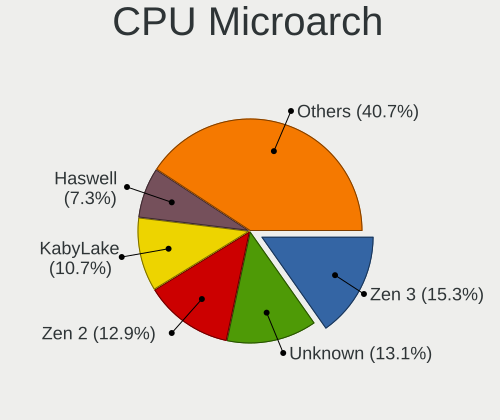

| Name             | Desktops | Percent |
|------------------|----------|---------|
| Zen 3            | 764      | 15.25%  |
| Unknown          | 656      | 13.1%   |
| Zen 2            | 646      | 12.9%   |
| KabyLake         | 535      | 10.68%  |
| Haswell          | 367      | 7.33%   |
| Zen+             | 355      | 7.09%   |
| Zen              | 214      | 4.27%   |
| IvyBridge        | 212      | 4.23%   |
| Skylake          | 202      | 4.03%   |
| SandyBridge      | 173      | 3.45%   |
| CometLake        | 162      | 3.23%   |
| Piledriver       | 134      | 2.68%   |
| Alderlake Hybrid | 122      | 2.44%   |
| Penryn           | 82       | 1.64%   |
| K10              | 57       | 1.14%   |
| Nehalem          | 44       | 0.88%   |
| Westmere         | 38       | 0.76%   |
| Icelake          | 31       | 0.62%   |
| Broadwell        | 30       | 0.6%    |
| Core             | 27       | 0.54%   |
| Steamroller      | 22       | 0.44%   |
| Silvermont       | 17       | 0.34%   |
| K10 Llano        | 16       | 0.32%   |
| Excavator        | 12       | 0.24%   |
| Gracemont        | 11       | 0.22%   |
| NetBurst         | 10       | 0.2%    |
| Tremont          | 9        | 0.18%   |
| K8 Hammer        | 9        | 0.18%   |
| Bulldozer        | 9        | 0.18%   |
| Bonnell          | 8        | 0.16%   |
| Jaguar           | 7        | 0.14%   |
| Goldmont plus    | 7        | 0.14%   |
| Puma             | 6        | 0.12%   |
| Goldmont         | 5        | 0.1%    |
| Bobcat           | 5        | 0.1%    |
| Lunarlake Hybrid | 4        | 0.08%   |
| Sapphire Rapids  | 1        | 0.02%   |

Graphics
--------

GPU Vendor
----------

Vendors of graphics cards

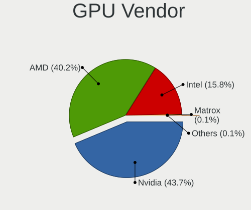

| Vendor                           | Desktops | Percent |
|----------------------------------|----------|---------|
| Nvidia                           | 2423     | 43.67%  |
| AMD                              | 2232     | 40.23%  |
| Intel                            | 876      | 15.79%  |
| ASPEED Technology                | 8        | 0.14%   |
| Matrox Electronics Systems       | 3        | 0.05%   |
| Silicon Integrated Systems [SiS] | 2        | 0.04%   |
| ATI Technologies                 | 2        | 0.04%   |
| VIA Technologies                 | 1        | 0.02%   |
| Microsoft                        | 1        | 0.02%   |

GPU Model
---------

Graphics card models

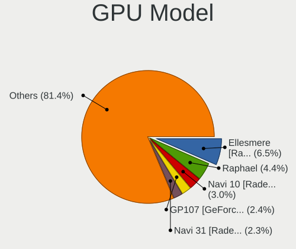

| Model                                                                       | Desktops | Percent |
|-----------------------------------------------------------------------------|----------|---------|
| AMD Ellesmere [Radeon RX 470/480/570/570X/580/580X/590]                     | 385      | 6.52%   |
| AMD Raphael                                                                 | 257      | 4.35%   |
| AMD Navi 10 [Radeon RX 5600 OEM/5600 XT / 5700/5700 XT]                     | 179      | 3.03%   |
| Nvidia GP107 [GeForce GTX 1050 Ti]                                          | 144      | 2.44%   |
| AMD Navi 31 [Radeon RX 7900 XT/7900 XTX/7900 GRE/7900M]                     | 135      | 2.29%   |
| AMD Navi 23 [Radeon RX 6600/6600 XT/6600M]                                  | 128      | 2.17%   |
| AMD Navi 22 [Radeon RX 6700/6700 XT/6750 XT / 6800M/6850M XT]               | 127      | 2.15%   |
| Intel Xeon E3-1200 v3/4th Gen Core Processor Integrated Graphics Controller | 122      | 2.07%   |
| AMD Navi 21 [Radeon RX 6800/6800 XT / 6900 XT]                              | 120      | 2.03%   |
| Nvidia GP106 [GeForce GTX 1060 6GB]                                         | 112      | 1.9%    |
| Intel CoffeeLake-S GT2 [UHD Graphics 630]                                   | 110      | 1.86%   |
| Nvidia GP104 [GeForce GTX 1070]                                             | 108      | 1.83%   |
| AMD Cezanne [Radeon Vega Series / Radeon Vega Mobile Series]                | 94       | 1.59%   |
| Nvidia GA106 [GeForce RTX 3060 Lite Hash Rate]                              | 91       | 1.54%   |
| Nvidia GP104 [GeForce GTX 1080]                                             | 83       | 1.41%   |
| AMD Granite Ridge [Radeon Graphics]                                         | 78       | 1.32%   |
| AMD Navi 32 [Radeon RX 7700 XT / 7800 XT]                                   | 75       | 1.27%   |
| Intel Kaby Lake-S GT2 [HD Graphics 630]                                     | 74       | 1.25%   |
| Nvidia GM204 [GeForce GTX 970]                                              | 69       | 1.17%   |
| Intel 2nd Generation Core Processor Family Integrated Graphics Controller   | 68       | 1.15%   |
| Nvidia TU116 [GeForce GTX 1660 SUPER]                                       | 67       | 1.14%   |
| Nvidia TU104 [GeForce RTX 2070 SUPER]                                       | 67       | 1.14%   |
| Intel Skylake-S GT2 [HD Graphics 530]                                       | 62       | 1.05%   |
| Nvidia GK208B [GeForce GT 710]                                              | 60       | 1.02%   |
| Nvidia GP102 [GeForce GTX 1080 Ti]                                          | 59       | 1%      |
| Nvidia GA104 [GeForce RTX 3070]                                             | 58       | 0.98%   |
| AMD Vega 10 XL/XT [Radeon RX Vega 56/64]                                    | 55       | 0.93%   |
| AMD Picasso/Raven 2 [Radeon Vega Series / Radeon Vega Mobile Series]        | 52       | 0.88%   |
| Nvidia TU117 [GeForce GTX 1650]                                             | 50       | 0.85%   |
| Nvidia TU106 [GeForce RTX 2060 Rev. A]                                      | 50       | 0.85%   |
| AMD Baffin [Radeon RX 550 640SP / RX 560/560X]                              | 50       | 0.85%   |
| Nvidia GP108 [GeForce GT 1030]                                              | 49       | 0.83%   |
| Nvidia GM206 [GeForce GTX 960]                                              | 49       | 0.83%   |
| Nvidia GM107 [GeForce GTX 750 Ti]                                           | 47       | 0.8%    |
| AMD Lexa PRO [Radeon 540/540X/550/550X / RX 540X/550/550X]                  | 47       | 0.8%    |
| Nvidia GP106 [GeForce GTX 1060 3GB]                                         | 43       | 0.73%   |
| Nvidia GA102 [GeForce RTX 3080]                                             | 43       | 0.73%   |
| Intel CometLake-S GT2 [UHD Graphics 630]                                    | 42       | 0.71%   |
| Nvidia TU106 [GeForce RTX 2060 SUPER]                                       | 40       | 0.68%   |
| Nvidia GA102 [GeForce RTX 3090]                                             | 39       | 0.66%   |

GPU Combo
---------

Combinations of graphics cards

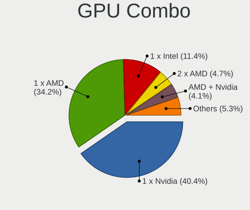

| Name                     | Desktops | Percent |
|--------------------------|----------|---------|
| 1 x Nvidia               | 2049     | 40.38%  |
| 1 x AMD                  | 1734     | 34.17%  |
| 1 x Intel                | 576      | 11.35%  |
| 2 x AMD                  | 237      | 4.67%   |
| AMD + Nvidia             | 209      | 4.12%   |
| Intel + Nvidia           | 119      | 2.35%   |
| Intel + AMD              | 58       | 1.14%   |
| 2 x Nvidia               | 45       | 0.89%   |
| 2 x Intel                | 10       | 0.2%    |
| 2 x AMD + 1 x Nvidia     | 9        | 0.18%   |
| Other                    | 6        | 0.12%   |
| 1 x ASPEED               | 5        | 0.1%    |
| 1 x SiS                  | 2        | 0.04%   |
| 1 x Matrox               | 2        | 0.04%   |
| Intel + AMD + 1 x Nvidia | 2        | 0.04%   |
| AMD + ASPEED             | 2        | 0.04%   |
| 3 x Nvidia               | 1        | 0.02%   |
| 3 x AMD                  | 1        | 0.02%   |
| 1 x VIA                  | 1        | 0.02%   |
| Nvidia + ASPEED          | 1        | 0.02%   |
| 1 x Microsoft            | 1        | 0.02%   |
| Intel + 2 x Nvidia       | 1        | 0.02%   |
| Intel + 2 x AMD          | 1        | 0.02%   |
| AMD + 2 x Nvidia         | 1        | 0.02%   |
| AMD + Matrox             | 1        | 0.02%   |

GPU Driver
----------

Free vs proprietary

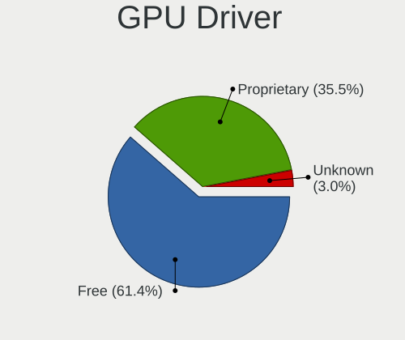

| Driver      | Desktops | Percent |
|-------------|----------|---------|
| Free        | 3106     | 61.44%  |
| Proprietary | 1797     | 35.55%  |
| Unknown     | 152      | 3.01%   |

GPU Memory
----------

Total video memory

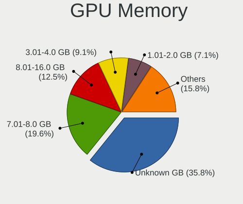

| Size in GB | Desktops | Percent |
|------------|----------|---------|
| Unknown    | 1852     | 35.8%   |
| 7.01-8.0   | 1016     | 19.64%  |
| 8.01-16.0  | 649      | 12.55%  |
| 3.01-4.0   | 469      | 9.07%   |
| 1.01-2.0   | 369      | 7.13%   |
| 5.01-6.0   | 291      | 5.63%   |
| 0.01-0.5   | 169      | 3.27%   |
| 0.51-1.0   | 154      | 2.98%   |
| 16.01-24.0 | 138      | 2.67%   |
| 2.01-3.0   | 61       | 1.18%   |
| 4.01-5.0   | 4        | 0.08%   |
| 24.01-32.0 | 1        | 0.02%   |

Monitor
-------

Monitor Vendor
--------------

Monitor vendors

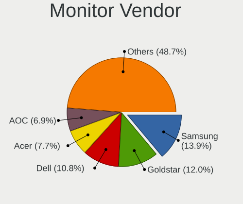

| Vendor               | Desktops | Percent |
|----------------------|----------|---------|
| Samsung Electronics  | 886      | 13.91%  |
| Goldstar             | 764      | 11.99%  |
| Dell                 | 688      | 10.8%   |
| Acer                 | 490      | 7.69%   |
| AOC                  | 438      | 6.87%   |
| BenQ                 | 315      | 4.94%   |
| Hewlett-Packard      | 308      | 4.83%   |
| Ancor Communications | 289      | 4.54%   |
| ASUSTek Computer     | 239      | 3.75%   |
| Philips              | 232      | 3.64%   |
| MSI                  | 140      | 2.2%    |
| ViewSonic            | 136      | 2.13%   |
| Iiyama               | 103      | 1.62%   |
| Lenovo               | 100      | 1.57%   |
| Unknown              | 93       | 1.46%   |
| Gigabyte Technology  | 90       | 1.41%   |
| LG Electronics       | 73       | 1.15%   |
| Sony                 | 51       | 0.8%    |
| Unknown              | 47       | 0.74%   |
| Sceptre Tech         | 42       | 0.66%   |
| Eizo                 | 40       | 0.63%   |
| NEC Computers        | 39       | 0.61%   |
| Mi                   | 31       | 0.49%   |
| Vizio                | 30       | 0.47%   |
| Fujitsu Siemens      | 25       | 0.39%   |
| Denver               | 25       | 0.39%   |
| HKC                  | 21       | 0.33%   |
| Toshiba              | 20       | 0.31%   |
| Valve                | 17       | 0.27%   |
| HUAWEI               | 17       | 0.27%   |
| Hitachi              | 17       | 0.27%   |
| HannStar             | 17       | 0.27%   |
| SKG                  | 15       | 0.24%   |
| RTK                  | 14       | 0.22%   |
| Pixio                | 14       | 0.22%   |
| Panasonic            | 13       | 0.2%    |
| Medion               | 13       | 0.2%    |
| Lenovo Group Limited | 12       | 0.19%   |
| Insignia             | 12       | 0.19%   |
| Wacom                | 10       | 0.16%   |

Monitor Model
-------------

Monitor models

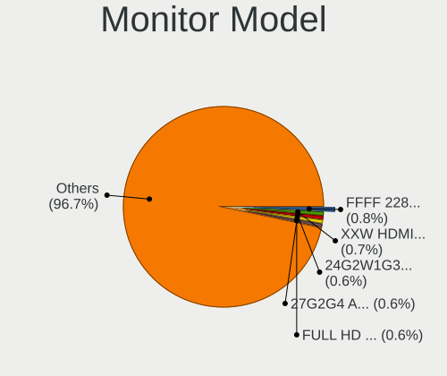

| Model                                                                 | Desktops | Percent |
|-----------------------------------------------------------------------|----------|---------|
| Unknown LCD Monitor FFFF 2288x1287 2550x2550mm 142.0-inch             | 52       | 0.75%   |
| Unknown                                                               | 47       | 0.68%   |
| AOC 24G2W1G3 AOC2402 1920x1080 527x296mm 23.8-inch                    | 44       | 0.64%   |
| AOC 27G2G4 AOC2702 1920x1080 598x336mm 27.0-inch                      | 43       | 0.62%   |
| Goldstar FULL HD GSM5B55 1920x1080 480x270mm 21.7-inch                | 42       | 0.61%   |
| Goldstar Ultra HD GSM5B09 3840x2160 600x340mm 27.2-inch               | 40       | 0.58%   |
| Samsung Electronics S24F350 SAM0D20 1920x1080 521x293mm 23.5-inch     | 34       | 0.49%   |
| Goldstar LG IPS FULLHD GSM5AB8 1920x1080 480x270mm 21.7-inch          | 30       | 0.43%   |
| Goldstar 27GL850 GSM5B7F 2560x1440 597x336mm 27.0-inch                | 28       | 0.41%   |
| Goldstar LG ULTRAWIDE GSM59F1 2560x1080 670x280mm 28.6-inch           | 27       | 0.39%   |
| Samsung Electronics C24F390 SAM0D2C 1920x1080 521x293mm 23.5-inch     | 26       | 0.38%   |
| Ancor Communications VG248 ACI24A4 1920x1080 531x299mm 24.0-inch      | 24       | 0.35%   |
| Samsung Electronics U28E590 SAM0C4D 3840x2160 607x345mm 27.5-inch     | 23       | 0.33%   |
| Goldstar ULTRAGEAR GSM5BD3 2560x1440 697x392mm 31.5-inch              | 22       | 0.32%   |
| Dell U2412M DELA07A 1920x1200 518x324mm 24.1-inch                     | 20       | 0.29%   |
| AOC 24B1W1 AOC2401 1920x1080 527x296mm 23.8-inch                      | 19       | 0.28%   |
| Valve Index HMD VLV91A8                                               | 17       | 0.25%   |
| Dell S2721DGF DEL41D9 2560x1440 597x336mm 27.0-inch                   | 17       | 0.25%   |
| Samsung Electronics C27F390 SAM0D32 1920x1080 598x336mm 27.0-inch     | 16       | 0.23%   |
| MSI Optix MAG27CQ MSI1462 2560x1440 597x336mm 27.0-inch               | 16       | 0.23%   |
| Ancor Communications ROG PG279Q ACI27EC 2560x1440 598x336mm 27.0-inch | 16       | 0.23%   |
| Samsung Electronics LF24T35 SAM707D 1920x1080 528x297mm 23.9-inch     | 15       | 0.22%   |
| Goldstar HDR 4K GSM7707 3840x2160 600x340mm 27.2-inch                 | 15       | 0.22%   |
| AOC 27G1G4 AOC2701 1920x1080 598x336mm 27.0-inch                      | 15       | 0.22%   |
| AOC 2260WG5 AOC2260 1920x1080 477x268mm 21.5-inch                     | 15       | 0.22%   |
| Goldstar LG TV SSCR2 GSMC0C8 3840x2160                                | 14       | 0.2%    |
| Goldstar HDR 4K GSM7706 3840x2160 600x340mm 27.2-inch                 | 14       | 0.2%    |
| Dell U2412M DELA07B 1920x1200 518x324mm 24.1-inch                     | 14       | 0.2%    |
| ASUSTek Computer VG27A AUS2722 2560x1440 597x336mm 27.0-inch          | 14       | 0.2%    |
| Samsung Electronics LC49G95T SAM7053 3840x1080 1193x336mm 48.8-inch   | 13       | 0.19%   |
| Goldstar ULTRAGEAR GSM7766 2560x1440 697x392mm 31.5-inch              | 13       | 0.19%   |
| BenQ XL2411Z BNQ7F31 1920x1080 531x298mm 24.0-inch                    | 13       | 0.19%   |
| Ancor Communications VS248 ACI2498 1920x1080 531x299mm 24.0-inch      | 13       | 0.19%   |
| Ancor Communications ASUS VS247 ACI249A 1920x1080 521x293mm 23.5-inch | 13       | 0.19%   |
| Samsung Electronics LC27G5xT SAM707A 2560x1440 597x336mm 27.0-inch    | 12       | 0.17%   |
| Goldstar ULTRAGEAR GSM5BB4 2560x1440 597x336mm 27.0-inch              | 12       | 0.17%   |
| Goldstar HDR WFHD GSM7714 2560x1080 798x334mm 34.1-inch               | 12       | 0.17%   |
| Goldstar HD GSM5ACB 1366x768 410x230mm 18.5-inch                      | 12       | 0.17%   |
| Gigabyte Technology M27Q GBT270D 2560x1440 597x336mm 27.0-inch        | 12       | 0.17%   |
| Denver MO-HHS-32C LHCFFFF 1920x1080 699x393mm 31.6-inch               | 12       | 0.17%   |

Monitor Resolution
------------------

Monitor screen resolution

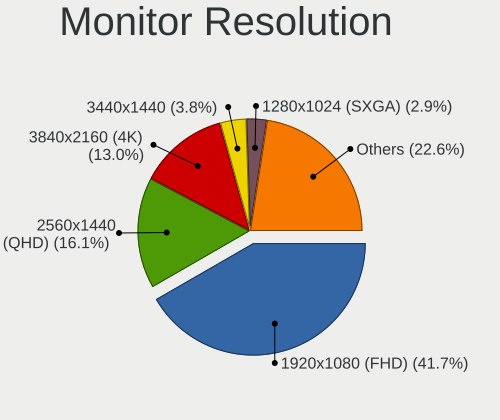

| Resolution         | Desktops | Percent |
|--------------------|----------|---------|
| 1920x1080 (FHD)    | 2509     | 41.68%  |
| 2560x1440 (QHD)    | 967      | 16.06%  |
| 3840x2160 (4K)     | 780      | 12.96%  |
| 3440x1440          | 228      | 3.79%   |
| 1280x1024 (SXGA)   | 177      | 2.94%   |
| 1680x1050 (WSXGA+) | 173      | 2.87%   |
| Unknown            | 161      | 2.67%   |
| 1920x1200 (WUXGA)  | 141      | 2.34%   |
| 1366x768 (WXGA)    | 141      | 2.34%   |
| 2560x1080          | 127      | 2.11%   |
| 3840x1080          | 101      | 1.68%   |
| 1600x900 (HD+)     | 92       | 1.53%   |
| 1440x900 (WXGA+)   | 91       | 1.51%   |
| 2288x1287          | 52       | 0.86%   |
| 1360x768           | 51       | 0.85%   |
| 3840x1600          | 24       | 0.4%    |
| 1920x540           | 21       | 0.35%   |
| 2560x1600          | 14       | 0.23%   |
| 4480x1440          | 13       | 0.22%   |
| 1024x768 (XGA)     | 13       | 0.22%   |
| 7680x2160          | 10       | 0.17%   |
| 5760x1080          | 10       | 0.17%   |
| 1600x1200          | 9        | 0.15%   |
| 6400x2160          | 8        | 0.13%   |
| 5120x1440          | 7        | 0.12%   |
| 6400x1440          | 6        | 0.1%    |
| 5760x2160          | 6        | 0.1%    |
| 3840x1200          | 5        | 0.08%   |
| 2160x1200          | 5        | 0.08%   |
| 1280x720 (HD)      | 5        | 0.08%   |
| 5360x1440          | 4        | 0.07%   |
| 1280x960           | 4        | 0.07%   |
| 4480x1080          | 3        | 0.05%   |
| 4240x1440          | 3        | 0.05%   |
| 3286x1080          | 3        | 0.05%   |
| 2160x1440          | 3        | 0.05%   |
| 1400x1050          | 3        | 0.05%   |
| 8320x2160          | 2        | 0.03%   |
| 640x480            | 2        | 0.03%   |
| 5760x1200          | 2        | 0.03%   |

Monitor Diagonal
----------------

Diagonal size in inches

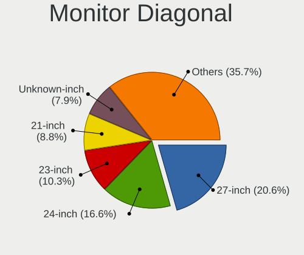

| Inches  | Desktops | Percent |
|---------|----------|---------|
| 27      | 1292     | 20.6%   |
| 24      | 1044     | 16.64%  |
| 23      | 649      | 10.35%  |
| 21      | 553      | 8.82%   |
| Unknown | 495      | 7.89%   |
| 31      | 449      | 7.16%   |
| 34      | 284      | 4.53%   |
| 19      | 205      | 3.27%   |
| 22      | 153      | 2.44%   |
| 18      | 127      | 2.02%   |
| 20      | 97       | 1.55%   |
| 17      | 75       | 1.2%    |
| 84      | 73       | 1.16%   |
| 32      | 64       | 1.02%   |
| 15      | 55       | 0.88%   |
| 142     | 52       | 0.83%   |
| 48      | 52       | 0.83%   |
| 26      | 52       | 0.83%   |
| 72      | 50       | 0.8%    |
| 40      | 49       | 0.78%   |
| 25      | 41       | 0.65%   |
| 54      | 40       | 0.64%   |
| 28      | 29       | 0.46%   |
| 29      | 28       | 0.45%   |
| 63      | 27       | 0.43%   |
| 37      | 23       | 0.37%   |
| 49      | 22       | 0.35%   |
| 46      | 19       | 0.3%    |
| 42      | 14       | 0.22%   |
| 33      | 14       | 0.22%   |
| 35      | 13       | 0.21%   |
| 74      | 9        | 0.14%   |
| 65      | 9        | 0.14%   |
| 52      | 9        | 0.14%   |
| 39      | 9        | 0.14%   |
| 13      | 9        | 0.14%   |
| 43      | 8        | 0.13%   |
| 14      | 8        | 0.13%   |
| 75      | 7        | 0.11%   |
| 36      | 7        | 0.11%   |

Monitor Width
-------------

Physical width

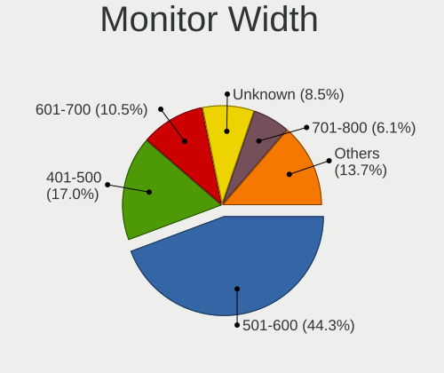

| Width in mm    | Desktops | Percent |
|----------------|----------|---------|
| 501-600        | 2591     | 44.31%  |
| 401-500        | 996      | 17.03%  |
| 601-700        | 612      | 10.47%  |
| Unknown        | 495      | 8.46%   |
| 701-800        | 355      | 6.07%   |
| 1001-1500      | 205      | 3.51%   |
| 1501-2000      | 143      | 2.45%   |
| 301-350        | 130      | 2.22%   |
| 351-400        | 115      | 1.97%   |
| 801-900        | 104      | 1.78%   |
| More than 2000 | 53       | 0.91%   |
| 901-1000       | 26       | 0.44%   |
| 201-300        | 22       | 0.38%   |
| 101-200        | 1        | 0.02%   |

Aspect Ratio
------------

Proportional relationship between the width and the height

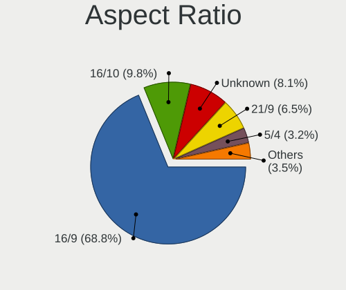

| Ratio   | Desktops | Percent |
|---------|----------|---------|
| 16/9    | 3680     | 68.84%  |
| 16/10   | 525      | 9.82%   |
| Unknown | 435      | 8.14%   |
| 21/9    | 349      | 6.53%   |
| 5/4     | 171      | 3.2%    |
| 32/9    | 69       | 1.29%   |
| 1.00    | 52       | 0.97%   |
| 4/3     | 40       | 0.75%   |
| 3/2     | 12       | 0.22%   |
| 2.00    | 4        | 0.07%   |
| 1.96    | 3        | 0.06%   |
| 6/5     | 2        | 0.04%   |
| 0.89    | 2        | 0.04%   |
| 3.20    | 1        | 0.02%   |
| 0.57    | 1        | 0.02%   |

Monitor Area
------------

Area in inch²

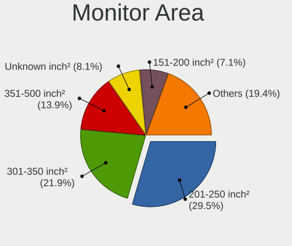

| Area in inch² | Desktops | Percent |
|----------------|----------|---------|
| 201-250        | 1797     | 29.51%  |
| 301-350        | 1336     | 21.94%  |
| 351-500        | 844      | 13.86%  |
| Unknown        | 495      | 8.13%   |
| 151-200        | 433      | 7.11%   |
| 251-300        | 410      | 6.73%   |
| More than 1000 | 304      | 4.99%   |
| 501-1000       | 203      | 3.33%   |
| 141-150        | 176      | 2.89%   |
| 101-110        | 49       | 0.8%    |
| 71-80          | 11       | 0.18%   |
| 111-120        | 10       | 0.16%   |
| 81-90          | 7        | 0.11%   |
| 131-140        | 5        | 0.08%   |
| 91-100         | 4        | 0.07%   |
| 51-60          | 3        | 0.05%   |
| 1-40           | 1        | 0.02%   |
| 121-130        | 1        | 0.02%   |

Pixel Density
-------------

Pixels per inch

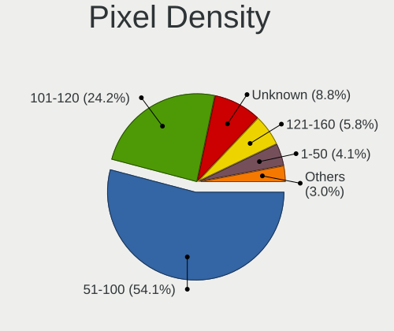

| Density       | Desktops | Percent |
|---------------|----------|---------|
| 51-100        | 3044     | 54.1%   |
| 101-120       | 1361     | 24.19%  |
| Unknown       | 495      | 8.8%    |
| 121-160       | 328      | 5.83%   |
| 1-50          | 231      | 4.11%   |
| 161-240       | 165      | 2.93%   |
| More than 240 | 3        | 0.05%   |

Multiple Monitors
-----------------

Total monitors connected

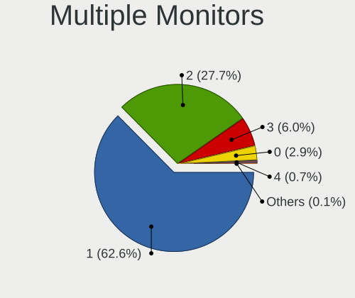

| Total | Desktops | Percent |
|-------|----------|---------|
| 1     | 3188     | 62.58%  |
| 2     | 1413     | 27.74%  |
| 3     | 304      | 5.97%   |
| 0     | 150      | 2.94%   |
| 4     | 35       | 0.69%   |
| 5     | 3        | 0.06%   |
| 6     | 1        | 0.02%   |

Network
-------

Net Controller Vendor
---------------------

Controller vendors

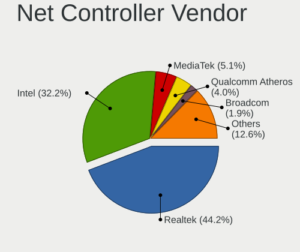

| Vendor                                 | Desktops | Percent |
|----------------------------------------|----------|---------|
| Realtek Semiconductor                  | 3228     | 44.2%   |
| Intel                                  | 2351     | 32.19%  |
| MediaTek                               | 371      | 5.08%   |
| Qualcomm Atheros                       | 291      | 3.98%   |
| Broadcom                               | 141      | 1.93%   |
| TP-Link                                | 119      | 1.63%   |
| Microsoft                              | 98       | 1.34%   |
| Ralink Technology                      | 93       | 1.27%   |
| Aquantia                               | 64       | 0.88%   |
| Samsung Electronics                    | 38       | 0.52%   |
| Ralink                                 | 37       | 0.51%   |
| Qualcomm Technologies                  | 28       | 0.38%   |
| NetGear                                | 28       | 0.38%   |
| Xiaomi                                 | 23       | 0.31%   |
| ASIX Electronics                       | 21       | 0.29%   |
| Mellanox Technologies                  | 20       | 0.27%   |
| Marvell Technology Group               | 20       | 0.27%   |
| D-Link                                 | 20       | 0.27%   |
| Qualcomm Atheros Communications        | 18       | 0.25%   |
| Nvidia                                 | 15       | 0.21%   |
| Microchip Technology                   | 15       | 0.21%   |
| ASUSTek Computer                       | 14       | 0.19%   |
| Broadcom Limited                       | 13       | 0.18%   |
| QinHeng Electronics                    | 11       | 0.15%   |
| D-Link System                          | 11       | 0.15%   |
| Oculus VR                              | 10       | 0.14%   |
| DisplayLink                            | 10       | 0.14%   |
| Huawei Technologies                    | 9        | 0.12%   |
| Google                                 | 9        | 0.12%   |
| Edimax Technology                      | 8        | 0.11%   |
| Qualcomm                               | 7        | 0.1%    |
| Motorola PCS                           | 7        | 0.1%    |
| Apple                                  | 7        | 0.1%    |
| VIA Technologies                       | 6        | 0.08%   |
| OPPO Electronics                       | 6        | 0.08%   |
| Mercucys                               | 5        | 0.07%   |
| Linksys                                | 5        | 0.07%   |
| Belkin Components                      | 5        | 0.07%   |
| AVM                                    | 5        | 0.07%   |
| Sony Ericsson Mobile Communications AB | 4        | 0.05%   |

Net Controller Model
--------------------

Controller models

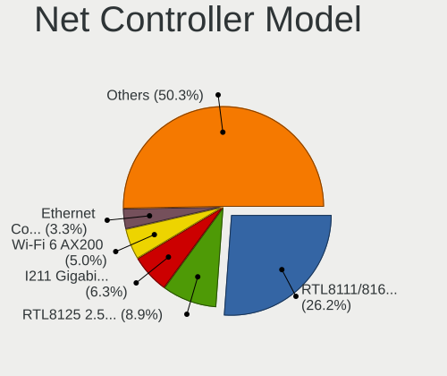

| Model                                                                  | Desktops | Percent |
|------------------------------------------------------------------------|----------|---------|
| Realtek RTL8111/8168/8211/8411 PCI Express Gigabit Ethernet Controller | 2229     | 26.16%  |
| Realtek RTL8125 2.5GbE Controller                                      | 760      | 8.92%   |
| Intel I211 Gigabit Network Connection                                  | 539      | 6.32%   |
| Intel Wi-Fi 6 AX200                                                    | 429      | 5.03%   |
| Intel Ethernet Controller I225-V                                       | 280      | 3.29%   |
| Intel Ethernet Connection (2) I219-V                                   | 228      | 2.68%   |
| MediaTek MT7922 802.11ax PCI Express Wireless Network Adapter          | 189      | 2.22%   |
| Intel Wi-Fi 6E(802.11ax) AX210/AX1675* 2x2 [Typhoon Peak]              | 160      | 1.88%   |
| Intel Dual Band Wireless-AC 3168NGW [Stone Peak]                       | 139      | 1.63%   |
| Intel Ethernet Connection (7) I219-V                                   | 132      | 1.55%   |
| Intel 82579LM Gigabit Network Connection (Lewisville)                  | 92       | 1.08%   |
| MediaTek MT7921K (RZ608) Wi-Fi 6E 80MHz                                | 90       | 1.06%   |
| Intel Wi-Fi 5(802.11ac) Wireless-AC 9x6x [Thunder Peak]                | 83       | 0.97%   |
| Intel Ethernet Controller I226-V                                       | 65       | 0.76%   |
| Intel Ethernet Connection I217-LM                                      | 61       | 0.72%   |
| Intel Ethernet Connection (2) I218-V                                   | 59       | 0.69%   |
| Realtek RTL810xE PCI Express Fast Ethernet controller                  | 56       | 0.66%   |
| Intel Cannon Lake PCH CNVi WiFi                                        | 56       | 0.66%   |
| Broadcom BCM4360 802.11ac Dual Band Wireless Network Adapter           | 56       | 0.66%   |
| Realtek RTL8821CE 802.11ac PCIe Wireless Network Adapter               | 52       | 0.61%   |
| Realtek RTL8153 Gigabit Ethernet Adapter                               | 52       | 0.61%   |
| Intel 700 Series Chipset CNVi WiFi                                     | 52       | 0.61%   |
| Intel 82579V Gigabit Network Connection                                | 50       | 0.59%   |
| Intel Ethernet Connection (2) I219-LM                                  | 43       | 0.5%    |
| Ralink MT7601U Wireless Adapter                                        | 42       | 0.49%   |
| Qualcomm Atheros Killer E220x Gigabit Ethernet Controller              | 42       | 0.49%   |
| Realtek RTL8852CE PCIe 802.11ax Wireless Network Controller            | 41       | 0.48%   |
| Microsoft Xbox 360 Wireless Adapter                                    | 41       | 0.48%   |
| Microsoft Xbox Wireless Adapter for Windows                            | 39       | 0.46%   |
| Realtek 802.11ac NIC                                                   | 38       | 0.45%   |
| Realtek RTL8126 5GbE Controller                                        | 37       | 0.43%   |
| Intel Wireless 8260                                                    | 37       | 0.43%   |
| Realtek RTL88x2bu [AC1200 Techkey]                                     | 36       | 0.42%   |
| Intel Wireless 7265                                                    | 35       | 0.41%   |
| Intel Alder Lake-S PCH CNVi WiFi                                       | 35       | 0.41%   |
| Intel 82574L Gigabit Network Connection                                | 34       | 0.4%    |
| Qualcomm Atheros QCA6174 802.11ac Wireless Network Adapter             | 33       | 0.39%   |
| Intel I210 Gigabit Network Connection                                  | 33       | 0.39%   |
| Qualcomm Atheros Killer E2500 Gigabit Ethernet Controller              | 32       | 0.38%   |
| Qualcomm Atheros AR9485 Wireless Network Adapter                       | 31       | 0.36%   |

Wireless Vendor
---------------

Wireless vendors

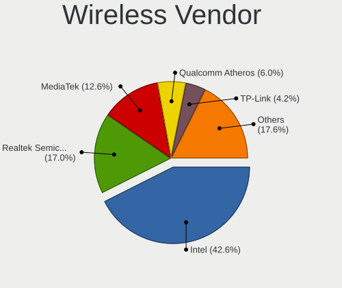

| Vendor                                | Desktops | Percent |
|---------------------------------------|----------|---------|
| Intel                                 | 1159     | 42.59%  |
| Realtek Semiconductor                 | 462      | 16.98%  |
| MediaTek                              | 342      | 12.57%  |
| Qualcomm Atheros                      | 163      | 5.99%   |
| TP-Link                               | 115      | 4.23%   |
| Broadcom                              | 98       | 3.6%    |
| Microsoft                             | 97       | 3.56%   |
| Ralink Technology                     | 93       | 3.42%   |
| Ralink                                | 37       | 1.36%   |
| NetGear                               | 26       | 0.96%   |
| D-Link                                | 20       | 0.74%   |
| Qualcomm Atheros Communications       | 18       | 0.66%   |
| ASUSTek Computer                      | 13       | 0.48%   |
| Qualcomm Technologies                 | 8        | 0.29%   |
| Edimax Technology                     | 8        | 0.29%   |
| D-Link System                         | 7        | 0.26%   |
| Mercucys                              | 5        | 0.18%   |
| Linksys                               | 5        | 0.18%   |
| Belkin Components                     | 5        | 0.18%   |
| AVM                                   | 5        | 0.18%   |
| Broadcom Limited                      | 4        | 0.15%   |
| ZyDAS                                 | 3        | 0.11%   |
| Wilocity                              | 3        | 0.11%   |
| VIA Technologies                      | 3        | 0.11%   |
| Tenda                                 | 3        | 0.11%   |
| Realtek                               | 3        | 0.11%   |
| ZyXEL Communications                  | 2        | 0.07%   |
| Micro Star International              | 2        | 0.07%   |
| IMC Networks                          | 2        | 0.07%   |
| BUFFALO                               | 2        | 0.07%   |
| AboCom Systems                        | 2        | 0.07%   |
| Yoctopuce Sarl                        | 1        | 0.04%   |
| Xiaomi                                | 1        | 0.04%   |
| Wacom                                 | 1        | 0.04%   |
| Sitecom Europe                        | 1        | 0.04%   |
| Sagem                                 | 1        | 0.04%   |
| 802.11g Adapter [Linksys WUSB54GC v3] | 1        | 0.04%   |

Wireless Model
--------------

Wireless models

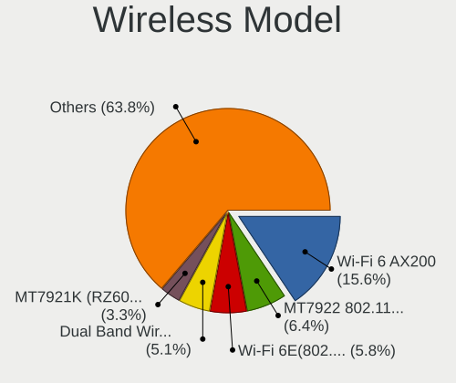

| Model                                                                           | Desktops | Percent |
|---------------------------------------------------------------------------------|----------|---------|
| Intel Wi-Fi 6 AX200                                                             | 429      | 15.62%  |
| MediaTek MT7922 802.11ax PCI Express Wireless Network Adapter                   | 176      | 6.41%   |
| Intel Wi-Fi 6E(802.11ax) AX210/AX1675* 2x2 [Typhoon Peak]                       | 160      | 5.83%   |
| Intel Dual Band Wireless-AC 3168NGW [Stone Peak]                                | 139      | 5.06%   |
| MediaTek MT7921K (RZ608) Wi-Fi 6E 80MHz                                         | 90       | 3.28%   |
| Intel Wi-Fi 5(802.11ac) Wireless-AC 9x6x [Thunder Peak]                         | 83       | 3.02%   |
| Intel Cannon Lake PCH CNVi WiFi                                                 | 56       | 2.04%   |
| Broadcom BCM4360 802.11ac Dual Band Wireless Network Adapter                    | 56       | 2.04%   |
| Realtek RTL8821CE 802.11ac PCIe Wireless Network Adapter                        | 52       | 1.89%   |
| Intel 700 Series Chipset CNVi WiFi                                              | 52       | 1.89%   |
| Ralink MT7601U Wireless Adapter                                                 | 42       | 1.53%   |
| Microsoft Xbox 360 Wireless Adapter                                             | 41       | 1.49%   |
| Realtek RTL8852CE PCIe 802.11ax Wireless Network Controller                     | 40       | 1.46%   |
| Microsoft Xbox Wireless Adapter for Windows                                     | 39       | 1.42%   |
| Realtek 802.11ac NIC                                                            | 38       | 1.38%   |
| Intel Wireless 8260                                                             | 37       | 1.35%   |
| Realtek RTL88x2bu [AC1200 Techkey]                                              | 36       | 1.31%   |
| Intel Wireless 7265                                                             | 35       | 1.27%   |
| Qualcomm Atheros QCA6174 802.11ac Wireless Network Adapter                      | 33       | 1.2%    |
| Qualcomm Atheros AR9485 Wireless Network Adapter                                | 31       | 1.13%   |
| Realtek RTL8188EUS 802.11n Wireless Network Adapter                             | 30       | 1.09%   |
| TP-Link TL-WN823N v2/v3 [Realtek RTL8192EU]                                     | 28       | 1.02%   |
| Intel Wireless 7260                                                             | 27       | 0.98%   |
| Realtek RTL8852BE PCIe 802.11ax Wireless Network Controller                     | 26       | 0.95%   |
| Qualcomm Atheros AR93xx Wireless Network Adapter                                | 26       | 0.95%   |
| Intel Wireless 8265 / 8275                                                      | 26       | 0.95%   |
| Realtek RTL8812AE 802.11ac PCIe Wireless Network Adapter                        | 25       | 0.91%   |
| Realtek RTL8192EE PCIe Wireless Network Adapter                                 | 25       | 0.91%   |
| Intel Comet Lake PCH CNVi WiFi                                                  | 24       | 0.87%   |
| Intel Alder Lake-S PCH CNVi WiFi                                                | 24       | 0.87%   |
| Intel Tiger Lake PCH CNVi WiFi                                                  | 23       | 0.84%   |
| Realtek RTL8822BE 802.11a/b/g/n/ac WiFi adapter                                 | 22       | 0.8%    |
| MediaTek MT7921 802.11ax PCIe Wireless Network Adapter [Filogic 330]            | 22       | 0.8%    |
| Realtek RTL8188FTV 802.11b/g/n 1T1R 2.4G WLAN Adapter                           | 21       | 0.76%   |
| Microsoft Wireless XBox Controller Dongle                                       | 18       | 0.66%   |
| MediaTek MT7927 802.11be 320MHz 2x2 PCIe Wireless Network Adapter [Filogic 380] | 17       | 0.62%   |
| Intel Wireless 3165                                                             | 17       | 0.62%   |
| Broadcom BCM4352 802.11ac Dual Band Wireless Network Adapter                    | 17       | 0.62%   |
| Realtek RTL8192EU 802.11b/g/n WLAN Adapter                                      | 16       | 0.58%   |
| Qualcomm Atheros QCA9377 802.11ac Wireless Network Adapter                      | 16       | 0.58%   |

Ethernet Vendor
---------------

Ethernet vendors

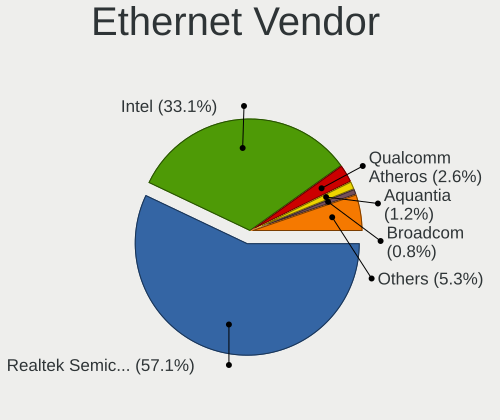

| Vendor                                 | Desktops | Percent |
|----------------------------------------|----------|---------|
| Realtek Semiconductor                  | 3112     | 57.06%  |
| Intel                                  | 1804     | 33.08%  |
| Qualcomm Atheros                       | 142      | 2.6%    |
| Aquantia                               | 64       | 1.17%   |
| Broadcom                               | 44       | 0.81%   |
| Samsung Electronics                    | 38       | 0.7%    |
| MediaTek                               | 27       | 0.5%    |
| Xiaomi                                 | 22       | 0.4%    |
| ASIX Electronics                       | 21       | 0.39%   |
| Qualcomm Technologies                  | 20       | 0.37%   |
| Marvell Technology Group               | 20       | 0.37%   |
| Mellanox Technologies                  | 18       | 0.33%   |
| Nvidia                                 | 15       | 0.28%   |
| DisplayLink                            | 10       | 0.18%   |
| Broadcom Limited                       | 9        | 0.17%   |
| Google                                 | 8        | 0.15%   |
| Qualcomm                               | 7        | 0.13%   |
| Motorola PCS                           | 7        | 0.13%   |
| Apple                                  | 7        | 0.13%   |
| OPPO Electronics                       | 6        | 0.11%   |
| Huawei Technologies                    | 5        | 0.09%   |
| TP-Link                                | 4        | 0.07%   |
| Sony Ericsson Mobile Communications AB | 4        | 0.07%   |
| D-Link System                          | 4        | 0.07%   |
| VIA Technologies                       | 3        | 0.06%   |
| ICS Advent                             | 3        | 0.06%   |
| Xilinx                                 | 2        | 0.04%   |
| vivo                                   | 2        | 0.04%   |
| Silicon Integrated Systems [SiS]       | 2        | 0.04%   |
| QLogic                                 | 2        | 0.04%   |
| NetGear                                | 2        | 0.04%   |
| Standard Microsystems [SMC]            | 1        | 0.02%   |
| Spreadtrum Communications              | 1        | 0.02%   |
| Solarflare Communications              | 1        | 0.02%   |
| QinHeng Electronics                    | 1        | 0.02%   |
| Purism, SPC                            | 1        | 0.02%   |
| Netchip Technology                     | 1        | 0.02%   |
| Microsoft                              | 1        | 0.02%   |
| Microchip Technology                   | 1        | 0.02%   |
| Loongson Technology                    | 1        | 0.02%   |

Ethernet Model
--------------

Ethernet models

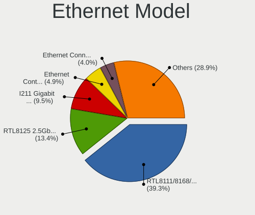

| Model                                                                           | Desktops | Percent |
|---------------------------------------------------------------------------------|----------|---------|
| Realtek RTL8111/8168/8211/8411 PCI Express Gigabit Ethernet Controller          | 2229     | 39.28%  |
| Realtek RTL8125 2.5GbE Controller                                               | 760      | 13.39%  |
| Intel I211 Gigabit Network Connection                                           | 539      | 9.5%    |
| Intel Ethernet Controller I225-V                                                | 280      | 4.93%   |
| Intel Ethernet Connection (2) I219-V                                            | 228      | 4.02%   |
| Intel Ethernet Connection (7) I219-V                                            | 132      | 2.33%   |
| Intel 82579LM Gigabit Network Connection (Lewisville)                           | 92       | 1.62%   |
| Intel Ethernet Controller I226-V                                                | 65       | 1.15%   |
| Intel Ethernet Connection I217-LM                                               | 61       | 1.08%   |
| Intel Ethernet Connection (2) I218-V                                            | 59       | 1.04%   |
| Realtek RTL810xE PCI Express Fast Ethernet controller                           | 56       | 0.99%   |
| Realtek RTL8153 Gigabit Ethernet Adapter                                        | 52       | 0.92%   |
| Intel 82579V Gigabit Network Connection                                         | 50       | 0.88%   |
| Intel Ethernet Connection (2) I219-LM                                           | 43       | 0.76%   |
| Qualcomm Atheros Killer E220x Gigabit Ethernet Controller                       | 42       | 0.74%   |
| Realtek RTL8126 5GbE Controller                                                 | 37       | 0.65%   |
| Intel 82574L Gigabit Network Connection                                         | 34       | 0.6%    |
| Intel I210 Gigabit Network Connection                                           | 33       | 0.58%   |
| Qualcomm Atheros Killer E2500 Gigabit Ethernet Controller                       | 32       | 0.56%   |
| Intel Ethernet Connection (14) I219-V                                           | 28       | 0.49%   |
| Intel Ethernet Connection I217-V                                                | 27       | 0.48%   |
| Qualcomm Atheros AR8151 v2.0 Gigabit Ethernet                                   | 26       | 0.46%   |
| Aquantia AQtion AQC107 NBase-T/IEEE 802.3an Ethernet Controller [Atlantic 10G]  | 25       | 0.44%   |
| Realtek RTL-8100/8101L/8139 PCI Fast Ethernet Adapter                           | 23       | 0.41%   |
| Intel Ethernet Connection (7) I219-LM                                           | 22       | 0.39%   |
| Aquantia AQtion AQC113CS NBase-T/IEEE 802.3an Ethernet Controller [Antigua 10G] | 22       | 0.39%   |
| Samsung Galaxy series, misc. (tethering mode)                                   | 21       | 0.37%   |
| Qualcomm WCN785x Wi-Fi 7(802.11be) 320MHz 2x2 [FastConnect 7800]                | 20       | 0.35%   |
| ASIX AX88179 Gigabit Ethernet                                                   | 19       | 0.33%   |
| Intel Ethernet Connection (11) I219-V                                           | 18       | 0.32%   |
| Samsung GT-I9070 (network tethering, USB debugging enabled)                     | 17       | 0.3%    |
| Realtek Killer E3000 2.5GbE Controller                                          | 17       | 0.3%    |
| Intel Ethernet Connection (17) I219-V                                           | 15       | 0.26%   |
| Qualcomm Atheros Killer E2400 Gigabit Ethernet Controller                       | 14       | 0.25%   |
| MediaTek MT7922 802.11ax PCI Express Wireless Network Adapter                   | 13       | 0.23%   |
| Marvell Group 88E8056 PCI-E Gigabit Ethernet Controller                         | 13       | 0.23%   |
| Realtek RTL8111/8168/8411 PCI Express Gigabit Ethernet Controller               | 12       | 0.21%   |
| Xiaomi Mi/Redmi series (RNDIS)                                                  | 11       | 0.19%   |
| Xiaomi Mi/Redmi series (RNDIS + ADB)                                            | 11       | 0.19%   |
| Intel Alder Lake-S PCH CNVi WiFi                                                | 11       | 0.19%   |

Net Controller Kind
-------------------

Ethernet, WiFi or modem

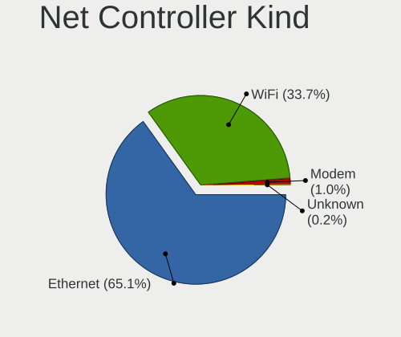

| Kind     | Desktops | Percent |
|----------|----------|---------|
| Ethernet | 4942     | 65.08%  |
| WiFi     | 2557     | 33.67%  |
| Modem    | 77       | 1.01%   |
| Unknown  | 18       | 0.24%   |

Used Controller
---------------

Currently used network controller

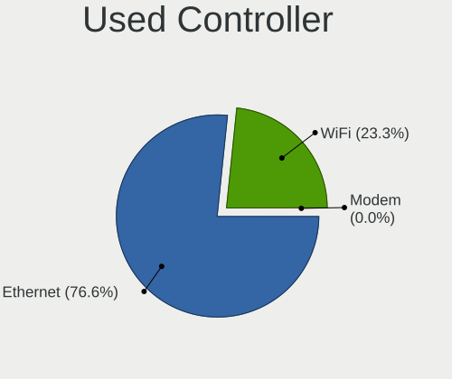

| Kind     | Desktops | Percent |
|----------|----------|---------|
| Ethernet | 3984     | 76.63%  |
| WiFi     | 1213     | 23.33%  |
| Modem    | 2        | 0.04%   |

NICs
----

Total network controllers on board

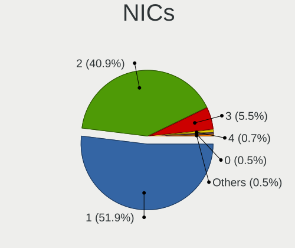

| Total | Desktops | Percent |
|-------|----------|---------|
| 1     | 2612     | 51.94%  |
| 2     | 2056     | 40.88%  |
| 3     | 277      | 5.51%   |
| 4     | 33       | 0.66%   |
| 0     | 26       | 0.52%   |
| 5     | 15       | 0.3%    |
| 6     | 5        | 0.1%    |
| 7     | 2        | 0.04%   |
| 10    | 1        | 0.02%   |
| 9     | 1        | 0.02%   |
| 8     | 1        | 0.02%   |

IPv6
----

IPv6 vs IPv4

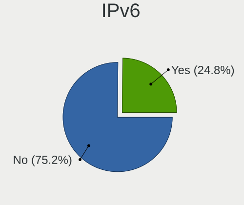

| Used | Desktops | Percent |
|------|----------|---------|
| No   | 3793     | 75.15%  |
| Yes  | 1254     | 24.85%  |

Bluetooth
---------

Bluetooth Vendor
----------------

Controller vendors

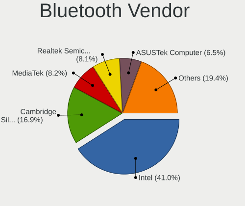

| Vendor                          | Desktops | Percent |
|---------------------------------|----------|---------|
| Intel                           | 1129     | 40.97%  |
| Cambridge Silicon Radio         | 465      | 16.87%  |
| MediaTek                        | 225      | 8.16%   |
| Realtek Semiconductor           | 224      | 8.13%   |
| ASUSTek Computer                | 178      | 6.46%   |
| IMC Networks                    | 117      | 4.25%   |
| Foxconn / Hon Hai               | 113      | 4.1%    |
| TP-Link                         | 91       | 3.3%    |
| Broadcom                        | 63       | 2.29%   |
| Qualcomm Atheros Communications | 29       | 1.05%   |
| Apple                           | 22       | 0.8%    |
| HTC (High Tech Computer)        | 18       | 0.65%   |
| Unknown                         | 14       | 0.51%   |
| Actions                         | 12       | 0.44%   |
| Edimax Technology               | 10       | 0.36%   |
| Lite-On Technology              | 8        | 0.29%   |
| Realtek                         | 7        | 0.25%   |
| Integrated System Solution      | 6        | 0.22%   |
| Dynex                           | 5        | 0.18%   |
| Mercucys                        | 4        | 0.15%   |
| SiW                             | 3        | 0.11%   |
| Micro Star International        | 2        | 0.07%   |
| Belkin Components               | 2        | 0.07%   |
| SINO WEALTH                     | 1        | 0.04%   |
| Roper                           | 1        | 0.04%   |
| Quectel Wireless Solutions      | 1        | 0.04%   |
| Plugable                        | 1        | 0.04%   |
| Nordic Semiconductor ASA        | 1        | 0.04%   |
| Hewlett-Packard                 | 1        | 0.04%   |
| Fujitsu                         | 1        | 0.04%   |
| Cypress Semiconductor           | 1        | 0.04%   |
| Corsair                         | 1        | 0.04%   |

Bluetooth Model
---------------

Controller models

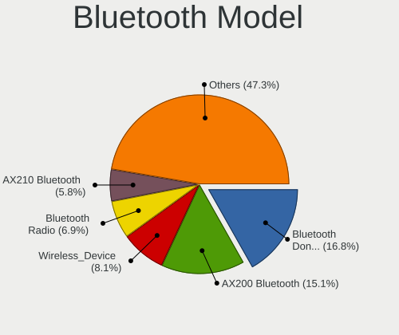

| Model                                                                | Desktops | Percent |
|----------------------------------------------------------------------|----------|---------|
| Cambridge Silicon Radio Bluetooth Dongle (HCI mode)                  | 465      | 16.82%  |
| Intel AX200 Bluetooth                                                | 418      | 15.12%  |
| MediaTek Wireless_Device                                             | 225      | 8.14%   |
| Realtek Bluetooth Radio                                              | 190      | 6.87%   |
| Intel AX210 Bluetooth                                                | 159      | 5.75%   |
| Intel Wireless-AC 3168 Bluetooth                                     | 136      | 4.92%   |
| Intel Bluetooth wireless interface                                   | 131      | 4.74%   |
| TP-Link TP-T@- UB500 Adapter                                         | 91       | 3.29%   |
| Intel Wireless-AC 9260 Bluetooth Adapter                             | 81       | 2.93%   |
| Intel AX201 Bluetooth                                                | 79       | 2.86%   |
| Foxconn / Hon Hai Wireless_Device                                    | 75       | 2.71%   |
| Intel Bluetooth Device                                               | 66       | 2.39%   |
| Intel Bluetooth 9460/9560 Jefferson Peak (JfP)                       | 62       | 2.24%   |
| ASUS Broadcom BCM20702A0 Bluetooth                                   | 62       | 2.24%   |
| IMC Networks Wireless_Device                                         | 61       | 2.21%   |
| IMC Networks Bluetooth Radio                                         | 53       | 1.92%   |
| Broadcom BCM20702A0 Bluetooth 4.0                                    | 47       | 1.7%    |
| ASUS ASUS USB-BT500                                                  | 44       | 1.59%   |
| Foxconn / Hon Hai Bluetooth Device                                   | 34       | 1.23%   |
| ASUS Qualcomm Bluetooth 4.1                                          | 24       | 0.87%   |
| ASUS Bluetooth Radio                                                 | 21       | 0.76%   |
| Realtek  Bluetooth 4.2 Adapter                                       | 18       | 0.65%   |
| HTC (High Tech Computer) Vive Hub Bluetooth 4.1 (Broadcom BCM920703) | 18       | 0.65%   |
| Qualcomm Atheros  Bluetooth Device                                   | 17       | 0.61%   |
| Unknown                                                              | 14       | 0.51%   |
| Apple Bluetooth Host Controller                                      | 12       | 0.43%   |
| Actions general adapter                                              | 12       | 0.43%   |
| ASUS Broadcom BCM20702 Single-Chip Bluetooth 4.0 + LE                | 11       | 0.4%    |
| Realtek Bluetooth 5.3 Radio                                          | 7        | 0.25%   |
| Realtek Bluetooth Radio                                              | 7        | 0.25%   |
| Edimax Bluetooth Device                                              | 7        | 0.25%   |
| ASUS Bluetooth Adapter                                               | 6        | 0.22%   |
| ASUS BCM20702A0                                                      | 6        | 0.22%   |
| Apple Built-in Bluetooth 2.0+EDR HCI                                 | 6        | 0.22%   |
| Intel Centrino Bluetooth Wireless Transceiver                        | 5        | 0.18%   |
| Integrated System Solution KY-BT100 Bluetooth Adapter                | 5        | 0.18%   |
| Dynex Bluetooth 4.0 Adapter [Broadcom, 1.12, BCM20702A0]             | 5        | 0.18%   |
| ASUS Bluetooth Device                                                | 5        | 0.18%   |
| Qualcomm Atheros QCA61x4 Bluetooth 4.0                               | 4        | 0.14%   |
| Mercucys Mercusys MA530 Adapter                                      | 4        | 0.14%   |

Sound
-----

Sound Vendor
------------

Sound card vendors

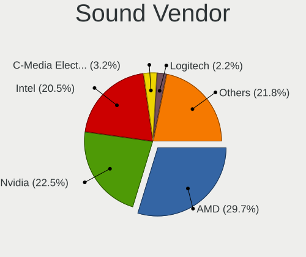

| Vendor                               | Desktops | Percent |
|--------------------------------------|----------|---------|
| AMD                                  | 3152     | 29.72%  |
| Nvidia                               | 2388     | 22.51%  |
| Intel                                | 2177     | 20.52%  |
| C-Media Electronics                  | 339      | 3.2%    |
| Logitech                             | 237      | 2.23%   |
| Kingston Technology                  | 135      | 1.27%   |
| Focusrite-Novation                   | 135      | 1.27%   |
| ASUSTek Computer                     | 122      | 1.15%   |
| SteelSeries ApS                      | 114      | 1.07%   |
| JMTek                                | 114      | 1.07%   |
| Razer USA                            | 108      | 1.02%   |
| Micro Star International             | 91       | 0.86%   |
| Texas Instruments                    | 84       | 0.79%   |
| Creative Labs                        | 72       | 0.68%   |
| Corsair                              | 70       | 0.66%   |
| Creative Technology                  | 64       | 0.6%    |
| Blue Microphones                     | 64       | 0.6%    |
| Generalplus Technology               | 48       | 0.45%   |
| Sony                                 | 47       | 0.44%   |
| Hewlett-Packard                      | 45       | 0.42%   |
| Samson Technologies                  | 36       | 0.34%   |
| Valve Software                       | 32       | 0.3%    |
| BEHRINGER International              | 32       | 0.3%    |
| KTMicro                              | 31       | 0.29%   |
| GYROCOM C&C                          | 31       | 0.29%   |
| Yamaha                               | 30       | 0.28%   |
| Unknown                              | 29       | 0.27%   |
| GN Netcom                            | 28       | 0.26%   |
| Thesycon Systemsoftware & Consulting | 25       | 0.24%   |
| RODE Microphones                     | 24       | 0.23%   |
| Audio-Technica                       | 24       | 0.23%   |
| XMOS                                 | 21       | 0.2%    |
| Realtek Semiconductor                | 21       | 0.2%    |
| FiiO Electronics Technology          | 21       | 0.2%    |
| Astro Gaming                         | 21       | 0.2%    |
| DSEA A/S                             | 19       | 0.18%   |
| M-Audio                              | 17       | 0.16%   |
| Giga-Byte Technology                 | 17       | 0.16%   |
| SAVITECH                             | 15       | 0.14%   |
| Jieli Technology                     | 15       | 0.14%   |

Sound Model
-----------

Sound card models

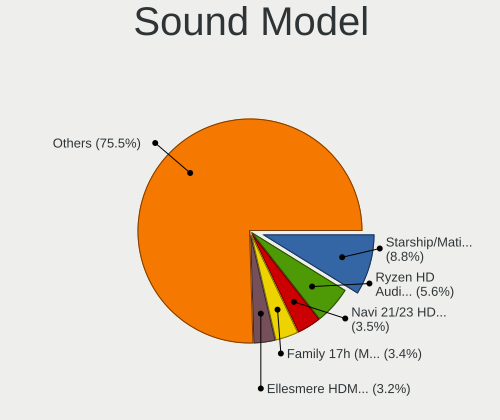

| Model                                                                      | Desktops | Percent |
|----------------------------------------------------------------------------|----------|---------|
| AMD Starship/Matisse HD Audio Controller                                   | 1128     | 8.83%   |
| AMD Ryzen HD Audio Controller                                              | 712      | 5.57%   |
| AMD Navi 21/23 HDMI/DP Audio Controller                                    | 452      | 3.54%   |
| AMD Family 17h (Models 00h-0fh) HD Audio Controller                        | 435      | 3.4%    |
| AMD Ellesmere HDMI Audio [Radeon RX 470/480 / 570/580/590]                 | 405      | 3.17%   |
| AMD Radeon High Definition Audio Controller                                | 371      | 2.9%    |
| Intel 200 Series PCH HD Audio                                              | 273      | 2.14%   |
| AMD Navi 31 HDMI/DP Audio                                                  | 248      | 1.94%   |
| Intel 8 Series/C220 Series Chipset High Definition Audio Controller        | 234      | 1.83%   |
| Nvidia GP104 High Definition Audio Controller                              | 223      | 1.75%   |
| Intel 100 Series/C230 Series Chipset Family HD Audio Controller            | 223      | 1.75%   |
| AMD Navi 10 HDMI Audio                                                     | 217      | 1.7%    |
| AMD Renoir/Cezanne HDMI/DP Audio Controller                                | 208      | 1.63%   |
| Intel Cannon Lake PCH cAVS                                                 | 207      | 1.62%   |
| Nvidia GA104 High Definition Audio Controller                              | 194      | 1.52%   |
| Intel 6 Series/C200 Series Chipset Family High Definition Audio Controller | 191      | 1.49%   |
| Nvidia GP107GL High Definition Audio Controller                            | 180      | 1.41%   |
| Nvidia TU116 High Definition Audio Controller                              | 177      | 1.39%   |
| AMD SBx00 Azalia (Intel HDA)                                               | 163      | 1.28%   |
| Nvidia GP106 High Definition Audio Controller                              | 160      | 1.25%   |
| Nvidia GA102 High Definition Audio Controller                              | 160      | 1.25%   |
| Intel 7 Series/C216 Chipset Family High Definition Audio Controller        | 143      | 1.12%   |
| Nvidia TU106 High Definition Audio Controller                              | 136      | 1.06%   |
| Nvidia GA106 High Definition Audio Controller                              | 135      | 1.06%   |
| Intel Xeon E3-1200 v3/4th Gen Core Processor HD Audio Controller           | 134      | 1.05%   |
| Nvidia TU104 HD Audio Controller                                           | 129      | 1.01%   |
| AMD Baffin HDMI/DP Audio [Radeon RX 550 640SP / RX 560/560X]               | 127      | 0.99%   |
| Intel Raptor Lake High Definition Audio Controller                         | 109      | 0.85%   |
| Intel Alder Lake-S HD Audio Controller                                     | 108      | 0.85%   |
| ASUSTek Computer USB Audio                                                 | 101      | 0.79%   |
| Nvidia GK208 HDMI/DP Audio Controller                                      | 91       | 0.71%   |
| Micro Star International USB Audio                                         | 90       | 0.7%    |
| Nvidia GM204 High Definition Audio Controller                              | 89       | 0.7%    |
| AMD Raven/Raven2/Fenghuang HDMI/DP Audio Controller                        | 88       | 0.69%   |
| Intel 9 Series Chipset Family HD Audio Controller                          | 81       | 0.63%   |
| AMD Oland/Hainan/Cape Verde/Pitcairn HDMI Audio [Radeon HD 7000 Series]    | 81       | 0.63%   |
| C-Media Electronics Blue Snowball                                          | 80       | 0.63%   |
| JMTek USB PnP Audio Device                                                 | 78       | 0.61%   |
| AMD FCH Azalia Controller                                                  | 76       | 0.59%   |
| Intel Comet Lake PCH cAVS                                                  | 65       | 0.51%   |

Memory
------

Memory Vendor
-------------

Memory module vendors

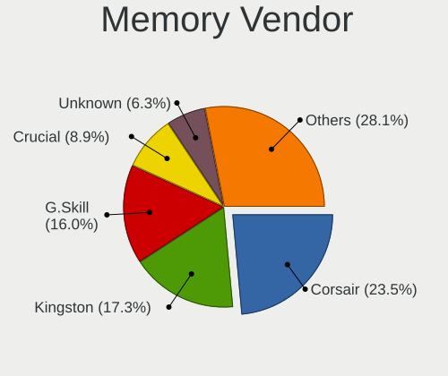

| Vendor                                  | Desktops | Percent |
|-----------------------------------------|----------|---------|
| Corsair                                 | 888      | 23.55%  |
| Kingston                                | 651      | 17.26%  |
| G.Skill                                 | 602      | 15.96%  |
| Crucial                                 | 334      | 8.86%   |
| Unknown                                 | 238      | 6.31%   |
| Samsung Electronics                     | 199      | 5.28%   |
| SK hynix                                | 148      | 3.92%   |
| Micron Technology                       | 110      | 2.92%   |
| A-DATA Technology                       | 92       | 2.44%   |
| Team                                    | 78       | 2.07%   |
| Unknown                                 | 75       | 1.99%   |
| Patriot                                 | 57       | 1.51%   |
| GOODRAM                                 | 27       | 0.72%   |
| AMD                                     | 18       | 0.48%   |
| Ramaxel Technology                      | 16       | 0.42%   |
| Nanya Technology                        | 14       | 0.37%   |
| PNY                                     | 13       | 0.34%   |
| Apacer                                  | 10       | 0.27%   |
| Transcend                               | 9        | 0.24%   |
| Patriot Memory (PDP Systems)            | 9        | 0.24%   |
| Elpida                                  | 9        | 0.24%   |
| Timetec                                 | 8        | 0.21%   |
| Lexar                                   | 8        | 0.21%   |
| Wilk                                    | 6        | 0.16%   |
| Smart                                   | 6        | 0.16%   |
| Kingmax                                 | 6        | 0.16%   |
| Golden Empire                           | 6        | 0.16%   |
| GeIL                                    | 6        | 0.16%   |
| Silicon Power                           | 5        | 0.13%   |
| KLEVV                                   | 5        | 0.13%   |
| KINGBANK                                | 5        | 0.13%   |
| Goldkey                                 | 5        | 0.13%   |
| Wilk Elektronik                         | 4        | 0.11%   |
| Patriot Memory                          | 4        | 0.11%   |
| Kllisre                                 | 4        | 0.11%   |
| Unknown (ABCD)                          | 3        | 0.08%   |
| Unknown (0x0B92)                        | 3        | 0.08%   |
| Silicon Power Computer & Communications | 3        | 0.08%   |
| Netac                                   | 3        | 0.08%   |
| Juhor                                   | 3        | 0.08%   |

Memory Model
------------

Memory module models

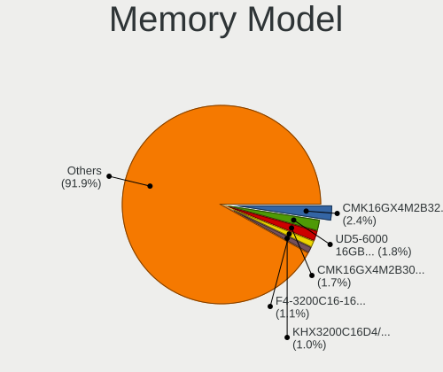

| Model                                                   | Desktops | Percent |
|---------------------------------------------------------|----------|---------|
| Corsair RAM CMK16GX4M2B3200C16 8GB DIMM DDR4 3600MT/s   | 100      | 2.44%   |
| Unknown                                                 | 75       | 1.83%   |
| Corsair RAM CMK16GX4M2B3000C15 8GB DIMM DDR4 3600MT/s   | 69       | 1.69%   |
| G.Skill RAM F4-3200C16-16GVK 16GB DIMM DDR4 3600MT/s    | 45       | 1.1%    |
| Kingston RAM KHX3200C16D4/8GX 8GB DIMM DDR4 3733MT/s    | 41       | 1%      |
| Corsair RAM CMK32GX4M2E3200C16 16GB DIMM DDR4 3600MT/s  | 31       | 0.76%   |
| Kingston RAM KF3200C16D4/8GX 8GiB DIMM DDR4 3600MT/s    | 30       | 0.73%   |
| Corsair RAM CMK32GX4M2B3200C16 16GB DIMM DDR4 3800MT/s  | 30       | 0.73%   |
| G.Skill RAM F4-3200C16-8GVKB 8GB DIMM DDR4 4000MT/s     | 29       | 0.71%   |
| Team RAM TEAMGROUP-UD4-3200 8GB DIMM DDR4 3800MT/s      | 28       | 0.68%   |
| Corsair RAM CMK32GX4M2D3600C18 16GB DIMM DDR4 3800MT/s  | 26       | 0.64%   |
| Kingston RAM KHX2400C15/8G 8GB DIMM DDR4 3400MT/s       | 25       | 0.61%   |
| A-DATA RAM DDR4 3200 16GB DIMM DDR4 3600MT/s            | 25       | 0.61%   |
| Corsair RAM CMW16GX4M2C3200C16 8GB DIMM DDR4 3733MT/s   | 24       | 0.59%   |
| Kingston RAM KHX2666C16/8G 8GiB DIMM DDR4 3466MT/s      | 23       | 0.56%   |
| Corsair RAM CMK16GX4M2D3600C18 8GB DIMM DDR4 4000MT/s   | 22       | 0.54%   |
| Kingston RAM KHX1600C10D3/8G 8GB DIMM DDR3 2133MT/s     | 21       | 0.51%   |
| G.Skill RAM F5-6000J3636F16G 16GB DIMM DDR5 6400MT/s    | 21       | 0.51%   |
| Kingston RAM KHX3200C16D4/16GX 16GB DIMM DDR4 3600MT/s  | 20       | 0.49%   |
| G.Skill RAM F5-6000J3038F16G 16GB DIMM DDR5 6000MT/s    | 20       | 0.49%   |
| Kingston RAM KF3200C16D4/32GX 32GB DIMM DDR4 3933MT/s   | 19       | 0.46%   |
| G.Skill RAM F4-3000C16-8GISB 8GB DIMM DDR4 3200MT/s     | 19       | 0.46%   |
| G.Skill RAM F4-3600C16-16GTZNC 16GiB DIMM DDR4 3600MT/s | 18       | 0.44%   |
| Kingston RAM KF3200C16D4/16GX 16GB DIMM DDR4 3733MT/s   | 17       | 0.42%   |
| G.Skill RAM F4-3600C16-16GVKC 16GB DIMM DDR4 3866MT/s   | 17       | 0.42%   |
| Patriot RAM 3200 C16 Series 8GB DIMM DDR4 3600MT/s      | 16       | 0.39%   |
| G.Skill RAM F4-3200C16-8GIS 8GB DIMM DDR4 3600MT/s      | 15       | 0.37%   |
| Kingston RAM KHX1866C10D3/8G 8GB DIMM DDR3 1867MT/s     | 14       | 0.34%   |
| Kingston RAM KF560C36-16 16GB DIMM DDR5 6000MT/s        | 14       | 0.34%   |
| G.Skill RAM F5-6000J3040G32G 32GB DIMM DDR5 6200MT/s    | 14       | 0.34%   |
| Corsair RAM CMW32GX4M2C3200C16 16GB DIMM DDR4 3400MT/s  | 14       | 0.34%   |
| Corsair RAM CMK16GX4M2A2400C16 8GB DIMM DDR4 2933MT/s   | 14       | 0.34%   |
| G.Skill RAM F4-3200C14-8GFX 8GB DIMM DDR4 3800MT/s      | 13       | 0.32%   |
| Corsair RAM CMZ8GX3M2A1600C9 4GB DIMM SDRAM 1800MT/s    | 12       | 0.29%   |
| Corsair RAM CMK64GX4M2E3200C16 32GB DIMM DDR4 3600MT/s  | 12       | 0.29%   |
| Team RAM TEAMGROUP-UD4-3200 8GB DIMM DDR4 3733MT/s      | 11       | 0.27%   |
| Kingston RAM KHX1600C9D3/4GX 4GB DIMM DDR3 1867MT/s     | 11       | 0.27%   |
| Kingston RAM 99U5471-054.A00LF 8GB DIMM DDR3 1600MT/s   | 11       | 0.27%   |
| G.Skill RAM F4-3200C16-16GIS 16GB DIMM DDR4 3600MT/s    | 11       | 0.27%   |
| Corsair RAM CMW32GX4M2E3200C16 16GB DIMM DDR4 3200MT/s  | 11       | 0.27%   |

Memory Kind
-----------

Memory module kinds

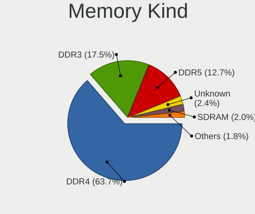

| Kind    | Desktops | Percent |
|---------|----------|---------|
| DDR4    | 2160     | 63.66%  |
| DDR3    | 593      | 17.48%  |
| DDR5    | 430      | 12.67%  |
| Unknown | 81       | 2.39%   |
| SDRAM   | 67       | 1.97%   |
| DDR2    | 32       | 0.94%   |
| DDR     | 17       | 0.5%    |
| DRAM    | 6        | 0.18%   |
| LPDDR4  | 4        | 0.12%   |
| LPDDR5  | 2        | 0.06%   |
| LPDDR3  | 1        | 0.03%   |

Memory Form Factor
------------------

Physical design of the memory module

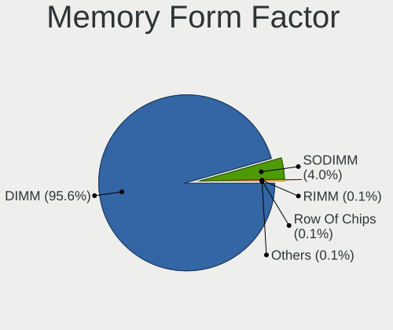

| Name         | Desktops | Percent |
|--------------|----------|---------|
| DIMM         | 3213     | 95.6%   |
| SODIMM       | 136      | 4.05%   |
| RIMM         | 4        | 0.12%   |
| Row Of Chips | 3        | 0.09%   |
| FB-DIMM      | 3        | 0.09%   |
| Chip         | 1        | 0.03%   |
| Unknown      | 1        | 0.03%   |

Memory Size
-----------

Memory module size

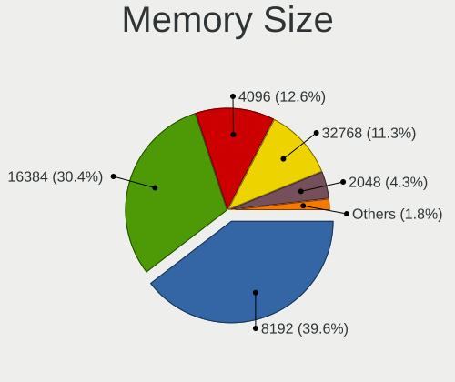

| Size  | Desktops | Percent |
|-------|----------|---------|
| 8192  | 1446     | 39.55%  |
| 16384 | 1111     | 30.39%  |
| 4096  | 460      | 12.58%  |
| 32768 | 414      | 11.32%  |
| 2048  | 159      | 4.35%   |
| 1024  | 29       | 0.79%   |
| 49152 | 18       | 0.49%   |
| 24576 | 8        | 0.22%   |
| 512   | 8        | 0.22%   |
| 65536 | 2        | 0.05%   |
| 6144  | 1        | 0.03%   |

Memory Speed
------------

Memory module speed

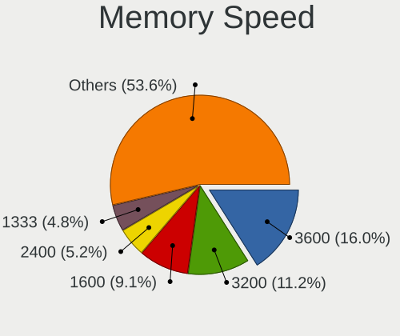

| Speed   | Desktops | Percent |
|---------|----------|---------|
| 3600    | 607      | 15.99%  |
| 3200    | 425      | 11.19%  |
| 1600    | 346      | 9.11%   |
| 2400    | 199      | 5.24%   |
| 1333    | 183      | 4.82%   |
| 6000    | 171      | 4.5%    |
| 3800    | 163      | 4.29%   |
| 2667    | 154      | 4.06%   |
| 3733    | 150      | 3.95%   |
| 2133    | 140      | 3.69%   |
| 3400    | 86       | 2.26%   |
| 3000    | 86       | 2.26%   |
| 4000    | 80       | 2.11%   |
| 2666    | 67       | 1.76%   |
| 4800    | 55       | 1.45%   |
| 2933    | 51       | 1.34%   |
| 1866    | 51       | 1.34%   |
| 5600    | 47       | 1.24%   |
| 3466    | 44       | 1.16%   |
| 6400    | 43       | 1.13%   |
| 3866    | 40       | 1.05%   |
| 1867    | 40       | 1.05%   |
| 5200    | 37       | 0.97%   |
| 1800    | 35       | 0.92%   |
| 2800    | 29       | 0.76%   |
| 3666    | 28       | 0.74%   |
| 800     | 28       | 0.74%   |
| Unknown | 27       | 0.71%   |
| 6200    | 25       | 0.66%   |
| 667     | 24       | 0.63%   |
| 12800   | 23       | 0.61%   |
| 3333    | 21       | 0.55%   |
| 3066    | 21       | 0.55%   |
| 3933    | 19       | 0.5%    |
| 1066    | 18       | 0.47%   |
| 3266    | 15       | 0.4%    |
| 2733    | 13       | 0.34%   |
| 3100    | 12       | 0.32%   |
| 400     | 12       | 0.32%   |
| 7000    | 9        | 0.24%   |

Printers & scanners
-------------------

Printer Vendor
--------------

Printer device vendors

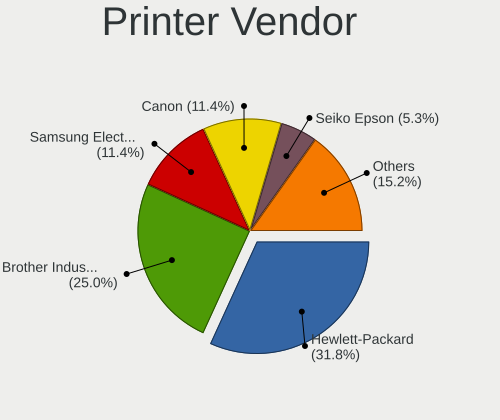

| Vendor                   | Desktops | Percent |
|--------------------------|----------|---------|
| Hewlett-Packard          | 42       | 31.82%  |
| Brother Industries       | 33       | 25%     |
| Samsung Electronics      | 15       | 11.36%  |
| Canon                    | 15       | 11.36%  |
| Seiko Epson              | 7        | 5.3%    |
| QinHeng Electronics      | 3        | 2.27%   |
| XiaoMi                   | 2        | 1.52%   |
| Xerox                    | 2        | 1.52%   |
| STMicroelectronics       | 2        | 1.52%   |
| Ricoh                    | 2        | 1.52%   |
| Prolific Technology      | 2        | 1.52%   |
| Dymo-CoStar              | 2        | 1.52%   |
| Zebra Technologies       | 1        | 0.76%   |
| Philips (or NXP)         | 1        | 0.76%   |
| Magic Control Technology | 1        | 0.76%   |
| Fuji Xerox               | 1        | 0.76%   |
| Dell                     | 1        | 0.76%   |

Printer Model
-------------

Printer device models

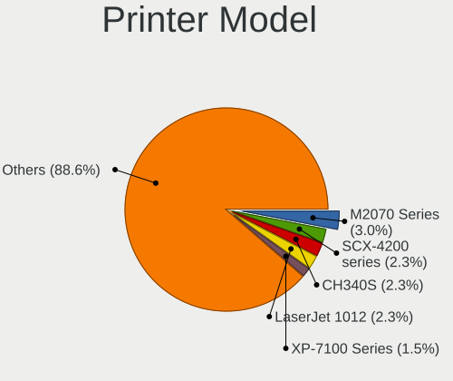

| Model                                                     | Desktops | Percent |
|-----------------------------------------------------------|----------|---------|
| Samsung M2070 Series                                      | 4        | 3.03%   |
| Samsung SCX-4200 series                                   | 3        | 2.27%   |
| QinHeng CH340S                                            | 3        | 2.27%   |
| HP LaserJet 1012                                          | 3        | 2.27%   |
| STMicroelectronics LED badge -- mini LED display -- 11x44 | 2        | 1.52%   |
| Seiko Epson XP-7100 Series                                | 2        | 1.52%   |
| Samsung SCX-4100 Scanner                                  | 2        | 1.52%   |
| Prolific PL2305 Parallel Port                             | 2        | 1.52%   |
| HP Officejet Pro 8100                                     | 2        | 1.52%   |
| HP LaserJet P2015 series                                  | 2        | 1.52%   |
| HP LaserJet P1005                                         | 2        | 1.52%   |
| HP LaserJet M14-M17                                       | 2        | 1.52%   |
| HP LaserJet 1018                                          | 2        | 1.52%   |
| HP Ink Tank 310 series                                    | 2        | 1.52%   |
| HP ENVY Photo 6200 series                                 | 2        | 1.52%   |
| HP DeskJet F4200 series                                   | 2        | 1.52%   |
| HP Deskjet 3050 J610 series                               | 2        | 1.52%   |
| HP DeskJet 2700 series                                    | 2        | 1.52%   |
| Dymo-CoStar LabelWriter 450                               | 2        | 1.52%   |
| Canon PIXMA MX320 series                                  | 2        | 1.52%   |
| Canon G4010 series                                        | 2        | 1.52%   |
| Brother Printer                                           | 2        | 1.52%   |
| Brother MFC-L2710DW series                                | 2        | 1.52%   |
| Brother HL-L2320D series                                  | 2        | 1.52%   |
| Brother HL-5370DW series                                  | 2        | 1.52%   |
| Brother HL-2130 series                                    | 2        | 1.52%   |
| Brother DCP-1510                                          | 2        | 1.52%   |
| Zebra LP2844 Printer                                      | 1        | 0.76%   |
| Xiaomi MiMouse 2                                          | 1        | 0.76%   |
| XiaoMi MIIIW MECH-KBPro                                   | 1        | 0.76%   |
| Xerox Phaser 3020                                         | 1        | 0.76%   |
| Xerox Phaser 3010                                         | 1        | 0.76%   |
| Seiko Epson Workforce WF-7820/7840 Series                 | 1        | 0.76%   |
| Seiko Epson WF-4830 Series                                | 1        | 0.76%   |
| Seiko Epson M1140 Series                                  | 1        | 0.76%   |
| Seiko Epson L3560 Series                                  | 1        | 0.76%   |
| Seiko Epson L3110 Series                                  | 1        | 0.76%   |
| Samsung SCX-3400 Series                                   | 1        | 0.76%   |
| Samsung ML-216x Series Laser Printer                      | 1        | 0.76%   |
| Samsung ML-1610 Mono Laser Printer                        | 1        | 0.76%   |

Scanner Vendor
--------------

Scanner device vendors

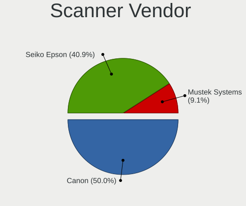

| Vendor         | Desktops | Percent |
|----------------|----------|---------|
| Canon          | 11       | 50%     |
| Seiko Epson    | 9        | 40.91%  |
| Mustek Systems | 2        | 9.09%   |

Scanner Model
-------------

Scanner device models

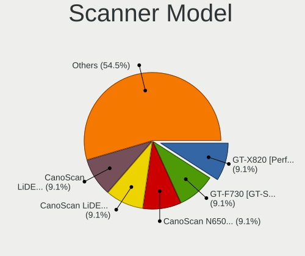

| Model                                                       | Desktops | Percent |
|-------------------------------------------------------------|----------|---------|
| Seiko Epson GT-X820 [Perfection V600 Photo]                 | 2        | 9.09%   |
| Seiko Epson GT-F730 [GT-S630/Perfection V33/V330 Photo]     | 2        | 9.09%   |
| Canon CanoScan N650U/N656U                                  | 2        | 9.09%   |
| Canon CanoScan LiDE 220                                     | 2        | 9.09%   |
| Canon CanoScan LiDE 200                                     | 2        | 9.09%   |
| Canon CanoScan LiDE 120                                     | 2        | 9.09%   |
| Seiko Epson Perfection V37/V370                             | 1        | 4.55%   |
| Seiko Epson GT-X900 [Perfection V700/V750 Photo]            | 1        | 4.55%   |
| Seiko Epson GT-F720 [GT-S620/Perfection V30/V300 Photo]     | 1        | 4.55%   |
| Seiko Epson GT-F700 [Perfection V350]                       | 1        | 4.55%   |
| Seiko Epson GT-8200U/GT-8200UF [Perfection 1650/1650 PHOTO] | 1        | 4.55%   |
| Mustek Systems ScanExpress 1200 UB                          | 1        | 4.55%   |
| Mustek Systems BearPaw 1200 CU Plus                         | 1        | 4.55%   |
| Canon CanoScan LiDE 60                                      | 1        | 4.55%   |
| Canon CanoScan LiDE 210                                     | 1        | 4.55%   |
| Canon CanoScan LiDE 110                                     | 1        | 4.55%   |

Camera
------

Camera Vendor
-------------

Camera device vendors

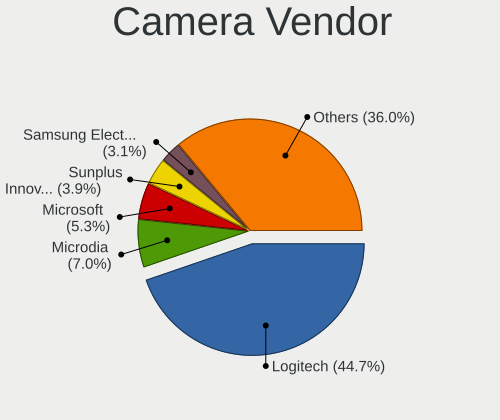

| Vendor                        | Desktops | Percent |
|-------------------------------|----------|---------|
| Logitech                      | 565      | 44.73%  |
| Microdia                      | 88       | 6.97%   |
| Microsoft                     | 67       | 5.3%    |
| Sunplus Innovation Technology | 49       | 3.88%   |
| Samsung Electronics           | 39       | 3.09%   |
| Valve Software                | 28       | 2.22%   |
| MacroSilicon                  | 26       | 2.06%   |
| Realtek Semiconductor         | 24       | 1.9%    |
| Razer USA                     | 23       | 1.82%   |
| Creative Technology           | 21       | 1.66%   |
| Apple                         | 20       | 1.58%   |
| Z-Star Microelectronics       | 18       | 1.43%   |
| Generalplus Technology        | 16       | 1.27%   |
| ARC International             | 16       | 1.27%   |
| Jieli Technology              | 15       | 1.19%   |
| Lenovo                        | 12       | 0.95%   |
| KYE Systems (Mouse Systems)   | 12       | 0.95%   |
| Chicony Electronics           | 12       | 0.95%   |
| webcam                        | 9        | 0.71%   |
| eMeet                         | 8        | 0.63%   |
| Elgato Systems                | 8        | 0.63%   |
| Anker PowerConf C200          | 8        | 0.63%   |
| Tobii Technology AB           | 7        | 0.55%   |
| Sonix Technology              | 7        | 0.55%   |
| Hewlett-Packard               | 7        | 0.55%   |
| Google                        | 7        | 0.55%   |
| Cubeternet                    | 7        | 0.55%   |
| Trust                         | 6        | 0.48%   |
| LG Electronics                | 6        | 0.48%   |
| Huawei Technologies           | 6        | 0.48%   |
| A4Tech                        | 6        | 0.48%   |
| webcamvendor                  | 5        | 0.4%    |
| Aveo Technology               | 5        | 0.4%    |
| Alcor Micro                   | 5        | 0.4%    |
| Unknown                       | 5        | 0.4%    |
| YGTek                         | 4        | 0.32%   |
| SunplusIT                     | 4        | 0.32%   |
| Sunplus IT                    | 4        | 0.32%   |
| Oculus VR                     | 4        | 0.32%   |
| GEMBIRD                       | 4        | 0.32%   |

Camera Model
------------

Camera device models

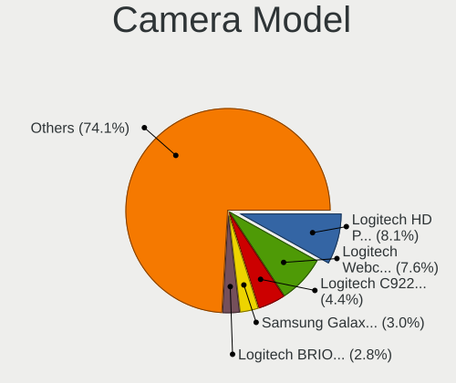

| Model                                     | Desktops | Percent |
|-------------------------------------------|----------|---------|
| Logitech HD Pro Webcam C920               | 103      | 8.11%   |
| Logitech Webcam C270                      | 97       | 7.64%   |
| Logitech C922 Pro Stream Webcam           | 56       | 4.41%   |
| Samsung Galaxy series, misc. (MTP mode)   | 38       | 2.99%   |
| Logitech BRIO Ultra HD Webcam             | 35       | 2.76%   |
| Logitech Webcam C310                      | 30       | 2.36%   |
| Logitech C920 PRO HD Webcam               | 30       | 2.36%   |
| Valve Software 3D Camera                  | 28       | 2.2%    |
| Logitech HD Webcam C615                   | 26       | 2.05%   |
| Sunplus Full HD webcam                    | 23       | 1.81%   |
| Microsoft LifeCam HD-3000                 | 23       | 1.81%   |
| Logitech Webcam C930e                     | 23       | 1.81%   |
| Logitech StreamCam                        | 23       | 1.81%   |
| Microdia USB 2.0 Camera                   | 22       | 1.73%   |
| Logitech HD Webcam C525                   | 21       | 1.65%   |
| MacroSilicon USB Video                    | 20       | 1.57%   |
| Microdia Webcam Vitade AF                 | 17       | 1.34%   |
| Apple iPhone 5/5C/5S/6/SE/7/8/X           | 17       | 1.34%   |
| Logitech Logitech Webcam C925e            | 16       | 1.26%   |
| ARC International Camera                  | 16       | 1.26%   |
| Microsoft LifeCam Cinema                  | 15       | 1.18%   |
| Razer USA Gaming Webcam [Kiyo]            | 13       | 1.02%   |
| Microdia CyberTrack H7                    | 12       | 0.94%   |
| Logitech Webcam C170                      | 12       | 0.94%   |
| Microdia Integrated Camera                | 11       | 0.87%   |
| Microdia Camera                           | 10       | 0.79%   |
| Logitech HD Webcam C910                   | 10       | 0.79%   |
| Jieli USB PHY 2.0                         | 10       | 0.79%   |
| Generalplus GENERAL WEBCAM                | 10       | 0.79%   |
| webcam webcam                             | 9        | 0.71%   |
| Z-Star Venus USB2.0 Camera                | 8        | 0.63%   |
| Microsoft Xbox NUI Camera                 | 8        | 0.63%   |
| Anker PowerConf C200 Anker PowerConf C200 | 8        | 0.63%   |
| Tobii AB EyeChip                          | 7        | 0.55%   |
| Sunplus Aukey-PC-LM1E Camera              | 7        | 0.55%   |
| Realtek Thronmax Stream Go Pro Webcam     | 7        | 0.55%   |
| Razer USA Razer Kiyo Pro                  | 7        | 0.55%   |
| Logitech Logi Webcam C920e                | 7        | 0.55%   |
| Logitech BRIO 4K Stream Edition           | 7        | 0.55%   |
| Lenovo 500 RGB Camera                     | 7        | 0.55%   |

Security
--------

Fingerprint Vendor
------------------

Fingerprint sensor vendors

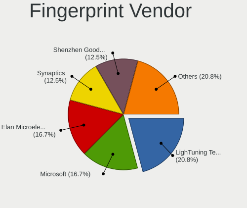

| Vendor                     | Desktops | Percent |
|----------------------------|----------|---------|
| LighTuning Technology      | 5        | 20.83%  |
| Microsoft                  | 4        | 16.67%  |
| Elan Microelectronics      | 4        | 16.67%  |
| Synaptics                  | 3        | 12.5%   |
| Shenzhen Goodix Technology | 3        | 12.5%   |
| DigitalPersona             | 2        | 8.33%   |
| STMicroelectronics         | 1        | 4.17%   |
| Dell                       | 1        | 4.17%   |
| AuthenTec                  | 1        | 4.17%   |

Fingerprint Model
-----------------

Fingerprint sensor models

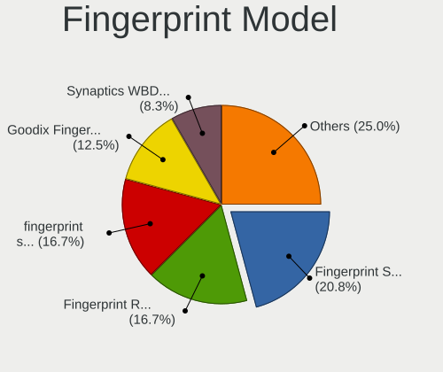

| Model                                          | Desktops | Percent |
|------------------------------------------------|----------|---------|
| LighTuning Fingerprint Sensor                  | 5        | 20.83%  |
| Microsoft Fingerprint Reader                   | 4        | 16.67%  |
| Elan fingerprint sensor [FeinTech FPS00200]    | 4        | 16.67%  |
| Shenzhen Goodix  Fingerprint Device            | 3        | 12.5%   |
| Synaptics  WBDI Fingerprint Reader - USB 052   | 2        | 8.33%   |
| DigitalPersona Fingerprint Reader              | 2        | 8.33%   |
| Synaptics Prometheus Fingerprint Reader        | 1        | 4.17%   |
| STMicroelectronics Fingerprint Reader          | 1        | 4.17%   |
| Dell MS819 Wired Mouse With Fingerprint Reader | 1        | 4.17%   |
| AuthenTec Fingerprint Sensor                   | 1        | 4.17%   |

Chipcard Vendor
---------------

Chipcard module vendors

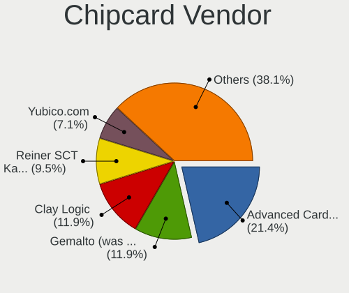

| Vendor                            | Desktops | Percent |
|-----------------------------------|----------|---------|
| Advanced Card Systems             | 9        | 21.43%  |
| Gemalto (was Gemplus)             | 5        | 11.9%   |
| Clay Logic                        | 5        | 11.9%   |
| Reiner SCT Kartensysteme          | 4        | 9.52%   |
| Yubico.com                        | 3        | 7.14%   |
| Alcor Micro                       | 3        | 7.14%   |
| OmniKey                           | 2        | 4.76%   |
| Aladdin Knowledge Systems         | 2        | 4.76%   |
| VASCO Data Security International | 1        | 2.38%   |
| SCM Microsystems                  | 1        | 2.38%   |
| Pol Henarejos                     | 1        | 2.38%   |
| Fujitsu Siemens Computers         | 1        | 2.38%   |
| Chicony Electronics               | 1        | 2.38%   |
| CHERRY                            | 1        | 2.38%   |
| C3PO                              | 1        | 2.38%   |
| Aladdin R.D.                      | 1        | 2.38%   |
| Aktiv                             | 1        | 2.38%   |

Chipcard Model
--------------

Chipcard module models

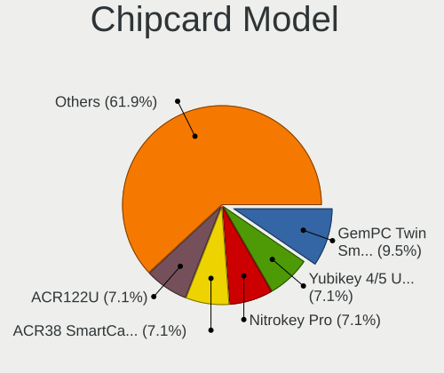

| Model                                                                      | Desktops | Percent |
|----------------------------------------------------------------------------|----------|---------|
| Gemalto (was Gemplus) GemPC Twin SmartCard Reader                          | 4        | 9.52%   |
| Yubico.com Yubikey 4/5 U2F+CCID                                            | 3        | 7.14%   |
| Clay Logic Nitrokey Pro                                                    | 3        | 7.14%   |
| Advanced Card Systems ACR38 SmartCard Reader                               | 3        | 7.14%   |
| Advanced Card Systems ACR122U                                              | 3        | 7.14%   |
| Reiner SCT Kartensysteme cyberJack one                                     | 2        | 4.76%   |
| Alcor Micro AU9540 Smartcard Reader                                        | 2        | 4.76%   |
| Aladdin Knowledge Systems Token JC                                         | 2        | 4.76%   |
| Advanced Card Systems ACR1252 Dual Reader                                  | 2        | 4.76%   |
| VASCO Data Security International Digipass 905 SmartCard Reader            | 1        | 2.38%   |
| SCM Microsystems SCR331-LC1 / SCR3310 SmartCard Reader                     | 1        | 2.38%   |
| Reiner SCT Kartensysteme tanJack USB                                       | 1        | 2.38%   |
| Reiner SCT Kartensysteme cyberJack RFID basis contactless smartcard reader | 1        | 2.38%   |
| Pol Henarejos Pico Key                                                     | 1        | 2.38%   |
| OmniKey Smart Card Reader USB                                              | 1        | 2.38%   |
| OmniKey CardMan 5022                                                       | 1        | 2.38%   |
| Gemalto (was Gemplus) GemPC Key SmartCard Reader                           | 1        | 2.38%   |
| Fujitsu Siemens Computers Keyboard KB100 SCR eSIG                          | 1        | 2.38%   |
| Clay Logic Nitrokey Start                                                  | 1        | 2.38%   |
| Clay Logic Nitrokey HSM                                                    | 1        | 2.38%   |
| Chicony Electronics HP Skylab USB Smartcard Keyboard                       | 1        | 2.38%   |
| CHERRY Smart Card Reader USB                                               | 1        | 2.38%   |
| C3PO LTC31v2                                                               | 1        | 2.38%   |
| Alcor Micro Watchdata W 1981                                               | 1        | 2.38%   |
| Aladdin R.D. JaCarta                                                       | 1        | 2.38%   |
| Aktiv Rutoken lite                                                         | 1        | 2.38%   |
| Advanced Card Systems ACR39U                                               | 1        | 2.38%   |

Unsupported
-----------

Unsupported Devices
-------------------

Total unsupported devices on board

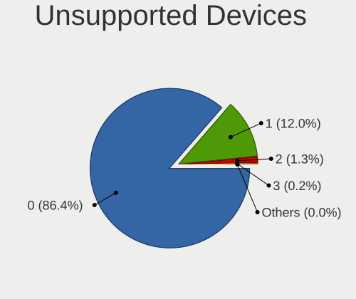

| Total | Desktops | Percent |
|-------|----------|---------|
| 0     | 4378     | 86.37%  |
| 1     | 608      | 11.99%  |
| 2     | 68       | 1.34%   |
| 3     | 12       | 0.24%   |
| 6     | 2        | 0.04%   |
| 4     | 1        | 0.02%   |

Unsupported Device Types
------------------------

Types of unsupported devices

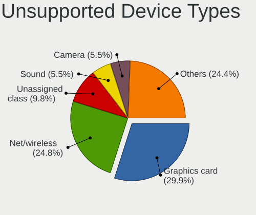

| Type                     | Desktops | Percent |
|--------------------------|----------|---------|
| Graphics card            | 223      | 29.93%  |
| Net/wireless             | 185      | 24.83%  |
| Unassigned class         | 73       | 9.8%    |
| Sound                    | 41       | 5.5%    |
| Camera                   | 41       | 5.5%    |
| Communication controller | 31       | 4.16%   |
| Multimedia controller    | 30       | 4.03%   |
| Chipcard                 | 21       | 2.82%   |
| Fingerprint reader       | 20       | 2.68%   |
| Bluetooth                | 20       | 2.68%   |
| Network                  | 18       | 2.42%   |
| Net/ethernet             | 18       | 2.42%   |
| Storage/raid             | 7        | 0.94%   |
| Modem                    | 5        | 0.67%   |
| Dvb card                 | 5        | 0.67%   |
| Tv card                  | 2        | 0.27%   |
| Storage/ide              | 2        | 0.27%   |
| Storage                  | 2        | 0.27%   |
| Storage/nvme             | 1        | 0.13%   |

