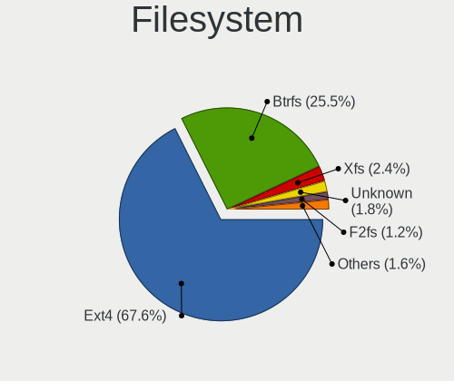
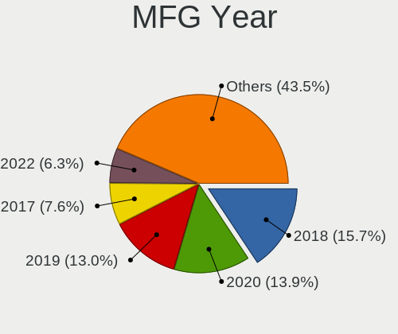
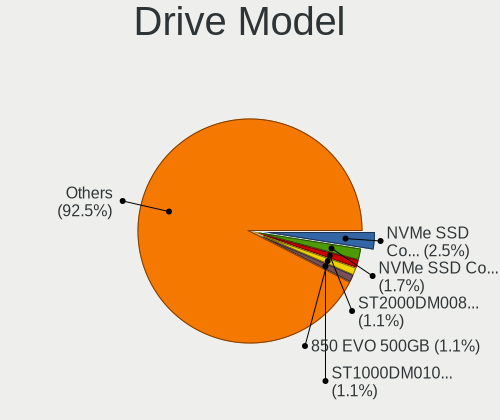
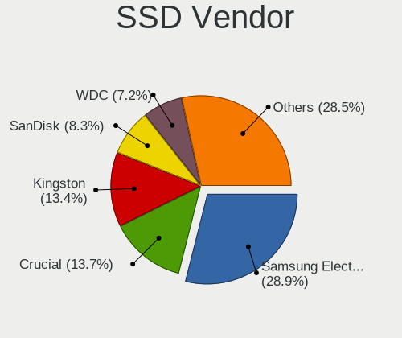
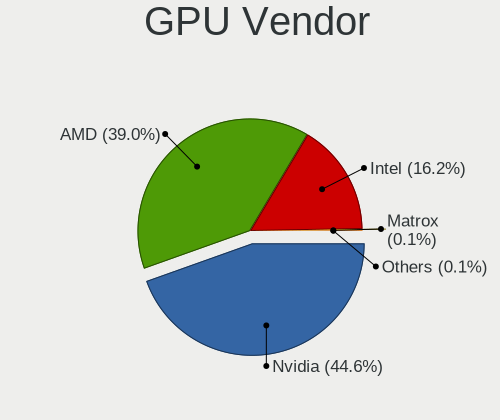
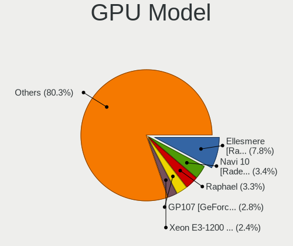
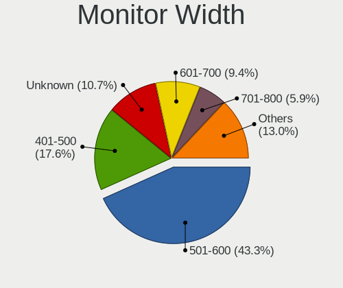

Arch - Tested Hardware & Statistics (Desktops)
----------------------------------------------

A project to collect tested hardware configurations for Arch.

Anyone can contribute to this report by the [hw-probe](https://github.com/linuxhw/hw-probe) tool:

    sudo -E hw-probe -all -upload

Please contribute! Especially if your hardware is rare.

Contents
--------

* [ Test Cases ](#test-cases)

* [ System ](#system)
  - [ OS                       ](#os)
  - [ OS Family                ](#os-family)
  - [ Kernel                   ](#kernel)
  - [ Kernel Family            ](#kernel-family)
  - [ Kernel Major Ver.        ](#kernel-major-ver)
  - [ Arch                     ](#arch)
  - [ DE                       ](#de)
  - [ Display Server           ](#display-server)
  - [ Display Manager          ](#display-manager)
  - [ OS Lang                  ](#os-lang)
  - [ Boot Mode                ](#boot-mode)
  - [ Filesystem               ](#filesystem)
  - [ Part. scheme             ](#part-scheme)
  - [ Dual Boot with Linux/BSD ](#dual-boot-with-linuxbsd)
  - [ Dual Boot (Win)          ](#dual-boot-win)

* [ Board ](#board)
  - [ Vendor                   ](#vendor)
  - [ Model                    ](#model)
  - [ Model Family             ](#model-family)
  - [ MFG Year                 ](#mfg-year)
  - [ Form Factor              ](#form-factor)
  - [ Secure Boot              ](#secure-boot)
  - [ Coreboot                 ](#coreboot)
  - [ RAM Size                 ](#ram-size)
  - [ RAM Used                 ](#ram-used)
  - [ Total Drives             ](#total-drives)
  - [ Has CD-ROM               ](#has-cd-rom)
  - [ Has Ethernet             ](#has-ethernet)
  - [ Has WiFi                 ](#has-wifi)
  - [ Has Bluetooth            ](#has-bluetooth)

* [ Location ](#location)
  - [ Country                  ](#country)
  - [ City                     ](#city)

* [ Drives ](#drives)
  - [ Drive Vendor             ](#drive-vendor)
  - [ Drive Model              ](#drive-model)
  - [ HDD Vendor               ](#hdd-vendor)
  - [ SSD Vendor               ](#ssd-vendor)
  - [ Drive Kind               ](#drive-kind)
  - [ Drive Connector          ](#drive-connector)
  - [ Drive Size               ](#drive-size)
  - [ Space Total              ](#space-total)
  - [ Space Used               ](#space-used)
  - [ Malfunc. Drives          ](#malfunc-drives)
  - [ Malfunc. Drive Vendor    ](#malfunc-drive-vendor)
  - [ Malfunc. HDD Vendor      ](#malfunc-hdd-vendor)
  - [ Malfunc. Drive Kind      ](#malfunc-drive-kind)
  - [ Failed Drives            ](#failed-drives)
  - [ Failed Drive Vendor      ](#failed-drive-vendor)
  - [ Drive Status             ](#drive-status)

* [ Storage controller ](#storage-controller)
  - [ Storage Vendor           ](#storage-vendor)
  - [ Storage Model            ](#storage-model)
  - [ Storage Kind             ](#storage-kind)

* [ Processor ](#processor)
  - [ CPU Vendor               ](#cpu-vendor)
  - [ CPU Model                ](#cpu-model)
  - [ CPU Model Family         ](#cpu-model-family)
  - [ CPU Cores                ](#cpu-cores)
  - [ CPU Sockets              ](#cpu-sockets)
  - [ CPU Threads              ](#cpu-threads)
  - [ CPU Op-Modes             ](#cpu-op-modes)
  - [ CPU Microcode            ](#cpu-microcode)
  - [ CPU Microarch            ](#cpu-microarch)

* [ Graphics ](#graphics)
  - [ GPU Vendor               ](#gpu-vendor)
  - [ GPU Model                ](#gpu-model)
  - [ GPU Combo                ](#gpu-combo)
  - [ GPU Driver               ](#gpu-driver)
  - [ GPU Memory               ](#gpu-memory)

* [ Monitor ](#monitor)
  - [ Monitor Vendor           ](#monitor-vendor)
  - [ Monitor Model            ](#monitor-model)
  - [ Monitor Resolution       ](#monitor-resolution)
  - [ Monitor Diagonal         ](#monitor-diagonal)
  - [ Monitor Width            ](#monitor-width)
  - [ Aspect Ratio             ](#aspect-ratio)
  - [ Monitor Area             ](#monitor-area)
  - [ Pixel Density            ](#pixel-density)
  - [ Multiple Monitors        ](#multiple-monitors)

* [ Network ](#network)
  - [ Net Controller Vendor    ](#net-controller-vendor)
  - [ Net Controller Model     ](#net-controller-model)
  - [ Wireless Vendor          ](#wireless-vendor)
  - [ Wireless Model           ](#wireless-model)
  - [ Ethernet Vendor          ](#ethernet-vendor)
  - [ Ethernet Model           ](#ethernet-model)
  - [ Net Controller Kind      ](#net-controller-kind)
  - [ Used Controller          ](#used-controller)
  - [ NICs                     ](#nics)
  - [ IPv6                     ](#ipv6)

* [ Bluetooth ](#bluetooth)
  - [ Bluetooth Vendor         ](#bluetooth-vendor)
  - [ Bluetooth Model          ](#bluetooth-model)

* [ Sound ](#sound)
  - [ Sound Vendor             ](#sound-vendor)
  - [ Sound Model              ](#sound-model)

* [ Memory ](#memory)
  - [ Memory Vendor            ](#memory-vendor)
  - [ Memory Model             ](#memory-model)
  - [ Memory Kind              ](#memory-kind)
  - [ Memory Form Factor       ](#memory-form-factor)
  - [ Memory Size              ](#memory-size)
  - [ Memory Speed             ](#memory-speed)

* [ Printers & scanners ](#printers--scanners)
  - [ Printer Vendor           ](#printer-vendor)
  - [ Printer Model            ](#printer-model)
  - [ Scanner Vendor           ](#scanner-vendor)
  - [ Scanner Model            ](#scanner-model)

* [ Camera ](#camera)
  - [ Camera Vendor            ](#camera-vendor)
  - [ Camera Model             ](#camera-model)

* [ Security ](#security)
  - [ Fingerprint Vendor       ](#fingerprint-vendor)
  - [ Fingerprint Model        ](#fingerprint-model)
  - [ Chipcard Vendor          ](#chipcard-vendor)
  - [ Chipcard Model           ](#chipcard-model)

* [ Unsupported ](#unsupported)
  - [ Unsupported Devices      ](#unsupported-devices)
  - [ Unsupported Device Types ](#unsupported-device-types)

Test Cases
----------

Total: 3529

| Vendor        | Model                       | Probe                                                      | Date         |
|---------------|-----------------------------|------------------------------------------------------------|--------------|
| Gigabyte      | X79-UD3                     | [36fed79d81](https://linux-hardware.org/?probe=36fed79d81) | Jul 01, 2023 |
| Pegatron      | 2ACB                        | [ceb2b4c1c5](https://linux-hardware.org/?probe=ceb2b4c1c5) | Jun 30, 2023 |
| ASUSTek       | TUF Gaming X570-PLUS        | [ef49f25cf8](https://linux-hardware.org/?probe=ef49f25cf8) | Jun 30, 2023 |
| Gigabyte      | Z590 AORUS ULTRA            | [45d5903c62](https://linux-hardware.org/?probe=45d5903c62) | Jun 30, 2023 |
| Gigabyte      | X79-UD3                     | [5a88d6945d](https://linux-hardware.org/?probe=5a88d6945d) | Jun 29, 2023 |
| Acer          | Aspire XC-830               | [eccf186dfd](https://linux-hardware.org/?probe=eccf186dfd) | Jun 29, 2023 |
| Lenovo        | SHARKBAY SDK0E50510 PRO     | [56e2b61337](https://linux-hardware.org/?probe=56e2b61337) | Jun 29, 2023 |
| MSI           | B450 TOMAHAWK               | [86866241cd](https://linux-hardware.org/?probe=86866241cd) | Jun 29, 2023 |
| MSI           | B550-A PRO                  | [722b0302f4](https://linux-hardware.org/?probe=722b0302f4) | Jun 29, 2023 |
| Dell          | 0PC5F7 A01                  | [133ed5cc64](https://linux-hardware.org/?probe=133ed5cc64) | Jun 28, 2023 |
| MSI           | MPG Z490 GAMING EDGE WIF... | [238e77122e](https://linux-hardware.org/?probe=238e77122e) | Jun 28, 2023 |
| Acer          | Veriton M490G               | [1f3da6e87f](https://linux-hardware.org/?probe=1f3da6e87f) | Jun 28, 2023 |
| MSI           | B550M PRO-VDH WIFI          | [cd0c241308](https://linux-hardware.org/?probe=cd0c241308) | Jun 28, 2023 |
| ASUSTek       | PRIME B660M-K D4            | [48b0ff43fa](https://linux-hardware.org/?probe=48b0ff43fa) | Jun 27, 2023 |
| HP            | 18E7                        | [1ae4c92b7f](https://linux-hardware.org/?probe=1ae4c92b7f) | Jun 26, 2023 |
| ASRock        | H55M                        | [cb9e89e20e](https://linux-hardware.org/?probe=cb9e89e20e) | Jun 24, 2023 |
| Gigabyte      | G1.Sniper Z87               | [8df9a683cb](https://linux-hardware.org/?probe=8df9a683cb) | Jun 23, 2023 |
| Gigabyte      | G1.Sniper Z87               | [4d419c5b63](https://linux-hardware.org/?probe=4d419c5b63) | Jun 23, 2023 |
| Gigabyte      | B550 AORUS ELITE V2         | [56208916c9](https://linux-hardware.org/?probe=56208916c9) | Jun 23, 2023 |
| Lenovo        | 30C0 SDK0J40705 WIN 3425... | [4cfd97f850](https://linux-hardware.org/?probe=4cfd97f850) | Jun 23, 2023 |
| Lenovo        | 3717 SDK0R32862 WIN 3258... | [7bf78e33d4](https://linux-hardware.org/?probe=7bf78e33d4) | Jun 22, 2023 |
| MSI           | B250M PRO-VDH               | [e8391a9f3d](https://linux-hardware.org/?probe=e8391a9f3d) | Jun 22, 2023 |
| HP            | 21EF                        | [6022eb31ff](https://linux-hardware.org/?probe=6022eb31ff) | Jun 21, 2023 |
| ASUSTek       | M5A78L-M LX/BR              | [ae2beb307a](https://linux-hardware.org/?probe=ae2beb307a) | Jun 20, 2023 |
| ASUSTek       | M5A78L-M LX/BR              | [c2c2365360](https://linux-hardware.org/?probe=c2c2365360) | Jun 20, 2023 |
| Gigabyte      | B450 AORUS ELITE            | [092370b958](https://linux-hardware.org/?probe=092370b958) | Jun 20, 2023 |
| ASUSTek       | PRIME X470-PRO              | [9e30c629f3](https://linux-hardware.org/?probe=9e30c629f3) | Jun 19, 2023 |
| ASRock        | B550M-ITX/ac                | [e9865c622f](https://linux-hardware.org/?probe=e9865c622f) | Jun 19, 2023 |
| ASRock        | Z87 Extreme4                | [dcd3e79cb1](https://linux-hardware.org/?probe=dcd3e79cb1) | Jun 18, 2023 |
| MSI           | Z97-G45 GAMING              | [cb20c2c912](https://linux-hardware.org/?probe=cb20c2c912) | Jun 18, 2023 |
| Acer          | Veriton M490G               | [f9405b8bd2](https://linux-hardware.org/?probe=f9405b8bd2) | Jun 18, 2023 |
| Gigabyte      | H410M S2H V3                | [26e276dc29](https://linux-hardware.org/?probe=26e276dc29) | Jun 18, 2023 |
| Gigabyte      | H410M S2H V3                | [978e506718](https://linux-hardware.org/?probe=978e506718) | Jun 18, 2023 |
| ASUSTek       | ROG STRIX B550-F GAMING ... | [94999d2965](https://linux-hardware.org/?probe=94999d2965) | Jun 18, 2023 |
| ASUSTek       | PRIME B550M-A               | [9b5c44b13a](https://linux-hardware.org/?probe=9b5c44b13a) | Jun 17, 2023 |
| ASUSTek       | TUF Gaming Z790-PLUS WIF... | [6294c25695](https://linux-hardware.org/?probe=6294c25695) | Jun 17, 2023 |
| ASUSTek       | ROG STRIX X570-F GAMING     | [c338e10965](https://linux-hardware.org/?probe=c338e10965) | Jun 16, 2023 |
| ASUSTek       | TUF Gaming Z790-PLUS WIF... | [176973d157](https://linux-hardware.org/?probe=176973d157) | Jun 16, 2023 |
| ASUSTek       | Maximus VI HERO             | [ae9d05ff3a](https://linux-hardware.org/?probe=ae9d05ff3a) | Jun 15, 2023 |
| Acer          | Aspire XC-830               | [ca0cba861a](https://linux-hardware.org/?probe=ca0cba861a) | Jun 15, 2023 |
| MSI           | X470 GAMING PLUS MAX        | [c05a02e77b](https://linux-hardware.org/?probe=c05a02e77b) | Jun 14, 2023 |
| ASUSTek       | PRIME B350-PLUS             | [b548786e27](https://linux-hardware.org/?probe=b548786e27) | Jun 13, 2023 |
| ASUSTek       | PRIME B350-PLUS             | [928063a305](https://linux-hardware.org/?probe=928063a305) | Jun 13, 2023 |
| MSI           | PRO Z790-P WIFI DDR4        | [f0f0a1b2ac](https://linux-hardware.org/?probe=f0f0a1b2ac) | Jun 13, 2023 |
| ASUSTek       | TUF Gaming X670E-PLUS WI... | [74b5d0e60a](https://linux-hardware.org/?probe=74b5d0e60a) | Jun 13, 2023 |
| ASUSTek       | PRIME B450M-K II            | [0fe4687002](https://linux-hardware.org/?probe=0fe4687002) | Jun 12, 2023 |
| MSI           | Z590-A PRO                  | [bac6eb2f16](https://linux-hardware.org/?probe=bac6eb2f16) | Jun 12, 2023 |
| Acer          | Veriton M490G               | [78ff85b0a4](https://linux-hardware.org/?probe=78ff85b0a4) | Jun 11, 2023 |
| MSI           | MPG B550 GAMING PLUS        | [e7d498373d](https://linux-hardware.org/?probe=e7d498373d) | Jun 11, 2023 |
| Unknown       | Unknown                     | [0d80451f80](https://linux-hardware.org/?probe=0d80451f80) | Jun 11, 2023 |
| Unknown       | Unknown                     | [b25c3a4ecb](https://linux-hardware.org/?probe=b25c3a4ecb) | Jun 11, 2023 |
| Gigabyte      | B460M DS3H                  | [63c9d6c822](https://linux-hardware.org/?probe=63c9d6c822) | Jun 09, 2023 |
| Gigabyte      | B550 AORUS PRO              | [61a0a2ea5f](https://linux-hardware.org/?probe=61a0a2ea5f) | Jun 09, 2023 |
| Gigabyte      | H61M-DS2                    | [8b8c6949b6](https://linux-hardware.org/?probe=8b8c6949b6) | Jun 09, 2023 |
| Gigabyte      | H81M-S2H                    | [fc60082dfe](https://linux-hardware.org/?probe=fc60082dfe) | Jun 08, 2023 |
| ASUSTek       | Maximus VI HERO             | [5861bc7cef](https://linux-hardware.org/?probe=5861bc7cef) | Jun 08, 2023 |
| ASUSTek       | PRIME B350M-A               | [ba4bfc1fe1](https://linux-hardware.org/?probe=ba4bfc1fe1) | Jun 08, 2023 |
| Gigabyte      | H81M-S2H                    | [5533070ec1](https://linux-hardware.org/?probe=5533070ec1) | Jun 08, 2023 |
| ASRock        | H81M-VG4                    | [04d84e44a5](https://linux-hardware.org/?probe=04d84e44a5) | Jun 08, 2023 |
| Gigabyte      | H610M H DDR4                | [e7cdd7e89b](https://linux-hardware.org/?probe=e7cdd7e89b) | Jun 07, 2023 |
| ASUSTek       | P8Z77-V LE PLUS             | [45cc99775f](https://linux-hardware.org/?probe=45cc99775f) | Jun 07, 2023 |
| HP            | 3396                        | [ca540b449f](https://linux-hardware.org/?probe=ca540b449f) | Jun 07, 2023 |
| Gigabyte      | X670 GAMING X AX            | [05d49007a4](https://linux-hardware.org/?probe=05d49007a4) | Jun 07, 2023 |
| ASUSTek       | X99-DELUXE II               | [aab84214f1](https://linux-hardware.org/?probe=aab84214f1) | Jun 06, 2023 |
| ASUSTek       | TUF Z370-PLUS GAMING        | [6cd3cfcacf](https://linux-hardware.org/?probe=6cd3cfcacf) | Jun 06, 2023 |
| MSI           | B450M MORTAR                | [6d2c05fd11](https://linux-hardware.org/?probe=6d2c05fd11) | Jun 05, 2023 |
| ASUSTek       | TUF Gaming B550M-E WIFI     | [54e2e07ac6](https://linux-hardware.org/?probe=54e2e07ac6) | Jun 05, 2023 |
| ASUSTek       | TUF Gaming B450-PLUS II     | [292e41c0e9](https://linux-hardware.org/?probe=292e41c0e9) | Jun 05, 2023 |
| ASUSTek       | ROG CROSSHAIR VIII DARK ... | [8c6a275a93](https://linux-hardware.org/?probe=8c6a275a93) | Jun 05, 2023 |
| Huanan        | X99-F8 GAMING V5.0          | [8cbfe4cdf0](https://linux-hardware.org/?probe=8cbfe4cdf0) | Jun 05, 2023 |
| MSI           | MPG X570 GAMING PLUS        | [3d29012888](https://linux-hardware.org/?probe=3d29012888) | Jun 04, 2023 |
| ASRock        | QC5000M-ITX/PH              | [bdf4ee4d4f](https://linux-hardware.org/?probe=bdf4ee4d4f) | Jun 04, 2023 |
| MSI           | B450M MORTAR MAX            | [72ccbe10aa](https://linux-hardware.org/?probe=72ccbe10aa) | Jun 04, 2023 |
| Unknown       | Intel X79                   | [0e2e65a79e](https://linux-hardware.org/?probe=0e2e65a79e) | Jun 04, 2023 |
| MSI           | PRO Z790-P WIFI             | [fb0c1a4922](https://linux-hardware.org/?probe=fb0c1a4922) | Jun 04, 2023 |
| Lenovo        | SHARKBAY SDK0E50510 WIN     | [a90856c944](https://linux-hardware.org/?probe=a90856c944) | Jun 04, 2023 |
| ASUSTek       | ROG CROSSHAIR VIII DARK ... | [0523005c68](https://linux-hardware.org/?probe=0523005c68) | Jun 03, 2023 |
| Gigabyte      | H67MA-USB3-B3               | [1908e7e6f5](https://linux-hardware.org/?probe=1908e7e6f5) | Jun 03, 2023 |
| ASUSTek       | Z170-A                      | [4f512af4c2](https://linux-hardware.org/?probe=4f512af4c2) | Jun 03, 2023 |
| ASUSTek       | TUF Gaming B550-PLUS        | [d2189d4a5f](https://linux-hardware.org/?probe=d2189d4a5f) | Jun 02, 2023 |
| Gigabyte      | Z690 GAMING X DDR4          | [d61bd0903e](https://linux-hardware.org/?probe=d61bd0903e) | Jun 02, 2023 |
| ASRock        | X370 Pro4                   | [aaeac4c226](https://linux-hardware.org/?probe=aaeac4c226) | Jun 01, 2023 |
| MSI           | MAG B460 TOMAHAWK           | [8389c76bd3](https://linux-hardware.org/?probe=8389c76bd3) | May 31, 2023 |
| Dell          | 0N4YC8 A00                  | [4a3e8c4d6f](https://linux-hardware.org/?probe=4a3e8c4d6f) | May 31, 2023 |
| Lenovo        | 3730 SDK0T76463 WIN 3422... | [4dfacbbeb1](https://linux-hardware.org/?probe=4dfacbbeb1) | May 31, 2023 |
| ASRock        | B550M Steel Legend          | [ab97cb7f09](https://linux-hardware.org/?probe=ab97cb7f09) | May 30, 2023 |
| Gigabyte      | X399 AORUS PRO-CF           | [b00cd1c84e](https://linux-hardware.org/?probe=b00cd1c84e) | May 30, 2023 |
| Cincoze       | 1.0.01.001                  | [1552e93368](https://linux-hardware.org/?probe=1552e93368) | May 30, 2023 |
| Dell          | 02N3WF A01                  | [c02695ea7d](https://linux-hardware.org/?probe=c02695ea7d) | May 30, 2023 |
| ASRock        | B450M Pro4                  | [c98400b6eb](https://linux-hardware.org/?probe=c98400b6eb) | May 30, 2023 |
| Dell          | 0XPDFK A01                  | [10e4fd14b5](https://linux-hardware.org/?probe=10e4fd14b5) | May 29, 2023 |
| ASRock        | Z370 Professional Gaming... | [f7d00f30cb](https://linux-hardware.org/?probe=f7d00f30cb) | May 28, 2023 |
| ASUSTek       | PRIME Z590-A                | [b5e36f87e6](https://linux-hardware.org/?probe=b5e36f87e6) | May 28, 2023 |
| ASRock        | H510M-HVS R2.0              | [c4ee84b38e](https://linux-hardware.org/?probe=c4ee84b38e) | May 28, 2023 |
| Gigabyte      | B660 DS3H DDR4              | [807dd44df4](https://linux-hardware.org/?probe=807dd44df4) | May 28, 2023 |
| HP            | 2AF7                        | [b459ce46cb](https://linux-hardware.org/?probe=b459ce46cb) | May 27, 2023 |
| ASRock        | H81M-VG4                    | [4e7b273239](https://linux-hardware.org/?probe=4e7b273239) | May 27, 2023 |
| MSI           | B450 GAMING PLUS MAX        | [acee298918](https://linux-hardware.org/?probe=acee298918) | May 26, 2023 |
| Acer          | WG43M                       | [9afcfc4a44](https://linux-hardware.org/?probe=9afcfc4a44) | May 26, 2023 |
| Gigabyte      | B650M AORUS ELITE AX        | [f757bc2c6e](https://linux-hardware.org/?probe=f757bc2c6e) | May 25, 2023 |
| HP            | 8643 SMVB                   | [961a04643c](https://linux-hardware.org/?probe=961a04643c) | May 25, 2023 |
| MSI           | X99A GAMING PRO CARBON      | [4c9595e6ea](https://linux-hardware.org/?probe=4c9595e6ea) | May 24, 2023 |
| Gigabyte      | X570 I AORUS PRO WIFI       | [e4c9c425f8](https://linux-hardware.org/?probe=e4c9c425f8) | May 23, 2023 |
| ASUSTek       | PRIME X399-A                | [a5a990a94c](https://linux-hardware.org/?probe=a5a990a94c) | May 23, 2023 |
| MSI           | X99A GAMING PRO CARBON      | [d0312b1a56](https://linux-hardware.org/?probe=d0312b1a56) | May 23, 2023 |
| ASUSTek       | PRIME X570-PRO              | [aa33ddd283](https://linux-hardware.org/?probe=aa33ddd283) | May 23, 2023 |
| MSI           | B550-A PRO[CEC]             | [66b4de8c55](https://linux-hardware.org/?probe=66b4de8c55) | May 22, 2023 |
| MSI           | MAG B650 TOMAHAWK WIFI      | [a8e6f277e2](https://linux-hardware.org/?probe=a8e6f277e2) | May 22, 2023 |
| MSI           | MPG Z790 EDGE WIFI          | [30e9eb3dd1](https://linux-hardware.org/?probe=30e9eb3dd1) | May 21, 2023 |
| ASUSTek       | ROG STRIX X670E-I GAMING... | [1e231f6e75](https://linux-hardware.org/?probe=1e231f6e75) | May 21, 2023 |
| HP            | 339A                        | [d4a8f3dbb1](https://linux-hardware.org/?probe=d4a8f3dbb1) | May 21, 2023 |
| ASRock        | Z790M-ITX WiFi              | [2229714a14](https://linux-hardware.org/?probe=2229714a14) | May 21, 2023 |
| ASRock        | 970A-G                      | [fd39b2185b](https://linux-hardware.org/?probe=fd39b2185b) | May 20, 2023 |
| ASUSTek       | TUF Gaming X570-PLUS        | [6bcf177a20](https://linux-hardware.org/?probe=6bcf177a20) | May 20, 2023 |
| HP            | 8437                        | [d41a0c8439](https://linux-hardware.org/?probe=d41a0c8439) | May 20, 2023 |
| ASRock        | 970A-G                      | [fac3e3c961](https://linux-hardware.org/?probe=fac3e3c961) | May 20, 2023 |
| HP            | 8437                        | [ceacc79bf6](https://linux-hardware.org/?probe=ceacc79bf6) | May 19, 2023 |
| Gigabyte      | X470 AORUS GAMING 7 WIFI... | [515e752ecb](https://linux-hardware.org/?probe=515e752ecb) | May 19, 2023 |
| ASUSTek       | TUF B360M-PLUS GAMING S     | [693c7b6d9b](https://linux-hardware.org/?probe=693c7b6d9b) | May 18, 2023 |
| ASUSTek       | F1A75-M PRO/CSM             | [e0ebac1371](https://linux-hardware.org/?probe=e0ebac1371) | May 18, 2023 |
| ASUSTek       | PRIME X570-PRO              | [09e723be6f](https://linux-hardware.org/?probe=09e723be6f) | May 17, 2023 |
| ASUSTek       | P7H55D-M PRO                | [dc1bf86813](https://linux-hardware.org/?probe=dc1bf86813) | May 17, 2023 |
| Huanan        | X99-F8 GAMING V5.0          | [377fe6aa67](https://linux-hardware.org/?probe=377fe6aa67) | May 16, 2023 |
| Lenovo        | SHARKBAY NOK                | [16308738b3](https://linux-hardware.org/?probe=16308738b3) | May 15, 2023 |
| Gigabyte      | X570S AERO G                | [0f70383aab](https://linux-hardware.org/?probe=0f70383aab) | May 14, 2023 |
| Gigabyte      | Z170X-UD5 TH-CF             | [6a84af6428](https://linux-hardware.org/?probe=6a84af6428) | May 14, 2023 |
| ASUSTek       | ProArt X670E-CREATOR WIF... | [6bfe747b4d](https://linux-hardware.org/?probe=6bfe747b4d) | May 13, 2023 |
| Gigabyte      | B550 AORUS ELITE            | [7a38cda53d](https://linux-hardware.org/?probe=7a38cda53d) | May 13, 2023 |
| Huanan        | X99-F8 GAMING V5.0          | [2c03c64f49](https://linux-hardware.org/?probe=2c03c64f49) | May 13, 2023 |
| Huanan        | X99-F8 GAMING V5.0          | [e5dbe4c6f4](https://linux-hardware.org/?probe=e5dbe4c6f4) | May 13, 2023 |
| ASUSTek       | P8Z77-V LE                  | [0a23198016](https://linux-hardware.org/?probe=0a23198016) | May 13, 2023 |
| ASUSTek       | ROG CROSSHAIR VIII DARK ... | [1146828988](https://linux-hardware.org/?probe=1146828988) | May 13, 2023 |
| ASRock        | A320M/ac                    | [c244810475](https://linux-hardware.org/?probe=c244810475) | May 12, 2023 |
| ASUSTek       | TUF Gaming B550-PLUS        | [713564ccd4](https://linux-hardware.org/?probe=713564ccd4) | May 12, 2023 |
| Gigabyte      | X570S AERO G                | [ff26b44641](https://linux-hardware.org/?probe=ff26b44641) | May 12, 2023 |
| Gigabyte      | X570S AERO G                | [00abecb77e](https://linux-hardware.org/?probe=00abecb77e) | May 12, 2023 |
| MSI           | B450 GAMING PRO CARBON A... | [cfa81980a9](https://linux-hardware.org/?probe=cfa81980a9) | May 12, 2023 |
| Huanan        | X99-F8 Gaming 2021          | [fb4cf864f2](https://linux-hardware.org/?probe=fb4cf864f2) | May 11, 2023 |
| ASRock        | B450 Pro4                   | [928216a0a5](https://linux-hardware.org/?probe=928216a0a5) | May 10, 2023 |
| MSI           | B550M PRO-VDH WIFI          | [bd5c79fbaf](https://linux-hardware.org/?probe=bd5c79fbaf) | May 10, 2023 |
| ASUSTek       | ROG CROSSHAIR VIII HERO     | [47fea42b65](https://linux-hardware.org/?probe=47fea42b65) | May 09, 2023 |
| Gigabyte      | Z97X-Gaming 3               | [2cbff804d8](https://linux-hardware.org/?probe=2cbff804d8) | May 08, 2023 |
| Gigabyte      | X99-UD4-CF                  | [9e3f14cf8d](https://linux-hardware.org/?probe=9e3f14cf8d) | May 08, 2023 |
| ASUSTek       | TUF Gaming B650-PLUS WIF... | [ecfcb0cab6](https://linux-hardware.org/?probe=ecfcb0cab6) | May 07, 2023 |
| ASRock        | 4X4-4000 Series             | [df056ec6f1](https://linux-hardware.org/?probe=df056ec6f1) | May 07, 2023 |
| MSI           | 970A-G46                    | [37f3da239a](https://linux-hardware.org/?probe=37f3da239a) | May 07, 2023 |
| ASUSTek       | M4N72-E                     | [30deed8e5a](https://linux-hardware.org/?probe=30deed8e5a) | May 07, 2023 |
| ASRock        | B450M Steel Legend          | [dc317ab270](https://linux-hardware.org/?probe=dc317ab270) | May 06, 2023 |
| ASUSTek       | P8Z77-V LE                  | [2e02937097](https://linux-hardware.org/?probe=2e02937097) | May 06, 2023 |
| ASUSTek       | P8Z77-V LE                  | [051da44921](https://linux-hardware.org/?probe=051da44921) | May 06, 2023 |
| ASUSTek       | ROG STRIX B650E-I GAMING... | [3c8f9ed664](https://linux-hardware.org/?probe=3c8f9ed664) | May 06, 2023 |
| ASUSTek       | Z170-P                      | [756e372a11](https://linux-hardware.org/?probe=756e372a11) | May 06, 2023 |
| ASUSTek       | ROG STRIX B650E-I GAMING... | [f2d8df2880](https://linux-hardware.org/?probe=f2d8df2880) | May 05, 2023 |
| Gigabyte      | Z590 UD AC                  | [b8f920797f](https://linux-hardware.org/?probe=b8f920797f) | May 05, 2023 |
| Gigabyte      | X570 AORUS MASTER           | [9b013ebf89](https://linux-hardware.org/?probe=9b013ebf89) | May 05, 2023 |
| ASRock        | A320M-DVS R4.0              | [2b273ee426](https://linux-hardware.org/?probe=2b273ee426) | May 05, 2023 |
| MSI           | Z390-A PRO                  | [0501f3a43b](https://linux-hardware.org/?probe=0501f3a43b) | May 04, 2023 |
| MSI           | Z270-A PRO                  | [ec8586e070](https://linux-hardware.org/?probe=ec8586e070) | May 04, 2023 |
| ASUSTek       | ROG STRIX Z590-E GAMING ... | [e42327b375](https://linux-hardware.org/?probe=e42327b375) | May 04, 2023 |
| MSI           | PRO B550M-VC WIFI           | [f677ec7e51](https://linux-hardware.org/?probe=f677ec7e51) | May 03, 2023 |
| ASUSTek       | PRIME X470-PRO              | [df62d15ecc](https://linux-hardware.org/?probe=df62d15ecc) | May 03, 2023 |
| ASUSTek       | ROG STRIX X570-F GAMING     | [aac11fced2](https://linux-hardware.org/?probe=aac11fced2) | May 03, 2023 |
| Gigabyte      | Z170X-Gaming 3              | [50f922927f](https://linux-hardware.org/?probe=50f922927f) | May 03, 2023 |
| ASUSTek       | TUF Gaming B450M-PLUS II    | [c8b7ffa6dc](https://linux-hardware.org/?probe=c8b7ffa6dc) | May 02, 2023 |
| Gigabyte      | X99-UD4-CF                  | [c2dcdb892d](https://linux-hardware.org/?probe=c2dcdb892d) | May 01, 2023 |
| MSI           | B450M PRO-VDH MAX           | [8fb29cf081](https://linux-hardware.org/?probe=8fb29cf081) | May 01, 2023 |
| HP            | 8906 SMVB                   | [3fc2c4e9d9](https://linux-hardware.org/?probe=3fc2c4e9d9) | May 01, 2023 |
| Gigabyte      | Z97X-Gaming 3               | [dd0a47b6fc](https://linux-hardware.org/?probe=dd0a47b6fc) | May 01, 2023 |
| Gigabyte      | Z97X-Gaming 3               | [7087295cd7](https://linux-hardware.org/?probe=7087295cd7) | May 01, 2023 |
| ASUSTek       | ROG STRIX Z370-F GAMING     | [0aa17c06c5](https://linux-hardware.org/?probe=0aa17c06c5) | Apr 30, 2023 |
| MSI           | B360M MORTAR                | [352a47b8a0](https://linux-hardware.org/?probe=352a47b8a0) | Apr 30, 2023 |
| ASRock        | B550 Pro4                   | [5d0819f25c](https://linux-hardware.org/?probe=5d0819f25c) | Apr 28, 2023 |
| HP            | 82F2 A01                    | [ea8f7364db](https://linux-hardware.org/?probe=ea8f7364db) | Apr 27, 2023 |
| ASRock        | A330GC                      | [d1a2e8dd13](https://linux-hardware.org/?probe=d1a2e8dd13) | Apr 27, 2023 |
| ASUSTek       | ROG STRIX X470-F GAMING     | [62996d1f05](https://linux-hardware.org/?probe=62996d1f05) | Apr 26, 2023 |
| ASUSTek       | PRIME B450M-A II            | [1ce9a878f3](https://linux-hardware.org/?probe=1ce9a878f3) | Apr 26, 2023 |
| ASRock        | B450 Pro4                   | [bd406c08f8](https://linux-hardware.org/?probe=bd406c08f8) | Apr 25, 2023 |
| Gigabyte      | H87-D3H-CF                  | [b3a3115f0c](https://linux-hardware.org/?probe=b3a3115f0c) | Apr 25, 2023 |
| Gigabyte      | X570 AORUS PRO WIFI         | [7595e7d8f9](https://linux-hardware.org/?probe=7595e7d8f9) | Apr 25, 2023 |
| eMachines     | EMCP73VT-PM                 | [d1a5ad5a38](https://linux-hardware.org/?probe=d1a5ad5a38) | Apr 24, 2023 |
| ASUSTek       | ROG STRIX B550-F GAMING     | [b4b468d0db](https://linux-hardware.org/?probe=b4b468d0db) | Apr 24, 2023 |
| ASUSTek       | PRIME B350-PLUS             | [34278ef67e](https://linux-hardware.org/?probe=34278ef67e) | Apr 24, 2023 |
| Intel         | HM570                       | [1220357b3d](https://linux-hardware.org/?probe=1220357b3d) | Apr 24, 2023 |
| Gigabyte      | Z390 GAMING X-CF            | [c11ea1fc19](https://linux-hardware.org/?probe=c11ea1fc19) | Apr 23, 2023 |
| Gigabyte      | Z390 GAMING X-CF            | [1a316c62a1](https://linux-hardware.org/?probe=1a316c62a1) | Apr 23, 2023 |
| ASRock        | A520M-ITX/ac                | [ef59f5ff9b](https://linux-hardware.org/?probe=ef59f5ff9b) | Apr 23, 2023 |
| ASUSTek       | ROG STRIX X570-E GAMING ... | [dfb9f87dad](https://linux-hardware.org/?probe=dfb9f87dad) | Apr 22, 2023 |
| ASRock        | H61M/U3S3                   | [8fd7aea5ea](https://linux-hardware.org/?probe=8fd7aea5ea) | Apr 22, 2023 |
| ASUSTek       | TUF Gaming X570-PLUS        | [0de425d51e](https://linux-hardware.org/?probe=0de425d51e) | Apr 21, 2023 |
| ASRock        | H510M-HVS R2.0              | [1de5b776a3](https://linux-hardware.org/?probe=1de5b776a3) | Apr 21, 2023 |
| Gigabyte      | B450 AORUS PRO WIFI-CF      | [a7b05c2528](https://linux-hardware.org/?probe=a7b05c2528) | Apr 20, 2023 |
| MSI           | MAG B650 TOMAHAWK WIFI      | [68e853f4c1](https://linux-hardware.org/?probe=68e853f4c1) | Apr 20, 2023 |
| Intel         | X79-SERVER V1.1             | [384c50e703](https://linux-hardware.org/?probe=384c50e703) | Apr 20, 2023 |
| MSI           | H110M PRO-VD                | [509d9126e1](https://linux-hardware.org/?probe=509d9126e1) | Apr 19, 2023 |
| ASRock        | B250M Pro4                  | [5d27011671](https://linux-hardware.org/?probe=5d27011671) | Apr 19, 2023 |
| ASRock        | B550 Steel Legend           | [35534cbfba](https://linux-hardware.org/?probe=35534cbfba) | Apr 19, 2023 |
| HP            | 8906 SMVB                   | [c00d85072e](https://linux-hardware.org/?probe=c00d85072e) | Apr 18, 2023 |
| ASRock        | A320M-DVS R4.0              | [b715989fc4](https://linux-hardware.org/?probe=b715989fc4) | Apr 16, 2023 |
| ASRock        | A320M-DVS R4.0              | [213ac87204](https://linux-hardware.org/?probe=213ac87204) | Apr 16, 2023 |
| ASUSTek       | M5A97 EVO R2.0              | [7820a9b7bc](https://linux-hardware.org/?probe=7820a9b7bc) | Apr 16, 2023 |
| ASUSTek       | ROG STRIX X570-E GAMING     | [4375bd0fb6](https://linux-hardware.org/?probe=4375bd0fb6) | Apr 16, 2023 |
| ASUSTek       | PRIME X670-P WIFI           | [0f678c5ded](https://linux-hardware.org/?probe=0f678c5ded) | Apr 15, 2023 |
| ASUSTek       | PRIME X670-P WIFI           | [ee48e89e45](https://linux-hardware.org/?probe=ee48e89e45) | Apr 15, 2023 |
| Gigabyte      | X670 GAMING X AX            | [57cc389eff](https://linux-hardware.org/?probe=57cc389eff) | Apr 14, 2023 |
| Biostar       | G31D-M7                     | [bb518a8623](https://linux-hardware.org/?probe=bb518a8623) | Apr 14, 2023 |
| Gigabyte      | AB350-Gaming 3-CF           | [71d89005dd](https://linux-hardware.org/?probe=71d89005dd) | Apr 14, 2023 |
| Gigabyte      | X570 AORUS ELITE WIFI       | [9f723bfac9](https://linux-hardware.org/?probe=9f723bfac9) | Apr 14, 2023 |
| ASRock        | B450M Pro4                  | [62dd8e069f](https://linux-hardware.org/?probe=62dd8e069f) | Apr 13, 2023 |
| HP            | 8906 SMVB                   | [c639e22b34](https://linux-hardware.org/?probe=c639e22b34) | Apr 13, 2023 |
| ASUSTek       | PRIME B650M-A WIFI          | [796f3afe73](https://linux-hardware.org/?probe=796f3afe73) | Apr 12, 2023 |
| Acer          | WG43M                       | [e22afb229d](https://linux-hardware.org/?probe=e22afb229d) | Apr 12, 2023 |
| MSI           | B450 GAMING PLUS MAX        | [2a108e9eed](https://linux-hardware.org/?probe=2a108e9eed) | Apr 11, 2023 |
| Gigabyte      | X570 AORUS ELITE            | [c31f7b3b5c](https://linux-hardware.org/?probe=c31f7b3b5c) | Apr 10, 2023 |
| MSI           | B450 TOMAHAWK MAX           | [fff8cbca92](https://linux-hardware.org/?probe=fff8cbca92) | Apr 10, 2023 |
| ASUSTek       | P7H55-M PRO                 | [69ee985017](https://linux-hardware.org/?probe=69ee985017) | Apr 09, 2023 |
| MSI           | A320M PRO-VD PLUS           | [709cc4af2c](https://linux-hardware.org/?probe=709cc4af2c) | Apr 09, 2023 |
| ASUSTek       | ROG STRIX X570-E GAMING     | [cc25df15df](https://linux-hardware.org/?probe=cc25df15df) | Apr 08, 2023 |
| HP            | 8906 SMVB                   | [44351926f8](https://linux-hardware.org/?probe=44351926f8) | Apr 08, 2023 |
| MSI           | B250M PRO-VDH               | [123883b7dd](https://linux-hardware.org/?probe=123883b7dd) | Apr 06, 2023 |
| Gigabyte      | B450 AORUS PRO WIFI-CF      | [712e78de35](https://linux-hardware.org/?probe=712e78de35) | Apr 05, 2023 |
| MSI           | B450 TOMAHAWK               | [0b4faaa32e](https://linux-hardware.org/?probe=0b4faaa32e) | Apr 05, 2023 |
| Gigabyte      | B360M D2V                   | [d2850d3f77](https://linux-hardware.org/?probe=d2850d3f77) | Apr 03, 2023 |
| MSI           | B450 TOMAHAWK               | [416152a691](https://linux-hardware.org/?probe=416152a691) | Apr 03, 2023 |
| ASUSTek       | ROG STRIX B550-F GAMING     | [8f8d89fe9a](https://linux-hardware.org/?probe=8f8d89fe9a) | Apr 02, 2023 |
| ASUSTek       | ROG STRIX B550-F GAMING     | [a5d404ca3d](https://linux-hardware.org/?probe=a5d404ca3d) | Apr 02, 2023 |
| ASUSTek       | P8Z77-V PRO                 | [b4207e264f](https://linux-hardware.org/?probe=b4207e264f) | Apr 02, 2023 |
| ASRock        | B450M Pro4                  | [7bfb9086ab](https://linux-hardware.org/?probe=7bfb9086ab) | Apr 02, 2023 |
| ASUSTek       | P8H67-V                     | [3a488490ce](https://linux-hardware.org/?probe=3a488490ce) | Apr 02, 2023 |
| Gigabyte      | X570S AERO G                | [015b741441](https://linux-hardware.org/?probe=015b741441) | Apr 01, 2023 |
| AZW           | MINI S 10                   | [19d66110ff](https://linux-hardware.org/?probe=19d66110ff) | Apr 01, 2023 |
| Dell          | 0MGK50 A02                  | [3a042b5160](https://linux-hardware.org/?probe=3a042b5160) | Apr 01, 2023 |
| MSI           | P43T-C51                    | [d16b44b442](https://linux-hardware.org/?probe=d16b44b442) | Apr 01, 2023 |
| ASUSTek       | PRIME A320M-K               | [59c335754f](https://linux-hardware.org/?probe=59c335754f) | Apr 01, 2023 |
| ASUSTek       | ROG STRIX B650E-F GAMING... | [8326806aa6](https://linux-hardware.org/?probe=8326806aa6) | Mar 31, 2023 |
| Gigabyte      | B550 AORUS ELITE V2         | [4d69417ed0](https://linux-hardware.org/?probe=4d69417ed0) | Mar 31, 2023 |
| ASRock        | B550M-C                     | [c0fcfbc0ed](https://linux-hardware.org/?probe=c0fcfbc0ed) | Mar 31, 2023 |
| ASRock        | H67DE3                      | [b055ccc048](https://linux-hardware.org/?probe=b055ccc048) | Mar 31, 2023 |
| ASRock        | H67DE3                      | [c82ba90d70](https://linux-hardware.org/?probe=c82ba90d70) | Mar 31, 2023 |
| Gigabyte      | Z390 M-CF                   | [6bce2b9bc3](https://linux-hardware.org/?probe=6bce2b9bc3) | Mar 31, 2023 |
| ASUSTek       | TUF Gaming B660M-PLUS D4    | [ebd6135034](https://linux-hardware.org/?probe=ebd6135034) | Mar 31, 2023 |
| ASUSTek       | TUF Gaming B660M-PLUS D4    | [88864f0e2d](https://linux-hardware.org/?probe=88864f0e2d) | Mar 31, 2023 |
| Acer          | WG43M                       | [3b626d2ff9](https://linux-hardware.org/?probe=3b626d2ff9) | Mar 31, 2023 |
| MSI           | A320M PRO-VD PLUS           | [9e43a17d1a](https://linux-hardware.org/?probe=9e43a17d1a) | Mar 30, 2023 |
| ASUSTek       | M4A77T/USB3                 | [b593e25f2a](https://linux-hardware.org/?probe=b593e25f2a) | Mar 30, 2023 |
| Intel         | DQ45CB E30148-207           | [e47e1626c3](https://linux-hardware.org/?probe=e47e1626c3) | Mar 29, 2023 |
| IP3 Tech      | IB8                         | [c12033f9e7](https://linux-hardware.org/?probe=c12033f9e7) | Mar 29, 2023 |
| ASUSTek       | ROG STRIX X670E-E GAMING... | [d1e1b40549](https://linux-hardware.org/?probe=d1e1b40549) | Mar 28, 2023 |
| ASUSTek       | PRIME H370-PLUS             | [4a7e7763c1](https://linux-hardware.org/?probe=4a7e7763c1) | Mar 28, 2023 |
| Gigabyte      | B650 AORUS ELITE AX         | [29ec74ac8b](https://linux-hardware.org/?probe=29ec74ac8b) | Mar 27, 2023 |
| Acer          | WG43M                       | [74320e2d13](https://linux-hardware.org/?probe=74320e2d13) | Mar 26, 2023 |
| ASUSTek       | ROG STRIX B550-F GAMING     | [cba16003d7](https://linux-hardware.org/?probe=cba16003d7) | Mar 26, 2023 |
| Dell          | 0MGK50 A02                  | [93b35b776a](https://linux-hardware.org/?probe=93b35b776a) | Mar 26, 2023 |
| ASUSTek       | PRIME Z690-P WIFI           | [c722a5f7b2](https://linux-hardware.org/?probe=c722a5f7b2) | Mar 26, 2023 |
| ASUSTek       | PRIME Z390-A                | [b9095b98c4](https://linux-hardware.org/?probe=b9095b98c4) | Mar 25, 2023 |
| MSI           | X470 GAMING PRO             | [b49dbdfa77](https://linux-hardware.org/?probe=b49dbdfa77) | Mar 25, 2023 |
| Gigabyte      | X399 AORUS PRO-CF           | [99da9866a9](https://linux-hardware.org/?probe=99da9866a9) | Mar 25, 2023 |
| Gigabyte      | B550 AORUS PRO AC           | [2f5c339d88](https://linux-hardware.org/?probe=2f5c339d88) | Mar 25, 2023 |
| MSI           | B450M BAZOOKA V2            | [3677f24e87](https://linux-hardware.org/?probe=3677f24e87) | Mar 25, 2023 |
| ASRock        | B550AM Gaming               | [be6e8f17cc](https://linux-hardware.org/?probe=be6e8f17cc) | Mar 25, 2023 |
| ASUSTek       | ROG STRIX B450-F GAMING ... | [4eb8132fd2](https://linux-hardware.org/?probe=4eb8132fd2) | Mar 24, 2023 |
| MSI           | B450 TOMAHAWK               | [29fce46770](https://linux-hardware.org/?probe=29fce46770) | Mar 24, 2023 |
| Gigabyte      | X570 AORUS MASTER           | [56854770ba](https://linux-hardware.org/?probe=56854770ba) | Mar 24, 2023 |
| Gigabyte      | X570 AORUS MASTER           | [62a95efc48](https://linux-hardware.org/?probe=62a95efc48) | Mar 23, 2023 |
| MSI           | MPG X670E CARBON WIFI       | [a36464850a](https://linux-hardware.org/?probe=a36464850a) | Mar 23, 2023 |
| ASRock        | B450M Steel Legend          | [9795961bca](https://linux-hardware.org/?probe=9795961bca) | Mar 22, 2023 |
| MSI           | MAG B650M MORTAR WIFI       | [1e299101d8](https://linux-hardware.org/?probe=1e299101d8) | Mar 22, 2023 |
| ASRock        | AB350 Pro4                  | [7336ce9057](https://linux-hardware.org/?probe=7336ce9057) | Mar 21, 2023 |
| ASRock        | AB350 Pro4                  | [01e06fb483](https://linux-hardware.org/?probe=01e06fb483) | Mar 21, 2023 |
| ASUSTek       | TUF Gaming H470-PRO         | [7d1cd9aded](https://linux-hardware.org/?probe=7d1cd9aded) | Mar 20, 2023 |
| Gigabyte      | P31-DS3L                    | [7fb5a2f07e](https://linux-hardware.org/?probe=7fb5a2f07e) | Mar 20, 2023 |
| Gigabyte      | X470 AORUS ULTRA GAMING-... | [f9c84aa26c](https://linux-hardware.org/?probe=f9c84aa26c) | Mar 20, 2023 |
| Gigabyte      | B85M-D3V-A-SI               | [19a060d86d](https://linux-hardware.org/?probe=19a060d86d) | Mar 20, 2023 |
| Gigabyte      | B450M H                     | [ad5218c0bf](https://linux-hardware.org/?probe=ad5218c0bf) | Mar 19, 2023 |
| MSI           | B450 TOMAHAWK               | [4757b31751](https://linux-hardware.org/?probe=4757b31751) | Mar 19, 2023 |
| ASUSTek       | M4A87TD/USB3                | [ed76176dfa](https://linux-hardware.org/?probe=ed76176dfa) | Mar 18, 2023 |
| Gigabyte      | 945GCM-S2L                  | [4b484ab326](https://linux-hardware.org/?probe=4b484ab326) | Mar 18, 2023 |
| BESSTAR Te... | HM90                        | [c20318c7c0](https://linux-hardware.org/?probe=c20318c7c0) | Mar 18, 2023 |
| ASUSTek       | TUF B350M-PLUS GAMING       | [be6db6cc62](https://linux-hardware.org/?probe=be6db6cc62) | Mar 17, 2023 |
| ASUSTek       | ROG STRIX X570-I GAMING     | [2215bc867b](https://linux-hardware.org/?probe=2215bc867b) | Mar 17, 2023 |
| Gigabyte      | X399 AORUS PRO-CF           | [fff0c55980](https://linux-hardware.org/?probe=fff0c55980) | Mar 17, 2023 |
| Gigabyte      | X399 AORUS PRO-CF           | [538477684f](https://linux-hardware.org/?probe=538477684f) | Mar 17, 2023 |
| Gigabyte      | X570 AORUS MASTER           | [f3bb3c5ef1](https://linux-hardware.org/?probe=f3bb3c5ef1) | Mar 16, 2023 |
| Gigabyte      | X570 AORUS MASTER           | [fc7d8aee1f](https://linux-hardware.org/?probe=fc7d8aee1f) | Mar 16, 2023 |
| ASUSTek       | ROG STRIX Z390-E GAMING     | [062ba6c2b9](https://linux-hardware.org/?probe=062ba6c2b9) | Mar 16, 2023 |
| Gigabyte      | B450 AORUS PRO WIFI-CF      | [8a802fa8fe](https://linux-hardware.org/?probe=8a802fa8fe) | Mar 16, 2023 |
| ASRock        | B450M Steel Legend          | [ae258d05b1](https://linux-hardware.org/?probe=ae258d05b1) | Mar 16, 2023 |
| ASUSTek       | PRIME H610M-A D4            | [9765f2823e](https://linux-hardware.org/?probe=9765f2823e) | Mar 16, 2023 |
| Dell          | 0773VG A00                  | [53c02c1bb8](https://linux-hardware.org/?probe=53c02c1bb8) | Mar 16, 2023 |
| ASRock        | Z390M-ITX/ac                | [623a5ed92b](https://linux-hardware.org/?probe=623a5ed92b) | Mar 15, 2023 |
| Gigabyte      | Z390 M GAMING-CF            | [7649d9be35](https://linux-hardware.org/?probe=7649d9be35) | Mar 14, 2023 |
| Dell          | 0773VG A00                  | [42baaa40b9](https://linux-hardware.org/?probe=42baaa40b9) | Mar 14, 2023 |
| ASUSTek       | TUF Gaming B550-PLUS        | [2662a08251](https://linux-hardware.org/?probe=2662a08251) | Mar 14, 2023 |
| Gigabyte      | X570 AORUS PRO WIFI         | [d507b4619f](https://linux-hardware.org/?probe=d507b4619f) | Mar 13, 2023 |
| ASUSTek       | ROG STRIX Z490-E GAMING     | [0b0840b785](https://linux-hardware.org/?probe=0b0840b785) | Mar 13, 2023 |
| ASUSTek       | ROG STRIX B550-F GAMING     | [25c6ceb9e8](https://linux-hardware.org/?probe=25c6ceb9e8) | Mar 13, 2023 |
| ASUSTek       | ROG STRIX B550-F GAMING     | [1e2dd83baa](https://linux-hardware.org/?probe=1e2dd83baa) | Mar 13, 2023 |
| ASUSTek       | PRIME B560M-A               | [a7e24ac4b6](https://linux-hardware.org/?probe=a7e24ac4b6) | Mar 13, 2023 |
| Gigabyte      | X570S AERO G                | [7c00691824](https://linux-hardware.org/?probe=7c00691824) | Mar 12, 2023 |
| ASRock        | Z97M Pro4                   | [7ce318cc22](https://linux-hardware.org/?probe=7ce318cc22) | Mar 12, 2023 |
| ASUSTek       | PRIME Z590-A                | [751bedd6a9](https://linux-hardware.org/?probe=751bedd6a9) | Mar 12, 2023 |
| ASUSTek       | PRIME H610M-A D4            | [7a20b4f81a](https://linux-hardware.org/?probe=7a20b4f81a) | Mar 12, 2023 |
| ASUSTek       | TUF Gaming Z690-PLUS D4     | [053e36ef52](https://linux-hardware.org/?probe=053e36ef52) | Mar 12, 2023 |
| Intel         | JSL MRD                     | [28832d0a36](https://linux-hardware.org/?probe=28832d0a36) | Mar 11, 2023 |
| Gigabyte      | A520I AC                    | [f1e983c2dc](https://linux-hardware.org/?probe=f1e983c2dc) | Mar 10, 2023 |
| Dell          | 0DFRFW A01                  | [9552c8c0ab](https://linux-hardware.org/?probe=9552c8c0ab) | Mar 10, 2023 |
| ASUSTek       | PRIME B450M-A               | [ceb2734b56](https://linux-hardware.org/?probe=ceb2734b56) | Mar 09, 2023 |
| ASUSTek       | TUF Gaming B550-PLUS WIF... | [447f2ec783](https://linux-hardware.org/?probe=447f2ec783) | Mar 09, 2023 |
| Gigabyte      | X470 AORUS GAMING 5 WIFI... | [9c59079b1f](https://linux-hardware.org/?probe=9c59079b1f) | Mar 09, 2023 |
| Acer          | Veriton M480                | [8cd45e8525](https://linux-hardware.org/?probe=8cd45e8525) | Mar 09, 2023 |
| Gigabyte      | AB350-Gaming 3-CF           | [69564be379](https://linux-hardware.org/?probe=69564be379) | Mar 08, 2023 |
| Intel         | B75 V124                    | [8a643c9a04](https://linux-hardware.org/?probe=8a643c9a04) | Mar 08, 2023 |
| Intel         | B75 V124                    | [777cb32ba1](https://linux-hardware.org/?probe=777cb32ba1) | Mar 08, 2023 |
| ASUSTek       | H81T                        | [c17251dbd9](https://linux-hardware.org/?probe=c17251dbd9) | Mar 08, 2023 |
| MSI           | B450M MORTAR MAX            | [f8eea076e5](https://linux-hardware.org/?probe=f8eea076e5) | Mar 05, 2023 |
| MSI           | 970A-G46                    | [6f3850aa74](https://linux-hardware.org/?probe=6f3850aa74) | Mar 05, 2023 |
| ASUSTek       | M5A97 PLUS                  | [24d58ff4fc](https://linux-hardware.org/?probe=24d58ff4fc) | Mar 05, 2023 |
| HP            | 3397                        | [5250af801f](https://linux-hardware.org/?probe=5250af801f) | Mar 04, 2023 |
| MSI           | 970A-G46                    | [804b0fa4da](https://linux-hardware.org/?probe=804b0fa4da) | Mar 04, 2023 |
| Gigabyte      | B450M S2H                   | [1ccfddfbc0](https://linux-hardware.org/?probe=1ccfddfbc0) | Mar 04, 2023 |
| ASUSTek       | PRIME B450M-A II            | [c19189c929](https://linux-hardware.org/?probe=c19189c929) | Mar 04, 2023 |
| ASRock        | B550M Pro4                  | [5823762138](https://linux-hardware.org/?probe=5823762138) | Mar 03, 2023 |
| MSI           | B450 GAMING PLUS MAX        | [860f53436b](https://linux-hardware.org/?probe=860f53436b) | Mar 03, 2023 |
| HP            | 82F2 A01                    | [305779159c](https://linux-hardware.org/?probe=305779159c) | Mar 02, 2023 |
| MSI           | MEG X670E ACE               | [ee356bc253](https://linux-hardware.org/?probe=ee356bc253) | Mar 02, 2023 |
| MSI           | MPG X570S EDGE MAX WIFI     | [8ac11055c8](https://linux-hardware.org/?probe=8ac11055c8) | Mar 02, 2023 |
| HP            | 8906 SMVB                   | [72b59f777e](https://linux-hardware.org/?probe=72b59f777e) | Mar 01, 2023 |
| ASRock        | B660M-STX                   | [5a32d2e162](https://linux-hardware.org/?probe=5a32d2e162) | Feb 28, 2023 |
| MSI           | 760GMA-P34                  | [9707436005](https://linux-hardware.org/?probe=9707436005) | Feb 28, 2023 |
| ASRock        | B365M-HDV                   | [def987e32c](https://linux-hardware.org/?probe=def987e32c) | Feb 28, 2023 |
| ASUSTek       | CM6870                      | [e338b721af](https://linux-hardware.org/?probe=e338b721af) | Feb 28, 2023 |
| ASUSTek       | ROG STRIX Z390-E GAMING     | [62a7d7ef5c](https://linux-hardware.org/?probe=62a7d7ef5c) | Feb 28, 2023 |
| MSI           | B550-A PRO[CEC]             | [2465135444](https://linux-hardware.org/?probe=2465135444) | Feb 28, 2023 |
| MSI           | X470 GAMING PLUS MAX        | [05542207ee](https://linux-hardware.org/?probe=05542207ee) | Feb 28, 2023 |
| Gigabyte      | AX370-Gaming K7             | [d4bcf9b7a2](https://linux-hardware.org/?probe=d4bcf9b7a2) | Feb 28, 2023 |
| MSI           | Z390-A PRO                  | [979b4559fe](https://linux-hardware.org/?probe=979b4559fe) | Feb 27, 2023 |
| ASUSTek       | ROG STRIX B550-F GAMING     | [3ac3b5424a](https://linux-hardware.org/?probe=3ac3b5424a) | Feb 26, 2023 |
| ASUSTek       | A68HM-K                     | [d6f5b00609](https://linux-hardware.org/?probe=d6f5b00609) | Feb 26, 2023 |
| ASUSTek       | A68HM-K                     | [89cd5d5c44](https://linux-hardware.org/?probe=89cd5d5c44) | Feb 26, 2023 |
| MSI           | B350 TOMAHAWK ARCTIC        | [83c075f5c5](https://linux-hardware.org/?probe=83c075f5c5) | Feb 26, 2023 |
| MSI           | B550-A PRO[CEC]             | [9c1dad9bdc](https://linux-hardware.org/?probe=9c1dad9bdc) | Feb 25, 2023 |
| ASRock        | B450 Pro4                   | [926fcff980](https://linux-hardware.org/?probe=926fcff980) | Feb 24, 2023 |
| ASUSTek       | SABERTOOTH P67              | [efdc981614](https://linux-hardware.org/?probe=efdc981614) | Feb 24, 2023 |
| ASUSTek       | ROG STRIX X470-F GAMING     | [bea010d25e](https://linux-hardware.org/?probe=bea010d25e) | Feb 24, 2023 |
| ASRock        | B450M Steel Legend          | [69475d0fa7](https://linux-hardware.org/?probe=69475d0fa7) | Feb 23, 2023 |
| ASUSTek       | ROG STRIX X670E-I GAMING... | [beb6e53cb7](https://linux-hardware.org/?probe=beb6e53cb7) | Feb 23, 2023 |
| ASUSTek       | TUF Gaming X570-PLUS        | [640957cabe](https://linux-hardware.org/?probe=640957cabe) | Feb 23, 2023 |
| ASUSTek       | PRIME H610M-K D4            | [601836815c](https://linux-hardware.org/?probe=601836815c) | Feb 22, 2023 |
| ASUSTek       | PRIME A320M-K/BR            | [aa39c9a471](https://linux-hardware.org/?probe=aa39c9a471) | Feb 22, 2023 |
| MSI           | B450 TOMAHAWK               | [53e8b0db7d](https://linux-hardware.org/?probe=53e8b0db7d) | Feb 22, 2023 |
| ASUSTek       | PRIME B550M-K               | [cfcf2ff473](https://linux-hardware.org/?probe=cfcf2ff473) | Feb 21, 2023 |
| ASUSTek       | G11CD                       | [4fc47f45be](https://linux-hardware.org/?probe=4fc47f45be) | Feb 21, 2023 |
| ASUSTek       | ROG STRIX X570-F GAMING     | [ecc97fee86](https://linux-hardware.org/?probe=ecc97fee86) | Feb 21, 2023 |
| AZW           | GK55                        | [e8376dbc54](https://linux-hardware.org/?probe=e8376dbc54) | Feb 19, 2023 |
| ASRock        | AB350 Pro4                  | [0f1365d8d8](https://linux-hardware.org/?probe=0f1365d8d8) | Feb 19, 2023 |
| Gigabyte      | B85M-D3V-A-SI               | [5b452754c0](https://linux-hardware.org/?probe=5b452754c0) | Feb 19, 2023 |
| Gigabyte      | X570 AORUS ELITE            | [82fd276e35](https://linux-hardware.org/?probe=82fd276e35) | Feb 19, 2023 |
| Gigabyte      | X570 AORUS ELITE            | [f8f6e2baea](https://linux-hardware.org/?probe=f8f6e2baea) | Feb 19, 2023 |
| MSI           | A320M-A PRO MAX             | [c1e5226b6e](https://linux-hardware.org/?probe=c1e5226b6e) | Feb 18, 2023 |
| Gigabyte      | B450M DS3H WIFI-CF          | [be751c4a5b](https://linux-hardware.org/?probe=be751c4a5b) | Feb 18, 2023 |
| Gigabyte      | X570 AORUS ELITE            | [d0bb58e003](https://linux-hardware.org/?probe=d0bb58e003) | Feb 18, 2023 |
| ASUSTek       | ROG STRIX Z390-E GAMING     | [322588bc4e](https://linux-hardware.org/?probe=322588bc4e) | Feb 18, 2023 |
| Gateway       | SX2803                      | [a1b20489b4](https://linux-hardware.org/?probe=a1b20489b4) | Feb 17, 2023 |
| MSI           | MAG B550M MORTAR WIFI       | [4948ea8836](https://linux-hardware.org/?probe=4948ea8836) | Feb 17, 2023 |
| HP            | 18E7                        | [821ea2c921](https://linux-hardware.org/?probe=821ea2c921) | Feb 17, 2023 |
| MSI           | A520M-A PRO                 | [fd678baa9f](https://linux-hardware.org/?probe=fd678baa9f) | Feb 16, 2023 |
| ASRock        | Z390M Pro4                  | [cf96b55907](https://linux-hardware.org/?probe=cf96b55907) | Feb 15, 2023 |
| ASUSTek       | ROG STRIX B450-F GAMING     | [4e3ff30332](https://linux-hardware.org/?probe=4e3ff30332) | Feb 15, 2023 |
| MSI           | A320M-A PRO MAX             | [dd2017324e](https://linux-hardware.org/?probe=dd2017324e) | Feb 14, 2023 |
| ASUSTek       | PRIME Z590-A                | [926e34c5a9](https://linux-hardware.org/?probe=926e34c5a9) | Feb 14, 2023 |
| ASUSTek       | ROG STRIX B550-F GAMING     | [d1171fb67b](https://linux-hardware.org/?probe=d1171fb67b) | Feb 14, 2023 |
| ASUSTek       | ROG STRIX B650E-I GAMING... | [cd29998b19](https://linux-hardware.org/?probe=cd29998b19) | Feb 13, 2023 |
| Gigabyte      | B450 AORUS PRO WIFI-CF      | [89f1272cd8](https://linux-hardware.org/?probe=89f1272cd8) | Feb 13, 2023 |
| ASUSTek       | PRIME Z390-P                | [8ac5b193cb](https://linux-hardware.org/?probe=8ac5b193cb) | Feb 13, 2023 |
| ASUSTek       | PRIME Z390-P                | [156fae6b82](https://linux-hardware.org/?probe=156fae6b82) | Feb 13, 2023 |
| HP            | 3397                        | [83dc4a9ea0](https://linux-hardware.org/?probe=83dc4a9ea0) | Feb 13, 2023 |
| HP            | 3397                        | [cc7019baaa](https://linux-hardware.org/?probe=cc7019baaa) | Feb 13, 2023 |
| MSI           | A320M-A PRO MAX             | [f5ef3d92cb](https://linux-hardware.org/?probe=f5ef3d92cb) | Feb 12, 2023 |
| MSI           | MEG X570 UNIFY              | [219157717b](https://linux-hardware.org/?probe=219157717b) | Feb 12, 2023 |
| MSI           | MEG X570 UNIFY              | [cdc63fb05e](https://linux-hardware.org/?probe=cdc63fb05e) | Feb 12, 2023 |
| Gigabyte      | B450M DS3H V2               | [a326374047](https://linux-hardware.org/?probe=a326374047) | Feb 12, 2023 |
| Dell          | 0M017G A00                  | [f2deee99d1](https://linux-hardware.org/?probe=f2deee99d1) | Feb 11, 2023 |
| ASRock        | Z790M-ITX WiFi              | [ca7e69040a](https://linux-hardware.org/?probe=ca7e69040a) | Feb 11, 2023 |
| Dell          | 0M017G A00                  | [30965e948d](https://linux-hardware.org/?probe=30965e948d) | Feb 10, 2023 |
| Dell          | 04YJ19 A00                  | [972fb9a299](https://linux-hardware.org/?probe=972fb9a299) | Feb 10, 2023 |
| ASRock        | B450 Gaming-ITX/ac          | [04929299d7](https://linux-hardware.org/?probe=04929299d7) | Feb 10, 2023 |
| MSI           | X470 GAMING PRO             | [a53ab3e915](https://linux-hardware.org/?probe=a53ab3e915) | Feb 10, 2023 |
| ASRock        | B450M Pro4-F                | [35bd9cf04c](https://linux-hardware.org/?probe=35bd9cf04c) | Feb 09, 2023 |
| ASUSTek       | PRIME B450M-A               | [f669c49cf5](https://linux-hardware.org/?probe=f669c49cf5) | Feb 09, 2023 |
| ASUSTek       | TUF B360M-PLUS GAMING       | [fa2a1dba2d](https://linux-hardware.org/?probe=fa2a1dba2d) | Feb 09, 2023 |
| Lenovo        | SHARKBAY SDK0E50510 WIN     | [cdfbd3e72a](https://linux-hardware.org/?probe=cdfbd3e72a) | Feb 09, 2023 |
| Gigabyte      | B650M AORUS ELITE AX        | [58346a45de](https://linux-hardware.org/?probe=58346a45de) | Feb 08, 2023 |
| Gigabyte      | H61M-S2V-B3                 | [e533f4d15f](https://linux-hardware.org/?probe=e533f4d15f) | Feb 08, 2023 |
| MSI           | H510M PRO-E                 | [577d1f97d8](https://linux-hardware.org/?probe=577d1f97d8) | Feb 08, 2023 |
| MSI           | H510M PRO-E                 | [2b7b643f2e](https://linux-hardware.org/?probe=2b7b643f2e) | Feb 08, 2023 |
| ASUSTek       | ROG STRIX B550-I GAMING     | [01872da4ea](https://linux-hardware.org/?probe=01872da4ea) | Feb 07, 2023 |
| Gigabyte      | B550 AORUS PRO AC           | [c73a4ad56a](https://linux-hardware.org/?probe=c73a4ad56a) | Feb 06, 2023 |
| Gigabyte      | Z790 AORUS ELITE AX         | [f91035a72a](https://linux-hardware.org/?probe=f91035a72a) | Feb 05, 2023 |
| ASUSTek       | ROG STRIX B550-E GAMING     | [bdd3224e6c](https://linux-hardware.org/?probe=bdd3224e6c) | Feb 05, 2023 |
| ASUSTek       | ROG STRIX B450-F GAMING     | [79548473df](https://linux-hardware.org/?probe=79548473df) | Feb 05, 2023 |
| Unknown       | X79A                        | [eedea973ca](https://linux-hardware.org/?probe=eedea973ca) | Feb 05, 2023 |
| Dell          | 0GDG8Y A00                  | [b9b0a6cccb](https://linux-hardware.org/?probe=b9b0a6cccb) | Feb 04, 2023 |
| MSI           | Z490-A PRO                  | [d82820c304](https://linux-hardware.org/?probe=d82820c304) | Feb 04, 2023 |
| Gigabyte      | B660 GAMING X DDR4          | [2594dddd54](https://linux-hardware.org/?probe=2594dddd54) | Feb 04, 2023 |
| ASUSTek       | PRIME Z690-P WIFI           | [4d007a868e](https://linux-hardware.org/?probe=4d007a868e) | Feb 04, 2023 |
| ASUSTek       | ROG STRIX X670E-E GAMING... | [29dc75351d](https://linux-hardware.org/?probe=29dc75351d) | Feb 03, 2023 |
| ASUSTek       | ROG STRIX X670E-E GAMING... | [54d35f2b7f](https://linux-hardware.org/?probe=54d35f2b7f) | Feb 03, 2023 |
| Gigabyte      | G31M-S2C                    | [3e5a2f20cc](https://linux-hardware.org/?probe=3e5a2f20cc) | Feb 03, 2023 |
| ASRock        | X300M-STX                   | [5ce1aa97c6](https://linux-hardware.org/?probe=5ce1aa97c6) | Feb 02, 2023 |
| HP            | 8906 SMVB                   | [82845bb849](https://linux-hardware.org/?probe=82845bb849) | Feb 02, 2023 |
| ASUSTek       | Pro WS X570-ACE             | [1ca0a608f9](https://linux-hardware.org/?probe=1ca0a608f9) | Feb 02, 2023 |
| Gigabyte      | Z170XP-SLI-CF               | [1fddf279a5](https://linux-hardware.org/?probe=1fddf279a5) | Feb 02, 2023 |
| Fujitsu       | D3230-A1 S26361-D3230-A1    | [09430385c6](https://linux-hardware.org/?probe=09430385c6) | Feb 02, 2023 |
| Dell          | 0T10XW A02                  | [10e5f7904a](https://linux-hardware.org/?probe=10e5f7904a) | Feb 02, 2023 |
| Gigabyte      | B650M DS3H                  | [981bcc29a7](https://linux-hardware.org/?probe=981bcc29a7) | Feb 01, 2023 |
| Gigabyte      | B550 GAMING X V2            | [adb2f19fcd](https://linux-hardware.org/?probe=adb2f19fcd) | Feb 01, 2023 |
| MSI           | D2415 S26361-D2415-A21      | [3acfaaf14c](https://linux-hardware.org/?probe=3acfaaf14c) | Feb 01, 2023 |
| MSI           | B250M PRO-VDH               | [1dbacce612](https://linux-hardware.org/?probe=1dbacce612) | Feb 01, 2023 |
| Gigabyte      | B450M H                     | [2d4aa2e1a0](https://linux-hardware.org/?probe=2d4aa2e1a0) | Feb 01, 2023 |
| Gigabyte      | X570 AORUS ELITE            | [caa1c9e23a](https://linux-hardware.org/?probe=caa1c9e23a) | Jan 31, 2023 |
| Unknown       | Unknown                     | [8512c1d0cc](https://linux-hardware.org/?probe=8512c1d0cc) | Jan 31, 2023 |
| ASUSTek       | TUF Gaming X570-PLUS        | [eb4687961f](https://linux-hardware.org/?probe=eb4687961f) | Jan 31, 2023 |
| MACHINIST     | X99Z V102 IENGINEER         | [d2cfaf56df](https://linux-hardware.org/?probe=d2cfaf56df) | Jan 31, 2023 |
| Gigabyte      | X570 I AORUS PRO WIFI       | [7893a67a4b](https://linux-hardware.org/?probe=7893a67a4b) | Jan 30, 2023 |
| ASUSTek       | TUF Gaming X570-PLUS        | [97aa61aba5](https://linux-hardware.org/?probe=97aa61aba5) | Jan 29, 2023 |
| ASUSTek       | Z170M-E D3                  | [2b466d1b19](https://linux-hardware.org/?probe=2b466d1b19) | Jan 29, 2023 |
| Gigabyte      | Z170XP-SLI-CF               | [b9a38b7494](https://linux-hardware.org/?probe=b9a38b7494) | Jan 29, 2023 |
| Toshiba       | STI 010433                  | [fead488cf1](https://linux-hardware.org/?probe=fead488cf1) | Jan 29, 2023 |
| Gigabyte      | Z390 AORUS ULTRA-CF         | [cba2528a29](https://linux-hardware.org/?probe=cba2528a29) | Jan 28, 2023 |
| ASRock        | X570 Pro4                   | [bf09bd7413](https://linux-hardware.org/?probe=bf09bd7413) | Jan 28, 2023 |
| ASUSTek       | PRIME B660M-A D4            | [41ff395299](https://linux-hardware.org/?probe=41ff395299) | Jan 28, 2023 |
| MSI           | 970A-G46                    | [ece518ec34](https://linux-hardware.org/?probe=ece518ec34) | Jan 28, 2023 |
| Gigabyte      | J3455N-D3H                  | [3eb9131ab1](https://linux-hardware.org/?probe=3eb9131ab1) | Jan 27, 2023 |
| HP            | 8054                        | [864f5f225e](https://linux-hardware.org/?probe=864f5f225e) | Jan 26, 2023 |
| ASUSTek       | ROG STRIX B650E-E GAMING... | [4ad0b3594f](https://linux-hardware.org/?probe=4ad0b3594f) | Jan 26, 2023 |
| ASUSTek       | PRIME H310M-K               | [ec43ef5c17](https://linux-hardware.org/?probe=ec43ef5c17) | Jan 25, 2023 |
| ASUSTek       | ROG STRIX X670E-E GAMING... | [78b817b650](https://linux-hardware.org/?probe=78b817b650) | Jan 24, 2023 |
| MSI           | MPG X570 GAMING PRO CARB... | [81c1e35182](https://linux-hardware.org/?probe=81c1e35182) | Jan 24, 2023 |
| HP            | 2B2C                        | [01cb4bc77f](https://linux-hardware.org/?probe=01cb4bc77f) | Jan 23, 2023 |
| T-bao         | MINI PC V1.0                | [6d1c897198](https://linux-hardware.org/?probe=6d1c897198) | Jan 23, 2023 |
| MSI           | B150 PC MATE                | [741901eb8f](https://linux-hardware.org/?probe=741901eb8f) | Jan 23, 2023 |
| ASRock        | B450 Pro4                   | [9beaa4240c](https://linux-hardware.org/?probe=9beaa4240c) | Jan 22, 2023 |
| Gigabyte      | A320M-H-CF                  | [14a5fa99db](https://linux-hardware.org/?probe=14a5fa99db) | Jan 22, 2023 |
| ASUSTek       | TUF X470-PLUS GAMING        | [77a744c052](https://linux-hardware.org/?probe=77a744c052) | Jan 22, 2023 |
| Lenovo        | MAHOBAY Win8 Pro DPK TPG    | [0d70d03543](https://linux-hardware.org/?probe=0d70d03543) | Jan 21, 2023 |
| ASUSTek       | ROG STRIX B550-F GAMING     | [b4591be73d](https://linux-hardware.org/?probe=b4591be73d) | Jan 21, 2023 |
| Gigabyte      | GB-BRR7H-4800               | [0f0f1ed390](https://linux-hardware.org/?probe=0f0f1ed390) | Jan 20, 2023 |
| ASUSTek       | PRIME A320M-K               | [b6b4b01344](https://linux-hardware.org/?probe=b6b4b01344) | Jan 20, 2023 |
| ASUSTek       | PRIME B360-PLUS             | [9b4b20b28d](https://linux-hardware.org/?probe=9b4b20b28d) | Jan 20, 2023 |
| ASUSTek       | H110M-R                     | [f872a64ba1](https://linux-hardware.org/?probe=f872a64ba1) | Jan 20, 2023 |
| ASUSTek       | TUF Gaming X570-PLUS        | [02089f3393](https://linux-hardware.org/?probe=02089f3393) | Jan 20, 2023 |
| MSI           | PRO B650M-A WIFI            | [3eb4809e32](https://linux-hardware.org/?probe=3eb4809e32) | Jan 19, 2023 |
| ASUSTek       | H110M-C/BR                  | [58bed7db63](https://linux-hardware.org/?probe=58bed7db63) | Jan 19, 2023 |
| MSI           | MAG B550 TOMAHAWK           | [0c77a64f45](https://linux-hardware.org/?probe=0c77a64f45) | Jan 18, 2023 |
| MSI           | MPG Z490 GAMING PLUS        | [457c3d4d50](https://linux-hardware.org/?probe=457c3d4d50) | Jan 18, 2023 |
| MSI           | MAG B550M MORTAR            | [bcae5d5664](https://linux-hardware.org/?probe=bcae5d5664) | Jan 18, 2023 |
| Gigabyte      | Z370 HD3-CF                 | [273e93cce5](https://linux-hardware.org/?probe=273e93cce5) | Jan 18, 2023 |
| ASUSTek       | Z97M-PLUS                   | [ea58101334](https://linux-hardware.org/?probe=ea58101334) | Jan 17, 2023 |
| ASUSTek       | ROG STRIX X570-F GAMING     | [0e57f4ecbe](https://linux-hardware.org/?probe=0e57f4ecbe) | Jan 15, 2023 |
| Foxconn       | nT-i2000 Series PCB         | [a879fdd461](https://linux-hardware.org/?probe=a879fdd461) | Jan 15, 2023 |
| ASRock        | X570 Phantom Gaming 4       | [482cc76bce](https://linux-hardware.org/?probe=482cc76bce) | Jan 14, 2023 |
| ASRock        | X570 Phantom Gaming 4       | [662223c5f6](https://linux-hardware.org/?probe=662223c5f6) | Jan 14, 2023 |
| ASRock        | AB350 Pro4                  | [77adbc7487](https://linux-hardware.org/?probe=77adbc7487) | Jan 14, 2023 |
| ASRock        | AB350 Pro4                  | [e430030b47](https://linux-hardware.org/?probe=e430030b47) | Jan 14, 2023 |
| MSI           | B450 TOMAHAWK MAX           | [8fbf586d24](https://linux-hardware.org/?probe=8fbf586d24) | Jan 14, 2023 |
| ASUSTek       | PRIME B550M-A               | [3365f7d56f](https://linux-hardware.org/?probe=3365f7d56f) | Jan 14, 2023 |
| Gigabyte      | B550M DS3H                  | [5de8333ea3](https://linux-hardware.org/?probe=5de8333ea3) | Jan 14, 2023 |
| ASUSTek       | ROG STRIX X370-F GAMING     | [fcda893618](https://linux-hardware.org/?probe=fcda893618) | Jan 13, 2023 |
| MSI           | 970A-G46                    | [32479ec724](https://linux-hardware.org/?probe=32479ec724) | Jan 13, 2023 |
| ASUSTek       | PRIME B550M-A               | [25a1763f73](https://linux-hardware.org/?probe=25a1763f73) | Jan 13, 2023 |
| ASUSTek       | B85M-E                      | [5ee23ee475](https://linux-hardware.org/?probe=5ee23ee475) | Jan 12, 2023 |
| Nvidia        | AN-M2                       | [8a7aad3266](https://linux-hardware.org/?probe=8a7aad3266) | Jan 12, 2023 |
| Dell          | 0DXJD9 A01                  | [78549912fa](https://linux-hardware.org/?probe=78549912fa) | Jan 12, 2023 |
| MSI           | Z490-A PRO                  | [bbcffca1e1](https://linux-hardware.org/?probe=bbcffca1e1) | Jan 11, 2023 |
| ASUSTek       | PRIME A320M-K               | [54711252e5](https://linux-hardware.org/?probe=54711252e5) | Jan 11, 2023 |
| Dell          | 0K3CM7 A00                  | [2c317eaef8](https://linux-hardware.org/?probe=2c317eaef8) | Jan 11, 2023 |
| ASUSTek       | ROG STRIX B650E-E GAMING... | [a1e541c1b3](https://linux-hardware.org/?probe=a1e541c1b3) | Jan 11, 2023 |
| HP            | 8767 A                      | [7b2c61c215](https://linux-hardware.org/?probe=7b2c61c215) | Jan 11, 2023 |
| ASUSTek       | ROG STRIX B650E-E GAMING... | [a57b3e3df6](https://linux-hardware.org/?probe=a57b3e3df6) | Jan 11, 2023 |
| ASUSTek       | ROG STRIX B650E-E GAMING... | [694c5c31f9](https://linux-hardware.org/?probe=694c5c31f9) | Jan 10, 2023 |
| ASUSTek       | TUF Gaming X670E-PLUS WI... | [47ac5c5ee1](https://linux-hardware.org/?probe=47ac5c5ee1) | Jan 10, 2023 |
| ASUSTek       | ROG STRIX B550-I GAMING     | [8e857e93de](https://linux-hardware.org/?probe=8e857e93de) | Jan 10, 2023 |
| Gigabyte      | H410M S2H V3                | [1ec26d7d15](https://linux-hardware.org/?probe=1ec26d7d15) | Jan 10, 2023 |
| ASRock        | B450 Gaming-ITX/ac          | [7193f85a8c](https://linux-hardware.org/?probe=7193f85a8c) | Jan 09, 2023 |
| Gigabyte      | B550M DS3H                  | [3e39bca3ed](https://linux-hardware.org/?probe=3e39bca3ed) | Jan 09, 2023 |
| MSI           | B450 TOMAHAWK MAX           | [9bf425bc2d](https://linux-hardware.org/?probe=9bf425bc2d) | Jan 09, 2023 |
| ASUSTek       | PRIME B550M-A               | [153884836e](https://linux-hardware.org/?probe=153884836e) | Jan 09, 2023 |
| MSI           | MPG B550 GAMING PLUS        | [06f9209282](https://linux-hardware.org/?probe=06f9209282) | Jan 08, 2023 |
| Gigabyte      | B550M DS3H                  | [faf4eff378](https://linux-hardware.org/?probe=faf4eff378) | Jan 08, 2023 |
| ASUSTek       | PRIME B550M-A               | [a885b118ab](https://linux-hardware.org/?probe=a885b118ab) | Jan 08, 2023 |
| MSI           | B450 TOMAHAWK MAX           | [27c42e99db](https://linux-hardware.org/?probe=27c42e99db) | Jan 08, 2023 |
| MSI           | Z270 PC MATE                | [4d780d6bf9](https://linux-hardware.org/?probe=4d780d6bf9) | Jan 08, 2023 |
| ASUSTek       | PRIME B550M-A               | [ddae48cdbb](https://linux-hardware.org/?probe=ddae48cdbb) | Jan 07, 2023 |
| ASUSTek       | PRIME B550M-A               | [8b38f9336f](https://linux-hardware.org/?probe=8b38f9336f) | Jan 07, 2023 |
| ASUSTek       | PRIME B550M-A               | [7a2744ca03](https://linux-hardware.org/?probe=7a2744ca03) | Jan 06, 2023 |
| ASUSTek       | PRIME B360M-C               | [aa21c2b75f](https://linux-hardware.org/?probe=aa21c2b75f) | Jan 06, 2023 |
| ASUSTek       | M5A97 R2.0                  | [6cd2288696](https://linux-hardware.org/?probe=6cd2288696) | Jan 06, 2023 |
| ASUSTek       | PRIME B550M-A               | [ed168f4e29](https://linux-hardware.org/?probe=ed168f4e29) | Jan 05, 2023 |
| Dell          | 0HY9JP A01                  | [0532ee0c1e](https://linux-hardware.org/?probe=0532ee0c1e) | Jan 05, 2023 |
| ASRock        | H310M-HDV/M.2               | [cf98b88234](https://linux-hardware.org/?probe=cf98b88234) | Jan 05, 2023 |
| ASRock        | X570 Steel Legend           | [584234b202](https://linux-hardware.org/?probe=584234b202) | Jan 05, 2023 |
| Gigabyte      | H87-D3H-CF                  | [5b13eb0dad](https://linux-hardware.org/?probe=5b13eb0dad) | Jan 04, 2023 |
| MSI           | H110M PRO-VD                | [5b2857e18b](https://linux-hardware.org/?probe=5b2857e18b) | Jan 04, 2023 |
| Gigabyte      | Z490M GAMING X              | [9012a42d6e](https://linux-hardware.org/?probe=9012a42d6e) | Jan 03, 2023 |
| ASUSTek       | Maximus IX CODE             | [25d993017e](https://linux-hardware.org/?probe=25d993017e) | Jan 02, 2023 |
| Gigabyte      | B550M AORUS PRO             | [bc36d65732](https://linux-hardware.org/?probe=bc36d65732) | Jan 02, 2023 |
| PCWare        | IPMH110G                    | [a795f33f7a](https://linux-hardware.org/?probe=a795f33f7a) | Jan 02, 2023 |
| Gigabyte      | B560M AORUS PRO AX          | [30abdaa93b](https://linux-hardware.org/?probe=30abdaa93b) | Jan 01, 2023 |
| ASUSTek       | PRIME B550M-A               | [a6540a8761](https://linux-hardware.org/?probe=a6540a8761) | Jan 01, 2023 |
| MSI           | B450 GAMING PRO CARBON M... | [0db2db0d47](https://linux-hardware.org/?probe=0db2db0d47) | Jan 01, 2023 |
| ASUSTek       | PRIME B550M-A               | [162ad451eb](https://linux-hardware.org/?probe=162ad451eb) | Dec 31, 2022 |
| ASUSTek       | TUF Gaming X570-PLUS        | [ea3b140a7f](https://linux-hardware.org/?probe=ea3b140a7f) | Dec 31, 2022 |
| MSI           | MPG X570 GAMING PRO CARB... | [ecf944f539](https://linux-hardware.org/?probe=ecf944f539) | Dec 31, 2022 |
| ASUSTek       | PRIME B250M-K               | [9db6f0fda7](https://linux-hardware.org/?probe=9db6f0fda7) | Dec 31, 2022 |
| ASUSTek       | PRIME H610M-K D4            | [0031785936](https://linux-hardware.org/?probe=0031785936) | Dec 31, 2022 |
| ASUSTek       | PRIME H610M-K D4            | [4bd2096c80](https://linux-hardware.org/?probe=4bd2096c80) | Dec 31, 2022 |
| ASUSTek       | Pro WS X570-ACE             | [fc2f55c02e](https://linux-hardware.org/?probe=fc2f55c02e) | Dec 31, 2022 |
| ASUSTek       | PRIME B550M-A               | [83810bf0a9](https://linux-hardware.org/?probe=83810bf0a9) | Dec 30, 2022 |
| MSI           | MPG X570 GAMING PRO CARB... | [7b3c89637b](https://linux-hardware.org/?probe=7b3c89637b) | Dec 30, 2022 |
| ASUSTek       | PRIME B550M-A               | [da9b785d2a](https://linux-hardware.org/?probe=da9b785d2a) | Dec 30, 2022 |
| ASRock        | B650M PG Riptide            | [614e6307eb](https://linux-hardware.org/?probe=614e6307eb) | Dec 29, 2022 |
| ASUSTek       | PRIME B550M-A               | [e6ac6cac6c](https://linux-hardware.org/?probe=e6ac6cac6c) | Dec 29, 2022 |
| ASUSTek       | PRIME B550M-A               | [1219225d5d](https://linux-hardware.org/?probe=1219225d5d) | Dec 28, 2022 |
| ASRock        | X570M Pro4                  | [71d2c76079](https://linux-hardware.org/?probe=71d2c76079) | Dec 28, 2022 |
| ASUSTek       | P8Z77-V PRO                 | [79427500b5](https://linux-hardware.org/?probe=79427500b5) | Dec 28, 2022 |
| ASUSTek       | P8H61-M LE R2.0             | [b9fd8381a4](https://linux-hardware.org/?probe=b9fd8381a4) | Dec 27, 2022 |
| ASRock        | H61M-HG4                    | [8658fa0fa3](https://linux-hardware.org/?probe=8658fa0fa3) | Dec 27, 2022 |
| HP            | 2B29                        | [b83d4fafa0](https://linux-hardware.org/?probe=b83d4fafa0) | Dec 26, 2022 |
| ASUSTek       | B85M-GAMER                  | [ded2e7e4e6](https://linux-hardware.org/?probe=ded2e7e4e6) | Dec 26, 2022 |
| ASUSTek       | PRIME B550M-A               | [8ca73d6b87](https://linux-hardware.org/?probe=8ca73d6b87) | Dec 26, 2022 |
| ASUSTek       | ROG STRIX X670E-E GAMING... | [5d95c28ac6](https://linux-hardware.org/?probe=5d95c28ac6) | Dec 25, 2022 |
| Biostar       | AM1MHP                      | [a4c61d5381](https://linux-hardware.org/?probe=a4c61d5381) | Dec 25, 2022 |
| ASUSTek       | M5A97 PLUS                  | [8a1cb3f5e7](https://linux-hardware.org/?probe=8a1cb3f5e7) | Dec 25, 2022 |
| MSI           | 970A-G46                    | [4b2435b250](https://linux-hardware.org/?probe=4b2435b250) | Dec 25, 2022 |
| ASUSTek       | PRIME B550M-A               | [8bfc8d2560](https://linux-hardware.org/?probe=8bfc8d2560) | Dec 25, 2022 |
| ASUSTek       | ROG STRIX X670E-E GAMING... | [a98ca87f6a](https://linux-hardware.org/?probe=a98ca87f6a) | Dec 25, 2022 |
| ASUSTek       | ROG STRIX X670E-E GAMING... | [00af244895](https://linux-hardware.org/?probe=00af244895) | Dec 25, 2022 |
| MSI           | B450 TOMAHAWK MAX           | [457612540c](https://linux-hardware.org/?probe=457612540c) | Dec 24, 2022 |
| Gigabyte      | AX370-Gaming-CF             | [4770daed30](https://linux-hardware.org/?probe=4770daed30) | Dec 24, 2022 |
| ASUSTek       | PRIME B550M-A               | [52edc0816c](https://linux-hardware.org/?probe=52edc0816c) | Dec 24, 2022 |
| ASUSTek       | PRIME B450M-K II            | [9a6b000b23](https://linux-hardware.org/?probe=9a6b000b23) | Dec 23, 2022 |
| ASUSTek       | TUF Gaming X570-PLUS        | [fe5df748b0](https://linux-hardware.org/?probe=fe5df748b0) | Dec 23, 2022 |
| ASUSTek       | PRIME B550M-A               | [83436ff428](https://linux-hardware.org/?probe=83436ff428) | Dec 22, 2022 |
| ASUSTek       | PRIME B550M-A               | [90f9fb28f8](https://linux-hardware.org/?probe=90f9fb28f8) | Dec 22, 2022 |
| Gigabyte      | B450 AORUS M                | [74f0c818d6](https://linux-hardware.org/?probe=74f0c818d6) | Dec 21, 2022 |
| ASUSTek       | PRIME H510M-K               | [768834619c](https://linux-hardware.org/?probe=768834619c) | Dec 21, 2022 |
| ASUSTek       | PRIME X399-A                | [243fccb6fa](https://linux-hardware.org/?probe=243fccb6fa) | Dec 21, 2022 |
| ASUSTek       | PRIME B550M-A               | [3f3d7ab961](https://linux-hardware.org/?probe=3f3d7ab961) | Dec 21, 2022 |
| ASUSTek       | PRIME B550M-A               | [487d7751d8](https://linux-hardware.org/?probe=487d7751d8) | Dec 20, 2022 |
| ASUSTek       | PRIME B550-PLUS             | [70b20b876e](https://linux-hardware.org/?probe=70b20b876e) | Dec 19, 2022 |
| ASUSTek       | TUF Gaming B650-PLUS WIF... | [afcae667f0](https://linux-hardware.org/?probe=afcae667f0) | Dec 19, 2022 |
| ASRock        | B450 Gaming-ITX/ac          | [17618a8281](https://linux-hardware.org/?probe=17618a8281) | Dec 18, 2022 |
| ASUSTek       | PRIME B550-PLUS             | [8d21cb0063](https://linux-hardware.org/?probe=8d21cb0063) | Dec 18, 2022 |
| Gigabyte      | B450M DS3H-CF               | [2d046f9339](https://linux-hardware.org/?probe=2d046f9339) | Dec 18, 2022 |
| Gigabyte      | PH67A-D3-B3                 | [4760b50d21](https://linux-hardware.org/?probe=4760b50d21) | Dec 18, 2022 |
| ASUSTek       | PRIME B550-PLUS             | [7964862f29](https://linux-hardware.org/?probe=7964862f29) | Dec 18, 2022 |
| Intel         | H55                         | [a5033f178f](https://linux-hardware.org/?probe=a5033f178f) | Dec 18, 2022 |
| ASUSTek       | PRIME B550-PLUS             | [43d229d12e](https://linux-hardware.org/?probe=43d229d12e) | Dec 17, 2022 |
| ASUSTek       | TUF Gaming B550-PLUS        | [a8936bc5e3](https://linux-hardware.org/?probe=a8936bc5e3) | Dec 17, 2022 |
| ASUSTek       | PRIME B550-PLUS             | [f9f06d0bcb](https://linux-hardware.org/?probe=f9f06d0bcb) | Dec 17, 2022 |
| ASUSTek       | PRIME B550-PLUS             | [5f8287cae9](https://linux-hardware.org/?probe=5f8287cae9) | Dec 17, 2022 |
| HP            | 83EE                        | [a008cde5ae](https://linux-hardware.org/?probe=a008cde5ae) | Dec 17, 2022 |
| Intel         | DH55PJ AAE93812-303         | [bf511c3913](https://linux-hardware.org/?probe=bf511c3913) | Dec 16, 2022 |
| Gigabyte      | B150-HD3P-CF                | [18b9f94390](https://linux-hardware.org/?probe=18b9f94390) | Dec 16, 2022 |
| ASUSTek       | PRIME B550-PLUS             | [62395615bf](https://linux-hardware.org/?probe=62395615bf) | Dec 15, 2022 |
| ASUSTek       | PRIME B550M-A               | [2495c6742d](https://linux-hardware.org/?probe=2495c6742d) | Dec 15, 2022 |
| Dell          | 0HY9JP A00                  | [82d5ee3bbe](https://linux-hardware.org/?probe=82d5ee3bbe) | Dec 15, 2022 |
| ASUSTek       | PRIME B550M-A               | [eace53ab64](https://linux-hardware.org/?probe=eace53ab64) | Dec 15, 2022 |
| MSI           | B450 TOMAHAWK MAX           | [d087536cbf](https://linux-hardware.org/?probe=d087536cbf) | Dec 14, 2022 |
| ASUSTek       | PRIME B550M-A               | [a2fc1288f1](https://linux-hardware.org/?probe=a2fc1288f1) | Dec 14, 2022 |
| PCWare        | IPMH110G                    | [baa0f26af0](https://linux-hardware.org/?probe=baa0f26af0) | Dec 13, 2022 |
| Gigabyte      | B550 AORUS ELITE AX V2      | [3d835ed57d](https://linux-hardware.org/?probe=3d835ed57d) | Dec 12, 2022 |
| ASUSTek       | PRIME B550M-K               | [fa85be7b33](https://linux-hardware.org/?probe=fa85be7b33) | Dec 12, 2022 |
| ASUSTek       | PRIME B450M-A               | [2c52e941ea](https://linux-hardware.org/?probe=2c52e941ea) | Dec 11, 2022 |
| ASUSTek       | PRIME A320M-K               | [5073afb493](https://linux-hardware.org/?probe=5073afb493) | Dec 10, 2022 |
| Gigabyte      | B550M AORUS PRO-P           | [ad6dc99c8a](https://linux-hardware.org/?probe=ad6dc99c8a) | Dec 10, 2022 |
| ASUSTek       | PRIME B550M-K               | [c8890a2f74](https://linux-hardware.org/?probe=c8890a2f74) | Dec 09, 2022 |
| ASRock        | X300M-STX                   | [a6f72ec4e3](https://linux-hardware.org/?probe=a6f72ec4e3) | Dec 09, 2022 |
| MSI           | B450 TOMAHAWK               | [b822420d6d](https://linux-hardware.org/?probe=b822420d6d) | Dec 09, 2022 |
| ASUSTek       | P8P67 DELUXE                | [82fdec2637](https://linux-hardware.org/?probe=82fdec2637) | Dec 09, 2022 |
| ASUSTek       | PRIME B550M-A               | [5e58e0fc36](https://linux-hardware.org/?probe=5e58e0fc36) | Dec 08, 2022 |
| Gigabyte      | B550 GAMING X V2            | [7ac17baea3](https://linux-hardware.org/?probe=7ac17baea3) | Dec 07, 2022 |
| ASUSTek       | PRIME B550M-A               | [5b4cf72d01](https://linux-hardware.org/?probe=5b4cf72d01) | Dec 07, 2022 |
| Gigabyte      | B550 AORUS PRO V2           | [def749869a](https://linux-hardware.org/?probe=def749869a) | Dec 07, 2022 |
| ASUSTek       | P5Q DELUXE                  | [1519fb3a87](https://linux-hardware.org/?probe=1519fb3a87) | Dec 06, 2022 |
| MSI           | B550M PRO-VDH WIFI          | [2ddb168532](https://linux-hardware.org/?probe=2ddb168532) | Dec 05, 2022 |
| MSI           | X470 GAMING PRO CARBON      | [76ce7610ea](https://linux-hardware.org/?probe=76ce7610ea) | Dec 05, 2022 |
| PCWare        | IPMH110G                    | [0574aeace9](https://linux-hardware.org/?probe=0574aeace9) | Dec 05, 2022 |
| Dell          | 0NNFGG A00                  | [b955357ccc](https://linux-hardware.org/?probe=b955357ccc) | Dec 05, 2022 |
| ASUSTek       | PRIME B550M-A               | [d081f85083](https://linux-hardware.org/?probe=d081f85083) | Dec 05, 2022 |
| ASRock        | J4205-ITX                   | [f5eb647cc9](https://linux-hardware.org/?probe=f5eb647cc9) | Dec 04, 2022 |
| Gigabyte      | Z370M DS3H-CF               | [580b716020](https://linux-hardware.org/?probe=580b716020) | Dec 03, 2022 |
| MSI           | MPG B550 GAMING EDGE WIF... | [f477b8f059](https://linux-hardware.org/?probe=f477b8f059) | Dec 03, 2022 |
| Gigabyte      | X570 AORUS MASTER           | [7a778f7987](https://linux-hardware.org/?probe=7a778f7987) | Dec 02, 2022 |
| ASUSTek       | SABERTOOTH X79              | [85f6854ce5](https://linux-hardware.org/?probe=85f6854ce5) | Dec 02, 2022 |
| Lenovo        | SHARKBAY SDK0E50510 WIN     | [919c5d80c8](https://linux-hardware.org/?probe=919c5d80c8) | Dec 02, 2022 |
| Gigabyte      | X570 I AORUS PRO WIFI       | [0949d0916c](https://linux-hardware.org/?probe=0949d0916c) | Dec 02, 2022 |
| Shuttle       | FS81                        | [6352050887](https://linux-hardware.org/?probe=6352050887) | Dec 02, 2022 |
| Gigabyte      | B360M D3H-CF                | [e902390c9c](https://linux-hardware.org/?probe=e902390c9c) | Dec 02, 2022 |
| Gigabyte      | X570 I AORUS PRO WIFI       | [f9ff6b9e31](https://linux-hardware.org/?probe=f9ff6b9e31) | Dec 02, 2022 |
| ASUSTek       | ROG STRIX X670E-E GAMING... | [3c05de2bb5](https://linux-hardware.org/?probe=3c05de2bb5) | Dec 02, 2022 |
| ASUSTek       | ROG STRIX X670E-E GAMING... | [17e6d4dbb5](https://linux-hardware.org/?probe=17e6d4dbb5) | Dec 02, 2022 |
| ASUSTek       | TUF Gaming X570-PLUS_BR     | [7ff54a3b05](https://linux-hardware.org/?probe=7ff54a3b05) | Dec 01, 2022 |
| ASUSTek       | PRIME B550M-A               | [5b86ca0927](https://linux-hardware.org/?probe=5b86ca0927) | Dec 01, 2022 |
| MSI           | B450-A PRO MAX              | [8de79673ea](https://linux-hardware.org/?probe=8de79673ea) | Dec 01, 2022 |
| MSI           | B450-A PRO MAX              | [e2f97abdea](https://linux-hardware.org/?probe=e2f97abdea) | Nov 30, 2022 |
| ASUSTek       | P8P67 DELUXE                | [c117ba54ea](https://linux-hardware.org/?probe=c117ba54ea) | Nov 30, 2022 |
| Dell          | 0WWJRX A00                  | [83ef480c7d](https://linux-hardware.org/?probe=83ef480c7d) | Nov 30, 2022 |
| MSI           | MAG B550M MORTAR            | [b4c010a2b2](https://linux-hardware.org/?probe=b4c010a2b2) | Nov 30, 2022 |
| ASUSTek       | P8P67 DELUXE                | [47131749a5](https://linux-hardware.org/?probe=47131749a5) | Nov 30, 2022 |
| IBM           | MSI-9151 Boards             | [720ff829b9](https://linux-hardware.org/?probe=720ff829b9) | Nov 29, 2022 |
| Gigabyte      | B550 AORUS ELITE AX V2      | [ff119f84e6](https://linux-hardware.org/?probe=ff119f84e6) | Nov 29, 2022 |
| ASUSTek       | H110M-K                     | [becbfa5cc7](https://linux-hardware.org/?probe=becbfa5cc7) | Nov 28, 2022 |
| ASUSTek       | ROG STRIX B550-E GAMING     | [b0078eda9b](https://linux-hardware.org/?probe=b0078eda9b) | Nov 27, 2022 |
| ASUSTek       | P7H55-M                     | [e5ac492508](https://linux-hardware.org/?probe=e5ac492508) | Nov 27, 2022 |
| MSI           | X570-A PRO                  | [c2c27cf47f](https://linux-hardware.org/?probe=c2c27cf47f) | Nov 27, 2022 |
| ASUSTek       | PRIME B550M-A               | [7bdb03388b](https://linux-hardware.org/?probe=7bdb03388b) | Nov 27, 2022 |
| ASUSTek       | TUF B350M-PLUS GAMING       | [098116b1d6](https://linux-hardware.org/?probe=098116b1d6) | Nov 26, 2022 |
| ASRock        | B460M-HDV                   | [00c07e7aa9](https://linux-hardware.org/?probe=00c07e7aa9) | Nov 25, 2022 |
| Gigabyte      | B550 AORUS ELITE            | [d2d484b35b](https://linux-hardware.org/?probe=d2d484b35b) | Nov 24, 2022 |
| Gateway       | SX2803                      | [68a008f332](https://linux-hardware.org/?probe=68a008f332) | Nov 24, 2022 |
| ASUSTek       | PRIME B550M-A               | [ed9d641fda](https://linux-hardware.org/?probe=ed9d641fda) | Nov 23, 2022 |
| PCWare        | IPMH110G                    | [7d952c2b0d](https://linux-hardware.org/?probe=7d952c2b0d) | Nov 22, 2022 |
| Gigabyte      | H110M-H-CF                  | [fdafa2db2a](https://linux-hardware.org/?probe=fdafa2db2a) | Nov 22, 2022 |
| ASUSTek       | P5E3 Deluxe                 | [c14020107c](https://linux-hardware.org/?probe=c14020107c) | Nov 21, 2022 |
| Gigabyte      | B450M DS3H-CF               | [8de96e0012](https://linux-hardware.org/?probe=8de96e0012) | Nov 20, 2022 |
| ASUSTek       | PRIME TRX40-PRO             | [ecafbb7acb](https://linux-hardware.org/?probe=ecafbb7acb) | Nov 20, 2022 |
| ASUSTek       | PRIME B450-PLUS             | [9b0f3f926d](https://linux-hardware.org/?probe=9b0f3f926d) | Nov 20, 2022 |
| ASUSTek       | PRIME Z590-A                | [ba2c2a39ed](https://linux-hardware.org/?probe=ba2c2a39ed) | Nov 20, 2022 |
| ASUSTek       | PRIME Z590-A                | [07985535f4](https://linux-hardware.org/?probe=07985535f4) | Nov 20, 2022 |
| ASRock        | AB350M-HDV                  | [9484c00cb6](https://linux-hardware.org/?probe=9484c00cb6) | Nov 20, 2022 |
| HP            | 8055                        | [65b0ad04f1](https://linux-hardware.org/?probe=65b0ad04f1) | Nov 20, 2022 |
| MSI           | PRO Z690-A WIFI DDR4        | [08372f6535](https://linux-hardware.org/?probe=08372f6535) | Nov 20, 2022 |
| ASUSTek       | PRIME H310M-E R2.0          | [9d276a36d8](https://linux-hardware.org/?probe=9d276a36d8) | Nov 19, 2022 |
| Gigabyte      | B660M DS3H DDR4             | [4956957df8](https://linux-hardware.org/?probe=4956957df8) | Nov 19, 2022 |
| ASUSTek       | PRIME H310M-E R2.0          | [362cf69f1f](https://linux-hardware.org/?probe=362cf69f1f) | Nov 19, 2022 |
| ASUSTek       | PRIME B550M-A               | [9b19115bc7](https://linux-hardware.org/?probe=9b19115bc7) | Nov 18, 2022 |
| ASRock        | X470 Taichi Ultimate        | [7c8a72cae4](https://linux-hardware.org/?probe=7c8a72cae4) | Nov 18, 2022 |
| MSI           | H110M PRO-VH PLUS           | [54f40f8c4b](https://linux-hardware.org/?probe=54f40f8c4b) | Nov 18, 2022 |
| Gigabyte      | B550M DS3H                  | [469ead98f8](https://linux-hardware.org/?probe=469ead98f8) | Nov 17, 2022 |
| Foxconn       | 2ABF                        | [018a2825bf](https://linux-hardware.org/?probe=018a2825bf) | Nov 17, 2022 |
| ASUSTek       | TUF Gaming B550-PLUS        | [bb2db87e9a](https://linux-hardware.org/?probe=bb2db87e9a) | Nov 17, 2022 |
| MSI           | B450 GAMING PLUS MAX        | [8a9570e828](https://linux-hardware.org/?probe=8a9570e828) | Nov 17, 2022 |
| MSI           | Z590 PRO WIFI               | [c53f301391](https://linux-hardware.org/?probe=c53f301391) | Nov 16, 2022 |
| ASUSTek       | TUF B450-PRO GAMING         | [b0c0ad46de](https://linux-hardware.org/?probe=b0c0ad46de) | Nov 16, 2022 |
| ASUSTek       | PRIME B550M-A               | [5ce6a414cd](https://linux-hardware.org/?probe=5ce6a414cd) | Nov 16, 2022 |
| HP            | 83EE                        | [182682b17c](https://linux-hardware.org/?probe=182682b17c) | Nov 16, 2022 |
| HP            | 83EE                        | [65d7bade6e](https://linux-hardware.org/?probe=65d7bade6e) | Nov 16, 2022 |
| Unknown       | Unknown                     | [ca24381492](https://linux-hardware.org/?probe=ca24381492) | Nov 15, 2022 |
| ASUSTek       | A58M-A/USB3                 | [f6342a3d18](https://linux-hardware.org/?probe=f6342a3d18) | Nov 15, 2022 |
| Gigabyte      | B450M DS3H V2               | [dc808c4131](https://linux-hardware.org/?probe=dc808c4131) | Nov 14, 2022 |
| Dell          | 03KWTV A02                  | [2853121816](https://linux-hardware.org/?probe=2853121816) | Nov 14, 2022 |
| Gigabyte      | B550M DS3H                  | [c16c0f7d8f](https://linux-hardware.org/?probe=c16c0f7d8f) | Nov 13, 2022 |
| HP            | 88BE                        | [1c03e5957d](https://linux-hardware.org/?probe=1c03e5957d) | Nov 13, 2022 |
| EVGA          | Z690 CLASSIFIED.0           | [aabaab5ceb](https://linux-hardware.org/?probe=aabaab5ceb) | Nov 13, 2022 |
| ASUSTek       | PRIME B550M-A               | [0bc3c759d6](https://linux-hardware.org/?probe=0bc3c759d6) | Nov 13, 2022 |
| ASUSTek       | P8P67 EVO                   | [c033c311f3](https://linux-hardware.org/?probe=c033c311f3) | Nov 12, 2022 |
| ASUSTek       | PRIME X470-PRO              | [2d2cdbb40b](https://linux-hardware.org/?probe=2d2cdbb40b) | Nov 12, 2022 |
| ASUSTek       | ROG STRIX X570-E GAMING     | [d134c6d6bf](https://linux-hardware.org/?probe=d134c6d6bf) | Nov 12, 2022 |
| ASUSTek       | A68HM-K                     | [842f768168](https://linux-hardware.org/?probe=842f768168) | Nov 12, 2022 |
| ASRock        | X570 Taichi                 | [8bbd88e580](https://linux-hardware.org/?probe=8bbd88e580) | Nov 11, 2022 |
| MSI           | D2415 S26361-D2415-A10      | [924e18bdcc](https://linux-hardware.org/?probe=924e18bdcc) | Nov 10, 2022 |
| ASUSTek       | ROG STRIX B365-F GAMING     | [f20eddfba9](https://linux-hardware.org/?probe=f20eddfba9) | Nov 10, 2022 |
| ASUSTek       | PRIME B550M-A               | [34e25768ae](https://linux-hardware.org/?probe=34e25768ae) | Nov 10, 2022 |
| ASUSTek       | Rampage IV EXTREME          | [39b6ceb06c](https://linux-hardware.org/?probe=39b6ceb06c) | Nov 10, 2022 |
| MSI           | X470 GAMING PLUS MAX        | [9c6a00b034](https://linux-hardware.org/?probe=9c6a00b034) | Nov 09, 2022 |
| ASUSTek       | ROG STRIX B365-F GAMING     | [3e90cd2d25](https://linux-hardware.org/?probe=3e90cd2d25) | Nov 09, 2022 |
| OKI Brasil    | ST 4280 Padrao              | [f2841b0f4d](https://linux-hardware.org/?probe=f2841b0f4d) | Nov 08, 2022 |
| OKI Brasil    | ST 4280 Padrao              | [58cb07d7e1](https://linux-hardware.org/?probe=58cb07d7e1) | Nov 08, 2022 |
| ASRock        | X370 Gaming K4              | [f0634d863e](https://linux-hardware.org/?probe=f0634d863e) | Nov 08, 2022 |
| HP            | 8906 SMVB                   | [2670a536f0](https://linux-hardware.org/?probe=2670a536f0) | Nov 08, 2022 |
| Gigabyte      | B360M D3H-CF                | [ee895bde1f](https://linux-hardware.org/?probe=ee895bde1f) | Nov 08, 2022 |
| Gigabyte      | X570 I AORUS PRO WIFI       | [0e2747c7ab](https://linux-hardware.org/?probe=0e2747c7ab) | Nov 08, 2022 |
| ASUSTek       | PRIME X670-P WIFI           | [b49062def4](https://linux-hardware.org/?probe=b49062def4) | Nov 07, 2022 |
| ASRock        | X570 Taichi                 | [79475d514b](https://linux-hardware.org/?probe=79475d514b) | Nov 07, 2022 |
| ASRock        | X570 Taichi                 | [442c68f23d](https://linux-hardware.org/?probe=442c68f23d) | Nov 07, 2022 |
| ASUSTek       | TUF Gaming X570-PLUS        | [b414369067](https://linux-hardware.org/?probe=b414369067) | Nov 07, 2022 |
| ASUSTek       | P5Q DELUXE                  | [82bf0e80f0](https://linux-hardware.org/?probe=82bf0e80f0) | Nov 06, 2022 |
| ASUSTek       | P5Q DELUXE                  | [28af0c9803](https://linux-hardware.org/?probe=28af0c9803) | Nov 06, 2022 |
| Dell          | 0GDG8Y A02                  | [e61ccb96d0](https://linux-hardware.org/?probe=e61ccb96d0) | Nov 06, 2022 |
| PCWare        | IPMH110G                    | [3409bf9968](https://linux-hardware.org/?probe=3409bf9968) | Nov 06, 2022 |
| ASRock        | B550M-ITX/ac                | [e351ee8496](https://linux-hardware.org/?probe=e351ee8496) | Nov 06, 2022 |
| MSI           | 880GMS-E41                  | [2f53fa13ed](https://linux-hardware.org/?probe=2f53fa13ed) | Nov 06, 2022 |
| ASUSTek       | PRIME B550M-A               | [690e470acf](https://linux-hardware.org/?probe=690e470acf) | Nov 06, 2022 |
| Gigabyte      | H61M-S2PV                   | [5db0a08b25](https://linux-hardware.org/?probe=5db0a08b25) | Nov 06, 2022 |
| MSI           | MPG B550 GAMING PLUS        | [c7a85b52dc](https://linux-hardware.org/?probe=c7a85b52dc) | Nov 05, 2022 |
| ASUSTek       | ROG STRIX B350-F GAMING     | [958f0c8551](https://linux-hardware.org/?probe=958f0c8551) | Nov 05, 2022 |
| ASRock        | X670E Taichi                | [c5227abc14](https://linux-hardware.org/?probe=c5227abc14) | Nov 05, 2022 |
| Lenovo        | 3730 SDK0T76465 WIN 3422... | [f59d3d75ed](https://linux-hardware.org/?probe=f59d3d75ed) | Nov 05, 2022 |
| Gigabyte      | H61M-S2PV                   | [1c2a17391f](https://linux-hardware.org/?probe=1c2a17391f) | Nov 05, 2022 |
| HP            | 83E9                        | [837b4320c1](https://linux-hardware.org/?probe=837b4320c1) | Nov 05, 2022 |
| Gigabyte      | B560M D3H                   | [e8364f4018](https://linux-hardware.org/?probe=e8364f4018) | Nov 04, 2022 |
| ASUSTek       | TUF Gaming X570-PLUS        | [27bc8e172c](https://linux-hardware.org/?probe=27bc8e172c) | Nov 04, 2022 |
| Gigabyte      | X570 AORUS ELITE            | [97d8c001ef](https://linux-hardware.org/?probe=97d8c001ef) | Nov 03, 2022 |
| Gigabyte      | Z690 AORUS MASTER           | [2c9714bc6b](https://linux-hardware.org/?probe=2c9714bc6b) | Nov 02, 2022 |
| ASUSTek       | H81T                        | [7598a634e6](https://linux-hardware.org/?probe=7598a634e6) | Nov 02, 2022 |
| ASUSTek       | PRIME B550M-A               | [454939df34](https://linux-hardware.org/?probe=454939df34) | Nov 02, 2022 |
| ASUSTek       | PRIME B550M-A               | [321eae8d23](https://linux-hardware.org/?probe=321eae8d23) | Nov 01, 2022 |
| ASUSTek       | PRIME A320M-K               | [689b5a4022](https://linux-hardware.org/?probe=689b5a4022) | Nov 01, 2022 |
| Lenovo        | 3102 SDK0J40697 WIN 3305... | [a5d58af861](https://linux-hardware.org/?probe=a5d58af861) | Oct 31, 2022 |
| ASRock        | X670E Pro RS                | [5ebdf73c67](https://linux-hardware.org/?probe=5ebdf73c67) | Oct 31, 2022 |
| ASUSTek       | PRIME Z690-A                | [b1027d78bc](https://linux-hardware.org/?probe=b1027d78bc) | Oct 31, 2022 |
| MSI           | B550M PRO-VDH WIFI          | [472a3f2707](https://linux-hardware.org/?probe=472a3f2707) | Oct 30, 2022 |
| ASUSTek       | ROG STRIX B450-F GAMING     | [71de876615](https://linux-hardware.org/?probe=71de876615) | Oct 30, 2022 |
| MSI           | B550-A PRO                  | [0d67856d8a](https://linux-hardware.org/?probe=0d67856d8a) | Oct 30, 2022 |
| MSI           | B550-A PRO                  | [9845791d39](https://linux-hardware.org/?probe=9845791d39) | Oct 30, 2022 |
| Gigabyte      | G1.Sniper B5-CF             | [c128f85cdc](https://linux-hardware.org/?probe=c128f85cdc) | Oct 30, 2022 |
| ASUSTek       | PRIME H310M-E R2.0/BR       | [93d25dfb1f](https://linux-hardware.org/?probe=93d25dfb1f) | Oct 30, 2022 |
| ASUSTek       | PRIME H310M-E R2.0/BR       | [8384c9e137](https://linux-hardware.org/?probe=8384c9e137) | Oct 30, 2022 |
| MSI           | MPG B550 GAMING PLUS        | [1f7df5159e](https://linux-hardware.org/?probe=1f7df5159e) | Oct 30, 2022 |
| ASUSTek       | P6TD DELUXE                 | [faa61ea635](https://linux-hardware.org/?probe=faa61ea635) | Oct 30, 2022 |
| Gigabyte      | B550 AORUS ELITE            | [957fc9af86](https://linux-hardware.org/?probe=957fc9af86) | Oct 29, 2022 |
| Gigabyte      | B550M DS3H                  | [4234f1fe02](https://linux-hardware.org/?probe=4234f1fe02) | Oct 29, 2022 |
| Gigabyte      | B550M DS3H                  | [6ab822b64c](https://linux-hardware.org/?probe=6ab822b64c) | Oct 29, 2022 |
| Gigabyte      | EX58-UD3R                   | [0d76cc7e31](https://linux-hardware.org/?probe=0d76cc7e31) | Oct 29, 2022 |
| ASUSTek       | M5A99FX PRO R2.0            | [060c8aadd1](https://linux-hardware.org/?probe=060c8aadd1) | Oct 28, 2022 |
| ASUSTek       | PRIME B550M-A               | [6650af69ad](https://linux-hardware.org/?probe=6650af69ad) | Oct 27, 2022 |
| Gigabyte      | X570 AORUS ELITE            | [82fcc1ecc7](https://linux-hardware.org/?probe=82fcc1ecc7) | Oct 26, 2022 |
| Intel         | H55                         | [f634aefb9a](https://linux-hardware.org/?probe=f634aefb9a) | Oct 26, 2022 |
| MSI           | ZH77A-G43                   | [ff43c876e9](https://linux-hardware.org/?probe=ff43c876e9) | Oct 26, 2022 |
| Gigabyte      | X570 AORUS ELITE            | [8a718e0ade](https://linux-hardware.org/?probe=8a718e0ade) | Oct 26, 2022 |
| MSI           | X470 GAMING PLUS MAX        | [040714e135](https://linux-hardware.org/?probe=040714e135) | Oct 25, 2022 |
| ASUSTek       | PRIME B550M-A               | [a55a6ef774](https://linux-hardware.org/?probe=a55a6ef774) | Oct 25, 2022 |
| ASUSTek       | Pro WS X570-ACE             | [52a4b91a1e](https://linux-hardware.org/?probe=52a4b91a1e) | Oct 25, 2022 |
| ASUSTek       | TUF Gaming X570-PLUS        | [6e98085fc5](https://linux-hardware.org/?probe=6e98085fc5) | Oct 25, 2022 |
| MSI           | Z170A GAMING M7             | [3326f67ecf](https://linux-hardware.org/?probe=3326f67ecf) | Oct 25, 2022 |
| ASRock        | H110M-ITX                   | [6818d9b7e2](https://linux-hardware.org/?probe=6818d9b7e2) | Oct 24, 2022 |
| ASUSTek       | ROG STRIX X470-F GAMING     | [b4f3e516e3](https://linux-hardware.org/?probe=b4f3e516e3) | Oct 24, 2022 |
| Gigabyte      | X570 AORUS ELITE            | [581fb21345](https://linux-hardware.org/?probe=581fb21345) | Oct 24, 2022 |
| ASRock        | B450 Gaming-ITX/ac          | [c76c6f0a0e](https://linux-hardware.org/?probe=c76c6f0a0e) | Oct 24, 2022 |
| ASUSTek       | PRIME B550M-A               | [baf284f131](https://linux-hardware.org/?probe=baf284f131) | Oct 24, 2022 |
| ASUSTek       | PRIME B360M-A               | [19ccd70ee8](https://linux-hardware.org/?probe=19ccd70ee8) | Oct 24, 2022 |
| MSI           | MPG Z490 GAMING EDGE WIF... | [01c09a61ae](https://linux-hardware.org/?probe=01c09a61ae) | Oct 24, 2022 |
| MSI           | MAG X570S TORPEDO MAX       | [a8ab16a5c5](https://linux-hardware.org/?probe=a8ab16a5c5) | Oct 24, 2022 |
| MSI           | B450M MORTAR TITANIUM       | [37a0403fc9](https://linux-hardware.org/?probe=37a0403fc9) | Oct 24, 2022 |
| ASUSTek       | PRIME B550M-A               | [c9b4dc7a70](https://linux-hardware.org/?probe=c9b4dc7a70) | Oct 24, 2022 |
| ASUSTek       | PRIME B550M-A               | [b237965d1c](https://linux-hardware.org/?probe=b237965d1c) | Oct 24, 2022 |
| MSI           | MAG Z490 TOMAHAWK           | [25db15ea87](https://linux-hardware.org/?probe=25db15ea87) | Oct 24, 2022 |
| MSI           | MAG B550M MORTAR WIFI       | [ce7a9a3171](https://linux-hardware.org/?probe=ce7a9a3171) | Oct 23, 2022 |
| Gigabyte      | B550 AORUS PRO              | [76c1dffd95](https://linux-hardware.org/?probe=76c1dffd95) | Oct 23, 2022 |
| ASUSTek       | PRIME X670-P WIFI           | [e2d21dcb54](https://linux-hardware.org/?probe=e2d21dcb54) | Oct 23, 2022 |
| MSI           | MPG X570 GAMING EDGE WIF... | [edf45abefe](https://linux-hardware.org/?probe=edf45abefe) | Oct 21, 2022 |
| Acer          | Predator PO3-630            | [aae61f30c7](https://linux-hardware.org/?probe=aae61f30c7) | Oct 20, 2022 |
| ASUSTek       | PRIME B550M-A               | [68b839f16e](https://linux-hardware.org/?probe=68b839f16e) | Oct 20, 2022 |
| ASUSTek       | TUF Gaming X570-PRO         | [6be0c6ee5f](https://linux-hardware.org/?probe=6be0c6ee5f) | Oct 20, 2022 |
| MSI           | B450 TOMAHAWK MAX           | [8b459ac79b](https://linux-hardware.org/?probe=8b459ac79b) | Oct 20, 2022 |
| HP            | 8056                        | [37ed8a6b64](https://linux-hardware.org/?probe=37ed8a6b64) | Oct 18, 2022 |
| Gigabyte      | X99-UD7 WIFI-CF             | [9c484b6d22](https://linux-hardware.org/?probe=9c484b6d22) | Oct 18, 2022 |
| ASRock        | X300M-STX                   | [549fe857a6](https://linux-hardware.org/?probe=549fe857a6) | Oct 18, 2022 |
| Gigabyte      | AB350-Gaming 3-CF           | [7891f1e18c](https://linux-hardware.org/?probe=7891f1e18c) | Oct 18, 2022 |
| Gigabyte      | B450M DS3H-CF               | [36c0e4dd87](https://linux-hardware.org/?probe=36c0e4dd87) | Oct 18, 2022 |
| ASUSTek       | PRIME B550M-A               | [8d774a5771](https://linux-hardware.org/?probe=8d774a5771) | Oct 18, 2022 |
| ASUSTek       | ROG STRIX B550-F GAMING     | [d727afe327](https://linux-hardware.org/?probe=d727afe327) | Oct 17, 2022 |
| MACHINIST     | X99-RS9 V2.0                | [9d4d455bb2](https://linux-hardware.org/?probe=9d4d455bb2) | Oct 17, 2022 |
| Dell          | 0HHV7N A00                  | [fec2e273f7](https://linux-hardware.org/?probe=fec2e273f7) | Oct 17, 2022 |
| Gigabyte      | B460M DS3H V2               | [4fe1c6d3e8](https://linux-hardware.org/?probe=4fe1c6d3e8) | Oct 17, 2022 |
| PCWare        | IPMH110G                    | [cde154a026](https://linux-hardware.org/?probe=cde154a026) | Oct 16, 2022 |
| Intel         | D955XBK AAC96732-501        | [57a5e6cd9a](https://linux-hardware.org/?probe=57a5e6cd9a) | Oct 16, 2022 |
| ASUSTek       | M5A99FX PRO R2.0            | [24c63dcc9e](https://linux-hardware.org/?probe=24c63dcc9e) | Oct 16, 2022 |
| ASUSTek       | PRIME B550-PLUS             | [e71107e8cd](https://linux-hardware.org/?probe=e71107e8cd) | Oct 16, 2022 |
| ASUSTek       | PRIME B550M-A               | [4aa372d298](https://linux-hardware.org/?probe=4aa372d298) | Oct 16, 2022 |
| ASUSTek       | PRIME X370-PRO              | [2495f40df9](https://linux-hardware.org/?probe=2495f40df9) | Oct 16, 2022 |
| ASUSTek       | PRIME X370-PRO              | [ba8acdb280](https://linux-hardware.org/?probe=ba8acdb280) | Oct 15, 2022 |
| Gigabyte      | AB350M-HD3-CF se1           | [89060aa147](https://linux-hardware.org/?probe=89060aa147) | Oct 13, 2022 |
| ASUSTek       | P6T SE                      | [4ba4bc909d](https://linux-hardware.org/?probe=4ba4bc909d) | Oct 12, 2022 |
| Intel         | DH87RL AAG74240-400         | [82d2063927](https://linux-hardware.org/?probe=82d2063927) | Oct 12, 2022 |
| ASUSTek       | ROG STRIX B550-A GAMING     | [ec470df515](https://linux-hardware.org/?probe=ec470df515) | Oct 11, 2022 |
| Dell          | 0WR7PY A02                  | [e464adc2d9](https://linux-hardware.org/?probe=e464adc2d9) | Oct 11, 2022 |
| PCWare        | IPMH110G                    | [2bcf719742](https://linux-hardware.org/?probe=2bcf719742) | Oct 11, 2022 |
| ASUSTek       | ROG STRIX B550-I GAMING     | [2f346a2afb](https://linux-hardware.org/?probe=2f346a2afb) | Oct 11, 2022 |
| Gigabyte      | B450 AORUS ELITE            | [a2b8a7d46c](https://linux-hardware.org/?probe=a2b8a7d46c) | Oct 11, 2022 |
| ASUSTek       | PRIME B550M-A               | [0bbe955a36](https://linux-hardware.org/?probe=0bbe955a36) | Oct 10, 2022 |
| Gigabyte      | B450M DS3H V2               | [e60a581f5f](https://linux-hardware.org/?probe=e60a581f5f) | Oct 10, 2022 |
| ASUSTek       | ROG STRIX B550-I GAMING     | [cde031e816](https://linux-hardware.org/?probe=cde031e816) | Oct 10, 2022 |
| HP            | 2B4B                        | [b36dc773b0](https://linux-hardware.org/?probe=b36dc773b0) | Oct 09, 2022 |
| ASUSTek       | PRIME X370-PRO              | [be9437ed6b](https://linux-hardware.org/?probe=be9437ed6b) | Oct 08, 2022 |
| Intel         | DH55TC AAE70932-302         | [696f55a7c4](https://linux-hardware.org/?probe=696f55a7c4) | Oct 07, 2022 |
| ASRock        | Z490 Steel Legend           | [ac371fb998](https://linux-hardware.org/?probe=ac371fb998) | Oct 07, 2022 |
| ASRock        | B450M Pro4                  | [92998a2fa1](https://linux-hardware.org/?probe=92998a2fa1) | Oct 07, 2022 |
| ASUSTek       | PRIME B550M-A               | [f4a339aa76](https://linux-hardware.org/?probe=f4a339aa76) | Oct 07, 2022 |
| ASUSTek       | PRIME Z390-P                | [db5dd33683](https://linux-hardware.org/?probe=db5dd33683) | Oct 07, 2022 |
| ASRock        | B450M Pro4                  | [87936d87c6](https://linux-hardware.org/?probe=87936d87c6) | Oct 06, 2022 |
| Fujitsu       | D3071-S1 S26361-D3071-S1    | [852194f41b](https://linux-hardware.org/?probe=852194f41b) | Oct 06, 2022 |
| Lenovo        | 0B98401 PRO                 | [6d338f36ef](https://linux-hardware.org/?probe=6d338f36ef) | Oct 06, 2022 |
| Gigabyte      | B450 AORUS ELITE            | [b5cf733c51](https://linux-hardware.org/?probe=b5cf733c51) | Oct 06, 2022 |
| ASUSTek       | PRIME H410M-E               | [abe6a3fde2](https://linux-hardware.org/?probe=abe6a3fde2) | Oct 06, 2022 |
| MSI           | B450-A PRO MAX              | [bb71e0e8c3](https://linux-hardware.org/?probe=bb71e0e8c3) | Oct 05, 2022 |
| Gigabyte      | B85M-DS3H-A                 | [9395944d67](https://linux-hardware.org/?probe=9395944d67) | Oct 05, 2022 |
| MSI           | X470 GAMING PRO MAX         | [2e45442f11](https://linux-hardware.org/?probe=2e45442f11) | Oct 05, 2022 |
| HP            | 2AA2                        | [e6bc6050b6](https://linux-hardware.org/?probe=e6bc6050b6) | Oct 05, 2022 |
| ASUSTek       | PRIME B550M-A               | [a430b0d43a](https://linux-hardware.org/?probe=a430b0d43a) | Oct 05, 2022 |
| ASRock        | AB350M Pro4                 | [6207d55486](https://linux-hardware.org/?probe=6207d55486) | Oct 05, 2022 |
| ASUSTek       | TUF Gaming X570-PLUS_BR     | [16f99421ab](https://linux-hardware.org/?probe=16f99421ab) | Oct 04, 2022 |
| ASUSTek       | Z87-DELUXE                  | [59bc735625](https://linux-hardware.org/?probe=59bc735625) | Oct 04, 2022 |
| HP            | 1850                        | [f111f19884](https://linux-hardware.org/?probe=f111f19884) | Oct 04, 2022 |
| Gigabyte      | B360M D2V                   | [e0bf78b6b1](https://linux-hardware.org/?probe=e0bf78b6b1) | Oct 04, 2022 |
| Lenovo        | ThinkStation C20 4263BA7    | [339dcddca7](https://linux-hardware.org/?probe=339dcddca7) | Oct 03, 2022 |
| ASUSTek       | PRIME B550M-A               | [6cdbcf8067](https://linux-hardware.org/?probe=6cdbcf8067) | Oct 03, 2022 |
| MSI           | B450 TOMAHAWK MAX           | [ff11bc4efb](https://linux-hardware.org/?probe=ff11bc4efb) | Oct 02, 2022 |
| MSI           | X370 GAMING PRO CARBON      | [e1043db8cf](https://linux-hardware.org/?probe=e1043db8cf) | Oct 02, 2022 |
| MSI           | Z270-A PRO                  | [6f96dc34e2](https://linux-hardware.org/?probe=6f96dc34e2) | Oct 01, 2022 |
| MSI           | MPG B550 GAMING PLUS        | [fca2e4409a](https://linux-hardware.org/?probe=fca2e4409a) | Oct 01, 2022 |
| ASUSTek       | PRIME B550M-A               | [4d1cbd14c2](https://linux-hardware.org/?probe=4d1cbd14c2) | Oct 01, 2022 |
| ASUSTek       | PRIME B550M-A               | [00ded2a3ed](https://linux-hardware.org/?probe=00ded2a3ed) | Oct 01, 2022 |
| Gigabyte      | B550 AORUS ELITE            | [bc6bcfe3f2](https://linux-hardware.org/?probe=bc6bcfe3f2) | Oct 01, 2022 |
| ASUSTek       | TUF Gaming B550M-E WIFI     | [2d1e938e68](https://linux-hardware.org/?probe=2d1e938e68) | Oct 01, 2022 |
| Gigabyte      | B660M DS3H AX DDR4          | [97e7d2d80f](https://linux-hardware.org/?probe=97e7d2d80f) | Sep 30, 2022 |
| ASUSTek       | PRIME B550M-A               | [1472407523](https://linux-hardware.org/?probe=1472407523) | Sep 30, 2022 |
| Gigabyte      | H410M S2H V3                | [8ded1bb1f8](https://linux-hardware.org/?probe=8ded1bb1f8) | Sep 30, 2022 |
| Lenovo        | SHARKBAY NOK                | [aa0eeeda6b](https://linux-hardware.org/?probe=aa0eeeda6b) | Sep 29, 2022 |
| HP            | 8464                        | [52d29e8721](https://linux-hardware.org/?probe=52d29e8721) | Sep 29, 2022 |
| ASUSTek       | P5K Premium                 | [ec3962c685](https://linux-hardware.org/?probe=ec3962c685) | Sep 28, 2022 |
| Gigabyte      | X570S AORUS ELITE AX        | [10b723415e](https://linux-hardware.org/?probe=10b723415e) | Sep 28, 2022 |
| Gigabyte      | Z390 AORUS PRO-CF           | [960c35d712](https://linux-hardware.org/?probe=960c35d712) | Sep 28, 2022 |
| ASUSTek       | PRIME B560-PLUS             | [03fff6add6](https://linux-hardware.org/?probe=03fff6add6) | Sep 27, 2022 |
| ASUSTek       | ROG Maximus XI HERO         | [3553d42d14](https://linux-hardware.org/?probe=3553d42d14) | Sep 27, 2022 |
| ASUSTek       | ROG STRIX Z590-A GAMING ... | [88f0d42935](https://linux-hardware.org/?probe=88f0d42935) | Sep 27, 2022 |
| ASRock        | AB350 Gaming K4             | [184070d232](https://linux-hardware.org/?probe=184070d232) | Sep 26, 2022 |
| Gigabyte      | 990FXA-UD5                  | [89303afdb5](https://linux-hardware.org/?probe=89303afdb5) | Sep 26, 2022 |
| MSI           | B450M-A PRO MAX             | [dce9d30a10](https://linux-hardware.org/?probe=dce9d30a10) | Sep 26, 2022 |
| ASUSTek       | PRIME B450M-A               | [75087953dd](https://linux-hardware.org/?probe=75087953dd) | Sep 26, 2022 |
| Gigabyte      | H61M-S2P-R3                 | [21d9eb0a71](https://linux-hardware.org/?probe=21d9eb0a71) | Sep 26, 2022 |
| Gigabyte      | B660M DS3H DDR4             | [382798365a](https://linux-hardware.org/?probe=382798365a) | Sep 25, 2022 |
| ASUSTek       | TUF Gaming X570-PLUS        | [0f4b7501b3](https://linux-hardware.org/?probe=0f4b7501b3) | Sep 25, 2022 |
| ASUSTek       | PRIME Z590M-PLUS            | [ba4b216db1](https://linux-hardware.org/?probe=ba4b216db1) | Sep 25, 2022 |
| ASUSTek       | ROG STRIX B550-E GAMING     | [c6c3ce5c04](https://linux-hardware.org/?probe=c6c3ce5c04) | Sep 25, 2022 |
| ASUSTek       | PRIME B660M-K D4            | [e939330716](https://linux-hardware.org/?probe=e939330716) | Sep 25, 2022 |
| MSI           | MPG X570 GAMING PLUS        | [0047e2de0e](https://linux-hardware.org/?probe=0047e2de0e) | Sep 24, 2022 |
| Biostar       | TB250-BTC                   | [0a4522a059](https://linux-hardware.org/?probe=0a4522a059) | Sep 24, 2022 |
| Intel         | X99 V1.0                    | [7565f85860](https://linux-hardware.org/?probe=7565f85860) | Sep 24, 2022 |
| MSI           | X470 GAMING PLUS            | [efe1609ac0](https://linux-hardware.org/?probe=efe1609ac0) | Sep 24, 2022 |
| ASUSTek       | PRIME B550M-A               | [6ccd3b916a](https://linux-hardware.org/?probe=6ccd3b916a) | Sep 24, 2022 |
| ASUSTek       | PRIME B550M-A               | [055cd5f884](https://linux-hardware.org/?probe=055cd5f884) | Sep 23, 2022 |
| ASUSTek       | PRIME B550M-A               | [31f002c762](https://linux-hardware.org/?probe=31f002c762) | Sep 23, 2022 |
| Gigabyte      | Z690 AORUS ELITE AX DDR4    | [74dcd96704](https://linux-hardware.org/?probe=74dcd96704) | Sep 22, 2022 |
| Gigabyte      | AX370-Gaming K5-CF          | [d79e046c6d](https://linux-hardware.org/?probe=d79e046c6d) | Sep 22, 2022 |
| Intel         | DN2800MT AAG23738-801       | [0019b51cff](https://linux-hardware.org/?probe=0019b51cff) | Sep 21, 2022 |
| ASRock        | Z690 Pro RS                 | [787589762f](https://linux-hardware.org/?probe=787589762f) | Sep 21, 2022 |
| Intel         | H55                         | [6de435d14c](https://linux-hardware.org/?probe=6de435d14c) | Sep 20, 2022 |
| MSI           | B450M PRO-VDH MAX           | [06d6be8b85](https://linux-hardware.org/?probe=06d6be8b85) | Sep 20, 2022 |
| ASUSTek       | TUF B450-PRO GAMING         | [37673aa4e2](https://linux-hardware.org/?probe=37673aa4e2) | Sep 20, 2022 |
| ASUSTek       | PRIME A320M-K/BR            | [38234e238c](https://linux-hardware.org/?probe=38234e238c) | Sep 20, 2022 |
| ASUSTek       | PRIME X570-P                | [a1f237c86a](https://linux-hardware.org/?probe=a1f237c86a) | Sep 20, 2022 |
| Gigabyte      | B450M DS3H-CF               | [54d0318e27](https://linux-hardware.org/?probe=54d0318e27) | Sep 20, 2022 |
| Foxconn       | 2ABF                        | [b6192d691a](https://linux-hardware.org/?probe=b6192d691a) | Sep 20, 2022 |
| Gigabyte      | A520M DS3H AC               | [9d26eb4243](https://linux-hardware.org/?probe=9d26eb4243) | Sep 19, 2022 |
| Huanan        | X99-F8 Gaming 2021          | [8a290737bd](https://linux-hardware.org/?probe=8a290737bd) | Sep 19, 2022 |
| ASUSTek       | TUF B450-PRO GAMING         | [8c4a94cb33](https://linux-hardware.org/?probe=8c4a94cb33) | Sep 19, 2022 |
| MSI           | Z590-A PRO                  | [42bc6e4e69](https://linux-hardware.org/?probe=42bc6e4e69) | Sep 19, 2022 |
| MSI           | MPG X570 GAMING EDGE WIF... | [a479d9ef5f](https://linux-hardware.org/?probe=a479d9ef5f) | Sep 19, 2022 |
| MSI           | MAG B550 TOMAHAWK           | [57ab60faec](https://linux-hardware.org/?probe=57ab60faec) | Sep 19, 2022 |
| ASUSTek       | PRIME X570-PRO              | [06f5febda2](https://linux-hardware.org/?probe=06f5febda2) | Sep 19, 2022 |
| PCWare        | IPMH110G                    | [6ba309be15](https://linux-hardware.org/?probe=6ba309be15) | Sep 18, 2022 |
| Gigabyte      | B365M DS3H                  | [36a7673265](https://linux-hardware.org/?probe=36a7673265) | Sep 17, 2022 |
| MSI           | MPG X570 GAMING PLUS        | [980e4272fb](https://linux-hardware.org/?probe=980e4272fb) | Sep 17, 2022 |
| ASUSTek       | PRIME B550M-A               | [e6c4a47a86](https://linux-hardware.org/?probe=e6c4a47a86) | Sep 17, 2022 |
| Lenovo        | 3100 SDK0J40700 WIN 3258... | [3ba3a4becf](https://linux-hardware.org/?probe=3ba3a4becf) | Sep 16, 2022 |
| Gateway       | SX2803                      | [870c8a3ff4](https://linux-hardware.org/?probe=870c8a3ff4) | Sep 16, 2022 |
| ASUSTek       | PRIME B550M-A               | [800fd51ccb](https://linux-hardware.org/?probe=800fd51ccb) | Sep 15, 2022 |
| ASRock        | B550M Pro4                  | [7f6ce1e4ea](https://linux-hardware.org/?probe=7f6ce1e4ea) | Sep 14, 2022 |
| Acer          | Aspire XC-830               | [962c59a3ba](https://linux-hardware.org/?probe=962c59a3ba) | Sep 13, 2022 |
| Acer          | Aspire X3990                | [64cddc5f85](https://linux-hardware.org/?probe=64cddc5f85) | Sep 13, 2022 |
| ASUSTek       | PRIME B450-PLUS             | [3c37d36ba8](https://linux-hardware.org/?probe=3c37d36ba8) | Sep 13, 2022 |
| Gigabyte      | B450M H                     | [5ae6fea41e](https://linux-hardware.org/?probe=5ae6fea41e) | Sep 13, 2022 |
| ASUSTek       | PRIME X370-PRO              | [93567a4d15](https://linux-hardware.org/?probe=93567a4d15) | Sep 13, 2022 |
| ASUSTek       | ROG STRIX B550-E GAMING     | [7fb82d496f](https://linux-hardware.org/?probe=7fb82d496f) | Sep 12, 2022 |
| ASUSTek       | PRIME B550-PLUS             | [321432c752](https://linux-hardware.org/?probe=321432c752) | Sep 12, 2022 |
| HP            | 3047h                       | [097b5b2f29](https://linux-hardware.org/?probe=097b5b2f29) | Sep 12, 2022 |
| Gigabyte      | X470 AORUS ULTRA GAMING-... | [8b44500d70](https://linux-hardware.org/?probe=8b44500d70) | Sep 12, 2022 |
| ASUSTek       | TUF Gaming B550-PLUS        | [ee06685499](https://linux-hardware.org/?probe=ee06685499) | Sep 11, 2022 |
| Dell          | 0VNM11 A00                  | [9ae0ae5ac4](https://linux-hardware.org/?probe=9ae0ae5ac4) | Sep 10, 2022 |
| ASUSTek       | TUF B365M-PLUS GAMING       | [c61b5df29b](https://linux-hardware.org/?probe=c61b5df29b) | Sep 09, 2022 |
| MSI           | B450 TOMAHAWK MAX           | [43311add57](https://linux-hardware.org/?probe=43311add57) | Sep 09, 2022 |
| MSI           | B450 TOMAHAWK MAX           | [c13cd2c2ac](https://linux-hardware.org/?probe=c13cd2c2ac) | Sep 09, 2022 |
| MSI           | B550M-A PRO                 | [b2cd3df6bc](https://linux-hardware.org/?probe=b2cd3df6bc) | Sep 08, 2022 |
| ASUSTek       | PRIME B460M-A               | [c89a7d5488](https://linux-hardware.org/?probe=c89a7d5488) | Sep 07, 2022 |
| ASRock        | X300M-STX                   | [52f4b6e022](https://linux-hardware.org/?probe=52f4b6e022) | Sep 07, 2022 |
| ASUSTek       | PRIME Z590-A                | [c8a237d75e](https://linux-hardware.org/?probe=c8a237d75e) | Sep 07, 2022 |
| MSI           | MAG B550 TOMAHAWK           | [803410686e](https://linux-hardware.org/?probe=803410686e) | Sep 07, 2022 |
| Dell          | 08NPPY A00                  | [bddf00d17f](https://linux-hardware.org/?probe=bddf00d17f) | Sep 06, 2022 |
| ASUSTek       | PRIME B550M-A               | [5733156bf5](https://linux-hardware.org/?probe=5733156bf5) | Sep 06, 2022 |
| ASUSTek       | PRIME B550M-A               | [d88badf739](https://linux-hardware.org/?probe=d88badf739) | Sep 06, 2022 |
| ASUSTek       | TUF Gaming X570-PRO         | [acb5c353ed](https://linux-hardware.org/?probe=acb5c353ed) | Sep 05, 2022 |
| Gigabyte      | 990XA-UD3                   | [43f7cbff06](https://linux-hardware.org/?probe=43f7cbff06) | Sep 05, 2022 |
| ASUSTek       | ROG STRIX Z370-E GAMING     | [bf4936f3bc](https://linux-hardware.org/?probe=bf4936f3bc) | Sep 04, 2022 |
| Dell          | 0D24M8 A01                  | [a746f6faa6](https://linux-hardware.org/?probe=a746f6faa6) | Sep 04, 2022 |
| Dell          | 0T1D10 A01                  | [3064d08dc1](https://linux-hardware.org/?probe=3064d08dc1) | Sep 03, 2022 |
| ASUSTek       | PRIME X470-PRO              | [87a6f9162a](https://linux-hardware.org/?probe=87a6f9162a) | Sep 03, 2022 |
| MSI           | MPG B550 GAMING PLUS        | [6de688d21a](https://linux-hardware.org/?probe=6de688d21a) | Sep 03, 2022 |
| ASRock        | Z370M-ITX/ac                | [0151fa47ef](https://linux-hardware.org/?probe=0151fa47ef) | Sep 03, 2022 |
| ASRock        | Z97 Pro3                    | [7ec410bfe6](https://linux-hardware.org/?probe=7ec410bfe6) | Sep 03, 2022 |
| ASUSTek       | ROG STRIX X470-F GAMING     | [08cfa37b81](https://linux-hardware.org/?probe=08cfa37b81) | Sep 03, 2022 |
| ASRock        | FM2A88X-ITX+                | [9c22b70a4f](https://linux-hardware.org/?probe=9c22b70a4f) | Sep 03, 2022 |
| MSI           | B550-A PRO                  | [65bfdaa6ea](https://linux-hardware.org/?probe=65bfdaa6ea) | Sep 03, 2022 |
| Gigabyte      | B560M DS3H V2               | [4d9025cf5c](https://linux-hardware.org/?probe=4d9025cf5c) | Sep 03, 2022 |
| Gigabyte      | X570 AORUS MASTER           | [7829cfc920](https://linux-hardware.org/?probe=7829cfc920) | Sep 02, 2022 |
| MSI           | X99A GAMING 7               | [347f4d8534](https://linux-hardware.org/?probe=347f4d8534) | Sep 02, 2022 |
| Gigabyte      | H310N x.x                   | [c6c8617f48](https://linux-hardware.org/?probe=c6c8617f48) | Sep 02, 2022 |
| ASUSTek       | BM6630_BM6330_BP6230        | [d510db88c4](https://linux-hardware.org/?probe=d510db88c4) | Sep 02, 2022 |
| MSI           | MAG B550 TOMAHAWK           | [cfdc88587a](https://linux-hardware.org/?probe=cfdc88587a) | Sep 02, 2022 |
| ASUSTek       | PRIME B550M-A               | [b0750b0e0a](https://linux-hardware.org/?probe=b0750b0e0a) | Sep 02, 2022 |
| ASUSTek       | PRIME B550M-A               | [8fc60cb459](https://linux-hardware.org/?probe=8fc60cb459) | Sep 01, 2022 |
| Gigabyte      | B450 AORUS PRO WIFI-CF      | [8e1734f31a](https://linux-hardware.org/?probe=8e1734f31a) | Sep 01, 2022 |
| HP            | 18E5                        | [e7c5ab6cc4](https://linux-hardware.org/?probe=e7c5ab6cc4) | Aug 31, 2022 |
| 16512-2316... | MPG X570 GAMING EDGE WIF... | [d523a89d9b](https://linux-hardware.org/?probe=d523a89d9b) | Aug 31, 2022 |
| ASRock        | Q1900-ITX                   | [c5a0ce2143](https://linux-hardware.org/?probe=c5a0ce2143) | Aug 30, 2022 |
| Gigabyte      | B550M DS3H                  | [2e6d572c33](https://linux-hardware.org/?probe=2e6d572c33) | Aug 30, 2022 |
| MACHINIST     | X99-RS9 V2.0                | [d972083fa3](https://linux-hardware.org/?probe=d972083fa3) | Aug 30, 2022 |
| Gigabyte      | Z390 AORUS MASTER-CF        | [1a8ff186c7](https://linux-hardware.org/?probe=1a8ff186c7) | Aug 29, 2022 |
| ASUSTek       | TUF B450-PLUS GAMING        | [4b37519faf](https://linux-hardware.org/?probe=4b37519faf) | Aug 29, 2022 |
| ASUSTek       | PRIME B550M-A               | [1ff074d641](https://linux-hardware.org/?probe=1ff074d641) | Aug 29, 2022 |
| MSI           | B75A-G41                    | [1d0e275f3e](https://linux-hardware.org/?probe=1d0e275f3e) | Aug 28, 2022 |
| Gigabyte      | H97-HD3                     | [25e4d6c064](https://linux-hardware.org/?probe=25e4d6c064) | Aug 28, 2022 |
| Gigabyte      | H61MS                       | [8ccf243309](https://linux-hardware.org/?probe=8ccf243309) | Aug 27, 2022 |
| Gigabyte      | H61MS                       | [24164369fd](https://linux-hardware.org/?probe=24164369fd) | Aug 27, 2022 |
| HP            | 8054                        | [af4f950786](https://linux-hardware.org/?probe=af4f950786) | Aug 27, 2022 |
| ASUSTek       | PRIME B450M-A II            | [37bdc91d97](https://linux-hardware.org/?probe=37bdc91d97) | Aug 26, 2022 |
| ASRock        | B450M Steel Legend          | [5c8244526c](https://linux-hardware.org/?probe=5c8244526c) | Aug 25, 2022 |
| ASUSTek       | PRIME A320M-K/BR            | [da0b51aa63](https://linux-hardware.org/?probe=da0b51aa63) | Aug 25, 2022 |
| ASUSTek       | TUF Gaming X570-PLUS        | [d8286d5ca0](https://linux-hardware.org/?probe=d8286d5ca0) | Aug 25, 2022 |
| ASUSTek       | TUF Gaming X570-PLUS        | [b7263cf041](https://linux-hardware.org/?probe=b7263cf041) | Aug 25, 2022 |
| ASUSTek       | TUF Gaming X570-PLUS        | [13cd1e5eed](https://linux-hardware.org/?probe=13cd1e5eed) | Aug 25, 2022 |
| Gigabyte      | B450 AORUS PRO WIFI-CF      | [866cc080e0](https://linux-hardware.org/?probe=866cc080e0) | Aug 25, 2022 |
| ASUSTek       | ROG ZENITH EXTREME          | [156da35e98](https://linux-hardware.org/?probe=156da35e98) | Aug 24, 2022 |
| ASUSTek       | PRIME B550M-A               | [b8af477a84](https://linux-hardware.org/?probe=b8af477a84) | Aug 24, 2022 |
| ASRock        | AD2550-ITX                  | [79e491790d](https://linux-hardware.org/?probe=79e491790d) | Aug 24, 2022 |
| ASUSTek       | TUF B450-PRO GAMING         | [e3d3a359b5](https://linux-hardware.org/?probe=e3d3a359b5) | Aug 24, 2022 |
| MSI           | MEG Z490 GODLIKE            | [eb92b93947](https://linux-hardware.org/?probe=eb92b93947) | Aug 24, 2022 |
| ASUSTek       | TUF Gaming Z690-PLUS D4     | [1d0c242f30](https://linux-hardware.org/?probe=1d0c242f30) | Aug 23, 2022 |
| MSI           | Z87-GD65 GAMING             | [f6f358dde8](https://linux-hardware.org/?probe=f6f358dde8) | Aug 23, 2022 |
| ASUSTek       | PRIME Z370-A II             | [d7dee32799](https://linux-hardware.org/?probe=d7dee32799) | Aug 23, 2022 |
| ASUSTek       | ROG CROSSHAIR VIII HERO     | [46c6096b6e](https://linux-hardware.org/?probe=46c6096b6e) | Aug 23, 2022 |
| ASRock        | Z170M Pro4S                 | [0bfb94df6e](https://linux-hardware.org/?probe=0bfb94df6e) | Aug 23, 2022 |
| Gigabyte      | B450 AORUS PRO WIFI-CF      | [93f28535f8](https://linux-hardware.org/?probe=93f28535f8) | Aug 23, 2022 |
| Acer          | Predator G3-710             | [7a58c9348e](https://linux-hardware.org/?probe=7a58c9348e) | Aug 22, 2022 |
| ASRock        | Z75 Pro3                    | [4fbe3d2710](https://linux-hardware.org/?probe=4fbe3d2710) | Aug 22, 2022 |
| MSI           | MAG B660M MORTAR WIFI DD... | [8898d24c48](https://linux-hardware.org/?probe=8898d24c48) | Aug 22, 2022 |
| ASUSTek       | PRIME X570-P                | [14cade3bfe](https://linux-hardware.org/?probe=14cade3bfe) | Aug 21, 2022 |
| ASUSTek       | PRIME Z390-A                | [c1b5d9ffc1](https://linux-hardware.org/?probe=c1b5d9ffc1) | Aug 19, 2022 |
| MSI           | MEG X570 UNIFY              | [e32743d60f](https://linux-hardware.org/?probe=e32743d60f) | Aug 19, 2022 |
| MSI           | B550M PRO-VDH WIFI          | [83d7ac44e3](https://linux-hardware.org/?probe=83d7ac44e3) | Aug 18, 2022 |
| ASUSTek       | ROG STRIX B550-A GAMING     | [16b9aa5d1b](https://linux-hardware.org/?probe=16b9aa5d1b) | Aug 17, 2022 |
| ASRock        | B550M-ITX/ac                | [6a95ac6709](https://linux-hardware.org/?probe=6a95ac6709) | Aug 17, 2022 |
| MSI           | A320M-A PRO M2              | [abad46b854](https://linux-hardware.org/?probe=abad46b854) | Aug 17, 2022 |
| ASRock        | AB350M-HDV                  | [3e3ab3842f](https://linux-hardware.org/?probe=3e3ab3842f) | Aug 16, 2022 |
| MSI           | B450-A PRO MAX              | [8341abd9e2](https://linux-hardware.org/?probe=8341abd9e2) | Aug 16, 2022 |
| ASUSTek       | TUF Gaming X570-PRO         | [3799febe71](https://linux-hardware.org/?probe=3799febe71) | Aug 16, 2022 |
| Intel         | X79 (INTEL Xeon E5/Corei... | [f223d64d8f](https://linux-hardware.org/?probe=f223d64d8f) | Aug 15, 2022 |
| ASUSTek       | PRIME B550M-A               | [855a5955c8](https://linux-hardware.org/?probe=855a5955c8) | Aug 15, 2022 |
| ASUSTek       | P5K-E                       | [08bf3d620e](https://linux-hardware.org/?probe=08bf3d620e) | Aug 15, 2022 |
| ASRock        | B450M Steel Legend          | [1e198f7c54](https://linux-hardware.org/?probe=1e198f7c54) | Aug 15, 2022 |
| ASRock        | B450M Pro4                  | [286fd1791a](https://linux-hardware.org/?probe=286fd1791a) | Aug 14, 2022 |
| MSI           | A320M-A PRO M2              | [d0831907e8](https://linux-hardware.org/?probe=d0831907e8) | Aug 14, 2022 |
| ASUSTek       | PRIME B550M-A               | [4e7f1dc861](https://linux-hardware.org/?probe=4e7f1dc861) | Aug 13, 2022 |
| Gigabyte      | B450M AORUS ELITE           | [c001e6e62b](https://linux-hardware.org/?probe=c001e6e62b) | Aug 12, 2022 |
| HP            | 2B4B                        | [6763057a55](https://linux-hardware.org/?probe=6763057a55) | Aug 11, 2022 |
| Gigabyte      | G31M-S2C                    | [3f67c470be](https://linux-hardware.org/?probe=3f67c470be) | Aug 11, 2022 |
| Gigabyte      | B550 AORUS MASTER           | [0009de2dbb](https://linux-hardware.org/?probe=0009de2dbb) | Aug 11, 2022 |
| ASUSTek       | PRIME B550M-A               | [5c904a18b2](https://linux-hardware.org/?probe=5c904a18b2) | Aug 10, 2022 |
| ASUSTek       | TUF B450M-PLUS GAMING       | [aebd9902eb](https://linux-hardware.org/?probe=aebd9902eb) | Aug 10, 2022 |
| ASUSTek       | ROG STRIX B450-F GAMING     | [e59d15ee54](https://linux-hardware.org/?probe=e59d15ee54) | Aug 09, 2022 |
| ASRock        | B450M Steel Legend          | [1b55fc7b56](https://linux-hardware.org/?probe=1b55fc7b56) | Aug 09, 2022 |
| ECS           | A55F-M4                     | [9c032723ab](https://linux-hardware.org/?probe=9c032723ab) | Aug 09, 2022 |
| ASUSTek       | PRIME X370-PRO              | [73e439f7f9](https://linux-hardware.org/?probe=73e439f7f9) | Aug 09, 2022 |
| ASRock        | H61M-DGS                    | [726b790d1a](https://linux-hardware.org/?probe=726b790d1a) | Aug 09, 2022 |
| MSI           | X570-A PRO                  | [b075418a73](https://linux-hardware.org/?probe=b075418a73) | Aug 07, 2022 |
| ASRock        | H81M-HDS                    | [1d636956f2](https://linux-hardware.org/?probe=1d636956f2) | Aug 07, 2022 |
| ASUSTek       | PRIME B550M-A               | [3f8908c77d](https://linux-hardware.org/?probe=3f8908c77d) | Aug 07, 2022 |
| Gigabyte      | B550I AORUS PRO AX          | [21d06392bc](https://linux-hardware.org/?probe=21d06392bc) | Aug 06, 2022 |
| ASUSTek       | G20AJ                       | [36bc9464db](https://linux-hardware.org/?probe=36bc9464db) | Aug 05, 2022 |
| MSI           | A320M-A PRO M2              | [dd98f4e118](https://linux-hardware.org/?probe=dd98f4e118) | Aug 05, 2022 |
| Gigabyte      | B450M AORUS ELITE           | [ab52d0fc52](https://linux-hardware.org/?probe=ab52d0fc52) | Aug 05, 2022 |
| ASUSTek       | PRIME B550M-A               | [2f1b2efe5b](https://linux-hardware.org/?probe=2f1b2efe5b) | Aug 03, 2022 |
| ASRock        | X370 Pro4                   | [674f15b7f7](https://linux-hardware.org/?probe=674f15b7f7) | Aug 02, 2022 |
| ASRock        | X370 Pro4                   | [d907eedbad](https://linux-hardware.org/?probe=d907eedbad) | Aug 02, 2022 |
| ASUSTek       | PRIME B550M-A               | [049630bcaa](https://linux-hardware.org/?probe=049630bcaa) | Aug 02, 2022 |
| MSI           | MPG X570 GAMING EDGE WIF... | [64a21844e4](https://linux-hardware.org/?probe=64a21844e4) | Aug 01, 2022 |
| ASUSTek       | PRIME B550M-A               | [eafb78a31c](https://linux-hardware.org/?probe=eafb78a31c) | Aug 01, 2022 |
| ASUSTek       | PRIME X399-A                | [4fba223020](https://linux-hardware.org/?probe=4fba223020) | Jul 31, 2022 |
| ASUSTek       | PRIME B550M-A               | [0709f2eed9](https://linux-hardware.org/?probe=0709f2eed9) | Jul 30, 2022 |
| HP            | 21B4 A01                    | [474779f0b9](https://linux-hardware.org/?probe=474779f0b9) | Jul 30, 2022 |
| Dell          | 0W0CHX A00                  | [be7cc4f033](https://linux-hardware.org/?probe=be7cc4f033) | Jul 29, 2022 |
| ASUSTek       | TUF Gaming X570-PLUS        | [8345e7dd74](https://linux-hardware.org/?probe=8345e7dd74) | Jul 29, 2022 |
| Gigabyte      | Z390 AORUS PRO-CF           | [3c665fb25f](https://linux-hardware.org/?probe=3c665fb25f) | Jul 28, 2022 |
| ASUSTek       | ROG STRIX B550-I GAMING     | [c3f34f2c91](https://linux-hardware.org/?probe=c3f34f2c91) | Jul 28, 2022 |
| MSI           | B350 TOMAHAWK               | [1d04421fd5](https://linux-hardware.org/?probe=1d04421fd5) | Jul 27, 2022 |
| ASUSTek       | PRIME B550M-A               | [8ff77bee59](https://linux-hardware.org/?probe=8ff77bee59) | Jul 26, 2022 |
| ASUSTek       | PRIME Z270-A                | [70ddacf43f](https://linux-hardware.org/?probe=70ddacf43f) | Jul 25, 2022 |
| ASRock        | X570 Phantom Gaming 4       | [960fefaee7](https://linux-hardware.org/?probe=960fefaee7) | Jul 25, 2022 |
| Gigabyte      | Z97X-UD3H-BK-CF             | [b63e85ff7e](https://linux-hardware.org/?probe=b63e85ff7e) | Jul 25, 2022 |
| ASUSTek       | ROG STRIX Z370-F GAMING     | [c7c46e080e](https://linux-hardware.org/?probe=c7c46e080e) | Jul 25, 2022 |
| ASUSTek       | Maximus VIII HERO           | [669bb060e5](https://linux-hardware.org/?probe=669bb060e5) | Jul 25, 2022 |
| ASRock        | H61M-DGS                    | [0dc55c5b73](https://linux-hardware.org/?probe=0dc55c5b73) | Jul 24, 2022 |
| ASUSTek       | TUF Gaming B550-PLUS        | [a1aa08113d](https://linux-hardware.org/?probe=a1aa08113d) | Jul 24, 2022 |
| MSI           | PRO B660M-A WIFI            | [e8da564bb8](https://linux-hardware.org/?probe=e8da564bb8) | Jul 23, 2022 |
| ASUSTek       | PRIME B550M-A               | [bfbbb40d56](https://linux-hardware.org/?probe=bfbbb40d56) | Jul 22, 2022 |
| MSI           | MAG B550 TOMAHAWK           | [0b6a41a9b8](https://linux-hardware.org/?probe=0b6a41a9b8) | Jul 22, 2022 |
| Gigabyte      | X470 AORUS GAMING 7 WIFI... | [540a660447](https://linux-hardware.org/?probe=540a660447) | Jul 22, 2022 |
| ASUSTek       | PRIME B450-PLUS             | [afb076562c](https://linux-hardware.org/?probe=afb076562c) | Jul 21, 2022 |
| HP            | 8704                        | [eaa4bc0059](https://linux-hardware.org/?probe=eaa4bc0059) | Jul 21, 2022 |
| ASUSTek       | TUF Gaming B550-PLUS WIF... | [7ff3bd3639](https://linux-hardware.org/?probe=7ff3bd3639) | Jul 20, 2022 |
| ASUSTek       | Pro WS 565-ACE              | [9558ff01e9](https://linux-hardware.org/?probe=9558ff01e9) | Jul 20, 2022 |

...

See full list of test cases in the file [Test_Cases.md](</Dist/Arch/Desktop/Test_Cases.md>).

System
------

OS
--

Installed operating systems

| Name             | Desktops | Percent |
|------------------|----------|---------|
| Arch Rolling     | 1470     | 58.24%  |
| Arch             | 1042     | 41.28%  |
| Arch V20.4.11    | 2        | 0.08%   |
| Arch V19.11.3    | 2        | 0.08%   |
| Arch Workstation | 1        | 0.04%   |
| Arch V20.3.4     | 1        | 0.04%   |
| Arch V19.09.1    | 1        | 0.04%   |
| Arch V19.07.11   | 1        | 0.04%   |
| Arch V19.05.2    | 1        | 0.04%   |
| Arch Breaking    | 1        | 0.04%   |
| Arch 2020.09.05  | 1        | 0.04%   |
| Arch 20.08.3     | 1        | 0.04%   |

OS Family
---------

OS without a version

| Name | Desktops | Percent |
|------|----------|---------|
| Arch | 2462     | 100%    |

Kernel
------

Version of the Linux kernel

| Version         | Desktops | Percent |
|-----------------|----------|---------|
| 5.8.5-arch1-1   | 36       | 1.23%   |
| 5.9.14-arch1-1  | 28       | 0.96%   |
| 5.9.1-arch1-1   | 28       | 0.96%   |
| 5.17.1-arch1-1  | 28       | 0.96%   |
| 5.8.12-arch1-1  | 27       | 0.92%   |
| 5.17.9-arch1-1  | 25       | 0.85%   |
| 5.8.14-arch1-1  | 21       | 0.72%   |
| 5.17.5-arch1-1  | 21       | 0.72%   |
| 5.8.10-arch1-1  | 20       | 0.68%   |
| 5.13.13-arch1-1 | 20       | 0.68%   |
| 5.11.6-arch1-1  | 20       | 0.68%   |
| 6.1.12-arch1-1  | 19       | 0.65%   |
| 5.7.12-arch1-1  | 19       | 0.65%   |
| 6.1.1-arch1-1   | 17       | 0.58%   |
| 6.0.2-arch1-1   | 17       | 0.58%   |
| 6.2.8-arch1-1   | 16       | 0.55%   |
| 5.8.1-arch1-1   | 16       | 0.55%   |
| 5.11.16-arch1-1 | 16       | 0.55%   |
| 5.8.7-arch1-1   | 15       | 0.51%   |
| 5.15.7-arch1-1  | 15       | 0.51%   |
| 5.10.16-arch1-1 | 15       | 0.51%   |
| 6.2.12-arch1-1  | 14       | 0.48%   |
| 5.6.15-arch1-1  | 14       | 0.48%   |
| 5.12.15-arch1-1 | 14       | 0.48%   |
| 6.1.8-arch1-1   | 13       | 0.44%   |
| 6.0.9-arch1-1   | 13       | 0.44%   |
| 6.0.8-arch1-1   | 13       | 0.44%   |
| 6.0.12-arch1-1  | 13       | 0.44%   |
| 5.14.6-arch1-1  | 13       | 0.44%   |
| 5.14.14-arch1-1 | 13       | 0.44%   |
| 5.12.14-arch1-1 | 13       | 0.44%   |
| 5.11.15-arch1-2 | 13       | 0.44%   |
| 6.3.2-arch1-1   | 12       | 0.41%   |
| 6.3.1-arch1-1   | 12       | 0.41%   |
| 6.2.1-arch1-1   | 12       | 0.41%   |
| 6.1.9-arch1-1   | 12       | 0.41%   |
| 6.1.4-arch1-1   | 12       | 0.41%   |
| 6.0.10-arch2-1  | 12       | 0.41%   |
| 5.9.9-arch1-1   | 12       | 0.41%   |
| 5.8.3-arch1-1   | 12       | 0.41%   |

Kernel Family
-------------

Linux kernel without a distro release

| Version | Desktops | Percent |
|---------|----------|---------|
| 5.8.5   | 48       | 1.64%   |
| 5.8.12  | 45       | 1.54%   |
| 5.9.1   | 36       | 1.23%   |
| 5.17.1  | 35       | 1.2%    |
| 5.11.6  | 34       | 1.16%   |
| 5.9.14  | 32       | 1.09%   |
| 5.8.10  | 31       | 1.06%   |
| 5.8.14  | 29       | 0.99%   |
| 5.17.9  | 28       | 0.96%   |
| 5.17.5  | 27       | 0.92%   |
| 6.1.12  | 25       | 0.85%   |
| 6.0.2   | 25       | 0.85%   |
| 6.2.2   | 24       | 0.82%   |
| 5.8.1   | 23       | 0.79%   |
| 6.1.1   | 22       | 0.75%   |
| 5.8.11  | 22       | 0.75%   |
| 5.7.12  | 22       | 0.75%   |
| 5.13.13 | 22       | 0.75%   |
| 6.3.1   | 20       | 0.68%   |
| 5.11.16 | 20       | 0.68%   |
| 6.2.8   | 19       | 0.65%   |
| 6.1.8   | 19       | 0.65%   |
| 5.15.7  | 19       | 0.65%   |
| 5.12.9  | 19       | 0.65%   |
| 5.12.14 | 19       | 0.65%   |
| 6.1.9   | 18       | 0.61%   |
| 5.19.7  | 18       | 0.61%   |
| 5.14.6  | 18       | 0.61%   |
| 5.12.15 | 18       | 0.61%   |
| 6.3.2   | 17       | 0.58%   |
| 6.2.12  | 17       | 0.58%   |
| 6.0.8   | 17       | 0.58%   |
| 6.0.12  | 17       | 0.58%   |
| 5.8.7   | 17       | 0.58%   |
| 5.19.9  | 17       | 0.58%   |
| 5.11.11 | 17       | 0.58%   |
| 5.10.16 | 17       | 0.58%   |
| 6.2.10  | 16       | 0.55%   |
| 6.1.4   | 16       | 0.55%   |
| 6.0.9   | 16       | 0.55%   |

Kernel Major Ver.
-----------------

Linux kernel major version

| Version | Desktops | Percent |
|---------|----------|---------|
| 5.8     | 270      | 9.57%   |
| 5.15    | 182      | 6.45%   |
| 6.1     | 172      | 6.1%    |
| 5.11    | 158      | 5.6%    |
| 5.9     | 152      | 5.39%   |
| 5.10    | 150      | 5.32%   |
| 5.12    | 143      | 5.07%   |
| 6.0     | 141      | 5%      |
| 5.4     | 138      | 4.89%   |
| 5.19    | 133      | 4.71%   |
| 6.2     | 131      | 4.64%   |
| 5.17    | 127      | 4.5%    |
| 5.18    | 121      | 4.29%   |
| 6.3     | 106      | 3.76%   |
| 5.7     | 106      | 3.76%   |
| 5.6     | 106      | 3.76%   |
| 5.14    | 94       | 3.33%   |
| 5.16    | 93       | 3.3%    |
| 5.13    | 77       | 2.73%   |
| 5.5     | 46       | 1.63%   |
| 5.3     | 42       | 1.49%   |
| 4.19    | 26       | 0.92%   |
| 5.0     | 19       | 0.67%   |
| 4.18    | 18       | 0.64%   |
| 5.2     | 15       | 0.53%   |
| 5.1     | 13       | 0.46%   |
| 4.20    | 12       | 0.43%   |
| 4.17    | 7        | 0.25%   |
| 4.15    | 7        | 0.25%   |
| 4.16    | 4        | 0.14%   |
| 4.11    | 2        | 0.07%   |
| 4.10    | 2        | 0.07%   |
| 6.4     | 1        | 0.04%   |
| 6.3.0   | 1        | 0.04%   |
| 4.9     | 1        | 0.04%   |
| 4.8     | 1        | 0.04%   |
| 4.6     | 1        | 0.04%   |
| 4.14    | 1        | 0.04%   |
| 4.13    | 1        | 0.04%   |
| 4.12    | 1        | 0.04%   |

Arch
----

OS architecture (x86_64, i586, etc.)

| Name   | Desktops | Percent |
|--------|----------|---------|
| x86_64 | 2461     | 99.96%  |
| i686   | 1        | 0.04%   |

DE
--

Desktop Environment

| Name                     | Desktops | Percent |
|--------------------------|----------|---------|
| GNOME                    | 747      | 29.1%   |
| KDE5                     | 686      | 26.72%  |
| Unknown                  | 323      | 12.58%  |
| XFCE                     | 209      | 8.14%   |
| KDE                      | 132      | 5.14%   |
| i3                       | 117      | 4.56%   |
| X-Cinnamon               | 42       | 1.64%   |
| MATE                     | 39       | 1.52%   |
| Budgie                   | 39       | 1.52%   |
| Deepin                   | 35       | 1.36%   |
| Cinnamon                 | 34       | 1.32%   |
| sway                     | 25       | 0.97%   |
| LXDE                     | 19       | 0.74%   |
| bspwm                    | 16       | 0.62%   |
| LXQt                     | 15       | 0.58%   |
| Hyprland                 | 15       | 0.58%   |
| openbox                  | 13       | 0.51%   |
| qtile                    | 10       | 0.39%   |
| awesome                  | 8        | 0.31%   |
| xmonad                   | 5        | 0.19%   |
| GNOME Flashback          | 5        | 0.19%   |
| DWM                      | 5        | 0.19%   |
| LeftWM                   | 4        | 0.16%   |
| Unity                    | 3        | 0.12%   |
| i3-with-shmlog           | 3        | 0.12%   |
| GNOME Classic            | 3        | 0.12%   |
| chadwm                   | 3        | 0.12%   |
| GNUstep                  | 2        | 0.08%   |
| Yaru:ubuntu:GNOME        | 1        | 0.04%   |
| xinitrc                  | 1        | 0.04%   |
| Wayfire                  | 1        | 0.04%   |
| sway:Unity               | 1        | 0.04%   |
| river                    | 1        | 0.04%   |
| jwm                      | 1        | 0.04%   |
| ICEWM                    | 1        | 0.04%   |
| dusk                     | 1        | 0.04%   |
| default                  | 1        | 0.04%   |
| /usr/bin/openbox-session | 1        | 0.04%   |

Display Server
--------------

X11 or Wayland

| Name    | Desktops | Percent |
|---------|----------|---------|
| X11     | 1665     | 65.19%  |
| Wayland | 460      | 18.01%  |
| Tty     | 259      | 10.14%  |
| Unknown | 169      | 6.62%   |
| Web     | 1        | 0.04%   |

Display Manager
---------------

SDDM, LightDM, etc.

| Name    | Desktops | Percent |
|---------|----------|---------|
| Unknown | 1073     | 42.26%  |
| SDDM    | 601      | 23.67%  |
| GDM     | 304      | 11.97%  |
| LightDM | 262      | 10.32%  |
| TDM     | 195      | 7.68%   |
| Ly      | 32       | 1.26%   |
| LXDM    | 26       | 1.02%   |
| XDM     | 24       | 0.95%   |
| SLiM    | 11       | 0.43%   |
| GREETD  | 8        | 0.32%   |
| XINIT   | 1        | 0.04%   |
| NODM    | 1        | 0.04%   |
| KDM     | 1        | 0.04%   |

OS Lang
-------

Language

| Lang        | Desktops | Percent |
|-------------|----------|---------|
| en_US       | 1223     | 48.51%  |
| Unknown     | 233      | 9.24%   |
| en_GB       | 152      | 6.03%   |
| C           | 126      | 5%      |
| de_DE       | 122      | 4.84%   |
| ru_RU       | 95       | 3.77%   |
| pt_BR       | 68       | 2.7%    |
| it_IT       | 62       | 2.46%   |
| fr_FR       | 53       | 2.1%    |
| pl_PL       | 38       | 1.51%   |
| es_ES       | 31       | 1.23%   |
| en_CA       | 28       | 1.11%   |
| en_AU       | 26       | 1.03%   |
| en_IE       | 22       | 0.87%   |
| en_IN       | 19       | 0.75%   |
| zh_CN       | 15       | 0.6%    |
| en_DK       | 13       | 0.52%   |
| hu_HU       | 12       | 0.48%   |
| sv_SE       | 8        | 0.32%   |
| en_NZ       | 8        | 0.32%   |
| de_AT       | 8        | 0.32%   |
| pt_PT       | 7        | 0.28%   |
| nl_NL       | 7        | 0.28%   |
| en_DE       | 7        | 0.28%   |
| ru_UA       | 6        | 0.24%   |
| ja_JP       | 6        | 0.24%   |
| fi_FI       | 6        | 0.24%   |
| es_MX       | 6        | 0.24%   |
| es_CL       | 6        | 0.24%   |
| en_US.UTF8  | 6        | 0.24%   |
| tr_TR       | 5        | 0.2%    |
| es_CO       | 5        | 0.2%    |
| es_AR       | 5        | 0.2%    |
| de_CH       | 5        | 0.2%    |
| uk_UA       | 4        | 0.16%   |
| cs_CZ       | 4        | 0.16%   |
| en_ZA       | 3        | 0.12%   |
| en_US.utf-8 | 3        | 0.12%   |
| en_SG       | 3        | 0.12%   |
| en_SE       | 3        | 0.12%   |

Boot Mode
---------

EFI or BIOS

| Mode | Desktops | Percent |
|------|----------|---------|
| EFI  | 1500     | 59.74%  |
| BIOS | 1011     | 40.26%  |

Filesystem
----------

Type of filesystem

| Type     | Desktops | Percent |
|----------|----------|---------|
| Ext4     | 1763     | 70.41%  |
| Btrfs    | 541      | 21.61%  |
| Xfs      | 70       | 2.8%    |
| Unknown  | 62       | 2.48%   |
| F2fs     | 35       | 1.4%    |
| Zfs      | 14       | 0.56%   |
| Overlay  | 12       | 0.48%   |
| XXXXX    | 2        | 0.08%   |
| Ext2     | 2        | 0.08%   |
| Reiserfs | 1        | 0.04%   |
| Jfs      | 1        | 0.04%   |
| Ext3     | 1        | 0.04%   |

Part. scheme
------------

Scheme of partitioning

| Type    | Desktops | Percent |
|---------|----------|---------|
| GPT     | 1574     | 62.88%  |
| Unknown | 710      | 28.37%  |
| MBR     | 219      | 8.75%   |

Dual Boot with Linux/BSD
------------------------

Hosting more than one Linux/BSD

| Dual boot | Desktops | Percent |
|-----------|----------|---------|
| No        | 2005     | 79.85%  |
| Yes       | 506      | 20.15%  |

Dual Boot (Win)
---------------

Hosting Linux and Windows

| Dual boot | Desktops | Percent |
|-----------|----------|---------|
| No        | 1574     | 62.61%  |
| Yes       | 940      | 37.39%  |

Board
-----

Vendor
------

Motherboard manufacturer

| Name                | Desktops | Percent |
|---------------------|----------|---------|
| ASUSTek Computer    | 796      | 32.33%  |
| Gigabyte Technology | 510      | 20.71%  |
| MSI                 | 420      | 17.06%  |
| ASRock              | 323      | 13.12%  |
| Hewlett-Packard     | 90       | 3.66%   |
| Dell                | 81       | 3.29%   |
| Lenovo              | 43       | 1.75%   |
| Intel               | 42       | 1.71%   |
| Acer                | 22       | 0.89%   |
| Unknown             | 20       | 0.81%   |
| Biostar             | 15       | 0.61%   |
| Pegatron            | 11       | 0.45%   |
| ECS                 | 10       | 0.41%   |
| Huanan              | 7        | 0.28%   |
| Fujitsu             | 5        | 0.2%    |
| Foxconn             | 5        | 0.2%    |
| Medion              | 4        | 0.16%   |
| Apple               | 4        | 0.16%   |
| Shuttle             | 3        | 0.12%   |
| Positivo            | 3        | 0.12%   |
| PCWare              | 3        | 0.12%   |
| Gateway             | 3        | 0.12%   |
| Semp Toshiba        | 2        | 0.08%   |
| OEM                 | 2        | 0.08%   |
| MACHINIST           | 2        | 0.08%   |
| EVGA                | 2        | 0.08%   |
| BESSTAR Tech        | 2        | 0.08%   |
| AZW                 | 2        | 0.08%   |
| XFX                 | 1        | 0.04%   |
| T-bao               | 1        | 0.04%   |
| Supermicro          | 1        | 0.04%   |
| Samsung Electronics | 1        | 0.04%   |
| Protectli           | 1        | 0.04%   |
| PC Engines          | 1        | 0.04%   |
| Packard Bell        | 1        | 0.04%   |
| ONDA                | 1        | 0.04%   |
| OKI Brasil          | 1        | 0.04%   |
| Nvidia              | 1        | 0.04%   |
| MAXSUN              | 1        | 0.04%   |
| Machinist/Runing    | 1        | 0.04%   |

Model
-----

Motherboard model

| Name                             | Desktops | Percent |
|----------------------------------|----------|---------|
| ASUS All Series                  | 60       | 2.44%   |
| ASUS TUF Gaming X570-PLUS        | 30       | 1.22%   |
| MSI MS-7C37                      | 29       | 1.18%   |
| MSI MS-7C02                      | 29       | 1.18%   |
| MSI MS-7B86                      | 23       | 0.93%   |
| Gigabyte B450M DS3H              | 22       | 0.89%   |
| Unknown                          | 22       | 0.89%   |
| ASUS ROG STRIX B550-F GAMING     | 18       | 0.73%   |
| MSI MS-7A34                      | 17       | 0.69%   |
| Gigabyte X570 AORUS ELITE        | 17       | 0.69%   |
| ASUS ROG STRIX B450-F GAMING     | 17       | 0.69%   |
| ASUS PRIME X470-PRO              | 17       | 0.69%   |
| MSI MS-7B89                      | 16       | 0.65%   |
| MSI MS-7B79                      | 16       | 0.65%   |
| ASUS PRIME B450M-A               | 16       | 0.65%   |
| MSI MS-7C91                      | 15       | 0.61%   |
| MSI MS-7A38                      | 15       | 0.61%   |
| ASUS PRIME X370-PRO              | 15       | 0.61%   |
| Gigabyte X470 AORUS ULTRA GAMING | 14       | 0.57%   |
| ASUS TUF Gaming B550-PLUS        | 13       | 0.53%   |
| MSI MS-7C56                      | 12       | 0.49%   |
| ASUS ROG STRIX X570-E GAMING     | 12       | 0.49%   |
| Gigabyte B450 AORUS ELITE        | 11       | 0.45%   |
| Gigabyte 970A-DS3P               | 11       | 0.45%   |
| ASUS ROG STRIX X470-F GAMING     | 11       | 0.45%   |
| ASUS PRIME A320M-K               | 11       | 0.45%   |
| ASRock X570 Taichi               | 11       | 0.45%   |
| ASRock B450M Pro4                | 11       | 0.45%   |
| Gigabyte X570 I AORUS PRO WIFI   | 10       | 0.41%   |
| ASUS ROG STRIX B550-I GAMING     | 10       | 0.41%   |
| Gigabyte X570 AORUS MASTER       | 9        | 0.37%   |
| Gigabyte B450 AORUS M            | 9        | 0.37%   |
| ASRock X570M Pro4                | 9        | 0.37%   |
| MSI MS-7C95                      | 8        | 0.32%   |
| MSI MS-7C35                      | 8        | 0.32%   |
| MSI MS-7B98                      | 8        | 0.32%   |
| MSI MS-7693                      | 8        | 0.32%   |
| Gigabyte B550I AORUS PRO AX      | 8        | 0.32%   |
| ASUS ROG CROSSHAIR VII HERO      | 8        | 0.32%   |
| ASUS PRIME X570-PRO              | 8        | 0.32%   |

Model Family
------------

Motherboard model prefix

| Name                  | Desktops | Percent |
|-----------------------|----------|---------|
| ASUS PRIME            | 203      | 8.25%   |
| ASUS ROG              | 172      | 6.99%   |
| ASUS TUF              | 114      | 4.63%   |
| ASUS All              | 60       | 2.44%   |
| Gigabyte X570         | 59       | 2.4%    |
| Dell OptiPlex         | 53       | 2.15%   |
| Gigabyte B450M        | 34       | 1.38%   |
| ASRock X570           | 30       | 1.22%   |
| MSI MS-7C37           | 29       | 1.18%   |
| MSI MS-7C02           | 29       | 1.18%   |
| Gigabyte B450         | 29       | 1.18%   |
| MSI MS-7B86           | 23       | 0.93%   |
| ASRock B450M          | 22       | 0.89%   |
| Unknown               | 22       | 0.89%   |
| ASRock B450           | 21       | 0.85%   |
| Lenovo ThinkCentre    | 20       | 0.81%   |
| Gigabyte X470         | 19       | 0.77%   |
| HP Compaq             | 18       | 0.73%   |
| Gigabyte B550         | 18       | 0.73%   |
| MSI MS-7A34           | 17       | 0.69%   |
| ASUS P8Z77-V          | 17       | 0.69%   |
| MSI MS-7B89           | 16       | 0.65%   |
| MSI MS-7B79           | 16       | 0.65%   |
| Gigabyte Z390         | 16       | 0.65%   |
| MSI MS-7C91           | 15       | 0.61%   |
| MSI MS-7A38           | 15       | 0.61%   |
| Gigabyte AX370-Gaming | 15       | 0.61%   |
| ASRock X370           | 15       | 0.61%   |
| Acer Aspire           | 15       | 0.61%   |
| ASRock X470           | 14       | 0.57%   |
| ASUS Maximus          | 13       | 0.53%   |
| MSI MS-7C56           | 12       | 0.49%   |
| ASUS STRIX            | 12       | 0.49%   |
| ASRock AB350          | 12       | 0.49%   |
| Gigabyte B550M        | 11       | 0.45%   |
| Gigabyte 970A-DS3P    | 11       | 0.45%   |
| HP Pavilion           | 10       | 0.41%   |
| HP EliteDesk          | 10       | 0.41%   |
| ASUS SABERTOOTH       | 10       | 0.41%   |
| ASUS M5A97            | 10       | 0.41%   |

MFG Year
--------

Motherboard manufacture year

| Year    | Desktops | Percent |
|---------|----------|---------|
| 2018    | 457      | 18.56%  |
| 2019    | 361      | 14.66%  |
| 2020    | 306      | 12.43%  |
| 2017    | 239      | 9.71%   |
| 2012    | 155      | 6.3%    |
| 2014    | 140      | 5.69%   |
| 2013    | 138      | 5.61%   |
| 2016    | 136      | 5.52%   |
| 2015    | 104      | 4.22%   |
| 2021    | 103      | 4.18%   |
| 2011    | 101      | 4.1%    |
| 2010    | 59       | 2.4%    |
| 2022    | 58       | 2.36%   |
| 2009    | 38       | 1.54%   |
| 2008    | 31       | 1.26%   |
| 2007    | 20       | 0.81%   |
| 2006    | 6        | 0.24%   |
| 2023    | 5        | 0.2%    |
| 2005    | 2        | 0.08%   |
| Unknown | 2        | 0.08%   |
| 2002    | 1        | 0.04%   |

Form Factor
-----------

Physical design of the computer

| Name    | Desktops | Percent |
|---------|----------|---------|
| Desktop | 2462     | 100%    |

Secure Boot
-----------

Enabled or disabled

| State    | Desktops | Percent |
|----------|----------|---------|
| Disabled | 2448     | 99.23%  |
| Enabled  | 19       | 0.77%   |

Coreboot
--------

Have coreboot on board

| Used | Desktops | Percent |
|------|----------|---------|
| No   | 2460     | 99.92%  |
| Yes  | 2        | 0.08%   |

RAM Size
--------

Total RAM memory

| Size in GB      | Desktops | Percent |
|-----------------|----------|---------|
| 16.01-24.0      | 903      | 36%     |
| 32.01-64.0      | 656      | 26.16%  |
| 8.01-16.0       | 353      | 14.07%  |
| 4.01-8.0        | 184      | 7.34%   |
| 64.01-256.0     | 179      | 7.14%   |
| 3.01-4.0        | 108      | 4.31%   |
| 24.01-32.0      | 90       | 3.59%   |
| 1.01-2.0        | 15       | 0.6%    |
| 2.01-3.0        | 9        | 0.36%   |
| 0.51-1.0        | 5        | 0.2%    |
| More than 256.0 | 4        | 0.16%   |
| Unknown         | 2        | 0.08%   |

RAM Used
--------

Used RAM memory

| Used GB     | Desktops | Percent |
|-------------|----------|---------|
| 4.01-8.0    | 743      | 27.41%  |
| 2.01-3.0    | 558      | 20.58%  |
| 1.01-2.0    | 470      | 17.34%  |
| 3.01-4.0    | 403      | 14.87%  |
| 8.01-16.0   | 333      | 12.28%  |
| 0.51-1.0    | 75       | 2.77%   |
| 16.01-24.0  | 69       | 2.55%   |
| 0.01-0.5    | 22       | 0.81%   |
| 24.01-32.0  | 19       | 0.7%    |
| 32.01-64.0  | 16       | 0.59%   |
| Unknown     | 2        | 0.07%   |
| 64.01-256.0 | 1        | 0.04%   |

Total Drives
------------

Number of drives on board

| Drives | Desktops | Percent |
|--------|----------|---------|
| 2      | 742      | 28.76%  |
| 3      | 585      | 22.67%  |
| 1      | 535      | 20.74%  |
| 4      | 335      | 12.98%  |
| 5      | 192      | 7.44%   |
| 6      | 86       | 3.33%   |
| 7      | 48       | 1.86%   |
| 8      | 19       | 0.74%   |
| 9      | 16       | 0.62%   |
| 12     | 4        | 0.16%   |
| 11     | 4        | 0.16%   |
| 10     | 4        | 0.16%   |
| 0      | 4        | 0.16%   |
| 13     | 2        | 0.08%   |
| 22     | 1        | 0.04%   |
| 17     | 1        | 0.04%   |
| 15     | 1        | 0.04%   |
| 14     | 1        | 0.04%   |

Has CD-ROM
----------

Has CD-ROM on board

| Presented | Desktops | Percent |
|-----------|----------|---------|
| No        | 1848     | 74.37%  |
| Yes       | 637      | 25.63%  |

Has Ethernet
------------

Has Ethernet on board

| Presented | Desktops | Percent |
|-----------|----------|---------|
| Yes       | 2444     | 99.23%  |
| No        | 19       | 0.77%   |

Has WiFi
--------

Has WiFi module

| Presented | Desktops | Percent |
|-----------|----------|---------|
| No        | 1358     | 54.39%  |
| Yes       | 1139     | 45.61%  |

Has Bluetooth
-------------

Has Bluetooth module

| Presented | Desktops | Percent |
|-----------|----------|---------|
| No        | 1396     | 55.77%  |
| Yes       | 1107     | 44.23%  |

Location
--------

Country
-------

Geographic location (country)

| Country     | Desktops | Percent |
|-------------|----------|---------|
| USA         | 509      | 20.54%  |
| Germany     | 262      | 10.57%  |
| Russia      | 182      | 7.34%   |
| Brazil      | 134      | 5.41%   |
| UK          | 109      | 4.4%    |
| Italy       | 102      | 4.12%   |
| France      | 99       | 4%      |
| Poland      | 86       | 3.47%   |
| Canada      | 72       | 2.91%   |
| Spain       | 61       | 2.46%   |
| Ukraine     | 48       | 1.94%   |
| Sweden      | 48       | 1.94%   |
| Netherlands | 48       | 1.94%   |
| Austria     | 43       | 1.74%   |
| Australia   | 43       | 1.74%   |
| Finland     | 42       | 1.69%   |
| India       | 38       | 1.53%   |
| China       | 30       | 1.21%   |
| Hungary     | 27       | 1.09%   |
| Switzerland | 26       | 1.05%   |
| Turkey      | 23       | 0.93%   |
| Norway      | 21       | 0.85%   |
| Greece      | 21       | 0.85%   |
| Denmark     | 19       | 0.77%   |
| Romania     | 18       | 0.73%   |
| Czechia     | 18       | 0.73%   |
| Argentina   | 18       | 0.73%   |
| Mexico      | 17       | 0.69%   |
| Chile       | 16       | 0.65%   |
| Japan       | 15       | 0.61%   |
| Belgium     | 13       | 0.52%   |
| Serbia      | 12       | 0.48%   |
| New Zealand | 12       | 0.48%   |
| Ireland     | 11       | 0.44%   |
| Bulgaria    | 11       | 0.44%   |
| Portugal    | 10       | 0.4%    |
| Vietnam     | 9        | 0.36%   |
| Lithuania   | 9        | 0.36%   |
| Iran        | 9        | 0.36%   |
| Hong Kong   | 9        | 0.36%   |

City
----

Geographic location (city)

| City              | Desktops | Percent |
|-------------------|----------|---------|
| Moscow            | 53       | 2.02%   |
| Paris             | 28       | 1.07%   |
| Vienna            | 25       | 0.95%   |
| Helsinki          | 23       | 0.88%   |
| St Petersburg     | 22       | 0.84%   |
| Warsaw            | 21       | 0.8%    |
| Berlin            | 21       | 0.8%    |
| Sao Paulo         | 19       | 0.73%   |
| Frankfurt am Main | 17       | 0.65%   |
| Melbourne         | 15       | 0.57%   |
| London            | 14       | 0.53%   |
| Munich            | 12       | 0.46%   |
| Hamburg           | 12       | 0.46%   |
| Amsterdam         | 12       | 0.46%   |
| Seattle           | 11       | 0.42%   |
| New York          | 11       | 0.42%   |
| Krakow            | 11       | 0.42%   |
| Athens            | 11       | 0.42%   |
| Sydney            | 10       | 0.38%   |
| Dublin            | 10       | 0.38%   |
| Chicago           | 10       | 0.38%   |
| Barcelona         | 10       | 0.38%   |
| Zurich            | 9        | 0.34%   |
| Tallinn           | 9        | 0.34%   |
| Rome              | 9        | 0.34%   |
| Milan             | 9        | 0.34%   |
| Kyiv              | 9        | 0.34%   |
| Dallas            | 9        | 0.34%   |
| Stockholm         | 8        | 0.31%   |
| Singapore         | 8        | 0.31%   |
| Rostov-on-Don     | 8        | 0.31%   |
| Recife            | 8        | 0.31%   |
| Madrid            | 8        | 0.31%   |
| Istanbul          | 8        | 0.31%   |
| Budapest          | 8        | 0.31%   |
| Belgrade          | 8        | 0.31%   |
| Shanghai          | 7        | 0.27%   |
| San Jose          | 7        | 0.27%   |
| San Diego         | 7        | 0.27%   |
| Los Angeles       | 7        | 0.27%   |

Drives
------

Drive Vendor
------------

Hard drive vendors

| Vendor                      | Desktops | Drives | Percent |
|-----------------------------|----------|--------|---------|
| Samsung Electronics         | 1044     | 1925   | 19.13%  |
| WDC                         | 982      | 1663   | 18%     |
| Seagate                     | 847      | 1365   | 15.52%  |
| Crucial                     | 326      | 467    | 5.98%   |
| Kingston                    | 322      | 444    | 5.9%    |
| SanDisk                     | 307      | 465    | 5.63%   |
| Toshiba                     | 306      | 458    | 5.61%   |
| Intel                       | 105      | 130    | 1.92%   |
| Hitachi                     | 102      | 141    | 1.87%   |
| A-DATA Technology           | 94       | 131    | 1.72%   |
| Phison                      | 81       | 110    | 1.48%   |
| Micron/Crucial Technology   | 57       | 70     | 1.04%   |
| HGST                        | 57       | 92     | 1.04%   |
| China                       | 46       | 59     | 0.84%   |
| Silicon Motion              | 43       | 54     | 0.79%   |
| OCZ                         | 43       | 61     | 0.79%   |
| Phison Electronics          | 40       | 50     | 0.73%   |
| Corsair                     | 40       | 52     | 0.73%   |
| Unknown                     | 34       | 44     | 0.62%   |
| SPCC                        | 33       | 36     | 0.6%    |
| SK hynix                    | 32       | 43     | 0.59%   |
| Patriot                     | 31       | 40     | 0.57%   |
| PNY                         | 30       | 36     | 0.55%   |
| ADATA Technology            | 24       | 29     | 0.44%   |
| XPG                         | 21       | 28     | 0.38%   |
| Realtek Semiconductor       | 20       | 26     | 0.37%   |
| Kingston Technology Company | 19       | 21     | 0.35%   |
| GOODRAM                     | 18       | 26     | 0.33%   |
| Micron Technology           | 16       | 18     | 0.29%   |
| Plextor                     | 15       | 24     | 0.27%   |
| Hewlett-Packard             | 15       | 16     | 0.27%   |
| Transcend                   | 14       | 26     | 0.26%   |
| Team                        | 14       | 23     | 0.26%   |
| Gigabyte Technology         | 13       | 15     | 0.24%   |
| Lexar                       | 11       | 11     | 0.2%    |
| Intenso                     | 11       | 11     | 0.2%    |
| SABRENT                     | 10       | 11     | 0.18%   |
| LITEON                      | 9        | 9      | 0.16%   |
| JMicron Technology          | 9        | 17     | 0.16%   |
| Fujitsu                     | 8        | 11     | 0.15%   |

Drive Model
-----------

Hard drive models

| Model                                               | Desktops | Percent |
|-----------------------------------------------------|----------|---------|
| Samsung SSD 850 EVO 500GB                           | 87       | 1.31%   |
| Samsung NVMe SSD Controller SM981/PM981/PM983 250GB | 87       | 1.31%   |
| Seagate ST2000DM008-2FR102 2TB                      | 79       | 1.19%   |
| Samsung SSD 860 EVO 500GB                           | 77       | 1.16%   |
| Samsung SSD 850 EVO 250GB                           | 68       | 1.03%   |
| Samsung SSD 860 EVO 1TB                             | 67       | 1.01%   |
| Kingston SA400S37240G 240GB SSD                     | 64       | 0.97%   |
| Seagate ST1000DM010-2EP102 1TB                      | 61       | 0.92%   |
| Crucial CT1000MX500SSD1 1TB                         | 55       | 0.83%   |
| Samsung SSD 970 EVO Plus 1TB                        | 53       | 0.8%    |
| Samsung NVMe SSD Controller PM9A1/PM9A3/980PRO 2TB  | 51       | 0.77%   |
| Crucial CT500MX500SSD1 500GB                        | 51       | 0.77%   |
| WDC WD10EZEX-08WN4A0 1TB                            | 50       | 0.75%   |
| Toshiba DT01ACA100 1TB                              | 48       | 0.72%   |
| Samsung NVMe SSD Drive 1TB                          | 46       | 0.69%   |
| Seagate ST500DM002-1BD142 500GB                     | 45       | 0.68%   |
| Seagate ST4000DM004-2CV104 4TB                      | 45       | 0.68%   |
| Samsung NVMe SSD Drive 500GB                        | 45       | 0.68%   |
| Seagate ST2000DM006-2DM164 2TB                      | 44       | 0.66%   |
| Samsung SSD 970 EVO Plus 500GB                      | 42       | 0.63%   |
| Kingston SA400S37120G 120GB SSD                     | 41       | 0.62%   |
| Samsung SSD 860 QVO 1TB                             | 40       | 0.6%    |
| Samsung SSD 860 EVO 250GB                           | 38       | 0.57%   |
| WDC WD20EZRZ-00Z5HB0 2TB                            | 36       | 0.54%   |
| Toshiba HDWD110 1TB                                 | 36       | 0.54%   |
| Samsung SSD 840 EVO 250GB                           | 34       | 0.51%   |
| Kingston SV300S37A120G 120GB SSD                    | 33       | 0.5%    |
| Kingston SA400S37480G 480GB SSD                     | 33       | 0.5%    |
| WDC WD10EZEX-00BN5A0 1TB                            | 31       | 0.47%   |
| Samsung SSD 970 EVO 500GB                           | 31       | 0.47%   |
| Seagate ST1000DM003-1ER162 1TB                      | 30       | 0.45%   |
| Seagate ST1000DM003-1CH162 1TB                      | 30       | 0.45%   |
| Toshiba DT01ACA200 2TB                              | 29       | 0.44%   |
| Crucial CT480BX500SSD1 480GB                        | 29       | 0.44%   |
| SanDisk NVMe SSD Drive 1TB                          | 26       | 0.39%   |
| Samsung SSD 850 EVO 1TB                             | 26       | 0.39%   |
| Samsung SSD 970 EVO 1TB                             | 25       | 0.38%   |
| Seagate ST2000DM001-1CH164 2TB                      | 24       | 0.36%   |
| Samsung SSD 960 EVO 250GB                           | 24       | 0.36%   |
| Crucial CT240BX500SSD1 240GB                        | 23       | 0.35%   |

HDD Vendor
----------

Hard disk drive vendors

| Vendor              | Desktops | Drives | Percent |
|---------------------|----------|--------|---------|
| WDC                 | 865      | 1408   | 37.82%  |
| Seagate             | 828      | 1330   | 36.2%   |
| Toshiba             | 277      | 389    | 12.11%  |
| Samsung Electronics | 102      | 139    | 4.46%   |
| Hitachi             | 102      | 141    | 4.46%   |
| HGST                | 55       | 90     | 2.4%    |
| Unknown             | 15       | 20     | 0.66%   |
| Maxtor              | 7        | 7      | 0.31%   |
| Fujitsu             | 6        | 6      | 0.26%   |
| Apple               | 5        | 5      | 0.22%   |
| ASMT                | 3        | 3      | 0.13%   |
| USB3.0              | 2        | 3      | 0.09%   |
| LaCie               | 2        | 2      | 0.09%   |
| Hewlett-Packard     | 2        | 2      | 0.09%   |
| ASMedia             | 2        | 2      | 0.09%   |
| USB                 | 1        | 1      | 0.04%   |
| Synology            | 1        | 1      | 0.04%   |
| StoreJet            | 1        | 1      | 0.04%   |
| SSK                 | 1        | 1      | 0.04%   |
| RSH-319             | 1        | 1      | 0.04%   |
| QNAP                | 1        | 11     | 0.04%   |
| MaxDigital          | 1        | 1      | 0.04%   |
| MARVELL             | 1        | 1      | 0.04%   |
| LIO-ORG             | 1        | 2      | 0.04%   |
| JMicron Technology  | 1        | 8      | 0.04%   |
| Intenso             | 1        | 1      | 0.04%   |
| HGST HTS            | 1        | 1      | 0.04%   |
| H/W                 | 1        | 1      | 0.04%   |
| Config              | 1        | 1      | 0.04%   |

SSD Vendor
----------

Solid state drive vendors

| Vendor              | Desktops | Drives | Percent |
|---------------------|----------|--------|---------|
| Samsung Electronics | 617      | 953    | 29.78%  |
| Crucial             | 302      | 436    | 14.58%  |
| Kingston            | 275      | 363    | 13.27%  |
| SanDisk             | 181      | 291    | 8.74%   |
| WDC                 | 144      | 189    | 6.95%   |
| A-DATA Technology   | 63       | 89     | 3.04%   |
| Intel               | 47       | 56     | 2.27%   |
| China               | 46       | 59     | 2.22%   |
| OCZ                 | 43       | 61     | 2.08%   |
| Patriot             | 31       | 40     | 1.5%    |
| SPCC                | 28       | 30     | 1.35%   |
| PNY                 | 26       | 32     | 1.25%   |
| Corsair             | 19       | 23     | 0.92%   |
| Toshiba             | 18       | 49     | 0.87%   |
| GOODRAM             | 17       | 25     | 0.82%   |
| Transcend           | 12       | 24     | 0.58%   |
| Plextor             | 12       | 13     | 0.58%   |
| Lexar               | 11       | 11     | 0.53%   |
| Team                | 10       | 12     | 0.48%   |
| Intenso             | 10       | 10     | 0.48%   |
| SK hynix            | 9        | 10     | 0.43%   |
| Micron Technology   | 8        | 10     | 0.39%   |
| LITEON              | 8        | 8      | 0.39%   |
| Mushkin             | 6        | 11     | 0.29%   |
| Hewlett-Packard     | 6        | 6      | 0.29%   |
| TO Exter            | 5        | 5      | 0.24%   |
| Seagate             | 5        | 5      | 0.24%   |
| Gigabyte Technology | 5        | 5      | 0.24%   |
| AMD                 | 5        | 6      | 0.24%   |
| Unknown             | 5        | 6      | 0.24%   |
| Netac               | 4        | 4      | 0.19%   |
| LITEONIT            | 4        | 4      | 0.19%   |
| KingSpec            | 4        | 4      | 0.19%   |
| KingDian            | 4        | 4      | 0.19%   |
| XrayDisk            | 3        | 4      | 0.14%   |
| USB30               | 3        | 14     | 0.14%   |
| Drevo               | 3        | 4      | 0.14%   |
| ASMT                | 3        | 3      | 0.14%   |
| TCSUNBOW            | 2        | 2      | 0.1%    |
| Smartbuy            | 2        | 3      | 0.1%    |

Drive Kind
----------

HDD or SSD

| Kind    | Desktops | Drives | Percent |
|---------|----------|--------|---------|
| HDD     | 1725     | 3579   | 38.1%   |
| SSD     | 1606     | 2965   | 35.48%  |
| NVMe    | 1146     | 1914   | 25.31%  |
| Unknown | 43       | 53     | 0.95%   |
| MMC     | 7        | 7      | 0.15%   |

Drive Connector
---------------

SATA, SAS, NVMe, etc.

| Type | Desktops | Drives | Percent |
|------|----------|--------|---------|
| SATA | 2193     | 6393   | 62.76%  |
| NVMe | 1138     | 1893   | 32.57%  |
| SAS  | 156      | 225    | 4.46%   |
| MMC  | 7        | 7      | 0.2%    |

Drive Size
----------

Size of hard drive

| Size in TB | Desktops | Drives | Percent |
|------------|----------|--------|---------|
| 0.01-0.5   | 1582     | 2934   | 41.96%  |
| 0.51-1.0   | 1117     | 1838   | 29.63%  |
| 1.01-2.0   | 554      | 851    | 14.69%  |
| 3.01-4.0   | 207      | 352    | 5.49%   |
| 4.01-10.0  | 150      | 290    | 3.98%   |
| 2.01-3.0   | 135      | 218    | 3.58%   |
| 10.01-20.0 | 25       | 61     | 0.66%   |

Space Total
-----------

Amount of disk space available on the file system

| Size in GB     | Desktops | Percent |
|----------------|----------|---------|
| More than 3000 | 531      | 20.49%  |
| 501-1000       | 470      | 18.13%  |
| 1001-2000      | 460      | 17.75%  |
| 251-500        | 366      | 14.12%  |
| 101-250        | 343      | 13.23%  |
| 2001-3000      | 245      | 9.45%   |
| Unknown        | 69       | 2.66%   |
| 51-100         | 59       | 2.28%   |
| 21-50          | 25       | 0.96%   |
| 1-20           | 24       | 0.93%   |

Space Used
----------

Amount of used disk space

| Used GB        | Desktops | Percent |
|----------------|----------|---------|
| 101-250        | 383      | 14.31%  |
| 501-1000       | 383      | 14.31%  |
| 1-20           | 349      | 13.04%  |
| 251-500        | 328      | 12.25%  |
| 1001-2000      | 326      | 12.18%  |
| 21-50          | 252      | 9.41%   |
| 51-100         | 236      | 8.82%   |
| More than 3000 | 216      | 8.07%   |
| 2001-3000      | 135      | 5.04%   |
| Unknown        | 69       | 2.58%   |

Malfunc. Drives
---------------

Drive models with a malfunction

| Model                                 | Desktops | Drives | Percent |
|---------------------------------------|----------|--------|---------|
| Seagate ST500DM002-1BD142 500GB       | 13       | 15     | 2.64%   |
| Seagate ST2000DM008-2FR102 2TB        | 7        | 10     | 1.42%   |
| Kingston SV300S37A120G 120GB SSD      | 7        | 7      | 1.42%   |
| WDC WD5000AAKX-001CA0 500GB           | 6        | 7      | 1.22%   |
| WDC WD20EZRZ-00Z5HB0 2TB              | 6        | 6      | 1.22%   |
| Seagate ST2000DM006-2DM164 2TB        | 6        | 7      | 1.22%   |
| WDC WD20EARS-00MVWB0 2TB              | 5        | 7      | 1.02%   |
| Seagate ST31000528AS 1TB              | 5        | 5      | 1.02%   |
| Seagate ST1000DM003-9YN162 1TB        | 5        | 5      | 1.02%   |
| OCZ VERTEX4 256GB SSD                 | 5        | 8      | 1.02%   |
| WDC WD20EARX-00PASB0 2TB              | 4        | 4      | 0.81%   |
| WDC WD10EZEX-00WN4A0 1TB              | 4        | 4      | 0.81%   |
| WDC WD10EARS-00Y5B1 1TB               | 4        | 6      | 0.81%   |
| Seagate ST3320620AS 320GB             | 4        | 4      | 0.81%   |
| Seagate ST2000DM001-1ER164 2TB        | 4        | 4      | 0.81%   |
| Seagate ST2000DM001-1CH164 2TB        | 4        | 4      | 0.81%   |
| Seagate ST1000DM010-2EP102 1TB        | 4        | 4      | 0.81%   |
| Seagate ST1000DM003-1ER162 1TB        | 4        | 4      | 0.81%   |
| Samsung Electronics SSD 960 EVO 250GB | 4        | 9      | 0.81%   |
| Samsung Electronics HD103SJ 1TB       | 4        | 6      | 0.81%   |
| Crucial CT525MX300SSD1 528GB          | 4        | 6      | 0.81%   |
| WDC WD5000AAKX-00ERMA0 500GB          | 3        | 3      | 0.61%   |
| WDC WD40EFRX-68WT0N0 4TB              | 3        | 9      | 0.61%   |
| WDC WD40EFRX-68N32N0 4TB              | 3        | 3      | 0.61%   |
| WDC WD30EFRX-68EUZN0 3TB              | 3        | 3      | 0.61%   |
| WDC WD10EZEX-08WN4A0 1TB              | 3        | 3      | 0.61%   |
| WDC WD1002FAEX-00Z3A0 1TB             | 3        | 4      | 0.61%   |
| Toshiba MQ01ABD100 1TB                | 3        | 6      | 0.61%   |
| Toshiba MK3261GSYN 320GB              | 3        | 3      | 0.61%   |
| Seagate ST500LT012-1DG142 500GB       | 3        | 3      | 0.61%   |
| Seagate ST4000DM004-2CV104 4TB        | 3        | 3      | 0.61%   |
| Seagate ST3500418AS 500GB             | 3        | 4      | 0.61%   |
| Seagate ST3500312CS 500GB             | 3        | 4      | 0.61%   |
| Seagate ST31000524AS 1TB              | 3        | 3      | 0.61%   |
| Seagate ST2000DM001-9YN164 2TB        | 3        | 3      | 0.61%   |
| Seagate ST1000LM024 HN-M101MBB 1TB    | 3        | 7      | 0.61%   |
| SanDisk SSD PLUS 480GB                | 3        | 4      | 0.61%   |
| Samsung Electronics SSD 980 1TB       | 3        | 4      | 0.61%   |
| Kingston SA400S37240G 240GB SSD       | 3        | 3      | 0.61%   |
| Drevo X1 SSD 120GB                    | 3        | 4      | 0.61%   |

Malfunc. Drive Vendor
---------------------

Vendors of faulty drives

| Vendor                | Desktops | Drives | Percent |
|-----------------------|----------|--------|---------|
| Seagate               | 130      | 163    | 28.02%  |
| WDC                   | 129      | 179    | 27.8%   |
| Samsung Electronics   | 48       | 65     | 10.34%  |
| Toshiba               | 25       | 34     | 5.39%   |
| Hitachi               | 24       | 27     | 5.17%   |
| Kingston              | 18       | 22     | 3.88%   |
| Crucial               | 14       | 18     | 3.02%   |
| Intel                 | 11       | 13     | 2.37%   |
| SanDisk               | 10       | 11     | 2.16%   |
| OCZ                   | 9        | 16     | 1.94%   |
| A-DATA Technology     | 6        | 7      | 1.29%   |
| HGST                  | 5        | 5      | 1.08%   |
| Hewlett-Packard       | 3        | 3      | 0.65%   |
| Drevo                 | 3        | 4      | 0.65%   |
| Corsair               | 3        | 3      | 0.65%   |
| XrayDisk              | 2        | 3      | 0.43%   |
| SPCC                  | 2        | 3      | 0.43%   |
| Realtek Semiconductor | 2        | 3      | 0.43%   |
| PNY                   | 2        | 3      | 0.43%   |
| Plextor               | 2        | 9      | 0.43%   |
| Patriot               | 2        | 2      | 0.43%   |
| Maxtor                | 2        | 2      | 0.43%   |
| Transcend             | 1        | 7      | 0.22%   |
| SSSTC                 | 1        | 1      | 0.22%   |
| Silicon Motion        | 1        | 1      | 0.22%   |
| LITEON                | 1        | 1      | 0.22%   |
| Kingrich              | 1        | 1      | 0.22%   |
| JMicron Technology    | 1        | 1      | 0.22%   |
| INNOVATION IT         | 1        | 1      | 0.22%   |
| GLOWAY                | 1        | 1      | 0.22%   |
| Gigabyte Technology   | 1        | 1      | 0.22%   |
| Fujitsu               | 1        | 1      | 0.22%   |
| BAITITON              | 1        | 4      | 0.22%   |
| Apple                 | 1        | 1      | 0.22%   |

Malfunc. HDD Vendor
-------------------

Vendors of faulty HDD drives

| Vendor              | Desktops | Drives | Percent |
|---------------------|----------|--------|---------|
| Seagate             | 130      | 163    | 38.92%  |
| WDC                 | 125      | 173    | 37.43%  |
| Toshiba             | 24       | 33     | 7.19%   |
| Hitachi             | 24       | 27     | 7.19%   |
| Samsung Electronics | 21       | 25     | 6.29%   |
| HGST                | 5        | 5      | 1.5%    |
| Maxtor              | 2        | 2      | 0.6%    |
| Hewlett-Packard     | 1        | 1      | 0.3%    |
| Fujitsu             | 1        | 1      | 0.3%    |
| Apple               | 1        | 1      | 0.3%    |

Malfunc. Drive Kind
-------------------

Kinds of faulty drives

| Kind | Desktops | Drives | Percent |
|------|----------|--------|---------|
| HDD  | 298      | 431    | 70.62%  |
| SSD  | 98       | 138    | 23.22%  |
| NVMe | 26       | 47     | 6.16%   |

Failed Drives
-------------

Failed drive models

| Model                                            | Desktops | Drives | Percent |
|--------------------------------------------------|----------|--------|---------|
| WDC WD4000FYYZ-01UL1B2 4TB                       | 1        | 1      | 12.5%   |
| WDC WD2500BEVT-22ZCT0 250GB                      | 1        | 1      | 12.5%   |
| Transcend TS128GMTE850 128GB                     | 1        | 1      | 12.5%   |
| Seagate ST500DM002-1BD142 500GB                  | 1        | 1      | 12.5%   |
| Seagate ST32000644NS 2TB                         | 1        | 1      | 12.5%   |
| Samsung Electronics MZ7PC128HAFU-000H1 128GB SSD | 1        | 1      | 12.5%   |
| Samsung Electronics HM251JI 250GB                | 1        | 1      | 12.5%   |
| Kingston SV300S37A120G 120GB SSD                 | 1        | 1      | 12.5%   |

Failed Drive Vendor
-------------------

Failed drive vendors

| Vendor              | Desktops | Drives | Percent |
|---------------------|----------|--------|---------|
| WDC                 | 2        | 2      | 25%     |
| Seagate             | 2        | 2      | 25%     |
| Samsung Electronics | 2        | 2      | 25%     |
| Transcend           | 1        | 1      | 12.5%   |
| Kingston            | 1        | 1      | 12.5%   |

Drive Status
------------

Number of failed and malfunc. drives

| Status   | Desktops | Drives | Percent |
|----------|----------|--------|---------|
| Works    | 1391     | 4410   | 46.91%  |
| Detected | 1170     | 3483   | 39.46%  |
| Malfunc  | 395      | 616    | 13.32%  |
| Failed   | 8        | 8      | 0.27%   |
| Limited  | 1        | 1      | 0.03%   |

Storage controller
------------------

Storage Vendor
--------------

Storage controller vendors

| Vendor                           | Desktops | Percent |
|----------------------------------|----------|---------|
| AMD                              | 1259     | 30.84%  |
| Intel                            | 1205     | 29.52%  |
| Samsung Electronics              | 547      | 13.4%   |
| ASMedia Technology               | 178      | 4.36%   |
| SanDisk                          | 172      | 4.21%   |
| Phison Electronics               | 158      | 3.87%   |
| Micron/Crucial Technology        | 77       | 1.89%   |
| Kingston Technology Company      | 73       | 1.79%   |
| ADATA Technology                 | 69       | 1.69%   |
| Marvell Technology Group         | 67       | 1.64%   |
| Silicon Motion                   | 56       | 1.37%   |
| JMicron Technology               | 40       | 0.98%   |
| Realtek Semiconductor            | 26       | 0.64%   |
| SK hynix                         | 24       | 0.59%   |
| Seagate Technology               | 14       | 0.34%   |
| Toshiba America Info Systems     | 12       | 0.29%   |
| Micron Technology                | 12       | 0.29%   |
| Nvidia                           | 11       | 0.27%   |
| Broadcom / LSI                   | 9        | 0.22%   |
| Adaptec                          | 9        | 0.22%   |
| LSI Logic / Symbios Logic        | 8        | 0.2%    |
| VIA Technologies                 | 7        | 0.17%   |
| Silicon Image                    | 7        | 0.17%   |
| Lite-On Technology               | 7        | 0.17%   |
| MAXIO Technology (Hangzhou)      | 6        | 0.15%   |
| KIOXIA                           | 6        | 0.15%   |
| Shenzhen Longsys Electronics     | 4        | 0.1%    |
| OCZ Technology Group             | 4        | 0.1%    |
| Hewlett-Packard                  | 4        | 0.1%    |
| Yangtze Memory Technologies      | 2        | 0.05%   |
| Netac Technology                 | 2        | 0.05%   |
| Integrated Technology Express    | 2        | 0.05%   |
| Silicon Integrated Systems [SiS] | 1        | 0.02%   |
| Promise Technology               | 1        | 0.02%   |
| Lenovo                           | 1        | 0.02%   |
| INNOGRIT                         | 1        | 0.02%   |
| ATTO Technology                  | 1        | 0.02%   |

Storage Model
-------------

Storage controller models

| Model                                                                                   | Desktops | Percent |
|-----------------------------------------------------------------------------------------|----------|---------|
| AMD FCH SATA Controller [AHCI mode]                                                     | 866      | 17.47%  |
| AMD 400 Series Chipset SATA Controller                                                  | 397      | 8.01%   |
| Samsung NVMe SSD Controller SM981/PM981/PM983                                           | 354      | 7.14%   |
| AMD 500 Series Chipset SATA Controller                                                  | 184      | 3.71%   |
| ASMedia ASM1062 Serial ATA Controller                                                   | 169      | 3.41%   |
| Intel 200 Series PCH SATA controller [AHCI mode]                                        | 148      | 2.99%   |
| Intel Q170/Q150/B150/H170/H110/Z170/CM236 Chipset SATA Controller [AHCI Mode]           | 140      | 2.82%   |
| Intel 8 Series/C220 Series Chipset Family 6-port SATA Controller 1 [AHCI mode]          | 125      | 2.52%   |
| Intel Cannon Lake PCH SATA AHCI Controller                                              | 97       | 1.96%   |
| AMD SB7x0/SB8x0/SB9x0 SATA Controller [AHCI mode]                                       | 89       | 1.8%    |
| Samsung NVMe SSD Controller SM961/PM961/SM963                                           | 86       | 1.73%   |
| Samsung NVMe SSD Controller PM9A1/PM9A3/980PRO                                          | 85       | 1.71%   |
| Phison E12 NVMe Controller                                                              | 80       | 1.61%   |
| Intel 7 Series/C210 Series Chipset Family 6-port SATA Controller [AHCI mode]            | 77       | 1.55%   |
| Intel 6 Series/C200 Series Chipset Family 6 port Desktop SATA AHCI Controller           | 74       | 1.49%   |
| AMD 300 Series Chipset SATA Controller                                                  | 74       | 1.49%   |
| Intel SATA Controller [RAID mode]                                                       | 71       | 1.43%   |
| AMD SB7x0/SB8x0/SB9x0 IDE Controller                                                    | 66       | 1.33%   |
| ADATA XPG SX8200 Pro PCIe Gen3x4 M.2 2280 Solid State Drive                             | 63       | 1.27%   |
| Intel 9 Series Chipset Family SATA Controller [AHCI Mode]                               | 62       | 1.25%   |
| AMD X370 Series Chipset SATA Controller                                                 | 60       | 1.21%   |
| Phison E16 PCIe4 NVMe Controller                                                        | 49       | 0.99%   |
| AMD FCH SATA Controller D                                                               | 49       | 0.99%   |
| Intel NM10/ICH7 Family SATA Controller [IDE mode]                                       | 39       | 0.79%   |
| Samsung NVMe SSD Controller 980                                                         | 38       | 0.77%   |
| Kingston Company A2000 NVMe SSD                                                         | 37       | 0.75%   |
| Intel C610/X99 series chipset 6-Port SATA Controller [AHCI mode]                        | 37       | 0.75%   |
| Intel 500 Series Chipset Family SATA AHCI Controller                                    | 37       | 0.75%   |
| AMD SB7x0/SB8x0/SB9x0 SATA Controller [IDE mode]                                        | 36       | 0.73%   |
| SanDisk WD Black 2018/SN750 / PC SN720 NVMe SSD                                         | 35       | 0.71%   |
| SanDisk WD Blue SN550 NVMe SSD                                                          | 33       | 0.67%   |
| Silicon Motion SM2263EN/SM2263XT SSD Controller                                         | 32       | 0.65%   |
| Micron/Crucial P1 NVMe PCIe SSD                                                         | 32       | 0.65%   |
| Intel SSD 660P Series                                                                   | 32       | 0.65%   |
| Intel Alder Lake-S PCH SATA Controller [AHCI Mode]                                      | 32       | 0.65%   |
| Intel 6 Series/C200 Series Chipset Family Desktop SATA Controller (IDE mode, ports 4-5) | 32       | 0.65%   |
| Intel 6 Series/C200 Series Chipset Family Desktop SATA Controller (IDE mode, ports 0-3) | 32       | 0.65%   |
| SanDisk WD Black SN750 / PC SN730 NVMe SSD                                              | 29       | 0.59%   |
| Intel 82801JI (ICH10 Family) SATA AHCI Controller                                       | 26       | 0.52%   |
| Intel 82801G (ICH7 Family) IDE Controller                                               | 25       | 0.5%    |

Storage Kind
------------

Kind of storage controller (IDE, SATA, NVMe, SAS, ...)

| Kind | Desktops | Percent |
|------|----------|---------|
| SATA | 2245     | 59.16%  |
| NVMe | 1146     | 30.2%   |
| IDE  | 258      | 6.8%    |
| RAID | 126      | 3.32%   |
| SAS  | 13       | 0.34%   |
| SCSI | 7        | 0.18%   |

Processor
---------

CPU Vendor
----------

Processor vendors

| Vendor | Desktops | Percent |
|--------|----------|---------|
| AMD    | 1276     | 51.83%  |
| Intel  | 1186     | 48.17%  |

CPU Model
---------

Processor models

| Model                                       | Desktops | Percent |
|---------------------------------------------|----------|---------|
| AMD Ryzen 5 3600 6-Core Processor           | 111      | 4.48%   |
| AMD Ryzen 7 3700X 8-Core Processor          | 105      | 4.24%   |
| AMD Ryzen 5 2600 Six-Core Processor         | 68       | 2.75%   |
| AMD Ryzen 7 2700X Eight-Core Processor      | 63       | 2.54%   |
| AMD Ryzen 9 3900X 12-Core Processor         | 55       | 2.22%   |
| AMD Ryzen 5 5600X 6-Core Processor          | 52       | 2.1%    |
| AMD Ryzen 7 5800X 8-Core Processor          | 48       | 1.94%   |
| AMD Ryzen 9 5900X 12-Core Processor         | 45       | 1.82%   |
| Intel Core i7-6700K CPU @ 4.00GHz           | 39       | 1.57%   |
| AMD Ryzen 5 1600 Six-Core Processor         | 37       | 1.49%   |
| AMD Ryzen 5 2600X Six-Core Processor        | 36       | 1.45%   |
| AMD Ryzen 9 5950X 16-Core Processor         | 35       | 1.41%   |
| AMD Ryzen 7 3800X 8-Core Processor          | 35       | 1.41%   |
| Intel Core i7-7700K CPU @ 4.20GHz           | 31       | 1.25%   |
| Intel Core i5-3470 CPU @ 3.20GHz            | 25       | 1.01%   |
| AMD Ryzen 7 2700 Eight-Core Processor       | 25       | 1.01%   |
| AMD Ryzen 5 3600X 6-Core Processor          | 25       | 1.01%   |
| Intel Core i7-8700K CPU @ 3.70GHz           | 24       | 0.97%   |
| Intel Core i9-9900K CPU @ 3.60GHz           | 22       | 0.89%   |
| Intel Core i7-6700 CPU @ 3.40GHz            | 22       | 0.89%   |
| Intel Core i7-4790K CPU @ 4.00GHz           | 22       | 0.89%   |
| Intel Core i7-3770 CPU @ 3.40GHz            | 22       | 0.89%   |
| Intel Core i5-7400 CPU @ 3.00GHz            | 22       | 0.89%   |
| AMD FX-8350 Eight-Core Processor            | 22       | 0.89%   |
| AMD FX-6300 Six-Core Processor              | 22       | 0.89%   |
| Intel Core i5-4460 CPU @ 3.20GHz            | 21       | 0.85%   |
| AMD Ryzen 7 1700 Eight-Core Processor       | 21       | 0.85%   |
| AMD Ryzen 3 2200G with Radeon Vega Graphics | 20       | 0.81%   |
| AMD Ryzen 7 1700X Eight-Core Processor      | 19       | 0.77%   |
| Intel Core i7-4790 CPU @ 3.60GHz            | 18       | 0.73%   |
| Intel Core i5-9400F CPU @ 2.90GHz           | 18       | 0.73%   |
| AMD Ryzen 9 3950X 16-Core Processor         | 18       | 0.73%   |
| Intel Core i5-8400 CPU @ 2.80GHz            | 17       | 0.69%   |
| Intel Core i5-3570K CPU @ 3.40GHz           | 17       | 0.69%   |
| Intel Core i5-2400 CPU @ 3.10GHz            | 17       | 0.69%   |
| AMD Ryzen 7 5700G with Radeon Graphics      | 17       | 0.69%   |
| AMD Ryzen 5 5600G with Radeon Graphics      | 17       | 0.69%   |
| AMD Ryzen 5 3400G with Radeon Vega Graphics | 17       | 0.69%   |
| Intel Core i7-7700 CPU @ 3.60GHz            | 16       | 0.65%   |
| Intel Core i7-9700K CPU @ 3.60GHz           | 15       | 0.61%   |

CPU Model Family
----------------

Processor model prefix

| Model                   | Desktops | Percent |
|-------------------------|----------|---------|
| AMD Ryzen 5             | 418      | 16.94%  |
| Intel Core i5           | 381      | 15.44%  |
| Intel Core i7           | 372      | 15.08%  |
| AMD Ryzen 7             | 370      | 15%     |
| AMD Ryzen 9             | 185      | 7.5%    |
| Intel Core i3           | 92       | 3.73%   |
| Intel Xeon              | 90       | 3.65%   |
| AMD FX                  | 85       | 3.45%   |
| Other                   | 65       | 2.63%   |
| AMD Ryzen 3             | 60       | 2.43%   |
| Intel Core i9           | 38       | 1.54%   |
| Intel Pentium           | 34       | 1.38%   |
| Intel Celeron           | 32       | 1.3%    |
| AMD Ryzen Threadripper  | 31       | 1.26%   |
| Intel Core 2 Quad       | 26       | 1.05%   |
| Intel Core 2 Duo        | 22       | 0.89%   |
| AMD A8                  | 22       | 0.89%   |
| AMD Athlon              | 15       | 0.61%   |
| AMD Phenom II X4        | 14       | 0.57%   |
| AMD A10                 | 12       | 0.49%   |
| Intel Pentium Dual-Core | 11       | 0.45%   |
| AMD A6                  | 10       | 0.41%   |
| Intel Atom              | 9        | 0.36%   |
| AMD Athlon II X4        | 8        | 0.32%   |
| AMD Athlon II X2        | 7        | 0.28%   |
| AMD Phenom II X6        | 6        | 0.24%   |
| AMD Athlon 64 X2        | 6        | 0.24%   |
| AMD Ryzen 5 PRO         | 5        | 0.2%    |
| Intel Pentium Dual      | 4        | 0.16%   |
| Intel Genuine           | 4        | 0.16%   |
| AMD Athlon X4           | 4        | 0.16%   |
| AMD A4                  | 4        | 0.16%   |
| Intel Pentium 4         | 3        | 0.12%   |
| Intel Core 2            | 3        | 0.12%   |
| AMD Phenom              | 3        | 0.12%   |
| AMD GX                  | 3        | 0.12%   |
| Intel Pentium Gold      | 2        | 0.08%   |
| AMD E                   | 2        | 0.08%   |
| Intel Pentium D         | 1        | 0.04%   |
| Intel Core m5           | 1        | 0.04%   |

CPU Cores
---------

Number of processor cores

| Number  | Desktops | Percent |
|---------|----------|---------|
| 4       | 838      | 33.9%   |
| 6       | 583      | 23.58%  |
| 8       | 471      | 19.05%  |
| 2       | 254      | 10.28%  |
| 12      | 143      | 5.78%   |
| 16      | 94       | 3.8%    |
| 3       | 27       | 1.09%   |
| 10      | 19       | 0.77%   |
| 1       | 14       | 0.57%   |
| 24      | 8        | 0.32%   |
| 32      | 6        | 0.24%   |
| 64      | 4        | 0.16%   |
| 14      | 4        | 0.16%   |
| 18      | 2        | 0.08%   |
| Unknown | 2        | 0.08%   |
| 40      | 1        | 0.04%   |
| 22      | 1        | 0.04%   |
| 20      | 1        | 0.04%   |

CPU Sockets
-----------

Number of sockets

| Number | Desktops | Percent |
|--------|----------|---------|
| 1      | 2442     | 99.19%  |
| 2      | 20       | 0.81%   |

CPU Threads
-----------

Threads per core (Hyper-Threading)

| Number  | Desktops | Percent |
|---------|----------|---------|
| 2       | 1776     | 72.05%  |
| 1       | 687      | 27.87%  |
| Unknown | 2        | 0.08%   |

CPU Op-Modes
------------

CPU Operation Modes (32-bit, 64-bit)

| Op mode        | Desktops | Percent |
|----------------|----------|---------|
| 32-bit, 64-bit | 2418     | 97.97%  |
| Unknown        | 49       | 1.99%   |
| 32-bit         | 1        | 0.04%   |

CPU Microcode
-------------

Microcode number

| Number     | Desktops | Percent |
|------------|----------|---------|
| Unknown    | 790      | 30.78%  |
| 0x08701021 | 206      | 8.02%   |
| 0x0800820d | 146      | 5.69%   |
| 0x306c3    | 131      | 5.1%    |
| 0x08701013 | 93       | 3.62%   |
| 0x906e9    | 79       | 3.08%   |
| 0x306a9    | 79       | 3.08%   |
| 0x506e3    | 72       | 2.8%    |
| 0x206a7    | 68       | 2.65%   |
| 0x906ea    | 61       | 2.38%   |
| 0x08001138 | 59       | 2.3%    |
| 0x0a201016 | 56       | 2.18%   |
| 0x0a201009 | 50       | 1.95%   |
| 0x1067a    | 34       | 1.32%   |
| 0x08001137 | 28       | 1.09%   |
| 0x06000852 | 26       | 1.01%   |
| 0x0a601203 | 24       | 0.93%   |
| 0x08108109 | 24       | 0.93%   |
| 0x906ec    | 21       | 0.82%   |
| 0x0a20120a | 21       | 0.82%   |
| 0x08101016 | 20       | 0.78%   |
| 0xa0655    | 19       | 0.74%   |
| 0x306f2    | 19       | 0.74%   |
| 0x06000822 | 19       | 0.74%   |
| 0x906ed    | 18       | 0.7%    |
| 0x0a50000d | 16       | 0.62%   |
| 0xa0671    | 14       | 0.55%   |
| 0xa0653    | 14       | 0.55%   |
| 0x08001129 | 14       | 0.55%   |
| 0x010000c8 | 13       | 0.51%   |
| 0x106e5    | 11       | 0.43%   |
| 0x0a50000c | 11       | 0.43%   |
| 0x06001119 | 11       | 0.43%   |
| 0x906eb    | 10       | 0.39%   |
| 0x90672    | 10       | 0.39%   |
| 0x206d7    | 10       | 0.39%   |
| 0x106a5    | 10       | 0.39%   |
| 0x0800820b | 10       | 0.39%   |
| 0x206c2    | 9        | 0.35%   |
| 0x06003106 | 9        | 0.35%   |

CPU Microarch
-------------

Microarchitecture

| Name             | Desktops | Percent |
|------------------|----------|---------|
| Zen 2            | 412      | 16.64%  |
| KabyLake         | 302      | 12.2%   |
| Zen+             | 244      | 9.85%   |
| Zen 3            | 235      | 9.49%   |
| Haswell          | 229      | 9.25%   |
| Zen              | 165      | 6.66%   |
| Skylake          | 123      | 4.97%   |
| IvyBridge        | 118      | 4.77%   |
| SandyBridge      | 115      | 4.64%   |
| Piledriver       | 96       | 3.88%   |
| Unknown          | 62       | 2.5%    |
| CometLake        | 59       | 2.38%   |
| Penryn           | 57       | 2.3%    |
| K10              | 42       | 1.7%    |
| Nehalem          | 32       | 1.29%   |
| Westmere         | 22       | 0.89%   |
| Alderlake Hybrid | 22       | 0.89%   |
| Core             | 18       | 0.73%   |
| Icelake          | 17       | 0.69%   |
| Broadwell        | 15       | 0.61%   |
| Steamroller      | 14       | 0.57%   |
| Silvermont       | 13       | 0.53%   |
| K10 Llano        | 13       | 0.53%   |
| Excavator        | 8        | 0.32%   |
| K8 Hammer        | 7        | 0.28%   |
| Bulldozer        | 6        | 0.24%   |
| NetBurst         | 5        | 0.2%    |
| Jaguar           | 5        | 0.2%    |
| Goldmont plus    | 5        | 0.2%    |
| Bonnell          | 5        | 0.2%    |
| Puma             | 3        | 0.12%   |
| Goldmont         | 3        | 0.12%   |
| Bobcat           | 2        | 0.08%   |
| Tremont          | 1        | 0.04%   |
| Gracemont        | 1        | 0.04%   |

Graphics
--------

GPU Vendor
----------

Vendors of graphics cards

| Vendor                           | Desktops | Percent |
|----------------------------------|----------|---------|
| Nvidia                           | 1182     | 44.07%  |
| AMD                              | 1037     | 38.67%  |
| Intel                            | 453      | 16.89%  |
| ASPEED Technology                | 4        | 0.15%   |
| Matrox Electronics Systems       | 2        | 0.07%   |
| ATI Technologies                 | 2        | 0.07%   |
| VIA Technologies                 | 1        | 0.04%   |
| Silicon Integrated Systems [SiS] | 1        | 0.04%   |

GPU Model
---------

Graphics card models

| Model                                                                       | Desktops | Percent |
|-----------------------------------------------------------------------------|----------|---------|
| AMD Ellesmere [Radeon RX 470/480/570/570X/580/580X/590]                     | 282      | 10.13%  |
| AMD Navi 10 [Radeon RX 5600 OEM/5600 XT / 5700/5700 XT]                     | 129      | 4.64%   |
| Nvidia GP107 [GeForce GTX 1050 Ti]                                          | 91       | 3.27%   |
| Nvidia GP106 [GeForce GTX 1060 6GB]                                         | 80       | 2.87%   |
| Intel Xeon E3-1200 v3/4th Gen Core Processor Integrated Graphics Controller | 78       | 2.8%    |
| Nvidia GP104 [GeForce GTX 1070]                                             | 69       | 2.48%   |
| Nvidia GP104 [GeForce GTX 1080]                                             | 60       | 2.16%   |
| Nvidia GM204 [GeForce GTX 970]                                              | 56       | 2.01%   |
| Intel CoffeeLake-S GT2 [UHD Graphics 630]                                   | 56       | 2.01%   |
| Intel HD Graphics 630                                                       | 47       | 1.69%   |
| Nvidia GP102 [GeForce GTX 1080 Ti]                                          | 44       | 1.58%   |
| Intel 2nd Generation Core Processor Family Integrated Graphics Controller   | 44       | 1.58%   |
| AMD Vega 10 XL/XT [Radeon RX Vega 56/64]                                    | 42       | 1.51%   |
| AMD Navi 21 [Radeon RX 6800/6800 XT / 6900 XT]                              | 42       | 1.51%   |
| Nvidia TU104 [GeForce RTX 2070 SUPER]                                       | 40       | 1.44%   |
| AMD Navi 23 [Radeon RX 6600/6600 XT/6600M]                                  | 38       | 1.37%   |
| Nvidia GK208B [GeForce GT 710]                                              | 37       | 1.33%   |
| AMD Baffin [Radeon RX 550 640SP / RX 560/560X]                              | 36       | 1.29%   |
| Nvidia GM206 [GeForce GTX 960]                                              | 35       | 1.26%   |
| Intel HD Graphics 530                                                       | 35       | 1.26%   |
| AMD Navi 22 [Radeon RX 6700/6700 XT/6750 XT / 6800M/6850M XT]               | 35       | 1.26%   |
| Nvidia TU116 [GeForce GTX 1660 SUPER]                                       | 33       | 1.19%   |
| AMD Picasso/Raven 2 [Radeon Vega Series / Radeon Vega Mobile Series]        | 29       | 1.04%   |
| AMD Lexa PRO [Radeon 540/540X/550/550X / RX 540X/550/550X]                  | 29       | 1.04%   |
| Nvidia GM107 [GeForce GTX 750 Ti]                                           | 28       | 1.01%   |
| Nvidia GP108 [GeForce GT 1030]                                              | 27       | 0.97%   |
| Nvidia TU106 [GeForce RTX 2060 Rev. A]                                      | 26       | 0.93%   |
| AMD Raven Ridge [Radeon Vega Series / Radeon Vega Mobile Series]            | 26       | 0.93%   |
| AMD Raphael                                                                 | 25       | 0.9%    |
| AMD Cezanne [Radeon Vega Series / Radeon Vega Mobile Series]                | 24       | 0.86%   |
| Intel CometLake-S GT2 [UHD Graphics 630]                                    | 23       | 0.83%   |
| AMD Navi 14 [Radeon RX 5500/5500M / Pro 5500M]                              | 23       | 0.83%   |
| Nvidia GP106 [GeForce GTX 1060 3GB]                                         | 22       | 0.79%   |
| Nvidia TU116 [GeForce GTX 1660]                                             | 21       | 0.75%   |
| Nvidia GA104 [GeForce RTX 3070]                                             | 21       | 0.75%   |
| AMD Cedar [Radeon HD 5000/6000/7350/8350 Series]                            | 21       | 0.75%   |
| Nvidia TU117 [GeForce GTX 1650]                                             | 20       | 0.72%   |
| Nvidia TU106 [GeForce RTX 2060 SUPER]                                       | 20       | 0.72%   |
| Nvidia GK208B [GeForce GT 730]                                              | 20       | 0.72%   |
| Intel 4 Series Chipset Integrated Graphics Controller                       | 20       | 0.72%   |

GPU Combo
---------

Combinations of graphics cards

| Name                 | Desktops | Percent |
|----------------------|----------|---------|
| 1 x Nvidia           | 1044     | 41.66%  |
| 1 x AMD              | 922      | 36.79%  |
| 1 x Intel            | 316      | 12.61%  |
| AMD + Nvidia         | 57       | 2.27%   |
| Intel + Nvidia       | 51       | 2.04%   |
| 2 x AMD              | 40       | 1.6%    |
| 2 x Nvidia           | 31       | 1.24%   |
| Intel + AMD          | 25       | 1%      |
| 2 x Intel            | 5        | 0.2%    |
| Other                | 4        | 0.16%   |
| 2 x AMD + 1 x Nvidia | 2        | 0.08%   |
| 1 x ASPEED           | 2        | 0.08%   |
| AMD + ASPEED         | 2        | 0.08%   |
| 3 x Nvidia           | 1        | 0.04%   |
| 1 x VIA              | 1        | 0.04%   |
| 1 x SiS              | 1        | 0.04%   |
| 1 x Matrox           | 1        | 0.04%   |
| AMD + Matrox         | 1        | 0.04%   |

GPU Driver
----------

Free vs proprietary

| Driver      | Desktops | Percent |
|-------------|----------|---------|
| Free        | 1498     | 59.99%  |
| Proprietary | 957      | 38.33%  |
| Unknown     | 42       | 1.68%   |

GPU Memory
----------

Total video memory

| Size in GB | Desktops | Percent |
|------------|----------|---------|
| Unknown    | 799      | 31.2%   |
| 7.01-8.0   | 564      | 22.02%  |
| 3.01-4.0   | 311      | 12.14%  |
| 1.01-2.0   | 262      | 10.23%  |
| 5.01-6.0   | 188      | 7.34%   |
| 8.01-16.0  | 177      | 6.91%   |
| 0.51-1.0   | 116      | 4.53%   |
| 0.01-0.5   | 87       | 3.4%    |
| 2.01-3.0   | 41       | 1.6%    |
| 16.01-24.0 | 13       | 0.51%   |
| 4.01-5.0   | 3        | 0.12%   |

Monitor
-------

Monitor Vendor
--------------

Monitor vendors

| Vendor               | Desktops | Percent |
|----------------------|----------|---------|
| Samsung Electronics  | 454      | 14.78%  |
| Dell                 | 363      | 11.82%  |
| Goldstar             | 352      | 11.46%  |
| Acer                 | 246      | 8.01%   |
| AOC                  | 204      | 6.64%   |
| BenQ                 | 184      | 5.99%   |
| Ancor Communications | 162      | 5.27%   |
| Hewlett-Packard      | 150      | 4.88%   |
| Philips              | 107      | 3.48%   |
| ViewSonic            | 81       | 2.64%   |
| ASUSTek Computer     | 66       | 2.15%   |
| Iiyama               | 61       | 1.99%   |
| LG Electronics       | 55       | 1.79%   |
| Lenovo               | 40       | 1.3%    |
| Unknown              | 34       | 1.11%   |
| MSI                  | 33       | 1.07%   |
| Gigabyte Technology  | 30       | 0.98%   |
| NEC Computers        | 28       | 0.91%   |
| Sony                 | 26       | 0.85%   |
| Eizo                 | 22       | 0.72%   |
| Sceptre Tech         | 16       | 0.52%   |
| Fujitsu Siemens      | 16       | 0.52%   |
| Unknown              | 15       | 0.49%   |
| Vizio                | 10       | 0.33%   |
| Valve                | 10       | 0.33%   |
| HUAWEI               | 10       | 0.33%   |
| Denver               | 10       | 0.33%   |
| Toshiba              | 9        | 0.29%   |
| Medion               | 9        | 0.29%   |
| HannStar             | 9        | 0.29%   |
| Pixio                | 8        | 0.26%   |
| HPN                  | 8        | 0.26%   |
| Hitachi              | 8        | 0.26%   |
| AUS                  | 8        | 0.26%   |
| Vestel Elektronik    | 7        | 0.23%   |
| Panasonic            | 7        | 0.23%   |
| Lenovo Group Limited | 7        | 0.23%   |
| Idek Iiyama          | 7        | 0.23%   |
| ___                  | 6        | 0.2%    |
| Wacom                | 5        | 0.16%   |

Monitor Model
-------------

Monitor models

| Model                                                                 | Desktops | Percent |
|-----------------------------------------------------------------------|----------|---------|
| Samsung Electronics S24F350 SAM0D20 1920x1080 521x293mm 23.5-inch     | 25       | 0.74%   |
| Goldstar Ultra HD GSM5B09 3840x2160 600x340mm 27.2-inch               | 24       | 0.71%   |
| AOC 24B2W1G5 AOC2402 1920x1080 527x296mm 23.8-inch                    | 21       | 0.62%   |
| Goldstar FULL HD GSM5B55 1920x1080 480x270mm 21.7-inch                | 20       | 0.59%   |
| Goldstar LG IPS FULLHD GSM5AB8 1920x1080 480x270mm 21.7-inch          | 19       | 0.56%   |
| Dell U2412M DELA07A 1920x1200 518x324mm 24.1-inch                     | 17       | 0.51%   |
| Ancor Communications VG248 ACI24A4 1920x1080 531x299mm 24.0-inch      | 16       | 0.48%   |
| Unknown                                                               | 15       | 0.45%   |
| Samsung Electronics C24F390 SAM0D2C 1920x1080 521x293mm 23.5-inch     | 14       | 0.42%   |
| Goldstar ULTRAWIDE GSM59F1 2560x1080 673x284mm 28.8-inch              | 14       | 0.42%   |
| Samsung Electronics U28E590 SAM0C4D 3840x2160 607x345mm 27.5-inch     | 13       | 0.39%   |
| Samsung Electronics C27F390 SAM0D32 1920x1080 598x336mm 27.0-inch     | 11       | 0.33%   |
| Valve Index HMD VLV91A8 2880x1600                                     | 10       | 0.3%    |
| Dell S2716DG DELA0D1 2560x1440 598x336mm 27.0-inch                    | 10       | 0.3%    |
| Goldstar HDR 4K GSM7706 3840x2160 600x340mm 27.2-inch                 | 9        | 0.27%   |
| Goldstar HD GSM5ACB 1366x768 410x230mm 18.5-inch                      | 9        | 0.27%   |
| BenQ ZOWIE XL LCD BNQ7F31 1920x1080 531x298mm 24.0-inch               | 9        | 0.27%   |
| AOC 24P1W1 AOC2401 1920x1080 527x296mm 23.8-inch                      | 9        | 0.27%   |
| Samsung Electronics LC49G95T SAM7053 2560x1440 1193x336mm 48.8-inch   | 8        | 0.24%   |
| Goldstar HDR WFHD GSM7714 2560x1080 798x334mm 34.1-inch               | 8        | 0.24%   |
| ASUSTek Computer VG245 AUS24A1 1920x1080 531x299mm 24.0-inch          | 8        | 0.24%   |
| AOC 27G2G4 AOC2702 1920x1080 598x336mm 27.0-inch                      | 8        | 0.24%   |
| Ancor Communications ROG PG279Q ACI27EC 2560x1440 598x336mm 27.0-inch | 8        | 0.24%   |
| Ancor Communications ASUS VS247 ACI249A 1920x1080 521x293mm 23.5-inch | 8        | 0.24%   |
| Vestel Elektronik 32FHD_LCD_TV VES3700 1920x1080 700x400mm 31.7-inch  | 7        | 0.21%   |
| Philips PHL 223V5 PHLC0CF 1920x1080 477x268mm 21.5-inch               | 7        | 0.21%   |
| MSI Optix MAG24C MSI1462 1920x1080 521x293mm 23.5-inch                | 7        | 0.21%   |
| HUAWEI ZQE-CBA HWV6A25 3440x1440 797x334mm 34.0-inch                  | 7        | 0.21%   |
| Goldstar TV SSCR2 GSMC0C8 3840x2160                                   | 7        | 0.21%   |
| BenQ ZOWIE XL LCD BNQ7F33 1920x1080 531x298mm 24.0-inch               | 7        | 0.21%   |
| BenQ GW2765 BNQ78D6 2560x1440 597x336mm 27.0-inch                     | 7        | 0.21%   |
| BenQ GL2450H BNQ78A7 1920x1080 531x298mm 24.0-inch                    | 7        | 0.21%   |
| AOC U34G2G1 AOC3402 3440x1440 797x334mm 34.0-inch                     | 7        | 0.21%   |
| AOC 2460G5 AOC2460 1920x1080 531x299mm 24.0-inch                      | 7        | 0.21%   |
| AOC 2260WG5 AOC2260 1920x1080 477x268mm 21.5-inch                     | 7        | 0.21%   |
| Ancor Communications VG248 ACI24E1 1920x1080 531x299mm 24.0-inch      | 7        | 0.21%   |
| Ancor Communications VE247 ACI2493 1920x1080 531x299mm 24.0-inch      | 7        | 0.21%   |
| ViewSonic VX2758-Series VSCA738 2560x1440 598x336mm 27.0-inch         | 6        | 0.18%   |
| Samsung Electronics S24D330 SAM0D92 1920x1080 531x299mm 24.0-inch     | 6        | 0.18%   |
| Goldstar LG Ultra HD GSM5B08 3840x2160 600x340mm 27.2-inch            | 6        | 0.18%   |

Monitor Resolution
------------------

Monitor screen resolution

| Resolution         | Desktops | Percent |
|--------------------|----------|---------|
| 1920x1080 (FHD)    | 1268     | 43.07%  |
| 2560x1440 (QHD)    | 390      | 13.25%  |
| 3840x2160 (4K)     | 310      | 10.53%  |
| Unknown            | 115      | 3.91%   |
| 1680x1050 (WSXGA+) | 104      | 3.53%   |
| 3440x1440          | 101      | 3.43%   |
| 1280x1024 (SXGA)   | 99       | 3.36%   |
| 1920x1200 (WUXGA)  | 89       | 3.02%   |
| 1366x768 (WXGA)    | 71       | 2.41%   |
| 2560x1080          | 62       | 2.11%   |
| 1600x900 (HD+)     | 58       | 1.97%   |
| 1440x900 (WXGA+)   | 53       | 1.8%    |
| 3840x1080          | 49       | 1.66%   |
| 1360x768           | 32       | 1.09%   |
| 1920x540           | 13       | 0.44%   |
| 3840x1600          | 12       | 0.41%   |
| 7680x2160          | 9        | 0.31%   |
| 5760x1080          | 9        | 0.31%   |
| 2560x1600          | 8        | 0.27%   |
| 5120x1440          | 7        | 0.24%   |
| 4480x1440          | 7        | 0.24%   |
| 6400x2160          | 5        | 0.17%   |
| 1600x1200          | 5        | 0.17%   |
| 1024x768 (XGA)     | 5        | 0.17%   |
| 6400x1440          | 4        | 0.14%   |
| 3840x1200          | 4        | 0.14%   |
| 2160x1200          | 4        | 0.14%   |
| 5760x2160          | 3        | 0.1%    |
| 4480x1080          | 3        | 0.1%    |
| 5760x1200          | 2        | 0.07%   |
| 5360x1440          | 2        | 0.07%   |
| 4240x1440          | 2        | 0.07%   |
| 3286x1080          | 2        | 0.07%   |
| 1280x720 (HD)      | 2        | 0.07%   |
| 8320x1440          | 1        | 0.03%   |
| 7920x1440          | 1        | 0.03%   |
| 7680x4320          | 1        | 0.03%   |
| 7680x3996          | 1        | 0.03%   |
| 7680x1440          | 1        | 0.03%   |
| 7680x1080          | 1        | 0.03%   |

Monitor Diagonal
----------------

Diagonal size in inches

| Inches  | Desktops | Percent |
|---------|----------|---------|
| 27      | 533      | 17.62%  |
| 24      | 514      | 16.99%  |
| 23      | 362      | 11.97%  |
| Unknown | 329      | 10.88%  |
| 21      | 324      | 10.71%  |
| 34      | 131      | 4.33%   |
| 31      | 130      | 4.3%    |
| 19      | 120      | 3.97%   |
| 22      | 82       | 2.71%   |
| 18      | 68       | 2.25%   |
| 20      | 54       | 1.79%   |
| 17      | 48       | 1.59%   |
| 72      | 32       | 1.06%   |
| 84      | 31       | 1.02%   |
| 25      | 30       | 0.99%   |
| 15      | 23       | 0.76%   |
| 48      | 20       | 0.66%   |
| 40      | 20       | 0.66%   |
| 32      | 19       | 0.63%   |
| 54      | 17       | 0.56%   |
| 26      | 15       | 0.5%    |
| 28      | 13       | 0.43%   |
| 29      | 12       | 0.4%    |
| 46      | 10       | 0.33%   |
| 37      | 10       | 0.33%   |
| 35      | 9        | 0.3%    |
| 33      | 9        | 0.3%    |
| 65      | 5        | 0.17%   |
| 49      | 5        | 0.17%   |
| 39      | 5        | 0.17%   |
| 13      | 5        | 0.17%   |
| 43      | 4        | 0.13%   |
| 42      | 4        | 0.13%   |
| 74      | 3        | 0.1%    |
| 57      | 3        | 0.1%    |
| 47      | 3        | 0.1%    |
| 38      | 3        | 0.1%    |
| 36      | 3        | 0.1%    |
| 30      | 3        | 0.1%    |
| 12      | 3        | 0.1%    |

Monitor Width
-------------

Physical width

| Width in mm    | Desktops | Percent |
|----------------|----------|---------|
| 501-600        | 1239     | 43.73%  |
| 401-500        | 565      | 19.94%  |
| Unknown        | 329      | 11.61%  |
| 601-700        | 206      | 7.27%   |
| 701-800        | 161      | 5.68%   |
| 1001-1500      | 68       | 2.4%    |
| 1501-2000      | 67       | 2.36%   |
| 301-350        | 66       | 2.33%   |
| 351-400        | 65       | 2.29%   |
| 801-900        | 47       | 1.66%   |
| 201-300        | 10       | 0.35%   |
| 901-1000       | 9        | 0.32%   |
| More than 2000 | 1        | 0.04%   |

Aspect Ratio
------------

Proportional relationship between the width and the height

| Ratio   | Desktops | Percent |
|---------|----------|---------|
| 16/9    | 1730     | 65.65%  |
| 16/10   | 298      | 11.31%  |
| Unknown | 293      | 11.12%  |
| 21/9    | 161      | 6.11%   |
| 5/4     | 100      | 3.8%    |
| 32/9    | 21       | 0.8%    |
| 4/3     | 19       | 0.72%   |
| 3/2     | 7        | 0.27%   |
| 2.00    | 2        | 0.08%   |
| 1.96    | 2        | 0.08%   |
| 0.89    | 1        | 0.04%   |
| 0.57    | 1        | 0.04%   |

Monitor Area
------------

Area in inch

| Area in inch | Desktops | Percent |
|----------------|----------|---------|
| 201-250        | 985      | 33.69%  |
| 301-350        | 547      | 18.71%  |
| Unknown        | 329      | 11.25%  |
| 351-500        | 312      | 10.67%  |
| 151-200        | 241      | 8.24%   |
| 251-300        | 189      | 6.46%   |
| More than 1000 | 103      | 3.52%   |
| 141-150        | 101      | 3.45%   |
| 501-1000       | 80       | 2.74%   |
| 101-110        | 18       | 0.62%   |
| 71-80          | 8        | 0.27%   |
| 91-100         | 4        | 0.14%   |
| 131-140        | 3        | 0.1%    |
| 111-120        | 3        | 0.1%    |
| 121-130        | 1        | 0.03%   |

Pixel Density
-------------

Pixels per inch

| Density       | Desktops | Percent |
|---------------|----------|---------|
| 51-100        | 1470     | 53.63%  |
| 101-120       | 657      | 23.97%  |
| Unknown       | 329      | 12%     |
| 121-160       | 136      | 4.96%   |
| 1-50          | 75       | 2.74%   |
| 161-240       | 73       | 2.66%   |
| More than 240 | 1        | 0.04%   |

Multiple Monitors
-----------------

Total monitors connected

| Total | Desktops | Percent |
|-------|----------|---------|
| 1     | 1616     | 63.97%  |
| 2     | 673      | 26.64%  |
| 3     | 139      | 5.5%    |
| 0     | 83       | 3.29%   |
| 4     | 12       | 0.48%   |
| 5     | 2        | 0.08%   |
| 6     | 1        | 0.04%   |

Network
-------

Net Controller Vendor
---------------------

Controller vendors

| Vendor                                 | Desktops | Percent |
|----------------------------------------|----------|---------|
| Realtek Semiconductor                  | 1466     | 42.2%   |
| Intel                                  | 1224     | 35.23%  |
| Qualcomm Atheros                       | 201      | 5.79%   |
| Broadcom                               | 80       | 2.3%    |
| TP-Link                                | 60       | 1.73%   |
| Ralink Technology                      | 60       | 1.73%   |
| Microsoft                              | 59       | 1.7%    |
| MediaTek                               | 34       | 0.98%   |
| Ralink                                 | 26       | 0.75%   |
| Aquantia                               | 23       | 0.66%   |
| Samsung Electronics                    | 16       | 0.46%   |
| NetGear                                | 15       | 0.43%   |
| Marvell Technology Group               | 15       | 0.43%   |
| Qualcomm Atheros Communications        | 13       | 0.37%   |
| Xiaomi                                 | 12       | 0.35%   |
| D-Link                                 | 12       | 0.35%   |
| Nvidia                                 | 10       | 0.29%   |
| Microchip Technology                   | 10       | 0.29%   |
| Mellanox Technologies                  | 8        | 0.23%   |
| D-Link System                          | 8        | 0.23%   |
| Broadcom Limited                       | 7        | 0.2%    |
| ASIX Electronics                       | 7        | 0.2%    |
| Huawei Technologies                    | 6        | 0.17%   |
| Oculus VR                              | 5        | 0.14%   |
| Google                                 | 5        | 0.14%   |
| Edimax Technology                      | 5        | 0.14%   |
| ASUSTek Computer                       | 5        | 0.14%   |
| AVM                                    | 4        | 0.12%   |
| Wilocity                               | 3        | 0.09%   |
| Mercucys                               | 3        | 0.09%   |
| DisplayLink                            | 3        | 0.09%   |
| Belkin Components                      | 3        | 0.09%   |
| STMicroelectronics                     | 2        | 0.06%   |
| Sony Ericsson Mobile Communications AB | 2        | 0.06%   |
| Realtek                                | 2        | 0.06%   |
| Qualcomm                               | 2        | 0.06%   |
| QLogic                                 | 2        | 0.06%   |
| QinHeng Electronics                    | 2        | 0.06%   |
| OPPO Electronics                       | 2        | 0.06%   |
| Motorola PCS                           | 2        | 0.06%   |

Net Controller Model
--------------------

Controller models

| Model                                                             | Desktops | Percent |
|-------------------------------------------------------------------|----------|---------|
| Realtek RTL8111/8168/8411 PCI Express Gigabit Ethernet Controller | 1165     | 28.96%  |
| Intel I211 Gigabit Network Connection                             | 377      | 9.37%   |
| Intel Wi-Fi 6 AX200                                               | 229      | 5.69%   |
| Realtek RTL8125 2.5GbE Controller                                 | 184      | 4.57%   |
| Intel Ethernet Connection (2) I219-V                              | 156      | 3.88%   |
| Intel Dual Band Wireless-AC 3168NGW [Stone Peak]                  | 85       | 2.11%   |
| Intel Ethernet Controller I225-V                                  | 83       | 2.06%   |
| Intel Ethernet Connection (7) I219-V                              | 73       | 1.81%   |
| Intel Ethernet Connection (2) I218-V                              | 50       | 1.24%   |
| Intel 82579LM Gigabit Network Connection (Lewisville)             | 50       | 1.24%   |
| Intel Wireless-AC 9260                                            | 46       | 1.14%   |
| Realtek RTL810xE PCI Express Fast Ethernet controller             | 34       | 0.85%   |
| Intel Cannon Lake PCH CNVi WiFi                                   | 33       | 0.82%   |
| Qualcomm Atheros Killer E220x Gigabit Ethernet Controller         | 32       | 0.8%    |
| Intel 82579V Gigabit Network Connection                           | 32       | 0.8%    |
| Broadcom BCM4360 802.11ac Wireless Network Adapter                | 32       | 0.8%    |
| Microsoft Xbox 360 Wireless Adapter                               | 31       | 0.77%   |
| Intel Ethernet Connection I217-LM                                 | 31       | 0.77%   |
| Intel Wi-Fi 6 AX210/AX211/AX411 160MHz                            | 29       | 0.72%   |
| Intel Wireless 8260                                               | 27       | 0.67%   |
| Ralink MT7601U Wireless Adapter                                   | 24       | 0.6%    |
| Qualcomm Atheros QCA6174 802.11ac Wireless Network Adapter        | 23       | 0.57%   |
| Qualcomm Atheros AR9485 Wireless Network Adapter                  | 22       | 0.55%   |
| Intel Ethernet Connection I217-V                                  | 22       | 0.55%   |
| Realtek RTL8188EUS 802.11n Wireless Network Adapter               | 20       | 0.5%    |
| Qualcomm Atheros AR93xx Wireless Network Adapter                  | 20       | 0.5%    |
| Intel Ethernet Connection (2) I219-LM                             | 20       | 0.5%    |
| Realtek RTL8153 Gigabit Ethernet Adapter                          | 19       | 0.47%   |
| Realtek 802.11ac NIC                                              | 19       | 0.47%   |
| Qualcomm Atheros AR8151 v2.0 Gigabit Ethernet                     | 19       | 0.47%   |
| Intel 82574L Gigabit Network Connection                           | 19       | 0.47%   |
| Qualcomm Atheros Killer E2500 Gigabit Ethernet Controller         | 18       | 0.45%   |
| Microsoft Xbox Wireless Adapter for Windows                       | 18       | 0.45%   |
| Intel I210 Gigabit Network Connection                             | 18       | 0.45%   |
| Realtek RTL8822BE 802.11a/b/g/n/ac WiFi adapter                   | 16       | 0.4%    |
| Realtek RTL88x2bu [AC1200 Techkey]                                | 15       | 0.37%   |
| Realtek RTL8821CE 802.11ac PCIe Wireless Network Adapter          | 15       | 0.37%   |
| Realtek RTL8812AE 802.11ac PCIe Wireless Network Adapter          | 15       | 0.37%   |
| MediaTek MT7922 802.11ax PCI Express Wireless Network Adapter     | 15       | 0.37%   |
| TP-Link TL-WN823N v2/v3 [Realtek RTL8192EU]                       | 14       | 0.35%   |

Wireless Vendor
---------------

Wireless vendors

| Vendor                          | Desktops | Percent |
|---------------------------------|----------|---------|
| Intel                           | 543      | 44.62%  |
| Realtek Semiconductor           | 195      | 16.02%  |
| Qualcomm Atheros                | 110      | 9.04%   |
| Ralink Technology               | 60       | 4.93%   |
| Microsoft                       | 59       | 4.85%   |
| TP-Link                         | 56       | 4.6%    |
| Broadcom                        | 53       | 4.35%   |
| MediaTek                        | 33       | 2.71%   |
| Ralink                          | 26       | 2.14%   |
| NetGear                         | 14       | 1.15%   |
| Qualcomm Atheros Communications | 13       | 1.07%   |
| D-Link                          | 12       | 0.99%   |
| Edimax Technology               | 5        | 0.41%   |
| ASUSTek Computer                | 5        | 0.41%   |
| D-Link System                   | 4        | 0.33%   |
| Broadcom Limited                | 4        | 0.33%   |
| AVM                             | 4        | 0.33%   |
| Wilocity                        | 3        | 0.25%   |
| Mercucys                        | 3        | 0.25%   |
| Belkin Components               | 3        | 0.25%   |
| Realtek                         | 2        | 0.16%   |
| Micro Star International        | 2        | 0.16%   |
| Linksys                         | 2        | 0.16%   |
| IMC Networks                    | 2        | 0.16%   |
| ZyXEL Communications            | 1        | 0.08%   |
| Yoctopuce Sarl                  | 1        | 0.08%   |
| Sagem                           | 1        | 0.08%   |
| AboCom Systems                  | 1        | 0.08%   |

Wireless Model
--------------

Wireless models

| Model                                                          | Desktops | Percent |
|----------------------------------------------------------------|----------|---------|
| Intel Wi-Fi 6 AX200                                            | 229      | 18.65%  |
| Intel Dual Band Wireless-AC 3168NGW [Stone Peak]               | 85       | 6.92%   |
| Intel Wireless-AC 9260                                         | 46       | 3.75%   |
| Intel Cannon Lake PCH CNVi WiFi                                | 33       | 2.69%   |
| Broadcom BCM4360 802.11ac Wireless Network Adapter             | 32       | 2.61%   |
| Microsoft Xbox 360 Wireless Adapter                            | 31       | 2.52%   |
| Intel Wi-Fi 6 AX210/AX211/AX411 160MHz                         | 29       | 2.36%   |
| Intel Wireless 8260                                            | 27       | 2.2%    |
| Ralink MT7601U Wireless Adapter                                | 24       | 1.95%   |
| Qualcomm Atheros QCA6174 802.11ac Wireless Network Adapter     | 23       | 1.87%   |
| Qualcomm Atheros AR9485 Wireless Network Adapter               | 22       | 1.79%   |
| Realtek RTL8188EUS 802.11n Wireless Network Adapter            | 20       | 1.63%   |
| Qualcomm Atheros AR93xx Wireless Network Adapter               | 20       | 1.63%   |
| Realtek 802.11ac NIC                                           | 19       | 1.55%   |
| Microsoft Xbox Wireless Adapter for Windows                    | 18       | 1.47%   |
| Realtek RTL8822BE 802.11a/b/g/n/ac WiFi adapter                | 16       | 1.3%    |
| Realtek RTL88x2bu [AC1200 Techkey]                             | 15       | 1.22%   |
| Realtek RTL8821CE 802.11ac PCIe Wireless Network Adapter       | 15       | 1.22%   |
| Realtek RTL8812AE 802.11ac PCIe Wireless Network Adapter       | 15       | 1.22%   |
| MediaTek MT7922 802.11ax PCI Express Wireless Network Adapter  | 15       | 1.22%   |
| TP-Link TL-WN823N v2/v3 [Realtek RTL8192EU]                    | 14       | 1.14%   |
| MediaTek MT7921K (RZ608) Wi-Fi 6E 80MHz                        | 14       | 1.14%   |
| Intel Wireless 8265 / 8275                                     | 14       | 1.14%   |
| Intel Wireless 7265                                            | 13       | 1.06%   |
| Realtek RTL8192EE PCIe Wireless Network Adapter                | 12       | 0.98%   |
| Realtek RTL8192CE PCIe Wireless Network Adapter                | 12       | 0.98%   |
| Intel Wireless 7260                                            | 12       | 0.98%   |
| Qualcomm Atheros AR9287 Wireless Network Adapter (PCI-Express) | 11       | 0.9%    |
| Microsoft Wireless XBox Controller Dongle                      | 11       | 0.9%    |
| Intel Alder Lake-S PCH CNVi WiFi                               | 11       | 0.9%    |
| Ralink RT5370 Wireless Adapter                                 | 10       | 0.81%   |
| Intel Wireless 3165                                            | 10       | 0.81%   |
| Qualcomm Atheros AR9271 802.11n                                | 9        | 0.73%   |
| Realtek RTL8812AU 802.11a/b/g/n/ac 2T2R DB WLAN Adapter        | 8        | 0.65%   |
| Qualcomm Atheros AR9462 Wireless Network Adapter               | 8        | 0.65%   |
| TP-Link AC600 wireless Realtek RTL8811AU [Archer T2U Nano]     | 7        | 0.57%   |
| TP-Link 802.11ac NIC                                           | 7        | 0.57%   |
| Realtek RTL8821AE 802.11ac PCIe Wireless Network Adapter       | 7        | 0.57%   |
| Realtek RTL8192CU 802.11n WLAN Adapter                         | 7        | 0.57%   |
| Realtek RTL8188FTV 802.11b/g/n 1T1R 2.4G WLAN Adapter          | 7        | 0.57%   |

Ethernet Vendor
---------------

Ethernet vendors

| Vendor                                        | Desktops | Percent |
|-----------------------------------------------|----------|---------|
| Realtek Semiconductor                         | 1398     | 52.77%  |
| Intel                                         | 995      | 37.56%  |
| Qualcomm Atheros                              | 101      | 3.81%   |
| Broadcom                                      | 28       | 1.06%   |
| Aquantia                                      | 23       | 0.87%   |
| Marvell Technology Group                      | 15       | 0.57%   |
| Xiaomi                                        | 12       | 0.45%   |
| Nvidia                                        | 10       | 0.38%   |
| Mellanox Technologies                         | 8        | 0.3%    |
| ASIX Electronics                              | 7        | 0.26%   |
| Samsung Electronics                           | 6        | 0.23%   |
| TP-Link                                       | 4        | 0.15%   |
| Google                                        | 4        | 0.15%   |
| D-Link System                                 | 4        | 0.15%   |
| Huawei Technologies                           | 3        | 0.11%   |
| DisplayLink                                   | 3        | 0.11%   |
| Broadcom Limited                              | 3        | 0.11%   |
| Sony Ericsson Mobile Communications AB        | 2        | 0.08%   |
| Qualcomm                                      | 2        | 0.08%   |
| QLogic                                        | 2        | 0.08%   |
| OPPO Electronics                              | 2        | 0.08%   |
| Apple                                         | 2        | 0.08%   |
| VIA Technologies                              | 1        | 0.04%   |
| Standard Microsystems [SMC]                   | 1        | 0.04%   |
| Silicon Integrated Systems [SiS]              | 1        | 0.04%   |
| NetGear                                       | 1        | 0.04%   |
| Netchip Technology                            | 1        | 0.04%   |
| Motorola PCS                                  | 1        | 0.04%   |
| MediaTek                                      | 1        | 0.04%   |
| Linux 2.6.35.3-571-gcca29a0 with fsl-usb2-udc | 1        | 0.04%   |
| JMicron Technology                            | 1        | 0.04%   |
| ICS Advent                                    | 1        | 0.04%   |
| HMD Global                                    | 1        | 0.04%   |
| Hisense                                       | 1        | 0.04%   |
| Foxconn / Hon Hai                             | 1        | 0.04%   |
| ADMtek                                        | 1        | 0.04%   |
| 3Com                                          | 1        | 0.04%   |

Ethernet Model
--------------

Ethernet models

| Model                                                                         | Desktops | Percent |
|-------------------------------------------------------------------------------|----------|---------|
| Realtek RTL8111/8168/8411 PCI Express Gigabit Ethernet Controller             | 1165     | 42.6%   |
| Intel I211 Gigabit Network Connection                                         | 377      | 13.78%  |
| Realtek RTL8125 2.5GbE Controller                                             | 184      | 6.73%   |
| Intel Ethernet Connection (2) I219-V                                          | 156      | 5.7%    |
| Intel Ethernet Controller I225-V                                              | 83       | 3.03%   |
| Intel Ethernet Connection (7) I219-V                                          | 73       | 2.67%   |
| Intel Ethernet Connection (2) I218-V                                          | 50       | 1.83%   |
| Intel 82579LM Gigabit Network Connection (Lewisville)                         | 50       | 1.83%   |
| Realtek RTL810xE PCI Express Fast Ethernet controller                         | 34       | 1.24%   |
| Qualcomm Atheros Killer E220x Gigabit Ethernet Controller                     | 32       | 1.17%   |
| Intel 82579V Gigabit Network Connection                                       | 32       | 1.17%   |
| Intel Ethernet Connection I217-LM                                             | 31       | 1.13%   |
| Intel Ethernet Connection I217-V                                              | 22       | 0.8%    |
| Intel Ethernet Connection (2) I219-LM                                         | 20       | 0.73%   |
| Realtek RTL8153 Gigabit Ethernet Adapter                                      | 19       | 0.69%   |
| Qualcomm Atheros AR8151 v2.0 Gigabit Ethernet                                 | 19       | 0.69%   |
| Intel 82574L Gigabit Network Connection                                       | 19       | 0.69%   |
| Qualcomm Atheros Killer E2500 Gigabit Ethernet Controller                     | 18       | 0.66%   |
| Intel I210 Gigabit Network Connection                                         | 18       | 0.66%   |
| Intel Ethernet Connection (14) I219-V                                         | 14       | 0.51%   |
| Realtek RTL-8100/8101L/8139 PCI Fast Ethernet Adapter                         | 13       | 0.48%   |
| Aquantia AQC107 NBase-T/IEEE 802.3bz Ethernet Controller [AQtion]             | 13       | 0.48%   |
| Qualcomm Atheros Killer E2400 Gigabit Ethernet Controller                     | 11       | 0.4%    |
| Marvell Group 88E8056 PCI-E Gigabit Ethernet Controller                       | 11       | 0.4%    |
| Xiaomi Mi/Redmi series (RNDIS)                                                | 10       | 0.37%   |
| Intel Ethernet Connection (7) I219-LM                                         | 10       | 0.37%   |
| Intel Ethernet Connection (11) I219-V                                         | 10       | 0.37%   |
| Samsung Galaxy series, misc. (tethering mode)                                 | 6        | 0.22%   |
| Mellanox MT27500 Family [ConnectX-3]                                          | 6        | 0.22%   |
| Intel 82578DC Gigabit Network Connection                                      | 6        | 0.22%   |
| Intel 82571EB/82571GB Gigabit Ethernet Controller D0/D1 (copper applications) | 6        | 0.22%   |
| Intel 82567LM-3 Gigabit Network Connection                                    | 6        | 0.22%   |
| Broadcom NetXtreme BCM5761 Gigabit Ethernet PCIe                              | 6        | 0.22%   |
| Broadcom NetLink BCM57781 Gigabit Ethernet PCIe                               | 6        | 0.22%   |
| ASIX AX88179 Gigabit Ethernet                                                 | 6        | 0.22%   |
| Qualcomm Atheros QCA8171 Gigabit Ethernet                                     | 5        | 0.18%   |
| Qualcomm Atheros AR8161 Gigabit Ethernet                                      | 5        | 0.18%   |
| Qualcomm Atheros AR8121/AR8113/AR8114 Gigabit or Fast Ethernet                | 5        | 0.18%   |
| Nvidia MCP61 Ethernet                                                         | 5        | 0.18%   |
| Aquantia AQC111 NBase-T/IEEE 802.3bz Ethernet Controller [AQtion]             | 5        | 0.18%   |

Net Controller Kind
-------------------

Ethernet, WiFi or modem

| Kind     | Desktops | Percent |
|----------|----------|---------|
| Ethernet | 2444     | 67.22%  |
| WiFi     | 1135     | 31.22%  |
| Modem    | 50       | 1.38%   |
| Unknown  | 7        | 0.19%   |

Used Controller
---------------

Currently used network controller

| Kind     | Desktops | Percent |
|----------|----------|---------|
| Ethernet | 2023     | 79.02%  |
| WiFi     | 535      | 20.9%   |
| Modem    | 2        | 0.08%   |

NICs
----

Total network controllers on board

| Total | Desktops | Percent |
|-------|----------|---------|
| 1     | 1477     | 59.46%  |
| 2     | 842      | 33.9%   |
| 3     | 133      | 5.35%   |
| 0     | 13       | 0.52%   |
| 4     | 11       | 0.44%   |
| 5     | 5        | 0.2%    |
| 6     | 2        | 0.08%   |
| 9     | 1        | 0.04%   |

IPv6
----

IPv6 vs IPv4

| Used | Desktops | Percent |
|------|----------|---------|
| No   | 2098     | 84.05%  |
| Yes  | 398      | 15.95%  |

Bluetooth
---------

Bluetooth Vendor
----------------

Controller vendors

| Vendor                          | Desktops | Percent |
|---------------------------------|----------|---------|
| Intel                           | 526      | 45.9%   |
| Cambridge Silicon Radio         | 283      | 24.69%  |
| ASUSTek Computer                | 101      | 8.81%   |
| Realtek Semiconductor           | 64       | 5.58%   |
| Broadcom                        | 42       | 3.66%   |
| MediaTek                        | 24       | 2.09%   |
| TP-Link                         | 15       | 1.31%   |
| HTC (High Tech Computer)        | 14       | 1.22%   |
| Apple                           | 14       | 1.22%   |
| IMC Networks                    | 13       | 1.13%   |
| Qualcomm Atheros Communications | 10       | 0.87%   |
| Foxconn / Hon Hai               | 7        | 0.61%   |
| Edimax Technology               | 7        | 0.61%   |
| Lite-On Technology              | 5        | 0.44%   |
| Integrated System Solution      | 4        | 0.35%   |
| Dynex                           | 3        | 0.26%   |
| Realtek                         | 2        | 0.17%   |
| Micro Star International        | 2        | 0.17%   |
| ISSC                            | 2        | 0.17%   |
| Roper                           | 1        | 0.09%   |
| Hewlett-Packard                 | 1        | 0.09%   |
| Fujitsu                         | 1        | 0.09%   |
| Cypress Semiconductor           | 1        | 0.09%   |
| Corsair                         | 1        | 0.09%   |
| Belkin Components               | 1        | 0.09%   |
| Actions                         | 1        | 0.09%   |
| Unknown                         | 1        | 0.09%   |

Bluetooth Model
---------------

Controller models

| Model                                                                | Desktops | Percent |
|----------------------------------------------------------------------|----------|---------|
| Cambridge Silicon Radio Bluetooth Dongle (HCI mode)                  | 283      | 24.63%  |
| Intel AX200 Bluetooth                                                | 223      | 19.41%  |
| Intel Wireless-AC 3168 Bluetooth                                     | 85       | 7.4%    |
| Intel Bluetooth wireless interface                                   | 78       | 6.79%   |
| Realtek Bluetooth Radio                                              | 50       | 4.35%   |
| Intel Wireless-AC 9260 Bluetooth Adapter                             | 46       | 4%      |
| ASUS Broadcom BCM20702A0 Bluetooth                                   | 40       | 3.48%   |
| Intel Bluetooth 9460/9560 Jefferson Peak (JfP)                       | 35       | 3.05%   |
| Broadcom BCM20702A0 Bluetooth 4.0                                    | 35       | 3.05%   |
| Intel AX210 Bluetooth                                                | 29       | 2.52%   |
| MediaTek Wireless_Device                                             | 24       | 2.09%   |
| Intel AX201 Bluetooth                                                | 19       | 1.65%   |
| ASUS Qualcomm Bluetooth 4.1                                          | 17       | 1.48%   |
| TP-Link UB500 Adapter                                                | 15       | 1.31%   |
| HTC (High Tech Computer) Vive Hub Bluetooth 4.1 (Broadcom BCM920703) | 14       | 1.22%   |
| ASUS Bluetooth Radio                                                 | 14       | 1.22%   |
| Realtek  Bluetooth 4.2 Adapter                                       | 11       | 0.96%   |
| Intel Bluetooth Device                                               | 10       | 0.87%   |
| ASUS Broadcom BCM20702 Single-Chip Bluetooth 4.0 + LE                | 10       | 0.87%   |
| ASUS ASUS USB-BT500                                                  | 10       | 0.87%   |
| Apple Bluetooth USB Host Controller                                  | 9        | 0.78%   |
| IMC Networks Bluetooth Radio                                         | 7        | 0.61%   |
| Foxconn / Hon Hai Wireless_Device                                    | 5        | 0.44%   |
| ASUS Bluetooth Device                                                | 5        | 0.44%   |
| Intel Centrino Bluetooth Wireless Transceiver                        | 4        | 0.35%   |
| Integrated System Solution KY-BT100 Bluetooth Adapter                | 4        | 0.35%   |
| IMC Networks Wireless_Device                                         | 4        | 0.35%   |
| Edimax Bluetooth Adapter                                             | 4        | 0.35%   |
| Realtek RTL8821A Bluetooth                                           | 3        | 0.26%   |
| Qualcomm Atheros  Bluetooth Device                                   | 3        | 0.26%   |
| Qualcomm Atheros QCA61x4 Bluetooth 4.0                               | 3        | 0.26%   |
| Lite-On Bluetooth Device                                             | 3        | 0.26%   |
| Edimax EW-7611ULB 802.11b/g/n and Bluetooth 4.0 Adapter              | 3        | 0.26%   |
| Dynex Bluetooth 4.0 Adapter [Broadcom, 1.12, BCM20702A0]             | 3        | 0.26%   |
| ASUS BCM20702A0                                                      | 3        | 0.26%   |
| Apple Built-in Bluetooth 2.0+EDR HCI                                 | 3        | 0.26%   |
| Realtek Bluetooth Radio                                              | 2        | 0.17%   |
| Qualcomm Atheros Bluetooth USB Host Controller                       | 2        | 0.17%   |
| Micro Star International Bluetooth Device                            | 2        | 0.17%   |
| Lite-On Qualcomm Atheros QCA9377 Bluetooth                           | 2        | 0.17%   |

Sound
-----

Sound Vendor
------------

Sound card vendors

| Vendor                               | Desktops | Percent |
|--------------------------------------|----------|---------|
| AMD                                  | 1506     | 30.23%  |
| Nvidia                               | 1159     | 23.26%  |
| Intel                                | 1129     | 22.66%  |
| C-Media Electronics                  | 176      | 3.53%   |
| Logitech                             | 88       | 1.77%   |
| Kingston Technology                  | 64       | 1.28%   |
| Focusrite-Novation                   | 49       | 0.98%   |
| SteelSeries ApS                      | 48       | 0.96%   |
| Razer USA                            | 45       | 0.9%    |
| Creative Labs                        | 44       | 0.88%   |
| Texas Instruments                    | 43       | 0.86%   |
| JMTek                                | 40       | 0.8%    |
| Corsair                              | 36       | 0.72%   |
| Creative Technology                  | 33       | 0.66%   |
| Blue Microphones                     | 33       | 0.66%   |
| ASUSTek Computer                     | 23       | 0.46%   |
| Samson Technologies                  | 21       | 0.42%   |
| Valve Software                       | 19       | 0.38%   |
| GYROCOM C&C                          | 17       | 0.34%   |
| BEHRINGER International              | 17       | 0.34%   |
| Yamaha                               | 16       | 0.32%   |
| Sony                                 | 16       | 0.32%   |
| Generalplus Technology               | 15       | 0.3%    |
| RODE Microphones                     | 13       | 0.26%   |
| Audio-Technica                       | 13       | 0.26%   |
| M-Audio                              | 12       | 0.24%   |
| XMOS                                 | 11       | 0.22%   |
| SAVITECH                             | 11       | 0.22%   |
| Realtek Semiconductor                | 11       | 0.22%   |
| FiiO Electronics Technology          | 11       | 0.22%   |
| Micro Star International             | 10       | 0.2%    |
| GN Netcom                            | 10       | 0.2%    |
| Dell                                 | 9        | 0.18%   |
| Cambridge Silicon Radio              | 9        | 0.18%   |
| Sennheiser Communications            | 8        | 0.16%   |
| Giga-Byte Technology                 | 8        | 0.16%   |
| Thesycon Systemsoftware & Consulting | 7        | 0.14%   |
| Astro Gaming                         | 7        | 0.14%   |
| Antlion Audio                        | 7        | 0.14%   |
| VIA Technologies                     | 6        | 0.12%   |

Sound Model
-----------

Sound card models

| Model                                                                      | Desktops | Percent |
|----------------------------------------------------------------------------|----------|---------|
| AMD Starship/Matisse HD Audio Controller                                   | 561      | 9.51%   |
| AMD Family 17h (Models 00h-0fh) HD Audio Controller                        | 319      | 5.4%    |
| AMD Ellesmere HDMI Audio [Radeon RX 470/480 / 570/580/590]                 | 282      | 4.78%   |
| Intel 200 Series PCH HD Audio                                              | 164      | 2.78%   |
| AMD Navi 10 HDMI Audio                                                     | 153      | 2.59%   |
| Nvidia GP104 High Definition Audio Controller                              | 146      | 2.47%   |
| AMD Family 17h/19h HD Audio Controller                                     | 144      | 2.44%   |
| Intel 100 Series/C230 Series Chipset Family HD Audio Controller            | 139      | 2.36%   |
| AMD Navi 21/23 HDMI/DP Audio Controller                                    | 132      | 2.24%   |
| Intel 8 Series/C220 Series Chipset High Definition Audio Controller        | 127      | 2.15%   |
| AMD SBx00 Azalia (Intel HDA)                                               | 118      | 2%      |
| Nvidia GP107GL High Definition Audio Controller                            | 110      | 1.86%   |
| Intel 6 Series/C200 Series Chipset Family High Definition Audio Controller | 109      | 1.85%   |
| Nvidia GP106 High Definition Audio Controller                              | 106      | 1.8%    |
| Intel Cannon Lake PCH cAVS                                                 | 105      | 1.78%   |
| Intel 7 Series/C216 Chipset Family High Definition Audio Controller        | 88       | 1.49%   |
| Nvidia TU116 High Definition Audio Controller                              | 87       | 1.47%   |
| AMD Baffin HDMI/DP Audio [Radeon RX 550 640SP / RX 560/560X]               | 85       | 1.44%   |
| Intel Xeon E3-1200 v3/4th Gen Core Processor HD Audio Controller           | 83       | 1.41%   |
| Nvidia TU104 HD Audio Controller                                           | 78       | 1.32%   |
| Nvidia GM204 High Definition Audio Controller                              | 68       | 1.15%   |
| Nvidia TU106 High Definition Audio Controller                              | 66       | 1.12%   |
| Intel 9 Series Chipset Family HD Audio Controller                          | 61       | 1.03%   |
| Nvidia GK208 HDMI/DP Audio Controller                                      | 58       | 0.98%   |
| AMD Renoir Radeon High Definition Audio Controller                         | 55       | 0.93%   |
| AMD Raven/Raven2/Fenghuang HDMI/DP Audio Controller                        | 54       | 0.91%   |
| Nvidia GA104 High Definition Audio Controller                              | 52       | 0.88%   |
| AMD Oland/Hainan/Cape Verde/Pitcairn HDMI Audio [Radeon HD 7000 Series]    | 52       | 0.88%   |
| C-Media Electronics Blue Snowball                                          | 49       | 0.83%   |
| AMD FCH Azalia Controller                                                  | 49       | 0.83%   |
| Nvidia GP102 HDMI Audio Controller                                         | 45       | 0.76%   |
| Nvidia GA102 High Definition Audio Controller                              | 45       | 0.76%   |
| Nvidia GM206 High Definition Audio Controller                              | 44       | 0.75%   |
| AMD Vega 10 HDMI Audio [Radeon Vega 56/64]                                 | 44       | 0.75%   |
| Intel C610/X99 series chipset HD Audio Controller                          | 42       | 0.71%   |
| Intel 82801JI (ICH10 Family) HD Audio Controller                           | 41       | 0.69%   |
| Intel NM10/ICH7 Family High Definition Audio Controller                    | 38       | 0.64%   |
| Nvidia GM107 High Definition Audio Controller [GeForce 940MX]              | 36       | 0.61%   |
| JMTek USB PnP Audio Device                                                 | 34       | 0.58%   |
| Kingston Technology HyperX 7.1 Audio                                       | 31       | 0.53%   |

Memory
------

Memory Vendor
-------------

Memory module vendors

| Vendor              | Desktops | Percent |
|---------------------|----------|---------|
| Corsair             | 471      | 23.47%  |
| Kingston            | 360      | 17.94%  |
| G.Skill             | 314      | 15.65%  |
| Crucial             | 221      | 11.01%  |
| Unknown             | 159      | 7.92%   |
| Samsung Electronics | 104      | 5.18%   |
| SK hynix            | 74       | 3.69%   |
| Micron Technology   | 60       | 2.99%   |
| A-DATA Technology   | 41       | 2.04%   |
| Team                | 31       | 1.54%   |
| Patriot             | 30       | 1.49%   |
| GOODRAM             | 19       | 0.95%   |
| Unknown             | 14       | 0.7%    |
| PNY                 | 8        | 0.4%    |
| Nanya Technology    | 8        | 0.4%    |
| AMD                 | 8        | 0.4%    |
| Ramaxel Technology  | 5        | 0.25%   |
| Golden Empire       | 5        | 0.25%   |
| GeIL                | 5        | 0.25%   |
| Wilk Elektronik     | 4        | 0.2%    |
| Smart               | 4        | 0.2%    |
| Goldkey             | 4        | 0.2%    |
| Elpida              | 4        | 0.2%    |
| Apacer              | 4        | 0.2%    |
| Transcend           | 3        | 0.15%   |
| A Force             | 3        | 0.15%   |
| Unknown (ABCD)      | 2        | 0.1%    |
| Unifosa             | 2        | 0.1%    |
| Thermaltake         | 2        | 0.1%    |
| Silicon Power       | 2        | 0.1%    |
| Neo Forza           | 2        | 0.1%    |
| Kllisre             | 2        | 0.1%    |
| KLEVV               | 2        | 0.1%    |
| Kingmax             | 2        | 0.1%    |
| Hewlett-Packard     | 2        | 0.1%    |
| CSX                 | 2        | 0.1%    |
| Axiom               | 2        | 0.1%    |
| Wilk                | 1        | 0.05%   |
| Veineda             | 1        | 0.05%   |
| V-Color             | 1        | 0.05%   |

Memory Model
------------

Memory module models

| Model                                                    | Desktops | Percent |
|----------------------------------------------------------|----------|---------|
| Corsair RAM CMK16GX4M2B3200C16 8192MB DIMM DDR4 3600MT/s | 54       | 2.47%   |
| Corsair RAM CMK16GX4M2B3000C15 8GB DIMM DDR4 3533MT/s    | 54       | 2.47%   |
| Kingston RAM KHX3200C16D4/8GX 8GB DIMM DDR4 3600MT/s     | 31       | 1.42%   |
| Corsair RAM CMK32GX4M2B3200C16 16GB DIMM DDR4 3400MT/s   | 25       | 1.14%   |
| G.Skill RAM F4-3200C16-16GVK 16GB DIMM DDR4 3600MT/s     | 23       | 1.05%   |
| Kingston RAM KHX2400C15/8G 8GB DIMM DDR4 3400MT/s        | 20       | 0.91%   |
| G.Skill RAM F4-3200C16-8GVKB 8GB DIMM DDR4 3866MT/s      | 20       | 0.91%   |
| Kingston RAM KHX2666C16/8G 8GB DIMM DDR4 3466MT/s        | 18       | 0.82%   |
| Kingston RAM KHX1600C10D3/8G 8GB DIMM DDR3 1600MT/s      | 18       | 0.82%   |
| Unknown                                                  | 14       | 0.64%   |
| Kingston RAM KHX3200C16D4/16GX 16GB DIMM DDR4 3600MT/s   | 13       | 0.59%   |
| G.Skill RAM F4-3200C14-8GFX 8GB DIMM DDR4 3733MT/s       | 13       | 0.59%   |
| Corsair RAM CMK16GX4M2D3600C18 8GB DIMM DDR4 3600MT/s    | 13       | 0.59%   |
| Kingston RAM KHX1866C10D3/8G 8GB DIMM DDR3 2133MT/s      | 12       | 0.55%   |
| G.Skill RAM F4-3000C16-8GISB 8GB DIMM DDR4 3200MT/s      | 12       | 0.55%   |
| A-DATA RAM DDR4 3200 8GB DIMM DDR4 3600MT/s              | 12       | 0.55%   |
| Team RAM TEAMGROUP-UD4-3200 8GB DIMM DDR4 3800MT/s       | 11       | 0.5%    |
| G.Skill RAM F4-3600C16-16GVKC 16GB DIMM DDR4 3866MT/s    | 10       | 0.46%   |
| Corsair RAM CMW32GX4M2C3200C16 16GB DIMM DDR4 3200MT/s   | 10       | 0.46%   |
| Corsair RAM CMW16GX4M2C3200C16 8GB DIMM DDR4 3733MT/s    | 10       | 0.46%   |
| Patriot RAM 3200 C16 Series 8GB DIMM DDR4 3266MT/s       | 9        | 0.41%   |
| Corsair RAM CMK32GX4M2D3600C18 16GB DIMM DDR4 3800MT/s   | 9        | 0.41%   |
| Team RAM TEAMGROUP-UD4-3200 8GB DIMM DDR4 3733MT/s       | 8        | 0.37%   |
| Kingston RAM KHX2400C15D4/4G 4096MB DIMM DDR4 3151MT/s   | 8        | 0.37%   |
| Kingston RAM KHX1600C9D3/4GX 4GB DIMM DDR3 1600MT/s      | 8        | 0.37%   |
| Kingston RAM KF3200C16D4/8GX 8GB DIMM DDR4 3600MT/s      | 8        | 0.37%   |
| Kingston RAM 99U5471-054.A00LF 8GB DIMM DDR3 1600MT/s    | 8        | 0.37%   |
| G.Skill RAM F4-3600C16-16GTZNC 16GB DIMM DDR4 3600MT/s   | 8        | 0.37%   |
| G.Skill RAM F4-3200C16-8GIS 8192MB DIMM DDR4 3200MT/s    | 8        | 0.37%   |
| Corsair RAM CMZ8GX3M2A1600C9 4GB DIMM DDR3 1600MT/s      | 8        | 0.37%   |
| Corsair RAM CMK8GX4M1D3000C16 8GB DIMM DDR4 3200MT/s     | 8        | 0.37%   |
| Corsair RAM CMK8GX4M1A2400C16 8GB DIMM DDR4 2800MT/s     | 8        | 0.37%   |
| Corsair RAM CMK16GX4M2A2400C16 8GB DIMM DDR4 2933MT/s    | 8        | 0.37%   |
| Unknown RAM Module 2GB DIMM SDRAM                        | 7        | 0.32%   |
| Kingston RAM KHX2133C14/8G 8192MB DIMM DDR4 2400MT/s     | 7        | 0.32%   |
| Corsair RAM CMZ16GX3M2A1600C10 8GB DIMM DDR3 1600MT/s    | 7        | 0.32%   |
| Corsair RAM CMK64GX4M2E3200C16 32GB DIMM DDR4 3200MT/s   | 7        | 0.32%   |
| Corsair RAM CMK32GX4M2A2666C16 16GB DIMM DDR4 3100MT/s   | 7        | 0.32%   |
| Corsair RAM CMK16GX4M2D3000C16 8GB DIMM DDR4 3200MT/s    | 7        | 0.32%   |
| Unknown RAM Module 2GB DIMM 1333MT/s                     | 6        | 0.27%   |

Memory Kind
-----------

Memory module kinds

| Kind    | Desktops | Percent |
|---------|----------|---------|
| DDR4    | 1233     | 68.58%  |
| DDR3    | 410      | 22.8%   |
| Unknown | 60       | 3.34%   |
| DDR5    | 31       | 1.72%   |
| SDRAM   | 28       | 1.56%   |
| DDR2    | 21       | 1.17%   |
| DDR     | 12       | 0.67%   |
| LPDDR4  | 2        | 0.11%   |
| LPDDR3  | 1        | 0.06%   |

Memory Form Factor
------------------

Physical design of the memory module

| Name    | Desktops | Percent |
|---------|----------|---------|
| DIMM    | 1736     | 97.09%  |
| SODIMM  | 49       | 2.74%   |
| RIMM    | 2        | 0.11%   |
| FB-DIMM | 1        | 0.06%   |

Memory Size
-----------

Memory module size

| Size  | Desktops | Percent |
|-------|----------|---------|
| 8192  | 935      | 48.4%   |
| 16384 | 411      | 21.27%  |
| 4096  | 324      | 16.77%  |
| 32768 | 128      | 6.63%   |
| 2048  | 108      | 5.59%   |
| 1024  | 21       | 1.09%   |
| 512   | 5        | 0.26%   |

Memory Speed
------------

Memory module speed

| Speed   | Desktops | Percent |
|---------|----------|---------|
| 3600    | 267      | 13.27%  |
| 3200    | 241      | 11.98%  |
| 1600    | 234      | 11.63%  |
| 2400    | 135      | 6.71%   |
| 1333    | 129      | 6.41%   |
| 2133    | 88       | 4.37%   |
| 2667    | 87       | 4.32%   |
| 3400    | 73       | 3.63%   |
| 3533    | 60       | 2.98%   |
| 3000    | 55       | 2.73%   |
| 3733    | 50       | 2.49%   |
| 1867    | 48       | 2.39%   |
| 3800    | 46       | 2.29%   |
| 2933    | 42       | 2.09%   |
| 1866    | 32       | 1.59%   |
| 3866    | 30       | 1.49%   |
| 2800    | 30       | 1.49%   |
| 3666    | 28       | 1.39%   |
| 3466    | 27       | 1.34%   |
| 2666    | 26       | 1.29%   |
| 800     | 19       | 0.94%   |
| 667     | 19       | 0.94%   |
| Unknown | 19       | 0.94%   |
| 3266    | 16       | 0.8%    |
| 1800    | 16       | 0.8%    |
| 1066    | 15       | 0.75%   |
| 3333    | 13       | 0.65%   |
| 4800    | 12       | 0.6%    |
| 4000    | 11       | 0.55%   |
| 2733    | 9        | 0.45%   |
| 3151    | 8        | 0.4%    |
| 3100    | 8        | 0.4%    |
| 3066    | 8        | 0.4%    |
| 400     | 8        | 0.4%    |
| 6400    | 6        | 0.3%    |
| 5200    | 6        | 0.3%    |
| 6000    | 5        | 0.25%   |
| 4133    | 5        | 0.25%   |
| 3534    | 5        | 0.25%   |
| 3007    | 5        | 0.25%   |

Printers & scanners
-------------------

Printer Vendor
--------------

Printer device vendors

| Vendor                   | Desktops | Percent |
|--------------------------|----------|---------|
| Hewlett-Packard          | 24       | 32.88%  |
| Brother Industries       | 15       | 20.55%  |
| Samsung Electronics      | 11       | 15.07%  |
| Canon                    | 10       | 13.7%   |
| Seiko Epson              | 2        | 2.74%   |
| Dymo-CoStar              | 2        | 2.74%   |
| Zebra                    | 1        | 1.37%   |
| STMicroelectronics       | 1        | 1.37%   |
| Ricoh                    | 1        | 1.37%   |
| QinHeng Electronics      | 1        | 1.37%   |
| Prolific Technology      | 1        | 1.37%   |
| Philips (or NXP)         | 1        | 1.37%   |
| Magic Control Technology | 1        | 1.37%   |
| Fuji Xerox               | 1        | 1.37%   |
| Dell                     | 1        | 1.37%   |

Printer Model
-------------

Printer device models

| Model                                                     | Desktops | Percent |
|-----------------------------------------------------------|----------|---------|
| Samsung M2070 Series                                      | 3        | 4.11%   |
| Samsung SCX-4100 Scanner                                  | 2        | 2.74%   |
| HP Officejet Pro 8100                                     | 2        | 2.74%   |
| HP LaserJet P2015 series                                  | 2        | 2.74%   |
| HP LaserJet 1012                                          | 2        | 2.74%   |
| HP Deskjet 3050 J610 series                               | 2        | 2.74%   |
| Dymo-CoStar LabelWriter 450                               | 2        | 2.74%   |
| Brother Printer                                           | 2        | 2.74%   |
| Brother HL-L2320D series                                  | 2        | 2.74%   |
| Brother HL-5370DW series                                  | 2        | 2.74%   |
| Zebra LP2844 Printer                                      | 1        | 1.37%   |
| STMicroelectronics LED badge -- mini LED display -- 11x44 | 1        | 1.37%   |
| Seiko Epson XP-7100 Series                                | 1        | 1.37%   |
| Seiko Epson L3110 Series                                  | 1        | 1.37%   |
| Samsung SCX-4200 series                                   | 1        | 1.37%   |
| Samsung ML-216x Series Laser Printer                      | 1        | 1.37%   |
| Samsung ML-1610 Mono Laser Printer                        | 1        | 1.37%   |
| Samsung M267x 287x Series                                 | 1        | 1.37%   |
| Samsung CLP-325 Color Laser Printer                       | 1        | 1.37%   |
| Samsung C1860 Series                                      | 1        | 1.37%   |
| Ricoh SP 150SU                                            | 1        | 1.37%   |
| QinHeng CH340S                                            | 1        | 1.37%   |
| Prolific PL2305 Parallel Port                             | 1        | 1.37%   |
| Philips (or NXP) Gprinter USB Printer                     | 1        | 1.37%   |
| Magic Control BAY-3U1S1P Parallel Port                    | 1        | 1.37%   |
| HP PSC-1315/PSC-1317                                      | 1        | 1.37%   |
| HP Officejet 4500 G510g-m                                 | 1        | 1.37%   |
| HP LaserJet P1005                                         | 1        | 1.37%   |
| HP LaserJet M14-M17                                       | 1        | 1.37%   |
| HP LaserJet 2420                                          | 1        | 1.37%   |
| HP LaserJet 1200                                          | 1        | 1.37%   |
| HP LaserJet 1020                                          | 1        | 1.37%   |
| HP LaserJet 1018                                          | 1        | 1.37%   |
| HP Ink Tank 310 series                                    | 1        | 1.37%   |
| HP ENVY Photo 6200 series                                 | 1        | 1.37%   |
| HP ENVY 5540 series                                       | 1        | 1.37%   |
| HP DeskJet F4200 series                                   | 1        | 1.37%   |
| HP DeskJet 840c                                           | 1        | 1.37%   |
| HP DeskJet 2620 All-in-One Printer                        | 1        | 1.37%   |
| HP DeskJet 2130 series                                    | 1        | 1.37%   |

Scanner Vendor
--------------

Scanner device vendors

| Vendor         | Desktops | Percent |
|----------------|----------|---------|
| Canon          | 9        | 52.94%  |
| Seiko Epson    | 6        | 35.29%  |
| Mustek Systems | 2        | 11.76%  |

Scanner Model
-------------

Scanner device models

| Model                                                       | Desktops | Percent |
|-------------------------------------------------------------|----------|---------|
| Seiko Epson GT-X820 [Perfection V600 Photo]                 | 2        | 11.76%  |
| Canon CanoScan N650U/N656U                                  | 2        | 11.76%  |
| Canon CanoScan LiDE 200                                     | 2        | 11.76%  |
| Seiko Epson GT-X900 [Perfection V700/V750 Photo]            | 1        | 5.88%   |
| Seiko Epson GT-F730 [GT-S630/Perfection V33/V330 Photo]     | 1        | 5.88%   |
| Seiko Epson GT-F700 [Perfection V350]                       | 1        | 5.88%   |
| Seiko Epson GT-8200U/GT-8200UF [Perfection 1650/1650 PHOTO] | 1        | 5.88%   |
| Mustek Systems ScanExpress 1200 UB                          | 1        | 5.88%   |
| Mustek Systems BearPaw 1200 CU Plus                         | 1        | 5.88%   |
| Canon CanoScan LiDE 60                                      | 1        | 5.88%   |
| Canon CanoScan LiDE 220                                     | 1        | 5.88%   |
| Canon CanoScan LiDE 210                                     | 1        | 5.88%   |
| Canon CanoScan LiDE 120                                     | 1        | 5.88%   |
| Canon CanoScan LiDE 110                                     | 1        | 5.88%   |

Camera
------

Camera Vendor
-------------

Camera device vendors

| Vendor                        | Desktops | Percent |
|-------------------------------|----------|---------|
| Logitech                      | 291      | 47.55%  |
| Microdia                      | 40       | 6.54%   |
| Microsoft                     | 38       | 6.21%   |
| Samsung Electronics           | 25       | 4.08%   |
| Sunplus Innovation Technology | 17       | 2.78%   |
| Valve Software                | 16       | 2.61%   |
| Z-Star Microelectronics       | 15       | 2.45%   |
| MacroSilicon                  | 14       | 2.29%   |
| Razer USA                     | 10       | 1.63%   |
| KYE Systems (Mouse Systems)   | 10       | 1.63%   |
| Apple                         | 10       | 1.63%   |
| ARC International             | 9        | 1.47%   |
| Generalplus Technology        | 8        | 1.31%   |
| Creative Technology           | 8        | 1.31%   |
| Realtek Semiconductor         | 7        | 1.14%   |
| Lenovo                        | 7        | 1.14%   |
| Jieli Technology              | 7        | 1.14%   |
| Chicony Electronics           | 6        | 0.98%   |
| Huawei Technologies           | 5        | 0.82%   |
| Alcor Micro                   | 5        | 0.82%   |
| Sunplus IT                    | 4        | 0.65%   |
| LG Electronics                | 4        | 0.65%   |
| Hewlett-Packard               | 4        | 0.65%   |
| Cubeternet                    | 4        | 0.65%   |
| Trust                         | 3        | 0.49%   |
| Sonix Technology              | 3        | 0.49%   |
| Aveo Technology               | 3        | 0.49%   |
| 2M UVC CAMERA                 | 3        | 0.49%   |
| WaveRider Communications      | 2        | 0.33%   |
| Unknown                       | 2        | 0.33%   |
| SHENZHEN EMEET TECHNOLOGY     | 2        | 0.33%   |
| Quanta                        | 2        | 0.33%   |
| Oculus VR                     | 2        | 0.33%   |
| Magic Control Technology      | 2        | 0.33%   |
| HTC (High Tech Computer)      | 2        | 0.33%   |
| Google                        | 2        | 0.33%   |
| Arkmicro Technologies         | 2        | 0.33%   |
| YGTek                         | 1        | 0.16%   |
| ValueHD                       | 1        | 0.16%   |
| Tobii Technology AB           | 1        | 0.16%   |

Camera Model
------------

Camera device models

| Model                                            | Desktops | Percent |
|--------------------------------------------------|----------|---------|
| Logitech HD Pro Webcam C920                      | 62       | 10.1%   |
| Logitech Webcam C270                             | 49       | 7.98%   |
| Samsung Galaxy A5 (MTP)                          | 25       | 4.07%   |
| Logitech C922 Pro Stream Webcam                  | 23       | 3.75%   |
| Logitech BRIO Ultra HD Webcam                    | 17       | 2.77%   |
| Valve Software 3D Camera                         | 16       | 2.61%   |
| Logitech Webcam C310                             | 16       | 2.61%   |
| Logitech Webcam C930e                            | 14       | 2.28%   |
| Logitech HD Webcam C615                          | 14       | 2.28%   |
| Logitech HD Webcam C525                          | 13       | 2.12%   |
| Microsoft LifeCam HD-3000                        | 12       | 1.95%   |
| MacroSilicon USB Video                           | 12       | 1.95%   |
| Logitech StreamCam                               | 12       | 1.95%   |
| Logitech C920 PRO HD Webcam                      | 11       | 1.79%   |
| Microsoft LifeCam Cinema                         | 10       | 1.63%   |
| Microdia Webcam Vitade AF                        | 10       | 1.63%   |
| Logitech Webcam C170                             | 10       | 1.63%   |
| ARC International Camera                         | 9        | 1.47%   |
| Razer USA Gaming Webcam [Kiyo]                   | 8        | 1.3%    |
| Apple iPhone 5/5C/5S/6/SE/7/8/X                  | 8        | 1.3%    |
| Logitech Webcam C925e                            | 7        | 1.14%   |
| Jieli USB PHY 2.0                                | 7        | 1.14%   |
| Z-Star Venus USB2.0 Camera                       | 6        | 0.98%   |
| Sunplus Full HD webcam                           | 6        | 0.98%   |
| Logitech HD Webcam C910                          | 6        | 0.98%   |
| Lenovo 500 RGB Camera                            | 6        | 0.98%   |
| KYE Systems (Mouse Systems) AUKEY PC-LM1E Camera | 6        | 0.98%   |
| Z-Star A4 TECH HD PC Camera                      | 5        | 0.81%   |
| Microdia USB 2.0 Camera                          | 5        | 0.81%   |
| Microdia Integrated Camera                       | 5        | 0.81%   |
| Microdia Camera                                  | 5        | 0.81%   |
| Huawei UVC Camera                                | 5        | 0.81%   |
| Generalplus GENERAL WEBCAM                       | 5        | 0.81%   |
| Sunplus HD 720P webcam                           | 4        | 0.65%   |
| Realtek FULL HD 1080P Webcam                     | 4        | 0.65%   |
| Microsoft Xbox NUI Camera                        | 4        | 0.65%   |
| Microdia REDRAGON Live Camera Audio              | 4        | 0.65%   |
| Logitech QuickCam Pro 9000                       | 4        | 0.65%   |
| Logitech Logi Webcam C920e                       | 4        | 0.65%   |
| Logitech B525 HD Webcam                          | 4        | 0.65%   |

Security
--------

Fingerprint Vendor
------------------

Fingerprint sensor vendors

| Vendor                     | Desktops | Percent |
|----------------------------|----------|---------|
| Microsoft                  | 3        | 27.27%  |
| Synaptics                  | 2        | 18.18%  |
| Shenzhen Goodix Technology | 2        | 18.18%  |
| Elan Microelectronics      | 2        | 18.18%  |
| STMicroelectronics         | 1        | 9.09%   |
| AuthenTec                  | 1        | 9.09%   |

Fingerprint Model
-----------------

Fingerprint sensor models

| Model                                        | Desktops | Percent |
|----------------------------------------------|----------|---------|
| Microsoft Fingerprint Reader                 | 3        | 27.27%  |
| Synaptics  WBDI Fingerprint Reader - USB 052 | 2        | 18.18%  |
| Shenzhen Goodix  Fingerprint Device          | 2        | 18.18%  |
| Elan fingerprint sensor [FeinTech FPS00200]  | 2        | 18.18%  |
| STMicroelectronics Fingerprint Reader        | 1        | 9.09%   |
| AuthenTec Fingerprint Sensor                 | 1        | 9.09%   |

Chipcard Vendor
---------------

Chipcard module vendors

| Vendor                            | Desktops | Percent |
|-----------------------------------|----------|---------|
| Advanced Card Systems             | 6        | 18.18%  |
| Clay Logic                        | 5        | 15.15%  |
| Reiner SCT Kartensysteme          | 4        | 12.12%  |
| Yubico.com                        | 3        | 9.09%   |
| Gemalto (was Gemplus)             | 3        | 9.09%   |
| OmniKey                           | 2        | 6.06%   |
| Alcor Micro                       | 2        | 6.06%   |
| Aladdin Knowledge Systems         | 2        | 6.06%   |
| VASCO Data Security International | 1        | 3.03%   |
| SCM Microsystems                  | 1        | 3.03%   |
| Fujitsu Siemens Computers         | 1        | 3.03%   |
| C3PO                              | 1        | 3.03%   |
| Aladdin R.D.                      | 1        | 3.03%   |
| Aktiv                             | 1        | 3.03%   |

Chipcard Model
--------------

Chipcard module models

| Model                                                                      | Desktops | Percent |
|----------------------------------------------------------------------------|----------|---------|
| Yubico.com Yubikey 4/5 U2F+CCID                                            | 3        | 9.09%   |
| Clay Logic Nitrokey Pro                                                    | 3        | 9.09%   |
| Advanced Card Systems ACR38 SmartCard Reader                               | 3        | 9.09%   |
| Reiner SCT Kartensysteme cyberJack one                                     | 2        | 6.06%   |
| Gemalto (was Gemplus) GemPC Twin SmartCard Reader                          | 2        | 6.06%   |
| Aladdin Knowledge Systems Token JC                                         | 2        | 6.06%   |
| VASCO Data Security International Digipass 905 SmartCard Reader            | 1        | 3.03%   |
| SCM Microsystems SCR331-LC1 / SCR3310 SmartCard Reader                     | 1        | 3.03%   |
| Reiner SCT Kartensysteme tanJack USB                                       | 1        | 3.03%   |
| Reiner SCT Kartensysteme cyberJack RFID basis contactless smartcard reader | 1        | 3.03%   |
| OmniKey Smart Card Reader USB                                              | 1        | 3.03%   |
| OmniKey 5022 Smart Card Reader                                             | 1        | 3.03%   |
| Gemalto (was Gemplus) GemPC Key SmartCard Reader                           | 1        | 3.03%   |
| Fujitsu Siemens Computers Keyboard KB100 SCR eSIG                          | 1        | 3.03%   |
| Clay Logic Nitrokey Start                                                  | 1        | 3.03%   |
| Clay Logic Nitrokey HSM                                                    | 1        | 3.03%   |
| C3PO LTC31v2                                                               | 1        | 3.03%   |
| Alcor Micro Watchdata W 1981                                               | 1        | 3.03%   |
| Alcor Micro AU9540 Smartcard Reader                                        | 1        | 3.03%   |
| Aladdin R.D. JaCarta                                                       | 1        | 3.03%   |
| Aktiv Rutoken lite                                                         | 1        | 3.03%   |
| Advanced Card Systems ACR39U                                               | 1        | 3.03%   |
| Advanced Card Systems ACR1252 Dual Reader                                  | 1        | 3.03%   |
| Advanced Card Systems ACR122U                                              | 1        | 3.03%   |

Unsupported
-----------

Unsupported Devices
-------------------

Total unsupported devices on board

| Total | Desktops | Percent |
|-------|----------|---------|
| 0     | 2176     | 86.73%  |
| 1     | 286      | 11.4%   |
| 2     | 36       | 1.43%   |
| 3     | 8        | 0.32%   |
| 6     | 2        | 0.08%   |
| 4     | 1        | 0.04%   |

Unsupported Device Types
------------------------

Types of unsupported devices

| Type                     | Desktops | Percent |
|--------------------------|----------|---------|
| Net/wireless             | 92       | 24.93%  |
| Graphics card            | 89       | 24.12%  |
| Unassigned class         | 48       | 13.01%  |
| Camera                   | 22       | 5.96%   |
| Sound                    | 21       | 5.69%   |
| Chipcard                 | 17       | 4.61%   |
| Communication controller | 16       | 4.34%   |
| Bluetooth                | 14       | 3.79%   |
| Multimedia controller    | 12       | 3.25%   |
| Fingerprint reader       | 9        | 2.44%   |
| Network                  | 8        | 2.17%   |
| Net/ethernet             | 6        | 1.63%   |
| Modem                    | 4        | 1.08%   |
| Dvb card                 | 4        | 1.08%   |
| Storage/raid             | 2        | 0.54%   |
| Storage/ide              | 2        | 0.54%   |
| Tv card                  | 1        | 0.27%   |
| Storage/nvme             | 1        | 0.27%   |
| Storage                  | 1        | 0.27%   |

