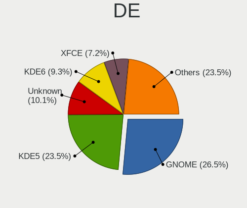
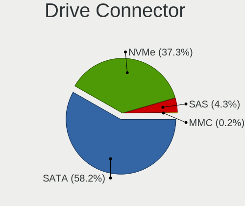

Arch - Tested Hardware & Statistics (Desktops)
----------------------------------------------

A project to collect tested hardware configurations for Arch.

Anyone can contribute to this report by the [hw-probe](https://github.com/linuxhw/hw-probe) tool:

    sudo -E hw-probe -all -upload

Please contribute! Especially if your hardware is rare.

Contents
--------

* [ Test Cases ](#test-cases)

* [ System ](#system)
  - [ OS                       ](#os)
  - [ OS Family                ](#os-family)
  - [ Kernel                   ](#kernel)
  - [ Kernel Family            ](#kernel-family)
  - [ Kernel Major Ver.        ](#kernel-major-ver)
  - [ Arch                     ](#arch)
  - [ DE                       ](#de)
  - [ Display Server           ](#display-server)
  - [ Display Manager          ](#display-manager)
  - [ OS Lang                  ](#os-lang)
  - [ Boot Mode                ](#boot-mode)
  - [ Filesystem               ](#filesystem)
  - [ Part. scheme             ](#part-scheme)
  - [ Dual Boot with Linux/BSD ](#dual-boot-with-linuxbsd)
  - [ Dual Boot (Win)          ](#dual-boot-win)

* [ Board ](#board)
  - [ Vendor                   ](#vendor)
  - [ Model                    ](#model)
  - [ Model Family             ](#model-family)
  - [ MFG Year                 ](#mfg-year)
  - [ Form Factor              ](#form-factor)
  - [ Secure Boot              ](#secure-boot)
  - [ Coreboot                 ](#coreboot)
  - [ RAM Size                 ](#ram-size)
  - [ RAM Used                 ](#ram-used)
  - [ Total Drives             ](#total-drives)
  - [ Has CD-ROM               ](#has-cd-rom)
  - [ Has Ethernet             ](#has-ethernet)
  - [ Has WiFi                 ](#has-wifi)
  - [ Has Bluetooth            ](#has-bluetooth)

* [ Location ](#location)
  - [ Country                  ](#country)
  - [ City                     ](#city)

* [ Drives ](#drives)
  - [ Drive Vendor             ](#drive-vendor)
  - [ Drive Model              ](#drive-model)
  - [ HDD Vendor               ](#hdd-vendor)
  - [ SSD Vendor               ](#ssd-vendor)
  - [ Drive Kind               ](#drive-kind)
  - [ Drive Connector          ](#drive-connector)
  - [ Drive Size               ](#drive-size)
  - [ Space Total              ](#space-total)
  - [ Space Used               ](#space-used)
  - [ Malfunc. Drives          ](#malfunc-drives)
  - [ Malfunc. Drive Vendor    ](#malfunc-drive-vendor)
  - [ Malfunc. HDD Vendor      ](#malfunc-hdd-vendor)
  - [ Malfunc. Drive Kind      ](#malfunc-drive-kind)
  - [ Failed Drives            ](#failed-drives)
  - [ Failed Drive Vendor      ](#failed-drive-vendor)
  - [ Drive Status             ](#drive-status)

* [ Storage controller ](#storage-controller)
  - [ Storage Vendor           ](#storage-vendor)
  - [ Storage Model            ](#storage-model)
  - [ Storage Kind             ](#storage-kind)

* [ Processor ](#processor)
  - [ CPU Vendor               ](#cpu-vendor)
  - [ CPU Model                ](#cpu-model)
  - [ CPU Model Family         ](#cpu-model-family)
  - [ CPU Cores                ](#cpu-cores)
  - [ CPU Sockets              ](#cpu-sockets)
  - [ CPU Threads              ](#cpu-threads)
  - [ CPU Op-Modes             ](#cpu-op-modes)
  - [ CPU Microcode            ](#cpu-microcode)
  - [ CPU Microarch            ](#cpu-microarch)

* [ Graphics ](#graphics)
  - [ GPU Vendor               ](#gpu-vendor)
  - [ GPU Model                ](#gpu-model)
  - [ GPU Combo                ](#gpu-combo)
  - [ GPU Driver               ](#gpu-driver)
  - [ GPU Memory               ](#gpu-memory)

* [ Monitor ](#monitor)
  - [ Monitor Vendor           ](#monitor-vendor)
  - [ Monitor Model            ](#monitor-model)
  - [ Monitor Resolution       ](#monitor-resolution)
  - [ Monitor Diagonal         ](#monitor-diagonal)
  - [ Monitor Width            ](#monitor-width)
  - [ Aspect Ratio             ](#aspect-ratio)
  - [ Monitor Area             ](#monitor-area)
  - [ Pixel Density            ](#pixel-density)
  - [ Multiple Monitors        ](#multiple-monitors)

* [ Network ](#network)
  - [ Net Controller Vendor    ](#net-controller-vendor)
  - [ Net Controller Model     ](#net-controller-model)
  - [ Wireless Vendor          ](#wireless-vendor)
  - [ Wireless Model           ](#wireless-model)
  - [ Ethernet Vendor          ](#ethernet-vendor)
  - [ Ethernet Model           ](#ethernet-model)
  - [ Net Controller Kind      ](#net-controller-kind)
  - [ Used Controller          ](#used-controller)
  - [ NICs                     ](#nics)
  - [ IPv6                     ](#ipv6)

* [ Bluetooth ](#bluetooth)
  - [ Bluetooth Vendor         ](#bluetooth-vendor)
  - [ Bluetooth Model          ](#bluetooth-model)

* [ Sound ](#sound)
  - [ Sound Vendor             ](#sound-vendor)
  - [ Sound Model              ](#sound-model)

* [ Memory ](#memory)
  - [ Memory Vendor            ](#memory-vendor)
  - [ Memory Model             ](#memory-model)
  - [ Memory Kind              ](#memory-kind)
  - [ Memory Form Factor       ](#memory-form-factor)
  - [ Memory Size              ](#memory-size)
  - [ Memory Speed             ](#memory-speed)

* [ Printers & scanners ](#printers--scanners)
  - [ Printer Vendor           ](#printer-vendor)
  - [ Printer Model            ](#printer-model)
  - [ Scanner Vendor           ](#scanner-vendor)
  - [ Scanner Model            ](#scanner-model)

* [ Camera ](#camera)
  - [ Camera Vendor            ](#camera-vendor)
  - [ Camera Model             ](#camera-model)

* [ Security ](#security)
  - [ Fingerprint Vendor       ](#fingerprint-vendor)
  - [ Fingerprint Model        ](#fingerprint-model)
  - [ Chipcard Vendor          ](#chipcard-vendor)
  - [ Chipcard Model           ](#chipcard-model)

* [ Unsupported ](#unsupported)
  - [ Unsupported Devices      ](#unsupported-devices)
  - [ Unsupported Device Types ](#unsupported-device-types)

Test Cases
----------

Total: 5529

| Vendor        | Model                       | Probe                                                      | Date         |
|---------------|-----------------------------|------------------------------------------------------------|--------------|
| MSI           | B450M PRO-VDH MAX           | [c88a64dee7](https://linux-hardware.org/?probe=c88a64dee7) | Jan 05, 2025 |
| ASRock        | B650M-HDV/M.2               | [7db2107e2a](https://linux-hardware.org/?probe=7db2107e2a) | Jan 05, 2025 |
| Gigabyte      | A520M K                     | [b725853875](https://linux-hardware.org/?probe=b725853875) | Jan 05, 2025 |
| HP            | 89B5 A                      | [6b38b13993](https://linux-hardware.org/?probe=6b38b13993) | Jan 04, 2025 |
| Biostar       | H61MHV3                     | [d5f3c84801](https://linux-hardware.org/?probe=d5f3c84801) | Jan 04, 2025 |
| Gigabyte      | X470 AORUS ULTRA GAMING-... | [f77ddc1d4e](https://linux-hardware.org/?probe=f77ddc1d4e) | Jan 04, 2025 |
| Gigabyte      | X470 AORUS ULTRA GAMING-... | [0eb5d3fd27](https://linux-hardware.org/?probe=0eb5d3fd27) | Jan 04, 2025 |
| MSI           | B550M PRO-VDH WIFI          | [a3c4d34290](https://linux-hardware.org/?probe=a3c4d34290) | Jan 04, 2025 |
| Gigabyte      | B460M D3H                   | [644e6e2e4e](https://linux-hardware.org/?probe=644e6e2e4e) | Jan 04, 2025 |
| Biostar       | A320MH                      | [a6f434cc49](https://linux-hardware.org/?probe=a6f434cc49) | Jan 04, 2025 |
| JGINYUE       | X99-D8 Server V1.0          | [686b22c79f](https://linux-hardware.org/?probe=686b22c79f) | Jan 03, 2025 |
| Shenzhen M... | A5WSR                       | [6a1318e0a6](https://linux-hardware.org/?probe=6a1318e0a6) | Jan 03, 2025 |
| Shenzhen M... | A5WSR                       | [4fc4c2d22d](https://linux-hardware.org/?probe=4fc4c2d22d) | Jan 03, 2025 |
| Dell          | 0NC2VH A01                  | [42baf9ae55](https://linux-hardware.org/?probe=42baf9ae55) | Jan 03, 2025 |
| Gigabyte      | X570 UD                     | [8f0c4a3b53](https://linux-hardware.org/?probe=8f0c4a3b53) | Jan 02, 2025 |
| MSI           | B350M MORTAR                | [f946508536](https://linux-hardware.org/?probe=f946508536) | Jan 02, 2025 |
| Gigabyte      | B550 AORUS ELITE AX V2      | [8f4880d03e](https://linux-hardware.org/?probe=8f4880d03e) | Jan 02, 2025 |
| Gigabyte      | B550 AORUS ELITE AX V2      | [f85dcfe010](https://linux-hardware.org/?probe=f85dcfe010) | Jan 02, 2025 |
| MSI           | MAG Z790 TOMAHAWK MAX WI... | [a4bf03f97c](https://linux-hardware.org/?probe=a4bf03f97c) | Jan 02, 2025 |
| ASRock        | H55M-LE                     | [341c5d1d0a](https://linux-hardware.org/?probe=341c5d1d0a) | Jan 02, 2025 |
| Unknown       | V0.9x                       | [94f488fa63](https://linux-hardware.org/?probe=94f488fa63) | Jan 01, 2025 |
| Gigabyte      | A520 AORUS ELITE            | [21e9277556](https://linux-hardware.org/?probe=21e9277556) | Jan 01, 2025 |
| MSI           | B450M PRO-VDH MAX           | [9d27b3438a](https://linux-hardware.org/?probe=9d27b3438a) | Dec 30, 2024 |
| MSI           | B450M PRO-VDH MAX           | [7de6bd6878](https://linux-hardware.org/?probe=7de6bd6878) | Dec 30, 2024 |
| MSI           | B650M GAMING PLUS WIFI      | [7f4ced1296](https://linux-hardware.org/?probe=7f4ced1296) | Dec 30, 2024 |
| PELADN        | WI-6                        | [505a879d82](https://linux-hardware.org/?probe=505a879d82) | Dec 29, 2024 |
| ASRock        | H81M-DG4                    | [63308a03e7](https://linux-hardware.org/?probe=63308a03e7) | Dec 29, 2024 |
| ASUSTek       | P8Z77-V LX                  | [a4c88acd7f](https://linux-hardware.org/?probe=a4c88acd7f) | Dec 28, 2024 |
| Dell          | 0TTDMJ A00                  | [f1b5e81c74](https://linux-hardware.org/?probe=f1b5e81c74) | Dec 28, 2024 |
| MSI           | B350M MORTAR                | [8f912c3cb7](https://linux-hardware.org/?probe=8f912c3cb7) | Dec 28, 2024 |
| ASRock        | B550M-ITX/ac                | [5a11aa6793](https://linux-hardware.org/?probe=5a11aa6793) | Dec 28, 2024 |
| ASUSTek       | PRIME B760M-A AX6 II        | [60215d0dc0](https://linux-hardware.org/?probe=60215d0dc0) | Dec 27, 2024 |
| Maibenben     | PC34 V1.0                   | [1994f8536a](https://linux-hardware.org/?probe=1994f8536a) | Dec 27, 2024 |
| Colorful T... | CVN B650M GAMING FROZEN ... | [f4259d10b6](https://linux-hardware.org/?probe=f4259d10b6) | Dec 27, 2024 |
| Gigabyte      | B550M S2H                   | [18287a9af1](https://linux-hardware.org/?probe=18287a9af1) | Dec 27, 2024 |
| ASUSTek       | TUF Gaming B650M-PLUS       | [aa2af1b2d7](https://linux-hardware.org/?probe=aa2af1b2d7) | Dec 27, 2024 |
| ASUSTek       | TUF B450-PRO GAMING         | [9978434d74](https://linux-hardware.org/?probe=9978434d74) | Dec 27, 2024 |
| ASUSTek       | H97M-E                      | [4bfb3a3198](https://linux-hardware.org/?probe=4bfb3a3198) | Dec 26, 2024 |
| Gigabyte      | B550M S2H                   | [0076231d40](https://linux-hardware.org/?probe=0076231d40) | Dec 26, 2024 |
| Gigabyte      | 970A-DS3P                   | [5178ebb1f5](https://linux-hardware.org/?probe=5178ebb1f5) | Dec 26, 2024 |
| MSI           | B450 TOMAHAWK MAX II        | [9f6237983d](https://linux-hardware.org/?probe=9f6237983d) | Dec 25, 2024 |
| ASRock        | B550M Pro4                  | [15ca1a3986](https://linux-hardware.org/?probe=15ca1a3986) | Dec 25, 2024 |
| ASRock        | X570 Taichi                 | [56b87a8422](https://linux-hardware.org/?probe=56b87a8422) | Dec 25, 2024 |
| ASUSTek       | PRIME Z390-A                | [1202e9754d](https://linux-hardware.org/?probe=1202e9754d) | Dec 25, 2024 |
| Dell          | 0GY6Y8 A00                  | [924efb699d](https://linux-hardware.org/?probe=924efb699d) | Dec 24, 2024 |
| Dell          | 0KYWH7 A01                  | [86c6baedbe](https://linux-hardware.org/?probe=86c6baedbe) | Dec 23, 2024 |
| Dell          | 0KYWH7 A01                  | [ac3e1d624b](https://linux-hardware.org/?probe=ac3e1d624b) | Dec 23, 2024 |
| ASUSTek       | H97M-PLUS                   | [e5d71e3aba](https://linux-hardware.org/?probe=e5d71e3aba) | Dec 22, 2024 |
| MSI           | MPG Z790 CARBON WIFI        | [510b37b7aa](https://linux-hardware.org/?probe=510b37b7aa) | Dec 22, 2024 |
| Gigabyte      | X670 AORUS ELITE AX         | [c64e9ff809](https://linux-hardware.org/?probe=c64e9ff809) | Dec 22, 2024 |
| Gigabyte      | P55-USB3                    | [3fb482feaf](https://linux-hardware.org/?probe=3fb482feaf) | Dec 22, 2024 |
| Gigabyte      | B550M DS3H                  | [8387032a00](https://linux-hardware.org/?probe=8387032a00) | Dec 21, 2024 |
| Gigabyte      | Z790 AORUS ELITE AX         | [fadffefa28](https://linux-hardware.org/?probe=fadffefa28) | Dec 19, 2024 |
| ASRock        | X300-ITX                    | [b6a39bc4d8](https://linux-hardware.org/?probe=b6a39bc4d8) | Dec 18, 2024 |
| ASUSTek       | PRIME B550-PLUS             | [7b074aefcc](https://linux-hardware.org/?probe=7b074aefcc) | Dec 18, 2024 |
| ASUSTek       | ROG STRIX H370-I GAMING     | [0ae519bf73](https://linux-hardware.org/?probe=0ae519bf73) | Dec 18, 2024 |
| ASUSTek       | ROG STRIX B550-A GAMING     | [6ca07fcdfb](https://linux-hardware.org/?probe=6ca07fcdfb) | Dec 17, 2024 |
| ASRock        | B550M-ITX/ac                | [fc393a7165](https://linux-hardware.org/?probe=fc393a7165) | Dec 17, 2024 |
| MSI           | MPG X570 GAMING PLUS        | [a157381033](https://linux-hardware.org/?probe=a157381033) | Dec 17, 2024 |
| ASUSTek       | PRIME X670E-PRO WIFI        | [2207400569](https://linux-hardware.org/?probe=2207400569) | Dec 17, 2024 |
| MSI           | PRO Z690-A DDR4             | [63f734b1e5](https://linux-hardware.org/?probe=63f734b1e5) | Dec 17, 2024 |
| Gigabyte      | X870 EAGLE WIFI7            | [0b96421b6c](https://linux-hardware.org/?probe=0b96421b6c) | Dec 17, 2024 |
| Gigabyte      | B650 GAMING X AX V2         | [e625968bcb](https://linux-hardware.org/?probe=e625968bcb) | Dec 17, 2024 |
| ASUSTek       | TUF Z390-PLUS GAMING        | [3a941c604b](https://linux-hardware.org/?probe=3a941c604b) | Dec 17, 2024 |
| ASUSTek       | CROSSHAIR VI HERO           | [d87aaaf485](https://linux-hardware.org/?probe=d87aaaf485) | Dec 16, 2024 |
| MSI           | B450M MORTAR MAX            | [d76388f034](https://linux-hardware.org/?probe=d76388f034) | Dec 16, 2024 |
| MSI           | B450M MORTAR MAX            | [00eb10a377](https://linux-hardware.org/?probe=00eb10a377) | Dec 16, 2024 |
| ASRock        | A520M-HVS                   | [ad901a965d](https://linux-hardware.org/?probe=ad901a965d) | Dec 16, 2024 |
| Dell          | 0WR7PY A02                  | [cedf8aee7e](https://linux-hardware.org/?probe=cedf8aee7e) | Dec 16, 2024 |
| HP            | 83E2                        | [1b12192911](https://linux-hardware.org/?probe=1b12192911) | Dec 16, 2024 |
| MSI           | X99S GAMING 9 AC            | [dd95266cf8](https://linux-hardware.org/?probe=dd95266cf8) | Dec 16, 2024 |
| MSI           | X99S GAMING 9 AC            | [5e49b2a07b](https://linux-hardware.org/?probe=5e49b2a07b) | Dec 16, 2024 |
| MSI           | PRO B650M-A WIFI            | [ea8ffcb3c8](https://linux-hardware.org/?probe=ea8ffcb3c8) | Dec 15, 2024 |
| MSI           | PRO B650M-A WIFI            | [5c0f89d5b9](https://linux-hardware.org/?probe=5c0f89d5b9) | Dec 15, 2024 |
| Gigabyte      | B450 AORUS ELITE V2         | [b24c0ed46d](https://linux-hardware.org/?probe=b24c0ed46d) | Dec 15, 2024 |
| ASUSTek       | ROG STRIX B650E-E GAMING... | [be06a1068f](https://linux-hardware.org/?probe=be06a1068f) | Dec 15, 2024 |
| Dell          | 02GDWG A00                  | [0576666072](https://linux-hardware.org/?probe=0576666072) | Dec 15, 2024 |
| MSI           | H270 TOMAHAWK ARCTIC        | [1274414039](https://linux-hardware.org/?probe=1274414039) | Dec 15, 2024 |
| ASRock        | B650M PG Lightning WiFi     | [1ec00fae66](https://linux-hardware.org/?probe=1ec00fae66) | Dec 14, 2024 |
| ASRock        | AB350 Pro4                  | [8d7dd64d23](https://linux-hardware.org/?probe=8d7dd64d23) | Dec 14, 2024 |
| Dell          | 0T7D40 A00                  | [218ef87925](https://linux-hardware.org/?probe=218ef87925) | Dec 14, 2024 |
| Dell          | 0T7D40 A00                  | [ac9dce6f48](https://linux-hardware.org/?probe=ac9dce6f48) | Dec 14, 2024 |
| Dell          | 0GY6Y8 A00                  | [4d22a711c2](https://linux-hardware.org/?probe=4d22a711c2) | Dec 14, 2024 |
| Foxconn       | H55MXV Series               | [cf67e7336a](https://linux-hardware.org/?probe=cf67e7336a) | Dec 14, 2024 |
| Foxconn       | H55MXV Series               | [6a647c4d4e](https://linux-hardware.org/?probe=6a647c4d4e) | Dec 14, 2024 |
| ASRock        | B450 Gaming-ITX/ac          | [e6c039f6ca](https://linux-hardware.org/?probe=e6c039f6ca) | Dec 14, 2024 |
| ASUSTek       | TUF B450-PRO GAMING         | [5f5311c4b3](https://linux-hardware.org/?probe=5f5311c4b3) | Dec 14, 2024 |
| ASUSTek       | PRIME B550-PLUS             | [4e821e4adb](https://linux-hardware.org/?probe=4e821e4adb) | Dec 14, 2024 |
| MSI           | MPG X870E CARBON WIFI       | [852de9c4f7](https://linux-hardware.org/?probe=852de9c4f7) | Dec 13, 2024 |
| MSI           | B550M PRO-VDH WIFI          | [99bbee3d81](https://linux-hardware.org/?probe=99bbee3d81) | Dec 13, 2024 |
| Micro Comp... | HX100G                      | [b050952d4a](https://linux-hardware.org/?probe=b050952d4a) | Dec 13, 2024 |
| MSI           | B560-A PRO                  | [521113e45e](https://linux-hardware.org/?probe=521113e45e) | Dec 12, 2024 |
| GMKtec        | NucBox K6                   | [0ba5e79a99](https://linux-hardware.org/?probe=0ba5e79a99) | Dec 12, 2024 |
| Gigabyte      | H410M H V3                  | [37d81caea8](https://linux-hardware.org/?probe=37d81caea8) | Dec 12, 2024 |
| ASUSTek       | PRIME A320M-K               | [467278b658](https://linux-hardware.org/?probe=467278b658) | Dec 12, 2024 |
| HP            | 89EB 11                     | [d340c8e1e1](https://linux-hardware.org/?probe=d340c8e1e1) | Dec 11, 2024 |
| Gigabyte      | B650 EAGLE AX               | [e7c8036b9d](https://linux-hardware.org/?probe=e7c8036b9d) | Dec 11, 2024 |
| ASRock        | X570 Phantom Gaming 4       | [14a9842241](https://linux-hardware.org/?probe=14a9842241) | Dec 11, 2024 |
| JGINYUE       | X99 TITANIUM D3             | [bb9134a8a6](https://linux-hardware.org/?probe=bb9134a8a6) | Dec 11, 2024 |
| MSI           | B550M PRO-VDH WIFI          | [4629709a7a](https://linux-hardware.org/?probe=4629709a7a) | Dec 11, 2024 |
| ASUSTek       | TUF Gaming B550M-PLUS       | [0895524ef3](https://linux-hardware.org/?probe=0895524ef3) | Dec 11, 2024 |
| ASUSTek       | TUF Gaming B550M-PLUS       | [e9f46337c3](https://linux-hardware.org/?probe=e9f46337c3) | Dec 11, 2024 |
| Acer          | Predator PO3-620            | [fce8274ab8](https://linux-hardware.org/?probe=fce8274ab8) | Dec 11, 2024 |
| HP            | 89EB 11                     | [25e020d362](https://linux-hardware.org/?probe=25e020d362) | Dec 11, 2024 |
| Medion        | H110H4-EM                   | [c13551963f](https://linux-hardware.org/?probe=c13551963f) | Dec 10, 2024 |
| MSI           | B450M PRO-M2 MAX            | [8436935283](https://linux-hardware.org/?probe=8436935283) | Dec 10, 2024 |
| HP            | 1825                        | [a5a96d92a8](https://linux-hardware.org/?probe=a5a96d92a8) | Dec 09, 2024 |
| MSI           | MAG X570 TOMAHAWK WIFI      | [9a987bc4b0](https://linux-hardware.org/?probe=9a987bc4b0) | Dec 09, 2024 |
| MSI           | MAG X870 TOMAHAWK WIFI      | [a1d466a8c2](https://linux-hardware.org/?probe=a1d466a8c2) | Dec 09, 2024 |
| MSI           | B550M PRO-VDH               | [30ad89f2cd](https://linux-hardware.org/?probe=30ad89f2cd) | Dec 08, 2024 |
| ASRock        | B460M Steel Legend          | [2f90887c93](https://linux-hardware.org/?probe=2f90887c93) | Dec 08, 2024 |
| ASRock        | B460M Steel Legend          | [47e703a42d](https://linux-hardware.org/?probe=47e703a42d) | Dec 08, 2024 |
| ASRock        | B650M Pro RS WiFi           | [e56c27202c](https://linux-hardware.org/?probe=e56c27202c) | Dec 08, 2024 |
| Gigabyte      | B550 GAMING X V2            | [0a316b6841](https://linux-hardware.org/?probe=0a316b6841) | Dec 07, 2024 |
| ASUSTek       | Maximus VIII HERO           | [57fb114501](https://linux-hardware.org/?probe=57fb114501) | Dec 07, 2024 |
| ASRock        | AB350 Pro4                  | [68e28088be](https://linux-hardware.org/?probe=68e28088be) | Dec 07, 2024 |
| ASUSTek       | ROG STRIX Z690-I GAMING ... | [20a1c20751](https://linux-hardware.org/?probe=20a1c20751) | Dec 06, 2024 |
| Gigabyte      | B450M H                     | [930e73d68c](https://linux-hardware.org/?probe=930e73d68c) | Dec 06, 2024 |
| ASUSTek       | H61M-A/BR                   | [7eae96418c](https://linux-hardware.org/?probe=7eae96418c) | Dec 06, 2024 |
| ASRock        | B650 Pro RS                 | [bd0c55951c](https://linux-hardware.org/?probe=bd0c55951c) | Dec 06, 2024 |
| ASUSTek       | ROG STRIX Z490-E GAMING     | [496a116678](https://linux-hardware.org/?probe=496a116678) | Dec 06, 2024 |
| MSI           | H510M-A PRO                 | [fcc2b60362](https://linux-hardware.org/?probe=fcc2b60362) | Dec 05, 2024 |
| ASRock        | B650M Pro RS                | [3e546a0c36](https://linux-hardware.org/?probe=3e546a0c36) | Dec 05, 2024 |
| ASRock        | X670E Steel Legend          | [83f29b76a8](https://linux-hardware.org/?probe=83f29b76a8) | Dec 04, 2024 |
| ASUSTek       | ROG CROSSHAIR X670E GENE    | [88f51f2492](https://linux-hardware.org/?probe=88f51f2492) | Dec 04, 2024 |
| ASUSTek       | M5A88-M                     | [39bccb603a](https://linux-hardware.org/?probe=39bccb603a) | Dec 04, 2024 |
| Gigabyte      | B450M DS3H WIFI-CF          | [f610fa78d2](https://linux-hardware.org/?probe=f610fa78d2) | Dec 04, 2024 |
| Gigabyte      | B550M AORUS PRO-P           | [3baa420a3f](https://linux-hardware.org/?probe=3baa420a3f) | Dec 03, 2024 |
| ASUSTek       | TUF Gaming B650M-PLUS WI... | [b5812f6c37](https://linux-hardware.org/?probe=b5812f6c37) | Dec 03, 2024 |
| ASUSTek       | PRIME A320M-K               | [232e1f7313](https://linux-hardware.org/?probe=232e1f7313) | Dec 03, 2024 |
| Gigabyte      | B550 GAMING X V2            | [3f6e18d4c5](https://linux-hardware.org/?probe=3f6e18d4c5) | Dec 03, 2024 |
| Gigabyte      | B550M DS3H AC               | [84fd04ed74](https://linux-hardware.org/?probe=84fd04ed74) | Dec 03, 2024 |
| ECS           | G31T-M7                     | [fc3fdf0841](https://linux-hardware.org/?probe=fc3fdf0841) | Dec 03, 2024 |
| ASRock        | B550M Pro4                  | [518a749eaf](https://linux-hardware.org/?probe=518a749eaf) | Dec 02, 2024 |
| Shenzhen M... | DRBAA                       | [1a74597bce](https://linux-hardware.org/?probe=1a74597bce) | Dec 02, 2024 |
| Acer          | Predator PO3-620            | [1de47b5804](https://linux-hardware.org/?probe=1de47b5804) | Dec 02, 2024 |
| Dell          | 0NDYHG A01                  | [282527be25](https://linux-hardware.org/?probe=282527be25) | Dec 02, 2024 |
| Gigabyte      | X870E AORUS ELITE WIFI7     | [5f3a531f82](https://linux-hardware.org/?probe=5f3a531f82) | Dec 01, 2024 |
| ASUSTek       | ROG STRIX B650E-I GAMING... | [25ba31756c](https://linux-hardware.org/?probe=25ba31756c) | Dec 01, 2024 |
| Gigabyte      | X470 AORUS ULTRA GAMING-... | [d3c7962136](https://linux-hardware.org/?probe=d3c7962136) | Dec 01, 2024 |
| MSI           | B550-A PRO                  | [1fe6f379ce](https://linux-hardware.org/?probe=1fe6f379ce) | Dec 01, 2024 |
| MSI           | MAG B650 TOMAHAWK WIFI      | [efae733196](https://linux-hardware.org/?probe=efae733196) | Dec 01, 2024 |
| MSI           | B450 TOMAHAWK               | [48d351ced9](https://linux-hardware.org/?probe=48d351ced9) | Dec 01, 2024 |
| Dell          | 042P49 A02                  | [a737886efa](https://linux-hardware.org/?probe=a737886efa) | Dec 01, 2024 |
| MSI           | MAG B550M MORTAR            | [d290ab5d70](https://linux-hardware.org/?probe=d290ab5d70) | Dec 01, 2024 |
| Gigabyte      | B760M C                     | [90f032c2a2](https://linux-hardware.org/?probe=90f032c2a2) | Dec 01, 2024 |
| HP            | 0B4Ch D                     | [0408485ffc](https://linux-hardware.org/?probe=0408485ffc) | Nov 30, 2024 |
| Intel         | JSL MRD                     | [0f704c481a](https://linux-hardware.org/?probe=0f704c481a) | Nov 30, 2024 |
| Intel         | JSL MRD                     | [b9e83ac911](https://linux-hardware.org/?probe=b9e83ac911) | Nov 30, 2024 |
| Gigabyte      | B550M AORUS PRO-P           | [d47f4ffd1e](https://linux-hardware.org/?probe=d47f4ffd1e) | Nov 30, 2024 |
| ASUSTek       | PRIME B560M-A               | [97e1069738](https://linux-hardware.org/?probe=97e1069738) | Nov 30, 2024 |
| MSI           | PRO B550-VC                 | [f636da7659](https://linux-hardware.org/?probe=f636da7659) | Nov 30, 2024 |
| Dell          | 0HD5W2 A01                  | [7bfeb76357](https://linux-hardware.org/?probe=7bfeb76357) | Nov 30, 2024 |
| Gigabyte      | B650 EAGLE AX               | [cb30ab3228](https://linux-hardware.org/?probe=cb30ab3228) | Nov 30, 2024 |
| MSI           | MPG X570 GAMING PRO CARB... | [fce79773b2](https://linux-hardware.org/?probe=fce79773b2) | Nov 29, 2024 |
| Shenzhen M... | DRBAA                       | [881b836d56](https://linux-hardware.org/?probe=881b836d56) | Nov 29, 2024 |
| MSI           | MEG X570 UNIFY              | [c1cb2f65cb](https://linux-hardware.org/?probe=c1cb2f65cb) | Nov 29, 2024 |
| MSI           | Z270 GAMING PRO CARBON      | [9c1b2aff8d](https://linux-hardware.org/?probe=9c1b2aff8d) | Nov 28, 2024 |
| MSI           | X470 GAMING PLUS MAX        | [bfdfec9a0f](https://linux-hardware.org/?probe=bfdfec9a0f) | Nov 28, 2024 |
| MSI           | MEG X570 UNIFY              | [1a873a668f](https://linux-hardware.org/?probe=1a873a668f) | Nov 27, 2024 |
| ASUSTek       | ProArt X870E-CREATOR WIF... | [53562a1d40](https://linux-hardware.org/?probe=53562a1d40) | Nov 27, 2024 |
| MSI           | B450M MORTAR                | [39200492be](https://linux-hardware.org/?probe=39200492be) | Nov 27, 2024 |
| MSI           | B450 GAMING PLUS MAX        | [a43093cd01](https://linux-hardware.org/?probe=a43093cd01) | Nov 27, 2024 |
| ASRock        | X870E Nova WiFi             | [5f91d26eb4](https://linux-hardware.org/?probe=5f91d26eb4) | Nov 26, 2024 |
| ASRock        | X870E Nova WiFi             | [959b1c4a9f](https://linux-hardware.org/?probe=959b1c4a9f) | Nov 26, 2024 |
| ASUSTek       | Z87-DELUXE                  | [a7fd7c8dbf](https://linux-hardware.org/?probe=a7fd7c8dbf) | Nov 26, 2024 |
| ASRock        | B560M-C                     | [22b3d0b152](https://linux-hardware.org/?probe=22b3d0b152) | Nov 26, 2024 |
| Gigabyte      | X570 AORUS ELITE            | [3583fe4893](https://linux-hardware.org/?probe=3583fe4893) | Nov 26, 2024 |
| Gigabyte      | X570 AORUS ELITE            | [597a17daaf](https://linux-hardware.org/?probe=597a17daaf) | Nov 26, 2024 |
| MSI           | X470 GAMING PLUS            | [760b12643d](https://linux-hardware.org/?probe=760b12643d) | Nov 26, 2024 |
| ASUSTek       | PRIME H610M-D D4            | [eb2d759164](https://linux-hardware.org/?probe=eb2d759164) | Nov 26, 2024 |
| Gigabyte      | X570 AORUS ELITE WIFI       | [abca7ea24f](https://linux-hardware.org/?probe=abca7ea24f) | Nov 26, 2024 |
| Gigabyte      | X870 AORUS ELITE WIFI7      | [c84e2162f4](https://linux-hardware.org/?probe=c84e2162f4) | Nov 26, 2024 |
| MSI           | MAG B550 TOMAHAWK           | [d62bf666bf](https://linux-hardware.org/?probe=d62bf666bf) | Nov 25, 2024 |
| ASUSTek       | PRIME A320M-K               | [32bd6e83f8](https://linux-hardware.org/?probe=32bd6e83f8) | Nov 25, 2024 |
| MSI           | MAG B550 TOMAHAWK           | [f3eb835176](https://linux-hardware.org/?probe=f3eb835176) | Nov 24, 2024 |
| ASUSTek       | PRIME Z690-A                | [082fbca187](https://linux-hardware.org/?probe=082fbca187) | Nov 24, 2024 |
| MSI           | MAG X870 TOMAHAWK WIFI      | [511dc5166d](https://linux-hardware.org/?probe=511dc5166d) | Nov 23, 2024 |
| Shenzhen M... | F7BRC                       | [b2a44038f5](https://linux-hardware.org/?probe=b2a44038f5) | Nov 23, 2024 |
| MSI           | MAG X570S TOMAHAWK MAX W... | [33cde5f313](https://linux-hardware.org/?probe=33cde5f313) | Nov 23, 2024 |
| Gigabyte      | B550M AORUS PRO-P           | [b8fc63e921](https://linux-hardware.org/?probe=b8fc63e921) | Nov 22, 2024 |
| HP            | 82F1                        | [93b6f2c1a1](https://linux-hardware.org/?probe=93b6f2c1a1) | Nov 22, 2024 |
| MSI           | MAG X570S TOMAHAWK MAX W... | [e4c93b56d2](https://linux-hardware.org/?probe=e4c93b56d2) | Nov 22, 2024 |
| HP            | 82F1                        | [d837edb5bd](https://linux-hardware.org/?probe=d837edb5bd) | Nov 22, 2024 |
| HP            | 8906 SMVB                   | [310f3d9ee4](https://linux-hardware.org/?probe=310f3d9ee4) | Nov 22, 2024 |
| MSI           | B450-A PRO MAX              | [83f630a6e3](https://linux-hardware.org/?probe=83f630a6e3) | Nov 22, 2024 |
| ASRock        | B450 Gaming-ITX/ac          | [3ea4b9e276](https://linux-hardware.org/?probe=3ea4b9e276) | Nov 22, 2024 |
| MSI           | MPG X870E CARBON WIFI       | [555300adbd](https://linux-hardware.org/?probe=555300adbd) | Nov 21, 2024 |
| Gigabyte      | H81M-S1                     | [51524c7cfd](https://linux-hardware.org/?probe=51524c7cfd) | Nov 21, 2024 |
| Gigabyte      | X570S AORUS PRO AX          | [4f1d3c3f9d](https://linux-hardware.org/?probe=4f1d3c3f9d) | Nov 21, 2024 |
| MSI           | MAG B550 TOMAHAWK MAX WI... | [252bb8dec4](https://linux-hardware.org/?probe=252bb8dec4) | Nov 21, 2024 |
| ASUSTek       | M5A78L-M/USB3               | [136212c8fe](https://linux-hardware.org/?probe=136212c8fe) | Nov 21, 2024 |
| ASRock        | B650E PG Riptide WiFi       | [626f03bfca](https://linux-hardware.org/?probe=626f03bfca) | Nov 21, 2024 |
| ASRock        | B650E PG Riptide WiFi       | [3f345f6fc0](https://linux-hardware.org/?probe=3f345f6fc0) | Nov 21, 2024 |
| ASUSTek       | P9X79 PRO                   | [f7c8a81734](https://linux-hardware.org/?probe=f7c8a81734) | Nov 20, 2024 |
| MSI           | B550M-A PRO                 | [b8da51818e](https://linux-hardware.org/?probe=b8da51818e) | Nov 20, 2024 |
| ASUSTek       | ROG STRIX B650E-F GAMING... | [30dc93f797](https://linux-hardware.org/?probe=30dc93f797) | Nov 20, 2024 |
| MSI           | MPG X670E CARBON WIFI       | [6d05aef0fe](https://linux-hardware.org/?probe=6d05aef0fe) | Nov 19, 2024 |
| Gigabyte      | B550M AORUS PRO-P           | [66053712ff](https://linux-hardware.org/?probe=66053712ff) | Nov 19, 2024 |
| NZXT          | N7 Z790                     | [7fda7d7b68](https://linux-hardware.org/?probe=7fda7d7b68) | Nov 19, 2024 |
| Gigabyte      | H110-D3A-CF                 | [1ef77ddfc1](https://linux-hardware.org/?probe=1ef77ddfc1) | Nov 18, 2024 |
| MSI           | Z490-A PRO                  | [54f7ac3651](https://linux-hardware.org/?probe=54f7ac3651) | Nov 18, 2024 |
| MSI           | H61MU-E35                   | [b71a90d84e](https://linux-hardware.org/?probe=b71a90d84e) | Nov 18, 2024 |
| Supermicro    | X10DAI                      | [4bc3d45af0](https://linux-hardware.org/?probe=4bc3d45af0) | Nov 18, 2024 |
| Gigabyte      | B550I AORUS PRO AX          | [70b0b7a856](https://linux-hardware.org/?probe=70b0b7a856) | Nov 18, 2024 |
| MSI           | H310M PRO-VD                | [05ecf2c89a](https://linux-hardware.org/?probe=05ecf2c89a) | Nov 17, 2024 |
| Lenovo        | 36D9 SDK0J40679 WIN 3273... | [6bd48ece04](https://linux-hardware.org/?probe=6bd48ece04) | Nov 17, 2024 |
| Gigabyte      | H310M S2                    | [f025c7ec84](https://linux-hardware.org/?probe=f025c7ec84) | Nov 17, 2024 |
| Lenovo        | 3716 SDK0L77769 WIN 3423... | [74f4ee0967](https://linux-hardware.org/?probe=74f4ee0967) | Nov 17, 2024 |
| ASUSTek       | B150 PRO GAMING             | [e17a913175](https://linux-hardware.org/?probe=e17a913175) | Nov 17, 2024 |
| ASUSTek       | B150 PRO GAMING             | [03c8253d85](https://linux-hardware.org/?probe=03c8253d85) | Nov 17, 2024 |
| AAEON         | MIX-H310A1 V1.0             | [96b20cb963](https://linux-hardware.org/?probe=96b20cb963) | Nov 16, 2024 |
| MSI           | MAG X670E TOMAHAWK WIFI     | [7cf061125b](https://linux-hardware.org/?probe=7cf061125b) | Nov 16, 2024 |
| MSI           | PRO B760-VC WIFI 7 BULK     | [fc39894cbc](https://linux-hardware.org/?probe=fc39894cbc) | Nov 16, 2024 |
| Gigabyte      | B360M D3H-CF                | [c281cec2c4](https://linux-hardware.org/?probe=c281cec2c4) | Nov 16, 2024 |
| Gigabyte      | A320M-S2H V2-CF             | [81a38efac3](https://linux-hardware.org/?probe=81a38efac3) | Nov 16, 2024 |
| MSI           | MPG X670E CARBON WIFI       | [6caa94f61d](https://linux-hardware.org/?probe=6caa94f61d) | Nov 15, 2024 |
| MSI           | B360 GAMING PLUS            | [97aa607380](https://linux-hardware.org/?probe=97aa607380) | Nov 15, 2024 |
| Gigabyte      | X470 AORUS ULTRA GAMING-... | [913db6a19a](https://linux-hardware.org/?probe=913db6a19a) | Nov 15, 2024 |
| Gigabyte      | X570S AORUS ELITE AX        | [fdafec0fd8](https://linux-hardware.org/?probe=fdafec0fd8) | Nov 15, 2024 |
| Gigabyte      | H310M S2 x.x                | [d1de0835ba](https://linux-hardware.org/?probe=d1de0835ba) | Nov 15, 2024 |
| ASUSTek       | PRIME Z490-A                | [67d9c1c592](https://linux-hardware.org/?probe=67d9c1c592) | Nov 15, 2024 |
| MSI           | MEG X570 UNIFY              | [057c9f6d92](https://linux-hardware.org/?probe=057c9f6d92) | Nov 15, 2024 |
| ASUSTek       | TUF Gaming B650-PLUS WIF... | [3d319a0574](https://linux-hardware.org/?probe=3d319a0574) | Nov 14, 2024 |
| MSI           | MPG B550 GAMING EDGE WIF... | [89df07ddfb](https://linux-hardware.org/?probe=89df07ddfb) | Nov 14, 2024 |
| ASRock        | B760 Pro RS/D4              | [f61d4accde](https://linux-hardware.org/?probe=f61d4accde) | Nov 14, 2024 |
| MSI           | B760M GAMING PLUS WIFI      | [2e86962422](https://linux-hardware.org/?probe=2e86962422) | Nov 14, 2024 |
| Gigabyte      | B550M AORUS ELITE           | [1ed0db88d9](https://linux-hardware.org/?probe=1ed0db88d9) | Nov 14, 2024 |
| Gigabyte      | B450M S2H                   | [f9529df16b](https://linux-hardware.org/?probe=f9529df16b) | Nov 13, 2024 |
| MSI           | PRO B760-P WIFI DDR4        | [1b53092624](https://linux-hardware.org/?probe=1b53092624) | Nov 13, 2024 |
| ASUSTek       | PRIME B350-PLUS             | [4a2a45260a](https://linux-hardware.org/?probe=4a2a45260a) | Nov 13, 2024 |
| ASUSTek       | B85M-E                      | [ed48355526](https://linux-hardware.org/?probe=ed48355526) | Nov 13, 2024 |
| MSI           | MAG X570 TOMAHAWK WIFI      | [9bce517a09](https://linux-hardware.org/?probe=9bce517a09) | Nov 13, 2024 |
| Gigabyte      | X570 AORUS ELITE            | [327175be42](https://linux-hardware.org/?probe=327175be42) | Nov 13, 2024 |
| Gigabyte      | B85M-D3H                    | [9e941ab661](https://linux-hardware.org/?probe=9e941ab661) | Nov 12, 2024 |
| ASUSTek       | TUF Gaming X570-PLUS        | [bea19b9d42](https://linux-hardware.org/?probe=bea19b9d42) | Nov 11, 2024 |
| Gigabyte      | B550I AORUS PRO AX          | [01bb6068ce](https://linux-hardware.org/?probe=01bb6068ce) | Nov 11, 2024 |
| MSI           | B450 TOMAHAWK MAX           | [7dccc81e4c](https://linux-hardware.org/?probe=7dccc81e4c) | Nov 11, 2024 |
| ASUSTek       | M5A78L-M LX V2              | [024ecaa0c9](https://linux-hardware.org/?probe=024ecaa0c9) | Nov 11, 2024 |
| ASRock        | B550 Phantom Gaming-ITX/... | [0b8fc5b8af](https://linux-hardware.org/?probe=0b8fc5b8af) | Nov 11, 2024 |
| MSI           | H510M-A PRO                 | [109560b470](https://linux-hardware.org/?probe=109560b470) | Nov 11, 2024 |
| ASUSTek       | ROG STRIX B550-F GAMING ... | [41afbb2f7c](https://linux-hardware.org/?probe=41afbb2f7c) | Nov 10, 2024 |
| MSI           | MPG B650I EDGE WIFI         | [018c232e17](https://linux-hardware.org/?probe=018c232e17) | Nov 09, 2024 |
| ASUSTek       | PRIME Z370-P II             | [edcee03147](https://linux-hardware.org/?probe=edcee03147) | Nov 09, 2024 |
| MSI           | MAG B550 TOMAHAWK MAX WI... | [8fba563431](https://linux-hardware.org/?probe=8fba563431) | Nov 09, 2024 |
| MSI           | MAG B550 TOMAHAWK MAX WI... | [6b414337bf](https://linux-hardware.org/?probe=6b414337bf) | Nov 09, 2024 |
| ASUSTek       | TUF Gaming B650-PLUS WIF... | [f58b0b5292](https://linux-hardware.org/?probe=f58b0b5292) | Nov 09, 2024 |
| ASUSTek       | ROG STRIX B550-F GAMING     | [24a60bb59c](https://linux-hardware.org/?probe=24a60bb59c) | Nov 09, 2024 |
| MSI           | MAG B550 TOMAHAWK MAX WI... | [f14289e584](https://linux-hardware.org/?probe=f14289e584) | Nov 09, 2024 |
| Gigabyte      | B650 AORUS ELITE AX         | [fe7551c06a](https://linux-hardware.org/?probe=fe7551c06a) | Nov 08, 2024 |
| Gigabyte      | B650 AORUS ELITE AX         | [ebefd5de22](https://linux-hardware.org/?probe=ebefd5de22) | Nov 08, 2024 |
| MSI           | X470 GAMING PLUS            | [95953f3019](https://linux-hardware.org/?probe=95953f3019) | Nov 08, 2024 |
| Unknown       | Unknown                     | [0447d7aa55](https://linux-hardware.org/?probe=0447d7aa55) | Nov 06, 2024 |
| ASUSTek       | TUF B450-PRO GAMING         | [97a524736d](https://linux-hardware.org/?probe=97a524736d) | Nov 05, 2024 |
| Gigabyte      | B550M AORUS PRO-P           | [88ac6d8a7f](https://linux-hardware.org/?probe=88ac6d8a7f) | Nov 05, 2024 |
| MSI           | H270 GAMING M3              | [143575ac5b](https://linux-hardware.org/?probe=143575ac5b) | Nov 05, 2024 |
| ASUSTek       | ROG CROSSHAIR VIII HERO     | [9093f85751](https://linux-hardware.org/?probe=9093f85751) | Nov 05, 2024 |
| ASUSTek       | Pro WS W790E-SAGE SE        | [68f88e3b88](https://linux-hardware.org/?probe=68f88e3b88) | Nov 05, 2024 |
| Gigabyte      | A320M-H-CF                  | [6f0c41f989](https://linux-hardware.org/?probe=6f0c41f989) | Nov 05, 2024 |
| ASUSTek       | ROG CROSSHAIR X670E GENE    | [edec2b8cb5](https://linux-hardware.org/?probe=edec2b8cb5) | Nov 05, 2024 |
| ASUSTek       | ROG STRIX Z790-F GAMING ... | [b93e8b3828](https://linux-hardware.org/?probe=b93e8b3828) | Nov 04, 2024 |
| ASUSTek       | PRIME H510M-K               | [3cfb0d0974](https://linux-hardware.org/?probe=3cfb0d0974) | Nov 04, 2024 |
| Gigabyte      | B450 AORUS PRO-CF           | [50d2f1b047](https://linux-hardware.org/?probe=50d2f1b047) | Nov 04, 2024 |
| Gigabyte      | Z270P-D3-CF                 | [5d9228981e](https://linux-hardware.org/?probe=5d9228981e) | Nov 04, 2024 |
| Lenovo        | 30D0 SDK0J40697 WIN 3305... | [6fd29971ab](https://linux-hardware.org/?probe=6fd29971ab) | Nov 04, 2024 |
| MSI           | H310M PRO-VD                | [77f61a6e57](https://linux-hardware.org/?probe=77f61a6e57) | Nov 04, 2024 |
| Gigabyte      | B760 GAMING X DDR4          | [d6bd81bd6b](https://linux-hardware.org/?probe=d6bd81bd6b) | Nov 04, 2024 |
| Gigabyte      | B450 AORUS PRO-CF           | [1fc45e58b1](https://linux-hardware.org/?probe=1fc45e58b1) | Nov 03, 2024 |
| ASUSTek       | Pro WS W790E-SAGE SE        | [5bbfb8e380](https://linux-hardware.org/?probe=5bbfb8e380) | Nov 03, 2024 |
| Dell          | 0NC2VH A01                  | [802b368b02](https://linux-hardware.org/?probe=802b368b02) | Nov 03, 2024 |
| ASUSTek       | ROG STRIX Z490-E GAMING     | [c1564b6ab8](https://linux-hardware.org/?probe=c1564b6ab8) | Nov 03, 2024 |
| MSI           | PRO H610M-G DDR4            | [46821e691a](https://linux-hardware.org/?probe=46821e691a) | Nov 02, 2024 |
| ASUSTek       | SABERTOOTH 990FX R2.0       | [81d667c44a](https://linux-hardware.org/?probe=81d667c44a) | Nov 02, 2024 |
| ASUSTek       | PRIME Z690-P WIFI D4        | [2dc144d63f](https://linux-hardware.org/?probe=2dc144d63f) | Nov 01, 2024 |
| Gigabyte      | X570S AERO G                | [616f53f4b7](https://linux-hardware.org/?probe=616f53f4b7) | Nov 01, 2024 |
| ASRock        | B75 Pro3                    | [9d769e992e](https://linux-hardware.org/?probe=9d769e992e) | Oct 31, 2024 |
| Gigabyte      | B650M AORUS ELITE AX        | [943a557017](https://linux-hardware.org/?probe=943a557017) | Oct 31, 2024 |
| Gigabyte      | B550M S2H                   | [3809e7d626](https://linux-hardware.org/?probe=3809e7d626) | Oct 30, 2024 |
| MSI           | B450 TOMAHAWK               | [2f1d187f08](https://linux-hardware.org/?probe=2f1d187f08) | Oct 30, 2024 |
| ASUSTek       | P8B75-M LX                  | [0c780bd9a6](https://linux-hardware.org/?probe=0c780bd9a6) | Oct 29, 2024 |
| Gigabyte      | GA-78LMT-S2                 | [0008dc905f](https://linux-hardware.org/?probe=0008dc905f) | Oct 29, 2024 |
| ASUSTek       | ROG CROSSHAIR VIII DARK ... | [b5efbc2d65](https://linux-hardware.org/?probe=b5efbc2d65) | Oct 29, 2024 |
| ASUSTek       | ROG STRIX X570-E GAMING ... | [5ac3dfaf1d](https://linux-hardware.org/?probe=5ac3dfaf1d) | Oct 29, 2024 |
| MSI           | MAG B650 TOMAHAWK WIFI      | [fcbbf29a16](https://linux-hardware.org/?probe=fcbbf29a16) | Oct 28, 2024 |
| MSI           | H61M-E22/W8                 | [d419bafc55](https://linux-hardware.org/?probe=d419bafc55) | Oct 28, 2024 |
| MSI           | H61M-E22/W8                 | [b5b1f9726a](https://linux-hardware.org/?probe=b5b1f9726a) | Oct 28, 2024 |
| Gigabyte      | Z87X-UD5H-CF                | [4f099e9c59](https://linux-hardware.org/?probe=4f099e9c59) | Oct 27, 2024 |
| ASUSTek       | ROG STRIX X570-I GAMING     | [d48f7b52a5](https://linux-hardware.org/?probe=d48f7b52a5) | Oct 27, 2024 |
| MSI           | X670E GAMING PLUS WIFI      | [f3ec231fe2](https://linux-hardware.org/?probe=f3ec231fe2) | Oct 27, 2024 |
| ASUSTek       | TUF Gaming B550-PLUS WIF... | [bdfb8576e5](https://linux-hardware.org/?probe=bdfb8576e5) | Oct 26, 2024 |
| ASUSTek       | TUF Gaming X570-PLUS        | [9bbb1efcc4](https://linux-hardware.org/?probe=9bbb1efcc4) | Oct 26, 2024 |
| ASRock        | X670E Taichi                | [f0d7df377f](https://linux-hardware.org/?probe=f0d7df377f) | Oct 26, 2024 |
| MSI           | MEG Z390 ACE                | [fe092cdddb](https://linux-hardware.org/?probe=fe092cdddb) | Oct 25, 2024 |
| Pegatron      | 2A9A                        | [24640d55b1](https://linux-hardware.org/?probe=24640d55b1) | Oct 25, 2024 |
| ASRock        | A520M-HVS                   | [46d5f156a2](https://linux-hardware.org/?probe=46d5f156a2) | Oct 25, 2024 |
| ASRock        | A520M-HVS                   | [25bbfe451e](https://linux-hardware.org/?probe=25bbfe451e) | Oct 25, 2024 |
| MSI           | MPG B550 GAMING EDGE WIF... | [544658d9b3](https://linux-hardware.org/?probe=544658d9b3) | Oct 25, 2024 |
| ASUSTek       | ROG STRIX B550-I GAMING     | [b7ecba25e9](https://linux-hardware.org/?probe=b7ecba25e9) | Oct 25, 2024 |
| Gigabyte      | B450 AORUS ELITE V2         | [65e4944972](https://linux-hardware.org/?probe=65e4944972) | Oct 25, 2024 |
| ASUSTek       | TUF Gaming B550M-PLUS WI... | [3aef400bdc](https://linux-hardware.org/?probe=3aef400bdc) | Oct 25, 2024 |
| ASUSTek       | PRIME B650M-A WIFI II       | [0c5c97d6d4](https://linux-hardware.org/?probe=0c5c97d6d4) | Oct 24, 2024 |
| ASUSTek       | ROG CROSSHAIR VIII FORMU... | [f6dfb60bd5](https://linux-hardware.org/?probe=f6dfb60bd5) | Oct 24, 2024 |
| ASUSTek       | Z97-K                       | [6bd570d9fb](https://linux-hardware.org/?probe=6bd570d9fb) | Oct 24, 2024 |
| ASUSTek       | TUF Gaming B550M-PLUS       | [bead7affc6](https://linux-hardware.org/?probe=bead7affc6) | Oct 24, 2024 |
| ASUSTek       | H81M-A                      | [d65dd94373](https://linux-hardware.org/?probe=d65dd94373) | Oct 24, 2024 |
| ASUSTek       | PRIME H370M-PLUS            | [909d08958b](https://linux-hardware.org/?probe=909d08958b) | Oct 23, 2024 |
| Gigabyte      | TRX40 AORUS MASTER          | [f0e623c28f](https://linux-hardware.org/?probe=f0e623c28f) | Oct 23, 2024 |
| ASUSTek       | ROG CROSSHAIR VIII HERO     | [dccda71823](https://linux-hardware.org/?probe=dccda71823) | Oct 22, 2024 |
| Gigabyte      | TRX40 AORUS MASTER          | [7778bb842b](https://linux-hardware.org/?probe=7778bb842b) | Oct 22, 2024 |
| Dell          | 030VXY A02                  | [b2fd88b916](https://linux-hardware.org/?probe=b2fd88b916) | Oct 22, 2024 |
| ASRock        | Z590 Phantom Gaming 4/ac    | [b6c5d66ad9](https://linux-hardware.org/?probe=b6c5d66ad9) | Oct 22, 2024 |
| ASUSTek       | TUF Gaming X570-PLUS        | [c2c84774d0](https://linux-hardware.org/?probe=c2c84774d0) | Oct 22, 2024 |
| ASUSTek       | PRIME Z390-P                | [fad08e2ec4](https://linux-hardware.org/?probe=fad08e2ec4) | Oct 22, 2024 |
| ASUSTek       | ROG STRIX B650E-I GAMING... | [aa357a1b8a](https://linux-hardware.org/?probe=aa357a1b8a) | Oct 22, 2024 |
| Gigabyte      | B550 AORUS ELITE AX V2      | [4c5e3248ed](https://linux-hardware.org/?probe=4c5e3248ed) | Oct 22, 2024 |
| MSI           | X470 GAMING PLUS            | [ef704f4563](https://linux-hardware.org/?probe=ef704f4563) | Oct 21, 2024 |
| MSI           | H81M-E33                    | [aeb4f8c680](https://linux-hardware.org/?probe=aeb4f8c680) | Oct 20, 2024 |
| Gigabyte      | B550 AORUS ELITE AX V2      | [1f56082622](https://linux-hardware.org/?probe=1f56082622) | Oct 20, 2024 |
| Acer          | Aspire XC-885 V:1.1         | [8f6c21a493](https://linux-hardware.org/?probe=8f6c21a493) | Oct 20, 2024 |
| ASUSTek       | ProArt X870E-CREATOR WIF... | [ab16368de5](https://linux-hardware.org/?probe=ab16368de5) | Oct 20, 2024 |
| MSI           | B760M BOMBER                | [491f19edf4](https://linux-hardware.org/?probe=491f19edf4) | Oct 20, 2024 |
| MSI           | MPG Z590M GAMING EDGE WI... | [36f15d5e0a](https://linux-hardware.org/?probe=36f15d5e0a) | Oct 20, 2024 |
| Gigabyte      | X570 AORUS PRO              | [f1f77cc299](https://linux-hardware.org/?probe=f1f77cc299) | Oct 19, 2024 |
| ASRock        | B75 Pro3                    | [b6b916961a](https://linux-hardware.org/?probe=b6b916961a) | Oct 18, 2024 |
| Gigabyte      | B550 AORUS PRO V2           | [fffd1c7cfd](https://linux-hardware.org/?probe=fffd1c7cfd) | Oct 18, 2024 |
| Dell          | 0VFD52 A01                  | [389583bab9](https://linux-hardware.org/?probe=389583bab9) | Oct 18, 2024 |
| ASUSTek       | PRIME B450-PLUS             | [184a957e1d](https://linux-hardware.org/?probe=184a957e1d) | Oct 18, 2024 |
| ASRock        | B550AM Gaming               | [68a4f036e5](https://linux-hardware.org/?probe=68a4f036e5) | Oct 18, 2024 |
| ASRock        | X670E Steel Legend          | [53b5c5c83b](https://linux-hardware.org/?probe=53b5c5c83b) | Oct 18, 2024 |
| ASUSTek       | Z590 WIFI GUNDAM EDITION    | [09ef620c8b](https://linux-hardware.org/?probe=09ef620c8b) | Oct 18, 2024 |
| ASUSTek       | ROG STRIX Z490-E GAMING     | [9e7a13a9ec](https://linux-hardware.org/?probe=9e7a13a9ec) | Oct 18, 2024 |
| HP            | 3397                        | [6edfda8023](https://linux-hardware.org/?probe=6edfda8023) | Oct 18, 2024 |
| ASUSTek       | ROG STRIX Z490-E GAMING     | [a2ee249f8b](https://linux-hardware.org/?probe=a2ee249f8b) | Oct 17, 2024 |
| MSI           | PRO B650-P WIFI             | [85da03f457](https://linux-hardware.org/?probe=85da03f457) | Oct 17, 2024 |
| ASUSTek       | P8B75-V                     | [cba4649eb8](https://linux-hardware.org/?probe=cba4649eb8) | Oct 17, 2024 |
| EVGA          | 122-CK-NF68 2               | [33a2b45bdd](https://linux-hardware.org/?probe=33a2b45bdd) | Oct 17, 2024 |
| ASUSTek       | PRIME B450M-K II            | [6bd60915e3](https://linux-hardware.org/?probe=6bd60915e3) | Oct 17, 2024 |
| Dell          | 0YF8P5 A00                  | [73fb5f11e7](https://linux-hardware.org/?probe=73fb5f11e7) | Oct 16, 2024 |
| ASRock        | B450M Steel Legend          | [7cc9d84ebc](https://linux-hardware.org/?probe=7cc9d84ebc) | Oct 16, 2024 |
| Unknown       | Intel X79                   | [f40c5cb36e](https://linux-hardware.org/?probe=f40c5cb36e) | Oct 16, 2024 |
| ASRock        | X570 Taichi Razer Editio... | [4099cf92ee](https://linux-hardware.org/?probe=4099cf92ee) | Oct 15, 2024 |
| Gigabyte      | B450 I AORUS PRO WIFI-CF    | [961d0d79ee](https://linux-hardware.org/?probe=961d0d79ee) | Oct 15, 2024 |
| MSI           | B550M PRO-VDH               | [8d5f54a866](https://linux-hardware.org/?probe=8d5f54a866) | Oct 15, 2024 |
| Intel         | DQ57TM AAE92694-401         | [30f4142d3d](https://linux-hardware.org/?probe=30f4142d3d) | Oct 15, 2024 |
| MSI           | B350M PRO-VDH               | [30906c6788](https://linux-hardware.org/?probe=30906c6788) | Oct 15, 2024 |
| Gigabyte      | Z170-Gaming K3-CF           | [ce9c318079](https://linux-hardware.org/?probe=ce9c318079) | Oct 15, 2024 |
| ASRock        | B550 PG Riptide             | [79f316cb2d](https://linux-hardware.org/?probe=79f316cb2d) | Oct 14, 2024 |
| ASUSTek       | TUF Gaming B650-PLUS        | [5813a68384](https://linux-hardware.org/?probe=5813a68384) | Oct 13, 2024 |
| ASUSTek       | ROG STRIX Z690-I GAMING ... | [3465678d13](https://linux-hardware.org/?probe=3465678d13) | Oct 13, 2024 |
| MSI           | B550M PRO-VDH WIFI          | [da39a314a5](https://linux-hardware.org/?probe=da39a314a5) | Oct 13, 2024 |
| ASRock        | B550AM Gaming               | [1091acc53b](https://linux-hardware.org/?probe=1091acc53b) | Oct 13, 2024 |
| Gigabyte      | Z790 AORUS PRO X            | [cbe00ef6b2](https://linux-hardware.org/?probe=cbe00ef6b2) | Oct 13, 2024 |
| ASUSTek       | PRIME H510M-A               | [10344dbe2e](https://linux-hardware.org/?probe=10344dbe2e) | Oct 13, 2024 |
| ASRock        | B450M-HDV R4.0              | [0ca6315f8d](https://linux-hardware.org/?probe=0ca6315f8d) | Oct 12, 2024 |
| HP            | 0ACCh                       | [93a5e18dd3](https://linux-hardware.org/?probe=93a5e18dd3) | Oct 12, 2024 |
| Gigabyte      | B550M AORUS ELITE           | [54ee3d9efe](https://linux-hardware.org/?probe=54ee3d9efe) | Oct 12, 2024 |
| MSI           | B350M PRO-VDH               | [c0997f792a](https://linux-hardware.org/?probe=c0997f792a) | Oct 12, 2024 |
| BRX           | H110 Ver:2.33               | [512a987dc0](https://linux-hardware.org/?probe=512a987dc0) | Oct 12, 2024 |
| HP            | 18E4                        | [121e713fcb](https://linux-hardware.org/?probe=121e713fcb) | Oct 11, 2024 |
| MSI           | X670E GAMING PLUS WIFI      | [4e90d6105f](https://linux-hardware.org/?probe=4e90d6105f) | Oct 11, 2024 |
| ASUSTek       | ROG STRIX X570-F GAMING     | [d284464df1](https://linux-hardware.org/?probe=d284464df1) | Oct 11, 2024 |
| Gigabyte      | B450M DS3H-CF               | [750d19e330](https://linux-hardware.org/?probe=750d19e330) | Oct 10, 2024 |
| ASUSTek       | PRIME X670E-PRO WIFI        | [8be3e7f510](https://linux-hardware.org/?probe=8be3e7f510) | Oct 10, 2024 |
| ASUSTek       | PRIME X670E-PRO WIFI        | [7eacf7ba66](https://linux-hardware.org/?probe=7eacf7ba66) | Oct 10, 2024 |
| Gigabyte      | B550I AORUS PRO AX          | [992478ad99](https://linux-hardware.org/?probe=992478ad99) | Oct 09, 2024 |
| Gigabyte      | B550I AORUS PRO AX          | [7ee5755291](https://linux-hardware.org/?probe=7ee5755291) | Oct 09, 2024 |
| Gigabyte      | B85-D3V                     | [80e0a9b3bf](https://linux-hardware.org/?probe=80e0a9b3bf) | Oct 09, 2024 |
| MSI           | MPG X570 GAMING EDGE WIF... | [7e05f315c3](https://linux-hardware.org/?probe=7e05f315c3) | Oct 09, 2024 |
| ASUSTek       | ROG STRIX B650E-I GAMING... | [bd1a270fb7](https://linux-hardware.org/?probe=bd1a270fb7) | Oct 08, 2024 |
| Shenzhen M... | DRBAA                       | [616f6b6bfd](https://linux-hardware.org/?probe=616f6b6bfd) | Oct 08, 2024 |
| ASRock        | X670E Taichi Carrara        | [721f31c471](https://linux-hardware.org/?probe=721f31c471) | Oct 08, 2024 |
| ASUSTek       | PRIME Z690M-PLUS D4         | [4108c7b97e](https://linux-hardware.org/?probe=4108c7b97e) | Oct 08, 2024 |
| HP            | 89EB 11                     | [8e10800ba7](https://linux-hardware.org/?probe=8e10800ba7) | Oct 08, 2024 |
| MSI           | B350M PRO-VDH               | [1f038c8ae1](https://linux-hardware.org/?probe=1f038c8ae1) | Oct 08, 2024 |
| Gigabyte      | AB350-Gaming-CF             | [fb684ff8f3](https://linux-hardware.org/?probe=fb684ff8f3) | Oct 07, 2024 |
| Gigabyte      | B550 UD AC-Y1               | [c3897a8ae8](https://linux-hardware.org/?probe=c3897a8ae8) | Oct 07, 2024 |
| Gigabyte      | B550 UD AC-Y1               | [5a48984410](https://linux-hardware.org/?probe=5a48984410) | Oct 07, 2024 |
| MSI           | MEG Z790 GODLIKE            | [51cfa806cd](https://linux-hardware.org/?probe=51cfa806cd) | Oct 07, 2024 |
| ASUSTek       | PRIME B450M-K II            | [3f9e4d3cd2](https://linux-hardware.org/?probe=3f9e4d3cd2) | Oct 06, 2024 |
| ECS           | A880GM-AD3                  | [7346981ac3](https://linux-hardware.org/?probe=7346981ac3) | Oct 06, 2024 |
| Gigabyte      | Z270X-Gaming K5             | [77b29b3523](https://linux-hardware.org/?probe=77b29b3523) | Oct 06, 2024 |
| ASRock        | B450M Steel Legend          | [d8cf6cd10a](https://linux-hardware.org/?probe=d8cf6cd10a) | Oct 06, 2024 |
| Lenovo        | 3716 SDK0T76463 WIN 3422... | [059f908f06](https://linux-hardware.org/?probe=059f908f06) | Oct 06, 2024 |
| MSI           | B550M PRO-VDH WIFI          | [83a0fa7ac6](https://linux-hardware.org/?probe=83a0fa7ac6) | Oct 06, 2024 |
| ASUSTek       | PRIME Z270-A                | [53f89517eb](https://linux-hardware.org/?probe=53f89517eb) | Oct 06, 2024 |
| MSI           | B350M PRO-VDH               | [7ec2696ce2](https://linux-hardware.org/?probe=7ec2696ce2) | Oct 06, 2024 |
| GMKtec        | NucBox K2                   | [37f6119616](https://linux-hardware.org/?probe=37f6119616) | Oct 06, 2024 |
| Gigabyte      | B650 GAMING X AX V2         | [f27154a8de](https://linux-hardware.org/?probe=f27154a8de) | Oct 06, 2024 |
| MACHINIST     | E5-MR9A PRO V1.2            | [74c4c3fbbd](https://linux-hardware.org/?probe=74c4c3fbbd) | Oct 06, 2024 |
| Positivo      | POS-EIB75CO POSITIVO        | [b97f1c178e](https://linux-hardware.org/?probe=b97f1c178e) | Oct 06, 2024 |
| ASRock        | B550M Pro4                  | [6cfab149f6](https://linux-hardware.org/?probe=6cfab149f6) | Oct 05, 2024 |
| Gigabyte      | Z390 AORUS XTREME-CF        | [88867b7fbc](https://linux-hardware.org/?probe=88867b7fbc) | Oct 04, 2024 |
| ASUSTek       | TUF Gaming X670E-PLUS WI... | [3ea84806ba](https://linux-hardware.org/?probe=3ea84806ba) | Oct 04, 2024 |
| Acer          | Predator PO3-620            | [6940977f2d](https://linux-hardware.org/?probe=6940977f2d) | Oct 03, 2024 |
| Acer          | Predator PO3-620            | [d25138c77a](https://linux-hardware.org/?probe=d25138c77a) | Oct 03, 2024 |
| MSI           | B450 GAMING PLUS MAX        | [af1e355231](https://linux-hardware.org/?probe=af1e355231) | Oct 03, 2024 |
| MSI           | X670E GAMING PLUS WIFI      | [e81efc4773](https://linux-hardware.org/?probe=e81efc4773) | Oct 03, 2024 |
| Gigabyte      | GA-990X-Gaming SLI-CF       | [e9bef43957](https://linux-hardware.org/?probe=e9bef43957) | Oct 02, 2024 |
| Gigabyte      | B450 AORUS ELITE            | [ab7932706d](https://linux-hardware.org/?probe=ab7932706d) | Oct 02, 2024 |
| ASRock        | B660M-C                     | [3464c8df69](https://linux-hardware.org/?probe=3464c8df69) | Oct 01, 2024 |
| Shenzhen M... | DRBAA                       | [c483f4ceec](https://linux-hardware.org/?probe=c483f4ceec) | Oct 01, 2024 |
| ASRock        | X670E Pro RS                | [d0f25c0499](https://linux-hardware.org/?probe=d0f25c0499) | Oct 01, 2024 |
| MSI           | B550-A PRO                  | [1c771730fe](https://linux-hardware.org/?probe=1c771730fe) | Sep 30, 2024 |
| ASUSTek       | PRIME B760M-A               | [6e40568312](https://linux-hardware.org/?probe=6e40568312) | Sep 30, 2024 |
| MSI           | PRO B550M-P GEN3            | [29d2b26873](https://linux-hardware.org/?probe=29d2b26873) | Sep 30, 2024 |
| ASUSTek       | PRIME B450M-A               | [a67a357e0a](https://linux-hardware.org/?probe=a67a357e0a) | Sep 29, 2024 |
| Gigabyte      | H97M-HD3                    | [2ee8e56ba7](https://linux-hardware.org/?probe=2ee8e56ba7) | Sep 29, 2024 |
| ASUSTek       | TUF Gaming B650M-E WIFI     | [4c027e59fb](https://linux-hardware.org/?probe=4c027e59fb) | Sep 29, 2024 |
| Intel         | DH61CR AAG14064-208         | [10e7fcebd5](https://linux-hardware.org/?probe=10e7fcebd5) | Sep 28, 2024 |
| ASRock        | H55M/USB3                   | [ef8c2457d8](https://linux-hardware.org/?probe=ef8c2457d8) | Sep 28, 2024 |
| Gigabyte      | B550 AORUS ELITE V2         | [1ad91fa7e7](https://linux-hardware.org/?probe=1ad91fa7e7) | Sep 28, 2024 |
| ASRock        | B450 Steel Legend           | [6d436f3e5b](https://linux-hardware.org/?probe=6d436f3e5b) | Sep 28, 2024 |
| ASUSTek       | ROG STRIX X670E-I GAMING... | [7ad49dbcbe](https://linux-hardware.org/?probe=7ad49dbcbe) | Sep 28, 2024 |
| Intel         | X99                         | [34141dbb25](https://linux-hardware.org/?probe=34141dbb25) | Sep 28, 2024 |
| Gigabyte      | B460M H                     | [a5251f7c57](https://linux-hardware.org/?probe=a5251f7c57) | Sep 27, 2024 |
| ASRock        | B450M Steel Legend          | [8948254f50](https://linux-hardware.org/?probe=8948254f50) | Sep 26, 2024 |
| ASUSTek       | PRIME X470-PRO              | [337aaacc43](https://linux-hardware.org/?probe=337aaacc43) | Sep 26, 2024 |
| ASRock        | H61M-VG3                    | [ba3fb7838a](https://linux-hardware.org/?probe=ba3fb7838a) | Sep 26, 2024 |
| Lenovo        | MAHOBAY NOK                 | [fa91e595a0](https://linux-hardware.org/?probe=fa91e595a0) | Sep 26, 2024 |
| ASUSTek       | PRIME X570-P                | [5ad907108d](https://linux-hardware.org/?probe=5ad907108d) | Sep 25, 2024 |
| ASUSTek       | M32CD4-K                    | [06f8276917](https://linux-hardware.org/?probe=06f8276917) | Sep 24, 2024 |
| MSI           | PRO Z690-A                  | [ff4b5a3e3d](https://linux-hardware.org/?probe=ff4b5a3e3d) | Sep 24, 2024 |
| ASRock        | B450M Steel Legend          | [fd1edbf066](https://linux-hardware.org/?probe=fd1edbf066) | Sep 24, 2024 |
| MSI           | X670E GAMING PLUS WIFI      | [00c7eec455](https://linux-hardware.org/?probe=00c7eec455) | Sep 24, 2024 |
| Unknown       | Intel X79                   | [9322450451](https://linux-hardware.org/?probe=9322450451) | Sep 24, 2024 |
| MSI           | B360M PRO-VD                | [874ab2a802](https://linux-hardware.org/?probe=874ab2a802) | Sep 23, 2024 |
| Unknown       | Intel X79                   | [cc2faeb160](https://linux-hardware.org/?probe=cc2faeb160) | Sep 23, 2024 |
| ASUSTek       | ROG STRIX B650E-I GAMING... | [e024dc88cc](https://linux-hardware.org/?probe=e024dc88cc) | Sep 23, 2024 |
| ASUSTek       | ROG STRIX B450-F GAMING     | [ed0490260d](https://linux-hardware.org/?probe=ed0490260d) | Sep 23, 2024 |
| ASUSTek       | ROG CROSSHAIR VIII DARK ... | [e0703f920b](https://linux-hardware.org/?probe=e0703f920b) | Sep 22, 2024 |
| Gigabyte      | Z87M-HD3                    | [9c562981a8](https://linux-hardware.org/?probe=9c562981a8) | Sep 22, 2024 |
| ASUSTek       | ROG STRIX X570-F GAMING     | [b3dbaa175d](https://linux-hardware.org/?probe=b3dbaa175d) | Sep 21, 2024 |
| ASUSTek       | PRIME X570-PRO              | [9051e78333](https://linux-hardware.org/?probe=9051e78333) | Sep 21, 2024 |
| ASUSTek       | PRIME X570-PRO              | [8e28c18991](https://linux-hardware.org/?probe=8e28c18991) | Sep 21, 2024 |
| MSI           | H81M-E33                    | [161e77e63f](https://linux-hardware.org/?probe=161e77e63f) | Sep 21, 2024 |
| Gigabyte      | Z87M-HD3                    | [4890beb64c](https://linux-hardware.org/?probe=4890beb64c) | Sep 21, 2024 |
| MSI           | MPG X570 GAMING PLUS        | [d5e58ece67](https://linux-hardware.org/?probe=d5e58ece67) | Sep 20, 2024 |
| ASUSTek       | P8B75-M                     | [f956bdc7c7](https://linux-hardware.org/?probe=f956bdc7c7) | Sep 20, 2024 |
| MSI           | B350 GAMING PLUS            | [b04e28fbc8](https://linux-hardware.org/?probe=b04e28fbc8) | Sep 19, 2024 |
| HP            | 802E                        | [3e912c052d](https://linux-hardware.org/?probe=3e912c052d) | Sep 18, 2024 |
| MSI           | Z97-G55 SLI                 | [29dd1d68b3](https://linux-hardware.org/?probe=29dd1d68b3) | Sep 18, 2024 |
| HP            | 802E                        | [58524aefa1](https://linux-hardware.org/?probe=58524aefa1) | Sep 18, 2024 |
| Gigabyte      | X470 AORUS GAMING 5 WIFI... | [3b31021cf1](https://linux-hardware.org/?probe=3b31021cf1) | Sep 17, 2024 |
| ASUSTek       | TUF Gaming B650M-E WIFI     | [55e66ff398](https://linux-hardware.org/?probe=55e66ff398) | Sep 17, 2024 |
| MSI           | H61M-P20                    | [7f026ec01c](https://linux-hardware.org/?probe=7f026ec01c) | Sep 17, 2024 |
| ASUSTek       | CROSSHAIR V FORMULA-Z       | [d546b044c1](https://linux-hardware.org/?probe=d546b044c1) | Sep 16, 2024 |
| Dell          | 0HJ054                      | [e9b2657b03](https://linux-hardware.org/?probe=e9b2657b03) | Sep 16, 2024 |
| ASUSTek       | CROSSHAIR V FORMULA-Z       | [a59da61c66](https://linux-hardware.org/?probe=a59da61c66) | Sep 16, 2024 |
| HP            | 339A                        | [9300f2dd15](https://linux-hardware.org/?probe=9300f2dd15) | Sep 15, 2024 |
| Gigabyte      | Z690 GAMING X DDR4          | [4817c700d1](https://linux-hardware.org/?probe=4817c700d1) | Sep 15, 2024 |
| Unknown       | Unknown                     | [037b3f20ec](https://linux-hardware.org/?probe=037b3f20ec) | Sep 15, 2024 |
| MSI           | PRO Z790-P WIFI DDR4        | [e7f0e2b9cf](https://linux-hardware.org/?probe=e7f0e2b9cf) | Sep 15, 2024 |
| MSI           | MPG B550 GAMING PLUS        | [01cb5754ba](https://linux-hardware.org/?probe=01cb5754ba) | Sep 14, 2024 |
| ASUSTek       | ROG CROSSHAIR VIII HERO     | [c0aba9f876](https://linux-hardware.org/?probe=c0aba9f876) | Sep 14, 2024 |
| Huanan        | X79 V7.1                    | [04c1497612](https://linux-hardware.org/?probe=04c1497612) | Sep 14, 2024 |
| MSI           | H81M-E33                    | [c34d12468d](https://linux-hardware.org/?probe=c34d12468d) | Sep 14, 2024 |
| ASUSTek       | TUF Gaming X570-PLUS        | [e746d8e01c](https://linux-hardware.org/?probe=e746d8e01c) | Sep 13, 2024 |
| MSI           | MPG Z690 EDGE WIFI DDR4     | [d3014f1c81](https://linux-hardware.org/?probe=d3014f1c81) | Sep 13, 2024 |
| MSI           | X670E GAMING PLUS WIFI      | [4c82b54925](https://linux-hardware.org/?probe=4c82b54925) | Sep 12, 2024 |
| MSI           | MPG B550 GAMING PLUS        | [2370d2aff3](https://linux-hardware.org/?probe=2370d2aff3) | Sep 12, 2024 |
| Gigabyte      | B250-HD3P-CF                | [8793e2db92](https://linux-hardware.org/?probe=8793e2db92) | Sep 12, 2024 |
| ASUSTek       | ROG STRIX B550-A GAMING     | [720aa7026f](https://linux-hardware.org/?probe=720aa7026f) | Sep 11, 2024 |
| ASUSTek       | ROG Maximus XI CODE         | [6c3c2b3468](https://linux-hardware.org/?probe=6c3c2b3468) | Sep 11, 2024 |
| MSI           | Z170-A PRO                  | [9b76de6b82](https://linux-hardware.org/?probe=9b76de6b82) | Sep 11, 2024 |
| MSI           | H310M PRO-M2                | [49437bd1df](https://linux-hardware.org/?probe=49437bd1df) | Sep 11, 2024 |
| HP            | 8617                        | [c91cf51cf3](https://linux-hardware.org/?probe=c91cf51cf3) | Sep 10, 2024 |
| Gigabyte      | B550M DS3H                  | [2efa852076](https://linux-hardware.org/?probe=2efa852076) | Sep 10, 2024 |
| MSI           | B550-A PRO[CEC]             | [14241b7271](https://linux-hardware.org/?probe=14241b7271) | Sep 10, 2024 |
| Unknown       | Unknown                     | [9449ca37c9](https://linux-hardware.org/?probe=9449ca37c9) | Sep 10, 2024 |
| ASUSTek       | ROG STRIX B550-A GAMING     | [95d5d73a85](https://linux-hardware.org/?probe=95d5d73a85) | Sep 10, 2024 |
| ASUSTek       | PRIME B450M-A II            | [7ac3c7a300](https://linux-hardware.org/?probe=7ac3c7a300) | Sep 09, 2024 |
| Gigabyte      | Z270X-Gaming 7              | [f021b1027d](https://linux-hardware.org/?probe=f021b1027d) | Sep 09, 2024 |
| Acer          | Veriton N4640G              | [c1f1c26b9b](https://linux-hardware.org/?probe=c1f1c26b9b) | Sep 09, 2024 |
| Acidanther... | Mac-F60DEB81FF30ACF6 Mac... | [1de994c577](https://linux-hardware.org/?probe=1de994c577) | Sep 09, 2024 |
| HP            | 843B                        | [7138c68a99](https://linux-hardware.org/?probe=7138c68a99) | Sep 09, 2024 |
| MSI           | B450 GAMING PRO CARBON A... | [b010093ea7](https://linux-hardware.org/?probe=b010093ea7) | Sep 09, 2024 |
| MSI           | B360M BAZOOKA               | [7e2c6b6ef0](https://linux-hardware.org/?probe=7e2c6b6ef0) | Sep 08, 2024 |
| MSI           | PRO B650-VC WIFI            | [047d37a789](https://linux-hardware.org/?probe=047d37a789) | Sep 08, 2024 |
| ASRock        | A320M-HDVr4.00              | [935e537005](https://linux-hardware.org/?probe=935e537005) | Sep 08, 2024 |
| Gigabyte      | B550M K                     | [f4a9d0add1](https://linux-hardware.org/?probe=f4a9d0add1) | Sep 08, 2024 |
| Lenovo        | 36EB SDK0J40700 WIN 3258... | [7676753a53](https://linux-hardware.org/?probe=7676753a53) | Sep 08, 2024 |
| ASUSTek       | PRIME B350-PLUS             | [b0d4a213c6](https://linux-hardware.org/?probe=b0d4a213c6) | Sep 07, 2024 |
| ASUSTek       | PRIME B350-PLUS             | [930913e794](https://linux-hardware.org/?probe=930913e794) | Sep 07, 2024 |
| ASUSTek       | ProArt X670E-CREATOR WIF... | [1394dd6c84](https://linux-hardware.org/?probe=1394dd6c84) | Sep 07, 2024 |
| ASUSTek       | B85M-E                      | [e24860a964](https://linux-hardware.org/?probe=e24860a964) | Sep 07, 2024 |
| MSI           | B550-A PRO[CEC]             | [9151cfb3bf](https://linux-hardware.org/?probe=9151cfb3bf) | Sep 07, 2024 |
| MSI           | B550-A PRO[CEC]             | [3452dde0fc](https://linux-hardware.org/?probe=3452dde0fc) | Sep 07, 2024 |
| HP            | 8595                        | [90143d6250](https://linux-hardware.org/?probe=90143d6250) | Sep 07, 2024 |
| Shenzhen M... | F7BAA                       | [104be4d8b9](https://linux-hardware.org/?probe=104be4d8b9) | Sep 07, 2024 |
| ASUSTek       | ProArt X670E-CREATOR WIF... | [140c7dc8e3](https://linux-hardware.org/?probe=140c7dc8e3) | Sep 06, 2024 |
| Acer          | Predator PO3-620            | [06ace229aa](https://linux-hardware.org/?probe=06ace229aa) | Sep 06, 2024 |
| ASUSTek       | TUF Gaming B450M-PLUS II    | [adbd9f796b](https://linux-hardware.org/?probe=adbd9f796b) | Sep 06, 2024 |
| ASUSTek       | ROG STRIX X570-E GAMING     | [b8aff02677](https://linux-hardware.org/?probe=b8aff02677) | Sep 05, 2024 |
| Gigabyte      | H310M A-CF                  | [bddcf13574](https://linux-hardware.org/?probe=bddcf13574) | Sep 05, 2024 |
| ASUSTek       | ROG STRIX X299-E GAMING     | [55d06b11a9](https://linux-hardware.org/?probe=55d06b11a9) | Sep 05, 2024 |
| Gigabyte      | B550M AORUS PRO-P           | [57e3c4bbdf](https://linux-hardware.org/?probe=57e3c4bbdf) | Sep 05, 2024 |
| HP            | 81B3                        | [feba72bf72](https://linux-hardware.org/?probe=feba72bf72) | Sep 05, 2024 |
| Gigabyte      | B550 AORUS ELITE V2         | [f2cb6b90b0](https://linux-hardware.org/?probe=f2cb6b90b0) | Sep 05, 2024 |
| Gigabyte      | X670 GAMING X AX V2         | [fc804d96ad](https://linux-hardware.org/?probe=fc804d96ad) | Sep 04, 2024 |
| ASRock        | Z490 Extreme4               | [3b2c0ab3e9](https://linux-hardware.org/?probe=3b2c0ab3e9) | Sep 04, 2024 |
| Gigabyte      | AX370-Gaming K7             | [de310bfbfe](https://linux-hardware.org/?probe=de310bfbfe) | Sep 03, 2024 |
| Dell          | 0R7HRW A02                  | [ab8477f866](https://linux-hardware.org/?probe=ab8477f866) | Sep 03, 2024 |
| ASUSTek       | ROG STRIX X570-E GAMING     | [389bbb3845](https://linux-hardware.org/?probe=389bbb3845) | Sep 02, 2024 |
| Gigabyte      | B550 AORUS ELITE V2         | [e1a86b1774](https://linux-hardware.org/?probe=e1a86b1774) | Sep 02, 2024 |
| ASRock        | B450 Pro4                   | [8d92d396b1](https://linux-hardware.org/?probe=8d92d396b1) | Sep 02, 2024 |
| ASUSTek       | H87M-E                      | [e133499b2b](https://linux-hardware.org/?probe=e133499b2b) | Sep 02, 2024 |
| Dell          | 0R7HRW A02                  | [9681686cb7](https://linux-hardware.org/?probe=9681686cb7) | Sep 01, 2024 |
| ASUSTek       | TUF Gaming X570-PLUS        | [3d841d31e4](https://linux-hardware.org/?probe=3d841d31e4) | Sep 01, 2024 |
| Fujitsu       | D3171-A1 S26361-D3171-A1    | [252ff228ad](https://linux-hardware.org/?probe=252ff228ad) | Aug 31, 2024 |
| Gigabyte      | GA-78LMT-USB3               | [c6fda98d07](https://linux-hardware.org/?probe=c6fda98d07) | Aug 30, 2024 |
| ASRock        | Z77 Extreme4                | [7531cde3ae](https://linux-hardware.org/?probe=7531cde3ae) | Aug 30, 2024 |
| ASRock        | B760 Pro RS                 | [dba0c73b8e](https://linux-hardware.org/?probe=dba0c73b8e) | Aug 30, 2024 |
| Gigabyte      | B550I AORUS PRO AX          | [0e6ff77126](https://linux-hardware.org/?probe=0e6ff77126) | Aug 30, 2024 |
| Gigabyte      | X570 AORUS ELITE            | [2487b5204e](https://linux-hardware.org/?probe=2487b5204e) | Aug 30, 2024 |
| ASRock        | B450 Pro4                   | [9ecf0164c0](https://linux-hardware.org/?probe=9ecf0164c0) | Aug 29, 2024 |
| MSI           | MAG B550 TOMAHAWK           | [84213b3323](https://linux-hardware.org/?probe=84213b3323) | Aug 29, 2024 |
| Shenzhen M... | DRBAA                       | [6912952e4c](https://linux-hardware.org/?probe=6912952e4c) | Aug 29, 2024 |
| Dell          | 0RW203 A00                  | [5771de8426](https://linux-hardware.org/?probe=5771de8426) | Aug 28, 2024 |
| MSI           | A520M-A PRO                 | [80f70787fe](https://linux-hardware.org/?probe=80f70787fe) | Aug 28, 2024 |
| Gigabyte      | B650M DS3H                  | [9c8f8bf529](https://linux-hardware.org/?probe=9c8f8bf529) | Aug 27, 2024 |
| ASUSTek       | PRIME Z490-A                | [6b32b4f996](https://linux-hardware.org/?probe=6b32b4f996) | Aug 27, 2024 |
| ASUSTek       | ROG STRIX Z790-E GAMING ... | [51582bd271](https://linux-hardware.org/?probe=51582bd271) | Aug 27, 2024 |
| MSI           | B550-A PRO                  | [017aa66195](https://linux-hardware.org/?probe=017aa66195) | Aug 27, 2024 |
| Gigabyte      | X670 GAMING X AX            | [6a778397b6](https://linux-hardware.org/?probe=6a778397b6) | Aug 26, 2024 |
| Dell          | 0RW203 A00                  | [ca19ae7134](https://linux-hardware.org/?probe=ca19ae7134) | Aug 26, 2024 |
| MSI           | MPG Z390 GAMING PLUS        | [bea0cfc51e](https://linux-hardware.org/?probe=bea0cfc51e) | Aug 26, 2024 |
| HP            | 8626                        | [9376d144c5](https://linux-hardware.org/?probe=9376d144c5) | Aug 26, 2024 |
| Shenzhen M... | DRBAA                       | [23c3429bfd](https://linux-hardware.org/?probe=23c3429bfd) | Aug 26, 2024 |
| ASUSTek       | P8H61-M LX3 PLUS R2.0       | [26c7fca733](https://linux-hardware.org/?probe=26c7fca733) | Aug 26, 2024 |
| MSI           | MPG Z390 GAMING PLUS        | [542384f15c](https://linux-hardware.org/?probe=542384f15c) | Aug 26, 2024 |
| ASRock        | Z97 Extreme6                | [3c20291a36](https://linux-hardware.org/?probe=3c20291a36) | Aug 26, 2024 |
| ASUSTek       | ROG STRIX B450-F GAMING ... | [d2f6bebb60](https://linux-hardware.org/?probe=d2f6bebb60) | Aug 26, 2024 |
| Dell          | 0D28YY A03                  | [2797e4509a](https://linux-hardware.org/?probe=2797e4509a) | Aug 26, 2024 |
| Dell          | 0D28YY A03                  | [9b3ee98345](https://linux-hardware.org/?probe=9b3ee98345) | Aug 26, 2024 |
| ASUSTek       | PRIME B650M-A II            | [435c79deb6](https://linux-hardware.org/?probe=435c79deb6) | Aug 25, 2024 |
| ASUSTek       | PRIME B360M-A               | [6f9a667eae](https://linux-hardware.org/?probe=6f9a667eae) | Aug 25, 2024 |
| ASUSTek       | PRIME A520M-R               | [e989d74788](https://linux-hardware.org/?probe=e989d74788) | Aug 25, 2024 |
| ASUSTek       | TUF Gaming Z790-PLUS WIF... | [712ad66747](https://linux-hardware.org/?probe=712ad66747) | Aug 25, 2024 |
| ASUSTek       | TUF Gaming X670E-PLUS       | [24adb01821](https://linux-hardware.org/?probe=24adb01821) | Aug 24, 2024 |
| Gigabyte      | AX370M-Gaming 3-CF          | [5270a32d58](https://linux-hardware.org/?probe=5270a32d58) | Aug 24, 2024 |
| Gigabyte      | A620M H                     | [82980d04d8](https://linux-hardware.org/?probe=82980d04d8) | Aug 24, 2024 |
| Gigabyte      | GA-78LMT-USB3               | [155502a6ff](https://linux-hardware.org/?probe=155502a6ff) | Aug 24, 2024 |
| MSI           | B550M PRO-VDH               | [77b92070ec](https://linux-hardware.org/?probe=77b92070ec) | Aug 24, 2024 |
| MSI           | PRO B760-VC WIFI            | [656552b62a](https://linux-hardware.org/?probe=656552b62a) | Aug 24, 2024 |
| ASUSTek       | TUF Gaming Z790-PLUS WIF... | [26d502b9bc](https://linux-hardware.org/?probe=26d502b9bc) | Aug 24, 2024 |
| ASUSTek       | ROG STRIX Z390-F GAMING     | [86aca182e3](https://linux-hardware.org/?probe=86aca182e3) | Aug 23, 2024 |
| Dell          | 048DY8 A00                  | [02cdadf60a](https://linux-hardware.org/?probe=02cdadf60a) | Aug 23, 2024 |
| ASUSTek       | ROG STRIX X670E-E GAMING... | [0b7b774741](https://linux-hardware.org/?probe=0b7b774741) | Aug 23, 2024 |
| MSI           | MPG X670E CARBON WIFI       | [fa2898b3fa](https://linux-hardware.org/?probe=fa2898b3fa) | Aug 23, 2024 |
| MSI           | PRO Z790-A MAX WIFI         | [d91c8a70ea](https://linux-hardware.org/?probe=d91c8a70ea) | Aug 21, 2024 |
| Shenzhen M... | F7BFD                       | [9aa2bb6d93](https://linux-hardware.org/?probe=9aa2bb6d93) | Aug 21, 2024 |
| ASUSTek       | B85M-E                      | [c648379b1a](https://linux-hardware.org/?probe=c648379b1a) | Aug 21, 2024 |
| Gigabyte      | B650 AORUS ELITE AX         | [85ce3f009c](https://linux-hardware.org/?probe=85ce3f009c) | Aug 20, 2024 |
| Gigabyte      | AB350N-Gaming WIFI-CF       | [bd31c65fbe](https://linux-hardware.org/?probe=bd31c65fbe) | Aug 20, 2024 |
| Unknown       | X79A                        | [de37412e8d](https://linux-hardware.org/?probe=de37412e8d) | Aug 20, 2024 |
| MSI           | MAG X570 TOMAHAWK WIFI      | [a200900f16](https://linux-hardware.org/?probe=a200900f16) | Aug 20, 2024 |
| ASUSTek       | PRIME B450-PLUS             | [7585bac032](https://linux-hardware.org/?probe=7585bac032) | Aug 19, 2024 |
| ASUSTek       | ROG STRIX B650E-F GAMING... | [ed42ac504d](https://linux-hardware.org/?probe=ed42ac504d) | Aug 19, 2024 |
| ASRock        | 970 Extreme3 R2.0           | [efdba01bd4](https://linux-hardware.org/?probe=efdba01bd4) | Aug 19, 2024 |
| MSI           | H81M-E33                    | [fdf3a4566b](https://linux-hardware.org/?probe=fdf3a4566b) | Aug 19, 2024 |
| ASUSTek       | ROG STRIX B550-XE GAMING... | [357cd48136](https://linux-hardware.org/?probe=357cd48136) | Aug 18, 2024 |
| Gigabyte      | G41MT-S2PT                  | [18c286a7b5](https://linux-hardware.org/?probe=18c286a7b5) | Aug 18, 2024 |
| Gigabyte      | G41MT-S2PT                  | [52ae72249a](https://linux-hardware.org/?probe=52ae72249a) | Aug 18, 2024 |
| Dell          | 0MWYPT A02                  | [4c1d180de3](https://linux-hardware.org/?probe=4c1d180de3) | Aug 17, 2024 |
| ASUSTek       | G10CES                      | [79d766a4ae](https://linux-hardware.org/?probe=79d766a4ae) | Aug 17, 2024 |
| Shenzhen M... | DRBAA                       | [31921cc723](https://linux-hardware.org/?probe=31921cc723) | Aug 16, 2024 |
| Gigabyte      | B650 AORUS ELITE AX V2      | [98f8b2ac91](https://linux-hardware.org/?probe=98f8b2ac91) | Aug 16, 2024 |
| Lenovo        | 3733 SDK0R32862 WIN 3258... | [93496e0097](https://linux-hardware.org/?probe=93496e0097) | Aug 16, 2024 |
| ASUSTek       | H61M-E                      | [61f7b339bb](https://linux-hardware.org/?probe=61f7b339bb) | Aug 16, 2024 |
| ASUSTek       | G10CES                      | [004289d0e9](https://linux-hardware.org/?probe=004289d0e9) | Aug 16, 2024 |
| Shenzhen M... | DRBAA                       | [55b5cdbc98](https://linux-hardware.org/?probe=55b5cdbc98) | Aug 16, 2024 |
| ASRock        | A520M-ITX/ac                | [37bb3c460e](https://linux-hardware.org/?probe=37bb3c460e) | Aug 15, 2024 |
| ASUSTek       | PRIME Z490-A                | [5623f44c52](https://linux-hardware.org/?probe=5623f44c52) | Aug 15, 2024 |
| MSI           | MAG X670E TOMAHAWK WIFI     | [a0c3a5c70e](https://linux-hardware.org/?probe=a0c3a5c70e) | Aug 14, 2024 |
| Gigabyte      | B450 AORUS PRO-CF           | [2166fcf9cc](https://linux-hardware.org/?probe=2166fcf9cc) | Aug 14, 2024 |
| ASUSTek       | TUF Gaming X570-PRO         | [85fb4bb308](https://linux-hardware.org/?probe=85fb4bb308) | Aug 14, 2024 |
| ASRock        | B450M-HDV R4.0              | [e462b74326](https://linux-hardware.org/?probe=e462b74326) | Aug 14, 2024 |
| MSI           | PRO Z790-P WIFI DDR4        | [7810cb875a](https://linux-hardware.org/?probe=7810cb875a) | Aug 14, 2024 |
| Alienware     | 0VDT73 A00                  | [008ffb02db](https://linux-hardware.org/?probe=008ffb02db) | Aug 13, 2024 |
| ASUSTek       | TUF Gaming Z790-PLUS WIF... | [f9ac4e3525](https://linux-hardware.org/?probe=f9ac4e3525) | Aug 13, 2024 |
| Acer          | Veriton M2632G V:1.0        | [d01b6865bf](https://linux-hardware.org/?probe=d01b6865bf) | Aug 12, 2024 |
| Gigabyte      | B450 AORUS PRO-CF           | [f595328e87](https://linux-hardware.org/?probe=f595328e87) | Aug 12, 2024 |
| Shenzhen M... | F7BAA                       | [4f8318431b](https://linux-hardware.org/?probe=4f8318431b) | Aug 12, 2024 |
| Apple         | Mac-27AD2F918AE68F61 Mac... | [c0e496831d](https://linux-hardware.org/?probe=c0e496831d) | Aug 12, 2024 |
| HP            | 87D6 SMVB                   | [a82f98acbb](https://linux-hardware.org/?probe=a82f98acbb) | Aug 11, 2024 |
| Gigabyte      | X570S AORUS PRO AX          | [0e59be4d10](https://linux-hardware.org/?probe=0e59be4d10) | Aug 11, 2024 |
| Gigabyte      | H510M H                     | [ec1b475ff5](https://linux-hardware.org/?probe=ec1b475ff5) | Aug 10, 2024 |
| Unknown       | HX90                        | [0ba195ace8](https://linux-hardware.org/?probe=0ba195ace8) | Aug 10, 2024 |
| Gigabyte      | B550 AORUS ELITE AX V2      | [4cc1b7b868](https://linux-hardware.org/?probe=4cc1b7b868) | Aug 10, 2024 |
| Gigabyte      | Z68M-D2H                    | [8f0cd17c6a](https://linux-hardware.org/?probe=8f0cd17c6a) | Aug 09, 2024 |
| Gigabyte      | AX370M-Gaming 3-CF          | [225bb057dc](https://linux-hardware.org/?probe=225bb057dc) | Aug 09, 2024 |
| MSI           | MEG X570 ACE                | [90b92d4581](https://linux-hardware.org/?probe=90b92d4581) | Aug 08, 2024 |
| MSI           | MPG Z790 CARBON WIFI        | [303252ad20](https://linux-hardware.org/?probe=303252ad20) | Aug 08, 2024 |
| MSI           | B450-A PRO MAX              | [51e792b664](https://linux-hardware.org/?probe=51e792b664) | Aug 08, 2024 |
| Shenzhen M... | F7BAA                       | [9b95a8e844](https://linux-hardware.org/?probe=9b95a8e844) | Aug 08, 2024 |
| MSI           | B550-A PRO                  | [185ca2680a](https://linux-hardware.org/?probe=185ca2680a) | Aug 07, 2024 |
| ASUSTek       | TUF Gaming B550-PLUS WIF... | [15ad8d461b](https://linux-hardware.org/?probe=15ad8d461b) | Aug 07, 2024 |
| ASUSTek       | PRIME B560M-K               | [8ead28af74](https://linux-hardware.org/?probe=8ead28af74) | Aug 07, 2024 |
| Dell          | 0NK70N A03                  | [48df7f93af](https://linux-hardware.org/?probe=48df7f93af) | Aug 07, 2024 |
| ASUSTek       | TUF Gaming B650-PLUS WIF... | [2a9dc2c85f](https://linux-hardware.org/?probe=2a9dc2c85f) | Aug 07, 2024 |
| ASUSTek       | PRIME Z690-P D4             | [b86a309225](https://linux-hardware.org/?probe=b86a309225) | Aug 06, 2024 |
| Gigabyte      | B760M DS3H DDR4             | [d057308b0e](https://linux-hardware.org/?probe=d057308b0e) | Aug 05, 2024 |
| Gigabyte      | X670 GAMING X AX V2         | [5ae98ceb7b](https://linux-hardware.org/?probe=5ae98ceb7b) | Aug 05, 2024 |
| MSI           | B250M PRO-VDH               | [e9e024a2ba](https://linux-hardware.org/?probe=e9e024a2ba) | Aug 05, 2024 |
| ASUSTek       | PRIME H410M-K               | [f97ebe97b9](https://linux-hardware.org/?probe=f97ebe97b9) | Aug 04, 2024 |
| Gigabyte      | Z390 AORUS PRO WIFI-CF      | [574e7b2c51](https://linux-hardware.org/?probe=574e7b2c51) | Aug 04, 2024 |
| ASUSTek       | TUF Gaming X570-PLUS        | [89e459fe91](https://linux-hardware.org/?probe=89e459fe91) | Aug 04, 2024 |
| ASUSTek       | M5A78L-M/USB3               | [af2003adc8](https://linux-hardware.org/?probe=af2003adc8) | Aug 04, 2024 |
| ASRock        | H310CM-IB                   | [46c2f9ee7b](https://linux-hardware.org/?probe=46c2f9ee7b) | Aug 04, 2024 |
| ASUSTek       | M5A78L-M/USB3               | [79da988f6d](https://linux-hardware.org/?probe=79da988f6d) | Aug 04, 2024 |
| ASUSTek       | PRIME X670-P WIFI           | [75d20750c2](https://linux-hardware.org/?probe=75d20750c2) | Aug 04, 2024 |
| Gigabyte      | B550I AORUS PRO AX          | [5daee9e90d](https://linux-hardware.org/?probe=5daee9e90d) | Aug 03, 2024 |
| ASRock        | B650M Pro RS                | [ee34cf8d14](https://linux-hardware.org/?probe=ee34cf8d14) | Aug 03, 2024 |
| MSI           | B560-A PRO                  | [f8bcd51ea3](https://linux-hardware.org/?probe=f8bcd51ea3) | Aug 03, 2024 |
| MACHINIST     | X99-RS9 V2.0                | [1f06fe9189](https://linux-hardware.org/?probe=1f06fe9189) | Aug 03, 2024 |
| ASUSTek       | PRIME Z270-A                | [ecc0da6728](https://linux-hardware.org/?probe=ecc0da6728) | Aug 02, 2024 |
| MSI           | Z270 GAMING M5              | [c094b9de0f](https://linux-hardware.org/?probe=c094b9de0f) | Aug 02, 2024 |
| ASUSTek       | PRIME B360M-A               | [24558da639](https://linux-hardware.org/?probe=24558da639) | Aug 02, 2024 |
| Alienware     | 02XRCM A01                  | [0bed66a016](https://linux-hardware.org/?probe=0bed66a016) | Aug 02, 2024 |
| ASUSTek       | Z87-K                       | [5b8f8158eb](https://linux-hardware.org/?probe=5b8f8158eb) | Aug 02, 2024 |
| MSI           | X570-A PRO                  | [18003923c9](https://linux-hardware.org/?probe=18003923c9) | Aug 02, 2024 |
| ASUSTek       | ROG STRIX X370-F GAMING     | [8dc582307b](https://linux-hardware.org/?probe=8dc582307b) | Jul 31, 2024 |
| ASUSTek       | ROG CROSSHAIR VIII DARK ... | [833a24d01b](https://linux-hardware.org/?probe=833a24d01b) | Jul 31, 2024 |
| Gigabyte      | H410M H V3                  | [7075f2bce4](https://linux-hardware.org/?probe=7075f2bce4) | Jul 31, 2024 |
| ASRock        | A320M-HDV R4.0              | [57ab838957](https://linux-hardware.org/?probe=57ab838957) | Jul 31, 2024 |
| ASRock        | Z790-C                      | [dd947d656d](https://linux-hardware.org/?probe=dd947d656d) | Jul 31, 2024 |
| Gigabyte      | H410M H V3                  | [6f9995bd18](https://linux-hardware.org/?probe=6f9995bd18) | Jul 31, 2024 |
| Acer          | Veriton M2631 V:1.0         | [1cfb322da2](https://linux-hardware.org/?probe=1cfb322da2) | Jul 30, 2024 |
| ASUSTek       | ROG STRIX Z390-E GAMING     | [b9d89b51de](https://linux-hardware.org/?probe=b9d89b51de) | Jul 30, 2024 |
| ASRock        | B450 Gaming-ITX/ac          | [3f42b6101a](https://linux-hardware.org/?probe=3f42b6101a) | Jul 29, 2024 |
| ASUSTek       | TUF Gaming Z790-PLUS WIF... | [1205e31e83](https://linux-hardware.org/?probe=1205e31e83) | Jul 28, 2024 |
| Dell          | 0D28YY A00                  | [959057ccab](https://linux-hardware.org/?probe=959057ccab) | Jul 28, 2024 |
| ASRock        | Z170 Extreme4               | [3417f9aa3d](https://linux-hardware.org/?probe=3417f9aa3d) | Jul 28, 2024 |
| Gigabyte      | B650 EAGLE AX               | [16391777e6](https://linux-hardware.org/?probe=16391777e6) | Jul 28, 2024 |
| Acer          | Veriton N4640G              | [4821bb2d24](https://linux-hardware.org/?probe=4821bb2d24) | Jul 28, 2024 |
| Acer          | Veriton N4640G              | [c92c906bb3](https://linux-hardware.org/?probe=c92c906bb3) | Jul 28, 2024 |
| MSI           | PRO B550M-P GEN3            | [702b6aefe2](https://linux-hardware.org/?probe=702b6aefe2) | Jul 27, 2024 |
| MSI           | PRO Z690-A WIFI             | [7cef476b2e](https://linux-hardware.org/?probe=7cef476b2e) | Jul 27, 2024 |
| ASUSTek       | M4A88T-M/USB3               | [9bc6219f81](https://linux-hardware.org/?probe=9bc6219f81) | Jul 27, 2024 |
| Gigabyte      | B650 EAGLE AX               | [00b10068e7](https://linux-hardware.org/?probe=00b10068e7) | Jul 27, 2024 |
| Dell          | 0WR7PY A03                  | [25bfa39157](https://linux-hardware.org/?probe=25bfa39157) | Jul 27, 2024 |
| ASUSTek       | G15CK                       | [938bb988d9](https://linux-hardware.org/?probe=938bb988d9) | Jul 27, 2024 |
| Gigabyte      | B450 AORUS PRO-CF           | [63014b6411](https://linux-hardware.org/?probe=63014b6411) | Jul 26, 2024 |
| Dell          | 08NPPY A00                  | [d0b5c3ac7b](https://linux-hardware.org/?probe=d0b5c3ac7b) | Jul 25, 2024 |
| ASUSTek       | ROG STRIX B350-F GAMING     | [3398dc4735](https://linux-hardware.org/?probe=3398dc4735) | Jul 24, 2024 |
| Dell          | 0VXN07 A02                  | [523c7ee51e](https://linux-hardware.org/?probe=523c7ee51e) | Jul 23, 2024 |
| ASUSTek       | ROG STRIX X670E-A GAMING... | [7eb951d593](https://linux-hardware.org/?probe=7eb951d593) | Jul 23, 2024 |
| ASUSTek       | ROG CROSSHAIR X670E HERO    | [2aebfcb68f](https://linux-hardware.org/?probe=2aebfcb68f) | Jul 23, 2024 |
| HP            | 83EC                        | [0c19609c3b](https://linux-hardware.org/?probe=0c19609c3b) | Jul 22, 2024 |
| ASRock        | X670E Pro RS                | [34813bbbd5](https://linux-hardware.org/?probe=34813bbbd5) | Jul 22, 2024 |
| Gigabyte      | F2A58M-DS2                  | [6fb747c775](https://linux-hardware.org/?probe=6fb747c775) | Jul 22, 2024 |
| ASUSTek       | TUF Gaming B450M-PLUS II    | [755e1220c4](https://linux-hardware.org/?probe=755e1220c4) | Jul 22, 2024 |
| Unknown       | Unknown                     | [74167b2017](https://linux-hardware.org/?probe=74167b2017) | Jul 21, 2024 |
| ASUSTek       | TUF Gaming B550M-PLUS       | [b95f1b423c](https://linux-hardware.org/?probe=b95f1b423c) | Jul 21, 2024 |
| HP            | 3397                        | [8a7a6a0e28](https://linux-hardware.org/?probe=8a7a6a0e28) | Jul 21, 2024 |
| MSI           | X570-A PRO                  | [224d40f815](https://linux-hardware.org/?probe=224d40f815) | Jul 20, 2024 |
| Intel         | H61                         | [73424fabae](https://linux-hardware.org/?probe=73424fabae) | Jul 20, 2024 |
| MSI           | MPG X570 GAMING PRO CARB... | [3875e7577b](https://linux-hardware.org/?probe=3875e7577b) | Jul 20, 2024 |
| ASUSTek       | PRIME B550M-K               | [7e4b8265a6](https://linux-hardware.org/?probe=7e4b8265a6) | Jul 20, 2024 |
| Intel         | DZ77RE-75K AAG39010-302     | [61dcfcacf4](https://linux-hardware.org/?probe=61dcfcacf4) | Jul 19, 2024 |
| Gigabyte      | B550 AORUS PRO AC           | [6481810eb1](https://linux-hardware.org/?probe=6481810eb1) | Jul 19, 2024 |
| MSI           | MPG B550 GAMING PLUS        | [4b7177ccf4](https://linux-hardware.org/?probe=4b7177ccf4) | Jul 19, 2024 |
| MSI           | MPG B550 GAMING PLUS        | [a267231d1e](https://linux-hardware.org/?probe=a267231d1e) | Jul 19, 2024 |
| Unknown       | VER                         | [56a6df8b75](https://linux-hardware.org/?probe=56a6df8b75) | Jul 19, 2024 |
| Lenovo        | 30D9 SDK0J40697 WIN 3305... | [a4b7b9a812](https://linux-hardware.org/?probe=a4b7b9a812) | Jul 18, 2024 |
| Shenzhen M... | HX90G                       | [b3bfe9c519](https://linux-hardware.org/?probe=b3bfe9c519) | Jul 17, 2024 |
| Gigabyte      | B550 GAMING X V2            | [c147fa74f7](https://linux-hardware.org/?probe=c147fa74f7) | Jul 17, 2024 |
| Gigabyte      | Z790 UD                     | [a0c42d766b](https://linux-hardware.org/?probe=a0c42d766b) | Jul 15, 2024 |
| ASUSTek       | TUF Gaming X570-PLUS        | [8ee5dbfdfb](https://linux-hardware.org/?probe=8ee5dbfdfb) | Jul 15, 2024 |
| Gigabyte      | H410M S2                    | [41aa39c9f1](https://linux-hardware.org/?probe=41aa39c9f1) | Jul 15, 2024 |
| Gigabyte      | X670 GAMING X AX            | [3944d99205](https://linux-hardware.org/?probe=3944d99205) | Jul 15, 2024 |
| ASUSTek       | H81M-C                      | [aa85d8c32a](https://linux-hardware.org/?probe=aa85d8c32a) | Jul 15, 2024 |
| Gigabyte      | X670 GAMING X AX            | [5f8df2b873](https://linux-hardware.org/?probe=5f8df2b873) | Jul 14, 2024 |
| MSI           | B450 GAMING PRO CARBON A... | [3ccc2eb5d0](https://linux-hardware.org/?probe=3ccc2eb5d0) | Jul 13, 2024 |
| Micro Comp... | HX100G                      | [94d4ed84c4](https://linux-hardware.org/?probe=94d4ed84c4) | Jul 13, 2024 |
| ASUSTek       | ROG STRIX B650E-E GAMING... | [b82028cf06](https://linux-hardware.org/?probe=b82028cf06) | Jul 12, 2024 |
| ASRock        | H61M-HG4                    | [63be3d2e24](https://linux-hardware.org/?probe=63be3d2e24) | Jul 12, 2024 |
| Dell          | 03TJ75 A03                  | [2441a84279](https://linux-hardware.org/?probe=2441a84279) | Jul 12, 2024 |
| ASUSTek       | TUF B450-PRO GAMING         | [e76d3c88a1](https://linux-hardware.org/?probe=e76d3c88a1) | Jul 12, 2024 |
| ASUSTek       | TUF B450-PRO GAMING         | [f96bad3d4c](https://linux-hardware.org/?probe=f96bad3d4c) | Jul 12, 2024 |
| MSI           | MPG X670E CARBON WIFI       | [566dccba63](https://linux-hardware.org/?probe=566dccba63) | Jul 12, 2024 |
| ASUSTek       | PRIME H510M-K               | [42d2541e89](https://linux-hardware.org/?probe=42d2541e89) | Jul 11, 2024 |
| Lenovo        | 3098 NOK                    | [bebed79fcb](https://linux-hardware.org/?probe=bebed79fcb) | Jul 11, 2024 |
| Loongson      | LS3A6000-7A2000-1w-V0.1-... | [84480a9583](https://linux-hardware.org/?probe=84480a9583) | Jul 10, 2024 |
| ASUSTek       | ROG CROSSHAIR X670E HERO    | [687f18ff5b](https://linux-hardware.org/?probe=687f18ff5b) | Jul 10, 2024 |
| ASUSTek       | ROG CROSSHAIR X670E HERO    | [2c73df02f5](https://linux-hardware.org/?probe=2c73df02f5) | Jul 10, 2024 |
| Micro Comp... | HX100G                      | [91235e6e0e](https://linux-hardware.org/?probe=91235e6e0e) | Jul 10, 2024 |
| MSI           | PRO Z790-A MAX WIFI         | [d60e556c65](https://linux-hardware.org/?probe=d60e556c65) | Jul 09, 2024 |
| Gigabyte      | B560 DS3H AC-Y1             | [84f005278c](https://linux-hardware.org/?probe=84f005278c) | Jul 09, 2024 |
| ASUSTek       | M4A88T-M/USB3               | [d54a890a3c](https://linux-hardware.org/?probe=d54a890a3c) | Jul 08, 2024 |
| Gigabyte      | X570 GAMING X               | [e6b9270364](https://linux-hardware.org/?probe=e6b9270364) | Jul 08, 2024 |
| ASUSTek       | ROG STRIX B550-A GAMING     | [6741744852](https://linux-hardware.org/?probe=6741744852) | Jul 07, 2024 |
| HP            | 8751                        | [41a5aaccca](https://linux-hardware.org/?probe=41a5aaccca) | Jul 07, 2024 |
| ASRock        | D1800B-ITX                  | [b8bff89a85](https://linux-hardware.org/?probe=b8bff89a85) | Jul 07, 2024 |
| Gigabyte      | B450 AORUS M                | [238b732a4e](https://linux-hardware.org/?probe=238b732a4e) | Jul 07, 2024 |
| Gigabyte      | B460M D2V                   | [584771b0fa](https://linux-hardware.org/?probe=584771b0fa) | Jul 06, 2024 |
| MSI           | B760 GAMING PLUS WIFI       | [2fab6546c9](https://linux-hardware.org/?probe=2fab6546c9) | Jul 06, 2024 |
| HP            | 87D6 SMVB                   | [8421fd2cd4](https://linux-hardware.org/?probe=8421fd2cd4) | Jul 06, 2024 |
| ASUSTek       | ROG Maximus XI HERO         | [6f9956bf2e](https://linux-hardware.org/?probe=6f9956bf2e) | Jul 05, 2024 |
| ASUSTek       | P10S WS                     | [b3b5b956b6](https://linux-hardware.org/?probe=b3b5b956b6) | Jul 05, 2024 |
| Huanan        | X99-F8 V2.0                 | [49d27ce9db](https://linux-hardware.org/?probe=49d27ce9db) | Jul 04, 2024 |
| MSI           | H81M-P33                    | [51486f85b1](https://linux-hardware.org/?probe=51486f85b1) | Jul 04, 2024 |
| ASUSTek       | STRIX Z270G GAMING          | [0b4c4f7d46](https://linux-hardware.org/?probe=0b4c4f7d46) | Jul 03, 2024 |
| Shenzhen M... | F7BFD                       | [84568865fd](https://linux-hardware.org/?probe=84568865fd) | Jul 03, 2024 |
| ASUSTek       | Maximus IX HERO             | [b83f7d9d59](https://linux-hardware.org/?probe=b83f7d9d59) | Jul 03, 2024 |
| ASUSTek       | ROG STRIX B550-F GAMING     | [267fee76d3](https://linux-hardware.org/?probe=267fee76d3) | Jul 02, 2024 |
| ASUSTek       | ROG CROSSHAIR VIII DARK ... | [6469e6e28b](https://linux-hardware.org/?probe=6469e6e28b) | Jul 02, 2024 |
| ASRock        | B450M Steel Legend          | [16545a1d8f](https://linux-hardware.org/?probe=16545a1d8f) | Jul 02, 2024 |
| Gigabyte      | Z790 UD AX                  | [e0176f7f71](https://linux-hardware.org/?probe=e0176f7f71) | Jul 01, 2024 |
| ASUSTek       | ROG STRIX B550-F GAMING     | [3de33bd3c7](https://linux-hardware.org/?probe=3de33bd3c7) | Jul 01, 2024 |
| Gigabyte      | B650 AORUS ELITE AX         | [4752729a61](https://linux-hardware.org/?probe=4752729a61) | Jul 01, 2024 |
| ASUSTek       | ROG STRIX B650E-E GAMING... | [9f35fa1be5](https://linux-hardware.org/?probe=9f35fa1be5) | Jun 30, 2024 |
| Gigabyte      | Z790 UD                     | [9abd28b106](https://linux-hardware.org/?probe=9abd28b106) | Jun 30, 2024 |
| MSI           | MPG X670E CARBON WIFI       | [f66a2c1d93](https://linux-hardware.org/?probe=f66a2c1d93) | Jun 30, 2024 |
| HP            | 8860 A                      | [69b1e60397](https://linux-hardware.org/?probe=69b1e60397) | Jun 30, 2024 |
| ASUSTek       | ROG STRIX X670E-E GAMING... | [1b9874e95f](https://linux-hardware.org/?probe=1b9874e95f) | Jun 30, 2024 |
| Micro Comp... | HX100G                      | [ddff5872d5](https://linux-hardware.org/?probe=ddff5872d5) | Jun 29, 2024 |
| ASUSTek       | TUF Gaming X570-PLUS        | [418334d2aa](https://linux-hardware.org/?probe=418334d2aa) | Jun 29, 2024 |
| ASRock        | A320M-HD                    | [2177b22961](https://linux-hardware.org/?probe=2177b22961) | Jun 28, 2024 |
| ASUSTek       | ROG STRIX B450-F GAMING     | [b6b1d3c7cc](https://linux-hardware.org/?probe=b6b1d3c7cc) | Jun 25, 2024 |
| ASRock        | B550M Pro4                  | [e3b0c409d9](https://linux-hardware.org/?probe=e3b0c409d9) | Jun 25, 2024 |
| ECS           | G31T-M7                     | [26b4fc8ac7](https://linux-hardware.org/?probe=26b4fc8ac7) | Jun 25, 2024 |
| Gigabyte      | B650 GAMING X AX            | [afd7e0a738](https://linux-hardware.org/?probe=afd7e0a738) | Jun 25, 2024 |
| HP            | 18E7                        | [b7858eaff8](https://linux-hardware.org/?probe=b7858eaff8) | Jun 24, 2024 |
| ASUSTek       | P5G41T-M LE                 | [c4603a8bd2](https://linux-hardware.org/?probe=c4603a8bd2) | Jun 23, 2024 |
| ASUSTek       | ROG STRIX X570-E GAMING     | [500ecbdf4d](https://linux-hardware.org/?probe=500ecbdf4d) | Jun 22, 2024 |
| Dell          | 07WP95 A02                  | [35005aa521](https://linux-hardware.org/?probe=35005aa521) | Jun 21, 2024 |
| MSI           | MAG B650 TOMAHAWK WIFI      | [079280588c](https://linux-hardware.org/?probe=079280588c) | Jun 21, 2024 |
| Gigabyte      | B450 AORUS ELITE            | [ae60c915ff](https://linux-hardware.org/?probe=ae60c915ff) | Jun 20, 2024 |
| MSI           | MAG B550 TOMAHAWK           | [55136c13d8](https://linux-hardware.org/?probe=55136c13d8) | Jun 20, 2024 |
| Gigabyte      | B550 GAMING X V2            | [877d9c8d0c](https://linux-hardware.org/?probe=877d9c8d0c) | Jun 20, 2024 |
| Lenovo        | 3138 SDK0Q40104 WIN 3305... | [ddc5da5ba5](https://linux-hardware.org/?probe=ddc5da5ba5) | Jun 20, 2024 |
| Lenovo        | 3716 SDK0T76479 WIN 3423... | [d4d43266fa](https://linux-hardware.org/?probe=d4d43266fa) | Jun 20, 2024 |
| Gigabyte      | B550 GAMING X V2            | [2c8cc3c732](https://linux-hardware.org/?probe=2c8cc3c732) | Jun 20, 2024 |
| MSI           | MPG B550 GAMING CARBON W... | [60c254e2f0](https://linux-hardware.org/?probe=60c254e2f0) | Jun 20, 2024 |
| Intel         | X99                         | [581c4428cc](https://linux-hardware.org/?probe=581c4428cc) | Jun 20, 2024 |
| Gigabyte      | B650 GAMING X AX V2         | [613d67f9a5](https://linux-hardware.org/?probe=613d67f9a5) | Jun 19, 2024 |
| MSI           | A520M-A PRO                 | [403cb5c8e4](https://linux-hardware.org/?probe=403cb5c8e4) | Jun 19, 2024 |
| MSI           | MPG B550 GAMING PLUS        | [580214b002](https://linux-hardware.org/?probe=580214b002) | Jun 18, 2024 |
| MSI           | MPG B550 GAMING PLUS        | [3b90c8e816](https://linux-hardware.org/?probe=3b90c8e816) | Jun 18, 2024 |
| MSI           | MAG B460 TOMAHAWK           | [0a7f773c3e](https://linux-hardware.org/?probe=0a7f773c3e) | Jun 18, 2024 |
| Intel         | X79 V2.0                    | [af72552751](https://linux-hardware.org/?probe=af72552751) | Jun 18, 2024 |
| ASUSTek       | PRIME Z490-A                | [ea41ab08cf](https://linux-hardware.org/?probe=ea41ab08cf) | Jun 18, 2024 |
| Foxconn       | G31M/G31M-S FAB:1.2         | [ee2ac293f0](https://linux-hardware.org/?probe=ee2ac293f0) | Jun 18, 2024 |
| ASRock        | B550M Steel Legend          | [019ed7cae1](https://linux-hardware.org/?probe=019ed7cae1) | Jun 18, 2024 |
| Alienware     | 02XRCM A01                  | [44ed9f5f2b](https://linux-hardware.org/?probe=44ed9f5f2b) | Jun 17, 2024 |
| ASUSTek       | ROG STRIX Z690-F GAMING ... | [8a08c54055](https://linux-hardware.org/?probe=8a08c54055) | Jun 17, 2024 |
| ASRock        | B450M Steel Legend          | [fd15e15f35](https://linux-hardware.org/?probe=fd15e15f35) | Jun 16, 2024 |
| Dell          | 05GD68 A00                  | [2106e408ca](https://linux-hardware.org/?probe=2106e408ca) | Jun 16, 2024 |
| MSI           | MPG X570 GAMING PLUS        | [212fa6c9ba](https://linux-hardware.org/?probe=212fa6c9ba) | Jun 16, 2024 |
| ASUSTek       | PRIME A520M-K               | [0c8ae4204b](https://linux-hardware.org/?probe=0c8ae4204b) | Jun 15, 2024 |
| ASUSTek       | H81M-A                      | [03b15c8ce5](https://linux-hardware.org/?probe=03b15c8ce5) | Jun 15, 2024 |
| ASUSTek       | PRIME B350M-A               | [57743d100f](https://linux-hardware.org/?probe=57743d100f) | Jun 15, 2024 |
| ASRock        | X670E PG Lightning          | [9e52168e06](https://linux-hardware.org/?probe=9e52168e06) | Jun 15, 2024 |
| ASUSTek       | ROG STRIX Z790-F GAMING ... | [a17dc07e74](https://linux-hardware.org/?probe=a17dc07e74) | Jun 15, 2024 |
| ASUSTek       | M5A97 LE R2.0               | [25646271e1](https://linux-hardware.org/?probe=25646271e1) | Jun 15, 2024 |
| ASUSTek       | PRIME B550M-K               | [61d2e4645b](https://linux-hardware.org/?probe=61d2e4645b) | Jun 15, 2024 |
| Gigabyte      | B650 AORUS ELITE AX         | [98fea18a60](https://linux-hardware.org/?probe=98fea18a60) | Jun 15, 2024 |
| Gigabyte      | H81M-S1                     | [bd07da9240](https://linux-hardware.org/?probe=bd07da9240) | Jun 14, 2024 |
| ASUSTek       | TUF Gaming B550-PLUS        | [0e6b411405](https://linux-hardware.org/?probe=0e6b411405) | Jun 14, 2024 |
| Gigabyte      | H61M-S2PV                   | [d5c0608e2a](https://linux-hardware.org/?probe=d5c0608e2a) | Jun 14, 2024 |
| HP            | 158B                        | [08c3418305](https://linux-hardware.org/?probe=08c3418305) | Jun 13, 2024 |
| ASUSTek       | PRIME Z790-P WIFI           | [2fd20ba945](https://linux-hardware.org/?probe=2fd20ba945) | Jun 13, 2024 |
| Gigabyte      | E350N WIN8                  | [9ad9e9b28f](https://linux-hardware.org/?probe=9ad9e9b28f) | Jun 13, 2024 |
| ASUSTek       | TUF B450-PRO GAMING         | [f8586000f2](https://linux-hardware.org/?probe=f8586000f2) | Jun 12, 2024 |
| ASUSTek       | PRIME B560M-A AC            | [d2367e214c](https://linux-hardware.org/?probe=d2367e214c) | Jun 12, 2024 |
| Gigabyte      | B650 EAGLE AX               | [9c07c032e3](https://linux-hardware.org/?probe=9c07c032e3) | Jun 12, 2024 |
| Unknown       | Intel X79                   | [79edb9f429](https://linux-hardware.org/?probe=79edb9f429) | Jun 12, 2024 |
| Gigabyte      | B650 EAGLE AX               | [c2055ecf1e](https://linux-hardware.org/?probe=c2055ecf1e) | Jun 11, 2024 |
| ASUSTek       | PRIME X470-PRO              | [837974c2d2](https://linux-hardware.org/?probe=837974c2d2) | Jun 11, 2024 |
| ASUSTek       | TUF Gaming X570-PRO         | [d232ad51cd](https://linux-hardware.org/?probe=d232ad51cd) | Jun 11, 2024 |
| Gigabyte      | A620I AX                    | [df18b7578e](https://linux-hardware.org/?probe=df18b7578e) | Jun 11, 2024 |
| ASUSTek       | X99-DELUXE                  | [b549d7630e](https://linux-hardware.org/?probe=b549d7630e) | Jun 11, 2024 |
| ASUSTek       | ROG CROSSHAIR X670E HERO    | [0f72aac50c](https://linux-hardware.org/?probe=0f72aac50c) | Jun 10, 2024 |
| MSI           | A520M-A PRO                 | [6e2f604212](https://linux-hardware.org/?probe=6e2f604212) | Jun 10, 2024 |
| ASUSTek       | TUF Gaming B550-PLUS        | [d9c950aebb](https://linux-hardware.org/?probe=d9c950aebb) | Jun 09, 2024 |
| Dell          | 0GY6Y8 A02                  | [fe352181db](https://linux-hardware.org/?probe=fe352181db) | Jun 08, 2024 |
| Gigabyte      | A320M-S2H-CF                | [6f98b9d085](https://linux-hardware.org/?probe=6f98b9d085) | Jun 08, 2024 |
| ASUSTek       | STRIX Z270G GAMING          | [b7a3dc840a](https://linux-hardware.org/?probe=b7a3dc840a) | Jun 08, 2024 |
| Fujitsu       | D3230-A1 S26361-D3230-A1    | [d9132580a7](https://linux-hardware.org/?probe=d9132580a7) | Jun 08, 2024 |
| BESSTAR Te... | DMAF5                       | [32778ee49a](https://linux-hardware.org/?probe=32778ee49a) | Jun 07, 2024 |
| HP            | 8906 SMVB                   | [d30bd2d03a](https://linux-hardware.org/?probe=d30bd2d03a) | Jun 07, 2024 |
| ASRock        | B365M-HDV                   | [91f4bb129a](https://linux-hardware.org/?probe=91f4bb129a) | Jun 06, 2024 |
| ASUSTek       | TUF Gaming B560-PLUS WIF... | [7d71b82a4b](https://linux-hardware.org/?probe=7d71b82a4b) | Jun 06, 2024 |
| ASUSTek       | ROG CROSSHAIR VIII DARK ... | [1fcc150d74](https://linux-hardware.org/?probe=1fcc150d74) | Jun 06, 2024 |
| MSI           | 760GMA-P34                  | [0a6c6950c3](https://linux-hardware.org/?probe=0a6c6950c3) | Jun 05, 2024 |
| ASUSTek       | H110M-K                     | [79e1931e7a](https://linux-hardware.org/?probe=79e1931e7a) | Jun 04, 2024 |
| Gigabyte      | E350N WIN8                  | [be524b31ce](https://linux-hardware.org/?probe=be524b31ce) | Jun 04, 2024 |
| Gigabyte      | Z490 AORUS XTREME WF        | [069baed400](https://linux-hardware.org/?probe=069baed400) | Jun 04, 2024 |
| MSI           | Z390-A PRO                  | [12de7f6310](https://linux-hardware.org/?probe=12de7f6310) | Jun 04, 2024 |
| Gigabyte      | B450M DS3H V2               | [d4dcdab86b](https://linux-hardware.org/?probe=d4dcdab86b) | Jun 03, 2024 |
| MSI           | B550-A PRO                  | [d9d57e90a2](https://linux-hardware.org/?probe=d9d57e90a2) | Jun 03, 2024 |
| ASRock        | X570 Phantom Gaming-ITX/... | [1743ddcc50](https://linux-hardware.org/?probe=1743ddcc50) | Jun 02, 2024 |
| ASUSTek       | PRIME X670-P WIFI           | [d7532d3f5c](https://linux-hardware.org/?probe=d7532d3f5c) | Jun 02, 2024 |
| MSI           | B450-A PRO MAX              | [cc966a8423](https://linux-hardware.org/?probe=cc966a8423) | Jun 02, 2024 |
| ASUSTek       | ROG STRIX B650E-I GAMING... | [5de6b792c4](https://linux-hardware.org/?probe=5de6b792c4) | Jun 02, 2024 |
| ASUSTek       | ROG STRIX X570-E GAMING     | [1b1fce96bb](https://linux-hardware.org/?probe=1b1fce96bb) | Jun 02, 2024 |
| Gigabyte      | H110M-S2PH-CF               | [0260200963](https://linux-hardware.org/?probe=0260200963) | Jun 02, 2024 |
| ECS           | Z790H7-A                    | [ef1bd05ab1](https://linux-hardware.org/?probe=ef1bd05ab1) | Jun 02, 2024 |
| ECS           | Z790H7-A                    | [febdac8a11](https://linux-hardware.org/?probe=febdac8a11) | Jun 02, 2024 |
| ASUSTek       | STRIX Z270F GAMING          | [b444729264](https://linux-hardware.org/?probe=b444729264) | Jun 02, 2024 |
| ASUSTek       | STRIX Z270F GAMING          | [6badc6eddd](https://linux-hardware.org/?probe=6badc6eddd) | Jun 02, 2024 |
| ASUSTek       | P8H77-V                     | [958f0db117](https://linux-hardware.org/?probe=958f0db117) | Jun 01, 2024 |
| MSI           | MAG B650 TOMAHAWK WIFI      | [e5d1c5f8ec](https://linux-hardware.org/?probe=e5d1c5f8ec) | Jun 01, 2024 |
| MANCER        | A320M-DA 1006               | [67b537e543](https://linux-hardware.org/?probe=67b537e543) | Jun 01, 2024 |
| Intel         | B75                         | [70386781c8](https://linux-hardware.org/?probe=70386781c8) | May 31, 2024 |
| MSI           | H110M PRO-VH PLUS           | [a67da2ac57](https://linux-hardware.org/?probe=a67da2ac57) | May 31, 2024 |
| ASUSTek       | PRIME B450-PLUS             | [3e2c916c28](https://linux-hardware.org/?probe=3e2c916c28) | May 31, 2024 |
| Shenzhen M... | F7BRC                       | [294ec84e0b](https://linux-hardware.org/?probe=294ec84e0b) | May 31, 2024 |
| Shenzhen M... | F7BRC                       | [aebfacf04c](https://linux-hardware.org/?probe=aebfacf04c) | May 31, 2024 |
| MSI           | MAG X570 TOMAHAWK WIFI      | [5605f73402](https://linux-hardware.org/?probe=5605f73402) | May 30, 2024 |
| ASRock        | B550M Pro4                  | [8a1c7e40bf](https://linux-hardware.org/?probe=8a1c7e40bf) | May 30, 2024 |
| ASRock        | X570 Phantom Gaming 4       | [578e9c44c3](https://linux-hardware.org/?probe=578e9c44c3) | May 30, 2024 |
| ASUSTek       | PRIME B250M-A               | [38a54812c9](https://linux-hardware.org/?probe=38a54812c9) | May 30, 2024 |
| ASUSTek       | TUF Z370-PLUS GAMING        | [35fbe273cf](https://linux-hardware.org/?probe=35fbe273cf) | May 29, 2024 |
| MSI           | B550-A PRO                  | [803cb92786](https://linux-hardware.org/?probe=803cb92786) | May 29, 2024 |
| ASUSTek       | P8Z68 DELUXE/GEN3           | [ffac6b225e](https://linux-hardware.org/?probe=ffac6b225e) | May 29, 2024 |
| ASUSTek       | P8Z68 DELUXE/GEN3           | [5caae9b515](https://linux-hardware.org/?probe=5caae9b515) | May 29, 2024 |
| MSI           | B450-A PRO MAX              | [104968c706](https://linux-hardware.org/?probe=104968c706) | May 28, 2024 |
| Unknown       | Unknown                     | [8e85efa14c](https://linux-hardware.org/?probe=8e85efa14c) | May 28, 2024 |
| ASUSTek       | PRIME X570-P                | [9975af3afa](https://linux-hardware.org/?probe=9975af3afa) | May 28, 2024 |
| Acer          | Nitro N50-640               | [4d1247e5d8](https://linux-hardware.org/?probe=4d1247e5d8) | May 27, 2024 |
| Gigabyte      | H61M-DS2 x.x                | [3f73958526](https://linux-hardware.org/?probe=3f73958526) | May 26, 2024 |
| Dell          | 0Y5DDC A00                  | [f16f90432d](https://linux-hardware.org/?probe=f16f90432d) | May 25, 2024 |
| Gigabyte      | B650I AORUS ULTRA           | [1f3918de81](https://linux-hardware.org/?probe=1f3918de81) | May 25, 2024 |
| ASRock        | B550 Phantom Gaming-ITX/... | [6f5141fe52](https://linux-hardware.org/?probe=6f5141fe52) | May 25, 2024 |
| ASUSTek       | ROG STRIX B550-I GAMING     | [40b773af38](https://linux-hardware.org/?probe=40b773af38) | May 24, 2024 |
| ASUSTek       | P8H77-M PRO                 | [b5afb9f441](https://linux-hardware.org/?probe=b5afb9f441) | May 23, 2024 |
| Huanan        | X99-F8 GAMING V5.0          | [5b31c76e7b](https://linux-hardware.org/?probe=5b31c76e7b) | May 23, 2024 |
| ASRock        | B450 Pro4 R2.0              | [17331e9b8c](https://linux-hardware.org/?probe=17331e9b8c) | May 23, 2024 |
| MSI           | PRO H510M-B                 | [738b070d51](https://linux-hardware.org/?probe=738b070d51) | May 23, 2024 |
| ASRock        | B365 Pro4                   | [76be304c8a](https://linux-hardware.org/?probe=76be304c8a) | May 23, 2024 |
| Gigabyte      | X570 AORUS ELITE            | [6fc31ff8c2](https://linux-hardware.org/?probe=6fc31ff8c2) | May 23, 2024 |
| ASUSTek       | PRIME X570-P                | [b451a3a919](https://linux-hardware.org/?probe=b451a3a919) | May 23, 2024 |
| ASRock        | B365 Pro4                   | [548cf33a57](https://linux-hardware.org/?probe=548cf33a57) | May 23, 2024 |
| MSI           | X470 GAMING PRO CARBON      | [e8ab974a77](https://linux-hardware.org/?probe=e8ab974a77) | May 23, 2024 |
| Gigabyte      | B760 GAMING X DDR4          | [7d26b64e59](https://linux-hardware.org/?probe=7d26b64e59) | May 22, 2024 |
| Gigabyte      | B650 EAGLE AX               | [410f3900d4](https://linux-hardware.org/?probe=410f3900d4) | May 22, 2024 |
| ASUSTek       | P8H77-V                     | [7db025d532](https://linux-hardware.org/?probe=7db025d532) | May 21, 2024 |
| Gigabyte      | H61M-DS2 x.x                | [43fc99d75b](https://linux-hardware.org/?probe=43fc99d75b) | May 21, 2024 |
| Huanan        | X99-TF NALEX                | [3e717df071](https://linux-hardware.org/?probe=3e717df071) | May 21, 2024 |
| MSI           | Z97S SLI Krait Edition      | [ec353bcfac](https://linux-hardware.org/?probe=ec353bcfac) | May 20, 2024 |
| ASUSTek       | Z87-A                       | [fcabf9a5af](https://linux-hardware.org/?probe=fcabf9a5af) | May 19, 2024 |
| Gigabyte      | B550 VISION D-P             | [72df3f9605](https://linux-hardware.org/?probe=72df3f9605) | May 19, 2024 |
| MSI           | MPG X570 GAMING PLUS        | [adae220666](https://linux-hardware.org/?probe=adae220666) | May 19, 2024 |
| Gigabyte      | B450 AORUS PRO-CF           | [4ccf20949f](https://linux-hardware.org/?probe=4ccf20949f) | May 18, 2024 |
| MSI           | MPG X570 GAMING PLUS        | [70086b2646](https://linux-hardware.org/?probe=70086b2646) | May 18, 2024 |
| MSI           | B450M-A PRO MAX             | [71c3dd0085](https://linux-hardware.org/?probe=71c3dd0085) | May 18, 2024 |
| ASUSTek       | ProArt X570-CREATOR WIFI    | [1f11eb912e](https://linux-hardware.org/?probe=1f11eb912e) | May 17, 2024 |
| ASUSTek       | TUF Gaming B550-PLUS WIF... | [204a955e18](https://linux-hardware.org/?probe=204a955e18) | May 17, 2024 |
| ASUSTek       | ROG STRIX B650E-I GAMING... | [dcac69eb0a](https://linux-hardware.org/?probe=dcac69eb0a) | May 16, 2024 |
| Gigabyte      | X570 AORUS ELITE            | [bb7a4abd7b](https://linux-hardware.org/?probe=bb7a4abd7b) | May 16, 2024 |
| MSI           | MPG B550 GAMING PLUS        | [ca4d9ec436](https://linux-hardware.org/?probe=ca4d9ec436) | May 16, 2024 |
| ASUSTek       | ROG STRIX B650E-E GAMING... | [cc4a96aab0](https://linux-hardware.org/?probe=cc4a96aab0) | May 16, 2024 |
| Dell          | 0F6X5P A00                  | [b1505085a6](https://linux-hardware.org/?probe=b1505085a6) | May 15, 2024 |
| Dell          | 0KV3RP A00                  | [8202cbaf7a](https://linux-hardware.org/?probe=8202cbaf7a) | May 15, 2024 |
| MSI           | Z370-A PRO                  | [f59384ce20](https://linux-hardware.org/?probe=f59384ce20) | May 14, 2024 |
| ASUSTek       | TUF Gaming B550-PLUS        | [07581ee575](https://linux-hardware.org/?probe=07581ee575) | May 14, 2024 |
| MSI           | MPG Z390 GAMING PLUS        | [9b8e3655ee](https://linux-hardware.org/?probe=9b8e3655ee) | May 14, 2024 |
| Lenovo        | SHARKBAY SDK0E50510 PRO     | [375e987cd3](https://linux-hardware.org/?probe=375e987cd3) | May 14, 2024 |
| ASUSTek       | TUF Gaming B760M-PLUS WI... | [7da82d13a9](https://linux-hardware.org/?probe=7da82d13a9) | May 14, 2024 |
| ASUSTek       | TUF Gaming B760M-PLUS WI... | [346e57e708](https://linux-hardware.org/?probe=346e57e708) | May 14, 2024 |
| MSI           | MPG X670E CARBON WIFI       | [00d833919e](https://linux-hardware.org/?probe=00d833919e) | May 14, 2024 |
| ASRock        | X570 Steel Legend           | [9952b41b6e](https://linux-hardware.org/?probe=9952b41b6e) | May 13, 2024 |
| ASUSTek       | ROG STRIX X570-F GAMING     | [892fb9a184](https://linux-hardware.org/?probe=892fb9a184) | May 13, 2024 |
| Lenovo        | 3102 SDK0J40697 WIN 3305... | [2d06257f62](https://linux-hardware.org/?probe=2d06257f62) | May 13, 2024 |
| Gigabyte      | B650 AORUS ELITE AX V2      | [da650125b9](https://linux-hardware.org/?probe=da650125b9) | May 13, 2024 |
| ASRock        | B550M Phantom Gaming 4      | [902911ea6f](https://linux-hardware.org/?probe=902911ea6f) | May 12, 2024 |
| ASUSTek       | Maximus VIII HERO           | [2213a84547](https://linux-hardware.org/?probe=2213a84547) | May 12, 2024 |
| ASUSTek       | ROG STRIX B550-F GAMING     | [958e12f22e](https://linux-hardware.org/?probe=958e12f22e) | May 12, 2024 |
| MSI           | MAG X670E TOMAHAWK WIFI     | [217ca8a08d](https://linux-hardware.org/?probe=217ca8a08d) | May 12, 2024 |
| ASUSTek       | ROG STRIX X570-E GAMING     | [9c65ad705b](https://linux-hardware.org/?probe=9c65ad705b) | May 12, 2024 |
| ASUSTek       | ROG STRIX B650E-I GAMING... | [129d6d4ff8](https://linux-hardware.org/?probe=129d6d4ff8) | May 11, 2024 |
| ASRock        | X570 Phantom Gaming 4       | [8bc34bb3d3](https://linux-hardware.org/?probe=8bc34bb3d3) | May 11, 2024 |
| ASRock        | X570 Phantom Gaming 4       | [b9417e11ad](https://linux-hardware.org/?probe=b9417e11ad) | May 11, 2024 |
| Gigabyte      | F2A78M-DS2                  | [9f6cee515e](https://linux-hardware.org/?probe=9f6cee515e) | May 11, 2024 |
| Gigabyte      | B450M DS3H-CF               | [aa6e2569b0](https://linux-hardware.org/?probe=aa6e2569b0) | May 10, 2024 |
| ASRock        | D1800B-ITX                  | [ae13e0707f](https://linux-hardware.org/?probe=ae13e0707f) | May 10, 2024 |
| ASUSTek       | PRIME A320M-K               | [fe091fbe55](https://linux-hardware.org/?probe=fe091fbe55) | May 09, 2024 |
| Intel         | X99H                        | [cad02cec7d](https://linux-hardware.org/?probe=cad02cec7d) | May 09, 2024 |
| Gigabyte      | H410M H V2                  | [fdb662e09b](https://linux-hardware.org/?probe=fdb662e09b) | May 09, 2024 |
| ASUSTek       | H110M-CS/BR                 | [5c516f0aa0](https://linux-hardware.org/?probe=5c516f0aa0) | May 09, 2024 |
| TianBei       | GEM12                       | [d7b4f33b27](https://linux-hardware.org/?probe=d7b4f33b27) | May 09, 2024 |
| TianBei       | GEM12                       | [5e850d92f6](https://linux-hardware.org/?probe=5e850d92f6) | May 08, 2024 |
| ASUSTek       | ROG STRIX Z490-G GAMING     | [3514a63f05](https://linux-hardware.org/?probe=3514a63f05) | May 08, 2024 |
| MSI           | H110M PRO-VH PLUS           | [d9c35695a3](https://linux-hardware.org/?probe=d9c35695a3) | May 08, 2024 |
| Shenzhen M... | F7BAA                       | [69aa3dca70](https://linux-hardware.org/?probe=69aa3dca70) | May 06, 2024 |
| HP            | 8767 A                      | [c5fd3ea1e4](https://linux-hardware.org/?probe=c5fd3ea1e4) | May 06, 2024 |
| Dell          | 004FN1 A01                  | [d0cd268922](https://linux-hardware.org/?probe=d0cd268922) | May 05, 2024 |
| ASRock        | B560 Pro4                   | [30ae860ce9](https://linux-hardware.org/?probe=30ae860ce9) | May 04, 2024 |
| Gigabyte      | B550I AORUS PRO AX          | [eb9d1ccf1d](https://linux-hardware.org/?probe=eb9d1ccf1d) | May 04, 2024 |
| Gigabyte      | B550I AORUS PRO AX          | [988912da82](https://linux-hardware.org/?probe=988912da82) | May 04, 2024 |
| ASUSTek       | TUF Gaming Z790-PLUS WIF... | [22cf049537](https://linux-hardware.org/?probe=22cf049537) | May 04, 2024 |
| ASUSTek       | TUF Gaming B460M-PLUS       | [7e4062c114](https://linux-hardware.org/?probe=7e4062c114) | May 03, 2024 |
| ASUSTek       | TUF Gaming B560-PLUS WIF... | [026737408a](https://linux-hardware.org/?probe=026737408a) | May 03, 2024 |
| MSI           | A320M-A PRO                 | [007b5d93c7](https://linux-hardware.org/?probe=007b5d93c7) | May 03, 2024 |
| MSI           | B450-A PRO                  | [028acf1ed9](https://linux-hardware.org/?probe=028acf1ed9) | May 02, 2024 |
| Dell          | 0VRWRC A00                  | [137a659482](https://linux-hardware.org/?probe=137a659482) | May 02, 2024 |
| HP            | 82FE 11                     | [417dc3a68d](https://linux-hardware.org/?probe=417dc3a68d) | May 02, 2024 |
| Gigabyte      | B550M K                     | [ad98dca4f1](https://linux-hardware.org/?probe=ad98dca4f1) | May 02, 2024 |
| ASUSTek       | PRIME A320M-K               | [1c25e4346a](https://linux-hardware.org/?probe=1c25e4346a) | May 02, 2024 |
| MSI           | B650 GAMING PLUS WIFI       | [23638766ff](https://linux-hardware.org/?probe=23638766ff) | May 01, 2024 |
| MSI           | MAG B650 TOMAHAWK WIFI      | [692f458014](https://linux-hardware.org/?probe=692f458014) | May 01, 2024 |
| ASUSTek       | ROG STRIX B550-A GAMING     | [0688fff0ed](https://linux-hardware.org/?probe=0688fff0ed) | May 01, 2024 |
| ASUSTek       | B150 PRO GAMING             | [fd39a02925](https://linux-hardware.org/?probe=fd39a02925) | May 01, 2024 |
| ASUSTek       | B150 PRO GAMING             | [61160f0f14](https://linux-hardware.org/?probe=61160f0f14) | May 01, 2024 |
| ASUSTek       | TUF Gaming Z690-PLUS WIF... | [e0847e949c](https://linux-hardware.org/?probe=e0847e949c) | May 01, 2024 |
| MSI           | MPG Z390 GAMING PLUS        | [f50df78b1f](https://linux-hardware.org/?probe=f50df78b1f) | May 01, 2024 |
| Gigabyte      | Z590 AORUS ULTRA            | [53cec6c7a1](https://linux-hardware.org/?probe=53cec6c7a1) | May 01, 2024 |
| ASRock        | X570 Phantom Gaming-ITX/... | [dbb2e90b8c](https://linux-hardware.org/?probe=dbb2e90b8c) | May 01, 2024 |
| MSI           | B450-A PRO MAX              | [2f0452583f](https://linux-hardware.org/?probe=2f0452583f) | Apr 30, 2024 |
| Gigabyte      | Z590 AORUS ULTRA            | [1a48c73aca](https://linux-hardware.org/?probe=1a48c73aca) | Apr 30, 2024 |
| Gigabyte      | X570 AORUS MASTER           | [5b49b60b38](https://linux-hardware.org/?probe=5b49b60b38) | Apr 30, 2024 |
| Gigabyte      | Z790 UD                     | [64ccf744b7](https://linux-hardware.org/?probe=64ccf744b7) | Apr 30, 2024 |
| MSI           | MPG B550 GAMING PLUS        | [e2ec2b51c8](https://linux-hardware.org/?probe=e2ec2b51c8) | Apr 30, 2024 |
| ASRock        | B365M-HDV                   | [23d6569af8](https://linux-hardware.org/?probe=23d6569af8) | Apr 29, 2024 |
| Gigabyte      | Z790 D DDR4                 | [8e6a5285a6](https://linux-hardware.org/?probe=8e6a5285a6) | Apr 29, 2024 |
| ASUSTek       | PRIME A520M-E               | [e0dc85f1a0](https://linux-hardware.org/?probe=e0dc85f1a0) | Apr 28, 2024 |
| MSI           | MPG B550 GAMING PLUS        | [df28569bfc](https://linux-hardware.org/?probe=df28569bfc) | Apr 28, 2024 |
| HP            | 2AFB                        | [6173192c73](https://linux-hardware.org/?probe=6173192c73) | Apr 28, 2024 |
| Fujitsu       | D2628-C1 S26361-D2628-C1    | [1456965e8a](https://linux-hardware.org/?probe=1456965e8a) | Apr 28, 2024 |
| MSI           | MAG B550 TOMAHAWK           | [25abfac8b7](https://linux-hardware.org/?probe=25abfac8b7) | Apr 28, 2024 |
| ASUSTek       | ROG STRIX B650E-E GAMING... | [40d791bbd0](https://linux-hardware.org/?probe=40d791bbd0) | Apr 27, 2024 |
| Medion        | B550A4-EM                   | [0549fa7bff](https://linux-hardware.org/?probe=0549fa7bff) | Apr 27, 2024 |
| Medion        | B550A4-EM                   | [7b5fb13788](https://linux-hardware.org/?probe=7b5fb13788) | Apr 27, 2024 |
| Gigabyte      | AB350M-DS3H-CF              | [38c0cc58a5](https://linux-hardware.org/?probe=38c0cc58a5) | Apr 27, 2024 |
| ASUSTek       | M5A97                       | [ba034c6e1b](https://linux-hardware.org/?probe=ba034c6e1b) | Apr 27, 2024 |
| ASUSTek       | ROG STRIX B550-I GAMING     | [8eb518c57d](https://linux-hardware.org/?probe=8eb518c57d) | Apr 26, 2024 |
| ASUSTek       | PRIME A320M-K               | [b55bedf1e5](https://linux-hardware.org/?probe=b55bedf1e5) | Apr 26, 2024 |
| MSI           | PRO B550M-VC WIFI           | [fa2cc2126e](https://linux-hardware.org/?probe=fa2cc2126e) | Apr 26, 2024 |
| ASUSTek       | ROG STRIX X670E-A GAMING... | [9a4a6cdc15](https://linux-hardware.org/?probe=9a4a6cdc15) | Apr 25, 2024 |
| MSI           | MEG X670E ACE               | [e83a37876c](https://linux-hardware.org/?probe=e83a37876c) | Apr 25, 2024 |
| ASUSTek       | P8Z77-V PRO                 | [755f446bc7](https://linux-hardware.org/?probe=755f446bc7) | Apr 24, 2024 |
| ASUSTek       | TUF Gaming A520M-PLUS WI... | [9e7d5daf63](https://linux-hardware.org/?probe=9e7d5daf63) | Apr 23, 2024 |
| Biostar       | A320MH                      | [5506fc2ad4](https://linux-hardware.org/?probe=5506fc2ad4) | Apr 23, 2024 |
| ASUSTek       | PRIME X470-PRO              | [e86b7c32f6](https://linux-hardware.org/?probe=e86b7c32f6) | Apr 23, 2024 |
| MSI           | MPG X670E CARBON WIFI       | [d525938452](https://linux-hardware.org/?probe=d525938452) | Apr 23, 2024 |
| MSI           | B550-A PRO                  | [077d8caca8](https://linux-hardware.org/?probe=077d8caca8) | Apr 22, 2024 |
| MSI           | B550-A PRO                  | [1e07f3fb8f](https://linux-hardware.org/?probe=1e07f3fb8f) | Apr 22, 2024 |
| MSI           | B550-A PRO                  | [909681165a](https://linux-hardware.org/?probe=909681165a) | Apr 22, 2024 |
| Intel         | DQ45CB AAE30148-206         | [fb8d3b6c11](https://linux-hardware.org/?probe=fb8d3b6c11) | Apr 22, 2024 |
| MSI           | MAG B550 TOMAHAWK           | [8a9bcf9b7f](https://linux-hardware.org/?probe=8a9bcf9b7f) | Apr 22, 2024 |
| MSI           | MPG B650I EDGE WIFI         | [2655453b82](https://linux-hardware.org/?probe=2655453b82) | Apr 22, 2024 |
| ASUSTek       | ROG STRIX B550-E GAMING     | [af767cfb5a](https://linux-hardware.org/?probe=af767cfb5a) | Apr 22, 2024 |
| MSI           | MEG Z790 GODLIKE            | [23bca8eb91](https://linux-hardware.org/?probe=23bca8eb91) | Apr 21, 2024 |
| ASUSTek       | ROG STRIX Z690-F GAMING ... | [77503515ef](https://linux-hardware.org/?probe=77503515ef) | Apr 21, 2024 |
| HP            | 82FE 11                     | [8275c83127](https://linux-hardware.org/?probe=8275c83127) | Apr 21, 2024 |
| ASUSTek       | P5K Premium                 | [5ff3e52237](https://linux-hardware.org/?probe=5ff3e52237) | Apr 21, 2024 |
| MSI           | B85M Night Elf              | [bcf2e02f82](https://linux-hardware.org/?probe=bcf2e02f82) | Apr 20, 2024 |
| MSI           | MAG B460 TORPEDO            | [14ab4e8bf9](https://linux-hardware.org/?probe=14ab4e8bf9) | Apr 20, 2024 |
| HP            | 802E                        | [2c4cd0708d](https://linux-hardware.org/?probe=2c4cd0708d) | Apr 20, 2024 |
| ASRock        | A620M Pro RS WiFi           | [d715b7146f](https://linux-hardware.org/?probe=d715b7146f) | Apr 20, 2024 |
| ASRock        | 970 Extreme4                | [30d0e5d49e](https://linux-hardware.org/?probe=30d0e5d49e) | Apr 19, 2024 |
| ASRock        | A520M-HDV                   | [7fab320f1b](https://linux-hardware.org/?probe=7fab320f1b) | Apr 19, 2024 |
| ASUSTek       | PRIME H510M-E               | [31e1a13f27](https://linux-hardware.org/?probe=31e1a13f27) | Apr 19, 2024 |
| Gigabyte      | AB350M-DS3H-CF              | [9624739b2f](https://linux-hardware.org/?probe=9624739b2f) | Apr 19, 2024 |
| MSI           | Z790 GAMING PRO WIFI        | [0a6383a334](https://linux-hardware.org/?probe=0a6383a334) | Apr 18, 2024 |
| Unknown       | Unknown                     | [bae188579b](https://linux-hardware.org/?probe=bae188579b) | Apr 17, 2024 |
| ASRock        | B760M Pro RS                | [ba1fde2d8b](https://linux-hardware.org/?probe=ba1fde2d8b) | Apr 17, 2024 |
| Unknown       | Unknown                     | [9c69980686](https://linux-hardware.org/?probe=9c69980686) | Apr 17, 2024 |
| ECS           | G31T-M7                     | [fa7e63c25c](https://linux-hardware.org/?probe=fa7e63c25c) | Apr 17, 2024 |
| MSI           | MAG X670E TOMAHAWK WIFI     | [d4b692ce92](https://linux-hardware.org/?probe=d4b692ce92) | Apr 15, 2024 |
| MSI           | X670E GAMING PLUS WIFI      | [e349330184](https://linux-hardware.org/?probe=e349330184) | Apr 15, 2024 |
| Gigabyte      | A520M H                     | [8c9dec81e3](https://linux-hardware.org/?probe=8c9dec81e3) | Apr 15, 2024 |
| Gigabyte      | A520M H                     | [ac53e58a8c](https://linux-hardware.org/?probe=ac53e58a8c) | Apr 15, 2024 |
| Gigabyte      | Z590 AORUS ULTRA            | [c205fddaa6](https://linux-hardware.org/?probe=c205fddaa6) | Apr 14, 2024 |
| Gigabyte      | B550 UD AC                  | [241b4589b5](https://linux-hardware.org/?probe=241b4589b5) | Apr 13, 2024 |
| Biostar       | B560M-SILVER                | [5a452f7d1c](https://linux-hardware.org/?probe=5a452f7d1c) | Apr 13, 2024 |
| Gigabyte      | B550M AORUS ELITE           | [f79c4fd06b](https://linux-hardware.org/?probe=f79c4fd06b) | Apr 12, 2024 |
| ASRock        | B650M-HDV/M.2               | [9958bc908a](https://linux-hardware.org/?probe=9958bc908a) | Apr 12, 2024 |
| Unknown       | Unknown                     | [a9ac4edde2](https://linux-hardware.org/?probe=a9ac4edde2) | Apr 11, 2024 |
| Unknown       | Unknown                     | [a6ee0c5ce6](https://linux-hardware.org/?probe=a6ee0c5ce6) | Apr 11, 2024 |
| MSI           | MPG X670E CARBON WIFI       | [bab00d0c4a](https://linux-hardware.org/?probe=bab00d0c4a) | Apr 11, 2024 |
| MSI           | A520M-A PRO                 | [e36f7cb49b](https://linux-hardware.org/?probe=e36f7cb49b) | Apr 09, 2024 |
| TSINGHUA T... | B560M-J01 V0.2              | [85ca1b62a7](https://linux-hardware.org/?probe=85ca1b62a7) | Apr 09, 2024 |
| MSI           | B550-A PRO                  | [ca6373a09f](https://linux-hardware.org/?probe=ca6373a09f) | Apr 09, 2024 |
| Gigabyte      | B550 AORUS ELITE V2         | [da36e04639](https://linux-hardware.org/?probe=da36e04639) | Apr 08, 2024 |
| Micro Comp... | HX100G                      | [75c9b0148e](https://linux-hardware.org/?probe=75c9b0148e) | Apr 08, 2024 |
| Micro Comp... | HX100G                      | [c2c53e723c](https://linux-hardware.org/?probe=c2c53e723c) | Apr 08, 2024 |
| ASRock        | FM2A68M-HD+ R2.0            | [7e29667b78](https://linux-hardware.org/?probe=7e29667b78) | Apr 08, 2024 |
| ASRock        | Z390 Phantom Gaming 4-CB    | [74f10608ac](https://linux-hardware.org/?probe=74f10608ac) | Apr 07, 2024 |
| Gigabyte      | B560M AORUS PRO             | [67db3a141e](https://linux-hardware.org/?probe=67db3a141e) | Apr 07, 2024 |
| ASUSTek       | ROG STRIX B550-E GAMING     | [8d7890aa2d](https://linux-hardware.org/?probe=8d7890aa2d) | Apr 06, 2024 |
| ASUSTek       | P8Z77-V LK                  | [1b5139bc55](https://linux-hardware.org/?probe=1b5139bc55) | Apr 06, 2024 |
| ASUSTek       | PRIME B550M-A               | [333f1f3a12](https://linux-hardware.org/?probe=333f1f3a12) | Apr 06, 2024 |
| Gigabyte      | Z590 AORUS ULTRA            | [a02e47dcca](https://linux-hardware.org/?probe=a02e47dcca) | Apr 06, 2024 |
| ASRock        | B550 Extreme4               | [40f3fcd90e](https://linux-hardware.org/?probe=40f3fcd90e) | Apr 06, 2024 |
| ASUSTek       | TUF Gaming Z790-PLUS WIF... | [4e25522fd7](https://linux-hardware.org/?probe=4e25522fd7) | Apr 06, 2024 |
| Gigabyte      | Z170X-Gaming 5              | [6cd475d812](https://linux-hardware.org/?probe=6cd475d812) | Apr 05, 2024 |
| Gigabyte      | TRX40 AORUS PRO WIFI        | [319248f75b](https://linux-hardware.org/?probe=319248f75b) | Apr 05, 2024 |
| ASRock        | X570 Taichi                 | [0818277fe9](https://linux-hardware.org/?probe=0818277fe9) | Apr 05, 2024 |
| MSI           | X670E GAMING PLUS WIFI      | [6d1d9cbc9e](https://linux-hardware.org/?probe=6d1d9cbc9e) | Apr 04, 2024 |
| ASUSTek       | ROG STRIX X570-E GAMING     | [1808d3446c](https://linux-hardware.org/?probe=1808d3446c) | Apr 04, 2024 |
| ASUSTek       | ROG CROSSHAIR X670E GENE    | [eec97cd7b8](https://linux-hardware.org/?probe=eec97cd7b8) | Apr 04, 2024 |
| AAEON         | GENE-EHL5 V1.0              | [02bd4acd6a](https://linux-hardware.org/?probe=02bd4acd6a) | Apr 04, 2024 |
| Gigabyte      | X570 AORUS XTREME           | [8411720293](https://linux-hardware.org/?probe=8411720293) | Apr 04, 2024 |
| ASUSTek       | PRIME B550M-A AC            | [61f8f4ee36](https://linux-hardware.org/?probe=61f8f4ee36) | Apr 03, 2024 |
| MSI           | PRO B550M-P GEN3            | [c29b99633c](https://linux-hardware.org/?probe=c29b99633c) | Apr 03, 2024 |
| MANCER        | A320M-DA 1006               | [7d1b08ec69](https://linux-hardware.org/?probe=7d1b08ec69) | Apr 02, 2024 |
| Lenovo        | 310B SDK0J40697 WIN 3305... | [536e30fe1c](https://linux-hardware.org/?probe=536e30fe1c) | Apr 02, 2024 |
| MSI           | MAG Z690 TOMAHAWK WIFI D... | [378f4bbcad](https://linux-hardware.org/?probe=378f4bbcad) | Apr 02, 2024 |

...

See full list of test cases in the file [Test_Cases.md](</Dist/Arch/Desktop/Test_Cases.md>).

System
------

OS
--

Installed operating systems

| Name             | Desktops | Percent |
|------------------|----------|---------|
| Arch Rolling     | 2873     | 73.18%  |
| Arch             | 1041     | 26.52%  |
| Arch V20.4.11    | 2        | 0.05%   |
| Arch V19.11.3    | 2        | 0.05%   |
| Arch Workstation | 1        | 0.03%   |
| Arch V20.3.4     | 1        | 0.03%   |
| Arch V19.09.1    | 1        | 0.03%   |
| Arch V19.07.11   | 1        | 0.03%   |
| Arch V19.05.2    | 1        | 0.03%   |
| Arch Breaking    | 1        | 0.03%   |
| Arch 2020.09.05  | 1        | 0.03%   |
| Arch 20.08.3     | 1        | 0.03%   |

OS Family
---------

OS without a version

| Name | Desktops | Percent |
|------|----------|---------|
| Arch | 3859     | 100%    |

Kernel
------

Version of the Linux kernel

| Version          | Desktops | Percent |
|------------------|----------|---------|
| 6.5.9-arch2-1    | 38       | 0.82%   |
| 5.8.5-arch1-1    | 36       | 0.78%   |
| 6.4.12-arch1-1   | 33       | 0.71%   |
| 6.12.1-arch1-1   | 33       | 0.71%   |
| 6.6.1-arch1-1    | 32       | 0.69%   |
| 6.12.4-arch1-1   | 28       | 0.6%    |
| 6.10.10-arch1-1  | 28       | 0.6%    |
| 5.9.14-arch1-1   | 28       | 0.6%    |
| 5.9.1-arch1-1    | 28       | 0.6%    |
| 5.17.1-arch1-1   | 28       | 0.6%    |
| 5.8.12-arch1-1   | 27       | 0.58%   |
| 5.17.9-arch1-1   | 25       | 0.54%   |
| 6.6.7-arch1-1    | 24       | 0.52%   |
| 6.11.6-arch1-1   | 24       | 0.52%   |
| 6.6.8-arch1-1    | 23       | 0.5%    |
| 6.10.6-arch1-1   | 23       | 0.5%    |
| 6.7.8-arch1-1    | 21       | 0.45%   |
| 6.1.12-arch1-1   | 21       | 0.45%   |
| 5.8.14-arch1-1   | 21       | 0.45%   |
| 5.17.5-arch1-1   | 21       | 0.45%   |
| 6.6.2-arch1-1    | 20       | 0.43%   |
| 6.3.9-arch1-1    | 20       | 0.43%   |
| 6.11.3-arch1-1   | 20       | 0.43%   |
| 5.8.10-arch1-1   | 20       | 0.43%   |
| 5.13.13-arch1-1  | 20       | 0.43%   |
| 5.11.6-arch1-1   | 20       | 0.43%   |
| 6.9.7-arch1-1    | 19       | 0.41%   |
| 6.7.9-arch1-1    | 19       | 0.41%   |
| 5.7.12-arch1-1   | 19       | 0.41%   |
| 6.9.3-arch1-1    | 18       | 0.39%   |
| 6.8.1-arch1-1    | 18       | 0.39%   |
| 6.5.3-arch1-1    | 18       | 0.39%   |
| 6.7.4-arch1-1    | 17       | 0.37%   |
| 6.6.3-arch1-1    | 17       | 0.37%   |
| 6.5.5-arch1-1    | 17       | 0.37%   |
| 6.1.1-arch1-1    | 17       | 0.37%   |
| 6.0.2-arch1-1    | 17       | 0.37%   |
| 6.9.2-arch1-1    | 16       | 0.35%   |
| 6.8.9-arch1-2    | 16       | 0.35%   |
| 6.6.1-zen1-1-zen | 16       | 0.35%   |

Kernel Family
-------------

Linux kernel without a distro release

| Version | Desktops | Percent |
|---------|----------|---------|
| 6.12.1  | 52       | 1.12%   |
| 6.6.1   | 49       | 1.06%   |
| 5.8.5   | 48       | 1.04%   |
| 6.5.9   | 47       | 1.02%   |
| 5.8.12  | 45       | 0.97%   |
| 6.10.10 | 40       | 0.86%   |
| 6.4.12  | 38       | 0.82%   |
| 5.9.1   | 36       | 0.78%   |
| 5.17.1  | 35       | 0.76%   |
| 6.8.9   | 34       | 0.73%   |
| 6.8.2   | 34       | 0.73%   |
| 6.11.6  | 34       | 0.73%   |
| 5.11.6  | 34       | 0.73%   |
| 6.6.7   | 32       | 0.69%   |
| 6.12.4  | 32       | 0.69%   |
| 5.9.14  | 32       | 0.69%   |
| 6.8.7   | 31       | 0.67%   |
| 6.6.8   | 31       | 0.67%   |
| 6.10.6  | 31       | 0.67%   |
| 5.8.10  | 31       | 0.67%   |
| 6.7.8   | 29       | 0.63%   |
| 5.8.14  | 29       | 0.63%   |
| 6.4.3   | 28       | 0.61%   |
| 6.11.3  | 28       | 0.61%   |
| 5.17.9  | 28       | 0.61%   |
| 6.9.7   | 27       | 0.58%   |
| 6.5.3   | 27       | 0.58%   |
| 6.3.9   | 27       | 0.58%   |
| 6.1.12  | 27       | 0.58%   |
| 5.17.5  | 27       | 0.58%   |
| 6.9.3   | 26       | 0.56%   |
| 6.8.1   | 26       | 0.56%   |
| 6.7.9   | 26       | 0.56%   |
| 6.11.5  | 26       | 0.56%   |
| 6.10.2  | 26       | 0.56%   |
| 6.0.2   | 25       | 0.54%   |
| 6.9.1   | 24       | 0.52%   |
| 6.7.4   | 24       | 0.52%   |
| 6.5.5   | 24       | 0.52%   |
| 6.2.2   | 24       | 0.52%   |

Kernel Major Ver.
-----------------

Linux kernel major version

| Version | Desktops | Percent |
|---------|----------|---------|
| 6.6     | 285      | 6.39%   |
| 5.8     | 269      | 6.03%   |
| 6.1     | 202      | 4.53%   |
| 6.10    | 191      | 4.28%   |
| 5.15    | 184      | 4.13%   |
| 6.11    | 177      | 3.97%   |
| 6.9     | 168      | 3.77%   |
| 6.4     | 166      | 3.72%   |
| 6.8     | 159      | 3.57%   |
| 6.7     | 159      | 3.57%   |
| 5.11    | 158      | 3.54%   |
| 6.5     | 152      | 3.41%   |
| 5.9     | 152      | 3.41%   |
| 5.10    | 150      | 3.36%   |
| 5.12    | 144      | 3.23%   |
| 6.0     | 141      | 3.16%   |
| 5.4     | 139      | 3.12%   |
| 5.19    | 134      | 3.01%   |
| 6.2     | 131      | 2.94%   |
| 5.17    | 127      | 2.85%   |
| 6.12    | 126      | 2.83%   |
| 6.3     | 122      | 2.74%   |
| 5.18    | 122      | 2.74%   |
| 5.6     | 107      | 2.4%    |
| 5.7     | 106      | 2.38%   |
| 5.16    | 93       | 2.09%   |
| 5.14    | 93       | 2.09%   |
| 5.13    | 78       | 1.75%   |
| 5.5     | 46       | 1.03%   |
| 5.3     | 42       | 0.94%   |
| 4.19    | 26       | 0.58%   |
| 5.0     | 19       | 0.43%   |
| 4.18    | 19       | 0.43%   |
| 5.2     | 15       | 0.34%   |
| 5.1     | 13       | 0.29%   |
| 4.20    | 12       | 0.27%   |
| 4.15    | 8        | 0.18%   |
| 4.17    | 6        | 0.13%   |
| 4.16    | 4        | 0.09%   |
| 4.11    | 2        | 0.04%   |

Arch
----

OS architecture (x86_64, i586, etc.)

| Name        | Desktops | Percent |
|-------------|----------|---------|
| x86_64      | 3856     | 99.92%  |
| i686        | 2        | 0.05%   |
| loongarch64 | 1        | 0.03%   |

DE
--

Desktop Environment

| Name                    | Desktops | Percent |
|-------------------------|----------|---------|
| GNOME                   | 1073     | 26.46%  |
| KDE5                    | 951      | 23.45%  |
| Unknown                 | 409      | 10.09%  |
| KDE6                    | 377      | 9.3%    |
| XFCE                    | 292      | 7.2%    |
| KDE                     | 197      | 4.86%   |
| i3                      | 172      | 4.24%   |
| Hyprland                | 119      | 2.93%   |
| X-Cinnamon              | 72       | 1.78%   |
| MATE                    | 47       | 1.16%   |
| Budgie                  | 43       | 1.06%   |
| sway                    | 41       | 1.01%   |
| Deepin                  | 41       | 1.01%   |
| Cinnamon                | 40       | 0.99%   |
| LXQt                    | 28       | 0.69%   |
| bspwm                   | 23       | 0.57%   |
| LXDE                    | 20       | 0.49%   |
| awesome                 | 16       | 0.39%   |
| openbox                 | 14       | 0.35%   |
| qtile                   | 12       | 0.3%    |
| GNOME Classic           | 8        | 0.2%    |
| dwm                     | 8        | 0.2%    |
| xmonad                  | 5        | 0.12%   |
| GNOME Flashback         | 5        | 0.12%   |
| LeftWM                  | 4        | 0.1%    |
| wlroots                 | 3        | 0.07%   |
| Unity                   | 3        | 0.07%   |
| ICEWM                   | 3        | 0.07%   |
| i3-with-shmlog          | 3        | 0.07%   |
| chadwm                  | 3        | 0.07%   |
| Yaru:ubuntu:GNOME       | 2        | 0.05%   |
| Wayfire:wayfire:wlroots | 2        | 0.05%   |
| GNUstep                 | 2        | 0.05%   |
| xinitrc                 | 1        | 0.02%   |
| wds                     | 1        | 0.02%   |
| Wayfire                 | 1        | 0.02%   |
| sway:Unity              | 1        | 0.02%   |
| river                   | 1        | 0.02%   |
| NONE                    | 1        | 0.02%   |
| labwc:wlroots           | 1        | 0.02%   |

Display Server
--------------

X11 or Wayland

| Name    | Desktops | Percent |
|---------|----------|---------|
| X11     | 2285     | 56.84%  |
| Wayland | 1132     | 28.16%  |
| Tty     | 352      | 8.76%   |
| Unknown | 250      | 6.22%   |
| Web     | 1        | 0.02%   |

Display Manager
---------------

SDDM, LightDM, etc.

| Name    | Desktops | Percent |
|---------|----------|---------|
| Unknown | 1750     | 43.97%  |
| SDDM    | 1038     | 26.08%  |
| LightDM | 426      | 10.7%   |
| GDM     | 416      | 10.45%  |
| TDM     | 195      | 4.9%    |
| Ly      | 32       | 0.8%    |
| LY-DM   | 30       | 0.75%   |
| LXDM    | 28       | 0.7%    |
| XDM     | 25       | 0.63%   |
| GREETD  | 19       | 0.48%   |
| SLiM    | 12       | 0.3%    |
| NODM    | 3        | 0.08%   |
| LEMURS  | 2        | 0.05%   |
| EMPTTY  | 2        | 0.05%   |
| XINIT   | 1        | 0.03%   |
| KDM     | 1        | 0.03%   |

OS Lang
-------

Language

| Lang        | Desktops | Percent |
|-------------|----------|---------|
| en_US       | 2017     | 51.14%  |
| Unknown     | 263      | 6.67%   |
| en_GB       | 243      | 6.16%   |
| C           | 219      | 5.55%   |
| de_DE       | 188      | 4.77%   |
| ru_RU       | 165      | 4.18%   |
| pt_BR       | 120      | 3.04%   |
| it_IT       | 98       | 2.48%   |
| fr_FR       | 70       | 1.77%   |
| pl_PL       | 57       | 1.45%   |
| es_ES       | 51       | 1.29%   |
| en_AU       | 45       | 1.14%   |
| en_CA       | 38       | 0.96%   |
| en_IE       | 27       | 0.68%   |
| zh_CN       | 24       | 0.61%   |
| en_IN       | 24       | 0.61%   |
| en_DK       | 17       | 0.43%   |
| hu_HU       | 15       | 0.38%   |
| tr_TR       | 14       | 0.35%   |
| de_AT       | 13       | 0.33%   |
| es_AR       | 12       | 0.3%    |
| es_MX       | 10       | 0.25%   |
| en_NZ       | 10       | 0.25%   |
| nl_NL       | 9        | 0.23%   |
| fi_FI       | 9        | 0.23%   |
| es_CL       | 9        | 0.23%   |
| sv_SE       | 8        | 0.2%    |
| pt_PT       | 8        | 0.2%    |
| ja_JP       | 8        | 0.2%    |
| en_DE       | 8        | 0.2%    |
| es_CO       | 7        | 0.18%   |
| ru_UA       | 6        | 0.15%   |
| en_US.UTF8  | 6        | 0.15%   |
| de_CH       | 6        | 0.15%   |
| cs_CZ       | 6        | 0.15%   |
| uk_UA       | 4        | 0.1%    |
| en_ZA       | 4        | 0.1%    |
| en_US.utf-8 | 4        | 0.1%    |
| ko_KR       | 3        | 0.08%   |
| et_EE       | 3        | 0.08%   |

Boot Mode
---------

EFI or BIOS

| Mode | Desktops | Percent |
|------|----------|---------|
| EFI  | 2271     | 57.82%  |
| BIOS | 1657     | 42.18%  |

Filesystem
----------

Type of filesystem

| Type     | Desktops | Percent |
|----------|----------|---------|
| Ext4     | 2650     | 67.58%  |
| Btrfs    | 998      | 25.45%  |
| Xfs      | 94       | 2.4%    |
| Unknown  | 69       | 1.76%   |
| F2fs     | 48       | 1.22%   |
| Overlay  | 23       | 0.59%   |
| Zfs      | 18       | 0.46%   |
| Tmpfs    | 10       | 0.26%   |
| Ext2     | 3        | 0.08%   |
| XXXXX    | 2        | 0.05%   |
| Bcachefs | 2        | 0.05%   |
| XXX      | 1        | 0.03%   |
| Reiserfs | 1        | 0.03%   |
| Jfs      | 1        | 0.03%   |
| Ext3     | 1        | 0.03%   |

Part. scheme
------------

Scheme of partitioning

| Type    | Desktops | Percent |
|---------|----------|---------|
| GPT     | 2393     | 61.09%  |
| Unknown | 1243     | 31.73%  |
| MBR     | 281      | 7.17%   |

Dual Boot with Linux/BSD
------------------------

Hosting more than one Linux/BSD

| Dual boot | Desktops | Percent |
|-----------|----------|---------|
| No        | 3192     | 81.02%  |
| Yes       | 748      | 18.98%  |

Dual Boot (Win)
---------------

Hosting Linux and Windows

| Dual boot | Desktops | Percent |
|-----------|----------|---------|
| No        | 2560     | 65.01%  |
| Yes       | 1378     | 34.99%  |

Board
-----

Vendor
------

Motherboard manufacturer

| Name                                 | Desktops | Percent |
|--------------------------------------|----------|---------|
| ASUSTek Computer                     | 1199     | 31.07%  |
| Gigabyte Technology                  | 775      | 20.08%  |
| MSI                                  | 698      | 18.09%  |
| ASRock                               | 475      | 12.31%  |
| Hewlett-Packard                      | 144      | 3.73%   |
| Dell                                 | 138      | 3.58%   |
| Lenovo                               | 67       | 1.74%   |
| Intel                                | 63       | 1.63%   |
| Unknown                              | 44       | 1.14%   |
| Acer                                 | 37       | 0.96%   |
| Biostar                              | 22       | 0.57%   |
| ECS                                  | 15       | 0.39%   |
| Shenzhen Meigao Electronic Equipment | 14       | 0.36%   |
| Huanan                               | 13       | 0.34%   |
| Fujitsu                              | 13       | 0.34%   |
| Pegatron                             | 12       | 0.31%   |
| AZW                                  | 9        | 0.23%   |
| Foxconn                              | 8        | 0.21%   |
| Medion                               | 7        | 0.18%   |
| Apple                                | 7        | 0.18%   |
| Positivo                             | 6        | 0.16%   |
| MACHINIST                            | 4        | 0.1%    |
| Alienware                            | 4        | 0.1%    |
| Shuttle                              | 3        | 0.08%   |
| Semp Toshiba                         | 3        | 0.08%   |
| PCWare                               | 3        | 0.08%   |
| NZXT                                 | 3        | 0.08%   |
| Gateway                              | 3        | 0.08%   |
| EVGA                                 | 3        | 0.08%   |
| Colorful Technology                  | 3        | 0.08%   |
| BESSTAR Tech                         | 3        | 0.08%   |
| AAEON                                | 3        | 0.08%   |
| Supermicro                           | 2        | 0.05%   |
| ONDA                                 | 2        | 0.05%   |
| OEM                                  | 2        | 0.05%   |
| JGINYUE                              | 2        | 0.05%   |
| GMKtec                               | 2        | 0.05%   |
| ASRockRack                           | 2        | 0.05%   |
| AMI                                  | 2        | 0.05%   |
| Acidanthera                          | 2        | 0.05%   |

Model
-----

Motherboard model

| Name                             | Desktops | Percent |
|----------------------------------|----------|---------|
| ASUS All Series                  | 82       | 2.12%   |
| Unknown                          | 46       | 1.19%   |
| MSI MS-7C37                      | 44       | 1.14%   |
| ASUS TUF Gaming X570-PLUS        | 43       | 1.11%   |
| MSI MS-7C02                      | 37       | 0.96%   |
| MSI MS-7C56                      | 34       | 0.88%   |
| MSI MS-7B86                      | 34       | 0.88%   |
| MSI MS-7C91                      | 33       | 0.86%   |
| ASUS ROG STRIX B550-F GAMING     | 29       | 0.75%   |
| Gigabyte B450M DS3H              | 28       | 0.73%   |
| Gigabyte X570 AORUS ELITE        | 23       | 0.6%    |
| ASUS PRIME X470-PRO              | 23       | 0.6%    |
| MSI MS-7B79                      | 22       | 0.57%   |
| MSI MS-7C95                      | 21       | 0.54%   |
| MSI MS-7B89                      | 21       | 0.54%   |
| ASUS ROG STRIX B450-F GAMING     | 21       | 0.54%   |
| MSI MS-7A34                      | 20       | 0.52%   |
| ASUS ROG STRIX X570-E GAMING     | 20       | 0.52%   |
| MSI MS-7A38                      | 19       | 0.49%   |
| Gigabyte X470 AORUS ULTRA GAMING | 18       | 0.47%   |
| ASUS TUF Gaming B550-PLUS        | 18       | 0.47%   |
| ASUS PRIME B450M-A               | 18       | 0.47%   |
| ASUS PRIME X370-PRO              | 16       | 0.41%   |
| MSI MS-7D75                      | 15       | 0.39%   |
| Gigabyte B550I AORUS PRO AX      | 15       | 0.39%   |
| ASUS PRIME A320M-K               | 15       | 0.39%   |
| Gigabyte B450 AORUS ELITE        | 14       | 0.36%   |
| ASUS PRIME X570-P                | 14       | 0.36%   |
| ASRock X570 Taichi               | 14       | 0.36%   |
| ASRock B450M Pro4                | 14       | 0.36%   |
| ASUS ROG STRIX B550-I GAMING     | 13       | 0.34%   |
| MSI MS-7B98                      | 12       | 0.31%   |
| ASUS TUF Gaming B550M-PLUS       | 12       | 0.31%   |
| ASUS PRIME B450-PLUS             | 12       | 0.31%   |
| ASRock B450M-HDV R4.0            | 12       | 0.31%   |
| MSI MS-7C35                      | 11       | 0.29%   |
| Gigabyte X570 I AORUS PRO WIFI   | 11       | 0.29%   |
| Gigabyte B550M DS3H              | 11       | 0.29%   |
| Gigabyte B450 AORUS M            | 11       | 0.29%   |
| Gigabyte 970A-DS3P               | 11       | 0.29%   |

Model Family
------------

Motherboard model prefix

| Name                  | Desktops | Percent |
|-----------------------|----------|---------|
| ASUS PRIME            | 309      | 8.01%   |
| ASUS ROG              | 293      | 7.59%   |
| ASUS TUF              | 175      | 4.53%   |
| Dell OptiPlex         | 86       | 2.23%   |
| ASUS All              | 82       | 2.12%   |
| Gigabyte X570         | 76       | 1.97%   |
| Gigabyte B450M        | 49       | 1.27%   |
| Unknown               | 46       | 1.19%   |
| MSI MS-7C37           | 44       | 1.14%   |
| Gigabyte B450         | 43       | 1.11%   |
| Gigabyte B550         | 41       | 1.06%   |
| ASRock X570           | 41       | 1.06%   |
| MSI MS-7C02           | 37       | 0.96%   |
| MSI MS-7C56           | 34       | 0.88%   |
| MSI MS-7B86           | 34       | 0.88%   |
| MSI MS-7C91           | 33       | 0.86%   |
| ASRock B450M          | 33       | 0.86%   |
| Lenovo ThinkCentre    | 31       | 0.8%    |
| Gigabyte B550M        | 30       | 0.78%   |
| ASRock B450           | 28       | 0.73%   |
| HP Compaq             | 26       | 0.67%   |
| Gigabyte Z390         | 26       | 0.67%   |
| Gigabyte X470         | 25       | 0.65%   |
| MSI MS-7B79           | 22       | 0.57%   |
| MSI MS-7C95           | 21       | 0.54%   |
| MSI MS-7B89           | 21       | 0.54%   |
| Dell Precision        | 21       | 0.54%   |
| MSI MS-7A34           | 20       | 0.52%   |
| Acer Aspire           | 20       | 0.52%   |
| MSI MS-7A38           | 19       | 0.49%   |
| HP Pavilion           | 19       | 0.49%   |
| HP EliteDesk          | 19       | 0.49%   |
| ASUS P8Z77-V          | 19       | 0.49%   |
| ASUS Maximus          | 19       | 0.49%   |
| Gigabyte AX370-Gaming | 18       | 0.47%   |
| Gigabyte B650         | 17       | 0.44%   |
| ASUS STRIX            | 17       | 0.44%   |
| ASRock X470           | 17       | 0.44%   |
| ASRock B550           | 17       | 0.44%   |
| ASRock X370           | 16       | 0.41%   |

MFG Year
--------

Motherboard manufacture year

| Year    | Desktops | Percent |
|---------|----------|---------|
| 2018    | 605      | 15.68%  |
| 2020    | 535      | 13.86%  |
| 2019    | 500      | 12.96%  |
| 2017    | 295      | 7.64%   |
| 2022    | 244      | 6.32%   |
| 2021    | 230      | 5.96%   |
| 2012    | 228      | 5.91%   |
| 2014    | 193      | 5%      |
| 2013    | 191      | 4.95%   |
| 2016    | 189      | 4.9%    |
| 2023    | 139      | 3.6%    |
| 2011    | 131      | 3.39%   |
| 2015    | 127      | 3.29%   |
| 2010    | 80       | 2.07%   |
| 2009    | 55       | 1.43%   |
| 2024    | 40       | 1.04%   |
| 2008    | 33       | 0.86%   |
| 2007    | 29       | 0.75%   |
| 2006    | 8        | 0.21%   |
| Unknown | 3        | 0.08%   |
| 2005    | 2        | 0.05%   |
| 2003    | 1        | 0.03%   |
| 2002    | 1        | 0.03%   |

Form Factor
-----------

Physical design of the computer

| Name    | Desktops | Percent |
|---------|----------|---------|
| Desktop | 3859     | 100%    |

Secure Boot
-----------

Enabled or disabled

| State    | Desktops | Percent |
|----------|----------|---------|
| Disabled | 3815     | 98.6%   |
| Enabled  | 54       | 1.4%    |

Coreboot
--------

Have coreboot on board

| Used | Desktops | Percent |
|------|----------|---------|
| No   | 3856     | 99.92%  |
| Yes  | 3        | 0.08%   |

RAM Size
--------

Total RAM memory

| Size in GB      | Desktops | Percent |
|-----------------|----------|---------|
| 16.01-24.0      | 1281     | 32.57%  |
| 32.01-64.0      | 1126     | 28.63%  |
| 8.01-16.0       | 493      | 12.53%  |
| 64.01-256.0     | 392      | 9.97%   |
| 4.01-8.0        | 270      | 6.86%   |
| 24.01-32.0      | 188      | 4.78%   |
| 3.01-4.0        | 132      | 3.36%   |
| 1.01-2.0        | 24       | 0.61%   |
| 2.01-3.0        | 14       | 0.36%   |
| 0.51-1.0        | 6        | 0.15%   |
| More than 256.0 | 5        | 0.13%   |
| Unknown         | 2        | 0.05%   |

RAM Used
--------

Used RAM memory

| Used GB     | Desktops | Percent |
|-------------|----------|---------|
| 4.01-8.0    | 1273     | 29.84%  |
| 2.01-3.0    | 831      | 19.48%  |
| 3.01-4.0    | 683      | 16.01%  |
| 1.01-2.0    | 625      | 14.65%  |
| 8.01-16.0   | 541      | 12.68%  |
| 0.51-1.0    | 108      | 2.53%   |
| 16.01-24.0  | 103      | 2.41%   |
| 24.01-32.0  | 34       | 0.8%    |
| 0.01-0.5    | 34       | 0.8%    |
| 32.01-64.0  | 31       | 0.73%   |
| Unknown     | 2        | 0.05%   |
| 64.01-256.0 | 1        | 0.02%   |

Total Drives
------------

Number of drives on board

| Drives | Desktops | Percent |
|--------|----------|---------|
| 2      | 1200     | 29.63%  |
| 1      | 889      | 21.95%  |
| 3      | 883      | 21.8%   |
| 4      | 507      | 12.52%  |
| 5      | 296      | 7.31%   |
| 6      | 127      | 3.14%   |
| 7      | 66       | 1.63%   |
| 8      | 26       | 0.64%   |
| 9      | 23       | 0.57%   |
| 0      | 11       | 0.27%   |
| 10     | 6        | 0.15%   |
| 12     | 5        | 0.12%   |
| 11     | 4        | 0.1%    |
| 14     | 2        | 0.05%   |
| 13     | 2        | 0.05%   |
| 22     | 1        | 0.02%   |
| 17     | 1        | 0.02%   |
| 15     | 1        | 0.02%   |

Has CD-ROM
----------

Has CD-ROM on board

| Presented | Desktops | Percent |
|-----------|----------|---------|
| No        | 3019     | 77.39%  |
| Yes       | 882      | 22.61%  |

Has Ethernet
------------

Has Ethernet on board

| Presented | Desktops | Percent |
|-----------|----------|---------|
| Yes       | 3827     | 99.15%  |
| No        | 33       | 0.85%   |

Has WiFi
--------

Has WiFi module

| Presented | Desktops | Percent |
|-----------|----------|---------|
| No        | 1992     | 50.96%  |
| Yes       | 1917     | 49.04%  |

Has Bluetooth
-------------

Has Bluetooth module

| Presented | Desktops | Percent |
|-----------|----------|---------|
| No        | 1989     | 50.73%  |
| Yes       | 1932     | 49.27%  |

Location
--------

Country
-------

Geographic location (country)

| Country     | Desktops | Percent |
|-------------|----------|---------|
| USA         | 810      | 20.85%  |
| Germany     | 395      | 10.17%  |
| Russia      | 291      | 7.49%   |
| Brazil      | 207      | 5.33%   |
| UK          | 184      | 4.74%   |
| Italy       | 159      | 4.09%   |
| France      | 136      | 3.5%    |
| Poland      | 134      | 3.45%   |
| Canada      | 110      | 2.83%   |
| Spain       | 88       | 2.27%   |
| Netherlands | 84       | 2.16%   |
| Australia   | 76       | 1.96%   |
| Sweden      | 68       | 1.75%   |
| Austria     | 59       | 1.52%   |
| Finland     | 58       | 1.49%   |
| India       | 54       | 1.39%   |
| Ukraine     | 53       | 1.36%   |
| China       | 53       | 1.36%   |
| Switzerland | 41       | 1.06%   |
| Turkey      | 37       | 0.95%   |
| Hungary     | 37       | 0.95%   |
| Argentina   | 33       | 0.85%   |
| Greece      | 32       | 0.82%   |
| Mexico      | 31       | 0.8%    |
| Czechia     | 31       | 0.8%    |
| Romania     | 30       | 0.77%   |
| Norway      | 30       | 0.77%   |
| Denmark     | 29       | 0.75%   |
| Chile       | 25       | 0.64%   |
| Japan       | 23       | 0.59%   |
| Belgium     | 22       | 0.57%   |
| New Zealand | 21       | 0.54%   |
| Vietnam     | 20       | 0.51%   |
| Bulgaria    | 20       | 0.51%   |
| Portugal    | 18       | 0.46%   |
| Israel      | 18       | 0.46%   |
| Lithuania   | 17       | 0.44%   |
| Hong Kong   | 17       | 0.44%   |
| Ireland     | 15       | 0.39%   |
| Estonia     | 14       | 0.36%   |

City
----

Geographic location (city)

| City              | Desktops | Percent |
|-------------------|----------|---------|
| Moscow            | 77       | 1.88%   |
| Berlin            | 37       | 0.9%    |
| St Petersburg     | 36       | 0.88%   |
| Paris             | 35       | 0.85%   |
| Warsaw            | 30       | 0.73%   |
| Helsinki          | 30       | 0.73%   |
| Vienna            | 29       | 0.71%   |
| Sao Paulo         | 29       | 0.71%   |
| Melbourne         | 27       | 0.66%   |
| London            | 23       | 0.56%   |
| Los Angeles       | 20       | 0.49%   |
| Amsterdam         | 20       | 0.49%   |
| Sydney            | 19       | 0.46%   |
| Rome              | 19       | 0.46%   |
| Seattle           | 18       | 0.44%   |
| Munich            | 18       | 0.44%   |
| Frankfurt am Main | 18       | 0.44%   |
| Milan             | 16       | 0.39%   |
| Athens            | 16       | 0.39%   |
| New York          | 15       | 0.37%   |
| Krakow            | 15       | 0.37%   |
| Hamburg           | 15       | 0.37%   |
| Chicago           | 15       | 0.37%   |
| Zurich            | 14       | 0.34%   |
| Dublin            | 14       | 0.34%   |
| Singapore         | 13       | 0.32%   |
| Rio de Janeiro    | 13       | 0.32%   |
| Ho Chi Minh City  | 13       | 0.32%   |
| Stockholm         | 12       | 0.29%   |
| Prague            | 12       | 0.29%   |
| Dallas            | 12       | 0.29%   |
| Tallinn           | 11       | 0.27%   |
| Istanbul          | 11       | 0.27%   |
| Beijing           | 11       | 0.27%   |
| Barcelona         | 11       | 0.27%   |
| Yekaterinburg     | 10       | 0.24%   |
| Shanghai          | 10       | 0.24%   |
| Santiago          | 10       | 0.24%   |
| Rostov-on-Don     | 10       | 0.24%   |
| Portland          | 10       | 0.24%   |

Drives
------

Drive Vendor
------------

Hard drive vendors

| Vendor                       | Desktops | Drives | Percent |
|------------------------------|----------|--------|---------|
| Samsung Electronics          | 1602     | 2902   | 18.91%  |
| WDC                          | 1371     | 2318   | 16.19%  |
| Seagate                      | 1229     | 1966   | 14.51%  |
| Sandisk                      | 563      | 863    | 6.65%   |
| Kingston                     | 497      | 701    | 5.87%   |
| Crucial                      | 444      | 635    | 5.24%   |
| Toshiba                      | 420      | 616    | 4.96%   |
| Intel                        | 154      | 207    | 1.82%   |
| Micron/Crucial Technology    | 153      | 192    | 1.81%   |
| Hitachi                      | 141      | 193    | 1.66%   |
| Phison Electronics           | 131      | 174    | 1.55%   |
| A-DATA Technology            | 129      | 169    | 1.52%   |
| HGST                         | 87       | 140    | 1.03%   |
| Phison                       | 86       | 117    | 1.02%   |
| China                        | 79       | 101    | 0.93%   |
| Kingston Technology Company  | 76       | 88     | 0.9%    |
| SK hynix                     | 73       | 107    | 0.86%   |
| Silicon Motion               | 73       | 97     | 0.86%   |
| ADATA Technology             | 67       | 100    | 0.79%   |
| Unknown                      | 58       | 80     | 0.68%   |
| Micron Technology            | 56       | 74     | 0.66%   |
| SPCC                         | 52       | 58     | 0.61%   |
| OCZ                          | 52       | 71     | 0.61%   |
| Corsair                      | 46       | 59     | 0.54%   |
| Realtek Semiconductor        | 43       | 50     | 0.51%   |
| MAXIO Technology (Hangzhou)  | 43       | 53     | 0.51%   |
| PNY                          | 41       | 54     | 0.48%   |
| Patriot                      | 40       | 51     | 0.47%   |
| GOODRAM                      | 29       | 39     | 0.34%   |
| Shenzhen Longsys Electronics | 25       | 34     | 0.3%    |
| Team                         | 22       | 33     | 0.26%   |
| Lexar                        | 22       | 26     | 0.26%   |
| XPG                          | 21       | 28     | 0.25%   |
| Intenso                      | 21       | 21     | 0.25%   |
| Transcend                    | 19       | 33     | 0.22%   |
| KIOXIA                       | 19       | 21     | 0.22%   |
| Hewlett-Packard              | 18       | 19     | 0.21%   |
| Gigabyte Technology          | 18       | 21     | 0.21%   |
| JMicron Technology           | 16       | 36     | 0.19%   |
| Unknown                      | 16       | 20     | 0.19%   |

Drive Model
-----------

Hard drive models

| Model                                                             | Desktops | Percent |
|-------------------------------------------------------------------|----------|---------|
| Samsung NVMe SSD Controller SM981/PM981/PM983 512GB               | 256      | 2.51%   |
| Samsung NVMe SSD Controller PM9A1/PM9A3/980PRO 512GB              | 170      | 1.67%   |
| Seagate ST2000DM008-2FR102 2TB                                    | 115      | 1.13%   |
| Samsung SSD 850 EVO 500GB                                         | 115      | 1.13%   |
| Seagate ST1000DM010-2EP102 1TB                                    | 108      | 1.06%   |
| Samsung SSD 860 EVO 500GB                                         | 108      | 1.06%   |
| Kingston SA400S37240G 240GB SSD                                   | 107      | 1.05%   |
| Samsung SSD 860 EVO 1TB                                           | 102      | 1%      |
| Samsung SSD 850 EVO 250GB                                         | 91       | 0.89%   |
| WDC WD10EZEX-08WN4A0 1TB                                          | 78       | 0.76%   |
| Micron/Crucial P2 NVMe PCIe SSD 500GB                             | 78       | 0.76%   |
| Crucial CT500MX500SSD1 500GB                                      | 71       | 0.7%    |
| Crucial CT1000MX500SSD1 1TB                                       | 70       | 0.69%   |
| Toshiba DT01ACA100 1TB                                            | 67       | 0.66%   |
| Seagate ST4000DM004-2CV104 4TB                                    | 67       | 0.66%   |
| Kingston SA400S37480G 480GB SSD                                   | 67       | 0.66%   |
| Seagate ST500DM002-1BD142 500GB                                   | 59       | 0.58%   |
| Samsung SSD 980 1TB                                               | 58       | 0.57%   |
| Toshiba HDWD110 1TB                                               | 54       | 0.53%   |
| Samsung SSD 970 EVO Plus 1TB                                      | 54       | 0.53%   |
| Kingston SA400S37120G 120GB SSD                                   | 54       | 0.53%   |
| Phison E12 NVMe Controller 480GB                                  | 52       | 0.51%   |
| Samsung SSD 840 EVO 250GB                                         | 51       | 0.5%    |
| Seagate ST2000DM006-2DM164 2TB                                    | 50       | 0.49%   |
| Samsung SSD 860 EVO 250GB                                         | 47       | 0.46%   |
| Samsung NVMe SSD Drive 1TB                                        | 46       | 0.45%   |
| ADATA XPG SX8200 Pro PCIe Gen3x4 M.2 2280 Solid State Drive 256GB | 46       | 0.45%   |
| Samsung SSD 860 QVO 1TB                                           | 45       | 0.44%   |
| Samsung NVMe SSD Drive 500GB                                      | 45       | 0.44%   |
| WDC WD10EZEX-00BN5A0 1TB                                          | 44       | 0.43%   |
| Crucial CT480BX500SSD1 480GB                                      | 43       | 0.42%   |
| Seagate ST1000DM003-1ER162 1TB                                    | 42       | 0.41%   |
| Samsung SSD 970 EVO Plus 500GB                                    | 42       | 0.41%   |
| WDC WD20EZRZ-00Z5HB0 2TB                                          | 40       | 0.39%   |
| Sandisk WD Blue SN550 NVMe SSD 256GB                              | 40       | 0.39%   |
| Kingston SV300S37A120G 120GB SSD                                  | 40       | 0.39%   |
| Seagate ST1000DM003-1CH162 1TB                                    | 39       | 0.38%   |
| Samsung NVMe SSD Controller SM961/PM961/SM963 256GB               | 39       | 0.38%   |
| Toshiba DT01ACA200 2TB                                            | 37       | 0.36%   |
| Sandisk WD Black SN750 / PC SN730 NVMe SSD 512GB                  | 36       | 0.35%   |

HDD Vendor
----------

Hard disk drive vendors

| Vendor              | Desktops | Drives | Percent |
|---------------------|----------|--------|---------|
| Seagate             | 1201     | 1912   | 37.01%  |
| WDC                 | 1195     | 1972   | 36.83%  |
| Toshiba             | 375      | 526    | 11.56%  |
| Hitachi             | 141      | 193    | 4.35%   |
| Samsung Electronics | 134      | 175    | 4.13%   |
| HGST                | 84       | 137    | 2.59%   |
| Unknown             | 20       | 27     | 0.62%   |
| SABRENT             | 13       | 15     | 0.4%    |
| JMicron Technology  | 12       | 31     | 0.37%   |
| Maxtor              | 11       | 12     | 0.34%   |
| Apple               | 7        | 8      | 0.22%   |
| Fujitsu             | 6        | 6      | 0.18%   |
| ASMT                | 6        | 6      | 0.18%   |
| TO Exter            | 5        | 6      | 0.15%   |
| Hewlett-Packard     | 4        | 3      | 0.12%   |
| ASMedia             | 3        | 3      | 0.09%   |
| USB3.0              | 2        | 3      | 0.06%   |
| LaCie               | 2        | 2      | 0.06%   |
| HGST HTS            | 2        | 2      | 0.06%   |
| WD MediaMax         | 1        | 1      | 0.03%   |
| WALRAM              | 1        | 1      | 0.03%   |
| USB                 | 1        | 1      | 0.03%   |
| TDAS                | 1        | 4      | 0.03%   |
| Synology            | 1        | 1      | 0.03%   |
| StoreJet            | 1        | 1      | 0.03%   |
| RSH-319             | 1        | 1      | 0.03%   |
| QNAP                | 1        | 17     | 0.03%   |
| MSFT                | 1        | 2      | 0.03%   |
| MaxDigital          | 1        | 1      | 0.03%   |
| MARVELL             | 1        | 1      | 0.03%   |
| LIO-ORG             | 1        | 2      | 0.03%   |
| Intenso             | 1        | 1      | 0.03%   |
| Inateck             | 1        | 1      | 0.03%   |
| HGST HUS            | 1        | 1      | 0.03%   |
| H/W                 | 1        | 1      | 0.03%   |
| External            | 1        | 2      | 0.03%   |
| Config              | 1        | 1      | 0.03%   |
| CIRAGO              | 1        | 1      | 0.03%   |
| ASUSTOR             | 1        | 1      | 0.03%   |
| ACASIS              | 1        | 2      | 0.03%   |

SSD Vendor
----------

Solid state drive vendors

| Vendor              | Desktops | Drives | Percent |
|---------------------|----------|--------|---------|
| Samsung Electronics | 885      | 1333   | 28.94%  |
| Crucial             | 420      | 602    | 13.73%  |
| Kingston            | 409      | 556    | 13.37%  |
| SanDisk             | 254      | 399    | 8.31%   |
| WDC                 | 219      | 279    | 7.16%   |
| A-DATA Technology   | 97       | 126    | 3.17%   |
| China               | 79       | 100    | 2.58%   |
| Intel               | 59       | 77     | 1.93%   |
| OCZ                 | 52       | 71     | 1.7%    |
| SPCC                | 47       | 52     | 1.54%   |
| Patriot             | 39       | 50     | 1.28%   |
| PNY                 | 37       | 50     | 1.21%   |
| GOODRAM             | 28       | 38     | 0.92%   |
| Corsair             | 25       | 30     | 0.82%   |
| Toshiba             | 24       | 58     | 0.78%   |
| Micron Technology   | 21       | 24     | 0.69%   |
| Lexar               | 21       | 25     | 0.69%   |
| Intenso             | 20       | 20     | 0.65%   |
| Team                | 18       | 22     | 0.59%   |
| Transcend           | 17       | 31     | 0.56%   |
| SK hynix            | 17       | 18     | 0.56%   |
| Plextor             | 12       | 14     | 0.39%   |
| LITEON              | 12       | 12     | 0.39%   |
| Unknown             | 11       | 15     | 0.36%   |
| Gigabyte Technology | 10       | 11     | 0.33%   |
| Apacer              | 10       | 11     | 0.33%   |
| Mushkin             | 9        | 14     | 0.29%   |
| KingSpec            | 9        | 9      | 0.29%   |
| AMD                 | 8        | 9      | 0.26%   |
| Seagate             | 7        | 9      | 0.23%   |
| Netac               | 7        | 7      | 0.23%   |
| Hewlett-Packard     | 7        | 8      | 0.23%   |
| Verbatim            | 6        | 13     | 0.2%    |
| LITEONIT            | 6        | 6      | 0.2%    |
| KIOXIA-EXCERIA      | 6        | 9      | 0.2%    |
| KingDian            | 6        | 7      | 0.2%    |
| XrayDisk            | 5        | 8      | 0.16%   |
| HS-SSD-C100         | 5        | 5      | 0.16%   |
| Leven               | 4        | 7      | 0.13%   |
| Emtec               | 4        | 4      | 0.13%   |

Drive Kind
----------

HDD or SSD

| Kind    | Desktops | Drives | Percent |
|---------|----------|--------|---------|
| HDD     | 2460     | 5084   | 35.02%  |
| SSD     | 2386     | 4306   | 33.96%  |
| NVMe    | 2083     | 3600   | 29.65%  |
| Unknown | 84       | 104    | 1.2%    |
| MMC     | 12       | 12     | 0.17%   |

Drive Connector
---------------

SATA, SAS, NVMe, etc.

| Type | Desktops | Drives | Percent |
|------|----------|--------|---------|
| SATA | 3252     | 9156   | 58.23%  |
| NVMe | 2081     | 3583   | 37.26%  |
| SAS  | 240      | 355    | 4.3%    |
| MMC  | 12       | 12     | 0.21%   |

Drive Size
----------

Size of hard drive

| Size in TB | Desktops | Drives | Percent |
|------------|----------|--------|---------|
| 0.01-0.5   | 2260     | 4113   | 41.1%   |
| 0.51-1.0   | 1630     | 2683   | 29.64%  |
| 1.01-2.0   | 815      | 1237   | 14.82%  |
| 3.01-4.0   | 342      | 566    | 6.22%   |
| 4.01-10.0  | 213      | 397    | 3.87%   |
| 2.01-3.0   | 181      | 275    | 3.29%   |
| 10.01-20.0 | 57       | 118    | 1.04%   |
| 20.01-50.0 | 1        | 1      | 0.02%   |

Space Total
-----------

Amount of disk space available on the file system

| Size in GB     | Desktops | Percent |
|----------------|----------|---------|
| More than 3000 | 913      | 22.52%  |
| 501-1000       | 737      | 18.18%  |
| 1001-2000      | 732      | 18.05%  |
| 251-500        | 551      | 13.59%  |
| 101-250        | 499      | 12.31%  |
| 2001-3000      | 370      | 9.12%   |
| Unknown        | 95       | 2.34%   |
| 51-100         | 90       | 2.22%   |
| 21-50          | 36       | 0.89%   |
| 1-20           | 32       | 0.79%   |

Space Used
----------

Amount of used disk space

| Used GB        | Desktops | Percent |
|----------------|----------|---------|
| 101-250        | 589      | 13.96%  |
| 501-1000       | 578      | 13.7%   |
| 1-20           | 576      | 13.66%  |
| 251-500        | 512      | 12.14%  |
| 1001-2000      | 500      | 11.85%  |
| 21-50          | 418      | 9.91%   |
| 51-100         | 374      | 8.87%   |
| More than 3000 | 350      | 8.3%    |
| 2001-3000      | 226      | 5.36%   |
| Unknown        | 95       | 2.25%   |

Malfunc. Drives
---------------

Drive models with a malfunction

| Model                                                           | Desktops | Drives | Percent |
|-----------------------------------------------------------------|----------|--------|---------|
| Seagate ST500DM002-1BD142 500GB                                 | 16       | 18     | 2.15%   |
| Seagate ST2000DM008-2FR102 2TB                                  | 11       | 14     | 1.48%   |
| WDC WD5000AAKX-001CA0 500GB                                     | 10       | 11     | 1.34%   |
| Seagate ST1000DM010-2EP102 1TB                                  | 9        | 17     | 1.21%   |
| Seagate ST3500418AS 500GB                                       | 8        | 9      | 1.07%   |
| Seagate ST2000DM006-2DM164 2TB                                  | 8        | 9      | 1.07%   |
| Seagate ST1000DM003-9YN162 1TB                                  | 8        | 9      | 1.07%   |
| Kingston SV300S37A120G 120GB SSD                                | 8        | 8      | 1.07%   |
| WDC WD20EARS-00MVWB0 2TB                                        | 7        | 9      | 0.94%   |
| WDC WD10EZEX-08WN4A0 1TB                                        | 7        | 7      | 0.94%   |
| Samsung Electronics SSD 980 1TB                                 | 7        | 10     | 0.94%   |
| WDC WD20EZRZ-00Z5HB0 2TB                                        | 6        | 6      | 0.81%   |
| WDC WD20EFRX-68EUZN0 2TB                                        | 6        | 11     | 0.81%   |
| Seagate ST31000528AS 1TB                                        | 6        | 6      | 0.81%   |
| SanDisk SSD PLUS 480GB                                          | 6        | 7      | 0.81%   |
| Samsung Electronics NVMe SSD Controller SM981/PM981/PM983 512GB | 6        | 6      | 0.81%   |
| Crucial CT525MX300SSD1 528GB                                    | 6        | 9      | 0.81%   |
| WDC WD10EARS-00Y5B1 1TB                                         | 5        | 7      | 0.67%   |
| Seagate ST31000524AS 1TB                                        | 5        | 6      | 0.67%   |
| Seagate ST2000DM001-1ER164 2TB                                  | 5        | 5      | 0.67%   |
| Seagate ST2000DM001-1CH164 2TB                                  | 5        | 6      | 0.67%   |
| Seagate ST1000LM024 HN-M101MBB 1TB                              | 5        | 11     | 0.67%   |
| Seagate ST1000DM003-1ER162 1TB                                  | 5        | 5      | 0.67%   |
| Samsung Electronics SSD 960 EVO 250GB                           | 5        | 11     | 0.67%   |
| Samsung Electronics SSD 870 EVO 1TB                             | 5        | 5      | 0.67%   |
| OCZ VERTEX4 256GB SSD                                           | 5        | 8      | 0.67%   |
| WDC WD5000AAKX-00ERMA0 500GB                                    | 4        | 6      | 0.54%   |
| WDC WD40EFRX-68WT0N0 4TB                                        | 4        | 10     | 0.54%   |
| WDC WD40EFRX-68N32N0 4TB                                        | 4        | 4      | 0.54%   |
| WDC WD30EFRX-68EUZN0 3TB                                        | 4        | 4      | 0.54%   |
| WDC WD20EARX-00PASB0 2TB                                        | 4        | 4      | 0.54%   |
| WDC WD10EZEX-08M2NA0 1TB                                        | 4        | 4      | 0.54%   |
| WDC WD10EZEX-00WN4A0 1TB                                        | 4        | 5      | 0.54%   |
| WDC WD1002FAEX-00Z3A0 1TB                                       | 4        | 5      | 0.54%   |
| Toshiba MQ01ABD100 1TB                                          | 4        | 7      | 0.54%   |
| Toshiba DT01ACA100 1TB                                          | 4        | 5      | 0.54%   |
| Seagate ST500LT012-1DG142 500GB                                 | 4        | 4      | 0.54%   |
| Seagate ST4000DM004-2CV104 4TB                                  | 4        | 4      | 0.54%   |
| Seagate ST3320620AS 320GB                                       | 4        | 4      | 0.54%   |
| Seagate ST2000DX002-2DV164 2TB                                  | 4        | 5      | 0.54%   |

Malfunc. Drive Vendor
---------------------

Vendors of faulty drives

| Vendor                      | Desktops | Drives | Percent |
|-----------------------------|----------|--------|---------|
| Seagate                     | 195      | 256    | 27.78%  |
| WDC                         | 194      | 278    | 27.64%  |
| Samsung Electronics         | 83       | 108    | 11.82%  |
| Toshiba                     | 34       | 48     | 4.84%   |
| Hitachi                     | 30       | 33     | 4.27%   |
| Kingston                    | 25       | 38     | 3.56%   |
| SanDisk                     | 21       | 25     | 2.99%   |
| Crucial                     | 21       | 26     | 2.99%   |
| Intel                       | 14       | 16     | 1.99%   |
| OCZ                         | 10       | 17     | 1.42%   |
| HGST                        | 10       | 10     | 1.42%   |
| A-DATA Technology           | 9        | 10     | 1.28%   |
| Corsair                     | 5        | 5      | 0.71%   |
| Realtek Semiconductor       | 4        | 5      | 0.57%   |
| Maxtor                      | 3        | 4      | 0.43%   |
| Hewlett-Packard             | 3        | 3      | 0.43%   |
| Drevo                       | 3        | 4      | 0.43%   |
| XrayDisk                    | 2        | 4      | 0.28%   |
| SPCC                        | 2        | 3      | 0.28%   |
| Silicon Motion              | 2        | 2      | 0.28%   |
| PNY                         | 2        | 3      | 0.28%   |
| Plextor                     | 2        | 9      | 0.28%   |
| Patriot                     | 2        | 2      | 0.28%   |
| Micron Technology           | 2        | 3      | 0.28%   |
| LITEON                      | 2        | 2      | 0.28%   |
| JMicron Technology          | 2        | 2      | 0.28%   |
| China                       | 2        | 2      | 0.28%   |
| Apple                       | 2        | 3      | 0.28%   |
| WD MediaMax                 | 1        | 1      | 0.14%   |
| WALRAM                      | 1        | 1      | 0.14%   |
| Transcend                   | 1        | 8      | 0.14%   |
| TO Exter                    | 1        | 1      | 0.14%   |
| T-FORCE                     | 1        | 1      | 0.14%   |
| SSSTC                       | 1        | 1      | 0.14%   |
| SK hynix                    | 1        | 1      | 0.14%   |
| MAXIO Technology (Hangzhou) | 1        | 1      | 0.14%   |
| Kingrich                    | 1        | 1      | 0.14%   |
| Intenso                     | 1        | 1      | 0.14%   |
| INNOVATION IT               | 1        | 1      | 0.14%   |
| GOLDTECH                    | 1        | 1      | 0.14%   |

Malfunc. HDD Vendor
-------------------

Vendors of faulty HDD drives

| Vendor              | Desktops | Drives | Percent |
|---------------------|----------|--------|---------|
| Seagate             | 195      | 256    | 39.47%  |
| WDC                 | 186      | 267    | 37.65%  |
| Toshiba             | 33       | 47     | 6.68%   |
| Hitachi             | 30       | 33     | 6.07%   |
| Samsung Electronics | 29       | 34     | 5.87%   |
| HGST                | 10       | 10     | 2.02%   |
| Maxtor              | 3        | 4      | 0.61%   |
| JMicron Technology  | 2        | 2      | 0.4%    |
| Apple               | 2        | 3      | 0.4%    |
| WD MediaMax         | 1        | 1      | 0.2%    |
| TO Exter            | 1        | 1      | 0.2%    |
| Hewlett-Packard     | 1        | 1      | 0.2%    |
| Fujitsu             | 1        | 1      | 0.2%    |

Malfunc. Drive Kind
-------------------

Kinds of faulty drives

| Kind | Desktops | Drives | Percent |
|------|----------|--------|---------|
| HDD  | 432      | 660    | 68.14%  |
| SSD  | 157      | 218    | 24.76%  |
| NVMe | 45       | 72     | 7.1%    |

Failed Drives
-------------

Failed drive models

| Model                                            | Desktops | Drives | Percent |
|--------------------------------------------------|----------|--------|---------|
| WDC WD4000FYYZ-01UL1B2 4TB                       | 1        | 1      | 9.09%   |
| WDC WD2500BEVT-22ZCT0 250GB                      | 1        | 1      | 9.09%   |
| Transcend TS128GMTE850 128GB                     | 1        | 1      | 9.09%   |
| Seagate ST500DM002-1BD142 500GB                  | 1        | 1      | 9.09%   |
| Seagate ST3500418AS 500GB                        | 1        | 1      | 9.09%   |
| Seagate ST32000644NS 2TB                         | 1        | 1      | 9.09%   |
| Samsung Electronics SSD 980 500GB                | 1        | 1      | 9.09%   |
| Samsung Electronics MZ7PC128HAFU-000H1 128GB SSD | 1        | 1      | 9.09%   |
| Samsung Electronics HM251JI 250GB                | 1        | 1      | 9.09%   |
| Kingston SV300S37A120G 120GB SSD                 | 1        | 1      | 9.09%   |
| Hitachi HDS723030ALA640 3TB                      | 1        | 1      | 9.09%   |

Failed Drive Vendor
-------------------

Failed drive vendors

| Vendor              | Desktops | Drives | Percent |
|---------------------|----------|--------|---------|
| Seagate             | 3        | 3      | 27.27%  |
| Samsung Electronics | 3        | 3      | 27.27%  |
| WDC                 | 2        | 2      | 18.18%  |
| Transcend           | 1        | 1      | 9.09%   |
| Kingston            | 1        | 1      | 9.09%   |
| Hitachi             | 1        | 1      | 9.09%   |

Drive Status
------------

Number of failed and malfunc. drives

| Status   | Desktops | Drives | Percent |
|----------|----------|--------|---------|
| Works    | 2109     | 6767   | 45.78%  |
| Detected | 1895     | 5376   | 41.13%  |
| Malfunc  | 590      | 950    | 12.81%  |
| Failed   | 11       | 11     | 0.24%   |
| Limited  | 2        | 2      | 0.04%   |

Storage controller
------------------

Storage Vendor
--------------

Storage controller vendors

| Vendor                         | Desktops | Percent |
|--------------------------------|----------|---------|
| AMD                            | 2011     | 29.81%  |
| Intel                          | 1826     | 27.07%  |
| Samsung Electronics            | 923      | 13.68%  |
| SanDisk                        | 365      | 5.41%   |
| ASMedia Technology             | 289      | 4.28%   |
| Phison Electronics             | 254      | 3.77%   |
| Micron/Crucial Technology      | 173      | 2.56%   |
| Kingston Technology Company    | 173      | 2.56%   |
| ADATA Technology               | 110      | 1.63%   |
| Silicon Motion                 | 86       | 1.27%   |
| Marvell Technology Group       | 77       | 1.14%   |
| SK hynix                       | 58       | 0.86%   |
| Realtek Semiconductor          | 49       | 0.73%   |
| JMicron Technology             | 49       | 0.73%   |
| MAXIO Technology (Hangzhou)    | 43       | 0.64%   |
| Micron Technology              | 39       | 0.58%   |
| Shenzhen Longsys Electronics   | 27       | 0.4%    |
| Seagate Technology             | 24       | 0.36%   |
| KIOXIA                         | 22       | 0.33%   |
| Toshiba America Info Systems   | 21       | 0.31%   |
| Nvidia                         | 15       | 0.22%   |
| Broadcom / LSI                 | 14       | 0.21%   |
| LSI Logic / Symbios Logic      | 11       | 0.16%   |
| Lite-On Technology             | 9        | 0.13%   |
| Adaptec                        | 9        | 0.13%   |
| Yangtze Memory Technologies    | 8        | 0.12%   |
| INNOGRIT                       | 8        | 0.12%   |
| VIA Technologies               | 7        | 0.1%    |
| Silicon Image                  | 7        | 0.1%    |
| Solidigm                       | 6        | 0.09%   |
| Netac Technology               | 6        | 0.09%   |
| OCZ Technology Group           | 4        | 0.06%   |
| Hewlett-Packard                | 4        | 0.06%   |
| Biwin Storage Technology       | 3        | 0.04%   |
| O2 Micro                       | 2        | 0.03%   |
| Integrated Technology Express  | 2        | 0.03%   |
| Union Memory (Shenzhen)        | 1        | 0.01%   |
| Transcend                      | 1        | 0.01%   |
| Toshiba                        | 1        | 0.01%   |
| Solid State Storage Technology | 1        | 0.01%   |

Storage Model
-------------

Storage controller models

| Model                                                                                   | Desktops | Percent |
|-----------------------------------------------------------------------------------------|----------|---------|
| AMD FCH SATA Controller [AHCI mode]                                                     | 1106     | 13.84%  |
| AMD 400 Series Chipset SATA Controller                                                  | 535      | 6.69%   |
| Samsung NVMe SSD Controller SM981/PM981/PM983                                           | 519      | 6.49%   |
| AMD 500 Series Chipset SATA Controller                                                  | 394      | 4.93%   |
| ASMedia ASM1061/ASM1062 Serial ATA Controller                                           | 267      | 3.34%   |
| AMD 600 Series Chipset SATA Controller                                                  | 210      | 2.63%   |
| Intel 200 Series PCH SATA controller [AHCI mode]                                        | 208      | 2.6%    |
| Samsung NVMe SSD Controller PM9A1/PM9A3/980PRO                                          | 205      | 2.57%   |
| Intel Q170/Q150/B150/H170/H110/Z170/CM236 Chipset SATA Controller [AHCI Mode]           | 193      | 2.41%   |
| Intel 8 Series/C220 Series Chipset Family 6-port SATA Controller 1 [AHCI mode]          | 180      | 2.25%   |
| Intel Cannon Lake PCH SATA AHCI Controller                                              | 149      | 1.86%   |
| Phison E12 NVMe Controller                                                              | 118      | 1.48%   |
| Samsung NVMe SSD Controller SM961/PM961/SM963                                           | 114      | 1.43%   |
| Intel 6 Series/C200 Series Chipset Family 6 port Desktop SATA AHCI Controller           | 109      | 1.36%   |
| AMD SB7x0/SB8x0/SB9x0 SATA Controller [AHCI mode]                                       | 109      | 1.36%   |
| Intel 7 Series/C210 Series Chipset Family 6-port SATA Controller [AHCI mode]            | 106      | 1.33%   |
| Intel SATA Controller [RAID mode]                                                       | 105      | 1.31%   |
| AMD 300 Series Chipset SATA Controller                                                  | 98       | 1.23%   |
| Samsung NVMe SSD Controller 980 (DRAM-less)                                             | 93       | 1.16%   |
| Micron/Crucial P2 [Nick P2] / P3 / P3 Plus NVMe PCIe SSD (DRAM-less)                    | 86       | 1.08%   |
| AMD SB7x0/SB8x0/SB9x0 IDE Controller                                                    | 85       | 1.06%   |
| ADATA XPG SX8200 Pro PCIe Gen3x4 M.2 2280 Solid State Drive                             | 85       | 1.06%   |
| Intel 9 Series Chipset Family SATA Controller [AHCI Mode]                               | 79       | 0.99%   |
| Intel 500 Series Chipset Family SATA AHCI Controller                                    | 78       | 0.98%   |
| Phison E16 PCIe4 NVMe Controller                                                        | 74       | 0.93%   |
| AMD X370 Series Chipset SATA Controller                                                 | 74       | 0.93%   |
| Intel Alder Lake-S PCH SATA Controller [AHCI Mode]                                      | 72       | 0.9%    |
| AMD A320 Chipset SATA Controller [AHCI mode]                                            | 70       | 0.88%   |
| Intel Raptor Lake SATA AHCI Controller                                                  | 63       | 0.79%   |
| SanDisk Ultra 3D / WD PC SN530, IX SN530, Blue SN550 NVMe SSD (DRAM-less)               | 59       | 0.74%   |
| SanDisk Extreme Pro / WD Black SN750 / PC SN730 / Red SN700 NVMe SSD                    | 55       | 0.69%   |
| Kingston Company A2000 NVMe SSD [SM2263EN]                                              | 52       | 0.65%   |
| Intel NM10/ICH7 Family SATA Controller [IDE mode]                                       | 52       | 0.65%   |
| Silicon Motion SM2263EN/SM2263XT (DRAM-less) NVMe SSD Controllers                       | 49       | 0.61%   |
| Samsung NVMe SSD Controller S4LV008[Pascal]                                             | 49       | 0.61%   |
| AMD SB7x0/SB8x0/SB9x0 SATA Controller [IDE mode]                                        | 47       | 0.59%   |
| Sandisk WD Black SN850X NVMe SSD                                                        | 46       | 0.58%   |
| SanDisk Extreme Pro / WD Black 2018/SN750/PC SN720 NVMe SSD                             | 45       | 0.56%   |
| Intel SSD 660P Series                                                                   | 45       | 0.56%   |
| Intel 6 Series/C200 Series Chipset Family Desktop SATA Controller (IDE mode, ports 4-5) | 45       | 0.56%   |

Storage Kind
------------

Kind of storage controller (IDE, SATA, NVMe, SAS, ...)

| Kind | Desktops | Percent |
|------|----------|---------|
| SATA | 3520     | 56.99%  |
| NVMe | 2090     | 33.84%  |
| IDE  | 336      | 5.44%   |
| RAID | 202      | 3.27%   |
| SAS  | 22       | 0.36%   |
| SCSI | 7        | 0.11%   |

Processor
---------

CPU Vendor
----------

Processor vendors

| Vendor   | Desktops | Percent |
|----------|----------|---------|
| AMD      | 2059     | 53.36%  |
| Intel    | 1798     | 46.59%  |
| Loongson | 1        | 0.03%   |
| Unknown  | 1        | 0.03%   |

CPU Model
---------

Processor models

| Model                                  | Desktops | Percent |
|----------------------------------------|----------|---------|
| AMD Ryzen 5 3600 6-Core Processor      | 155      | 3.99%   |
| AMD Ryzen 7 3700X 8-Core Processor     | 133      | 3.42%   |
| AMD Ryzen 5 5600X 6-Core Processor     | 101      | 2.6%    |
| AMD Ryzen 5 2600 Six-Core Processor    | 88       | 2.27%   |
| AMD Ryzen 7 5800X 8-Core Processor     | 86       | 2.21%   |
| AMD Ryzen 9 5900X 12-Core Processor    | 76       | 1.96%   |
| AMD Ryzen 9 3900X 12-Core Processor    | 76       | 1.96%   |
| AMD Ryzen 7 2700X Eight-Core Processor | 75       | 1.93%   |
| AMD Ryzen 9 5950X 16-Core Processor    | 57       | 1.47%   |
| AMD Ryzen 5 5600G with Radeon Graphics | 52       | 1.34%   |
| AMD Ryzen 5 1600 Six-Core Processor    | 52       | 1.34%   |
| Intel Core i7-6700K CPU @ 4.00GHz      | 50       | 1.29%   |
| AMD Ryzen 7 3800X 8-Core Processor     | 49       | 1.26%   |
| Intel Core i7-7700K CPU @ 4.20GHz      | 45       | 1.16%   |
| Intel Core i5-3470 CPU @ 3.20GHz       | 43       | 1.11%   |
| AMD Ryzen 7 5700G with Radeon Graphics | 42       | 1.08%   |
| AMD Ryzen 5 2600X Six-Core Processor   | 42       | 1.08%   |
| AMD Ryzen 9 7950X 16-Core Processor    | 38       | 0.98%   |
| Intel Core i9-9900K CPU @ 3.60GHz      | 35       | 0.9%    |
| Intel Core i7-3770 CPU @ 3.40GHz       | 35       | 0.9%    |
| Intel Core i5-7400 CPU @ 3.00GHz       | 33       | 0.85%   |
| Intel Core i7-6700 CPU @ 3.40GHz       | 32       | 0.82%   |
| AMD Ryzen 7 7800X3D 8-Core Processor   | 31       | 0.8%    |
| AMD Ryzen 7 2700 Eight-Core Processor  | 31       | 0.8%    |
| AMD Ryzen 5 3600X 6-Core Processor     | 30       | 0.77%   |
| Intel Core i5-9400F CPU @ 2.90GHz      | 29       | 0.75%   |
| Intel Core i7-8700 CPU @ 3.20GHz       | 28       | 0.72%   |
| Intel Core i7-7700 CPU @ 3.60GHz       | 28       | 0.72%   |
| AMD Ryzen 7 7700X 8-Core Processor     | 28       | 0.72%   |
| AMD Ryzen 7 5800X3D 8-Core Processor   | 28       | 0.72%   |
| AMD Ryzen 7 1700 Eight-Core Processor  | 28       | 0.72%   |
| AMD FX-6300 Six-Core Processor         | 28       | 0.72%   |
| Intel Core i7-8700K CPU @ 3.70GHz      | 27       | 0.69%   |
| Intel Core i7-4790 CPU @ 3.60GHz       | 26       | 0.67%   |
| Intel Core i5-10400F CPU @ 2.90GHz     | 26       | 0.67%   |
| AMD Ryzen 7 5700X 8-Core Processor     | 26       | 0.67%   |
| Intel Core i7-9700K CPU @ 3.60GHz      | 25       | 0.64%   |
| Intel Core i7-4790K CPU @ 4.00GHz      | 25       | 0.64%   |
| Intel Core i5-4460 CPU @ 3.20GHz       | 25       | 0.64%   |
| AMD Ryzen 9 3950X 16-Core Processor    | 24       | 0.62%   |

CPU Model Family
----------------

Processor model prefix

| Model                   | Desktops | Percent |
|-------------------------|----------|---------|
| AMD Ryzen 5             | 670      | 17.31%  |
| AMD Ryzen 7             | 636      | 16.43%  |
| Intel Core i5           | 553      | 14.29%  |
| Intel Core i7           | 530      | 13.69%  |
| AMD Ryzen 9             | 369      | 9.53%   |
| Other                   | 181      | 4.68%   |
| Intel Xeon              | 143      | 3.69%   |
| Intel Core i3           | 136      | 3.51%   |
| AMD FX                  | 106      | 2.74%   |
| AMD Ryzen 3             | 75       | 1.94%   |
| Intel Core i9           | 66       | 1.7%    |
| Intel Celeron           | 48       | 1.24%   |
| Intel Pentium           | 43       | 1.11%   |
| AMD Ryzen Threadripper  | 36       | 0.93%   |
| Intel Core 2 Quad       | 32       | 0.83%   |
| AMD A8                  | 28       | 0.72%   |
| Intel Core 2 Duo        | 26       | 0.67%   |
| AMD Athlon              | 18       | 0.46%   |
| AMD Phenom II X4        | 17       | 0.44%   |
| AMD A10                 | 16       | 0.41%   |
| Intel Pentium Dual-Core | 15       | 0.39%   |
| AMD Ryzen 5 PRO         | 12       | 0.31%   |
| AMD Athlon II X2        | 12       | 0.31%   |
| AMD A6                  | 12       | 0.31%   |
| Intel Atom              | 11       | 0.28%   |
| AMD Athlon II X4        | 9        | 0.23%   |
| AMD Phenom II X6        | 7        | 0.18%   |
| Intel Pentium Dual      | 6        | 0.15%   |
| AMD Athlon 64 X2        | 6        | 0.15%   |
| AMD Athlon X4           | 5        | 0.13%   |
| AMD A4                  | 5        | 0.13%   |
| Intel Pentium 4         | 4        | 0.1%    |
| Intel Genuine           | 4        | 0.1%    |
| AMD GX                  | 4        | 0.1%    |
| AMD E                   | 4        | 0.1%    |
| Intel Pentium Gold      | 3        | 0.08%   |
| Intel Core 2            | 3        | 0.08%   |
| AMD Ryzen 3 PRO         | 3        | 0.08%   |
| AMD Phenom              | 3        | 0.08%   |
| Intel Pentium Silver    | 2        | 0.05%   |

CPU Cores
---------

Number of processor cores

| Number  | Desktops | Percent |
|---------|----------|---------|
| 4       | 1155     | 29.81%  |
| 6       | 935      | 24.13%  |
| 8       | 818      | 21.11%  |
| 2       | 330      | 8.52%   |
| 12      | 255      | 6.58%   |
| 16      | 201      | 5.19%   |
| 10      | 45       | 1.16%   |
| 24      | 32       | 0.83%   |
| 3       | 32       | 0.83%   |
| 1       | 21       | 0.54%   |
| 14      | 19       | 0.49%   |
| 20      | 11       | 0.28%   |
| 32      | 6        | 0.15%   |
| 64      | 4        | 0.1%    |
| 18      | 4        | 0.1%    |
| Unknown | 2        | 0.05%   |
| 56      | 1        | 0.03%   |
| 40      | 1        | 0.03%   |
| 28      | 1        | 0.03%   |
| 22      | 1        | 0.03%   |
| 5       | 1        | 0.03%   |

CPU Sockets
-----------

Number of sockets

| Number | Desktops | Percent |
|--------|----------|---------|
| 1      | 3830     | 99.25%  |
| 2      | 29       | 0.75%   |

CPU Threads
-----------

Threads per core (Hyper-Threading)

| Number  | Desktops | Percent |
|---------|----------|---------|
| 2       | 2907     | 75.19%  |
| 1       | 957      | 24.75%  |
| Unknown | 2        | 0.05%   |

CPU Op-Modes
------------

CPU Operation Modes (32-bit, 64-bit)

| Op mode        | Desktops | Percent |
|----------------|----------|---------|
| 32-bit, 64-bit | 3814     | 98.68%  |
| Unknown        | 49       | 1.27%   |
| 32-bit         | 2        | 0.05%   |

CPU Microcode
-------------

Microcode number

| Number     | Desktops | Percent |
|------------|----------|---------|
| Unknown    | 2024     | 50.07%  |
| 0x08701021 | 225      | 5.57%   |
| 0x0800820d | 158      | 3.91%   |
| 0x306c3    | 132      | 3.27%   |
| 0x08701013 | 99       | 2.45%   |
| 0x906e9    | 81       | 2%      |
| 0x306a9    | 79       | 1.95%   |
| 0x506e3    | 73       | 1.81%   |
| 0x206a7    | 69       | 1.71%   |
| 0x08001138 | 65       | 1.61%   |
| 0x906ea    | 62       | 1.53%   |
| 0x0a201016 | 61       | 1.51%   |
| 0x0a601203 | 55       | 1.36%   |
| 0x0a201009 | 53       | 1.31%   |
| 0x1067a    | 34       | 0.84%   |
| 0x0a20120a | 34       | 0.84%   |
| 0x0a50000d | 33       | 0.82%   |
| 0x08108109 | 32       | 0.79%   |
| 0x06000852 | 32       | 0.79%   |
| 0x08001137 | 30       | 0.74%   |
| 0x08701030 | 23       | 0.57%   |
| 0x08101016 | 23       | 0.57%   |
| 0x906ec    | 21       | 0.52%   |
| 0xa0655    | 20       | 0.49%   |
| 0x06000822 | 20       | 0.49%   |
| 0x306f2    | 19       | 0.47%   |
| 0x906ed    | 18       | 0.45%   |
| 0x0a50000c | 16       | 0.4%    |
| 0xa0653    | 15       | 0.37%   |
| 0x0a601206 | 15       | 0.37%   |
| 0x08001129 | 15       | 0.37%   |
| 0xa0671    | 14       | 0.35%   |
| 0x0a201025 | 14       | 0.35%   |
| 0x010000c8 | 14       | 0.35%   |
| 0x06001119 | 13       | 0.32%   |
| 0x90672    | 11       | 0.27%   |
| 0x106e5    | 11       | 0.27%   |
| 0x906eb    | 10       | 0.25%   |
| 0x206d7    | 10       | 0.25%   |
| 0x106a5    | 10       | 0.25%   |

CPU Microarch
-------------

Microarchitecture

| Name             | Desktops | Percent |
|------------------|----------|---------|
| Zen 2            | 563      | 14.5%   |
| Zen 3            | 515      | 13.27%  |
| KabyLake         | 441      | 11.36%  |
| Unknown          | 333      | 8.58%   |
| Zen+             | 316      | 8.14%   |
| Haswell          | 306      | 7.88%   |
| Zen              | 200      | 5.15%   |
| IvyBridge        | 182      | 4.69%   |
| Skylake          | 169      | 4.35%   |
| SandyBridge      | 148      | 3.81%   |
| CometLake        | 124      | 3.19%   |
| Piledriver       | 119      | 3.07%   |
| Alderlake Hybrid | 74       | 1.91%   |
| Penryn           | 70       | 1.8%    |
| K10              | 52       | 1.34%   |
| Nehalem          | 39       | 1%      |
| Westmere         | 30       | 0.77%   |
| Core             | 24       | 0.62%   |
| Icelake          | 23       | 0.59%   |
| Broadwell        | 21       | 0.54%   |
| Steamroller      | 19       | 0.49%   |
| Silvermont       | 16       | 0.41%   |
| K10 Llano        | 13       | 0.33%   |
| Excavator        | 11       | 0.28%   |
| NetBurst         | 9        | 0.23%   |
| Bulldozer        | 9        | 0.23%   |
| Tremont          | 8        | 0.21%   |
| K8 Hammer        | 8        | 0.21%   |
| Gracemont        | 8        | 0.21%   |
| Bonnell          | 7        | 0.18%   |
| Jaguar           | 6        | 0.15%   |
| Puma             | 5        | 0.13%   |
| Goldmont plus    | 5        | 0.13%   |
| Goldmont         | 4        | 0.1%    |
| Bobcat           | 4        | 0.1%    |
| Sapphire Rapids  | 1        | 0.03%   |

Graphics
--------

GPU Vendor
----------

Vendors of graphics cards

| Vendor                           | Desktops | Percent |
|----------------------------------|----------|---------|
| Nvidia                           | 1897     | 44.55%  |
| AMD                              | 1661     | 39.01%  |
| Intel                            | 688      | 16.16%  |
| ASPEED Technology                | 5        | 0.12%   |
| Matrox Electronics Systems       | 3        | 0.07%   |
| ATI Technologies                 | 2        | 0.05%   |
| VIA Technologies                 | 1        | 0.02%   |
| Silicon Integrated Systems [SiS] | 1        | 0.02%   |

GPU Model
---------

Graphics card models

| Model                                                                       | Desktops | Percent |
|-----------------------------------------------------------------------------|----------|---------|
| AMD Ellesmere [Radeon RX 470/480/570/570X/580/580X/590]                     | 350      | 7.81%   |
| AMD Navi 10 [Radeon RX 5600 OEM/5600 XT / 5700/5700 XT]                     | 153      | 3.42%   |
| AMD Raphael                                                                 | 147      | 3.28%   |
| Nvidia GP107 [GeForce GTX 1050 Ti]                                          | 126      | 2.81%   |
| Intel Xeon E3-1200 v3/4th Gen Core Processor Integrated Graphics Controller | 106      | 2.37%   |
| Nvidia GP106 [GeForce GTX 1060 6GB]                                         | 101      | 2.25%   |
| Nvidia GP104 [GeForce GTX 1070]                                             | 91       | 2.03%   |
| AMD Navi 22 [Radeon RX 6700/6700 XT/6750 XT / 6800M/6850M XT]               | 90       | 2.01%   |
| Intel CoffeeLake-S GT2 [UHD Graphics 630]                                   | 83       | 1.85%   |
| AMD Navi 23 [Radeon RX 6600/6600 XT/6600M]                                  | 83       | 1.85%   |
| AMD Navi 21 [Radeon RX 6800/6800 XT / 6900 XT]                              | 78       | 1.74%   |
| Nvidia GP104 [GeForce GTX 1080]                                             | 76       | 1.7%    |
| AMD Cezanne [Radeon Vega Series / Radeon Vega Mobile Series]                | 73       | 1.63%   |
| AMD Navi 31 [Radeon RX 7900 XT/7900 XTX/7900 GRE/7900M]                     | 67       | 1.5%    |
| Nvidia GM204 [GeForce GTX 970]                                              | 64       | 1.43%   |
| Intel HD Graphics 630                                                       | 62       | 1.38%   |
| Intel 2nd Generation Core Processor Family Integrated Graphics Controller   | 58       | 1.29%   |
| Nvidia TU104 [GeForce RTX 2070 SUPER]                                       | 56       | 1.25%   |
| Nvidia GP102 [GeForce GTX 1080 Ti]                                          | 56       | 1.25%   |
| Nvidia GA106 [GeForce RTX 3060 Lite Hash Rate]                              | 56       | 1.25%   |
| Nvidia GK208B [GeForce GT 710]                                              | 55       | 1.23%   |
| Nvidia TU116 [GeForce GTX 1660 SUPER]                                       | 54       | 1.21%   |
| AMD Vega 10 XL/XT [Radeon RX Vega 56/64]                                    | 52       | 1.16%   |
| Intel HD Graphics 530                                                       | 50       | 1.12%   |
| Nvidia GM206 [GeForce GTX 960]                                              | 45       | 1%      |
| AMD Picasso/Raven 2 [Radeon Vega Series / Radeon Vega Mobile Series]        | 44       | 0.98%   |
| Nvidia TU106 [GeForce RTX 2060 Rev. A]                                      | 43       | 0.96%   |
| Nvidia GA104 [GeForce RTX 3070]                                             | 43       | 0.96%   |
| AMD Baffin [Radeon RX 550 640SP / RX 560/560X]                              | 43       | 0.96%   |
| Nvidia GM107 [GeForce GTX 750 Ti]                                           | 42       | 0.94%   |
| Nvidia GP108 [GeForce GT 1030]                                              | 41       | 0.92%   |
| Nvidia GP106 [GeForce GTX 1060 3GB]                                         | 39       | 0.87%   |
| Intel CometLake-S GT2 [UHD Graphics 630]                                    | 39       | 0.87%   |
| Nvidia TU117 [GeForce GTX 1650]                                             | 37       | 0.83%   |
| AMD Navi 32 [Radeon RX 7700 XT / 7800 XT]                                   | 37       | 0.83%   |
| AMD Lexa PRO [Radeon 540/540X/550/550X / RX 540X/550/550X]                  | 37       | 0.83%   |
| AMD Raven Ridge [Radeon Vega Series / Radeon Vega Mobile Series]            | 33       | 0.74%   |
| Nvidia AD102 [GeForce RTX 4090]                                             | 31       | 0.69%   |
| Nvidia GA102 [GeForce RTX 3080]                                             | 30       | 0.67%   |
| Intel Xeon E3-1200 v2/3rd Gen Core processor Graphics Controller            | 30       | 0.67%   |

GPU Combo
---------

Combinations of graphics cards

| Name                     | Desktops | Percent |
|--------------------------|----------|---------|
| 1 x Nvidia               | 1640     | 41.69%  |
| 1 x AMD                  | 1368     | 34.77%  |
| 1 x Intel                | 466      | 11.85%  |
| AMD + Nvidia             | 132      | 3.36%   |
| 2 x AMD                  | 128      | 3.25%   |
| Intel + Nvidia           | 85       | 2.16%   |
| Intel + AMD              | 44       | 1.12%   |
| 2 x Nvidia               | 39       | 0.99%   |
| 2 x Intel                | 7        | 0.18%   |
| Other                    | 6        | 0.15%   |
| 2 x AMD + 1 x Nvidia     | 4        | 0.1%    |
| 1 x ASPEED               | 3        | 0.08%   |
| 1 x Matrox               | 2        | 0.05%   |
| Intel + AMD + 1 x Nvidia | 2        | 0.05%   |
| AMD + ASPEED             | 2        | 0.05%   |
| 3 x Nvidia               | 1        | 0.03%   |
| 1 x VIA                  | 1        | 0.03%   |
| 1 x SiS                  | 1        | 0.03%   |
| Intel + 2 x Nvidia       | 1        | 0.03%   |
| AMD + 2 x Nvidia         | 1        | 0.03%   |
| AMD + Matrox             | 1        | 0.03%   |

GPU Driver
----------

Free vs proprietary

| Driver      | Desktops | Percent |
|-------------|----------|---------|
| Free        | 2310     | 58.96%  |
| Proprietary | 1512     | 38.59%  |
| Unknown     | 96       | 2.45%   |

GPU Memory
----------

Total video memory

| Size in GB | Desktops | Percent |
|------------|----------|---------|
| Unknown    | 1359     | 33.81%  |
| 7.01-8.0   | 812      | 20.2%   |
| 8.01-16.0  | 424      | 10.55%  |
| 3.01-4.0   | 419      | 10.43%  |
| 1.01-2.0   | 333      | 8.29%   |
| 5.01-6.0   | 251      | 6.25%   |
| 0.51-1.0   | 147      | 3.66%   |
| 0.01-0.5   | 132      | 3.28%   |
| 16.01-24.0 | 83       | 2.07%   |
| 2.01-3.0   | 55       | 1.37%   |
| 4.01-5.0   | 4        | 0.1%    |

Monitor
-------

Monitor Vendor
--------------

Monitor vendors

| Vendor               | Desktops | Percent |
|----------------------|----------|---------|
| Samsung Electronics  | 688      | 14.11%  |
| Goldstar             | 572      | 11.73%  |
| Dell                 | 554      | 11.36%  |
| Acer                 | 385      | 7.89%   |
| AOC                  | 313      | 6.42%   |
| BenQ                 | 261      | 5.35%   |
| Ancor Communications | 236      | 4.84%   |
| Hewlett-Packard      | 233      | 4.78%   |
| Philips              | 182      | 3.73%   |
| ASUSTek Computer     | 152      | 3.12%   |
| ViewSonic            | 109      | 2.23%   |
| Iiyama               | 91       | 1.87%   |
| MSI                  | 79       | 1.62%   |
| Unknown              | 76       | 1.56%   |
| Lenovo               | 75       | 1.54%   |
| LG Electronics       | 73       | 1.5%    |
| Gigabyte Technology  | 55       | 1.13%   |
| Unknown              | 47       | 0.96%   |
| Sony                 | 41       | 0.84%   |
| NEC Computers        | 35       | 0.72%   |
| Eizo                 | 33       | 0.68%   |
| Sceptre Tech         | 32       | 0.66%   |
| Vizio                | 24       | 0.49%   |
| Fujitsu Siemens      | 20       | 0.41%   |
| Mi                   | 18       | 0.37%   |
| Denver               | 16       | 0.33%   |
| Valve                | 14       | 0.29%   |
| Toshiba              | 14       | 0.29%   |
| HKC                  | 14       | 0.29%   |
| HUAWEI               | 13       | 0.27%   |
| HannStar             | 13       | 0.27%   |
| Pixio                | 12       | 0.25%   |
| Medion               | 12       | 0.25%   |
| Lenovo Group Limited | 12       | 0.25%   |
| Hitachi              | 12       | 0.25%   |
| Panasonic            | 11       | 0.23%   |
| Vestel Elektronik    | 10       | 0.21%   |
| Insignia             | 9        | 0.18%   |
| Idek Iiyama          | 9        | 0.18%   |
| HPN                  | 8        | 0.16%   |

Monitor Model
-------------

Monitor models

| Model                                                                 | Desktops | Percent |
|-----------------------------------------------------------------------|----------|---------|
| Unknown                                                               | 47       | 0.89%   |
| Goldstar Ultra HD GSM5B09 3840x2160 600x340mm 27.2-inch               | 37       | 0.7%    |
| Unknown LCD Monitor FFFF 2288x1287 2550x2550mm 142.0-inch             | 36       | 0.68%   |
| Goldstar FULL HD GSM5B55 1920x1080 480x270mm 21.7-inch                | 33       | 0.62%   |
| Samsung Electronics S24F350 SAM0D20 1920x1080 521x293mm 23.5-inch     | 30       | 0.57%   |
| AOC 24G2W1G5 AOC2402 1920x1080 527x296mm 23.8-inch                    | 28       | 0.53%   |
| Goldstar IPS FULLHD GSM5AB8 1920x1080 480x270mm 21.7-inch             | 26       | 0.49%   |
| Goldstar ULTRAWIDE GSM59F1 2560x1080 677x290mm 29.0-inch              | 23       | 0.43%   |
| Samsung Electronics U28E590 SAM0C4D 3840x2160 607x345mm 27.5-inch     | 22       | 0.42%   |
| AOC Q27G2WG4 AOC2702 2560x1440 597x336mm 27.0-inch                    | 22       | 0.42%   |
| Ancor Communications VG248 ACI24A4 1920x1080 531x299mm 24.0-inch      | 20       | 0.38%   |
| Samsung Electronics C24F390 SAM0D2C 1920x1080 521x293mm 23.5-inch     | 19       | 0.36%   |
| Dell U2412M DELA07A 1920x1200 518x324mm 24.1-inch                     | 19       | 0.36%   |
| Goldstar ULTRAGEAR GSM5B7F 2560x1440 597x336mm 27.0-inch              | 16       | 0.3%    |
| Samsung Electronics C27F390 SAM0D32 1920x1080 600x340mm 27.2-inch     | 15       | 0.28%   |
| Valve Index HMD VLV91A8                                               | 14       | 0.26%   |
| Goldstar LG TV SSCR2 GSMC0C8 3840x2160                                | 14       | 0.26%   |
| AOC 24B1W1 AOC2401 1920x1080 527x296mm 23.8-inch                      | 14       | 0.26%   |
| MSI Optix MAG27CQ MSI1462 2560x1440 597x336mm 27.0-inch               | 13       | 0.25%   |
| Ancor Communications ROG PG279Q ACI27EC 2560x1440 598x336mm 27.0-inch | 13       | 0.25%   |
| Goldstar ULTRAGEAR GSM5BD3 2560x1440 697x392mm 31.5-inch              | 12       | 0.23%   |
| Samsung Electronics LC49G95T SAM7053 3840x1080 1193x336mm 48.8-inch   | 11       | 0.21%   |
| Goldstar HDR 4K GSM7706 3840x2160 600x340mm 27.2-inch                 | 11       | 0.21%   |
| Dell U2412M DELA07B 1920x1200 518x324mm 24.1-inch                     | 11       | 0.21%   |
| Dell S2716DG DELA0D1 2560x1440 598x336mm 27.0-inch                    | 11       | 0.21%   |
| ASUSTek Computer VG245 AUS24A1 1920x1080 531x299mm 24.0-inch          | 11       | 0.21%   |
| AOC U34G2G4R3 AOC3402 3440x1440 797x334mm 34.0-inch                   | 11       | 0.21%   |
| AOC 2460G4 AOC2460 1920x1080 531x299mm 24.0-inch                      | 11       | 0.21%   |
| Vestel Elektronik 49FHD_LCD_TV VES3700 1920x1080 1280x720mm 57.8-inch | 10       | 0.19%   |
| Samsung Electronics LC27G5xT SAM707A 2560x1440 698x393mm 31.5-inch    | 10       | 0.19%   |
| Philips PHL 223V5 PHLC0CF 1920x1080 480x270mm 21.7-inch               | 10       | 0.19%   |
| Goldstar HDR WFHD GSM7714 2560x1080 798x334mm 34.1-inch               | 10       | 0.19%   |
| BenQ ZOWIE XL LCD BNQ7F31 1920x1080 531x298mm 24.0-inch               | 10       | 0.19%   |
| BenQ GL2450H BNQ78A7 1920x1080 530x300mm 24.0-inch                    | 10       | 0.19%   |
| AOC 2260WG5 AOC2260 1920x1080 477x268mm 21.5-inch                     | 10       | 0.19%   |
| Philips PHL 273V7 PHLC156 1920x1080 598x336mm 27.0-inch               | 9        | 0.17%   |
| HUAWEI ZQE-CBA HWV6A25 3440x1440 797x334mm 34.0-inch                  | 9        | 0.17%   |
| Goldstar Ultra HD GSM5B08 3840x2160 600x340mm 27.2-inch               | 9        | 0.17%   |
| Goldstar HDR 4K GSM7707 3840x2160 600x340mm 27.2-inch                 | 9        | 0.17%   |
| Goldstar HD GSM5ACB 1366x768 410x230mm 18.5-inch                      | 9        | 0.17%   |

Monitor Resolution
------------------

Monitor screen resolution

| Resolution         | Desktops | Percent |
|--------------------|----------|---------|
| 1920x1080 (FHD)    | 1953     | 42.07%  |
| 2560x1440 (QHD)    | 673      | 14.5%   |
| 3840x2160 (4K)     | 549      | 11.83%  |
| 3440x1440          | 168      | 3.62%   |
| Unknown            | 157      | 3.38%   |
| 1280x1024 (SXGA)   | 145      | 3.12%   |
| 1680x1050 (WSXGA+) | 140      | 3.02%   |
| 1920x1200 (WUXGA)  | 122      | 2.63%   |
| 1366x768 (WXGA)    | 113      | 2.43%   |
| 2560x1080          | 101      | 2.18%   |
| 3840x1080          | 84       | 1.81%   |
| 1600x900 (HD+)     | 79       | 1.7%    |
| 1440x900 (WXGA+)   | 75       | 1.62%   |
| 1360x768           | 42       | 0.9%    |
| 2288x1287          | 36       | 0.78%   |
| 3840x1600          | 22       | 0.47%   |
| 1920x540           | 19       | 0.41%   |
| 4480x1440          | 13       | 0.28%   |
| 7680x2160          | 10       | 0.22%   |
| 5760x1080          | 10       | 0.22%   |
| 2560x1600          | 9        | 0.19%   |
| 1024x768 (XGA)     | 9        | 0.19%   |
| 6400x2160          | 8        | 0.17%   |
| 1600x1200          | 8        | 0.17%   |
| 5120x1440          | 7        | 0.15%   |
| 5760x2160          | 6        | 0.13%   |
| 6400x1440          | 5        | 0.11%   |
| 3840x1200          | 5        | 0.11%   |
| 5360x1440          | 4        | 0.09%   |
| 2160x1200          | 4        | 0.09%   |
| 1280x720 (HD)      | 4        | 0.09%   |
| 4480x1080          | 3        | 0.06%   |
| 4240x1440          | 3        | 0.06%   |
| 3286x1080          | 3        | 0.06%   |
| 8320x2160          | 2        | 0.04%   |
| 640x480            | 2        | 0.04%   |
| 5760x1200          | 2        | 0.04%   |
| 5120x1080          | 2        | 0.04%   |
| 2560x2880          | 2        | 0.04%   |
| 1400x1050          | 2        | 0.04%   |

Monitor Diagonal
----------------

Diagonal size in inches

| Inches  | Desktops | Percent |
|---------|----------|---------|
| 27      | 909      | 18.98%  |
| 24      | 824      | 17.2%   |
| 23      | 495      | 10.33%  |
| Unknown | 482      | 10.06%  |
| 21      | 439      | 9.16%   |
| 31      | 292      | 6.1%    |
| 34      | 218      | 4.55%   |
| 19      | 172      | 3.59%   |
| 22      | 113      | 2.36%   |
| 18      | 103      | 2.15%   |
| 20      | 79       | 1.65%   |
| 17      | 59       | 1.23%   |
| 84      | 47       | 0.98%   |
| 72      | 47       | 0.98%   |
| 40      | 42       | 0.88%   |
| 32      | 41       | 0.86%   |
| 15      | 39       | 0.81%   |
| 48      | 37       | 0.77%   |
| 25      | 37       | 0.77%   |
| 142     | 36       | 0.75%   |
| 26      | 33       | 0.69%   |
| 54      | 28       | 0.58%   |
| 29      | 22       | 0.46%   |
| 28      | 22       | 0.46%   |
| 37      | 19       | 0.4%    |
| 49      | 14       | 0.29%   |
| 46      | 13       | 0.27%   |
| 33      | 12       | 0.25%   |
| 35      | 11       | 0.23%   |
| 42      | 9        | 0.19%   |
| 65      | 8        | 0.17%   |
| 43      | 7        | 0.15%   |
| 39      | 7        | 0.15%   |
| 16      | 6        | 0.13%   |
| 13      | 6        | 0.13%   |
| 60      | 5        | 0.1%    |
| 52      | 5        | 0.1%    |
| 38      | 5        | 0.1%    |
| 36      | 5        | 0.1%    |
| 12      | 5        | 0.1%    |

Monitor Width
-------------

Physical width

| Width in mm    | Desktops | Percent |
|----------------|----------|---------|
| 501-600        | 1943     | 43.29%  |
| 401-500        | 790      | 17.6%   |
| Unknown        | 482      | 10.74%  |
| 601-700        | 423      | 9.43%   |
| 701-800        | 267      | 5.95%   |
| 1001-1500      | 125      | 2.79%   |
| 1501-2000      | 104      | 2.32%   |
| 351-400        | 98       | 2.18%   |
| 301-350        | 98       | 2.18%   |
| 801-900        | 87       | 1.94%   |
| More than 2000 | 37       | 0.82%   |
| 901-1000       | 19       | 0.42%   |
| 201-300        | 14       | 0.31%   |
| 101-200        | 1        | 0.02%   |

Aspect Ratio
------------

Proportional relationship between the width and the height

| Ratio   | Desktops | Percent |
|---------|----------|---------|
| 16/9    | 2741     | 66.06%  |
| Unknown | 431      | 10.39%  |
| 16/10   | 430      | 10.36%  |
| 21/9    | 271      | 6.53%   |
| 5/4     | 141      | 3.4%    |
| 32/9    | 44       | 1.06%   |
| 1.00    | 36       | 0.87%   |
| 4/3     | 33       | 0.8%    |
| 3/2     | 10       | 0.24%   |
| 2.00    | 4        | 0.1%    |
| 1.96    | 3        | 0.07%   |
| 0.89    | 2        | 0.05%   |
| 6/5     | 1        | 0.02%   |
| 3.20    | 1        | 0.02%   |
| 0.57    | 1        | 0.02%   |

Monitor Area
------------

Area in inch

| Area in inch | Desktops | Percent |
|----------------|----------|---------|
| 201-250        | 1410     | 30.34%  |
| 301-350        | 940      | 20.22%  |
| 351-500        | 591      | 12.72%  |
| Unknown        | 482      | 10.37%  |
| 151-200        | 348      | 7.49%   |
| 251-300        | 317      | 6.82%   |
| More than 1000 | 202      | 4.35%   |
| 501-1000       | 152      | 3.27%   |
| 141-150        | 139      | 2.99%   |
| 101-110        | 33       | 0.71%   |
| 71-80          | 10       | 0.22%   |
| 111-120        | 8        | 0.17%   |
| 131-140        | 6        | 0.13%   |
| 81-90          | 4        | 0.09%   |
| 91-100         | 3        | 0.06%   |
| 51-60          | 1        | 0.02%   |
| 1-40           | 1        | 0.02%   |
| 121-130        | 1        | 0.02%   |

Pixel Density
-------------

Pixels per inch

| Density       | Desktops | Percent |
|---------------|----------|---------|
| 51-100        | 2324     | 53.73%  |
| 101-120       | 1005     | 23.24%  |
| Unknown       | 482      | 11.14%  |
| 121-160       | 237      | 5.48%   |
| 1-50          | 158      | 3.65%   |
| 161-240       | 118      | 2.73%   |
| More than 240 | 1        | 0.02%   |

Multiple Monitors
-----------------

Total monitors connected

| Total | Desktops | Percent |
|-------|----------|---------|
| 1     | 2520     | 63.77%  |
| 2     | 1059     | 26.8%   |
| 3     | 226      | 5.72%   |
| 0     | 123      | 3.11%   |
| 4     | 21       | 0.53%   |
| 5     | 2        | 0.05%   |
| 6     | 1        | 0.03%   |

Network
-------

Net Controller Vendor
---------------------

Controller vendors

| Vendor                                 | Desktops | Percent |
|----------------------------------------|----------|---------|
| Realtek Semiconductor                  | 2417     | 43.24%  |
| Intel                                  | 1868     | 33.42%  |
| Qualcomm Atheros                       | 254      | 4.54%   |
| MediaTek                               | 203      | 3.63%   |
| Broadcom                               | 124      | 2.22%   |
| TP-Link                                | 103      | 1.84%   |
| Microsoft                              | 85       | 1.52%   |
| Ralink Technology                      | 77       | 1.38%   |
| Aquantia                               | 48       | 0.86%   |
| Ralink                                 | 34       | 0.61%   |
| Samsung Electronics                    | 31       | 0.55%   |
| NetGear                                | 21       | 0.38%   |
| Xiaomi                                 | 18       | 0.32%   |
| Marvell Technology Group               | 17       | 0.3%    |
| D-Link                                 | 17       | 0.3%    |
| ASIX Electronics                       | 17       | 0.3%    |
| Qualcomm Atheros Communications        | 16       | 0.29%   |
| Mellanox Technologies                  | 15       | 0.27%   |
| Nvidia                                 | 14       | 0.25%   |
| Microchip Technology                   | 13       | 0.23%   |
| D-Link System                          | 10       | 0.18%   |
| Oculus VR                              | 9        | 0.16%   |
| Huawei Technologies                    | 9        | 0.16%   |
| Broadcom Limited                       | 9        | 0.16%   |
| ASUSTek Computer                       | 8        | 0.14%   |
| Google                                 | 7        | 0.13%   |
| Edimax Technology                      | 7        | 0.13%   |
| Qualcomm Technologies                  | 6        | 0.11%   |
| Qualcomm                               | 6        | 0.11%   |
| VIA Technologies                       | 5        | 0.09%   |
| OPPO Electronics                       | 5        | 0.09%   |
| Motorola PCS                           | 5        | 0.09%   |
| Linksys                                | 5        | 0.09%   |
| DisplayLink                            | 5        | 0.09%   |
| Sony Ericsson Mobile Communications AB | 4        | 0.07%   |
| QinHeng Electronics                    | 4        | 0.07%   |
| Mercucys                               | 4        | 0.07%   |
| Belkin Components                      | 4        | 0.07%   |
| AVM                                    | 4        | 0.07%   |
| American Future Technology             | 4        | 0.07%   |

Net Controller Model
--------------------

Controller models

| Model                                                                  | Desktops | Percent |
|------------------------------------------------------------------------|----------|---------|
| Realtek RTL8111/8168/8211/8411 PCI Express Gigabit Ethernet Controller | 1766     | 27.12%  |
| Intel I211 Gigabit Network Connection                                  | 480      | 7.37%   |
| Realtek RTL8125 2.5GbE Controller                                      | 473      | 7.26%   |
| Intel Wi-Fi 6 AX200                                                    | 348      | 5.34%   |
| Intel Ethernet Controller I225-V                                       | 214      | 3.29%   |
| Intel Ethernet Connection (2) I219-V                                   | 193      | 2.96%   |
| Intel Dual Band Wireless-AC 3168NGW [Stone Peak]                       | 111      | 1.7%    |
| Intel Ethernet Connection (7) I219-V                                   | 106      | 1.63%   |
| Intel Wi-Fi 6E(802.11ax) AX210/AX1675* 2x2 [Typhoon Peak]              | 105      | 1.61%   |
| MediaTek MT7922 802.11ax PCI Express Wireless Network Adapter          | 104      | 1.6%    |
| Intel 82579LM Gigabit Network Connection (Lewisville)                  | 73       | 1.12%   |
| Intel Wi-Fi 5(802.11ac) Wireless-AC 9x6x [Thunder Peak]                | 71       | 1.09%   |
| MediaTek MT7921K (RZ608) Wi-Fi 6E 80MHz                                | 61       | 0.94%   |
| Intel Ethernet Connection (2) I218-V                                   | 57       | 0.88%   |
| Realtek RTL810xE PCI Express Fast Ethernet controller                  | 52       | 0.8%    |
| Broadcom BCM4360 802.11ac Dual Band Wireless Network Adapter           | 50       | 0.77%   |
| Microsoft Xbox Wireless Adapter for Windows                            | 49       | 0.75%   |
| Intel Cannon Lake PCH CNVi WiFi                                        | 45       | 0.69%   |
| Intel Ethernet Connection I217-LM                                      | 44       | 0.68%   |
| Intel 82579V Gigabit Network Connection                                | 43       | 0.66%   |
| Realtek RTL8821CE 802.11ac PCIe Wireless Network Adapter               | 38       | 0.58%   |
| Qualcomm Atheros Killer E220x Gigabit Ethernet Controller              | 37       | 0.57%   |
| Microsoft Xbox 360 Wireless Adapter                                    | 37       | 0.57%   |
| Intel Raptor Lake-S PCH CNVi WiFi                                      | 34       | 0.52%   |
| Intel Ethernet Connection (2) I219-LM                                  | 34       | 0.52%   |
| Ralink MT7601U Wireless Adapter                                        | 33       | 0.51%   |
| Intel Wireless 8260                                                    | 33       | 0.51%   |
| Realtek RTL8153 Gigabit Ethernet Adapter                               | 32       | 0.49%   |
| Qualcomm Atheros Killer E2500 Gigabit Ethernet Controller              | 30       | 0.46%   |
| Qualcomm Atheros QCA6174 802.11ac Wireless Network Adapter             | 29       | 0.45%   |
| Realtek 802.11ac NIC                                                   | 28       | 0.43%   |
| Intel Ethernet Controller I226-V                                       | 28       | 0.43%   |
| Realtek RTL88x2bu [AC1200 Techkey]                                     | 27       | 0.41%   |
| Realtek RTL8188EUS 802.11n Wireless Network Adapter                    | 27       | 0.41%   |
| Qualcomm Atheros AR9485 Wireless Network Adapter                       | 27       | 0.41%   |
| Intel Alder Lake-S PCH CNVi WiFi                                       | 27       | 0.41%   |
| Intel Wireless 7265                                                    | 26       | 0.4%    |
| Intel 82574L Gigabit Network Connection                                | 26       | 0.4%    |
| TP-Link TL-WN823N v2/v3 [Realtek RTL8192EU]                            | 25       | 0.38%   |
| Intel Ethernet Connection I217-V                                       | 25       | 0.38%   |

Wireless Vendor
---------------

Wireless vendors

| Vendor                                | Desktops | Percent |
|---------------------------------------|----------|---------|
| Intel                                 | 902      | 44.24%  |
| Realtek Semiconductor                 | 332      | 16.28%  |
| MediaTek                              | 163      | 7.99%   |
| Qualcomm Atheros                      | 140      | 6.87%   |
| TP-Link                               | 99       | 4.86%   |
| Microsoft                             | 85       | 4.17%   |
| Broadcom                              | 84       | 4.12%   |
| Ralink Technology                     | 77       | 3.78%   |
| Ralink                                | 34       | 1.67%   |
| NetGear                               | 20       | 0.98%   |
| D-Link                                | 17       | 0.83%   |
| Qualcomm Atheros Communications       | 16       | 0.78%   |
| ASUSTek Computer                      | 8        | 0.39%   |
| Edimax Technology                     | 7        | 0.34%   |
| Qualcomm Technologies                 | 6        | 0.29%   |
| D-Link System                         | 6        | 0.29%   |
| Linksys                               | 5        | 0.25%   |
| Mercucys                              | 4        | 0.2%    |
| Broadcom Limited                      | 4        | 0.2%    |
| Belkin Components                     | 4        | 0.2%    |
| AVM                                   | 4        | 0.2%    |
| Wilocity                              | 3        | 0.15%   |
| Tenda                                 | 3        | 0.15%   |
| VIA Technologies                      | 2        | 0.1%    |
| Micro Star International              | 2        | 0.1%    |
| IMC Networks                          | 2        | 0.1%    |
| BUFFALO                               | 2        | 0.1%    |
| ZyXEL Communications                  | 1        | 0.05%   |
| ZyDAS                                 | 1        | 0.05%   |
| Yoctopuce Sarl                        | 1        | 0.05%   |
| Wacom                                 | 1        | 0.05%   |
| Sitecom Europe                        | 1        | 0.05%   |
| Sagem                                 | 1        | 0.05%   |
| AboCom Systems                        | 1        | 0.05%   |
| 802.11g Adapter [Linksys WUSB54GC v3] | 1        | 0.05%   |

Wireless Model
--------------

Wireless models

| Model                                                          | Desktops | Percent |
|----------------------------------------------------------------|----------|---------|
| Intel Wi-Fi 6 AX200                                            | 348      | 16.91%  |
| Intel Dual Band Wireless-AC 3168NGW [Stone Peak]               | 111      | 5.39%   |
| Intel Wi-Fi 6E(802.11ax) AX210/AX1675* 2x2 [Typhoon Peak]      | 105      | 5.1%    |
| MediaTek MT7922 802.11ax PCI Express Wireless Network Adapter  | 74       | 3.6%    |
| Intel Wi-Fi 5(802.11ac) Wireless-AC 9x6x [Thunder Peak]        | 71       | 3.45%   |
| MediaTek MT7921K (RZ608) Wi-Fi 6E 80MHz                        | 61       | 2.96%   |
| Broadcom BCM4360 802.11ac Dual Band Wireless Network Adapter   | 50       | 2.43%   |
| Microsoft Xbox Wireless Adapter for Windows                    | 49       | 2.38%   |
| Intel Cannon Lake PCH CNVi WiFi                                | 45       | 2.19%   |
| Realtek RTL8821CE 802.11ac PCIe Wireless Network Adapter       | 38       | 1.85%   |
| Microsoft Xbox 360 Wireless Adapter                            | 37       | 1.8%    |
| Intel Raptor Lake-S PCH CNVi WiFi                              | 34       | 1.65%   |
| Ralink MT7601U Wireless Adapter                                | 33       | 1.6%    |
| Intel Wireless 8260                                            | 33       | 1.6%    |
| Qualcomm Atheros QCA6174 802.11ac Wireless Network Adapter     | 29       | 1.41%   |
| Realtek 802.11ac NIC                                           | 28       | 1.36%   |
| Realtek RTL88x2bu [AC1200 Techkey]                             | 27       | 1.31%   |
| Realtek RTL8188EUS 802.11n Wireless Network Adapter            | 27       | 1.31%   |
| Qualcomm Atheros AR9485 Wireless Network Adapter               | 27       | 1.31%   |
| Intel Alder Lake-S PCH CNVi WiFi                               | 27       | 1.31%   |
| Intel Wireless 7265                                            | 26       | 1.26%   |
| TP-Link TL-WN823N v2/v3 [Realtek RTL8192EU]                    | 25       | 1.21%   |
| Qualcomm Atheros AR93xx Wireless Network Adapter               | 24       | 1.17%   |
| Realtek RTL8822BE 802.11a/b/g/n/ac WiFi adapter                | 20       | 0.97%   |
| Realtek RTL8812AE 802.11ac PCIe Wireless Network Adapter       | 20       | 0.97%   |
| Realtek RTL8192EE PCIe Wireless Network Adapter                | 19       | 0.92%   |
| Realtek RTL8188FTV 802.11b/g/n 1T1R 2.4G WLAN Adapter          | 19       | 0.92%   |
| Intel Wireless 8265 / 8275                                     | 19       | 0.92%   |
| MediaTek MT7921 802.11ax PCI Express Wireless Network Adapter  | 18       | 0.87%   |
| Intel Wireless 7260                                            | 18       | 0.87%   |
| Realtek RTL8852CE PCIe 802.11ax Wireless Network Controller    | 17       | 0.83%   |
| Intel Wireless 3165                                            | 16       | 0.78%   |
| Intel Comet Lake PCH CNVi WiFi                                 | 16       | 0.78%   |
| Realtek RTL8192CE PCIe Wireless Network Adapter                | 14       | 0.68%   |
| Qualcomm Atheros AR9287 Wireless Network Adapter (PCI-Express) | 14       | 0.68%   |
| Broadcom BCM4352 802.11ac Dual Band Wireless Network Adapter   | 14       | 0.68%   |
| Realtek RTL8822CE 802.11ac PCIe Wireless Network Adapter       | 13       | 0.63%   |
| Intel Tiger Lake PCH CNVi WiFi                                 | 13       | 0.63%   |
| TP-Link Archer T3U [Realtek RTL8812BU]                         | 12       | 0.58%   |
| Ralink RT5370 Wireless Adapter                                 | 12       | 0.58%   |

Ethernet Vendor
---------------

Ethernet vendors

| Vendor                                        | Desktops | Percent |
|-----------------------------------------------|----------|---------|
| Realtek Semiconductor                         | 2321     | 55.12%  |
| Intel                                         | 1462     | 34.72%  |
| Qualcomm Atheros                              | 128      | 3.04%   |
| Aquantia                                      | 48       | 1.14%   |
| Broadcom                                      | 41       | 0.97%   |
| MediaTek                                      | 38       | 0.9%    |
| Xiaomi                                        | 18       | 0.43%   |
| Samsung Electronics                           | 17       | 0.4%    |
| Marvell Technology Group                      | 17       | 0.4%    |
| ASIX Electronics                              | 17       | 0.4%    |
| Nvidia                                        | 14       | 0.33%   |
| Mellanox Technologies                         | 13       | 0.31%   |
| Qualcomm                                      | 6        | 0.14%   |
| Google                                        | 6        | 0.14%   |
| OPPO Electronics                              | 5        | 0.12%   |
| Motorola PCS                                  | 5        | 0.12%   |
| Huawei Technologies                           | 5        | 0.12%   |
| DisplayLink                                   | 5        | 0.12%   |
| Broadcom Limited                              | 5        | 0.12%   |
| TP-Link                                       | 4        | 0.09%   |
| Sony Ericsson Mobile Communications AB        | 4        | 0.09%   |
| D-Link System                                 | 4        | 0.09%   |
| VIA Technologies                              | 3        | 0.07%   |
| Xilinx                                        | 2        | 0.05%   |
| QLogic                                        | 2        | 0.05%   |
| ICS Advent                                    | 2        | 0.05%   |
| Apple                                         | 2        | 0.05%   |
| vivo                                          | 1        | 0.02%   |
| Standard Microsystems [SMC]                   | 1        | 0.02%   |
| Spreadtrum Communications                     | 1        | 0.02%   |
| Solarflare Communications                     | 1        | 0.02%   |
| Silicon Integrated Systems [SiS]              | 1        | 0.02%   |
| NetGear                                       | 1        | 0.02%   |
| Netchip Technology                            | 1        | 0.02%   |
| Microchip Technology                          | 1        | 0.02%   |
| Linux 2.6.35.3-571-gcca29a0 with fsl-usb2-udc | 1        | 0.02%   |
| JMicron Technology                            | 1        | 0.02%   |
| HMD Global                                    | 1        | 0.02%   |
| Hisense                                       | 1        | 0.02%   |
| Hewlett-Packard                               | 1        | 0.02%   |

Ethernet Model
--------------

Ethernet models

| Model                                                                           | Desktops | Percent |
|---------------------------------------------------------------------------------|----------|---------|
| Realtek RTL8111/8168/8211/8411 PCI Express Gigabit Ethernet Controller          | 1766     | 40.43%  |
| Intel I211 Gigabit Network Connection                                           | 480      | 10.99%  |
| Realtek RTL8125 2.5GbE Controller                                               | 473      | 10.83%  |
| Intel Ethernet Controller I225-V                                                | 214      | 4.9%    |
| Intel Ethernet Connection (2) I219-V                                            | 193      | 4.42%   |
| Intel Ethernet Connection (7) I219-V                                            | 106      | 2.43%   |
| Intel 82579LM Gigabit Network Connection (Lewisville)                           | 73       | 1.67%   |
| Intel Ethernet Connection (2) I218-V                                            | 57       | 1.3%    |
| Realtek RTL810xE PCI Express Fast Ethernet controller                           | 52       | 1.19%   |
| Intel Ethernet Connection I217-LM                                               | 44       | 1.01%   |
| Intel 82579V Gigabit Network Connection                                         | 43       | 0.98%   |
| Qualcomm Atheros Killer E220x Gigabit Ethernet Controller                       | 37       | 0.85%   |
| Intel Ethernet Connection (2) I219-LM                                           | 34       | 0.78%   |
| Realtek RTL8153 Gigabit Ethernet Adapter                                        | 32       | 0.73%   |
| Qualcomm Atheros Killer E2500 Gigabit Ethernet Controller                       | 30       | 0.69%   |
| MediaTek MT7922 802.11ax PCI Express Wireless Network Adapter                   | 30       | 0.69%   |
| Intel Ethernet Controller I226-V                                                | 28       | 0.64%   |
| Intel 82574L Gigabit Network Connection                                         | 26       | 0.6%    |
| Intel Ethernet Connection I217-V                                                | 25       | 0.57%   |
| Intel Ethernet Connection (14) I219-V                                           | 25       | 0.57%   |
| Qualcomm Atheros AR8151 v2.0 Gigabit Ethernet                                   | 24       | 0.55%   |
| Intel I210 Gigabit Network Connection                                           | 24       | 0.55%   |
| Aquantia AQtion AQC107 NBase-T/IEEE 802.3an Ethernet Controller [Atlantic 10G]  | 21       | 0.48%   |
| Realtek RTL-8100/8101L/8139 PCI Fast Ethernet Adapter                           | 20       | 0.46%   |
| Samsung Galaxy series, misc. (tethering mode)                                   | 17       | 0.39%   |
| Intel Ethernet Connection (7) I219-LM                                           | 16       | 0.37%   |
| ASIX AX88179 Gigabit Ethernet                                                   | 15       | 0.34%   |
| Intel Ethernet Connection (11) I219-V                                           | 14       | 0.32%   |
| Qualcomm Atheros Killer E2400 Gigabit Ethernet Controller                       | 13       | 0.3%    |
| Aquantia AQtion AQC113CS NBase-T/IEEE 802.3an Ethernet Controller [Antigua 10G] | 13       | 0.3%    |
| Marvell Group 88E8056 PCI-E Gigabit Ethernet Controller                         | 12       | 0.27%   |
| Xiaomi Mi/Redmi series (RNDIS)                                                  | 11       | 0.25%   |
| Realtek Killer E3000 2.5GbE Controller                                          | 10       | 0.23%   |
| Intel Ethernet Connection (17) I219-V                                           | 10       | 0.23%   |
| Realtek RTL8852BE PCIe 802.11ax Wireless Network Controller                     | 9        | 0.21%   |
| Realtek RTL8111/8168/8411 PCI Express Gigabit Ethernet Controller               | 9        | 0.21%   |
| Broadcom NetXtreme BCM5761 Gigabit Ethernet PCIe                                | 9        | 0.21%   |
| Intel 82578DC Gigabit Network Connection                                        | 8        | 0.18%   |
| Intel 82567LM-3 Gigabit Network Connection                                      | 8        | 0.18%   |
| Aquantia AQC111 NBase-T/IEEE 802.3bz Ethernet Controller [AQtion]               | 8        | 0.18%   |

Net Controller Kind
-------------------

Ethernet, WiFi or modem

| Kind     | Desktops | Percent |
|----------|----------|---------|
| Ethernet | 3827     | 65.81%  |
| WiFi     | 1904     | 32.74%  |
| Modem    | 71       | 1.22%   |
| Unknown  | 13       | 0.22%   |

Used Controller
---------------

Currently used network controller

| Kind     | Desktops | Percent |
|----------|----------|---------|
| Ethernet | 3105     | 77.18%  |
| WiFi     | 914      | 22.72%  |
| Modem    | 4        | 0.1%    |

NICs
----

Total network controllers on board

| Total | Desktops | Percent |
|-------|----------|---------|
| 1     | 2137     | 54.78%  |
| 2     | 1479     | 37.91%  |
| 3     | 215      | 5.51%   |
| 4     | 29       | 0.74%   |
| 0     | 22       | 0.56%   |
| 5     | 12       | 0.31%   |
| 6     | 3        | 0.08%   |
| 10    | 1        | 0.03%   |
| 9     | 1        | 0.03%   |
| 8     | 1        | 0.03%   |
| 7     | 1        | 0.03%   |

IPv6
----

IPv6 vs IPv4

| Used | Desktops | Percent |
|------|----------|---------|
| No   | 3073     | 78.59%  |
| Yes  | 837      | 21.41%  |

Bluetooth
---------

Bluetooth Vendor
----------------

Controller vendors

| Vendor                          | Desktops | Percent |
|---------------------------------|----------|---------|
| Intel                           | 879      | 43.82%  |
| Cambridge Silicon Radio         | 387      | 19.29%  |
| ASUSTek Computer                | 146      | 7.28%   |
| Realtek Semiconductor           | 143      | 7.13%   |
| MediaTek                        | 137      | 6.83%   |
| IMC Networks                    | 56       | 2.79%   |
| Broadcom                        | 54       | 2.69%   |
| TP-Link                         | 51       | 2.54%   |
| Foxconn / Hon Hai               | 47       | 2.34%   |
| Qualcomm Atheros Communications | 20       | 1%      |
| Apple                           | 19       | 0.95%   |
| HTC (High Tech Computer)        | 16       | 0.8%    |
| Edimax Technology               | 8        | 0.4%    |
| Actions                         | 7        | 0.35%   |
| Lite-On Technology              | 6        | 0.3%    |
| Realtek                         | 5        | 0.25%   |
| Integrated System Solution      | 5        | 0.25%   |
| Dynex                           | 4        | 0.2%    |
| Unknown                         | 4        | 0.2%    |
| SiW                             | 2        | 0.1%    |
| Micro Star International        | 2        | 0.1%    |
| SINO WEALTH                     | 1        | 0.05%   |
| Roper                           | 1        | 0.05%   |
| Nordic Semiconductor ASA        | 1        | 0.05%   |
| Hewlett-Packard                 | 1        | 0.05%   |
| Fujitsu                         | 1        | 0.05%   |
| Cypress Semiconductor           | 1        | 0.05%   |
| Corsair                         | 1        | 0.05%   |
| Belkin Components               | 1        | 0.05%   |

Bluetooth Model
---------------

Controller models

| Model                                                                | Desktops | Percent |
|----------------------------------------------------------------------|----------|---------|
| Cambridge Silicon Radio Bluetooth Dongle (HCI mode)                  | 387      | 19.25%  |
| Intel AX200 Bluetooth                                                | 339      | 16.87%  |
| MediaTek Wireless_Device                                             | 137      | 6.82%   |
| Realtek Bluetooth Radio                                              | 117      | 5.82%   |
| Intel Wireless-AC 3168 Bluetooth                                     | 110      | 5.47%   |
| Intel Bluetooth wireless interface                                   | 108      | 5.37%   |
| Intel AX210 Bluetooth                                                | 106      | 5.27%   |
| Intel Wireless-AC 9260 Bluetooth Adapter                             | 70       | 3.48%   |
| ASUS Broadcom BCM20702A0 Bluetooth                                   | 53       | 2.64%   |
| TP-Link TP-Link Bluetooth USB Adapter                                | 51       | 2.54%   |
| Intel AX201 Bluetooth                                                | 51       | 2.54%   |
| Intel Bluetooth 9460/9560 Jefferson Peak (JfP)                       | 50       | 2.49%   |
| Broadcom BCM20702A0 Bluetooth 4.0                                    | 43       | 2.14%   |
| Intel AX211 Bluetooth                                                | 40       | 1.99%   |
| Foxconn / Hon Hai Wireless_Device                                    | 34       | 1.69%   |
| IMC Networks Bluetooth Radio                                         | 28       | 1.39%   |
| ASUS ASUS USB-BT500                                                  | 28       | 1.39%   |
| IMC Networks Wireless_Device                                         | 25       | 1.24%   |
| ASUS Qualcomm Bluetooth 4.1                                          | 22       | 1.09%   |
| ASUS Bluetooth Radio                                                 | 18       | 0.9%    |
| Realtek  Bluetooth 4.2 Adapter                                       | 16       | 0.8%    |
| HTC (High Tech Computer) Vive Hub Bluetooth 4.1 (Broadcom BCM920703) | 16       | 0.8%    |
| Qualcomm Atheros  Bluetooth Device                                   | 12       | 0.6%    |
| Foxconn / Hon Hai Bluetooth Device                                   | 12       | 0.6%    |
| ASUS Broadcom BCM20702 Single-Chip Bluetooth 4.0 + LE                | 11       | 0.55%   |
| Apple Bluetooth Host Controller                                      | 10       | 0.5%    |
| Actions general adapter                                              | 7        | 0.35%   |
| Realtek Bluetooth Radio                                              | 5        | 0.25%   |
| Intel Centrino Bluetooth Wireless Transceiver                        | 5        | 0.25%   |
| Integrated System Solution KY-BT100 Bluetooth Adapter                | 5        | 0.25%   |
| Edimax Bluetooth Adapter                                             | 5        | 0.25%   |
| ASUS Bluetooth Device                                                | 5        | 0.25%   |
| ASUS BCM20702A0                                                      | 5        | 0.25%   |
| Apple Built-in Bluetooth 2.0+EDR HCI                                 | 5        | 0.25%   |
| Realtek Bluetooth 5.3 Radio                                          | 4        | 0.2%    |
| Qualcomm Atheros QCA61x4 Bluetooth 4.0                               | 4        | 0.2%    |
| Intel Bluetooth Device                                               | 4        | 0.2%    |
| Dynex Bluetooth 4.0 Adapter [Broadcom, 1.12, BCM20702A0]             | 4        | 0.2%    |
| ASUS Bluetooth Adapter                                               | 4        | 0.2%    |
| Unknown                                                              | 4        | 0.2%    |

Sound
-----

Sound Vendor
------------

Sound card vendors

| Vendor                               | Desktops | Percent |
|--------------------------------------|----------|---------|
| AMD                                  | 2383     | 29.54%  |
| Nvidia                               | 1865     | 23.12%  |
| Intel                                | 1729     | 21.43%  |
| C-Media Electronics                  | 264      | 3.27%   |
| Logitech                             | 165      | 2.05%   |
| Kingston Technology                  | 109      | 1.35%   |
| Focusrite-Novation                   | 102      | 1.26%   |
| Razer USA                            | 82       | 1.02%   |
| JMTek                                | 81       | 1%      |
| SteelSeries ApS                      | 78       | 0.97%   |
| ASUSTek Computer                     | 73       | 0.9%    |
| Texas Instruments                    | 70       | 0.87%   |
| Creative Labs                        | 62       | 0.77%   |
| Corsair                              | 57       | 0.71%   |
| Micro Star International             | 53       | 0.66%   |
| Creative Technology                  | 51       | 0.63%   |
| Blue Microphones                     | 47       | 0.58%   |
| Generalplus Technology               | 35       | 0.43%   |
| Sony                                 | 32       | 0.4%    |
| GYROCOM C&C                          | 28       | 0.35%   |
| Samson Technologies                  | 27       | 0.33%   |
| Valve Software                       | 26       | 0.32%   |
| Yamaha                               | 23       | 0.29%   |
| BEHRINGER International              | 23       | 0.29%   |
| RODE Microphones                     | 21       | 0.26%   |
| XMOS                                 | 18       | 0.22%   |
| Hewlett-Packard                      | 18       | 0.22%   |
| Realtek Semiconductor                | 17       | 0.21%   |
| KTMicro                              | 17       | 0.21%   |
| FiiO Electronics Technology          | 17       | 0.21%   |
| Unknown                              | 17       | 0.21%   |
| GN Netcom                            | 16       | 0.2%    |
| Audio-Technica                       | 16       | 0.2%    |
| Thesycon Systemsoftware & Consulting | 15       | 0.19%   |
| Giga-Byte Technology                 | 15       | 0.19%   |
| M-Audio                              | 14       | 0.17%   |
| fifine Microphones                   | 13       | 0.16%   |
| Astro Gaming                         | 13       | 0.16%   |
| SAVITECH                             | 12       | 0.15%   |
| DSEA A/S                             | 12       | 0.15%   |

Sound Model
-----------

Sound card models

| Model                                                                      | Desktops | Percent |
|----------------------------------------------------------------------------|----------|---------|
| AMD Starship/Matisse HD Audio Controller                                   | 883      | 9.16%   |
| AMD Family 17h/19h/1ah HD Audio Controller                                 | 419      | 4.35%   |
| AMD Family 17h (Models 00h-0fh) HD Audio Controller                        | 397      | 4.12%   |
| AMD Ellesmere HDMI Audio [Radeon RX 470/480 / 570/580/590]                 | 362      | 3.76%   |
| AMD Navi 21/23 HDMI/DP Audio Controller                                    | 308      | 3.2%    |
| Intel 200 Series PCH HD Audio                                              | 228      | 2.37%   |
| Intel 100 Series/C230 Series Chipset Family HD Audio Controller            | 194      | 2.01%   |
| Nvidia GP104 High Definition Audio Controller                              | 193      | 2%      |
| AMD Navi 10 HDMI Audio                                                     | 183      | 1.9%    |
| Intel 8 Series/C220 Series Chipset High Definition Audio Controller        | 181      | 1.88%   |
| AMD Rembrandt Radeon High Definition Audio Controller                      | 177      | 1.84%   |
| Intel Cannon Lake PCH cAVS                                                 | 162      | 1.68%   |
| Intel 6 Series/C200 Series Chipset Family High Definition Audio Controller | 158      | 1.64%   |
| Nvidia GP107GL High Definition Audio Controller                            | 153      | 1.59%   |
| AMD SBx00 Azalia (Intel HDA)                                               | 149      | 1.55%   |
| Nvidia GP106 High Definition Audio Controller                              | 145      | 1.5%    |
| Nvidia TU116 High Definition Audio Controller                              | 143      | 1.48%   |
| AMD Renoir Radeon High Definition Audio Controller                         | 142      | 1.47%   |
| Nvidia GA104 High Definition Audio Controller                              | 128      | 1.33%   |
| Intel 7 Series/C216 Chipset Family High Definition Audio Controller        | 124      | 1.29%   |
| AMD Navi 31 HDMI/DP Audio                                                  | 120      | 1.25%   |
| Intel Xeon E3-1200 v3/4th Gen Core Processor HD Audio Controller           | 114      | 1.18%   |
| Nvidia TU104 HD Audio Controller                                           | 109      | 1.13%   |
| Nvidia GA102 High Definition Audio Controller                              | 108      | 1.12%   |
| Nvidia TU106 High Definition Audio Controller                              | 107      | 1.11%   |
| AMD Baffin HDMI/DP Audio [Radeon RX 550 640SP / RX 560/560X]               | 105      | 1.09%   |
| Nvidia GA106 High Definition Audio Controller                              | 84       | 0.87%   |
| Nvidia GM204 High Definition Audio Controller                              | 82       | 0.85%   |
| Nvidia GK208 HDMI/DP Audio Controller                                      | 82       | 0.85%   |
| Intel 9 Series Chipset Family HD Audio Controller                          | 77       | 0.8%    |
| AMD Raven/Raven2/Fenghuang HDMI/DP Audio Controller                        | 76       | 0.79%   |
| C-Media Electronics Blue Snowball                                          | 70       | 0.73%   |
| AMD Oland/Hainan/Cape Verde/Pitcairn HDMI Audio [Radeon HD 7000 Series]    | 70       | 0.73%   |
| Intel Alder Lake-S HD Audio Controller                                     | 68       | 0.71%   |
| Intel Raptor Lake High Definition Audio Controller                         | 64       | 0.66%   |
| JMTek USB PnP Audio Device                                                 | 62       | 0.64%   |
| AMD FCH Azalia Controller                                                  | 62       | 0.64%   |
| ASUSTek Computer USB Audio                                                 | 58       | 0.6%    |
| Nvidia GP102 HDMI Audio Controller                                         | 57       | 0.59%   |
| Nvidia GM206 High Definition Audio Controller                              | 56       | 0.58%   |

Memory
------

Memory Vendor
-------------

Memory module vendors

| Vendor                                  | Desktops | Percent |
|-----------------------------------------|----------|---------|
| Corsair                                 | 699      | 23.42%  |
| Kingston                                | 532      | 17.83%  |
| G.Skill                                 | 475      | 15.92%  |
| Crucial                                 | 289      | 9.68%   |
| Unknown                                 | 205      | 6.87%   |
| Samsung Electronics                     | 160      | 5.36%   |
| SK hynix                                | 115      | 3.85%   |
| Micron Technology                       | 79       | 2.65%   |
| A-DATA Technology                       | 67       | 2.25%   |
| Team                                    | 54       | 1.81%   |
| Patriot                                 | 44       | 1.47%   |
| Unknown                                 | 42       | 1.41%   |
| GOODRAM                                 | 21       | 0.7%    |
| AMD                                     | 14       | 0.47%   |
| Ramaxel Technology                      | 13       | 0.44%   |
| PNY                                     | 10       | 0.34%   |
| Nanya Technology                        | 10       | 0.34%   |
| Apacer                                  | 9        | 0.3%    |
| Transcend                               | 8        | 0.27%   |
| Elpida                                  | 8        | 0.27%   |
| Patriot Memory (PDP Systems)            | 6        | 0.2%    |
| Lexar                                   | 6        | 0.2%    |
| Kingmax                                 | 6        | 0.2%    |
| Golden Empire                           | 6        | 0.2%    |
| Smart                                   | 5        | 0.17%   |
| Goldkey                                 | 5        | 0.17%   |
| GeIL                                    | 5        | 0.17%   |
| Wilk Elektronik                         | 4        | 0.13%   |
| Wilk                                    | 4        | 0.13%   |
| Silicon Power                           | 4        | 0.13%   |
| Kllisre                                 | 4        | 0.13%   |
| KINGBANK                                | 4        | 0.13%   |
| Silicon Power Computer & Communications | 3        | 0.1%    |
| KLEVV                                   | 3        | 0.1%    |
| Hewlett-Packard                         | 3        | 0.1%    |
| CSX                                     | 3        | 0.1%    |
| Avant                                   | 3        | 0.1%    |
| A Force                                 | 3        | 0.1%    |
| Unknown (ABCD)                          | 2        | 0.07%   |
| Unknown (0x0B92)                        | 2        | 0.07%   |

Memory Model
------------

Memory module models

| Model                                                  | Desktops | Percent |
|--------------------------------------------------------|----------|---------|
| Corsair RAM CMK16GX4M2B3200C16 8GB DIMM DDR4 3600MT/s  | 82       | 2.52%   |
| Corsair RAM CMK16GX4M2B3000C15 8GB DIMM DDR4 3600MT/s  | 62       | 1.91%   |
| Unknown                                                | 42       | 1.29%   |
| Kingston RAM KHX3200C16D4/8GX 8GB DIMM DDR4 3733MT/s   | 37       | 1.14%   |
| G.Skill RAM F4-3200C16-16GVK 16GB DIMM DDR4 3600MT/s   | 37       | 1.14%   |
| G.Skill RAM F4-3200C16-8GVKB 8GB DIMM DDR4 4000MT/s    | 28       | 0.86%   |
| Corsair RAM CMK32GX4M2B3200C16 16GB DIMM DDR4 3800MT/s | 26       | 0.8%    |
| Kingston RAM KHX2400C15/8G 8GB DIMM DDR4 3400MT/s      | 23       | 0.71%   |
| A-DATA RAM DDR4 3200 8GB DIMM DDR4 3600MT/s            | 22       | 0.68%   |
| Kingston RAM KHX2666C16/8G 8GB DIMM DDR4 3466MT/s      | 21       | 0.65%   |
| Kingston RAM KHX1600C10D3/8G 8GB DIMM DDR3 1600MT/s    | 21       | 0.65%   |
| Corsair RAM CMK32GX4M2D3600C18 16GB DIMM DDR4 3800MT/s | 21       | 0.65%   |
| Team RAM TEAMGROUP-UD4-3200 8GB DIMM DDR4 3800MT/s     | 18       | 0.55%   |
| Corsair RAM CMW16GX4M2C3200C16 8GB DIMM DDR4 3733MT/s  | 18       | 0.55%   |
| Corsair RAM CMK16GX4M2D3600C18 8GB DIMM DDR4 3600MT/s  | 18       | 0.55%   |
| Kingston RAM KHX3200C16D4/16GX 16GB DIMM DDR4 3600MT/s | 17       | 0.52%   |
| Kingston RAM KF3200C16D4/8GX 8GB DIMM DDR4 3600MT/s    | 16       | 0.49%   |
| G.Skill RAM F4-3600C16-16GTZNC 16GB DIMM DDR4 3866MT/s | 16       | 0.49%   |
| G.Skill RAM F4-3000C16-8GISB 8GB DIMM DDR4 3200MT/s    | 16       | 0.49%   |
| G.Skill RAM F4-3600C16-16GVKC 16GB DIMM DDR4 3866MT/s  | 15       | 0.46%   |
| Corsair RAM CMK32GX4M2E3200C16 16GB DIMM DDR4 3534MT/s | 15       | 0.46%   |
| Kingston RAM KHX1866C10D3/8G 8GB DIMM DDR3 2133MT/s    | 14       | 0.43%   |
| Corsair RAM CMK16GX4M2A2400C16 8GB DIMM DDR4 2933MT/s  | 14       | 0.43%   |
| Kingston RAM KF3200C16D4/32GX 32GB DIMM DDR4 3933MT/s  | 13       | 0.4%    |
| G.Skill RAM F4-3200C14-8GFX 8GB DIMM DDR4 3800MT/s     | 13       | 0.4%    |
| Patriot RAM 3200 C16 Series 4GB DIMM DDR4 3600MT/s     | 12       | 0.37%   |
| G.Skill RAM F5-6000J3636F16G 16GB DIMM DDR5 6400MT/s   | 12       | 0.37%   |
| Corsair RAM CMK64GX4M2E3200C16 32GB DIMM DDR4 3600MT/s | 12       | 0.37%   |
| Kingston RAM 99U5471-054.A00LF 8GB DIMM DDR3 1600MT/s  | 11       | 0.34%   |
| Corsair RAM CMW32GX4M2C3200C16 16GB DIMM DDR4 3400MT/s | 11       | 0.34%   |
| Team RAM TEAMGROUP-UD4-3200 8GB DIMM DDR4 3733MT/s     | 10       | 0.31%   |
| Kingston RAM KHX1600C9D3/4GX 4GB DIMM DDR3 1800MT/s    | 10       | 0.31%   |
| Kingston RAM KF3200C16D4/16GX 16GB DIMM DDR4 3200MT/s  | 10       | 0.31%   |
| G.Skill RAM F5-6000J3038F16G 16GB DIMM DDR5 6000MT/s   | 10       | 0.31%   |
| G.Skill RAM F4-3200C16-8GIS 8GB DIMM DDR4 3200MT/s     | 10       | 0.31%   |
| Corsair RAM CMZ8GX3M2A1600C9 4GB DIMM DDR3 1800MT/s    | 10       | 0.31%   |
| Corsair RAM CMK8GX4M1D3000C16 8GB DIMM DDR4 3600MT/s   | 10       | 0.31%   |
| Corsair RAM CMK16GX4M2A2666C16 8GB DIMM DDR4 3400MT/s  | 10       | 0.31%   |
| Unknown RAM Module 4GB DIMM DDR3 1333MT/s              | 9        | 0.28%   |
| Unknown RAM Module 2GB DIMM SDRAM                      | 9        | 0.28%   |

Memory Kind
-----------

Memory module kinds

| Kind    | Desktops | Percent |
|---------|----------|---------|
| DDR4    | 1756     | 65.6%   |
| DDR3    | 531      | 19.84%  |
| DDR5    | 223      | 8.33%   |
| Unknown | 73       | 2.73%   |
| SDRAM   | 43       | 1.61%   |
| DDR2    | 28       | 1.05%   |
| DDR     | 14       | 0.52%   |
| DRAM    | 4        | 0.15%   |
| LPDDR4  | 3        | 0.11%   |
| LPDDR5  | 1        | 0.04%   |
| LPDDR3  | 1        | 0.04%   |

Memory Form Factor
------------------

Physical design of the memory module

| Name         | Desktops | Percent |
|--------------|----------|---------|
| DIMM         | 2550     | 95.83%  |
| SODIMM       | 102      | 3.83%   |
| RIMM         | 3        | 0.11%   |
| FB-DIMM      | 3        | 0.11%   |
| Row Of Chips | 2        | 0.08%   |
| Unknown      | 1        | 0.04%   |

Memory Size
-----------

Memory module size

| Size  | Desktops | Percent |
|-------|----------|---------|
| 8192  | 1202     | 41.53%  |
| 16384 | 818      | 28.27%  |
| 4096  | 416      | 14.37%  |
| 32768 | 279      | 9.64%   |
| 2048  | 139      | 4.8%    |
| 1024  | 25       | 0.86%   |
| 512   | 7        | 0.24%   |
| 49152 | 4        | 0.14%   |
| 24576 | 2        | 0.07%   |
| 65536 | 1        | 0.03%   |
| 6144  | 1        | 0.03%   |

Memory Speed
------------

Memory module speed

| Speed   | Desktops | Percent |
|---------|----------|---------|
| 3600    | 439      | 14.61%  |
| 3200    | 354      | 11.78%  |
| 1600    | 306      | 10.19%  |
| 2400    | 171      | 5.69%   |
| 1333    | 160      | 5.33%   |
| 3800    | 125      | 4.16%   |
| 2667    | 112      | 3.73%   |
| 3733    | 108      | 3.6%    |
| 2133    | 102      | 3.4%    |
| 3000    | 83       | 2.76%   |
| 6000    | 79       | 2.63%   |
| 3400    | 71       | 2.36%   |
| 2666    | 59       | 1.96%   |
| 1867    | 57       | 1.9%    |
| 2933    | 55       | 1.83%   |
| 4000    | 49       | 1.63%   |
| 3666    | 43       | 1.43%   |
| 3466    | 42       | 1.4%    |
| 1866    | 42       | 1.4%    |
| 4800    | 41       | 1.36%   |
| 5600    | 32       | 1.07%   |
| 3866    | 31       | 1.03%   |
| 5200    | 30       | 1%      |
| 1800    | 30       | 1%      |
| 2800    | 27       | 0.9%    |
| Unknown | 26       | 0.87%   |
| 800     | 25       | 0.83%   |
| 667     | 24       | 0.8%    |
| 6400    | 22       | 0.73%   |
| 3066    | 20       | 0.67%   |
| 1066    | 18       | 0.6%    |
| 3534    | 15       | 0.5%    |
| 3333    | 14       | 0.47%   |
| 3933    | 13       | 0.43%   |
| 2733    | 12       | 0.4%    |
| 400     | 10       | 0.33%   |
| 12800   | 9        | 0.3%    |
| 3266    | 9        | 0.3%    |
| 3151    | 9        | 0.3%    |
| 3100    | 9        | 0.3%    |

Printers & scanners
-------------------

Printer Vendor
--------------

Printer device vendors

| Vendor                   | Desktops | Percent |
|--------------------------|----------|---------|
| Hewlett-Packard          | 36       | 33.03%  |
| Brother Industries       | 24       | 22.02%  |
| Canon                    | 14       | 12.84%  |
| Samsung Electronics      | 13       | 11.93%  |
| Seiko Epson              | 3        | 2.75%   |
| QinHeng Electronics      | 3        | 2.75%   |
| Xiaomi                   | 2        | 1.83%   |
| Xerox                    | 2        | 1.83%   |
| STMicroelectronics       | 2        | 1.83%   |
| Prolific Technology      | 2        | 1.83%   |
| Dymo-CoStar              | 2        | 1.83%   |
| Zebra                    | 1        | 0.92%   |
| Ricoh                    | 1        | 0.92%   |
| Philips (or NXP)         | 1        | 0.92%   |
| Magic Control Technology | 1        | 0.92%   |
| Fuji Xerox               | 1        | 0.92%   |
| Dell                     | 1        | 0.92%   |

Printer Model
-------------

Printer device models

| Model                                                     | Desktops | Percent |
|-----------------------------------------------------------|----------|---------|
| Samsung M2070 Series                                      | 3        | 2.75%   |
| QinHeng CH340S                                            | 3        | 2.75%   |
| STMicroelectronics LED badge -- mini LED display -- 11x44 | 2        | 1.83%   |
| Samsung SCX-4200 series                                   | 2        | 1.83%   |
| Samsung SCX-4100 Scanner                                  | 2        | 1.83%   |
| Prolific PL2305 Parallel Port                             | 2        | 1.83%   |
| HP Officejet Pro 8100                                     | 2        | 1.83%   |
| HP LaserJet P2015 series                                  | 2        | 1.83%   |
| HP LaserJet P1005                                         | 2        | 1.83%   |
| HP LaserJet 1018                                          | 2        | 1.83%   |
| HP LaserJet 1012                                          | 2        | 1.83%   |
| HP Ink Tank 310 series                                    | 2        | 1.83%   |
| HP HP LaserJet M14-M17                                    | 2        | 1.83%   |
| HP ENVY Photo 6200 series                                 | 2        | 1.83%   |
| HP DeskJet F4200 series                                   | 2        | 1.83%   |
| HP Deskjet 3050 J610 series                               | 2        | 1.83%   |
| HP DeskJet 2700 series                                    | 2        | 1.83%   |
| Dymo-CoStar LabelWriter 450                               | 2        | 1.83%   |
| Canon PIXMA MX320 series                                  | 2        | 1.83%   |
| Canon G4010 series                                        | 2        | 1.83%   |
| Brother Printer                                           | 2        | 1.83%   |
| Brother HL-L2320D series                                  | 2        | 1.83%   |
| Brother HL-5370DW series                                  | 2        | 1.83%   |
| Brother HL-2130 series                                    | 2        | 1.83%   |
| Brother DCP-1510                                          | 2        | 1.83%   |
| Zebra LP2844 Printer                                      | 1        | 0.92%   |
| Xiaomi MiMouse 2                                          | 1        | 0.92%   |
| XiaoMi MIIIW MECH-KBPro                                   | 1        | 0.92%   |
| Xerox Phaser 3020                                         | 1        | 0.92%   |
| Xerox Phaser 3010                                         | 1        | 0.92%   |
| Seiko Epson XP-7100 Series                                | 1        | 0.92%   |
| Seiko Epson M1140 Series                                  | 1        | 0.92%   |
| Seiko Epson L3110 Series                                  | 1        | 0.92%   |
| Samsung SCX-3400 Series                                   | 1        | 0.92%   |
| Samsung ML-216x Series Laser Printer                      | 1        | 0.92%   |
| Samsung ML-1610 Mono Laser Printer                        | 1        | 0.92%   |
| Samsung M267x 287x Series                                 | 1        | 0.92%   |
| Samsung CLP-325 Color Laser Printer                       | 1        | 0.92%   |
| Samsung C1860 Series                                      | 1        | 0.92%   |
| Ricoh SP 150SU                                            | 1        | 0.92%   |

Scanner Vendor
--------------

Scanner device vendors

| Vendor         | Desktops | Percent |
|----------------|----------|---------|
| Canon          | 11       | 57.89%  |
| Seiko Epson    | 6        | 31.58%  |
| Mustek Systems | 2        | 10.53%  |

Scanner Model
-------------

Scanner device models

| Model                                                       | Desktops | Percent |
|-------------------------------------------------------------|----------|---------|
| Seiko Epson GT-X820 [Perfection V600 Photo]                 | 2        | 10.53%  |
| Canon CanoScan N650U/N656U                                  | 2        | 10.53%  |
| Canon CanoScan LiDE 220                                     | 2        | 10.53%  |
| Canon CanoScan LiDE 200                                     | 2        | 10.53%  |
| Canon CanoScan LiDE 120                                     | 2        | 10.53%  |
| Seiko Epson GT-X900 [Perfection V700/V750 Photo]            | 1        | 5.26%   |
| Seiko Epson GT-F730 [GT-S630/Perfection V33/V330 Photo]     | 1        | 5.26%   |
| Seiko Epson GT-F700 [Perfection V350]                       | 1        | 5.26%   |
| Seiko Epson GT-8200U/GT-8200UF [Perfection 1650/1650 PHOTO] | 1        | 5.26%   |
| Mustek Systems ScanExpress 1200 UB                          | 1        | 5.26%   |
| Mustek Systems BearPaw 1200 CU Plus                         | 1        | 5.26%   |
| Canon CanoScan LiDE 60                                      | 1        | 5.26%   |
| Canon CanoScan LiDE 210                                     | 1        | 5.26%   |
| Canon CanoScan LiDE 110                                     | 1        | 5.26%   |

Camera
------

Camera Vendor
-------------

Camera device vendors

| Vendor                        | Desktops | Percent |
|-------------------------------|----------|---------|
| Logitech                      | 454      | 46.47%  |
| Microdia                      | 70       | 7.16%   |
| Microsoft                     | 55       | 5.63%   |
| Samsung Electronics           | 35       | 3.58%   |
| Sunplus Innovation Technology | 33       | 3.38%   |
| Valve Software                | 22       | 2.25%   |
| MacroSilicon                  | 21       | 2.15%   |
| Razer USA                     | 18       | 1.84%   |
| Creative Technology           | 17       | 1.74%   |
| Z-Star Microelectronics       | 16       | 1.64%   |
| Realtek Semiconductor         | 15       | 1.54%   |
| Generalplus Technology        | 14       | 1.43%   |
| Apple                         | 14       | 1.43%   |
| KYE Systems (Mouse Systems)   | 12       | 1.23%   |
| Jieli Technology              | 11       | 1.13%   |
| Chicony Electronics           | 11       | 1.13%   |
| ARC International             | 11       | 1.13%   |
| Lenovo                        | 9        | 0.92%   |
| Huawei Technologies           | 6        | 0.61%   |
| Cubeternet                    | 6        | 0.61%   |
| 2M UVC CAMERA                 | 6        | 0.61%   |
| Trust                         | 5        | 0.51%   |
| Tobii Technology AB           | 5        | 0.51%   |
| Sonix Technology              | 5        | 0.51%   |
| Hewlett-Packard               | 5        | 0.51%   |
| Alcor Micro                   | 5        | 0.51%   |
| LG Electronics                | 4        | 0.41%   |
| Elgato Systems                | 4        | 0.41%   |
| Aveo Technology               | 4        | 0.41%   |
| YGTek                         | 3        | 0.31%   |
| WaveRider Communications      | 3        | 0.31%   |
| Unknown                       | 3        | 0.31%   |
| SunplusIT                     | 3        | 0.31%   |
| Sunplus IT                    | 3        | 0.31%   |
| Quanta                        | 3        | 0.31%   |
| Pixart Imaging                | 3        | 0.31%   |
| Oculus VR                     | 3        | 0.31%   |
| GEMBIRD                       | 3        | 0.31%   |
| eMeet                         | 3        | 0.31%   |
| Arkmicro Technologies         | 3        | 0.31%   |

Camera Model
------------

Camera device models

| Model                                      | Desktops | Percent |
|--------------------------------------------|----------|---------|
| Logitech HD Pro Webcam C920                | 110      | 11.2%   |
| Logitech Webcam C270                       | 76       | 7.74%   |
| Logitech C922 Pro Stream Webcam            | 40       | 4.07%   |
| Samsung Galaxy series, misc. (MTP mode)    | 35       | 3.56%   |
| Logitech BRIO Ultra HD Webcam              | 28       | 2.85%   |
| Logitech Webcam C310                       | 25       | 2.55%   |
| Valve Software 3D Camera                   | 22       | 2.24%   |
| Microsoft LifeCam HD-3000                  | 20       | 2.04%   |
| MacroSilicon USB Video                     | 19       | 1.93%   |
| Logitech Webcam C930e                      | 19       | 1.93%   |
| Logitech StreamCam                         | 19       | 1.93%   |
| Logitech HD Webcam C615                    | 19       | 1.93%   |
| Logitech HD Webcam C525                    | 18       | 1.83%   |
| Microdia USB 2.0 Camera                    | 17       | 1.73%   |
| Microdia Webcam Vitade AF                  | 15       | 1.53%   |
| Logitech Logitech Webcam C925e             | 14       | 1.43%   |
| Microsoft LifeCam Cinema                   | 13       | 1.32%   |
| Razer USA Gaming Webcam [Kiyo]             | 12       | 1.22%   |
| Logitech Webcam C170                       | 12       | 1.22%   |
| Generalplus GENERAL WEBCAM                 | 11       | 1.12%   |
| ARC International Camera                   | 11       | 1.12%   |
| Apple iPhone 5/5C/5S/6/SE/7/8/X/XR         | 11       | 1.12%   |
| Microdia Camera                            | 10       | 1.02%   |
| Logitech HD Webcam C910                    | 10       | 1.02%   |
| Jieli USB PHY 2.0                          | 10       | 1.02%   |
| Sunplus Full HD webcam                     | 9        | 0.92%   |
| Microdia Integrated Camera                 | 8        | 0.81%   |
| Z-Star Venus USB2.0 Camera                 | 7        | 0.71%   |
| Microsoft Xbox NUI Camera                  | 7        | 0.71%   |
| Microdia Streaming Camera W8GS             | 7        | 0.71%   |
| Lenovo Lenovo 500 RGB Camera               | 7        | 0.71%   |
| Sunplus HD 720P webcam                     | 6        | 0.61%   |
| Logitech BRIO 4K Stream Edition            | 6        | 0.61%   |
| KYE Systems (Mouse Systems) PC-LM1E Camera | 6        | 0.61%   |
| Huawei HiCamera                            | 6        | 0.61%   |
| 2M UVC CAMERA NexiGo N60 FHD Webcam        | 6        | 0.61%   |
| Z-Star A4 TECH HD PC Camera                | 5        | 0.51%   |
| Tobii AB EyeChip                           | 5        | 0.51%   |
| Sunplus USB Camera                         | 5        | 0.51%   |
| Logitech QuickCam Pro 9000                 | 5        | 0.51%   |

Security
--------

Fingerprint Vendor
------------------

Fingerprint sensor vendors

| Vendor                     | Desktops | Percent |
|----------------------------|----------|---------|
| Microsoft                  | 4        | 18.18%  |
| LighTuning Technology      | 4        | 18.18%  |
| Elan Microelectronics      | 4        | 18.18%  |
| Synaptics                  | 3        | 13.64%  |
| Shenzhen Goodix Technology | 2        | 9.09%   |
| DigitalPersona             | 2        | 9.09%   |
| STMicroelectronics         | 1        | 4.55%   |
| Dell                       | 1        | 4.55%   |
| AuthenTec                  | 1        | 4.55%   |

Fingerprint Model
-----------------

Fingerprint sensor models

| Model                                          | Desktops | Percent |
|------------------------------------------------|----------|---------|
| Microsoft Fingerprint Reader                   | 4        | 18.18%  |
| LighTuning Fingerprint Sensor                  | 4        | 18.18%  |
| Elan fingerprint sensor [FeinTech FPS00200]    | 4        | 18.18%  |
| Synaptics  WBDI Fingerprint Reader - USB 052   | 2        | 9.09%   |
| Shenzhen Goodix  Fingerprint Device            | 2        | 9.09%   |
| DigitalPersona Fingerprint Reader              | 2        | 9.09%   |
| Synaptics Prometheus Fingerprint Reader        | 1        | 4.55%   |
| STMicroelectronics Fingerprint Reader          | 1        | 4.55%   |
| Dell MS819 Wired Mouse With Fingerprint Reader | 1        | 4.55%   |
| AuthenTec Fingerprint Sensor                   | 1        | 4.55%   |

Chipcard Vendor
---------------

Chipcard module vendors

| Vendor                            | Desktops | Percent |
|-----------------------------------|----------|---------|
| Advanced Card Systems             | 6        | 16.22%  |
| Gemalto (was Gemplus)             | 5        | 13.51%  |
| Clay Logic                        | 5        | 13.51%  |
| Reiner SCT Kartensysteme          | 4        | 10.81%  |
| Yubico.com                        | 3        | 8.11%   |
| Alcor Micro                       | 3        | 8.11%   |
| OmniKey                           | 2        | 5.41%   |
| Aladdin Knowledge Systems         | 2        | 5.41%   |
| VASCO Data Security International | 1        | 2.7%    |
| SCM Microsystems                  | 1        | 2.7%    |
| Fujitsu Siemens Computers         | 1        | 2.7%    |
| Chicony Electronics               | 1        | 2.7%    |
| C3PO                              | 1        | 2.7%    |
| Aladdin R.D.                      | 1        | 2.7%    |
| Aktiv                             | 1        | 2.7%    |

Chipcard Model
--------------

Chipcard module models

| Model                                                                      | Desktops | Percent |
|----------------------------------------------------------------------------|----------|---------|
| Gemalto (was Gemplus) GemPC Twin SmartCard Reader                          | 4        | 10.81%  |
| Yubico.com Yubikey 4/5 U2F+CCID                                            | 3        | 8.11%   |
| Clay Logic Nitrokey Pro                                                    | 3        | 8.11%   |
| Advanced Card Systems ACR38 SmartCard Reader                               | 3        | 8.11%   |
| Reiner SCT Kartensysteme cyberJack one                                     | 2        | 5.41%   |
| Alcor Micro AU9540 Smartcard Reader                                        | 2        | 5.41%   |
| Aladdin Knowledge Systems Token JC                                         | 2        | 5.41%   |
| VASCO Data Security International Digipass 905 SmartCard Reader            | 1        | 2.7%    |
| SCM Microsystems SCR331-LC1 / SCR3310 SmartCard Reader                     | 1        | 2.7%    |
| Reiner SCT Kartensysteme tanJack USB                                       | 1        | 2.7%    |
| Reiner SCT Kartensysteme cyberJack RFID basis contactless smartcard reader | 1        | 2.7%    |
| OmniKey Smart Card Reader USB                                              | 1        | 2.7%    |
| OmniKey CardMan 5022                                                       | 1        | 2.7%    |
| Gemalto (was Gemplus) GemPC Key SmartCard Reader                           | 1        | 2.7%    |
| Fujitsu Siemens Computers Keyboard KB100 SCR eSIG                          | 1        | 2.7%    |
| Clay Logic Nitrokey Start                                                  | 1        | 2.7%    |
| Clay Logic Nitrokey HSM                                                    | 1        | 2.7%    |
| Chicony Electronics HP Skylab USB Smartcard Keyboard                       | 1        | 2.7%    |
| C3PO LTC31v2                                                               | 1        | 2.7%    |
| Alcor Micro Watchdata W 1981                                               | 1        | 2.7%    |
| Aladdin R.D. JaCarta                                                       | 1        | 2.7%    |
| Aktiv Rutoken lite                                                         | 1        | 2.7%    |
| Advanced Card Systems ACR39U                                               | 1        | 2.7%    |
| Advanced Card Systems ACR1252 Dual Reader                                  | 1        | 2.7%    |
| Advanced Card Systems ACR122U                                              | 1        | 2.7%    |

Unsupported
-----------

Unsupported Devices
-------------------

Total unsupported devices on board

| Total | Desktops | Percent |
|-------|----------|---------|
| 0     | 3398     | 86.38%  |
| 1     | 467      | 11.87%  |
| 2     | 57       | 1.45%   |
| 3     | 9        | 0.23%   |
| 6     | 2        | 0.05%   |
| 4     | 1        | 0.03%   |

Unsupported Device Types
------------------------

Types of unsupported devices

| Type                     | Desktops | Percent |
|--------------------------|----------|---------|
| Graphics card            | 168      | 28.82%  |
| Net/wireless             | 140      | 24.01%  |
| Unassigned class         | 60       | 10.29%  |
| Camera                   | 31       | 5.32%   |
| Sound                    | 30       | 5.15%   |
| Communication controller | 27       | 4.63%   |
| Multimedia controller    | 20       | 3.43%   |
| Chipcard                 | 20       | 3.43%   |
| Fingerprint reader       | 19       | 3.26%   |
| Bluetooth                | 18       | 3.09%   |
| Net/ethernet             | 17       | 2.92%   |
| Network                  | 13       | 2.23%   |
| Dvb card                 | 5        | 0.86%   |
| Storage/raid             | 4        | 0.69%   |
| Modem                    | 4        | 0.69%   |
| Tv card                  | 2        | 0.34%   |
| Storage/ide              | 2        | 0.34%   |
| Storage                  | 2        | 0.34%   |
| Storage/nvme             | 1        | 0.17%   |

