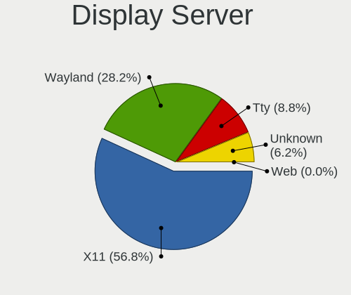
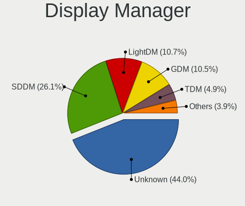
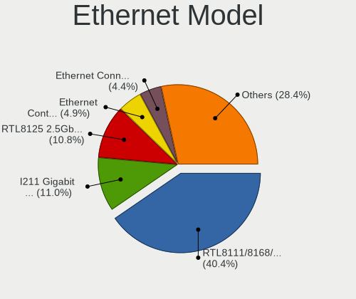
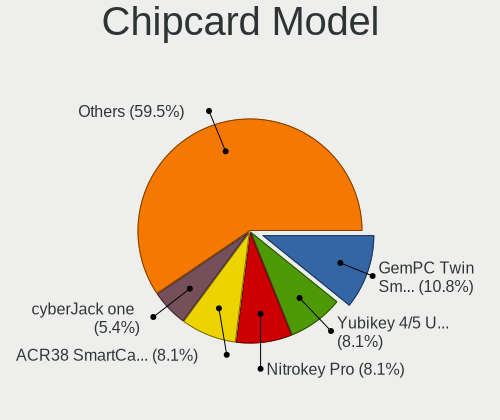
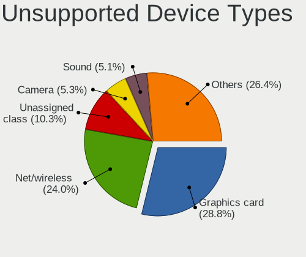

Arch - Tested Hardware & Statistics (Desktops)
----------------------------------------------

A project to collect tested hardware configurations for Arch.

Anyone can contribute to this report by the [hw-probe](https://github.com/linuxhw/hw-probe) tool:

    sudo -E hw-probe -all -upload

Please contribute! Especially if your hardware is rare.

Contents
--------

* [ Test Cases ](#test-cases)

* [ System ](#system)
  - [ OS                       ](#os)
  - [ OS Family                ](#os-family)
  - [ Kernel                   ](#kernel)
  - [ Kernel Family            ](#kernel-family)
  - [ Kernel Major Ver.        ](#kernel-major-ver)
  - [ Arch                     ](#arch)
  - [ DE                       ](#de)
  - [ Display Server           ](#display-server)
  - [ Display Manager          ](#display-manager)
  - [ OS Lang                  ](#os-lang)
  - [ Boot Mode                ](#boot-mode)
  - [ Filesystem               ](#filesystem)
  - [ Part. scheme             ](#part-scheme)
  - [ Dual Boot with Linux/BSD ](#dual-boot-with-linuxbsd)
  - [ Dual Boot (Win)          ](#dual-boot-win)

* [ Board ](#board)
  - [ Vendor                   ](#vendor)
  - [ Model                    ](#model)
  - [ Model Family             ](#model-family)
  - [ MFG Year                 ](#mfg-year)
  - [ Form Factor              ](#form-factor)
  - [ Secure Boot              ](#secure-boot)
  - [ Coreboot                 ](#coreboot)
  - [ RAM Size                 ](#ram-size)
  - [ RAM Used                 ](#ram-used)
  - [ Total Drives             ](#total-drives)
  - [ Has CD-ROM               ](#has-cd-rom)
  - [ Has Ethernet             ](#has-ethernet)
  - [ Has WiFi                 ](#has-wifi)
  - [ Has Bluetooth            ](#has-bluetooth)

* [ Location ](#location)
  - [ Country                  ](#country)
  - [ City                     ](#city)

* [ Drives ](#drives)
  - [ Drive Vendor             ](#drive-vendor)
  - [ Drive Model              ](#drive-model)
  - [ HDD Vendor               ](#hdd-vendor)
  - [ SSD Vendor               ](#ssd-vendor)
  - [ Drive Kind               ](#drive-kind)
  - [ Drive Connector          ](#drive-connector)
  - [ Drive Size               ](#drive-size)
  - [ Space Total              ](#space-total)
  - [ Space Used               ](#space-used)
  - [ Malfunc. Drives          ](#malfunc-drives)
  - [ Malfunc. Drive Vendor    ](#malfunc-drive-vendor)
  - [ Malfunc. HDD Vendor      ](#malfunc-hdd-vendor)
  - [ Malfunc. Drive Kind      ](#malfunc-drive-kind)
  - [ Failed Drives            ](#failed-drives)
  - [ Failed Drive Vendor      ](#failed-drive-vendor)
  - [ Drive Status             ](#drive-status)

* [ Storage controller ](#storage-controller)
  - [ Storage Vendor           ](#storage-vendor)
  - [ Storage Model            ](#storage-model)
  - [ Storage Kind             ](#storage-kind)

* [ Processor ](#processor)
  - [ CPU Vendor               ](#cpu-vendor)
  - [ CPU Model                ](#cpu-model)
  - [ CPU Model Family         ](#cpu-model-family)
  - [ CPU Cores                ](#cpu-cores)
  - [ CPU Sockets              ](#cpu-sockets)
  - [ CPU Threads              ](#cpu-threads)
  - [ CPU Op-Modes             ](#cpu-op-modes)
  - [ CPU Microcode            ](#cpu-microcode)
  - [ CPU Microarch            ](#cpu-microarch)

* [ Graphics ](#graphics)
  - [ GPU Vendor               ](#gpu-vendor)
  - [ GPU Model                ](#gpu-model)
  - [ GPU Combo                ](#gpu-combo)
  - [ GPU Driver               ](#gpu-driver)
  - [ GPU Memory               ](#gpu-memory)

* [ Monitor ](#monitor)
  - [ Monitor Vendor           ](#monitor-vendor)
  - [ Monitor Model            ](#monitor-model)
  - [ Monitor Resolution       ](#monitor-resolution)
  - [ Monitor Diagonal         ](#monitor-diagonal)
  - [ Monitor Width            ](#monitor-width)
  - [ Aspect Ratio             ](#aspect-ratio)
  - [ Monitor Area             ](#monitor-area)
  - [ Pixel Density            ](#pixel-density)
  - [ Multiple Monitors        ](#multiple-monitors)

* [ Network ](#network)
  - [ Net Controller Vendor    ](#net-controller-vendor)
  - [ Net Controller Model     ](#net-controller-model)
  - [ Wireless Vendor          ](#wireless-vendor)
  - [ Wireless Model           ](#wireless-model)
  - [ Ethernet Vendor          ](#ethernet-vendor)
  - [ Ethernet Model           ](#ethernet-model)
  - [ Net Controller Kind      ](#net-controller-kind)
  - [ Used Controller          ](#used-controller)
  - [ NICs                     ](#nics)
  - [ IPv6                     ](#ipv6)

* [ Bluetooth ](#bluetooth)
  - [ Bluetooth Vendor         ](#bluetooth-vendor)
  - [ Bluetooth Model          ](#bluetooth-model)

* [ Sound ](#sound)
  - [ Sound Vendor             ](#sound-vendor)
  - [ Sound Model              ](#sound-model)

* [ Memory ](#memory)
  - [ Memory Vendor            ](#memory-vendor)
  - [ Memory Model             ](#memory-model)
  - [ Memory Kind              ](#memory-kind)
  - [ Memory Form Factor       ](#memory-form-factor)
  - [ Memory Size              ](#memory-size)
  - [ Memory Speed             ](#memory-speed)

* [ Printers & scanners ](#printers--scanners)
  - [ Printer Vendor           ](#printer-vendor)
  - [ Printer Model            ](#printer-model)
  - [ Scanner Vendor           ](#scanner-vendor)
  - [ Scanner Model            ](#scanner-model)

* [ Camera ](#camera)
  - [ Camera Vendor            ](#camera-vendor)
  - [ Camera Model             ](#camera-model)

* [ Security ](#security)
  - [ Fingerprint Vendor       ](#fingerprint-vendor)
  - [ Fingerprint Model        ](#fingerprint-model)
  - [ Chipcard Vendor          ](#chipcard-vendor)
  - [ Chipcard Model           ](#chipcard-model)

* [ Unsupported ](#unsupported)
  - [ Unsupported Devices      ](#unsupported-devices)
  - [ Unsupported Device Types ](#unsupported-device-types)

Test Cases
----------

Total: 2742

| Vendor        | Model                       | Probe                                                      | Date         |
|---------------|-----------------------------|------------------------------------------------------------|--------------|
| MSI           | Z270-A PRO                  | [6f96dc34e2](https://linux-hardware.org/?probe=6f96dc34e2) | Oct 01, 2022 |
| MSI           | MPG B550 GAMING PLUS        | [fca2e4409a](https://linux-hardware.org/?probe=fca2e4409a) | Oct 01, 2022 |
| ASUSTek       | PRIME B550M-A               | [4d1cbd14c2](https://linux-hardware.org/?probe=4d1cbd14c2) | Oct 01, 2022 |
| ASUSTek       | PRIME B550M-A               | [00ded2a3ed](https://linux-hardware.org/?probe=00ded2a3ed) | Oct 01, 2022 |
| Gigabyte      | B550 AORUS ELITE            | [bc6bcfe3f2](https://linux-hardware.org/?probe=bc6bcfe3f2) | Oct 01, 2022 |
| ASUSTek       | TUF Gaming B550M-E WIFI     | [2d1e938e68](https://linux-hardware.org/?probe=2d1e938e68) | Oct 01, 2022 |
| Gigabyte      | B660M DS3H AX DDR4          | [97e7d2d80f](https://linux-hardware.org/?probe=97e7d2d80f) | Sep 30, 2022 |
| ASUSTek       | PRIME B550M-A               | [1472407523](https://linux-hardware.org/?probe=1472407523) | Sep 30, 2022 |
| Gigabyte      | H410M S2H V3                | [8ded1bb1f8](https://linux-hardware.org/?probe=8ded1bb1f8) | Sep 30, 2022 |
| Lenovo        | SHARKBAY NOK                | [aa0eeeda6b](https://linux-hardware.org/?probe=aa0eeeda6b) | Sep 29, 2022 |
| HP            | 8464                        | [52d29e8721](https://linux-hardware.org/?probe=52d29e8721) | Sep 29, 2022 |
| ASUSTek       | P5K Premium                 | [ec3962c685](https://linux-hardware.org/?probe=ec3962c685) | Sep 28, 2022 |
| Gigabyte      | X570S AORUS ELITE AX        | [10b723415e](https://linux-hardware.org/?probe=10b723415e) | Sep 28, 2022 |
| Gigabyte      | Z390 AORUS PRO-CF           | [960c35d712](https://linux-hardware.org/?probe=960c35d712) | Sep 28, 2022 |
| ASUSTek       | PRIME B560-PLUS             | [03fff6add6](https://linux-hardware.org/?probe=03fff6add6) | Sep 27, 2022 |
| ASUSTek       | ROG Maximus XI HERO         | [3553d42d14](https://linux-hardware.org/?probe=3553d42d14) | Sep 27, 2022 |
| ASUSTek       | ROG STRIX Z590-A GAMING ... | [88f0d42935](https://linux-hardware.org/?probe=88f0d42935) | Sep 27, 2022 |
| ASRock        | AB350 Gaming K4             | [184070d232](https://linux-hardware.org/?probe=184070d232) | Sep 26, 2022 |
| Gigabyte      | 990FXA-UD5                  | [89303afdb5](https://linux-hardware.org/?probe=89303afdb5) | Sep 26, 2022 |
| ASRock        | X300M-STX                   | [7bb3e847e2](https://linux-hardware.org/?probe=7bb3e847e2) | Sep 26, 2022 |
| MSI           | B450M-A PRO MAX             | [dce9d30a10](https://linux-hardware.org/?probe=dce9d30a10) | Sep 26, 2022 |
| ASUSTek       | PRIME B450M-A               | [75087953dd](https://linux-hardware.org/?probe=75087953dd) | Sep 26, 2022 |
| Gigabyte      | H61M-S2P-R3                 | [21d9eb0a71](https://linux-hardware.org/?probe=21d9eb0a71) | Sep 26, 2022 |
| Gigabyte      | B660M DS3H DDR4             | [382798365a](https://linux-hardware.org/?probe=382798365a) | Sep 25, 2022 |
| ASUSTek       | TUF Gaming X570-PLUS        | [0f4b7501b3](https://linux-hardware.org/?probe=0f4b7501b3) | Sep 25, 2022 |
| ASUSTek       | PRIME Z590M-PLUS            | [ba4b216db1](https://linux-hardware.org/?probe=ba4b216db1) | Sep 25, 2022 |
| ASUSTek       | ROG STRIX B550-E GAMING     | [c6c3ce5c04](https://linux-hardware.org/?probe=c6c3ce5c04) | Sep 25, 2022 |
| ASUSTek       | PRIME B660M-K D4            | [e939330716](https://linux-hardware.org/?probe=e939330716) | Sep 25, 2022 |
| MSI           | MPG X570 GAMING PLUS        | [0047e2de0e](https://linux-hardware.org/?probe=0047e2de0e) | Sep 24, 2022 |
| Biostar       | TB250-BTC                   | [0a4522a059](https://linux-hardware.org/?probe=0a4522a059) | Sep 24, 2022 |
| MSI           | MPG X570 GAMING PLUS        | [54bafde5a9](https://linux-hardware.org/?probe=54bafde5a9) | Sep 24, 2022 |
| Intel         | X99 V1.0                    | [7565f85860](https://linux-hardware.org/?probe=7565f85860) | Sep 24, 2022 |
| MSI           | X470 GAMING PLUS            | [efe1609ac0](https://linux-hardware.org/?probe=efe1609ac0) | Sep 24, 2022 |
| ASUSTek       | PRIME B550M-A               | [6ccd3b916a](https://linux-hardware.org/?probe=6ccd3b916a) | Sep 24, 2022 |
| ASUSTek       | PRIME B550M-A               | [055cd5f884](https://linux-hardware.org/?probe=055cd5f884) | Sep 23, 2022 |
| ASUSTek       | PRIME B550M-A               | [31f002c762](https://linux-hardware.org/?probe=31f002c762) | Sep 23, 2022 |
| Gigabyte      | Z690 AORUS ELITE AX DDR4    | [74dcd96704](https://linux-hardware.org/?probe=74dcd96704) | Sep 22, 2022 |
| MSI           | MPG X570 GAMING PLUS        | [a766b7b9d0](https://linux-hardware.org/?probe=a766b7b9d0) | Sep 22, 2022 |
| MSI           | MPG X570 GAMING PLUS        | [34fea4fedc](https://linux-hardware.org/?probe=34fea4fedc) | Sep 22, 2022 |
| Gigabyte      | AX370-Gaming K5-CF          | [d79e046c6d](https://linux-hardware.org/?probe=d79e046c6d) | Sep 22, 2022 |
| Intel         | DN2800MT AAG23738-801       | [0019b51cff](https://linux-hardware.org/?probe=0019b51cff) | Sep 21, 2022 |
| ASRock        | Z690 Pro RS                 | [787589762f](https://linux-hardware.org/?probe=787589762f) | Sep 21, 2022 |
| Intel         | H55                         | [6de435d14c](https://linux-hardware.org/?probe=6de435d14c) | Sep 20, 2022 |
| MSI           | B450M PRO-VDH MAX           | [06d6be8b85](https://linux-hardware.org/?probe=06d6be8b85) | Sep 20, 2022 |
| ASUSTek       | TUF B450-PRO GAMING         | [37673aa4e2](https://linux-hardware.org/?probe=37673aa4e2) | Sep 20, 2022 |
| ASUSTek       | PRIME A320M-K/BR            | [38234e238c](https://linux-hardware.org/?probe=38234e238c) | Sep 20, 2022 |
| ASUSTek       | PRIME X570-P                | [a1f237c86a](https://linux-hardware.org/?probe=a1f237c86a) | Sep 20, 2022 |
| Gigabyte      | B450M DS3H-CF               | [54d0318e27](https://linux-hardware.org/?probe=54d0318e27) | Sep 20, 2022 |
| Foxconn       | 2ABF                        | [b6192d691a](https://linux-hardware.org/?probe=b6192d691a) | Sep 20, 2022 |
| Gigabyte      | A520M DS3H AC               | [9d26eb4243](https://linux-hardware.org/?probe=9d26eb4243) | Sep 19, 2022 |
| Huanan        | X99-F8 Gaming 2021          | [8a290737bd](https://linux-hardware.org/?probe=8a290737bd) | Sep 19, 2022 |
| ASUSTek       | TUF B450-PRO GAMING         | [8c4a94cb33](https://linux-hardware.org/?probe=8c4a94cb33) | Sep 19, 2022 |
| MSI           | Z590-A PRO                  | [42bc6e4e69](https://linux-hardware.org/?probe=42bc6e4e69) | Sep 19, 2022 |
| MSI           | MPG X570 GAMING EDGE WIF... | [a479d9ef5f](https://linux-hardware.org/?probe=a479d9ef5f) | Sep 19, 2022 |
| MSI           | MAG B550 TOMAHAWK           | [57ab60faec](https://linux-hardware.org/?probe=57ab60faec) | Sep 19, 2022 |
| ASUSTek       | PRIME X570-PRO              | [06f5febda2](https://linux-hardware.org/?probe=06f5febda2) | Sep 19, 2022 |
| PCWare        | IPMH110G                    | [6ba309be15](https://linux-hardware.org/?probe=6ba309be15) | Sep 18, 2022 |
| Gigabyte      | B365M DS3H                  | [36a7673265](https://linux-hardware.org/?probe=36a7673265) | Sep 17, 2022 |
| MSI           | MPG X570 GAMING PLUS        | [980e4272fb](https://linux-hardware.org/?probe=980e4272fb) | Sep 17, 2022 |
| ASUSTek       | PRIME B550M-A               | [e6c4a47a86](https://linux-hardware.org/?probe=e6c4a47a86) | Sep 17, 2022 |
| Lenovo        | 3100 SDK0J40700 WIN 3258... | [3ba3a4becf](https://linux-hardware.org/?probe=3ba3a4becf) | Sep 16, 2022 |
| Gateway       | SX2803                      | [870c8a3ff4](https://linux-hardware.org/?probe=870c8a3ff4) | Sep 16, 2022 |
| ASUSTek       | PRIME B550M-A               | [800fd51ccb](https://linux-hardware.org/?probe=800fd51ccb) | Sep 15, 2022 |
| ASRock        | B550M Pro4                  | [7f6ce1e4ea](https://linux-hardware.org/?probe=7f6ce1e4ea) | Sep 14, 2022 |
| Acer          | Aspire XC-830               | [962c59a3ba](https://linux-hardware.org/?probe=962c59a3ba) | Sep 13, 2022 |
| Acer          | Aspire X3990                | [64cddc5f85](https://linux-hardware.org/?probe=64cddc5f85) | Sep 13, 2022 |
| ASUSTek       | PRIME B450-PLUS             | [3c37d36ba8](https://linux-hardware.org/?probe=3c37d36ba8) | Sep 13, 2022 |
| ASUSTek       | PRIME B450-PLUS             | [6ddf2bafef](https://linux-hardware.org/?probe=6ddf2bafef) | Sep 13, 2022 |
| Gigabyte      | B450M H                     | [5ae6fea41e](https://linux-hardware.org/?probe=5ae6fea41e) | Sep 13, 2022 |
| ASUSTek       | PRIME X370-PRO              | [93567a4d15](https://linux-hardware.org/?probe=93567a4d15) | Sep 13, 2022 |
| ASUSTek       | ROG STRIX B550-E GAMING     | [7fb82d496f](https://linux-hardware.org/?probe=7fb82d496f) | Sep 12, 2022 |
| ASUSTek       | PRIME B550-PLUS             | [321432c752](https://linux-hardware.org/?probe=321432c752) | Sep 12, 2022 |
| HP            | 3047h                       | [097b5b2f29](https://linux-hardware.org/?probe=097b5b2f29) | Sep 12, 2022 |
| Gigabyte      | X470 AORUS ULTRA GAMING-... | [8b44500d70](https://linux-hardware.org/?probe=8b44500d70) | Sep 12, 2022 |
| ASUSTek       | TUF Gaming B550-PLUS        | [ee06685499](https://linux-hardware.org/?probe=ee06685499) | Sep 11, 2022 |
| Dell          | 0VNM11 A00                  | [9ae0ae5ac4](https://linux-hardware.org/?probe=9ae0ae5ac4) | Sep 10, 2022 |
| ASUSTek       | TUF B365M-PLUS GAMING       | [c61b5df29b](https://linux-hardware.org/?probe=c61b5df29b) | Sep 09, 2022 |
| MSI           | B450 TOMAHAWK MAX           | [43311add57](https://linux-hardware.org/?probe=43311add57) | Sep 09, 2022 |
| MSI           | B450 TOMAHAWK MAX           | [c13cd2c2ac](https://linux-hardware.org/?probe=c13cd2c2ac) | Sep 09, 2022 |
| ASUSTek       | PRIME B550-PLUS             | [718876491c](https://linux-hardware.org/?probe=718876491c) | Sep 08, 2022 |
| MSI           | B550M-A PRO                 | [b2cd3df6bc](https://linux-hardware.org/?probe=b2cd3df6bc) | Sep 08, 2022 |
| ASUSTek       | PRIME B460M-A               | [c89a7d5488](https://linux-hardware.org/?probe=c89a7d5488) | Sep 07, 2022 |
| ASRock        | X300M-STX                   | [52f4b6e022](https://linux-hardware.org/?probe=52f4b6e022) | Sep 07, 2022 |
| ASUSTek       | PRIME Z590-A                | [c8a237d75e](https://linux-hardware.org/?probe=c8a237d75e) | Sep 07, 2022 |
| MSI           | MAG B550 TOMAHAWK           | [803410686e](https://linux-hardware.org/?probe=803410686e) | Sep 07, 2022 |
| Dell          | 08NPPY A00                  | [bddf00d17f](https://linux-hardware.org/?probe=bddf00d17f) | Sep 06, 2022 |
| ASUSTek       | PRIME B550M-A               | [5733156bf5](https://linux-hardware.org/?probe=5733156bf5) | Sep 06, 2022 |
| ASUSTek       | PRIME B550M-A               | [d88badf739](https://linux-hardware.org/?probe=d88badf739) | Sep 06, 2022 |
| ASUSTek       | TUF Gaming X570-PRO         | [acb5c353ed](https://linux-hardware.org/?probe=acb5c353ed) | Sep 05, 2022 |
| Gigabyte      | X570 AORUS PRO WIFI         | [e12af15c84](https://linux-hardware.org/?probe=e12af15c84) | Sep 05, 2022 |
| Gigabyte      | 990XA-UD3                   | [43f7cbff06](https://linux-hardware.org/?probe=43f7cbff06) | Sep 05, 2022 |
| ASUSTek       | ROG STRIX Z370-E GAMING     | [bf4936f3bc](https://linux-hardware.org/?probe=bf4936f3bc) | Sep 04, 2022 |
| Dell          | 0D24M8 A01                  | [a746f6faa6](https://linux-hardware.org/?probe=a746f6faa6) | Sep 04, 2022 |
| Dell          | 0T1D10 A01                  | [3064d08dc1](https://linux-hardware.org/?probe=3064d08dc1) | Sep 03, 2022 |
| ASUSTek       | PRIME X470-PRO              | [87a6f9162a](https://linux-hardware.org/?probe=87a6f9162a) | Sep 03, 2022 |
| MSI           | MPG B550 GAMING PLUS        | [6de688d21a](https://linux-hardware.org/?probe=6de688d21a) | Sep 03, 2022 |
| ASRock        | Z370M-ITX/ac                | [0151fa47ef](https://linux-hardware.org/?probe=0151fa47ef) | Sep 03, 2022 |
| ASRock        | Z97 Pro3                    | [7ec410bfe6](https://linux-hardware.org/?probe=7ec410bfe6) | Sep 03, 2022 |
| ASUSTek       | ROG STRIX X470-F GAMING     | [08cfa37b81](https://linux-hardware.org/?probe=08cfa37b81) | Sep 03, 2022 |
| ASRock        | FM2A88X-ITX+                | [9c22b70a4f](https://linux-hardware.org/?probe=9c22b70a4f) | Sep 03, 2022 |
| MSI           | B550-A PRO                  | [65bfdaa6ea](https://linux-hardware.org/?probe=65bfdaa6ea) | Sep 03, 2022 |
| Gigabyte      | B560M DS3H V2               | [4d9025cf5c](https://linux-hardware.org/?probe=4d9025cf5c) | Sep 03, 2022 |
| Gigabyte      | X570 AORUS MASTER           | [7829cfc920](https://linux-hardware.org/?probe=7829cfc920) | Sep 02, 2022 |
| MSI           | X99A GAMING 7               | [347f4d8534](https://linux-hardware.org/?probe=347f4d8534) | Sep 02, 2022 |
| Gigabyte      | H310N x.x                   | [c6c8617f48](https://linux-hardware.org/?probe=c6c8617f48) | Sep 02, 2022 |
| ASUSTek       | BM6630_BM6330_BP6230        | [d510db88c4](https://linux-hardware.org/?probe=d510db88c4) | Sep 02, 2022 |
| MSI           | MAG B550 TOMAHAWK           | [cfdc88587a](https://linux-hardware.org/?probe=cfdc88587a) | Sep 02, 2022 |
| ASUSTek       | PRIME B550M-A               | [b0750b0e0a](https://linux-hardware.org/?probe=b0750b0e0a) | Sep 02, 2022 |
| ASUSTek       | PRIME B550M-A               | [8fc60cb459](https://linux-hardware.org/?probe=8fc60cb459) | Sep 01, 2022 |
| Gigabyte      | B450 AORUS PRO WIFI-CF      | [8e1734f31a](https://linux-hardware.org/?probe=8e1734f31a) | Sep 01, 2022 |
| HP            | 18E5                        | [e7c5ab6cc4](https://linux-hardware.org/?probe=e7c5ab6cc4) | Aug 31, 2022 |
| 16512-2316... | MPG X570 GAMING EDGE WIF... | [d523a89d9b](https://linux-hardware.org/?probe=d523a89d9b) | Aug 31, 2022 |
| ASRock        | Q1900-ITX                   | [c5a0ce2143](https://linux-hardware.org/?probe=c5a0ce2143) | Aug 30, 2022 |
| Gigabyte      | B550M DS3H                  | [2e6d572c33](https://linux-hardware.org/?probe=2e6d572c33) | Aug 30, 2022 |
| MACHINIST     | X99-RS9 V2.0                | [d972083fa3](https://linux-hardware.org/?probe=d972083fa3) | Aug 30, 2022 |
| Gigabyte      | Z390 AORUS MASTER-CF        | [1a8ff186c7](https://linux-hardware.org/?probe=1a8ff186c7) | Aug 29, 2022 |
| ASUSTek       | TUF B450-PLUS GAMING        | [4b37519faf](https://linux-hardware.org/?probe=4b37519faf) | Aug 29, 2022 |
| ASUSTek       | PRIME B550M-A               | [1ff074d641](https://linux-hardware.org/?probe=1ff074d641) | Aug 29, 2022 |
| MSI           | B75A-G41                    | [1d0e275f3e](https://linux-hardware.org/?probe=1d0e275f3e) | Aug 28, 2022 |
| Gigabyte      | H97-HD3                     | [25e4d6c064](https://linux-hardware.org/?probe=25e4d6c064) | Aug 28, 2022 |
| Gigabyte      | H61MS                       | [8ccf243309](https://linux-hardware.org/?probe=8ccf243309) | Aug 27, 2022 |
| Gigabyte      | H61MS                       | [24164369fd](https://linux-hardware.org/?probe=24164369fd) | Aug 27, 2022 |
| HP            | 8054                        | [af4f950786](https://linux-hardware.org/?probe=af4f950786) | Aug 27, 2022 |
| ASUSTek       | PRIME B450M-A II            | [37bdc91d97](https://linux-hardware.org/?probe=37bdc91d97) | Aug 26, 2022 |
| ASRock        | B450M Steel Legend          | [5c8244526c](https://linux-hardware.org/?probe=5c8244526c) | Aug 25, 2022 |
| ASUSTek       | PRIME A320M-K/BR            | [da0b51aa63](https://linux-hardware.org/?probe=da0b51aa63) | Aug 25, 2022 |
| ASUSTek       | TUF Gaming X570-PLUS        | [d8286d5ca0](https://linux-hardware.org/?probe=d8286d5ca0) | Aug 25, 2022 |
| ASUSTek       | TUF Gaming X570-PLUS        | [b7263cf041](https://linux-hardware.org/?probe=b7263cf041) | Aug 25, 2022 |
| ASUSTek       | TUF Gaming X570-PLUS        | [13cd1e5eed](https://linux-hardware.org/?probe=13cd1e5eed) | Aug 25, 2022 |
| Gigabyte      | B450 AORUS PRO WIFI-CF      | [866cc080e0](https://linux-hardware.org/?probe=866cc080e0) | Aug 25, 2022 |
| ASUSTek       | ROG ZENITH EXTREME          | [156da35e98](https://linux-hardware.org/?probe=156da35e98) | Aug 24, 2022 |
| ASUSTek       | PRIME B550M-A               | [b8af477a84](https://linux-hardware.org/?probe=b8af477a84) | Aug 24, 2022 |
| ASRock        | AD2550-ITX                  | [79e491790d](https://linux-hardware.org/?probe=79e491790d) | Aug 24, 2022 |
| ASUSTek       | TUF B450-PRO GAMING         | [e3d3a359b5](https://linux-hardware.org/?probe=e3d3a359b5) | Aug 24, 2022 |
| MSI           | MEG Z490 GODLIKE            | [eb92b93947](https://linux-hardware.org/?probe=eb92b93947) | Aug 24, 2022 |
| ASUSTek       | TUF Gaming Z690-PLUS D4     | [1d0c242f30](https://linux-hardware.org/?probe=1d0c242f30) | Aug 23, 2022 |
| MSI           | Z87-GD65 GAMING             | [f6f358dde8](https://linux-hardware.org/?probe=f6f358dde8) | Aug 23, 2022 |
| ASUSTek       | PRIME Z370-A II             | [d7dee32799](https://linux-hardware.org/?probe=d7dee32799) | Aug 23, 2022 |
| ASUSTek       | ROG CROSSHAIR VIII HERO     | [46c6096b6e](https://linux-hardware.org/?probe=46c6096b6e) | Aug 23, 2022 |
| ASRock        | Z170M Pro4S                 | [0bfb94df6e](https://linux-hardware.org/?probe=0bfb94df6e) | Aug 23, 2022 |
| Gigabyte      | B450 AORUS PRO WIFI-CF      | [93f28535f8](https://linux-hardware.org/?probe=93f28535f8) | Aug 23, 2022 |
| Acer          | Predator G3-710             | [7a58c9348e](https://linux-hardware.org/?probe=7a58c9348e) | Aug 22, 2022 |
| ASRock        | Z75 Pro3                    | [4fbe3d2710](https://linux-hardware.org/?probe=4fbe3d2710) | Aug 22, 2022 |
| MSI           | MAG B660M MORTAR WIFI DD... | [8898d24c48](https://linux-hardware.org/?probe=8898d24c48) | Aug 22, 2022 |
| ASUSTek       | PRIME X570-P                | [14cade3bfe](https://linux-hardware.org/?probe=14cade3bfe) | Aug 21, 2022 |
| ASUSTek       | PRIME Z390-A                | [c1b5d9ffc1](https://linux-hardware.org/?probe=c1b5d9ffc1) | Aug 19, 2022 |
| MSI           | MEG X570 UNIFY              | [e32743d60f](https://linux-hardware.org/?probe=e32743d60f) | Aug 19, 2022 |
| MSI           | B550M PRO-VDH WIFI          | [83d7ac44e3](https://linux-hardware.org/?probe=83d7ac44e3) | Aug 18, 2022 |
| ASUSTek       | ROG STRIX B550-A GAMING     | [16b9aa5d1b](https://linux-hardware.org/?probe=16b9aa5d1b) | Aug 17, 2022 |
| ASRock        | B550M-ITX/ac                | [6a95ac6709](https://linux-hardware.org/?probe=6a95ac6709) | Aug 17, 2022 |
| MSI           | A320M-A PRO M2              | [abad46b854](https://linux-hardware.org/?probe=abad46b854) | Aug 17, 2022 |
| ASRock        | AB350M-HDV                  | [3e3ab3842f](https://linux-hardware.org/?probe=3e3ab3842f) | Aug 16, 2022 |
| MSI           | B450-A PRO MAX              | [8341abd9e2](https://linux-hardware.org/?probe=8341abd9e2) | Aug 16, 2022 |
| ASUSTek       | TUF Gaming X570-PRO         | [3799febe71](https://linux-hardware.org/?probe=3799febe71) | Aug 16, 2022 |
| Intel         | X79 (INTEL Xeon E5/Corei... | [f223d64d8f](https://linux-hardware.org/?probe=f223d64d8f) | Aug 15, 2022 |
| ASUSTek       | PRIME B550M-A               | [855a5955c8](https://linux-hardware.org/?probe=855a5955c8) | Aug 15, 2022 |
| ASUSTek       | P5K-E                       | [08bf3d620e](https://linux-hardware.org/?probe=08bf3d620e) | Aug 15, 2022 |
| ASRock        | B450M Steel Legend          | [1e198f7c54](https://linux-hardware.org/?probe=1e198f7c54) | Aug 15, 2022 |
| ASRock        | B450M Pro4                  | [286fd1791a](https://linux-hardware.org/?probe=286fd1791a) | Aug 14, 2022 |
| MSI           | A320M-A PRO M2              | [d0831907e8](https://linux-hardware.org/?probe=d0831907e8) | Aug 14, 2022 |
| ASUSTek       | PRIME B550M-A               | [4e7f1dc861](https://linux-hardware.org/?probe=4e7f1dc861) | Aug 13, 2022 |
| Gigabyte      | B450M AORUS ELITE           | [c001e6e62b](https://linux-hardware.org/?probe=c001e6e62b) | Aug 12, 2022 |
| HP            | 2B4B                        | [6763057a55](https://linux-hardware.org/?probe=6763057a55) | Aug 11, 2022 |
| Gigabyte      | G31M-S2C                    | [3f67c470be](https://linux-hardware.org/?probe=3f67c470be) | Aug 11, 2022 |
| Gigabyte      | B550 AORUS MASTER           | [0009de2dbb](https://linux-hardware.org/?probe=0009de2dbb) | Aug 11, 2022 |
| ASUSTek       | PRIME B550M-A               | [5c904a18b2](https://linux-hardware.org/?probe=5c904a18b2) | Aug 10, 2022 |
| ASUSTek       | TUF B450M-PLUS GAMING       | [aebd9902eb](https://linux-hardware.org/?probe=aebd9902eb) | Aug 10, 2022 |
| ASUSTek       | ROG STRIX B450-F GAMING     | [e59d15ee54](https://linux-hardware.org/?probe=e59d15ee54) | Aug 09, 2022 |
| Gigabyte      | B450M AORUS ELITE           | [7cca0b0d07](https://linux-hardware.org/?probe=7cca0b0d07) | Aug 09, 2022 |
| ASRock        | B450M Steel Legend          | [1b55fc7b56](https://linux-hardware.org/?probe=1b55fc7b56) | Aug 09, 2022 |
| ECS           | A55F-M4                     | [9c032723ab](https://linux-hardware.org/?probe=9c032723ab) | Aug 09, 2022 |
| ASUSTek       | PRIME X370-PRO              | [73e439f7f9](https://linux-hardware.org/?probe=73e439f7f9) | Aug 09, 2022 |
| ASRock        | H61M-DGS                    | [726b790d1a](https://linux-hardware.org/?probe=726b790d1a) | Aug 09, 2022 |
| MSI           | X570-A PRO                  | [b075418a73](https://linux-hardware.org/?probe=b075418a73) | Aug 07, 2022 |
| ASRock        | H81M-HDS                    | [1d636956f2](https://linux-hardware.org/?probe=1d636956f2) | Aug 07, 2022 |
| ASUSTek       | PRIME B550M-A               | [3f8908c77d](https://linux-hardware.org/?probe=3f8908c77d) | Aug 07, 2022 |
| Gigabyte      | B550I AORUS PRO AX          | [21d06392bc](https://linux-hardware.org/?probe=21d06392bc) | Aug 06, 2022 |
| ASUSTek       | G20AJ                       | [36bc9464db](https://linux-hardware.org/?probe=36bc9464db) | Aug 05, 2022 |
| MSI           | A320M-A PRO M2              | [dd98f4e118](https://linux-hardware.org/?probe=dd98f4e118) | Aug 05, 2022 |
| Gigabyte      | B450M AORUS ELITE           | [ab52d0fc52](https://linux-hardware.org/?probe=ab52d0fc52) | Aug 05, 2022 |
| ASUSTek       | PRIME B550M-A               | [2f1b2efe5b](https://linux-hardware.org/?probe=2f1b2efe5b) | Aug 03, 2022 |
| ASRock        | X370 Pro4                   | [674f15b7f7](https://linux-hardware.org/?probe=674f15b7f7) | Aug 02, 2022 |
| ASRock        | X370 Pro4                   | [3f9dca3a33](https://linux-hardware.org/?probe=3f9dca3a33) | Aug 02, 2022 |
| ASRock        | X370 Pro4                   | [d907eedbad](https://linux-hardware.org/?probe=d907eedbad) | Aug 02, 2022 |
| ASUSTek       | PRIME B550M-A               | [049630bcaa](https://linux-hardware.org/?probe=049630bcaa) | Aug 02, 2022 |
| MSI           | MPG X570 GAMING EDGE WIF... | [64a21844e4](https://linux-hardware.org/?probe=64a21844e4) | Aug 01, 2022 |
| ASUSTek       | PRIME B550M-A               | [eafb78a31c](https://linux-hardware.org/?probe=eafb78a31c) | Aug 01, 2022 |
| ASUSTek       | PRIME X399-A                | [4fba223020](https://linux-hardware.org/?probe=4fba223020) | Jul 31, 2022 |
| ASUSTek       | PRIME B550M-A               | [0709f2eed9](https://linux-hardware.org/?probe=0709f2eed9) | Jul 30, 2022 |
| HP            | 21B4 A01                    | [474779f0b9](https://linux-hardware.org/?probe=474779f0b9) | Jul 30, 2022 |
| Dell          | 0W0CHX A00                  | [be7cc4f033](https://linux-hardware.org/?probe=be7cc4f033) | Jul 29, 2022 |
| ASUSTek       | TUF Gaming X570-PLUS        | [8345e7dd74](https://linux-hardware.org/?probe=8345e7dd74) | Jul 29, 2022 |
| Gigabyte      | Z390 AORUS PRO-CF           | [3c665fb25f](https://linux-hardware.org/?probe=3c665fb25f) | Jul 28, 2022 |
| ASUSTek       | ROG STRIX B550-I GAMING     | [c3f34f2c91](https://linux-hardware.org/?probe=c3f34f2c91) | Jul 28, 2022 |
| MSI           | B350 TOMAHAWK               | [1d04421fd5](https://linux-hardware.org/?probe=1d04421fd5) | Jul 27, 2022 |
| ASUSTek       | PRIME B550M-A               | [8ff77bee59](https://linux-hardware.org/?probe=8ff77bee59) | Jul 26, 2022 |
| ASUSTek       | PRIME Z270-A                | [70ddacf43f](https://linux-hardware.org/?probe=70ddacf43f) | Jul 25, 2022 |
| ASRock        | X570 Phantom Gaming 4       | [960fefaee7](https://linux-hardware.org/?probe=960fefaee7) | Jul 25, 2022 |
| Gigabyte      | Z97X-UD3H-BK-CF             | [b63e85ff7e](https://linux-hardware.org/?probe=b63e85ff7e) | Jul 25, 2022 |
| ASUSTek       | ROG STRIX Z370-F GAMING     | [c7c46e080e](https://linux-hardware.org/?probe=c7c46e080e) | Jul 25, 2022 |
| ASUSTek       | Maximus VIII HERO           | [669bb060e5](https://linux-hardware.org/?probe=669bb060e5) | Jul 25, 2022 |
| ASRock        | H61M-DGS                    | [0dc55c5b73](https://linux-hardware.org/?probe=0dc55c5b73) | Jul 24, 2022 |
| ASUSTek       | TUF Gaming B550-PLUS        | [a1aa08113d](https://linux-hardware.org/?probe=a1aa08113d) | Jul 24, 2022 |
| MSI           | PRO B660M-A WIFI            | [e8da564bb8](https://linux-hardware.org/?probe=e8da564bb8) | Jul 23, 2022 |
| ASUSTek       | PRIME B550M-A               | [bfbbb40d56](https://linux-hardware.org/?probe=bfbbb40d56) | Jul 22, 2022 |
| MSI           | MAG B550 TOMAHAWK           | [0b6a41a9b8](https://linux-hardware.org/?probe=0b6a41a9b8) | Jul 22, 2022 |
| Gigabyte      | X470 AORUS GAMING 7 WIFI... | [540a660447](https://linux-hardware.org/?probe=540a660447) | Jul 22, 2022 |
| ASUSTek       | PRIME B450-PLUS             | [afb076562c](https://linux-hardware.org/?probe=afb076562c) | Jul 21, 2022 |
| HP            | 8704                        | [eaa4bc0059](https://linux-hardware.org/?probe=eaa4bc0059) | Jul 21, 2022 |
| ASUSTek       | TUF Gaming B550-PLUS WIF... | [7ff3bd3639](https://linux-hardware.org/?probe=7ff3bd3639) | Jul 20, 2022 |
| ASUSTek       | Pro WS 565-ACE              | [9558ff01e9](https://linux-hardware.org/?probe=9558ff01e9) | Jul 20, 2022 |
| Gigabyte      | B450M DS3H-CF               | [8a0136fd65](https://linux-hardware.org/?probe=8a0136fd65) | Jul 20, 2022 |
| Lenovo        | SHARKBAY SDK0E50510 WIN     | [52ca04ad6b](https://linux-hardware.org/?probe=52ca04ad6b) | Jul 20, 2022 |
| Machinist/... | X99Z GAMING Beta            | [4f26d9126f](https://linux-hardware.org/?probe=4f26d9126f) | Jul 20, 2022 |
| ASUSTek       | STRIX Z270G GAMING          | [795808bf39](https://linux-hardware.org/?probe=795808bf39) | Jul 19, 2022 |
| MSI           | A320M BAZOOKA               | [d1a4b7b468](https://linux-hardware.org/?probe=d1a4b7b468) | Jul 19, 2022 |
| ASUSTek       | P5K-E                       | [68023f05e9](https://linux-hardware.org/?probe=68023f05e9) | Jul 18, 2022 |
| ASUSTek       | PRIME B550M-A               | [f37266608c](https://linux-hardware.org/?probe=f37266608c) | Jul 18, 2022 |
| ASUSTek       | TUF Gaming Z690-PLUS D4     | [dc94f6ef14](https://linux-hardware.org/?probe=dc94f6ef14) | Jul 17, 2022 |
| ASUSTek       | M5A97 EVO R2.0              | [e1313016ee](https://linux-hardware.org/?probe=e1313016ee) | Jul 17, 2022 |
| ASUSTek       | ROG CROSSHAIR VII HERO      | [05c33c9ff5](https://linux-hardware.org/?probe=05c33c9ff5) | Jul 17, 2022 |
| Gigabyte      | Z170X-Gaming 7              | [5096e0dfea](https://linux-hardware.org/?probe=5096e0dfea) | Jul 17, 2022 |
| MSI           | MAG B550M MORTAR WIFI       | [6ff44b9490](https://linux-hardware.org/?probe=6ff44b9490) | Jul 15, 2022 |
| ASUSTek       | PRIME B550M-A               | [831f0fd0f1](https://linux-hardware.org/?probe=831f0fd0f1) | Jul 14, 2022 |
| MSI           | H77MA-G43                   | [4cb547564b](https://linux-hardware.org/?probe=4cb547564b) | Jul 13, 2022 |
| MSI           | B450 TOMAHAWK MAX           | [ac37352e9b](https://linux-hardware.org/?probe=ac37352e9b) | Jul 13, 2022 |
| ASUSTek       | ROG STRIX B350-F GAMING     | [4816483377](https://linux-hardware.org/?probe=4816483377) | Jul 13, 2022 |
| Gigabyte      | Z370 AORUS Gaming 5-CF      | [05d81c0d1e](https://linux-hardware.org/?probe=05d81c0d1e) | Jul 13, 2022 |
| Gigabyte      | Z370 AORUS Gaming 5-CF      | [ac5f241f98](https://linux-hardware.org/?probe=ac5f241f98) | Jul 13, 2022 |
| MSI           | X99S GAMING 9 AC            | [5f682aadd5](https://linux-hardware.org/?probe=5f682aadd5) | Jul 12, 2022 |
| MSI           | MAG B550M MORTAR WIFI       | [d9122a14c0](https://linux-hardware.org/?probe=d9122a14c0) | Jul 12, 2022 |
| Unknown       | 1.0                         | [24e4b4e948](https://linux-hardware.org/?probe=24e4b4e948) | Jul 12, 2022 |
| Gigabyte      | B550 AORUS ELITE AX V2      | [57227ff9c1](https://linux-hardware.org/?probe=57227ff9c1) | Jul 10, 2022 |
| Gigabyte      | B450M S2H                   | [144a2f33ee](https://linux-hardware.org/?probe=144a2f33ee) | Jul 10, 2022 |
| Lenovo        | 1030 SDK0E50510 WIN 2625... | [bc7d8ae7c7](https://linux-hardware.org/?probe=bc7d8ae7c7) | Jul 09, 2022 |
| MSI           | B450-A PRO MAX              | [32d1c38bf4](https://linux-hardware.org/?probe=32d1c38bf4) | Jul 08, 2022 |
| ASUSTek       | PRIME B550M-A               | [d6664c4c1b](https://linux-hardware.org/?probe=d6664c4c1b) | Jul 08, 2022 |
| ASUSTek       | TUF Gaming X570-PLUS        | [8b1d9534ff](https://linux-hardware.org/?probe=8b1d9534ff) | Jul 07, 2022 |
| Gigabyte      | X470 AORUS ULTRA GAMING-... | [bb0bb0b58f](https://linux-hardware.org/?probe=bb0bb0b58f) | Jul 07, 2022 |
| MSI           | B250M BAZOOKA               | [e04f1fc85c](https://linux-hardware.org/?probe=e04f1fc85c) | Jul 07, 2022 |
| Dell          | 0YC03K A03                  | [ecb4303984](https://linux-hardware.org/?probe=ecb4303984) | Jul 07, 2022 |
| Gigabyte      | Z170XP-SLI-CF               | [36546bd458](https://linux-hardware.org/?probe=36546bd458) | Jul 06, 2022 |
| Gigabyte      | Z170XP-SLI-CF               | [b523713f83](https://linux-hardware.org/?probe=b523713f83) | Jul 06, 2022 |
| ASUSTek       | H110M-E/M.2                 | [cfe354b7b2](https://linux-hardware.org/?probe=cfe354b7b2) | Jul 06, 2022 |
| MSI           | B350 GAMING PLUS            | [de014d917d](https://linux-hardware.org/?probe=de014d917d) | Jul 05, 2022 |
| ASUSTek       | PRIME B550M-A               | [83af97ccc6](https://linux-hardware.org/?probe=83af97ccc6) | Jul 04, 2022 |
| ASUSTek       | P8H61-M LX3 PLUS            | [df4856796e](https://linux-hardware.org/?probe=df4856796e) | Jul 04, 2022 |
| Medion        | B250H4-EM                   | [2c42d7ef06](https://linux-hardware.org/?probe=2c42d7ef06) | Jul 04, 2022 |
| MSI           | B450-A PRO MAX              | [e2ff106ce0](https://linux-hardware.org/?probe=e2ff106ce0) | Jul 03, 2022 |
| MSI           | B365M PRO-VDH               | [8ce7059868](https://linux-hardware.org/?probe=8ce7059868) | Jul 03, 2022 |
| ASUSTek       | TUF Gaming B550-PLUS        | [ffde44eef6](https://linux-hardware.org/?probe=ffde44eef6) | Jul 02, 2022 |
| ASRock        | B550 Steel Legend           | [70e0a9a17c](https://linux-hardware.org/?probe=70e0a9a17c) | Jul 02, 2022 |
| ASUSTek       | ROG STRIX B550-F GAMING     | [301d0caf4d](https://linux-hardware.org/?probe=301d0caf4d) | Jul 02, 2022 |
| ASUSTek       | PRIME B550M-A               | [9f4f6d2323](https://linux-hardware.org/?probe=9f4f6d2323) | Jul 01, 2022 |
| Gigabyte      | B450 AORUS ELITE            | [7287dd0ad5](https://linux-hardware.org/?probe=7287dd0ad5) | Jun 30, 2022 |
| Gigabyte      | B450 AORUS ELITE            | [3c478faa0c](https://linux-hardware.org/?probe=3c478faa0c) | Jun 30, 2022 |
| Gigabyte      | AX370-Gaming 5              | [bd54eb7f9c](https://linux-hardware.org/?probe=bd54eb7f9c) | Jun 30, 2022 |
| Gigabyte      | Z87P-D3                     | [2ae62ac227](https://linux-hardware.org/?probe=2ae62ac227) | Jun 30, 2022 |
| Gigabyte      | X570S AORUS ELITE AX        | [ec8f2e717c](https://linux-hardware.org/?probe=ec8f2e717c) | Jun 29, 2022 |
| Gigabyte      | H81M-S1                     | [6dfee96211](https://linux-hardware.org/?probe=6dfee96211) | Jun 29, 2022 |
| MSI           | B250 GAMING M3              | [f79c31ad28](https://linux-hardware.org/?probe=f79c31ad28) | Jun 26, 2022 |
| ASRock        | X570 Taichi                 | [70a0ba730c](https://linux-hardware.org/?probe=70a0ba730c) | Jun 26, 2022 |
| ASRock        | B550 Taichi                 | [a84e0d9197](https://linux-hardware.org/?probe=a84e0d9197) | Jun 25, 2022 |
| HP            | 8906 SMVB                   | [a10adc5a33](https://linux-hardware.org/?probe=a10adc5a33) | Jun 24, 2022 |
| ASUSTek       | TUF Gaming B550M-E WIFI     | [08e5f734f9](https://linux-hardware.org/?probe=08e5f734f9) | Jun 24, 2022 |
| Gigabyte      | B550 AORUS ELITE            | [95d5fd3cd1](https://linux-hardware.org/?probe=95d5fd3cd1) | Jun 24, 2022 |
| ASRock        | X370 Taichi                 | [788acf13f2](https://linux-hardware.org/?probe=788acf13f2) | Jun 24, 2022 |
| ASUSTek       | PRIME X370-PRO              | [165a04e05f](https://linux-hardware.org/?probe=165a04e05f) | Jun 23, 2022 |
| ASRock        | X370 Pro4                   | [df6751dcaa](https://linux-hardware.org/?probe=df6751dcaa) | Jun 22, 2022 |
| ASUSTek       | PRIME Z270-A                | [c8b0e5e0ca](https://linux-hardware.org/?probe=c8b0e5e0ca) | Jun 22, 2022 |
| Acer          | H110H4-M14 P21-A2E          | [f3c553d3f0](https://linux-hardware.org/?probe=f3c553d3f0) | Jun 22, 2022 |
| Acer          | H110H4-M14 P21-A2E          | [17e46ecec3](https://linux-hardware.org/?probe=17e46ecec3) | Jun 22, 2022 |
| HP            | 2B4B                        | [fe2eceeeda](https://linux-hardware.org/?probe=fe2eceeeda) | Jun 22, 2022 |
| ASUSTek       | TUF Gaming B450-PLUS II     | [5fc2a02e85](https://linux-hardware.org/?probe=5fc2a02e85) | Jun 22, 2022 |
| ASUSTek       | SABERTOOTH X99              | [1052591535](https://linux-hardware.org/?probe=1052591535) | Jun 20, 2022 |
| ASRock        | X570 Steel Legend           | [8e8fcfc4bf](https://linux-hardware.org/?probe=8e8fcfc4bf) | Jun 20, 2022 |
| MSI           | X370 XPOWER GAMING TITAN... | [4e9034764b](https://linux-hardware.org/?probe=4e9034764b) | Jun 20, 2022 |
| ASRock        | B550 Taichi                 | [ddd610d863](https://linux-hardware.org/?probe=ddd610d863) | Jun 20, 2022 |
| ASUSTek       | TUF Gaming X570-PLUS        | [4879f19d4a](https://linux-hardware.org/?probe=4879f19d4a) | Jun 20, 2022 |
| ASUSTek       | TUF Gaming B550M-PLUS       | [b841edf2b7](https://linux-hardware.org/?probe=b841edf2b7) | Jun 19, 2022 |
| ASRock        | X470 Master SLI             | [42b74b0907](https://linux-hardware.org/?probe=42b74b0907) | Jun 19, 2022 |
| Gigabyte      | Z590 AORUS ELITE AX         | [8cff182bbf](https://linux-hardware.org/?probe=8cff182bbf) | Jun 19, 2022 |
| ASUSTek       | PRIME B450M-K               | [90012988e8](https://linux-hardware.org/?probe=90012988e8) | Jun 19, 2022 |
| Dell          | 0Y5DDC A00                  | [c59a0a5413](https://linux-hardware.org/?probe=c59a0a5413) | Jun 18, 2022 |
| OEM           | G41 775 ICH7 8712           | [31cdb7f2fc](https://linux-hardware.org/?probe=31cdb7f2fc) | Jun 17, 2022 |
| ASUSTek       | PRIME B550M-A               | [738709ae5d](https://linux-hardware.org/?probe=738709ae5d) | Jun 16, 2022 |
| ASRock        | B450 Gaming-ITX/ac          | [5afd9dcda0](https://linux-hardware.org/?probe=5afd9dcda0) | Jun 15, 2022 |
| ASUSTek       | PRIME Z370-P                | [b6cdb73504](https://linux-hardware.org/?probe=b6cdb73504) | Jun 15, 2022 |
| Lenovo        | SHARKBAY NOK                | [4b2037715f](https://linux-hardware.org/?probe=4b2037715f) | Jun 15, 2022 |
| MSI           | B450 GAMING PRO CARBON M... | [971f310609](https://linux-hardware.org/?probe=971f310609) | Jun 15, 2022 |
| ASUSTek       | M4A785TD-V EVO              | [5f5c3fcba9](https://linux-hardware.org/?probe=5f5c3fcba9) | Jun 13, 2022 |
| Gigabyte      | Z390 AORUS PRO-CF           | [d827dcbe06](https://linux-hardware.org/?probe=d827dcbe06) | Jun 13, 2022 |
| ASUSTek       | ROG STRIX B350-F GAMING     | [f3cb75acef](https://linux-hardware.org/?probe=f3cb75acef) | Jun 13, 2022 |
| HP            | 8906 SMVB                   | [7cc9d90361](https://linux-hardware.org/?probe=7cc9d90361) | Jun 12, 2022 |
| ASUSTek       | P6T DELUXE V2               | [db209b6bf1](https://linux-hardware.org/?probe=db209b6bf1) | Jun 12, 2022 |
| ASUSTek       | PRIME B550M-A               | [d8ae63f677](https://linux-hardware.org/?probe=d8ae63f677) | Jun 12, 2022 |
| ASUSTek       | SABERTOOTH X99              | [564e15d66b](https://linux-hardware.org/?probe=564e15d66b) | Jun 11, 2022 |
| ASUSTek       | PRIME B450M-A II            | [148d14437b](https://linux-hardware.org/?probe=148d14437b) | Jun 10, 2022 |
| ASUSTek       | PRIME X470-PRO              | [693e499a6d](https://linux-hardware.org/?probe=693e499a6d) | Jun 10, 2022 |
| MSI           | X99A GAMING PRO CARBON      | [31275cdf72](https://linux-hardware.org/?probe=31275cdf72) | Jun 10, 2022 |
| Acer          | WG43M                       | [bdd6d72374](https://linux-hardware.org/?probe=bdd6d72374) | Jun 10, 2022 |
| ASUSTek       | P6T DELUXE V2               | [9198e2d64c](https://linux-hardware.org/?probe=9198e2d64c) | Jun 10, 2022 |
| MSI           | X99A GAMING PRO CARBON      | [9e574bef7c](https://linux-hardware.org/?probe=9e574bef7c) | Jun 10, 2022 |
| MSI           | MPG B550 GAMING PLUS        | [bfe8486e59](https://linux-hardware.org/?probe=bfe8486e59) | Jun 09, 2022 |
| ASUSTek       | ROG STRIX Z390-E GAMING     | [44aa7de1c8](https://linux-hardware.org/?probe=44aa7de1c8) | Jun 08, 2022 |
| ASUSTek       | PRIME B450M-A               | [a144e0b75e](https://linux-hardware.org/?probe=a144e0b75e) | Jun 08, 2022 |
| Dell          | 0WR7PY A03                  | [630d0bc381](https://linux-hardware.org/?probe=630d0bc381) | Jun 08, 2022 |
| ASUSTek       | PRIME B550M-A               | [f2b810d97f](https://linux-hardware.org/?probe=f2b810d97f) | Jun 08, 2022 |
| Gigabyte      | X570 I AORUS PRO WIFI       | [d984f403e9](https://linux-hardware.org/?probe=d984f403e9) | Jun 08, 2022 |
| Gigabyte      | B360M D3H-CF                | [73e68df88c](https://linux-hardware.org/?probe=73e68df88c) | Jun 08, 2022 |
| Lenovo        | SHARKBAY 0B98401 PRO        | [59f197c68d](https://linux-hardware.org/?probe=59f197c68d) | Jun 07, 2022 |
| Acer          | WG43M                       | [70d3c85c47](https://linux-hardware.org/?probe=70d3c85c47) | Jun 07, 2022 |
| ASRock        | Z97M Anniversary            | [1855124dd3](https://linux-hardware.org/?probe=1855124dd3) | Jun 07, 2022 |
| Huanan        | X79-ZD3                     | [e1a7cd65ab](https://linux-hardware.org/?probe=e1a7cd65ab) | Jun 06, 2022 |
| BESSTAR Te... | DMAF5 V1.0                  | [9a2ab90fd4](https://linux-hardware.org/?probe=9a2ab90fd4) | Jun 06, 2022 |
| ASUSTek       | PRIME B550M-A               | [d944531fed](https://linux-hardware.org/?probe=d944531fed) | Jun 06, 2022 |
| Dell          | 0YXT71 A02                  | [4dd5ceef26](https://linux-hardware.org/?probe=4dd5ceef26) | Jun 05, 2022 |
| ASUSTek       | PRIME A520M-K               | [72dd09a86a](https://linux-hardware.org/?probe=72dd09a86a) | Jun 05, 2022 |
| ASRock        | A520M Pro4                  | [6c408a6fd7](https://linux-hardware.org/?probe=6c408a6fd7) | Jun 05, 2022 |
| ASUSTek       | PRIME H510M-E               | [9207d2f2d8](https://linux-hardware.org/?probe=9207d2f2d8) | Jun 04, 2022 |
| MSI           | X570-A PRO                  | [95af0fa349](https://linux-hardware.org/?probe=95af0fa349) | Jun 04, 2022 |
| ASUSTek       | TUF Gaming X570-PRO         | [d8348d5353](https://linux-hardware.org/?probe=d8348d5353) | Jun 03, 2022 |
| ASUSTek       | PRIME B550M-A               | [84d1d3efdc](https://linux-hardware.org/?probe=84d1d3efdc) | Jun 03, 2022 |
| Huanan        | X79-8D VAA31                | [eefff24cc2](https://linux-hardware.org/?probe=eefff24cc2) | Jun 03, 2022 |
| ASUSTek       | ROG CROSSHAIR VIII HERO     | [35ff0536a6](https://linux-hardware.org/?probe=35ff0536a6) | Jun 02, 2022 |
| ASUSTek       | PRIME B550-PLUS             | [156b265da0](https://linux-hardware.org/?probe=156b265da0) | Jun 01, 2022 |
| Gigabyte      | 970A-UD3                    | [c56522071c](https://linux-hardware.org/?probe=c56522071c) | Jun 01, 2022 |
| ASUSTek       | PRIME B550M-A               | [58051fe7e2](https://linux-hardware.org/?probe=58051fe7e2) | Jun 01, 2022 |
| Gigabyte      | B365M GAMING HD             | [5b8924befc](https://linux-hardware.org/?probe=5b8924befc) | May 31, 2022 |
| ASUSTek       | ROG STRIX X570-E GAMING     | [6560268d80](https://linux-hardware.org/?probe=6560268d80) | May 31, 2022 |
| ASUSTek       | PRIME B550M-A               | [f2500a22ea](https://linux-hardware.org/?probe=f2500a22ea) | May 31, 2022 |
| MSI           | MPG Z390 GAMING PRO CARB... | [580abb0cf9](https://linux-hardware.org/?probe=580abb0cf9) | May 30, 2022 |
| MSI           | B365M PRO-VH                | [a1e7cf7158](https://linux-hardware.org/?probe=a1e7cf7158) | May 30, 2022 |
| MSI           | B365M PRO-VH                | [4d4ea4beec](https://linux-hardware.org/?probe=4d4ea4beec) | May 30, 2022 |
| Huanan        | X99-TF                      | [cb08cd42a9](https://linux-hardware.org/?probe=cb08cd42a9) | May 30, 2022 |
| ASUSTek       | PRIME B450M-A               | [2ce35a0cba](https://linux-hardware.org/?probe=2ce35a0cba) | May 30, 2022 |
| ASUSTek       | SABERTOOTH Z77              | [3bb74db496](https://linux-hardware.org/?probe=3bb74db496) | May 30, 2022 |
| ASUSTek       | TUF Gaming B550M-PLUS       | [ca67455f28](https://linux-hardware.org/?probe=ca67455f28) | May 29, 2022 |
| Gigabyte      | X570 UD                     | [627604d5dc](https://linux-hardware.org/?probe=627604d5dc) | May 29, 2022 |
| ASUSTek       | PRIME B550M-A               | [c84d9cc3c4](https://linux-hardware.org/?probe=c84d9cc3c4) | May 28, 2022 |
| ASUSTek       | PRIME X570-P                | [6b3439b423](https://linux-hardware.org/?probe=6b3439b423) | May 28, 2022 |
| ASRock        | B450M Pro4-F                | [f67fdd8166](https://linux-hardware.org/?probe=f67fdd8166) | May 28, 2022 |
| ASUSTek       | PRIME B550M-A               | [1238dba054](https://linux-hardware.org/?probe=1238dba054) | May 28, 2022 |
| HP            | 8643 SMVB                   | [cf38cf9584](https://linux-hardware.org/?probe=cf38cf9584) | May 28, 2022 |
| ASUSTek       | ROG STRIX X570-E GAMING     | [caeeaac144](https://linux-hardware.org/?probe=caeeaac144) | May 28, 2022 |
| MSI           | B450I GAMING PLUS AC        | [e64dfe3f6f](https://linux-hardware.org/?probe=e64dfe3f6f) | May 28, 2022 |
| ASUSTek       | PRIME B550M-A               | [74c7a449f9](https://linux-hardware.org/?probe=74c7a449f9) | May 27, 2022 |
| Dell          | 0T7D40 A00                  | [c9c3fd7a7e](https://linux-hardware.org/?probe=c9c3fd7a7e) | May 27, 2022 |
| HP            | 0A80h                       | [7e5c6cf61e](https://linux-hardware.org/?probe=7e5c6cf61e) | May 27, 2022 |
| ASRock        | FM2A75M-DGS                 | [73260214ee](https://linux-hardware.org/?probe=73260214ee) | May 27, 2022 |
| ASUSTek       | G20AJ                       | [72ead90cb6](https://linux-hardware.org/?probe=72ead90cb6) | May 26, 2022 |
| ASUSTek       | ROG STRIX B550-I GAMING     | [d6bd3ae553](https://linux-hardware.org/?probe=d6bd3ae553) | May 26, 2022 |
| ASUSTek       | 970 PRO GAMING/AURA         | [4673dbdffc](https://linux-hardware.org/?probe=4673dbdffc) | May 26, 2022 |
| ASUSTek       | ROG CROSSHAIR VIII DARK ... | [c035632382](https://linux-hardware.org/?probe=c035632382) | May 26, 2022 |
| Gigabyte      | H61M-DS2                    | [09ba129a3b](https://linux-hardware.org/?probe=09ba129a3b) | May 25, 2022 |
| HP            | 8643 SMVB                   | [fc5aa62215](https://linux-hardware.org/?probe=fc5aa62215) | May 25, 2022 |
| ASUSTek       | ROG STRIX Z390-E GAMING     | [13006f8cc4](https://linux-hardware.org/?probe=13006f8cc4) | May 25, 2022 |
| Acer          | WG43M                       | [ae5adc512f](https://linux-hardware.org/?probe=ae5adc512f) | May 24, 2022 |
| HP            | 83EF                        | [4f52313cee](https://linux-hardware.org/?probe=4f52313cee) | May 24, 2022 |
| Dell          | 0N4YC8 A00                  | [76789ea4f5](https://linux-hardware.org/?probe=76789ea4f5) | May 24, 2022 |
| ASUSTek       | PRIME B550M-A               | [65710bb1bc](https://linux-hardware.org/?probe=65710bb1bc) | May 23, 2022 |
| ASUSTek       | M4A88T-M/USB3               | [51ce08137b](https://linux-hardware.org/?probe=51ce08137b) | May 23, 2022 |
| Gigabyte      | TRX40 AORUS PRO WIFI        | [0c144ce08f](https://linux-hardware.org/?probe=0c144ce08f) | May 22, 2022 |
| Dell          | 0KWVT8 A03                  | [01b1caa77a](https://linux-hardware.org/?probe=01b1caa77a) | May 21, 2022 |
| Gigabyte      | Z97P-D3                     | [1b7bdd0f65](https://linux-hardware.org/?probe=1b7bdd0f65) | May 21, 2022 |
| MSI           | MAG Z690 TOMAHAWK WIFI D... | [f0fb1b2fc1](https://linux-hardware.org/?probe=f0fb1b2fc1) | May 21, 2022 |
| ASUSTek       | PRIME B550M-A               | [77ee982546](https://linux-hardware.org/?probe=77ee982546) | May 21, 2022 |
| Lenovo        | NOK                         | [567c167a97](https://linux-hardware.org/?probe=567c167a97) | May 20, 2022 |
| ASUSTek       | CROSSHAIR VI HERO           | [b5a519663c](https://linux-hardware.org/?probe=b5a519663c) | May 17, 2022 |
| Dell          | 0T0MHW A02                  | [709512376a](https://linux-hardware.org/?probe=709512376a) | May 17, 2022 |
| Dell          | 02YYK5 A01                  | [8471800bb3](https://linux-hardware.org/?probe=8471800bb3) | May 16, 2022 |
| ASUSTek       | PRIME B450M-A               | [47bac4aae9](https://linux-hardware.org/?probe=47bac4aae9) | May 16, 2022 |
| ASUSTek       | TUF Gaming X570-PRO         | [500c6d2ddf](https://linux-hardware.org/?probe=500c6d2ddf) | May 16, 2022 |
| Gigabyte      | X570 I AORUS PRO WIFI       | [5e9289dcf5](https://linux-hardware.org/?probe=5e9289dcf5) | May 16, 2022 |
| ASUSTek       | STRIX Z270E GAMING          | [3973263b34](https://linux-hardware.org/?probe=3973263b34) | May 15, 2022 |
| MSI           | MPG B550 GAMING EDGE WIF... | [beaaf4e7f7](https://linux-hardware.org/?probe=beaaf4e7f7) | May 15, 2022 |
| Gigabyte      | TRX40 AORUS XTREME          | [2d23125cd0](https://linux-hardware.org/?probe=2d23125cd0) | May 15, 2022 |
| ASUSTek       | P8Z77-V LX                  | [5ae90596ad](https://linux-hardware.org/?probe=5ae90596ad) | May 15, 2022 |
| ASUSTek       | PRIME B550M-A               | [97dd9d44d5](https://linux-hardware.org/?probe=97dd9d44d5) | May 15, 2022 |
| MAXSUN        | MS-M3A78EL                  | [98d8c5a6ee](https://linux-hardware.org/?probe=98d8c5a6ee) | May 14, 2022 |
| ASUSTek       | PRIME B450M-A               | [03581837bc](https://linux-hardware.org/?probe=03581837bc) | May 14, 2022 |
| ASUSTek       | STRIX X99 GAMING            | [5731fe7eb9](https://linux-hardware.org/?probe=5731fe7eb9) | May 13, 2022 |
| ASUSTek       | PRIME B450M-A               | [e436a62479](https://linux-hardware.org/?probe=e436a62479) | May 13, 2022 |
| ASUSTek       | PRIME B450-PLUS             | [6003e5a67f](https://linux-hardware.org/?probe=6003e5a67f) | May 13, 2022 |
| ASUSTek       | PRIME B450-PLUS             | [f7d09ea6c5](https://linux-hardware.org/?probe=f7d09ea6c5) | May 13, 2022 |
| ASUSTek       | ROG STRIX B550-F GAMING     | [2c8abb0fed](https://linux-hardware.org/?probe=2c8abb0fed) | May 12, 2022 |
| Intel         | D54250WYK H13922-305        | [6d1745c79b](https://linux-hardware.org/?probe=6d1745c79b) | May 11, 2022 |
| Dell          | 00V62H A00                  | [e765b34181](https://linux-hardware.org/?probe=e765b34181) | May 11, 2022 |
| Intel         | DH61BF AAG81311-101         | [9c54929196](https://linux-hardware.org/?probe=9c54929196) | May 11, 2022 |
| ASRock        | X470 Gaming K4              | [469d81fb89](https://linux-hardware.org/?probe=469d81fb89) | May 10, 2022 |
| ASUSTek       | P9X79                       | [694affb24e](https://linux-hardware.org/?probe=694affb24e) | May 10, 2022 |
| Gigabyte      | B550 AORUS ELITE            | [1e1a8e1815](https://linux-hardware.org/?probe=1e1a8e1815) | May 10, 2022 |
| ASUSTek       | TUF Gaming B550M-E WIFI     | [56fc7bcca2](https://linux-hardware.org/?probe=56fc7bcca2) | May 10, 2022 |
| Gigabyte      | X299 UD4 Pro-CF             | [a4a39dbf3a](https://linux-hardware.org/?probe=a4a39dbf3a) | May 10, 2022 |
| ASUSTek       | STRIX Z270E GAMING          | [036daac317](https://linux-hardware.org/?probe=036daac317) | May 10, 2022 |
| Gigabyte      | X570 UD                     | [20c66a91ff](https://linux-hardware.org/?probe=20c66a91ff) | May 09, 2022 |
| Unknown       | Unknown                     | [aa961e1d63](https://linux-hardware.org/?probe=aa961e1d63) | May 09, 2022 |
| ASUSTek       | PRIME B450M-A               | [358cadc7df](https://linux-hardware.org/?probe=358cadc7df) | May 09, 2022 |
| MSI           | MPG B550 GAMING EDGE WIF... | [10161c9a1d](https://linux-hardware.org/?probe=10161c9a1d) | May 09, 2022 |
| Dell          | 02YYK5 A01                  | [373e009d3b](https://linux-hardware.org/?probe=373e009d3b) | May 09, 2022 |
| ASUSTek       | Pro WS 565-ACE              | [cbecc01c76](https://linux-hardware.org/?probe=cbecc01c76) | May 09, 2022 |
| ASUSTek       | TUF Gaming B560-PLUS WIF... | [8f09cb9a0e](https://linux-hardware.org/?probe=8f09cb9a0e) | May 08, 2022 |
| ASRock        | AB350 Gaming-ITX/ac         | [6836f79bdf](https://linux-hardware.org/?probe=6836f79bdf) | May 08, 2022 |
| ASRock        | AB350 Gaming-ITX/ac         | [41cc4d30d4](https://linux-hardware.org/?probe=41cc4d30d4) | May 08, 2022 |
| ASUSTek       | TUF Gaming B450M-PRO S      | [c5c38a0da4](https://linux-hardware.org/?probe=c5c38a0da4) | May 08, 2022 |
| ASRock        | H270M Pro4                  | [7fb19cf73f](https://linux-hardware.org/?probe=7fb19cf73f) | May 07, 2022 |
| ASRock        | H270M Pro4                  | [1b6f35a5d0](https://linux-hardware.org/?probe=1b6f35a5d0) | May 07, 2022 |
| Gigabyte      | B250M-DS3H-CF               | [86bb047b79](https://linux-hardware.org/?probe=86bb047b79) | May 06, 2022 |
| MSI           | MS-7100                     | [3f753d8582](https://linux-hardware.org/?probe=3f753d8582) | May 04, 2022 |
| ASUSTek       | TUF Gaming X570-PLUS        | [7eb149a2ac](https://linux-hardware.org/?probe=7eb149a2ac) | May 04, 2022 |
| HP            | 2B5A 011                    | [03994461e6](https://linux-hardware.org/?probe=03994461e6) | May 02, 2022 |
| HP            | 2B5A 011                    | [14a723b177](https://linux-hardware.org/?probe=14a723b177) | May 02, 2022 |
| MSI           | PRO B660M-A WIFI            | [878c361636](https://linux-hardware.org/?probe=878c361636) | May 01, 2022 |
| ASUSTek       | H110M-R                     | [0fa0b3d5f4](https://linux-hardware.org/?probe=0fa0b3d5f4) | May 01, 2022 |
| ASUSTek       | TUF Gaming X570-PLUS        | [22008db28a](https://linux-hardware.org/?probe=22008db28a) | Apr 30, 2022 |
| MSI           | MPG Z490 GAMING PLUS        | [8d3881574d](https://linux-hardware.org/?probe=8d3881574d) | Apr 30, 2022 |
| HP            | 1494                        | [939f3b7987](https://linux-hardware.org/?probe=939f3b7987) | Apr 30, 2022 |
| ASRock        | Z68 Extreme4 Gen3           | [6afc1a0af8](https://linux-hardware.org/?probe=6afc1a0af8) | Apr 30, 2022 |
| MSI           | MAG B550M MORTAR            | [c994128afd](https://linux-hardware.org/?probe=c994128afd) | Apr 30, 2022 |
| ASRock        | B450M Steel Legend          | [c40273d0bc](https://linux-hardware.org/?probe=c40273d0bc) | Apr 29, 2022 |
| ASUSTek       | ROG STRIX X470-F GAMING     | [809ea3e76a](https://linux-hardware.org/?probe=809ea3e76a) | Apr 29, 2022 |
| Foxconn       | H61MD/H61MD-V               | [25b52955ee](https://linux-hardware.org/?probe=25b52955ee) | Apr 29, 2022 |
| ASUSTek       | B150 PRO GAMING D3          | [e258d71e2e](https://linux-hardware.org/?probe=e258d71e2e) | Apr 29, 2022 |
| Gigabyte      | B450M S2H                   | [2e84d98937](https://linux-hardware.org/?probe=2e84d98937) | Apr 29, 2022 |
| Gigabyte      | Z170X-UD3-CF                | [ca711b9db0](https://linux-hardware.org/?probe=ca711b9db0) | Apr 29, 2022 |
| OEM           | V1.0                        | [167ee50568](https://linux-hardware.org/?probe=167ee50568) | Apr 29, 2022 |
| ASUSTek       | TUF Gaming X570-PLUS        | [a26fd2399d](https://linux-hardware.org/?probe=a26fd2399d) | Apr 29, 2022 |
| ASUSTek       | H87-PRO                     | [476e417317](https://linux-hardware.org/?probe=476e417317) | Apr 27, 2022 |
| ASUSTek       | ROG CROSSHAIR VIII DARK ... | [f37918f4d4](https://linux-hardware.org/?probe=f37918f4d4) | Apr 26, 2022 |
| ASUSTek       | PRIME X570-PRO              | [ed0065a715](https://linux-hardware.org/?probe=ed0065a715) | Apr 26, 2022 |
| ASUSTek       | M4A87TD/USB3                | [9574f78f95](https://linux-hardware.org/?probe=9574f78f95) | Apr 25, 2022 |
| Gigabyte      | X570 AORUS MASTER           | [4a9e24224a](https://linux-hardware.org/?probe=4a9e24224a) | Apr 25, 2022 |
| ASUSTek       | Pro WS X570-ACE             | [1612f46137](https://linux-hardware.org/?probe=1612f46137) | Apr 24, 2022 |
| MSI           | X570-A PRO                  | [b6a4a77ba4](https://linux-hardware.org/?probe=b6a4a77ba4) | Apr 23, 2022 |
| Intel         | H81                         | [9720e797c4](https://linux-hardware.org/?probe=9720e797c4) | Apr 23, 2022 |
| Intel         | H81                         | [2c89989829](https://linux-hardware.org/?probe=2c89989829) | Apr 23, 2022 |
| ASUSTek       | PRIME B450M-A               | [a3a204ed56](https://linux-hardware.org/?probe=a3a204ed56) | Apr 21, 2022 |
| ASRock        | X470 Taichi                 | [0da1d9833d](https://linux-hardware.org/?probe=0da1d9833d) | Apr 21, 2022 |
| ASRock        | B560M Pro4                  | [ab9982c327](https://linux-hardware.org/?probe=ab9982c327) | Apr 21, 2022 |
| MSI           | B450 GAMING PRO CARBON A... | [be1e468728](https://linux-hardware.org/?probe=be1e468728) | Apr 17, 2022 |
| ASUSTek       | ROG STRIX B450-F GAMING ... | [601e55a0a8](https://linux-hardware.org/?probe=601e55a0a8) | Apr 17, 2022 |
| ASUSTek       | TUF Gaming X570-PLUS        | [a4dda68647](https://linux-hardware.org/?probe=a4dda68647) | Apr 17, 2022 |
| Lenovo        | MAHOBAY NO DPK              | [c3d8900f58](https://linux-hardware.org/?probe=c3d8900f58) | Apr 15, 2022 |
| MSI           | MPG B550 GAMING EDGE WIF... | [4a93a73c74](https://linux-hardware.org/?probe=4a93a73c74) | Apr 15, 2022 |
| Intel         | DQ67EP AAG12529-307         | [8e345bbb6a](https://linux-hardware.org/?probe=8e345bbb6a) | Apr 15, 2022 |
| Gigabyte      | Z77X-D3H                    | [da67065e13](https://linux-hardware.org/?probe=da67065e13) | Apr 14, 2022 |
| ASUSTek       | Rampage V EDITION 10        | [4021615a20](https://linux-hardware.org/?probe=4021615a20) | Apr 14, 2022 |
| HP            | 8298                        | [a9796ddd8d](https://linux-hardware.org/?probe=a9796ddd8d) | Apr 14, 2022 |
| Fujitsu       | D3434-S2 S26361-D3434-S2    | [7ff488cc8d](https://linux-hardware.org/?probe=7ff488cc8d) | Apr 14, 2022 |
| MSI           | A68HM-P33                   | [8c395556de](https://linux-hardware.org/?probe=8c395556de) | Apr 14, 2022 |
| Dell          | 04PT3G A00                  | [a10754ebca](https://linux-hardware.org/?probe=a10754ebca) | Apr 14, 2022 |
| MSI           | X370 KRAIT GAMING           | [26be53ebd1](https://linux-hardware.org/?probe=26be53ebd1) | Apr 14, 2022 |
| Gigabyte      | Z690 AORUS MASTER           | [0f449aecbc](https://linux-hardware.org/?probe=0f449aecbc) | Apr 13, 2022 |
| ASUSTek       | ROG STRIX B550-F GAMING     | [8a5920ae1a](https://linux-hardware.org/?probe=8a5920ae1a) | Apr 13, 2022 |
| ASUSTek       | PRIME Z590M-PLUS            | [a0b6dfe7e4](https://linux-hardware.org/?probe=a0b6dfe7e4) | Apr 13, 2022 |
| Gigabyte      | X570 AORUS PRO              | [acd0ebed7c](https://linux-hardware.org/?probe=acd0ebed7c) | Apr 13, 2022 |
| Gigabyte      | X570 I AORUS PRO WIFI       | [8e46ef2a00](https://linux-hardware.org/?probe=8e46ef2a00) | Apr 13, 2022 |
| MSI           | X470 GAMING PLUS            | [5100c45b65](https://linux-hardware.org/?probe=5100c45b65) | Apr 13, 2022 |
| ASUSTek       | ROG CROSSHAIR VIII HERO     | [3fade276ac](https://linux-hardware.org/?probe=3fade276ac) | Apr 13, 2022 |
| ASUSTek       | Z87-PLUS                    | [22fe7aea72](https://linux-hardware.org/?probe=22fe7aea72) | Apr 13, 2022 |
| Dell          | 0WVYMC A00                  | [e2f9d3638d](https://linux-hardware.org/?probe=e2f9d3638d) | Apr 13, 2022 |
| ASUSTek       | PRIME X370-PRO              | [f2a040ef2b](https://linux-hardware.org/?probe=f2a040ef2b) | Apr 13, 2022 |
| ASUSTek       | Z87-PLUS                    | [01f7261143](https://linux-hardware.org/?probe=01f7261143) | Apr 13, 2022 |
| ASRock        | B550 Taichi                 | [28c58dfde0](https://linux-hardware.org/?probe=28c58dfde0) | Apr 13, 2022 |
| ASUSTek       | PRIME B550-PLUS             | [1f7a434559](https://linux-hardware.org/?probe=1f7a434559) | Apr 13, 2022 |
| Gigabyte      | B550I AORUS PRO AX          | [68aa564b9f](https://linux-hardware.org/?probe=68aa564b9f) | Apr 13, 2022 |
| MSI           | B450M PRO-VDH MAX           | [5792134e78](https://linux-hardware.org/?probe=5792134e78) | Apr 13, 2022 |
| Gigabyte      | Z390 DESIGNARE-CF           | [b00858fa95](https://linux-hardware.org/?probe=b00858fa95) | Apr 13, 2022 |
| MSI           | B460M PRO-VDH WIFI          | [27cb501628](https://linux-hardware.org/?probe=27cb501628) | Apr 11, 2022 |
| Jetway        | 1.0                         | [dbfff94911](https://linux-hardware.org/?probe=dbfff94911) | Apr 10, 2022 |
| EVGA          | 140-SS-E177                 | [4af369b993](https://linux-hardware.org/?probe=4af369b993) | Apr 08, 2022 |
| Intel         | STK2MV64CC H89290-502       | [b2cb31c994](https://linux-hardware.org/?probe=b2cb31c994) | Apr 07, 2022 |
| Gigabyte      | 970A-UD3P                   | [5b3b1df897](https://linux-hardware.org/?probe=5b3b1df897) | Apr 07, 2022 |
| MSI           | MPG B550 GAMING CARBON W... | [203b65a3f5](https://linux-hardware.org/?probe=203b65a3f5) | Apr 06, 2022 |
| Gigabyte      | B360M D2V                   | [87f55ffa54](https://linux-hardware.org/?probe=87f55ffa54) | Apr 06, 2022 |
| Foxconn       | H61MD/H61MD-V               | [7bb124e322](https://linux-hardware.org/?probe=7bb124e322) | Apr 06, 2022 |
| Gigabyte      | B450M DS3H-CF               | [adf960d914](https://linux-hardware.org/?probe=adf960d914) | Apr 05, 2022 |
| ASUSTek       | PRIME X299-DELUXE II        | [f3bc34e630](https://linux-hardware.org/?probe=f3bc34e630) | Apr 05, 2022 |
| ASUSTek       | P8Z77-V LX                  | [d7bf7b48a1](https://linux-hardware.org/?probe=d7bf7b48a1) | Apr 05, 2022 |
| Intel         | H61                         | [d378493561](https://linux-hardware.org/?probe=d378493561) | Apr 05, 2022 |
| MSI           | X570-A PRO                  | [2af47af588](https://linux-hardware.org/?probe=2af47af588) | Apr 04, 2022 |
| ASRock        | X470 Master SLI             | [255ce25970](https://linux-hardware.org/?probe=255ce25970) | Apr 04, 2022 |
| ASUSTek       | PRIME H570-PLUS             | [4a9be0ab22](https://linux-hardware.org/?probe=4a9be0ab22) | Apr 03, 2022 |
| ASUSTek       | ROG STRIX X570-E GAMING     | [13aa7656f3](https://linux-hardware.org/?probe=13aa7656f3) | Apr 03, 2022 |
| HP            | 87D6 SMVB                   | [57d44d9705](https://linux-hardware.org/?probe=57d44d9705) | Apr 03, 2022 |
| HP            | 87D6 SMVB                   | [e70c6e6d89](https://linux-hardware.org/?probe=e70c6e6d89) | Apr 03, 2022 |
| MSI           | B350 TOMAHAWK               | [f531f62c1b](https://linux-hardware.org/?probe=f531f62c1b) | Apr 03, 2022 |
| ASRock        | X370 Killer SLI             | [ffb866117c](https://linux-hardware.org/?probe=ffb866117c) | Apr 02, 2022 |
| ASUSTek       | ROG CROSSHAIR VII HERO      | [35f6caff42](https://linux-hardware.org/?probe=35f6caff42) | Apr 02, 2022 |
| Dell          | 0M017G A00                  | [a7ee814f3a](https://linux-hardware.org/?probe=a7ee814f3a) | Apr 02, 2022 |
| Dell          | 0HHV7N A00                  | [4589c59d45](https://linux-hardware.org/?probe=4589c59d45) | Apr 02, 2022 |
| Gigabyte      | AB350M-Gaming 3-CF          | [a94e9d5553](https://linux-hardware.org/?probe=a94e9d5553) | Apr 01, 2022 |
| MSI           | B350 PC MATE                | [09a8208d01](https://linux-hardware.org/?probe=09a8208d01) | Mar 31, 2022 |
| Dell          | 0HHV7N A00                  | [2d6f6c72fa](https://linux-hardware.org/?probe=2d6f6c72fa) | Mar 30, 2022 |
| ASRock        | B450 Pro4                   | [c879b8be1c](https://linux-hardware.org/?probe=c879b8be1c) | Mar 29, 2022 |
| ASUSTek       | ROG STRIX X570-E GAMING     | [405fedcff9](https://linux-hardware.org/?probe=405fedcff9) | Mar 28, 2022 |
| ASUSTek       | ROG STRIX B550-E GAMING     | [3d9b292e29](https://linux-hardware.org/?probe=3d9b292e29) | Mar 28, 2022 |
| MSI           | B450 GAMING PLUS MAX        | [656413f7e6](https://linux-hardware.org/?probe=656413f7e6) | Mar 28, 2022 |
| Gigabyte      | X570 I AORUS PRO WIFI       | [c4986f3f81](https://linux-hardware.org/?probe=c4986f3f81) | Mar 25, 2022 |
| ASUSTek       | SABERTOOTH P67              | [27099d48f9](https://linux-hardware.org/?probe=27099d48f9) | Mar 25, 2022 |
| Gigabyte      | A520M H                     | [0eb6fdc31d](https://linux-hardware.org/?probe=0eb6fdc31d) | Mar 25, 2022 |
| MSI           | B450 TOMAHAWK               | [cda786fd40](https://linux-hardware.org/?probe=cda786fd40) | Mar 25, 2022 |
| ASUSTek       | TUF B450-PLUS GAMING        | [93014492bd](https://linux-hardware.org/?probe=93014492bd) | Mar 24, 2022 |
| ASUSTek       | PRIME H310M-E R2.0          | [ce3756c3cb](https://linux-hardware.org/?probe=ce3756c3cb) | Mar 23, 2022 |
| ASUSTek       | ROG STRIX X570-E GAMING     | [b2d23b47a5](https://linux-hardware.org/?probe=b2d23b47a5) | Mar 22, 2022 |
| ASRock        | AB350M-HDV                  | [069ce018ad](https://linux-hardware.org/?probe=069ce018ad) | Mar 22, 2022 |
| ASUSTek       | SABERTOOTH X79              | [9e6ccdc0e4](https://linux-hardware.org/?probe=9e6ccdc0e4) | Mar 21, 2022 |
| Unknown       | Unknown                     | [cb949f34eb](https://linux-hardware.org/?probe=cb949f34eb) | Mar 20, 2022 |
| ASRock        | B450M Pro4                  | [eca789aa9e](https://linux-hardware.org/?probe=eca789aa9e) | Mar 19, 2022 |
| Inspur        | Computer All in one PC V... | [5c419895c5](https://linux-hardware.org/?probe=5c419895c5) | Mar 18, 2022 |
| MSI           | MAG Z690 TOMAHAWK WIFI D... | [337a1bad36](https://linux-hardware.org/?probe=337a1bad36) | Mar 17, 2022 |
| Gigabyte      | B450M DS3H-CF               | [b2ec039a2e](https://linux-hardware.org/?probe=b2ec039a2e) | Mar 17, 2022 |
| Unknown       | Unknown                     | [fd9e66788c](https://linux-hardware.org/?probe=fd9e66788c) | Mar 17, 2022 |
| MSI           | Z170A PC MATE               | [56c1c58549](https://linux-hardware.org/?probe=56c1c58549) | Mar 15, 2022 |
| ASRock        | B450M-HDV R4.0              | [3c7163e5d1](https://linux-hardware.org/?probe=3c7163e5d1) | Mar 14, 2022 |
| MSI           | B450M MORTAR                | [4c4039754c](https://linux-hardware.org/?probe=4c4039754c) | Mar 13, 2022 |
| MSI           | B450M PRO-VDH MAX           | [faea9769bd](https://linux-hardware.org/?probe=faea9769bd) | Mar 13, 2022 |
| ASUSTek       | PRIME B550M-K               | [b009bb5f7b](https://linux-hardware.org/?probe=b009bb5f7b) | Mar 12, 2022 |
| Gigabyte      | Z270X-Gaming 7              | [e3f3e0ced8](https://linux-hardware.org/?probe=e3f3e0ced8) | Mar 12, 2022 |
| ASUSTek       | PRIME B450M-A               | [b179a5048f](https://linux-hardware.org/?probe=b179a5048f) | Mar 10, 2022 |
| ASRock        | X99 Extreme4                | [d47819516a](https://linux-hardware.org/?probe=d47819516a) | Mar 10, 2022 |
| Lenovo        | 3187 SDK0L77769 WIN 3423... | [545b878c51](https://linux-hardware.org/?probe=545b878c51) | Mar 10, 2022 |
| Gigabyte      | B550I AORUS PRO AX          | [b979165379](https://linux-hardware.org/?probe=b979165379) | Mar 10, 2022 |
| MSI           | B75MA-P45                   | [6034a2269a](https://linux-hardware.org/?probe=6034a2269a) | Mar 09, 2022 |
| Gigabyte      | Z270X-Gaming 7              | [ecafc7a265](https://linux-hardware.org/?probe=ecafc7a265) | Mar 08, 2022 |
| MSI           | B450M PRO-VDH MAX           | [a27291e807](https://linux-hardware.org/?probe=a27291e807) | Mar 08, 2022 |
| Gigabyte      | H310M H                     | [bd17b4c7fd](https://linux-hardware.org/?probe=bd17b4c7fd) | Mar 07, 2022 |
| ASUSTek       | TUF B450M-PLUS GAMING       | [385d1914ee](https://linux-hardware.org/?probe=385d1914ee) | Mar 07, 2022 |
| ASRock        | H670M-ITX/ax                | [066930734a](https://linux-hardware.org/?probe=066930734a) | Mar 07, 2022 |
| ASUSTek       | PRIME X399-A                | [6ea4f3e080](https://linux-hardware.org/?probe=6ea4f3e080) | Mar 06, 2022 |
| ASUSTek       | PRIME Z590-A                | [72960138d6](https://linux-hardware.org/?probe=72960138d6) | Mar 06, 2022 |
| ASUSTek       | PRIME B550M-A               | [37410fc3e3](https://linux-hardware.org/?probe=37410fc3e3) | Mar 05, 2022 |
| ASRock        | B450M-HDV R4.0              | [5914978461](https://linux-hardware.org/?probe=5914978461) | Mar 04, 2022 |
| ASRock        | B450M-HDV R4.0              | [ddb21aba7b](https://linux-hardware.org/?probe=ddb21aba7b) | Mar 04, 2022 |
| MSI           | X470 GAMING PRO CARBON      | [86dd550b46](https://linux-hardware.org/?probe=86dd550b46) | Mar 04, 2022 |
| Gigabyte      | B450M DS3H-CF               | [ea7eabcf23](https://linux-hardware.org/?probe=ea7eabcf23) | Mar 02, 2022 |
| MSI           | FM2-A55M-E33                | [d7a873bf3d](https://linux-hardware.org/?probe=d7a873bf3d) | Feb 27, 2022 |
| Dell          | 0WWJRX A00                  | [bb620cc0f9](https://linux-hardware.org/?probe=bb620cc0f9) | Feb 26, 2022 |
| ASRock        | B450M-HDV R4.0              | [70fa55ac83](https://linux-hardware.org/?probe=70fa55ac83) | Feb 26, 2022 |
| ASRock        | A75 Extreme6                | [8db778fe6e](https://linux-hardware.org/?probe=8db778fe6e) | Feb 26, 2022 |
| Unknown       | Unknown                     | [3030271376](https://linux-hardware.org/?probe=3030271376) | Feb 25, 2022 |
| HP            | 2AF7                        | [4487f8d05d](https://linux-hardware.org/?probe=4487f8d05d) | Feb 25, 2022 |
| HP            | 2129                        | [b4445ac549](https://linux-hardware.org/?probe=b4445ac549) | Feb 24, 2022 |
| Dell          | 0773VG A00                  | [d24a3aebe9](https://linux-hardware.org/?probe=d24a3aebe9) | Feb 23, 2022 |
| ASRock        | AB350M-HDV                  | [5fe85bba2e](https://linux-hardware.org/?probe=5fe85bba2e) | Feb 22, 2022 |
| MSI           | MAG B460M MORTAR WIFI       | [50536f1318](https://linux-hardware.org/?probe=50536f1318) | Feb 22, 2022 |
| MSI           | MAG B460M MORTAR WIFI       | [b6a9e09f78](https://linux-hardware.org/?probe=b6a9e09f78) | Feb 22, 2022 |
| HP            | 87D6 SMVB                   | [46ae4f0da6](https://linux-hardware.org/?probe=46ae4f0da6) | Feb 22, 2022 |
| Gigabyte      | MZBSWMP-00                  | [fc444df804](https://linux-hardware.org/?probe=fc444df804) | Feb 20, 2022 |
| ASUSTek       | PRIME H510M-E               | [ea2ce4070c](https://linux-hardware.org/?probe=ea2ce4070c) | Feb 20, 2022 |
| HP            | 8906 SMVB                   | [ae83ee4d22](https://linux-hardware.org/?probe=ae83ee4d22) | Feb 19, 2022 |
| ASUSTek       | ROG STRIX B450-F GAMING     | [f9daebc3cd](https://linux-hardware.org/?probe=f9daebc3cd) | Feb 19, 2022 |
| Unknown       | Intel X79                   | [7968affda8](https://linux-hardware.org/?probe=7968affda8) | Feb 19, 2022 |
| Gigabyte      | B360M D2V                   | [7ddecfd5b6](https://linux-hardware.org/?probe=7ddecfd5b6) | Feb 19, 2022 |
| ASRock        | A300M-STX                   | [0797e9e8e3](https://linux-hardware.org/?probe=0797e9e8e3) | Feb 18, 2022 |
| ASUSTek       | H110M-R                     | [d3787fdf74](https://linux-hardware.org/?probe=d3787fdf74) | Feb 18, 2022 |
| HP            | 18E4                        | [1ddb4ff651](https://linux-hardware.org/?probe=1ddb4ff651) | Feb 18, 2022 |
| ASRock        | B450M Steel Legend          | [9bc33ce91e](https://linux-hardware.org/?probe=9bc33ce91e) | Feb 16, 2022 |
| ASRock        | QC5000M-ITX/PH              | [573ff5a0d0](https://linux-hardware.org/?probe=573ff5a0d0) | Feb 16, 2022 |
| MSI           | B450M MORTAR MAX            | [54f55cc209](https://linux-hardware.org/?probe=54f55cc209) | Feb 16, 2022 |
| ASRock        | B450M Steel Legend          | [cc420f69ce](https://linux-hardware.org/?probe=cc420f69ce) | Feb 16, 2022 |
| ASUSTek       | P8H61-M LX3 R2.0            | [f84382df07](https://linux-hardware.org/?probe=f84382df07) | Feb 15, 2022 |
| ASUSTek       | P8H61-M LX3 R2.0            | [32b28f79c9](https://linux-hardware.org/?probe=32b28f79c9) | Feb 15, 2022 |
| ASRock        | X99 Taichi                  | [fafa4b9021](https://linux-hardware.org/?probe=fafa4b9021) | Feb 15, 2022 |
| ASUSTek       | TUF Z390M-PRO GAMING        | [aad23e9c01](https://linux-hardware.org/?probe=aad23e9c01) | Feb 14, 2022 |
| ASRock        | B450M-HDV R4.0              | [97cb73d4dc](https://linux-hardware.org/?probe=97cb73d4dc) | Feb 14, 2022 |
| ASUSTek       | PRIME B460-PLUS             | [dabc0eb514](https://linux-hardware.org/?probe=dabc0eb514) | Feb 13, 2022 |
| ASUSTek       | ROG STRIX Z590-E GAMING ... | [9078420067](https://linux-hardware.org/?probe=9078420067) | Feb 13, 2022 |
| ASUSTek       | PRIME B450M-A               | [daa58b3386](https://linux-hardware.org/?probe=daa58b3386) | Feb 12, 2022 |
| ASRock        | X370 Gaming X               | [44da109aed](https://linux-hardware.org/?probe=44da109aed) | Feb 12, 2022 |
| Dell          | 0PC5F7 A00                  | [6786a9d95b](https://linux-hardware.org/?probe=6786a9d95b) | Feb 12, 2022 |
| ASUSTek       | Maximus VII HERO            | [4f53e07ed1](https://linux-hardware.org/?probe=4f53e07ed1) | Feb 11, 2022 |
| ASRock        | J4205-ITX                   | [1decffbafb](https://linux-hardware.org/?probe=1decffbafb) | Feb 11, 2022 |
| Gigabyte      | H270-Gaming 3               | [98a3f252a8](https://linux-hardware.org/?probe=98a3f252a8) | Feb 11, 2022 |
| HP            | 18E4                        | [ef8e0ed69f](https://linux-hardware.org/?probe=ef8e0ed69f) | Feb 11, 2022 |
| ASUSTek       | ROG CROSSHAIR VIII DARK ... | [50383ac9b6](https://linux-hardware.org/?probe=50383ac9b6) | Feb 11, 2022 |
| HP            | 8906 SMVB                   | [646a1296e0](https://linux-hardware.org/?probe=646a1296e0) | Feb 10, 2022 |
| Gigabyte      | B450M DS3H V2               | [824518037a](https://linux-hardware.org/?probe=824518037a) | Feb 10, 2022 |
| MSI           | MAG B550 TOMAHAWK           | [aaff820712](https://linux-hardware.org/?probe=aaff820712) | Feb 09, 2022 |
| MSI           | MAG Z590 TOMAHAWK WIFI      | [b6b1889923](https://linux-hardware.org/?probe=b6b1889923) | Feb 09, 2022 |
| Gigabyte      | Z87X-UD3H-CF                | [507a073b3b](https://linux-hardware.org/?probe=507a073b3b) | Feb 08, 2022 |
| Gigabyte      | Z97-HD3                     | [7f67212d39](https://linux-hardware.org/?probe=7f67212d39) | Feb 08, 2022 |
| ASRock        | B450 Gaming K4              | [42e37d6172](https://linux-hardware.org/?probe=42e37d6172) | Feb 07, 2022 |
| Dell          | 07F37C A00                  | [7caf8ccbb1](https://linux-hardware.org/?probe=7caf8ccbb1) | Feb 06, 2022 |
| Gigabyte      | Z77M-D3H                    | [f960601cd0](https://linux-hardware.org/?probe=f960601cd0) | Feb 05, 2022 |
| MSI           | B450M PRO-VDH MAX           | [70125d2629](https://linux-hardware.org/?probe=70125d2629) | Feb 05, 2022 |
| MSI           | B450-A PRO MAX              | [95c601fd3e](https://linux-hardware.org/?probe=95c601fd3e) | Feb 05, 2022 |
| MSI           | MPG B550 GAMING PLUS        | [e6ff5f1893](https://linux-hardware.org/?probe=e6ff5f1893) | Feb 04, 2022 |
| MSI           | B550M PRO                   | [bf3292945e](https://linux-hardware.org/?probe=bf3292945e) | Feb 02, 2022 |
| Gigabyte      | B550M AORUS PRO-P           | [3e91c92999](https://linux-hardware.org/?probe=3e91c92999) | Feb 02, 2022 |
| Gigabyte      | B550M AORUS PRO-P           | [e1c7c237e8](https://linux-hardware.org/?probe=e1c7c237e8) | Feb 02, 2022 |
| Gigabyte      | P31-ES3G                    | [8294f013e8](https://linux-hardware.org/?probe=8294f013e8) | Feb 02, 2022 |
| Gigabyte      | B450 AORUS M                | [dc84550242](https://linux-hardware.org/?probe=dc84550242) | Feb 01, 2022 |
| ASUSTek       | TUF Gaming B550M-PLUS       | [6e5689a733](https://linux-hardware.org/?probe=6e5689a733) | Jan 28, 2022 |
| Dell          | 0HHV7N A00                  | [eab8844569](https://linux-hardware.org/?probe=eab8844569) | Jan 28, 2022 |
| Jetway        | 1.0                         | [49169b21a3](https://linux-hardware.org/?probe=49169b21a3) | Jan 27, 2022 |
| HP            | 8906 SMVB                   | [132c3acbb1](https://linux-hardware.org/?probe=132c3acbb1) | Jan 26, 2022 |
| ASRock        | AB350M-HDV                  | [cf5823e07b](https://linux-hardware.org/?probe=cf5823e07b) | Jan 26, 2022 |
| MSI           | Z97 GAMING 3                | [7bf9b21a5c](https://linux-hardware.org/?probe=7bf9b21a5c) | Jan 25, 2022 |
| Unknown       | Unknown                     | [caca9680a9](https://linux-hardware.org/?probe=caca9680a9) | Jan 25, 2022 |
| Lenovo        | 3717 NO DPK                 | [7c0b9aaab5](https://linux-hardware.org/?probe=7c0b9aaab5) | Jan 24, 2022 |
| ASUSTek       | G15CE                       | [9c55da98c8](https://linux-hardware.org/?probe=9c55da98c8) | Jan 24, 2022 |
| Gigabyte      | GA-MA74GMT-S2               | [3bc656f465](https://linux-hardware.org/?probe=3bc656f465) | Jan 24, 2022 |
| MSI           | H510M-A PRO                 | [8e23028f92](https://linux-hardware.org/?probe=8e23028f92) | Jan 23, 2022 |
| MSI           | H510M-A PRO                 | [ce753b3532](https://linux-hardware.org/?probe=ce753b3532) | Jan 23, 2022 |
| MSI           | MPG X570 GAMING EDGE WIF... | [88049a6cee](https://linux-hardware.org/?probe=88049a6cee) | Jan 22, 2022 |
| MSI           | B560M PRO-VDH WIFI          | [a4b004ea5e](https://linux-hardware.org/?probe=a4b004ea5e) | Jan 21, 2022 |
| ASUSTek       | TUF B450-PLUS GAMING        | [52e78b26c2](https://linux-hardware.org/?probe=52e78b26c2) | Jan 21, 2022 |
| MSI           | FM2-A55M-E33                | [ac35b74090](https://linux-hardware.org/?probe=ac35b74090) | Jan 21, 2022 |
| MSI           | MEG X570 UNIFY              | [0bb120993f](https://linux-hardware.org/?probe=0bb120993f) | Jan 21, 2022 |
| MSI           | MAG B550 TOMAHAWK           | [09c6c38d95](https://linux-hardware.org/?probe=09c6c38d95) | Jan 21, 2022 |
| ASUSTek       | ROG STRIX Z390-F GAMING     | [f772b2fd3c](https://linux-hardware.org/?probe=f772b2fd3c) | Jan 20, 2022 |
| ASUSTek       | Maximus VIII HERO           | [8f7c57b03f](https://linux-hardware.org/?probe=8f7c57b03f) | Jan 18, 2022 |
| Dell          | 0F6X5P A00                  | [a75addb4d5](https://linux-hardware.org/?probe=a75addb4d5) | Jan 18, 2022 |
| Toshiba       | STI 010433                  | [55f81b7b7c](https://linux-hardware.org/?probe=55f81b7b7c) | Jan 16, 2022 |
| MSI           | X570-A PRO                  | [acd5f363d7](https://linux-hardware.org/?probe=acd5f363d7) | Jan 16, 2022 |
| ASUSTek       | ROG STRIX X570-E GAMING     | [2be6b8f92f](https://linux-hardware.org/?probe=2be6b8f92f) | Jan 16, 2022 |
| ASUSTek       | PRIME B550M-A               | [a01a41b353](https://linux-hardware.org/?probe=a01a41b353) | Jan 14, 2022 |
| MSI           | MAG X570 TOMAHAWK WIFI      | [7921e32637](https://linux-hardware.org/?probe=7921e32637) | Jan 14, 2022 |
| Gigabyte      | X570 I AORUS PRO WIFI       | [daa65dc7ef](https://linux-hardware.org/?probe=daa65dc7ef) | Jan 14, 2022 |
| ASUSTek       | PRIME A320M-K               | [d93c0f1e9c](https://linux-hardware.org/?probe=d93c0f1e9c) | Jan 14, 2022 |
| MSI           | MEG X570 UNIFY              | [0eb5cecbac](https://linux-hardware.org/?probe=0eb5cecbac) | Jan 12, 2022 |
| ASUSTek       | TUF B450M-PRO GAMING        | [bc26b76df4](https://linux-hardware.org/?probe=bc26b76df4) | Jan 11, 2022 |
| MSI           | MEG X570 UNIFY              | [102e1371f8](https://linux-hardware.org/?probe=102e1371f8) | Jan 11, 2022 |
| ASRock        | AB350 Gaming-ITX/ac         | [6c19d2fbd6](https://linux-hardware.org/?probe=6c19d2fbd6) | Jan 11, 2022 |
| ASUSTek       | PRIME B550M-A               | [b90e1e5e6a](https://linux-hardware.org/?probe=b90e1e5e6a) | Jan 10, 2022 |
| Lenovo        | SHARKBAY SDK0E50510 WIN     | [32b2cea437](https://linux-hardware.org/?probe=32b2cea437) | Jan 10, 2022 |
| HP            | 8509                        | [589105cfe3](https://linux-hardware.org/?probe=589105cfe3) | Jan 10, 2022 |
| Gigabyte      | H470 HD3                    | [ff2f0db3fe](https://linux-hardware.org/?probe=ff2f0db3fe) | Jan 09, 2022 |
| Gigabyte      | Q87M-D2H                    | [5107953369](https://linux-hardware.org/?probe=5107953369) | Jan 08, 2022 |
| ASUSTek       | ROG CROSSHAIR VIII IMPAC... | [2ca9e42a3f](https://linux-hardware.org/?probe=2ca9e42a3f) | Jan 08, 2022 |
| MSI           | B450 TOMAHAWK               | [0d375a3383](https://linux-hardware.org/?probe=0d375a3383) | Jan 07, 2022 |
| MSI           | X570-A PRO                  | [8319fcd2fe](https://linux-hardware.org/?probe=8319fcd2fe) | Jan 07, 2022 |
| MSI           | B450 TOMAHAWK               | [092869cacd](https://linux-hardware.org/?probe=092869cacd) | Jan 07, 2022 |
| Gigabyte      | 970A-UD3P                   | [a03672b4e9](https://linux-hardware.org/?probe=a03672b4e9) | Jan 05, 2022 |
| Gigabyte      | H110M-A-CF                  | [6d80075d2b](https://linux-hardware.org/?probe=6d80075d2b) | Jan 05, 2022 |
| MSI           | B560M PRO-VDH WIFI          | [419ebc438e](https://linux-hardware.org/?probe=419ebc438e) | Jan 03, 2022 |
| ASRock        | B450M Pro4                  | [f73ffbf4d7](https://linux-hardware.org/?probe=f73ffbf4d7) | Jan 03, 2022 |
| HP            | 1497                        | [540458f943](https://linux-hardware.org/?probe=540458f943) | Jan 02, 2022 |
| ASUSTek       | Maximus VIII GENE           | [0c33771b47](https://linux-hardware.org/?probe=0c33771b47) | Jan 02, 2022 |
| MSI           | H61M-P31/W8                 | [4c7df047c4](https://linux-hardware.org/?probe=4c7df047c4) | Jan 01, 2022 |
| ASUSTek       | Z97-C                       | [2956508483](https://linux-hardware.org/?probe=2956508483) | Dec 31, 2021 |
| ASRock        | X370 Gaming X               | [4859c24519](https://linux-hardware.org/?probe=4859c24519) | Dec 29, 2021 |
| Acer          | Aspire XC-1660 V:1.1        | [22a2611b6f](https://linux-hardware.org/?probe=22a2611b6f) | Dec 29, 2021 |
| Intel         | DH67BL AAG10189-213         | [169195ce50](https://linux-hardware.org/?probe=169195ce50) | Dec 27, 2021 |
| Gigabyte      | B450 AORUS M                | [38aae760ab](https://linux-hardware.org/?probe=38aae760ab) | Dec 27, 2021 |
| ASUSTek       | H170 PRO GAMING             | [41f329f7d3](https://linux-hardware.org/?probe=41f329f7d3) | Dec 27, 2021 |
| MSI           | FM2-A55M-E33                | [7280895518](https://linux-hardware.org/?probe=7280895518) | Dec 27, 2021 |
| MSI           | X470 GAMING PRO MAX         | [311d35db0f](https://linux-hardware.org/?probe=311d35db0f) | Dec 27, 2021 |
| MSI           | B450 GAMING PLUS MAX        | [d139e4cfa0](https://linux-hardware.org/?probe=d139e4cfa0) | Dec 27, 2021 |
| Gigabyte      | B450M DS3H-CF               | [5b7f950dfe](https://linux-hardware.org/?probe=5b7f950dfe) | Dec 27, 2021 |
| ASRock        | X99 Extreme4                | [5eedf51dce](https://linux-hardware.org/?probe=5eedf51dce) | Dec 26, 2021 |
| MSI           | MAG B550 TOMAHAWK           | [adf33163a2](https://linux-hardware.org/?probe=adf33163a2) | Dec 24, 2021 |
| ASUSTek       | F1A75-V EVO                 | [fa17fae5a5](https://linux-hardware.org/?probe=fa17fae5a5) | Dec 22, 2021 |
| Gigabyte      | B450M DS3H V2               | [c7392e5755](https://linux-hardware.org/?probe=c7392e5755) | Dec 21, 2021 |
| ASRock        | Z170 Extreme7+              | [094b6e829a](https://linux-hardware.org/?probe=094b6e829a) | Dec 21, 2021 |
| ASUSTek       | H170 PRO GAMING             | [6df6c5e48b](https://linux-hardware.org/?probe=6df6c5e48b) | Dec 21, 2021 |
| ASUSTek       | Maximus VII HERO            | [38d5166fd8](https://linux-hardware.org/?probe=38d5166fd8) | Dec 20, 2021 |
| ASRock        | X470 Gaming K4              | [ef7f541787](https://linux-hardware.org/?probe=ef7f541787) | Dec 19, 2021 |
| ASRock        | B560M Pro4                  | [bd3ec294cb](https://linux-hardware.org/?probe=bd3ec294cb) | Dec 18, 2021 |
| MSI           | X470 GAMING M7 AC           | [aa83fa2478](https://linux-hardware.org/?probe=aa83fa2478) | Dec 18, 2021 |
| ASRock        | B550AM Gaming               | [f3aa3ab067](https://linux-hardware.org/?probe=f3aa3ab067) | Dec 17, 2021 |
| ASUSTek       | TUF Gaming X570-PLUS        | [92f0b24884](https://linux-hardware.org/?probe=92f0b24884) | Dec 16, 2021 |
| AMI           | Cherry Trail CR             | [96c2c68676](https://linux-hardware.org/?probe=96c2c68676) | Dec 16, 2021 |
| Dell          | 0C96W1 A02                  | [31f32bf184](https://linux-hardware.org/?probe=31f32bf184) | Dec 16, 2021 |
| ASRock        | AB350 Pro4                  | [783c3be01f](https://linux-hardware.org/?probe=783c3be01f) | Dec 16, 2021 |
| ASUSTek       | ROG CROSSHAIR VI EXTREME    | [7d11758943](https://linux-hardware.org/?probe=7d11758943) | Dec 16, 2021 |
| ASUSTek       | ROG STRIX X570-I GAMING     | [ce1e47fdc8](https://linux-hardware.org/?probe=ce1e47fdc8) | Dec 16, 2021 |
| MSI           | B450-A PRO MAX              | [3d2df8463f](https://linux-hardware.org/?probe=3d2df8463f) | Dec 15, 2021 |
| ASRock        | AB350 Pro4                  | [002a05b1c7](https://linux-hardware.org/?probe=002a05b1c7) | Dec 14, 2021 |
| MSI           | MPG Z590 GAMING PLUS        | [b3a7521bf7](https://linux-hardware.org/?probe=b3a7521bf7) | Dec 14, 2021 |
| ASUSTek       | P8P67 LE                    | [b86c41a0a9](https://linux-hardware.org/?probe=b86c41a0a9) | Dec 13, 2021 |
| HP            | 87C3                        | [db4ba43d02](https://linux-hardware.org/?probe=db4ba43d02) | Dec 13, 2021 |
| Biostar       | H77MU3                      | [7e1a10f744](https://linux-hardware.org/?probe=7e1a10f744) | Dec 12, 2021 |
| MSI           | FM2-A55M-E33                | [6ab6a89db8](https://linux-hardware.org/?probe=6ab6a89db8) | Dec 12, 2021 |
| Gigabyte      | X58A-UD3R                   | [cc4e06fca3](https://linux-hardware.org/?probe=cc4e06fca3) | Dec 12, 2021 |
| ASUSTek       | Z97I-PLUS                   | [a379cfa431](https://linux-hardware.org/?probe=a379cfa431) | Dec 12, 2021 |
| ASUSTek       | Z170-A                      | [aff0dfa906](https://linux-hardware.org/?probe=aff0dfa906) | Dec 12, 2021 |
| ASUSTek       | PRIME X370-PRO              | [fa39ad9d3b](https://linux-hardware.org/?probe=fa39ad9d3b) | Dec 12, 2021 |
| MSI           | H510M-A PRO                 | [87885c944e](https://linux-hardware.org/?probe=87885c944e) | Dec 12, 2021 |
| HP            | 8643 SMVB                   | [0b61d9479e](https://linux-hardware.org/?probe=0b61d9479e) | Dec 12, 2021 |
| Gigabyte      | Z390 AORUS PRO-CF           | [563310cf3d](https://linux-hardware.org/?probe=563310cf3d) | Dec 12, 2021 |
| ASUSTek       | M4A88TD-M EVO               | [815ae34e1d](https://linux-hardware.org/?probe=815ae34e1d) | Dec 11, 2021 |
| ASUSTek       | TUF B450M-PLUS GAMING       | [ed065155fb](https://linux-hardware.org/?probe=ed065155fb) | Dec 11, 2021 |
| ASUSTek       | TUF B450M-PLUS GAMING       | [7fe98389c6](https://linux-hardware.org/?probe=7fe98389c6) | Dec 11, 2021 |
| ASUSTek       | M5A78L-M/USB3               | [b52176e414](https://linux-hardware.org/?probe=b52176e414) | Dec 11, 2021 |
| ASUSTek       | M5A78L-M/USB3               | [7bd2f898d4](https://linux-hardware.org/?probe=7bd2f898d4) | Dec 11, 2021 |
| ASRock        | X570 Taichi                 | [b2de2f8f6a](https://linux-hardware.org/?probe=b2de2f8f6a) | Dec 10, 2021 |
| Acer          | WG43M                       | [9cafb5a511](https://linux-hardware.org/?probe=9cafb5a511) | Dec 09, 2021 |
| Gigabyte      | H110M-H-CF                  | [8d19cd079a](https://linux-hardware.org/?probe=8d19cd079a) | Dec 09, 2021 |
| Gigabyte      | H110M-H-CF                  | [ecd0add9b3](https://linux-hardware.org/?probe=ecd0add9b3) | Dec 09, 2021 |
| MSI           | X470 GAMING PLUS MAX        | [01b9229bd4](https://linux-hardware.org/?probe=01b9229bd4) | Dec 08, 2021 |
| ASUSTek       | ROG STRIX B550-I GAMING     | [a2e2eceb54](https://linux-hardware.org/?probe=a2e2eceb54) | Dec 05, 2021 |
| ASUSTek       | ROG CROSSHAIR VIII DARK ... | [9c4308e5f7](https://linux-hardware.org/?probe=9c4308e5f7) | Dec 05, 2021 |
| ASUSTek       | ROG CROSSHAIR VIII DARK ... | [e146faa19c](https://linux-hardware.org/?probe=e146faa19c) | Dec 05, 2021 |
| ASUSTek       | TUF Gaming X570-PLUS        | [85e67dc7fc](https://linux-hardware.org/?probe=85e67dc7fc) | Dec 04, 2021 |
| MSI           | Z370 PC PRO                 | [e9d80c066a](https://linux-hardware.org/?probe=e9d80c066a) | Dec 04, 2021 |
| Gigabyte      | 970A-DS3P                   | [4ad98be831](https://linux-hardware.org/?probe=4ad98be831) | Dec 02, 2021 |
| Unknown       | Intel X79                   | [e1ef0e8dc9](https://linux-hardware.org/?probe=e1ef0e8dc9) | Dec 02, 2021 |
| ASRock        | Z87 Extreme4                | [2eb7265c5e](https://linux-hardware.org/?probe=2eb7265c5e) | Nov 30, 2021 |
| HP            | 82A1                        | [18f2055a71](https://linux-hardware.org/?probe=18f2055a71) | Nov 30, 2021 |
| ASRock        | Z87 Extreme4                | [c131e8ee89](https://linux-hardware.org/?probe=c131e8ee89) | Nov 30, 2021 |
| ASUSTek       | ROG STRIX B550-F GAMING     | [4b156cde7e](https://linux-hardware.org/?probe=4b156cde7e) | Nov 30, 2021 |
| ASUSTek       | Z97-A                       | [a4f4e18aa1](https://linux-hardware.org/?probe=a4f4e18aa1) | Nov 30, 2021 |
| ASUSTek       | M5A97 LE R2.0               | [afc69583d1](https://linux-hardware.org/?probe=afc69583d1) | Nov 29, 2021 |
| ASUSTek       | Z10PE-D16 WS                | [3188aa78c9](https://linux-hardware.org/?probe=3188aa78c9) | Nov 29, 2021 |
| Medion        | MS-7748                     | [bb473ca5d8](https://linux-hardware.org/?probe=bb473ca5d8) | Nov 29, 2021 |
| ASRock        | X570 Steel Legend           | [66c0369c95](https://linux-hardware.org/?probe=66c0369c95) | Nov 27, 2021 |
| ASRock        | B450 Pro4                   | [cc0c8de988](https://linux-hardware.org/?probe=cc0c8de988) | Nov 27, 2021 |
| MSI           | Z390-A PRO                  | [873285662e](https://linux-hardware.org/?probe=873285662e) | Nov 27, 2021 |
| Gigabyte      | Z87X-UD3H-CF                | [9076c615dc](https://linux-hardware.org/?probe=9076c615dc) | Nov 27, 2021 |
| Gigabyte      | B550M AORUS PRO-P           | [503d7ece7a](https://linux-hardware.org/?probe=503d7ece7a) | Nov 27, 2021 |
| ASUSTek       | Z170-P                      | [09a6ad012f](https://linux-hardware.org/?probe=09a6ad012f) | Nov 26, 2021 |
| MSI           | B350M MORTAR ARCTIC         | [7c0e3a92a5](https://linux-hardware.org/?probe=7c0e3a92a5) | Nov 26, 2021 |
| Dell          | 0200DY A03                  | [d4ebf48195](https://linux-hardware.org/?probe=d4ebf48195) | Nov 26, 2021 |
| MSI           | MAG X570 TOMAHAWK WIFI      | [846877b55f](https://linux-hardware.org/?probe=846877b55f) | Nov 25, 2021 |
| ASUSTek       | TUF Gaming X570-PRO         | [db3c55ad31](https://linux-hardware.org/?probe=db3c55ad31) | Nov 25, 2021 |
| MSI           | H170 GAMING M3              | [e9a754ed5c](https://linux-hardware.org/?probe=e9a754ed5c) | Nov 24, 2021 |
| ASUSTek       | H81M-C                      | [982ff7fc5f](https://linux-hardware.org/?probe=982ff7fc5f) | Nov 24, 2021 |
| ASUSTek       | PRIME B365M-K               | [523372b197](https://linux-hardware.org/?probe=523372b197) | Nov 23, 2021 |
| ASUSTek       | B85M-G PLUS                 | [e198df930c](https://linux-hardware.org/?probe=e198df930c) | Nov 23, 2021 |
| ASUSTek       | B85M-G PLUS                 | [023ab776cd](https://linux-hardware.org/?probe=023ab776cd) | Nov 23, 2021 |
| ASUSTek       | TUF Gaming B550-PLUS        | [29efd53713](https://linux-hardware.org/?probe=29efd53713) | Nov 23, 2021 |
| Gigabyte      | Z370P D3-CF                 | [4597ebef52](https://linux-hardware.org/?probe=4597ebef52) | Nov 23, 2021 |
| ASUSTek       | Z170-PRO                    | [005b267983](https://linux-hardware.org/?probe=005b267983) | Nov 22, 2021 |
| ASUSTek       | PRIME Z270-AR               | [fc4deaf8ed](https://linux-hardware.org/?probe=fc4deaf8ed) | Nov 22, 2021 |
| ASUSTek       | ROG STRIX X570-E GAMING     | [f1ffb15cce](https://linux-hardware.org/?probe=f1ffb15cce) | Nov 22, 2021 |
| ASUSTek       | STRIX X99 GAMING            | [62c85691b8](https://linux-hardware.org/?probe=62c85691b8) | Nov 22, 2021 |
| ASUSTek       | M5A97                       | [b4ec743df7](https://linux-hardware.org/?probe=b4ec743df7) | Nov 22, 2021 |
| HP            | 304Bh                       | [af18a2983f](https://linux-hardware.org/?probe=af18a2983f) | Nov 21, 2021 |
| Protectli     | FW6 Ver                     | [665c6855a8](https://linux-hardware.org/?probe=665c6855a8) | Nov 21, 2021 |
| Gigabyte      | 970A-DS3P                   | [49b2de162d](https://linux-hardware.org/?probe=49b2de162d) | Nov 21, 2021 |
| ASUSTek       | M2N                         | [cc4cf29780](https://linux-hardware.org/?probe=cc4cf29780) | Nov 20, 2021 |
| ASRock        | X570 Taichi                 | [f43f8be8d8](https://linux-hardware.org/?probe=f43f8be8d8) | Nov 19, 2021 |
| ASRock        | X370 Gaming X               | [ca1990401c](https://linux-hardware.org/?probe=ca1990401c) | Nov 18, 2021 |
| ASRock        | B550M-ITX/ac                | [d090400139](https://linux-hardware.org/?probe=d090400139) | Nov 18, 2021 |
| MSI           | MAG X570 TOMAHAWK WIFI      | [a88da8ce6f](https://linux-hardware.org/?probe=a88da8ce6f) | Nov 18, 2021 |
| ASUSTek       | TUF X470-PLUS GAMING        | [589cb14b9f](https://linux-hardware.org/?probe=589cb14b9f) | Nov 18, 2021 |
| Fujitsu       | D3071-S1 S26361-D3071-S1    | [3dfff3f9e3](https://linux-hardware.org/?probe=3dfff3f9e3) | Nov 17, 2021 |
| Dell          | 00F82W A01                  | [972f96ba1d](https://linux-hardware.org/?probe=972f96ba1d) | Nov 17, 2021 |
| ASRock        | Z87 Extreme4                | [ba664af95d](https://linux-hardware.org/?probe=ba664af95d) | Nov 16, 2021 |
| ASUSTek       | PRIME Z270-AR               | [0649744c5f](https://linux-hardware.org/?probe=0649744c5f) | Nov 13, 2021 |
| ASUSTek       | P8B75-M                     | [a3cd1a283b](https://linux-hardware.org/?probe=a3cd1a283b) | Nov 13, 2021 |
| MSI           | X470 GAMING PLUS            | [6254813c6b](https://linux-hardware.org/?probe=6254813c6b) | Nov 13, 2021 |
| Gigabyte      | AX370-Gaming K5-CF          | [0529cdf66c](https://linux-hardware.org/?probe=0529cdf66c) | Nov 12, 2021 |
| ASUSTek       | PRIME X570-P                | [abd0cfab6b](https://linux-hardware.org/?probe=abd0cfab6b) | Nov 12, 2021 |
| ASUSTek       | PRIME X570-P                | [27aa14962f](https://linux-hardware.org/?probe=27aa14962f) | Nov 12, 2021 |
| ASRock        | Z87 Extreme4                | [cf98142879](https://linux-hardware.org/?probe=cf98142879) | Nov 12, 2021 |
| ASUSTek       | M5A97                       | [027f2fbf96](https://linux-hardware.org/?probe=027f2fbf96) | Nov 11, 2021 |
| HP            | 81C5 MVB                    | [4eed232d69](https://linux-hardware.org/?probe=4eed232d69) | Nov 10, 2021 |
| ASRock        | Q1900-ITX                   | [95a8f33769](https://linux-hardware.org/?probe=95a8f33769) | Nov 10, 2021 |
| Gigabyte      | Z370 AORUS Ultra Gaming-... | [3644c26fb6](https://linux-hardware.org/?probe=3644c26fb6) | Nov 10, 2021 |
| MSI           | MPG X570 GAMING EDGE WIF... | [b98565dc8e](https://linux-hardware.org/?probe=b98565dc8e) | Nov 09, 2021 |
| HP            | 1587h                       | [1b1898d87a](https://linux-hardware.org/?probe=1b1898d87a) | Nov 09, 2021 |
| ASRock        | P67 Pro3                    | [17c9af356a](https://linux-hardware.org/?probe=17c9af356a) | Nov 08, 2021 |
| ASUSTek       | ROG ZENITH II EXTREME AL... | [043084d11d](https://linux-hardware.org/?probe=043084d11d) | Nov 06, 2021 |
| MSI           | MPG X570 GAMING EDGE WIF... | [4cbd183222](https://linux-hardware.org/?probe=4cbd183222) | Nov 05, 2021 |
| ASUSTek       | AT5NM10-I                   | [e6cac9c72b](https://linux-hardware.org/?probe=e6cac9c72b) | Nov 05, 2021 |
| ASUSTek       | AT5NM10-I                   | [ddf81d4dd0](https://linux-hardware.org/?probe=ddf81d4dd0) | Nov 05, 2021 |
| MSI           | B550M PRO-VDH WIFI          | [eacd84e04d](https://linux-hardware.org/?probe=eacd84e04d) | Nov 05, 2021 |
| MSI           | MPG X570 GAMING PLUS        | [13718086c3](https://linux-hardware.org/?probe=13718086c3) | Nov 04, 2021 |
| Pegatron      | Unknown                     | [70a179a6f2](https://linux-hardware.org/?probe=70a179a6f2) | Nov 02, 2021 |
| Pegatron      | Unknown                     | [3d9547b803](https://linux-hardware.org/?probe=3d9547b803) | Nov 02, 2021 |
| ASUSTek       | P7P55D                      | [1a1f3c42e0](https://linux-hardware.org/?probe=1a1f3c42e0) | Nov 01, 2021 |
| Gigabyte      | P67A-UD3-B3                 | [c196661531](https://linux-hardware.org/?probe=c196661531) | Nov 01, 2021 |
| ASRock        | TRX40 Taichi                | [24411c073a](https://linux-hardware.org/?probe=24411c073a) | Nov 01, 2021 |
| ASRock        | B550AM Gaming               | [c537345ce8](https://linux-hardware.org/?probe=c537345ce8) | Nov 01, 2021 |
| ECS           | G41T-R3                     | [892069341e](https://linux-hardware.org/?probe=892069341e) | Oct 31, 2021 |
| MSI           | H310M PRO-M2 PLUS           | [307da27696](https://linux-hardware.org/?probe=307da27696) | Oct 30, 2021 |
| Apple         | Mac-F221BEC8                | [ea3e45a8a7](https://linux-hardware.org/?probe=ea3e45a8a7) | Oct 30, 2021 |
| ASUSTek       | M4A87TD EVO                 | [fbcb5d8594](https://linux-hardware.org/?probe=fbcb5d8594) | Oct 29, 2021 |
| Gigabyte      | P31-ES3G                    | [4c574d3f41](https://linux-hardware.org/?probe=4c574d3f41) | Oct 29, 2021 |
| Gigabyte      | X470 AORUS ULTRA GAMING-... | [ded382b119](https://linux-hardware.org/?probe=ded382b119) | Oct 29, 2021 |
| ASUSTek       | Z97-P                       | [f7ce357637](https://linux-hardware.org/?probe=f7ce357637) | Oct 28, 2021 |
| ASUSTek       | TUF B450-PRO GAMING         | [75b53e8d45](https://linux-hardware.org/?probe=75b53e8d45) | Oct 27, 2021 |
| ASUSTek       | TUF B450-PRO GAMING         | [19cdc9b391](https://linux-hardware.org/?probe=19cdc9b391) | Oct 26, 2021 |
| ASUSTek       | TUF Z370-PLUS GAMING        | [24c5760f13](https://linux-hardware.org/?probe=24c5760f13) | Oct 25, 2021 |
| HP            | 212B                        | [1fa690be36](https://linux-hardware.org/?probe=1fa690be36) | Oct 25, 2021 |
| Gigabyte      | X570 GAMING X               | [f38681269c](https://linux-hardware.org/?probe=f38681269c) | Oct 24, 2021 |
| Huanan        | X79-8D VAA31                | [c720033d3a](https://linux-hardware.org/?probe=c720033d3a) | Oct 24, 2021 |
| HP            | 8767 A                      | [481bc047c1](https://linux-hardware.org/?probe=481bc047c1) | Oct 24, 2021 |
| MSI           | B450-A PRO MAX              | [6014d2da08](https://linux-hardware.org/?probe=6014d2da08) | Oct 24, 2021 |
| HP            | 8767 A                      | [71d70d0da3](https://linux-hardware.org/?probe=71d70d0da3) | Oct 24, 2021 |
| ASRock        | Z590M-ITX/ax                | [bcb48851fa](https://linux-hardware.org/?probe=bcb48851fa) | Oct 23, 2021 |
| Gigabyte      | X570 AORUS ELITE            | [477512ba5c](https://linux-hardware.org/?probe=477512ba5c) | Oct 23, 2021 |
| Lenovo        | 3107 SDK0L77769 WIN 3423... | [6a7a621271](https://linux-hardware.org/?probe=6a7a621271) | Oct 22, 2021 |
| MSI           | B450M PRO-VDH MAX           | [11f7ec8b16](https://linux-hardware.org/?probe=11f7ec8b16) | Oct 21, 2021 |
| Unknown       | G41 Series V10              | [ce791f779f](https://linux-hardware.org/?probe=ce791f779f) | Oct 21, 2021 |
| Lenovo        | ThinkCentre M91p 4512A12    | [1ecb7a6910](https://linux-hardware.org/?probe=1ecb7a6910) | Oct 19, 2021 |
| Lenovo        | SDK0E50510 WIN              | [718011bc1a](https://linux-hardware.org/?probe=718011bc1a) | Oct 19, 2021 |
| ASRock        | AB350 Pro4                  | [7b2b9d46df](https://linux-hardware.org/?probe=7b2b9d46df) | Oct 19, 2021 |
| Gigabyte      | B550M DS3H                  | [6178b450ad](https://linux-hardware.org/?probe=6178b450ad) | Oct 17, 2021 |
| ASRock        | Z170M-ITX/ac                | [193e15b733](https://linux-hardware.org/?probe=193e15b733) | Oct 17, 2021 |
| MSI           | MAG Z390 TOMAHAWK           | [201bc8d044](https://linux-hardware.org/?probe=201bc8d044) | Oct 17, 2021 |
| Gigabyte      | F2A88XM-D3H                 | [c28e158799](https://linux-hardware.org/?probe=c28e158799) | Oct 15, 2021 |
| ASRock        | X570M Pro4                  | [a45408417e](https://linux-hardware.org/?probe=a45408417e) | Oct 15, 2021 |
| ASRock        | AB350M-HDV                  | [1d2c20267a](https://linux-hardware.org/?probe=1d2c20267a) | Oct 13, 2021 |
| Dell          | 0C96W1 A02                  | [edb83b3d2f](https://linux-hardware.org/?probe=edb83b3d2f) | Oct 12, 2021 |
| Gigabyte      | H370M D3H-CF                | [8fee3106f7](https://linux-hardware.org/?probe=8fee3106f7) | Oct 12, 2021 |
| Gigabyte      | H370M D3H-CF                | [f79000e059](https://linux-hardware.org/?probe=f79000e059) | Oct 12, 2021 |
| Gigabyte      | H61M-D2H-USB3               | [4d07ab8337](https://linux-hardware.org/?probe=4d07ab8337) | Oct 12, 2021 |
| HP            | 8906 SMVB                   | [8fca5ef20e](https://linux-hardware.org/?probe=8fca5ef20e) | Oct 11, 2021 |
| Gigabyte      | B550 AORUS PRO              | [8d0d41e1cb](https://linux-hardware.org/?probe=8d0d41e1cb) | Oct 10, 2021 |
| ASUSTek       | TUF B450-PLUS GAMING        | [818fe93a6d](https://linux-hardware.org/?probe=818fe93a6d) | Oct 10, 2021 |
| Gigabyte      | B450M DS3H-CF               | [05c0fc8d29](https://linux-hardware.org/?probe=05c0fc8d29) | Oct 10, 2021 |
| Gigabyte      | X570 AORUS PRO              | [d3c72411ee](https://linux-hardware.org/?probe=d3c72411ee) | Oct 09, 2021 |
| ASRock        | B550M Pro4                  | [59107a1ddf](https://linux-hardware.org/?probe=59107a1ddf) | Oct 08, 2021 |
| ASUSTek       | ROG STRIX X570-I GAMING     | [7d98e00fdf](https://linux-hardware.org/?probe=7d98e00fdf) | Oct 08, 2021 |
| MSI           | B450-A PRO MAX              | [0c68bcdb01](https://linux-hardware.org/?probe=0c68bcdb01) | Oct 08, 2021 |
| Gigabyte      | H57M-USB3                   | [abb284fc25](https://linux-hardware.org/?probe=abb284fc25) | Oct 08, 2021 |
| ASRock        | B550M Pro4                  | [cdf700e3b1](https://linux-hardware.org/?probe=cdf700e3b1) | Oct 07, 2021 |
| Gigabyte      | X570 AORUS MASTER           | [990facb027](https://linux-hardware.org/?probe=990facb027) | Oct 06, 2021 |
| ASRock        | Z270 Killer SLI/ac          | [732c00f018](https://linux-hardware.org/?probe=732c00f018) | Oct 06, 2021 |
| Gigabyte      | X570 AORUS MASTER           | [182591a045](https://linux-hardware.org/?probe=182591a045) | Oct 05, 2021 |
| HP            | 8767 A                      | [8c26e7b972](https://linux-hardware.org/?probe=8c26e7b972) | Oct 05, 2021 |
| ASRock        | B450 Gaming-ITX/ac          | [23c871a335](https://linux-hardware.org/?probe=23c871a335) | Oct 04, 2021 |
| Pegatron      | Benicia                     | [796e723ab5](https://linux-hardware.org/?probe=796e723ab5) | Oct 03, 2021 |
| ASUSTek       | TUF Gaming B550M-PLUS       | [67b629d7f9](https://linux-hardware.org/?probe=67b629d7f9) | Oct 02, 2021 |
| ASUSTek       | ROG STRIX Z390-E GAMING     | [f30eef06e1](https://linux-hardware.org/?probe=f30eef06e1) | Oct 02, 2021 |
| Intel         | H81                         | [23eb69d194](https://linux-hardware.org/?probe=23eb69d194) | Oct 02, 2021 |
| Biostar       | A770L3                      | [f2cada0c21](https://linux-hardware.org/?probe=f2cada0c21) | Oct 02, 2021 |
| Gigabyte      | A520 AORUS ELITE            | [86984a7eb0](https://linux-hardware.org/?probe=86984a7eb0) | Oct 02, 2021 |
| ASUSTek       | ROG CROSSHAIR VIII HERO     | [90d9cca30a](https://linux-hardware.org/?probe=90d9cca30a) | Oct 01, 2021 |
| ASUSTek       | ROG STRIX X470-F GAMING     | [7794b42887](https://linux-hardware.org/?probe=7794b42887) | Sep 30, 2021 |
| Pegatron      | Narra6                      | [475b067140](https://linux-hardware.org/?probe=475b067140) | Sep 29, 2021 |
| ASRock        | X570M Pro4                  | [c601070062](https://linux-hardware.org/?probe=c601070062) | Sep 29, 2021 |
| ASUSTek       | Z170-DELUXE                 | [8df5c6d4a8](https://linux-hardware.org/?probe=8df5c6d4a8) | Sep 28, 2021 |
| Gigabyte      | A320M-S2H-CF                | [e5508ac7ab](https://linux-hardware.org/?probe=e5508ac7ab) | Sep 27, 2021 |
| MSI           | MEG X570 UNIFY              | [db54143367](https://linux-hardware.org/?probe=db54143367) | Sep 27, 2021 |
| MSI           | MAG B550 TOMAHAWK           | [b95cc329ed](https://linux-hardware.org/?probe=b95cc329ed) | Sep 26, 2021 |
| ASUSTek       | TUF Gaming B450-PLUS II     | [324a30aa36](https://linux-hardware.org/?probe=324a30aa36) | Sep 25, 2021 |
| ASUSTek       | PRIME X470-PRO              | [f5c02601d0](https://linux-hardware.org/?probe=f5c02601d0) | Sep 25, 2021 |
| Shuttle       | FH67H                       | [b4f0a9defd](https://linux-hardware.org/?probe=b4f0a9defd) | Sep 25, 2021 |
| ASUSTek       | 970 PRO GAMING/AURA         | [09aa55fe3a](https://linux-hardware.org/?probe=09aa55fe3a) | Sep 24, 2021 |
| Shuttle       | FS110                       | [a62966de49](https://linux-hardware.org/?probe=a62966de49) | Sep 24, 2021 |
| ASUSTek       | ROG STRIX B350-F GAMING     | [a086c8516d](https://linux-hardware.org/?probe=a086c8516d) | Sep 24, 2021 |
| Gigabyte      | X470 AORUS ULTRA GAMING-... | [aba1720e81](https://linux-hardware.org/?probe=aba1720e81) | Sep 23, 2021 |
| ASUSTek       | Z170-PRO                    | [3302374263](https://linux-hardware.org/?probe=3302374263) | Sep 23, 2021 |
| ASUSTek       | P8H61-M LX                  | [4a9e9c89f2](https://linux-hardware.org/?probe=4a9e9c89f2) | Sep 23, 2021 |
| ASUSTek       | TUF Gaming B550-PRO         | [e001ec9d57](https://linux-hardware.org/?probe=e001ec9d57) | Sep 23, 2021 |
| Gigabyte      | A520 AORUS ELITE            | [917a4dc027](https://linux-hardware.org/?probe=917a4dc027) | Sep 22, 2021 |
| Gigabyte      | B450 AORUS PRO-CF           | [400976f584](https://linux-hardware.org/?probe=400976f584) | Sep 22, 2021 |
| MSI           | Z390-A PRO                  | [72cb2062ff](https://linux-hardware.org/?probe=72cb2062ff) | Sep 22, 2021 |
| ASUSTek       | M5A88-M                     | [a7ea89b7cd](https://linux-hardware.org/?probe=a7ea89b7cd) | Sep 22, 2021 |
| HP            | 158B                        | [d7836bb820](https://linux-hardware.org/?probe=d7836bb820) | Sep 22, 2021 |
| ASRock        | B560M-HDV                   | [d3e3f32b10](https://linux-hardware.org/?probe=d3e3f32b10) | Sep 22, 2021 |
| ASUSTek       | ROG STRIX B550-F GAMING     | [fb5109b608](https://linux-hardware.org/?probe=fb5109b608) | Sep 22, 2021 |
| ASUSTek       | TUF Gaming B450-PLUS II     | [8e5c6eb374](https://linux-hardware.org/?probe=8e5c6eb374) | Sep 21, 2021 |
| ASUSTek       | H81-GAMER                   | [ada5fccd6b](https://linux-hardware.org/?probe=ada5fccd6b) | Sep 21, 2021 |
| Dell          | 0T0MHW A02                  | [113a1fbfe7](https://linux-hardware.org/?probe=113a1fbfe7) | Sep 21, 2021 |
| ASUSTek       | H87-PRO                     | [508bab38ae](https://linux-hardware.org/?probe=508bab38ae) | Sep 20, 2021 |
| ASUSTek       | H87-PRO                     | [8b09747789](https://linux-hardware.org/?probe=8b09747789) | Sep 20, 2021 |
| ASRock        | Z390M Pro4                  | [a0536638b2](https://linux-hardware.org/?probe=a0536638b2) | Sep 20, 2021 |
| Gigabyte      | X570 I AORUS PRO WIFI       | [2cae5a1f25](https://linux-hardware.org/?probe=2cae5a1f25) | Sep 18, 2021 |
| Gigabyte      | X570 AORUS MASTER           | [84484315de](https://linux-hardware.org/?probe=84484315de) | Sep 18, 2021 |
| Gigabyte      | X470 AORUS ULTRA GAMING-... | [bd0dcf8851](https://linux-hardware.org/?probe=bd0dcf8851) | Sep 18, 2021 |
| MSI           | B350 PC MATE                | [2a5a0ce482](https://linux-hardware.org/?probe=2a5a0ce482) | Sep 17, 2021 |
| Biostar       | X370GT7                     | [3604b6236d](https://linux-hardware.org/?probe=3604b6236d) | Sep 17, 2021 |
| Gigabyte      | B450 AORUS PRO WIFI-CF      | [75a3f64eca](https://linux-hardware.org/?probe=75a3f64eca) | Sep 17, 2021 |
| ASUSTek       | Maximus VIII RANGER         | [ae610c34e9](https://linux-hardware.org/?probe=ae610c34e9) | Sep 16, 2021 |
| ASRock        | Z490 Phantom Gaming 4G      | [7857ce2ffa](https://linux-hardware.org/?probe=7857ce2ffa) | Sep 16, 2021 |
| ASRock        | B550M-HDV                   | [03747e8a64](https://linux-hardware.org/?probe=03747e8a64) | Sep 15, 2021 |
| MSI           | Z390-A PRO                  | [a7ee4d48cd](https://linux-hardware.org/?probe=a7ee4d48cd) | Sep 15, 2021 |
| ASRock        | Z170 Pro4                   | [c31c300369](https://linux-hardware.org/?probe=c31c300369) | Sep 13, 2021 |
| HP            | 802E                        | [26d6af0b9d](https://linux-hardware.org/?probe=26d6af0b9d) | Sep 12, 2021 |
| Shuttle       | FS110                       | [4ed42d0b81](https://linux-hardware.org/?probe=4ed42d0b81) | Sep 12, 2021 |
| Shuttle       | FS110                       | [64a2b4a3dc](https://linux-hardware.org/?probe=64a2b4a3dc) | Sep 12, 2021 |
| HC            | HCAR357-MI V1.0             | [e2df45f5f6](https://linux-hardware.org/?probe=e2df45f5f6) | Sep 12, 2021 |
| Lenovo        | ThinkStation D20 4158E93    | [fde770f309](https://linux-hardware.org/?probe=fde770f309) | Sep 11, 2021 |
| MSI           | MPG X570 GAMING EDGE WIF... | [e80635f55a](https://linux-hardware.org/?probe=e80635f55a) | Sep 11, 2021 |
| ASUSTek       | TUF Gaming X570-PLUS        | [bda34579b0](https://linux-hardware.org/?probe=bda34579b0) | Sep 10, 2021 |
| Gigabyte      | X570 AORUS PRO WIFI         | [6d73a59a01](https://linux-hardware.org/?probe=6d73a59a01) | Sep 10, 2021 |
| ASRock        | 970 Pro3 R2.0               | [c5715787c9](https://linux-hardware.org/?probe=c5715787c9) | Sep 10, 2021 |
| HP            | 81C5 MVB                    | [b59c9cf621](https://linux-hardware.org/?probe=b59c9cf621) | Sep 10, 2021 |
| ASUSTek       | TUF Gaming X570-PLUS        | [3a4a448af4](https://linux-hardware.org/?probe=3a4a448af4) | Sep 10, 2021 |
| ASUSTek       | Maximus VIII RANGER         | [bc2d35138c](https://linux-hardware.org/?probe=bc2d35138c) | Sep 10, 2021 |
| Gigabyte      | X570 I AORUS PRO WIFI       | [4a85971cce](https://linux-hardware.org/?probe=4a85971cce) | Sep 09, 2021 |
| Intel         | X79 V2.72B                  | [f49030c61c](https://linux-hardware.org/?probe=f49030c61c) | Sep 09, 2021 |
| Shuttle       | FH67H                       | [d2af40de40](https://linux-hardware.org/?probe=d2af40de40) | Sep 08, 2021 |
| MSI           | Z170A PC MATE               | [192a0d3f1a](https://linux-hardware.org/?probe=192a0d3f1a) | Sep 07, 2021 |
| Unknown       | Unknown                     | [321a93dff9](https://linux-hardware.org/?probe=321a93dff9) | Sep 07, 2021 |
| HC            | HCAR357-MI V1.0             | [14536c9a37](https://linux-hardware.org/?probe=14536c9a37) | Sep 06, 2021 |
| ASUSTek       | Z170-A                      | [5ea5578ae2](https://linux-hardware.org/?probe=5ea5578ae2) | Sep 06, 2021 |
| ASUSTek       | Z170-A                      | [bc52a93dd2](https://linux-hardware.org/?probe=bc52a93dd2) | Sep 06, 2021 |
| HP            | 158B                        | [cbfcf400fe](https://linux-hardware.org/?probe=cbfcf400fe) | Sep 04, 2021 |
| HC            | HCAR357-MI V1.0             | [3697a37403](https://linux-hardware.org/?probe=3697a37403) | Sep 04, 2021 |
| ASUSTek       | PRIME Z390-A                | [08c3929fad](https://linux-hardware.org/?probe=08c3929fad) | Sep 04, 2021 |
| HC            | HCAR357-MI V1.0             | [e4d2306204](https://linux-hardware.org/?probe=e4d2306204) | Sep 04, 2021 |
| Gigabyte      | B450 AORUS M                | [03bcbe2a20](https://linux-hardware.org/?probe=03bcbe2a20) | Sep 02, 2021 |
| MSI           | AMETHYST-M                  | [0d6ac3071c](https://linux-hardware.org/?probe=0d6ac3071c) | Sep 02, 2021 |
| ASUSTek       | STRIX X99 GAMING            | [b25d89596f](https://linux-hardware.org/?probe=b25d89596f) | Sep 02, 2021 |
| ASUSTek       | ROG STRIX X570-E GAMING     | [5225a7cef3](https://linux-hardware.org/?probe=5225a7cef3) | Sep 02, 2021 |
| Gigabyte      | B450 AORUS M                | [22d55b215b](https://linux-hardware.org/?probe=22d55b215b) | Sep 01, 2021 |
| Gigabyte      | X570 AORUS ELITE            | [057cfec49e](https://linux-hardware.org/?probe=057cfec49e) | Sep 01, 2021 |
| ASUSTek       | TUF Gaming X570-PLUS        | [da359f1fc3](https://linux-hardware.org/?probe=da359f1fc3) | Sep 01, 2021 |
| Gigabyte      | B85-HD3                     | [3692a01aed](https://linux-hardware.org/?probe=3692a01aed) | Aug 31, 2021 |
| ASRock        | H61M-HVGS                   | [1891b3e9ed](https://linux-hardware.org/?probe=1891b3e9ed) | Aug 31, 2021 |
| ASUSTek       | STRIX X99 GAMING            | [52c6a16aa8](https://linux-hardware.org/?probe=52c6a16aa8) | Aug 31, 2021 |
| ASUSTek       | STRIX X99 GAMING            | [c380f2c8bd](https://linux-hardware.org/?probe=c380f2c8bd) | Aug 30, 2021 |
| Gigabyte      | X470 AORUS ULTRA GAMING-... | [2ee21f9b6e](https://linux-hardware.org/?probe=2ee21f9b6e) | Aug 30, 2021 |
| Gigabyte      | X470 AORUS ULTRA GAMING-... | [a828ec8dd0](https://linux-hardware.org/?probe=a828ec8dd0) | Aug 30, 2021 |
| MSI           | MPG B550 GAMING EDGE WIF... | [82512abddc](https://linux-hardware.org/?probe=82512abddc) | Aug 29, 2021 |
| MSI           | B350 PC MATE                | [7146fd64ef](https://linux-hardware.org/?probe=7146fd64ef) | Aug 29, 2021 |
| ASUSTek       | TUF Gaming B450-PLUS II     | [63fd0a0315](https://linux-hardware.org/?probe=63fd0a0315) | Aug 28, 2021 |
| ASUSTek       | TUF Gaming B450-PLUS II     | [eab6d15d14](https://linux-hardware.org/?probe=eab6d15d14) | Aug 28, 2021 |
| ASUSTek       | Z97-C                       | [924e556648](https://linux-hardware.org/?probe=924e556648) | Aug 28, 2021 |
| Gigabyte      | B550 AORUS PRO              | [8b6431914b](https://linux-hardware.org/?probe=8b6431914b) | Aug 27, 2021 |
| HP            | ProLiant MicroServer Gen... | [16b9312e18](https://linux-hardware.org/?probe=16b9312e18) | Aug 27, 2021 |
| Gigabyte      | H97M-D3H                    | [a2afd00e64](https://linux-hardware.org/?probe=a2afd00e64) | Aug 26, 2021 |
| Gigabyte      | B550I AORUS PRO AX          | [b8d9dd84bc](https://linux-hardware.org/?probe=b8d9dd84bc) | Aug 25, 2021 |
| MSI           | Z97I AC                     | [0820c63c28](https://linux-hardware.org/?probe=0820c63c28) | Aug 24, 2021 |
| MSI           | MAG X570 TOMAHAWK WIFI      | [d847aa8cfb](https://linux-hardware.org/?probe=d847aa8cfb) | Aug 23, 2021 |
| ASUSTek       | PRIME Z590-A                | [e09e01306a](https://linux-hardware.org/?probe=e09e01306a) | Aug 21, 2021 |
| HP            | 8906 SMVB                   | [5f90a39c6f](https://linux-hardware.org/?probe=5f90a39c6f) | Aug 20, 2021 |
| Gigabyte      | M57SLI-S4                   | [afb4c96c79](https://linux-hardware.org/?probe=afb4c96c79) | Aug 20, 2021 |
| Gigabyte      | X570 AORUS ELITE            | [83dc2b2034](https://linux-hardware.org/?probe=83dc2b2034) | Aug 20, 2021 |
| ASRock        | X370 Pro4                   | [dc49506a36](https://linux-hardware.org/?probe=dc49506a36) | Aug 20, 2021 |
| ASRock        | X370 Pro4                   | [49cad49af6](https://linux-hardware.org/?probe=49cad49af6) | Aug 20, 2021 |
| ASUSTek       | TUF Gaming X570-PRO         | [2dbf8d3544](https://linux-hardware.org/?probe=2dbf8d3544) | Aug 18, 2021 |
| MSI           | MEG X570 UNIFY              | [6ba5c19a2a](https://linux-hardware.org/?probe=6ba5c19a2a) | Aug 18, 2021 |
| Gigabyte      | B550I AORUS PRO AX          | [2e79cf80c3](https://linux-hardware.org/?probe=2e79cf80c3) | Aug 16, 2021 |
| Gigabyte      | B550I AORUS PRO AX          | [0aba670c6d](https://linux-hardware.org/?probe=0aba670c6d) | Aug 16, 2021 |
| Gigabyte      | B450M DS3H V2               | [9c25f25e8f](https://linux-hardware.org/?probe=9c25f25e8f) | Aug 16, 2021 |
| ASUSTek       | TUF Gaming B550-PLUS        | [32dddac6e7](https://linux-hardware.org/?probe=32dddac6e7) | Aug 15, 2021 |
| Gigabyte      | AX370M-DS3H-CF              | [ef49956885](https://linux-hardware.org/?probe=ef49956885) | Aug 15, 2021 |
| Gigabyte      | AX370-Gaming 5              | [66a20e46fe](https://linux-hardware.org/?probe=66a20e46fe) | Aug 15, 2021 |
| Dell          | 06D7TR A00                  | [7e432ec517](https://linux-hardware.org/?probe=7e432ec517) | Aug 15, 2021 |
| Acer          | Aspire TC-885 V:1.1         | [37efc109dc](https://linux-hardware.org/?probe=37efc109dc) | Aug 15, 2021 |
| ASUSTek       | Z97I-PLUS                   | [347638818a](https://linux-hardware.org/?probe=347638818a) | Aug 15, 2021 |
| Gigabyte      | A320M-S2H-CF                | [b3e66fd248](https://linux-hardware.org/?probe=b3e66fd248) | Aug 14, 2021 |
| MSI           | MEG X570 UNIFY              | [a0c0a23e41](https://linux-hardware.org/?probe=a0c0a23e41) | Aug 14, 2021 |
| MSI           | MEG X570 UNIFY              | [2bd85ea496](https://linux-hardware.org/?probe=2bd85ea496) | Aug 14, 2021 |
| ASRock        | Z170A-X1                    | [05189c9603](https://linux-hardware.org/?probe=05189c9603) | Aug 14, 2021 |
| MSI           | B350M MORTAR ARCTIC         | [944cd264e8](https://linux-hardware.org/?probe=944cd264e8) | Aug 13, 2021 |
| HP            | 8906 SMVB                   | [98dc285619](https://linux-hardware.org/?probe=98dc285619) | Aug 11, 2021 |
| Gigabyte      | B450M DS3H-CF               | [933815fbfc](https://linux-hardware.org/?probe=933815fbfc) | Aug 10, 2021 |
| HP            | 8906 SMVB                   | [4c7e9555c1](https://linux-hardware.org/?probe=4c7e9555c1) | Aug 08, 2021 |
| Dell          | 0CRH6C A01                  | [fc51c84d7a](https://linux-hardware.org/?probe=fc51c84d7a) | Aug 08, 2021 |
| Gigabyte      | X570 AORUS ELITE WIFI       | [d9ca1ebce4](https://linux-hardware.org/?probe=d9ca1ebce4) | Aug 07, 2021 |
| ASUSTek       | PRIME Z390-A                | [5ee775d87e](https://linux-hardware.org/?probe=5ee775d87e) | Aug 07, 2021 |
| HP            | 1587h                       | [71dfecbaf1](https://linux-hardware.org/?probe=71dfecbaf1) | Aug 07, 2021 |
| ASRock        | B450M Pro4                  | [8c4d05cd4c](https://linux-hardware.org/?probe=8c4d05cd4c) | Aug 07, 2021 |
| ASUSTek       | H97-PLUS                    | [e37b36a31b](https://linux-hardware.org/?probe=e37b36a31b) | Aug 06, 2021 |
| Gigabyte      | B360HD3PLM-CF               | [ab5514ae70](https://linux-hardware.org/?probe=ab5514ae70) | Aug 06, 2021 |
| MSI           | MPG Z390 GAMING EDGE AC     | [9dc941e69e](https://linux-hardware.org/?probe=9dc941e69e) | Aug 06, 2021 |
| ASUSTek       | P8P67 DELUXE                | [7d154e3267](https://linux-hardware.org/?probe=7d154e3267) | Aug 06, 2021 |
| HP            | 18E7                        | [e55fad04ba](https://linux-hardware.org/?probe=e55fad04ba) | Aug 03, 2021 |
| HP            | 18E7                        | [6010d35600](https://linux-hardware.org/?probe=6010d35600) | Aug 03, 2021 |
| ASUSTek       | TUF Gaming B450M-PLUS II    | [482c64a9c9](https://linux-hardware.org/?probe=482c64a9c9) | Aug 03, 2021 |
| Gigabyte      | B365 HD3                    | [9345da9bb1](https://linux-hardware.org/?probe=9345da9bb1) | Aug 02, 2021 |
| Gigabyte      | X570 AORUS ELITE WIFI       | [f654444276](https://linux-hardware.org/?probe=f654444276) | Aug 02, 2021 |
| MSI           | MAG B550 TOMAHAWK           | [d6735c5f18](https://linux-hardware.org/?probe=d6735c5f18) | Aug 02, 2021 |
| MSI           | MAG B550 TOMAHAWK           | [734237b1dc](https://linux-hardware.org/?probe=734237b1dc) | Aug 02, 2021 |
| MSI           | MAG B550 TOMAHAWK           | [9ce0842819](https://linux-hardware.org/?probe=9ce0842819) | Aug 02, 2021 |
| Lenovo        | 314F SDK0T08861 WIN 3305... | [4135f29492](https://linux-hardware.org/?probe=4135f29492) | Aug 02, 2021 |
| MSI           | Z370-A PRO                  | [caf3eb885a](https://linux-hardware.org/?probe=caf3eb885a) | Aug 01, 2021 |
| ASRock        | B450M-HDV R4.0              | [4da76effb7](https://linux-hardware.org/?probe=4da76effb7) | Aug 01, 2021 |
| ASUSTek       | PRIME Z390-A                | [5e3751936c](https://linux-hardware.org/?probe=5e3751936c) | Aug 01, 2021 |
| Gigabyte      | X570 AORUS ELITE            | [3ad9b59dfe](https://linux-hardware.org/?probe=3ad9b59dfe) | Jul 31, 2021 |
| MSI           | Z97 GAMING 3                | [35871e8f66](https://linux-hardware.org/?probe=35871e8f66) | Jul 31, 2021 |
| MSI           | B450 GAMING PLUS MAX        | [c46b65e280](https://linux-hardware.org/?probe=c46b65e280) | Jul 31, 2021 |
| ASUSTek       | P8P67 DELUXE                | [3b35a4cc69](https://linux-hardware.org/?probe=3b35a4cc69) | Jul 30, 2021 |
| MSI           | MPG X570 GAMING PRO CARB... | [2e9bb335ee](https://linux-hardware.org/?probe=2e9bb335ee) | Jul 30, 2021 |
| Huanan        | X79 249PC V2.3              | [216df9e1f6](https://linux-hardware.org/?probe=216df9e1f6) | Jul 29, 2021 |
| Gigabyte      | A320M-S2H-CF                | [9316f4ad31](https://linux-hardware.org/?probe=9316f4ad31) | Jul 29, 2021 |
| HP            | 87D6 SMVB                   | [77f9eee003](https://linux-hardware.org/?probe=77f9eee003) | Jul 28, 2021 |
| ASUSTek       | ROG STRIX B450-I GAMING     | [f02445ca36](https://linux-hardware.org/?probe=f02445ca36) | Jul 28, 2021 |
| ASUSTek       | ROG STRIX B550-I GAMING     | [e1a5d3e001](https://linux-hardware.org/?probe=e1a5d3e001) | Jul 27, 2021 |
| ASUSTek       | SABERTOOTH Z97 MARK 2       | [6a3f733e07](https://linux-hardware.org/?probe=6a3f733e07) | Jul 26, 2021 |
| MSI           | B450 TOMAHAWK MAX II        | [4b871929e2](https://linux-hardware.org/?probe=4b871929e2) | Jul 25, 2021 |
| Gigabyte      | B450 AORUS M                | [d65c559072](https://linux-hardware.org/?probe=d65c559072) | Jul 25, 2021 |
| Gigabyte      | GA-MA78LMT-US2H             | [50053faafe](https://linux-hardware.org/?probe=50053faafe) | Jul 25, 2021 |
| Acer          | Veriton L4630G V:1.0        | [c486fbf03f](https://linux-hardware.org/?probe=c486fbf03f) | Jul 25, 2021 |
| ASUSTek       | TUF B450M-PLUS GAMING       | [556f43dd3d](https://linux-hardware.org/?probe=556f43dd3d) | Jul 25, 2021 |
| ASUSTek       | Z87-K                       | [f548a06642](https://linux-hardware.org/?probe=f548a06642) | Jul 23, 2021 |
| ASUSTek       | H170-PRO/USB                | [7b40c3baee](https://linux-hardware.org/?probe=7b40c3baee) | Jul 23, 2021 |
| ASUSTek       | PRIME Z370M-PLUS II         | [ba13052b2e](https://linux-hardware.org/?probe=ba13052b2e) | Jul 23, 2021 |
| ASUSTek       | PRIME Z370M-PLUS II         | [50bcb2f7ac](https://linux-hardware.org/?probe=50bcb2f7ac) | Jul 23, 2021 |
| HP            | 843C                        | [79633c255c](https://linux-hardware.org/?probe=79633c255c) | Jul 22, 2021 |
| HP            | 0B54h D                     | [994e99b52e](https://linux-hardware.org/?probe=994e99b52e) | Jul 22, 2021 |
| ASUSTek       | ROG STRIX B550-I GAMING     | [291c0c7913](https://linux-hardware.org/?probe=291c0c7913) | Jul 21, 2021 |
| MSI           | FM2-A55M-E33                | [40ab1749ba](https://linux-hardware.org/?probe=40ab1749ba) | Jul 20, 2021 |
| HP            | 82F2                        | [bc055927ac](https://linux-hardware.org/?probe=bc055927ac) | Jul 20, 2021 |
| ASUSTek       | ROG STRIX X470-F GAMING     | [eb9c99a6db](https://linux-hardware.org/?probe=eb9c99a6db) | Jul 20, 2021 |
| MSI           | X370 GAMING PRO CARBON      | [2f617f0199](https://linux-hardware.org/?probe=2f617f0199) | Jul 19, 2021 |
| Gigabyte      | GA-78LMT-S2P                | [7fc508d633](https://linux-hardware.org/?probe=7fc508d633) | Jul 19, 2021 |
| ASRock        | TRX40 Taichi                | [720f98dfa4](https://linux-hardware.org/?probe=720f98dfa4) | Jul 19, 2021 |
| Gigabyte      | 970A-DS3P                   | [d079295fab](https://linux-hardware.org/?probe=d079295fab) | Jul 18, 2021 |
| Gigabyte      | 970A-DS3P                   | [b623dba68b](https://linux-hardware.org/?probe=b623dba68b) | Jul 18, 2021 |
| Huanan        | Unknown                     | [d7a6661942](https://linux-hardware.org/?probe=d7a6661942) | Jul 17, 2021 |
| Huanan        | Unknown                     | [2c4a829d6f](https://linux-hardware.org/?probe=2c4a829d6f) | Jul 17, 2021 |
| ASUSTek       | ROG STRIX B350-F GAMING     | [e2edd73a6b](https://linux-hardware.org/?probe=e2edd73a6b) | Jul 16, 2021 |
| ASRock        | X99 Taichi                  | [72b568a9b6](https://linux-hardware.org/?probe=72b568a9b6) | Jul 16, 2021 |
| ASUSTek       | ROG STRIX B350-F GAMING     | [ff8c75657c](https://linux-hardware.org/?probe=ff8c75657c) | Jul 16, 2021 |
| ASUSTek       | M5A97 LE R2.0               | [560552deb4](https://linux-hardware.org/?probe=560552deb4) | Jul 16, 2021 |
| Gigabyte      | Z97X-UD5H                   | [f257f19981](https://linux-hardware.org/?probe=f257f19981) | Jul 15, 2021 |
| ASUSTek       | ROG STRIX B550-F GAMING     | [e77c6fe3ab](https://linux-hardware.org/?probe=e77c6fe3ab) | Jul 15, 2021 |
| ASUSTek       | M5A99X EVO R2.0             | [b6c401b55e](https://linux-hardware.org/?probe=b6c401b55e) | Jul 15, 2021 |
| ASUSTek       | PRIME B250M-A               | [63be30c8e8](https://linux-hardware.org/?probe=63be30c8e8) | Jul 14, 2021 |
| ASUSTek       | TUF Gaming X570-PLUS        | [cc4f477b29](https://linux-hardware.org/?probe=cc4f477b29) | Jul 13, 2021 |
| Gigabyte      | B550I AORUS PRO AX          | [3c62b1fd83](https://linux-hardware.org/?probe=3c62b1fd83) | Jul 12, 2021 |

...

See full list of test cases in the file [Test_Cases.md](</Dist/Arch/Desktop/Test_Cases.md>).

System
------

OS
--

Installed operating systems

| Name             | Desktops | Percent |
|------------------|----------|---------|
| Arch             | 1045     | 52.83%  |
| Arch Rolling     | 921      | 46.56%  |
| Arch V20.4.11    | 2        | 0.1%    |
| Arch V19.11.3    | 2        | 0.1%    |
| Arch Workstation | 1        | 0.05%   |
| Arch V20.3.4     | 1        | 0.05%   |
| Arch V19.09.1    | 1        | 0.05%   |
| Arch V19.07.11   | 1        | 0.05%   |
| Arch V19.05.2    | 1        | 0.05%   |
| Arch Breaking    | 1        | 0.05%   |
| Arch 2020.09.05  | 1        | 0.05%   |
| Arch 20.08.3     | 1        | 0.05%   |

OS Family
---------

OS without a version

| Name | Desktops | Percent |
|------|----------|---------|
| Arch | 1946     | 100%    |

Kernel
------

Version of the Linux kernel

| Version           | Desktops | Percent |
|-------------------|----------|---------|
| 5.8.5-arch1-1     | 36       | 1.57%   |
| 5.9.14-arch1-1    | 28       | 1.22%   |
| 5.9.1-arch1-1     | 28       | 1.22%   |
| 5.8.12-arch1-1    | 28       | 1.22%   |
| 5.17.1-arch1-1    | 28       | 1.22%   |
| 5.17.9-arch1-1    | 24       | 1.05%   |
| 5.8.14-arch1-1    | 21       | 0.92%   |
| 5.17.5-arch1-1    | 21       | 0.92%   |
| 5.8.10-arch1-1    | 20       | 0.87%   |
| 5.13.13-arch1-1   | 20       | 0.87%   |
| 5.11.6-arch1-1    | 20       | 0.87%   |
| 5.7.12-arch1-1    | 19       | 0.83%   |
| 5.8.1-arch1-1     | 16       | 0.7%    |
| 5.11.16-arch1-1   | 16       | 0.7%    |
| 5.8.7-arch1-1     | 15       | 0.66%   |
| 5.15.7-arch1-1    | 15       | 0.66%   |
| 5.10.16-arch1-1   | 15       | 0.66%   |
| 5.6.15-arch1-1    | 14       | 0.61%   |
| 5.12.15-arch1-1   | 14       | 0.61%   |
| 5.14.6-arch1-1    | 13       | 0.57%   |
| 5.14.14-arch1-1   | 13       | 0.57%   |
| 5.12.14-arch1-1   | 13       | 0.57%   |
| 5.11.15-arch1-2   | 13       | 0.57%   |
| 5.9.9-arch1-1     | 12       | 0.52%   |
| 5.8.3-arch1-1     | 12       | 0.52%   |
| 5.6.4-arch1-1     | 12       | 0.52%   |
| 5.6.13-arch1-1    | 12       | 0.52%   |
| 5.4.13-arch1-1    | 12       | 0.52%   |
| 5.18.16-arch1-1   | 12       | 0.52%   |
| 5.11.11-arch1-1   | 12       | 0.52%   |
| 5.9.11-arch2-1    | 11       | 0.48%   |
| 5.8.8-arch1-1     | 11       | 0.48%   |
| 5.8.12-zen1-1-zen | 11       | 0.48%   |
| 5.19.9-arch1-1    | 11       | 0.48%   |
| 5.18.5-arch1-1    | 11       | 0.48%   |
| 5.12.9-arch1-1    | 11       | 0.48%   |
| 5.8.13-arch1-1    | 10       | 0.44%   |
| 5.7.9-arch1-1     | 10       | 0.44%   |
| 5.7.6-arch1-1     | 10       | 0.44%   |
| 5.19.7-arch1-1    | 10       | 0.44%   |

Kernel Family
-------------

Linux kernel without a distro release

| Version | Desktops | Percent |
|---------|----------|---------|
| 5.8.5   | 48       | 2.1%    |
| 5.8.12  | 46       | 2.01%   |
| 5.9.1   | 36       | 1.57%   |
| 5.17.1  | 35       | 1.53%   |
| 5.11.6  | 34       | 1.49%   |
| 5.9.14  | 32       | 1.4%    |
| 5.8.10  | 31       | 1.36%   |
| 5.8.14  | 29       | 1.27%   |
| 5.17.9  | 27       | 1.18%   |
| 5.17.5  | 27       | 1.18%   |
| 5.8.1   | 23       | 1.01%   |
| 5.8.11  | 22       | 0.96%   |
| 5.7.12  | 22       | 0.96%   |
| 5.13.13 | 22       | 0.96%   |
| 5.11.16 | 20       | 0.87%   |
| 5.15.7  | 19       | 0.83%   |
| 5.12.9  | 19       | 0.83%   |
| 5.12.14 | 19       | 0.83%   |
| 5.14.6  | 18       | 0.79%   |
| 5.12.15 | 18       | 0.79%   |
| 5.8.7   | 17       | 0.74%   |
| 5.19.7  | 17       | 0.74%   |
| 5.11.11 | 17       | 0.74%   |
| 5.10.16 | 17       | 0.74%   |
| 5.7.6   | 16       | 0.7%    |
| 5.4.13  | 16       | 0.7%    |
| 5.11.2  | 16       | 0.7%    |
| 5.9.9   | 15       | 0.66%   |
| 5.8.3   | 15       | 0.66%   |
| 5.8.13  | 15       | 0.66%   |
| 5.6.13  | 15       | 0.66%   |
| 5.19.9  | 15       | 0.66%   |
| 5.8.8   | 14       | 0.61%   |
| 5.6.15  | 14       | 0.61%   |
| 5.14.14 | 14       | 0.61%   |
| 5.12.4  | 14       | 0.61%   |
| 5.11.15 | 14       | 0.61%   |
| 5.9.11  | 13       | 0.57%   |
| 5.7.7   | 13       | 0.57%   |
| 5.6.4   | 13       | 0.57%   |

Kernel Major Ver.
-----------------

Linux kernel major version

| Version | Desktops | Percent |
|---------|----------|---------|
| 5.8     | 271      | 12.27%  |
| 5.11    | 158      | 7.16%   |
| 5.15    | 153      | 6.93%   |
| 5.9     | 152      | 6.88%   |
| 5.10    | 149      | 6.75%   |
| 5.12    | 144      | 6.52%   |
| 5.4     | 138      | 6.25%   |
| 5.17    | 125      | 5.66%   |
| 5.18    | 116      | 5.25%   |
| 5.19    | 107      | 4.85%   |
| 5.7     | 106      | 4.8%    |
| 5.6     | 106      | 4.8%    |
| 5.16    | 93       | 4.21%   |
| 5.14    | 92       | 4.17%   |
| 5.13    | 78       | 3.53%   |
| 5.5     | 46       | 2.08%   |
| 5.3     | 42       | 1.9%    |
| 4.19    | 26       | 1.18%   |
| 5.0     | 19       | 0.86%   |
| 4.18    | 18       | 0.82%   |
| 5.2     | 15       | 0.68%   |
| 5.1     | 13       | 0.59%   |
| 4.20    | 12       | 0.54%   |
| 4.17    | 7        | 0.32%   |
| 4.15    | 7        | 0.32%   |
| 4.16    | 4        | 0.18%   |
| 4.11    | 2        | 0.09%   |
| 4.10    | 2        | 0.09%   |
| 6.0     | 1        | 0.05%   |
| 4.9     | 1        | 0.05%   |
| 4.8     | 1        | 0.05%   |
| 4.6     | 1        | 0.05%   |
| 4.14    | 1        | 0.05%   |
| 4.13    | 1        | 0.05%   |
| 4.12    | 1        | 0.05%   |

Arch
----

OS architecture (x86_64, i586, etc.)

| Name   | Desktops | Percent |
|--------|----------|---------|
| x86_64 | 1945     | 99.95%  |
| i686   | 1        | 0.05%   |

DE
--

Desktop Environment

| Name                     | Desktops | Percent |
|--------------------------|----------|---------|
| GNOME                    | 585      | 28.95%  |
| KDE5                     | 491      | 24.29%  |
| Unknown                  | 272      | 13.46%  |
| XFCE                     | 179      | 8.86%   |
| KDE                      | 127      | 6.28%   |
| i3                       | 95       | 4.7%    |
| Budgie                   | 37       | 1.83%   |
| MATE                     | 36       | 1.78%   |
| Deepin                   | 32       | 1.58%   |
| Cinnamon                 | 30       | 1.48%   |
| X-Cinnamon               | 29       | 1.43%   |
| sway                     | 17       | 0.84%   |
| LXDE                     | 14       | 0.69%   |
| LXQt                     | 12       | 0.59%   |
| bspwm                    | 11       | 0.54%   |
| Openbox                  | 10       | 0.49%   |
| qtile                    | 8        | 0.4%    |
| awesome                  | 6        | 0.3%    |
| GNOME Flashback          | 5        | 0.25%   |
| xmonad                   | 4        | 0.2%    |
| Unity                    | 3        | 0.15%   |
| leftwm                   | 2        | 0.1%    |
| i3-with-shmlog           | 2        | 0.1%    |
| GNUstep                  | 2        | 0.1%    |
| GNOME Classic            | 2        | 0.1%    |
| Yaru:ubuntu:GNOME        | 1        | 0.05%   |
| xinitrc                  | 1        | 0.05%   |
| sway:Unity               | 1        | 0.05%   |
| river                    | 1        | 0.05%   |
| jwm                      | 1        | 0.05%   |
| ICEWM                    | 1        | 0.05%   |
| hyprland                 | 1        | 0.05%   |
| dusk                     | 1        | 0.05%   |
| default                  | 1        | 0.05%   |
| /usr/bin/openbox-session | 1        | 0.05%   |

Display Server
--------------

X11 or Wayland

| Name    | Desktops | Percent |
|---------|----------|---------|
| X11     | 1370     | 68.13%  |
| Wayland | 313      | 15.56%  |
| Tty     | 194      | 9.65%   |
| Unknown | 133      | 6.61%   |
| Web     | 1        | 0.05%   |

Display Manager
---------------

SDDM, LightDM, etc.

| Name    | Desktops | Percent |
|---------|----------|---------|
| Unknown | 824      | 41.2%   |
| SDDM    | 464      | 23.2%   |
| GDM     | 244      | 12.2%   |
| TDM     | 195      | 9.75%   |
| LightDM | 187      | 9.35%   |
| Ly      | 26       | 1.3%    |
| XDM     | 24       | 1.2%    |
| LXDM    | 20       | 1%      |
| SLiM    | 10       | 0.5%    |
| GREETD  | 3        | 0.15%   |
| XINIT   | 1        | 0.05%   |
| NODM    | 1        | 0.05%   |
| KDM     | 1        | 0.05%   |

OS Lang
-------

Language

| Lang        | Desktops | Percent |
|-------------|----------|---------|
| en_US       | 972      | 48.72%  |
| Unknown     | 210      | 10.53%  |
| en_GB       | 125      | 6.27%   |
| de_DE       | 100      | 5.01%   |
| C           | 81       | 4.06%   |
| ru_RU       | 69       | 3.46%   |
| pt_BR       | 54       | 2.71%   |
| fr_FR       | 44       | 2.21%   |
| it_IT       | 37       | 1.85%   |
| pl_PL       | 31       | 1.55%   |
| en_CA       | 25       | 1.25%   |
| es_ES       | 23       | 1.15%   |
| en_AU       | 22       | 1.1%    |
| en_IE       | 17       | 0.85%   |
| en_IN       | 16       | 0.8%    |
| hu_HU       | 10       | 0.5%    |
| en_DK       | 10       | 0.5%    |
| zh_CN       | 8        | 0.4%    |
| de_AT       | 8        | 0.4%    |
| nl_NL       | 7        | 0.35%   |
| en_NZ       | 7        | 0.35%   |
| en_DE       | 7        | 0.35%   |
| ru_UA       | 6        | 0.3%    |
| en_US.UTF8  | 6        | 0.3%    |
| fi_FI       | 5        | 0.25%   |
| es_MX       | 5        | 0.25%   |
| es_CL       | 5        | 0.25%   |
| es_AR       | 5        | 0.25%   |
| uk_UA       | 4        | 0.2%    |
| tr_TR       | 4        | 0.2%    |
| sv_SE       | 4        | 0.2%    |
| de_CH       | 4        | 0.2%    |
| pt_PT       | 3        | 0.15%   |
| ja_JP       | 3        | 0.15%   |
| es_CO       | 3        | 0.15%   |
| en_ZA       | 3        | 0.15%   |
| en_US.utf-8 | 3        | 0.15%   |
| en_SE       | 3        | 0.15%   |
| cs_CZ       | 3        | 0.15%   |
| lv_LV       | 2        | 0.1%    |

Boot Mode
---------

EFI or BIOS

| Mode | Desktops | Percent |
|------|----------|---------|
| EFI  | 1197     | 60.36%  |
| BIOS | 786      | 39.64%  |

Filesystem
----------

Type of filesystem

| Type     | Desktops | Percent |
|----------|----------|---------|
| Ext4     | 1428     | 72.23%  |
| Btrfs    | 378      | 19.12%  |
| Unknown  | 61       | 3.09%   |
| Xfs      | 59       | 2.98%   |
| F2fs     | 29       | 1.47%   |
| Zfs      | 8        | 0.4%    |
| Overlay  | 8        | 0.4%    |
| XXXXX    | 2        | 0.1%    |
| Ext2     | 2        | 0.1%    |
| Reiserfs | 1        | 0.05%   |
| Ext3     | 1        | 0.05%   |

Part. scheme
------------

Scheme of partitioning

| Type    | Desktops | Percent |
|---------|----------|---------|
| GPT     | 1251     | 63.25%  |
| Unknown | 546      | 27.6%   |
| MBR     | 181      | 9.15%   |

Dual Boot with Linux/BSD
------------------------

Hosting more than one Linux/BSD

| Dual boot | Desktops | Percent |
|-----------|----------|---------|
| No        | 1580     | 79.64%  |
| Yes       | 404      | 20.36%  |

Dual Boot (Win)
---------------

Hosting Linux and Windows

| Dual boot | Desktops | Percent |
|-----------|----------|---------|
| No        | 1225     | 61.68%  |
| Yes       | 761      | 38.32%  |

Board
-----

Vendor
------

Motherboard manufacturer

| Name                | Desktops | Percent |
|---------------------|----------|---------|
| ASUSTek Computer    | 620      | 31.86%  |
| Gigabyte Technology | 403      | 20.71%  |
| MSI                 | 334      | 17.16%  |
| ASRock              | 266      | 13.67%  |
| Hewlett-Packard     | 69       | 3.55%   |
| Dell                | 62       | 3.19%   |
| Intel               | 32       | 1.64%   |
| Lenovo              | 31       | 1.59%   |
| Acer                | 18       | 0.92%   |
| Unknown             | 15       | 0.77%   |
| Biostar             | 13       | 0.67%   |
| Pegatron            | 10       | 0.51%   |
| ECS                 | 10       | 0.51%   |
| Huanan              | 6        | 0.31%   |
| Medion              | 4        | 0.21%   |
| Fujitsu             | 4        | 0.21%   |
| Foxconn             | 4        | 0.21%   |
| Apple               | 4        | 0.21%   |
| Positivo            | 3        | 0.15%   |
| PCWare              | 3        | 0.15%   |
| Gateway             | 3        | 0.15%   |
| Shuttle             | 2        | 0.1%    |
| Semp Toshiba        | 2        | 0.1%    |
| OEM                 | 2        | 0.1%    |
| XFX                 | 1        | 0.05%   |
| Supermicro          | 1        | 0.05%   |
| Samsung Electronics | 1        | 0.05%   |
| Protectli           | 1        | 0.05%   |
| PC Engines          | 1        | 0.05%   |
| Packard Bell        | 1        | 0.05%   |
| ONDA                | 1        | 0.05%   |
| MAXSUN              | 1        | 0.05%   |
| Machinist/Runing    | 1        | 0.05%   |
| MACHINIST           | 1        | 0.05%   |
| LattePanda          | 1        | 0.05%   |
| Kllisre             | 1        | 0.05%   |
| Jetway              | 1        | 0.05%   |
| Inspur              | 1        | 0.05%   |
| iEi                 | 1        | 0.05%   |
| HC                  | 1        | 0.05%   |

Model
-----

Motherboard model

| Name                             | Desktops | Percent |
|----------------------------------|----------|---------|
| ASUS All Series                  | 54       | 2.77%   |
| MSI MS-7C37                      | 26       | 1.34%   |
| ASUS TUF Gaming X570-PLUS        | 24       | 1.23%   |
| MSI MS-7C02                      | 21       | 1.08%   |
| MSI MS-7B86                      | 20       | 1.03%   |
| Gigabyte B450M DS3H              | 19       | 0.98%   |
| Unknown                          | 17       | 0.87%   |
| MSI MS-7A34                      | 16       | 0.82%   |
| ASUS PRIME X470-PRO              | 15       | 0.77%   |
| MSI MS-7C91                      | 14       | 0.72%   |
| MSI MS-7A38                      | 14       | 0.72%   |
| ASUS ROG STRIX B450-F GAMING     | 14       | 0.72%   |
| MSI MS-7B89                      | 13       | 0.67%   |
| Gigabyte X470 AORUS ULTRA GAMING | 13       | 0.67%   |
| ASUS PRIME X370-PRO              | 13       | 0.67%   |
| ASUS PRIME B450M-A               | 13       | 0.67%   |
| MSI MS-7B79                      | 11       | 0.57%   |
| Gigabyte X570 AORUS ELITE        | 11       | 0.57%   |
| Gigabyte 970A-DS3P               | 11       | 0.57%   |
| ASUS ROG STRIX X570-E GAMING     | 10       | 0.51%   |
| ASUS ROG STRIX B550-F GAMING     | 10       | 0.51%   |
| ASRock X570 Taichi               | 10       | 0.51%   |
| ASUS ROG STRIX X470-F GAMING     | 9        | 0.46%   |
| Gigabyte X570 I AORUS PRO WIFI   | 8        | 0.41%   |
| Gigabyte B550I AORUS PRO AX      | 8        | 0.41%   |
| Gigabyte B450 AORUS M            | 8        | 0.41%   |
| Gigabyte B450 AORUS ELITE        | 8        | 0.41%   |
| ASUS TUF Gaming B550-PLUS        | 8        | 0.41%   |
| ASUS ROG CROSSHAIR VII HERO      | 8        | 0.41%   |
| ASUS PRIME X570-P                | 8        | 0.41%   |
| ASRock X570M Pro4                | 8        | 0.41%   |
| ASRock B450M Pro4                | 8        | 0.41%   |
| MSI MS-7C35                      | 7        | 0.36%   |
| Gigabyte X570 AORUS PRO          | 7        | 0.36%   |
| Gigabyte A320M-S2H               | 7        | 0.36%   |
| ASUS TUF Gaming B550M-PLUS       | 7        | 0.36%   |
| ASUS ROG STRIX B550-I GAMING     | 7        | 0.36%   |
| ASUS PRIME X570-PRO              | 7        | 0.36%   |
| ASUS PRIME A320M-K               | 7        | 0.36%   |
| ASRock X370 Taichi               | 7        | 0.36%   |

Model Family
------------

Motherboard model prefix

| Name                  | Desktops | Percent |
|-----------------------|----------|---------|
| ASUS PRIME            | 149      | 7.66%   |
| ASUS ROG              | 124      | 6.37%   |
| ASUS TUF              | 83       | 4.27%   |
| ASUS All              | 54       | 2.77%   |
| Gigabyte X570         | 45       | 2.31%   |
| Dell OptiPlex         | 40       | 2.06%   |
| Gigabyte B450M        | 28       | 1.44%   |
| MSI MS-7C37           | 26       | 1.34%   |
| ASRock X570           | 26       | 1.34%   |
| Gigabyte B450         | 25       | 1.28%   |
| MSI MS-7C02           | 21       | 1.08%   |
| MSI MS-7B86           | 20       | 1.03%   |
| ASRock B450M          | 17       | 0.87%   |
| Unknown               | 17       | 0.87%   |
| MSI MS-7A34           | 16       | 0.82%   |
| Lenovo ThinkCentre    | 16       | 0.82%   |
| Gigabyte X470         | 16       | 0.82%   |
| ASUS P8Z77-V          | 15       | 0.77%   |
| ASRock B450           | 15       | 0.77%   |
| MSI MS-7C91           | 14       | 0.72%   |
| MSI MS-7A38           | 14       | 0.72%   |
| ASRock X470           | 14       | 0.72%   |
| ASRock X370           | 14       | 0.72%   |
| Acer Aspire           | 14       | 0.72%   |
| MSI MS-7B89           | 13       | 0.67%   |
| HP Compaq             | 13       | 0.67%   |
| Gigabyte AX370-Gaming | 13       | 0.67%   |
| Gigabyte Z390         | 12       | 0.62%   |
| ASUS STRIX            | 12       | 0.62%   |
| ASUS Maximus          | 12       | 0.62%   |
| MSI MS-7B79           | 11       | 0.57%   |
| Gigabyte 970A-DS3P    | 11       | 0.57%   |
| ASRock AB350          | 10       | 0.51%   |
| ASUS SABERTOOTH       | 9        | 0.46%   |
| Gigabyte B550I        | 8        | 0.41%   |
| Dell Precision        | 8        | 0.41%   |
| ASUS M5A78L-M         | 8        | 0.41%   |
| ASRock Z170           | 8        | 0.41%   |
| ASRock X570M          | 8        | 0.41%   |
| MSI MS-7C35           | 7        | 0.36%   |

MFG Year
--------

Motherboard manufacture year

| Year    | Desktops | Percent |
|---------|----------|---------|
| 2018    | 388      | 19.94%  |
| 2019    | 289      | 14.85%  |
| 2020    | 212      | 10.89%  |
| 2017    | 204      | 10.48%  |
| 2012    | 131      | 6.73%   |
| 2013    | 125      | 6.42%   |
| 2014    | 119      | 6.12%   |
| 2016    | 111      | 5.7%    |
| 2015    | 87       | 4.47%   |
| 2011    | 87       | 4.47%   |
| 2021    | 64       | 3.29%   |
| 2010    | 42       | 2.16%   |
| 2009    | 29       | 1.49%   |
| 2008    | 25       | 1.28%   |
| 2007    | 15       | 0.77%   |
| 2022    | 8        | 0.41%   |
| 2006    | 5        | 0.26%   |
| 2005    | 2        | 0.1%    |
| Unknown | 2        | 0.1%    |
| 2002    | 1        | 0.05%   |

Form Factor
-----------

Physical design of the computer

| Name    | Desktops | Percent |
|---------|----------|---------|
| Desktop | 1946     | 100%    |

Secure Boot
-----------

Enabled or disabled

| State    | Desktops | Percent |
|----------|----------|---------|
| Disabled | 1942     | 99.69%  |
| Enabled  | 6        | 0.31%   |

Coreboot
--------

Have coreboot on board

| Used | Desktops | Percent |
|------|----------|---------|
| No   | 1944     | 99.9%   |
| Yes  | 2        | 0.1%    |

RAM Size
--------

Total RAM memory

| Size in GB      | Desktops | Percent |
|-----------------|----------|---------|
| 16.01-24.0      | 740      | 37.3%   |
| 32.01-64.0      | 490      | 24.7%   |
| 8.01-16.0       | 286      | 14.42%  |
| 4.01-8.0        | 147      | 7.41%   |
| 64.01-256.0     | 128      | 6.45%   |
| 3.01-4.0        | 90       | 4.54%   |
| 24.01-32.0      | 71       | 3.58%   |
| 1.01-2.0        | 14       | 0.71%   |
| 2.01-3.0        | 7        | 0.35%   |
| 0.51-1.0        | 5        | 0.25%   |
| More than 256.0 | 4        | 0.2%    |
| Unknown         | 2        | 0.1%    |

RAM Used
--------

Used RAM memory

| Used GB     | Desktops | Percent |
|-------------|----------|---------|
| 4.01-8.0    | 569      | 26.71%  |
| 2.01-3.0    | 436      | 20.47%  |
| 1.01-2.0    | 404      | 18.97%  |
| 3.01-4.0    | 313      | 14.69%  |
| 8.01-16.0   | 241      | 11.31%  |
| 0.51-1.0    | 62       | 2.91%   |
| 16.01-24.0  | 57       | 2.68%   |
| 24.01-32.0  | 17       | 0.8%    |
| 0.01-0.5    | 17       | 0.8%    |
| 32.01-64.0  | 11       | 0.52%   |
| Unknown     | 2        | 0.09%   |
| 64.01-256.0 | 1        | 0.05%   |

Total Drives
------------

Number of drives on board

| Drives | Desktops | Percent |
|--------|----------|---------|
| 2      | 590      | 29.06%  |
| 3      | 462      | 22.76%  |
| 1      | 413      | 20.34%  |
| 4      | 258      | 12.71%  |
| 5      | 153      | 7.54%   |
| 6      | 67       | 3.3%    |
| 7      | 40       | 1.97%   |
| 8      | 17       | 0.84%   |
| 9      | 15       | 0.74%   |
| 12     | 3        | 0.15%   |
| 11     | 3        | 0.15%   |
| 10     | 3        | 0.15%   |
| 0      | 2        | 0.1%    |
| 22     | 1        | 0.05%   |
| 17     | 1        | 0.05%   |
| 15     | 1        | 0.05%   |
| 14     | 1        | 0.05%   |

Has CD-ROM
----------

Has CD-ROM on board

| Presented | Desktops | Percent |
|-----------|----------|---------|
| No        | 1446     | 73.59%  |
| Yes       | 519      | 26.41%  |

Has Ethernet
------------

Has Ethernet on board

| Presented | Desktops | Percent |
|-----------|----------|---------|
| Yes       | 1933     | 99.28%  |
| No        | 14       | 0.72%   |

Has WiFi
--------

Has WiFi module

| Presented | Desktops | Percent |
|-----------|----------|---------|
| No        | 1096     | 55.63%  |
| Yes       | 874      | 44.37%  |

Has Bluetooth
-------------

Has Bluetooth module

| Presented | Desktops | Percent |
|-----------|----------|---------|
| No        | 1148     | 58.13%  |
| Yes       | 827      | 41.87%  |

Location
--------

Country
-------

Geographic location (country)

| Country     | Desktops | Percent |
|-------------|----------|---------|
| USA         | 406      | 20.71%  |
| Germany     | 216      | 11.02%  |
| Russia      | 142      | 7.24%   |
| Brazil      | 106      | 5.41%   |
| UK          | 91       | 4.64%   |
| France      | 85       | 4.34%   |
| Poland      | 66       | 3.37%   |
| Italy       | 58       | 2.96%   |
| Canada      | 56       | 2.86%   |
| Spain       | 50       | 2.55%   |
| Ukraine     | 46       | 2.35%   |
| Netherlands | 41       | 2.09%   |
| Austria     | 40       | 2.04%   |
| Sweden      | 39       | 1.99%   |
| Finland     | 36       | 1.84%   |
| Australia   | 34       | 1.73%   |
| India       | 31       | 1.58%   |
| China       | 26       | 1.33%   |
| Hungary     | 23       | 1.17%   |
| Switzerland | 20       | 1.02%   |
| Greece      | 19       | 0.97%   |
| Norway      | 16       | 0.82%   |
| Mexico      | 16       | 0.82%   |
| Turkey      | 14       | 0.71%   |
| Romania     | 14       | 0.71%   |
| Chile       | 13       | 0.66%   |
| Belgium     | 13       | 0.66%   |
| Argentina   | 12       | 0.61%   |
| Serbia      | 11       | 0.56%   |
| Denmark     | 11       | 0.56%   |
| Czechia     | 11       | 0.56%   |
| Japan       | 10       | 0.51%   |
| Bulgaria    | 9        | 0.46%   |
| Vietnam     | 8        | 0.41%   |
| New Zealand | 8        | 0.41%   |
| Lithuania   | 8        | 0.41%   |
| Ireland     | 8        | 0.41%   |
| Thailand    | 7        | 0.36%   |
| Iran        | 7        | 0.36%   |
| Estonia     | 6        | 0.31%   |

City
----

Geographic location (city)

| City              | Desktops | Percent |
|-------------------|----------|---------|
| Moscow            | 44       | 2.14%   |
| Paris             | 23       | 1.12%   |
| Vienna            | 22       | 1.07%   |
| St Petersburg     | 19       | 0.92%   |
| Helsinki          | 19       | 0.92%   |
| Berlin            | 18       | 0.88%   |
| Warsaw            | 16       | 0.78%   |
| Sao Paulo         | 16       | 0.78%   |
| Frankfurt am Main | 14       | 0.68%   |
| Melbourne         | 12       | 0.58%   |
| London            | 12       | 0.58%   |
| Munich            | 10       | 0.49%   |
| Athens            | 10       | 0.49%   |
| Sydney            | 9        | 0.44%   |
| Krakow            | 9        | 0.44%   |
| Dallas            | 9        | 0.44%   |
| New York          | 8        | 0.39%   |
| Kyiv              | 8        | 0.39%   |
| Hamburg           | 8        | 0.39%   |
| Chicago           | 8        | 0.39%   |
| Belgrade          | 8        | 0.39%   |
| Barcelona         | 8        | 0.39%   |
| Amsterdam         | 8        | 0.39%   |
| Zurich            | 7        | 0.34%   |
| Stockholm         | 7        | 0.34%   |
| Shanghai          | 7        | 0.34%   |
| Seattle           | 7        | 0.34%   |
| San Diego         | 7        | 0.34%   |
| Madrid            | 7        | 0.34%   |
| Budapest          | 7        | 0.34%   |
| Yekaterinburg     | 6        | 0.29%   |
| Wroclaw           | 6        | 0.29%   |
| Valencia          | 6        | 0.29%   |
| Tallinn           | 6        | 0.29%   |
| Stuttgart         | 6        | 0.29%   |
| San Jose          | 6        | 0.29%   |
| Rostov-on-Don     | 6        | 0.29%   |
| Recife            | 6        | 0.29%   |
| Denver            | 6        | 0.29%   |
| Atlanta           | 6        | 0.29%   |

Drives
------

Drive Vendor
------------

Hard drive vendors

| Vendor                    | Desktops | Drives | Percent |
|---------------------------|----------|--------|---------|
| Samsung Electronics       | 840      | 1537   | 19.62%  |
| WDC                       | 804      | 1356   | 18.78%  |
| Seagate                   | 687      | 1129   | 16.04%  |
| Toshiba                   | 262      | 380    | 6.12%   |
| Crucial                   | 255      | 364    | 5.96%   |
| Kingston                  | 250      | 335    | 5.84%   |
| SanDisk                   | 210      | 326    | 4.9%    |
| Intel                     | 88       | 112    | 2.06%   |
| A-DATA Technology         | 84       | 120    | 1.96%   |
| Hitachi                   | 82       | 114    | 1.91%   |
| Phison                    | 77       | 105    | 1.8%    |
| HGST                      | 43       | 72     | 1%      |
| Corsair                   | 37       | 48     | 0.86%   |
| OCZ                       | 36       | 52     | 0.84%   |
| Silicon Motion            | 35       | 43     | 0.82%   |
| China                     | 32       | 38     | 0.75%   |
| Unknown                   | 28       | 34     | 0.65%   |
| Patriot                   | 26       | 32     | 0.61%   |
| SPCC                      | 25       | 28     | 0.58%   |
| Micron/Crucial Technology | 24       | 29     | 0.56%   |
| SK hynix                  | 23       | 31     | 0.54%   |
| XPG                       | 21       | 28     | 0.49%   |
| PNY                       | 21       | 24     | 0.49%   |
| Hewlett-Packard           | 14       | 15     | 0.33%   |
| Transcend                 | 13       | 21     | 0.3%    |
| Plextor                   | 12       | 21     | 0.28%   |
| GOODRAM                   | 12       | 15     | 0.28%   |
| Gigabyte Technology       | 11       | 13     | 0.26%   |
| Realtek Semiconductor     | 10       | 13     | 0.23%   |
| Phison Electronics        | 10       | 12     | 0.23%   |
| Micron Technology         | 10       | 11     | 0.23%   |
| Intenso                   | 9        | 9      | 0.21%   |
| Team                      | 8        | 15     | 0.19%   |
| SABRENT                   | 8        | 9      | 0.19%   |
| Lexar                     | 8        | 8      | 0.19%   |
| Mushkin                   | 6        | 11     | 0.14%   |
| LITEON                    | 6        | 6      | 0.14%   |
| TO Exter                  | 5        | 5      | 0.12%   |
| Netac                     | 5        | 5      | 0.12%   |
| Maxtor                    | 5        | 5      | 0.12%   |

Drive Model
-----------

Hard drive models

| Model                            | Desktops | Percent |
|----------------------------------|----------|---------|
| Samsung SSD 850 EVO 500GB        | 75       | 1.43%   |
| Samsung SSD 860 EVO 500GB        | 61       | 1.16%   |
| Seagate ST2000DM008-2FR102 2TB   | 58       | 1.11%   |
| Samsung SSD 850 EVO 250GB        | 56       | 1.07%   |
| Samsung SSD 860 EVO 1TB          | 55       | 1.05%   |
| Samsung SSD 970 EVO Plus 1TB     | 52       | 0.99%   |
| Seagate ST1000DM010-2EP102 1TB   | 47       | 0.9%    |
| Samsung NVMe SSD Drive 1TB       | 46       | 0.88%   |
| Samsung NVMe SSD Drive 500GB     | 45       | 0.86%   |
| Kingston SA400S37240G 240GB SSD  | 43       | 0.82%   |
| Seagate ST2000DM006-2DM164 2TB   | 42       | 0.8%    |
| Samsung SSD 970 EVO Plus 500GB   | 42       | 0.8%    |
| Toshiba DT01ACA100 1TB           | 40       | 0.76%   |
| WDC WD10EZEX-08WN4A0 1TB         | 39       | 0.74%   |
| Seagate ST500DM002-1BD142 500GB  | 39       | 0.74%   |
| Crucial CT500MX500SSD1 500GB     | 38       | 0.72%   |
| Seagate ST4000DM004-2CV104 4TB   | 36       | 0.69%   |
| Crucial CT1000MX500SSD1 1TB      | 36       | 0.69%   |
| Samsung SSD 860 QVO 1TB          | 34       | 0.65%   |
| Kingston SA400S37120G 120GB SSD  | 34       | 0.65%   |
| Samsung SSD 860 EVO 250GB        | 32       | 0.61%   |
| WDC WD20EZRZ-00Z5HB0 2TB         | 31       | 0.59%   |
| Toshiba HDWD110 1TB              | 31       | 0.59%   |
| Samsung SSD 840 EVO 250GB        | 31       | 0.59%   |
| Samsung SSD 970 EVO 500GB        | 30       | 0.57%   |
| Kingston SV300S37A120G 120GB SSD | 29       | 0.55%   |
| WDC WD10EZEX-00BN5A0 1TB         | 28       | 0.53%   |
| SanDisk NVMe SSD Drive 1TB       | 26       | 0.5%    |
| Kingston SA400S37480G 480GB SSD  | 26       | 0.5%    |
| Samsung SSD 970 EVO 1TB          | 25       | 0.48%   |
| Samsung SSD 960 EVO 250GB        | 25       | 0.48%   |
| Seagate ST1000DM003-1ER162 1TB   | 24       | 0.46%   |
| Toshiba DT01ACA200 2TB           | 23       | 0.44%   |
| Seagate ST1000DM003-1CH162 1TB   | 23       | 0.44%   |
| Samsung SSD 850 EVO 1TB          | 23       | 0.44%   |
| Seagate ST2000DM001-1CH164 2TB   | 21       | 0.4%    |
| SanDisk SDSSDA240G 240GB         | 21       | 0.4%    |
| Crucial CT480BX500SSD1 480GB     | 21       | 0.4%    |
| Crucial CT240BX500SSD1 240GB     | 21       | 0.4%    |
| Seagate ST2000DM001-1ER164 2TB   | 19       | 0.36%   |

HDD Vendor
----------

Hard disk drive vendors

| Vendor              | Desktops | Drives | Percent |
|---------------------|----------|--------|---------|
| WDC                 | 704      | 1136   | 37.57%  |
| Seagate             | 676      | 1104   | 36.07%  |
| Toshiba             | 240      | 331    | 12.81%  |
| Samsung Electronics | 88       | 121    | 4.7%    |
| Hitachi             | 82       | 114    | 4.38%   |
| HGST                | 41       | 70     | 2.19%   |
| Unknown             | 12       | 15     | 0.64%   |
| Maxtor              | 5        | 5      | 0.27%   |
| Fujitsu             | 3        | 3      | 0.16%   |
| ASMT                | 3        | 3      | 0.16%   |
| Apple               | 3        | 3      | 0.16%   |
| USB3.0              | 2        | 3      | 0.11%   |
| Hewlett-Packard     | 2        | 2      | 0.11%   |
| USB                 | 1        | 1      | 0.05%   |
| TrueNAS             | 1        | 1      | 0.05%   |
| Synology            | 1        | 1      | 0.05%   |
| RSH-319             | 1        | 1      | 0.05%   |
| MaxDigital          | 1        | 1      | 0.05%   |
| MARVELL             | 1        | 1      | 0.05%   |
| LIO-ORG             | 1        | 1      | 0.05%   |
| LaCie               | 1        | 1      | 0.05%   |
| Intenso             | 1        | 1      | 0.05%   |
| H/W                 | 1        | 1      | 0.05%   |
| Config              | 1        | 1      | 0.05%   |
| ASMT109x            | 1        | 1      | 0.05%   |
| ASMedia             | 1        | 1      | 0.05%   |

SSD Vendor
----------

Solid state drive vendors

| Vendor              | Desktops | Drives | Percent |
|---------------------|----------|--------|---------|
| Samsung Electronics | 519      | 797    | 31.08%  |
| Crucial             | 232      | 334    | 13.89%  |
| Kingston            | 216      | 279    | 12.93%  |
| SanDisk             | 150      | 239    | 8.98%   |
| WDC                 | 117      | 153    | 7.01%   |
| A-DATA Technology   | 55       | 80     | 3.29%   |
| Intel               | 40       | 48     | 2.4%    |
| OCZ                 | 36       | 52     | 2.16%   |
| China               | 32       | 38     | 1.92%   |
| Patriot             | 26       | 32     | 1.56%   |
| SPCC                | 21       | 23     | 1.26%   |
| PNY                 | 17       | 20     | 1.02%   |
| Corsair             | 17       | 21     | 1.02%   |
| Toshiba             | 15       | 34     | 0.9%    |
| Transcend           | 11       | 19     | 0.66%   |
| GOODRAM             | 11       | 14     | 0.66%   |
| SK hynix            | 9        | 10     | 0.54%   |
| Plextor             | 9        | 10     | 0.54%   |
| Lexar               | 8        | 8      | 0.48%   |
| Intenso             | 8        | 8      | 0.48%   |
| TO Exter            | 5        | 5      | 0.3%    |
| Seagate             | 5        | 5      | 0.3%    |
| Mushkin             | 5        | 10     | 0.3%    |
| Micron Technology   | 5        | 6      | 0.3%    |
| LITEON              | 5        | 5      | 0.3%    |
| Hewlett-Packard     | 5        | 5      | 0.3%    |
| Team                | 4        | 4      | 0.24%   |
| Netac               | 4        | 4      | 0.24%   |
| LITEONIT            | 4        | 4      | 0.24%   |
| KingDian            | 4        | 4      | 0.24%   |
| AMD                 | 4        | 5      | 0.24%   |
| KingSpec            | 3        | 3      | 0.18%   |
| Gigabyte Technology | 3        | 3      | 0.18%   |
| Drevo               | 3        | 4      | 0.18%   |
| USB30               | 2        | 10     | 0.12%   |
| TCSUNBOW            | 2        | 2      | 0.12%   |
| Smartbuy            | 2        | 3      | 0.12%   |
| Palit               | 2        | 2      | 0.12%   |
| LIO-ORG             | 2        | 4      | 0.12%   |
| LDLC                | 2        | 3      | 0.12%   |

Drive Kind
----------

HDD or SSD

| Kind    | Desktops | Drives | Percent |
|---------|----------|--------|---------|
| HDD     | 1406     | 2923   | 39.53%  |
| SSD     | 1286     | 2368   | 36.15%  |
| NVMe    | 830      | 1367   | 23.33%  |
| Unknown | 29       | 35     | 0.82%   |
| MMC     | 6        | 6      | 0.17%   |

Drive Connector
---------------

SATA, SAS, NVMe, etc.

| Type | Desktops | Drives | Percent |
|------|----------|--------|---------|
| SATA | 1757     | 5173   | 64.86%  |
| NVMe | 823      | 1351   | 30.38%  |
| SAS  | 123      | 169    | 4.54%   |
| MMC  | 6        | 6      | 0.22%   |

Drive Size
----------

Size of hard drive

| Size in TB | Desktops | Drives | Percent |
|------------|----------|--------|---------|
| 0.01-0.5   | 1301     | 2394   | 42.6%   |
| 0.51-1.0   | 874      | 1450   | 28.62%  |
| 1.01-2.0   | 448      | 683    | 14.67%  |
| 3.01-4.0   | 176      | 295    | 5.76%   |
| 4.01-10.0  | 120      | 238    | 3.93%   |
| 2.01-3.0   | 116      | 182    | 3.8%    |
| 10.01-20.0 | 19       | 49     | 0.62%   |

Space Total
-----------

Amount of disk space available on the file system

| Size in GB     | Desktops | Percent |
|----------------|----------|---------|
| More than 3000 | 402      | 19.66%  |
| 501-1000       | 373      | 18.24%  |
| 1001-2000      | 362      | 17.7%   |
| 251-500        | 290      | 14.18%  |
| 101-250        | 279      | 13.64%  |
| 2001-3000      | 196      | 9.58%   |
| 51-100         | 52       | 2.54%   |
| Unknown        | 52       | 2.54%   |
| 21-50          | 22       | 1.08%   |
| 1-20           | 17       | 0.83%   |

Space Used
----------

Amount of used disk space

| Used GB        | Desktops | Percent |
|----------------|----------|---------|
| 101-250        | 304      | 14.45%  |
| 501-1000       | 301      | 14.31%  |
| 251-500        | 263      | 12.5%   |
| 1-20           | 262      | 12.45%  |
| 1001-2000      | 258      | 12.26%  |
| 21-50          | 194      | 9.22%   |
| 51-100         | 193      | 9.17%   |
| More than 3000 | 166      | 7.89%   |
| 2001-3000      | 111      | 5.28%   |
| Unknown        | 52       | 2.47%   |

Malfunc. Drives
---------------

Drive models with a malfunction

| Model                                 | Desktops | Drives | Percent |
|---------------------------------------|----------|--------|---------|
| Seagate ST500DM002-1BD142 500GB       | 11       | 13     | 2.9%    |
| WDC WD20EZRZ-00Z5HB0 2TB              | 6        | 6      | 1.58%   |
| Kingston SV300S37A120G 120GB SSD      | 6        | 6      | 1.58%   |
| WDC WD5000AAKX-001CA0 500GB           | 5        | 6      | 1.32%   |
| Seagate ST31000528AS 1TB              | 5        | 5      | 1.32%   |
| Seagate ST2000DM006-2DM164 2TB        | 5        | 6      | 1.32%   |
| Samsung Electronics SSD 960 EVO 250GB | 5        | 11     | 1.32%   |
| OCZ VERTEX4 256GB SSD                 | 5        | 8      | 1.32%   |
| WDC WD20EARX-00PASB0 2TB              | 4        | 4      | 1.06%   |
| WDC WD20EARS-00MVWB0 2TB              | 4        | 5      | 1.06%   |
| Seagate ST1000DM003-9YN162 1TB        | 4        | 4      | 1.06%   |
| Samsung Electronics HD103SJ 1TB       | 4        | 6      | 1.06%   |
| WDC WD10EARS-00Y5B1 1TB               | 3        | 4      | 0.79%   |
| Toshiba MQ01ABD100 1TB                | 3        | 6      | 0.79%   |
| Toshiba MK3261GSYN 320GB              | 3        | 3      | 0.79%   |
| Seagate ST4000DM004-2CV104 4TB        | 3        | 3      | 0.79%   |
| Seagate ST3500418AS 500GB             | 3        | 4      | 0.79%   |
| Seagate ST3500312CS 500GB             | 3        | 4      | 0.79%   |
| Seagate ST3320620AS 320GB             | 3        | 3      | 0.79%   |
| Seagate ST31000524AS 1TB              | 3        | 3      | 0.79%   |
| Seagate ST2000DM001-1ER164 2TB        | 3        | 3      | 0.79%   |
| Seagate ST1000DM003-1ER162 1TB        | 3        | 3      | 0.79%   |
| Drevo X1 SSD 120GB                    | 3        | 4      | 0.79%   |
| WDC WD5000AAKX-22ERMA0 500GB          | 2        | 3      | 0.53%   |
| WDC WD5000AAKX-00ERMA0 500GB          | 2        | 2      | 0.53%   |
| WDC WD5000AAKS-22A7B0 500GB           | 2        | 3      | 0.53%   |
| WDC WD40EZRX-00SPEB0 4TB              | 2        | 3      | 0.53%   |
| WDC WD40EFRX-68N32N0 4TB              | 2        | 2      | 0.53%   |
| WDC WD30EFRX-68EUZN0 3TB              | 2        | 2      | 0.53%   |
| WDC WD20EFRX-68EUZN0 2TB              | 2        | 3      | 0.53%   |
| WDC WD10EZEX-60ZF5A0 1TB              | 2        | 2      | 0.53%   |
| WDC WD10EZEX-22RKKA0 1TB              | 2        | 2      | 0.53%   |
| WDC WD10EZEX-08WN4A0 1TB              | 2        | 2      | 0.53%   |
| WDC WD10EZEX-00WN4A0 1TB              | 2        | 2      | 0.53%   |
| WDC WD10EADS-00M2B0 1TB               | 2        | 2      | 0.53%   |
| WDC WD1002FAEX-00Z3A0 1TB             | 2        | 3      | 0.53%   |
| SPCC Solid State Disk 512GB           | 2        | 3      | 0.53%   |
| Seagate ST500LT012-1DG142 500GB       | 2        | 2      | 0.53%   |
| Seagate ST3500320NS 500GB             | 2        | 2      | 0.53%   |
| Seagate ST3250823AS 250GB             | 2        | 2      | 0.53%   |

Malfunc. Drive Vendor
---------------------

Vendors of faulty drives

| Vendor              | Desktops | Drives | Percent |
|---------------------|----------|--------|---------|
| Seagate             | 103      | 128    | 28.77%  |
| WDC                 | 101      | 133    | 28.21%  |
| Samsung Electronics | 38       | 52     | 10.61%  |
| Toshiba             | 21       | 30     | 5.87%   |
| Hitachi             | 18       | 20     | 5.03%   |
| Kingston            | 13       | 14     | 3.63%   |
| Crucial             | 10       | 12     | 2.79%   |
| OCZ                 | 9        | 16     | 2.51%   |
| Intel               | 8        | 9      | 2.23%   |
| SanDisk             | 5        | 5      | 1.4%    |
| A-DATA Technology   | 4        | 5      | 1.12%   |
| HGST                | 3        | 3      | 0.84%   |
| Hewlett-Packard     | 3        | 3      | 0.84%   |
| Drevo               | 3        | 4      | 0.84%   |
| Corsair             | 3        | 3      | 0.84%   |
| SPCC                | 2        | 3      | 0.56%   |
| Plextor             | 2        | 9      | 0.56%   |
| Patriot             | 2        | 2      | 0.56%   |
| XrayDisk            | 1        | 1      | 0.28%   |
| Transcend           | 1        | 3      | 0.28%   |
| SSSTC               | 1        | 1      | 0.28%   |
| PNY                 | 1        | 2      | 0.28%   |
| LITEON              | 1        | 1      | 0.28%   |
| Kingrich            | 1        | 1      | 0.28%   |
| JMicron Technology  | 1        | 1      | 0.28%   |
| INNOVATION IT       | 1        | 1      | 0.28%   |
| Gigabyte Technology | 1        | 1      | 0.28%   |
| BAITITON            | 1        | 3      | 0.28%   |

Malfunc. HDD Vendor
-------------------

Vendors of faulty HDD drives

| Vendor              | Desktops | Drives | Percent |
|---------------------|----------|--------|---------|
| Seagate             | 103      | 128    | 39.16%  |
| WDC                 | 98       | 129    | 37.26%  |
| Toshiba             | 20       | 29     | 7.6%    |
| Samsung Electronics | 20       | 24     | 7.6%    |
| Hitachi             | 18       | 20     | 6.84%   |
| HGST                | 3        | 3      | 1.14%   |
| Hewlett-Packard     | 1        | 1      | 0.38%   |

Malfunc. Drive Kind
-------------------

Kinds of faulty drives

| Kind | Desktops | Drives | Percent |
|------|----------|--------|---------|
| HDD  | 234      | 334    | 72%     |
| SSD  | 71       | 97     | 21.85%  |
| NVMe | 20       | 35     | 6.15%   |

Failed Drives
-------------

Failed drive models

| Model                             | Desktops | Drives | Percent |
|-----------------------------------|----------|--------|---------|
| WDC WD4000FYYZ-01UL1B2 4TB        | 1        | 1      | 16.67%  |
| WDC WD2500BEVT-22ZCT0 250GB       | 1        | 1      | 16.67%  |
| Transcend TS128GMTE850 128GB      | 1        | 1      | 16.67%  |
| Seagate ST32000644NS 2TB          | 1        | 1      | 16.67%  |
| Samsung Electronics HM251JI 250GB | 1        | 1      | 16.67%  |
| Kingston SV300S37A120G 120GB SSD  | 1        | 1      | 16.67%  |

Failed Drive Vendor
-------------------

Failed drive vendors

| Vendor              | Desktops | Drives | Percent |
|---------------------|----------|--------|---------|
| WDC                 | 2        | 2      | 33.33%  |
| Transcend           | 1        | 1      | 16.67%  |
| Seagate             | 1        | 1      | 16.67%  |
| Samsung Electronics | 1        | 1      | 16.67%  |
| Kingston            | 1        | 1      | 16.67%  |

Drive Status
------------

Number of failed and malfunc. drives

| Status   | Desktops | Drives | Percent |
|----------|----------|--------|---------|
| Works    | 1101     | 3446   | 47.05%  |
| Detected | 926      | 2781   | 39.57%  |
| Malfunc  | 307      | 466    | 13.12%  |
| Failed   | 6        | 6      | 0.26%   |

Storage controller
------------------

Storage Vendor
--------------

Storage controller vendors

| Vendor                           | Desktops | Percent |
|----------------------------------|----------|---------|
| AMD                              | 983      | 31.31%  |
| Intel                            | 970      | 30.89%  |
| Samsung Electronics              | 409      | 13.03%  |
| ASMedia Technology               | 145      | 4.62%   |
| Phison Electronics               | 122      | 3.89%   |
| SanDisk                          | 110      | 3.5%    |
| Marvell Technology Group         | 60       | 1.91%   |
| Silicon Motion                   | 49       | 1.56%   |
| ADATA Technology                 | 48       | 1.53%   |
| Micron/Crucial Technology        | 44       | 1.4%    |
| Kingston Technology Company      | 43       | 1.37%   |
| JMicron Technology               | 34       | 1.08%   |
| Realtek Semiconductor            | 16       | 0.51%   |
| SK hynix                         | 15       | 0.48%   |
| Toshiba America Info Systems     | 8        | 0.25%   |
| Nvidia                           | 8        | 0.25%   |
| Micron Technology                | 8        | 0.25%   |
| LSI Logic / Symbios Logic        | 8        | 0.25%   |
| Broadcom / LSI                   | 8        | 0.25%   |
| Silicon Image                    | 7        | 0.22%   |
| Adaptec                          | 7        | 0.22%   |
| VIA Technologies                 | 6        | 0.19%   |
| Seagate Technology               | 6        | 0.19%   |
| OCZ Technology Group             | 4        | 0.13%   |
| Lite-On Technology               | 4        | 0.13%   |
| KIOXIA                           | 4        | 0.13%   |
| Hewlett-Packard                  | 4        | 0.13%   |
| Shenzhen Longsys Electronics     | 3        | 0.1%    |
| Integrated Technology Express    | 2        | 0.06%   |
| Yangtze Memory Technologies      | 1        | 0.03%   |
| Unknown                          | 1        | 0.03%   |
| Silicon Integrated Systems [SiS] | 1        | 0.03%   |
| Promise Technology               | 1        | 0.03%   |
| ATTO Technology                  | 1        | 0.03%   |

Storage Model
-------------

Storage controller models

| Model                                                                                   | Desktops | Percent |
|-----------------------------------------------------------------------------------------|----------|---------|
| AMD FCH SATA Controller [AHCI mode]                                                     | 696      | 17.98%  |
| AMD 400 Series Chipset SATA Controller                                                  | 330      | 8.52%   |
| Samsung NVMe SSD Controller SM981/PM981/PM983                                           | 284      | 7.33%   |
| ASMedia ASM1062 Serial ATA Controller                                                   | 140      | 3.62%   |
| Intel 200 Series PCH SATA controller [AHCI mode]                                        | 132      | 3.41%   |
| Intel Q170/Q150/B150/H170/H110/Z170/CM236 Chipset SATA Controller [AHCI Mode]           | 121      | 3.13%   |
| AMD 500 Series Chipset SATA Controller                                                  | 117      | 3.02%   |
| Intel 8 Series/C220 Series Chipset Family 6-port SATA Controller 1 [AHCI mode]          | 101      | 2.61%   |
| AMD SB7x0/SB8x0/SB9x0 SATA Controller [AHCI mode]                                       | 81       | 2.09%   |
| Samsung NVMe SSD Controller SM961/PM961/SM963                                           | 80       | 2.07%   |
| Intel Cannon Lake PCH SATA AHCI Controller                                              | 73       | 1.89%   |
| Phison E12 NVMe Controller                                                              | 66       | 1.7%    |
| Intel 7 Series/C210 Series Chipset Family 6-port SATA Controller [AHCI mode]            | 66       | 1.7%    |
| Intel 6 Series/C200 Series Chipset Family 6 port Desktop SATA AHCI Controller           | 63       | 1.63%   |
| AMD SB7x0/SB8x0/SB9x0 IDE Controller                                                    | 62       | 1.6%    |
| Intel 9 Series Chipset Family SATA Controller [AHCI Mode]                               | 59       | 1.52%   |
| AMD 300 Series Chipset SATA Controller                                                  | 59       | 1.52%   |
| Intel SATA Controller [RAID mode]                                                       | 55       | 1.42%   |
| AMD X370 Series Chipset SATA Controller                                                 | 54       | 1.39%   |
| ADATA XPG SX8200 Pro PCIe Gen3x4 M.2 2280 Solid State Drive                             | 45       | 1.16%   |
| Phison E16 PCIe4 NVMe Controller                                                        | 40       | 1.03%   |
| Samsung NVMe SSD Controller PM9A1/PM9A3/980PRO                                          | 39       | 1.01%   |
| AMD FCH SATA Controller D                                                               | 36       | 0.93%   |
| SanDisk WD Black 2018/SN750 / PC SN720 NVMe SSD                                         | 33       | 0.85%   |
| AMD SB7x0/SB8x0/SB9x0 SATA Controller [IDE mode]                                        | 33       | 0.85%   |
| Intel NM10/ICH7 Family SATA Controller [IDE mode]                                       | 32       | 0.83%   |
| Intel C610/X99 series chipset 6-Port SATA Controller [AHCI mode]                        | 32       | 0.83%   |
| Silicon Motion SM2263EN/SM2263XT SSD Controller                                         | 28       | 0.72%   |
| Kingston Company A2000 NVMe SSD                                                         | 28       | 0.72%   |
| Intel 6 Series/C200 Series Chipset Family Desktop SATA Controller (IDE mode, ports 4-5) | 28       | 0.72%   |
| Intel 6 Series/C200 Series Chipset Family Desktop SATA Controller (IDE mode, ports 0-3) | 28       | 0.72%   |
| Micron/Crucial P1 NVMe PCIe SSD                                                         | 25       | 0.65%   |
| Intel SSD 660P Series                                                                   | 25       | 0.65%   |
| Intel 500 Series Chipset Family SATA AHCI Controller                                    | 24       | 0.62%   |
| SanDisk WD Black SN750 / PC SN730 NVMe SSD                                              | 23       | 0.59%   |
| JMicron JMB363 SATA/IDE Controller                                                      | 22       | 0.57%   |
| Silicon Motion SM2262/SM2262EN SSD Controller                                           | 20       | 0.52%   |
| Intel C610/X99 series chipset sSATA Controller [AHCI mode]                              | 20       | 0.52%   |
| SanDisk WD Blue SN550 NVMe SSD                                                          | 19       | 0.49%   |
| Intel 82801JI (ICH10 Family) SATA AHCI Controller                                       | 19       | 0.49%   |

Storage Kind
------------

Kind of storage controller (IDE, SATA, NVMe, SAS, ...)

| Kind | Desktops | Percent |
|------|----------|---------|
| SATA | 1775     | 60.46%  |
| NVMe | 831      | 28.3%   |
| IDE  | 220      | 7.49%   |
| RAID | 92       | 3.13%   |
| SAS  | 11       | 0.37%   |
| SCSI | 7        | 0.24%   |

Processor
---------

CPU Vendor
----------

Processor vendors

| Vendor | Desktops | Percent |
|--------|----------|---------|
| AMD    | 994      | 51.08%  |
| Intel  | 952      | 48.92%  |

CPU Model
---------

Processor models

| Model                                       | Desktops | Percent |
|---------------------------------------------|----------|---------|
| AMD Ryzen 5 3600 6-Core Processor           | 91       | 4.65%   |
| AMD Ryzen 7 3700X 8-Core Processor          | 89       | 4.55%   |
| AMD Ryzen 7 2700X Eight-Core Processor      | 57       | 2.91%   |
| AMD Ryzen 5 2600 Six-Core Processor         | 57       | 2.91%   |
| AMD Ryzen 9 3900X 12-Core Processor         | 42       | 2.15%   |
| Intel Core i7-6700K CPU @ 4.00GHz           | 36       | 1.84%   |
| AMD Ryzen 9 5900X 12-Core Processor         | 35       | 1.79%   |
| AMD Ryzen 5 5600X 6-Core Processor          | 35       | 1.79%   |
| AMD Ryzen 5 2600X Six-Core Processor        | 32       | 1.64%   |
| AMD Ryzen 7 3800X 8-Core Processor          | 30       | 1.53%   |
| AMD Ryzen 5 1600 Six-Core Processor         | 30       | 1.53%   |
| Intel Core i7-7700K CPU @ 4.20GHz           | 29       | 1.48%   |
| AMD Ryzen 7 5800X 8-Core Processor          | 25       | 1.28%   |
| AMD Ryzen 7 2700 Eight-Core Processor       | 25       | 1.28%   |
| AMD Ryzen 9 5950X 16-Core Processor         | 23       | 1.18%   |
| Intel Core i7-6700 CPU @ 3.40GHz            | 21       | 1.07%   |
| Intel Core i5-3470 CPU @ 3.20GHz            | 21       | 1.07%   |
| AMD FX-8350 Eight-Core Processor            | 21       | 1.07%   |
| Intel Core i7-8700K CPU @ 3.70GHz           | 20       | 1.02%   |
| Intel Core i7-4790K CPU @ 4.00GHz           | 20       | 1.02%   |
| AMD FX-6300 Six-Core Processor              | 20       | 1.02%   |
| Intel Core i7-3770 CPU @ 3.40GHz            | 19       | 0.97%   |
| Intel Core i5-4460 CPU @ 3.20GHz            | 19       | 0.97%   |
| AMD Ryzen 7 1700 Eight-Core Processor       | 19       | 0.97%   |
| Intel Core i9-9900K CPU @ 3.60GHz           | 18       | 0.92%   |
| AMD Ryzen 9 3950X 16-Core Processor         | 18       | 0.92%   |
| AMD Ryzen 7 1700X Eight-Core Processor      | 18       | 0.92%   |
| AMD Ryzen 5 3600X 6-Core Processor          | 18       | 0.92%   |
| AMD Ryzen 3 2200G with Radeon Vega Graphics | 18       | 0.92%   |
| Intel Core i5-8400 CPU @ 2.80GHz            | 17       | 0.87%   |
| Intel Core i5-7400 CPU @ 3.00GHz            | 17       | 0.87%   |
| Intel Core i5-3570K CPU @ 3.40GHz           | 16       | 0.82%   |
| Intel Core i7-7700 CPU @ 3.60GHz            | 15       | 0.77%   |
| Intel Core i7-4790 CPU @ 3.60GHz            | 14       | 0.72%   |
| Intel Core i5-2400 CPU @ 3.10GHz            | 14       | 0.72%   |
| AMD Ryzen 5 3400G with Radeon Vega Graphics | 14       | 0.72%   |
| AMD FX-8320 Eight-Core Processor            | 14       | 0.72%   |
| Intel Core i5-7500 CPU @ 3.40GHz            | 13       | 0.66%   |
| Intel Core i5-6600K CPU @ 3.50GHz           | 13       | 0.66%   |
| AMD Ryzen 7 1800X Eight-Core Processor      | 13       | 0.66%   |

CPU Model Family
----------------

Processor model prefix

| Model                   | Desktops | Percent |
|-------------------------|----------|---------|
| AMD Ryzen 5             | 321      | 16.47%  |
| Intel Core i5           | 315      | 16.16%  |
| Intel Core i7           | 309      | 15.85%  |
| AMD Ryzen 7             | 287      | 14.73%  |
| AMD Ryzen 9             | 124      | 6.36%   |
| AMD FX                  | 76       | 3.9%    |
| Intel Xeon              | 73       | 3.75%   |
| Intel Core i3           | 73       | 3.75%   |
| AMD Ryzen 3             | 50       | 2.57%   |
| Other                   | 32       | 1.64%   |
| Intel Pentium           | 30       | 1.54%   |
| Intel Core i9           | 29       | 1.49%   |
| Intel Celeron           | 27       | 1.39%   |
| AMD Ryzen Threadripper  | 26       | 1.33%   |
| Intel Core 2 Quad       | 21       | 1.08%   |
| AMD A8                  | 19       | 0.97%   |
| Intel Core 2 Duo        | 14       | 0.72%   |
| AMD Phenom II X4        | 13       | 0.67%   |
| AMD Athlon              | 12       | 0.62%   |
| Intel Pentium Dual-Core | 11       | 0.56%   |
| AMD A10                 | 10       | 0.51%   |
| Intel Atom              | 7        | 0.36%   |
| AMD Athlon II X2        | 7        | 0.36%   |
| AMD A6                  | 7        | 0.36%   |
| AMD Phenom II X6        | 6        | 0.31%   |
| AMD Athlon II X4        | 6        | 0.31%   |
| AMD Athlon 64 X2        | 6        | 0.31%   |
| AMD Ryzen 5 PRO         | 5        | 0.26%   |
| Intel Pentium Dual      | 3        | 0.15%   |
| Intel Pentium 4         | 3        | 0.15%   |
| Intel Core 2            | 3        | 0.15%   |
| AMD Phenom              | 3        | 0.15%   |
| AMD Athlon X4           | 3        | 0.15%   |
| AMD A4                  | 3        | 0.15%   |
| Intel Pentium Gold      | 2        | 0.1%    |
| Intel Genuine           | 2        | 0.1%    |
| AMD GX                  | 2        | 0.1%    |
| AMD E                   | 2        | 0.1%    |
| Intel Core m5           | 1        | 0.05%   |
| Intel Core m3           | 1        | 0.05%   |

CPU Cores
---------

Number of processor cores

| Number  | Desktops | Percent |
|---------|----------|---------|
| 4       | 716      | 36.68%  |
| 6       | 449      | 23%     |
| 8       | 354      | 18.14%  |
| 2       | 207      | 10.6%   |
| 12      | 98       | 5.02%   |
| 16      | 59       | 3.02%   |
| 3       | 23       | 1.18%   |
| 10      | 12       | 0.61%   |
| 1       | 12       | 0.61%   |
| 24      | 6        | 0.31%   |
| 32      | 5        | 0.26%   |
| 64      | 4        | 0.2%    |
| 18      | 2        | 0.1%    |
| Unknown | 2        | 0.1%    |
| 40      | 1        | 0.05%   |
| 20      | 1        | 0.05%   |
| 14      | 1        | 0.05%   |

CPU Sockets
-----------

Number of sockets

| Number | Desktops | Percent |
|--------|----------|---------|
| 1      | 1929     | 99.13%  |
| 2      | 17       | 0.87%   |

CPU Threads
-----------

Threads per core (Hyper-Threading)

| Number  | Desktops | Percent |
|---------|----------|---------|
| 2       | 1371     | 70.34%  |
| 1       | 576      | 29.55%  |
| Unknown | 2        | 0.1%    |

CPU Op-Modes
------------

CPU Operation Modes (32-bit, 64-bit)

| Op mode        | Desktops | Percent |
|----------------|----------|---------|
| 32-bit, 64-bit | 1902     | 97.44%  |
| Unknown        | 49       | 2.51%   |
| 32-bit         | 1        | 0.05%   |

CPU Microcode
-------------

Microcode number

| Number     | Desktops | Percent |
|------------|----------|---------|
| Unknown    | 526      | 25.99%  |
| 0x08701021 | 169      | 8.35%   |
| 0x0800820d | 128      | 6.32%   |
| 0x306c3    | 125      | 6.18%   |
| 0x08701013 | 86       | 4.25%   |
| 0x306a9    | 73       | 3.61%   |
| 0x906e9    | 71       | 3.51%   |
| 0x506e3    | 68       | 3.36%   |
| 0x206a7    | 63       | 3.11%   |
| 0x906ea    | 57       | 2.82%   |
| 0x08001138 | 53       | 2.62%   |
| 0x0a201009 | 45       | 2.22%   |
| 0x0a201016 | 34       | 1.68%   |
| 0x1067a    | 31       | 1.53%   |
| 0x06000852 | 25       | 1.24%   |
| 0x08001137 | 24       | 1.19%   |
| 0x08108109 | 21       | 1.04%   |
| 0x906ec    | 18       | 0.89%   |
| 0x306f2    | 18       | 0.89%   |
| 0x08101016 | 17       | 0.84%   |
| 0x906ed    | 15       | 0.74%   |
| 0x06000822 | 15       | 0.74%   |
| 0xa0671    | 13       | 0.64%   |
| 0xa0655    | 13       | 0.64%   |
| 0x08001129 | 13       | 0.64%   |
| 0x010000c8 | 12       | 0.59%   |
| 0xa0653    | 10       | 0.49%   |
| 0x906eb    | 10       | 0.49%   |
| 0x06001119 | 10       | 0.49%   |
| 0x206d7    | 9        | 0.44%   |
| 0x106a5    | 9        | 0.44%   |
| 0x0800820b | 9        | 0.44%   |
| 0x06003106 | 9        | 0.44%   |
| 0x406f1    | 8        | 0.4%    |
| 0x106e5    | 8        | 0.4%    |
| 0x03000027 | 8        | 0.4%    |
| 0x6fb      | 7        | 0.35%   |
| 0x206c2    | 7        | 0.35%   |
| 0x0a50000c | 7        | 0.35%   |
| 0x08008206 | 7        | 0.35%   |

CPU Microarch
-------------

Microarchitecture

| Name             | Desktops | Percent |
|------------------|----------|---------|
| Zen 2            | 336      | 17.18%  |
| KabyLake         | 250      | 12.78%  |
| Zen+             | 214      | 10.94%  |
| Haswell          | 194      | 9.92%   |
| Zen              | 143      | 7.31%   |
| Zen 3            | 136      | 6.95%   |
| Skylake          | 109      | 5.57%   |
| IvyBridge        | 100      | 5.11%   |
| SandyBridge      | 97       | 4.96%   |
| Piledriver       | 86       | 4.4%    |
| Penryn           | 45       | 2.3%    |
| K10              | 39       | 1.99%   |
| CometLake        | 34       | 1.74%   |
| Nehalem          | 23       | 1.18%   |
| Westmere         | 17       | 0.87%   |
| Core             | 15       | 0.77%   |
| Unknown          | 15       | 0.77%   |
| Broadwell        | 14       | 0.72%   |
| Steamroller      | 13       | 0.66%   |
| Silvermont       | 12       | 0.61%   |
| K10 Llano        | 11       | 0.56%   |
| Icelake          | 11       | 0.56%   |
| Alderlake Hybrid | 8        | 0.41%   |
| K8 Hammer        | 6        | 0.31%   |
| Bulldozer        | 5        | 0.26%   |
| Jaguar           | 4        | 0.2%    |
| Excavator        | 4        | 0.2%    |
| Bonnell          | 4        | 0.2%    |
| NetBurst         | 3        | 0.15%   |
| Goldmont plus    | 3        | 0.15%   |
| Goldmont         | 2        | 0.1%    |
| Bobcat           | 2        | 0.1%    |
| Puma             | 1        | 0.05%   |

Graphics
--------

GPU Vendor
----------

Vendors of graphics cards

| Vendor                           | Desktops | Percent |
|----------------------------------|----------|---------|
| Nvidia                           | 928      | 43.77%  |
| AMD                              | 826      | 38.96%  |
| Intel                            | 357      | 16.84%  |
| ASPEED Technology                | 4        | 0.19%   |
| Matrox Electronics Systems       | 2        | 0.09%   |
| VIA Technologies                 | 1        | 0.05%   |
| Silicon Integrated Systems [SiS] | 1        | 0.05%   |
| ATI Technologies                 | 1        | 0.05%   |

GPU Model
---------

Graphics card models

| Model                                                                       | Desktops | Percent |
|-----------------------------------------------------------------------------|----------|---------|
| AMD Ellesmere [Radeon RX 470/480/570/570X/580/580X/590]                     | 246      | 11.25%  |
| AMD Navi 10 [Radeon RX 5600 OEM/5600 XT / 5700/5700 XT]                     | 108      | 4.94%   |
| Nvidia GP106 [GeForce GTX 1060 6GB]                                         | 71       | 3.25%   |
| Nvidia GP107 [GeForce GTX 1050 Ti]                                          | 67       | 3.06%   |
| Intel Xeon E3-1200 v3/4th Gen Core Processor Integrated Graphics Controller | 63       | 2.88%   |
| Nvidia GP104 [GeForce GTX 1080]                                             | 55       | 2.51%   |
| Nvidia GP104 [GeForce GTX 1070]                                             | 55       | 2.51%   |
| Nvidia GM204 [GeForce GTX 970]                                              | 49       | 2.24%   |
| Intel CoffeeLake-S GT2 [UHD Graphics 630]                                   | 46       | 2.1%    |
| Intel HD Graphics 630                                                       | 42       | 1.92%   |
| Nvidia GP102 [GeForce GTX 1080 Ti]                                          | 41       | 1.87%   |
| AMD Vega 10 XL/XT [Radeon RX Vega 56/64]                                    | 41       | 1.87%   |
| Intel 2nd Generation Core Processor Family Integrated Graphics Controller   | 39       | 1.78%   |
| Nvidia GK208B [GeForce GT 710]                                              | 33       | 1.51%   |
| Nvidia TU104 [GeForce RTX 2070 SUPER]                                       | 32       | 1.46%   |
| AMD Baffin [Radeon RX 550 640SP / RX 560/560X]                              | 32       | 1.46%   |
| Nvidia GM206 [GeForce GTX 960]                                              | 31       | 1.42%   |
| Intel HD Graphics 530                                                       | 28       | 1.28%   |
| AMD Navi 21 [Radeon RX 6800/6800 XT / 6900 XT]                              | 26       | 1.19%   |
| AMD Lexa PRO [Radeon 540/540X/550/550X / RX 540X/550/550X]                  | 25       | 1.14%   |
| AMD Picasso/Raven 2 [Radeon Vega Series / Radeon Vega Mobile Series]        | 24       | 1.1%    |
| Nvidia GP108 [GeForce GT 1030]                                              | 23       | 1.05%   |
| Nvidia TU116 [GeForce GTX 1660 SUPER]                                       | 22       | 1.01%   |
| Nvidia GM107 [GeForce GTX 750 Ti]                                           | 22       | 1.01%   |
| AMD Raven Ridge [Radeon Vega Series / Radeon Vega Mobile Series]            | 22       | 1.01%   |
| AMD Navi 14 [Radeon RX 5500/5500M / Pro 5500M]                              | 21       | 0.96%   |
| AMD Cedar [Radeon HD 5000/6000/7350/8350 Series]                            | 20       | 0.91%   |
| Nvidia TU106 [GeForce RTX 2060 Rev. A]                                      | 19       | 0.87%   |
| Nvidia TU116 [GeForce GTX 1660]                                             | 18       | 0.82%   |
| Nvidia GK208B [GeForce GT 730]                                              | 18       | 0.82%   |
| Nvidia GP106 [GeForce GTX 1060 3GB]                                         | 17       | 0.78%   |
| AMD Baffin [Radeon RX 460/560D / Pro 450/455/460/555/555X/560/560X]         | 17       | 0.78%   |
| Intel 4 Series Chipset Integrated Graphics Controller                       | 16       | 0.73%   |
| Nvidia TU106 [GeForce RTX 2060 SUPER]                                       | 15       | 0.69%   |
| Intel CometLake-S GT2 [UHD Graphics 630]                                    | 15       | 0.69%   |
| AMD Navi 23 [Radeon RX 6600/6600 XT/6600M]                                  | 15       | 0.69%   |
| AMD Navi 22 [Radeon RX 6700/6700 XT/6750 XT / 6800M]                        | 15       | 0.69%   |
| Intel IvyBridge GT2 [HD Graphics 4000]                                      | 14       | 0.64%   |
| Nvidia TU117 [GeForce GTX 1650]                                             | 13       | 0.59%   |
| Nvidia TU104 [GeForce RTX 2080 Rev. A]                                      | 13       | 0.59%   |

GPU Combo
---------

Combinations of graphics cards

| Name                 | Desktops | Percent |
|----------------------|----------|---------|
| 1 x Nvidia           | 821      | 41.53%  |
| 1 x AMD              | 746      | 37.73%  |
| 1 x Intel            | 249      | 12.59%  |
| AMD + Nvidia         | 43       | 2.18%   |
| Intel + Nvidia       | 40       | 2.02%   |
| 2 x Nvidia           | 25       | 1.26%   |
| 2 x AMD              | 24       | 1.21%   |
| Intel + AMD          | 15       | 0.76%   |
| Other                | 3        | 0.15%   |
| 1 x ASPEED           | 2        | 0.1%    |
| AMD + ASPEED         | 2        | 0.1%    |
| 3 x Nvidia           | 1        | 0.05%   |
| 2 x Intel            | 1        | 0.05%   |
| 2 x AMD + 1 x Nvidia | 1        | 0.05%   |
| 1 x VIA              | 1        | 0.05%   |
| 1 x SiS              | 1        | 0.05%   |
| 1 x Matrox           | 1        | 0.05%   |
| AMD + Matrox         | 1        | 0.05%   |

GPU Driver
----------

Free vs proprietary

| Driver      | Desktops | Percent |
|-------------|----------|---------|
| Free        | 1180     | 59.84%  |
| Proprietary | 760      | 38.54%  |
| Unknown     | 32       | 1.62%   |

GPU Memory
----------

Total video memory

| Size in GB | Desktops | Percent |
|------------|----------|---------|
| Unknown    | 595      | 29.53%  |
| 7.01-8.0   | 456      | 22.63%  |
| 3.01-4.0   | 261      | 12.95%  |
| 1.01-2.0   | 231      | 11.46%  |
| 5.01-6.0   | 147      | 7.3%    |
| 8.01-16.0  | 115      | 5.71%   |
| 0.51-1.0   | 105      | 5.21%   |
| 0.01-0.5   | 65       | 3.23%   |
| 2.01-3.0   | 33       | 1.64%   |
| 16.01-24.0 | 4        | 0.2%    |
| 4.01-5.0   | 3        | 0.15%   |

Monitor
-------

Monitor Vendor
--------------

Monitor vendors

| Vendor               | Desktops | Percent |
|----------------------|----------|---------|
| Samsung Electronics  | 350      | 14.25%  |
| Dell                 | 309      | 12.58%  |
| Goldstar             | 291      | 11.85%  |
| Acer                 | 201      | 8.18%   |
| AOC                  | 164      | 6.68%   |
| BenQ                 | 151      | 6.15%   |
| Ancor Communications | 145      | 5.9%    |
| Hewlett-Packard      | 113      | 4.6%    |
| Philips              | 93       | 3.79%   |
| ViewSonic            | 62       | 2.52%   |
| Iiyama               | 51       | 2.08%   |
| ASUSTek Computer     | 48       | 1.95%   |
| LG Electronics       | 40       | 1.63%   |
| Unknown              | 29       | 1.18%   |
| Lenovo               | 29       | 1.18%   |
| NEC Computers        | 25       | 1.02%   |
| Sony                 | 22       | 0.9%    |
| MSI                  | 22       | 0.9%    |
| Eizo                 | 16       | 0.65%   |
| Gigabyte Technology  | 15       | 0.61%   |
| Sceptre Tech         | 14       | 0.57%   |
| Fujitsu Siemens      | 12       | 0.49%   |
| Vizio                | 9        | 0.37%   |
| Valve                | 9        | 0.37%   |
| Toshiba              | 9        | 0.37%   |
| Medion               | 9        | 0.37%   |
| HannStar             | 8        | 0.33%   |
| Hitachi              | 7        | 0.29%   |
| Denver               | 7        | 0.29%   |
| AUS                  | 7        | 0.29%   |
| Vestel Elektronik    | 6        | 0.24%   |
| HPN                  | 6        | 0.24%   |
| Pixio                | 5        | 0.2%    |
| Panasonic            | 5        | 0.2%    |
| Lenovo Group Limited | 5        | 0.2%    |
| Idek Iiyama          | 5        | 0.2%    |
| DENON                | 5        | 0.2%    |
| Belinea              | 5        | 0.2%    |
| Unknown              | 5        | 0.2%    |
| ___                  | 4        | 0.16%   |

Monitor Model
-------------

Monitor models

| Model                                                                 | Desktops | Percent |
|-----------------------------------------------------------------------|----------|---------|
| Goldstar Ultra HD GSM5B09 3840x2160 600x340mm 27.2-inch               | 19       | 0.71%   |
| Samsung Electronics S24F350 SAM0D20 1920x1080 521x293mm 23.5-inch     | 18       | 0.67%   |
| Goldstar FULL HD GSM5B55 1920x1080 480x270mm 21.7-inch                | 18       | 0.67%   |
| Dell U2412M DELA07A 1920x1200 518x324mm 24.1-inch                     | 17       | 0.63%   |
| Goldstar 27GL850 GSM5B7F 2560x1440 600x340mm 27.2-inch                | 16       | 0.59%   |
| Dell U2412M DELA07B 1920x1200 518x324mm 24.1-inch                     | 16       | 0.59%   |
| AOC 24B2W1G5 AOC2402 1920x1080 527x296mm 23.8-inch                    | 16       | 0.59%   |
| Goldstar IPS FULLHD GSM5AB8 1920x1080 480x270mm 21.7-inch             | 15       | 0.56%   |
| Ancor Communications VG248 ACI24A4 1920x1080 530x300mm 24.0-inch      | 14       | 0.52%   |
| Goldstar ULTRAWIDE GSM59F1 2560x1080 673x284mm 28.8-inch              | 13       | 0.48%   |
| Goldstar HDR 4K GSM7707 3840x2160 600x340mm 27.2-inch                 | 13       | 0.48%   |
| Samsung Electronics U28E590 SAM0C4D 3840x2160 607x345mm 27.5-inch     | 10       | 0.37%   |
| Samsung Electronics C24F390 SAM0D2C 1920x1080 521x293mm 23.5-inch     | 10       | 0.37%   |
| Valve Index HMD VLV91A8                                               | 9        | 0.33%   |
| Samsung Electronics C27F390 SAM0D32 1920x1080 600x340mm 27.2-inch     | 9        | 0.33%   |
| Dell S2716DG DELA0D1 2560x1440 598x336mm 27.0-inch                    | 9        | 0.33%   |
| BenQ XL2411Z BNQ7F31 1920x1080 531x298mm 24.0-inch                    | 9        | 0.33%   |
| Goldstar HD GSM5ACB 1366x768 410x230mm 18.5-inch                      | 8        | 0.3%    |
| AOC 24P1X AOC2401 1920x1200 518x324mm 24.1-inch                       | 8        | 0.3%    |
| Goldstar LG HDR 4K GSM7706 3840x2160 600x340mm 27.2-inch              | 7        | 0.26%   |
| BenQ GW2765 BNQ78D6 2560x1440 597x336mm 27.0-inch                     | 7        | 0.26%   |
| BenQ GL2450H BNQ78A7 1920x1080 530x300mm 24.0-inch                    | 7        | 0.26%   |
| Ancor Communications ROG PG279Q ACI27EC 2560x1440 598x336mm 27.0-inch | 7        | 0.26%   |
| Ancor Communications ASUS VS247 ACI249A 1920x1080 521x293mm 23.5-inch | 7        | 0.26%   |
| Vestel Elektronik 24W_LCD_TV VES3700 1920x1080 706x398mm 31.9-inch    | 6        | 0.22%   |
| Philips PHL 223V5 PHLC0CF 1920x1080 477x268mm 21.5-inch               | 6        | 0.22%   |
| MSI Optix MAG27C MSI1462 1920x1080 598x336mm 27.0-inch                | 6        | 0.22%   |
| ASUSTek Computer VG245 AUS24A1 1920x1080 531x299mm 24.0-inch          | 6        | 0.22%   |
| AOC Q34E2G5 AOC3402 2560x1080 800x335mm 34.1-inch                     | 6        | 0.22%   |
| AOC 27G2G3 AOC2702 1920x1080 598x336mm 27.0-inch                      | 6        | 0.22%   |
| AOC 2460G5 AOC2460 1920x1080 531x299mm 24.0-inch                      | 6        | 0.22%   |
| AOC 2260W AOC2260 1920x1080 477x268mm 21.5-inch                       | 6        | 0.22%   |
| Ancor Communications VG248 ACI24E1 1920x1080 531x299mm 24.0-inch      | 6        | 0.22%   |
| Ancor Communications VE247 ACI2493 1920x1080 531x299mm 24.0-inch      | 6        | 0.22%   |
| Ancor Communications ASUS MG279 ACI27A7 2560x1440 597x336mm 27.0-inch | 6        | 0.22%   |
| Samsung Electronics LC49G95T SAM7053 3840x1080 1193x336mm 48.8-inch   | 5        | 0.19%   |
| Samsung Electronics C49RG9x SAM0F9C 3840x1080 1193x336mm 48.8-inch    | 5        | 0.19%   |
| Samsung Electronics C32HG7x SAM0E14 2560x1440 700x390mm 31.5-inch     | 5        | 0.19%   |
| Philips PHL 275E1 PHLC20C 2560x1440 597x336mm 27.0-inch               | 5        | 0.19%   |
| Philips PHL 273V7 PHLC156 1920x1080 598x336mm 27.0-inch               | 5        | 0.19%   |

Monitor Resolution
------------------

Monitor screen resolution

| Resolution         | Desktops | Percent |
|--------------------|----------|---------|
| 1920x1080 (FHD)    | 1036     | 43.95%  |
| 2560x1440 (QHD)    | 293      | 12.43%  |
| 3840x2160 (4K)     | 250      | 10.61%  |
| 1920x1200 (WUXGA)  | 92       | 3.9%    |
| 1680x1050 (WSXGA+) | 88       | 3.73%   |
| Unknown            | 85       | 3.61%   |
| 1280x1024 (SXGA)   | 79       | 3.35%   |
| 3440x1440          | 72       | 3.05%   |
| 1366x768 (WXGA)    | 60       | 2.55%   |
| 1600x900 (HD+)     | 48       | 2.04%   |
| 2560x1080          | 47       | 1.99%   |
| 1440x900 (WXGA+)   | 41       | 1.74%   |
| 3840x1080          | 33       | 1.4%    |
| 1360x768           | 22       | 0.93%   |
| 3840x1600          | 10       | 0.42%   |
| 1920x540           | 10       | 0.42%   |
| 7680x2160          | 9        | 0.38%   |
| 5120x1440          | 6        | 0.25%   |
| 2560x1600          | 6        | 0.25%   |
| 1024x768 (XGA)     | 6        | 0.25%   |
| 4480x1440          | 5        | 0.21%   |
| 6400x2160          | 4        | 0.17%   |
| 6400x1440          | 4        | 0.17%   |
| 5760x1080          | 4        | 0.17%   |
| 3840x1200          | 4        | 0.17%   |
| 5760x2160          | 3        | 0.13%   |
| 2160x1200          | 3        | 0.13%   |
| 1600x1200          | 3        | 0.13%   |
| 5760x1200          | 2        | 0.08%   |
| 5360x1440          | 2        | 0.08%   |
| 4480x1080          | 2        | 0.08%   |
| 4240x1440          | 2        | 0.08%   |
| 3286x1080          | 2        | 0.08%   |
| 8320x1440          | 1        | 0.04%   |
| 7920x1440          | 1        | 0.04%   |
| 7680x3996          | 1        | 0.04%   |
| 7680x1080          | 1        | 0.04%   |
| 640x480            | 1        | 0.04%   |
| 6000x1440          | 1        | 0.04%   |
| 5760x1440          | 1        | 0.04%   |

Monitor Diagonal
----------------

Diagonal size in inches

| Inches  | Desktops | Percent |
|---------|----------|---------|
| 24      | 437      | 18.05%  |
| 27      | 436      | 18.01%  |
| 23      | 302      | 12.47%  |
| 21      | 268      | 11.07%  |
| Unknown | 238      | 9.83%   |
| 19      | 102      | 4.21%   |
| 34      | 94       | 3.88%   |
| 31      | 91       | 3.76%   |
| 22      | 67       | 2.77%   |
| 18      | 52       | 2.15%   |
| 20      | 43       | 1.78%   |
| 17      | 38       | 1.57%   |
| 25      | 28       | 1.16%   |
| 84      | 27       | 1.12%   |
| 15      | 23       | 0.95%   |
| 72      | 21       | 0.87%   |
| 48      | 15       | 0.62%   |
| 54      | 14       | 0.58%   |
| 28      | 13       | 0.54%   |
| 32      | 12       | 0.5%    |
| 26      | 12       | 0.5%    |
| 46      | 8        | 0.33%   |
| 37      | 8        | 0.33%   |
| 40      | 7        | 0.29%   |
| 33      | 7        | 0.29%   |
| 29      | 7        | 0.29%   |
| 35      | 6        | 0.25%   |
| 49      | 5        | 0.21%   |
| 43      | 4        | 0.17%   |
| 39      | 4        | 0.17%   |
| 74      | 3        | 0.12%   |
| 65      | 3        | 0.12%   |
| 42      | 3        | 0.12%   |
| 30      | 3        | 0.12%   |
| 60      | 2        | 0.08%   |
| 57      | 2        | 0.08%   |
| 47      | 2        | 0.08%   |
| 38      | 2        | 0.08%   |
| 13      | 2        | 0.08%   |
| 12      | 2        | 0.08%   |

Monitor Width
-------------

Physical width

| Width in mm | Desktops | Percent |
|-------------|----------|---------|
| 501-600     | 1032     | 45.83%  |
| 401-500     | 464      | 20.6%   |
| Unknown     | 238      | 10.57%  |
| 601-700     | 150      | 6.66%   |
| 701-800     | 114      | 5.06%   |
| 301-350     | 58       | 2.58%   |
| 1001-1500   | 55       | 2.44%   |
| 1501-2000   | 53       | 2.35%   |
| 351-400     | 49       | 2.18%   |
| 801-900     | 26       | 1.15%   |
| 901-1000    | 8        | 0.36%   |
| 201-300     | 5        | 0.22%   |

Aspect Ratio
------------

Proportional relationship between the width and the height

| Ratio   | Desktops | Percent |
|---------|----------|---------|
| 16/9    | 1406     | 66.38%  |
| 16/10   | 260      | 12.28%  |
| Unknown | 213      | 10.06%  |
| 21/9    | 116      | 5.48%   |
| 5/4     | 78       | 3.68%   |
| 32/9    | 18       | 0.85%   |
| 4/3     | 17       | 0.8%    |
| 3/2     | 7        | 0.33%   |
| 2.00    | 1        | 0.05%   |
| 1.96    | 1        | 0.05%   |
| 0.57    | 1        | 0.05%   |

Monitor Area
------------

Area in inch

| Area in inch | Desktops | Percent |
|----------------|----------|---------|
| 201-250        | 815      | 34.86%  |
| 301-350        | 447      | 19.12%  |
| Unknown        | 238      | 10.18%  |
| 351-500        | 221      | 9.45%   |
| 151-200        | 193      | 8.25%   |
| 251-300        | 176      | 7.53%   |
| 141-150        | 82       | 3.51%   |
| More than 1000 | 81       | 3.46%   |
| 501-1000       | 55       | 2.35%   |
| 101-110        | 17       | 0.73%   |
| 71-80          | 4        | 0.17%   |
| 91-100         | 4        | 0.17%   |
| 111-120        | 3        | 0.13%   |
| 131-140        | 2        | 0.09%   |

Pixel Density
-------------

Pixels per inch

| Density | Desktops | Percent |
|---------|----------|---------|
| 51-100  | 1192     | 54.58%  |
| 101-120 | 531      | 24.31%  |
| Unknown | 238      | 10.9%   |
| 121-160 | 102      | 4.67%   |
| 161-240 | 65       | 2.98%   |
| 1-50    | 56       | 2.56%   |

Multiple Monitors
-----------------

Total monitors connected

| Total | Desktops | Percent |
|-------|----------|---------|
| 1     | 1281     | 64.15%  |
| 2     | 533      | 26.69%  |
| 3     | 108      | 5.41%   |
| 0     | 64       | 3.2%    |
| 4     | 9        | 0.45%   |
| 5     | 2        | 0.1%    |

Network
-------

Net Controller Vendor
---------------------

Controller vendors

| Vendor                          | Desktops | Percent |
|---------------------------------|----------|---------|
| Realtek Semiconductor           | 1144     | 42.11%  |
| Intel                           | 960      | 35.33%  |
| Qualcomm Atheros                | 175      | 6.44%   |
| Broadcom                        | 69       | 2.54%   |
| Ralink Technology               | 49       | 1.8%    |
| Microsoft                       | 46       | 1.69%   |
| TP-Link                         | 42       | 1.55%   |
| Ralink                          | 24       | 0.88%   |
| Aquantia                        | 20       | 0.74%   |
| NetGear                         | 12       | 0.44%   |
| Marvell Technology Group        | 11       | 0.4%    |
| D-Link                          | 11       | 0.4%    |
| Samsung Electronics             | 10       | 0.37%   |
| Qualcomm Atheros Communications | 10       | 0.37%   |
| Microchip Technology            | 10       | 0.37%   |
| Xiaomi                          | 9        | 0.33%   |
| Nvidia                          | 8        | 0.29%   |
| D-Link System                   | 7        | 0.26%   |
| Mellanox Technologies           | 6        | 0.22%   |
| MediaTek                        | 5        | 0.18%   |
| Google                          | 5        | 0.18%   |
| Edimax Technology               | 5        | 0.18%   |
| ASIX Electronics                | 5        | 0.18%   |
| Oculus VR                       | 4        | 0.15%   |
| Huawei Technologies             | 4        | 0.15%   |
| AVM                             | 4        | 0.15%   |
| ASUSTek Computer                | 4        | 0.15%   |
| Wilocity                        | 3        | 0.11%   |
| Mercucys                        | 3        | 0.11%   |
| Broadcom Limited                | 3        | 0.11%   |
| Belkin Components               | 3        | 0.11%   |
| Micro Star International        | 2        | 0.07%   |
| Linksys                         | 2        | 0.07%   |
| Input Club                      | 2        | 0.07%   |
| IMC Networks                    | 2        | 0.07%   |
| Dresden Elektronik              | 2        | 0.07%   |
| DisplayLink                     | 2        | 0.07%   |
| ZyXEL Communications            | 1        | 0.04%   |
| ZTE WCDMA Technologies MSM      | 1        | 0.04%   |
| Zoom Telephonics                | 1        | 0.04%   |

Net Controller Model
--------------------

Controller models

| Model                                                             | Desktops | Percent |
|-------------------------------------------------------------------|----------|---------|
| Realtek RTL8111/8168/8411 PCI Express Gigabit Ethernet Controller | 937      | 29.78%  |
| Intel I211 Gigabit Network Connection                             | 314      | 9.98%   |
| Intel Wi-Fi 6 AX200                                               | 177      | 5.63%   |
| Intel Ethernet Connection (2) I219-V                              | 143      | 4.55%   |
| Realtek RTL8125 2.5GbE Controller                                 | 113      | 3.59%   |
| Intel Dual Band Wireless-AC 3168NGW [Stone Peak]                  | 69       | 2.19%   |
| Intel Ethernet Connection (7) I219-V                              | 56       | 1.78%   |
| Intel Ethernet Controller I225-V                                  | 45       | 1.43%   |
| Intel Ethernet Connection (2) I218-V                              | 43       | 1.37%   |
| Intel 82579LM Gigabit Network Connection (Lewisville)             | 40       | 1.27%   |
| Intel Wireless-AC 9260                                            | 37       | 1.18%   |
| Intel Cannon Lake PCH CNVi WiFi                                   | 30       | 0.95%   |
| Qualcomm Atheros Killer E220x Gigabit Ethernet Controller         | 28       | 0.89%   |
| Broadcom BCM4360 802.11ac Wireless Network Adapter                | 28       | 0.89%   |
| Intel 82579V Gigabit Network Connection                           | 27       | 0.86%   |
| Realtek 802.11ac NIC                                              | 26       | 0.83%   |
| Microsoft Xbox 360 Wireless Adapter                               | 26       | 0.83%   |
| Realtek RTL810xE PCI Express Fast Ethernet controller             | 25       | 0.79%   |
| Intel Ethernet Connection I217-LM                                 | 23       | 0.73%   |
| Qualcomm Atheros QCA6174 802.11ac Wireless Network Adapter        | 22       | 0.7%    |
| Intel Wireless 8260                                               | 22       | 0.7%    |
| Ralink MT7601U Wireless Adapter                                   | 18       | 0.57%   |
| Qualcomm Atheros AR9485 Wireless Network Adapter                  | 18       | 0.57%   |
| Realtek RTL8188EUS 802.11n Wireless Network Adapter               | 17       | 0.54%   |
| Qualcomm Atheros Killer E2500 Gigabit Ethernet Controller         | 17       | 0.54%   |
| Qualcomm Atheros AR8151 v2.0 Gigabit Ethernet                     | 17       | 0.54%   |
| Intel Ethernet Connection (2) I219-LM                             | 17       | 0.54%   |
| Intel 82574L Gigabit Network Connection                           | 17       | 0.54%   |
| Realtek RTL8822BE 802.11a/b/g/n/ac WiFi adapter                   | 16       | 0.51%   |
| Qualcomm Atheros AR93xx Wireless Network Adapter                  | 16       | 0.51%   |
| Intel I210 Gigabit Network Connection                             | 16       | 0.51%   |
| Intel Ethernet Connection I217-V                                  | 16       | 0.51%   |
| Realtek RTL8153 Gigabit Ethernet Adapter                          | 15       | 0.48%   |
| Realtek RTL8812AE 802.11ac PCIe Wireless Network Adapter          | 13       | 0.41%   |
| Realtek RTL-8100/8101L/8139 PCI Fast Ethernet Adapter             | 13       | 0.41%   |
| Intel Wireless 8265 / 8275                                        | 13       | 0.41%   |
| Realtek RTL8192EE PCIe Wireless Network Adapter                   | 12       | 0.38%   |
| Aquantia AQC107 NBase-T/IEEE 802.3bz Ethernet Controller [AQtion] | 12       | 0.38%   |
| Qualcomm Atheros AR9287 Wireless Network Adapter (PCI-Express)    | 11       | 0.35%   |
| Microsoft XBOX ACC                                                | 11       | 0.35%   |

Wireless Vendor
---------------

Wireless vendors

| Vendor                          | Desktops | Percent |
|---------------------------------|----------|---------|
| Intel                           | 409      | 43.93%  |
| Realtek Semiconductor           | 154      | 16.54%  |
| Qualcomm Atheros                | 91       | 9.77%   |
| Ralink Technology               | 49       | 5.26%   |
| Microsoft                       | 46       | 4.94%   |
| Broadcom                        | 46       | 4.94%   |
| TP-Link                         | 39       | 4.19%   |
| Ralink                          | 24       | 2.58%   |
| NetGear                         | 11       | 1.18%   |
| D-Link                          | 11       | 1.18%   |
| Qualcomm Atheros Communications | 10       | 1.07%   |
| Edimax Technology               | 5        | 0.54%   |
| MediaTek                        | 4        | 0.43%   |
| AVM                             | 4        | 0.43%   |
| ASUSTek Computer                | 4        | 0.43%   |
| Wilocity                        | 3        | 0.32%   |
| Mercucys                        | 3        | 0.32%   |
| D-Link System                   | 3        | 0.32%   |
| Belkin Components               | 3        | 0.32%   |
| Micro Star International        | 2        | 0.21%   |
| Linksys                         | 2        | 0.21%   |
| IMC Networks                    | 2        | 0.21%   |
| Broadcom Limited                | 2        | 0.21%   |
| ZyXEL Communications            | 1        | 0.11%   |
| Tenda                           | 1        | 0.11%   |
| Sagem                           | 1        | 0.11%   |
| AboCom Systems                  | 1        | 0.11%   |

Wireless Model
--------------

Wireless models

| Model                                                          | Desktops | Percent |
|----------------------------------------------------------------|----------|---------|
| Intel Wi-Fi 6 AX200                                            | 177      | 18.85%  |
| Intel Dual Band Wireless-AC 3168NGW [Stone Peak]               | 69       | 7.35%   |
| Intel Wireless-AC 9260                                         | 37       | 3.94%   |
| Intel Cannon Lake PCH CNVi WiFi                                | 30       | 3.19%   |
| Broadcom BCM4360 802.11ac Wireless Network Adapter             | 28       | 2.98%   |
| Realtek 802.11ac NIC                                           | 26       | 2.77%   |
| Microsoft Xbox 360 Wireless Adapter                            | 26       | 2.77%   |
| Qualcomm Atheros QCA6174 802.11ac Wireless Network Adapter     | 22       | 2.34%   |
| Intel Wireless 8260                                            | 22       | 2.34%   |
| Ralink MT7601U Wireless Adapter                                | 18       | 1.92%   |
| Qualcomm Atheros AR9485 Wireless Network Adapter               | 18       | 1.92%   |
| Realtek RTL8188EUS 802.11n Wireless Network Adapter            | 17       | 1.81%   |
| Realtek RTL8822BE 802.11a/b/g/n/ac WiFi adapter                | 16       | 1.7%    |
| Qualcomm Atheros AR93xx Wireless Network Adapter               | 16       | 1.7%    |
| Realtek RTL8812AE 802.11ac PCIe Wireless Network Adapter       | 13       | 1.38%   |
| Intel Wireless 8265 / 8275                                     | 13       | 1.38%   |
| Realtek RTL8192EE PCIe Wireless Network Adapter                | 12       | 1.28%   |
| Qualcomm Atheros AR9287 Wireless Network Adapter (PCI-Express) | 11       | 1.17%   |
| Microsoft XBOX ACC                                             | 11       | 1.17%   |
| Realtek RTL8821CE 802.11ac PCIe Wireless Network Adapter       | 10       | 1.06%   |
| Realtek RTL8192CE PCIe Wireless Network Adapter                | 10       | 1.06%   |
| Microsoft Wireless XBox Controller Dongle                      | 10       | 1.06%   |
| Intel Wireless 7265                                            | 10       | 1.06%   |
| Intel Wireless 7260                                            | 10       | 1.06%   |
| Ralink RT5370 Wireless Adapter                                 | 9        | 0.96%   |
| Intel Wireless 3165                                            | 8        | 0.85%   |
| Intel Wi-Fi 6 AX210/AX211/AX411 160MHz                         | 8        | 0.85%   |
| TP-Link TL-WN823N v2/v3 [Realtek RTL8192EU]                    | 7        | 0.75%   |
| Qualcomm Atheros AR9271 802.11n                                | 7        | 0.75%   |
| Qualcomm Atheros AR9227 Wireless Network Adapter               | 7        | 0.75%   |
| Intel Wireless 3160                                            | 7        | 0.75%   |
| Intel Alder Lake-S PCH CNVi WiFi                               | 7        | 0.75%   |
| TP-Link 802.11ac NIC                                           | 6        | 0.64%   |
| Realtek RTL8812AU 802.11a/b/g/n/ac 2T2R DB WLAN Adapter        | 6        | 0.64%   |
| Qualcomm Atheros AR9462 Wireless Network Adapter               | 6        | 0.64%   |
| TP-Link AC600 wireless Realtek RTL8811AU [Archer T2U Nano]     | 5        | 0.53%   |
| Realtek RTL8822CE 802.11ac PCIe Wireless Network Adapter       | 5        | 0.53%   |
| Realtek RTL8188FTV 802.11b/g/n 1T1R 2.4G WLAN Adapter          | 5        | 0.53%   |
| Realtek RTL8188EE Wireless Network Adapter                     | 5        | 0.53%   |
| Realtek RTL8188CUS 802.11n WLAN Adapter                        | 5        | 0.53%   |

Ethernet Vendor
---------------

Ethernet vendors

| Vendor                                        | Desktops | Percent |
|-----------------------------------------------|----------|---------|
| Realtek Semiconductor                         | 1085     | 51.74%  |
| Intel                                         | 794      | 37.86%  |
| Qualcomm Atheros                              | 93       | 4.43%   |
| Broadcom                                      | 24       | 1.14%   |
| Aquantia                                      | 20       | 0.95%   |
| Marvell Technology Group                      | 11       | 0.52%   |
| Samsung Electronics                           | 10       | 0.48%   |
| Xiaomi                                        | 9        | 0.43%   |
| Nvidia                                        | 8        | 0.38%   |
| Mellanox Technologies                         | 6        | 0.29%   |
| ASIX Electronics                              | 5        | 0.24%   |
| Google                                        | 4        | 0.19%   |
| D-Link System                                 | 4        | 0.19%   |
| TP-Link                                       | 3        | 0.14%   |
| Huawei Technologies                           | 2        | 0.1%    |
| DisplayLink                                   | 2        | 0.1%    |
| ZTE WCDMA Technologies MSM                    | 1        | 0.05%   |
| VIA Technologies                              | 1        | 0.05%   |
| Standard Microsystems [SMC]                   | 1        | 0.05%   |
| Silicon Integrated Systems [SiS]              | 1        | 0.05%   |
| OPPO Electronics                              | 1        | 0.05%   |
| NetGear                                       | 1        | 0.05%   |
| Netchip Technology                            | 1        | 0.05%   |
| MediaTek                                      | 1        | 0.05%   |
| Linux 2.6.35.3-571-gcca29a0 with fsl-usb2-udc | 1        | 0.05%   |
| JMicron Technology                            | 1        | 0.05%   |
| ICS Advent                                    | 1        | 0.05%   |
| HMD Global                                    | 1        | 0.05%   |
| Hisense                                       | 1        | 0.05%   |
| Foxconn / Hon Hai                             | 1        | 0.05%   |
| Broadcom Limited                              | 1        | 0.05%   |
| Apple                                         | 1        | 0.05%   |
| 3Com                                          | 1        | 0.05%   |

Ethernet Model
--------------

Ethernet models

| Model                                                                         | Desktops | Percent |
|-------------------------------------------------------------------------------|----------|---------|
| Realtek RTL8111/8168/8411 PCI Express Gigabit Ethernet Controller             | 937      | 43.18%  |
| Intel I211 Gigabit Network Connection                                         | 314      | 14.47%  |
| Intel Ethernet Connection (2) I219-V                                          | 143      | 6.59%   |
| Realtek RTL8125 2.5GbE Controller                                             | 113      | 5.21%   |
| Intel Ethernet Connection (7) I219-V                                          | 56       | 2.58%   |
| Intel Ethernet Controller I225-V                                              | 45       | 2.07%   |
| Intel Ethernet Connection (2) I218-V                                          | 43       | 1.98%   |
| Intel 82579LM Gigabit Network Connection (Lewisville)                         | 40       | 1.84%   |
| Qualcomm Atheros Killer E220x Gigabit Ethernet Controller                     | 28       | 1.29%   |
| Intel 82579V Gigabit Network Connection                                       | 27       | 1.24%   |
| Realtek RTL810xE PCI Express Fast Ethernet controller                         | 25       | 1.15%   |
| Intel Ethernet Connection I217-LM                                             | 23       | 1.06%   |
| Qualcomm Atheros Killer E2500 Gigabit Ethernet Controller                     | 17       | 0.78%   |
| Qualcomm Atheros AR8151 v2.0 Gigabit Ethernet                                 | 17       | 0.78%   |
| Intel Ethernet Connection (2) I219-LM                                         | 17       | 0.78%   |
| Intel 82574L Gigabit Network Connection                                       | 17       | 0.78%   |
| Intel I210 Gigabit Network Connection                                         | 16       | 0.74%   |
| Intel Ethernet Connection I217-V                                              | 16       | 0.74%   |
| Realtek RTL8153 Gigabit Ethernet Adapter                                      | 15       | 0.69%   |
| Realtek RTL-8100/8101L/8139 PCI Fast Ethernet Adapter                         | 13       | 0.6%    |
| Aquantia AQC107 NBase-T/IEEE 802.3bz Ethernet Controller [AQtion]             | 12       | 0.55%   |
| Intel Ethernet Connection (14) I219-V                                         | 11       | 0.51%   |
| Qualcomm Atheros Killer E2400 Gigabit Ethernet Controller                     | 10       | 0.46%   |
| Intel Ethernet Connection (7) I219-LM                                         | 9        | 0.41%   |
| Marvell Group 88E8056 PCI-E Gigabit Ethernet Controller                       | 8        | 0.37%   |
| Xiaomi Mi/Redmi series (RNDIS)                                                | 7        | 0.32%   |
| Samsung GT-I9070 (network tethering, USB debugging enabled)                   | 7        | 0.32%   |
| Intel Ethernet Connection (11) I219-V                                         | 6        | 0.28%   |
| Broadcom NetLink BCM57781 Gigabit Ethernet PCIe                               | 6        | 0.28%   |
| Qualcomm Atheros QCA8171 Gigabit Ethernet                                     | 5        | 0.23%   |
| Qualcomm Atheros AR8161 Gigabit Ethernet                                      | 5        | 0.23%   |
| Qualcomm Atheros AR8121/AR8113/AR8114 Gigabit or Fast Ethernet                | 5        | 0.23%   |
| Nvidia MCP61 Ethernet                                                         | 5        | 0.23%   |
| Broadcom NetXtreme BCM5761 Gigabit Ethernet PCIe                              | 5        | 0.23%   |
| ASIX AX88179 Gigabit Ethernet                                                 | 5        | 0.23%   |
| Aquantia AQC111 NBase-T/IEEE 802.3bz Ethernet Controller [AQtion]             | 5        | 0.23%   |
| Mellanox MT27500 Family [ConnectX-3]                                          | 4        | 0.18%   |
| Intel Ethernet Connection (5) I219-LM                                         | 4        | 0.18%   |
| Intel 82572EI Gigabit Ethernet Controller (Copper)                            | 4        | 0.18%   |
| Intel 82571EB/82571GB Gigabit Ethernet Controller D0/D1 (copper applications) | 4        | 0.18%   |

Net Controller Kind
-------------------

Ethernet, WiFi or modem

| Kind     | Desktops | Percent |
|----------|----------|---------|
| Ethernet | 1933     | 68.11%  |
| WiFi     | 870      | 30.66%  |
| Modem    | 30       | 1.06%   |
| Unknown  | 5        | 0.18%   |

Used Controller
---------------

Currently used network controller

| Kind     | Desktops | Percent |
|----------|----------|---------|
| Ethernet | 1600     | 79.29%  |
| WiFi     | 417      | 20.66%  |
| Modem    | 1        | 0.05%   |

NICs
----

Total network controllers on board

| Total | Desktops | Percent |
|-------|----------|---------|
| 1     | 1181     | 60.32%  |
| 2     | 650      | 33.2%   |
| 3     | 104      | 5.31%   |
| 0     | 10       | 0.51%   |
| 4     | 8        | 0.41%   |
| 5     | 3        | 0.15%   |
| 6     | 2        | 0.1%    |

IPv6
----

IPv6 vs IPv4

| Used | Desktops | Percent |
|------|----------|---------|
| No   | 1710     | 86.76%  |
| Yes  | 261      | 13.24%  |

Bluetooth
---------

Bluetooth Vendor
----------------

Controller vendors

| Vendor                          | Desktops | Percent |
|---------------------------------|----------|---------|
| Intel                           | 393      | 46.13%  |
| Cambridge Silicon Radio         | 229      | 26.88%  |
| ASUSTek Computer                | 86       | 10.09%  |
| Realtek Semiconductor           | 42       | 4.93%   |
| Broadcom                        | 36       | 4.23%   |
| HTC (High Tech Computer)        | 13       | 1.53%   |
| Apple                           | 10       | 1.17%   |
| Qualcomm Atheros Communications | 7        | 0.82%   |
| TP-Link                         | 5        | 0.59%   |
| IMC Networks                    | 5        | 0.59%   |
| Edimax Technology               | 5        | 0.59%   |
| Lite-On Technology              | 4        | 0.47%   |
| MediaTek                        | 3        | 0.35%   |
| Integrated System Solution      | 3        | 0.35%   |
| Micro Star International        | 2        | 0.23%   |
| Dynex                           | 2        | 0.23%   |
| Roper                           | 1        | 0.12%   |
| Realtek                         | 1        | 0.12%   |
| Hewlett-Packard                 | 1        | 0.12%   |
| Fujitsu                         | 1        | 0.12%   |
| Corsair                         | 1        | 0.12%   |
| Belkin Components               | 1        | 0.12%   |
| Unknown                         | 1        | 0.12%   |

Bluetooth Model
---------------

Controller models

| Model                                                                | Desktops | Percent |
|----------------------------------------------------------------------|----------|---------|
| Cambridge Silicon Radio Bluetooth Dongle (HCI mode)                  | 229      | 26.81%  |
| Intel AX200 Bluetooth                                                | 170      | 19.91%  |
| Intel Wireless-AC 3168 Bluetooth                                     | 68       | 7.96%   |
| Intel Bluetooth wireless interface                                   | 65       | 7.61%   |
| Intel Wireless-AC 9260 Bluetooth Adapter                             | 38       | 4.45%   |
| ASUS Broadcom BCM20702A0 Bluetooth                                   | 35       | 4.1%    |
| Realtek Bluetooth Radio                                              | 34       | 3.98%   |
| Intel Bluetooth 9460/9560 Jefferson Peak (JfP)                       | 31       | 3.63%   |
| Broadcom BCM20702A0 Bluetooth 4.0                                    | 31       | 3.63%   |
| ASUS Qualcomm Bluetooth 4.1                                          | 16       | 1.87%   |
| ASUS Bluetooth Radio                                                 | 14       | 1.64%   |
| HTC (High Tech Computer) Vive Hub Bluetooth 4.1 (Broadcom BCM920703) | 13       | 1.52%   |
| Intel AX201 Bluetooth                                                | 9        | 1.05%   |
| ASUS Broadcom BCM20702 Single-Chip Bluetooth 4.0 + LE                | 9        | 1.05%   |
| Realtek  Bluetooth 4.2 Adapter                                       | 8        | 0.94%   |
| Intel AX210 Bluetooth                                                | 8        | 0.94%   |
| TP-Link UB500 Adapter                                                | 5        | 0.59%   |
| ASUS Bluetooth Device                                                | 5        | 0.59%   |
| Apple Bluetooth USB Host Controller                                  | 5        | 0.59%   |
| Qualcomm Atheros QCA61x4 Bluetooth 4.0                               | 3        | 0.35%   |
| MediaTek Wireless_Device                                             | 3        | 0.35%   |
| Lite-On Bluetooth Device                                             | 3        | 0.35%   |
| Intel Centrino Bluetooth Wireless Transceiver                        | 3        | 0.35%   |
| Intel Bluetooth Device                                               | 3        | 0.35%   |
| Integrated System Solution KY-BT100 Bluetooth Adapter                | 3        | 0.35%   |
| Edimax EW-7611ULB 802.11b/g/n and Bluetooth 4.0 Adapter              | 3        | 0.35%   |
| ASUS BCM20702A0                                                      | 3        | 0.35%   |
| ASUS ASUS USB-BT500                                                  | 3        | 0.35%   |
| Apple Built-in Bluetooth 2.0+EDR HCI                                 | 3        | 0.35%   |
| Qualcomm Atheros  Bluetooth Device                                   | 2        | 0.23%   |
| Qualcomm Atheros Bluetooth USB Host Controller                       | 2        | 0.23%   |
| Micro Star International Bluetooth Device                            | 2        | 0.23%   |
| IMC Networks Bluetooth Radio                                         | 2        | 0.23%   |
| IMC Networks Bluetooth Device                                        | 2        | 0.23%   |
| Edimax Bluetooth Adapter                                             | 2        | 0.23%   |
| Dynex BCM20702A0                                                     | 2        | 0.23%   |
| Broadcom BCM92045B3 ROM                                              | 2        | 0.23%   |
| Apple Bluetooth HCI MacBookPro (HID mode)                            | 2        | 0.23%   |
| Roper Class 1 Bluetooth Dongle                                       | 1        | 0.12%   |
| Realtek Bluetooth Radio                                              | 1        | 0.12%   |

Sound
-----

Sound Vendor
------------

Sound card vendors

| Vendor                               | Desktops | Percent |
|--------------------------------------|----------|---------|
| AMD                                  | 1188     | 30.43%  |
| Nvidia                               | 906      | 23.21%  |
| Intel                                | 900      | 23.05%  |
| C-Media Electronics                  | 144      | 3.69%   |
| Logitech                             | 69       | 1.77%   |
| Kingston Technology                  | 45       | 1.15%   |
| Focusrite-Novation                   | 43       | 1.1%    |
| Creative Labs                        | 39       | 1%      |
| SteelSeries ApS                      | 38       | 0.97%   |
| Texas Instruments                    | 32       | 0.82%   |
| Razer USA                            | 31       | 0.79%   |
| Corsair                              | 31       | 0.79%   |
| JMTek                                | 29       | 0.74%   |
| Blue Microphones                     | 27       | 0.69%   |
| Creative Technology                  | 26       | 0.67%   |
| Samson Technologies                  | 18       | 0.46%   |
| Valve Software                       | 16       | 0.41%   |
| GYROCOM C&C                          | 15       | 0.38%   |
| BEHRINGER International              | 15       | 0.38%   |
| Yamaha                               | 13       | 0.33%   |
| SAVITECH                             | 11       | 0.28%   |
| ASUSTek Computer                     | 11       | 0.28%   |
| RODE Microphones                     | 10       | 0.26%   |
| Realtek Semiconductor                | 10       | 0.26%   |
| Generalplus Technology               | 10       | 0.26%   |
| XMOS                                 | 9        | 0.23%   |
| Sony                                 | 9        | 0.23%   |
| Dell                                 | 8        | 0.2%    |
| Audio-Technica                       | 8        | 0.2%    |
| M-Audio                              | 7        | 0.18%   |
| Giga-Byte Technology                 | 7        | 0.18%   |
| FiiO Electronics Technology          | 7        | 0.18%   |
| Sennheiser Communications            | 6        | 0.15%   |
| Plantronics                          | 6        | 0.15%   |
| GN Netcom                            | 6        | 0.15%   |
| Cambridge Silicon Radio              | 6        | 0.15%   |
| VIA Technologies                     | 5        | 0.13%   |
| Unknown                              | 5        | 0.13%   |
| Thesycon Systemsoftware & Consulting | 5        | 0.13%   |
| Microsoft                            | 5        | 0.13%   |

Sound Model
-----------

Sound card models

| Model                                                                      | Desktops | Percent |
|----------------------------------------------------------------------------|----------|---------|
| AMD Starship/Matisse HD Audio Controller                                   | 422      | 9.15%   |
| AMD Family 17h (Models 00h-0fh) HD Audio Controller                        | 279      | 6.05%   |
| AMD Ellesmere HDMI Audio [Radeon RX 470/480 / 570/580/590]                 | 246      | 5.33%   |
| Intel 200 Series PCH HD Audio                                              | 145      | 3.14%   |
| AMD Navi 10 HDMI Audio                                                     | 130      | 2.82%   |
| Nvidia GP104 High Definition Audio Controller                              | 124      | 2.69%   |
| Intel 100 Series/C230 Series Chipset Family HD Audio Controller            | 119      | 2.58%   |
| AMD SBx00 Azalia (Intel HDA)                                               | 109      | 2.36%   |
| Intel 8 Series/C220 Series Chipset High Definition Audio Controller        | 101      | 2.19%   |
| Nvidia GP106 High Definition Audio Controller                              | 92       | 1.99%   |
| Intel 6 Series/C200 Series Chipset Family High Definition Audio Controller | 92       | 1.99%   |
| Nvidia GP107GL High Definition Audio Controller                            | 84       | 1.82%   |
| AMD Family 17h/19h HD Audio Controller                                     | 83       | 1.8%    |
| Intel Cannon Lake PCH cAVS                                                 | 82       | 1.78%   |
| AMD Baffin HDMI/DP Audio [Radeon RX 550 640SP / RX 560/560X]               | 76       | 1.65%   |
| Intel 7 Series/C216 Chipset Family High Definition Audio Controller        | 74       | 1.6%    |
| Intel Xeon E3-1200 v3/4th Gen Core Processor HD Audio Controller           | 67       | 1.45%   |
| Nvidia TU116 High Definition Audio Controller                              | 66       | 1.43%   |
| Nvidia GM204 High Definition Audio Controller                              | 61       | 1.32%   |
| AMD Navi 21/23 HDMI/DP Audio Controller                                    | 61       | 1.32%   |
| Nvidia TU104 HD Audio Controller                                           | 60       | 1.3%    |
| Intel 9 Series Chipset Family HD Audio Controller                          | 57       | 1.24%   |
| Nvidia GK208 HDMI/DP Audio Controller                                      | 52       | 1.13%   |
| AMD Oland/Hainan/Cape Verde/Pitcairn HDMI Audio [Radeon HD 7000 Series]    | 50       | 1.08%   |
| Nvidia TU106 High Definition Audio Controller                              | 46       | 1%      |
| C-Media Electronics Blue Snowball                                          | 45       | 0.98%   |
| AMD Raven/Raven2/Fenghuang HDMI/DP Audio Controller                        | 45       | 0.98%   |
| AMD Vega 10 HDMI Audio [Radeon Vega 56/64]                                 | 43       | 0.93%   |
| Nvidia GP102 HDMI Audio Controller                                         | 42       | 0.91%   |
| AMD FCH Azalia Controller                                                  | 40       | 0.87%   |
| Nvidia GM206 High Definition Audio Controller                              | 36       | 0.78%   |
| Intel C610/X99 series chipset HD Audio Controller                          | 36       | 0.78%   |
| Intel NM10/ICH7 Family High Definition Audio Controller                    | 31       | 0.67%   |
| Intel 82801JI (ICH10 Family) HD Audio Controller                           | 31       | 0.67%   |
| Nvidia GM107 High Definition Audio Controller [GeForce 940MX]              | 28       | 0.61%   |
| Nvidia GA104 High Definition Audio Controller                              | 27       | 0.59%   |
| Nvidia GA102 High Definition Audio Controller                              | 26       | 0.56%   |
| AMD Renoir Radeon High Definition Audio Controller                         | 26       | 0.56%   |
| Kingston Technology HyperX 7.1 Audio                                       | 25       | 0.54%   |
| Blue Microphones Yeti Stereo Microphone                                    | 24       | 0.52%   |

Memory
------

Memory Vendor
-------------

Memory module vendors

| Vendor              | Desktops | Percent |
|---------------------|----------|---------|
| Corsair             | 387      | 24.32%  |
| Kingston            | 290      | 18.23%  |
| G.Skill             | 256      | 16.09%  |
| Crucial             | 174      | 10.94%  |
| Unknown             | 129      | 8.11%   |
| Samsung Electronics | 84       | 5.28%   |
| SK hynix            | 54       | 3.39%   |
| Micron Technology   | 45       | 2.83%   |
| A-DATA Technology   | 29       | 1.82%   |
| Patriot             | 26       | 1.63%   |
| Team                | 23       | 1.45%   |
| Goodram             | 12       | 0.75%   |
| Ramaxel Technology  | 5        | 0.31%   |
| PNY                 | 5        | 0.31%   |
| Nanya Technology    | 5        | 0.31%   |
| GeIL                | 5        | 0.31%   |
| AMD                 | 5        | 0.31%   |
| Goldkey             | 4        | 0.25%   |
| Golden Empire       | 4        | 0.25%   |
| Wilk Elektronik     | 3        | 0.19%   |
| Smart               | 3        | 0.19%   |
| Elpida              | 3        | 0.19%   |
| Unknown             | 3        | 0.19%   |
| Transcend           | 2        | 0.13%   |
| Thermaltake         | 2        | 0.13%   |
| Silicon Power       | 2        | 0.13%   |
| Neo Forza           | 2        | 0.13%   |
| Kllisre             | 2        | 0.13%   |
| KLEVV               | 2        | 0.13%   |
| Kingmax             | 2        | 0.13%   |
| Hewlett-Packard     | 2        | 0.13%   |
| Axiom               | 2        | 0.13%   |
| Apacer              | 2        | 0.13%   |
| A Force             | 2        | 0.13%   |
| Veineda             | 1        | 0.06%   |
| Unknown (ABCD)      | 1        | 0.06%   |
| Unknown (08C8)      | 1        | 0.06%   |
| Unifosa             | 1        | 0.06%   |
| Toshiba             | 1        | 0.06%   |
| Ramos Technology    | 1        | 0.06%   |

Memory Model
------------

Memory module models

| Model                                                    | Desktops | Percent |
|----------------------------------------------------------|----------|---------|
| Corsair RAM CMK16GX4M2B3000C15 8GB DIMM DDR4 3200MT/s    | 51       | 2.93%   |
| Corsair RAM CMK16GX4M2B3200C16 8GB DIMM DDR4 3600MT/s    | 45       | 2.58%   |
| Kingston RAM KHX3200C16D4/8GX 8GB DIMM DDR4 3600MT/s     | 23       | 1.32%   |
| Corsair RAM CMK32GX4M2B3200C16 16GB DIMM DDR4 3400MT/s   | 20       | 1.15%   |
| Kingston RAM KHX2400C15/8G 8GB DIMM DDR4 2933MT/s        | 19       | 1.09%   |
| G.Skill RAM F4-3200C16-16GVK 16GB DIMM DDR4 3600MT/s     | 18       | 1.03%   |
| Kingston RAM KHX2666C16/8G 8GB DIMM DDR4 3466MT/s        | 17       | 0.98%   |
| Kingston RAM KHX1600C10D3/8G 8GB DIMM DDR3 1600MT/s      | 17       | 0.98%   |
| G.Skill RAM F4-3200C16-8GVKB 8GB DIMM DDR4 3200MT/s      | 16       | 0.92%   |
| G.Skill RAM F4-3000C16-8GISB 8GB DIMM DDR4 3200MT/s      | 12       | 0.69%   |
| G.Skill RAM F4-3200C14-8GFX 8GB DIMM DDR4 3733MT/s       | 11       | 0.63%   |
| Kingston RAM KHX1866C10D3/8G 8GB DIMM DDR3 2133MT/s      | 10       | 0.57%   |
| Kingston RAM KHX3200C16D4/16GX 16GB DIMM DDR4 3600MT/s   | 8        | 0.46%   |
| Kingston RAM KHX1600C9D3/4GX 4GB DIMM DDR3 2400MT/s      | 8        | 0.46%   |
| Kingston RAM 99U5471-054.A00LF 8GB DIMM DDR3 1600MT/s    | 8        | 0.46%   |
| Corsair RAM CMW32GX4M2C3200C16 16GB DIMM DDR4 3200MT/s   | 8        | 0.46%   |
| A-DATA RAM DDR4 3200 16GB DIMM DDR4 3400MT/s             | 8        | 0.46%   |
| Team RAM TEAMGROUP-UD4-3200 8GB DIMM DDR4 3200MT/s       | 7        | 0.4%    |
| Patriot RAM 3200 C16 Series 8GB DIMM DDR4 3200MT/s       | 7        | 0.4%    |
| Kingston RAM KHX2400C15D4/4G 4GB DIMM DDR4 3151MT/s      | 7        | 0.4%    |
| G.Skill RAM F4-3600C16-16GVKC 16GB DIMM DDR4 3866MT/s    | 7        | 0.4%    |
| G.Skill RAM F4-3600C16-16GTZNC 16GB DIMM DDR4 3600MT/s   | 7        | 0.4%    |
| Corsair RAM CMZ8GX3M2A1600C9 4096MB DIMM DDR3 1600MT/s   | 7        | 0.4%    |
| Corsair RAM CMZ16GX3M2A1600C10 8192MB DIMM DDR3 1600MT/s | 7        | 0.4%    |
| Corsair RAM CMW16GX4M2C3200C16 8GB DIMM DDR4 3266MT/s    | 7        | 0.4%    |
| Corsair RAM CMK8GX4M1D3000C16 8GB DIMM DDR4 3200MT/s     | 7        | 0.4%    |
| Corsair RAM CMK8GX4M1A2400C16 8GB DIMM DDR4 2800MT/s     | 7        | 0.4%    |
| Team RAM TEAMGROUP-UD4-3200 8GB DIMM DDR4 3733MT/s       | 6        | 0.34%   |
| Kingston RAM KHX2133C14/8G 8192MB DIMM DDR4 2400MT/s     | 6        | 0.34%   |
| G.Skill RAM F4-3200C16-8GTZR 8GB DIMM DDR4 3200MT/s      | 6        | 0.34%   |
| Crucial RAM BLS16G4D32AESB.M16FE 16GB DIMM DDR4 3600MT/s | 6        | 0.34%   |
| Corsair RAM CMW16GX4M2C3000C15 8GB DIMM DDR4 3200MT/s    | 6        | 0.34%   |
| Corsair RAM CMK8GX4M1A2400C14 8192MB DIMM DDR4 2800MT/s  | 6        | 0.34%   |
| Corsair RAM CMK32GX4M2D3600C18 16GB DIMM DDR4 3600MT/s   | 6        | 0.34%   |
| Corsair RAM CMK16GX4M2D3600C18 8GB DIMM DDR4 3600MT/s    | 6        | 0.34%   |
| Corsair RAM CMK16GX4M2A2400C16 8GB DIMM DDR4 2933MT/s    | 6        | 0.34%   |
| Unknown RAM Module 8192MB DIMM DDR3 1333MT/s             | 5        | 0.29%   |
| Unknown RAM Module 4GB DIMM DDR3 1333MT/s                | 5        | 0.29%   |
| Unknown RAM Module 4096MB DIMM DDR3 1333MT/s             | 5        | 0.29%   |
| Unknown RAM Module 4096MB DIMM 1333MT/s                  | 5        | 0.29%   |

Memory Kind
-----------

Memory module kinds

| Kind    | Desktops | Percent |
|---------|----------|---------|
| DDR4    | 981      | 68.55%  |
| DDR3    | 352      | 24.6%   |
| Unknown | 50       | 3.49%   |
| SDRAM   | 21       | 1.47%   |
| DDR2    | 17       | 1.19%   |
| DDR     | 8        | 0.56%   |
| LPDDR4  | 1        | 0.07%   |
| LPDDR3  | 1        | 0.07%   |

Memory Form Factor
------------------

Physical design of the memory module

| Name    | Desktops | Percent |
|---------|----------|---------|
| DIMM    | 1388     | 97.54%  |
| SODIMM  | 32       | 2.25%   |
| RIMM    | 2        | 0.14%   |
| FB-DIMM | 1        | 0.07%   |

Memory Size
-----------

Memory module size

| Size  | Desktops | Percent |
|-------|----------|---------|
| 8192  | 759      | 49.35%  |
| 16384 | 301      | 19.57%  |
| 4096  | 290      | 18.86%  |
| 2048  | 83       | 5.4%    |
| 32768 | 82       | 5.33%   |
| 1024  | 18       | 1.17%   |
| 512   | 5        | 0.33%   |

Memory Speed
------------

Memory module speed

| Speed   | Desktops | Percent |
|---------|----------|---------|
| 3600    | 207      | 12.99%  |
| 1600    | 199      | 12.48%  |
| 3200    | 197      | 12.36%  |
| 2400    | 113      | 7.09%   |
| 1333    | 111      | 6.96%   |
| 3466    | 88       | 5.52%   |
| 2133    | 81       | 5.08%   |
| 2667    | 67       | 4.2%    |
| 2933    | 55       | 3.45%   |
| 3000    | 49       | 3.07%   |
| 1867    | 43       | 2.7%    |
| 3400    | 40       | 2.51%   |
| 3733    | 32       | 2.01%   |
| 2800    | 26       | 1.63%   |
| 1866    | 23       | 1.44%   |
| 3800    | 21       | 1.32%   |
| 2666    | 21       | 1.32%   |
| 667     | 17       | 1.07%   |
| 800     | 16       | 1%      |
| Unknown | 14       | 0.88%   |
| 1066    | 12       | 0.75%   |
| 3333    | 10       | 0.63%   |
| 3666    | 9        | 0.56%   |
| 3266    | 9        | 0.56%   |
| 2733    | 9        | 0.56%   |
| 4000    | 8        | 0.5%    |
| 3066    | 8        | 0.5%    |
| 1800    | 8        | 0.5%    |
| 3866    | 7        | 0.44%   |
| 3151    | 7        | 0.44%   |
| 400     | 7        | 0.44%   |
| 3100    | 6        | 0.38%   |
| 3533    | 5        | 0.31%   |
| 3007    | 4        | 0.25%   |
| 2134    | 4        | 0.25%   |
| 1400    | 4        | 0.25%   |
| 1067    | 4        | 0.25%   |
| 533     | 4        | 0.25%   |
| 4133    | 3        | 0.19%   |
| 3334    | 3        | 0.19%   |

Printers & scanners
-------------------

Printer Vendor
--------------

Printer device vendors

| Vendor                   | Desktops | Percent |
|--------------------------|----------|---------|
| Hewlett-Packard          | 18       | 31.03%  |
| Brother Industries       | 14       | 24.14%  |
| Samsung Electronics      | 10       | 17.24%  |
| Canon                    | 7        | 12.07%  |
| Dymo-CoStar              | 2        | 3.45%   |
| Zebra                    | 1        | 1.72%   |
| STMicroelectronics       | 1        | 1.72%   |
| Seiko Epson              | 1        | 1.72%   |
| Ricoh                    | 1        | 1.72%   |
| Prolific Technology      | 1        | 1.72%   |
| Magic Control Technology | 1        | 1.72%   |
| Fuji Xerox               | 1        | 1.72%   |

Printer Model
-------------

Printer device models

| Model                                                     | Desktops | Percent |
|-----------------------------------------------------------|----------|---------|
| Samsung M2070 Series                                      | 3        | 5.17%   |
| Samsung SCX-4100 Scanner                                  | 2        | 3.45%   |
| HP Officejet Pro 8100                                     | 2        | 3.45%   |
| HP LaserJet P2015 series                                  | 2        | 3.45%   |
| HP Deskjet 3050 J610 series                               | 2        | 3.45%   |
| Dymo-CoStar LabelWriter 450                               | 2        | 3.45%   |
| Brother Printer                                           | 2        | 3.45%   |
| Brother HL-5370DW series                                  | 2        | 3.45%   |
| Zebra LP2844 Printer                                      | 1        | 1.72%   |
| STMicroelectronics LED badge -- mini LED display -- 11x44 | 1        | 1.72%   |
| Seiko Epson XP-7100 Series                                | 1        | 1.72%   |
| Samsung SCX-4200 series                                   | 1        | 1.72%   |
| Samsung ML-216x Series Laser Printer                      | 1        | 1.72%   |
| Samsung ML-1610 Mono Laser Printer                        | 1        | 1.72%   |
| Samsung CLP-325 Color Laser Printer                       | 1        | 1.72%   |
| Samsung C1860 Series                                      | 1        | 1.72%   |
| Ricoh SP 150SU                                            | 1        | 1.72%   |
| Prolific PL2305 Parallel Port                             | 1        | 1.72%   |
| Magic Control BAY-3U1S1P Parallel Port                    | 1        | 1.72%   |
| HP Officejet 4500 G510g-m                                 | 1        | 1.72%   |
| HP LaserJet P1005                                         | 1        | 1.72%   |
| HP LaserJet M14-M17                                       | 1        | 1.72%   |
| HP LaserJet 1200                                          | 1        | 1.72%   |
| HP LaserJet 1020                                          | 1        | 1.72%   |
| HP LaserJet 1018                                          | 1        | 1.72%   |
| HP LaserJet 1012                                          | 1        | 1.72%   |
| HP ENVY 5540 series                                       | 1        | 1.72%   |
| HP DeskJet F4200 series                                   | 1        | 1.72%   |
| HP DeskJet 2620 All-in-One Printer                        | 1        | 1.72%   |
| HP DeskJet 2130 series                                    | 1        | 1.72%   |
| HP Deskjet 2050 J510                                      | 1        | 1.72%   |
| Fuji Xerox DocuPrint P158 b                               | 1        | 1.72%   |
| Canon TS6300 series                                       | 1        | 1.72%   |
| Canon TS3100 series                                       | 1        | 1.72%   |
| Canon PIXMA MX320 series                                  | 1        | 1.72%   |
| Canon MF4410                                              | 1        | 1.72%   |
| Canon MB5300 series                                       | 1        | 1.72%   |
| Canon LBP3000                                             | 1        | 1.72%   |
| Canon LBP151                                              | 1        | 1.72%   |
| Brother MFC-9142CDN                                       | 1        | 1.72%   |

Scanner Vendor
--------------

Scanner device vendors

| Vendor         | Desktops | Percent |
|----------------|----------|---------|
| Canon          | 7        | 58.33%  |
| Seiko Epson    | 3        | 25%     |
| Mustek Systems | 2        | 16.67%  |

Scanner Model
-------------

Scanner device models

| Model                                                       | Desktops | Percent |
|-------------------------------------------------------------|----------|---------|
| Canon CanoScan N650U/N656U                                  | 2        | 16.67%  |
| Canon CanoScan LiDE 200                                     | 2        | 16.67%  |
| Seiko Epson GT-X820 [Perfection V600 Photo]                 | 1        | 8.33%   |
| Seiko Epson GT-F730 [GT-S630/Perfection V33/V330 Photo]     | 1        | 8.33%   |
| Seiko Epson GT-8200U/GT-8200UF [Perfection 1650/1650 PHOTO] | 1        | 8.33%   |
| Mustek Systems ScanExpress 1200 UB                          | 1        | 8.33%   |
| Mustek Systems BearPaw 1200 CU Plus                         | 1        | 8.33%   |
| Canon CanoScan LiDE 60                                      | 1        | 8.33%   |
| Canon CanoScan LiDE 210                                     | 1        | 8.33%   |
| Canon CanoScan LiDE 110                                     | 1        | 8.33%   |

Camera
------

Camera Vendor
-------------

Camera device vendors

| Vendor                        | Desktops | Percent |
|-------------------------------|----------|---------|
| Logitech                      | 231      | 48.63%  |
| Microsoft                     | 29       | 6.11%   |
| Microdia                      | 29       | 6.11%   |
| Samsung Electronics           | 23       | 4.84%   |
| Valve Software                | 14       | 2.95%   |
| Z-Star Microelectronics       | 13       | 2.74%   |
| Sunplus Innovation Technology | 13       | 2.74%   |
| MacroSilicon                  | 13       | 2.74%   |
| Apple                         | 9        | 1.89%   |
| Razer USA                     | 7        | 1.47%   |
| KYE Systems (Mouse Systems)   | 7        | 1.47%   |
| ARC International             | 7        | 1.47%   |
| Realtek Semiconductor         | 6        | 1.26%   |
| Generalplus Technology        | 6        | 1.26%   |
| Creative Technology           | 5        | 1.05%   |
| LG Electronics                | 4        | 0.84%   |
| Lenovo                        | 4        | 0.84%   |
| Jieli Technology              | 4        | 0.84%   |
| Huawei Technologies           | 4        | 0.84%   |
| Cubeternet                    | 4        | 0.84%   |
| Hewlett-Packard               | 3        | 0.63%   |
| Chicony Electronics           | 3        | 0.63%   |
| Aveo Technology               | 3        | 0.63%   |
| Alcor Micro                   | 3        | 0.63%   |
| SJ-180517-N                   | 2        | 0.42%   |
| SHENZHEN EMEET TECHNOLOGY     | 2        | 0.42%   |
| Quanta                        | 2        | 0.42%   |
| Magic Control Technology      | 2        | 0.42%   |
| Google                        | 2        | 0.42%   |
| Arkmicro Technologies         | 2        | 0.42%   |
| YGTek                         | 1        | 0.21%   |
| WaveRider Communications      | 1        | 0.21%   |
| Trust                         | 1        | 0.21%   |
| TerraTec Electronic           | 1        | 0.21%   |
| Suyin                         | 1        | 0.21%   |
| Sunplus IT                    | 1        | 0.21%   |
| Sonix Technology              | 1        | 0.21%   |
| SN0002                        | 1        | 0.21%   |
| Primax Electronics            | 1        | 0.21%   |
| Pixart Imaging                | 1        | 0.21%   |

Camera Model
------------

Camera device models

| Model                                      | Desktops | Percent |
|--------------------------------------------|----------|---------|
| Logitech HD Pro Webcam C920                | 50       | 10.5%   |
| Logitech Webcam C270                       | 43       | 9.03%   |
| Samsung Galaxy A5 (MTP)                    | 23       | 4.83%   |
| Logitech C922 Pro Stream Webcam            | 16       | 3.36%   |
| Valve Software 3D Camera                   | 14       | 2.94%   |
| Logitech Webcam C310                       | 14       | 2.94%   |
| Logitech HD Webcam C525                    | 12       | 2.52%   |
| Microsoft LifeCam HD-3000                  | 11       | 2.31%   |
| MacroSilicon USB Video                     | 11       | 2.31%   |
| Logitech StreamCam                         | 11       | 2.31%   |
| Logitech BRIO Ultra HD Webcam              | 11       | 2.31%   |
| Logitech Webcam C930e                      | 10       | 2.1%    |
| Logitech HD Webcam C615                    | 10       | 2.1%    |
| Microsoft LifeCam Cinema                   | 7        | 1.47%   |
| Microdia Webcam Vitade AF                  | 7        | 1.47%   |
| Logitech Webcam C170                       | 7        | 1.47%   |
| Logitech C920 PRO HD Webcam                | 7        | 1.47%   |
| ARC International Camera                   | 7        | 1.47%   |
| Apple iPhone5/5C/5S/6                      | 7        | 1.47%   |
| Razer USA Gaming Webcam [Kiyo]             | 6        | 1.26%   |
| Generalplus GENERAL WEBCAM                 | 6        | 1.26%   |
| Z-Star Venus USB2.0 Camera                 | 5        | 1.05%   |
| Z-Star A4 TECH HD PC Camera                | 5        | 1.05%   |
| Logitech Webcam C925e                      | 5        | 1.05%   |
| Logitech HD Webcam C910                    | 5        | 1.05%   |
| KYE Systems (Mouse Systems) PC-LM1E Camera | 5        | 1.05%   |
| Sunplus PAPALOOK_229AF                     | 4        | 0.84%   |
| Microdia CameraA                           | 4        | 0.84%   |
| Microdia Camera                            | 4        | 0.84%   |
| Jieli USB PHY 2.0                          | 4        | 0.84%   |
| Huawei HiCamera                            | 4        | 0.84%   |
| Sunplus HD 720P webcam                     | 3        | 0.63%   |
| Microsoft Xbox NUI Camera                  | 3        | 0.63%   |
| Microsoft LifeCam VX-2000                  | 3        | 0.63%   |
| Microdia Integrated Camera                 | 3        | 0.63%   |
| Logitech Logi Webcam C920e                 | 3        | 0.63%   |
| Logitech B525 HD Webcam                    | 3        | 0.63%   |
| Lenovo 500 RGB Camera                      | 3        | 0.63%   |
| Creative Live! Cam Sync HD [VF0770]        | 3        | 0.63%   |
| Sunplus Aukey-PC-LM1E Camera               | 2        | 0.42%   |

Security
--------

Fingerprint Vendor
------------------

Fingerprint sensor vendors

| Vendor                     | Desktops | Percent |
|----------------------------|----------|---------|
| Synaptics                  | 2        | 28.57%  |
| Shenzhen Goodix Technology | 2        | 28.57%  |
| Elan Microelectronics      | 2        | 28.57%  |
| Microsoft                  | 1        | 14.29%  |

Fingerprint Model
-----------------

Fingerprint sensor models

| Model                                        | Desktops | Percent |
|----------------------------------------------|----------|---------|
| Synaptics  WBDI Fingerprint Reader - USB 052 | 2        | 28.57%  |
| Shenzhen Goodix  Fingerprint Device          | 2        | 28.57%  |
| Elan fingerprint sensor [FeinTech FPS00200]  | 2        | 28.57%  |
| Microsoft Fingerprint Reader                 | 1        | 14.29%  |

Chipcard Vendor
---------------

Chipcard module vendors

| Vendor                            | Desktops | Percent |
|-----------------------------------|----------|---------|
| Advanced Card Systems             | 5        | 18.52%  |
| Reiner SCT Kartensysteme          | 4        | 14.81%  |
| Clay Logic                        | 4        | 14.81%  |
| Yubico.com                        | 3        | 11.11%  |
| Gemalto (was Gemplus)             | 2        | 7.41%   |
| Alcor Micro                       | 2        | 7.41%   |
| VASCO Data Security International | 1        | 3.7%    |
| SCM Microsystems                  | 1        | 3.7%    |
| OmniKey                           | 1        | 3.7%    |
| Fujitsu Siemens Computers         | 1        | 3.7%    |
| Aladdin R.D.                      | 1        | 3.7%    |
| Aladdin Knowledge Systems         | 1        | 3.7%    |
| Aktiv                             | 1        | 3.7%    |

Chipcard Model
--------------

Chipcard module models

| Model                                                                      | Desktops | Percent |
|----------------------------------------------------------------------------|----------|---------|
| Yubico.com Yubikey 4/5 U2F+CCID                                            | 3        | 11.11%  |
| Clay Logic Nitrokey Pro                                                    | 3        | 11.11%  |
| Advanced Card Systems ACR38 SmartCard Reader                               | 3        | 11.11%  |
| Reiner SCT Kartensysteme cyberJack one                                     | 2        | 7.41%   |
| VASCO Data Security International Digipass 905 SmartCard Reader            | 1        | 3.7%    |
| SCM Microsystems SCR331-LC1 / SCR3310 SmartCard Reader                     | 1        | 3.7%    |
| Reiner SCT Kartensysteme tanJack USB                                       | 1        | 3.7%    |
| Reiner SCT Kartensysteme cyberJack RFID basis contactless smartcard reader | 1        | 3.7%    |
| OmniKey Smart Card Reader USB                                              | 1        | 3.7%    |
| Gemalto (was Gemplus) GemPC Twin SmartCard Reader                          | 1        | 3.7%    |
| Gemalto (was Gemplus) GemPC Key SmartCard Reader                           | 1        | 3.7%    |
| Fujitsu Siemens Computers Keyboard KB100 SCR eSIG                          | 1        | 3.7%    |
| Clay Logic Nitrokey HSM                                                    | 1        | 3.7%    |
| Alcor Micro Watchdata W 1981                                               | 1        | 3.7%    |
| Alcor Micro AU9540 Smartcard Reader                                        | 1        | 3.7%    |
| Aladdin R.D. JaCarta                                                       | 1        | 3.7%    |
| Aladdin Knowledge Systems Token JC                                         | 1        | 3.7%    |
| Aktiv Rutoken lite                                                         | 1        | 3.7%    |
| Advanced Card Systems ACR39U                                               | 1        | 3.7%    |
| Advanced Card Systems ACR122U                                              | 1        | 3.7%    |

Unsupported
-----------

Unsupported Devices
-------------------

Total unsupported devices on board

| Total | Desktops | Percent |
|-------|----------|---------|
| 0     | 1728     | 87.1%   |
| 1     | 222      | 11.19%  |
| 2     | 28       | 1.41%   |
| 3     | 4        | 0.2%    |
| 6     | 1        | 0.05%   |
| 4     | 1        | 0.05%   |

Unsupported Device Types
------------------------

Types of unsupported devices

| Type                     | Desktops | Percent |
|--------------------------|----------|---------|
| Net/wireless             | 67       | 23.76%  |
| Graphics card            | 65       | 23.05%  |
| Unassigned class         | 41       | 14.54%  |
| Camera                   | 20       | 7.09%   |
| Sound                    | 15       | 5.32%   |
| Chipcard                 | 14       | 4.96%   |
| Communication controller | 12       | 4.26%   |
| Multimedia controller    | 10       | 3.55%   |
| Bluetooth                | 10       | 3.55%   |
| Network                  | 8        | 2.84%   |
| Net/ethernet             | 5        | 1.77%   |
| Fingerprint reader       | 5        | 1.77%   |
| Storage/raid             | 2        | 0.71%   |
| Storage/ide              | 2        | 0.71%   |
| Modem                    | 2        | 0.71%   |
| Tv card                  | 1        | 0.35%   |
| Storage/nvme             | 1        | 0.35%   |
| Storage                  | 1        | 0.35%   |
| Dvb card                 | 1        | 0.35%   |

