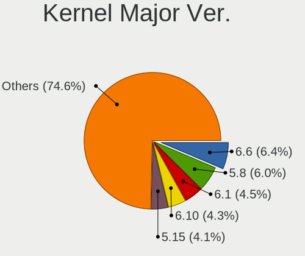
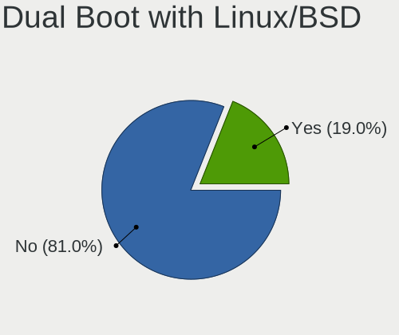
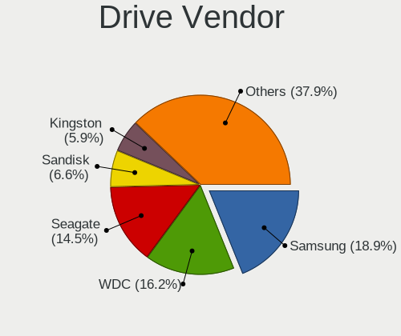
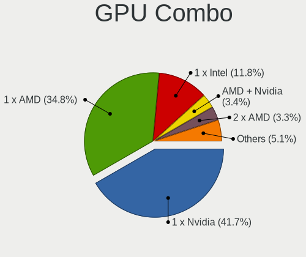
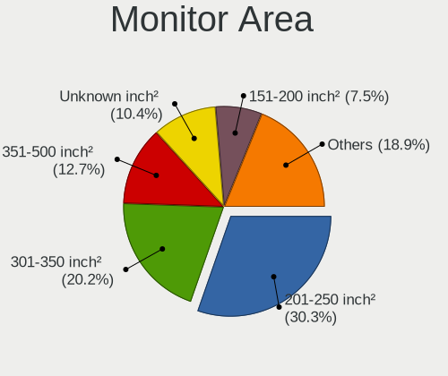
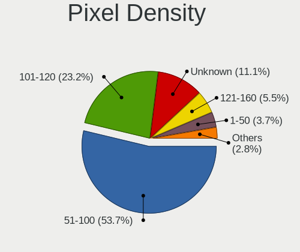
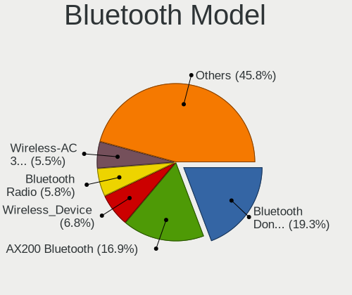
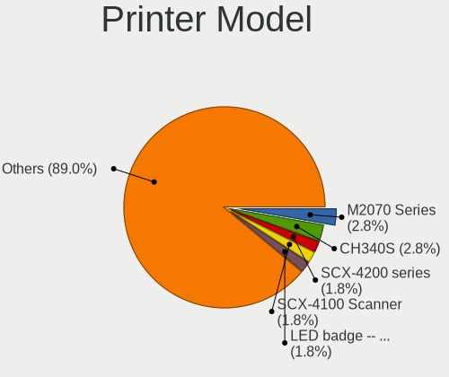
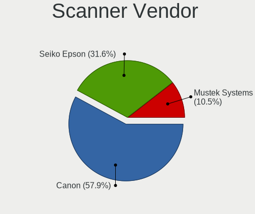
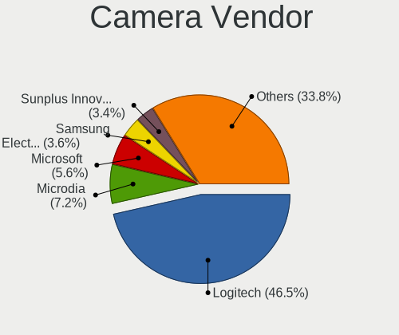

Arch - Tested Hardware & Statistics (Desktops)
----------------------------------------------

A project to collect tested hardware configurations for Arch.

Anyone can contribute to this report by the [hw-probe](https://github.com/linuxhw/hw-probe) tool:

    sudo -E hw-probe -all -upload

Please contribute! Especially if your hardware is rare.

Contents
--------

* [ Test Cases ](#test-cases)

* [ System ](#system)
  - [ OS                       ](#os)
  - [ OS Family                ](#os-family)
  - [ Kernel                   ](#kernel)
  - [ Kernel Family            ](#kernel-family)
  - [ Kernel Major Ver.        ](#kernel-major-ver)
  - [ Arch                     ](#arch)
  - [ DE                       ](#de)
  - [ Display Server           ](#display-server)
  - [ Display Manager          ](#display-manager)
  - [ OS Lang                  ](#os-lang)
  - [ Boot Mode                ](#boot-mode)
  - [ Filesystem               ](#filesystem)
  - [ Part. scheme             ](#part-scheme)
  - [ Dual Boot with Linux/BSD ](#dual-boot-with-linuxbsd)
  - [ Dual Boot (Win)          ](#dual-boot-win)

* [ Board ](#board)
  - [ Vendor                   ](#vendor)
  - [ Model                    ](#model)
  - [ Model Family             ](#model-family)
  - [ MFG Year                 ](#mfg-year)
  - [ Form Factor              ](#form-factor)
  - [ Secure Boot              ](#secure-boot)
  - [ Coreboot                 ](#coreboot)
  - [ RAM Size                 ](#ram-size)
  - [ RAM Used                 ](#ram-used)
  - [ Total Drives             ](#total-drives)
  - [ Has CD-ROM               ](#has-cd-rom)
  - [ Has Ethernet             ](#has-ethernet)
  - [ Has WiFi                 ](#has-wifi)
  - [ Has Bluetooth            ](#has-bluetooth)

* [ Location ](#location)
  - [ Country                  ](#country)
  - [ City                     ](#city)

* [ Drives ](#drives)
  - [ Drive Vendor             ](#drive-vendor)
  - [ Drive Model              ](#drive-model)
  - [ HDD Vendor               ](#hdd-vendor)
  - [ SSD Vendor               ](#ssd-vendor)
  - [ Drive Kind               ](#drive-kind)
  - [ Drive Connector          ](#drive-connector)
  - [ Drive Size               ](#drive-size)
  - [ Space Total              ](#space-total)
  - [ Space Used               ](#space-used)
  - [ Malfunc. Drives          ](#malfunc-drives)
  - [ Malfunc. Drive Vendor    ](#malfunc-drive-vendor)
  - [ Malfunc. HDD Vendor      ](#malfunc-hdd-vendor)
  - [ Malfunc. Drive Kind      ](#malfunc-drive-kind)
  - [ Failed Drives            ](#failed-drives)
  - [ Failed Drive Vendor      ](#failed-drive-vendor)
  - [ Drive Status             ](#drive-status)

* [ Storage controller ](#storage-controller)
  - [ Storage Vendor           ](#storage-vendor)
  - [ Storage Model            ](#storage-model)
  - [ Storage Kind             ](#storage-kind)

* [ Processor ](#processor)
  - [ CPU Vendor               ](#cpu-vendor)
  - [ CPU Model                ](#cpu-model)
  - [ CPU Model Family         ](#cpu-model-family)
  - [ CPU Cores                ](#cpu-cores)
  - [ CPU Sockets              ](#cpu-sockets)
  - [ CPU Threads              ](#cpu-threads)
  - [ CPU Op-Modes             ](#cpu-op-modes)
  - [ CPU Microcode            ](#cpu-microcode)
  - [ CPU Microarch            ](#cpu-microarch)

* [ Graphics ](#graphics)
  - [ GPU Vendor               ](#gpu-vendor)
  - [ GPU Model                ](#gpu-model)
  - [ GPU Combo                ](#gpu-combo)
  - [ GPU Driver               ](#gpu-driver)
  - [ GPU Memory               ](#gpu-memory)

* [ Monitor ](#monitor)
  - [ Monitor Vendor           ](#monitor-vendor)
  - [ Monitor Model            ](#monitor-model)
  - [ Monitor Resolution       ](#monitor-resolution)
  - [ Monitor Diagonal         ](#monitor-diagonal)
  - [ Monitor Width            ](#monitor-width)
  - [ Aspect Ratio             ](#aspect-ratio)
  - [ Monitor Area             ](#monitor-area)
  - [ Pixel Density            ](#pixel-density)
  - [ Multiple Monitors        ](#multiple-monitors)

* [ Network ](#network)
  - [ Net Controller Vendor    ](#net-controller-vendor)
  - [ Net Controller Model     ](#net-controller-model)
  - [ Wireless Vendor          ](#wireless-vendor)
  - [ Wireless Model           ](#wireless-model)
  - [ Ethernet Vendor          ](#ethernet-vendor)
  - [ Ethernet Model           ](#ethernet-model)
  - [ Net Controller Kind      ](#net-controller-kind)
  - [ Used Controller          ](#used-controller)
  - [ NICs                     ](#nics)
  - [ IPv6                     ](#ipv6)

* [ Bluetooth ](#bluetooth)
  - [ Bluetooth Vendor         ](#bluetooth-vendor)
  - [ Bluetooth Model          ](#bluetooth-model)

* [ Sound ](#sound)
  - [ Sound Vendor             ](#sound-vendor)
  - [ Sound Model              ](#sound-model)

* [ Memory ](#memory)
  - [ Memory Vendor            ](#memory-vendor)
  - [ Memory Model             ](#memory-model)
  - [ Memory Kind              ](#memory-kind)
  - [ Memory Form Factor       ](#memory-form-factor)
  - [ Memory Size              ](#memory-size)
  - [ Memory Speed             ](#memory-speed)

* [ Printers & scanners ](#printers--scanners)
  - [ Printer Vendor           ](#printer-vendor)
  - [ Printer Model            ](#printer-model)
  - [ Scanner Vendor           ](#scanner-vendor)
  - [ Scanner Model            ](#scanner-model)

* [ Camera ](#camera)
  - [ Camera Vendor            ](#camera-vendor)
  - [ Camera Model             ](#camera-model)

* [ Security ](#security)
  - [ Fingerprint Vendor       ](#fingerprint-vendor)
  - [ Fingerprint Model        ](#fingerprint-model)
  - [ Chipcard Vendor          ](#chipcard-vendor)
  - [ Chipcard Model           ](#chipcard-model)

* [ Unsupported ](#unsupported)
  - [ Unsupported Devices      ](#unsupported-devices)
  - [ Unsupported Device Types ](#unsupported-device-types)

Test Cases
----------

Total: 3966

| Vendor        | Model                       | Probe                                                      | Date         |
|---------------|-----------------------------|------------------------------------------------------------|--------------|
| ASRock        | H110M-ITX                   | [c384352141](https://linux-hardware.org/?probe=c384352141) | Nov 06, 2023 |
| MSI           | B450 TOMAHAWK               | [9b0f4eeb46](https://linux-hardware.org/?probe=9b0f4eeb46) | Nov 06, 2023 |
| Huanan        | X99-QD4 V1.0                | [3cedc8f704](https://linux-hardware.org/?probe=3cedc8f704) | Nov 05, 2023 |
| ASUSTek       | PRIME Z390-P                | [4b29646104](https://linux-hardware.org/?probe=4b29646104) | Nov 05, 2023 |
| ASUSTek       | PRIME B460M-A               | [52a36f5268](https://linux-hardware.org/?probe=52a36f5268) | Nov 04, 2023 |
| MSI           | MAG B650 TOMAHAWK WIFI      | [5832913981](https://linux-hardware.org/?probe=5832913981) | Nov 04, 2023 |
| MSI           | MAG B650 TOMAHAWK WIFI      | [4f6d5932fa](https://linux-hardware.org/?probe=4f6d5932fa) | Nov 04, 2023 |
| ASUSTek       | H97M-PLUS                   | [69cb1e7068](https://linux-hardware.org/?probe=69cb1e7068) | Nov 04, 2023 |
| Lenovo        | 103D SDK0Q40112 WIN 3305... | [76acaae6cc](https://linux-hardware.org/?probe=76acaae6cc) | Nov 04, 2023 |
| Gigabyte      | H470M K                     | [d69493b7d2](https://linux-hardware.org/?probe=d69493b7d2) | Nov 04, 2023 |
| Gigabyte      | H470M K                     | [80085c7047](https://linux-hardware.org/?probe=80085c7047) | Nov 04, 2023 |
| MSI           | B450 TOMAHAWK               | [2b389d48e1](https://linux-hardware.org/?probe=2b389d48e1) | Nov 04, 2023 |
| ASUSTek       | ROG STRIX X570-E GAMING     | [bc3444ed2f](https://linux-hardware.org/?probe=bc3444ed2f) | Nov 04, 2023 |
| ASUSTek       | ROG STRIX X570-E GAMING     | [3c1e4ea8bf](https://linux-hardware.org/?probe=3c1e4ea8bf) | Nov 04, 2023 |
| ASUSTek       | PRIME H510M-K               | [9501d6d6cf](https://linux-hardware.org/?probe=9501d6d6cf) | Nov 03, 2023 |
| Gigabyte      | Z390 AORUS ELITE-CF         | [7aa3982cb4](https://linux-hardware.org/?probe=7aa3982cb4) | Nov 03, 2023 |
| ASUSTek       | ROG STRIX B450-F GAMING ... | [1fd433ec1e](https://linux-hardware.org/?probe=1fd433ec1e) | Nov 02, 2023 |
| ASUSTek       | TUF Gaming X570-PRO         | [993d985e9e](https://linux-hardware.org/?probe=993d985e9e) | Nov 01, 2023 |
| Gigabyte      | B550M AORUS ELITE           | [be72cba293](https://linux-hardware.org/?probe=be72cba293) | Nov 01, 2023 |
| Dell          | 006K82 A00                  | [f8c521f2f6](https://linux-hardware.org/?probe=f8c521f2f6) | Nov 01, 2023 |
| MSI           | MPG B550 GAMING PLUS        | [301a117426](https://linux-hardware.org/?probe=301a117426) | Nov 01, 2023 |
| ASUSTek       | TUF Gaming X570-PRO         | [ba593f267b](https://linux-hardware.org/?probe=ba593f267b) | Nov 01, 2023 |
| ASUSTek       | ROG STRIX B550-F GAMING ... | [56fe3d964b](https://linux-hardware.org/?probe=56fe3d964b) | Nov 01, 2023 |
| Gigabyte      | AX370M-Gaming 3-CF          | [d271d2ae41](https://linux-hardware.org/?probe=d271d2ae41) | Oct 31, 2023 |
| ASUSTek       | PRIME Z590-A                | [40f30de33b](https://linux-hardware.org/?probe=40f30de33b) | Oct 31, 2023 |
| Gigabyte      | 970-GAMING                  | [2b4315885f](https://linux-hardware.org/?probe=2b4315885f) | Oct 31, 2023 |
| Gigabyte      | X570 AORUS ELITE            | [90172d9cef](https://linux-hardware.org/?probe=90172d9cef) | Oct 31, 2023 |
| MSI           | Z270 GAMING M5              | [fb56165b30](https://linux-hardware.org/?probe=fb56165b30) | Oct 31, 2023 |
| ASUSTek       | P7P55D LE                   | [26533c338a](https://linux-hardware.org/?probe=26533c338a) | Oct 31, 2023 |
| MSI           | MAG B650 TOMAHAWK WIFI      | [df43f845a1](https://linux-hardware.org/?probe=df43f845a1) | Oct 31, 2023 |
| Gigabyte      | X570 GAMING X               | [85cb35fdc6](https://linux-hardware.org/?probe=85cb35fdc6) | Oct 31, 2023 |
| ASUSTek       | ROG STRIX B760-F GAMING ... | [e0971c3b56](https://linux-hardware.org/?probe=e0971c3b56) | Oct 31, 2023 |
| ASUSTek       | PRIME B360M-A               | [ef307df799](https://linux-hardware.org/?probe=ef307df799) | Oct 31, 2023 |
| Gigabyte      | X570S AORUS ELITE AX        | [01ce498c44](https://linux-hardware.org/?probe=01ce498c44) | Oct 30, 2023 |
| ASUSTek       | PRIME B550-PLUS             | [59f0a72f7b](https://linux-hardware.org/?probe=59f0a72f7b) | Oct 29, 2023 |
| HP            | 802E                        | [a57f8d5afa](https://linux-hardware.org/?probe=a57f8d5afa) | Oct 29, 2023 |
| Dell          | 0HHV7N A00                  | [85e507b8b2](https://linux-hardware.org/?probe=85e507b8b2) | Oct 29, 2023 |
| Acer          | Nitro N50-610               | [b83310ffb8](https://linux-hardware.org/?probe=b83310ffb8) | Oct 29, 2023 |
| MSI           | X570-A PRO                  | [df6ef51245](https://linux-hardware.org/?probe=df6ef51245) | Oct 28, 2023 |
| MSI           | PRO Z790-P WIFI             | [60372b59fe](https://linux-hardware.org/?probe=60372b59fe) | Oct 28, 2023 |
| ASUSTek       | H81M-E                      | [1cd579935b](https://linux-hardware.org/?probe=1cd579935b) | Oct 27, 2023 |
| ASUSTek       | SABERTOOTH Z77              | [56f2576af1](https://linux-hardware.org/?probe=56f2576af1) | Oct 27, 2023 |
| MSI           | H97 PC Mate                 | [47336d64a9](https://linux-hardware.org/?probe=47336d64a9) | Oct 27, 2023 |
| MSI           | Z77A-G43                    | [7ac5ac2ae2](https://linux-hardware.org/?probe=7ac5ac2ae2) | Oct 27, 2023 |
| Gigabyte      | B550M AORUS PRO-P           | [298718536d](https://linux-hardware.org/?probe=298718536d) | Oct 26, 2023 |
| MSI           | PRO B650-P WIFI             | [4d76763d2d](https://linux-hardware.org/?probe=4d76763d2d) | Oct 26, 2023 |
| HP            | 21B4 A01                    | [8f2a8dec3a](https://linux-hardware.org/?probe=8f2a8dec3a) | Oct 26, 2023 |
| HP            | 8653 A                      | [07aae59bf1](https://linux-hardware.org/?probe=07aae59bf1) | Oct 26, 2023 |
| Fujitsu       | D3162-A1 S26361-D3162-A1    | [37eda24908](https://linux-hardware.org/?probe=37eda24908) | Oct 26, 2023 |
| Gigabyte      | 970A-D3P                    | [7277bcd3bc](https://linux-hardware.org/?probe=7277bcd3bc) | Oct 26, 2023 |
| ASUSTek       | ROG STRIX B550-F GAMING ... | [336fa07e6a](https://linux-hardware.org/?probe=336fa07e6a) | Oct 26, 2023 |
| Gigabyte      | B550M AORUS PRO-P           | [b74c61d287](https://linux-hardware.org/?probe=b74c61d287) | Oct 25, 2023 |
| ASUSTek       | Z170M-PLUS                  | [b75faeaf8a](https://linux-hardware.org/?probe=b75faeaf8a) | Oct 25, 2023 |
| MSI           | B450M MORTAR MAX            | [824215ab50](https://linux-hardware.org/?probe=824215ab50) | Oct 25, 2023 |
| MSI           | MPG B650I EDGE WIFI         | [7107e2ed21](https://linux-hardware.org/?probe=7107e2ed21) | Oct 25, 2023 |
| Foxconn       | 2ABF                        | [50abb592dd](https://linux-hardware.org/?probe=50abb592dd) | Oct 25, 2023 |
| Gigabyte      | B650M AORUS ELITE AX        | [8f09f37e41](https://linux-hardware.org/?probe=8f09f37e41) | Oct 25, 2023 |
| MSI           | B560M-A PRO                 | [1fde726024](https://linux-hardware.org/?probe=1fde726024) | Oct 25, 2023 |
| ASUSTek       | PRIME A320M-K               | [f88a2686e9](https://linux-hardware.org/?probe=f88a2686e9) | Oct 25, 2023 |
| MSI           | MAG B650 TOMAHAWK WIFI      | [268b32d9bf](https://linux-hardware.org/?probe=268b32d9bf) | Oct 24, 2023 |
| AZW           | GTR V21                     | [beb87ff047](https://linux-hardware.org/?probe=beb87ff047) | Oct 24, 2023 |
| Gigabyte      | B365M DS3H                  | [87102526a5](https://linux-hardware.org/?probe=87102526a5) | Oct 24, 2023 |
| ASUSTek       | ROG STRIX X470-F GAMING     | [673f62810a](https://linux-hardware.org/?probe=673f62810a) | Oct 23, 2023 |
| ASRock        | B550M-ITX/ac                | [d4d7110981](https://linux-hardware.org/?probe=d4d7110981) | Oct 23, 2023 |
| Lenovo        | SHARKBAY SDK0E50515 STD     | [62ca63bc89](https://linux-hardware.org/?probe=62ca63bc89) | Oct 23, 2023 |
| ASUSTek       | TUF Gaming X570-PLUS        | [f9efd677fe](https://linux-hardware.org/?probe=f9efd677fe) | Oct 23, 2023 |
| Dell          | 0NW6H5 A00                  | [2b88710042](https://linux-hardware.org/?probe=2b88710042) | Oct 22, 2023 |
| Gigabyte      | B660 AORUS MASTER DDR4      | [2157dd6b76](https://linux-hardware.org/?probe=2157dd6b76) | Oct 22, 2023 |
| Gigabyte      | B450M DS3H V2               | [7c81d548d6](https://linux-hardware.org/?probe=7c81d548d6) | Oct 22, 2023 |
| Unknown       | Unknown                     | [b8a154c0f6](https://linux-hardware.org/?probe=b8a154c0f6) | Oct 22, 2023 |
| MSI           | B450 TOMAHAWK               | [ed6b4ba6e8](https://linux-hardware.org/?probe=ed6b4ba6e8) | Oct 22, 2023 |
| Gigabyte      | B450M DS3H-CF               | [7ddf7a94fd](https://linux-hardware.org/?probe=7ddf7a94fd) | Oct 21, 2023 |
| Dell          | 0NW6H5 A00                  | [a7f899353b](https://linux-hardware.org/?probe=a7f899353b) | Oct 21, 2023 |
| ECS           | G31T-M7                     | [297db99cc3](https://linux-hardware.org/?probe=297db99cc3) | Oct 20, 2023 |
| ASUSTek       | ROG Maximus Z790 HERO       | [e5b7455426](https://linux-hardware.org/?probe=e5b7455426) | Oct 19, 2023 |
| ASRock        | N100M                       | [a52836d33c](https://linux-hardware.org/?probe=a52836d33c) | Oct 19, 2023 |
| Gigabyte      | H87-D3H-CF                  | [b1f1e05664](https://linux-hardware.org/?probe=b1f1e05664) | Oct 19, 2023 |
| ASUSTek       | ROG STRIX X299-E GAMING ... | [6a2e115b95](https://linux-hardware.org/?probe=6a2e115b95) | Oct 18, 2023 |
| Gigabyte      | B550M AORUS PRO-P           | [6e17195f7d](https://linux-hardware.org/?probe=6e17195f7d) | Oct 18, 2023 |
| Dell          | 0MWYPT A02                  | [c0e68da51a](https://linux-hardware.org/?probe=c0e68da51a) | Oct 18, 2023 |
| MSI           | B550M PRO-VDH WIFI          | [11d2b5b9c2](https://linux-hardware.org/?probe=11d2b5b9c2) | Oct 17, 2023 |
| MSI           | B550M PRO-VDH WIFI          | [8d289561bf](https://linux-hardware.org/?probe=8d289561bf) | Oct 17, 2023 |
| MSI           | B450 TOMAHAWK               | [3c93567751](https://linux-hardware.org/?probe=3c93567751) | Oct 17, 2023 |
| ASUSTek       | TUF Gaming Z790-PLUS WIF... | [19d60d452f](https://linux-hardware.org/?probe=19d60d452f) | Oct 17, 2023 |
| BY OEM        | ZRD1103                     | [1f638b4369](https://linux-hardware.org/?probe=1f638b4369) | Oct 16, 2023 |
| Gigabyte      | B550I AORUS PRO AX          | [374a5bf116](https://linux-hardware.org/?probe=374a5bf116) | Oct 15, 2023 |
| Gigabyte      | X570S AORUS PRO AX          | [086ecfefb8](https://linux-hardware.org/?probe=086ecfefb8) | Oct 15, 2023 |
| Dell          | 0M5DCD A00                  | [02958738fb](https://linux-hardware.org/?probe=02958738fb) | Oct 14, 2023 |
| ASUSTek       | H81M-A                      | [0702e52c02](https://linux-hardware.org/?probe=0702e52c02) | Oct 14, 2023 |
| ASRock        | X370 Killer Sli             | [7cc4b0e44f](https://linux-hardware.org/?probe=7cc4b0e44f) | Oct 13, 2023 |
| ASUSTek       | G11CD                       | [32a4a9380e](https://linux-hardware.org/?probe=32a4a9380e) | Oct 12, 2023 |
| Acer          | Aspire MC605 v1.0           | [e7252be8a1](https://linux-hardware.org/?probe=e7252be8a1) | Oct 12, 2023 |
| Acer          | Aspire MC605 v1.0           | [1328071174](https://linux-hardware.org/?probe=1328071174) | Oct 12, 2023 |
| MSI           | X470 GAMING PRO             | [88057db3aa](https://linux-hardware.org/?probe=88057db3aa) | Oct 11, 2023 |
| ASUSTek       | ROG STRIX B650E-F GAMING... | [904d65b1c0](https://linux-hardware.org/?probe=904d65b1c0) | Oct 11, 2023 |
| Acidanther... | Mac-27AD2F918AE68F61 Mac... | [81409b14c4](https://linux-hardware.org/?probe=81409b14c4) | Oct 11, 2023 |
| Gigabyte      | X470 AORUS ULTRA GAMING-... | [68372adfc5](https://linux-hardware.org/?probe=68372adfc5) | Oct 10, 2023 |
| Gigabyte      | 945GZM-S2                   | [f9bafdf396](https://linux-hardware.org/?probe=f9bafdf396) | Oct 09, 2023 |
| Gigabyte      | 970A-D3P                    | [beac8a6b4d](https://linux-hardware.org/?probe=beac8a6b4d) | Oct 09, 2023 |
| ASRock        | X370 Killer Sli             | [d90cde5a73](https://linux-hardware.org/?probe=d90cde5a73) | Oct 08, 2023 |
| MSI           | MAG B550M MORTAR            | [3d6601e877](https://linux-hardware.org/?probe=3d6601e877) | Oct 08, 2023 |
| Gigabyte      | H81M-DS2                    | [93e298660d](https://linux-hardware.org/?probe=93e298660d) | Oct 07, 2023 |
| Lenovo        | 370A SDK0J40709 WIN 3259... | [38c0c97684](https://linux-hardware.org/?probe=38c0c97684) | Oct 07, 2023 |
| Gigabyte      | B650I AORUS ULTRA           | [590fa0428f](https://linux-hardware.org/?probe=590fa0428f) | Oct 07, 2023 |
| ASUSTek       | TUF Gaming X570-PLUS        | [40c01d2bf5](https://linux-hardware.org/?probe=40c01d2bf5) | Oct 07, 2023 |
| ASUSTek       | ROG STRIX B550-F GAMING     | [13d4e4c49f](https://linux-hardware.org/?probe=13d4e4c49f) | Oct 07, 2023 |
| MSI           | MAG Z490 TOMAHAWK           | [192654dc77](https://linux-hardware.org/?probe=192654dc77) | Oct 06, 2023 |
| ASUSTek       | ROG STRIX B550-E GAMING     | [947c66cb1f](https://linux-hardware.org/?probe=947c66cb1f) | Oct 05, 2023 |
| ASUSTek       | PRIME H510M-K               | [43dfd73b17](https://linux-hardware.org/?probe=43dfd73b17) | Oct 04, 2023 |
| Acidanther... | Mac-27AD2F918AE68F61 Mac... | [ef154408cf](https://linux-hardware.org/?probe=ef154408cf) | Oct 04, 2023 |
| Gigabyte      | X570S AORUS PRO AX          | [d034b84815](https://linux-hardware.org/?probe=d034b84815) | Oct 04, 2023 |
| ASUSTek       | TUF Gaming B550M-PLUS       | [18c399ea1e](https://linux-hardware.org/?probe=18c399ea1e) | Oct 04, 2023 |
| MSI           | B450M MORTAR MAX            | [50f7cba770](https://linux-hardware.org/?probe=50f7cba770) | Oct 03, 2023 |
| MSI           | PRO B550M-VC WIFI           | [34d3a3bd47](https://linux-hardware.org/?probe=34d3a3bd47) | Oct 03, 2023 |
| Dell          | 0P0MXR A00                  | [06af26dae3](https://linux-hardware.org/?probe=06af26dae3) | Oct 03, 2023 |
| Gigabyte      | B550 AORUS ELITE AX V2      | [ab5cf455ba](https://linux-hardware.org/?probe=ab5cf455ba) | Oct 03, 2023 |
| IP3 Tech      | IB8                         | [ca4d58a353](https://linux-hardware.org/?probe=ca4d58a353) | Oct 03, 2023 |
| Gigabyte      | B550M AORUS PRO-P           | [c5223b1e21](https://linux-hardware.org/?probe=c5223b1e21) | Oct 02, 2023 |
| Gigabyte      | 970A-D3P                    | [0620cf8cd6](https://linux-hardware.org/?probe=0620cf8cd6) | Oct 02, 2023 |
| ASRock        | B660M-C                     | [c4ef9b73c9](https://linux-hardware.org/?probe=c4ef9b73c9) | Oct 01, 2023 |
| Gigabyte      | B550M AORUS PRO-P           | [7109a8a11b](https://linux-hardware.org/?probe=7109a8a11b) | Oct 01, 2023 |
| Gigabyte      | B550M AORUS PRO-P           | [b85781f0d8](https://linux-hardware.org/?probe=b85781f0d8) | Oct 01, 2023 |
| Shenzhen M... | F7BSC                       | [79b4f4f30e](https://linux-hardware.org/?probe=79b4f4f30e) | Sep 30, 2023 |
| MSI           | B450-A PRO MAX              | [6ee0910511](https://linux-hardware.org/?probe=6ee0910511) | Sep 30, 2023 |
| ASUSTek       | STRIX Z270E GAMING          | [caa5ce0b99](https://linux-hardware.org/?probe=caa5ce0b99) | Sep 29, 2023 |
| Shenzhen M... | F7BAA                       | [30268d41d2](https://linux-hardware.org/?probe=30268d41d2) | Sep 29, 2023 |
| Dell          | 0J3C2F A00                  | [0536b81a43](https://linux-hardware.org/?probe=0536b81a43) | Sep 29, 2023 |
| ASUSTek       | PRIME X370-PRO              | [6d725a3ede](https://linux-hardware.org/?probe=6d725a3ede) | Sep 29, 2023 |
| MSI           | B450M PRO-M2 MAX            | [da030ed703](https://linux-hardware.org/?probe=da030ed703) | Sep 28, 2023 |
| Dell          | 0J3C2F A00                  | [451d8ac4ca](https://linux-hardware.org/?probe=451d8ac4ca) | Sep 28, 2023 |
| ZOTAC         | NM10                        | [8932b16aa1](https://linux-hardware.org/?probe=8932b16aa1) | Sep 27, 2023 |
| ASUSTek       | ROG STRIX B550-F GAMING     | [cc0d6b9ebb](https://linux-hardware.org/?probe=cc0d6b9ebb) | Sep 27, 2023 |
| ASUSTek       | ROG STRIX B550-F GAMING ... | [0f2a543485](https://linux-hardware.org/?probe=0f2a543485) | Sep 27, 2023 |
| ASUSTek       | ROG STRIX B550-F GAMING ... | [75f65a0438](https://linux-hardware.org/?probe=75f65a0438) | Sep 27, 2023 |
| Gigabyte      | B550M AORUS PRO-P           | [ef982a7d39](https://linux-hardware.org/?probe=ef982a7d39) | Sep 26, 2023 |
| Gigabyte      | B550M AORUS PRO-P           | [d8f229b5d7](https://linux-hardware.org/?probe=d8f229b5d7) | Sep 26, 2023 |
| Gigabyte      | X99-UD4-CF                  | [c50564e3bb](https://linux-hardware.org/?probe=c50564e3bb) | Sep 25, 2023 |
| Gigabyte      | B550 AORUS ELITE AX V2      | [6185e37a03](https://linux-hardware.org/?probe=6185e37a03) | Sep 25, 2023 |
| ASRock        | H97 Anniversary             | [018c8fa4d1](https://linux-hardware.org/?probe=018c8fa4d1) | Sep 24, 2023 |
| MSI           | B450 TOMAHAWK               | [903a13bdf8](https://linux-hardware.org/?probe=903a13bdf8) | Sep 24, 2023 |
| Biostar       | B85MG                       | [f71d8a75fc](https://linux-hardware.org/?probe=f71d8a75fc) | Sep 22, 2023 |
| ASUSTek       | ROG STRIX B650E-I GAMING... | [162ff29125](https://linux-hardware.org/?probe=162ff29125) | Sep 22, 2023 |
| MSI           | MPG Z790 CARBON WIFI        | [d9d063b9e8](https://linux-hardware.org/?probe=d9d063b9e8) | Sep 22, 2023 |
| ASUSTek       | X99-A/USB                   | [37990955f8](https://linux-hardware.org/?probe=37990955f8) | Sep 21, 2023 |
| MSI           | A88XM-E45                   | [99b5c7c976](https://linux-hardware.org/?probe=99b5c7c976) | Sep 21, 2023 |
| MSI           | MPG B550 GAMING PLUS        | [6c75af44c4](https://linux-hardware.org/?probe=6c75af44c4) | Sep 21, 2023 |
| ASUSTek       | PRIME H510M-K               | [4d863063d6](https://linux-hardware.org/?probe=4d863063d6) | Sep 21, 2023 |
| ASUSTek       | ROG STRIX B650E-I GAMING... | [2489245463](https://linux-hardware.org/?probe=2489245463) | Sep 21, 2023 |
| MSI           | MPG Z790 CARBON WIFI        | [6aae39a72b](https://linux-hardware.org/?probe=6aae39a72b) | Sep 21, 2023 |
| Unknown       | HX90                        | [a48f203afc](https://linux-hardware.org/?probe=a48f203afc) | Sep 21, 2023 |
| ASUSTek       | PRIME Z690-P WIFI D4        | [3762f344e9](https://linux-hardware.org/?probe=3762f344e9) | Sep 21, 2023 |
| ASRock        | B365 Pro4                   | [7ee2b2178d](https://linux-hardware.org/?probe=7ee2b2178d) | Sep 20, 2023 |
| ASUSTek       | PRIME Z590-A                | [a2f44141ba](https://linux-hardware.org/?probe=a2f44141ba) | Sep 20, 2023 |
| Gigabyte      | X570 AORUS ELITE            | [0d52c010c8](https://linux-hardware.org/?probe=0d52c010c8) | Sep 20, 2023 |
| ASRock        | H310CM-ITX/ac               | [4959eecff1](https://linux-hardware.org/?probe=4959eecff1) | Sep 19, 2023 |
| ASUSTek       | H81M-R                      | [6ed76f72d7](https://linux-hardware.org/?probe=6ed76f72d7) | Sep 19, 2023 |
| MSI           | MPG X570S EDGE MAX WIFI     | [58682c1938](https://linux-hardware.org/?probe=58682c1938) | Sep 19, 2023 |
| Gigabyte      | B550 AORUS ELITE AX V2      | [85d131b5fc](https://linux-hardware.org/?probe=85d131b5fc) | Sep 18, 2023 |
| AZW           | GTR V02                     | [094b661573](https://linux-hardware.org/?probe=094b661573) | Sep 18, 2023 |
| ASUSTek       | PRIME B365M-A               | [8922ced8ec](https://linux-hardware.org/?probe=8922ced8ec) | Sep 18, 2023 |
| ASUSTek       | TUF Gaming B650M-PLUS WI... | [07d34fd9b5](https://linux-hardware.org/?probe=07d34fd9b5) | Sep 18, 2023 |
| ASUSTek       | TUF Gaming B550M-PLUS       | [f12a86bf92](https://linux-hardware.org/?probe=f12a86bf92) | Sep 18, 2023 |
| Gigabyte      | H410M H V3                  | [cdb4402859](https://linux-hardware.org/?probe=cdb4402859) | Sep 18, 2023 |
| Gigabyte      | Z97P-D3                     | [3baa74b1a6](https://linux-hardware.org/?probe=3baa74b1a6) | Sep 17, 2023 |
| MSI           | PRO Z690-A WIFI DDR4        | [544f02c423](https://linux-hardware.org/?probe=544f02c423) | Sep 17, 2023 |
| ASUSTek       | PRIME B660M-A WIFI D4       | [ba8a270a86](https://linux-hardware.org/?probe=ba8a270a86) | Sep 17, 2023 |
| Gigabyte      | B360M D2V                   | [eaffff1bae](https://linux-hardware.org/?probe=eaffff1bae) | Sep 17, 2023 |
| ASUSTek       | PRIME Z370-A                | [33ec9c1d72](https://linux-hardware.org/?probe=33ec9c1d72) | Sep 16, 2023 |
| ASUSTek       | ROG STRIX Z590-F GAMING ... | [0b88f9bfaa](https://linux-hardware.org/?probe=0b88f9bfaa) | Sep 16, 2023 |
| Gigabyte      | B550M AORUS PRO-P           | [0f3cba16d7](https://linux-hardware.org/?probe=0f3cba16d7) | Sep 16, 2023 |
| ASRock        | B550 Phantom Gaming 4       | [afbaf99497](https://linux-hardware.org/?probe=afbaf99497) | Sep 16, 2023 |
| ASRock        | B365 Pro4                   | [bd6e35e433](https://linux-hardware.org/?probe=bd6e35e433) | Sep 16, 2023 |
| ASUSTek       | ROG Maximus Z790 APEX       | [76d354fede](https://linux-hardware.org/?probe=76d354fede) | Sep 16, 2023 |
| ASUSTek       | ROG Maximus Z790 APEX       | [ae35c7426c](https://linux-hardware.org/?probe=ae35c7426c) | Sep 16, 2023 |
| Gigabyte      | Z490 AORUS ELITE AC         | [c63f4e5865](https://linux-hardware.org/?probe=c63f4e5865) | Sep 16, 2023 |
| MSI           | B450M PRO-VDH MAX           | [dd637b6425](https://linux-hardware.org/?probe=dd637b6425) | Sep 15, 2023 |
| ASUSTek       | A88X-PRO                    | [354d2de54e](https://linux-hardware.org/?probe=354d2de54e) | Sep 15, 2023 |
| MSI           | MAG B550 TOMAHAWK           | [3b3ba64d46](https://linux-hardware.org/?probe=3b3ba64d46) | Sep 14, 2023 |
| ASUSTek       | P8P67 PRO                   | [c3d0531198](https://linux-hardware.org/?probe=c3d0531198) | Sep 14, 2023 |
| ASUSTek       | P8P67 DELUXE                | [116c17dd99](https://linux-hardware.org/?probe=116c17dd99) | Sep 13, 2023 |
| MSI           | X470 GAMING PLUS MAX        | [bc40188dda](https://linux-hardware.org/?probe=bc40188dda) | Sep 13, 2023 |
| ASRock        | B450 Gaming-ITX/ac          | [93563efdab](https://linux-hardware.org/?probe=93563efdab) | Sep 13, 2023 |
| ASRock        | B450 Gaming-ITX/ac          | [87bcf1d18a](https://linux-hardware.org/?probe=87bcf1d18a) | Sep 13, 2023 |
| MSI           | B450 GAMING PLUS            | [74ab1950fb](https://linux-hardware.org/?probe=74ab1950fb) | Sep 13, 2023 |
| MSI           | B250M PRO-VDH               | [23ded25239](https://linux-hardware.org/?probe=23ded25239) | Sep 12, 2023 |
| ECS           | A880GM-AD3                  | [828f89ff31](https://linux-hardware.org/?probe=828f89ff31) | Sep 12, 2023 |
| ECS           | H81H3-M4                    | [f1cff1b2ac](https://linux-hardware.org/?probe=f1cff1b2ac) | Sep 11, 2023 |
| MSI           | X470 GAMING PLUS MAX        | [d5b7a64e3b](https://linux-hardware.org/?probe=d5b7a64e3b) | Sep 11, 2023 |
| HP            | 2B36                        | [ac92866980](https://linux-hardware.org/?probe=ac92866980) | Sep 11, 2023 |
| ASRock        | X399M Taichi                | [00c370a89d](https://linux-hardware.org/?probe=00c370a89d) | Sep 11, 2023 |
| MSI           | X470 GAMING PLUS            | [41a8df4387](https://linux-hardware.org/?probe=41a8df4387) | Sep 10, 2023 |
| MSI           | B450M MORTAR MAX            | [8bc39de267](https://linux-hardware.org/?probe=8bc39de267) | Sep 10, 2023 |
| ASUSTek       | PRIME H510M-K               | [b6a07d9f09](https://linux-hardware.org/?probe=b6a07d9f09) | Sep 10, 2023 |
| ASUSTek       | M5A88-M                     | [227cff101d](https://linux-hardware.org/?probe=227cff101d) | Sep 10, 2023 |
| ASUSTek       | ROG Maximus Z790 HERO       | [fab8427f08](https://linux-hardware.org/?probe=fab8427f08) | Sep 09, 2023 |
| ASUSTek       | P8H61-MX                    | [be54d62e88](https://linux-hardware.org/?probe=be54d62e88) | Sep 09, 2023 |
| ASRock        | B365 Pro4                   | [d8694d48fe](https://linux-hardware.org/?probe=d8694d48fe) | Sep 09, 2023 |
| MSI           | MPG B550 GAMING PLUS        | [2e5644f065](https://linux-hardware.org/?probe=2e5644f065) | Sep 08, 2023 |
| ASUSTek       | PRIME X370-PRO              | [720beb724e](https://linux-hardware.org/?probe=720beb724e) | Sep 08, 2023 |
| MSI           | MAG B560 TORPEDO            | [b3a181910f](https://linux-hardware.org/?probe=b3a181910f) | Sep 08, 2023 |
| ASUSTek       | ROG STRIX B450-I GAMING     | [26448cf759](https://linux-hardware.org/?probe=26448cf759) | Sep 07, 2023 |
| MSI           | Z390-A PRO                  | [32c21f0b73](https://linux-hardware.org/?probe=32c21f0b73) | Sep 07, 2023 |
| ASUSTek       | Maximus VII HERO            | [d9509a0fa0](https://linux-hardware.org/?probe=d9509a0fa0) | Sep 07, 2023 |
| Gigabyte      | H61M-S2PV                   | [c22fad9c67](https://linux-hardware.org/?probe=c22fad9c67) | Sep 06, 2023 |
| ASUSTek       | PRIME B650M-A II            | [307ca05754](https://linux-hardware.org/?probe=307ca05754) | Sep 06, 2023 |
| Gigabyte      | X99-UD4-CF                  | [ee70bf217a](https://linux-hardware.org/?probe=ee70bf217a) | Sep 06, 2023 |
| Pegatron      | 2AD3                        | [07cfb5b967](https://linux-hardware.org/?probe=07cfb5b967) | Sep 05, 2023 |
| Gigabyte      | F2A85X-UP4                  | [9c7d201848](https://linux-hardware.org/?probe=9c7d201848) | Sep 05, 2023 |
| ASUSTek       | ROG STRIX X570-E GAMING ... | [a64157168e](https://linux-hardware.org/?probe=a64157168e) | Sep 05, 2023 |
| Dell          | 00V62H A01                  | [51b40f3137](https://linux-hardware.org/?probe=51b40f3137) | Sep 05, 2023 |
| Intel         | DH55TC AAE70932-206         | [0576ca20ab](https://linux-hardware.org/?probe=0576ca20ab) | Sep 05, 2023 |
| Acer          | Veriton M480                | [0c97015cce](https://linux-hardware.org/?probe=0c97015cce) | Sep 05, 2023 |
| Intel         | DH55TC AAE70932-206         | [710c22af52](https://linux-hardware.org/?probe=710c22af52) | Sep 05, 2023 |
| Gigabyte      | Z87X-UD5H-CF                | [4a93cea12b](https://linux-hardware.org/?probe=4a93cea12b) | Sep 04, 2023 |
| ASUSTek       | PRIME Z690-P D4             | [81f816e956](https://linux-hardware.org/?probe=81f816e956) | Sep 03, 2023 |
| ASUSTek       | Maximus VIII HERO           | [d208a16a1b](https://linux-hardware.org/?probe=d208a16a1b) | Sep 03, 2023 |
| ASUSTek       | ROG Maximus Z790 HERO       | [2eed39fb24](https://linux-hardware.org/?probe=2eed39fb24) | Sep 03, 2023 |
| ASRock        | B365 Pro4                   | [d6be71642e](https://linux-hardware.org/?probe=d6be71642e) | Sep 03, 2023 |
| ASUSTek       | A88X-PRO                    | [79ca2081a1](https://linux-hardware.org/?probe=79ca2081a1) | Sep 03, 2023 |
| ASUSTek       | ProArt X670E-CREATOR WIF... | [99b1fcf2e9](https://linux-hardware.org/?probe=99b1fcf2e9) | Sep 03, 2023 |
| ASUSTek       | P5G41T-M LX                 | [56520c8e8d](https://linux-hardware.org/?probe=56520c8e8d) | Sep 03, 2023 |
| ASUSTek       | Z97M-PLUS                   | [5dac4ae656](https://linux-hardware.org/?probe=5dac4ae656) | Sep 03, 2023 |
| Gigabyte      | Z270X-Ultra Gaming-CF       | [ad65335e8d](https://linux-hardware.org/?probe=ad65335e8d) | Sep 02, 2023 |
| MSI           | MPG B550 GAMING PLUS        | [9ab3e57ab7](https://linux-hardware.org/?probe=9ab3e57ab7) | Sep 02, 2023 |
| Dell          | 030VXY A02                  | [ff787e57bc](https://linux-hardware.org/?probe=ff787e57bc) | Sep 01, 2023 |
| ASUSTek       | PRIME H510M-K               | [f39e23df01](https://linux-hardware.org/?probe=f39e23df01) | Sep 01, 2023 |
| ASRock        | B365 Pro4                   | [6d0b6e95ba](https://linux-hardware.org/?probe=6d0b6e95ba) | Aug 30, 2023 |
| ASUSTek       | A88X-PRO                    | [9327ae4f97](https://linux-hardware.org/?probe=9327ae4f97) | Aug 30, 2023 |
| MSI           | MPG X570 GAMING PRO CARB... | [0b44043b10](https://linux-hardware.org/?probe=0b44043b10) | Aug 29, 2023 |
| ASUSTek       | H97M-PLUS                   | [c5fb822b1c](https://linux-hardware.org/?probe=c5fb822b1c) | Aug 29, 2023 |
| Huanan        | H610M-PLUS V1.2             | [083aaaf1eb](https://linux-hardware.org/?probe=083aaaf1eb) | Aug 29, 2023 |
| Gigabyte      | H61M-DS2                    | [0817c6178e](https://linux-hardware.org/?probe=0817c6178e) | Aug 29, 2023 |
| Gigabyte      | H61M-DS2                    | [0a2adee694](https://linux-hardware.org/?probe=0a2adee694) | Aug 29, 2023 |
| ASUSTek       | PRIME Z370-P II             | [56692679f3](https://linux-hardware.org/?probe=56692679f3) | Aug 28, 2023 |
| ECS           | G31T-M7                     | [f095887170](https://linux-hardware.org/?probe=f095887170) | Aug 28, 2023 |
| Gigabyte      | 970A-D3P                    | [e178a50d54](https://linux-hardware.org/?probe=e178a50d54) | Aug 27, 2023 |
| ASUSTek       | Pro B550M-C                 | [3c68838457](https://linux-hardware.org/?probe=3c68838457) | Aug 27, 2023 |
| Gigabyte      | B550M AORUS PRO-P           | [4e7e2a9946](https://linux-hardware.org/?probe=4e7e2a9946) | Aug 27, 2023 |
| Gigabyte      | B650 AORUS ELITE AX         | [b7020427e0](https://linux-hardware.org/?probe=b7020427e0) | Aug 27, 2023 |
| MSI           | H310M PRO-VD PLUS           | [2a25ad0be2](https://linux-hardware.org/?probe=2a25ad0be2) | Aug 27, 2023 |
| MSI           | Z390-A PRO                  | [7425d71f52](https://linux-hardware.org/?probe=7425d71f52) | Aug 26, 2023 |
| MSI           | Z390-A PRO                  | [fc86b0463f](https://linux-hardware.org/?probe=fc86b0463f) | Aug 26, 2023 |
| Gigabyte      | GA-78LMT-USB3 R2 sex        | [e3c32f6873](https://linux-hardware.org/?probe=e3c32f6873) | Aug 25, 2023 |
| ASUSTek       | PRIME X570-P                | [555c7d17f0](https://linux-hardware.org/?probe=555c7d17f0) | Aug 25, 2023 |
| ASUSTek       | PRIME X570-P                | [2668db7570](https://linux-hardware.org/?probe=2668db7570) | Aug 25, 2023 |
| ASUSTek       | TUF Gaming X570-PLUS        | [3a86d43941](https://linux-hardware.org/?probe=3a86d43941) | Aug 25, 2023 |
| HP            | 1497                        | [32a8075d02](https://linux-hardware.org/?probe=32a8075d02) | Aug 25, 2023 |
| Gigabyte      | B450M S2H                   | [9d09e14624](https://linux-hardware.org/?probe=9d09e14624) | Aug 24, 2023 |
| Gigabyte      | B450M DS3H V2               | [7486221845](https://linux-hardware.org/?probe=7486221845) | Aug 23, 2023 |
| ASUSTek       | TUF Gaming X570-PLUS        | [60588f77af](https://linux-hardware.org/?probe=60588f77af) | Aug 23, 2023 |
| Gigabyte      | GA-78LMT-USB3 R2 sex        | [368f9f947b](https://linux-hardware.org/?probe=368f9f947b) | Aug 23, 2023 |
| Gigabyte      | B365M DS3H                  | [74ff13d301](https://linux-hardware.org/?probe=74ff13d301) | Aug 23, 2023 |
| MSI           | X470 GAMING PLUS MAX        | [6c9f647d44](https://linux-hardware.org/?probe=6c9f647d44) | Aug 23, 2023 |
| Acer          | Nitro N50-600 V:1.1         | [6e915a1913](https://linux-hardware.org/?probe=6e915a1913) | Aug 22, 2023 |
| ASUSTek       | TUF B360M-PLUS GAMING/BR    | [9762e16c0e](https://linux-hardware.org/?probe=9762e16c0e) | Aug 21, 2023 |
| MSI           | MPG X570 GAMING PRO CARB... | [4bc2673b83](https://linux-hardware.org/?probe=4bc2673b83) | Aug 21, 2023 |
| Dell          | 0D883F A04                  | [f76b91821d](https://linux-hardware.org/?probe=f76b91821d) | Aug 21, 2023 |
| Gigabyte      | M68M-S2P                    | [41ba06b203](https://linux-hardware.org/?probe=41ba06b203) | Aug 21, 2023 |
| AZW           | GTR V11                     | [9aefbc3e69](https://linux-hardware.org/?probe=9aefbc3e69) | Aug 20, 2023 |
| Intel         | X99                         | [c1ad35e185](https://linux-hardware.org/?probe=c1ad35e185) | Aug 20, 2023 |
| HP            | 2B29                        | [62f37a51ca](https://linux-hardware.org/?probe=62f37a51ca) | Aug 20, 2023 |
| ASUSTek       | PRIME B660M-K D4            | [28a27adc22](https://linux-hardware.org/?probe=28a27adc22) | Aug 20, 2023 |
| Gigabyte      | AX370-Gaming 3-CF           | [13bcbc11d7](https://linux-hardware.org/?probe=13bcbc11d7) | Aug 20, 2023 |
| ASUSTek       | ROG CROSSHAIR VII HERO      | [778ea97c77](https://linux-hardware.org/?probe=778ea97c77) | Aug 20, 2023 |
| TYAN Compu... | S8010                       | [a381c313e3](https://linux-hardware.org/?probe=a381c313e3) | Aug 20, 2023 |
| Dell          | 0VNP2H A01                  | [5724c221b8](https://linux-hardware.org/?probe=5724c221b8) | Aug 19, 2023 |
| ASUSTek       | P8H61-MX                    | [767b42eeca](https://linux-hardware.org/?probe=767b42eeca) | Aug 18, 2023 |
| ASUSTek       | ROG STRIX B550-F GAMING     | [3c0bf7ce7b](https://linux-hardware.org/?probe=3c0bf7ce7b) | Aug 18, 2023 |
| Gigabyte      | B560M D3H                   | [7a9ae970e6](https://linux-hardware.org/?probe=7a9ae970e6) | Aug 18, 2023 |
| MSI           | MAG B550 TOMAHAWK           | [84cbd742a1](https://linux-hardware.org/?probe=84cbd742a1) | Aug 17, 2023 |
| ASUSTek       | PRIME H610M-R D4            | [caae17275e](https://linux-hardware.org/?probe=caae17275e) | Aug 17, 2023 |
| QIYIDA        | X79 (INTEL Xeon E5/Corei... | [1aeba3a6ec](https://linux-hardware.org/?probe=1aeba3a6ec) | Aug 17, 2023 |
| QIYIDA        | X79 (INTEL Xeon E5/Corei... | [b44417fa3d](https://linux-hardware.org/?probe=b44417fa3d) | Aug 17, 2023 |
| Shenzhen M... | F7BSC                       | [94b9b057b4](https://linux-hardware.org/?probe=94b9b057b4) | Aug 17, 2023 |
| ASUSTek       | ROG STRIX X570-E GAMING     | [eb44f4dfc1](https://linux-hardware.org/?probe=eb44f4dfc1) | Aug 17, 2023 |
| CWWK          | N3050 P1                    | [dd3dfb0c02](https://linux-hardware.org/?probe=dd3dfb0c02) | Aug 17, 2023 |
| Shenzhen M... | F7BSC                       | [bfe3223b92](https://linux-hardware.org/?probe=bfe3223b92) | Aug 17, 2023 |
| MSI           | MAG Z390 TOMAHAWK           | [1d389611a3](https://linux-hardware.org/?probe=1d389611a3) | Aug 16, 2023 |
| ASUSTek       | PRIME Z390-P                | [c8ed9b0cb2](https://linux-hardware.org/?probe=c8ed9b0cb2) | Aug 16, 2023 |
| ASUSTek       | ROG STRIX B650E-I GAMING... | [24a5a21c43](https://linux-hardware.org/?probe=24a5a21c43) | Aug 15, 2023 |
| ASUSTek       | ROG STRIX B650E-I GAMING... | [accdc886c7](https://linux-hardware.org/?probe=accdc886c7) | Aug 15, 2023 |
| ASUSTek       | ROG STRIX B650E-I GAMING... | [96d94e5f6c](https://linux-hardware.org/?probe=96d94e5f6c) | Aug 15, 2023 |
| ASUSTek       | ROG STRIX B650E-I GAMING... | [5652688ceb](https://linux-hardware.org/?probe=5652688ceb) | Aug 15, 2023 |
| ASUSTek       | ROG STRIX B650E-I GAMING... | [7463d795e8](https://linux-hardware.org/?probe=7463d795e8) | Aug 15, 2023 |
| ASUSTek       | ROG STRIX B650E-I GAMING... | [38e95ded09](https://linux-hardware.org/?probe=38e95ded09) | Aug 15, 2023 |
| ASUSTek       | ROG STRIX B650E-I GAMING... | [651eae5b59](https://linux-hardware.org/?probe=651eae5b59) | Aug 15, 2023 |
| ASUSTek       | ROG STRIX B650E-I GAMING... | [d32a9fb8a4](https://linux-hardware.org/?probe=d32a9fb8a4) | Aug 15, 2023 |
| ASUSTek       | ROG STRIX B650E-I GAMING... | [5929bf1039](https://linux-hardware.org/?probe=5929bf1039) | Aug 15, 2023 |
| ASUSTek       | ROG STRIX B650E-I GAMING... | [ac0320b2ee](https://linux-hardware.org/?probe=ac0320b2ee) | Aug 15, 2023 |
| MSI           | B450 TOMAHAWK               | [78e30cb8ef](https://linux-hardware.org/?probe=78e30cb8ef) | Aug 15, 2023 |
| Gigabyte      | B550M DS3H                  | [e2a4a35103](https://linux-hardware.org/?probe=e2a4a35103) | Aug 15, 2023 |
| ASUSTek       | ROG STRIX B650E-I GAMING... | [5d52bf85ca](https://linux-hardware.org/?probe=5d52bf85ca) | Aug 15, 2023 |
| ASUSTek       | ROG STRIX B650E-I GAMING... | [f972a8359d](https://linux-hardware.org/?probe=f972a8359d) | Aug 15, 2023 |
| ASUSTek       | ROG STRIX B650E-I GAMING... | [ab0235d27c](https://linux-hardware.org/?probe=ab0235d27c) | Aug 15, 2023 |
| ASUSTek       | ROG STRIX B650E-I GAMING... | [3446b719ab](https://linux-hardware.org/?probe=3446b719ab) | Aug 15, 2023 |
| ASUSTek       | ROG CROSSHAIR VIII DARK ... | [e53e56fcbc](https://linux-hardware.org/?probe=e53e56fcbc) | Aug 15, 2023 |
| ASUSTek       | TUF Gaming Z790-PLUS WIF... | [c27b841a97](https://linux-hardware.org/?probe=c27b841a97) | Aug 15, 2023 |
| ECS           | G31T-M7                     | [2d35b5e140](https://linux-hardware.org/?probe=2d35b5e140) | Aug 14, 2023 |
| Gigabyte      | B365M DS3H                  | [857539aaba](https://linux-hardware.org/?probe=857539aaba) | Aug 14, 2023 |
| Intel         | X79M-S                      | [043e072c46](https://linux-hardware.org/?probe=043e072c46) | Aug 14, 2023 |
| Gigabyte      | B450M DS3H WIFI-CF          | [e6fe434dfa](https://linux-hardware.org/?probe=e6fe434dfa) | Aug 13, 2023 |
| NZXT          | N7 B550                     | [6cf14ccbe3](https://linux-hardware.org/?probe=6cf14ccbe3) | Aug 13, 2023 |
| ASUSTek       | PRIME B550M-A               | [74a73b0208](https://linux-hardware.org/?probe=74a73b0208) | Aug 13, 2023 |
| ASUSTek       | TUF Gaming B660M-PLUS WI... | [e03e2f8abc](https://linux-hardware.org/?probe=e03e2f8abc) | Aug 13, 2023 |
| Gigabyte      | 970A-D3P                    | [8ef51956a9](https://linux-hardware.org/?probe=8ef51956a9) | Aug 12, 2023 |
| ASUSTek       | TUF Gaming B660M-PLUS WI... | [f7ab4aa00a](https://linux-hardware.org/?probe=f7ab4aa00a) | Aug 12, 2023 |
| MSI           | MPG B650I EDGE WIFI         | [504746e40c](https://linux-hardware.org/?probe=504746e40c) | Aug 12, 2023 |
| Gigabyte      | H61M-DS2                    | [3181a592ac](https://linux-hardware.org/?probe=3181a592ac) | Aug 12, 2023 |
| Gigabyte      | B365 HD3                    | [e2ebf1941c](https://linux-hardware.org/?probe=e2ebf1941c) | Aug 11, 2023 |
| ASRock        | H310CM-HG4                  | [773b111412](https://linux-hardware.org/?probe=773b111412) | Aug 10, 2023 |
| ASRock        | H310CM-HG4                  | [70c4f2863b](https://linux-hardware.org/?probe=70c4f2863b) | Aug 10, 2023 |
| ASUSTek       | ROG STRIX B550-F GAMING     | [d38ef662d4](https://linux-hardware.org/?probe=d38ef662d4) | Aug 10, 2023 |
| ASRock        | B365 Pro4                   | [45da50b5c8](https://linux-hardware.org/?probe=45da50b5c8) | Aug 10, 2023 |
| ASRock        | B365 Pro4                   | [03cb2690f7](https://linux-hardware.org/?probe=03cb2690f7) | Aug 10, 2023 |
| Gigabyte      | H61M-DS2                    | [939205ed85](https://linux-hardware.org/?probe=939205ed85) | Aug 09, 2023 |
| ASUSTek       | PRIME X470-PRO              | [afef0bb361](https://linux-hardware.org/?probe=afef0bb361) | Aug 09, 2023 |
| Gigabyte      | X399 AORUS PRO-CF           | [3ecd6d3f74](https://linux-hardware.org/?probe=3ecd6d3f74) | Aug 09, 2023 |
| Gigabyte      | B450M DS3H WIFI-CF          | [608c3967b2](https://linux-hardware.org/?probe=608c3967b2) | Aug 07, 2023 |
| ASUSTek       | P8H61-M LX3 PLUS R2.0       | [e6955ee04c](https://linux-hardware.org/?probe=e6955ee04c) | Aug 07, 2023 |
| MSI           | B450M MORTAR MAX            | [f772c670ff](https://linux-hardware.org/?probe=f772c670ff) | Aug 07, 2023 |
| MSI           | B450M MORTAR MAX            | [fc8b72dd99](https://linux-hardware.org/?probe=fc8b72dd99) | Aug 07, 2023 |
| MSI           | H370M BAZOOKA               | [760051e27b](https://linux-hardware.org/?probe=760051e27b) | Aug 07, 2023 |
| MSI           | Z270 TOMAHAWK OPT BOOST     | [6baabbdd21](https://linux-hardware.org/?probe=6baabbdd21) | Aug 06, 2023 |
| MSI           | MPG X670E CARBON WIFI       | [01b9adfb02](https://linux-hardware.org/?probe=01b9adfb02) | Aug 05, 2023 |
| Gigabyte      | Z790 AORUS ELITE AX         | [9365c3de56](https://linux-hardware.org/?probe=9365c3de56) | Aug 05, 2023 |
| ASRock        | P67 Pro3                    | [da235e8c08](https://linux-hardware.org/?probe=da235e8c08) | Aug 05, 2023 |
| ASRock        | B550 PG Velocita            | [71ca443602](https://linux-hardware.org/?probe=71ca443602) | Aug 05, 2023 |
| HP            | 83E8                        | [0d285189b9](https://linux-hardware.org/?probe=0d285189b9) | Aug 04, 2023 |
| Gigabyte      | Z490M GAMING X              | [ad51d2548b](https://linux-hardware.org/?probe=ad51d2548b) | Aug 03, 2023 |
| ASUSTek       | TUF Gaming Z690-PLUS WIF... | [986cf08dc9](https://linux-hardware.org/?probe=986cf08dc9) | Aug 03, 2023 |
| ASUSTek       | TUF Gaming Z690-PLUS WIF... | [da8d764a97](https://linux-hardware.org/?probe=da8d764a97) | Aug 03, 2023 |
| ASRock        | B650M PG Riptide            | [bdccf9a3db](https://linux-hardware.org/?probe=bdccf9a3db) | Aug 01, 2023 |
| Gigabyte      | B660 GAMING X DDR4          | [28f1074e0a](https://linux-hardware.org/?probe=28f1074e0a) | Aug 01, 2023 |
| MSI           | MPG B550 GAMING PLUS        | [e16ea772e1](https://linux-hardware.org/?probe=e16ea772e1) | Jul 30, 2023 |
| Gigabyte      | Z170X-Gaming 3              | [3bbfa332c0](https://linux-hardware.org/?probe=3bbfa332c0) | Jul 30, 2023 |
| HP            | 843B                        | [c570a7c5f2](https://linux-hardware.org/?probe=c570a7c5f2) | Jul 29, 2023 |
| ASRock        | X300M-STX                   | [e43da17360](https://linux-hardware.org/?probe=e43da17360) | Jul 29, 2023 |
| Gigabyte      | B450 I AORUS PRO WIFI-CF    | [aaa06048d5](https://linux-hardware.org/?probe=aaa06048d5) | Jul 28, 2023 |
| MSI           | MPG X570 GAMING PLUS        | [e79fd50f34](https://linux-hardware.org/?probe=e79fd50f34) | Jul 26, 2023 |
| MECHREVO      | F7BFD V1.0                  | [f9be0fc5a7](https://linux-hardware.org/?probe=f9be0fc5a7) | Jul 26, 2023 |
| ASUSTek       | Pro WS X570-ACE             | [8c8e7f5edd](https://linux-hardware.org/?probe=8c8e7f5edd) | Jul 26, 2023 |
| ASRock        | B450M-HDV R4.0              | [864fcc639d](https://linux-hardware.org/?probe=864fcc639d) | Jul 25, 2023 |
| ASUSTek       | PRIME H310M-A R2.0          | [5399a2e19e](https://linux-hardware.org/?probe=5399a2e19e) | Jul 24, 2023 |
| Gigabyte      | H110M-H-CF                  | [6dbfb1d71e](https://linux-hardware.org/?probe=6dbfb1d71e) | Jul 24, 2023 |
| Lenovo        | MAHOBAY 0B98401 PRO         | [b571da19fb](https://linux-hardware.org/?probe=b571da19fb) | Jul 24, 2023 |
| ASUSTek       | ROG CROSSHAIR VIII HERO     | [2ff464874e](https://linux-hardware.org/?probe=2ff464874e) | Jul 24, 2023 |
| ASUSTek       | M4A87TD EVO                 | [2a23928116](https://linux-hardware.org/?probe=2a23928116) | Jul 24, 2023 |
| ASUSTek       | M4A87TD EVO                 | [247870abec](https://linux-hardware.org/?probe=247870abec) | Jul 24, 2023 |
| ASUSTek       | PRIME X399-A                | [3dac76b45f](https://linux-hardware.org/?probe=3dac76b45f) | Jul 23, 2023 |
| ECS           | A780LM-M2                   | [b8b1304632](https://linux-hardware.org/?probe=b8b1304632) | Jul 22, 2023 |
| ASUSTek       | P9X79                       | [2f8efec736](https://linux-hardware.org/?probe=2f8efec736) | Jul 22, 2023 |
| Biostar       | A320MH                      | [b4ad5e7452](https://linux-hardware.org/?probe=b4ad5e7452) | Jul 22, 2023 |
| ASUSTek       | ROG STRIX Z790-I GAMING ... | [625e829a7e](https://linux-hardware.org/?probe=625e829a7e) | Jul 22, 2023 |
| MSI           | MAG B550 TOMAHAWK MAX WI... | [d47c43e734](https://linux-hardware.org/?probe=d47c43e734) | Jul 22, 2023 |
| MSI           | Z490-A PRO                  | [a55a67fa01](https://linux-hardware.org/?probe=a55a67fa01) | Jul 22, 2023 |
| MSI           | MPG X570S EDGE MAX WIFI     | [478fb56a7d](https://linux-hardware.org/?probe=478fb56a7d) | Jul 21, 2023 |
| ASUSTek       | TUF Gaming B650-PLUS WIF... | [cc9f1fdcd8](https://linux-hardware.org/?probe=cc9f1fdcd8) | Jul 21, 2023 |
| ASUSTek       | TUF Gaming B650-PLUS WIF... | [fc0fcad674](https://linux-hardware.org/?probe=fc0fcad674) | Jul 21, 2023 |
| ASUSTek       | VC66                        | [369cd2ba96](https://linux-hardware.org/?probe=369cd2ba96) | Jul 20, 2023 |
| MSI           | A88XM-E35 V2                | [7ab6252e08](https://linux-hardware.org/?probe=7ab6252e08) | Jul 19, 2023 |
| ASRock        | X570 Taichi                 | [db2a22c2eb](https://linux-hardware.org/?probe=db2a22c2eb) | Jul 19, 2023 |
| ASUSTek       | TUF B450-PLUS GAMING        | [b12aa2eb63](https://linux-hardware.org/?probe=b12aa2eb63) | Jul 19, 2023 |
| ASUSTek       | TUF Gaming Z790-PLUS WIF... | [ab65cec6fe](https://linux-hardware.org/?probe=ab65cec6fe) | Jul 19, 2023 |
| ASUSTek       | PRIME X370-PRO              | [8a9fabbdc0](https://linux-hardware.org/?probe=8a9fabbdc0) | Jul 19, 2023 |
| AZW           | U59                         | [1c919967a8](https://linux-hardware.org/?probe=1c919967a8) | Jul 19, 2023 |
| ASUSTek       | TUF Gaming B550M-PLUS       | [c5475d0982](https://linux-hardware.org/?probe=c5475d0982) | Jul 18, 2023 |
| ONDA          | A320SD4-ITX Ver:2.00        | [ffe435deca](https://linux-hardware.org/?probe=ffe435deca) | Jul 18, 2023 |
| ASRock        | X470 Gaming K4              | [7217058966](https://linux-hardware.org/?probe=7217058966) | Jul 18, 2023 |
| ASUSTek       | PRIME Z790-P WIFI           | [02f8df2129](https://linux-hardware.org/?probe=02f8df2129) | Jul 18, 2023 |
| ASUSTek       | PRIME Z790-P WIFI           | [e7e056881b](https://linux-hardware.org/?probe=e7e056881b) | Jul 18, 2023 |
| ASUSTek       | PRIME X670E-PRO WIFI        | [4e4d74fab5](https://linux-hardware.org/?probe=4e4d74fab5) | Jul 17, 2023 |
| Dell          | 0TY565                      | [1d6edab344](https://linux-hardware.org/?probe=1d6edab344) | Jul 17, 2023 |
| MSI           | H110M PRO-VD PLUS           | [98acac35e7](https://linux-hardware.org/?probe=98acac35e7) | Jul 17, 2023 |
| MSI           | H110M PRO-VD PLUS           | [de9a7deb3b](https://linux-hardware.org/?probe=de9a7deb3b) | Jul 17, 2023 |
| Gigabyte      | B450M H                     | [c659d8d6b5](https://linux-hardware.org/?probe=c659d8d6b5) | Jul 17, 2023 |
| Gigabyte      | Z77X-D3H                    | [8464b9ef50](https://linux-hardware.org/?probe=8464b9ef50) | Jul 17, 2023 |
| ASUSTek       | ROG STRIX B550-A GAMING     | [15d7862757](https://linux-hardware.org/?probe=15d7862757) | Jul 16, 2023 |
| Apple         | Mac-F221BEC8                | [5202874aa5](https://linux-hardware.org/?probe=5202874aa5) | Jul 16, 2023 |
| MSI           | G41M-P33 Combo              | [3f15239dd2](https://linux-hardware.org/?probe=3f15239dd2) | Jul 16, 2023 |
| MSI           | MPG X570S EDGE MAX WIFI     | [cbab6d2236](https://linux-hardware.org/?probe=cbab6d2236) | Jul 16, 2023 |
| MSI           | B450 TOMAHAWK MAX           | [01ed316904](https://linux-hardware.org/?probe=01ed316904) | Jul 16, 2023 |
| Gigabyte      | Z390 AORUS PRO-CF           | [a4bd524029](https://linux-hardware.org/?probe=a4bd524029) | Jul 15, 2023 |
| Gigabyte      | B360M DS3H                  | [08dede9db3](https://linux-hardware.org/?probe=08dede9db3) | Jul 15, 2023 |
| Gigabyte      | B550 AORUS ELITE V2         | [4dc6731c7a](https://linux-hardware.org/?probe=4dc6731c7a) | Jul 14, 2023 |
| Gigabyte      | B550 AORUS ELITE V2         | [e32b594990](https://linux-hardware.org/?probe=e32b594990) | Jul 14, 2023 |
| Pegatron      | 2ACB                        | [1f05cae239](https://linux-hardware.org/?probe=1f05cae239) | Jul 14, 2023 |
| ASUSTek       | STRIX Z270G GAMING          | [1857fae531](https://linux-hardware.org/?probe=1857fae531) | Jul 13, 2023 |
| ASUSTek       | PRIME H370-PLUS             | [8a2aeb02b0](https://linux-hardware.org/?probe=8a2aeb02b0) | Jul 13, 2023 |
| ASRock        | B450M Pro4                  | [30403bcd32](https://linux-hardware.org/?probe=30403bcd32) | Jul 12, 2023 |
| Dell          | 051FJ8 A02                  | [d8310de68b](https://linux-hardware.org/?probe=d8310de68b) | Jul 12, 2023 |
| ASUSTek       | ROG STRIX X570-E GAMING ... | [7573efcc6c](https://linux-hardware.org/?probe=7573efcc6c) | Jul 12, 2023 |
| ASUSTek       | Maximus VI EXTREME          | [ea9603099a](https://linux-hardware.org/?probe=ea9603099a) | Jul 12, 2023 |
| MSI           | Z170A PC MATE               | [39b5c3bb23](https://linux-hardware.org/?probe=39b5c3bb23) | Jul 11, 2023 |
| ASUSTek       | B85M-G R2.0                 | [477ec4d403](https://linux-hardware.org/?probe=477ec4d403) | Jul 11, 2023 |
| ASUSTek       | TUF Gaming B450M-PLUS II    | [eb024b5188](https://linux-hardware.org/?probe=eb024b5188) | Jul 10, 2023 |
| ASRock        | A75 Extreme6                | [1c0eb1b3ea](https://linux-hardware.org/?probe=1c0eb1b3ea) | Jul 10, 2023 |
| HP            | 1998                        | [03da98871c](https://linux-hardware.org/?probe=03da98871c) | Jul 10, 2023 |
| ASRock        | B650 PG Lightning           | [86c4d26a95](https://linux-hardware.org/?probe=86c4d26a95) | Jul 09, 2023 |
| ASUSTek       | ROG STRIX B450-I GAMING     | [aa2805e577](https://linux-hardware.org/?probe=aa2805e577) | Jul 09, 2023 |
| ASUSTek       | ROG STRIX Z790-I GAMING ... | [a1b896bd04](https://linux-hardware.org/?probe=a1b896bd04) | Jul 09, 2023 |
| ASUSTek       | TUF Gaming X670E-PLUS WI... | [3540170054](https://linux-hardware.org/?probe=3540170054) | Jul 08, 2023 |
| MSI           | B450M MORTAR MAX            | [6b4669ec61](https://linux-hardware.org/?probe=6b4669ec61) | Jul 08, 2023 |
| Positivo      | POS-PIG43BC SIM             | [42727a7888](https://linux-hardware.org/?probe=42727a7888) | Jul 08, 2023 |
| ASRockRack    | E3C236D4U                   | [83ed95f0d3](https://linux-hardware.org/?probe=83ed95f0d3) | Jul 07, 2023 |
| ASUSTek       | PRIME A320M-K               | [c199c7040b](https://linux-hardware.org/?probe=c199c7040b) | Jul 07, 2023 |
| MSI           | MAG B650 TOMAHAWK WIFI      | [49c59b6c86](https://linux-hardware.org/?probe=49c59b6c86) | Jul 07, 2023 |
| MSI           | MAG B650 TOMAHAWK WIFI      | [df2a737853](https://linux-hardware.org/?probe=df2a737853) | Jul 07, 2023 |
| Lenovo        | SHARKBAY NOK                | [40d2eef376](https://linux-hardware.org/?probe=40d2eef376) | Jul 06, 2023 |
| ASUSTek       | PRIME H310M-E R2.0/BR       | [25ea01643a](https://linux-hardware.org/?probe=25ea01643a) | Jul 06, 2023 |
| ASUSTek       | ROG CROSSHAIR VIII DARK ... | [e5539c7298](https://linux-hardware.org/?probe=e5539c7298) | Jul 06, 2023 |
| Gigabyte      | Z390 AORUS PRO-CF           | [79bd04036c](https://linux-hardware.org/?probe=79bd04036c) | Jul 05, 2023 |
| Gigabyte      | B450 AORUS ELITE            | [a4b93f17c2](https://linux-hardware.org/?probe=a4b93f17c2) | Jul 05, 2023 |
| ASRock        | B450M Pro4                  | [3cf621f13b](https://linux-hardware.org/?probe=3cf621f13b) | Jul 05, 2023 |
| ASRock        | B450M Pro4                  | [eb325b1c2a](https://linux-hardware.org/?probe=eb325b1c2a) | Jul 04, 2023 |
| Gigabyte      | B450 AORUS ELITE            | [5699e37170](https://linux-hardware.org/?probe=5699e37170) | Jul 04, 2023 |
| ASUSTek       | ROG STRIX X570-E GAMING ... | [4b2cf13c22](https://linux-hardware.org/?probe=4b2cf13c22) | Jul 03, 2023 |
| HP            | 3047h                       | [7dfd0078f7](https://linux-hardware.org/?probe=7dfd0078f7) | Jul 03, 2023 |
| Huanan        | H610M-PLUS V1.2             | [0bc6a5e828](https://linux-hardware.org/?probe=0bc6a5e828) | Jul 03, 2023 |
| ASUSTek       | ProArt X670E-CREATOR WIF... | [5af51ee197](https://linux-hardware.org/?probe=5af51ee197) | Jul 03, 2023 |
| MSI           | Z590 PRO WIFI               | [4fb1a41361](https://linux-hardware.org/?probe=4fb1a41361) | Jul 03, 2023 |
| ASUSTek       | ROG STRIX X670E-E GAMING... | [364082f281](https://linux-hardware.org/?probe=364082f281) | Jul 03, 2023 |
| Pegatron      | 2AD3                        | [fd445e9894](https://linux-hardware.org/?probe=fd445e9894) | Jul 02, 2023 |
| ASRock        | B550M PG Riptide            | [e578144ebb](https://linux-hardware.org/?probe=e578144ebb) | Jul 02, 2023 |
| Gigabyte      | GA-78LMT-S2P                | [47654b63c6](https://linux-hardware.org/?probe=47654b63c6) | Jul 02, 2023 |
| ASRock        | B550M PG Riptide            | [83fd2dc626](https://linux-hardware.org/?probe=83fd2dc626) | Jul 02, 2023 |
| ASUSTek       | P8H77-M PRO                 | [5c3eb7ce7c](https://linux-hardware.org/?probe=5c3eb7ce7c) | Jul 02, 2023 |
| Unknown       | Unknown                     | [556867d0f2](https://linux-hardware.org/?probe=556867d0f2) | Jul 02, 2023 |
| Unknown       | Unknown                     | [b36612c9e4](https://linux-hardware.org/?probe=b36612c9e4) | Jul 02, 2023 |
| Lenovo        | SHARKBAY 0B98401 PRO        | [b4e7dadba8](https://linux-hardware.org/?probe=b4e7dadba8) | Jul 02, 2023 |
| MSI           | MPG X570 GAMING PLUS        | [9e65cd9bd1](https://linux-hardware.org/?probe=9e65cd9bd1) | Jul 02, 2023 |
| MSI           | MPG X570 GAMING PRO CARB... | [a57586f69b](https://linux-hardware.org/?probe=a57586f69b) | Jul 01, 2023 |
| Fujitsu       | D3401-A1 S26361-D3401-A1    | [f50a86955f](https://linux-hardware.org/?probe=f50a86955f) | Jul 01, 2023 |
| Dell          | 08NPPY A00                  | [9f1aec7e08](https://linux-hardware.org/?probe=9f1aec7e08) | Jul 01, 2023 |
| Gigabyte      | X79-UD3                     | [36fed79d81](https://linux-hardware.org/?probe=36fed79d81) | Jul 01, 2023 |
| Pegatron      | 2ACB                        | [ceb2b4c1c5](https://linux-hardware.org/?probe=ceb2b4c1c5) | Jun 30, 2023 |
| ASUSTek       | TUF Gaming X570-PLUS        | [ef49f25cf8](https://linux-hardware.org/?probe=ef49f25cf8) | Jun 30, 2023 |
| Gigabyte      | Z590 AORUS ULTRA            | [45d5903c62](https://linux-hardware.org/?probe=45d5903c62) | Jun 30, 2023 |
| Gigabyte      | X79-UD3                     | [5a88d6945d](https://linux-hardware.org/?probe=5a88d6945d) | Jun 29, 2023 |
| Acer          | Aspire XC-830               | [eccf186dfd](https://linux-hardware.org/?probe=eccf186dfd) | Jun 29, 2023 |
| Lenovo        | SHARKBAY SDK0E50510 PRO     | [56e2b61337](https://linux-hardware.org/?probe=56e2b61337) | Jun 29, 2023 |
| MSI           | B450 TOMAHAWK               | [86866241cd](https://linux-hardware.org/?probe=86866241cd) | Jun 29, 2023 |
| MSI           | B550-A PRO                  | [722b0302f4](https://linux-hardware.org/?probe=722b0302f4) | Jun 29, 2023 |
| Dell          | 0PC5F7 A01                  | [133ed5cc64](https://linux-hardware.org/?probe=133ed5cc64) | Jun 28, 2023 |
| MSI           | MPG Z490 GAMING EDGE WIF... | [238e77122e](https://linux-hardware.org/?probe=238e77122e) | Jun 28, 2023 |
| Acer          | Veriton M490G               | [1f3da6e87f](https://linux-hardware.org/?probe=1f3da6e87f) | Jun 28, 2023 |
| MSI           | B550M PRO-VDH WIFI          | [cd0c241308](https://linux-hardware.org/?probe=cd0c241308) | Jun 28, 2023 |
| ASUSTek       | PRIME B660M-K D4            | [48b0ff43fa](https://linux-hardware.org/?probe=48b0ff43fa) | Jun 27, 2023 |
| HP            | 18E7                        | [1ae4c92b7f](https://linux-hardware.org/?probe=1ae4c92b7f) | Jun 26, 2023 |
| ASRock        | H55M                        | [cb9e89e20e](https://linux-hardware.org/?probe=cb9e89e20e) | Jun 24, 2023 |
| Gigabyte      | G1.Sniper Z87               | [8df9a683cb](https://linux-hardware.org/?probe=8df9a683cb) | Jun 23, 2023 |
| Gigabyte      | G1.Sniper Z87               | [4d419c5b63](https://linux-hardware.org/?probe=4d419c5b63) | Jun 23, 2023 |
| Gigabyte      | B550 AORUS ELITE V2         | [56208916c9](https://linux-hardware.org/?probe=56208916c9) | Jun 23, 2023 |
| Lenovo        | 30C0 SDK0J40705 WIN 3425... | [4cfd97f850](https://linux-hardware.org/?probe=4cfd97f850) | Jun 23, 2023 |
| Lenovo        | 3717 SDK0R32862 WIN 3258... | [7bf78e33d4](https://linux-hardware.org/?probe=7bf78e33d4) | Jun 22, 2023 |
| MSI           | B250M PRO-VDH               | [e8391a9f3d](https://linux-hardware.org/?probe=e8391a9f3d) | Jun 22, 2023 |
| HP            | 21EF                        | [6022eb31ff](https://linux-hardware.org/?probe=6022eb31ff) | Jun 21, 2023 |
| ASUSTek       | M5A78L-M LX/BR              | [ae2beb307a](https://linux-hardware.org/?probe=ae2beb307a) | Jun 20, 2023 |
| ASUSTek       | M5A78L-M LX/BR              | [c2c2365360](https://linux-hardware.org/?probe=c2c2365360) | Jun 20, 2023 |
| Gigabyte      | B450 AORUS ELITE            | [092370b958](https://linux-hardware.org/?probe=092370b958) | Jun 20, 2023 |
| ASUSTek       | PRIME X470-PRO              | [9e30c629f3](https://linux-hardware.org/?probe=9e30c629f3) | Jun 19, 2023 |
| ASRock        | B550M-ITX/ac                | [e9865c622f](https://linux-hardware.org/?probe=e9865c622f) | Jun 19, 2023 |
| ASRock        | Z87 Extreme4                | [dcd3e79cb1](https://linux-hardware.org/?probe=dcd3e79cb1) | Jun 18, 2023 |
| MSI           | Z97-G45 GAMING              | [cb20c2c912](https://linux-hardware.org/?probe=cb20c2c912) | Jun 18, 2023 |
| Acer          | Veriton M490G               | [f9405b8bd2](https://linux-hardware.org/?probe=f9405b8bd2) | Jun 18, 2023 |
| Gigabyte      | H410M S2H V3                | [26e276dc29](https://linux-hardware.org/?probe=26e276dc29) | Jun 18, 2023 |
| Gigabyte      | H410M S2H V3                | [978e506718](https://linux-hardware.org/?probe=978e506718) | Jun 18, 2023 |
| ASUSTek       | ROG STRIX B550-F GAMING ... | [94999d2965](https://linux-hardware.org/?probe=94999d2965) | Jun 18, 2023 |
| ASUSTek       | PRIME B550M-A               | [9b5c44b13a](https://linux-hardware.org/?probe=9b5c44b13a) | Jun 17, 2023 |
| ASUSTek       | TUF Gaming Z790-PLUS WIF... | [6294c25695](https://linux-hardware.org/?probe=6294c25695) | Jun 17, 2023 |
| ASUSTek       | ROG STRIX X570-F GAMING     | [c338e10965](https://linux-hardware.org/?probe=c338e10965) | Jun 16, 2023 |
| ASUSTek       | TUF Gaming Z790-PLUS WIF... | [176973d157](https://linux-hardware.org/?probe=176973d157) | Jun 16, 2023 |
| ASUSTek       | Maximus VI HERO             | [ae9d05ff3a](https://linux-hardware.org/?probe=ae9d05ff3a) | Jun 15, 2023 |
| Acer          | Aspire XC-830               | [ca0cba861a](https://linux-hardware.org/?probe=ca0cba861a) | Jun 15, 2023 |
| MSI           | X470 GAMING PLUS MAX        | [c05a02e77b](https://linux-hardware.org/?probe=c05a02e77b) | Jun 14, 2023 |
| ASUSTek       | PRIME B350-PLUS             | [b548786e27](https://linux-hardware.org/?probe=b548786e27) | Jun 13, 2023 |
| ASUSTek       | PRIME B350-PLUS             | [928063a305](https://linux-hardware.org/?probe=928063a305) | Jun 13, 2023 |
| MSI           | PRO Z790-P WIFI DDR4        | [f0f0a1b2ac](https://linux-hardware.org/?probe=f0f0a1b2ac) | Jun 13, 2023 |
| ASUSTek       | TUF Gaming X670E-PLUS WI... | [74b5d0e60a](https://linux-hardware.org/?probe=74b5d0e60a) | Jun 13, 2023 |
| ASUSTek       | PRIME B450M-K II            | [0fe4687002](https://linux-hardware.org/?probe=0fe4687002) | Jun 12, 2023 |
| MSI           | Z590-A PRO                  | [bac6eb2f16](https://linux-hardware.org/?probe=bac6eb2f16) | Jun 12, 2023 |
| Acer          | Veriton M490G               | [78ff85b0a4](https://linux-hardware.org/?probe=78ff85b0a4) | Jun 11, 2023 |
| MSI           | MPG B550 GAMING PLUS        | [e7d498373d](https://linux-hardware.org/?probe=e7d498373d) | Jun 11, 2023 |
| Unknown       | Unknown                     | [0d80451f80](https://linux-hardware.org/?probe=0d80451f80) | Jun 11, 2023 |
| Unknown       | Unknown                     | [b25c3a4ecb](https://linux-hardware.org/?probe=b25c3a4ecb) | Jun 11, 2023 |
| Gigabyte      | B460M DS3H                  | [63c9d6c822](https://linux-hardware.org/?probe=63c9d6c822) | Jun 09, 2023 |
| Gigabyte      | B550 AORUS PRO              | [61a0a2ea5f](https://linux-hardware.org/?probe=61a0a2ea5f) | Jun 09, 2023 |
| Gigabyte      | H61M-DS2                    | [8b8c6949b6](https://linux-hardware.org/?probe=8b8c6949b6) | Jun 09, 2023 |
| Gigabyte      | H81M-S2H                    | [fc60082dfe](https://linux-hardware.org/?probe=fc60082dfe) | Jun 08, 2023 |
| ASUSTek       | Maximus VI HERO             | [5861bc7cef](https://linux-hardware.org/?probe=5861bc7cef) | Jun 08, 2023 |
| ASUSTek       | PRIME B350M-A               | [ba4bfc1fe1](https://linux-hardware.org/?probe=ba4bfc1fe1) | Jun 08, 2023 |
| Gigabyte      | H81M-S2H                    | [5533070ec1](https://linux-hardware.org/?probe=5533070ec1) | Jun 08, 2023 |
| ASRock        | H81M-VG4                    | [04d84e44a5](https://linux-hardware.org/?probe=04d84e44a5) | Jun 08, 2023 |
| Gigabyte      | H610M H DDR4                | [e7cdd7e89b](https://linux-hardware.org/?probe=e7cdd7e89b) | Jun 07, 2023 |
| ASUSTek       | P8Z77-V LE PLUS             | [45cc99775f](https://linux-hardware.org/?probe=45cc99775f) | Jun 07, 2023 |
| HP            | 3396                        | [ca540b449f](https://linux-hardware.org/?probe=ca540b449f) | Jun 07, 2023 |
| Gigabyte      | X670 GAMING X AX            | [05d49007a4](https://linux-hardware.org/?probe=05d49007a4) | Jun 07, 2023 |
| ASUSTek       | X99-DELUXE II               | [aab84214f1](https://linux-hardware.org/?probe=aab84214f1) | Jun 06, 2023 |
| ASUSTek       | TUF Z370-PLUS GAMING        | [6cd3cfcacf](https://linux-hardware.org/?probe=6cd3cfcacf) | Jun 06, 2023 |
| MSI           | B450M MORTAR                | [6d2c05fd11](https://linux-hardware.org/?probe=6d2c05fd11) | Jun 05, 2023 |
| ASUSTek       | TUF Gaming B550M-E WIFI     | [54e2e07ac6](https://linux-hardware.org/?probe=54e2e07ac6) | Jun 05, 2023 |
| ASUSTek       | TUF Gaming B450-PLUS II     | [292e41c0e9](https://linux-hardware.org/?probe=292e41c0e9) | Jun 05, 2023 |
| ASUSTek       | ROG CROSSHAIR VIII DARK ... | [8c6a275a93](https://linux-hardware.org/?probe=8c6a275a93) | Jun 05, 2023 |
| Huanan        | X99-F8 GAMING V5.0          | [8cbfe4cdf0](https://linux-hardware.org/?probe=8cbfe4cdf0) | Jun 05, 2023 |
| MSI           | MPG X570 GAMING PLUS        | [3d29012888](https://linux-hardware.org/?probe=3d29012888) | Jun 04, 2023 |
| ASRock        | QC5000M-ITX/PH              | [bdf4ee4d4f](https://linux-hardware.org/?probe=bdf4ee4d4f) | Jun 04, 2023 |
| MSI           | B450M MORTAR MAX            | [72ccbe10aa](https://linux-hardware.org/?probe=72ccbe10aa) | Jun 04, 2023 |
| Unknown       | Intel X79                   | [0e2e65a79e](https://linux-hardware.org/?probe=0e2e65a79e) | Jun 04, 2023 |
| MSI           | PRO Z790-P WIFI             | [fb0c1a4922](https://linux-hardware.org/?probe=fb0c1a4922) | Jun 04, 2023 |
| Lenovo        | SHARKBAY SDK0E50510 WIN     | [a90856c944](https://linux-hardware.org/?probe=a90856c944) | Jun 04, 2023 |
| ASUSTek       | ROG CROSSHAIR VIII DARK ... | [0523005c68](https://linux-hardware.org/?probe=0523005c68) | Jun 03, 2023 |
| Gigabyte      | H67MA-USB3-B3               | [1908e7e6f5](https://linux-hardware.org/?probe=1908e7e6f5) | Jun 03, 2023 |
| ASUSTek       | Z170-A                      | [4f512af4c2](https://linux-hardware.org/?probe=4f512af4c2) | Jun 03, 2023 |
| ASUSTek       | TUF Gaming B550-PLUS        | [d2189d4a5f](https://linux-hardware.org/?probe=d2189d4a5f) | Jun 02, 2023 |
| Gigabyte      | Z690 GAMING X DDR4          | [d61bd0903e](https://linux-hardware.org/?probe=d61bd0903e) | Jun 02, 2023 |
| ASRock        | X370 Pro4                   | [aaeac4c226](https://linux-hardware.org/?probe=aaeac4c226) | Jun 01, 2023 |
| MSI           | MAG B460 TOMAHAWK           | [8389c76bd3](https://linux-hardware.org/?probe=8389c76bd3) | May 31, 2023 |
| Dell          | 0N4YC8 A00                  | [4a3e8c4d6f](https://linux-hardware.org/?probe=4a3e8c4d6f) | May 31, 2023 |
| Lenovo        | 3730 SDK0T76463 WIN 3422... | [4dfacbbeb1](https://linux-hardware.org/?probe=4dfacbbeb1) | May 31, 2023 |
| ASRock        | B550M Steel Legend          | [ab97cb7f09](https://linux-hardware.org/?probe=ab97cb7f09) | May 30, 2023 |
| Gigabyte      | X399 AORUS PRO-CF           | [b00cd1c84e](https://linux-hardware.org/?probe=b00cd1c84e) | May 30, 2023 |
| Cincoze       | 1.0.01.001                  | [1552e93368](https://linux-hardware.org/?probe=1552e93368) | May 30, 2023 |
| Dell          | 02N3WF A01                  | [c02695ea7d](https://linux-hardware.org/?probe=c02695ea7d) | May 30, 2023 |
| ASRock        | B450M Pro4                  | [c98400b6eb](https://linux-hardware.org/?probe=c98400b6eb) | May 30, 2023 |
| Dell          | 0XPDFK A01                  | [10e4fd14b5](https://linux-hardware.org/?probe=10e4fd14b5) | May 29, 2023 |
| ASRock        | Z370 Professional Gaming... | [f7d00f30cb](https://linux-hardware.org/?probe=f7d00f30cb) | May 28, 2023 |
| ASUSTek       | PRIME Z590-A                | [b5e36f87e6](https://linux-hardware.org/?probe=b5e36f87e6) | May 28, 2023 |
| ASRock        | H510M-HVS R2.0              | [c4ee84b38e](https://linux-hardware.org/?probe=c4ee84b38e) | May 28, 2023 |
| Gigabyte      | B660 DS3H DDR4              | [807dd44df4](https://linux-hardware.org/?probe=807dd44df4) | May 28, 2023 |
| HP            | 2AF7                        | [b459ce46cb](https://linux-hardware.org/?probe=b459ce46cb) | May 27, 2023 |
| ASRock        | H81M-VG4                    | [4e7b273239](https://linux-hardware.org/?probe=4e7b273239) | May 27, 2023 |
| MSI           | B450 GAMING PLUS MAX        | [acee298918](https://linux-hardware.org/?probe=acee298918) | May 26, 2023 |
| Acer          | WG43M                       | [9afcfc4a44](https://linux-hardware.org/?probe=9afcfc4a44) | May 26, 2023 |
| Gigabyte      | B650M AORUS ELITE AX        | [f757bc2c6e](https://linux-hardware.org/?probe=f757bc2c6e) | May 25, 2023 |
| HP            | 8643 SMVB                   | [961a04643c](https://linux-hardware.org/?probe=961a04643c) | May 25, 2023 |
| MSI           | X99A GAMING PRO CARBON      | [4c9595e6ea](https://linux-hardware.org/?probe=4c9595e6ea) | May 24, 2023 |
| Gigabyte      | X570 I AORUS PRO WIFI       | [e4c9c425f8](https://linux-hardware.org/?probe=e4c9c425f8) | May 23, 2023 |
| ASUSTek       | PRIME X399-A                | [a5a990a94c](https://linux-hardware.org/?probe=a5a990a94c) | May 23, 2023 |
| MSI           | X99A GAMING PRO CARBON      | [d0312b1a56](https://linux-hardware.org/?probe=d0312b1a56) | May 23, 2023 |
| ASUSTek       | PRIME X570-PRO              | [aa33ddd283](https://linux-hardware.org/?probe=aa33ddd283) | May 23, 2023 |
| MSI           | B550-A PRO[CEC]             | [66b4de8c55](https://linux-hardware.org/?probe=66b4de8c55) | May 22, 2023 |
| MSI           | MAG B650 TOMAHAWK WIFI      | [a8e6f277e2](https://linux-hardware.org/?probe=a8e6f277e2) | May 22, 2023 |
| MSI           | MPG Z790 EDGE WIFI          | [30e9eb3dd1](https://linux-hardware.org/?probe=30e9eb3dd1) | May 21, 2023 |
| ASUSTek       | ROG STRIX X670E-I GAMING... | [1e231f6e75](https://linux-hardware.org/?probe=1e231f6e75) | May 21, 2023 |
| HP            | 339A                        | [d4a8f3dbb1](https://linux-hardware.org/?probe=d4a8f3dbb1) | May 21, 2023 |
| ASRock        | Z790M-ITX WiFi              | [2229714a14](https://linux-hardware.org/?probe=2229714a14) | May 21, 2023 |
| ASRock        | 970A-G                      | [fd39b2185b](https://linux-hardware.org/?probe=fd39b2185b) | May 20, 2023 |
| ASUSTek       | TUF Gaming X570-PLUS        | [6bcf177a20](https://linux-hardware.org/?probe=6bcf177a20) | May 20, 2023 |
| HP            | 8437                        | [d41a0c8439](https://linux-hardware.org/?probe=d41a0c8439) | May 20, 2023 |
| ASRock        | 970A-G                      | [fac3e3c961](https://linux-hardware.org/?probe=fac3e3c961) | May 20, 2023 |
| HP            | 8437                        | [ceacc79bf6](https://linux-hardware.org/?probe=ceacc79bf6) | May 19, 2023 |
| Gigabyte      | X470 AORUS GAMING 7 WIFI... | [515e752ecb](https://linux-hardware.org/?probe=515e752ecb) | May 19, 2023 |
| ASUSTek       | TUF B360M-PLUS GAMING S     | [693c7b6d9b](https://linux-hardware.org/?probe=693c7b6d9b) | May 18, 2023 |
| ASUSTek       | F1A75-M PRO/CSM             | [e0ebac1371](https://linux-hardware.org/?probe=e0ebac1371) | May 18, 2023 |
| ASUSTek       | PRIME X570-PRO              | [09e723be6f](https://linux-hardware.org/?probe=09e723be6f) | May 17, 2023 |
| ASUSTek       | P7H55D-M PRO                | [dc1bf86813](https://linux-hardware.org/?probe=dc1bf86813) | May 17, 2023 |
| Huanan        | X99-F8 GAMING V5.0          | [377fe6aa67](https://linux-hardware.org/?probe=377fe6aa67) | May 16, 2023 |
| Lenovo        | SHARKBAY NOK                | [16308738b3](https://linux-hardware.org/?probe=16308738b3) | May 15, 2023 |
| Gigabyte      | X570S AERO G                | [0f70383aab](https://linux-hardware.org/?probe=0f70383aab) | May 14, 2023 |
| Gigabyte      | Z170X-UD5 TH-CF             | [6a84af6428](https://linux-hardware.org/?probe=6a84af6428) | May 14, 2023 |
| MSI           | B450M MORTAR MAX            | [92c052d9b4](https://linux-hardware.org/?probe=92c052d9b4) | May 14, 2023 |
| ASUSTek       | ProArt X670E-CREATOR WIF... | [6bfe747b4d](https://linux-hardware.org/?probe=6bfe747b4d) | May 13, 2023 |
| Gigabyte      | B550 AORUS ELITE            | [7a38cda53d](https://linux-hardware.org/?probe=7a38cda53d) | May 13, 2023 |
| Huanan        | X99-F8 GAMING V5.0          | [2c03c64f49](https://linux-hardware.org/?probe=2c03c64f49) | May 13, 2023 |
| Huanan        | X99-F8 GAMING V5.0          | [e5dbe4c6f4](https://linux-hardware.org/?probe=e5dbe4c6f4) | May 13, 2023 |
| ASUSTek       | P8Z77-V LE                  | [0a23198016](https://linux-hardware.org/?probe=0a23198016) | May 13, 2023 |
| ASUSTek       | ROG CROSSHAIR VIII DARK ... | [1146828988](https://linux-hardware.org/?probe=1146828988) | May 13, 2023 |
| ASRock        | A320M/ac                    | [c244810475](https://linux-hardware.org/?probe=c244810475) | May 12, 2023 |
| ASUSTek       | TUF Gaming B550-PLUS        | [713564ccd4](https://linux-hardware.org/?probe=713564ccd4) | May 12, 2023 |
| Gigabyte      | X570S AERO G                | [ff26b44641](https://linux-hardware.org/?probe=ff26b44641) | May 12, 2023 |
| Gigabyte      | X570S AERO G                | [00abecb77e](https://linux-hardware.org/?probe=00abecb77e) | May 12, 2023 |
| MSI           | B450 GAMING PRO CARBON A... | [cfa81980a9](https://linux-hardware.org/?probe=cfa81980a9) | May 12, 2023 |
| Huanan        | X99-F8 Gaming 2021          | [fb4cf864f2](https://linux-hardware.org/?probe=fb4cf864f2) | May 11, 2023 |
| ASRock        | B450 Pro4                   | [928216a0a5](https://linux-hardware.org/?probe=928216a0a5) | May 10, 2023 |
| MSI           | B550M PRO-VDH WIFI          | [bd5c79fbaf](https://linux-hardware.org/?probe=bd5c79fbaf) | May 10, 2023 |
| ASUSTek       | ROG CROSSHAIR VIII HERO     | [47fea42b65](https://linux-hardware.org/?probe=47fea42b65) | May 09, 2023 |
| Gigabyte      | Z97X-Gaming 3               | [2cbff804d8](https://linux-hardware.org/?probe=2cbff804d8) | May 08, 2023 |
| Gigabyte      | X99-UD4-CF                  | [9e3f14cf8d](https://linux-hardware.org/?probe=9e3f14cf8d) | May 08, 2023 |
| ASUSTek       | TUF Gaming B650-PLUS WIF... | [ecfcb0cab6](https://linux-hardware.org/?probe=ecfcb0cab6) | May 07, 2023 |
| ASRock        | 4X4-4000 Series             | [df056ec6f1](https://linux-hardware.org/?probe=df056ec6f1) | May 07, 2023 |
| MSI           | 970A-G46                    | [37f3da239a](https://linux-hardware.org/?probe=37f3da239a) | May 07, 2023 |
| ASUSTek       | M4N72-E                     | [30deed8e5a](https://linux-hardware.org/?probe=30deed8e5a) | May 07, 2023 |
| ASRock        | B450M Steel Legend          | [dc317ab270](https://linux-hardware.org/?probe=dc317ab270) | May 06, 2023 |
| ASUSTek       | P8Z77-V LE                  | [2e02937097](https://linux-hardware.org/?probe=2e02937097) | May 06, 2023 |
| ASUSTek       | P8Z77-V LE                  | [051da44921](https://linux-hardware.org/?probe=051da44921) | May 06, 2023 |
| ASUSTek       | ROG STRIX B650E-I GAMING... | [3c8f9ed664](https://linux-hardware.org/?probe=3c8f9ed664) | May 06, 2023 |
| ASUSTek       | Z170-P                      | [756e372a11](https://linux-hardware.org/?probe=756e372a11) | May 06, 2023 |
| ASUSTek       | ROG STRIX B650E-I GAMING... | [f2d8df2880](https://linux-hardware.org/?probe=f2d8df2880) | May 05, 2023 |
| Gigabyte      | Z590 UD AC                  | [b8f920797f](https://linux-hardware.org/?probe=b8f920797f) | May 05, 2023 |
| Gigabyte      | X570 AORUS MASTER           | [9b013ebf89](https://linux-hardware.org/?probe=9b013ebf89) | May 05, 2023 |
| ASRock        | A320M-DVS R4.0              | [2b273ee426](https://linux-hardware.org/?probe=2b273ee426) | May 05, 2023 |
| MSI           | Z390-A PRO                  | [0501f3a43b](https://linux-hardware.org/?probe=0501f3a43b) | May 04, 2023 |
| MSI           | Z270-A PRO                  | [ec8586e070](https://linux-hardware.org/?probe=ec8586e070) | May 04, 2023 |
| ASUSTek       | ROG STRIX Z590-E GAMING ... | [e42327b375](https://linux-hardware.org/?probe=e42327b375) | May 04, 2023 |
| MSI           | PRO B550M-VC WIFI           | [f677ec7e51](https://linux-hardware.org/?probe=f677ec7e51) | May 03, 2023 |
| ASUSTek       | PRIME X470-PRO              | [df62d15ecc](https://linux-hardware.org/?probe=df62d15ecc) | May 03, 2023 |
| ASUSTek       | ROG STRIX X570-F GAMING     | [aac11fced2](https://linux-hardware.org/?probe=aac11fced2) | May 03, 2023 |
| Gigabyte      | Z170X-Gaming 3              | [50f922927f](https://linux-hardware.org/?probe=50f922927f) | May 03, 2023 |
| ASUSTek       | TUF Gaming B450M-PLUS II    | [c8b7ffa6dc](https://linux-hardware.org/?probe=c8b7ffa6dc) | May 02, 2023 |
| Gigabyte      | X99-UD4-CF                  | [c2dcdb892d](https://linux-hardware.org/?probe=c2dcdb892d) | May 01, 2023 |
| MSI           | B450M PRO-VDH MAX           | [8fb29cf081](https://linux-hardware.org/?probe=8fb29cf081) | May 01, 2023 |
| HP            | 8906 SMVB                   | [3fc2c4e9d9](https://linux-hardware.org/?probe=3fc2c4e9d9) | May 01, 2023 |
| Gigabyte      | Z97X-Gaming 3               | [dd0a47b6fc](https://linux-hardware.org/?probe=dd0a47b6fc) | May 01, 2023 |
| Gigabyte      | Z97X-Gaming 3               | [7087295cd7](https://linux-hardware.org/?probe=7087295cd7) | May 01, 2023 |
| ASUSTek       | ROG STRIX Z370-F GAMING     | [0aa17c06c5](https://linux-hardware.org/?probe=0aa17c06c5) | Apr 30, 2023 |
| MSI           | B360M MORTAR                | [352a47b8a0](https://linux-hardware.org/?probe=352a47b8a0) | Apr 30, 2023 |
| ASRock        | B550 Pro4                   | [5d0819f25c](https://linux-hardware.org/?probe=5d0819f25c) | Apr 28, 2023 |
| HP            | 82F2 A01                    | [ea8f7364db](https://linux-hardware.org/?probe=ea8f7364db) | Apr 27, 2023 |
| ASRock        | A330GC                      | [d1a2e8dd13](https://linux-hardware.org/?probe=d1a2e8dd13) | Apr 27, 2023 |
| ASUSTek       | ROG STRIX X470-F GAMING     | [62996d1f05](https://linux-hardware.org/?probe=62996d1f05) | Apr 26, 2023 |
| ASUSTek       | PRIME B450M-A II            | [1ce9a878f3](https://linux-hardware.org/?probe=1ce9a878f3) | Apr 26, 2023 |
| ASRock        | B450 Pro4                   | [bd406c08f8](https://linux-hardware.org/?probe=bd406c08f8) | Apr 25, 2023 |
| Gigabyte      | H87-D3H-CF                  | [b3a3115f0c](https://linux-hardware.org/?probe=b3a3115f0c) | Apr 25, 2023 |
| Gigabyte      | X570 AORUS PRO WIFI         | [7595e7d8f9](https://linux-hardware.org/?probe=7595e7d8f9) | Apr 25, 2023 |
| eMachines     | EMCP73VT-PM                 | [d1a5ad5a38](https://linux-hardware.org/?probe=d1a5ad5a38) | Apr 24, 2023 |
| ASUSTek       | ROG STRIX B550-F GAMING     | [b4b468d0db](https://linux-hardware.org/?probe=b4b468d0db) | Apr 24, 2023 |
| ASUSTek       | PRIME B350-PLUS             | [34278ef67e](https://linux-hardware.org/?probe=34278ef67e) | Apr 24, 2023 |
| Intel         | HM570                       | [1220357b3d](https://linux-hardware.org/?probe=1220357b3d) | Apr 24, 2023 |
| Gigabyte      | Z390 GAMING X-CF            | [c11ea1fc19](https://linux-hardware.org/?probe=c11ea1fc19) | Apr 23, 2023 |
| Gigabyte      | Z390 GAMING X-CF            | [1a316c62a1](https://linux-hardware.org/?probe=1a316c62a1) | Apr 23, 2023 |
| ASRock        | A520M-ITX/ac                | [ef59f5ff9b](https://linux-hardware.org/?probe=ef59f5ff9b) | Apr 23, 2023 |
| ASUSTek       | ROG STRIX X570-E GAMING ... | [dfb9f87dad](https://linux-hardware.org/?probe=dfb9f87dad) | Apr 22, 2023 |
| ASRock        | H61M/U3S3                   | [8fd7aea5ea](https://linux-hardware.org/?probe=8fd7aea5ea) | Apr 22, 2023 |
| ASUSTek       | TUF Gaming X570-PLUS        | [0de425d51e](https://linux-hardware.org/?probe=0de425d51e) | Apr 21, 2023 |
| ASRock        | H510M-HVS R2.0              | [1de5b776a3](https://linux-hardware.org/?probe=1de5b776a3) | Apr 21, 2023 |
| Gigabyte      | B450 AORUS PRO WIFI-CF      | [a7b05c2528](https://linux-hardware.org/?probe=a7b05c2528) | Apr 20, 2023 |
| MSI           | MAG B650 TOMAHAWK WIFI      | [68e853f4c1](https://linux-hardware.org/?probe=68e853f4c1) | Apr 20, 2023 |
| Intel         | X79-SERVER V1.1             | [384c50e703](https://linux-hardware.org/?probe=384c50e703) | Apr 20, 2023 |
| MSI           | H110M PRO-VD                | [509d9126e1](https://linux-hardware.org/?probe=509d9126e1) | Apr 19, 2023 |
| ASRock        | B250M Pro4                  | [5d27011671](https://linux-hardware.org/?probe=5d27011671) | Apr 19, 2023 |
| ASRock        | B550 Steel Legend           | [35534cbfba](https://linux-hardware.org/?probe=35534cbfba) | Apr 19, 2023 |
| HP            | 8906 SMVB                   | [c00d85072e](https://linux-hardware.org/?probe=c00d85072e) | Apr 18, 2023 |
| ASRock        | A320M-DVS R4.0              | [b715989fc4](https://linux-hardware.org/?probe=b715989fc4) | Apr 16, 2023 |
| ASRock        | A320M-DVS R4.0              | [213ac87204](https://linux-hardware.org/?probe=213ac87204) | Apr 16, 2023 |
| ASUSTek       | M5A97 EVO R2.0              | [7820a9b7bc](https://linux-hardware.org/?probe=7820a9b7bc) | Apr 16, 2023 |
| ASUSTek       | ROG STRIX X570-E GAMING     | [4375bd0fb6](https://linux-hardware.org/?probe=4375bd0fb6) | Apr 16, 2023 |
| ASUSTek       | PRIME X670-P WIFI           | [0f678c5ded](https://linux-hardware.org/?probe=0f678c5ded) | Apr 15, 2023 |
| ASUSTek       | PRIME X670-P WIFI           | [ee48e89e45](https://linux-hardware.org/?probe=ee48e89e45) | Apr 15, 2023 |
| Gigabyte      | X670 GAMING X AX            | [57cc389eff](https://linux-hardware.org/?probe=57cc389eff) | Apr 14, 2023 |
| Biostar       | G31D-M7                     | [bb518a8623](https://linux-hardware.org/?probe=bb518a8623) | Apr 14, 2023 |
| Gigabyte      | AB350-Gaming 3-CF           | [71d89005dd](https://linux-hardware.org/?probe=71d89005dd) | Apr 14, 2023 |
| Gigabyte      | X570 AORUS ELITE WIFI       | [9f723bfac9](https://linux-hardware.org/?probe=9f723bfac9) | Apr 14, 2023 |
| ASRock        | B450M Pro4                  | [62dd8e069f](https://linux-hardware.org/?probe=62dd8e069f) | Apr 13, 2023 |
| HP            | 8906 SMVB                   | [c639e22b34](https://linux-hardware.org/?probe=c639e22b34) | Apr 13, 2023 |
| ASUSTek       | PRIME B650M-A WIFI          | [796f3afe73](https://linux-hardware.org/?probe=796f3afe73) | Apr 12, 2023 |
| Acer          | WG43M                       | [e22afb229d](https://linux-hardware.org/?probe=e22afb229d) | Apr 12, 2023 |
| MSI           | B450 GAMING PLUS MAX        | [2a108e9eed](https://linux-hardware.org/?probe=2a108e9eed) | Apr 11, 2023 |
| Gigabyte      | X570 AORUS ELITE            | [c31f7b3b5c](https://linux-hardware.org/?probe=c31f7b3b5c) | Apr 10, 2023 |
| MSI           | B450 TOMAHAWK MAX           | [fff8cbca92](https://linux-hardware.org/?probe=fff8cbca92) | Apr 10, 2023 |
| ASUSTek       | P7H55-M PRO                 | [69ee985017](https://linux-hardware.org/?probe=69ee985017) | Apr 09, 2023 |
| MSI           | A320M PRO-VD PLUS           | [709cc4af2c](https://linux-hardware.org/?probe=709cc4af2c) | Apr 09, 2023 |
| ASUSTek       | ROG STRIX X570-E GAMING     | [cc25df15df](https://linux-hardware.org/?probe=cc25df15df) | Apr 08, 2023 |
| HP            | 8906 SMVB                   | [44351926f8](https://linux-hardware.org/?probe=44351926f8) | Apr 08, 2023 |
| MSI           | B250M PRO-VDH               | [123883b7dd](https://linux-hardware.org/?probe=123883b7dd) | Apr 06, 2023 |
| Gigabyte      | B450 AORUS PRO WIFI-CF      | [712e78de35](https://linux-hardware.org/?probe=712e78de35) | Apr 05, 2023 |
| MSI           | B450 TOMAHAWK               | [0b4faaa32e](https://linux-hardware.org/?probe=0b4faaa32e) | Apr 05, 2023 |
| Gigabyte      | B360M D2V                   | [d2850d3f77](https://linux-hardware.org/?probe=d2850d3f77) | Apr 03, 2023 |
| MSI           | B450 TOMAHAWK               | [416152a691](https://linux-hardware.org/?probe=416152a691) | Apr 03, 2023 |
| ASUSTek       | ROG STRIX B550-F GAMING     | [8f8d89fe9a](https://linux-hardware.org/?probe=8f8d89fe9a) | Apr 02, 2023 |
| ASUSTek       | ROG STRIX B550-F GAMING     | [a5d404ca3d](https://linux-hardware.org/?probe=a5d404ca3d) | Apr 02, 2023 |
| ASUSTek       | P8Z77-V PRO                 | [b4207e264f](https://linux-hardware.org/?probe=b4207e264f) | Apr 02, 2023 |
| ASRock        | B450M Pro4                  | [7bfb9086ab](https://linux-hardware.org/?probe=7bfb9086ab) | Apr 02, 2023 |
| ASUSTek       | P8H67-V                     | [3a488490ce](https://linux-hardware.org/?probe=3a488490ce) | Apr 02, 2023 |
| Gigabyte      | X570S AERO G                | [015b741441](https://linux-hardware.org/?probe=015b741441) | Apr 01, 2023 |
| AZW           | MINI S 10                   | [19d66110ff](https://linux-hardware.org/?probe=19d66110ff) | Apr 01, 2023 |
| Dell          | 0MGK50 A02                  | [3a042b5160](https://linux-hardware.org/?probe=3a042b5160) | Apr 01, 2023 |
| MSI           | P43T-C51                    | [d16b44b442](https://linux-hardware.org/?probe=d16b44b442) | Apr 01, 2023 |
| ASUSTek       | PRIME A320M-K               | [59c335754f](https://linux-hardware.org/?probe=59c335754f) | Apr 01, 2023 |
| ASUSTek       | ROG STRIX B650E-F GAMING... | [8326806aa6](https://linux-hardware.org/?probe=8326806aa6) | Mar 31, 2023 |
| Gigabyte      | B550 AORUS ELITE V2         | [4d69417ed0](https://linux-hardware.org/?probe=4d69417ed0) | Mar 31, 2023 |
| ASRock        | B550M-C                     | [c0fcfbc0ed](https://linux-hardware.org/?probe=c0fcfbc0ed) | Mar 31, 2023 |
| ASRock        | H67DE3                      | [b055ccc048](https://linux-hardware.org/?probe=b055ccc048) | Mar 31, 2023 |
| ASRock        | H67DE3                      | [c82ba90d70](https://linux-hardware.org/?probe=c82ba90d70) | Mar 31, 2023 |
| Gigabyte      | Z390 M-CF                   | [6bce2b9bc3](https://linux-hardware.org/?probe=6bce2b9bc3) | Mar 31, 2023 |
| ASUSTek       | TUF Gaming B660M-PLUS D4    | [ebd6135034](https://linux-hardware.org/?probe=ebd6135034) | Mar 31, 2023 |
| ASUSTek       | TUF Gaming B660M-PLUS D4    | [88864f0e2d](https://linux-hardware.org/?probe=88864f0e2d) | Mar 31, 2023 |
| Acer          | WG43M                       | [3b626d2ff9](https://linux-hardware.org/?probe=3b626d2ff9) | Mar 31, 2023 |
| MSI           | A320M PRO-VD PLUS           | [9e43a17d1a](https://linux-hardware.org/?probe=9e43a17d1a) | Mar 30, 2023 |
| ASUSTek       | M4A77T/USB3                 | [b593e25f2a](https://linux-hardware.org/?probe=b593e25f2a) | Mar 30, 2023 |
| Intel         | DQ45CB E30148-207           | [e47e1626c3](https://linux-hardware.org/?probe=e47e1626c3) | Mar 29, 2023 |
| IP3 Tech      | IB8                         | [c12033f9e7](https://linux-hardware.org/?probe=c12033f9e7) | Mar 29, 2023 |
| ASUSTek       | ROG STRIX X670E-E GAMING... | [d1e1b40549](https://linux-hardware.org/?probe=d1e1b40549) | Mar 28, 2023 |
| ASUSTek       | PRIME H370-PLUS             | [4a7e7763c1](https://linux-hardware.org/?probe=4a7e7763c1) | Mar 28, 2023 |
| Gigabyte      | B650 AORUS ELITE AX         | [29ec74ac8b](https://linux-hardware.org/?probe=29ec74ac8b) | Mar 27, 2023 |
| Acer          | WG43M                       | [74320e2d13](https://linux-hardware.org/?probe=74320e2d13) | Mar 26, 2023 |
| ASUSTek       | ROG STRIX B550-F GAMING     | [cba16003d7](https://linux-hardware.org/?probe=cba16003d7) | Mar 26, 2023 |
| Dell          | 0MGK50 A02                  | [93b35b776a](https://linux-hardware.org/?probe=93b35b776a) | Mar 26, 2023 |
| ASUSTek       | PRIME Z690-P WIFI           | [c722a5f7b2](https://linux-hardware.org/?probe=c722a5f7b2) | Mar 26, 2023 |
| ASUSTek       | PRIME Z390-A                | [b9095b98c4](https://linux-hardware.org/?probe=b9095b98c4) | Mar 25, 2023 |
| MSI           | X470 GAMING PRO             | [b49dbdfa77](https://linux-hardware.org/?probe=b49dbdfa77) | Mar 25, 2023 |
| Gigabyte      | X399 AORUS PRO-CF           | [99da9866a9](https://linux-hardware.org/?probe=99da9866a9) | Mar 25, 2023 |
| Gigabyte      | B550 AORUS PRO AC           | [2f5c339d88](https://linux-hardware.org/?probe=2f5c339d88) | Mar 25, 2023 |
| MSI           | B450M BAZOOKA V2            | [3677f24e87](https://linux-hardware.org/?probe=3677f24e87) | Mar 25, 2023 |
| ASRock        | B550AM Gaming               | [be6e8f17cc](https://linux-hardware.org/?probe=be6e8f17cc) | Mar 25, 2023 |
| ASUSTek       | ROG STRIX B450-F GAMING ... | [4eb8132fd2](https://linux-hardware.org/?probe=4eb8132fd2) | Mar 24, 2023 |
| MSI           | B450 TOMAHAWK               | [29fce46770](https://linux-hardware.org/?probe=29fce46770) | Mar 24, 2023 |
| Gigabyte      | X570 AORUS MASTER           | [56854770ba](https://linux-hardware.org/?probe=56854770ba) | Mar 24, 2023 |
| Gigabyte      | X570 AORUS MASTER           | [62a95efc48](https://linux-hardware.org/?probe=62a95efc48) | Mar 23, 2023 |
| MSI           | MPG X670E CARBON WIFI       | [a36464850a](https://linux-hardware.org/?probe=a36464850a) | Mar 23, 2023 |
| ASRock        | B450M Steel Legend          | [9795961bca](https://linux-hardware.org/?probe=9795961bca) | Mar 22, 2023 |
| MSI           | MAG B650M MORTAR WIFI       | [1e299101d8](https://linux-hardware.org/?probe=1e299101d8) | Mar 22, 2023 |
| ASRock        | AB350 Pro4                  | [7336ce9057](https://linux-hardware.org/?probe=7336ce9057) | Mar 21, 2023 |
| ASRock        | AB350 Pro4                  | [01e06fb483](https://linux-hardware.org/?probe=01e06fb483) | Mar 21, 2023 |
| ASUSTek       | TUF Gaming H470-PRO         | [7d1cd9aded](https://linux-hardware.org/?probe=7d1cd9aded) | Mar 20, 2023 |
| Gigabyte      | P31-DS3L                    | [7fb5a2f07e](https://linux-hardware.org/?probe=7fb5a2f07e) | Mar 20, 2023 |
| Gigabyte      | X470 AORUS ULTRA GAMING-... | [f9c84aa26c](https://linux-hardware.org/?probe=f9c84aa26c) | Mar 20, 2023 |
| Gigabyte      | B85M-D3V-A-SI               | [19a060d86d](https://linux-hardware.org/?probe=19a060d86d) | Mar 20, 2023 |
| Gigabyte      | B450M H                     | [ad5218c0bf](https://linux-hardware.org/?probe=ad5218c0bf) | Mar 19, 2023 |
| MSI           | B450 TOMAHAWK               | [4757b31751](https://linux-hardware.org/?probe=4757b31751) | Mar 19, 2023 |
| ASUSTek       | M4A87TD/USB3                | [ed76176dfa](https://linux-hardware.org/?probe=ed76176dfa) | Mar 18, 2023 |
| Gigabyte      | 945GCM-S2L                  | [4b484ab326](https://linux-hardware.org/?probe=4b484ab326) | Mar 18, 2023 |
| BESSTAR Te... | HM90                        | [c20318c7c0](https://linux-hardware.org/?probe=c20318c7c0) | Mar 18, 2023 |
| ASUSTek       | TUF B350M-PLUS GAMING       | [be6db6cc62](https://linux-hardware.org/?probe=be6db6cc62) | Mar 17, 2023 |
| ASUSTek       | ROG STRIX X570-I GAMING     | [2215bc867b](https://linux-hardware.org/?probe=2215bc867b) | Mar 17, 2023 |
| Gigabyte      | X399 AORUS PRO-CF           | [fff0c55980](https://linux-hardware.org/?probe=fff0c55980) | Mar 17, 2023 |
| Gigabyte      | X399 AORUS PRO-CF           | [538477684f](https://linux-hardware.org/?probe=538477684f) | Mar 17, 2023 |
| Gigabyte      | X570 AORUS MASTER           | [f3bb3c5ef1](https://linux-hardware.org/?probe=f3bb3c5ef1) | Mar 16, 2023 |
| Gigabyte      | X570 AORUS MASTER           | [fc7d8aee1f](https://linux-hardware.org/?probe=fc7d8aee1f) | Mar 16, 2023 |
| ASUSTek       | ROG STRIX Z390-E GAMING     | [062ba6c2b9](https://linux-hardware.org/?probe=062ba6c2b9) | Mar 16, 2023 |
| Gigabyte      | B450 AORUS PRO WIFI-CF      | [8a802fa8fe](https://linux-hardware.org/?probe=8a802fa8fe) | Mar 16, 2023 |
| ASRock        | B450M Steel Legend          | [ae258d05b1](https://linux-hardware.org/?probe=ae258d05b1) | Mar 16, 2023 |
| ASUSTek       | PRIME H610M-A D4            | [9765f2823e](https://linux-hardware.org/?probe=9765f2823e) | Mar 16, 2023 |
| Dell          | 0773VG A00                  | [53c02c1bb8](https://linux-hardware.org/?probe=53c02c1bb8) | Mar 16, 2023 |
| ASRock        | Z390M-ITX/ac                | [623a5ed92b](https://linux-hardware.org/?probe=623a5ed92b) | Mar 15, 2023 |
| Gigabyte      | Z390 M GAMING-CF            | [7649d9be35](https://linux-hardware.org/?probe=7649d9be35) | Mar 14, 2023 |
| Dell          | 0773VG A00                  | [42baaa40b9](https://linux-hardware.org/?probe=42baaa40b9) | Mar 14, 2023 |
| ASUSTek       | TUF Gaming B550-PLUS        | [2662a08251](https://linux-hardware.org/?probe=2662a08251) | Mar 14, 2023 |
| Gigabyte      | X570 AORUS PRO WIFI         | [d507b4619f](https://linux-hardware.org/?probe=d507b4619f) | Mar 13, 2023 |
| ASUSTek       | ROG STRIX Z490-E GAMING     | [0b0840b785](https://linux-hardware.org/?probe=0b0840b785) | Mar 13, 2023 |
| ASUSTek       | ROG STRIX B550-F GAMING     | [25c6ceb9e8](https://linux-hardware.org/?probe=25c6ceb9e8) | Mar 13, 2023 |
| ASUSTek       | ROG STRIX B550-F GAMING     | [1e2dd83baa](https://linux-hardware.org/?probe=1e2dd83baa) | Mar 13, 2023 |
| ASUSTek       | PRIME B560M-A               | [a7e24ac4b6](https://linux-hardware.org/?probe=a7e24ac4b6) | Mar 13, 2023 |
| Gigabyte      | X570S AERO G                | [7c00691824](https://linux-hardware.org/?probe=7c00691824) | Mar 12, 2023 |
| ASRock        | Z97M Pro4                   | [7ce318cc22](https://linux-hardware.org/?probe=7ce318cc22) | Mar 12, 2023 |
| ASUSTek       | PRIME Z590-A                | [751bedd6a9](https://linux-hardware.org/?probe=751bedd6a9) | Mar 12, 2023 |
| ASUSTek       | PRIME H610M-A D4            | [7a20b4f81a](https://linux-hardware.org/?probe=7a20b4f81a) | Mar 12, 2023 |
| ASUSTek       | TUF Gaming Z690-PLUS D4     | [053e36ef52](https://linux-hardware.org/?probe=053e36ef52) | Mar 12, 2023 |
| Intel         | JSL MRD                     | [28832d0a36](https://linux-hardware.org/?probe=28832d0a36) | Mar 11, 2023 |
| Gigabyte      | A520I AC                    | [f1e983c2dc](https://linux-hardware.org/?probe=f1e983c2dc) | Mar 10, 2023 |
| Dell          | 0DFRFW A01                  | [9552c8c0ab](https://linux-hardware.org/?probe=9552c8c0ab) | Mar 10, 2023 |
| ASUSTek       | PRIME B450M-A               | [ceb2734b56](https://linux-hardware.org/?probe=ceb2734b56) | Mar 09, 2023 |
| ASUSTek       | TUF Gaming B550-PLUS WIF... | [447f2ec783](https://linux-hardware.org/?probe=447f2ec783) | Mar 09, 2023 |
| Gigabyte      | X470 AORUS GAMING 5 WIFI... | [9c59079b1f](https://linux-hardware.org/?probe=9c59079b1f) | Mar 09, 2023 |
| Acer          | Veriton M480                | [8cd45e8525](https://linux-hardware.org/?probe=8cd45e8525) | Mar 09, 2023 |
| Gigabyte      | AB350-Gaming 3-CF           | [69564be379](https://linux-hardware.org/?probe=69564be379) | Mar 08, 2023 |
| Intel         | B75 V124                    | [8a643c9a04](https://linux-hardware.org/?probe=8a643c9a04) | Mar 08, 2023 |
| Intel         | B75 V124                    | [777cb32ba1](https://linux-hardware.org/?probe=777cb32ba1) | Mar 08, 2023 |
| ASUSTek       | H81T                        | [c17251dbd9](https://linux-hardware.org/?probe=c17251dbd9) | Mar 08, 2023 |
| MSI           | B450M MORTAR MAX            | [f8eea076e5](https://linux-hardware.org/?probe=f8eea076e5) | Mar 05, 2023 |
| MSI           | 970A-G46                    | [6f3850aa74](https://linux-hardware.org/?probe=6f3850aa74) | Mar 05, 2023 |
| ASUSTek       | M5A97 PLUS                  | [24d58ff4fc](https://linux-hardware.org/?probe=24d58ff4fc) | Mar 05, 2023 |
| HP            | 3397                        | [5250af801f](https://linux-hardware.org/?probe=5250af801f) | Mar 04, 2023 |
| MSI           | 970A-G46                    | [804b0fa4da](https://linux-hardware.org/?probe=804b0fa4da) | Mar 04, 2023 |
| Gigabyte      | B450M S2H                   | [1ccfddfbc0](https://linux-hardware.org/?probe=1ccfddfbc0) | Mar 04, 2023 |
| ASUSTek       | PRIME B450M-A II            | [c19189c929](https://linux-hardware.org/?probe=c19189c929) | Mar 04, 2023 |
| ASRock        | B550M Pro4                  | [5823762138](https://linux-hardware.org/?probe=5823762138) | Mar 03, 2023 |
| MSI           | B450 GAMING PLUS MAX        | [860f53436b](https://linux-hardware.org/?probe=860f53436b) | Mar 03, 2023 |
| HP            | 82F2 A01                    | [305779159c](https://linux-hardware.org/?probe=305779159c) | Mar 02, 2023 |
| MSI           | MEG X670E ACE               | [ee356bc253](https://linux-hardware.org/?probe=ee356bc253) | Mar 02, 2023 |
| MSI           | MPG X570S EDGE MAX WIFI     | [8ac11055c8](https://linux-hardware.org/?probe=8ac11055c8) | Mar 02, 2023 |
| HP            | 8906 SMVB                   | [72b59f777e](https://linux-hardware.org/?probe=72b59f777e) | Mar 01, 2023 |
| ASRock        | B660M-STX                   | [5a32d2e162](https://linux-hardware.org/?probe=5a32d2e162) | Feb 28, 2023 |
| MSI           | 760GMA-P34                  | [9707436005](https://linux-hardware.org/?probe=9707436005) | Feb 28, 2023 |
| ASRock        | B365M-HDV                   | [def987e32c](https://linux-hardware.org/?probe=def987e32c) | Feb 28, 2023 |
| ASUSTek       | CM6870                      | [e338b721af](https://linux-hardware.org/?probe=e338b721af) | Feb 28, 2023 |
| ASUSTek       | ROG STRIX Z390-E GAMING     | [62a7d7ef5c](https://linux-hardware.org/?probe=62a7d7ef5c) | Feb 28, 2023 |
| MSI           | B550-A PRO[CEC]             | [2465135444](https://linux-hardware.org/?probe=2465135444) | Feb 28, 2023 |
| MSI           | X470 GAMING PLUS MAX        | [05542207ee](https://linux-hardware.org/?probe=05542207ee) | Feb 28, 2023 |
| Gigabyte      | AX370-Gaming K7             | [d4bcf9b7a2](https://linux-hardware.org/?probe=d4bcf9b7a2) | Feb 28, 2023 |
| MSI           | Z390-A PRO                  | [979b4559fe](https://linux-hardware.org/?probe=979b4559fe) | Feb 27, 2023 |
| ASUSTek       | ROG STRIX B550-F GAMING     | [3ac3b5424a](https://linux-hardware.org/?probe=3ac3b5424a) | Feb 26, 2023 |
| ASUSTek       | A68HM-K                     | [d6f5b00609](https://linux-hardware.org/?probe=d6f5b00609) | Feb 26, 2023 |
| ASUSTek       | A68HM-K                     | [89cd5d5c44](https://linux-hardware.org/?probe=89cd5d5c44) | Feb 26, 2023 |
| MSI           | B350 TOMAHAWK ARCTIC        | [83c075f5c5](https://linux-hardware.org/?probe=83c075f5c5) | Feb 26, 2023 |
| MSI           | B550-A PRO[CEC]             | [9c1dad9bdc](https://linux-hardware.org/?probe=9c1dad9bdc) | Feb 25, 2023 |
| ASRock        | B450 Pro4                   | [926fcff980](https://linux-hardware.org/?probe=926fcff980) | Feb 24, 2023 |
| ASUSTek       | SABERTOOTH P67              | [efdc981614](https://linux-hardware.org/?probe=efdc981614) | Feb 24, 2023 |
| ASUSTek       | ROG STRIX X470-F GAMING     | [bea010d25e](https://linux-hardware.org/?probe=bea010d25e) | Feb 24, 2023 |
| ASRock        | B450M Steel Legend          | [69475d0fa7](https://linux-hardware.org/?probe=69475d0fa7) | Feb 23, 2023 |
| ASUSTek       | ROG STRIX X670E-I GAMING... | [beb6e53cb7](https://linux-hardware.org/?probe=beb6e53cb7) | Feb 23, 2023 |
| ASUSTek       | TUF Gaming X570-PLUS        | [640957cabe](https://linux-hardware.org/?probe=640957cabe) | Feb 23, 2023 |
| ASUSTek       | PRIME H610M-K D4            | [601836815c](https://linux-hardware.org/?probe=601836815c) | Feb 22, 2023 |
| ASUSTek       | PRIME A320M-K/BR            | [aa39c9a471](https://linux-hardware.org/?probe=aa39c9a471) | Feb 22, 2023 |
| MSI           | B450 TOMAHAWK               | [53e8b0db7d](https://linux-hardware.org/?probe=53e8b0db7d) | Feb 22, 2023 |
| ASUSTek       | PRIME B550M-K               | [cfcf2ff473](https://linux-hardware.org/?probe=cfcf2ff473) | Feb 21, 2023 |
| ASUSTek       | G11CD                       | [4fc47f45be](https://linux-hardware.org/?probe=4fc47f45be) | Feb 21, 2023 |
| ASUSTek       | ROG STRIX X570-F GAMING     | [ecc97fee86](https://linux-hardware.org/?probe=ecc97fee86) | Feb 21, 2023 |
| AZW           | GK55                        | [e8376dbc54](https://linux-hardware.org/?probe=e8376dbc54) | Feb 19, 2023 |
| ASRock        | AB350 Pro4                  | [0f1365d8d8](https://linux-hardware.org/?probe=0f1365d8d8) | Feb 19, 2023 |
| Gigabyte      | B85M-D3V-A-SI               | [5b452754c0](https://linux-hardware.org/?probe=5b452754c0) | Feb 19, 2023 |
| Gigabyte      | X570 AORUS ELITE            | [82fd276e35](https://linux-hardware.org/?probe=82fd276e35) | Feb 19, 2023 |
| Gigabyte      | X570 AORUS ELITE            | [f8f6e2baea](https://linux-hardware.org/?probe=f8f6e2baea) | Feb 19, 2023 |
| MSI           | A320M-A PRO MAX             | [c1e5226b6e](https://linux-hardware.org/?probe=c1e5226b6e) | Feb 18, 2023 |
| Gigabyte      | B450M DS3H WIFI-CF          | [be751c4a5b](https://linux-hardware.org/?probe=be751c4a5b) | Feb 18, 2023 |
| Gigabyte      | X570 AORUS ELITE            | [d0bb58e003](https://linux-hardware.org/?probe=d0bb58e003) | Feb 18, 2023 |
| ASUSTek       | ROG STRIX Z390-E GAMING     | [322588bc4e](https://linux-hardware.org/?probe=322588bc4e) | Feb 18, 2023 |
| Gateway       | SX2803                      | [a1b20489b4](https://linux-hardware.org/?probe=a1b20489b4) | Feb 17, 2023 |
| MSI           | MAG B550M MORTAR WIFI       | [4948ea8836](https://linux-hardware.org/?probe=4948ea8836) | Feb 17, 2023 |
| HP            | 18E7                        | [821ea2c921](https://linux-hardware.org/?probe=821ea2c921) | Feb 17, 2023 |
| MSI           | A520M-A PRO                 | [fd678baa9f](https://linux-hardware.org/?probe=fd678baa9f) | Feb 16, 2023 |
| ASRock        | Z390M Pro4                  | [cf96b55907](https://linux-hardware.org/?probe=cf96b55907) | Feb 15, 2023 |
| ASUSTek       | ROG STRIX B450-F GAMING     | [4e3ff30332](https://linux-hardware.org/?probe=4e3ff30332) | Feb 15, 2023 |
| MSI           | A320M-A PRO MAX             | [dd2017324e](https://linux-hardware.org/?probe=dd2017324e) | Feb 14, 2023 |
| ASUSTek       | PRIME Z590-A                | [926e34c5a9](https://linux-hardware.org/?probe=926e34c5a9) | Feb 14, 2023 |
| ASUSTek       | ROG STRIX B550-F GAMING     | [d1171fb67b](https://linux-hardware.org/?probe=d1171fb67b) | Feb 14, 2023 |
| ASUSTek       | ROG STRIX B650E-I GAMING... | [cd29998b19](https://linux-hardware.org/?probe=cd29998b19) | Feb 13, 2023 |
| Gigabyte      | B450 AORUS PRO WIFI-CF      | [89f1272cd8](https://linux-hardware.org/?probe=89f1272cd8) | Feb 13, 2023 |
| ASUSTek       | PRIME Z390-P                | [8ac5b193cb](https://linux-hardware.org/?probe=8ac5b193cb) | Feb 13, 2023 |
| ASUSTek       | PRIME Z390-P                | [156fae6b82](https://linux-hardware.org/?probe=156fae6b82) | Feb 13, 2023 |
| HP            | 3397                        | [83dc4a9ea0](https://linux-hardware.org/?probe=83dc4a9ea0) | Feb 13, 2023 |
| HP            | 3397                        | [cc7019baaa](https://linux-hardware.org/?probe=cc7019baaa) | Feb 13, 2023 |
| MSI           | A320M-A PRO MAX             | [f5ef3d92cb](https://linux-hardware.org/?probe=f5ef3d92cb) | Feb 12, 2023 |
| MSI           | MEG X570 UNIFY              | [219157717b](https://linux-hardware.org/?probe=219157717b) | Feb 12, 2023 |
| MSI           | MEG X570 UNIFY              | [cdc63fb05e](https://linux-hardware.org/?probe=cdc63fb05e) | Feb 12, 2023 |
| Gigabyte      | B450M DS3H V2               | [a326374047](https://linux-hardware.org/?probe=a326374047) | Feb 12, 2023 |
| Dell          | 0M017G A00                  | [f2deee99d1](https://linux-hardware.org/?probe=f2deee99d1) | Feb 11, 2023 |
| ASRock        | Z790M-ITX WiFi              | [ca7e69040a](https://linux-hardware.org/?probe=ca7e69040a) | Feb 11, 2023 |
| Dell          | 0M017G A00                  | [30965e948d](https://linux-hardware.org/?probe=30965e948d) | Feb 10, 2023 |
| Dell          | 04YJ19 A00                  | [972fb9a299](https://linux-hardware.org/?probe=972fb9a299) | Feb 10, 2023 |
| ASRock        | B450 Gaming-ITX/ac          | [04929299d7](https://linux-hardware.org/?probe=04929299d7) | Feb 10, 2023 |
| MSI           | X470 GAMING PRO             | [a53ab3e915](https://linux-hardware.org/?probe=a53ab3e915) | Feb 10, 2023 |
| ASRock        | B450M Pro4-F                | [35bd9cf04c](https://linux-hardware.org/?probe=35bd9cf04c) | Feb 09, 2023 |
| ASUSTek       | PRIME B450M-A               | [f669c49cf5](https://linux-hardware.org/?probe=f669c49cf5) | Feb 09, 2023 |
| ASUSTek       | TUF B360M-PLUS GAMING       | [fa2a1dba2d](https://linux-hardware.org/?probe=fa2a1dba2d) | Feb 09, 2023 |
| Lenovo        | SHARKBAY SDK0E50510 WIN     | [cdfbd3e72a](https://linux-hardware.org/?probe=cdfbd3e72a) | Feb 09, 2023 |
| Gigabyte      | B650M AORUS ELITE AX        | [58346a45de](https://linux-hardware.org/?probe=58346a45de) | Feb 08, 2023 |
| Gigabyte      | H61M-S2V-B3                 | [e533f4d15f](https://linux-hardware.org/?probe=e533f4d15f) | Feb 08, 2023 |
| MSI           | H510M PRO-E                 | [577d1f97d8](https://linux-hardware.org/?probe=577d1f97d8) | Feb 08, 2023 |
| MSI           | H510M PRO-E                 | [2b7b643f2e](https://linux-hardware.org/?probe=2b7b643f2e) | Feb 08, 2023 |
| ASUSTek       | ROG STRIX B550-I GAMING     | [01872da4ea](https://linux-hardware.org/?probe=01872da4ea) | Feb 07, 2023 |
| Gigabyte      | B550 AORUS PRO AC           | [c73a4ad56a](https://linux-hardware.org/?probe=c73a4ad56a) | Feb 06, 2023 |
| Gigabyte      | Z790 AORUS ELITE AX         | [f91035a72a](https://linux-hardware.org/?probe=f91035a72a) | Feb 05, 2023 |
| ASUSTek       | ROG STRIX B550-E GAMING     | [bdd3224e6c](https://linux-hardware.org/?probe=bdd3224e6c) | Feb 05, 2023 |
| ASUSTek       | ROG STRIX B450-F GAMING     | [79548473df](https://linux-hardware.org/?probe=79548473df) | Feb 05, 2023 |
| Unknown       | X79A                        | [eedea973ca](https://linux-hardware.org/?probe=eedea973ca) | Feb 05, 2023 |
| Dell          | 0GDG8Y A00                  | [b9b0a6cccb](https://linux-hardware.org/?probe=b9b0a6cccb) | Feb 04, 2023 |
| MSI           | Z490-A PRO                  | [d82820c304](https://linux-hardware.org/?probe=d82820c304) | Feb 04, 2023 |
| Gigabyte      | B660 GAMING X DDR4          | [2594dddd54](https://linux-hardware.org/?probe=2594dddd54) | Feb 04, 2023 |
| ASUSTek       | PRIME Z690-P WIFI           | [4d007a868e](https://linux-hardware.org/?probe=4d007a868e) | Feb 04, 2023 |
| ASUSTek       | ROG STRIX X670E-E GAMING... | [29dc75351d](https://linux-hardware.org/?probe=29dc75351d) | Feb 03, 2023 |
| ASUSTek       | ROG STRIX X670E-E GAMING... | [54d35f2b7f](https://linux-hardware.org/?probe=54d35f2b7f) | Feb 03, 2023 |
| Gigabyte      | G31M-S2C                    | [3e5a2f20cc](https://linux-hardware.org/?probe=3e5a2f20cc) | Feb 03, 2023 |
| ASRock        | X300M-STX                   | [5ce1aa97c6](https://linux-hardware.org/?probe=5ce1aa97c6) | Feb 02, 2023 |
| HP            | 8906 SMVB                   | [82845bb849](https://linux-hardware.org/?probe=82845bb849) | Feb 02, 2023 |
| ASUSTek       | Pro WS X570-ACE             | [1ca0a608f9](https://linux-hardware.org/?probe=1ca0a608f9) | Feb 02, 2023 |
| Gigabyte      | Z170XP-SLI-CF               | [1fddf279a5](https://linux-hardware.org/?probe=1fddf279a5) | Feb 02, 2023 |
| Fujitsu       | D3230-A1 S26361-D3230-A1    | [09430385c6](https://linux-hardware.org/?probe=09430385c6) | Feb 02, 2023 |
| Dell          | 0T10XW A02                  | [10e5f7904a](https://linux-hardware.org/?probe=10e5f7904a) | Feb 02, 2023 |
| Gigabyte      | B650M DS3H                  | [981bcc29a7](https://linux-hardware.org/?probe=981bcc29a7) | Feb 01, 2023 |
| Gigabyte      | B550 GAMING X V2            | [adb2f19fcd](https://linux-hardware.org/?probe=adb2f19fcd) | Feb 01, 2023 |
| MSI           | D2415 S26361-D2415-A21      | [3acfaaf14c](https://linux-hardware.org/?probe=3acfaaf14c) | Feb 01, 2023 |
| MSI           | B250M PRO-VDH               | [1dbacce612](https://linux-hardware.org/?probe=1dbacce612) | Feb 01, 2023 |
| Gigabyte      | B450M H                     | [2d4aa2e1a0](https://linux-hardware.org/?probe=2d4aa2e1a0) | Feb 01, 2023 |
| Gigabyte      | X570 AORUS ELITE            | [caa1c9e23a](https://linux-hardware.org/?probe=caa1c9e23a) | Jan 31, 2023 |
| Gigabyte      | B85M-D3H                    | [8512c1d0cc](https://linux-hardware.org/?probe=8512c1d0cc) | Jan 31, 2023 |
| ASUSTek       | TUF Gaming X570-PLUS        | [eb4687961f](https://linux-hardware.org/?probe=eb4687961f) | Jan 31, 2023 |
| MACHINIST     | X99Z V102 IENGINEER         | [d2cfaf56df](https://linux-hardware.org/?probe=d2cfaf56df) | Jan 31, 2023 |
| Gigabyte      | X570 I AORUS PRO WIFI       | [7893a67a4b](https://linux-hardware.org/?probe=7893a67a4b) | Jan 30, 2023 |
| ASUSTek       | TUF Gaming X570-PLUS        | [97aa61aba5](https://linux-hardware.org/?probe=97aa61aba5) | Jan 29, 2023 |
| ASUSTek       | Z170M-E D3                  | [2b466d1b19](https://linux-hardware.org/?probe=2b466d1b19) | Jan 29, 2023 |
| Gigabyte      | Z170XP-SLI-CF               | [b9a38b7494](https://linux-hardware.org/?probe=b9a38b7494) | Jan 29, 2023 |
| Toshiba       | STI 010433                  | [fead488cf1](https://linux-hardware.org/?probe=fead488cf1) | Jan 29, 2023 |
| Gigabyte      | Z390 AORUS ULTRA-CF         | [cba2528a29](https://linux-hardware.org/?probe=cba2528a29) | Jan 28, 2023 |
| ASRock        | X570 Pro4                   | [bf09bd7413](https://linux-hardware.org/?probe=bf09bd7413) | Jan 28, 2023 |
| ASUSTek       | PRIME B660M-A D4            | [41ff395299](https://linux-hardware.org/?probe=41ff395299) | Jan 28, 2023 |
| MSI           | 970A-G46                    | [ece518ec34](https://linux-hardware.org/?probe=ece518ec34) | Jan 28, 2023 |
| Gigabyte      | J3455N-D3H                  | [3eb9131ab1](https://linux-hardware.org/?probe=3eb9131ab1) | Jan 27, 2023 |
| HP            | 8054                        | [864f5f225e](https://linux-hardware.org/?probe=864f5f225e) | Jan 26, 2023 |
| ASUSTek       | ROG STRIX B650E-E GAMING... | [4ad0b3594f](https://linux-hardware.org/?probe=4ad0b3594f) | Jan 26, 2023 |
| ASUSTek       | PRIME H310M-K               | [ec43ef5c17](https://linux-hardware.org/?probe=ec43ef5c17) | Jan 25, 2023 |
| ASUSTek       | ROG STRIX X670E-E GAMING... | [78b817b650](https://linux-hardware.org/?probe=78b817b650) | Jan 24, 2023 |
| MSI           | MPG X570 GAMING PRO CARB... | [81c1e35182](https://linux-hardware.org/?probe=81c1e35182) | Jan 24, 2023 |
| HP            | 2B2C                        | [01cb4bc77f](https://linux-hardware.org/?probe=01cb4bc77f) | Jan 23, 2023 |
| T-bao         | MINI PC V1.0                | [6d1c897198](https://linux-hardware.org/?probe=6d1c897198) | Jan 23, 2023 |
| MSI           | B150 PC MATE                | [741901eb8f](https://linux-hardware.org/?probe=741901eb8f) | Jan 23, 2023 |
| ASRock        | B450 Pro4                   | [9beaa4240c](https://linux-hardware.org/?probe=9beaa4240c) | Jan 22, 2023 |
| Gigabyte      | A320M-H-CF                  | [14a5fa99db](https://linux-hardware.org/?probe=14a5fa99db) | Jan 22, 2023 |
| ASUSTek       | TUF X470-PLUS GAMING        | [77a744c052](https://linux-hardware.org/?probe=77a744c052) | Jan 22, 2023 |
| Lenovo        | MAHOBAY Win8 Pro DPK TPG    | [0d70d03543](https://linux-hardware.org/?probe=0d70d03543) | Jan 21, 2023 |
| ASUSTek       | ROG STRIX B550-F GAMING     | [b4591be73d](https://linux-hardware.org/?probe=b4591be73d) | Jan 21, 2023 |
| Gigabyte      | GB-BRR7H-4800               | [0f0f1ed390](https://linux-hardware.org/?probe=0f0f1ed390) | Jan 20, 2023 |
| ASUSTek       | PRIME A320M-K               | [b6b4b01344](https://linux-hardware.org/?probe=b6b4b01344) | Jan 20, 2023 |
| ASUSTek       | PRIME B360-PLUS             | [9b4b20b28d](https://linux-hardware.org/?probe=9b4b20b28d) | Jan 20, 2023 |
| ASUSTek       | H110M-R                     | [f872a64ba1](https://linux-hardware.org/?probe=f872a64ba1) | Jan 20, 2023 |
| ASUSTek       | TUF Gaming X570-PLUS        | [02089f3393](https://linux-hardware.org/?probe=02089f3393) | Jan 20, 2023 |
| MSI           | PRO B650M-A WIFI            | [3eb4809e32](https://linux-hardware.org/?probe=3eb4809e32) | Jan 19, 2023 |
| ASUSTek       | H110M-C/BR                  | [58bed7db63](https://linux-hardware.org/?probe=58bed7db63) | Jan 19, 2023 |
| MSI           | MAG B550 TOMAHAWK           | [0c77a64f45](https://linux-hardware.org/?probe=0c77a64f45) | Jan 18, 2023 |
| MSI           | MPG Z490 GAMING PLUS        | [457c3d4d50](https://linux-hardware.org/?probe=457c3d4d50) | Jan 18, 2023 |
| MSI           | MAG B550M MORTAR            | [bcae5d5664](https://linux-hardware.org/?probe=bcae5d5664) | Jan 18, 2023 |
| Gigabyte      | Z370 HD3-CF                 | [273e93cce5](https://linux-hardware.org/?probe=273e93cce5) | Jan 18, 2023 |
| ASUSTek       | Z97M-PLUS                   | [ea58101334](https://linux-hardware.org/?probe=ea58101334) | Jan 17, 2023 |
| ASUSTek       | ROG STRIX X570-F GAMING     | [0e57f4ecbe](https://linux-hardware.org/?probe=0e57f4ecbe) | Jan 15, 2023 |
| Foxconn       | nT-i2000 Series PCB         | [a879fdd461](https://linux-hardware.org/?probe=a879fdd461) | Jan 15, 2023 |
| ASRock        | X570 Phantom Gaming 4       | [482cc76bce](https://linux-hardware.org/?probe=482cc76bce) | Jan 14, 2023 |
| ASRock        | X570 Phantom Gaming 4       | [662223c5f6](https://linux-hardware.org/?probe=662223c5f6) | Jan 14, 2023 |
| ASRock        | AB350 Pro4                  | [77adbc7487](https://linux-hardware.org/?probe=77adbc7487) | Jan 14, 2023 |
| ASRock        | AB350 Pro4                  | [e430030b47](https://linux-hardware.org/?probe=e430030b47) | Jan 14, 2023 |
| MSI           | B450 TOMAHAWK MAX           | [8fbf586d24](https://linux-hardware.org/?probe=8fbf586d24) | Jan 14, 2023 |
| ASUSTek       | PRIME B550M-A               | [3365f7d56f](https://linux-hardware.org/?probe=3365f7d56f) | Jan 14, 2023 |
| Gigabyte      | B550M DS3H                  | [5de8333ea3](https://linux-hardware.org/?probe=5de8333ea3) | Jan 14, 2023 |
| ASUSTek       | ROG STRIX X370-F GAMING     | [fcda893618](https://linux-hardware.org/?probe=fcda893618) | Jan 13, 2023 |
| MSI           | 970A-G46                    | [32479ec724](https://linux-hardware.org/?probe=32479ec724) | Jan 13, 2023 |
| ASUSTek       | PRIME B550M-A               | [25a1763f73](https://linux-hardware.org/?probe=25a1763f73) | Jan 13, 2023 |
| ASUSTek       | B85M-E                      | [5ee23ee475](https://linux-hardware.org/?probe=5ee23ee475) | Jan 12, 2023 |
| Nvidia        | AN-M2                       | [8a7aad3266](https://linux-hardware.org/?probe=8a7aad3266) | Jan 12, 2023 |
| Dell          | 0DXJD9 A01                  | [78549912fa](https://linux-hardware.org/?probe=78549912fa) | Jan 12, 2023 |
| MSI           | Z490-A PRO                  | [bbcffca1e1](https://linux-hardware.org/?probe=bbcffca1e1) | Jan 11, 2023 |
| ASUSTek       | PRIME A320M-K               | [54711252e5](https://linux-hardware.org/?probe=54711252e5) | Jan 11, 2023 |
| Dell          | 0K3CM7 A00                  | [2c317eaef8](https://linux-hardware.org/?probe=2c317eaef8) | Jan 11, 2023 |
| ASUSTek       | ROG STRIX B650E-E GAMING... | [a1e541c1b3](https://linux-hardware.org/?probe=a1e541c1b3) | Jan 11, 2023 |
| HP            | 8767 A                      | [7b2c61c215](https://linux-hardware.org/?probe=7b2c61c215) | Jan 11, 2023 |
| ASUSTek       | ROG STRIX B650E-E GAMING... | [a57b3e3df6](https://linux-hardware.org/?probe=a57b3e3df6) | Jan 11, 2023 |
| ASUSTek       | ROG STRIX B650E-E GAMING... | [694c5c31f9](https://linux-hardware.org/?probe=694c5c31f9) | Jan 10, 2023 |
| ASUSTek       | TUF Gaming X670E-PLUS WI... | [47ac5c5ee1](https://linux-hardware.org/?probe=47ac5c5ee1) | Jan 10, 2023 |
| ASUSTek       | ROG STRIX B550-I GAMING     | [8e857e93de](https://linux-hardware.org/?probe=8e857e93de) | Jan 10, 2023 |
| Gigabyte      | H410M S2H V3                | [1ec26d7d15](https://linux-hardware.org/?probe=1ec26d7d15) | Jan 10, 2023 |
| ASRock        | B450 Gaming-ITX/ac          | [7193f85a8c](https://linux-hardware.org/?probe=7193f85a8c) | Jan 09, 2023 |
| Gigabyte      | B550M DS3H                  | [3e39bca3ed](https://linux-hardware.org/?probe=3e39bca3ed) | Jan 09, 2023 |
| MSI           | B450 TOMAHAWK MAX           | [9bf425bc2d](https://linux-hardware.org/?probe=9bf425bc2d) | Jan 09, 2023 |
| ASUSTek       | PRIME B550M-A               | [153884836e](https://linux-hardware.org/?probe=153884836e) | Jan 09, 2023 |
| MSI           | MPG B550 GAMING PLUS        | [06f9209282](https://linux-hardware.org/?probe=06f9209282) | Jan 08, 2023 |
| Gigabyte      | B550M DS3H                  | [faf4eff378](https://linux-hardware.org/?probe=faf4eff378) | Jan 08, 2023 |
| ASUSTek       | PRIME B550M-A               | [a885b118ab](https://linux-hardware.org/?probe=a885b118ab) | Jan 08, 2023 |
| MSI           | B450 TOMAHAWK MAX           | [27c42e99db](https://linux-hardware.org/?probe=27c42e99db) | Jan 08, 2023 |
| MSI           | Z270 PC MATE                | [4d780d6bf9](https://linux-hardware.org/?probe=4d780d6bf9) | Jan 08, 2023 |
| ASUSTek       | PRIME B550M-A               | [ddae48cdbb](https://linux-hardware.org/?probe=ddae48cdbb) | Jan 07, 2023 |
| ASUSTek       | PRIME B550M-A               | [8b38f9336f](https://linux-hardware.org/?probe=8b38f9336f) | Jan 07, 2023 |
| ASUSTek       | PRIME B550M-A               | [7a2744ca03](https://linux-hardware.org/?probe=7a2744ca03) | Jan 06, 2023 |
| ASUSTek       | PRIME B360M-C               | [aa21c2b75f](https://linux-hardware.org/?probe=aa21c2b75f) | Jan 06, 2023 |
| ASUSTek       | M5A97 R2.0                  | [6cd2288696](https://linux-hardware.org/?probe=6cd2288696) | Jan 06, 2023 |
| ASUSTek       | PRIME B550M-A               | [ed168f4e29](https://linux-hardware.org/?probe=ed168f4e29) | Jan 05, 2023 |
| Dell          | 0HY9JP A01                  | [0532ee0c1e](https://linux-hardware.org/?probe=0532ee0c1e) | Jan 05, 2023 |
| ASRock        | H310M-HDV/M.2               | [cf98b88234](https://linux-hardware.org/?probe=cf98b88234) | Jan 05, 2023 |
| ASRock        | X570 Steel Legend           | [584234b202](https://linux-hardware.org/?probe=584234b202) | Jan 05, 2023 |
| Gigabyte      | H87-D3H-CF                  | [5b13eb0dad](https://linux-hardware.org/?probe=5b13eb0dad) | Jan 04, 2023 |
| MSI           | H110M PRO-VD                | [5b2857e18b](https://linux-hardware.org/?probe=5b2857e18b) | Jan 04, 2023 |
| Gigabyte      | Z490M GAMING X              | [9012a42d6e](https://linux-hardware.org/?probe=9012a42d6e) | Jan 03, 2023 |
| ASUSTek       | Maximus IX CODE             | [25d993017e](https://linux-hardware.org/?probe=25d993017e) | Jan 02, 2023 |
| Gigabyte      | B550M AORUS PRO             | [bc36d65732](https://linux-hardware.org/?probe=bc36d65732) | Jan 02, 2023 |
| PCWare        | IPMH110G                    | [a795f33f7a](https://linux-hardware.org/?probe=a795f33f7a) | Jan 02, 2023 |
| Gigabyte      | B560M AORUS PRO AX          | [30abdaa93b](https://linux-hardware.org/?probe=30abdaa93b) | Jan 01, 2023 |
| ASUSTek       | PRIME B550M-A               | [a6540a8761](https://linux-hardware.org/?probe=a6540a8761) | Jan 01, 2023 |
| MSI           | B450 GAMING PRO CARBON M... | [0db2db0d47](https://linux-hardware.org/?probe=0db2db0d47) | Jan 01, 2023 |
| ASUSTek       | PRIME B550M-A               | [162ad451eb](https://linux-hardware.org/?probe=162ad451eb) | Dec 31, 2022 |
| ASUSTek       | TUF Gaming X570-PLUS        | [ea3b140a7f](https://linux-hardware.org/?probe=ea3b140a7f) | Dec 31, 2022 |
| MSI           | MPG X570 GAMING PRO CARB... | [ecf944f539](https://linux-hardware.org/?probe=ecf944f539) | Dec 31, 2022 |
| ASUSTek       | PRIME B250M-K               | [9db6f0fda7](https://linux-hardware.org/?probe=9db6f0fda7) | Dec 31, 2022 |
| ASUSTek       | PRIME H610M-K D4            | [0031785936](https://linux-hardware.org/?probe=0031785936) | Dec 31, 2022 |
| ASUSTek       | PRIME H610M-K D4            | [4bd2096c80](https://linux-hardware.org/?probe=4bd2096c80) | Dec 31, 2022 |
| ASUSTek       | Pro WS X570-ACE             | [fc2f55c02e](https://linux-hardware.org/?probe=fc2f55c02e) | Dec 31, 2022 |
| ASUSTek       | PRIME B550M-A               | [83810bf0a9](https://linux-hardware.org/?probe=83810bf0a9) | Dec 30, 2022 |
| MSI           | MPG X570 GAMING PRO CARB... | [7b3c89637b](https://linux-hardware.org/?probe=7b3c89637b) | Dec 30, 2022 |
| ASUSTek       | PRIME B550M-A               | [da9b785d2a](https://linux-hardware.org/?probe=da9b785d2a) | Dec 30, 2022 |
| ASRock        | B650M PG Riptide            | [614e6307eb](https://linux-hardware.org/?probe=614e6307eb) | Dec 29, 2022 |
| ASUSTek       | PRIME B550M-A               | [e6ac6cac6c](https://linux-hardware.org/?probe=e6ac6cac6c) | Dec 29, 2022 |
| ASUSTek       | PRIME B550M-A               | [1219225d5d](https://linux-hardware.org/?probe=1219225d5d) | Dec 28, 2022 |
| ASRock        | X570M Pro4                  | [71d2c76079](https://linux-hardware.org/?probe=71d2c76079) | Dec 28, 2022 |
| ASUSTek       | P8Z77-V PRO                 | [79427500b5](https://linux-hardware.org/?probe=79427500b5) | Dec 28, 2022 |
| ASUSTek       | P8H61-M LE R2.0             | [b9fd8381a4](https://linux-hardware.org/?probe=b9fd8381a4) | Dec 27, 2022 |
| ASRock        | H61M-HG4                    | [8658fa0fa3](https://linux-hardware.org/?probe=8658fa0fa3) | Dec 27, 2022 |
| HP            | 2B29                        | [b83d4fafa0](https://linux-hardware.org/?probe=b83d4fafa0) | Dec 26, 2022 |
| ASUSTek       | B85M-GAMER                  | [ded2e7e4e6](https://linux-hardware.org/?probe=ded2e7e4e6) | Dec 26, 2022 |
| ASUSTek       | PRIME B550M-A               | [8ca73d6b87](https://linux-hardware.org/?probe=8ca73d6b87) | Dec 26, 2022 |
| ASUSTek       | ROG STRIX X670E-E GAMING... | [5d95c28ac6](https://linux-hardware.org/?probe=5d95c28ac6) | Dec 25, 2022 |
| Biostar       | AM1MHP                      | [a4c61d5381](https://linux-hardware.org/?probe=a4c61d5381) | Dec 25, 2022 |
| ASUSTek       | M5A97 PLUS                  | [8a1cb3f5e7](https://linux-hardware.org/?probe=8a1cb3f5e7) | Dec 25, 2022 |
| MSI           | 970A-G46                    | [4b2435b250](https://linux-hardware.org/?probe=4b2435b250) | Dec 25, 2022 |
| ASUSTek       | PRIME B550M-A               | [8bfc8d2560](https://linux-hardware.org/?probe=8bfc8d2560) | Dec 25, 2022 |
| ASUSTek       | ROG STRIX X670E-E GAMING... | [a98ca87f6a](https://linux-hardware.org/?probe=a98ca87f6a) | Dec 25, 2022 |
| ASUSTek       | ROG STRIX X670E-E GAMING... | [00af244895](https://linux-hardware.org/?probe=00af244895) | Dec 25, 2022 |
| MSI           | B450 TOMAHAWK MAX           | [457612540c](https://linux-hardware.org/?probe=457612540c) | Dec 24, 2022 |
| Gigabyte      | AX370-Gaming-CF             | [4770daed30](https://linux-hardware.org/?probe=4770daed30) | Dec 24, 2022 |
| ASUSTek       | PRIME B550M-A               | [52edc0816c](https://linux-hardware.org/?probe=52edc0816c) | Dec 24, 2022 |
| ASUSTek       | PRIME B450M-K II            | [9a6b000b23](https://linux-hardware.org/?probe=9a6b000b23) | Dec 23, 2022 |
| ASUSTek       | TUF Gaming X570-PLUS        | [fe5df748b0](https://linux-hardware.org/?probe=fe5df748b0) | Dec 23, 2022 |
| ASUSTek       | PRIME B550M-A               | [83436ff428](https://linux-hardware.org/?probe=83436ff428) | Dec 22, 2022 |
| ASUSTek       | PRIME B550M-A               | [90f9fb28f8](https://linux-hardware.org/?probe=90f9fb28f8) | Dec 22, 2022 |
| Gigabyte      | B450 AORUS M                | [74f0c818d6](https://linux-hardware.org/?probe=74f0c818d6) | Dec 21, 2022 |
| ASUSTek       | PRIME H510M-K               | [768834619c](https://linux-hardware.org/?probe=768834619c) | Dec 21, 2022 |
| ASUSTek       | PRIME X399-A                | [243fccb6fa](https://linux-hardware.org/?probe=243fccb6fa) | Dec 21, 2022 |
| ASUSTek       | PRIME B550M-A               | [3f3d7ab961](https://linux-hardware.org/?probe=3f3d7ab961) | Dec 21, 2022 |
| ASUSTek       | PRIME B550M-A               | [487d7751d8](https://linux-hardware.org/?probe=487d7751d8) | Dec 20, 2022 |
| ASUSTek       | PRIME B550-PLUS             | [70b20b876e](https://linux-hardware.org/?probe=70b20b876e) | Dec 19, 2022 |
| ASUSTek       | TUF Gaming B650-PLUS WIF... | [afcae667f0](https://linux-hardware.org/?probe=afcae667f0) | Dec 19, 2022 |
| ASRock        | B450 Gaming-ITX/ac          | [17618a8281](https://linux-hardware.org/?probe=17618a8281) | Dec 18, 2022 |
| ASUSTek       | PRIME B550-PLUS             | [8d21cb0063](https://linux-hardware.org/?probe=8d21cb0063) | Dec 18, 2022 |
| Gigabyte      | B450M DS3H-CF               | [2d046f9339](https://linux-hardware.org/?probe=2d046f9339) | Dec 18, 2022 |
| Gigabyte      | PH67A-D3-B3                 | [4760b50d21](https://linux-hardware.org/?probe=4760b50d21) | Dec 18, 2022 |
| ASUSTek       | PRIME B550-PLUS             | [7964862f29](https://linux-hardware.org/?probe=7964862f29) | Dec 18, 2022 |
| Intel         | H55                         | [a5033f178f](https://linux-hardware.org/?probe=a5033f178f) | Dec 18, 2022 |
| ASUSTek       | PRIME B550-PLUS             | [43d229d12e](https://linux-hardware.org/?probe=43d229d12e) | Dec 17, 2022 |
| ASUSTek       | TUF Gaming B550-PLUS        | [a8936bc5e3](https://linux-hardware.org/?probe=a8936bc5e3) | Dec 17, 2022 |
| ASUSTek       | PRIME B550-PLUS             | [f9f06d0bcb](https://linux-hardware.org/?probe=f9f06d0bcb) | Dec 17, 2022 |
| ASUSTek       | PRIME B550-PLUS             | [5f8287cae9](https://linux-hardware.org/?probe=5f8287cae9) | Dec 17, 2022 |
| HP            | 83EE                        | [a008cde5ae](https://linux-hardware.org/?probe=a008cde5ae) | Dec 17, 2022 |
| Intel         | DH55PJ AAE93812-303         | [bf511c3913](https://linux-hardware.org/?probe=bf511c3913) | Dec 16, 2022 |
| Gigabyte      | B150-HD3P-CF                | [18b9f94390](https://linux-hardware.org/?probe=18b9f94390) | Dec 16, 2022 |
| ASUSTek       | PRIME B550-PLUS             | [62395615bf](https://linux-hardware.org/?probe=62395615bf) | Dec 15, 2022 |
| ASUSTek       | PRIME B550M-A               | [2495c6742d](https://linux-hardware.org/?probe=2495c6742d) | Dec 15, 2022 |
| Dell          | 0HY9JP A00                  | [82d5ee3bbe](https://linux-hardware.org/?probe=82d5ee3bbe) | Dec 15, 2022 |
| ASUSTek       | PRIME B550M-A               | [eace53ab64](https://linux-hardware.org/?probe=eace53ab64) | Dec 15, 2022 |

...

See full list of test cases in the file [Test_Cases.md](</Dist/Arch/Desktop/Test_Cases.md>).

System
------

OS
--

Installed operating systems

| Name             | Desktops | Percent |
|------------------|----------|---------|
| Arch Rolling     | 1760     | 62.54%  |
| Arch             | 1042     | 37.03%  |
| Arch V20.4.11    | 2        | 0.07%   |
| Arch V19.11.3    | 2        | 0.07%   |
| Arch Workstation | 1        | 0.04%   |
| Arch V20.3.4     | 1        | 0.04%   |
| Arch V19.09.1    | 1        | 0.04%   |
| Arch V19.07.11   | 1        | 0.04%   |
| Arch V19.05.2    | 1        | 0.04%   |
| Arch Breaking    | 1        | 0.04%   |
| Arch 2020.09.05  | 1        | 0.04%   |
| Arch 20.08.3     | 1        | 0.04%   |

OS Family
---------

OS without a version

| Name | Desktops | Percent |
|------|----------|---------|
| Arch | 2747     | 100%    |

Kernel
------

Version of the Linux kernel

| Version         | Desktops | Percent |
|-----------------|----------|---------|
| 5.8.5-arch1-1   | 36       | 1.1%    |
| 6.4.12-arch1-1  | 33       | 1%      |
| 6.5.9-arch2-1   | 28       | 0.85%   |
| 5.9.14-arch1-1  | 28       | 0.85%   |
| 5.9.1-arch1-1   | 28       | 0.85%   |
| 5.17.1-arch1-1  | 28       | 0.85%   |
| 5.8.12-arch1-1  | 27       | 0.82%   |
| 5.17.9-arch1-1  | 25       | 0.76%   |
| 5.8.14-arch1-1  | 21       | 0.64%   |
| 5.17.5-arch1-1  | 21       | 0.64%   |
| 6.3.9-arch1-1   | 20       | 0.61%   |
| 5.8.10-arch1-1  | 20       | 0.61%   |
| 5.13.13-arch1-1 | 20       | 0.61%   |
| 5.11.6-arch1-1  | 20       | 0.61%   |
| 6.5.3-arch1-1   | 19       | 0.58%   |
| 6.1.12-arch1-1  | 19       | 0.58%   |
| 5.7.12-arch1-1  | 19       | 0.58%   |
| 6.1.1-arch1-1   | 17       | 0.52%   |
| 6.0.2-arch1-1   | 17       | 0.52%   |
| 6.5.5-arch1-1   | 16       | 0.49%   |
| 6.2.8-arch1-1   | 16       | 0.49%   |
| 5.8.1-arch1-1   | 16       | 0.49%   |
| 5.11.16-arch1-1 | 16       | 0.49%   |
| 5.8.7-arch1-1   | 15       | 0.46%   |
| 5.15.7-arch1-1  | 15       | 0.46%   |
| 5.10.16-arch1-1 | 15       | 0.46%   |
| 6.2.12-arch1-1  | 14       | 0.43%   |
| 5.6.15-arch1-1  | 14       | 0.43%   |
| 5.12.15-arch1-1 | 14       | 0.43%   |
| 6.1.8-arch1-1   | 13       | 0.4%    |
| 6.0.9-arch1-1   | 13       | 0.4%    |
| 6.0.8-arch1-1   | 13       | 0.4%    |
| 6.0.12-arch1-1  | 13       | 0.4%    |
| 5.14.6-arch1-1  | 13       | 0.4%    |
| 5.14.14-arch1-1 | 13       | 0.4%    |
| 5.12.14-arch1-1 | 13       | 0.4%    |
| 5.11.15-arch1-2 | 13       | 0.4%    |
| 6.5.8-arch1-1   | 12       | 0.37%   |
| 6.5.7-arch1-1   | 12       | 0.37%   |
| 6.4.8-arch1-1   | 12       | 0.37%   |

Kernel Family
-------------

Linux kernel without a distro release

| Version | Desktops | Percent |
|---------|----------|---------|
| 5.8.5   | 48       | 1.46%   |
| 5.8.12  | 45       | 1.37%   |
| 6.4.12  | 38       | 1.16%   |
| 5.9.1   | 36       | 1.1%    |
| 5.17.1  | 35       | 1.07%   |
| 5.11.6  | 34       | 1.04%   |
| 6.5.9   | 32       | 0.97%   |
| 5.9.14  | 32       | 0.97%   |
| 5.8.10  | 31       | 0.94%   |
| 5.8.14  | 29       | 0.88%   |
| 6.5.3   | 28       | 0.85%   |
| 5.17.9  | 28       | 0.85%   |
| 6.3.9   | 27       | 0.82%   |
| 5.17.5  | 27       | 0.82%   |
| 6.4.3   | 26       | 0.79%   |
| 6.1.12  | 25       | 0.76%   |
| 6.0.2   | 25       | 0.76%   |
| 6.2.2   | 24       | 0.73%   |
| 6.5.5   | 23       | 0.7%    |
| 5.8.1   | 23       | 0.7%    |
| 6.1.1   | 22       | 0.67%   |
| 5.8.11  | 22       | 0.67%   |
| 5.7.12  | 22       | 0.67%   |
| 5.13.13 | 22       | 0.67%   |
| 6.3.1   | 21       | 0.64%   |
| 5.11.16 | 20       | 0.61%   |
| 6.5.7   | 19       | 0.58%   |
| 6.2.8   | 19       | 0.58%   |
| 6.1.8   | 19       | 0.58%   |
| 5.15.7  | 19       | 0.58%   |
| 5.12.9  | 19       | 0.58%   |
| 5.12.14 | 19       | 0.58%   |
| 6.4.10  | 18       | 0.55%   |
| 6.1.9   | 18       | 0.55%   |
| 5.19.7  | 18       | 0.55%   |
| 5.14.6  | 18       | 0.55%   |
| 5.12.15 | 18       | 0.55%   |
| 6.5.8   | 17       | 0.52%   |
| 6.3.2   | 17       | 0.52%   |
| 6.2.12  | 17       | 0.52%   |

Kernel Major Ver.
-----------------

Linux kernel major version

| Version | Desktops | Percent |
|---------|----------|---------|
| 5.8     | 270      | 8.54%   |
| 6.1     | 187      | 5.91%   |
| 5.15    | 182      | 5.75%   |
| 6.4     | 164      | 5.18%   |
| 5.11    | 158      | 5%      |
| 5.9     | 152      | 4.81%   |
| 5.10    | 150      | 4.74%   |
| 5.12    | 144      | 4.55%   |
| 6.0     | 141      | 4.46%   |
| 6.5     | 140      | 4.43%   |
| 5.4     | 139      | 4.39%   |
| 5.19    | 133      | 4.2%    |
| 6.2     | 131      | 4.14%   |
| 5.17    | 127      | 4.02%   |
| 6.3     | 123      | 3.89%   |
| 5.18    | 121      | 3.83%   |
| 5.7     | 106      | 3.35%   |
| 5.6     | 106      | 3.35%   |
| 5.14    | 94       | 2.97%   |
| 5.16    | 93       | 2.94%   |
| 5.13    | 78       | 2.47%   |
| 5.5     | 46       | 1.45%   |
| 5.3     | 42       | 1.33%   |
| 4.19    | 26       | 0.82%   |
| 5.0     | 19       | 0.6%    |
| 4.18    | 18       | 0.57%   |
| 5.2     | 15       | 0.47%   |
| 5.1     | 13       | 0.41%   |
| 4.20    | 12       | 0.38%   |
| 4.15    | 8        | 0.25%   |
| 4.17    | 7        | 0.22%   |
| 4.16    | 4        | 0.13%   |
| 6.6     | 3        | 0.09%   |
| 4.11    | 2        | 0.06%   |
| 4.10    | 2        | 0.06%   |
| 6.3.0   | 1        | 0.03%   |
| 4.9     | 1        | 0.03%   |
| 4.8     | 1        | 0.03%   |
| 4.6     | 1        | 0.03%   |
| 4.14    | 1        | 0.03%   |

Arch
----

OS architecture (x86_64, i586, etc.)

| Name   | Desktops | Percent |
|--------|----------|---------|
| x86_64 | 2746     | 99.96%  |
| i686   | 1        | 0.04%   |

DE
--

Desktop Environment

| Name                     | Desktops | Percent |
|--------------------------|----------|---------|
| GNOME                    | 820      | 28.63%  |
| KDE5                     | 810      | 28.28%  |
| Unknown                  | 347      | 12.12%  |
| XFCE                     | 229      | 8%      |
| KDE                      | 134      | 4.68%   |
| i3                       | 133      | 4.64%   |
| X-Cinnamon               | 44       | 1.54%   |
| MATE                     | 40       | 1.4%    |
| Budgie                   | 39       | 1.36%   |
| Deepin                   | 36       | 1.26%   |
| Cinnamon                 | 34       | 1.19%   |
| Hyprland                 | 31       | 1.08%   |
| sway                     | 26       | 0.91%   |
| LXQt                     | 21       | 0.73%   |
| LXDE                     | 20       | 0.7%    |
| bspwm                    | 17       | 0.59%   |
| openbox                  | 14       | 0.49%   |
| qtile                    | 10       | 0.35%   |
| awesome                  | 10       | 0.35%   |
| DWM                      | 7        | 0.24%   |
| xmonad                   | 5        | 0.17%   |
| GNOME Flashback          | 5        | 0.17%   |
| LeftWM                   | 4        | 0.14%   |
| GNOME Classic            | 4        | 0.14%   |
| Unity                    | 3        | 0.1%    |
| i3-with-shmlog           | 3        | 0.1%    |
| chadwm                   | 3        | 0.1%    |
| Yaru:ubuntu:GNOME        | 2        | 0.07%   |
| GNUstep                  | 2        | 0.07%   |
| xinitrc                  | 1        | 0.03%   |
| Wayfire:wayfire:wlroots  | 1        | 0.03%   |
| Wayfire                  | 1        | 0.03%   |
| sway:Unity               | 1        | 0.03%   |
| river                    | 1        | 0.03%   |
| jwm                      | 1        | 0.03%   |
| ICEWM                    | 1        | 0.03%   |
| GNOME-Classic            | 1        | 0.03%   |
| dusk                     | 1        | 0.03%   |
| default                  | 1        | 0.03%   |
| /usr/bin/openbox-session | 1        | 0.03%   |

Display Server
--------------

X11 or Wayland

| Name    | Desktops | Percent |
|---------|----------|---------|
| X11     | 1815     | 63.55%  |
| Wayland | 563      | 19.71%  |
| Tty     | 290      | 10.15%  |
| Unknown | 187      | 6.55%   |
| Web     | 1        | 0.04%   |

Display Manager
---------------

SDDM, LightDM, etc.

| Name    | Desktops | Percent |
|---------|----------|---------|
| Unknown | 1196     | 42.16%  |
| SDDM    | 694      | 24.46%  |
| GDM     | 335      | 11.81%  |
| LightDM | 301      | 10.61%  |
| TDM     | 195      | 6.87%   |
| Ly      | 32       | 1.13%   |
| LXDM    | 26       | 0.92%   |
| XDM     | 24       | 0.85%   |
| GREETD  | 12       | 0.42%   |
| SLiM    | 11       | 0.39%   |
| LY-DM   | 5        | 0.18%   |
| NODM    | 3        | 0.11%   |
| XINIT   | 1        | 0.04%   |
| KDM     | 1        | 0.04%   |
| EMPTTY  | 1        | 0.04%   |

OS Lang
-------

Language

| Lang        | Desktops | Percent |
|-------------|----------|---------|
| en_US       | 1365     | 48.52%  |
| Unknown     | 241      | 8.57%   |
| en_GB       | 175      | 6.22%   |
| C           | 151      | 5.37%   |
| de_DE       | 133      | 4.73%   |
| ru_RU       | 111      | 3.95%   |
| it_IT       | 79       | 2.81%   |
| pt_BR       | 78       | 2.77%   |
| fr_FR       | 54       | 1.92%   |
| pl_PL       | 42       | 1.49%   |
| es_ES       | 36       | 1.28%   |
| en_AU       | 31       | 1.1%    |
| en_CA       | 30       | 1.07%   |
| en_IE       | 23       | 0.82%   |
| zh_CN       | 19       | 0.68%   |
| en_IN       | 19       | 0.68%   |
| en_DK       | 15       | 0.53%   |
| hu_HU       | 13       | 0.46%   |
| sv_SE       | 8        | 0.28%   |
| nl_NL       | 8        | 0.28%   |
| en_NZ       | 8        | 0.28%   |
| en_DE       | 8        | 0.28%   |
| de_AT       | 8        | 0.28%   |
| pt_PT       | 7        | 0.25%   |
| ja_JP       | 7        | 0.25%   |
| fi_FI       | 7        | 0.25%   |
| es_MX       | 7        | 0.25%   |
| tr_TR       | 6        | 0.21%   |
| ru_UA       | 6        | 0.21%   |
| es_CO       | 6        | 0.21%   |
| es_CL       | 6        | 0.21%   |
| en_US.UTF8  | 6        | 0.21%   |
| de_CH       | 6        | 0.21%   |
| es_AR       | 5        | 0.18%   |
| uk_UA       | 4        | 0.14%   |
| en_US.UTf-8 | 4        | 0.14%   |
| cs_CZ       | 4        | 0.14%   |
| es_GT       | 3        | 0.11%   |
| en_ZA       | 3        | 0.11%   |
| en_SG       | 3        | 0.11%   |

Boot Mode
---------

EFI or BIOS

| Mode | Desktops | Percent |
|------|----------|---------|
| EFI  | 1675     | 59.8%   |
| BIOS | 1126     | 40.2%   |

Filesystem
----------

Type of filesystem

| Type     | Desktops | Percent |
|----------|----------|---------|
| Ext4     | 1949     | 69.78%  |
| Btrfs    | 631      | 22.59%  |
| Xfs      | 74       | 2.65%   |
| Unknown  | 62       | 2.22%   |
| F2fs     | 35       | 1.25%   |
| Overlay  | 19       | 0.68%   |
| Zfs      | 15       | 0.54%   |
| XXXXX    | 2        | 0.07%   |
| Ext2     | 2        | 0.07%   |
| Tmpfs    | 1        | 0.04%   |
| Reiserfs | 1        | 0.04%   |
| Jfs      | 1        | 0.04%   |
| Ext3     | 1        | 0.04%   |

Part. scheme
------------

Scheme of partitioning

| Type    | Desktops | Percent |
|---------|----------|---------|
| GPT     | 1762     | 63.06%  |
| Unknown | 796      | 28.49%  |
| MBR     | 236      | 8.45%   |

Dual Boot with Linux/BSD
------------------------

Hosting more than one Linux/BSD

| Dual boot | Desktops | Percent |
|-----------|----------|---------|
| No        | 2237     | 79.81%  |
| Yes       | 566      | 20.19%  |

Dual Boot (Win)
---------------

Hosting Linux and Windows

| Dual boot | Desktops | Percent |
|-----------|----------|---------|
| No        | 1768     | 63.01%  |
| Yes       | 1038     | 36.99%  |

Board
-----

Vendor
------

Motherboard manufacturer

| Name                                 | Desktops | Percent |
|--------------------------------------|----------|---------|
| ASUSTek Computer                     | 884      | 32.18%  |
| Gigabyte Technology                  | 562      | 20.46%  |
| MSI                                  | 473      | 17.22%  |
| ASRock                               | 346      | 12.6%   |
| Hewlett-Packard                      | 99       | 3.6%    |
| Dell                                 | 95       | 3.46%   |
| Lenovo                               | 49       | 1.78%   |
| Intel                                | 45       | 1.64%   |
| Acer                                 | 26       | 0.95%   |
| Unknown                              | 22       | 0.8%    |
| Biostar                              | 17       | 0.62%   |
| ECS                                  | 14       | 0.51%   |
| Pegatron                             | 11       | 0.4%    |
| Huanan                               | 9        | 0.33%   |
| Fujitsu                              | 7        | 0.25%   |
| Foxconn                              | 6        | 0.22%   |
| AZW                                  | 6        | 0.22%   |
| Apple                                | 5        | 0.18%   |
| Shenzhen Meigao Electronic Equipment | 4        | 0.15%   |
| Positivo                             | 4        | 0.15%   |
| Medion                               | 4        | 0.15%   |
| Shuttle                              | 3        | 0.11%   |
| PCWare                               | 3        | 0.11%   |
| Gateway                              | 3        | 0.11%   |
| Semp Toshiba                         | 2        | 0.07%   |
| ONDA                                 | 2        | 0.07%   |
| OEM                                  | 2        | 0.07%   |
| MACHINIST                            | 2        | 0.07%   |
| EVGA                                 | 2        | 0.07%   |
| BESSTAR Tech                         | 2        | 0.07%   |
| ASRockRack                           | 2        | 0.07%   |
| ZOTAC                                | 1        | 0.04%   |
| XFX                                  | 1        | 0.04%   |
| TYAN Computer                        | 1        | 0.04%   |
| T-bao                                | 1        | 0.04%   |
| Supermicro                           | 1        | 0.04%   |
| Samsung Electronics                  | 1        | 0.04%   |
| QIYIDA                               | 1        | 0.04%   |
| Protectli                            | 1        | 0.04%   |
| PC Engines                           | 1        | 0.04%   |

Model
-----

Motherboard model

| Name                             | Desktops | Percent |
|----------------------------------|----------|---------|
| ASUS All Series                  | 68       | 2.48%   |
| ASUS TUF Gaming X570-PLUS        | 33       | 1.2%    |
| MSI MS-7C37                      | 32       | 1.16%   |
| MSI MS-7C02                      | 31       | 1.13%   |
| MSI MS-7B86                      | 25       | 0.91%   |
| Unknown                          | 24       | 0.87%   |
| Gigabyte B450M DS3H              | 23       | 0.84%   |
| ASUS ROG STRIX B550-F GAMING     | 20       | 0.73%   |
| MSI MS-7B89                      | 19       | 0.69%   |
| MSI MS-7B79                      | 18       | 0.66%   |
| Gigabyte X570 AORUS ELITE        | 18       | 0.66%   |
| ASUS PRIME X470-PRO              | 18       | 0.66%   |
| MSI MS-7C91                      | 17       | 0.62%   |
| MSI MS-7A34                      | 17       | 0.62%   |
| ASUS ROG STRIX B450-F GAMING     | 17       | 0.62%   |
| MSI MS-7C56                      | 16       | 0.58%   |
| ASUS PRIME X370-PRO              | 16       | 0.58%   |
| ASUS PRIME B450M-A               | 16       | 0.58%   |
| MSI MS-7A38                      | 15       | 0.55%   |
| Gigabyte X470 AORUS ULTRA GAMING | 15       | 0.55%   |
| ASUS ROG STRIX X570-E GAMING     | 14       | 0.51%   |
| ASUS TUF Gaming B550-PLUS        | 13       | 0.47%   |
| ASRock X570 Taichi               | 12       | 0.44%   |
| ASRock B450M Pro4                | 12       | 0.44%   |
| Gigabyte B450 AORUS ELITE        | 11       | 0.4%    |
| Gigabyte 970A-DS3P               | 11       | 0.4%    |
| ASUS ROG STRIX X470-F GAMING     | 11       | 0.4%    |
| ASUS PRIME A320M-K               | 11       | 0.4%    |
| MSI MS-7C95                      | 10       | 0.36%   |
| MSI MS-7B98                      | 10       | 0.36%   |
| Gigabyte X570 I AORUS PRO WIFI   | 10       | 0.36%   |
| ASUS ROG STRIX B550-I GAMING     | 10       | 0.36%   |
| Gigabyte X570 AORUS MASTER       | 9        | 0.33%   |
| Gigabyte B550I AORUS PRO AX      | 9        | 0.33%   |
| Gigabyte B450 AORUS M            | 9        | 0.33%   |
| ASUS ROG CROSSHAIR VII HERO      | 9        | 0.33%   |
| ASUS PRIME X570-P                | 9        | 0.33%   |
| ASRock X570M Pro4                | 9        | 0.33%   |
| MSI MS-7C35                      | 8        | 0.29%   |
| MSI MS-7721                      | 8        | 0.29%   |

Model Family
------------

Motherboard model prefix

| Name                  | Desktops | Percent |
|-----------------------|----------|---------|
| ASUS PRIME            | 226      | 8.23%   |
| ASUS ROG              | 199      | 7.24%   |
| ASUS TUF              | 125      | 4.55%   |
| ASUS All              | 68       | 2.48%   |
| Dell OptiPlex         | 63       | 2.29%   |
| Gigabyte X570         | 61       | 2.22%   |
| Gigabyte B450M        | 39       | 1.42%   |
| MSI MS-7C37           | 32       | 1.16%   |
| MSI MS-7C02           | 31       | 1.13%   |
| ASRock X570           | 31       | 1.13%   |
| Gigabyte B450         | 30       | 1.09%   |
| MSI MS-7B86           | 25       | 0.91%   |
| Lenovo ThinkCentre    | 24       | 0.87%   |
| Unknown               | 24       | 0.87%   |
| ASRock B450M          | 23       | 0.84%   |
| ASRock B450           | 22       | 0.8%    |
| Gigabyte X470         | 20       | 0.73%   |
| Gigabyte B550         | 20       | 0.73%   |
| MSI MS-7B89           | 19       | 0.69%   |
| HP Compaq             | 19       | 0.69%   |
| MSI MS-7B79           | 18       | 0.66%   |
| Gigabyte Z390         | 18       | 0.66%   |
| MSI MS-7C91           | 17       | 0.62%   |
| MSI MS-7A34           | 17       | 0.62%   |
| ASUS P8Z77-V          | 17       | 0.62%   |
| MSI MS-7C56           | 16       | 0.58%   |
| Gigabyte AX370-Gaming | 16       | 0.58%   |
| ASRock X470           | 16       | 0.58%   |
| ASRock X370           | 16       | 0.58%   |
| Acer Aspire           | 16       | 0.58%   |
| MSI MS-7A38           | 15       | 0.55%   |
| Gigabyte B550M        | 14       | 0.51%   |
| ASUS STRIX            | 14       | 0.51%   |
| ASUS Maximus          | 13       | 0.47%   |
| HP Pavilion           | 12       | 0.44%   |
| Dell Precision        | 12       | 0.44%   |
| ASRock AB350          | 12       | 0.44%   |
| HP EliteDesk          | 11       | 0.4%    |
| Gigabyte 970A-DS3P    | 11       | 0.4%    |
| ASUS SABERTOOTH       | 11       | 0.4%    |

MFG Year
--------

Motherboard manufacture year

| Year    | Desktops | Percent |
|---------|----------|---------|
| 2018    | 497      | 18.09%  |
| 2019    | 386      | 14.05%  |
| 2020    | 338      | 12.3%   |
| 2017    | 244      | 8.88%   |
| 2012    | 166      | 6.04%   |
| 2014    | 165      | 6.01%   |
| 2013    | 150      | 5.46%   |
| 2016    | 148      | 5.39%   |
| 2021    | 135      | 4.91%   |
| 2015    | 112      | 4.08%   |
| 2011    | 110      | 4%      |
| 2022    | 100      | 3.64%   |
| 2010    | 65       | 2.37%   |
| 2009    | 45       | 1.64%   |
| 2008    | 32       | 1.16%   |
| 2007    | 22       | 0.8%    |
| 2023    | 21       | 0.76%   |
| 2006    | 6        | 0.22%   |
| 2005    | 2        | 0.07%   |
| Unknown | 2        | 0.07%   |
| 2002    | 1        | 0.04%   |

Form Factor
-----------

Physical design of the computer

| Name    | Desktops | Percent |
|---------|----------|---------|
| Desktop | 2747     | 100%    |

Secure Boot
-----------

Enabled or disabled

| State    | Desktops | Percent |
|----------|----------|---------|
| Disabled | 2729     | 99.13%  |
| Enabled  | 24       | 0.87%   |

Coreboot
--------

Have coreboot on board

| Used | Desktops | Percent |
|------|----------|---------|
| No   | 2744     | 99.89%  |
| Yes  | 3        | 0.11%   |

RAM Size
--------

Total RAM memory

| Size in GB      | Desktops | Percent |
|-----------------|----------|---------|
| 16.01-24.0      | 988      | 35.29%  |
| 32.01-64.0      | 748      | 26.71%  |
| 8.01-16.0       | 387      | 13.82%  |
| 64.01-256.0     | 207      | 7.39%   |
| 4.01-8.0        | 204      | 7.29%   |
| 3.01-4.0        | 117      | 4.18%   |
| 24.01-32.0      | 110      | 3.93%   |
| 1.01-2.0        | 17       | 0.61%   |
| 2.01-3.0        | 10       | 0.36%   |
| More than 256.0 | 5        | 0.18%   |
| 0.51-1.0        | 5        | 0.18%   |
| Unknown         | 2        | 0.07%   |

RAM Used
--------

Used RAM memory

| Used GB     | Desktops | Percent |
|-------------|----------|---------|
| 4.01-8.0    | 838      | 27.6%   |
| 2.01-3.0    | 616      | 20.29%  |
| 1.01-2.0    | 505      | 16.63%  |
| 3.01-4.0    | 476      | 15.68%  |
| 8.01-16.0   | 370      | 12.19%  |
| 0.51-1.0    | 87       | 2.87%   |
| 16.01-24.0  | 77       | 2.54%   |
| 0.01-0.5    | 26       | 0.86%   |
| 24.01-32.0  | 21       | 0.69%   |
| 32.01-64.0  | 17       | 0.56%   |
| Unknown     | 2        | 0.07%   |
| 64.01-256.0 | 1        | 0.03%   |

Total Drives
------------

Number of drives on board

| Drives | Desktops | Percent |
|--------|----------|---------|
| 2      | 830      | 28.79%  |
| 3      | 648      | 22.48%  |
| 1      | 615      | 21.33%  |
| 4      | 365      | 12.66%  |
| 5      | 215      | 7.46%   |
| 6      | 91       | 3.16%   |
| 7      | 54       | 1.87%   |
| 8      | 20       | 0.69%   |
| 9      | 17       | 0.59%   |
| 0      | 7        | 0.24%   |
| 12     | 5        | 0.17%   |
| 10     | 5        | 0.17%   |
| 11     | 4        | 0.14%   |
| 14     | 2        | 0.07%   |
| 13     | 2        | 0.07%   |
| 22     | 1        | 0.03%   |
| 17     | 1        | 0.03%   |
| 15     | 1        | 0.03%   |

Has CD-ROM
----------

Has CD-ROM on board

| Presented | Desktops | Percent |
|-----------|----------|---------|
| No        | 2080     | 75.04%  |
| Yes       | 692      | 24.96%  |

Has Ethernet
------------

Has Ethernet on board

| Presented | Desktops | Percent |
|-----------|----------|---------|
| Yes       | 2724     | 99.13%  |
| No        | 24       | 0.87%   |

Has WiFi
--------

Has WiFi module

| Presented | Desktops | Percent |
|-----------|----------|---------|
| No        | 1479     | 53.13%  |
| Yes       | 1305     | 46.88%  |

Has Bluetooth
-------------

Has Bluetooth module

| Presented | Desktops | Percent |
|-----------|----------|---------|
| No        | 1525     | 54.64%  |
| Yes       | 1266     | 45.36%  |

Location
--------

Country
-------

Geographic location (country)

| Country     | Desktops | Percent |
|-------------|----------|---------|
| USA         | 567      | 20.51%  |
| Germany     | 283      | 10.24%  |
| Russia      | 209      | 7.56%   |
| Brazil      | 147      | 5.32%   |
| Italy       | 127      | 4.59%   |
| UK          | 126      | 4.56%   |
| France      | 102      | 3.69%   |
| Poland      | 93       | 3.36%   |
| Canada      | 79       | 2.86%   |
| Spain       | 69       | 2.5%    |
| Netherlands | 55       | 1.99%   |
| Sweden      | 53       | 1.92%   |
| Australia   | 49       | 1.77%   |
| Ukraine     | 48       | 1.74%   |
| Finland     | 47       | 1.7%    |
| Austria     | 44       | 1.59%   |
| India       | 39       | 1.41%   |
| China       | 36       | 1.3%    |
| Switzerland | 29       | 1.05%   |
| Turkey      | 28       | 1.01%   |
| Hungary     | 28       | 1.01%   |
| Greece      | 23       | 0.83%   |
| Norway      | 22       | 0.8%    |
| Denmark     | 21       | 0.76%   |
| Czechia     | 21       | 0.76%   |
| Argentina   | 21       | 0.76%   |
| Romania     | 20       | 0.72%   |
| Mexico      | 20       | 0.72%   |
| Japan       | 18       | 0.65%   |
| Chile       | 17       | 0.62%   |
| Bulgaria    | 15       | 0.54%   |
| New Zealand | 14       | 0.51%   |
| Vietnam     | 13       | 0.47%   |
| Belgium     | 13       | 0.47%   |
| Serbia      | 12       | 0.43%   |
| Portugal    | 12       | 0.43%   |
| Hong Kong   | 12       | 0.43%   |
| Ireland     | 11       | 0.4%    |
| Indonesia   | 11       | 0.4%    |
| Iran        | 10       | 0.36%   |

City
----

Geographic location (city)

| City              | Desktops | Percent |
|-------------------|----------|---------|
| Moscow            | 58       | 1.99%   |
| St Petersburg     | 30       | 1.03%   |
| Paris             | 29       | 0.99%   |
| Vienna            | 25       | 0.86%   |
| Berlin            | 25       | 0.86%   |
| Warsaw            | 24       | 0.82%   |
| Helsinki          | 24       | 0.82%   |
| Sao Paulo         | 20       | 0.68%   |
| London            | 17       | 0.58%   |
| Frankfurt am Main | 17       | 0.58%   |
| Melbourne         | 16       | 0.55%   |
| Munich            | 14       | 0.48%   |
| New York          | 13       | 0.45%   |
| Athens            | 13       | 0.45%   |
| Sydney            | 12       | 0.41%   |
| Hamburg           | 12       | 0.41%   |
| Amsterdam         | 12       | 0.41%   |
| Seattle           | 11       | 0.38%   |
| Rome              | 11       | 0.38%   |
| Milan             | 11       | 0.38%   |
| Krakow            | 11       | 0.38%   |
| Chicago           | 11       | 0.38%   |
| Barcelona         | 11       | 0.38%   |
| Zurich            | 10       | 0.34%   |
| Los Angeles       | 10       | 0.34%   |
| Dublin            | 10       | 0.34%   |
| Tallinn           | 9        | 0.31%   |
| Singapore         | 9        | 0.31%   |
| Rostov-on-Don     | 9        | 0.31%   |
| Madrid            | 9        | 0.31%   |
| Kyiv              | 9        | 0.31%   |
| Istanbul          | 9        | 0.31%   |
| Ho Chi Minh City  | 9        | 0.31%   |
| Dallas            | 9        | 0.31%   |
| Stockholm         | 8        | 0.27%   |
| Shanghai          | 8        | 0.27%   |
| Rio de Janeiro    | 8        | 0.27%   |
| Recife            | 8        | 0.27%   |
| Central           | 8        | 0.27%   |
| Budapest          | 8        | 0.27%   |

Drives
------

Drive Vendor
------------

Hard drive vendors

| Vendor                      | Desktops | Drives | Percent |
|-----------------------------|----------|--------|---------|
| Samsung Electronics         | 1158     | 2128   | 19.13%  |
| WDC                         | 1055     | 1808   | 17.43%  |
| Seagate                     | 938      | 1518   | 15.49%  |
| Kingston                    | 360      | 496    | 5.95%   |
| SanDisk                     | 354      | 543    | 5.85%   |
| Crucial                     | 343      | 492    | 5.67%   |
| Toshiba                     | 330      | 500    | 5.45%   |
| Intel                       | 115      | 146    | 1.9%    |
| Hitachi                     | 108      | 150    | 1.78%   |
| A-DATA Technology           | 100      | 140    | 1.65%   |
| Phison                      | 82       | 111    | 1.35%   |
| Micron/Crucial Technology   | 74       | 92     | 1.22%   |
| HGST                        | 64       | 105    | 1.06%   |
| Phison Electronics          | 52       | 67     | 0.86%   |
| China                       | 52       | 69     | 0.86%   |
| Silicon Motion              | 51       | 67     | 0.84%   |
| OCZ                         | 45       | 63     | 0.74%   |
| Corsair                     | 43       | 56     | 0.71%   |
| SPCC                        | 40       | 44     | 0.66%   |
| Unknown                     | 38       | 48     | 0.63%   |
| SK hynix                    | 38       | 54     | 0.63%   |
| PNY                         | 32       | 40     | 0.53%   |
| Patriot                     | 32       | 43     | 0.53%   |
| ADATA Technology            | 32       | 41     | 0.53%   |
| Kingston Technology Company | 29       | 33     | 0.48%   |
| Realtek Semiconductor       | 24       | 30     | 0.4%    |
| Micron Technology           | 22       | 25     | 0.36%   |
| XPG                         | 21       | 28     | 0.35%   |
| GOODRAM                     | 20       | 28     | 0.33%   |
| Team                        | 18       | 27     | 0.3%    |
| Transcend                   | 15       | 28     | 0.25%   |
| Plextor                     | 15       | 24     | 0.25%   |
| Hewlett-Packard             | 15       | 16     | 0.25%   |
| Gigabyte Technology         | 13       | 16     | 0.21%   |
| MAXIO Technology (Hangzhou) | 12       | 12     | 0.2%    |
| Lexar                       | 12       | 12     | 0.2%    |
| Intenso                     | 12       | 12     | 0.2%    |
| SABRENT                     | 11       | 12     | 0.18%   |
| Unknown                     | 11       | 14     | 0.18%   |
| Maxtor                      | 10       | 10     | 0.17%   |

Drive Model
-----------

Hard drive models

| Model                                                             | Desktops | Percent |
|-------------------------------------------------------------------|----------|---------|
| Samsung NVMe SSD Controller SM981/PM981/PM983 1TB                 | 123      | 1.68%   |
| Samsung SSD 850 EVO 500GB                                         | 91       | 1.24%   |
| Samsung SSD 860 EVO 500GB                                         | 89       | 1.21%   |
| Seagate ST2000DM008-2FR102 2TB                                    | 85       | 1.16%   |
| Samsung SSD 860 EVO 1TB                                           | 74       | 1.01%   |
| Kingston SA400S37240G 240GB SSD                                   | 74       | 1.01%   |
| Samsung SSD 850 EVO 250GB                                         | 72       | 0.98%   |
| Samsung NVMe SSD Controller PM9A1/PM9A3/980PRO 1TB                | 71       | 0.97%   |
| Seagate ST1000DM010-2EP102 1TB                                    | 70       | 0.95%   |
| WDC WD10EZEX-08WN4A0 1TB                                          | 57       | 0.78%   |
| Crucial CT1000MX500SSD1 1TB                                       | 56       | 0.76%   |
| Samsung SSD 970 EVO Plus 1TB                                      | 54       | 0.74%   |
| Crucial CT500MX500SSD1 500GB                                      | 54       | 0.74%   |
| Toshiba DT01ACA100 1TB                                            | 52       | 0.71%   |
| Seagate ST500DM002-1BD142 500GB                                   | 51       | 0.69%   |
| Seagate ST4000DM004-2CV104 4TB                                    | 48       | 0.65%   |
| Seagate ST2000DM006-2DM164 2TB                                    | 46       | 0.63%   |
| Samsung NVMe SSD Drive 1TB                                        | 46       | 0.63%   |
| Samsung NVMe SSD Drive 500GB                                      | 45       | 0.61%   |
| Kingston SA400S37120G 120GB SSD                                   | 43       | 0.59%   |
| Samsung SSD 970 EVO Plus 500GB                                    | 42       | 0.57%   |
| Samsung SSD 860 QVO 1TB                                           | 41       | 0.56%   |
| Toshiba HDWD110 1TB                                               | 40       | 0.54%   |
| Samsung SSD 860 EVO 250GB                                         | 39       | 0.53%   |
| Kingston SA400S37480G 480GB SSD                                   | 39       | 0.53%   |
| Samsung SSD 840 EVO 250GB                                         | 37       | 0.5%    |
| WDC WD20EZRZ-00Z5HB0 2TB                                          | 36       | 0.49%   |
| WDC WD10EZEX-00BN5A0 1TB                                          | 34       | 0.46%   |
| Kingston SV300S37A120G 120GB SSD                                  | 33       | 0.45%   |
| Seagate ST1000DM003-1ER162 1TB                                    | 31       | 0.42%   |
| Seagate ST1000DM003-1CH162 1TB                                    | 31       | 0.42%   |
| Samsung SSD 980 1TB                                               | 31       | 0.42%   |
| Samsung SSD 970 EVO 500GB                                         | 31       | 0.42%   |
| Toshiba DT01ACA200 2TB                                            | 30       | 0.41%   |
| Micron/Crucial P2 NVMe PCIe SSD 500GB                             | 29       | 0.39%   |
| Crucial CT480BX500SSD1 480GB                                      | 29       | 0.39%   |
| ADATA XPG SX8200 Pro PCIe Gen3x4 M.2 2280 Solid State Drive 512GB | 28       | 0.38%   |
| Samsung SSD 850 EVO 1TB                                           | 27       | 0.37%   |
| Seagate ST2000DM001-1CH164 2TB                                    | 26       | 0.35%   |
| Seagate ST1000LM024 HN-M101MBB 1TB                                | 26       | 0.35%   |

HDD Vendor
----------

Hard disk drive vendors

| Vendor              | Desktops | Drives | Percent |
|---------------------|----------|--------|---------|
| WDC                 | 929      | 1534   | 37.44%  |
| Seagate             | 916      | 1479   | 36.92%  |
| Toshiba             | 299      | 426    | 12.05%  |
| Hitachi             | 108      | 150    | 4.35%   |
| Samsung Electronics | 105      | 143    | 4.23%   |
| HGST                | 62       | 103    | 2.5%    |
| Unknown             | 15       | 20     | 0.6%    |
| Maxtor              | 10       | 10     | 0.4%    |
| Fujitsu             | 6        | 6      | 0.24%   |
| Apple               | 5        | 5      | 0.2%    |
| USB3.0              | 2        | 3      | 0.08%   |
| LaCie               | 2        | 2      | 0.08%   |
| Hewlett-Packard     | 2        | 2      | 0.08%   |
| USB                 | 1        | 1      | 0.04%   |
| TDAS                | 1        | 4      | 0.04%   |
| Synology            | 1        | 1      | 0.04%   |
| StoreJet            | 1        | 1      | 0.04%   |
| SSK                 | 1        | 1      | 0.04%   |
| RSH-319             | 1        | 1      | 0.04%   |
| QNAP                | 1        | 17     | 0.04%   |
| MaxDigital          | 1        | 1      | 0.04%   |
| MARVELL             | 1        | 1      | 0.04%   |
| LIO-ORG             | 1        | 2      | 0.04%   |
| JMicron Technology  | 1        | 16     | 0.04%   |
| Intenso             | 1        | 1      | 0.04%   |
| HGST HTS            | 1        | 1      | 0.04%   |
| H/W                 | 1        | 1      | 0.04%   |
| External            | 1        | 2      | 0.04%   |
| Config              | 1        | 1      | 0.04%   |
| ASUSTOR             | 1        | 1      | 0.04%   |
| ASMT                | 1        | 1      | 0.04%   |
| ASMedia             | 1        | 1      | 0.04%   |
| Unknown             | 1        | 1      | 0.04%   |

SSD Vendor
----------

Solid state drive vendors

| Vendor              | Desktops | Drives | Percent |
|---------------------|----------|--------|---------|
| Samsung Electronics | 667      | 1032   | 29.29%  |
| Crucial             | 318      | 459    | 13.97%  |
| Kingston            | 302      | 401    | 13.26%  |
| SanDisk             | 200      | 315    | 8.78%   |
| WDC                 | 158      | 207    | 6.94%   |
| A-DATA Technology   | 69       | 98     | 3.03%   |
| China               | 52       | 69     | 2.28%   |
| Intel               | 49       | 61     | 2.15%   |
| OCZ                 | 45       | 63     | 1.98%   |
| SPCC                | 35       | 38     | 1.54%   |
| Patriot             | 32       | 43     | 1.41%   |
| PNY                 | 28       | 36     | 1.23%   |
| Corsair             | 22       | 27     | 0.97%   |
| Toshiba             | 19       | 53     | 0.83%   |
| GOODRAM             | 19       | 27     | 0.83%   |
| Team                | 14       | 16     | 0.61%   |
| Transcend           | 13       | 26     | 0.57%   |
| Plextor             | 12       | 13     | 0.53%   |
| Lexar               | 12       | 12     | 0.53%   |
| SABRENT             | 11       | 12     | 0.48%   |
| Micron Technology   | 11       | 13     | 0.48%   |
| Intenso             | 11       | 11     | 0.48%   |
| SK hynix            | 10       | 11     | 0.44%   |
| LITEON              | 8        | 8      | 0.35%   |
| Unknown             | 7        | 8      | 0.31%   |
| Mushkin             | 6        | 11     | 0.26%   |
| Hewlett-Packard     | 6        | 6      | 0.26%   |
| AMD                 | 6        | 7      | 0.26%   |
| TO Exter            | 5        | 6      | 0.22%   |
| Seagate             | 5        | 5      | 0.22%   |
| Netac               | 5        | 5      | 0.22%   |
| LITEONIT            | 5        | 5      | 0.22%   |
| KingSpec            | 5        | 5      | 0.22%   |
| KingDian            | 5        | 5      | 0.22%   |
| Gigabyte Technology | 5        | 6      | 0.22%   |
| ASMT                | 5        | 5      | 0.22%   |
| XrayDisk            | 4        | 6      | 0.18%   |
| USB30               | 3        | 14     | 0.13%   |
| LIO-ORG             | 3        | 7      | 0.13%   |
| Drevo               | 3        | 4      | 0.13%   |

Drive Kind
----------

HDD or SSD

| Kind    | Desktops | Drives | Percent |
|---------|----------|--------|---------|
| HDD     | 1874     | 3939   | 37.39%  |
| SSD     | 1758     | 3258   | 35.08%  |
| NVMe    | 1317     | 2226   | 26.28%  |
| Unknown | 55       | 67     | 1.1%    |
| MMC     | 8        | 8      | 0.16%   |

Drive Connector
---------------

SATA, SAS, NVMe, etc.

| Type | Desktops | Drives | Percent |
|------|----------|--------|---------|
| SATA | 2410     | 7014   | 61.67%  |
| NVMe | 1314     | 2215   | 33.62%  |
| SAS  | 176      | 261    | 4.5%    |
| MMC  | 8        | 8      | 0.2%    |

Drive Size
----------

Size of hard drive

| Size in TB | Desktops | Drives | Percent |
|------------|----------|--------|---------|
| 0.01-0.5   | 1727     | 3205   | 41.99%  |
| 0.51-1.0   | 1216     | 2032   | 29.56%  |
| 1.01-2.0   | 594      | 922    | 14.44%  |
| 3.01-4.0   | 231      | 406    | 5.62%   |
| 4.01-10.0  | 161      | 317    | 3.91%   |
| 2.01-3.0   | 150      | 235    | 3.65%   |
| 10.01-20.0 | 33       | 79     | 0.8%    |
| 20.01-50.0 | 1        | 1      | 0.02%   |

Space Total
-----------

Amount of disk space available on the file system

| Size in GB     | Desktops | Percent |
|----------------|----------|---------|
| More than 3000 | 613      | 21.18%  |
| 501-1000       | 523      | 18.07%  |
| 1001-2000      | 508      | 17.55%  |
| 251-500        | 408      | 14.1%   |
| 101-250        | 371      | 12.82%  |
| 2001-3000      | 270      | 9.33%   |
| Unknown        | 78       | 2.7%    |
| 51-100         | 66       | 2.28%   |
| 1-20           | 29       | 1%      |
| 21-50          | 28       | 0.97%   |

Space Used
----------

Amount of used disk space

| Used GB        | Desktops | Percent |
|----------------|----------|---------|
| 101-250        | 428      | 14.28%  |
| 501-1000       | 421      | 14.05%  |
| 1-20           | 405      | 13.51%  |
| 251-500        | 370      | 12.35%  |
| 1001-2000      | 360      | 12.01%  |
| 21-50          | 274      | 9.14%   |
| 51-100         | 261      | 8.71%   |
| More than 3000 | 244      | 8.14%   |
| 2001-3000      | 156      | 5.21%   |
| Unknown        | 78       | 2.6%    |

Malfunc. Drives
---------------

Drive models with a malfunction

| Model                                 | Desktops | Drives | Percent |
|---------------------------------------|----------|--------|---------|
| Seagate ST500DM002-1BD142 500GB       | 15       | 17     | 2.71%   |
| WDC WD20EARS-00MVWB0 2TB              | 7        | 9      | 1.26%   |
| Seagate ST2000DM008-2FR102 2TB        | 7        | 10     | 1.26%   |
| Kingston SV300S37A120G 120GB SSD      | 7        | 7      | 1.26%   |
| WDC WD5000AAKX-001CA0 500GB           | 6        | 7      | 1.08%   |
| WDC WD20EZRZ-00Z5HB0 2TB              | 6        | 6      | 1.08%   |
| Seagate ST2000DM006-2DM164 2TB        | 6        | 7      | 1.08%   |
| Seagate ST1000DM010-2EP102 1TB        | 6        | 9      | 1.08%   |
| WDC WD10EZEX-08WN4A0 1TB              | 5        | 5      | 0.9%    |
| Seagate ST3500418AS 500GB             | 5        | 6      | 0.9%    |
| Seagate ST31000528AS 1TB              | 5        | 5      | 0.9%    |
| Seagate ST1000LM024 HN-M101MBB 1TB    | 5        | 10     | 0.9%    |
| Seagate ST1000DM003-9YN162 1TB        | 5        | 5      | 0.9%    |
| Samsung Electronics SSD 980 1TB       | 5        | 5      | 0.9%    |
| Samsung Electronics SSD 960 EVO 250GB | 5        | 11     | 0.9%    |
| OCZ VERTEX4 256GB SSD                 | 5        | 8      | 0.9%    |
| WDC WD20EARX-00PASB0 2TB              | 4        | 4      | 0.72%   |
| WDC WD10EZEX-00WN4A0 1TB              | 4        | 4      | 0.72%   |
| WDC WD10EARS-00Y5B1 1TB               | 4        | 6      | 0.72%   |
| WDC WD1002FAEX-00Z3A0 1TB             | 4        | 5      | 0.72%   |
| Toshiba MQ01ABD100 1TB                | 4        | 7      | 0.72%   |
| Seagate ST3320620AS 320GB             | 4        | 4      | 0.72%   |
| Seagate ST31000524AS 1TB              | 4        | 5      | 0.72%   |
| Seagate ST2000DM001-1ER164 2TB        | 4        | 4      | 0.72%   |
| Seagate ST2000DM001-1CH164 2TB        | 4        | 4      | 0.72%   |
| Seagate ST1000DM003-1ER162 1TB        | 4        | 4      | 0.72%   |
| SanDisk SSD PLUS 480GB                | 4        | 5      | 0.72%   |
| Samsung Electronics HD103SJ 1TB       | 4        | 6      | 0.72%   |
| Crucial CT525MX300SSD1 528GB          | 4        | 6      | 0.72%   |
| WDC WD5000AAKX-22ERMA0 500GB          | 3        | 4      | 0.54%   |
| WDC WD5000AAKX-00ERMA0 500GB          | 3        | 3      | 0.54%   |
| WDC WD40EFRX-68WT0N0 4TB              | 3        | 9      | 0.54%   |
| WDC WD40EFRX-68N32N0 4TB              | 3        | 3      | 0.54%   |
| WDC WD30EFRX-68EUZN0 3TB              | 3        | 3      | 0.54%   |
| WDC WD20EFRX-68EUZN0 2TB              | 3        | 7      | 0.54%   |
| WDC WD10EZEX-08M2NA0 1TB              | 3        | 3      | 0.54%   |
| Toshiba MK3261GSYN 320GB              | 3        | 3      | 0.54%   |
| Toshiba DT01ACA100 1TB                | 3        | 4      | 0.54%   |
| Seagate ST500LT012-1DG142 500GB       | 3        | 3      | 0.54%   |
| Seagate ST4000DM004-2CV104 4TB        | 3        | 3      | 0.54%   |

Malfunc. Drive Vendor
---------------------

Vendors of faulty drives

| Vendor                      | Desktops | Drives | Percent |
|-----------------------------|----------|--------|---------|
| Seagate                     | 147      | 189    | 28.21%  |
| WDC                         | 143      | 203    | 27.45%  |
| Samsung Electronics         | 56       | 76     | 10.75%  |
| Toshiba                     | 28       | 38     | 5.37%   |
| Hitachi                     | 23       | 25     | 4.41%   |
| Kingston                    | 18       | 26     | 3.45%   |
| Crucial                     | 16       | 20     | 3.07%   |
| SanDisk                     | 12       | 13     | 2.3%    |
| Intel                       | 12       | 14     | 2.3%    |
| OCZ                         | 10       | 17     | 1.92%   |
| HGST                        | 7        | 7      | 1.34%   |
| A-DATA Technology           | 7        | 8      | 1.34%   |
| Corsair                     | 4        | 4      | 0.77%   |
| Realtek Semiconductor       | 3        | 4      | 0.58%   |
| Maxtor                      | 3        | 3      | 0.58%   |
| Hewlett-Packard             | 3        | 3      | 0.58%   |
| Drevo                       | 3        | 4      | 0.58%   |
| XrayDisk                    | 2        | 4      | 0.38%   |
| SPCC                        | 2        | 3      | 0.38%   |
| PNY                         | 2        | 3      | 0.38%   |
| Plextor                     | 2        | 9      | 0.38%   |
| Patriot                     | 2        | 2      | 0.38%   |
| Transcend                   | 1        | 8      | 0.19%   |
| TO Exter                    | 1        | 1      | 0.19%   |
| SSSTC                       | 1        | 1      | 0.19%   |
| Silicon Motion              | 1        | 1      | 0.19%   |
| Micron Technology           | 1        | 1      | 0.19%   |
| MAXIO Technology (Hangzhou) | 1        | 1      | 0.19%   |
| LITEON                      | 1        | 1      | 0.19%   |
| Kingrich                    | 1        | 1      | 0.19%   |
| JMicron Technology          | 1        | 1      | 0.19%   |
| INNOVATION IT               | 1        | 1      | 0.19%   |
| GLOWAY                      | 1        | 1      | 0.19%   |
| Gigabyte Technology         | 1        | 1      | 0.19%   |
| Fujitsu                     | 1        | 1      | 0.19%   |
| China                       | 1        | 1      | 0.19%   |
| BAITITON                    | 1        | 4      | 0.19%   |
| Apple                       | 1        | 1      | 0.19%   |

Malfunc. HDD Vendor
-------------------

Vendors of faulty HDD drives

| Vendor              | Desktops | Drives | Percent |
|---------------------|----------|--------|---------|
| Seagate             | 147      | 189    | 39.62%  |
| WDC                 | 138      | 196    | 37.2%   |
| Toshiba             | 27       | 37     | 7.28%   |
| Samsung Electronics | 23       | 28     | 6.2%    |
| Hitachi             | 23       | 25     | 6.2%    |
| HGST                | 7        | 7      | 1.89%   |
| Maxtor              | 3        | 3      | 0.81%   |
| Hewlett-Packard     | 1        | 1      | 0.27%   |
| Fujitsu             | 1        | 1      | 0.27%   |
| Apple               | 1        | 1      | 0.27%   |

Malfunc. Drive Kind
-------------------

Kinds of faulty drives

| Kind | Desktops | Drives | Percent |
|------|----------|--------|---------|
| HDD  | 329      | 488    | 69.56%  |
| SSD  | 112      | 158    | 23.68%  |
| NVMe | 32       | 55     | 6.77%   |

Failed Drives
-------------

Failed drive models

| Model                                            | Desktops | Drives | Percent |
|--------------------------------------------------|----------|--------|---------|
| WDC WD4000FYYZ-01UL1B2 4TB                       | 1        | 1      | 12.5%   |
| WDC WD2500BEVT-22ZCT0 250GB                      | 1        | 1      | 12.5%   |
| Transcend TS128GMTE850 128GB                     | 1        | 1      | 12.5%   |
| Seagate ST500DM002-1BD142 500GB                  | 1        | 1      | 12.5%   |
| Seagate ST32000644NS 2TB                         | 1        | 1      | 12.5%   |
| Samsung Electronics MZ7PC128HAFU-000H1 128GB SSD | 1        | 1      | 12.5%   |
| Samsung Electronics HM251JI 250GB                | 1        | 1      | 12.5%   |
| Kingston SV300S37A120G 120GB SSD                 | 1        | 1      | 12.5%   |

Failed Drive Vendor
-------------------

Failed drive vendors

| Vendor              | Desktops | Drives | Percent |
|---------------------|----------|--------|---------|
| WDC                 | 2        | 2      | 25%     |
| Seagate             | 2        | 2      | 25%     |
| Samsung Electronics | 2        | 2      | 25%     |
| Transcend           | 1        | 1      | 12.5%   |
| Kingston            | 1        | 1      | 12.5%   |

Drive Status
------------

Number of failed and malfunc. drives

| Status   | Desktops | Drives | Percent |
|----------|----------|--------|---------|
| Works    | 1569     | 4975   | 47.39%  |
| Detected | 1290     | 3813   | 38.96%  |
| Malfunc  | 443      | 701    | 13.38%  |
| Failed   | 8        | 8      | 0.24%   |
| Limited  | 1        | 1      | 0.03%   |

Storage controller
------------------

Storage Vendor
--------------

Storage controller vendors

| Vendor                           | Desktops | Percent |
|----------------------------------|----------|---------|
| AMD                              | 1389     | 30.17%  |
| Intel                            | 1351     | 29.34%  |
| Samsung Electronics              | 629      | 13.66%  |
| SanDisk                          | 203      | 4.41%   |
| ASMedia Technology               | 198      | 4.3%    |
| Phison Electronics               | 171      | 3.71%   |
| Micron/Crucial Technology        | 95       | 2.06%   |
| Kingston Technology Company      | 95       | 2.06%   |
| ADATA Technology                 | 76       | 1.65%   |
| Marvell Technology Group         | 72       | 1.56%   |
| Silicon Motion                   | 64       | 1.39%   |
| JMicron Technology               | 43       | 0.93%   |
| Realtek Semiconductor            | 30       | 0.65%   |
| SK hynix                         | 29       | 0.63%   |
| Seagate Technology               | 18       | 0.39%   |
| Micron Technology                | 15       | 0.33%   |
| Toshiba America Info Systems     | 13       | 0.28%   |
| Nvidia                           | 12       | 0.26%   |
| MAXIO Technology (Hangzhou)      | 12       | 0.26%   |
| Broadcom / LSI                   | 10       | 0.22%   |
| Adaptec                          | 9        | 0.2%    |
| LSI Logic / Symbios Logic        | 8        | 0.17%   |
| KIOXIA                           | 8        | 0.17%   |
| VIA Technologies                 | 7        | 0.15%   |
| Silicon Image                    | 7        | 0.15%   |
| Shenzhen Longsys Electronics     | 7        | 0.15%   |
| Lite-On Technology               | 7        | 0.15%   |
| Yangtze Memory Technologies      | 4        | 0.09%   |
| OCZ Technology Group             | 4        | 0.09%   |
| Hewlett-Packard                  | 4        | 0.09%   |
| INNOGRIT                         | 3        | 0.07%   |
| Netac Technology                 | 2        | 0.04%   |
| Integrated Technology Express    | 2        | 0.04%   |
| Transcend                        | 1        | 0.02%   |
| Solidigm                         | 1        | 0.02%   |
| Silicon Integrated Systems [SiS] | 1        | 0.02%   |
| Promise Technology               | 1        | 0.02%   |
| Lenovo                           | 1        | 0.02%   |
| Beijing Starblaze Technology     | 1        | 0.02%   |
| ATTO Technology                  | 1        | 0.02%   |

Storage Model
-------------

Storage controller models

| Model                                                                                   | Desktops | Percent |
|-----------------------------------------------------------------------------------------|----------|---------|
| AMD FCH SATA Controller [AHCI mode]                                                     | 945      | 16.99%  |
| AMD 400 Series Chipset SATA Controller                                                  | 425      | 7.64%   |
| Samsung NVMe SSD Controller SM981/PM981/PM983                                           | 390      | 7.01%   |
| AMD 500 Series Chipset SATA Controller                                                  | 215      | 3.87%   |
| ASMedia ASM1062 Serial ATA Controller                                                   | 187      | 3.36%   |
| Intel 200 Series PCH SATA controller [AHCI mode]                                        | 169      | 3.04%   |
| Intel Q170/Q150/B150/H170/H110/Z170/CM236 Chipset SATA Controller [AHCI Mode]           | 150      | 2.7%    |
| Intel 8 Series/C220 Series Chipset Family 6-port SATA Controller 1 [AHCI mode]          | 140      | 2.52%   |
| Intel Cannon Lake PCH SATA AHCI Controller                                              | 110      | 1.98%   |
| Samsung NVMe SSD Controller PM9A1/PM9A3/980PRO                                          | 105      | 1.89%   |
| AMD SB7x0/SB8x0/SB9x0 SATA Controller [AHCI mode]                                       | 95       | 1.71%   |
| Samsung NVMe SSD Controller SM961/PM961/SM963                                           | 93       | 1.67%   |
| Phison E12 NVMe Controller                                                              | 85       | 1.53%   |
| Intel 7 Series/C210 Series Chipset Family 6-port SATA Controller [AHCI mode]            | 84       | 1.51%   |
| Intel 6 Series/C200 Series Chipset Family 6 port Desktop SATA AHCI Controller           | 80       | 1.44%   |
| Intel SATA Controller [RAID mode]                                                       | 76       | 1.37%   |
| AMD 300 Series Chipset SATA Controller                                                  | 75       | 1.35%   |
| AMD SB7x0/SB8x0/SB9x0 IDE Controller                                                    | 73       | 1.31%   |
| Intel 9 Series Chipset Family SATA Controller [AHCI Mode]                               | 69       | 1.24%   |
| ADATA XPG SX8200 Pro PCIe Gen3x4 M.2 2280 Solid State Drive                             | 69       | 1.24%   |
| AMD X370 Series Chipset SATA Controller                                                 | 64       | 1.15%   |
| Samsung NVMe SSD Controller 980 (DRAM-less)                                             | 56       | 1.01%   |
| Phison E16 PCIe4 NVMe Controller                                                        | 53       | 0.95%   |
| AMD FCH SATA Controller D                                                               | 52       | 0.94%   |
| Intel 500 Series Chipset Family SATA AHCI Controller                                    | 45       | 0.81%   |
| Intel NM10/ICH7 Family SATA Controller [IDE mode]                                       | 44       | 0.79%   |
| Intel Alder Lake-S PCH SATA Controller [AHCI Mode]                                      | 42       | 0.76%   |
| Kingston Company A2000 NVMe SSD SM2263EN                                                | 41       | 0.74%   |
| SanDisk Ultra 3D / WD Blue SN550 NVMe SSD                                               | 39       | 0.7%    |
| Intel C610/X99 series chipset 6-Port SATA Controller [AHCI mode]                        | 39       | 0.7%    |
| AMD SB7x0/SB8x0/SB9x0 SATA Controller [IDE mode]                                        | 39       | 0.7%    |
| SanDisk Extreme Pro / WD Black 2018/SN750/PC SN720 NVMe SSD                             | 38       | 0.68%   |
| Micron/Crucial P2 [Nick P2] / P3 / P3 Plus NVMe PCIe SSD (DRAM-less)                    | 38       | 0.68%   |
| Silicon Motion SM2263EN/SM2263XT (DRAM-less) NVMe SSD Controllers                       | 37       | 0.67%   |
| Micron/Crucial P1 NVMe PCIe SSD[Frampton]                                               | 35       | 0.63%   |
| Intel SSD 660P Series                                                                   | 35       | 0.63%   |
| Intel 6 Series/C200 Series Chipset Family Desktop SATA Controller (IDE mode, ports 4-5) | 35       | 0.63%   |
| Intel 6 Series/C200 Series Chipset Family Desktop SATA Controller (IDE mode, ports 0-3) | 35       | 0.63%   |
| SanDisk Extreme Pro / WD Black SN750 / PC SN730 / Red SN700 NVMe SSD                    | 34       | 0.61%   |
| Intel 82801JI (ICH10 Family) SATA AHCI Controller                                       | 28       | 0.5%    |

Storage Kind
------------

Kind of storage controller (IDE, SATA, NVMe, SAS, ...)

| Kind | Desktops | Percent |
|------|----------|---------|
| SATA | 2500     | 58.67%  |
| NVMe | 1318     | 30.93%  |
| IDE  | 280      | 6.57%   |
| RAID | 142      | 3.33%   |
| SAS  | 14       | 0.33%   |
| SCSI | 7        | 0.16%   |

Processor
---------

CPU Vendor
----------

Processor vendors

| Vendor | Desktops | Percent |
|--------|----------|---------|
| AMD    | 1418     | 51.62%  |
| Intel  | 1329     | 48.38%  |

CPU Model
---------

Processor models

| Model                                       | Desktops | Percent |
|---------------------------------------------|----------|---------|
| AMD Ryzen 5 3600 6-Core Processor           | 120      | 4.34%   |
| AMD Ryzen 7 3700X 8-Core Processor          | 113      | 4.08%   |
| AMD Ryzen 5 2600 Six-Core Processor         | 71       | 2.57%   |
| AMD Ryzen 7 2700X Eight-Core Processor      | 64       | 2.31%   |
| AMD Ryzen 5 5600X 6-Core Processor          | 64       | 2.31%   |
| AMD Ryzen 9 3900X 12-Core Processor         | 56       | 2.02%   |
| AMD Ryzen 7 5800X 8-Core Processor          | 54       | 1.95%   |
| AMD Ryzen 9 5900X 12-Core Processor         | 51       | 1.84%   |
| Intel Core i7-6700K CPU @ 4.00GHz           | 40       | 1.45%   |
| AMD Ryzen 9 5950X 16-Core Processor         | 40       | 1.45%   |
| AMD Ryzen 7 3800X 8-Core Processor          | 40       | 1.45%   |
| AMD Ryzen 5 1600 Six-Core Processor         | 40       | 1.45%   |
| AMD Ryzen 5 2600X Six-Core Processor        | 37       | 1.34%   |
| Intel Core i7-7700K CPU @ 4.20GHz           | 36       | 1.3%    |
| Intel Core i9-9900K CPU @ 3.60GHz           | 27       | 0.98%   |
| Intel Core i7-8700K CPU @ 3.70GHz           | 26       | 0.94%   |
| AMD Ryzen 5 3600X 6-Core Processor          | 26       | 0.94%   |
| Intel Core i5-9400F CPU @ 2.90GHz           | 25       | 0.9%    |
| Intel Core i5-3470 CPU @ 3.20GHz            | 25       | 0.9%    |
| AMD Ryzen 7 2700 Eight-Core Processor       | 25       | 0.9%    |
| Intel Core i7-3770 CPU @ 3.40GHz            | 24       | 0.87%   |
| AMD Ryzen 5 5600G with Radeon Graphics      | 24       | 0.87%   |
| Intel Core i7-6700 CPU @ 3.40GHz            | 23       | 0.83%   |
| Intel Core i7-4790K CPU @ 4.00GHz           | 23       | 0.83%   |
| Intel Core i5-7400 CPU @ 3.00GHz            | 23       | 0.83%   |
| AMD FX-6300 Six-Core Processor              | 23       | 0.83%   |
| Intel Core i5-4460 CPU @ 3.20GHz            | 22       | 0.8%    |
| AMD FX-8350 Eight-Core Processor            | 22       | 0.8%    |
| Intel Core i7-4790 CPU @ 3.60GHz            | 21       | 0.76%   |
| AMD Ryzen 7 5700G with Radeon Graphics      | 21       | 0.76%   |
| AMD Ryzen 7 1700 Eight-Core Processor       | 21       | 0.76%   |
| AMD Ryzen 7 1700X Eight-Core Processor      | 20       | 0.72%   |
| AMD Ryzen 5 3400G with Radeon Vega Graphics | 20       | 0.72%   |
| AMD Ryzen 3 2200G with Radeon Vega Graphics | 20       | 0.72%   |
| Intel Core i7-8700 CPU @ 3.20GHz            | 19       | 0.69%   |
| Intel Core i5-2400 CPU @ 3.10GHz            | 19       | 0.69%   |
| AMD Ryzen 9 3950X 16-Core Processor         | 19       | 0.69%   |
| Intel Core i7-7700 CPU @ 3.60GHz            | 18       | 0.65%   |
| Intel Core i5-8400 CPU @ 2.80GHz            | 17       | 0.61%   |
| Intel Core i5-3570K CPU @ 3.40GHz           | 17       | 0.61%   |

CPU Model Family
----------------

Processor model prefix

| Model                   | Desktops | Percent |
|-------------------------|----------|---------|
| AMD Ryzen 5             | 466      | 16.91%  |
| Intel Core i5           | 421      | 15.28%  |
| AMD Ryzen 7             | 411      | 14.92%  |
| Intel Core i7           | 410      | 14.88%  |
| AMD Ryzen 9             | 214      | 7.77%   |
| Intel Xeon              | 104      | 3.77%   |
| Intel Core i3           | 99       | 3.59%   |
| Other                   | 90       | 3.27%   |
| AMD FX                  | 89       | 3.23%   |
| AMD Ryzen 3             | 62       | 2.25%   |
| Intel Core i9           | 45       | 1.63%   |
| Intel Pentium           | 38       | 1.38%   |
| Intel Celeron           | 35       | 1.27%   |
| AMD Ryzen Threadripper  | 34       | 1.23%   |
| Intel Core 2 Quad       | 28       | 1.02%   |
| AMD A8                  | 24       | 0.87%   |
| Intel Core 2 Duo        | 22       | 0.8%    |
| AMD Athlon              | 17       | 0.62%   |
| Intel Pentium Dual-Core | 14       | 0.51%   |
| AMD Phenom II X4        | 14       | 0.51%   |
| AMD A10                 | 14       | 0.51%   |
| Intel Atom              | 10       | 0.36%   |
| AMD Athlon II X2        | 10       | 0.36%   |
| AMD A6                  | 10       | 0.36%   |
| AMD Athlon II X4        | 9        | 0.33%   |
| AMD Phenom II X6        | 7        | 0.25%   |
| AMD Ryzen 5 PRO         | 6        | 0.22%   |
| AMD Athlon 64 X2        | 6        | 0.22%   |
| Intel Pentium Dual      | 5        | 0.18%   |
| AMD Athlon X4           | 5        | 0.18%   |
| Intel Genuine           | 4        | 0.15%   |
| AMD GX                  | 4        | 0.15%   |
| AMD A4                  | 4        | 0.15%   |
| Intel Pentium 4         | 3        | 0.11%   |
| Intel Core 2            | 3        | 0.11%   |
| AMD Phenom              | 3        | 0.11%   |
| Intel Pentium Gold      | 2        | 0.07%   |
| AMD Ryzen 3 PRO         | 2        | 0.07%   |
| AMD Opteron             | 2        | 0.07%   |
| AMD E                   | 2        | 0.07%   |

CPU Cores
---------

Number of processor cores

| Number  | Desktops | Percent |
|---------|----------|---------|
| 4       | 903      | 32.73%  |
| 6       | 661      | 23.96%  |
| 8       | 538      | 19.5%   |
| 2       | 284      | 10.29%  |
| 12      | 160      | 5.8%    |
| 16      | 109      | 3.95%   |
| 3       | 28       | 1.01%   |
| 10      | 23       | 0.83%   |
| 24      | 15       | 0.54%   |
| 1       | 14       | 0.51%   |
| 32      | 6        | 0.22%   |
| 14      | 6        | 0.22%   |
| 64      | 4        | 0.14%   |
| 18      | 2        | 0.07%   |
| Unknown | 2        | 0.07%   |
| 40      | 1        | 0.04%   |
| 28      | 1        | 0.04%   |
| 22      | 1        | 0.04%   |
| 20      | 1        | 0.04%   |

CPU Sockets
-----------

Number of sockets

| Number | Desktops | Percent |
|--------|----------|---------|
| 1      | 2725     | 99.2%   |
| 2      | 22       | 0.8%    |

CPU Threads
-----------

Threads per core (Hyper-Threading)

| Number  | Desktops | Percent |
|---------|----------|---------|
| 2       | 2003     | 72.84%  |
| 1       | 745      | 27.09%  |
| Unknown | 2        | 0.07%   |

CPU Op-Modes
------------

CPU Operation Modes (32-bit, 64-bit)

| Op mode        | Desktops | Percent |
|----------------|----------|---------|
| 32-bit, 64-bit | 2703     | 98.18%  |
| Unknown        | 49       | 1.78%   |
| 32-bit         | 1        | 0.04%   |

CPU Microcode
-------------

Microcode number

| Number     | Desktops | Percent |
|------------|----------|---------|
| Unknown    | 975      | 34%     |
| 0x08701021 | 215      | 7.5%    |
| 0x0800820d | 149      | 5.2%    |
| 0x306c3    | 132      | 4.6%    |
| 0x08701013 | 96       | 3.35%   |
| 0x906e9    | 79       | 2.75%   |
| 0x306a9    | 79       | 2.75%   |
| 0x506e3    | 73       | 2.55%   |
| 0x206a7    | 69       | 2.41%   |
| 0x08001138 | 64       | 2.23%   |
| 0x906ea    | 62       | 2.16%   |
| 0x0a201016 | 60       | 2.09%   |
| 0x0a201009 | 52       | 1.81%   |
| 0x0a601203 | 43       | 1.5%    |
| 0x1067a    | 34       | 1.19%   |
| 0x0a20120a | 30       | 1.05%   |
| 0x08001137 | 29       | 1.01%   |
| 0x06000852 | 29       | 1.01%   |
| 0x08108109 | 28       | 0.98%   |
| 0x0a50000d | 25       | 0.87%   |
| 0x08101016 | 22       | 0.77%   |
| 0x906ec    | 21       | 0.73%   |
| 0xa0655    | 20       | 0.7%    |
| 0x306f2    | 19       | 0.66%   |
| 0x06000822 | 19       | 0.66%   |
| 0x906ed    | 18       | 0.63%   |
| 0xa0671    | 14       | 0.49%   |
| 0xa0653    | 14       | 0.49%   |
| 0x08001129 | 14       | 0.49%   |
| 0x010000c8 | 14       | 0.49%   |
| 0x0a50000c | 13       | 0.45%   |
| 0x08701030 | 13       | 0.45%   |
| 0x06001119 | 13       | 0.45%   |
| 0x106e5    | 11       | 0.38%   |
| 0x0a201025 | 11       | 0.38%   |
| 0x906eb    | 10       | 0.35%   |
| 0x90672    | 10       | 0.35%   |
| 0x206d7    | 10       | 0.35%   |
| 0x106a5    | 10       | 0.35%   |
| 0x0800820b | 10       | 0.35%   |

CPU Microarch
-------------

Microarchitecture

| Name             | Desktops | Percent |
|------------------|----------|---------|
| Zen 2            | 439      | 15.88%  |
| KabyLake         | 340      | 12.3%   |
| Zen 3            | 285      | 10.31%  |
| Zen+             | 257      | 9.29%   |
| Haswell          | 251      | 9.08%   |
| Zen              | 173      | 6.26%   |
| Skylake          | 133      | 4.81%   |
| SandyBridge      | 126      | 4.56%   |
| IvyBridge        | 126      | 4.56%   |
| Unknown          | 103      | 3.73%   |
| Piledriver       | 102      | 3.69%   |
| CometLake        | 73       | 2.64%   |
| Penryn           | 61       | 2.21%   |
| K10              | 47       | 1.7%    |
| Nehalem          | 34       | 1.23%   |
| Alderlake Hybrid | 34       | 1.23%   |
| Westmere         | 24       | 0.87%   |
| Core             | 21       | 0.76%   |
| Icelake          | 19       | 0.69%   |
| Broadwell        | 17       | 0.61%   |
| Steamroller      | 16       | 0.58%   |
| Silvermont       | 14       | 0.51%   |
| K10 Llano        | 13       | 0.47%   |
| Excavator        | 8        | 0.29%   |
| K8 Hammer        | 7        | 0.25%   |
| Bulldozer        | 7        | 0.25%   |
| Jaguar           | 6        | 0.22%   |
| Bonnell          | 6        | 0.22%   |
| NetBurst         | 5        | 0.18%   |
| Goldmont plus    | 5        | 0.18%   |
| Puma             | 4        | 0.14%   |
| Goldmont         | 3        | 0.11%   |
| Tremont          | 2        | 0.07%   |
| Gracemont        | 2        | 0.07%   |
| Bobcat           | 2        | 0.07%   |

Graphics
--------

GPU Vendor
----------

Vendors of graphics cards

| Vendor                           | Desktops | Percent |
|----------------------------------|----------|---------|
| Nvidia                           | 1320     | 44.07%  |
| AMD                              | 1157     | 38.63%  |
| Intel                            | 507      | 16.93%  |
| ASPEED Technology                | 5        | 0.17%   |
| Matrox Electronics Systems       | 2        | 0.07%   |
| ATI Technologies                 | 2        | 0.07%   |
| VIA Technologies                 | 1        | 0.03%   |
| Silicon Integrated Systems [SiS] | 1        | 0.03%   |

GPU Model
---------

Graphics card models

| Model                                                                       | Desktops | Percent |
|-----------------------------------------------------------------------------|----------|---------|
| AMD Ellesmere [Radeon RX 470/480/570/570X/580/580X/590]                     | 297      | 9.53%   |
| AMD Navi 10 [Radeon RX 5600 OEM/5600 XT / 5700/5700 XT]                     | 133      | 4.27%   |
| Nvidia GP107 [GeForce GTX 1050 Ti]                                          | 98       | 3.14%   |
| Intel Xeon E3-1200 v3/4th Gen Core Processor Integrated Graphics Controller | 89       | 2.85%   |
| Nvidia GP106 [GeForce GTX 1060 6GB]                                         | 87       | 2.79%   |
| Nvidia GP104 [GeForce GTX 1070]                                             | 73       | 2.34%   |
| Nvidia GP104 [GeForce GTX 1080]                                             | 64       | 2.05%   |
| Intel CoffeeLake-S GT2 [UHD Graphics 630]                                   | 60       | 1.92%   |
| Nvidia GM204 [GeForce GTX 970]                                              | 57       | 1.83%   |
| Intel HD Graphics 630                                                       | 52       | 1.67%   |
| AMD Navi 21 [Radeon RX 6800/6800 XT / 6900 XT]                              | 52       | 1.67%   |
| Nvidia GP102 [GeForce GTX 1080 Ti]                                          | 47       | 1.51%   |
| Intel 2nd Generation Core Processor Family Integrated Graphics Controller   | 47       | 1.51%   |
| AMD Navi 22 [Radeon RX 6700/6700 XT/6750 XT / 6800M/6850M XT]               | 47       | 1.51%   |
| AMD Navi 23 [Radeon RX 6600/6600 XT/6600M]                                  | 44       | 1.41%   |
| AMD Vega 10 XL/XT [Radeon RX Vega 56/64]                                    | 43       | 1.38%   |
| Nvidia TU104 [GeForce RTX 2070 SUPER]                                       | 41       | 1.31%   |
| Nvidia GK208B [GeForce GT 710]                                              | 40       | 1.28%   |
| AMD Raphael                                                                 | 40       | 1.28%   |
| Nvidia GM206 [GeForce GTX 960]                                              | 38       | 1.22%   |
| Intel HD Graphics 530                                                       | 38       | 1.22%   |
| AMD Baffin [Radeon RX 550 640SP / RX 560/560X]                              | 38       | 1.22%   |
| Nvidia TU116 [GeForce GTX 1660 SUPER]                                       | 37       | 1.19%   |
| AMD Picasso/Raven 2 [Radeon Vega Series / Radeon Vega Mobile Series]        | 35       | 1.12%   |
| AMD Cezanne [Radeon Vega Series / Radeon Vega Mobile Series]                | 35       | 1.12%   |
| Nvidia GM107 [GeForce GTX 750 Ti]                                           | 34       | 1.09%   |
| Nvidia GP108 [GeForce GT 1030]                                              | 33       | 1.06%   |
| Nvidia TU106 [GeForce RTX 2060 Rev. A]                                      | 29       | 0.93%   |
| AMD Lexa PRO [Radeon 540/540X/550/550X / RX 540X/550/550X]                  | 29       | 0.93%   |
| Nvidia GA104 [GeForce RTX 3070]                                             | 27       | 0.87%   |
| AMD Raven Ridge [Radeon Vega Series / Radeon Vega Mobile Series]            | 27       | 0.87%   |
| Intel CometLake-S GT2 [UHD Graphics 630]                                    | 26       | 0.83%   |
| Nvidia GP106 [GeForce GTX 1060 3GB]                                         | 25       | 0.8%    |
| Nvidia TU117 [GeForce GTX 1650]                                             | 24       | 0.77%   |
| AMD Navi 14 [Radeon RX 5500/5500M / Pro 5500M]                              | 23       | 0.74%   |
| Intel 4 Series Chipset Integrated Graphics Controller                       | 22       | 0.71%   |
| Nvidia TU116 [GeForce GTX 1660]                                             | 21       | 0.67%   |
| AMD Cedar [Radeon HD 5000/6000/7350/8350 Series]                            | 21       | 0.67%   |
| Nvidia TU106 [GeForce RTX 2060 SUPER]                                       | 20       | 0.64%   |
| Nvidia GK208B [GeForce GT 730]                                              | 20       | 0.64%   |

GPU Combo
---------

Combinations of graphics cards

| Name                 | Desktops | Percent |
|----------------------|----------|---------|
| 1 x Nvidia           | 1165     | 41.62%  |
| 1 x AMD              | 1015     | 36.26%  |
| 1 x Intel            | 355      | 12.68%  |
| AMD + Nvidia         | 65       | 2.32%   |
| Intel + Nvidia       | 58       | 2.07%   |
| 2 x AMD              | 54       | 1.93%   |
| 2 x Nvidia           | 35       | 1.25%   |
| Intel + AMD          | 31       | 1.11%   |
| 2 x Intel            | 5        | 0.18%   |
| Other                | 4        | 0.14%   |
| 1 x ASPEED           | 3        | 0.11%   |
| 2 x AMD + 1 x Nvidia | 2        | 0.07%   |
| AMD + ASPEED         | 2        | 0.07%   |
| 3 x Nvidia           | 1        | 0.04%   |
| 1 x VIA              | 1        | 0.04%   |
| 1 x SiS              | 1        | 0.04%   |
| 1 x Matrox           | 1        | 0.04%   |
| AMD + Matrox         | 1        | 0.04%   |

GPU Driver
----------

Free vs proprietary

| Driver      | Desktops | Percent |
|-------------|----------|---------|
| Free        | 1664     | 59.68%  |
| Proprietary | 1066     | 38.24%  |
| Unknown     | 58       | 2.08%   |

GPU Memory
----------

Total video memory

| Size in GB | Desktops | Percent |
|------------|----------|---------|
| Unknown    | 907      | 31.67%  |
| 7.01-8.0   | 620      | 21.65%  |
| 3.01-4.0   | 336      | 11.73%  |
| 1.01-2.0   | 285      | 9.95%   |
| 8.01-16.0  | 219      | 7.65%   |
| 5.01-6.0   | 198      | 6.91%   |
| 0.51-1.0   | 129      | 4.5%    |
| 0.01-0.5   | 97       | 3.39%   |
| 2.01-3.0   | 45       | 1.57%   |
| 16.01-24.0 | 25       | 0.87%   |
| 4.01-5.0   | 3        | 0.1%    |

Monitor
-------

Monitor Vendor
--------------

Monitor vendors

| Vendor               | Desktops | Percent |
|----------------------|----------|---------|
| Samsung Electronics  | 493      | 14.4%   |
| Dell                 | 402      | 11.74%  |
| Goldstar             | 396      | 11.57%  |
| Acer                 | 271      | 7.92%   |
| AOC                  | 215      | 6.28%   |
| BenQ                 | 204      | 5.96%   |
| Ancor Communications | 182      | 5.32%   |
| Hewlett-Packard      | 164      | 4.79%   |
| Philips              | 125      | 3.65%   |
| ViewSonic            | 87       | 2.54%   |
| ASUSTek Computer     | 82       | 2.4%    |
| Iiyama               | 71       | 2.07%   |
| LG Electronics       | 59       | 1.72%   |
| MSI                  | 47       | 1.37%   |
| Lenovo               | 46       | 1.34%   |
| Unknown              | 41       | 1.2%    |
| Gigabyte Technology  | 36       | 1.05%   |
| Sony                 | 29       | 0.85%   |
| NEC Computers        | 28       | 0.82%   |
| Eizo                 | 23       | 0.67%   |
| Unknown              | 20       | 0.58%   |
| Sceptre Tech         | 19       | 0.56%   |
| Fujitsu Siemens      | 17       | 0.5%    |
| Valve                | 13       | 0.38%   |
| HUAWEI               | 12       | 0.35%   |
| Vizio                | 11       | 0.32%   |
| Denver               | 11       | 0.32%   |
| Toshiba              | 10       | 0.29%   |
| HannStar             | 10       | 0.29%   |
| Pixio                | 9        | 0.26%   |
| Medion               | 9        | 0.26%   |
| Hitachi              | 9        | 0.26%   |
| Panasonic            | 8        | 0.23%   |
| HPN                  | 8        | 0.23%   |
| AUS                  | 8        | 0.23%   |
| Vestel Elektronik    | 7        | 0.2%    |
| Lenovo Group Limited | 7        | 0.2%    |
| Idek Iiyama          | 7        | 0.2%    |
| ___                  | 6        | 0.18%   |
| Packard Bell         | 6        | 0.18%   |

Monitor Model
-------------

Monitor models

| Model                                                                 | Desktops | Percent |
|-----------------------------------------------------------------------|----------|---------|
| Samsung Electronics S24F350 SAM0D20 1920x1080 521x293mm 23.5-inch     | 27       | 0.72%   |
| Goldstar Ultra HD GSM5B09 3840x2160 600x340mm 27.2-inch               | 27       | 0.72%   |
| Goldstar FULL HD GSM5B55 1920x1080 480x270mm 21.7-inch                | 25       | 0.67%   |
| Goldstar LG IPS FULLHD GSM5AB8 1920x1080 480x270mm 21.7-inch          | 21       | 0.56%   |
| AOC 24B2W1G5 AOC2402 1920x1080 527x296mm 23.8-inch                    | 21       | 0.56%   |
| Unknown                                                               | 20       | 0.53%   |
| Dell U2412M DELA07A 1920x1200 518x324mm 24.1-inch                     | 17       | 0.45%   |
| Ancor Communications VG248 ACI24A4 1920x1080 531x299mm 24.0-inch      | 17       | 0.45%   |
| Samsung Electronics U28E590 SAM0C4D 3840x2160 610x350mm 27.7-inch     | 15       | 0.4%    |
| Samsung Electronics C24F390 SAM0D2C 1920x1080 521x293mm 23.5-inch     | 15       | 0.4%    |
| Goldstar LG ULTRAWIDE GSM59F1 2560x1080 800x340mm 34.2-inch           | 15       | 0.4%    |
| Valve Index HMD VLV91A8                                               | 13       | 0.35%   |
| Samsung Electronics C27F390 SAM0D32 1920x1080 598x336mm 27.0-inch     | 12       | 0.32%   |
| MSI MAG341CQ MSI1462 3440x1440 797x333mm 34.0-inch                    | 11       | 0.29%   |
| AOC 24B1W1 AOC2401 1920x1080 527x296mm 23.8-inch                      | 11       | 0.29%   |
| Goldstar HDR 4K GSM7706 3840x2160 600x340mm 27.2-inch                 | 10       | 0.27%   |
| Dell S2716DG DELA0D1 2560x1440 598x336mm 27.0-inch                    | 10       | 0.27%   |
| AOC Q27P2W AOC2702 2560x1440 597x336mm 27.0-inch                      | 10       | 0.27%   |
| Samsung Electronics LC49G95T SAM7053 3840x1080 1193x336mm 48.8-inch   | 9        | 0.24%   |
| Goldstar HDR WFHD GSM7714 2560x1080 798x334mm 34.1-inch               | 9        | 0.24%   |
| Goldstar HD GSM5ACB 1366x768 410x230mm 18.5-inch                      | 9        | 0.24%   |
| BenQ XL2411Z BNQ7F31 1920x1080 531x298mm 24.0-inch                    | 9        | 0.24%   |
| BenQ GL2450H BNQ78A7 1920x1080 531x298mm 24.0-inch                    | 9        | 0.24%   |
| Ancor Communications ROG PG279Q ACI27EC 2560x1440 598x336mm 27.0-inch | 9        | 0.24%   |
| Philips PHL 223V5 PHLC0CF 1920x1080 477x268mm 21.5-inch               | 8        | 0.21%   |
| HUAWEI ZQE-CBA HWV6A25 3440x1440 797x334mm 34.0-inch                  | 8        | 0.21%   |
| ASUSTek Computer VG245 AUS24A1 1920x1080 531x299mm 24.0-inch          | 8        | 0.21%   |
| AOC U34P2G1 AOC3402 3440x1440 797x334mm 34.0-inch                     | 8        | 0.21%   |
| Ancor Communications ASUS VS247 ACI249A 1920x1080 521x293mm 23.5-inch | 8        | 0.21%   |
| Vestel Elektronik 42 FHD_LCD-TV VES3700 1920x540                      | 7        | 0.19%   |
| Goldstar LG TV SSCR2 GSMC0C8 3840x2160                                | 7        | 0.19%   |
| BenQ ZOWIE XL LCD BNQ7F33 1920x1080 531x298mm 24.0-inch               | 7        | 0.19%   |
| BenQ GW2765 BNQ78D6 2560x1440 600x340mm 27.2-inch                     | 7        | 0.19%   |
| AOC G2460 AOC2460 1920x1080 531x299mm 24.0-inch                       | 7        | 0.19%   |
| AOC 2260WG5 AOC2260 1920x1080 477x268mm 21.5-inch                     | 7        | 0.19%   |
| Ancor Communications VG248 ACI24E1 1920x1080 531x299mm 24.0-inch      | 7        | 0.19%   |
| Ancor Communications VE247 ACI2493 1920x1080 531x299mm 24.0-inch      | 7        | 0.19%   |
| Ancor Communications ASUS MG279 ACI27A7 2560x1440 597x336mm 27.0-inch | 7        | 0.19%   |
| ViewSonic VX2758-SERIES VSCA738 2560x1440 598x336mm 27.0-inch         | 6        | 0.16%   |
| Samsung Electronics S24D330 SAM0D92 1920x1080 530x300mm 24.0-inch     | 6        | 0.16%   |

Monitor Resolution
------------------

Monitor screen resolution

| Resolution         | Desktops | Percent |
|--------------------|----------|---------|
| 1920x1080 (FHD)    | 1405     | 42.86%  |
| 2560x1440 (QHD)    | 437      | 13.33%  |
| 3840x2160 (4K)     | 361      | 11.01%  |
| Unknown            | 123      | 3.75%   |
| 3440x1440          | 115      | 3.51%   |
| 1680x1050 (WSXGA+) | 114      | 3.48%   |
| 1280x1024 (SXGA)   | 109      | 3.33%   |
| 1920x1200 (WUXGA)  | 97       | 2.96%   |
| 1366x768 (WXGA)    | 81       | 2.47%   |
| 2560x1080          | 68       | 2.07%   |
| 1440x900 (WXGA+)   | 63       | 1.92%   |
| 1600x900 (HD+)     | 61       | 1.86%   |
| 3840x1080          | 53       | 1.62%   |
| 1360x768           | 34       | 1.04%   |
| 1920x540           | 14       | 0.43%   |
| 3840x1600          | 13       | 0.4%    |
| 7680x2160          | 10       | 0.31%   |
| 5760x1080          | 9        | 0.27%   |
| 2560x1600          | 9        | 0.27%   |
| 4480x1440          | 8        | 0.24%   |
| 5120x1440          | 7        | 0.21%   |
| 1600x1200          | 6        | 0.18%   |
| 1024x768 (XGA)     | 6        | 0.18%   |
| 6400x2160          | 5        | 0.15%   |
| 2288x1287          | 5        | 0.15%   |
| 6400x1440          | 4        | 0.12%   |
| 3840x1200          | 4        | 0.12%   |
| 2160x1200          | 4        | 0.12%   |
| 5760x2160          | 3        | 0.09%   |
| 4480x1080          | 3        | 0.09%   |
| 1280x720 (HD)      | 3        | 0.09%   |
| 5760x1200          | 2        | 0.06%   |
| 5360x1440          | 2        | 0.06%   |
| 4240x1440          | 2        | 0.06%   |
| 3286x1080          | 2        | 0.06%   |
| 8320x1440          | 1        | 0.03%   |
| 7920x1440          | 1        | 0.03%   |
| 7680x4320          | 1        | 0.03%   |
| 7680x3996          | 1        | 0.03%   |
| 7680x1440          | 1        | 0.03%   |

Monitor Diagonal
----------------

Diagonal size in inches

| Inches  | Desktops | Percent |
|---------|----------|---------|
| 27      | 603      | 17.87%  |
| 24      | 564      | 16.72%  |
| 23      | 395      | 11.71%  |
| 21      | 361      | 10.7%   |
| Unknown | 359      | 10.64%  |
| 34      | 147      | 4.36%   |
| 31      | 146      | 4.33%   |
| 19      | 136      | 4.03%   |
| 22      | 88       | 2.61%   |
| 18      | 76       | 2.25%   |
| 20      | 60       | 1.78%   |
| 17      | 50       | 1.48%   |
| 72      | 35       | 1.04%   |
| 84      | 34       | 1.01%   |
| 25      | 33       | 0.98%   |
| 40      | 31       | 0.92%   |
| 15      | 27       | 0.8%    |
| 32      | 25       | 0.74%   |
| 54      | 22       | 0.65%   |
| 48      | 21       | 0.62%   |
| 26      | 17       | 0.5%    |
| 28      | 15       | 0.44%   |
| 29      | 13       | 0.39%   |
| 46      | 11       | 0.33%   |
| 37      | 11       | 0.33%   |
| 33      | 9        | 0.27%   |
| 49      | 8        | 0.24%   |
| 35      | 7        | 0.21%   |
| 65      | 6        | 0.18%   |
| 39      | 6        | 0.18%   |
| 142     | 5        | 0.15%   |
| 43      | 5        | 0.15%   |
| 42      | 5        | 0.15%   |
| 13      | 5        | 0.15%   |
| 12      | 4        | 0.12%   |
| 74      | 3        | 0.09%   |
| 57      | 3        | 0.09%   |
| 47      | 3        | 0.09%   |
| 38      | 3        | 0.09%   |
| 36      | 3        | 0.09%   |

Monitor Width
-------------

Physical width

| Width in mm    | Desktops | Percent |
|----------------|----------|---------|
| 501-600        | 1370     | 43.34%  |
| 401-500        | 628      | 19.87%  |
| Unknown        | 359      | 11.36%  |
| 601-700        | 234      | 7.4%    |
| 701-800        | 183      | 5.79%   |
| 1001-1500      | 79       | 2.5%    |
| 351-400        | 75       | 2.37%   |
| 301-350        | 73       | 2.31%   |
| 1501-2000      | 73       | 2.31%   |
| 801-900        | 58       | 1.83%   |
| 201-300        | 12       | 0.38%   |
| 901-1000       | 11       | 0.35%   |
| More than 2000 | 6        | 0.19%   |

Aspect Ratio
------------

Proportional relationship between the width and the height

| Ratio   | Desktops | Percent |
|---------|----------|---------|
| 16/9    | 1931     | 65.77%  |
| 16/10   | 331      | 11.27%  |
| Unknown | 320      | 10.9%   |
| 21/9    | 178      | 6.06%   |
| 5/4     | 109      | 3.71%   |
| 32/9    | 24       | 0.82%   |
| 4/3     | 23       | 0.78%   |
| 3/2     | 8        | 0.27%   |
| 1.00    | 5        | 0.17%   |
| 2.00    | 3        | 0.1%    |
| 1.96    | 2        | 0.07%   |
| 0.89    | 1        | 0.03%   |
| 0.57    | 1        | 0.03%   |

Monitor Area
------------

Area in inch

| Area in inch | Desktops | Percent |
|----------------|----------|---------|
| 201-250        | 1084     | 33.2%   |
| 301-350        | 619      | 18.96%  |
| Unknown        | 359      | 11%     |
| 351-500        | 349      | 10.69%  |
| 151-200        | 270      | 8.27%   |
| 251-300        | 210      | 6.43%   |
| More than 1000 | 120      | 3.68%   |
| 141-150        | 108      | 3.31%   |
| 501-1000       | 99       | 3.03%   |
| 101-110        | 22       | 0.67%   |
| 71-80          | 9        | 0.28%   |
| 131-140        | 4        | 0.12%   |
| 111-120        | 4        | 0.12%   |
| 91-100         | 4        | 0.12%   |
| 81-90          | 2        | 0.06%   |
| 51-60          | 1        | 0.03%   |
| 121-130        | 1        | 0.03%   |

Pixel Density
-------------

Pixels per inch

| Density       | Desktops | Percent |
|---------------|----------|---------|
| 51-100        | 1627     | 53.27%  |
| 101-120       | 735      | 24.07%  |
| Unknown       | 359      | 11.76%  |
| 121-160       | 153      | 5.01%   |
| 1-50          | 91       | 2.98%   |
| 161-240       | 88       | 2.88%   |
| More than 240 | 1        | 0.03%   |

Multiple Monitors
-----------------

Total monitors connected

| Total | Desktops | Percent |
|-------|----------|---------|
| 1     | 1799     | 63.84%  |
| 2     | 747      | 26.51%  |
| 3     | 155      | 5.5%    |
| 0     | 99       | 3.51%   |
| 4     | 15       | 0.53%   |
| 5     | 2        | 0.07%   |
| 6     | 1        | 0.04%   |

Network
-------

Net Controller Vendor
---------------------

Controller vendors

| Vendor                                 | Desktops | Percent |
|----------------------------------------|----------|---------|
| Realtek Semiconductor                  | 1642     | 42.17%  |
| Intel                                  | 1371     | 35.21%  |
| Qualcomm Atheros                       | 212      | 5.44%   |
| Broadcom                               | 93       | 2.39%   |
| TP-Link                                | 66       | 1.69%   |
| Ralink Technology                      | 65       | 1.67%   |
| MediaTek                               | 65       | 1.67%   |
| Microsoft                              | 63       | 1.62%   |
| Ralink                                 | 28       | 0.72%   |
| Aquantia                               | 25       | 0.64%   |
| Samsung Electronics                    | 16       | 0.41%   |
| Marvell Technology Group               | 16       | 0.41%   |
| NetGear                                | 15       | 0.39%   |
| Xiaomi                                 | 13       | 0.33%   |
| Qualcomm Atheros Communications        | 13       | 0.33%   |
| D-Link                                 | 12       | 0.31%   |
| Nvidia                                 | 11       | 0.28%   |
| Microchip Technology                   | 11       | 0.28%   |
| Mellanox Technologies                  | 11       | 0.28%   |
| D-Link System                          | 8        | 0.21%   |
| ASIX Electronics                       | 8        | 0.21%   |
| Oculus VR                              | 7        | 0.18%   |
| Broadcom Limited                       | 7        | 0.18%   |
| Huawei Technologies                    | 6        | 0.15%   |
| ASUSTek Computer                       | 6        | 0.15%   |
| Google                                 | 5        | 0.13%   |
| Edimax Technology                      | 5        | 0.13%   |
| Motorola PCS                           | 4        | 0.1%    |
| DisplayLink                            | 4        | 0.1%    |
| AVM                                    | 4        | 0.1%    |
| ZTE WCDMA Technologies MSM             | 3        | 0.08%   |
| Wilocity                               | 3        | 0.08%   |
| Sony Ericsson Mobile Communications AB | 3        | 0.08%   |
| Mercucys                               | 3        | 0.08%   |
| Belkin Components                      | 3        | 0.08%   |
| Tenda                                  | 2        | 0.05%   |
| STMicroelectronics                     | 2        | 0.05%   |
| Qualcomm                               | 2        | 0.05%   |
| QLogic                                 | 2        | 0.05%   |
| QinHeng Electronics                    | 2        | 0.05%   |

Net Controller Model
--------------------

Controller models

| Model                                                             | Desktops | Percent |
|-------------------------------------------------------------------|----------|---------|
| Realtek RTL8111/8168/8411 PCI Express Gigabit Ethernet Controller | 1276     | 28.26%  |
| Intel I211 Gigabit Network Connection                             | 401      | 8.88%   |
| Intel Wi-Fi 6 AX200                                               | 245      | 5.43%   |
| Realtek RTL8125 2.5GbE Controller                                 | 232      | 5.14%   |
| Intel Ethernet Connection (2) I219-V                              | 166      | 3.68%   |
| Intel Ethernet Controller I225-V                                  | 112      | 2.48%   |
| Intel Dual Band Wireless-AC 3168NGW [Stone Peak]                  | 95       | 2.1%    |
| Intel Ethernet Connection (7) I219-V                              | 80       | 1.77%   |
| Intel 82579LM Gigabit Network Connection (Lewisville)             | 55       | 1.22%   |
| Intel Ethernet Connection (2) I218-V                              | 53       | 1.17%   |
| Intel Wireless-AC 9260                                            | 51       | 1.13%   |
| Intel Wi-Fi 6 AX210/AX211/AX411 160MHz                            | 45       | 1%      |
| Realtek RTL810xE PCI Express Fast Ethernet controller             | 39       | 0.86%   |
| Intel Ethernet Connection I217-LM                                 | 37       | 0.82%   |
| Broadcom BCM4360 802.11ac Dual Band Wireless Network Adapter      | 36       | 0.8%    |
| Intel Cannon Lake PCH CNVi WiFi                                   | 35       | 0.78%   |
| Intel 82579V Gigabit Network Connection                           | 35       | 0.78%   |
| Qualcomm Atheros Killer E220x Gigabit Ethernet Controller         | 33       | 0.73%   |
| MediaTek MT7921K (RZ608) Wi-Fi 6E 80MHz                           | 32       | 0.71%   |
| Microsoft Xbox 360 Wireless Adapter                               | 31       | 0.69%   |
| Intel Wireless 8260                                               | 30       | 0.66%   |
| Ralink MT7601U Wireless Adapter                                   | 27       | 0.6%    |
| MediaTek MT7922 802.11ax PCI Express Wireless Network Adapter     | 26       | 0.58%   |
| Qualcomm Atheros QCA6174 802.11ac Wireless Network Adapter        | 25       | 0.55%   |
| Intel Ethernet Connection I217-V                                  | 24       | 0.53%   |
| Realtek 802.11ac NIC                                              | 23       | 0.51%   |
| Intel Ethernet Connection (2) I219-LM                             | 23       | 0.51%   |
| Realtek RTL8153 Gigabit Ethernet Adapter                          | 22       | 0.49%   |
| Qualcomm Atheros AR9485 Wireless Network Adapter                  | 22       | 0.49%   |
| Microsoft Xbox Wireless Adapter for Windows                       | 22       | 0.49%   |
| Realtek RTL8188EUS 802.11n Wireless Network Adapter               | 21       | 0.47%   |
| Qualcomm Atheros AR93xx Wireless Network Adapter                  | 21       | 0.47%   |
| Qualcomm Atheros AR8151 v2.0 Gigabit Ethernet                     | 21       | 0.47%   |
| Intel 82574L Gigabit Network Connection                           | 21       | 0.47%   |
| Intel I210 Gigabit Network Connection                             | 20       | 0.44%   |
| Qualcomm Atheros Killer E2500 Gigabit Ethernet Controller         | 19       | 0.42%   |
| Realtek RTL88x2bu [AC1200 Techkey]                                | 18       | 0.4%    |
| Realtek RTL8822BE 802.11a/b/g/n/ac WiFi adapter                   | 18       | 0.4%    |
| Realtek RTL8821CE 802.11ac PCIe Wireless Network Adapter          | 17       | 0.38%   |
| Intel Alder Lake-S PCH CNVi WiFi                                  | 17       | 0.38%   |

Wireless Vendor
---------------

Wireless vendors

| Vendor                                | Desktops | Percent |
|---------------------------------------|----------|---------|
| Intel                                 | 621      | 44.81%  |
| Realtek Semiconductor                 | 221      | 15.95%  |
| Qualcomm Atheros                      | 115      | 8.3%    |
| Ralink Technology                     | 65       | 4.69%   |
| MediaTek                              | 64       | 4.62%   |
| Microsoft                             | 63       | 4.55%   |
| TP-Link                               | 62       | 4.47%   |
| Broadcom                              | 61       | 4.4%    |
| Ralink                                | 28       | 2.02%   |
| NetGear                               | 14       | 1.01%   |
| Qualcomm Atheros Communications       | 13       | 0.94%   |
| D-Link                                | 12       | 0.87%   |
| ASUSTek Computer                      | 6        | 0.43%   |
| Edimax Technology                     | 5        | 0.36%   |
| D-Link System                         | 4        | 0.29%   |
| Broadcom Limited                      | 4        | 0.29%   |
| AVM                                   | 4        | 0.29%   |
| Wilocity                              | 3        | 0.22%   |
| Mercucys                              | 3        | 0.22%   |
| Belkin Components                     | 3        | 0.22%   |
| Tenda                                 | 2        | 0.14%   |
| Micro Star International              | 2        | 0.14%   |
| Linksys                               | 2        | 0.14%   |
| IMC Networks                          | 2        | 0.14%   |
| ZyXEL Communications                  | 1        | 0.07%   |
| Yoctopuce Sarl                        | 1        | 0.07%   |
| Sitecom Europe                        | 1        | 0.07%   |
| Sagem                                 | 1        | 0.07%   |
| BUFFALO                               | 1        | 0.07%   |
| AboCom Systems                        | 1        | 0.07%   |
| 802.11g Adapter [Linksys WUSB54GC v3] | 1        | 0.07%   |

Wireless Model
--------------

Wireless models

| Model                                                          | Desktops | Percent |
|----------------------------------------------------------------|----------|---------|
| Intel Wi-Fi 6 AX200                                            | 245      | 17.51%  |
| Intel Dual Band Wireless-AC 3168NGW [Stone Peak]               | 95       | 6.79%   |
| Intel Wireless-AC 9260                                         | 51       | 3.65%   |
| Intel Wi-Fi 6 AX210/AX211/AX411 160MHz                         | 45       | 3.22%   |
| Broadcom BCM4360 802.11ac Dual Band Wireless Network Adapter   | 36       | 2.57%   |
| Intel Cannon Lake PCH CNVi WiFi                                | 35       | 2.5%    |
| MediaTek MT7921K (RZ608) Wi-Fi 6E 80MHz                        | 32       | 2.29%   |
| Microsoft Xbox 360 Wireless Adapter                            | 31       | 2.22%   |
| Intel Wireless 8260                                            | 30       | 2.14%   |
| Ralink MT7601U Wireless Adapter                                | 27       | 1.93%   |
| MediaTek MT7922 802.11ax PCI Express Wireless Network Adapter  | 26       | 1.86%   |
| Qualcomm Atheros QCA6174 802.11ac Wireless Network Adapter     | 25       | 1.79%   |
| Realtek 802.11ac NIC                                           | 23       | 1.64%   |
| Qualcomm Atheros AR9485 Wireless Network Adapter               | 22       | 1.57%   |
| Microsoft Xbox Wireless Adapter for Windows                    | 22       | 1.57%   |
| Realtek RTL8188EUS 802.11n Wireless Network Adapter            | 21       | 1.5%    |
| Qualcomm Atheros AR93xx Wireless Network Adapter               | 21       | 1.5%    |
| Realtek RTL88x2bu [AC1200 Techkey]                             | 18       | 1.29%   |
| Realtek RTL8822BE 802.11a/b/g/n/ac WiFi adapter                | 18       | 1.29%   |
| Realtek RTL8821CE 802.11ac PCIe Wireless Network Adapter       | 17       | 1.22%   |
| Intel Alder Lake-S PCH CNVi WiFi                               | 17       | 1.22%   |
| Realtek RTL8812AE 802.11ac PCIe Wireless Network Adapter       | 16       | 1.14%   |
| Intel Wireless 7265                                            | 16       | 1.14%   |
| TP-Link TL-WN823N v2/v3 [Realtek RTL8192EU]                    | 15       | 1.07%   |
| Realtek RTL8192EE PCIe Wireless Network Adapter                | 15       | 1.07%   |
| Intel 700 Series Chipset Family Wi-Fi                          | 15       | 1.07%   |
| Intel Wireless 8265 / 8275                                     | 14       | 1%      |
| Realtek RTL8192CE PCIe Wireless Network Adapter                | 13       | 0.93%   |
| Intel Wireless 7260                                            | 13       | 0.93%   |
| Qualcomm Atheros AR9287 Wireless Network Adapter (PCI-Express) | 11       | 0.79%   |
| Microsoft Wireless XBox Controller Dongle                      | 11       | 0.79%   |
| Intel Wireless 3165                                            | 11       | 0.79%   |
| Ralink RT5370 Wireless Adapter                                 | 10       | 0.71%   |
| Realtek RTL8822CE 802.11ac PCIe Wireless Network Adapter       | 9        | 0.64%   |
| Realtek RTL8812AU 802.11a/b/g/n/ac 2T2R DB WLAN Adapter        | 9        | 0.64%   |
| Realtek RTL8188FTV 802.11b/g/n 1T1R 2.4G WLAN Adapter          | 9        | 0.64%   |
| Qualcomm Atheros AR9271 802.11n                                | 9        | 0.64%   |
| Qualcomm Atheros AR9462 Wireless Network Adapter               | 8        | 0.57%   |
| Intel Comet Lake PCH CNVi WiFi                                 | 8        | 0.57%   |
| Broadcom BCM4352 802.11ac Dual Band Wireless Network Adapter   | 8        | 0.57%   |

Ethernet Vendor
---------------

Ethernet vendors

| Vendor                                        | Desktops | Percent |
|-----------------------------------------------|----------|---------|
| Realtek Semiconductor                         | 1567     | 52.8%   |
| Intel                                         | 1106     | 37.26%  |
| Qualcomm Atheros                              | 108      | 3.64%   |
| Broadcom                                      | 33       | 1.11%   |
| Aquantia                                      | 25       | 0.84%   |
| Samsung Electronics                           | 16       | 0.54%   |
| Marvell Technology Group                      | 16       | 0.54%   |
| Xiaomi                                        | 13       | 0.44%   |
| Nvidia                                        | 11       | 0.37%   |
| Mellanox Technologies                         | 9        | 0.3%    |
| ASIX Electronics                              | 8        | 0.27%   |
| TP-Link                                       | 4        | 0.13%   |
| Google                                        | 4        | 0.13%   |
| DisplayLink                                   | 4        | 0.13%   |
| D-Link System                                 | 4        | 0.13%   |
| ZTE WCDMA Technologies MSM                    | 3        | 0.1%    |
| Sony Ericsson Mobile Communications AB        | 3        | 0.1%    |
| Motorola PCS                                  | 3        | 0.1%    |
| Huawei Technologies                           | 3        | 0.1%    |
| Broadcom Limited                              | 3        | 0.1%    |
| Qualcomm                                      | 2        | 0.07%   |
| QLogic                                        | 2        | 0.07%   |
| OPPO Electronics                              | 2        | 0.07%   |
| ICS Advent                                    | 2        | 0.07%   |
| Apple                                         | 2        | 0.07%   |
| Xilinx                                        | 1        | 0.03%   |
| VIA Technologies                              | 1        | 0.03%   |
| Standard Microsystems [SMC]                   | 1        | 0.03%   |
| Silicon Integrated Systems [SiS]              | 1        | 0.03%   |
| NetGear                                       | 1        | 0.03%   |
| Netchip Technology                            | 1        | 0.03%   |
| MediaTek                                      | 1        | 0.03%   |
| Linux 2.6.35.3-571-gcca29a0 with fsl-usb2-udc | 1        | 0.03%   |
| JMicron Technology                            | 1        | 0.03%   |
| HMD Global                                    | 1        | 0.03%   |
| Hisense                                       | 1        | 0.03%   |
| Foxconn / Hon Hai                             | 1        | 0.03%   |
| Emulex                                        | 1        | 0.03%   |
| ADMtek                                        | 1        | 0.03%   |
| 3Com                                          | 1        | 0.03%   |

Ethernet Model
--------------

Ethernet models

| Model                                                                         | Desktops | Percent |
|-------------------------------------------------------------------------------|----------|---------|
| Realtek RTL8111/8168/8411 PCI Express Gigabit Ethernet Controller             | 1276     | 41.67%  |
| Intel I211 Gigabit Network Connection                                         | 401      | 13.1%   |
| Realtek RTL8125 2.5GbE Controller                                             | 232      | 7.58%   |
| Intel Ethernet Connection (2) I219-V                                          | 166      | 5.42%   |
| Intel Ethernet Controller I225-V                                              | 112      | 3.66%   |
| Intel Ethernet Connection (7) I219-V                                          | 80       | 2.61%   |
| Intel 82579LM Gigabit Network Connection (Lewisville)                         | 55       | 1.8%    |
| Intel Ethernet Connection (2) I218-V                                          | 53       | 1.73%   |
| Realtek RTL810xE PCI Express Fast Ethernet controller                         | 39       | 1.27%   |
| Intel Ethernet Connection I217-LM                                             | 37       | 1.21%   |
| Intel 82579V Gigabit Network Connection                                       | 35       | 1.14%   |
| Qualcomm Atheros Killer E220x Gigabit Ethernet Controller                     | 33       | 1.08%   |
| Intel Ethernet Connection I217-V                                              | 24       | 0.78%   |
| Intel Ethernet Connection (2) I219-LM                                         | 23       | 0.75%   |
| Realtek RTL8153 Gigabit Ethernet Adapter                                      | 22       | 0.72%   |
| Qualcomm Atheros AR8151 v2.0 Gigabit Ethernet                                 | 21       | 0.69%   |
| Intel 82574L Gigabit Network Connection                                       | 21       | 0.69%   |
| Intel I210 Gigabit Network Connection                                         | 20       | 0.65%   |
| Qualcomm Atheros Killer E2500 Gigabit Ethernet Controller                     | 19       | 0.62%   |
| Realtek RTL-8100/8101L/8139 PCI Fast Ethernet Adapter                         | 16       | 0.52%   |
| Intel Ethernet Connection (14) I219-V                                         | 16       | 0.52%   |
| Aquantia AQC107 NBase-T/IEEE 802.3bz Ethernet Controller [AQtion]             | 14       | 0.46%   |
| Qualcomm Atheros Killer E2400 Gigabit Ethernet Controller                     | 13       | 0.42%   |
| Marvell Group 88E8056 PCI-E Gigabit Ethernet Controller                       | 11       | 0.36%   |
| Intel Ethernet Connection (11) I219-V                                         | 11       | 0.36%   |
| Xiaomi Mi/Redmi series (RNDIS)                                                | 10       | 0.33%   |
| Samsung GT-I9070 (network tethering, USB debugging enabled)                   | 10       | 0.33%   |
| Intel Ethernet Connection (7) I219-LM                                         | 10       | 0.33%   |
| Intel Ethernet Controller I226-V                                              | 9        | 0.29%   |
| Broadcom NetXtreme BCM5761 Gigabit Ethernet PCIe                              | 9        | 0.29%   |
| Mellanox MT27500 Family [ConnectX-3]                                          | 7        | 0.23%   |
| Intel 82578DC Gigabit Network Connection                                      | 7        | 0.23%   |
| ASIX AX88179 Gigabit Ethernet                                                 | 7        | 0.23%   |
| Samsung Galaxy series, misc. (tethering mode)                                 | 6        | 0.2%    |
| Realtek RTL-8110SC/8169SC Gigabit Ethernet                                    | 6        | 0.2%    |
| Nvidia MCP61 Ethernet                                                         | 6        | 0.2%    |
| Intel Ethernet Connection (17) I219-V                                         | 6        | 0.2%    |
| Intel 82571EB/82571GB Gigabit Ethernet Controller D0/D1 (copper applications) | 6        | 0.2%    |
| Intel 82567LM-3 Gigabit Network Connection                                    | 6        | 0.2%    |
| Broadcom NetLink BCM57781 Gigabit Ethernet PCIe                               | 6        | 0.2%    |

Net Controller Kind
-------------------

Ethernet, WiFi or modem

| Kind     | Desktops | Percent |
|----------|----------|---------|
| Ethernet | 2724     | 66.88%  |
| WiFi     | 1297     | 31.84%  |
| Modem    | 43       | 1.06%   |
| Unknown  | 9        | 0.22%   |

Used Controller
---------------

Currently used network controller

| Kind     | Desktops | Percent |
|----------|----------|---------|
| Ethernet | 2243     | 78.59%  |
| WiFi     | 610      | 21.37%  |
| Modem    | 1        | 0.04%   |

NICs
----

Total network controllers on board

| Total | Desktops | Percent |
|-------|----------|---------|
| 1     | 1613     | 58.19%  |
| 2     | 963      | 34.74%  |
| 3     | 154      | 5.56%   |
| 4     | 17       | 0.61%   |
| 0     | 16       | 0.58%   |
| 5     | 6        | 0.22%   |
| 6     | 2        | 0.07%   |
| 9     | 1        | 0.04%   |

IPv6
----

IPv6 vs IPv4

| Used | Desktops | Percent |
|------|----------|---------|
| No   | 2321     | 83.43%  |
| Yes  | 461      | 16.57%  |

Bluetooth
---------

Bluetooth Vendor
----------------

Controller vendors

| Vendor                          | Desktops | Percent |
|---------------------------------|----------|---------|
| Intel                           | 602      | 45.92%  |
| Cambridge Silicon Radio         | 306      | 23.34%  |
| ASUSTek Computer                | 109      | 8.31%   |
| Realtek Semiconductor           | 73       | 5.57%   |
| MediaTek                        | 53       | 4.04%   |
| Broadcom                        | 44       | 3.36%   |
| TP-Link                         | 20       | 1.53%   |
| IMC Networks                    | 15       | 1.14%   |
| HTC (High Tech Computer)        | 15       | 1.14%   |
| Apple                           | 15       | 1.14%   |
| Qualcomm Atheros Communications | 11       | 0.84%   |
| Foxconn / Hon Hai               | 10       | 0.76%   |
| Edimax Technology               | 7        | 0.53%   |
| Lite-On Technology              | 6        | 0.46%   |
| Realtek                         | 4        | 0.31%   |
| Integrated System Solution      | 4        | 0.31%   |
| Dynex                           | 4        | 0.31%   |
| Micro Star International        | 2        | 0.15%   |
| ISSC                            | 2        | 0.15%   |
| Actions                         | 2        | 0.15%   |
| Roper                           | 1        | 0.08%   |
| Hewlett-Packard                 | 1        | 0.08%   |
| Fujitsu                         | 1        | 0.08%   |
| Cypress Semiconductor           | 1        | 0.08%   |
| Corsair                         | 1        | 0.08%   |
| Belkin Components               | 1        | 0.08%   |
| Unknown                         | 1        | 0.08%   |

Bluetooth Model
---------------

Controller models

| Model                                                                | Desktops | Percent |
|----------------------------------------------------------------------|----------|---------|
| Cambridge Silicon Radio Bluetooth Dongle (HCI mode)                  | 306      | 23.29%  |
| Intel AX200 Bluetooth                                                | 240      | 18.26%  |
| Intel Wireless-AC 3168 Bluetooth                                     | 95       | 7.23%   |
| Intel Bluetooth wireless interface                                   | 85       | 6.47%   |
| Realtek Bluetooth Radio                                              | 57       | 4.34%   |
| MediaTek Wireless_Device                                             | 53       | 4.03%   |
| Intel Wireless-AC 9260 Bluetooth Adapter                             | 51       | 3.88%   |
| Intel AX210 Bluetooth                                                | 44       | 3.35%   |
| ASUS Broadcom BCM20702A0 Bluetooth                                   | 42       | 3.2%    |
| Intel Bluetooth 9460/9560 Jefferson Peak (JfP)                       | 38       | 2.89%   |
| Broadcom BCM20702A0 Bluetooth 4.0                                    | 36       | 2.74%   |
| Intel AX201 Bluetooth                                                | 28       | 2.13%   |
| TP-Link UB500 Adapter                                                | 20       | 1.52%   |
| Intel Bluetooth Device                                               | 19       | 1.45%   |
| ASUS Qualcomm Bluetooth 4.1                                          | 19       | 1.45%   |
| HTC (High Tech Computer) Vive Hub Bluetooth 4.1 (Broadcom BCM920703) | 15       | 1.14%   |
| ASUS Bluetooth Radio                                                 | 15       | 1.14%   |
| Realtek  Bluetooth 4.2 Adapter                                       | 13       | 0.99%   |
| ASUS ASUS USB-BT500                                                  | 12       | 0.91%   |
| ASUS Broadcom BCM20702 Single-Chip Bluetooth 4.0 + LE                | 10       | 0.76%   |
| IMC Networks Bluetooth Radio                                         | 8        | 0.61%   |
| Foxconn / Hon Hai Wireless_Device                                    | 8        | 0.61%   |
| Apple Bluetooth Host Controller                                      | 7        | 0.53%   |
| Intel Centrino Bluetooth Wireless Transceiver                        | 5        | 0.38%   |
| IMC Networks Wireless_Device                                         | 5        | 0.38%   |
| ASUS Bluetooth Device                                                | 5        | 0.38%   |
| Realtek Bluetooth Radio                                              | 4        | 0.3%    |
| Qualcomm Atheros  Bluetooth Device                                   | 4        | 0.3%    |
| Integrated System Solution KY-BT100 Bluetooth Adapter                | 4        | 0.3%    |
| Edimax Bluetooth Adapter                                             | 4        | 0.3%    |
| Dynex Bluetooth 4.0 Adapter [Broadcom, 1.12, BCM20702A0]             | 4        | 0.3%    |
| ASUS BCM20702A0                                                      | 4        | 0.3%    |
| Apple Built-in Bluetooth 2.0+EDR HCI                                 | 4        | 0.3%    |
| Realtek RTL8821A Bluetooth                                           | 3        | 0.23%   |
| Qualcomm Atheros QCA61x4 Bluetooth 4.0                               | 3        | 0.23%   |
| Lite-On Bluetooth Device                                             | 3        | 0.23%   |
| Edimax EW-7611ULB 802.11b/g/n and Bluetooth 4.0 Adapter              | 3        | 0.23%   |
| Qualcomm Atheros Bluetooth USB Host Controller                       | 2        | 0.15%   |
| Micro Star International Bluetooth Device                            | 2        | 0.15%   |
| Lite-On Qualcomm Atheros QCA9377 Bluetooth                           | 2        | 0.15%   |

Sound
-----

Sound Vendor
------------

Sound card vendors

| Vendor                               | Desktops | Percent |
|--------------------------------------|----------|---------|
| AMD                                  | 1669     | 29.82%  |
| Nvidia                               | 1295     | 23.14%  |
| Intel                                | 1266     | 22.62%  |
| C-Media Electronics                  | 199      | 3.56%   |
| Logitech                             | 101      | 1.8%    |
| Kingston Technology                  | 77       | 1.38%   |
| Focusrite-Novation                   | 60       | 1.07%   |
| Texas Instruments                    | 52       | 0.93%   |
| SteelSeries ApS                      | 52       | 0.93%   |
| Razer USA                            | 50       | 0.89%   |
| Creative Labs                        | 47       | 0.84%   |
| JMTek                                | 45       | 0.8%    |
| Corsair                              | 38       | 0.68%   |
| Blue Microphones                     | 38       | 0.68%   |
| Creative Technology                  | 36       | 0.64%   |
| ASUSTek Computer                     | 35       | 0.63%   |
| Samson Technologies                  | 24       | 0.43%   |
| Valve Software                       | 22       | 0.39%   |
| GYROCOM C&C                          | 20       | 0.36%   |
| Yamaha                               | 19       | 0.34%   |
| Micro Star International             | 19       | 0.34%   |
| Generalplus Technology               | 19       | 0.34%   |
| Sony                                 | 18       | 0.32%   |
| BEHRINGER International              | 18       | 0.32%   |
| RODE Microphones                     | 16       | 0.29%   |
| FiiO Electronics Technology          | 13       | 0.23%   |
| Audio-Technica                       | 13       | 0.23%   |
| XMOS                                 | 12       | 0.21%   |
| Realtek Semiconductor                | 12       | 0.21%   |
| M-Audio                              | 12       | 0.21%   |
| GN Netcom                            | 12       | 0.21%   |
| SAVITECH                             | 11       | 0.2%    |
| Thesycon Systemsoftware & Consulting | 10       | 0.18%   |
| Dell                                 | 10       | 0.18%   |
| Giga-Byte Technology                 | 9        | 0.16%   |
| DSEA A/S                             | 9        | 0.16%   |
| Cambridge Silicon Radio              | 9        | 0.16%   |
| Astro Gaming                         | 8        | 0.14%   |
| Antlion Audio                        | 7        | 0.13%   |
| VIA Technologies                     | 6        | 0.11%   |

Sound Model
-----------

Sound card models

| Model                                                                      | Desktops | Percent |
|----------------------------------------------------------------------------|----------|---------|
| AMD Starship/Matisse HD Audio Controller                                   | 618      | 9.31%   |
| AMD Family 17h (Models 00h-0fh) HD Audio Controller                        | 331      | 4.98%   |
| AMD Ellesmere HDMI Audio [Radeon RX 470/480 / 570/580/590]                 | 298      | 4.49%   |
| AMD Family 17h/19h HD Audio Controller                                     | 191      | 2.88%   |
| Intel 200 Series PCH HD Audio                                              | 187      | 2.82%   |
| AMD Navi 21/23 HDMI/DP Audio Controller                                    | 175      | 2.64%   |
| AMD Navi 10 HDMI Audio                                                     | 157      | 2.36%   |
| Nvidia GP104 High Definition Audio Controller                              | 156      | 2.35%   |
| Intel 100 Series/C230 Series Chipset Family HD Audio Controller            | 149      | 2.24%   |
| Intel 8 Series/C220 Series Chipset High Definition Audio Controller        | 142      | 2.14%   |
| AMD SBx00 Azalia (Intel HDA)                                               | 125      | 1.88%   |
| Intel 6 Series/C200 Series Chipset Family High Definition Audio Controller | 118      | 1.78%   |
| Nvidia GP107GL High Definition Audio Controller                            | 117      | 1.76%   |
| Intel Cannon Lake PCH cAVS                                                 | 117      | 1.76%   |
| Nvidia GP106 High Definition Audio Controller                              | 116      | 1.75%   |
| Nvidia TU116 High Definition Audio Controller                              | 96       | 1.45%   |
| Intel Xeon E3-1200 v3/4th Gen Core Processor HD Audio Controller           | 96       | 1.45%   |
| Intel 7 Series/C216 Chipset Family High Definition Audio Controller        | 96       | 1.45%   |
| AMD Baffin HDMI/DP Audio [Radeon RX 550 640SP / RX 560/560X]               | 88       | 1.33%   |
| Nvidia TU104 HD Audio Controller                                           | 80       | 1.2%    |
| Nvidia TU106 High Definition Audio Controller                              | 74       | 1.11%   |
| Nvidia GA104 High Definition Audio Controller                              | 72       | 1.08%   |
| AMD Renoir Radeon High Definition Audio Controller                         | 71       | 1.07%   |
| Nvidia GM204 High Definition Audio Controller                              | 70       | 1.05%   |
| Intel 9 Series Chipset Family HD Audio Controller                          | 67       | 1.01%   |
| Nvidia GK208 HDMI/DP Audio Controller                                      | 61       | 0.92%   |
| AMD Raven/Raven2/Fenghuang HDMI/DP Audio Controller                        | 61       | 0.92%   |
| AMD Oland/Hainan/Cape Verde/Pitcairn HDMI Audio [Radeon HD 7000 Series]    | 56       | 0.84%   |
| C-Media Electronics Blue Snowball                                          | 55       | 0.83%   |
| AMD FCH Azalia Controller                                                  | 55       | 0.83%   |
| Nvidia GA102 High Definition Audio Controller                              | 54       | 0.81%   |
| Nvidia GP102 HDMI Audio Controller                                         | 48       | 0.72%   |
| AMD Rembrandt Radeon High Definition Audio Controller                      | 47       | 0.71%   |
| Nvidia GM206 High Definition Audio Controller                              | 46       | 0.69%   |
| Intel C610/X99 series chipset HD Audio Controller                          | 45       | 0.68%   |
| Intel 82801JI (ICH10 Family) HD Audio Controller                           | 45       | 0.68%   |
| AMD Vega 10 HDMI Audio [Radeon Vega 56/64]                                 | 45       | 0.68%   |
| Nvidia GM107 High Definition Audio Controller [GeForce 940MX]              | 43       | 0.65%   |
| Intel NM10/ICH7 Family High Definition Audio Controller                    | 43       | 0.65%   |
| Intel Alder Lake-S HD Audio Controller                                     | 38       | 0.57%   |

Memory
------

Memory Vendor
-------------

Memory module vendors

| Vendor              | Desktops | Percent |
|---------------------|----------|---------|
| Corsair             | 521      | 23.29%  |
| Kingston            | 409      | 18.28%  |
| G.Skill             | 341      | 15.24%  |
| Crucial             | 243      | 10.86%  |
| Unknown             | 167      | 7.47%   |
| Samsung Electronics | 122      | 5.45%   |
| SK hynix            | 85       | 3.8%    |
| Micron Technology   | 64       | 2.86%   |
| A-DATA Technology   | 45       | 2.01%   |
| Team                | 37       | 1.65%   |
| Patriot             | 33       | 1.48%   |
| GOODRAM             | 19       | 0.85%   |
| Unknown             | 19       | 0.85%   |
| PNY                 | 10       | 0.45%   |
| AMD                 | 10       | 0.45%   |
| Ramaxel Technology  | 8        | 0.36%   |
| Nanya Technology    | 8        | 0.36%   |
| Golden Empire       | 6        | 0.27%   |
| Elpida              | 6        | 0.27%   |
| Kingmax             | 5        | 0.22%   |
| GeIL                | 5        | 0.22%   |
| Apacer              | 5        | 0.22%   |
| Wilk Elektronik     | 4        | 0.18%   |
| Transcend           | 4        | 0.18%   |
| Smart               | 4        | 0.18%   |
| Goldkey             | 4        | 0.18%   |
| Silicon Power       | 3        | 0.13%   |
| Kllisre             | 3        | 0.13%   |
| A Force             | 3        | 0.13%   |
| Wilk                | 2        | 0.09%   |
| Unknown (ABCD)      | 2        | 0.09%   |
| Unifosa             | 2        | 0.09%   |
| Timetec             | 2        | 0.09%   |
| Thermaltake         | 2        | 0.09%   |
| Neo Forza           | 2        | 0.09%   |
| Lexar               | 2        | 0.09%   |
| KLEVV               | 2        | 0.09%   |
| Hewlett-Packard     | 2        | 0.09%   |
| CSX                 | 2        | 0.09%   |
| Axiom               | 2        | 0.09%   |

Memory Model
------------

Memory module models

| Model                                                    | Desktops | Percent |
|----------------------------------------------------------|----------|---------|
| Corsair RAM CMK16GX4M2B3200C16 8GB DIMM DDR4 3600MT/s    | 66       | 2.7%    |
| Corsair RAM CMK16GX4M2B3000C15 8GB DIMM DDR4 3533MT/s    | 55       | 2.25%   |
| Kingston RAM KHX3200C16D4/8GX 8GB DIMM DDR4 3733MT/s     | 33       | 1.35%   |
| G.Skill RAM F4-3200C16-16GVK 16GB DIMM DDR4 3600MT/s     | 25       | 1.02%   |
| Corsair RAM CMK32GX4M2B3200C16 16GB DIMM DDR4 3400MT/s   | 25       | 1.02%   |
| G.Skill RAM F4-3200C16-8GVKB 8GB DIMM DDR4 3866MT/s      | 22       | 0.9%    |
| Kingston RAM KHX2400C15/8G 8GB DIMM DDR4 3400MT/s        | 20       | 0.82%   |
| Kingston RAM KHX2666C16/8G 8GB DIMM DDR4 3466MT/s        | 19       | 0.78%   |
| Kingston RAM KHX1600C10D3/8G 8GB DIMM DDR3 1648MT/s      | 19       | 0.78%   |
| Unknown                                                  | 19       | 0.78%   |
| Kingston RAM KHX3200C16D4/16GX 16GB DIMM DDR4 3600MT/s   | 16       | 0.66%   |
| Corsair RAM CMK32GX4M2D3600C18 16GB DIMM DDR4 3800MT/s   | 14       | 0.57%   |
| Corsair RAM CMK16GX4M2D3600C18 8GB DIMM DDR4 3600MT/s    | 14       | 0.57%   |
| Team RAM TEAMGROUP-UD4-3200 16GB DIMM DDR4 3800MT/s      | 13       | 0.53%   |
| Kingston RAM KHX1866C10D3/8G 8GB DIMM DDR3 2133MT/s      | 13       | 0.53%   |
| G.Skill RAM F4-3200C14-8GFX 8GB DIMM DDR4 3733MT/s       | 13       | 0.53%   |
| G.Skill RAM F4-3000C16-8GISB 8GB DIMM DDR4 3200MT/s      | 13       | 0.53%   |
| Corsair RAM CMW16GX4M2C3200C16 8GB DIMM DDR4 3733MT/s    | 12       | 0.49%   |
| A-DATA RAM DDR4 3200 8GB DIMM DDR4 3600MT/s              | 12       | 0.49%   |
| G.Skill RAM F4-3600C16-16GVKC 16GB DIMM DDR4 3866MT/s    | 11       | 0.45%   |
| Kingston RAM KF3200C16D4/8GX 8GB DIMM DDR4 3600MT/s      | 10       | 0.41%   |
| Corsair RAM CMZ8GX3M2A1600C9 4096MB DIMM DDR3 1800MT/s   | 10       | 0.41%   |
| Corsair RAM CMW32GX4M2C3200C16 16GB DIMM DDR4 3200MT/s   | 10       | 0.41%   |
| Team RAM TEAMGROUP-UD4-3200 8192MB DIMM DDR4 3733MT/s    | 9        | 0.37%   |
| Patriot RAM 3200 C16 Series 8GB DIMM DDR4 3266MT/s       | 9        | 0.37%   |
| Kingston RAM KHX1600C9D3/4GX 4GB DIMM DDR3 1600MT/s      | 9        | 0.37%   |
| Kingston RAM 99U5471-054.A00LF 8GB DIMM DDR3 1600MT/s    | 9        | 0.37%   |
| G.Skill RAM F4-3600C16-16GTZNC 16GB DIMM DDR4 3600MT/s   | 9        | 0.37%   |
| Corsair RAM CMK16GX4M2A2400C16 8GB DIMM DDR4 2933MT/s    | 9        | 0.37%   |
| Unknown RAM Module 2GB DIMM SDRAM                        | 8        | 0.33%   |
| Kingston RAM KHX2400C15D4/4G 4GB DIMM DDR4 3151MT/s      | 8        | 0.33%   |
| G.Skill RAM F4-3200C16-8GTZR 8GB DIMM DDR4 3200MT/s      | 8        | 0.33%   |
| G.Skill RAM F4-3200C16-8GIS 8GB DIMM DDR4 3200MT/s       | 8        | 0.33%   |
| Corsair RAM CMK8GX4M1D3000C16 8GB DIMM DDR4 3200MT/s     | 8        | 0.33%   |
| Corsair RAM CMK8GX4M1A2400C16 8GB DIMM DDR4 2800MT/s     | 8        | 0.33%   |
| Corsair RAM CMK16GX4M2A2666C16 8GB DIMM DDR4 3400MT/s    | 8        | 0.33%   |
| Kingston RAM KHX2133C14/8G 8GB DIMM DDR4 2666MT/s        | 7        | 0.29%   |
| Crucial RAM BLS16G4D32AESB.M16FE 16GB DIMM DDR4 3600MT/s | 7        | 0.29%   |
| Corsair RAM CMZ16GX3M2A1600C10 8GB DIMM DDR3 1600MT/s    | 7        | 0.29%   |
| Corsair RAM CMW16GX4M2C3000C15 8GB DIMM DDR4 3400MT/s    | 7        | 0.29%   |

Memory Kind
-----------

Memory module kinds

| Kind    | Desktops | Percent |
|---------|----------|---------|
| DDR4    | 1354     | 67.5%   |
| DDR3    | 450      | 22.43%  |
| DDR5    | 65       | 3.24%   |
| Unknown | 64       | 3.19%   |
| SDRAM   | 33       | 1.65%   |
| DDR2    | 22       | 1.1%    |
| DDR     | 13       | 0.65%   |
| LPDDR4  | 2        | 0.1%    |
| LPDDR5  | 1        | 0.05%   |
| LPDDR3  | 1        | 0.05%   |
| DRAM    | 1        | 0.05%   |

Memory Form Factor
------------------

Physical design of the memory module

| Name         | Desktops | Percent |
|--------------|----------|---------|
| DIMM         | 1922     | 96.49%  |
| SODIMM       | 64       | 3.21%   |
| RIMM         | 3        | 0.15%   |
| Row Of Chips | 1        | 0.05%   |
| FB-DIMM      | 1        | 0.05%   |
| Unknown      | 1        | 0.05%   |

Memory Size
-----------

Memory module size

| Size  | Desktops | Percent |
|-------|----------|---------|
| 8192  | 1020     | 47.38%  |
| 16384 | 480      | 22.29%  |
| 4096  | 356      | 16.54%  |
| 32768 | 154      | 7.15%   |
| 2048  | 117      | 5.43%   |
| 1024  | 21       | 0.98%   |
| 512   | 5        | 0.23%   |

Memory Speed
------------

Memory module speed

| Speed   | Desktops | Percent |
|---------|----------|---------|
| 3600    | 283      | 12.55%  |
| 3200    | 273      | 12.11%  |
| 1600    | 247      | 10.95%  |
| 1333    | 140      | 6.21%   |
| 2400    | 138      | 6.12%   |
| 2667    | 90       | 3.99%   |
| 3733    | 89       | 3.95%   |
| 2133    | 88       | 3.9%    |
| 3400    | 76       | 3.37%   |
| 3000    | 64       | 2.84%   |
| 3533    | 58       | 2.57%   |
| 3800    | 56       | 2.48%   |
| 1867    | 54       | 2.39%   |
| 2933    | 50       | 2.22%   |
| 2666    | 42       | 1.86%   |
| 1866    | 39       | 1.73%   |
| 2800    | 34       | 1.51%   |
| 3866    | 33       | 1.46%   |
| 3666    | 30       | 1.33%   |
| 3466    | 28       | 1.24%   |
| 1800    | 26       | 1.15%   |
| 800     | 22       | 0.98%   |
| Unknown | 21       | 0.93%   |
| 4800    | 20       | 0.89%   |
| 667     | 20       | 0.89%   |
| 3266    | 17       | 0.75%   |
| 1066    | 17       | 0.75%   |
| 6000    | 15       | 0.67%   |
| 6400    | 12       | 0.53%   |
| 4000    | 11       | 0.49%   |
| 3333    | 11       | 0.49%   |
| 2733    | 11       | 0.49%   |
| 5600    | 10       | 0.44%   |
| 3066    | 10       | 0.44%   |
| 3151    | 8        | 0.35%   |
| 3100    | 8        | 0.35%   |
| 400     | 8        | 0.35%   |
| 5200    | 7        | 0.31%   |
| 4133    | 5        | 0.22%   |
| 3933    | 5        | 0.22%   |

Printers & scanners
-------------------

Printer Vendor
--------------

Printer device vendors

| Vendor                   | Desktops | Percent |
|--------------------------|----------|---------|
| Hewlett-Packard          | 26       | 32.1%   |
| Brother Industries       | 16       | 19.75%  |
| Samsung Electronics      | 11       | 13.58%  |
| Canon                    | 11       | 13.58%  |
| Xerox                    | 2        | 2.47%   |
| Seiko Epson              | 2        | 2.47%   |
| Prolific Technology      | 2        | 2.47%   |
| Dymo-CoStar              | 2        | 2.47%   |
| Zebra                    | 1        | 1.23%   |
| XiaoMi                   | 1        | 1.23%   |
| STMicroelectronics       | 1        | 1.23%   |
| Ricoh                    | 1        | 1.23%   |
| QinHeng Electronics      | 1        | 1.23%   |
| Philips (or NXP)         | 1        | 1.23%   |
| Magic Control Technology | 1        | 1.23%   |
| Fuji Xerox               | 1        | 1.23%   |
| Dell                     | 1        | 1.23%   |

Printer Model
-------------

Printer device models

| Model                                                     | Desktops | Percent |
|-----------------------------------------------------------|----------|---------|
| Samsung M2070 Series                                      | 3        | 3.7%    |
| Samsung SCX-4100 Scanner                                  | 2        | 2.47%   |
| Prolific PL2305 Parallel Port                             | 2        | 2.47%   |
| HP Officejet Pro 8100                                     | 2        | 2.47%   |
| HP LaserJet P2015 series                                  | 2        | 2.47%   |
| HP LaserJet 1018                                          | 2        | 2.47%   |
| HP LaserJet 1012                                          | 2        | 2.47%   |
| HP DeskJet F4200 series                                   | 2        | 2.47%   |
| HP Deskjet 3050 J610 series                               | 2        | 2.47%   |
| Dymo-CoStar LabelWriter 450                               | 2        | 2.47%   |
| Brother Printer                                           | 2        | 2.47%   |
| Brother HL-L2320D series                                  | 2        | 2.47%   |
| Brother HL-5370DW series                                  | 2        | 2.47%   |
| Brother DCP-1510                                          | 2        | 2.47%   |
| Zebra LP2844 Printer                                      | 1        | 1.23%   |
| XiaoMi MIIIW MECH-KBPro                                   | 1        | 1.23%   |
| Xerox Phaser 3020                                         | 1        | 1.23%   |
| Xerox Phaser 3010                                         | 1        | 1.23%   |
| STMicroelectronics LED badge -- mini LED display -- 11x44 | 1        | 1.23%   |
| Seiko Epson XP-7100 Series                                | 1        | 1.23%   |
| Seiko Epson L3110 Series                                  | 1        | 1.23%   |
| Samsung SCX-4200 series                                   | 1        | 1.23%   |
| Samsung ML-216x Series Laser Printer                      | 1        | 1.23%   |
| Samsung ML-1610 Mono Laser Printer                        | 1        | 1.23%   |
| Samsung M267x 287x Series                                 | 1        | 1.23%   |
| Samsung CLP-325 Color Laser Printer                       | 1        | 1.23%   |
| Samsung C1860 Series                                      | 1        | 1.23%   |
| Ricoh SP 150SU                                            | 1        | 1.23%   |
| QinHeng CH340S                                            | 1        | 1.23%   |
| Philips (or NXP) USB Printer                              | 1        | 1.23%   |
| Magic Control BAY-3U1S1P Parallel Port                    | 1        | 1.23%   |
| HP PSC-1315/PSC-1317                                      | 1        | 1.23%   |
| HP Officejet 4500 G510g-m                                 | 1        | 1.23%   |
| HP LaserJet P1005                                         | 1        | 1.23%   |
| HP LaserJet M14-M17                                       | 1        | 1.23%   |
| HP LaserJet 2420                                          | 1        | 1.23%   |
| HP LaserJet 1200                                          | 1        | 1.23%   |
| HP LaserJet 1020                                          | 1        | 1.23%   |
| HP Ink Tank 310 series                                    | 1        | 1.23%   |
| HP ENVY Photo 6200 series                                 | 1        | 1.23%   |

Scanner Vendor
--------------

Scanner device vendors

| Vendor         | Desktops | Percent |
|----------------|----------|---------|
| Canon          | 9        | 52.94%  |
| Seiko Epson    | 6        | 35.29%  |
| Mustek Systems | 2        | 11.76%  |

Scanner Model
-------------

Scanner device models

| Model                                                       | Desktops | Percent |
|-------------------------------------------------------------|----------|---------|
| Seiko Epson GT-X820 [Perfection V600 Photo]                 | 2        | 11.76%  |
| Canon CanoScan N650U/N656U                                  | 2        | 11.76%  |
| Canon CanoScan LiDE 200                                     | 2        | 11.76%  |
| Seiko Epson GT-X900 [Perfection V700/V750 Photo]            | 1        | 5.88%   |
| Seiko Epson GT-F730 [GT-S630/Perfection V33/V330 Photo]     | 1        | 5.88%   |
| Seiko Epson GT-F700 [Perfection V350]                       | 1        | 5.88%   |
| Seiko Epson GT-8200U/GT-8200UF [Perfection 1650/1650 PHOTO] | 1        | 5.88%   |
| Mustek Systems ScanExpress 1200 UB                          | 1        | 5.88%   |
| Mustek Systems BearPaw 1200 CU Plus                         | 1        | 5.88%   |
| Canon CanoScan LiDE 60                                      | 1        | 5.88%   |
| Canon CanoScan LiDE 220                                     | 1        | 5.88%   |
| Canon CanoScan LiDE 210                                     | 1        | 5.88%   |
| Canon CanoScan LiDE 120                                     | 1        | 5.88%   |
| Canon CanoScan LiDE 110                                     | 1        | 5.88%   |

Camera
------

Camera Vendor
-------------

Camera device vendors

| Vendor                        | Desktops | Percent |
|-------------------------------|----------|---------|
| Logitech                      | 328      | 47.74%  |
| Microdia                      | 46       | 6.7%    |
| Microsoft                     | 43       | 6.26%   |
| Samsung Electronics           | 26       | 3.78%   |
| Sunplus Innovation Technology | 21       | 3.06%   |
| Valve Software                | 18       | 2.62%   |
| Z-Star Microelectronics       | 15       | 2.18%   |
| MacroSilicon                  | 15       | 2.18%   |
| Razer USA                     | 11       | 1.6%    |
| Creative Technology           | 11       | 1.6%    |
| Apple                         | 11       | 1.6%    |
| KYE Systems (Mouse Systems)   | 10       | 1.46%   |
| Generalplus Technology        | 10       | 1.46%   |
| ARC International             | 10       | 1.46%   |
| Realtek Semiconductor         | 8        | 1.16%   |
| Lenovo                        | 7        | 1.02%   |
| Jieli Technology              | 7        | 1.02%   |
| Chicony Electronics           | 6        | 0.87%   |
| Huawei Technologies           | 5        | 0.73%   |
| Cubeternet                    | 5        | 0.73%   |
| Alcor Micro                   | 5        | 0.73%   |
| Trust                         | 4        | 0.58%   |
| LG Electronics                | 4        | 0.58%   |
| Hewlett-Packard               | 4        | 0.58%   |
| Unknown                       | 3        | 0.44%   |
| Sonix Technology              | 3        | 0.44%   |
| HD 2MP WEBCAM                 | 3        | 0.44%   |
| Aveo Technology               | 3        | 0.44%   |
| YGTek                         | 2        | 0.29%   |
| WaveRider Communications      | 2        | 0.29%   |
| SunplusIT                     | 2        | 0.29%   |
| Sunplus IT                    | 2        | 0.29%   |
| SHENZHEN EMEET TECHNOLOGY     | 2        | 0.29%   |
| Quanta                        | 2        | 0.29%   |
| Pixart Imaging                | 2        | 0.29%   |
| Oculus VR                     | 2        | 0.29%   |
| Magic Control Technology      | 2        | 0.29%   |
| HTC (High Tech Computer)      | 2        | 0.29%   |
| Google                        | 2        | 0.29%   |
| AVerMedia Technologies        | 2        | 0.29%   |

Camera Model
------------

Camera device models

| Model                                      | Desktops | Percent |
|--------------------------------------------|----------|---------|
| Logitech HD Pro Webcam C920                | 74       | 10.72%  |
| Logitech Webcam C270                       | 54       | 7.83%   |
| Samsung Galaxy series, misc. (MTP mode)    | 26       | 3.77%   |
| Logitech C922 Pro Stream Webcam            | 24       | 3.48%   |
| Logitech Webcam C310                       | 19       | 2.75%   |
| Valve Software 3D Camera                   | 18       | 2.61%   |
| Logitech BRIO Ultra HD Webcam              | 17       | 2.46%   |
| Logitech Webcam C930e                      | 15       | 2.17%   |
| Logitech StreamCam                         | 15       | 2.17%   |
| Logitech HD Webcam C615                    | 15       | 2.17%   |
| Microsoft LifeCam HD-3000                  | 14       | 2.03%   |
| Logitech HD Webcam C525                    | 14       | 2.03%   |
| MacroSilicon USB Video                     | 13       | 1.88%   |
| Microdia Webcam Vitade AF                  | 12       | 1.74%   |
| Logitech C920 PRO HD Webcam                | 12       | 1.74%   |
| Sunplus Full HD webcam                     | 11       | 1.59%   |
| Logitech Webcam C170                       | 11       | 1.59%   |
| Microsoft LifeCam Cinema                   | 10       | 1.45%   |
| ARC International Camera                   | 10       | 1.45%   |
| Apple iPhone 5/5C/5S/6/SE/7/8/X            | 9        | 1.3%    |
| Razer USA Gaming Webcam [Kiyo]             | 8        | 1.16%   |
| Logitech Webcam C925e                      | 8        | 1.16%   |
| Microdia USB 2.0 Camera                    | 7        | 1.01%   |
| Logitech HD Webcam C910                    | 7        | 1.01%   |
| Jieli USB PHY 2.0                          | 7        | 1.01%   |
| Z-Star Venus USB2.0 Camera                 | 6        | 0.87%   |
| Microsoft Xbox NUI Camera                  | 6        | 0.87%   |
| Microdia Camera                            | 6        | 0.87%   |
| Lenovo 500 RGB Camera                      | 6        | 0.87%   |
| KYE Systems (Mouse Systems) PC-LM1E Camera | 6        | 0.87%   |
| Generalplus GENERAL WEBCAM                 | 6        | 0.87%   |
| Z-Star Full HD 1080P PC Camera             | 5        | 0.72%   |
| Microdia Integrated Camera                 | 5        | 0.72%   |
| Huawei UVC Camera                          | 5        | 0.72%   |
| Logitech QuickCam Pro 9000                 | 4        | 0.58%   |
| Logitech Logi Webcam C920e                 | 4        | 0.58%   |
| Logitech B525 HD Webcam                    | 4        | 0.58%   |
| Creative Live! Cam Sync HD [VF0770]        | 4        | 0.58%   |
| Alcor Micro USB 2.0 PC Camera              | 4        | 0.58%   |
| Unknown HD camera                          | 3        | 0.43%   |

Security
--------

Fingerprint Vendor
------------------

Fingerprint sensor vendors

| Vendor                     | Desktops | Percent |
|----------------------------|----------|---------|
| Microsoft                  | 4        | 26.67%  |
| LighTuning Technology      | 3        | 20%     |
| Synaptics                  | 2        | 13.33%  |
| Shenzhen Goodix Technology | 2        | 13.33%  |
| Elan Microelectronics      | 2        | 13.33%  |
| STMicroelectronics         | 1        | 6.67%   |
| AuthenTec                  | 1        | 6.67%   |

Fingerprint Model
-----------------

Fingerprint sensor models

| Model                                        | Desktops | Percent |
|----------------------------------------------|----------|---------|
| Microsoft Fingerprint Reader                 | 4        | 26.67%  |
| LighTuning Fingerprint Sensor                | 3        | 20%     |
| Synaptics  WBDI Fingerprint Reader - USB 052 | 2        | 13.33%  |
| Shenzhen Goodix  Fingerprint Device          | 2        | 13.33%  |
| Elan fingerprint sensor [FeinTech FPS00200]  | 2        | 13.33%  |
| STMicroelectronics Fingerprint Reader        | 1        | 6.67%   |
| AuthenTec Fingerprint Sensor                 | 1        | 6.67%   |

Chipcard Vendor
---------------

Chipcard module vendors

| Vendor                            | Desktops | Percent |
|-----------------------------------|----------|---------|
| Advanced Card Systems             | 6        | 17.65%  |
| Clay Logic                        | 5        | 14.71%  |
| Reiner SCT Kartensysteme          | 4        | 11.76%  |
| Gemalto (was Gemplus)             | 4        | 11.76%  |
| Yubico.com                        | 3        | 8.82%   |
| OmniKey                           | 2        | 5.88%   |
| Alcor Micro                       | 2        | 5.88%   |
| Aladdin Knowledge Systems         | 2        | 5.88%   |
| VASCO Data Security International | 1        | 2.94%   |
| SCM Microsystems                  | 1        | 2.94%   |
| Fujitsu Siemens Computers         | 1        | 2.94%   |
| C3PO                              | 1        | 2.94%   |
| Aladdin R.D.                      | 1        | 2.94%   |
| Aktiv                             | 1        | 2.94%   |

Chipcard Model
--------------

Chipcard module models

| Model                                                                      | Desktops | Percent |
|----------------------------------------------------------------------------|----------|---------|
| Yubico.com Yubikey 4/5 U2F+CCID                                            | 3        | 8.82%   |
| Gemalto (was Gemplus) GemPC Twin SmartCard Reader                          | 3        | 8.82%   |
| Clay Logic Nitrokey Pro                                                    | 3        | 8.82%   |
| Advanced Card Systems ACR38 SmartCard Reader                               | 3        | 8.82%   |
| Reiner SCT Kartensysteme cyberJack one                                     | 2        | 5.88%   |
| Aladdin Knowledge Systems Token JC                                         | 2        | 5.88%   |
| VASCO Data Security International Digipass 905 SmartCard Reader            | 1        | 2.94%   |
| SCM Microsystems SCR331-LC1 / SCR3310 SmartCard Reader                     | 1        | 2.94%   |
| Reiner SCT Kartensysteme tanJack USB                                       | 1        | 2.94%   |
| Reiner SCT Kartensysteme cyberJack RFID basis contactless smartcard reader | 1        | 2.94%   |
| OmniKey Smart Card Reader USB                                              | 1        | 2.94%   |
| OmniKey 5022 Smart Card Reader                                             | 1        | 2.94%   |
| Gemalto (was Gemplus) GemPC Key SmartCard Reader                           | 1        | 2.94%   |
| Fujitsu Siemens Computers Keyboard KB100 SCR eSIG                          | 1        | 2.94%   |
| Clay Logic Nitrokey Start                                                  | 1        | 2.94%   |
| Clay Logic Nitrokey HSM                                                    | 1        | 2.94%   |
| C3PO LTC31v2                                                               | 1        | 2.94%   |
| Alcor Micro Watchdata W 1981                                               | 1        | 2.94%   |
| Alcor Micro AU9540 Smartcard Reader                                        | 1        | 2.94%   |
| Aladdin R.D. JaCarta                                                       | 1        | 2.94%   |
| Aktiv Rutoken lite                                                         | 1        | 2.94%   |
| Advanced Card Systems ACR39U                                               | 1        | 2.94%   |
| Advanced Card Systems ACR1252 Dual Reader                                  | 1        | 2.94%   |
| Advanced Card Systems ACR122U                                              | 1        | 2.94%   |

Unsupported
-----------

Unsupported Devices
-------------------

Total unsupported devices on board

| Total | Desktops | Percent |
|-------|----------|---------|
| 0     | 2417     | 86.32%  |
| 1     | 332      | 11.86%  |
| 2     | 40       | 1.43%   |
| 3     | 7        | 0.25%   |
| 6     | 2        | 0.07%   |
| 4     | 2        | 0.07%   |

Unsupported Device Types
------------------------

Types of unsupported devices

| Type                     | Desktops | Percent |
|--------------------------|----------|---------|
| Graphics card            | 112      | 26.54%  |
| Net/wireless             | 98       | 23.22%  |
| Unassigned class         | 52       | 12.32%  |
| Camera                   | 24       | 5.69%   |
| Sound                    | 21       | 4.98%   |
| Communication controller | 19       | 4.5%    |
| Chipcard                 | 18       | 4.27%   |
| Multimedia controller    | 16       | 3.79%   |
| Bluetooth                | 16       | 3.79%   |
| Fingerprint reader       | 13       | 3.08%   |
| Network                  | 9        | 2.13%   |
| Net/ethernet             | 8        | 1.9%    |
| Modem                    | 4        | 0.95%   |
| Dvb card                 | 4        | 0.95%   |
| Tv card                  | 2        | 0.47%   |
| Storage/raid             | 2        | 0.47%   |
| Storage/ide              | 2        | 0.47%   |
| Storage/nvme             | 1        | 0.24%   |
| Storage                  | 1        | 0.24%   |

