Arch - Tested Hardware & Statistics (Notebooks)
-----------------------------------------------

A project to collect tested hardware configurations for Arch.

Anyone can contribute to this report by the [hw-probe](https://github.com/linuxhw/hw-probe) tool:

    sudo -E hw-probe -all -upload

Please contribute! Especially if your hardware is rare.

Contents
--------

* [ Test Cases ](#test-cases)

* [ System ](#system)
  - [ OS                       ](#os)
  - [ OS Family                ](#os-family)
  - [ Kernel                   ](#kernel)
  - [ Kernel Family            ](#kernel-family)
  - [ Kernel Major Ver.        ](#kernel-major-ver)
  - [ Arch                     ](#arch)
  - [ DE                       ](#de)
  - [ Display Server           ](#display-server)
  - [ Display Manager          ](#display-manager)
  - [ OS Lang                  ](#os-lang)
  - [ Boot Mode                ](#boot-mode)
  - [ Filesystem               ](#filesystem)
  - [ Part. scheme             ](#part-scheme)
  - [ Dual Boot with Linux/BSD ](#dual-boot-with-linuxbsd)
  - [ Dual Boot (Win)          ](#dual-boot-win)

* [ Board ](#board)
  - [ Vendor                   ](#vendor)
  - [ Model                    ](#model)
  - [ Model Family             ](#model-family)
  - [ MFG Year                 ](#mfg-year)
  - [ Form Factor              ](#form-factor)
  - [ Secure Boot              ](#secure-boot)
  - [ Coreboot                 ](#coreboot)
  - [ RAM Size                 ](#ram-size)
  - [ RAM Used                 ](#ram-used)
  - [ Total Drives             ](#total-drives)
  - [ Has CD-ROM               ](#has-cd-rom)
  - [ Has Ethernet             ](#has-ethernet)
  - [ Has WiFi                 ](#has-wifi)
  - [ Has Bluetooth            ](#has-bluetooth)

* [ Location ](#location)
  - [ Country                  ](#country)
  - [ City                     ](#city)

* [ Drives ](#drives)
  - [ Drive Vendor             ](#drive-vendor)
  - [ Drive Model              ](#drive-model)
  - [ HDD Vendor               ](#hdd-vendor)
  - [ SSD Vendor               ](#ssd-vendor)
  - [ Drive Kind               ](#drive-kind)
  - [ Drive Connector          ](#drive-connector)
  - [ Drive Size               ](#drive-size)
  - [ Space Total              ](#space-total)
  - [ Space Used               ](#space-used)
  - [ Malfunc. Drives          ](#malfunc-drives)
  - [ Malfunc. Drive Vendor    ](#malfunc-drive-vendor)
  - [ Malfunc. HDD Vendor      ](#malfunc-hdd-vendor)
  - [ Malfunc. Drive Kind      ](#malfunc-drive-kind)
  - [ Failed Drives            ](#failed-drives)
  - [ Failed Drive Vendor      ](#failed-drive-vendor)
  - [ Drive Status             ](#drive-status)

* [ Storage controller ](#storage-controller)
  - [ Storage Vendor           ](#storage-vendor)
  - [ Storage Model            ](#storage-model)
  - [ Storage Kind             ](#storage-kind)

* [ Processor ](#processor)
  - [ CPU Vendor               ](#cpu-vendor)
  - [ CPU Model                ](#cpu-model)
  - [ CPU Model Family         ](#cpu-model-family)
  - [ CPU Cores                ](#cpu-cores)
  - [ CPU Sockets              ](#cpu-sockets)
  - [ CPU Threads              ](#cpu-threads)
  - [ CPU Op-Modes             ](#cpu-op-modes)
  - [ CPU Microcode            ](#cpu-microcode)
  - [ CPU Microarch            ](#cpu-microarch)

* [ Graphics ](#graphics)
  - [ GPU Vendor               ](#gpu-vendor)
  - [ GPU Model                ](#gpu-model)
  - [ GPU Combo                ](#gpu-combo)
  - [ GPU Driver               ](#gpu-driver)
  - [ GPU Memory               ](#gpu-memory)

* [ Monitor ](#monitor)
  - [ Monitor Vendor           ](#monitor-vendor)
  - [ Monitor Model            ](#monitor-model)
  - [ Monitor Resolution       ](#monitor-resolution)
  - [ Monitor Diagonal         ](#monitor-diagonal)
  - [ Monitor Width            ](#monitor-width)
  - [ Aspect Ratio             ](#aspect-ratio)
  - [ Monitor Area             ](#monitor-area)
  - [ Pixel Density            ](#pixel-density)
  - [ Multiple Monitors        ](#multiple-monitors)

* [ Network ](#network)
  - [ Net Controller Vendor    ](#net-controller-vendor)
  - [ Net Controller Model     ](#net-controller-model)
  - [ Wireless Vendor          ](#wireless-vendor)
  - [ Wireless Model           ](#wireless-model)
  - [ Ethernet Vendor          ](#ethernet-vendor)
  - [ Ethernet Model           ](#ethernet-model)
  - [ Net Controller Kind      ](#net-controller-kind)
  - [ Used Controller          ](#used-controller)
  - [ NICs                     ](#nics)
  - [ IPv6                     ](#ipv6)

* [ Bluetooth ](#bluetooth)
  - [ Bluetooth Vendor         ](#bluetooth-vendor)
  - [ Bluetooth Model          ](#bluetooth-model)

* [ Sound ](#sound)
  - [ Sound Vendor             ](#sound-vendor)
  - [ Sound Model              ](#sound-model)

* [ Memory ](#memory)
  - [ Memory Vendor            ](#memory-vendor)
  - [ Memory Model             ](#memory-model)
  - [ Memory Kind              ](#memory-kind)
  - [ Memory Form Factor       ](#memory-form-factor)
  - [ Memory Size              ](#memory-size)
  - [ Memory Speed             ](#memory-speed)

* [ Printers & scanners ](#printers--scanners)
  - [ Printer Vendor           ](#printer-vendor)
  - [ Printer Model            ](#printer-model)
  - [ Scanner Vendor           ](#scanner-vendor)
  - [ Scanner Model            ](#scanner-model)

* [ Camera ](#camera)
  - [ Camera Vendor            ](#camera-vendor)
  - [ Camera Model             ](#camera-model)

* [ Security ](#security)
  - [ Fingerprint Vendor       ](#fingerprint-vendor)
  - [ Fingerprint Model        ](#fingerprint-model)
  - [ Chipcard Vendor          ](#chipcard-vendor)
  - [ Chipcard Model           ](#chipcard-model)

* [ Unsupported ](#unsupported)
  - [ Unsupported Devices      ](#unsupported-devices)
  - [ Unsupported Device Types ](#unsupported-device-types)

Test Cases
----------

Total: 10143

| Vendor        | Model                       | Probe                                                      | Date         |
|---------------|-----------------------------|------------------------------------------------------------|--------------|
| ASUSTek       | G751JT                      | [7c05d16afe](https://linux-hardware.org/?probe=7c05d16afe) | Jan 03, 2026 |
| ASUSTek       | ASUS Zenbook 14 UM3406HA... | [890648fece](https://linux-hardware.org/?probe=890648fece) | Jan 03, 2026 |
| MECHREVO      | WUJIE14 PRO                 | [a5a2b25cc6](https://linux-hardware.org/?probe=a5a2b25cc6) | Jan 03, 2026 |
| Lenovo        | IdeaPad Slim 3 16IAH8 83... | [edccdf2860](https://linux-hardware.org/?probe=edccdf2860) | Jan 03, 2026 |
| Lenovo        | IdeaPad Slim 3 16IAH8 83... | [7d780cf9c6](https://linux-hardware.org/?probe=7d780cf9c6) | Jan 03, 2026 |
| MECHREVO      | WUJIE14 PRO                 | [134f5477ce](https://linux-hardware.org/?probe=134f5477ce) | Jan 03, 2026 |
| MSI           | MPG B650I EDGE WIFI         | [e9c3182fd2](https://linux-hardware.org/?probe=e9c3182fd2) | Jan 03, 2026 |
| Acer          | Aspire AV16-51P             | [df8809cb63](https://linux-hardware.org/?probe=df8809cb63) | Jan 03, 2026 |
| Acer          | Aspire AV16-51P             | [7453e9e7d4](https://linux-hardware.org/?probe=7453e9e7d4) | Jan 03, 2026 |
| HP            | Laptop 15-dy1xxx            | [ea06256539](https://linux-hardware.org/?probe=ea06256539) | Jan 03, 2026 |
| ASUSTek       | VivoBook_ASUSLaptop M540... | [1392bba790](https://linux-hardware.org/?probe=1392bba790) | Jan 03, 2026 |
| Dell          | Latitude 5480               | [bf6091037f](https://linux-hardware.org/?probe=bf6091037f) | Jan 02, 2026 |
| Acer          | Swift SF514-54GT            | [fade0c3a6c](https://linux-hardware.org/?probe=fade0c3a6c) | Jan 02, 2026 |
| Lenovo        | Y520-15IKBA 80WY            | [822240fb4e](https://linux-hardware.org/?probe=822240fb4e) | Jan 02, 2026 |
| ASUSTek       | ASUS Vivobook Pro 15 N65... | [fb79399587](https://linux-hardware.org/?probe=fb79399587) | Jan 01, 2026 |
| Lenovo        | ThinkPad L14 Gen 5 21L6S... | [26d690db11](https://linux-hardware.org/?probe=26d690db11) | Jan 01, 2026 |
| Lenovo        | ThinkPad T14s Gen 1 20UJ... | [8ad3b3b827](https://linux-hardware.org/?probe=8ad3b3b827) | Jan 01, 2026 |
| Lenovo        | ThinkPad E16 Gen 2 21M50... | [60d7dc9a67](https://linux-hardware.org/?probe=60d7dc9a67) | Jan 01, 2026 |
| Dell          | G15 5520                    | [6afdba77b2](https://linux-hardware.org/?probe=6afdba77b2) | Dec 31, 2025 |
| ASUSTek       | VivoBook_ASUSLaptop X409... | [c448184f24](https://linux-hardware.org/?probe=c448184f24) | Dec 31, 2025 |
| HP            | ProBook 6560b               | [0d3b42f98a](https://linux-hardware.org/?probe=0d3b42f98a) | Dec 31, 2025 |
| Lenovo        | ThinkPad X230 2333AZ2       | [d0563f5f99](https://linux-hardware.org/?probe=d0563f5f99) | Dec 30, 2025 |
| HP            | Victus by Gaming Laptop ... | [7e060dcd5a](https://linux-hardware.org/?probe=7e060dcd5a) | Dec 30, 2025 |
| Lenovo        | Legion S7 15ACH6 82K8       | [97a10c3548](https://linux-hardware.org/?probe=97a10c3548) | Dec 30, 2025 |
| ASUSTek       | TX Gaming FX608LM_FX608L... | [1d4de8ab43](https://linux-hardware.org/?probe=1d4de8ab43) | Dec 30, 2025 |
| Dell          | Vostro 5471                 | [493c761f0b](https://linux-hardware.org/?probe=493c761f0b) | Dec 29, 2025 |
| XIAOMI        | REDMI Book Pro 16 2025      | [f209324f9a](https://linux-hardware.org/?probe=f209324f9a) | Dec 29, 2025 |
| Dell          | XPS 15 7590                 | [d02df72762](https://linux-hardware.org/?probe=d02df72762) | Dec 29, 2025 |
| Lenovo        | LOQ 15IAX9E 83LK            | [fa29b94b0e](https://linux-hardware.org/?probe=fa29b94b0e) | Dec 28, 2025 |
| Dell          | Latitude 5480               | [98b3275fc1](https://linux-hardware.org/?probe=98b3275fc1) | Dec 28, 2025 |
| Acer          | Aspire SW5-012              | [55926a2534](https://linux-hardware.org/?probe=55926a2534) | Dec 27, 2025 |
| HP            | EliteBook 840 G6            | [92480a011f](https://linux-hardware.org/?probe=92480a011f) | Dec 27, 2025 |
| Lenovo        | Legion Pro 5 16ADR10 83L... | [c91ec0ec93](https://linux-hardware.org/?probe=c91ec0ec93) | Dec 27, 2025 |
| Lenovo        | Legion Pro 5 16ADR10 83L... | [ca712e345f](https://linux-hardware.org/?probe=ca712e345f) | Dec 27, 2025 |
| Acer          | Aspire AG15-51P             | [f849b9cfcb](https://linux-hardware.org/?probe=f849b9cfcb) | Dec 27, 2025 |
| Lenovo        | ThinkPad X230 2333AZ2       | [efe2902e42](https://linux-hardware.org/?probe=efe2902e42) | Dec 27, 2025 |
| Apple         | MacBookAir8,2               | [e92f702c09](https://linux-hardware.org/?probe=e92f702c09) | Dec 27, 2025 |
| HP            | EliteBook 8560w             | [5c8e9eb059](https://linux-hardware.org/?probe=5c8e9eb059) | Dec 27, 2025 |
| HP            | EliteBook 8560w (XX058AV... | [dfe1b50b42](https://linux-hardware.org/?probe=dfe1b50b42) | Dec 26, 2025 |
| HP            | EliteBook 8560w (XX058AV... | [c884bf747d](https://linux-hardware.org/?probe=c884bf747d) | Dec 26, 2025 |
| Dell          | Latitude 7420               | [0ed8dc95a0](https://linux-hardware.org/?probe=0ed8dc95a0) | Dec 25, 2025 |
| HP            | 250 G4                      | [2ccbefe156](https://linux-hardware.org/?probe=2ccbefe156) | Dec 25, 2025 |
| Lenovo        | Legion 5 15ACH6H 82JU       | [307f9772ee](https://linux-hardware.org/?probe=307f9772ee) | Dec 25, 2025 |
| HP            | Notebook                    | [c94b890814](https://linux-hardware.org/?probe=c94b890814) | Dec 25, 2025 |
| ARDOR GAMI... | V15x_V17xRNx                | [8d4a574102](https://linux-hardware.org/?probe=8d4a574102) | Dec 25, 2025 |
| Lenovo        | ThinkPad L450 20DSS1G63R    | [5f8751f7e9](https://linux-hardware.org/?probe=5f8751f7e9) | Dec 24, 2025 |
| HP            | ProBook 450 15.6 inch G9... | [2a1db5cd53](https://linux-hardware.org/?probe=2a1db5cd53) | Dec 24, 2025 |
| Lenovo        | ThinkPad P14s Gen 6 AMD ... | [bb64f1a3ec](https://linux-hardware.org/?probe=bb64f1a3ec) | Dec 24, 2025 |
| Chuwi         | FreeBook                    | [96adaeddb8](https://linux-hardware.org/?probe=96adaeddb8) | Dec 23, 2025 |
| Gateway       | NE56R                       | [9f8f8bc1ac](https://linux-hardware.org/?probe=9f8f8bc1ac) | Dec 23, 2025 |
| HUAWEI        | KLVC-WXX9                   | [890b2db723](https://linux-hardware.org/?probe=890b2db723) | Dec 23, 2025 |
| Lenovo        | ThinkPad X1 Carbon 5th 2... | [a4e2f64a6b](https://linux-hardware.org/?probe=a4e2f64a6b) | Dec 23, 2025 |
| HUAWEI        | VGHH-XX                     | [15dba5dcc3](https://linux-hardware.org/?probe=15dba5dcc3) | Dec 23, 2025 |
| Lenovo        | G550 20023                  | [fbcd82ccd0](https://linux-hardware.org/?probe=fbcd82ccd0) | Dec 23, 2025 |
| Lenovo        | G550 20023                  | [4d7ae0d126](https://linux-hardware.org/?probe=4d7ae0d126) | Dec 23, 2025 |
| ASUSTek       | Unknown                     | [65df1dea10](https://linux-hardware.org/?probe=65df1dea10) | Dec 23, 2025 |
| MACHINIST     | X99-RS9 V3.1                | [728a490788](https://linux-hardware.org/?probe=728a490788) | Dec 23, 2025 |
| ASUSTek       | ZenBook UX434FLC_UX434FL    | [a010cf6ecb](https://linux-hardware.org/?probe=a010cf6ecb) | Dec 23, 2025 |
| ASUSTek       | UX410UQK                    | [184bc2d47b](https://linux-hardware.org/?probe=184bc2d47b) | Dec 23, 2025 |
| Lenovo        | ThinkPad S3-S431 20AX000... | [1fa42b3faf](https://linux-hardware.org/?probe=1fa42b3faf) | Dec 22, 2025 |
| ASUSTek       | ASUS Zenbook 14 UX3405MA... | [95fdc6aafe](https://linux-hardware.org/?probe=95fdc6aafe) | Dec 22, 2025 |
| ASUSTek       | ROG Strix G513IC_G513IC     | [82689b9206](https://linux-hardware.org/?probe=82689b9206) | Dec 21, 2025 |
| Dell          | Precision 7530              | [f0b3d824f7](https://linux-hardware.org/?probe=f0b3d824f7) | Dec 21, 2025 |
| Dell          | Precision 7530              | [19c1be6bd1](https://linux-hardware.org/?probe=19c1be6bd1) | Dec 21, 2025 |
| Lenovo        | ThinkPad X1 Carbon Gen 1... | [7cf76ef1c4](https://linux-hardware.org/?probe=7cf76ef1c4) | Dec 21, 2025 |
| Dell          | Latitude E5440              | [f28ee0498f](https://linux-hardware.org/?probe=f28ee0498f) | Dec 21, 2025 |
| Dell          | Latitude E5440              | [5b0d8a5777](https://linux-hardware.org/?probe=5b0d8a5777) | Dec 21, 2025 |
| Lenovo        | IdeaPad Slim 5 14AHP9 83... | [95219ee459](https://linux-hardware.org/?probe=95219ee459) | Dec 21, 2025 |
| Lenovo        | Legion Slim 5 16IRH8 82Y... | [d06a921c35](https://linux-hardware.org/?probe=d06a921c35) | Dec 21, 2025 |
| Lenovo        | G500 20236                  | [464de92bda](https://linux-hardware.org/?probe=464de92bda) | Dec 21, 2025 |
| MSI           | Katana A17 AI B8VG          | [ef94950fbf](https://linux-hardware.org/?probe=ef94950fbf) | Dec 20, 2025 |
| Dell          | Latitude E6430              | [580692a487](https://linux-hardware.org/?probe=580692a487) | Dec 20, 2025 |
| Acer          | Nitro ANV16-42              | [151ac5fa42](https://linux-hardware.org/?probe=151ac5fa42) | Dec 19, 2025 |
| Lenovo        | ThinkPad E490 20N8000RIV    | [edc1162616](https://linux-hardware.org/?probe=edc1162616) | Dec 19, 2025 |
| Samsung       | 750XDA                      | [aecc7ae2fb](https://linux-hardware.org/?probe=aecc7ae2fb) | Dec 19, 2025 |
| ASUSTek       | N751JX                      | [af6fb83aa3](https://linux-hardware.org/?probe=af6fb83aa3) | Dec 19, 2025 |
| HUAWEI        | MCLG-XX                     | [a1ea970bc2](https://linux-hardware.org/?probe=a1ea970bc2) | Dec 19, 2025 |
| Samsung       | 530XBB                      | [9aa986f083](https://linux-hardware.org/?probe=9aa986f083) | Dec 18, 2025 |
| Lenovo        | IdeaPad Gaming 3 15IHU6 ... | [8d696c75fb](https://linux-hardware.org/?probe=8d696c75fb) | Dec 18, 2025 |
| Lenovo        | IdeaPad 700-15ISK 80RU      | [b8962f11a1](https://linux-hardware.org/?probe=b8962f11a1) | Dec 18, 2025 |
| Acer          | Aspire A515-48M             | [ba0d44e25c](https://linux-hardware.org/?probe=ba0d44e25c) | Dec 17, 2025 |
| Lenovo        | Legion 5 15AHP10 83M0       | [01aaf3bd02](https://linux-hardware.org/?probe=01aaf3bd02) | Dec 17, 2025 |
| Lenovo        | Legion 5 15AHP10 83M0       | [b0a363db44](https://linux-hardware.org/?probe=b0a363db44) | Dec 17, 2025 |
| HP            | 15                          | [76220de9e4](https://linux-hardware.org/?probe=76220de9e4) | Dec 17, 2025 |
| Lenovo        | ThinkPad P50 20EQS29A00     | [267be0ed1a](https://linux-hardware.org/?probe=267be0ed1a) | Dec 16, 2025 |
| Lenovo        | ThinkPad P50 20EQS29A00     | [4eac5c4e4e](https://linux-hardware.org/?probe=4eac5c4e4e) | Dec 16, 2025 |
| Lenovo        | B590 20208                  | [bac5762ee0](https://linux-hardware.org/?probe=bac5762ee0) | Dec 16, 2025 |
| HONOR         | BRN-FXXC                    | [f7ee59f2a2](https://linux-hardware.org/?probe=f7ee59f2a2) | Dec 16, 2025 |
| HP            | OMEN by Gaming Laptop 16... | [29225d7c57](https://linux-hardware.org/?probe=29225d7c57) | Dec 16, 2025 |
| HUAWEI        | BoDE-WXX9                   | [07a72eed95](https://linux-hardware.org/?probe=07a72eed95) | Dec 15, 2025 |
| HP            | Laptop 14-cf2xxx            | [85f407bd60](https://linux-hardware.org/?probe=85f407bd60) | Dec 15, 2025 |
| Dell          | Latitude 5580               | [7ee16893a1](https://linux-hardware.org/?probe=7ee16893a1) | Dec 15, 2025 |
| ASUSTek       | ROG Zephyrus G14 GA401QH... | [50fd88eef7](https://linux-hardware.org/?probe=50fd88eef7) | Dec 15, 2025 |
| Google        | Kefka                       | [ab86cb8b18](https://linux-hardware.org/?probe=ab86cb8b18) | Dec 15, 2025 |
| Lenovo        | IdeaPad Gaming 3 15ACH6 ... | [336a805001](https://linux-hardware.org/?probe=336a805001) | Dec 14, 2025 |
| Lenovo        | IdeaPad Gaming 3 15ACH6 ... | [a21bb91b84](https://linux-hardware.org/?probe=a21bb91b84) | Dec 14, 2025 |
| Lenovo        | ThinkPad X1 Carbon 7th 2... | [cfbcc6797a](https://linux-hardware.org/?probe=cfbcc6797a) | Dec 14, 2025 |
| Toshiba       | Satellite C50-A-1HF         | [c5a3068acc](https://linux-hardware.org/?probe=c5a3068acc) | Dec 14, 2025 |
| Dell          | Vostro 15 5501              | [7493f10044](https://linux-hardware.org/?probe=7493f10044) | Dec 14, 2025 |
| Lenovo        | IdeaPad Slim 3 14AHP10 8... | [8c54f2f414](https://linux-hardware.org/?probe=8c54f2f414) | Dec 13, 2025 |
| HP            | OMEN by Laptop 16-b1xxx     | [e2927026a0](https://linux-hardware.org/?probe=e2927026a0) | Dec 13, 2025 |
| Acer          | Swift SF14-61T              | [8c695bdb21](https://linux-hardware.org/?probe=8c695bdb21) | Dec 13, 2025 |
| Framework     | Laptop 13 (AMD Ryzen 704... | [e562591003](https://linux-hardware.org/?probe=e562591003) | Dec 12, 2025 |
| Acer          | Predator PT314-51s          | [01a4c6ad4b](https://linux-hardware.org/?probe=01a4c6ad4b) | Dec 12, 2025 |
| Lenovo        | ThinkPad X220 4293AF4       | [184d632d26](https://linux-hardware.org/?probe=184d632d26) | Dec 12, 2025 |
| Acer          | Aspire 5100                 | [e052109722](https://linux-hardware.org/?probe=e052109722) | Dec 12, 2025 |
| HONOR         | HYM-WXX                     | [b7b96d7b7d](https://linux-hardware.org/?probe=b7b96d7b7d) | Dec 11, 2025 |
| MSI           | Katana 15 B12VFK            | [76822b5ea3](https://linux-hardware.org/?probe=76822b5ea3) | Dec 11, 2025 |
| Dell          | Inspiron 3501               | [c6a5aa8acf](https://linux-hardware.org/?probe=c6a5aa8acf) | Dec 11, 2025 |
| Lenovo        | ThinkPad T14p Gen 3 21RU... | [c136f2ee83](https://linux-hardware.org/?probe=c136f2ee83) | Dec 11, 2025 |
| Lenovo        | ThinkBook 16 G6 ABP 21KK    | [0d70029e5b](https://linux-hardware.org/?probe=0d70029e5b) | Dec 11, 2025 |
| Lenovo        | ThinkBook 16 G6 ABP 21KK    | [241dee0789](https://linux-hardware.org/?probe=241dee0789) | Dec 11, 2025 |
| Dell          | Vostro 3560                 | [f7120310b7](https://linux-hardware.org/?probe=f7120310b7) | Dec 11, 2025 |
| Lenovo        | ThinkPad X9-15 Gen 1 21Q... | [0c4f620eb3](https://linux-hardware.org/?probe=0c4f620eb3) | Dec 10, 2025 |
| Lenovo        | ThinkPad T14p Gen 3 21RU... | [a72143615c](https://linux-hardware.org/?probe=a72143615c) | Dec 10, 2025 |
| AMD           | SteppeEagle-OliveHill       | [936cb68bbd](https://linux-hardware.org/?probe=936cb68bbd) | Dec 10, 2025 |
| Lenovo        | Flex 2-14 20404             | [492de5e1b0](https://linux-hardware.org/?probe=492de5e1b0) | Dec 10, 2025 |
| Lenovo        | IdeaPad Pro 5 14AKP10 83... | [cdc34b5d89](https://linux-hardware.org/?probe=cdc34b5d89) | Dec 10, 2025 |
| Lenovo        | Legion 5 15IMH05H 81Y6      | [ce150078c1](https://linux-hardware.org/?probe=ce150078c1) | Dec 10, 2025 |
| ASUSTek       | ASUS Vivobook S 14 S5406... | [0b5a4ca1f5](https://linux-hardware.org/?probe=0b5a4ca1f5) | Dec 09, 2025 |
| Chuwi         | FreeBook                    | [2c360130f1](https://linux-hardware.org/?probe=2c360130f1) | Dec 09, 2025 |
| Framework     | Laptop 16 (AMD Ryzen 704... | [b0050f29bf](https://linux-hardware.org/?probe=b0050f29bf) | Dec 09, 2025 |
| Lenovo        | SDK0E50512 STD 258619080... | [01712c1425](https://linux-hardware.org/?probe=01712c1425) | Dec 09, 2025 |
| Apple         | MacBookPro11,5              | [824ede1d91](https://linux-hardware.org/?probe=824ede1d91) | Dec 09, 2025 |
| Lenovo        | ThinkPad P1 Gen 8 21Q8S0... | [8e319cbda7](https://linux-hardware.org/?probe=8e319cbda7) | Dec 08, 2025 |
| ASUSTek       | VivoBook_ASUSLaptop X140... | [9112fae79f](https://linux-hardware.org/?probe=9112fae79f) | Dec 08, 2025 |
| HP            | Laptop 14s-cf3xxx           | [6907a4e8e9](https://linux-hardware.org/?probe=6907a4e8e9) | Dec 08, 2025 |
| Lenovo        | ThinkPad X1 Carbon Gen 1... | [9215095e75](https://linux-hardware.org/?probe=9215095e75) | Dec 08, 2025 |
| ASUSTek       | VivoBook_ASUSLaptop X415... | [16385d1d67](https://linux-hardware.org/?probe=16385d1d67) | Dec 08, 2025 |
| Dell          | Latitude 3500               | [e3a059c667](https://linux-hardware.org/?probe=e3a059c667) | Dec 08, 2025 |
| HP            | Laptop 15-db1xxx            | [f78dc63b73](https://linux-hardware.org/?probe=f78dc63b73) | Dec 08, 2025 |
| ASUSTek       | VivoBook_ASUSLaptop X150... | [d31620d188](https://linux-hardware.org/?probe=d31620d188) | Dec 08, 2025 |
| Lenovo        | Legion 5 16IRX9 83DG        | [85920203af](https://linux-hardware.org/?probe=85920203af) | Dec 08, 2025 |
| Lenovo        | IdeaPad 5 14IIL05 81YH      | [5f3225f9b8](https://linux-hardware.org/?probe=5f3225f9b8) | Dec 07, 2025 |
| ASUSTek       | ASUS TUF Gaming A16 FA61... | [d465acd1bc](https://linux-hardware.org/?probe=d465acd1bc) | Dec 07, 2025 |
| Acer          | Nitro AN515-54              | [7148460c8f](https://linux-hardware.org/?probe=7148460c8f) | Dec 07, 2025 |
| MSI           | GF63 Thin 11UC              | [e3af347e0f](https://linux-hardware.org/?probe=e3af347e0f) | Dec 07, 2025 |
| ASUSTek       | ASUS TUF Gaming A16 FA60... | [ef98c445cc](https://linux-hardware.org/?probe=ef98c445cc) | Dec 07, 2025 |
| ASUSTek       | ASUS Zenbook 14 UM3406HA... | [3ae5ce1fa2](https://linux-hardware.org/?probe=3ae5ce1fa2) | Dec 07, 2025 |
| Framework     | Laptop 16 (AMD Ryzen 704... | [60c4e9c50e](https://linux-hardware.org/?probe=60c4e9c50e) | Dec 07, 2025 |
| HP            | Pavilion Laptop 15-cd0xx    | [b473903346](https://linux-hardware.org/?probe=b473903346) | Dec 07, 2025 |
| Lenovo        | ThinkPad T420 4177Q5U       | [f1937ec95d](https://linux-hardware.org/?probe=f1937ec95d) | Dec 07, 2025 |
| HUAWEI        | MACH-WX9                    | [943f79be84](https://linux-hardware.org/?probe=943f79be84) | Dec 07, 2025 |
| Framework     | Laptop (13th Gen Intel C... | [cd77323958](https://linux-hardware.org/?probe=cd77323958) | Dec 07, 2025 |
| MSI           | Modern 15 F13MG             | [2006f3e322](https://linux-hardware.org/?probe=2006f3e322) | Dec 07, 2025 |
| Acer          | Nitro AN515-57              | [6a53f113ae](https://linux-hardware.org/?probe=6a53f113ae) | Dec 07, 2025 |
| Lenovo        | IdeaPad N581 7505           | [5f1468e0bd](https://linux-hardware.org/?probe=5f1468e0bd) | Dec 07, 2025 |
| ASUSTek       | VivoBook_ASUSLaptop M150... | [12c8e9ab8a](https://linux-hardware.org/?probe=12c8e9ab8a) | Dec 07, 2025 |
| Lenovo        | ThinkPad T530 239238G       | [9027b6c555](https://linux-hardware.org/?probe=9027b6c555) | Dec 07, 2025 |
| Lenovo        | Yoga Pro 7 14APH8 82Y8      | [63e72195bd](https://linux-hardware.org/?probe=63e72195bd) | Dec 07, 2025 |
| HP            | ProBook 450 G5              | [b6b55deb8e](https://linux-hardware.org/?probe=b6b55deb8e) | Dec 07, 2025 |
| Dell          | Latitude 7480               | [5644369d7c](https://linux-hardware.org/?probe=5644369d7c) | Dec 07, 2025 |
| Dell          | Inspiron 14 5420            | [36b4ab2c01](https://linux-hardware.org/?probe=36b4ab2c01) | Dec 06, 2025 |
| HP            | Victus by Gaming Laptop ... | [e6a372bd42](https://linux-hardware.org/?probe=e6a372bd42) | Dec 06, 2025 |
| Lenovo        | ThinkPad T14 Gen 2i 20W0... | [d7e95ddd34](https://linux-hardware.org/?probe=d7e95ddd34) | Dec 06, 2025 |
| ASUSTek       | TUF Gaming FX505DV_FX505... | [1907bd840c](https://linux-hardware.org/?probe=1907bd840c) | Dec 06, 2025 |
| Acer          | Aspire Lite AL15-41         | [f4321d657c](https://linux-hardware.org/?probe=f4321d657c) | Dec 06, 2025 |
| MSI           | GF63 Thin 11UC              | [113622fc7d](https://linux-hardware.org/?probe=113622fc7d) | Dec 06, 2025 |
| ASUSTek       | ASUS TUF Gaming A16 FA61... | [3bd1b4b5fc](https://linux-hardware.org/?probe=3bd1b4b5fc) | Dec 06, 2025 |
| ASUSTek       | ROG Strix G513RM_G513RM     | [77e8390db9](https://linux-hardware.org/?probe=77e8390db9) | Dec 06, 2025 |
| Acer          | Predator PHN16-72           | [40a2e9e6a0](https://linux-hardware.org/?probe=40a2e9e6a0) | Dec 06, 2025 |
| Acer          | Swift SFX14-41G             | [bcecb027ea](https://linux-hardware.org/?probe=bcecb027ea) | Dec 06, 2025 |
| Acidanther... | MacBookPro16,4              | [5a1455b5fe](https://linux-hardware.org/?probe=5a1455b5fe) | Dec 06, 2025 |
| Lenovo        | IdeaPad Gaming 3 15ARH05... | [708ed628aa](https://linux-hardware.org/?probe=708ed628aa) | Dec 06, 2025 |
| ASUSTek       | VivoBook_ASUSLaptop M160... | [2dd8f0dd9d](https://linux-hardware.org/?probe=2dd8f0dd9d) | Dec 06, 2025 |
| ASUSTek       | VivoBook_ASUSLaptop X712... | [5ab127ec8d](https://linux-hardware.org/?probe=5ab127ec8d) | Dec 06, 2025 |
| Lenovo        | Legion Y530-15ICH 81FV      | [5914385adc](https://linux-hardware.org/?probe=5914385adc) | Dec 06, 2025 |
| Apple         | MacBookPro9,1               | [06c80aa808](https://linux-hardware.org/?probe=06c80aa808) | Dec 06, 2025 |
| Acer          | Predator PH315-55           | [4cd4aed2f1](https://linux-hardware.org/?probe=4cd4aed2f1) | Dec 06, 2025 |
| Lenovo        | ThinkPad X9-15 Gen 1 21Q... | [523afebeb0](https://linux-hardware.org/?probe=523afebeb0) | Dec 05, 2025 |
| Acer          | Swift SF314-510G            | [72d4a322d2](https://linux-hardware.org/?probe=72d4a322d2) | Dec 05, 2025 |
| Lenovo        | ThinkPad T14 Gen 6 21QCC... | [13ccc7af02](https://linux-hardware.org/?probe=13ccc7af02) | Dec 05, 2025 |
| Lenovo        | IdeaPad 3 15ALC6 82KU       | [c38dcd8f2e](https://linux-hardware.org/?probe=c38dcd8f2e) | Dec 04, 2025 |
| Lenovo        | 14w 81MQ000JUS              | [a74a4b17c9](https://linux-hardware.org/?probe=a74a4b17c9) | Dec 04, 2025 |
| Lenovo        | ThinkPad P16s Gen 4 AMD ... | [901def504f](https://linux-hardware.org/?probe=901def504f) | Dec 04, 2025 |
| Lenovo        | ThinkPad P16s Gen 4 AMD ... | [3acce9cb19](https://linux-hardware.org/?probe=3acce9cb19) | Dec 04, 2025 |
| Lenovo        | IdeaPad Slim 3 14AHP10 8... | [4ac416db99](https://linux-hardware.org/?probe=4ac416db99) | Dec 04, 2025 |
| Lenovo        | IdeaPad Slim 3 14IAN8 82... | [840c7d5ae8](https://linux-hardware.org/?probe=840c7d5ae8) | Dec 04, 2025 |
| Dell          | Inspiron 15 5510            | [b0d739b781](https://linux-hardware.org/?probe=b0d739b781) | Dec 04, 2025 |
| ASUSTek       | Vivobook Go E1504FA_E150... | [94b59a8a64](https://linux-hardware.org/?probe=94b59a8a64) | Dec 04, 2025 |
| Lenovo        | ThinkPad L15 Gen 2 20X30... | [790db002e9](https://linux-hardware.org/?probe=790db002e9) | Dec 04, 2025 |
| Samsung       | 750XDA                      | [d7e9e71d1b](https://linux-hardware.org/?probe=d7e9e71d1b) | Dec 04, 2025 |
| Lenovo        | ThinkPad W520 428423U       | [c8fb8a9984](https://linux-hardware.org/?probe=c8fb8a9984) | Dec 04, 2025 |
| Framework     | Laptop 13 (AMD Ryzen 704... | [9b292a103e](https://linux-hardware.org/?probe=9b292a103e) | Dec 04, 2025 |
| MSI           | Modern 15 B12M              | [c20a12461d](https://linux-hardware.org/?probe=c20a12461d) | Dec 04, 2025 |
| ASUSTek       | ProArt P16 H7606WI_H7606... | [1d31427df0](https://linux-hardware.org/?probe=1d31427df0) | Dec 03, 2025 |
| Acer          | Aspire A515-51              | [6dd4ae966c](https://linux-hardware.org/?probe=6dd4ae966c) | Dec 03, 2025 |
| Dell          | Inspiron 5502               | [3b585f90c7](https://linux-hardware.org/?probe=3b585f90c7) | Dec 03, 2025 |
| Dell          | Latitude 5540               | [2c80d335a1](https://linux-hardware.org/?probe=2c80d335a1) | Dec 03, 2025 |
| Lenovo        | Flex 2-14 20404             | [5bfa835fe4](https://linux-hardware.org/?probe=5bfa835fe4) | Dec 03, 2025 |
| Acer          | Aspire A515-57              | [136c398f20](https://linux-hardware.org/?probe=136c398f20) | Dec 03, 2025 |
| HONOR         | FRI-HXX                     | [765d7b7fc7](https://linux-hardware.org/?probe=765d7b7fc7) | Dec 03, 2025 |
| Alienware     | 18 Area-51 AA18250          | [7b15e6669c](https://linux-hardware.org/?probe=7b15e6669c) | Dec 03, 2025 |
| Acer          | Aspire A515-57              | [1cc7a007ae](https://linux-hardware.org/?probe=1cc7a007ae) | Dec 02, 2025 |
| HP            | ProBook 430 G6              | [9a8496d968](https://linux-hardware.org/?probe=9a8496d968) | Dec 02, 2025 |
| Avell         | ION A70                     | [aeda0fe4f9](https://linux-hardware.org/?probe=aeda0fe4f9) | Dec 02, 2025 |
| ASUSTek       | ASUS Zenbook S 16 UM5606... | [49819be2c0](https://linux-hardware.org/?probe=49819be2c0) | Dec 02, 2025 |
| MSI           | GL65 9SDK                   | [11520c40d7](https://linux-hardware.org/?probe=11520c40d7) | Dec 02, 2025 |
| Framework     | Laptop 13 (AMD Ryzen 704... | [146b90bc83](https://linux-hardware.org/?probe=146b90bc83) | Dec 02, 2025 |
| Dell          | Precision 7550              | [058008fd22](https://linux-hardware.org/?probe=058008fd22) | Dec 02, 2025 |
| HP            | Laptop 14s-fq1xxx           | [0a3eb16dc6](https://linux-hardware.org/?probe=0a3eb16dc6) | Dec 02, 2025 |
| HP            | Victus by Gaming Laptop ... | [b4fbbbaff9](https://linux-hardware.org/?probe=b4fbbbaff9) | Dec 01, 2025 |
| Packard Be... | ENNS44HR                    | [e7d0498864](https://linux-hardware.org/?probe=e7d0498864) | Dec 01, 2025 |
| Lenovo        | ThinkPad T14 Gen 2a 20XL... | [ef0497c56e](https://linux-hardware.org/?probe=ef0497c56e) | Dec 01, 2025 |
| Lenovo        | IdeaPad Y700-17ISK 80Q0     | [fc79b5954a](https://linux-hardware.org/?probe=fc79b5954a) | Dec 01, 2025 |
| Dell          | Precision 3490              | [f30641af9a](https://linux-hardware.org/?probe=f30641af9a) | Dec 01, 2025 |
| ASUSTek       | ASUS EXPERTBOOK B5604CMA... | [60045ac1d0](https://linux-hardware.org/?probe=60045ac1d0) | Dec 01, 2025 |
| Acer          | Nitro AN515-53              | [8076eb3ee6](https://linux-hardware.org/?probe=8076eb3ee6) | Dec 01, 2025 |
| MSI           | PS63 Modern 8RD             | [a3132bfe29](https://linux-hardware.org/?probe=a3132bfe29) | Nov 30, 2025 |
| ASUSTek       | X550IU                      | [25abd93fd5](https://linux-hardware.org/?probe=25abd93fd5) | Nov 30, 2025 |
| Chuwi         | CoreBook X                  | [b57d8dcd7a](https://linux-hardware.org/?probe=b57d8dcd7a) | Nov 30, 2025 |
| Chuwi         | CoreBook X                  | [4adc4959fe](https://linux-hardware.org/?probe=4adc4959fe) | Nov 30, 2025 |
| Apple         | MacBookPro13,2              | [958f17bbde](https://linux-hardware.org/?probe=958f17bbde) | Nov 29, 2025 |
| ASUSTek       | ASUS Vivobook S 16 M5606... | [4202ca8b79](https://linux-hardware.org/?probe=4202ca8b79) | Nov 29, 2025 |
| Dell          | XPS L521X                   | [c10c128a2d](https://linux-hardware.org/?probe=c10c128a2d) | Nov 29, 2025 |
| Acer          | Swift SFX16-51G             | [b37db150dc](https://linux-hardware.org/?probe=b37db150dc) | Nov 29, 2025 |
| Lenovo        | ThinkPad T480s 20L8SF6G0... | [180beb8151](https://linux-hardware.org/?probe=180beb8151) | Nov 29, 2025 |
| HP            | Laptop 17-by4xxx            | [edd32f8036](https://linux-hardware.org/?probe=edd32f8036) | Nov 28, 2025 |
| ASUSTek       | VivoBook_ASUSLaptop X513... | [b750fafd03](https://linux-hardware.org/?probe=b750fafd03) | Nov 28, 2025 |
| HP            | EliteBook 840 G6            | [519f8b3be3](https://linux-hardware.org/?probe=519f8b3be3) | Nov 28, 2025 |
| Lenovo        | ThinkPad L14 Gen 5 21L50... | [e305664b12](https://linux-hardware.org/?probe=e305664b12) | Nov 28, 2025 |
| HP            | EliteBook 840 G6            | [fcdd1bb6b4](https://linux-hardware.org/?probe=fcdd1bb6b4) | Nov 28, 2025 |
| Samsung       | 750XDA                      | [7555eabe0a](https://linux-hardware.org/?probe=7555eabe0a) | Nov 28, 2025 |
| HP            | ProBook 430 G2              | [3be0184f5d](https://linux-hardware.org/?probe=3be0184f5d) | Nov 28, 2025 |
| Lenovo        | ThinkPad T460 20FN003FUS    | [2e00de6b68](https://linux-hardware.org/?probe=2e00de6b68) | Nov 27, 2025 |
| Lenovo        | Legion Slim 5 16APH8 82Y... | [8a019fbba5](https://linux-hardware.org/?probe=8a019fbba5) | Nov 27, 2025 |
| Lenovo        | IdeaPad Gaming 3 15IHU6 ... | [66f3f8bb71](https://linux-hardware.org/?probe=66f3f8bb71) | Nov 26, 2025 |
| Lenovo        | ThinkPad E14 Gen 6 21M4S... | [c3fb869636](https://linux-hardware.org/?probe=c3fb869636) | Nov 26, 2025 |
| Lenovo        | Yoga Slim 7 14ILL10 83JX    | [47a3c26a56](https://linux-hardware.org/?probe=47a3c26a56) | Nov 26, 2025 |
| Lenovo        | Yoga Slim 7 14ILL10 83JX    | [0a494f294a](https://linux-hardware.org/?probe=0a494f294a) | Nov 26, 2025 |
| ASUSTek       | VivoBook_ASUSLaptop M160... | [0196ad282c](https://linux-hardware.org/?probe=0196ad282c) | Nov 26, 2025 |
| ASUSTek       | ROG Zephyrus G14 GA403UI... | [6cffbcba26](https://linux-hardware.org/?probe=6cffbcba26) | Nov 26, 2025 |
| Lenovo        | ThinkPad T14 Gen 6 21QCC... | [6f5f9858bb](https://linux-hardware.org/?probe=6f5f9858bb) | Nov 26, 2025 |
| Dell          | Precision 7560              | [e5841de9a2](https://linux-hardware.org/?probe=e5841de9a2) | Nov 26, 2025 |
| Apple         | MacBookPro8,1               | [72ec26acbc](https://linux-hardware.org/?probe=72ec26acbc) | Nov 25, 2025 |
| Fujitsu       | LIFEBOOK U938               | [e3d66bdde2](https://linux-hardware.org/?probe=e3d66bdde2) | Nov 25, 2025 |
| Acer          | SFG14-63                    | [202203155a](https://linux-hardware.org/?probe=202203155a) | Nov 25, 2025 |
| Lenovo        | V480 20143                  | [8a0c37dafd](https://linux-hardware.org/?probe=8a0c37dafd) | Nov 25, 2025 |
| HP            | ProBook 440 14 inch G9 N... | [1862495151](https://linux-hardware.org/?probe=1862495151) | Nov 25, 2025 |
| Lenovo        | LOQ 15IRX9 83DV             | [62e9554036](https://linux-hardware.org/?probe=62e9554036) | Nov 24, 2025 |
| ASUSTek       | VivoBook_ASUSLaptop K350... | [565ed05546](https://linux-hardware.org/?probe=565ed05546) | Nov 24, 2025 |
| Samsung       | 940XFG                      | [fab55452af](https://linux-hardware.org/?probe=fab55452af) | Nov 24, 2025 |
| Lenovo        | Legion Slim 5 16APH8 82Y... | [0d40933d57](https://linux-hardware.org/?probe=0d40933d57) | Nov 24, 2025 |
| Lenovo        | ThinkPad X1 Carbon Gen 1... | [5ae2ee8410](https://linux-hardware.org/?probe=5ae2ee8410) | Nov 24, 2025 |
| ASUSTek       | ROG STRIX X570-F GAMING     | [423be011f4](https://linux-hardware.org/?probe=423be011f4) | Nov 23, 2025 |
| Lenovo        | ThinkBook 16p Gen 2 20YM    | [96c2c86f9d](https://linux-hardware.org/?probe=96c2c86f9d) | Nov 23, 2025 |
| Lenovo        | Legion Slim 5 16APH8 82Y... | [404481151f](https://linux-hardware.org/?probe=404481151f) | Nov 22, 2025 |
| Lenovo        | ThinkPad P1 Gen 4i 20Y4S... | [11330f82f3](https://linux-hardware.org/?probe=11330f82f3) | Nov 22, 2025 |
| Lenovo        | IdeaPad 5 Pro 16ACH6 82L... | [f2f3a89e5e](https://linux-hardware.org/?probe=f2f3a89e5e) | Nov 22, 2025 |
| MECHREVO      | Kuangshi16Pro Series GM6... | [f565e1c8a5](https://linux-hardware.org/?probe=f565e1c8a5) | Nov 22, 2025 |
| MECHREVO      | Kuangshi16Pro Series GM6... | [43ad04787d](https://linux-hardware.org/?probe=43ad04787d) | Nov 22, 2025 |
| Lenovo        | ThinkPad E14 Gen 2 20TB0... | [3cd7b2effd](https://linux-hardware.org/?probe=3cd7b2effd) | Nov 22, 2025 |
| Lenovo        | IdeaPad Gaming 3 15IHU6 ... | [16d88cd4b7](https://linux-hardware.org/?probe=16d88cd4b7) | Nov 21, 2025 |
| Lenovo        | Yoga S730-13IWL 81J0        | [04bea5cb24](https://linux-hardware.org/?probe=04bea5cb24) | Nov 21, 2025 |
| Lenovo        | ThinkPad T16 Gen 2 21HH0... | [157ec20d9e](https://linux-hardware.org/?probe=157ec20d9e) | Nov 20, 2025 |
| MSI           | Pulse 15 B13VFK             | [500c34e7af](https://linux-hardware.org/?probe=500c34e7af) | Nov 20, 2025 |
| MSI           | Thin A15 B7UC               | [7a418cb4a1](https://linux-hardware.org/?probe=7a418cb4a1) | Nov 20, 2025 |
| System76      | Gazelle                     | [4c995c7ece](https://linux-hardware.org/?probe=4c995c7ece) | Nov 20, 2025 |
| Dell          | XPS 13 9350                 | [2b6357a603](https://linux-hardware.org/?probe=2b6357a603) | Nov 19, 2025 |
| Acer          | Predator PH315-51           | [176f9c54d3](https://linux-hardware.org/?probe=176f9c54d3) | Nov 19, 2025 |
| Lenovo        | B590 20208                  | [d07a89a846](https://linux-hardware.org/?probe=d07a89a846) | Nov 18, 2025 |
| Lecoo         | Bellator N176               | [7c175fbd3d](https://linux-hardware.org/?probe=7c175fbd3d) | Nov 17, 2025 |
| Lenovo        | ThinkPad E15 20RD001FMX     | [d0d68ad4d4](https://linux-hardware.org/?probe=d0d68ad4d4) | Nov 16, 2025 |
| ASUSTek       | ASUS Vivobook S 14 S5406... | [41197cc7d2](https://linux-hardware.org/?probe=41197cc7d2) | Nov 16, 2025 |
| TUXEDO        | InfinityBook Pro AMD Gen... | [4953217eed](https://linux-hardware.org/?probe=4953217eed) | Nov 16, 2025 |
| ASUSTek       | ASUS TUF Gaming F15 FX50... | [c7a527a178](https://linux-hardware.org/?probe=c7a527a178) | Nov 15, 2025 |
| Dell          | Latitude 3189               | [3a6d9c7171](https://linux-hardware.org/?probe=3a6d9c7171) | Nov 15, 2025 |
| Acer          | Aspire A315-41G             | [2f79241dad](https://linux-hardware.org/?probe=2f79241dad) | Nov 14, 2025 |
| Lenovo        | Legion 5 15IMH05H 81Y6      | [c54eca61fe](https://linux-hardware.org/?probe=c54eca61fe) | Nov 14, 2025 |
| Lenovo        | ThinkPad P1 Gen 5 21DDS8... | [7b452a10c1](https://linux-hardware.org/?probe=7b452a10c1) | Nov 14, 2025 |
| HP            | Laptop 15-da0xxx            | [57dbc27e82](https://linux-hardware.org/?probe=57dbc27e82) | Nov 14, 2025 |
| Dell          | Latitude 5580               | [86289f3f3c](https://linux-hardware.org/?probe=86289f3f3c) | Nov 14, 2025 |
| Lenovo        | LOQ 15IRX10 83JE            | [3d5623efea](https://linux-hardware.org/?probe=3d5623efea) | Nov 14, 2025 |
| Framework     | Laptop 16 (AMD Ryzen 704... | [c4f23839a1](https://linux-hardware.org/?probe=c4f23839a1) | Nov 13, 2025 |
| HP            | Laptop 15-dw2xxx            | [b27a742abd](https://linux-hardware.org/?probe=b27a742abd) | Nov 13, 2025 |
| Lecoo         | N155A                       | [3126acaca0](https://linux-hardware.org/?probe=3126acaca0) | Nov 12, 2025 |
| Dell          | Inspiron 15 3511            | [da49f25346](https://linux-hardware.org/?probe=da49f25346) | Nov 12, 2025 |
| Lenovo        | Legion 7 16IAX7 82TD        | [f86525d0cf](https://linux-hardware.org/?probe=f86525d0cf) | Nov 12, 2025 |
| Lecoo         | N155A                       | [5d96fdd630](https://linux-hardware.org/?probe=5d96fdd630) | Nov 12, 2025 |
| Lenovo        | ThinkPad T14 Gen 5 21MCC... | [58d8bb48ac](https://linux-hardware.org/?probe=58d8bb48ac) | Nov 11, 2025 |
| HP            | Pavilion g6                 | [0281bfbf1c](https://linux-hardware.org/?probe=0281bfbf1c) | Nov 10, 2025 |
| Lenovo        | LOQ 15IRX9 83DV             | [4e7b668674](https://linux-hardware.org/?probe=4e7b668674) | Nov 10, 2025 |
| Lenovo        | LOQ 15IRX9 83DV             | [3481f10738](https://linux-hardware.org/?probe=3481f10738) | Nov 10, 2025 |
| MSI           | MS-7A39                     | [8c0ff31b59](https://linux-hardware.org/?probe=8c0ff31b59) | Nov 09, 2025 |
| ASUSTek       | Vivobook Go E1504FA_E150... | [5b95617465](https://linux-hardware.org/?probe=5b95617465) | Nov 09, 2025 |
| Lenovo        | ThinkPad L14 Gen 5 21L50... | [a575ac7cb8](https://linux-hardware.org/?probe=a575ac7cb8) | Nov 09, 2025 |
| Lenovo        | Legion Slim 5 16ARP9 83E... | [3777ff31c3](https://linux-hardware.org/?probe=3777ff31c3) | Nov 08, 2025 |
| Dell          | XPS 15 9570                 | [a755d659a2](https://linux-hardware.org/?probe=a755d659a2) | Nov 08, 2025 |
| HP            | ProBook 445 G8 Notebook ... | [698eb76dd8](https://linux-hardware.org/?probe=698eb76dd8) | Nov 08, 2025 |
| Lenovo        | IdeaPad 3 15ALC6 82MF       | [d0545e098b](https://linux-hardware.org/?probe=d0545e098b) | Nov 08, 2025 |
| Lenovo        | IdeaPad 700-15ISK 80RU      | [d0aa1759d4](https://linux-hardware.org/?probe=d0aa1759d4) | Nov 07, 2025 |
| MSI           | GP70 2PE                    | [7566556b9a](https://linux-hardware.org/?probe=7566556b9a) | Nov 07, 2025 |
| HP            | Pavilion 15                 | [d3cfba0d9c](https://linux-hardware.org/?probe=d3cfba0d9c) | Nov 06, 2025 |
| Alienware     | m15 R7                      | [d8fa9c834f](https://linux-hardware.org/?probe=d8fa9c834f) | Nov 06, 2025 |
| HP            | Laptop 15s-eq3xxx           | [9df87180a4](https://linux-hardware.org/?probe=9df87180a4) | Nov 06, 2025 |
| Framework     | Laptop 13 (AMD Ryzen 704... | [699f4bafb1](https://linux-hardware.org/?probe=699f4bafb1) | Nov 06, 2025 |
| Unknown       | X133                        | [6c90dd5515](https://linux-hardware.org/?probe=6c90dd5515) | Nov 05, 2025 |
| Unknown       | X133                        | [6fcb3d3c90](https://linux-hardware.org/?probe=6fcb3d3c90) | Nov 05, 2025 |
| HP            | ProBook 440 G6              | [0b8ef18f00](https://linux-hardware.org/?probe=0b8ef18f00) | Nov 05, 2025 |
| Lenovo        | ThinkPad P14s Gen 2a 21A... | [d476d52f98](https://linux-hardware.org/?probe=d476d52f98) | Nov 05, 2025 |
| HP            | Presario CQ43               | [2c4b4c2910](https://linux-hardware.org/?probe=2c4b4c2910) | Nov 05, 2025 |
| Dell          | Latitude 3590               | [272952c6cf](https://linux-hardware.org/?probe=272952c6cf) | Nov 05, 2025 |
| ASUSTek       | X550WE                      | [6f53b56eda](https://linux-hardware.org/?probe=6f53b56eda) | Nov 04, 2025 |
| Lenovo        | IdeaPad Gaming 3 15ACH6 ... | [b165261e8f](https://linux-hardware.org/?probe=b165261e8f) | Nov 04, 2025 |
| HP            | Laptop 17-cp1xxx            | [481497f464](https://linux-hardware.org/?probe=481497f464) | Nov 04, 2025 |
| Lenovo        | ThinkPad P14s Gen 6 AMD ... | [ddb02338ca](https://linux-hardware.org/?probe=ddb02338ca) | Nov 04, 2025 |
| Lenovo        | ThinkPad E14 Gen 2 20TB0... | [d55f821f7d](https://linux-hardware.org/?probe=d55f821f7d) | Nov 04, 2025 |
| Lenovo        | ThinkPad X1 Nano Gen 1 2... | [969a35b07d](https://linux-hardware.org/?probe=969a35b07d) | Nov 04, 2025 |
| MSI           | Modern 15 H C13M            | [8295209893](https://linux-hardware.org/?probe=8295209893) | Nov 04, 2025 |
| HP            | EliteBook 830 G6            | [d23874869c](https://linux-hardware.org/?probe=d23874869c) | Nov 03, 2025 |
| Dell          | Inspiron 3558               | [8f96b0f21d](https://linux-hardware.org/?probe=8f96b0f21d) | Nov 03, 2025 |
| HUAWEI        | NBLK-WAX9X                  | [14cd4ff028](https://linux-hardware.org/?probe=14cd4ff028) | Nov 03, 2025 |
| Lenovo        | ThinkBook 14 G6+ IMH 21L... | [91bd2a79f9](https://linux-hardware.org/?probe=91bd2a79f9) | Nov 03, 2025 |
| Lenovo        | ThinkPad E570 20H5S0JM00    | [3da69b3a90](https://linux-hardware.org/?probe=3da69b3a90) | Nov 02, 2025 |
| Acer          | Nitro AN515-54              | [7d51f222d4](https://linux-hardware.org/?probe=7d51f222d4) | Nov 02, 2025 |
| HP            | EliteBook 855 G7 Noteboo... | [ab783804df](https://linux-hardware.org/?probe=ab783804df) | Nov 02, 2025 |
| Lenovo        | V15 G4 AMN 82YU             | [6463c7b07f](https://linux-hardware.org/?probe=6463c7b07f) | Nov 02, 2025 |
| Rombica       | RMBC ZAMD                   | [d937c9b387](https://linux-hardware.org/?probe=d937c9b387) | Nov 02, 2025 |
| ASUSTek       | ASUS TUF Gaming A15 FA50... | [0b0f0dad70](https://linux-hardware.org/?probe=0b0f0dad70) | Nov 02, 2025 |
| Dell          | Latitude 7390               | [d7cc61b05e](https://linux-hardware.org/?probe=d7cc61b05e) | Nov 02, 2025 |
| Acer          | Aspire E1-571               | [117d3e3b07](https://linux-hardware.org/?probe=117d3e3b07) | Nov 01, 2025 |
| HP            | Laptop 15s-eq2xxx           | [4f95cb040a](https://linux-hardware.org/?probe=4f95cb040a) | Nov 01, 2025 |
| Dell          | Latitude 5410               | [c9b0f6942e](https://linux-hardware.org/?probe=c9b0f6942e) | Nov 01, 2025 |
| Acer          | Aspire A315-56              | [1a5fad4fb1](https://linux-hardware.org/?probe=1a5fad4fb1) | Nov 01, 2025 |
| Lenovo        | ThinkPad L14 Gen 5 21L50... | [55e231624a](https://linux-hardware.org/?probe=55e231624a) | Nov 01, 2025 |
| Acer          | Predator PH315-54           | [c0538f4aaf](https://linux-hardware.org/?probe=c0538f4aaf) | Oct 31, 2025 |
| ASUSTek       | VivoBook_ASUSLaptop X150... | [678f93a7d0](https://linux-hardware.org/?probe=678f93a7d0) | Oct 31, 2025 |
| Acer          | Aspire A315-42              | [9cc460a00a](https://linux-hardware.org/?probe=9cc460a00a) | Oct 31, 2025 |
| Acer          | Predator PH315-54           | [85b9610ff1](https://linux-hardware.org/?probe=85b9610ff1) | Oct 31, 2025 |
| MSI           | Prestige 15 A12SC           | [c608a0c791](https://linux-hardware.org/?probe=c608a0c791) | Oct 31, 2025 |
| Dell          | Latitude E6230              | [9c1b4889bb](https://linux-hardware.org/?probe=9c1b4889bb) | Oct 31, 2025 |
| Lenovo        | IdeaPad Y700-15ISK 80NV     | [aa164b5db8](https://linux-hardware.org/?probe=aa164b5db8) | Oct 30, 2025 |
| Apple         | MacBookPro8,1               | [035d4857f0](https://linux-hardware.org/?probe=035d4857f0) | Oct 30, 2025 |
| Lenovo        | ThinkPad T480s 20L8S7GR0... | [a17031c704](https://linux-hardware.org/?probe=a17031c704) | Oct 30, 2025 |
| LG Electro... | 14Z90S-G.AD78F              | [4e5cdda9ee](https://linux-hardware.org/?probe=4e5cdda9ee) | Oct 30, 2025 |
| HP            | Laptop 17-cp1xxx            | [910d54f800](https://linux-hardware.org/?probe=910d54f800) | Oct 30, 2025 |
| HP            | Laptop 17-cp1xxx            | [04a6f41156](https://linux-hardware.org/?probe=04a6f41156) | Oct 30, 2025 |
| ASUSTek       | VivoBook_ASUSLaptop X571... | [5b74347fe1](https://linux-hardware.org/?probe=5b74347fe1) | Oct 30, 2025 |
| MSI           | Prestige 16 AI Evo B1MG     | [ef8843ca98](https://linux-hardware.org/?probe=ef8843ca98) | Oct 30, 2025 |
| Lenovo        | ThinkPad E570 20H5S0JM00    | [f925409c8e](https://linux-hardware.org/?probe=f925409c8e) | Oct 29, 2025 |
| Dell          | Latitude 5580               | [f7961b8689](https://linux-hardware.org/?probe=f7961b8689) | Oct 29, 2025 |
| Lenovo        | ThinkPad T480s 20L8S3X10... | [e490a86662](https://linux-hardware.org/?probe=e490a86662) | Oct 29, 2025 |
| Lenovo        | ThinkPad L15 Gen 3 21C3C... | [93b9335c39](https://linux-hardware.org/?probe=93b9335c39) | Oct 29, 2025 |
| Lenovo        | ThinkPad T480s 20L8S3X10... | [3a00e8aa6d](https://linux-hardware.org/?probe=3a00e8aa6d) | Oct 28, 2025 |
| Lenovo        | ThinkPad P15 Gen 1 20STS... | [df1fbf7558](https://linux-hardware.org/?probe=df1fbf7558) | Oct 28, 2025 |
| realme        | RMNBXXXX                    | [64b86d54ac](https://linux-hardware.org/?probe=64b86d54ac) | Oct 28, 2025 |
| Panasonic     | CFSV8-2                     | [83104ce2e7](https://linux-hardware.org/?probe=83104ce2e7) | Oct 28, 2025 |
| Toshiba       | Satellite S55-B             | [4af56d9374](https://linux-hardware.org/?probe=4af56d9374) | Oct 28, 2025 |
| Dell          | Inspiron 3501               | [adaf2d9d5b](https://linux-hardware.org/?probe=adaf2d9d5b) | Oct 28, 2025 |
| Lenovo        | ThinkPad E15 Gen 3 20YGS... | [60446d1e59](https://linux-hardware.org/?probe=60446d1e59) | Oct 28, 2025 |
| Lenovo        | IdeaPad 730S-13IWL 81JB     | [9d29e3d04e](https://linux-hardware.org/?probe=9d29e3d04e) | Oct 27, 2025 |
| ASUSTek       | X202E                       | [9b8fc2455a](https://linux-hardware.org/?probe=9b8fc2455a) | Oct 27, 2025 |
| HUAWEI        | MCLG-XX                     | [c327bb66d8](https://linux-hardware.org/?probe=c327bb66d8) | Oct 27, 2025 |
| MSI           | MPG B650I EDGE WIFI         | [5a56b1be8c](https://linux-hardware.org/?probe=5a56b1be8c) | Oct 27, 2025 |
| HP            | EliteBook 845 G7 Noteboo... | [a2afbb1ae0](https://linux-hardware.org/?probe=a2afbb1ae0) | Oct 26, 2025 |
| Lenovo        | ThinkPad P16s Gen 1 21BT... | [8daf360c61](https://linux-hardware.org/?probe=8daf360c61) | Oct 26, 2025 |
| Lenovo        | ThinkPad T495 20NKS0CX00    | [042f93ee4c](https://linux-hardware.org/?probe=042f93ee4c) | Oct 26, 2025 |
| ASUSTek       | Z170 PRO GAMING             | [170bd0e71c](https://linux-hardware.org/?probe=170bd0e71c) | Oct 26, 2025 |
| Morshow       | Cherry Trail CR V100        | [18ead50f37](https://linux-hardware.org/?probe=18ead50f37) | Oct 26, 2025 |
| Lenovo        | IdeaPad Gaming 3 15ARH7 ... | [82ae22f86e](https://linux-hardware.org/?probe=82ae22f86e) | Oct 26, 2025 |
| Lenovo        | IdeaPad Gaming 3 15ARH7 ... | [e9fdc5c626](https://linux-hardware.org/?probe=e9fdc5c626) | Oct 26, 2025 |
| Gigabyte      | AERO 16 XE5                 | [3a825bbbec](https://linux-hardware.org/?probe=3a825bbbec) | Oct 26, 2025 |
| Gigabyte      | AERO 16 XE5                 | [3d6aaf5166](https://linux-hardware.org/?probe=3d6aaf5166) | Oct 26, 2025 |
| Lenovo        | IdeaPad 5 Pro 16IHU6 82L... | [28f8f0d424](https://linux-hardware.org/?probe=28f8f0d424) | Oct 26, 2025 |
| Lenovo        | IdeaPad 5 Pro 16IHU6 82L... | [17491491f3](https://linux-hardware.org/?probe=17491491f3) | Oct 26, 2025 |
| HP            | 1000                        | [0e167988e4](https://linux-hardware.org/?probe=0e167988e4) | Oct 26, 2025 |
| Acer          | TMP455-M                    | [cba71802a5](https://linux-hardware.org/?probe=cba71802a5) | Oct 25, 2025 |
| Acer          | Predator G3-571             | [9379406503](https://linux-hardware.org/?probe=9379406503) | Oct 25, 2025 |
| Avell         | A72                         | [eca16b692f](https://linux-hardware.org/?probe=eca16b692f) | Oct 25, 2025 |
| Google        | Vorticon                    | [cbd935d31b](https://linux-hardware.org/?probe=cbd935d31b) | Oct 24, 2025 |
| MSI           | GP70 2PE                    | [a8bc2357ec](https://linux-hardware.org/?probe=a8bc2357ec) | Oct 24, 2025 |
| System76      | Darter Pro                  | [a62178ef63](https://linux-hardware.org/?probe=a62178ef63) | Oct 24, 2025 |
| Chuwi         | CW129-6 N150 V2             | [b4a97eefc6](https://linux-hardware.org/?probe=b4a97eefc6) | Oct 23, 2025 |
| Lenovo        | ThinkPad L380 20M6A000AU    | [445e759d25](https://linux-hardware.org/?probe=445e759d25) | Oct 23, 2025 |
| HP            | 240 G5 Notebook PC          | [7e0462dc6d](https://linux-hardware.org/?probe=7e0462dc6d) | Oct 22, 2025 |
| HUAWEI        | ENZH-XX                     | [64b57c295c](https://linux-hardware.org/?probe=64b57c295c) | Oct 22, 2025 |
| Lenovo        | ThinkPad T14 Gen 1 20UES... | [b9309fed53](https://linux-hardware.org/?probe=b9309fed53) | Oct 22, 2025 |
| Chuwi         | CoreBook X                  | [527295ff20](https://linux-hardware.org/?probe=527295ff20) | Oct 22, 2025 |
| Acer          | TravelMate P414-51          | [1762c03d72](https://linux-hardware.org/?probe=1762c03d72) | Oct 22, 2025 |
| Lenovo        | ThinkPad T14 Gen 1 20UES... | [d5733a7a94](https://linux-hardware.org/?probe=d5733a7a94) | Oct 22, 2025 |
| Dell          | Latitude E6230              | [96c7b411e9](https://linux-hardware.org/?probe=96c7b411e9) | Oct 22, 2025 |
| MECHREVO      | WUJIE 14 Series GX4HRXL     | [4022552e97](https://linux-hardware.org/?probe=4022552e97) | Oct 21, 2025 |
| Dell          | Latitude 5530               | [457d75e167](https://linux-hardware.org/?probe=457d75e167) | Oct 20, 2025 |
| ASUSTek       | ASUS Vivobook S 16 S5606... | [1a71fa8c04](https://linux-hardware.org/?probe=1a71fa8c04) | Oct 20, 2025 |
| ASUSTek       | ASUS Zenbook S 16 UM5606... | [2259b74f7b](https://linux-hardware.org/?probe=2259b74f7b) | Oct 20, 2025 |
| Acer          | Extensa 215-55              | [c169f1fbda](https://linux-hardware.org/?probe=c169f1fbda) | Oct 20, 2025 |
| Lenovo        | ThinkPad T440p 20AW0045M... | [16541763cd](https://linux-hardware.org/?probe=16541763cd) | Oct 20, 2025 |
| Lenovo        | ThinkPad X1 Carbon 4th 2... | [b36c700798](https://linux-hardware.org/?probe=b36c700798) | Oct 20, 2025 |
| Lenovo        | LOQ 15IRH8 82XV             | [880294ea0a](https://linux-hardware.org/?probe=880294ea0a) | Oct 19, 2025 |
| Dell          | Latitude 5490               | [dad426b8b0](https://linux-hardware.org/?probe=dad426b8b0) | Oct 19, 2025 |
| Dell          | Latitude 5490               | [0b4afcca61](https://linux-hardware.org/?probe=0b4afcca61) | Oct 19, 2025 |
| MSI           | Cyborg 15 AI A1VFK          | [5e9c51abf7](https://linux-hardware.org/?probe=5e9c51abf7) | Oct 19, 2025 |
| ASUSTek       | ROG Flow X13 GV301QC_GV3... | [ae124dbdce](https://linux-hardware.org/?probe=ae124dbdce) | Oct 19, 2025 |
| Dell          | Latitude E6430              | [213447a0a1](https://linux-hardware.org/?probe=213447a0a1) | Oct 18, 2025 |
| Gigabyte      | B650M GAMING X AX           | [7409c3c2e5](https://linux-hardware.org/?probe=7409c3c2e5) | Oct 18, 2025 |
| MSI           | Bravo 17 C7VF               | [2553c2e6cd](https://linux-hardware.org/?probe=2553c2e6cd) | Oct 18, 2025 |
| HONOR         | BRN-FXXC                    | [bdfa926e0b](https://linux-hardware.org/?probe=bdfa926e0b) | Oct 18, 2025 |
| Unknown       | Unknown                     | [6f773b03f1](https://linux-hardware.org/?probe=6f773b03f1) | Oct 18, 2025 |
| Apple         | MacBookPro16,1              | [a1b5d5fa70](https://linux-hardware.org/?probe=a1b5d5fa70) | Oct 18, 2025 |
| Acer          | Extensa 215-55              | [649fcb931e](https://linux-hardware.org/?probe=649fcb931e) | Oct 18, 2025 |
| HP            | OMEN by Gaming Laptop 16... | [86289ffd18](https://linux-hardware.org/?probe=86289ffd18) | Oct 18, 2025 |
| Lenovo        | IdeaPad 1 15IAU7 82VY       | [ddbf41c096](https://linux-hardware.org/?probe=ddbf41c096) | Oct 18, 2025 |
| Azeyou        | Unknown                     | [ca9faea67b](https://linux-hardware.org/?probe=ca9faea67b) | Oct 17, 2025 |
| Lenovo        | ThinkPad X1 Carbon 7th 2... | [ab9364f69c](https://linux-hardware.org/?probe=ab9364f69c) | Oct 17, 2025 |
| Lenovo        | Yoga Slim 6 14IAP8 82WU     | [421b5ea9d1](https://linux-hardware.org/?probe=421b5ea9d1) | Oct 16, 2025 |
| ASUSTek       | VivoBook_ASUSLaptop X415... | [d0b5ca8b10](https://linux-hardware.org/?probe=d0b5ca8b10) | Oct 16, 2025 |
| Dell          | Vostro 5502                 | [09e5b4ffb0](https://linux-hardware.org/?probe=09e5b4ffb0) | Oct 16, 2025 |
| Samsung       | 905S3G/906S3G/915S3G/930... | [17c559bccc](https://linux-hardware.org/?probe=17c559bccc) | Oct 16, 2025 |
| Lenovo        | Yoga Pro 7 14ASP10 83LX     | [38abf2e41e](https://linux-hardware.org/?probe=38abf2e41e) | Oct 16, 2025 |
| Dell          | Inspiron 3543               | [c10114bb17](https://linux-hardware.org/?probe=c10114bb17) | Oct 16, 2025 |
| HP            | Victus by Gaming Laptop ... | [dfb46fc8a3](https://linux-hardware.org/?probe=dfb46fc8a3) | Oct 16, 2025 |
| HP            | 2000                        | [75027fcccf](https://linux-hardware.org/?probe=75027fcccf) | Oct 16, 2025 |
| Lenovo        | ThinkPad E14 Gen 7 21U3S... | [71716f8a38](https://linux-hardware.org/?probe=71716f8a38) | Oct 15, 2025 |
| HP            | Notebook                    | [300ddc40bb](https://linux-hardware.org/?probe=300ddc40bb) | Oct 15, 2025 |
| ASUSTek       | X441SA                      | [0683121be4](https://linux-hardware.org/?probe=0683121be4) | Oct 15, 2025 |
| TUXEDO        | InfinityBook Pro AMD Gen... | [0fce454da1](https://linux-hardware.org/?probe=0fce454da1) | Oct 15, 2025 |
| Lenovo        | ThinkPad X13 Gen 4 21J3C... | [7e57b21386](https://linux-hardware.org/?probe=7e57b21386) | Oct 15, 2025 |
| Lenovo        | IdeaPad 3 15IIL05 81WE      | [a3ed4f5a9a](https://linux-hardware.org/?probe=a3ed4f5a9a) | Oct 15, 2025 |
| ASUSTek       | X441SA                      | [6f218e68a4](https://linux-hardware.org/?probe=6f218e68a4) | Oct 15, 2025 |
| Acer          | Aspire A514-52K             | [db51382800](https://linux-hardware.org/?probe=db51382800) | Oct 14, 2025 |
| Lenovo        | ThinkPad T480 20L50011US    | [b0d8e874d7](https://linux-hardware.org/?probe=b0d8e874d7) | Oct 14, 2025 |
| Valve         | Galileo                     | [03deb69b26](https://linux-hardware.org/?probe=03deb69b26) | Oct 14, 2025 |
| Valve         | Galileo                     | [a469bcb5e1](https://linux-hardware.org/?probe=a469bcb5e1) | Oct 14, 2025 |
| Lenovo        | V15 G3 ABA 82TV             | [2c1ab01db5](https://linux-hardware.org/?probe=2c1ab01db5) | Oct 14, 2025 |
| HP            | OMEN by Gaming Laptop 16... | [e358f90388](https://linux-hardware.org/?probe=e358f90388) | Oct 14, 2025 |
| JP-IK         | T140J_Sargas_2025           | [53844ab999](https://linux-hardware.org/?probe=53844ab999) | Oct 14, 2025 |
| Acer          | Aspire A315-57G             | [74e5304138](https://linux-hardware.org/?probe=74e5304138) | Oct 14, 2025 |
| Lenovo        | ThinkPad X1 Carbon Gen 1... | [33728f1e16](https://linux-hardware.org/?probe=33728f1e16) | Oct 13, 2025 |
| Lenovo        | LOQ 15ARP9 83JC             | [92a5998356](https://linux-hardware.org/?probe=92a5998356) | Oct 13, 2025 |
| Dell          | Latitude 3500               | [f96c5af512](https://linux-hardware.org/?probe=f96c5af512) | Oct 13, 2025 |
| HP            | Laptop 15-dw3xxx            | [a9fca8f1ec](https://linux-hardware.org/?probe=a9fca8f1ec) | Oct 13, 2025 |
| HP            | Laptop 15-dw3xxx            | [e642ef7f74](https://linux-hardware.org/?probe=e642ef7f74) | Oct 13, 2025 |
| ASUSTek       | Zenbook UX3404VC_UX3404V... | [62fe55ff2b](https://linux-hardware.org/?probe=62fe55ff2b) | Oct 13, 2025 |
| Lenovo        | Legion Pro 7 16IAX10H 83... | [379ac3bc2b](https://linux-hardware.org/?probe=379ac3bc2b) | Oct 12, 2025 |
| Lenovo        | Legion 5 15ARH05H 82B1      | [6983035656](https://linux-hardware.org/?probe=6983035656) | Oct 12, 2025 |
| Lenovo        | IdeaPad Gaming 3 15IHU6 ... | [d3a6ed3b6e](https://linux-hardware.org/?probe=d3a6ed3b6e) | Oct 12, 2025 |
| Fujitsu       | LIFEBOOK T902               | [05e8a02139](https://linux-hardware.org/?probe=05e8a02139) | Oct 12, 2025 |
| GPD           | G1628-04-L                  | [80fb40b9ba](https://linux-hardware.org/?probe=80fb40b9ba) | Oct 12, 2025 |
| HP            | ZBook 15 G3                 | [07c7d9ddc4](https://linux-hardware.org/?probe=07c7d9ddc4) | Oct 12, 2025 |
| HP            | ZBook 15 G3                 | [a9bfc7e936](https://linux-hardware.org/?probe=a9bfc7e936) | Oct 12, 2025 |
| Lenovo        | IdeaPad Gaming 3 15IHU6 ... | [c6d67c9586](https://linux-hardware.org/?probe=c6d67c9586) | Oct 12, 2025 |
| Acer          | Aspire A315-57G             | [658e4326d8](https://linux-hardware.org/?probe=658e4326d8) | Oct 11, 2025 |
| HP            | 250 G8 Notebook PC          | [1a5a6e3c13](https://linux-hardware.org/?probe=1a5a6e3c13) | Oct 11, 2025 |
| ASUSTek       | ROG Maximus Z690 HERO       | [cd280022a2](https://linux-hardware.org/?probe=cd280022a2) | Oct 11, 2025 |
| HP            | Laptop 14s-fq0xxx           | [ed5d630026](https://linux-hardware.org/?probe=ed5d630026) | Oct 11, 2025 |
| HP            | Laptop 14s-fq0xxx           | [ebe9fa2537](https://linux-hardware.org/?probe=ebe9fa2537) | Oct 11, 2025 |
| ASUSTek       | N53SM                       | [f5a803def6](https://linux-hardware.org/?probe=f5a803def6) | Oct 11, 2025 |
| HP            | 250 G8 Notebook PC          | [47b425a257](https://linux-hardware.org/?probe=47b425a257) | Oct 10, 2025 |
| HP            | ProBook 450 G6              | [675616636e](https://linux-hardware.org/?probe=675616636e) | Oct 10, 2025 |
| Lenovo        | ThinkPad T14 Gen 2a 20XL... | [3a2d9ebec9](https://linux-hardware.org/?probe=3a2d9ebec9) | Oct 10, 2025 |
| HP            | EliteBook 860 16 inch G9... | [5021a06770](https://linux-hardware.org/?probe=5021a06770) | Oct 10, 2025 |
| HP            | Victus by Gaming Laptop ... | [37bc07e694](https://linux-hardware.org/?probe=37bc07e694) | Oct 09, 2025 |
| Acer          | TravelMate P414-51          | [b0b6d090e2](https://linux-hardware.org/?probe=b0b6d090e2) | Oct 09, 2025 |
| HP            | Victus by Gaming Laptop ... | [a041dd58bc](https://linux-hardware.org/?probe=a041dd58bc) | Oct 09, 2025 |
| Acer          | Nitro AN515-54              | [c2fb492f97](https://linux-hardware.org/?probe=c2fb492f97) | Oct 09, 2025 |
| HP            | ProBook 450 G6              | [54ccd95ad8](https://linux-hardware.org/?probe=54ccd95ad8) | Oct 09, 2025 |
| Lenovo        | ThinkPad W540 20BHA13FUK    | [a2a58064db](https://linux-hardware.org/?probe=a2a58064db) | Oct 08, 2025 |
| Lenovo        | IdeaPad 1 15IAU7 82VY       | [7ce8d32623](https://linux-hardware.org/?probe=7ce8d32623) | Oct 08, 2025 |
| TECNO Mobi... | MEGABOOK T1 TGL             | [5abeb88764](https://linux-hardware.org/?probe=5abeb88764) | Oct 08, 2025 |
| Framework     | Laptop 13 (AMD Ryzen 704... | [2f32e86db6](https://linux-hardware.org/?probe=2f32e86db6) | Oct 08, 2025 |
| Dell          | Pro 16 Plus PB16250         | [0f28b07c07](https://linux-hardware.org/?probe=0f28b07c07) | Oct 08, 2025 |
| HP            | EliteBook 860 16 inch G9... | [f1141846f8](https://linux-hardware.org/?probe=f1141846f8) | Oct 08, 2025 |
| Acer          | Aspire A315-59              | [67e53aacab](https://linux-hardware.org/?probe=67e53aacab) | Oct 07, 2025 |
| Acer          | Aspire ES1-512              | [be0a7b57a0](https://linux-hardware.org/?probe=be0a7b57a0) | Oct 07, 2025 |
| Gigabyte      | G5 GD                       | [3c6449781c](https://linux-hardware.org/?probe=3c6449781c) | Oct 07, 2025 |
| HP            | Laptop 15-fd0xxx            | [9e8d77cb10](https://linux-hardware.org/?probe=9e8d77cb10) | Oct 07, 2025 |
| Lenovo        | ThinkPad P50 20EQS1NY00     | [ff86243033](https://linux-hardware.org/?probe=ff86243033) | Oct 07, 2025 |
| Lenovo        | Legion Pro 7 16IAX10H 83... | [28b2ba4c33](https://linux-hardware.org/?probe=28b2ba4c33) | Oct 07, 2025 |
| HP            | EliteBook 8 G1i 14 inch ... | [a253169027](https://linux-hardware.org/?probe=a253169027) | Oct 07, 2025 |
| HP            | EliteBook 8 G1i 14 inch ... | [50bb098a79](https://linux-hardware.org/?probe=50bb098a79) | Oct 07, 2025 |
| Dynabook      | PORTEGE X30L-J              | [06211d7821](https://linux-hardware.org/?probe=06211d7821) | Oct 06, 2025 |
| Gigabyte      | G5 GD                       | [ef98259b99](https://linux-hardware.org/?probe=ef98259b99) | Oct 06, 2025 |
| Acer          | Aspire A315-59              | [27fce8b69e](https://linux-hardware.org/?probe=27fce8b69e) | Oct 06, 2025 |
| Lenovo        | ThinkPad P50 20EQS1NY00     | [c796d3ad38](https://linux-hardware.org/?probe=c796d3ad38) | Oct 06, 2025 |
| Lenovo        | ThinkPad T14s Gen 1 20T0... | [8925d431c5](https://linux-hardware.org/?probe=8925d431c5) | Oct 06, 2025 |
| Lenovo        | ThinkPad T14s Gen 1 20T0... | [a707e3d2fc](https://linux-hardware.org/?probe=a707e3d2fc) | Oct 06, 2025 |
| Lenovo        | LOQ 15IAX9 83GS             | [1c692093bf](https://linux-hardware.org/?probe=1c692093bf) | Oct 05, 2025 |
| Acer          | Aspire A515-57              | [5752d6b8b3](https://linux-hardware.org/?probe=5752d6b8b3) | Oct 05, 2025 |
| Dell          | G15 5515                    | [13add03f14](https://linux-hardware.org/?probe=13add03f14) | Oct 05, 2025 |
| Unknown       | Unknown                     | [86eca702f3](https://linux-hardware.org/?probe=86eca702f3) | Oct 05, 2025 |
| MSI           | CR61 2M/CX61 2OC/CX61 2O... | [09f729998b](https://linux-hardware.org/?probe=09f729998b) | Oct 05, 2025 |
| ASUSTek       | X455LD                      | [157c77ae3e](https://linux-hardware.org/?probe=157c77ae3e) | Oct 05, 2025 |
| ASUSTek       | ASUS TUF Gaming F15 FX50... | [fd22f70bd0](https://linux-hardware.org/?probe=fd22f70bd0) | Oct 04, 2025 |
| Dell          | Inspiron 5409               | [ae98b40c76](https://linux-hardware.org/?probe=ae98b40c76) | Oct 04, 2025 |
| ASUSTek       | Zenbook UX3402VA_UX3402V... | [dcc6013859](https://linux-hardware.org/?probe=dcc6013859) | Oct 04, 2025 |
| MSI           | Katana 15 B13VFK            | [2c8ed24a35](https://linux-hardware.org/?probe=2c8ed24a35) | Oct 04, 2025 |
| Dell          | Vostro 15 5510              | [47e348dccd](https://linux-hardware.org/?probe=47e348dccd) | Oct 04, 2025 |
| Lenovo        | Yoga Pro 7 14ASP9 83HN      | [b4eb6ca8c2](https://linux-hardware.org/?probe=b4eb6ca8c2) | Oct 03, 2025 |
| HP            | EliteBook 845 G7 Noteboo... | [50436d562c](https://linux-hardware.org/?probe=50436d562c) | Oct 03, 2025 |
| ASUSTek       | VivoBook_ASUSLaptop X515... | [05e5d797e8](https://linux-hardware.org/?probe=05e5d797e8) | Oct 03, 2025 |
| TECNO Mobi... | MEGABOOK T15DA              | [722b98bc39](https://linux-hardware.org/?probe=722b98bc39) | Oct 03, 2025 |
| TECNO Mobi... | MEGABOOK T15DA              | [59ffa731bd](https://linux-hardware.org/?probe=59ffa731bd) | Oct 03, 2025 |
| Lenovo        | T480                        | [de9bfceb9e](https://linux-hardware.org/?probe=de9bfceb9e) | Oct 02, 2025 |
| Lenovo        | IdeaPad Pro 5 14IAH10 83... | [c03a59af48](https://linux-hardware.org/?probe=c03a59af48) | Oct 02, 2025 |
| Dell          | XPS 15 7590                 | [5ce71ac36e](https://linux-hardware.org/?probe=5ce71ac36e) | Oct 02, 2025 |
| ASUSTek       | GL502VMK                    | [ec95724e9b](https://linux-hardware.org/?probe=ec95724e9b) | Oct 01, 2025 |
| Dell          | XPS 13 9300                 | [0ecbbbd70a](https://linux-hardware.org/?probe=0ecbbbd70a) | Oct 01, 2025 |
| Dell          | Vostro 7620                 | [cc67d23d1e](https://linux-hardware.org/?probe=cc67d23d1e) | Oct 01, 2025 |
| Lenovo        | IdeaPad 5 15ITL05 82FG      | [594d32dba4](https://linux-hardware.org/?probe=594d32dba4) | Oct 01, 2025 |
| Lenovo        | IdeaPad 5 15ITL05 82FG      | [57e5320a50](https://linux-hardware.org/?probe=57e5320a50) | Oct 01, 2025 |
| Gigabyte      | G5 MF                       | [89081b76f6](https://linux-hardware.org/?probe=89081b76f6) | Oct 01, 2025 |
| Gigabyte      | G6 MF                       | [1e3325105d](https://linux-hardware.org/?probe=1e3325105d) | Oct 01, 2025 |
| Acer          | Aspire A315-23              | [8af60ec68b](https://linux-hardware.org/?probe=8af60ec68b) | Oct 01, 2025 |
| Samsung       | 905S3G/906S3G/915S3G/930... | [156df4e5bf](https://linux-hardware.org/?probe=156df4e5bf) | Sep 30, 2025 |
| Lenovo        | G505 20240                  | [f36a15c9f0](https://linux-hardware.org/?probe=f36a15c9f0) | Sep 30, 2025 |
| HONOR         | GOH-X                       | [5e87c16f57](https://linux-hardware.org/?probe=5e87c16f57) | Sep 30, 2025 |
| Dell          | Latitude E6410              | [1ac298f329](https://linux-hardware.org/?probe=1ac298f329) | Sep 30, 2025 |
| Dell          | Latitude E6410              | [c4b6e537e9](https://linux-hardware.org/?probe=c4b6e537e9) | Sep 30, 2025 |
| Dell          | XPS 13 9333                 | [3418246ffa](https://linux-hardware.org/?probe=3418246ffa) | Sep 30, 2025 |
| Acer          | Swift SFG16-72              | [aa74e837f2](https://linux-hardware.org/?probe=aa74e837f2) | Sep 29, 2025 |
| HP            | ZBook 15 G5                 | [a0695e2c5e](https://linux-hardware.org/?probe=a0695e2c5e) | Sep 29, 2025 |
| Dell          | Inspiron 14 5425            | [9ec5938c9d](https://linux-hardware.org/?probe=9ec5938c9d) | Sep 29, 2025 |
| Exo           | Smart Serie M               | [56957da81c](https://linux-hardware.org/?probe=56957da81c) | Sep 29, 2025 |
| Toshiba       | NB305                       | [476db98497](https://linux-hardware.org/?probe=476db98497) | Sep 28, 2025 |
| Toshiba       | NB305                       | [dee8bd6bca](https://linux-hardware.org/?probe=dee8bd6bca) | Sep 28, 2025 |
| Acer          | Aspire A515-57              | [2b1c450964](https://linux-hardware.org/?probe=2b1c450964) | Sep 28, 2025 |
| Acer          | Predator G3-571             | [9602a07932](https://linux-hardware.org/?probe=9602a07932) | Sep 27, 2025 |
| ASUSTek       | T102HA                      | [1606bbad81](https://linux-hardware.org/?probe=1606bbad81) | Sep 27, 2025 |
| HUAWEI        | VGHH-XX                     | [246d62a2a4](https://linux-hardware.org/?probe=246d62a2a4) | Sep 27, 2025 |
| HUAWEI        | VGHH-XX                     | [5daf9b4e7e](https://linux-hardware.org/?probe=5daf9b4e7e) | Sep 27, 2025 |
| ASUSTek       | ZenBook UX425QA_UM425QA     | [7e88400b02](https://linux-hardware.org/?probe=7e88400b02) | Sep 27, 2025 |
| Dell          | Inspiron 14 5425            | [4053aa2405](https://linux-hardware.org/?probe=4053aa2405) | Sep 27, 2025 |
| ASUSTek       | ASUS TUF Gaming A15 FA50... | [c08c2549ac](https://linux-hardware.org/?probe=c08c2549ac) | Sep 26, 2025 |
| Toshiba       | Satellite L505              | [46c017fd4e](https://linux-hardware.org/?probe=46c017fd4e) | Sep 26, 2025 |
| HP            | Notebook                    | [1d3cc56111](https://linux-hardware.org/?probe=1d3cc56111) | Sep 26, 2025 |
| Google        | Treeya                      | [86c350ff25](https://linux-hardware.org/?probe=86c350ff25) | Sep 26, 2025 |
| ASUSTek       | VivoBook_ASUSLaptop X150... | [dfe90442cd](https://linux-hardware.org/?probe=dfe90442cd) | Sep 25, 2025 |
| Lenovo        | IdeaPad S145-15IWL 81MV     | [c2e975d10f](https://linux-hardware.org/?probe=c2e975d10f) | Sep 25, 2025 |
| MSI           | Katana 15 B13VFK            | [82c9a67ace](https://linux-hardware.org/?probe=82c9a67ace) | Sep 25, 2025 |
| Dell          | Inspiron 14 5425            | [238f50d99e](https://linux-hardware.org/?probe=238f50d99e) | Sep 25, 2025 |
| Lenovo        | IdeaPad 110-15IBR 80T7      | [ddf447ed6d](https://linux-hardware.org/?probe=ddf447ed6d) | Sep 24, 2025 |
| Lenovo        | ThinkPad X1 Carbon Gen 1... | [b071f38673](https://linux-hardware.org/?probe=b071f38673) | Sep 24, 2025 |
| Lenovo        | Legion 5 17ACH6 82K0        | [93378641fa](https://linux-hardware.org/?probe=93378641fa) | Sep 24, 2025 |
| Acer          | TravelMate P414-51          | [73282d7405](https://linux-hardware.org/?probe=73282d7405) | Sep 24, 2025 |
| ASUSTek       | X550LC                      | [f5e8a4bdf7](https://linux-hardware.org/?probe=f5e8a4bdf7) | Sep 23, 2025 |
| MSI           | Thin 15 B12UC               | [412e271e74](https://linux-hardware.org/?probe=412e271e74) | Sep 23, 2025 |
| Lenovo        | ThinkPad P16 Gen 2 21FAC... | [63535ecaf2](https://linux-hardware.org/?probe=63535ecaf2) | Sep 23, 2025 |
| Pegatron      | C15B                        | [a4e31e6b30](https://linux-hardware.org/?probe=a4e31e6b30) | Sep 23, 2025 |
| HP            | ProBook 4530s               | [4ffd20d65e](https://linux-hardware.org/?probe=4ffd20d65e) | Sep 23, 2025 |
| HP            | ProBook 6470b               | [dcfc813667](https://linux-hardware.org/?probe=dcfc813667) | Sep 23, 2025 |
| HUAWEI        | MCLG-XX                     | [a9a25af9e0](https://linux-hardware.org/?probe=a9a25af9e0) | Sep 23, 2025 |
| HP            | EliteBook 8470p             | [3698df68e4](https://linux-hardware.org/?probe=3698df68e4) | Sep 23, 2025 |
| ASUSTek       | X550LC                      | [a364f89143](https://linux-hardware.org/?probe=a364f89143) | Sep 22, 2025 |
| Lenovo        | ThinkPad X1 Carbon Gen 1... | [adff7e9124](https://linux-hardware.org/?probe=adff7e9124) | Sep 22, 2025 |
| Lenovo        | ThinkPad P16 Gen 2 21FAC... | [cd35fcae7b](https://linux-hardware.org/?probe=cd35fcae7b) | Sep 22, 2025 |
| MSI           | Alpha 15 A4DEK              | [7804187e5a](https://linux-hardware.org/?probe=7804187e5a) | Sep 21, 2025 |
| Apple         | MacBookPro8,1               | [2ea7df8ed1](https://linux-hardware.org/?probe=2ea7df8ed1) | Sep 21, 2025 |
| Google        | Sparky360                   | [cc11bd26b8](https://linux-hardware.org/?probe=cc11bd26b8) | Sep 21, 2025 |
| Dell          | Latitude 3500               | [5e8974c21b](https://linux-hardware.org/?probe=5e8974c21b) | Sep 21, 2025 |
| HP            | ZBook Studio 15.6 inch G... | [1ce436d1c6](https://linux-hardware.org/?probe=1ce436d1c6) | Sep 21, 2025 |
| HP            | Laptop 14s-dq1xxx           | [443eaf6dd0](https://linux-hardware.org/?probe=443eaf6dd0) | Sep 21, 2025 |
| Fujitsu       | LIFEBOOK E5510              | [3305b4d1dd](https://linux-hardware.org/?probe=3305b4d1dd) | Sep 21, 2025 |
| Fujitsu       | LIFEBOOK E5510              | [4aa91e53e9](https://linux-hardware.org/?probe=4aa91e53e9) | Sep 21, 2025 |
| HP            | EliteBook 8560w (XX058AV... | [1427c48451](https://linux-hardware.org/?probe=1427c48451) | Sep 21, 2025 |
| HP            | Laptop 14s-fq0xxx           | [20cbfd54a5](https://linux-hardware.org/?probe=20cbfd54a5) | Sep 21, 2025 |
| HP            | Pavilion G4-2265BR NB PC    | [de5db3f7fd](https://linux-hardware.org/?probe=de5db3f7fd) | Sep 21, 2025 |
| HP            | Pavilion G4-2265BR NB PC    | [1c07a1bd2f](https://linux-hardware.org/?probe=1c07a1bd2f) | Sep 20, 2025 |
| Acer          | Aspire A715-42G             | [e616df7c2f](https://linux-hardware.org/?probe=e616df7c2f) | Sep 20, 2025 |
| TUXEDO        | Stellaris Slim 15 Intel ... | [75dbfd9069](https://linux-hardware.org/?probe=75dbfd9069) | Sep 19, 2025 |
| TUXEDO        | Stellaris Slim 15 Intel ... | [7dfe64aae4](https://linux-hardware.org/?probe=7dfe64aae4) | Sep 19, 2025 |
| Dell          | XPS 15 9530                 | [4bd660ca2d](https://linux-hardware.org/?probe=4bd660ca2d) | Sep 19, 2025 |
| Toshiba       | Satellite P55t-C            | [dc08d6a147](https://linux-hardware.org/?probe=dc08d6a147) | Sep 19, 2025 |
| HP            | 2000                        | [23766983f7](https://linux-hardware.org/?probe=23766983f7) | Sep 19, 2025 |
| ASUSTek       | Vivobook Go E1504FA_E150... | [6a198926c5](https://linux-hardware.org/?probe=6a198926c5) | Sep 19, 2025 |
| Lenovo        | ThinkPad T16 Gen 4 21QNC... | [527b6fe92d](https://linux-hardware.org/?probe=527b6fe92d) | Sep 19, 2025 |
| Lenovo        | ThinkPad P14s Gen 4 21HG... | [c5f4b37d83](https://linux-hardware.org/?probe=c5f4b37d83) | Sep 18, 2025 |
| Lenovo        | Slim 7 14IRP8 83A4          | [6e6060af83](https://linux-hardware.org/?probe=6e6060af83) | Sep 18, 2025 |
| Lenovo        | ThinkPad T495 20NKS04M00    | [e9945d03bd](https://linux-hardware.org/?probe=e9945d03bd) | Sep 18, 2025 |
| MSI           | Pulse 16 AI C1VGKG          | [a0b759453c](https://linux-hardware.org/?probe=a0b759453c) | Sep 17, 2025 |
| Lenovo        | ThinkPad T480 20L6S3JG00    | [898c905691](https://linux-hardware.org/?probe=898c905691) | Sep 17, 2025 |
| HONOR         | FRI-FXX                     | [3b3b185e4e](https://linux-hardware.org/?probe=3b3b185e4e) | Sep 17, 2025 |
| ASUSTek       | VivoBook_ASUSLaptop X170... | [5956456f6d](https://linux-hardware.org/?probe=5956456f6d) | Sep 17, 2025 |
| Lenovo        | ThinkPad X1 Carbon Gen 1... | [9014ab8f97](https://linux-hardware.org/?probe=9014ab8f97) | Sep 17, 2025 |
| Lenovo        | Slim 7 14IRP8 83A4          | [f55a503863](https://linux-hardware.org/?probe=f55a503863) | Sep 17, 2025 |
| Lenovo        | ThinkBook X G2 IAH 21TU     | [bfa7deab73](https://linux-hardware.org/?probe=bfa7deab73) | Sep 17, 2025 |
| Dell          | Vostro 5402                 | [9e982e643b](https://linux-hardware.org/?probe=9e982e643b) | Sep 16, 2025 |
| Lenovo        | ThinkPad X220 4286BB2       | [3e874305cb](https://linux-hardware.org/?probe=3e874305cb) | Sep 16, 2025 |
| Lenovo        | ThinkPad E14 20RBS81M00     | [af7bc31639](https://linux-hardware.org/?probe=af7bc31639) | Sep 16, 2025 |
| Lenovo        | ThinkBook X G2 IAH 21TU     | [4bed9eb477](https://linux-hardware.org/?probe=4bed9eb477) | Sep 16, 2025 |
| ASUSTek       | ROG Strix G513RM_G513RM     | [29d58642d5](https://linux-hardware.org/?probe=29d58642d5) | Sep 16, 2025 |
| ASUSTek       | ROG Strix G513RM_G513RM     | [04cad857b0](https://linux-hardware.org/?probe=04cad857b0) | Sep 16, 2025 |
| HUAWEI        | NBD-WXX9                    | [8404ac9981](https://linux-hardware.org/?probe=8404ac9981) | Sep 16, 2025 |
| MSI           | Modern 15 B7M               | [f996402ae2](https://linux-hardware.org/?probe=f996402ae2) | Sep 15, 2025 |
| Lenovo        | ThinkPad T480s 20L8SF6G0... | [cc1f1cd820](https://linux-hardware.org/?probe=cc1f1cd820) | Sep 15, 2025 |
| Toshiba       | Satellite C850-B524         | [5e2f69c06b](https://linux-hardware.org/?probe=5e2f69c06b) | Sep 15, 2025 |
| Positivo B... | VJFE43F11X-B0111H           | [6bd4623d39](https://linux-hardware.org/?probe=6bd4623d39) | Sep 15, 2025 |
| Acer          | Aspire E1-571               | [4fb82bc72f](https://linux-hardware.org/?probe=4fb82bc72f) | Sep 15, 2025 |
| ASUSTek       | N53SV                       | [6d74ad5490](https://linux-hardware.org/?probe=6d74ad5490) | Sep 15, 2025 |
| ASUSTek       | N53SV                       | [c7fcaf20f3](https://linux-hardware.org/?probe=c7fcaf20f3) | Sep 15, 2025 |
| HUAWEI        | FLMH-XX                     | [b30618441a](https://linux-hardware.org/?probe=b30618441a) | Sep 14, 2025 |
| Lenovo        | Legion Pro 7 16IRX9H 83D... | [9352d160c6](https://linux-hardware.org/?probe=9352d160c6) | Sep 14, 2025 |
| MSI           | Prestige 15 A12SC           | [c088081144](https://linux-hardware.org/?probe=c088081144) | Sep 14, 2025 |
| Acer          | Swift SF314-42              | [3727f5e293](https://linux-hardware.org/?probe=3727f5e293) | Sep 14, 2025 |
| Acer          | Nitro AN515-55              | [901ad71503](https://linux-hardware.org/?probe=901ad71503) | Sep 12, 2025 |
| ASUSTek       | ROG Zephyrus G14 GA402RK... | [5be6665596](https://linux-hardware.org/?probe=5be6665596) | Sep 12, 2025 |
| ASUSTek       | ROG Zephyrus G14 GA402RK... | [f6c7a8404f](https://linux-hardware.org/?probe=f6c7a8404f) | Sep 12, 2025 |
| Dell          | Latitude 9450 2-in-1        | [e06c0fc876](https://linux-hardware.org/?probe=e06c0fc876) | Sep 12, 2025 |
| Google        | Kohaku                      | [77cca3f4c7](https://linux-hardware.org/?probe=77cca3f4c7) | Sep 11, 2025 |
| HP            | 2000                        | [f5350199ac](https://linux-hardware.org/?probe=f5350199ac) | Sep 11, 2025 |
| eMachines     | eME732G                     | [b74809d3a4](https://linux-hardware.org/?probe=b74809d3a4) | Sep 11, 2025 |
| HP            | Laptop 14s-fq1xxx           | [77bd2886dc](https://linux-hardware.org/?probe=77bd2886dc) | Sep 11, 2025 |
| Lenovo        | Yoga Slim 6 14IAP8 83C7     | [d86511a0cc](https://linux-hardware.org/?probe=d86511a0cc) | Sep 10, 2025 |
| Lenovo        | ThinkPad P1 Gen 4i 20Y4S... | [ffabef7150](https://linux-hardware.org/?probe=ffabef7150) | Sep 10, 2025 |
| Lenovo        | ThinkPad R500 27147JG       | [80d228f727](https://linux-hardware.org/?probe=80d228f727) | Sep 10, 2025 |
| Dell          | Latitude 5490               | [28b81084a7](https://linux-hardware.org/?probe=28b81084a7) | Sep 10, 2025 |
| ASUSTek       | ROG Zephyrus G15 GA503QR... | [cc937954f0](https://linux-hardware.org/?probe=cc937954f0) | Sep 10, 2025 |
| Dell          | Vostro 15 3530              | [6b6c74d1ef](https://linux-hardware.org/?probe=6b6c74d1ef) | Sep 09, 2025 |
| Valve         | Jupiter                     | [b1f2a0ec85](https://linux-hardware.org/?probe=b1f2a0ec85) | Sep 09, 2025 |
| Echips Imp... | Echips Hot [NB15A-RH]       | [016216b7d9](https://linux-hardware.org/?probe=016216b7d9) | Sep 08, 2025 |
| Lenovo        | Legion Slim 5 14APH8 82Y... | [6f0b4c8b98](https://linux-hardware.org/?probe=6f0b4c8b98) | Sep 08, 2025 |
| YASHI         | MONZA GT                    | [c5b7e3ed74](https://linux-hardware.org/?probe=c5b7e3ed74) | Sep 08, 2025 |
| YASHI         | MONZA GT                    | [2fb910b851](https://linux-hardware.org/?probe=2fb910b851) | Sep 08, 2025 |
| Lenovo        | ThinkPad L14 Gen 2 20X1C... | [0f9185dbd2](https://linux-hardware.org/?probe=0f9185dbd2) | Sep 07, 2025 |
| Acer          | Aspire AG14-31P             | [84d5f7581b](https://linux-hardware.org/?probe=84d5f7581b) | Sep 07, 2025 |
| Dell          | Latitude 7490               | [26e1842791](https://linux-hardware.org/?probe=26e1842791) | Sep 07, 2025 |
| Dell          | Latitude 7490               | [4dbd82c39d](https://linux-hardware.org/?probe=4dbd82c39d) | Sep 07, 2025 |
| Lenovo        | ThinkPad P1 Gen 3 20TH00... | [72f8dc2114](https://linux-hardware.org/?probe=72f8dc2114) | Sep 07, 2025 |
| Acer          | Nitro AN515-58              | [b27cbe72b6](https://linux-hardware.org/?probe=b27cbe72b6) | Sep 07, 2025 |
| Lenovo        | ThinkPad P1 Gen 3 20TH00... | [80c0361d2c](https://linux-hardware.org/?probe=80c0361d2c) | Sep 07, 2025 |
| HP            | Pavilion Gaming Laptop 1... | [0cc4b1a004](https://linux-hardware.org/?probe=0cc4b1a004) | Sep 07, 2025 |
| Lenovo        | XiaoXinPro-13IML 2020 82... | [0f0af27fad](https://linux-hardware.org/?probe=0f0af27fad) | Sep 07, 2025 |
| ASUSTek       | ROG Strix G513QY_G513QY     | [50378148ec](https://linux-hardware.org/?probe=50378148ec) | Sep 07, 2025 |
| Lenovo        | ThinkPad E16 Gen 2 21MAA... | [0c5de6a8ff](https://linux-hardware.org/?probe=0c5de6a8ff) | Sep 07, 2025 |
| Dell          | XPS 13 9310                 | [b4836e5e2a](https://linux-hardware.org/?probe=b4836e5e2a) | Sep 07, 2025 |
| Lenovo        | IdeaPad Slim 5 16AHP9 83... | [3c0ce1d652](https://linux-hardware.org/?probe=3c0ce1d652) | Sep 06, 2025 |
| HONOR         | BRN-GXXX                    | [24bd06f573](https://linux-hardware.org/?probe=24bd06f573) | Sep 05, 2025 |
| Apple         | MacBook5,1                  | [67a2d8c156](https://linux-hardware.org/?probe=67a2d8c156) | Sep 05, 2025 |
| ASUSTek       | ASUS TUF Gaming F15 FX50... | [8884c598c4](https://linux-hardware.org/?probe=8884c598c4) | Sep 05, 2025 |
| Hometech      | Alfa 620C                   | [64c4effadc](https://linux-hardware.org/?probe=64c4effadc) | Sep 05, 2025 |
| Lenovo        | IdeaPad S145-15IKB 81VD     | [e15d8fb50f](https://linux-hardware.org/?probe=e15d8fb50f) | Sep 04, 2025 |
| ASUSTek       | Zenbook UX3402VA_UX3402V... | [2de0ef959e](https://linux-hardware.org/?probe=2de0ef959e) | Sep 04, 2025 |
| Lenovo        | ThinkPad X270 20HNCTO1WW    | [c5564fa84d](https://linux-hardware.org/?probe=c5564fa84d) | Sep 04, 2025 |
| Lenovo        | ThinkBook 14 G7+ IAH 21T... | [33de55dfbb](https://linux-hardware.org/?probe=33de55dfbb) | Sep 04, 2025 |
| HP            | Notebook                    | [5fb22011dd](https://linux-hardware.org/?probe=5fb22011dd) | Sep 04, 2025 |
| Gigabyte      | RC14UD                      | [28e66edef6](https://linux-hardware.org/?probe=28e66edef6) | Sep 04, 2025 |
| Acer          | Aspire V3-771               | [de2460939a](https://linux-hardware.org/?probe=de2460939a) | Sep 04, 2025 |
| Toshiba       | Satellite U845W             | [4ccbaddecd](https://linux-hardware.org/?probe=4ccbaddecd) | Sep 03, 2025 |
| Lenovo        | ThinkBook 14 G7+ ASP 21Q... | [5ef6fac6dd](https://linux-hardware.org/?probe=5ef6fac6dd) | Sep 03, 2025 |
| HONOR         | BMH-WDX9                    | [49d0ba9e49](https://linux-hardware.org/?probe=49d0ba9e49) | Sep 03, 2025 |
| Razer         | Blade                       | [6bc5a2c9db](https://linux-hardware.org/?probe=6bc5a2c9db) | Sep 03, 2025 |
| Lenovo        | IdeaPad Slim 3 15ABR8 82... | [eba9521524](https://linux-hardware.org/?probe=eba9521524) | Sep 03, 2025 |
| ASUSTek       | ASUS Zenbook S 13 UX5304... | [a4c0094c45](https://linux-hardware.org/?probe=a4c0094c45) | Sep 02, 2025 |
| ASUSTek       | ROG Strix G513QY_G513QY     | [152e0cc43a](https://linux-hardware.org/?probe=152e0cc43a) | Sep 02, 2025 |
| ASUSTek       | VivoBook_ASUS Laptop X50... | [db667ee312](https://linux-hardware.org/?probe=db667ee312) | Sep 02, 2025 |
| HP            | ProBook 430 G6              | [1cf3c858d4](https://linux-hardware.org/?probe=1cf3c858d4) | Sep 01, 2025 |
| Unknown       | Unknown                     | [fe4e39ffe3](https://linux-hardware.org/?probe=fe4e39ffe3) | Sep 01, 2025 |
| Lenovo        | Legion Y9000P IAH7H 82RF    | [5bd8945ba5](https://linux-hardware.org/?probe=5bd8945ba5) | Sep 01, 2025 |
| Apple         | MacBookAir7,2               | [8f1e593e44](https://linux-hardware.org/?probe=8f1e593e44) | Sep 01, 2025 |
| MSI           | Katana A15 AI B8VF          | [89c4fbf389](https://linux-hardware.org/?probe=89c4fbf389) | Sep 01, 2025 |
| Lenovo        | IdeaPad Slim 3 15ABR8 82... | [ed228b82ae](https://linux-hardware.org/?probe=ed228b82ae) | Sep 01, 2025 |
| HP            | Laptop 15-db0xxx            | [76e8f9718d](https://linux-hardware.org/?probe=76e8f9718d) | Sep 01, 2025 |
| Dell          | Latitude 3140               | [e9918ded55](https://linux-hardware.org/?probe=e9918ded55) | Sep 01, 2025 |
| HP            | Victus by Gaming Laptop ... | [09dc49c7e5](https://linux-hardware.org/?probe=09dc49c7e5) | Aug 31, 2025 |
| Dell          | Latitude E5520              | [e8a68cba53](https://linux-hardware.org/?probe=e8a68cba53) | Aug 31, 2025 |
| Dell          | Latitude 5580               | [3558aead91](https://linux-hardware.org/?probe=3558aead91) | Aug 31, 2025 |
| Dell          | Inspiron 1764               | [d857261fb8](https://linux-hardware.org/?probe=d857261fb8) | Aug 31, 2025 |
| ASUSTek       | ROG Strix G713RC_G713RC     | [936099fccb](https://linux-hardware.org/?probe=936099fccb) | Aug 31, 2025 |
| ASUSTek       | VivoBook_ASUSLaptop S560... | [25c4fbb5cc](https://linux-hardware.org/?probe=25c4fbb5cc) | Aug 31, 2025 |
| ASUSTek       | X553MA                      | [f0e7d71a95](https://linux-hardware.org/?probe=f0e7d71a95) | Aug 30, 2025 |
| HP            | ProBook 430 G5              | [817c500f1f](https://linux-hardware.org/?probe=817c500f1f) | Aug 30, 2025 |
| HP            | EliteBook 840 14 inch G1... | [43a5640871](https://linux-hardware.org/?probe=43a5640871) | Aug 30, 2025 |
| Lenovo        | V15 G4 AMN 82YU             | [71dc131233](https://linux-hardware.org/?probe=71dc131233) | Aug 30, 2025 |
| ASUSTek       | ZenBook UX433FN_UX433FN     | [c6eb0b885b](https://linux-hardware.org/?probe=c6eb0b885b) | Aug 29, 2025 |
| Maibenben     | MaiBook X series            | [4e973b7609](https://linux-hardware.org/?probe=4e973b7609) | Aug 29, 2025 |
| ASUSTek       | VivoBook_ASUSLaptop X509... | [1089514ce2](https://linux-hardware.org/?probe=1089514ce2) | Aug 29, 2025 |
| Lenovo        | IdeaPad Slim 5 16AHP9 83... | [12ff6b11bf](https://linux-hardware.org/?probe=12ff6b11bf) | Aug 29, 2025 |
| Lenovo        | Yoga Pro 7 14IMH9 83E2      | [d6c2e542f5](https://linux-hardware.org/?probe=d6c2e542f5) | Aug 28, 2025 |
| Valve         | Jupiter                     | [32db0d6158](https://linux-hardware.org/?probe=32db0d6158) | Aug 28, 2025 |
| ASUSTek       | X540YA                      | [080b388b53](https://linux-hardware.org/?probe=080b388b53) | Aug 28, 2025 |
| ASUSTek       | ROG Strix G512LW_G512LW     | [06d056a04b](https://linux-hardware.org/?probe=06d056a04b) | Aug 27, 2025 |
| Lenovo        | IdeaPad 330-15IKB 81DE      | [7dd7552859](https://linux-hardware.org/?probe=7dd7552859) | Aug 27, 2025 |
| Acer          | Nitro AN515-58              | [2225d921c2](https://linux-hardware.org/?probe=2225d921c2) | Aug 27, 2025 |
| Lenovo        | Yoga Air 15s ILL9 83HM      | [c56733ef9b](https://linux-hardware.org/?probe=c56733ef9b) | Aug 27, 2025 |
| Lenovo        | ThinkPad P50 20EQS2AU0H     | [0f108c4e6b](https://linux-hardware.org/?probe=0f108c4e6b) | Aug 27, 2025 |
| Acer          | Acadia V1.42                | [7e8fb653ba](https://linux-hardware.org/?probe=7e8fb653ba) | Aug 26, 2025 |
| Lenovo        | Legion Slim 5 16AHP9 83D... | [b626a64806](https://linux-hardware.org/?probe=b626a64806) | Aug 25, 2025 |
| Apple         | MacBookAir7,2               | [6a1b672799](https://linux-hardware.org/?probe=6a1b672799) | Aug 25, 2025 |
| Lenovo        | ThinkPad T490 20N3S3DR00    | [c1c816cc14](https://linux-hardware.org/?probe=c1c816cc14) | Aug 25, 2025 |
| ASUSTek       | X541UAK                     | [eadd38b0d9](https://linux-hardware.org/?probe=eadd38b0d9) | Aug 25, 2025 |
| Lenovo        | ThinkPad P1 20MDCTO1WW      | [3bbb13e52e](https://linux-hardware.org/?probe=3bbb13e52e) | Aug 24, 2025 |
| Acer          | Nitro AN515-52              | [e04115833b](https://linux-hardware.org/?probe=e04115833b) | Aug 24, 2025 |
| ASUSTek       | ROG Zephyrus G15 GA503QM... | [a603153738](https://linux-hardware.org/?probe=a603153738) | Aug 24, 2025 |
| Dell          | 16 Plus DB16255             | [6f0afe038c](https://linux-hardware.org/?probe=6f0afe038c) | Aug 24, 2025 |
| ASUSTek       | TUF Gaming FX505DU_FX505... | [6489963d6c](https://linux-hardware.org/?probe=6489963d6c) | Aug 23, 2025 |
| Lenovo        | Legion Slim 5 16AHP9 83D... | [b3b039ebea](https://linux-hardware.org/?probe=b3b039ebea) | Aug 23, 2025 |
| Novatech      | C141EK3-CI3TX               | [f019008de0](https://linux-hardware.org/?probe=f019008de0) | Aug 23, 2025 |
| Lenovo        | IdeaPad Gaming 3 16IAH7 ... | [b143805baa](https://linux-hardware.org/?probe=b143805baa) | Aug 23, 2025 |
| Dell          | Latitude 7350               | [f219d77662](https://linux-hardware.org/?probe=f219d77662) | Aug 23, 2025 |
| ASUSTek       | X550LC                      | [528ee01d6f](https://linux-hardware.org/?probe=528ee01d6f) | Aug 23, 2025 |
| Lenovo        | LOQ 15IAX9 83GS             | [5b3e3aa4a0](https://linux-hardware.org/?probe=5b3e3aa4a0) | Aug 23, 2025 |
| ASUSTek       | X550LC                      | [b4b0bb1b9a](https://linux-hardware.org/?probe=b4b0bb1b9a) | Aug 23, 2025 |
| Lenovo        | ThinkPad P16s Gen 1 21CK... | [543b0bfc84](https://linux-hardware.org/?probe=543b0bfc84) | Aug 22, 2025 |
| HP            | Pavilion Gaming Laptop 1... | [90425a0a9f](https://linux-hardware.org/?probe=90425a0a9f) | Aug 22, 2025 |
| Lenovo        | Legion Y7000P IRX9 83DG     | [cf68b71160](https://linux-hardware.org/?probe=cf68b71160) | Aug 22, 2025 |
| Dell          | Inspiron 15 3511            | [cb5a9897ee](https://linux-hardware.org/?probe=cb5a9897ee) | Aug 22, 2025 |
| Dell          | Latitude 7420               | [04766be1b4](https://linux-hardware.org/?probe=04766be1b4) | Aug 22, 2025 |
| ASUSTek       | Zenbook UX3402ZA_UX3402Z... | [1e5d4a9269](https://linux-hardware.org/?probe=1e5d4a9269) | Aug 22, 2025 |
| Toshiba       | Satellite U845W             | [999e92667f](https://linux-hardware.org/?probe=999e92667f) | Aug 21, 2025 |
| Dell          | G15 5511                    | [3c27533129](https://linux-hardware.org/?probe=3c27533129) | Aug 21, 2025 |
| Lenovo        | ThinkPad T14 Gen 1 20S1S... | [1aca49c3d8](https://linux-hardware.org/?probe=1aca49c3d8) | Aug 21, 2025 |
| Toshiba       | Satellite C850-B524         | [b849b65108](https://linux-hardware.org/?probe=b849b65108) | Aug 21, 2025 |
| ASUSTek       | ASUS TUF Gaming A15 FA50... | [fc175fecee](https://linux-hardware.org/?probe=fc175fecee) | Aug 21, 2025 |
| ASUSTek       | ASUS TUF Gaming A15 FA50... | [533f88fb35](https://linux-hardware.org/?probe=533f88fb35) | Aug 21, 2025 |
| ASUSTek       | VivoBook_ASUSLaptop K660... | [a392acbfb5](https://linux-hardware.org/?probe=a392acbfb5) | Aug 21, 2025 |
| HP            | 15 Notebook PC              | [481eab62dc](https://linux-hardware.org/?probe=481eab62dc) | Aug 20, 2025 |
| HP            | Pavilion Laptop 15-eh3xx... | [5d37ca04b7](https://linux-hardware.org/?probe=5d37ca04b7) | Aug 20, 2025 |
| HUAWEI        | MCLG-XX                     | [3a3aa5b0e4](https://linux-hardware.org/?probe=3a3aa5b0e4) | Aug 20, 2025 |
| Lenovo        | G50-80 80E5                 | [1975c6e286](https://linux-hardware.org/?probe=1975c6e286) | Aug 19, 2025 |
| Dell          | Precision 3490              | [e65ce68b41](https://linux-hardware.org/?probe=e65ce68b41) | Aug 19, 2025 |
| Dell          | Precision 3490              | [c3d97acad6](https://linux-hardware.org/?probe=c3d97acad6) | Aug 19, 2025 |
| Lenovo        | B50-45 80F0                 | [2b204f901a](https://linux-hardware.org/?probe=2b204f901a) | Aug 19, 2025 |
| HP            | Victus by Gaming Laptop ... | [a48f53c1df](https://linux-hardware.org/?probe=a48f53c1df) | Aug 19, 2025 |
| Samsung       | 930XED                      | [3961199270](https://linux-hardware.org/?probe=3961199270) | Aug 19, 2025 |
| HP            | EliteBook 835 13 inch G9... | [77dace38a7](https://linux-hardware.org/?probe=77dace38a7) | Aug 19, 2025 |
| Acer          | V5-131                      | [13ff3b79c9](https://linux-hardware.org/?probe=13ff3b79c9) | Aug 18, 2025 |
| Lenovo        | ThinkPad T480 20L6S3JG00    | [b4c65cbb78](https://linux-hardware.org/?probe=b4c65cbb78) | Aug 18, 2025 |
| ASUSTek       | ASUS TUF Gaming A15 FA50... | [86e4f0eb98](https://linux-hardware.org/?probe=86e4f0eb98) | Aug 18, 2025 |
| Lenovo        | IdeaPad 5 14ALC05 82LM      | [2072a8c11d](https://linux-hardware.org/?probe=2072a8c11d) | Aug 17, 2025 |
| MSI           | Bravo 17 C7VF               | [76067e44a7](https://linux-hardware.org/?probe=76067e44a7) | Aug 17, 2025 |
| MSI           | Bravo 17 C7VF               | [fa1a176848](https://linux-hardware.org/?probe=fa1a176848) | Aug 17, 2025 |
| Lenovo        | LOQ 16APH8 82XU             | [677a36475e](https://linux-hardware.org/?probe=677a36475e) | Aug 17, 2025 |
| Dell          | Latitude E6430s             | [e1e16e7451](https://linux-hardware.org/?probe=e1e16e7451) | Aug 16, 2025 |
| HP            | 245 G8                      | [e155e5fa13](https://linux-hardware.org/?probe=e155e5fa13) | Aug 16, 2025 |
| Lenovo        | V15 G1 IML 82NB             | [02c8a30c69](https://linux-hardware.org/?probe=02c8a30c69) | Aug 16, 2025 |
| Toshiba       | Satellite M645              | [f55e18f282](https://linux-hardware.org/?probe=f55e18f282) | Aug 16, 2025 |
| Dell          | Latitude 7290               | [27f4af8fe6](https://linux-hardware.org/?probe=27f4af8fe6) | Aug 16, 2025 |
| Lenovo        | Legion 5 Pro 16IAH7H 82R... | [8b91fcc108](https://linux-hardware.org/?probe=8b91fcc108) | Aug 16, 2025 |
| ASUSTek       | ASUS EXPERTBOOK P1503CVA    | [7fe4e9c039](https://linux-hardware.org/?probe=7fe4e9c039) | Aug 15, 2025 |
| HP            | 250 G6 Notebook PC          | [84bdce8a7b](https://linux-hardware.org/?probe=84bdce8a7b) | Aug 15, 2025 |
| Acer          | Aspire A515-57G             | [190712ec5a](https://linux-hardware.org/?probe=190712ec5a) | Aug 15, 2025 |
| Lenovo        | Yoga Pro 7 14ASP9 83HN      | [63928ddd77](https://linux-hardware.org/?probe=63928ddd77) | Aug 15, 2025 |
| Lenovo        | ThinkPad T480s 20L7S0BM0... | [03df1fd0bd](https://linux-hardware.org/?probe=03df1fd0bd) | Aug 15, 2025 |
| HP            | EliteBook 8460p             | [8e31c0dd7a](https://linux-hardware.org/?probe=8e31c0dd7a) | Aug 15, 2025 |
| Lenovo        | ThinkPad E570 20H5S0JM00    | [3e4710b2d3](https://linux-hardware.org/?probe=3e4710b2d3) | Aug 14, 2025 |
| Dell          | Latitude 5440               | [08d0cd6755](https://linux-hardware.org/?probe=08d0cd6755) | Aug 14, 2025 |
| Apple         | MacBookPro9,1               | [935663863d](https://linux-hardware.org/?probe=935663863d) | Aug 14, 2025 |
| Lenovo        | ThinkPad T440s 20AQ0069G... | [293f17aa48](https://linux-hardware.org/?probe=293f17aa48) | Aug 13, 2025 |
| Lenovo        | Legion Y7000P 2020H 82AX    | [5f1cfa8d2b](https://linux-hardware.org/?probe=5f1cfa8d2b) | Aug 13, 2025 |
| Lenovo        | ThinkPad T440s 20AQ0069G... | [c55219be10](https://linux-hardware.org/?probe=c55219be10) | Aug 13, 2025 |
| Razer         | Blade Stealth               | [33a7ba97dc](https://linux-hardware.org/?probe=33a7ba97dc) | Aug 13, 2025 |
| Razer         | Blade Stealth               | [75b63bb8b6](https://linux-hardware.org/?probe=75b63bb8b6) | Aug 13, 2025 |
| Apple         | MacBookPro9,1               | [4c0d7e9f8a](https://linux-hardware.org/?probe=4c0d7e9f8a) | Aug 13, 2025 |
| Lenovo        | Yoga Slim 7 14IMH9 83CV     | [67e301e33e](https://linux-hardware.org/?probe=67e301e33e) | Aug 13, 2025 |
| Chuwi         | GemiBook Pro                | [2d510e931b](https://linux-hardware.org/?probe=2d510e931b) | Aug 12, 2025 |
| TUXEDO        | Stellaris Slim 15 Intel ... | [d706f9e799](https://linux-hardware.org/?probe=d706f9e799) | Aug 12, 2025 |
| Lenovo        | Legion 5 15ACH6H 82JU       | [cc52603147](https://linux-hardware.org/?probe=cc52603147) | Aug 11, 2025 |
| Apple         | MacBookPro12,1              | [978962c582](https://linux-hardware.org/?probe=978962c582) | Aug 11, 2025 |
| Acer          | Aspire A515-45              | [37d76a3da2](https://linux-hardware.org/?probe=37d76a3da2) | Aug 11, 2025 |
| Samsung       | R520/R522/R620              | [4dd0921343](https://linux-hardware.org/?probe=4dd0921343) | Aug 11, 2025 |
| Dell          | G15 5530                    | [2ef1a1a4a1](https://linux-hardware.org/?probe=2ef1a1a4a1) | Aug 11, 2025 |
| Vestel        | Calistoga & ICH7M Chipse... | [2feee2e2a1](https://linux-hardware.org/?probe=2feee2e2a1) | Aug 10, 2025 |
| Lenovo        | IdeaPad 320-15IKB 80XL      | [b15b20f5fd](https://linux-hardware.org/?probe=b15b20f5fd) | Aug 10, 2025 |
| Lenovo        | Legion Pro 7 16IAX10H 83... | [e6f42877ea](https://linux-hardware.org/?probe=e6f42877ea) | Aug 10, 2025 |
| Lenovo        | IdeaPad 3 14IAU7 82RJ       | [4733475395](https://linux-hardware.org/?probe=4733475395) | Aug 10, 2025 |
| Dell          | Inspiron 7577               | [8e72b04eb0](https://linux-hardware.org/?probe=8e72b04eb0) | Aug 10, 2025 |
| Lenovo        | ThinkPad T14s Gen 1 20T1... | [ce68a958d5](https://linux-hardware.org/?probe=ce68a958d5) | Aug 09, 2025 |
| ASUSTek       | ASUS EXPERTBOOK PM1503CD... | [8c6b8c5ed7](https://linux-hardware.org/?probe=8c6b8c5ed7) | Aug 09, 2025 |
| ASUSTek       | ROG Zephyrus M16 GU603HM... | [5beb8d9232](https://linux-hardware.org/?probe=5beb8d9232) | Aug 09, 2025 |
| ASUSTek       | ROG Zephyrus M16 GU603HM... | [862933751e](https://linux-hardware.org/?probe=862933751e) | Aug 09, 2025 |
| XMG           | P7xxTM1                     | [b87e3982fd](https://linux-hardware.org/?probe=b87e3982fd) | Aug 09, 2025 |
| Acer          | Aspire A515-44              | [b9797a4f92](https://linux-hardware.org/?probe=b9797a4f92) | Aug 09, 2025 |
| Lenovo        | 20282                       | [07eb2b2048](https://linux-hardware.org/?probe=07eb2b2048) | Aug 09, 2025 |
| Lenovo        | IdeaPad S145-15IWL 81MV     | [6c78b1cfb9](https://linux-hardware.org/?probe=6c78b1cfb9) | Aug 09, 2025 |
| Lenovo        | IdeaPad S145-15IWL 81MV     | [096b791acb](https://linux-hardware.org/?probe=096b791acb) | Aug 09, 2025 |
| Lenovo        | ThinkBook 15 G2 ITL 20VE    | [ae5857bac4](https://linux-hardware.org/?probe=ae5857bac4) | Aug 08, 2025 |
| DEXP          | M14-I5W304                  | [75b181e2f3](https://linux-hardware.org/?probe=75b181e2f3) | Aug 08, 2025 |
| HP            | ProBook 6565b               | [710c983b10](https://linux-hardware.org/?probe=710c983b10) | Aug 08, 2025 |
| Lenovo        | ThinkPad P53 20QN002LUS     | [27c8e41a7f](https://linux-hardware.org/?probe=27c8e41a7f) | Aug 08, 2025 |
| Lenovo        | ThinkPad W530 24473ZG       | [7faaf1d9c4](https://linux-hardware.org/?probe=7faaf1d9c4) | Aug 08, 2025 |
| ASUSTek       | U50F                        | [84041557f7](https://linux-hardware.org/?probe=84041557f7) | Aug 07, 2025 |
| Lenovo        | ThinkPad T480s 20L8S2N80... | [f18a0b09c2](https://linux-hardware.org/?probe=f18a0b09c2) | Aug 07, 2025 |
| ASUSTek       | X553MA                      | [d7a546b91a](https://linux-hardware.org/?probe=d7a546b91a) | Aug 07, 2025 |
| Lenovo        | ThinkPad X13 Gen 4 21J3C... | [bd338e6515](https://linux-hardware.org/?probe=bd338e6515) | Aug 07, 2025 |
| Dell          | Inspiron 15 3511            | [4267820b82](https://linux-hardware.org/?probe=4267820b82) | Aug 07, 2025 |
| Google        | Sparky360                   | [7383f8760a](https://linux-hardware.org/?probe=7383f8760a) | Aug 07, 2025 |
| Dell          | Latitude 5411               | [fb4878ba56](https://linux-hardware.org/?probe=fb4878ba56) | Aug 06, 2025 |
| Samsung       | 930XED                      | [900a1c138a](https://linux-hardware.org/?probe=900a1c138a) | Aug 06, 2025 |
| Dell          | XPS 15 9570                 | [05e2876b45](https://linux-hardware.org/?probe=05e2876b45) | Aug 06, 2025 |
| LG Electro... | 16Z90TS-G.AUG9U1            | [3bf1c4039f](https://linux-hardware.org/?probe=3bf1c4039f) | Aug 05, 2025 |
| Dell          | Latitude E5450              | [635c1ed11e](https://linux-hardware.org/?probe=635c1ed11e) | Aug 05, 2025 |
| ASUSTek       | VivoBook_ASUSLaptop M150... | [7a296b477e](https://linux-hardware.org/?probe=7a296b477e) | Aug 05, 2025 |
| ASUSTek       | G75VW                       | [b30413e58c](https://linux-hardware.org/?probe=b30413e58c) | Aug 05, 2025 |
| LG Electro... | 16Z90TS-G.AUG9U1            | [caa039eddd](https://linux-hardware.org/?probe=caa039eddd) | Aug 05, 2025 |
| Lenovo        | IdeaPad S145-15API 81V7     | [2998005083](https://linux-hardware.org/?probe=2998005083) | Aug 05, 2025 |
| Lenovo        | IdeaPad 320-17IKB 81BJ      | [4f5011798a](https://linux-hardware.org/?probe=4f5011798a) | Aug 05, 2025 |
| HP            | Laptop 15-db0xxx            | [3d2b45c970](https://linux-hardware.org/?probe=3d2b45c970) | Aug 05, 2025 |
| Lenovo        | ThinkPad T480s 20L8SF6G0... | [d4ccaa3149](https://linux-hardware.org/?probe=d4ccaa3149) | Aug 04, 2025 |
| MSI           | PRO B850-P WIFI             | [545bfae9cc](https://linux-hardware.org/?probe=545bfae9cc) | Aug 04, 2025 |
| Lenovo        | ThinkPad T480 20L5000BGE    | [3c2c3e3028](https://linux-hardware.org/?probe=3c2c3e3028) | Aug 04, 2025 |
| HP            | Notebook                    | [9da144efc8](https://linux-hardware.org/?probe=9da144efc8) | Aug 03, 2025 |
| Framework     | Laptop                      | [429e4a08ba](https://linux-hardware.org/?probe=429e4a08ba) | Aug 03, 2025 |
| ASUSTek       | TUF Gaming FX705GM_FX705... | [6f93ac99cf](https://linux-hardware.org/?probe=6f93ac99cf) | Aug 03, 2025 |
| Acer          | Aspire A315-59              | [5f6996f574](https://linux-hardware.org/?probe=5f6996f574) | Aug 03, 2025 |
| Dell          | Latitude 5450               | [394d643caa](https://linux-hardware.org/?probe=394d643caa) | Aug 03, 2025 |
| ASUSTek       | ROG Zephyrus G14 GA402RJ... | [1b2037d93a](https://linux-hardware.org/?probe=1b2037d93a) | Aug 02, 2025 |
| ASUSTek       | ROG Zephyrus G14 GA402RJ... | [82ec9b72ba](https://linux-hardware.org/?probe=82ec9b72ba) | Aug 02, 2025 |
| Lenovo        | ThinkPad X9-15 Gen 1 21Q... | [dc41752b4d](https://linux-hardware.org/?probe=dc41752b4d) | Aug 02, 2025 |
| Lenovo        | ThinkPad X9-15 Gen 1 21Q... | [fa36454316](https://linux-hardware.org/?probe=fa36454316) | Aug 02, 2025 |
| ASUSTek       | VivoBook_ASUSLaptop X760... | [26d2c8f15c](https://linux-hardware.org/?probe=26d2c8f15c) | Aug 02, 2025 |
| Lenovo        | Yoga Pro 7 14IAH10 83KF     | [eb3905dbc1](https://linux-hardware.org/?probe=eb3905dbc1) | Aug 02, 2025 |
| Lenovo        | Yoga Pro 7 14IAH10 83KF     | [4a8807755d](https://linux-hardware.org/?probe=4a8807755d) | Aug 01, 2025 |
| Dell          | Inspiron 15-3552            | [32c2038967](https://linux-hardware.org/?probe=32c2038967) | Aug 01, 2025 |
| ASUSTek       | K55A                        | [2d0252f673](https://linux-hardware.org/?probe=2d0252f673) | Aug 01, 2025 |
| ASUSTek       | VivoBook_ASUSLaptop X415... | [0fc45e48a6](https://linux-hardware.org/?probe=0fc45e48a6) | Aug 01, 2025 |
| ASUSTek       | ASUS TUF Gaming A15 FA50... | [5a4144c2b7](https://linux-hardware.org/?probe=5a4144c2b7) | Jul 31, 2025 |
| Lenovo        | IdeaPad Pro 5 14IMH9 83D... | [69208301bb](https://linux-hardware.org/?probe=69208301bb) | Jul 31, 2025 |
| Lenovo        | ThinkPad X250 20CLS3XG00    | [1d3b8a4ac2](https://linux-hardware.org/?probe=1d3b8a4ac2) | Jul 31, 2025 |
| Acer          | Nitro AN515-45              | [950a185fe1](https://linux-hardware.org/?probe=950a185fe1) | Jul 31, 2025 |
| ASUSTek       | VivoBook_ASUSLaptop K660... | [c4d927a728](https://linux-hardware.org/?probe=c4d927a728) | Jul 31, 2025 |
| MSI           | GE75 Raider 10SFS           | [aa77942967](https://linux-hardware.org/?probe=aa77942967) | Jul 30, 2025 |
| Dell          | Inspiron M5040              | [5b7fb7253e](https://linux-hardware.org/?probe=5b7fb7253e) | Jul 30, 2025 |
| HP            | Stream Notebook PC 11       | [53e1047932](https://linux-hardware.org/?probe=53e1047932) | Jul 30, 2025 |
| ASUSTek       | TUF Gaming FX705GM_FX705... | [0c0e2b1fb3](https://linux-hardware.org/?probe=0c0e2b1fb3) | Jul 30, 2025 |
| ASUSTek       | ASUS TUF Gaming A15 FA50... | [f7122ebd99](https://linux-hardware.org/?probe=f7122ebd99) | Jul 30, 2025 |
| HUAWEI        | KLVD-WXX9                   | [0e6107ee90](https://linux-hardware.org/?probe=0e6107ee90) | Jul 30, 2025 |
| Acer          | Nitro AN515-52              | [8e5c36a028](https://linux-hardware.org/?probe=8e5c36a028) | Jul 30, 2025 |
| Dell          | Latitude 5580               | [5dd7bd920b](https://linux-hardware.org/?probe=5dd7bd920b) | Jul 30, 2025 |
| HUAWEI        | KLVD-WXX9                   | [ffbd950aac](https://linux-hardware.org/?probe=ffbd950aac) | Jul 30, 2025 |
| HP            | ProBook 645 G1              | [1f702d51b7](https://linux-hardware.org/?probe=1f702d51b7) | Jul 30, 2025 |
| Lenovo        | ThinkPad T480 20L6S0HG00    | [4f78ff0b5d](https://linux-hardware.org/?probe=4f78ff0b5d) | Jul 30, 2025 |
| HP            | 655                         | [4faf771600](https://linux-hardware.org/?probe=4faf771600) | Jul 29, 2025 |
| ASUSTek       | ASUS TUF Dash F15 FX517Z... | [1fe7cdf1fe](https://linux-hardware.org/?probe=1fe7cdf1fe) | Jul 29, 2025 |
| Lenovo        | Legion 5 Pro 16ACH6H 82J... | [2310ac2bf6](https://linux-hardware.org/?probe=2310ac2bf6) | Jul 29, 2025 |
| HP            | ProBook 650 G4              | [04d1fc9905](https://linux-hardware.org/?probe=04d1fc9905) | Jul 29, 2025 |
| Framework     | Laptop 13 (AMD Ryzen AI ... | [373ba367c1](https://linux-hardware.org/?probe=373ba367c1) | Jul 29, 2025 |
| MSI           | Bravo 15 A4DCR              | [1fd4178703](https://linux-hardware.org/?probe=1fd4178703) | Jul 29, 2025 |
| Lenovo        | IdeaPad 3 14ITL6 82H7       | [fc862c29df](https://linux-hardware.org/?probe=fc862c29df) | Jul 29, 2025 |
| Lenovo        | ThinkPad T480 20L6S0HG00    | [6f70070726](https://linux-hardware.org/?probe=6f70070726) | Jul 29, 2025 |
| Lenovo        | Yoga Pro 7 14IAH10 83KF     | [fc89a3b776](https://linux-hardware.org/?probe=fc89a3b776) | Jul 29, 2025 |
| Qbits Tech... | S15-4D8G                    | [2ad4ea4773](https://linux-hardware.org/?probe=2ad4ea4773) | Jul 28, 2025 |
| Lenovo        | IdeaPad Pro 5 14IRH8 83A... | [55e0584ba4](https://linux-hardware.org/?probe=55e0584ba4) | Jul 28, 2025 |
| Casper        | EXCALIBUR G770              | [d48c4692bd](https://linux-hardware.org/?probe=d48c4692bd) | Jul 28, 2025 |
| Acer          | Nitro AN517-54              | [1b80ad5695](https://linux-hardware.org/?probe=1b80ad5695) | Jul 27, 2025 |
| Lenovo        | Yoga Pro 7 14IAH10 83KF     | [90ca9c7cfb](https://linux-hardware.org/?probe=90ca9c7cfb) | Jul 27, 2025 |
| MSI           | GT73EVR 7RD                 | [813c2502bc](https://linux-hardware.org/?probe=813c2502bc) | Jul 27, 2025 |
| ASUSTek       | VivoBook_ASUSLaptop X415... | [b0fba4684d](https://linux-hardware.org/?probe=b0fba4684d) | Jul 26, 2025 |
| MSI           | GE66 Raider 10SFS           | [c008f3bab6](https://linux-hardware.org/?probe=c008f3bab6) | Jul 26, 2025 |
| Dell          | Latitude 7290               | [e7eac59cda](https://linux-hardware.org/?probe=e7eac59cda) | Jul 25, 2025 |
| Lenovo        | Yoga Pro 7 14IAH10 83KF     | [2cb74bdaf7](https://linux-hardware.org/?probe=2cb74bdaf7) | Jul 25, 2025 |
| Lenovo        | Legion 5 15ACH6H 82JU       | [2740d7cd8e](https://linux-hardware.org/?probe=2740d7cd8e) | Jul 24, 2025 |
| Lenovo        | ThinkPad P15v Gen 2i 21A... | [00a24d1538](https://linux-hardware.org/?probe=00a24d1538) | Jul 24, 2025 |
| Novatech      | NP50DE_DB                   | [9a90d40382](https://linux-hardware.org/?probe=9a90d40382) | Jul 24, 2025 |
| ASUSTek       | ASUS Vivobook 14 X1407CA... | [a9890f2a78](https://linux-hardware.org/?probe=a9890f2a78) | Jul 24, 2025 |
| Dell          | Inspiron 15 3525            | [5d1f371aa9](https://linux-hardware.org/?probe=5d1f371aa9) | Jul 24, 2025 |
| Dell          | XPS 13 7390                 | [e75e296a28](https://linux-hardware.org/?probe=e75e296a28) | Jul 23, 2025 |
| Lenovo        | ThinkPad L560 20F2S2UR0R    | [4005e6fbfb](https://linux-hardware.org/?probe=4005e6fbfb) | Jul 23, 2025 |
| HP            | EliteBook 840 14 inch G1... | [bb96f4a34f](https://linux-hardware.org/?probe=bb96f4a34f) | Jul 23, 2025 |
| HP            | EliteBook 840 14 inch G1... | [cdd98cff55](https://linux-hardware.org/?probe=cdd98cff55) | Jul 23, 2025 |
| Dell          | Inspiron 1110               | [52cab5276a](https://linux-hardware.org/?probe=52cab5276a) | Jul 23, 2025 |
| HP            | 250 G5 Notebook PC          | [6fcc1d8686](https://linux-hardware.org/?probe=6fcc1d8686) | Jul 23, 2025 |
| HP            | 250 G5 Notebook PC          | [4eaa7639eb](https://linux-hardware.org/?probe=4eaa7639eb) | Jul 23, 2025 |
| Dell          | Latitude 7420               | [de55a5b330](https://linux-hardware.org/?probe=de55a5b330) | Jul 22, 2025 |
| ASUSTek       | ASUS Vivobook S 14 M5406... | [1cf3434930](https://linux-hardware.org/?probe=1cf3434930) | Jul 22, 2025 |
| Acer          | Aspire 5750G                | [29813a9c49](https://linux-hardware.org/?probe=29813a9c49) | Jul 22, 2025 |
| ASUSTek       | ASUS TUF Gaming F15 FX50... | [d4723271ba](https://linux-hardware.org/?probe=d4723271ba) | Jul 22, 2025 |
| MSI           | Summit E13 AI Evo A1MTG     | [1e27e3b639](https://linux-hardware.org/?probe=1e27e3b639) | Jul 21, 2025 |
| ASUSTek       | VivoBook_ASUSLaptop X415... | [dc169b6eb0](https://linux-hardware.org/?probe=dc169b6eb0) | Jul 21, 2025 |
| HP            | Laptop 15-dw3xxx            | [006e99006f](https://linux-hardware.org/?probe=006e99006f) | Jul 21, 2025 |
| Lenovo        | IdeaPad 5 14ALC05 82LM      | [9a16bccb26](https://linux-hardware.org/?probe=9a16bccb26) | Jul 21, 2025 |
| Lenovo        | ThinkPad E14 20RBS81M00     | [86cc3c350e](https://linux-hardware.org/?probe=86cc3c350e) | Jul 21, 2025 |
| Apple         | MacBookPro9,2               | [67da6fc80d](https://linux-hardware.org/?probe=67da6fc80d) | Jul 20, 2025 |
| HP            | Victus by Gaming Laptop ... | [3fe879c925](https://linux-hardware.org/?probe=3fe879c925) | Jul 20, 2025 |
| HP            | Victus by Gaming Laptop ... | [565a3661d3](https://linux-hardware.org/?probe=565a3661d3) | Jul 20, 2025 |
| HP            | Pavilion Laptop 15-cw0xx... | [f7f51a651b](https://linux-hardware.org/?probe=f7f51a651b) | Jul 20, 2025 |
| ASUSTek       | VivoBook_ASUSLaptop E510... | [9bd51f2696](https://linux-hardware.org/?probe=9bd51f2696) | Jul 20, 2025 |
| Lenovo        | IdeaPad Gaming 3 16IAH7 ... | [538e8b32e7](https://linux-hardware.org/?probe=538e8b32e7) | Jul 20, 2025 |
| Lenovo        | Legion Y7000P IRX9 83DG     | [a49cc44507](https://linux-hardware.org/?probe=a49cc44507) | Jul 20, 2025 |
| Gigabyte      | RC14UD                      | [7191fb9466](https://linux-hardware.org/?probe=7191fb9466) | Jul 20, 2025 |
| Lenovo        | B50-45 80F0                 | [2b267f9ed8](https://linux-hardware.org/?probe=2b267f9ed8) | Jul 19, 2025 |
| Dell          | Latitude E7250              | [07c82ae71b](https://linux-hardware.org/?probe=07c82ae71b) | Jul 19, 2025 |
| Apple         | MacBookPro9,2               | [ad73a397aa](https://linux-hardware.org/?probe=ad73a397aa) | Jul 19, 2025 |
| Acer          | Nitro AN515-57              | [97b2f72f95](https://linux-hardware.org/?probe=97b2f72f95) | Jul 18, 2025 |
| Lenovo        | IdeaPad Pro 5 14IRH8 83A... | [125d6cc614](https://linux-hardware.org/?probe=125d6cc614) | Jul 18, 2025 |
| ASUSTek       | ROG Zephyrus G14 GA402RJ... | [d70719a49e](https://linux-hardware.org/?probe=d70719a49e) | Jul 18, 2025 |
| Monster       | ABRA A7 V11.1               | [051af9ef06](https://linux-hardware.org/?probe=051af9ef06) | Jul 18, 2025 |
| Lenovo        | ThinkPad T14 Gen 4 21HES... | [82154d76ac](https://linux-hardware.org/?probe=82154d76ac) | Jul 18, 2025 |
| ASUSTek       | VivoBook_ASUSLaptop X509... | [14ccd97b40](https://linux-hardware.org/?probe=14ccd97b40) | Jul 18, 2025 |
| Google        | Banjo                       | [36e70aa8a3](https://linux-hardware.org/?probe=36e70aa8a3) | Jul 18, 2025 |
| Lenovo        | ThinkPad T14 Gen 1 20UD0... | [76d0ada356](https://linux-hardware.org/?probe=76d0ada356) | Jul 18, 2025 |
| TUXEDO        | Gemini Gen2                 | [5f7829df5e](https://linux-hardware.org/?probe=5f7829df5e) | Jul 18, 2025 |
| Lenovo        | IdeaPad 3 14IAU7 82RJ       | [6b3d308a89](https://linux-hardware.org/?probe=6b3d308a89) | Jul 18, 2025 |
| ASUSTek       | TUF Gaming FX705DT_FX705... | [5bf84132ef](https://linux-hardware.org/?probe=5bf84132ef) | Jul 18, 2025 |
| Lenovo        | ThinkPad P16 Gen 1 21D60... | [1f2ca34891](https://linux-hardware.org/?probe=1f2ca34891) | Jul 17, 2025 |
| Dell          | Precision 5530              | [9c04b30b38](https://linux-hardware.org/?probe=9c04b30b38) | Jul 17, 2025 |
| ASUSTek       | ROG Strix G733CW_G733CW     | [ae6f55dbbc](https://linux-hardware.org/?probe=ae6f55dbbc) | Jul 17, 2025 |
| Samsung       | 940XFG                      | [df9db5abcc](https://linux-hardware.org/?probe=df9db5abcc) | Jul 17, 2025 |
| ASUSTek       | ROG Strix G733CW_G733CW     | [af79f9e40a](https://linux-hardware.org/?probe=af79f9e40a) | Jul 17, 2025 |
| ASUSTek       | ASUS TUF Gaming F15 FX50... | [7ec76efb35](https://linux-hardware.org/?probe=7ec76efb35) | Jul 17, 2025 |
| Acer          | Nitro ANV15-41              | [9968b7db7b](https://linux-hardware.org/?probe=9968b7db7b) | Jul 17, 2025 |
| Dell          | Inspiron 3542               | [d4dde7e0da](https://linux-hardware.org/?probe=d4dde7e0da) | Jul 16, 2025 |
| COM1          | NBINF-W5-10R7               | [8726906f6b](https://linux-hardware.org/?probe=8726906f6b) | Jul 16, 2025 |
| HP            | Victus by Gaming Laptop ... | [1433cf55ab](https://linux-hardware.org/?probe=1433cf55ab) | Jul 16, 2025 |
| QUIPUS        | QUIPUSBN508512              | [ec270ead90](https://linux-hardware.org/?probe=ec270ead90) | Jul 16, 2025 |
| Lenovo        | ThinkBook 16 G7+ ASP 21Q... | [8fb6ddde10](https://linux-hardware.org/?probe=8fb6ddde10) | Jul 16, 2025 |
| Acer          | Nitro ANV15-41              | [d8611dcfa3](https://linux-hardware.org/?probe=d8611dcfa3) | Jul 16, 2025 |
| Lenovo        | G510 20238                  | [9ffcb405b9](https://linux-hardware.org/?probe=9ffcb405b9) | Jul 16, 2025 |
| HP            | ProBook 430 G2              | [aeea931152](https://linux-hardware.org/?probe=aeea931152) | Jul 16, 2025 |
| QUIPUS        | QUIPUSBN508512              | [cdc530b759](https://linux-hardware.org/?probe=cdc530b759) | Jul 16, 2025 |
| Dell          | Inspiron 5447               | [6dc0f42e47](https://linux-hardware.org/?probe=6dc0f42e47) | Jul 15, 2025 |
| ASUSTek       | ASUS TUF Gaming A15 FA50... | [be3036f38e](https://linux-hardware.org/?probe=be3036f38e) | Jul 15, 2025 |
| ASUSTek       | ROG Zephyrus M16 GU603HM... | [ac804e2209](https://linux-hardware.org/?probe=ac804e2209) | Jul 15, 2025 |
| Lenovo        | ThinkBook 14 G7+ IAH 21T... | [9d738e3caf](https://linux-hardware.org/?probe=9d738e3caf) | Jul 14, 2025 |
| Lenovo        | IdeaPad 5 14ITL05 82FE      | [6588b5b6d4](https://linux-hardware.org/?probe=6588b5b6d4) | Jul 14, 2025 |
| HP            | EliteBook 845 14 inch G1... | [e73b1e1946](https://linux-hardware.org/?probe=e73b1e1946) | Jul 14, 2025 |
| HP            | EliteBook 845 14 inch G1... | [a50479bb93](https://linux-hardware.org/?probe=a50479bb93) | Jul 14, 2025 |
| Lenovo        | XiaoXinAir-14ARE 2020 81... | [2c8a39de71](https://linux-hardware.org/?probe=2c8a39de71) | Jul 13, 2025 |
| HP            | ProBook 445 G7              | [ba878088ea](https://linux-hardware.org/?probe=ba878088ea) | Jul 13, 2025 |
| MSI           | Titan GT77HX 13VI           | [25bfaf6439](https://linux-hardware.org/?probe=25bfaf6439) | Jul 13, 2025 |
| ASUSTek       | ASUS Vivobook S 14 M5406... | [a5c6b717fb](https://linux-hardware.org/?probe=a5c6b717fb) | Jul 12, 2025 |
| Acer          | Nitro AN515-53              | [0061a72014](https://linux-hardware.org/?probe=0061a72014) | Jul 12, 2025 |
| Timi          | RedmiBook 14-APCS           | [c6a2fd7f1a](https://linux-hardware.org/?probe=c6a2fd7f1a) | Jul 12, 2025 |
| Lenovo        | Legion Y7000P IRX9 83DG     | [c10bc9a8c6](https://linux-hardware.org/?probe=c10bc9a8c6) | Jul 12, 2025 |
| Apple         | MacBookPro12,1              | [6f443dd390](https://linux-hardware.org/?probe=6f443dd390) | Jul 12, 2025 |
| Apple         | MacBookPro12,1              | [a3998f4a52](https://linux-hardware.org/?probe=a3998f4a52) | Jul 12, 2025 |
| HP            | Pavilion dv6                | [4410bad79d](https://linux-hardware.org/?probe=4410bad79d) | Jul 12, 2025 |
| Acer          | Nitro ANV15-51              | [4a0fdb4861](https://linux-hardware.org/?probe=4a0fdb4861) | Jul 12, 2025 |
| Acer          | Nitro ANV15-51              | [912c5d7345](https://linux-hardware.org/?probe=912c5d7345) | Jul 12, 2025 |
| Lenovo        | ThinkPad X131e 33722VU      | [7b7a6c22a6](https://linux-hardware.org/?probe=7b7a6c22a6) | Jul 11, 2025 |
| Acer          | Aspire ES1-533              | [7a0fe4e115](https://linux-hardware.org/?probe=7a0fe4e115) | Jul 11, 2025 |
| HP            | Pavilion dv6                | [023de10a40](https://linux-hardware.org/?probe=023de10a40) | Jul 11, 2025 |
| ASUSTek       | X550JX                      | [67fee51fab](https://linux-hardware.org/?probe=67fee51fab) | Jul 11, 2025 |
| Lenovo        | IdeaPad 5 14ALC05 82LM      | [a2844aaa6b](https://linux-hardware.org/?probe=a2844aaa6b) | Jul 10, 2025 |
| HP            | 2000                        | [376904f796](https://linux-hardware.org/?probe=376904f796) | Jul 10, 2025 |
| Apple         | MacBookAir6,2               | [feb9d8e210](https://linux-hardware.org/?probe=feb9d8e210) | Jul 10, 2025 |
| MECHREVO      | WUJIE14XA                   | [1131e76e30](https://linux-hardware.org/?probe=1131e76e30) | Jul 10, 2025 |
| Lenovo        | ThinkPad E595 20NF0018US    | [334acbe112](https://linux-hardware.org/?probe=334acbe112) | Jul 10, 2025 |
| Lenovo        | ThinkPad T480s 20L8S3S40... | [3e8e12c88c](https://linux-hardware.org/?probe=3e8e12c88c) | Jul 10, 2025 |
| Lenovo        | ThinkPad T480s 20L8S3S40... | [efa0096c1b](https://linux-hardware.org/?probe=efa0096c1b) | Jul 10, 2025 |
| Lenovo        | B50-45 80F0                 | [3e137fe5d5](https://linux-hardware.org/?probe=3e137fe5d5) | Jul 10, 2025 |
| ASUSTek       | Zenbook UX3402VA_UX3402V... | [51908164d1](https://linux-hardware.org/?probe=51908164d1) | Jul 09, 2025 |
| Apple         | MacBookPro11,4              | [4de651f7a1](https://linux-hardware.org/?probe=4de651f7a1) | Jul 09, 2025 |
| Apple         | MacBookPro11,4              | [415d4f87c9](https://linux-hardware.org/?probe=415d4f87c9) | Jul 09, 2025 |
| ASUSTek       | VivoBook_ASUSLaptop X415... | [767eb8c77c](https://linux-hardware.org/?probe=767eb8c77c) | Jul 09, 2025 |
| HP            | EliteBook 8540w             | [e12fa36513](https://linux-hardware.org/?probe=e12fa36513) | Jul 09, 2025 |
| HP            | EliteBook 8540w             | [3e20056128](https://linux-hardware.org/?probe=3e20056128) | Jul 09, 2025 |
| Chuwi         | CoreBook X                  | [802205384b](https://linux-hardware.org/?probe=802205384b) | Jul 09, 2025 |
| Lenovo        | IdeaPad Z580                | [eddc840d80](https://linux-hardware.org/?probe=eddc840d80) | Jul 09, 2025 |
| Lenovo        | ThinkBook 16p Gen 2 20YM    | [09bdd16478](https://linux-hardware.org/?probe=09bdd16478) | Jul 09, 2025 |
| MSI           | GF63 Thin 10SC              | [b53c95d79f](https://linux-hardware.org/?probe=b53c95d79f) | Jul 09, 2025 |
| ASUSTek       | VivoBook_ASUSLaptop M160... | [4c50342044](https://linux-hardware.org/?probe=4c50342044) | Jul 09, 2025 |
| Dell          | XPS 13 9350                 | [fa200b16c8](https://linux-hardware.org/?probe=fa200b16c8) | Jul 09, 2025 |
| HP            | ProBook 640 G2              | [614de8fb36](https://linux-hardware.org/?probe=614de8fb36) | Jul 08, 2025 |
| Lenovo        | ThinkPad X1 Carbon Gen 8... | [a189bc53ad](https://linux-hardware.org/?probe=a189bc53ad) | Jul 08, 2025 |
| Schenker      | XMG APEX (Mid 2021)         | [3147eb6917](https://linux-hardware.org/?probe=3147eb6917) | Jul 08, 2025 |
| Dell          | Latitude 5420 Rugged        | [fdb03d7ae1](https://linux-hardware.org/?probe=fdb03d7ae1) | Jul 08, 2025 |
| Acer          | Nitro AN515-58              | [31e76f38d1](https://linux-hardware.org/?probe=31e76f38d1) | Jul 08, 2025 |
| Lenovo        | ThinkPad P53 20QN002LUS     | [eb28813205](https://linux-hardware.org/?probe=eb28813205) | Jul 07, 2025 |
| Lenovo        | ThinkPad P53 20QN002LUS     | [d1e67a9dc5](https://linux-hardware.org/?probe=d1e67a9dc5) | Jul 07, 2025 |
| Lenovo        | ThinkPad T480s 20L7002HU... | [d6615f16ae](https://linux-hardware.org/?probe=d6615f16ae) | Jul 07, 2025 |
| Lenovo        | ThinkPad P50 20EQS2AB00     | [eec0f98fb2](https://linux-hardware.org/?probe=eec0f98fb2) | Jul 07, 2025 |
| Dell          | Latitude 5510               | [b5342073ae](https://linux-hardware.org/?probe=b5342073ae) | Jul 07, 2025 |
| MSI           | MPG B650I EDGE WIFI         | [da9c5f1140](https://linux-hardware.org/?probe=da9c5f1140) | Jul 07, 2025 |
| XIAOMI        | Redmi Book Pro 16 2024      | [56fe4b3dfe](https://linux-hardware.org/?probe=56fe4b3dfe) | Jul 07, 2025 |
| Lenovo        | Legion 7 16IRX9 83FD        | [63705d3856](https://linux-hardware.org/?probe=63705d3856) | Jul 06, 2025 |
| ASUSTek       | TUF Gaming FX505DT_FX505... | [2b9b6d0056](https://linux-hardware.org/?probe=2b9b6d0056) | Jul 06, 2025 |
| HP            | 250 G8 Notebook PC          | [daef5ba89c](https://linux-hardware.org/?probe=daef5ba89c) | Jul 06, 2025 |
| Apple         | MacBookPro9,2               | [9169cbc976](https://linux-hardware.org/?probe=9169cbc976) | Jul 06, 2025 |
| Apple         | MacBookPro9,2               | [967260c12c](https://linux-hardware.org/?probe=967260c12c) | Jul 06, 2025 |
| HUAWEI        | BoDE-WXX9                   | [0dd505b8d2](https://linux-hardware.org/?probe=0dd505b8d2) | Jul 06, 2025 |
| GPD           | G1619-04                    | [11481aa5a9](https://linux-hardware.org/?probe=11481aa5a9) | Jul 06, 2025 |
| Lenovo        | ThinkPad T400 2768BB1       | [378f48b757](https://linux-hardware.org/?probe=378f48b757) | Jul 06, 2025 |
| ASUSTek       | TUF Gaming FX505DT_FX505... | [cc0fb42bf7](https://linux-hardware.org/?probe=cc0fb42bf7) | Jul 06, 2025 |
| Lenovo        | LOQ 15ARP9 83JC             | [8b48642ca0](https://linux-hardware.org/?probe=8b48642ca0) | Jul 05, 2025 |
| Dell          | G15 5515                    | [2f6024a6c5](https://linux-hardware.org/?probe=2f6024a6c5) | Jul 05, 2025 |
| Lenovo        | ThinkPad T470 W10DG 20JN... | [c85c55a67f](https://linux-hardware.org/?probe=c85c55a67f) | Jul 05, 2025 |
| Samsung       | 550XBE/350XBE               | [b734aea1f3](https://linux-hardware.org/?probe=b734aea1f3) | Jul 05, 2025 |
| MSI           | Bravo 15 A4DCR              | [4890ca5516](https://linux-hardware.org/?probe=4890ca5516) | Jul 05, 2025 |
| HP            | OMEN by Gaming Laptop 16... | [0b92660693](https://linux-hardware.org/?probe=0b92660693) | Jul 05, 2025 |
| ASUSTek       | ASUS TUF Gaming F15 FX50... | [34f78a9219](https://linux-hardware.org/?probe=34f78a9219) | Jul 05, 2025 |
| HP            | 15 Notebook PC              | [05c48e985d](https://linux-hardware.org/?probe=05c48e985d) | Jul 05, 2025 |
| Toshiba       | PORTEGE Z830                | [5ae51d1742](https://linux-hardware.org/?probe=5ae51d1742) | Jul 04, 2025 |
| ASUSTek       | ASUS TUF Gaming A16 FA60... | [557cb772b2](https://linux-hardware.org/?probe=557cb772b2) | Jul 04, 2025 |
| Dell          | Latitude 5591               | [75dca27035](https://linux-hardware.org/?probe=75dca27035) | Jul 04, 2025 |
| ASUSTek       | ASUS TUF Gaming A15 FA50... | [2e7ac2325c](https://linux-hardware.org/?probe=2e7ac2325c) | Jul 04, 2025 |
| Acer          | Nitro AN515-45              | [941cff9714](https://linux-hardware.org/?probe=941cff9714) | Jul 04, 2025 |
| MECHREVO      | WUJIE Series                | [b6a6d67f75](https://linux-hardware.org/?probe=b6a6d67f75) | Jul 03, 2025 |
| HP            | ProBook 640 G2              | [af8b56b58d](https://linux-hardware.org/?probe=af8b56b58d) | Jul 03, 2025 |
| ASUSTek       | Zenbook UX5400ZB_UX5400Z... | [b44154491f](https://linux-hardware.org/?probe=b44154491f) | Jul 03, 2025 |
| GAME GARAJ    | SLAYER R9T                  | [d1e4091dc0](https://linux-hardware.org/?probe=d1e4091dc0) | Jul 03, 2025 |
| ASUSTek       | X456URK                     | [74abf5c992](https://linux-hardware.org/?probe=74abf5c992) | Jul 03, 2025 |
| HP            | Victus by Gaming Laptop ... | [7823a41b61](https://linux-hardware.org/?probe=7823a41b61) | Jul 03, 2025 |
| HONOR         | BOHK-WAX9X                  | [ec7c42778f](https://linux-hardware.org/?probe=ec7c42778f) | Jul 03, 2025 |
| Lenovo        | ThinkPad X270 W10DG 20K6... | [1191422502](https://linux-hardware.org/?probe=1191422502) | Jul 03, 2025 |
| Alienware     | m15 R7                      | [1995303adb](https://linux-hardware.org/?probe=1995303adb) | Jul 03, 2025 |
| Framework     | Laptop 16 (AMD Ryzen 704... | [7ebabf653d](https://linux-hardware.org/?probe=7ebabf653d) | Jul 02, 2025 |
| HP            | Notebook                    | [459113f59d](https://linux-hardware.org/?probe=459113f59d) | Jul 02, 2025 |
| Lenovo        | ThinkBook X G2 IAH 21TU     | [4f26da2f1a](https://linux-hardware.org/?probe=4f26da2f1a) | Jul 02, 2025 |
| HP            | Notebook                    | [b4dd3b783c](https://linux-hardware.org/?probe=b4dd3b783c) | Jul 02, 2025 |
| Dell          | G15 5530                    | [3311e6bb94](https://linux-hardware.org/?probe=3311e6bb94) | Jul 02, 2025 |
| Lenovo        | ThinkPad P50 20EQS29A00     | [0aaa3ed706](https://linux-hardware.org/?probe=0aaa3ed706) | Jul 02, 2025 |
| Dell          | Inspiron 15 3511            | [516869c812](https://linux-hardware.org/?probe=516869c812) | Jul 02, 2025 |
| Lenovo        | ThinkPad X280 20KES9Y100    | [fc57b6b6e4](https://linux-hardware.org/?probe=fc57b6b6e4) | Jul 02, 2025 |
| Samsung       | 300E4C/300E5C/300E7C        | [2a0d11cacd](https://linux-hardware.org/?probe=2a0d11cacd) | Jul 01, 2025 |
| Lenovo        | ThinkPad X280 20KES9Y100    | [38c8a6b24b](https://linux-hardware.org/?probe=38c8a6b24b) | Jul 01, 2025 |
| Dell          | Latitude 5500               | [15a4c82903](https://linux-hardware.org/?probe=15a4c82903) | Jul 01, 2025 |
| Lenovo        | Legion Y9000X 2020 81TH     | [a85eabc941](https://linux-hardware.org/?probe=a85eabc941) | Jul 01, 2025 |
| Lenovo        | G40-70 80GA                 | [cfe543ccb2](https://linux-hardware.org/?probe=cfe543ccb2) | Jul 01, 2025 |
| MSI           | GF63 Thin 11UC              | [7ceabc28cb](https://linux-hardware.org/?probe=7ceabc28cb) | Jul 01, 2025 |
| Lenovo        | IdeaPad 310-15ISK 80SM      | [aa6e353b53](https://linux-hardware.org/?probe=aa6e353b53) | Jul 01, 2025 |
| MACHENIKE     | L17A                        | [e421145647](https://linux-hardware.org/?probe=e421145647) | Jul 01, 2025 |
| Samsung       | 300E4C/300E5C/300E7C        | [4d940cf07e](https://linux-hardware.org/?probe=4d940cf07e) | Jul 01, 2025 |

...

See full list of test cases in the file [Test_Cases.md](</Dist/Arch/Notebook/Test_Cases.md>).

System
------

OS
--

Installed operating systems

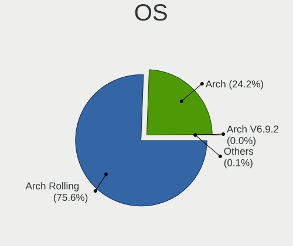

| Name                   | Notebooks | Percent |
|------------------------|-----------|---------|
| Arch Rolling           | 5453      | 75.6%   |
| Arch                   | 1746      | 24.21%  |
| Arch V20.5.7           | 2         | 0.03%   |
| Arch V19.04.4          | 2         | 0.03%   |
| Arch V6.9.2            | 1         | 0.01%   |
| Arch V20.3.4           | 1         | 0.01%   |
| Arch V19.07.9          | 1         | 0.01%   |
| Arch V19.06.1          | 1         | 0.01%   |
| Arch V19.01.4          | 1         | 0.01%   |
| Arch 23.0.0            | 1         | 0.01%   |
| Arch 20230723.0.166908 | 1         | 0.01%   |
| Arch 2.7               | 1         | 0.01%   |
| Arch 1.3               | 1         | 0.01%   |
| Arch 1.0               | 1         | 0.01%   |

OS Family
---------

OS without a version

| Name | Notebooks | Percent |
|------|-----------|---------|
| Arch | 7071      | 100%    |

Kernel
------

Version of the Linux kernel

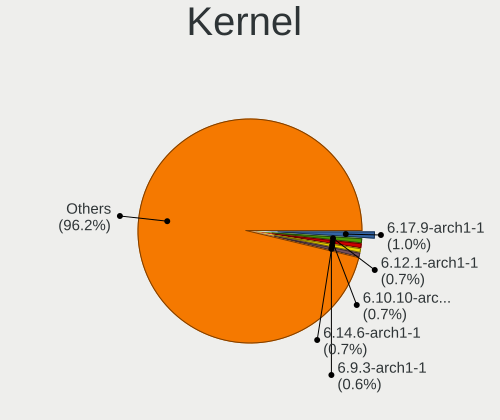

| Version         | Notebooks | Percent |
|-----------------|-----------|---------|
| 6.17.9-arch1-1  | 87        | 1.03%   |
| 6.12.1-arch1-1  | 61        | 0.72%   |
| 6.10.10-arch1-1 | 60        | 0.71%   |
| 6.14.6-arch1-1  | 55        | 0.65%   |
| 6.9.3-arch1-1   | 54        | 0.64%   |
| 5.17.1-arch1-1  | 52        | 0.62%   |
| 6.0.2-arch1-1   | 51        | 0.6%    |
| 6.6.1-arch1-1   | 50        | 0.59%   |
| 6.13.8-arch1-1  | 49        | 0.58%   |
| 6.5.9-arch2-1   | 48        | 0.57%   |
| 6.13.2-arch1-1  | 47        | 0.56%   |
| 6.10.6-arch1-1  | 43        | 0.51%   |
| 6.4.12-arch1-1  | 42        | 0.5%    |
| 6.15.9-arch1-1  | 39        | 0.46%   |
| 6.15.4-arch2-1  | 39        | 0.46%   |
| 6.12.10-arch1-1 | 39        | 0.46%   |
| 6.11.5-arch1-1  | 37        | 0.44%   |
| 6.7.4-arch1-1   | 36        | 0.43%   |
| 6.8.7-arch1-1   | 35        | 0.41%   |
| 6.12.4-arch1-1  | 35        | 0.41%   |
| 6.14.2-arch1-1  | 34        | 0.4%    |
| 6.6.8-arch1-1   | 33        | 0.39%   |
| 6.17.1-arch1-1  | 33        | 0.39%   |
| 6.15.2-arch1-1  | 33        | 0.39%   |
| 6.11.3-arch1-1  | 33        | 0.39%   |
| 6.6.7-arch1-1   | 32        | 0.38%   |
| 6.11.6-arch1-1  | 32        | 0.38%   |
| 6.8.1-arch1-1   | 31        | 0.37%   |
| 6.5.7-arch1-1   | 31        | 0.37%   |
| 6.14.9-arch1-1  | 31        | 0.37%   |
| 5.9.14-arch1-1  | 31        | 0.37%   |
| 5.9.1-arch1-1   | 31        | 0.37%   |
| 6.15.3-arch1-1  | 30        | 0.36%   |
| 6.12.8-arch1-1  | 30        | 0.36%   |
| 6.18.2-arch2-1  | 28        | 0.33%   |
| 6.17.8-arch1-1  | 28        | 0.33%   |
| 6.16.8-arch3-1  | 28        | 0.33%   |
| 6.0.9-arch1-1   | 28        | 0.33%   |
| 5.8.5-arch1-1   | 28        | 0.33%   |
| 5.17.5-arch1-1  | 28        | 0.33%   |

Kernel Family
-------------

Linux kernel without a distro release

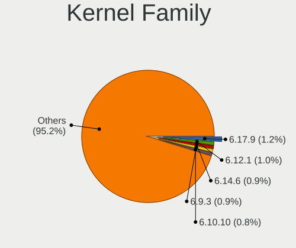

| Version | Notebooks | Percent |
|---------|-----------|---------|
| 6.17.9  | 104       | 1.23%   |
| 6.12.1  | 81        | 0.96%   |
| 6.14.6  | 74        | 0.88%   |
| 6.9.3   | 72        | 0.85%   |
| 6.10.10 | 70        | 0.83%   |
| 6.6.1   | 67        | 0.79%   |
| 5.17.1  | 65        | 0.77%   |
| 6.13.8  | 63        | 0.75%   |
| 6.13.2  | 63        | 0.75%   |
| 6.5.9   | 61        | 0.72%   |
| 6.0.2   | 60        | 0.71%   |
| 6.8.7   | 57        | 0.68%   |
| 6.10.6  | 55        | 0.65%   |
| 6.8.9   | 53        | 0.63%   |
| 6.14.2  | 53        | 0.63%   |
| 6.16.8  | 51        | 0.6%    |
| 6.15.4  | 50        | 0.59%   |
| 6.7.4   | 49        | 0.58%   |
| 6.4.12  | 49        | 0.58%   |
| 6.11.5  | 48        | 0.57%   |
| 6.10.2  | 47        | 0.56%   |
| 6.14.4  | 46        | 0.55%   |
| 6.12.10 | 46        | 0.55%   |
| 6.15.9  | 45        | 0.53%   |
| 6.11.3  | 45        | 0.53%   |
| 6.15.2  | 44        | 0.52%   |
| 6.8.1   | 42        | 0.5%    |
| 6.5.5   | 42        | 0.5%    |
| 6.6.8   | 41        | 0.49%   |
| 6.15.8  | 40        | 0.47%   |
| 6.15.3  | 40        | 0.47%   |
| 6.11.6  | 40        | 0.47%   |
| 5.9.1   | 40        | 0.47%   |
| 6.5.7   | 39        | 0.46%   |
| 6.7.9   | 38        | 0.45%   |
| 6.17.1  | 38        | 0.45%   |
| 6.10.3  | 38        | 0.45%   |
| 5.9.14  | 38        | 0.45%   |
| 5.8.5   | 38        | 0.45%   |
| 5.17.5  | 38        | 0.45%   |

Kernel Major Ver.
-----------------

Linux kernel major version

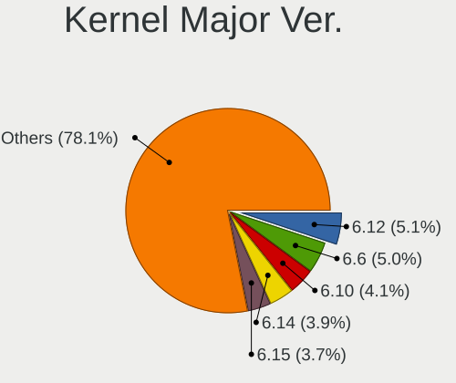

| Version | Notebooks | Percent |
|---------|-----------|---------|
| 6.12    | 414       | 5.09%   |
| 6.6     | 407       | 5%      |
| 6.10    | 337       | 4.14%   |
| 6.14    | 320       | 3.94%   |
| 6.15    | 301       | 3.7%    |
| 6.1     | 296       | 3.64%   |
| 6.17    | 284       | 3.49%   |
| 6.13    | 284       | 3.49%   |
| 5.15    | 269       | 3.31%   |
| 6.9     | 258       | 3.17%   |
| 6.7     | 257       | 3.16%   |
| 6.11    | 256       | 3.15%   |
| 6.0     | 245       | 3.01%   |
| 6.5     | 240       | 2.95%   |
| 6.4     | 240       | 2.95%   |
| 5.8     | 232       | 2.85%   |
| 6.8     | 229       | 2.82%   |
| 6.2     | 225       | 2.77%   |
| 5.18    | 220       | 2.71%   |
| 6.3     | 217       | 2.67%   |
| 5.9     | 209       | 2.57%   |
| 6.16    | 201       | 2.47%   |
| 5.17    | 198       | 2.43%   |
| 5.4     | 193       | 2.37%   |
| 5.16    | 187       | 2.3%    |
| 5.10    | 181       | 2.23%   |
| 5.19    | 177       | 2.18%   |
| 5.11    | 167       | 2.05%   |
| 5.12    | 154       | 1.89%   |
| 5.13    | 143       | 1.76%   |
| 5.7     | 138       | 1.7%    |
| 5.6     | 135       | 1.66%   |
| 5.14    | 128       | 1.57%   |
| 5.5     | 93        | 1.14%   |
| 5.3     | 64        | 0.79%   |
| 6.18    | 60        | 0.74%   |
| 5.2     | 33        | 0.41%   |
| 4.19    | 26        | 0.32%   |
| 5.0     | 19        | 0.23%   |
| 5.1     | 16        | 0.2%    |

Arch
----

OS architecture (x86_64, i586, etc.)

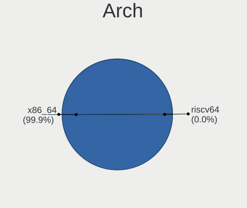

| Name    | Notebooks | Percent |
|---------|-----------|---------|
| x86_64  | 7063      | 99.89%  |
| i686    | 4         | 0.06%   |
| aarch64 | 3         | 0.04%   |
| riscv64 | 1         | 0.01%   |

DE
--

Desktop Environment

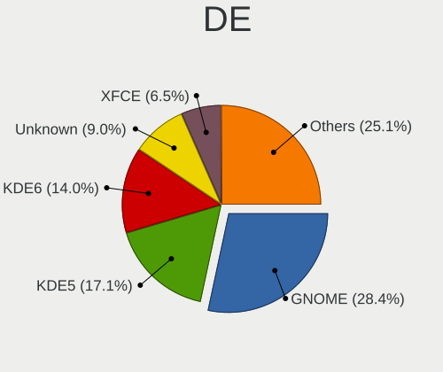

| Name                | Notebooks | Percent |
|---------------------|-----------|---------|
| GNOME               | 2110      | 28.36%  |
| KDE5                | 1269      | 17.06%  |
| KDE6                | 1039      | 13.97%  |
| Unknown             | 671       | 9.02%   |
| XFCE                | 487       | 6.55%   |
| Hyprland            | 422       | 5.67%   |
| KDE                 | 361       | 4.85%   |
| i3                  | 344       | 4.62%   |
| sway                | 94        | 1.26%   |
| X-Cinnamon          | 91        | 1.22%   |
| MATE                | 62        | 0.83%   |
| Budgie              | 60        | 0.81%   |
| Cinnamon            | 57        | 0.77%   |
| LXQt                | 53        | 0.71%   |
| Deepin              | 37        | 0.5%    |
| awesome             | 34        | 0.46%   |
| bspwm               | 33        | 0.44%   |
| GNOME Classic       | 23        | 0.31%   |
| niri                | 22        | 0.3%    |
| LXDE                | 20        | 0.27%   |
| DWM                 | 17        | 0.23%   |
| xmonad              | 14        | 0.19%   |
| qtile               | 13        | 0.17%   |
| Unity               | 10        | 0.13%   |
| openbox             | 10        | 0.13%   |
| GNOME Flashback     | 10        | 0.13%   |
| COSMIC              | 8         | 0.11%   |
| sway:wlroots        | 7         | 0.09%   |
| i3-with-shmlog      | 6         | 0.08%   |
| Enlightenment       | 6         | 0.08%   |
| LeftWM              | 4         | 0.05%   |
| chadwm              | 4         | 0.05%   |
| xinitrc             | 3         | 0.04%   |
| ICEWM               | 3         | 0.04%   |
| DDE                 | 3         | 0.04%   |
| X-Generic           | 2         | 0.03%   |
| trinity             | 2         | 0.03%   |
| sway:wlroots:swayfx | 2         | 0.03%   |
| river               | 2         | 0.03%   |
| labwc:wlroots       | 2         | 0.03%   |

Display Server
--------------

X11 or Wayland

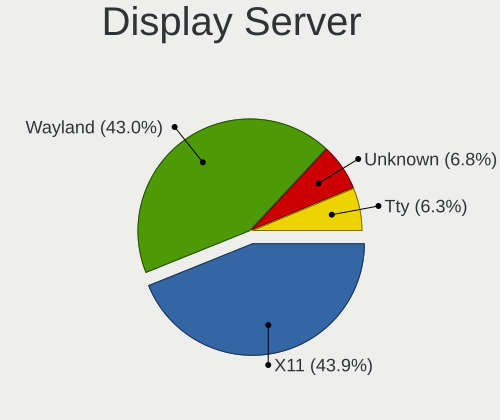

| Name    | Notebooks | Percent |
|---------|-----------|---------|
| X11     | 3237      | 43.9%   |
| Wayland | 3173      | 43.04%  |
| Unknown | 501       | 6.8%    |
| Tty     | 462       | 6.27%   |

Display Manager
---------------

SDDM, LightDM, etc.

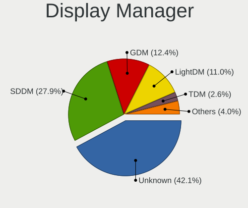

| Name        | Notebooks | Percent |
|-------------|-----------|---------|
| Unknown     | 3082      | 42.15%  |
| SDDM        | 2042      | 27.93%  |
| GDM         | 904       | 12.36%  |
| LightDM     | 806       | 11.02%  |
| TDM         | 188       | 2.57%   |
| LY-DM       | 76        | 1.04%   |
| GREETD      | 60        | 0.82%   |
| Ly          | 56        | 0.77%   |
| XDM         | 30        | 0.41%   |
| LXDM        | 30        | 0.41%   |
| SLiM        | 21        | 0.29%   |
| EMPTTY      | 7         | 0.1%    |
| LEMURS      | 5         | 0.07%   |
| NODM        | 3         | 0.04%   |
| PLASMALOGIN | 1         | 0.01%   |
| MDM         | 1         | 0.01%   |

OS Lang
-------

Language

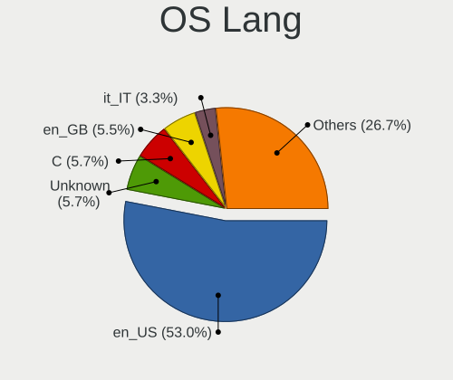

| Lang       | Notebooks | Percent |
|------------|-----------|---------|
| en_US      | 3824      | 53.04%  |
| Unknown    | 414       | 5.74%   |
| C          | 413       | 5.73%   |
| en_GB      | 393       | 5.45%   |
| it_IT      | 240       | 3.33%   |
| ru_RU      | 238       | 3.3%    |
| de_DE      | 216       | 3%      |
| pt_BR      | 190       | 2.64%   |
| fr_FR      | 161       | 2.23%   |
| zh_CN      | 113       | 1.57%   |
| pl_PL      | 107       | 1.48%   |
| es_ES      | 95        | 1.32%   |
| en_IN      | 71        | 0.98%   |
| es_MX      | 68        | 0.94%   |
| en_CA      | 66        | 0.92%   |
| en_AU      | 56        | 0.78%   |
| tr_TR      | 40        | 0.55%   |
| es_CL      | 28        | 0.39%   |
| es_AR      | 27        | 0.37%   |
| en_IE      | 24        | 0.33%   |
| de_AT      | 20        | 0.28%   |
| pt_PT      | 19        | 0.26%   |
| hu_HU      | 18        | 0.25%   |
| en_DK      | 18        | 0.25%   |
| es_CO      | 17        | 0.24%   |
| cs_CZ      | 13        | 0.18%   |
| nl_NL      | 11        | 0.15%   |
| ja_JP      | 11        | 0.15%   |
| sv_SE      | 10        | 0.14%   |
| es_PE      | 10        | 0.14%   |
| zh_TW      | 9         | 0.12%   |
| ru_UA      | 9         | 0.12%   |
| en_ZA      | 9         | 0.12%   |
| ko_KR      | 8         | 0.11%   |
| en_US.UTF8 | 8         | 0.11%   |
| en_SG      | 8         | 0.11%   |
| en_NZ      | 8         | 0.11%   |
| en_AG      | 8         | 0.11%   |
| fr_CA      | 7         | 0.1%    |
| uk_UA      | 6         | 0.08%   |

Boot Mode
---------

EFI or BIOS

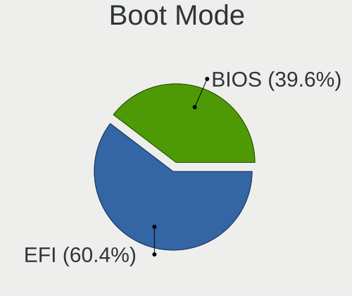

| Mode | Notebooks | Percent |
|------|-----------|---------|
| EFI  | 4350      | 60.36%  |
| BIOS | 2857      | 39.64%  |

Filesystem
----------

Type of filesystem

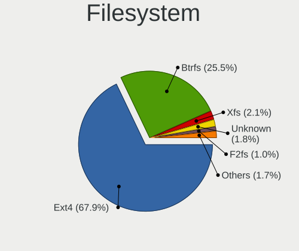

| Type                | Notebooks | Percent |
|---------------------|-----------|---------|
| Ext4                | 4874      | 67.91%  |
| Btrfs               | 1828      | 25.47%  |
| Xfs                 | 151       | 2.1%    |
| Unknown             | 126       | 1.76%   |
| F2fs                | 74        | 1.03%   |
| Overlay             | 42        | 0.59%   |
| Tmpfs               | 32        | 0.45%   |
| Zfs                 | 30        | 0.42%   |
| Bcachefs            | 6         | 0.08%   |
| XXXXX               | 4         | 0.06%   |
| Ext2                | 4         | 0.06%   |
| XXX4                | 2         | 0.03%   |
| Jfs                 | 1         | 0.01%   |
| Fuse.fuse-overlayfs | 1         | 0.01%   |
| Ext3                | 1         | 0.01%   |
| Aufs                | 1         | 0.01%   |

Part. scheme
------------

Scheme of partitioning

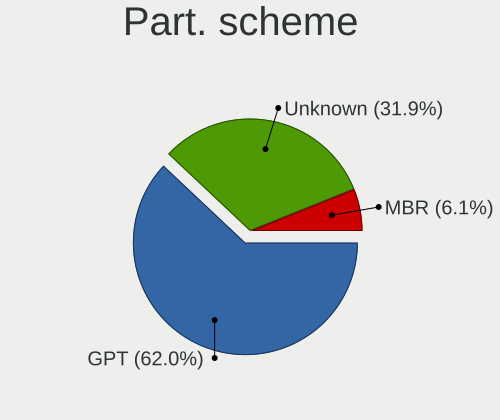

| Type    | Notebooks | Percent |
|---------|-----------|---------|
| GPT     | 4450      | 62.02%  |
| Unknown | 2289      | 31.9%   |
| MBR     | 436       | 6.08%   |

Dual Boot with Linux/BSD
------------------------

Hosting more than one Linux/BSD

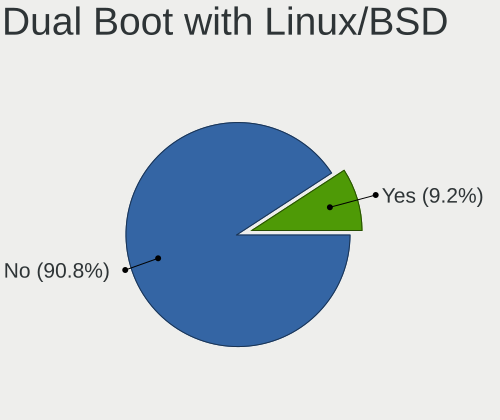

| Dual boot | Notebooks | Percent |
|-----------|-----------|---------|
| No        | 6501      | 90.81%  |
| Yes       | 658       | 9.19%   |

Dual Boot (Win)
---------------

Hosting Linux and Windows

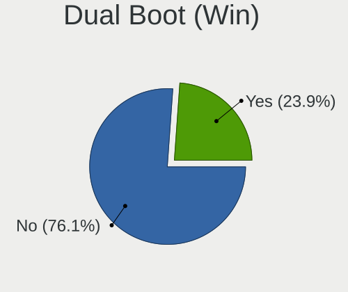

| Dual boot | Notebooks | Percent |
|-----------|-----------|---------|
| No        | 5463      | 76.13%  |
| Yes       | 1713      | 23.87%  |

Board
-----

Vendor
------

Motherboard manufacturer

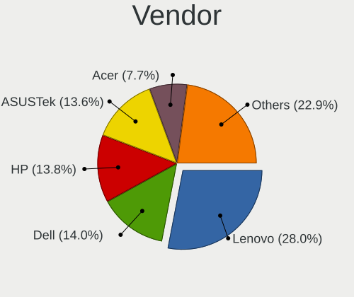

| Name                   | Notebooks | Percent |
|------------------------|-----------|---------|
| Lenovo                 | 1982      | 28.03%  |
| Dell                   | 989       | 13.99%  |
| Hewlett-Packard        | 975       | 13.79%  |
| ASUSTek Computer       | 960       | 13.58%  |
| Acer                   | 543       | 7.68%   |
| MSI                    | 223       | 3.15%   |
| Apple                  | 169       | 2.39%   |
| HUAWEI                 | 138       | 1.95%   |
| Samsung Electronics    | 88        | 1.24%   |
| Toshiba                | 70        | 0.99%   |
| Framework              | 70        | 0.99%   |
| Google                 | 69        | 0.98%   |
| Notebook               | 49        | 0.69%   |
| Timi                   | 48        | 0.68%   |
| TUXEDO                 | 47        | 0.66%   |
| Sony                   | 37        | 0.52%   |
| HONOR                  | 33        | 0.47%   |
| Unknown                | 33        | 0.47%   |
| Gigabyte Technology    | 32        | 0.45%   |
| Fujitsu                | 30        | 0.42%   |
| Alienware              | 29        | 0.41%   |
| MECHREVO               | 28        | 0.4%    |
| Razer                  | 26        | 0.37%   |
| Chuwi                  | 18        | 0.25%   |
| System76               | 17        | 0.24%   |
| LG Electronics         | 17        | 0.24%   |
| Schenker               | 16        | 0.23%   |
| Avell High Performance | 12        | 0.17%   |
| XIAOMI                 | 11        | 0.16%   |
| Valve                  | 11        | 0.16%   |
| Positivo               | 11        | 0.16%   |
| Packard Bell           | 11        | 0.16%   |
| Monster                | 9         | 0.13%   |
| Maibenben              | 9         | 0.13%   |
| GPD                    | 9         | 0.13%   |
| Medion                 | 8         | 0.11%   |
| Intel                  | 7         | 0.1%    |
| Casper                 | 7         | 0.1%    |
| PC Specialist          | 6         | 0.08%   |
| Panasonic              | 6         | 0.08%   |

Model
-----

Motherboard model

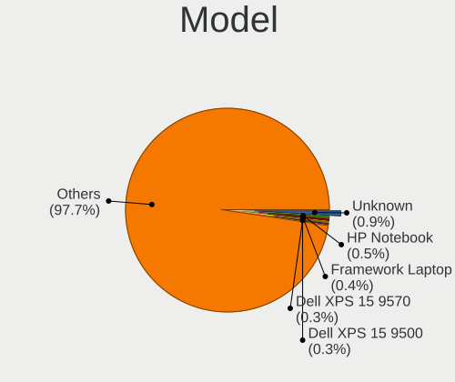

| Name                                        | Notebooks | Percent |
|---------------------------------------------|-----------|---------|
| Unknown                                     | 65        | 0.92%   |
| HP Notebook                                 | 32        | 0.45%   |
| Framework Laptop                            | 25        | 0.35%   |
| Dell XPS 15 9570                            | 22        | 0.31%   |
| Dell XPS 15 9500                            | 22        | 0.31%   |
| Apple MacBookAir7,2                         | 17        | 0.24%   |
| Framework Laptop 13 (AMD Ryzen 7040Series)  | 16        | 0.23%   |
| Dell XPS 13 9360                            | 16        | 0.23%   |
| Dell XPS 13 9310                            | 16        | 0.23%   |
| HP Laptop 15s-eq2xxx                        | 15        | 0.21%   |
| Framework Laptop 16 (AMD Ryzen 7040 Series) | 15        | 0.21%   |
| ASUS ROG Strix G513QY_G513QY                | 15        | 0.21%   |
| Apple MacBookPro9,2                         | 15        | 0.21%   |
| Apple MacBookPro12,1                        | 15        | 0.21%   |
| Acer Nitro AN515-58                         | 15        | 0.21%   |
| Acer Nitro AN515-54                         | 15        | 0.21%   |
| Acer Nitro AN515-45                         | 15        | 0.21%   |
| Dell XPS 15 7590                            | 14        | 0.2%    |
| Dell XPS 13 9380                            | 14        | 0.2%    |
| Lenovo Legion 5 15ACH6H 82JU                | 13        | 0.18%   |
| HUAWEI NBLK-WAX9X                           | 13        | 0.18%   |
| HP Laptop 15-da0xxx                         | 13        | 0.18%   |
| Dell Latitude E6430                         | 13        | 0.18%   |
| Lenovo ThinkBook 15 G2 ITL 20VE             | 12        | 0.17%   |
| Lenovo IdeaPad Gaming 3 15ACH6 82K2         | 12        | 0.17%   |
| HP Pavilion Notebook                        | 12        | 0.17%   |
| HP Pavilion g6                              | 12        | 0.17%   |
| HP Pavilion dv6                             | 12        | 0.17%   |
| HP EliteBook 840 G6                         | 12        | 0.17%   |
| Dell XPS 15 9560                            | 12        | 0.17%   |
| Dell XPS 13 9350                            | 12        | 0.17%   |
| Dell XPS 13 7390                            | 12        | 0.17%   |
| Dell Inspiron 15 7000 Gaming                | 12        | 0.17%   |
| Lenovo IdeaPad Gaming 3 15IHU6 82K1         | 11        | 0.16%   |
| Lenovo IdeaPad Gaming 3 15ARH05 82EY        | 11        | 0.16%   |
| HP Victus by Laptop 16-e0xxx                | 11        | 0.16%   |
| Dell XPS 13 9370                            | 11        | 0.16%   |
| Dell Inspiron 5570                          | 11        | 0.16%   |
| ASUS TUF Gaming FX505DT_FX505DT             | 11        | 0.16%   |
| Lenovo Legion 5 15ARH05 82B5                | 10        | 0.14%   |

Model Family
------------

Motherboard model prefix

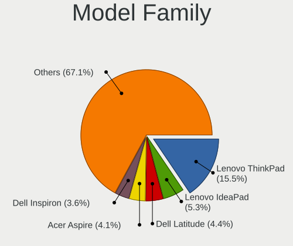

| Name               | Notebooks | Percent |
|--------------------|-----------|---------|
| Lenovo ThinkPad    | 1099      | 15.54%  |
| Lenovo IdeaPad     | 378       | 5.35%   |
| Dell Latitude      | 308       | 4.36%   |
| Acer Aspire        | 288       | 4.07%   |
| Dell Inspiron      | 254       | 3.59%   |
| Dell XPS           | 213       | 3.01%   |
| ASUS VivoBook      | 201       | 2.84%   |
| HP Pavilion        | 183       | 2.59%   |
| HP EliteBook       | 180       | 2.55%   |
| HP Laptop          | 176       | 2.49%   |
| ASUS ASUS          | 168       | 2.38%   |
| Lenovo Legion      | 163       | 2.31%   |
| ASUS ROG           | 156       | 2.21%   |
| HP ProBook         | 115       | 1.63%   |
| Acer Nitro         | 115       | 1.63%   |
| Dell Precision     | 86        | 1.22%   |
| ASUS Zenbook       | 80        | 1.13%   |
| Lenovo ThinkBook   | 73        | 1.03%   |
| Framework Laptop   | 70        | 0.99%   |
| Acer Swift         | 68        | 0.96%   |
| Unknown            | 65        | 0.92%   |
| Lenovo Yoga        | 63        | 0.89%   |
| HP OMEN            | 53        | 0.75%   |
| Toshiba Satellite  | 52        | 0.74%   |
| Dell Vostro        | 51        | 0.72%   |
| ASUS TUF           | 47        | 0.66%   |
| HP Victus          | 43        | 0.61%   |
| HP Notebook        | 32        | 0.45%   |
| HP ZBook           | 30        | 0.42%   |
| HP ENVY            | 29        | 0.41%   |
| HP 250             | 28        | 0.4%    |
| Apple MacBookPro11 | 28        | 0.4%    |
| MSI Modern         | 27        | 0.38%   |
| Acer Predator      | 27        | 0.38%   |
| Razer Blade        | 26        | 0.37%   |
| Fujitsu LIFEBOOK   | 26        | 0.37%   |
| Dell G15           | 26        | 0.37%   |
| Dell G3            | 23        | 0.33%   |
| Lenovo LOQ         | 21        | 0.3%    |
| Apple MacBookPro9  | 20        | 0.28%   |

MFG Year
--------

Motherboard manufacture year

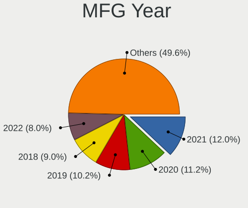

| Year    | Notebooks | Percent |
|---------|-----------|---------|
| 2021    | 851       | 12.04%  |
| 2020    | 794       | 11.23%  |
| 2019    | 719       | 10.17%  |
| 2018    | 636       | 8.99%   |
| 2022    | 565       | 7.99%   |
| 2023    | 493       | 6.97%   |
| 2017    | 432       | 6.11%   |
| 2012    | 335       | 4.74%   |
| 2016    | 319       | 4.51%   |
| 2013    | 316       | 4.47%   |
| 2024    | 304       | 4.3%    |
| 2015    | 303       | 4.29%   |
| 2014    | 289       | 4.09%   |
| 2011    | 247       | 3.49%   |
| 2010    | 137       | 1.94%   |
| 2008    | 121       | 1.71%   |
| 2025    | 76        | 1.07%   |
| 2009    | 75        | 1.06%   |
| 2007    | 27        | 0.38%   |
| 2006    | 25        | 0.35%   |
| Unknown | 7         | 0.1%    |

Form Factor
-----------

Physical design of the computer

| Name     | Notebooks | Percent |
|----------|-----------|---------|
| Notebook | 7071      | 100%    |

Secure Boot
-----------

Enabled or disabled

| State    | Notebooks | Percent |
|----------|-----------|---------|
| Disabled | 6942      | 97.82%  |
| Enabled  | 155       | 2.18%   |

Coreboot
--------

Have coreboot on board

| Used | Notebooks | Percent |
|------|-----------|---------|
| No   | 6965      | 98.5%   |
| Yes  | 106       | 1.5%    |

RAM Size
--------

Total RAM memory

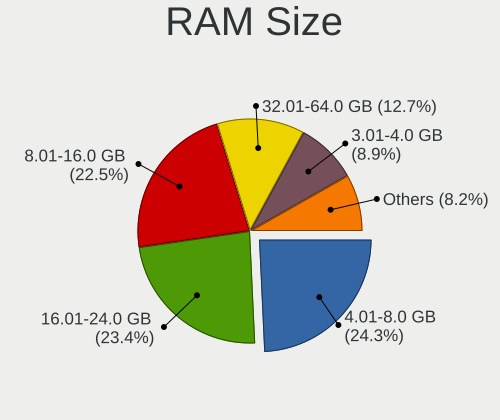

| Size in GB  | Notebooks | Percent |
|-------------|-----------|---------|
| 4.01-8.0    | 1738      | 24.26%  |
| 16.01-24.0  | 1678      | 23.43%  |
| 8.01-16.0   | 1615      | 22.55%  |
| 32.01-64.0  | 908       | 12.68%  |
| 3.01-4.0    | 636       | 8.88%   |
| 24.01-32.0  | 259       | 3.62%   |
| 64.01-256.0 | 176       | 2.46%   |
| 1.01-2.0    | 101       | 1.41%   |
| 2.01-3.0    | 43        | 0.6%    |
| 0.51-1.0    | 9         | 0.13%   |

RAM Used
--------

Used RAM memory

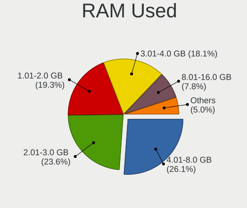

| Used GB    | Notebooks | Percent |
|------------|-----------|---------|
| 4.01-8.0   | 2051      | 26.15%  |
| 2.01-3.0   | 1854      | 23.64%  |
| 1.01-2.0   | 1516      | 19.33%  |
| 3.01-4.0   | 1416      | 18.05%  |
| 8.01-16.0  | 614       | 7.83%   |
| 0.51-1.0   | 252       | 3.21%   |
| 16.01-24.0 | 63        | 0.8%    |
| 0.01-0.5   | 49        | 0.62%   |
| 24.01-32.0 | 21        | 0.27%   |
| 32.01-64.0 | 8         | 0.1%    |

Total Drives
------------

Number of drives on board

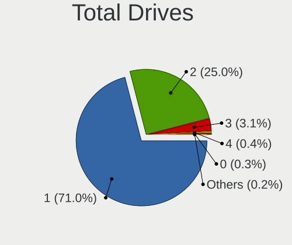

| Drives | Notebooks | Percent |
|--------|-----------|---------|
| 1      | 5106      | 70.98%  |
| 2      | 1799      | 25.01%  |
| 3      | 226       | 3.14%   |
| 4      | 30        | 0.42%   |
| 0      | 22        | 0.31%   |
| 5      | 9         | 0.13%   |
| 6      | 2         | 0.03%   |

Has CD-ROM
----------

Has CD-ROM on board

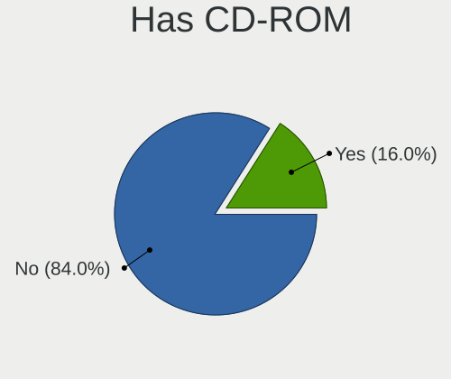

| Presented | Notebooks | Percent |
|-----------|-----------|---------|
| No        | 5959      | 84.02%  |
| Yes       | 1133      | 15.98%  |

Has Ethernet
------------

Has Ethernet on board

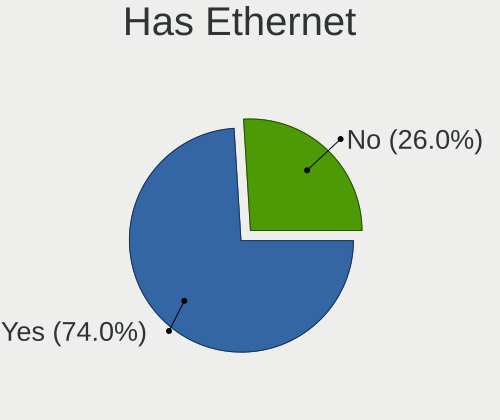

| Presented | Notebooks | Percent |
|-----------|-----------|---------|
| Yes       | 5271      | 74.02%  |
| No        | 1850      | 25.98%  |

Has WiFi
--------

Has WiFi module

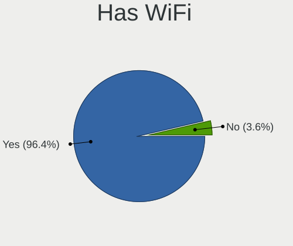

| Presented | Notebooks | Percent |
|-----------|-----------|---------|
| Yes       | 6819      | 96.35%  |
| No        | 258       | 3.65%   |

Has Bluetooth
-------------

Has Bluetooth module

| Presented | Notebooks | Percent |
|-----------|-----------|---------|
| Yes       | 6296      | 88.34%  |
| No        | 831       | 11.66%  |

Location
--------

Country
-------

Geographic location (country)

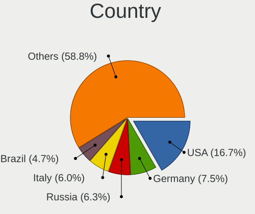

| Country      | Notebooks | Percent |
|--------------|-----------|---------|
| USA          | 1191      | 16.68%  |
| Germany      | 534       | 7.48%   |
| Russia       | 448       | 6.27%   |
| Italy        | 428       | 5.99%   |
| Brazil       | 339       | 4.75%   |
| India        | 321       | 4.5%    |
| France       | 307       | 4.3%    |
| UK           | 259       | 3.63%   |
| Poland       | 225       | 3.15%   |
| Canada       | 183       | 2.56%   |
| Spain        | 148       | 2.07%   |
| China        | 141       | 1.97%   |
| Turkey       | 140       | 1.96%   |
| Australia    | 123       | 1.72%   |
| Netherlands  | 119       | 1.67%   |
| Mexico       | 107       | 1.5%    |
| Indonesia    | 97        | 1.36%   |
| Sweden       | 86        | 1.2%    |
| Austria      | 82        | 1.15%   |
| Czechia      | 80        | 1.12%   |
| Romania      | 67        | 0.94%   |
| Vietnam      | 65        | 0.91%   |
| Ukraine      | 59        | 0.83%   |
| Belgium      | 58        | 0.81%   |
| Chile        | 56        | 0.78%   |
| Argentina    | 56        | 0.78%   |
| Portugal     | 55        | 0.77%   |
| Switzerland  | 54        | 0.76%   |
| Japan        | 52        | 0.73%   |
| Hong Kong    | 47        | 0.66%   |
| Finland      | 46        | 0.64%   |
| Hungary      | 45        | 0.63%   |
| Belarus      | 45        | 0.63%   |
| Colombia     | 43        | 0.6%    |
| Iran         | 39        | 0.55%   |
| Denmark      | 38        | 0.53%   |
| Norway       | 37        | 0.52%   |
| Greece       | 36        | 0.5%    |
| South Africa | 32        | 0.45%   |
| Taiwan       | 31        | 0.43%   |

City
----

Geographic location (city)

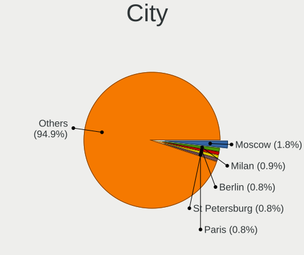

| City              | Notebooks | Percent |
|-------------------|-----------|---------|
| Moscow            | 137       | 1.8%    |
| Milan             | 70        | 0.92%   |
| Berlin            | 60        | 0.79%   |
| St Petersburg     | 59        | 0.77%   |
| Paris             | 59        | 0.77%   |
| Warsaw            | 55        | 0.72%   |
| Sao Paulo         | 53        | 0.7%    |
| Istanbul          | 48        | 0.63%   |
| Vienna            | 45        | 0.59%   |
| Melbourne         | 42        | 0.55%   |
| Munich            | 37        | 0.49%   |
| Los Angeles       | 36        | 0.47%   |
| Bengaluru         | 36        | 0.47%   |
| Sydney            | 34        | 0.45%   |
| Frankfurt am Main | 33        | 0.43%   |
| Prague            | 32        | 0.42%   |
| Beijing           | 30        | 0.39%   |
| Rome              | 28        | 0.37%   |
| Amsterdam         | 28        | 0.37%   |
| Helsinki          | 27        | 0.35%   |
| Central           | 27        | 0.35%   |
| Santiago          | 26        | 0.34%   |
| Minsk             | 26        | 0.34%   |
| Chennai           | 26        | 0.34%   |
| Montreal          | 25        | 0.33%   |
| Delhi             | 25        | 0.33%   |
| Madrid            | 24        | 0.32%   |
| London            | 24        | 0.32%   |
| Jakarta           | 24        | 0.32%   |
| Hamburg           | 24        | 0.32%   |
| Bucharest         | 24        | 0.32%   |
| Valencia          | 23        | 0.3%    |
| Seattle           | 23        | 0.3%    |
| Ho Chi Minh City  | 23        | 0.3%    |
| Budapest          | 23        | 0.3%    |
| Tokyo             | 22        | 0.29%   |
| Tehran            | 22        | 0.29%   |
| Mexico City       | 22        | 0.29%   |
| Kyiv              | 22        | 0.29%   |
| Hanoi             | 22        | 0.29%   |

Drives
------

Drive Vendor
------------

Hard drive vendors

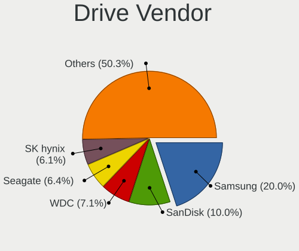

| Vendor                         | Notebooks | Drives | Percent |
|--------------------------------|-----------|--------|---------|
| Samsung Electronics            | 1818      | 2438   | 19.96%  |
| SanDisk                        | 913       | 1114   | 10.03%  |
| WDC                            | 651       | 814    | 7.15%   |
| Seagate                        | 586       | 711    | 6.43%   |
| SK hynix                       | 559       | 696    | 6.14%   |
| Toshiba                        | 489       | 565    | 5.37%   |
| Micron Technology              | 459       | 561    | 5.04%   |
| Kingston                       | 398       | 500    | 4.37%   |
| Intel                          | 363       | 475    | 3.99%   |
| Unknown                        | 362       | 445    | 3.97%   |
| Crucial                        | 211       | 298    | 2.32%   |
| KIOXIA                         | 180       | 224    | 1.98%   |
| HGST                           | 180       | 195    | 1.98%   |
| Kingston Technology Company    | 129       | 152    | 1.42%   |
| Micron/Crucial Technology      | 110       | 135    | 1.21%   |
| Phison Electronics             | 105       | 122    | 1.15%   |
| A-DATA Technology              | 105       | 135    | 1.15%   |
| Apple                          | 101       | 128    | 1.11%   |
| Hitachi                        | 98        | 103    | 1.08%   |
| Silicon Motion                 | 71        | 79     | 0.78%   |
| MAXIO Technology (Hangzhou)    | 69        | 76     | 0.76%   |
| China                          | 60        | 76     | 0.66%   |
| Yangtze Memory Technologies    | 53        | 76     | 0.58%   |
| LITEON                         | 48        | 55     | 0.53%   |
| Phison                         | 41        | 46     | 0.45%   |
| ADATA Technology               | 40        | 48     | 0.44%   |
| Transcend                      | 38        | 40     | 0.42%   |
| Shenzhen Longsys Electronics   | 36        | 43     | 0.4%    |
| SPCC                           | 33        | 36     | 0.36%   |
| Realtek Semiconductor          | 28        | 31     | 0.31%   |
| PNY                            | 28        | 34     | 0.31%   |
| Union Memory (Shenzhen)        | 23        | 27     | 0.25%   |
| Union Memory                   | 23        | 27     | 0.25%   |
| Solid State Storage Technology | 22        | 26     | 0.24%   |
| Lenovo                         | 22        | 35     | 0.24%   |
| GOODRAM                        | 22        | 29     | 0.24%   |
| KingSpec                       | 21        | 24     | 0.23%   |
| Intenso                        | 21        | 26     | 0.23%   |
| Patriot                        | 20        | 27     | 0.22%   |
| JMicron Technology             | 20        | 24     | 0.22%   |

Drive Model
-----------

Hard drive models

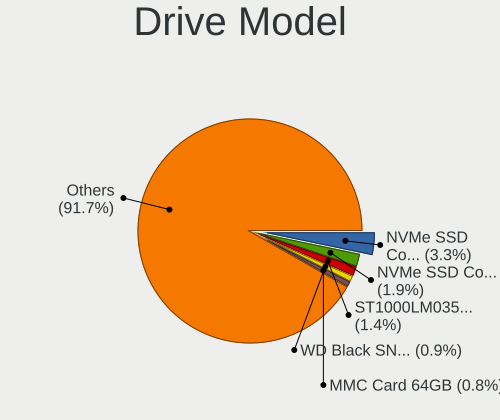

| Model                                                                   | Notebooks | Percent |
|-------------------------------------------------------------------------|-----------|---------|
| Samsung NVMe SSD Controller SM981/PM981/PM983 1TB                       | 312       | 3.27%   |
| Samsung NVMe SSD Controller PM9A1/PM9A3/980PRO 1TB                      | 177       | 1.86%   |
| Seagate ST1000LM035-1RK172 1TB                                          | 136       | 1.43%   |
| Sandisk WD Black SN750 / PC SN730 NVMe SSD 500GB                        | 86        | 0.9%    |
| Unknown MMC Card  64GB                                                  | 77        | 0.81%   |
| Kingston SA400S37240G 240GB SSD                                         | 70        | 0.73%   |
| Intel SSDPEKNU512GZ 512GB                                               | 70        | 0.73%   |
| Sandisk WD Blue SN550 NVMe SSD 1024GB                                   | 69        | 0.72%   |
| HGST HTS721010A9E630 1TB                                                | 66        | 0.69%   |
| Unknown MMC Card  32GB                                                  | 64        | 0.67%   |
| Toshiba MQ04ABF100 1TB                                                  | 63        | 0.66%   |
| Samsung NVMe SSD Drive 512GB                                            | 63        | 0.66%   |
| Intel SSD 660P Series 512GB                                             | 58        | 0.61%   |
| Toshiba MQ01ABD100 1TB                                                  | 56        | 0.59%   |
| Seagate ST1000LM024 HN-M101MBB 1TB                                      | 52        | 0.55%   |
| SanDisk NVMe SSD Drive 512GB                                            | 48        | 0.5%    |
| Samsung SSD 860 EVO 500GB                                               | 47        | 0.49%   |
| Samsung SSD 850 EVO 500GB                                               | 47        | 0.49%   |
| Unknown MMC Card  128GB                                                 | 46        | 0.48%   |
| Samsung NVMe SSD Controller SM961/PM961/SM963 1024GB                    | 44        | 0.46%   |
| Micron/Crucial P2 NVMe PCIe SSD 2TB                                     | 44        | 0.46%   |
| Kingston SA400S37480G 480GB SSD                                         | 43        | 0.45%   |
| Toshiba XG6 NVMe SSD Controller 1024GB                                  | 41        | 0.43%   |
| Sandisk WD Black SN770 / PC SN740 256GB / PC SN560 (DRAM-less) NVMe SSD | 40        | 0.42%   |
| SK hynix NVMe SSD Drive 512GB                                           | 39        | 0.41%   |
| Crucial CT500MX500SSD1 500GB                                            | 37        | 0.39%   |
| Toshiba MQ01ABF050 500GB                                                | 35        | 0.37%   |
| Samsung NVMe SSD Drive 256GB                                            | 35        | 0.37%   |
| MAXIO (Hangzhou) NVMe SSD Controller MAP1202 2TB                        | 35        | 0.37%   |
| Silicon Motion SM2263EN/SM2263XT SSD Controller 512GB                   | 32        | 0.34%   |
| Seagate ST500LT012-1DG142 500GB                                         | 32        | 0.34%   |
| Samsung SSD 980 1TB                                                     | 32        | 0.34%   |
| Micron 2400_MTFDKBA512QFM 512GB                                         | 32        | 0.34%   |
| Kingston SA400S37120G 120GB SSD                                         | 32        | 0.34%   |
| WDC WD10SPZX-21Z10T0 1TB                                                | 31        | 0.33%   |
| Seagate ST1000LM048-2E7172 1TB                                          | 31        | 0.33%   |
| Kingston Company OM3PDP3 NVMe SSD 256GB                                 | 31        | 0.33%   |
| Crucial CT1000MX500SSD1 1TB                                             | 31        | 0.33%   |
| SK hynix BC511 512GB                                                    | 30        | 0.31%   |
| Sandisk WD Black SN850 1TB                                              | 30        | 0.31%   |

HDD Vendor
----------

Hard disk drive vendors

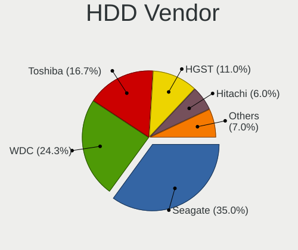

| Vendor              | Notebooks | Drives | Percent |
|---------------------|-----------|--------|---------|
| Seagate             | 571       | 693    | 35.01%  |
| WDC                 | 396       | 466    | 24.28%  |
| Toshiba             | 272       | 307    | 16.68%  |
| HGST                | 180       | 195    | 11.04%  |
| Hitachi             | 98        | 103    | 6.01%   |
| Samsung Electronics | 23        | 23     | 1.41%   |
| Unknown             | 17        | 20     | 1.04%   |
| JMicron Technology  | 11        | 16     | 0.67%   |
| Fujitsu             | 9         | 10     | 0.55%   |
| External            | 7         | 11     | 0.43%   |
| ASMT                | 6         | 7      | 0.37%   |
| TO Exter            | 5         | 10     | 0.31%   |
| Apple               | 4         | 4      | 0.25%   |
| USB3.0              | 3         | 3      | 0.18%   |
| SSK                 | 3         | 4      | 0.18%   |
| HGST HTS            | 3         | 3      | 0.18%   |
| Generic-            | 3         | 4      | 0.18%   |
| USB                 | 2         | 2      | 0.12%   |
| SAGE                | 2         | 3      | 0.12%   |
| NVME USB            | 2         | 2      | 0.12%   |
| NeoTech             | 2         | 2      | 0.12%   |
| Maxone              | 2         | 2      | 0.12%   |
| ACASIS              | 2         | 2      | 0.12%   |
| XrayDisk            | 1         | 1      | 0.06%   |
| T-FORCE             | 1         | 1      | 0.06%   |
| StoreJet            | 1         | 1      | 0.06%   |
| SABRENT             | 1         | 1      | 0.06%   |
| KESU                | 1         | 1      | 0.06%   |
| JetFlash            | 1         | 2      | 0.06%   |
| Inateck             | 1         | 1      | 0.06%   |
| ASMT109x            | 1         | 1      | 0.06%   |

SSD Vendor
----------

Solid state drive vendors

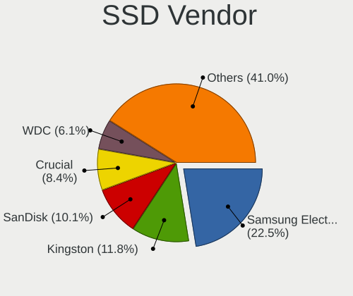

| Vendor              | Notebooks | Drives | Percent |
|---------------------|-----------|--------|---------|
| Samsung Electronics | 519       | 654    | 22.47%  |
| Kingston            | 273       | 332    | 11.82%  |
| SanDisk             | 233       | 268    | 10.09%  |
| Crucial             | 195       | 272    | 8.44%   |
| WDC                 | 142       | 190    | 6.15%   |
| A-DATA Technology   | 72        | 93     | 3.12%   |
| Apple               | 67        | 74     | 2.9%    |
| Intel               | 62        | 72     | 2.68%   |
| China               | 59        | 75     | 2.55%   |
| SK hynix            | 57        | 68     | 2.47%   |
| Micron Technology   | 55        | 65     | 2.38%   |
| Toshiba             | 52        | 62     | 2.25%   |
| LITEON              | 45        | 52     | 1.95%   |
| Transcend           | 35        | 37     | 1.52%   |
| SPCC                | 29        | 31     | 1.26%   |
| PNY                 | 26        | 32     | 1.13%   |
| KingSpec            | 21        | 24     | 0.91%   |
| Intenso             | 21        | 26     | 0.91%   |
| GOODRAM             | 21        | 28     | 0.91%   |
| Patriot             | 20        | 27     | 0.87%   |
| LITEONIT            | 16        | 18     | 0.69%   |
| Lexar               | 13        | 19     | 0.56%   |
| Apacer              | 12        | 13     | 0.52%   |
| Team                | 11        | 13     | 0.48%   |
| OCZ                 | 11        | 11     | 0.48%   |
| Netac               | 10        | 12     | 0.43%   |
| Unknown             | 10        | 10     | 0.43%   |
| SABRENT             | 8         | 8      | 0.35%   |
| Plextor             | 8         | 8      | 0.35%   |
| Gigabyte Technology | 8         | 8      | 0.35%   |
| ASMT                | 7         | 7      | 0.3%    |
| Verbatim            | 6         | 6      | 0.26%   |
| FORESEE             | 6         | 9      | 0.26%   |
| Mushkin             | 5         | 6      | 0.22%   |
| HS-SSD-E100         | 5         | 9      | 0.22%   |
| Hewlett-Packard     | 5         | 6      | 0.22%   |
| BHT                 | 5         | 7      | 0.22%   |
| XrayDisk            | 4         | 6      | 0.17%   |
| Timetec             | 4         | 8      | 0.17%   |
| Phison              | 4         | 4      | 0.17%   |

Drive Kind
----------

HDD or SSD

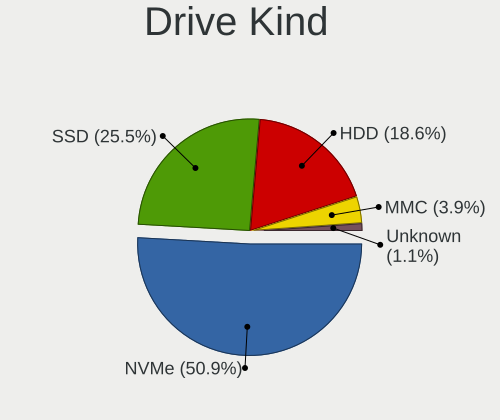

| Kind    | Notebooks | Drives | Percent |
|---------|-----------|--------|---------|
| NVMe    | 4296      | 6107   | 50.89%  |
| SSD     | 2152      | 2841   | 25.49%  |
| HDD     | 1571      | 1901   | 18.61%  |
| MMC     | 328       | 398    | 3.89%   |
| Unknown | 94        | 97     | 1.11%   |

Drive Connector
---------------

SATA, SAS, NVMe, etc.

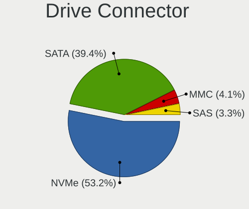

| Type | Notebooks | Drives | Percent |
|------|-----------|--------|---------|
| NVMe | 4291      | 6072   | 53.16%  |
| SATA | 3184      | 4529   | 39.44%  |
| MMC  | 328       | 398    | 4.06%   |
| SAS  | 269       | 345    | 3.33%   |

Drive Size
----------

Size of hard drive

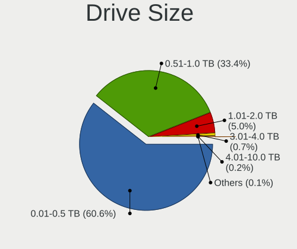

| Size in TB | Notebooks | Drives | Percent |
|------------|-----------|--------|---------|
| 0.01-0.5   | 2227      | 2959   | 60.6%   |
| 0.51-1.0   | 1227      | 1502   | 33.39%  |
| 1.01-2.0   | 185       | 235    | 5.03%   |
| 3.01-4.0   | 25        | 32     | 0.68%   |
| 4.01-10.0  | 7         | 8      | 0.19%   |
| 2.01-3.0   | 2         | 4      | 0.05%   |
| 10.01-20.0 | 2         | 2      | 0.05%   |

Space Total
-----------

Amount of disk space available on the file system

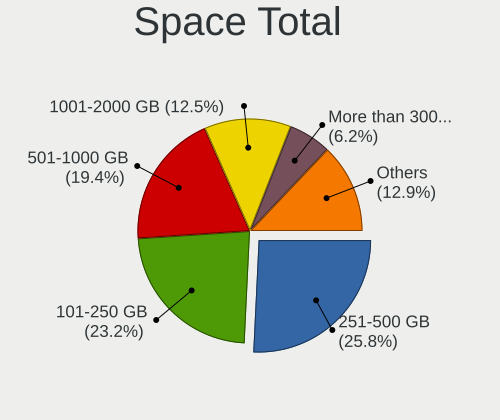

| Size in GB     | Notebooks | Percent |
|----------------|-----------|---------|
| 251-500        | 1901      | 25.76%  |
| 101-250        | 1711      | 23.19%  |
| 501-1000       | 1435      | 19.45%  |
| 1001-2000      | 925       | 12.54%  |
| More than 3000 | 454       | 6.15%   |
| 2001-3000      | 299       | 4.05%   |
| 51-100         | 286       | 3.88%   |
| Unknown        | 142       | 1.92%   |
| 21-50          | 125       | 1.69%   |
| 1-20           | 101       | 1.37%   |

Space Used
----------

Amount of used disk space

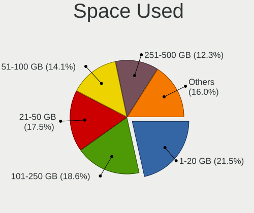

| Used GB        | Notebooks | Percent |
|----------------|-----------|---------|
| 1-20           | 1673      | 21.53%  |
| 101-250        | 1448      | 18.63%  |
| 21-50          | 1359      | 17.49%  |
| 51-100         | 1094      | 14.08%  |
| 251-500        | 953       | 12.26%  |
| 501-1000       | 643       | 8.27%   |
| 1001-2000      | 281       | 3.62%   |
| Unknown        | 142       | 1.83%   |
| More than 3000 | 99        | 1.27%   |
| 2001-3000      | 78        | 1%      |
| 0              | 1         | 0.01%   |

Malfunc. Drives
---------------

Drive models with a malfunction

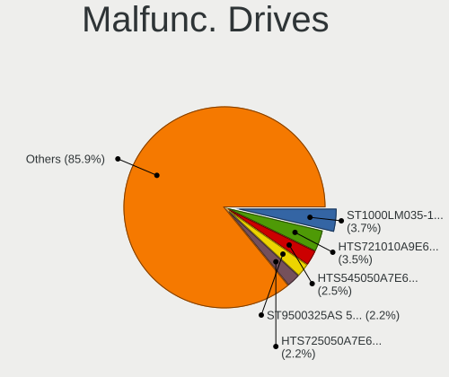

| Model                                                         | Notebooks | Drives | Percent |
|---------------------------------------------------------------|-----------|--------|---------|
| Seagate ST1000LM035-1RK172 1TB                                | 15        | 16     | 3.7%    |
| HGST HTS721010A9E630 1TB                                      | 14        | 14     | 3.46%   |
| HGST HTS545050A7E680 500GB                                    | 10        | 11     | 2.47%   |
| Seagate ST9500325AS 500GB                                     | 9         | 9      | 2.22%   |
| HGST HTS725050A7E630 500GB                                    | 9         | 9      | 2.22%   |
| HGST HTS541010A9E680 1TB                                      | 8         | 8      | 1.98%   |
| Seagate ST500LT012-1DG142 500GB                               | 7         | 7      | 1.73%   |
| Seagate ST500LM021-1KJ152 500GB                               | 6         | 6      | 1.48%   |
| Samsung Electronics NVMe SSD Controller SM981/PM981/PM983 1TB | 6         | 8      | 1.48%   |
| Seagate ST500LT012-9WS142 500GB                               | 5         | 5      | 1.23%   |
| WDC WDS240G2G0A-00JH30 240GB SSD                              | 4         | 4      | 0.99%   |
| WDC WD10JPVX-60JC3T0 1TB                                      | 4         | 5      | 0.99%   |
| Toshiba MQ01ABD100 1TB                                        | 4         | 4      | 0.99%   |
| SK hynix PC711 HFS512GDE9X073N 512GB                          | 4         | 4      | 0.99%   |
| SK hynix HFS128G39TND-N210A 128GB SSD                         | 4         | 4      | 0.99%   |
| Seagate ST9500420AS 500GB                                     | 4         | 4      | 0.99%   |
| Seagate ST1000LX015-1U7172 1TB                                | 4         | 5      | 0.99%   |
| Seagate ST1000LM049-2GH172 1TB                                | 4         | 4      | 0.99%   |
| Seagate ST1000LM024 HN-M101MBB 1TB                            | 4         | 4      | 0.99%   |
| Seagate ST1000LM014-SSHD-8GB                                  | 4         | 4      | 0.99%   |
| HGST HTS545050A7E380 500GB                                    | 4         | 4      | 0.99%   |
| WDC WD10JPVX-22JC3T0 1TB                                      | 3         | 3      | 0.74%   |
| Toshiba MQ01ABD075 752GB                                      | 3         | 3      | 0.74%   |
| Toshiba KSG60ZMV256G M.2 2280 256GB SSD                       | 3         | 3      | 0.74%   |
| Seagate ST9320325AS 320GB                                     | 3         | 3      | 0.74%   |
| Seagate ST9250315AS 250GB                                     | 3         | 4      | 0.74%   |
| Seagate ST2000LM007-1R8174 2TB                                | 3         | 3      | 0.74%   |
| Seagate ST1000LM048-2E7172 1TB                                | 3         | 3      | 0.74%   |
| SanDisk SSD PLUS 240GB                                        | 3         | 3      | 0.74%   |
| LITEON CV8-8E128-HP 128GB SSD                                 | 3         | 5      | 0.74%   |
| Hitachi HTS545050A7E380 500GB                                 | 3         | 4      | 0.74%   |
| Hitachi HTS545025B9A300 250GB                                 | 3         | 3      | 0.74%   |
| Hitachi HTS541616J9SA00 160GB                                 | 3         | 3      | 0.74%   |
| WDC WDS120G2G0A-00JH30 120GB SSD                              | 2         | 2      | 0.49%   |
| WDC WD3200BEKT-60V5T1 320GB                                   | 2         | 2      | 0.49%   |
| WDC WD10SPZX-75Z10T2 1TB                                      | 2         | 2      | 0.49%   |
| WDC WD10SPZX-60Z10T0 1TB                                      | 2         | 2      | 0.49%   |
| WDC WD10SPZX-21Z10T0 1TB                                      | 2         | 2      | 0.49%   |
| Toshiba MQ04ABF100 1TB                                        | 2         | 2      | 0.49%   |
| Toshiba MQ01ABF032 320GB                                      | 2         | 4      | 0.49%   |

Malfunc. Drive Vendor
---------------------

Vendors of faulty drives

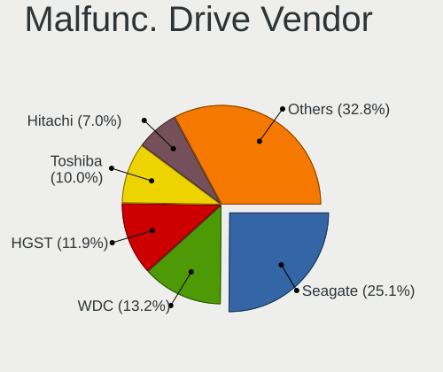

| Vendor                         | Notebooks | Drives | Percent |
|--------------------------------|-----------|--------|---------|
| Seagate                        | 101       | 109    | 25.12%  |
| WDC                            | 53        | 60     | 13.18%  |
| HGST                           | 48        | 49     | 11.94%  |
| Toshiba                        | 40        | 47     | 9.95%   |
| Hitachi                        | 28        | 31     | 6.97%   |
| Samsung Electronics            | 24        | 33     | 5.97%   |
| SK hynix                       | 23        | 24     | 5.72%   |
| SanDisk                        | 12        | 13     | 2.99%   |
| Intel                          | 12        | 13     | 2.99%   |
| Kingston                       | 9         | 9      | 2.24%   |
| Micron Technology              | 8         | 10     | 1.99%   |
| Crucial                        | 8         | 10     | 1.99%   |
| A-DATA Technology              | 6         | 6      | 1.49%   |
| LITEON                         | 5         | 7      | 1.24%   |
| Realtek Semiconductor          | 3         | 3      | 0.75%   |
| Phison Electronics             | 2         | 2      | 0.5%    |
| Fujitsu                        | 2         | 2      | 0.5%    |
| China                          | 2         | 2      | 0.5%    |
| ASMT                           | 2         | 2      | 0.5%    |
| Apple                          | 2         | 2      | 0.5%    |
| VNYEZ                          | 1         | 1      | 0.25%   |
| Transcend                      | 1         | 1      | 0.25%   |
| SSSTC                          | 1         | 1      | 0.25%   |
| Solid State Storage Technology | 1         | 1      | 0.25%   |
| SM200                          | 1         | 1      | 0.25%   |
| RZX                            | 1         | 1      | 0.25%   |
| OCZ                            | 1         | 1      | 0.25%   |
| MAXIO Technology (Hangzhou)    | 1         | 2      | 0.25%   |
| Lite-On Technology             | 1         | 2      | 0.25%   |
| KingSpec                       | 1         | 1      | 0.25%   |
| Intenso                        | 1         | 1      | 0.25%   |
| Unknown                        | 1         | 1      | 0.25%   |

Malfunc. HDD Vendor
-------------------

Vendors of faulty HDD drives

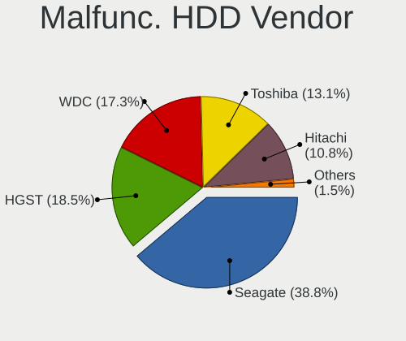

| Vendor  | Notebooks | Drives | Percent |
|---------|-----------|--------|---------|
| Seagate | 101       | 109    | 38.85%  |
| HGST    | 48        | 49     | 18.46%  |
| WDC     | 45        | 52     | 17.31%  |
| Toshiba | 34        | 41     | 13.08%  |
| Hitachi | 28        | 31     | 10.77%  |
| Fujitsu | 2         | 2      | 0.77%   |
| ASMT    | 1         | 1      | 0.38%   |
| Apple   | 1         | 1      | 0.38%   |

Malfunc. Drive Kind
-------------------

Kinds of faulty drives

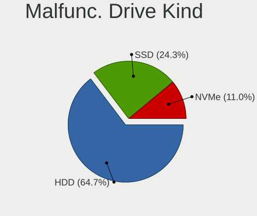

| Kind | Notebooks | Drives | Percent |
|------|-----------|--------|---------|
| HDD  | 258       | 286    | 64.66%  |
| SSD  | 97        | 108    | 24.31%  |
| NVMe | 44        | 54     | 11.03%  |

Failed Drives
-------------

Failed drive models

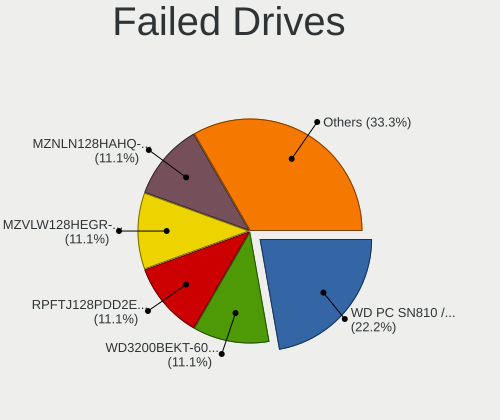

| Model                                            | Notebooks | Drives | Percent |
|--------------------------------------------------|-----------|--------|---------|
| Sandisk WD PC SN810 / Black SN850 NVMe SSD 500GB | 2         | 2      | 22.22%  |
| WDC WD3200BEKT-60V5T1 320GB                      | 1         | 1      | 11.11%  |
| Union Memory (Shenzhen) RPFTJ128PDD2EWX 128GB    | 1         | 2      | 11.11%  |
| Samsung Electronics MZVLW128HEGR-000L2 128GB     | 1         | 2      | 11.11%  |
| Samsung Electronics MZNLN128HAHQ-000H1 128GB SSD | 1         | 1      | 11.11%  |
| Phison ESO128GTLC9-E8C-2 128GB                   | 1         | 1      | 11.11%  |
| Kingston SV300S37A120G 120GB SSD                 | 1         | 1      | 11.11%  |
| Intel SSDSC2BW120H6 120GB                        | 1         | 2      | 11.11%  |

Failed Drive Vendor
-------------------

Failed drive vendors

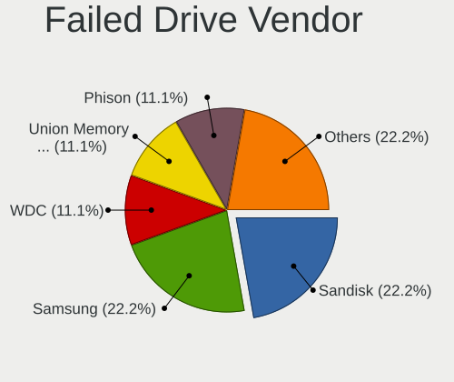

| Vendor                  | Notebooks | Drives | Percent |
|-------------------------|-----------|--------|---------|
| Sandisk                 | 2         | 2      | 22.22%  |
| Samsung Electronics     | 2         | 3      | 22.22%  |
| WDC                     | 1         | 1      | 11.11%  |
| Union Memory (Shenzhen) | 1         | 2      | 11.11%  |
| Phison                  | 1         | 1      | 11.11%  |
| Kingston                | 1         | 1      | 11.11%  |
| Intel                   | 1         | 2      | 11.11%  |

Drive Status
------------

Number of failed and malfunc. drives

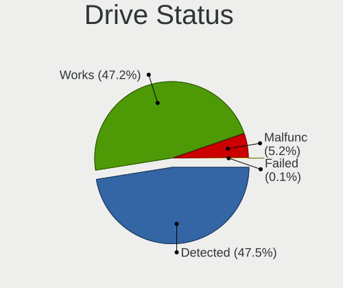

| Status   | Notebooks | Drives | Percent |
|----------|-----------|--------|---------|
| Detected | 3619      | 5390   | 47.48%  |
| Works    | 3601      | 5494   | 47.24%  |
| Malfunc  | 393       | 448    | 5.16%   |
| Failed   | 9         | 12     | 0.12%   |

Storage controller
------------------

Storage Vendor
--------------

Storage controller vendors

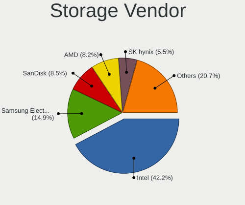

| Vendor                                  | Notebooks | Percent |
|-----------------------------------------|-----------|---------|
| Intel                                   | 3860      | 42.23%  |
| Samsung Electronics                     | 1362      | 14.9%   |
| SanDisk                                 | 778       | 8.51%   |
| AMD                                     | 749       | 8.19%   |
| SK hynix                                | 500       | 5.47%   |
| Micron Technology                       | 406       | 4.44%   |
| Kingston Technology Company             | 248       | 2.71%   |
| KIOXIA                                  | 181       | 1.98%   |
| Toshiba America Info Systems            | 166       | 1.82%   |
| Phison Electronics                      | 154       | 1.68%   |
| Micron/Crucial Technology               | 126       | 1.38%   |
| Silicon Motion                          | 78        | 0.85%   |
| MAXIO Technology (Hangzhou)             | 69        | 0.75%   |
| ADATA Technology                        | 68        | 0.74%   |
| Yangtze Memory Technologies             | 55        | 0.6%    |
| Solid State Storage Technology          | 40        | 0.44%   |
| Shenzhen Longsys Electronics            | 39        | 0.43%   |
| Union Memory (Shenzhen)                 | 38        | 0.42%   |
| Realtek Semiconductor                   | 33        | 0.36%   |
| Apple                                   | 29        | 0.32%   |
| Lenovo                                  | 20        | 0.22%   |
| Nvidia                                  | 19        | 0.21%   |
| Solidigm                                | 18        | 0.2%    |
| Shenzhen Unionmemory Information System | 18        | 0.2%    |
| Lite-On Technology                      | 17        | 0.19%   |
| INNOGRIT                                | 15        | 0.16%   |
| Marvell Technology Group                | 10        | 0.11%   |
| Biwin Storage Technology                | 9         | 0.1%    |
| Transcend                               | 5         | 0.05%   |
| Netac Technology                        | 5         | 0.05%   |
| ASMedia Technology                      | 5         | 0.05%   |
| Silicon Integrated Systems [SiS]        | 4         | 0.04%   |
| Shenzhen Shichuangyi Electronics        | 4         | 0.04%   |
| Unknown                                 | 4         | 0.04%   |
| Seagate Technology                      | 3         | 0.03%   |
| O2 Micro                                | 2         | 0.02%   |
| Shenzhen Wodposit Electronics           | 1         | 0.01%   |
| Hosin Global Electronics                | 1         | 0.01%   |
| Broadcom / LSI                          | 1         | 0.01%   |

Storage Model
-------------

Storage controller models

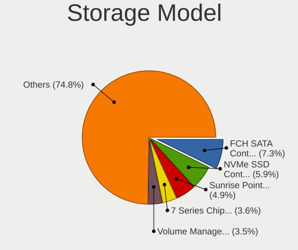

| Model                                                                          | Notebooks | Percent |
|--------------------------------------------------------------------------------|-----------|---------|
| AMD FCH SATA Controller [AHCI mode]                                            | 699       | 7.3%    |
| Samsung NVMe SSD Controller SM981/PM981/PM983                                  | 569       | 5.94%   |
| Intel Sunrise Point-LP SATA Controller [AHCI mode]                             | 472       | 4.93%   |
| Intel 7 Series Chipset Family 6-port SATA Controller [AHCI mode]               | 341       | 3.56%   |
| Intel Volume Management Device NVMe RAID Controller                            | 333       | 3.48%   |
| Intel 82801 Mobile SATA Controller [RAID mode]                                 | 321       | 3.35%   |
| Samsung NVMe SSD Controller 980 (DRAM-less)                                    | 300       | 3.13%   |
| Intel Cannon Lake Mobile PCH SATA AHCI Controller                              | 243       | 2.54%   |
| Samsung NVMe SSD Controller PM9A1/PM9A3/980PRO                                 | 205       | 2.14%   |
| Intel 6 Series/C200 Series Chipset Family 6 port Mobile SATA AHCI Controller   | 195       | 2.04%   |
| SK hynix Gold P31/BC711/PC711 NVMe Solid State Drive                           | 190       | 1.98%   |
| Intel Wildcat Point-LP SATA Controller [AHCI Mode]                             | 185       | 1.93%   |
| Intel 8 Series SATA Controller 1 [AHCI mode]                                   | 182       | 1.9%    |
| Intel HM170/QM170 Chipset SATA Controller [AHCI Mode]                          | 181       | 1.89%   |
| SanDisk Extreme Pro / WD Black SN750 / PC SN730 / Red SN700 NVMe SSD           | 155       | 1.62%   |
| Intel 8 Series/C220 Series Chipset Family 6-port SATA Controller 1 [AHCI mode] | 147       | 1.54%   |
| SanDisk WD SN560/SN740/SN770/SN5000 NVMe SSD                                   | 131       | 1.37%   |
| Intel Tiger Lake-LP SATA Controller                                            | 123       | 1.28%   |
| SanDisk Ultra 3D / WD PC SN530, IX SN530, Blue SN550 NVMe SSD (DRAM-less)      | 119       | 1.24%   |
| Intel SSD 670p Series [Keystone Harbor]                                        | 113       | 1.18%   |
| Intel SSD 660P Series                                                          | 105       | 1.1%    |
| Intel 400 Series Chipset Family SATA AHCI Controller                           | 96        | 1%      |
| Micron 2450 NVMe SSD [HendrixV] (DRAM-less)                                    | 95        | 0.99%   |
| Intel Cannon Point-LP SATA Controller [AHCI Mode]                              | 94        | 0.98%   |
| Samsung NVMe SSD Controller SM961/PM961/SM963                                  | 93        | 0.97%   |
| Intel 82801IBM/IEM (ICH9M/ICH9M-E) 4 port SATA Controller [AHCI mode]          | 93        | 0.97%   |
| Micron 2400 NVMe SSD (DRAM-less)                                               | 87        | 0.91%   |
| KIOXIA NVMe SSD Controller BG4 (DRAM-less)                                     | 80        | 0.84%   |
| Intel Alder Lake-P SATA AHCI Controller                                        | 80        | 0.84%   |
| Intel RST Volume Management Device Controller                                  | 74        | 0.77%   |
| Intel Celeron/Pentium Silver Processor SATA Controller                         | 70        | 0.73%   |
| Toshiba America Info Systems XG6 NVMe SSD Controller                           | 68        | 0.71%   |
| Intel Comet Lake SATA AHCI Controller                                          | 67        | 0.7%    |
| SK hynix Platinum P41/PC801 NVMe Solid State Drive                             | 65        | 0.68%   |
| Samsung NVMe SSD Controller PM9B1 (DRAM-less)                                  | 62        | 0.65%   |
| Micron/Crucial P2 [Nick P2] / P3 / P3 Plus NVMe PCIe SSD (DRAM-less)           | 62        | 0.65%   |
| Intel Q170/Q150/B150/H170/H110/Z170/CM236 Chipset SATA Controller [AHCI Mode]  | 62        | 0.65%   |
| Intel 5 Series/3400 Series Chipset 4 port SATA AHCI Controller                 | 62        | 0.65%   |
| SK hynix BC511 NVMe SSD                                                        | 54        | 0.56%   |
| Samsung NVMe SSD Controller S4LV008[Pascal]                                    | 53        | 0.55%   |

Storage Kind
------------

Kind of storage controller (IDE, SATA, NVMe, SAS, ...)

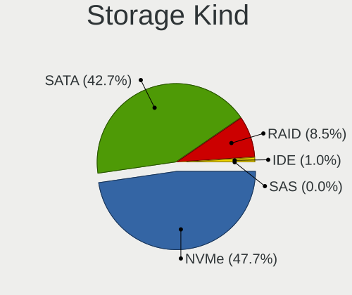

| Kind | Notebooks | Percent |
|------|-----------|---------|
| NVMe | 4289      | 47.7%   |
| SATA | 3840      | 42.71%  |
| RAID | 768       | 8.54%   |
| IDE  | 93        | 1.03%   |
| SAS  | 1         | 0.01%   |

Processor
---------

CPU Vendor
----------

Processor vendors

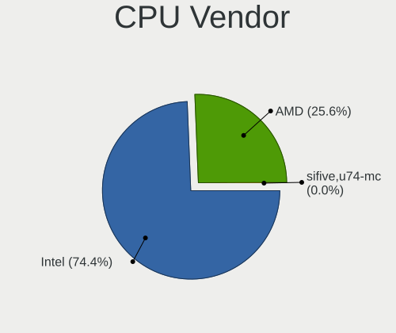

| Vendor        | Notebooks | Percent |
|---------------|-----------|---------|
| Intel         | 5258      | 74.36%  |
| AMD           | 1809      | 25.58%  |
| Unknown       | 3         | 0.04%   |
| sifive,u74-mc | 1         | 0.01%   |

CPU Model
---------

Processor models

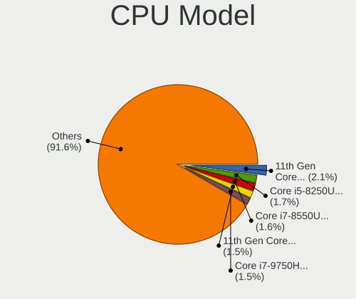

| Model                                         | Notebooks | Percent |
|-----------------------------------------------|-----------|---------|
| Intel 11th Gen Core i5-1135G7 @ 2.40GHz       | 148       | 2.09%   |
| Intel Core i5-8250U CPU @ 1.60GHz             | 120       | 1.7%    |
| Intel Core i7-8550U CPU @ 1.80GHz             | 116       | 1.64%   |
| Intel 11th Gen Core i7-1165G7 @ 2.80GHz       | 104       | 1.47%   |
| Intel Core i7-9750H CPU @ 2.60GHz             | 103       | 1.46%   |
| Intel Core i7-7700HQ CPU @ 2.80GHz            | 102       | 1.44%   |
| Intel Core i7-8750H CPU @ 2.20GHz             | 93        | 1.31%   |
| AMD Ryzen 5 3500U with Radeon Vega Mobile Gfx | 93        | 1.31%   |
| Intel Core i7-8565U CPU @ 1.80GHz             | 92        | 1.3%    |
| AMD Ryzen 7 5800H with Radeon Graphics        | 88        | 1.24%   |
| Intel Core i7-10750H CPU @ 2.60GHz            | 86        | 1.22%   |
| Intel Core i5-8265U CPU @ 1.60GHz             | 85        | 1.2%    |
| AMD Ryzen 5 5500U with Radeon Graphics        | 82        | 1.16%   |
| Intel Core i5-7200U CPU @ 2.50GHz             | 77        | 1.09%   |
| AMD Ryzen 7 4800H with Radeon Graphics        | 75        | 1.06%   |
| AMD Ryzen 7 5700U with Radeon Graphics        | 73        | 1.03%   |
| Intel 12th Gen Core i7-12700H                 | 71        | 1%      |
| AMD Ryzen 5 5600H with Radeon Graphics        | 69        | 0.97%   |
| Intel Core i5-5200U CPU @ 2.20GHz             | 64        | 0.9%    |
| Intel Core i5-6200U CPU @ 2.30GHz             | 62        | 0.88%   |
| Intel 11th Gen Core i7-11800H @ 2.30GHz       | 62        | 0.88%   |
| Intel Core i7-6700HQ CPU @ 2.60GHz            | 61        | 0.86%   |
| Intel Core i7-7500U CPU @ 2.70GHz             | 59        | 0.83%   |
| Intel Core i5-10210U CPU @ 1.60GHz            | 59        | 0.83%   |
| Intel Core i7-10510U CPU @ 1.80GHz            | 57        | 0.81%   |
| Intel 11th Gen Core i3-1115G4 @ 3.00GHz       | 57        | 0.81%   |
| Intel Core i7-8650U CPU @ 1.90GHz             | 55        | 0.78%   |
| Intel Core i5-6300U CPU @ 2.40GHz             | 54        | 0.76%   |
| Intel Core i5-3320M CPU @ 2.60GHz             | 52        | 0.73%   |
| Intel Core i5-8350U CPU @ 1.70GHz             | 49        | 0.69%   |
| AMD Ryzen 5 4600H with Radeon Graphics        | 48        | 0.68%   |
| Intel Core i5-8300H CPU @ 2.30GHz             | 47        | 0.66%   |
| Intel Core i5-3210M CPU @ 2.50GHz             | 46        | 0.65%   |
| Intel Core Ultra 7 155H                       | 45        | 0.64%   |
| Intel Core i5-1035G1 CPU @ 1.00GHz            | 45        | 0.64%   |
| Intel Core i5-10300H CPU @ 2.50GHz            | 45        | 0.64%   |
| Intel Core i5-5300U CPU @ 2.30GHz             | 44        | 0.62%   |
| Intel Core i5-2520M CPU @ 2.50GHz             | 44        | 0.62%   |
| Intel Core i5-3230M CPU @ 2.60GHz             | 43        | 0.61%   |
| Intel 11th Gen Core i7-1185G7 @ 3.00GHz       | 39        | 0.55%   |

CPU Model Family
----------------

Processor model prefix

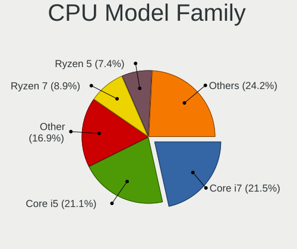

| Model                   | Notebooks | Percent |
|-------------------------|-----------|---------|
| Intel Core i7           | 1524      | 21.54%  |
| Intel Core i5           | 1494      | 21.12%  |
| Other                   | 1199      | 16.95%  |
| AMD Ryzen 7             | 628       | 8.88%   |
| AMD Ryzen 5             | 521       | 7.36%   |
| Intel Core i3           | 327       | 4.62%   |
| Intel Celeron           | 216       | 3.05%   |
| AMD Ryzen 9             | 145       | 2.05%   |
| Intel Core 2 Duo        | 132       | 1.87%   |
| Intel Core              | 132       | 1.87%   |
| AMD Ryzen 7 PRO         | 127       | 1.8%    |
| Intel Pentium           | 89        | 1.26%   |
| AMD Ryzen 3             | 75        | 1.06%   |
| Intel Atom              | 61        | 0.86%   |
| Intel Core i9           | 57        | 0.81%   |
| AMD Ryzen 5 PRO         | 51        | 0.72%   |
| AMD A6                  | 32        | 0.45%   |
| Intel Pentium Silver    | 23        | 0.33%   |
| AMD A4                  | 22        | 0.31%   |
| AMD A10                 | 22        | 0.31%   |
| AMD A8                  | 19        | 0.27%   |
| Intel Xeon              | 18        | 0.25%   |
| AMD E2                  | 16        | 0.23%   |
| AMD Athlon              | 16        | 0.23%   |
| Intel Pentium Dual-Core | 13        | 0.18%   |
| AMD E                   | 13        | 0.18%   |
| AMD E1                  | 10        | 0.14%   |
| Intel Core m3           | 8         | 0.11%   |
| Intel Core 2            | 8         | 0.11%   |
| Intel Genuine           | 7         | 0.1%    |
| AMD A12                 | 7         | 0.1%    |
| Intel Pentium Gold      | 6         | 0.08%   |
| Intel Core m5           | 5         | 0.07%   |
| Intel Core M            | 5         | 0.07%   |
| AMD C-60                | 5         | 0.07%   |
| Intel Celeron Dual-Core | 4         | 0.06%   |
| AMD Athlon X2           | 4         | 0.06%   |
| Intel Pentium Dual      | 3         | 0.04%   |
| AMD FX                  | 3         | 0.04%   |
| Intel Core m7           | 2         | 0.03%   |

CPU Cores
---------

Number of processor cores

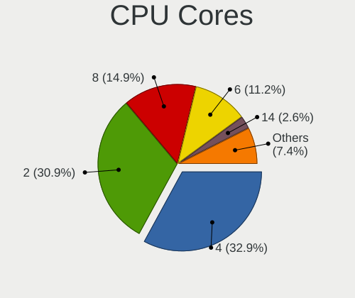

| Number | Notebooks | Percent |
|--------|-----------|---------|
| 4      | 2331      | 32.94%  |
| 2      | 2189      | 30.93%  |
| 8      | 1052      | 14.87%  |
| 6      | 794       | 11.22%  |
| 14     | 184       | 2.6%    |
| 12     | 182       | 2.57%   |
| 10     | 159       | 2.25%   |
| 16     | 104       | 1.47%   |
| 24     | 39        | 0.55%   |
| 1      | 35        | 0.49%   |
| 5      | 3         | 0.04%   |
| 20     | 2         | 0.03%   |
| 18     | 1         | 0.01%   |
| 13     | 1         | 0.01%   |
| 3      | 1         | 0.01%   |

CPU Sockets
-----------

Number of sockets

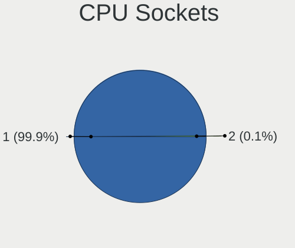

| Number | Notebooks | Percent |
|--------|-----------|---------|
| 1      | 7062      | 99.87%  |
| 2      | 9         | 0.13%   |

CPU Threads
-----------

Threads per core (Hyper-Threading)

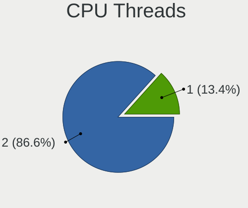

| Number | Notebooks | Percent |
|--------|-----------|---------|
| 2      | 6132      | 86.65%  |
| 1      | 945       | 13.35%  |

CPU Op-Modes
------------

CPU Operation Modes (32-bit, 64-bit)

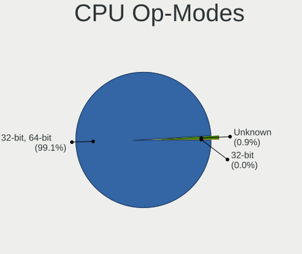

| Op mode        | Notebooks | Percent |
|----------------|-----------|---------|
| 32-bit, 64-bit | 7006      | 99.05%  |
| Unknown        | 61        | 0.86%   |
| 64-bit         | 3         | 0.04%   |
| 32-bit         | 3         | 0.04%   |

CPU Microcode
-------------

Microcode number

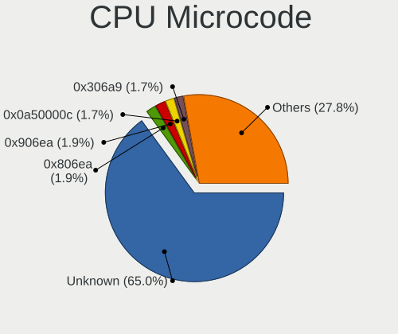

| Number     | Notebooks | Percent |
|------------|-----------|---------|
| Unknown    | 4739      | 64.98%  |
| 0x806ea    | 140       | 1.92%   |
| 0x906ea    | 139       | 1.91%   |
| 0x0a50000c | 124       | 1.7%    |
| 0x306a9    | 122       | 1.67%   |
| 0x806ec    | 119       | 1.63%   |
| 0x806c1    | 113       | 1.55%   |
| 0x206a7    | 105       | 1.44%   |
| 0x406e3    | 101       | 1.38%   |
| 0x306d4    | 90        | 1.23%   |
| 0x40651    | 86        | 1.18%   |
| 0x906e9    | 84        | 1.15%   |
| 0x08600106 | 84        | 1.15%   |
| 0x806e9    | 82        | 1.12%   |
| 0x08108102 | 77        | 1.06%   |
| 0x306c3    | 67        | 0.92%   |
| 0xa0652    | 64        | 0.88%   |
| 0x08108109 | 60        | 0.82%   |
| 0x08608103 | 50        | 0.69%   |
| 0x0a404102 | 48        | 0.66%   |
| 0x08600104 | 47        | 0.64%   |
| 0x20655    | 46        | 0.63%   |
| 0x506e3    | 44        | 0.6%    |
| 0x08600103 | 41        | 0.56%   |
| 0x806eb    | 40        | 0.55%   |
| 0x1067a    | 34        | 0.47%   |
| 0x0a50000d | 29        | 0.4%    |
| 0x906a3    | 27        | 0.37%   |
| 0x0810100b | 25        | 0.34%   |
| 0x706e5    | 24        | 0.33%   |
| 0x08608102 | 24        | 0.33%   |
| 0x806d1    | 21        | 0.29%   |
| 0x406c4    | 21        | 0.29%   |
| 0x30678    | 20        | 0.27%   |
| 0x10676    | 19        | 0.26%   |
| 0x906ed    | 18        | 0.25%   |
| 0x706a1    | 16        | 0.22%   |
| 0x506c9    | 16        | 0.22%   |
| 0x20652    | 15        | 0.21%   |
| 0x06006705 | 15        | 0.21%   |

CPU Microarch
-------------

Microarchitecture

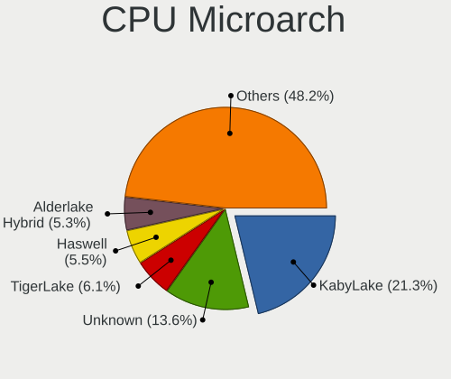

| Name               | Notebooks | Percent |
|--------------------|-----------|---------|
| KabyLake           | 1508      | 21.25%  |
| Unknown            | 966       | 13.62%  |
| TigerLake          | 433       | 6.1%    |
| Haswell            | 393       | 5.54%   |
| Alderlake Hybrid   | 378       | 5.33%   |
| Zen 3              | 377       | 5.31%   |
| Skylake            | 344       | 4.85%   |
| IvyBridge          | 344       | 4.85%   |
| Zen 2              | 296       | 4.17%   |
| Zen+               | 248       | 3.5%    |
| SandyBridge        | 247       | 3.48%   |
| Broadwell          | 230       | 3.24%   |
| CometLake          | 213       | 3%      |
| Icelake            | 160       | 2.26%   |
| Silvermont         | 133       | 1.87%   |
| Penryn             | 127       | 1.79%   |
| Westmere           | 113       | 1.59%   |
| Goldmont plus      | 93        | 1.31%   |
| Zen                | 75        | 1.06%   |
| Meteorlake Hybrid  | 64        | 0.9%    |
| Excavator          | 61        | 0.86%   |
| Core               | 45        | 0.63%   |
| Puma               | 32        | 0.45%   |
| Goldmont           | 31        | 0.44%   |
| Bobcat             | 30        | 0.42%   |
| Lunarlake Hybrid   | 26        | 0.37%   |
| Bonnell            | 24        | 0.34%   |
| Jaguar             | 17        | 0.24%   |
| Piledriver         | 11        | 0.16%   |
| Nehalem            | 11        | 0.16%   |
| Tremont            | 10        | 0.14%   |
| K10                | 10        | 0.14%   |
| Gracemont          | 10        | 0.14%   |
| K10 Llano          | 9         | 0.13%   |
| ArrowLake-H Hybrid | 9         | 0.13%   |
| Steamroller        | 6         | 0.08%   |
| K8 Hammer          | 6         | 0.08%   |
| K8 & K10 hybrid    | 3         | 0.04%   |
| P6                 | 2         | 0.03%   |

Graphics
--------

GPU Vendor
----------

Vendors of graphics cards

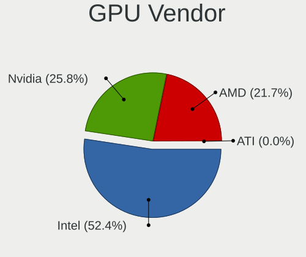

| Vendor                           | Notebooks | Percent |
|----------------------------------|-----------|---------|
| Intel                            | 4953      | 52.39%  |
| Nvidia                           | 2443      | 25.84%  |
| AMD                              | 2053      | 21.72%  |
| Silicon Integrated Systems [SiS] | 4         | 0.04%   |
| ATI Technologies                 | 1         | 0.01%   |

GPU Model
---------

Graphics card models

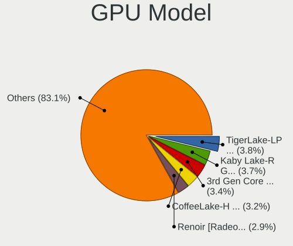

| Model                                                                                    | Notebooks | Percent |
|------------------------------------------------------------------------------------------|-----------|---------|
| Intel TigerLake-LP GT2 [Iris Xe Graphics]                                                | 366       | 3.8%    |
| Intel Kaby Lake-R GT2 [UHD Graphics 620]                                                 | 353       | 3.66%   |
| Intel 3rd Gen Core processor Graphics Controller                                         | 325       | 3.37%   |
| Intel CoffeeLake-H GT2 [UHD Graphics 630]                                                | 305       | 3.17%   |
| AMD Renoir [Radeon Vega Series / Radeon Vega Mobile Series]                              | 280       | 2.91%   |
| AMD Cezanne [Radeon Vega Series / Radeon Vega Mobile Series]                             | 270       | 2.8%    |
| AMD Picasso/Raven 2 [Radeon Vega Series / Radeon Vega Mobile Series]                     | 258       | 2.68%   |
| Intel WhiskeyLake-U GT2 [UHD Graphics 620]                                               | 236       | 2.45%   |
| Intel 2nd Generation Core Processor Family Integrated Graphics Controller                | 222       | 2.3%    |
| Intel Haswell-ULT Integrated Graphics Controller                                         | 212       | 2.2%    |
| Intel Kaby Lake-U GT2 [HD Graphics 620]                                                  | 201       | 2.09%   |
| Nvidia TU117M [GeForce GTX 1650 Mobile / Max-Q]                                          | 199       | 2.07%   |
| Intel Skylake-U GT2 [HD Graphics 520]                                                    | 199       | 2.07%   |
| Intel CometLake-H GT2 [UHD Graphics]                                                     | 186       | 1.93%   |
| Intel Broadwell-U GT2 [HD Graphics 5500]                                                 | 182       | 1.89%   |
| Intel Alder Lake-P GT2 [Iris Xe Graphics]                                                | 170       | 1.76%   |
| AMD Rembrandt [Radeon 680M]                                                              | 168       | 1.74%   |
| AMD Lucienne                                                                             | 165       | 1.71%   |
| Intel 4th Gen Core Processor Integrated Graphics Controller                              | 149       | 1.55%   |
| Intel CometLake-U GT2 [UHD Graphics]                                                     | 147       | 1.53%   |
| Intel Kaby Lake-H GT2 [HD Graphics 630]                                                  | 144       | 1.49%   |
| Nvidia GA106M [GeForce RTX 3060 Mobile / Max-Q]                                          | 141       | 1.46%   |
| Intel Raptor Lake-P [Iris Xe Graphics]                                                   | 126       | 1.31%   |
| Intel TigerLake-H GT1 [UHD Graphics]                                                     | 118       | 1.22%   |
| AMD Phoenix1                                                                             | 112       | 1.16%   |
| Nvidia GP107M [GeForce GTX 1050 Mobile]                                                  | 107       | 1.11%   |
| Nvidia AD107M [GeForce RTX 4060 Max-Q / Mobile]                                          | 103       | 1.07%   |
| Nvidia GA107M [GeForce RTX 3050 Mobile]                                                  | 101       | 1.05%   |
| Nvidia GP107M [GeForce GTX 1050 Ti Mobile]                                               | 94        | 0.98%   |
| Intel Skylake-H GT2 [HD Graphics 530]                                                    | 91        | 0.94%   |
| AMD Barcelo                                                                              | 86        | 0.89%   |
| Intel Core Processor Integrated Graphics Controller                                      | 79        | 0.82%   |
| Intel Mobile 4 Series Chipset Integrated Graphics Controller                             | 78        | 0.81%   |
| Nvidia TU117M [GeForce GTX 1650 Ti Mobile]                                               | 75        | 0.78%   |
| Intel GeminiLake [UHD Graphics 600]                                                      | 75        | 0.78%   |
| Intel Atom/Celeron/Pentium Processor x5-E8000/J3xxx/N3xxx Integrated Graphics Controller | 69        | 0.72%   |
| Intel Meteor Lake-P [Intel Arc Graphics]                                                 | 68        | 0.71%   |
| AMD HawkPoint1                                                                           | 65        | 0.67%   |
| Nvidia GP108M [GeForce MX150]                                                            | 64        | 0.66%   |
| Intel Tiger Lake-LP GT2 [UHD Graphics G4]                                                | 64        | 0.66%   |

GPU Combo
---------

Combinations of graphics cards

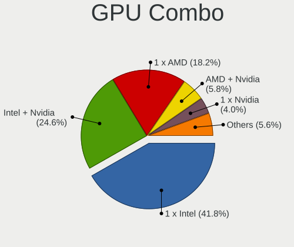

| Name                     | Notebooks | Percent |
|--------------------------|-----------|---------|
| 1 x Intel                | 2963      | 41.76%  |
| Intel + Nvidia           | 1744      | 24.58%  |
| 1 x AMD                  | 1295      | 18.25%  |
| AMD + Nvidia             | 412       | 5.81%   |
| 1 x Nvidia               | 283       | 3.99%   |
| Intel + AMD              | 206       | 2.9%    |
| 2 x AMD                  | 138       | 1.94%   |
| 2 x Intel                | 30        | 0.42%   |
| Other                    | 11        | 0.16%   |
| 2 x Nvidia               | 4         | 0.06%   |
| 1 x SiS                  | 4         | 0.06%   |
| Intel + AMD + 1 x Nvidia | 4         | 0.06%   |
| Intel + 2 x Nvidia       | 2         | 0.03%   |

GPU Driver
----------

Free vs proprietary

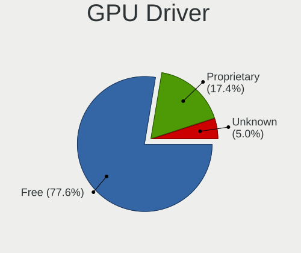

| Driver      | Notebooks | Percent |
|-------------|-----------|---------|
| Free        | 5549      | 77.62%  |
| Proprietary | 1242      | 17.37%  |
| Unknown     | 358       | 5.01%   |

GPU Memory
----------

Total video memory

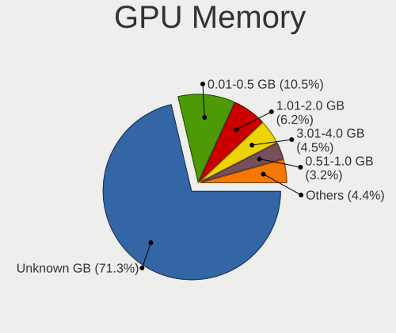

| Size in GB | Notebooks | Percent |
|------------|-----------|---------|
| Unknown    | 5164      | 71.33%  |
| 0.01-0.5   | 761       | 10.51%  |
| 1.01-2.0   | 446       | 6.16%   |
| 3.01-4.0   | 324       | 4.48%   |
| 0.51-1.0   | 229       | 3.16%   |
| 7.01-8.0   | 153       | 2.11%   |
| 5.01-6.0   | 115       | 1.59%   |
| 8.01-16.0  | 32        | 0.44%   |
| 2.01-3.0   | 16        | 0.22%   |

Monitor
-------

Monitor Vendor
--------------

Monitor vendors

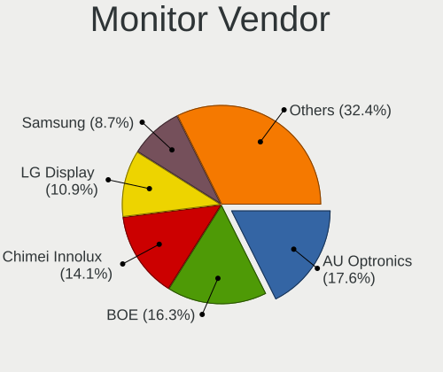

| Vendor                  | Notebooks | Percent |
|-------------------------|-----------|---------|
| AU Optronics            | 1500      | 17.6%   |
| BOE                     | 1392      | 16.33%  |
| Chimei Innolux          | 1199      | 14.07%  |
| LG Display              | 931       | 10.92%  |
| Samsung Electronics     | 743       | 8.72%   |
| Sharp                   | 283       | 3.32%   |
| Dell                    | 250       | 2.93%   |
| Goldstar                | 201       | 2.36%   |
| Lenovo                  | 199       | 2.34%   |
| PANDA                   | 193       | 2.26%   |
| Apple                   | 166       | 1.95%   |
| CSO                     | 112       | 1.31%   |
| Hewlett-Packard         | 103       | 1.21%   |
| Acer                    | 98        | 1.15%   |
| InfoVision              | 92        | 1.08%   |
| AOC                     | 85        | 1%      |
| BenQ                    | 80        | 0.94%   |
| Philips                 | 70        | 0.82%   |
| Chi Mei Optoelectronics | 66        | 0.77%   |
| TMX                     | 57        | 0.67%   |
| ASUSTek Computer        | 46        | 0.54%   |
| CSOT                    | 41        | 0.48%   |
| Ancor Communications    | 39        | 0.46%   |
| Iiyama                  | 34        | 0.4%    |
| ViewSonic               | 25        | 0.29%   |
| CSW                     | 25        | 0.29%   |
| MSI                     | 22        | 0.26%   |
| Sony                    | 21        | 0.25%   |
| HKC                     | 21        | 0.25%   |
| Toshiba                 | 16        | 0.19%   |
| Mi                      | 16        | 0.19%   |
| Gigabyte Technology     | 16        | 0.19%   |
| TMA                     | 15        | 0.18%   |
| LG Philips              | 15        | 0.18%   |
| JDI                     | 15        | 0.18%   |
| Panasonic               | 12        | 0.14%   |
| Eizo                    | 12        | 0.14%   |
| CPT                     | 11        | 0.13%   |
| Unknown                 | 10        | 0.12%   |
| NEC Computers           | 10        | 0.12%   |

Monitor Model
-------------

Monitor models

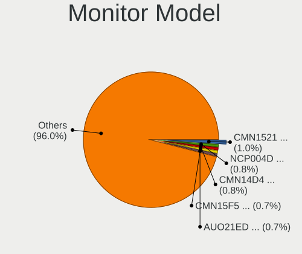

| Model                                                                 | Notebooks | Percent |
|-----------------------------------------------------------------------|-----------|---------|
| Chimei Innolux LCD Monitor CMN1521 1920x1080 344x193mm 15.5-inch      | 90        | 1.04%   |
| PANDA LCD Monitor NCP004D 1920x1080 344x194mm 15.5-inch               | 65        | 0.75%   |
| Chimei Innolux LCD Monitor CMN14D4 1920x1080 309x173mm 13.9-inch      | 65        | 0.75%   |
| Chimei Innolux LCD Monitor CMN15F5 1920x1080 344x193mm 15.5-inch      | 64        | 0.74%   |
| AU Optronics LCD Monitor AUO21ED 1920x1080 344x193mm 15.5-inch        | 61        | 0.71%   |
| AU Optronics LCD Monitor AUO38ED 1920x1080 344x193mm 15.5-inch        | 56        | 0.65%   |
| Chimei Innolux LCD Monitor CMN15E7 1920x1080 344x193mm 15.5-inch      | 45        | 0.52%   |
| AU Optronics LCD Monitor AUO403D 1920x1080 309x174mm 14.0-inch        | 39        | 0.45%   |
| BOE LCD Monitor BOE095F 2256x1504 285x190mm 13.5-inch                 | 37        | 0.43%   |
| BOE LCD Monitor BOE0872 1920x1080 344x194mm 15.5-inch                 | 33        | 0.38%   |
| Chimei Innolux LCD Monitor CMN15E8 1920x1080 344x193mm 15.5-inch      | 31        | 0.36%   |
| AU Optronics LCD Monitor AUO106C 1366x768 276x155mm 12.5-inch         | 28        | 0.32%   |
| Chimei Innolux LCD Monitor CMN14C9 1920x1080 309x173mm 13.9-inch      | 26        | 0.3%    |
| LG Display LCD Monitor LGD0521 1920x1080 309x174mm 14.0-inch          | 25        | 0.29%   |
| LG Display LCD Monitor LGD046F 1920x1080 344x194mm 15.5-inch          | 25        | 0.29%   |
| Chimei Innolux LCD Monitor CMN14D5 1920x1080 309x173mm 13.9-inch      | 25        | 0.29%   |
| Samsung Electronics LCD Monitor SDC4161 1920x1080 344x194mm 15.5-inch | 24        | 0.28%   |
| Chimei Innolux LCD Monitor CMN15DB 1366x768 344x193mm 15.5-inch       | 24        | 0.28%   |
| AU Optronics LCD Monitor AUOAF90 1920x1080 344x193mm 15.5-inch        | 24        | 0.28%   |
| AU Optronics LCD Monitor AUO573D 1920x1080 309x174mm 14.0-inch        | 24        | 0.28%   |
| LG Display LCD Monitor LGD02DC 1366x768 344x194mm 15.5-inch           | 23        | 0.27%   |
| LG Display LCD Monitor LGD02D8 1366x768 277x156mm 12.5-inch           | 23        | 0.27%   |
| AU Optronics LCD Monitor AUO61ED 1920x1080 344x194mm 15.5-inch        | 23        | 0.27%   |
| Samsung Electronics LCD Monitor SEC5441 1280x800 331x207mm 15.4-inch  | 22        | 0.26%   |
| Samsung Electronics LCD Monitor SDC4171 2880x1800 302x189mm 14.0-inch | 22        | 0.26%   |
| BOE LCD Monitor BOE0700 1920x1080 344x194mm 15.5-inch                 | 22        | 0.26%   |
| AU Optronics LCD Monitor AUOD1ED 1920x1080 344x193mm 15.5-inch        | 22        | 0.26%   |
| Chimei Innolux LCD Monitor CMN1540 2560x1440 344x193mm 15.5-inch      | 21        | 0.24%   |
| BOE LCD Monitor BOE0877 1920x1080 309x173mm 13.9-inch                 | 21        | 0.24%   |
| BOE LCD Monitor BOE0812 1920x1080 344x194mm 15.5-inch                 | 21        | 0.24%   |
| Lenovo LCD Monitor LEN40BA 1920x1080 344x194mm 15.5-inch              | 19        | 0.22%   |
| Goldstar FULL HD GSM5B55 1920x1080 480x270mm 21.7-inch                | 19        | 0.22%   |
| Chimei Innolux LCD Monitor CMN153B 1920x1080 344x193mm 15.5-inch      | 19        | 0.22%   |
| PANDA LCD Monitor NCP002D 1920x1080 344x194mm 15.5-inch               | 18        | 0.21%   |
| BOE LCD Monitor BOE0791 1920x1080 309x173mm 13.9-inch                 | 18        | 0.21%   |
| AU Optronics LCD Monitor AUO22EC 1366x768 344x193mm 15.5-inch         | 18        | 0.21%   |
| Sharp LCD Monitor SHP149A 1920x1080 344x194mm 15.5-inch               | 17        | 0.2%    |
| LG Display LCD Monitor LGD05E5 1920x1080 344x194mm 15.5-inch          | 17        | 0.2%    |
| Chimei Innolux LCD Monitor CMN15AB 1366x768 344x193mm 15.5-inch       | 17        | 0.2%    |
| Chimei Innolux LCD Monitor CMN140A 1920x1080 309x173mm 13.9-inch      | 17        | 0.2%    |

Monitor Resolution
------------------

Monitor screen resolution

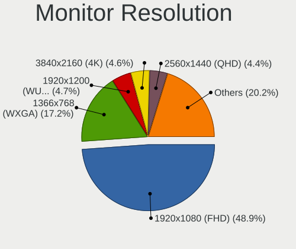

| Resolution         | Notebooks | Percent |
|--------------------|-----------|---------|
| 1920x1080 (FHD)    | 3886      | 48.87%  |
| 1366x768 (WXGA)    | 1367      | 17.19%  |
| 1920x1200 (WUXGA)  | 375       | 4.72%   |
| 3840x2160 (4K)     | 367       | 4.62%   |
| 2560x1440 (QHD)    | 348       | 4.38%   |
| 2560x1600          | 299       | 3.76%   |
| 1600x900 (HD+)     | 218       | 2.74%   |
| 2880x1800          | 187       | 2.35%   |
| 1280x800 (WXGA)    | 107       | 1.35%   |
| 1440x900 (WXGA+)   | 77        | 0.97%   |
| 3440x1440          | 61        | 0.77%   |
| 3840x2400          | 57        | 0.72%   |
| 2256x1504          | 54        | 0.68%   |
| 1680x1050 (WSXGA+) | 50        | 0.63%   |
| Unknown            | 50        | 0.63%   |
| 2160x1440          | 41        | 0.52%   |
| 3200x2000          | 37        | 0.47%   |
| 2560x1080          | 36        | 0.45%   |
| 1280x1024 (SXGA)   | 34        | 0.43%   |
| 3072x1920          | 32        | 0.4%    |
| 3200x1800 (QHD+)   | 31        | 0.39%   |
| 1360x768           | 21        | 0.26%   |
| 1024x600           | 17        | 0.21%   |
| 2880x1620          | 16        | 0.2%    |
| 2240x1400          | 16        | 0.2%    |
| 3456x2160          | 15        | 0.19%   |
| 3000x2000          | 14        | 0.18%   |
| 2520x1680          | 12        | 0.15%   |
| 3840x1600          | 11        | 0.14%   |
| 800x1280           | 10        | 0.13%   |
| 2880x1920          | 9         | 0.11%   |
| 3840x1080          | 8         | 0.1%    |
| 3840x1100          | 7         | 0.09%   |
| 1920x540           | 7         | 0.09%   |
| 2944x1840          | 6         | 0.08%   |
| 2288x1287          | 6         | 0.08%   |
| 1680x945           | 6         | 0.08%   |
| 1600x1200          | 6         | 0.08%   |
| 1400x1050          | 5         | 0.06%   |
| 1280x720 (HD)      | 4         | 0.05%   |

Monitor Diagonal
----------------

Diagonal size in inches

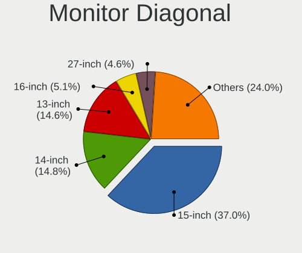

| Inches  | Notebooks | Percent |
|---------|-----------|---------|
| 15      | 3141      | 36.98%  |
| 14      | 1260      | 14.84%  |
| 13      | 1238      | 14.58%  |
| 16      | 429       | 5.05%   |
| 27      | 390       | 4.59%   |
| 17      | 366       | 4.31%   |
| 24      | 322       | 3.79%   |
| 23      | 215       | 2.53%   |
| 21      | 174       | 2.05%   |
| 12      | 168       | 1.98%   |
| Unknown | 110       | 1.3%    |
| 31      | 105       | 1.24%   |
| 11      | 99        | 1.17%   |
| 34      | 87        | 1.02%   |
| 18      | 53        | 0.62%   |
| 19      | 41        | 0.48%   |
| 22      | 29        | 0.34%   |
| 20      | 29        | 0.34%   |
| 10      | 28        | 0.33%   |
| 84      | 18        | 0.21%   |
| 40      | 18        | 0.21%   |
| 32      | 14        | 0.16%   |
| 25      | 14        | 0.16%   |
| 28      | 13        | 0.15%   |
| 72      | 12        | 0.14%   |
| 54      | 12        | 0.14%   |
| 37      | 11        | 0.13%   |
| 29      | 10        | 0.12%   |
| 26      | 10        | 0.12%   |
| 7       | 8         | 0.09%   |
| 52      | 7         | 0.08%   |
| 48      | 7         | 0.08%   |
| 142     | 6         | 0.07%   |
| 74      | 5         | 0.06%   |
| 49      | 5         | 0.06%   |
| 86      | 4         | 0.05%   |
| 65      | 4         | 0.05%   |
| 63      | 4         | 0.05%   |
| 43      | 3         | 0.04%   |
| 42      | 3         | 0.04%   |

Monitor Width
-------------

Physical width

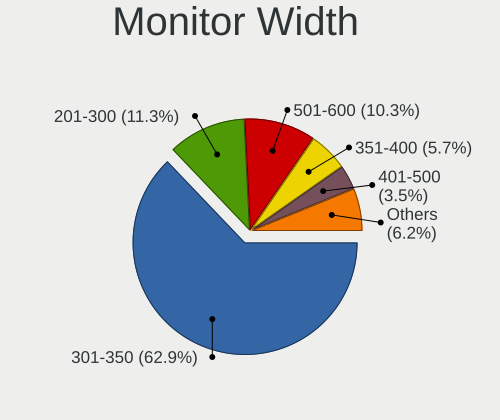

| Width in mm    | Notebooks | Percent |
|----------------|-----------|---------|
| 301-350        | 5280      | 62.87%  |
| 201-300        | 953       | 11.35%  |
| 501-600        | 868       | 10.34%  |
| 351-400        | 481       | 5.73%   |
| 401-500        | 297       | 3.54%   |
| 601-700        | 160       | 1.91%   |
| Unknown        | 110       | 1.31%   |
| 701-800        | 100       | 1.19%   |
| 1001-1500      | 50        | 0.6%    |
| 801-900        | 37        | 0.44%   |
| 1501-2000      | 35        | 0.42%   |
| 1-100          | 10        | 0.12%   |
| 901-1000       | 8         | 0.1%    |
| More than 2000 | 6         | 0.07%   |
| 101-200        | 3         | 0.04%   |

Aspect Ratio
------------

Proportional relationship between the width and the height

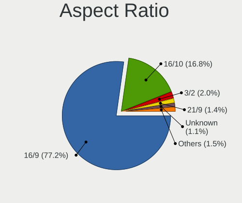

| Ratio   | Notebooks | Percent |
|---------|-----------|---------|
| 16/9    | 5781      | 77.23%  |
| 16/10   | 1254      | 16.75%  |
| 3/2     | 149       | 1.99%   |
| 21/9    | 107       | 1.43%   |
| Unknown | 84        | 1.12%   |
| 5/4     | 36        | 0.48%   |
| 32/9    | 18        | 0.24%   |
| 4/3     | 17        | 0.23%   |
| 3.40    | 7         | 0.09%   |
| 1.00    | 6         | 0.08%   |
| 0.67    | 6         | 0.08%   |
| 0.56    | 5         | 0.07%   |
| 6/5     | 4         | 0.05%   |
| 2.65    | 4         | 0.05%   |
| 3.73    | 2         | 0.03%   |
| 0.62    | 2         | 0.03%   |
| 2.58    | 1         | 0.01%   |
| 1.03    | 1         | 0.01%   |
| 0.63    | 1         | 0.01%   |

Monitor Area
------------

Area in inch²

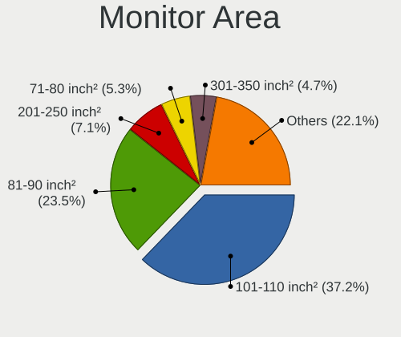

| Area in inch² | Notebooks | Percent |
|----------------|-----------|---------|
| 101-110        | 3149      | 37.21%  |
| 81-90          | 1988      | 23.49%  |
| 201-250        | 604       | 7.14%   |
| 71-80          | 449       | 5.31%   |
| 301-350        | 400       | 4.73%   |
| 111-120        | 399       | 4.71%   |
| 121-130        | 325       | 3.84%   |
| 351-500        | 218       | 2.58%   |
| 61-70          | 162       | 1.91%   |
| Unknown        | 110       | 1.3%    |
| 151-200        | 109       | 1.29%   |
| 251-300        | 108       | 1.28%   |
| 51-60          | 107       | 1.26%   |
| More than 1000 | 75        | 0.89%   |
| 91-100         | 72        | 0.85%   |
| 141-150        | 61        | 0.72%   |
| 501-1000       | 55        | 0.65%   |
| 131-140        | 31        | 0.37%   |
| 41-50          | 29        | 0.34%   |
| 1-40           | 12        | 0.14%   |

Pixel Density
-------------

Pixels per inch

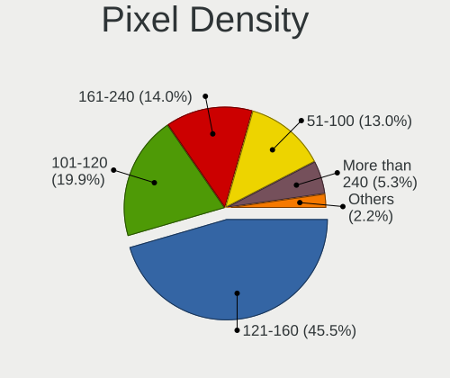

| Density       | Notebooks | Percent |
|---------------|-----------|---------|
| 121-160       | 3783      | 45.51%  |
| 101-120       | 1653      | 19.88%  |
| 161-240       | 1165      | 14.01%  |
| 51-100        | 1081      | 13%     |
| More than 240 | 444       | 5.34%   |
| Unknown       | 110       | 1.32%   |
| 1-50          | 77        | 0.93%   |

Multiple Monitors
-----------------

Total monitors connected

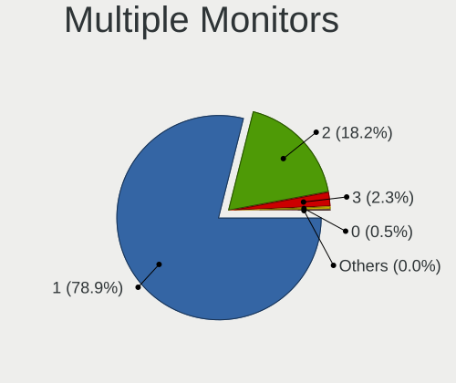

| Total | Notebooks | Percent |
|-------|-----------|---------|
| 1     | 5721      | 78.91%  |
| 2     | 1316      | 18.15%  |
| 3     | 164       | 2.26%   |
| 0     | 33        | 0.46%   |
| 4     | 15        | 0.21%   |
| 5     | 1         | 0.01%   |

Network
-------

Net Controller Vendor
---------------------

Controller vendors

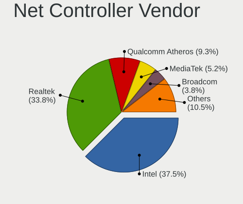

| Vendor                                 | Notebooks | Percent |
|----------------------------------------|-----------|---------|
| Intel                                  | 4120      | 37.5%   |
| Realtek Semiconductor                  | 3710      | 33.77%  |
| Qualcomm Atheros                       | 1018      | 9.27%   |
| MediaTek                               | 571       | 5.2%    |
| Broadcom                               | 413       | 3.76%   |
| Qualcomm                               | 109       | 0.99%   |
| Broadcom Limited                       | 108       | 0.98%   |
| ASIX Electronics                       | 105       | 0.96%   |
| Shenzhen Goodix Technology             | 84        | 0.76%   |
| TP-Link                                | 74        | 0.67%   |
| Lenovo                                 | 61        | 0.56%   |
| Sierra Wireless                        | 49        | 0.45%   |
| Samsung Electronics                    | 43        | 0.39%   |
| Xiaomi                                 | 40        | 0.36%   |
| Marvell Technology Group               | 39        | 0.35%   |
| Ralink                                 | 34        | 0.31%   |
| Ericsson Business Mobile Networks      | 33        | 0.3%    |
| DisplayLink                            | 32        | 0.29%   |
| Dell                                   | 27        | 0.25%   |
| Hewlett-Packard                        | 24        | 0.22%   |
| Ralink Technology                      | 22        | 0.2%    |
| Google                                 | 22        | 0.2%    |
| Apple                                  | 19        | 0.17%   |
| Fibocom                                | 18        | 0.16%   |
| Suzhou Motorcomm Electronic Technology | 16        | 0.15%   |
| OPPO Electronics                       | 13        | 0.12%   |
| Nvidia                                 | 12        | 0.11%   |
| JMicron Technology                     | 11        | 0.1%    |
| Huawei Technologies                    | 11        | 0.1%    |
| D-Link                                 | 11        | 0.1%    |
| Qualcomm Technologies                  | 10        | 0.09%   |
| Motorola PCS                           | 10        | 0.09%   |
| Qualcomm Atheros Communications        | 9         | 0.08%   |
| Microsoft                              | 8         | 0.07%   |
| Cypress Semiconductor                  | 8         | 0.07%   |
| NetGear                                | 7         | 0.06%   |
| U-Blox                                 | 5         | 0.05%   |
| QinHeng Electronics                    | 5         | 0.05%   |
| Linksys                                | 5         | 0.05%   |
| ASUSTek Computer                       | 5         | 0.05%   |

Net Controller Model
--------------------

Controller models

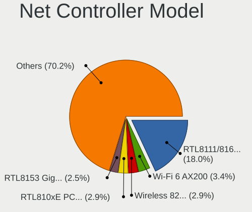

| Model                                                                  | Notebooks | Percent |
|------------------------------------------------------------------------|-----------|---------|
| Realtek RTL8111/8168/8211/8411 PCI Express Gigabit Ethernet Controller | 2359      | 18.03%  |
| Intel Wi-Fi 6 AX200                                                    | 446       | 3.41%   |
| Intel Wireless 8265 / 8275                                             | 382       | 2.92%   |
| Realtek RTL810xE PCI Express Fast Ethernet controller                  | 378       | 2.89%   |
| Realtek RTL8153 Gigabit Ethernet Adapter                               | 330       | 2.52%   |
| Intel Wi-Fi 6 AX201                                                    | 303       | 2.32%   |
| Intel Alder Lake-P PCH CNVi WiFi                                       | 265       | 2.03%   |
| MediaTek MT7921 802.11ax PCIe Wireless Network Adapter [Filogic 330]   | 258       | 1.97%   |
| Realtek RTL8822CE 802.11ac PCIe Wireless Network Adapter               | 247       | 1.89%   |
| Qualcomm Atheros QCA9377 802.11ac Wireless Network Adapter             | 238       | 1.82%   |
| Realtek RTL8821CE 802.11ac PCIe Wireless Network Adapter               | 220       | 1.68%   |
| Intel Wi-Fi 6E(802.11ax) AX210/AX1675* 2x2 [Typhoon Peak]              | 210       | 1.6%    |
| Intel 82579LM Gigabit Network Connection (Lewisville)                  | 202       | 1.54%   |
| Intel Wireless 7265                                                    | 197       | 1.51%   |
| Qualcomm Atheros QCA6174 802.11ac Wireless Network Adapter             | 195       | 1.49%   |
| Intel Cannon Lake PCH CNVi WiFi                                        | 188       | 1.44%   |
| MediaTek MT7922 802.11ax PCI Express Wireless Network Adapter          | 186       | 1.42%   |
| Intel Wireless 8260                                                    | 175       | 1.34%   |
| Intel Wireless 7260                                                    | 161       | 1.23%   |
| Intel Comet Lake PCH CNVi WiFi                                         | 160       | 1.22%   |
| Intel Ethernet Connection (4) I219-LM                                  | 153       | 1.17%   |
| Qualcomm Atheros QCA9565 / AR9565 Wireless Network Adapter             | 150       | 1.15%   |
| Intel Cannon Point-LP CNVi [Wireless-AC]                               | 140       | 1.07%   |
| Intel Raptor Lake PCH CNVi WiFi                                        | 134       | 1.02%   |
| Intel Centrino Advanced-N 6205 [Taylor Peak]                           | 132       | 1.01%   |
| Intel Comet Lake PCH-LP CNVi WiFi                                      | 130       | 0.99%   |
| Qualcomm Atheros AR9485 Wireless Network Adapter                       | 124       | 0.95%   |
| Realtek RTL8852BE PCIe 802.11ax Wireless Network Controller            | 109       | 0.83%   |
| Intel Wireless 3165                                                    | 102       | 0.78%   |
| ASIX AX88179 Gigabit Ethernet                                          | 96        | 0.73%   |
| Realtek Killer E2600 GbE Controller                                    | 94        | 0.72%   |
| Realtek RTL8125 2.5GbE Controller                                      | 93        | 0.71%   |
| Qualcomm Atheros AR9285 Wireless Network Adapter (PCI-Express)         | 92        | 0.7%    |
| Realtek RTL8852AE 802.11ax PCIe Wireless Network Adapter               | 87        | 0.66%   |
| Intel Ethernet Connection (4) I219-V                                   | 87        | 0.66%   |
| Shenzhen Goodix Fingerprint Reader                                     | 84        | 0.64%   |
| Intel Wi-Fi 5(802.11ac) Wireless-AC 9x6x [Thunder Peak]                | 83        | 0.63%   |
| Qualcomm QCNFA765 Wireless Network Adapter                             | 81        | 0.62%   |
| Intel Tiger Lake PCH CNVi WiFi                                         | 78        | 0.6%    |
| Intel Meteor Lake PCH CNVi WiFi                                        | 74        | 0.57%   |

Wireless Vendor
---------------

Wireless vendors

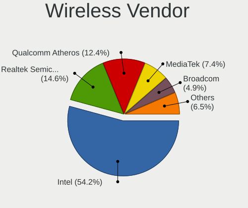

| Vendor                          | Notebooks | Percent |
|---------------------------------|-----------|---------|
| Intel                           | 3857      | 54.22%  |
| Realtek Semiconductor           | 1039      | 14.61%  |
| Qualcomm Atheros                | 879       | 12.36%  |
| MediaTek                        | 528       | 7.42%   |
| Broadcom                        | 349       | 4.91%   |
| Qualcomm                        | 99        | 1.39%   |
| Broadcom Limited                | 86        | 1.21%   |
| TP-Link                         | 59        | 0.83%   |
| Sierra Wireless                 | 49        | 0.69%   |
| Ralink                          | 34        | 0.48%   |
| Ralink Technology               | 22        | 0.31%   |
| Fibocom                         | 18        | 0.25%   |
| Dell                            | 18        | 0.25%   |
| Hewlett-Packard                 | 11        | 0.15%   |
| Qualcomm Atheros Communications | 9         | 0.13%   |
| D-Link                          | 9         | 0.13%   |
| Qualcomm Technologies           | 6         | 0.08%   |
| NetGear                         | 6         | 0.08%   |
| Microsoft                       | 5         | 0.07%   |
| Linksys                         | 5         | 0.07%   |
| Unknown                         | 5         | 0.07%   |
| Quectel Wireless Solutions      | 4         | 0.06%   |
| Edimax Technology               | 3         | 0.04%   |
| ASUSTek Computer                | 3         | 0.04%   |
| Xiaomi                          | 2         | 0.03%   |
| Mercucys                        | 2         | 0.03%   |
| D-Link System                   | 2         | 0.03%   |
| Wilocity                        | 1         | 0.01%   |
| TRENDnet                        | 1         | 0.01%   |
| Tenda                           | 1         | 0.01%   |
| Samsung Electronics             | 1         | 0.01%   |
| Marvell Technology Group        | 1         | 0.01%   |

Wireless Model
--------------

Wireless models

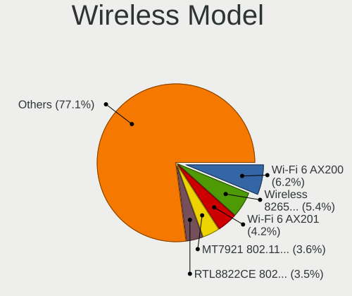

| Model                                                                | Notebooks | Percent |
|----------------------------------------------------------------------|-----------|---------|
| Intel Wi-Fi 6 AX200                                                  | 446       | 6.25%   |
| Intel Wireless 8265 / 8275                                           | 382       | 5.35%   |
| Intel Wi-Fi 6 AX201                                                  | 303       | 4.24%   |
| MediaTek MT7921 802.11ax PCIe Wireless Network Adapter [Filogic 330] | 258       | 3.61%   |
| Realtek RTL8822CE 802.11ac PCIe Wireless Network Adapter             | 247       | 3.46%   |
| Qualcomm Atheros QCA9377 802.11ac Wireless Network Adapter           | 238       | 3.33%   |
| Realtek RTL8821CE 802.11ac PCIe Wireless Network Adapter             | 220       | 3.08%   |
| Intel Wi-Fi 6E(802.11ax) AX210/AX1675* 2x2 [Typhoon Peak]            | 210       | 2.94%   |
| Intel Wireless 7265                                                  | 197       | 2.76%   |
| Qualcomm Atheros QCA6174 802.11ac Wireless Network Adapter           | 195       | 2.73%   |
| Intel Cannon Lake PCH CNVi WiFi                                      | 188       | 2.63%   |
| Intel Wireless 8260                                                  | 175       | 2.45%   |
| Intel Alder Lake-P PCH CNVi WiFi                                     | 172       | 2.41%   |
| Intel Wireless 7260                                                  | 161       | 2.25%   |
| Intel Comet Lake PCH CNVi WiFi                                       | 160       | 2.24%   |
| MediaTek MT7922 802.11ax PCI Express Wireless Network Adapter        | 152       | 2.13%   |
| Qualcomm Atheros QCA9565 / AR9565 Wireless Network Adapter           | 150       | 2.1%    |
| Intel Cannon Point-LP CNVi [Wireless-AC]                             | 140       | 1.96%   |
| Intel Centrino Advanced-N 6205 [Taylor Peak]                         | 132       | 1.85%   |
| Intel Comet Lake PCH-LP CNVi WiFi                                    | 130       | 1.82%   |
| Intel Raptor Lake PCH CNVi WiFi                                      | 129       | 1.81%   |
| Qualcomm Atheros AR9485 Wireless Network Adapter                     | 124       | 1.74%   |
| Intel Wireless 3165                                                  | 102       | 1.43%   |
| Realtek RTL8852BE PCIe 802.11ax Wireless Network Controller          | 101       | 1.41%   |
| Qualcomm Atheros AR9285 Wireless Network Adapter (PCI-Express)       | 92        | 1.29%   |
| Realtek RTL8852AE 802.11ax PCIe Wireless Network Adapter             | 87        | 1.22%   |
| Intel Wi-Fi 5(802.11ac) Wireless-AC 9x6x [Thunder Peak]              | 83        | 1.16%   |
| Qualcomm QCNFA765 Wireless Network Adapter                           | 81        | 1.13%   |
| Intel Tiger Lake PCH CNVi WiFi                                       | 78        | 1.09%   |
| Intel Meteor Lake PCH CNVi WiFi                                      | 74        | 1.04%   |
| Realtek RTL8822BE 802.11a/b/g/n/ac WiFi adapter                      | 73        | 1.02%   |
| Broadcom BCM43142 802.11b/g/n                                        | 67        | 0.94%   |
| Broadcom BCM4313 802.11bgn Wireless Network Adapter                  | 66        | 0.92%   |
| Realtek RTL8723BE PCIe Wireless Network Adapter                      | 64        | 0.9%    |
| Intel Wireless 3160                                                  | 57        | 0.8%    |
| Intel Dual Band Wireless-AC 3168NGW [Stone Peak]                     | 54        | 0.76%   |
| Intel Ice Lake-LP PCH CNVi WiFi                                      | 50        | 0.7%    |
| MediaTek MT7902 802.11ax PCIe Wireless Network Adapter [Filogic 310] | 46        | 0.64%   |
| Intel Dual Band Wireless-AC 3165 Plus Bluetooth                      | 46        | 0.64%   |
| Intel Centrino Ultimate-N 6300                                       | 44        | 0.62%   |

Ethernet Vendor
---------------

Ethernet vendors

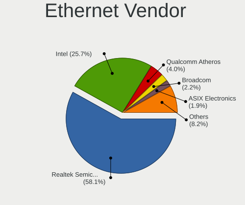

| Vendor                                 | Notebooks | Percent |
|----------------------------------------|-----------|---------|
| Realtek Semiconductor                  | 3263      | 58.1%   |
| Intel                                  | 1443      | 25.69%  |
| Qualcomm Atheros                       | 222       | 3.95%   |
| Broadcom                               | 124       | 2.21%   |
| ASIX Electronics                       | 105       | 1.87%   |
| Lenovo                                 | 57        | 1.01%   |
| MediaTek                               | 44        | 0.78%   |
| Samsung Electronics                    | 42        | 0.75%   |
| Xiaomi                                 | 38        | 0.68%   |
| Marvell Technology Group               | 38        | 0.68%   |
| DisplayLink                            | 32        | 0.57%   |
| Google                                 | 22        | 0.39%   |
| Broadcom Limited                       | 22        | 0.39%   |
| Apple                                  | 19        | 0.34%   |
| Suzhou Motorcomm Electronic Technology | 16        | 0.28%   |
| TP-Link                                | 15        | 0.27%   |
| OPPO Electronics                       | 13        | 0.23%   |
| Nvidia                                 | 12        | 0.21%   |
| JMicron Technology                     | 11        | 0.2%    |
| Qualcomm                               | 10        | 0.18%   |
| Motorola PCS                           | 10        | 0.18%   |
| Cypress Semiconductor                  | 8         | 0.14%   |
| Huawei Technologies                    | 6         | 0.11%   |
| Hewlett-Packard                        | 5         | 0.09%   |
| Silicon Integrated Systems [SiS]       | 4         | 0.07%   |
| Qualcomm Technologies                  | 4         | 0.07%   |
| QinHeng Electronics                    | 3         | 0.05%   |
| Motorcomm Microelectronics.            | 3         | 0.05%   |
| Microsoft                              | 3         | 0.05%   |
| LG Electronics                         | 3         | 0.05%   |
| Aquantia                               | 3         | 0.05%   |
| OnePlus Technology (Shenzhen)          | 2         | 0.04%   |
| HMD Global                             | 2         | 0.04%   |
| D-Link                                 | 2         | 0.04%   |
| Attansic Technology                    | 2         | 0.04%   |
| ASUSTek Computer                       | 2         | 0.04%   |
| QNAP System                            | 1         | 0.02%   |
| NetGear                                | 1         | 0.02%   |
| Netchip Technology                     | 1         | 0.02%   |
| Microchip Technology                   | 1         | 0.02%   |

Ethernet Model
--------------

Ethernet models

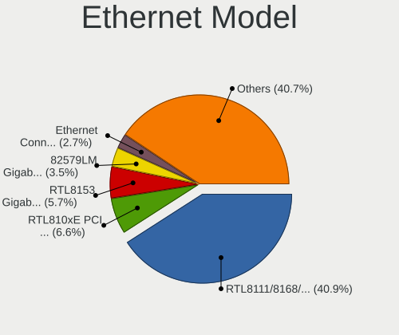

| Model                                                                  | Notebooks | Percent |
|------------------------------------------------------------------------|-----------|---------|
| Realtek RTL8111/8168/8211/8411 PCI Express Gigabit Ethernet Controller | 2359      | 40.91%  |
| Realtek RTL810xE PCI Express Fast Ethernet controller                  | 378       | 6.56%   |
| Realtek RTL8153 Gigabit Ethernet Adapter                               | 330       | 5.72%   |
| Intel 82579LM Gigabit Network Connection (Lewisville)                  | 202       | 3.5%    |
| Intel Ethernet Connection (4) I219-LM                                  | 153       | 2.65%   |
| ASIX AX88179 Gigabit Ethernet                                          | 96        | 1.66%   |
| Realtek Killer E2600 GbE Controller                                    | 94        | 1.63%   |
| Realtek RTL8125 2.5GbE Controller                                      | 93        | 1.61%   |
| Intel Alder Lake-P PCH CNVi WiFi                                       | 93        | 1.61%   |
| Intel Ethernet Connection (4) I219-V                                   | 87        | 1.51%   |
| Intel Ethernet Connection I219-LM                                      | 68        | 1.18%   |
| Intel Ethernet Connection I217-LM                                      | 68        | 1.18%   |
| Intel Ethernet Connection (3) I218-LM                                  | 66        | 1.14%   |
| Intel Ethernet Connection I218-LM                                      | 60        | 1.04%   |
| Intel Ethernet Connection (6) I219-V                                   | 54        | 0.94%   |
| Intel Ethernet Connection (7) I219-LM                                  | 45        | 0.78%   |
| Intel Ethernet Connection (6) I219-LM                                  | 45        | 0.78%   |
| Intel 82577LM Gigabit Network Connection                               | 41        | 0.71%   |
| Intel Ethernet Connection (2) I219-LM                                  | 39        | 0.68%   |
| Qualcomm Atheros Killer E2500 Gigabit Ethernet Controller              | 34        | 0.59%   |
| MediaTek MT7922 802.11ax PCI Express Wireless Network Adapter          | 34        | 0.59%   |
| Intel 82567LM Gigabit Network Connection                               | 34        | 0.59%   |
| Intel Ethernet Connection (13) I219-V                                  | 32        | 0.55%   |
| Broadcom NetXtreme BCM57765 Gigabit Ethernet PCIe                      | 31        | 0.54%   |
| Realtek RTL8152 Fast Ethernet Adapter                                  | 30        | 0.52%   |
| Intel Ethernet Connection I219-V                                       | 29        | 0.5%    |
| Qualcomm Atheros AR8151 v2.0 Gigabit Ethernet                          | 27        | 0.47%   |
| Intel Ethernet Connection (10) I219-V                                  | 27        | 0.47%   |
| Samsung Galaxy series, misc. (tethering mode)                          | 26        | 0.45%   |
| Qualcomm Atheros Killer E2400 Gigabit Ethernet Controller              | 26        | 0.45%   |
| Realtek USB 10/100/1G/2.5 LAN                                          | 24        | 0.42%   |
| Xiaomi Mi/Redmi series (RNDIS)                                         | 23        | 0.4%    |
| Intel Ethernet Connection (18) I219-LM                                 | 23        | 0.4%    |
| Qualcomm Atheros QCA8171 Gigabit Ethernet                              | 22        | 0.38%   |
| Intel Ethernet Connection (10) I219-LM                                 | 22        | 0.38%   |
| Intel Ethernet Connection (5) I219-LM                                  | 21        | 0.36%   |
| Intel Ethernet Connection (16) I219-V                                  | 21        | 0.36%   |
| Qualcomm Atheros QCA8172 Fast Ethernet                                 | 20        | 0.35%   |
| Qualcomm Atheros AR8161 Gigabit Ethernet                               | 20        | 0.35%   |
| Broadcom NetLink BCM57785 Gigabit Ethernet PCIe                        | 20        | 0.35%   |

Net Controller Kind
-------------------

Ethernet, WiFi or modem

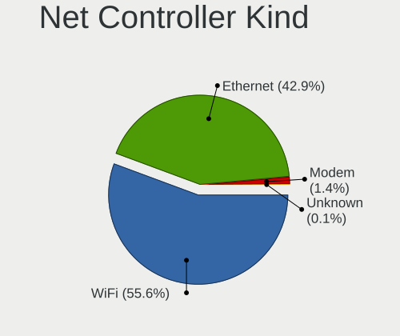

| Kind     | Notebooks | Percent |
|----------|-----------|---------|
| WiFi     | 6819      | 55.65%  |
| Ethernet | 5257      | 42.9%   |
| Modem    | 167       | 1.36%   |
| Unknown  | 11        | 0.09%   |

Used Controller
---------------

Currently used network controller

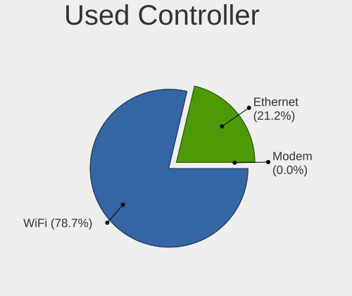

| Kind     | Notebooks | Percent |
|----------|-----------|---------|
| WiFi     | 5850      | 78.71%  |
| Ethernet | 1579      | 21.25%  |
| Modem    | 3         | 0.04%   |

NICs
----

Total network controllers on board

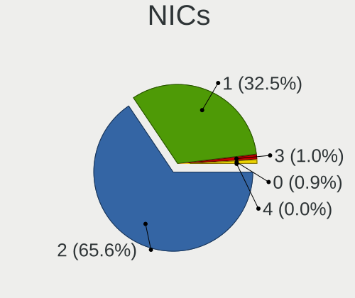

| Total | Notebooks | Percent |
|-------|-----------|---------|
| 2     | 4643      | 65.58%  |
| 1     | 2302      | 32.51%  |
| 3     | 70        | 0.99%   |
| 0     | 63        | 0.89%   |
| 4     | 2         | 0.03%   |

IPv6
----

IPv6 vs IPv4

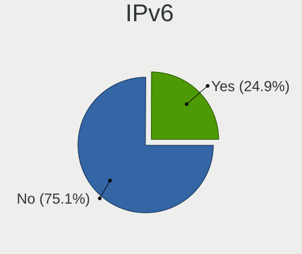

| Used | Notebooks | Percent |
|------|-----------|---------|
| No   | 5424      | 75.07%  |
| Yes  | 1801      | 24.93%  |

Bluetooth
---------

Bluetooth Vendor
----------------

Controller vendors

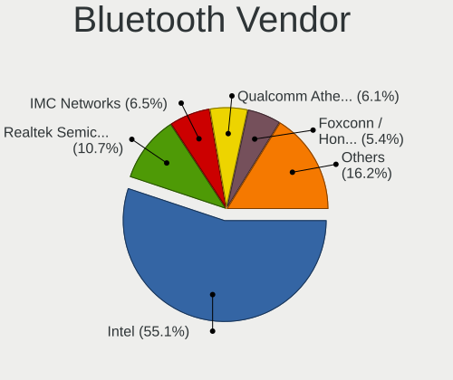

| Vendor                          | Notebooks | Percent |
|---------------------------------|-----------|---------|
| Intel                           | 3504      | 55.11%  |
| Realtek Semiconductor           | 679       | 10.68%  |
| IMC Networks                    | 416       | 6.54%   |
| Qualcomm Atheros Communications | 385       | 6.06%   |
| Foxconn / Hon Hai               | 343       | 5.39%   |
| Lite-On Technology              | 238       | 3.74%   |
| Broadcom                        | 211       | 3.32%   |
| Apple                           | 136       | 2.14%   |
| MediaTek                        | 92        | 1.45%   |
| Realtek                         | 62        | 0.98%   |
| USI                             | 50        | 0.79%   |
| Dell                            | 49        | 0.77%   |
| Cambridge Silicon Radio         | 39        | 0.61%   |
| Hewlett-Packard                 | 35        | 0.55%   |
| Toshiba                         | 22        | 0.35%   |
| Ralink                          | 22        | 0.35%   |
| Foxconn International           | 17        | 0.27%   |
| ASUSTek Computer                | 10        | 0.16%   |
| Opticis                         | 9         | 0.14%   |
| TP-Link                         | 8         | 0.13%   |
| Chicony Electronics             | 4         | 0.06%   |
| Alps Electric                   | 4         | 0.06%   |
| SINO WEALTH                     | 3         | 0.05%   |
| Ralink Technology               | 3         | 0.05%   |
| Belkin Components               | 3         | 0.05%   |
| Askey Computer                  | 3         | 0.05%   |
| Smart Modular Technologies      | 2         | 0.03%   |
| Micro Star International        | 2         | 0.03%   |
| Edimax Technology               | 2         | 0.03%   |
| Dynex                           | 2         | 0.03%   |
| Syntek                          | 1         | 0.02%   |
| Marvell Semiconductor           | 1         | 0.02%   |
| Actions                         | 1         | 0.02%   |

Bluetooth Model
---------------

Controller models

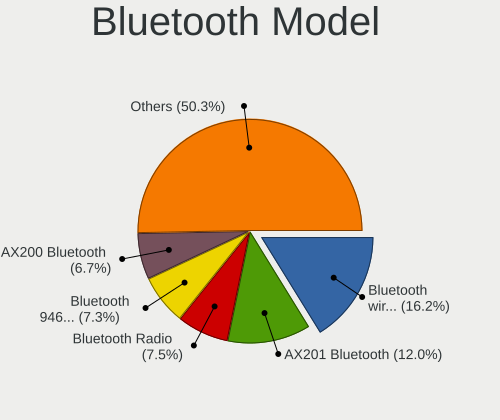

| Model                                               | Notebooks | Percent |
|-----------------------------------------------------|-----------|---------|
| Intel Bluetooth wireless interface                  | 1031      | 16.2%   |
| Intel AX201 Bluetooth                               | 766       | 12.03%  |
| Realtek Bluetooth Radio                             | 478       | 7.51%   |
| Intel Bluetooth 9460/9560 Jefferson Peak (JfP)      | 463       | 7.27%   |
| Intel AX200 Bluetooth                               | 426       | 6.69%   |
| Intel Bluetooth Device                              | 400       | 6.28%   |
| Qualcomm Atheros  Bluetooth Device                  | 209       | 3.28%   |
| Intel AX210 Bluetooth                               | 207       | 3.25%   |
| IMC Networks Wireless_Device                        | 206       | 3.24%   |
| Realtek  Bluetooth 4.2 Adapter                      | 127       | 1.99%   |
| Foxconn / Hon Hai Wireless_Device                   | 124       | 1.95%   |
| IMC Networks Bluetooth Radio                        | 123       | 1.93%   |
| MediaTek Wireless_Device                            | 90        | 1.41%   |
| Foxconn / Hon Hai Bluetooth Device                  | 84        | 1.32%   |
| Apple Bluetooth Host Controller                     | 79        | 1.24%   |
| Qualcomm Atheros QCA61x4 Bluetooth 4.0              | 74        | 1.16%   |
| Intel Wireless-AC 9260 Bluetooth Adapter            | 74        | 1.16%   |
| Lite-On Qualcomm Atheros QCA9377 Bluetooth          | 73        | 1.15%   |
| Foxconn / Hon Hai MediaTek Bluetooth Adapter        | 72        | 1.13%   |
| Intel Centrino Bluetooth Wireless Transceiver       | 66        | 1.04%   |
| Lite-On Bluetooth Device                            | 64        | 1.01%   |
| Realtek Bluetooth Radio                             | 62        | 0.97%   |
| Intel Wireless-AC 3168 Bluetooth                    | 53        | 0.83%   |
| IMC Networks Bluetooth Device                       | 53        | 0.83%   |
| USI Bluetooth Device                                | 50        | 0.79%   |
| Lite-On Wireless_Device                             | 50        | 0.79%   |
| Qualcomm Atheros AR3012 Bluetooth 4.0               | 49        | 0.77%   |
| Broadcom BCM20702 Bluetooth 4.0 [ThinkPad]          | 48        | 0.75%   |
| Apple Bluetooth USB Host Controller                 | 46        | 0.72%   |
| Broadcom BCM2045B (BDC-2.1)                         | 40        | 0.63%   |
| Cambridge Silicon Radio Bluetooth Dongle (HCI mode) | 39        | 0.61%   |
| Realtek RTL8822BE Bluetooth 4.2 Adapter             | 25        | 0.39%   |
| Qualcomm Atheros AR3011 Bluetooth                   | 25        | 0.39%   |
| HP Broadcom 2070 Bluetooth Combo                    | 25        | 0.39%   |
| Ralink RT3290 Bluetooth                             | 22        | 0.35%   |
| Lite-On Atheros AR3012 Bluetooth                    | 22        | 0.35%   |
| Dell BCM20702A0 Bluetooth Module                    | 19        | 0.3%    |
| Realtek RTL8821A Bluetooth                          | 18        | 0.28%   |
| Broadcom HP Portable SoftSailing                    | 18        | 0.28%   |
| Qualcomm Atheros AR9462 Bluetooth                   | 17        | 0.27%   |

Sound
-----

Sound Vendor
------------

Sound card vendors

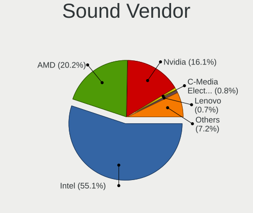

| Vendor                           | Notebooks | Percent |
|----------------------------------|-----------|---------|
| Intel                            | 5186      | 55.08%  |
| AMD                              | 1904      | 20.22%  |
| Nvidia                           | 1513      | 16.07%  |
| C-Media Electronics              | 76        | 0.81%   |
| Lenovo                           | 62        | 0.66%   |
| Realtek Semiconductor            | 56        | 0.59%   |
| Logitech                         | 44        | 0.47%   |
| JMTek                            | 39        | 0.41%   |
| GN Netcom                        | 31        | 0.33%   |
| Texas Instruments                | 29        | 0.31%   |
| Apple                            | 26        | 0.28%   |
| Razer USA                        | 25        | 0.27%   |
| Kingston Technology              | 25        | 0.27%   |
| Focusrite-Novation               | 25        | 0.27%   |
| Hewlett-Packard                  | 24        | 0.25%   |
| Sony                             | 23        | 0.24%   |
| ASUSTek Computer                 | 21        | 0.22%   |
| SteelSeries ApS                  | 17        | 0.18%   |
| Generalplus Technology           | 14        | 0.15%   |
| Plantronics                      | 13        | 0.14%   |
| Unknown                          | 12        | 0.13%   |
| KTMicro                          | 11        | 0.12%   |
| Corsair                          | 11        | 0.12%   |
| Creative Technology              | 10        | 0.11%   |
| DSEA A/S                         | 9         | 0.1%    |
| Conexant Systems                 | 8         | 0.08%   |
| Comtrue                          | 8         | 0.08%   |
| Walmart                          | 7         | 0.07%   |
| Samsung Electronics              | 6         | 0.06%   |
| BEHRINGER International          | 6         | 0.06%   |
| Yamaha                           | 5         | 0.05%   |
| XMOS                             | 5         | 0.05%   |
| SAVITECH                         | 5         | 0.05%   |
| RODE Microphones                 | 5         | 0.05%   |
| Jieli Technology                 | 5         | 0.05%   |
| Blue Microphones                 | 5         | 0.05%   |
| Silicon Integrated Systems [SiS] | 4         | 0.04%   |
| Samson Technologies              | 4         | 0.04%   |
| M-Audio                          | 4         | 0.04%   |
| Huawei Technologies              | 4         | 0.04%   |

Sound Model
-----------

Sound card models

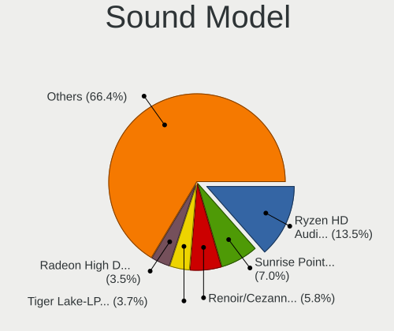

| Model                                                                      | Notebooks | Percent |
|----------------------------------------------------------------------------|-----------|---------|
| AMD Ryzen HD Audio Controller                                              | 1567      | 13.49%  |
| Intel Sunrise Point-LP HD Audio                                            | 814       | 7.01%   |
| AMD Renoir/Cezanne HDMI/DP Audio Controller                                | 676       | 5.82%   |
| Intel Tiger Lake-LP Smart Sound Technology Audio Controller                | 433       | 3.73%   |
| AMD Radeon High Definition Audio Controller                                | 412       | 3.55%   |
| Intel 7 Series/C216 Chipset Family High Definition Audio Controller        | 381       | 3.28%   |
| Intel Cannon Lake PCH cAVS                                                 | 338       | 2.91%   |
| Intel Alder Lake PCH-P High Definition Audio Controller                    | 331       | 2.85%   |
| AMD Raven/Raven2/Fenghuang HDMI/DP Audio Controller                        | 291       | 2.51%   |
| Intel Cannon Point-LP High Definition Audio Controller                     | 250       | 2.15%   |
| Intel Broadwell-U Audio Controller                                         | 228       | 1.96%   |
| Intel Wildcat Point-LP High Definition Audio Controller                    | 223       | 1.92%   |
| Intel Haswell-ULT HD Audio Controller                                      | 214       | 1.84%   |
| Intel 8 Series HD Audio Controller                                         | 214       | 1.84%   |
| Intel 6 Series/C200 Series Chipset Family High Definition Audio Controller | 209       | 1.8%    |
| Nvidia TU107 GeForce GTX 1650 High Definition Audio Controller             | 202       | 1.74%   |
| Intel Comet Lake PCH cAVS                                                  | 199       | 1.71%   |
| Intel 8 Series/C220 Series Chipset High Definition Audio Controller        | 182       | 1.57%   |
| Intel Raptor Lake-P/U/H cAVS                                               | 177       | 1.52%   |
| Intel CM238 HD Audio Controller                                            | 170       | 1.46%   |
| Intel Comet Lake PCH-LP cAVS                                               | 161       | 1.39%   |
| Nvidia GA107 High Definition Audio Controller                              | 159       | 1.37%   |
| Intel Xeon E3-1200 v3/4th Gen Core Processor HD Audio Controller           | 146       | 1.26%   |
| Nvidia AD107 High Definition Audio Controller                              | 144       | 1.24%   |
| Nvidia GA106 High Definition Audio Controller                              | 139       | 1.2%    |
| Nvidia GP107GL High Definition Audio Controller                            | 137       | 1.18%   |
| Intel Tiger Lake-H HD Audio Controller                                     | 125       | 1.08%   |
| Intel 5 Series/3400 Series Chipset High Definition Audio                   | 124       | 1.07%   |
| Intel 100 Series/C230 Series Chipset Family HD Audio Controller            | 113       | 0.97%   |
| Intel 82801I (ICH9 Family) HD Audio Controller                             | 109       | 0.94%   |
| Nvidia GA104 High Definition Audio Controller                              | 102       | 0.88%   |
| Nvidia TU106 High Definition Audio Controller                              | 100       | 0.86%   |
| Intel Ice Lake-LP Smart Sound Technology Audio Controller                  | 96        | 0.83%   |
| Intel Celeron/Pentium Silver Processor High Definition Audio               | 93        | 0.8%    |
| AMD FCH Azalia Controller                                                  | 86        | 0.74%   |
| Intel Meteor Lake-P HD Audio Controller                                    | 84        | 0.72%   |
| AMD Kabini HDMI/DP Audio                                                   | 72        | 0.62%   |
| Nvidia GF108 High Definition Audio Controller                              | 59        | 0.51%   |
| Nvidia TU116 High Definition Audio Controller                              | 58        | 0.5%    |
| AMD Family 15h (Models 60h-6fh) Audio Controller                           | 58        | 0.5%    |

Memory
------

Memory Vendor
-------------

Memory module vendors

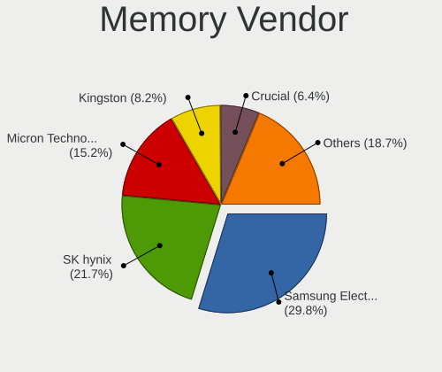

| Vendor                       | Notebooks | Percent |
|------------------------------|-----------|---------|
| Samsung Electronics          | 1767      | 29.77%  |
| SK hynix                     | 1289      | 21.71%  |
| Micron Technology            | 901       | 15.18%  |
| Kingston                     | 489       | 8.24%   |
| Crucial                      | 379       | 6.38%   |
| Unknown                      | 177       | 2.98%   |
| Ramaxel Technology           | 140       | 2.36%   |
| A-DATA Technology            | 130       | 2.19%   |
| Unknown                      | 96        | 1.62%   |
| Corsair                      | 88        | 1.48%   |
| Elpida                       | 72        | 1.21%   |
| G.Skill                      | 44        | 0.74%   |
| Nanya Technology             | 34        | 0.57%   |
| Smart                        | 29        | 0.49%   |
| Team                         | 27        | 0.45%   |
| GOODRAM                      | 22        | 0.37%   |
| Transcend                    | 21        | 0.35%   |
| Unknown (ABCD)               | 20        | 0.34%   |
| Patriot                      | 19        | 0.32%   |
| 4ea5                         | 10        | 0.17%   |
| AMD                          | 9         | 0.15%   |
| Smart Brazil                 | 8         | 0.13%   |
| Goldkey                      | 8         | 0.13%   |
| Apacer                       | 8         | 0.13%   |
| V-GeN                        | 7         | 0.12%   |
| Teikon                       | 7         | 0.12%   |
| PNY                          | 7         | 0.12%   |
| Hikvision                    | 7         | 0.12%   |
| Timetec                      | 6         | 0.1%    |
| ff                           | 6         | 0.1%    |
| Avant                        | 6         | 0.1%    |
| Silicon Power                | 4         | 0.07%   |
| Patriot Memory (PDP Systems) | 4         | 0.07%   |
| Lexar Co Limited             | 4         | 0.07%   |
| Lexar                        | 4         | 0.07%   |
| fef5                         | 4         | 0.07%   |
| ChangXin Memory              | 4         | 0.07%   |
| 48spaces                     | 4         | 0.07%   |
| Qimonda                      | 3         | 0.05%   |
| Neo Forza                    | 3         | 0.05%   |

Memory Model
------------

Memory module models

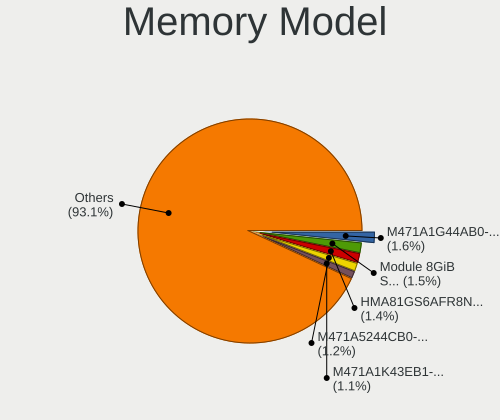

| Model                                                       | Notebooks | Percent |
|-------------------------------------------------------------|-----------|---------|
| Samsung RAM M471A1G44AB0-CWE 8GiB SODIMM DDR4 3200MT/s      | 102       | 1.63%   |
| Unknown                                                     | 96        | 1.54%   |
| SK hynix RAM HMA81GS6AFR8N-UH 8GB SODIMM DDR4 2667MT/s      | 90        | 1.44%   |
| Samsung RAM M471A5244CB0-CTD 4GB SODIMM DDR4 3266MT/s       | 77        | 1.23%   |
| Samsung RAM M471A1K43EB1-CWE 8GB SODIMM DDR4 3200MT/s       | 67        | 1.07%   |
| SK hynix RAM HMAA1GS6CJR6N-XN 8GB SODIMM DDR4 3200MT/s      | 62        | 0.99%   |
| Samsung RAM M471A1K43DB1-CWE 8GB SODIMM DDR4 3200MT/s       | 61        | 0.98%   |
| SK hynix RAM HMA81GS6DJR8N-XN 8GB SODIMM DDR4 3200MT/s      | 59        | 0.95%   |
| Samsung RAM M471A1K43CB1-CRC 8GB SODIMM DDR4 8400MT/s       | 52        | 0.83%   |
| SK hynix RAM HMT451S6BFR8A-PB 4GB SODIMM DDR3 1600MT/s      | 50        | 0.8%    |
| Samsung RAM M471A1K43CB1-CTD 8GB SODIMM DDR4 3200MT/s       | 48        | 0.77%   |
| Samsung RAM M471A1G44BB0-CWE 8GB SODIMM DDR4 3200MT/s       | 46        | 0.74%   |
| Samsung RAM M471B5173DB0-YK0 4GB SODIMM DDR3 1600MT/s       | 41        | 0.66%   |
| Samsung RAM M471A5244CB0-CWE 4GB SODIMM DDR4 3200MT/s       | 40        | 0.64%   |
| Samsung RAM M471A2K43DB1-CWE 16GB SODIMM DDR4 3200MT/s      | 40        | 0.64%   |
| Samsung RAM M471A1K43DB1-CTD 8GB SODIMM DDR4 2667MT/s       | 39        | 0.62%   |
| Samsung RAM M471B1G73DB0-YK0 8GB SODIMM DDR3 1600MT/s       | 37        | 0.59%   |
| Samsung RAM M471A5244CB0-CRC 4GB SODIMM DDR4 2667MT/s       | 37        | 0.59%   |
| Samsung RAM M471A1K43BB1-CRC 8GB SODIMM DDR4 2667MT/s       | 37        | 0.59%   |
| Micron RAM 4ATF1G64HZ-3G2E1 8GB SODIMM DDR4 3200MT/s        | 37        | 0.59%   |
| Samsung RAM M425R1GB4BB0-CQKOL 8GB SODIMM DDR5 4800MT/s     | 36        | 0.58%   |
| Samsung RAM M471B5173EB0-YK0 4GB SODIMM DDR3 1600MT/s       | 34        | 0.54%   |
| SK hynix RAM HMA81GS6JJR8N-VK 8GB SODIMM DDR4 2667MT/s      | 32        | 0.51%   |
| Samsung RAM M471A1G44AB0-CWE 8GB Row Of Chips DDR4 3200MT/s | 32        | 0.51%   |
| Samsung RAM M471B5273CH0-CH9 4GB SODIMM DDR3 1334MT/s       | 31        | 0.5%    |
| Samsung RAM M471B5173QH0-YK0 4GB SODIMM DDR3 1600MT/s       | 31        | 0.5%    |
| SK hynix RAM HMA81GS6CJR8N-VK 8GB SODIMM DDR4 2667MT/s      | 30        | 0.48%   |
| Samsung RAM M471B1G73EB0-YK0 8192MB SODIMM DDR3 1600MT/s    | 30        | 0.48%   |
| Samsung RAM M471A2G44AM0-CWE 16GB SODIMM DDR4 3200MT/s      | 30        | 0.48%   |
| Micron RAM 8ATF1G64HZ-3G2J1 8GB SODIMM DDR4 3200MT/s        | 30        | 0.48%   |
| Micron RAM 4ATF1G64HZ-3G2F1 8GB SODIMM DDR4 3200MT/s        | 30        | 0.48%   |
| Samsung RAM M471B1G73QH0-YK0 8GB SODIMM DDR3 1600MT/s       | 28        | 0.45%   |
| SK hynix RAM HMT41GS6BFR8A-PB 8GB SODIMM DDR3 2667MT/s      | 27        | 0.43%   |
| Micron RAM 8ATF1G64HZ-3G2R1 8GB SODIMM DDR4 3200MT/s        | 27        | 0.43%   |
| SK hynix RAM HMA82GS6AFR8N-UH 16GB SODIMM DDR4 2667MT/s     | 26        | 0.42%   |
| Samsung RAM M471B5273DH0-CH9 4GB SODIMM DDR3 1600MT/s       | 26        | 0.42%   |
| Samsung RAM M471A2K43CB1-CRC 16GB SODIMM DDR4 2667MT/s      | 26        | 0.42%   |
| Micron RAM 4ATF51264HZ-2G6E1 4GB SODIMM DDR4 2667MT/s       | 26        | 0.42%   |
| SK hynix RAM HMT351S6CFR8C-PB 4GB SODIMM DDR3 1600MT/s      | 25        | 0.4%    |
| SK hynix RAM HMA851S6CJR6N-VK 4GB SODIMM DDR4 2667MT/s      | 25        | 0.4%    |

Memory Kind
-----------

Memory module kinds

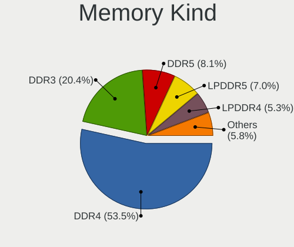

| Kind    | Notebooks | Percent |
|---------|-----------|---------|
| DDR4    | 2630      | 53.46%  |
| DDR3    | 1004      | 20.41%  |
| DDR5    | 397       | 8.07%   |
| LPDDR5  | 344       | 6.99%   |
| LPDDR4  | 260       | 5.28%   |
| LPDDR3  | 160       | 3.25%   |
| DDR2    | 63        | 1.28%   |
| SDRAM   | 50        | 1.02%   |
| Unknown | 10        | 0.2%    |
| DRAM    | 1         | 0.02%   |
| DDR     | 1         | 0.02%   |

Memory Form Factor
------------------

Physical design of the memory module

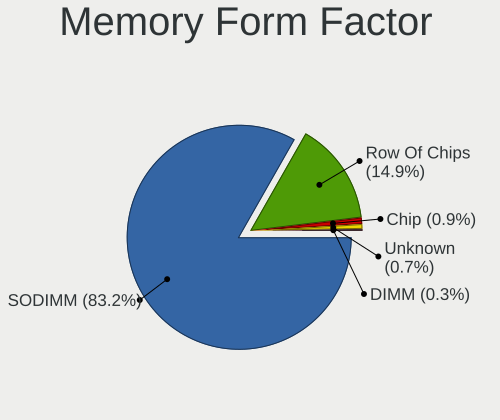

| Name         | Notebooks | Percent |
|--------------|-----------|---------|
| SODIMM       | 4119      | 83.23%  |
| Row Of Chips | 735       | 14.85%  |
| Chip         | 46        | 0.93%   |
| Unknown      | 34        | 0.69%   |
| DIMM         | 15        | 0.3%    |

Memory Size
-----------

Memory module size

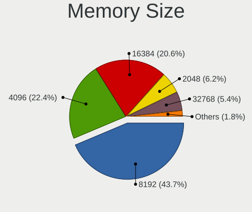

| Size  | Notebooks | Percent |
|-------|-----------|---------|
| 8192  | 2364      | 43.66%  |
| 4096  | 1212      | 22.39%  |
| 16384 | 1117      | 20.63%  |
| 2048  | 334       | 6.17%   |
| 32768 | 292       | 5.39%   |
| 1024  | 72        | 1.33%   |
| 49152 | 8         | 0.15%   |
| 12288 | 8         | 0.15%   |
| 3072  | 4         | 0.07%   |
| 6144  | 2         | 0.04%   |
| 512   | 1         | 0.02%   |

Memory Speed
------------

Memory module speed

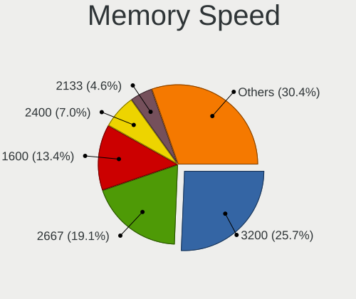

| Speed   | Notebooks | Percent |
|---------|-----------|---------|
| 3200    | 1369      | 25.65%  |
| 2667    | 1020      | 19.11%  |
| 1600    | 713       | 13.36%  |
| 2400    | 371       | 6.95%   |
| 2133    | 244       | 4.57%   |
| 5600    | 205       | 3.84%   |
| 4800    | 193       | 3.62%   |
| 6400    | 179       | 3.35%   |
| 4267    | 126       | 2.36%   |
| 1334    | 109       | 2.04%   |
| 1333    | 98        | 1.84%   |
| 7500    | 87        | 1.63%   |
| 8400    | 78        | 1.46%   |
| 3266    | 77        | 1.44%   |
| 1867    | 75        | 1.41%   |
| 8533    | 49        | 0.92%   |
| 4266    | 46        | 0.86%   |
| 667     | 46        | 0.86%   |
| 1067    | 45        | 0.84%   |
| 4199    | 29        | 0.54%   |
| Unknown | 24        | 0.45%   |
| 7467    | 20        | 0.37%   |
| 2048    | 17        | 0.32%   |
| 3733    | 16        | 0.3%    |
| 1066    | 16        | 0.3%    |
| 800     | 16        | 0.3%    |
| 2933    | 13        | 0.24%   |
| 975     | 11        | 0.21%   |
| 5200    | 6         | 0.11%   |
| 5500    | 5         | 0.09%   |
| 2267    | 4         | 0.07%   |
| 8000    | 3         | 0.06%   |
| 1866    | 3         | 0.06%   |
| 6000    | 2         | 0.04%   |
| 3000    | 2         | 0.04%   |
| 1639    | 2         | 0.04%   |
| 1200    | 2         | 0.04%   |
| 533     | 2         | 0.04%   |
| 400     | 2         | 0.04%   |
| 12800   | 1         | 0.02%   |

Printers & scanners
-------------------

Printer Vendor
--------------

Printer device vendors

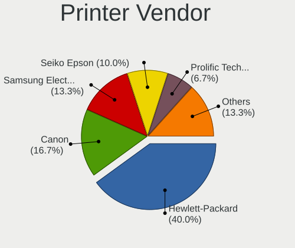

| Vendor                | Notebooks | Percent |
|-----------------------|-----------|---------|
| Hewlett-Packard       | 12        | 40%     |
| Canon                 | 5         | 16.67%  |
| Samsung Electronics   | 4         | 13.33%  |
| Seiko Epson           | 3         | 10%     |
| Prolific Technology   | 2         | 6.67%   |
| Brother Industries    | 2         | 6.67%   |
| Lexmark International | 1         | 3.33%   |
| Dymo-CoStar           | 1         | 3.33%   |

Printer Model
-------------

Printer device models

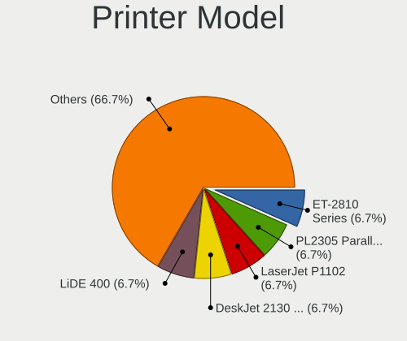

| Model                                  | Notebooks | Percent |
|----------------------------------------|-----------|---------|
| Seiko Epson ET-2810 Series             | 2         | 6.67%   |
| Prolific PL2305 Parallel Port          | 2         | 6.67%   |
| HP LaserJet P1102                      | 2         | 6.67%   |
| HP DeskJet 2130 series                 | 2         | 6.67%   |
| Canon LiDE 400                         | 2         | 6.67%   |
| Seiko Epson WF-2530 Series             | 1         | 3.33%   |
| Samsung SCX-3200 Series                | 1         | 3.33%   |
| Samsung ML-1660 Series                 | 1         | 3.33%   |
| Samsung ML-1630 Series                 | 1         | 3.33%   |
| Samsung M2020 Series                   | 1         | 3.33%   |
| Lexmark International Lexmark CX522ade | 1         | 3.33%   |
| HP OfficeJet 5600 (USBHUB)             | 1         | 3.33%   |
| HP LaserJet 1320                       | 1         | 3.33%   |
| HP LaserJet 1022                       | 1         | 3.33%   |
| HP ENVY 5000 series                    | 1         | 3.33%   |
| HP DeskJet 840c                        | 1         | 3.33%   |
| HP DeskJet 4100 series                 | 1         | 3.33%   |
| HP DeskJet 2700 series                 | 1         | 3.33%   |
| HP DeskJet 2600 series                 | 1         | 3.33%   |
| Dymo-CoStar LabelWriter 400            | 1         | 3.33%   |
| Canon TR150 series                     | 1         | 3.33%   |
| Canon PIXMA MG2500 Series              | 1         | 3.33%   |
| Canon MF4010 series                    | 1         | 3.33%   |
| Brother HL-3070CW series               | 1         | 3.33%   |
| Brother HL-1110 series                 | 1         | 3.33%   |

Scanner Vendor
--------------

Scanner device vendors

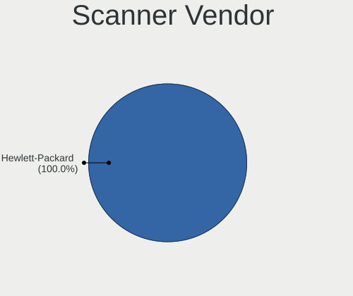

| Vendor          | Notebooks | Percent |
|-----------------|-----------|---------|
| Hewlett-Packard | 1         | 100%    |

Scanner Model
-------------

Scanner device models

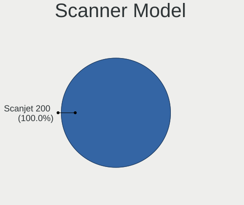

| Model          | Notebooks | Percent |
|----------------|-----------|---------|
| HP Scanjet 200 | 1         | 100%    |

Camera
------

Camera Vendor
-------------

Camera device vendors

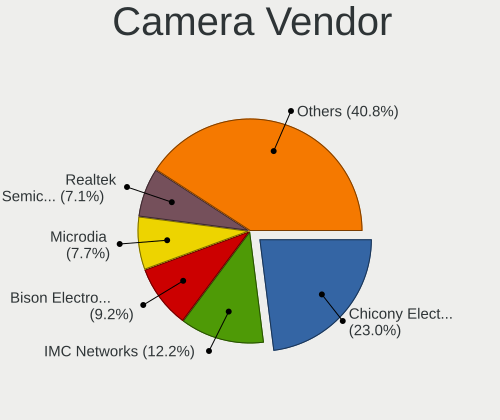

| Vendor                                 | Notebooks | Percent |
|----------------------------------------|-----------|---------|
| Chicony Electronics                    | 1483      | 23.01%  |
| IMC Networks                           | 786       | 12.2%   |
| Bison Electronics                      | 592       | 9.19%   |
| Microdia                               | 494       | 7.67%   |
| Realtek Semiconductor                  | 458       | 7.11%   |
| Quanta                                 | 425       | 6.6%    |
| Sunplus Innovation Technology          | 319       | 4.95%   |
| Luxvisions Innotech Limited            | 250       | 3.88%   |
| Cheng Uei Precision Industry (Foxlink) | 204       | 3.17%   |
| Syntek                                 | 203       | 3.15%   |
| Lite-On Technology                     | 166       | 2.58%   |
| Sonix Technology                       | 124       | 1.92%   |
| Apple                                  | 117       | 1.82%   |
| Logitech                               | 102       | 1.58%   |
| Suyin                                  | 94        | 1.46%   |
| Shinetech                              | 75        | 1.16%   |
| SunplusIT                              | 65        | 1.01%   |
| Silicon Motion                         | 64        | 0.99%   |
| Alcor Micro                            | 46        | 0.71%   |
| Lenovo                                 | 32        | 0.5%    |
| Acer                                   | 30        | 0.47%   |
| Samsung Electronics                    | 28        | 0.43%   |
| Ricoh                                  | 20        | 0.31%   |
| Shine-optics                           | 19        | 0.29%   |
| kingcome                               | 19        | 0.29%   |
| Importek                               | 15        | 0.23%   |
| ALi                                    | 13        | 0.2%    |
| Primax Electronics                     | 11        | 0.17%   |
| ShineOptics                            | 9         | 0.14%   |
| BillionPixels                          | 9         | 0.14%   |
| Z-Star Microelectronics                | 8         | 0.12%   |
| icSpring                               | 8         | 0.12%   |
| Google                                 | 8         | 0.12%   |
| Microsoft                              | 7         | 0.11%   |
| MacroSilicon                           | 7         | 0.11%   |
| Shenzhen Kingcome Optoelectronic       | 6         | 0.09%   |
| Generalplus Technology                 | 5         | 0.08%   |
| Framework                              | 5         | 0.08%   |
| ARC International                      | 5         | 0.08%   |
| Unknown                                | 5         | 0.08%   |

Camera Model
------------

Camera device models

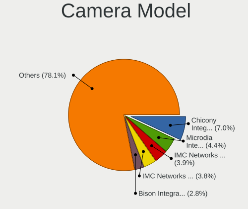

| Model                                                                      | Notebooks | Percent |
|----------------------------------------------------------------------------|-----------|---------|
| Chicony Integrated Camera                                                  | 453       | 6.98%   |
| Microdia Integrated_Webcam_HD                                              | 285       | 4.39%   |
| IMC Networks USB2.0 HD UVC WebCam                                          | 256       | 3.94%   |
| IMC Networks Integrated Camera                                             | 249       | 3.83%   |
| Bison Integrated Camera                                                    | 179       | 2.76%   |
| Realtek Integrated_Webcam_HD                                               | 164       | 2.53%   |
| Syntek Integrated Camera                                                   | 150       | 2.31%   |
| Chicony HD WebCam                                                          | 131       | 2.02%   |
| Sunplus Integrated_Webcam_HD                                               | 112       | 1.72%   |
| Bison HD Webcam                                                            | 100       | 1.54%   |
| Quanta HD User Facing                                                      | 94        | 1.45%   |
| Luxvisions Innotech Limited Integrated Camera                              | 89        | 1.37%   |
| Lite-On Integrated Camera                                                  | 87        | 1.34%   |
| Sonix USB2.0 HD UVC WebCam                                                 | 76        | 1.17%   |
| Bison SunplusIT Integrated Camera                                          | 69        | 1.06%   |
| Chicony Integrated Camera (1280x720@30)                                    | 68        | 1.05%   |
| Chicony HD User Facing                                                     | 63        | 0.97%   |
| Chicony HP HD Camera                                                       | 62        | 0.95%   |
| Luxvisions Innotech Limited HP TrueVision HD Camera                        | 58        | 0.89%   |
| IMC Networks USB2.0 VGA UVC WebCam                                         | 57        | 0.88%   |
| Chicony Chicony USB2.0 Camera                                              | 52        | 0.8%    |
| Chicony HP Wide Vision HD Camera                                           | 50        | 0.77%   |
| Quanta HP TrueVision HD Camera                                             | 47        | 0.72%   |
| Quanta HD Webcam                                                           | 46        | 0.71%   |
| Chicony HP TrueVision HD Camera                                            | 45        | 0.69%   |
| Quanta HP Wide Vision HD Camera                                            | 44        | 0.68%   |
| IMC Networks HD Camera                                                     | 44        | 0.68%   |
| Microdia Integrated Webcam                                                 | 41        | 0.63%   |
| Chicony Integrated IR Camera                                               | 40        | 0.62%   |
| Apple iPhone 5/5C/5S/6/SE/7/8/X                                            | 38        | 0.59%   |
| Sonix USB2.0 FHD UVC WebCam                                                | 37        | 0.57%   |
| Shinetech USB2.0 FHD UVC WebCam                                            | 36        | 0.55%   |
| Realtek USB Camera                                                         | 36        | 0.55%   |
| Luxvisions Innotech Limited Integrated RGB Camera                          | 35        | 0.54%   |
| Chicony HP TrueVision HD                                                   | 35        | 0.54%   |
| Quanta HP HD Camera                                                        | 34        | 0.52%   |
| Cheng Uei Precision Industry (Foxlink) HP Wide Vision HD Integrated Webcam | 34        | 0.52%   |
| Bison Lenovo EasyCamera                                                    | 34        | 0.52%   |
| Realtek Integrated Webcam                                                  | 33        | 0.51%   |
| Quanta VGA WebCam                                                          | 32        | 0.49%   |

Security
--------

Fingerprint Vendor
------------------

Fingerprint sensor vendors

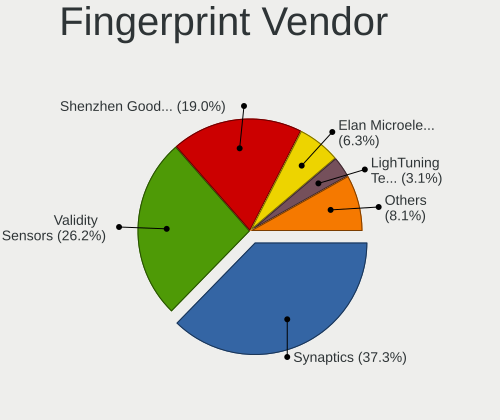

| Vendor                             | Notebooks | Percent |
|------------------------------------|-----------|---------|
| Synaptics                          | 499       | 37.29%  |
| Validity Sensors                   | 351       | 26.23%  |
| Shenzhen Goodix Technology         | 254       | 18.98%  |
| Elan Microelectronics              | 84        | 6.28%   |
| LighTuning Technology              | 41        | 3.06%   |
| Upek                               | 38        | 2.84%   |
| AuthenTec                          | 28        | 2.09%   |
| Realtek USB2.0 Finger Print Bridge | 12        | 0.9%    |
| HOLTEK                             | 12        | 0.9%    |
| STMicroelectronics                 | 10        | 0.75%   |
| Focal-systems.Corp                 | 5         | 0.37%   |
| Samsung Electronics                | 4         | 0.3%    |

Fingerprint Model
-----------------

Fingerprint sensor models

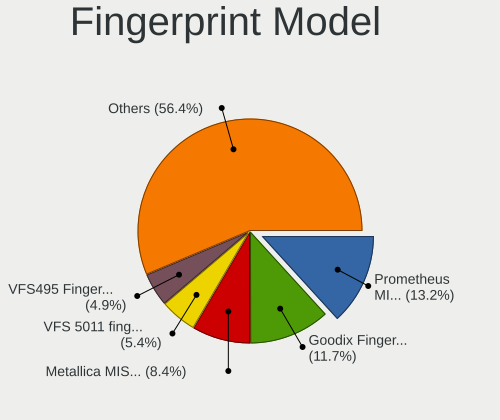

| Model                                                                      | Notebooks | Percent |
|----------------------------------------------------------------------------|-----------|---------|
| Synaptics Prometheus MIS Touch Fingerprint Reader                          | 177       | 13.23%  |
| Shenzhen Goodix  Fingerprint Device                                        | 157       | 11.73%  |
| Synaptics Metallica MIS Touch Fingerprint Reader                           | 113       | 8.45%   |
| Validity Sensors VFS 5011 fingerprint sensor                               | 72        | 5.38%   |
| Validity Sensors VFS495 Fingerprint Reader                                 | 65        | 4.86%   |
| Shenzhen Goodix FingerPrint                                                | 50        | 3.74%   |
| Validity Sensors Synaptics WBDI                                            | 49        | 3.66%   |
| Shenzhen Goodix Fingerprint Reader                                         | 47        | 3.51%   |
| Elan ELAN:Fingerprint                                                      | 42        | 3.14%   |
| Elan ELAN:ARM-M4                                                           | 41        | 3.06%   |
| Synaptics UWP WBDI Device                                                  | 37        | 2.77%   |
| Upek Biometric Touchchip/Touchstrip Fingerprint Sensor                     | 36        | 2.69%   |
| Validity Sensors VFS5011 Fingerprint Reader                                | 32        | 2.39%   |
| Validity Sensors Synaptics VFS7552 Touch Fingerprint Sensor with PurePrint | 29        | 2.17%   |
| Validity Sensors VFS7500 Touch Fingerprint Sensor                          | 28        | 2.09%   |
| Synaptics FS7604 Touch Fingerprint Sensor with PurePrint                   | 28        | 2.09%   |
| Synaptics Fingerprint reader [HP G6]                                       | 26        | 1.94%   |
| Synaptics  FS7604 Touch Fingerprint Sensor with PurePrint                  | 24        | 1.79%   |
| Synaptics Metallica MOH Touch Fingerprint Reader                           | 23        | 1.72%   |
| Synaptics Prometheus Fingerprint Reader                                    | 22        | 1.64%   |
| LighTuning ES603 Swipe Fingerprint Sensor                                  | 21        | 1.57%   |
| Validity Sensors VFS491                                                    | 19        | 1.42%   |
| Synaptics WBDI Fingerprint Reader USB 086                                  | 17        | 1.27%   |
| LighTuning EgisTec Touch Fingerprint Sensor                                | 17        | 1.27%   |
| Validity Sensors VFS471 Fingerprint Reader                                 | 15        | 1.12%   |
| Validity Sensors Fingerprint scanner                                       | 14        | 1.05%   |
| AuthenTec AES2810                                                          | 13        | 0.97%   |
| Realtek USB2.0 Finger Print Bridge FocalTech Fingerprint Device            | 12        | 0.9%    |
| HOLTEK FocalTech Fingerprint Device                                        | 12        | 0.9%    |
| STMicroelectronics Fingerprint Reader                                      | 10        | 0.75%   |
| Synaptics  WBDI                                                            | 8         | 0.6%    |
| Validity Sensors VFS7552 Touch Fingerprint Sensor                          | 6         | 0.45%   |
| Validity Sensors VFS451 Fingerprint Reader                                 | 6         | 0.45%   |
| Synaptics WBDI Device                                                      | 6         | 0.45%   |
| Synaptics UWP WBDI                                                         | 6         | 0.45%   |
| Synaptics TouchPad                                                         | 6         | 0.45%   |
| AuthenTec Fingerprint Sensor                                               | 6         | 0.45%   |
| Validity Sensors VFS301 Fingerprint Reader                                 | 5         | 0.37%   |
| Validity Sensors Swipe Fingerprint Sensor                                  | 5         | 0.37%   |
| Focal-systems.Corp FT9201Fingerprint.                                      | 5         | 0.37%   |

Chipcard Vendor
---------------

Chipcard module vendors

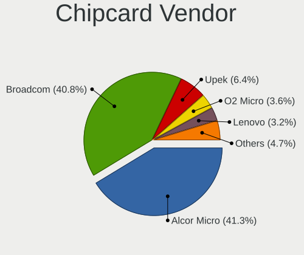

| Vendor                    | Notebooks | Percent |
|---------------------------|-----------|---------|
| Alcor Micro               | 219       | 41.32%  |
| Broadcom                  | 216       | 40.75%  |
| Upek                      | 34        | 6.42%   |
| O2 Micro                  | 19        | 3.58%   |
| Lenovo                    | 17        | 3.21%   |
| Yubico.com                | 6         | 1.13%   |
| SCM Microsystems          | 5         | 0.94%   |
| Gemalto (was Gemplus)     | 3         | 0.57%   |
| Clay Logic                | 2         | 0.38%   |
| Aktiv                     | 2         | 0.38%   |
| Advanced Card Systems     | 2         | 0.38%   |
| Realtek Semiconductor     | 1         | 0.19%   |
| Hewlett-Packard           | 1         | 0.19%   |
| Chicony Electronics       | 1         | 0.19%   |
| Cherry                    | 1         | 0.19%   |
| Aladdin Knowledge Systems | 1         | 0.19%   |

Chipcard Model
--------------

Chipcard module models

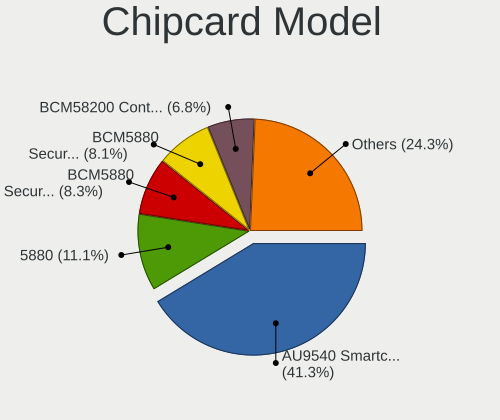

| Model                                                                        | Notebooks | Percent |
|------------------------------------------------------------------------------|-----------|---------|
| Alcor Micro AU9540 Smartcard Reader                                          | 219       | 41.32%  |
| Broadcom 5880                                                                | 59        | 11.13%  |
| Broadcom BCM5880 Secure Applications Processor                               | 44        | 8.3%    |
| Broadcom BCM5880 Secure Applications Processor with fingerprint swipe sensor | 43        | 8.11%   |
| Broadcom BCM58200 ControlVault 3 (FingerPrint sensor + Contacted SmartCard)  | 36        | 6.79%   |
| Upek TouchChip Fingerprint Coprocessor (WBF advanced mode)                   | 34        | 6.42%   |
| Broadcom 58200                                                               | 31        | 5.85%   |
| O2 Micro OZ776 CCID Smartcard Reader                                         | 18        | 3.4%    |
| Lenovo Integrated Smart Card Reader                                          | 17        | 3.21%   |
| Yubico.com Yubikey 4/5 U2F+CCID                                              | 6         | 1.13%   |
| SCM Microsystems SCR3340 - ExpressCard54 Smart Card Reader                   | 4         | 0.75%   |
| Gemalto (was Gemplus) Compact Smart Card Reader Writer                       | 3         | 0.57%   |
| Broadcom BCM5880 Secure Applications Processor with fingerprint touch sensor | 3         | 0.57%   |
| Clay Logic CanoKey Canary                                                    | 2         | 0.38%   |
| Aktiv Rutoken lite                                                           | 2         | 0.38%   |
| SCM Microsystems SCR3500 C Contact Reader                                    | 1         | 0.19%   |
| Realtek Semiconductor Smart Card Reader Interface                            | 1         | 0.19%   |
| O2 Micro Oz776 SmartCard Reader                                              | 1         | 0.19%   |
| Hewlett-Packard SC Keyboard - Apollo (Liteon)                                | 1         | 0.19%   |
| Chicony Electronics HP Skylab USB Smartcard Keyboard                         | 1         | 0.19%   |
| Cherry Smart Terminal XX44                                                   | 1         | 0.19%   |
| Aladdin Knowledge Systems Token JC                                           | 1         | 0.19%   |
| Advanced Card Systems ACR1581                                                | 1         | 0.19%   |
| Advanced Card Systems ACR122U                                                | 1         | 0.19%   |

Unsupported
-----------

Unsupported Devices
-------------------

Total unsupported devices on board

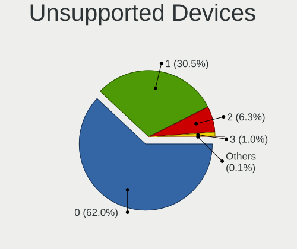

| Total | Notebooks | Percent |
|-------|-----------|---------|
| 0     | 4493      | 62%     |
| 1     | 2213      | 30.54%  |
| 2     | 453       | 6.25%   |
| 3     | 75        | 1.03%   |
| 4     | 9         | 0.12%   |
| 5     | 2         | 0.03%   |
| 7     | 1         | 0.01%   |
| 6     | 1         | 0.01%   |

Unsupported Device Types
------------------------

Types of unsupported devices

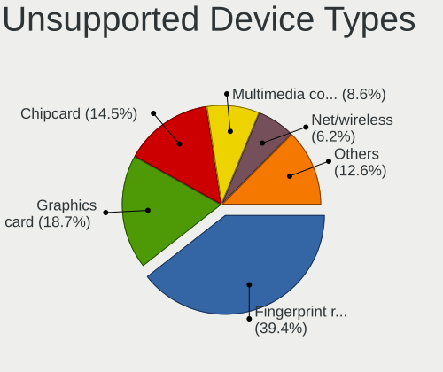

| Type                     | Notebooks | Percent |
|--------------------------|-----------|---------|
| Fingerprint reader       | 1304      | 39.41%  |
| Graphics card            | 618       | 18.68%  |
| Chipcard                 | 480       | 14.51%  |
| Multimedia controller    | 285       | 8.61%   |
| Net/wireless             | 206       | 6.23%   |
| Camera                   | 141       | 4.26%   |
| Bluetooth                | 63        | 1.9%    |
| Communication controller | 47        | 1.42%   |
| Net/ethernet             | 38        | 1.15%   |
| Card reader              | 36        | 1.09%   |
| Sound                    | 26        | 0.79%   |
| Storage                  | 24        | 0.73%   |
| Modem                    | 16        | 0.48%   |
| Network                  | 11        | 0.33%   |
| Flash memory             | 3         | 0.09%   |
| Dvb card                 | 3         | 0.09%   |
| Wireless                 | 2         | 0.06%   |
| Unassigned class         | 2         | 0.06%   |
| Storage/nvme             | 2         | 0.06%   |
| Storage/ata              | 1         | 0.03%   |
| Firewire controller      | 1         | 0.03%   |

