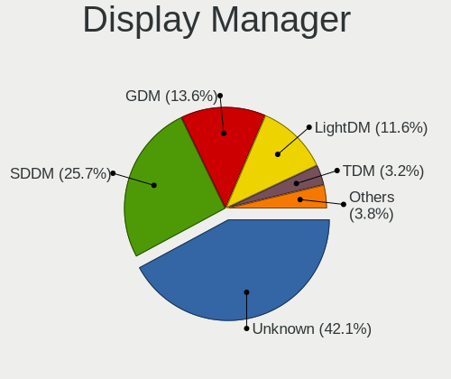
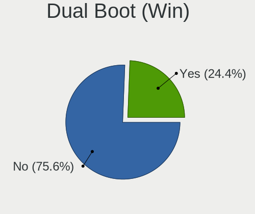
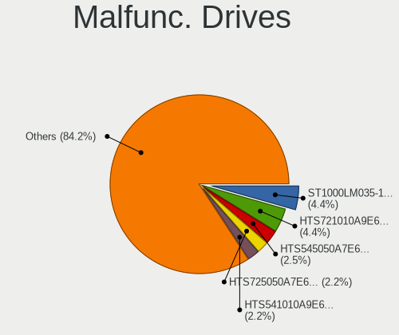
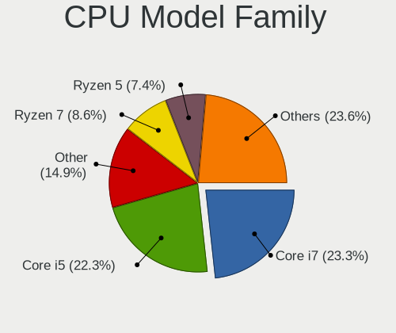
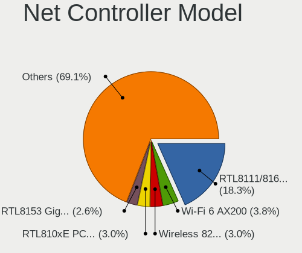
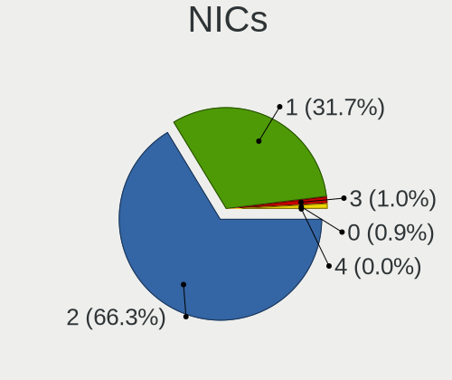

Arch - Tested Hardware & Statistics (Notebooks)
-----------------------------------------------

A project to collect tested hardware configurations for Arch.

Anyone can contribute to this report by the [hw-probe](https://github.com/linuxhw/hw-probe) tool:

    sudo -E hw-probe -all -upload

Please contribute! Especially if your hardware is rare.

Contents
--------

* [ Test Cases ](#test-cases)

* [ System ](#system)
  - [ OS                       ](#os)
  - [ OS Family                ](#os-family)
  - [ Kernel                   ](#kernel)
  - [ Kernel Family            ](#kernel-family)
  - [ Kernel Major Ver.        ](#kernel-major-ver)
  - [ Arch                     ](#arch)
  - [ DE                       ](#de)
  - [ Display Server           ](#display-server)
  - [ Display Manager          ](#display-manager)
  - [ OS Lang                  ](#os-lang)
  - [ Boot Mode                ](#boot-mode)
  - [ Filesystem               ](#filesystem)
  - [ Part. scheme             ](#part-scheme)
  - [ Dual Boot with Linux/BSD ](#dual-boot-with-linuxbsd)
  - [ Dual Boot (Win)          ](#dual-boot-win)

* [ Board ](#board)
  - [ Vendor                   ](#vendor)
  - [ Model                    ](#model)
  - [ Model Family             ](#model-family)
  - [ MFG Year                 ](#mfg-year)
  - [ Form Factor              ](#form-factor)
  - [ Secure Boot              ](#secure-boot)
  - [ Coreboot                 ](#coreboot)
  - [ RAM Size                 ](#ram-size)
  - [ RAM Used                 ](#ram-used)
  - [ Total Drives             ](#total-drives)
  - [ Has CD-ROM               ](#has-cd-rom)
  - [ Has Ethernet             ](#has-ethernet)
  - [ Has WiFi                 ](#has-wifi)
  - [ Has Bluetooth            ](#has-bluetooth)

* [ Location ](#location)
  - [ Country                  ](#country)
  - [ City                     ](#city)

* [ Drives ](#drives)
  - [ Drive Vendor             ](#drive-vendor)
  - [ Drive Model              ](#drive-model)
  - [ HDD Vendor               ](#hdd-vendor)
  - [ SSD Vendor               ](#ssd-vendor)
  - [ Drive Kind               ](#drive-kind)
  - [ Drive Connector          ](#drive-connector)
  - [ Drive Size               ](#drive-size)
  - [ Space Total              ](#space-total)
  - [ Space Used               ](#space-used)
  - [ Malfunc. Drives          ](#malfunc-drives)
  - [ Malfunc. Drive Vendor    ](#malfunc-drive-vendor)
  - [ Malfunc. HDD Vendor      ](#malfunc-hdd-vendor)
  - [ Malfunc. Drive Kind      ](#malfunc-drive-kind)
  - [ Failed Drives            ](#failed-drives)
  - [ Failed Drive Vendor      ](#failed-drive-vendor)
  - [ Drive Status             ](#drive-status)

* [ Storage controller ](#storage-controller)
  - [ Storage Vendor           ](#storage-vendor)
  - [ Storage Model            ](#storage-model)
  - [ Storage Kind             ](#storage-kind)

* [ Processor ](#processor)
  - [ CPU Vendor               ](#cpu-vendor)
  - [ CPU Model                ](#cpu-model)
  - [ CPU Model Family         ](#cpu-model-family)
  - [ CPU Cores                ](#cpu-cores)
  - [ CPU Sockets              ](#cpu-sockets)
  - [ CPU Threads              ](#cpu-threads)
  - [ CPU Op-Modes             ](#cpu-op-modes)
  - [ CPU Microcode            ](#cpu-microcode)
  - [ CPU Microarch            ](#cpu-microarch)

* [ Graphics ](#graphics)
  - [ GPU Vendor               ](#gpu-vendor)
  - [ GPU Model                ](#gpu-model)
  - [ GPU Combo                ](#gpu-combo)
  - [ GPU Driver               ](#gpu-driver)
  - [ GPU Memory               ](#gpu-memory)

* [ Monitor ](#monitor)
  - [ Monitor Vendor           ](#monitor-vendor)
  - [ Monitor Model            ](#monitor-model)
  - [ Monitor Resolution       ](#monitor-resolution)
  - [ Monitor Diagonal         ](#monitor-diagonal)
  - [ Monitor Width            ](#monitor-width)
  - [ Aspect Ratio             ](#aspect-ratio)
  - [ Monitor Area             ](#monitor-area)
  - [ Pixel Density            ](#pixel-density)
  - [ Multiple Monitors        ](#multiple-monitors)

* [ Network ](#network)
  - [ Net Controller Vendor    ](#net-controller-vendor)
  - [ Net Controller Model     ](#net-controller-model)
  - [ Wireless Vendor          ](#wireless-vendor)
  - [ Wireless Model           ](#wireless-model)
  - [ Ethernet Vendor          ](#ethernet-vendor)
  - [ Ethernet Model           ](#ethernet-model)
  - [ Net Controller Kind      ](#net-controller-kind)
  - [ Used Controller          ](#used-controller)
  - [ NICs                     ](#nics)
  - [ IPv6                     ](#ipv6)

* [ Bluetooth ](#bluetooth)
  - [ Bluetooth Vendor         ](#bluetooth-vendor)
  - [ Bluetooth Model          ](#bluetooth-model)

* [ Sound ](#sound)
  - [ Sound Vendor             ](#sound-vendor)
  - [ Sound Model              ](#sound-model)

* [ Memory ](#memory)
  - [ Memory Vendor            ](#memory-vendor)
  - [ Memory Model             ](#memory-model)
  - [ Memory Kind              ](#memory-kind)
  - [ Memory Form Factor       ](#memory-form-factor)
  - [ Memory Size              ](#memory-size)
  - [ Memory Speed             ](#memory-speed)

* [ Printers & scanners ](#printers--scanners)
  - [ Printer Vendor           ](#printer-vendor)
  - [ Printer Model            ](#printer-model)
  - [ Scanner Vendor           ](#scanner-vendor)
  - [ Scanner Model            ](#scanner-model)

* [ Camera ](#camera)
  - [ Camera Vendor            ](#camera-vendor)
  - [ Camera Model             ](#camera-model)

* [ Security ](#security)
  - [ Fingerprint Vendor       ](#fingerprint-vendor)
  - [ Fingerprint Model        ](#fingerprint-model)
  - [ Chipcard Vendor          ](#chipcard-vendor)
  - [ Chipcard Model           ](#chipcard-model)

* [ Unsupported ](#unsupported)
  - [ Unsupported Devices      ](#unsupported-devices)
  - [ Unsupported Device Types ](#unsupported-device-types)

Test Cases
----------

Total: 4159

| Vendor        | Model                       | Probe                                                      | Date         |
|---------------|-----------------------------|------------------------------------------------------------|--------------|
| Lenovo        | ThinkBook 15-IIL 20SM       | [a30f96dea4](https://linux-hardware.org/?probe=a30f96dea4) | Dec 31, 2022 |
| Dell          | Latitude E6430              | [de9b03cf29](https://linux-hardware.org/?probe=de9b03cf29) | Dec 31, 2022 |
| Dell          | Latitude 3420               | [05095533cd](https://linux-hardware.org/?probe=05095533cd) | Dec 31, 2022 |
| Dell          | G3 3579                     | [cad48f0160](https://linux-hardware.org/?probe=cad48f0160) | Dec 30, 2022 |
| HUAWEI        | BOM-WXX9                    | [4409746122](https://linux-hardware.org/?probe=4409746122) | Dec 30, 2022 |
| ASUSTek       | VivoBook_ASUSLaptop M340... | [d7806eec79](https://linux-hardware.org/?probe=d7806eec79) | Dec 30, 2022 |
| HP            | ProBook 430 G8 Notebook ... | [3f4178001d](https://linux-hardware.org/?probe=3f4178001d) | Dec 29, 2022 |
| ASUSTek       | VivoBook_ASUSLaptop X515... | [ce66958f69](https://linux-hardware.org/?probe=ce66958f69) | Dec 29, 2022 |
| Acer          | Aspire A715-41G             | [92f3c92191](https://linux-hardware.org/?probe=92f3c92191) | Dec 29, 2022 |
| HP            | Pavilion Laptop 15-cs2xx... | [587aa5f819](https://linux-hardware.org/?probe=587aa5f819) | Dec 29, 2022 |
| Lenovo        | ThinkPad E580 20KS001RIX    | [4ca01731b4](https://linux-hardware.org/?probe=4ca01731b4) | Dec 29, 2022 |
| HP            | Pavilion Gaming Laptop 1... | [1cf63ef1ad](https://linux-hardware.org/?probe=1cf63ef1ad) | Dec 28, 2022 |
| Acer          | AO756                       | [d0cf64acd1](https://linux-hardware.org/?probe=d0cf64acd1) | Dec 28, 2022 |
| Acer          | Swift SF314-41              | [2923c4c0fc](https://linux-hardware.org/?probe=2923c4c0fc) | Dec 28, 2022 |
| System76      | Darter Pro                  | [a46000c111](https://linux-hardware.org/?probe=a46000c111) | Dec 28, 2022 |
| HP            | 250 G8 Notebook PC          | [7d79eadc7d](https://linux-hardware.org/?probe=7d79eadc7d) | Dec 28, 2022 |
| Lenovo        | ThinkPad P50 20EQS3BT1R     | [a86fddc0b9](https://linux-hardware.org/?probe=a86fddc0b9) | Dec 28, 2022 |
| Acer          | Aspire 5741                 | [1c41b5afb0](https://linux-hardware.org/?probe=1c41b5afb0) | Dec 27, 2022 |
| HP            | Pavilion Laptop 15-cs0xx... | [d75dbe1e39](https://linux-hardware.org/?probe=d75dbe1e39) | Dec 27, 2022 |
| ASUSTek       | ROG Zephyrus G14 GA401QM... | [196d570869](https://linux-hardware.org/?probe=196d570869) | Dec 26, 2022 |
| ASUSTek       | ASUS TUF Gaming A15 FA50... | [c82ebf8b80](https://linux-hardware.org/?probe=c82ebf8b80) | Dec 26, 2022 |
| HP            | Pavilion Laptop 15-cs0xx... | [38a87e716e](https://linux-hardware.org/?probe=38a87e716e) | Dec 26, 2022 |
| ASUSTek       | ZenBook UX425UG_Q408UG      | [9fb13764cc](https://linux-hardware.org/?probe=9fb13764cc) | Dec 26, 2022 |
| Lenovo        | ThinkPad T440p 20AW007QM... | [6e3d39b4ae](https://linux-hardware.org/?probe=6e3d39b4ae) | Dec 25, 2022 |
| ASUSTek       | GL752VW                     | [021903d3d7](https://linux-hardware.org/?probe=021903d3d7) | Dec 25, 2022 |
| WYSE          | XM CLASS                    | [948bfb388d](https://linux-hardware.org/?probe=948bfb388d) | Dec 25, 2022 |
| Lenovo        | IdeaPad 5 Pro 14ACN6 82L... | [1ae154433a](https://linux-hardware.org/?probe=1ae154433a) | Dec 24, 2022 |
| Lenovo        | ThinkPad L14 Gen 3 21C5C... | [f980d6ed2e](https://linux-hardware.org/?probe=f980d6ed2e) | Dec 23, 2022 |
| Lenovo        | ThinkPad L14 Gen 3 21C5C... | [a5dcdfece2](https://linux-hardware.org/?probe=a5dcdfece2) | Dec 23, 2022 |
| ASUSTek       | ASUS TUF Dash F15 FX516P... | [97749ab6b4](https://linux-hardware.org/?probe=97749ab6b4) | Dec 23, 2022 |
| Google        | Babytiger                   | [352d1a547b](https://linux-hardware.org/?probe=352d1a547b) | Dec 23, 2022 |
| Google        | Babytiger                   | [4b2ae6579f](https://linux-hardware.org/?probe=4b2ae6579f) | Dec 23, 2022 |
| HP            | Pavilion Aero Laptop 13-... | [0246231a61](https://linux-hardware.org/?probe=0246231a61) | Dec 22, 2022 |
| Lenovo        | IdeaPad 110-15IBR 80T7      | [0ee0790d0a](https://linux-hardware.org/?probe=0ee0790d0a) | Dec 22, 2022 |
| Lenovo        | IdeaPad 110-15IBR 80T7      | [c2dd6d0281](https://linux-hardware.org/?probe=c2dd6d0281) | Dec 22, 2022 |
| Lenovo        | IdeaPad 320-15IKB 81BT      | [543b6fc9db](https://linux-hardware.org/?probe=543b6fc9db) | Dec 21, 2022 |
| Lenovo        | ThinkPad T470s 20HF003QU... | [5145350f9a](https://linux-hardware.org/?probe=5145350f9a) | Dec 21, 2022 |
| ASUSTek       | Zenbook UX535QE_UM535QE     | [95b8e650ce](https://linux-hardware.org/?probe=95b8e650ce) | Dec 21, 2022 |
| ASUSTek       | Zenbook UX535QE_UM535QE     | [5262e622da](https://linux-hardware.org/?probe=5262e622da) | Dec 21, 2022 |
| ASUSTek       | ASUS TUF Dash F15 FX517Z... | [d2e0ceb9a5](https://linux-hardware.org/?probe=d2e0ceb9a5) | Dec 20, 2022 |
| Lenovo        | Legion R9000P ARH7H 82RG    | [bbc48ee483](https://linux-hardware.org/?probe=bbc48ee483) | Dec 20, 2022 |
| HUAWEI        | NBLB-WAX9N                  | [2b8c2f06eb](https://linux-hardware.org/?probe=2b8c2f06eb) | Dec 20, 2022 |
| Notebook      | PCX0DX                      | [83c28a3013](https://linux-hardware.org/?probe=83c28a3013) | Dec 20, 2022 |
| Acer          | Swift SF314-71              | [36d833d9c2](https://linux-hardware.org/?probe=36d833d9c2) | Dec 20, 2022 |
| Acer          | Swift SF314-71              | [c065eec185](https://linux-hardware.org/?probe=c065eec185) | Dec 20, 2022 |
| Lenovo        | ThinkPad P50 20EQS3BT1R     | [cd16c6fb41](https://linux-hardware.org/?probe=cd16c6fb41) | Dec 20, 2022 |
| ASUSTek       | VivoBook_ASUSLaptop X509... | [593cdd8cf6](https://linux-hardware.org/?probe=593cdd8cf6) | Dec 19, 2022 |
| Dell          | XPS 15 9560                 | [1f1c0123c7](https://linux-hardware.org/?probe=1f1c0123c7) | Dec 19, 2022 |
| Alienware     | x17 R1                      | [a5ff52a7ce](https://linux-hardware.org/?probe=a5ff52a7ce) | Dec 19, 2022 |
| Alienware     | x14                         | [d965b3510e](https://linux-hardware.org/?probe=d965b3510e) | Dec 19, 2022 |
| Lenovo        | Yoga Slim 7 ProX 14IAH7 ... | [3fe5be03b1](https://linux-hardware.org/?probe=3fe5be03b1) | Dec 18, 2022 |
| Lenovo        | Yoga Slim 7 ProX 14IAH7 ... | [b34d0f3a2c](https://linux-hardware.org/?probe=b34d0f3a2c) | Dec 18, 2022 |
| Lenovo        | Legion 7 16ARHA7 82UH       | [2a39f517ef](https://linux-hardware.org/?probe=2a39f517ef) | Dec 18, 2022 |
| ASUSTek       | Zenbook UM5302TA_UM5302T... | [b0f674ae6f](https://linux-hardware.org/?probe=b0f674ae6f) | Dec 17, 2022 |
| Gigabyte      | G5 KE                       | [9ff3d65e35](https://linux-hardware.org/?probe=9ff3d65e35) | Dec 17, 2022 |
| HP            | EliteBook Folio 1040 G3     | [278cdcd567](https://linux-hardware.org/?probe=278cdcd567) | Dec 17, 2022 |
| HP            | ProBook 445 G8 Notebook ... | [87b21382ec](https://linux-hardware.org/?probe=87b21382ec) | Dec 17, 2022 |
| Lenovo        | ThinkPad X1 Extreme 2nd ... | [9768b1fe82](https://linux-hardware.org/?probe=9768b1fe82) | Dec 16, 2022 |
| Dell          | Precision 5570              | [9468beba51](https://linux-hardware.org/?probe=9468beba51) | Dec 16, 2022 |
| HP            | Laptop 15-dw4xxx            | [ac9c6384ca](https://linux-hardware.org/?probe=ac9c6384ca) | Dec 16, 2022 |
| Lenovo        | ThinkPad T15p Gen 3 21DA... | [6d51ea5c76](https://linux-hardware.org/?probe=6d51ea5c76) | Dec 16, 2022 |
| Lenovo        | IdeaPad Gaming 3 15ARH05... | [30fda215a5](https://linux-hardware.org/?probe=30fda215a5) | Dec 16, 2022 |
| Lenovo        | ThinkBook 15-IIL 20SM       | [36a0b6f8d9](https://linux-hardware.org/?probe=36a0b6f8d9) | Dec 16, 2022 |
| Lenovo        | ThinkBook 15-IIL 20SM       | [61dd034d23](https://linux-hardware.org/?probe=61dd034d23) | Dec 16, 2022 |
| HUAWEI        | KLVL-WXXW                   | [302dc680df](https://linux-hardware.org/?probe=302dc680df) | Dec 16, 2022 |
| HP            | Laptop 15-da0xxx            | [d871acfe36](https://linux-hardware.org/?probe=d871acfe36) | Dec 16, 2022 |
| HUAWEI        | KLVL-WXXW                   | [d289646ec3](https://linux-hardware.org/?probe=d289646ec3) | Dec 16, 2022 |
| Lenovo        | ThinkPad X240 20AMA40QLM    | [ec9133f05d](https://linux-hardware.org/?probe=ec9133f05d) | Dec 16, 2022 |
| ASUSTek       | TUF Gaming FX505DT_FX505... | [7ea1bad26b](https://linux-hardware.org/?probe=7ea1bad26b) | Dec 15, 2022 |
| MSI           | GL75 Leopard 10SDK          | [03dc950ee5](https://linux-hardware.org/?probe=03dc950ee5) | Dec 14, 2022 |
| Dell          | Latitude 5490               | [d05d57e241](https://linux-hardware.org/?probe=d05d57e241) | Dec 14, 2022 |
| Lenovo        | ThinkPad E14 Gen 4 21E3S... | [40cf8dd049](https://linux-hardware.org/?probe=40cf8dd049) | Dec 12, 2022 |
| Lenovo        | IdeaPad 1 14AMN7 82VF       | [ed087084fb](https://linux-hardware.org/?probe=ed087084fb) | Dec 12, 2022 |
| Dell          | XPS 13 9380                 | [665b87269c](https://linux-hardware.org/?probe=665b87269c) | Dec 12, 2022 |
| Lenovo        | IdeaPad S145-15IWL 81S9     | [304bad9c19](https://linux-hardware.org/?probe=304bad9c19) | Dec 12, 2022 |
| ASUSTek       | ROG Flow X13 GV301QH_GV3... | [1461a09931](https://linux-hardware.org/?probe=1461a09931) | Dec 12, 2022 |
| LG Electro... | 15Z95N-G.AAC6U1             | [f8dae62b0c](https://linux-hardware.org/?probe=f8dae62b0c) | Dec 11, 2022 |
| HP            | Compaq Presario CQ71        | [57ab22c9c2](https://linux-hardware.org/?probe=57ab22c9c2) | Dec 11, 2022 |
| Sony          | VPCEB3D4R                   | [5f85b7c516](https://linux-hardware.org/?probe=5f85b7c516) | Dec 11, 2022 |
| HP            | Compaq Presario CQ71        | [b3f0bf2008](https://linux-hardware.org/?probe=b3f0bf2008) | Dec 11, 2022 |
| MSI           | Modern 14 B11MOU            | [ec8ac9bbd7](https://linux-hardware.org/?probe=ec8ac9bbd7) | Dec 11, 2022 |
| HP            | Laptop 14s-fq1xxx           | [811092647b](https://linux-hardware.org/?probe=811092647b) | Dec 11, 2022 |
| ASUSTek       | S551LN                      | [9aabc2d159](https://linux-hardware.org/?probe=9aabc2d159) | Dec 11, 2022 |
| Acer          | Swift SF314-57G             | [3ba8e00e00](https://linux-hardware.org/?probe=3ba8e00e00) | Dec 11, 2022 |
| ASUSTek       | Zenbook UX535QE_UM535QE     | [92d1403bdf](https://linux-hardware.org/?probe=92d1403bdf) | Dec 10, 2022 |
| Lenovo        | ThinkBook 15-IIL 20SM       | [17cbc91488](https://linux-hardware.org/?probe=17cbc91488) | Dec 10, 2022 |
| Lenovo        | ThinkBook 15-IIL 20SM       | [4b9eb9fcab](https://linux-hardware.org/?probe=4b9eb9fcab) | Dec 10, 2022 |
| Dell          | XPS 15 9500                 | [a933e298c7](https://linux-hardware.org/?probe=a933e298c7) | Dec 10, 2022 |
| Dell          | XPS 15 9500                 | [0e7dd9fbdb](https://linux-hardware.org/?probe=0e7dd9fbdb) | Dec 10, 2022 |
| Dell          | Latitude E6430              | [f28775142d](https://linux-hardware.org/?probe=f28775142d) | Dec 09, 2022 |
| Acer          | Swift SFX16-52G             | [02a7a5e487](https://linux-hardware.org/?probe=02a7a5e487) | Dec 09, 2022 |
| Lenovo        | ThinkPad P15v Gen 1 20TQ... | [91b65d2fa1](https://linux-hardware.org/?probe=91b65d2fa1) | Dec 09, 2022 |
| Dell          | Inspiron 3583               | [93934b74f5](https://linux-hardware.org/?probe=93934b74f5) | Dec 09, 2022 |
| Acer          | Aspire A315-55G             | [0c6e399e4f](https://linux-hardware.org/?probe=0c6e399e4f) | Dec 09, 2022 |
| Acer          | Aspire A315-55G             | [9c083ab22c](https://linux-hardware.org/?probe=9c083ab22c) | Dec 09, 2022 |
| HP            | Laptop 14s-dq1xxx           | [6af7fadd72](https://linux-hardware.org/?probe=6af7fadd72) | Dec 09, 2022 |
| HP            | Laptop 14s-dq1xxx           | [7e1510d6c6](https://linux-hardware.org/?probe=7e1510d6c6) | Dec 09, 2022 |
| HP            | EliteBook 840 G5            | [946807e266](https://linux-hardware.org/?probe=946807e266) | Dec 08, 2022 |
| Dell          | Latitude 3400               | [d01726a4d0](https://linux-hardware.org/?probe=d01726a4d0) | Dec 08, 2022 |
| MSI           | Alpha 15 A4DEK              | [d2a30990d9](https://linux-hardware.org/?probe=d2a30990d9) | Dec 08, 2022 |
| HP            | Pavilion Aero Laptop 13-... | [8924598f09](https://linux-hardware.org/?probe=8924598f09) | Dec 08, 2022 |
| MSI           | Modern 14 B11MOU            | [426e23829e](https://linux-hardware.org/?probe=426e23829e) | Dec 08, 2022 |
| HP            | ZBook Fury 17 G7 Mobile ... | [cb45484bb6](https://linux-hardware.org/?probe=cb45484bb6) | Dec 08, 2022 |
| MSI           | Vector GP76 12UGS           | [d6c55a874f](https://linux-hardware.org/?probe=d6c55a874f) | Dec 08, 2022 |
| HP            | EliteBook 840 G5            | [bb11ec4f3f](https://linux-hardware.org/?probe=bb11ec4f3f) | Dec 08, 2022 |
| ASUSTek       | ASUS TUF Gaming F15 FX50... | [ea7638c0f9](https://linux-hardware.org/?probe=ea7638c0f9) | Dec 07, 2022 |
| MSI           | Modern 14 B11MOU            | [49e70cf65f](https://linux-hardware.org/?probe=49e70cf65f) | Dec 07, 2022 |
| Positivo B... | VJFE42F11X-XXXXXX           | [8575adb47e](https://linux-hardware.org/?probe=8575adb47e) | Dec 07, 2022 |
| Dell          | Inspiron 5505               | [183c4593a7](https://linux-hardware.org/?probe=183c4593a7) | Dec 07, 2022 |
| HP            | Laptop 14s-dq2xxx           | [383bc11a0d](https://linux-hardware.org/?probe=383bc11a0d) | Dec 07, 2022 |
| Packard Be... | EasyNote LJ65               | [1ca8a161fd](https://linux-hardware.org/?probe=1ca8a161fd) | Dec 06, 2022 |
| Lenovo        | Yoga Slim 7 14ITL05 82A3    | [db1a2c7a74](https://linux-hardware.org/?probe=db1a2c7a74) | Dec 06, 2022 |
| Toshiba       | Satellite R630              | [3826be6846](https://linux-hardware.org/?probe=3826be6846) | Dec 06, 2022 |
| Toshiba       | Satellite R630              | [eebafcab9e](https://linux-hardware.org/?probe=eebafcab9e) | Dec 06, 2022 |
| Lenovo        | Yoga Slim 7 14ITL05 82A3    | [6ae5470891](https://linux-hardware.org/?probe=6ae5470891) | Dec 06, 2022 |
| Lenovo        | IdeaPad 1 14AMN7 82VF       | [c2d30310e8](https://linux-hardware.org/?probe=c2d30310e8) | Dec 06, 2022 |
| Lenovo        | IdeaPad 1 14AMN7 82VF       | [a978cbc03b](https://linux-hardware.org/?probe=a978cbc03b) | Dec 06, 2022 |
| HP            | ProBook 6560b               | [a73750fc79](https://linux-hardware.org/?probe=a73750fc79) | Dec 06, 2022 |
| HP            | Pavilion Laptop 15-cs0xx... | [dd7a026e5e](https://linux-hardware.org/?probe=dd7a026e5e) | Dec 05, 2022 |
| ASUSTek       | ASUS TUF Dash F15 FX517Z... | [d69f4daaa6](https://linux-hardware.org/?probe=d69f4daaa6) | Dec 05, 2022 |
| eMachines     | E520 V1.06                  | [0ef424fa9b](https://linux-hardware.org/?probe=0ef424fa9b) | Dec 05, 2022 |
| Lenovo        | ThinkPad P51 20HJS16Q0K     | [3dfd18754f](https://linux-hardware.org/?probe=3dfd18754f) | Dec 05, 2022 |
| Google        | Lick                        | [7ee6b1918e](https://linux-hardware.org/?probe=7ee6b1918e) | Dec 04, 2022 |
| HUAWEI        | BOHK-WAX9X                  | [cf810b2e09](https://linux-hardware.org/?probe=cf810b2e09) | Dec 04, 2022 |
| Lenovo        | ThinkPad P51 20HJS1G900     | [aaf35cbcc4](https://linux-hardware.org/?probe=aaf35cbcc4) | Dec 04, 2022 |
| Acer          | Aspire A315-23              | [8c3beba1e1](https://linux-hardware.org/?probe=8c3beba1e1) | Dec 03, 2022 |
| HUAWEI        | BOHK-WAX9X                  | [f34caf87d5](https://linux-hardware.org/?probe=f34caf87d5) | Dec 03, 2022 |
| Lenovo        | IdeaPad 520-15IKB 80YL      | [6dbc014a04](https://linux-hardware.org/?probe=6dbc014a04) | Dec 03, 2022 |
| HONOR         | NMH-WCX9                    | [3f107d24d1](https://linux-hardware.org/?probe=3f107d24d1) | Dec 03, 2022 |
| ASUSTek       | X580VD                      | [027cd08fb1](https://linux-hardware.org/?probe=027cd08fb1) | Dec 03, 2022 |
| Lenovo        | IdeaPad Gaming 3 15IHU6 ... | [e16c372c9c](https://linux-hardware.org/?probe=e16c372c9c) | Dec 02, 2022 |
| Lenovo        | ThinkPad X1 Carbon 6th 2... | [c544d40ecb](https://linux-hardware.org/?probe=c544d40ecb) | Dec 02, 2022 |
| Dell          | XPS 13 9310                 | [ca1fab4db1](https://linux-hardware.org/?probe=ca1fab4db1) | Dec 02, 2022 |
| Dell          | XPS 13 9310                 | [2adab1a5b2](https://linux-hardware.org/?probe=2adab1a5b2) | Dec 02, 2022 |
| Lenovo        | IdeaPad S145-15IWL 81S9     | [ae8f8361c1](https://linux-hardware.org/?probe=ae8f8361c1) | Dec 02, 2022 |
| Gigabyte      | X570S AORUS PRO AX          | [253135f8dc](https://linux-hardware.org/?probe=253135f8dc) | Dec 01, 2022 |
| Lenovo        | ThinkBook 15 G3 ACL 21A4    | [d57de89542](https://linux-hardware.org/?probe=d57de89542) | Dec 01, 2022 |
| Lenovo        | B40-70 20392                | [a527c5b6e6](https://linux-hardware.org/?probe=a527c5b6e6) | Dec 01, 2022 |
| Lenovo        | ThinkPad X13 Gen 1 20UFC... | [cccb2da575](https://linux-hardware.org/?probe=cccb2da575) | Dec 01, 2022 |
| ASUSTek       | E403SA                      | [d3a1f181d5](https://linux-hardware.org/?probe=d3a1f181d5) | Nov 30, 2022 |
| Positivo B... | S14SL03                     | [a42ebacec4](https://linux-hardware.org/?probe=a42ebacec4) | Nov 29, 2022 |
| MSI           | GF75 Thin 9SC               | [50a779c35d](https://linux-hardware.org/?probe=50a779c35d) | Nov 29, 2022 |
| ASUSTek       | Zenbook UX535QE_UM535QE     | [9f473cbdeb](https://linux-hardware.org/?probe=9f473cbdeb) | Nov 29, 2022 |
| Dell          | Inspiron 15-3567            | [b06377f324](https://linux-hardware.org/?probe=b06377f324) | Nov 29, 2022 |
| ASUSTek       | ZenBook UX425IA_UM425IA     | [d258962c35](https://linux-hardware.org/?probe=d258962c35) | Nov 28, 2022 |
| ASUSTek       | Zenbook UX535QE_UM535QE     | [a3c2004787](https://linux-hardware.org/?probe=a3c2004787) | Nov 28, 2022 |
| Lenovo        | ThinkBook 15 G3 ACL 21A4    | [ceb78dbe4e](https://linux-hardware.org/?probe=ceb78dbe4e) | Nov 28, 2022 |
| Timi          | TM1613                      | [37036a425d](https://linux-hardware.org/?probe=37036a425d) | Nov 28, 2022 |
| Dell          | G15 5520                    | [251078d1b4](https://linux-hardware.org/?probe=251078d1b4) | Nov 28, 2022 |
| HP            | Pavilion Laptop 14-ce3xx... | [ccc431ef2e](https://linux-hardware.org/?probe=ccc431ef2e) | Nov 28, 2022 |
| Lenovo        | Yoga Slim 7 ProX 14ARH7 ... | [0d99651537](https://linux-hardware.org/?probe=0d99651537) | Nov 28, 2022 |
| Lenovo        | Yoga Slim 7 ProX 14ARH7 ... | [3f660318ea](https://linux-hardware.org/?probe=3f660318ea) | Nov 28, 2022 |
| Lenovo        | ThinkPad X1 Extreme 20MF... | [f18a4c8031](https://linux-hardware.org/?probe=f18a4c8031) | Nov 28, 2022 |
| Acer          | Predator PH315-54           | [15909202b8](https://linux-hardware.org/?probe=15909202b8) | Nov 27, 2022 |
| Lenovo        | ThinkPad E15 Gen 4 21EES... | [d8bb1b1d38](https://linux-hardware.org/?probe=d8bb1b1d38) | Nov 27, 2022 |
| Lenovo        | Legion 5 Pro 16IAH7H 82R... | [4825bcbe78](https://linux-hardware.org/?probe=4825bcbe78) | Nov 27, 2022 |
| Dell          | Latitude E7440              | [3709af0366](https://linux-hardware.org/?probe=3709af0366) | Nov 27, 2022 |
| Sony          | VPCEA45FG                   | [847b1cb39a](https://linux-hardware.org/?probe=847b1cb39a) | Nov 26, 2022 |
| HP            | Laptop 14s-dq1xxx           | [9b3a058fda](https://linux-hardware.org/?probe=9b3a058fda) | Nov 26, 2022 |
| ASUSTek       | K70AB                       | [8b7e3c4b9e](https://linux-hardware.org/?probe=8b7e3c4b9e) | Nov 26, 2022 |
| Dell          | Latitude 5490               | [7aedc1fbd7](https://linux-hardware.org/?probe=7aedc1fbd7) | Nov 26, 2022 |
| Lenovo        | Legion R9000P ARH7H 82RG    | [0e3f081937](https://linux-hardware.org/?probe=0e3f081937) | Nov 26, 2022 |
| MSI           | Alpha 17 B5EEK              | [0cd6df782e](https://linux-hardware.org/?probe=0cd6df782e) | Nov 26, 2022 |
| ASUSTek       | VivoBook_ASUSLaptop M350... | [cd9478ab62](https://linux-hardware.org/?probe=cd9478ab62) | Nov 26, 2022 |
| HP            | EliteBook 850 G8 Noteboo... | [1f2bd09174](https://linux-hardware.org/?probe=1f2bd09174) | Nov 25, 2022 |
| MSI           | Modern 14 B10MW             | [9768df6ae0](https://linux-hardware.org/?probe=9768df6ae0) | Nov 25, 2022 |
| MSI           | Modern 14 B10MW             | [1564025817](https://linux-hardware.org/?probe=1564025817) | Nov 25, 2022 |
| Acer          | Nitro AN515-52              | [c639db74cb](https://linux-hardware.org/?probe=c639db74cb) | Nov 25, 2022 |
| Lenovo        | ThinkPad T14s Gen 2a 20X... | [2d1c8c7ea5](https://linux-hardware.org/?probe=2d1c8c7ea5) | Nov 24, 2022 |
| ASUSTek       | ASUS TUF Gaming A15 FA50... | [ce5f08445d](https://linux-hardware.org/?probe=ce5f08445d) | Nov 24, 2022 |
| Lenovo        | IdeaPad 5 Pro 14ACN6 82L... | [4efc557c1b](https://linux-hardware.org/?probe=4efc557c1b) | Nov 24, 2022 |
| MECER         | YA13Q20-DP_PRO              | [c51a900a73](https://linux-hardware.org/?probe=c51a900a73) | Nov 23, 2022 |
| HP            | Laptop 15-dw3xxx            | [4f6911ae2c](https://linux-hardware.org/?probe=4f6911ae2c) | Nov 23, 2022 |
| MSI           | Modern 15 A5M               | [51ca9fa048](https://linux-hardware.org/?probe=51ca9fa048) | Nov 23, 2022 |
| MSI           | Modern 15 A5M               | [0ca1ce1d74](https://linux-hardware.org/?probe=0ca1ce1d74) | Nov 23, 2022 |
| Lenovo        | Legion 5 Pro 16IAH7H 82R... | [47d808147c](https://linux-hardware.org/?probe=47d808147c) | Nov 23, 2022 |
| Lenovo        | ThinkPad T480 20L50011US    | [2f32726e0d](https://linux-hardware.org/?probe=2f32726e0d) | Nov 23, 2022 |
| Lenovo        | ThinkPad T440p 20AWS3RJ0... | [43f6a19d9a](https://linux-hardware.org/?probe=43f6a19d9a) | Nov 22, 2022 |
| Lenovo        | ThinkPad X1 Carbon Gen 9... | [65a3383e83](https://linux-hardware.org/?probe=65a3383e83) | Nov 22, 2022 |
| Lenovo        | IdeaPad 5 14ITL05 82FE      | [0584338e31](https://linux-hardware.org/?probe=0584338e31) | Nov 22, 2022 |
| HP            | ProBook 6570b               | [b7bd63db1c](https://linux-hardware.org/?probe=b7bd63db1c) | Nov 22, 2022 |
| HP            | EliteBook 8460w             | [cdb72eea80](https://linux-hardware.org/?probe=cdb72eea80) | Nov 22, 2022 |
| Dell          | XPS 13 9300                 | [3f9c0d5b63](https://linux-hardware.org/?probe=3f9c0d5b63) | Nov 22, 2022 |
| ASUSTek       | GL503VS                     | [18fa411a6d](https://linux-hardware.org/?probe=18fa411a6d) | Nov 22, 2022 |
| Acer          | Nitro AN515-52              | [57b2e84560](https://linux-hardware.org/?probe=57b2e84560) | Nov 22, 2022 |
| ASUSTek       | X455YA                      | [70267d756a](https://linux-hardware.org/?probe=70267d756a) | Nov 21, 2022 |
| Acer          | Nitro AN515-52              | [308968646b](https://linux-hardware.org/?probe=308968646b) | Nov 21, 2022 |
| HP            | Pavilion Laptop 14-ce2xx... | [cd2b457ffb](https://linux-hardware.org/?probe=cd2b457ffb) | Nov 20, 2022 |
| HP            | Notebook                    | [1278403b39](https://linux-hardware.org/?probe=1278403b39) | Nov 20, 2022 |
| HP            | EliteBook 850 G8 Noteboo... | [2db5ac853d](https://linux-hardware.org/?probe=2db5ac853d) | Nov 20, 2022 |
| Dell          | XPS 9320                    | [e590d602a9](https://linux-hardware.org/?probe=e590d602a9) | Nov 19, 2022 |
| Lenovo        | Legion 5 Pro 16ACH6H 82J... | [7ac338ce0d](https://linux-hardware.org/?probe=7ac338ce0d) | Nov 19, 2022 |
| Lenovo        | Legion 5 Pro 16ACH6H 82J... | [50bd30f30d](https://linux-hardware.org/?probe=50bd30f30d) | Nov 19, 2022 |
| Lenovo        | ThinkPad X220 Tablet 429... | [85e0869ac9](https://linux-hardware.org/?probe=85e0869ac9) | Nov 19, 2022 |
| Dell          | Latitude E5440              | [f423bbe9b0](https://linux-hardware.org/?probe=f423bbe9b0) | Nov 19, 2022 |
| HP            | Pavilion Laptop 15-cs0xx... | [865fa07274](https://linux-hardware.org/?probe=865fa07274) | Nov 19, 2022 |
| HP            | Pavilion Laptop 15-cs0xx... | [68d651f36b](https://linux-hardware.org/?probe=68d651f36b) | Nov 19, 2022 |
| ASUSTek       | ASUS TUF Dash F15 FX516P... | [87219ba8e3](https://linux-hardware.org/?probe=87219ba8e3) | Nov 19, 2022 |
| ASUSTek       | ZenBook UX425UG_Q408UG      | [6a39161e50](https://linux-hardware.org/?probe=6a39161e50) | Nov 19, 2022 |
| Dell          | Latitude E5440              | [0f98fe6066](https://linux-hardware.org/?probe=0f98fe6066) | Nov 18, 2022 |
| Lenovo        | Legion 5 Pro 16IAH7H 82R... | [0cdd3b10fc](https://linux-hardware.org/?probe=0cdd3b10fc) | Nov 18, 2022 |
| Alienware     | m17                         | [e3e14a271a](https://linux-hardware.org/?probe=e3e14a271a) | Nov 17, 2022 |
| Dell          | XPS 15 9570                 | [d62ee2298d](https://linux-hardware.org/?probe=d62ee2298d) | Nov 16, 2022 |
| Lenovo        | ThinkPad T490 20RYCTO1WW    | [69f54ed610](https://linux-hardware.org/?probe=69f54ed610) | Nov 16, 2022 |
| Lenovo        | ThinkPad E14 Gen 3 20Y70... | [3eaa12ef7a](https://linux-hardware.org/?probe=3eaa12ef7a) | Nov 16, 2022 |
| Apple         | MacBookPro11,4              | [91268b9919](https://linux-hardware.org/?probe=91268b9919) | Nov 16, 2022 |
| ASUSTek       | ZenBook UX425UG_Q408UG      | [e2982c0c35](https://linux-hardware.org/?probe=e2982c0c35) | Nov 16, 2022 |
| ASUSTek       | X550VX                      | [a1e3d4527c](https://linux-hardware.org/?probe=a1e3d4527c) | Nov 15, 2022 |
| Lenovo        | ThinkPad P52 20MAS70500     | [96db8793b2](https://linux-hardware.org/?probe=96db8793b2) | Nov 15, 2022 |
| Lenovo        | ThinkPad P52 20MAS70500     | [c576805c81](https://linux-hardware.org/?probe=c576805c81) | Nov 15, 2022 |
| Lenovo        | IdeaPad Gaming 3 15ACH6 ... | [35cb137655](https://linux-hardware.org/?probe=35cb137655) | Nov 15, 2022 |
| Alienware     | m17                         | [4140c68e95](https://linux-hardware.org/?probe=4140c68e95) | Nov 15, 2022 |
| Acer          | Aspire A715-42G             | [403bc1b6b5](https://linux-hardware.org/?probe=403bc1b6b5) | Nov 14, 2022 |
| Acer          | Aspire A715-42G             | [6209796b42](https://linux-hardware.org/?probe=6209796b42) | Nov 14, 2022 |
| Lenovo        | IdeaPad 3 15ADA6 82KR       | [d28a778811](https://linux-hardware.org/?probe=d28a778811) | Nov 14, 2022 |
| Dell          | XPS 13 9380                 | [1501d641b4](https://linux-hardware.org/?probe=1501d641b4) | Nov 14, 2022 |
| Lenovo        | Legion R9000P ARH7H 82RG    | [d584008808](https://linux-hardware.org/?probe=d584008808) | Nov 14, 2022 |
| Fujitsu       | LIFEBOOK U7511              | [66656bedcf](https://linux-hardware.org/?probe=66656bedcf) | Nov 14, 2022 |
| Lenovo        | XiaoXinPro 14ACH 2021 82... | [d74b37eebb](https://linux-hardware.org/?probe=d74b37eebb) | Nov 13, 2022 |
| HP            | Laptop 14-dq2xxx            | [dcb6d439d4](https://linux-hardware.org/?probe=dcb6d439d4) | Nov 13, 2022 |
| Lenovo        | ThinkPad T16 Gen 1 21CH0... | [7290725ced](https://linux-hardware.org/?probe=7290725ced) | Nov 13, 2022 |
| HONOR         | BOD-WXX9                    | [ca8b207b30](https://linux-hardware.org/?probe=ca8b207b30) | Nov 12, 2022 |
| Packard Be... | EasyNote LJ65               | [1de1737600](https://linux-hardware.org/?probe=1de1737600) | Nov 12, 2022 |
| Gigabyte      | G5 KE                       | [aefbee04fd](https://linux-hardware.org/?probe=aefbee04fd) | Nov 12, 2022 |
| Acer          | AO722                       | [5c51412f98](https://linux-hardware.org/?probe=5c51412f98) | Nov 12, 2022 |
| Lenovo        | ThinkPad T16 Gen 1 21CH0... | [7fded9a538](https://linux-hardware.org/?probe=7fded9a538) | Nov 12, 2022 |
| Dell          | Inspiron 15 3511            | [361f37b08d](https://linux-hardware.org/?probe=361f37b08d) | Nov 11, 2022 |
| Google        | Blooglet                    | [bd55466988](https://linux-hardware.org/?probe=bd55466988) | Nov 11, 2022 |
| Komplett      | LAPQC71B                    | [b5ee8960c6](https://linux-hardware.org/?probe=b5ee8960c6) | Nov 11, 2022 |
| ASUSTek       | K54C                        | [e347d4a0f5](https://linux-hardware.org/?probe=e347d4a0f5) | Nov 10, 2022 |
| MSI           | GV62 8RC                    | [859227b2bb](https://linux-hardware.org/?probe=859227b2bb) | Nov 10, 2022 |
| Lenovo        | ThinkPad T14s Gen 1 20UJ... | [d6fd1a5ecd](https://linux-hardware.org/?probe=d6fd1a5ecd) | Nov 10, 2022 |
| Panasonic     | CF-R9KWCTDR                 | [2a414f5dc5](https://linux-hardware.org/?probe=2a414f5dc5) | Nov 10, 2022 |
| Lenovo        | ThinkPad E14 20RA004VPH     | [abbb784ea9](https://linux-hardware.org/?probe=abbb784ea9) | Nov 09, 2022 |
| MSI           | GL63 8RD                    | [e10069a2f8](https://linux-hardware.org/?probe=e10069a2f8) | Nov 09, 2022 |
| HP            | Elite x2 1012 G1            | [0847b8a5d7](https://linux-hardware.org/?probe=0847b8a5d7) | Nov 09, 2022 |
| HP            | Elite x2 1012 G1            | [a5446ab998](https://linux-hardware.org/?probe=a5446ab998) | Nov 09, 2022 |
| Dell          | XPS 15 9550                 | [6642f568d4](https://linux-hardware.org/?probe=6642f568d4) | Nov 09, 2022 |
| HP            | ProBook 430 G3              | [e69d9794fd](https://linux-hardware.org/?probe=e69d9794fd) | Nov 09, 2022 |
| DERE          | V14                         | [0431077216](https://linux-hardware.org/?probe=0431077216) | Nov 08, 2022 |
| HP            | ProBook 430 G3              | [d8bae2c402](https://linux-hardware.org/?probe=d8bae2c402) | Nov 08, 2022 |
| HP            | Pavilion Laptop 15-cw1xx... | [b4d22497e8](https://linux-hardware.org/?probe=b4d22497e8) | Nov 08, 2022 |
| Dell          | XPS 13 9310                 | [5f358af327](https://linux-hardware.org/?probe=5f358af327) | Nov 08, 2022 |
| ASUSTek       | Zenbook UM5401QA_UM5401Q... | [d19fce3e6c](https://linux-hardware.org/?probe=d19fce3e6c) | Nov 08, 2022 |
| Dell          | XPS 13 9360                 | [a35aee6ec2](https://linux-hardware.org/?probe=a35aee6ec2) | Nov 08, 2022 |
| ASUSTek       | TUF Gaming FX505DV_FX505... | [95b5d8b8ca](https://linux-hardware.org/?probe=95b5d8b8ca) | Nov 07, 2022 |
| MSI           | Modern 14 B5M               | [c2e7afc800](https://linux-hardware.org/?probe=c2e7afc800) | Nov 07, 2022 |
| Packard Be... | EasyNote LJ65               | [c75f470cf8](https://linux-hardware.org/?probe=c75f470cf8) | Nov 06, 2022 |
| Teclast       | F6 Pro                      | [bfba140f45](https://linux-hardware.org/?probe=bfba140f45) | Nov 06, 2022 |
| Lenovo        | IdeaPad 320S-14IKB 80X4     | [0d7567fb3f](https://linux-hardware.org/?probe=0d7567fb3f) | Nov 06, 2022 |
| Lenovo        | IdeaPad 320S-14IKB 80X4     | [c3a3d8d222](https://linux-hardware.org/?probe=c3a3d8d222) | Nov 06, 2022 |
| HP            | ProBook 6570b               | [1fec197471](https://linux-hardware.org/?probe=1fec197471) | Nov 06, 2022 |
| Lenovo        | ThinkBook 15 G2 ITL 20VE    | [006e91ea03](https://linux-hardware.org/?probe=006e91ea03) | Nov 06, 2022 |
| Lenovo        | ThinkPad P1 Gen 4i 20Y3A... | [d53e6cef83](https://linux-hardware.org/?probe=d53e6cef83) | Nov 06, 2022 |
| Clevo         | Modified by dsanke          | [b0c6c10d48](https://linux-hardware.org/?probe=b0c6c10d48) | Nov 05, 2022 |
| COLORFUL      | X15 XS 22                   | [38bc70c9b2](https://linux-hardware.org/?probe=38bc70c9b2) | Nov 04, 2022 |
| COLORFUL      | X15 XS 22                   | [342a90f101](https://linux-hardware.org/?probe=342a90f101) | Nov 04, 2022 |
| Lenovo        | ThinkPad E14 20RA004VPH     | [fbe5c4578c](https://linux-hardware.org/?probe=fbe5c4578c) | Nov 04, 2022 |
| MSI           | Bravo 15 A4DDR              | [8598cf3c36](https://linux-hardware.org/?probe=8598cf3c36) | Nov 04, 2022 |
| Lenovo        | IdeaPad Creator 5 15IMH0... | [72b1a49ec9](https://linux-hardware.org/?probe=72b1a49ec9) | Nov 04, 2022 |
| Lenovo        | ThinkPad T16 Gen 1 21CHC... | [eeda582315](https://linux-hardware.org/?probe=eeda582315) | Nov 04, 2022 |
| ASUSTek       | X555LJ                      | [b46456d0c2](https://linux-hardware.org/?probe=b46456d0c2) | Nov 04, 2022 |
| ASUSTek       | X555LJ                      | [e57ec28998](https://linux-hardware.org/?probe=e57ec28998) | Nov 03, 2022 |
| ASUSTek       | X550LD                      | [0847d7c7e6](https://linux-hardware.org/?probe=0847d7c7e6) | Nov 03, 2022 |
| Avell High... | B.ON                        | [f0ea745f7d](https://linux-hardware.org/?probe=f0ea745f7d) | Nov 03, 2022 |
| Lenovo        | ThinkPad P14s Gen 2a 21A... | [e2f82d9c90](https://linux-hardware.org/?probe=e2f82d9c90) | Nov 03, 2022 |
| HUAWEI        | NBLK-WAX9X                  | [ec7425c123](https://linux-hardware.org/?probe=ec7425c123) | Nov 03, 2022 |
| Lenovo        | IdeaPad 5 15ALC05 82LN      | [608c7f56e6](https://linux-hardware.org/?probe=608c7f56e6) | Nov 03, 2022 |
| Lenovo        | ThinkPad E15 Gen 2 20TES... | [209e99f964](https://linux-hardware.org/?probe=209e99f964) | Nov 02, 2022 |
| Lenovo        | ThinkPad E15 Gen 2 20TES... | [f12fc289fa](https://linux-hardware.org/?probe=f12fc289fa) | Nov 02, 2022 |
| Lenovo        | ThinkPad L13 Gen 2 20VH0... | [de1cd69b53](https://linux-hardware.org/?probe=de1cd69b53) | Nov 02, 2022 |
| GPD           | P3 MAX                      | [8b198da775](https://linux-hardware.org/?probe=8b198da775) | Nov 02, 2022 |
| GPD           | P3 MAX                      | [aea8f8bb50](https://linux-hardware.org/?probe=aea8f8bb50) | Nov 02, 2022 |
| Notebook      | P65xHP                      | [68d40fd2c7](https://linux-hardware.org/?probe=68d40fd2c7) | Nov 02, 2022 |
| ASUSTek       | N53Jg                       | [8e4782c668](https://linux-hardware.org/?probe=8e4782c668) | Nov 01, 2022 |
| Acer          | Swift SF314-512             | [4c80b212c6](https://linux-hardware.org/?probe=4c80b212c6) | Nov 01, 2022 |
| Acer          | Swift SF314-512             | [4e92800709](https://linux-hardware.org/?probe=4e92800709) | Nov 01, 2022 |
| Lenovo        | ThinkBook 15 G2 ITL 20VE    | [7603f28400](https://linux-hardware.org/?probe=7603f28400) | Nov 01, 2022 |
| ASUSTek       | K54C                        | [dd4f63b1e4](https://linux-hardware.org/?probe=dd4f63b1e4) | Nov 01, 2022 |
| Avell High... | B.ON                        | [1eb1bf21ed](https://linux-hardware.org/?probe=1eb1bf21ed) | Oct 31, 2022 |
| Lenovo        | Legion Y7000 2019 1050 8... | [3821dabcb9](https://linux-hardware.org/?probe=3821dabcb9) | Oct 31, 2022 |
| HP            | ProBook 450 G6              | [224f9c8141](https://linux-hardware.org/?probe=224f9c8141) | Oct 30, 2022 |
| HP            | EliteBook 840 G5            | [f8c58b7061](https://linux-hardware.org/?probe=f8c58b7061) | Oct 30, 2022 |
| Dell          | Latitude E5430 non-vPro     | [70a0354dba](https://linux-hardware.org/?probe=70a0354dba) | Oct 30, 2022 |
| HP            | ProBook 640 G4              | [0a7776630f](https://linux-hardware.org/?probe=0a7776630f) | Oct 30, 2022 |
| Apple         | MacBookPro11,2              | [c5955c7440](https://linux-hardware.org/?probe=c5955c7440) | Oct 29, 2022 |
| MSI           | Prestige 14 A10SC           | [1504398ef8](https://linux-hardware.org/?probe=1504398ef8) | Oct 29, 2022 |
| ASUSTek       | ROG Zephyrus G14 GA402RJ... | [1753d78397](https://linux-hardware.org/?probe=1753d78397) | Oct 29, 2022 |
| HP            | OMEN by Laptop              | [610be75cca](https://linux-hardware.org/?probe=610be75cca) | Oct 29, 2022 |
| HP            | Pavilion dv5                | [8bd42e12c3](https://linux-hardware.org/?probe=8bd42e12c3) | Oct 29, 2022 |
| Lenovo        | ThinkBook 15 G2 ITL 20VE    | [be41a03a4d](https://linux-hardware.org/?probe=be41a03a4d) | Oct 29, 2022 |
| ASUSTek       | VivoBook_ASUSLaptop X530... | [893d006e2f](https://linux-hardware.org/?probe=893d006e2f) | Oct 29, 2022 |
| HP            | 250 G8 Notebook PC          | [59c02d4967](https://linux-hardware.org/?probe=59c02d4967) | Oct 28, 2022 |
| Lenovo        | ThinkBook 16 G4+ ARA 21D... | [0dde1fbb38](https://linux-hardware.org/?probe=0dde1fbb38) | Oct 28, 2022 |
| Lenovo        | ThinkBook 16 G4+ ARA 21D... | [8cf64e81cd](https://linux-hardware.org/?probe=8cf64e81cd) | Oct 28, 2022 |
| Avell High... | B.ON                        | [194a1eddc3](https://linux-hardware.org/?probe=194a1eddc3) | Oct 28, 2022 |
| HP            | 255 G8 Notebook PC          | [2ad60a938a](https://linux-hardware.org/?probe=2ad60a938a) | Oct 28, 2022 |
| Lenovo        | IdeaPad Gaming 3 15ARH05... | [7d99f01f0e](https://linux-hardware.org/?probe=7d99f01f0e) | Oct 28, 2022 |
| Lenovo        | ThinkPad W540 20BHS0730D    | [f24dc12e06](https://linux-hardware.org/?probe=f24dc12e06) | Oct 28, 2022 |
| Unknown       | Unknown                     | [a03935aadd](https://linux-hardware.org/?probe=a03935aadd) | Oct 27, 2022 |
| ASUSTek       | TUF Gaming FX505DT_FX505... | [639503102e](https://linux-hardware.org/?probe=639503102e) | Oct 27, 2022 |
| HP            | EliteBook 850 G8 Noteboo... | [84acb8d19b](https://linux-hardware.org/?probe=84acb8d19b) | Oct 27, 2022 |
| Unknown       | Unknown                     | [069ce9d405](https://linux-hardware.org/?probe=069ce9d405) | Oct 27, 2022 |
| Apple         | MacBookAir7,2               | [abadd71c90](https://linux-hardware.org/?probe=abadd71c90) | Oct 27, 2022 |
| Lenovo        | ThinkPad T480s 20L8S5YM0... | [c348de09bf](https://linux-hardware.org/?probe=c348de09bf) | Oct 26, 2022 |
| Lenovo        | ThinkPad T480 20L50000IX    | [bcb1b11c50](https://linux-hardware.org/?probe=bcb1b11c50) | Oct 26, 2022 |
| Lenovo        | IdeaPad 5 14ALC05 82LM      | [56c91f99e7](https://linux-hardware.org/?probe=56c91f99e7) | Oct 26, 2022 |
| HP            | 250 G8 Notebook PC          | [d4ebaa71a2](https://linux-hardware.org/?probe=d4ebaa71a2) | Oct 26, 2022 |
| Dell          | Precision 5570              | [67d7b55dab](https://linux-hardware.org/?probe=67d7b55dab) | Oct 26, 2022 |
| Timi          | A7S                         | [004df6b9a1](https://linux-hardware.org/?probe=004df6b9a1) | Oct 26, 2022 |
| Dell          | Latitude E6440              | [307356784a](https://linux-hardware.org/?probe=307356784a) | Oct 26, 2022 |
| Dell          | Latitude E5570              | [2d59f069b4](https://linux-hardware.org/?probe=2d59f069b4) | Oct 26, 2022 |
| HUAWEI        | HN-WX9X                     | [042ffc026d](https://linux-hardware.org/?probe=042ffc026d) | Oct 26, 2022 |
| Timi          | A7S                         | [77a87009dd](https://linux-hardware.org/?probe=77a87009dd) | Oct 26, 2022 |
| Apple         | MacBookPro10,1              | [212ce8900d](https://linux-hardware.org/?probe=212ce8900d) | Oct 26, 2022 |
| Lenovo        | ThinkPad X1 Carbon 3rd 2... | [53e6b23ebf](https://linux-hardware.org/?probe=53e6b23ebf) | Oct 26, 2022 |
| Dell          | Latitude E6430              | [f196a9762f](https://linux-hardware.org/?probe=f196a9762f) | Oct 25, 2022 |
| Dell          | Latitude E6430              | [8062ec17fd](https://linux-hardware.org/?probe=8062ec17fd) | Oct 25, 2022 |
| Lenovo        | IdeaPad 3 15ADA05 81W1      | [2d7fa062e3](https://linux-hardware.org/?probe=2d7fa062e3) | Oct 25, 2022 |
| Lenovo        | ThinkPad T14s Gen 1 20UH... | [cca91f3fe8](https://linux-hardware.org/?probe=cca91f3fe8) | Oct 25, 2022 |
| Lenovo        | ThinkPad T14s Gen 1 20UH... | [8f34a9c24c](https://linux-hardware.org/?probe=8f34a9c24c) | Oct 25, 2022 |
| Lenovo        | ThinkPad T470 20HES0FW00    | [1f939e0414](https://linux-hardware.org/?probe=1f939e0414) | Oct 25, 2022 |
| Acer          | Aspire A715-42G             | [72b73a6552](https://linux-hardware.org/?probe=72b73a6552) | Oct 25, 2022 |
| Lenovo        | ThinkPad T14s Gen 2a 20X... | [26415e4b74](https://linux-hardware.org/?probe=26415e4b74) | Oct 25, 2022 |
| Dell          | Inspiron 7559               | [2a1b8eb060](https://linux-hardware.org/?probe=2a1b8eb060) | Oct 25, 2022 |
| HP            | 255 G8 Notebook PC          | [30c305f07c](https://linux-hardware.org/?probe=30c305f07c) | Oct 25, 2022 |
| HP            | Laptop 15s-eq2xxx           | [3146a3d644](https://linux-hardware.org/?probe=3146a3d644) | Oct 25, 2022 |
| ASUSTek       | GL553VD                     | [20278229cd](https://linux-hardware.org/?probe=20278229cd) | Oct 25, 2022 |
| Acer          | Aspire A515-45              | [4584821ae6](https://linux-hardware.org/?probe=4584821ae6) | Oct 25, 2022 |
| Lenovo        | ThinkPad T495 20NJ000XIX    | [169601c723](https://linux-hardware.org/?probe=169601c723) | Oct 25, 2022 |
| Lenovo        | ThinkPad T495 20NJ000XIX    | [efb9c3d448](https://linux-hardware.org/?probe=efb9c3d448) | Oct 25, 2022 |
| Lenovo        | B51-80 80LM                 | [aaed1997fd](https://linux-hardware.org/?probe=aaed1997fd) | Oct 25, 2022 |
| Fujitsu       | LIFEBOOK A532               | [e176b2ac7c](https://linux-hardware.org/?probe=e176b2ac7c) | Oct 25, 2022 |
| Dell          | Inspiron 13-7359            | [5a6d4ce6e7](https://linux-hardware.org/?probe=5a6d4ce6e7) | Oct 25, 2022 |
| Acer          | Aspire A515-52G             | [f569841512](https://linux-hardware.org/?probe=f569841512) | Oct 24, 2022 |
| Lenovo        | Yoga Slim 7 14ITL05 82A3    | [4948eb3b16](https://linux-hardware.org/?probe=4948eb3b16) | Oct 24, 2022 |
| Lenovo        | ThinkPad T480 20L5000AIX    | [43650773c9](https://linux-hardware.org/?probe=43650773c9) | Oct 24, 2022 |
| Lenovo        | ThinkBook 13s G3 ACN 20Y... | [d663683611](https://linux-hardware.org/?probe=d663683611) | Oct 24, 2022 |
| Lenovo        | ThinkPad T14 Gen 1 20S00... | [417beae8e5](https://linux-hardware.org/?probe=417beae8e5) | Oct 24, 2022 |
| ASUSTek       | VivoBook_ASUSLaptop E510... | [7733e4f8d5](https://linux-hardware.org/?probe=7733e4f8d5) | Oct 24, 2022 |
| Acer          | Aspire A315-42              | [20dcade848](https://linux-hardware.org/?probe=20dcade848) | Oct 24, 2022 |
| ASUSTek       | VivoBook_ASUSLaptop E510... | [d4c62f39e3](https://linux-hardware.org/?probe=d4c62f39e3) | Oct 24, 2022 |
| Acer          | Aspire A515-45              | [b39d63f4f2](https://linux-hardware.org/?probe=b39d63f4f2) | Oct 24, 2022 |
| ASUSTek       | K54C                        | [acf64b4ced](https://linux-hardware.org/?probe=acf64b4ced) | Oct 24, 2022 |
| Apple         | MacBookAir7,2               | [d7e99b5869](https://linux-hardware.org/?probe=d7e99b5869) | Oct 24, 2022 |
| Lenovo        | IdeaPad 330-15IKB 81DE      | [c24c3f0836](https://linux-hardware.org/?probe=c24c3f0836) | Oct 23, 2022 |
| Dell          | Vostro 3491                 | [8809be3a93](https://linux-hardware.org/?probe=8809be3a93) | Oct 23, 2022 |
| Lenovo        | ThinkPad T460s 20FAS6EH0... | [794fa1859f](https://linux-hardware.org/?probe=794fa1859f) | Oct 23, 2022 |
| ASUSTek       | ROG Zephyrus G14 GA401QE... | [e21d202e50](https://linux-hardware.org/?probe=e21d202e50) | Oct 22, 2022 |
| Lenovo        | IdeaPad S145-15IWL 81S9     | [514642847b](https://linux-hardware.org/?probe=514642847b) | Oct 22, 2022 |
| Lenovo        | ThinkPad T16 Gen 1 21CHC... | [a22e54462c](https://linux-hardware.org/?probe=a22e54462c) | Oct 21, 2022 |
| Lenovo        | ThinkBook 15-IIL 20SM       | [07acd27a70](https://linux-hardware.org/?probe=07acd27a70) | Oct 21, 2022 |
| HP            | EliteBook 840 G1            | [837845f259](https://linux-hardware.org/?probe=837845f259) | Oct 20, 2022 |
| Dell          | Latitude E6500              | [d64ffd6f2e](https://linux-hardware.org/?probe=d64ffd6f2e) | Oct 20, 2022 |
| ASUSTek       | TUF Gaming FX505GT_FX505... | [1a99b642cc](https://linux-hardware.org/?probe=1a99b642cc) | Oct 20, 2022 |
| HP            | ZBook Firefly 15 inch G8... | [4c0b27f18e](https://linux-hardware.org/?probe=4c0b27f18e) | Oct 20, 2022 |
| HP            | Pavilion Aero Laptop 13-... | [7cd6e349f0](https://linux-hardware.org/?probe=7cd6e349f0) | Oct 20, 2022 |
| Lenovo        | IdeaPad 700-15ISK 80RU      | [d042d922e5](https://linux-hardware.org/?probe=d042d922e5) | Oct 20, 2022 |
| HP            | 250 G8 Notebook PC          | [e8dc04cc0e](https://linux-hardware.org/?probe=e8dc04cc0e) | Oct 20, 2022 |
| Dell          | Inspiron 5584               | [79ec522ef8](https://linux-hardware.org/?probe=79ec522ef8) | Oct 20, 2022 |
| HP            | Pavilion dm4                | [d96f382cc2](https://linux-hardware.org/?probe=d96f382cc2) | Oct 19, 2022 |
| HP            | Pavilion dm4                | [171745a6e8](https://linux-hardware.org/?probe=171745a6e8) | Oct 19, 2022 |
| Dell          | Inspiron 5584               | [4dac48ea7f](https://linux-hardware.org/?probe=4dac48ea7f) | Oct 19, 2022 |
| MOTILE        | M141                        | [a6da22306f](https://linux-hardware.org/?probe=a6da22306f) | Oct 19, 2022 |
| Acer          | Aspire A515-51              | [0022d7c5ef](https://linux-hardware.org/?probe=0022d7c5ef) | Oct 19, 2022 |
| HP            | 255 G8 Notebook PC          | [2f69a96661](https://linux-hardware.org/?probe=2f69a96661) | Oct 18, 2022 |
| Samsung       | 270E5J/2570EJ               | [f2750b0a70](https://linux-hardware.org/?probe=f2750b0a70) | Oct 18, 2022 |
| ASUSTek       | ROG Strix G513QY_G513QY     | [8bc82af4e5](https://linux-hardware.org/?probe=8bc82af4e5) | Oct 18, 2022 |
| Lenovo        | ThinkPad X1 Carbon Gen 1... | [437cb780cb](https://linux-hardware.org/?probe=437cb780cb) | Oct 18, 2022 |
| Avell High... | B.ON                        | [fc8b4d7534](https://linux-hardware.org/?probe=fc8b4d7534) | Oct 18, 2022 |
| Dell          | Vostro 7580                 | [69cc3a8c62](https://linux-hardware.org/?probe=69cc3a8c62) | Oct 18, 2022 |
| HP            | 255 G8 Notebook PC          | [cb651a5071](https://linux-hardware.org/?probe=cb651a5071) | Oct 17, 2022 |
| Lenovo        | ThinkPad T470s 20HGS1R90... | [e3eba59f05](https://linux-hardware.org/?probe=e3eba59f05) | Oct 17, 2022 |
| MECHREVO      | Code01 Ver2.0               | [5fbae9cfcf](https://linux-hardware.org/?probe=5fbae9cfcf) | Oct 17, 2022 |
| Timi          | Xiaomi Book Pro 14 2022     | [18e52559a4](https://linux-hardware.org/?probe=18e52559a4) | Oct 17, 2022 |
| Samsung       | 950XDB/951XDB/950XDY        | [e39622cea9](https://linux-hardware.org/?probe=e39622cea9) | Oct 17, 2022 |
| Dell          | Inspiron 3521               | [f7b9f3cab2](https://linux-hardware.org/?probe=f7b9f3cab2) | Oct 17, 2022 |
| Lenovo        | Y520-15IKBN 80WK            | [e38add57d6](https://linux-hardware.org/?probe=e38add57d6) | Oct 17, 2022 |
| Lenovo        | ThinkPad P50 20EQS6DV00     | [472b64041d](https://linux-hardware.org/?probe=472b64041d) | Oct 16, 2022 |
| HP            | Pavilion Laptop 14-ec0xx... | [babb66e9c9](https://linux-hardware.org/?probe=babb66e9c9) | Oct 16, 2022 |
| Alienware     | m15 R6                      | [3cb0cb3e9d](https://linux-hardware.org/?probe=3cb0cb3e9d) | Oct 15, 2022 |
| Acer          | Aspire A515-45              | [7a8b3b953d](https://linux-hardware.org/?probe=7a8b3b953d) | Oct 15, 2022 |
| ASUSTek       | ROG Strix G513QY_G513QY     | [d56a8a035a](https://linux-hardware.org/?probe=d56a8a035a) | Oct 15, 2022 |
| HP            | ProBook 445 G8 Notebook ... | [6adb156840](https://linux-hardware.org/?probe=6adb156840) | Oct 15, 2022 |
| Dell          | Precision M4500             | [36048a8407](https://linux-hardware.org/?probe=36048a8407) | Oct 15, 2022 |
| Lenovo        | ThinkPad L420 78545EG       | [d2c975644c](https://linux-hardware.org/?probe=d2c975644c) | Oct 15, 2022 |
| ASUSTek       | X553MA                      | [ade1f0f879](https://linux-hardware.org/?probe=ade1f0f879) | Oct 14, 2022 |
| Lenovo        | IdeaPad 5 15IIL05 81YK      | [fbb018d1ef](https://linux-hardware.org/?probe=fbb018d1ef) | Oct 14, 2022 |
| Dell          | Precision M4800             | [aa9a1680fd](https://linux-hardware.org/?probe=aa9a1680fd) | Oct 14, 2022 |
| Lenovo        | ThinkPad Z16 Gen 1 21D40... | [973f501233](https://linux-hardware.org/?probe=973f501233) | Oct 13, 2022 |
| Lenovo        | ThinkPad X201 3680FAG       | [f80eb01da1](https://linux-hardware.org/?probe=f80eb01da1) | Oct 13, 2022 |
| HP            | ProBook 640 G4              | [3d832d1780](https://linux-hardware.org/?probe=3d832d1780) | Oct 12, 2022 |
| Lenovo        | ThinkPad L15 Gen 2a 20X7... | [d3ade506f7](https://linux-hardware.org/?probe=d3ade506f7) | Oct 12, 2022 |
| Acer          | Nitro AN515-52              | [212c135857](https://linux-hardware.org/?probe=212c135857) | Oct 12, 2022 |
| Lenovo        | ThinkBook 14 G4+ IAP 21C... | [8b554dcfe0](https://linux-hardware.org/?probe=8b554dcfe0) | Oct 12, 2022 |
| Dell          | Latitude E6420              | [0083bd14b8](https://linux-hardware.org/?probe=0083bd14b8) | Oct 12, 2022 |
| Unknown       | Unknown                     | [ac743b08fa](https://linux-hardware.org/?probe=ac743b08fa) | Oct 11, 2022 |
| Acer          | Aspire E5-551               | [9d281c015c](https://linux-hardware.org/?probe=9d281c015c) | Oct 11, 2022 |
| Acer          | Aspire E5-551               | [6c351b94ff](https://linux-hardware.org/?probe=6c351b94ff) | Oct 11, 2022 |
| Lenovo        | ThinkPad X201 3680FAG       | [f44ca565c1](https://linux-hardware.org/?probe=f44ca565c1) | Oct 11, 2022 |
| AMI           | Cherry Trail CR             | [7d3c652547](https://linux-hardware.org/?probe=7d3c652547) | Oct 11, 2022 |
| Lenovo        | ThinkPad T410 2522E38       | [7d923eff3f](https://linux-hardware.org/?probe=7d923eff3f) | Oct 11, 2022 |
| Acer          | Nitro AN515-52              | [8e1e663189](https://linux-hardware.org/?probe=8e1e663189) | Oct 10, 2022 |
| HP            | Victus by Laptop 16-e0xx... | [d6e11d36a8](https://linux-hardware.org/?probe=d6e11d36a8) | Oct 10, 2022 |
| Framework     | Laptop                      | [b5fe425089](https://linux-hardware.org/?probe=b5fe425089) | Oct 10, 2022 |
| HP            | EliteBook 8730w             | [e7545a94b2](https://linux-hardware.org/?probe=e7545a94b2) | Oct 09, 2022 |
| HP            | EliteBook 8730w             | [b938a96086](https://linux-hardware.org/?probe=b938a96086) | Oct 09, 2022 |
| ASUSTek       | ASUS TUF Gaming A17 FA70... | [62e134c294](https://linux-hardware.org/?probe=62e134c294) | Oct 09, 2022 |
| Dell          | XPS 13 9370                 | [17f73f4f28](https://linux-hardware.org/?probe=17f73f4f28) | Oct 09, 2022 |
| Timi          | Mi Laptop Pro 15            | [f756c2bb92](https://linux-hardware.org/?probe=f756c2bb92) | Oct 09, 2022 |
| Lenovo        | ThinkPad E14 Gen 2 20T6S... | [a431b20f04](https://linux-hardware.org/?probe=a431b20f04) | Oct 07, 2022 |
| Acer          | Aspire A515-57G             | [f8d3a419e6](https://linux-hardware.org/?probe=f8d3a419e6) | Oct 07, 2022 |
| Fujitsu       | LIFEBOOK LH531              | [5ace2d0c1f](https://linux-hardware.org/?probe=5ace2d0c1f) | Oct 06, 2022 |
| MSI           | Modern 15 A5M               | [035a9bb7fa](https://linux-hardware.org/?probe=035a9bb7fa) | Oct 05, 2022 |
| Fujitsu       | LIFEBOOK LH531              | [3338607f1a](https://linux-hardware.org/?probe=3338607f1a) | Oct 05, 2022 |
| Lenovo        | IdeaPad S145-15IWL 81S9     | [74130061ff](https://linux-hardware.org/?probe=74130061ff) | Oct 05, 2022 |
| HP            | Pavilion Gaming Laptop 1... | [72a5f6b03c](https://linux-hardware.org/?probe=72a5f6b03c) | Oct 05, 2022 |
| HP            | Pavilion Gaming Laptop 1... | [a51c98849b](https://linux-hardware.org/?probe=a51c98849b) | Oct 05, 2022 |
| Dell          | XPS 15 9570                 | [0edf82b5be](https://linux-hardware.org/?probe=0edf82b5be) | Oct 05, 2022 |
| Avell High... | B.ON                        | [2b629889c7](https://linux-hardware.org/?probe=2b629889c7) | Oct 05, 2022 |
| Lenovo        | ThinkPad X1 Carbon Gen 9... | [a4b830a39b](https://linux-hardware.org/?probe=a4b830a39b) | Oct 04, 2022 |
| Acer          | Aspire ES1-572              | [1bd18c9a15](https://linux-hardware.org/?probe=1bd18c9a15) | Oct 04, 2022 |
| Lenovo        | ThinkPad E14 Gen 2 20T6S... | [62b67bffae](https://linux-hardware.org/?probe=62b67bffae) | Oct 04, 2022 |
| Lenovo        | ThinkPad T15p Gen 3 21DA... | [e07e70b822](https://linux-hardware.org/?probe=e07e70b822) | Oct 04, 2022 |
| ASUSTek       | ZenBook UX325EA_UX325EA     | [790114327c](https://linux-hardware.org/?probe=790114327c) | Oct 04, 2022 |
| ASUSTek       | ZenBook UX425UAZ_UM425UA... | [85bcec60e7](https://linux-hardware.org/?probe=85bcec60e7) | Oct 04, 2022 |
| Dell          | XPS 13 9300                 | [00ecde42a1](https://linux-hardware.org/?probe=00ecde42a1) | Oct 02, 2022 |
| UNOWHY        | Y13G012S4EI                 | [5c4c517651](https://linux-hardware.org/?probe=5c4c517651) | Oct 02, 2022 |
| HP            | Pavilion Laptop 15-eh0xx... | [9a2de7b77f](https://linux-hardware.org/?probe=9a2de7b77f) | Oct 02, 2022 |
| UNOWHY        | Y13G012S4EI                 | [014d8c23f8](https://linux-hardware.org/?probe=014d8c23f8) | Oct 01, 2022 |
| Google        | Blooglet                    | [0081fa7064](https://linux-hardware.org/?probe=0081fa7064) | Oct 01, 2022 |
| Lenovo        | ThinkPad E15 Gen 2 20T9S... | [0a022a22c6](https://linux-hardware.org/?probe=0a022a22c6) | Oct 01, 2022 |
| HP            | 655                         | [6b10f9eda8](https://linux-hardware.org/?probe=6b10f9eda8) | Oct 01, 2022 |
| Dell          | Inspiron 5567               | [82e89b9263](https://linux-hardware.org/?probe=82e89b9263) | Oct 01, 2022 |
| Dell          | Inspiron 5567               | [e64a9cf0e2](https://linux-hardware.org/?probe=e64a9cf0e2) | Oct 01, 2022 |
| Toshiba       | PORTEGE Z10t-A              | [1aa913c010](https://linux-hardware.org/?probe=1aa913c010) | Oct 01, 2022 |
| Acer          | Swift SF314-43              | [cfd0c22e29](https://linux-hardware.org/?probe=cfd0c22e29) | Sep 30, 2022 |
| Lenovo        | IdeaPad S540-14API 81NH     | [71ef5c4f0e](https://linux-hardware.org/?probe=71ef5c4f0e) | Sep 30, 2022 |
| Lenovo        | ThinkBook 15p Gen 2 21B1    | [16f1ddb076](https://linux-hardware.org/?probe=16f1ddb076) | Sep 30, 2022 |
| Dell          | XPS 13 7390                 | [c4ccdf9992](https://linux-hardware.org/?probe=c4ccdf9992) | Sep 30, 2022 |
| Lenovo        | ThinkPad E590 20NB002AMB    | [0c8a6ce686](https://linux-hardware.org/?probe=0c8a6ce686) | Sep 29, 2022 |
| TUXEDO        | Book_XA1510                 | [f39b64916d](https://linux-hardware.org/?probe=f39b64916d) | Sep 29, 2022 |
| Lenovo        | ThinkPad T430 23501K0       | [124afba97e](https://linux-hardware.org/?probe=124afba97e) | Sep 28, 2022 |
| ASUSTek       | ROG Strix G513QY_G513QY     | [fbc4f29134](https://linux-hardware.org/?probe=fbc4f29134) | Sep 28, 2022 |
| Lenovo        | Legion R70002021 82JW       | [b12e5d06a3](https://linux-hardware.org/?probe=b12e5d06a3) | Sep 28, 2022 |
| Lenovo        | ThinkPad T440s 20ARS06C0... | [a5aa60c709](https://linux-hardware.org/?probe=a5aa60c709) | Sep 28, 2022 |
| Lenovo        | IdeaPad Z510 20287          | [d4797ada2a](https://linux-hardware.org/?probe=d4797ada2a) | Sep 28, 2022 |
| Dell          | XPS 13 9310                 | [4073c084df](https://linux-hardware.org/?probe=4073c084df) | Sep 28, 2022 |
| ASUSTek       | Zenbook UM5401QA_UM5401Q... | [04fbd64661](https://linux-hardware.org/?probe=04fbd64661) | Sep 27, 2022 |
| HP            | Laptop 15-dw3xxx            | [d7dcd834e2](https://linux-hardware.org/?probe=d7dcd834e2) | Sep 27, 2022 |
| Lenovo        | ThinkPad T15p Gen 3 21DA... | [56131c4db0](https://linux-hardware.org/?probe=56131c4db0) | Sep 27, 2022 |
| Timi          | TM1604                      | [2ee795db1a](https://linux-hardware.org/?probe=2ee795db1a) | Sep 27, 2022 |
| Lenovo        | V15-ADA 82C7                | [e53b87c0fd](https://linux-hardware.org/?probe=e53b87c0fd) | Sep 26, 2022 |
| Lenovo        | IdeaPad 330-15IKB 81DC      | [95c0fd6047](https://linux-hardware.org/?probe=95c0fd6047) | Sep 26, 2022 |
| Lenovo        | IdeaPad S145-15IWL 81S9     | [d9187e470e](https://linux-hardware.org/?probe=d9187e470e) | Sep 26, 2022 |
| Dell          | G15 5511                    | [f960f38940](https://linux-hardware.org/?probe=f960f38940) | Sep 26, 2022 |
| Lenovo        | ThinkPad T14s Gen 3 21CQ... | [109d0ef34c](https://linux-hardware.org/?probe=109d0ef34c) | Sep 26, 2022 |
| MSI           | GS65 Stealth 9SE            | [0c8e0eb1f5](https://linux-hardware.org/?probe=0c8e0eb1f5) | Sep 26, 2022 |
| Dell          | Inspiron 5570               | [6af4756d35](https://linux-hardware.org/?probe=6af4756d35) | Sep 25, 2022 |
| MECHREVO      | Code01 Ver2.0               | [18246c5a9e](https://linux-hardware.org/?probe=18246c5a9e) | Sep 25, 2022 |
| Dell          | XPS 15 9510                 | [1ccf6c5c41](https://linux-hardware.org/?probe=1ccf6c5c41) | Sep 25, 2022 |
| Lenovo        | ThinkPad P14s Gen 2a 21A... | [bdc8453efc](https://linux-hardware.org/?probe=bdc8453efc) | Sep 24, 2022 |
| Acer          | Aspire A314-22              | [31b11c4544](https://linux-hardware.org/?probe=31b11c4544) | Sep 24, 2022 |
| Dell          | Precision 7560              | [8124a7a3eb](https://linux-hardware.org/?probe=8124a7a3eb) | Sep 24, 2022 |
| Lenovo        | ThinkPad P52s 20LCS03L38    | [5d9c8cd268](https://linux-hardware.org/?probe=5d9c8cd268) | Sep 23, 2022 |
| Lenovo        | ThinkPad Z16 Gen 1 21D40... | [0121aac33a](https://linux-hardware.org/?probe=0121aac33a) | Sep 22, 2022 |
| Samsung       | 950XDB/951XDB/950XDY        | [672d6f2fc8](https://linux-hardware.org/?probe=672d6f2fc8) | Sep 22, 2022 |
| HP            | Laptop 15-bs1xx             | [5657597c18](https://linux-hardware.org/?probe=5657597c18) | Sep 22, 2022 |
| Lenovo        | ThinkPad E14 Gen 3 20Y70... | [52bb32a60c](https://linux-hardware.org/?probe=52bb32a60c) | Sep 21, 2022 |
| ASUSTek       | ROG Strix G512LV_G512LV     | [0be5b29760](https://linux-hardware.org/?probe=0be5b29760) | Sep 21, 2022 |
| Lenovo        | IdeaPad 3 14ADA05 81W0      | [628fd0d32d](https://linux-hardware.org/?probe=628fd0d32d) | Sep 21, 2022 |
| ASUSTek       | K46CB                       | [88cbbeaee6](https://linux-hardware.org/?probe=88cbbeaee6) | Sep 20, 2022 |
| Valve         | Jupiter                     | [3aeb184ce4](https://linux-hardware.org/?probe=3aeb184ce4) | Sep 20, 2022 |
| HP            | EliteBook 850 G3            | [7bbcf621e1](https://linux-hardware.org/?probe=7bbcf621e1) | Sep 20, 2022 |
| Dell          | Inspiron 5570               | [16d661b4e5](https://linux-hardware.org/?probe=16d661b4e5) | Sep 20, 2022 |
| Lenovo        | Legion R70002021 82JW       | [b84e8d2682](https://linux-hardware.org/?probe=b84e8d2682) | Sep 20, 2022 |
| Lenovo        | Legion R70002021 82JW       | [4779dfc2b0](https://linux-hardware.org/?probe=4779dfc2b0) | Sep 20, 2022 |
| Lenovo        | ThinkPad L14 Gen 1 20U1S... | [e33202084e](https://linux-hardware.org/?probe=e33202084e) | Sep 20, 2022 |
| Lenovo        | IdeaPad 3 14ADA05 81W0      | [b07937de6a](https://linux-hardware.org/?probe=b07937de6a) | Sep 20, 2022 |
| HP            | Dev One Notebook PC         | [97426638ff](https://linux-hardware.org/?probe=97426638ff) | Sep 20, 2022 |
| HP            | Dev One Notebook PC         | [5367a8e71f](https://linux-hardware.org/?probe=5367a8e71f) | Sep 20, 2022 |
| Dell          | Latitude 7390               | [268add52b3](https://linux-hardware.org/?probe=268add52b3) | Sep 19, 2022 |
| Lenovo        | ThinkPad T14s Gen 1 20UH... | [e149495b74](https://linux-hardware.org/?probe=e149495b74) | Sep 19, 2022 |
| HUAWEI        | NBLK-WAX9X                  | [f454a8f6a5](https://linux-hardware.org/?probe=f454a8f6a5) | Sep 19, 2022 |
| Lenovo        | Yoga Slim 7 Pro 14ACH5 8... | [3862ccf53f](https://linux-hardware.org/?probe=3862ccf53f) | Sep 19, 2022 |
| Acer          | Swift SF314-42              | [f52b35d82d](https://linux-hardware.org/?probe=f52b35d82d) | Sep 19, 2022 |
| Dell          | XPS 13 9305                 | [9d61a37458](https://linux-hardware.org/?probe=9d61a37458) | Sep 19, 2022 |
| Dell          | Inspiron 5566               | [58d84150d6](https://linux-hardware.org/?probe=58d84150d6) | Sep 18, 2022 |
| Lenovo        | IdeaPad 3 15ALC6 82MF       | [cd1441d5a4](https://linux-hardware.org/?probe=cd1441d5a4) | Sep 18, 2022 |
| Lenovo        | Legion S7 15ACH6 82K8       | [dce5b5917c](https://linux-hardware.org/?probe=dce5b5917c) | Sep 18, 2022 |
| HP            | Victus by Laptop 16-d0xx... | [aa3908e5fc](https://linux-hardware.org/?probe=aa3908e5fc) | Sep 17, 2022 |
| HP            | EliteBook 840 G5            | [eb488dae73](https://linux-hardware.org/?probe=eb488dae73) | Sep 17, 2022 |
| ASUSTek       | VivoBook_ASUSLaptop X571... | [abca74f17e](https://linux-hardware.org/?probe=abca74f17e) | Sep 17, 2022 |
| HP            | EliteBook 840 G5            | [eb406c0e81](https://linux-hardware.org/?probe=eb406c0e81) | Sep 15, 2022 |
| HP            | Pavilion Gaming Laptop 1... | [a26e1ad502](https://linux-hardware.org/?probe=a26e1ad502) | Sep 15, 2022 |
| ASUSTek       | ASUS TUF Gaming A17 FA70... | [6ff152e455](https://linux-hardware.org/?probe=6ff152e455) | Sep 15, 2022 |
| HUAWEI        | KLVD-WXX9                   | [9e0c10b8e3](https://linux-hardware.org/?probe=9e0c10b8e3) | Sep 14, 2022 |
| Lenovo        | IdeaPad Gaming 3 15IHU6 ... | [d0d43b3cc5](https://linux-hardware.org/?probe=d0d43b3cc5) | Sep 14, 2022 |
| Lenovo        | ThinkPad L15 Gen 1 20U4S... | [b7ed5c7f4a](https://linux-hardware.org/?probe=b7ed5c7f4a) | Sep 14, 2022 |
| HP            | EliteBook 840 G5            | [6b6e4efdfc](https://linux-hardware.org/?probe=6b6e4efdfc) | Sep 13, 2022 |
| Samsung       | 950XED                      | [f8a15210f0](https://linux-hardware.org/?probe=f8a15210f0) | Sep 13, 2022 |
| ASUSTek       | X555LJ                      | [5d27ea49aa](https://linux-hardware.org/?probe=5d27ea49aa) | Sep 13, 2022 |
| Toshiba       | Satellite U845W             | [030a371841](https://linux-hardware.org/?probe=030a371841) | Sep 12, 2022 |
| Lenovo        | ThinkPad X1 Carbon Gen 9... | [410b905321](https://linux-hardware.org/?probe=410b905321) | Sep 11, 2022 |
| MECHREVO      | Code01 Ver2.0               | [c55fd8d477](https://linux-hardware.org/?probe=c55fd8d477) | Sep 11, 2022 |
| MSI           | Alpha 15 B5EEK              | [c59ebfd9e8](https://linux-hardware.org/?probe=c59ebfd9e8) | Sep 11, 2022 |
| Lenovo        | Legion 5 15ACH6H 82JU       | [46c51b7097](https://linux-hardware.org/?probe=46c51b7097) | Sep 11, 2022 |
| Dell          | Latitude 7424 Rugged Ext... | [0e5e98a9e2](https://linux-hardware.org/?probe=0e5e98a9e2) | Sep 11, 2022 |
| HP            | 255 G8 Notebook PC          | [d2c057ed6e](https://linux-hardware.org/?probe=d2c057ed6e) | Sep 11, 2022 |
| Lenovo        | ThinkPad T430 23444ZG       | [d83eee9752](https://linux-hardware.org/?probe=d83eee9752) | Sep 11, 2022 |
| Samsung       | 750XED                      | [ea68f0910d](https://linux-hardware.org/?probe=ea68f0910d) | Sep 10, 2022 |
| Samsung       | 750XED                      | [475088329e](https://linux-hardware.org/?probe=475088329e) | Sep 10, 2022 |
| Framework     | Laptop                      | [b0b7801b11](https://linux-hardware.org/?probe=b0b7801b11) | Sep 10, 2022 |
| Lenovo        | ThinkPad X230 23252QG       | [4146ff55f9](https://linux-hardware.org/?probe=4146ff55f9) | Sep 10, 2022 |
| ASUSTek       | VivoBook_ASUSLaptop X509... | [3c214d75b2](https://linux-hardware.org/?probe=3c214d75b2) | Sep 10, 2022 |
| Lenovo        | IdeaPad 5 15ALC05 82LN      | [4911a898bd](https://linux-hardware.org/?probe=4911a898bd) | Sep 09, 2022 |
| ASUSTek       | ASUS TUF Dash F15 FX517Z... | [f5c538e2c7](https://linux-hardware.org/?probe=f5c538e2c7) | Sep 09, 2022 |
| Lenovo        | Legion Y7000P-1060 81LF     | [b018911117](https://linux-hardware.org/?probe=b018911117) | Sep 09, 2022 |
| Medion        | S4216                       | [1f1e6b24bf](https://linux-hardware.org/?probe=1f1e6b24bf) | Sep 08, 2022 |
| Dell          | Latitude 7350               | [4a30d9431e](https://linux-hardware.org/?probe=4a30d9431e) | Sep 08, 2022 |
| Google        | Rabbid                      | [636b8205ae](https://linux-hardware.org/?probe=636b8205ae) | Sep 08, 2022 |
| Google        | Rabbid                      | [f33074ee09](https://linux-hardware.org/?probe=f33074ee09) | Sep 08, 2022 |
| LG Electro... | 17Z90P-G.AA86D              | [1f304e9792](https://linux-hardware.org/?probe=1f304e9792) | Sep 07, 2022 |
| Lenovo        | ThinkPad E14 Gen 3 20Y70... | [a5fdc97073](https://linux-hardware.org/?probe=a5fdc97073) | Sep 07, 2022 |
| HP            | Pavilion Gaming Laptop 1... | [e88363a341](https://linux-hardware.org/?probe=e88363a341) | Sep 07, 2022 |
| Lenovo        | Slim 7 ProX 14ARH7 82V2     | [ec22409311](https://linux-hardware.org/?probe=ec22409311) | Sep 07, 2022 |
| Acer          | Aspire A315-34              | [893afb133c](https://linux-hardware.org/?probe=893afb133c) | Sep 06, 2022 |
| Acer          | Aspire A515-44G             | [a4f8e52425](https://linux-hardware.org/?probe=a4f8e52425) | Sep 06, 2022 |
| Lenovo        | Y520-15IKBN 80WK            | [3ce6c0f44c](https://linux-hardware.org/?probe=3ce6c0f44c) | Sep 06, 2022 |
| Acer          | Aspire A515-44G             | [0daca2662d](https://linux-hardware.org/?probe=0daca2662d) | Sep 06, 2022 |
| Lenovo        | ThinkPad X1 Carbon Gen 9... | [d55d359a3e](https://linux-hardware.org/?probe=d55d359a3e) | Sep 05, 2022 |
| Dell          | Latitude E6520              | [e37ba07a92](https://linux-hardware.org/?probe=e37ba07a92) | Sep 05, 2022 |
| Lenovo        | ThinkPad T14s Gen 2a 20X... | [92d04feeca](https://linux-hardware.org/?probe=92d04feeca) | Sep 05, 2022 |
| Dell          | Precision 3571              | [d9939fbfd4](https://linux-hardware.org/?probe=d9939fbfd4) | Sep 05, 2022 |
| Google        | Coral                       | [af898f9be4](https://linux-hardware.org/?probe=af898f9be4) | Sep 05, 2022 |
| Acer          | Swift SF314-41              | [aa90cb0d30](https://linux-hardware.org/?probe=aa90cb0d30) | Sep 04, 2022 |
| Lenovo        | IdeaPad 110-15ISK 80UD      | [c9d51bfae8](https://linux-hardware.org/?probe=c9d51bfae8) | Sep 04, 2022 |
| Acer          | Swift SF314-41              | [1394aca8b2](https://linux-hardware.org/?probe=1394aca8b2) | Sep 03, 2022 |
| Lenovo        | ThinkPad X1 Extreme 2nd ... | [e30f86bc30](https://linux-hardware.org/?probe=e30f86bc30) | Sep 03, 2022 |
| Dell          | Latitude 7350               | [f52406cbf2](https://linux-hardware.org/?probe=f52406cbf2) | Sep 03, 2022 |
| Dell          | XPS 15 9570                 | [b313706909](https://linux-hardware.org/?probe=b313706909) | Sep 03, 2022 |
| TUXEDO        | Book_XA1510                 | [e379f966da](https://linux-hardware.org/?probe=e379f966da) | Sep 03, 2022 |
| Apple         | MacBook5,1                  | [0f5aab705f](https://linux-hardware.org/?probe=0f5aab705f) | Sep 03, 2022 |
| ASUSTek       | VivoBook 15_ASUS Laptop ... | [6b62abaaaf](https://linux-hardware.org/?probe=6b62abaaaf) | Sep 03, 2022 |
| ASUSTek       | VivoBook 15_ASUS Laptop ... | [ec466abbf7](https://linux-hardware.org/?probe=ec466abbf7) | Sep 03, 2022 |
| HP            | 15                          | [48493c0282](https://linux-hardware.org/?probe=48493c0282) | Sep 03, 2022 |
| Lenovo        | IdeaPad Gaming 3 15IMH05... | [c073d9fb9f](https://linux-hardware.org/?probe=c073d9fb9f) | Sep 03, 2022 |
| ASUSTek       | TUF Gaming FX505DT_FX505... | [2199481d0a](https://linux-hardware.org/?probe=2199481d0a) | Sep 03, 2022 |
| Lenovo        | ThinkPad L390 20NSS11E00    | [d5dbbd658f](https://linux-hardware.org/?probe=d5dbbd658f) | Sep 03, 2022 |
| ASUSTek       | N501VW                      | [e7e5ddf474](https://linux-hardware.org/?probe=e7e5ddf474) | Sep 03, 2022 |
| Lenovo        | ThinkPad P14s Gen 2a 21A... | [7c04c344cb](https://linux-hardware.org/?probe=7c04c344cb) | Sep 02, 2022 |
| Dell          | Inspiron 5577               | [b06eacf424](https://linux-hardware.org/?probe=b06eacf424) | Sep 02, 2022 |
| Lenovo        | ThinkPad P14s Gen 2a 21A... | [cd935b0146](https://linux-hardware.org/?probe=cd935b0146) | Sep 02, 2022 |
| ASUSTek       | ROG Strix G512LV_G512LV     | [b91c67af87](https://linux-hardware.org/?probe=b91c67af87) | Sep 02, 2022 |
| Dell          | XPS 15 9520                 | [f1cfdb5e32](https://linux-hardware.org/?probe=f1cfdb5e32) | Sep 02, 2022 |
| Acer          | Aspire 5742                 | [fadbc676b4](https://linux-hardware.org/?probe=fadbc676b4) | Sep 02, 2022 |
| Toshiba       | Satellite C55D-B            | [4f9267de27](https://linux-hardware.org/?probe=4f9267de27) | Sep 02, 2022 |
| MECHREVO      | Code01 Ver2.0               | [6456a1b04f](https://linux-hardware.org/?probe=6456a1b04f) | Sep 02, 2022 |
| Acer          | Aspire 4349                 | [1918459ea4](https://linux-hardware.org/?probe=1918459ea4) | Sep 02, 2022 |
| MECHREVO      | Code01 Ver2.0               | [f88772c4dc](https://linux-hardware.org/?probe=f88772c4dc) | Sep 01, 2022 |
| Purism        | Librem 14                   | [54d6cbb49d](https://linux-hardware.org/?probe=54d6cbb49d) | Sep 01, 2022 |
| ASUSTek       | TUF Gaming FX505DT_FX505... | [c9841acd77](https://linux-hardware.org/?probe=c9841acd77) | Sep 01, 2022 |
| HUAWEI        | HKD-WXX                     | [7ff88a93c2](https://linux-hardware.org/?probe=7ff88a93c2) | Sep 01, 2022 |
| MECHREVO      | Code01 Ver2.0               | [bbe5fe0eac](https://linux-hardware.org/?probe=bbe5fe0eac) | Aug 31, 2022 |
| Toshiba       | TECRA S5                    | [121c8e110b](https://linux-hardware.org/?probe=121c8e110b) | Aug 31, 2022 |
| Toshiba       | TECRA S5                    | [6ec2bd9539](https://linux-hardware.org/?probe=6ec2bd9539) | Aug 31, 2022 |
| Notebook      | NH5xAx                      | [e8487cd15f](https://linux-hardware.org/?probe=e8487cd15f) | Aug 31, 2022 |
| Lenovo        | IdeaPad 320-15IKB 81BT      | [ef34b3c3aa](https://linux-hardware.org/?probe=ef34b3c3aa) | Aug 31, 2022 |
| ASUSTek       | VivoBook_ASUSLaptop X512... | [3d7c0ee13d](https://linux-hardware.org/?probe=3d7c0ee13d) | Aug 30, 2022 |
| ASUSTek       | E202SA                      | [393cb25da2](https://linux-hardware.org/?probe=393cb25da2) | Aug 30, 2022 |
| Lenovo        | IdeaPad 5 Pro 14ACN6 82L... | [b4a9d1fecc](https://linux-hardware.org/?probe=b4a9d1fecc) | Aug 30, 2022 |
| HP            | EliteBook 820 G3            | [4ea311ca8e](https://linux-hardware.org/?probe=4ea311ca8e) | Aug 30, 2022 |
| Lenovo        | Legion 5 15ARH05 82B5       | [c44a50e117](https://linux-hardware.org/?probe=c44a50e117) | Aug 29, 2022 |
| MSI           | Modern 14 B10MW             | [c107217cf8](https://linux-hardware.org/?probe=c107217cf8) | Aug 28, 2022 |
| Framework     | Laptop                      | [71c896cd39](https://linux-hardware.org/?probe=71c896cd39) | Aug 28, 2022 |
| Dell          | Inspiron 5577               | [b40621d5f6](https://linux-hardware.org/?probe=b40621d5f6) | Aug 28, 2022 |
| Fujitsu Si... | ESPRIMO Mobile U9210        | [1d29556c76](https://linux-hardware.org/?probe=1d29556c76) | Aug 28, 2022 |
| HP            | Pavilion Laptop 15-eg0xx... | [d056fbc982](https://linux-hardware.org/?probe=d056fbc982) | Aug 28, 2022 |
| BBEN          | G16                         | [6b0b170e1c](https://linux-hardware.org/?probe=6b0b170e1c) | Aug 28, 2022 |
| BBEN          | G16                         | [66fc9bd46b](https://linux-hardware.org/?probe=66fc9bd46b) | Aug 28, 2022 |
| HP            | Pavilion Laptop 15-eg0xx... | [aa84c700c6](https://linux-hardware.org/?probe=aa84c700c6) | Aug 28, 2022 |
| Dell          | Latitude 3150               | [09f1514148](https://linux-hardware.org/?probe=09f1514148) | Aug 27, 2022 |
| Lenovo        | Legion 5 15ACH6H 82JU       | [8841ba5f53](https://linux-hardware.org/?probe=8841ba5f53) | Aug 27, 2022 |
| ASUSTek       | VivoBook_ASUSLaptop X435... | [02c6bde77b](https://linux-hardware.org/?probe=02c6bde77b) | Aug 27, 2022 |
| Dell          | Latitude 7350               | [c784fd2743](https://linux-hardware.org/?probe=c784fd2743) | Aug 26, 2022 |
| Acer          | Aspire A515-45              | [c0b89ea222](https://linux-hardware.org/?probe=c0b89ea222) | Aug 26, 2022 |
| Lenovo        | ThinkPad T430 2344BMU       | [c164d20c15](https://linux-hardware.org/?probe=c164d20c15) | Aug 26, 2022 |
| Dell          | Latitude 7424 Rugged Ext... | [9770e301cd](https://linux-hardware.org/?probe=9770e301cd) | Aug 26, 2022 |
| HUAWEI        | KLVL-WXX9                   | [fcfd89bb32](https://linux-hardware.org/?probe=fcfd89bb32) | Aug 25, 2022 |
| ASUSTek       | X580VD                      | [c579b49e4c](https://linux-hardware.org/?probe=c579b49e4c) | Aug 25, 2022 |
| HP            | ZBook 15 G6                 | [e51675ce88](https://linux-hardware.org/?probe=e51675ce88) | Aug 24, 2022 |
| ASUSTek       | X751LD                      | [7ce95dab0a](https://linux-hardware.org/?probe=7ce95dab0a) | Aug 24, 2022 |
| Acer          | Swift SF114-33              | [115ca42bb8](https://linux-hardware.org/?probe=115ca42bb8) | Aug 24, 2022 |
| Dell          | XPS L421X                   | [227df9dc9e](https://linux-hardware.org/?probe=227df9dc9e) | Aug 24, 2022 |
| Acer          | Nitro AN515-45              | [98c26372c2](https://linux-hardware.org/?probe=98c26372c2) | Aug 23, 2022 |
| LG Electro... | S430-G.BC33P1               | [d0b4cf47fe](https://linux-hardware.org/?probe=d0b4cf47fe) | Aug 23, 2022 |
| Acer          | Swift SF114-33              | [0ab380f8ac](https://linux-hardware.org/?probe=0ab380f8ac) | Aug 23, 2022 |
| MSI           | GS73VR 6RF                  | [870534e620](https://linux-hardware.org/?probe=870534e620) | Aug 23, 2022 |
| MSI           | GL75 Leopard 10SDK          | [7004b23b33](https://linux-hardware.org/?probe=7004b23b33) | Aug 23, 2022 |
| Dell          | XPS 15 9570                 | [6cc47c9a0d](https://linux-hardware.org/?probe=6cc47c9a0d) | Aug 23, 2022 |
| Dell          | Latitude 7390               | [0d626db6e1](https://linux-hardware.org/?probe=0d626db6e1) | Aug 22, 2022 |
| Lenovo        | IdeaPad 5 Pro 14ACN6 82L... | [d08e00053f](https://linux-hardware.org/?probe=d08e00053f) | Aug 22, 2022 |
| Toshiba       | Satellite P55t-C            | [70560700a6](https://linux-hardware.org/?probe=70560700a6) | Aug 22, 2022 |
| ASUSTek       | X555UB                      | [a1db92c63c](https://linux-hardware.org/?probe=a1db92c63c) | Aug 22, 2022 |
| ASUSTek       | ASUS TUF Gaming A15 FA50... | [cb533d9c12](https://linux-hardware.org/?probe=cb533d9c12) | Aug 22, 2022 |
| Lenovo        | IdeaPad 5 14ARE05 81YM      | [ada7663387](https://linux-hardware.org/?probe=ada7663387) | Aug 21, 2022 |
| SLIMBOOK      | PROX14-AMD                  | [f01fb4784c](https://linux-hardware.org/?probe=f01fb4784c) | Aug 21, 2022 |
| HP            | Laptop 14-dk1xxx            | [4875c1533b](https://linux-hardware.org/?probe=4875c1533b) | Aug 21, 2022 |
| BBEN          | G16                         | [f9768aedb9](https://linux-hardware.org/?probe=f9768aedb9) | Aug 21, 2022 |
| BBEN          | G16                         | [d491f08ce0](https://linux-hardware.org/?probe=d491f08ce0) | Aug 21, 2022 |
| HP            | Pavilion g4                 | [f8c2fc628e](https://linux-hardware.org/?probe=f8c2fc628e) | Aug 21, 2022 |
| Acer          | Aspire E5-575               | [8b1a8497c7](https://linux-hardware.org/?probe=8b1a8497c7) | Aug 21, 2022 |
| Acer          | Aspire A315-23G             | [e31fb3f3cf](https://linux-hardware.org/?probe=e31fb3f3cf) | Aug 21, 2022 |
| HP            | ENVY 15                     | [5d984dedf6](https://linux-hardware.org/?probe=5d984dedf6) | Aug 20, 2022 |
| MSI           | Modern 14 B5M               | [9a8166de9b](https://linux-hardware.org/?probe=9a8166de9b) | Aug 20, 2022 |
| realme        | RMNBXXXX                    | [d98be8821f](https://linux-hardware.org/?probe=d98be8821f) | Aug 20, 2022 |
| ASUSTek       | ROG Zephyrus G15 GA503RW... | [4f711bf806](https://linux-hardware.org/?probe=4f711bf806) | Aug 20, 2022 |
| ASUSTek       | ASUS TUF Dash F15 FX516P... | [c6bb19402d](https://linux-hardware.org/?probe=c6bb19402d) | Aug 19, 2022 |
| HP            | EliteBook 840 G6            | [8af519565f](https://linux-hardware.org/?probe=8af519565f) | Aug 18, 2022 |
| Dell          | Inspiron 5558               | [b4bc42c01c](https://linux-hardware.org/?probe=b4bc42c01c) | Aug 18, 2022 |
| Framework     | Laptop                      | [a8988f1665](https://linux-hardware.org/?probe=a8988f1665) | Aug 18, 2022 |
| Dell          | Latitude 7390               | [d726450b55](https://linux-hardware.org/?probe=d726450b55) | Aug 18, 2022 |
| Lenovo        | ThinkPad E15 Gen 2 20T9S... | [0dbc32a26d](https://linux-hardware.org/?probe=0dbc32a26d) | Aug 17, 2022 |
| Lenovo        | ThinkPad L14 Gen 1 20U2S... | [ff64bb7593](https://linux-hardware.org/?probe=ff64bb7593) | Aug 17, 2022 |
| TPVAOC        | AA183M                      | [089472ea13](https://linux-hardware.org/?probe=089472ea13) | Aug 16, 2022 |
| Dell          | Vostro 2420                 | [1d2b1aa4bf](https://linux-hardware.org/?probe=1d2b1aa4bf) | Aug 16, 2022 |
| Lenovo        | ThinkPad E15 Gen 2 20TD0... | [eb37729065](https://linux-hardware.org/?probe=eb37729065) | Aug 16, 2022 |
| HP            | ENVY m7                     | [9142b4fff0](https://linux-hardware.org/?probe=9142b4fff0) | Aug 16, 2022 |
| ASUSTek       | TUF Gaming FX705GE_FX705... | [6132aea83b](https://linux-hardware.org/?probe=6132aea83b) | Aug 16, 2022 |
| Lenovo        | IdeaPad 5-15ARE05 81YQ      | [0a48289c39](https://linux-hardware.org/?probe=0a48289c39) | Aug 16, 2022 |
| Lenovo        | IdeaPad S145-15IWL 81S9     | [35cd057234](https://linux-hardware.org/?probe=35cd057234) | Aug 16, 2022 |
| Acer          | Celadon-RN                  | [043b0c9fd7](https://linux-hardware.org/?probe=043b0c9fd7) | Aug 15, 2022 |
| Dell          | Vostro 7500                 | [94309eee94](https://linux-hardware.org/?probe=94309eee94) | Aug 15, 2022 |
| HP            | EliteBook 845 14 inch G9... | [4e05ac232c](https://linux-hardware.org/?probe=4e05ac232c) | Aug 15, 2022 |
| Dell          | Vostro 7500                 | [3e084bba8b](https://linux-hardware.org/?probe=3e084bba8b) | Aug 15, 2022 |
| HP            | ENVY Laptop 13-aq0xxx       | [1db8ed0da4](https://linux-hardware.org/?probe=1db8ed0da4) | Aug 14, 2022 |
| HP            | ENVY Laptop 13-aq0xxx       | [105367d5d6](https://linux-hardware.org/?probe=105367d5d6) | Aug 14, 2022 |
| Lenovo        | Y70-70 Touch 80DU           | [7817924a07](https://linux-hardware.org/?probe=7817924a07) | Aug 14, 2022 |
| Lenovo        | IdeaPad 5 Pro 14ACN6 82L... | [97f75c2be0](https://linux-hardware.org/?probe=97f75c2be0) | Aug 13, 2022 |
| Lenovo        | ThinkPad T440p 20AWS1C00... | [dbbae31450](https://linux-hardware.org/?probe=dbbae31450) | Aug 13, 2022 |
| HP            | 250 G6 Notebook PC          | [ee2f627cb6](https://linux-hardware.org/?probe=ee2f627cb6) | Aug 13, 2022 |
| Lenovo        | ThinkPad X1 Carbon 7th 2... | [26c131aca1](https://linux-hardware.org/?probe=26c131aca1) | Aug 13, 2022 |
| ASUSTek       | GL552VX                     | [16c1976ac6](https://linux-hardware.org/?probe=16c1976ac6) | Aug 12, 2022 |
| Lenovo        | ThinkBook 14s-IWL 20RM      | [0045f412a9](https://linux-hardware.org/?probe=0045f412a9) | Aug 12, 2022 |
| Dell          | XPS 13 9360                 | [a78c885366](https://linux-hardware.org/?probe=a78c885366) | Aug 12, 2022 |
| Lenovo        | ThinkPad L15 Gen 2a 20X7... | [e3be6b79c1](https://linux-hardware.org/?probe=e3be6b79c1) | Aug 12, 2022 |
| Acer          | Predator PH315-52           | [fad6aace6a](https://linux-hardware.org/?probe=fad6aace6a) | Aug 11, 2022 |
| Lenovo        | ThinkPad T14s Gen 1 20UH... | [69843536ef](https://linux-hardware.org/?probe=69843536ef) | Aug 11, 2022 |
| HP            | ProBook 640 G5              | [321cb5faf4](https://linux-hardware.org/?probe=321cb5faf4) | Aug 11, 2022 |
| HP            | ProBook 640 G5              | [b71c89e139](https://linux-hardware.org/?probe=b71c89e139) | Aug 11, 2022 |
| HP            | Pavilion Gaming Notebook    | [673ef8a276](https://linux-hardware.org/?probe=673ef8a276) | Aug 11, 2022 |
| ASUSTek       | VivoBook_ASUSLaptop X421... | [d61320f9c5](https://linux-hardware.org/?probe=d61320f9c5) | Aug 11, 2022 |
| ASUSTek       | TUF Gaming FX505DT_FX505... | [bc7a8afe56](https://linux-hardware.org/?probe=bc7a8afe56) | Aug 11, 2022 |
| Lenovo        | Slim 7 ProX 14ARH7 82V2     | [27b3fb870a](https://linux-hardware.org/?probe=27b3fb870a) | Aug 11, 2022 |
| HP            | Laptop 17-cn0xxx            | [94a67b764b](https://linux-hardware.org/?probe=94a67b764b) | Aug 11, 2022 |
| Dell          | XPS 13 9380                 | [534c1142c2](https://linux-hardware.org/?probe=534c1142c2) | Aug 10, 2022 |
| Dell          | XPS 13 9380                 | [0724d34f68](https://linux-hardware.org/?probe=0724d34f68) | Aug 10, 2022 |
| HP            | EliteBook 845 14 inch G9... | [644f2ccaaf](https://linux-hardware.org/?probe=644f2ccaaf) | Aug 10, 2022 |
| Lenovo        | IdeaPad Y410P 20216         | [df3068aea1](https://linux-hardware.org/?probe=df3068aea1) | Aug 10, 2022 |
| MSI           | GP66 Leopard 11UH           | [a85b442a71](https://linux-hardware.org/?probe=a85b442a71) | Aug 09, 2022 |
| HP            | Laptop 14-fq0xxx            | [598febc046](https://linux-hardware.org/?probe=598febc046) | Aug 09, 2022 |
| Lenovo        | IdeaPad Gaming 3 15IMH05... | [a4e02af6d9](https://linux-hardware.org/?probe=a4e02af6d9) | Aug 09, 2022 |
| Lenovo        | IdeaPad 3 15ALC6 82KU       | [fc8542afef](https://linux-hardware.org/?probe=fc8542afef) | Aug 09, 2022 |
| Alienware     | x15 R1                      | [59b6412e2f](https://linux-hardware.org/?probe=59b6412e2f) | Aug 09, 2022 |
| ASUSTek       | ROG Zephyrus G14 GA401QM... | [1636ef38d5](https://linux-hardware.org/?probe=1636ef38d5) | Aug 09, 2022 |
| HP            | EliteBook 840 G5            | [16b59e0aae](https://linux-hardware.org/?probe=16b59e0aae) | Aug 08, 2022 |
| HP            | ZBook 15 G6                 | [f833eca9da](https://linux-hardware.org/?probe=f833eca9da) | Aug 08, 2022 |
| Lenovo        | IdeaPad 330s-15ARR 81FB     | [4546912e7b](https://linux-hardware.org/?probe=4546912e7b) | Aug 08, 2022 |
| Lenovo        | Legion R70002021 82JW       | [949598482f](https://linux-hardware.org/?probe=949598482f) | Aug 07, 2022 |
| HUAWEI        | CREM-WXX9                   | [409cc97b53](https://linux-hardware.org/?probe=409cc97b53) | Aug 07, 2022 |
| HP            | Laptop 15s-gr0xxx           | [457fa11671](https://linux-hardware.org/?probe=457fa11671) | Aug 07, 2022 |
| Lenovo        | ThinkPad E14 20RA004WUS     | [b140ac0aea](https://linux-hardware.org/?probe=b140ac0aea) | Aug 07, 2022 |
| Framework     | Laptop (12th Gen Intel C... | [3f71cac385](https://linux-hardware.org/?probe=3f71cac385) | Aug 06, 2022 |
| Acer          | Predator G3-571             | [e5e720b21b](https://linux-hardware.org/?probe=e5e720b21b) | Aug 06, 2022 |
| MECHREVO      | Code 01 Series PF5NU1G      | [3c42214ad0](https://linux-hardware.org/?probe=3c42214ad0) | Aug 06, 2022 |
| Lenovo        | ThinkPad T61 6457VE6        | [a6a1de13e4](https://linux-hardware.org/?probe=a6a1de13e4) | Aug 05, 2022 |
| HP            | ZBook 15 G6                 | [034cd98301](https://linux-hardware.org/?probe=034cd98301) | Aug 05, 2022 |
| Dell          | Latitude E5440              | [7d828eb093](https://linux-hardware.org/?probe=7d828eb093) | Aug 05, 2022 |
| Lenovo        | Legion R70002021 82JW       | [7a3c7a2886](https://linux-hardware.org/?probe=7a3c7a2886) | Aug 04, 2022 |
| ASUSTek       | GL752VW                     | [ff8fd29d96](https://linux-hardware.org/?probe=ff8fd29d96) | Aug 03, 2022 |
| Lenovo        | ThinkBook 15 G2 ITL 20VE    | [900f1d3f01](https://linux-hardware.org/?probe=900f1d3f01) | Aug 03, 2022 |
| ASUSTek       | VivoBook_ASUSLaptop X513... | [4c75e1d374](https://linux-hardware.org/?probe=4c75e1d374) | Aug 03, 2022 |
| ASUSTek       | G550JK                      | [76414b53ee](https://linux-hardware.org/?probe=76414b53ee) | Aug 03, 2022 |
| Lenovo        | ThinkBook 13s G3 ACN 20Y... | [66c117c18e](https://linux-hardware.org/?probe=66c117c18e) | Aug 03, 2022 |
| HP            | EliteBook 840 G5            | [62a6f6b85a](https://linux-hardware.org/?probe=62a6f6b85a) | Aug 02, 2022 |
| HP            | EliteBook 840 G5            | [f93096f2ff](https://linux-hardware.org/?probe=f93096f2ff) | Aug 02, 2022 |
| HP            | OMEN by Laptop 16-b0xxx     | [9beb1b8221](https://linux-hardware.org/?probe=9beb1b8221) | Aug 02, 2022 |
| Lenovo        | ThinkPad Edge E431 62771... | [563bd9cecd](https://linux-hardware.org/?probe=563bd9cecd) | Aug 02, 2022 |
| TUXEDO        | Pulse 15 Gen2               | [e650b177cc](https://linux-hardware.org/?probe=e650b177cc) | Aug 02, 2022 |
| Lenovo        | ThinkPad E14 20RAS0KX00     | [d9c5b6d4c5](https://linux-hardware.org/?probe=d9c5b6d4c5) | Aug 02, 2022 |
| HP            | Stream Laptop 14-ds0xxx     | [a008ad925d](https://linux-hardware.org/?probe=a008ad925d) | Aug 01, 2022 |
| Acidanther... | MacBookPro13,1              | [5c8158f059](https://linux-hardware.org/?probe=5c8158f059) | Aug 01, 2022 |
| Lenovo        | ThinkPad X1 Carbon 5th 2... | [d77ac14ae9](https://linux-hardware.org/?probe=d77ac14ae9) | Aug 01, 2022 |
| Lenovo        | ThinkPad T420 4180LN1       | [65d5b19d40](https://linux-hardware.org/?probe=65d5b19d40) | Aug 01, 2022 |
| Lenovo        | ThinkPad T420 4180LN1       | [35304c2321](https://linux-hardware.org/?probe=35304c2321) | Aug 01, 2022 |
| Lenovo        | ThinkPad E14 Gen 3 20YDS... | [b2385a694b](https://linux-hardware.org/?probe=b2385a694b) | Jul 31, 2022 |
| Toshiba       | dynabook Satellite B35/R    | [4600fb0c71](https://linux-hardware.org/?probe=4600fb0c71) | Jul 31, 2022 |
| ASUSTek       | Zenbook UX5401ZAS_UX5401... | [d3b270c068](https://linux-hardware.org/?probe=d3b270c068) | Jul 31, 2022 |
| HP            | Victus by Laptop 16-e0xx... | [97f6892c6c](https://linux-hardware.org/?probe=97f6892c6c) | Jul 30, 2022 |
| Acer          | Nitro AN515-55              | [3b08b42260](https://linux-hardware.org/?probe=3b08b42260) | Jul 30, 2022 |
| Dell          | Inspiron N4010              | [7589775fb4](https://linux-hardware.org/?probe=7589775fb4) | Jul 30, 2022 |
| Lenovo        | ThinkPad E480 20KN001QRT    | [e0e0792a71](https://linux-hardware.org/?probe=e0e0792a71) | Jul 30, 2022 |
| Clevo         | W150HNM/W170HN              | [31c83153b5](https://linux-hardware.org/?probe=31c83153b5) | Jul 29, 2022 |
| MSI           | GF75 Thin 9SC               | [a6113f2e35](https://linux-hardware.org/?probe=a6113f2e35) | Jul 29, 2022 |
| Toshiba       | Satellite L70-B             | [bee2cdca79](https://linux-hardware.org/?probe=bee2cdca79) | Jul 29, 2022 |
| Lenovo        | ThinkPad T14 Gen 1 20UES... | [ef7aa9cb2e](https://linux-hardware.org/?probe=ef7aa9cb2e) | Jul 29, 2022 |
| Dell          | Latitude 5480               | [2e2d540cb0](https://linux-hardware.org/?probe=2e2d540cb0) | Jul 29, 2022 |
| Framework     | Laptop                      | [626e3266c7](https://linux-hardware.org/?probe=626e3266c7) | Jul 29, 2022 |
| HP            | ZBook 15v G5                | [b08d670a98](https://linux-hardware.org/?probe=b08d670a98) | Jul 28, 2022 |
| HP            | 255 G7 Notebook PC          | [bc1a82a647](https://linux-hardware.org/?probe=bc1a82a647) | Jul 28, 2022 |
| Dell          | XPS 15 9500                 | [e5d7cc54e7](https://linux-hardware.org/?probe=e5d7cc54e7) | Jul 28, 2022 |
| Timi          | TM1703                      | [b3c578658f](https://linux-hardware.org/?probe=b3c578658f) | Jul 28, 2022 |
| Acer          | Aspire A715-42G             | [8d87e3bb3b](https://linux-hardware.org/?probe=8d87e3bb3b) | Jul 28, 2022 |
| Lenovo        | ThinkPad X230 2325TXV       | [2c5c6ba837](https://linux-hardware.org/?probe=2c5c6ba837) | Jul 28, 2022 |
| Apple         | MacBookAir7,2               | [b547e23eb1](https://linux-hardware.org/?probe=b547e23eb1) | Jul 28, 2022 |
| Lenovo        | IdeaPad Gaming 3 15ARH05... | [7d9d58c2da](https://linux-hardware.org/?probe=7d9d58c2da) | Jul 27, 2022 |
| Dell          | G5 5590                     | [ae478a8f82](https://linux-hardware.org/?probe=ae478a8f82) | Jul 27, 2022 |
| Samsung       | 935XDB                      | [d6149a337b](https://linux-hardware.org/?probe=d6149a337b) | Jul 26, 2022 |
| Lenovo        | ThinkPad P1 Gen 4i 20Y30... | [75c2236b06](https://linux-hardware.org/?probe=75c2236b06) | Jul 26, 2022 |
| Lenovo        | ThinkPad P1 Gen 4i 20Y30... | [6577d30f3e](https://linux-hardware.org/?probe=6577d30f3e) | Jul 26, 2022 |
| Alienware     | m15 R4                      | [2f80ebdd19](https://linux-hardware.org/?probe=2f80ebdd19) | Jul 26, 2022 |
| Dell          | Precision 7560              | [2fdcece648](https://linux-hardware.org/?probe=2fdcece648) | Jul 25, 2022 |
| Dell          | Precision 7560              | [02fb353f1e](https://linux-hardware.org/?probe=02fb353f1e) | Jul 25, 2022 |
| Dell          | Vostro 3491                 | [6ce65dccb7](https://linux-hardware.org/?probe=6ce65dccb7) | Jul 24, 2022 |
| HP            | Pavilion Gaming Laptop 1... | [ce2ecc0fd8](https://linux-hardware.org/?probe=ce2ecc0fd8) | Jul 24, 2022 |
| Timi          | RedmiBook 14 II             | [cd8d5a1ee6](https://linux-hardware.org/?probe=cd8d5a1ee6) | Jul 24, 2022 |
| Lenovo        | ThinkPad X280 20KES2SN00    | [202423ba73](https://linux-hardware.org/?probe=202423ba73) | Jul 24, 2022 |
| Google        | Wolf                        | [f2397aadef](https://linux-hardware.org/?probe=f2397aadef) | Jul 23, 2022 |
| Google        | Wolf                        | [ffa74c4dc0](https://linux-hardware.org/?probe=ffa74c4dc0) | Jul 23, 2022 |
| Lenovo        | IdeaPad 130-15IKB 81H7      | [492b4e1236](https://linux-hardware.org/?probe=492b4e1236) | Jul 23, 2022 |
| ASUSTek       | X555LD                      | [bc783f5d64](https://linux-hardware.org/?probe=bc783f5d64) | Jul 23, 2022 |
| Apple         | MacBookAir7,1               | [51d002e1b7](https://linux-hardware.org/?probe=51d002e1b7) | Jul 23, 2022 |
| Apple         | MacBookAir7,1               | [41d0e95039](https://linux-hardware.org/?probe=41d0e95039) | Jul 23, 2022 |
| Timi          | Redmi Book Pro 15 2022      | [3428364c49](https://linux-hardware.org/?probe=3428364c49) | Jul 22, 2022 |
| Acer          | Nitro AN515-55              | [85f2ffe45a](https://linux-hardware.org/?probe=85f2ffe45a) | Jul 22, 2022 |
| Lenovo        | IdeaPad S145-15IWL 81S9     | [b8ce5a0377](https://linux-hardware.org/?probe=b8ce5a0377) | Jul 22, 2022 |
| Lenovo        | ThinkPad P52 20M9CTO1WW     | [02dd3c2357](https://linux-hardware.org/?probe=02dd3c2357) | Jul 21, 2022 |
| Samsung       | 935XDB                      | [e01b518899](https://linux-hardware.org/?probe=e01b518899) | Jul 21, 2022 |
| Lenovo        | ThinkPad X13 Gen 2a 20XH... | [8505a7d575](https://linux-hardware.org/?probe=8505a7d575) | Jul 21, 2022 |
| Lenovo        | Legion Y7000P 2019 81Q5     | [d101f95ac2](https://linux-hardware.org/?probe=d101f95ac2) | Jul 20, 2022 |
| Lenovo        | V570 HuronRiver Platform    | [7e317412e0](https://linux-hardware.org/?probe=7e317412e0) | Jul 20, 2022 |
| HP            | ProBook 640 G5              | [36a725c595](https://linux-hardware.org/?probe=36a725c595) | Jul 19, 2022 |
| MSI           | Stealth GS77 12UGS          | [8d6d581aac](https://linux-hardware.org/?probe=8d6d581aac) | Jul 19, 2022 |
| Acer          | Aspire A515-45              | [323aa03c61](https://linux-hardware.org/?probe=323aa03c61) | Jul 18, 2022 |
| ASUSTek       | GL752VW                     | [b13a184720](https://linux-hardware.org/?probe=b13a184720) | Jul 18, 2022 |
| HP            | ZHAN 99 Mobile Workstati... | [cafc6119f3](https://linux-hardware.org/?probe=cafc6119f3) | Jul 18, 2022 |
| MSI           | GS75 Stealth 9SF            | [24e8aca8d1](https://linux-hardware.org/?probe=24e8aca8d1) | Jul 17, 2022 |
| System76      | Lemur Pro                   | [a4adde6cf9](https://linux-hardware.org/?probe=a4adde6cf9) | Jul 17, 2022 |
| HUAWEI        | NBLK-WAX9X                  | [321c1a6e7a](https://linux-hardware.org/?probe=321c1a6e7a) | Jul 17, 2022 |
| HP            | EliteBook 845 G7 Noteboo... | [03839f9fef](https://linux-hardware.org/?probe=03839f9fef) | Jul 17, 2022 |
| Samsung       | 3570R/370R/470R/450R/510... | [ebcca43b7f](https://linux-hardware.org/?probe=ebcca43b7f) | Jul 17, 2022 |
| Samsung       | 3570R/370R/470R/450R/510... | [e94cde9ec6](https://linux-hardware.org/?probe=e94cde9ec6) | Jul 17, 2022 |
| Dell          | Latitude E6540              | [595eeced49](https://linux-hardware.org/?probe=595eeced49) | Jul 16, 2022 |
| Dell          | Latitude E6540              | [804dad339b](https://linux-hardware.org/?probe=804dad339b) | Jul 16, 2022 |
| HP            | Pavilion Gaming Laptop 1... | [a6e936c29d](https://linux-hardware.org/?probe=a6e936c29d) | Jul 16, 2022 |
| HP            | Pavilion Gaming Laptop 1... | [d465259da1](https://linux-hardware.org/?probe=d465259da1) | Jul 16, 2022 |
| HP            | ProBook 640 G5              | [93e838afb1](https://linux-hardware.org/?probe=93e838afb1) | Jul 16, 2022 |
| Lenovo        | ThinkPad P17 Gen 2i 20YU... | [1dc42453a1](https://linux-hardware.org/?probe=1dc42453a1) | Jul 15, 2022 |
| Lenovo        | ThinkPad P17 Gen 2i 20YU... | [164d1ff988](https://linux-hardware.org/?probe=164d1ff988) | Jul 15, 2022 |
| HP            | Pavilion Gaming Laptop 1... | [e4530dd7b4](https://linux-hardware.org/?probe=e4530dd7b4) | Jul 15, 2022 |
| Lenovo        | ThinkPad T14s Gen 3 21CQ... | [c475c84f19](https://linux-hardware.org/?probe=c475c84f19) | Jul 15, 2022 |
| HP            | EliteBook 8570w             | [c21885de7f](https://linux-hardware.org/?probe=c21885de7f) | Jul 15, 2022 |
| MSI           | Stealth GS77 12UGS          | [b5f57e7b95](https://linux-hardware.org/?probe=b5f57e7b95) | Jul 14, 2022 |
| Hyperbook     | Z15 Zen                     | [41129ecc5e](https://linux-hardware.org/?probe=41129ecc5e) | Jul 14, 2022 |
| Dell          | Inspiron 7570               | [872ca81b40](https://linux-hardware.org/?probe=872ca81b40) | Jul 13, 2022 |
| Lenovo        | IdeaPad 3 15ADA05 81W1      | [896226e566](https://linux-hardware.org/?probe=896226e566) | Jul 13, 2022 |
| Lenovo        | ThinkPad T430 2349CV8       | [fac90d81d0](https://linux-hardware.org/?probe=fac90d81d0) | Jul 13, 2022 |
| HP            | Pavilion Laptop 13-an0xx... | [6021e75347](https://linux-hardware.org/?probe=6021e75347) | Jul 13, 2022 |
| Lenovo        | ThinkBook 15 G2 ITL 20VE    | [eb05f4aed9](https://linux-hardware.org/?probe=eb05f4aed9) | Jul 13, 2022 |
| Toshiba       | Satellite M645              | [0149367a4e](https://linux-hardware.org/?probe=0149367a4e) | Jul 12, 2022 |
| ASUSTek       | ASUS TUF Gaming A17 FA70... | [eac5600627](https://linux-hardware.org/?probe=eac5600627) | Jul 12, 2022 |
| Notebook      | NL5xRU                      | [a4bc7e790c](https://linux-hardware.org/?probe=a4bc7e790c) | Jul 11, 2022 |
| HP            | ProBook 440 G6              | [6a065093ba](https://linux-hardware.org/?probe=6a065093ba) | Jul 10, 2022 |
| Acer          | Nitro AN515-44              | [1478a70c4b](https://linux-hardware.org/?probe=1478a70c4b) | Jul 10, 2022 |
| Lenovo        | ThinkPad X13 Gen 2a 20XH... | [de4d640168](https://linux-hardware.org/?probe=de4d640168) | Jul 10, 2022 |
| Acer          | Nitro AN515-45              | [a9dd7c4072](https://linux-hardware.org/?probe=a9dd7c4072) | Jul 08, 2022 |
| ASUSTek       | U36SG                       | [878e0283d9](https://linux-hardware.org/?probe=878e0283d9) | Jul 08, 2022 |
| ASUSTek       | GL702VSK                    | [4fe32d25e5](https://linux-hardware.org/?probe=4fe32d25e5) | Jul 08, 2022 |
| Apple         | MacBookPro12,1              | [62fb099dfd](https://linux-hardware.org/?probe=62fb099dfd) | Jul 07, 2022 |
| Lenovo        | IdeaPad 110-15ISK 80UD      | [92b59598e5](https://linux-hardware.org/?probe=92b59598e5) | Jul 06, 2022 |
| MSI           | GP66 Leopard 10UH           | [dcbe6f403d](https://linux-hardware.org/?probe=dcbe6f403d) | Jul 06, 2022 |
| HP            | Pavilion Aero Laptop 13-... | [9ad51a3a2c](https://linux-hardware.org/?probe=9ad51a3a2c) | Jul 05, 2022 |
| Lenovo        | ThinkPad T14 Gen 1 20S1S... | [341858c479](https://linux-hardware.org/?probe=341858c479) | Jul 05, 2022 |
| MSI           | GP66 Leopard 11UG           | [bc37067029](https://linux-hardware.org/?probe=bc37067029) | Jul 05, 2022 |
| Acer          | Aspire E5-522               | [9693c1d4ff](https://linux-hardware.org/?probe=9693c1d4ff) | Jul 04, 2022 |
| ASUSTek       | ASUS TUF Gaming A17 FA70... | [4829f98af6](https://linux-hardware.org/?probe=4829f98af6) | Jul 04, 2022 |
| HP            | 250 G6 Notebook PC          | [fed0993c92](https://linux-hardware.org/?probe=fed0993c92) | Jul 03, 2022 |
| Dell          | Vostro 2420                 | [ce9585eac5](https://linux-hardware.org/?probe=ce9585eac5) | Jul 03, 2022 |
| Intel         | HuronRiver Platform         | [c0d79569d8](https://linux-hardware.org/?probe=c0d79569d8) | Jul 03, 2022 |
| Acer          | Aspire VX5-591G             | [5393a13046](https://linux-hardware.org/?probe=5393a13046) | Jul 02, 2022 |
| Infinix       | INBOOK X2                   | [eedac976d8](https://linux-hardware.org/?probe=eedac976d8) | Jul 02, 2022 |
| Acer          | Swift SF314-42              | [bd4792ebd8](https://linux-hardware.org/?probe=bd4792ebd8) | Jul 02, 2022 |
| Apple         | MacBookPro14,1              | [aad648ac8d](https://linux-hardware.org/?probe=aad648ac8d) | Jul 02, 2022 |
| Lenovo        | ThinkPad L14 Gen 1 20U6S... | [5950f35d56](https://linux-hardware.org/?probe=5950f35d56) | Jul 02, 2022 |
| ASUSTek       | ROG Strix G713RW_G713RW     | [6904140540](https://linux-hardware.org/?probe=6904140540) | Jul 02, 2022 |
| Razer         | Blade 14 (2022) - RZ09-0... | [927dbb8452](https://linux-hardware.org/?probe=927dbb8452) | Jul 01, 2022 |
| Razer         | Blade 15 Base Model (Ear... | [7e809da3ad](https://linux-hardware.org/?probe=7e809da3ad) | Jul 01, 2022 |
| Lenovo        | ThinkPad W510 4318CTO       | [27cd378ed6](https://linux-hardware.org/?probe=27cd378ed6) | Jul 01, 2022 |
| HP            | Pavilion g4                 | [3626d9afe4](https://linux-hardware.org/?probe=3626d9afe4) | Jul 01, 2022 |
| Dell          | XPS M1330                   | [b891e49fac](https://linux-hardware.org/?probe=b891e49fac) | Jun 30, 2022 |
| HP            | EliteBook 8470p             | [96b07cbbd5](https://linux-hardware.org/?probe=96b07cbbd5) | Jun 30, 2022 |
| ASUSTek       | ROG Strix G713RW_G713RW     | [abebd5c659](https://linux-hardware.org/?probe=abebd5c659) | Jun 30, 2022 |
| Dell          | Vostro 5625                 | [0a047126ba](https://linux-hardware.org/?probe=0a047126ba) | Jun 30, 2022 |
| HUAWEI        | HVY-WXX9                    | [e7f3ea5cf5](https://linux-hardware.org/?probe=e7f3ea5cf5) | Jun 30, 2022 |
| Infinix       | INBOOK X2                   | [1c87102f96](https://linux-hardware.org/?probe=1c87102f96) | Jun 29, 2022 |
| Lenovo        | ThinkPad P50 20EQS5M100     | [d0b6aa0a1a](https://linux-hardware.org/?probe=d0b6aa0a1a) | Jun 29, 2022 |
| Dell          | XPS 13 9310                 | [6a2b56796c](https://linux-hardware.org/?probe=6a2b56796c) | Jun 28, 2022 |
| Acer          | Aspire M5-582PT             | [e159de9f3e](https://linux-hardware.org/?probe=e159de9f3e) | Jun 28, 2022 |
| HP            | EliteBook 840 G2            | [79a978476b](https://linux-hardware.org/?probe=79a978476b) | Jun 28, 2022 |
| Dell          | Latitude 7350               | [427cc37d76](https://linux-hardware.org/?probe=427cc37d76) | Jun 28, 2022 |
| Dell          | Latitude 7350               | [65d1c5c6f5](https://linux-hardware.org/?probe=65d1c5c6f5) | Jun 28, 2022 |
| Lenovo        | ThinkBook 13s G2 ITL 20V... | [20054c6da2](https://linux-hardware.org/?probe=20054c6da2) | Jun 27, 2022 |
| Lenovo        | ThinkPad T580 20LAS6XC00    | [a4b9098138](https://linux-hardware.org/?probe=a4b9098138) | Jun 26, 2022 |
| HP            | Pavilion Gaming Laptop 1... | [0beecf61e4](https://linux-hardware.org/?probe=0beecf61e4) | Jun 26, 2022 |
| Dell          | Inspiron 3442               | [72286bac00](https://linux-hardware.org/?probe=72286bac00) | Jun 26, 2022 |
| Lenovo        | ThinkPad X1 Extreme 20MF... | [68e2e0bbdb](https://linux-hardware.org/?probe=68e2e0bbdb) | Jun 25, 2022 |
| ASUSTek       | ROG Strix G733QS_G733QS     | [27343a622f](https://linux-hardware.org/?probe=27343a622f) | Jun 25, 2022 |
| Dell          | Latitude 5420               | [2149a24612](https://linux-hardware.org/?probe=2149a24612) | Jun 25, 2022 |
| Dell          | Latitude 5490               | [4c3d48724c](https://linux-hardware.org/?probe=4c3d48724c) | Jun 25, 2022 |
| Dell          | Latitude 5490               | [3bb8a81dbf](https://linux-hardware.org/?probe=3bb8a81dbf) | Jun 25, 2022 |
| ASUSTek       | G551JM                      | [2d8e7ffcb2](https://linux-hardware.org/?probe=2d8e7ffcb2) | Jun 24, 2022 |
| Lenovo        | ThinkBook 14 G4+ ARA 21D... | [5bd3ad4d01](https://linux-hardware.org/?probe=5bd3ad4d01) | Jun 24, 2022 |
| Dell          | Inspiron 15 7000 Gaming     | [fac01563a9](https://linux-hardware.org/?probe=fac01563a9) | Jun 24, 2022 |
| Acer          | Nitro AN715-51              | [a8df58056b](https://linux-hardware.org/?probe=a8df58056b) | Jun 24, 2022 |
| Lenovo        | ThinkPad T580 20LAS6XC00    | [55e631d9b6](https://linux-hardware.org/?probe=55e631d9b6) | Jun 24, 2022 |
| ASUSTek       | ROG Strix G513QY_G513QY     | [1780abcf08](https://linux-hardware.org/?probe=1780abcf08) | Jun 24, 2022 |
| Lenovo        | Legion Y740-15IRHg 81UH     | [e0da282c48](https://linux-hardware.org/?probe=e0da282c48) | Jun 23, 2022 |
| ASUSTek       | ASUS TUF Gaming A17 FA70... | [a1a0b3b43b](https://linux-hardware.org/?probe=a1a0b3b43b) | Jun 23, 2022 |
| Lenovo        | Legion 5 15ARH05H 82B1      | [cacc2464af](https://linux-hardware.org/?probe=cacc2464af) | Jun 23, 2022 |
| HP            | EliteBook 850 G8 Noteboo... | [7d5a943ab0](https://linux-hardware.org/?probe=7d5a943ab0) | Jun 23, 2022 |
| ASUSTek       | VivoBook_ASUSLaptop M350... | [f2b61e1e02](https://linux-hardware.org/?probe=f2b61e1e02) | Jun 23, 2022 |
| Acer          | Aspire E1-570               | [906b1f465e](https://linux-hardware.org/?probe=906b1f465e) | Jun 23, 2022 |
| Razer         | Blade                       | [6c8b201cd9](https://linux-hardware.org/?probe=6c8b201cd9) | Jun 23, 2022 |
| ASUSTek       | ASUS TUF Gaming A17 FA70... | [51ec938467](https://linux-hardware.org/?probe=51ec938467) | Jun 22, 2022 |
| LG Electro... | 15Z95N-G.AAC6U1             | [c5b4596c19](https://linux-hardware.org/?probe=c5b4596c19) | Jun 22, 2022 |
| Acer          | Nitro AN515-55              | [bc159b637c](https://linux-hardware.org/?probe=bc159b637c) | Jun 22, 2022 |
| Dell          | Vostro 2420                 | [84a4eb23c6](https://linux-hardware.org/?probe=84a4eb23c6) | Jun 21, 2022 |
| Acer          | Ferrari One 200             | [52ba124048](https://linux-hardware.org/?probe=52ba124048) | Jun 21, 2022 |
| Lenovo        | ThinkPad T14s Gen 1 20UH... | [a8d78740e8](https://linux-hardware.org/?probe=a8d78740e8) | Jun 21, 2022 |
| HUAWEI        | KLVL-WXXW                   | [4539c26ede](https://linux-hardware.org/?probe=4539c26ede) | Jun 21, 2022 |
| HUAWEI        | KLVL-WXXW                   | [cf80e45435](https://linux-hardware.org/?probe=cf80e45435) | Jun 21, 2022 |
| Apple         | MacBookPro16,1              | [35f551b127](https://linux-hardware.org/?probe=35f551b127) | Jun 21, 2022 |
| HP            | EliteBook 8570w             | [2530e2e400](https://linux-hardware.org/?probe=2530e2e400) | Jun 21, 2022 |
| Lenovo        | ThinkPad L15 Gen 2a 20X7... | [9a9dd8fa0c](https://linux-hardware.org/?probe=9a9dd8fa0c) | Jun 21, 2022 |
| TUXEDO        | InfinityBook S 15 Gen6      | [ff5ed1835c](https://linux-hardware.org/?probe=ff5ed1835c) | Jun 20, 2022 |
| Philco        | OEM                         | [bee7961704](https://linux-hardware.org/?probe=bee7961704) | Jun 20, 2022 |
| HONOR         | HYM-WXX                     | [9eb7129a46](https://linux-hardware.org/?probe=9eb7129a46) | Jun 20, 2022 |
| Lenovo        | ThinkPad E14 Gen 2 20T60... | [fc053b8a95](https://linux-hardware.org/?probe=fc053b8a95) | Jun 20, 2022 |
| HP            | ENVY dv7                    | [22dec86487](https://linux-hardware.org/?probe=22dec86487) | Jun 20, 2022 |
| ASUSTek       | GL502VMK                    | [d872e88532](https://linux-hardware.org/?probe=d872e88532) | Jun 20, 2022 |
| ASUSTek       | X550JX                      | [999d6e4735](https://linux-hardware.org/?probe=999d6e4735) | Jun 20, 2022 |
| Framework     | Laptop                      | [f5ece7ce85](https://linux-hardware.org/?probe=f5ece7ce85) | Jun 19, 2022 |
| Toshiba       | Satellite Click 10 LX5W-... | [b8f87c8ede](https://linux-hardware.org/?probe=b8f87c8ede) | Jun 19, 2022 |
| HP            | Pavilion Laptop 15-eh1xx... | [fcbbdaf844](https://linux-hardware.org/?probe=fcbbdaf844) | Jun 18, 2022 |
| HUAWEI        | KPR-WX9                     | [4c08060155](https://linux-hardware.org/?probe=4c08060155) | Jun 18, 2022 |
| HP            | EliteBook 8460p             | [e19c095325](https://linux-hardware.org/?probe=e19c095325) | Jun 18, 2022 |
| Acer          | Nitro AN515-44              | [9ed8b5c759](https://linux-hardware.org/?probe=9ed8b5c759) | Jun 17, 2022 |
| Lenovo        | ThinkPad P50 20EQS31G00     | [2e98922741](https://linux-hardware.org/?probe=2e98922741) | Jun 17, 2022 |
| Dell          | Latitude E5450              | [42f5a53e24](https://linux-hardware.org/?probe=42f5a53e24) | Jun 16, 2022 |
| HP            | Laptop 15-dw2xxx            | [7eee6145a1](https://linux-hardware.org/?probe=7eee6145a1) | Jun 16, 2022 |
| ASUSTek       | X411UA                      | [da7deca26c](https://linux-hardware.org/?probe=da7deca26c) | Jun 16, 2022 |
| ASUSTek       | T100HAN                     | [20105d0e64](https://linux-hardware.org/?probe=20105d0e64) | Jun 16, 2022 |
| Acer          | Swift SF314-511             | [c414ab98c5](https://linux-hardware.org/?probe=c414ab98c5) | Jun 16, 2022 |
| MSI           | GP66 Leopard 11UG           | [ffcca1ccac](https://linux-hardware.org/?probe=ffcca1ccac) | Jun 16, 2022 |
| Lenovo        | IdeaPad 110-14IBR 80T6      | [27d9d9e55e](https://linux-hardware.org/?probe=27d9d9e55e) | Jun 16, 2022 |
| Lenovo        | ThinkPad P50 20EQS31G00     | [51042aca4a](https://linux-hardware.org/?probe=51042aca4a) | Jun 15, 2022 |
| Acer          | Nitro AN515-55              | [bb631825e3](https://linux-hardware.org/?probe=bb631825e3) | Jun 15, 2022 |
| Lenovo        | ThinkPad E490 20N8002APB    | [3a17ac0192](https://linux-hardware.org/?probe=3a17ac0192) | Jun 15, 2022 |
| ASUSTek       | ROG Zephyrus G15 GA503QS... | [527587d2b9](https://linux-hardware.org/?probe=527587d2b9) | Jun 14, 2022 |
| GPU Compan... | GWTN141-10                  | [c856f6d54f](https://linux-hardware.org/?probe=c856f6d54f) | Jun 14, 2022 |
| Timi          | TM1701                      | [e57d1ac956](https://linux-hardware.org/?probe=e57d1ac956) | Jun 14, 2022 |
| Lenovo        | IdeaPad 100-14IBY 80MH      | [ee0b4c4389](https://linux-hardware.org/?probe=ee0b4c4389) | Jun 14, 2022 |
| Lenovo        | ThinkPad P15 Gen 1 20ST0... | [c87c87881e](https://linux-hardware.org/?probe=c87c87881e) | Jun 14, 2022 |
| Google        | Quawks                      | [c513bb8294](https://linux-hardware.org/?probe=c513bb8294) | Jun 14, 2022 |
| ASUSTek       | U36SG                       | [d5c67322d4](https://linux-hardware.org/?probe=d5c67322d4) | Jun 14, 2022 |
| HONOR         | HYM-WXX                     | [0f745d7bc7](https://linux-hardware.org/?probe=0f745d7bc7) | Jun 13, 2022 |
| HP            | Laptop 15-dw2xxx            | [cdc0b49b72](https://linux-hardware.org/?probe=cdc0b49b72) | Jun 13, 2022 |
| Lenovo        | Legion 5 Pro 16ACH6H 82J... | [e33ea31f97](https://linux-hardware.org/?probe=e33ea31f97) | Jun 13, 2022 |
| HP            | Laptop 15q-bu0xx            | [859d1ddbb0](https://linux-hardware.org/?probe=859d1ddbb0) | Jun 13, 2022 |
| Samsung       | 670Z5E                      | [049e305b33](https://linux-hardware.org/?probe=049e305b33) | Jun 13, 2022 |
| Dell          | Inspiron 1545               | [ac1f1fe24f](https://linux-hardware.org/?probe=ac1f1fe24f) | Jun 12, 2022 |
| ASUSTek       | T100HAN                     | [9a5b9400a1](https://linux-hardware.org/?probe=9a5b9400a1) | Jun 12, 2022 |
| HP            | ProBook 440 G4              | [52efea465c](https://linux-hardware.org/?probe=52efea465c) | Jun 12, 2022 |
| HP            | ProBook 440 G4              | [731e6f4aa8](https://linux-hardware.org/?probe=731e6f4aa8) | Jun 12, 2022 |
| Dell          | Precision 7520              | [002f7ce017](https://linux-hardware.org/?probe=002f7ce017) | Jun 12, 2022 |
| Lenovo        | IdeaPad 3 15ALC6 82KU       | [e414ea3e15](https://linux-hardware.org/?probe=e414ea3e15) | Jun 11, 2022 |
| Alienware     | m15 R4                      | [5299db8f70](https://linux-hardware.org/?probe=5299db8f70) | Jun 11, 2022 |
| ASUSTek       | X555LD                      | [d5d6eeb639](https://linux-hardware.org/?probe=d5d6eeb639) | Jun 11, 2022 |
| Lenovo        | ThinkPad X270 W10DG 20K5... | [c8f8c1a8e3](https://linux-hardware.org/?probe=c8f8c1a8e3) | Jun 10, 2022 |
| HUAWEI        | CREM-WXX9                   | [91580d9a20](https://linux-hardware.org/?probe=91580d9a20) | Jun 10, 2022 |
| Fujitsu       | LIFEBOOK E556               | [1dd2b6a645](https://linux-hardware.org/?probe=1dd2b6a645) | Jun 10, 2022 |
| Lenovo        | ThinkPad X230 2325TXV       | [67f152d520](https://linux-hardware.org/?probe=67f152d520) | Jun 10, 2022 |
| ASUSTek       | ROG Strix G513QR_G513QR     | [e33e73a70f](https://linux-hardware.org/?probe=e33e73a70f) | Jun 10, 2022 |
| Lenovo        | ThinkPad X220 4291IR6       | [958f8bb25b](https://linux-hardware.org/?probe=958f8bb25b) | Jun 09, 2022 |
| Lenovo        | Unknown                     | [2921bcaa1c](https://linux-hardware.org/?probe=2921bcaa1c) | Jun 09, 2022 |
| Lenovo        | ThinkBook 15 G2 ITL 20VE    | [dcfb1c33aa](https://linux-hardware.org/?probe=dcfb1c33aa) | Jun 09, 2022 |
| Chuwi         | GemiBook Pro                | [737a4183c8](https://linux-hardware.org/?probe=737a4183c8) | Jun 07, 2022 |
| Avell High... | A62 LIV                     | [5a7be822e3](https://linux-hardware.org/?probe=5a7be822e3) | Jun 07, 2022 |
| Dell          | Precision 5550              | [a4bf41771c](https://linux-hardware.org/?probe=a4bf41771c) | Jun 07, 2022 |
| Lenovo        | ThinkPad T495 20NJ0007US    | [2b3ee11cad](https://linux-hardware.org/?probe=2b3ee11cad) | Jun 07, 2022 |
| HP            | EliteBook 840 G5            | [73ba6fe3c0](https://linux-hardware.org/?probe=73ba6fe3c0) | Jun 06, 2022 |
| Lenovo        | ThinkPad P14s Gen 2a 21A... | [228fe8f3f1](https://linux-hardware.org/?probe=228fe8f3f1) | Jun 06, 2022 |
| Dell          | Latitude 5511               | [5d9a12a88d](https://linux-hardware.org/?probe=5d9a12a88d) | Jun 06, 2022 |
| Acer          | Nitro AN515-55              | [4ab9f94abe](https://linux-hardware.org/?probe=4ab9f94abe) | Jun 06, 2022 |
| Lenovo        | ThinkBook 14p Gen 2 20YN    | [6d46a6107c](https://linux-hardware.org/?probe=6d46a6107c) | Jun 06, 2022 |
| Lenovo        | IdeaPad S145-15IWL 81S9     | [f4dcc8e7a1](https://linux-hardware.org/?probe=f4dcc8e7a1) | Jun 06, 2022 |
| Samsung       | 550XBE/350XBE               | [4746fe546b](https://linux-hardware.org/?probe=4746fe546b) | Jun 05, 2022 |
| Lenovo        | ThinkPad T460p 20FW0005A... | [f9bd82bcd7](https://linux-hardware.org/?probe=f9bd82bcd7) | Jun 05, 2022 |
| Dell          | G3 3500                     | [6734206fa0](https://linux-hardware.org/?probe=6734206fa0) | Jun 05, 2022 |
| Fujitsu       | LIFEBOOK U937               | [44d3d1edad](https://linux-hardware.org/?probe=44d3d1edad) | Jun 04, 2022 |
| TUXEDO        | Book_XA1510                 | [6738253853](https://linux-hardware.org/?probe=6738253853) | Jun 04, 2022 |
| Lenovo        | Y520-15IKBN 80WK            | [66cc7342ec](https://linux-hardware.org/?probe=66cc7342ec) | Jun 04, 2022 |
| Acer          | Swift SF314-511             | [883f386564](https://linux-hardware.org/?probe=883f386564) | Jun 03, 2022 |
| Acer          | Swift SF314-511             | [ecd590c347](https://linux-hardware.org/?probe=ecd590c347) | Jun 03, 2022 |
| HP            | Pavilion Notebook           | [0fe589689b](https://linux-hardware.org/?probe=0fe589689b) | Jun 02, 2022 |
| Dell          | Latitude 9420               | [28ba6de10d](https://linux-hardware.org/?probe=28ba6de10d) | Jun 01, 2022 |
| Lenovo        | ThinkPad X200T 7449G6G      | [fd7f5dd506](https://linux-hardware.org/?probe=fd7f5dd506) | Jun 01, 2022 |
| Lenovo        | ThinkPad X200s 74663RG      | [84efabac8f](https://linux-hardware.org/?probe=84efabac8f) | Jun 01, 2022 |
| MSI           | Bravo 15 B5DD               | [4ae400000f](https://linux-hardware.org/?probe=4ae400000f) | Jun 01, 2022 |
| MSI           | Bravo 15 B5DD               | [d561d8dbdb](https://linux-hardware.org/?probe=d561d8dbdb) | Jun 01, 2022 |
| Lenovo        | ThinkPad X200s 74663RG      | [460e11ebe2](https://linux-hardware.org/?probe=460e11ebe2) | May 31, 2022 |
| Schenker      | XMG FUSION 15 (XFU15L19)    | [3195728920](https://linux-hardware.org/?probe=3195728920) | May 31, 2022 |
| ASUSTek       | ASUS TUF Gaming A17 FA70... | [799a25df83](https://linux-hardware.org/?probe=799a25df83) | May 31, 2022 |
| Dell          | Latitude 5511               | [ef262c4020](https://linux-hardware.org/?probe=ef262c4020) | May 31, 2022 |
| Dell          | Inspiron 5567               | [2f14b6956f](https://linux-hardware.org/?probe=2f14b6956f) | May 31, 2022 |
| ASUSTek       | ROG Strix G513QY_G513QY     | [49c400d1f7](https://linux-hardware.org/?probe=49c400d1f7) | May 31, 2022 |
| ASUSTek       | ASUS TUF Gaming A15 FA50... | [deaac8464e](https://linux-hardware.org/?probe=deaac8464e) | May 31, 2022 |
| HP            | EliteBook 8470p             | [6b22d31e8e](https://linux-hardware.org/?probe=6b22d31e8e) | May 31, 2022 |
| Lenovo        | ThinkPad T460p 20FW0005A... | [df0f623625](https://linux-hardware.org/?probe=df0f623625) | May 30, 2022 |
| Dell          | Latitude 5511               | [33b796acff](https://linux-hardware.org/?probe=33b796acff) | May 30, 2022 |
| ASUSTek       | X555UQ                      | [c266f3d070](https://linux-hardware.org/?probe=c266f3d070) | May 30, 2022 |
| Dell          | Inspiron 15-3567            | [3299abfc78](https://linux-hardware.org/?probe=3299abfc78) | May 30, 2022 |
| Lenovo        | ThinkPad X1 Carbon Gen 8... | [c71a8e9817](https://linux-hardware.org/?probe=c71a8e9817) | May 29, 2022 |
| Timi          | TM1604                      | [cd9b839800](https://linux-hardware.org/?probe=cd9b839800) | May 29, 2022 |
| Lenovo        | Legion Y7000P2020H 82AX     | [220325c031](https://linux-hardware.org/?probe=220325c031) | May 29, 2022 |
| HP            | Laptop 15-dy2xxx            | [1c71dac18b](https://linux-hardware.org/?probe=1c71dac18b) | May 29, 2022 |
| ASUSTek       | GL502VSK                    | [44fb5da9d6](https://linux-hardware.org/?probe=44fb5da9d6) | May 29, 2022 |
| eMachines     | eM350                       | [2573854a09](https://linux-hardware.org/?probe=2573854a09) | May 29, 2022 |
| SLIMBOOK      | TITAN                       | [1029a819d7](https://linux-hardware.org/?probe=1029a819d7) | May 29, 2022 |
| SLIMBOOK      | TITAN                       | [c4e27f4d19](https://linux-hardware.org/?probe=c4e27f4d19) | May 29, 2022 |
| ASUSTek       | VivoBook_ASUSLaptop X509... | [de7ed0046e](https://linux-hardware.org/?probe=de7ed0046e) | May 29, 2022 |
| Lenovo        | IdeaPad S145-15IWL 81S9     | [09aa4c998d](https://linux-hardware.org/?probe=09aa4c998d) | May 28, 2022 |
| ASUSTek       | G750JX                      | [dfb08cef0b](https://linux-hardware.org/?probe=dfb08cef0b) | May 28, 2022 |
| Lenovo        | ThinkPad X1 Carbon Gen 8... | [b8c8e8baef](https://linux-hardware.org/?probe=b8c8e8baef) | May 27, 2022 |
| System76      | Lemur Pro                   | [dcfd3abdd6](https://linux-hardware.org/?probe=dcfd3abdd6) | May 26, 2022 |
| Lenovo        | IdeaPad Z580                | [4b1c87e746](https://linux-hardware.org/?probe=4b1c87e746) | May 26, 2022 |
| Dell          | G15 5515                    | [4f47780467](https://linux-hardware.org/?probe=4f47780467) | May 26, 2022 |
| ASUSTek       | ROG Strix G513QY_G513QY     | [1eecb7a012](https://linux-hardware.org/?probe=1eecb7a012) | May 26, 2022 |
| Lenovo        | IdeaPad 310-14ISK 80UG      | [2eb4f98b37](https://linux-hardware.org/?probe=2eb4f98b37) | May 26, 2022 |
| Acer          | Aspire A515-46              | [e004aa3fd2](https://linux-hardware.org/?probe=e004aa3fd2) | May 25, 2022 |
| Lenovo        | IdeaPad 310-14ISK 80UG      | [4b23940919](https://linux-hardware.org/?probe=4b23940919) | May 25, 2022 |
| Lenovo        | ThinkPad E15 Gen 3 20YG0... | [c8051b3bfc](https://linux-hardware.org/?probe=c8051b3bfc) | May 24, 2022 |
| HP            | Pavilion 15                 | [4140810d35](https://linux-hardware.org/?probe=4140810d35) | May 24, 2022 |
| System76      | Oryx Pro                    | [f95bed2419](https://linux-hardware.org/?probe=f95bed2419) | May 24, 2022 |
| System76      | Oryx Pro                    | [10502c5379](https://linux-hardware.org/?probe=10502c5379) | May 24, 2022 |
| Dell          | Inspiron N4010              | [872649a8b4](https://linux-hardware.org/?probe=872649a8b4) | May 23, 2022 |
| Acer          | Nitro AN515-45              | [293712cc51](https://linux-hardware.org/?probe=293712cc51) | May 23, 2022 |
| Lenovo        | Legion 5 15ACH6H 82JU       | [5c74b9f6e4](https://linux-hardware.org/?probe=5c74b9f6e4) | May 23, 2022 |
| HP            | Pavilion 15                 | [ca77af8ab9](https://linux-hardware.org/?probe=ca77af8ab9) | May 23, 2022 |
| Lenovo        | ThinkBook 15 G2 ITL 20VE    | [5ab3662d65](https://linux-hardware.org/?probe=5ab3662d65) | May 22, 2022 |
| ASUSTek       | ASUS TUF Gaming F17 FX70... | [fe1d187774](https://linux-hardware.org/?probe=fe1d187774) | May 22, 2022 |
| Dell          | Inspiron 3558               | [47b2310054](https://linux-hardware.org/?probe=47b2310054) | May 22, 2022 |
| Google        | Quawks                      | [cb763161cf](https://linux-hardware.org/?probe=cb763161cf) | May 22, 2022 |
| ASUSTek       | VivoBook_ASUSLaptop X513... | [f2c0dedc02](https://linux-hardware.org/?probe=f2c0dedc02) | May 20, 2022 |
| HP            | ProBook 440 G8 Notebook ... | [99283be07b](https://linux-hardware.org/?probe=99283be07b) | May 20, 2022 |
| Dell          | XPS 15 9510                 | [ee62ecda2e](https://linux-hardware.org/?probe=ee62ecda2e) | May 19, 2022 |
| Apple         | MacBookPro8,1               | [e9a6f0bd85](https://linux-hardware.org/?probe=e9a6f0bd85) | May 19, 2022 |
| Google        | Caroline                    | [2b665e84d3](https://linux-hardware.org/?probe=2b665e84d3) | May 19, 2022 |
| Samsung       | 730QCJ/730QCR               | [08452b3686](https://linux-hardware.org/?probe=08452b3686) | May 19, 2022 |
| Lenovo        | IdeaPad U430p 20269         | [bcf848458f](https://linux-hardware.org/?probe=bcf848458f) | May 18, 2022 |
| HP            | ProBook 445 G7 Notebook ... | [e85e2e6559](https://linux-hardware.org/?probe=e85e2e6559) | May 18, 2022 |
| ASUSTek       | ROG Strix G513QY_G513QY     | [2ee4916960](https://linux-hardware.org/?probe=2ee4916960) | May 18, 2022 |
| Lenovo        | IdeaPad Gaming 3 15IMH05... | [153dab147a](https://linux-hardware.org/?probe=153dab147a) | May 17, 2022 |
| ASUSTek       | VivoBook_ASUSLaptop X403... | [843a31b222](https://linux-hardware.org/?probe=843a31b222) | May 17, 2022 |
| Acer          | Aspire A515-56              | [a32b5ba574](https://linux-hardware.org/?probe=a32b5ba574) | May 17, 2022 |
| Acer          | Aspire A515-56              | [27366d5566](https://linux-hardware.org/?probe=27366d5566) | May 17, 2022 |
| Lenovo        | IdeaPad Gaming 3 15ACH6 ... | [a10241fd00](https://linux-hardware.org/?probe=a10241fd00) | May 17, 2022 |
| Dell          | Vostro 3405                 | [fcec5f1cdd](https://linux-hardware.org/?probe=fcec5f1cdd) | May 17, 2022 |
| Fujitsu Si... | AMILO Li 2727               | [d52e9e2938](https://linux-hardware.org/?probe=d52e9e2938) | May 17, 2022 |
| ASUSTek       | ROG Strix G513QY_G513QY     | [21f3f7368f](https://linux-hardware.org/?probe=21f3f7368f) | May 17, 2022 |
| Dell          | Precision 5540              | [02576569ce](https://linux-hardware.org/?probe=02576569ce) | May 16, 2022 |
| Dell          | Inspiron 3458               | [5c4fca4c42](https://linux-hardware.org/?probe=5c4fca4c42) | May 16, 2022 |
| Lenovo        | ThinkPad W510 4318CTO       | [00acddbf24](https://linux-hardware.org/?probe=00acddbf24) | May 16, 2022 |
| HP            | Pavilion Laptop 13-an0xx... | [b4d7d75ad1](https://linux-hardware.org/?probe=b4d7d75ad1) | May 15, 2022 |
| Dell          | XPS 17 9710                 | [449c90c9dd](https://linux-hardware.org/?probe=449c90c9dd) | May 15, 2022 |
| MSI           | Stealth 15M A11SDK          | [0067badf7c](https://linux-hardware.org/?probe=0067badf7c) | May 15, 2022 |
| Lenovo        | IdeaPad 110-15IBR 80T7      | [0793a5608a](https://linux-hardware.org/?probe=0793a5608a) | May 15, 2022 |
| ASUSTek       | VivoBook_ASUSLaptop M760... | [84ae0966e6](https://linux-hardware.org/?probe=84ae0966e6) | May 15, 2022 |
| Lenovo        | IdeaPad 110-15IBR 80T7      | [d8361f7895](https://linux-hardware.org/?probe=d8361f7895) | May 14, 2022 |
| Dell          | Latitude E6400              | [2831bacde3](https://linux-hardware.org/?probe=2831bacde3) | May 13, 2022 |
| ASUSTek       | ROG Strix G513QE_G513QE     | [0a28329f7a](https://linux-hardware.org/?probe=0a28329f7a) | May 12, 2022 |
| MSI           | Alpha 15 B5EEK              | [ea8ce36bef](https://linux-hardware.org/?probe=ea8ce36bef) | May 12, 2022 |
| Dell          | Vostro 3405                 | [3c8e334d43](https://linux-hardware.org/?probe=3c8e334d43) | May 12, 2022 |
| Lenovo        | Unknown                     | [3cced8a4fa](https://linux-hardware.org/?probe=3cced8a4fa) | May 12, 2022 |
| MSI           | Modern 14 B5M               | [b207ce7566](https://linux-hardware.org/?probe=b207ce7566) | May 12, 2022 |
| Dell          | XPS 17 9710                 | [ff27218d11](https://linux-hardware.org/?probe=ff27218d11) | May 12, 2022 |
| Dell          | XPS 15 9510                 | [299f811f98](https://linux-hardware.org/?probe=299f811f98) | May 12, 2022 |
| Lenovo        | ThinkPad X230 23257Y1       | [0c4e13a23d](https://linux-hardware.org/?probe=0c4e13a23d) | May 11, 2022 |
| Lenovo        | IdeaPad Flex-14API 81SS     | [0e3079b5a1](https://linux-hardware.org/?probe=0e3079b5a1) | May 11, 2022 |
| MSI           | GF75 Thin 9SC               | [6e8c40ad7c](https://linux-hardware.org/?probe=6e8c40ad7c) | May 10, 2022 |
| Dell          | Inspiron 5567               | [f09183023d](https://linux-hardware.org/?probe=f09183023d) | May 10, 2022 |

...

See full list of test cases in the file [Test_Cases.md](</Dist/Arch/Notebook/Test_Cases.md>).

System
------

OS
--

Installed operating systems

| Name          | Notebooks | Percent |
|---------------|-----------|---------|
| Arch          | 1744      | 58.11%  |
| Arch Rolling  | 1247      | 41.55%  |
| Arch V20.5.7  | 2         | 0.07%   |
| Arch V19.04.4 | 2         | 0.07%   |
| Arch V6.9.2   | 1         | 0.03%   |
| Arch V20.3.4  | 1         | 0.03%   |
| Arch V19.07.9 | 1         | 0.03%   |
| Arch V19.06.1 | 1         | 0.03%   |
| Arch V19.01.4 | 1         | 0.03%   |
| Arch 2.7      | 1         | 0.03%   |

OS Family
---------

OS without a version

| Name | Notebooks | Percent |
|------|-----------|---------|
| Arch | 2906      | 100%    |

Kernel
------

Version of the Linux kernel

| Version         | Notebooks | Percent |
|-----------------|-----------|---------|
| 5.17.1-arch1-1  | 52        | 1.52%   |
| 6.0.2-arch1-1   | 51        | 1.49%   |
| 5.9.14-arch1-1  | 31        | 0.9%    |
| 5.9.1-arch1-1   | 31        | 0.9%    |
| 5.8.5-arch1-1   | 28        | 0.82%   |
| 5.17.5-arch1-1  | 28        | 0.82%   |
| 6.0.9-arch1-1   | 27        | 0.79%   |
| 5.8.10-arch1-1  | 26        | 0.76%   |
| 5.17.9-arch1-1  | 24        | 0.7%    |
| 5.11.16-arch1-1 | 24        | 0.7%    |
| 5.8.14-arch1-1  | 23        | 0.67%   |
| 5.8.1-arch1-1   | 23        | 0.67%   |
| 5.7.12-arch1-1  | 23        | 0.67%   |
| 6.0.12-arch1-1  | 22        | 0.64%   |
| 5.18.1-arch1-1  | 22        | 0.64%   |
| 5.13.13-arch1-1 | 22        | 0.64%   |
| 5.13.12-arch1-1 | 22        | 0.64%   |
| 5.18.16-arch1-1 | 21        | 0.61%   |
| 5.9.10-arch1-1  | 20        | 0.58%   |
| 5.8.12-arch1-1  | 20        | 0.58%   |
| 6.0.7-arch1-1   | 19        | 0.55%   |
| 5.8.3-arch1-1   | 19        | 0.55%   |
| 5.16.16-arch1-1 | 19        | 0.55%   |
| 5.11.11-arch1-1 | 19        | 0.55%   |
| 6.1.1-arch1-1   | 18        | 0.52%   |
| 5.9.11-arch2-1  | 18        | 0.52%   |
| 5.19.13-arch1-1 | 18        | 0.52%   |
| 5.16.2-arch1-1  | 18        | 0.52%   |
| 5.12.15-arch1-1 | 18        | 0.52%   |
| 5.11.2-arch1-1  | 18        | 0.52%   |
| 5.7.6-arch1-1   | 17        | 0.5%    |
| 5.6.13-arch1-1  | 17        | 0.5%    |
| 5.18.14-arch1-1 | 17        | 0.5%    |
| 5.15.2-arch1-1  | 17        | 0.5%    |
| 5.14.14-arch1-1 | 17        | 0.5%    |
| 5.10.16-arch1-1 | 17        | 0.5%    |
| 6.0.10-arch2-1  | 16        | 0.47%   |
| 5.6.15-arch1-1  | 16        | 0.47%   |
| 5.15.7-arch1-1  | 16        | 0.47%   |
| 5.14.8-arch1-1  | 16        | 0.47%   |

Kernel Family
-------------

Linux kernel without a distro release

| Version | Notebooks | Percent |
|---------|-----------|---------|
| 5.17.1  | 65        | 1.9%    |
| 6.0.2   | 60        | 1.75%   |
| 5.9.1   | 40        | 1.17%   |
| 5.9.14  | 38        | 1.11%   |
| 5.8.5   | 38        | 1.11%   |
| 5.17.5  | 38        | 1.11%   |
| 6.0.9   | 33        | 0.96%   |
| 5.13.13 | 31        | 0.9%    |
| 5.8.14  | 30        | 0.87%   |
| 5.8.10  | 29        | 0.85%   |
| 5.17.9  | 29        | 0.85%   |
| 6.0.12  | 27        | 0.79%   |
| 5.18.16 | 27        | 0.79%   |
| 5.8.12  | 26        | 0.76%   |
| 5.8.1   | 26        | 0.76%   |
| 5.18.1  | 26        | 0.76%   |
| 5.16.2  | 26        | 0.76%   |
| 5.13.12 | 26        | 0.76%   |
| 5.11.16 | 26        | 0.76%   |
| 5.7.12  | 25        | 0.73%   |
| 6.0.11  | 24        | 0.7%    |
| 5.19.13 | 24        | 0.7%    |
| 5.16.16 | 24        | 0.7%    |
| 5.14.8  | 24        | 0.7%    |
| 5.11.2  | 24        | 0.7%    |
| 5.10.16 | 24        | 0.7%    |
| 6.0.8   | 23        | 0.67%   |
| 5.18.3  | 23        | 0.67%   |
| 5.12.15 | 23        | 0.67%   |
| 6.1.1   | 22        | 0.64%   |
| 5.14.14 | 22        | 0.64%   |
| 6.0.7   | 21        | 0.61%   |
| 6.0.10  | 21        | 0.61%   |
| 5.9.11  | 21        | 0.61%   |
| 5.9.10  | 21        | 0.61%   |
| 5.8.3   | 21        | 0.61%   |
| 5.19.2  | 21        | 0.61%   |
| 5.15.10 | 21        | 0.61%   |
| 5.11.11 | 21        | 0.61%   |
| 5.7.6   | 20        | 0.58%   |

Kernel Major Ver.
-----------------

Linux kernel major version

| Version | Notebooks | Percent |
|---------|-----------|---------|
| 5.15    | 250       | 7.58%   |
| 6.0     | 239       | 7.25%   |
| 5.8     | 232       | 7.04%   |
| 5.18    | 218       | 6.61%   |
| 5.9     | 208       | 6.31%   |
| 5.17    | 197       | 5.98%   |
| 5.4     | 193       | 5.85%   |
| 5.16    | 188       | 5.7%    |
| 5.10    | 182       | 5.52%   |
| 5.19    | 174       | 5.28%   |
| 5.11    | 168       | 5.1%    |
| 5.12    | 153       | 4.64%   |
| 5.13    | 142       | 4.31%   |
| 5.7     | 138       | 4.19%   |
| 5.6     | 135       | 4.09%   |
| 5.14    | 128       | 3.88%   |
| 5.5     | 93        | 2.82%   |
| 5.3     | 64        | 1.94%   |
| 5.2     | 33        | 1%      |
| 4.19    | 26        | 0.79%   |
| 6.1     | 25        | 0.76%   |
| 5.0     | 19        | 0.58%   |
| 5.1     | 16        | 0.49%   |
| 4.18    | 16        | 0.49%   |
| 4.17    | 12        | 0.36%   |
| 4.20    | 9         | 0.27%   |
| 4.14    | 9         | 0.27%   |
| 4.15    | 5         | 0.15%   |
| 4.9     | 4         | 0.12%   |
| 4.7     | 4         | 0.12%   |
| 4.16    | 4         | 0.12%   |
| 4.6     | 3         | 0.09%   |
| 4.4     | 3         | 0.09%   |
| 4.8     | 2         | 0.06%   |
| 4.13    | 2         | 0.06%   |
| 4.11    | 2         | 0.06%   |
| Unknown | 1         | 0.03%   |

Arch
----

OS architecture (x86_64, i586, etc.)

| Name   | Notebooks | Percent |
|--------|-----------|---------|
| x86_64 | 2902      | 99.86%  |
| i686   | 4         | 0.14%   |

DE
--

Desktop Environment

| Name                     | Notebooks | Percent |
|--------------------------|-----------|---------|
| GNOME                    | 1023      | 33.76%  |
| KDE5                     | 687       | 22.67%  |
| Unknown                  | 409       | 13.5%   |
| XFCE                     | 234       | 7.72%   |
| i3                       | 170       | 5.61%   |
| KDE                      | 139       | 4.59%   |
| sway                     | 43        | 1.42%   |
| MATE                     | 40        | 1.32%   |
| Budgie                   | 39        | 1.29%   |
| Cinnamon                 | 38        | 1.25%   |
| X-Cinnamon               | 35        | 1.16%   |
| LXQt                     | 30        | 0.99%   |
| awesome                  | 22        | 0.73%   |
| Deepin                   | 21        | 0.69%   |
| LXDE                     | 16        | 0.53%   |
| bspwm                    | 15        | 0.5%    |
| GNOME Flashback          | 9         | 0.3%    |
| qtile                    | 8         | 0.26%   |
| xmonad                   | 7         | 0.23%   |
| Unity                    | 7         | 0.23%   |
| Hyprland                 | 6         | 0.2%    |
| DWM                      | 6         | 0.2%    |
| openbox                  | 5         | 0.17%   |
| GNOME Classic            | 4         | 0.13%   |
| Enlightenment            | 4         | 0.13%   |
| i3-with-shmlog           | 3         | 0.1%    |
| X-Generic                | 1         | 0.03%   |
| river                    | 1         | 0.03%   |
| Pantheon                 | 1         | 0.03%   |
| jwm                      | 1         | 0.03%   |
| instantwm                | 1         | 0.03%   |
| ICEWM                    | 1         | 0.03%   |
| herbstluftwm             | 1         | 0.03%   |
| dusk                     | 1         | 0.03%   |
| default                  | 1         | 0.03%   |
| /usr/bin/openbox-session | 1         | 0.03%   |

Display Server
--------------

X11 or Wayland

| Name    | Notebooks | Percent |
|---------|-----------|---------|
| X11     | 1774      | 59.09%  |
| Wayland | 756       | 25.18%  |
| Tty     | 263       | 8.76%   |
| Unknown | 209       | 6.96%   |

Display Manager
---------------

SDDM, LightDM, etc.

| Name    | Notebooks | Percent |
|---------|-----------|---------|
| Unknown | 1256      | 41.74%  |
| SDDM    | 673       | 22.37%  |
| GDM     | 453       | 15.05%  |
| LightDM | 329       | 10.93%  |
| TDM     | 188       | 6.25%   |
| Ly      | 32        | 1.06%   |
| XDM     | 29        | 0.96%   |
| LXDM    | 24        | 0.8%    |
| SLiM    | 10        | 0.33%   |
| GREETD  | 8         | 0.27%   |
| NODM    | 3         | 0.1%    |
| EMPTTY  | 3         | 0.1%    |
| MDM     | 1         | 0.03%   |

OS Lang
-------

Language

| Lang    | Notebooks | Percent |
|---------|-----------|---------|
| en_US   | 1433      | 48.25%  |
| Unknown | 346       | 11.65%  |
| en_GB   | 163       | 5.49%   |
| C       | 140       | 4.71%   |
| it_IT   | 99        | 3.33%   |
| de_DE   | 95        | 3.2%    |
| pt_BR   | 82        | 2.76%   |
| ru_RU   | 77        | 2.59%   |
| fr_FR   | 69        | 2.32%   |
| en_IN   | 41        | 1.38%   |
| pl_PL   | 38        | 1.28%   |
| zh_CN   | 33        | 1.11%   |
| es_ES   | 33        | 1.11%   |
| en_CA   | 29        | 0.98%   |
| en_AU   | 24        | 0.81%   |
| es_MX   | 15        | 0.51%   |
| es_AR   | 12        | 0.4%    |
| en_IE   | 11        | 0.37%   |
| tr_TR   | 10        | 0.34%   |
| de_AT   | 10        | 0.34%   |
| ja_JP   | 9         | 0.3%    |
| en_DK   | 9         | 0.3%    |
| hu_HU   | 8         | 0.27%   |
| es_CL   | 8         | 0.27%   |
| en_NZ   | 8         | 0.27%   |
| ru_UA   | 7         | 0.24%   |
| es_CO   | 7         | 0.24%   |
| en_SG   | 7         | 0.24%   |
| pt_PT   | 6         | 0.2%    |
| nl_NL   | 6         | 0.2%    |
| en_ZA   | 6         | 0.2%    |
| cs_CZ   | 6         | 0.2%    |
| zh_TW   | 5         | 0.17%   |
| fr_CA   | 5         | 0.17%   |
| es_PE   | 5         | 0.17%   |
| ca_ES   | 5         | 0.17%   |
| ko_KR   | 4         | 0.13%   |
| fr_CH   | 4         | 0.13%   |
| fr_BE   | 4         | 0.13%   |
| en-US   | 4         | 0.13%   |

Boot Mode
---------

EFI or BIOS

| Mode | Notebooks | Percent |
|------|-----------|---------|
| EFI  | 1849      | 62.17%  |
| BIOS | 1125      | 37.83%  |

Filesystem
----------

Type of filesystem

| Type    | Notebooks | Percent |
|---------|-----------|---------|
| Ext4    | 2158      | 73.4%   |
| Btrfs   | 529       | 17.99%  |
| Unknown | 109       | 3.71%   |
| Xfs     | 66        | 2.24%   |
| F2fs    | 38        | 1.29%   |
| Zfs     | 16        | 0.54%   |
| Overlay | 16        | 0.54%   |
| Ext2    | 3         | 0.1%    |
| XXXXX   | 2         | 0.07%   |
| XXX4    | 1         | 0.03%   |
| Jfs     | 1         | 0.03%   |
| Aufs    | 1         | 0.03%   |

Part. scheme
------------

Scheme of partitioning

| Type    | Notebooks | Percent |
|---------|-----------|---------|
| GPT     | 1823      | 61.82%  |
| Unknown | 859       | 29.13%  |
| MBR     | 267       | 9.05%   |

Dual Boot with Linux/BSD
------------------------

Hosting more than one Linux/BSD

| Dual boot | Notebooks | Percent |
|-----------|-----------|---------|
| No        | 2637      | 89.88%  |
| Yes       | 297       | 10.12%  |

Dual Boot (Win)
---------------

Hosting Linux and Windows

| Dual boot | Notebooks | Percent |
|-----------|-----------|---------|
| No        | 2159      | 73.24%  |
| Yes       | 789       | 26.76%  |

Board
-----

Vendor
------

Motherboard manufacturer

| Name                   | Notebooks | Percent |
|------------------------|-----------|---------|
| Lenovo                 | 849       | 29.22%  |
| Dell                   | 473       | 16.28%  |
| Hewlett-Packard        | 399       | 13.73%  |
| ASUSTek Computer       | 343       | 11.8%   |
| Acer                   | 231       | 7.95%   |
| MSI                    | 85        | 2.92%   |
| Apple                  | 57        | 1.96%   |
| HUAWEI                 | 50        | 1.72%   |
| Samsung Electronics    | 47        | 1.62%   |
| Toshiba                | 37        | 1.27%   |
| Notebook               | 28        | 0.96%   |
| Google                 | 21        | 0.72%   |
| Timi                   | 20        | 0.69%   |
| Sony                   | 19        | 0.65%   |
| Framework              | 17        | 0.58%   |
| Alienware              | 16        | 0.55%   |
| TUXEDO                 | 14        | 0.48%   |
| Razer                  | 13        | 0.45%   |
| Unknown                | 12        | 0.41%   |
| Fujitsu                | 11        | 0.38%   |
| LG Electronics         | 10        | 0.34%   |
| System76               | 9         | 0.31%   |
| Avell High Performance | 9         | 0.31%   |
| Schenker               | 7         | 0.24%   |
| Packard Bell           | 7         | 0.24%   |
| Intel                  | 7         | 0.24%   |
| MECHREVO               | 6         | 0.21%   |
| Gigabyte Technology    | 6         | 0.21%   |
| Positivo               | 5         | 0.17%   |
| Chuwi                  | 5         | 0.17%   |
| Teclast                | 4         | 0.14%   |
| SLIMBOOK               | 4         | 0.14%   |
| Medion                 | 4         | 0.14%   |
| Koompi                 | 4         | 0.14%   |
| GPD                    | 4         | 0.14%   |
| PC Specialist          | 3         | 0.1%    |
| Intel Client Systems   | 3         | 0.1%    |
| HONOR                  | 3         | 0.1%    |
| Fujitsu Siemens        | 3         | 0.1%    |
| Eluktronics            | 3         | 0.1%    |

Model
-----

Motherboard model

| Name                                | Notebooks | Percent |
|-------------------------------------|-----------|---------|
| Unknown                             | 29        | 1%      |
| Framework Laptop                    | 16        | 0.55%   |
| HP Notebook                         | 14        | 0.48%   |
| Dell XPS 15 9570                    | 14        | 0.48%   |
| Dell XPS 15 9500                    | 13        | 0.45%   |
| Dell XPS 13 9380                    | 11        | 0.38%   |
| Dell XPS 13 9360                    | 11        | 0.38%   |
| Dell Inspiron 15 7000 Gaming        | 10        | 0.34%   |
| HUAWEI NBLK-WAX9X                   | 9         | 0.31%   |
| HP EliteBook 840 G6                 | 9         | 0.31%   |
| Dell XPS 15 7590                    | 9         | 0.31%   |
| Dell XPS 13 9370                    | 9         | 0.31%   |
| Dell Latitude E6430                 | 9         | 0.31%   |
| Lenovo IdeaPad 5 14ARE05 81YM       | 8         | 0.28%   |
| Dell XPS 13 9350                    | 8         | 0.28%   |
| ASUS ROG Strix G513QY_G513QY        | 8         | 0.28%   |
| Lenovo ThinkBook 15 G2 ITL 20VE     | 7         | 0.24%   |
| HUAWEI BOHK-WAX9X                   | 7         | 0.24%   |
| HP EliteBook 840 G5                 | 7         | 0.24%   |
| HP 250 G6 Notebook PC               | 7         | 0.24%   |
| Dell XPS 13 9310                    | 7         | 0.24%   |
| Dell Precision 7540                 | 7         | 0.24%   |
| Dell Latitude E7450                 | 7         | 0.24%   |
| Dell Inspiron 5570                  | 7         | 0.24%   |
| ASUS TUF Gaming FX505DT_FX505DT     | 7         | 0.24%   |
| Acer Nitro AN515-52                 | 7         | 0.24%   |
| Lenovo Y520-15IKBN 80WK             | 6         | 0.21%   |
| Lenovo Legion 5 15ARH05 82B5        | 6         | 0.21%   |
| HP Pavilion Notebook                | 6         | 0.21%   |
| HP Pavilion Gaming Laptop 15-cx0xxx | 6         | 0.21%   |
| HP Pavilion g6                      | 6         | 0.21%   |
| HP Laptop 15-da0xxx                 | 6         | 0.21%   |
| Dell XPS 15 9560                    | 6         | 0.21%   |
| Dell XPS 13 7390                    | 6         | 0.21%   |
| Dell Latitude 5480                  | 6         | 0.21%   |
| Dell G3 3579                        | 6         | 0.21%   |
| ASUS X580VD                         | 6         | 0.21%   |
| Apple MacBookAir7,2                 | 6         | 0.21%   |
| Acer Aspire E5-571                  | 6         | 0.21%   |
| Timi TM1701                         | 5         | 0.17%   |

Model Family
------------

Motherboard model prefix

| Name              | Notebooks | Percent |
|-------------------|-----------|---------|
| Lenovo ThinkPad   | 510       | 17.55%  |
| Lenovo IdeaPad    | 159       | 5.47%   |
| Acer Aspire       | 134       | 4.61%   |
| Dell Inspiron     | 130       | 4.47%   |
| Dell Latitude     | 122       | 4.2%    |
| Dell XPS          | 121       | 4.16%   |
| HP Pavilion       | 86        | 2.96%   |
| HP EliteBook      | 84        | 2.89%   |
| HP Laptop         | 54        | 1.86%   |
| Lenovo Legion     | 53        | 1.82%   |
| HP ProBook        | 51        | 1.75%   |
| ASUS VivoBook     | 51        | 1.75%   |
| ASUS ROG          | 46        | 1.58%   |
| Dell Precision    | 42        | 1.45%   |
| Acer Nitro        | 35        | 1.2%    |
| Toshiba Satellite | 29        | 1%      |
| Unknown           | 29        | 1%      |
| Acer Swift        | 28        | 0.96%   |
| Dell Vostro       | 26        | 0.89%   |
| Lenovo ThinkBook  | 25        | 0.86%   |
| ASUS ZenBook      | 25        | 0.86%   |
| ASUS TUF          | 25        | 0.86%   |
| ASUS ASUS         | 24        | 0.83%   |
| HP ENVY           | 21        | 0.72%   |
| Framework Laptop  | 17        | 0.58%   |
| Lenovo Yoga       | 16        | 0.55%   |
| HP OMEN           | 15        | 0.52%   |
| HP 250            | 15        | 0.52%   |
| HP Notebook       | 14        | 0.48%   |
| Razer Blade       | 13        | 0.45%   |
| MSI Modern        | 12        | 0.41%   |
| Dell G3           | 12        | 0.41%   |
| Fujitsu LIFEBOOK  | 11        | 0.38%   |
| HP ZBook          | 10        | 0.34%   |
| Acer Predator     | 10        | 0.34%   |
| HUAWEI NBLK-WAX9X | 9         | 0.31%   |
| HP 255            | 9         | 0.31%   |
| ASUS Strix        | 8         | 0.28%   |
| HUAWEI BOHK-WAX9X | 7         | 0.24%   |
| HP Compaq         | 7         | 0.24%   |

MFG Year
--------

Motherboard manufacture year

| Year    | Notebooks | Percent |
|---------|-----------|---------|
| 2019    | 409       | 14.07%  |
| 2020    | 390       | 13.42%  |
| 2018    | 352       | 12.11%  |
| 2021    | 307       | 10.56%  |
| 2017    | 231       | 7.95%   |
| 2015    | 183       | 6.3%    |
| 2016    | 176       | 6.06%   |
| 2012    | 157       | 5.4%    |
| 2013    | 153       | 5.26%   |
| 2011    | 140       | 4.82%   |
| 2014    | 131       | 4.51%   |
| 2010    | 92        | 3.17%   |
| 2022    | 77        | 2.65%   |
| 2008    | 54        | 1.86%   |
| 2009    | 40        | 1.38%   |
| 2007    | 9         | 0.31%   |
| 2006    | 4         | 0.14%   |
| Unknown | 1         | 0.03%   |

Form Factor
-----------

Physical design of the computer

| Name     | Notebooks | Percent |
|----------|-----------|---------|
| Notebook | 2906      | 100%    |

Secure Boot
-----------

Enabled or disabled

| State    | Notebooks | Percent |
|----------|-----------|---------|
| Disabled | 2879      | 98.83%  |
| Enabled  | 34        | 1.17%   |

Coreboot
--------

Have coreboot on board

| Used | Notebooks | Percent |
|------|-----------|---------|
| No   | 2870      | 98.76%  |
| Yes  | 36        | 1.24%   |

RAM Size
--------

Total RAM memory

| Size in GB  | Notebooks | Percent |
|-------------|-----------|---------|
| 4.01-8.0    | 771       | 26.22%  |
| 16.01-24.0  | 698       | 23.73%  |
| 8.01-16.0   | 663       | 22.54%  |
| 3.01-4.0    | 343       | 11.66%  |
| 32.01-64.0  | 289       | 9.83%   |
| 24.01-32.0  | 51        | 1.73%   |
| 64.01-256.0 | 49        | 1.67%   |
| 1.01-2.0    | 49        | 1.67%   |
| 2.01-3.0    | 23        | 0.78%   |
| 0.51-1.0    | 5         | 0.17%   |

RAM Used
--------

Used RAM memory

| Used GB    | Notebooks | Percent |
|------------|-----------|---------|
| 2.01-3.0   | 820       | 25.55%  |
| 1.01-2.0   | 816       | 25.43%  |
| 4.01-8.0   | 636       | 19.82%  |
| 3.01-4.0   | 550       | 17.14%  |
| 8.01-16.0  | 194       | 6.05%   |
| 0.51-1.0   | 136       | 4.24%   |
| 0.01-0.5   | 27        | 0.84%   |
| 16.01-24.0 | 19        | 0.59%   |
| 24.01-32.0 | 10        | 0.31%   |
| 32.01-64.0 | 1         | 0.03%   |

Total Drives
------------

Number of drives on board

| Drives | Notebooks | Percent |
|--------|-----------|---------|
| 1      | 2009      | 67.96%  |
| 2      | 811       | 27.44%  |
| 3      | 107       | 3.62%   |
| 0      | 14        | 0.47%   |
| 4      | 11        | 0.37%   |
| 5      | 3         | 0.1%    |
| 6      | 1         | 0.03%   |

Has CD-ROM
----------

Has CD-ROM on board

| Presented | Notebooks | Percent |
|-----------|-----------|---------|
| No        | 2301      | 78.8%   |
| Yes       | 619       | 21.2%   |

Has Ethernet
------------

Has Ethernet on board

| Presented | Notebooks | Percent |
|-----------|-----------|---------|
| Yes       | 2265      | 77.6%   |
| No        | 654       | 22.4%   |

Has WiFi
--------

Has WiFi module

| Presented | Notebooks | Percent |
|-----------|-----------|---------|
| Yes       | 2884      | 99.17%  |
| No        | 24        | 0.83%   |

Has Bluetooth
-------------

Has Bluetooth module

| Presented | Notebooks | Percent |
|-----------|-----------|---------|
| Yes       | 2491      | 84.9%   |
| No        | 443       | 15.1%   |

Location
--------

Country
-------

Geographic location (country)

| Country      | Notebooks | Percent |
|--------------|-----------|---------|
| USA          | 505       | 17.26%  |
| Germany      | 248       | 8.48%   |
| Russia       | 175       | 5.98%   |
| Italy        | 167       | 5.71%   |
| Brazil       | 157       | 5.37%   |
| France       | 137       | 4.68%   |
| India        | 128       | 4.38%   |
| UK           | 97        | 3.32%   |
| Poland       | 85        | 2.91%   |
| Canada       | 73        | 2.5%    |
| Spain        | 64        | 2.19%   |
| Netherlands  | 58        | 1.98%   |
| China        | 56        | 1.91%   |
| Turkey       | 43        | 1.47%   |
| Australia    | 41        | 1.4%    |
| Ukraine      | 39        | 1.33%   |
| Austria      | 38        | 1.3%    |
| Sweden       | 35        | 1.2%    |
| Indonesia    | 34        | 1.16%   |
| Belgium      | 31        | 1.06%   |
| Czechia      | 30        | 1.03%   |
| Mexico       | 29        | 0.99%   |
| Romania      | 26        | 0.89%   |
| Portugal     | 25        | 0.85%   |
| Argentina    | 25        | 0.85%   |
| Vietnam      | 22        | 0.75%   |
| Switzerland  | 22        | 0.75%   |
| Iran         | 21        | 0.72%   |
| Japan        | 20        | 0.68%   |
| New Zealand  | 19        | 0.65%   |
| Hungary      | 19        | 0.65%   |
| Greece       | 18        | 0.62%   |
| Finland      | 18        | 0.62%   |
| Denmark      | 18        | 0.62%   |
| Colombia     | 18        | 0.62%   |
| Chile        | 16        | 0.55%   |
| Norway       | 15        | 0.51%   |
| Belarus      | 15        | 0.51%   |
| South Africa | 13        | 0.44%   |
| Bulgaria     | 13        | 0.44%   |

City
----

Geographic location (city)

| City              | Notebooks | Percent |
|-------------------|-----------|---------|
| Moscow            | 51        | 1.65%   |
| Paris             | 32        | 1.03%   |
| Milan             | 30        | 0.97%   |
| St Petersburg     | 27        | 0.87%   |
| Sao Paulo         | 27        | 0.87%   |
| Berlin            | 26        | 0.84%   |
| Warsaw            | 24        | 0.77%   |
| Munich            | 20        | 0.65%   |
| Los Angeles       | 20        | 0.65%   |
| Vienna            | 19        | 0.61%   |
| Valencia          | 17        | 0.55%   |
| Amsterdam         | 17        | 0.55%   |
| Istanbul          | 16        | 0.52%   |
| Bengaluru         | 16        | 0.52%   |
| Prague            | 15        | 0.48%   |
| Kyiv              | 15        | 0.48%   |
| Sydney            | 14        | 0.45%   |
| Phoenix           | 13        | 0.42%   |
| Frankfurt am Main | 13        | 0.42%   |
| Tehran            | 12        | 0.39%   |
| Montreal          | 12        | 0.39%   |
| Melbourne         | 12        | 0.39%   |
| Mexico City       | 11        | 0.36%   |
| Jakarta           | 11        | 0.36%   |
| Hamburg           | 11        | 0.36%   |
| Buenos Aires      | 11        | 0.36%   |
| Turin             | 10        | 0.32%   |
| Rome              | 10        | 0.32%   |
| Helsinki          | 10        | 0.32%   |
| Curitiba          | 10        | 0.32%   |
| Cologne           | 10        | 0.32%   |
| Budapest          | 10        | 0.32%   |
| Bogot           | 10        | 0.32%   |
| Athens            | 10        | 0.32%   |
| Seattle           | 9         | 0.29%   |
| New York          | 9         | 0.29%   |
| Madrid            | 9         | 0.29%   |
| London            | 9         | 0.29%   |
| Lima              | 9         | 0.29%   |
| Krakow            | 9         | 0.29%   |

Drives
------

Drive Vendor
------------

Hard drive vendors

| Vendor                      | Notebooks | Drives | Percent |
|-----------------------------|-----------|--------|---------|
| Samsung Electronics         | 816       | 1086   | 21.26%  |
| WDC                         | 415       | 513    | 10.81%  |
| Seagate                     | 347       | 423    | 9.04%   |
| SanDisk                     | 312       | 362    | 8.13%   |
| Toshiba                     | 273       | 317    | 7.11%   |
| SK hynix                    | 213       | 255    | 5.55%   |
| Kingston                    | 187       | 231    | 4.87%   |
| Unknown                     | 154       | 185    | 4.01%   |
| Intel                       | 138       | 176    | 3.6%    |
| Crucial                     | 114       | 155    | 2.97%   |
| Micron Technology           | 111       | 132    | 2.89%   |
| HGST                        | 109       | 117    | 2.84%   |
| Hitachi                     | 60        | 61     | 1.56%   |
| A-DATA Technology           | 49        | 68     | 1.28%   |
| Apple                       | 35        | 42     | 0.91%   |
| Phison                      | 27        | 32     | 0.7%    |
| LITEON                      | 27        | 28     | 0.7%    |
| KIOXIA                      | 27        | 30     | 0.7%    |
| Transcend                   | 21        | 22     | 0.55%   |
| SPCC                        | 17        | 18     | 0.44%   |
| Lenovo                      | 17        | 20     | 0.44%   |
| China                       | 17        | 22     | 0.44%   |
| Silicon Motion              | 16        | 16     | 0.42%   |
| Phison Electronics          | 16        | 17     | 0.42%   |
| JMicron Technology          | 14        | 13     | 0.36%   |
| Micron/Crucial Technology   | 13        | 14     | 0.34%   |
| PNY                         | 12        | 15     | 0.31%   |
| LITEONIT                    | 11        | 11     | 0.29%   |
| ADATA Technology            | 11        | 13     | 0.29%   |
| Kingston Technology Company | 10        | 10     | 0.26%   |
| KingSpec                    | 10        | 11     | 0.26%   |
| GOODRAM                     | 10        | 10     | 0.26%   |
| Patriot                     | 9         | 9      | 0.23%   |
| OCZ                         | 9         | 9      | 0.23%   |
| Lite-On                     | 8         | 10     | 0.21%   |
| Plextor                     | 7         | 7      | 0.18%   |
| FORESEE                     | 7         | 9      | 0.18%   |
| Corsair                     | 7         | 8      | 0.18%   |
| Union Memory (Shenzhen)     | 6         | 6      | 0.16%   |
| UMIS                        | 6         | 7      | 0.16%   |

Drive Model
-----------

Hard drive models

| Model                                               | Notebooks | Percent |
|-----------------------------------------------------|-----------|---------|
| Seagate ST1000LM035-1RK172 1TB                      | 80        | 1.98%   |
| Samsung NVMe SSD Drive 512GB                        | 63        | 1.56%   |
| Samsung NVMe SSD Controller SM981/PM981/PM983 500GB | 47        | 1.17%   |
| SanDisk NVMe SSD Drive 512GB                        | 45        | 1.12%   |
| HGST HTS721010A9E630 1TB                            | 43        | 1.07%   |
| SK hynix NVMe SSD Drive 512GB                       | 39        | 0.97%   |
| Toshiba MQ01ABD100 1TB                              | 36        | 0.89%   |
| Samsung SM963 2.5" NVMe PCIe SSD 256GB              | 35        | 0.87%   |
| Toshiba MQ04ABF100 1TB                              | 34        | 0.84%   |
| Samsung SSD 860 EVO 500GB                           | 34        | 0.84%   |
| Seagate ST1000LM024 HN-M101MBB 1TB                  | 32        | 0.79%   |
| Kingston SA400S37240G 240GB SSD                     | 30        | 0.74%   |
| Samsung SSD 850 EVO 500GB                           | 27        | 0.67%   |
| SanDisk NVMe SSD Drive 256GB                        | 24        | 0.6%    |
| Seagate ST1000LM048-2E7172 1TB                      | 23        | 0.57%   |
| Crucial CT500MX500SSD1 500GB                        | 23        | 0.57%   |
| Seagate ST2000LM007-1R8174 2TB                      | 22        | 0.55%   |
| Sandisk WD Black SN750 / PC SN730 NVMe SSD 512GB    | 22        | 0.55%   |
| SanDisk NVMe SSD Drive 1TB                          | 21        | 0.52%   |
| Samsung SSD 970 EVO Plus 1TB                        | 21        | 0.52%   |
| Samsung NVMe SSD Controller PM9A1/PM9A3/980PRO 2TB  | 21        | 0.52%   |
| WDC WD10SPZX-21Z10T0 1TB                            | 20        | 0.5%    |
| Unknown MMC Card  64GB                              | 20        | 0.5%    |
| Toshiba NVMe SSD Drive 512GB                        | 20        | 0.5%    |
| Samsung SSD 970 EVO Plus 500GB                      | 20        | 0.5%    |
| Samsung NVMe SSD Drive 1TB                          | 20        | 0.5%    |
| HGST HTS541010A9E680 1TB                            | 20        | 0.5%    |
| Unknown MMC Card  32GB                              | 19        | 0.47%   |
| Seagate ST500LT012-1DG142 500GB                     | 18        | 0.45%   |
| Kingston SA400S37480G 480GB SSD                     | 18        | 0.45%   |
| Seagate ST1000LX015-1U7172 1TB                      | 17        | 0.42%   |
| Samsung SSD 860 EVO 1TB                             | 17        | 0.42%   |
| Samsung NVMe SSD Drive 500GB                        | 17        | 0.42%   |
| Kingston SA400S37120G 120GB SSD                     | 17        | 0.42%   |
| Toshiba MQ01ABF050 500GB                            | 16        | 0.4%    |
| Crucial CT1000MX500SSD1 1TB                         | 16        | 0.4%    |
| WDC WD10JPVX-22JC3T0 1TB                            | 15        | 0.37%   |
| SK hynix NVMe SSD Drive 256GB                       | 15        | 0.37%   |
| Samsung SSD 850 EVO 250GB                           | 15        | 0.37%   |
| Intel SSDPEKNW512G8 512GB                           | 15        | 0.37%   |

HDD Vendor
----------

Hard disk drive vendors

| Vendor              | Notebooks | Drives | Percent |
|---------------------|-----------|--------|---------|
| Seagate             | 339       | 413    | 36.93%  |
| WDC                 | 224       | 260    | 24.4%   |
| Toshiba             | 149       | 167    | 16.23%  |
| HGST                | 109       | 117    | 11.87%  |
| Hitachi             | 60        | 61     | 6.54%   |
| Unknown             | 9         | 11     | 0.98%   |
| Samsung Electronics | 9         | 9      | 0.98%   |
| Fujitsu             | 4         | 4      | 0.44%   |
| HGST HTS            | 3         | 3      | 0.33%   |
| ASMT                | 3         | 4      | 0.33%   |
| Apple               | 3         | 3      | 0.33%   |
| SAGE                | 1         | 1      | 0.11%   |
| Pioneer             | 1         | 1      | 0.11%   |
| PHD 3.0             | 1         | 1      | 0.11%   |
| NeoTech             | 1         | 1      | 0.11%   |
| Maxone              | 1         | 1      | 0.11%   |
| ACASIS              | 1         | 1      | 0.11%   |

SSD Vendor
----------

Solid state drive vendors

| Vendor              | Notebooks | Drives | Percent |
|---------------------|-----------|--------|---------|
| Samsung Electronics | 308       | 382    | 26.21%  |
| SanDisk             | 135       | 151    | 11.49%  |
| Kingston            | 128       | 156    | 10.89%  |
| Crucial             | 100       | 131    | 8.51%   |
| WDC                 | 77        | 99     | 6.55%   |
| Toshiba             | 33        | 41     | 2.81%   |
| SK hynix            | 31        | 37     | 2.64%   |
| Micron Technology   | 31        | 38     | 2.64%   |
| A-DATA Technology   | 31        | 46     | 2.64%   |
| Intel               | 29        | 33     | 2.47%   |
| LITEON              | 24        | 25     | 2.04%   |
| Apple               | 22        | 23     | 1.87%   |
| Transcend           | 21        | 22     | 1.79%   |
| China               | 17        | 22     | 1.45%   |
| SPCC                | 13        | 13     | 1.11%   |
| PNY                 | 11        | 14     | 0.94%   |
| LITEONIT            | 11        | 11     | 0.94%   |
| KingSpec            | 10        | 11     | 0.85%   |
| Patriot             | 9         | 9      | 0.77%   |
| OCZ                 | 9         | 9      | 0.77%   |
| JMicron Technology  | 9         | 9      | 0.77%   |
| GOODRAM             | 9         | 9      | 0.77%   |
| Plextor             | 7         | 7      | 0.6%    |
| Intenso             | 6         | 7      | 0.51%   |
| FORESEE             | 6         | 8      | 0.51%   |
| Lexar               | 5         | 9      | 0.43%   |
| Gigabyte Technology | 4         | 4      | 0.34%   |
| Unknown             | 3         | 3      | 0.26%   |
| TO Exter            | 3         | 5      | 0.26%   |
| Mushkin             | 3         | 3      | 0.26%   |
| BHT                 | 3         | 5      | 0.26%   |
| ZHITAI              | 2         | 3      | 0.17%   |
| Verbatim            | 2         | 2      | 0.17%   |
| Teclast             | 2         | 2      | 0.17%   |
| Seagate             | 2         | 2      | 0.17%   |
| Netac               | 2         | 2      | 0.17%   |
| Lenovo              | 2         | 2      | 0.17%   |
| HS-SSD-E100         | 2         | 2      | 0.17%   |
| HS-SSD-C100         | 2         | 2      | 0.17%   |
| Hewlett-Packard     | 2         | 2      | 0.17%   |

Drive Kind
----------

HDD or SSD

| Kind    | Notebooks | Drives | Percent |
|---------|-----------|--------|---------|
| NVMe    | 1453      | 2006   | 40.35%  |
| SSD     | 1079      | 1416   | 29.96%  |
| HDD     | 890       | 1058   | 24.72%  |
| MMC     | 144       | 172    | 4%      |
| Unknown | 35        | 37     | 0.97%   |

Drive Connector
---------------

SATA, SAS, NVMe, etc.

| Type | Notebooks | Drives | Percent |
|------|-----------|--------|---------|
| SATA | 1669      | 2372   | 49.32%  |
| NVMe | 1449      | 1994   | 42.82%  |
| MMC  | 144       | 172    | 4.26%   |
| SAS  | 122       | 151    | 3.61%   |

Drive Size
----------

Size of hard drive

| Size in TB | Notebooks | Drives | Percent |
|------------|-----------|--------|---------|
| 0.01-0.5   | 1175      | 1536   | 60.26%  |
| 0.51-1.0   | 682       | 820    | 34.97%  |
| 1.01-2.0   | 73        | 92     | 3.74%   |
| 3.01-4.0   | 16        | 22     | 0.82%   |
| 4.01-10.0  | 3         | 3      | 0.15%   |
| 2.01-3.0   | 1         | 1      | 0.05%   |

Space Total
-----------

Amount of disk space available on the file system

| Size in GB     | Notebooks | Percent |
|----------------|-----------|---------|
| 251-500        | 821       | 27.13%  |
| 101-250        | 818       | 27.03%  |
| 501-1000       | 573       | 18.94%  |
| 1001-2000      | 331       | 10.94%  |
| 51-100         | 138       | 4.56%   |
| More than 3000 | 95        | 3.14%   |
| 2001-3000      | 77        | 2.54%   |
| Unknown        | 76        | 2.51%   |
| 21-50          | 51        | 1.69%   |
| 1-20           | 46        | 1.52%   |

Space Used
----------

Amount of used disk space

| Used GB        | Notebooks | Percent |
|----------------|-----------|---------|
| 1-20           | 693       | 21.97%  |
| 101-250        | 612       | 19.4%   |
| 21-50          | 525       | 16.64%  |
| 51-100         | 458       | 14.52%  |
| 251-500        | 413       | 13.09%  |
| 501-1000       | 248       | 7.86%   |
| 1001-2000      | 81        | 2.57%   |
| Unknown        | 76        | 2.41%   |
| 2001-3000      | 26        | 0.82%   |
| More than 3000 | 23        | 0.73%   |

Malfunc. Drives
---------------

Drive models with a malfunction

| Model                                   | Notebooks | Drives | Percent |
|-----------------------------------------|-----------|--------|---------|
| HGST HTS721010A9E630 1TB                | 9         | 9      | 4.59%   |
| Seagate ST1000LM035-1RK172 1TB          | 8         | 8      | 4.08%   |
| HGST HTS541010A9E680 1TB                | 6         | 6      | 3.06%   |
| HGST HTS545050A7E680 500GB              | 5         | 6      | 2.55%   |
| SK hynix HFS128G39TND-N210A 128GB SSD   | 4         | 4      | 2.04%   |
| HGST HTS725050A7E630 500GB              | 4         | 4      | 2.04%   |
| Seagate ST9500325AS 500GB               | 3         | 3      | 1.53%   |
| Seagate ST500LT012-1DG142 500GB         | 3         | 3      | 1.53%   |
| Seagate ST2000LM007-1R8174 2TB          | 3         | 3      | 1.53%   |
| Seagate ST1000LX015-1U7172 1TB          | 3         | 4      | 1.53%   |
| Seagate ST1000LM024 HN-M101MBB 1TB      | 3         | 3      | 1.53%   |
| Seagate ST1000LM014-SSHD-8GB            | 3         | 3      | 1.53%   |
| WDC WD10JPVX-22JC3T0 1TB                | 2         | 2      | 1.02%   |
| Toshiba MQ01ABD100 1TB                  | 2         | 2      | 1.02%   |
| Toshiba MK3276GSX 320GB                 | 2         | 2      | 1.02%   |
| Toshiba KSG60ZMV256G M.2 2280 256GB SSD | 2         | 2      | 1.02%   |
| Seagate ST9250315AS 250GB               | 2         | 2      | 1.02%   |
| Seagate ST500LT012-9WS142 500GB         | 2         | 2      | 1.02%   |
| Seagate ST500LM021-1KJ152 500GB         | 2         | 2      | 1.02%   |
| Seagate ST500LM012 HN-M500MBB 500GB     | 2         | 2      | 1.02%   |
| Seagate ST500LM000-SSHD-8GB             | 2         | 2      | 1.02%   |
| Seagate ST2000LX001-1RG174 2TB          | 2         | 2      | 1.02%   |
| Seagate ST1000LM048-2E7172 1TB          | 2         | 2      | 1.02%   |
| SanDisk SD7SB3Q256G1002 256GB SSD       | 2         | 2      | 1.02%   |
| Samsung Electronics SSD 970 EVO 2TB     | 2         | 2      | 1.02%   |
| LITEON CV8-8E128-HP 128GB SSD           | 2         | 2      | 1.02%   |
| Intel SSDSC2BF240A4L 240GB              | 2         | 2      | 1.02%   |
| Hitachi HTS723232A7A364 320GB           | 2         | 2      | 1.02%   |
| Hitachi HTS545050A7E380 500GB           | 2         | 3      | 1.02%   |
| Hitachi HTS545025B9A300 250GB           | 2         | 2      | 1.02%   |
| Hitachi HTS541680J9SA00 80GB            | 2         | 2      | 1.02%   |
| Hitachi HTS541616J9SA00 160GB           | 2         | 2      | 1.02%   |
| HGST HTS545050A7E380 500GB              | 2         | 2      | 1.02%   |
| WDC WDS100T2B0B-00YS70 1TB SSD          | 1         | 1      | 0.51%   |
| WDC WD7500BPKT-00PK4T0 752GB            | 1         | 1      | 0.51%   |
| WDC WD5000LPVX-80V0TT0 500GB            | 1         | 1      | 0.51%   |
| WDC WD5000LPCX-24VHAT0 500GB            | 1         | 1      | 0.51%   |
| WDC WD5000LPCX-00VHAT0 500GB            | 1         | 1      | 0.51%   |
| WDC WD5000BPVT-16HXZT1 500GB            | 1         | 1      | 0.51%   |
| WDC WD5000BEVT-22ZAT0 500GB             | 1         | 1      | 0.51%   |

Malfunc. Drive Vendor
---------------------

Vendors of faulty drives

| Vendor              | Notebooks | Drives | Percent |
|---------------------|-----------|--------|---------|
| Seagate             | 54        | 56     | 27.55%  |
| HGST                | 28        | 29     | 14.29%  |
| WDC                 | 20        | 22     | 10.2%   |
| Toshiba             | 20        | 22     | 10.2%   |
| Hitachi             | 17        | 18     | 8.67%   |
| Samsung Electronics | 11        | 14     | 5.61%   |
| SK hynix            | 9         | 10     | 4.59%   |
| Intel               | 7         | 8      | 3.57%   |
| SanDisk             | 6         | 7      | 3.06%   |
| Kingston            | 5         | 5      | 2.55%   |
| Crucial             | 5         | 5      | 2.55%   |
| Micron Technology   | 3         | 4      | 1.53%   |
| LITEON              | 3         | 3      | 1.53%   |
| ASMT                | 2         | 2      | 1.02%   |
| A-DATA Technology   | 2         | 2      | 1.02%   |
| OCZ                 | 1         | 1      | 0.51%   |
| KingSpec            | 1         | 1      | 0.51%   |
| China               | 1         | 1      | 0.51%   |
| Apple               | 1         | 1      | 0.51%   |

Malfunc. HDD Vendor
-------------------

Vendors of faulty HDD drives

| Vendor  | Notebooks | Drives | Percent |
|---------|-----------|--------|---------|
| Seagate | 54        | 56     | 40%     |
| HGST    | 28        | 29     | 20.74%  |
| WDC     | 19        | 21     | 14.07%  |
| Hitachi | 17        | 18     | 12.59%  |
| Toshiba | 15        | 17     | 11.11%  |
| ASMT    | 1         | 1      | 0.74%   |
| Apple   | 1         | 1      | 0.74%   |

Malfunc. Drive Kind
-------------------

Kinds of faulty drives

| Kind | Notebooks | Drives | Percent |
|------|-----------|--------|---------|
| HDD  | 134       | 143    | 68.72%  |
| SSD  | 48        | 51     | 24.62%  |
| NVMe | 13        | 17     | 6.67%   |

Failed Drives
-------------

Failed drive models

| Model                                            | Notebooks | Drives | Percent |
|--------------------------------------------------|-----------|--------|---------|
| Samsung Electronics MZVLW128HEGR-000L2 128GB     | 1         | 2      | 25%     |
| Samsung Electronics MZNLN128HAHQ-000H1 128GB SSD | 1         | 1      | 25%     |
| Phison ESO128GTLC9-E8C-2 128GB                   | 1         | 1      | 25%     |
| Kingston SV300S37A120G 120GB SSD                 | 1         | 1      | 25%     |

Failed Drive Vendor
-------------------

Failed drive vendors

| Vendor              | Notebooks | Drives | Percent |
|---------------------|-----------|--------|---------|
| Samsung Electronics | 2         | 3      | 50%     |
| Phison              | 1         | 1      | 25%     |
| Kingston            | 1         | 1      | 25%     |

Drive Status
------------

Number of failed and malfunc. drives

| Status   | Notebooks | Drives | Percent |
|----------|-----------|--------|---------|
| Detected | 1506      | 2249   | 47.67%  |
| Works    | 1457      | 2224   | 46.12%  |
| Malfunc  | 192       | 211    | 6.08%   |
| Failed   | 4         | 5      | 0.13%   |

Storage controller
------------------

Storage Vendor
--------------

Storage controller vendors

| Vendor                           | Notebooks | Percent |
|----------------------------------|-----------|---------|
| Intel                            | 1819      | 49.7%   |
| Samsung Electronics              | 532       | 14.54%  |
| AMD                              | 364       | 9.95%   |
| SanDisk                          | 272       | 7.43%   |
| SK hynix                         | 179       | 4.89%   |
| Toshiba America Info Systems     | 91        | 2.49%   |
| Micron Technology                | 81        | 2.21%   |
| Kingston Technology Company      | 68        | 1.86%   |
| Phison Electronics               | 53        | 1.45%   |
| Micron/Crucial Technology        | 28        | 0.77%   |
| KIOXIA                           | 28        | 0.77%   |
| ADATA Technology                 | 25        | 0.68%   |
| Silicon Motion                   | 23        | 0.63%   |
| Union Memory (Shenzhen)          | 16        | 0.44%   |
| Lenovo                           | 15        | 0.41%   |
| Realtek Semiconductor            | 11        | 0.3%    |
| Lite-On Technology               | 10        | 0.27%   |
| Apple                            | 10        | 0.27%   |
| Solid State Storage Technology   | 8         | 0.22%   |
| Yangtze Memory Technologies      | 5         | 0.14%   |
| Nvidia                           | 5         | 0.14%   |
| Silicon Integrated Systems [SiS] | 3         | 0.08%   |
| MAXIO Technology (Hangzhou)      | 3         | 0.08%   |
| Biwin Storage Technology         | 3         | 0.08%   |
| Marvell Technology Group         | 2         | 0.05%   |
| ASMedia Technology               | 2         | 0.05%   |
| Shenzhen Longsys Electronics     | 1         | 0.03%   |
| Seagate Technology               | 1         | 0.03%   |
| Netac Technology                 | 1         | 0.03%   |
| INNOGRIT                         | 1         | 0.03%   |

Storage Model
-------------

Storage controller models

| Model                                                                          | Notebooks | Percent |
|--------------------------------------------------------------------------------|-----------|---------|
| AMD FCH SATA Controller [AHCI mode]                                            | 344       | 9.08%   |
| Samsung NVMe SSD Controller SM981/PM981/PM983                                  | 312       | 8.24%   |
| Intel Sunrise Point-LP SATA Controller [AHCI mode]                             | 269       | 7.1%    |
| Intel 7 Series Chipset Family 6-port SATA Controller [AHCI mode]               | 171       | 4.51%   |
| Intel 82801 Mobile SATA Controller [RAID mode]                                 | 166       | 4.38%   |
| Intel Cannon Lake Mobile PCH SATA AHCI Controller                              | 143       | 3.78%   |
| Intel HM170/QM170 Chipset SATA Controller [AHCI Mode]                          | 115       | 3.04%   |
| Intel 6 Series/C200 Series Chipset Family 6 port Mobile SATA AHCI Controller   | 113       | 2.98%   |
| Samsung NVMe SSD Controller 980                                                | 106       | 2.8%    |
| Intel 8 Series SATA Controller 1 [AHCI mode]                                   | 100       | 2.64%   |
| Intel Wildcat Point-LP SATA Controller [AHCI Mode]                             | 95        | 2.51%   |
| SanDisk WD Black SN750 / PC SN730 NVMe SSD                                     | 88        | 2.32%   |
| Intel 8 Series/C220 Series Chipset Family 6-port SATA Controller 1 [AHCI mode] | 84        | 2.22%   |
| Micron Non-Volatile memory controller                                          | 81        | 2.14%   |
| SK hynix Gold P31/PC711 NVMe Solid State Drive                                 | 70        | 1.85%   |
| Intel Volume Management Device NVMe RAID Controller                            | 66        | 1.74%   |
| Intel SSD 660P Series                                                          | 60        | 1.58%   |
| Intel 82801IBM/IEM (ICH9M/ICH9M-E) 4 port SATA Controller [AHCI mode]          | 56        | 1.48%   |
| SanDisk WD Blue SN550 NVMe SSD                                                 | 55        | 1.45%   |
| Samsung NVMe SSD Controller SM961/PM961/SM963                                  | 53        | 1.4%    |
| Samsung NVMe SSD Controller PM9A1/PM9A3/980PRO                                 | 48        | 1.27%   |
| Intel Cannon Point-LP SATA Controller [AHCI Mode]                              | 47        | 1.24%   |
| Intel 5 Series/3400 Series Chipset 4 port SATA AHCI Controller                 | 41        | 1.08%   |
| SanDisk Non-Volatile memory controller                                         | 39        | 1.03%   |
| SK hynix Non-Volatile memory controller                                        | 37        | 0.98%   |
| SanDisk WD Blue SN500 / PC SN520 NVMe SSD                                      | 37        | 0.98%   |
| Intel 400 Series Chipset Family SATA AHCI Controller                           | 37        | 0.98%   |
| Phison E12 NVMe Controller                                                     | 34        | 0.9%    |
| Toshiba America Info Systems XG6 NVMe SSD Controller                           | 32        | 0.84%   |
| Intel Q170/Q150/B150/H170/H110/Z170/CM236 Chipset SATA Controller [AHCI Mode]  | 31        | 0.82%   |
| SK hynix BC501 NVMe Solid State Drive                                          | 28        | 0.74%   |
| Intel 5 Series/3400 Series Chipset 6 port SATA AHCI Controller                 | 28        | 0.74%   |
| Intel Celeron/Pentium Silver Processor SATA Controller                         | 27        | 0.71%   |
| Intel Tiger Lake-LP SATA Controller                                            | 26        | 0.69%   |
| SanDisk WD Black 2018/SN750 / PC SN720 NVMe SSD                                | 25        | 0.66%   |
| Intel Comet Lake SATA AHCI Controller                                          | 25        | 0.66%   |
| KIOXIA NVMe SSD Controller BG4                                                 | 24        | 0.63%   |
| Kingston Company Company Non-Volatile memory controller                        | 24        | 0.63%   |
| SK hynix BC511                                                                 | 23        | 0.61%   |
| Toshiba America Info Systems BG3 NVMe SSD Controller                           | 19        | 0.5%    |

Storage Kind
------------

Kind of storage controller (IDE, SATA, NVMe, SAS, ...)

| Kind | Notebooks | Percent |
|------|-----------|---------|
| SATA | 1897      | 52.19%  |
| NVMe | 1453      | 39.97%  |
| RAID | 238       | 6.55%   |
| IDE  | 47        | 1.29%   |

Processor
---------

CPU Vendor
----------

Processor vendors

| Vendor | Notebooks | Percent |
|--------|-----------|---------|
| Intel  | 2278      | 78.39%  |
| AMD    | 628       | 21.61%  |

CPU Model
---------

Processor models

| Model                                         | Notebooks | Percent |
|-----------------------------------------------|-----------|---------|
| Intel Core i7-8550U CPU @ 1.80GHz             | 74        | 2.54%   |
| Intel Core i7-7700HQ CPU @ 2.80GHz            | 71        | 2.44%   |
| Intel Core i5-8250U CPU @ 1.60GHz             | 70        | 2.41%   |
| AMD Ryzen 5 3500U with Radeon Vega Mobile Gfx | 64        | 2.2%    |
| Intel Core i7-8750H CPU @ 2.20GHz             | 63        | 2.17%   |
| Intel Core i7-9750H CPU @ 2.60GHz             | 62        | 2.13%   |
| Intel Core i7-8565U CPU @ 1.80GHz             | 62        | 2.13%   |
| Intel 11th Gen Core i7-1165G7 @ 2.80GHz       | 54        | 1.86%   |
| Intel 11th Gen Core i5-1135G7 @ 2.40GHz       | 49        | 1.69%   |
| Intel Core i5-8265U CPU @ 1.60GHz             | 45        | 1.55%   |
| AMD Ryzen 7 4800H with Radeon Graphics        | 44        | 1.51%   |
| Intel Core i5-6200U CPU @ 2.30GHz             | 43        | 1.48%   |
| Intel Core i7-7500U CPU @ 2.70GHz             | 42        | 1.44%   |
| Intel Core i7-6700HQ CPU @ 2.60GHz            | 38        | 1.31%   |
| Intel Core i7-10750H CPU @ 2.60GHz            | 37        | 1.27%   |
| Intel Core i5-7200U CPU @ 2.50GHz             | 37        | 1.27%   |
| Intel Core i5-5200U CPU @ 2.20GHz             | 35        | 1.2%    |
| AMD Ryzen 7 5800H with Radeon Graphics        | 34        | 1.17%   |
| Intel Core i7-10510U CPU @ 1.80GHz            | 32        | 1.1%    |
| Intel Core i5-3320M CPU @ 2.60GHz             | 32        | 1.1%    |
| AMD Ryzen 5 5500U with Radeon Graphics        | 32        | 1.1%    |
| Intel Core i5-8300H CPU @ 2.30GHz             | 31        | 1.07%   |
| AMD Ryzen 7 4700U with Radeon Graphics        | 27        | 0.93%   |
| Intel Core i5-2520M CPU @ 2.50GHz             | 26        | 0.89%   |
| AMD Ryzen 5 2500U with Radeon Vega Mobile Gfx | 26        | 0.89%   |
| AMD Ryzen 7 PRO 4750U with Radeon Graphics    | 25        | 0.86%   |
| AMD Ryzen 7 5700U with Radeon Graphics        | 25        | 0.86%   |
| Intel Core i5-6300U CPU @ 2.40GHz             | 23        | 0.79%   |
| Intel Core i5-10210U CPU @ 1.60GHz            | 23        | 0.79%   |
| AMD Ryzen 5 4500U with Radeon Graphics        | 23        | 0.79%   |
| Intel Core i5-5300U CPU @ 2.30GHz             | 22        | 0.76%   |
| Intel Core i5-3210M CPU @ 2.50GHz             | 22        | 0.76%   |
| Intel Core i7-6500U CPU @ 2.50GHz             | 21        | 0.72%   |
| Intel Core i5-7300HQ CPU @ 2.50GHz            | 21        | 0.72%   |
| Intel 11th Gen Core i7-11800H @ 2.30GHz       | 21        | 0.72%   |
| Intel Core i5-4210U CPU @ 1.70GHz             | 19        | 0.65%   |
| AMD Ryzen 5 4600H with Radeon Graphics        | 19        | 0.65%   |
| Intel Core i3-6006U CPU @ 2.00GHz             | 18        | 0.62%   |
| Intel Core i5-4200U CPU @ 1.60GHz             | 17        | 0.58%   |
| Intel Core i5-3230M CPU @ 2.60GHz             | 17        | 0.58%   |

CPU Model Family
----------------

Processor model prefix

| Model                   | Notebooks | Percent |
|-------------------------|-----------|---------|
| Intel Core i7           | 848       | 29.16%  |
| Intel Core i5           | 739       | 25.41%  |
| Other                   | 218       | 7.5%    |
| AMD Ryzen 5             | 206       | 7.08%   |
| AMD Ryzen 7             | 193       | 6.64%   |
| Intel Core i3           | 170       | 5.85%   |
| Intel Celeron           | 81        | 2.79%   |
| Intel Core 2 Duo        | 73        | 2.51%   |
| AMD Ryzen 7 PRO         | 56        | 1.93%   |
| Intel Pentium           | 46        | 1.58%   |
| AMD Ryzen 9             | 40        | 1.38%   |
| Intel Atom              | 30        | 1.03%   |
| Intel Core i9           | 27        | 0.93%   |
| AMD Ryzen 3             | 27        | 0.93%   |
| AMD Ryzen 5 PRO         | 16        | 0.55%   |
| AMD A6                  | 14        | 0.48%   |
| Intel Xeon              | 12        | 0.41%   |
| Intel Pentium Silver    | 11        | 0.38%   |
| AMD A4                  | 11        | 0.38%   |
| AMD A10                 | 11        | 0.38%   |
| AMD A8                  | 8         | 0.28%   |
| AMD E2                  | 7         | 0.24%   |
| Intel Pentium Dual-Core | 6         | 0.21%   |
| Intel Genuine           | 6         | 0.21%   |
| Intel Core m3           | 5         | 0.17%   |
| AMD E                   | 5         | 0.17%   |
| Intel Core 2            | 4         | 0.14%   |
| AMD E1                  | 4         | 0.14%   |
| Intel Celeron Dual-Core | 3         | 0.1%    |
| AMD Athlon              | 3         | 0.1%    |
| AMD A12                 | 3         | 0.1%    |
| Intel Pentium Dual      | 2         | 0.07%   |
| Intel Core m7           | 2         | 0.07%   |
| Intel Core m5           | 2         | 0.07%   |
| Intel Core M            | 2         | 0.07%   |
| AMD Turion Neo X2       | 2         | 0.07%   |
| AMD Phenom II           | 2         | 0.07%   |
| AMD Athlon X2           | 2         | 0.07%   |
| Intel Core 2 Solo       | 1         | 0.03%   |
| Intel Celeron M         | 1         | 0.03%   |

CPU Cores
---------

Number of processor cores

| Number | Notebooks | Percent |
|--------|-----------|---------|
| 4      | 1133      | 38.96%  |
| 2      | 1094      | 37.62%  |
| 8      | 320       | 11%     |
| 6      | 311       | 10.69%  |
| 1      | 18        | 0.62%   |
| 14     | 13        | 0.45%   |
| 12     | 12        | 0.41%   |
| 10     | 5         | 0.17%   |
| 5      | 1         | 0.03%   |
| 3      | 1         | 0.03%   |

CPU Sockets
-----------

Number of sockets

| Number | Notebooks | Percent |
|--------|-----------|---------|
| 1      | 2906      | 100%    |

CPU Threads
-----------

Threads per core (Hyper-Threading)

| Number | Notebooks | Percent |
|--------|-----------|---------|
| 2      | 2480      | 85.22%  |
| 1      | 430       | 14.78%  |

CPU Op-Modes
------------

CPU Operation Modes (32-bit, 64-bit)

| Op mode        | Notebooks | Percent |
|----------------|-----------|---------|
| 32-bit, 64-bit | 2845      | 97.83%  |
| Unknown        | 60        | 2.06%   |
| 32-bit         | 3         | 0.1%    |

CPU Microcode
-------------

Microcode number

| Number     | Notebooks | Percent |
|------------|-----------|---------|
| Unknown    | 874       | 28.99%  |
| 0x906ea    | 134       | 4.44%   |
| 0x806ea    | 131       | 4.34%   |
| 0x306a9    | 116       | 3.85%   |
| 0x806ec    | 108       | 3.58%   |
| 0x206a7    | 100       | 3.32%   |
| 0x406e3    | 98        | 3.25%   |
| 0x806c1    | 96        | 3.18%   |
| 0x306d4    | 87        | 2.89%   |
| 0x906e9    | 83        | 2.75%   |
| 0x40651    | 83        | 2.75%   |
| 0x806e9    | 74        | 2.45%   |
| 0x08108102 | 69        | 2.29%   |
| 0x0a50000c | 65        | 2.16%   |
| 0x306c3    | 64        | 2.12%   |
| 0x08600106 | 60        | 1.99%   |
| 0xa0652    | 56        | 1.86%   |
| 0x08108109 | 47        | 1.56%   |
| 0x20655    | 46        | 1.53%   |
| 0x506e3    | 44        | 1.46%   |
| 0x08600104 | 39        | 1.29%   |
| 0x806eb    | 38        | 1.26%   |
| 0x08600103 | 38        | 1.26%   |
| 0x1067a    | 33        | 1.09%   |
| 0x08608103 | 25        | 0.83%   |
| 0x706e5    | 24        | 0.8%    |
| 0x0810100b | 24        | 0.8%    |
| 0x406c4    | 21        | 0.7%    |
| 0x806d1    | 20        | 0.66%   |
| 0x10676    | 19        | 0.63%   |
| 0x906ed    | 17        | 0.56%   |
| 0x08608102 | 17        | 0.56%   |
| 0x706a1    | 16        | 0.53%   |
| 0x30678    | 16        | 0.53%   |
| 0x506c9    | 15        | 0.5%    |
| 0x906a3    | 14        | 0.46%   |
| 0x20652    | 14        | 0.46%   |
| 0x06006705 | 11        | 0.36%   |
| 0x406c3    | 9         | 0.3%    |
| 0x106ca    | 9         | 0.3%    |

CPU Microarch
-------------

Microarchitecture

| Name             | Notebooks | Percent |
|------------------|-----------|---------|
| KabyLake         | 812       | 27.93%  |
| Haswell          | 203       | 6.98%   |
| Skylake          | 200       | 6.88%   |
| Zen 2            | 173       | 5.95%   |
| IvyBridge        | 170       | 5.85%   |
| TigerLake        | 148       | 5.09%   |
| Zen+             | 140       | 4.82%   |
| SandyBridge      | 140       | 4.82%   |
| Unknown          | 115       | 3.96%   |
| Broadwell        | 114       | 3.92%   |
| Zen 3            | 102       | 3.51%   |
| CometLake        | 92        | 3.16%   |
| Penryn           | 76        | 2.61%   |
| Westmere         | 71        | 2.44%   |
| Silvermont       | 62        | 2.13%   |
| IceLake          | 49        | 1.69%   |
| Zen              | 46        | 1.58%   |
| Goldmont plus    | 31        | 1.07%   |
| Excavator        | 29        | 1%      |
| Core             | 20        | 0.69%   |
| Goldmont         | 18        | 0.62%   |
| Alderlake Hybrid | 15        | 0.52%   |
| Bonnell          | 13        | 0.45%   |
| Bobcat           | 12        | 0.41%   |
| Puma             | 9         | 0.31%   |
| Nehalem          | 8         | 0.28%   |
| K10 Llano        | 7         | 0.24%   |
| Piledriver       | 6         | 0.21%   |
| K10              | 6         | 0.21%   |
| Jaguar           | 6         | 0.21%   |
| Tremont          | 4         | 0.14%   |
| Steamroller      | 3         | 0.1%    |
| K8 Hammer        | 3         | 0.1%    |
| P6               | 2         | 0.07%   |
| K8 & K10 hybrid  | 2         | 0.07%   |

Graphics
--------

GPU Vendor
----------

Vendors of graphics cards

| Vendor                           | Notebooks | Percent |
|----------------------------------|-----------|---------|
| Intel                            | 2125      | 53.93%  |
| Nvidia                           | 1024      | 25.99%  |
| AMD                              | 787       | 19.97%  |
| Silicon Integrated Systems [SiS] | 3         | 0.08%   |
| ATI Technologies                 | 1         | 0.03%   |

GPU Model
---------

Graphics card models

| Model                                                                                    | Notebooks | Percent |
|------------------------------------------------------------------------------------------|-----------|---------|
| Intel CoffeeLake-H GT2 [UHD Graphics 630]                                                | 186       | 4.64%   |
| Intel UHD Graphics 620                                                                   | 181       | 4.52%   |
| AMD Renoir                                                                               | 165       | 4.12%   |
| Intel 3rd Gen Core processor Graphics Controller                                         | 162       | 4.04%   |
| AMD Picasso/Raven 2 [Radeon Vega Series / Radeon Vega Mobile Series]                     | 142       | 3.55%   |
| Intel WhiskeyLake-U GT2 [UHD Graphics 620]                                               | 136       | 3.4%    |
| Intel TigerLake-LP GT2 [Iris Xe Graphics]                                                | 134       | 3.35%   |
| Intel 2nd Generation Core Processor Family Integrated Graphics Controller                | 125       | 3.12%   |
| Intel Skylake GT2 [HD Graphics 520]                                                      | 114       | 2.85%   |
| Intel Haswell-ULT Integrated Graphics Controller                                         | 109       | 2.72%   |
| Intel HD Graphics 620                                                                    | 103       | 2.57%   |
| AMD Cezanne [Radeon Vega Series / Radeon Vega Mobile Series]                             | 96        | 2.4%    |
| Intel HD Graphics 5500                                                                   | 95        | 2.37%   |
| Intel HD Graphics 630                                                                    | 88        | 2.2%    |
| Intel 4th Gen Core Processor Integrated Graphics Controller                              | 86        | 2.15%   |
| Intel CometLake-H GT2 [UHD Graphics]                                                     | 80        | 2%      |
| Nvidia GP107M [GeForce GTX 1050 Mobile]                                                  | 68        | 1.7%    |
| Nvidia GP107M [GeForce GTX 1050 Ti Mobile]                                               | 67        | 1.67%   |
| Intel CometLake-U GT2 [UHD Graphics]                                                     | 64        | 1.6%    |
| AMD Lucienne                                                                             | 60        | 1.5%    |
| Intel HD Graphics 530                                                                    | 53        | 1.32%   |
| Nvidia TU117M [GeForce GTX 1650 Mobile / Max-Q]                                          | 51        | 1.27%   |
| Intel Mobile 4 Series Chipset Integrated Graphics Controller                             | 49        | 1.22%   |
| Intel Core Processor Integrated Graphics Controller                                      | 49        | 1.22%   |
| Nvidia GP108M [GeForce MX150]                                                            | 41        | 1.02%   |
| Nvidia TU117M [GeForce GTX 1650 Ti Mobile]                                               | 40        | 1%      |
| AMD Raven Ridge [Radeon Vega Series / Radeon Vega Mobile Series]                         | 40        | 1%      |
| Nvidia GA106M [GeForce RTX 3060 Mobile / Max-Q]                                          | 37        | 0.92%   |
| Nvidia GM108M [GeForce 940MX]                                                            | 35        | 0.87%   |
| Intel Atom/Celeron/Pentium Processor x5-E8000/J3xxx/N3xxx Integrated Graphics Controller | 35        | 0.87%   |
| AMD Topaz XT [Radeon R7 M260/M265 / M340/M360 / M440/M445 / 530/535 / 620/625 Mobile]    | 34        | 0.85%   |
| Intel TigerLake-H GT1 [UHD Graphics]                                                     | 30        | 0.75%   |
| Nvidia TU106M [GeForce RTX 2060 Mobile]                                                  | 28        | 0.7%    |
| Nvidia TU116M [GeForce GTX 1660 Ti Mobile]                                               | 27        | 0.67%   |
| Intel Atom Processor Z36xxx/Z37xxx Series Graphics & Display                             | 27        | 0.67%   |
| Nvidia GF117M [GeForce 610M/710M/810M/820M / GT 620M/625M/630M/720M]                     | 26        | 0.65%   |
| AMD Sun XT [Radeon HD 8670A/8670M/8690M / R5 M330 / M430 / Radeon 520 Mobile]            | 26        | 0.65%   |
| Nvidia TU117M                                                                            | 24        | 0.6%    |
| Nvidia GM107M [GeForce GTX 960M]                                                         | 24        | 0.6%    |
| Intel Alder Lake-P Integrated Graphics Controller                                        | 23        | 0.57%   |

GPU Combo
---------

Combinations of graphics cards

| Name                     | Notebooks | Percent |
|--------------------------|-----------|---------|
| 1 x Intel                | 1214      | 41.63%  |
| Intel + Nvidia           | 780       | 26.75%  |
| 1 x AMD                  | 491       | 16.84%  |
| 1 x Nvidia               | 122       | 4.18%   |
| Intel + AMD              | 122       | 4.18%   |
| AMD + Nvidia             | 121       | 4.15%   |
| 2 x AMD                  | 52        | 1.78%   |
| Other                    | 3         | 0.1%    |
| 2 x Intel                | 3         | 0.1%    |
| 1 x SiS                  | 3         | 0.1%    |
| Intel + 2 x Nvidia       | 2         | 0.07%   |
| Intel + AMD + 1 x Nvidia | 2         | 0.07%   |
| 2 x Nvidia               | 1         | 0.03%   |

GPU Driver
----------

Free vs proprietary

| Driver      | Notebooks | Percent |
|-------------|-----------|---------|
| Free        | 2302      | 78.57%  |
| Proprietary | 620       | 21.16%  |
| Unknown     | 8         | 0.27%   |

GPU Memory
----------

Total video memory

| Size in GB | Notebooks | Percent |
|------------|-----------|---------|
| Unknown    | 2008      | 67.29%  |
| 0.01-0.5   | 296       | 9.92%   |
| 1.01-2.0   | 272       | 9.12%   |
| 3.01-4.0   | 156       | 5.23%   |
| 0.51-1.0   | 118       | 3.95%   |
| 7.01-8.0   | 57        | 1.91%   |
| 5.01-6.0   | 57        | 1.91%   |
| 2.01-3.0   | 12        | 0.4%    |
| 8.01-16.0  | 8         | 0.27%   |

Monitor
-------

Monitor Vendor
--------------

Monitor vendors

| Vendor                  | Notebooks | Percent |
|-------------------------|-----------|---------|
| AU Optronics            | 706       | 19.82%  |
| BOE                     | 506       | 14.21%  |
| LG Display              | 467       | 13.11%  |
| Chimei Innolux          | 461       | 12.94%  |
| Samsung Electronics     | 301       | 8.45%   |
| Sharp                   | 157       | 4.41%   |
| Dell                    | 130       | 3.65%   |
| PANDA                   | 89        | 2.5%    |
| Goldstar                | 87        | 2.44%   |
| Lenovo                  | 76        | 2.13%   |
| Apple                   | 59        | 1.66%   |
| Hewlett-Packard         | 51        | 1.43%   |
| Acer                    | 41        | 1.15%   |
| BenQ                    | 36        | 1.01%   |
| AOC                     | 36        | 1.01%   |
| InfoVision              | 34        | 0.95%   |
| Philips                 | 31        | 0.87%   |
| CSO                     | 28        | 0.79%   |
| Chi Mei Optoelectronics | 27        | 0.76%   |
| Ancor Communications    | 27        | 0.76%   |
| Iiyama                  | 21        | 0.59%   |
| Sony                    | 14        | 0.39%   |
| ViewSonic               | 11        | 0.31%   |
| ASUSTek Computer        | 11        | 0.31%   |
| TMX                     | 8         | 0.22%   |
| CPT                     | 8         | 0.22%   |
| NEC Computers           | 7         | 0.2%    |
| JDI                     | 7         | 0.2%    |
| Toshiba                 | 6         | 0.17%   |
| Panasonic               | 6         | 0.17%   |
| MSI                     | 6         | 0.17%   |
| Pixio                   | 5         | 0.14%   |
| LG Philips              | 5         | 0.14%   |
| InnoLux Display         | 5         | 0.14%   |
| Eizo                    | 5         | 0.14%   |
| LGD                     | 4         | 0.11%   |
| HannStar                | 4         | 0.11%   |
| Fujitsu Siemens         | 4         | 0.11%   |
| Vizio                   | 3         | 0.08%   |
| ITE                     | 3         | 0.08%   |

Monitor Model
-------------

Monitor models

| Model                                                                 | Notebooks | Percent |
|-----------------------------------------------------------------------|-----------|---------|
| AU Optronics LCD Monitor AUO38ED 1920x1080 344x193mm 15.5-inch        | 41        | 1.14%   |
| Chimei Innolux LCD Monitor CMN14D4 1920x1080 309x173mm 13.9-inch      | 38        | 1.06%   |
| AU Optronics LCD Monitor AUO61ED 1920x1080 344x194mm 15.5-inch        | 31        | 0.86%   |
| AU Optronics LCD Monitor AUO21ED 1920x1080 344x193mm 15.5-inch        | 30        | 0.83%   |
| PANDA LCD Monitor NCP004D 1920x1080 344x194mm 15.5-inch               | 23        | 0.64%   |
| Chimei Innolux LCD Monitor CMN15F5 1920x1080 344x193mm 15.5-inch      | 23        | 0.64%   |
| AU Optronics LCD Monitor AUO403D 1920x1080 309x173mm 13.9-inch        | 23        | 0.64%   |
| BOE LCD Monitor BOE095F 2256x1504 285x190mm 13.5-inch                 | 17        | 0.47%   |
| AU Optronics LCD Monitor AUO573D 1920x1080 309x174mm 14.0-inch        | 17        | 0.47%   |
| Samsung Electronics LCD Monitor SEC5441 1366x768 344x194mm 15.5-inch  | 15        | 0.42%   |
| LG Display LCD Monitor LGD0521 1920x1080 309x174mm 14.0-inch          | 14        | 0.39%   |
| LG Display LCD Monitor LGD046F 1920x1080 344x194mm 15.5-inch          | 14        | 0.39%   |
| Chimei Innolux LCD Monitor CMN15E8 1920x1080 344x193mm 15.5-inch      | 14        | 0.39%   |
| Chimei Innolux LCD Monitor CMN14D5 1920x1080 309x173mm 13.9-inch      | 14        | 0.39%   |
| AU Optronics LCD Monitor AUO71EC 1366x768 344x193mm 15.5-inch         | 14        | 0.39%   |
| AU Optronics LCD Monitor AUO106C 1366x768 276x155mm 12.5-inch         | 14        | 0.39%   |
| Chimei Innolux LCD Monitor CMN1735 1920x1080 382x215mm 17.3-inch      | 13        | 0.36%   |
| Chimei Innolux LCD Monitor CMN15E7 1920x1080 344x193mm 15.5-inch      | 13        | 0.36%   |
| LG Display LCD Monitor LGD05E5 1920x1080 340x190mm 15.3-inch          | 12        | 0.33%   |
| LG Display LCD Monitor LGD02D8 1366x768 277x156mm 12.5-inch           | 12        | 0.33%   |
| Lenovo LCD Monitor LEN40BA 1920x1080 344x194mm 15.5-inch              | 12        | 0.33%   |
| Chimei Innolux LCD Monitor CMN15D5 1920x1080 344x193mm 15.5-inch      | 12        | 0.33%   |
| BOE LCD Monitor BOE0812 1920x1080 344x194mm 15.5-inch                 | 12        | 0.33%   |
| Sharp LCD Monitor SHP14D0 3840x2400 336x210mm 15.6-inch               | 11        | 0.31%   |
| Chimei Innolux LCD Monitor CMN15DB 1366x768 344x193mm 15.5-inch       | 11        | 0.31%   |
| Chimei Innolux LCD Monitor CMN1521 1920x1080 344x193mm 15.5-inch      | 11        | 0.31%   |
| Chimei Innolux LCD Monitor CMN14C9 1920x1080 309x173mm 13.9-inch      | 11        | 0.31%   |
| AU Optronics LCD Monitor AUO5B2D 1920x1080 293x162mm 13.2-inch        | 11        | 0.31%   |
| AU Optronics LCD Monitor AUO213E 1600x900 309x174mm 14.0-inch         | 11        | 0.31%   |
| AU Optronics LCD Monitor AUO133D 1920x1080 309x173mm 13.9-inch        | 11        | 0.31%   |
| PANDA LCD Monitor NCP002D 1920x1080 344x194mm 15.5-inch               | 10        | 0.28%   |
| LG Display LCD Monitor LGD065A 1920x1080 344x194mm 15.5-inch          | 10        | 0.28%   |
| Chimei Innolux LCD Monitor CMN15AB 1366x768 344x194mm 15.5-inch       | 10        | 0.28%   |
| BOE LCD Monitor BOE0872 1920x1080 344x194mm 15.5-inch                 | 10        | 0.28%   |
| AU Optronics LCD Monitor AUO46EC 1366x768 344x193mm 15.5-inch         | 10        | 0.28%   |
| AU Optronics LCD Monitor AUO40EC 1366x768 344x193mm 15.5-inch         | 10        | 0.28%   |
| AU Optronics LCD Monitor AUO22EC 1366x768 344x193mm 15.5-inch         | 10        | 0.28%   |
| Sharp LCD Monitor SHP148D 3840x2160 344x194mm 15.5-inch               | 9         | 0.25%   |
| Sharp LCD Monitor SHP144A 3200x1800 294x165mm 13.3-inch               | 9         | 0.25%   |
| Samsung Electronics LCD Monitor SDCA029 3840x2160 344x194mm 15.5-inch | 9         | 0.25%   |

Monitor Resolution
------------------

Monitor screen resolution

| Resolution         | Notebooks | Percent |
|--------------------|-----------|---------|
| 1920x1080 (FHD)    | 1726      | 52.38%  |
| 1366x768 (WXGA)    | 653       | 19.82%  |
| 3840x2160 (4K)     | 174       | 5.28%   |
| 2560x1440 (QHD)    | 133       | 4.04%   |
| 1600x900 (HD+)     | 124       | 3.76%   |
| 1920x1200 (WUXGA)  | 66        | 2%      |
| 1280x800 (WXGA)    | 52        | 1.58%   |
| 2560x1600          | 39        | 1.18%   |
| 1440x900 (WXGA+)   | 37        | 1.12%   |
| 2880x1800          | 32        | 0.97%   |
| 1680x1050 (WSXGA+) | 32        | 0.97%   |
| 3440x1440          | 24        | 0.73%   |
| 3840x2400          | 23        | 0.7%    |
| 2560x1080          | 21        | 0.64%   |
| 3200x1800 (QHD+)   | 18        | 0.55%   |
| 2256x1504          | 17        | 0.52%   |
| 1280x1024 (SXGA)   | 17        | 0.52%   |
| 2160x1440          | 13        | 0.39%   |
| 1360x768           | 13        | 0.39%   |
| 3072x1920          | 8         | 0.24%   |
| 3000x2000          | 7         | 0.21%   |
| 3840x1600          | 6         | 0.18%   |
| 2240x1400          | 6         | 0.18%   |
| 1024x600           | 6         | 0.18%   |
| Unknown            | 6         | 0.18%   |
| 1280x720 (HD)      | 5         | 0.15%   |
| 3840x1080          | 3         | 0.09%   |
| 2520x1680          | 3         | 0.09%   |
| 1920x540           | 3         | 0.09%   |
| 1680x945           | 3         | 0.09%   |
| 3456x2160          | 2         | 0.06%   |
| 3200x2000          | 2         | 0.06%   |
| 1920x1280          | 2         | 0.06%   |
| 1600x1200          | 2         | 0.06%   |
| 800x1280           | 1         | 0.03%   |
| 7680x1440          | 1         | 0.03%   |
| 5520x1080          | 1         | 0.03%   |
| 4480x1440          | 1         | 0.03%   |
| 3840x1100          | 1         | 0.03%   |
| 3286x1080          | 1         | 0.03%   |

Monitor Diagonal
----------------

Diagonal size in inches

| Inches  | Notebooks | Percent |
|---------|-----------|---------|
| 15      | 1386      | 38.91%  |
| 13      | 567       | 15.92%  |
| 14      | 497       | 13.95%  |
| 17      | 174       | 4.88%   |
| 27      | 171       | 4.8%    |
| 24      | 150       | 4.21%   |
| 23      | 112       | 3.14%   |
| 12      | 93        | 2.61%   |
| 21      | 67        | 1.88%   |
| 34      | 42        | 1.18%   |
| 11      | 41        | 1.15%   |
| Unknown | 41        | 1.15%   |
| 16      | 40        | 1.12%   |
| 18      | 28        | 0.79%   |
| 31      | 25        | 0.7%    |
| 19      | 19        | 0.53%   |
| 22      | 16        | 0.45%   |
| 20      | 14        | 0.39%   |
| 10      | 11        | 0.31%   |
| 84      | 8         | 0.22%   |
| 72      | 8         | 0.22%   |
| 54      | 6         | 0.17%   |
| 37      | 5         | 0.14%   |
| 29      | 5         | 0.14%   |
| 28      | 5         | 0.14%   |
| 25      | 5         | 0.14%   |
| 48      | 4         | 0.11%   |
| 40      | 3         | 0.08%   |
| 26      | 3         | 0.08%   |
| 42      | 2         | 0.06%   |
| 32      | 2         | 0.06%   |
| 74      | 1         | 0.03%   |
| 65      | 1         | 0.03%   |
| 55      | 1         | 0.03%   |
| 52      | 1         | 0.03%   |
| 50      | 1         | 0.03%   |
| 47      | 1         | 0.03%   |
| 46      | 1         | 0.03%   |
| 43      | 1         | 0.03%   |
| 38      | 1         | 0.03%   |

Monitor Width
-------------

Physical width

| Width in mm | Notebooks | Percent |
|-------------|-----------|---------|
| 301-350     | 2156      | 61.27%  |
| 201-300     | 432       | 12.28%  |
| 501-600     | 395       | 11.22%  |
| 351-400     | 216       | 6.14%   |
| 401-500     | 133       | 3.78%   |
| 601-700     | 54        | 1.53%   |
| 701-800     | 44        | 1.25%   |
| Unknown     | 41        | 1.17%   |
| 1501-2000   | 17        | 0.48%   |
| 1001-1500   | 16        | 0.45%   |
| 801-900     | 10        | 0.28%   |
| 901-1000    | 3         | 0.09%   |
| 101-200     | 2         | 0.06%   |

Aspect Ratio
------------

Proportional relationship between the width and the height

| Ratio   | Notebooks | Percent |
|---------|-----------|---------|
| 16/9    | 2599      | 84.66%  |
| 16/10   | 303       | 9.87%   |
| 3/2     | 52        | 1.69%   |
| 21/9    | 50        | 1.63%   |
| Unknown | 27        | 0.88%   |
| 5/4     | 18        | 0.59%   |
| 4/3     | 9         | 0.29%   |
| 32/9    | 5         | 0.16%   |
| 2.65    | 4         | 0.13%   |
| 3.40    | 1         | 0.03%   |
| 1.03    | 1         | 0.03%   |
| 0.62    | 1         | 0.03%   |

Monitor Area
------------

Area in inch

| Area in inch | Notebooks | Percent |
|----------------|-----------|---------|
| 101-110        | 1387      | 39.1%   |
| 81-90          | 832       | 23.46%  |
| 201-250        | 287       | 8.09%   |
| 71-80          | 224       | 6.32%   |
| 301-350        | 173       | 4.88%   |
| 121-130        | 149       | 4.2%    |
| 61-70          | 90        | 2.54%   |
| 351-500        | 71        | 2%      |
| 251-300        | 53        | 1.49%   |
| 151-200        | 44        | 1.24%   |
| 51-60          | 42        | 1.18%   |
| Unknown        | 41        | 1.16%   |
| 141-150        | 31        | 0.87%   |
| 111-120        | 30        | 0.85%   |
| More than 1000 | 28        | 0.79%   |
| 501-1000       | 18        | 0.51%   |
| 91-100         | 18        | 0.51%   |
| 131-140        | 16        | 0.45%   |
| 41-50          | 12        | 0.34%   |
| 1-40           | 1         | 0.03%   |

Pixel Density
-------------

Pixels per inch

| Density       | Notebooks | Percent |
|---------------|-----------|---------|
| 121-160       | 1655      | 47.57%  |
| 101-120       | 738       | 21.21%  |
| 51-100        | 508       | 14.6%   |
| 161-240       | 340       | 9.77%   |
| More than 240 | 165       | 4.74%   |
| Unknown       | 41        | 1.18%   |
| 1-50          | 32        | 0.92%   |

Multiple Monitors
-----------------

Total monitors connected

| Total | Notebooks | Percent |
|-------|-----------|---------|
| 1     | 2311      | 77.76%  |
| 2     | 574       | 19.31%  |
| 3     | 71        | 2.39%   |
| 0     | 10        | 0.34%   |
| 4     | 6         | 0.2%    |

Network
-------

Net Controller Vendor
---------------------

Controller vendors

| Vendor                            | Notebooks | Percent |
|-----------------------------------|-----------|---------|
| Intel                             | 1785      | 38.95%  |
| Realtek Semiconductor             | 1528      | 33.34%  |
| Qualcomm Atheros                  | 587       | 12.81%  |
| Broadcom                          | 181       | 3.95%   |
| MediaTek                          | 82        | 1.79%   |
| Broadcom Limited                  | 46        | 1%      |
| Lenovo                            | 36        | 0.79%   |
| TP-Link                           | 29        | 0.63%   |
| Ericsson Business Mobile Networks | 25        | 0.55%   |
| ASIX Electronics                  | 25        | 0.55%   |
| Sierra Wireless                   | 23        | 0.5%    |
| Qualcomm                          | 22        | 0.48%   |
| Marvell Technology Group          | 22        | 0.48%   |
| Ralink                            | 17        | 0.37%   |
| Ralink Technology                 | 16        | 0.35%   |
| DisplayLink                       | 16        | 0.35%   |
| Hewlett-Packard                   | 14        | 0.31%   |
| Dell                              | 13        | 0.28%   |
| Samsung Electronics               | 12        | 0.26%   |
| Xiaomi                            | 11        | 0.24%   |
| Apple                             | 11        | 0.24%   |
| Huawei Technologies               | 8         | 0.17%   |
| D-Link                            | 8         | 0.17%   |
| Cypress Semiconductor             | 7         | 0.15%   |
| NetGear                           | 6         | 0.13%   |
| Google                            | 6         | 0.13%   |
| Linksys                           | 5         | 0.11%   |
| JMicron Technology                | 5         | 0.11%   |
| Nvidia                            | 4         | 0.09%   |
| Fibocom                           | 4         | 0.09%   |
| Silicon Integrated Systems [SiS]  | 3         | 0.07%   |
| Qualcomm Atheros Communications   | 3         | 0.07%   |
| Motorola PCS                      | 3         | 0.07%   |
| Microsoft                         | 3         | 0.07%   |
| Arduino SA                        | 3         | 0.07%   |
| OnePlus Technology (Shenzhen)     | 2         | 0.04%   |
| ASUSTek Computer                  | 2         | 0.04%   |
| ZTE WCDMA Technologies MSM        | 1         | 0.02%   |
| U-Blox                            | 1         | 0.02%   |
| SEGGER                            | 1         | 0.02%   |

Net Controller Model
--------------------

Controller models

| Model                                                             | Notebooks | Percent |
|-------------------------------------------------------------------|-----------|---------|
| Realtek RTL8111/8168/8411 PCI Express Gigabit Ethernet Controller | 1028      | 18.74%  |
| Intel Wi-Fi 6 AX200                                               | 273       | 4.98%   |
| Realtek RTL810xE PCI Express Fast Ethernet controller             | 189       | 3.45%   |
| Intel Wireless 8265 / 8275                                        | 179       | 3.26%   |
| Qualcomm Atheros QCA9377 802.11ac Wireless Network Adapter        | 128       | 2.33%   |
| Realtek RTL8153 Gigabit Ethernet Adapter                          | 127       | 2.32%   |
| Qualcomm Atheros QCA6174 802.11ac Wireless Network Adapter        | 121       | 2.21%   |
| Intel 82579LM Gigabit Network Connection (Lewisville)             | 114       | 2.08%   |
| Intel Cannon Lake PCH CNVi WiFi                                   | 109       | 1.99%   |
| Intel Wi-Fi 6 AX201                                               | 102       | 1.86%   |
| Intel Wireless 7265                                               | 101       | 1.84%   |
| Realtek RTL8822CE 802.11ac PCIe Wireless Network Adapter          | 99        | 1.8%    |
| Intel Wireless 8260                                               | 90        | 1.64%   |
| Intel Wireless 7260                                               | 83        | 1.51%   |
| Qualcomm Atheros QCA9565 / AR9565 Wireless Network Adapter        | 81        | 1.48%   |
| Realtek RTL8821CE 802.11ac PCIe Wireless Network Adapter          | 79        | 1.44%   |
| Intel Centrino Advanced-N 6205 [Taylor Peak]                      | 79        | 1.44%   |
| Intel Wireless 3165                                               | 71        | 1.29%   |
| Intel Cannon Point-LP CNVi [Wireless-AC]                          | 71        | 1.29%   |
| Intel Comet Lake PCH CNVi WiFi                                    | 66        | 1.2%    |
| Intel Wi-Fi 6 AX210/AX211/AX411 160MHz                            | 65        | 1.19%   |
| Qualcomm Atheros AR9485 Wireless Network Adapter                  | 62        | 1.13%   |
| MediaTek MT7921 802.11ax PCI Express Wireless Network Adapter     | 59        | 1.08%   |
| Qualcomm Atheros AR9285 Wireless Network Adapter (PCI-Express)    | 58        | 1.06%   |
| Intel Comet Lake PCH-LP CNVi WiFi                                 | 54        | 0.98%   |
| Intel Ethernet Connection (4) I219-LM                             | 47        | 0.86%   |
| Intel Ethernet Connection (4) I219-V                              | 46        | 0.84%   |
| Intel Wireless-AC 9260                                            | 45        | 0.82%   |
| Realtek RTL8822BE 802.11a/b/g/n/ac WiFi adapter                   | 43        | 0.78%   |
| Intel Wireless 3160                                               | 39        | 0.71%   |
| Intel Ethernet Connection I217-LM                                 | 38        | 0.69%   |
| Intel Ethernet Connection (6) I219-V                              | 38        | 0.69%   |
| Realtek RTL8723BE PCIe Wireless Network Adapter                   | 37        | 0.67%   |
| Intel Dual Band Wireless-AC 3168NGW [Stone Peak]                  | 35        | 0.64%   |
| Broadcom BCM4313 802.11bgn Wireless Network Adapter               | 35        | 0.64%   |
| Intel Ethernet Connection (3) I218-LM                             | 33        | 0.6%    |
| Intel Dual Band Wireless-AC 3165 Plus Bluetooth                   | 33        | 0.6%    |
| Intel Ethernet Connection I219-LM                                 | 30        | 0.55%   |
| Intel Ethernet Connection I218-LM                                 | 30        | 0.55%   |
| Realtek RTL8852AE 802.11ax PCIe Wireless Network Adapter          | 28        | 0.51%   |

Wireless Vendor
---------------

Wireless vendors

| Vendor                          | Notebooks | Percent |
|---------------------------------|-----------|---------|
| Intel                           | 1717      | 57.12%  |
| Qualcomm Atheros                | 495       | 16.47%  |
| Realtek Semiconductor           | 386       | 12.84%  |
| Broadcom                        | 154       | 5.12%   |
| MediaTek                        | 79        | 2.63%   |
| Broadcom Limited                | 36        | 1.2%    |
| Sierra Wireless                 | 23        | 0.77%   |
| TP-Link                         | 22        | 0.73%   |
| Qualcomm                        | 19        | 0.63%   |
| Ralink                          | 17        | 0.57%   |
| Ralink Technology               | 16        | 0.53%   |
| Dell                            | 6         | 0.2%    |
| D-Link                          | 6         | 0.2%    |
| NetGear                         | 5         | 0.17%   |
| Linksys                         | 5         | 0.17%   |
| Hewlett-Packard                 | 5         | 0.17%   |
| Fibocom                         | 4         | 0.13%   |
| Qualcomm Atheros Communications | 3         | 0.1%    |
| Xiaomi                          | 2         | 0.07%   |
| ASUSTek Computer                | 2         | 0.07%   |
| Quectel Wireless Solutions      | 1         | 0.03%   |
| Microsoft                       | 1         | 0.03%   |
| Marvell Technology Group        | 1         | 0.03%   |
| Edimax Technology               | 1         | 0.03%   |

Wireless Model
--------------

Wireless models

| Model                                                          | Notebooks | Percent |
|----------------------------------------------------------------|-----------|---------|
| Intel Wi-Fi 6 AX200                                            | 273       | 9.05%   |
| Intel Wireless 8265 / 8275                                     | 179       | 5.94%   |
| Qualcomm Atheros QCA9377 802.11ac Wireless Network Adapter     | 128       | 4.24%   |
| Qualcomm Atheros QCA6174 802.11ac Wireless Network Adapter     | 121       | 4.01%   |
| Intel Cannon Lake PCH CNVi WiFi                                | 109       | 3.61%   |
| Intel Wi-Fi 6 AX201                                            | 102       | 3.38%   |
| Intel Wireless 7265                                            | 101       | 3.35%   |
| Realtek RTL8822CE 802.11ac PCIe Wireless Network Adapter       | 99        | 3.28%   |
| Intel Wireless 8260                                            | 90        | 2.98%   |
| Intel Wireless 7260                                            | 83        | 2.75%   |
| Qualcomm Atheros QCA9565 / AR9565 Wireless Network Adapter     | 81        | 2.69%   |
| Realtek RTL8821CE 802.11ac PCIe Wireless Network Adapter       | 79        | 2.62%   |
| Intel Centrino Advanced-N 6205 [Taylor Peak]                   | 79        | 2.62%   |
| Intel Wireless 3165                                            | 71        | 2.35%   |
| Intel Cannon Point-LP CNVi [Wireless-AC]                       | 71        | 2.35%   |
| Intel Comet Lake PCH CNVi WiFi                                 | 66        | 2.19%   |
| Intel Wi-Fi 6 AX210/AX211/AX411 160MHz                         | 65        | 2.16%   |
| Qualcomm Atheros AR9485 Wireless Network Adapter               | 62        | 2.06%   |
| MediaTek MT7921 802.11ax PCI Express Wireless Network Adapter  | 59        | 1.96%   |
| Qualcomm Atheros AR9285 Wireless Network Adapter (PCI-Express) | 58        | 1.92%   |
| Intel Comet Lake PCH-LP CNVi WiFi                              | 54        | 1.79%   |
| Intel Wireless-AC 9260                                         | 45        | 1.49%   |
| Realtek RTL8822BE 802.11a/b/g/n/ac WiFi adapter                | 43        | 1.43%   |
| Intel Wireless 3160                                            | 39        | 1.29%   |
| Realtek RTL8723BE PCIe Wireless Network Adapter                | 37        | 1.23%   |
| Intel Dual Band Wireless-AC 3168NGW [Stone Peak]               | 35        | 1.16%   |
| Broadcom BCM4313 802.11bgn Wireless Network Adapter            | 35        | 1.16%   |
| Intel Dual Band Wireless-AC 3165 Plus Bluetooth                | 33        | 1.09%   |
| Realtek RTL8852AE 802.11ax PCIe Wireless Network Adapter       | 28        | 0.93%   |
| Intel Alder Lake-P PCH CNVi WiFi                               | 25        | 0.83%   |
| Intel Centrino Ultimate-N 6300                                 | 24        | 0.8%    |
| Qualcomm Atheros AR9462 Wireless Network Adapter               | 23        | 0.76%   |
| Intel Centrino Advanced-N 6235                                 | 22        | 0.73%   |
| Broadcom BCM43142 802.11b/g/n                                  | 22        | 0.73%   |
| Intel Ice Lake-LP PCH CNVi WiFi                                | 20        | 0.66%   |
| Intel Centrino Advanced-N 6200                                 | 19        | 0.63%   |
| Intel Centrino Wireless-N 2230                                 | 17        | 0.56%   |
| Realtek RTL8821AE 802.11ac PCIe Wireless Network Adapter       | 16        | 0.53%   |
| Intel Tiger Lake PCH CNVi WiFi                                 | 16        | 0.53%   |
| Intel PRO/Wireless 5100 AGN [Shiloh] Network Connection        | 15        | 0.5%    |

Ethernet Vendor
---------------

Ethernet vendors

| Vendor                           | Notebooks | Percent |
|----------------------------------|-----------|---------|
| Realtek Semiconductor            | 1368      | 57.48%  |
| Intel                            | 624       | 26.22%  |
| Qualcomm Atheros                 | 139       | 5.84%   |
| Broadcom                         | 49        | 2.06%   |
| Lenovo                           | 35        | 1.47%   |
| ASIX Electronics                 | 25        | 1.05%   |
| Marvell Technology Group         | 21        | 0.88%   |
| DisplayLink                      | 16        | 0.67%   |
| Samsung Electronics              | 12        | 0.5%    |
| Apple                            | 11        | 0.46%   |
| Broadcom Limited                 | 10        | 0.42%   |
| Xiaomi                           | 9         | 0.38%   |
| TP-Link                          | 7         | 0.29%   |
| Cypress Semiconductor            | 7         | 0.29%   |
| Google                           | 6         | 0.25%   |
| JMicron Technology               | 5         | 0.21%   |
| Nvidia                           | 4         | 0.17%   |
| Huawei Technologies              | 4         | 0.17%   |
| Silicon Integrated Systems [SiS] | 3         | 0.13%   |
| Qualcomm                         | 3         | 0.13%   |
| Motorola PCS                     | 3         | 0.13%   |
| MediaTek                         | 3         | 0.13%   |
| Hewlett-Packard                  | 3         | 0.13%   |
| OnePlus Technology (Shenzhen)    | 2         | 0.08%   |
| Microsoft                        | 2         | 0.08%   |
| D-Link                           | 2         | 0.08%   |
| ZTE WCDMA Technologies MSM       | 1         | 0.04%   |
| QNAP System                      | 1         | 0.04%   |
| NetGear                          | 1         | 0.04%   |
| LG Electronics                   | 1         | 0.04%   |
| ICS Advent                       | 1         | 0.04%   |
| HTC (High Tech Computer)         | 1         | 0.04%   |
| HMD Global                       | 1         | 0.04%   |

Ethernet Model
--------------

Ethernet models

| Model                                                             | Notebooks | Percent |
|-------------------------------------------------------------------|-----------|---------|
| Realtek RTL8111/8168/8411 PCI Express Gigabit Ethernet Controller | 1028      | 42.5%   |
| Realtek RTL810xE PCI Express Fast Ethernet controller             | 189       | 7.81%   |
| Realtek RTL8153 Gigabit Ethernet Adapter                          | 127       | 5.25%   |
| Intel 82579LM Gigabit Network Connection (Lewisville)             | 114       | 4.71%   |
| Intel Ethernet Connection (4) I219-LM                             | 47        | 1.94%   |
| Intel Ethernet Connection (4) I219-V                              | 46        | 1.9%    |
| Intel Ethernet Connection I217-LM                                 | 38        | 1.57%   |
| Intel Ethernet Connection (6) I219-V                              | 38        | 1.57%   |
| Intel Ethernet Connection (3) I218-LM                             | 33        | 1.36%   |
| Intel Ethernet Connection I219-LM                                 | 30        | 1.24%   |
| Intel Ethernet Connection I218-LM                                 | 30        | 1.24%   |
| Intel 82577LM Gigabit Network Connection                          | 27        | 1.12%   |
| Intel Ethernet Connection (7) I219-LM                             | 25        | 1.03%   |
| Intel 82567LM Gigabit Network Connection                          | 24        | 0.99%   |
| Intel Ethernet Connection (2) I219-LM                             | 23        | 0.95%   |
| ASIX AX88179 Gigabit Ethernet                                     | 22        | 0.91%   |
| Qualcomm Atheros Killer E2500 Gigabit Ethernet Controller         | 21        | 0.87%   |
| Intel Ethernet Connection (6) I219-LM                             | 21        | 0.87%   |
| Realtek Killer E2600 Gigabit Ethernet Controller                  | 20        | 0.83%   |
| Qualcomm Atheros QCA8171 Gigabit Ethernet                         | 18        | 0.74%   |
| Intel Ethernet Connection (10) I219-V                             | 16        | 0.66%   |
| Qualcomm Atheros Killer E2400 Gigabit Ethernet Controller         | 15        | 0.62%   |
| Intel Ethernet Connection I219-V                                  | 15        | 0.62%   |
| Qualcomm Atheros AR8151 v2.0 Gigabit Ethernet                     | 14        | 0.58%   |
| Realtek RTL8125 2.5GbE Controller                                 | 12        | 0.5%    |
| Qualcomm Atheros AR8161 Gigabit Ethernet                          | 11        | 0.45%   |
| Broadcom NetLink BCM57780 Gigabit Ethernet PCIe                   | 11        | 0.45%   |
| Qualcomm Atheros AR8131 Gigabit Ethernet                          | 10        | 0.41%   |
| Intel Ethernet Connection (7) I219-V                              | 10        | 0.41%   |
| Intel Ethernet Connection (13) I219-V                             | 10        | 0.41%   |
| Samsung Galaxy series, misc. (tethering mode)                     | 9         | 0.37%   |
| Realtek RTL8152 Fast Ethernet Adapter                             | 9         | 0.37%   |
| Lenovo USB-C Dock Ethernet                                        | 9         | 0.37%   |
| Qualcomm Atheros QCA8172 Fast Ethernet                            | 8         | 0.33%   |
| Qualcomm Atheros Killer E220x Gigabit Ethernet Controller         | 8         | 0.33%   |
| Qualcomm Atheros AR8152 v2.0 Fast Ethernet                        | 8         | 0.33%   |
| Qualcomm Atheros AR8132 Fast Ethernet                             | 8         | 0.33%   |
| Marvell Group 88E8040 PCI-E Fast Ethernet Controller              | 8         | 0.33%   |
| Intel Ethernet Connection (5) I219-LM                             | 8         | 0.33%   |
| Intel 82579V Gigabit Network Connection                           | 8         | 0.33%   |

Net Controller Kind
-------------------

Ethernet, WiFi or modem

| Kind     | Notebooks | Percent |
|----------|-----------|---------|
| WiFi     | 2885      | 55.52%  |
| Ethernet | 2261      | 43.51%  |
| Modem    | 47        | 0.9%    |
| Unknown  | 3         | 0.06%   |

Used Controller
---------------

Currently used network controller

| Kind     | Notebooks | Percent |
|----------|-----------|---------|
| WiFi     | 2453      | 79.23%  |
| Ethernet | 642       | 20.74%  |
| Modem    | 1         | 0.03%   |

NICs
----

Total network controllers on board

| Total | Notebooks | Percent |
|-------|-----------|---------|
| 2     | 2061      | 70.82%  |
| 1     | 788       | 27.08%  |
| 3     | 35        | 1.2%    |
| 0     | 25        | 0.86%   |
| 4     | 1         | 0.03%   |

IPv6
----

IPv6 vs IPv4

| Used | Notebooks | Percent |
|------|-----------|---------|
| No   | 2496      | 84.73%  |
| Yes  | 450       | 15.27%  |

Bluetooth
---------

Bluetooth Vendor
----------------

Controller vendors

| Vendor                          | Notebooks | Percent |
|---------------------------------|-----------|---------|
| Intel                           | 1421      | 56.57%  |
| Realtek Semiconductor           | 235       | 9.36%   |
| Qualcomm Atheros Communications | 213       | 8.48%   |
| IMC Networks                    | 117       | 4.66%   |
| Broadcom                        | 114       | 4.54%   |
| Lite-On Technology              | 111       | 4.42%   |
| Foxconn / Hon Hai               | 88        | 3.5%    |
| Apple                           | 44        | 1.75%   |
| Realtek                         | 35        | 1.39%   |
| Dell                            | 32        | 1.27%   |
| Cambridge Silicon Radio         | 23        | 0.92%   |
| Hewlett-Packard                 | 15        | 0.6%    |
| Toshiba                         | 10        | 0.4%    |
| Ralink                          | 9         | 0.36%   |
| MediaTek                        | 9         | 0.36%   |
| Foxconn International           | 6         | 0.24%   |
| USI                             | 5         | 0.2%    |
| ASUSTek Computer                | 5         | 0.2%    |
| Chicony Electronics             | 3         | 0.12%   |
| Askey Computer                  | 3         | 0.12%   |
| TP-Link                         | 2         | 0.08%   |
| Ralink Technology               | 2         | 0.08%   |
| Alps Electric                   | 2         | 0.08%   |
| Unknown                         | 1         | 0.04%   |
| Syntek                          | 1         | 0.04%   |
| Opticis                         | 1         | 0.04%   |
| Micro Star International        | 1         | 0.04%   |
| Marvell Semiconductor           | 1         | 0.04%   |
| Edimax Technology               | 1         | 0.04%   |
| Dynex                           | 1         | 0.04%   |
| Belkin Components               | 1         | 0.04%   |

Bluetooth Model
---------------

Controller models

| Model                                               | Notebooks | Percent |
|-----------------------------------------------------|-----------|---------|
| Intel Bluetooth wireless interface                  | 539       | 21.41%  |
| Intel AX200 Bluetooth                               | 256       | 10.17%  |
| Intel AX201 Bluetooth                               | 217       | 8.62%   |
| Intel Bluetooth 9460/9560 Jefferson Peak (JfP)      | 209       | 8.3%    |
| Realtek Bluetooth Radio                             | 154       | 6.12%   |
| Qualcomm Atheros  Bluetooth Device                  | 115       | 4.57%   |
| Intel AX210 Bluetooth                               | 65        | 2.58%   |
| Realtek  Bluetooth 4.2 Adapter                      | 56        | 2.22%   |
| Qualcomm Atheros QCA61x4 Bluetooth 4.0              | 43        | 1.71%   |
| Lite-On Qualcomm Atheros QCA9377 Bluetooth          | 39        | 1.55%   |
| Lite-On Bluetooth Device                            | 39        | 1.55%   |
| Intel Wireless-AC 9260 Bluetooth Adapter            | 39        | 1.55%   |
| Intel Centrino Bluetooth Wireless Transceiver       | 39        | 1.55%   |
| IMC Networks Bluetooth Radio                        | 39        | 1.55%   |
| Foxconn / Hon Hai Bluetooth Device                  | 39        | 1.55%   |
| Realtek Bluetooth Radio                             | 35        | 1.39%   |
| Intel Wireless-AC 3168 Bluetooth                    | 33        | 1.31%   |
| IMC Networks Wireless_Device                        | 31        | 1.23%   |
| IMC Networks Bluetooth Device                       | 30        | 1.19%   |
| Broadcom BCM20702 Bluetooth 4.0 [ThinkPad]          | 29        | 1.15%   |
| Foxconn / Hon Hai Wireless_Device                   | 26        | 1.03%   |
| Apple Bluetooth Host Controller                     | 25        | 0.99%   |
| Qualcomm Atheros AR3012 Bluetooth 4.0               | 23        | 0.91%   |
| Cambridge Silicon Radio Bluetooth Dongle (HCI mode) | 23        | 0.91%   |
| Broadcom BCM2045B (BDC-2.1)                         | 22        | 0.87%   |
| Intel Bluetooth Device                              | 20        | 0.79%   |
| Qualcomm Atheros AR3011 Bluetooth                   | 17        | 0.68%   |
| Lite-On Atheros AR3012 Bluetooth                    | 13        | 0.52%   |
| Apple Bluetooth USB Host Controller                 | 13        | 0.52%   |
| Realtek RTL8723B Bluetooth                          | 12        | 0.48%   |
| Lite-On Wireless_Device                             | 12        | 0.48%   |
| Dell DW375 Bluetooth Module                         | 12        | 0.48%   |
| Realtek RTL8821A Bluetooth                          | 11        | 0.44%   |
| Dell BCM20702A0 Bluetooth Module                    | 11        | 0.44%   |
| Broadcom HP Portable SoftSailing                    | 10        | 0.4%    |
| Ralink RT3290 Bluetooth                             | 9         | 0.36%   |
| IMC Networks Atheros AR3012 Bluetooth 4.0 Adapter   | 9         | 0.36%   |
| HP Broadcom 2070 Bluetooth Combo                    | 9         | 0.36%   |
| Qualcomm Atheros AR9462 Bluetooth                   | 8         | 0.32%   |
| MediaTek Wireless_Device                            | 8         | 0.32%   |

Sound
-----

Sound Vendor
------------

Sound card vendors

| Vendor                                       | Notebooks | Percent |
|----------------------------------------------|-----------|---------|
| Intel                                        | 2243      | 59.06%  |
| AMD                                          | 685       | 18.04%  |
| Nvidia                                       | 546       | 14.38%  |
| C-Media Electronics                          | 37        | 0.97%   |
| Lenovo                                       | 32        | 0.84%   |
| Realtek Semiconductor                        | 27        | 0.71%   |
| Logitech                                     | 19        | 0.5%    |
| Texas Instruments                            | 17        | 0.45%   |
| JMTek                                        | 17        | 0.45%   |
| Focusrite-Novation                           | 15        | 0.39%   |
| Apple                                        | 14        | 0.37%   |
| Kingston Technology                          | 11        | 0.29%   |
| GN Netcom                                    | 11        | 0.29%   |
| Razer USA                                    | 9         | 0.24%   |
| SteelSeries ApS                              | 8         | 0.21%   |
| Creative Technology                          | 7         | 0.18%   |
| Plantronics                                  | 6         | 0.16%   |
| Samson Technologies                          | 4         | 0.11%   |
| Hewlett-Packard                              | 4         | 0.11%   |
| Generalplus Technology                       | 4         | 0.11%   |
| Silicon Integrated Systems [SiS]             | 3         | 0.08%   |
| Sennheiser Communications                    | 3         | 0.08%   |
| Corsair                                      | 3         | 0.08%   |
| ASUSTek Computer                             | 3         | 0.08%   |
| XMOS                                         | 2         | 0.05%   |
| Valve Software                               | 2         | 0.05%   |
| Schiit Audio                                 | 2         | 0.05%   |
| SAVITECH                                     | 2         | 0.05%   |
| No brand                                     | 2         | 0.05%   |
| Native Instruments                           | 2         | 0.05%   |
| Mackie Designs                               | 2         | 0.05%   |
| GYROCOM C&C                                  | 2         | 0.05%   |
| DSEA A/S                                     | 2         | 0.05%   |
| CMX Systems                                  | 2         | 0.05%   |
| Barco Display Systems                        | 2         | 0.05%   |
| Audio-Technica                               | 2         | 0.05%   |
| A4Tech                                       | 2         | 0.05%   |
| Zoran Co. Personal Media Division (Nogatech) | 1         | 0.03%   |
| ZOOM                                         | 1         | 0.03%   |
| Yamaha                                       | 1         | 0.03%   |

Sound Model
-----------

Sound card models

| Model                                                                                             | Notebooks | Percent |
|---------------------------------------------------------------------------------------------------|-----------|---------|
| AMD Family 17h/19h HD Audio Controller                                                            | 527       | 11.3%   |
| Intel Sunrise Point-LP HD Audio                                                                   | 423       | 9.07%   |
| AMD Renoir Radeon High Definition Audio Controller                                                | 267       | 5.72%   |
| Intel Cannon Lake PCH cAVS                                                                        | 199       | 4.27%   |
| Intel 7 Series/C216 Chipset Family High Definition Audio Controller                               | 189       | 4.05%   |
| AMD Raven/Raven2/Fenghuang HDMI/DP Audio Controller                                               | 168       | 3.6%    |
| Intel Tiger Lake-LP Smart Sound Technology Audio Controller                                       | 148       | 3.17%   |
| Intel Cannon Point-LP High Definition Audio Controller                                            | 142       | 3.04%   |
| Intel 6 Series/C200 Series Chipset Family High Definition Audio Controller                        | 120       | 2.57%   |
| Intel Broadwell-U Audio Controller                                                                | 113       | 2.42%   |
| Intel Haswell-ULT HD Audio Controller                                                             | 110       | 2.36%   |
| Intel 8 Series HD Audio Controller                                                                | 110       | 2.36%   |
| Intel Wildcat Point-LP High Definition Audio Controller                                           | 109       | 2.34%   |
| Intel CM238 HD Audio Controller                                                                   | 104       | 2.23%   |
| Intel 8 Series/C220 Series Chipset High Definition Audio Controller                               | 96        | 2.06%   |
| Intel Comet Lake PCH cAVS                                                                         | 85        | 1.82%   |
| Intel Xeon E3-1200 v3/4th Gen Core Processor HD Audio Controller                                  | 84        | 1.8%    |
| Nvidia TU107 GeForce GTX 1650 High Definition Audio Controller                                    | 83        | 1.78%   |
| Nvidia GP107GL High Definition Audio Controller                                                   | 83        | 1.78%   |
| Intel 5 Series/3400 Series Chipset High Definition Audio                                          | 79        | 1.69%   |
| Intel Comet Lake PCH-LP cAVS                                                                      | 71        | 1.52%   |
| Intel 100 Series/C230 Series Chipset Family HD Audio Controller                                   | 69        | 1.48%   |
| Intel 82801I (ICH9 Family) HD Audio Controller                                                    | 68        | 1.46%   |
| Nvidia TU106 High Definition Audio Controller                                                     | 57        | 1.22%   |
| Nvidia GA104 High Definition Audio Controller                                                     | 38        | 0.81%   |
| Nvidia GA106 High Definition Audio Controller                                                     | 37        | 0.79%   |
| AMD FCH Azalia Controller                                                                         | 35        | 0.75%   |
| Intel Tiger Lake-H HD Audio Controller                                                            | 32        | 0.69%   |
| Intel Ice Lake-LP Smart Sound Technology Audio Controller                                         | 32        | 0.69%   |
| Nvidia GF108 High Definition Audio Controller                                                     | 31        | 0.66%   |
| Intel Celeron/Pentium Silver Processor High Definition Audio                                      | 31        | 0.66%   |
| Intel Alder Lake PCH-P High Definition Audio Controller                                           | 29        | 0.62%   |
| AMD Family 15h (Models 60h-6fh) Audio Controller                                                  | 29        | 0.62%   |
| Nvidia TU116 High Definition Audio Controller                                                     | 28        | 0.6%    |
| Nvidia GP106 High Definition Audio Controller                                                     | 26        | 0.56%   |
| AMD Kabini HDMI/DP Audio                                                                          | 25        | 0.54%   |
| Nvidia GP104 High Definition Audio Controller                                                     | 24        | 0.51%   |
| Intel Atom/Celeron/Pentium Processor x5-E8000/J3xxx/N3xxx Series High Definition Audio Controller | 23        | 0.49%   |
| Intel Atom Processor Z36xxx/Z37xxx Series High Definition Audio Controller                        | 22        | 0.47%   |
| AMD Rembrandt Radeon High Definition Audio Controller                                             | 22        | 0.47%   |

Memory
------

Memory Vendor
-------------

Memory module vendors

| Vendor              | Notebooks | Percent |
|---------------------|-----------|---------|
| Samsung Electronics | 761       | 29.81%  |
| SK hynix            | 584       | 22.88%  |
| Micron Technology   | 341       | 13.36%  |
| Kingston            | 249       | 9.75%   |
| Crucial             | 155       | 6.07%   |
| Unknown             | 90        | 3.53%   |
| Ramaxel Technology  | 68        | 2.66%   |
| A-DATA Technology   | 50        | 1.96%   |
| Corsair             | 45        | 1.76%   |
| Elpida              | 37        | 1.45%   |
| G.Skill             | 17        | 0.67%   |
| Nanya Technology    | 15        | 0.59%   |
| Transcend           | 12        | 0.47%   |
| Team                | 12        | 0.47%   |
| Smart               | 12        | 0.47%   |
| Patriot             | 12        | 0.47%   |
| Unknown (ABCD)      | 10        | 0.39%   |
| GOODRAM             | 9         | 0.35%   |
| Teikon              | 5         | 0.2%    |
| Smart Brazil        | 5         | 0.2%    |
| PNY                 | 5         | 0.2%    |
| Goldkey             | 5         | 0.2%    |
| AMD                 | 5         | 0.2%    |
| Unknown             | 5         | 0.2%    |
| Apacer              | 4         | 0.16%   |
| V-GeN               | 3         | 0.12%   |
| Avant               | 3         | 0.12%   |
| 48spaces            | 3         | 0.12%   |
| Silicon Power       | 2         | 0.08%   |
| PKI/Kingston        | 2         | 0.08%   |
| Neo Forza           | 2         | 0.08%   |
| High Bridge         | 2         | 0.08%   |
| V-Color             | 1         | 0.04%   |
| Unknown (C509)      | 1         | 0.04%   |
| Unknown (0x0C26)    | 1         | 0.04%   |
| Unknown (07F7)      | 1         | 0.04%   |
| Timetec             | 1         | 0.04%   |
| Spectek             | 1         | 0.04%   |
| SHARETRONIC         | 1         | 0.04%   |
| Sesame              | 1         | 0.04%   |

Memory Model
------------

Memory module models

| Model                                                            | Notebooks | Percent |
|------------------------------------------------------------------|-----------|---------|
| SK hynix RAM HMA81GS6AFR8N-UH 8GB SODIMM DDR4 2667MT/s           | 54        | 2%      |
| Samsung RAM M471A1G44AB0-CWE 8GB SODIMM DDR4 3200MT/s            | 50        | 1.85%   |
| Samsung RAM M471A5244CB0-CTD 4GB SODIMM DDR4 3266MT/s            | 48        | 1.78%   |
| Samsung RAM M471A1K43DB1-CWE 8GB SODIMM DDR4 3200MT/s            | 36        | 1.33%   |
| Samsung RAM M471A1K43CB1-CRC 8GB SODIMM DDR4 2667MT/s            | 32        | 1.19%   |
| SK hynix RAM HMA81GS6JJR8N-VK 8GB SODIMM DDR4 2667MT/s           | 25        | 0.93%   |
| Samsung RAM M471B5173EB0-YK0 4GB SODIMM DDR3 1600MT/s            | 24        | 0.89%   |
| SK hynix RAM HMT451S6BFR8A-PB 4GB SODIMM DDR3 1600MT/s           | 23        | 0.85%   |
| Samsung RAM M471B5173DB0-YK0 4GB SODIMM DDR3 1600MT/s            | 23        | 0.85%   |
| Micron RAM 4ATF1G64HZ-3G2E1 8GB SODIMM DDR4 3200MT/s             | 23        | 0.85%   |
| SK hynix RAM HMA81GS6DJR8N-XN 8GB SODIMM DDR4 3200MT/s           | 22        | 0.81%   |
| Samsung RAM M471A1K43CB1-CTD 8GB SODIMM DDR4 2667MT/s            | 22        | 0.81%   |
| Samsung RAM M471B1G73DB0-YK0 8GB SODIMM DDR3 1600MT/s            | 21        | 0.78%   |
| Samsung RAM M471A5244CB0-CRC 4GB SODIMM DDR4 2667MT/s            | 21        | 0.78%   |
| Samsung RAM M471A2K43DB1-CWE 16GB SODIMM DDR4 3200MT/s           | 21        | 0.78%   |
| Samsung RAM M471A1K43DB1-CTD 8GB SODIMM DDR4 2667MT/s            | 21        | 0.78%   |
| SK hynix RAM HMT41GS6BFR8A-PB 8GB SODIMM DDR3 1600MT/s           | 20        | 0.74%   |
| SK hynix RAM HMT351S6CFR8C-PB 4GB SODIMM DDR3 1600MT/s           | 18        | 0.67%   |
| SK hynix RAM HMA81GS6CJR8N-VK 8GB SODIMM DDR4 2667MT/s           | 18        | 0.67%   |
| Samsung RAM M471B5273CH0-CH9 4GB SODIMM DDR3 1334MT/s            | 18        | 0.67%   |
| Samsung RAM M471B5173QH0-YK0 4GB SODIMM DDR3 1600MT/s            | 18        | 0.67%   |
| Micron RAM 4ATF51264HZ-2G6E1 4GB SODIMM DDR4 2667MT/s            | 18        | 0.67%   |
| SK hynix RAM HMAA1GS6CJR6N-XN 8GB SODIMM DDR4 3200MT/s           | 17        | 0.63%   |
| Samsung RAM M471B1G73EB0-YK0 8GB SODIMM DDR3 1600MT/s            | 17        | 0.63%   |
| Samsung RAM M471A1K43BB1-CRC 8192MB SODIMM DDR4 2667MT/s         | 17        | 0.63%   |
| SK hynix RAM HMA851S6CJR6N-VK 4GB SODIMM DDR4 2667MT/s           | 16        | 0.59%   |
| SK hynix RAM H9CCNNNCLGALAR-NVD 8GB Row Of Chips LPDDR3 2133MT/s | 16        | 0.59%   |
| Samsung RAM M471A2G44AM0-CWE 16GB SODIMM DDR4 3200MT/s           | 16        | 0.59%   |
| Samsung RAM M471B5273DH0-CH9 4096MB SODIMM DDR3 1334MT/s         | 15        | 0.56%   |
| Samsung RAM M471B1G73QH0-YK0 8192MB SODIMM DDR3 1600MT/s         | 15        | 0.56%   |
| Samsung RAM M471A2K43CB1-CTD 16GB SODIMM DDR4 8400MT/s           | 15        | 0.56%   |
| SK hynix RAM HMA851S6AFR6N-UH 2GB SODIMM LPDDR4 2667MT/s         | 14        | 0.52%   |
| Micron RAM 8ATF1G64HZ-3G2J1 8GB SODIMM DDR4 3200MT/s             | 14        | 0.52%   |
| SK hynix RAM HMA851S6CJR6N-VK 4GB Row Of Chips DDR4 2667MT/s     | 13        | 0.48%   |
| SK hynix RAM HMT451S6AFR8A-PB 4GB SODIMM DDR3 1600MT/s           | 12        | 0.44%   |
| SK hynix RAM HMA82GS6CJR8N-VK 16GB SODIMM DDR4 2667MT/s          | 12        | 0.44%   |
| Samsung RAM M471A4G43MB1-CTD 32GB SODIMM DDR4 2667MT/s           | 12        | 0.44%   |
| Samsung RAM M471A2K43CB1-CRC 16GB SODIMM DDR4 2667MT/s           | 12        | 0.44%   |
| Samsung RAM M471A1K43EB1-CWE 8GB SODIMM DDR4 3200MT/s            | 12        | 0.44%   |
| Ramaxel RAM RMSA3260ME78HAF-2666 8GB SODIMM DDR4 2667MT/s        | 12        | 0.44%   |

Memory Kind
-----------

Memory module kinds

| Kind    | Notebooks | Percent |
|---------|-----------|---------|
| DDR4    | 1252      | 59.59%  |
| DDR3    | 563       | 26.8%   |
| LPDDR4  | 96        | 4.57%   |
| LPDDR3  | 86        | 4.09%   |
| DDR2    | 35        | 1.67%   |
| SDRAM   | 28        | 1.33%   |
| LPDDR5  | 23        | 1.09%   |
| DDR5    | 12        | 0.57%   |
| Unknown | 4         | 0.19%   |
| DRAM    | 1         | 0.05%   |
| DDR     | 1         | 0.05%   |

Memory Form Factor
------------------

Physical design of the memory module

| Name         | Notebooks | Percent |
|--------------|-----------|---------|
| SODIMM       | 1833      | 87.33%  |
| Row Of Chips | 225       | 10.72%  |
| Chip         | 25        | 1.19%   |
| Unknown      | 9         | 0.43%   |
| DIMM         | 7         | 0.33%   |

Memory Size
-----------

Memory module size

| Size  | Notebooks | Percent |
|-------|-----------|---------|
| 8192  | 1003      | 43.68%  |
| 4096  | 611       | 26.61%  |
| 16384 | 397       | 17.29%  |
| 2048  | 181       | 7.88%   |
| 32768 | 74        | 3.22%   |
| 1024  | 30        | 1.31%   |

Memory Speed
------------

Memory module speed

| Speed   | Notebooks | Percent |
|---------|-----------|---------|
| 2667    | 600       | 26.02%  |
| 3200    | 450       | 19.51%  |
| 1600    | 410       | 17.78%  |
| 2400    | 231       | 10.02%  |
| 2133    | 145       | 6.29%   |
| 1334    | 80        | 3.47%   |
| 1333    | 49        | 2.12%   |
| 4267    | 48        | 2.08%   |
| 3266    | 48        | 2.08%   |
| 1867    | 38        | 1.65%   |
| 1067    | 27        | 1.17%   |
| 667     | 26        | 1.13%   |
| 6400    | 22        | 0.95%   |
| 8400    | 16        | 0.69%   |
| 4199    | 16        | 0.69%   |
| 4266    | 14        | 0.61%   |
| 4800    | 13        | 0.56%   |
| Unknown | 13        | 0.56%   |
| 1066    | 12        | 0.52%   |
| 2048    | 10        | 0.43%   |
| 2933    | 9         | 0.39%   |
| 975     | 7         | 0.3%    |
| 800     | 7         | 0.3%    |
| 3733    | 2         | 0.09%   |
| 1866    | 2         | 0.09%   |
| 533     | 2         | 0.09%   |
| 400     | 2         | 0.09%   |
| 3400    | 1         | 0.04%   |
| 3000    | 1         | 0.04%   |
| 2666    | 1         | 0.04%   |
| 1776    | 1         | 0.04%   |
| 1639    | 1         | 0.04%   |
| 1200    | 1         | 0.04%   |
| 200     | 1         | 0.04%   |

Printers & scanners
-------------------

Printer Vendor
--------------

Printer device vendors

| Vendor              | Notebooks | Percent |
|---------------------|-----------|---------|
| Hewlett-Packard     | 8         | 50%     |
| Samsung Electronics | 2         | 12.5%   |
| Prolific Technology | 2         | 12.5%   |
| Seiko Epson         | 1         | 6.25%   |
| Dymo-CoStar         | 1         | 6.25%   |
| Canon               | 1         | 6.25%   |
| Brother Industries  | 1         | 6.25%   |

Printer Model
-------------

Printer device models

| Model                              | Notebooks | Percent |
|------------------------------------|-----------|---------|
| Prolific PL2305 Parallel Port      | 2         | 12.5%   |
| HP DeskJet 2130 series             | 2         | 12.5%   |
| Seiko Epson WF-2530 Series         | 1         | 6.25%   |
| Samsung SCX-3200 Series            | 1         | 6.25%   |
| Samsung M2020 Series               | 1         | 6.25%   |
| HP OfficeJet 5600 (USBHUB)         | 1         | 6.25%   |
| HP LaserJet 1320                   | 1         | 6.25%   |
| HP ENVY 5000 series                | 1         | 6.25%   |
| HP DeskJet 840c                    | 1         | 6.25%   |
| HP DeskJet 4100 series             | 1         | 6.25%   |
| HP DeskJet 2620 All-in-One Printer | 1         | 6.25%   |
| Dymo-CoStar LabelWriter 400        | 1         | 6.25%   |
| Canon PIXMA MG2500 Series          | 1         | 6.25%   |
| Brother HL-1110 series             | 1         | 6.25%   |

Scanner Vendor
--------------

Scanner device vendors

Zero info for selected period =(

Scanner Model
-------------

Scanner device models

Zero info for selected period =(

Camera
------

Camera Vendor
-------------

Camera device vendors

| Vendor                                 | Notebooks | Percent |
|----------------------------------------|-----------|---------|
| Chicony Electronics                    | 637       | 23.81%  |
| IMC Networks                           | 338       | 12.64%  |
| Acer                                   | 275       | 10.28%  |
| Microdia                               | 248       | 9.27%   |
| Realtek Semiconductor                  | 202       | 7.55%   |
| Quanta                                 | 161       | 6.02%   |
| Sunplus Innovation Technology          | 136       | 5.08%   |
| Cheng Uei Precision Industry (Foxlink) | 95        | 3.55%   |
| Lite-On Technology                     | 80        | 2.99%   |
| Syntek                                 | 79        | 2.95%   |
| Suyin                                  | 50        | 1.87%   |
| Logitech                               | 49        | 1.83%   |
| Apple                                  | 49        | 1.83%   |
| Luxvisions Innotech Limited            | 45        | 1.68%   |
| Silicon Motion                         | 37        | 1.38%   |
| Alcor Micro                            | 29        | 1.08%   |
| Lenovo                                 | 20        | 0.75%   |
| Samsung Electronics                    | 17        | 0.64%   |
| ALi                                    | 11        | 0.41%   |
| Ricoh                                  | 10        | 0.37%   |
| Importek                               | 9         | 0.34%   |
| Sonix Technology                       | 8         | 0.3%    |
| Primax Electronics                     | 8         | 0.3%    |
| Microsoft                              | 6         | 0.22%   |
| Z-Star Microelectronics                | 5         | 0.19%   |
| Unknown                                | 5         | 0.19%   |
| SunplusIT                              | 5         | 0.19%   |
| Google                                 | 4         | 0.15%   |
| ARC International                      | 4         | 0.15%   |
| OmniVision Technologies                | 3         | 0.11%   |
| MacroSilicon                           | 3         | 0.11%   |
| DJJHFA1BIF5595                         | 3         | 0.11%   |
| YGTek                                  | 2         | 0.07%   |
| Valve Software                         | 2         | 0.07%   |
| USB Camera                             | 2         | 0.07%   |
| Razer USA                              | 2         | 0.07%   |
| LG Electronics                         | 2         | 0.07%   |
| Intel                                  | 2         | 0.07%   |
| Holitech                               | 2         | 0.07%   |
| DigiTech                               | 2         | 0.07%   |

Camera Model
------------

Camera device models

| Model                                                                      | Notebooks | Percent |
|----------------------------------------------------------------------------|-----------|---------|
| Chicony Integrated Camera                                                  | 182       | 6.74%   |
| Microdia Integrated_Webcam_HD                                              | 152       | 5.63%   |
| IMC Networks Integrated Camera                                             | 114       | 4.22%   |
| Acer Integrated Camera                                                     | 100       | 3.7%    |
| IMC Networks USB2.0 HD UVC WebCam                                          | 99        | 3.66%   |
| Chicony HD WebCam                                                          | 78        | 2.89%   |
| Realtek Integrated_Webcam_HD                                               | 75        | 2.78%   |
| Sunplus Integrated_Webcam_HD                                               | 61        | 2.26%   |
| Syntek Integrated Camera                                                   | 44        | 1.63%   |
| Quanta HD User Facing                                                      | 41        | 1.52%   |
| Lite-On Integrated Camera                                                  | 40        | 1.48%   |
| Acer HD Webcam                                                             | 36        | 1.33%   |
| Acer SunplusIT Integrated Camera                                           | 34        | 1.26%   |
| IMC Networks USB2.0 VGA UVC WebCam                                         | 28        | 1.04%   |
| Chicony USB2.0 Camera                                                      | 28        | 1.04%   |
| Chicony Integrated Camera (1280x720@30)                                    | 28        | 1.04%   |
| Microdia Integrated Webcam                                                 | 25        | 0.93%   |
| Chicony HP HD Camera                                                       | 24        | 0.89%   |
| Chicony HD User Facing                                                     | 23        | 0.85%   |
| Cheng Uei Precision Industry (Foxlink) HP Wide Vision HD Integrated Webcam | 22        | 0.81%   |
| Acer Lenovo EasyCamera                                                     | 22        | 0.81%   |
| IMC Networks ov9734_azurewave_camera                                       | 21        | 0.78%   |
| Chicony HP Wide Vision HD Camera                                           | 21        | 0.78%   |
| Realtek USB Camera                                                         | 20        | 0.74%   |
| Chicony EasyCamera                                                         | 20        | 0.74%   |
| Realtek Integrated Webcam                                                  | 19        | 0.7%    |
| Quanta VGA WebCam                                                          | 19        | 0.7%    |
| Syntek Lenovo EasyCamera                                                   | 18        | 0.67%   |
| Lite-On HP HD Camera                                                       | 18        | 0.67%   |
| Sunplus HD WebCam                                                          | 17        | 0.63%   |
| Samsung Galaxy A5 (MTP)                                                    | 17        | 0.63%   |
| Quanta HP TrueVision HD Camera                                             | 17        | 0.63%   |
| Quanta HD Webcam                                                           | 17        | 0.63%   |
| Luxvisions Innotech Limited HP TrueVision HD Camera                        | 17        | 0.63%   |
| Chicony ThinkPad T490 Webcam                                               | 17        | 0.63%   |
| Chicony USB2.0 HD UVC WebCam                                               | 16        | 0.59%   |
| Chicony HP TrueVision HD Camera                                            | 16        | 0.59%   |
| Chicony HP TrueVision HD                                                   | 16        | 0.59%   |
| Apple iPhone5/5C/5S/6                                                      | 16        | 0.59%   |
| Acer BisonCam, NB Pro                                                      | 16        | 0.59%   |

Security
--------

Fingerprint Vendor
------------------

Fingerprint sensor vendors

| Vendor                             | Notebooks | Percent |
|------------------------------------|-----------|---------|
| Synaptics                          | 216       | 34.39%  |
| Validity Sensors                   | 172       | 27.39%  |
| Shenzhen Goodix Technology         | 116       | 18.47%  |
| Elan Microelectronics              | 39        | 6.21%   |
| Upek                               | 26        | 4.14%   |
| LighTuning Technology              | 26        | 4.14%   |
| AuthenTec                          | 20        | 3.18%   |
| STMicroelectronics                 | 8         | 1.27%   |
| Samsung Electronics                | 2         | 0.32%   |
| Realtek USB2.0 Finger Print Bridge | 2         | 0.32%   |
| Focal-systems.Corp                 | 1         | 0.16%   |

Fingerprint Model
-----------------

Fingerprint sensor models

| Model                                                                      | Notebooks | Percent |
|----------------------------------------------------------------------------|-----------|---------|
| Synaptics Prometheus MIS Touch Fingerprint Reader                          | 100       | 15.92%  |
| Shenzhen Goodix  Fingerprint Device                                        | 67        | 10.67%  |
| Synaptics Metallica MIS Touch Fingerprint Reader                           | 43        | 6.85%   |
| Validity Sensors VFS 5011 fingerprint sensor                               | 35        | 5.57%   |
| Elan ELAN:Fingerprint                                                      | 27        | 4.3%    |
| Validity Sensors VFS495 Fingerprint Reader                                 | 25        | 3.98%   |
| Shenzhen Goodix FingerPrint                                                | 25        | 3.98%   |
| Upek Biometric Touchchip/Touchstrip Fingerprint Sensor                     | 24        | 3.82%   |
| Shenzhen Goodix Fingerprint Reader                                         | 24        | 3.82%   |
| Unknown                                                                    | 24        | 3.82%   |
| Validity Sensors VFS5011 Fingerprint Reader                                | 22        | 3.5%    |
| Validity Sensors VFS7500 Touch Fingerprint Sensor                          | 17        | 2.71%   |
| Synaptics Metallica MOH Touch Fingerprint Reader                           | 17        | 2.71%   |
| Validity Sensors Synaptics WBDI                                            | 16        | 2.55%   |
| Synaptics  VFS7552 Touch Fingerprint Sensor with PurePrint                 | 15        | 2.39%   |
| Validity Sensors Synaptics VFS7552 Touch Fingerprint Sensor with PurePrint | 14        | 2.23%   |
| Validity Sensors VFS491                                                    | 13        | 2.07%   |
| LighTuning ES603 Swipe Fingerprint Sensor                                  | 12        | 1.91%   |
| LighTuning EgisTec Touch Fingerprint Sensor                                | 12        | 1.91%   |
| Elan ELAN:ARM-M4                                                           | 12        | 1.91%   |
| AuthenTec AES2810                                                          | 11        | 1.75%   |
| Validity Sensors Fingerprint scanner                                       | 9         | 1.43%   |
| Synaptics  FS7604 Touch Fingerprint Sensor with PurePrint                  | 8         | 1.27%   |
| STMicroelectronics Fingerprint Reader                                      | 8         | 1.27%   |
| Validity Sensors VFS471 Fingerprint Reader                                 | 5         | 0.8%    |
| Synaptics  WBDI                                                            | 5         | 0.8%    |
| Validity Sensors Swipe Fingerprint Sensor                                  | 4         | 0.64%   |
| Synaptics WBDI Device                                                      | 4         | 0.64%   |
| Validity Sensors VFS7552 Touch Fingerprint Sensor                          | 3         | 0.48%   |
| Validity Sensors VFS451 Fingerprint Reader                                 | 3         | 0.48%   |
| Validity Sensors VFS301 Fingerprint Reader                                 | 3         | 0.48%   |
| AuthenTec Fingerprint Sensor                                               | 3         | 0.48%   |
| Validity Sensors VFS Fingerprint sensor                                    | 2         | 0.32%   |
| Upek TCS5B Fingerprint sensor                                              | 2         | 0.32%   |
| Realtek USB2.0 Finger Print Bridge FocalTech Fingerprint Device            | 2         | 0.32%   |
| LighTuning Fingerprint Reader                                              | 2         | 0.32%   |
| AuthenTec AES2550 Fingerprint Sensor                                       | 2         | 0.32%   |
| AuthenTec AES2501 Fingerprint Sensor                                       | 2         | 0.32%   |
| Validity Sensors Synaptics VFS7552 Touch Fingerprint Sensor                | 1         | 0.16%   |
| Samsung Fingerprint Sensor Device - 730B                                   | 1         | 0.16%   |

Chipcard Vendor
---------------

Chipcard module vendors

| Vendor                    | Notebooks | Percent |
|---------------------------|-----------|---------|
| Alcor Micro               | 112       | 44.09%  |
| Broadcom                  | 100       | 39.37%  |
| Upek                      | 16        | 6.3%    |
| Lenovo                    | 10        | 3.94%   |
| O2 Micro                  | 5         | 1.97%   |
| SCM Microsystems          | 3         | 1.18%   |
| Yubico.com                | 2         | 0.79%   |
| Clay Logic                | 2         | 0.79%   |
| Hewlett-Packard           | 1         | 0.39%   |
| Gemalto (was Gemplus)     | 1         | 0.39%   |
| Chicony Electronics       | 1         | 0.39%   |
| Aladdin Knowledge Systems | 1         | 0.39%   |

Chipcard Model
--------------

Chipcard module models

| Model                                                                        | Notebooks | Percent |
|------------------------------------------------------------------------------|-----------|---------|
| Alcor Micro AU9540 Smartcard Reader                                          | 112       | 44.09%  |
| Broadcom BCM5880 Secure Applications Processor with fingerprint swipe sensor | 28        | 11.02%  |
| Broadcom 5880                                                                | 28        | 11.02%  |
| Broadcom BCM5880 Secure Applications Processor                               | 22        | 8.66%   |
| Broadcom 58200                                                               | 20        | 7.87%   |
| Upek TouchChip Fingerprint Coprocessor (WBF advanced mode)                   | 16        | 6.3%    |
| Lenovo Integrated Smart Card Reader                                          | 10        | 3.94%   |
| O2 Micro OZ776 CCID Smartcard Reader                                         | 4         | 1.57%   |
| Yubico.com Yubikey 4/5 U2F+CCID                                              | 2         | 0.79%   |
| SCM Microsystems SCR3340 - ExpressCard54 Smart Card Reader                   | 2         | 0.79%   |
| Clay Logic CanoKey Pigeon                                                    | 2         | 0.79%   |
| Broadcom BCM5880 Secure Applications Processor with fingerprint touch sensor | 2         | 0.79%   |
| SCM Microsystems SCR3500 C Contact Reader                                    | 1         | 0.39%   |
| O2 Micro Oz776 SmartCard Reader                                              | 1         | 0.39%   |
| Hewlett-Packard SC Keyboard - Apollo (Liteon)                                | 1         | 0.39%   |
| Gemalto (was Gemplus) Compact Smart Card Reader Writer                       | 1         | 0.39%   |
| Chicony Electronics HP Skylab USB Smartcard Keyboard                         | 1         | 0.39%   |
| Aladdin Knowledge Systems Token JC                                           | 1         | 0.39%   |

Unsupported
-----------

Unsupported Devices
-------------------

Total unsupported devices on board

| Total | Notebooks | Percent |
|-------|-----------|---------|
| 0     | 1779      | 59.8%   |
| 1     | 924       | 31.06%  |
| 2     | 213       | 7.16%   |
| 3     | 50        | 1.68%   |
| 4     | 8         | 0.27%   |
| 7     | 1         | 0.03%   |

Unsupported Device Types
------------------------

Types of unsupported devices

| Type                     | Notebooks | Percent |
|--------------------------|-----------|---------|
| Fingerprint reader       | 616       | 41.09%  |
| Graphics card            | 273       | 18.21%  |
| Chipcard                 | 228       | 15.21%  |
| Multimedia controller    | 100       | 6.67%   |
| Net/wireless             | 88        | 5.87%   |
| Camera                   | 80        | 5.34%   |
| Bluetooth                | 27        | 1.8%    |
| Net/ethernet             | 17        | 1.13%   |
| Storage                  | 16        | 1.07%   |
| Sound                    | 14        | 0.93%   |
| Communication controller | 13        | 0.87%   |
| Card reader              | 10        | 0.67%   |
| Network                  | 6         | 0.4%    |
| Wireless                 | 2         | 0.13%   |
| Modem                    | 2         | 0.13%   |
| Dvb card                 | 2         | 0.13%   |
| Unassigned class         | 1         | 0.07%   |
| Storage/nvme             | 1         | 0.07%   |
| Storage/ata              | 1         | 0.07%   |
| Flash memory             | 1         | 0.07%   |
| Firewire controller      | 1         | 0.07%   |

