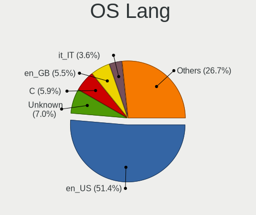
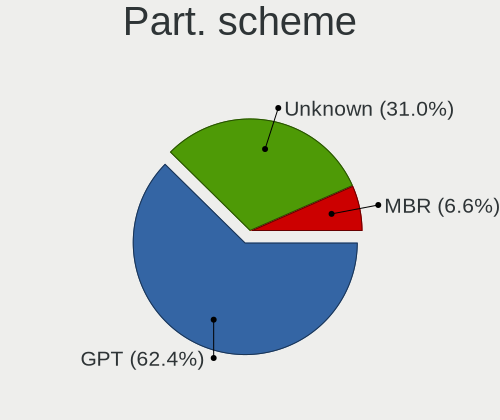
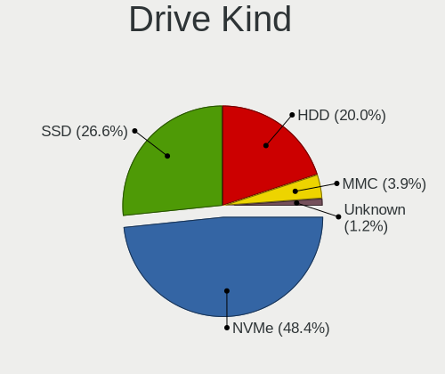
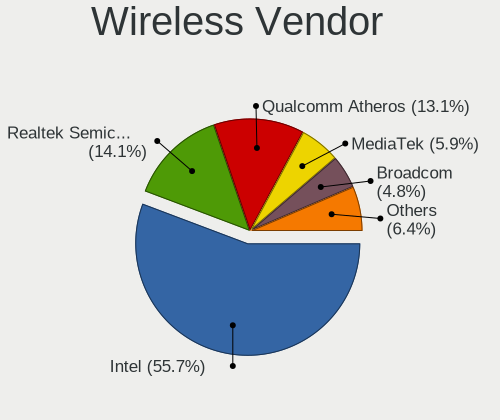

Arch - Tested Hardware & Statistics (Notebooks)
-----------------------------------------------

A project to collect tested hardware configurations for Arch.

Anyone can contribute to this report by the [hw-probe](https://github.com/linuxhw/hw-probe) tool:

    sudo -E hw-probe -all -upload

Please contribute! Especially if your hardware is rare.

Contents
--------

* [ Test Cases ](#test-cases)

* [ System ](#system)
  - [ OS                       ](#os)
  - [ OS Family                ](#os-family)
  - [ Kernel                   ](#kernel)
  - [ Kernel Family            ](#kernel-family)
  - [ Kernel Major Ver.        ](#kernel-major-ver)
  - [ Arch                     ](#arch)
  - [ DE                       ](#de)
  - [ Display Server           ](#display-server)
  - [ Display Manager          ](#display-manager)
  - [ OS Lang                  ](#os-lang)
  - [ Boot Mode                ](#boot-mode)
  - [ Filesystem               ](#filesystem)
  - [ Part. scheme             ](#part-scheme)
  - [ Dual Boot with Linux/BSD ](#dual-boot-with-linuxbsd)
  - [ Dual Boot (Win)          ](#dual-boot-win)

* [ Board ](#board)
  - [ Vendor                   ](#vendor)
  - [ Model                    ](#model)
  - [ Model Family             ](#model-family)
  - [ MFG Year                 ](#mfg-year)
  - [ Form Factor              ](#form-factor)
  - [ Secure Boot              ](#secure-boot)
  - [ Coreboot                 ](#coreboot)
  - [ RAM Size                 ](#ram-size)
  - [ RAM Used                 ](#ram-used)
  - [ Total Drives             ](#total-drives)
  - [ Has CD-ROM               ](#has-cd-rom)
  - [ Has Ethernet             ](#has-ethernet)
  - [ Has WiFi                 ](#has-wifi)
  - [ Has Bluetooth            ](#has-bluetooth)

* [ Location ](#location)
  - [ Country                  ](#country)
  - [ City                     ](#city)

* [ Drives ](#drives)
  - [ Drive Vendor             ](#drive-vendor)
  - [ Drive Model              ](#drive-model)
  - [ HDD Vendor               ](#hdd-vendor)
  - [ SSD Vendor               ](#ssd-vendor)
  - [ Drive Kind               ](#drive-kind)
  - [ Drive Connector          ](#drive-connector)
  - [ Drive Size               ](#drive-size)
  - [ Space Total              ](#space-total)
  - [ Space Used               ](#space-used)
  - [ Malfunc. Drives          ](#malfunc-drives)
  - [ Malfunc. Drive Vendor    ](#malfunc-drive-vendor)
  - [ Malfunc. HDD Vendor      ](#malfunc-hdd-vendor)
  - [ Malfunc. Drive Kind      ](#malfunc-drive-kind)
  - [ Failed Drives            ](#failed-drives)
  - [ Failed Drive Vendor      ](#failed-drive-vendor)
  - [ Drive Status             ](#drive-status)

* [ Storage controller ](#storage-controller)
  - [ Storage Vendor           ](#storage-vendor)
  - [ Storage Model            ](#storage-model)
  - [ Storage Kind             ](#storage-kind)

* [ Processor ](#processor)
  - [ CPU Vendor               ](#cpu-vendor)
  - [ CPU Model                ](#cpu-model)
  - [ CPU Model Family         ](#cpu-model-family)
  - [ CPU Cores                ](#cpu-cores)
  - [ CPU Sockets              ](#cpu-sockets)
  - [ CPU Threads              ](#cpu-threads)
  - [ CPU Op-Modes             ](#cpu-op-modes)
  - [ CPU Microcode            ](#cpu-microcode)
  - [ CPU Microarch            ](#cpu-microarch)

* [ Graphics ](#graphics)
  - [ GPU Vendor               ](#gpu-vendor)
  - [ GPU Model                ](#gpu-model)
  - [ GPU Combo                ](#gpu-combo)
  - [ GPU Driver               ](#gpu-driver)
  - [ GPU Memory               ](#gpu-memory)

* [ Monitor ](#monitor)
  - [ Monitor Vendor           ](#monitor-vendor)
  - [ Monitor Model            ](#monitor-model)
  - [ Monitor Resolution       ](#monitor-resolution)
  - [ Monitor Diagonal         ](#monitor-diagonal)
  - [ Monitor Width            ](#monitor-width)
  - [ Aspect Ratio             ](#aspect-ratio)
  - [ Monitor Area             ](#monitor-area)
  - [ Pixel Density            ](#pixel-density)
  - [ Multiple Monitors        ](#multiple-monitors)

* [ Network ](#network)
  - [ Net Controller Vendor    ](#net-controller-vendor)
  - [ Net Controller Model     ](#net-controller-model)
  - [ Wireless Vendor          ](#wireless-vendor)
  - [ Wireless Model           ](#wireless-model)
  - [ Ethernet Vendor          ](#ethernet-vendor)
  - [ Ethernet Model           ](#ethernet-model)
  - [ Net Controller Kind      ](#net-controller-kind)
  - [ Used Controller          ](#used-controller)
  - [ NICs                     ](#nics)
  - [ IPv6                     ](#ipv6)

* [ Bluetooth ](#bluetooth)
  - [ Bluetooth Vendor         ](#bluetooth-vendor)
  - [ Bluetooth Model          ](#bluetooth-model)

* [ Sound ](#sound)
  - [ Sound Vendor             ](#sound-vendor)
  - [ Sound Model              ](#sound-model)

* [ Memory ](#memory)
  - [ Memory Vendor            ](#memory-vendor)
  - [ Memory Model             ](#memory-model)
  - [ Memory Kind              ](#memory-kind)
  - [ Memory Form Factor       ](#memory-form-factor)
  - [ Memory Size              ](#memory-size)
  - [ Memory Speed             ](#memory-speed)

* [ Printers & scanners ](#printers--scanners)
  - [ Printer Vendor           ](#printer-vendor)
  - [ Printer Model            ](#printer-model)
  - [ Scanner Vendor           ](#scanner-vendor)
  - [ Scanner Model            ](#scanner-model)

* [ Camera ](#camera)
  - [ Camera Vendor            ](#camera-vendor)
  - [ Camera Model             ](#camera-model)

* [ Security ](#security)
  - [ Fingerprint Vendor       ](#fingerprint-vendor)
  - [ Fingerprint Model        ](#fingerprint-model)
  - [ Chipcard Vendor          ](#chipcard-vendor)
  - [ Chipcard Model           ](#chipcard-model)

* [ Unsupported ](#unsupported)
  - [ Unsupported Devices      ](#unsupported-devices)
  - [ Unsupported Device Types ](#unsupported-device-types)

Test Cases
----------

Total: 5217

| Vendor        | Model                       | Probe                                                      | Date         |
|---------------|-----------------------------|------------------------------------------------------------|--------------|
| ASUSTek       | ASUS TUF Gaming A15 FA50... | [49662a8ac9](https://linux-hardware.org/?probe=49662a8ac9) | Aug 12, 2023 |
| ASUSTek       | ASUS TUF Gaming A15 FA50... | [c946b79f5a](https://linux-hardware.org/?probe=c946b79f5a) | Aug 12, 2023 |
| Alienware     | 15                          | [d6c9c4f931](https://linux-hardware.org/?probe=d6c9c4f931) | Aug 12, 2023 |
| Acer          | Aspire E1-571G              | [ca51aaad9f](https://linux-hardware.org/?probe=ca51aaad9f) | Aug 12, 2023 |
| Timi          | RedmiBook Pro 15S           | [20559d710a](https://linux-hardware.org/?probe=20559d710a) | Aug 12, 2023 |
| HP            | EliteBook 840 G1            | [95d93fda2c](https://linux-hardware.org/?probe=95d93fda2c) | Aug 11, 2023 |
| Lenovo        | ThinkPad P1 Gen 4i 20Y30... | [79889c3f89](https://linux-hardware.org/?probe=79889c3f89) | Aug 11, 2023 |
| Lenovo        | IdeaPad S145-15IWL 81S9     | [7fe6adce5e](https://linux-hardware.org/?probe=7fe6adce5e) | Aug 10, 2023 |
| Dell          | Inspiron 5570               | [3771669b84](https://linux-hardware.org/?probe=3771669b84) | Aug 10, 2023 |
| Lenovo        | ThinkPad T14 Gen 3 21CF0... | [89cb081c1f](https://linux-hardware.org/?probe=89cb081c1f) | Aug 10, 2023 |
| Lenovo        | ThinkPad T420 4236W1W       | [0b8fc947af](https://linux-hardware.org/?probe=0b8fc947af) | Aug 10, 2023 |
| Lenovo        | ThinkPad P51 20HH0015IX     | [77c11473b2](https://linux-hardware.org/?probe=77c11473b2) | Aug 10, 2023 |
| Dell          | Inspiron 5567               | [fdfeffb5f3](https://linux-hardware.org/?probe=fdfeffb5f3) | Aug 10, 2023 |
| Dell          | Inspiron 5567               | [71424c4380](https://linux-hardware.org/?probe=71424c4380) | Aug 10, 2023 |
| Acer          | Aspire A514-53              | [26e60daa62](https://linux-hardware.org/?probe=26e60daa62) | Aug 10, 2023 |
| HP            | Pavilion 17                 | [65733120b0](https://linux-hardware.org/?probe=65733120b0) | Aug 09, 2023 |
| HUAWEI        | NBLK-WAX9X                  | [51fa860c87](https://linux-hardware.org/?probe=51fa860c87) | Aug 09, 2023 |
| Acer          | Swift SF114-32              | [3474fa639e](https://linux-hardware.org/?probe=3474fa639e) | Aug 08, 2023 |
| Lenovo        | IdeaPad 5 15IIL05 81YK      | [3cd08fb125](https://linux-hardware.org/?probe=3cd08fb125) | Aug 08, 2023 |
| HP            | Laptop 14-cm0xxx            | [ffd0be48c6](https://linux-hardware.org/?probe=ffd0be48c6) | Aug 08, 2023 |
| Dell          | Inspiron 13-7353            | [0b797c9368](https://linux-hardware.org/?probe=0b797c9368) | Aug 08, 2023 |
| Dell          | Inspiron 13-7353            | [90fbc716ed](https://linux-hardware.org/?probe=90fbc716ed) | Aug 07, 2023 |
| Lenovo        | Legion S7 15ARH5 82HM       | [044df6f82e](https://linux-hardware.org/?probe=044df6f82e) | Aug 07, 2023 |
| Schenker      | XMG FUSION 15 (XFU15M22)    | [5510e9c316](https://linux-hardware.org/?probe=5510e9c316) | Aug 06, 2023 |
| ASUSTek       | K73SV                       | [c908f2bfdd](https://linux-hardware.org/?probe=c908f2bfdd) | Aug 05, 2023 |
| Dell          | Inspiron 15 3525            | [0219350ae0](https://linux-hardware.org/?probe=0219350ae0) | Aug 05, 2023 |
| Dell          | Inspiron 15 3525            | [350a405f33](https://linux-hardware.org/?probe=350a405f33) | Aug 05, 2023 |
| Dell          | Inspiron 15 7000 Gaming     | [21eaf09dc9](https://linux-hardware.org/?probe=21eaf09dc9) | Aug 05, 2023 |
| Dell          | Latitude E5440              | [f6981c56b7](https://linux-hardware.org/?probe=f6981c56b7) | Aug 05, 2023 |
| HP            | OMEN by Laptop              | [78566a197e](https://linux-hardware.org/?probe=78566a197e) | Aug 05, 2023 |
| Acer          | Nitro AN515-54              | [c4d1667ffe](https://linux-hardware.org/?probe=c4d1667ffe) | Aug 05, 2023 |
| Dell          | Inspiron 14-3462            | [9300232981](https://linux-hardware.org/?probe=9300232981) | Aug 05, 2023 |
| HP            | EliteBook 840 G2            | [64810e5a10](https://linux-hardware.org/?probe=64810e5a10) | Aug 05, 2023 |
| Lenovo        | IdeaPad S340-15API 81NC     | [f1e284ec93](https://linux-hardware.org/?probe=f1e284ec93) | Aug 04, 2023 |
| ASUSTek       | ASUS TUF Gaming A17 FA70... | [5799f1a89c](https://linux-hardware.org/?probe=5799f1a89c) | Aug 04, 2023 |
| ASUSTek       | ASUS TUF Gaming A17 FA70... | [058011da0f](https://linux-hardware.org/?probe=058011da0f) | Aug 04, 2023 |
| Chuwi         | GemiBook Pro                | [87ecdcb4bd](https://linux-hardware.org/?probe=87ecdcb4bd) | Aug 04, 2023 |
| ASUSTek       | Zenbook UX535QE_UM535QE     | [59dda0e2b7](https://linux-hardware.org/?probe=59dda0e2b7) | Aug 04, 2023 |
| Lenovo        | ThinkPad T470 W10DG 20JN... | [bd2d5f588f](https://linux-hardware.org/?probe=bd2d5f588f) | Aug 04, 2023 |
| HP            | Notebook                    | [9b9a2bd44a](https://linux-hardware.org/?probe=9b9a2bd44a) | Aug 04, 2023 |
| PC Special... | Lafite Pro III 17           | [702cdf4138](https://linux-hardware.org/?probe=702cdf4138) | Aug 03, 2023 |
| ASUSTek       | ZenBook UX425UG_Q408UG      | [a251ad988c](https://linux-hardware.org/?probe=a251ad988c) | Aug 03, 2023 |
| Acer          | Predator PHN16-71           | [1d1937f1d6](https://linux-hardware.org/?probe=1d1937f1d6) | Aug 03, 2023 |
| ASUSTek       | ROG Zephyrus G15 GA503RM... | [c96666b80d](https://linux-hardware.org/?probe=c96666b80d) | Aug 03, 2023 |
| ASUSTek       | TUF Gaming FX505DD_FX505... | [67d851300e](https://linux-hardware.org/?probe=67d851300e) | Aug 03, 2023 |
| Timi          | A7S                         | [7de693ff63](https://linux-hardware.org/?probe=7de693ff63) | Aug 03, 2023 |
| LG Electro... | 16Z90R-K.ADB9U1             | [d3a9e05559](https://linux-hardware.org/?probe=d3a9e05559) | Aug 02, 2023 |
| Dell          | XPS 15 9500                 | [5c8ad99a3c](https://linux-hardware.org/?probe=5c8ad99a3c) | Aug 02, 2023 |
| ASUSTek       | VivoBook_ASUSLaptop K350... | [32d205bbdf](https://linux-hardware.org/?probe=32d205bbdf) | Aug 02, 2023 |
| Lenovo        | ThinkPad T480s 20L8002WM... | [6cfc0b2281](https://linux-hardware.org/?probe=6cfc0b2281) | Aug 01, 2023 |
| Packard Be... | EasyNote TJ65               | [e5193cc5d3](https://linux-hardware.org/?probe=e5193cc5d3) | Aug 01, 2023 |
| HUAWEI        | KPR-WX9                     | [8918c544fe](https://linux-hardware.org/?probe=8918c544fe) | Aug 01, 2023 |
| Dell          | Latitude 5590               | [466fdce7aa](https://linux-hardware.org/?probe=466fdce7aa) | Aug 01, 2023 |
| Apple         | MacBookPro14,1              | [cb322d77a4](https://linux-hardware.org/?probe=cb322d77a4) | Aug 01, 2023 |
| Lenovo        | ThinkPad X1 Carbon Gen 1... | [f7be9307b1](https://linux-hardware.org/?probe=f7be9307b1) | Jul 31, 2023 |
| ASUSTek       | ROG Strix G713RW_G713RW     | [91887235b2](https://linux-hardware.org/?probe=91887235b2) | Jul 31, 2023 |
| Dell          | G15 5511                    | [278d65cdc0](https://linux-hardware.org/?probe=278d65cdc0) | Jul 31, 2023 |
| Dell          | G15 5511                    | [e4570caa8f](https://linux-hardware.org/?probe=e4570caa8f) | Jul 31, 2023 |
| Dell          | Latitude E6400              | [5863677081](https://linux-hardware.org/?probe=5863677081) | Jul 31, 2023 |
| Lenovo        | ThinkPad P50s 20FLCTO1WW    | [1594795f9e](https://linux-hardware.org/?probe=1594795f9e) | Jul 31, 2023 |
| Acer          | Aspire A315-53              | [28ff56233b](https://linux-hardware.org/?probe=28ff56233b) | Jul 30, 2023 |
| Dell          | Latitude 5421               | [3872b1f799](https://linux-hardware.org/?probe=3872b1f799) | Jul 30, 2023 |
| Lenovo        | ThinkPad T480s 20L8S3JE0... | [5e1021c76b](https://linux-hardware.org/?probe=5e1021c76b) | Jul 30, 2023 |
| Razer         | Blade                       | [6c3ef3aa59](https://linux-hardware.org/?probe=6c3ef3aa59) | Jul 29, 2023 |
| HP            | EliteBook 745 G3            | [30e5e63466](https://linux-hardware.org/?probe=30e5e63466) | Jul 29, 2023 |
| Lenovo        | ThinkPad T480s 20L8S3JE0... | [6426edf740](https://linux-hardware.org/?probe=6426edf740) | Jul 29, 2023 |
| HP            | ProBook 455R G6             | [3731e7465c](https://linux-hardware.org/?probe=3731e7465c) | Jul 29, 2023 |
| Lenovo        | IdeaPad 5 Pro 16ACH6 82L... | [a8e51655da](https://linux-hardware.org/?probe=a8e51655da) | Jul 28, 2023 |
| Framework     | Laptop (12th Gen Intel C... | [d94c3cc0e8](https://linux-hardware.org/?probe=d94c3cc0e8) | Jul 28, 2023 |
| Acer          | Aspire A517-53              | [41c9602cac](https://linux-hardware.org/?probe=41c9602cac) | Jul 28, 2023 |
| Acer          | Aspire 5350                 | [698672b19c](https://linux-hardware.org/?probe=698672b19c) | Jul 28, 2023 |
| MSI           | Raider GE78HX 13VI          | [0b179ca997](https://linux-hardware.org/?probe=0b179ca997) | Jul 28, 2023 |
| Lenovo        | ThinkPad X220 Tablet 429... | [ea402f269e](https://linux-hardware.org/?probe=ea402f269e) | Jul 28, 2023 |
| Google        | Atlas                       | [c3f0326575](https://linux-hardware.org/?probe=c3f0326575) | Jul 28, 2023 |
| ASUSTek       | ROG Strix G533ZW_G533ZW     | [407859fa58](https://linux-hardware.org/?probe=407859fa58) | Jul 27, 2023 |
| HP            | ProBook 4530s               | [46852380f2](https://linux-hardware.org/?probe=46852380f2) | Jul 27, 2023 |
| HUAWEI        | MACHC-WAX9                  | [bf3f7b4c2d](https://linux-hardware.org/?probe=bf3f7b4c2d) | Jul 27, 2023 |
| Lenovo        | ThinkBook 15 G2 ITL 20VE    | [6546d49225](https://linux-hardware.org/?probe=6546d49225) | Jul 27, 2023 |
| HUAWEI        | KPR-WX9                     | [2231e66b3d](https://linux-hardware.org/?probe=2231e66b3d) | Jul 26, 2023 |
| Lenovo        | ThinkPad E14 20RBCTO1WW     | [1bac11c715](https://linux-hardware.org/?probe=1bac11c715) | Jul 26, 2023 |
| Lenovo        | ThinkPad E14 20RBCTO1WW     | [1409af2a38](https://linux-hardware.org/?probe=1409af2a38) | Jul 26, 2023 |
| Lenovo        | IdeaPad S145-15IWL 81S9     | [6c978ec74d](https://linux-hardware.org/?probe=6c978ec74d) | Jul 26, 2023 |
| Acer          | Aspire A514-54              | [787270abee](https://linux-hardware.org/?probe=787270abee) | Jul 25, 2023 |
| ASUSTek       | ZenBook UX325EA_UX325EA     | [7910b0c067](https://linux-hardware.org/?probe=7910b0c067) | Jul 25, 2023 |
| HP            | Pavilion Gaming Laptop 1... | [412bc51f72](https://linux-hardware.org/?probe=412bc51f72) | Jul 24, 2023 |
| Timi          | Mi NoteBook Ultra           | [e1fea727ff](https://linux-hardware.org/?probe=e1fea727ff) | Jul 24, 2023 |
| Gigabyte      | G5 KE                       | [4837040c2a](https://linux-hardware.org/?probe=4837040c2a) | Jul 24, 2023 |
| ASUSTek       | Zenbook UX535QE_UM535QE     | [cb7e913e03](https://linux-hardware.org/?probe=cb7e913e03) | Jul 24, 2023 |
| Acer          | Nitro AN515-46              | [a2d73523d4](https://linux-hardware.org/?probe=a2d73523d4) | Jul 24, 2023 |
| HP            | Pavilion Laptop 15-eg3xx... | [313f3aa210](https://linux-hardware.org/?probe=313f3aa210) | Jul 23, 2023 |
| Acer          | Nitro AN515-54              | [f1db825d10](https://linux-hardware.org/?probe=f1db825d10) | Jul 23, 2023 |
| ASUSTek       | ASUS TUF Gaming A17 FA70... | [3bd5c9d59c](https://linux-hardware.org/?probe=3bd5c9d59c) | Jul 23, 2023 |
| HUAWEI        | HVY-WXX9                    | [44958ef86b](https://linux-hardware.org/?probe=44958ef86b) | Jul 23, 2023 |
| XIAOMI        | Redmi Book Pro 15 2023      | [0e123e6d85](https://linux-hardware.org/?probe=0e123e6d85) | Jul 23, 2023 |
| ASUSTek       | VivoBook_ASUSLaptop M140... | [4222b801a9](https://linux-hardware.org/?probe=4222b801a9) | Jul 23, 2023 |
| HUAWEI        | NBLB-WAX9N                  | [ddb8dbe4e4](https://linux-hardware.org/?probe=ddb8dbe4e4) | Jul 23, 2023 |
| HUAWEI        | NBLB-WAX9N                  | [82242fa0a6](https://linux-hardware.org/?probe=82242fa0a6) | Jul 23, 2023 |
| HP            | Pavilion Plus Laptop 14-... | [a6e2f105ed](https://linux-hardware.org/?probe=a6e2f105ed) | Jul 23, 2023 |
| Infinix       | INBOOK X2 GEN11             | [2b3d4271bf](https://linux-hardware.org/?probe=2b3d4271bf) | Jul 22, 2023 |
| HUAWEI        | MACHC-WAX9                  | [fdbe29a1db](https://linux-hardware.org/?probe=fdbe29a1db) | Jul 22, 2023 |
| XIAOMI        | Redmi Book Pro 15 2023      | [45065697ac](https://linux-hardware.org/?probe=45065697ac) | Jul 22, 2023 |
| Lenovo        | IdeaPad Z510 20287          | [fd2bcebb1d](https://linux-hardware.org/?probe=fd2bcebb1d) | Jul 22, 2023 |
| Acer          | Aspire V5-551               | [8a13138f82](https://linux-hardware.org/?probe=8a13138f82) | Jul 21, 2023 |
| Lenovo        | ThinkPad X390 20SDA018CD    | [b2f5443fc2](https://linux-hardware.org/?probe=b2f5443fc2) | Jul 21, 2023 |
| Lenovo        | ThinkPad X390 20SDA018CD    | [3161baf648](https://linux-hardware.org/?probe=3161baf648) | Jul 21, 2023 |
| ASUSTek       | VivoBook_ASUSLaptop M150... | [55639a6416](https://linux-hardware.org/?probe=55639a6416) | Jul 21, 2023 |
| HP            | ProBook 4530s               | [450e93a8de](https://linux-hardware.org/?probe=450e93a8de) | Jul 21, 2023 |
| ASUSTek       | VivoBook_ASUSLaptop M150... | [8b2077101c](https://linux-hardware.org/?probe=8b2077101c) | Jul 21, 2023 |
| Lenovo        | IdeaPad Z510 20287          | [daff830182](https://linux-hardware.org/?probe=daff830182) | Jul 21, 2023 |
| Dell          | Latitude 5580               | [f115a04168](https://linux-hardware.org/?probe=f115a04168) | Jul 20, 2023 |
| Lenovo        | IdeaPad S145-15AST 81N3     | [cb2cdb1a94](https://linux-hardware.org/?probe=cb2cdb1a94) | Jul 20, 2023 |
| HP            | Laptop 15s-eq2xxx           | [9a2d353d76](https://linux-hardware.org/?probe=9a2d353d76) | Jul 20, 2023 |
| Panasonic     | CFSZ5-3                     | [9eb560d292](https://linux-hardware.org/?probe=9eb560d292) | Jul 20, 2023 |
| ASUSTek       | N501VW                      | [08cd5a81b2](https://linux-hardware.org/?probe=08cd5a81b2) | Jul 19, 2023 |
| Lenovo        | IdeaPad S145-15IWL 81S9     | [9b44d7bd03](https://linux-hardware.org/?probe=9b44d7bd03) | Jul 19, 2023 |
| HP            | Pavilion Notebook           | [6623b71de2](https://linux-hardware.org/?probe=6623b71de2) | Jul 19, 2023 |
| Dell          | Inspiron 7400               | [f145687601](https://linux-hardware.org/?probe=f145687601) | Jul 19, 2023 |
| Avell High... | B.ON                        | [bf1f683383](https://linux-hardware.org/?probe=bf1f683383) | Jul 18, 2023 |
| Apple         | MacBookPro11,2              | [3121fc5450](https://linux-hardware.org/?probe=3121fc5450) | Jul 18, 2023 |
| Lenovo        | B50-45 20388                | [54b4137669](https://linux-hardware.org/?probe=54b4137669) | Jul 18, 2023 |
| ASUSTek       | VivoBook_ASUSLaptop X421... | [50e78d6df5](https://linux-hardware.org/?probe=50e78d6df5) | Jul 18, 2023 |
| Lenovo        | ThinkPad T440s 20AQ005TU... | [53c97d91d4](https://linux-hardware.org/?probe=53c97d91d4) | Jul 18, 2023 |
| HP            | EliteBook 830 G5            | [42eb1edbb6](https://linux-hardware.org/?probe=42eb1edbb6) | Jul 17, 2023 |
| Apple         | MacBookPro11,2              | [6bebb2e751](https://linux-hardware.org/?probe=6bebb2e751) | Jul 17, 2023 |
| HP            | Pavilion Gaming Laptop 1... | [13ba381894](https://linux-hardware.org/?probe=13ba381894) | Jul 17, 2023 |
| TUXEDO        | Aura 15 Gen1                | [b53aa427b9](https://linux-hardware.org/?probe=b53aa427b9) | Jul 17, 2023 |
| Dell          | XPS 15 9500                 | [5be1306636](https://linux-hardware.org/?probe=5be1306636) | Jul 17, 2023 |
| Dell          | XPS 15 9500                 | [2b81f8a707](https://linux-hardware.org/?probe=2b81f8a707) | Jul 17, 2023 |
| HP            | Pavilion 17                 | [7c39d851fd](https://linux-hardware.org/?probe=7c39d851fd) | Jul 16, 2023 |
| Lenovo        | M490s 20215                 | [d029f6cf0b](https://linux-hardware.org/?probe=d029f6cf0b) | Jul 16, 2023 |
| ASUSTek       | ASUS TUF Gaming F15 FX50... | [2f2887fc32](https://linux-hardware.org/?probe=2f2887fc32) | Jul 15, 2023 |
| ASUSTek       | VivoBook 12_ASUS Laptop ... | [c36495481b](https://linux-hardware.org/?probe=c36495481b) | Jul 15, 2023 |
| Dell          | Inspiron 16 5625            | [97e2731292](https://linux-hardware.org/?probe=97e2731292) | Jul 15, 2023 |
| ASUSTek       | ROG Zephyrus G15 GA503QM... | [e204dc6cf1](https://linux-hardware.org/?probe=e204dc6cf1) | Jul 15, 2023 |
| HUAWEI        | HN-WX9X                     | [9868eab45f](https://linux-hardware.org/?probe=9868eab45f) | Jul 14, 2023 |
| Acer          | Swift SF313-52              | [3b393fc916](https://linux-hardware.org/?probe=3b393fc916) | Jul 14, 2023 |
| ASUSTek       | VivoBook_ASUSLaptop M340... | [e042e7c94e](https://linux-hardware.org/?probe=e042e7c94e) | Jul 14, 2023 |
| Dell          | XPS 15 7590                 | [28b21d099f](https://linux-hardware.org/?probe=28b21d099f) | Jul 14, 2023 |
| Lenovo        | ThinkPad X260 20F5S4NR00    | [281c5a429c](https://linux-hardware.org/?probe=281c5a429c) | Jul 13, 2023 |
| ASUSTek       | ROG Zephyrus G15 GA503QM... | [793289bc48](https://linux-hardware.org/?probe=793289bc48) | Jul 13, 2023 |
| ASUSTek       | VivoBook_ASUSLaptop M340... | [934947072a](https://linux-hardware.org/?probe=934947072a) | Jul 13, 2023 |
| Acer          | TravelMate P246-MG          | [62348fa6ed](https://linux-hardware.org/?probe=62348fa6ed) | Jul 13, 2023 |
| Lenovo        | IdeaPad 330-15IGM 81D1      | [adab548264](https://linux-hardware.org/?probe=adab548264) | Jul 13, 2023 |
| Lenovo        | IdeaPad 330-15IGM 81D1      | [ce2deb4b1d](https://linux-hardware.org/?probe=ce2deb4b1d) | Jul 13, 2023 |
| Dell          | Inspiron 7577               | [a9b5963254](https://linux-hardware.org/?probe=a9b5963254) | Jul 13, 2023 |
| Dell          | Latitude 7480               | [a375f7685c](https://linux-hardware.org/?probe=a375f7685c) | Jul 13, 2023 |
| Lenovo        | ThinkPad T550 20CJS0P300    | [2c96c19647](https://linux-hardware.org/?probe=2c96c19647) | Jul 13, 2023 |
| Lenovo        | IdeaPad S340-14API 81NB     | [23e018569e](https://linux-hardware.org/?probe=23e018569e) | Jul 13, 2023 |
| ASUSTek       | VivoBook_ASUSLaptop X515... | [392b02a797](https://linux-hardware.org/?probe=392b02a797) | Jul 13, 2023 |
| ASUSTek       | ROG Strix G731GU_G731GU     | [222924f1c2](https://linux-hardware.org/?probe=222924f1c2) | Jul 12, 2023 |
| TUXEDO        | Pulse 15 Gen1               | [e2792f841d](https://linux-hardware.org/?probe=e2792f841d) | Jul 12, 2023 |
| Lenovo        | ThinkPad A285 20MXS0JR14    | [08bbd89b8c](https://linux-hardware.org/?probe=08bbd89b8c) | Jul 11, 2023 |
| Lenovo        | ThinkPad A285 20MXS0JR14    | [23b123605f](https://linux-hardware.org/?probe=23b123605f) | Jul 11, 2023 |
| ASUSTek       | ROG Strix G513QY_G513QY     | [38f91b870c](https://linux-hardware.org/?probe=38f91b870c) | Jul 11, 2023 |
| HP            | Pavilion Gaming Laptop 1... | [b89cab90c0](https://linux-hardware.org/?probe=b89cab90c0) | Jul 11, 2023 |
| ASUSTek       | ROG Strix G513QY_G513QY     | [e0c7ec0cbc](https://linux-hardware.org/?probe=e0c7ec0cbc) | Jul 11, 2023 |
| Dell          | Precision M4700             | [69a672ec44](https://linux-hardware.org/?probe=69a672ec44) | Jul 11, 2023 |
| Acer          | SF714-52T                   | [97b079be51](https://linux-hardware.org/?probe=97b079be51) | Jul 10, 2023 |
| Lenovo        | IdeaPad 1 14AMN7 82VF       | [de7dbebf49](https://linux-hardware.org/?probe=de7dbebf49) | Jul 10, 2023 |
| Lenovo        | ThinkPad E15 Gen 3 20YG0... | [42aaaa0acb](https://linux-hardware.org/?probe=42aaaa0acb) | Jul 09, 2023 |
| ASUSTek       | ROG Zephyrus Duo 16 GX65... | [ee5ef8132f](https://linux-hardware.org/?probe=ee5ef8132f) | Jul 09, 2023 |
| Lenovo        | ThinkPad P51 20HJS16Q0K     | [866af72fb6](https://linux-hardware.org/?probe=866af72fb6) | Jul 09, 2023 |
| Lenovo        | Legion R9000X ARHA7 82UG    | [5da53d3f61](https://linux-hardware.org/?probe=5da53d3f61) | Jul 09, 2023 |
| HUAWEI        | HN-WX9X                     | [c01a765f59](https://linux-hardware.org/?probe=c01a765f59) | Jul 09, 2023 |
| Lenovo        | IdeaPad S340-14API 81NB     | [214dd1ad57](https://linux-hardware.org/?probe=214dd1ad57) | Jul 09, 2023 |
| HP            | ProBook 6460b               | [af3006237f](https://linux-hardware.org/?probe=af3006237f) | Jul 09, 2023 |
| HP            | OMEN by Laptop              | [87a1bbb5cc](https://linux-hardware.org/?probe=87a1bbb5cc) | Jul 08, 2023 |
| Lenovo        | ThinkPad T14s Gen 3 21CQ... | [72af2d01c0](https://linux-hardware.org/?probe=72af2d01c0) | Jul 08, 2023 |
| Apple         | MacBookPro13,1              | [3a64eabd9b](https://linux-hardware.org/?probe=3a64eabd9b) | Jul 08, 2023 |
| Lenovo        | IdeaPad 330-15IKB 81FE      | [dd8bd37036](https://linux-hardware.org/?probe=dd8bd37036) | Jul 08, 2023 |
| ASUSTek       | Zenbook UM5401QAB_UM5401... | [6f3284cac3](https://linux-hardware.org/?probe=6f3284cac3) | Jul 07, 2023 |
| Purism        | Librem 14                   | [18db47d3f6](https://linux-hardware.org/?probe=18db47d3f6) | Jul 07, 2023 |
| HP            | Laptop 14s-dk0xxx           | [8f01854bc7](https://linux-hardware.org/?probe=8f01854bc7) | Jul 07, 2023 |
| Medion        | Erazer P7643 MD60299        | [2c74ffe58f](https://linux-hardware.org/?probe=2c74ffe58f) | Jul 07, 2023 |
| Lenovo        | B50-70 20384                | [8a0a97b362](https://linux-hardware.org/?probe=8a0a97b362) | Jul 07, 2023 |
| HP            | EliteBook 840 G1            | [2fd3eada0f](https://linux-hardware.org/?probe=2fd3eada0f) | Jul 07, 2023 |
| Lenovo        | Legion R9000P2021 82JS      | [0376dd3cbd](https://linux-hardware.org/?probe=0376dd3cbd) | Jul 07, 2023 |
| HP            | ENVY 15                     | [d519c2699c](https://linux-hardware.org/?probe=d519c2699c) | Jul 06, 2023 |
| HP            | EliteBook 845 G7 Noteboo... | [cf134cbdd9](https://linux-hardware.org/?probe=cf134cbdd9) | Jul 06, 2023 |
| Dell          | G3 3590                     | [e3cfb2968a](https://linux-hardware.org/?probe=e3cfb2968a) | Jul 06, 2023 |
| Lenovo        | ThinkPad T14 Gen 2a 20XL... | [0fc498ccfb](https://linux-hardware.org/?probe=0fc498ccfb) | Jul 06, 2023 |
| ASUSTek       | G750JZA                     | [fb2477dd61](https://linux-hardware.org/?probe=fb2477dd61) | Jul 06, 2023 |
| Lenovo        | ThinkPad E15 Gen 2 20TDS... | [e17ab8bbe7](https://linux-hardware.org/?probe=e17ab8bbe7) | Jul 06, 2023 |
| Lenovo        | IdeaPad Gaming 3 15ARH05... | [e555b073b5](https://linux-hardware.org/?probe=e555b073b5) | Jul 05, 2023 |
| Acer          | TravelMate P246-MG          | [e1e4548a49](https://linux-hardware.org/?probe=e1e4548a49) | Jul 05, 2023 |
| Lenovo        | IdeaPad Gaming 3 15ARH05... | [b11fe33b8c](https://linux-hardware.org/?probe=b11fe33b8c) | Jul 05, 2023 |
| Dell          | G3 3590                     | [35906fded9](https://linux-hardware.org/?probe=35906fded9) | Jul 05, 2023 |
| Dell          | Latitude 7350               | [bc00420bfc](https://linux-hardware.org/?probe=bc00420bfc) | Jul 05, 2023 |
| Lenovo        | IdeaPad S340-14API 81NB     | [c387c4fbf1](https://linux-hardware.org/?probe=c387c4fbf1) | Jul 04, 2023 |
| Dell          | Latitude 7350               | [14d41ff667](https://linux-hardware.org/?probe=14d41ff667) | Jul 04, 2023 |
| ASUSTek       | G750JZA                     | [72fc73822c](https://linux-hardware.org/?probe=72fc73822c) | Jul 04, 2023 |
| Lenovo        | IdeaPad S145-15IWL 81S9     | [7ee43d9cad](https://linux-hardware.org/?probe=7ee43d9cad) | Jul 03, 2023 |
| Lenovo        | Legion 5 Pro 16ACH6 82JS    | [90b6b19a97](https://linux-hardware.org/?probe=90b6b19a97) | Jul 03, 2023 |
| HP            | Laptop 15s-eq2xxx           | [25d3329df1](https://linux-hardware.org/?probe=25d3329df1) | Jul 03, 2023 |
| ASUSTek       | 1015BX                      | [c4bc43a932](https://linux-hardware.org/?probe=c4bc43a932) | Jul 03, 2023 |
| ASUSTek       | VivoBook 15_ASUS Laptop ... | [da24c07da6](https://linux-hardware.org/?probe=da24c07da6) | Jul 02, 2023 |
| Lenovo        | ThinkPad T520 4243B65       | [07584ce70c](https://linux-hardware.org/?probe=07584ce70c) | Jul 02, 2023 |
| Lenovo        | ThinkPad T410 2537PW4       | [10079a3e26](https://linux-hardware.org/?probe=10079a3e26) | Jul 02, 2023 |
| Lenovo        | ThinkPad T530 2429AA9       | [708fe309bc](https://linux-hardware.org/?probe=708fe309bc) | Jul 02, 2023 |
| Lex BayTra... | 2I380D                      | [d69c578d83](https://linux-hardware.org/?probe=d69c578d83) | Jul 02, 2023 |
| Lex BayTra... | 2I380D                      | [2e20df184f](https://linux-hardware.org/?probe=2e20df184f) | Jul 02, 2023 |
| Dell          | Inspiron 7460               | [07f04b7377](https://linux-hardware.org/?probe=07f04b7377) | Jul 01, 2023 |
| Dell          | Inspiron 7460               | [65c2a81637](https://linux-hardware.org/?probe=65c2a81637) | Jul 01, 2023 |
| Apple         | MacBookPro11,1              | [998267633e](https://linux-hardware.org/?probe=998267633e) | Jul 01, 2023 |
| Lenovo        | ThinkPad P17 Gen 2i 20YU... | [2ba1cce30e](https://linux-hardware.org/?probe=2ba1cce30e) | Jul 01, 2023 |
| Lenovo        | ThinkPad E490 20N80017RT    | [a2a1011725](https://linux-hardware.org/?probe=a2a1011725) | Jun 30, 2023 |
| Chuwi         | CoreBook XPro               | [501d899938](https://linux-hardware.org/?probe=501d899938) | Jun 30, 2023 |
| Lenovo        | ThinkPad X1 Carbon Gen 1... | [31db4fffd0](https://linux-hardware.org/?probe=31db4fffd0) | Jun 30, 2023 |
| HP            | EliteBook 830 G6            | [6c6741deb9](https://linux-hardware.org/?probe=6c6741deb9) | Jun 30, 2023 |
| Dell          | Latitude E5440              | [1fd8c9652a](https://linux-hardware.org/?probe=1fd8c9652a) | Jun 30, 2023 |
| HP            | Pavilion Notebook           | [a33602b335](https://linux-hardware.org/?probe=a33602b335) | Jun 29, 2023 |
| Lenovo        | 3000 G530 4151/200          | [f3482421c4](https://linux-hardware.org/?probe=f3482421c4) | Jun 29, 2023 |
| HP            | Pavilion Gaming Laptop 1... | [06212dc183](https://linux-hardware.org/?probe=06212dc183) | Jun 29, 2023 |
| Lenovo        | Yoga 14sITL 2021 82G2       | [9814b54843](https://linux-hardware.org/?probe=9814b54843) | Jun 29, 2023 |
| Lenovo        | Yoga 14sITL 2021 82G2       | [5b82e1dd39](https://linux-hardware.org/?probe=5b82e1dd39) | Jun 29, 2023 |
| Acer          | Swift SF314-43              | [363067c171](https://linux-hardware.org/?probe=363067c171) | Jun 29, 2023 |
| Schenker      | XMG FUSION 15 (XFU15M22)    | [b62328e801](https://linux-hardware.org/?probe=b62328e801) | Jun 28, 2023 |
| HP            | OMEN by Laptop              | [971852cb38](https://linux-hardware.org/?probe=971852cb38) | Jun 28, 2023 |
| TUXEDO        | Polaris AMD Gen2 (REN)      | [18847b167a](https://linux-hardware.org/?probe=18847b167a) | Jun 28, 2023 |
| COLORFUL      | X16 Pro 23                  | [656cf52198](https://linux-hardware.org/?probe=656cf52198) | Jun 28, 2023 |
| Lenovo        | Legion Y7000 81FW           | [6615a04065](https://linux-hardware.org/?probe=6615a04065) | Jun 28, 2023 |
| Lenovo        | ThinkPad X1 Carbon 5th 2... | [c9cbb8f947](https://linux-hardware.org/?probe=c9cbb8f947) | Jun 27, 2023 |
| Lenovo        | Legion Y7000 81FW           | [c0af461776](https://linux-hardware.org/?probe=c0af461776) | Jun 27, 2023 |
| Lenovo        | IdeaPad 330-15IGM 81D1      | [47451d9f30](https://linux-hardware.org/?probe=47451d9f30) | Jun 27, 2023 |
| Lenovo        | ThinkPad X230 2325CW1       | [70cbf738e8](https://linux-hardware.org/?probe=70cbf738e8) | Jun 27, 2023 |
| GPU Compan... | GWTN141-10                  | [474833dcec](https://linux-hardware.org/?probe=474833dcec) | Jun 27, 2023 |
| ASUSTek       | VivoBook_ASUSLaptop X160... | [85c3968edc](https://linux-hardware.org/?probe=85c3968edc) | Jun 26, 2023 |
| Gigabyte      | AERO 15 KD                  | [1a17b8ee06](https://linux-hardware.org/?probe=1a17b8ee06) | Jun 26, 2023 |
| Gigabyte      | AERO 15 KD                  | [2fd779cefc](https://linux-hardware.org/?probe=2fd779cefc) | Jun 26, 2023 |
| Dell          | Precision 5570              | [dbf68aa669](https://linux-hardware.org/?probe=dbf68aa669) | Jun 26, 2023 |
| HP            | EliteBook 840 G3            | [ef2e8da48a](https://linux-hardware.org/?probe=ef2e8da48a) | Jun 26, 2023 |
| ASUSTek       | ASUS TUF Gaming A17 FA70... | [00cf0b0faa](https://linux-hardware.org/?probe=00cf0b0faa) | Jun 26, 2023 |
| Dell          | XPS 9315                    | [41bb8bd332](https://linux-hardware.org/?probe=41bb8bd332) | Jun 25, 2023 |
| Fujitsu       | LIFEBOOK S751               | [94fe70521f](https://linux-hardware.org/?probe=94fe70521f) | Jun 25, 2023 |
| Lenovo        | ThinkPad Helix 36986DG      | [ba30e1369c](https://linux-hardware.org/?probe=ba30e1369c) | Jun 25, 2023 |
| Lenovo        | ThinkPad P14s Gen 2a 21A... | [8b0180f4d4](https://linux-hardware.org/?probe=8b0180f4d4) | Jun 25, 2023 |
| ASUSTek       | N501VW                      | [7513f535f9](https://linux-hardware.org/?probe=7513f535f9) | Jun 25, 2023 |
| HUAWEI        | BOD-WXX9                    | [aa75d0dace](https://linux-hardware.org/?probe=aa75d0dace) | Jun 25, 2023 |
| Notebook      | PCX0DX                      | [d02e6a9fa6](https://linux-hardware.org/?probe=d02e6a9fa6) | Jun 25, 2023 |
| Lenovo        | IdeaPad 3 14ADA05 81W0      | [2b4069db98](https://linux-hardware.org/?probe=2b4069db98) | Jun 25, 2023 |
| MSI           | GS63 7RD                    | [310191e110](https://linux-hardware.org/?probe=310191e110) | Jun 24, 2023 |
| HONOR         | GLO-GXXX                    | [0e22fb1d65](https://linux-hardware.org/?probe=0e22fb1d65) | Jun 24, 2023 |
| Dell          | Inspiron 7460               | [dcfef21d2b](https://linux-hardware.org/?probe=dcfef21d2b) | Jun 24, 2023 |
| Dell          | Inspiron 7460               | [62d08bd4ca](https://linux-hardware.org/?probe=62d08bd4ca) | Jun 24, 2023 |
| Dell          | Precision 3581              | [2e960d89db](https://linux-hardware.org/?probe=2e960d89db) | Jun 23, 2023 |
| HP            | Laptop 15s-eq2xxx           | [2faa400326](https://linux-hardware.org/?probe=2faa400326) | Jun 23, 2023 |
| Lenovo        | Yoga Slim 7 Carbon 14ACN... | [856acf81ed](https://linux-hardware.org/?probe=856acf81ed) | Jun 22, 2023 |
| HUAWEI        | BOD-WXX9                    | [83d89a8751](https://linux-hardware.org/?probe=83d89a8751) | Jun 22, 2023 |
| Lenovo        | XiaoXinPro 14ITL 2021 82... | [928f167dee](https://linux-hardware.org/?probe=928f167dee) | Jun 22, 2023 |
| Acer          | Nitro AN515-58              | [cbf5b19c76](https://linux-hardware.org/?probe=cbf5b19c76) | Jun 21, 2023 |
| Casper        | EXCALIBUR G770              | [9fef8732b6](https://linux-hardware.org/?probe=9fef8732b6) | Jun 21, 2023 |
| Dell          | Inspiron 3558               | [baab7764b1](https://linux-hardware.org/?probe=baab7764b1) | Jun 21, 2023 |
| Lenovo        | ThinkPad X1 Carbon 7th 2... | [26a3b9b3e9](https://linux-hardware.org/?probe=26a3b9b3e9) | Jun 21, 2023 |
| Dell          | Inspiron 5737               | [a7e4d1a6bd](https://linux-hardware.org/?probe=a7e4d1a6bd) | Jun 21, 2023 |
| Lenovo        | IdeaPad S145-15IWL 81S9     | [e67932c5a0](https://linux-hardware.org/?probe=e67932c5a0) | Jun 21, 2023 |
| Acer          | Nitro AN517-51              | [b4423e6ac2](https://linux-hardware.org/?probe=b4423e6ac2) | Jun 20, 2023 |
| Lenovo        | ThinkPad P53 20QNCTO1WW     | [dd152b03bc](https://linux-hardware.org/?probe=dd152b03bc) | Jun 20, 2023 |
| Dell          | Inspiron 3558               | [3375eaaeb3](https://linux-hardware.org/?probe=3375eaaeb3) | Jun 20, 2023 |
| Lenovo        | ThinkPad T590 20N5S14V00    | [6f81cc6d57](https://linux-hardware.org/?probe=6f81cc6d57) | Jun 19, 2023 |
| HASEE Comp... | NH5x_NH7x_HHx_HJx_HKx       | [2c0be5d314](https://linux-hardware.org/?probe=2c0be5d314) | Jun 19, 2023 |
| ASUSTek       | ROG Zephyrus G14 GA402RK... | [5bd2521f5c](https://linux-hardware.org/?probe=5bd2521f5c) | Jun 19, 2023 |
| Lenovo        | XiaoXinPro 14ITL 2021 82... | [6a63f44627](https://linux-hardware.org/?probe=6a63f44627) | Jun 19, 2023 |
| ASUSTek       | ASUS EXPERTBOOK B1400CEA... | [c1472b1c25](https://linux-hardware.org/?probe=c1472b1c25) | Jun 18, 2023 |
| Lenovo        | ThinkPad X230 2324CD1       | [9ee6ed4144](https://linux-hardware.org/?probe=9ee6ed4144) | Jun 18, 2023 |
| Dell          | Latitude E7440              | [60d14fe6ab](https://linux-hardware.org/?probe=60d14fe6ab) | Jun 18, 2023 |
| Acer          | Aspire A314-22              | [676efbb266](https://linux-hardware.org/?probe=676efbb266) | Jun 18, 2023 |
| Lenovo        | IdeaPad 330-15IGM 81D1      | [d5ba369651](https://linux-hardware.org/?probe=d5ba369651) | Jun 17, 2023 |
| HP            | Pavilion dv7                | [f010c487a1](https://linux-hardware.org/?probe=f010c487a1) | Jun 17, 2023 |
| Acer          | Nitro AN517-51              | [d2f2f70083](https://linux-hardware.org/?probe=d2f2f70083) | Jun 16, 2023 |
| ASUSTek       | ASUS TUF Gaming F15 FX50... | [0d47dc3760](https://linux-hardware.org/?probe=0d47dc3760) | Jun 16, 2023 |
| MECHREVO      | Jiaolong16K Series GM6BG... | [bfa70344e3](https://linux-hardware.org/?probe=bfa70344e3) | Jun 16, 2023 |
| Samsung       | 750XDA                      | [e04dd13d49](https://linux-hardware.org/?probe=e04dd13d49) | Jun 16, 2023 |
| Dell          | XPS 13 9350                 | [1150629ceb](https://linux-hardware.org/?probe=1150629ceb) | Jun 16, 2023 |
| Lenovo        | ThinkPad E480 20KNA047CD    | [918de7de03](https://linux-hardware.org/?probe=918de7de03) | Jun 16, 2023 |
| Lenovo        | Legion 5 15ACH6H 82JU       | [67b278ea0e](https://linux-hardware.org/?probe=67b278ea0e) | Jun 15, 2023 |
| Lenovo        | ThinkPad T495 20NKS0TG00    | [628c8fb554](https://linux-hardware.org/?probe=628c8fb554) | Jun 15, 2023 |
| Lenovo        | IdeaPad S145-15IWL 81S9     | [a6f63a08e2](https://linux-hardware.org/?probe=a6f63a08e2) | Jun 15, 2023 |
| Acer          | Aspire A715-41G             | [66cc56555d](https://linux-hardware.org/?probe=66cc56555d) | Jun 15, 2023 |
| Lenovo        | ThinkPad L420 78545EG       | [bb42ee1009](https://linux-hardware.org/?probe=bb42ee1009) | Jun 14, 2023 |
| HP            | ProBook 650 G2              | [535950bae5](https://linux-hardware.org/?probe=535950bae5) | Jun 14, 2023 |
| ASUSTek       | P553UA                      | [2543eb4ce8](https://linux-hardware.org/?probe=2543eb4ce8) | Jun 14, 2023 |
| HP            | Laptop 15s-eq2xxx           | [20c6793733](https://linux-hardware.org/?probe=20c6793733) | Jun 13, 2023 |
| Lenovo        | ThinkPad E14 Gen 2 20TB0... | [d2e4302f28](https://linux-hardware.org/?probe=d2e4302f28) | Jun 13, 2023 |
| Lenovo        | ThinkPad E14 Gen 2 20TB0... | [e858489484](https://linux-hardware.org/?probe=e858489484) | Jun 13, 2023 |
| HP            | EliteBook 845 G8 Noteboo... | [6fcdcaa48c](https://linux-hardware.org/?probe=6fcdcaa48c) | Jun 12, 2023 |
| Acer          | Aspire A715-41G             | [7082d05ede](https://linux-hardware.org/?probe=7082d05ede) | Jun 12, 2023 |
| HP            | Laptop 14-fq0xxx            | [41526d21bc](https://linux-hardware.org/?probe=41526d21bc) | Jun 12, 2023 |
| HP            | Laptop 14-fq0xxx            | [6154060edd](https://linux-hardware.org/?probe=6154060edd) | Jun 12, 2023 |
| ASUSTek       | ROG Zephyrus G14 GA402RK... | [2aaa4324d0](https://linux-hardware.org/?probe=2aaa4324d0) | Jun 12, 2023 |
| ASUSTek       | ASUS TUF Gaming A17 FA70... | [b88dfc7e5c](https://linux-hardware.org/?probe=b88dfc7e5c) | Jun 11, 2023 |
| HUAWEI        | BoDE-WXX9                   | [8bc28cc12c](https://linux-hardware.org/?probe=8bc28cc12c) | Jun 11, 2023 |
| Lenovo        | ThinkPad X13 Gen 3 21BNC... | [ba129cd52d](https://linux-hardware.org/?probe=ba129cd52d) | Jun 11, 2023 |
| ASUSTek       | TUF Gaming FX505DV_FX505... | [67867c022f](https://linux-hardware.org/?probe=67867c022f) | Jun 11, 2023 |
| Lenovo        | Legion R9000P2021H 82JQ     | [7a081b66af](https://linux-hardware.org/?probe=7a081b66af) | Jun 11, 2023 |
| Samsung       | 300E4C/300E5C/300E7C        | [4ecff82426](https://linux-hardware.org/?probe=4ecff82426) | Jun 11, 2023 |
| Acer          | Swift SF314-43              | [823925da4a](https://linux-hardware.org/?probe=823925da4a) | Jun 11, 2023 |
| NEC Comput... | PC-LM550LS6R                | [695f9825a6](https://linux-hardware.org/?probe=695f9825a6) | Jun 11, 2023 |
| Dell          | Latitude E5470              | [cc81f6c74c](https://linux-hardware.org/?probe=cc81f6c74c) | Jun 11, 2023 |
| HP            | EliteBook 840 G2            | [80bc2607fb](https://linux-hardware.org/?probe=80bc2607fb) | Jun 11, 2023 |
| ASUSTek       | ROG Zephyrus G14 GA401QC... | [57f37d5836](https://linux-hardware.org/?probe=57f37d5836) | Jun 10, 2023 |
| Lenovo        | IdeaPad S145-15IWL 81S9     | [0b0c11a052](https://linux-hardware.org/?probe=0b0c11a052) | Jun 09, 2023 |
| MECHREVO      | Jiaolong16K Series GM6BG... | [a165849009](https://linux-hardware.org/?probe=a165849009) | Jun 09, 2023 |
| Dell          | Latitude E5470              | [c9b909273b](https://linux-hardware.org/?probe=c9b909273b) | Jun 09, 2023 |
| MECHREVO      | Jiaolong16K Series GM6BG... | [05c07442a3](https://linux-hardware.org/?probe=05c07442a3) | Jun 09, 2023 |
| HP            | 14                          | [1540a787fb](https://linux-hardware.org/?probe=1540a787fb) | Jun 09, 2023 |
| HP            | 14                          | [1404218cab](https://linux-hardware.org/?probe=1404218cab) | Jun 09, 2023 |
| Dell          | XPS 17 9730                 | [bb7335618d](https://linux-hardware.org/?probe=bb7335618d) | Jun 08, 2023 |
| Lenovo        | ThinkBook 15-IIL 20SM       | [97d002b53a](https://linux-hardware.org/?probe=97d002b53a) | Jun 08, 2023 |
| ASUSTek       | ASUS TUF Gaming A17 FA70... | [19c6b51f80](https://linux-hardware.org/?probe=19c6b51f80) | Jun 08, 2023 |
| Lenovo        | ThinkPad T14 Gen 2a 20XL... | [3cfa2bccb7](https://linux-hardware.org/?probe=3cfa2bccb7) | Jun 08, 2023 |
| HP            | ZBook 15 G2                 | [ac292cca00](https://linux-hardware.org/?probe=ac292cca00) | Jun 08, 2023 |
| Fujitsu       | FMVNA4NE-                   | [59c8fdd841](https://linux-hardware.org/?probe=59c8fdd841) | Jun 08, 2023 |
| Dell          | G15 5520                    | [2410d016d6](https://linux-hardware.org/?probe=2410d016d6) | Jun 08, 2023 |
| Google        | Edgar                       | [bec197cb98](https://linux-hardware.org/?probe=bec197cb98) | Jun 07, 2023 |
| HP            | OMEN by Laptop 16-c0xxx     | [9529a983b8](https://linux-hardware.org/?probe=9529a983b8) | Jun 07, 2023 |
| Lenovo        | Yoga 500-14ISK 80R5         | [2b1a1d3e39](https://linux-hardware.org/?probe=2b1a1d3e39) | Jun 07, 2023 |
| Lenovo        | Yoga 500-14ISK 80R5         | [3308d91565](https://linux-hardware.org/?probe=3308d91565) | Jun 07, 2023 |
| ASUSTek       | VivoBook_ASUSLaptop X150... | [1f4ef72dbd](https://linux-hardware.org/?probe=1f4ef72dbd) | Jun 07, 2023 |
| ASUSTek       | VivoBook_ASUSLaptop X421... | [78f12c4671](https://linux-hardware.org/?probe=78f12c4671) | Jun 07, 2023 |
| Acer          | Aspire A515-47              | [db7f17cbe1](https://linux-hardware.org/?probe=db7f17cbe1) | Jun 07, 2023 |
| Acer          | Swift SF314-43              | [9636ea4dc5](https://linux-hardware.org/?probe=9636ea4dc5) | Jun 07, 2023 |
| Dell          | Latitude 5480               | [dd2fef35ee](https://linux-hardware.org/?probe=dd2fef35ee) | Jun 06, 2023 |
| Dell          | Latitude 5480               | [7917512387](https://linux-hardware.org/?probe=7917512387) | Jun 06, 2023 |
| ASUSTek       | GL752VW                     | [662e292b55](https://linux-hardware.org/?probe=662e292b55) | Jun 06, 2023 |
| ASUSTek       | GL752VW                     | [024a1f80a1](https://linux-hardware.org/?probe=024a1f80a1) | Jun 06, 2023 |
| Lenovo        | ThinkPad 21CKCT01WW         | [92c9ec75c4](https://linux-hardware.org/?probe=92c9ec75c4) | Jun 05, 2023 |
| MSI           | Crosshair 15 C12VF          | [6cd11169d0](https://linux-hardware.org/?probe=6cd11169d0) | Jun 05, 2023 |
| Apple         | MacBookPro7,1               | [e92db65759](https://linux-hardware.org/?probe=e92db65759) | Jun 05, 2023 |
| HUAWEI        | KPR-WX9                     | [3eb711e453](https://linux-hardware.org/?probe=3eb711e453) | Jun 05, 2023 |
| Timi          | Redmi Book Pro 15 2022      | [a3089228b1](https://linux-hardware.org/?probe=a3089228b1) | Jun 05, 2023 |
| HP            | OMEN by Laptop 16-b0xxx     | [f8f07099c7](https://linux-hardware.org/?probe=f8f07099c7) | Jun 05, 2023 |
| Lenovo        | Legion R70002021 82JW       | [f4e7c7034f](https://linux-hardware.org/?probe=f4e7c7034f) | Jun 05, 2023 |
| Apple         | MacBookPro12,1              | [bfce53d6f5](https://linux-hardware.org/?probe=bfce53d6f5) | Jun 05, 2023 |
| Acer          | Aspire A315-42G             | [eb67866c74](https://linux-hardware.org/?probe=eb67866c74) | Jun 05, 2023 |
| MSI           | Katana GF66 11UG            | [d50f02e996](https://linux-hardware.org/?probe=d50f02e996) | Jun 04, 2023 |
| ASUSTek       | X505BP                      | [f92e294ba0](https://linux-hardware.org/?probe=f92e294ba0) | Jun 04, 2023 |
| HP            | OMEN Laptop 15-en0xxx       | [2eeb67613f](https://linux-hardware.org/?probe=2eeb67613f) | Jun 04, 2023 |
| HP            | EliteBook 850 G8 Noteboo... | [7179829c20](https://linux-hardware.org/?probe=7179829c20) | Jun 04, 2023 |
| HP            | Pavilion Gaming Laptop 1... | [038871f5be](https://linux-hardware.org/?probe=038871f5be) | Jun 04, 2023 |
| Cube          | i16-L                       | [5e0bd26a26](https://linux-hardware.org/?probe=5e0bd26a26) | Jun 04, 2023 |
| ASUSTek       | ROG Strix G713RM_G713RM     | [d45c069b9f](https://linux-hardware.org/?probe=d45c069b9f) | Jun 04, 2023 |
| ASUSTek       | Zenbook UM5401RA_RM5401R... | [763a52f3e8](https://linux-hardware.org/?probe=763a52f3e8) | Jun 03, 2023 |
| Acer          | Swift SF314-511             | [6754a25d1d](https://linux-hardware.org/?probe=6754a25d1d) | Jun 03, 2023 |
| ASUSTek       | ROG Strix G814JV_G814JV     | [e0f06316db](https://linux-hardware.org/?probe=e0f06316db) | Jun 03, 2023 |
| Samsung       | 950XCJ/951XCJ/950XCR        | [95ec288436](https://linux-hardware.org/?probe=95ec288436) | Jun 03, 2023 |
| Samsung       | 950XCJ/951XCJ/950XCR        | [7720a9f71c](https://linux-hardware.org/?probe=7720a9f71c) | Jun 03, 2023 |
| Gigabyte      | AERO 15WV8                  | [a8700141be](https://linux-hardware.org/?probe=a8700141be) | Jun 03, 2023 |
| ASUSTek       | ASUS TUF Dash F15 FX516P... | [49ca1fd34f](https://linux-hardware.org/?probe=49ca1fd34f) | Jun 02, 2023 |
| ASUSTek       | Zenbook UM3402YA_UM3402Y... | [d75ea1f93f](https://linux-hardware.org/?probe=d75ea1f93f) | Jun 02, 2023 |
| Acer          | Nitro AN515-55              | [947c70d6b6](https://linux-hardware.org/?probe=947c70d6b6) | Jun 02, 2023 |
| HP            | Pavilion Gaming Laptop 1... | [c9e1edde25](https://linux-hardware.org/?probe=c9e1edde25) | Jun 02, 2023 |
| Lenovo        | ThinkPad T430s 2352CTO      | [1f18cef2df](https://linux-hardware.org/?probe=1f18cef2df) | Jun 01, 2023 |
| Lenovo        | ThinkPad T430s 2352CTO      | [7ae3edd73e](https://linux-hardware.org/?probe=7ae3edd73e) | Jun 01, 2023 |
| Dell          | Vostro 7590                 | [d9bfa42b63](https://linux-hardware.org/?probe=d9bfa42b63) | Jun 01, 2023 |
| Dell          | XPS 13 9310                 | [b3eed1356b](https://linux-hardware.org/?probe=b3eed1356b) | Jun 01, 2023 |
| Dell          | Inspiron 5515               | [f383c5193d](https://linux-hardware.org/?probe=f383c5193d) | Jun 01, 2023 |
| Dell          | Latitude E6400              | [efe855c429](https://linux-hardware.org/?probe=efe855c429) | May 31, 2023 |
| Dell          | Latitude E6400              | [c56e8318db](https://linux-hardware.org/?probe=c56e8318db) | May 31, 2023 |
| MSI           | Modern 14 B4MW              | [2c4acbbad3](https://linux-hardware.org/?probe=2c4acbbad3) | May 31, 2023 |
| Lenovo        | IdeaPad 5 Pro 16ARH7 82S... | [ceaf9120eb](https://linux-hardware.org/?probe=ceaf9120eb) | May 31, 2023 |
| Dell          | Inspiron 5593               | [ac6f421fef](https://linux-hardware.org/?probe=ac6f421fef) | May 31, 2023 |
| Dell          | Latitude E6420              | [102e4634b1](https://linux-hardware.org/?probe=102e4634b1) | May 31, 2023 |
| ASUSTek       | Zenbook UM3402YA_UM3402Y... | [8a6ceb7d8b](https://linux-hardware.org/?probe=8a6ceb7d8b) | May 30, 2023 |
| ASUSTek       | N61Jv                       | [7184d6add6](https://linux-hardware.org/?probe=7184d6add6) | May 30, 2023 |
| HP            | Laptop 15-ef1xxx            | [55b500a1a9](https://linux-hardware.org/?probe=55b500a1a9) | May 30, 2023 |
| HP            | Victus by Laptop 16-e0xx... | [d4cc055d3a](https://linux-hardware.org/?probe=d4cc055d3a) | May 30, 2023 |
| Dell          | Inspiron 1525               | [29d2e377ad](https://linux-hardware.org/?probe=29d2e377ad) | May 29, 2023 |
| Lenovo        | ThinkPad E15 Gen 2 20T9S... | [b8e68f9227](https://linux-hardware.org/?probe=b8e68f9227) | May 29, 2023 |
| HP            | OMEN by Laptop 15-dc1xxx    | [541e16d421](https://linux-hardware.org/?probe=541e16d421) | May 29, 2023 |
| HP            | 14                          | [977d26c9b5](https://linux-hardware.org/?probe=977d26c9b5) | May 29, 2023 |
| Dell          | Inspiron 1525               | [7adfc9796d](https://linux-hardware.org/?probe=7adfc9796d) | May 29, 2023 |
| Lenovo        | ThinkPad X230 23301E0       | [84781c068a](https://linux-hardware.org/?probe=84781c068a) | May 29, 2023 |
| Lenovo        | ThinkPad X230 23301E0       | [97f0880258](https://linux-hardware.org/?probe=97f0880258) | May 29, 2023 |
| Acer          | Aspire A515-41G             | [644a5d7a16](https://linux-hardware.org/?probe=644a5d7a16) | May 29, 2023 |
| Dell          | Inspiron 5447               | [270e3cd993](https://linux-hardware.org/?probe=270e3cd993) | May 29, 2023 |
| ASUSTek       | ROG Strix G513RM_G513RM     | [12838b3e3b](https://linux-hardware.org/?probe=12838b3e3b) | May 28, 2023 |
| Dell          | Inspiron 1525               | [99540846c4](https://linux-hardware.org/?probe=99540846c4) | May 28, 2023 |
| Dell          | Inspiron 1525               | [99c9a792f5](https://linux-hardware.org/?probe=99c9a792f5) | May 28, 2023 |
| Apple         | MacBookPro7,1               | [47ac3b9c43](https://linux-hardware.org/?probe=47ac3b9c43) | May 28, 2023 |
| HP            | EliteBook 840 G5            | [4a54b4e82c](https://linux-hardware.org/?probe=4a54b4e82c) | May 28, 2023 |
| ASUSTek       | TUF Gaming FX505DT_FX505... | [462ae1c4f5](https://linux-hardware.org/?probe=462ae1c4f5) | May 28, 2023 |
| Lenovo        | ThinkPad T560 20FJS0CX00    | [cf7d5b7149](https://linux-hardware.org/?probe=cf7d5b7149) | May 27, 2023 |
| Dell          | Latitude E6440              | [821e3e3246](https://linux-hardware.org/?probe=821e3e3246) | May 27, 2023 |
| Acer          | Swift SF514-54GT            | [dd79b67b18](https://linux-hardware.org/?probe=dd79b67b18) | May 27, 2023 |
| Lenovo        | ThinkPad X1 Carbon 5th 2... | [737d3fe7fb](https://linux-hardware.org/?probe=737d3fe7fb) | May 27, 2023 |
| HP            | EliteBook 8440p             | [cbcea9cc58](https://linux-hardware.org/?probe=cbcea9cc58) | May 27, 2023 |
| Dell          | Precision 3581              | [9fb00fd492](https://linux-hardware.org/?probe=9fb00fd492) | May 27, 2023 |
| Lenovo        | ThinkPad P14s Gen 2a 21A... | [16ee98f9cc](https://linux-hardware.org/?probe=16ee98f9cc) | May 26, 2023 |
| Lenovo        | ThinkPad P14s Gen 2a 21A... | [39cf075935](https://linux-hardware.org/?probe=39cf075935) | May 26, 2023 |
| Lenovo        | IdeaPad 320-14IKB 80YF      | [8b93a6ab33](https://linux-hardware.org/?probe=8b93a6ab33) | May 26, 2023 |
| Dell          | Latitude 5430               | [e8b9199229](https://linux-hardware.org/?probe=e8b9199229) | May 26, 2023 |
| Lenovo        | Yoga Slim 7 proX 14ARH7 ... | [684751d3db](https://linux-hardware.org/?probe=684751d3db) | May 26, 2023 |
| Acer          | Nitro AN515-45              | [a9e0505d3f](https://linux-hardware.org/?probe=a9e0505d3f) | May 26, 2023 |
| Lenovo        | IdeaPad 1 14AMN7 82VF       | [db7d7cf31d](https://linux-hardware.org/?probe=db7d7cf31d) | May 26, 2023 |
| Lenovo        | IdeaPad Z580                | [8d9c3b024d](https://linux-hardware.org/?probe=8d9c3b024d) | May 25, 2023 |
| Lenovo        | ThinkPad X1 Carbon 3460A... | [f876b5169a](https://linux-hardware.org/?probe=f876b5169a) | May 25, 2023 |
| ASUSTek       | S551LB                      | [86f50d3933](https://linux-hardware.org/?probe=86f50d3933) | May 25, 2023 |
| HP            | EliteBook 855 G8 Noteboo... | [fb5edbbd6b](https://linux-hardware.org/?probe=fb5edbbd6b) | May 24, 2023 |
| Acer          | Swift SF314-71              | [00979b3baa](https://linux-hardware.org/?probe=00979b3baa) | May 24, 2023 |
| HP            | Victus by Laptop 16-e0xx... | [d92b2ec905](https://linux-hardware.org/?probe=d92b2ec905) | May 24, 2023 |
| Acer          | Swift SF314-71              | [84d9f5a2cc](https://linux-hardware.org/?probe=84d9f5a2cc) | May 24, 2023 |
| ASUSTek       | ROG Strix G513QY_G513QY     | [e6c958dd68](https://linux-hardware.org/?probe=e6c958dd68) | May 24, 2023 |
| Lenovo        | Legion 7 15IMH05 81YT       | [82183f4762](https://linux-hardware.org/?probe=82183f4762) | May 24, 2023 |
| Acer          | Aspire A315-58              | [43069955ee](https://linux-hardware.org/?probe=43069955ee) | May 23, 2023 |
| Toshiba       | Satellite C645D             | [97abd98fdd](https://linux-hardware.org/?probe=97abd98fdd) | May 23, 2023 |
| ASUSTek       | Strix 17 GL703GE            | [e752398b87](https://linux-hardware.org/?probe=e752398b87) | May 23, 2023 |
| ASUSTek       | ASUS TUF Gaming A17 FA70... | [01c17ab9dc](https://linux-hardware.org/?probe=01c17ab9dc) | May 23, 2023 |
| ASUSTek       | VivoBook_ASUSLaptop X412... | [6e1c91c725](https://linux-hardware.org/?probe=6e1c91c725) | May 23, 2023 |
| HP            | Pavilion 17                 | [eb6c222cf7](https://linux-hardware.org/?probe=eb6c222cf7) | May 23, 2023 |
| Apple         | MacBookPro7,1               | [324a8d5c88](https://linux-hardware.org/?probe=324a8d5c88) | May 22, 2023 |
| ASUSTek       | ROG Zephyrus G14 GA402RK... | [97687a73c3](https://linux-hardware.org/?probe=97687a73c3) | May 22, 2023 |
| Lenovo        | Legion 5 15ARH05H 82B1      | [5300f7df17](https://linux-hardware.org/?probe=5300f7df17) | May 22, 2023 |
| Acer          | Nitro AN515-45              | [179e48239b](https://linux-hardware.org/?probe=179e48239b) | May 22, 2023 |
| HP            | Laptop 14-cf2xxx            | [c2d03bd839](https://linux-hardware.org/?probe=c2d03bd839) | May 22, 2023 |
| Apple         | MacBookPro7,1               | [88830e9fe8](https://linux-hardware.org/?probe=88830e9fe8) | May 22, 2023 |
| HP            | Laptop 15s-eq2xxx           | [cccb529fd3](https://linux-hardware.org/?probe=cccb529fd3) | May 21, 2023 |
| MSI           | GF63 Thin 11UC              | [ca280c2e18](https://linux-hardware.org/?probe=ca280c2e18) | May 21, 2023 |
| Dell          | G3 3500                     | [490bdc1f92](https://linux-hardware.org/?probe=490bdc1f92) | May 21, 2023 |
| HP            | Laptop 15-dy4xxx            | [d739b1ab41](https://linux-hardware.org/?probe=d739b1ab41) | May 21, 2023 |
| HASEE Comp... | V1x0PNPx                    | [ce5f16dcfe](https://linux-hardware.org/?probe=ce5f16dcfe) | May 20, 2023 |
| HP            | Laptop 15s-eq3xxx           | [d82bf9332f](https://linux-hardware.org/?probe=d82bf9332f) | May 20, 2023 |
| Dell          | Latitude D630               | [d5d56f7183](https://linux-hardware.org/?probe=d5d56f7183) | May 20, 2023 |
| Dell          | Latitude D630               | [af41a1c303](https://linux-hardware.org/?probe=af41a1c303) | May 20, 2023 |
| Apple         | MacBookPro15,2              | [d52cf51575](https://linux-hardware.org/?probe=d52cf51575) | May 19, 2023 |
| Lenovo        | ThinkPad X240 20AMA21D00    | [a692a56bc0](https://linux-hardware.org/?probe=a692a56bc0) | May 19, 2023 |
| HP            | Unknown                     | [8ae91264ca](https://linux-hardware.org/?probe=8ae91264ca) | May 19, 2023 |
| ASUSTek       | X555LPB                     | [c1082eef21](https://linux-hardware.org/?probe=c1082eef21) | May 18, 2023 |
| Lenovo        | ThinkPad X61 7673V4Q        | [7df5747f30](https://linux-hardware.org/?probe=7df5747f30) | May 18, 2023 |
| Dell          | Latitude 5500               | [f03dddbf42](https://linux-hardware.org/?probe=f03dddbf42) | May 18, 2023 |
| HP            | EliteBook 850 G8 Noteboo... | [25e9a17dd0](https://linux-hardware.org/?probe=25e9a17dd0) | May 18, 2023 |
| Digma         | EVE 15 P417 NP3158CXW01     | [fdb0fb3d9c](https://linux-hardware.org/?probe=fdb0fb3d9c) | May 18, 2023 |
| Dell          | Latitude 5420               | [bd0c08b7b8](https://linux-hardware.org/?probe=bd0c08b7b8) | May 18, 2023 |
| Lenovo        | IdeaPad S340-15API 81NC     | [aa625a94a0](https://linux-hardware.org/?probe=aa625a94a0) | May 18, 2023 |
| Apple         | MacBookPro11,1              | [d23967583a](https://linux-hardware.org/?probe=d23967583a) | May 18, 2023 |
| Acer          | Swift SF315-51G             | [4361a75669](https://linux-hardware.org/?probe=4361a75669) | May 17, 2023 |
| Lenovo        | ThinkPad X1 Carbon 5th 2... | [42f598550a](https://linux-hardware.org/?probe=42f598550a) | May 17, 2023 |
| Lenovo        | ThinkPad L13 Gen 3 21BAS... | [2df1a28c50](https://linux-hardware.org/?probe=2df1a28c50) | May 17, 2023 |
| Emdoor        | AG958                       | [7ff5858830](https://linux-hardware.org/?probe=7ff5858830) | May 17, 2023 |
| HP            | EliteBook 845 G7 Noteboo... | [4d1cd4ec12](https://linux-hardware.org/?probe=4d1cd4ec12) | May 17, 2023 |
| Framework     | Laptop (12th Gen Intel C... | [de0485927b](https://linux-hardware.org/?probe=de0485927b) | May 17, 2023 |
| Google        | Cyan                        | [41811cace9](https://linux-hardware.org/?probe=41811cace9) | May 17, 2023 |
| Dell          | Latitude 5330               | [3cc5328fee](https://linux-hardware.org/?probe=3cc5328fee) | May 16, 2023 |
| GPD           | MicroPC                     | [0da3fc7738](https://linux-hardware.org/?probe=0da3fc7738) | May 16, 2023 |
| Google        | Cyan                        | [65c63caab7](https://linux-hardware.org/?probe=65c63caab7) | May 16, 2023 |
| ASUSTek       | ASUS EXPERTBOOK B5402CBA... | [170341ae00](https://linux-hardware.org/?probe=170341ae00) | May 15, 2023 |
| Lenovo        | ThinkPad P14s Gen 2a 21A... | [b788039ba1](https://linux-hardware.org/?probe=b788039ba1) | May 15, 2023 |
| ASUSTek       | ROG Strix G713PV_G713PV     | [dc5dd8c32a](https://linux-hardware.org/?probe=dc5dd8c32a) | May 15, 2023 |
| Lenovo        | IdeaPad S145-15IWL 81S9     | [5dadcb24d0](https://linux-hardware.org/?probe=5dadcb24d0) | May 15, 2023 |
| Dell          | XPS 17 9700                 | [55eb2f47b9](https://linux-hardware.org/?probe=55eb2f47b9) | May 15, 2023 |
| HONOR         | NMH-WCX9                    | [b938ce8d64](https://linux-hardware.org/?probe=b938ce8d64) | May 15, 2023 |
| Lenovo        | IdeaPad 3 15ITL6 82H8       | [2750a05721](https://linux-hardware.org/?probe=2750a05721) | May 15, 2023 |
| Dell          | XPS 17 9700                 | [85c2869727](https://linux-hardware.org/?probe=85c2869727) | May 15, 2023 |
| Acer          | Swift SF114-34              | [360db31139](https://linux-hardware.org/?probe=360db31139) | May 14, 2023 |
| Acer          | Swift SF114-34              | [c3bbc544d3](https://linux-hardware.org/?probe=c3bbc544d3) | May 14, 2023 |
| Lenovo        | ThinkPad T570 20H90002GE    | [e6ff63678e](https://linux-hardware.org/?probe=e6ff63678e) | May 14, 2023 |
| HP            | OMEN by Laptop 15-dc1xxx    | [ba47df6545](https://linux-hardware.org/?probe=ba47df6545) | May 14, 2023 |
| HP            | OMEN by Laptop 15-dc1xxx    | [0b6c34eefa](https://linux-hardware.org/?probe=0b6c34eefa) | May 14, 2023 |
| ASUSTek       | ZenBook S UX391UA           | [fe36fee27a](https://linux-hardware.org/?probe=fe36fee27a) | May 14, 2023 |
| HP            | EliteBook 8470p             | [b9f9ed1b25](https://linux-hardware.org/?probe=b9f9ed1b25) | May 14, 2023 |
| Lenovo        | ThinkPad X1 Carbon Gen 1... | [92c052d9b4](https://linux-hardware.org/?probe=92c052d9b4) | May 14, 2023 |
| TUXEDO        | Polaris Intel Gen3 (TGL)    | [4b296f5c40](https://linux-hardware.org/?probe=4b296f5c40) | May 12, 2023 |
| Razer         | Blade 15 Studio Edition ... | [f1884eebc6](https://linux-hardware.org/?probe=f1884eebc6) | May 12, 2023 |
| realme        | RMNBXXXX                    | [16782746d8](https://linux-hardware.org/?probe=16782746d8) | May 12, 2023 |
| Dell          | Latitude 7390               | [cbd8c5fdbe](https://linux-hardware.org/?probe=cbd8c5fdbe) | May 12, 2023 |
| Dell          | Latitude 7390               | [5677bfdac5](https://linux-hardware.org/?probe=5677bfdac5) | May 12, 2023 |
| Medion        | Crawler E40                 | [d0df38a2da](https://linux-hardware.org/?probe=d0df38a2da) | May 12, 2023 |
| Medion        | Crawler E40                 | [c58193ce55](https://linux-hardware.org/?probe=c58193ce55) | May 12, 2023 |
| Dell          | Latitude 7400               | [c8ce2e462f](https://linux-hardware.org/?probe=c8ce2e462f) | May 11, 2023 |
| Lenovo        | ThinkPad X61 7673V4Q        | [38acb76489](https://linux-hardware.org/?probe=38acb76489) | May 11, 2023 |
| Lenovo        | IdeaPad 3 14IGL05 81WH      | [79d149ff5c](https://linux-hardware.org/?probe=79d149ff5c) | May 11, 2023 |
| Dell          | Latitude 5480               | [eb671ee7d2](https://linux-hardware.org/?probe=eb671ee7d2) | May 11, 2023 |
| HP            | OMEN Laptop 15-en0xxx       | [39dd8fc09a](https://linux-hardware.org/?probe=39dd8fc09a) | May 10, 2023 |
| Lenovo        | ThinkPad T450s 20BWS34A0... | [775c2839fa](https://linux-hardware.org/?probe=775c2839fa) | May 10, 2023 |
| Lenovo        | ThinkPad P14s Gen 2i 20V... | [0a1c43b710](https://linux-hardware.org/?probe=0a1c43b710) | May 09, 2023 |
| MSI           | PS42 Modern 8RA             | [8371e35044](https://linux-hardware.org/?probe=8371e35044) | May 08, 2023 |
| Lenovo        | IdeaPad Gaming 3 15ARH05... | [5cbf24306a](https://linux-hardware.org/?probe=5cbf24306a) | May 08, 2023 |
| Acer          | Aspire A315-22              | [8849d7a1c9](https://linux-hardware.org/?probe=8849d7a1c9) | May 08, 2023 |
| HUAWEI        | NBLK-WAX9X                  | [a4f5dce6d6](https://linux-hardware.org/?probe=a4f5dce6d6) | May 08, 2023 |
| Acer          | Aspire V3-772G              | [bbf20cfdad](https://linux-hardware.org/?probe=bbf20cfdad) | May 08, 2023 |
| MSI           | GV63 8SE                    | [55bfa86f43](https://linux-hardware.org/?probe=55bfa86f43) | May 07, 2023 |
| Lenovo        | ThinkPad E14 Gen 2 20T60... | [af9591cedc](https://linux-hardware.org/?probe=af9591cedc) | May 07, 2023 |
| Dell          | Precision 7720              | [9e0a1bd8ef](https://linux-hardware.org/?probe=9e0a1bd8ef) | May 06, 2023 |
| Toshiba       | Satellite C855              | [775c7346eb](https://linux-hardware.org/?probe=775c7346eb) | May 06, 2023 |
| Dell          | Inspiron 15-3567            | [9a510bb01b](https://linux-hardware.org/?probe=9a510bb01b) | May 06, 2023 |
| Dell          | Precision 7550              | [5f962aaea0](https://linux-hardware.org/?probe=5f962aaea0) | May 06, 2023 |
| HP            | Laptop 15s-eq0xxx           | [a5252d48f3](https://linux-hardware.org/?probe=a5252d48f3) | May 06, 2023 |
| ASUSTek       | ASUS TUF Dash F15 FX516P... | [b4f013c967](https://linux-hardware.org/?probe=b4f013c967) | May 06, 2023 |
| Lenovo        | ThinkPad X131e 33712MU      | [6957336ed7](https://linux-hardware.org/?probe=6957336ed7) | May 05, 2023 |
| ASUSTek       | ASUS TUF Gaming F15 FX50... | [5f4447aa45](https://linux-hardware.org/?probe=5f4447aa45) | May 05, 2023 |
| HP            | EliteBook 850 G8 Noteboo... | [907a94ae07](https://linux-hardware.org/?probe=907a94ae07) | May 05, 2023 |
| MSI           | GV63 8SE                    | [1c78e3feb9](https://linux-hardware.org/?probe=1c78e3feb9) | May 05, 2023 |
| Lenovo        | IdeaPad Gaming 3 15ARH7 ... | [bd885c202d](https://linux-hardware.org/?probe=bd885c202d) | May 05, 2023 |
| Apple         | MacBookPro14,2              | [4124bb2dde](https://linux-hardware.org/?probe=4124bb2dde) | May 04, 2023 |
| ASUSTek       | N550JK                      | [a799667521](https://linux-hardware.org/?probe=a799667521) | May 04, 2023 |
| Lenovo        | G505s 20255                 | [44c5b43b8d](https://linux-hardware.org/?probe=44c5b43b8d) | May 04, 2023 |
| Quanta        | UW3 TBD                     | [0c951d032e](https://linux-hardware.org/?probe=0c951d032e) | May 04, 2023 |
| TUXEDO        | Aura 15 Gen1                | [7d642208ec](https://linux-hardware.org/?probe=7d642208ec) | May 04, 2023 |
| TUXEDO        | Aura 15 Gen1                | [e31ba8f396](https://linux-hardware.org/?probe=e31ba8f396) | May 04, 2023 |
| HUAWEI        | BOM-WXX9                    | [abc1819fc1](https://linux-hardware.org/?probe=abc1819fc1) | May 04, 2023 |
| Lenovo        | B490 37722XP                | [62808a2dee](https://linux-hardware.org/?probe=62808a2dee) | May 04, 2023 |
| Quanta        | UW3 TBD                     | [c138f57a47](https://linux-hardware.org/?probe=c138f57a47) | May 04, 2023 |
| ASUSTek       | VivoBook_ASUSLaptop X513... | [02df3a407e](https://linux-hardware.org/?probe=02df3a407e) | May 03, 2023 |
| Acer          | Predator G9-793             | [b3bd1a1031](https://linux-hardware.org/?probe=b3bd1a1031) | May 03, 2023 |
| Samsung       | 750XDA                      | [2e99c882ff](https://linux-hardware.org/?probe=2e99c882ff) | May 03, 2023 |
| Lenovo        | ThinkPad T530 24297ZG       | [7c56fae21c](https://linux-hardware.org/?probe=7c56fae21c) | May 03, 2023 |
| Lenovo        | IdeaPad L340-17IRH Gamin... | [26bb61d72f](https://linux-hardware.org/?probe=26bb61d72f) | May 02, 2023 |
| Lenovo        | ThinkPad T530 24297ZG       | [2a4cf994ac](https://linux-hardware.org/?probe=2a4cf994ac) | May 02, 2023 |
| ASUSTek       | ROG Zephyrus Duo 16 GX65... | [abd1474dfc](https://linux-hardware.org/?probe=abd1474dfc) | May 02, 2023 |
| Lenovo        | IdeaPad 1 14AMN7 82VF       | [9035ec79cd](https://linux-hardware.org/?probe=9035ec79cd) | May 02, 2023 |
| Lenovo        | IdeaPad S145-15IWL 81S9     | [a5ac1bf5b4](https://linux-hardware.org/?probe=a5ac1bf5b4) | May 01, 2023 |
| HP            | ProBook 430 G1              | [56542de280](https://linux-hardware.org/?probe=56542de280) | May 01, 2023 |
| Dell          | Inspiron 5458               | [c38d3e6513](https://linux-hardware.org/?probe=c38d3e6513) | May 01, 2023 |
| HP            | EliteBook 830 G5            | [6b61472a4a](https://linux-hardware.org/?probe=6b61472a4a) | May 01, 2023 |
| Lenovo        | IdeaPad 3 15ALC6 82MF       | [bd460bdc62](https://linux-hardware.org/?probe=bd460bdc62) | Apr 30, 2023 |
| Lenovo        | IdeaPad 3 15ALC6 82MF       | [edfcd7daa6](https://linux-hardware.org/?probe=edfcd7daa6) | Apr 30, 2023 |
| HP            | Laptop 15s-eq3xxx           | [3c321c476a](https://linux-hardware.org/?probe=3c321c476a) | Apr 30, 2023 |
| ASUSTek       | ROG Strix G513QY_G513QY     | [408aa18a63](https://linux-hardware.org/?probe=408aa18a63) | Apr 30, 2023 |
| HP            | Pavilion Aero Laptop 13-... | [df9cc0160a](https://linux-hardware.org/?probe=df9cc0160a) | Apr 30, 2023 |
| Dell          | XPS 13 9310                 | [2f3308a2ee](https://linux-hardware.org/?probe=2f3308a2ee) | Apr 29, 2023 |
| Lenovo        | Legion 5 Pro 16IAH7H 82R... | [4a8b2ebf8a](https://linux-hardware.org/?probe=4a8b2ebf8a) | Apr 29, 2023 |
| Lenovo        | ThinkPad P1 Gen 5 21DCCT... | [34420e9478](https://linux-hardware.org/?probe=34420e9478) | Apr 28, 2023 |
| ASUSTek       | S550CM                      | [068365f788](https://linux-hardware.org/?probe=068365f788) | Apr 28, 2023 |
| Dell          | XPS 15 9520                 | [96194bc912](https://linux-hardware.org/?probe=96194bc912) | Apr 28, 2023 |
| Lenovo        | IdeaPad S145-15IWL 81S9     | [6926565982](https://linux-hardware.org/?probe=6926565982) | Apr 27, 2023 |
| ASUSTek       | ROG Strix G513QY_G513QY     | [640a71aea3](https://linux-hardware.org/?probe=640a71aea3) | Apr 27, 2023 |
| Dell          | Latitude 7420               | [7ceeb888fd](https://linux-hardware.org/?probe=7ceeb888fd) | Apr 27, 2023 |
| Dell          | Latitude E5440              | [0217386dbe](https://linux-hardware.org/?probe=0217386dbe) | Apr 27, 2023 |
| Sony          | SVE11113FXW                 | [248c7717a4](https://linux-hardware.org/?probe=248c7717a4) | Apr 26, 2023 |
| Apple         | MacBookPro14,2              | [4e1caf5a7a](https://linux-hardware.org/?probe=4e1caf5a7a) | Apr 26, 2023 |
| HUAWEI        | NBLB-WAX9N                  | [50930ebe57](https://linux-hardware.org/?probe=50930ebe57) | Apr 25, 2023 |
| Lenovo        | ThinkPad X250 20CMCTO1WW    | [bf207e9dc3](https://linux-hardware.org/?probe=bf207e9dc3) | Apr 25, 2023 |
| MSI           | Prestige 14 A12UC           | [137a3623dc](https://linux-hardware.org/?probe=137a3623dc) | Apr 25, 2023 |
| Notebook      | N85_N87HCHNHZ               | [ecb3270b4a](https://linux-hardware.org/?probe=ecb3270b4a) | Apr 24, 2023 |
| HP            | EliteBook 650 15.6 inch ... | [78686e5784](https://linux-hardware.org/?probe=78686e5784) | Apr 24, 2023 |
| HP            | 240 G4                      | [997e6e6a0b](https://linux-hardware.org/?probe=997e6e6a0b) | Apr 24, 2023 |
| ASUSTek       | ROG Strix G733QS_G733QS     | [6cacf7a9f9](https://linux-hardware.org/?probe=6cacf7a9f9) | Apr 24, 2023 |
| Notebook      | N15_N17RD1                  | [8bba7a7447](https://linux-hardware.org/?probe=8bba7a7447) | Apr 23, 2023 |
| Notebook      | NH5x_NH7x_HHx_HJx_HKx       | [0be1fdd77a](https://linux-hardware.org/?probe=0be1fdd77a) | Apr 23, 2023 |
| Lenovo        | ThinkPad X1 Carbon 5th 2... | [52001c8ac6](https://linux-hardware.org/?probe=52001c8ac6) | Apr 23, 2023 |
| Acer          | Swift SF314-43              | [b18f893905](https://linux-hardware.org/?probe=b18f893905) | Apr 23, 2023 |
| ASUSTek       | ASUS EXPERTBOOK P2451FA_... | [5ecd3ed1bd](https://linux-hardware.org/?probe=5ecd3ed1bd) | Apr 23, 2023 |
| ASUSTek       | ROG Strix G733QS_G733QS     | [72088721ec](https://linux-hardware.org/?probe=72088721ec) | Apr 22, 2023 |
| HP            | 240 G4                      | [887b406c56](https://linux-hardware.org/?probe=887b406c56) | Apr 22, 2023 |
| Gigabyte      | AERO 15-X9                  | [5eb2235e10](https://linux-hardware.org/?probe=5eb2235e10) | Apr 22, 2023 |
| Lenovo        | ThinkPad T530 24297ZG       | [3f01c5df6e](https://linux-hardware.org/?probe=3f01c5df6e) | Apr 21, 2023 |
| Lenovo        | ThinkPad T530 24297ZG       | [a5ef39681b](https://linux-hardware.org/?probe=a5ef39681b) | Apr 21, 2023 |
| HP            | 15                          | [4f563db114](https://linux-hardware.org/?probe=4f563db114) | Apr 21, 2023 |
| Valve         | Jupiter                     | [a0ee1dbeff](https://linux-hardware.org/?probe=a0ee1dbeff) | Apr 20, 2023 |
| Acer          | Aspire A715-71G             | [83b48fff59](https://linux-hardware.org/?probe=83b48fff59) | Apr 19, 2023 |
| MSI           | Bravo 15 B5DD               | [433c482314](https://linux-hardware.org/?probe=433c482314) | Apr 19, 2023 |
| Lenovo        | ThinkPad X1 Carbon Gen 1... | [be217cbc1e](https://linux-hardware.org/?probe=be217cbc1e) | Apr 19, 2023 |
| Lenovo        | ThinkPad X1 Carbon Gen 1... | [d5e90c4b14](https://linux-hardware.org/?probe=d5e90c4b14) | Apr 19, 2023 |
| Lenovo        | Legion 5 15IMH05H 81Y6      | [146c678131](https://linux-hardware.org/?probe=146c678131) | Apr 18, 2023 |
| HP            | Laptop 15-da0xxx            | [d1d3cf9928](https://linux-hardware.org/?probe=d1d3cf9928) | Apr 17, 2023 |
| HP            | Laptop 15-da0xxx            | [786daebed0](https://linux-hardware.org/?probe=786daebed0) | Apr 17, 2023 |
| ASUSTek       | ROG Zephyrus G15 GA503QM... | [65a5b3f43d](https://linux-hardware.org/?probe=65a5b3f43d) | Apr 17, 2023 |
| MSI           | GF75 Thin 9SC               | [40b6c3bad6](https://linux-hardware.org/?probe=40b6c3bad6) | Apr 17, 2023 |
| HP            | Pavilion dv6                | [fc41269cf8](https://linux-hardware.org/?probe=fc41269cf8) | Apr 16, 2023 |
| ASUSTek       | ASUS TUF Gaming F15 FX50... | [9b05d61f11](https://linux-hardware.org/?probe=9b05d61f11) | Apr 16, 2023 |
| Timi          | Redmi Book Pro 15 2022      | [040d876c1e](https://linux-hardware.org/?probe=040d876c1e) | Apr 16, 2023 |
| Lenovo        | ThinkPad P16 Gen 1 21D6S... | [6686a91041](https://linux-hardware.org/?probe=6686a91041) | Apr 16, 2023 |
| Lenovo        | ThinkPad T14 Gen 2i 20W1... | [9b23be6c48](https://linux-hardware.org/?probe=9b23be6c48) | Apr 16, 2023 |
| Acer          | Aspire A515-45              | [5ce7874f2e](https://linux-hardware.org/?probe=5ce7874f2e) | Apr 16, 2023 |
| Lenovo        | ThinkPad X1 Carbon 5th 2... | [2fcbae14f2](https://linux-hardware.org/?probe=2fcbae14f2) | Apr 16, 2023 |
| HP            | Laptop 15s-eq3xxx           | [fff7f3dd1f](https://linux-hardware.org/?probe=fff7f3dd1f) | Apr 15, 2023 |
| ASUSTek       | VivoBook 15_ASUS Laptop ... | [71e03c5459](https://linux-hardware.org/?probe=71e03c5459) | Apr 15, 2023 |
| Dell          | Inspiron 5570               | [d582f92277](https://linux-hardware.org/?probe=d582f92277) | Apr 15, 2023 |
| Lenovo        | ThinkPad P52 20MAS1LH00     | [06ba20dc47](https://linux-hardware.org/?probe=06ba20dc47) | Apr 15, 2023 |
| HP            | Laptop 15-dw2xxx            | [e9e05a1bb3](https://linux-hardware.org/?probe=e9e05a1bb3) | Apr 15, 2023 |
| HP            | Laptop 15-dw2xxx            | [0b4fdfd30e](https://linux-hardware.org/?probe=0b4fdfd30e) | Apr 15, 2023 |
| Lenovo        | ThinkPad T470s W10DG 20J... | [c7b7e028e4](https://linux-hardware.org/?probe=c7b7e028e4) | Apr 14, 2023 |
| Lenovo        | ThinkPad Z13 Gen 1 21D20... | [e0ad93045c](https://linux-hardware.org/?probe=e0ad93045c) | Apr 14, 2023 |
| Lenovo        | V15-ADA 82C7                | [f604f6e212](https://linux-hardware.org/?probe=f604f6e212) | Apr 14, 2023 |
| Dell          | Latitude 9420               | [529aa83bbc](https://linux-hardware.org/?probe=529aa83bbc) | Apr 14, 2023 |
| Avell High... | B.ON                        | [0ac252a73b](https://linux-hardware.org/?probe=0ac252a73b) | Apr 14, 2023 |
| HP            | ProBook 430 G6              | [9a4bce918e](https://linux-hardware.org/?probe=9a4bce918e) | Apr 14, 2023 |
| System76      | Pangolin                    | [b5dd9f13b9](https://linux-hardware.org/?probe=b5dd9f13b9) | Apr 14, 2023 |
| System76      | Pangolin                    | [a1a17fa4c4](https://linux-hardware.org/?probe=a1a17fa4c4) | Apr 14, 2023 |
| Lenovo        | ThinkPad T460 20FMS0E22C    | [ee911053e5](https://linux-hardware.org/?probe=ee911053e5) | Apr 13, 2023 |
| MSI           | Prestige 14 A12UC           | [43e044c37a](https://linux-hardware.org/?probe=43e044c37a) | Apr 13, 2023 |
| HP            | ProBook 450 G6              | [3364cf411c](https://linux-hardware.org/?probe=3364cf411c) | Apr 13, 2023 |
| ASUSTek       | TUF Gaming FX505GD_FX505... | [1280936eba](https://linux-hardware.org/?probe=1280936eba) | Apr 13, 2023 |
| Lenovo        | ThinkBook 13s G2 ITL 20V... | [8e641b5fd5](https://linux-hardware.org/?probe=8e641b5fd5) | Apr 13, 2023 |
| MSI           | Stealth 14Studio A13VF      | [b6cd64a19b](https://linux-hardware.org/?probe=b6cd64a19b) | Apr 13, 2023 |
| Fujitsu       | LIFEBOOK U745               | [82bfc450e9](https://linux-hardware.org/?probe=82bfc450e9) | Apr 12, 2023 |
| Lenovo        | ThinkPad T480s 20L8S8XJ0... | [6406153cbf](https://linux-hardware.org/?probe=6406153cbf) | Apr 12, 2023 |
| Dell          | XPS 9315                    | [20fa2b86b9](https://linux-hardware.org/?probe=20fa2b86b9) | Apr 12, 2023 |
| Dell          | Latitude E7440              | [4cfe81f687](https://linux-hardware.org/?probe=4cfe81f687) | Apr 12, 2023 |
| Toshiba       | Satellite S50-B             | [e9d26a9e89](https://linux-hardware.org/?probe=e9d26a9e89) | Apr 12, 2023 |
| HP            | OMEN by Laptop 15-dc0xxx    | [6bec4cb4a8](https://linux-hardware.org/?probe=6bec4cb4a8) | Apr 12, 2023 |
| HP            | EliteBook 840 G3            | [0daac07546](https://linux-hardware.org/?probe=0daac07546) | Apr 12, 2023 |
| HP            | Laptop 14s-cf1xxx           | [76c9bf81a6](https://linux-hardware.org/?probe=76c9bf81a6) | Apr 12, 2023 |
| HP            | Laptop 14s-cr0xxx           | [f95d67a702](https://linux-hardware.org/?probe=f95d67a702) | Apr 10, 2023 |
| HP            | Laptop 15s-fq5xxx           | [649a715fba](https://linux-hardware.org/?probe=649a715fba) | Apr 10, 2023 |
| HP            | Laptop 15s-fq5xxx           | [39c6b4afbe](https://linux-hardware.org/?probe=39c6b4afbe) | Apr 10, 2023 |
| Framework     | Laptop (12th Gen Intel C... | [e762a4eb1d](https://linux-hardware.org/?probe=e762a4eb1d) | Apr 09, 2023 |
| Google        | Phaser360                   | [64953bc26c](https://linux-hardware.org/?probe=64953bc26c) | Apr 09, 2023 |
| Avell High... | A52 HYB                     | [7da3b9f780](https://linux-hardware.org/?probe=7da3b9f780) | Apr 09, 2023 |
| Lenovo        | ThinkPad P51 W10DG 20MNS... | [5cf4615347](https://linux-hardware.org/?probe=5cf4615347) | Apr 08, 2023 |
| Apple         | MacBookPro11,1              | [08f117749f](https://linux-hardware.org/?probe=08f117749f) | Apr 08, 2023 |
| ASUSTek       | Zenbook UX7602ZM_UX7602Z... | [772414cda4](https://linux-hardware.org/?probe=772414cda4) | Apr 07, 2023 |
| Lenovo        | ThinkPad T480 20L6S4G72S    | [ae8c333d72](https://linux-hardware.org/?probe=ae8c333d72) | Apr 07, 2023 |
| Fujitsu       | LIFEBOOK S935               | [e7ba943509](https://linux-hardware.org/?probe=e7ba943509) | Apr 07, 2023 |
| HP            | ZBook 15 G5                 | [1927fa08d1](https://linux-hardware.org/?probe=1927fa08d1) | Apr 07, 2023 |
| Dell          | Vostro 5620                 | [afdf8d46a2](https://linux-hardware.org/?probe=afdf8d46a2) | Apr 05, 2023 |
| ASUSTek       | VivoBook_ASUSLaptop X509... | [a02839d653](https://linux-hardware.org/?probe=a02839d653) | Apr 05, 2023 |
| Lenovo        | ThinkPad T14 Gen 1 20S1S... | [80bd0aed09](https://linux-hardware.org/?probe=80bd0aed09) | Apr 05, 2023 |
| Timi          | RedmiBook Pro 15            | [4eb4d46bfc](https://linux-hardware.org/?probe=4eb4d46bfc) | Apr 05, 2023 |
| Lenovo        | IdeaPad S340-15IWL 81N8     | [fef3cbc941](https://linux-hardware.org/?probe=fef3cbc941) | Apr 05, 2023 |
| HP            | Pavilion Laptop 14-dv0xx... | [3f750a4d82](https://linux-hardware.org/?probe=3f750a4d82) | Apr 05, 2023 |
| Alienware     | M17xR3                      | [514f79bd8e](https://linux-hardware.org/?probe=514f79bd8e) | Apr 05, 2023 |
| Acer          | AO756                       | [4e33479949](https://linux-hardware.org/?probe=4e33479949) | Apr 04, 2023 |
| Lenovo        | ThinkPad X1 Carbon 6th 2... | [a467a04489](https://linux-hardware.org/?probe=a467a04489) | Apr 04, 2023 |
| Timi          | Redmi Book Pro 15 2022      | [c529f9d1cc](https://linux-hardware.org/?probe=c529f9d1cc) | Apr 03, 2023 |
| Timi          | Redmi Book Pro 15 2022      | [b9a98e8656](https://linux-hardware.org/?probe=b9a98e8656) | Apr 03, 2023 |
| Lenovo        | IdeaPad Gaming 3 15ARH05... | [fc89f163b0](https://linux-hardware.org/?probe=fc89f163b0) | Apr 03, 2023 |
| Prestigio     | PSB133S01ZFH                | [ba6746febf](https://linux-hardware.org/?probe=ba6746febf) | Apr 03, 2023 |
| ASUSTek       | TUF Gaming FX705DY_TUF70... | [85e0077c83](https://linux-hardware.org/?probe=85e0077c83) | Apr 03, 2023 |
| Timi          | RedmiBook Pro 14S           | [e3eb0fe882](https://linux-hardware.org/?probe=e3eb0fe882) | Apr 02, 2023 |
| Toxic         | GM5MPHY                     | [9ce64fb49a](https://linux-hardware.org/?probe=9ce64fb49a) | Apr 02, 2023 |
| Lenovo        | ThinkPad E480 20KQS0B800    | [9c9b561ca2](https://linux-hardware.org/?probe=9c9b561ca2) | Apr 02, 2023 |
| Lenovo        | ThinkPad P51 W10DG 20MNS... | [c7791aac7c](https://linux-hardware.org/?probe=c7791aac7c) | Apr 02, 2023 |
| Lenovo        | IdeaPad Gaming 3 15ACH6 ... | [45c62cbb5c](https://linux-hardware.org/?probe=45c62cbb5c) | Apr 02, 2023 |
| Google        | Snappy                      | [6ca49159d2](https://linux-hardware.org/?probe=6ca49159d2) | Apr 01, 2023 |
| Schenker      | S405                        | [6d89f7e662](https://linux-hardware.org/?probe=6d89f7e662) | Apr 01, 2023 |
| ASUSTek       | X550LB                      | [3d35ff8b68](https://linux-hardware.org/?probe=3d35ff8b68) | Apr 01, 2023 |
| Dell          | Inspiron 13 5310            | [32bdbfa581](https://linux-hardware.org/?probe=32bdbfa581) | Apr 01, 2023 |
| Lenovo        | ThinkPad T440p              | [4057e0c5e9](https://linux-hardware.org/?probe=4057e0c5e9) | Apr 01, 2023 |
| HP            | Notebook                    | [7cb279c8e0](https://linux-hardware.org/?probe=7cb279c8e0) | Apr 01, 2023 |
| Apple         | MacBookPro11,1              | [53717700a1](https://linux-hardware.org/?probe=53717700a1) | Mar 31, 2023 |
| Dell          | XPS 17 9700                 | [5d0a908832](https://linux-hardware.org/?probe=5d0a908832) | Mar 31, 2023 |
| Lenovo        | ThinkPad T440p              | [1063ba3fb9](https://linux-hardware.org/?probe=1063ba3fb9) | Mar 31, 2023 |
| ASUSTek       | ASUS TUF Gaming F15 FX50... | [e2c6f05595](https://linux-hardware.org/?probe=e2c6f05595) | Mar 31, 2023 |
| Lenovo        | ThinkPad Z13 Gen 1 21D2C... | [0ab4f4cd55](https://linux-hardware.org/?probe=0ab4f4cd55) | Mar 31, 2023 |
| HUAWEI        | KLVL-WXXW                   | [6915349237](https://linux-hardware.org/?probe=6915349237) | Mar 31, 2023 |
| Lenovo        | ThinkPad X250 20CLS2A100    | [2e8eab25be](https://linux-hardware.org/?probe=2e8eab25be) | Mar 30, 2023 |
| Lenovo        | ThinkPad T480 20L5CTO1WW    | [de3828d539](https://linux-hardware.org/?probe=de3828d539) | Mar 29, 2023 |
| HP            | Victus by Laptop 16-d0xx... | [d96583e702](https://linux-hardware.org/?probe=d96583e702) | Mar 29, 2023 |
| Timi          | Redmi Book Pro 14 2022      | [e9b1759970](https://linux-hardware.org/?probe=e9b1759970) | Mar 29, 2023 |
| Acer          | Aspire ES1-512              | [f6357798c5](https://linux-hardware.org/?probe=f6357798c5) | Mar 28, 2023 |
| Dell          | Vostro 2420                 | [0a1739f44c](https://linux-hardware.org/?probe=0a1739f44c) | Mar 28, 2023 |
| HP            | ElitePad 1000 G2            | [4b16a78f3e](https://linux-hardware.org/?probe=4b16a78f3e) | Mar 28, 2023 |
| Dell          | Inspiron 16 5630            | [5838554410](https://linux-hardware.org/?probe=5838554410) | Mar 28, 2023 |
| ASUSTek       | ASUS TUF Gaming F15 FX50... | [60012fd503](https://linux-hardware.org/?probe=60012fd503) | Mar 27, 2023 |
| Lenovo        | IdeaPad 330-15IGM 81D1      | [54f096fd88](https://linux-hardware.org/?probe=54f096fd88) | Mar 27, 2023 |
| Dell          | XPS 15 9500                 | [cebc7c547a](https://linux-hardware.org/?probe=cebc7c547a) | Mar 26, 2023 |
| Dell          | XPS 15 9500                 | [4391dcbdd2](https://linux-hardware.org/?probe=4391dcbdd2) | Mar 26, 2023 |
| Dell          | Inspiron 3501               | [14cc8c6a5e](https://linux-hardware.org/?probe=14cc8c6a5e) | Mar 26, 2023 |
| Lenovo        | ThinkPad Z13 Gen 1 21D2C... | [0933beb0f7](https://linux-hardware.org/?probe=0933beb0f7) | Mar 26, 2023 |
| Dell          | G3 3590                     | [db70257507](https://linux-hardware.org/?probe=db70257507) | Mar 26, 2023 |
| HUAWEI        | NBD-WXX9                    | [8060aec150](https://linux-hardware.org/?probe=8060aec150) | Mar 25, 2023 |
| Acer          | Swift SF314-511             | [55c1b171dd](https://linux-hardware.org/?probe=55c1b171dd) | Mar 25, 2023 |
| Lenovo        | ThinkPad T480s 20L7S0YA0... | [f4cb79dbf8](https://linux-hardware.org/?probe=f4cb79dbf8) | Mar 25, 2023 |
| Lenovo        | ThinkPad X13 Gen 3 21BNC... | [649b881439](https://linux-hardware.org/?probe=649b881439) | Mar 25, 2023 |
| Dynabook      | PORTEGE X40L-K              | [9f4a50bc98](https://linux-hardware.org/?probe=9f4a50bc98) | Mar 25, 2023 |
| HP            | ENVY Laptop 17-ce1xxx       | [f9ff96064b](https://linux-hardware.org/?probe=f9ff96064b) | Mar 24, 2023 |
| Toshiba       | Satellite C850-140          | [6682022c49](https://linux-hardware.org/?probe=6682022c49) | Mar 24, 2023 |
| Lenovo        | Legion 5 Pro 16IAH7H 82R... | [71d058eb0e](https://linux-hardware.org/?probe=71d058eb0e) | Mar 24, 2023 |
| Toshiba       | Satellite C55D-B            | [ae6069d9bb](https://linux-hardware.org/?probe=ae6069d9bb) | Mar 24, 2023 |
| Lenovo        | IdeaPad S145-15IWL 81S9     | [56942672e1](https://linux-hardware.org/?probe=56942672e1) | Mar 24, 2023 |
| Apple         | MacBookPro11,2              | [ded37ac14c](https://linux-hardware.org/?probe=ded37ac14c) | Mar 24, 2023 |
| Apple         | MacBookPro11,2              | [13046d5580](https://linux-hardware.org/?probe=13046d5580) | Mar 24, 2023 |
| Acer          | Aspire A515-57              | [748d918a61](https://linux-hardware.org/?probe=748d918a61) | Mar 23, 2023 |
| Lenovo        | ThinkPad T450s 20BWS05G0... | [38b0e00744](https://linux-hardware.org/?probe=38b0e00744) | Mar 23, 2023 |
| Lenovo        | ThinkPad T450s 20BWS05G0... | [ad1134944b](https://linux-hardware.org/?probe=ad1134944b) | Mar 23, 2023 |
| HP            | Pavilion Gaming Laptop 1... | [e7b4dc0fd4](https://linux-hardware.org/?probe=e7b4dc0fd4) | Mar 23, 2023 |
| Lenovo        | ThinkPad T14 Gen 1 20UDS... | [fc1c184c05](https://linux-hardware.org/?probe=fc1c184c05) | Mar 23, 2023 |
| ASUSTek       | T100HAN                     | [5f0061dd7b](https://linux-hardware.org/?probe=5f0061dd7b) | Mar 23, 2023 |
| Lenovo        | ThinkPad X1 Carbon Gen 1... | [28cd6cb051](https://linux-hardware.org/?probe=28cd6cb051) | Mar 23, 2023 |
| Lenovo        | ThinkPad E14 Gen 4 21ECS... | [fab7c8ab05](https://linux-hardware.org/?probe=fab7c8ab05) | Mar 22, 2023 |
| Dell          | Vostro 2420                 | [e885d387ee](https://linux-hardware.org/?probe=e885d387ee) | Mar 22, 2023 |
| Lenovo        | ThinkPad T14 Gen 3 21CF0... | [0880214933](https://linux-hardware.org/?probe=0880214933) | Mar 22, 2023 |
| Lenovo        | ThinkPad X250 20CLS2A100    | [e7b50c8f22](https://linux-hardware.org/?probe=e7b50c8f22) | Mar 22, 2023 |
| Lenovo        | IdeaPad 330S-15IKB 81F5     | [4b7801e829](https://linux-hardware.org/?probe=4b7801e829) | Mar 22, 2023 |
| TUXEDO        | Pulse 15 Gen1               | [1da76d59b2](https://linux-hardware.org/?probe=1da76d59b2) | Mar 21, 2023 |
| Dell          | XPS 15 9570                 | [6fc76628d3](https://linux-hardware.org/?probe=6fc76628d3) | Mar 21, 2023 |
| MSI           | Modern 14 B10MW             | [2940ea3b40](https://linux-hardware.org/?probe=2940ea3b40) | Mar 21, 2023 |
| HP            | ProBook 440 G3              | [217e9242da](https://linux-hardware.org/?probe=217e9242da) | Mar 20, 2023 |
| HP            | ProBook 440 G3              | [b011027d1a](https://linux-hardware.org/?probe=b011027d1a) | Mar 20, 2023 |
| Dell          | XPS 9315                    | [3a6814a18f](https://linux-hardware.org/?probe=3a6814a18f) | Mar 20, 2023 |
| Dell          | XPS 9315                    | [a6054e6f0e](https://linux-hardware.org/?probe=a6054e6f0e) | Mar 20, 2023 |
| HP            | EliteBook 830 G5            | [ba804b8e21](https://linux-hardware.org/?probe=ba804b8e21) | Mar 20, 2023 |
| MSI           | GS63VR 7RF                  | [8d13f6eef9](https://linux-hardware.org/?probe=8d13f6eef9) | Mar 20, 2023 |
| MSI           | GS63VR 7RF                  | [5b4e0532f8](https://linux-hardware.org/?probe=5b4e0532f8) | Mar 20, 2023 |
| Dell          | Vostro 2420                 | [a98665cff1](https://linux-hardware.org/?probe=a98665cff1) | Mar 20, 2023 |
| Dell          | G15 5511                    | [ddb34b9c1f](https://linux-hardware.org/?probe=ddb34b9c1f) | Mar 19, 2023 |
| TUXEDO        | InfinityBook Pro 14 Gen6    | [0500018bce](https://linux-hardware.org/?probe=0500018bce) | Mar 19, 2023 |
| Lenovo        | ThinkPad P52s 20LBS0FH00    | [aa4184ac0c](https://linux-hardware.org/?probe=aa4184ac0c) | Mar 19, 2023 |
| Lenovo        | ThinkPad P52s 20LBS0FH00    | [00de843c75](https://linux-hardware.org/?probe=00de843c75) | Mar 19, 2023 |
| MSI           | GP66 Leopard 11UG           | [7210f8c423](https://linux-hardware.org/?probe=7210f8c423) | Mar 19, 2023 |
| ASUSTek       | X205TA                      | [9727a94199](https://linux-hardware.org/?probe=9727a94199) | Mar 18, 2023 |
| Lenovo        | ThinkPad T460s 20FAS6PN0... | [bb86a34180](https://linux-hardware.org/?probe=bb86a34180) | Mar 18, 2023 |
| Unknown       | Unknown                     | [e10e576833](https://linux-hardware.org/?probe=e10e576833) | Mar 18, 2023 |
| Unknown       | Unknown                     | [a791424f94](https://linux-hardware.org/?probe=a791424f94) | Mar 18, 2023 |
| Lenovo        | ThinkPad Yoga 11e 20D900... | [434b76d9cd](https://linux-hardware.org/?probe=434b76d9cd) | Mar 18, 2023 |
| Lenovo        | ThinkPad Yoga 11e 20D900... | [2ffc3ebd28](https://linux-hardware.org/?probe=2ffc3ebd28) | Mar 18, 2023 |
| ASUSTek       | TUF Gaming FX505GT_FX505... | [3a565fb944](https://linux-hardware.org/?probe=3a565fb944) | Mar 18, 2023 |
| HONOR         | BOD-WXX9                    | [9bca2e7122](https://linux-hardware.org/?probe=9bca2e7122) | Mar 18, 2023 |
| ASUSTek       | N550JK                      | [6b93d4a171](https://linux-hardware.org/?probe=6b93d4a171) | Mar 17, 2023 |
| Lenovo        | ThinkBook 15 G2 ARE 20VG    | [ccfa4fb30e](https://linux-hardware.org/?probe=ccfa4fb30e) | Mar 17, 2023 |
| Lenovo        | IdeaPad S145-15IWL 81S9     | [fc0e66fc8a](https://linux-hardware.org/?probe=fc0e66fc8a) | Mar 17, 2023 |
| Dell          | Precision 3520              | [2afa31184a](https://linux-hardware.org/?probe=2afa31184a) | Mar 17, 2023 |
| Dell          | Precision 3520              | [819b4aa330](https://linux-hardware.org/?probe=819b4aa330) | Mar 17, 2023 |
| Lenovo        | Legion 5-15IMH05H 81Y6      | [e7e152095b](https://linux-hardware.org/?probe=e7e152095b) | Mar 17, 2023 |
| HP            | 245 14 inch G9 Notebook ... | [03edff3e6f](https://linux-hardware.org/?probe=03edff3e6f) | Mar 16, 2023 |
| HP            | Victus by Laptop 16-e0xx... | [304f8b71db](https://linux-hardware.org/?probe=304f8b71db) | Mar 16, 2023 |
| HP            | Victus by Laptop 16-e0xx... | [4bfe066835](https://linux-hardware.org/?probe=4bfe066835) | Mar 16, 2023 |
| HP            | EliteBook 840 G8 Noteboo... | [590a3ca248](https://linux-hardware.org/?probe=590a3ca248) | Mar 15, 2023 |
| Lenovo        | ThinkPad P15v Gen 3 21EM... | [e4254565ed](https://linux-hardware.org/?probe=e4254565ed) | Mar 15, 2023 |
| Star Labs     | StarBook                    | [13efc22826](https://linux-hardware.org/?probe=13efc22826) | Mar 15, 2023 |
| TUXEDO        | Polaris Intel Gen3 (TGL)    | [29ebc422fe](https://linux-hardware.org/?probe=29ebc422fe) | Mar 15, 2023 |
| Timi          | RedmiBook 14                | [ff5feda02c](https://linux-hardware.org/?probe=ff5feda02c) | Mar 14, 2023 |
| Acer          | Aspire E5-571               | [6c7886396a](https://linux-hardware.org/?probe=6c7886396a) | Mar 14, 2023 |
| Lenovo        | ThinkPad X240 20AMS1FW00    | [0b9501dcc9](https://linux-hardware.org/?probe=0b9501dcc9) | Mar 14, 2023 |
| Dell          | Vostro 2420                 | [a87952a308](https://linux-hardware.org/?probe=a87952a308) | Mar 14, 2023 |
| HP            | OMEN by Laptop 16-c0xxx     | [a13648959d](https://linux-hardware.org/?probe=a13648959d) | Mar 14, 2023 |
| Star Labs     | StarBook                    | [3e534c533a](https://linux-hardware.org/?probe=3e534c533a) | Mar 14, 2023 |
| Dell          | Inspiron 16 Plus 7620       | [2906d8ad11](https://linux-hardware.org/?probe=2906d8ad11) | Mar 14, 2023 |
| Lenovo        | IdeaPad 710S-13ISK 80SW     | [7f06c80526](https://linux-hardware.org/?probe=7f06c80526) | Mar 14, 2023 |
| MSI           | GF63 Thin 11UC              | [7c96c962f0](https://linux-hardware.org/?probe=7c96c962f0) | Mar 13, 2023 |
| Monster       | ABRA A7 V11.3               | [724a9e65d8](https://linux-hardware.org/?probe=724a9e65d8) | Mar 13, 2023 |
| Panasonic     | FZ40-1                      | [1dfcc0c545](https://linux-hardware.org/?probe=1dfcc0c545) | Mar 13, 2023 |
| HP            | ProBook 6460b               | [c6b7f1ec98](https://linux-hardware.org/?probe=c6b7f1ec98) | Mar 13, 2023 |
| ASUSTek       | ASUS TUF Dash F15 FX517Z... | [87331b21e8](https://linux-hardware.org/?probe=87331b21e8) | Mar 13, 2023 |
| Lenovo        | ThinkPad T510 4313CTO       | [c2f9a6e354](https://linux-hardware.org/?probe=c2f9a6e354) | Mar 13, 2023 |
| ASUSTek       | ASUS EXPERTBOOK L1500CDA... | [5522717dc5](https://linux-hardware.org/?probe=5522717dc5) | Mar 12, 2023 |
| MSI           | Pulse GL66 11UGKV           | [1abb09da1a](https://linux-hardware.org/?probe=1abb09da1a) | Mar 12, 2023 |
| Razer         | Blade 14 - RZ09-0370        | [a081c489c9](https://linux-hardware.org/?probe=a081c489c9) | Mar 12, 2023 |
| HP            | G61                         | [2f5e9f6f43](https://linux-hardware.org/?probe=2f5e9f6f43) | Mar 11, 2023 |
| Lenovo        | IdeaPad 320-15AST 80XV      | [062687b226](https://linux-hardware.org/?probe=062687b226) | Mar 11, 2023 |
| ASUSTek       | ROG Zephyrus G15 GA503QS... | [4664479644](https://linux-hardware.org/?probe=4664479644) | Mar 11, 2023 |
| Dell          | Latitude E6530              | [50a26c019d](https://linux-hardware.org/?probe=50a26c019d) | Mar 11, 2023 |
| Lenovo        | IdeaPad Z480                | [eb63a9a0d3](https://linux-hardware.org/?probe=eb63a9a0d3) | Mar 10, 2023 |
| HP            | EliteBook 8730w             | [a012fe4bd2](https://linux-hardware.org/?probe=a012fe4bd2) | Mar 10, 2023 |
| Panasonic     | FZ40-1                      | [5d082aaf0e](https://linux-hardware.org/?probe=5d082aaf0e) | Mar 10, 2023 |
| Monster       | HUMA H4 V5.1                | [4745f71e81](https://linux-hardware.org/?probe=4745f71e81) | Mar 10, 2023 |
| Monster       | HUMA H4 V5.1                | [98c29f81d8](https://linux-hardware.org/?probe=98c29f81d8) | Mar 10, 2023 |
| Acer          | Aspire A715-71G             | [6ef05d9cbb](https://linux-hardware.org/?probe=6ef05d9cbb) | Mar 10, 2023 |
| Acer          | Aspire A715-71G             | [4f916d30c4](https://linux-hardware.org/?probe=4f916d30c4) | Mar 10, 2023 |
| Panasonic     | FZ40-1                      | [9eac1dc6f5](https://linux-hardware.org/?probe=9eac1dc6f5) | Mar 10, 2023 |
| Lenovo        | ThinkPad X250 20CLS2A100    | [06971429a7](https://linux-hardware.org/?probe=06971429a7) | Mar 10, 2023 |
| Lenovo        | ThinkPad T450 20BUA05K00    | [a496755d7a](https://linux-hardware.org/?probe=a496755d7a) | Mar 10, 2023 |
| Lenovo        | IdeaPad 320-15AST 80XV      | [1b0ea7bf68](https://linux-hardware.org/?probe=1b0ea7bf68) | Mar 10, 2023 |
| HP            | Laptop 14-fq0xxx            | [8574146364](https://linux-hardware.org/?probe=8574146364) | Mar 09, 2023 |
| HP            | Laptop 14-fq0xxx            | [c397e2fa8b](https://linux-hardware.org/?probe=c397e2fa8b) | Mar 09, 2023 |
| HP            | ENVY Laptop 13-aq0xxx       | [79fc708bbd](https://linux-hardware.org/?probe=79fc708bbd) | Mar 09, 2023 |
| Lenovo        | IdeaPad Z480                | [bc5f204a78](https://linux-hardware.org/?probe=bc5f204a78) | Mar 08, 2023 |
| Lenovo        | Legion 5 Pro 16IAH7H 82R... | [59bddb27c4](https://linux-hardware.org/?probe=59bddb27c4) | Mar 08, 2023 |
| Dell          | XPS 15 9570                 | [0312ea16b6](https://linux-hardware.org/?probe=0312ea16b6) | Mar 08, 2023 |
| Dell          | Precision 3520              | [99eaeb743c](https://linux-hardware.org/?probe=99eaeb743c) | Mar 08, 2023 |
| HP            | ENVY Laptop 13-aq0xxx       | [c768e8ff8f](https://linux-hardware.org/?probe=c768e8ff8f) | Mar 08, 2023 |
| Dell          | Precision 3520              | [acf74c7740](https://linux-hardware.org/?probe=acf74c7740) | Mar 08, 2023 |
| Lenovo        | ThinkPad T470 20HD0001PG    | [be61e16d11](https://linux-hardware.org/?probe=be61e16d11) | Mar 08, 2023 |
| Dell          | Latitude 5590               | [10e7ed8ff6](https://linux-hardware.org/?probe=10e7ed8ff6) | Mar 07, 2023 |
| HP            | EliteBook 840 G1            | [e2c5933515](https://linux-hardware.org/?probe=e2c5933515) | Mar 07, 2023 |
| Lenovo        | IdeaPad 3 15ALC6 82KU       | [16c33be9a3](https://linux-hardware.org/?probe=16c33be9a3) | Mar 07, 2023 |
| GPD           | P2 MAX                      | [d73c7b9146](https://linux-hardware.org/?probe=d73c7b9146) | Mar 07, 2023 |
| Lenovo        | Legion 5 Pro 16IAH7H 82R... | [bbbf4112e4](https://linux-hardware.org/?probe=bbbf4112e4) | Mar 06, 2023 |
| HP            | Pavilion dv6                | [6485870687](https://linux-hardware.org/?probe=6485870687) | Mar 06, 2023 |
| Acer          | Aspire A114-31              | [33ce987151](https://linux-hardware.org/?probe=33ce987151) | Mar 06, 2023 |
| Lenovo        | IdeaPad L340-15API 81LW     | [0047dd8b2a](https://linux-hardware.org/?probe=0047dd8b2a) | Mar 06, 2023 |
| Lenovo        | Unknown                     | [2ae9263125](https://linux-hardware.org/?probe=2ae9263125) | Mar 06, 2023 |
| Lenovo        | ThinkPad E550 20DF002YUS    | [6a7ad331f8](https://linux-hardware.org/?probe=6a7ad331f8) | Mar 06, 2023 |
| Lenovo        | ThinkPad T16 Gen 1 21CH0... | [6a6864f933](https://linux-hardware.org/?probe=6a6864f933) | Mar 05, 2023 |
| Acer          | Aspire A514-55              | [97e8238d87](https://linux-hardware.org/?probe=97e8238d87) | Mar 05, 2023 |
| IGEL Techn... | H830C                       | [3619b3fcee](https://linux-hardware.org/?probe=3619b3fcee) | Mar 05, 2023 |
| Lenovo        | ThinkPad T16 Gen 1 21CH0... | [ea211d74ee](https://linux-hardware.org/?probe=ea211d74ee) | Mar 05, 2023 |
| Lenovo        | IdeaPad Gaming 3 15ARH05... | [71f2f93645](https://linux-hardware.org/?probe=71f2f93645) | Mar 04, 2023 |
| Lenovo        | IdeaPad Gaming 3 15ARH05... | [13fc723c9e](https://linux-hardware.org/?probe=13fc723c9e) | Mar 04, 2023 |
| Lenovo        | ThinkPad Z16 Gen 1 21D40... | [10c12a6b8a](https://linux-hardware.org/?probe=10c12a6b8a) | Mar 04, 2023 |
| Dell          | Latitude 5480               | [4679c9328e](https://linux-hardware.org/?probe=4679c9328e) | Mar 03, 2023 |
| HUAWEI        | CREF-XX                     | [bef62e57b0](https://linux-hardware.org/?probe=bef62e57b0) | Mar 03, 2023 |
| HUAWEI        | CREF-XX                     | [b42f1c3f6b](https://linux-hardware.org/?probe=b42f1c3f6b) | Mar 03, 2023 |
| ASUSTek       | ASUS TUF Gaming A15 FA50... | [5715b4e8af](https://linux-hardware.org/?probe=5715b4e8af) | Mar 03, 2023 |
| Acer          | Nitro AN515-58              | [d8d83e3bb3](https://linux-hardware.org/?probe=d8d83e3bb3) | Mar 03, 2023 |
| HP            | ENVY dv6                    | [357b5b3506](https://linux-hardware.org/?probe=357b5b3506) | Mar 03, 2023 |
| Dell          | Latitude E6510              | [80edceafbc](https://linux-hardware.org/?probe=80edceafbc) | Mar 03, 2023 |
| Dell          | XPS 15 9500                 | [13f585159e](https://linux-hardware.org/?probe=13f585159e) | Mar 02, 2023 |
| DTRI          | DT317CR                     | [b78d90835c](https://linux-hardware.org/?probe=b78d90835c) | Mar 02, 2023 |
| Toshiba       | TECRA Z50-C                 | [c30ead38bd](https://linux-hardware.org/?probe=c30ead38bd) | Mar 02, 2023 |
| ASUSTek       | VivoBook_ASUSLaptop X421... | [cf806f07cb](https://linux-hardware.org/?probe=cf806f07cb) | Mar 02, 2023 |
| Dell          | Precision 5520              | [9ce4c56521](https://linux-hardware.org/?probe=9ce4c56521) | Mar 02, 2023 |
| Lenovo        | ThinkPad T490 20N3S3UL00    | [f61c295d09](https://linux-hardware.org/?probe=f61c295d09) | Mar 01, 2023 |
| Dell          | XPS 15 9550                 | [0ffe1f9541](https://linux-hardware.org/?probe=0ffe1f9541) | Feb 28, 2023 |
| HP            | Laptop 15s-eq3xxx           | [a08a3c36ab](https://linux-hardware.org/?probe=a08a3c36ab) | Feb 28, 2023 |
| ASUSTek       | Zenbook UX535QE_UM535QE     | [456504fe92](https://linux-hardware.org/?probe=456504fe92) | Feb 28, 2023 |
| HP            | Laptop 15s-eq1xxx           | [c070966ad7](https://linux-hardware.org/?probe=c070966ad7) | Feb 28, 2023 |
| Apple         | MacBookPro8,1               | [ec1f27de09](https://linux-hardware.org/?probe=ec1f27de09) | Feb 28, 2023 |
| MECHREVO      | Jiaolong Series MRID6       | [1643b96eae](https://linux-hardware.org/?probe=1643b96eae) | Feb 28, 2023 |
| MECHREVO      | Jiaolong Series MRID6       | [b48cc99ce3](https://linux-hardware.org/?probe=b48cc99ce3) | Feb 28, 2023 |
| Lenovo        | IdeaPad S145-15IWL 81S9     | [915fc4d913](https://linux-hardware.org/?probe=915fc4d913) | Feb 28, 2023 |
| Intel Clie... | LAPRC510                    | [925c24b3db](https://linux-hardware.org/?probe=925c24b3db) | Feb 28, 2023 |
| HP            | ProBook 430 G1              | [fa75658ee0](https://linux-hardware.org/?probe=fa75658ee0) | Feb 28, 2023 |
| Dell          | G15 5510                    | [77ff8fd545](https://linux-hardware.org/?probe=77ff8fd545) | Feb 28, 2023 |
| Dell          | G15 5510                    | [2c8f883abe](https://linux-hardware.org/?probe=2c8f883abe) | Feb 28, 2023 |
| ASUSTek       | VivoBook_ASUSLaptop M760... | [1f80bce21e](https://linux-hardware.org/?probe=1f80bce21e) | Feb 27, 2023 |
| ASUSTek       | VivoBook_ASUSLaptop M760... | [08e6c7285a](https://linux-hardware.org/?probe=08e6c7285a) | Feb 27, 2023 |
| Dell          | Latitude 7390               | [a2167ae72b](https://linux-hardware.org/?probe=a2167ae72b) | Feb 27, 2023 |
| Schenker      | VISION (E22)                | [498444ca02](https://linux-hardware.org/?probe=498444ca02) | Feb 27, 2023 |
| HP            | ProBook 430 G1              | [1354e0b47e](https://linux-hardware.org/?probe=1354e0b47e) | Feb 26, 2023 |
| ASUSTek       | ROG Zephyrus G15 GA503RW... | [848e43f7c3](https://linux-hardware.org/?probe=848e43f7c3) | Feb 26, 2023 |
| Sony          | SVE1712C1EW                 | [20bd9411d9](https://linux-hardware.org/?probe=20bd9411d9) | Feb 26, 2023 |
| Lenovo        | ThinkPad X1 Carbon Gen 1... | [9755df8e75](https://linux-hardware.org/?probe=9755df8e75) | Feb 25, 2023 |
| Lenovo        | ThinkPad Z13 Gen 1 21D2C... | [e07445a583](https://linux-hardware.org/?probe=e07445a583) | Feb 25, 2023 |
| Lenovo        | ThinkPad T14 Gen 3 21CFC... | [d475dd1788](https://linux-hardware.org/?probe=d475dd1788) | Feb 25, 2023 |
| Star Labs     | StarBook                    | [fbd529b953](https://linux-hardware.org/?probe=fbd529b953) | Feb 25, 2023 |
| Timi          | Xiaomi Book Pro 14 2022     | [46aedb5579](https://linux-hardware.org/?probe=46aedb5579) | Feb 25, 2023 |
| HP            | Laptop 15s-eq2xxx           | [64504d9860](https://linux-hardware.org/?probe=64504d9860) | Feb 24, 2023 |
| HP            | EliteBook 845 14 inch G9... | [8a573735cb](https://linux-hardware.org/?probe=8a573735cb) | Feb 24, 2023 |
| ASUSTek       | ROG Zephyrus Duo 15 SE G... | [ac2d78d240](https://linux-hardware.org/?probe=ac2d78d240) | Feb 24, 2023 |
| Dell          | XPS 13 9310                 | [1b60ef35ce](https://linux-hardware.org/?probe=1b60ef35ce) | Feb 24, 2023 |
| Lenovo        | ThinkPad X61s 7667CG7       | [f090aa4d60](https://linux-hardware.org/?probe=f090aa4d60) | Feb 24, 2023 |
| Lenovo        | ThinkBook 14 G4+ IAP 21C... | [028814b990](https://linux-hardware.org/?probe=028814b990) | Feb 24, 2023 |
| Dell          | Inspiron 3476               | [58bff0319e](https://linux-hardware.org/?probe=58bff0319e) | Feb 24, 2023 |
| HUAWEI        | NBD-WXX9                    | [ea2663126f](https://linux-hardware.org/?probe=ea2663126f) | Feb 24, 2023 |
| Avell High... | A70 MOB                     | [1bf7d82ab3](https://linux-hardware.org/?probe=1bf7d82ab3) | Feb 23, 2023 |
| Lenovo        | Legion S7 15ACH6 82K8       | [c69ac67426](https://linux-hardware.org/?probe=c69ac67426) | Feb 23, 2023 |
| Lenovo        | IdeaPad S145-15IWL 81S9     | [d74903e764](https://linux-hardware.org/?probe=d74903e764) | Feb 23, 2023 |
| Acer          | Swift SF514-54GT            | [dbccc5afa9](https://linux-hardware.org/?probe=dbccc5afa9) | Feb 23, 2023 |
| HP            | Stream Laptop 14-cb1xxx     | [14cf9e07e0](https://linux-hardware.org/?probe=14cf9e07e0) | Feb 23, 2023 |
| HP            | Stream Laptop 14-cb1xxx     | [388f34d16e](https://linux-hardware.org/?probe=388f34d16e) | Feb 23, 2023 |
| Dell          | Latitude 7300               | [c4bb27e884](https://linux-hardware.org/?probe=c4bb27e884) | Feb 23, 2023 |
| Lenovo        | IdeaPad 3 15ITL6 82MD       | [d16dd6d1f3](https://linux-hardware.org/?probe=d16dd6d1f3) | Feb 22, 2023 |
| Lenovo        | ThinkPad X1 Carbon Gen 1... | [701608fad1](https://linux-hardware.org/?probe=701608fad1) | Feb 22, 2023 |
| HP            | ProBook 640 G5              | [e90b71c2fd](https://linux-hardware.org/?probe=e90b71c2fd) | Feb 22, 2023 |
| Acer          | Aspire ES1-533              | [4a7563bd8e](https://linux-hardware.org/?probe=4a7563bd8e) | Feb 22, 2023 |
| Compaq        | 430                         | [4bd84653a5](https://linux-hardware.org/?probe=4bd84653a5) | Feb 21, 2023 |
| Lenovo        | ThinkPad T15p Gen 3 21DA... | [dd12dc45d7](https://linux-hardware.org/?probe=dd12dc45d7) | Feb 21, 2023 |
| Dell          | XPS 13 9360                 | [f36328511d](https://linux-hardware.org/?probe=f36328511d) | Feb 21, 2023 |
| HP            | ProBook 430 G1              | [1505165a73](https://linux-hardware.org/?probe=1505165a73) | Feb 20, 2023 |
| ASUSTek       | X555LPB                     | [29eb95639c](https://linux-hardware.org/?probe=29eb95639c) | Feb 20, 2023 |
| ASUSTek       | Zenbook UX535QE_UM535QE     | [e008fd489b](https://linux-hardware.org/?probe=e008fd489b) | Feb 20, 2023 |
| Lenovo        | ThinkPad T15p Gen 3 21DA... | [defde684a0](https://linux-hardware.org/?probe=defde684a0) | Feb 20, 2023 |
| Lenovo        | ThinkPad Z13 Gen 1 21D2C... | [1832e70d83](https://linux-hardware.org/?probe=1832e70d83) | Feb 20, 2023 |
| Lenovo        | ThinkPad Z13 Gen 1 21D2C... | [9adf6b834b](https://linux-hardware.org/?probe=9adf6b834b) | Feb 20, 2023 |
| Dell          | XPS 15 9520                 | [d346153872](https://linux-hardware.org/?probe=d346153872) | Feb 20, 2023 |
| HUAWEI        | MACHC-WAX9                  | [69a8710cbb](https://linux-hardware.org/?probe=69a8710cbb) | Feb 18, 2023 |
| HUAWEI        | MACHC-WAX9                  | [db5d2b956a](https://linux-hardware.org/?probe=db5d2b956a) | Feb 18, 2023 |
| HP            | Pavilion Gaming Laptop 1... | [6aae20aa14](https://linux-hardware.org/?probe=6aae20aa14) | Feb 18, 2023 |
| Acer          | Nitro AN515-46              | [bf63748499](https://linux-hardware.org/?probe=bf63748499) | Feb 18, 2023 |
| Google        | Celes                       | [3004fce0ed](https://linux-hardware.org/?probe=3004fce0ed) | Feb 18, 2023 |
| Lenovo        | Legion 5 Pro 16IAH7H 82R... | [2e22d32463](https://linux-hardware.org/?probe=2e22d32463) | Feb 18, 2023 |
| MSI           | GL65 9SD                    | [a702514760](https://linux-hardware.org/?probe=a702514760) | Feb 17, 2023 |
| Lenovo        | Legion 5 15ACH6H 82JU       | [bfeb3ab070](https://linux-hardware.org/?probe=bfeb3ab070) | Feb 17, 2023 |
| Lenovo        | ThinkBook 14 G4+ IAP 21C... | [c4ec00ef99](https://linux-hardware.org/?probe=c4ec00ef99) | Feb 17, 2023 |
| TUXEDO        | Unknown                     | [d770ba8b7b](https://linux-hardware.org/?probe=d770ba8b7b) | Feb 17, 2023 |
| Acer          | Nitro AN515-46              | [162b72d7a8](https://linux-hardware.org/?probe=162b72d7a8) | Feb 17, 2023 |
| Acer          | Aspire A515-51G             | [065827a397](https://linux-hardware.org/?probe=065827a397) | Feb 16, 2023 |
| Dell          | Latitude 5330               | [497897c322](https://linux-hardware.org/?probe=497897c322) | Feb 16, 2023 |
| Dell          | Latitude 5330               | [aa55aaad48](https://linux-hardware.org/?probe=aa55aaad48) | Feb 16, 2023 |
| Lenovo        | B40-70 20392                | [7197aacb00](https://linux-hardware.org/?probe=7197aacb00) | Feb 16, 2023 |
| Dell          | Latitude 5480               | [ee1b786fd9](https://linux-hardware.org/?probe=ee1b786fd9) | Feb 15, 2023 |
| HP            | EliteBook 650 15.6 inch ... | [2be1a08ef2](https://linux-hardware.org/?probe=2be1a08ef2) | Feb 15, 2023 |
| HUAWEI        | NBD-WXX9                    | [8f5697ea3a](https://linux-hardware.org/?probe=8f5697ea3a) | Feb 15, 2023 |
| ASUSTek       | Zenbook UX535QE_UM535QE     | [138839541a](https://linux-hardware.org/?probe=138839541a) | Feb 15, 2023 |
| Lenovo        | ThinkPad T490 20N3S3UL00    | [dc352cd9dc](https://linux-hardware.org/?probe=dc352cd9dc) | Feb 14, 2023 |
| Lenovo        | IdeaPad Gaming 3 15ARH05... | [a3eb6fde29](https://linux-hardware.org/?probe=a3eb6fde29) | Feb 14, 2023 |
| Dell          | Latitude 5480               | [ab1652f0da](https://linux-hardware.org/?probe=ab1652f0da) | Feb 14, 2023 |
| Dell          | Venue 8 Pro 5855            | [6e5eacb53a](https://linux-hardware.org/?probe=6e5eacb53a) | Feb 14, 2023 |
| Lenovo        | G50-80 80R0                 | [86422b9261](https://linux-hardware.org/?probe=86422b9261) | Feb 14, 2023 |
| Toshiba       | Satellite P870              | [dcfa5b1fc5](https://linux-hardware.org/?probe=dcfa5b1fc5) | Feb 13, 2023 |
| Toshiba       | Satellite P870              | [3a4a4dedc3](https://linux-hardware.org/?probe=3a4a4dedc3) | Feb 13, 2023 |
| Dell          | Latitude E6530              | [c79c336ef7](https://linux-hardware.org/?probe=c79c336ef7) | Feb 13, 2023 |
| Acer          | Swift SF514-54GT            | [b7e961dae3](https://linux-hardware.org/?probe=b7e961dae3) | Feb 13, 2023 |
| ASUSTek       | ROG Strix G513RM_G513RM     | [b3ab77c355](https://linux-hardware.org/?probe=b3ab77c355) | Feb 13, 2023 |
| ASUSTek       | ROG Strix G513RM_G513RM     | [37c223623f](https://linux-hardware.org/?probe=37c223623f) | Feb 13, 2023 |
| ASUSTek       | Zenbook UX535QE_UM535QE     | [3f25b64868](https://linux-hardware.org/?probe=3f25b64868) | Feb 13, 2023 |
| ASUSTek       | X205TA                      | [dfc9ada1af](https://linux-hardware.org/?probe=dfc9ada1af) | Feb 13, 2023 |
| HP            | ProBook 430 G1              | [8d414de313](https://linux-hardware.org/?probe=8d414de313) | Feb 12, 2023 |
| Lenovo        | ThinkPad Z13 Gen 1 21D2C... | [afb25c8733](https://linux-hardware.org/?probe=afb25c8733) | Feb 12, 2023 |
| MSI           | Modern 14 B11MOU            | [547c8e5750](https://linux-hardware.org/?probe=547c8e5750) | Feb 12, 2023 |
| Lenovo        | ThinkPad Z13 Gen 1 21D2C... | [35d68b3769](https://linux-hardware.org/?probe=35d68b3769) | Feb 12, 2023 |
| Lenovo        | ThinkPad T16 Gen 1 21CH0... | [5335da53d0](https://linux-hardware.org/?probe=5335da53d0) | Feb 11, 2023 |
| Lenovo        | ThinkPad T460s 20FAS2K13... | [5f2fb779b4](https://linux-hardware.org/?probe=5f2fb779b4) | Feb 11, 2023 |
| Samsung       | 767XCL                      | [8a62be0577](https://linux-hardware.org/?probe=8a62be0577) | Feb 11, 2023 |
| HP            | Laptop 15s-eq3xxx           | [36dd5f42fc](https://linux-hardware.org/?probe=36dd5f42fc) | Feb 11, 2023 |
| Unknown       | Unknown                     | [31d099a8db](https://linux-hardware.org/?probe=31d099a8db) | Feb 11, 2023 |
| Acer          | Aspire A515-45              | [ca5ff923cc](https://linux-hardware.org/?probe=ca5ff923cc) | Feb 10, 2023 |
| Lenovo        | IdeaPad L340-15IRH Gamin... | [fd8d478a5b](https://linux-hardware.org/?probe=fd8d478a5b) | Feb 10, 2023 |
| Acer          | Aspire V5-551               | [cb3ab0bbf5](https://linux-hardware.org/?probe=cb3ab0bbf5) | Feb 10, 2023 |
| ASUSTek       | ROG Strix G513RW_G513RW     | [482b3ea2be](https://linux-hardware.org/?probe=482b3ea2be) | Feb 10, 2023 |
| Acer          | Aspire V5-551               | [132d55b2ed](https://linux-hardware.org/?probe=132d55b2ed) | Feb 09, 2023 |
| Sony          | VPCEH1M1E                   | [43f51d50c1](https://linux-hardware.org/?probe=43f51d50c1) | Feb 09, 2023 |
| Lenovo        | ThinkPad T460s 20FAS2K13... | [fc292cd441](https://linux-hardware.org/?probe=fc292cd441) | Feb 09, 2023 |
| Lenovo        | ThinkPad E490 20N9S2AS00    | [5d2f191a6f](https://linux-hardware.org/?probe=5d2f191a6f) | Feb 09, 2023 |
| Lenovo        | G50-70 20351                | [af3d5cd04c](https://linux-hardware.org/?probe=af3d5cd04c) | Feb 09, 2023 |
| Lenovo        | IdeaPad 330S-15IKB 81F5     | [02b69364a6](https://linux-hardware.org/?probe=02b69364a6) | Feb 09, 2023 |
| Lenovo        | IdeaPad 330S-15IKB 81F5     | [83efc68bd7](https://linux-hardware.org/?probe=83efc68bd7) | Feb 09, 2023 |
| Lenovo        | ThinkPad E490 20N9S2AS00    | [668b9a0bfe](https://linux-hardware.org/?probe=668b9a0bfe) | Feb 09, 2023 |
| Lenovo        | IdeaPad 3 15ITL6 82H8       | [5ce86509b6](https://linux-hardware.org/?probe=5ce86509b6) | Feb 08, 2023 |
| Lenovo        | ThinkPad X280 20KEA0VCUK    | [e39c3cefa0](https://linux-hardware.org/?probe=e39c3cefa0) | Feb 08, 2023 |
| Dell          | Latitude E5470              | [e0634fdc6e](https://linux-hardware.org/?probe=e0634fdc6e) | Feb 08, 2023 |
| Lenovo        | IdeaPad Flex-14API 81SS     | [0e174666ba](https://linux-hardware.org/?probe=0e174666ba) | Feb 07, 2023 |
| HUAWEI        | NBD-WXX9                    | [2bb967f6b3](https://linux-hardware.org/?probe=2bb967f6b3) | Feb 07, 2023 |
| Lenovo        | ThinkBook 14 G4+ IAP 21C... | [a127a79277](https://linux-hardware.org/?probe=a127a79277) | Feb 07, 2023 |
| Dell          | Precision M4800             | [2572c61169](https://linux-hardware.org/?probe=2572c61169) | Feb 07, 2023 |
| ASUSTek       | ROG Strix G533ZW_G533ZW     | [6e7434a708](https://linux-hardware.org/?probe=6e7434a708) | Feb 07, 2023 |
| ASUSTek       | ASUS TUF Gaming F15 FX50... | [149a2716a8](https://linux-hardware.org/?probe=149a2716a8) | Feb 06, 2023 |
| Lenovo        | G505 20240                  | [31e2c2f5e1](https://linux-hardware.org/?probe=31e2c2f5e1) | Feb 06, 2023 |
| Toshiba       | Satellite Pro L510          | [c8dc3a76e5](https://linux-hardware.org/?probe=c8dc3a76e5) | Feb 06, 2023 |
| Lenovo        | ThinkBook 15-IIL 20SM       | [8d0a0a0422](https://linux-hardware.org/?probe=8d0a0a0422) | Feb 06, 2023 |
| Apple         | MacBookPro11,4              | [cfcea0a331](https://linux-hardware.org/?probe=cfcea0a331) | Feb 05, 2023 |
| MSI           | Modern 14 B11SBU            | [50538fe8fd](https://linux-hardware.org/?probe=50538fe8fd) | Feb 05, 2023 |
| HP            | Laptop 15s-eq3xxx           | [ba7531b9db](https://linux-hardware.org/?probe=ba7531b9db) | Feb 05, 2023 |
| Acer          | Nitro AN517-52              | [e409f042e2](https://linux-hardware.org/?probe=e409f042e2) | Feb 05, 2023 |
| HP            | Laptop 15s-eq3xxx           | [72228118bb](https://linux-hardware.org/?probe=72228118bb) | Feb 05, 2023 |
| Dell          | XPS 15 9520                 | [90c48082e0](https://linux-hardware.org/?probe=90c48082e0) | Feb 05, 2023 |
| Apple         | MacBookPro13,1              | [76cf23841d](https://linux-hardware.org/?probe=76cf23841d) | Feb 05, 2023 |
| Lenovo        | IdeaPad 3 15IML05 81WB      | [42d855f568](https://linux-hardware.org/?probe=42d855f568) | Feb 04, 2023 |
| Dell          | G3 3579                     | [a3b4edbfd9](https://linux-hardware.org/?probe=a3b4edbfd9) | Feb 04, 2023 |
| Lenovo        | ThinkPad X240 20AMS1FW00    | [cee7b3fa93](https://linux-hardware.org/?probe=cee7b3fa93) | Feb 04, 2023 |
| HUAWEI        | NBD-WXX9                    | [0eb4367fb4](https://linux-hardware.org/?probe=0eb4367fb4) | Feb 04, 2023 |
| Toshiba       | Satellite P500              | [78ebd7c272](https://linux-hardware.org/?probe=78ebd7c272) | Feb 04, 2023 |
| Lenovo        | ThinkPad X280 20KEA0VCUK    | [48d07b6859](https://linux-hardware.org/?probe=48d07b6859) | Feb 04, 2023 |
| Medion        | S17405                      | [85cdfa1290](https://linux-hardware.org/?probe=85cdfa1290) | Feb 03, 2023 |
| Dell          | XPS 15 9520                 | [830188ba1b](https://linux-hardware.org/?probe=830188ba1b) | Feb 03, 2023 |
| MSI           | GE63 Raider RGB 9SE         | [b7ec016843](https://linux-hardware.org/?probe=b7ec016843) | Feb 02, 2023 |
| Lenovo        | IdeaPad Slim 7 14ITL05 8... | [7c6794cc63](https://linux-hardware.org/?probe=7c6794cc63) | Feb 02, 2023 |
| Monster       | ABRA A7 V11.1               | [d839e9036f](https://linux-hardware.org/?probe=d839e9036f) | Feb 02, 2023 |
| Monster       | ABRA A7 V11.1               | [ed1785494a](https://linux-hardware.org/?probe=ed1785494a) | Feb 02, 2023 |
| Lenovo        | IdeaPad 720S-15IKB 81AC     | [1752779e0c](https://linux-hardware.org/?probe=1752779e0c) | Feb 02, 2023 |
| Lenovo        | IdeaPad 720S-15IKB 81AC     | [ef707954b8](https://linux-hardware.org/?probe=ef707954b8) | Feb 02, 2023 |
| Lenovo        | ThinkPad T480 20L6S3PV00    | [08f4e80cb9](https://linux-hardware.org/?probe=08f4e80cb9) | Feb 02, 2023 |
| Lenovo        | IdeaPad S145-15IWL 81S9     | [2be076637c](https://linux-hardware.org/?probe=2be076637c) | Feb 01, 2023 |
| ASUSTek       | Zenbook UX535QE_UM535QE     | [ee219f2f82](https://linux-hardware.org/?probe=ee219f2f82) | Feb 01, 2023 |
| ASUSTek       | Zenbook UX535QE_UM535QE     | [af2f6edc6f](https://linux-hardware.org/?probe=af2f6edc6f) | Feb 01, 2023 |
| ASUSTek       | TUF Gaming FX504GE_FX80G... | [3fc59532b8](https://linux-hardware.org/?probe=3fc59532b8) | Feb 01, 2023 |
| HP            | Laptop 15s-eq3xxx           | [e9525c9a86](https://linux-hardware.org/?probe=e9525c9a86) | Jan 31, 2023 |
| HP            | Laptop 15s-eq3xxx           | [e6cb9d8296](https://linux-hardware.org/?probe=e6cb9d8296) | Jan 31, 2023 |
| ASUSTek       | VivoBook_ASUSLaptop X530... | [78bd5ea99c](https://linux-hardware.org/?probe=78bd5ea99c) | Jan 31, 2023 |
| Lenovo        | Legion R9000P ARH7H 82RG    | [15cda8e776](https://linux-hardware.org/?probe=15cda8e776) | Jan 30, 2023 |
| Lenovo        | IdeaPad 1 14AMN7 82VF       | [0c220851f3](https://linux-hardware.org/?probe=0c220851f3) | Jan 30, 2023 |
| HP            | Laptop 15s-eq1xxx           | [9f093d7cff](https://linux-hardware.org/?probe=9f093d7cff) | Jan 30, 2023 |
| Lenovo        | Legion 7 15IMH05 81YT       | [b88f08d400](https://linux-hardware.org/?probe=b88f08d400) | Jan 29, 2023 |
| Dell          | G15 5520                    | [ae4bf1777e](https://linux-hardware.org/?probe=ae4bf1777e) | Jan 29, 2023 |
| Lenovo        | IdeaPad 3 15ITL6 82H8       | [8727d22cba](https://linux-hardware.org/?probe=8727d22cba) | Jan 29, 2023 |
| ASUSTek       | ROG Strix G513RM_G513RM     | [4603f92b18](https://linux-hardware.org/?probe=4603f92b18) | Jan 29, 2023 |
| ASUSTek       | ASUS TUF Gaming F15 FX50... | [608c0b8c88](https://linux-hardware.org/?probe=608c0b8c88) | Jan 29, 2023 |
| Dell          | Latitude E6530              | [87bca9f2a4](https://linux-hardware.org/?probe=87bca9f2a4) | Jan 29, 2023 |
| Dell          | G15 5520                    | [a0c269c5b1](https://linux-hardware.org/?probe=a0c269c5b1) | Jan 28, 2023 |
| Lenovo        | ThinkPad T14 Gen 2a 20XK... | [85e23fef85](https://linux-hardware.org/?probe=85e23fef85) | Jan 28, 2023 |
| ASUSTek       | X555LAB                     | [343025f50f](https://linux-hardware.org/?probe=343025f50f) | Jan 28, 2023 |
| TUXEDO        | InfinityBook S 15 Gen6      | [f5ebfcecc5](https://linux-hardware.org/?probe=f5ebfcecc5) | Jan 27, 2023 |
| Lenovo        | IdeaPad Gaming 3 15ACH6 ... | [56cb1ce2a6](https://linux-hardware.org/?probe=56cb1ce2a6) | Jan 27, 2023 |
| Acer          | Aspire ES1-572              | [9f745ecc18](https://linux-hardware.org/?probe=9f745ecc18) | Jan 27, 2023 |
| Acer          | Aspire E5-553G              | [e851efaf39](https://linux-hardware.org/?probe=e851efaf39) | Jan 27, 2023 |
| Lenovo        | IdeaPad 3 14ITL05 81X7      | [ff67a5eb33](https://linux-hardware.org/?probe=ff67a5eb33) | Jan 27, 2023 |
| HUAWEI        | BOHK-WAX9X                  | [bd0b1f7e94](https://linux-hardware.org/?probe=bd0b1f7e94) | Jan 27, 2023 |
| Acer          | Aspire ES1-411              | [110767fd86](https://linux-hardware.org/?probe=110767fd86) | Jan 26, 2023 |
| Dell          | XPS 15 9500                 | [4109360c56](https://linux-hardware.org/?probe=4109360c56) | Jan 26, 2023 |
| HUAWEI        | BOHK-WAX9X                  | [a22071f9ec](https://linux-hardware.org/?probe=a22071f9ec) | Jan 26, 2023 |
| Dell          | G3 3500                     | [ea11767144](https://linux-hardware.org/?probe=ea11767144) | Jan 26, 2023 |
| ASUSTek       | Zenbook UX535QE_UM535QE     | [4a3c63f3f0](https://linux-hardware.org/?probe=4a3c63f3f0) | Jan 26, 2023 |
| Lenovo        | ThinkPad X1 Carbon 6th 2... | [2026175299](https://linux-hardware.org/?probe=2026175299) | Jan 26, 2023 |
| ASUSTek       | Zenbook UX535QE_UM535QE     | [702b3c77fc](https://linux-hardware.org/?probe=702b3c77fc) | Jan 25, 2023 |
| HUAWEI        | KLVL-WXX9                   | [f04915614f](https://linux-hardware.org/?probe=f04915614f) | Jan 25, 2023 |
| Lenovo        | IdeaPad 3 15ALC6 82MF       | [0ef51b9eda](https://linux-hardware.org/?probe=0ef51b9eda) | Jan 25, 2023 |
| ASUSTek       | TUF Gaming FX505DY_TUF50... | [92a3e34781](https://linux-hardware.org/?probe=92a3e34781) | Jan 24, 2023 |
| MSI           | Alpha 15 B5EEK              | [d815a80782](https://linux-hardware.org/?probe=d815a80782) | Jan 24, 2023 |
| Dell          | Latitude E7470              | [5258f49771](https://linux-hardware.org/?probe=5258f49771) | Jan 24, 2023 |
| Dell          | XPS 15 9570                 | [270a9bf553](https://linux-hardware.org/?probe=270a9bf553) | Jan 24, 2023 |
| TUXEDO        | Unknown                     | [5973888b27](https://linux-hardware.org/?probe=5973888b27) | Jan 24, 2023 |
| MSI           | Alpha 15 B5EEK              | [d2c9a02f60](https://linux-hardware.org/?probe=d2c9a02f60) | Jan 24, 2023 |
| Dell          | Latitude E7470              | [647c279ad4](https://linux-hardware.org/?probe=647c279ad4) | Jan 24, 2023 |
| Dell          | XPS 13 9360                 | [fabda16ea6](https://linux-hardware.org/?probe=fabda16ea6) | Jan 23, 2023 |
| Lenovo        | IdeaPad 3 15ALC6 82KU       | [4c6da4840e](https://linux-hardware.org/?probe=4c6da4840e) | Jan 23, 2023 |
| Dell          | XPS 13 9360                 | [45f94cdedc](https://linux-hardware.org/?probe=45f94cdedc) | Jan 23, 2023 |
| HP            | Laptop 15s-eq3xxx           | [b00e46e17f](https://linux-hardware.org/?probe=b00e46e17f) | Jan 23, 2023 |
| Lenovo        | Legion 5 Pro 16IAH7H 82R... | [85bfcb35ff](https://linux-hardware.org/?probe=85bfcb35ff) | Jan 23, 2023 |
| Fujitsu       | LIFEBOOK U9311A             | [6bdcfeae43](https://linux-hardware.org/?probe=6bdcfeae43) | Jan 23, 2023 |
| HP            | OMEN by Laptop 15-dc0xxx    | [023f1e3cdc](https://linux-hardware.org/?probe=023f1e3cdc) | Jan 23, 2023 |
| HP            | Laptop 15s-eq3xxx           | [1a9aaa1cb2](https://linux-hardware.org/?probe=1a9aaa1cb2) | Jan 22, 2023 |
| HP            | Laptop 15s-eq3xxx           | [4ed27b0b56](https://linux-hardware.org/?probe=4ed27b0b56) | Jan 22, 2023 |
| Lenovo        | ThinkPad P51 20HJS16Q0K     | [00e6c3575f](https://linux-hardware.org/?probe=00e6c3575f) | Jan 22, 2023 |
| Lenovo        | IdeaPad 300-15ISK 80Q7      | [ae3846db38](https://linux-hardware.org/?probe=ae3846db38) | Jan 22, 2023 |
| Lenovo        | ThinkPad L430 2466DS2       | [8be9a889b7](https://linux-hardware.org/?probe=8be9a889b7) | Jan 22, 2023 |
| Dell          | G3 3500                     | [b3a545ee30](https://linux-hardware.org/?probe=b3a545ee30) | Jan 22, 2023 |
| HP            | Laptop 15s-eq3xxx           | [0ba680dd8f](https://linux-hardware.org/?probe=0ba680dd8f) | Jan 22, 2023 |
| HP            | Pavilion Gaming Laptop 1... | [15b2f3fc5e](https://linux-hardware.org/?probe=15b2f3fc5e) | Jan 22, 2023 |
| Lenovo        | Legion 5 15ACH6H 82JU       | [082d1b40bc](https://linux-hardware.org/?probe=082d1b40bc) | Jan 21, 2023 |
| HP            | Pavilion Gaming Laptop 1... | [cd1f6d8306](https://linux-hardware.org/?probe=cd1f6d8306) | Jan 21, 2023 |
| Dell          | Vostro 15 3515              | [51234f64dd](https://linux-hardware.org/?probe=51234f64dd) | Jan 21, 2023 |
| Lenovo        | IdeaPad Slim 7 14ITL05 8... | [45bc9c5f3f](https://linux-hardware.org/?probe=45bc9c5f3f) | Jan 21, 2023 |
| HP            | Pavilion Gaming Laptop 1... | [f33b08f626](https://linux-hardware.org/?probe=f33b08f626) | Jan 21, 2023 |
| Sony          | VPCF13Z1E                   | [3eaeffde09](https://linux-hardware.org/?probe=3eaeffde09) | Jan 21, 2023 |
| MSI           | GP66 Leopard 11UH           | [cf6837bb85](https://linux-hardware.org/?probe=cf6837bb85) | Jan 20, 2023 |
| Dell          | Vostro 5620                 | [e70af512c8](https://linux-hardware.org/?probe=e70af512c8) | Jan 20, 2023 |
| Lenovo        | IdeaPad S145-15IWL 81S9     | [169ba5d31f](https://linux-hardware.org/?probe=169ba5d31f) | Jan 20, 2023 |
| Unknown       | Unknown                     | [1de254a697](https://linux-hardware.org/?probe=1de254a697) | Jan 20, 2023 |
| Dell          | G3 3579                     | [d418b797c8](https://linux-hardware.org/?probe=d418b797c8) | Jan 20, 2023 |
| HP            | 1000                        | [62ee01ee38](https://linux-hardware.org/?probe=62ee01ee38) | Jan 20, 2023 |
| Dell          | XPS 13 7390                 | [01f3a78934](https://linux-hardware.org/?probe=01f3a78934) | Jan 19, 2023 |
| Dell          | XPS 15 9570                 | [ebd319efff](https://linux-hardware.org/?probe=ebd319efff) | Jan 19, 2023 |
| HP            | EliteBook 840 G5            | [c0667c5ea5](https://linux-hardware.org/?probe=c0667c5ea5) | Jan 18, 2023 |
| HP            | ProBook 640 G5              | [095355c9fc](https://linux-hardware.org/?probe=095355c9fc) | Jan 18, 2023 |
| Acer          | Aspire A515-51              | [1aac8c57f8](https://linux-hardware.org/?probe=1aac8c57f8) | Jan 18, 2023 |
| ASUSTek       | ASUS TUF Gaming F15 FX50... | [987dcf118c](https://linux-hardware.org/?probe=987dcf118c) | Jan 17, 2023 |
| Sony          | VPCF13Z1E                   | [aa93abde02](https://linux-hardware.org/?probe=aa93abde02) | Jan 17, 2023 |
| HP            | Laptop 15s-fq2xxx           | [133972f199](https://linux-hardware.org/?probe=133972f199) | Jan 17, 2023 |
| MSI           | GP66 Leopard 11UH           | [269015d6a4](https://linux-hardware.org/?probe=269015d6a4) | Jan 17, 2023 |
| HP            | OMEN by Laptop 16-c0xxx     | [8474e8ce69](https://linux-hardware.org/?probe=8474e8ce69) | Jan 17, 2023 |

...

See full list of test cases in the file [Test_Cases.md](</Dist/Arch/Notebook/Test_Cases.md>).

System
------

OS
--

Installed operating systems

| Name          | Notebooks | Percent |
|---------------|-----------|---------|
| Arch Rolling  | 1970      | 52.89%  |
| Arch          | 1744      | 46.82%  |
| Arch V20.5.7  | 2         | 0.05%   |
| Arch V19.04.4 | 2         | 0.05%   |
| Arch V6.9.2   | 1         | 0.03%   |
| Arch V20.3.4  | 1         | 0.03%   |
| Arch V19.07.9 | 1         | 0.03%   |
| Arch V19.06.1 | 1         | 0.03%   |
| Arch V19.01.4 | 1         | 0.03%   |
| Arch 23.0.0   | 1         | 0.03%   |
| Arch 2.7      | 1         | 0.03%   |

OS Family
---------

OS without a version

| Name | Notebooks | Percent |
|------|-----------|---------|
| Arch | 3613      | 100%    |

Kernel
------

Version of the Linux kernel

| Version         | Notebooks | Percent |
|-----------------|-----------|---------|
| 5.17.1-arch1-1  | 52        | 1.21%   |
| 6.0.2-arch1-1   | 51        | 1.19%   |
| 5.9.14-arch1-1  | 31        | 0.72%   |
| 5.9.1-arch1-1   | 31        | 0.72%   |
| 6.0.9-arch1-1   | 28        | 0.65%   |
| 5.8.5-arch1-1   | 28        | 0.65%   |
| 5.17.5-arch1-1  | 28        | 0.65%   |
| 6.1.1-arch1-1   | 26        | 0.61%   |
| 5.8.10-arch1-1  | 26        | 0.61%   |
| 6.2.8-arch1-1   | 25        | 0.58%   |
| 5.17.9-arch1-1  | 25        | 0.58%   |
| 6.3.9-arch1-1   | 24        | 0.56%   |
| 6.0.12-arch1-1  | 24        | 0.56%   |
| 5.11.16-arch1-1 | 24        | 0.56%   |
| 6.3.2-arch1-1   | 23        | 0.54%   |
| 6.2.10-arch1-1  | 23        | 0.54%   |
| 5.8.14-arch1-1  | 23        | 0.54%   |
| 5.8.1-arch1-1   | 23        | 0.54%   |
| 5.7.12-arch1-1  | 23        | 0.54%   |
| 5.18.1-arch1-1  | 22        | 0.51%   |
| 5.13.13-arch1-1 | 22        | 0.51%   |
| 5.13.12-arch1-1 | 22        | 0.51%   |
| 5.18.16-arch1-1 | 21        | 0.49%   |
| 6.3.5-arch1-1   | 20        | 0.47%   |
| 5.9.10-arch1-1  | 20        | 0.47%   |
| 5.8.12-arch1-1  | 20        | 0.47%   |
| 6.0.7-arch1-1   | 19        | 0.44%   |
| 5.8.3-arch1-1   | 19        | 0.44%   |
| 5.16.16-arch1-1 | 19        | 0.44%   |
| 5.11.11-arch1-1 | 19        | 0.44%   |
| 6.3.6-arch1-1   | 18        | 0.42%   |
| 6.0.10-arch2-1  | 18        | 0.42%   |
| 5.9.11-arch2-1  | 18        | 0.42%   |
| 5.19.13-arch1-1 | 18        | 0.42%   |
| 5.16.2-arch1-1  | 18        | 0.42%   |
| 5.12.15-arch1-1 | 18        | 0.42%   |
| 5.11.2-arch1-1  | 18        | 0.42%   |
| 6.3.1-arch2-1   | 17        | 0.4%    |
| 6.2.2-arch1-1   | 17        | 0.4%    |
| 6.2.11-arch1-1  | 17        | 0.4%    |

Kernel Family
-------------

Linux kernel without a distro release

| Version | Notebooks | Percent |
|---------|-----------|---------|
| 5.17.1  | 65        | 1.52%   |
| 6.0.2   | 60        | 1.4%    |
| 5.9.1   | 40        | 0.93%   |
| 5.9.14  | 38        | 0.89%   |
| 5.8.5   | 38        | 0.89%   |
| 5.17.5  | 38        | 0.89%   |
| 6.3.1   | 37        | 0.86%   |
| 6.0.9   | 34        | 0.79%   |
| 6.3.2   | 31        | 0.72%   |
| 6.1.9   | 31        | 0.72%   |
| 6.1.1   | 31        | 0.72%   |
| 5.13.13 | 31        | 0.72%   |
| 6.3.5   | 30        | 0.7%    |
| 6.2.8   | 30        | 0.7%    |
| 5.8.14  | 30        | 0.7%    |
| 5.17.9  | 30        | 0.7%    |
| 6.0.12  | 29        | 0.68%   |
| 5.8.10  | 29        | 0.68%   |
| 6.3.9   | 28        | 0.65%   |
| 6.2.10  | 28        | 0.65%   |
| 5.18.16 | 27        | 0.63%   |
| 6.4.3   | 26        | 0.61%   |
| 6.2.2   | 26        | 0.61%   |
| 5.8.12  | 26        | 0.61%   |
| 5.8.1   | 26        | 0.61%   |
| 5.18.1  | 26        | 0.61%   |
| 5.16.2  | 26        | 0.61%   |
| 5.13.12 | 26        | 0.61%   |
| 5.11.16 | 26        | 0.61%   |
| 6.1.12  | 25        | 0.58%   |
| 6.0.11  | 25        | 0.58%   |
| 5.7.12  | 25        | 0.58%   |
| 5.19.13 | 24        | 0.56%   |
| 5.16.16 | 24        | 0.56%   |
| 5.14.8  | 24        | 0.56%   |
| 5.11.2  | 24        | 0.56%   |
| 5.10.16 | 24        | 0.56%   |
| 6.3.6   | 23        | 0.54%   |
| 6.0.8   | 23        | 0.54%   |
| 6.0.10  | 23        | 0.54%   |

Kernel Major Ver.
-----------------

Linux kernel major version

| Version | Notebooks | Percent |
|---------|-----------|---------|
| 5.15    | 266       | 6.46%   |
| 6.1     | 247       | 6%      |
| 6.0     | 245       | 5.95%   |
| 5.8     | 232       | 5.64%   |
| 6.2     | 222       | 5.39%   |
| 5.18    | 219       | 5.32%   |
| 6.3     | 215       | 5.22%   |
| 5.9     | 208       | 5.05%   |
| 5.17    | 198       | 4.81%   |
| 5.4     | 193       | 4.69%   |
| 5.16    | 188       | 4.57%   |
| 5.10    | 182       | 4.42%   |
| 5.19    | 177       | 4.3%    |
| 5.11    | 168       | 4.08%   |
| 5.12    | 153       | 3.72%   |
| 5.13    | 142       | 3.45%   |
| 5.7     | 138       | 3.35%   |
| 5.6     | 135       | 3.28%   |
| 6.4     | 132       | 3.21%   |
| 5.14    | 128       | 3.11%   |
| 5.5     | 93        | 2.26%   |
| 5.3     | 64        | 1.55%   |
| 5.2     | 33        | 0.8%    |
| 4.19    | 26        | 0.63%   |
| 5.0     | 19        | 0.46%   |
| 5.1     | 16        | 0.39%   |
| 4.18    | 16        | 0.39%   |
| 4.17    | 12        | 0.29%   |
| 4.20    | 9         | 0.22%   |
| 4.14    | 9         | 0.22%   |
| 4.15    | 5         | 0.12%   |
| 4.9     | 4         | 0.1%    |
| 4.7     | 4         | 0.1%    |
| 4.16    | 4         | 0.1%    |
| 4.6     | 3         | 0.07%   |
| 4.4     | 3         | 0.07%   |
| 4.8     | 2         | 0.05%   |
| 4.13    | 2         | 0.05%   |
| 4.11    | 2         | 0.05%   |
| 6.5     | 1         | 0.02%   |

Arch
----

OS architecture (x86_64, i586, etc.)

| Name   | Notebooks | Percent |
|--------|-----------|---------|
| x86_64 | 3609      | 99.89%  |
| i686   | 4         | 0.11%   |

DE
--

Desktop Environment

| Name                     | Notebooks | Percent |
|--------------------------|-----------|---------|
| GNOME                    | 1245      | 33.06%  |
| KDE5                     | 969       | 25.73%  |
| Unknown                  | 458       | 12.16%  |
| XFCE                     | 286       | 7.59%   |
| i3                       | 203       | 5.39%   |
| KDE                      | 145       | 3.85%   |
| sway                     | 58        | 1.54%   |
| X-Cinnamon               | 47        | 1.25%   |
| MATE                     | 43        | 1.14%   |
| Cinnamon                 | 41        | 1.09%   |
| Budgie                   | 40        | 1.06%   |
| LXQt                     | 35        | 0.93%   |
| Hyprland                 | 31        | 0.82%   |
| awesome                  | 26        | 0.69%   |
| Deepin                   | 23        | 0.61%   |
| bspwm                    | 21        | 0.56%   |
| LXDE                     | 18        | 0.48%   |
| xmonad                   | 9         | 0.24%   |
| Unity                    | 9         | 0.24%   |
| qtile                    | 9         | 0.24%   |
| GNOME Flashback          | 9         | 0.24%   |
| DWM                      | 9         | 0.24%   |
| openbox                  | 5         | 0.13%   |
| GNOME Classic            | 5         | 0.13%   |
| Enlightenment            | 5         | 0.13%   |
| i3-with-shmlog           | 3         | 0.08%   |
| LeftWM                   | 2         | 0.05%   |
| X-Generic                | 1         | 0.03%   |
| river                    | 1         | 0.03%   |
| Pantheon                 | 1         | 0.03%   |
| jwm                      | 1         | 0.03%   |
| instantwm                | 1         | 0.03%   |
| ICEWM                    | 1         | 0.03%   |
| herbstluftwm             | 1         | 0.03%   |
| GNOME-Classic            | 1         | 0.03%   |
| dusk                     | 1         | 0.03%   |
| default                  | 1         | 0.03%   |
| chadwm                   | 1         | 0.03%   |
| /usr/bin/openbox-session | 1         | 0.03%   |

Display Server
--------------

X11 or Wayland

| Name    | Notebooks | Percent |
|---------|-----------|---------|
| X11     | 2117      | 56.59%  |
| Wayland | 1051      | 28.09%  |
| Tty     | 310       | 8.29%   |
| Unknown | 263       | 7.03%   |

Display Manager
---------------

SDDM, LightDM, etc.

| Name    | Notebooks | Percent |
|---------|-----------|---------|
| Unknown | 1532      | 41.05%  |
| SDDM    | 891       | 23.87%  |
| GDM     | 556       | 14.9%   |
| LightDM | 435       | 11.66%  |
| TDM     | 188       | 5.04%   |
| Ly      | 39        | 1.05%   |
| XDM     | 29        | 0.78%   |
| LXDM    | 26        | 0.7%    |
| SLiM    | 14        | 0.38%   |
| GREETD  | 10        | 0.27%   |
| EMPTTY  | 5         | 0.13%   |
| NODM    | 3         | 0.08%   |
| LY-DM   | 3         | 0.08%   |
| MDM     | 1         | 0.03%   |

OS Lang
-------

Language

| Lang    | Notebooks | Percent |
|---------|-----------|---------|
| en_US   | 1791      | 48.51%  |
| Unknown | 365       | 9.89%   |
| en_GB   | 211       | 5.72%   |
| C       | 201       | 5.44%   |
| it_IT   | 125       | 3.39%   |
| de_DE   | 119       | 3.22%   |
| pt_BR   | 106       | 2.87%   |
| ru_RU   | 100       | 2.71%   |
| fr_FR   | 90        | 2.44%   |
| zh_CN   | 52        | 1.41%   |
| pl_PL   | 45        | 1.22%   |
| en_IN   | 45        | 1.22%   |
| en_CA   | 40        | 1.08%   |
| es_ES   | 39        | 1.06%   |
| en_AU   | 30        | 0.81%   |
| es_MX   | 20        | 0.54%   |
| es_AR   | 14        | 0.38%   |
| en_IE   | 13        | 0.35%   |
| de_AT   | 13        | 0.35%   |
| tr_TR   | 12        | 0.33%   |
| pt_PT   | 12        | 0.33%   |
| en_DK   | 12        | 0.33%   |
| ja_JP   | 9         | 0.24%   |
| hu_HU   | 9         | 0.24%   |
| es_CO   | 9         | 0.24%   |
| es_CL   | 9         | 0.24%   |
| nl_NL   | 8         | 0.22%   |
| en_NZ   | 8         | 0.22%   |
| zh_TW   | 7         | 0.19%   |
| ru_UA   | 7         | 0.19%   |
| en_ZA   | 7         | 0.19%   |
| en_SG   | 7         | 0.19%   |
| cs_CZ   | 7         | 0.19%   |
| fr_CA   | 6         | 0.16%   |
| es_PE   | 6         | 0.16%   |
| en_AG   | 6         | 0.16%   |
| lv_LV   | 5         | 0.14%   |
| en_DE   | 5         | 0.14%   |
| en-US   | 5         | 0.14%   |
| ca_ES   | 5         | 0.14%   |

Boot Mode
---------

EFI or BIOS

| Mode | Notebooks | Percent |
|------|-----------|---------|
| EFI  | 2309      | 62.57%  |
| BIOS | 1381      | 37.43%  |

Filesystem
----------

Type of filesystem

| Type    | Notebooks | Percent |
|---------|-----------|---------|
| Ext4    | 2617      | 71.5%   |
| Btrfs   | 749       | 20.46%  |
| Unknown | 112       | 3.06%   |
| Xfs     | 82        | 2.24%   |
| F2fs    | 44        | 1.2%    |
| Overlay | 25        | 0.68%   |
| Zfs     | 17        | 0.46%   |
| Tmpfs   | 6         | 0.16%   |
| Ext2    | 3         | 0.08%   |
| XXXXX   | 2         | 0.05%   |
| XXX4    | 1         | 0.03%   |
| Jfs     | 1         | 0.03%   |
| Aufs    | 1         | 0.03%   |

Part. scheme
------------

Scheme of partitioning

| Type    | Notebooks | Percent |
|---------|-----------|---------|
| GPT     | 2309      | 63.02%  |
| Unknown | 1050      | 28.66%  |
| MBR     | 305       | 8.32%   |

Dual Boot with Linux/BSD
------------------------

Hosting more than one Linux/BSD

| Dual boot | Notebooks | Percent |
|-----------|-----------|---------|
| No        | 3288      | 90.08%  |
| Yes       | 362       | 9.92%   |

Dual Boot (Win)
---------------

Hosting Linux and Windows

| Dual boot | Notebooks | Percent |
|-----------|-----------|---------|
| No        | 2703      | 73.71%  |
| Yes       | 964       | 26.29%  |

Board
-----

Vendor
------

Motherboard manufacturer

| Name                   | Notebooks | Percent |
|------------------------|-----------|---------|
| Lenovo                 | 1041      | 28.81%  |
| Dell                   | 578       | 16%     |
| Hewlett-Packard        | 493       | 13.65%  |
| ASUSTek Computer       | 431       | 11.93%  |
| Acer                   | 289       | 8%      |
| MSI                    | 107       | 2.96%   |
| Apple                  | 71        | 1.97%   |
| HUAWEI                 | 68        | 1.88%   |
| Samsung Electronics    | 51        | 1.41%   |
| Toshiba                | 47        | 1.3%    |
| Notebook               | 33        | 0.91%   |
| Timi                   | 29        | 0.8%    |
| Google                 | 27        | 0.75%   |
| Sony                   | 23        | 0.64%   |
| TUXEDO                 | 22        | 0.61%   |
| Framework              | 20        | 0.55%   |
| Alienware              | 18        | 0.5%    |
| Fujitsu                | 16        | 0.44%   |
| Razer                  | 15        | 0.42%   |
| Unknown                | 13        | 0.36%   |
| LG Electronics         | 11        | 0.3%    |
| Gigabyte Technology    | 11        | 0.3%    |
| Avell High Performance | 11        | 0.3%    |
| System76               | 10        | 0.28%   |
| Schenker               | 10        | 0.28%   |
| Packard Bell           | 8         | 0.22%   |
| MECHREVO               | 8         | 0.22%   |
| Medion                 | 7         | 0.19%   |
| Intel                  | 7         | 0.19%   |
| Chuwi                  | 7         | 0.19%   |
| GPD                    | 6         | 0.17%   |
| Positivo               | 5         | 0.14%   |
| Monster                | 5         | 0.14%   |
| HONOR                  | 5         | 0.14%   |
| Teclast                | 4         | 0.11%   |
| Star Labs              | 4         | 0.11%   |
| SLIMBOOK               | 4         | 0.11%   |
| PC Specialist          | 4         | 0.11%   |
| Koompi                 | 4         | 0.11%   |
| Intel Client Systems   | 4         | 0.11%   |

Model
-----

Motherboard model

| Name                            | Notebooks | Percent |
|---------------------------------|-----------|---------|
| Unknown                         | 34        | 0.94%   |
| Dell XPS 15 9570                | 18        | 0.5%    |
| HP Notebook                     | 16        | 0.44%   |
| Framework Laptop                | 16        | 0.44%   |
| Dell XPS 15 9500                | 16        | 0.44%   |
| Dell XPS 13 9360                | 13        | 0.36%   |
| Dell XPS 13 9380                | 11        | 0.3%    |
| Dell Inspiron 15 7000 Gaming    | 11        | 0.3%    |
| HUAWEI NBLK-WAX9X               | 10        | 0.28%   |
| Dell XPS 15 7590                | 10        | 0.28%   |
| Dell XPS 13 9310                | 10        | 0.28%   |
| Dell Latitude E6430             | 10        | 0.28%   |
| ASUS ROG Strix G513QY_G513QY    | 10        | 0.28%   |
| Lenovo ThinkBook 15 G2 ITL 20VE | 9         | 0.25%   |
| HP EliteBook 840 G6             | 9         | 0.25%   |
| Dell XPS 13 9370                | 9         | 0.25%   |
| Dell XPS 13 9350                | 9         | 0.25%   |
| Dell Inspiron 5570              | 9         | 0.25%   |
| Lenovo IdeaPad 5 14ARE05 81YM   | 8         | 0.22%   |
| HUAWEI BOHK-WAX9X               | 8         | 0.22%   |
| HP Pavilion dv6                 | 8         | 0.22%   |
| HP EliteBook 840 G5             | 8         | 0.22%   |
| Dell Latitude E7450             | 8         | 0.22%   |
| Dell Latitude 5480              | 8         | 0.22%   |
| ASUS TUF Gaming FX505DT_FX505DT | 8         | 0.22%   |
| HP Pavilion Notebook            | 7         | 0.19%   |
| HP Laptop 15-da0xxx             | 7         | 0.19%   |
| HP 250 G6 Notebook PC           | 7         | 0.19%   |
| Dell XPS 13 7390                | 7         | 0.19%   |
| Dell Precision 7540             | 7         | 0.19%   |
| Dell G3 3579                    | 7         | 0.19%   |
| Dell G3 3500                    | 7         | 0.19%   |
| Acer Swift SF314-43             | 7         | 0.19%   |
| Acer Nitro AN515-52             | 7         | 0.19%   |
| Acer Nitro AN515-45             | 7         | 0.19%   |
| Acer Aspire E5-571              | 7         | 0.19%   |
| Acer Aspire A515-45             | 7         | 0.19%   |
| Razer Blade                     | 6         | 0.17%   |
| Lenovo Y520-15IKBN 80WK         | 6         | 0.17%   |
| Lenovo ThinkPad T480 20L5CTO1WW | 6         | 0.17%   |

Model Family
------------

Motherboard model prefix

| Name               | Notebooks | Percent |
|--------------------|-----------|---------|
| Lenovo ThinkPad    | 622       | 17.22%  |
| Lenovo IdeaPad     | 204       | 5.65%   |
| Acer Aspire        | 166       | 4.59%   |
| Dell Inspiron      | 155       | 4.29%   |
| Dell Latitude      | 154       | 4.26%   |
| Dell XPS           | 147       | 4.07%   |
| HP Pavilion        | 104       | 2.88%   |
| HP EliteBook       | 102       | 2.82%   |
| HP Laptop          | 74        | 2.05%   |
| ASUS ROG           | 69        | 1.91%   |
| Lenovo Legion      | 67        | 1.85%   |
| ASUS VivoBook      | 67        | 1.85%   |
| HP ProBook         | 59        | 1.63%   |
| Dell Precision     | 50        | 1.38%   |
| Acer Nitro         | 46        | 1.27%   |
| ASUS ASUS          | 39        | 1.08%   |
| Acer Swift         | 39        | 1.08%   |
| Toshiba Satellite  | 38        | 1.05%   |
| ASUS ZenBook       | 34        | 0.94%   |
| Unknown            | 34        | 0.94%   |
| ASUS TUF           | 33        | 0.91%   |
| Lenovo ThinkBook   | 30        | 0.83%   |
| Dell Vostro        | 29        | 0.8%    |
| HP OMEN            | 25        | 0.69%   |
| HP ENVY            | 24        | 0.66%   |
| Lenovo Yoga        | 20        | 0.55%   |
| Framework Laptop   | 20        | 0.55%   |
| Dell G3            | 17        | 0.47%   |
| HP Notebook        | 16        | 0.44%   |
| Razer Blade        | 15        | 0.42%   |
| MSI Modern         | 15        | 0.42%   |
| HP 250             | 15        | 0.42%   |
| Fujitsu LIFEBOOK   | 15        | 0.42%   |
| HP ZBook           | 13        | 0.36%   |
| Apple MacBookPro11 | 12        | 0.33%   |
| Acer Predator      | 11        | 0.3%    |
| HUAWEI NBLK-WAX9X  | 10        | 0.28%   |
| Timi RedmiBook     | 9         | 0.25%   |
| HP 255             | 9         | 0.25%   |
| ASUS Strix         | 9         | 0.25%   |

MFG Year
--------

Motherboard manufacture year

| Year    | Notebooks | Percent |
|---------|-----------|---------|
| 2019    | 483       | 13.37%  |
| 2020    | 474       | 13.12%  |
| 2021    | 434       | 12.01%  |
| 2018    | 416       | 11.51%  |
| 2017    | 269       | 7.45%   |
| 2016    | 204       | 5.65%   |
| 2015    | 201       | 5.56%   |
| 2012    | 190       | 5.26%   |
| 2022    | 187       | 5.18%   |
| 2013    | 178       | 4.93%   |
| 2014    | 166       | 4.59%   |
| 2011    | 158       | 4.37%   |
| 2010    | 98        | 2.71%   |
| 2008    | 62        | 1.72%   |
| 2009    | 45        | 1.25%   |
| 2023    | 31        | 0.86%   |
| 2007    | 12        | 0.33%   |
| 2006    | 4         | 0.11%   |
| Unknown | 1         | 0.03%   |

Form Factor
-----------

Physical design of the computer

| Name     | Notebooks | Percent |
|----------|-----------|---------|
| Notebook | 3613      | 100%    |

Secure Boot
-----------

Enabled or disabled

| State    | Notebooks | Percent |
|----------|-----------|---------|
| Disabled | 3570      | 98.56%  |
| Enabled  | 52        | 1.44%   |

Coreboot
--------

Have coreboot on board

| Used | Notebooks | Percent |
|------|-----------|---------|
| No   | 3565      | 98.67%  |
| Yes  | 48        | 1.33%   |

RAM Size
--------

Total RAM memory

| Size in GB  | Notebooks | Percent |
|-------------|-----------|---------|
| 4.01-8.0    | 953       | 26.07%  |
| 16.01-24.0  | 885       | 24.21%  |
| 8.01-16.0   | 818       | 22.37%  |
| 3.01-4.0    | 394       | 10.78%  |
| 32.01-64.0  | 371       | 10.15%  |
| 24.01-32.0  | 73        | 2%      |
| 64.01-256.0 | 72        | 1.97%   |
| 1.01-2.0    | 56        | 1.53%   |
| 2.01-3.0    | 28        | 0.77%   |
| 0.51-1.0    | 6         | 0.16%   |

RAM Used
--------

Used RAM memory

| Used GB    | Notebooks | Percent |
|------------|-----------|---------|
| 2.01-3.0   | 1011      | 25.3%   |
| 1.01-2.0   | 935       | 23.4%   |
| 4.01-8.0   | 863       | 21.6%   |
| 3.01-4.0   | 694       | 17.37%  |
| 8.01-16.0  | 260       | 6.51%   |
| 0.51-1.0   | 156       | 3.9%    |
| 0.01-0.5   | 35        | 0.88%   |
| 16.01-24.0 | 27        | 0.68%   |
| 24.01-32.0 | 13        | 0.33%   |
| 32.01-64.0 | 2         | 0.05%   |

Total Drives
------------

Number of drives on board

| Drives | Notebooks | Percent |
|--------|-----------|---------|
| 1      | 2527      | 68.76%  |
| 2      | 983       | 26.75%  |
| 3      | 134       | 3.65%   |
| 0      | 14        | 0.38%   |
| 4      | 13        | 0.35%   |
| 5      | 3         | 0.08%   |
| 6      | 1         | 0.03%   |

Has CD-ROM
----------

Has CD-ROM on board

| Presented | Notebooks | Percent |
|-----------|-----------|---------|
| No        | 2930      | 80.81%  |
| Yes       | 696       | 19.19%  |

Has Ethernet
------------

Has Ethernet on board

| Presented | Notebooks | Percent |
|-----------|-----------|---------|
| Yes       | 2767      | 76.23%  |
| No        | 863       | 23.77%  |

Has WiFi
--------

Has WiFi module

| Presented | Notebooks | Percent |
|-----------|-----------|---------|
| Yes       | 3581      | 99%     |
| No        | 36        | 1%      |

Has Bluetooth
-------------

Has Bluetooth module

| Presented | Notebooks | Percent |
|-----------|-----------|---------|
| Yes       | 3133      | 85.91%  |
| No        | 514       | 14.09%  |

Location
--------

Country
-------

Geographic location (country)

| Country     | Notebooks | Percent |
|-------------|-----------|---------|
| USA         | 609       | 16.74%  |
| Germany     | 315       | 8.66%   |
| Russia      | 227       | 6.24%   |
| Italy       | 215       | 5.91%   |
| Brazil      | 201       | 5.52%   |
| France      | 172       | 4.73%   |
| India       | 146       | 4.01%   |
| UK          | 122       | 3.35%   |
| Poland      | 102       | 2.8%    |
| Canada      | 95        | 2.61%   |
| Spain       | 80        | 2.2%    |
| China       | 74        | 2.03%   |
| Netherlands | 69        | 1.9%    |
| Turkey      | 57        | 1.57%   |
| Australia   | 54        | 1.48%   |
| Austria     | 47        | 1.29%   |
| Sweden      | 43        | 1.18%   |
| Ukraine     | 41        | 1.13%   |
| Indonesia   | 41        | 1.13%   |
| Mexico      | 35        | 0.96%   |
| Portugal    | 34        | 0.93%   |
| Romania     | 33        | 0.91%   |
| Czechia     | 33        | 0.91%   |
| Belgium     | 32        | 0.88%   |
| Argentina   | 30        | 0.82%   |
| Vietnam     | 28        | 0.77%   |
| Switzerland | 27        | 0.74%   |
| Iran        | 25        | 0.69%   |
| Hungary     | 25        | 0.69%   |
| Japan       | 24        | 0.66%   |
| Denmark     | 24        | 0.66%   |
| New Zealand | 23        | 0.63%   |
| Finland     | 23        | 0.63%   |
| Colombia    | 23        | 0.63%   |
| Chile       | 21        | 0.58%   |
| Greece      | 20        | 0.55%   |
| Hong Kong   | 19        | 0.52%   |
| Belarus     | 18        | 0.49%   |
| Taiwan      | 17        | 0.47%   |
| Peru        | 17        | 0.47%   |

City
----

Geographic location (city)

| City              | Notebooks | Percent |
|-------------------|-----------|---------|
| Moscow            | 65        | 1.68%   |
| Paris             | 37        | 0.95%   |
| Milan             | 37        | 0.95%   |
| Berlin            | 35        | 0.9%    |
| St Petersburg     | 34        | 0.88%   |
| Sao Paulo         | 34        | 0.88%   |
| Warsaw            | 29        | 0.75%   |
| Munich            | 26        | 0.67%   |
| Vienna            | 24        | 0.62%   |
| Melbourne         | 23        | 0.59%   |
| Los Angeles       | 23        | 0.59%   |
| Istanbul          | 21        | 0.54%   |
| Valencia          | 20        | 0.52%   |
| Bengaluru         | 20        | 0.52%   |
| Amsterdam         | 18        | 0.46%   |
| Sydney            | 16        | 0.41%   |
| Prague            | 16        | 0.41%   |
| Montreal          | 16        | 0.41%   |
| Kyiv              | 16        | 0.41%   |
| Frankfurt am Main | 16        | 0.41%   |
| Tehran            | 15        | 0.39%   |
| Mexico City       | 14        | 0.36%   |
| Helsinki          | 14        | 0.36%   |
| Budapest          | 14        | 0.36%   |
| Rome              | 13        | 0.34%   |
| Phoenix           | 13        | 0.34%   |
| New York          | 13        | 0.34%   |
| Lima              | 13        | 0.34%   |
| Jakarta           | 13        | 0.34%   |
| Hamburg           | 13        | 0.34%   |
| Curitiba          | 13        | 0.34%   |
| Bogot           | 13        | 0.34%   |
| Singapore         | 12        | 0.31%   |
| Madrid            | 12        | 0.31%   |
| Cologne           | 12        | 0.31%   |
| Buenos Aires      | 12        | 0.31%   |
| Beijing           | 12        | 0.31%   |
| Turin             | 11        | 0.28%   |
| Seattle           | 11        | 0.28%   |
| London            | 11        | 0.28%   |

Drives
------

Drive Vendor
------------

Hard drive vendors

| Vendor                      | Notebooks | Drives | Percent |
|-----------------------------|-----------|--------|---------|
| Samsung Electronics         | 1012      | 1349   | 21.35%  |
| WDC                         | 463       | 568    | 9.77%   |
| SanDisk                     | 398       | 477    | 8.39%   |
| Seagate                     | 389       | 470    | 8.21%   |
| Toshiba                     | 314       | 364    | 6.62%   |
| SK hynix                    | 269       | 324    | 5.67%   |
| Kingston                    | 227       | 284    | 4.79%   |
| Unknown                     | 193       | 229    | 4.07%   |
| Intel                       | 178       | 232    | 3.75%   |
| Micron Technology           | 165       | 201    | 3.48%   |
| Crucial                     | 130       | 188    | 2.74%   |
| HGST                        | 122       | 133    | 2.57%   |
| Hitachi                     | 65        | 66     | 1.37%   |
| A-DATA Technology           | 64        | 90     | 1.35%   |
| KIOXIA                      | 48        | 54     | 1.01%   |
| Apple                       | 44        | 57     | 0.93%   |
| Phison Electronics          | 38        | 44     | 0.8%    |
| Phison                      | 32        | 37     | 0.67%   |
| LITEON                      | 30        | 31     | 0.63%   |
| Silicon Motion              | 27        | 28     | 0.57%   |
| Kingston Technology Company | 27        | 27     | 0.57%   |
| Transcend                   | 26        | 28     | 0.55%   |
| Micron/Crucial Technology   | 25        | 27     | 0.53%   |
| China                       | 24        | 30     | 0.51%   |
| SPCC                        | 19        | 21     | 0.4%    |
| Lenovo                      | 17        | 22     | 0.36%   |
| PNY                         | 16        | 20     | 0.34%   |
| JMicron Technology          | 16        | 17     | 0.34%   |
| ADATA Technology            | 14        | 16     | 0.3%    |
| LITEONIT                    | 12        | 12     | 0.25%   |
| KingSpec                    | 11        | 12     | 0.23%   |
| GOODRAM                     | 11        | 11     | 0.23%   |
| Yangtze Memory Technologies | 10        | 10     | 0.21%   |
| OCZ                         | 10        | 10     | 0.21%   |
| Intenso                     | 10        | 12     | 0.21%   |
| Patriot                     | 9         | 10     | 0.19%   |
| Plextor                     | 8         | 8      | 0.17%   |
| MAXIO Technology (Hangzhou) | 8         | 9      | 0.17%   |
| Lite-On                     | 8         | 10     | 0.17%   |
| FORESEE                     | 8         | 11     | 0.17%   |

Drive Model
-----------

Hard drive models

| Model                                               | Notebooks | Percent |
|-----------------------------------------------------|-----------|---------|
| Samsung NVMe SSD Controller SM981/PM981/PM983 500GB | 121       | 2.44%   |
| Seagate ST1000LM035-1RK172 1TB                      | 87        | 1.75%   |
| Samsung NVMe SSD Drive 512GB                        | 63        | 1.27%   |
| Samsung NVMe SSD Controller PM9A1/PM9A3/980PRO 1TB  | 52        | 1.05%   |
| HGST HTS721010A9E630 1TB                            | 48        | 0.97%   |
| SanDisk NVMe SSD Drive 512GB                        | 46        | 0.93%   |
| Toshiba MQ04ABF100 1TB                              | 40        | 0.81%   |
| Sandisk WD Black SN750 / PC SN730 NVMe SSD 1024GB   | 40        | 0.81%   |
| Toshiba MQ01ABD100 1TB                              | 39        | 0.79%   |
| SK hynix NVMe SSD Drive 512GB                       | 39        | 0.79%   |
| Kingston SA400S37240G 240GB SSD                     | 37        | 0.75%   |
| Unknown MMC Card  32GB                              | 36        | 0.73%   |
| Samsung SSD 860 EVO 500GB                           | 36        | 0.73%   |
| Seagate ST1000LM024 HN-M101MBB 1TB                  | 35        | 0.71%   |
| Samsung NVMe SSD Drive 256GB                        | 35        | 0.71%   |
| Samsung SSD 850 EVO 500GB                           | 30        | 0.6%    |
| Unknown MMC Card  64GB                              | 29        | 0.58%   |
| Sandisk WD Blue SN550 NVMe SSD 250GB                | 27        | 0.54%   |
| Seagate ST1000LM048-2E7172 1TB                      | 25        | 0.5%    |
| WDC WD10SPZX-21Z10T0 1TB                            | 24        | 0.48%   |
| SanDisk NVMe SSD Drive 256GB                        | 24        | 0.48%   |
| Crucial CT500MX500SSD1 500GB                        | 24        | 0.48%   |
| Seagate ST2000LM007-1R8174 2TB                      | 23        | 0.46%   |
| Samsung SSD 970 EVO Plus 1TB                        | 22        | 0.44%   |
| SanDisk NVMe SSD Drive 1TB                          | 21        | 0.42%   |
| Kingston SA400S37480G 480GB SSD                     | 21        | 0.42%   |
| Kingston SA400S37120G 120GB SSD                     | 21        | 0.42%   |
| Intel SSDPEKNU512GZ 512GB                           | 21        | 0.42%   |
| Unknown MMC Card  128GB                             | 20        | 0.4%    |
| Toshiba NVMe SSD Drive 512GB                        | 20        | 0.4%    |
| Toshiba MQ01ABF050 500GB                            | 20        | 0.4%    |
| Seagate ST1000LX015-1U7172 1TB                      | 20        | 0.4%    |
| Samsung SSD 970 EVO Plus 500GB                      | 20        | 0.4%    |
| Samsung NVMe SSD Drive 1TB                          | 20        | 0.4%    |
| HGST HTS541010A9E680 1TB                            | 20        | 0.4%    |
| Seagate ST500LT012-1DG142 500GB                     | 19        | 0.38%   |
| Intel SSD 660P Series 1024GB                        | 19        | 0.38%   |
| Crucial CT1000MX500SSD1 1TB                         | 19        | 0.38%   |
| Samsung SSD 860 EVO 1TB                             | 18        | 0.36%   |
| Samsung SSD 850 EVO 250GB                           | 18        | 0.36%   |

HDD Vendor
----------

Hard disk drive vendors

| Vendor              | Notebooks | Drives | Percent |
|---------------------|-----------|--------|---------|
| Seagate             | 381       | 460    | 35.84%  |
| WDC                 | 265       | 303    | 24.93%  |
| Toshiba             | 170       | 192    | 15.99%  |
| HGST                | 122       | 133    | 11.48%  |
| Hitachi             | 65        | 66     | 6.11%   |
| JMicron Technology  | 11        | 13     | 1.03%   |
| Unknown             | 10        | 13     | 0.94%   |
| Samsung Electronics | 10        | 10     | 0.94%   |
| External            | 5         | 6      | 0.47%   |
| Fujitsu             | 4         | 4      | 0.38%   |
| HGST HTS            | 3         | 3      | 0.28%   |
| Apple               | 3         | 3      | 0.28%   |
| USB3.0              | 2         | 2      | 0.19%   |
| SSK                 | 2         | 2      | 0.19%   |
| ASMT                | 2         | 3      | 0.19%   |
| ACASIS              | 2         | 2      | 0.19%   |
| Pioneer             | 1         | 1      | 0.09%   |
| PHD 3.0             | 1         | 1      | 0.09%   |
| NeoTech             | 1         | 1      | 0.09%   |
| Maxone              | 1         | 1      | 0.09%   |
| Inateck             | 1         | 1      | 0.09%   |
| Generic-            | 1         | 2      | 0.09%   |

SSD Vendor
----------

Solid state drive vendors

| Vendor              | Notebooks | Drives | Percent |
|---------------------|-----------|--------|---------|
| Samsung Electronics | 352       | 436    | 25.83%  |
| SanDisk             | 152       | 173    | 11.15%  |
| Kingston            | 150       | 185    | 11.01%  |
| Crucial             | 116       | 164    | 8.51%   |
| WDC                 | 84        | 111    | 6.16%   |
| A-DATA Technology   | 40        | 59     | 2.93%   |
| Toshiba             | 36        | 44     | 2.64%   |
| SK hynix            | 35        | 41     | 2.57%   |
| Intel               | 35        | 39     | 2.57%   |
| Micron Technology   | 34        | 41     | 2.49%   |
| LITEON              | 27        | 28     | 1.98%   |
| Apple               | 26        | 27     | 1.91%   |
| Transcend           | 25        | 27     | 1.83%   |
| China               | 24        | 30     | 1.76%   |
| SPCC                | 15        | 16     | 1.1%    |
| PNY                 | 15        | 19     | 1.1%    |
| LITEONIT            | 12        | 12     | 0.88%   |
| KingSpec            | 11        | 12     | 0.81%   |
| OCZ                 | 10        | 10     | 0.73%   |
| Intenso             | 10        | 12     | 0.73%   |
| GOODRAM             | 10        | 10     | 0.73%   |
| Patriot             | 9         | 10     | 0.66%   |
| Plextor             | 8         | 8      | 0.59%   |
| FORESEE             | 6         | 9      | 0.44%   |
| Lexar               | 5         | 10     | 0.37%   |
| Gigabyte Technology | 5         | 5      | 0.37%   |
| TO Exter            | 4         | 9      | 0.29%   |
| Mushkin             | 4         | 4      | 0.29%   |
| Hewlett-Packard     | 4         | 5      | 0.29%   |
| BHT                 | 4         | 6      | 0.29%   |
| Unknown             | 4         | 4      | 0.29%   |
| Unknown             | 3         | 3      | 0.22%   |
| Team                | 3         | 3      | 0.22%   |
| Phison              | 3         | 3      | 0.22%   |
| Netac               | 3         | 3      | 0.22%   |
| HS-SSD-E100         | 3         | 3      | 0.22%   |
| BIWIN               | 3         | 3      | 0.22%   |
| ASMT                | 3         | 3      | 0.22%   |
| Apacer              | 3         | 3      | 0.22%   |
| ZHITAI              | 2         | 3      | 0.15%   |

Drive Kind
----------

HDD or SSD

| Kind    | Notebooks | Drives | Percent |
|---------|-----------|--------|---------|
| NVMe    | 1928      | 2683   | 43.38%  |
| SSD     | 1262      | 1667   | 28.4%   |
| HDD     | 1027      | 1222   | 23.11%  |
| MMC     | 183       | 215    | 4.12%   |
| Unknown | 44        | 47     | 0.99%   |

Drive Connector
---------------

SATA, SAS, NVMe, etc.

| Type | Notebooks | Drives | Percent |
|------|-----------|--------|---------|
| SATA | 1938      | 2750   | 46.13%  |
| NVMe | 1923      | 2672   | 45.77%  |
| MMC  | 183       | 215    | 4.36%   |
| SAS  | 157       | 197    | 3.74%   |

Drive Size
----------

Size of hard drive

| Size in TB | Notebooks | Drives | Percent |
|------------|-----------|--------|---------|
| 0.01-0.5   | 1367      | 1799   | 60.46%  |
| 0.51-1.0   | 797       | 969    | 35.25%  |
| 1.01-2.0   | 85        | 107    | 3.76%   |
| 3.01-4.0   | 5         | 5      | 0.22%   |
| 4.01-10.0  | 5         | 7      | 0.22%   |
| 2.01-3.0   | 1         | 1      | 0.04%   |
| 10.01-20.0 | 1         | 1      | 0.04%   |

Space Total
-----------

Amount of disk space available on the file system

| Size in GB     | Notebooks | Percent |
|----------------|-----------|---------|
| 251-500        | 1011      | 26.87%  |
| 101-250        | 981       | 26.07%  |
| 501-1000       | 707       | 18.79%  |
| 1001-2000      | 423       | 11.24%  |
| 51-100         | 165       | 4.38%   |
| More than 3000 | 144       | 3.83%   |
| 2001-3000      | 121       | 3.22%   |
| Unknown        | 93        | 2.47%   |
| 21-50          | 63        | 1.67%   |
| 1-20           | 55        | 1.46%   |

Space Used
----------

Amount of used disk space

| Used GB        | Notebooks | Percent |
|----------------|-----------|---------|
| 1-20           | 861       | 21.86%  |
| 101-250        | 755       | 19.17%  |
| 21-50          | 659       | 16.73%  |
| 51-100         | 570       | 14.47%  |
| 251-500        | 510       | 12.95%  |
| 501-1000       | 312       | 7.92%   |
| 1001-2000      | 112       | 2.84%   |
| Unknown        | 93        | 2.36%   |
| More than 3000 | 35        | 0.89%   |
| 2001-3000      | 30        | 0.76%   |
| 0              | 1         | 0.03%   |

Malfunc. Drives
---------------

Drive models with a malfunction

| Model                                                           | Notebooks | Drives | Percent |
|-----------------------------------------------------------------|-----------|--------|---------|
| Seagate ST1000LM035-1RK172 1TB                                  | 11        | 11     | 4.78%   |
| HGST HTS721010A9E630 1TB                                        | 11        | 11     | 4.78%   |
| HGST HTS541010A9E680 1TB                                        | 6         | 6      | 2.61%   |
| Seagate ST9500325AS 500GB                                       | 5         | 5      | 2.17%   |
| HGST HTS545050A7E680 500GB                                      | 5         | 6      | 2.17%   |
| SK hynix HFS128G39TND-N210A 128GB SSD                           | 4         | 4      | 1.74%   |
| Seagate ST500LM021-1KJ152 500GB                                 | 4         | 4      | 1.74%   |
| Seagate ST1000LX015-1U7172 1TB                                  | 4         | 5      | 1.74%   |
| HGST HTS725050A7E630 500GB                                      | 4         | 4      | 1.74%   |
| WDC WD10JPVX-22JC3T0 1TB                                        | 3         | 3      | 1.3%    |
| Seagate ST500LT012-1DG142 500GB                                 | 3         | 3      | 1.3%    |
| Seagate ST2000LM007-1R8174 2TB                                  | 3         | 3      | 1.3%    |
| Seagate ST1000LM024 HN-M101MBB 1TB                              | 3         | 3      | 1.3%    |
| Seagate ST1000LM014-SSHD-8GB                                    | 3         | 3      | 1.3%    |
| Samsung Electronics NVMe SSD Controller SM981/PM981/PM983 500GB | 3         | 4      | 1.3%    |
| Hitachi HTS545025B9A300 250GB                                   | 3         | 3      | 1.3%    |
| Toshiba MQ01ABD100 1TB                                          | 2         | 2      | 0.87%   |
| Toshiba MK3276GSX 320GB                                         | 2         | 2      | 0.87%   |
| Toshiba KSG60ZMV256G M.2 2280 256GB SSD                         | 2         | 2      | 0.87%   |
| Seagate ST9320325AS 320GB                                       | 2         | 2      | 0.87%   |
| Seagate ST9250315AS 250GB                                       | 2         | 2      | 0.87%   |
| Seagate ST500LT012-9WS142 500GB                                 | 2         | 2      | 0.87%   |
| Seagate ST500LM012 HN-M500MBB 500GB                             | 2         | 2      | 0.87%   |
| Seagate ST500LM000-SSHD-8GB                                     | 2         | 2      | 0.87%   |
| Seagate ST2000LX001-1RG174 2TB                                  | 2         | 2      | 0.87%   |
| Seagate ST1000LM049-2GH172 1TB                                  | 2         | 2      | 0.87%   |
| Seagate ST1000LM048-2E7172 1TB                                  | 2         | 2      | 0.87%   |
| SanDisk SD7SB3Q256G1002 256GB SSD                               | 2         | 2      | 0.87%   |
| Samsung Electronics SSD 970 EVO 2TB                             | 2         | 2      | 0.87%   |
| LITEON CV8-8E128-HP 128GB SSD                                   | 2         | 2      | 0.87%   |
| Intel SSDSC2BF240A4L 240GB                                      | 2         | 2      | 0.87%   |
| Hitachi HTS723232A7A364 320GB                                   | 2         | 2      | 0.87%   |
| Hitachi HTS545050A7E380 500GB                                   | 2         | 3      | 0.87%   |
| Hitachi HTS541680J9SA00 80GB                                    | 2         | 2      | 0.87%   |
| Hitachi HTS541616J9SA00 160GB                                   | 2         | 2      | 0.87%   |
| HGST HTS545050A7E380 500GB                                      | 2         | 2      | 0.87%   |
| WDC WDS240G2G0A-00JH30 240GB SSD                                | 1         | 1      | 0.43%   |
| WDC WDS100T2B0B-00YS70 1TB SSD                                  | 1         | 1      | 0.43%   |
| WDC WD7500BPKT-00PK4T0 752GB                                    | 1         | 1      | 0.43%   |
| WDC WD6400BEVT-22A0RT0 640GB                                    | 1         | 1      | 0.43%   |

Malfunc. Drive Vendor
---------------------

Vendors of faulty drives

| Vendor              | Notebooks | Drives | Percent |
|---------------------|-----------|--------|---------|
| Seagate             | 65        | 69     | 28.26%  |
| HGST                | 31        | 32     | 13.48%  |
| WDC                 | 26        | 28     | 11.3%   |
| Toshiba             | 23        | 26     | 10%     |
| Hitachi             | 20        | 21     | 8.7%    |
| Samsung Electronics | 13        | 18     | 5.65%   |
| SK hynix            | 12        | 13     | 5.22%   |
| Intel               | 7         | 8      | 3.04%   |
| SanDisk             | 6         | 7      | 2.61%   |
| Kingston            | 5         | 5      | 2.17%   |
| Crucial             | 5         | 5      | 2.17%   |
| Micron Technology   | 3         | 4      | 1.3%    |
| LITEON              | 3         | 3      | 1.3%    |
| China               | 2         | 2      | 0.87%   |
| ASMT                | 2         | 2      | 0.87%   |
| A-DATA Technology   | 2         | 2      | 0.87%   |
| VNYEZ               | 1         | 1      | 0.43%   |
| SSSTC               | 1         | 1      | 0.43%   |
| OCZ                 | 1         | 1      | 0.43%   |
| KingSpec            | 1         | 1      | 0.43%   |
| Apple               | 1         | 1      | 0.43%   |

Malfunc. HDD Vendor
-------------------

Vendors of faulty HDD drives

| Vendor  | Notebooks | Drives | Percent |
|---------|-----------|--------|---------|
| Seagate | 65        | 69     | 40.63%  |
| HGST    | 31        | 32     | 19.38%  |
| WDC     | 24        | 26     | 15%     |
| Hitachi | 20        | 21     | 12.5%   |
| Toshiba | 18        | 21     | 11.25%  |
| ASMT    | 1         | 1      | 0.63%   |
| Apple   | 1         | 1      | 0.63%   |

Malfunc. Drive Kind
-------------------

Kinds of faulty drives

| Kind | Notebooks | Drives | Percent |
|------|-----------|--------|---------|
| HDD  | 159       | 171    | 69.43%  |
| SSD  | 55        | 60     | 24.02%  |
| NVMe | 15        | 19     | 6.55%   |

Failed Drives
-------------

Failed drive models

| Model                                            | Notebooks | Drives | Percent |
|--------------------------------------------------|-----------|--------|---------|
| WDC WD3200BEKT-60V5T1 320GB                      | 1         | 1      | 20%     |
| Samsung Electronics MZVLW128HEGR-000L2 128GB     | 1         | 2      | 20%     |
| Samsung Electronics MZNLN128HAHQ-000H1 128GB SSD | 1         | 1      | 20%     |
| Phison ESO128GTLC9-E8C-2 128GB                   | 1         | 1      | 20%     |
| Kingston SV300S37A120G 120GB SSD                 | 1         | 1      | 20%     |

Failed Drive Vendor
-------------------

Failed drive vendors

| Vendor              | Notebooks | Drives | Percent |
|---------------------|-----------|--------|---------|
| Samsung Electronics | 2         | 3      | 40%     |
| WDC                 | 1         | 1      | 20%     |
| Phison              | 1         | 1      | 20%     |
| Kingston            | 1         | 1      | 20%     |

Drive Status
------------

Number of failed and malfunc. drives

| Status   | Notebooks | Drives | Percent |
|----------|-----------|--------|---------|
| Works    | 1859      | 2822   | 47.3%   |
| Detected | 1841      | 2756   | 46.84%  |
| Malfunc  | 225       | 250    | 5.73%   |
| Failed   | 5         | 6      | 0.13%   |

Storage controller
------------------

Storage Vendor
--------------

Storage controller vendors

| Vendor                           | Notebooks | Percent |
|----------------------------------|-----------|---------|
| Intel                            | 2176      | 47.36%  |
| Samsung Electronics              | 691       | 15.04%  |
| AMD                              | 445       | 9.68%   |
| SanDisk                          | 342       | 7.44%   |
| SK hynix                         | 231       | 5.03%   |
| Micron Technology                | 132       | 2.87%   |
| Toshiba America Info Systems     | 108       | 2.35%   |
| Kingston Technology Company      | 102       | 2.22%   |
| Phison Electronics               | 77        | 1.68%   |
| KIOXIA                           | 49        | 1.07%   |
| Micron/Crucial Technology        | 40        | 0.87%   |
| Silicon Motion                   | 34        | 0.74%   |
| ADATA Technology                 | 34        | 0.74%   |
| Union Memory (Shenzhen)          | 18        | 0.39%   |
| Solid State Storage Technology   | 16        | 0.35%   |
| Lenovo                           | 15        | 0.33%   |
| Apple                            | 15        | 0.33%   |
| Yangtze Memory Technologies      | 12        | 0.26%   |
| Realtek Semiconductor            | 12        | 0.26%   |
| Lite-On Technology               | 11        | 0.24%   |
| MAXIO Technology (Hangzhou)      | 8         | 0.17%   |
| Nvidia                           | 6         | 0.13%   |
| Shenzhen Longsys Electronics     | 5         | 0.11%   |
| Silicon Integrated Systems [SiS] | 3         | 0.07%   |
| Marvell Technology Group         | 3         | 0.07%   |
| Biwin Storage Technology         | 3         | 0.07%   |
| Netac Technology                 | 2         | 0.04%   |
| INNOGRIT                         | 2         | 0.04%   |
| Transcend                        | 1         | 0.02%   |
| Seagate Technology               | 1         | 0.02%   |
| ASMedia Technology               | 1         | 0.02%   |

Storage Model
-------------

Storage controller models

| Model                                                                          | Notebooks | Percent |
|--------------------------------------------------------------------------------|-----------|---------|
| AMD FCH SATA Controller [AHCI mode]                                            | 423       | 8.88%   |
| Samsung NVMe SSD Controller SM981/PM981/PM983                                  | 380       | 7.98%   |
| Intel Sunrise Point-LP SATA Controller [AHCI mode]                             | 310       | 6.51%   |
| Intel 82801 Mobile SATA Controller [RAID mode]                                 | 205       | 4.3%    |
| Intel 7 Series Chipset Family 6-port SATA Controller [AHCI mode]               | 199       | 4.18%   |
| Intel Cannon Lake Mobile PCH SATA AHCI Controller                              | 166       | 3.48%   |
| Samsung NVMe SSD Controller 980                                                | 150       | 3.15%   |
| Intel 6 Series/C200 Series Chipset Family 6 port Mobile SATA AHCI Controller   | 128       | 2.69%   |
| Intel HM170/QM170 Chipset SATA Controller [AHCI Mode]                          | 125       | 2.62%   |
| Intel 8 Series SATA Controller 1 [AHCI mode]                                   | 116       | 2.43%   |
| Intel Wildcat Point-LP SATA Controller [AHCI Mode]                             | 113       | 2.37%   |
| Intel Volume Management Device NVMe RAID Controller                            | 108       | 2.27%   |
| SanDisk WD Black SN750 / PC SN730 NVMe SSD                                     | 106       | 2.23%   |
| SK hynix Gold P31/BC711/PC711 NVMe Solid State Drive                           | 95        | 1.99%   |
| Intel 8 Series/C220 Series Chipset Family 6-port SATA Controller 1 [AHCI mode] | 94        | 1.97%   |
| Samsung NVMe SSD Controller PM9A1/PM9A3/980PRO                                 | 81        | 1.7%    |
| SanDisk WD Blue SN550 NVMe SSD                                                 | 69        | 1.45%   |
| Intel SSD 660P Series                                                          | 67        | 1.41%   |
| Samsung NVMe SSD Controller SM961/PM961/SM963                                  | 62        | 1.3%    |
| Intel 82801IBM/IEM (ICH9M/ICH9M-E) 4 port SATA Controller [AHCI mode]          | 61        | 1.28%   |
| Intel Cannon Point-LP SATA Controller [AHCI Mode]                              | 56        | 1.18%   |
| Intel 400 Series Chipset Family SATA AHCI Controller                           | 49        | 1.03%   |
| Intel 5 Series/3400 Series Chipset 4 port SATA AHCI Controller                 | 42        | 0.88%   |
| Phison E12 NVMe Controller                                                     | 41        | 0.86%   |
| Intel Tiger Lake-LP SATA Controller                                            | 41        | 0.86%   |
| SanDisk WD Blue SN500 / PC SN520 NVMe SSD                                      | 40        | 0.84%   |
| Toshiba America Info Systems XG6 NVMe SSD Controller                           | 38        | 0.8%    |
| KIOXIA NVMe SSD Controller BG4 (DRAM-less)                                     | 34        | 0.71%   |
| Intel SSD 670p Series [Keystone Harbor]                                        | 34        | 0.71%   |
| Intel Q170/Q150/B150/H170/H110/Z170/CM236 Chipset SATA Controller [AHCI Mode]  | 34        | 0.71%   |
| Intel Celeron/Pentium Silver Processor SATA Controller                         | 34        | 0.71%   |
| Intel 5 Series/3400 Series Chipset 6 port SATA AHCI Controller                 | 34        | 0.71%   |
| SK hynix BC501 NVMe Solid State Drive                                          | 33        | 0.69%   |
| Micron 2200S NVMe SSD [Cassandra]                                              | 33        | 0.69%   |
| Intel Comet Lake SATA AHCI Controller                                          | 33        | 0.69%   |
| SK hynix BC511 NVMe SSD                                                        | 29        | 0.61%   |
| SanDisk WD Black 2018/SN750 / PC SN720 NVMe SSD                                | 29        | 0.61%   |
| Micron 2450 NVMe SSD [HendrixV] (DRAM-less)                                    | 29        | 0.61%   |
| Micron 2300 NVMe SSD [Santana]                                                 | 27        | 0.57%   |
| Kingston Company OM3PDP3 NVMe SSD                                              | 26        | 0.55%   |

Storage Kind
------------

Kind of storage controller (IDE, SATA, NVMe, SAS, ...)

| Kind | Notebooks | Percent |
|------|-----------|---------|
| SATA | 2250      | 49.41%  |
| NVMe | 1927      | 42.31%  |
| RAID | 326       | 7.16%   |
| IDE  | 51        | 1.12%   |

Processor
---------

CPU Vendor
----------

Processor vendors

| Vendor | Notebooks | Percent |
|--------|-----------|---------|
| Intel  | 2791      | 77.25%  |
| AMD    | 822       | 22.75%  |

CPU Model
---------

Processor models

| Model                                         | Notebooks | Percent |
|-----------------------------------------------|-----------|---------|
| Intel Core i7-8550U CPU @ 1.80GHz             | 80        | 2.21%   |
| Intel Core i5-8250U CPU @ 1.60GHz             | 80        | 2.21%   |
| Intel Core i7-7700HQ CPU @ 2.80GHz            | 77        | 2.13%   |
| Intel Core i7-8750H CPU @ 2.20GHz             | 74        | 2.05%   |
| AMD Ryzen 5 3500U with Radeon Vega Mobile Gfx | 74        | 2.05%   |
| Intel Core i7-9750H CPU @ 2.60GHz             | 73        | 2.02%   |
| Intel 11th Gen Core i5-1135G7 @ 2.40GHz       | 73        | 2.02%   |
| Intel Core i7-8565U CPU @ 1.80GHz             | 66        | 1.83%   |
| Intel 11th Gen Core i7-1165G7 @ 2.80GHz       | 61        | 1.69%   |
| Intel Core i5-8265U CPU @ 1.60GHz             | 53        | 1.47%   |
| AMD Ryzen 7 4800H with Radeon Graphics        | 49        | 1.36%   |
| Intel Core i7-10750H CPU @ 2.60GHz            | 48        | 1.33%   |
| Intel Core i5-6200U CPU @ 2.30GHz             | 48        | 1.33%   |
| Intel Core i7-7500U CPU @ 2.70GHz             | 46        | 1.27%   |
| AMD Ryzen 7 5800H with Radeon Graphics        | 46        | 1.27%   |
| Intel Core i7-10510U CPU @ 1.80GHz            | 43        | 1.19%   |
| Intel Core i5-7200U CPU @ 2.50GHz             | 43        | 1.19%   |
| Intel Core i7-6700HQ CPU @ 2.60GHz            | 42        | 1.16%   |
| Intel Core i5-5200U CPU @ 2.20GHz             | 41        | 1.13%   |
| AMD Ryzen 5 5500U with Radeon Graphics        | 41        | 1.13%   |
| Intel Core i5-3320M CPU @ 2.60GHz             | 38        | 1.05%   |
| AMD Ryzen 7 5700U with Radeon Graphics        | 37        | 1.02%   |
| Intel Core i5-8300H CPU @ 2.30GHz             | 36        | 1%      |
| AMD Ryzen 7 4700U with Radeon Graphics        | 34        | 0.94%   |
| Intel 11th Gen Core i7-11800H @ 2.30GHz       | 31        | 0.86%   |
| Intel Core i5-6300U CPU @ 2.40GHz             | 30        | 0.83%   |
| Intel Core i5-2520M CPU @ 2.50GHz             | 29        | 0.8%    |
| Intel Core i5-5300U CPU @ 2.30GHz             | 28        | 0.77%   |
| Intel Core i5-10210U CPU @ 1.60GHz            | 28        | 0.77%   |
| Intel Core i7-6500U CPU @ 2.50GHz             | 26        | 0.72%   |
| AMD Ryzen 5 2500U with Radeon Vega Mobile Gfx | 26        | 0.72%   |
| Intel Core i5-8350U CPU @ 1.70GHz             | 25        | 0.69%   |
| AMD Ryzen 7 PRO 4750U with Radeon Graphics    | 25        | 0.69%   |
| AMD Ryzen 5 5600H with Radeon Graphics        | 25        | 0.69%   |
| AMD Ryzen 5 4600H with Radeon Graphics        | 25        | 0.69%   |
| AMD Ryzen 5 4500U with Radeon Graphics        | 25        | 0.69%   |
| Intel Core i5-7300HQ CPU @ 2.50GHz            | 24        | 0.66%   |
| Intel Core i5-3210M CPU @ 2.50GHz             | 24        | 0.66%   |
| Intel Core i5-10300H CPU @ 2.50GHz            | 23        | 0.64%   |
| Intel 12th Gen Core i7-12700H                 | 23        | 0.64%   |

CPU Model Family
----------------

Processor model prefix

| Model                   | Notebooks | Percent |
|-------------------------|-----------|---------|
| Intel Core i7           | 996       | 27.54%  |
| Intel Core i5           | 882       | 24.39%  |
| Other                   | 363       | 10.04%  |
| AMD Ryzen 5             | 261       | 7.22%   |
| AMD Ryzen 7             | 260       | 7.19%   |
| Intel Core i3           | 196       | 5.42%   |
| Intel Celeron           | 106       | 2.93%   |
| Intel Core 2 Duo        | 83        | 2.3%    |
| AMD Ryzen 7 PRO         | 71        | 1.96%   |
| AMD Ryzen 9             | 58        | 1.6%    |
| Intel Pentium           | 49        | 1.36%   |
| Intel Atom              | 37        | 1.02%   |
| AMD Ryzen 3             | 35        | 0.97%   |
| Intel Core i9           | 30        | 0.83%   |
| AMD Ryzen 5 PRO         | 24        | 0.66%   |
| AMD A6                  | 17        | 0.47%   |
| Intel Pentium Silver    | 15        | 0.41%   |
| AMD A4                  | 14        | 0.39%   |
| AMD A10                 | 13        | 0.36%   |
| Intel Xeon              | 12        | 0.33%   |
| AMD E2                  | 10        | 0.28%   |
| AMD A8                  | 10        | 0.28%   |
| Intel Pentium Dual-Core | 7         | 0.19%   |
| Intel Genuine           | 6         | 0.17%   |
| Intel Core m3           | 6         | 0.17%   |
| AMD E1                  | 6         | 0.17%   |
| AMD E                   | 5         | 0.14%   |
| Intel Core 2            | 4         | 0.11%   |
| AMD Athlon              | 4         | 0.11%   |
| AMD A12                 | 4         | 0.11%   |
| Intel Celeron Dual-Core | 3         | 0.08%   |
| Intel Pentium Dual      | 2         | 0.06%   |
| Intel Core m7           | 2         | 0.06%   |
| Intel Core m5           | 2         | 0.06%   |
| Intel Core M            | 2         | 0.06%   |
| AMD Turion Neo X2       | 2         | 0.06%   |
| AMD Phenom II           | 2         | 0.06%   |
| AMD C-60                | 2         | 0.06%   |
| AMD Athlon X2           | 2         | 0.06%   |
| Intel Pentium Gold      | 1         | 0.03%   |

CPU Cores
---------

Number of processor cores

| Number | Notebooks | Percent |
|--------|-----------|---------|
| 4      | 1369      | 37.86%  |
| 2      | 1290      | 35.67%  |
| 8      | 432       | 11.95%  |
| 6      | 405       | 11.2%   |
| 12     | 37        | 1.02%   |
| 14     | 33        | 0.91%   |
| 1      | 22        | 0.61%   |
| 10     | 19        | 0.53%   |
| 16     | 5         | 0.14%   |
| 24     | 2         | 0.06%   |
| 5      | 1         | 0.03%   |
| 3      | 1         | 0.03%   |

CPU Sockets
-----------

Number of sockets

| Number | Notebooks | Percent |
|--------|-----------|---------|
| 1      | 3613      | 100%    |

CPU Threads
-----------

Threads per core (Hyper-Threading)

| Number | Notebooks | Percent |
|--------|-----------|---------|
| 2      | 3104      | 85.82%  |
| 1      | 513       | 14.18%  |

CPU Op-Modes
------------

CPU Operation Modes (32-bit, 64-bit)

| Op mode        | Notebooks | Percent |
|----------------|-----------|---------|
| 32-bit, 64-bit | 3552      | 98.26%  |
| Unknown        | 60        | 1.66%   |
| 32-bit         | 3         | 0.08%   |

CPU Microcode
-------------

Microcode number

| Number     | Notebooks | Percent |
|------------|-----------|---------|
| Unknown    | 1385      | 36.85%  |
| 0x906ea    | 138       | 3.67%   |
| 0x806ea    | 138       | 3.67%   |
| 0x306a9    | 119       | 3.17%   |
| 0x806ec    | 117       | 3.11%   |
| 0x806c1    | 111       | 2.95%   |
| 0x206a7    | 104       | 2.77%   |
| 0x406e3    | 99        | 2.63%   |
| 0x0a50000c | 99        | 2.63%   |
| 0x306d4    | 88        | 2.34%   |
| 0x40651    | 86        | 2.29%   |
| 0x906e9    | 84        | 2.24%   |
| 0x806e9    | 78        | 2.08%   |
| 0x08108102 | 76        | 2.02%   |
| 0x08600106 | 72        | 1.92%   |
| 0x306c3    | 66        | 1.76%   |
| 0xa0652    | 62        | 1.65%   |
| 0x08108109 | 55        | 1.46%   |
| 0x20655    | 46        | 1.22%   |
| 0x506e3    | 44        | 1.17%   |
| 0x08600104 | 43        | 1.14%   |
| 0x806eb    | 40        | 1.06%   |
| 0x08600103 | 39        | 1.04%   |
| 0x08608103 | 37        | 0.98%   |
| 0x1067a    | 34        | 0.9%    |
| 0x0a404102 | 31        | 0.82%   |
| 0x0810100b | 25        | 0.67%   |
| 0x906a3    | 24        | 0.64%   |
| 0x706e5    | 24        | 0.64%   |
| 0x08608102 | 23        | 0.61%   |
| 0x806d1    | 21        | 0.56%   |
| 0x406c4    | 21        | 0.56%   |
| 0x30678    | 20        | 0.53%   |
| 0x10676    | 19        | 0.51%   |
| 0x906ed    | 18        | 0.48%   |
| 0x706a1    | 16        | 0.43%   |
| 0x506c9    | 16        | 0.43%   |
| 0x20652    | 15        | 0.4%    |
| 0x06006705 | 14        | 0.37%   |
| 0x0a50000d | 11        | 0.29%   |

CPU Microarch
-------------

Microarchitecture

| Name             | Notebooks | Percent |
|------------------|-----------|---------|
| KabyLake         | 959       | 26.52%  |
| Haswell          | 239       | 6.61%   |
| Skylake          | 234       | 6.47%   |
| TigerLake        | 202       | 5.59%   |
| Unknown          | 202       | 5.59%   |
| Zen 2            | 197       | 5.45%   |
| IvyBridge        | 196       | 5.42%   |
| Zen+             | 166       | 4.59%   |
| SandyBridge      | 161       | 4.45%   |
| Zen 3            | 160       | 4.42%   |
| Broadwell        | 134       | 3.71%   |
| CometLake        | 120       | 3.32%   |
| Penryn           | 83        | 2.3%    |
| Silvermont       | 78        | 2.16%   |
| Westmere         | 77        | 2.13%   |
| IceLake          | 72        | 1.99%   |
| Alderlake Hybrid | 68        | 1.88%   |
| Zen              | 47        | 1.3%    |
| Goldmont plus    | 40        | 1.11%   |
| Excavator        | 37        | 1.02%   |
| Core             | 24        | 0.66%   |
| Goldmont         | 22        | 0.61%   |
| Bobcat           | 16        | 0.44%   |
| Bonnell          | 14        | 0.39%   |
| Puma             | 12        | 0.33%   |
| Nehalem          | 9         | 0.25%   |
| Piledriver       | 8         | 0.22%   |
| Jaguar           | 8         | 0.22%   |
| Tremont          | 7         | 0.19%   |
| K10 Llano        | 7         | 0.19%   |
| K10              | 7         | 0.19%   |
| Steamroller      | 3         | 0.08%   |
| K8 Hammer        | 3         | 0.08%   |
| P6               | 2         | 0.06%   |
| K8 & K10 hybrid  | 2         | 0.06%   |

Graphics
--------

GPU Vendor
----------

Vendors of graphics cards

| Vendor                           | Notebooks | Percent |
|----------------------------------|-----------|---------|
| Intel                            | 2618      | 53.43%  |
| Nvidia                           | 1280      | 26.12%  |
| AMD                              | 998       | 20.37%  |
| Silicon Integrated Systems [SiS] | 3         | 0.06%   |
| ATI Technologies                 | 1         | 0.02%   |

GPU Model
---------

Graphics card models

| Model                                                                                    | Notebooks | Percent |
|------------------------------------------------------------------------------------------|-----------|---------|
| Intel CoffeeLake-H GT2 [UHD Graphics 630]                                                | 216       | 4.33%   |
| Intel UHD Graphics 620                                                                   | 213       | 4.27%   |
| AMD Renoir                                                                               | 188       | 3.77%   |
| Intel 3rd Gen Core processor Graphics Controller                                         | 185       | 3.71%   |
| Intel TigerLake-LP GT2 [Iris Xe Graphics]                                                | 182       | 3.65%   |
| AMD Picasso/Raven 2 [Radeon Vega Series / Radeon Vega Mobile Series]                     | 169       | 3.39%   |
| Intel WhiskeyLake-U GT2 [UHD Graphics 620]                                               | 154       | 3.09%   |
| Intel 2nd Generation Core Processor Family Integrated Graphics Controller                | 145       | 2.91%   |
| AMD Cezanne [Radeon Vega Series / Radeon Vega Mobile Series]                             | 138       | 2.77%   |
| Intel Skylake GT2 [HD Graphics 520]                                                      | 136       | 2.73%   |
| Intel Haswell-ULT Integrated Graphics Controller                                         | 130       | 2.61%   |
| Intel HD Graphics 620                                                                    | 125       | 2.51%   |
| Intel HD Graphics 5500                                                                   | 114       | 2.29%   |
| Intel CometLake-H GT2 [UHD Graphics]                                                     | 106       | 2.13%   |
| Intel HD Graphics 630                                                                    | 100       | 2.01%   |
| Intel 4th Gen Core Processor Integrated Graphics Controller                              | 97        | 1.95%   |
| Intel CometLake-U GT2 [UHD Graphics]                                                     | 84        | 1.68%   |
| AMD Lucienne                                                                             | 82        | 1.64%   |
| Nvidia GP107M [GeForce GTX 1050 Ti Mobile]                                               | 78        | 1.56%   |
| Nvidia GP107M [GeForce GTX 1050 Mobile]                                                  | 74        | 1.48%   |
| Nvidia TU117M [GeForce GTX 1650 Mobile / Max-Q]                                          | 67        | 1.34%   |
| Intel HD Graphics 530                                                                    | 60        | 1.2%    |
| Intel Alder Lake-P Integrated Graphics Controller                                        | 58        | 1.16%   |
| AMD Rembrandt [Radeon 680M]                                                              | 56        | 1.12%   |
| Nvidia GA106M [GeForce RTX 3060 Mobile / Max-Q]                                          | 54        | 1.08%   |
| Intel Core Processor Integrated Graphics Controller                                      | 53        | 1.06%   |
| Nvidia TU117M [GeForce GTX 1650 Ti Mobile]                                               | 51        | 1.02%   |
| Intel Mobile 4 Series Chipset Integrated Graphics Controller                             | 51        | 1.02%   |
| Intel TigerLake-H GT1 [UHD Graphics]                                                     | 49        | 0.98%   |
| Nvidia GP108M [GeForce MX150]                                                            | 46        | 0.92%   |
| Intel Atom/Celeron/Pentium Processor x5-E8000/J3xxx/N3xxx Integrated Graphics Controller | 42        | 0.84%   |
| AMD Topaz XT [Radeon R7 M260/M265 / M340/M360 / M440/M445 / 530/535 / 620/625 Mobile]    | 42        | 0.84%   |
| AMD Raven Ridge [Radeon Vega Series / Radeon Vega Mobile Series]                         | 41        | 0.82%   |
| Nvidia GM108M [GeForce 940MX]                                                            | 37        | 0.74%   |
| Intel Atom Processor Z36xxx/Z37xxx Series Graphics & Display                             | 36        | 0.72%   |
| Nvidia TU116M [GeForce GTX 1660 Ti Mobile]                                               | 34        | 0.68%   |
| Nvidia TU106M [GeForce RTX 2060 Mobile]                                                  | 33        | 0.66%   |
| Nvidia TU117M                                                                            | 32        | 0.64%   |
| Nvidia GF117M [GeForce 610M/710M/810M/820M / GT 620M/625M/630M/720M]                     | 28        | 0.56%   |
| Nvidia GA107M [GeForce RTX 3050 Ti Mobile]                                               | 28        | 0.56%   |

GPU Combo
---------

Combinations of graphics cards

| Name                     | Notebooks | Percent |
|--------------------------|-----------|---------|
| 1 x Intel                | 1504      | 41.49%  |
| Intel + Nvidia           | 964       | 26.59%  |
| 1 x AMD                  | 616       | 16.99%  |
| AMD + Nvidia             | 173       | 4.77%   |
| 1 x Nvidia               | 142       | 3.92%   |
| Intel + AMD              | 138       | 3.81%   |
| 2 x AMD                  | 70        | 1.93%   |
| 2 x Intel                | 7         | 0.19%   |
| Other                    | 3         | 0.08%   |
| 1 x SiS                  | 3         | 0.08%   |
| Intel + 2 x Nvidia       | 2         | 0.06%   |
| Intel + AMD + 1 x Nvidia | 2         | 0.06%   |
| 2 x Nvidia               | 1         | 0.03%   |

GPU Driver
----------

Free vs proprietary

| Driver      | Notebooks | Percent |
|-------------|-----------|---------|
| Free        | 2848      | 78.11%  |
| Proprietary | 785       | 21.53%  |
| Unknown     | 13        | 0.36%   |

GPU Memory
----------

Total video memory

| Size in GB | Notebooks | Percent |
|------------|-----------|---------|
| Unknown    | 2523      | 67.95%  |
| 0.01-0.5   | 381       | 10.26%  |
| 1.01-2.0   | 314       | 8.46%   |
| 3.01-4.0   | 190       | 5.12%   |
| 0.51-1.0   | 141       | 3.8%    |
| 5.01-6.0   | 71        | 1.91%   |
| 7.01-8.0   | 70        | 1.89%   |
| 2.01-3.0   | 12        | 0.32%   |
| 8.01-16.0  | 11        | 0.3%    |

Monitor
-------

Monitor Vendor
--------------

Monitor vendors

| Vendor                  | Notebooks | Percent |
|-------------------------|-----------|---------|
| AU Optronics            | 821       | 18.74%  |
| BOE                     | 648       | 14.79%  |
| Chimei Innolux          | 599       | 13.67%  |
| LG Display              | 567       | 12.94%  |
| Samsung Electronics     | 361       | 8.24%   |
| Sharp                   | 190       | 4.34%   |
| Dell                    | 152       | 3.47%   |
| PANDA                   | 111       | 2.53%   |
| Goldstar                | 102       | 2.33%   |
| Lenovo                  | 87        | 1.99%   |
| Apple                   | 73        | 1.67%   |
| Hewlett-Packard         | 65        | 1.48%   |
| AOC                     | 50        | 1.14%   |
| Acer                    | 47        | 1.07%   |
| InfoVision              | 44        | 1%      |
| CSO                     | 43        | 0.98%   |
| BenQ                    | 43        | 0.98%   |
| Philips                 | 37        | 0.84%   |
| Chi Mei Optoelectronics | 31        | 0.71%   |
| Ancor Communications    | 28        | 0.64%   |
| Iiyama                  | 22        | 0.5%    |
| TMX                     | 19        | 0.43%   |
| ASUSTek Computer        | 16        | 0.37%   |
| Sony                    | 15        | 0.34%   |
| ViewSonic               | 13        | 0.3%    |
| JDI                     | 10        | 0.23%   |
| CPT                     | 10        | 0.23%   |
| Panasonic               | 8         | 0.18%   |
| NEC Computers           | 8         | 0.18%   |
| Toshiba                 | 7         | 0.16%   |
| MSI                     | 7         | 0.16%   |
| LG Philips              | 7         | 0.16%   |
| Eizo                    | 7         | 0.16%   |
| BOE Technology Group    | 7         | 0.16%   |
| Pixio                   | 5         | 0.11%   |
| LGD                     | 5         | 0.11%   |
| InnoLux Display         | 5         | 0.11%   |
| HannStar                | 5         | 0.11%   |
| Mi                      | 4         | 0.09%   |
| KDC                     | 4         | 0.09%   |

Monitor Model
-------------

Monitor models

| Model                                                                 | Notebooks | Percent |
|-----------------------------------------------------------------------|-----------|---------|
| Chimei Innolux LCD Monitor CMN14D4 1920x1080 309x173mm 13.9-inch      | 45        | 1.02%   |
| AU Optronics LCD Monitor AUO38ED 1920x1080 344x193mm 15.5-inch        | 41        | 0.93%   |
| AU Optronics LCD Monitor AUO21ED 1920x1080 344x194mm 15.5-inch        | 34        | 0.77%   |
| PANDA LCD Monitor NCP004D 1920x1080 344x194mm 15.5-inch               | 31        | 0.7%    |
| Chimei Innolux LCD Monitor CMN15F5 1920x1080 344x193mm 15.5-inch      | 29        | 0.65%   |
| AU Optronics LCD Monitor AUO403D 1920x1080 309x174mm 14.0-inch        | 27        | 0.61%   |
| BOE LCD Monitor BOE095F 2256x1504 285x190mm 13.5-inch                 | 21        | 0.47%   |
| Chimei Innolux LCD Monitor CMN1521 1920x1080 344x193mm 15.5-inch      | 20        | 0.45%   |
| AU Optronics LCD Monitor AUO573D 1920x1080 310x170mm 13.9-inch        | 20        | 0.45%   |
| AU Optronics LCD Monitor AUO106C 1366x768 277x156mm 12.5-inch         | 18        | 0.41%   |
| LG Display LCD Monitor LGD046F 1920x1080 344x194mm 15.5-inch          | 17        | 0.38%   |
| Chimei Innolux LCD Monitor CMN15E8 1920x1080 344x193mm 15.5-inch      | 17        | 0.38%   |
| Chimei Innolux LCD Monitor CMN15E7 1920x1080 344x193mm 15.5-inch      | 17        | 0.38%   |
| LG Display LCD Monitor LGD02D8 1366x768 277x156mm 12.5-inch           | 16        | 0.36%   |
| Chimei Innolux LCD Monitor CMN14D5 1920x1080 309x173mm 13.9-inch      | 16        | 0.36%   |
| Samsung Electronics LCD Monitor SEC5441 1366x768 344x194mm 15.5-inch  | 15        | 0.34%   |
| LG Display LCD Monitor LGD0521 1920x1080 309x174mm 14.0-inch          | 15        | 0.34%   |
| Chimei Innolux LCD Monitor CMN15DB 1366x768 344x193mm 15.5-inch       | 15        | 0.34%   |
| BOE LCD Monitor BOE0812 1920x1080 344x194mm 15.5-inch                 | 15        | 0.34%   |
| AU Optronics LCD Monitor AUO71EC 1366x768 344x193mm 15.5-inch         | 15        | 0.34%   |
| LG Display LCD Monitor LGD05E5 1920x1080 344x194mm 15.5-inch          | 14        | 0.32%   |
| Lenovo LCD Monitor LEN40BA 1920x1080 344x194mm 15.5-inch              | 14        | 0.32%   |
| Chimei Innolux LCD Monitor CMN1735 1920x1080 382x215mm 17.3-inch      | 14        | 0.32%   |
| Chimei Innolux LCD Monitor CMN14C9 1920x1080 309x173mm 13.9-inch      | 13        | 0.29%   |
| BOE LCD Monitor BOE0872 1920x1080 344x194mm 15.5-inch                 | 13        | 0.29%   |
| Sharp LCD Monitor SHP14D0 3840x2400 336x210mm 15.6-inch               | 12        | 0.27%   |
| PANDA LCD Monitor NCP002D 1920x1080 344x194mm 15.5-inch               | 12        | 0.27%   |
| Chimei Innolux LCD Monitor CMN15D5 1920x1080 344x193mm 15.5-inch      | 12        | 0.27%   |
| AU Optronics LCD Monitor AUO133D 1920x1080 309x173mm 13.9-inch        | 12        | 0.27%   |
| Sharp LCD Monitor SHP144A 3200x1800 294x165mm 13.3-inch               | 11        | 0.25%   |
| Goldstar FULL HD GSM5B55 1920x1080 480x270mm 21.7-inch                | 11        | 0.25%   |
| Chimei Innolux LCD Monitor CMN15AB 1366x768 344x194mm 15.5-inch       | 11        | 0.25%   |
| BOE LCD Monitor BOE07C9 1920x1080 309x173mm 13.9-inch                 | 11        | 0.25%   |
| AU Optronics LCD Monitor AUO5B2D 1920x1080 293x162mm 13.2-inch        | 11        | 0.25%   |
| AU Optronics LCD Monitor AUO213E 1600x900 309x174mm 14.0-inch         | 11        | 0.25%   |
| Sharp LQ156M1JW01 SHP14C3 1920x1080 344x194mm 15.5-inch               | 10        | 0.23%   |
| Sharp LCD Monitor SHP149A 1920x1080 344x194mm 15.5-inch               | 10        | 0.23%   |
| Samsung Electronics LCD Monitor SDCA029 3840x2160 344x194mm 15.5-inch | 10        | 0.23%   |
| PANDA LCD Monitor NCP0036 1920x1080 344x194mm 15.5-inch               | 10        | 0.23%   |
| PANDA LCD Monitor NCP0035 1920x1080 309x174mm 14.0-inch               | 10        | 0.23%   |

Monitor Resolution
------------------

Monitor screen resolution

| Resolution         | Notebooks | Percent |
|--------------------|-----------|---------|
| 1920x1080 (FHD)    | 2112      | 51.94%  |
| 1366x768 (WXGA)    | 783       | 19.26%  |
| 3840x2160 (4K)     | 209       | 5.14%   |
| 2560x1440 (QHD)    | 169       | 4.16%   |
| 1600x900 (HD+)     | 138       | 3.39%   |
| 1920x1200 (WUXGA)  | 103       | 2.53%   |
| 2560x1600          | 70        | 1.72%   |
| 1280x800 (WXGA)    | 57        | 1.4%    |
| 2880x1800          | 49        | 1.21%   |
| 1440x900 (WXGA+)   | 41        | 1.01%   |
| 3840x2400          | 35        | 0.86%   |
| 1680x1050 (WSXGA+) | 33        | 0.81%   |
| 3440x1440          | 32        | 0.79%   |
| 2560x1080          | 22        | 0.54%   |
| 2256x1504          | 21        | 0.52%   |
| 3200x1800 (QHD+)   | 20        | 0.49%   |
| 1280x1024 (SXGA)   | 19        | 0.47%   |
| 2160x1440          | 18        | 0.44%   |
| 1360x768           | 15        | 0.37%   |
| 3200x2000          | 10        | 0.25%   |
| 3072x1920          | 10        | 0.25%   |
| 3000x2000          | 10        | 0.25%   |
| 3840x1600          | 9         | 0.22%   |
| Unknown            | 9         | 0.22%   |
| 2240x1400          | 8         | 0.2%    |
| 1024x600           | 8         | 0.2%    |
| 1920x540           | 6         | 0.15%   |
| 2520x1680          | 5         | 0.12%   |
| 1280x720 (HD)      | 5         | 0.12%   |
| 1600x1200          | 4         | 0.1%    |
| 800x1280           | 3         | 0.07%   |
| 3840x1100          | 3         | 0.07%   |
| 3840x1080          | 3         | 0.07%   |
| 3456x2160          | 3         | 0.07%   |
| 1680x945           | 3         | 0.07%   |
| 1920x550           | 2         | 0.05%   |
| 1920x1280          | 2         | 0.05%   |
| 1400x1050          | 2         | 0.05%   |
| 7680x1440          | 1         | 0.02%   |
| 5760x2160          | 1         | 0.02%   |

Monitor Diagonal
----------------

Diagonal size in inches

| Inches  | Notebooks | Percent |
|---------|-----------|---------|
| 15      | 1686      | 38.48%  |
| 13      | 683       | 15.59%  |
| 14      | 627       | 14.31%  |
| 17      | 214       | 4.88%   |
| 27      | 199       | 4.54%   |
| 24      | 187       | 4.27%   |
| 23      | 130       | 2.97%   |
| 12      | 107       | 2.44%   |
| 21      | 88        | 2.01%   |
| 16      | 75        | 1.71%   |
| 11      | 53        | 1.21%   |
| Unknown | 52        | 1.19%   |
| 34      | 48        | 1.1%    |
| 18      | 35        | 0.8%    |
| 31      | 29        | 0.66%   |
| 19      | 22        | 0.5%    |
| 22      | 17        | 0.39%   |
| 20      | 15        | 0.34%   |
| 10      | 14        | 0.32%   |
| 84      | 10        | 0.23%   |
| 72      | 8         | 0.18%   |
| 40      | 8         | 0.18%   |
| 37      | 8         | 0.18%   |
| 28      | 8         | 0.18%   |
| 25      | 8         | 0.18%   |
| 54      | 7         | 0.16%   |
| 29      | 6         | 0.14%   |
| 32      | 5         | 0.11%   |
| 48      | 4         | 0.09%   |
| 26      | 4         | 0.09%   |
| 52      | 3         | 0.07%   |
| 74      | 2         | 0.05%   |
| 65      | 2         | 0.05%   |
| 42      | 2         | 0.05%   |
| 38      | 2         | 0.05%   |
| 35      | 2         | 0.05%   |
| 3       | 2         | 0.05%   |
| 57      | 1         | 0.02%   |
| 55      | 1         | 0.02%   |
| 50      | 1         | 0.02%   |

Monitor Width
-------------

Physical width

| Width in mm | Notebooks | Percent |
|-------------|-----------|---------|
| 301-350     | 2669      | 61.6%   |
| 201-300     | 516       | 11.91%  |
| 501-600     | 478       | 11.03%  |
| 351-400     | 267       | 6.16%   |
| 401-500     | 163       | 3.76%   |
| 601-700     | 65        | 1.5%    |
| 701-800     | 54        | 1.25%   |
| Unknown     | 52        | 1.2%    |
| 1001-1500   | 21        | 0.48%   |
| 801-900     | 20        | 0.46%   |
| 1501-2000   | 20        | 0.46%   |
| 901-1000    | 3         | 0.07%   |
| 1-100       | 3         | 0.07%   |
| 101-200     | 2         | 0.05%   |

Aspect Ratio
------------

Proportional relationship between the width and the height

| Ratio   | Notebooks | Percent |
|---------|-----------|---------|
| 16/9    | 3156      | 83.18%  |
| 16/10   | 425       | 11.2%   |
| 3/2     | 67        | 1.77%   |
| 21/9    | 62        | 1.63%   |
| Unknown | 34        | 0.9%    |
| 5/4     | 20        | 0.53%   |
| 4/3     | 11        | 0.29%   |
| 32/9    | 8         | 0.21%   |
| 2.65    | 4         | 0.11%   |
| 3.40    | 3         | 0.08%   |
| 6/5     | 2         | 0.05%   |
| 1.03    | 1         | 0.03%   |
| 0.67    | 1         | 0.03%   |

Monitor Area
------------

Area in inch

| Area in inch | Notebooks | Percent |
|----------------|-----------|---------|
| 101-110        | 1680      | 38.45%  |
| 81-90          | 1040      | 23.8%   |
| 201-250        | 352       | 8.06%   |
| 71-80          | 258       | 5.91%   |
| 301-350        | 203       | 4.65%   |
| 121-130        | 182       | 4.17%   |
| 61-70          | 104       | 2.38%   |
| 351-500        | 89        | 2.04%   |
| 111-120        | 70        | 1.6%    |
| 251-300        | 62        | 1.42%   |
| 151-200        | 58        | 1.33%   |
| 51-60          | 56        | 1.28%   |
| Unknown        | 52        | 1.19%   |
| 141-150        | 37        | 0.85%   |
| More than 1000 | 36        | 0.82%   |
| 501-1000       | 26        | 0.6%    |
| 131-140        | 23        | 0.53%   |
| 91-100         | 22        | 0.5%    |
| 41-50          | 15        | 0.34%   |
| 1-40           | 4         | 0.09%   |

Pixel Density
-------------

Pixels per inch

| Density       | Notebooks | Percent |
|---------------|-----------|---------|
| 121-160       | 2017      | 47.06%  |
| 101-120       | 892       | 20.81%  |
| 51-100        | 605       | 14.12%  |
| 161-240       | 461       | 10.76%  |
| More than 240 | 221       | 5.16%   |
| Unknown       | 52        | 1.21%   |
| 1-50          | 38        | 0.89%   |

Multiple Monitors
-----------------

Total monitors connected

| Total | Notebooks | Percent |
|-------|-----------|---------|
| 1     | 2867      | 77.68%  |
| 2     | 707       | 19.15%  |
| 3     | 93        | 2.52%   |
| 0     | 16        | 0.43%   |
| 4     | 8         | 0.22%   |

Network
-------

Net Controller Vendor
---------------------

Controller vendors

| Vendor                            | Notebooks | Percent |
|-----------------------------------|-----------|---------|
| Intel                             | 2197      | 38.81%  |
| Realtek Semiconductor             | 1898      | 33.53%  |
| Qualcomm Atheros                  | 670       | 11.84%  |
| Broadcom                          | 219       | 3.87%   |
| MediaTek                          | 146       | 2.58%   |
| Broadcom Limited                  | 54        | 0.95%   |
| Lenovo                            | 41        | 0.72%   |
| ASIX Electronics                  | 39        | 0.69%   |
| Qualcomm                          | 36        | 0.64%   |
| TP-Link                           | 35        | 0.62%   |
| Sierra Wireless                   | 31        | 0.55%   |
| Ericsson Business Mobile Networks | 26        | 0.46%   |
| Marvell Technology Group          | 24        | 0.42%   |
| Ralink                            | 21        | 0.37%   |
| DisplayLink                       | 20        | 0.35%   |
| Ralink Technology                 | 19        | 0.34%   |
| Xiaomi                            | 18        | 0.32%   |
| Dell                              | 18        | 0.32%   |
| Samsung Electronics               | 15        | 0.26%   |
| Hewlett-Packard                   | 15        | 0.26%   |
| Apple                             | 12        | 0.21%   |
| Google                            | 9         | 0.16%   |
| D-Link                            | 9         | 0.16%   |
| Huawei Technologies               | 8         | 0.14%   |
| Cypress Semiconductor             | 7         | 0.12%   |
| NetGear                           | 6         | 0.11%   |
| Fibocom                           | 6         | 0.11%   |
| Qualcomm Atheros Communications   | 5         | 0.09%   |
| Linksys                           | 5         | 0.09%   |
| JMicron Technology                | 5         | 0.09%   |
| OPPO Electronics                  | 4         | 0.07%   |
| Nvidia                            | 4         | 0.07%   |
| Silicon Integrated Systems [SiS]  | 3         | 0.05%   |
| Motorola PCS                      | 3         | 0.05%   |
| Microsoft                         | 3         | 0.05%   |
| ASUSTek Computer                  | 3         | 0.05%   |
| Arduino SA                        | 3         | 0.05%   |
| ZTE WCDMA Technologies MSM        | 2         | 0.04%   |
| U-Blox                            | 2         | 0.04%   |
| OnePlus Technology (Shenzhen)     | 2         | 0.04%   |

Net Controller Model
--------------------

Controller models

| Model                                                             | Notebooks | Percent |
|-------------------------------------------------------------------|-----------|---------|
| Realtek RTL8111/8168/8411 PCI Express Gigabit Ethernet Controller | 1261      | 18.62%  |
| Intel Wi-Fi 6 AX200                                               | 310       | 4.58%   |
| Intel Wireless 8265 / 8275                                        | 222       | 3.28%   |
| Realtek RTL810xE PCI Express Fast Ethernet controller             | 218       | 3.22%   |
| Realtek RTL8153 Gigabit Ethernet Adapter                          | 166       | 2.45%   |
| Qualcomm Atheros QCA9377 802.11ac Wireless Network Adapter        | 157       | 2.32%   |
| Intel Wi-Fi 6 AX201                                               | 148       | 2.19%   |
| Qualcomm Atheros QCA6174 802.11ac Wireless Network Adapter        | 136       | 2.01%   |
| Intel 82579LM Gigabit Network Connection (Lewisville)             | 133       | 1.96%   |
| Realtek RTL8822CE 802.11ac PCIe Wireless Network Adapter          | 130       | 1.92%   |
| Intel Cannon Lake PCH CNVi WiFi                                   | 130       | 1.92%   |
| Intel Wireless 7265                                               | 120       | 1.77%   |
| Intel Wireless 8260                                               | 107       | 1.58%   |
| Realtek RTL8821CE 802.11ac PCIe Wireless Network Adapter          | 102       | 1.51%   |
| Intel Wireless 7260                                               | 97        | 1.43%   |
| MediaTek MT7921 802.11ax PCI Express Wireless Network Adapter     | 93        | 1.37%   |
| Qualcomm Atheros QCA9565 / AR9565 Wireless Network Adapter        | 91        | 1.34%   |
| Intel Centrino Advanced-N 6205 [Taylor Peak]                      | 89        | 1.31%   |
| Intel Comet Lake PCH CNVi WiFi                                    | 87        | 1.28%   |
| Intel Wi-Fi 6 AX210/AX211/AX411 160MHz                            | 83        | 1.23%   |
| Intel Cannon Point-LP CNVi [Wireless-AC]                          | 83        | 1.23%   |
| Intel Wireless 3165                                               | 79        | 1.17%   |
| Qualcomm Atheros AR9485 Wireless Network Adapter                  | 70        | 1.03%   |
| Intel Comet Lake PCH-LP CNVi WiFi                                 | 70        | 1.03%   |
| Intel Alder Lake-P PCH CNVi WiFi                                  | 70        | 1.03%   |
| Intel Ethernet Connection (4) I219-LM                             | 69        | 1.02%   |
| Qualcomm Atheros AR9285 Wireless Network Adapter (PCI-Express)    | 64        | 0.95%   |
| Intel Wireless-AC 9260                                            | 54        | 0.8%    |
| Intel Ethernet Connection (4) I219-V                              | 53        | 0.78%   |
| Realtek RTL8822BE 802.11a/b/g/n/ac WiFi adapter                   | 50        | 0.74%   |
| Intel Ethernet Connection I217-LM                                 | 44        | 0.65%   |
| Intel Wireless 3160                                               | 43        | 0.64%   |
| Intel Ethernet Connection (3) I218-LM                             | 43        | 0.64%   |
| Realtek RTL8852AE 802.11ax PCIe Wireless Network Adapter          | 41        | 0.61%   |
| Intel Ethernet Connection I219-LM                                 | 41        | 0.61%   |
| Realtek RTL8723BE PCIe Wireless Network Adapter                   | 40        | 0.59%   |
| Broadcom BCM4313 802.11bgn Wireless Network Adapter               | 40        | 0.59%   |
| Intel Ethernet Connection (6) I219-V                              | 39        | 0.58%   |
| Intel Ethernet Connection I218-LM                                 | 38        | 0.56%   |
| Intel Dual Band Wireless-AC 3165 Plus Bluetooth                   | 37        | 0.55%   |

Wireless Vendor
---------------

Wireless vendors

| Vendor                            | Notebooks | Percent |
|-----------------------------------|-----------|---------|
| Intel                             | 2113      | 56.39%  |
| Qualcomm Atheros                  | 569       | 15.19%  |
| Realtek Semiconductor             | 497       | 13.26%  |
| Broadcom                          | 186       | 4.96%   |
| MediaTek                          | 143       | 3.82%   |
| Broadcom Limited                  | 43        | 1.15%   |
| Qualcomm                          | 33        | 0.88%   |
| Sierra Wireless                   | 31        | 0.83%   |
| TP-Link                           | 27        | 0.72%   |
| Ralink                            | 21        | 0.56%   |
| Ralink Technology                 | 19        | 0.51%   |
| Ericsson Business Mobile Networks | 11        | 0.29%   |
| Dell                              | 11        | 0.29%   |
| D-Link                            | 7         | 0.19%   |
| Hewlett-Packard                   | 6         | 0.16%   |
| Fibocom                           | 6         | 0.16%   |
| Qualcomm Atheros Communications   | 5         | 0.13%   |
| NetGear                           | 5         | 0.13%   |
| Linksys                           | 5         | 0.13%   |
| ASUSTek Computer                  | 3         | 0.08%   |
| Xiaomi                            | 2         | 0.05%   |
| Quectel Wireless Solutions        | 1         | 0.03%   |
| Microsoft                         | 1         | 0.03%   |
| Marvell Technology Group          | 1         | 0.03%   |
| Edimax Technology                 | 1         | 0.03%   |

Wireless Model
--------------

Wireless models

| Model                                                          | Notebooks | Percent |
|----------------------------------------------------------------|-----------|---------|
| Intel Wi-Fi 6 AX200                                            | 310       | 8.25%   |
| Intel Wireless 8265 / 8275                                     | 222       | 5.91%   |
| Qualcomm Atheros QCA9377 802.11ac Wireless Network Adapter     | 157       | 4.18%   |
| Intel Wi-Fi 6 AX201                                            | 148       | 3.94%   |
| Qualcomm Atheros QCA6174 802.11ac Wireless Network Adapter     | 136       | 3.62%   |
| Realtek RTL8822CE 802.11ac PCIe Wireless Network Adapter       | 130       | 3.46%   |
| Intel Cannon Lake PCH CNVi WiFi                                | 130       | 3.46%   |
| Intel Wireless 7265                                            | 120       | 3.19%   |
| Intel Wireless 8260                                            | 107       | 2.85%   |
| Realtek RTL8821CE 802.11ac PCIe Wireless Network Adapter       | 102       | 2.71%   |
| Intel Wireless 7260                                            | 97        | 2.58%   |
| MediaTek MT7921 802.11ax PCI Express Wireless Network Adapter  | 93        | 2.47%   |
| Qualcomm Atheros QCA9565 / AR9565 Wireless Network Adapter     | 91        | 2.42%   |
| Intel Centrino Advanced-N 6205 [Taylor Peak]                   | 89        | 2.37%   |
| Intel Comet Lake PCH CNVi WiFi                                 | 87        | 2.31%   |
| Intel Wi-Fi 6 AX210/AX211/AX411 160MHz                         | 83        | 2.21%   |
| Intel Cannon Point-LP CNVi [Wireless-AC]                       | 83        | 2.21%   |
| Intel Wireless 3165                                            | 79        | 2.1%    |
| Qualcomm Atheros AR9485 Wireless Network Adapter               | 70        | 1.86%   |
| Intel Comet Lake PCH-LP CNVi WiFi                              | 70        | 1.86%   |
| Intel Alder Lake-P PCH CNVi WiFi                               | 70        | 1.86%   |
| Qualcomm Atheros AR9285 Wireless Network Adapter (PCI-Express) | 64        | 1.7%    |
| Intel Wireless-AC 9260                                         | 54        | 1.44%   |
| Realtek RTL8822BE 802.11a/b/g/n/ac WiFi adapter                | 50        | 1.33%   |
| Intel Wireless 3160                                            | 43        | 1.14%   |
| Realtek RTL8852AE 802.11ax PCIe Wireless Network Adapter       | 41        | 1.09%   |
| Realtek RTL8723BE PCIe Wireless Network Adapter                | 40        | 1.06%   |
| Broadcom BCM4313 802.11bgn Wireless Network Adapter            | 40        | 1.06%   |
| Intel Dual Band Wireless-AC 3165 Plus Bluetooth                | 37        | 0.98%   |
| Intel Dual Band Wireless-AC 3168NGW [Stone Peak]               | 35        | 0.93%   |
| MediaTek MT7922 802.11ax PCI Express Wireless Network Adapter  | 32        | 0.85%   |
| Intel Tiger Lake PCH CNVi WiFi                                 | 31        | 0.82%   |
| Broadcom BCM43142 802.11b/g/n                                  | 31        | 0.82%   |
| Intel Centrino Ultimate-N 6300                                 | 30        | 0.8%    |
| Qualcomm Atheros AR9462 Wireless Network Adapter               | 27        | 0.72%   |
| Intel Centrino Advanced-N 6235                                 | 24        | 0.64%   |
| Intel Ice Lake-LP PCH CNVi WiFi                                | 23        | 0.61%   |
| Qualcomm QCNFA765 Wireless Network Adapter                     | 21        | 0.56%   |
| Intel Centrino Advanced-N 6200                                 | 20        | 0.53%   |
| Realtek RTL8821AE 802.11ac PCIe Wireless Network Adapter       | 17        | 0.45%   |

Ethernet Vendor
---------------

Ethernet vendors

| Vendor                           | Notebooks | Percent |
|----------------------------------|-----------|---------|
| Realtek Semiconductor            | 1694      | 58.25%  |
| Intel                            | 756       | 26%     |
| Qualcomm Atheros                 | 154       | 5.3%    |
| Broadcom                         | 59        | 2.03%   |
| Lenovo                           | 40        | 1.38%   |
| ASIX Electronics                 | 39        | 1.34%   |
| Marvell Technology Group         | 23        | 0.79%   |
| DisplayLink                      | 20        | 0.69%   |
| Xiaomi                           | 16        | 0.55%   |
| Apple                            | 12        | 0.41%   |
| Samsung Electronics              | 11        | 0.38%   |
| Broadcom Limited                 | 11        | 0.38%   |
| Google                           | 9         | 0.31%   |
| TP-Link                          | 8         | 0.28%   |
| Cypress Semiconductor            | 7         | 0.24%   |
| JMicron Technology               | 5         | 0.17%   |
| OPPO Electronics                 | 4         | 0.14%   |
| Nvidia                           | 4         | 0.14%   |
| Huawei Technologies              | 4         | 0.14%   |
| Silicon Integrated Systems [SiS] | 3         | 0.1%    |
| Qualcomm                         | 3         | 0.1%    |
| Motorola PCS                     | 3         | 0.1%    |
| MediaTek                         | 3         | 0.1%    |
| Hewlett-Packard                  | 3         | 0.1%    |
| ZTE WCDMA Technologies MSM       | 2         | 0.07%   |
| OnePlus Technology (Shenzhen)    | 2         | 0.07%   |
| Microsoft                        | 2         | 0.07%   |
| D-Link                           | 2         | 0.07%   |
| QNAP System                      | 1         | 0.03%   |
| NetGear                          | 1         | 0.03%   |
| Microchip Technology             | 1         | 0.03%   |
| LG Electronics                   | 1         | 0.03%   |
| ICS Advent                       | 1         | 0.03%   |
| HTC (High Tech Computer)         | 1         | 0.03%   |
| HMD Global                       | 1         | 0.03%   |
| Attansic Technology              | 1         | 0.03%   |
| Aquantia                         | 1         | 0.03%   |

Ethernet Model
--------------

Ethernet models

| Model                                                             | Notebooks | Percent |
|-------------------------------------------------------------------|-----------|---------|
| Realtek RTL8111/8168/8411 PCI Express Gigabit Ethernet Controller | 1261      | 42.6%   |
| Realtek RTL810xE PCI Express Fast Ethernet controller             | 218       | 7.36%   |
| Realtek RTL8153 Gigabit Ethernet Adapter                          | 166       | 5.61%   |
| Intel 82579LM Gigabit Network Connection (Lewisville)             | 133       | 4.49%   |
| Intel Ethernet Connection (4) I219-LM                             | 69        | 2.33%   |
| Intel Ethernet Connection (4) I219-V                              | 53        | 1.79%   |
| Intel Ethernet Connection I217-LM                                 | 44        | 1.49%   |
| Intel Ethernet Connection (3) I218-LM                             | 43        | 1.45%   |
| Intel Ethernet Connection I219-LM                                 | 41        | 1.39%   |
| Intel Ethernet Connection (6) I219-V                              | 39        | 1.32%   |
| Intel Ethernet Connection I218-LM                                 | 38        | 1.28%   |
| ASIX AX88179 Gigabit Ethernet                                     | 36        | 1.22%   |
| Intel 82577LM Gigabit Network Connection                          | 31        | 1.05%   |
| Realtek RTL8125 2.5GbE Controller                                 | 29        | 0.98%   |
| Realtek Killer E2600 Gigabit Ethernet Controller                  | 29        | 0.98%   |
| Intel Ethernet Connection (7) I219-LM                             | 27        | 0.91%   |
| Qualcomm Atheros Killer E2500 Gigabit Ethernet Controller         | 25        | 0.84%   |
| Intel Ethernet Connection (6) I219-LM                             | 25        | 0.84%   |
| Intel 82567LM Gigabit Network Connection                          | 25        | 0.84%   |
| Intel Ethernet Connection (2) I219-LM                             | 23        | 0.78%   |
| Qualcomm Atheros QCA8171 Gigabit Ethernet                         | 19        | 0.64%   |
| Intel Ethernet Connection I219-V                                  | 19        | 0.64%   |
| Intel Ethernet Connection (10) I219-V                             | 18        | 0.61%   |
| Qualcomm Atheros Killer E2400 Gigabit Ethernet Controller         | 16        | 0.54%   |
| Qualcomm Atheros AR8151 v2.0 Gigabit Ethernet                     | 16        | 0.54%   |
| Realtek RTL8152 Fast Ethernet Adapter                             | 14        | 0.47%   |
| Intel Ethernet Connection (13) I219-V                             | 14        | 0.47%   |
| Intel Ethernet Connection (5) I219-LM                             | 13        | 0.44%   |
| Qualcomm Atheros AR8161 Gigabit Ethernet                          | 12        | 0.41%   |
| Samsung Galaxy series, misc. (tethering mode)                     | 11        | 0.37%   |
| Qualcomm Atheros AR8131 Gigabit Ethernet                          | 11        | 0.37%   |
| Intel Ethernet Connection (7) I219-V                              | 11        | 0.37%   |
| Broadcom NetLink BCM57780 Gigabit Ethernet PCIe                   | 11        | 0.37%   |
| Qualcomm Atheros QCA8172 Fast Ethernet                            | 10        | 0.34%   |
| Broadcom NetLink BCM57785 Gigabit Ethernet PCIe                   | 10        | 0.34%   |
| Qualcomm Atheros Killer E220x Gigabit Ethernet Controller         | 9         | 0.3%    |
| Marvell Group 88E8040 PCI-E Fast Ethernet Controller              | 9         | 0.3%    |
| Lenovo USB-C Dock Ethernet                                        | 9         | 0.3%    |
| Intel Ethernet Connection (16) I219-V                             | 9         | 0.3%    |
| Broadcom NetXtreme BCM57765 Gigabit Ethernet PCIe                 | 9         | 0.3%    |

Net Controller Kind
-------------------

Ethernet, WiFi or modem

| Kind     | Notebooks | Percent |
|----------|-----------|---------|
| WiFi     | 3582      | 56.01%  |
| Ethernet | 2761      | 43.17%  |
| Modem    | 46        | 0.72%   |
| Unknown  | 6         | 0.09%   |

Used Controller
---------------

Currently used network controller

| Kind     | Notebooks | Percent |
|----------|-----------|---------|
| WiFi     | 3060      | 79.5%   |
| Ethernet | 788       | 20.47%  |
| Modem    | 1         | 0.03%   |

NICs
----

Total network controllers on board

| Total | Notebooks | Percent |
|-------|-----------|---------|
| 2     | 2499      | 69.05%  |
| 1     | 1045      | 28.88%  |
| 3     | 43        | 1.19%   |
| 0     | 30        | 0.83%   |
| 4     | 2         | 0.06%   |

IPv6
----

IPv6 vs IPv4

| Used | Notebooks | Percent |
|------|-----------|---------|
| No   | 3007      | 81.8%   |
| Yes  | 669       | 18.2%   |

Bluetooth
---------

Bluetooth Vendor
----------------

Controller vendors

| Vendor                          | Notebooks | Percent |
|---------------------------------|-----------|---------|
| Intel                           | 1784      | 56.47%  |
| Realtek Semiconductor           | 302       | 9.56%   |
| Qualcomm Atheros Communications | 256       | 8.1%    |
| IMC Networks                    | 158       | 5%      |
| Lite-On Technology              | 137       | 4.34%   |
| Broadcom                        | 134       | 4.24%   |
| Foxconn / Hon Hai               | 123       | 3.89%   |
| Apple                           | 53        | 1.68%   |
| Realtek                         | 42        | 1.33%   |
| Dell                            | 33        | 1.04%   |
| Cambridge Silicon Radio         | 25        | 0.79%   |
| Hewlett-Packard                 | 19        | 0.6%    |
| MediaTek                        | 16        | 0.51%   |
| USI                             | 13        | 0.41%   |
| Toshiba                         | 13        | 0.41%   |
| Ralink                          | 11        | 0.35%   |
| Foxconn International           | 8         | 0.25%   |
| ASUSTek Computer                | 5         | 0.16%   |
| Opticis                         | 4         | 0.13%   |
| TP-Link                         | 3         | 0.09%   |
| Chicony Electronics             | 3         | 0.09%   |
| Askey Computer                  | 3         | 0.09%   |
| Smart Modular Technologies      | 2         | 0.06%   |
| Ralink Technology               | 2         | 0.06%   |
| Dynex                           | 2         | 0.06%   |
| Alps Electric                   | 2         | 0.06%   |
| Syntek                          | 1         | 0.03%   |
| SINO WEALTH                     | 1         | 0.03%   |
| Micro Star International        | 1         | 0.03%   |
| Marvell Semiconductor           | 1         | 0.03%   |
| Edimax Technology               | 1         | 0.03%   |
| Belkin Components               | 1         | 0.03%   |

Bluetooth Model
---------------

Controller models

| Model                                               | Notebooks | Percent |
|-----------------------------------------------------|-----------|---------|
| Intel Bluetooth wireless interface                  | 641       | 20.26%  |
| Intel AX201 Bluetooth                               | 319       | 10.08%  |
| Intel AX200 Bluetooth                               | 292       | 9.23%   |
| Intel Bluetooth 9460/9560 Jefferson Peak (JfP)      | 264       | 8.34%   |
| Realtek Bluetooth Radio                             | 187       | 5.91%   |
| Qualcomm Atheros  Bluetooth Device                  | 140       | 4.42%   |
| Intel AX210 Bluetooth                               | 83        | 2.62%   |
| Realtek  Bluetooth 4.2 Adapter                      | 67        | 2.12%   |
| Intel Bluetooth Device                              | 60        | 1.9%    |
| IMC Networks Wireless_Device                        | 54        | 1.71%   |
| Qualcomm Atheros QCA61x4 Bluetooth 4.0              | 52        | 1.64%   |
| IMC Networks Bluetooth Radio                        | 52        | 1.64%   |
| Lite-On Qualcomm Atheros QCA9377 Bluetooth          | 47        | 1.49%   |
| Intel Wireless-AC 9260 Bluetooth Adapter            | 46        | 1.45%   |
| Foxconn / Hon Hai Bluetooth Device                  | 44        | 1.39%   |
| Lite-On Bluetooth Device                            | 42        | 1.33%   |
| Intel Centrino Bluetooth Wireless Transceiver       | 41        | 1.3%    |
| Broadcom BCM20702 Bluetooth 4.0 [ThinkPad]          | 37        | 1.17%   |
| Realtek 802.11ac WLAN Adapter                       | 36        | 1.14%   |
| Apple Bluetooth Host Controller                     | 34        | 1.07%   |
| Intel Wireless-AC 3168 Bluetooth                    | 33        | 1.04%   |
| IMC Networks Bluetooth Device                       | 33        | 1.04%   |
| Qualcomm Atheros AR3012 Bluetooth 4.0               | 29        | 0.92%   |
| Broadcom BCM2045B (BDC-2.1)                         | 26        | 0.82%   |
| Foxconn / Hon Hai MediaTek Bluetooth Adapter        | 25        | 0.79%   |
| Cambridge Silicon Radio Bluetooth Dongle (HCI mode) | 25        | 0.79%   |
| Lite-On Wireless_Device                             | 22        | 0.7%    |
| Foxconn / Hon Hai Wireless_Device                   | 22        | 0.7%    |
| Realtek RTL8822BE Bluetooth 4.2 Adapter             | 18        | 0.57%   |
| Qualcomm Atheros AR3011 Bluetooth                   | 18        | 0.57%   |
| MediaTek Wireless_Device                            | 15        | 0.47%   |
| Realtek RTL8723B Bluetooth                          | 14        | 0.44%   |
| USI Bluetooth Device                                | 13        | 0.41%   |
| Lite-On Atheros AR3012 Bluetooth                    | 13        | 0.41%   |
| Apple Bluetooth USB Host Controller                 | 13        | 0.41%   |
| HP Broadcom 2070 Bluetooth Combo                    | 12        | 0.38%   |
| Dell DW375 Bluetooth Module                         | 12        | 0.38%   |
| Realtek RTL8821A Bluetooth                          | 11        | 0.35%   |
| Ralink RT3290 Bluetooth                             | 11        | 0.35%   |
| Dell BCM20702A0 Bluetooth Module                    | 11        | 0.35%   |

Sound
-----

Sound Vendor
------------

Sound card vendors

| Vendor                               | Notebooks | Percent |
|--------------------------------------|-----------|---------|
| Intel                                | 2749      | 57.86%  |
| AMD                                  | 882       | 18.56%  |
| Nvidia                               | 712       | 14.99%  |
| C-Media Electronics                  | 46        | 0.97%   |
| Lenovo                               | 38        | 0.8%    |
| Realtek Semiconductor                | 35        | 0.74%   |
| Logitech                             | 23        | 0.48%   |
| Texas Instruments                    | 21        | 0.44%   |
| JMTek                                | 20        | 0.42%   |
| GN Netcom                            | 16        | 0.34%   |
| Apple                                | 15        | 0.32%   |
| Kingston Technology                  | 14        | 0.29%   |
| Focusrite-Novation                   | 13        | 0.27%   |
| Razer USA                            | 12        | 0.25%   |
| SteelSeries ApS                      | 9         | 0.19%   |
| Plantronics                          | 9         | 0.19%   |
| Creative Technology                  | 8         | 0.17%   |
| Hewlett-Packard                      | 7         | 0.15%   |
| Generalplus Technology               | 5         | 0.11%   |
| ASUSTek Computer                     | 5         | 0.11%   |
| Samson Technologies                  | 4         | 0.08%   |
| Corsair                              | 4         | 0.08%   |
| Yamaha                               | 3         | 0.06%   |
| Silicon Integrated Systems [SiS]     | 3         | 0.06%   |
| Sennheiser Communications            | 3         | 0.06%   |
| SAVITECH                             | 3         | 0.06%   |
| DSEA A/S                             | 3         | 0.06%   |
| Conexant Systems                     | 3         | 0.06%   |
| XMOS                                 | 2         | 0.04%   |
| Valve Software                       | 2         | 0.04%   |
| Thesycon Systemsoftware & Consulting | 2         | 0.04%   |
| Schiit Audio                         | 2         | 0.04%   |
| Scarlett                             | 2         | 0.04%   |
| No brand                             | 2         | 0.04%   |
| Native Instruments                   | 2         | 0.04%   |
| Microsoft                            | 2         | 0.04%   |
| Medeli Electronics                   | 2         | 0.04%   |
| Mackie Designs                       | 2         | 0.04%   |
| Jieli Technology                     | 2         | 0.04%   |
| JBL                                  | 2         | 0.04%   |

Sound Model
-----------

Sound card models

| Model                                                                                             | Notebooks | Percent |
|---------------------------------------------------------------------------------------------------|-----------|---------|
| AMD Family 17h/19h HD Audio Controller                                                            | 695       | 11.9%   |
| Intel Sunrise Point-LP HD Audio                                                                   | 510       | 8.73%   |
| AMD Renoir Radeon High Definition Audio Controller                                                | 351       | 6.01%   |
| Intel Cannon Lake PCH cAVS                                                                        | 233       | 3.99%   |
| Intel 7 Series/C216 Chipset Family High Definition Audio Controller                               | 221       | 3.78%   |
| Intel Tiger Lake-LP Smart Sound Technology Audio Controller                                       | 202       | 3.46%   |
| AMD Raven/Raven2/Fenghuang HDMI/DP Audio Controller                                               | 192       | 3.29%   |
| Intel Cannon Point-LP High Definition Audio Controller                                            | 163       | 2.79%   |
| Intel 6 Series/C200 Series Chipset Family High Definition Audio Controller                        | 135       | 2.31%   |
| Intel Broadwell-U Audio Controller                                                                | 133       | 2.28%   |
| Intel Haswell-ULT HD Audio Controller                                                             | 131       | 2.24%   |
| Intel 8 Series HD Audio Controller                                                                | 131       | 2.24%   |
| Intel Wildcat Point-LP High Definition Audio Controller                                           | 129       | 2.21%   |
| Intel CM238 HD Audio Controller                                                                   | 119       | 2.04%   |
| Nvidia TU107 GeForce GTX 1650 High Definition Audio Controller                                    | 112       | 1.92%   |
| Intel Comet Lake PCH cAVS                                                                         | 112       | 1.92%   |
| Intel 8 Series/C220 Series Chipset High Definition Audio Controller                               | 111       | 1.9%    |
| Nvidia GP107GL High Definition Audio Controller                                                   | 95        | 1.63%   |
| Intel Xeon E3-1200 v3/4th Gen Core Processor HD Audio Controller                                  | 94        | 1.61%   |
| Intel Comet Lake PCH-LP cAVS                                                                      | 92        | 1.58%   |
| Intel 5 Series/3400 Series Chipset High Definition Audio                                          | 86        | 1.47%   |
| Intel Alder Lake PCH-P High Definition Audio Controller                                           | 80        | 1.37%   |
| Intel 82801I (ICH9 Family) HD Audio Controller                                                    | 74        | 1.27%   |
| Intel 100 Series/C230 Series Chipset Family HD Audio Controller                                   | 73        | 1.25%   |
| Nvidia TU106 High Definition Audio Controller                                                     | 69        | 1.18%   |
| AMD Rembrandt Radeon High Definition Audio Controller                                             | 57        | 0.98%   |
| Nvidia GA106 High Definition Audio Controller                                                     | 54        | 0.92%   |
| Nvidia GA104 High Definition Audio Controller                                                     | 53        | 0.91%   |
| Intel Tiger Lake-H HD Audio Controller                                                            | 53        | 0.91%   |
| Nvidia Audio device                                                                               | 52        | 0.89%   |
| AMD FCH Azalia Controller                                                                         | 45        | 0.77%   |
| Nvidia GF108 High Definition Audio Controller                                                     | 41        | 0.7%    |
| Intel Celeron/Pentium Silver Processor High Definition Audio                                      | 40        | 0.68%   |
| Intel Ice Lake-LP Smart Sound Technology Audio Controller                                         | 39        | 0.67%   |
| AMD Family 15h (Models 60h-6fh) Audio Controller                                                  | 37        | 0.63%   |
| Nvidia TU116 High Definition Audio Controller                                                     | 35        | 0.6%    |
| AMD Kabini HDMI/DP Audio                                                                          | 33        | 0.57%   |
| Nvidia GP106 High Definition Audio Controller                                                     | 30        | 0.51%   |
| Realtek Semiconductor USB Audio                                                                   | 28        | 0.48%   |
| Intel Atom/Celeron/Pentium Processor x5-E8000/J3xxx/N3xxx Series High Definition Audio Controller | 28        | 0.48%   |

Memory
------

Memory Vendor
-------------

Memory module vendors

| Vendor              | Notebooks | Percent |
|---------------------|-----------|---------|
| Samsung Electronics | 956       | 30.06%  |
| SK hynix            | 720       | 22.64%  |
| Micron Technology   | 422       | 13.27%  |
| Kingston            | 306       | 9.62%   |
| Crucial             | 196       | 6.16%   |
| Unknown             | 110       | 3.46%   |
| Ramaxel Technology  | 79        | 2.48%   |
| A-DATA Technology   | 67        | 2.11%   |
| Corsair             | 52        | 1.64%   |
| Elpida              | 44        | 1.38%   |
| G.Skill             | 23        | 0.72%   |
| Nanya Technology    | 18        | 0.57%   |
| Team                | 15        | 0.47%   |
| Patriot             | 15        | 0.47%   |
| GOODRAM             | 15        | 0.47%   |
| Transcend           | 13        | 0.41%   |
| Smart               | 13        | 0.41%   |
| Unknown (ABCD)      | 12        | 0.38%   |
| Unknown             | 12        | 0.38%   |
| Smart Brazil        | 7         | 0.22%   |
| AMD                 | 7         | 0.22%   |
| Teikon              | 6         | 0.19%   |
| PNY                 | 5         | 0.16%   |
| Goldkey             | 5         | 0.16%   |
| Apacer              | 5         | 0.16%   |
| Avant               | 4         | 0.13%   |
| V-GeN               | 3         | 0.09%   |
| GSkill              | 3         | 0.09%   |
| 48spaces            | 3         | 0.09%   |
| V-Color             | 2         | 0.06%   |
| Unknown (08AE)      | 2         | 0.06%   |
| Silicon Power       | 2         | 0.06%   |
| PKI/Kingston        | 2         | 0.06%   |
| Neo Forza           | 2         | 0.06%   |
| High Bridge         | 2         | 0.06%   |
| fef5                | 2         | 0.06%   |
| ASint Technology    | 2         | 0.06%   |
| 4ea5                | 2         | 0.06%   |
| Wilk                | 1         | 0.03%   |
| Unknown (C509)      | 1         | 0.03%   |

Memory Model
------------

Memory module models

| Model                                                            | Notebooks | Percent |
|------------------------------------------------------------------|-----------|---------|
| SK hynix RAM HMA81GS6AFR8N-UH 8GB SODIMM DDR4 2667MT/s           | 63        | 1.88%   |
| Samsung RAM M471A5244CB0-CTD 4GB SODIMM DDR4 3266MT/s            | 58        | 1.73%   |
| Samsung RAM M471A1G44AB0-CWE 8GB SODIMM DDR4 3200MT/s            | 58        | 1.73%   |
| Samsung RAM M471A1K43DB1-CWE 8192MB SODIMM DDR4 3200MT/s         | 42        | 1.25%   |
| Samsung RAM M471A1K43CB1-CRC 8GB SODIMM DDR4 2667MT/s            | 36        | 1.07%   |
| SK hynix RAM HMA81GS6DJR8N-XN 8GB SODIMM DDR4 3200MT/s           | 34        | 1.01%   |
| Samsung RAM M471A1K43CB1-CTD 8GB SODIMM DDR4 2667MT/s            | 31        | 0.92%   |
| Samsung RAM M471A2K43DB1-CWE 16GB SODIMM DDR4 3200MT/s           | 30        | 0.89%   |
| SK hynix RAM HMT451S6BFR8A-PB 4GB SODIMM DDR3 1600MT/s           | 27        | 0.81%   |
| SK hynix RAM HMAA1GS6CJR6N-XN 8GB SODIMM DDR4 3200MT/s           | 27        | 0.81%   |
| SK hynix RAM HMA81GS6JJR8N-VK 8GB SODIMM DDR4 2667MT/s           | 27        | 0.81%   |
| Samsung RAM M471A1K43DB1-CTD 8GB SODIMM DDR4 2667MT/s            | 27        | 0.81%   |
| Samsung RAM M471B5173EB0-YK0 4GB SODIMM DDR3 1600MT/s            | 25        | 0.75%   |
| Samsung RAM M471B1G73DB0-YK0 8GB SODIMM DDR3 1600MT/s            | 25        | 0.75%   |
| Micron RAM 4ATF1G64HZ-3G2E1 8GB SODIMM DDR4 3200MT/s             | 25        | 0.75%   |
| Samsung RAM M471B5173DB0-YK0 4GB SODIMM DDR3 1600MT/s            | 24        | 0.72%   |
| SK hynix RAM HMT41GS6BFR8A-PB 8GB SODIMM DDR3 1600MT/s           | 23        | 0.69%   |
| Samsung RAM M471A5244CB0-CRC 4GB SODIMM DDR4 2667MT/s            | 23        | 0.69%   |
| Samsung RAM M471A1K43EB1-CWE 8GB SODIMM DDR4 3200MT/s            | 23        | 0.69%   |
| SK hynix RAM HMA81GS6CJR8N-VK 8GB SODIMM DDR4 2667MT/s           | 22        | 0.66%   |
| Samsung RAM M471A1K43BB1-CRC 8GB SODIMM DDR4 2667MT/s            | 22        | 0.66%   |
| SK hynix RAM HMT351S6CFR8C-PB 4GB SODIMM DDR3 1600MT/s           | 21        | 0.63%   |
| Samsung RAM M471A2G44AM0-CWE 16GB SODIMM DDR4 3200MT/s           | 21        | 0.63%   |
| Samsung RAM M471B5173QH0-YK0 4096MB SODIMM DDR3 1600MT/s         | 19        | 0.57%   |
| Micron RAM 4ATF51264HZ-2G6E1 4GB SODIMM DDR4 2667MT/s            | 19        | 0.57%   |
| SK hynix RAM HMA851S6CJR6N-VK 4GB SODIMM DDR4 2667MT/s           | 18        | 0.54%   |
| SK hynix RAM HMA851S6AFR6N-UH 4096MB SODIMM DDR4 2667MT/s        | 18        | 0.54%   |
| Samsung RAM M471B5273CH0-CH9 4GB SODIMM DDR3 1334MT/s            | 18        | 0.54%   |
| Samsung RAM M471B1G73EB0-YK0 8GB SODIMM DDR3 1600MT/s            | 18        | 0.54%   |
| SK hynix RAM H9CCNNNCLGALAR-NVD 8GB Row Of Chips LPDDR3 2133MT/s | 17        | 0.51%   |
| Samsung RAM M471B5273DH0-CH9 4GB SODIMM DDR3 1334MT/s            | 17        | 0.51%   |
| Samsung RAM M471B1G73QH0-YK0 8GB SODIMM DDR3 1867MT/s            | 17        | 0.51%   |
| Samsung RAM M471A2K43CB1-CTD 16GB SODIMM DDR4 8400MT/s           | 16        | 0.48%   |
| SK hynix RAM HMT451S6AFR8A-PB 4GB SODIMM DDR3 1600MT/s           | 15        | 0.45%   |
| Micron RAM 8ATF1G64HZ-3G2J1 8GB SODIMM DDR4 3200MT/s             | 15        | 0.45%   |
| SK hynix RAM HMA851S6CJR6N-VK 4GB Row Of Chips DDR4 2667MT/s     | 14        | 0.42%   |
| Samsung RAM M471A5244CB0-CWE 4GB SODIMM DDR4 3200MT/s            | 14        | 0.42%   |
| Samsung RAM M471A5244CB0-CWE 4GB Row Of Chips DDR4 3200MT/s      | 14        | 0.42%   |
| Samsung RAM M471A4G43MB1-CTD 32GB SODIMM DDR4 2667MT/s           | 14        | 0.42%   |
| Samsung RAM M471A2K43CB1-CRC 16GB SODIMM DDR4 2667MT/s           | 14        | 0.42%   |

Memory Kind
-----------

Memory module kinds

| Kind    | Notebooks | Percent |
|---------|-----------|---------|
| DDR4    | 1543      | 58.74%  |
| DDR3    | 653       | 24.86%  |
| LPDDR4  | 137       | 5.22%   |
| LPDDR3  | 105       | 4%      |
| LPDDR5  | 57        | 2.17%   |
| DDR5    | 54        | 2.06%   |
| DDR2    | 39        | 1.48%   |
| SDRAM   | 32        | 1.22%   |
| Unknown | 5         | 0.19%   |
| DRAM    | 1         | 0.04%   |
| DDR     | 1         | 0.04%   |

Memory Form Factor
------------------

Physical design of the memory module

| Name         | Notebooks | Percent |
|--------------|-----------|---------|
| SODIMM       | 2277      | 86.35%  |
| Row Of Chips | 308       | 11.68%  |
| Chip         | 31        | 1.18%   |
| Unknown      | 14        | 0.53%   |
| DIMM         | 7         | 0.27%   |

Memory Size
-----------

Memory module size

| Size  | Notebooks | Percent |
|-------|-----------|---------|
| 8192  | 1304      | 45.28%  |
| 4096  | 707       | 24.55%  |
| 16384 | 517       | 17.95%  |
| 2048  | 213       | 7.4%    |
| 32768 | 104       | 3.61%   |
| 1024  | 35        | 1.22%   |

Memory Speed
------------

Memory module speed

| Speed   | Notebooks | Percent |
|---------|-----------|---------|
| 2667    | 704       | 24.68%  |
| 3200    | 608       | 21.32%  |
| 1600    | 468       | 16.41%  |
| 2400    | 270       | 9.47%   |
| 2133    | 161       | 5.65%   |
| 1334    | 95        | 3.33%   |
| 4267    | 67        | 2.35%   |
| 3266    | 58        | 2.03%   |
| 1333    | 57        | 2%      |
| 6400    | 55        | 1.93%   |
| 4800    | 54        | 1.89%   |
| 1867    | 47        | 1.65%   |
| 1067    | 33        | 1.16%   |
| 667     | 29        | 1.02%   |
| 4266    | 24        | 0.84%   |
| 4199    | 19        | 0.67%   |
| 8400    | 18        | 0.63%   |
| Unknown | 14        | 0.49%   |
| 1066    | 13        | 0.46%   |
| 2048    | 10        | 0.35%   |
| 975     | 9         | 0.32%   |
| 2933    | 8         | 0.28%   |
| 800     | 8         | 0.28%   |
| 3733    | 5         | 0.18%   |
| 5600    | 2         | 0.07%   |
| 1866    | 2         | 0.07%   |
| 1777    | 2         | 0.07%   |
| 1200    | 2         | 0.07%   |
| 533     | 2         | 0.07%   |
| 400     | 2         | 0.07%   |
| 3400    | 1         | 0.04%   |
| 3000    | 1         | 0.04%   |
| 2666    | 1         | 0.04%   |
| 1776    | 1         | 0.04%   |
| 1639    | 1         | 0.04%   |
| 200     | 1         | 0.04%   |

Printers & scanners
-------------------

Printer Vendor
--------------

Printer device vendors

| Vendor              | Notebooks | Percent |
|---------------------|-----------|---------|
| Hewlett-Packard     | 10        | 52.63%  |
| Samsung Electronics | 2         | 10.53%  |
| Prolific Technology | 2         | 10.53%  |
| Canon               | 2         | 10.53%  |
| Seiko Epson         | 1         | 5.26%   |
| Dymo-CoStar         | 1         | 5.26%   |
| Brother Industries  | 1         | 5.26%   |

Printer Model
-------------

Printer device models

| Model                              | Notebooks | Percent |
|------------------------------------|-----------|---------|
| Prolific PL2305 Parallel Port      | 2         | 10.53%  |
| HP DeskJet 2130 series             | 2         | 10.53%  |
| Seiko Epson WF-2530 Series         | 1         | 5.26%   |
| Samsung SCX-3200 Series            | 1         | 5.26%   |
| Samsung M2020 Series               | 1         | 5.26%   |
| HP OfficeJet 5600 (USBHUB)         | 1         | 5.26%   |
| HP LaserJet P1102                  | 1         | 5.26%   |
| HP LaserJet 1320                   | 1         | 5.26%   |
| HP LaserJet 1022                   | 1         | 5.26%   |
| HP ENVY 5000 series                | 1         | 5.26%   |
| HP DeskJet 840c                    | 1         | 5.26%   |
| HP DeskJet 4100 series             | 1         | 5.26%   |
| HP DeskJet 2620 All-in-One Printer | 1         | 5.26%   |
| Dymo-CoStar LabelWriter 400        | 1         | 5.26%   |
| Canon PIXMA MG2500 Series          | 1         | 5.26%   |
| Canon LiDE 400                     | 1         | 5.26%   |
| Brother HL-1110 series             | 1         | 5.26%   |

Scanner Vendor
--------------

Scanner device vendors

Zero info for selected period =(

Scanner Model
-------------

Scanner device models

Zero info for selected period =(

Camera
------

Camera Vendor
-------------

Camera device vendors

| Vendor                                 | Notebooks | Percent |
|----------------------------------------|-----------|---------|
| Chicony Electronics                    | 783       | 23.71%  |
| IMC Networks                           | 429       | 12.99%  |
| Microdia                               | 305       | 9.23%   |
| Realtek Semiconductor                  | 238       | 7.21%   |
| Bison Electronics                      | 219       | 6.63%   |
| Quanta                                 | 208       | 6.3%    |
| Sunplus Innovation Technology          | 165       | 5%      |
| Acer                                   | 128       | 3.88%   |
| Cheng Uei Precision Industry (Foxlink) | 115       | 3.48%   |
| Syntek                                 | 99        | 3%      |
| Lite-On Technology                     | 93        | 2.82%   |
| Luxvisions Innotech Limited            | 68        | 2.06%   |
| Logitech                               | 60        | 1.82%   |
| Suyin                                  | 56        | 1.7%    |
| Apple                                  | 55        | 1.67%   |
| Silicon Motion                         | 40        | 1.21%   |
| Alcor Micro                            | 35        | 1.06%   |
| Lenovo                                 | 22        | 0.67%   |
| Sonix Technology                       | 20        | 0.61%   |
| Samsung Electronics                    | 17        | 0.51%   |
| SunplusIT                              | 14        | 0.42%   |
| Importek                               | 13        | 0.39%   |
| Ricoh                                  | 11        | 0.33%   |
| ALi                                    | 11        | 0.33%   |
| Primax Electronics                     | 8         | 0.24%   |
| Microsoft                              | 7         | 0.21%   |
| Z-Star Microelectronics                | 6         | 0.18%   |
| Shenzhen Kingcome Optoelectronic       | 5         | 0.15%   |
| OmniVision Technologies                | 4         | 0.12%   |
| MacroSilicon                           | 4         | 0.12%   |
| Google                                 | 4         | 0.12%   |
| ARC International                      | 4         | 0.12%   |
| LG Electronics                         | 3         | 0.09%   |
| YGTek                                  | 2         | 0.06%   |
| Valve Software                         | 2         | 0.06%   |
| ShineTech                              | 2         | 0.06%   |
| Razer USA                              | 2         | 0.06%   |
| Pixart Imaging                         | 2         | 0.06%   |
| kingcome                               | 2         | 0.06%   |
| Intel                                  | 2         | 0.06%   |

Camera Model
------------

Camera device models

| Model                                                                      | Notebooks | Percent |
|----------------------------------------------------------------------------|-----------|---------|
| Chicony Integrated Camera                                                  | 224       | 6.72%   |
| Microdia Integrated_Webcam_HD                                              | 174       | 5.22%   |
| IMC Networks Integrated Camera                                             | 142       | 4.26%   |
| IMC Networks USB2.0 HD UVC WebCam                                          | 128       | 3.84%   |
| Chicony HD WebCam                                                          | 91        | 2.73%   |
| Realtek Integrated_Webcam_HD                                               | 88        | 2.64%   |
| Sunplus Integrated_Webcam_HD                                               | 74        | 2.22%   |
| Syntek Integrated Camera                                                   | 64        | 1.92%   |
| Acer Integrated Camera                                                     | 54        | 1.62%   |
| Bison Integrated Camera                                                    | 52        | 1.56%   |
| Quanta HD User Facing                                                      | 51        | 1.53%   |
| Lite-On Integrated Camera                                                  | 49        | 1.47%   |
| Bison SunplusIT Integrated Camera                                          | 44        | 1.32%   |
| Chicony USB2.0 Camera                                                      | 36        | 1.08%   |
| IMC Networks USB2.0 VGA UVC WebCam                                         | 35        | 1.05%   |
| Chicony Integrated Camera (1280x720@30)                                    | 35        | 1.05%   |
| Chicony HD User Facing                                                     | 34        | 1.02%   |
| Microdia Integrated Webcam                                                 | 31        | 0.93%   |
| Chicony HP HD Camera                                                       | 31        | 0.93%   |
| Bison HD Webcam                                                            | 31        | 0.93%   |
| Realtek USB Camera                                                         | 26        | 0.78%   |
| Sunplus HD WebCam                                                          | 25        | 0.75%   |
| Chicony HP Wide Vision HD Camera                                           | 24        | 0.72%   |
| Cheng Uei Precision Industry (Foxlink) HP Wide Vision HD integrated webcam | 24        | 0.72%   |
| Realtek Integrated Webcam                                                  | 23        | 0.69%   |
| Luxvisions Innotech Limited HP TrueVision HD Camera                        | 23        | 0.69%   |
| IMC Networks HD Camera                                                     | 23        | 0.69%   |
| Chicony Integrated IR Camera                                               | 23        | 0.69%   |
| Quanta VGA WebCam                                                          | 22        | 0.66%   |
| Quanta HP Wide Vision HD Camera                                            | 22        | 0.66%   |
| Quanta HP TrueVision HD Camera                                             | 22        | 0.66%   |
| Chicony HP Truevision HD                                                   | 21        | 0.63%   |
| IMC Networks ov9734_azurewave_camera                                       | 20        | 0.6%    |
| Chicony HP TrueVision HD Camera                                            | 20        | 0.6%    |
| Chicony EasyCamera                                                         | 20        | 0.6%    |
| Quanta HP HD Camera                                                        | 19        | 0.57%   |
| Quanta HD Webcam                                                           | 19        | 0.57%   |
| Lite-On HP HD Camera                                                       | 19        | 0.57%   |
| Chicony USB2.0 HD UVC WebCam                                               | 19        | 0.57%   |
| Syntek Lenovo EasyCamera                                                   | 18        | 0.54%   |

Security
--------

Fingerprint Vendor
------------------

Fingerprint sensor vendors

| Vendor                             | Notebooks | Percent |
|------------------------------------|-----------|---------|
| Synaptics                          | 272       | 34.92%  |
| Validity Sensors                   | 212       | 27.21%  |
| Shenzhen Goodix Technology         | 147       | 18.87%  |
| Elan Microelectronics              | 50        | 6.42%   |
| LighTuning Technology              | 31        | 3.98%   |
| Upek                               | 29        | 3.72%   |
| AuthenTec                          | 20        | 2.57%   |
| STMicroelectronics                 | 9         | 1.16%   |
| Samsung Electronics                | 3         | 0.39%   |
| Realtek USB2.0 Finger Print Bridge | 3         | 0.39%   |
| HOLTEK                             | 2         | 0.26%   |
| Focal-systems.Corp                 | 1         | 0.13%   |

Fingerprint Model
-----------------

Fingerprint sensor models

| Model                                                                      | Notebooks | Percent |
|----------------------------------------------------------------------------|-----------|---------|
| Synaptics Prometheus MIS Touch Fingerprint Reader                          | 115       | 14.76%  |
| Shenzhen Goodix  Fingerprint Device                                        | 85        | 10.91%  |
| Synaptics Metallica MIS Touch Fingerprint Reader                           | 55        | 7.06%   |
| Validity Sensors VFS 5011 fingerprint sensor                               | 41        | 5.26%   |
| Validity Sensors VFS495 Fingerprint Reader                                 | 35        | 4.49%   |
| Shenzhen Goodix FingerPrint                                                | 33        | 4.24%   |
| Elan ELAN:Fingerprint                                                      | 31        | 3.98%   |
| Shenzhen Goodix Fingerprint Reader                                         | 29        | 3.72%   |
| Upek Biometric Touchchip/Touchstrip Fingerprint Sensor                     | 27        | 3.47%   |
| Validity Sensors Synaptics WBDI                                            | 26        | 3.34%   |
| Validity Sensors VFS5011 Fingerprint Reader                                | 24        | 3.08%   |
| Validity Sensors Synaptics VFS7552 Touch Fingerprint Sensor with PurePrint | 19        | 2.44%   |
| Elan ELAN:ARM-M4                                                           | 19        | 2.44%   |
| Validity Sensors VFS7500 Touch Fingerprint Sensor                          | 18        | 2.31%   |
| Synaptics Metallica MOH Touch Fingerprint Reader                           | 18        | 2.31%   |
| Synaptics Fingerprint reader [HP G6]                                       | 17        | 2.18%   |
| LighTuning EgisTec Touch Fingerprint Sensor                                | 15        | 1.93%   |
| Validity Sensors VFS491                                                    | 13        | 1.67%   |
| Synaptics UWP WBDI Device                                                  | 13        | 1.67%   |
| LighTuning ES603 Swipe Fingerprint Sensor                                  | 13        | 1.67%   |
| Validity Sensors Fingerprint scanner                                       | 12        | 1.54%   |
| Synaptics FS7604 Touch Fingerprint Sensor with PurePrint                   | 11        | 1.41%   |
| AuthenTec AES2810                                                          | 11        | 1.41%   |
| Synaptics UWP WBDI                                                         | 10        | 1.28%   |
| Synaptics  FS7604 Touch Fingerprint Sensor with PurePrint                  | 10        | 1.28%   |
| Synaptics WBDI Fingerprint Reader USB 086                                  | 9         | 1.16%   |
| STMicroelectronics Fingerprint Reader                                      | 9         | 1.16%   |
| Validity Sensors VFS471 Fingerprint Reader                                 | 6         | 0.77%   |
| Synaptics  WBDI                                                            | 6         | 0.77%   |
| Validity Sensors VFS451 Fingerprint Reader                                 | 4         | 0.51%   |
| Validity Sensors Swipe Fingerprint Sensor                                  | 4         | 0.51%   |
| Synaptics WBDI Device                                                      | 4         | 0.51%   |
| Validity Sensors VFS7552 Touch Fingerprint Sensor                          | 3         | 0.39%   |
| Validity Sensors VFS301 Fingerprint Reader                                 | 3         | 0.39%   |
| Validity Sensors VFS Fingerprint sensor                                    | 3         | 0.39%   |
| Realtek USB2.0 Finger Print Bridge FocalTech Fingerprint Device            | 3         | 0.39%   |
| AuthenTec Fingerprint Sensor                                               | 3         | 0.39%   |
| Upek TCS5B Fingerprint sensor                                              | 2         | 0.26%   |
| Synaptics WBDI                                                             | 2         | 0.26%   |
| Samsung Fingerprint Sensor Device - 730B                                   | 2         | 0.26%   |

Chipcard Vendor
---------------

Chipcard module vendors

| Vendor                    | Notebooks | Percent |
|---------------------------|-----------|---------|
| Alcor Micro               | 135       | 43.55%  |
| Broadcom                  | 115       | 37.1%   |
| Upek                      | 23        | 7.42%   |
| Lenovo                    | 13        | 4.19%   |
| O2 Micro                  | 8         | 2.58%   |
| SCM Microsystems          | 4         | 1.29%   |
| Yubico.com                | 3         | 0.97%   |
| Gemalto (was Gemplus)     | 3         | 0.97%   |
| Clay Logic                | 2         | 0.65%   |
| Realtek Semiconductor     | 1         | 0.32%   |
| Hewlett-Packard           | 1         | 0.32%   |
| Chicony Electronics       | 1         | 0.32%   |
| Aladdin Knowledge Systems | 1         | 0.32%   |

Chipcard Model
--------------

Chipcard module models

| Model                                                                        | Notebooks | Percent |
|------------------------------------------------------------------------------|-----------|---------|
| Alcor Micro AU9540 Smartcard Reader                                          | 135       | 43.55%  |
| Broadcom 5880                                                                | 33        | 10.65%  |
| Broadcom BCM5880 Secure Applications Processor with fingerprint swipe sensor | 30        | 9.68%   |
| Broadcom BCM5880 Secure Applications Processor                               | 26        | 8.39%   |
| Broadcom 58200                                                               | 24        | 7.74%   |
| Upek TouchChip Fingerprint Coprocessor (WBF advanced mode)                   | 23        | 7.42%   |
| Lenovo Integrated Smart Card Reader                                          | 13        | 4.19%   |
| O2 Micro OZ776 CCID Smartcard Reader                                         | 7         | 2.26%   |
| Yubico.com Yubikey 4/5 U2F+CCID                                              | 3         | 0.97%   |
| SCM Microsystems SCR3340 - ExpressCard54 Smart Card Reader                   | 3         | 0.97%   |
| Gemalto (was Gemplus) Compact Smart Card Reader Writer                       | 3         | 0.97%   |
| Clay Logic CanoKey Pigeon                                                    | 2         | 0.65%   |
| Broadcom BCM5880 Secure Applications Processor with fingerprint touch sensor | 2         | 0.65%   |
| SCM Microsystems SCR3500 C Contact Reader                                    | 1         | 0.32%   |
| Realtek Semiconductor Smart Card Reader Interface                            | 1         | 0.32%   |
| O2 Micro Oz776 SmartCard Reader                                              | 1         | 0.32%   |
| Hewlett-Packard SC Keyboard - Apollo (Liteon)                                | 1         | 0.32%   |
| Chicony Electronics HP Skylab USB Smartcard Keyboard                         | 1         | 0.32%   |
| Aladdin Knowledge Systems Token JC                                           | 1         | 0.32%   |

Unsupported
-----------

Unsupported Devices
-------------------

Total unsupported devices on board

| Total | Notebooks | Percent |
|-------|-----------|---------|
| 0     | 2206      | 59.65%  |
| 1     | 1165      | 31.5%   |
| 2     | 261       | 7.06%   |
| 3     | 56        | 1.51%   |
| 4     | 8         | 0.22%   |
| 7     | 1         | 0.03%   |
| 5     | 1         | 0.03%   |

Unsupported Device Types
------------------------

Types of unsupported devices

| Type                     | Notebooks | Percent |
|--------------------------|-----------|---------|
| Fingerprint reader       | 761       | 41.31%  |
| Graphics card            | 338       | 18.35%  |
| Chipcard                 | 272       | 14.77%  |
| Multimedia controller    | 131       | 7.11%   |
| Net/wireless             | 106       | 5.75%   |
| Camera                   | 97        | 5.27%   |
| Bluetooth                | 33        | 1.79%   |
| Net/ethernet             | 19        | 1.03%   |
| Storage                  | 17        | 0.92%   |
| Sound                    | 16        | 0.87%   |
| Communication controller | 13        | 0.71%   |
| Network                  | 11        | 0.6%    |
| Card reader              | 11        | 0.6%    |
| Modem                    | 7         | 0.38%   |
| Dvb card                 | 3         | 0.16%   |
| Wireless                 | 2         | 0.11%   |
| Unassigned class         | 1         | 0.05%   |
| Storage/nvme             | 1         | 0.05%   |
| Storage/ata              | 1         | 0.05%   |
| Flash memory             | 1         | 0.05%   |
| Firewire controller      | 1         | 0.05%   |

