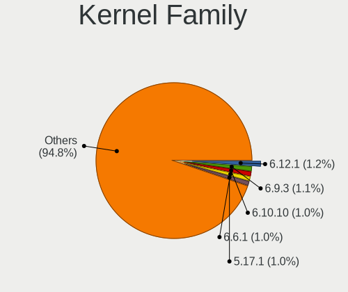
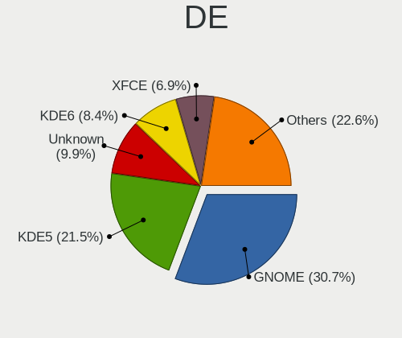
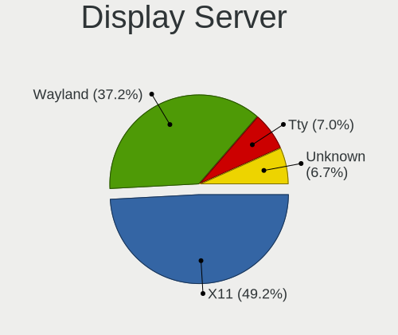
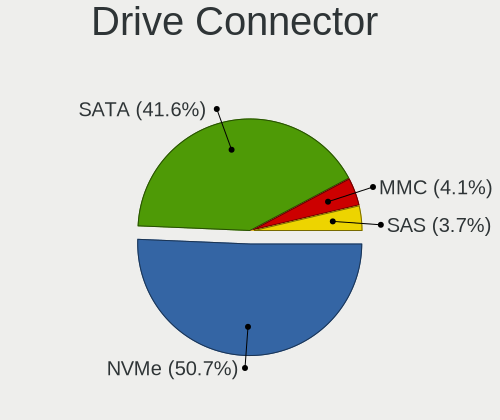
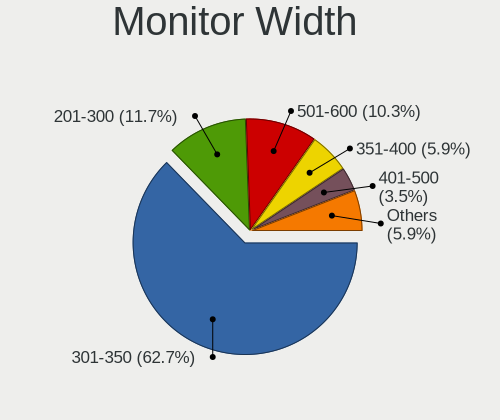
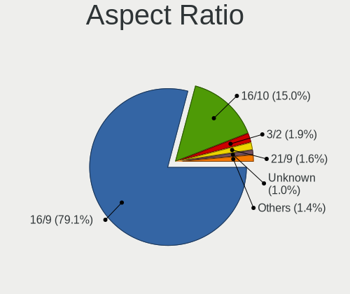
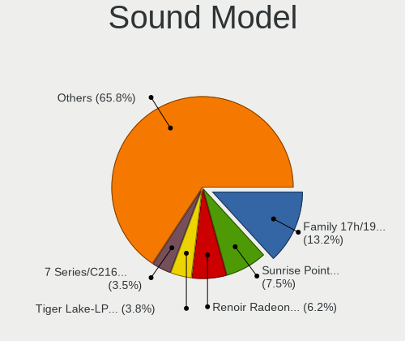
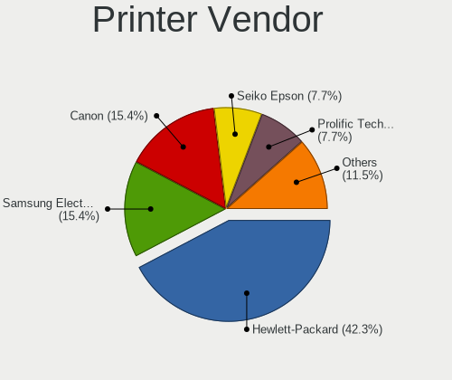
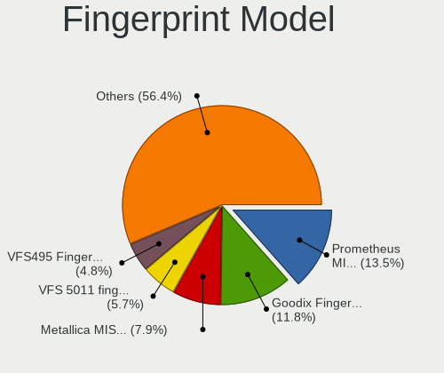

Arch - Tested Hardware & Statistics (Notebooks)
-----------------------------------------------

A project to collect tested hardware configurations for Arch.

Anyone can contribute to this report by the [hw-probe](https://github.com/linuxhw/hw-probe) tool:

    sudo -E hw-probe -all -upload

Please contribute! Especially if your hardware is rare.

Contents
--------

* [ Test Cases ](#test-cases)

* [ System ](#system)
  - [ OS                       ](#os)
  - [ OS Family                ](#os-family)
  - [ Kernel                   ](#kernel)
  - [ Kernel Family            ](#kernel-family)
  - [ Kernel Major Ver.        ](#kernel-major-ver)
  - [ Arch                     ](#arch)
  - [ DE                       ](#de)
  - [ Display Server           ](#display-server)
  - [ Display Manager          ](#display-manager)
  - [ OS Lang                  ](#os-lang)
  - [ Boot Mode                ](#boot-mode)
  - [ Filesystem               ](#filesystem)
  - [ Part. scheme             ](#part-scheme)
  - [ Dual Boot with Linux/BSD ](#dual-boot-with-linuxbsd)
  - [ Dual Boot (Win)          ](#dual-boot-win)

* [ Board ](#board)
  - [ Vendor                   ](#vendor)
  - [ Model                    ](#model)
  - [ Model Family             ](#model-family)
  - [ MFG Year                 ](#mfg-year)
  - [ Form Factor              ](#form-factor)
  - [ Secure Boot              ](#secure-boot)
  - [ Coreboot                 ](#coreboot)
  - [ RAM Size                 ](#ram-size)
  - [ RAM Used                 ](#ram-used)
  - [ Total Drives             ](#total-drives)
  - [ Has CD-ROM               ](#has-cd-rom)
  - [ Has Ethernet             ](#has-ethernet)
  - [ Has WiFi                 ](#has-wifi)
  - [ Has Bluetooth            ](#has-bluetooth)

* [ Location ](#location)
  - [ Country                  ](#country)
  - [ City                     ](#city)

* [ Drives ](#drives)
  - [ Drive Vendor             ](#drive-vendor)
  - [ Drive Model              ](#drive-model)
  - [ HDD Vendor               ](#hdd-vendor)
  - [ SSD Vendor               ](#ssd-vendor)
  - [ Drive Kind               ](#drive-kind)
  - [ Drive Connector          ](#drive-connector)
  - [ Drive Size               ](#drive-size)
  - [ Space Total              ](#space-total)
  - [ Space Used               ](#space-used)
  - [ Malfunc. Drives          ](#malfunc-drives)
  - [ Malfunc. Drive Vendor    ](#malfunc-drive-vendor)
  - [ Malfunc. HDD Vendor      ](#malfunc-hdd-vendor)
  - [ Malfunc. Drive Kind      ](#malfunc-drive-kind)
  - [ Failed Drives            ](#failed-drives)
  - [ Failed Drive Vendor      ](#failed-drive-vendor)
  - [ Drive Status             ](#drive-status)

* [ Storage controller ](#storage-controller)
  - [ Storage Vendor           ](#storage-vendor)
  - [ Storage Model            ](#storage-model)
  - [ Storage Kind             ](#storage-kind)

* [ Processor ](#processor)
  - [ CPU Vendor               ](#cpu-vendor)
  - [ CPU Model                ](#cpu-model)
  - [ CPU Model Family         ](#cpu-model-family)
  - [ CPU Cores                ](#cpu-cores)
  - [ CPU Sockets              ](#cpu-sockets)
  - [ CPU Threads              ](#cpu-threads)
  - [ CPU Op-Modes             ](#cpu-op-modes)
  - [ CPU Microcode            ](#cpu-microcode)
  - [ CPU Microarch            ](#cpu-microarch)

* [ Graphics ](#graphics)
  - [ GPU Vendor               ](#gpu-vendor)
  - [ GPU Model                ](#gpu-model)
  - [ GPU Combo                ](#gpu-combo)
  - [ GPU Driver               ](#gpu-driver)
  - [ GPU Memory               ](#gpu-memory)

* [ Monitor ](#monitor)
  - [ Monitor Vendor           ](#monitor-vendor)
  - [ Monitor Model            ](#monitor-model)
  - [ Monitor Resolution       ](#monitor-resolution)
  - [ Monitor Diagonal         ](#monitor-diagonal)
  - [ Monitor Width            ](#monitor-width)
  - [ Aspect Ratio             ](#aspect-ratio)
  - [ Monitor Area             ](#monitor-area)
  - [ Pixel Density            ](#pixel-density)
  - [ Multiple Monitors        ](#multiple-monitors)

* [ Network ](#network)
  - [ Net Controller Vendor    ](#net-controller-vendor)
  - [ Net Controller Model     ](#net-controller-model)
  - [ Wireless Vendor          ](#wireless-vendor)
  - [ Wireless Model           ](#wireless-model)
  - [ Ethernet Vendor          ](#ethernet-vendor)
  - [ Ethernet Model           ](#ethernet-model)
  - [ Net Controller Kind      ](#net-controller-kind)
  - [ Used Controller          ](#used-controller)
  - [ NICs                     ](#nics)
  - [ IPv6                     ](#ipv6)

* [ Bluetooth ](#bluetooth)
  - [ Bluetooth Vendor         ](#bluetooth-vendor)
  - [ Bluetooth Model          ](#bluetooth-model)

* [ Sound ](#sound)
  - [ Sound Vendor             ](#sound-vendor)
  - [ Sound Model              ](#sound-model)

* [ Memory ](#memory)
  - [ Memory Vendor            ](#memory-vendor)
  - [ Memory Model             ](#memory-model)
  - [ Memory Kind              ](#memory-kind)
  - [ Memory Form Factor       ](#memory-form-factor)
  - [ Memory Size              ](#memory-size)
  - [ Memory Speed             ](#memory-speed)

* [ Printers & scanners ](#printers--scanners)
  - [ Printer Vendor           ](#printer-vendor)
  - [ Printer Model            ](#printer-model)
  - [ Scanner Vendor           ](#scanner-vendor)
  - [ Scanner Model            ](#scanner-model)

* [ Camera ](#camera)
  - [ Camera Vendor            ](#camera-vendor)
  - [ Camera Model             ](#camera-model)

* [ Security ](#security)
  - [ Fingerprint Vendor       ](#fingerprint-vendor)
  - [ Fingerprint Model        ](#fingerprint-model)
  - [ Chipcard Vendor          ](#chipcard-vendor)
  - [ Chipcard Model           ](#chipcard-model)

* [ Unsupported ](#unsupported)
  - [ Unsupported Devices      ](#unsupported-devices)
  - [ Unsupported Device Types ](#unsupported-device-types)

Test Cases
----------

Total: 3439

| Vendor        | Model                       | Probe                                                      | Date         |
|---------------|-----------------------------|------------------------------------------------------------|--------------|
| Acer          | Aspire E5-571               | [35b5fa2276](https://linux-hardware.org/?probe=35b5fa2276) | Apr 30, 2022 |
| Dell          | Precision 7540              | [8b1b7dd8da](https://linux-hardware.org/?probe=8b1b7dd8da) | Apr 30, 2022 |
| Dell          | Precision M6600             | [bb40a22dd3](https://linux-hardware.org/?probe=bb40a22dd3) | Apr 29, 2022 |
| Acer          | Aspire A715-71G             | [ec6c90818c](https://linux-hardware.org/?probe=ec6c90818c) | Apr 29, 2022 |
| ASUSTek       | ROG Zephyrus G14 GA402RJ... | [96fc510369](https://linux-hardware.org/?probe=96fc510369) | Apr 29, 2022 |
| Razer         | Blade 15 Studio Edition ... | [563510a4b7](https://linux-hardware.org/?probe=563510a4b7) | Apr 28, 2022 |
| HP            | ZBook 17 G2                 | [81409450dc](https://linux-hardware.org/?probe=81409450dc) | Apr 28, 2022 |
| Lenovo        | IdeaPad 5 Pro 14ACN6 82L... | [ab11d6ac2f](https://linux-hardware.org/?probe=ab11d6ac2f) | Apr 28, 2022 |
| Acer          | Aspire ES1-572              | [25f9b83c30](https://linux-hardware.org/?probe=25f9b83c30) | Apr 28, 2022 |
| HP            | Notebook                    | [daaa31b65a](https://linux-hardware.org/?probe=daaa31b65a) | Apr 27, 2022 |
| ASUSTek       | E402SA                      | [4c5cbe705d](https://linux-hardware.org/?probe=4c5cbe705d) | Apr 27, 2022 |
| Lenovo        | IdeaPad 5 14ALC05 82LM      | [ea3e0b8695](https://linux-hardware.org/?probe=ea3e0b8695) | Apr 26, 2022 |
| MouseCompu... | NH55Dx                      | [0a397dd5e7](https://linux-hardware.org/?probe=0a397dd5e7) | Apr 25, 2022 |
| Lenovo        | ThinkPad T14 Gen 2i 20W0... | [37a92322aa](https://linux-hardware.org/?probe=37a92322aa) | Apr 25, 2022 |
| TUXEDO        | Pulse 15 Gen1               | [190d52b2d6](https://linux-hardware.org/?probe=190d52b2d6) | Apr 25, 2022 |
| Acer          | TravelMate P259-MG          | [debe4697b9](https://linux-hardware.org/?probe=debe4697b9) | Apr 23, 2022 |
| Dell          | Latitude 3340               | [e6aa31da26](https://linux-hardware.org/?probe=e6aa31da26) | Apr 23, 2022 |
| Lenovo        | IdeaPad Gaming 3 15ACH6 ... | [c90694a42c](https://linux-hardware.org/?probe=c90694a42c) | Apr 23, 2022 |
| Lenovo        | IdeaPad S145-15IWL 81S9     | [e97ab3fc6c](https://linux-hardware.org/?probe=e97ab3fc6c) | Apr 22, 2022 |
| Lenovo        | Legion Y530-15ICH 81FV      | [2c17462cda](https://linux-hardware.org/?probe=2c17462cda) | Apr 22, 2022 |
| Dell          | Latitude E5500              | [500b4b5ee2](https://linux-hardware.org/?probe=500b4b5ee2) | Apr 22, 2022 |
| Dell          | Inspiron 7577               | [ea4f513eb9](https://linux-hardware.org/?probe=ea4f513eb9) | Apr 22, 2022 |
| HP            | EliteBook 8470p             | [c1623a9f89](https://linux-hardware.org/?probe=c1623a9f89) | Apr 21, 2022 |
| HP            | Pavilion Gaming Laptop 1... | [ce3b387afa](https://linux-hardware.org/?probe=ce3b387afa) | Apr 21, 2022 |
| Dell          | XPS 13 7390                 | [b2cc2161d3](https://linux-hardware.org/?probe=b2cc2161d3) | Apr 21, 2022 |
| Apple         | MacBookAir5,1               | [3dd8282149](https://linux-hardware.org/?probe=3dd8282149) | Apr 20, 2022 |
| Toshiba       | TECRA R940                  | [e7dc07a41c](https://linux-hardware.org/?probe=e7dc07a41c) | Apr 20, 2022 |
| Intel         | W7650                       | [cdf0885f07](https://linux-hardware.org/?probe=cdf0885f07) | Apr 20, 2022 |
| Dell          | XPS 13 9310                 | [e6f96a585c](https://linux-hardware.org/?probe=e6f96a585c) | Apr 18, 2022 |
| Alienware     | M11x                        | [df72ecbe58](https://linux-hardware.org/?probe=df72ecbe58) | Apr 18, 2022 |
| Avell High... | B.ON                        | [6f37e0aabc](https://linux-hardware.org/?probe=6f37e0aabc) | Apr 18, 2022 |
| Apple         | MacBookPro12,1              | [3c5f232016](https://linux-hardware.org/?probe=3c5f232016) | Apr 17, 2022 |
| TUXEDO        | Book_XA1510                 | [441b2fd4ab](https://linux-hardware.org/?probe=441b2fd4ab) | Apr 17, 2022 |
| TUXEDO        | Book_XA1510                 | [b109942662](https://linux-hardware.org/?probe=b109942662) | Apr 17, 2022 |
| HP            | ZBook 17 G2                 | [d7b7a81cbb](https://linux-hardware.org/?probe=d7b7a81cbb) | Apr 16, 2022 |
| Dell          | XPS 15 9560                 | [9529ed78e9](https://linux-hardware.org/?probe=9529ed78e9) | Apr 16, 2022 |
| Dell          | XPS 15 9560                 | [1ef9e4e85d](https://linux-hardware.org/?probe=1ef9e4e85d) | Apr 16, 2022 |
| Dell          | XPS 15 9560                 | [abee14fa00](https://linux-hardware.org/?probe=abee14fa00) | Apr 16, 2022 |
| Fujitsu       | LIFEBOOK P771               | [f9d5ba9c1c](https://linux-hardware.org/?probe=f9d5ba9c1c) | Apr 16, 2022 |
| Fujitsu       | LIFEBOOK P771               | [a6580631d1](https://linux-hardware.org/?probe=a6580631d1) | Apr 16, 2022 |
| LG Electro... | 15Z95P-G.AA78B              | [f5ef9987a4](https://linux-hardware.org/?probe=f5ef9987a4) | Apr 15, 2022 |
| MSI           | Creator 15 A10SFS           | [42b2140343](https://linux-hardware.org/?probe=42b2140343) | Apr 15, 2022 |
| Lenovo        | ThinkPad T14s Gen 2i 20W... | [539ce7e59a](https://linux-hardware.org/?probe=539ce7e59a) | Apr 15, 2022 |
| Alienware     | x17 R1                      | [86a2d88704](https://linux-hardware.org/?probe=86a2d88704) | Apr 15, 2022 |
| Sony          | VPCF115FM                   | [b174df5915](https://linux-hardware.org/?probe=b174df5915) | Apr 15, 2022 |
| Lenovo        | Yoga Slim 7 14ARE05 82A2    | [078a3464bf](https://linux-hardware.org/?probe=078a3464bf) | Apr 15, 2022 |
| Lenovo        | ThinkPad P14s Gen 2a 21A... | [cffdde259f](https://linux-hardware.org/?probe=cffdde259f) | Apr 15, 2022 |
| Dell          | Inspiron 7559               | [5302420f94](https://linux-hardware.org/?probe=5302420f94) | Apr 15, 2022 |
| Dell          | Latitude E7450              | [9af0006104](https://linux-hardware.org/?probe=9af0006104) | Apr 15, 2022 |
| Framework     | Laptop                      | [e4c994f47a](https://linux-hardware.org/?probe=e4c994f47a) | Apr 14, 2022 |
| HP            | Laptop 14-cf0xxx            | [3fcf4f7e02](https://linux-hardware.org/?probe=3fcf4f7e02) | Apr 14, 2022 |
| Lenovo        | Legion 5 15IMH05H 81Y6      | [68d7627d20](https://linux-hardware.org/?probe=68d7627d20) | Apr 14, 2022 |
| Sony          | VPCF115FM                   | [03f96804b2](https://linux-hardware.org/?probe=03f96804b2) | Apr 14, 2022 |
| Lenovo        | E31-80 80MX                 | [ea96e85c49](https://linux-hardware.org/?probe=ea96e85c49) | Apr 14, 2022 |
| Lenovo        | ThinkPad X1 Carbon 7th 2... | [c49c891a78](https://linux-hardware.org/?probe=c49c891a78) | Apr 14, 2022 |
| Lenovo        | ThinkPad T480 20L6S93F00    | [b8c57e6b8a](https://linux-hardware.org/?probe=b8c57e6b8a) | Apr 14, 2022 |
| Lenovo        | ThinkPad X220 4291QT1       | [9e6fc630f4](https://linux-hardware.org/?probe=9e6fc630f4) | Apr 14, 2022 |
| Framework     | Laptop                      | [d4a02dfec9](https://linux-hardware.org/?probe=d4a02dfec9) | Apr 14, 2022 |
| Lenovo        | Legion 5 15IMH05H 81Y6      | [c9e8c79a2e](https://linux-hardware.org/?probe=c9e8c79a2e) | Apr 14, 2022 |
| Lenovo        | XiaoXin Chao7000-14IKBR ... | [2394088db1](https://linux-hardware.org/?probe=2394088db1) | Apr 14, 2022 |
| Framework     | Laptop                      | [b8850e9dc8](https://linux-hardware.org/?probe=b8850e9dc8) | Apr 14, 2022 |
| Lenovo        | IdeaPad 320-14ISK 80XG      | [5f85d41ef2](https://linux-hardware.org/?probe=5f85d41ef2) | Apr 14, 2022 |
| TUXEDO        | InfinityBook Pro 14 Gen6    | [f3d294f808](https://linux-hardware.org/?probe=f3d294f808) | Apr 14, 2022 |
| Dell          | Inspiron 15 7000 Gaming     | [a7f25c6027](https://linux-hardware.org/?probe=a7f25c6027) | Apr 14, 2022 |
| Dell          | G5 5505                     | [7c8b949b95](https://linux-hardware.org/?probe=7c8b949b95) | Apr 14, 2022 |
| HP            | ENVY Notebook               | [2b982a201c](https://linux-hardware.org/?probe=2b982a201c) | Apr 14, 2022 |
| Lenovo        | ThinkPad T550 20CKCTO1WW    | [81d6a811d5](https://linux-hardware.org/?probe=81d6a811d5) | Apr 14, 2022 |
| Lenovo        | ThinkPad T410 2537E82       | [84026a1dd3](https://linux-hardware.org/?probe=84026a1dd3) | Apr 14, 2022 |
| Lenovo        | ThinkPad X220 Tablet 429... | [c68c62f98c](https://linux-hardware.org/?probe=c68c62f98c) | Apr 14, 2022 |
| Framework     | Laptop                      | [16d27bad7a](https://linux-hardware.org/?probe=16d27bad7a) | Apr 14, 2022 |
| Lenovo        | IdeaPad S540-13ARE 82DL     | [17363a1a13](https://linux-hardware.org/?probe=17363a1a13) | Apr 14, 2022 |
| HP            | ZBook Firefly 15 G7 Mobi... | [0e9e99acae](https://linux-hardware.org/?probe=0e9e99acae) | Apr 13, 2022 |
| Monster       | ABRA A5 V15.8               | [28f1e82585](https://linux-hardware.org/?probe=28f1e82585) | Apr 13, 2022 |
| Lenovo        | ThinkPad X220 4291QT1       | [58ef1f3594](https://linux-hardware.org/?probe=58ef1f3594) | Apr 13, 2022 |
| Apple         | MacBookPro10,2              | [cf7c54ff19](https://linux-hardware.org/?probe=cf7c54ff19) | Apr 13, 2022 |
| Lenovo        | ThinkPad T440p 20AN006GU... | [8c26cf3ce0](https://linux-hardware.org/?probe=8c26cf3ce0) | Apr 13, 2022 |
| Lenovo        | ThinkPad P1 Gen 4i 20Y30... | [6dc0087ab4](https://linux-hardware.org/?probe=6dc0087ab4) | Apr 13, 2022 |
| Lenovo        | IdeaPad 5 15ALC05 82LN      | [b076cac85d](https://linux-hardware.org/?probe=b076cac85d) | Apr 13, 2022 |
| Samsung       | 270E5J/2570EJ               | [4aeb8de6f6](https://linux-hardware.org/?probe=4aeb8de6f6) | Apr 13, 2022 |
| Lenovo        | ThinkPad T14 Gen 1 20UD0... | [90505ddcfa](https://linux-hardware.org/?probe=90505ddcfa) | Apr 13, 2022 |
| HP            | EliteBook 845 G8 Noteboo... | [eff12a28fd](https://linux-hardware.org/?probe=eff12a28fd) | Apr 13, 2022 |
| Lenovo        | ThinkPad T490s 20NY000JM... | [e93e7d9ad1](https://linux-hardware.org/?probe=e93e7d9ad1) | Apr 13, 2022 |
| Lenovo        | ThinkPad T490s 20NXCTO1W... | [2edcc0aefa](https://linux-hardware.org/?probe=2edcc0aefa) | Apr 13, 2022 |
| Lenovo        | Legion Y540-15IRH-PG0 81... | [32371c52a6](https://linux-hardware.org/?probe=32371c52a6) | Apr 13, 2022 |
| Apple         | MacBookPro8,1               | [fad4436356](https://linux-hardware.org/?probe=fad4436356) | Apr 13, 2022 |
| HP            | Pavilion Gaming Laptop 1... | [75f2876f06](https://linux-hardware.org/?probe=75f2876f06) | Apr 12, 2022 |
| Lenovo        | V130-15IGM 81HL             | [c74caa4194](https://linux-hardware.org/?probe=c74caa4194) | Apr 12, 2022 |
| Dell          | Vostro 14-5459              | [89d65f0a36](https://linux-hardware.org/?probe=89d65f0a36) | Apr 12, 2022 |
| Lenovo        | IdeaPad 700-15ISK 80RU      | [7c4eb57bca](https://linux-hardware.org/?probe=7c4eb57bca) | Apr 12, 2022 |
| Razer         | Blade                       | [13c7eb09fa](https://linux-hardware.org/?probe=13c7eb09fa) | Apr 12, 2022 |
| Lenovo        | ThinkPad E14 Gen 2 20T60... | [7007f9e0fc](https://linux-hardware.org/?probe=7007f9e0fc) | Apr 12, 2022 |
| Framework     | Laptop                      | [02b837b78a](https://linux-hardware.org/?probe=02b837b78a) | Apr 12, 2022 |
| Dell          | Latitude 5480               | [f733f24fdc](https://linux-hardware.org/?probe=f733f24fdc) | Apr 12, 2022 |
| ASUSTek       | S551LN                      | [8795a49142](https://linux-hardware.org/?probe=8795a49142) | Apr 12, 2022 |
| ASUSTek       | S551LN                      | [4999fb1eff](https://linux-hardware.org/?probe=4999fb1eff) | Apr 12, 2022 |
| HUAWEI        | KLVL-WXX9                   | [47cecc43f6](https://linux-hardware.org/?probe=47cecc43f6) | Apr 11, 2022 |
| Lenovo        | ThinkBook 15-IIL 20SM       | [a86b688768](https://linux-hardware.org/?probe=a86b688768) | Apr 11, 2022 |
| Dell          | Precision M6800             | [571eab63d2](https://linux-hardware.org/?probe=571eab63d2) | Apr 10, 2022 |
| Dell          | Precision M6800             | [236217f64d](https://linux-hardware.org/?probe=236217f64d) | Apr 10, 2022 |
| Acer          | One 14 Z2-485               | [57f307fa80](https://linux-hardware.org/?probe=57f307fa80) | Apr 09, 2022 |
| Lenovo        | XiaoXin Air 13IML 81WV      | [c5ae7c810d](https://linux-hardware.org/?probe=c5ae7c810d) | Apr 09, 2022 |
| HP            | Pavilion Notebook           | [f76d101440](https://linux-hardware.org/?probe=f76d101440) | Apr 09, 2022 |
| Acer          | Nitro AN515-45              | [ce9698e187](https://linux-hardware.org/?probe=ce9698e187) | Apr 09, 2022 |
| Lenovo        | Yoga Slim 7 Carbon 14ACN... | [5328fde624](https://linux-hardware.org/?probe=5328fde624) | Apr 08, 2022 |
| LG Electro... | S430-G.BC33P1               | [95f8d514d6](https://linux-hardware.org/?probe=95f8d514d6) | Apr 08, 2022 |
| Acer          | Aspire A515-44              | [9dfd75a7dd](https://linux-hardware.org/?probe=9dfd75a7dd) | Apr 07, 2022 |
| Dell          | Latitude 5480               | [4e82478bdf](https://linux-hardware.org/?probe=4e82478bdf) | Apr 07, 2022 |
| ASUSTek       | VivoBook 14_ASUS Laptop ... | [345734b3fd](https://linux-hardware.org/?probe=345734b3fd) | Apr 07, 2022 |
| Dell          | XPS 13 9310                 | [a497a79602](https://linux-hardware.org/?probe=a497a79602) | Apr 07, 2022 |
| Dell          | XPS 13 9310                 | [f5d617af1b](https://linux-hardware.org/?probe=f5d617af1b) | Apr 07, 2022 |
| Dell          | Inspiron 5565               | [265b99f9a2](https://linux-hardware.org/?probe=265b99f9a2) | Apr 07, 2022 |
| ASUSTek       | GL752VW                     | [0dbc471fee](https://linux-hardware.org/?probe=0dbc471fee) | Apr 07, 2022 |
| MSI           | GL75 Leopard 10SDK          | [e168714dee](https://linux-hardware.org/?probe=e168714dee) | Apr 06, 2022 |
| MSI           | GL63 9SD                    | [6b4f4b5c10](https://linux-hardware.org/?probe=6b4f4b5c10) | Apr 06, 2022 |
| Star Labs     | Lite                        | [7a49876efc](https://linux-hardware.org/?probe=7a49876efc) | Apr 05, 2022 |
| Acer          | Extensa 2511                | [00d24bfb95](https://linux-hardware.org/?probe=00d24bfb95) | Apr 05, 2022 |
| Dell          | XPS 15 9570                 | [0437f62b89](https://linux-hardware.org/?probe=0437f62b89) | Apr 05, 2022 |
| ASUSTek       | ZenBook UX431DA_UM431DA     | [91bae7b644](https://linux-hardware.org/?probe=91bae7b644) | Apr 05, 2022 |
| Razer         | Blade Stealth               | [426dc681c4](https://linux-hardware.org/?probe=426dc681c4) | Apr 05, 2022 |
| Dell          | Inspiron 5565               | [ec32d093d4](https://linux-hardware.org/?probe=ec32d093d4) | Apr 05, 2022 |
| Dell          | Vostro 3578                 | [8e2637c774](https://linux-hardware.org/?probe=8e2637c774) | Apr 05, 2022 |
| Acer          | E1-510                      | [bdcc9d59ad](https://linux-hardware.org/?probe=bdcc9d59ad) | Apr 05, 2022 |
| Lenovo        | Flex 2-14 20404             | [4368114931](https://linux-hardware.org/?probe=4368114931) | Apr 04, 2022 |
| Acer          | Nitro AN515-52              | [08491e74ef](https://linux-hardware.org/?probe=08491e74ef) | Apr 04, 2022 |
| Lenovo        | IdeaPad S145-15IWL 81S9     | [ecdd532a2c](https://linux-hardware.org/?probe=ecdd532a2c) | Apr 03, 2022 |
| Acer          | Nitro AN515-43              | [e6e1af5316](https://linux-hardware.org/?probe=e6e1af5316) | Apr 03, 2022 |
| Acer          | Aspire E5-573G              | [8c6db85346](https://linux-hardware.org/?probe=8c6db85346) | Apr 03, 2022 |
| Lenovo        | IdeaPad 5 Pro 14ACN6 82L... | [863c2666dc](https://linux-hardware.org/?probe=863c2666dc) | Apr 02, 2022 |
| Lenovo        | IdeaPad L340-15API 81LW     | [262e4f8317](https://linux-hardware.org/?probe=262e4f8317) | Apr 02, 2022 |
| Dell          | Inspiron 5520               | [63f818dc19](https://linux-hardware.org/?probe=63f818dc19) | Apr 02, 2022 |
| MSI           | Modern 15 A5M               | [ea091854ed](https://linux-hardware.org/?probe=ea091854ed) | Apr 01, 2022 |
| MSI           | Modern 15 A5M               | [ae491737c7](https://linux-hardware.org/?probe=ae491737c7) | Apr 01, 2022 |
| HUAWEI        | KLVL-WXXW                   | [4246affe99](https://linux-hardware.org/?probe=4246affe99) | Apr 01, 2022 |
| ASUSTek       | Strix GL504GW_GL504GW       | [aa7f16fc39](https://linux-hardware.org/?probe=aa7f16fc39) | Apr 01, 2022 |
| Lenovo        | ThinkPad T480s 20L70058G... | [d9fb78563a](https://linux-hardware.org/?probe=d9fb78563a) | Apr 01, 2022 |
| Dell          | Inspiron 7460               | [9658d99893](https://linux-hardware.org/?probe=9658d99893) | Apr 01, 2022 |
| Dell          | Inspiron 7460               | [24e5262a03](https://linux-hardware.org/?probe=24e5262a03) | Apr 01, 2022 |
| Acer          | Nitro AN517-41              | [7bce36b9fa](https://linux-hardware.org/?probe=7bce36b9fa) | Apr 01, 2022 |
| HP            | Laptop 14-cm0xxx            | [01f7a198c5](https://linux-hardware.org/?probe=01f7a198c5) | Mar 31, 2022 |
| HP            | EliteBook 820 G2            | [5308b25e76](https://linux-hardware.org/?probe=5308b25e76) | Mar 31, 2022 |
| System76      | Lemur Pro                   | [34b16b2584](https://linux-hardware.org/?probe=34b16b2584) | Mar 31, 2022 |
| Avell High... | B.ON                        | [d2628705e8](https://linux-hardware.org/?probe=d2628705e8) | Mar 31, 2022 |
| Lenovo        | ThinkPad E15 Gen 2 20TD0... | [27f986af8c](https://linux-hardware.org/?probe=27f986af8c) | Mar 30, 2022 |
| MSI           | GP62 7QF                    | [c15ac1cd59](https://linux-hardware.org/?probe=c15ac1cd59) | Mar 29, 2022 |
| Acer          | Nitro AN515-43              | [d1c02dfaee](https://linux-hardware.org/?probe=d1c02dfaee) | Mar 29, 2022 |
| Dell          | XPS 15 7590                 | [426b141f91](https://linux-hardware.org/?probe=426b141f91) | Mar 29, 2022 |
| Lenovo        | Legion 5 15ARH05 82B5       | [d346f2a1b1](https://linux-hardware.org/?probe=d346f2a1b1) | Mar 29, 2022 |
| Lenovo        | IdeaPad 320-15ABR 80XS      | [b0a630a992](https://linux-hardware.org/?probe=b0a630a992) | Mar 29, 2022 |
| ASUSTek       | X751LD                      | [6741a3f9dc](https://linux-hardware.org/?probe=6741a3f9dc) | Mar 28, 2022 |
| HUAWEI        | BOHB-WAX9                   | [cb353468c2](https://linux-hardware.org/?probe=cb353468c2) | Mar 28, 2022 |
| HONOR         | NMH-WCX9                    | [b8f4b2750d](https://linux-hardware.org/?probe=b8f4b2750d) | Mar 27, 2022 |
| Notebook      | N85_N87,HJ,HJ1,HK1          | [078c1af4c3](https://linux-hardware.org/?probe=078c1af4c3) | Mar 27, 2022 |
| Acer          | Aspire E5-573G              | [6aa00c9a30](https://linux-hardware.org/?probe=6aa00c9a30) | Mar 27, 2022 |
| Acer          | Nitro AN515-45              | [4cc10c8b41](https://linux-hardware.org/?probe=4cc10c8b41) | Mar 27, 2022 |
| Acer          | Nitro AN515-45              | [918ef53f6f](https://linux-hardware.org/?probe=918ef53f6f) | Mar 27, 2022 |
| Acer          | Aspire E5-573G              | [91bcc1e69c](https://linux-hardware.org/?probe=91bcc1e69c) | Mar 27, 2022 |
| HP            | ZBook 17 G2                 | [f0efa22aa2](https://linux-hardware.org/?probe=f0efa22aa2) | Mar 27, 2022 |
| HP            | ENVY dv6                    | [bfe11c2160](https://linux-hardware.org/?probe=bfe11c2160) | Mar 27, 2022 |
| ASUSTek       | ROG Strix G513QY_G513QY     | [ba743bbb3b](https://linux-hardware.org/?probe=ba743bbb3b) | Mar 27, 2022 |
| ASUSTek       | GL552VW                     | [7e8bfac4b7](https://linux-hardware.org/?probe=7e8bfac4b7) | Mar 27, 2022 |
| Acer          | Nitro AN515-45              | [9cac848b59](https://linux-hardware.org/?probe=9cac848b59) | Mar 27, 2022 |
| Acer          | Aspire 4752                 | [a30c3c112b](https://linux-hardware.org/?probe=a30c3c112b) | Mar 27, 2022 |
| MSI           | GP62 7QF                    | [f05a7cf0e8](https://linux-hardware.org/?probe=f05a7cf0e8) | Mar 26, 2022 |
| Notebook      | NV4XMB,ME,MZ                | [8c3ffc28b7](https://linux-hardware.org/?probe=8c3ffc28b7) | Mar 26, 2022 |
| Acer          | Nitro AN515-45              | [c6fa89e81f](https://linux-hardware.org/?probe=c6fa89e81f) | Mar 26, 2022 |
| Alienware     | 15 R4                       | [204145e795](https://linux-hardware.org/?probe=204145e795) | Mar 26, 2022 |
| HUAWEI        | HVY-WXX9                    | [cc9e9e5839](https://linux-hardware.org/?probe=cc9e9e5839) | Mar 25, 2022 |
| Acer          | E1-510                      | [acfbdcfffc](https://linux-hardware.org/?probe=acfbdcfffc) | Mar 25, 2022 |
| Dell          | XPS 15 9510                 | [e463ecc7bc](https://linux-hardware.org/?probe=e463ecc7bc) | Mar 25, 2022 |
| Apple         | MacBookPro10,1              | [a9caf3d428](https://linux-hardware.org/?probe=a9caf3d428) | Mar 25, 2022 |
| MSI           | GL63 9SD                    | [d82d8f7857](https://linux-hardware.org/?probe=d82d8f7857) | Mar 25, 2022 |
| HP            | Laptop 14-fq1xxx            | [c6f4cf8c7a](https://linux-hardware.org/?probe=c6f4cf8c7a) | Mar 25, 2022 |
| Lenovo        | ThinkPad X220 4290LL3       | [4a7adefa43](https://linux-hardware.org/?probe=4a7adefa43) | Mar 25, 2022 |
| Lenovo        | V15 G2 ITL 82ME             | [f89824dbc7](https://linux-hardware.org/?probe=f89824dbc7) | Mar 24, 2022 |
| ASUSTek       | ROG Zephyrus M15 GU502LW... | [c9775b9b30](https://linux-hardware.org/?probe=c9775b9b30) | Mar 23, 2022 |
| Lenovo        | IdeaPad 5 Pro 14ACN6 82L... | [321d0c1b4a](https://linux-hardware.org/?probe=321d0c1b4a) | Mar 23, 2022 |
| Dell          | Inspiron 3185               | [f46418a449](https://linux-hardware.org/?probe=f46418a449) | Mar 23, 2022 |
| ASUSTek       | VivoBook S15 X510UF         | [10bc700e9b](https://linux-hardware.org/?probe=10bc700e9b) | Mar 23, 2022 |
| ASUSTek       | X510UNR                     | [ab3b8653a6](https://linux-hardware.org/?probe=ab3b8653a6) | Mar 23, 2022 |
| Lenovo        | G565 20071                  | [40cf723fac](https://linux-hardware.org/?probe=40cf723fac) | Mar 23, 2022 |
| ASUSTek       | VivoBook_ASUSLaptop X421... | [f7f7b2d459](https://linux-hardware.org/?probe=f7f7b2d459) | Mar 22, 2022 |
| Acer          | Aspire 4752                 | [609641d7df](https://linux-hardware.org/?probe=609641d7df) | Mar 21, 2022 |
| Lenovo        | IdeaPad 5 Pro 14ACN6 82L... | [fec31ddcd9](https://linux-hardware.org/?probe=fec31ddcd9) | Mar 20, 2022 |
| ASUSTek       | GL752VW                     | [39746d7497](https://linux-hardware.org/?probe=39746d7497) | Mar 20, 2022 |
| Lenovo        | IdeaPad 5 Pro 14ACN6 82L... | [da23c76a90](https://linux-hardware.org/?probe=da23c76a90) | Mar 19, 2022 |
| Lenovo        | Legion 5 Pro 16ACH6H 82J... | [be18e33911](https://linux-hardware.org/?probe=be18e33911) | Mar 19, 2022 |
| MSI           | Stealth GS66 12UGS          | [882be4cd35](https://linux-hardware.org/?probe=882be4cd35) | Mar 19, 2022 |
| Timi          | TM1701                      | [5127044e2a](https://linux-hardware.org/?probe=5127044e2a) | Mar 19, 2022 |
| ASUSTek       | GL752VW                     | [6d64c8e4de](https://linux-hardware.org/?probe=6d64c8e4de) | Mar 19, 2022 |
| Lenovo        | ThinkPad P14s Gen 2a 21A... | [35e488d04a](https://linux-hardware.org/?probe=35e488d04a) | Mar 19, 2022 |
| Lenovo        | ThinkPad T14s Gen 1 20UH... | [4db96169bf](https://linux-hardware.org/?probe=4db96169bf) | Mar 18, 2022 |
| Dell          | Inspiron 5566               | [7ab3aba611](https://linux-hardware.org/?probe=7ab3aba611) | Mar 18, 2022 |
| Lenovo        | IdeaPad S145-15IWL 81S9     | [3f17145276](https://linux-hardware.org/?probe=3f17145276) | Mar 18, 2022 |
| Toshiba       | Satellite L655              | [117807dfde](https://linux-hardware.org/?probe=117807dfde) | Mar 18, 2022 |
| Lenovo        | ThinkPad X270 W10DG 20K5... | [f785998dcb](https://linux-hardware.org/?probe=f785998dcb) | Mar 16, 2022 |
| HUAWEI        | KLVL-WXX9                   | [9807650c55](https://linux-hardware.org/?probe=9807650c55) | Mar 15, 2022 |
| HUAWEI        | KLVL-WXX9                   | [91eab99551](https://linux-hardware.org/?probe=91eab99551) | Mar 15, 2022 |
| HP            | Laptop 14-dq0xxx            | [46b66a5e79](https://linux-hardware.org/?probe=46b66a5e79) | Mar 15, 2022 |
| Dell          | Precision 5560              | [37f8320dbb](https://linux-hardware.org/?probe=37f8320dbb) | Mar 15, 2022 |
| HP            | ProBook 455 G7              | [453d423ede](https://linux-hardware.org/?probe=453d423ede) | Mar 15, 2022 |
| HP            | Laptop 14-dq0xxx            | [58afe91a23](https://linux-hardware.org/?probe=58afe91a23) | Mar 14, 2022 |
| ASUSTek       | ASUS TUF Dash F15 FX516P... | [78ae0419a3](https://linux-hardware.org/?probe=78ae0419a3) | Mar 14, 2022 |
| Eluktronic... | Mech-15 G2                  | [5dd8b83919](https://linux-hardware.org/?probe=5dd8b83919) | Mar 14, 2022 |
| HUAWEI        | NBLK-WAX9X                  | [82cfb46909](https://linux-hardware.org/?probe=82cfb46909) | Mar 13, 2022 |
| HP            | EliteBook 840 G2            | [b2ae743e44](https://linux-hardware.org/?probe=b2ae743e44) | Mar 13, 2022 |
| HP            | Pavilion Gaming Laptop 1... | [692ae92211](https://linux-hardware.org/?probe=692ae92211) | Mar 13, 2022 |
| Acer          | Aspire A515-52G             | [e86cb3194d](https://linux-hardware.org/?probe=e86cb3194d) | Mar 13, 2022 |
| Toshiba       | Satellite C50-A             | [f778fcf85e](https://linux-hardware.org/?probe=f778fcf85e) | Mar 11, 2022 |
| Lenovo        | ThinkPad T490 20N2000KRT    | [4766fe6362](https://linux-hardware.org/?probe=4766fe6362) | Mar 10, 2022 |
| ASUSTek       | X510UAR                     | [3bef060804](https://linux-hardware.org/?probe=3bef060804) | Mar 10, 2022 |
| MSI           | Modern 14 B4MW              | [698af00b9c](https://linux-hardware.org/?probe=698af00b9c) | Mar 10, 2022 |
| ASUSTek       | ASUS TUF Dash F15 FX516P... | [f351d9839b](https://linux-hardware.org/?probe=f351d9839b) | Mar 09, 2022 |
| MSI           | GP66 Leopard 11UG           | [ccbd207ebd](https://linux-hardware.org/?probe=ccbd207ebd) | Mar 09, 2022 |
| Dell          | Inspiron 3793               | [1fb19c1b23](https://linux-hardware.org/?probe=1fb19c1b23) | Mar 09, 2022 |
| Dell          | XPS 15 9550                 | [c39fe1a3e3](https://linux-hardware.org/?probe=c39fe1a3e3) | Mar 08, 2022 |
| Samsung       | 767XCL                      | [7685cdcfb9](https://linux-hardware.org/?probe=7685cdcfb9) | Mar 07, 2022 |
| Avell High... | 1513                        | [c2a1be9b32](https://linux-hardware.org/?probe=c2a1be9b32) | Mar 06, 2022 |
| Samsung       | 767XCL                      | [e01c76fd80](https://linux-hardware.org/?probe=e01c76fd80) | Mar 06, 2022 |
| Lenovo        | IdeaPad 5 15ITL05 82FG      | [2d5c05af33](https://linux-hardware.org/?probe=2d5c05af33) | Mar 06, 2022 |
| HP            | Pavilion Gaming Laptop 1... | [e7d5945f3d](https://linux-hardware.org/?probe=e7d5945f3d) | Mar 05, 2022 |
| Samsung       | 767XCL                      | [a45c6cfda9](https://linux-hardware.org/?probe=a45c6cfda9) | Mar 05, 2022 |
| HP            | ProBook 450 G4              | [87d97b3c00](https://linux-hardware.org/?probe=87d97b3c00) | Mar 05, 2022 |
| HP            | ProBook 450 G4              | [5bb83b4355](https://linux-hardware.org/?probe=5bb83b4355) | Mar 05, 2022 |
| MSI           | Modern 14 B4MW              | [b52536f8a4](https://linux-hardware.org/?probe=b52536f8a4) | Mar 05, 2022 |
| ASUSTek       | X550VX                      | [91eafd1ed4](https://linux-hardware.org/?probe=91eafd1ed4) | Mar 04, 2022 |
| Dell          | Latitude 7480               | [68996ba096](https://linux-hardware.org/?probe=68996ba096) | Mar 03, 2022 |
| Dell          | Latitude 9420               | [355f64f6a7](https://linux-hardware.org/?probe=355f64f6a7) | Mar 03, 2022 |
| Dell          | Latitude 7480               | [4eb2f9a217](https://linux-hardware.org/?probe=4eb2f9a217) | Mar 03, 2022 |
| HP            | ENVY Laptop 13-ah0xxx       | [7fb04e6c7d](https://linux-hardware.org/?probe=7fb04e6c7d) | Mar 03, 2022 |
| HP            | ENVY Laptop 13-ah0xxx       | [0f27bdf5a8](https://linux-hardware.org/?probe=0f27bdf5a8) | Mar 02, 2022 |
| Packard Be... | DOT S                       | [4110664747](https://linux-hardware.org/?probe=4110664747) | Mar 02, 2022 |
| Samsung       | 670Z5E                      | [fd7ddf8a96](https://linux-hardware.org/?probe=fd7ddf8a96) | Mar 01, 2022 |
| Samsung       | R530/R730                   | [d28aae8671](https://linux-hardware.org/?probe=d28aae8671) | Mar 01, 2022 |
| Samsung       | R530/R730                   | [8e63f95f66](https://linux-hardware.org/?probe=8e63f95f66) | Mar 01, 2022 |
| ASUSTek       | ROG Strix G513QY_G513QY     | [01f6429898](https://linux-hardware.org/?probe=01f6429898) | Mar 01, 2022 |
| ASUSTek       | X751LD                      | [c2d198ab83](https://linux-hardware.org/?probe=c2d198ab83) | Feb 28, 2022 |
| HP            | Laptop 15s-fq0xxx           | [9acf95b26b](https://linux-hardware.org/?probe=9acf95b26b) | Feb 28, 2022 |
| Lenovo        | ThinkPad X220 42912WU       | [71cc4e2875](https://linux-hardware.org/?probe=71cc4e2875) | Feb 28, 2022 |
| HP            | Laptop 15-da0xxx            | [c06730e711](https://linux-hardware.org/?probe=c06730e711) | Feb 27, 2022 |
| Samsung       | 550XDA                      | [460d65857c](https://linux-hardware.org/?probe=460d65857c) | Feb 26, 2022 |
| Teclast       | F15 Plus                    | [a14a5fd6eb](https://linux-hardware.org/?probe=a14a5fd6eb) | Feb 26, 2022 |
| ASUSTek       | ASUS TUF Gaming F15 FX50... | [59b53c7f42](https://linux-hardware.org/?probe=59b53c7f42) | Feb 26, 2022 |
| Lenovo        | IdeaPad 5 14ALC05 82LM      | [ab78767b82](https://linux-hardware.org/?probe=ab78767b82) | Feb 26, 2022 |
| Teclast       | F15 Plus                    | [646dc0e7f7](https://linux-hardware.org/?probe=646dc0e7f7) | Feb 25, 2022 |
| Samsung       | R530/R730                   | [8786882929](https://linux-hardware.org/?probe=8786882929) | Feb 25, 2022 |
| Lenovo        | Yoga Slim 7 14ARE05 82A2    | [cfd0806662](https://linux-hardware.org/?probe=cfd0806662) | Feb 25, 2022 |
| Acer          | Swift SF314-43              | [1434453fc0](https://linux-hardware.org/?probe=1434453fc0) | Feb 24, 2022 |
| MSI           | GL75 Leopard 10SDK          | [6a14728490](https://linux-hardware.org/?probe=6a14728490) | Feb 24, 2022 |
| Teclast       | F15 Plus                    | [8697bdb6d5](https://linux-hardware.org/?probe=8697bdb6d5) | Feb 24, 2022 |
| Teclast       | F15 Plus                    | [e8e8b2f6da](https://linux-hardware.org/?probe=e8e8b2f6da) | Feb 24, 2022 |
| Lenovo        | ThinkPad P1 Gen 3 20TJS2... | [393e833123](https://linux-hardware.org/?probe=393e833123) | Feb 24, 2022 |
| Dell          | XPS 15 7590                 | [69896e5117](https://linux-hardware.org/?probe=69896e5117) | Feb 23, 2022 |
| Dell          | Latitude 7480               | [fbd2d9b5c7](https://linux-hardware.org/?probe=fbd2d9b5c7) | Feb 23, 2022 |
| Razer         | Blade                       | [4b78377a27](https://linux-hardware.org/?probe=4b78377a27) | Feb 21, 2022 |
| Dell          | Precision 3530              | [8cf015e233](https://linux-hardware.org/?probe=8cf015e233) | Feb 21, 2022 |
| HUAWEI        | BOHB-WAX9                   | [8e2cd5844e](https://linux-hardware.org/?probe=8e2cd5844e) | Feb 21, 2022 |
| LG Electro... | 17UD70P-PX76K               | [968b189e38](https://linux-hardware.org/?probe=968b189e38) | Feb 21, 2022 |
| HP            | OMEN by Laptop 15-dh1xxx    | [fde67099dc](https://linux-hardware.org/?probe=fde67099dc) | Feb 20, 2022 |
| Dell          | Inspiron 3576               | [6b61eccd4d](https://linux-hardware.org/?probe=6b61eccd4d) | Feb 20, 2022 |
| Dell          | Inspiron 3576               | [16ffefcda4](https://linux-hardware.org/?probe=16ffefcda4) | Feb 20, 2022 |
| Framework     | Laptop                      | [1644c89c1c](https://linux-hardware.org/?probe=1644c89c1c) | Feb 20, 2022 |
| Lenovo        | ThinkPad P14s Gen 1 20Y1... | [bcb0d0c077](https://linux-hardware.org/?probe=bcb0d0c077) | Feb 19, 2022 |
| Avell High... | B.ON                        | [9ef94d96d1](https://linux-hardware.org/?probe=9ef94d96d1) | Feb 18, 2022 |
| IT Channel... | P95xER                      | [c8add471fb](https://linux-hardware.org/?probe=c8add471fb) | Feb 18, 2022 |
| Samsung       | 300E4A/300E5A/300E7A/343... | [c2df5bb692](https://linux-hardware.org/?probe=c2df5bb692) | Feb 18, 2022 |
| Acer          | Predator PH517-61           | [96eedc2832](https://linux-hardware.org/?probe=96eedc2832) | Feb 18, 2022 |
| ASUSTek       | ZenBook UX425UA_UM425UA     | [bda7853dd1](https://linux-hardware.org/?probe=bda7853dd1) | Feb 17, 2022 |
| Dell          | Precision 7560              | [811983afdd](https://linux-hardware.org/?probe=811983afdd) | Feb 17, 2022 |
| Dell          | Latitude 9420               | [80a2f3e508](https://linux-hardware.org/?probe=80a2f3e508) | Feb 17, 2022 |
| Lenovo        | IdeaPad 5 14ALC05 82LM      | [6537d452d8](https://linux-hardware.org/?probe=6537d452d8) | Feb 16, 2022 |
| Lenovo        | Yoga Creator 7 15IMH05 8... | [12a1b54a3a](https://linux-hardware.org/?probe=12a1b54a3a) | Feb 16, 2022 |
| Toshiba       | Satellite C870-19R          | [72755f69a8](https://linux-hardware.org/?probe=72755f69a8) | Feb 16, 2022 |
| Lenovo        | B50-30 80ES                 | [d9b49b400b](https://linux-hardware.org/?probe=d9b49b400b) | Feb 16, 2022 |
| Lenovo        | ThinkPad X220 42912WU       | [05281aa81f](https://linux-hardware.org/?probe=05281aa81f) | Feb 16, 2022 |
| Lenovo        | ThinkPad X220 42912WU       | [1c04b9e65f](https://linux-hardware.org/?probe=1c04b9e65f) | Feb 16, 2022 |
| CJSCOPE       | Z Series                    | [c594abda0a](https://linux-hardware.org/?probe=c594abda0a) | Feb 16, 2022 |
| Dell          | Inspiron 5520               | [fa0603a25d](https://linux-hardware.org/?probe=fa0603a25d) | Feb 16, 2022 |
| Fujitsu       | LIFEBOOK E556               | [b9f9511cb0](https://linux-hardware.org/?probe=b9f9511cb0) | Feb 15, 2022 |
| Toshiba       | Satellite C870-19R          | [4e0345b36d](https://linux-hardware.org/?probe=4e0345b36d) | Feb 15, 2022 |
| HP            | Notebook                    | [40c672794e](https://linux-hardware.org/?probe=40c672794e) | Feb 15, 2022 |
| Lenovo        | XiaoXinPro 14IHU 2021 82... | [d994752dc6](https://linux-hardware.org/?probe=d994752dc6) | Feb 15, 2022 |
| Avell High... | B.ON                        | [736bab4e42](https://linux-hardware.org/?probe=736bab4e42) | Feb 14, 2022 |
| LG Electro... | 17UD70P-PX76K               | [d8f6d95994](https://linux-hardware.org/?probe=d8f6d95994) | Feb 14, 2022 |
| LG Electro... | 17UD70P-PX76K               | [2017e780b7](https://linux-hardware.org/?probe=2017e780b7) | Feb 14, 2022 |
| Dell          | Inspiron 3793               | [108edf2064](https://linux-hardware.org/?probe=108edf2064) | Feb 13, 2022 |
| Acer          | Aspire VX5-591G             | [f8602e7dbf](https://linux-hardware.org/?probe=f8602e7dbf) | Feb 13, 2022 |
| Dell          | Inspiron 13-7378            | [53bdd438f6](https://linux-hardware.org/?probe=53bdd438f6) | Feb 13, 2022 |
| Lenovo        | ThinkBook 14-IIL 20SL       | [2289e255e7](https://linux-hardware.org/?probe=2289e255e7) | Feb 13, 2022 |
| Dell          | Latitude E6420              | [019b0aeeea](https://linux-hardware.org/?probe=019b0aeeea) | Feb 13, 2022 |
| Lenovo        | IdeaPad 5 14ALC05 82LM      | [6284595dc0](https://linux-hardware.org/?probe=6284595dc0) | Feb 13, 2022 |
| ASUSTek       | S550CM                      | [a6605f0fa3](https://linux-hardware.org/?probe=a6605f0fa3) | Feb 13, 2022 |
| Dell          | Latitude 5480               | [1804ba8af6](https://linux-hardware.org/?probe=1804ba8af6) | Feb 12, 2022 |
| Dell          | Latitude 5480               | [198846e977](https://linux-hardware.org/?probe=198846e977) | Feb 12, 2022 |
| Lenovo        | G40-80 80JE                 | [efb0663602](https://linux-hardware.org/?probe=efb0663602) | Feb 12, 2022 |
| Dell          | Inspiron N4050              | [0619812e27](https://linux-hardware.org/?probe=0619812e27) | Feb 11, 2022 |
| Acer          | Predator PH517-61           | [4684449cbd](https://linux-hardware.org/?probe=4684449cbd) | Feb 11, 2022 |
| Lenovo        | IdeaPad 5 14ALC05 82LM      | [4d49233d4b](https://linux-hardware.org/?probe=4d49233d4b) | Feb 11, 2022 |
| Lenovo        | ThinkPad P15v Gen 2i 21A... | [63be20cf71](https://linux-hardware.org/?probe=63be20cf71) | Feb 11, 2022 |
| Lenovo        | ThinkPad P15v Gen 2i 21A... | [a7d5970d58](https://linux-hardware.org/?probe=a7d5970d58) | Feb 11, 2022 |
| Acer          | Swift SF314-43              | [2a2573e162](https://linux-hardware.org/?probe=2a2573e162) | Feb 11, 2022 |
| ASUSTek       | VivoBook_ASUSLaptop X421... | [046ea2d5dc](https://linux-hardware.org/?probe=046ea2d5dc) | Feb 10, 2022 |
| Lenovo        | ThinkPad T460 20FMS2TG0D    | [f51933de6d](https://linux-hardware.org/?probe=f51933de6d) | Feb 10, 2022 |
| System76      | Oryx Pro                    | [f8437eee6d](https://linux-hardware.org/?probe=f8437eee6d) | Feb 10, 2022 |
| Lenovo        | Legion 5 15ARH05H 82B1      | [1a90d7bf00](https://linux-hardware.org/?probe=1a90d7bf00) | Feb 09, 2022 |
| Lenovo        | Legion 5 15ARH05H 82B1      | [74c0d79425](https://linux-hardware.org/?probe=74c0d79425) | Feb 09, 2022 |
| Avell High... | B.ON                        | [299d30a86c](https://linux-hardware.org/?probe=299d30a86c) | Feb 09, 2022 |
| GPD           | G1621-02                    | [d823ea2989](https://linux-hardware.org/?probe=d823ea2989) | Feb 09, 2022 |
| HONOR         | NMH-WCX9                    | [854a761f9f](https://linux-hardware.org/?probe=854a761f9f) | Feb 09, 2022 |
| Dell          | G3 3500                     | [9001ccacbc](https://linux-hardware.org/?probe=9001ccacbc) | Feb 09, 2022 |
| ASUSTek       | ASUS TUF Gaming A15 FA50... | [0c5853297a](https://linux-hardware.org/?probe=0c5853297a) | Feb 09, 2022 |
| Dell          | Precision 3520              | [c2e3e54c45](https://linux-hardware.org/?probe=c2e3e54c45) | Feb 09, 2022 |
| Lenovo        | ThinkPad W500 40624DG       | [2d9ffc1ce5](https://linux-hardware.org/?probe=2d9ffc1ce5) | Feb 08, 2022 |
| Acer          | Nitro AN515-54              | [2656f9019e](https://linux-hardware.org/?probe=2656f9019e) | Feb 08, 2022 |
| ASUSTek       | ASUS TUF Gaming A17 FA70... | [dfc4821588](https://linux-hardware.org/?probe=dfc4821588) | Feb 08, 2022 |
| Lenovo        | ThinkBook 13s G2 ITL 20V... | [73962c18e5](https://linux-hardware.org/?probe=73962c18e5) | Feb 08, 2022 |
| Lenovo        | ThinkPad L420 7829BH2       | [7196de2b08](https://linux-hardware.org/?probe=7196de2b08) | Feb 06, 2022 |
| Acer          | Aspire A315-56              | [bf52089137](https://linux-hardware.org/?probe=bf52089137) | Feb 06, 2022 |
| Acer          | Aspire A315-56              | [d069ac806e](https://linux-hardware.org/?probe=d069ac806e) | Feb 06, 2022 |
| Timi          | TM1701                      | [64527262f8](https://linux-hardware.org/?probe=64527262f8) | Feb 06, 2022 |
| Star Labs     | StarBook                    | [e53bcff920](https://linux-hardware.org/?probe=e53bcff920) | Feb 06, 2022 |
| Google        | Ampton                      | [0f1564bb4a](https://linux-hardware.org/?probe=0f1564bb4a) | Feb 06, 2022 |
| ASUSTek       | K42F                        | [8bab320535](https://linux-hardware.org/?probe=8bab320535) | Feb 06, 2022 |
| Lenovo        | ThinkPad T15 Gen 2i 20W4... | [34488dc6f3](https://linux-hardware.org/?probe=34488dc6f3) | Feb 05, 2022 |
| ASUSTek       | X510UNR                     | [df6616c490](https://linux-hardware.org/?probe=df6616c490) | Feb 04, 2022 |
| HP            | 650                         | [0b786d0490](https://linux-hardware.org/?probe=0b786d0490) | Feb 04, 2022 |
| ASUSTek       | ASUS TUF Dash F15 FX516P... | [cbb1e33af4](https://linux-hardware.org/?probe=cbb1e33af4) | Feb 03, 2022 |
| ASUSTek       | K55VJ                       | [f0421851fa](https://linux-hardware.org/?probe=f0421851fa) | Feb 03, 2022 |
| Razer         | Blade                       | [54b2f401d2](https://linux-hardware.org/?probe=54b2f401d2) | Feb 03, 2022 |
| Lenovo        | ThinkPad L15 Gen 2a 20X7... | [76b3522c5f](https://linux-hardware.org/?probe=76b3522c5f) | Feb 03, 2022 |
| Lenovo        | ThinkPad Mini10 3507A31     | [f49f0801c0](https://linux-hardware.org/?probe=f49f0801c0) | Feb 03, 2022 |
| ASUSTek       | ASUS TUF Gaming A15 FA50... | [d134e108f4](https://linux-hardware.org/?probe=d134e108f4) | Feb 03, 2022 |
| Dell          | Vostro 3558                 | [de621c4916](https://linux-hardware.org/?probe=de621c4916) | Feb 02, 2022 |
| Samsung       | RV415/RV515                 | [1762291c98](https://linux-hardware.org/?probe=1762291c98) | Feb 02, 2022 |
| Samsung       | RV415/RV515                 | [1fc021cf65](https://linux-hardware.org/?probe=1fc021cf65) | Feb 02, 2022 |
| Dell          | XPS 13 9305                 | [3db01f2b60](https://linux-hardware.org/?probe=3db01f2b60) | Feb 02, 2022 |
| LG Electro... | S425-G.BC31P1               | [fa414c50c0](https://linux-hardware.org/?probe=fa414c50c0) | Feb 02, 2022 |
| HP            | EliteBook x360 1040 G5      | [4aa3aa1f30](https://linux-hardware.org/?probe=4aa3aa1f30) | Feb 02, 2022 |
| Toshiba       | Satellite P500              | [2403a2d0f9](https://linux-hardware.org/?probe=2403a2d0f9) | Feb 02, 2022 |
| MSI           | GP73 Leopard 8RE            | [98271a4acb](https://linux-hardware.org/?probe=98271a4acb) | Feb 02, 2022 |
| Avell High... | B.ON                        | [845b25e77d](https://linux-hardware.org/?probe=845b25e77d) | Feb 01, 2022 |
| MSI           | GP73 Leopard 8RE            | [9638de228d](https://linux-hardware.org/?probe=9638de228d) | Feb 01, 2022 |
| HP            | ProBook 450 G6              | [1de51c3e3b](https://linux-hardware.org/?probe=1de51c3e3b) | Feb 01, 2022 |
| HP            | ProBook 450 G6              | [e6dfa0f8ec](https://linux-hardware.org/?probe=e6dfa0f8ec) | Feb 01, 2022 |
| Lenovo        | ThinkPad L15 Gen 2a 20X7... | [2eb1af6927](https://linux-hardware.org/?probe=2eb1af6927) | Feb 01, 2022 |
| Lenovo        | ThinkPad L15 Gen 2a 20X7... | [1e4a3dd14b](https://linux-hardware.org/?probe=1e4a3dd14b) | Feb 01, 2022 |
| Acer          | Nitro AN715-51              | [6455c7e22d](https://linux-hardware.org/?probe=6455c7e22d) | Jan 30, 2022 |
| Lenovo        | Legion Y540-15IRH-PG0 81... | [91f859c774](https://linux-hardware.org/?probe=91f859c774) | Jan 30, 2022 |
| Acer          | Aspire A715-42G             | [f9c872ec0c](https://linux-hardware.org/?probe=f9c872ec0c) | Jan 30, 2022 |
| HP            | Pavilion Laptop 15z-eh00... | [c825fd8c26](https://linux-hardware.org/?probe=c825fd8c26) | Jan 30, 2022 |
| Lenovo        | ThinkPad X260 20F5S08P00    | [1fcf6565e3](https://linux-hardware.org/?probe=1fcf6565e3) | Jan 30, 2022 |
| Acer          | Aspire 7741                 | [900ca238e9](https://linux-hardware.org/?probe=900ca238e9) | Jan 29, 2022 |
| Acer          | Aspire 7741                 | [adf7e7a69f](https://linux-hardware.org/?probe=adf7e7a69f) | Jan 29, 2022 |
| Lenovo        | IdeaPad 330S-15IKB 81F5     | [a1b813490a](https://linux-hardware.org/?probe=a1b813490a) | Jan 29, 2022 |
| HP            | EliteBook 855 G7 Noteboo... | [7f9793a709](https://linux-hardware.org/?probe=7f9793a709) | Jan 29, 2022 |
| HP            | EliteBook 830 G5            | [89e0eab168](https://linux-hardware.org/?probe=89e0eab168) | Jan 29, 2022 |
| ASUSTek       | X556UQ                      | [b9589b97a3](https://linux-hardware.org/?probe=b9589b97a3) | Jan 28, 2022 |
| HP            | ProBook 445 G7              | [a386252eaa](https://linux-hardware.org/?probe=a386252eaa) | Jan 28, 2022 |
| Lenovo        | ThinkPad A485 20MVS0FH00    | [1df9dbefa1](https://linux-hardware.org/?probe=1df9dbefa1) | Jan 28, 2022 |
| Dell          | G3 3579                     | [c869de19b3](https://linux-hardware.org/?probe=c869de19b3) | Jan 27, 2022 |
| Lenovo        | ThinkPad E15 Gen 3 20YG0... | [6b771832b8](https://linux-hardware.org/?probe=6b771832b8) | Jan 27, 2022 |
| Medion        | P6685 MD61138               | [57dfdfb610](https://linux-hardware.org/?probe=57dfdfb610) | Jan 27, 2022 |
| Acer          | Nitro AN515-55              | [ca4c953595](https://linux-hardware.org/?probe=ca4c953595) | Jan 27, 2022 |
| Alienware     | x15 R1                      | [4d82c0e97f](https://linux-hardware.org/?probe=4d82c0e97f) | Jan 26, 2022 |
| ASUSTek       | ASUS TUF Gaming F15 FX50... | [eeadbaa61e](https://linux-hardware.org/?probe=eeadbaa61e) | Jan 26, 2022 |
| HP            | ProBook 440 G8 Notebook ... | [11d9c59e44](https://linux-hardware.org/?probe=11d9c59e44) | Jan 26, 2022 |
| Lenovo        | IdeaPad S145-15IWL 81S9     | [4a3755734e](https://linux-hardware.org/?probe=4a3755734e) | Jan 26, 2022 |
| MSI           | GP73 Leopard 8RE            | [908e003892](https://linux-hardware.org/?probe=908e003892) | Jan 26, 2022 |
| Lenovo        | ThinkPad L15 Gen 2a 20X7... | [fcaa7e58f1](https://linux-hardware.org/?probe=fcaa7e58f1) | Jan 26, 2022 |
| Lenovo        | V155-15API 81V5             | [25e8674c5b](https://linux-hardware.org/?probe=25e8674c5b) | Jan 26, 2022 |
| Dell          | G3 3500                     | [57dd97e7c8](https://linux-hardware.org/?probe=57dd97e7c8) | Jan 25, 2022 |
| Eluktronic... | THINN-15                    | [d4c177ff7d](https://linux-hardware.org/?probe=d4c177ff7d) | Jan 25, 2022 |
| Intel Clie... | LAPBC710                    | [586a7bef92](https://linux-hardware.org/?probe=586a7bef92) | Jan 25, 2022 |
| Unknown       | Unknown                     | [84effb261a](https://linux-hardware.org/?probe=84effb261a) | Jan 24, 2022 |
| HP            | Elite x2 1012 G1            | [64fdc4c525](https://linux-hardware.org/?probe=64fdc4c525) | Jan 24, 2022 |
| ASUSTek       | ROG Strix G713QM_G713QM     | [9b0a73843e](https://linux-hardware.org/?probe=9b0a73843e) | Jan 24, 2022 |
| Framework     | Laptop                      | [47222fcb36](https://linux-hardware.org/?probe=47222fcb36) | Jan 23, 2022 |
| Acer          | Aspire 7741                 | [d9a49dea29](https://linux-hardware.org/?probe=d9a49dea29) | Jan 23, 2022 |
| Lenovo        | ThinkPad T420 423664U       | [0e2bb9a59f](https://linux-hardware.org/?probe=0e2bb9a59f) | Jan 23, 2022 |
| ASUSTek       | VivoBook_ASUSLaptop X421... | [086f2b17b3](https://linux-hardware.org/?probe=086f2b17b3) | Jan 23, 2022 |
| ASUSTek       | GL702VM                     | [7e9406edc6](https://linux-hardware.org/?probe=7e9406edc6) | Jan 23, 2022 |
| ASUSTek       | X450CP                      | [3f431523c1](https://linux-hardware.org/?probe=3f431523c1) | Jan 22, 2022 |
| HP            | EliteBook 855 G7 Noteboo... | [c081d60b2a](https://linux-hardware.org/?probe=c081d60b2a) | Jan 22, 2022 |
| HP            | EliteBook 855 G7 Noteboo... | [4a0cf53ae6](https://linux-hardware.org/?probe=4a0cf53ae6) | Jan 22, 2022 |
| ASUSTek       | UX303UB                     | [c48fbc97e2](https://linux-hardware.org/?probe=c48fbc97e2) | Jan 22, 2022 |
| Lenovo        | ThinkPad X395 20NL000HMC    | [6c07e3f92a](https://linux-hardware.org/?probe=6c07e3f92a) | Jan 21, 2022 |
| HP            | Elite x2 1012 G1            | [2c73df6abc](https://linux-hardware.org/?probe=2c73df6abc) | Jan 21, 2022 |
| Acer          | Nitro AN515-44              | [e9a3d35409](https://linux-hardware.org/?probe=e9a3d35409) | Jan 21, 2022 |
| Dell          | Inspiron 15 5510            | [e40957f661](https://linux-hardware.org/?probe=e40957f661) | Jan 21, 2022 |
| Acer          | Nitro AN515-52              | [e4791d09ec](https://linux-hardware.org/?probe=e4791d09ec) | Jan 20, 2022 |
| Lenovo        | IdeaPad 305-14IBD 80R1      | [f963f78bc6](https://linux-hardware.org/?probe=f963f78bc6) | Jan 20, 2022 |
| ASUSTek       | ROG Zephyrus G15 GA503QS... | [178c594c6a](https://linux-hardware.org/?probe=178c594c6a) | Jan 20, 2022 |
| Lenovo        | IdeaPad 330-15IKB 81DE      | [dfbb7c034f](https://linux-hardware.org/?probe=dfbb7c034f) | Jan 20, 2022 |
| Lenovo        | ThinkPad P50 20EQS2AB00     | [bdc680b5f1](https://linux-hardware.org/?probe=bdc680b5f1) | Jan 19, 2022 |
| ASUSTek       | TUF Gaming FX505DT_FX505... | [2e7e3ccc17](https://linux-hardware.org/?probe=2e7e3ccc17) | Jan 19, 2022 |
| ASUSTek       | ASUS TUF Gaming A17 FA70... | [cfdad00b0a](https://linux-hardware.org/?probe=cfdad00b0a) | Jan 18, 2022 |
| MSI           | Modern 14 B5M               | [ae605d8a23](https://linux-hardware.org/?probe=ae605d8a23) | Jan 18, 2022 |
| ASUSTek       | VivoBook_ASUSLaptop X411... | [6294ff032d](https://linux-hardware.org/?probe=6294ff032d) | Jan 18, 2022 |
| Dell          | XPS 13 9360                 | [0370593223](https://linux-hardware.org/?probe=0370593223) | Jan 18, 2022 |
| LG Electro... | 17UD70P-PX76K               | [d0d21d2892](https://linux-hardware.org/?probe=d0d21d2892) | Jan 18, 2022 |
| Lenovo        | Legion R9000P2021H 82JQ     | [51d6b35ddf](https://linux-hardware.org/?probe=51d6b35ddf) | Jan 17, 2022 |
| Dell          | Inspiron 5515               | [b2251870ed](https://linux-hardware.org/?probe=b2251870ed) | Jan 17, 2022 |
| ASUSTek       | X751LB                      | [c9d01095cd](https://linux-hardware.org/?probe=c9d01095cd) | Jan 16, 2022 |
| ASUSTek       | VivoBook_ASUSLaptop X531... | [88f62c8333](https://linux-hardware.org/?probe=88f62c8333) | Jan 15, 2022 |
| Multilaser    | UB32X                       | [f65b37d922](https://linux-hardware.org/?probe=f65b37d922) | Jan 15, 2022 |
| ASUSTek       | X580VD                      | [9cb7ebea38](https://linux-hardware.org/?probe=9cb7ebea38) | Jan 14, 2022 |
| Dell          | XPS 15 7590                 | [91ac362b29](https://linux-hardware.org/?probe=91ac362b29) | Jan 14, 2022 |
| Intel Clie... | LAPBC710                    | [50f8ca3c0e](https://linux-hardware.org/?probe=50f8ca3c0e) | Jan 14, 2022 |
| Intel Clie... | LAPBC710                    | [bff400b353](https://linux-hardware.org/?probe=bff400b353) | Jan 14, 2022 |
| Acer          | Swift SF314-55G             | [fc48cf8ace](https://linux-hardware.org/?probe=fc48cf8ace) | Jan 14, 2022 |
| Lenovo        | ThinkPad T420 4236WR1       | [15dd95fdfd](https://linux-hardware.org/?probe=15dd95fdfd) | Jan 14, 2022 |
| MSI           | GS66 Stealth 10SFS          | [6401c76a8f](https://linux-hardware.org/?probe=6401c76a8f) | Jan 14, 2022 |
| Acer          | Swift SF114-32              | [f45f5dc35b](https://linux-hardware.org/?probe=f45f5dc35b) | Jan 13, 2022 |
| HP            | ProBook 450 G4              | [38a7870ece](https://linux-hardware.org/?probe=38a7870ece) | Jan 13, 2022 |
| Dell          | Latitude E5470              | [f1f2897964](https://linux-hardware.org/?probe=f1f2897964) | Jan 13, 2022 |
| Lenovo        | IdeaPad Gaming 3 15ARH05... | [137736d936](https://linux-hardware.org/?probe=137736d936) | Jan 11, 2022 |
| Apple         | MacBookPro9,2               | [34acf9099a](https://linux-hardware.org/?probe=34acf9099a) | Jan 11, 2022 |
| Dell          | Latitude E5570              | [09a67dee6c](https://linux-hardware.org/?probe=09a67dee6c) | Jan 11, 2022 |
| MSI           | GS66 Stealth 10UH           | [a38abf3dd0](https://linux-hardware.org/?probe=a38abf3dd0) | Jan 10, 2022 |
| Lenovo        | ThinkPad T480 20L5001DUS    | [872bc057f0](https://linux-hardware.org/?probe=872bc057f0) | Jan 10, 2022 |
| Dell          | Precision 7550              | [0b72e489be](https://linux-hardware.org/?probe=0b72e489be) | Jan 10, 2022 |
| Lenovo        | IdeaPad 5 14ALC05 82LM      | [c98201c522](https://linux-hardware.org/?probe=c98201c522) | Jan 09, 2022 |
| MSI           | Modern 14 B5M               | [4822adcbc3](https://linux-hardware.org/?probe=4822adcbc3) | Jan 09, 2022 |
| HP            | Notebook                    | [4e0916b606](https://linux-hardware.org/?probe=4e0916b606) | Jan 08, 2022 |
| MSI           | Modern 14 B5M               | [ea82b6b417](https://linux-hardware.org/?probe=ea82b6b417) | Jan 08, 2022 |
| Lenovo        | S145-15API 81UT             | [74b342a9fe](https://linux-hardware.org/?probe=74b342a9fe) | Jan 07, 2022 |
| Lenovo        | S145-15API 81UT             | [ed7ca5bcb0](https://linux-hardware.org/?probe=ed7ca5bcb0) | Jan 07, 2022 |
| Samsung       | 935XDB                      | [1bb7122515](https://linux-hardware.org/?probe=1bb7122515) | Jan 06, 2022 |
| Lenovo        | ThinkPad P14s Gen 2a 21A... | [d331d91cd7](https://linux-hardware.org/?probe=d331d91cd7) | Jan 06, 2022 |
| Lenovo        | ThinkBook 13s G3 ACN 20Y... | [0bba156d27](https://linux-hardware.org/?probe=0bba156d27) | Jan 06, 2022 |
| HP            | ProBook 6460b               | [344d4bf578](https://linux-hardware.org/?probe=344d4bf578) | Jan 06, 2022 |
| ASUSTek       | UX303LAB                    | [f67f6315ad](https://linux-hardware.org/?probe=f67f6315ad) | Jan 05, 2022 |
| Lenovo        | IdeaPad 320S-14IKB 80X4     | [235ebe435c](https://linux-hardware.org/?probe=235ebe435c) | Jan 04, 2022 |
| Lenovo        | U310                        | [47b64f9b71](https://linux-hardware.org/?probe=47b64f9b71) | Jan 04, 2022 |
| HP            | Pavilion Laptop 15-cs0xx... | [2e7edfda25](https://linux-hardware.org/?probe=2e7edfda25) | Jan 04, 2022 |
| HP            | EliteBook 850 G8 Noteboo... | [9f198f45b9](https://linux-hardware.org/?probe=9f198f45b9) | Jan 04, 2022 |
| Dell          | Latitude E5570              | [c8aab15c00](https://linux-hardware.org/?probe=c8aab15c00) | Jan 03, 2022 |
| Acer          | Aspire A515-44              | [d53cecaa8d](https://linux-hardware.org/?probe=d53cecaa8d) | Jan 03, 2022 |
| Samsung       | 300E5M/300E5L               | [3d96bb9bc2](https://linux-hardware.org/?probe=3d96bb9bc2) | Jan 02, 2022 |
| Apple         | MacBookPro11,5              | [1c88a2bad0](https://linux-hardware.org/?probe=1c88a2bad0) | Jan 02, 2022 |
| HP            | Laptop 15-da0xxx            | [50a5dc78eb](https://linux-hardware.org/?probe=50a5dc78eb) | Jan 02, 2022 |
| Medion        | S4216                       | [5d64e25278](https://linux-hardware.org/?probe=5d64e25278) | Jan 02, 2022 |
| Lenovo        | IdeaPad S145-15IIL 82DJ     | [e0415c1970](https://linux-hardware.org/?probe=e0415c1970) | Jan 01, 2022 |
| HUAWEI        | BOHK-WAX9X                  | [d5e6362672](https://linux-hardware.org/?probe=d5e6362672) | Jan 01, 2022 |
| Acer          | Swift SF314-41              | [d7b4fd099d](https://linux-hardware.org/?probe=d7b4fd099d) | Jan 01, 2022 |
| ASUSTek       | ROG Strix G513QM_G513QM     | [65c9a87d51](https://linux-hardware.org/?probe=65c9a87d51) | Jan 01, 2022 |
| Dell          | Latitude E6230              | [fd4e9c6d43](https://linux-hardware.org/?probe=fd4e9c6d43) | Dec 31, 2021 |
| Hyperbook     | Z15 Zen                     | [6fe0e1a6d0](https://linux-hardware.org/?probe=6fe0e1a6d0) | Dec 30, 2021 |
| LG Electro... | 16ZD90P-GX7LK               | [0870fd8772](https://linux-hardware.org/?probe=0870fd8772) | Dec 29, 2021 |
| Lenovo        | V15 G2 ALC 82KD             | [57a3728f0d](https://linux-hardware.org/?probe=57a3728f0d) | Dec 29, 2021 |
| Apple         | MacBookAir7,2               | [2429b77086](https://linux-hardware.org/?probe=2429b77086) | Dec 29, 2021 |
| Apple         | MacBookAir7,2               | [847cf2b80d](https://linux-hardware.org/?probe=847cf2b80d) | Dec 29, 2021 |
| Lenovo        | IdeaPad 300-15ISK 80Q7      | [0d09c12302](https://linux-hardware.org/?probe=0d09c12302) | Dec 28, 2021 |
| Dell          | Vostro 3590                 | [31338a4a85](https://linux-hardware.org/?probe=31338a4a85) | Dec 27, 2021 |
| Acer          | Swift SF314-511             | [3a201fd936](https://linux-hardware.org/?probe=3a201fd936) | Dec 27, 2021 |
| Lenovo        | G580 20150                  | [71135c1724](https://linux-hardware.org/?probe=71135c1724) | Dec 27, 2021 |
| ASUSTek       | TUF Gaming FX505DD_FX505... | [c688144796](https://linux-hardware.org/?probe=c688144796) | Dec 26, 2021 |
| HP            | EliteBook 2570p             | [e17f3ed027](https://linux-hardware.org/?probe=e17f3ed027) | Dec 26, 2021 |
| MSI           | GS66 Stealth 10UH           | [6246228e2d](https://linux-hardware.org/?probe=6246228e2d) | Dec 26, 2021 |
| ASUSTek       | X580VD                      | [fe350107e3](https://linux-hardware.org/?probe=fe350107e3) | Dec 25, 2021 |
| Lenovo        | IdeaPad L340-15API 81LW     | [15cd749c6e](https://linux-hardware.org/?probe=15cd749c6e) | Dec 25, 2021 |
| Microtech     | ebookPro                    | [3c55dc5833](https://linux-hardware.org/?probe=3c55dc5833) | Dec 24, 2021 |
| Microtech     | ebookPro                    | [6f13d15aaf](https://linux-hardware.org/?probe=6f13d15aaf) | Dec 24, 2021 |
| ASUSTek       | ASUS TUF Gaming F15 FX50... | [b2b9ea9e60](https://linux-hardware.org/?probe=b2b9ea9e60) | Dec 24, 2021 |
| HP            | Pav Gaming Laptop 15-dk1... | [b0f9889c91](https://linux-hardware.org/?probe=b0f9889c91) | Dec 24, 2021 |
| HP            | Pavilion Gaming Laptop 1... | [573930ce59](https://linux-hardware.org/?probe=573930ce59) | Dec 23, 2021 |
| Schenker      | XMG CORE 15(M20, RTX 206... | [f4c47d6284](https://linux-hardware.org/?probe=f4c47d6284) | Dec 23, 2021 |
| Lenovo        | V14-ADA 82C6                | [c8371f27fd](https://linux-hardware.org/?probe=c8371f27fd) | Dec 23, 2021 |
| Dell          | Latitude 5580               | [f0bf7f4dd9](https://linux-hardware.org/?probe=f0bf7f4dd9) | Dec 23, 2021 |
| Toshiba       | Satellite L650              | [6ce7007b2b](https://linux-hardware.org/?probe=6ce7007b2b) | Dec 23, 2021 |
| ASUSTek       | Strix 17 GL703GE            | [f34a512b46](https://linux-hardware.org/?probe=f34a512b46) | Dec 22, 2021 |
| HP            | Laptop 15s-eq1xxx           | [bdb88d3ef1](https://linux-hardware.org/?probe=bdb88d3ef1) | Dec 22, 2021 |
| Timi          | TM1701                      | [96e5b3d8a2](https://linux-hardware.org/?probe=96e5b3d8a2) | Dec 22, 2021 |
| Lenovo        | ThinkPad P51 20HJS16Q0K     | [5390e6662b](https://linux-hardware.org/?probe=5390e6662b) | Dec 22, 2021 |
| ASUSTek       | ASUS TUF Dash F15 FX516P... | [d844963da6](https://linux-hardware.org/?probe=d844963da6) | Dec 22, 2021 |
| Lenovo        | Legion Y7000 2019 1050 8... | [b16546ce2c](https://linux-hardware.org/?probe=b16546ce2c) | Dec 22, 2021 |
| Lenovo        | Legion Y7000 81FW           | [a7cc31a69f](https://linux-hardware.org/?probe=a7cc31a69f) | Dec 22, 2021 |
| Lenovo        | Legion Y7000 81FW           | [b51cd97bf2](https://linux-hardware.org/?probe=b51cd97bf2) | Dec 22, 2021 |
| Medion        | ERAZER X7857 MD60893        | [3662e2c4d5](https://linux-hardware.org/?probe=3662e2c4d5) | Dec 21, 2021 |
| Dell          | XPS 15 9500                 | [86789982ba](https://linux-hardware.org/?probe=86789982ba) | Dec 21, 2021 |
| Apple         | MacBookPro4,1               | [855e5ba65d](https://linux-hardware.org/?probe=855e5ba65d) | Dec 21, 2021 |
| Lenovo        | ThinkPad P14s Gen 1 20Y1... | [897aac29d2](https://linux-hardware.org/?probe=897aac29d2) | Dec 21, 2021 |
| HP            | Victus by Laptop 16-e0xx... | [29b9cc77f1](https://linux-hardware.org/?probe=29b9cc77f1) | Dec 21, 2021 |
| Timi          | RedmiBook 14 II             | [b6179a5282](https://linux-hardware.org/?probe=b6179a5282) | Dec 19, 2021 |
| HUAWEI        | KLVD-WXX9                   | [96661cdf6b](https://linux-hardware.org/?probe=96661cdf6b) | Dec 19, 2021 |
| ASUSTek       | GX501VIK                    | [40e6f35954](https://linux-hardware.org/?probe=40e6f35954) | Dec 19, 2021 |
| Dell          | Inspiron 5575               | [9a0876b2f1](https://linux-hardware.org/?probe=9a0876b2f1) | Dec 18, 2021 |
| ASUSTek       | ZenBook UX450FDX_UX480FD    | [3cd4b5c111](https://linux-hardware.org/?probe=3cd4b5c111) | Dec 18, 2021 |
| Lenovo        | IdeaPad 5 14ARE05 81YM      | [ae4b7d946e](https://linux-hardware.org/?probe=ae4b7d946e) | Dec 18, 2021 |
| Dell          | Latitude 9420               | [a5eeb38a83](https://linux-hardware.org/?probe=a5eeb38a83) | Dec 18, 2021 |
| ASUSTek       | ZenBook UX450FDX_UX480FD    | [03115bdd2e](https://linux-hardware.org/?probe=03115bdd2e) | Dec 18, 2021 |
| Dell          | XPS 15 9500                 | [f9a4ac885d](https://linux-hardware.org/?probe=f9a4ac885d) | Dec 17, 2021 |
| Acer          | Nitro AN515-54              | [cda96a5417](https://linux-hardware.org/?probe=cda96a5417) | Dec 16, 2021 |
| System76      | Galago Pro                  | [e702cc7d76](https://linux-hardware.org/?probe=e702cc7d76) | Dec 16, 2021 |
| Alienware     | x15 R1                      | [e93cad3713](https://linux-hardware.org/?probe=e93cad3713) | Dec 16, 2021 |
| Dell          | XPS 15 9570                 | [3a5c1ae641](https://linux-hardware.org/?probe=3a5c1ae641) | Dec 16, 2021 |
| Lenovo        | ThinkPad E14 20RA001LMC     | [a0ec890791](https://linux-hardware.org/?probe=a0ec890791) | Dec 15, 2021 |
| HP            | Laptop 15-db1xxx            | [a0f01cc0fa](https://linux-hardware.org/?probe=a0f01cc0fa) | Dec 15, 2021 |
| ASUSTek       | N53SV                       | [c17076e55c](https://linux-hardware.org/?probe=c17076e55c) | Dec 15, 2021 |
| Dell          | Vostro 1720                 | [551616e359](https://linux-hardware.org/?probe=551616e359) | Dec 14, 2021 |
| System76      | Gazelle                     | [8c9e49308f](https://linux-hardware.org/?probe=8c9e49308f) | Dec 14, 2021 |
| System76      | Gazelle                     | [5b43bc13d5](https://linux-hardware.org/?probe=5b43bc13d5) | Dec 14, 2021 |
| Dell          | Latitude E5470              | [01151a0efb](https://linux-hardware.org/?probe=01151a0efb) | Dec 14, 2021 |
| Dell          | XPS 13 9360                 | [b4a6dc4e1b](https://linux-hardware.org/?probe=b4a6dc4e1b) | Dec 14, 2021 |
| ASUSTek       | G752VT                      | [2fd049dae1](https://linux-hardware.org/?probe=2fd049dae1) | Dec 14, 2021 |
| Lenovo        | ThinkPad T400 2768GB4       | [7b62a6c11b](https://linux-hardware.org/?probe=7b62a6c11b) | Dec 14, 2021 |
| Lenovo        | ThinkPad T400 2768GB4       | [02de13907c](https://linux-hardware.org/?probe=02de13907c) | Dec 14, 2021 |
| Toshiba       | Satellite L650              | [550eaaed77](https://linux-hardware.org/?probe=550eaaed77) | Dec 14, 2021 |
| ASUSTek       | ZenBook UX533FD_UX533FD     | [5b3b8680df](https://linux-hardware.org/?probe=5b3b8680df) | Dec 13, 2021 |
| ASUSTek       | X55CR                       | [fbfa84587c](https://linux-hardware.org/?probe=fbfa84587c) | Dec 13, 2021 |
| Samsung       | RV415/RV515                 | [16af5a00db](https://linux-hardware.org/?probe=16af5a00db) | Dec 13, 2021 |
| Lenovo        | IdeaPad S145-15IWL 81S9     | [499d539995](https://linux-hardware.org/?probe=499d539995) | Dec 12, 2021 |
| Lenovo        | ThinkPad T460s 20FAS05Q0... | [3a4b9beb1d](https://linux-hardware.org/?probe=3a4b9beb1d) | Dec 12, 2021 |
| Apple         | MacBookAir3,1               | [edebb4d39b](https://linux-hardware.org/?probe=edebb4d39b) | Dec 12, 2021 |
| HP            | Pavilion g7                 | [c158dbcdcf](https://linux-hardware.org/?probe=c158dbcdcf) | Dec 12, 2021 |
| HP            | ProBook 450 G4              | [50182e0cd0](https://linux-hardware.org/?probe=50182e0cd0) | Dec 11, 2021 |
| Lenovo        | ThinkBook 15 G2 ITL 20VE    | [d09c52b686](https://linux-hardware.org/?probe=d09c52b686) | Dec 11, 2021 |
| Dell          | Precision 3561              | [1a93ee047d](https://linux-hardware.org/?probe=1a93ee047d) | Dec 11, 2021 |
| Dell          | Inspiron 3521               | [2ffd4b930a](https://linux-hardware.org/?probe=2ffd4b930a) | Dec 10, 2021 |
| Lenovo        | ThinkPad X13 Gen 1 20UGS... | [87d91182e5](https://linux-hardware.org/?probe=87d91182e5) | Dec 09, 2021 |
| Lenovo        | ThinkPad T470s 20HF004UM... | [e7144e5f86](https://linux-hardware.org/?probe=e7144e5f86) | Dec 09, 2021 |
| ASUSTek       | ZenBook UX325EA_UX325EA     | [11fb7ea1d7](https://linux-hardware.org/?probe=11fb7ea1d7) | Dec 08, 2021 |
| ASUSTek       | ZenBook UX325EA_UX325EA     | [23579d8b3a](https://linux-hardware.org/?probe=23579d8b3a) | Dec 08, 2021 |
| ASUSTek       | VivoBook_ASUSLaptop X421... | [6860b48116](https://linux-hardware.org/?probe=6860b48116) | Dec 08, 2021 |
| ASUSTek       | ZenBook UX325EA_UX325EA     | [66796a4303](https://linux-hardware.org/?probe=66796a4303) | Dec 06, 2021 |
| UNOWHY        | Y13G002S4EI                 | [d3328717de](https://linux-hardware.org/?probe=d3328717de) | Dec 06, 2021 |
| Dell          | Latitude E6400              | [b8d03425c9](https://linux-hardware.org/?probe=b8d03425c9) | Dec 05, 2021 |
| HP            | ProBook 4740s               | [a24f0e642b](https://linux-hardware.org/?probe=a24f0e642b) | Dec 05, 2021 |
| Dell          | Latitude 5410               | [af7b378137](https://linux-hardware.org/?probe=af7b378137) | Dec 05, 2021 |
| Dell          | Latitude 5410               | [0d992a9be7](https://linux-hardware.org/?probe=0d992a9be7) | Dec 05, 2021 |
| Lenovo        | IdeaPad S540-15IWL GTX 8... | [d566229da2](https://linux-hardware.org/?probe=d566229da2) | Dec 05, 2021 |
| Lenovo        | IdeaPad S540-15IWL GTX 8... | [7eed1618fe](https://linux-hardware.org/?probe=7eed1618fe) | Dec 04, 2021 |
| Chuwi         | GemiBook Pro                | [664d1dc278](https://linux-hardware.org/?probe=664d1dc278) | Dec 04, 2021 |
| HP            | ProBook 450 G4              | [42edbb20ce](https://linux-hardware.org/?probe=42edbb20ce) | Dec 04, 2021 |
| HP            | 250 G7 Notebook PC          | [3f21e28b42](https://linux-hardware.org/?probe=3f21e28b42) | Dec 03, 2021 |
| Lenovo        | IdeaPad Y510P 20217         | [74c27eb6e8](https://linux-hardware.org/?probe=74c27eb6e8) | Dec 01, 2021 |
| HP            | ProBook 440 G8 Notebook ... | [a70cef2501](https://linux-hardware.org/?probe=a70cef2501) | Dec 01, 2021 |
| HP            | OMEN Laptop 15-en0xxx       | [e9fd574b87](https://linux-hardware.org/?probe=e9fd574b87) | Nov 30, 2021 |
| HP            | Compaq Presario CQ40        | [677782bf59](https://linux-hardware.org/?probe=677782bf59) | Nov 29, 2021 |
| Dell          | XPS 13 9300                 | [f3177651b4](https://linux-hardware.org/?probe=f3177651b4) | Nov 29, 2021 |
| Notebook      | NHx0DB,DE                   | [90806839ac](https://linux-hardware.org/?probe=90806839ac) | Nov 28, 2021 |
| HP            | EliteBook 840 G1            | [6eff02505f](https://linux-hardware.org/?probe=6eff02505f) | Nov 27, 2021 |
| Lenovo        | IdeaPad 100-15IBD 80QQ      | [dc981a1604](https://linux-hardware.org/?probe=dc981a1604) | Nov 27, 2021 |
| Acer          | Nitro AN515-52              | [49a5e6faa8](https://linux-hardware.org/?probe=49a5e6faa8) | Nov 26, 2021 |
| ASUSTek       | X556URK                     | [dcb4c56719](https://linux-hardware.org/?probe=dcb4c56719) | Nov 26, 2021 |
| Dell          | Inspiron 5567               | [e73341feab](https://linux-hardware.org/?probe=e73341feab) | Nov 26, 2021 |
| Dell          | Vostro 3500                 | [c323b490bf](https://linux-hardware.org/?probe=c323b490bf) | Nov 26, 2021 |
| Framework     | Laptop                      | [2669bf6af2](https://linux-hardware.org/?probe=2669bf6af2) | Nov 25, 2021 |
| Dell          | Inspiron 3505               | [9d28cad38c](https://linux-hardware.org/?probe=9d28cad38c) | Nov 24, 2021 |
| Alienware     | m15 R6                      | [7a71325757](https://linux-hardware.org/?probe=7a71325757) | Nov 24, 2021 |
| ASUSTek       | Zephyrus G GU502DU_GA502... | [55a7f1df10](https://linux-hardware.org/?probe=55a7f1df10) | Nov 24, 2021 |
| Lenovo        | ThinkPad T14 Gen 2i 20W0... | [e1827cbbc6](https://linux-hardware.org/?probe=e1827cbbc6) | Nov 24, 2021 |
| Lenovo        | Legion R9000P2021H 82JQ     | [4a634caeca](https://linux-hardware.org/?probe=4a634caeca) | Nov 24, 2021 |
| Dell          | Vostro 5515                 | [85d1947f69](https://linux-hardware.org/?probe=85d1947f69) | Nov 24, 2021 |
| Acer          | Aspire A515-43              | [20d1a10bbf](https://linux-hardware.org/?probe=20d1a10bbf) | Nov 24, 2021 |
| Dell          | G5 5590                     | [3a149ffc5e](https://linux-hardware.org/?probe=3a149ffc5e) | Nov 23, 2021 |
| HP            | 250 G7 Notebook PC          | [fac36029d0](https://linux-hardware.org/?probe=fac36029d0) | Nov 23, 2021 |
| ASUSTek       | ASUS TUF Gaming A17 FA70... | [039121e888](https://linux-hardware.org/?probe=039121e888) | Nov 23, 2021 |
| Dell          | XPS 13 9310                 | [01fd26642f](https://linux-hardware.org/?probe=01fd26642f) | Nov 23, 2021 |
| HP            | 250 G7 Notebook PC          | [d6b21490fc](https://linux-hardware.org/?probe=d6b21490fc) | Nov 23, 2021 |
| ASUSTek       | ASUS TUF Gaming A17 FA70... | [1cd234b66d](https://linux-hardware.org/?probe=1cd234b66d) | Nov 22, 2021 |
| Lenovo        | IdeaPad 5 15IIL05 81YK      | [78868c28c5](https://linux-hardware.org/?probe=78868c28c5) | Nov 22, 2021 |
| HP            | Victus by Laptop 16-e0xx... | [53e26c9677](https://linux-hardware.org/?probe=53e26c9677) | Nov 22, 2021 |
| Lenovo        | IdeaPad 320S-14IKB 80X4     | [bfb50a6ed5](https://linux-hardware.org/?probe=bfb50a6ed5) | Nov 21, 2021 |
| Lenovo        | IdeaPad 320S-14IKB 80X4     | [1793df5011](https://linux-hardware.org/?probe=1793df5011) | Nov 21, 2021 |
| ASUSTek       | UX410UAK                    | [5f7c5692f7](https://linux-hardware.org/?probe=5f7c5692f7) | Nov 21, 2021 |
| Dell          | Inspiron 5570               | [bde1fd1da2](https://linux-hardware.org/?probe=bde1fd1da2) | Nov 20, 2021 |
| ASUSTek       | VivoBook_ASUSLaptop X705... | [362a840c47](https://linux-hardware.org/?probe=362a840c47) | Nov 20, 2021 |
| Lenovo        | ThinkPad T14 Gen 2i 20W0... | [0f2e59e45b](https://linux-hardware.org/?probe=0f2e59e45b) | Nov 20, 2021 |
| Dell          | Inspiron 15-3552            | [50311c71ac](https://linux-hardware.org/?probe=50311c71ac) | Nov 20, 2021 |
| Dell          | Inspiron 5570               | [9c7eba9b77](https://linux-hardware.org/?probe=9c7eba9b77) | Nov 19, 2021 |
| Lenovo        | IdeaPad S340-14API 81NB     | [1afc762c2d](https://linux-hardware.org/?probe=1afc762c2d) | Nov 19, 2021 |
| Chuwi         | CoreBook XPro               | [0052e1b593](https://linux-hardware.org/?probe=0052e1b593) | Nov 19, 2021 |
| Lenovo        | Yoga 14sACH 2021 82MS       | [69c06885de](https://linux-hardware.org/?probe=69c06885de) | Nov 18, 2021 |
| Dell          | Inspiron 15 5510            | [1a6cade330](https://linux-hardware.org/?probe=1a6cade330) | Nov 18, 2021 |
| Lenovo        | ThinkPad T14 Gen 2i 20W0... | [33fcefc1b3](https://linux-hardware.org/?probe=33fcefc1b3) | Nov 17, 2021 |
| Lenovo        | ThinkPad T530 24341G0       | [0dcfa8bdc7](https://linux-hardware.org/?probe=0dcfa8bdc7) | Nov 17, 2021 |
| Lenovo        | ThinkBook 15 G2 ITL 20VE    | [81a7c19597](https://linux-hardware.org/?probe=81a7c19597) | Nov 17, 2021 |
| Dell          | Inspiron 5515               | [acd9469780](https://linux-hardware.org/?probe=acd9469780) | Nov 16, 2021 |
| ASUSTek       | X550LD                      | [6337158c74](https://linux-hardware.org/?probe=6337158c74) | Nov 16, 2021 |
| Acer          | Swift SF315-41              | [6720bdb10e](https://linux-hardware.org/?probe=6720bdb10e) | Nov 16, 2021 |
| Dell          | Vostro 7500                 | [773174f5d1](https://linux-hardware.org/?probe=773174f5d1) | Nov 16, 2021 |
| Intel Clie... | LAPBC710                    | [994e4bac0a](https://linux-hardware.org/?probe=994e4bac0a) | Nov 16, 2021 |
| Hyperbook     | Z15 Zen                     | [3300bf103e](https://linux-hardware.org/?probe=3300bf103e) | Nov 16, 2021 |
| Lenovo        | IdeaPad 3 15ADA05 81W1      | [ad427f77d7](https://linux-hardware.org/?probe=ad427f77d7) | Nov 15, 2021 |
| HP            | 250 G4 Notebook PC          | [795371d9ce](https://linux-hardware.org/?probe=795371d9ce) | Nov 15, 2021 |
| Dell          | Latitude 9420               | [fcb749e4d0](https://linux-hardware.org/?probe=fcb749e4d0) | Nov 15, 2021 |
| TUXEDO        | InfinityBook S 15 Gen6      | [90b63564bb](https://linux-hardware.org/?probe=90b63564bb) | Nov 15, 2021 |
| ASUSTek       | ASUS TUF Gaming A17 FA70... | [fbf00ef864](https://linux-hardware.org/?probe=fbf00ef864) | Nov 15, 2021 |
| ASUSTek       | ROG Zephyrus G15 GA503QR... | [0362606eb7](https://linux-hardware.org/?probe=0362606eb7) | Nov 15, 2021 |
| LG Electro... | 17UD70P-PX76K               | [b4c7522ea3](https://linux-hardware.org/?probe=b4c7522ea3) | Nov 15, 2021 |
| LG Electro... | 16Z90P-G.AA75A              | [d15e199bb4](https://linux-hardware.org/?probe=d15e199bb4) | Nov 14, 2021 |
| Framework     | Laptop                      | [4be893ca2b](https://linux-hardware.org/?probe=4be893ca2b) | Nov 14, 2021 |
| Notebook      | NP50DE_DB                   | [62a4d59bf5](https://linux-hardware.org/?probe=62a4d59bf5) | Nov 12, 2021 |
| Dell          | Inspiron 5515               | [c4f55dcfb7](https://linux-hardware.org/?probe=c4f55dcfb7) | Nov 12, 2021 |
| Hyperbook     | Z15 Zen                     | [7539a21cbf](https://linux-hardware.org/?probe=7539a21cbf) | Nov 12, 2021 |
| Lenovo        | IdeaPad 130-14IKB 81H6      | [7f8d17d99d](https://linux-hardware.org/?probe=7f8d17d99d) | Nov 12, 2021 |
| Dell          | Precision 7540              | [321b2a1ab3](https://linux-hardware.org/?probe=321b2a1ab3) | Nov 12, 2021 |
| Notebook      | P870DM                      | [7681edf3ee](https://linux-hardware.org/?probe=7681edf3ee) | Nov 12, 2021 |
| Lenovo        | ThinkPad T520 4243E51       | [b15d1927cd](https://linux-hardware.org/?probe=b15d1927cd) | Nov 12, 2021 |
| HP            | Pavilion 15                 | [366558c9a6](https://linux-hardware.org/?probe=366558c9a6) | Nov 11, 2021 |
| ASUSTek       | Strix 17 GL703GE            | [72c968f9eb](https://linux-hardware.org/?probe=72c968f9eb) | Nov 11, 2021 |
| Dell          | XPS 15 9510                 | [b95625ab23](https://linux-hardware.org/?probe=b95625ab23) | Nov 10, 2021 |
| HP            | Pavilion g6                 | [ed1f976323](https://linux-hardware.org/?probe=ed1f976323) | Nov 10, 2021 |
| Lenovo        | IdeaPad 5 15IIL05 81YK      | [ede234a1c2](https://linux-hardware.org/?probe=ede234a1c2) | Nov 10, 2021 |
| ASUSTek       | X550CC                      | [d45eb47123](https://linux-hardware.org/?probe=d45eb47123) | Nov 09, 2021 |
| Google        | Morphius                    | [36055c10c4](https://linux-hardware.org/?probe=36055c10c4) | Nov 09, 2021 |
| HP            | EliteBook 8570w             | [034b6c777c](https://linux-hardware.org/?probe=034b6c777c) | Nov 08, 2021 |
| HP            | Pavilion Laptop 14-ce3xx... | [d410e36b94](https://linux-hardware.org/?probe=d410e36b94) | Nov 08, 2021 |
| Lenovo        | ThinkPad T470s W10DG 20J... | [6a4809c5af](https://linux-hardware.org/?probe=6a4809c5af) | Nov 08, 2021 |
| Schenker      | VIA 15 Pro                  | [82e1c9fd71](https://linux-hardware.org/?probe=82e1c9fd71) | Nov 07, 2021 |
| Acer          | Aspire A315-58G             | [64f0bb3f2b](https://linux-hardware.org/?probe=64f0bb3f2b) | Nov 06, 2021 |
| Lenovo        | ThinkPad L520 5016NY9       | [1ee21cf82c](https://linux-hardware.org/?probe=1ee21cf82c) | Nov 05, 2021 |
| Dell          | XPS 13 9310                 | [b893e4e865](https://linux-hardware.org/?probe=b893e4e865) | Nov 05, 2021 |
| Acer          | Swift SF114-33              | [9e177a92f3](https://linux-hardware.org/?probe=9e177a92f3) | Nov 05, 2021 |
| Razer         | Blade 14 - RZ09-0370        | [7a3fca17d8](https://linux-hardware.org/?probe=7a3fca17d8) | Nov 05, 2021 |
| HP            | EliteBook 830 G5            | [032507313e](https://linux-hardware.org/?probe=032507313e) | Nov 04, 2021 |
| Lenovo        | ThinkPad T14 Gen 1 20S00... | [180651af3b](https://linux-hardware.org/?probe=180651af3b) | Nov 04, 2021 |
| Dell          | G5 5505                     | [6d39464c66](https://linux-hardware.org/?probe=6d39464c66) | Nov 04, 2021 |
| Dell          | G3 3579                     | [f9fdeb003b](https://linux-hardware.org/?probe=f9fdeb003b) | Nov 03, 2021 |
| HP            | Pavilion Laptop 15z-eh00... | [9c1a540a1c](https://linux-hardware.org/?probe=9c1a540a1c) | Nov 03, 2021 |
| ASUSTek       | M5A99FX PRO R2.0            | [aee42c40ca](https://linux-hardware.org/?probe=aee42c40ca) | Nov 03, 2021 |
| ASUSTek       | M5A99FX PRO R2.0            | [5eb29a4a05](https://linux-hardware.org/?probe=5eb29a4a05) | Nov 03, 2021 |
| ASUSTek       | ROG Zephyrus G14 GA401IV... | [834d5535cd](https://linux-hardware.org/?probe=834d5535cd) | Nov 02, 2021 |
| HP            | EliteBook 840 G6            | [078ed9c13e](https://linux-hardware.org/?probe=078ed9c13e) | Nov 02, 2021 |
| HUAWEI        | BOHB-WAX9                   | [9949626d9a](https://linux-hardware.org/?probe=9949626d9a) | Nov 02, 2021 |
| Acer          | Aspire E5-573G              | [606c8d7a59](https://linux-hardware.org/?probe=606c8d7a59) | Nov 02, 2021 |
| Acer          | Aspire E5-573G              | [20e08af002](https://linux-hardware.org/?probe=20e08af002) | Nov 01, 2021 |
| ASUSTek       | X580VD                      | [2970522382](https://linux-hardware.org/?probe=2970522382) | Nov 01, 2021 |
| ASUSTek       | ASUS TUF Gaming A17 FA70... | [808a55a867](https://linux-hardware.org/?probe=808a55a867) | Nov 01, 2021 |
| Dell          | G5 5505                     | [af69179892](https://linux-hardware.org/?probe=af69179892) | Nov 01, 2021 |
| HP            | EliteBook 855 G7 Noteboo... | [70074ebee1](https://linux-hardware.org/?probe=70074ebee1) | Nov 01, 2021 |
| Acer          | Aspire 7741                 | [55ba94a26e](https://linux-hardware.org/?probe=55ba94a26e) | Oct 30, 2021 |
| Acer          | Aspire 7741                 | [1cd84ea563](https://linux-hardware.org/?probe=1cd84ea563) | Oct 30, 2021 |
| Lenovo        | ThinkPad X1 Carbon 3rd 2... | [eb89bbebfe](https://linux-hardware.org/?probe=eb89bbebfe) | Oct 30, 2021 |
| HP            | Laptop 15s-eq2xxx           | [d14fe5657a](https://linux-hardware.org/?probe=d14fe5657a) | Oct 30, 2021 |
| Notebook      | NP50DE_DB                   | [435743b201](https://linux-hardware.org/?probe=435743b201) | Oct 29, 2021 |
| ASUSTek       | ASUS TUF Gaming A17 FA70... | [bee34d8394](https://linux-hardware.org/?probe=bee34d8394) | Oct 29, 2021 |
| HUAWEI        | KLVL-WXX9                   | [1e059db869](https://linux-hardware.org/?probe=1e059db869) | Oct 29, 2021 |
| Lenovo        | IdeaPad S145-15IWL 81S9     | [31c9d5b545](https://linux-hardware.org/?probe=31c9d5b545) | Oct 28, 2021 |
| ASUSTek       | ASUS TUF Gaming A17 FA70... | [4cee09021a](https://linux-hardware.org/?probe=4cee09021a) | Oct 28, 2021 |
| Lenovo        | IdeaPad L340-15API 81LW     | [8db63e7a74](https://linux-hardware.org/?probe=8db63e7a74) | Oct 28, 2021 |
| Lenovo        | IdeaPad S145-15IWL 81S9     | [89afa44bcf](https://linux-hardware.org/?probe=89afa44bcf) | Oct 28, 2021 |
| Dell          | Latitude 7520               | [ee28f23b26](https://linux-hardware.org/?probe=ee28f23b26) | Oct 27, 2021 |
| Lenovo        | ThinkPad T420 4236VHV       | [a75ffd5203](https://linux-hardware.org/?probe=a75ffd5203) | Oct 26, 2021 |
| ASUSTek       | N53SM                       | [c9d463149f](https://linux-hardware.org/?probe=c9d463149f) | Oct 26, 2021 |
| Lenovo        | ThinkPad E585 20KVCTO1WW    | [204598f27d](https://linux-hardware.org/?probe=204598f27d) | Oct 26, 2021 |
| Samsung       | 900X3C/900X3D/900X3E/900... | [0396eac317](https://linux-hardware.org/?probe=0396eac317) | Oct 26, 2021 |
| Lenovo        | ThinkPad E595 20NF0002BM    | [52ba950565](https://linux-hardware.org/?probe=52ba950565) | Oct 25, 2021 |
| TUXEDO        | InfinityBook S 15 Gen6      | [a3ab1b4a11](https://linux-hardware.org/?probe=a3ab1b4a11) | Oct 25, 2021 |
| Dell          | G3 3500                     | [a2d09beb8d](https://linux-hardware.org/?probe=a2d09beb8d) | Oct 25, 2021 |
| ASUSTek       | ROG Zephyrus G14 GA401II... | [2f23c1aaa4](https://linux-hardware.org/?probe=2f23c1aaa4) | Oct 25, 2021 |
| Acer          | Nitro AN515-43              | [bcc833ac3c](https://linux-hardware.org/?probe=bcc833ac3c) | Oct 25, 2021 |
| Lenovo        | ThinkPad X270 W10DG 20K5... | [e0ae7283fb](https://linux-hardware.org/?probe=e0ae7283fb) | Oct 24, 2021 |
| Toshiba       | dynabook Satellite T772/... | [070723f36c](https://linux-hardware.org/?probe=070723f36c) | Oct 24, 2021 |
| Dell          | Inspiron 3583               | [217767cb69](https://linux-hardware.org/?probe=217767cb69) | Oct 23, 2021 |
| MSI           | GL73 8RD                    | [cf259f0674](https://linux-hardware.org/?probe=cf259f0674) | Oct 23, 2021 |
| Lenovo        | ThinkPad T490 20N20009PB    | [fbe1d68b82](https://linux-hardware.org/?probe=fbe1d68b82) | Oct 23, 2021 |
| HP            | EliteBook 830 G5            | [46392181d6](https://linux-hardware.org/?probe=46392181d6) | Oct 23, 2021 |
| Lenovo        | IdeaPad Gaming 3 15ARH05... | [8c961555fe](https://linux-hardware.org/?probe=8c961555fe) | Oct 23, 2021 |
| Lenovo        | ThinkPad E480 20KN0069RT    | [a3c4c76fa5](https://linux-hardware.org/?probe=a3c4c76fa5) | Oct 21, 2021 |
| Acer          | Predator PH315-53           | [046f9cd623](https://linux-hardware.org/?probe=046f9cd623) | Oct 19, 2021 |
| Dell          | G3 3500                     | [ec734562a6](https://linux-hardware.org/?probe=ec734562a6) | Oct 19, 2021 |
| Lenovo        | ThinkPad T440s 20AQS0090... | [415cc7fe56](https://linux-hardware.org/?probe=415cc7fe56) | Oct 18, 2021 |
| Lenovo        | ThinkPad X230 23203BU       | [525ce59581](https://linux-hardware.org/?probe=525ce59581) | Oct 18, 2021 |
| Acer          | Aspire 7741                 | [7eeec5c322](https://linux-hardware.org/?probe=7eeec5c322) | Oct 17, 2021 |
| Lenovo        | ThinkPad T490 20N2000KRT    | [55daad7a3a](https://linux-hardware.org/?probe=55daad7a3a) | Oct 17, 2021 |
| Dell          | Latitude 9420               | [e37216cfa8](https://linux-hardware.org/?probe=e37216cfa8) | Oct 17, 2021 |
| Dell          | G3 3579                     | [28d725057f](https://linux-hardware.org/?probe=28d725057f) | Oct 17, 2021 |
| Dell          | G3 3579                     | [a81715d288](https://linux-hardware.org/?probe=a81715d288) | Oct 17, 2021 |
| HP            | Laptop 15-bw0xx             | [99fc59557a](https://linux-hardware.org/?probe=99fc59557a) | Oct 17, 2021 |
| MSI           | GP66 Leopard 11UG           | [215acd265b](https://linux-hardware.org/?probe=215acd265b) | Oct 17, 2021 |
| Dell          | G5 5587                     | [cfa2dd7e7c](https://linux-hardware.org/?probe=cfa2dd7e7c) | Oct 16, 2021 |
| Lenovo        | IdeaPad Gaming 3 15IMH05... | [397c4c2aca](https://linux-hardware.org/?probe=397c4c2aca) | Oct 16, 2021 |
| Dell          | XPS 15 9500                 | [1443087847](https://linux-hardware.org/?probe=1443087847) | Oct 14, 2021 |
| Acer          | Aspire A515-51G             | [af67b942ec](https://linux-hardware.org/?probe=af67b942ec) | Oct 14, 2021 |
| Lenovo        | ThinkPad T450s 20BWS2KM0... | [e02c35310a](https://linux-hardware.org/?probe=e02c35310a) | Oct 13, 2021 |
| HP            | ProBook 445 G7 Notebook ... | [83045a6763](https://linux-hardware.org/?probe=83045a6763) | Oct 13, 2021 |
| Lenovo        | ThinkPad X395 20NL0007US    | [6b6b00f95c](https://linux-hardware.org/?probe=6b6b00f95c) | Oct 12, 2021 |
| MSI           | GL65 9SEK                   | [adf9179f71](https://linux-hardware.org/?probe=adf9179f71) | Oct 11, 2021 |
| Lenovo        | ThinkBook 15 G2 ITL 20VE    | [6e46c6efad](https://linux-hardware.org/?probe=6e46c6efad) | Oct 11, 2021 |
| Acer          | Swift SF314-42              | [bce3e39f4c](https://linux-hardware.org/?probe=bce3e39f4c) | Oct 10, 2021 |
| Acer          | Swift SF314-42              | [1c4fbe0fa4](https://linux-hardware.org/?probe=1c4fbe0fa4) | Oct 10, 2021 |
| Google        | Delbin                      | [a712393014](https://linux-hardware.org/?probe=a712393014) | Oct 10, 2021 |
| Lenovo        | ThinkPad X230 2324FV6       | [eaf1bb2c45](https://linux-hardware.org/?probe=eaf1bb2c45) | Oct 09, 2021 |
| Acer          | Extensa 5635Z               | [4e0d4fc31e](https://linux-hardware.org/?probe=4e0d4fc31e) | Oct 07, 2021 |
| Acer          | Nitro AN515-45              | [6918b927d0](https://linux-hardware.org/?probe=6918b927d0) | Oct 07, 2021 |
| Acer          | Extensa 5635Z               | [b60109c4e1](https://linux-hardware.org/?probe=b60109c4e1) | Oct 07, 2021 |
| Lenovo        | Legion 5 Pro 16ACH6H 82J... | [48c1ff5b7e](https://linux-hardware.org/?probe=48c1ff5b7e) | Oct 07, 2021 |
| Lenovo        | ThinkPad X220 Tablet 429... | [33137c7c23](https://linux-hardware.org/?probe=33137c7c23) | Oct 07, 2021 |
| Lenovo        | ThinkPad P14s Gen 1 20S4... | [69752b194b](https://linux-hardware.org/?probe=69752b194b) | Oct 06, 2021 |
| MSI           | GP66 Leopard 11UG           | [f72ab1b3eb](https://linux-hardware.org/?probe=f72ab1b3eb) | Oct 05, 2021 |
| TUXEDO        | InfinityBook S 15 Gen6      | [1af27d6451](https://linux-hardware.org/?probe=1af27d6451) | Oct 04, 2021 |
| Dell          | XPS 13 9380                 | [0b768f6fac](https://linux-hardware.org/?probe=0b768f6fac) | Oct 04, 2021 |
| ASUSTek       | X555LD                      | [c3bbad62c6](https://linux-hardware.org/?probe=c3bbad62c6) | Oct 04, 2021 |
| Acer          | Nitro AN515-54              | [cfe8864b1f](https://linux-hardware.org/?probe=cfe8864b1f) | Oct 04, 2021 |
| Framework     | Laptop                      | [9b67aff13b](https://linux-hardware.org/?probe=9b67aff13b) | Oct 04, 2021 |
| Dell          | Latitude E7450              | [f7faec22bf](https://linux-hardware.org/?probe=f7faec22bf) | Oct 03, 2021 |
| Dell          | Latitude E7450              | [f5dea355f4](https://linux-hardware.org/?probe=f5dea355f4) | Oct 03, 2021 |
| HP            | ZHAN 66 Pro 15 G3           | [0f58e969f6](https://linux-hardware.org/?probe=0f58e969f6) | Oct 03, 2021 |
| HP            | 15                          | [a9f0ec716f](https://linux-hardware.org/?probe=a9f0ec716f) | Oct 03, 2021 |
| HP            | 15                          | [e6f3f8f6ee](https://linux-hardware.org/?probe=e6f3f8f6ee) | Oct 03, 2021 |
| ASUSTek       | K55VM                       | [848fef92f0](https://linux-hardware.org/?probe=848fef92f0) | Oct 02, 2021 |
| Acer          | Peppy                       | [9779f3cabd](https://linux-hardware.org/?probe=9779f3cabd) | Oct 02, 2021 |
| HP            | 255 G7 Notebook PC          | [472633cfb7](https://linux-hardware.org/?probe=472633cfb7) | Oct 02, 2021 |
| Lenovo        | ThinkPad X1 Carbon Gen 9... | [9843c09d18](https://linux-hardware.org/?probe=9843c09d18) | Oct 02, 2021 |
| Lenovo        | ThinkPad T15 Gen 2i 20W4... | [8e7fe0d176](https://linux-hardware.org/?probe=8e7fe0d176) | Oct 01, 2021 |
| Dell          | Latitude E5470              | [b4171e377e](https://linux-hardware.org/?probe=b4171e377e) | Oct 01, 2021 |
| HP            | EliteBook 840 G6            | [cd2412d37e](https://linux-hardware.org/?probe=cd2412d37e) | Oct 01, 2021 |
| Hyperbook     | Z15 Zen                     | [33127f8488](https://linux-hardware.org/?probe=33127f8488) | Oct 01, 2021 |
| Dell          | XPS 15 9500                 | [ca9966968c](https://linux-hardware.org/?probe=ca9966968c) | Oct 01, 2021 |
| Lenovo        | IdeaPad 5 15IIL05 81YK      | [7aabf374a2](https://linux-hardware.org/?probe=7aabf374a2) | Sep 30, 2021 |
| Eluktronic... | RP-15                       | [c147de5b16](https://linux-hardware.org/?probe=c147de5b16) | Sep 30, 2021 |
| Lenovo        | IdeaPad 5 15IIL05 81YK      | [e8dc01aef2](https://linux-hardware.org/?probe=e8dc01aef2) | Sep 30, 2021 |
| Notebook      | P7xxTM1                     | [a63472fe1d](https://linux-hardware.org/?probe=a63472fe1d) | Sep 30, 2021 |
| HP            | ProBook 440 G8 Notebook ... | [e11ce63403](https://linux-hardware.org/?probe=e11ce63403) | Sep 29, 2021 |
| Lenovo        | ThinkPad T490 20N20009RT    | [4d28ac0812](https://linux-hardware.org/?probe=4d28ac0812) | Sep 29, 2021 |
| Dell          | XPS 15 9500                 | [ee67fb66ed](https://linux-hardware.org/?probe=ee67fb66ed) | Sep 29, 2021 |
| TUXEDO        | Book BA1510                 | [e408c8fb46](https://linux-hardware.org/?probe=e408c8fb46) | Sep 28, 2021 |
| Lenovo        | IdeaPad S340-15IWL 81N8     | [db7c214214](https://linux-hardware.org/?probe=db7c214214) | Sep 28, 2021 |
| Lenovo        | IdeaPad 5 14ALC05 82LM      | [6cfb3f0c44](https://linux-hardware.org/?probe=6cfb3f0c44) | Sep 28, 2021 |
| Acer          | Aspire V5-471               | [a9e4f4822e](https://linux-hardware.org/?probe=a9e4f4822e) | Sep 28, 2021 |
| HP            | 350 G2                      | [29da7cc52e](https://linux-hardware.org/?probe=29da7cc52e) | Sep 26, 2021 |
| Sony          | VPCEH1S1E                   | [a337d919b1](https://linux-hardware.org/?probe=a337d919b1) | Sep 25, 2021 |
| Dell          | Inspiron 11-3168            | [4c7c72b321](https://linux-hardware.org/?probe=4c7c72b321) | Sep 25, 2021 |
| ASUSTek       | K53SD                       | [0f6a772a44](https://linux-hardware.org/?probe=0f6a772a44) | Sep 25, 2021 |
| Lenovo        | ThinkPad E14 Gen 2 20TAC... | [7745647936](https://linux-hardware.org/?probe=7745647936) | Sep 24, 2021 |
| Dell          | XPS 15 9500                 | [e975dc486c](https://linux-hardware.org/?probe=e975dc486c) | Sep 24, 2021 |
| Acer          | Aspire E5-573G              | [fb2aa21c82](https://linux-hardware.org/?probe=fb2aa21c82) | Sep 24, 2021 |
| Lenovo        | ThinkPad X13 Gen 1 20UF0... | [534a4c683f](https://linux-hardware.org/?probe=534a4c683f) | Sep 24, 2021 |
| Lenovo        | ThinkPad X200 74574AC       | [be9156bd20](https://linux-hardware.org/?probe=be9156bd20) | Sep 24, 2021 |
| Dell          | Inspiron 5575               | [57a0b50aec](https://linux-hardware.org/?probe=57a0b50aec) | Sep 23, 2021 |
| Dell          | Inspiron 5575               | [f40c9de6c3](https://linux-hardware.org/?probe=f40c9de6c3) | Sep 23, 2021 |
| ASUSTek       | GL752VW                     | [79007686bc](https://linux-hardware.org/?probe=79007686bc) | Sep 23, 2021 |
| Lenovo        | ThinkPad T14s Gen 1 20UH... | [28cec81520](https://linux-hardware.org/?probe=28cec81520) | Sep 22, 2021 |
| ASUSTek       | ASUS TUF Gaming A17 FA70... | [8141d6fa89](https://linux-hardware.org/?probe=8141d6fa89) | Sep 22, 2021 |
| Acer          | Aspire A515-44              | [94203d3564](https://linux-hardware.org/?probe=94203d3564) | Sep 22, 2021 |
| Acer          | Aspire A515-44              | [a8a4c7e477](https://linux-hardware.org/?probe=a8a4c7e477) | Sep 22, 2021 |
| ASUSTek       | ROG Zephyrus G14 GA401QM... | [a240f7e211](https://linux-hardware.org/?probe=a240f7e211) | Sep 22, 2021 |
| Framework     | Laptop                      | [8c2272b18b](https://linux-hardware.org/?probe=8c2272b18b) | Sep 22, 2021 |
| HP            | ProBook 445 G7 Notebook ... | [c9a187f9b5](https://linux-hardware.org/?probe=c9a187f9b5) | Sep 22, 2021 |
| ASUSTek       | N53SM                       | [6859522f6f](https://linux-hardware.org/?probe=6859522f6f) | Sep 22, 2021 |
| Lenovo        | ThinkPad T14 Gen 2a 20XK... | [99ddef5ed9](https://linux-hardware.org/?probe=99ddef5ed9) | Sep 21, 2021 |
| Apple         | MacBookPro15,1              | [3a3ccf8143](https://linux-hardware.org/?probe=3a3ccf8143) | Sep 21, 2021 |
| Apple         | MacBookPro15,1              | [2268c6af0e](https://linux-hardware.org/?probe=2268c6af0e) | Sep 21, 2021 |
| ASUSTek       | X55U                        | [953078ddf4](https://linux-hardware.org/?probe=953078ddf4) | Sep 20, 2021 |
| HP            | Laptop 15s-eq2xxx           | [e2593bb917](https://linux-hardware.org/?probe=e2593bb917) | Sep 20, 2021 |
| HP            | Pavilion g6                 | [4c2e2b745c](https://linux-hardware.org/?probe=4c2e2b745c) | Sep 20, 2021 |
| HP            | Pavilion g6                 | [ac47a40b15](https://linux-hardware.org/?probe=ac47a40b15) | Sep 20, 2021 |
| Lenovo        | ThinkPad E14 Gen 2 20T60... | [e106c35284](https://linux-hardware.org/?probe=e106c35284) | Sep 20, 2021 |
| Lenovo        | Yoga 900-13ISK 80MK         | [7166b839d8](https://linux-hardware.org/?probe=7166b839d8) | Sep 19, 2021 |
| ASUSTek       | VivoBook S15 X510UF         | [883e0dec71](https://linux-hardware.org/?probe=883e0dec71) | Sep 19, 2021 |
| Lenovo        | Yoga 900-13ISK 80MK         | [937cdf5686](https://linux-hardware.org/?probe=937cdf5686) | Sep 19, 2021 |
| Lenovo        | ThinkPad P50 20EQS25D0G     | [21cc4f0d72](https://linux-hardware.org/?probe=21cc4f0d72) | Sep 19, 2021 |
| Lenovo        | ThinkPad T14 Gen 1 20UES... | [b528c44b32](https://linux-hardware.org/?probe=b528c44b32) | Sep 18, 2021 |
| HP            | Compaq 8510p                | [cbf5040ff7](https://linux-hardware.org/?probe=cbf5040ff7) | Sep 17, 2021 |
| Dell          | Latitude E7250              | [f22656907f](https://linux-hardware.org/?probe=f22656907f) | Sep 16, 2021 |
| MECHREVO      | Code 01 Series PF5NU1G      | [88cae87203](https://linux-hardware.org/?probe=88cae87203) | Sep 16, 2021 |
| ASUSTek       | ROG Zephyrus Duo 15 SE G... | [60004ef2bb](https://linux-hardware.org/?probe=60004ef2bb) | Sep 16, 2021 |
| Acer          | Aspire V3-571G              | [2b132c74b6](https://linux-hardware.org/?probe=2b132c74b6) | Sep 16, 2021 |
| Acer          | Aspire V3-571G              | [ca2bc77aa5](https://linux-hardware.org/?probe=ca2bc77aa5) | Sep 16, 2021 |
| TUXEDO        | Book BA1510                 | [2397ee987d](https://linux-hardware.org/?probe=2397ee987d) | Sep 15, 2021 |
| Apple         | MacBookPro15,1              | [73bab0d19c](https://linux-hardware.org/?probe=73bab0d19c) | Sep 15, 2021 |
| HP            | ProBook 450 G6              | [e03d6ba4c2](https://linux-hardware.org/?probe=e03d6ba4c2) | Sep 15, 2021 |
| Lenovo        | ThinkPad T460p 20FW0005A... | [8f19930d07](https://linux-hardware.org/?probe=8f19930d07) | Sep 15, 2021 |
| Lenovo        | IdeaPad 320S-14IKB 80X4     | [8407fe83d7](https://linux-hardware.org/?probe=8407fe83d7) | Sep 14, 2021 |
| Lenovo        | ThinkPad T480 20L5CTO1WW    | [620fd14b92](https://linux-hardware.org/?probe=620fd14b92) | Sep 14, 2021 |
| ASUSTek       | ROG Flow X13 GV301QE_GV3... | [d58f229004](https://linux-hardware.org/?probe=d58f229004) | Sep 14, 2021 |
| Lenovo        | ThinkPad X390 20Q00058MH    | [01755fd33c](https://linux-hardware.org/?probe=01755fd33c) | Sep 13, 2021 |
| Acer          | Aspire A515-44              | [98ea7aee66](https://linux-hardware.org/?probe=98ea7aee66) | Sep 13, 2021 |
| ASUSTek       | GL752VW                     | [fb04fe47f8](https://linux-hardware.org/?probe=fb04fe47f8) | Sep 13, 2021 |
| ASUSTek       | GL752VW                     | [c85dda462f](https://linux-hardware.org/?probe=c85dda462f) | Sep 13, 2021 |
| Lenovo        | ThinkPad W541 20EFS01B09    | [8dd2c7497e](https://linux-hardware.org/?probe=8dd2c7497e) | Sep 13, 2021 |
| Dell          | Latitude E6430              | [3626675792](https://linux-hardware.org/?probe=3626675792) | Sep 12, 2021 |
| Lenovo        | ThinkPad X220 Tablet 429... | [758884ad15](https://linux-hardware.org/?probe=758884ad15) | Sep 12, 2021 |
| Lenovo        | ThinkPad X220 Tablet 429... | [d0e2e19e84](https://linux-hardware.org/?probe=d0e2e19e84) | Sep 12, 2021 |
| Dell          | XPS 13 9380                 | [e972359bdf](https://linux-hardware.org/?probe=e972359bdf) | Sep 12, 2021 |
| ASUSTek       | ZenBook UX425JA_UX425JA     | [44e4c991ca](https://linux-hardware.org/?probe=44e4c991ca) | Sep 12, 2021 |
| HP            | Pavilion g6                 | [e303d0a48a](https://linux-hardware.org/?probe=e303d0a48a) | Sep 12, 2021 |
| HP            | Pavilion g6                 | [b970db8313](https://linux-hardware.org/?probe=b970db8313) | Sep 12, 2021 |
| Acer          | Swift SF314-511             | [4286a4710c](https://linux-hardware.org/?probe=4286a4710c) | Sep 11, 2021 |
| Acer          | Aspire 5741ZG               | [e9ef45456c](https://linux-hardware.org/?probe=e9ef45456c) | Sep 11, 2021 |
| Acer          | Aspire 5741ZG               | [bdcfab6eb5](https://linux-hardware.org/?probe=bdcfab6eb5) | Sep 11, 2021 |
| Lenovo        | IdeaPad 320S-13IKB 81AK     | [3c2564d223](https://linux-hardware.org/?probe=3c2564d223) | Sep 11, 2021 |
| HP            | ProBook 640 G5              | [8ecd82ac84](https://linux-hardware.org/?probe=8ecd82ac84) | Sep 10, 2021 |
| Acer          | AO722                       | [c3db5acb34](https://linux-hardware.org/?probe=c3db5acb34) | Sep 09, 2021 |
| HP            | EliteBook 8470p             | [1dd7e46071](https://linux-hardware.org/?probe=1dd7e46071) | Sep 09, 2021 |
| TUXEDO        | TUXEDO_Book_XA1510          | [611957e5f1](https://linux-hardware.org/?probe=611957e5f1) | Sep 09, 2021 |
| Google        | Delbin                      | [d36cba3746](https://linux-hardware.org/?probe=d36cba3746) | Sep 09, 2021 |
| HP            | Laptop 15s-eq0xxx           | [361beeda3d](https://linux-hardware.org/?probe=361beeda3d) | Sep 08, 2021 |
| Intel         | Pine Trail - M Revision ... | [147f6959ad](https://linux-hardware.org/?probe=147f6959ad) | Sep 08, 2021 |
| ASUSTek       | UX530UX                     | [c713dcf9e2](https://linux-hardware.org/?probe=c713dcf9e2) | Sep 08, 2021 |
| Lenovo        | IdeaPad S145-15IWL 81MV     | [66acc2cf73](https://linux-hardware.org/?probe=66acc2cf73) | Sep 07, 2021 |
| Acer          | Aspire A515-44              | [2bea52d2d8](https://linux-hardware.org/?probe=2bea52d2d8) | Sep 07, 2021 |
| Acer          | Aspire A515-51G             | [63cddbf8f9](https://linux-hardware.org/?probe=63cddbf8f9) | Sep 05, 2021 |
| Apple         | MacBookAir7,2               | [92978eec15](https://linux-hardware.org/?probe=92978eec15) | Sep 05, 2021 |
| Lenovo        | IdeaPad 5 15ALC05 82LN      | [e5a1539353](https://linux-hardware.org/?probe=e5a1539353) | Sep 05, 2021 |
| Toshiba       | dynabook T55/PW             | [1ce1b25ad5](https://linux-hardware.org/?probe=1ce1b25ad5) | Sep 04, 2021 |
| Dell          | Inspiron 3785               | [8fad89cd6b](https://linux-hardware.org/?probe=8fad89cd6b) | Sep 04, 2021 |
| Samsung       | 275E4E/275E5E               | [1503acee14](https://linux-hardware.org/?probe=1503acee14) | Sep 04, 2021 |
| MSI           | GL65 9SEK                   | [1db789e204](https://linux-hardware.org/?probe=1db789e204) | Sep 03, 2021 |
| Lenovo        | ThinkPad L14 Gen 1 20U50... | [acc05dc902](https://linux-hardware.org/?probe=acc05dc902) | Sep 03, 2021 |
| Apple         | MacBookPro16,1              | [4bb5bbcfd7](https://linux-hardware.org/?probe=4bb5bbcfd7) | Sep 02, 2021 |
| HP            | EliteBook 850 G5            | [cd819892ba](https://linux-hardware.org/?probe=cd819892ba) | Sep 02, 2021 |
| ASUSTek       | N551JX                      | [66e7ade0f9](https://linux-hardware.org/?probe=66e7ade0f9) | Sep 02, 2021 |
| HP            | EliteBook 850 G5            | [7cd9e2b617](https://linux-hardware.org/?probe=7cd9e2b617) | Sep 02, 2021 |
| TUXEDO        | Book BA1510                 | [98f35e1389](https://linux-hardware.org/?probe=98f35e1389) | Sep 02, 2021 |
| Lenovo        | Legion 5 15ACH6H 82JU       | [0c32c5b849](https://linux-hardware.org/?probe=0c32c5b849) | Sep 02, 2021 |
| MSI           | GL65 9SEK                   | [2f777562d1](https://linux-hardware.org/?probe=2f777562d1) | Sep 01, 2021 |
| Lenovo        | ThinkPad X140e 20BL000BU... | [08697dbfcd](https://linux-hardware.org/?probe=08697dbfcd) | Sep 01, 2021 |
| Acer          | Aspire V3-571G              | [b011298d66](https://linux-hardware.org/?probe=b011298d66) | Sep 01, 2021 |
| GPD           | G1618-03                    | [41916177c2](https://linux-hardware.org/?probe=41916177c2) | Sep 01, 2021 |
| GPD           | G1618-03                    | [c2abcaf10c](https://linux-hardware.org/?probe=c2abcaf10c) | Sep 01, 2021 |
| Lenovo        | ThinkPad T440 20B6CTO1WW    | [d294b3f8f1](https://linux-hardware.org/?probe=d294b3f8f1) | Sep 01, 2021 |
| ASUSTek       | ASUS TUF Gaming F15 FX50... | [7c07413efb](https://linux-hardware.org/?probe=7c07413efb) | Sep 01, 2021 |
| FUJITSU CL... | LIFEBOOK U7310              | [6d2339463c](https://linux-hardware.org/?probe=6d2339463c) | Sep 01, 2021 |
| MSI           | GL65 9SEK                   | [620fe29cdf](https://linux-hardware.org/?probe=620fe29cdf) | Aug 31, 2021 |
| ASUSTek       | X550LN                      | [46a61ffaa2](https://linux-hardware.org/?probe=46a61ffaa2) | Aug 31, 2021 |
| Lenovo        | IdeaPad Y510P 20217         | [eeb41e2209](https://linux-hardware.org/?probe=eeb41e2209) | Aug 31, 2021 |
| MSI           | GL65 9SEK                   | [8684e55ce8](https://linux-hardware.org/?probe=8684e55ce8) | Aug 31, 2021 |
| ASUSTek       | ZenBook Pro 15 UX550GE_U... | [7a407e7543](https://linux-hardware.org/?probe=7a407e7543) | Aug 31, 2021 |
| Lenovo        | ThinkPad T510 4314DEU       | [4ab1f8b52e](https://linux-hardware.org/?probe=4ab1f8b52e) | Aug 31, 2021 |
| GPD           | G1618-03                    | [d680dd4360](https://linux-hardware.org/?probe=d680dd4360) | Aug 31, 2021 |
| Acer          | Nitro AN515-43              | [580efac81c](https://linux-hardware.org/?probe=580efac81c) | Aug 30, 2021 |
| MSI           | GL65 9SEK                   | [db9ffdaa6e](https://linux-hardware.org/?probe=db9ffdaa6e) | Aug 30, 2021 |
| MSI           | GL65 9SEK                   | [5671593a3d](https://linux-hardware.org/?probe=5671593a3d) | Aug 30, 2021 |
| ASUSTek       | ZenBook Pro 15 UX550GE_U... | [a565fb2047](https://linux-hardware.org/?probe=a565fb2047) | Aug 30, 2021 |
| Dell          | Latitude E6230              | [055cc1b72a](https://linux-hardware.org/?probe=055cc1b72a) | Aug 30, 2021 |
| Dell          | G5 5590                     | [268f4cffb4](https://linux-hardware.org/?probe=268f4cffb4) | Aug 30, 2021 |
| Dell          | Latitude E7240              | [0c834ea6d8](https://linux-hardware.org/?probe=0c834ea6d8) | Aug 30, 2021 |
| Intel         | SandyBridge Platform        | [cde550fde9](https://linux-hardware.org/?probe=cde550fde9) | Aug 30, 2021 |
| Dell          | Inspiron 5520               | [ff1579dda4](https://linux-hardware.org/?probe=ff1579dda4) | Aug 29, 2021 |
| Sony          | SVE1113M1EW                 | [8b0721e72c](https://linux-hardware.org/?probe=8b0721e72c) | Aug 29, 2021 |
| ASUSTek       | ZenBook Pro 15 UX550GE_U... | [e9eb54512d](https://linux-hardware.org/?probe=e9eb54512d) | Aug 29, 2021 |
| Lenovo        | G400s VILG1                 | [20d6b25fd3](https://linux-hardware.org/?probe=20d6b25fd3) | Aug 29, 2021 |
| Lenovo        | IdeaPad Gaming 3 15ARH05... | [97afdfd346](https://linux-hardware.org/?probe=97afdfd346) | Aug 29, 2021 |
| HP            | ProBook 450 G3              | [babc892804](https://linux-hardware.org/?probe=babc892804) | Aug 28, 2021 |
| Dell          | XPS 15 7590                 | [80e5272f76](https://linux-hardware.org/?probe=80e5272f76) | Aug 28, 2021 |
| MSI           | GE66 Raider 10SFS           | [6e7cfb3d12](https://linux-hardware.org/?probe=6e7cfb3d12) | Aug 28, 2021 |
| Acer          | Aspire E5-521               | [5716a5328f](https://linux-hardware.org/?probe=5716a5328f) | Aug 28, 2021 |
| Acer          | Aspire E5-573G              | [78ad2b6854](https://linux-hardware.org/?probe=78ad2b6854) | Aug 27, 2021 |
| Eluktronic... | THINN-15                    | [3371828db5](https://linux-hardware.org/?probe=3371828db5) | Aug 27, 2021 |
| Dell          | Precision 7560              | [75c607555e](https://linux-hardware.org/?probe=75c607555e) | Aug 27, 2021 |
| Dell          | Vostro1710                  | [b56378610a](https://linux-hardware.org/?probe=b56378610a) | Aug 27, 2021 |
| Dell          | Latitude 5420 Rugged        | [079460ff34](https://linux-hardware.org/?probe=079460ff34) | Aug 27, 2021 |
| Notebook      | N85_N87,HJ,HJ1,HK1          | [e7d4558643](https://linux-hardware.org/?probe=e7d4558643) | Aug 26, 2021 |
| HP            | Pavilion Gaming Laptop 1... | [516c59e9bb](https://linux-hardware.org/?probe=516c59e9bb) | Aug 26, 2021 |
| Eluktronic... | THINN-15                    | [adfdcda91a](https://linux-hardware.org/?probe=adfdcda91a) | Aug 26, 2021 |
| Intel         | SandyBridge Platform        | [3b2180f4ae](https://linux-hardware.org/?probe=3b2180f4ae) | Aug 26, 2021 |
| MSI           | GP62 7RD                    | [79183c00ea](https://linux-hardware.org/?probe=79183c00ea) | Aug 25, 2021 |
| Dell          | Inspiron 5570               | [235a060440](https://linux-hardware.org/?probe=235a060440) | Aug 25, 2021 |
| ASUSTek       | X205TAW                     | [09a1f35f1b](https://linux-hardware.org/?probe=09a1f35f1b) | Aug 25, 2021 |
| Lenovo        | ThinkPad T480s 20L7CTO1W... | [4362c6ef79](https://linux-hardware.org/?probe=4362c6ef79) | Aug 24, 2021 |
| HUAWEI        | NBLL-WXX9                   | [11b752eb71](https://linux-hardware.org/?probe=11b752eb71) | Aug 23, 2021 |
| Acer          | Aspire V3-371               | [d34df8e36e](https://linux-hardware.org/?probe=d34df8e36e) | Aug 23, 2021 |
| Lenovo        | ThinkPad P14s Gen 1 20Y1... | [be4febc53b](https://linux-hardware.org/?probe=be4febc53b) | Aug 23, 2021 |
| Lenovo        | IdeaPad 110-15ISK 80UD      | [1893452fad](https://linux-hardware.org/?probe=1893452fad) | Aug 22, 2021 |
| Dell          | Inspiron 5577               | [f6fa87a9c7](https://linux-hardware.org/?probe=f6fa87a9c7) | Aug 22, 2021 |
| ASUSTek       | GL752VW                     | [cb94b79d0d](https://linux-hardware.org/?probe=cb94b79d0d) | Aug 22, 2021 |
| Dell          | Inspiron 3583               | [0c1b7de3c6](https://linux-hardware.org/?probe=0c1b7de3c6) | Aug 22, 2021 |
| HP            | EliteBook 840 G6            | [9532e24f35](https://linux-hardware.org/?probe=9532e24f35) | Aug 21, 2021 |
| HP            | EliteBook 840 G6            | [fe1661f42b](https://linux-hardware.org/?probe=fe1661f42b) | Aug 21, 2021 |
| Lenovo        | ThinkPad T570 20JXS1S900    | [dec9f41914](https://linux-hardware.org/?probe=dec9f41914) | Aug 21, 2021 |
| TUXEDO        | InfinityBook Pro 14 Gen6    | [b82146eec2](https://linux-hardware.org/?probe=b82146eec2) | Aug 21, 2021 |
| Lenovo        | Legion Y540-15IRH-PG0 81... | [620599dff3](https://linux-hardware.org/?probe=620599dff3) | Aug 21, 2021 |
| ASUSTek       | GL752VW                     | [39d1728e16](https://linux-hardware.org/?probe=39d1728e16) | Aug 20, 2021 |
| Dell          | Inspiron 3583               | [2827e2a235](https://linux-hardware.org/?probe=2827e2a235) | Aug 19, 2021 |
| Acer          | Aspire F5-572G              | [7cb9e5444b](https://linux-hardware.org/?probe=7cb9e5444b) | Aug 19, 2021 |
| HP            | Pavilion Gaming Laptop 1... | [8461b48819](https://linux-hardware.org/?probe=8461b48819) | Aug 19, 2021 |
| Lenovo        | ThinkPad T440 20B60061MD    | [5f9d1cd1a6](https://linux-hardware.org/?probe=5f9d1cd1a6) | Aug 18, 2021 |
| PC Special... | Standard                    | [b7baa43d24](https://linux-hardware.org/?probe=b7baa43d24) | Aug 18, 2021 |
| HP            | EliteBook 840 G8 Noteboo... | [735e9cba22](https://linux-hardware.org/?probe=735e9cba22) | Aug 18, 2021 |
| ASUSTek       | GL752VW                     | [3a2a0e0204](https://linux-hardware.org/?probe=3a2a0e0204) | Aug 17, 2021 |
| Lenovo        | ThinkPad T14 Gen 2i 20W0... | [e0bb471580](https://linux-hardware.org/?probe=e0bb471580) | Aug 17, 2021 |
| Apple         | MacBookPro15,1              | [c797030409](https://linux-hardware.org/?probe=c797030409) | Aug 17, 2021 |
| Apple         | MacBookPro15,1              | [2a4007a821](https://linux-hardware.org/?probe=2a4007a821) | Aug 17, 2021 |
| Toshiba       | Satellite L55-C             | [a565258ce1](https://linux-hardware.org/?probe=a565258ce1) | Aug 17, 2021 |
| HP            | Laptop 14-df0xxx            | [da7d5c133c](https://linux-hardware.org/?probe=da7d5c133c) | Aug 17, 2021 |
| HP            | Notebook                    | [50a8d63a0d](https://linux-hardware.org/?probe=50a8d63a0d) | Aug 16, 2021 |
| Lenovo        | ThinkPad X395 20NL0005US    | [d4b1c184ee](https://linux-hardware.org/?probe=d4b1c184ee) | Aug 16, 2021 |
| Samsung       | 550XDA                      | [244a7e0557](https://linux-hardware.org/?probe=244a7e0557) | Aug 15, 2021 |
| Samsung       | 550XDA                      | [a4a0ff8db8](https://linux-hardware.org/?probe=a4a0ff8db8) | Aug 15, 2021 |
| HP            | EliteBook 745 G5            | [7154f86bd2](https://linux-hardware.org/?probe=7154f86bd2) | Aug 15, 2021 |
| ASUSTek       | VivoBook_ASUSLaptop X509... | [9099610ac6](https://linux-hardware.org/?probe=9099610ac6) | Aug 15, 2021 |
| MSI           | GL63 8SE                    | [1ddd546c85](https://linux-hardware.org/?probe=1ddd546c85) | Aug 15, 2021 |
| HP            | EliteBook 820 G3            | [9e40c4d015](https://linux-hardware.org/?probe=9e40c4d015) | Aug 15, 2021 |
| Lenovo        | IdeaPad 5 14ARE05 81YM      | [77c51b6b7b](https://linux-hardware.org/?probe=77c51b6b7b) | Aug 15, 2021 |
| Lenovo        | ThinkPad E14 Gen 2 20T6S... | [f4503e4a04](https://linux-hardware.org/?probe=f4503e4a04) | Aug 15, 2021 |
| Apple         | MacBookAir4,1               | [5ebcdd94a7](https://linux-hardware.org/?probe=5ebcdd94a7) | Aug 15, 2021 |
| Lenovo        | ThinkPad T480s 20L8S3DK1... | [695ac6427d](https://linux-hardware.org/?probe=695ac6427d) | Aug 15, 2021 |
| Lenovo        | IdeaPad 330S-15ARR 81FB     | [7fc85e36c6](https://linux-hardware.org/?probe=7fc85e36c6) | Aug 14, 2021 |
| Lenovo        | IdeaPad 330S-15ARR 81FB     | [9cf85e6952](https://linux-hardware.org/?probe=9cf85e6952) | Aug 14, 2021 |
| ASUSTek       | GL752VW                     | [b12fc68624](https://linux-hardware.org/?probe=b12fc68624) | Aug 14, 2021 |
| Dell          | Inspiron 5577               | [613d21d87b](https://linux-hardware.org/?probe=613d21d87b) | Aug 14, 2021 |
| Lenovo        | ThinkPad T440 20B60061MD    | [fcd91a58e2](https://linux-hardware.org/?probe=fcd91a58e2) | Aug 13, 2021 |
| HUAWEI        | NBLK-WAX9X                  | [5742cb7dd7](https://linux-hardware.org/?probe=5742cb7dd7) | Aug 12, 2021 |
| Dell          | Latitude 5300               | [17a1dbdc0d](https://linux-hardware.org/?probe=17a1dbdc0d) | Aug 12, 2021 |
| Dell          | Studio 1450                 | [4210599af2](https://linux-hardware.org/?probe=4210599af2) | Aug 12, 2021 |
| Lenovo        | ThinkPad X1 Carbon 7th 2... | [791486ac11](https://linux-hardware.org/?probe=791486ac11) | Aug 11, 2021 |
| HP            | EliteBook 8470p             | [e0a8156e11](https://linux-hardware.org/?probe=e0a8156e11) | Aug 11, 2021 |
| ASUSTek       | X550JX                      | [da2cacc763](https://linux-hardware.org/?probe=da2cacc763) | Aug 11, 2021 |
| Dell          | XPS 15 7590                 | [ec22347a62](https://linux-hardware.org/?probe=ec22347a62) | Aug 10, 2021 |
| Acer          | Aspire ES1-533              | [cbd597c9a6](https://linux-hardware.org/?probe=cbd597c9a6) | Aug 10, 2021 |
| Lenovo        | ThinkBook 14 G3 ACL 21A2    | [19eed9d32d](https://linux-hardware.org/?probe=19eed9d32d) | Aug 10, 2021 |
| HP            | EliteBook 8740w             | [3c345bc85c](https://linux-hardware.org/?probe=3c345bc85c) | Aug 09, 2021 |
| Dell          | Latitude E6510              | [13e2d05856](https://linux-hardware.org/?probe=13e2d05856) | Aug 09, 2021 |
| Lenovo        | ThinkPad X140e 20BL000BU... | [7eda370c4a](https://linux-hardware.org/?probe=7eda370c4a) | Aug 08, 2021 |
| HP            | EliteBook 840 G7 Noteboo... | [8d464633db](https://linux-hardware.org/?probe=8d464633db) | Aug 08, 2021 |
| HP            | EliteBook 840 G7 Noteboo... | [bd3d1ed844](https://linux-hardware.org/?probe=bd3d1ed844) | Aug 08, 2021 |
| Acer          | Aspire E5-575               | [a859929261](https://linux-hardware.org/?probe=a859929261) | Aug 08, 2021 |
| Dell          | XPS 15 9500                 | [7520bd42bf](https://linux-hardware.org/?probe=7520bd42bf) | Aug 08, 2021 |
| ASUSTek       | GL752VW                     | [6a065328e1](https://linux-hardware.org/?probe=6a065328e1) | Aug 08, 2021 |
| Lenovo        | V155-15API 81V5             | [fbb5b0de92](https://linux-hardware.org/?probe=fbb5b0de92) | Aug 08, 2021 |
| Dell          | Inspiron 3583               | [e5cd3c79a9](https://linux-hardware.org/?probe=e5cd3c79a9) | Aug 07, 2021 |
| Dell          | Inspiron 3583               | [fa7e7858e1](https://linux-hardware.org/?probe=fa7e7858e1) | Aug 07, 2021 |
| Lenovo        | ThinkPad T440p 2000CT0      | [574392d159](https://linux-hardware.org/?probe=574392d159) | Aug 07, 2021 |
| GPD           | G1618-03                    | [42a8413063](https://linux-hardware.org/?probe=42a8413063) | Aug 07, 2021 |
| Acer          | Aspire A515-44              | [ce69ebd65c](https://linux-hardware.org/?probe=ce69ebd65c) | Aug 07, 2021 |
| GPD           | G1618-03                    | [25a0b540aa](https://linux-hardware.org/?probe=25a0b540aa) | Aug 07, 2021 |
| Lenovo        | ThinkPad X140e 20BL000BU... | [e3f477789b](https://linux-hardware.org/?probe=e3f477789b) | Aug 06, 2021 |
| ASUSTek       | ZenBook UX325EA_UX325EA     | [0c9d109446](https://linux-hardware.org/?probe=0c9d109446) | Aug 06, 2021 |
| Lenovo        | ThinkPad L390 20NR001LGE    | [ae8cde2ce0](https://linux-hardware.org/?probe=ae8cde2ce0) | Aug 06, 2021 |
| Lenovo        | IdeaPad Gaming 3 15ARH05... | [a4ba68cc4e](https://linux-hardware.org/?probe=a4ba68cc4e) | Aug 06, 2021 |
| Dell          | Inspiron 5593               | [1f6017347e](https://linux-hardware.org/?probe=1f6017347e) | Aug 05, 2021 |
| Lenovo        | ThinkPad T460p 20FW0005A... | [bf942f5a10](https://linux-hardware.org/?probe=bf942f5a10) | Aug 05, 2021 |
| HP            | EliteBook 8530p             | [844351ff2c](https://linux-hardware.org/?probe=844351ff2c) | Aug 05, 2021 |
| Dell          | XPS 15 9560                 | [2dee4232d5](https://linux-hardware.org/?probe=2dee4232d5) | Aug 05, 2021 |
| ASUSTek       | N53SV                       | [1e165352ad](https://linux-hardware.org/?probe=1e165352ad) | Aug 04, 2021 |
| Lenovo        | IdeaPad 320S-14IKB 80X4     | [45046455dc](https://linux-hardware.org/?probe=45046455dc) | Aug 04, 2021 |
| Lenovo        | ThinkPad X230 Tablet 343... | [76ae0e2554](https://linux-hardware.org/?probe=76ae0e2554) | Aug 04, 2021 |
| Dell          | Inspiron 11-3168            | [b1d63336dc](https://linux-hardware.org/?probe=b1d63336dc) | Aug 04, 2021 |
| Acer          | Aspire E1-570G              | [7f839b8f46](https://linux-hardware.org/?probe=7f839b8f46) | Aug 03, 2021 |
| MSI           | Bravo 17 A4DDK              | [bcb7170c7f](https://linux-hardware.org/?probe=bcb7170c7f) | Aug 03, 2021 |
| Lenovo        | IdeaPad 320S-14IKB 80X4     | [15d7ea4f6f](https://linux-hardware.org/?probe=15d7ea4f6f) | Aug 03, 2021 |
| HP            | Laptop 14-bs1xx             | [6770f5a114](https://linux-hardware.org/?probe=6770f5a114) | Aug 03, 2021 |
| MSI           | Modern 14 B4MW              | [840e7730e2](https://linux-hardware.org/?probe=840e7730e2) | Aug 02, 2021 |
| MSI           | Modern 14 B4MW              | [ac04deced5](https://linux-hardware.org/?probe=ac04deced5) | Aug 02, 2021 |
| HP            | Pavilion Laptop 13-an0xx... | [ff5bee5ff8](https://linux-hardware.org/?probe=ff5bee5ff8) | Aug 01, 2021 |
| HUAWEI        | NBLL-WXX9                   | [2cc3a3c1d9](https://linux-hardware.org/?probe=2cc3a3c1d9) | Jul 31, 2021 |
| HUAWEI        | NBLL-WXX9                   | [e38e82c69a](https://linux-hardware.org/?probe=e38e82c69a) | Jul 31, 2021 |
| Lenovo        | ThinkPad P50 20EN0007MS     | [73902de0d8](https://linux-hardware.org/?probe=73902de0d8) | Jul 31, 2021 |
| Toshiba       | Satellite L850-1LK          | [8e8d84c8eb](https://linux-hardware.org/?probe=8e8d84c8eb) | Jul 30, 2021 |
| Dell          | Vostro 1015                 | [0e16f2bc9c](https://linux-hardware.org/?probe=0e16f2bc9c) | Jul 30, 2021 |
| Toshiba       | Satellite L850-1LK          | [b0b636bbee](https://linux-hardware.org/?probe=b0b636bbee) | Jul 30, 2021 |
| Lenovo        | IdeaPad 320S-14IKB 80X4     | [37ac35dd74](https://linux-hardware.org/?probe=37ac35dd74) | Jul 29, 2021 |
| HP            | ProBook 450 G2              | [6d45e5794a](https://linux-hardware.org/?probe=6d45e5794a) | Jul 29, 2021 |
| Lenovo        | ThinkPad T14s Gen 1 20UH... | [1d638fd7ae](https://linux-hardware.org/?probe=1d638fd7ae) | Jul 29, 2021 |
| ASUSTek       | N53SV                       | [13e3cf7a5f](https://linux-hardware.org/?probe=13e3cf7a5f) | Jul 29, 2021 |
| Lenovo        | ThinkPad X395 20NL0005US    | [25873754bc](https://linux-hardware.org/?probe=25873754bc) | Jul 29, 2021 |
| Razer         | Blade 14 - RZ09-0370        | [3927a38ae3](https://linux-hardware.org/?probe=3927a38ae3) | Jul 28, 2021 |
| Lenovo        | ThinkPad T410 2522W5D       | [32c38164aa](https://linux-hardware.org/?probe=32c38164aa) | Jul 28, 2021 |
| Acer          | Nitro AN515-52              | [68e8608d11](https://linux-hardware.org/?probe=68e8608d11) | Jul 28, 2021 |
| MSI           | GT62VR 7RE                  | [5f02658195](https://linux-hardware.org/?probe=5f02658195) | Jul 27, 2021 |
| Acer          | Aspire 5735                 | [a28b01d57e](https://linux-hardware.org/?probe=a28b01d57e) | Jul 27, 2021 |
| Lenovo        | ThinkPad X13 Gen 1 20UGS... | [efc844205b](https://linux-hardware.org/?probe=efc844205b) | Jul 27, 2021 |
| Positivo      | CHT12CP                     | [85ff7d5708](https://linux-hardware.org/?probe=85ff7d5708) | Jul 27, 2021 |
| Lenovo        | ThinkPad T460p 20FW0005A... | [2a54318c46](https://linux-hardware.org/?probe=2a54318c46) | Jul 27, 2021 |
| Lenovo        | ThinkPad E14 Gen 2 20T60... | [19b3b1a4ee](https://linux-hardware.org/?probe=19b3b1a4ee) | Jul 27, 2021 |
| HP            | Laptop 14-cm0xxx            | [4f0cb504ec](https://linux-hardware.org/?probe=4f0cb504ec) | Jul 26, 2021 |
| Lenovo        | IdeaPad 5 15ARE05 81YQ      | [51fe0127e7](https://linux-hardware.org/?probe=51fe0127e7) | Jul 26, 2021 |
| ASUSTek       | ASUS TUF Gaming A17 FA70... | [10b4953c7e](https://linux-hardware.org/?probe=10b4953c7e) | Jul 26, 2021 |
| Dell          | Latitude E5250              | [f50f84a6a3](https://linux-hardware.org/?probe=f50f84a6a3) | Jul 26, 2021 |
| Lenovo        | IdeaPad 100-14IBY 80MH      | [e74f010570](https://linux-hardware.org/?probe=e74f010570) | Jul 26, 2021 |
| Dell          | G5 5505                     | [cb0527cc40](https://linux-hardware.org/?probe=cb0527cc40) | Jul 26, 2021 |
| HP            | 250 G7 Notebook PC          | [0207d45fee](https://linux-hardware.org/?probe=0207d45fee) | Jul 26, 2021 |
| Lenovo        | IdeaPad Z400 Touch VIWZ1    | [75a01751c3](https://linux-hardware.org/?probe=75a01751c3) | Jul 25, 2021 |
| HP            | 250 G7 Notebook PC          | [a1a8e51991](https://linux-hardware.org/?probe=a1a8e51991) | Jul 25, 2021 |
| ASUSTek       | GX501VIK                    | [5dd879c697](https://linux-hardware.org/?probe=5dd879c697) | Jul 25, 2021 |
| Lenovo        | ThinkPad T410 2522W5D       | [7c8122cefe](https://linux-hardware.org/?probe=7c8122cefe) | Jul 25, 2021 |
| Lenovo        | ThinkPad X1 Carbon 5th 2... | [4322cd9adf](https://linux-hardware.org/?probe=4322cd9adf) | Jul 25, 2021 |
| Lenovo        | IdeaPad 330-15ARR 81D2      | [5a4803b91b](https://linux-hardware.org/?probe=5a4803b91b) | Jul 25, 2021 |
| Dell          | Latitude E5250              | [9806ab15ab](https://linux-hardware.org/?probe=9806ab15ab) | Jul 25, 2021 |
| Dell          | Latitude E5250              | [9a475d76a4](https://linux-hardware.org/?probe=9a475d76a4) | Jul 25, 2021 |
| Acer          | Nitro AN515-45              | [fbf1f240f4](https://linux-hardware.org/?probe=fbf1f240f4) | Jul 24, 2021 |
| Chuwi         | LapBook Pro                 | [3b424912fa](https://linux-hardware.org/?probe=3b424912fa) | Jul 24, 2021 |
| Lenovo        | ThinkPad X13 Gen 1 20UGS... | [4a458edcf6](https://linux-hardware.org/?probe=4a458edcf6) | Jul 24, 2021 |
| Sony          | SVE1713A1EW                 | [f63a4c173e](https://linux-hardware.org/?probe=f63a4c173e) | Jul 24, 2021 |
| TUXEDO        | InfinityBook Pro 14 Gen6    | [cc8bca442d](https://linux-hardware.org/?probe=cc8bca442d) | Jul 24, 2021 |
| HP            | ProBook 6450b               | [557056dd22](https://linux-hardware.org/?probe=557056dd22) | Jul 24, 2021 |
| Dell          | Inspiron 3583               | [46f1655ef9](https://linux-hardware.org/?probe=46f1655ef9) | Jul 24, 2021 |
| Lenovo        | ThinkPad X260 20F5S08P00    | [53f182a11d](https://linux-hardware.org/?probe=53f182a11d) | Jul 24, 2021 |
| ASUSTek       | ZenBook UX425EA_UX425EA     | [7815ba99db](https://linux-hardware.org/?probe=7815ba99db) | Jul 23, 2021 |
| Dell          | Latitude E7440              | [6e60b85b4a](https://linux-hardware.org/?probe=6e60b85b4a) | Jul 23, 2021 |
| Lenovo        | IdeaPad 5 15ARE05 81YQ      | [e481c52e98](https://linux-hardware.org/?probe=e481c52e98) | Jul 23, 2021 |
| LG Electro... | 17UD70P-PX76K               | [dc6d809e73](https://linux-hardware.org/?probe=dc6d809e73) | Jul 23, 2021 |
| LG Electro... | 17UD70P-PX76K               | [c0869b1919](https://linux-hardware.org/?probe=c0869b1919) | Jul 23, 2021 |
| Lenovo        | ThinkPad T480s 20L8S2N80... | [72cbbe92a0](https://linux-hardware.org/?probe=72cbbe92a0) | Jul 22, 2021 |
| Eluktronic... | THINN-15                    | [7aa75a0584](https://linux-hardware.org/?probe=7aa75a0584) | Jul 22, 2021 |
| Eluktronic... | THINN-15                    | [1b38caf9e5](https://linux-hardware.org/?probe=1b38caf9e5) | Jul 22, 2021 |
| Dell          | Inspiron 5515               | [262db9da1d](https://linux-hardware.org/?probe=262db9da1d) | Jul 22, 2021 |
| Lenovo        | ThinkPad X1 Carbon 2nd 2... | [9063c2c94b](https://linux-hardware.org/?probe=9063c2c94b) | Jul 22, 2021 |
| Lenovo        | Legion R70002020 82B6       | [d620ec97eb](https://linux-hardware.org/?probe=d620ec97eb) | Jul 21, 2021 |
| ASUSTek       | ASUS TUF Gaming A17 FA70... | [9d13b7e8df](https://linux-hardware.org/?probe=9d13b7e8df) | Jul 21, 2021 |
| Lenovo        | ThinkPad E15 20RDCTO1WW     | [570d86d845](https://linux-hardware.org/?probe=570d86d845) | Jul 20, 2021 |
| Dell          | Latitude E7440              | [d8fd7fe06d](https://linux-hardware.org/?probe=d8fd7fe06d) | Jul 20, 2021 |
| Dell          | XPS 13 9310                 | [bcb7059afa](https://linux-hardware.org/?probe=bcb7059afa) | Jul 19, 2021 |
| HP            | Pavilion g4                 | [656a370d74](https://linux-hardware.org/?probe=656a370d74) | Jul 19, 2021 |
| HP            | ENVY TS m6 Sleekbook        | [2e1797ad6c](https://linux-hardware.org/?probe=2e1797ad6c) | Jul 19, 2021 |
| AZW           | GT-R                        | [115230aa47](https://linux-hardware.org/?probe=115230aa47) | Jul 19, 2021 |
| Lenovo        | ThinkPad T500 2089W6A       | [184daa4087](https://linux-hardware.org/?probe=184daa4087) | Jul 18, 2021 |
| ASUSTek       | N53SM                       | [06251115f2](https://linux-hardware.org/?probe=06251115f2) | Jul 18, 2021 |
| Lenovo        | IdeaPad 330-15IKB 81DE      | [fc671b46d4](https://linux-hardware.org/?probe=fc671b46d4) | Jul 17, 2021 |
| Lenovo        | IdeaPad 330-15IKB 81DE      | [57ad37e858](https://linux-hardware.org/?probe=57ad37e858) | Jul 17, 2021 |
| Lenovo        | IdeaPad 320-17IKB 80XM      | [c66b00a0b1](https://linux-hardware.org/?probe=c66b00a0b1) | Jul 17, 2021 |
| Lenovo        | ThinkPad X395 20NL0005US    | [51dbde3e85](https://linux-hardware.org/?probe=51dbde3e85) | Jul 17, 2021 |
| HP            | ProBook 430 G1              | [4b607fd8a5](https://linux-hardware.org/?probe=4b607fd8a5) | Jul 16, 2021 |
| Dell          | Precision 5540              | [2ea0168954](https://linux-hardware.org/?probe=2ea0168954) | Jul 16, 2021 |
| Dell          | Latitude E5250              | [d65621a003](https://linux-hardware.org/?probe=d65621a003) | Jul 16, 2021 |
| Lenovo        | IdeaPad 5 14ALC05 82LM      | [56faa89619](https://linux-hardware.org/?probe=56faa89619) | Jul 16, 2021 |
| Lenovo        | ThinkPad T470s W10DG 20J... | [27ea2ac026](https://linux-hardware.org/?probe=27ea2ac026) | Jul 16, 2021 |
| HP            | ProBook 6450b               | [f596a27975](https://linux-hardware.org/?probe=f596a27975) | Jul 16, 2021 |
| Sony          | SVE15111EBS                 | [65df293d03](https://linux-hardware.org/?probe=65df293d03) | Jul 16, 2021 |
| Lenovo        | ThinkPad T14s Gen 1 20UH... | [ce02831a0a](https://linux-hardware.org/?probe=ce02831a0a) | Jul 14, 2021 |
| Lenovo        | ThinkPad X1 Carbon 2nd 2... | [23fea281d9](https://linux-hardware.org/?probe=23fea281d9) | Jul 14, 2021 |
| ASUSTek       | VivoBook_ASUSLaptop X421... | [2a4060981e](https://linux-hardware.org/?probe=2a4060981e) | Jul 14, 2021 |
| Lenovo        | ThinkPad T580 20L90025GE    | [304ba44405](https://linux-hardware.org/?probe=304ba44405) | Jul 13, 2021 |
| HP            | ProBook 430 G1              | [e9f88d3088](https://linux-hardware.org/?probe=e9f88d3088) | Jul 13, 2021 |
| Lenovo        | IdeaPad 5 15IIL05 81YK      | [6b11ceaab4](https://linux-hardware.org/?probe=6b11ceaab4) | Jul 13, 2021 |
| Dell          | Inspiron 1545               | [e4d655b420](https://linux-hardware.org/?probe=e4d655b420) | Jul 13, 2021 |
| PC Special... | Fusion IV                   | [b972aa6131](https://linux-hardware.org/?probe=b972aa6131) | Jul 13, 2021 |
| HUAWEI        | HLYL-WXX9                   | [272fc722c0](https://linux-hardware.org/?probe=272fc722c0) | Jul 12, 2021 |
| HP            | OMEN by Laptop 17-cb0xxx    | [03411156ff](https://linux-hardware.org/?probe=03411156ff) | Jul 12, 2021 |
| HP            | ProBook 430 G1              | [0311c022ff](https://linux-hardware.org/?probe=0311c022ff) | Jul 12, 2021 |
| Acer          | NC-V3-575G-58LU             | [da6da7fbd6](https://linux-hardware.org/?probe=da6da7fbd6) | Jul 11, 2021 |
| HP            | ProBook 6450b               | [d9d8115d98](https://linux-hardware.org/?probe=d9d8115d98) | Jul 11, 2021 |
| HP            | ProBook 6450b               | [c3bdfd8206](https://linux-hardware.org/?probe=c3bdfd8206) | Jul 11, 2021 |
| Lenovo        | ThinkPad T14s Gen 1 20UJ... | [25fd3802fd](https://linux-hardware.org/?probe=25fd3802fd) | Jul 11, 2021 |
| HP            | ProBook 450 G3              | [7d009c5619](https://linux-hardware.org/?probe=7d009c5619) | Jul 11, 2021 |
| TUXEDO        | Pulse 15 Gen1               | [56668451b0](https://linux-hardware.org/?probe=56668451b0) | Jul 10, 2021 |
| ASUSTek       | VivoBook_ASUSLaptop X421... | [3508d853ae](https://linux-hardware.org/?probe=3508d853ae) | Jul 09, 2021 |
| Lenovo        | ThinkPad L14 Gen 2a 20X5... | [7c78cbb69a](https://linux-hardware.org/?probe=7c78cbb69a) | Jul 09, 2021 |
| Lenovo        | ThinkPad T490 20N2S3H300    | [7ca3d5ee11](https://linux-hardware.org/?probe=7ca3d5ee11) | Jul 09, 2021 |
| ASUSTek       | ZenBook 13 UX331FAL_UX33... | [31ae8b8049](https://linux-hardware.org/?probe=31ae8b8049) | Jul 08, 2021 |
| SLIMBOOK      | PROX14-AMD                  | [805eeee81b](https://linux-hardware.org/?probe=805eeee81b) | Jul 08, 2021 |
| Lenovo        | ThinkPad T440 20B60061MD    | [7207e6aa0f](https://linux-hardware.org/?probe=7207e6aa0f) | Jul 08, 2021 |
| Lenovo        | ThinkPad T430 2344BZU       | [27d628b154](https://linux-hardware.org/?probe=27d628b154) | Jul 07, 2021 |
| Samsung       | 340XAA/350XAA/550XAA        | [c431ee437b](https://linux-hardware.org/?probe=c431ee437b) | Jul 07, 2021 |
| Lenovo        | ThinkPad T440 20B7S1N809    | [b9ab49e917](https://linux-hardware.org/?probe=b9ab49e917) | Jul 07, 2021 |
| HP            | EliteBook 8470p             | [505684a737](https://linux-hardware.org/?probe=505684a737) | Jul 07, 2021 |
| MSI           | GL62M 7RDX                  | [83baf2f2d5](https://linux-hardware.org/?probe=83baf2f2d5) | Jul 07, 2021 |
| MSI           | GL62M 7RDX                  | [7f782b90e4](https://linux-hardware.org/?probe=7f782b90e4) | Jul 06, 2021 |
| AVITA         | NS13A2                      | [8ccfb136b0](https://linux-hardware.org/?probe=8ccfb136b0) | Jul 04, 2021 |
| Dell          | Inspiron 1545               | [602a2bc224](https://linux-hardware.org/?probe=602a2bc224) | Jul 04, 2021 |
| Acer          | Aspire A515-54G             | [f926fbd545](https://linux-hardware.org/?probe=f926fbd545) | Jul 04, 2021 |
| HP            | EliteBook 850 G6            | [27b614c70e](https://linux-hardware.org/?probe=27b614c70e) | Jul 04, 2021 |
| Acer          | Aspire V3-731               | [818a0706cf](https://linux-hardware.org/?probe=818a0706cf) | Jul 04, 2021 |
| Lenovo        | ThinkPad E490 20N8CTO1WW    | [41837d1bed](https://linux-hardware.org/?probe=41837d1bed) | Jul 04, 2021 |
| Lenovo        | ThinkPad E490 20N8CTO1WW    | [aea8fb485e](https://linux-hardware.org/?probe=aea8fb485e) | Jul 04, 2021 |
| SANTECH       | PCX0DX                      | [fee2d7443a](https://linux-hardware.org/?probe=fee2d7443a) | Jul 03, 2021 |
| Lenovo        | ThinkPad T490 20N2S04200    | [331968a8d9](https://linux-hardware.org/?probe=331968a8d9) | Jul 03, 2021 |
| Lenovo        | ThinkPad T490 20N2S04200    | [59e9a66bff](https://linux-hardware.org/?probe=59e9a66bff) | Jul 03, 2021 |
| Lenovo        | ThinkPad T490 20N2S04200    | [e20b747527](https://linux-hardware.org/?probe=e20b747527) | Jul 03, 2021 |
| Lenovo        | Yoga Slim 7 Pro 14ACH5 8... | [f4778083d9](https://linux-hardware.org/?probe=f4778083d9) | Jul 02, 2021 |
| ASUSTek       | ROG Strix G731GW_G731GW     | [fc6a98826e](https://linux-hardware.org/?probe=fc6a98826e) | Jul 02, 2021 |
| Lenovo        | ThinkPad L14 Gen 2a 20X5... | [bdba392a3f](https://linux-hardware.org/?probe=bdba392a3f) | Jul 02, 2021 |
| Google        | Helios                      | [644f9f9062](https://linux-hardware.org/?probe=644f9f9062) | Jul 02, 2021 |
| Acer          | Aspire A315-41              | [67c143c435](https://linux-hardware.org/?probe=67c143c435) | Jul 01, 2021 |
| Acer          | TravelMate P633-M           | [1c0b704e2f](https://linux-hardware.org/?probe=1c0b704e2f) | Jul 01, 2021 |
| Packard Be... | EasyNote TE69BM             | [b1113dfd2c](https://linux-hardware.org/?probe=b1113dfd2c) | Jul 01, 2021 |
| Packard Be... | EasyNote TE69BM             | [86c12f4dc4](https://linux-hardware.org/?probe=86c12f4dc4) | Jul 01, 2021 |
| Lenovo        | IdeaPad 720S-13ARR 81BR     | [a7410bf8c7](https://linux-hardware.org/?probe=a7410bf8c7) | Jul 01, 2021 |
| Lenovo        | ThinkPad T480 20L50067US    | [987d9489d4](https://linux-hardware.org/?probe=987d9489d4) | Jul 01, 2021 |
| Dell          | XPS 13 7390                 | [a40bb01515](https://linux-hardware.org/?probe=a40bb01515) | Jun 30, 2021 |
| ASUSTek       | X751LJ                      | [8a67af6b70](https://linux-hardware.org/?probe=8a67af6b70) | Jun 30, 2021 |
| Intel Clie... | LAPBC710                    | [93690f8eec](https://linux-hardware.org/?probe=93690f8eec) | Jun 30, 2021 |
| Apple         | MacBookPro16,1              | [40c080965e](https://linux-hardware.org/?probe=40c080965e) | Jun 29, 2021 |
| Dell          | Inspiron 5583               | [a1f0396c8e](https://linux-hardware.org/?probe=a1f0396c8e) | Jun 29, 2021 |
| System76      | Oryx Pro                    | [7ccf59ae28](https://linux-hardware.org/?probe=7ccf59ae28) | Jun 28, 2021 |
| ASUSTek       | X751LJ                      | [d4314245a2](https://linux-hardware.org/?probe=d4314245a2) | Jun 28, 2021 |
| Dell          | Latitude E5470              | [a4c33f1b5b](https://linux-hardware.org/?probe=a4c33f1b5b) | Jun 28, 2021 |
| Lenovo        | Legion 5 15IMH05 82AU       | [39f7878023](https://linux-hardware.org/?probe=39f7878023) | Jun 28, 2021 |
| Lenovo        | ThinkPad P14s Gen 1 20Y2... | [6f712e13a8](https://linux-hardware.org/?probe=6f712e13a8) | Jun 27, 2021 |
| Lenovo        | IdeaPad Gaming 3 15IMH05... | [306b388a14](https://linux-hardware.org/?probe=306b388a14) | Jun 27, 2021 |
| ASUSTek       | TUF Gaming FX505DT_FX505... | [39f8c7f885](https://linux-hardware.org/?probe=39f8c7f885) | Jun 26, 2021 |
| Lenovo        | ThinkPad T14 Gen 1 20S0C... | [2ebba9b2b1](https://linux-hardware.org/?probe=2ebba9b2b1) | Jun 25, 2021 |
| Samsung       | RV411/RV511/E3511/S3511     | [48f732d759](https://linux-hardware.org/?probe=48f732d759) | Jun 23, 2021 |
| Lenovo        | ThinkPad T14s Gen 1 20UH... | [b7f67f4e5c](https://linux-hardware.org/?probe=b7f67f4e5c) | Jun 23, 2021 |
| MSI           | GF65 Thin 10UE              | [af8d7a6b6f](https://linux-hardware.org/?probe=af8d7a6b6f) | Jun 22, 2021 |
| Lenovo        | IdeaPad Flex-14API 81SS     | [cee538b2a6](https://linux-hardware.org/?probe=cee538b2a6) | Jun 20, 2021 |
| Lenovo        | ThinkPad T15 Gen 1 20S60... | [8ed58d00f1](https://linux-hardware.org/?probe=8ed58d00f1) | Jun 19, 2021 |
| Acer          | Aspire A314-22              | [4baa5a5a3c](https://linux-hardware.org/?probe=4baa5a5a3c) | Jun 19, 2021 |
| Lenovo        | ThinkPad X1 Carbon 7th 2... | [32c83da9dd](https://linux-hardware.org/?probe=32c83da9dd) | Jun 19, 2021 |
| Lenovo        | ThinkPad X220 4291LR8       | [69031eda12](https://linux-hardware.org/?probe=69031eda12) | Jun 18, 2021 |
| Lenovo        | ThinkPad X220 4291LR8       | [d7b3c8fc20](https://linux-hardware.org/?probe=d7b3c8fc20) | Jun 18, 2021 |
| Acer          | Aspire E5-574G              | [5263e616d8](https://linux-hardware.org/?probe=5263e616d8) | Jun 17, 2021 |
| MSI           | GL75 Leopard 10SER          | [0e182c2523](https://linux-hardware.org/?probe=0e182c2523) | Jun 17, 2021 |
| Lenovo        | ThinkPad T490 20N2CT01WW    | [93d574c42b](https://linux-hardware.org/?probe=93d574c42b) | Jun 16, 2021 |
| Lenovo        | ThinkPad X1 Extreme 20MF... | [10938ced47](https://linux-hardware.org/?probe=10938ced47) | Jun 16, 2021 |
| Dell          | XPS 13 9370                 | [7e7246b2ae](https://linux-hardware.org/?probe=7e7246b2ae) | Jun 15, 2021 |
| ASUSTek       | VivoBook_ASUSLaptop X512... | [21fac9393e](https://linux-hardware.org/?probe=21fac9393e) | Jun 15, 2021 |
| Lenovo        | ThinkPad T460s 20F90043G... | [4ea3c64329](https://linux-hardware.org/?probe=4ea3c64329) | Jun 14, 2021 |
| Lenovo        | IdeaPad 5 15ITL05 82FG      | [fc5d0440be](https://linux-hardware.org/?probe=fc5d0440be) | Jun 14, 2021 |
| Acer          | Aspire A715-71G             | [cb59081351](https://linux-hardware.org/?probe=cb59081351) | Jun 14, 2021 |
| Lenovo        | Yoga 14sARH 2021 82LB       | [54128eb7cf](https://linux-hardware.org/?probe=54128eb7cf) | Jun 13, 2021 |
| Lenovo        | Yoga 14sARH 2021 82LB       | [c178189191](https://linux-hardware.org/?probe=c178189191) | Jun 12, 2021 |
| HP            | Pavilion dv5                | [d9f46a83a2](https://linux-hardware.org/?probe=d9f46a83a2) | Jun 12, 2021 |
| Timi          | RedmiBook 13 R              | [ce648ba480](https://linux-hardware.org/?probe=ce648ba480) | Jun 12, 2021 |
| Dell          | Precision M4800             | [298694c222](https://linux-hardware.org/?probe=298694c222) | Jun 12, 2021 |
| HP            | Laptop 15-bw0xx             | [e8ea42bf4b](https://linux-hardware.org/?probe=e8ea42bf4b) | Jun 11, 2021 |
| HP            | Pavilion Gaming Laptop 1... | [0dde07f321](https://linux-hardware.org/?probe=0dde07f321) | Jun 11, 2021 |
| HP            | Pavilion Laptop 13-an0xx... | [2da9390d91](https://linux-hardware.org/?probe=2da9390d91) | Jun 11, 2021 |
| ASUSTek       | N53SM                       | [2f8f32bd3c](https://linux-hardware.org/?probe=2f8f32bd3c) | Jun 11, 2021 |
| Lenovo        | IdeaPad 320S-14IKB 80X4     | [841583a190](https://linux-hardware.org/?probe=841583a190) | Jun 11, 2021 |
| Schenker      | XMG CORE (REN/E21)          | [e9a8a12e60](https://linux-hardware.org/?probe=e9a8a12e60) | Jun 10, 2021 |
| HP            | Laptop 14-dk0xxx            | [04a08f235b](https://linux-hardware.org/?probe=04a08f235b) | Jun 10, 2021 |
| Acer          | Aspire A715-71G             | [961bf4c8e2](https://linux-hardware.org/?probe=961bf4c8e2) | Jun 10, 2021 |
| HP            | Pavilion Laptop 13-an0xx... | [c33921449f](https://linux-hardware.org/?probe=c33921449f) | Jun 10, 2021 |
| Acer          | Aspire V3-372               | [cef1a574e6](https://linux-hardware.org/?probe=cef1a574e6) | Jun 10, 2021 |
| Acer          | Aspire V3-372               | [74c08d970a](https://linux-hardware.org/?probe=74c08d970a) | Jun 10, 2021 |
| Acer          | Swift SF314-52              | [af097bb3da](https://linux-hardware.org/?probe=af097bb3da) | Jun 09, 2021 |
| Lenovo        | IdeaPad 320S-14IKB 80X4     | [b20669e907](https://linux-hardware.org/?probe=b20669e907) | Jun 08, 2021 |
| HP            | Laptop 14-cm0xxx            | [28fb1b0135](https://linux-hardware.org/?probe=28fb1b0135) | Jun 08, 2021 |
| Sony          | SVS13112FXB                 | [9ce22cf208](https://linux-hardware.org/?probe=9ce22cf208) | Jun 08, 2021 |
| Lenovo        | ThinkPad X240 20AMS1RR0L    | [1a1a97017a](https://linux-hardware.org/?probe=1a1a97017a) | Jun 08, 2021 |
| Lenovo        | Legion Y530-15ICH 81FV      | [45b678cc45](https://linux-hardware.org/?probe=45b678cc45) | Jun 07, 2021 |
| Acer          | Extensa 5635ZG              | [540d6fca8e](https://linux-hardware.org/?probe=540d6fca8e) | Jun 07, 2021 |
| Lenovo        | ThinkPad P14s Gen 1 20S4... | [6824b735cb](https://linux-hardware.org/?probe=6824b735cb) | Jun 07, 2021 |
| Lenovo        | ThinkPad P14s Gen 1 20S4... | [3dbcf31286](https://linux-hardware.org/?probe=3dbcf31286) | Jun 07, 2021 |
| HP            | ProBook 430 G7              | [f29e92258f](https://linux-hardware.org/?probe=f29e92258f) | Jun 07, 2021 |
| HP            | ProBook 430 G7              | [c62e2bfa56](https://linux-hardware.org/?probe=c62e2bfa56) | Jun 07, 2021 |
| Samsung       | 900X3G                      | [2ce9dac4c3](https://linux-hardware.org/?probe=2ce9dac4c3) | Jun 06, 2021 |
| ASUSTek       | N53SV                       | [e26beeead1](https://linux-hardware.org/?probe=e26beeead1) | Jun 06, 2021 |
| Samsung       | 900X3G                      | [1f7e3d2301](https://linux-hardware.org/?probe=1f7e3d2301) | Jun 06, 2021 |
| ASUSTek       | N53SV                       | [28e717743a](https://linux-hardware.org/?probe=28e717743a) | Jun 06, 2021 |
| Dell          | Precision M4800             | [67fb08d285](https://linux-hardware.org/?probe=67fb08d285) | Jun 06, 2021 |
| Dell          | Precision M4800             | [c72664a2f4](https://linux-hardware.org/?probe=c72664a2f4) | Jun 06, 2021 |
| HP            | 250 G6 Notebook PC          | [9da7a2a7e4](https://linux-hardware.org/?probe=9da7a2a7e4) | Jun 06, 2021 |
| Lenovo        | Legion Y530-15ICH 81FV      | [63b5d9a81a](https://linux-hardware.org/?probe=63b5d9a81a) | Jun 05, 2021 |
| Lenovo        | Legion Y530-15ICH 81FV      | [56308999d2](https://linux-hardware.org/?probe=56308999d2) | Jun 05, 2021 |
| Lenovo        | ThinkPad T420 4236PFG       | [fa5abfccf8](https://linux-hardware.org/?probe=fa5abfccf8) | Jun 04, 2021 |
| Dell          | Inspiron 3583               | [08dbd93be1](https://linux-hardware.org/?probe=08dbd93be1) | Jun 04, 2021 |
| Acer          | Nitro AN515-43              | [4b725ca633](https://linux-hardware.org/?probe=4b725ca633) | Jun 04, 2021 |
| Acer          | Nitro AN515-43              | [3ded8fe948](https://linux-hardware.org/?probe=3ded8fe948) | Jun 04, 2021 |
| Dell          | XPS 15 9550                 | [a06f0af7cd](https://linux-hardware.org/?probe=a06f0af7cd) | Jun 04, 2021 |
| Lenovo        | ThinkPad T440p 20AWA0850... | [8390e1030c](https://linux-hardware.org/?probe=8390e1030c) | Jun 04, 2021 |
| Positivo      | S14CT01                     | [ca501443b2](https://linux-hardware.org/?probe=ca501443b2) | Jun 03, 2021 |
| ASUSTek       | ROG Zephyrus GX550LXS_GX... | [5d36f4d5d1](https://linux-hardware.org/?probe=5d36f4d5d1) | Jun 03, 2021 |
| Acer          | Aspire E5-571               | [31a46644a6](https://linux-hardware.org/?probe=31a46644a6) | Jun 03, 2021 |
| HP            | Laptop 15-da0xxx            | [60b8f556d5](https://linux-hardware.org/?probe=60b8f556d5) | Jun 03, 2021 |
| Lenovo        | Y520-15IKBN 80WK            | [1fa6a4756a](https://linux-hardware.org/?probe=1fa6a4756a) | Jun 02, 2021 |
| Acer          | Nitro AN515-42              | [28aadacd07](https://linux-hardware.org/?probe=28aadacd07) | Jun 02, 2021 |
| HP            | 250 G6 Notebook PC          | [f569a1ada7](https://linux-hardware.org/?probe=f569a1ada7) | Jun 01, 2021 |
| Lenovo        | ThinkPad T480 20L5CTO1WW    | [573bcd314d](https://linux-hardware.org/?probe=573bcd314d) | Jun 01, 2021 |
| Lenovo        | IdeaPad 720S-13ARR 81BR     | [73aad972ad](https://linux-hardware.org/?probe=73aad972ad) | May 31, 2021 |
| Lenovo        | IdeaPad 320-15AST 80XV      | [161b42524b](https://linux-hardware.org/?probe=161b42524b) | May 31, 2021 |
| Hyperbook     | Z15 Zen                     | [60d8a6b854](https://linux-hardware.org/?probe=60d8a6b854) | May 31, 2021 |
| Lenovo        | ThinkPad T460s 20F9003UP... | [79d4310531](https://linux-hardware.org/?probe=79d4310531) | May 31, 2021 |
| Lenovo        | IdeaPad Gaming 3 15ARH05... | [cb9d7d7035](https://linux-hardware.org/?probe=cb9d7d7035) | May 30, 2021 |
| Apple         | MacBookAir7,2               | [c0ed6370c5](https://linux-hardware.org/?probe=c0ed6370c5) | May 30, 2021 |
| Dell          | Inspiron 17-7778            | [f0f4829a9a](https://linux-hardware.org/?probe=f0f4829a9a) | May 29, 2021 |
| Dell          | Inspiron 17-7778            | [ee6e030924](https://linux-hardware.org/?probe=ee6e030924) | May 29, 2021 |
| Lenovo        | ThinkPad X270 W10DG 20K5... | [c0c2cadff1](https://linux-hardware.org/?probe=c0c2cadff1) | May 29, 2021 |
| ASUSTek       | ASUS TUF Dash F15 FX516P... | [b63698a4af](https://linux-hardware.org/?probe=b63698a4af) | May 29, 2021 |
| Samsung       | RV411/RV511/E3511/S3511     | [8bdfad6e5a](https://linux-hardware.org/?probe=8bdfad6e5a) | May 27, 2021 |
| Medion        | S4216                       | [a70d378dd0](https://linux-hardware.org/?probe=a70d378dd0) | May 27, 2021 |
| Dell          | Inspiron 5567               | [904017303b](https://linux-hardware.org/?probe=904017303b) | May 26, 2021 |
| ASUSTek       | UX430UAR                    | [da74cc2e60](https://linux-hardware.org/?probe=da74cc2e60) | May 26, 2021 |
| ASUSTek       | UX430UAR                    | [b842a7432b](https://linux-hardware.org/?probe=b842a7432b) | May 26, 2021 |
| Eluktronic... | THINN-15                    | [69510c22f1](https://linux-hardware.org/?probe=69510c22f1) | May 25, 2021 |
| Dell          | Inspiron N5110              | [45bcac0d81](https://linux-hardware.org/?probe=45bcac0d81) | May 25, 2021 |
| HUAWEI        | NBLK-WAX9X                  | [7a8bb7eb07](https://linux-hardware.org/?probe=7a8bb7eb07) | May 24, 2021 |
| HUAWEI        | NBLK-WAX9X                  | [dc5ce4c601](https://linux-hardware.org/?probe=dc5ce4c601) | May 24, 2021 |
| Samsung       | 300E5M/300E5L               | [2bcd802792](https://linux-hardware.org/?probe=2bcd802792) | May 24, 2021 |
| HP            | OMEN by Laptop 17-cb0xxx    | [cf1becc8c4](https://linux-hardware.org/?probe=cf1becc8c4) | May 24, 2021 |
| HP            | kip                         | [63eca41cd1](https://linux-hardware.org/?probe=63eca41cd1) | May 24, 2021 |
| Apple         | MacBookPro16,1              | [2bddf8b98a](https://linux-hardware.org/?probe=2bddf8b98a) | May 23, 2021 |
| HP            | EliteBook Revolve 810 G3    | [e0068ae9b7](https://linux-hardware.org/?probe=e0068ae9b7) | May 23, 2021 |
| Dell          | Inspiron 15 7000 Gaming     | [c9a0b1991a](https://linux-hardware.org/?probe=c9a0b1991a) | May 21, 2021 |
| Dell          | Inspiron 15 7000 Gaming     | [398efe5207](https://linux-hardware.org/?probe=398efe5207) | May 21, 2021 |
| MSI           | GL62 6QF                    | [de64f90482](https://linux-hardware.org/?probe=de64f90482) | May 21, 2021 |
| Lenovo        | ThinkBook 13s G2 ARE 20W... | [99ec307c23](https://linux-hardware.org/?probe=99ec307c23) | May 19, 2021 |
| Lenovo        | ThinkPad L380 20M50013UK    | [65dc1ecf31](https://linux-hardware.org/?probe=65dc1ecf31) | May 19, 2021 |
| ASUSTek       | GL702VMK                    | [142a31af57](https://linux-hardware.org/?probe=142a31af57) | May 19, 2021 |
| Lenovo        | ThinkPad X1 Carbon 7th 2... | [b6cac26930](https://linux-hardware.org/?probe=b6cac26930) | May 19, 2021 |
| Apple         | MacBookPro15,1              | [891913ceec](https://linux-hardware.org/?probe=891913ceec) | May 19, 2021 |
| Apple         | MacBookPro9,2               | [d82057afa6](https://linux-hardware.org/?probe=d82057afa6) | May 19, 2021 |
| 51nb          | X210                        | [1805d2ed4d](https://linux-hardware.org/?probe=1805d2ed4d) | May 19, 2021 |
| ASUSTek       | TP300LD                     | [56d2168d65](https://linux-hardware.org/?probe=56d2168d65) | May 19, 2021 |
| Samsung       | 700Z3C/700Z5C               | [3b6226081b](https://linux-hardware.org/?probe=3b6226081b) | May 19, 2021 |
| ASUSTek       | VivoBook 15_ASUS Laptop ... | [1abefab68f](https://linux-hardware.org/?probe=1abefab68f) | May 19, 2021 |
| ASUSTek       | VivoBook 15_ASUS Laptop ... | [c4ea8f1bab](https://linux-hardware.org/?probe=c4ea8f1bab) | May 19, 2021 |
| Acer          | Aspire 8950G                | [7955f23581](https://linux-hardware.org/?probe=7955f23581) | May 18, 2021 |
| ASUSTek       | Strix 17 GL703GE            | [1cba3fc4fc](https://linux-hardware.org/?probe=1cba3fc4fc) | May 17, 2021 |
| HUAWEI        | NBLK-WAX9X                  | [a5c4698e61](https://linux-hardware.org/?probe=a5c4698e61) | May 17, 2021 |
| Apple         | MacBook4,1                  | [e31dde7e74](https://linux-hardware.org/?probe=e31dde7e74) | May 16, 2021 |
| HUAWEI        | NBLK-WAX9X                  | [b6ccbaab29](https://linux-hardware.org/?probe=b6ccbaab29) | May 16, 2021 |
| Lenovo        | ThinkPad T480 20L5S01J00    | [e8e2bd3b06](https://linux-hardware.org/?probe=e8e2bd3b06) | May 15, 2021 |
| Apple         | MacBook4,1                  | [227997bfb2](https://linux-hardware.org/?probe=227997bfb2) | May 15, 2021 |
| HP            | Pavilion Sleekbook 15 PC    | [6778794f42](https://linux-hardware.org/?probe=6778794f42) | May 15, 2021 |
| Acer          | Predator PH315-52           | [0afa1e0fdf](https://linux-hardware.org/?probe=0afa1e0fdf) | May 14, 2021 |
| HP            | 15 Notebook PC              | [52e14efd44](https://linux-hardware.org/?probe=52e14efd44) | May 14, 2021 |
| HP            | OMEN by HP Laptop           | [43907153c2](https://linux-hardware.org/?probe=43907153c2) | May 13, 2021 |
| HUAWEI        | NBLK-WAX9X                  | [c56a98ff8a](https://linux-hardware.org/?probe=c56a98ff8a) | May 12, 2021 |
| Lenovo        | Unknown                     | [d553fa0eee](https://linux-hardware.org/?probe=d553fa0eee) | May 12, 2021 |
| HUAWEI        | NBLK-WAX9X                  | [c943a65ac4](https://linux-hardware.org/?probe=c943a65ac4) | May 11, 2021 |
| HUAWEI        | NBLK-WAX9X                  | [bef320c4be](https://linux-hardware.org/?probe=bef320c4be) | May 11, 2021 |
| ASUSTek       | TP300LD                     | [5ea51acb4d](https://linux-hardware.org/?probe=5ea51acb4d) | May 10, 2021 |
| Dell          | Latitude E5470              | [9ed0c349f9](https://linux-hardware.org/?probe=9ed0c349f9) | May 10, 2021 |
| ASUSTek       | TUF Gaming FX505DT_FX505... | [0d98994072](https://linux-hardware.org/?probe=0d98994072) | May 10, 2021 |
| Lenovo        | ThinkPad T460p 20FW0005A... | [b799d8a59b](https://linux-hardware.org/?probe=b799d8a59b) | May 10, 2021 |
| HP            | Laptop 17-ak0xx             | [b2207b19c0](https://linux-hardware.org/?probe=b2207b19c0) | May 09, 2021 |
| ASUSTek       | VivoBook_ASUS Laptop X40... | [085d40790e](https://linux-hardware.org/?probe=085d40790e) | May 09, 2021 |
| Lenovo        | IdeaPad Gaming 3 15ARH05... | [a91b62859a](https://linux-hardware.org/?probe=a91b62859a) | May 09, 2021 |
| Lenovo        | ThinkPad E14 Gen 2 20T6S... | [fbc432b3fb](https://linux-hardware.org/?probe=fbc432b3fb) | May 08, 2021 |
| HP            | ProBook 470 G2              | [fc85d1a891](https://linux-hardware.org/?probe=fc85d1a891) | May 08, 2021 |
| HP            | OMEN by Laptop 17-cb0xxx    | [f1f8997736](https://linux-hardware.org/?probe=f1f8997736) | May 07, 2021 |
| HP            | 250 G6 Notebook PC          | [0193e32ca2](https://linux-hardware.org/?probe=0193e32ca2) | May 07, 2021 |
| Dell          | XPS 13 9310                 | [8ffcb6811e](https://linux-hardware.org/?probe=8ffcb6811e) | May 07, 2021 |
| HP            | Pavilion g6                 | [225644d3a3](https://linux-hardware.org/?probe=225644d3a3) | May 07, 2021 |
| HP            | 250 G6 Notebook PC          | [cee69d2935](https://linux-hardware.org/?probe=cee69d2935) | May 07, 2021 |
| Hyperbook     | Z15 Zen                     | [baf0379a0a](https://linux-hardware.org/?probe=baf0379a0a) | May 07, 2021 |
| Lenovo        | ThinkPad T420 42363Y5       | [5a93fb1b0b](https://linux-hardware.org/?probe=5a93fb1b0b) | May 07, 2021 |
| HP            | Pavilion Gaming Laptop 1... | [de14cb7c23](https://linux-hardware.org/?probe=de14cb7c23) | May 06, 2021 |
| Unknown       | Unknown                     | [67388a630f](https://linux-hardware.org/?probe=67388a630f) | May 06, 2021 |
| Lenovo        | ThinkPad W540 20BG001KUK    | [8dad1422da](https://linux-hardware.org/?probe=8dad1422da) | May 06, 2021 |
| ASUSTek       | X450MD                      | [b77e4abcd8](https://linux-hardware.org/?probe=b77e4abcd8) | May 06, 2021 |
| ASUSTek       | TP300LD                     | [cb877f7f21](https://linux-hardware.org/?probe=cb877f7f21) | May 05, 2021 |
| LG Electro... | R590-X.ARU4BT               | [ab5e5c2584](https://linux-hardware.org/?probe=ab5e5c2584) | May 05, 2021 |
| Lenovo        | ThinkPad L14 Gen 1 20U5S... | [fdbc72ed13](https://linux-hardware.org/?probe=fdbc72ed13) | May 05, 2021 |
| Acer          | Aspire A515-51G             | [ab92d875c3](https://linux-hardware.org/?probe=ab92d875c3) | May 04, 2021 |
| Acer          | Aspire A515-51              | [ea1d5762db](https://linux-hardware.org/?probe=ea1d5762db) | May 04, 2021 |
| Lenovo        | G710 20252                  | [e77f1af187](https://linux-hardware.org/?probe=e77f1af187) | May 04, 2021 |
| Lenovo        | ThinkPad E480 20KN000UCD    | [f665cfa22e](https://linux-hardware.org/?probe=f665cfa22e) | May 04, 2021 |
| Lenovo        | ThinkPad E480 20KN000UCD    | [6309138445](https://linux-hardware.org/?probe=6309138445) | May 04, 2021 |
| Lenovo        | ThinkPad T430 2349N7G       | [58a90d5786](https://linux-hardware.org/?probe=58a90d5786) | May 03, 2021 |
| Hyperbook     | Z15 Zen                     | [7cf915cf09](https://linux-hardware.org/?probe=7cf915cf09) | May 03, 2021 |
| Hyperbook     | Z15 Zen                     | [30ecd899c0](https://linux-hardware.org/?probe=30ecd899c0) | May 03, 2021 |
| Lenovo        | ThinkPad T440s 20ARS3B00... | [fa546522c1](https://linux-hardware.org/?probe=fa546522c1) | May 02, 2021 |
| ASUSTek       | VivoBook_ASUS Laptop X40... | [6c8d671675](https://linux-hardware.org/?probe=6c8d671675) | May 02, 2021 |
| Toshiba       | Satellite L775-11K          | [4dd28f3705](https://linux-hardware.org/?probe=4dd28f3705) | May 01, 2021 |
| Lenovo        | ThinkPad T460p 20FW0005A... | [efe93be14e](https://linux-hardware.org/?probe=efe93be14e) | May 01, 2021 |
| HP            | ElitePad 1000 G2            | [0015c6d1ec](https://linux-hardware.org/?probe=0015c6d1ec) | May 01, 2021 |
| ASUSTek       | K501UX                      | [a940987f89](https://linux-hardware.org/?probe=a940987f89) | May 01, 2021 |
| ASUSTek       | K501UX                      | [c37b2264b2](https://linux-hardware.org/?probe=c37b2264b2) | May 01, 2021 |
| Lenovo        | ThinkPad T490 20N2003NUS    | [52792d3773](https://linux-hardware.org/?probe=52792d3773) | May 01, 2021 |
| HP            | EliteBook 855 G7 Noteboo... | [473f17b0f1](https://linux-hardware.org/?probe=473f17b0f1) | May 01, 2021 |
| Dell          | Precision 7540              | [93fae8cdd3](https://linux-hardware.org/?probe=93fae8cdd3) | May 01, 2021 |
| Lenovo        | Legion Y540-15IRH-PG0 81... | [1a6e48b6a6](https://linux-hardware.org/?probe=1a6e48b6a6) | Apr 29, 2021 |
| Lenovo        | ThinkPad P50 20EN0005PG     | [b3a280cc6b](https://linux-hardware.org/?probe=b3a280cc6b) | Apr 29, 2021 |
| Acer          | Aspire A115-31              | [897a4d5aa5](https://linux-hardware.org/?probe=897a4d5aa5) | Apr 28, 2021 |
| Unknown       | Unknown                     | [ab017a3754](https://linux-hardware.org/?probe=ab017a3754) | Apr 28, 2021 |
| ASUSTek       | X555LF                      | [7cd9ae11e6](https://linux-hardware.org/?probe=7cd9ae11e6) | Apr 28, 2021 |
| ASUSTek       | X555LF                      | [c1ba03bd7c](https://linux-hardware.org/?probe=c1ba03bd7c) | Apr 28, 2021 |
| HP            | EliteBook 855 G7 Noteboo... | [84f31a5fd7](https://linux-hardware.org/?probe=84f31a5fd7) | Apr 28, 2021 |
| HP            | EliteBook 820 G3            | [26c2c579ee](https://linux-hardware.org/?probe=26c2c579ee) | Apr 28, 2021 |
| Dell          | Latitude 5401               | [cd8363b187](https://linux-hardware.org/?probe=cd8363b187) | Apr 27, 2021 |
| HP            | Pavilion Gaming Laptop 1... | [209887e993](https://linux-hardware.org/?probe=209887e993) | Apr 27, 2021 |
| Lenovo        | ThinkPad T495s 20QJ001MG... | [1363a8e68d](https://linux-hardware.org/?probe=1363a8e68d) | Apr 27, 2021 |
| Lenovo        | ThinkPad T495s 20QJ001MG... | [aede883551](https://linux-hardware.org/?probe=aede883551) | Apr 27, 2021 |
| Lenovo        | ThinkPad T530 2394BK7       | [bb346e5b0c](https://linux-hardware.org/?probe=bb346e5b0c) | Apr 26, 2021 |
| SLIMBOOK      | PROX14-AMD                  | [ddb2ebb6b8](https://linux-hardware.org/?probe=ddb2ebb6b8) | Apr 26, 2021 |
| Lenovo        | ThinkPad E14 Gen 2 20T6S... | [8117a3bdde](https://linux-hardware.org/?probe=8117a3bdde) | Apr 26, 2021 |
| Lenovo        | ThinkPad P53 20QN0034MH     | [bcb2272cf0](https://linux-hardware.org/?probe=bcb2272cf0) | Apr 25, 2021 |
| ASUSTek       | GL503VD                     | [3befdf805e](https://linux-hardware.org/?probe=3befdf805e) | Apr 25, 2021 |
| ASUSTek       | UX32LN                      | [503a837fd2](https://linux-hardware.org/?probe=503a837fd2) | Apr 25, 2021 |
| Samsung       | 300E5M/300E5L               | [2386be709a](https://linux-hardware.org/?probe=2386be709a) | Apr 24, 2021 |
| ASUSTek       | TUF Gaming FX505GE_FX505... | [26133ce35a](https://linux-hardware.org/?probe=26133ce35a) | Apr 24, 2021 |
| Lenovo        | ThinkPad T14 Gen 1 20UD0... | [62a9d02812](https://linux-hardware.org/?probe=62a9d02812) | Apr 23, 2021 |
| Google        | Lars                        | [e37c5680c3](https://linux-hardware.org/?probe=e37c5680c3) | Apr 23, 2021 |
| Google        | Lars                        | [d2f13246b1](https://linux-hardware.org/?probe=d2f13246b1) | Apr 23, 2021 |
| Dell          | XPS 13 9350                 | [cf2f86441f](https://linux-hardware.org/?probe=cf2f86441f) | Apr 22, 2021 |
| Alienware     | 17 R4                       | [9905a07e17](https://linux-hardware.org/?probe=9905a07e17) | Apr 21, 2021 |
| Dell          | Latitude E6540              | [522d36a07e](https://linux-hardware.org/?probe=522d36a07e) | Apr 21, 2021 |
| Dell          | Latitude E6540              | [3c76496221](https://linux-hardware.org/?probe=3c76496221) | Apr 21, 2021 |
| HP            | ProBook 640 G2              | [cc4b216807](https://linux-hardware.org/?probe=cc4b216807) | Apr 21, 2021 |
| HUAWEI        | HN-WX9X                     | [426bcb28b3](https://linux-hardware.org/?probe=426bcb28b3) | Apr 21, 2021 |
| HP            | EliteBook 845 G7 Noteboo... | [bd14a696eb](https://linux-hardware.org/?probe=bd14a696eb) | Apr 20, 2021 |
| HP            | ProBook 440 G7              | [33df615e9c](https://linux-hardware.org/?probe=33df615e9c) | Apr 20, 2021 |
| Lenovo        | ThinkPad T490s 20NXCTO1W... | [92fe8bf812](https://linux-hardware.org/?probe=92fe8bf812) | Apr 20, 2021 |
| Lenovo        | IdeaPad 5 14ARE05 81YM      | [90ba83bead](https://linux-hardware.org/?probe=90ba83bead) | Apr 20, 2021 |
| Dell          | Vostro 5568                 | [c163b3d990](https://linux-hardware.org/?probe=c163b3d990) | Apr 19, 2021 |
| Lenovo        | IdeaPad Y510P 20217         | [846845746f](https://linux-hardware.org/?probe=846845746f) | Apr 19, 2021 |
| HP            | ProBook 640 G2              | [9b79c42f94](https://linux-hardware.org/?probe=9b79c42f94) | Apr 19, 2021 |
| Lenovo        | ThinkPad X1 Carbon 5th 2... | [2e1606428e](https://linux-hardware.org/?probe=2e1606428e) | Apr 19, 2021 |
| Toshiba       | Satellite L55-C             | [3ddd1f04d9](https://linux-hardware.org/?probe=3ddd1f04d9) | Apr 19, 2021 |
| Dell          | XPS 15 9500                 | [7d95a882b3](https://linux-hardware.org/?probe=7d95a882b3) | Apr 19, 2021 |
| Lenovo        | ThinkPad T440p 20AWS0DU0... | [998919a455](https://linux-hardware.org/?probe=998919a455) | Apr 18, 2021 |
| HP            | ENVY Notebook               | [756fd70b35](https://linux-hardware.org/?probe=756fd70b35) | Apr 18, 2021 |
| Toshiba       | Satellite L55-C             | [a42183751a](https://linux-hardware.org/?probe=a42183751a) | Apr 18, 2021 |
| Lenovo        | ThinkPad X1 Carbon 5th 2... | [5d66639b00](https://linux-hardware.org/?probe=5d66639b00) | Apr 17, 2021 |
| HP            | EliteBook 835 G7 Noteboo... | [ca7d831008](https://linux-hardware.org/?probe=ca7d831008) | Apr 17, 2021 |
| Lenovo        | ThinkPad 20QJ000DRT         | [c3d38b2bcb](https://linux-hardware.org/?probe=c3d38b2bcb) | Apr 17, 2021 |
| HP            | Pavilion dv6                | [1f7c25614f](https://linux-hardware.org/?probe=1f7c25614f) | Apr 17, 2021 |
| HP            | Pavilion dv6                | [50f5e0cc11](https://linux-hardware.org/?probe=50f5e0cc11) | Apr 17, 2021 |
| Lenovo        | ThinkPad T430 2349OB6       | [7a6f541470](https://linux-hardware.org/?probe=7a6f541470) | Apr 16, 2021 |
| Lenovo        | ThinkPad T430 2349OB6       | [e22d3efcdd](https://linux-hardware.org/?probe=e22d3efcdd) | Apr 16, 2021 |
| Acer          | AOD260                      | [97f6b98307](https://linux-hardware.org/?probe=97f6b98307) | Apr 16, 2021 |
| Dell          | XPS 15 9500                 | [618664469a](https://linux-hardware.org/?probe=618664469a) | Apr 16, 2021 |
| Positivo      | CHT14B                      | [98a1d3fba5](https://linux-hardware.org/?probe=98a1d3fba5) | Apr 15, 2021 |
| HP            | ProBook 445 G6              | [520083c016](https://linux-hardware.org/?probe=520083c016) | Apr 14, 2021 |
| ASUSTek       | TUF Gaming FX505DY_TUF50... | [be7a218721](https://linux-hardware.org/?probe=be7a218721) | Apr 12, 2021 |
| Lenovo        | ThinkPad X1 Carbon Gen 9... | [12fb9fd662](https://linux-hardware.org/?probe=12fb9fd662) | Apr 12, 2021 |
| HP            | Elite x2 1012 G1            | [00fb0f909e](https://linux-hardware.org/?probe=00fb0f909e) | Apr 11, 2021 |
| HP            | Elite x2 1012 G1            | [6b0bb3d5d4](https://linux-hardware.org/?probe=6b0bb3d5d4) | Apr 11, 2021 |
| Acer          | Aspire 5553G                | [95a2c5cc20](https://linux-hardware.org/?probe=95a2c5cc20) | Apr 11, 2021 |
| Lenovo        | ThinkPad T410s 2912B99      | [cce75356c4](https://linux-hardware.org/?probe=cce75356c4) | Apr 11, 2021 |
| Dell          | XPS 13 7390                 | [94d4928b3c](https://linux-hardware.org/?probe=94d4928b3c) | Apr 11, 2021 |
| Dell          | Inspiron N5050              | [f34dd55177](https://linux-hardware.org/?probe=f34dd55177) | Apr 11, 2021 |
| Dell          | Inspiron N5050              | [b408f5c9d6](https://linux-hardware.org/?probe=b408f5c9d6) | Apr 11, 2021 |
| Lenovo        | G710 20252                  | [ee2a454fb6](https://linux-hardware.org/?probe=ee2a454fb6) | Apr 11, 2021 |
| Maibenben     | MaiBook M                   | [6db19936ac](https://linux-hardware.org/?probe=6db19936ac) | Apr 10, 2021 |
| Acer          | Aspire E5-575G              | [c3486f6056](https://linux-hardware.org/?probe=c3486f6056) | Apr 10, 2021 |
| Lenovo        | IdeaPad L340-15API 81LW     | [b8af821993](https://linux-hardware.org/?probe=b8af821993) | Apr 10, 2021 |
| Acer          | Nitro AN515-44              | [19f0a0eeed](https://linux-hardware.org/?probe=19f0a0eeed) | Apr 10, 2021 |
| HP            | EliteBook 835 G7 Noteboo... | [7b80b7da71](https://linux-hardware.org/?probe=7b80b7da71) | Apr 10, 2021 |
| Acer          | TravelMate 7750G            | [1790f79449](https://linux-hardware.org/?probe=1790f79449) | Apr 10, 2021 |
| Lenovo        | ThinkPad P53 20QNCTO1WW     | [932694448b](https://linux-hardware.org/?probe=932694448b) | Apr 09, 2021 |
| HP            | EliteBook 8470p             | [ad6b18f63a](https://linux-hardware.org/?probe=ad6b18f63a) | Apr 09, 2021 |
| HP            | EliteBook 835 G7 Noteboo... | [69bcee1aae](https://linux-hardware.org/?probe=69bcee1aae) | Apr 09, 2021 |
| ASUSTek       | X542UQ                      | [5b0c97ade1](https://linux-hardware.org/?probe=5b0c97ade1) | Apr 09, 2021 |
| HP            | EliteBook 840 G1            | [c6fc94dd62](https://linux-hardware.org/?probe=c6fc94dd62) | Apr 08, 2021 |
| Dell          | XPS 15 9500                 | [ddfdb5ea88](https://linux-hardware.org/?probe=ddfdb5ea88) | Apr 08, 2021 |
| ASUSTek       | VivoBook_ASUSLaptop X530... | [2926c6ad2e](https://linux-hardware.org/?probe=2926c6ad2e) | Apr 07, 2021 |
| Timi          | TM1701                      | [01a1a7f2d9](https://linux-hardware.org/?probe=01a1a7f2d9) | Apr 07, 2021 |
| Timi          | TM1701                      | [704dfaedb2](https://linux-hardware.org/?probe=704dfaedb2) | Apr 07, 2021 |
| Dell          | XPS 13 9370                 | [1f83042804](https://linux-hardware.org/?probe=1f83042804) | Apr 07, 2021 |
| Lenovo        | V330-14IKB 81B0             | [729cbf17a4](https://linux-hardware.org/?probe=729cbf17a4) | Apr 07, 2021 |
| Lenovo        | ThinkPad T430 2351BL9       | [767376e1bf](https://linux-hardware.org/?probe=767376e1bf) | Apr 06, 2021 |
| Lenovo        | ThinkPad T430 2351BL9       | [e42589938f](https://linux-hardware.org/?probe=e42589938f) | Apr 06, 2021 |
| Dell          | XPS 15 9570                 | [ae7370813d](https://linux-hardware.org/?probe=ae7370813d) | Apr 05, 2021 |
| Dell          | XPS 15 9570                 | [7d0cde3b09](https://linux-hardware.org/?probe=7d0cde3b09) | Apr 05, 2021 |
| ASUSTek       | ASUS EXPERTBOOK B9400CEA... | [6631550f57](https://linux-hardware.org/?probe=6631550f57) | Apr 04, 2021 |
| HP            | Pavilion g6                 | [0b60251ab6](https://linux-hardware.org/?probe=0b60251ab6) | Apr 04, 2021 |
| HP            | Pavilion Laptop 15-ck069... | [7ba5010911](https://linux-hardware.org/?probe=7ba5010911) | Apr 04, 2021 |
| HP            | Pavilion Laptop 15-ck069... | [647ed2511e](https://linux-hardware.org/?probe=647ed2511e) | Apr 04, 2021 |
| Lenovo        | ThinkPad X140e 20BL000BU... | [e8f955c2e7](https://linux-hardware.org/?probe=e8f955c2e7) | Apr 04, 2021 |
| Acer          | Aspire E5-571               | [7c881fe5f7](https://linux-hardware.org/?probe=7c881fe5f7) | Apr 04, 2021 |
| GEO           | GeoBook3                    | [4d6333682f](https://linux-hardware.org/?probe=4d6333682f) | Apr 04, 2021 |
| Lenovo        | ThinkPad T440p 20AWS0DU0... | [8d5f33367e](https://linux-hardware.org/?probe=8d5f33367e) | Apr 04, 2021 |
| Lenovo        | ThinkPad X140e 20BL000BU... | [aaa65ac72e](https://linux-hardware.org/?probe=aaa65ac72e) | Apr 03, 2021 |
| Alienware     | m15 R3                      | [4bb00b8c3e](https://linux-hardware.org/?probe=4bb00b8c3e) | Apr 03, 2021 |
| ASUSTek       | FX503VM                     | [ab804c36d0](https://linux-hardware.org/?probe=ab804c36d0) | Apr 02, 2021 |
| Dell          | Inspiron 5448               | [b93b519ee4](https://linux-hardware.org/?probe=b93b519ee4) | Apr 01, 2021 |
| HP            | Laptop 15s-eq0xxx           | [b27e47c9b2](https://linux-hardware.org/?probe=b27e47c9b2) | Apr 01, 2021 |
| HP            | OMEN by HP Laptop 15-dc1... | [aa8f00686c](https://linux-hardware.org/?probe=aa8f00686c) | Apr 01, 2021 |
| Dell          | Inspiron 5448               | [c7478acb44](https://linux-hardware.org/?probe=c7478acb44) | Apr 01, 2021 |
| Lenovo        | ThinkPad X230 23252QG       | [a3e8c4ecb4](https://linux-hardware.org/?probe=a3e8c4ecb4) | Mar 31, 2021 |
| HP            | EliteBook 8470p             | [2e3301413b](https://linux-hardware.org/?probe=2e3301413b) | Mar 31, 2021 |
| Dell          | Vostro 3460                 | [22e8a09fcc](https://linux-hardware.org/?probe=22e8a09fcc) | Mar 31, 2021 |
| Dell          | Latitude E6430              | [3f2de2fadd](https://linux-hardware.org/?probe=3f2de2fadd) | Mar 30, 2021 |
| Lenovo        | G40-80 80JE                 | [c87db67f57](https://linux-hardware.org/?probe=c87db67f57) | Mar 30, 2021 |
| Lenovo        | G40-80 80JE                 | [7c5dfab2c0](https://linux-hardware.org/?probe=7c5dfab2c0) | Mar 30, 2021 |
| ASUSTek       | ZenBook UX391FA_UX391FA     | [74d654a45f](https://linux-hardware.org/?probe=74d654a45f) | Mar 30, 2021 |
| Dell          | G3 3579                     | [b0bbd5bb7d](https://linux-hardware.org/?probe=b0bbd5bb7d) | Mar 29, 2021 |
| Lenovo        | Unknown                     | [98ed905fb1](https://linux-hardware.org/?probe=98ed905fb1) | Mar 28, 2021 |
| HP            | Laptop 15s-eq0xxx           | [28c1081627](https://linux-hardware.org/?probe=28c1081627) | Mar 28, 2021 |
| HP            | Laptop 15s-eq0xxx           | [80528e6667](https://linux-hardware.org/?probe=80528e6667) | Mar 28, 2021 |
| ASUSTek       | X550LN                      | [ae445d335b](https://linux-hardware.org/?probe=ae445d335b) | Mar 27, 2021 |
| Lenovo        | ThinkPad T460s 20F90043G... | [679ccfa6d6](https://linux-hardware.org/?probe=679ccfa6d6) | Mar 27, 2021 |
| Dell          | Inspiron 3543               | [240e26d151](https://linux-hardware.org/?probe=240e26d151) | Mar 27, 2021 |
| Lenovo        | Y520-15IKBA 80WY            | [57f82f03ae](https://linux-hardware.org/?probe=57f82f03ae) | Mar 25, 2021 |
| Lenovo        | ThinkPad T460s 20F90043G... | [123a4e3add](https://linux-hardware.org/?probe=123a4e3add) | Mar 25, 2021 |
| ASUSTek       | X555QG                      | [9e2fba943d](https://linux-hardware.org/?probe=9e2fba943d) | Mar 25, 2021 |
| Lenovo        | Legion 7 15IMH05 81YT       | [850c64ba7f](https://linux-hardware.org/?probe=850c64ba7f) | Mar 24, 2021 |
| Lenovo        | ThinkPad L15 Gen 1 20U70... | [80917b7c82](https://linux-hardware.org/?probe=80917b7c82) | Mar 24, 2021 |
| Lenovo        | ThinkPad T460s 20F90043G... | [3ff2a9b5ab](https://linux-hardware.org/?probe=3ff2a9b5ab) | Mar 24, 2021 |
| Lenovo        | Yoga 900-13ISK 80MK         | [e78a3ca624](https://linux-hardware.org/?probe=e78a3ca624) | Mar 24, 2021 |
| Lenovo        | ThinkPad T460s 20F90043G... | [dab7f21292](https://linux-hardware.org/?probe=dab7f21292) | Mar 24, 2021 |
| Lenovo        | ThinkPad T460s 20F90043G... | [57331d1f5e](https://linux-hardware.org/?probe=57331d1f5e) | Mar 23, 2021 |
| Lenovo        | IdeaPad 5 14ARE05 81YM      | [cf83d29ea6](https://linux-hardware.org/?probe=cf83d29ea6) | Mar 23, 2021 |
| Lenovo        | ThinkPad T460s 20F90043G... | [9d6c87a657](https://linux-hardware.org/?probe=9d6c87a657) | Mar 23, 2021 |
| Dell          | Latitude 5300               | [1da225004a](https://linux-hardware.org/?probe=1da225004a) | Mar 23, 2021 |
| ASUSTek       | VivoBook_ASUSLaptop X509... | [367455807e](https://linux-hardware.org/?probe=367455807e) | Mar 23, 2021 |
| MSI           | GT80 2QE                    | [48a433dac8](https://linux-hardware.org/?probe=48a433dac8) | Mar 23, 2021 |
| ASUSTek       | VivoBook_ASUSLaptop X509... | [1de185d0da](https://linux-hardware.org/?probe=1de185d0da) | Mar 22, 2021 |
| MSI           | Prestige 14Evo A11M         | [f335b7e690](https://linux-hardware.org/?probe=f335b7e690) | Mar 22, 2021 |
| TUXEDO        | InfinityBook S 14 Gen6      | [5fc12f578b](https://linux-hardware.org/?probe=5fc12f578b) | Mar 22, 2021 |
| HP            | OMEN by Laptop 17-cb0xxx    | [89b25409bb](https://linux-hardware.org/?probe=89b25409bb) | Mar 22, 2021 |
| HP            | EliteBook 840 G3            | [47b39d68e6](https://linux-hardware.org/?probe=47b39d68e6) | Mar 22, 2021 |
| Dell          | Inspiron 7375               | [3208c17fb3](https://linux-hardware.org/?probe=3208c17fb3) | Mar 22, 2021 |
| HP            | EliteBook 840 G3            | [5807483d66](https://linux-hardware.org/?probe=5807483d66) | Mar 22, 2021 |
| Dell          | Latitude E4200              | [cad17f5f44](https://linux-hardware.org/?probe=cad17f5f44) | Mar 21, 2021 |
| Dell          | Inspiron 15 7000 Gaming     | [9e4bff4b7d](https://linux-hardware.org/?probe=9e4bff4b7d) | Mar 21, 2021 |
| China         | c16b                        | [797cc04800](https://linux-hardware.org/?probe=797cc04800) | Mar 21, 2021 |
| Lenovo        | Yoga 900-13ISK 80MK         | [de1f3e9c45](https://linux-hardware.org/?probe=de1f3e9c45) | Mar 21, 2021 |
| Lenovo        | ThinkPad X220 4291B66       | [411fb65be7](https://linux-hardware.org/?probe=411fb65be7) | Mar 21, 2021 |
| Lenovo        | Yoga 900-13ISK 80MK         | [d32ba25353](https://linux-hardware.org/?probe=d32ba25353) | Mar 21, 2021 |
| ASUSTek       | TUF GAMING FX504GD_FX80G... | [5f904125d3](https://linux-hardware.org/?probe=5f904125d3) | Mar 21, 2021 |
| ASUSTek       | N752VX                      | [48cb617015](https://linux-hardware.org/?probe=48cb617015) | Mar 20, 2021 |
| Lenovo        | ThinkPad X1 Carbon 6th 2... | [17a432847e](https://linux-hardware.org/?probe=17a432847e) | Mar 20, 2021 |
| ASUSTek       | X411UA                      | [076339c09d](https://linux-hardware.org/?probe=076339c09d) | Mar 20, 2021 |
| Acer          | Aspire E5-571               | [6eb63b0260](https://linux-hardware.org/?probe=6eb63b0260) | Mar 19, 2021 |
| HP            | EliteBook x360 1040 G5      | [6c42757430](https://linux-hardware.org/?probe=6c42757430) | Mar 19, 2021 |
| Lenovo        | S10-3                       | [4414b02b8e](https://linux-hardware.org/?probe=4414b02b8e) | Mar 19, 2021 |
| Acer          | Aspire 5742G                | [047a34bb2c](https://linux-hardware.org/?probe=047a34bb2c) | Mar 19, 2021 |
| Lenovo        | IdeaPad 710S-13IKB 80VQ     | [449aefbf2c](https://linux-hardware.org/?probe=449aefbf2c) | Mar 18, 2021 |
| Acer          | Aspire A317-51G             | [d771eb869d](https://linux-hardware.org/?probe=d771eb869d) | Mar 18, 2021 |
| Dell          | XPS 15 9570                 | [a0c9dc85c3](https://linux-hardware.org/?probe=a0c9dc85c3) | Mar 18, 2021 |
| ASUSTek       | ROG Strix G731GW_G731GW     | [23fdd22c97](https://linux-hardware.org/?probe=23fdd22c97) | Mar 18, 2021 |
| ASUSTek       | ROG Strix G731GW_G731GW     | [53bd92f462](https://linux-hardware.org/?probe=53bd92f462) | Mar 18, 2021 |
| HP            | ProBook 430 G1              | [77fb822f1f](https://linux-hardware.org/?probe=77fb822f1f) | Mar 18, 2021 |
| MSI           | GV62 8RD                    | [e5203bf25c](https://linux-hardware.org/?probe=e5203bf25c) | Mar 18, 2021 |
| Lenovo        | ThinkPad E570 20H500B1RT    | [6b48c91fde](https://linux-hardware.org/?probe=6b48c91fde) | Mar 17, 2021 |
| ASUSTek       | VivoBook 15_ASUS Laptop ... | [11a847cd7f](https://linux-hardware.org/?probe=11a847cd7f) | Mar 17, 2021 |
| Lenovo        | ThinkPad E570 20H500B1RT    | [1e9e5e7dca](https://linux-hardware.org/?probe=1e9e5e7dca) | Mar 17, 2021 |
| ASUSTek       | TUF Gaming FX505DY_TUF50... | [60ad7c7aec](https://linux-hardware.org/?probe=60ad7c7aec) | Mar 17, 2021 |
| Lenovo        | ThinkPad X250 20CLS0PU00    | [625aee5fcc](https://linux-hardware.org/?probe=625aee5fcc) | Mar 17, 2021 |
| Lenovo        | ThinkPad E585 20KV0008GE    | [37fd15b69e](https://linux-hardware.org/?probe=37fd15b69e) | Mar 17, 2021 |
| Dell          | XPS 13 9350                 | [acca6463dc](https://linux-hardware.org/?probe=acca6463dc) | Mar 17, 2021 |
| Lenovo        | ThinkPad E14 Gen 2 20T60... | [2d79aa5932](https://linux-hardware.org/?probe=2d79aa5932) | Mar 17, 2021 |
| Lenovo        | ThinkPad X220 4290LA9       | [a2fbdbe6c9](https://linux-hardware.org/?probe=a2fbdbe6c9) | Mar 17, 2021 |
| HP            | ProBook 6560b               | [2f34d9893d](https://linux-hardware.org/?probe=2f34d9893d) | Mar 17, 2021 |
| Lenovo        | G500 20236                  | [a4e5de433a](https://linux-hardware.org/?probe=a4e5de433a) | Mar 17, 2021 |
| Lenovo        | ThinkBook 14 G2 ARE 20VF    | [2d9b9381bd](https://linux-hardware.org/?probe=2d9b9381bd) | Mar 16, 2021 |
| Dell          | Latitude E6410              | [cb1ddd4272](https://linux-hardware.org/?probe=cb1ddd4272) | Mar 16, 2021 |
| Dell          | Latitude E6410              | [4e32f113da](https://linux-hardware.org/?probe=4e32f113da) | Mar 16, 2021 |
| Acer          | Nitro AN515-43              | [009a95412f](https://linux-hardware.org/?probe=009a95412f) | Mar 16, 2021 |
| Toshiba       | PORTEGE R30-A               | [765ae993b9](https://linux-hardware.org/?probe=765ae993b9) | Mar 16, 2021 |
| ASUSTek       | TUF Gaming FX505DU_FX505... | [5265c78fd2](https://linux-hardware.org/?probe=5265c78fd2) | Mar 16, 2021 |
| Lenovo        | ThinkPad T590 20N4004UMB    | [7746d65773](https://linux-hardware.org/?probe=7746d65773) | Mar 15, 2021 |
| Micro Elec... | 1530                        | [8e06c0291f](https://linux-hardware.org/?probe=8e06c0291f) | Mar 14, 2021 |
| ASUSTek       | VivoBook_ASUS Laptop X50... | [02962e3835](https://linux-hardware.org/?probe=02962e3835) | Mar 13, 2021 |
| TUXEDO        | Pulse 15 Gen1               | [ae0a17e8ab](https://linux-hardware.org/?probe=ae0a17e8ab) | Mar 13, 2021 |
| Acer          | Nitro AN515-52              | [84d11c6201](https://linux-hardware.org/?probe=84d11c6201) | Mar 12, 2021 |
| Dell          | G3 3579                     | [3a5fd42c39](https://linux-hardware.org/?probe=3a5fd42c39) | Mar 12, 2021 |
| Dell          | G3 3579                     | [4b4386b160](https://linux-hardware.org/?probe=4b4386b160) | Mar 12, 2021 |
| HP            | EliteBook 840 G2            | [e90e4463c7](https://linux-hardware.org/?probe=e90e4463c7) | Mar 11, 2021 |
| ASUSTek       | VivoBook_ASUS Laptop X50... | [800fa8f91a](https://linux-hardware.org/?probe=800fa8f91a) | Mar 10, 2021 |
| Dell          | Latitude 5501               | [50c751b097](https://linux-hardware.org/?probe=50c751b097) | Mar 10, 2021 |
| TUXEDO        | Book BA1510                 | [760983e563](https://linux-hardware.org/?probe=760983e563) | Mar 10, 2021 |
| Dell          | XPS 13 9370                 | [865e070587](https://linux-hardware.org/?probe=865e070587) | Mar 10, 2021 |
| HP            | EliteBook 830 G6            | [45f8bdabb0](https://linux-hardware.org/?probe=45f8bdabb0) | Mar 09, 2021 |
| HP            | EliteBook 830 G6            | [de6b1ee9fe](https://linux-hardware.org/?probe=de6b1ee9fe) | Mar 09, 2021 |
| ASUSTek       | ROG Strix G533QS_G533QS     | [9fd07bc65d](https://linux-hardware.org/?probe=9fd07bc65d) | Mar 09, 2021 |
| Dell          | XPS 15 7590                 | [c77cc6f8de](https://linux-hardware.org/?probe=c77cc6f8de) | Mar 08, 2021 |
| Dell          | XPS 15 7590                 | [6c7c063a10](https://linux-hardware.org/?probe=6c7c063a10) | Mar 08, 2021 |
| ASUSTek       | UX31A                       | [47d50acdde](https://linux-hardware.org/?probe=47d50acdde) | Mar 08, 2021 |
| Dell          | Latitude 5491               | [ccb1badf86](https://linux-hardware.org/?probe=ccb1badf86) | Mar 08, 2021 |
| Dell          | XPS 15 9570                 | [72854cf243](https://linux-hardware.org/?probe=72854cf243) | Mar 08, 2021 |
| Acer          | Aspire E5-571               | [1fa92410f1](https://linux-hardware.org/?probe=1fa92410f1) | Mar 08, 2021 |
| HP            | EliteBook 840 G6            | [e6dd893b74](https://linux-hardware.org/?probe=e6dd893b74) | Mar 07, 2021 |
| Dell          | XPS 15 9570                 | [f6574e5a69](https://linux-hardware.org/?probe=f6574e5a69) | Mar 07, 2021 |
| Apple         | MacBookPro11,1              | [3d2cf39440](https://linux-hardware.org/?probe=3d2cf39440) | Mar 07, 2021 |
| Dell          | Latitude 7280               | [64e390d0d6](https://linux-hardware.org/?probe=64e390d0d6) | Mar 07, 2021 |
| ASUSTek       | X555UB                      | [8175c8eb47](https://linux-hardware.org/?probe=8175c8eb47) | Mar 07, 2021 |
| Lenovo        | ThinkPad X200 7459KM3       | [15ccb74794](https://linux-hardware.org/?probe=15ccb74794) | Mar 07, 2021 |
| Dell          | Inspiron 3785               | [dddbed1892](https://linux-hardware.org/?probe=dddbed1892) | Mar 06, 2021 |
| Lenovo        | ThinkPad X200 7459KM3       | [85e3dc0a82](https://linux-hardware.org/?probe=85e3dc0a82) | Mar 06, 2021 |
| Lenovo        | ThinkPad T440p 20AWA0LUP... | [3b4b899f7c](https://linux-hardware.org/?probe=3b4b899f7c) | Mar 06, 2021 |
| Toshiba       | Satellite S55t-A            | [5aa53770bf](https://linux-hardware.org/?probe=5aa53770bf) | Mar 06, 2021 |
| Toshiba       | Satellite S55t-A            | [5ed863271a](https://linux-hardware.org/?probe=5ed863271a) | Mar 06, 2021 |
| Lenovo        | Legion 5 15ARH05 82B5       | [57bb9f146c](https://linux-hardware.org/?probe=57bb9f146c) | Mar 06, 2021 |
| Acer          | Aspire E5-571               | [384def70b1](https://linux-hardware.org/?probe=384def70b1) | Mar 05, 2021 |
| Acer          | Aspire E5-571               | [84429b1758](https://linux-hardware.org/?probe=84429b1758) | Mar 05, 2021 |
| ASUSTek       | ROG Zephyrus G14 GA401IU... | [5051ba6156](https://linux-hardware.org/?probe=5051ba6156) | Mar 05, 2021 |
| Lenovo        | Legion R7000 2020 82B6      | [3b64f161c0](https://linux-hardware.org/?probe=3b64f161c0) | Mar 05, 2021 |
| Acer          | Aspire A515-51G             | [820e208bca](https://linux-hardware.org/?probe=820e208bca) | Mar 05, 2021 |
| Dell          | Vostro 3478                 | [c5dfc3ea83](https://linux-hardware.org/?probe=c5dfc3ea83) | Mar 05, 2021 |
| Lenovo        | Legion R7000 2020 82B6      | [f3cfea77ac](https://linux-hardware.org/?probe=f3cfea77ac) | Mar 04, 2021 |
| Dell          | XPS 13 9370                 | [f4d235abb2](https://linux-hardware.org/?probe=f4d235abb2) | Mar 04, 2021 |
| Lenovo        | ThinkPad P14s Gen 1 20Y1... | [4080da309c](https://linux-hardware.org/?probe=4080da309c) | Mar 03, 2021 |
| Lenovo        | ThinkPad E15 Gen 2 20TD0... | [8ebc8b06a5](https://linux-hardware.org/?probe=8ebc8b06a5) | Mar 03, 2021 |
| HP            | 255 G6 Notebook PC          | [7935ceaf6b](https://linux-hardware.org/?probe=7935ceaf6b) | Mar 03, 2021 |
| Lenovo        | Legion 5 15ARH05 82B5       | [13649ef673](https://linux-hardware.org/?probe=13649ef673) | Mar 03, 2021 |
| Dell          | Latitude E5540              | [90f7f06845](https://linux-hardware.org/?probe=90f7f06845) | Mar 03, 2021 |
| Lenovo        | ThinkPad X280 20KES3F7TH    | [c0e975c3fa](https://linux-hardware.org/?probe=c0e975c3fa) | Mar 02, 2021 |
| Lenovo        | ThinkPad T490 20RYS0K400    | [fc42a67aa7](https://linux-hardware.org/?probe=fc42a67aa7) | Mar 02, 2021 |
| Lenovo        | IdeaPad Y510P 20217         | [c71c072906](https://linux-hardware.org/?probe=c71c072906) | Mar 01, 2021 |
| HP            | Laptop 14-dk0xxx            | [29c5bf05a9](https://linux-hardware.org/?probe=29c5bf05a9) | Mar 01, 2021 |
| Lenovo        | IdeaPad Y510P 20217         | [1ab5a27c64](https://linux-hardware.org/?probe=1ab5a27c64) | Feb 28, 2021 |
| Lenovo        | IdeaPad Y510P 20217         | [5c874e5faf](https://linux-hardware.org/?probe=5c874e5faf) | Feb 28, 2021 |
| Lenovo        | ThinkPad T470s W10DG 20J... | [1c5f0762d1](https://linux-hardware.org/?probe=1c5f0762d1) | Feb 28, 2021 |
| Dell          | Inspiron 5458               | [2c82f40b93](https://linux-hardware.org/?probe=2c82f40b93) | Feb 27, 2021 |
| ASUSTek       | GL753VD                     | [bdb6fc8fb3](https://linux-hardware.org/?probe=bdb6fc8fb3) | Feb 27, 2021 |
| Timi          | RedmiBook 14 II             | [082f8fd3e5](https://linux-hardware.org/?probe=082f8fd3e5) | Feb 27, 2021 |
| Timi          | RedmiBook 14 II             | [1555ed8743](https://linux-hardware.org/?probe=1555ed8743) | Feb 27, 2021 |
| Lenovo        | ThinkPad S5-S540 20B3CTO... | [501f921177](https://linux-hardware.org/?probe=501f921177) | Feb 27, 2021 |
| Dell          | Vostro 3460                 | [3127b67fa3](https://linux-hardware.org/?probe=3127b67fa3) | Feb 27, 2021 |
| Dell          | Vostro 3460                 | [452f5e2dc5](https://linux-hardware.org/?probe=452f5e2dc5) | Feb 27, 2021 |
| HP            | Spectre XT Ultrabook PC     | [217e6af3b8](https://linux-hardware.org/?probe=217e6af3b8) | Feb 26, 2021 |
| Acer          | Predator PH315-52           | [9c0c42a7f6](https://linux-hardware.org/?probe=9c0c42a7f6) | Feb 26, 2021 |
| ASUSTek       | K75VM                       | [76b4457e58](https://linux-hardware.org/?probe=76b4457e58) | Feb 25, 2021 |
| HP            | ProBook 4320s               | [0032b94e02](https://linux-hardware.org/?probe=0032b94e02) | Feb 25, 2021 |
| HP            | ProBook 4320s               | [bbed0b55e2](https://linux-hardware.org/?probe=bbed0b55e2) | Feb 25, 2021 |
| ASUSTek       | TUF Gaming FX505DU_FX505... | [d787733560](https://linux-hardware.org/?probe=d787733560) | Feb 25, 2021 |
| Dell          | Precision M6600             | [117e981ef3](https://linux-hardware.org/?probe=117e981ef3) | Feb 24, 2021 |
| ASUSTek       | M50Vc                       | [8abf85e052](https://linux-hardware.org/?probe=8abf85e052) | Feb 24, 2021 |
| HP            | EliteBook 855 G7 Noteboo... | [58d3bac346](https://linux-hardware.org/?probe=58d3bac346) | Feb 24, 2021 |
| ASUSTek       | M50Vc                       | [3a9a5e9b7c](https://linux-hardware.org/?probe=3a9a5e9b7c) | Feb 24, 2021 |
| ASUSTek       | M50Vc                       | [295654ca20](https://linux-hardware.org/?probe=295654ca20) | Feb 24, 2021 |
| HP            | OMEN by HP Laptop 15-dc1... | [96a3577708](https://linux-hardware.org/?probe=96a3577708) | Feb 24, 2021 |
| Lenovo        | ThinkPad X1 Carbon 6th 2... | [e94a904ba5](https://linux-hardware.org/?probe=e94a904ba5) | Feb 23, 2021 |
| Lenovo        | ThinkPad X1 Carbon 3rd 2... | [8dcb374de2](https://linux-hardware.org/?probe=8dcb374de2) | Feb 23, 2021 |
| Apple         | MacBookPro15,1              | [566cc27d41](https://linux-hardware.org/?probe=566cc27d41) | Feb 22, 2021 |
| Apple         | MacBookPro15,1              | [18cb9d83ae](https://linux-hardware.org/?probe=18cb9d83ae) | Feb 22, 2021 |
| HP            | Compaq 8710w                | [b65b21f334](https://linux-hardware.org/?probe=b65b21f334) | Feb 22, 2021 |
| HP            | Compaq 8710w                | [c29370c73e](https://linux-hardware.org/?probe=c29370c73e) | Feb 22, 2021 |
| HP            | OMEN by HP Laptop           | [673e68974f](https://linux-hardware.org/?probe=673e68974f) | Feb 22, 2021 |
| Acer          | Aspire E5-571               | [06e318bfae](https://linux-hardware.org/?probe=06e318bfae) | Feb 22, 2021 |
| Lenovo        | ThinkPad L460 20FVS14T00    | [8348d962fe](https://linux-hardware.org/?probe=8348d962fe) | Feb 22, 2021 |
| HP            | ENVY Laptop 13-ad1xx        | [4299d44910](https://linux-hardware.org/?probe=4299d44910) | Feb 22, 2021 |
| Dell          | XPS 17 9700                 | [e826c938ba](https://linux-hardware.org/?probe=e826c938ba) | Feb 21, 2021 |
| HP            | ProBook 455 G1              | [9f234b4c02](https://linux-hardware.org/?probe=9f234b4c02) | Feb 21, 2021 |
| HP            | ProBook 455 G1              | [93fe8fc674](https://linux-hardware.org/?probe=93fe8fc674) | Feb 21, 2021 |
| Timi          | TM1701                      | [5b111b9525](https://linux-hardware.org/?probe=5b111b9525) | Feb 21, 2021 |
| ASUSTek       | X550EP                      | [13e287661b](https://linux-hardware.org/?probe=13e287661b) | Feb 21, 2021 |
| ASUSTek       | X550EP                      | [35d75dd761](https://linux-hardware.org/?probe=35d75dd761) | Feb 20, 2021 |
| Acer          | Swift SF314-56              | [e893201b87](https://linux-hardware.org/?probe=e893201b87) | Feb 20, 2021 |
| Acer          | Nitro AN515-42              | [1de937bc00](https://linux-hardware.org/?probe=1de937bc00) | Feb 19, 2021 |
| MIFcom        | W35xSS_370SS                | [6f7495d474](https://linux-hardware.org/?probe=6f7495d474) | Feb 19, 2021 |
| ASUSTek       | X705UDR                     | [40cce11cc2](https://linux-hardware.org/?probe=40cce11cc2) | Feb 19, 2021 |
| Acer          | Aspire A315-53              | [f2a32b0652](https://linux-hardware.org/?probe=f2a32b0652) | Feb 18, 2021 |
| Dell          | Latitude E5540              | [2734875cc0](https://linux-hardware.org/?probe=2734875cc0) | Feb 18, 2021 |
| Lenovo        | IdeaPad C340-14API 81N6     | [6e91e6e551](https://linux-hardware.org/?probe=6e91e6e551) | Feb 18, 2021 |
| ASUSTek       | TUF Gaming FX505GD_FX505... | [3d98231277](https://linux-hardware.org/?probe=3d98231277) | Feb 17, 2021 |
| Lenovo        | IdeaPad 5 14ARE05 81YM      | [1e91099142](https://linux-hardware.org/?probe=1e91099142) | Feb 17, 2021 |
| HP            | EliteBook 820 G1            | [ddb80094f7](https://linux-hardware.org/?probe=ddb80094f7) | Feb 17, 2021 |
| HP            | EliteBook 820 G1            | [d16c5df2d5](https://linux-hardware.org/?probe=d16c5df2d5) | Feb 17, 2021 |
| Lenovo        | IdeaPad 5 14ARE05 81YM      | [42cd2866c5](https://linux-hardware.org/?probe=42cd2866c5) | Feb 17, 2021 |
| Acer          | Swift SF314-42              | [401fbc4e6c](https://linux-hardware.org/?probe=401fbc4e6c) | Feb 17, 2021 |
| Acer          | Swift SF314-42              | [3911c9802c](https://linux-hardware.org/?probe=3911c9802c) | Feb 17, 2021 |
| Lenovo        | IdeaPad 5 15ARE05 81YQ      | [c56aef8cf9](https://linux-hardware.org/?probe=c56aef8cf9) | Feb 17, 2021 |
| MIFcom        | W35xSS_370SS                | [f79ecc233a](https://linux-hardware.org/?probe=f79ecc233a) | Feb 16, 2021 |
| Lenovo        | IdeaPad 5 14ARE05 81YM      | [32f8adb383](https://linux-hardware.org/?probe=32f8adb383) | Feb 16, 2021 |
| ASUSTek       | TUF Gaming FX505GD_FX505... | [653cc5e0df](https://linux-hardware.org/?probe=653cc5e0df) | Feb 16, 2021 |
| Lenovo        | ThinkPad T14 Gen 1 20S0C... | [44d369c633](https://linux-hardware.org/?probe=44d369c633) | Feb 16, 2021 |
| Dell          | Inspiron 5570               | [a79c837a9b](https://linux-hardware.org/?probe=a79c837a9b) | Feb 16, 2021 |
| ASUSTek       | VivoBook 15 ASUS Laptop ... | [977e293baa](https://linux-hardware.org/?probe=977e293baa) | Feb 16, 2021 |
| Dell          | Inspiron 5570               | [5cb0f77327](https://linux-hardware.org/?probe=5cb0f77327) | Feb 16, 2021 |
| Notebook      | W350STQ/W370ST              | [d79f3dab77](https://linux-hardware.org/?probe=d79f3dab77) | Feb 16, 2021 |
| Lenovo        | IdeaPad S145-15API 81UT     | [9994b75c38](https://linux-hardware.org/?probe=9994b75c38) | Feb 15, 2021 |
| Dell          | Inspiron 7591               | [c3585d014b](https://linux-hardware.org/?probe=c3585d014b) | Feb 14, 2021 |
| HP            | Notebook                    | [2835b358ff](https://linux-hardware.org/?probe=2835b358ff) | Feb 14, 2021 |
| Intel         | powered classmate PC        | [dd8b22c3e5](https://linux-hardware.org/?probe=dd8b22c3e5) | Feb 13, 2021 |
| HP            | Laptop 15q-ds0xxx           | [64c04449f5](https://linux-hardware.org/?probe=64c04449f5) | Feb 13, 2021 |
| Dell          | Precision M6600             | [ce93ab4159](https://linux-hardware.org/?probe=ce93ab4159) | Feb 12, 2021 |
| OEM           | Unknown                     | [3f911df0ff](https://linux-hardware.org/?probe=3f911df0ff) | Feb 11, 2021 |
| Acer          | Aspire A515-44              | [813981d5ea](https://linux-hardware.org/?probe=813981d5ea) | Feb 11, 2021 |
| Lenovo        | ThinkPad E570 20H5CTO1WW    | [c4511e85fc](https://linux-hardware.org/?probe=c4511e85fc) | Feb 11, 2021 |
| Lenovo        | ThinkPad X1 Carbon 3rd 2... | [0d1446c219](https://linux-hardware.org/?probe=0d1446c219) | Feb 11, 2021 |
| ASUSTek       | VivoBook_ASUSLaptop X570... | [ec95272afa](https://linux-hardware.org/?probe=ec95272afa) | Feb 10, 2021 |
| MSI           | MS-7A33                     | [001ec3af7f](https://linux-hardware.org/?probe=001ec3af7f) | Feb 10, 2021 |
| Samsung       | RV415/RV515                 | [b2c92d075d](https://linux-hardware.org/?probe=b2c92d075d) | Feb 10, 2021 |
| Lenovo        | IdeaPad 5 14ARE05 81YM      | [ce6e4e8a2d](https://linux-hardware.org/?probe=ce6e4e8a2d) | Feb 10, 2021 |
| Lenovo        | IdeaPad 5 14ARE05 81YM      | [0d21d2fd42](https://linux-hardware.org/?probe=0d21d2fd42) | Feb 09, 2021 |
| ASUSTek       | N53SM                       | [c0f124d165](https://linux-hardware.org/?probe=c0f124d165) | Feb 09, 2021 |
| ASUSTek       | ZenBook UX431DA_UM431DA     | [f68acdb5fc](https://linux-hardware.org/?probe=f68acdb5fc) | Feb 09, 2021 |
| Lenovo        | IdeaPad L340-15API 81LW     | [6f095f70ea](https://linux-hardware.org/?probe=6f095f70ea) | Feb 08, 2021 |
| Lenovo        | IdeaPad L340-15API 81LW     | [4573978fce](https://linux-hardware.org/?probe=4573978fce) | Feb 08, 2021 |
| HP            | EliteBook 840 G6            | [4caff97f56](https://linux-hardware.org/?probe=4caff97f56) | Feb 08, 2021 |
| Lenovo        | ThinkPad X1 Carbon 3rd 2... | [586feb8dc5](https://linux-hardware.org/?probe=586feb8dc5) | Feb 08, 2021 |
| Acer          | Aspire A515-44              | [60229a2d17](https://linux-hardware.org/?probe=60229a2d17) | Feb 06, 2021 |
| Acer          | Aspire A515-44              | [2503a53be9](https://linux-hardware.org/?probe=2503a53be9) | Feb 06, 2021 |
| HP            | Pavilion g6                 | [e99adeae5d](https://linux-hardware.org/?probe=e99adeae5d) | Feb 06, 2021 |
| HP            | EliteBook 8470p             | [023da1c7d7](https://linux-hardware.org/?probe=023da1c7d7) | Feb 06, 2021 |
| Apple         | MacBookPro9,2               | [c3062ebba4](https://linux-hardware.org/?probe=c3062ebba4) | Feb 04, 2021 |
| Apple         | MacBookPro9,2               | [2203826b83](https://linux-hardware.org/?probe=2203826b83) | Feb 04, 2021 |
| Acer          | Nitro AN515-55              | [eb001a0c54](https://linux-hardware.org/?probe=eb001a0c54) | Feb 03, 2021 |
| HP            | Laptop 15s-eq0xxx           | [552a1ab8f4](https://linux-hardware.org/?probe=552a1ab8f4) | Feb 03, 2021 |
| Lenovo        | ThinkPad E14 Gen 2 20T60... | [50f82f6bd6](https://linux-hardware.org/?probe=50f82f6bd6) | Feb 02, 2021 |
| Lenovo        | IdeaPad 320S-13IKB 81AK     | [c9009b15f1](https://linux-hardware.org/?probe=c9009b15f1) | Feb 01, 2021 |
| Lenovo        | IdeaPad 320S-13IKB 81AK     | [85dc612640](https://linux-hardware.org/?probe=85dc612640) | Feb 01, 2021 |
| Dell          | Latitude E6320              | [cfed1ad7b7](https://linux-hardware.org/?probe=cfed1ad7b7) | Jan 31, 2021 |
| Dell          | Vostro 5470                 | [73aeae1ff3](https://linux-hardware.org/?probe=73aeae1ff3) | Jan 30, 2021 |
| HP            | Pavilion Laptop 15-cs1xx... | [f13d698217](https://linux-hardware.org/?probe=f13d698217) | Jan 30, 2021 |
| HP            | EliteBook Folio 1040 G3     | [2f2fafc282](https://linux-hardware.org/?probe=2f2fafc282) | Jan 30, 2021 |
| Dell          | Latitude 5424 Rugged        | [bd0889c8d5](https://linux-hardware.org/?probe=bd0889c8d5) | Jan 30, 2021 |
| HP            | Pavilion Laptop 15-cs0xx... | [251b2141ee](https://linux-hardware.org/?probe=251b2141ee) | Jan 30, 2021 |
| Samsung       | 300E5M/300E5L               | [3cc4bb3368](https://linux-hardware.org/?probe=3cc4bb3368) | Jan 30, 2021 |
| ASUSTek       | ZenBook 13 UX331FAL_UX33... | [2c7cc1502f](https://linux-hardware.org/?probe=2c7cc1502f) | Jan 30, 2021 |
| Dell          | Latitude E5570              | [2e00acc013](https://linux-hardware.org/?probe=2e00acc013) | Jan 29, 2021 |
| Packard Be... | EasyNote TM86               | [049a58f1bd](https://linux-hardware.org/?probe=049a58f1bd) | Jan 29, 2021 |
| ASUSTek       | N56JR                       | [29ad612f88](https://linux-hardware.org/?probe=29ad612f88) | Jan 28, 2021 |
| Lenovo        | ThinkPad W540 20BHS0B30T    | [5ed4d3f0ad](https://linux-hardware.org/?probe=5ed4d3f0ad) | Jan 28, 2021 |
| ASUSTek       | VivoBook_ASUSLaptop X403... | [e2fdb97a29](https://linux-hardware.org/?probe=e2fdb97a29) | Jan 28, 2021 |
| Dell          | Latitude E6430              | [2202c1628a](https://linux-hardware.org/?probe=2202c1628a) | Jan 27, 2021 |
| Dell          | Inspiron 1018               | [570fb5f20b](https://linux-hardware.org/?probe=570fb5f20b) | Jan 27, 2021 |
| Dell          | Inspiron 1018               | [b481e5f8d2](https://linux-hardware.org/?probe=b481e5f8d2) | Jan 27, 2021 |
| Lenovo        | Legion Y7000 81FW           | [a7106e3642](https://linux-hardware.org/?probe=a7106e3642) | Jan 27, 2021 |
| HP            | Pavilion Laptop 15-cw1xx... | [f212b04d45](https://linux-hardware.org/?probe=f212b04d45) | Jan 27, 2021 |
| Lenovo        | ThinkPad X1 Carbon 5th 2... | [3f7639b6ec](https://linux-hardware.org/?probe=3f7639b6ec) | Jan 26, 2021 |
| HP            | ProBook 645 G4              | [8167ad2172](https://linux-hardware.org/?probe=8167ad2172) | Jan 26, 2021 |
| Dell          | Studio 1458                 | [20fe01ffe7](https://linux-hardware.org/?probe=20fe01ffe7) | Jan 24, 2021 |
| ASUSTek       | X580VD                      | [8b40c6b1eb](https://linux-hardware.org/?probe=8b40c6b1eb) | Jan 23, 2021 |
| Lenovo        | X200 2024AB3                | [0facd5402c](https://linux-hardware.org/?probe=0facd5402c) | Jan 23, 2021 |
| ASUSTek       | X580VD                      | [021c20c25f](https://linux-hardware.org/?probe=021c20c25f) | Jan 23, 2021 |
| Dell          | Precision M6600             | [fb5c353a3a](https://linux-hardware.org/?probe=fb5c353a3a) | Jan 23, 2021 |
| Lenovo        | ThinkPad P1 Gen 2 20QT00... | [db16047c5f](https://linux-hardware.org/?probe=db16047c5f) | Jan 21, 2021 |
| HUAWEI        | NBLK-WAX9X                  | [863b8f47ac](https://linux-hardware.org/?probe=863b8f47ac) | Jan 21, 2021 |
| HP            | Pavilion 15                 | [da8215cc9f](https://linux-hardware.org/?probe=da8215cc9f) | Jan 21, 2021 |
| Google        | Candy                       | [78ffc02d1f](https://linux-hardware.org/?probe=78ffc02d1f) | Jan 21, 2021 |
| HP            | Pavilion dv6                | [6ed5af78cb](https://linux-hardware.org/?probe=6ed5af78cb) | Jan 20, 2021 |
| Dell          | XPS 17 9700                 | [0e6d1b7894](https://linux-hardware.org/?probe=0e6d1b7894) | Jan 20, 2021 |
| Dell          | XPS 17 9700                 | [d1a11dfc1d](https://linux-hardware.org/?probe=d1a11dfc1d) | Jan 20, 2021 |
| Dell          | Precision 5530              | [a3ff57b5ec](https://linux-hardware.org/?probe=a3ff57b5ec) | Jan 19, 2021 |
| ASUSTek       | Strix 15 GL503GE            | [0333bda726](https://linux-hardware.org/?probe=0333bda726) | Jan 19, 2021 |
| Lenovo        | IdeaPad 5 14ARE05 81YM      | [333e5b1050](https://linux-hardware.org/?probe=333e5b1050) | Jan 19, 2021 |
| Acer          | Aspire 5738                 | [0c63002956](https://linux-hardware.org/?probe=0c63002956) | Jan 18, 2021 |
| Lenovo        | Unknown                     | [36fd6d092f](https://linux-hardware.org/?probe=36fd6d092f) | Jan 18, 2021 |
| ASUSTek       | VivoBook_ASUSLaptop X421... | [bcc97fd52d](https://linux-hardware.org/?probe=bcc97fd52d) | Jan 18, 2021 |
| Dell          | Latitude 5480               | [c160f7d7d8](https://linux-hardware.org/?probe=c160f7d7d8) | Jan 18, 2021 |
| HUAWEI        | NBLK-WAX9X                  | [798bfb2b2a](https://linux-hardware.org/?probe=798bfb2b2a) | Jan 17, 2021 |
| HUAWEI        | NBLK-WAX9X                  | [c7ba195cc9](https://linux-hardware.org/?probe=c7ba195cc9) | Jan 17, 2021 |
| HP            | Laptop 15s-eq0xxx           | [bea6c2935b](https://linux-hardware.org/?probe=bea6c2935b) | Jan 17, 2021 |
| Lenovo        | ThinkPad T460p 20FW0005A... | [ecc872dc4a](https://linux-hardware.org/?probe=ecc872dc4a) | Jan 16, 2021 |
| Lenovo        | ThinkPad X1 Carbon 6th 2... | [9e9479d577](https://linux-hardware.org/?probe=9e9479d577) | Jan 16, 2021 |
| Lenovo        | ThinkBook 15 G2 ARE 20VG    | [9b0d2c9855](https://linux-hardware.org/?probe=9b0d2c9855) | Jan 16, 2021 |
| HP            | Pavilion g6                 | [0a35944e1c](https://linux-hardware.org/?probe=0a35944e1c) | Jan 15, 2021 |
| ASUSTek       | ASUSPRO P1440FAC_P1440FA    | [82728c7a68](https://linux-hardware.org/?probe=82728c7a68) | Jan 15, 2021 |
| Google        | Candy                       | [91230bfc3c](https://linux-hardware.org/?probe=91230bfc3c) | Jan 15, 2021 |
| Google        | Candy                       | [647e483ccd](https://linux-hardware.org/?probe=647e483ccd) | Jan 15, 2021 |
| ASUSTek       | X580VD                      | [0c7390dde1](https://linux-hardware.org/?probe=0c7390dde1) | Jan 15, 2021 |
| Lenovo        | ThinkPad T460 20FMS2FR00    | [3c308a7199](https://linux-hardware.org/?probe=3c308a7199) | Jan 15, 2021 |
| ASUSTek       | X55A                        | [bbac234938](https://linux-hardware.org/?probe=bbac234938) | Jan 14, 2021 |
| ASUSTek       | TUF Gaming FX505GE_FX505... | [b7b3175352](https://linux-hardware.org/?probe=b7b3175352) | Jan 14, 2021 |
| Lenovo        | V155-15API 81V5             | [9bce8db002](https://linux-hardware.org/?probe=9bce8db002) | Jan 14, 2021 |
| HP            | Pavilion g6                 | [9297fadfde](https://linux-hardware.org/?probe=9297fadfde) | Jan 14, 2021 |
| Acer          | Aspire V5-571G              | [05c38f7c4f](https://linux-hardware.org/?probe=05c38f7c4f) | Jan 14, 2021 |
| Lenovo        | ThinkPad X1 Carbon 3rd 2... | [d07945b691](https://linux-hardware.org/?probe=d07945b691) | Jan 13, 2021 |
| ASUSTek       | TUF Gaming FX505GE_FX505... | [ed7d9bff15](https://linux-hardware.org/?probe=ed7d9bff15) | Jan 13, 2021 |
| Lenovo        | ThinkPad E14 Gen 2 20T60... | [fb098f7071](https://linux-hardware.org/?probe=fb098f7071) | Jan 13, 2021 |
| ASUSTek       | ASUSPRO P1440FAC_P1440FA    | [0cfe91c011](https://linux-hardware.org/?probe=0cfe91c011) | Jan 13, 2021 |
| Dell          | Precision M6600             | [3340937ad4](https://linux-hardware.org/?probe=3340937ad4) | Jan 13, 2021 |
| Dell          | XPS 13 9300                 | [a6353a7b80](https://linux-hardware.org/?probe=a6353a7b80) | Jan 13, 2021 |
| Acer          | Aspire A515-51              | [04d5372852](https://linux-hardware.org/?probe=04d5372852) | Jan 13, 2021 |
| Dell          | Inspiron 3558               | [8cb65414eb](https://linux-hardware.org/?probe=8cb65414eb) | Jan 12, 2021 |
| Lenovo        | IdeaPad 5 14ARE05 81YM      | [a716890bba](https://linux-hardware.org/?probe=a716890bba) | Jan 12, 2021 |
| Lenovo        | IdeaPad 5 14ARE05 81YM      | [cc4b76d3f9](https://linux-hardware.org/?probe=cc4b76d3f9) | Jan 12, 2021 |
| Acer          | Aspire ES1-533              | [85584b3a30](https://linux-hardware.org/?probe=85584b3a30) | Jan 12, 2021 |
| Lenovo        | ThinkPad T490 20N20042US    | [ea09a2d475](https://linux-hardware.org/?probe=ea09a2d475) | Jan 12, 2021 |
| HP            | Pavilion g6                 | [2132944e80](https://linux-hardware.org/?probe=2132944e80) | Jan 12, 2021 |
| HP            | Pavilion g6                 | [031e3492d1](https://linux-hardware.org/?probe=031e3492d1) | Jan 12, 2021 |
| Sony          | SVE14A1X1EH                 | [f188daf894](https://linux-hardware.org/?probe=f188daf894) | Jan 11, 2021 |
| Razer         | Blade 15 Studio Edition ... | [4be7c1083a](https://linux-hardware.org/?probe=4be7c1083a) | Jan 11, 2021 |
| Unknown       | Unknown                     | [cb85e871ca](https://linux-hardware.org/?probe=cb85e871ca) | Jan 11, 2021 |
| HP            | Pavilion x2 Detachable      | [ff5cd9f8c3](https://linux-hardware.org/?probe=ff5cd9f8c3) | Jan 10, 2021 |
| HP            | Pavilion x2 Detachable      | [7f36b8febc](https://linux-hardware.org/?probe=7f36b8febc) | Jan 10, 2021 |
| Alienware     | 13 R3                       | [d3e331e671](https://linux-hardware.org/?probe=d3e331e671) | Jan 10, 2021 |
| Acer          | Extensa 5220                | [d782466748](https://linux-hardware.org/?probe=d782466748) | Jan 09, 2021 |
| Acer          | Aspire 5738                 | [96912e7a48](https://linux-hardware.org/?probe=96912e7a48) | Jan 09, 2021 |
| Dell          | Inspiron 3476               | [71383e0fb0](https://linux-hardware.org/?probe=71383e0fb0) | Jan 09, 2021 |
| ASUSTek       | VivoBook_ASUSLaptop X421... | [e9e2cb2f3d](https://linux-hardware.org/?probe=e9e2cb2f3d) | Jan 08, 2021 |
| ASUSTek       | VivoBook_ASUSLaptop X421... | [7250d3b87b](https://linux-hardware.org/?probe=7250d3b87b) | Jan 08, 2021 |
| Dell          | Inspiron 3476               | [7c1ddbccc2](https://linux-hardware.org/?probe=7c1ddbccc2) | Jan 08, 2021 |
| Lenovo        | V15-IIL 82C5                | [a25d93686f](https://linux-hardware.org/?probe=a25d93686f) | Jan 08, 2021 |
| ASUSTek       | X510UR                      | [2549408023](https://linux-hardware.org/?probe=2549408023) | Jan 08, 2021 |
| Acer          | Aspire 5733                 | [1f4e4d7fbc](https://linux-hardware.org/?probe=1f4e4d7fbc) | Jan 08, 2021 |
| Dell          | XPS 13 9360                 | [df444c69ca](https://linux-hardware.org/?probe=df444c69ca) | Jan 07, 2021 |
| Lenovo        | V15-IIL 82C5                | [aadc39a98b](https://linux-hardware.org/?probe=aadc39a98b) | Jan 07, 2021 |
| Lenovo        | ThinkPad T495s 20QKS0SD0... | [643e539134](https://linux-hardware.org/?probe=643e539134) | Jan 06, 2021 |
| Dell          | Inspiron 3420               | [ee741ae355](https://linux-hardware.org/?probe=ee741ae355) | Jan 06, 2021 |
| Lenovo        | Legion Y7000 81FW           | [8b678d540d](https://linux-hardware.org/?probe=8b678d540d) | Jan 06, 2021 |
| Lenovo        | Legion Y7000 81FW           | [95eb2199fd](https://linux-hardware.org/?probe=95eb2199fd) | Jan 06, 2021 |
| Eluktronic... | THINN-15                    | [bc1c14dedc](https://linux-hardware.org/?probe=bc1c14dedc) | Jan 06, 2021 |
| Eluktronic... | THINN-15                    | [e37245caaf](https://linux-hardware.org/?probe=e37245caaf) | Jan 06, 2021 |
| Lenovo        | IdeaPad 320S-13IKB 81AK     | [1bddc81441](https://linux-hardware.org/?probe=1bddc81441) | Jan 06, 2021 |
| Dell          | XPS 13 9350                 | [5c7374311f](https://linux-hardware.org/?probe=5c7374311f) | Jan 05, 2021 |
| Lenovo        | ThinkPad E14 Gen 2 20T60... | [29a080c56a](https://linux-hardware.org/?probe=29a080c56a) | Jan 05, 2021 |
| Dell          | Inspiron 3420               | [67dcf3b060](https://linux-hardware.org/?probe=67dcf3b060) | Jan 05, 2021 |
| ASUSTek       | ASUSPRO P1440FAC_P1440FA    | [ea36c16e10](https://linux-hardware.org/?probe=ea36c16e10) | Jan 05, 2021 |
| ASUSTek       | ASUSPRO P1440FAC_P1440FA    | [89d2d898df](https://linux-hardware.org/?probe=89d2d898df) | Jan 05, 2021 |
| Lenovo        | ThinkPad T450s 20BWS2KM0... | [15b25ccd9e](https://linux-hardware.org/?probe=15b25ccd9e) | Jan 05, 2021 |
| Lenovo        | ThinkPad X200 74591P0       | [63f030c61a](https://linux-hardware.org/?probe=63f030c61a) | Jan 04, 2021 |
| Acer          | Aspire 5738                 | [5be13b8e2d](https://linux-hardware.org/?probe=5be13b8e2d) | Jan 04, 2021 |
| Lenovo        | ThinkPad X200 74591P0       | [0280683b9f](https://linux-hardware.org/?probe=0280683b9f) | Jan 04, 2021 |
| Lenovo        | IdeaPad 5 14ARE05 81YM      | [ace7442834](https://linux-hardware.org/?probe=ace7442834) | Jan 04, 2021 |
| Lenovo        | IdeaPad 5 14ARE05 81YM      | [0f2ae77a6d](https://linux-hardware.org/?probe=0f2ae77a6d) | Jan 04, 2021 |
| Dell          | G7 7590                     | [d82419598a](https://linux-hardware.org/?probe=d82419598a) | Jan 04, 2021 |
| Lenovo        | IdeaPad 5 14ARE05 81YM      | [7e0f5ef3ce](https://linux-hardware.org/?probe=7e0f5ef3ce) | Jan 04, 2021 |
| Acer          | Extensa 5220                | [32f287365f](https://linux-hardware.org/?probe=32f287365f) | Jan 04, 2021 |
| Lenovo        | ThinkPad X1 Carbon 34483... | [4e6cc9fdc4](https://linux-hardware.org/?probe=4e6cc9fdc4) | Jan 03, 2021 |
| Lenovo        | ThinkPad X121e 3045A64      | [704ade71dc](https://linux-hardware.org/?probe=704ade71dc) | Jan 03, 2021 |
| ASUSTek       | 900                         | [567f7ed581](https://linux-hardware.org/?probe=567f7ed581) | Jan 03, 2021 |
| Lenovo        | ThinkPad X270 W10DG 20K5... | [5f33bb97cc](https://linux-hardware.org/?probe=5f33bb97cc) | Jan 02, 2021 |
| HP            | Pavilion dv7                | [cdf6cceaa1](https://linux-hardware.org/?probe=cdf6cceaa1) | Jan 02, 2021 |
| Dell          | G3 3500                     | [584259b642](https://linux-hardware.org/?probe=584259b642) | Jan 02, 2021 |
| Lenovo        | IdeaPad 5 14ARE05 81YM      | [75dc4698bf](https://linux-hardware.org/?probe=75dc4698bf) | Jan 02, 2021 |
| Dell          | Precision M6600             | [6e3b3211f0](https://linux-hardware.org/?probe=6e3b3211f0) | Jan 02, 2021 |
| Dell          | XPS 13 9300                 | [9b10d93a5e](https://linux-hardware.org/?probe=9b10d93a5e) | Jan 02, 2021 |
| Lenovo        | ThinkPad E570 20H5CTO1WW    | [e87d83f415](https://linux-hardware.org/?probe=e87d83f415) | Jan 01, 2021 |
| Lenovo        | IdeaPad S145-15API 81UT     | [57e32dde0f](https://linux-hardware.org/?probe=57e32dde0f) | Jan 01, 2021 |
| Lenovo        | ThinkPad X1 Carbon 3rd 2... | [7214344943](https://linux-hardware.org/?probe=7214344943) | Jan 01, 2021 |
| Lenovo        | ThinkPad X1 Carbon 3rd 2... | [0b28c70e1d](https://linux-hardware.org/?probe=0b28c70e1d) | Dec 31, 2020 |
| Dell          | Precision 7740              | [ce9c5977c0](https://linux-hardware.org/?probe=ce9c5977c0) | Dec 31, 2020 |
| Dell          | Precision 7740              | [ff34428806](https://linux-hardware.org/?probe=ff34428806) | Dec 31, 2020 |
| Dell          | XPS 15 7590                 | [5333c8596c](https://linux-hardware.org/?probe=5333c8596c) | Dec 31, 2020 |
| Dell          | Precision 7740              | [f0bb72a21a](https://linux-hardware.org/?probe=f0bb72a21a) | Dec 30, 2020 |
| Lenovo        | Y520-15IKBN 80WK            | [e2599b8b3f](https://linux-hardware.org/?probe=e2599b8b3f) | Dec 30, 2020 |
| Dell          | XPS 13 9300                 | [97f9947fbc](https://linux-hardware.org/?probe=97f9947fbc) | Dec 30, 2020 |
| Dell          | Precision M6600             | [2757c1e066](https://linux-hardware.org/?probe=2757c1e066) | Dec 30, 2020 |
| Samsung       | 340XAA/350XAA/550XAA        | [0442498ed6](https://linux-hardware.org/?probe=0442498ed6) | Dec 28, 2020 |
| Apple         | MacBookPro12,1              | [e60ff2c9ad](https://linux-hardware.org/?probe=e60ff2c9ad) | Dec 28, 2020 |
| Acer          | Aspire 5755G                | [5577ccef28](https://linux-hardware.org/?probe=5577ccef28) | Dec 28, 2020 |
| Fujitsu       | LIFEBOOK E780               | [573f8b6a9a](https://linux-hardware.org/?probe=573f8b6a9a) | Dec 27, 2020 |
| HP            | Laptop 15-dw0xxx            | [3cccdd4f54](https://linux-hardware.org/?probe=3cccdd4f54) | Dec 27, 2020 |
| ASUSTek       | X55A                        | [79e9816c30](https://linux-hardware.org/?probe=79e9816c30) | Dec 27, 2020 |
| HP            | Pavilion g6                 | [a2f441222a](https://linux-hardware.org/?probe=a2f441222a) | Dec 26, 2020 |
| ASUSTek       | X705UDR                     | [f9b297fcd2](https://linux-hardware.org/?probe=f9b297fcd2) | Dec 26, 2020 |
| ASUSTek       | X580VD                      | [73b015a681](https://linux-hardware.org/?probe=73b015a681) | Dec 24, 2020 |
| Lenovo        | ThinkPad E495 20NE0001US    | [976a04dc77](https://linux-hardware.org/?probe=976a04dc77) | Dec 24, 2020 |
| Timi          | RedmiBook 16                | [34bc3ceb48](https://linux-hardware.org/?probe=34bc3ceb48) | Dec 24, 2020 |
| HP            | OMEN Laptop 15-en0xxx       | [f98663f878](https://linux-hardware.org/?probe=f98663f878) | Dec 24, 2020 |
| HP            | 15                          | [e9ea153217](https://linux-hardware.org/?probe=e9ea153217) | Dec 23, 2020 |
| HP            | 15                          | [df1bd71a5b](https://linux-hardware.org/?probe=df1bd71a5b) | Dec 23, 2020 |
| Dell          | Inspiron 5423               | [e26ba66cc2](https://linux-hardware.org/?probe=e26ba66cc2) | Dec 23, 2020 |
| Dell          | Latitude 5400               | [212951f2c0](https://linux-hardware.org/?probe=212951f2c0) | Dec 23, 2020 |
| Unknown       | Unknown                     | [6f4de557cd](https://linux-hardware.org/?probe=6f4de557cd) | Dec 23, 2020 |
| ASUSTek       | VivoBook_ASUSLaptop X421... | [9fc1e83873](https://linux-hardware.org/?probe=9fc1e83873) | Dec 22, 2020 |
| HP            | EliteBook 845 G7 Noteboo... | [87c08ecbb6](https://linux-hardware.org/?probe=87c08ecbb6) | Dec 22, 2020 |
| Dell          | XPS 15 9560                 | [cd36c0f16e](https://linux-hardware.org/?probe=cd36c0f16e) | Dec 22, 2020 |
| Schenker      | XMG FUSION 15 (XFU15L19)    | [d64c711496](https://linux-hardware.org/?probe=d64c711496) | Dec 22, 2020 |
| Schenker      | XMG FUSION 15 (XFU15L19)    | [6b9276e883](https://linux-hardware.org/?probe=6b9276e883) | Dec 21, 2020 |
| Dell          | G5 5587                     | [046f189eac](https://linux-hardware.org/?probe=046f189eac) | Dec 21, 2020 |
| Dell          | XPS 15 9570                 | [169f75ba5c](https://linux-hardware.org/?probe=169f75ba5c) | Dec 21, 2020 |
| Lenovo        | Legion Y545 81Q6            | [0ec751ede8](https://linux-hardware.org/?probe=0ec751ede8) | Dec 21, 2020 |
| Dell          | XPS 13 9370                 | [965028440f](https://linux-hardware.org/?probe=965028440f) | Dec 21, 2020 |
| Lenovo        | IdeaPad 3 15IIL05 81WE      | [f815cf63a0](https://linux-hardware.org/?probe=f815cf63a0) | Dec 21, 2020 |
| Eluktronic... | THINN-15                    | [af129bfcd6](https://linux-hardware.org/?probe=af129bfcd6) | Dec 20, 2020 |
| Unknown       | Unknown                     | [015d610ec9](https://linux-hardware.org/?probe=015d610ec9) | Dec 20, 2020 |
| ASUSTek       | VivoBook_ASUSLaptop X571... | [676c937813](https://linux-hardware.org/?probe=676c937813) | Dec 20, 2020 |
| HP            | EliteBook 845 G7 Noteboo... | [14a84d3948](https://linux-hardware.org/?probe=14a84d3948) | Dec 20, 2020 |
| Unknown       | CL341                       | [58a1317fdb](https://linux-hardware.org/?probe=58a1317fdb) | Dec 20, 2020 |
| HP            | ProBook 440 G3              | [ad30a7ae38](https://linux-hardware.org/?probe=ad30a7ae38) | Dec 20, 2020 |
| Packard Be... | EasyNote TH36               | [a27244410d](https://linux-hardware.org/?probe=a27244410d) | Dec 19, 2020 |
| Dell          | Vostro 5590                 | [32fc96f796](https://linux-hardware.org/?probe=32fc96f796) | Dec 19, 2020 |
| Schenker      | SCHENKER VIA 15 Pro         | [241abeeed6](https://linux-hardware.org/?probe=241abeeed6) | Dec 18, 2020 |
| Acer          | Aspire A315-41G             | [50d9384f5c](https://linux-hardware.org/?probe=50d9384f5c) | Dec 18, 2020 |
| Lenovo        | ThinkPad T460s 20F9003UP... | [93a1f17197](https://linux-hardware.org/?probe=93a1f17197) | Dec 18, 2020 |
| HP            | EliteBook 8470p             | [6353eaa158](https://linux-hardware.org/?probe=6353eaa158) | Dec 18, 2020 |
| ASUSTek       | VivoBook_ASUSLaptop X512... | [e9118b7dc7](https://linux-hardware.org/?probe=e9118b7dc7) | Dec 18, 2020 |
| Lenovo        | ThinkPad X1 Carbon 7th 2... | [d0a8d6ce10](https://linux-hardware.org/?probe=d0a8d6ce10) | Dec 18, 2020 |
| Lenovo        | ThinkPad X1 Carbon 7th 2... | [77e1cb3ca1](https://linux-hardware.org/?probe=77e1cb3ca1) | Dec 18, 2020 |
| HP            | ENVY Laptop 13-ad1xx        | [df48ec41c9](https://linux-hardware.org/?probe=df48ec41c9) | Dec 17, 2020 |
| ASUSTek       | VivoBook_ASUSLaptop X512... | [ba436cbd34](https://linux-hardware.org/?probe=ba436cbd34) | Dec 17, 2020 |
| HP            | ENVY Laptop 13-ad1xx        | [5d9028fb1f](https://linux-hardware.org/?probe=5d9028fb1f) | Dec 17, 2020 |
| Lenovo        | ThinkPad X1 Carbon 2nd 2... | [3919c21de0](https://linux-hardware.org/?probe=3919c21de0) | Dec 17, 2020 |
| Apple         | MacBookPro9,2               | [455989bdd1](https://linux-hardware.org/?probe=455989bdd1) | Dec 17, 2020 |
| Lenovo        | ThinkPad P70 20ER000EGE     | [6413990c99](https://linux-hardware.org/?probe=6413990c99) | Dec 16, 2020 |
| Lenovo        | ThinkPad X1 Carbon 2nd 2... | [22a89e8fa3](https://linux-hardware.org/?probe=22a89e8fa3) | Dec 16, 2020 |
| ASUSTek       | VivoBook_ASUSLaptop X421... | [a21d55f123](https://linux-hardware.org/?probe=a21d55f123) | Dec 16, 2020 |
| ASUSTek       | VivoBook_ASUSLaptop X421... | [c2cfa91ccf](https://linux-hardware.org/?probe=c2cfa91ccf) | Dec 16, 2020 |
| Lenovo        | B5400 20278                 | [56ea17c80b](https://linux-hardware.org/?probe=56ea17c80b) | Dec 15, 2020 |
| MSI           | GE70 2OC\2OE                | [60dea2620f](https://linux-hardware.org/?probe=60dea2620f) | Dec 15, 2020 |
| Lenovo        | ThinkPad X1 Carbon 6th 2... | [07a017bd3a](https://linux-hardware.org/?probe=07a017bd3a) | Dec 15, 2020 |
| Lenovo        | ThinkPad X1 Carbon 2nd 2... | [f84406f485](https://linux-hardware.org/?probe=f84406f485) | Dec 15, 2020 |
| ASUSTek       | TUF Gaming FX505GE_FX505... | [5b56323f14](https://linux-hardware.org/?probe=5b56323f14) | Dec 15, 2020 |
| ASUSTek       | TUF Gaming FX505GE_FX505... | [2c7c774492](https://linux-hardware.org/?probe=2c7c774492) | Dec 15, 2020 |
| Lenovo        | Legion 5 15ARH05H 82B1      | [b7fa9e38a1](https://linux-hardware.org/?probe=b7fa9e38a1) | Dec 14, 2020 |
| Lenovo        | ThinkPad T470s 20HGS6PF0... | [2f91f2576d](https://linux-hardware.org/?probe=2f91f2576d) | Dec 14, 2020 |
| Lenovo        | ThinkPad T490 20N3S2WY00    | [0997e16562](https://linux-hardware.org/?probe=0997e16562) | Dec 14, 2020 |
| Lenovo        | ThinkPad T490 20N3S2WY00    | [be34836704](https://linux-hardware.org/?probe=be34836704) | Dec 14, 2020 |
| Dell          | Inspiron 5559               | [9c8c42c87f](https://linux-hardware.org/?probe=9c8c42c87f) | Dec 14, 2020 |
| Acer          | Aspire E5-571               | [178437730a](https://linux-hardware.org/?probe=178437730a) | Dec 13, 2020 |
| MSI           | GP60 2PE                    | [86b14d5fe3](https://linux-hardware.org/?probe=86b14d5fe3) | Dec 13, 2020 |
| MSI           | GP60 2PE                    | [a9d1e44e9e](https://linux-hardware.org/?probe=a9d1e44e9e) | Dec 13, 2020 |
| Fujitsu       | LIFEBOOK U772               | [4c1ac7d858](https://linux-hardware.org/?probe=4c1ac7d858) | Dec 13, 2020 |
| MSI           | GE62MVR 7RG                 | [43868ae5c1](https://linux-hardware.org/?probe=43868ae5c1) | Dec 13, 2020 |
| Lenovo        | IdeaPad 5 14ARE05 81YM      | [c992c3ddb6](https://linux-hardware.org/?probe=c992c3ddb6) | Dec 13, 2020 |
| HP            | Pavilion g6                 | [3a68044a1e](https://linux-hardware.org/?probe=3a68044a1e) | Dec 13, 2020 |
| HP            | Pavilion g6                 | [9704fac062](https://linux-hardware.org/?probe=9704fac062) | Dec 13, 2020 |
| HUAWEI        | NBLK-WAX9X                  | [5ade11c62e](https://linux-hardware.org/?probe=5ade11c62e) | Dec 12, 2020 |
| Dell          | XPS 17 9700                 | [c86faa6047](https://linux-hardware.org/?probe=c86faa6047) | Dec 11, 2020 |
| Dell          | G3 3500                     | [1942f38f6b](https://linux-hardware.org/?probe=1942f38f6b) | Dec 11, 2020 |
| Apple         | MacBookPro15,1              | [6b39cb0ac1](https://linux-hardware.org/?probe=6b39cb0ac1) | Dec 11, 2020 |
| Lenovo        | ThinkPad T14 Gen 1 20UES... | [9a5a4b5f51](https://linux-hardware.org/?probe=9a5a4b5f51) | Dec 11, 2020 |
| Apple         | MacBookPro15,1              | [4a2bda5c7e](https://linux-hardware.org/?probe=4a2bda5c7e) | Dec 11, 2020 |
| Dell          | Inspiron 3583               | [43701f33b8](https://linux-hardware.org/?probe=43701f33b8) | Dec 10, 2020 |
| ASUSTek       | TUF Gaming FX505GT_FX505... | [e8ad4359a8](https://linux-hardware.org/?probe=e8ad4359a8) | Dec 10, 2020 |
| Acer          | Aspire 5735                 | [f0486e9ce7](https://linux-hardware.org/?probe=f0486e9ce7) | Dec 10, 2020 |
| Lenovo        | ThinkPad E14 Gen 2 20T60... | [84c876d970](https://linux-hardware.org/?probe=84c876d970) | Dec 10, 2020 |
| HP            | ZBook Studio G5             | [af0417cef5](https://linux-hardware.org/?probe=af0417cef5) | Dec 10, 2020 |
| Dell          | Latitude E6500              | [618abfec56](https://linux-hardware.org/?probe=618abfec56) | Dec 10, 2020 |
| Lenovo        | ThinkPad X1 Carbon 6th 2... | [49b69e8802](https://linux-hardware.org/?probe=49b69e8802) | Dec 09, 2020 |
| Dell          | XPS 15 9500                 | [6cd743bdc6](https://linux-hardware.org/?probe=6cd743bdc6) | Dec 09, 2020 |
| Lenovo        | IdeaPad S145-15IIL 82DJ     | [729ee9df19](https://linux-hardware.org/?probe=729ee9df19) | Dec 09, 2020 |
| HUAWEI        | HLY-WX9XX                   | [87cfa2982d](https://linux-hardware.org/?probe=87cfa2982d) | Dec 09, 2020 |
| Dell          | Inspiron 5370               | [9cf5fbfe60](https://linux-hardware.org/?probe=9cf5fbfe60) | Dec 09, 2020 |
| HP            | ProBook 640 G2              | [96df5858ea](https://linux-hardware.org/?probe=96df5858ea) | Dec 08, 2020 |
| Lenovo        | ThinkPad X1 Carbon 2nd 2... | [16d0321f68](https://linux-hardware.org/?probe=16d0321f68) | Dec 08, 2020 |
| Dell          | Latitude E5470              | [cedfe19a80](https://linux-hardware.org/?probe=cedfe19a80) | Dec 08, 2020 |
| Dell          | Latitude E5470              | [cae4e793ab](https://linux-hardware.org/?probe=cae4e793ab) | Dec 08, 2020 |
| Dell          | Precision 7510              | [fde3a0fab2](https://linux-hardware.org/?probe=fde3a0fab2) | Dec 08, 2020 |
| Lenovo        | ThinkPad L380 20M5CTO1WW    | [4fcc54ddaa](https://linux-hardware.org/?probe=4fcc54ddaa) | Dec 08, 2020 |
| HUAWEI        | HLY-WX9XX                   | [290c53b26c](https://linux-hardware.org/?probe=290c53b26c) | Dec 08, 2020 |
| Samsung       | 300E5M/300E5L               | [6b8a646e1d](https://linux-hardware.org/?probe=6b8a646e1d) | Dec 07, 2020 |
| Lenovo        | IdeaPad 5 14ARE05 81YM      | [ffd17c21d9](https://linux-hardware.org/?probe=ffd17c21d9) | Dec 07, 2020 |
| Samsung       | 300E5M/300E5L               | [f303ec926f](https://linux-hardware.org/?probe=f303ec926f) | Dec 07, 2020 |
| ASUSTek       | X541UJ                      | [da286674b6](https://linux-hardware.org/?probe=da286674b6) | Dec 07, 2020 |
| ASUSTek       | X550EA                      | [1a233301ae](https://linux-hardware.org/?probe=1a233301ae) | Dec 07, 2020 |
| Acer          | Aspire A315-41              | [fbae74765b](https://linux-hardware.org/?probe=fbae74765b) | Dec 06, 2020 |
| HP            | Laptop 15-db1xxx            | [90a4638597](https://linux-hardware.org/?probe=90a4638597) | Dec 06, 2020 |
| HUAWEI        | BOHK-WAX9X                  | [58f006c48a](https://linux-hardware.org/?probe=58f006c48a) | Dec 06, 2020 |
| HP            | EliteBook 8560p             | [3cc104d803](https://linux-hardware.org/?probe=3cc104d803) | Dec 05, 2020 |
| ASUSTek       | X550EA                      | [164938366b](https://linux-hardware.org/?probe=164938366b) | Dec 05, 2020 |
| Dell          | Precision M6600             | [c73334f29e](https://linux-hardware.org/?probe=c73334f29e) | Dec 05, 2020 |
| HUAWEI        | BOHK-WAX9X                  | [ea2fd928c7](https://linux-hardware.org/?probe=ea2fd928c7) | Dec 05, 2020 |
| Toshiba       | Unknown                     | [dff44dc3ed](https://linux-hardware.org/?probe=dff44dc3ed) | Dec 05, 2020 |
| Unknown       | CL341                       | [a89169cc88](https://linux-hardware.org/?probe=a89169cc88) | Dec 05, 2020 |
| Unknown       | CL341                       | [b5fedabc1d](https://linux-hardware.org/?probe=b5fedabc1d) | Dec 05, 2020 |
| Lenovo        | ThinkPad T440p 20AN00C1G... | [a58b60cd7b](https://linux-hardware.org/?probe=a58b60cd7b) | Dec 05, 2020 |
| Samsung       | 300E5M/300E5L               | [b962ecd657](https://linux-hardware.org/?probe=b962ecd657) | Dec 04, 2020 |
| Lenovo        | ThinkPad T440p 20AN00C1G... | [f20c8690d8](https://linux-hardware.org/?probe=f20c8690d8) | Dec 04, 2020 |
| Lenovo        | ThinkPad T440p 20AWS5AD0... | [019dc4a90e](https://linux-hardware.org/?probe=019dc4a90e) | Dec 03, 2020 |
| EUROCOM       | Q6                          | [b177943ed3](https://linux-hardware.org/?probe=b177943ed3) | Dec 03, 2020 |
| Lenovo        | ThinkPad X1 Carbon 3rd 2... | [0fa7d651a6](https://linux-hardware.org/?probe=0fa7d651a6) | Dec 03, 2020 |
| Samsung       | 300E5M/300E5L               | [ea6f881de4](https://linux-hardware.org/?probe=ea6f881de4) | Dec 02, 2020 |
| Dell          | XPS 13 9350                 | [281d8f431c](https://linux-hardware.org/?probe=281d8f431c) | Dec 02, 2020 |
| ASUSTek       | X556UQK                     | [529e0c244d](https://linux-hardware.org/?probe=529e0c244d) | Dec 02, 2020 |
| MSI           | PE70 6QE                    | [cb5f05e67d](https://linux-hardware.org/?probe=cb5f05e67d) | Dec 02, 2020 |
| Lenovo        | IdeaPad 5 14ARE05 81YM      | [d86f795935](https://linux-hardware.org/?probe=d86f795935) | Dec 02, 2020 |
| Dell          | Inspiron 3542               | [634959fc72](https://linux-hardware.org/?probe=634959fc72) | Dec 02, 2020 |
| Lenovo        | ThinkPad Edge E545 20B20... | [6bb8a90d90](https://linux-hardware.org/?probe=6bb8a90d90) | Dec 02, 2020 |
| ASUSTek       | VivoBook_ASUSLaptop X412... | [2a305a9be7](https://linux-hardware.org/?probe=2a305a9be7) | Dec 02, 2020 |
| ASUSTek       | VivoBook_ASUSLaptop X412... | [cf81aea5fe](https://linux-hardware.org/?probe=cf81aea5fe) | Dec 02, 2020 |
| Lenovo        | ThinkPad X1 Carbon 3rd 2... | [73be6d2f43](https://linux-hardware.org/?probe=73be6d2f43) | Dec 01, 2020 |
| ASUSTek       | TUF Gaming FX505DT_FX505... | [c0b9af35b9](https://linux-hardware.org/?probe=c0b9af35b9) | Dec 01, 2020 |
| Lenovo        | ThinkPad X1 Carbon 3rd 2... | [7398ef7eac](https://linux-hardware.org/?probe=7398ef7eac) | Dec 01, 2020 |
| HP            | ENVY Laptop 13-ad1xx        | [644123f7a9](https://linux-hardware.org/?probe=644123f7a9) | Dec 01, 2020 |
| Lenovo        | IdeaPad S145-15API 81UT     | [0f52051051](https://linux-hardware.org/?probe=0f52051051) | Dec 01, 2020 |
| Cube          | i16-L                       | [80ab92ec4d](https://linux-hardware.org/?probe=80ab92ec4d) | Dec 01, 2020 |
| Lenovo        | ThinkPad X1 Carbon 6th 2... | [8783c87bb9](https://linux-hardware.org/?probe=8783c87bb9) | Nov 30, 2020 |
| Lenovo        | ThinkPad T420 4236MD4       | [1161db61e3](https://linux-hardware.org/?probe=1161db61e3) | Nov 30, 2020 |
| HP            | Laptop 15-db1xxx            | [16e814d66d](https://linux-hardware.org/?probe=16e814d66d) | Nov 29, 2020 |
| Lenovo        | ThinkPad P14s Gen 1 20S4... | [75bf2ba123](https://linux-hardware.org/?probe=75bf2ba123) | Nov 29, 2020 |
| Lenovo        | ThinkPad L14 Gen 1 20U50... | [e3c0f67fb8](https://linux-hardware.org/?probe=e3c0f67fb8) | Nov 29, 2020 |
| Acer          | Aspire ES1-732              | [243f8b5015](https://linux-hardware.org/?probe=243f8b5015) | Nov 29, 2020 |
| Lenovo        | ThinkPad X1 Carbon 3rd 2... | [3d5adf0bca](https://linux-hardware.org/?probe=3d5adf0bca) | Nov 29, 2020 |
| Dell          | Inspiron 5547               | [958e1e4b68](https://linux-hardware.org/?probe=958e1e4b68) | Nov 29, 2020 |
| Lenovo        | ThinkPad X1 Carbon 3rd 2... | [5d82f8dab5](https://linux-hardware.org/?probe=5d82f8dab5) | Nov 29, 2020 |
| HP            | Pavilion Laptop 15-ck069... | [03e4541f61](https://linux-hardware.org/?probe=03e4541f61) | Nov 29, 2020 |
| Dell          | Inspiron 15 7000 Gaming     | [91ff5fdd53](https://linux-hardware.org/?probe=91ff5fdd53) | Nov 28, 2020 |
| Dell          | Latitude E6510              | [48ea363079](https://linux-hardware.org/?probe=48ea363079) | Nov 28, 2020 |
| ASUSTek       | X510URR                     | [a3dd9f864c](https://linux-hardware.org/?probe=a3dd9f864c) | Nov 28, 2020 |
| Notebook      | NH5xAx                      | [f16ed03562](https://linux-hardware.org/?probe=f16ed03562) | Nov 28, 2020 |
| ASUSTek       | X510URR                     | [a72d856adc](https://linux-hardware.org/?probe=a72d856adc) | Nov 28, 2020 |
| Lenovo        | ThinkPad T580 20L9CTO1WW    | [eecab17720](https://linux-hardware.org/?probe=eecab17720) | Nov 28, 2020 |
| Acer          | Aspire E5-571               | [9ad9b29edc](https://linux-hardware.org/?probe=9ad9b29edc) | Nov 27, 2020 |
| Lenovo        | IdeaPad 5 14ARE05 81YM      | [f2a307548c](https://linux-hardware.org/?probe=f2a307548c) | Nov 27, 2020 |
| Lenovo        | ThinkPad X1 Carbon 3rd 2... | [a0054d7337](https://linux-hardware.org/?probe=a0054d7337) | Nov 27, 2020 |
| ASUSTek       | GL553VD                     | [46d4c1f45d](https://linux-hardware.org/?probe=46d4c1f45d) | Nov 26, 2020 |
| Lenovo        | ThinkPad E14 Gen 2 20T60... | [d85447b387](https://linux-hardware.org/?probe=d85447b387) | Nov 26, 2020 |
| Lenovo        | ThinkPad P14s Gen 1 20S4... | [e81add745f](https://linux-hardware.org/?probe=e81add745f) | Nov 26, 2020 |
| Dell          | Precision 7530              | [6ea3afdb4a](https://linux-hardware.org/?probe=6ea3afdb4a) | Nov 26, 2020 |
| Lenovo        | ThinkPad X1 Carbon 3rd 2... | [dafa7ca84b](https://linux-hardware.org/?probe=dafa7ca84b) | Nov 25, 2020 |
| Dell          | Inspiron 3583               | [226613d9e9](https://linux-hardware.org/?probe=226613d9e9) | Nov 25, 2020 |
| Samsung       | 550XCJ/550XCR               | [e2445ab852](https://linux-hardware.org/?probe=e2445ab852) | Nov 25, 2020 |
| Dell          | Latitude E5400              | [f7de592657](https://linux-hardware.org/?probe=f7de592657) | Nov 25, 2020 |
| Lenovo        | ThinkPad P14s Gen 1 20S4... | [3665df34b1](https://linux-hardware.org/?probe=3665df34b1) | Nov 25, 2020 |
| ASUSTek       | UX31E                       | [b9f953bfed](https://linux-hardware.org/?probe=b9f953bfed) | Nov 25, 2020 |
| Sony          | VJF155B0121B                | [651661bfc9](https://linux-hardware.org/?probe=651661bfc9) | Nov 25, 2020 |
| HP            | ProBook 440 G6              | [d4f0cf4cf6](https://linux-hardware.org/?probe=d4f0cf4cf6) | Nov 25, 2020 |
| HP            | Compaq 6730b (GW687AV)      | [75dc9610dc](https://linux-hardware.org/?probe=75dc9610dc) | Nov 24, 2020 |
| Lenovo        | IdeaPad 130-15AST 81H5      | [bd5a310b05](https://linux-hardware.org/?probe=bd5a310b05) | Nov 24, 2020 |
| Lenovo        | ThinkPad P14s Gen 1 20S4... | [a87bfad00b](https://linux-hardware.org/?probe=a87bfad00b) | Nov 24, 2020 |
| HP            | Stream 11 Pro G4 EE         | [7b3ca4c46e](https://linux-hardware.org/?probe=7b3ca4c46e) | Nov 24, 2020 |
| MSI           | PE70 6QE                    | [90b21f8369](https://linux-hardware.org/?probe=90b21f8369) | Nov 23, 2020 |
| MSI           | PE70 6QE                    | [7f0423b813](https://linux-hardware.org/?probe=7f0423b813) | Nov 23, 2020 |
| HUAWEI        | MACHC-WAX9                  | [79c7bfdad5](https://linux-hardware.org/?probe=79c7bfdad5) | Nov 23, 2020 |
| Samsung       | 350V5C/351V5C/3540VC/344... | [ebd4db52e3](https://linux-hardware.org/?probe=ebd4db52e3) | Nov 23, 2020 |
| Lenovo        | ThinkPad E14 Gen 2 20T60... | [8a3c6c6a87](https://linux-hardware.org/?probe=8a3c6c6a87) | Nov 23, 2020 |
| Lenovo        | ThinkPad P14s Gen 1 20S4... | [4257a05b56](https://linux-hardware.org/?probe=4257a05b56) | Nov 23, 2020 |
| ASUSTek       | ZenBook UX431DA_UM431DA     | [219c7d6bbe](https://linux-hardware.org/?probe=219c7d6bbe) | Nov 23, 2020 |
| Acer          | Aspire A315-55G             | [5e19227f50](https://linux-hardware.org/?probe=5e19227f50) | Nov 23, 2020 |
| Lenovo        | IdeaPad 5 14ARE05 81YM      | [0238310f09](https://linux-hardware.org/?probe=0238310f09) | Nov 22, 2020 |
| Lenovo        | ThinkPad T460p 20FWCTO1W... | [1a347f21fa](https://linux-hardware.org/?probe=1a347f21fa) | Nov 22, 2020 |
| Acer          | Aspire ES1-732              | [ae2f02866d](https://linux-hardware.org/?probe=ae2f02866d) | Nov 22, 2020 |
| Lenovo        | ThinkPad L380 20M5CTO1WW    | [c3e36856a2](https://linux-hardware.org/?probe=c3e36856a2) | Nov 22, 2020 |
| Dell          | XPS 15 9500                 | [a517206a53](https://linux-hardware.org/?probe=a517206a53) | Nov 22, 2020 |
| Acer          | Aspire ES1-732              | [9a62fb8fe7](https://linux-hardware.org/?probe=9a62fb8fe7) | Nov 21, 2020 |
| Lenovo        | Unknown                     | [3c62a3829e](https://linux-hardware.org/?probe=3c62a3829e) | Nov 21, 2020 |
| Dell          | Inspiron N5010              | [2a68f69fe5](https://linux-hardware.org/?probe=2a68f69fe5) | Nov 21, 2020 |
| Razer         | Blade 15 Studio Edition ... | [35d9817a27](https://linux-hardware.org/?probe=35d9817a27) | Nov 21, 2020 |
| TUXEDO        | InfinityBook Pro 15 v4      | [1ce96fc94c](https://linux-hardware.org/?probe=1ce96fc94c) | Nov 21, 2020 |
| Lenovo        | ThinkPad T495 20NJ0008US    | [b5d29937ca](https://linux-hardware.org/?probe=b5d29937ca) | Nov 21, 2020 |
| Acer          | Predator PH317-52           | [acd91e696a](https://linux-hardware.org/?probe=acd91e696a) | Nov 21, 2020 |
| Lenovo        | ThinkPad T480s 20L8S2SD0... | [5b8cba727a](https://linux-hardware.org/?probe=5b8cba727a) | Nov 20, 2020 |
| ASUSTek       | VivoBook_ASUS Laptop X40... | [44cc20086a](https://linux-hardware.org/?probe=44cc20086a) | Nov 20, 2020 |
| MSI           | Bravo 15 A4DDR              | [476567d5b4](https://linux-hardware.org/?probe=476567d5b4) | Nov 20, 2020 |
| Lenovo        | Legion 5P 15IMH05H 82AW     | [46d30ce200](https://linux-hardware.org/?probe=46d30ce200) | Nov 20, 2020 |
| Lenovo        | ThinkPad E15 Gen 2 20T80... | [41991db053](https://linux-hardware.org/?probe=41991db053) | Nov 20, 2020 |
| Lenovo        | ThinkPad T530 2429AE1       | [d5c940ab41](https://linux-hardware.org/?probe=d5c940ab41) | Nov 19, 2020 |
| ASUSTek       | Strix 17 GL703GE            | [3b9cfa3841](https://linux-hardware.org/?probe=3b9cfa3841) | Nov 19, 2020 |
| HUAWEI        | BOHK-WAX9X                  | [73c5a8bd67](https://linux-hardware.org/?probe=73c5a8bd67) | Nov 19, 2020 |
| Lenovo        | ThinkPad T495 20NJ0008US    | [e897473ade](https://linux-hardware.org/?probe=e897473ade) | Nov 19, 2020 |
| Lenovo        | IdeaPad 320-15ISK 80XH      | [c3aa7a6297](https://linux-hardware.org/?probe=c3aa7a6297) | Nov 18, 2020 |
| Lenovo        | ThinkPad L380 Yoga 20M8S... | [a68bf7cfc5](https://linux-hardware.org/?probe=a68bf7cfc5) | Nov 18, 2020 |
| Lenovo        | IdeaPad 320-15ISK 80XH      | [3e8df8bd9c](https://linux-hardware.org/?probe=3e8df8bd9c) | Nov 18, 2020 |
| Lenovo        | ThinkPad T530 2429AE1       | [07d8e71ce9](https://linux-hardware.org/?probe=07d8e71ce9) | Nov 18, 2020 |
| ASUSTek       | VivoBook_ASUSLaptop X421... | [ec114f6471](https://linux-hardware.org/?probe=ec114f6471) | Nov 18, 2020 |
| Google        | Celes                       | [6745b70f9d](https://linux-hardware.org/?probe=6745b70f9d) | Nov 18, 2020 |
| ASUSTek       | UX305UA                     | [f6e53adad1](https://linux-hardware.org/?probe=f6e53adad1) | Nov 18, 2020 |
| Lenovo        | ThinkPad E14 Gen 2 20T60... | [71c0cb8b22](https://linux-hardware.org/?probe=71c0cb8b22) | Nov 18, 2020 |
| Dell          | XPS 15 9530                 | [498a6352ca](https://linux-hardware.org/?probe=498a6352ca) | Nov 17, 2020 |
| ASUSTek       | ZenBook UX431DA_UM431DA     | [b1094e4a65](https://linux-hardware.org/?probe=b1094e4a65) | Nov 17, 2020 |
| ASUSTek       | P53E                        | [d7d1d58006](https://linux-hardware.org/?probe=d7d1d58006) | Nov 17, 2020 |
| Acer          | Nitro AN515-54              | [6b6517fc84](https://linux-hardware.org/?probe=6b6517fc84) | Nov 17, 2020 |
| Lenovo        | Y520-15IKBN 80WK            | [5f82a45024](https://linux-hardware.org/?probe=5f82a45024) | Nov 17, 2020 |
| Lenovo        | IdeaPad 130-15AST 81H5      | [7b05bb837b](https://linux-hardware.org/?probe=7b05bb837b) | Nov 16, 2020 |
| MSI           | PE70 6QE                    | [725682e6fb](https://linux-hardware.org/?probe=725682e6fb) | Nov 16, 2020 |
| ASUSTek       | ROG Zephyrus G14 GA401IV... | [a3ffdab533](https://linux-hardware.org/?probe=a3ffdab533) | Nov 16, 2020 |
| Lenovo        | ThinkPad T530 24296HG       | [04b88a5f7b](https://linux-hardware.org/?probe=04b88a5f7b) | Nov 16, 2020 |
| HP            | EliteBook 2760p             | [ef3d5ea150](https://linux-hardware.org/?probe=ef3d5ea150) | Nov 15, 2020 |
| Toshiba       | Satellite Pro C655          | [58f0af0b39](https://linux-hardware.org/?probe=58f0af0b39) | Nov 14, 2020 |
| Lenovo        | IdeaPad 130-15AST 81H5      | [d41338321f](https://linux-hardware.org/?probe=d41338321f) | Nov 14, 2020 |
| Dell          | XPS 15 7590                 | [5ac1223bbf](https://linux-hardware.org/?probe=5ac1223bbf) | Nov 14, 2020 |
| HP            | EliteBook Revolve 810       | [29b4740f0e](https://linux-hardware.org/?probe=29b4740f0e) | Nov 14, 2020 |
| HP            | EliteBook Revolve 810       | [fc46156f6d](https://linux-hardware.org/?probe=fc46156f6d) | Nov 14, 2020 |
| Lenovo        | ThinkPad T410s 2904CGU      | [271f9ac078](https://linux-hardware.org/?probe=271f9ac078) | Nov 14, 2020 |
| Dell          | Inspiron 3542               | [a61e523ec8](https://linux-hardware.org/?probe=a61e523ec8) | Nov 13, 2020 |
| Dell          | Inspiron 3542               | [3b32f13fb6](https://linux-hardware.org/?probe=3b32f13fb6) | Nov 13, 2020 |
| HP            | EliteBook 2760p             | [c95f2a55fc](https://linux-hardware.org/?probe=c95f2a55fc) | Nov 13, 2020 |
| Lenovo        | ThinkPad T440p 20AWS0VK0... | [5f15747748](https://linux-hardware.org/?probe=5f15747748) | Nov 13, 2020 |
| Lenovo        | ThinkPad T430s 23571A3      | [9724440b38](https://linux-hardware.org/?probe=9724440b38) | Nov 12, 2020 |
| Dell          | Inspiron 3180               | [e9bec88a6c](https://linux-hardware.org/?probe=e9bec88a6c) | Nov 12, 2020 |
| ASUSTek       | VivoBook_ASUS Laptop X40... | [f11461086d](https://linux-hardware.org/?probe=f11461086d) | Nov 12, 2020 |
| ASUSTek       | VivoBook_ASUS Laptop X40... | [843749d56e](https://linux-hardware.org/?probe=843749d56e) | Nov 12, 2020 |
| Lenovo        | ThinkPad T480s 20L8S7KH0... | [12db3bfed3](https://linux-hardware.org/?probe=12db3bfed3) | Nov 12, 2020 |
| Lenovo        | ThinkPad L380 20M5CTO1WW    | [f488f005c8](https://linux-hardware.org/?probe=f488f005c8) | Nov 12, 2020 |
| Lenovo        | ThinkPad L380 20M5CTO1WW    | [0458c1a3d2](https://linux-hardware.org/?probe=0458c1a3d2) | Nov 12, 2020 |
| Lenovo        | Legion 5 15ARH05 82B5       | [7ab630580d](https://linux-hardware.org/?probe=7ab630580d) | Nov 12, 2020 |
| Lenovo        | Legion 5 15ARH05 82B5       | [51e78e8b53](https://linux-hardware.org/?probe=51e78e8b53) | Nov 11, 2020 |
| Google        | Celes                       | [7b4eb00ecd](https://linux-hardware.org/?probe=7b4eb00ecd) | Nov 11, 2020 |
| ASUSTek       | T100TAS                     | [f735e14462](https://linux-hardware.org/?probe=f735e14462) | Nov 11, 2020 |
| Lenovo        | ThinkPad T480s 20L8S7PP0... | [4154403e2c](https://linux-hardware.org/?probe=4154403e2c) | Nov 11, 2020 |
| Lenovo        | ThinkPad T460p 20FW0044A... | [0001b76ceb](https://linux-hardware.org/?probe=0001b76ceb) | Nov 10, 2020 |
| Dell          | Inspiron N5010              | [7da18f5b92](https://linux-hardware.org/?probe=7da18f5b92) | Nov 10, 2020 |
| Dell          | Inspiron N5010              | [e543426587](https://linux-hardware.org/?probe=e543426587) | Nov 10, 2020 |
| HP            | Notebook                    | [636add61ed](https://linux-hardware.org/?probe=636add61ed) | Nov 10, 2020 |
| HP            | Notebook                    | [6b0502f1dd](https://linux-hardware.org/?probe=6b0502f1dd) | Nov 10, 2020 |
| ASUSTek       | X540LJ                      | [3a7e7932f2](https://linux-hardware.org/?probe=3a7e7932f2) | Nov 10, 2020 |
| ASUSTek       | VivoBook_ASUSLaptop X421... | [c4e3cf4d4b](https://linux-hardware.org/?probe=c4e3cf4d4b) | Nov 10, 2020 |
| HP            | EliteBook 745 G6            | [7aa5c86f85](https://linux-hardware.org/?probe=7aa5c86f85) | Nov 10, 2020 |
| Eluktronic... | THINN-15                    | [c33060b18d](https://linux-hardware.org/?probe=c33060b18d) | Nov 10, 2020 |
| Lenovo        | ThinkPad L380 20M5CTO1WW    | [c28dd92630](https://linux-hardware.org/?probe=c28dd92630) | Nov 10, 2020 |
| Acer          | Nitro AN515-42              | [dc775bfd02](https://linux-hardware.org/?probe=dc775bfd02) | Nov 09, 2020 |
| Acer          | Nitro AN515-42              | [5bf122df5e](https://linux-hardware.org/?probe=5bf122df5e) | Nov 09, 2020 |
| Lenovo        | ThinkPad X1 Carbon 7th 2... | [04dd6da950](https://linux-hardware.org/?probe=04dd6da950) | Nov 09, 2020 |
| Lenovo        | ThinkPad T480s 20L8S2SD0... | [441bbe5cf1](https://linux-hardware.org/?probe=441bbe5cf1) | Nov 09, 2020 |
| ASUSTek       | X705UDR                     | [ff4ee089ea](https://linux-hardware.org/?probe=ff4ee089ea) | Nov 09, 2020 |
| HP            | 420                         | [8b2ce5df27](https://linux-hardware.org/?probe=8b2ce5df27) | Nov 09, 2020 |
| Lenovo        | Legion Y540-15IRH 81SX      | [48c0e4bb1c](https://linux-hardware.org/?probe=48c0e4bb1c) | Nov 08, 2020 |
| ASUSTek       | GL753VD                     | [6d8ed717a3](https://linux-hardware.org/?probe=6d8ed717a3) | Nov 08, 2020 |
| Dell          | XPS 15 9500                 | [5515043c69](https://linux-hardware.org/?probe=5515043c69) | Nov 08, 2020 |
| Lenovo        | IdeaPad 5 14ARE05 81YM      | [d98727e765](https://linux-hardware.org/?probe=d98727e765) | Nov 08, 2020 |
| Lenovo        | Legion 5P 15IMH05H 82AW     | [21105809e4](https://linux-hardware.org/?probe=21105809e4) | Nov 08, 2020 |
| Dell          | XPS 13 9370                 | [b75b281fee](https://linux-hardware.org/?probe=b75b281fee) | Nov 08, 2020 |
| Dell          | Inspiron 3583               | [855e73af05](https://linux-hardware.org/?probe=855e73af05) | Nov 08, 2020 |
| Dell          | Inspiron 3583               | [9fbfedabdb](https://linux-hardware.org/?probe=9fbfedabdb) | Nov 08, 2020 |
| Lenovo        | ThinkPad X1 Carbon 5th 2... | [681c3073f9](https://linux-hardware.org/?probe=681c3073f9) | Nov 07, 2020 |
| Notebook      | P64_HJ,HK1                  | [9881503776](https://linux-hardware.org/?probe=9881503776) | Nov 07, 2020 |
| Google        | Celes                       | [8ecf8a2eef](https://linux-hardware.org/?probe=8ecf8a2eef) | Nov 07, 2020 |
| MSI           | PE70 6QE                    | [0782656308](https://linux-hardware.org/?probe=0782656308) | Nov 06, 2020 |
| Chuwi         | LapBook SE                  | [8fbdedc1b9](https://linux-hardware.org/?probe=8fbdedc1b9) | Nov 06, 2020 |
| Dell          | Latitude 5411               | [e880b200a0](https://linux-hardware.org/?probe=e880b200a0) | Nov 06, 2020 |
| ASUSTek       | VivoBook_ASUSLaptop X509... | [76967badfe](https://linux-hardware.org/?probe=76967badfe) | Nov 06, 2020 |
| Lenovo        | ThinkPad E570 20H5CTO1WW    | [82ca1d68cf](https://linux-hardware.org/?probe=82ca1d68cf) | Nov 05, 2020 |
| Lenovo        | ThinkPad T470s 20HGS33N0... | [46e54eb12c](https://linux-hardware.org/?probe=46e54eb12c) | Nov 05, 2020 |
| Dell          | Inspiron 5423               | [2ce968af69](https://linux-hardware.org/?probe=2ce968af69) | Nov 05, 2020 |
| ASUSTek       | G74Sx                       | [35a8e0845e](https://linux-hardware.org/?probe=35a8e0845e) | Nov 05, 2020 |
| Lenovo        | ThinkPad T61 7663BL3        | [412e6eca38](https://linux-hardware.org/?probe=412e6eca38) | Nov 05, 2020 |
| Lenovo        | ThinkPad T61 7663BL3        | [6fb42db6e5](https://linux-hardware.org/?probe=6fb42db6e5) | Nov 05, 2020 |
| Samsung       | N150/N210/N220              | [fd176dd130](https://linux-hardware.org/?probe=fd176dd130) | Nov 05, 2020 |
| Lenovo        | ThinkPad T460p 20FW0044A... | [150a3fe622](https://linux-hardware.org/?probe=150a3fe622) | Nov 05, 2020 |
| Dell          | Inspiron 3442               | [3e1ef3d0d5](https://linux-hardware.org/?probe=3e1ef3d0d5) | Nov 05, 2020 |
| Dell          | Inspiron 3442               | [91e0e72594](https://linux-hardware.org/?probe=91e0e72594) | Nov 05, 2020 |
| Lenovo        | ThinkPad X1 Carbon 6th 2... | [3440ac4e77](https://linux-hardware.org/?probe=3440ac4e77) | Nov 05, 2020 |
| Lenovo        | ThinkPad L380 20M5CTO1WW    | [ddb7ee8ea5](https://linux-hardware.org/?probe=ddb7ee8ea5) | Nov 04, 2020 |
| HP            | Laptop 15-dw1xxx            | [91e0e6c6bc](https://linux-hardware.org/?probe=91e0e6c6bc) | Nov 04, 2020 |
| Lenovo        | ThinkPad L380 20M5CTO1WW    | [e4205c0a3b](https://linux-hardware.org/?probe=e4205c0a3b) | Nov 03, 2020 |
| MSI           | PE70 6QE                    | [1178f79928](https://linux-hardware.org/?probe=1178f79928) | Nov 03, 2020 |
| Dell          | XPS 13 9380                 | [3d7eeaaa37](https://linux-hardware.org/?probe=3d7eeaaa37) | Nov 03, 2020 |
| Lenovo        | ThinkPad L380 20M5CTO1WW    | [27cff0ca67](https://linux-hardware.org/?probe=27cff0ca67) | Nov 03, 2020 |
| Lenovo        | ThinkPad T400 6474AH5       | [e587049ce7](https://linux-hardware.org/?probe=e587049ce7) | Nov 02, 2020 |
| Lenovo        | ThinkPad P53 20QNCTO1WW     | [318f5595fc](https://linux-hardware.org/?probe=318f5595fc) | Nov 02, 2020 |
| Unknown       | Unknown                     | [4c80913adb](https://linux-hardware.org/?probe=4c80913adb) | Nov 02, 2020 |
| Lenovo        | ThinkPad T420 4178C9U       | [f535361119](https://linux-hardware.org/?probe=f535361119) | Nov 01, 2020 |
| Lenovo        | IdeaPad 330S-14AST 81F8     | [c481bfe017](https://linux-hardware.org/?probe=c481bfe017) | Nov 01, 2020 |
| Toshiba       | Satellite L500              | [58911831e9](https://linux-hardware.org/?probe=58911831e9) | Nov 01, 2020 |
| ASUSTek       | TUF Gaming FX505DT_FX505... | [0b3fe9a6f2](https://linux-hardware.org/?probe=0b3fe9a6f2) | Nov 01, 2020 |
| ASUSTek       | TUF Gaming FX505DT_FX505... | [49bc5032be](https://linux-hardware.org/?probe=49bc5032be) | Nov 01, 2020 |
| Lenovo        | ThinkPad T480s 20L8S7PP0... | [defeca094b](https://linux-hardware.org/?probe=defeca094b) | Oct 31, 2020 |
| Lenovo        | Z50-70 20354                | [b252d0ad02](https://linux-hardware.org/?probe=b252d0ad02) | Oct 31, 2020 |
| ASUSTek       | TUF Gaming FX505DT_FX505... | [5d9438eb40](https://linux-hardware.org/?probe=5d9438eb40) | Oct 31, 2020 |
| HP            | EliteBook 2530p             | [c384fe6c1c](https://linux-hardware.org/?probe=c384fe6c1c) | Oct 31, 2020 |
| Dell          | Latitude E4300              | [2cd7ae1a0e](https://linux-hardware.org/?probe=2cd7ae1a0e) | Oct 30, 2020 |
| ASUSTek       | X556UQK                     | [c05de50902](https://linux-hardware.org/?probe=c05de50902) | Oct 30, 2020 |
| Lenovo        | ThinkPad X1 Carbon 6th 2... | [c03ca44bcf](https://linux-hardware.org/?probe=c03ca44bcf) | Oct 30, 2020 |
| Timi          | TM1604                      | [e1106c1a68](https://linux-hardware.org/?probe=e1106c1a68) | Oct 30, 2020 |
| ASUSTek       | UX32VD                      | [6c9095c4b8](https://linux-hardware.org/?probe=6c9095c4b8) | Oct 30, 2020 |
| ASUSTek       | X556UQK                     | [18b5d78bf7](https://linux-hardware.org/?probe=18b5d78bf7) | Oct 29, 2020 |
| Google        | Link                        | [d62d93631a](https://linux-hardware.org/?probe=d62d93631a) | Oct 29, 2020 |
| Lenovo        | ThinkPad X250 20CMS09M00    | [bdabcfce6f](https://linux-hardware.org/?probe=bdabcfce6f) | Oct 29, 2020 |
| Dell          | Latitude 5480               | [356ef986cc](https://linux-hardware.org/?probe=356ef986cc) | Oct 29, 2020 |
| Dell          | Latitude 5480               | [ecc79d59e4](https://linux-hardware.org/?probe=ecc79d59e4) | Oct 29, 2020 |
| Lenovo        | ThinkPad X230 Tablet 343... | [516ff504f0](https://linux-hardware.org/?probe=516ff504f0) | Oct 29, 2020 |
| Lenovo        | ThinkPad T430 23501K0       | [cbaf077bd3](https://linux-hardware.org/?probe=cbaf077bd3) | Oct 29, 2020 |
| Lenovo        | ThinkPad T430 23501K0       | [604548bcb1](https://linux-hardware.org/?probe=604548bcb1) | Oct 29, 2020 |
| Lenovo        | ThinkPad T430 23501K0       | [ab43860392](https://linux-hardware.org/?probe=ab43860392) | Oct 29, 2020 |
| HP            | 15                          | [8ebe037b8f](https://linux-hardware.org/?probe=8ebe037b8f) | Oct 29, 2020 |
| ASUSTek       | Strix 17 GL703GE            | [535e1e3a94](https://linux-hardware.org/?probe=535e1e3a94) | Oct 29, 2020 |
| HP            | Notebook                    | [4e440f1a2c](https://linux-hardware.org/?probe=4e440f1a2c) | Oct 28, 2020 |
| HP            | EliteBook 830 G6            | [dc7b299eaf](https://linux-hardware.org/?probe=dc7b299eaf) | Oct 28, 2020 |
| ASUSTek       | TUF Gaming FX505DT_FX505... | [68b18b6442](https://linux-hardware.org/?probe=68b18b6442) | Oct 28, 2020 |
| ASUSTek       | VivoBook_ASUSLaptop X421... | [d992d44e88](https://linux-hardware.org/?probe=d992d44e88) | Oct 28, 2020 |
| ASUSTek       | VivoBook_ASUSLaptop X421... | [faa055219d](https://linux-hardware.org/?probe=faa055219d) | Oct 28, 2020 |
| Lenovo        | IdeaPad S540-15IWL GTX 8... | [f6c5e1d108](https://linux-hardware.org/?probe=f6c5e1d108) | Oct 28, 2020 |
| Dell          | XPS 15 9500                 | [8830a8b145](https://linux-hardware.org/?probe=8830a8b145) | Oct 28, 2020 |
| Lenovo        | ThinkPad X1 Carbon 3rd 2... | [c347dcc82a](https://linux-hardware.org/?probe=c347dcc82a) | Oct 28, 2020 |
| Lenovo        | ThinkPad T420s 4170CTO      | [b7de4955fc](https://linux-hardware.org/?probe=b7de4955fc) | Oct 27, 2020 |
| Lenovo        | ThinkPad T420s 4170CTO      | [656624cd9e](https://linux-hardware.org/?probe=656624cd9e) | Oct 27, 2020 |
| Dell          | Inspiron 3542               | [890ddf1809](https://linux-hardware.org/?probe=890ddf1809) | Oct 27, 2020 |
| MSI           | GE62VR 6RF                  | [6a35da088e](https://linux-hardware.org/?probe=6a35da088e) | Oct 27, 2020 |
| Dell          | XPS 13 9300                 | [dc071d5960](https://linux-hardware.org/?probe=dc071d5960) | Oct 27, 2020 |
| Lenovo        | ThinkPad T480s 20L8S2SD0... | [e7f1242947](https://linux-hardware.org/?probe=e7f1242947) | Oct 27, 2020 |
| Lenovo        | ThinkPad X1 Carbon 3rd 2... | [03190d62f0](https://linux-hardware.org/?probe=03190d62f0) | Oct 26, 2020 |
| Lenovo        | ThinkPad T480 20L5000BRT    | [0a8e79d72b](https://linux-hardware.org/?probe=0a8e79d72b) | Oct 26, 2020 |
| ASUSTek       | TUF GAMING FX504GD_FX80G... | [6f98575351](https://linux-hardware.org/?probe=6f98575351) | Oct 26, 2020 |
| TUXEDO        | Book BA1510                 | [87a89a6d96](https://linux-hardware.org/?probe=87a89a6d96) | Oct 26, 2020 |
| Lenovo        | ThinkPad T460p 20FWCTO1W... | [36f0c4669c](https://linux-hardware.org/?probe=36f0c4669c) | Oct 25, 2020 |
| Acer          | Aspire V3-772               | [1e355bb7fa](https://linux-hardware.org/?probe=1e355bb7fa) | Oct 25, 2020 |
| HP            | OMEN by HP Laptop           | [648bb29d40](https://linux-hardware.org/?probe=648bb29d40) | Oct 25, 2020 |
| Packard Be... | EasyNote MZ45               | [5a75a151a8](https://linux-hardware.org/?probe=5a75a151a8) | Oct 25, 2020 |
| HP            | ProBook 455 G7              | [e78b8a0028](https://linux-hardware.org/?probe=e78b8a0028) | Oct 25, 2020 |
| Dell          | XPS 13 9380                 | [70a8f0f066](https://linux-hardware.org/?probe=70a8f0f066) | Oct 24, 2020 |
| HP            | Notebook                    | [92da656432](https://linux-hardware.org/?probe=92da656432) | Oct 24, 2020 |
| Lenovo        | IdeaPad S540-15IWL GTX 8... | [bd5a35063e](https://linux-hardware.org/?probe=bd5a35063e) | Oct 24, 2020 |
| HP            | Notebook                    | [f32d81a789](https://linux-hardware.org/?probe=f32d81a789) | Oct 24, 2020 |
| Lenovo        | ThinkPad E14 Gen 2 20T60... | [e8b5c9cb6b](https://linux-hardware.org/?probe=e8b5c9cb6b) | Oct 24, 2020 |
| MSI           | Modern 14 B10MW             | [ad7f190464](https://linux-hardware.org/?probe=ad7f190464) | Oct 23, 2020 |
| MECHREVO      | Code 01 Series PF5NU1G      | [ad8c53bb70](https://linux-hardware.org/?probe=ad8c53bb70) | Oct 22, 2020 |
| Lenovo        | ThinkBook 14-IIL 20SL       | [a5a9e99d05](https://linux-hardware.org/?probe=a5a9e99d05) | Oct 22, 2020 |
| HP            | EliteBook x360 1040 G5      | [118974f05c](https://linux-hardware.org/?probe=118974f05c) | Oct 22, 2020 |
| HP            | Pavilion Laptop 15-cw0xx... | [e1692333bf](https://linux-hardware.org/?probe=e1692333bf) | Oct 22, 2020 |
| HP            | Pavilion Laptop 15-cw0xx... | [526bac536d](https://linux-hardware.org/?probe=526bac536d) | Oct 22, 2020 |
| Dell          | Inspiron N411Z              | [427836f8d3](https://linux-hardware.org/?probe=427836f8d3) | Oct 22, 2020 |
| Lenovo        | ThinkPad X1 Carbon 3rd 2... | [6605efe469](https://linux-hardware.org/?probe=6605efe469) | Oct 21, 2020 |
| MSI           | Bravo 15 A4DDR              | [d46c023011](https://linux-hardware.org/?probe=d46c023011) | Oct 21, 2020 |
| ASUSTek       | P453UA                      | [a376addbeb](https://linux-hardware.org/?probe=a376addbeb) | Oct 21, 2020 |
| Dell          | Inspiron N5010              | [6b6c9f021f](https://linux-hardware.org/?probe=6b6c9f021f) | Oct 21, 2020 |
| Dell          | Inspiron N5010              | [5238ba6d8e](https://linux-hardware.org/?probe=5238ba6d8e) | Oct 21, 2020 |
| ASUSTek       | ZenBook UX431DA_UM431DA     | [d9efa49dde](https://linux-hardware.org/?probe=d9efa49dde) | Oct 20, 2020 |
| HP            | ZBook Studio G5             | [d37cbd44aa](https://linux-hardware.org/?probe=d37cbd44aa) | Oct 20, 2020 |
| ASUSTek       | U47A                        | [b7c3bb57cf](https://linux-hardware.org/?probe=b7c3bb57cf) | Oct 20, 2020 |
| Dell          | XPS 15 9500                 | [0d398efdee](https://linux-hardware.org/?probe=0d398efdee) | Oct 19, 2020 |
| HP            | ZHAN 66 Pro G1              | [f7e9f8ad3f](https://linux-hardware.org/?probe=f7e9f8ad3f) | Oct 19, 2020 |
| Lenovo        | ThinkPad X1 Carbon 3rd 2... | [8852b44f29](https://linux-hardware.org/?probe=8852b44f29) | Oct 19, 2020 |
| Fujitsu       | LIFEBOOK S710               | [fa8314c368](https://linux-hardware.org/?probe=fa8314c368) | Oct 19, 2020 |
| MSI           | PE70 6QE                    | [8c3ccf4956](https://linux-hardware.org/?probe=8c3ccf4956) | Oct 19, 2020 |
| MSI           | PE70 6QE                    | [055f7713d3](https://linux-hardware.org/?probe=055f7713d3) | Oct 19, 2020 |
| ASUSTek       | ROG Zephyrus G14 GA401IH... | [4713621a5a](https://linux-hardware.org/?probe=4713621a5a) | Oct 19, 2020 |
| Lenovo        | 10017                       | [0812a4efc1](https://linux-hardware.org/?probe=0812a4efc1) | Oct 19, 2020 |
| Lenovo        | IdeaPad S340-15API 81NC     | [b26f19cc58](https://linux-hardware.org/?probe=b26f19cc58) | Oct 18, 2020 |
| HP            | ZHAN 66 Pro G1              | [d5564091b0](https://linux-hardware.org/?probe=d5564091b0) | Oct 18, 2020 |
| Samsung       | 350V5C/351V5C/3540VC/344... | [669cd2ff68](https://linux-hardware.org/?probe=669cd2ff68) | Oct 18, 2020 |
| Lenovo        | ThinkPad X1 Carbon 3rd 2... | [810f7eac27](https://linux-hardware.org/?probe=810f7eac27) | Oct 18, 2020 |
| HP            | EliteBook 8470p             | [1a049977b7](https://linux-hardware.org/?probe=1a049977b7) | Oct 18, 2020 |
| HP            | EliteBook 8470p             | [03310217a0](https://linux-hardware.org/?probe=03310217a0) | Oct 18, 2020 |
| HP            | OMEN by HP Laptop           | [c2f4f40a20](https://linux-hardware.org/?probe=c2f4f40a20) | Oct 18, 2020 |
| HP            | Pavilion dv6                | [3ada1420d3](https://linux-hardware.org/?probe=3ada1420d3) | Oct 18, 2020 |
| ASUSTek       | VivoBook 15 ASUS Laptop ... | [d7c4496b69](https://linux-hardware.org/?probe=d7c4496b69) | Oct 17, 2020 |
| Dell          | XPS 15 9500                 | [38048dd7f1](https://linux-hardware.org/?probe=38048dd7f1) | Oct 17, 2020 |
| Lenovo        | ThinkPad T460p 20FW0044A... | [8720432e33](https://linux-hardware.org/?probe=8720432e33) | Oct 16, 2020 |
| ASUSTek       | ZenBook UX431DA_UM431DA     | [1491dd3d5b](https://linux-hardware.org/?probe=1491dd3d5b) | Oct 16, 2020 |
| Acer          | Swift SF314-57              | [c49aa23f27](https://linux-hardware.org/?probe=c49aa23f27) | Oct 16, 2020 |
| Acer          | Swift SF314-57              | [3646c1a6a3](https://linux-hardware.org/?probe=3646c1a6a3) | Oct 16, 2020 |
| Dell          | G3 3500                     | [5cb1ce307e](https://linux-hardware.org/?probe=5cb1ce307e) | Oct 16, 2020 |
| Lenovo        | IdeaPad 320-15IKB 81G3      | [24700ea99c](https://linux-hardware.org/?probe=24700ea99c) | Oct 16, 2020 |
| Dell          | Latitude 3350               | [4cd708305e](https://linux-hardware.org/?probe=4cd708305e) | Oct 15, 2020 |
| Dell          | XPS 15 9575                 | [fc1be75c85](https://linux-hardware.org/?probe=fc1be75c85) | Oct 15, 2020 |
| Novatech      | A15A/HE/HC                  | [44dff7f4a3](https://linux-hardware.org/?probe=44dff7f4a3) | Oct 15, 2020 |
| Lenovo        | IdeaPad Slim 7 14IIL05 8... | [b0b94af1b5](https://linux-hardware.org/?probe=b0b94af1b5) | Oct 15, 2020 |
| 51nb          | X210                        | [431ebffab8](https://linux-hardware.org/?probe=431ebffab8) | Oct 15, 2020 |
| ASUSTek       | X550CC                      | [6379bf0f07](https://linux-hardware.org/?probe=6379bf0f07) | Oct 14, 2020 |
| Acer          | Predator PH315-52           | [d8c809c598](https://linux-hardware.org/?probe=d8c809c598) | Oct 14, 2020 |
| Apple         | MacBookAir4,2               | [9924876508](https://linux-hardware.org/?probe=9924876508) | Oct 14, 2020 |
| Acer          | Predator G3-571             | [8a5037db6b](https://linux-hardware.org/?probe=8a5037db6b) | Oct 14, 2020 |
| MSI           | PE70 6QE                    | [446aaab92d](https://linux-hardware.org/?probe=446aaab92d) | Oct 14, 2020 |
| Lenovo        | ThinkPad X1 Carbon 6th 2... | [34ddf62c5a](https://linux-hardware.org/?probe=34ddf62c5a) | Oct 14, 2020 |
| Acer          | Aspire ES1-572              | [01c897b031](https://linux-hardware.org/?probe=01c897b031) | Oct 14, 2020 |
| Dell          | Inspiron 3180               | [a265161401](https://linux-hardware.org/?probe=a265161401) | Oct 14, 2020 |
| Acer          | Aspire ES1-572              | [a976cbfe68](https://linux-hardware.org/?probe=a976cbfe68) | Oct 13, 2020 |
| Dell          | Inspiron 15-5578            | [c407fb473e](https://linux-hardware.org/?probe=c407fb473e) | Oct 13, 2020 |
| ASUSTek       | TUF Gaming FA506II_FA506... | [9356879a60](https://linux-hardware.org/?probe=9356879a60) | Oct 13, 2020 |
| Acer          | Aspire E5-571               | [3f640876ce](https://linux-hardware.org/?probe=3f640876ce) | Oct 13, 2020 |
| ASUSTek       | TUF Gaming FX505DT_FX505... | [494aef06fb](https://linux-hardware.org/?probe=494aef06fb) | Oct 13, 2020 |
| HP            | Laptop 15-da1xxx            | [88b6f3e1ab](https://linux-hardware.org/?probe=88b6f3e1ab) | Oct 13, 2020 |
| Lenovo        | ThinkPad T580 20L90026RT    | [a814ed9bb5](https://linux-hardware.org/?probe=a814ed9bb5) | Oct 13, 2020 |
| Notebook      | N8xEJEK                     | [e6e3ed79bc](https://linux-hardware.org/?probe=e6e3ed79bc) | Oct 13, 2020 |
| HP            | ProBook 445 G7              | [d915bbd395](https://linux-hardware.org/?probe=d915bbd395) | Oct 12, 2020 |
| MSI           | PE70 6QE                    | [1691661a18](https://linux-hardware.org/?probe=1691661a18) | Oct 12, 2020 |
| Lenovo        | ThinkPad Helix .MFG_IN      | [d18f772e79](https://linux-hardware.org/?probe=d18f772e79) | Oct 12, 2020 |
| HP            | EliteBook 840 G5            | [ce9d88fc35](https://linux-hardware.org/?probe=ce9d88fc35) | Oct 12, 2020 |
| ASUSTek       | TUF Gaming FX505DT_FX505... | [e8f0459471](https://linux-hardware.org/?probe=e8f0459471) | Oct 11, 2020 |
| ASUSTek       | VivoBook_ASUSLaptop X412... | [e0d54e69ff](https://linux-hardware.org/?probe=e0d54e69ff) | Oct 11, 2020 |
| Acer          | Aspire 7738                 | [d7948db850](https://linux-hardware.org/?probe=d7948db850) | Oct 11, 2020 |
| Acer          | Aspire 7738                 | [ffe98b7af3](https://linux-hardware.org/?probe=ffe98b7af3) | Oct 11, 2020 |
| MSI           | GL62 7RD                    | [554bd8d782](https://linux-hardware.org/?probe=554bd8d782) | Oct 11, 2020 |
| MSI           | GL62 7RD                    | [6bc56d2ba7](https://linux-hardware.org/?probe=6bc56d2ba7) | Oct 11, 2020 |
| Eluktronic... | THINN-15                    | [183cf86941](https://linux-hardware.org/?probe=183cf86941) | Oct 11, 2020 |
| Dell          | Inspiron 3583               | [d1567ec67d](https://linux-hardware.org/?probe=d1567ec67d) | Oct 11, 2020 |
| Eluktronic... | THINN-15                    | [b7d1368bb5](https://linux-hardware.org/?probe=b7d1368bb5) | Oct 11, 2020 |
| HP            | ZHAN 66 Pro G1              | [2dd4ba952c](https://linux-hardware.org/?probe=2dd4ba952c) | Oct 10, 2020 |
| Dell          | Vostro 1015                 | [ca936265ce](https://linux-hardware.org/?probe=ca936265ce) | Oct 10, 2020 |
| TUXEDO        | Book BA1510                 | [58fd99e4c9](https://linux-hardware.org/?probe=58fd99e4c9) | Oct 09, 2020 |
| Lenovo        | IdeaPad 510-15IKB 80SV      | [58d860d2b8](https://linux-hardware.org/?probe=58d860d2b8) | Oct 09, 2020 |
| Dell          | Vostro 1015                 | [7ae2d0367f](https://linux-hardware.org/?probe=7ae2d0367f) | Oct 09, 2020 |
| Dell          | Inspiron 15 7000 Gaming     | [825f3a623e](https://linux-hardware.org/?probe=825f3a623e) | Oct 09, 2020 |
| Lenovo        | IdeaPad S340-15IWL 81N8     | [820ad028ce](https://linux-hardware.org/?probe=820ad028ce) | Oct 09, 2020 |
| HP            | EliteBook x360 1040 G5      | [0c8712a97d](https://linux-hardware.org/?probe=0c8712a97d) | Oct 08, 2020 |
| Dell          | Latitude 5490               | [2695de70f7](https://linux-hardware.org/?probe=2695de70f7) | Oct 08, 2020 |
| Dell          | XPS 13 9380                 | [f1ec778131](https://linux-hardware.org/?probe=f1ec778131) | Oct 08, 2020 |
| Apple         | MacBookPro15,1              | [d1bf2547ae](https://linux-hardware.org/?probe=d1bf2547ae) | Oct 07, 2020 |
| Apple         | MacBookPro15,1              | [9782f126d8](https://linux-hardware.org/?probe=9782f126d8) | Oct 07, 2020 |
| Dell          | G3 3579                     | [f92b4feea2](https://linux-hardware.org/?probe=f92b4feea2) | Oct 07, 2020 |
| Lenovo        | ThinkPad T14 Gen 1 20UD0... | [ddcde88c3c](https://linux-hardware.org/?probe=ddcde88c3c) | Oct 07, 2020 |
| Dell          | G3 3579                     | [8db7cab8f9](https://linux-hardware.org/?probe=8db7cab8f9) | Oct 07, 2020 |
| Lenovo        | ThinkPad X230 2325SSF       | [e4b06fc3af](https://linux-hardware.org/?probe=e4b06fc3af) | Oct 07, 2020 |
| Lenovo        | V330-14ARR 81B1             | [62310522c0](https://linux-hardware.org/?probe=62310522c0) | Oct 07, 2020 |
| HP            | ZHAN 66 Pro G1              | [43935519f5](https://linux-hardware.org/?probe=43935519f5) | Oct 06, 2020 |
| Dell          | Inspiron 3180               | [d9ef314d15](https://linux-hardware.org/?probe=d9ef314d15) | Oct 06, 2020 |
| Lenovo        | ThinkPad X1 Carbon 3rd 2... | [e09a6ea5c4](https://linux-hardware.org/?probe=e09a6ea5c4) | Oct 05, 2020 |
| Dell          | Vostro 1015                 | [229eb116c1](https://linux-hardware.org/?probe=229eb116c1) | Oct 05, 2020 |
| HP            | ZHAN 66 Pro G1              | [10e7dd93c4](https://linux-hardware.org/?probe=10e7dd93c4) | Oct 04, 2020 |
| Schenker      | XMG CORE 17(M20, RTX 206... | [5a8e589b6c](https://linux-hardware.org/?probe=5a8e589b6c) | Oct 04, 2020 |
| Lenovo        | IdeaPad Flex-14API 81SS     | [47c12da0bc](https://linux-hardware.org/?probe=47c12da0bc) | Oct 03, 2020 |
| Lenovo        | ThinkPad X1 Carbon 3rd 2... | [93353914c7](https://linux-hardware.org/?probe=93353914c7) | Oct 03, 2020 |
| Lenovo        | ThinkPad X1 Carbon 3rd 2... | [513e2509b4](https://linux-hardware.org/?probe=513e2509b4) | Oct 03, 2020 |
| HP            | ZHAN 66 Pro G1              | [d066fbf3a0](https://linux-hardware.org/?probe=d066fbf3a0) | Oct 02, 2020 |
| Dell          | Latitude D820               | [ae1fa80f73](https://linux-hardware.org/?probe=ae1fa80f73) | Oct 02, 2020 |
| Dell          | Precision 5520              | [c7cf5ea90e](https://linux-hardware.org/?probe=c7cf5ea90e) | Oct 02, 2020 |
| Dell          | XPS 13 9360                 | [fc05378a10](https://linux-hardware.org/?probe=fc05378a10) | Oct 02, 2020 |
| ASUSTek       | X510UQ                      | [75933321b6](https://linux-hardware.org/?probe=75933321b6) | Oct 02, 2020 |
| Dell          | Inspiron 7572               | [7624ab2529](https://linux-hardware.org/?probe=7624ab2529) | Oct 02, 2020 |
| ASUSTek       | G53SW                       | [cb9eb22047](https://linux-hardware.org/?probe=cb9eb22047) | Oct 02, 2020 |
| Lenovo        | ThinkPad X1 Carbon 7th 2... | [06cc9298b0](https://linux-hardware.org/?probe=06cc9298b0) | Oct 02, 2020 |
| HP            | ENVY Laptop 15-ep0xxx       | [991dcf8dae](https://linux-hardware.org/?probe=991dcf8dae) | Oct 01, 2020 |
| Lenovo        | IdeaPad 700-15ISK 80RU      | [f9f212a509](https://linux-hardware.org/?probe=f9f212a509) | Oct 01, 2020 |
| Lenovo        | ThinkPad X1 Carbon 3rd 2... | [73218ced29](https://linux-hardware.org/?probe=73218ced29) | Oct 01, 2020 |
| Lenovo        | ThinkPad E580 20KS006GUK    | [43cd14b799](https://linux-hardware.org/?probe=43cd14b799) | Oct 01, 2020 |
| Dell          | Inspiron 15-5578            | [6cce1fbf9c](https://linux-hardware.org/?probe=6cce1fbf9c) | Sep 30, 2020 |
| Acer          | TravelMate B117-M           | [0d658847c1](https://linux-hardware.org/?probe=0d658847c1) | Sep 30, 2020 |
| Lenovo        | ThinkPad T500 2089W6A       | [62adf41a4a](https://linux-hardware.org/?probe=62adf41a4a) | Sep 30, 2020 |
| ASUSTek       | ROG Zephyrus G14 GA401IV... | [582a247b73](https://linux-hardware.org/?probe=582a247b73) | Sep 30, 2020 |
| HUAWEI        | BOHK-WAX9X                  | [f6eb8cdb32](https://linux-hardware.org/?probe=f6eb8cdb32) | Sep 30, 2020 |
| ASUSTek       | K72Jr                       | [1cf0357bcf](https://linux-hardware.org/?probe=1cf0357bcf) | Sep 29, 2020 |
| HP            | Notebook                    | [0ad6264bdf](https://linux-hardware.org/?probe=0ad6264bdf) | Sep 29, 2020 |
| ASUSTek       | ZenBook UX434FAC_UX433FA... | [28aa6ce10e](https://linux-hardware.org/?probe=28aa6ce10e) | Sep 29, 2020 |
| HP            | 250 G6 Notebook PC          | [bf895835ad](https://linux-hardware.org/?probe=bf895835ad) | Sep 29, 2020 |
| HUAWEI        | MACH-WX9                    | [73668957cf](https://linux-hardware.org/?probe=73668957cf) | Sep 29, 2020 |
| Lenovo        | ThinkPad E495 20NECTO1WW    | [d05fedd2c6](https://linux-hardware.org/?probe=d05fedd2c6) | Sep 29, 2020 |
| Dell          | XPS 15 7590                 | [21e9d3a50f](https://linux-hardware.org/?probe=21e9d3a50f) | Sep 29, 2020 |
| Lenovo        | IdeaPad Z500 20202          | [3c6ab16d6f](https://linux-hardware.org/?probe=3c6ab16d6f) | Sep 29, 2020 |
| Lenovo        | ThinkPad T440p 20AWS1HE0... | [cda2001ea0](https://linux-hardware.org/?probe=cda2001ea0) | Sep 29, 2020 |
| Dell          | XPS 13 9370                 | [f5a66c82e5](https://linux-hardware.org/?probe=f5a66c82e5) | Sep 29, 2020 |
| Lenovo        | ThinkPad T480 20L5S01J00    | [c6285ca7b6](https://linux-hardware.org/?probe=c6285ca7b6) | Sep 29, 2020 |
| Dell          | XPS M1530                   | [dc08069215](https://linux-hardware.org/?probe=dc08069215) | Sep 29, 2020 |
| Dell          | Inspiron 3583               | [5f2d468001](https://linux-hardware.org/?probe=5f2d468001) | Sep 29, 2020 |
| Dell          | XPS 13 9370                 | [4859c81afa](https://linux-hardware.org/?probe=4859c81afa) | Sep 29, 2020 |
| Lenovo        | IdeaPad 3 15ADA05 81W1      | [ab3bdfbb48](https://linux-hardware.org/?probe=ab3bdfbb48) | Sep 29, 2020 |
| ASUSTek       | TUF Gaming FX505DY_FX505... | [8328a535a2](https://linux-hardware.org/?probe=8328a535a2) | Sep 29, 2020 |
| Lenovo        | ThinkPad E495 20NE001TMX    | [fe24c7efc7](https://linux-hardware.org/?probe=fe24c7efc7) | Sep 28, 2020 |
| HP            | Pavilion Power Laptop 15... | [6f97a1bc53](https://linux-hardware.org/?probe=6f97a1bc53) | Sep 28, 2020 |
| Lenovo        | ThinkPad T495 20NKS08G00    | [a067aa71d0](https://linux-hardware.org/?probe=a067aa71d0) | Sep 28, 2020 |
| Lenovo        | ThinkPad X1 Carbon 6th 2... | [03af73e317](https://linux-hardware.org/?probe=03af73e317) | Sep 28, 2020 |
| ASUSTek       | K52JT                       | [2acb54cb0d](https://linux-hardware.org/?probe=2acb54cb0d) | Sep 28, 2020 |
| HP            | EliteBook 830 G6            | [f3313ab891](https://linux-hardware.org/?probe=f3313ab891) | Sep 28, 2020 |
| Dell          | Inspiron 15 7000 Gaming     | [fb0b39218e](https://linux-hardware.org/?probe=fb0b39218e) | Sep 28, 2020 |
| Dell          | Latitude E7450              | [0350e7f8c5](https://linux-hardware.org/?probe=0350e7f8c5) | Sep 28, 2020 |
| ASUSTek       | X510UQR                     | [de4940d184](https://linux-hardware.org/?probe=de4940d184) | Sep 28, 2020 |
| Lenovo        | ThinkPad T440p 20AWS0KK0... | [d231920967](https://linux-hardware.org/?probe=d231920967) | Sep 28, 2020 |
| Lenovo        | ThinkPad T14s Gen 1 20UH... | [5339666aad](https://linux-hardware.org/?probe=5339666aad) | Sep 28, 2020 |
| Lenovo        | Legion 5 15ARH05H 82B1      | [527e753269](https://linux-hardware.org/?probe=527e753269) | Sep 28, 2020 |
| HP            | OMEN Laptop 15-en0xxx       | [397513d6dc](https://linux-hardware.org/?probe=397513d6dc) | Sep 28, 2020 |
| Monster       | Unknown                     | [f4bd2dd3fe](https://linux-hardware.org/?probe=f4bd2dd3fe) | Sep 28, 2020 |
| Dell          | Inspiron 5567               | [7aa5b3ca83](https://linux-hardware.org/?probe=7aa5b3ca83) | Sep 28, 2020 |
| Lenovo        | ThinkPad W541 20EGS03101    | [b0fe42deef](https://linux-hardware.org/?probe=b0fe42deef) | Sep 28, 2020 |
| Lenovo        | IdeaPad FLEX-14API 81SS     | [e02b125ebc](https://linux-hardware.org/?probe=e02b125ebc) | Sep 28, 2020 |
| ASUSTek       | K55VD                       | [42170c6ff1](https://linux-hardware.org/?probe=42170c6ff1) | Sep 28, 2020 |
| Lenovo        | ThinkPad T530 2429AE1       | [111f79b909](https://linux-hardware.org/?probe=111f79b909) | Sep 28, 2020 |
| ASUSTek       | X550JK                      | [66d74bcdcd](https://linux-hardware.org/?probe=66d74bcdcd) | Sep 28, 2020 |
| Unknown       | Unknown                     | [f7ca0ed673](https://linux-hardware.org/?probe=f7ca0ed673) | Sep 28, 2020 |
| Dell          | Inspiron 15-5578            | [c7a5dd0ace](https://linux-hardware.org/?probe=c7a5dd0ace) | Sep 27, 2020 |
| Lenovo        | ThinkPad X230 2320B3V       | [fc3c575752](https://linux-hardware.org/?probe=fc3c575752) | Sep 27, 2020 |
| HP            | ProBook 455 G7              | [62da42ec3c](https://linux-hardware.org/?probe=62da42ec3c) | Sep 27, 2020 |
| Dell          | Inspiron 3583               | [f35e5bb46b](https://linux-hardware.org/?probe=f35e5bb46b) | Sep 27, 2020 |
| Lenovo        | ThinkPad X1 Carbon 2nd 2... | [1e07f4e360](https://linux-hardware.org/?probe=1e07f4e360) | Sep 27, 2020 |
| ASUSTek       | ROG Zephyrus G15 GA502IV... | [26c49850ea](https://linux-hardware.org/?probe=26c49850ea) | Sep 27, 2020 |
| Dell          | Inspiron 3580               | [ee71f44aa5](https://linux-hardware.org/?probe=ee71f44aa5) | Sep 26, 2020 |
| ASUSTek       | GL502VSK                    | [f9028267d2](https://linux-hardware.org/?probe=f9028267d2) | Sep 26, 2020 |
| Dell          | Vostro 1015                 | [e1bf7c3eb5](https://linux-hardware.org/?probe=e1bf7c3eb5) | Sep 26, 2020 |
| Lenovo        | ThinkPad E550 20DF0011UE    | [6707f14d96](https://linux-hardware.org/?probe=6707f14d96) | Sep 26, 2020 |
| Dell          | Vostro 1015                 | [f8815a41c3](https://linux-hardware.org/?probe=f8815a41c3) | Sep 26, 2020 |
| ASUSTek       | ROG Zephyrus G15 GA502IV... | [b849506743](https://linux-hardware.org/?probe=b849506743) | Sep 26, 2020 |
| Dell          | Inspiron 3580               | [399c4fb6d6](https://linux-hardware.org/?probe=399c4fb6d6) | Sep 26, 2020 |
| Acer          | Iconia W700                 | [2b49917dd2](https://linux-hardware.org/?probe=2b49917dd2) | Sep 25, 2020 |
| Lenovo        | ThinkPad X1 Carbon 5th 2... | [70a3828248](https://linux-hardware.org/?probe=70a3828248) | Sep 25, 2020 |
| Lenovo        | ThinkPad X1 Carbon 5th 2... | [36a242f9fd](https://linux-hardware.org/?probe=36a242f9fd) | Sep 25, 2020 |
| HP            | ProBook 455 G7              | [b2cdadc21e](https://linux-hardware.org/?probe=b2cdadc21e) | Sep 25, 2020 |
| Dell          | Inspiron 15-3567            | [46a59c8725](https://linux-hardware.org/?probe=46a59c8725) | Sep 25, 2020 |
| Lenovo        | ThinkPad X1 Carbon 2nd 2... | [d5cf8a752b](https://linux-hardware.org/?probe=d5cf8a752b) | Sep 24, 2020 |
| Lenovo        | IdeaPad Flex 14 20308       | [f89ea52852](https://linux-hardware.org/?probe=f89ea52852) | Sep 24, 2020 |
| Dell          | Latitude 5491               | [e386dcf4f4](https://linux-hardware.org/?probe=e386dcf4f4) | Sep 24, 2020 |
| Lenovo        | ThinkPad X260 20F5S08P00    | [8d61a73a3e](https://linux-hardware.org/?probe=8d61a73a3e) | Sep 24, 2020 |
| Toshiba       | Satellite C650              | [29cd216c62](https://linux-hardware.org/?probe=29cd216c62) | Sep 23, 2020 |
| Acer          | TravelMate P614-51TG        | [e0fbefb33a](https://linux-hardware.org/?probe=e0fbefb33a) | Sep 23, 2020 |
| Lenovo        | ThinkPad E15 Gen 2 20T80... | [21c296dde3](https://linux-hardware.org/?probe=21c296dde3) | Sep 22, 2020 |
| Lenovo        | ThinkPad L390 20NSS1XF00    | [8bb96d9902](https://linux-hardware.org/?probe=8bb96d9902) | Sep 22, 2020 |
| Lenovo        | ThinkPad L390 20NSS1XF00    | [ce306a7fa2](https://linux-hardware.org/?probe=ce306a7fa2) | Sep 22, 2020 |
| Dell          | XPS 15 9550                 | [25873c8158](https://linux-hardware.org/?probe=25873c8158) | Sep 22, 2020 |
| Dell          | Inspiron 13-7359            | [5f15030f71](https://linux-hardware.org/?probe=5f15030f71) | Sep 22, 2020 |
| Dell          | Inspiron 7560               | [bd75024215](https://linux-hardware.org/?probe=bd75024215) | Sep 22, 2020 |
| Dell          | Inspiron 7560               | [32aed04ac2](https://linux-hardware.org/?probe=32aed04ac2) | Sep 22, 2020 |
| Lenovo        | ThinkPad T460p 20FW0044A... | [616e26ca49](https://linux-hardware.org/?probe=616e26ca49) | Sep 20, 2020 |
| ASUSTek       | X556URK                     | [1c0033b367](https://linux-hardware.org/?probe=1c0033b367) | Sep 20, 2020 |
| Lenovo        | IdeaPad 530S-15IKB 81EV     | [25a18b6913](https://linux-hardware.org/?probe=25a18b6913) | Sep 20, 2020 |
| ASUSTek       | UX550VE                     | [f538a53c10](https://linux-hardware.org/?probe=f538a53c10) | Sep 20, 2020 |
| Lenovo        | IdeaPad Y580                | [d4dcb0a3cc](https://linux-hardware.org/?probe=d4dcb0a3cc) | Sep 20, 2020 |
| HP            | EliteBook 6930p             | [0de41272d6](https://linux-hardware.org/?probe=0de41272d6) | Sep 20, 2020 |
| HP            | EliteBook 6930p             | [c2f09d7bd9](https://linux-hardware.org/?probe=c2f09d7bd9) | Sep 20, 2020 |
| Notebook      | W350STQ/W370ST              | [3662070925](https://linux-hardware.org/?probe=3662070925) | Sep 20, 2020 |
| Lenovo        | ThinkPad X1 Carbon 3rd 2... | [01bef6eb46](https://linux-hardware.org/?probe=01bef6eb46) | Sep 20, 2020 |
| Acer          | Aspire E5-575               | [54521bfc7d](https://linux-hardware.org/?probe=54521bfc7d) | Sep 19, 2020 |
| Apple         | MacBookPro6,2               | [fcaec2f33f](https://linux-hardware.org/?probe=fcaec2f33f) | Sep 19, 2020 |
| HUAWEI        | NBLK-WAX9X                  | [0bdb1c03a9](https://linux-hardware.org/?probe=0bdb1c03a9) | Sep 18, 2020 |
| Lenovo        | ThinkPad X1 Carbon 3rd 2... | [a8be68e77a](https://linux-hardware.org/?probe=a8be68e77a) | Sep 18, 2020 |
| Lenovo        | ThinkPad X1 Carbon 2nd 2... | [c27c169cc3](https://linux-hardware.org/?probe=c27c169cc3) | Sep 17, 2020 |
| Lenovo        | ThinkPad X1 Carbon 2nd 2... | [6ce4dfbc2b](https://linux-hardware.org/?probe=6ce4dfbc2b) | Sep 17, 2020 |
| HP            | OMEN by HP Laptop 15-dc0... | [1662a9985d](https://linux-hardware.org/?probe=1662a9985d) | Sep 17, 2020 |
| Apple         | MacBookPro12,1              | [d766064036](https://linux-hardware.org/?probe=d766064036) | Sep 17, 2020 |
| Lenovo        | ThinkPad X230 2325SSF       | [087fa4f531](https://linux-hardware.org/?probe=087fa4f531) | Sep 17, 2020 |
| Dell          | Inspiron 5576               | [2f26661677](https://linux-hardware.org/?probe=2f26661677) | Sep 17, 2020 |
| Dell          | Precision 7710              | [1e58b4271d](https://linux-hardware.org/?probe=1e58b4271d) | Sep 16, 2020 |
| Dell          | Precision 7710              | [7821b2dffc](https://linux-hardware.org/?probe=7821b2dffc) | Sep 16, 2020 |
| Dell          | XPS 15 9550                 | [4b695b4b07](https://linux-hardware.org/?probe=4b695b4b07) | Sep 16, 2020 |
| Lenovo        | ThinkPad T470p 20J60015G... | [ef86b9ba5e](https://linux-hardware.org/?probe=ef86b9ba5e) | Sep 16, 2020 |
| Dell          | Inspiron 3558               | [7ce8166884](https://linux-hardware.org/?probe=7ce8166884) | Sep 16, 2020 |
| Lenovo        | ThinkPad T430s 2356G28      | [25712d0e61](https://linux-hardware.org/?probe=25712d0e61) | Sep 16, 2020 |
| Lenovo        | Legion R7000P2020H 82GR     | [dae1221cfd](https://linux-hardware.org/?probe=dae1221cfd) | Sep 16, 2020 |
| HUAWEI        | HLY-WX9XX                   | [55bf2ea24a](https://linux-hardware.org/?probe=55bf2ea24a) | Sep 16, 2020 |
| Acer          | Aspire A315-41              | [84a64864b6](https://linux-hardware.org/?probe=84a64864b6) | Sep 15, 2020 |
| Toshiba       | Satellite T135D             | [924f6ab4d4](https://linux-hardware.org/?probe=924f6ab4d4) | Sep 15, 2020 |
| ASUSTek       | ZenBook UX431DA_UM431DA     | [9c2d2424a1](https://linux-hardware.org/?probe=9c2d2424a1) | Sep 14, 2020 |
| HP            | OMEN Laptop 15-en0xxx       | [26a5c24a57](https://linux-hardware.org/?probe=26a5c24a57) | Sep 14, 2020 |
| Lenovo        | G50-70 20351                | [f7f932b330](https://linux-hardware.org/?probe=f7f932b330) | Sep 14, 2020 |
| ASUSTek       | X510UQ                      | [e289d19d20](https://linux-hardware.org/?probe=e289d19d20) | Sep 14, 2020 |
| Lenovo        | ThinkPad X1 Extreme 2nd ... | [86096bb0d6](https://linux-hardware.org/?probe=86096bb0d6) | Sep 13, 2020 |
| HP            | Laptop 15-bw0xx             | [80611690cf](https://linux-hardware.org/?probe=80611690cf) | Sep 13, 2020 |
| Lenovo        | IdeaPad 5 14ARE05 81YM      | [451f9dcbaa](https://linux-hardware.org/?probe=451f9dcbaa) | Sep 13, 2020 |
| HP            | EliteBook 8470p             | [c1f046f39b](https://linux-hardware.org/?probe=c1f046f39b) | Sep 13, 2020 |
| HP            | OMEN Laptop 15-en0xxx       | [1b7f03a824](https://linux-hardware.org/?probe=1b7f03a824) | Sep 13, 2020 |
| Apple         | MacBookPro11,5              | [e98f9caf71](https://linux-hardware.org/?probe=e98f9caf71) | Sep 13, 2020 |
| HP            | OMEN Laptop 15-en0xxx       | [b6001f0a3e](https://linux-hardware.org/?probe=b6001f0a3e) | Sep 12, 2020 |
| Notebook      | N8xEJEK                     | [d617a51c21](https://linux-hardware.org/?probe=d617a51c21) | Sep 12, 2020 |
| Notebook      | N85_N87,HJ,HJ1,HK1          | [d664f379c6](https://linux-hardware.org/?probe=d664f379c6) | Sep 12, 2020 |
| HP            | OMEN Laptop 15-en0xxx       | [db017a504b](https://linux-hardware.org/?probe=db017a504b) | Sep 12, 2020 |
| Apple         | MacBookPro11,5              | [2ed0138305](https://linux-hardware.org/?probe=2ed0138305) | Sep 12, 2020 |
| Dell          | Inspiron 5520               | [4afa713a1f](https://linux-hardware.org/?probe=4afa713a1f) | Sep 12, 2020 |
| Lenovo        | Legion 5 15ARH05 82B5       | [749dd9856d](https://linux-hardware.org/?probe=749dd9856d) | Sep 12, 2020 |
| Notebook      | N8xEJEK                     | [b1125e8a06](https://linux-hardware.org/?probe=b1125e8a06) | Sep 11, 2020 |
| Dell          | Latitude E6400              | [24107c1488](https://linux-hardware.org/?probe=24107c1488) | Sep 11, 2020 |
| Lenovo        | ThinkPad T420 4180PBG       | [66e104dd81](https://linux-hardware.org/?probe=66e104dd81) | Sep 11, 2020 |
| Lenovo        | ThinkPad X1 Carbon 3rd 2... | [73da40e8b7](https://linux-hardware.org/?probe=73da40e8b7) | Sep 11, 2020 |
| Lenovo        | ThinkPad T14s Gen 1 20UH... | [e2c849dca9](https://linux-hardware.org/?probe=e2c849dca9) | Sep 10, 2020 |
| Acer          | Aspire E5-571G              | [c10fa7f017](https://linux-hardware.org/?probe=c10fa7f017) | Sep 09, 2020 |
| MSI           | GS40 6QE Phantom            | [e625fd220d](https://linux-hardware.org/?probe=e625fd220d) | Sep 09, 2020 |
| HP            | EliteBook 840 G6            | [7b0c82c0ba](https://linux-hardware.org/?probe=7b0c82c0ba) | Sep 09, 2020 |
| Dell          | Inspiron 5423               | [d8dc0213bf](https://linux-hardware.org/?probe=d8dc0213bf) | Sep 09, 2020 |
| Lenovo        | ThinkPad E15 Gen 2 20T80... | [0adf167b3c](https://linux-hardware.org/?probe=0adf167b3c) | Sep 09, 2020 |
| Lenovo        | ThinkPad X1 Carbon 6th 2... | [eae52adaf0](https://linux-hardware.org/?probe=eae52adaf0) | Sep 09, 2020 |
| Lenovo        | ThinkPad Z61t 9441W15       | [e609777f1d](https://linux-hardware.org/?probe=e609777f1d) | Sep 08, 2020 |
| Lenovo        | G50-80 80E5                 | [16e2be1e8c](https://linux-hardware.org/?probe=16e2be1e8c) | Sep 08, 2020 |
| Acer          | Aspire A715-75G             | [b134acf810](https://linux-hardware.org/?probe=b134acf810) | Sep 08, 2020 |
| Lenovo        | ThinkPad X230 23243Q3       | [ea433dae2d](https://linux-hardware.org/?probe=ea433dae2d) | Sep 08, 2020 |
| HP            | ElitePad 1000 G2            | [836ce575ff](https://linux-hardware.org/?probe=836ce575ff) | Sep 08, 2020 |
| HP            | EliteBook 840 G5            | [0a16cda83f](https://linux-hardware.org/?probe=0a16cda83f) | Sep 08, 2020 |
| Lenovo        | IdeaPad Slim 7 14IIL05 8... | [fe106c40e3](https://linux-hardware.org/?probe=fe106c40e3) | Sep 08, 2020 |
| ASUSTek       | ZenBook UX431DA_UM431DA     | [1305505e86](https://linux-hardware.org/?probe=1305505e86) | Sep 07, 2020 |
| Acer          | Aspire 5733Z                | [543c4e9780](https://linux-hardware.org/?probe=543c4e9780) | Sep 07, 2020 |
| Apple         | MacBookPro15,1              | [14f7792e0d](https://linux-hardware.org/?probe=14f7792e0d) | Sep 07, 2020 |
| HP            | Pavilion 17                 | [9cedfb1b3b](https://linux-hardware.org/?probe=9cedfb1b3b) | Sep 07, 2020 |
| Lenovo        | ThinkPad X1 Carbon 3rd 2... | [d91075af5f](https://linux-hardware.org/?probe=d91075af5f) | Sep 07, 2020 |
| TUXEDO        | Book BA1510                 | [85ed5768af](https://linux-hardware.org/?probe=85ed5768af) | Sep 06, 2020 |
| Acer          | Aspire E5-575G              | [828c695fab](https://linux-hardware.org/?probe=828c695fab) | Sep 06, 2020 |
| Lenovo        | ThinkPad W701 25002LG       | [dc4ad35f97](https://linux-hardware.org/?probe=dc4ad35f97) | Sep 06, 2020 |
| Lenovo        | ThinkPad X230 2325W3J       | [b076277c46](https://linux-hardware.org/?probe=b076277c46) | Sep 05, 2020 |
| ASUSTek       | ZenBook UX431DA_UM431DA     | [ee329db2e4](https://linux-hardware.org/?probe=ee329db2e4) | Sep 05, 2020 |
| Dell          | XPS 15 7590                 | [1674993692](https://linux-hardware.org/?probe=1674993692) | Sep 05, 2020 |
| Lenovo        | V310-15ISK 80SY             | [fc06b19016](https://linux-hardware.org/?probe=fc06b19016) | Sep 05, 2020 |
| Lenovo        | ThinkPad T410s 2912AJ7      | [5b29fd8262](https://linux-hardware.org/?probe=5b29fd8262) | Sep 05, 2020 |
| Lenovo        | ThinkPad X240 20AMS39B00    | [b2f7ace5e9](https://linux-hardware.org/?probe=b2f7ace5e9) | Sep 05, 2020 |
| Lenovo        | Flex 2-14 20404             | [74cf2869d7](https://linux-hardware.org/?probe=74cf2869d7) | Sep 05, 2020 |
| Lenovo        | IdeaPad Slim 7 14IIL05 8... | [f9ab1be423](https://linux-hardware.org/?probe=f9ab1be423) | Sep 05, 2020 |
| Lenovo        | IdeaPad Slim 7 14IIL05 8... | [de9385a8e3](https://linux-hardware.org/?probe=de9385a8e3) | Sep 05, 2020 |
| Acer          | Aspire V5-471               | [4135632706](https://linux-hardware.org/?probe=4135632706) | Sep 05, 2020 |
| HP            | OMEN by HP Laptop 15-dc0... | [845ef5bafe](https://linux-hardware.org/?probe=845ef5bafe) | Sep 04, 2020 |
| ASUSTek       | N550JV                      | [aadfffaa16](https://linux-hardware.org/?probe=aadfffaa16) | Sep 04, 2020 |
| Dell          | XPS 13 9370                 | [8164e45f29](https://linux-hardware.org/?probe=8164e45f29) | Sep 04, 2020 |
| Lenovo        | ThinkPad T590 20N4000BMZ    | [ff7f82b032](https://linux-hardware.org/?probe=ff7f82b032) | Sep 04, 2020 |
| Lenovo        | ThinkPad T590 20N4000BMZ    | [587d4d9277](https://linux-hardware.org/?probe=587d4d9277) | Sep 04, 2020 |
| ASUSTek       | N550JV                      | [1a44373bdb](https://linux-hardware.org/?probe=1a44373bdb) | Sep 04, 2020 |
| Lenovo        | IdeaPad S340-14API 81NB     | [712ec86d11](https://linux-hardware.org/?probe=712ec86d11) | Sep 04, 2020 |
| Lenovo        | ThinkPad X1 Extreme 20MF... | [f2920039e5](https://linux-hardware.org/?probe=f2920039e5) | Sep 04, 2020 |
| HP            | EliteBook 830 G6            | [fcfe0671f0](https://linux-hardware.org/?probe=fcfe0671f0) | Sep 04, 2020 |
| Lenovo        | Z50-75 80EC                 | [acfd05fde1](https://linux-hardware.org/?probe=acfd05fde1) | Sep 03, 2020 |
| Acer          | Aspire E5-571               | [d818328b7e](https://linux-hardware.org/?probe=d818328b7e) | Sep 03, 2020 |
| Lenovo        | ThinkPad X280 20KF001YUS    | [d1f3e1be66](https://linux-hardware.org/?probe=d1f3e1be66) | Sep 03, 2020 |
| HP            | ZBook Studio G3             | [ab052271f5](https://linux-hardware.org/?probe=ab052271f5) | Sep 03, 2020 |
| Samsung       | 530U4E/540U4E               | [0225e13980](https://linux-hardware.org/?probe=0225e13980) | Sep 03, 2020 |
| Lenovo        | Flex 2-15 20405             | [56c2d6c665](https://linux-hardware.org/?probe=56c2d6c665) | Sep 03, 2020 |
| Lenovo        | ThinkPad L390 20NRCTO1WW    | [a6f4ef55ee](https://linux-hardware.org/?probe=a6f4ef55ee) | Sep 03, 2020 |
| Lenovo        | ThinkPad X1 Carbon 7th 2... | [f8631e5f4a](https://linux-hardware.org/?probe=f8631e5f4a) | Sep 03, 2020 |
| ASUSTek       | VivoBook S14 X430UA         | [85ab9de98f](https://linux-hardware.org/?probe=85ab9de98f) | Sep 03, 2020 |
| Acer          | Aspire A315-41G             | [ec1a232ba9](https://linux-hardware.org/?probe=ec1a232ba9) | Sep 03, 2020 |
| Acer          | Aspire A315-41G             | [3cff1527be](https://linux-hardware.org/?probe=3cff1527be) | Sep 03, 2020 |
| Lenovo        | ThinkPad T420 4180PBG       | [e208d6ec85](https://linux-hardware.org/?probe=e208d6ec85) | Sep 03, 2020 |
| Lenovo        | ThinkPad T430 2344BMU       | [8690f62d83](https://linux-hardware.org/?probe=8690f62d83) | Sep 03, 2020 |
| Lenovo        | ThinkPad T420 4180PBG       | [3c29962537](https://linux-hardware.org/?probe=3c29962537) | Sep 03, 2020 |
| Dell          | Precision 7530              | [91306b715e](https://linux-hardware.org/?probe=91306b715e) | Sep 03, 2020 |
| Unknown       | Unknown                     | [230b86b151](https://linux-hardware.org/?probe=230b86b151) | Sep 03, 2020 |
| Lenovo        | ThinkPad T540p 20BE003AU... | [d6115592e4](https://linux-hardware.org/?probe=d6115592e4) | Sep 03, 2020 |
| Dell          | XPS 13 9370                 | [4a2a7b2689](https://linux-hardware.org/?probe=4a2a7b2689) | Sep 03, 2020 |
| Lenovo        | ThinkPad X230 2324AS7       | [676f1b8dce](https://linux-hardware.org/?probe=676f1b8dce) | Sep 03, 2020 |
| Dell          | Latitude E6440              | [6ffbd1ed44](https://linux-hardware.org/?probe=6ffbd1ed44) | Sep 03, 2020 |
| Lenovo        | ThinkPad E490 20N9CTO1WW    | [a102f4027a](https://linux-hardware.org/?probe=a102f4027a) | Sep 03, 2020 |
| MSI           | GL63 8RC                    | [92cb0f7af2](https://linux-hardware.org/?probe=92cb0f7af2) | Sep 03, 2020 |
| MSI           | GS65 Stealth 8SE            | [7192438530](https://linux-hardware.org/?probe=7192438530) | Sep 03, 2020 |
| Lenovo        | IdeaPad 330S-15ARR 81FB     | [1fe9922ceb](https://linux-hardware.org/?probe=1fe9922ceb) | Sep 03, 2020 |
| HP            | Pavilion g6                 | [45379e40d7](https://linux-hardware.org/?probe=45379e40d7) | Sep 02, 2020 |
| Lenovo        | IdeaPad 5 14ARE05 81YM      | [2de7a19bf0](https://linux-hardware.org/?probe=2de7a19bf0) | Sep 02, 2020 |
| Dell          | Inspiron 5570               | [e674f6cca9](https://linux-hardware.org/?probe=e674f6cca9) | Sep 02, 2020 |
| ASUSTek       | ZenBook UX333FN_UX333FN     | [08cf061344](https://linux-hardware.org/?probe=08cf061344) | Sep 02, 2020 |
| Lenovo        | IdeaPad 5 14ARE05 81YM      | [9c0614c658](https://linux-hardware.org/?probe=9c0614c658) | Sep 02, 2020 |
| Dell          | XPS 15 9500                 | [8dae51e89a](https://linux-hardware.org/?probe=8dae51e89a) | Sep 02, 2020 |
| Lenovo        | ThinkPad X1 Carbon 3rd 2... | [95a8303440](https://linux-hardware.org/?probe=95a8303440) | Sep 02, 2020 |
| HP            | 15                          | [5b582297ed](https://linux-hardware.org/?probe=5b582297ed) | Sep 02, 2020 |
| ASUSTek       | ZenBook UX431DA_UM431DA     | [f86fcd9072](https://linux-hardware.org/?probe=f86fcd9072) | Sep 01, 2020 |
| Dell          | Latitude E6540              | [9abf14d168](https://linux-hardware.org/?probe=9abf14d168) | Aug 31, 2020 |
| Dell          | Precision 5540              | [b4708f88f0](https://linux-hardware.org/?probe=b4708f88f0) | Aug 31, 2020 |
| Dell          | XPS 15 9500                 | [867b9c76b4](https://linux-hardware.org/?probe=867b9c76b4) | Aug 31, 2020 |
| Dell          | Precision 5540              | [85b5a2fe9e](https://linux-hardware.org/?probe=85b5a2fe9e) | Aug 31, 2020 |
| Apple         | MacBook7,1                  | [8d88dd1e82](https://linux-hardware.org/?probe=8d88dd1e82) | Aug 31, 2020 |
| Dell          | XPS 13 7390                 | [a6b876446c](https://linux-hardware.org/?probe=a6b876446c) | Aug 30, 2020 |
| Mediacom      | K147                        | [bf2819850e](https://linux-hardware.org/?probe=bf2819850e) | Aug 30, 2020 |
| HP            | Laptop 17-ca1xxx            | [25a5f3010d](https://linux-hardware.org/?probe=25a5f3010d) | Aug 30, 2020 |
| Lenovo        | ThinkPad X1 Carbon 3rd 2... | [bc8e0f5bcb](https://linux-hardware.org/?probe=bc8e0f5bcb) | Aug 30, 2020 |
| HP            | ProBook 440 G3              | [1e65e31e23](https://linux-hardware.org/?probe=1e65e31e23) | Aug 30, 2020 |
| Lenovo        | ThinkPad E450 20DDA02WIG    | [57573ff6a0](https://linux-hardware.org/?probe=57573ff6a0) | Aug 29, 2020 |
| Lenovo        | ThinkPad X1 Carbon 4th 2... | [2cb8ed0df6](https://linux-hardware.org/?probe=2cb8ed0df6) | Aug 29, 2020 |
| Acer          | Aspire 6930G                | [7e32ffe51a](https://linux-hardware.org/?probe=7e32ffe51a) | Aug 29, 2020 |
| Acer          | Aspire A315-55G             | [d2b3e2ed46](https://linux-hardware.org/?probe=d2b3e2ed46) | Aug 29, 2020 |
| Google        | Chell                       | [3bf843ce58](https://linux-hardware.org/?probe=3bf843ce58) | Aug 28, 2020 |
| HP            | ProBook 445 G7              | [b8baf427ab](https://linux-hardware.org/?probe=b8baf427ab) | Aug 28, 2020 |
| Lenovo        | ThinkPad X1 Carbon 3rd 2... | [43c736983a](https://linux-hardware.org/?probe=43c736983a) | Aug 28, 2020 |
| Dell          | Inspiron 5520               | [339803c33f](https://linux-hardware.org/?probe=339803c33f) | Aug 28, 2020 |
| Dell          | Inspiron 5520               | [cdfa8e081f](https://linux-hardware.org/?probe=cdfa8e081f) | Aug 28, 2020 |
| Lenovo        | ThinkPad L540 20AUS0HV00    | [16e26763b0](https://linux-hardware.org/?probe=16e26763b0) | Aug 28, 2020 |
| Lenovo        | ThinkPad L540 20AUS0HV00    | [5d3a78e0ab](https://linux-hardware.org/?probe=5d3a78e0ab) | Aug 28, 2020 |
| Lenovo        | Yoga 3 14 80JH              | [3623866056](https://linux-hardware.org/?probe=3623866056) | Aug 28, 2020 |
| Lenovo        | ThinkPad X1 Carbon 7th 2... | [44e0b6eec0](https://linux-hardware.org/?probe=44e0b6eec0) | Aug 27, 2020 |
| Notebook      | N8xEJEK                     | [19d359f96b](https://linux-hardware.org/?probe=19d359f96b) | Aug 27, 2020 |
| Notebook      | N85_N87,HJ,HJ1,HK1          | [bbe6637570](https://linux-hardware.org/?probe=bbe6637570) | Aug 27, 2020 |
| Lenovo        | ThinkPad T460p 20FW0044A... | [67c184a6e0](https://linux-hardware.org/?probe=67c184a6e0) | Aug 27, 2020 |
| MSI           | GE72 7RE                    | [3f705b4ac3](https://linux-hardware.org/?probe=3f705b4ac3) | Aug 26, 2020 |
| HP            | 630                         | [96c2eb25ab](https://linux-hardware.org/?probe=96c2eb25ab) | Aug 26, 2020 |
| Lenovo        | ThinkPad L430 2465CTO       | [e5371d9b58](https://linux-hardware.org/?probe=e5371d9b58) | Aug 26, 2020 |
| Lenovo        | ThinkPad T460p 20FW0044A... | [4d92725c5a](https://linux-hardware.org/?probe=4d92725c5a) | Aug 26, 2020 |
| HP            | Casablanca H710             | [2061828542](https://linux-hardware.org/?probe=2061828542) | Aug 26, 2020 |
| HP            | Casablanca H710             | [f566c52ffd](https://linux-hardware.org/?probe=f566c52ffd) | Aug 26, 2020 |
| Intel         | H81U                        | [9dfe47a2b3](https://linux-hardware.org/?probe=9dfe47a2b3) | Aug 26, 2020 |
| Intel         | H81U                        | [65f88785ff](https://linux-hardware.org/?probe=65f88785ff) | Aug 26, 2020 |
| Lenovo        | ThinkPad T460 20FMS2FR00    | [1707834024](https://linux-hardware.org/?probe=1707834024) | Aug 26, 2020 |
| TUXEDO        | Unknown                     | [8d654053ba](https://linux-hardware.org/?probe=8d654053ba) | Aug 25, 2020 |
| Lenovo        | ThinkPad T14 Gen 1 20UDS... | [73da60bf54](https://linux-hardware.org/?probe=73da60bf54) | Aug 25, 2020 |
| Timi          | TM1701                      | [4c01fca357](https://linux-hardware.org/?probe=4c01fca357) | Aug 25, 2020 |
| Notebook      | NJ50GU                      | [768588c7e0](https://linux-hardware.org/?probe=768588c7e0) | Aug 25, 2020 |
| Dell          | Latitude E6320              | [8e2c4b7947](https://linux-hardware.org/?probe=8e2c4b7947) | Aug 25, 2020 |
| Apple         | MacBookPro15,1              | [7453da059c](https://linux-hardware.org/?probe=7453da059c) | Aug 25, 2020 |
| Lenovo        | ThinkPad X1 Carbon 4th 2... | [cf21d343a8](https://linux-hardware.org/?probe=cf21d343a8) | Aug 25, 2020 |
| Lenovo        | ThinkPad X1 Carbon 4th 2... | [0c0829346d](https://linux-hardware.org/?probe=0c0829346d) | Aug 25, 2020 |
| Dell          | XPS 15 9500                 | [179f5dc03a](https://linux-hardware.org/?probe=179f5dc03a) | Aug 24, 2020 |
| HP            | Pavilion 17                 | [862124209b](https://linux-hardware.org/?probe=862124209b) | Aug 24, 2020 |
| Notebook      | N8xEJEK                     | [f068e46853](https://linux-hardware.org/?probe=f068e46853) | Aug 24, 2020 |
| Lenovo        | Legion 5 15ARH05 82B5       | [760d946282](https://linux-hardware.org/?probe=760d946282) | Aug 24, 2020 |
| Lenovo        | Legion 5 15ARH05 82B5       | [9ba3e88545](https://linux-hardware.org/?probe=9ba3e88545) | Aug 24, 2020 |
| MSI           | GS40 6QE Phantom            | [6a030e65ff](https://linux-hardware.org/?probe=6a030e65ff) | Aug 24, 2020 |
| HP            | Laptop 14s-dq1xxx           | [e7450d32f7](https://linux-hardware.org/?probe=e7450d32f7) | Aug 24, 2020 |
| Lenovo        | ThinkPad X1 Carbon 7th 2... | [f0150526b6](https://linux-hardware.org/?probe=f0150526b6) | Aug 24, 2020 |
| Toshiba       | Satellite C650              | [62b9540e29](https://linux-hardware.org/?probe=62b9540e29) | Aug 24, 2020 |
| Lenovo        | ThinkPad W520 4284Y3Z       | [24e4877efc](https://linux-hardware.org/?probe=24e4877efc) | Aug 24, 2020 |
| HUAWEI        | HLY-WX9XX                   | [d53a271c2a](https://linux-hardware.org/?probe=d53a271c2a) | Aug 23, 2020 |
| Apple         | MacBookPro15,1              | [be21c397d9](https://linux-hardware.org/?probe=be21c397d9) | Aug 23, 2020 |
| TUXEDO        | InfinityBook Pro 15 v4      | [a379e0f730](https://linux-hardware.org/?probe=a379e0f730) | Aug 23, 2020 |
| Samsung       | 340XAA/350XAA/550XAA        | [2513f28d92](https://linux-hardware.org/?probe=2513f28d92) | Aug 23, 2020 |
| Lenovo        | ThinkPad X1 Carbon 7th 2... | [f3ab45b511](https://linux-hardware.org/?probe=f3ab45b511) | Aug 22, 2020 |
| ASUSTek       | ZenBook UX431DA_UM431DA     | [c985c20ccc](https://linux-hardware.org/?probe=c985c20ccc) | Aug 22, 2020 |
| Notebook      | W65_67SZ                    | [9f17ede2c0](https://linux-hardware.org/?probe=9f17ede2c0) | Aug 22, 2020 |
| Notebook      | W65_67SZ                    | [0eb94fa31d](https://linux-hardware.org/?probe=0eb94fa31d) | Aug 22, 2020 |
| Lenovo        | ThinkPad X1 Carbon 3rd 2... | [f2e0d4274d](https://linux-hardware.org/?probe=f2e0d4274d) | Aug 22, 2020 |
| Lenovo        | G400 20235                  | [f209fc4fd1](https://linux-hardware.org/?probe=f209fc4fd1) | Aug 22, 2020 |
| Lenovo        | ThinkPad T430 2347G5U       | [d0065f57d5](https://linux-hardware.org/?probe=d0065f57d5) | Aug 22, 2020 |
| Dell          | Inspiron 5547               | [26c9490e16](https://linux-hardware.org/?probe=26c9490e16) | Aug 21, 2020 |
| ASUSTek       | ROG Zephyrus S17 GX701LW... | [980765374d](https://linux-hardware.org/?probe=980765374d) | Aug 21, 2020 |
| Acer          | Aspire A715-71G             | [68e607956b](https://linux-hardware.org/?probe=68e607956b) | Aug 21, 2020 |
| MSI           | Prestige 14 A10RB           | [940b3a9ce5](https://linux-hardware.org/?probe=940b3a9ce5) | Aug 21, 2020 |
| Lenovo        | ThinkPad T420 4236DY5       | [214d39a637](https://linux-hardware.org/?probe=214d39a637) | Aug 21, 2020 |
| Lenovo        | ThinkPad T460 20FMS2FR00    | [db76b91e62](https://linux-hardware.org/?probe=db76b91e62) | Aug 21, 2020 |
| MSI           | GT72VR 7RE                  | [76f1f4212e](https://linux-hardware.org/?probe=76f1f4212e) | Aug 21, 2020 |
| Dell          | Inspiron 15-5578            | [4361868d04](https://linux-hardware.org/?probe=4361868d04) | Aug 21, 2020 |
| ASUSTek       | ROG Strix G531GT_G531GT     | [9b6f868dc3](https://linux-hardware.org/?probe=9b6f868dc3) | Aug 21, 2020 |
| ASUSTek       | ZenBook UX431DA_UM431DA     | [86069afd7d](https://linux-hardware.org/?probe=86069afd7d) | Aug 20, 2020 |
| Lenovo        | ThinkPad X1 Carbon 3rd 2... | [6a8065d7c7](https://linux-hardware.org/?probe=6a8065d7c7) | Aug 20, 2020 |
| Lenovo        | ThinkPad T420 4180AG8       | [dbf644c8d0](https://linux-hardware.org/?probe=dbf644c8d0) | Aug 20, 2020 |
| Lenovo        | ThinkPad T420 4180AG8       | [f1e685866f](https://linux-hardware.org/?probe=f1e685866f) | Aug 20, 2020 |
| Lenovo        | ThinkPad T420 4236DY5       | [0359993339](https://linux-hardware.org/?probe=0359993339) | Aug 20, 2020 |
| Lenovo        | ThinkPad E450 20DD001NIG    | [3b3540b3a9](https://linux-hardware.org/?probe=3b3540b3a9) | Aug 20, 2020 |
| HP            | Pavilion g4                 | [f16a6b4a6b](https://linux-hardware.org/?probe=f16a6b4a6b) | Aug 20, 2020 |
| ASUSTek       | N56VZ                       | [fccd9aa436](https://linux-hardware.org/?probe=fccd9aa436) | Aug 19, 2020 |
| ASUSTek       | X411UN                      | [9048a4d602](https://linux-hardware.org/?probe=9048a4d602) | Aug 19, 2020 |
| ASUSTek       | ZenBook UX431DA_UM431DA     | [bf99687d06](https://linux-hardware.org/?probe=bf99687d06) | Aug 19, 2020 |
| Dell          | XPS 13 9360                 | [a12230c5ef](https://linux-hardware.org/?probe=a12230c5ef) | Aug 19, 2020 |
| Dell          | Latitude E6220              | [cfa9971ad6](https://linux-hardware.org/?probe=cfa9971ad6) | Aug 19, 2020 |
| Dell          | Latitude E6220              | [0b5903e0ce](https://linux-hardware.org/?probe=0b5903e0ce) | Aug 19, 2020 |
| HP            | EliteBook 840 G6            | [8f768222bd](https://linux-hardware.org/?probe=8f768222bd) | Aug 19, 2020 |
| Dell          | Inspiron 1545               | [7ca56bb771](https://linux-hardware.org/?probe=7ca56bb771) | Aug 18, 2020 |
| Dell          | Inspiron 1545               | [99a2dcf63e](https://linux-hardware.org/?probe=99a2dcf63e) | Aug 18, 2020 |
| HUAWEI        | HN-WX9X                     | [8b773f01d7](https://linux-hardware.org/?probe=8b773f01d7) | Aug 17, 2020 |
| Dell          | XPS 13 9350                 | [f74f045bcc](https://linux-hardware.org/?probe=f74f045bcc) | Aug 17, 2020 |
| HUAWEI        | HLY-WX9XX                   | [fb2ef05779](https://linux-hardware.org/?probe=fb2ef05779) | Aug 17, 2020 |
| HP            | Notebook                    | [5938941100](https://linux-hardware.org/?probe=5938941100) | Aug 15, 2020 |
| Dell          | Latitude 3550               | [9caa1b1f2b](https://linux-hardware.org/?probe=9caa1b1f2b) | Aug 15, 2020 |
| Lenovo        | Legion Y540-17IRH 81Q4      | [e753dce85a](https://linux-hardware.org/?probe=e753dce85a) | Aug 14, 2020 |
| Acer          | Swift SF314-42              | [bec5ea27a1](https://linux-hardware.org/?probe=bec5ea27a1) | Aug 13, 2020 |
| Toshiba       | Satellite C650              | [6efbdabe8a](https://linux-hardware.org/?probe=6efbdabe8a) | Aug 13, 2020 |
| ASUSTek       | VivoBook_ASUSLaptop X412... | [4505f37f8a](https://linux-hardware.org/?probe=4505f37f8a) | Aug 12, 2020 |
| ASUSTek       | VivoBook_ASUSLaptop X412... | [9feef64d5b](https://linux-hardware.org/?probe=9feef64d5b) | Aug 11, 2020 |
| Lenovo        | ThinkPad Edge E440 20C50... | [e2a554e507](https://linux-hardware.org/?probe=e2a554e507) | Aug 11, 2020 |
| Lenovo        | ThinkPad X1 Carbon 7th 2... | [ac527dcde7](https://linux-hardware.org/?probe=ac527dcde7) | Aug 11, 2020 |
| TUXEDO        | Book BA1510                 | [e371c61dfd](https://linux-hardware.org/?probe=e371c61dfd) | Aug 11, 2020 |
| TUXEDO        | Book BA1510                 | [cb33d0e196](https://linux-hardware.org/?probe=cb33d0e196) | Aug 11, 2020 |
| Lenovo        | ThinkPad X1 Carbon 3rd 2... | [98991e9971](https://linux-hardware.org/?probe=98991e9971) | Aug 10, 2020 |
| Dell          | Latitude E7450              | [ae8d11da33](https://linux-hardware.org/?probe=ae8d11da33) | Aug 10, 2020 |
| Lenovo        | ThinkPad X1 Carbon 3rd 2... | [1f9daca2e2](https://linux-hardware.org/?probe=1f9daca2e2) | Aug 10, 2020 |
| Acer          | Aspire E5-573G              | [da1cda520b](https://linux-hardware.org/?probe=da1cda520b) | Aug 10, 2020 |
| Dell          | Latitude E6410              | [df34559907](https://linux-hardware.org/?probe=df34559907) | Aug 09, 2020 |
| Apple         | MacBook6,1                  | [36dc269753](https://linux-hardware.org/?probe=36dc269753) | Aug 09, 2020 |
| Dell          | XPS 13 7390                 | [93ab526480](https://linux-hardware.org/?probe=93ab526480) | Aug 09, 2020 |
| Samsung       | 530U4E/540U4E               | [35208d2415](https://linux-hardware.org/?probe=35208d2415) | Aug 09, 2020 |
| Acer          | Aspire ES1-533              | [171dab82c1](https://linux-hardware.org/?probe=171dab82c1) | Aug 09, 2020 |
| Toshiba       | Satellite L505D             | [4326b03817](https://linux-hardware.org/?probe=4326b03817) | Aug 09, 2020 |
| HP            | 250 G6 Notebook PC          | [1ec8af3962](https://linux-hardware.org/?probe=1ec8af3962) | Aug 08, 2020 |
| Lenovo        | ThinkPad T430 2349G4G       | [db1ba375f2](https://linux-hardware.org/?probe=db1ba375f2) | Aug 08, 2020 |
| HUAWEI        | MACH-WX9                    | [6e807af57e](https://linux-hardware.org/?probe=6e807af57e) | Aug 08, 2020 |
| Lenovo        | ThinkPad E590 20NB0029PG    | [f93a4e17ee](https://linux-hardware.org/?probe=f93a4e17ee) | Aug 07, 2020 |
| Dell          | Latitude 7424 Rugged Ext... | [f3c642b552](https://linux-hardware.org/?probe=f3c642b552) | Aug 07, 2020 |
| Lenovo        | ThinkPad E485 20KUCTO1WW    | [1b75a09188](https://linux-hardware.org/?probe=1b75a09188) | Aug 07, 2020 |
| Samsung       | 940X3G/930X3G               | [ffc91a2241](https://linux-hardware.org/?probe=ffc91a2241) | Aug 07, 2020 |
| Lenovo        | ThinkPad T490 20N2CTO1WW    | [22b35f10f0](https://linux-hardware.org/?probe=22b35f10f0) | Aug 07, 2020 |
| Gigabyte      | P65Q                        | [9c9c4e982e](https://linux-hardware.org/?probe=9c9c4e982e) | Aug 07, 2020 |
| HP            | Notebook                    | [cd99381570](https://linux-hardware.org/?probe=cd99381570) | Aug 07, 2020 |
| Dell          | Inspiron 11-3162            | [4134cbf286](https://linux-hardware.org/?probe=4134cbf286) | Aug 07, 2020 |
| ASUSTek       | ROG Zephyrus G14 GA401IV... | [27ab69410a](https://linux-hardware.org/?probe=27ab69410a) | Aug 07, 2020 |
| Dell          | XPS 15 9570                 | [2c753d0441](https://linux-hardware.org/?probe=2c753d0441) | Aug 06, 2020 |
| Lenovo        | ThinkPad L480 20LS001AGE    | [cfdc343369](https://linux-hardware.org/?probe=cfdc343369) | Aug 05, 2020 |
| Dell          | Vostro 5470                 | [256c18cab4](https://linux-hardware.org/?probe=256c18cab4) | Aug 05, 2020 |
| HP            | EliteBook 8470p             | [2f68aeb923](https://linux-hardware.org/?probe=2f68aeb923) | Aug 05, 2020 |
| ASUSTek       | TUF Gaming FA506II_FA506... | [e91c9def49](https://linux-hardware.org/?probe=e91c9def49) | Aug 04, 2020 |
| ASUSTek       | TUF Gaming FA506II_FA506... | [8878011fd9](https://linux-hardware.org/?probe=8878011fd9) | Aug 04, 2020 |
| Samsung       | 340XAA/350XAA/550XAA        | [2975c7952b](https://linux-hardware.org/?probe=2975c7952b) | Aug 04, 2020 |
| Acer          | Aspire 5735                 | [557852f24b](https://linux-hardware.org/?probe=557852f24b) | Aug 04, 2020 |
| Lenovo        | ThinkPad X240 20AMS0SQ02    | [e04ff98ba4](https://linux-hardware.org/?probe=e04ff98ba4) | Aug 03, 2020 |
| HUAWEI        | HLY-WX9XX                   | [8dbd75e1d5](https://linux-hardware.org/?probe=8dbd75e1d5) | Aug 03, 2020 |
| ASUSTek       | GL752VW                     | [26fc584896](https://linux-hardware.org/?probe=26fc584896) | Aug 02, 2020 |
| Dell          | XPS M1330                   | [4a907eebb9](https://linux-hardware.org/?probe=4a907eebb9) | Aug 02, 2020 |
| Lenovo        | IdeaPad 330-15IKB 81DE      | [f03bf738aa](https://linux-hardware.org/?probe=f03bf738aa) | Aug 02, 2020 |
| Lenovo        | ThinkPad T470 20HES2SF00    | [20e409a273](https://linux-hardware.org/?probe=20e409a273) | Aug 01, 2020 |
| Lenovo        | Legion 5 17IMH05H 81Y8      | [bc2c24e3ce](https://linux-hardware.org/?probe=bc2c24e3ce) | Aug 01, 2020 |
| Lenovo        | IdeaPad 330-15IKB 81DE      | [4c30d37bab](https://linux-hardware.org/?probe=4c30d37bab) | Aug 01, 2020 |
| HP            | Pavilion dv6                | [30347c164f](https://linux-hardware.org/?probe=30347c164f) | Aug 01, 2020 |
| HP            | Pavilion dv6                | [3144e5f6ea](https://linux-hardware.org/?probe=3144e5f6ea) | Aug 01, 2020 |
| Lenovo        | ThinkPad E495 20NECTO1WW    | [41885ba39d](https://linux-hardware.org/?probe=41885ba39d) | Aug 01, 2020 |
| Lenovo        | V330-14ARR 81B1             | [e89440dd5a](https://linux-hardware.org/?probe=e89440dd5a) | Aug 01, 2020 |
| Lenovo        | Legion 5 17IMH05H 81Y8      | [c4a96176ab](https://linux-hardware.org/?probe=c4a96176ab) | Jul 31, 2020 |
| Samsung       | 530U4E/540U4E               | [fdce4ea882](https://linux-hardware.org/?probe=fdce4ea882) | Jul 31, 2020 |
| ASUSTek       | Strix 17 GL703GE            | [42c96eeb97](https://linux-hardware.org/?probe=42c96eeb97) | Jul 31, 2020 |
| Toshiba       | Satellite C850-C1S          | [edf449258e](https://linux-hardware.org/?probe=edf449258e) | Jul 31, 2020 |
| HP            | ProBook 650 G1              | [1e65ebcb5c](https://linux-hardware.org/?probe=1e65ebcb5c) | Jul 30, 2020 |
| Lenovo        | ThinkPad T450 20BUS5LE0Y    | [763c87cacb](https://linux-hardware.org/?probe=763c87cacb) | Jul 30, 2020 |
| Lenovo        | ThinkPad T450 20BUS5LE0Y    | [11f4349e37](https://linux-hardware.org/?probe=11f4349e37) | Jul 30, 2020 |
| TUXEDO        | InfinityBook Pro 15 v4      | [6042ccf793](https://linux-hardware.org/?probe=6042ccf793) | Jul 28, 2020 |
| Dell          | XPS 15 9560                 | [897c79afd9](https://linux-hardware.org/?probe=897c79afd9) | Jul 28, 2020 |
| MSI           | GL62 7QF                    | [41ba1cba4b](https://linux-hardware.org/?probe=41ba1cba4b) | Jul 27, 2020 |
| TUXEDO        | InfinityBook Pro 15 v4      | [ff15a4fc2e](https://linux-hardware.org/?probe=ff15a4fc2e) | Jul 27, 2020 |
| Lenovo        | ThinkPad L460 20FUCTO1WW    | [813cd0abea](https://linux-hardware.org/?probe=813cd0abea) | Jul 27, 2020 |
| Samsung       | 350V5C/351V5C/3540VC/344... | [7efc08bc3f](https://linux-hardware.org/?probe=7efc08bc3f) | Jul 27, 2020 |
| Lenovo        | Legion Y530-15ICH 81FV      | [a2dd413553](https://linux-hardware.org/?probe=a2dd413553) | Jul 26, 2020 |
| Lenovo        | Legion Y530-15ICH 81FV      | [e1073052d4](https://linux-hardware.org/?probe=e1073052d4) | Jul 26, 2020 |
| Dell          | G3 3579                     | [73f1877845](https://linux-hardware.org/?probe=73f1877845) | Jul 26, 2020 |
| Lenovo        | ThinkPad X1 Carbon 3rd 2... | [cd9c14e104](https://linux-hardware.org/?probe=cd9c14e104) | Jul 26, 2020 |
| Samsung       | 530U4E/540U4E               | [fa25d1b472](https://linux-hardware.org/?probe=fa25d1b472) | Jul 26, 2020 |
| Acer          | Aspire VN7-591G             | [ed0294174f](https://linux-hardware.org/?probe=ed0294174f) | Jul 25, 2020 |
| Lenovo        | ThinkPad X1 Carbon 3rd 2... | [54cf61f4ba](https://linux-hardware.org/?probe=54cf61f4ba) | Jul 25, 2020 |
| Lenovo        | ThinkPad T60 2007B66        | [1e85c7ff14](https://linux-hardware.org/?probe=1e85c7ff14) | Jul 25, 2020 |
| Sony          | VPCEH40EB                   | [bbc46d6b5d](https://linux-hardware.org/?probe=bbc46d6b5d) | Jul 24, 2020 |
| ASUSTek       | X450LCP                     | [56895b5f9f](https://linux-hardware.org/?probe=56895b5f9f) | Jul 24, 2020 |
| Dell          | Inspiron 5558               | [733e2adede](https://linux-hardware.org/?probe=733e2adede) | Jul 24, 2020 |
| Positivo      | H14BT58                     | [cce8bd1346](https://linux-hardware.org/?probe=cce8bd1346) | Jul 24, 2020 |
| Sony          | VPCEH40EB                   | [fd2e876751](https://linux-hardware.org/?probe=fd2e876751) | Jul 24, 2020 |
| HP            | Laptop 17-by0xxx            | [b6b2f414c1](https://linux-hardware.org/?probe=b6b2f414c1) | Jul 24, 2020 |
| HP            | Laptop 17-by0xxx            | [bf786cd708](https://linux-hardware.org/?probe=bf786cd708) | Jul 24, 2020 |
| Dell          | Inspiron 7460               | [fdf368f027](https://linux-hardware.org/?probe=fdf368f027) | Jul 24, 2020 |
| Acer          | Aspire E5-571               | [02298ff698](https://linux-hardware.org/?probe=02298ff698) | Jul 24, 2020 |
| Lenovo        | ThinkPad T440p 20AW002VB... | [1f64c96402](https://linux-hardware.org/?probe=1f64c96402) | Jul 24, 2020 |
| Acer          | Aspire E5-573G              | [1fdae0ae02](https://linux-hardware.org/?probe=1fdae0ae02) | Jul 24, 2020 |
| Samsung       | RV415/RV515                 | [78582134c7](https://linux-hardware.org/?probe=78582134c7) | Jul 24, 2020 |
| Acer          | Aspire E5-571               | [3dee9106c3](https://linux-hardware.org/?probe=3dee9106c3) | Jul 24, 2020 |
| Dell          | Inspiron 5448               | [c43390163e](https://linux-hardware.org/?probe=c43390163e) | Jul 24, 2020 |
| MSI           | GL62 7QF                    | [e8493fd391](https://linux-hardware.org/?probe=e8493fd391) | Jul 24, 2020 |
| Dell          | XPS 13 9380                 | [52f2ef30e6](https://linux-hardware.org/?probe=52f2ef30e6) | Jul 23, 2020 |
| Lenovo        | ThinkPad X240 20AMS4SD00    | [bb5295f1b8](https://linux-hardware.org/?probe=bb5295f1b8) | Jul 23, 2020 |
| HP            | ProBook 430 G5              | [b78ef0df21](https://linux-hardware.org/?probe=b78ef0df21) | Jul 23, 2020 |
| Lenovo        | ThinkPad X240 20AMS4SD00    | [dba185f4fa](https://linux-hardware.org/?probe=dba185f4fa) | Jul 23, 2020 |
| Lenovo        | ThinkPad T440p 20AWS0VK0... | [9c7d5b4dfa](https://linux-hardware.org/?probe=9c7d5b4dfa) | Jul 23, 2020 |
| Acer          | Aspire E5-571               | [207dddbd8e](https://linux-hardware.org/?probe=207dddbd8e) | Jul 22, 2020 |
| Acer          | Aspire E5-571               | [2226bce117](https://linux-hardware.org/?probe=2226bce117) | Jul 22, 2020 |
| HP            | ProBook 450 G1              | [8db5efa1fc](https://linux-hardware.org/?probe=8db5efa1fc) | Jul 22, 2020 |
| Dell          | Vostro 2520                 | [3865f7c366](https://linux-hardware.org/?probe=3865f7c366) | Jul 22, 2020 |
| Samsung       | 305E4A/305E5A/305E7A        | [5894c718bc](https://linux-hardware.org/?probe=5894c718bc) | Jul 21, 2020 |
| Lenovo        | ThinkPad T440p 20AWS0VK0... | [092e55e5fb](https://linux-hardware.org/?probe=092e55e5fb) | Jul 21, 2020 |
| Samsung       | N150P/N210P/N220P           | [59871cb887](https://linux-hardware.org/?probe=59871cb887) | Jul 20, 2020 |
| MSI           | Prestige 14 A10RB           | [5fcce1c75a](https://linux-hardware.org/?probe=5fcce1c75a) | Jul 20, 2020 |
| Dell          | Latitude E5570              | [6408e82f4f](https://linux-hardware.org/?probe=6408e82f4f) | Jul 20, 2020 |
| Lenovo        | ThinkPad X1 Carbon 2nd 2... | [2ea1abc830](https://linux-hardware.org/?probe=2ea1abc830) | Jul 20, 2020 |
| Lenovo        | ThinkPad X1 Carbon 2nd 2... | [661056c5c7](https://linux-hardware.org/?probe=661056c5c7) | Jul 19, 2020 |
| Samsung       | 530U4E/540U4E               | [33f6a36fb2](https://linux-hardware.org/?probe=33f6a36fb2) | Jul 19, 2020 |
| Dell          | Inspiron 5423               | [13dad3f5c6](https://linux-hardware.org/?probe=13dad3f5c6) | Jul 18, 2020 |
| Samsung       | 530U4E/540U4E               | [8672def9fa](https://linux-hardware.org/?probe=8672def9fa) | Jul 18, 2020 |
| Sony          | VGN-FW360TJ                 | [8b037cac91](https://linux-hardware.org/?probe=8b037cac91) | Jul 18, 2020 |
| HP            | Pavilion Laptop 15-cc1xx    | [f37c80648c](https://linux-hardware.org/?probe=f37c80648c) | Jul 17, 2020 |
| HP            | Pavilion Laptop 15-cc1xx    | [7e09e54d48](https://linux-hardware.org/?probe=7e09e54d48) | Jul 17, 2020 |
| HP            | EliteBook Folio 9470m       | [551b645980](https://linux-hardware.org/?probe=551b645980) | Jul 17, 2020 |
| Apple         | MacBookPro15,1              | [f128e49c63](https://linux-hardware.org/?probe=f128e49c63) | Jul 16, 2020 |
| Apple         | MacBookPro15,1              | [f92fe35374](https://linux-hardware.org/?probe=f92fe35374) | Jul 16, 2020 |
| Lenovo        | ThinkPad T430 2349S31       | [e3c066c916](https://linux-hardware.org/?probe=e3c066c916) | Jul 16, 2020 |
| MSI           | GL72M 7REX                  | [31a6c9eb66](https://linux-hardware.org/?probe=31a6c9eb66) | Jul 16, 2020 |
| Dell          | Latitude 7390               | [72b667003a](https://linux-hardware.org/?probe=72b667003a) | Jul 16, 2020 |
| Dell          | Latitude 7390               | [f44dc5cc9b](https://linux-hardware.org/?probe=f44dc5cc9b) | Jul 16, 2020 |
| Lenovo        | Legion 5 15ARH05 82B5       | [50272ea6ea](https://linux-hardware.org/?probe=50272ea6ea) | Jul 16, 2020 |
| MSI           | GL72M 7REX                  | [cdfbb23f3f](https://linux-hardware.org/?probe=cdfbb23f3f) | Jul 16, 2020 |
| Lenovo        | ThinkPad T440p 20AWS0VK0... | [95079a8f13](https://linux-hardware.org/?probe=95079a8f13) | Jul 16, 2020 |
| Lenovo        | Legion 5 15ARH05 82B5       | [a8dfb4b56d](https://linux-hardware.org/?probe=a8dfb4b56d) | Jul 15, 2020 |
| Lenovo        | Legion 5 15ARH05 82B5       | [2b9f97d49e](https://linux-hardware.org/?probe=2b9f97d49e) | Jul 15, 2020 |
| YiFang        | NXW116QC264                 | [ac99170698](https://linux-hardware.org/?probe=ac99170698) | Jul 15, 2020 |
| YiFang        | NXW116QC264                 | [7d0e957672](https://linux-hardware.org/?probe=7d0e957672) | Jul 14, 2020 |
| Dell          | Inspiron N5050              | [7fcea2abda](https://linux-hardware.org/?probe=7fcea2abda) | Jul 14, 2020 |
| Dell          | Inspiron N5050              | [9057b966f5](https://linux-hardware.org/?probe=9057b966f5) | Jul 14, 2020 |
| Lenovo        | IdeaPad 330-15IKB 81DE      | [face34003d](https://linux-hardware.org/?probe=face34003d) | Jul 13, 2020 |
| HUAWEI        | MACH-WX9                    | [37c5c89447](https://linux-hardware.org/?probe=37c5c89447) | Jul 12, 2020 |
| Unknown       | Unknown                     | [36dde76f28](https://linux-hardware.org/?probe=36dde76f28) | Jul 11, 2020 |
| Lenovo        | ThinkPad T440p 20AWS4VW0... | [7a9fd6ca85](https://linux-hardware.org/?probe=7a9fd6ca85) | Jul 11, 2020 |
| Lenovo        | ThinkPad T440p 20AWS4VW0... | [f3d5dc151d](https://linux-hardware.org/?probe=f3d5dc151d) | Jul 11, 2020 |
| HP            | ENVY Laptop 13-aq0xxx       | [1cb4a44270](https://linux-hardware.org/?probe=1cb4a44270) | Jul 11, 2020 |
| ASUSTek       | VivoBook_ASUSLaptop X570... | [4175ac62a0](https://linux-hardware.org/?probe=4175ac62a0) | Jul 10, 2020 |
| Dell          | Latitude 7390               | [f054294bac](https://linux-hardware.org/?probe=f054294bac) | Jul 10, 2020 |
| Dell          | Inspiron N5050              | [9ab83e152a](https://linux-hardware.org/?probe=9ab83e152a) | Jul 10, 2020 |
| Dell          | Inspiron N5050              | [6ca3684ee4](https://linux-hardware.org/?probe=6ca3684ee4) | Jul 09, 2020 |
| HUAWEI        | HLY-WX9XX                   | [80eb037b79](https://linux-hardware.org/?probe=80eb037b79) | Jul 09, 2020 |
| Lenovo        | ThinkPad T490 20N20046US    | [d8668c4c19](https://linux-hardware.org/?probe=d8668c4c19) | Jul 09, 2020 |
| Dell          | XPS 15 7590                 | [f5ff1447a7](https://linux-hardware.org/?probe=f5ff1447a7) | Jul 08, 2020 |
| ASUSTek       | VivoBook 15_ASUS Laptop ... | [0edda35d25](https://linux-hardware.org/?probe=0edda35d25) | Jul 08, 2020 |
| Acer          | Aspire A315-53G             | [b6506c9a23](https://linux-hardware.org/?probe=b6506c9a23) | Jul 07, 2020 |
| Lenovo        | ThinkPad SL510 2847CZU      | [c6093e0557](https://linux-hardware.org/?probe=c6093e0557) | Jul 06, 2020 |
| HP            | Stream Laptop 14-cb0XX      | [d4caa20d24](https://linux-hardware.org/?probe=d4caa20d24) | Jul 06, 2020 |
| ASUSTek       | X540SA                      | [eee66795aa](https://linux-hardware.org/?probe=eee66795aa) | Jul 06, 2020 |
| ASUSTek       | X540SA                      | [1abcabceee](https://linux-hardware.org/?probe=1abcabceee) | Jul 06, 2020 |
| Lenovo        | ThinkPad X1 Carbon 6th 2... | [6720e4b6ee](https://linux-hardware.org/?probe=6720e4b6ee) | Jul 06, 2020 |
| Lenovo        | ThinkPad X1 Carbon 3rd 2... | [a16d4773bb](https://linux-hardware.org/?probe=a16d4773bb) | Jul 06, 2020 |
| Lenovo        | ThinkPad T420 4236B88       | [479e014452](https://linux-hardware.org/?probe=479e014452) | Jul 05, 2020 |
| Lenovo        | ThinkPad T450 20BUS5LE0Y    | [cebd4f1895](https://linux-hardware.org/?probe=cebd4f1895) | Jul 04, 2020 |
| Lenovo        | ThinkPad T440p 20AWS0VK0... | [02e5a12797](https://linux-hardware.org/?probe=02e5a12797) | Jul 04, 2020 |
| MSI           | GL75 9SDK                   | [d443e0cd31](https://linux-hardware.org/?probe=d443e0cd31) | Jul 02, 2020 |
| Dell          | Inspiron N5050              | [90db8065b9](https://linux-hardware.org/?probe=90db8065b9) | Jul 02, 2020 |
| MSI           | GL75 9SDK                   | [de612259f1](https://linux-hardware.org/?probe=de612259f1) | Jul 02, 2020 |
| DNS           | DNSNB                       | [44ab78f88b](https://linux-hardware.org/?probe=44ab78f88b) | Jul 02, 2020 |
| Dell          | Inspiron N5050              | [d45d995566](https://linux-hardware.org/?probe=d45d995566) | Jul 02, 2020 |
| HP            | 250 G4 Notebook PC          | [19b574b5d6](https://linux-hardware.org/?probe=19b574b5d6) | Jul 02, 2020 |
| Acer          | Aspire A315-42              | [3fdd357dd7](https://linux-hardware.org/?probe=3fdd357dd7) | Jul 01, 2020 |
| Apple         | MacBookPro15,1              | [e686fdbfb1](https://linux-hardware.org/?probe=e686fdbfb1) | Jul 01, 2020 |
| Apple         | MacBookPro15,1              | [db0744ed69](https://linux-hardware.org/?probe=db0744ed69) | Jul 01, 2020 |
| Lenovo        | ThinkPad X1 Carbon 3rd 2... | [5c49970b6b](https://linux-hardware.org/?probe=5c49970b6b) | Jul 01, 2020 |
| Lenovo        | ThinkPad X1 Carbon 3rd 2... | [5b11ecddba](https://linux-hardware.org/?probe=5b11ecddba) | Jul 01, 2020 |
| HP            | Pavilion 17                 | [a50758bdb0](https://linux-hardware.org/?probe=a50758bdb0) | Jun 30, 2020 |
| Samsung       | RV411/RV511/E3511/S3511     | [a6dcbcadc4](https://linux-hardware.org/?probe=a6dcbcadc4) | Jun 30, 2020 |
| Lenovo        | IdeaPad S340-14API 81NB     | [4349eb8e68](https://linux-hardware.org/?probe=4349eb8e68) | Jun 30, 2020 |
| Toshiba       | Satellite P55-A             | [42e96f7b00](https://linux-hardware.org/?probe=42e96f7b00) | Jun 30, 2020 |
| Samsung       | 550XBE/350XBE               | [455533b4dd](https://linux-hardware.org/?probe=455533b4dd) | Jun 30, 2020 |
| Acer          | Aspire 5742G                | [68f61986f8](https://linux-hardware.org/?probe=68f61986f8) | Jun 29, 2020 |
| ASUSTek       | UX31E                       | [e34c8bd1a4](https://linux-hardware.org/?probe=e34c8bd1a4) | Jun 29, 2020 |
| Lenovo        | ThinkPad X270 20HNCTO1WW    | [25f1493308](https://linux-hardware.org/?probe=25f1493308) | Jun 29, 2020 |
| Samsung       | RV411/RV511/E3511/S3511     | [df5777de6d](https://linux-hardware.org/?probe=df5777de6d) | Jun 29, 2020 |
| Lenovo        | ThinkPad E580 20KS006AMC    | [1e8b0ede4b](https://linux-hardware.org/?probe=1e8b0ede4b) | Jun 29, 2020 |
| HP            | Pavilion 15                 | [499f0c72ee](https://linux-hardware.org/?probe=499f0c72ee) | Jun 29, 2020 |
| ASUSTek       | X751NV                      | [0962b2b4e4](https://linux-hardware.org/?probe=0962b2b4e4) | Jun 29, 2020 |
| Lenovo        | IdeaPad S145-15IWL 81S9     | [b447cf6be4](https://linux-hardware.org/?probe=b447cf6be4) | Jun 28, 2020 |
| HP            | EliteBook 850 G6            | [b6be78472b](https://linux-hardware.org/?probe=b6be78472b) | Jun 28, 2020 |
| HP            | EliteBook 850 G6            | [c675ca1388](https://linux-hardware.org/?probe=c675ca1388) | Jun 28, 2020 |
| HP            | Stream Laptop 14-cb0XX      | [00ea73f58a](https://linux-hardware.org/?probe=00ea73f58a) | Jun 28, 2020 |
| Lenovo        | Yoga 900S-12ISK 80ML        | [52b64b75a3](https://linux-hardware.org/?probe=52b64b75a3) | Jun 28, 2020 |
| Acer          | Aspire 5755G                | [f70e4485bc](https://linux-hardware.org/?probe=f70e4485bc) | Jun 28, 2020 |
| HP            | Pavilion Notebook           | [6cbbda84bb](https://linux-hardware.org/?probe=6cbbda84bb) | Jun 28, 2020 |
| HP            | Laptop 15-db0xxx            | [e4082323a7](https://linux-hardware.org/?probe=e4082323a7) | Jun 27, 2020 |
| Lenovo        | ThinkPad X1 Carbon 2nd 2... | [369b3c8e65](https://linux-hardware.org/?probe=369b3c8e65) | Jun 27, 2020 |
| Acer          | Aspire 5755G                | [0fb98929d1](https://linux-hardware.org/?probe=0fb98929d1) | Jun 26, 2020 |
| Lenovo        | ThinkPad T460 20FMS17900    | [e805bec3e5](https://linux-hardware.org/?probe=e805bec3e5) | Jun 26, 2020 |
| ASUSTek       | TUF Gaming FX505DT_FX505... | [563fa2ac74](https://linux-hardware.org/?probe=563fa2ac74) | Jun 26, 2020 |
| Apple         | MacBookPro15,1              | [f08f8c5db7](https://linux-hardware.org/?probe=f08f8c5db7) | Jun 26, 2020 |
| Acer          | Swift SF314-41              | [0255fcb566](https://linux-hardware.org/?probe=0255fcb566) | Jun 26, 2020 |
| Dell          | Inspiron 15-3552            | [9b7f2ae65e](https://linux-hardware.org/?probe=9b7f2ae65e) | Jun 25, 2020 |
| Dell          | Precision 7710              | [f6d2736398](https://linux-hardware.org/?probe=f6d2736398) | Jun 25, 2020 |
| HP            | 450                         | [44abffa880](https://linux-hardware.org/?probe=44abffa880) | Jun 25, 2020 |
| HP            | EliteBook 840 G6            | [9fccdcc42f](https://linux-hardware.org/?probe=9fccdcc42f) | Jun 25, 2020 |
| Lenovo        | ThinkPad E15 20RD004FMH     | [4bd7b759cb](https://linux-hardware.org/?probe=4bd7b759cb) | Jun 23, 2020 |
| HP            | EliteBook 840 G6            | [068efa1ec2](https://linux-hardware.org/?probe=068efa1ec2) | Jun 23, 2020 |
| HP            | EliteBook 840 G6            | [4709e7d42a](https://linux-hardware.org/?probe=4709e7d42a) | Jun 23, 2020 |
| MSI           | GL72M 7REX                  | [32d16d555b](https://linux-hardware.org/?probe=32d16d555b) | Jun 23, 2020 |
| Lenovo        | G500 20236                  | [57838d96e9](https://linux-hardware.org/?probe=57838d96e9) | Jun 22, 2020 |
| Lenovo        | G500 20236                  | [6dc3f7da7f](https://linux-hardware.org/?probe=6dc3f7da7f) | Jun 22, 2020 |
| LG Electro... | C400-G.BC22P1               | [f19968577f](https://linux-hardware.org/?probe=f19968577f) | Jun 22, 2020 |
| HP            | EliteBook 8440p             | [dd3630bd3a](https://linux-hardware.org/?probe=dd3630bd3a) | Jun 22, 2020 |
| ASUSTek       | ROG Strix G531GT_G531GT     | [0e3e48c501](https://linux-hardware.org/?probe=0e3e48c501) | Jun 22, 2020 |
| Lenovo        | ThinkPad X220 4290WLA       | [537b204a6b](https://linux-hardware.org/?probe=537b204a6b) | Jun 22, 2020 |
| Dell          | Latitude 7490               | [b4eb598a15](https://linux-hardware.org/?probe=b4eb598a15) | Jun 21, 2020 |
| Acer          | Aspire E5-511G              | [ec787b05dc](https://linux-hardware.org/?probe=ec787b05dc) | Jun 21, 2020 |
| HP            | Pavilion Laptop 15-cw1xx... | [844f7b115e](https://linux-hardware.org/?probe=844f7b115e) | Jun 21, 2020 |
| Razer         | Blade                       | [595015df2b](https://linux-hardware.org/?probe=595015df2b) | Jun 21, 2020 |
| ASUSTek       | UX30                        | [2b613d2551](https://linux-hardware.org/?probe=2b613d2551) | Jun 20, 2020 |
| Dell          | Inspiron 15 7000 Gaming     | [b388cd0a96](https://linux-hardware.org/?probe=b388cd0a96) | Jun 20, 2020 |
| Lenovo        | ThinkPad X250 20CLS00201    | [f59685133b](https://linux-hardware.org/?probe=f59685133b) | Jun 19, 2020 |
| Lenovo        | ThinkPad X1 Carbon 6th 2... | [7bdd64a880](https://linux-hardware.org/?probe=7bdd64a880) | Jun 19, 2020 |
| Lenovo        | ThinkPad X1 Carbon 3rd 2... | [bb2b923f8b](https://linux-hardware.org/?probe=bb2b923f8b) | Jun 19, 2020 |
| Lenovo        | ThinkPad X1 Carbon 3rd 2... | [2ef9bcc965](https://linux-hardware.org/?probe=2ef9bcc965) | Jun 19, 2020 |
| HP            | Pavilion dv7                | [ab0c4d56ee](https://linux-hardware.org/?probe=ab0c4d56ee) | Jun 18, 2020 |
| ASUSTek       | X556UQK                     | [c6c57358a6](https://linux-hardware.org/?probe=c6c57358a6) | Jun 18, 2020 |
| Toshiba       | Satellite L755              | [c484f0d58f](https://linux-hardware.org/?probe=c484f0d58f) | Jun 18, 2020 |
| Dell          | Inspiron 15 7000 Gaming     | [eaccc0249f](https://linux-hardware.org/?probe=eaccc0249f) | Jun 17, 2020 |
| Dell          | Inspiron 3558               | [e91895ca7c](https://linux-hardware.org/?probe=e91895ca7c) | Jun 17, 2020 |
| HUAWEI        | HLY-WX9XX                   | [f532f4f740](https://linux-hardware.org/?probe=f532f4f740) | Jun 17, 2020 |
| Lenovo        | ThinkPad X1 Carbon 7th 2... | [bcbc0e3494](https://linux-hardware.org/?probe=bcbc0e3494) | Jun 16, 2020 |
| Lenovo        | V130-15IKB 81HN             | [aa720bf1ab](https://linux-hardware.org/?probe=aa720bf1ab) | Jun 15, 2020 |
| Lenovo        | V130-15IKB 81HN             | [179350d4b3](https://linux-hardware.org/?probe=179350d4b3) | Jun 15, 2020 |
| Apple         | MacBookPro6,2               | [e22d69a6c7](https://linux-hardware.org/?probe=e22d69a6c7) | Jun 14, 2020 |
| Lenovo        | ThinkPad X1 Carbon 7th 2... | [36d0697b1e](https://linux-hardware.org/?probe=36d0697b1e) | Jun 14, 2020 |
| Alienware     | 17                          | [0d7bc9a0c2](https://linux-hardware.org/?probe=0d7bc9a0c2) | Jun 13, 2020 |
| Lenovo        | ThinkPad T420 4178C9U       | [a92bb807e3](https://linux-hardware.org/?probe=a92bb807e3) | Jun 13, 2020 |
| Lenovo        | ThinkPad T410s 2904CFU      | [e25f89bb18](https://linux-hardware.org/?probe=e25f89bb18) | Jun 12, 2020 |
| Lenovo        | ThinkPad T410s 2904CFU      | [c7be0b1189](https://linux-hardware.org/?probe=c7be0b1189) | Jun 12, 2020 |
| HUAWEI        | HLY-WX9XX                   | [443ec260d7](https://linux-hardware.org/?probe=443ec260d7) | Jun 12, 2020 |
| SLIMBOOK      | PROX15                      | [a4e6b0723d](https://linux-hardware.org/?probe=a4e6b0723d) | Jun 12, 2020 |
| HP            | ProBook 430 G1              | [4203bc537c](https://linux-hardware.org/?probe=4203bc537c) | Jun 11, 2020 |
| Lenovo        | ThinkPad S3-S440 20BBS00... | [4306284e1d](https://linux-hardware.org/?probe=4306284e1d) | Jun 10, 2020 |
| Lenovo        | ThinkPad X1 Carbon 3rd 2... | [c2edfc5f23](https://linux-hardware.org/?probe=c2edfc5f23) | Jun 10, 2020 |
| Samsung       | 550XBE/350XBE               | [a29992d85c](https://linux-hardware.org/?probe=a29992d85c) | Jun 10, 2020 |
| Samsung       | 550P5C/550P7C               | [aeb86dbea9](https://linux-hardware.org/?probe=aeb86dbea9) | Jun 09, 2020 |
| HUAWEI        | MACH-WX9                    | [830d429968](https://linux-hardware.org/?probe=830d429968) | Jun 09, 2020 |
| Toshiba       | Satellite L755              | [4adcecbb98](https://linux-hardware.org/?probe=4adcecbb98) | Jun 07, 2020 |
| Notebook      | P65_67HSHP                  | [e549272682](https://linux-hardware.org/?probe=e549272682) | Jun 06, 2020 |
| Notebook      | P65_67HSHP                  | [ee97744453](https://linux-hardware.org/?probe=ee97744453) | Jun 06, 2020 |
| Apple         | MacBookPro15,1              | [953fe94792](https://linux-hardware.org/?probe=953fe94792) | Jun 06, 2020 |
| MSI           | GF63 Thin 9RCX              | [e819cc9e69](https://linux-hardware.org/?probe=e819cc9e69) | Jun 05, 2020 |
| Dell          | Inspiron 15 7000 Gaming     | [2bdef8be56](https://linux-hardware.org/?probe=2bdef8be56) | Jun 04, 2020 |
| Dell          | Precision 7540              | [218efd739a](https://linux-hardware.org/?probe=218efd739a) | Jun 04, 2020 |
| Sony          | VPCS13C5E                   | [e297b43775](https://linux-hardware.org/?probe=e297b43775) | Jun 03, 2020 |
| ASUSTek       | S400CA                      | [53ec789941](https://linux-hardware.org/?probe=53ec789941) | Jun 03, 2020 |
| ASUSTek       | TUF Gaming FX505DY_FX505... | [abf56b6ebd](https://linux-hardware.org/?probe=abf56b6ebd) | Jun 01, 2020 |
| Apple         | MacBook5,1                  | [841614c2d1](https://linux-hardware.org/?probe=841614c2d1) | Jun 01, 2020 |
| Apple         | MacBook5,1                  | [8126e4dea3](https://linux-hardware.org/?probe=8126e4dea3) | Jun 01, 2020 |
| HUAWEI        | KPRC-WX0                    | [6e02cd7e95](https://linux-hardware.org/?probe=6e02cd7e95) | Jun 01, 2020 |
| ASUSTek       | TUF Gaming FX505DY_FX505... | [592793d453](https://linux-hardware.org/?probe=592793d453) | Jun 01, 2020 |
| Dell          | Precision 7540              | [b6f0fff8fe](https://linux-hardware.org/?probe=b6f0fff8fe) | Jun 01, 2020 |
| HP            | Pavilion Gaming Notebook    | [baa77c716f](https://linux-hardware.org/?probe=baa77c716f) | Jun 01, 2020 |
| Apple         | MacBookPro15,1              | [4b8f308a9a](https://linux-hardware.org/?probe=4b8f308a9a) | May 30, 2020 |
| Apple         | MacBookPro8,1               | [c56d1a43cd](https://linux-hardware.org/?probe=c56d1a43cd) | May 29, 2020 |
| Apple         | MacBookPro15,1              | [7b00148884](https://linux-hardware.org/?probe=7b00148884) | May 28, 2020 |
| Apple         | MacBookPro15,1              | [54afbf8746](https://linux-hardware.org/?probe=54afbf8746) | May 28, 2020 |
| Apple         | MacBookPro15,1              | [f258fcc6f1](https://linux-hardware.org/?probe=f258fcc6f1) | May 28, 2020 |
| Apple         | MacBookPro15,1              | [6952caef0a](https://linux-hardware.org/?probe=6952caef0a) | May 28, 2020 |
| Apple         | MacBookPro15,1              | [c856b73498](https://linux-hardware.org/?probe=c856b73498) | May 28, 2020 |
| Dell          | Inspiron 7347               | [bcddf0f5e9](https://linux-hardware.org/?probe=bcddf0f5e9) | May 28, 2020 |
| Dell          | Inspiron 7347               | [5725dd2537](https://linux-hardware.org/?probe=5725dd2537) | May 28, 2020 |
| HP            | Compaq 615                  | [b5764f8ab1](https://linux-hardware.org/?probe=b5764f8ab1) | May 28, 2020 |
| ASUSTek       | Q502LA                      | [a110b8a50a](https://linux-hardware.org/?probe=a110b8a50a) | May 27, 2020 |
| Dream Mach... | N85_N87,HJ,HJ1,HK1          | [4b5a476e0f](https://linux-hardware.org/?probe=4b5a476e0f) | May 27, 2020 |
| HUAWEI        | BOHK-WAX9X                  | [1ef79c4312](https://linux-hardware.org/?probe=1ef79c4312) | May 27, 2020 |
| HUAWEI        | BOHK-WAX9X                  | [49337f4321](https://linux-hardware.org/?probe=49337f4321) | May 27, 2020 |
| Acer          | Swift SF315-41              | [48ce1a3f58](https://linux-hardware.org/?probe=48ce1a3f58) | May 26, 2020 |
| Timi          | TM1613                      | [fa82d3ea96](https://linux-hardware.org/?probe=fa82d3ea96) | May 26, 2020 |
| Lenovo        | ThinkPad T430 2349K63       | [43257c3441](https://linux-hardware.org/?probe=43257c3441) | May 26, 2020 |
| Lenovo        | ThinkPad E490 20N8S0WY00    | [6bd9a86d5e](https://linux-hardware.org/?probe=6bd9a86d5e) | May 25, 2020 |
| Lenovo        | ThinkPad T60 2623KEU        | [25f0eca4fa](https://linux-hardware.org/?probe=25f0eca4fa) | May 25, 2020 |
| ASUSTek       | TUF GAMING FX504GE_FX80G... | [fb71ef9a51](https://linux-hardware.org/?probe=fb71ef9a51) | May 25, 2020 |
| Lenovo        | IdeaPad S400 Touch 20283    | [526ac33f57](https://linux-hardware.org/?probe=526ac33f57) | May 25, 2020 |
| Dell          | Precision 7740              | [0a2948a3b8](https://linux-hardware.org/?probe=0a2948a3b8) | May 25, 2020 |
| Dell          | Inspiron 5570               | [17ee2fe764](https://linux-hardware.org/?probe=17ee2fe764) | May 25, 2020 |
| HP            | ProBook 450 G2              | [ed836a46ac](https://linux-hardware.org/?probe=ed836a46ac) | May 25, 2020 |
| Lenovo        | IdeaPad 720-15IKB 81C7      | [8ec0dccec9](https://linux-hardware.org/?probe=8ec0dccec9) | May 25, 2020 |
| Acer          | Aspire E5-571               | [93de5258d8](https://linux-hardware.org/?probe=93de5258d8) | May 25, 2020 |
| Dell          | Inspiron 7348               | [30ed2641c4](https://linux-hardware.org/?probe=30ed2641c4) | May 25, 2020 |
| Dell          | XPS 15 9570                 | [879f81ed53](https://linux-hardware.org/?probe=879f81ed53) | May 24, 2020 |
| HP            | EliteBook 840 G6            | [07829f089a](https://linux-hardware.org/?probe=07829f089a) | May 24, 2020 |
| HP            | Pavilion Notebook           | [cb9e8104bf](https://linux-hardware.org/?probe=cb9e8104bf) | May 23, 2020 |
| HP            | Pavilion Notebook           | [80a4fb2c10](https://linux-hardware.org/?probe=80a4fb2c10) | May 23, 2020 |
| Dell          | XPS 13 9370                 | [685714710a](https://linux-hardware.org/?probe=685714710a) | May 23, 2020 |
| HP            | ENVY 15                     | [0cb17045b2](https://linux-hardware.org/?probe=0cb17045b2) | May 23, 2020 |
| Dream Mach... | N85_N87,HJ,HJ1,HK1          | [23acd69555](https://linux-hardware.org/?probe=23acd69555) | May 22, 2020 |
| Dream Mach... | N85_N87,HJ,HJ1,HK1          | [7eefe325c6](https://linux-hardware.org/?probe=7eefe325c6) | May 22, 2020 |
| Dream Mach... | N85_N87,HJ,HJ1,HK1          | [7dad51f659](https://linux-hardware.org/?probe=7dad51f659) | May 22, 2020 |
| Lenovo        | ThinkPad T420 4180WA4       | [5703225d45](https://linux-hardware.org/?probe=5703225d45) | May 22, 2020 |
| Samsung       | RC530/RC730                 | [7e180f5fd2](https://linux-hardware.org/?probe=7e180f5fd2) | May 21, 2020 |
| Lenovo        | IdeaPad Y510P 20217         | [8db2f8c286](https://linux-hardware.org/?probe=8db2f8c286) | May 21, 2020 |
| Notebook      | NJ50GU                      | [74320599e5](https://linux-hardware.org/?probe=74320599e5) | May 21, 2020 |
| Lenovo        | ThinkPad T440p 20AWS0Y80... | [5ba91f303a](https://linux-hardware.org/?probe=5ba91f303a) | May 21, 2020 |
| Dell          | Inspiron 15 7000 Gaming     | [66881ee404](https://linux-hardware.org/?probe=66881ee404) | May 21, 2020 |
| Dell          | G3 3590                     | [8c7226a738](https://linux-hardware.org/?probe=8c7226a738) | May 20, 2020 |
| HP            | Pavilion Gaming Laptop 1... | [eb8c922364](https://linux-hardware.org/?probe=eb8c922364) | May 20, 2020 |
| Lenovo        | G40-80 80JE                 | [b4326791fc](https://linux-hardware.org/?probe=b4326791fc) | May 19, 2020 |
| Lenovo        | ThinkPad X1 Carbon 6th 2... | [2f78e2e0b7](https://linux-hardware.org/?probe=2f78e2e0b7) | May 19, 2020 |
| Dell          | XPS 15 9570                 | [782dc5461c](https://linux-hardware.org/?probe=782dc5461c) | May 19, 2020 |
| ASUSTek       | X556UQK                     | [3af44fa105](https://linux-hardware.org/?probe=3af44fa105) | May 18, 2020 |
| MSI           | GP62 7QF                    | [d39aa81f63](https://linux-hardware.org/?probe=d39aa81f63) | May 18, 2020 |
| HP            | OMEN by HP Laptop           | [9fbc594ec1](https://linux-hardware.org/?probe=9fbc594ec1) | May 18, 2020 |
| HP            | EliteBook 8470p             | [e4b360801a](https://linux-hardware.org/?probe=e4b360801a) | May 17, 2020 |
| HP            | EliteBook 8470p             | [5ab7a88f30](https://linux-hardware.org/?probe=5ab7a88f30) | May 17, 2020 |
| Samsung       | 700Z3C/700Z5C               | [025d270cb3](https://linux-hardware.org/?probe=025d270cb3) | May 17, 2020 |
| Apple         | MacBookPro8,1               | [faa3b94dc4](https://linux-hardware.org/?probe=faa3b94dc4) | May 17, 2020 |
| Apple         | MacBookPro8,1               | [cf9d79037e](https://linux-hardware.org/?probe=cf9d79037e) | May 17, 2020 |
| Sony          | VPCEH28FG                   | [f241603946](https://linux-hardware.org/?probe=f241603946) | May 17, 2020 |
| Lenovo        | ThinkPad T480s 20L8S2SD0... | [506a181b94](https://linux-hardware.org/?probe=506a181b94) | May 16, 2020 |
| HP            | Pavilion Gaming Laptop 1... | [39edd5fcd9](https://linux-hardware.org/?probe=39edd5fcd9) | May 16, 2020 |
| Apple         | MacBookPro8,1               | [1f6549c2bd](https://linux-hardware.org/?probe=1f6549c2bd) | May 16, 2020 |
| Lenovo        | IdeaPad 310-14ISK 80SL      | [84509a1db2](https://linux-hardware.org/?probe=84509a1db2) | May 15, 2020 |
| Lenovo        | ThinkPad T495s 20QKA008C... | [fd09b801b7](https://linux-hardware.org/?probe=fd09b801b7) | May 14, 2020 |
| Lenovo        | ThinkPad L470 20J5S00C00    | [d7269c3fc3](https://linux-hardware.org/?probe=d7269c3fc3) | May 14, 2020 |
| Dell          | Vostro 5468                 | [b012926424](https://linux-hardware.org/?probe=b012926424) | May 14, 2020 |
| Alienware     | 17                          | [7259979518](https://linux-hardware.org/?probe=7259979518) | May 14, 2020 |
| Dell          | Vostro 5468                 | [cd1e9d33af](https://linux-hardware.org/?probe=cd1e9d33af) | May 14, 2020 |
| Lenovo        | ThinkPad X1 Carbon 6th 2... | [4f0c5e2966](https://linux-hardware.org/?probe=4f0c5e2966) | May 13, 2020 |
| Acer          | Aspire 5742G                | [f27a7b8301](https://linux-hardware.org/?probe=f27a7b8301) | May 13, 2020 |
| Toshiba       | Satellite L750D             | [8ef3d0dcc6](https://linux-hardware.org/?probe=8ef3d0dcc6) | May 13, 2020 |
| Acer          | Aspire 5742G                | [69d060d290](https://linux-hardware.org/?probe=69d060d290) | May 12, 2020 |
| Lenovo        | ThinkPad T495s 20QKA008C... | [8006d3f65a](https://linux-hardware.org/?probe=8006d3f65a) | May 12, 2020 |
| Lenovo        | ThinkPad T495s 20QKA008C... | [3c636a52de](https://linux-hardware.org/?probe=3c636a52de) | May 12, 2020 |
| Lenovo        | ThinkPad T495s 20QKA008C... | [9767ed89e1](https://linux-hardware.org/?probe=9767ed89e1) | May 12, 2020 |
| Lenovo        | ThinkPad T430 2347H76       | [6203d93cd1](https://linux-hardware.org/?probe=6203d93cd1) | May 12, 2020 |
| Acer          | Aspire 5742G                | [2dec87937c](https://linux-hardware.org/?probe=2dec87937c) | May 12, 2020 |
| Dell          | XPS 15 7590                 | [f8c51c58df](https://linux-hardware.org/?probe=f8c51c58df) | May 12, 2020 |
| Lenovo        | Legion Y530-15ICH 81FV      | [f15c21aabd](https://linux-hardware.org/?probe=f15c21aabd) | May 11, 2020 |
| Toshiba       | Satellite C50-B             | [1c545663ac](https://linux-hardware.org/?probe=1c545663ac) | May 11, 2020 |
| Lenovo        | Flex 2-14 20404             | [879453a9cc](https://linux-hardware.org/?probe=879453a9cc) | May 10, 2020 |
| Lenovo        | ThinkPad E490 20N8CTO1WW    | [05629af0cf](https://linux-hardware.org/?probe=05629af0cf) | May 10, 2020 |
| Lenovo        | ThinkPad X1 Carbon 6th 2... | [65a73b22e2](https://linux-hardware.org/?probe=65a73b22e2) | May 09, 2020 |
| Acer          | Aspire E5-571               | [bcb2e6f15d](https://linux-hardware.org/?probe=bcb2e6f15d) | May 09, 2020 |
| ASUSTek       | Strix 15 GL503GE            | [ce4afc65f5](https://linux-hardware.org/?probe=ce4afc65f5) | May 09, 2020 |
| Alienware     | 17                          | [28b676a334](https://linux-hardware.org/?probe=28b676a334) | May 09, 2020 |
| Lenovo        | ThinkPad X1 Carbon 2nd 2... | [88ee911d1f](https://linux-hardware.org/?probe=88ee911d1f) | May 08, 2020 |
| Apple         | MacBookPro12,1              | [b0c6f48549](https://linux-hardware.org/?probe=b0c6f48549) | May 08, 2020 |
| Acer          | Swift SF314-42              | [642385511c](https://linux-hardware.org/?probe=642385511c) | May 08, 2020 |
| Acer          | Aspire E5-571               | [454b705693](https://linux-hardware.org/?probe=454b705693) | May 08, 2020 |
| Alienware     | 17                          | [3d7dd13aea](https://linux-hardware.org/?probe=3d7dd13aea) | May 08, 2020 |
| Positivo      | MOBILE                      | [127bdec728](https://linux-hardware.org/?probe=127bdec728) | May 07, 2020 |
| HP            | ENVY Notebook               | [a4fa6c3075](https://linux-hardware.org/?probe=a4fa6c3075) | May 06, 2020 |
| Lenovo        | ThinkPad X1 Carbon 4th 2... | [48220a649d](https://linux-hardware.org/?probe=48220a649d) | May 06, 2020 |
| Lenovo        | ThinkPad T495 20NJ000XIX    | [1f1afb68f1](https://linux-hardware.org/?probe=1f1afb68f1) | May 05, 2020 |
| Lenovo        | ThinkPad T495 20NJ000XIX    | [af7bc674ec](https://linux-hardware.org/?probe=af7bc674ec) | May 05, 2020 |
| Lenovo        | ThinkPad T495 20NJ000XIX    | [e363273031](https://linux-hardware.org/?probe=e363273031) | May 05, 2020 |
| Apple         | MacBookPro10,2              | [1c55c8940d](https://linux-hardware.org/?probe=1c55c8940d) | May 05, 2020 |
| Sony          | VGN-CR590E                  | [cb2c7466cc](https://linux-hardware.org/?probe=cb2c7466cc) | May 04, 2020 |
| Lenovo        | Legion Y530-15ICH 81FV      | [f8d2fac712](https://linux-hardware.org/?probe=f8d2fac712) | May 04, 2020 |
| ASUSTek       | GL752VW                     | [a7acec52b4](https://linux-hardware.org/?probe=a7acec52b4) | May 04, 2020 |
| Dream Mach... | N85_N87,HJ,HJ1,HK1          | [2a599d62eb](https://linux-hardware.org/?probe=2a599d62eb) | May 03, 2020 |
| Lenovo        | ThinkPad X131e 3368A77      | [c376fe66df](https://linux-hardware.org/?probe=c376fe66df) | May 03, 2020 |
| HIGRADED      | M7x0S                       | [8c6849bd5f](https://linux-hardware.org/?probe=8c6849bd5f) | May 03, 2020 |
| HIGRADED      | M7x0S                       | [42741a7b8b](https://linux-hardware.org/?probe=42741a7b8b) | May 03, 2020 |
| HIGRADED      | M7x0S                       | [805d65445b](https://linux-hardware.org/?probe=805d65445b) | May 03, 2020 |
| Dell          | Latitude E6440              | [ff5829a93b](https://linux-hardware.org/?probe=ff5829a93b) | May 03, 2020 |
| Dell          | Latitude E6410              | [2f23602ace](https://linux-hardware.org/?probe=2f23602ace) | May 02, 2020 |
| ASUSTek       | Strix GL504GS_GL504GS       | [cd5dcecf80](https://linux-hardware.org/?probe=cd5dcecf80) | May 02, 2020 |
| Toshiba       | Satellite L875D             | [c20040df15](https://linux-hardware.org/?probe=c20040df15) | May 01, 2020 |
| Lenovo        | IdeaPad L340-17API 81LY     | [e030a286c2](https://linux-hardware.org/?probe=e030a286c2) | May 01, 2020 |
| Lenovo        | ThinkPad E470 20H2S00700    | [5509ae8eb8](https://linux-hardware.org/?probe=5509ae8eb8) | Apr 30, 2020 |
| Lenovo        | ThinkPad X260 20F5S5MQ00    | [0db882b228](https://linux-hardware.org/?probe=0db882b228) | Apr 30, 2020 |
| ASUSTek       | X301A1                      | [f12f5c2ad9](https://linux-hardware.org/?probe=f12f5c2ad9) | Apr 30, 2020 |
| Dell          | Studio 1558                 | [9c7cf0df73](https://linux-hardware.org/?probe=9c7cf0df73) | Apr 30, 2020 |
| Acer          | Aspire E1-572               | [bdc3322971](https://linux-hardware.org/?probe=bdc3322971) | Apr 29, 2020 |
| Lenovo        | G700 20251                  | [393964f1d1](https://linux-hardware.org/?probe=393964f1d1) | Apr 28, 2020 |
| Lenovo        | G700 20251                  | [8c70ccaf08](https://linux-hardware.org/?probe=8c70ccaf08) | Apr 28, 2020 |
| Mediacom      | SmartBook 14 FullHD - SB... | [29ff18d6f2](https://linux-hardware.org/?probe=29ff18d6f2) | Apr 28, 2020 |
| Lenovo        | ThinkPad X1 Carbon 2nd 2... | [70df794b74](https://linux-hardware.org/?probe=70df794b74) | Apr 28, 2020 |
| Dell          | Precision 5510              | [7a45c56bfb](https://linux-hardware.org/?probe=7a45c56bfb) | Apr 27, 2020 |
| Acer          | Aspire 5553G                | [7b98f4d4cd](https://linux-hardware.org/?probe=7b98f4d4cd) | Apr 27, 2020 |
| Acer          | Aspire E5-571               | [f8b537bbb5](https://linux-hardware.org/?probe=f8b537bbb5) | Apr 27, 2020 |
| Lenovo        | ThinkPad T490 20N2000BRT    | [c046ea9a7c](https://linux-hardware.org/?probe=c046ea9a7c) | Apr 27, 2020 |
| MSI           | GE70 2PE                    | [6c5209016c](https://linux-hardware.org/?probe=6c5209016c) | Apr 26, 2020 |
| Acer          | Aspire V3-772G              | [ba31bea3f7](https://linux-hardware.org/?probe=ba31bea3f7) | Apr 26, 2020 |
| ASUSTek       | ROG Strix G531GT_G531GT     | [25ed04e7f9](https://linux-hardware.org/?probe=25ed04e7f9) | Apr 25, 2020 |
| Dell          | Inspiron 3558               | [966984764b](https://linux-hardware.org/?probe=966984764b) | Apr 25, 2020 |
| Notebook      | W54_55_94_95_97AU,AUQ       | [cd89dd62c8](https://linux-hardware.org/?probe=cd89dd62c8) | Apr 25, 2020 |
| Acer          | Aspire E5-571               | [83d05fac3d](https://linux-hardware.org/?probe=83d05fac3d) | Apr 25, 2020 |
| Acer          | Aspire V3-331               | [19e34515bd](https://linux-hardware.org/?probe=19e34515bd) | Apr 25, 2020 |
| Acer          | Aspire V3-331               | [7241132c19](https://linux-hardware.org/?probe=7241132c19) | Apr 24, 2020 |
| Acer          | Aspire V3-331               | [48c0c96bcb](https://linux-hardware.org/?probe=48c0c96bcb) | Apr 24, 2020 |
| Acer          | Aspire E5-571               | [c6e159659e](https://linux-hardware.org/?probe=c6e159659e) | Apr 23, 2020 |
| HP            | EliteBook 830 G6            | [20c5b917ca](https://linux-hardware.org/?probe=20c5b917ca) | Apr 22, 2020 |
| Lenovo        | Z50-70 20354                | [f429ce4848](https://linux-hardware.org/?probe=f429ce4848) | Apr 22, 2020 |
| Notebook      | W65_67SZ                    | [dd1415c69a](https://linux-hardware.org/?probe=dd1415c69a) | Apr 22, 2020 |
| Lenovo        | IdeaPad 330-15ARR 81D2      | [9345e782bf](https://linux-hardware.org/?probe=9345e782bf) | Apr 22, 2020 |
| Notebook      | P65_P67RGRERA               | [d7098ddacc](https://linux-hardware.org/?probe=d7098ddacc) | Apr 21, 2020 |
| Lenovo        | ThinkPad T430 2349PT4       | [37041a70bd](https://linux-hardware.org/?probe=37041a70bd) | Apr 21, 2020 |
| Lenovo        | ThinkPad T430 2349PT4       | [a5f3accc50](https://linux-hardware.org/?probe=a5f3accc50) | Apr 21, 2020 |
| HP            | Mini 110-3100               | [0230a47b05](https://linux-hardware.org/?probe=0230a47b05) | Apr 20, 2020 |
| HP            | Mini 110-3100               | [f83ebce7af](https://linux-hardware.org/?probe=f83ebce7af) | Apr 20, 2020 |
| ASUSTek       | U47A                        | [3b85d1aeb4](https://linux-hardware.org/?probe=3b85d1aeb4) | Apr 20, 2020 |
| Lenovo        | IdeaPad Y510P 20217         | [f70b6fc25c](https://linux-hardware.org/?probe=f70b6fc25c) | Apr 20, 2020 |
| Dell          | XPS 15 9570                 | [784397abb8](https://linux-hardware.org/?probe=784397abb8) | Apr 20, 2020 |
| HP            | ProBook 6470b               | [183db58585](https://linux-hardware.org/?probe=183db58585) | Apr 19, 2020 |
| HP            | 250 G6 Notebook PC          | [603fee3265](https://linux-hardware.org/?probe=603fee3265) | Apr 19, 2020 |
| HP            | 250 G6 Notebook PC          | [f78fbccf61](https://linux-hardware.org/?probe=f78fbccf61) | Apr 19, 2020 |
| Dell          | Inspiron 11-3162            | [4b5bb67ac7](https://linux-hardware.org/?probe=4b5bb67ac7) | Apr 19, 2020 |
| Dell          | Latitude 7490               | [e758664c53](https://linux-hardware.org/?probe=e758664c53) | Apr 18, 2020 |
| HP            | EliteBook 840 G6            | [2943b5a174](https://linux-hardware.org/?probe=2943b5a174) | Apr 17, 2020 |
| Dell          | Latitude E6430              | [b2df99dc08](https://linux-hardware.org/?probe=b2df99dc08) | Apr 16, 2020 |
| Lenovo        | IdeaPad Z575 12992PU        | [a29c25ce04](https://linux-hardware.org/?probe=a29c25ce04) | Apr 16, 2020 |
| MSI           | GX720                       | [f3055f11ee](https://linux-hardware.org/?probe=f3055f11ee) | Apr 16, 2020 |
| ASUSTek       | X411UA                      | [9f07f64ebf](https://linux-hardware.org/?probe=9f07f64ebf) | Apr 16, 2020 |
| Dell          | XPS 13 7390                 | [be445b8162](https://linux-hardware.org/?probe=be445b8162) | Apr 15, 2020 |
| Dell          | Latitude E6530              | [9d4a15e1d1](https://linux-hardware.org/?probe=9d4a15e1d1) | Apr 15, 2020 |
| Lenovo        | ThinkPad S1 Yoga 12 20DK... | [fae24ef621](https://linux-hardware.org/?probe=fae24ef621) | Apr 15, 2020 |
| Dell          | XPS 13 9370                 | [f11d6eedc7](https://linux-hardware.org/?probe=f11d6eedc7) | Apr 14, 2020 |
| HP            | ENVY Laptop 13-aq0xxx       | [db086adca0](https://linux-hardware.org/?probe=db086adca0) | Apr 14, 2020 |
| Samsung       | 530U4E/540U4E               | [33747354e3](https://linux-hardware.org/?probe=33747354e3) | Apr 13, 2020 |
| Samsung       | 530U4E/540U4E               | [06fa247c32](https://linux-hardware.org/?probe=06fa247c32) | Apr 13, 2020 |
| ASUSTek       | X411UA                      | [9dac34ff4c](https://linux-hardware.org/?probe=9dac34ff4c) | Apr 12, 2020 |
| ASUSTek       | X411UA                      | [83f884f0db](https://linux-hardware.org/?probe=83f884f0db) | Apr 12, 2020 |
| Dell          | Inspiron 5558               | [4b3c82b48c](https://linux-hardware.org/?probe=4b3c82b48c) | Apr 11, 2020 |
| Dell          | Inspiron 5558               | [5f14c20cc3](https://linux-hardware.org/?probe=5f14c20cc3) | Apr 11, 2020 |
| Lenovo        | Flex 3-1480                 | [4327baf273](https://linux-hardware.org/?probe=4327baf273) | Apr 11, 2020 |
| Sony          | SVP13215CDB                 | [9d61dd3d43](https://linux-hardware.org/?probe=9d61dd3d43) | Apr 11, 2020 |
| Lenovo        | ThinkPad X230 232578G       | [e17fe53805](https://linux-hardware.org/?probe=e17fe53805) | Apr 10, 2020 |
| Dell          | Precision 7540              | [9b4e4569fc](https://linux-hardware.org/?probe=9b4e4569fc) | Apr 10, 2020 |
| Acer          | Nitro AN515-51              | [e14db66781](https://linux-hardware.org/?probe=e14db66781) | Apr 10, 2020 |
| HP            | Stream Laptop 14-cb0XX      | [03eeccb15f](https://linux-hardware.org/?probe=03eeccb15f) | Apr 09, 2020 |
| HP            | Stream Laptop 14-cb0XX      | [d215d63268](https://linux-hardware.org/?probe=d215d63268) | Apr 09, 2020 |
| Acer          | Aspire E5-571               | [fcd84ba9a1](https://linux-hardware.org/?probe=fcd84ba9a1) | Apr 09, 2020 |
| Acer          | Aspire V3-572G              | [6921c5ff38](https://linux-hardware.org/?probe=6921c5ff38) | Apr 09, 2020 |
| Acer          | Aspire V3-572G              | [e7d1beeab1](https://linux-hardware.org/?probe=e7d1beeab1) | Apr 09, 2020 |
| Acer          | Aspire E5-571               | [1bdab5dcd8](https://linux-hardware.org/?probe=1bdab5dcd8) | Apr 08, 2020 |
| Acer          | Aspire E5-571               | [8aeef06dc3](https://linux-hardware.org/?probe=8aeef06dc3) | Apr 08, 2020 |
| Dell          | Vostro 5471                 | [031fe22aec](https://linux-hardware.org/?probe=031fe22aec) | Apr 08, 2020 |
| Acer          | Aspire E5-571               | [666bacfbfa](https://linux-hardware.org/?probe=666bacfbfa) | Apr 08, 2020 |
| Sony          | VPCEJ2Z1E                   | [8644050307](https://linux-hardware.org/?probe=8644050307) | Apr 07, 2020 |
| Sony          | VPCEJ2Z1E                   | [d2f25d33cd](https://linux-hardware.org/?probe=d2f25d33cd) | Apr 07, 2020 |
| HP            | Pavilion Gaming Laptop 1... | [8f07cc8381](https://linux-hardware.org/?probe=8f07cc8381) | Apr 06, 2020 |
| HP            | Pavilion Notebook           | [f76d614382](https://linux-hardware.org/?probe=f76d614382) | Apr 06, 2020 |
| Dell          | Inspiron 7348               | [bfa1f898fb](https://linux-hardware.org/?probe=bfa1f898fb) | Apr 06, 2020 |
| Dell          | Inspiron 7348               | [2ef1c418d1](https://linux-hardware.org/?probe=2ef1c418d1) | Apr 06, 2020 |
| Acer          | Aspire E5-475G              | [a8a037650e](https://linux-hardware.org/?probe=a8a037650e) | Apr 05, 2020 |
| Dell          | G7 7588                     | [68c5b927d7](https://linux-hardware.org/?probe=68c5b927d7) | Apr 05, 2020 |
| Acer          | Aspire E5-571               | [0f6b1bbc50](https://linux-hardware.org/?probe=0f6b1bbc50) | Apr 04, 2020 |
| HP            | Pavilion Gaming Laptop 1... | [faa38e47b2](https://linux-hardware.org/?probe=faa38e47b2) | Apr 04, 2020 |
| Apple         | MacBookPro9,2               | [5235b4af96](https://linux-hardware.org/?probe=5235b4af96) | Apr 04, 2020 |
| Sony          | VGN-CR590E                  | [121394a15c](https://linux-hardware.org/?probe=121394a15c) | Apr 03, 2020 |
| Dell          | Studio 1558                 | [36307f44b0](https://linux-hardware.org/?probe=36307f44b0) | Apr 03, 2020 |
| Samsung       | RF511/RF411/RF711           | [f5b77b6c69](https://linux-hardware.org/?probe=f5b77b6c69) | Apr 03, 2020 |
| Lenovo        | ThinkPad T420 4236A72       | [bc5affd886](https://linux-hardware.org/?probe=bc5affd886) | Apr 03, 2020 |
| Samsung       | RF511/RF411/RF711           | [63138d0083](https://linux-hardware.org/?probe=63138d0083) | Apr 03, 2020 |
| Lenovo        | Legion Y540-15IRH-PG0 81... | [a7c8627fc5](https://linux-hardware.org/?probe=a7c8627fc5) | Apr 02, 2020 |
| Acer          | Aspire E5-571               | [56c99801d8](https://linux-hardware.org/?probe=56c99801d8) | Apr 02, 2020 |
| Acer          | Aspire E5-571               | [4387bee331](https://linux-hardware.org/?probe=4387bee331) | Apr 01, 2020 |
| Lenovo        | ThinkPad P53 20QNCTO1WW     | [ffce1d3116](https://linux-hardware.org/?probe=ffce1d3116) | Apr 01, 2020 |
| HP            | ProBook 6470b               | [bdcec83002](https://linux-hardware.org/?probe=bdcec83002) | Apr 01, 2020 |
| Lenovo        | ThinkPad E480 20KN005CBM    | [cbc70bfce5](https://linux-hardware.org/?probe=cbc70bfce5) | Apr 01, 2020 |
| Acer          | Aspire E5-571               | [abf5287661](https://linux-hardware.org/?probe=abf5287661) | Apr 01, 2020 |
| Lenovo        | ThinkPad E480 20KN001QRT    | [d788ef0c91](https://linux-hardware.org/?probe=d788ef0c91) | Mar 31, 2020 |
| HP            | EliteBook 840 G2            | [5eab830173](https://linux-hardware.org/?probe=5eab830173) | Mar 31, 2020 |
| Lenovo        | ThinkPad E480 20KN005CBM    | [d018206f33](https://linux-hardware.org/?probe=d018206f33) | Mar 31, 2020 |
| ASUSTek       | X580VD                      | [e8c7cfc3af](https://linux-hardware.org/?probe=e8c7cfc3af) | Mar 31, 2020 |
| ASUSTek       | Zephyrus M GU502GV_GU502... | [cd4497e617](https://linux-hardware.org/?probe=cd4497e617) | Mar 31, 2020 |
| Dell          | Latitude 5480               | [7b20aae777](https://linux-hardware.org/?probe=7b20aae777) | Mar 30, 2020 |
| Lenovo        | IdeaPad S145-15AST 81N3     | [b9f6bf0ad4](https://linux-hardware.org/?probe=b9f6bf0ad4) | Mar 29, 2020 |
| Lenovo        | ThinkPad E480 20KN005CBM    | [99865fe49f](https://linux-hardware.org/?probe=99865fe49f) | Mar 29, 2020 |
| Lenovo        | Unknown                     | [82ffb0dbfb](https://linux-hardware.org/?probe=82ffb0dbfb) | Mar 29, 2020 |
| Dell          | XPS L502X                   | [ca0b9b5008](https://linux-hardware.org/?probe=ca0b9b5008) | Mar 29, 2020 |
| HP            | ZBook Studio G5             | [2d450c351c](https://linux-hardware.org/?probe=2d450c351c) | Mar 27, 2020 |
| HP            | EliteBook 840 G6            | [5ed448ba13](https://linux-hardware.org/?probe=5ed448ba13) | Mar 27, 2020 |
| Lenovo        | IdeaPad FLEX-14API 81SS     | [ec4e7e6a24](https://linux-hardware.org/?probe=ec4e7e6a24) | Mar 26, 2020 |
| Dell          | Inspiron 5559               | [7e3eeba3ca](https://linux-hardware.org/?probe=7e3eeba3ca) | Mar 26, 2020 |
| Lenovo        | IdeaPad S145-15AST 81N3     | [bc4c776682](https://linux-hardware.org/?probe=bc4c776682) | Mar 26, 2020 |
| Lenovo        | G710 20252                  | [2971fd6031](https://linux-hardware.org/?probe=2971fd6031) | Mar 26, 2020 |
| Acer          | Aspire E5-571               | [3267fb9c37](https://linux-hardware.org/?probe=3267fb9c37) | Mar 26, 2020 |
| Sony          | VPCEB42EG                   | [d2586cdd17](https://linux-hardware.org/?probe=d2586cdd17) | Mar 25, 2020 |
| Sony          | VPCEB42EG                   | [424402e2b1](https://linux-hardware.org/?probe=424402e2b1) | Mar 25, 2020 |
| Lenovo        | ThinkPad X230 23255B2       | [06d70ab8b3](https://linux-hardware.org/?probe=06d70ab8b3) | Mar 24, 2020 |
| HP            | EliteBook 840 G2            | [c03a6ccba9](https://linux-hardware.org/?probe=c03a6ccba9) | Mar 24, 2020 |
| Dell          | XPS 15 9570                 | [c7e45d9422](https://linux-hardware.org/?probe=c7e45d9422) | Mar 24, 2020 |
| HP            | EliteBook 840 G2            | [b2755287d1](https://linux-hardware.org/?probe=b2755287d1) | Mar 24, 2020 |
| Acer          | Aspire E5-571               | [cf667f3366](https://linux-hardware.org/?probe=cf667f3366) | Mar 23, 2020 |
| Acer          | Aspire E5-571               | [81e9823213](https://linux-hardware.org/?probe=81e9823213) | Mar 23, 2020 |
| HP            | Spectre Laptop 13-af0xx     | [021e27fe92](https://linux-hardware.org/?probe=021e27fe92) | Mar 22, 2020 |
| Dell          | Precision 5520              | [0cca0b66f1](https://linux-hardware.org/?probe=0cca0b66f1) | Mar 22, 2020 |
| Dell          | XPS 13 9380                 | [3bec053314](https://linux-hardware.org/?probe=3bec053314) | Mar 21, 2020 |
| Lenovo        | ThinkPad X1 Carbon 7th 2... | [06f9079e6b](https://linux-hardware.org/?probe=06f9079e6b) | Mar 21, 2020 |
| Lenovo        | ThinkPad T440s 20AQ004GU... | [ceb7b6b6cf](https://linux-hardware.org/?probe=ceb7b6b6cf) | Mar 21, 2020 |
| Medion        | Erazer P6679 MD60262        | [96f1f9cf27](https://linux-hardware.org/?probe=96f1f9cf27) | Mar 21, 2020 |
| Lenovo        | ThinkPad T540p 20BFS2060... | [da766a30bc](https://linux-hardware.org/?probe=da766a30bc) | Mar 20, 2020 |
| Lenovo        | ThinkPad T540p 20BFS2060... | [91db3a3df3](https://linux-hardware.org/?probe=91db3a3df3) | Mar 20, 2020 |
| ASUSTek       | ZenBook UX434FAC_UX433FA... | [7db0849a54](https://linux-hardware.org/?probe=7db0849a54) | Mar 20, 2020 |
| Dell          | Precision 7510              | [ed8905c31d](https://linux-hardware.org/?probe=ed8905c31d) | Mar 20, 2020 |
| Lenovo        | ThinkPad E490 20N8002ART    | [794d12c8da](https://linux-hardware.org/?probe=794d12c8da) | Mar 19, 2020 |
| ASUSTek       | P453UA                      | [c88dfe8037](https://linux-hardware.org/?probe=c88dfe8037) | Mar 19, 2020 |
| Acer          | Aspire A515-51G             | [4501200986](https://linux-hardware.org/?probe=4501200986) | Mar 18, 2020 |
| Dell          | Latitude E7450              | [337af6d70b](https://linux-hardware.org/?probe=337af6d70b) | Mar 17, 2020 |
| Dell          | Latitude E7450              | [9e55aec7c2](https://linux-hardware.org/?probe=9e55aec7c2) | Mar 17, 2020 |
| Dell          | Latitude E7450              | [95d0ae2d3f](https://linux-hardware.org/?probe=95d0ae2d3f) | Mar 17, 2020 |
| Lenovo        | IdeaPad S940-14IWL 81R0     | [af30ff8f1e](https://linux-hardware.org/?probe=af30ff8f1e) | Mar 17, 2020 |
| Fujitsu       | LIFEBOOK S710               | [8ccc0b61c0](https://linux-hardware.org/?probe=8ccc0b61c0) | Mar 15, 2020 |
| Lenovo        | ThinkPad T430s 23571A3      | [18c4d51c20](https://linux-hardware.org/?probe=18c4d51c20) | Mar 15, 2020 |
| ASUSTek       | ZenBook UX434FAC_UX433FA... | [afe25029fd](https://linux-hardware.org/?probe=afe25029fd) | Mar 15, 2020 |
| HP            | Pavilion dm4                | [f3c4d51a34](https://linux-hardware.org/?probe=f3c4d51a34) | Mar 15, 2020 |
| MSI           | GS75 Stealth 9SF            | [847d87a6dc](https://linux-hardware.org/?probe=847d87a6dc) | Mar 14, 2020 |
| MECHREVO      | X9Ti-R Series GK7CP0S       | [ee88c9e543](https://linux-hardware.org/?probe=ee88c9e543) | Mar 13, 2020 |
| MECHREVO      | X9Ti-R Series GK7CP0S       | [f65b70dee5](https://linux-hardware.org/?probe=f65b70dee5) | Mar 12, 2020 |
| Toshiba       | Satellite C50D-B            | [7ff86aad0f](https://linux-hardware.org/?probe=7ff86aad0f) | Mar 12, 2020 |
| Lenovo        | Z50-75 80EC                 | [3b7b3fc688](https://linux-hardware.org/?probe=3b7b3fc688) | Mar 12, 2020 |
| Lenovo        | ThinkPad T490 20N2000BRT    | [a6b3d80476](https://linux-hardware.org/?probe=a6b3d80476) | Mar 11, 2020 |
| Lenovo        | ThinkPad T480 20L5A063CD    | [ccd24104da](https://linux-hardware.org/?probe=ccd24104da) | Mar 08, 2020 |
| Unknown       | Unknown                     | [f236c6745e](https://linux-hardware.org/?probe=f236c6745e) | Mar 08, 2020 |
| Notebook      | N141CU                      | [e35a2afa8b](https://linux-hardware.org/?probe=e35a2afa8b) | Mar 08, 2020 |
| Acer          | Aspire E5-571               | [d104f5351d](https://linux-hardware.org/?probe=d104f5351d) | Mar 08, 2020 |
| Lenovo        | ThinkPad W540 20BG0016US    | [da00bb0087](https://linux-hardware.org/?probe=da00bb0087) | Mar 07, 2020 |
| Jumper        | EZbook                      | [256ac4e6a4](https://linux-hardware.org/?probe=256ac4e6a4) | Mar 07, 2020 |
| MSI           | Modern 14 A10M              | [ed70dfddde](https://linux-hardware.org/?probe=ed70dfddde) | Mar 07, 2020 |
| HP            | EliteBook 840 G6            | [a26150e202](https://linux-hardware.org/?probe=a26150e202) | Mar 07, 2020 |
| HP            | EliteBook 840 G6            | [0d6d26562c](https://linux-hardware.org/?probe=0d6d26562c) | Mar 07, 2020 |
| Lenovo        | ThinkPad T490 20N2000BRT    | [938404a125](https://linux-hardware.org/?probe=938404a125) | Mar 06, 2020 |
| Sony          | SVP13215CDB                 | [0aac039fdc](https://linux-hardware.org/?probe=0aac039fdc) | Mar 06, 2020 |
| Dell          | XPS 13 9360                 | [05d4c3ea67](https://linux-hardware.org/?probe=05d4c3ea67) | Mar 06, 2020 |
| Lenovo        | ThinkPad T490 20N2000BRT    | [ef4dbc4e8b](https://linux-hardware.org/?probe=ef4dbc4e8b) | Mar 06, 2020 |
| Medion        | Erazer P6679 MD60262        | [a020e6af95](https://linux-hardware.org/?probe=a020e6af95) | Mar 05, 2020 |
| HP            | Laptop 15-da0xxx            | [d3d2a3b89f](https://linux-hardware.org/?probe=d3d2a3b89f) | Mar 05, 2020 |
| Medion        | Erazer P6679 MD60262        | [223a1559c9](https://linux-hardware.org/?probe=223a1559c9) | Mar 03, 2020 |
| Acer          | Aspire E5-571               | [19ba56b162](https://linux-hardware.org/?probe=19ba56b162) | Mar 03, 2020 |
| HP            | ENVY m7 Notebook            | [213548b6fc](https://linux-hardware.org/?probe=213548b6fc) | Mar 02, 2020 |
| HP            | ENVY m7 Notebook            | [f3030ef695](https://linux-hardware.org/?probe=f3030ef695) | Mar 02, 2020 |
| Lenovo        | IdeaPad 320-15IAP 80XR      | [7c909cb955](https://linux-hardware.org/?probe=7c909cb955) | Mar 01, 2020 |
| MSI           | GE70 2PE                    | [2e9389faa7](https://linux-hardware.org/?probe=2e9389faa7) | Mar 01, 2020 |
| Acer          | Aspire E5-571               | [d78d9dbba2](https://linux-hardware.org/?probe=d78d9dbba2) | Mar 01, 2020 |
| Acer          | Aspire 5750G                | [e031293524](https://linux-hardware.org/?probe=e031293524) | Mar 01, 2020 |
| Lenovo        | IdeaPad Z400 Touch VIWZ1    | [23b5ebeebe](https://linux-hardware.org/?probe=23b5ebeebe) | Feb 29, 2020 |
| Dell          | Inspiron 15-5578            | [5a2a864a02](https://linux-hardware.org/?probe=5a2a864a02) | Feb 29, 2020 |
| Lenovo        | ThinkPad T490 20N2000BRT    | [117c74abab](https://linux-hardware.org/?probe=117c74abab) | Feb 28, 2020 |
| Fujitsu       | LIFEBOOK S710               | [881175e020](https://linux-hardware.org/?probe=881175e020) | Feb 28, 2020 |
| Lenovo        | ThinkPad T490 20N2000BRT    | [cee8d313ce](https://linux-hardware.org/?probe=cee8d313ce) | Feb 28, 2020 |
| Acer          | Aspire E5-571               | [f74452f6c3](https://linux-hardware.org/?probe=f74452f6c3) | Feb 28, 2020 |
| Acer          | Aspire E5-571               | [9beb252eb1](https://linux-hardware.org/?probe=9beb252eb1) | Feb 28, 2020 |
| Lenovo        | ThinkPad T490 20N2000BRT    | [784439851f](https://linux-hardware.org/?probe=784439851f) | Feb 28, 2020 |
| Lenovo        | ThinkPad T490 20N2000BRT    | [d7bc851b84](https://linux-hardware.org/?probe=d7bc851b84) | Feb 28, 2020 |
| Lenovo        | ThinkPad T490 20N2000BRT    | [701a9dbd7d](https://linux-hardware.org/?probe=701a9dbd7d) | Feb 28, 2020 |
| HP            | EliteBook 840 G6            | [b5d8ca106b](https://linux-hardware.org/?probe=b5d8ca106b) | Feb 26, 2020 |
| Acer          | Aspire E5-571               | [8c49918f97](https://linux-hardware.org/?probe=8c49918f97) | Feb 26, 2020 |
| MSI           | GT62VR 6RE                  | [6bb81391a7](https://linux-hardware.org/?probe=6bb81391a7) | Feb 26, 2020 |
| HP            | EliteBook 840 G3            | [976061ec26](https://linux-hardware.org/?probe=976061ec26) | Feb 26, 2020 |
| ASUSTek       | GL553VW                     | [e568100cc9](https://linux-hardware.org/?probe=e568100cc9) | Feb 25, 2020 |
| Dell          | Latitude E5450              | [67db1142fe](https://linux-hardware.org/?probe=67db1142fe) | Feb 25, 2020 |
| Dell          | Latitude E5450              | [c3c572f648](https://linux-hardware.org/?probe=c3c572f648) | Feb 25, 2020 |
| Lenovo        | ThinkPad T490 20N2000BRT    | [75b2deb315](https://linux-hardware.org/?probe=75b2deb315) | Feb 25, 2020 |
| HP            | EliteBook 840 G6            | [34d4b20704](https://linux-hardware.org/?probe=34d4b20704) | Feb 25, 2020 |
| Fujitsu       | LIFEBOOK S710               | [98ffe89322](https://linux-hardware.org/?probe=98ffe89322) | Feb 24, 2020 |
| Acer          | Nitro AN515-52              | [d896a71d47](https://linux-hardware.org/?probe=d896a71d47) | Feb 24, 2020 |
| HP            | Pavilion Gaming Laptop 1... | [50101bbbab](https://linux-hardware.org/?probe=50101bbbab) | Feb 24, 2020 |
| Lenovo        | ThinkPad L420 7829W1F       | [ef9fbf8d6d](https://linux-hardware.org/?probe=ef9fbf8d6d) | Feb 24, 2020 |
| Acer          | Predator PH315-51           | [b3edf8c190](https://linux-hardware.org/?probe=b3edf8c190) | Feb 23, 2020 |
| Samsung       | 300E4Z/300E5Z/300E7Z        | [26b4d8242d](https://linux-hardware.org/?probe=26b4d8242d) | Feb 23, 2020 |
| Apple         | MacBook4,1                  | [2db956f46a](https://linux-hardware.org/?probe=2db956f46a) | Feb 23, 2020 |
| ASUSTek       | UX303LA                     | [5ae0871de5](https://linux-hardware.org/?probe=5ae0871de5) | Feb 23, 2020 |
| Lenovo        | ThinkPad T490 20N2000NRT    | [5ccb51196e](https://linux-hardware.org/?probe=5ccb51196e) | Feb 22, 2020 |
| ASUSTek       | UX303LA                     | [cfc85f91d5](https://linux-hardware.org/?probe=cfc85f91d5) | Feb 22, 2020 |
| ASUSTek       | UX303LA                     | [ab03f678e6](https://linux-hardware.org/?probe=ab03f678e6) | Feb 22, 2020 |
| Acer          | TravelMate P258-M           | [6275f9d007](https://linux-hardware.org/?probe=6275f9d007) | Feb 22, 2020 |
| Lenovo        | IdeaPad 110-14IBR 80T6      | [910129b12f](https://linux-hardware.org/?probe=910129b12f) | Feb 20, 2020 |
| HP            | EliteBook 840 G2            | [19841ea54b](https://linux-hardware.org/?probe=19841ea54b) | Feb 20, 2020 |
| MSI           | GS75 Stealth 9SF            | [761ae62869](https://linux-hardware.org/?probe=761ae62869) | Feb 20, 2020 |
| ASUSTek       | N82JQ                       | [f03777a2b9](https://linux-hardware.org/?probe=f03777a2b9) | Feb 20, 2020 |
| MSI           | GS75 Stealth 9SF            | [797d1250ce](https://linux-hardware.org/?probe=797d1250ce) | Feb 20, 2020 |
| Acer          | Aspire E5-571               | [1804cd4091](https://linux-hardware.org/?probe=1804cd4091) | Feb 19, 2020 |
| Acer          | Aspire E5-571               | [5cb1980643](https://linux-hardware.org/?probe=5cb1980643) | Feb 18, 2020 |
| Acer          | Aspire E5-571               | [8a15af0f82](https://linux-hardware.org/?probe=8a15af0f82) | Feb 18, 2020 |
| Acer          | Aspire E5-571               | [3653dbcfc7](https://linux-hardware.org/?probe=3653dbcfc7) | Feb 18, 2020 |
| Acer          | Aspire E5-571               | [9c804cefed](https://linux-hardware.org/?probe=9c804cefed) | Feb 18, 2020 |
| Acer          | Aspire E5-571               | [28fb04b500](https://linux-hardware.org/?probe=28fb04b500) | Feb 17, 2020 |
| MECHREVO      | X6Ti                        | [b819d0fd58](https://linux-hardware.org/?probe=b819d0fd58) | Feb 17, 2020 |
| Notebook      | N141CU                      | [ed494ac6fe](https://linux-hardware.org/?probe=ed494ac6fe) | Feb 17, 2020 |
| Notebook      | N141CU                      | [4664aaf62b](https://linux-hardware.org/?probe=4664aaf62b) | Feb 17, 2020 |
| Acer          | Aspire E5-571               | [cc368c2032](https://linux-hardware.org/?probe=cc368c2032) | Feb 16, 2020 |
| Dell          | Latitude E7470              | [b79d29c9d6](https://linux-hardware.org/?probe=b79d29c9d6) | Feb 16, 2020 |
| Acer          | Aspire A315-41              | [e020dc9727](https://linux-hardware.org/?probe=e020dc9727) | Feb 16, 2020 |
| Acer          | Aspire E5-571               | [81f5919562](https://linux-hardware.org/?probe=81f5919562) | Feb 16, 2020 |
| Acer          | Aspire E5-571               | [985e6bf245](https://linux-hardware.org/?probe=985e6bf245) | Feb 16, 2020 |
| Acer          | Aspire E5-571               | [2f2c11e46d](https://linux-hardware.org/?probe=2f2c11e46d) | Feb 16, 2020 |
| Acer          | Aspire E5-571               | [6066f4c75a](https://linux-hardware.org/?probe=6066f4c75a) | Feb 15, 2020 |
| Lenovo        | ThinkPad T480 20L5CTO1WW    | [da57b6edb3](https://linux-hardware.org/?probe=da57b6edb3) | Feb 14, 2020 |
| ASUSTek       | N551JW                      | [8fc2c0633b](https://linux-hardware.org/?probe=8fc2c0633b) | Feb 14, 2020 |
| Dell          | Precision 7540              | [dd483ad1ef](https://linux-hardware.org/?probe=dd483ad1ef) | Feb 14, 2020 |
| Dell          | Precision 7540              | [f73ebd2f34](https://linux-hardware.org/?probe=f73ebd2f34) | Feb 14, 2020 |
| Dell          | Precision 7540              | [8aaba0f8cf](https://linux-hardware.org/?probe=8aaba0f8cf) | Feb 14, 2020 |

...

See full list of test cases in the file [Test_Cases.md](</Dist/Arch/Notebook/Test_Cases.md>).

System
------

OS
--

Installed operating systems

| Name          | Notebooks | Percent |
|---------------|-----------|---------|
| Arch          | 1452      | 64.59%  |
| Arch Rolling  | 786       | 34.96%  |
| Arch V20.5.7  | 2         | 0.09%   |
| Arch V19.04.4 | 2         | 0.09%   |
| Arch V6.9.2   | 1         | 0.04%   |
| Arch V20.3.4  | 1         | 0.04%   |
| Arch V19.07.9 | 1         | 0.04%   |
| Arch V19.06.1 | 1         | 0.04%   |
| Arch V19.01.4 | 1         | 0.04%   |
| Arch 2.7      | 1         | 0.04%   |

OS Family
---------

OS without a version

| Name | Notebooks | Percent |
|------|-----------|---------|
| Arch | 2186      | 100%    |

Kernel
------

Version of the Linux kernel

| Version           | Notebooks | Percent |
|-------------------|-----------|---------|
| 5.17.1-arch1-1    | 51        | 1.96%   |
| 5.9.14-arch1-1    | 32        | 1.23%   |
| 5.9.1-arch1-1     | 31        | 1.19%   |
| 5.8.5-arch1-1     | 28        | 1.07%   |
| 5.8.10-arch1-1    | 27        | 1.04%   |
| 5.8.14-arch1-1    | 25        | 0.96%   |
| 5.11.16-arch1-1   | 25        | 0.96%   |
| 5.7.12-arch1-1    | 24        | 0.92%   |
| 5.8.1-arch1-1     | 23        | 0.88%   |
| 5.13.13-arch1-1   | 23        | 0.88%   |
| 5.13.12-arch1-1   | 21        | 0.81%   |
| 5.9.10-arch1-1    | 20        | 0.77%   |
| 5.16.16-arch1-1   | 20        | 0.77%   |
| 5.11.11-arch1-1   | 20        | 0.77%   |
| 5.8.3-arch1-1     | 19        | 0.73%   |
| 5.8.12-arch1-1    | 19        | 0.73%   |
| 5.12.15-arch1-1   | 19        | 0.73%   |
| 5.9.11-arch2-1    | 18        | 0.69%   |
| 5.16.2-arch1-1    | 18        | 0.69%   |
| 5.15.2-arch1-1    | 18        | 0.69%   |
| 5.14.14-arch1-1   | 18        | 0.69%   |
| 5.11.2-arch1-1    | 18        | 0.69%   |
| 5.7.6-arch1-1     | 17        | 0.65%   |
| 5.6.13-arch1-1    | 17        | 0.65%   |
| 5.15.7-arch1-1    | 17        | 0.65%   |
| 5.6.15-arch1-1    | 16        | 0.61%   |
| 5.14.8-arch1-1    | 16        | 0.61%   |
| 5.10.16-arch1-1   | 16        | 0.61%   |
| 5.6.11-arch1-1    | 15        | 0.58%   |
| 5.15.10-arch1-1   | 15        | 0.58%   |
| 5.12.9-arch1-1    | 15        | 0.58%   |
| 5.9.8-arch1-1     | 14        | 0.54%   |
| 5.8.8-arch1-1     | 14        | 0.54%   |
| 5.13.10-arch1-1   | 14        | 0.54%   |
| 5.12.14-arch1-1   | 14        | 0.54%   |
| 5.9.6-arch1-1     | 13        | 0.5%    |
| 5.9.13-arch1-1    | 13        | 0.5%    |
| 5.17.1-zen1-1-zen | 13        | 0.5%    |
| 5.15.12-arch1-1   | 13        | 0.5%    |
| 5.14.16-arch1-1   | 13        | 0.5%    |
| 5.7.7-arch1-1     | 12        | 0.46%   |
| 5.7.10-arch1-1    | 12        | 0.46%   |
| 5.6.4-arch1-1     | 12        | 0.46%   |
| 5.6.14-arch1-1    | 12        | 0.46%   |
| 5.5.13-arch2-1    | 12        | 0.46%   |
| 5.4.13-arch1-1    | 12        | 0.46%   |
| 5.17.3-arch1-1    | 12        | 0.46%   |
| 5.16.5-arch1-1    | 12        | 0.46%   |
| 5.16.15-arch1-1   | 12        | 0.46%   |
| 5.14.12-arch1-1   | 12        | 0.46%   |
| 5.10.11-arch1-1   | 12        | 0.46%   |
| 5.8.7-arch1-1     | 11        | 0.42%   |
| 5.8.13-arch1-1    | 11        | 0.42%   |
| 5.7.9-arch1-1     | 11        | 0.42%   |
| 5.7.11-arch1-1    | 11        | 0.42%   |
| 5.3.8-arch1-1     | 11        | 0.42%   |
| 5.15.4-arch1-1    | 11        | 0.42%   |
| 5.11.6-arch1-1    | 11        | 0.42%   |
| 5.11.15-arch1-2   | 11        | 0.42%   |
| 5.10.4-arch2-1    | 11        | 0.42%   |

Kernel Family
-------------

Linux kernel without a distro release

| Version | Notebooks | Percent |
|---------|-----------|---------|
| 5.17.1  | 65        | 2.49%   |
| 5.9.1   | 41        | 1.57%   |
| 5.9.14  | 40        | 1.53%   |
| 5.8.5   | 38        | 1.46%   |
| 5.8.14  | 32        | 1.23%   |
| 5.13.13 | 32        | 1.23%   |
| 5.8.10  | 30        | 1.15%   |
| 5.7.12  | 27        | 1.04%   |
| 5.11.16 | 27        | 1.04%   |
| 5.8.1   | 26        | 1%      |
| 5.16.2  | 26        | 1%      |
| 5.8.12  | 25        | 0.96%   |
| 5.16.16 | 25        | 0.96%   |
| 5.13.12 | 25        | 0.96%   |
| 5.14.8  | 24        | 0.92%   |
| 5.12.15 | 24        | 0.92%   |
| 5.11.2  | 24        | 0.92%   |
| 5.14.14 | 23        | 0.88%   |
| 5.10.16 | 23        | 0.88%   |
| 5.9.11  | 22        | 0.84%   |
| 5.11.11 | 22        | 0.84%   |
| 5.9.10  | 21        | 0.81%   |
| 5.8.3   | 21        | 0.81%   |
| 5.15.10 | 21        | 0.81%   |
| 5.7.6   | 20        | 0.77%   |
| 5.5.13  | 20        | 0.77%   |
| 5.15.2  | 20        | 0.77%   |
| 5.13.4  | 20        | 0.77%   |
| 5.9.8   | 19        | 0.73%   |
| 5.6.13  | 19        | 0.73%   |
| 5.15.7  | 19        | 0.73%   |
| 5.15.12 | 19        | 0.73%   |
| 5.6.11  | 18        | 0.69%   |
| 5.12.14 | 18        | 0.69%   |
| 5.9.6   | 17        | 0.65%   |
| 5.6.15  | 17        | 0.65%   |
| 5.12.9  | 17        | 0.65%   |
| 5.9.13  | 16        | 0.61%   |
| 5.8.8   | 16        | 0.61%   |
| 5.6.14  | 16        | 0.61%   |
| 5.15.4  | 16        | 0.61%   |
| 5.13.10 | 16        | 0.61%   |
| 5.9.9   | 15        | 0.58%   |
| 5.7.9   | 15        | 0.58%   |
| 5.7.10  | 15        | 0.58%   |
| 5.4.13  | 15        | 0.58%   |
| 5.16.10 | 15        | 0.58%   |
| 5.14.16 | 15        | 0.58%   |
| 5.9.3   | 14        | 0.54%   |
| 5.17.3  | 14        | 0.54%   |
| 5.16.15 | 14        | 0.54%   |
| 5.10.4  | 14        | 0.54%   |
| 5.8.9   | 13        | 0.5%    |
| 5.8.13  | 13        | 0.5%    |
| 5.7.7   | 13        | 0.5%    |
| 5.7.11  | 13        | 0.5%    |
| 5.16.5  | 13        | 0.5%    |
| 5.16.11 | 13        | 0.5%    |
| 5.15.11 | 13        | 0.5%    |
| 5.13.9  | 13        | 0.5%    |

Kernel Major Ver.
-----------------

Linux kernel major version

| Version | Notebooks | Percent |
|---------|-----------|---------|
| 5.8     | 233       | 9.38%   |
| 5.9     | 211       | 8.49%   |
| 5.4     | 193       | 7.77%   |
| 5.16    | 187       | 7.53%   |
| 5.10    | 184       | 7.4%    |
| 5.15    | 173       | 6.96%   |
| 5.11    | 172       | 6.92%   |
| 5.12    | 153       | 6.16%   |
| 5.13    | 142       | 5.71%   |
| 5.7     | 140       | 5.63%   |
| 5.6     | 135       | 5.43%   |
| 5.14    | 129       | 5.19%   |
| 5.17    | 106       | 4.27%   |
| 5.5     | 93        | 3.74%   |
| 5.3     | 64        | 2.58%   |
| 5.2     | 33        | 1.33%   |
| 4.19    | 26        | 1.05%   |
| 5.0     | 18        | 0.72%   |
| 5.1     | 16        | 0.64%   |
| 4.18    | 16        | 0.64%   |
| 4.17    | 12        | 0.48%   |
| 4.20    | 9         | 0.36%   |
| 4.14    | 9         | 0.36%   |
| 4.15    | 5         | 0.2%    |
| 4.9     | 4         | 0.16%   |
| 4.7     | 4         | 0.16%   |
| 4.16    | 4         | 0.16%   |
| 4.6     | 3         | 0.12%   |
| 4.4     | 3         | 0.12%   |
| 4.8     | 2         | 0.08%   |
| 4.13    | 2         | 0.08%   |
| 4.11    | 2         | 0.08%   |
| 5.18    | 1         | 0.04%   |
| Unknown | 1         | 0.04%   |

Arch
----

OS architecture (x86_64, i586, etc.)

| Name   | Notebooks | Percent |
|--------|-----------|---------|
| x86_64 | 2183      | 99.86%  |
| i686   | 3         | 0.14%   |

DE
--

Desktop Environment

| Name                     | Notebooks | Percent |
|--------------------------|-----------|---------|
| GNOME                    | 755       | 33.09%  |
| KDE5                     | 451       | 19.76%  |
| Unknown                  | 343       | 15.03%  |
| XFCE                     | 182       | 7.98%   |
| KDE                      | 140       | 6.13%   |
| i3                       | 135       | 5.92%   |
| Cinnamon                 | 36        | 1.58%   |
| Budgie                   | 36        | 1.58%   |
| MATE                     | 35        | 1.53%   |
| X-Cinnamon               | 27        | 1.18%   |
| LXQt                     | 23        | 1.01%   |
| sway                     | 20        | 0.88%   |
| Deepin                   | 16        | 0.7%    |
| awesome                  | 16        | 0.7%    |
| LXDE                     | 11        | 0.48%   |
| bspwm                    | 10        | 0.44%   |
| GNOME Flashback          | 9         | 0.39%   |
| xmonad                   | 7         | 0.31%   |
| DWM                      | 6         | 0.26%   |
| Unity                    | 5         | 0.22%   |
| Openbox                  | 5         | 0.22%   |
| GNOME Classic            | 3         | 0.13%   |
| Enlightenment            | 3         | 0.13%   |
| qtile                    | 2         | 0.09%   |
| i3-with-shmlog           | 2         | 0.09%   |
| river                    | 1         | 0.04%   |
| Pantheon                 | 1         | 0.04%   |
| default                  | 1         | 0.04%   |
| /usr/bin/openbox-session | 1         | 0.04%   |

Display Server
--------------

X11 or Wayland

| Name    | Notebooks | Percent |
|---------|-----------|---------|
| X11     | 1378      | 60.97%  |
| Wayland | 511       | 22.61%  |
| Tty     | 211       | 9.34%   |
| Unknown | 160       | 7.08%   |

Display Manager
---------------

SDDM, LightDM, etc.

| Name    | Notebooks | Percent |
|---------|-----------|---------|
| Unknown | 951       | 41.99%  |
| SDDM    | 491       | 21.68%  |
| GDM     | 348       | 15.36%  |
| LightDM | 205       | 9.05%   |
| TDM     | 189       | 8.34%   |
| XDM     | 26        | 1.15%   |
| Ly      | 20        | 0.88%   |
| LXDM    | 18        | 0.79%   |
| SLiM    | 10        | 0.44%   |
| NODM    | 3         | 0.13%   |
| GREETD  | 2         | 0.09%   |
| MDM     | 1         | 0.04%   |
| EMPTTY  | 1         | 0.04%   |

OS Lang
-------

Language

| Lang        | Notebooks | Percent |
|-------------|-----------|---------|
| en_US       | 1035      | 46.29%  |
| Unknown     | 314       | 14.04%  |
| en_GB       | 124       | 5.55%   |
| C           | 91        | 4.07%   |
| de_DE       | 86        | 3.85%   |
| pt_BR       | 67        | 3%      |
| ru_RU       | 56        | 2.5%    |
| fr_FR       | 53        | 2.37%   |
| it_IT       | 48        | 2.15%   |
| pl_PL       | 36        | 1.61%   |
| en_IN       | 31        | 1.39%   |
| en_CA       | 25        | 1.12%   |
| es_ES       | 24        | 1.07%   |
| zh_CN       | 22        | 0.98%   |
| en_AU       | 18        | 0.81%   |
| es_MX       | 13        | 0.58%   |
| tr_TR       | 8         | 0.36%   |
| de_AT       | 8         | 0.36%   |
| ja_JP       | 7         | 0.31%   |
| es_AR       | 7         | 0.31%   |
| en_SG       | 7         | 0.31%   |
| en_IE       | 7         | 0.31%   |
| ru_UA       | 6         | 0.27%   |
| nl_NL       | 6         | 0.27%   |
| hu_HU       | 6         | 0.27%   |
| es_CL       | 6         | 0.27%   |
| en_NZ       | 6         | 0.27%   |
| en_DK       | 6         | 0.27%   |
| pt_PT       | 5         | 0.22%   |
| ca_ES       | 5         | 0.22%   |
| zh_TW       | 4         | 0.18%   |
| fr_CH       | 4         | 0.18%   |
| fr_CA       | 4         | 0.18%   |
| es_CO       | 4         | 0.18%   |
| en_ZA       | 4         | 0.18%   |
| cs_CZ       | 4         | 0.18%   |
| unm_US      | 3         | 0.13%   |
| sv_SE       | 3         | 0.13%   |
| lv_LV       | 3         | 0.13%   |
| ko_KR       | 3         | 0.13%   |
| es_PE       | 3         | 0.13%   |
| en_US.UTF8  | 3         | 0.13%   |
| en-US       | 3         | 0.13%   |
| szl_PL      | 2         | 0.09%   |
| sk_SK       | 2         | 0.09%   |
| nl_BE       | 2         | 0.09%   |
| nb_NO       | 2         | 0.09%   |
| fr_BE       | 2         | 0.09%   |
| es_MX.UTF8  | 2         | 0.09%   |
| en_IL       | 2         | 0.09%   |
| en_GB.utf-8 | 2         | 0.09%   |
| en_DE       | 2         | 0.09%   |
| el_GR       | 2         | 0.09%   |
| de_CH       | 2         | 0.09%   |
| vi_VN       | 1         | 0.04%   |
| uk_UA       | 1         | 0.04%   |
| sv_SE.UTF8  | 1         | 0.04%   |
| sp_SP       | 1         | 0.04%   |
| sl_SI       | 1         | 0.04%   |
| ro_RO       | 1         | 0.04%   |

Boot Mode
---------

EFI or BIOS

| Mode | Notebooks | Percent |
|------|-----------|---------|
| EFI  | 1427      | 63.65%  |
| BIOS | 815       | 36.35%  |

Filesystem
----------

Type of filesystem

| Type    | Notebooks | Percent |
|---------|-----------|---------|
| Ext4    | 1651      | 74.71%  |
| Btrfs   | 331       | 14.98%  |
| Unknown | 107       | 4.84%   |
| Xfs     | 58        | 2.62%   |
| F2fs    | 30        | 1.36%   |
| Zfs     | 14        | 0.63%   |
| Overlay | 13        | 0.59%   |
| Ext2    | 3         | 0.14%   |
| XXXXX   | 1         | 0.05%   |
| Jfs     | 1         | 0.05%   |
| Aufs    | 1         | 0.05%   |

Part. scheme
------------

Scheme of partitioning

| Type    | Notebooks | Percent |
|---------|-----------|---------|
| GPT     | 1368      | 61.65%  |
| Unknown | 639       | 28.8%   |
| MBR     | 212       | 9.55%   |

Dual Boot with Linux/BSD
------------------------

Hosting more than one Linux/BSD

| Dual boot | Notebooks | Percent |
|-----------|-----------|---------|
| No        | 1995      | 90.39%  |
| Yes       | 212       | 9.61%   |

Dual Boot (Win)
---------------

Hosting Linux and Windows

| Dual boot | Notebooks | Percent |
|-----------|-----------|---------|
| No        | 1626      | 73.41%  |
| Yes       | 589       | 26.59%  |

Board
-----

Vendor
------

Motherboard manufacturer

| Name                             | Notebooks | Percent |
|----------------------------------|-----------|---------|
| Lenovo                           | 653       | 29.87%  |
| Dell                             | 379       | 17.34%  |
| Hewlett-Packard                  | 292       | 13.36%  |
| ASUSTek Computer                 | 254       | 11.62%  |
| Acer                             | 171       | 7.82%   |
| MSI                              | 59        | 2.7%    |
| Apple                            | 45        | 2.06%   |
| Samsung Electronics              | 39        | 1.78%   |
| HUAWEI                           | 34        | 1.56%   |
| Toshiba                          | 26        | 1.19%   |
| Notebook                         | 22        | 1.01%   |
| Sony                             | 17        | 0.78%   |
| TUXEDO                           | 13        | 0.59%   |
| Google                           | 11        | 0.5%    |
| Framework                        | 11        | 0.5%    |
| Alienware                        | 11        | 0.5%    |
| Timi                             | 10        | 0.46%   |
| Razer                            | 10        | 0.46%   |
| Unknown                          | 9         | 0.41%   |
| LG Electronics                   | 7         | 0.32%   |
| Schenker                         | 6         | 0.27%   |
| Packard Bell                     | 6         | 0.27%   |
| Intel                            | 6         | 0.27%   |
| Fujitsu                          | 6         | 0.27%   |
| Avell High Performance           | 6         | 0.27%   |
| System76                         | 5         | 0.23%   |
| Positivo                         | 5         | 0.23%   |
| Medion                           | 4         | 0.18%   |
| MECHREVO                         | 4         | 0.18%   |
| Koompi                           | 4         | 0.18%   |
| Gigabyte Technology              | 4         | 0.18%   |
| Chuwi                            | 4         | 0.18%   |
| Teclast                          | 3         | 0.14%   |
| PC Specialist                    | 3         | 0.14%   |
| Intel Client Systems             | 3         | 0.14%   |
| GPD                              | 3         | 0.14%   |
| Eluktronics                      | 3         | 0.14%   |
| Star Labs                        | 2         | 0.09%   |
| SLIMBOOK                         | 2         | 0.09%   |
| Monster                          | 2         | 0.09%   |
| Mediacom                         | 2         | 0.09%   |
| Jumper                           | 2         | 0.09%   |
| YiFang                           | 1         | 0.05%   |
| UNOWHY                           | 1         | 0.05%   |
| SANTECH                          | 1         | 0.05%   |
| OEM                              | 1         | 0.05%   |
| Novatech                         | 1         | 0.05%   |
| Multilaser                       | 1         | 0.05%   |
| MouseComputer                    | 1         | 0.05%   |
| MIFcom                           | 1         | 0.05%   |
| Microtech                        | 1         | 0.05%   |
| Micro Electronics                | 1         | 0.05%   |
| Maibenben                        | 1         | 0.05%   |
| IT Channel Pty                   | 1         | 0.05%   |
| Hyperbook                        | 1         | 0.05%   |
| HONOR                            | 1         | 0.05%   |
| HIGRADED                         | 1         | 0.05%   |
| GEO                              | 1         | 0.05%   |
| Fujitsu Siemens                  | 1         | 0.05%   |
| FUJITSU CLIENT COMPUTING LIMITED | 1         | 0.05%   |

Model
-----

Motherboard model

| Name                              | Notebooks | Percent |
|-----------------------------------|-----------|---------|
| Unknown                           | 24        | 1.1%    |
| HP Notebook                       | 13        | 0.59%   |
| Dell XPS 15 9570                  | 12        | 0.55%   |
| Framework Laptop                  | 11        | 0.5%    |
| Dell XPS 15 9500                  | 11        | 0.5%    |
| Dell XPS 15 7590                  | 9         | 0.41%   |
| Dell XPS 13 9370                  | 9         | 0.41%   |
| Dell XPS 13 9360                  | 9         | 0.41%   |
| Dell Inspiron 15 7000 Gaming      | 9         | 0.41%   |
| HP EliteBook 840 G6               | 8         | 0.37%   |
| Dell XPS 13 9380                  | 8         | 0.37%   |
| Dell XPS 13 9350                  | 8         | 0.37%   |
| Lenovo IdeaPad 5 14ARE05 81YM     | 7         | 0.32%   |
| HUAWEI NBLK-WAX9X                 | 7         | 0.32%   |
| Dell Precision 7540               | 7         | 0.32%   |
| Dell Latitude E7450               | 7         | 0.32%   |
| Lenovo Legion 5 15ARH05 82B5      | 6         | 0.27%   |
| HP Pavilion g6                    | 6         | 0.27%   |
| Dell XPS 13 9310                  | 6         | 0.27%   |
| ASUS X580VD                       | 6         | 0.27%   |
| ASUS TUF Gaming FX505DT_FX505DT   | 6         | 0.27%   |
| Acer Nitro AN515-52               | 6         | 0.27%   |
| Acer Aspire E5-571                | 6         | 0.27%   |
| Lenovo ThinkPad T480 20L5CTO1WW   | 5         | 0.23%   |
| Lenovo Legion Y530-15ICH 81FV     | 5         | 0.23%   |
| Lenovo IdeaPad L340-15API 81LW    | 5         | 0.23%   |
| HUAWEI MACH-WX9                   | 5         | 0.23%   |
| HUAWEI BOHK-WAX9X                 | 5         | 0.23%   |
| HP Pavilion Notebook              | 5         | 0.23%   |
| HP Pavilion dv6                   | 5         | 0.23%   |
| HP Laptop 15-da0xxx               | 5         | 0.23%   |
| HP 250 G6 Notebook PC             | 5         | 0.23%   |
| Dell XPS 15 9560                  | 5         | 0.23%   |
| Dell XPS 13 7390                  | 5         | 0.23%   |
| Dell Latitude E6430               | 5         | 0.23%   |
| Dell Latitude 5480                | 5         | 0.23%   |
| Dell Inspiron 5570                | 5         | 0.23%   |
| Dell G3 3579                      | 5         | 0.23%   |
| Apple MacBookPro9,2               | 5         | 0.23%   |
| Apple MacBookPro15,1              | 5         | 0.23%   |
| Acer Aspire E5-573G               | 5         | 0.23%   |
| Acer Aspire A515-51G              | 5         | 0.23%   |
| Acer Aspire A515-44               | 5         | 0.23%   |
| Timi TM1701                       | 4         | 0.18%   |
| Samsung RV415/RV515               | 4         | 0.18%   |
| Razer Blade                       | 4         | 0.18%   |
| Lenovo V155-15API 81V5            | 4         | 0.18%   |
| Lenovo ThinkPad P53 20QNCTO1WW    | 4         | 0.18%   |
| Lenovo Legion Y540-15IRH-PG0 81SY | 4         | 0.18%   |
| Lenovo IdeaPad FLEX-14API 81SS    | 4         | 0.18%   |
| Lenovo IdeaPad 700-15ISK 80RU     | 4         | 0.18%   |
| Lenovo IdeaPad 5 14ALC05 82LM     | 4         | 0.18%   |
| Lenovo IdeaPad 330-15IKB 81DE     | 4         | 0.18%   |
| HP Pavilion 15                    | 4         | 0.18%   |
| HP OMEN Laptop 15-en0xxx          | 4         | 0.18%   |
| HP OMEN by HP Laptop              | 4         | 0.18%   |
| HP Laptop 15-bw0xx                | 4         | 0.18%   |
| HP EliteBook 840 G3               | 4         | 0.18%   |
| HP EliteBook 830 G6               | 4         | 0.18%   |
| Dell XPS 15 9550                  | 4         | 0.18%   |

Model Family
------------

Motherboard model prefix

| Name                  | Notebooks | Percent |
|-----------------------|-----------|---------|
| Lenovo ThinkPad       | 406       | 18.57%  |
| Lenovo IdeaPad        | 117       | 5.35%   |
| Dell Inspiron         | 108       | 4.94%   |
| Acer Aspire           | 101       | 4.62%   |
| Dell XPS              | 100       | 4.57%   |
| Dell Latitude         | 94        | 4.3%    |
| HP EliteBook          | 63        | 2.88%   |
| HP Pavilion           | 58        | 2.65%   |
| Lenovo Legion         | 39        | 1.78%   |
| HP ProBook            | 38        | 1.74%   |
| HP Laptop             | 38        | 1.74%   |
| ASUS VivoBook         | 34        | 1.56%   |
| Dell Precision        | 33        | 1.51%   |
| ASUS ROG              | 27        | 1.24%   |
| Acer Nitro            | 26        | 1.19%   |
| Unknown               | 24        | 1.1%    |
| Toshiba Satellite     | 21        | 0.96%   |
| ASUS TUF              | 21        | 0.96%   |
| Dell Vostro           | 20        | 0.91%   |
| HP ENVY               | 17        | 0.78%   |
| Acer Swift            | 17        | 0.78%   |
| ASUS ZenBook          | 15        | 0.69%   |
| HP Notebook           | 13        | 0.59%   |
| HP OMEN               | 12        | 0.55%   |
| ASUS ASUS             | 12        | 0.55%   |
| Lenovo Yoga           | 11        | 0.5%    |
| Lenovo ThinkBook      | 11        | 0.5%    |
| Framework Laptop      | 11        | 0.5%    |
| Razer Blade           | 10        | 0.46%   |
| HP 250                | 10        | 0.46%   |
| Dell G3               | 10        | 0.46%   |
| ASUS Strix            | 8         | 0.37%   |
| HUAWEI NBLK-WAX9X     | 7         | 0.32%   |
| Acer Predator         | 7         | 0.32%   |
| MSI Modern            | 6         | 0.27%   |
| Lenovo Flex           | 6         | 0.27%   |
| HP ZBook              | 6         | 0.27%   |
| HP Compaq             | 6         | 0.27%   |
| Fujitsu LIFEBOOK      | 6         | 0.27%   |
| Dell G5               | 6         | 0.27%   |
| ASUS X580VD           | 6         | 0.27%   |
| Apple MacBookPro15    | 6         | 0.27%   |
| Acer TravelMate       | 6         | 0.27%   |
| TUXEDO InfinityBook   | 5         | 0.23%   |
| Packard Bell EasyNote | 5         | 0.23%   |
| HUAWEI MACH-WX9       | 5         | 0.23%   |
| HUAWEI BOHK-WAX9X     | 5         | 0.23%   |
| Dell Studio           | 5         | 0.23%   |
| Apple MacBookPro9     | 5         | 0.23%   |
| Acer Extensa          | 5         | 0.23%   |
| Timi TM1701           | 4         | 0.18%   |
| Timi RedmiBook        | 4         | 0.18%   |
| Schenker XMG          | 4         | 0.18%   |
| Samsung RV415         | 4         | 0.18%   |
| MSI GL63              | 4         | 0.18%   |
| Lenovo V155-15API     | 4         | 0.18%   |
| HP 255                | 4         | 0.18%   |
| HP 15                 | 4         | 0.18%   |
| ASUS X556UQK          | 4         | 0.18%   |
| Apple MacBookPro12    | 4         | 0.18%   |

MFG Year
--------

Motherboard manufacture year

| Year    | Notebooks | Percent |
|---------|-----------|---------|
| 2019    | 337       | 15.42%  |
| 2018    | 294       | 13.45%  |
| 2020    | 265       | 12.12%  |
| 2017    | 196       | 8.97%   |
| 2016    | 155       | 7.09%   |
| 2021    | 154       | 7.04%   |
| 2015    | 134       | 6.13%   |
| 2012    | 134       | 6.13%   |
| 2014    | 121       | 5.54%   |
| 2013    | 117       | 5.35%   |
| 2011    | 115       | 5.26%   |
| 2010    | 75        | 3.43%   |
| 2008    | 46        | 2.1%    |
| 2009    | 32        | 1.46%   |
| 2007    | 7         | 0.32%   |
| 2006    | 2         | 0.09%   |
| 2022    | 1         | 0.05%   |
| Unknown | 1         | 0.05%   |

Form Factor
-----------

Physical design of the computer

| Name     | Notebooks | Percent |
|----------|-----------|---------|
| Notebook | 2186      | 100%    |

Secure Boot
-----------

Enabled or disabled

| State    | Notebooks | Percent |
|----------|-----------|---------|
| Disabled | 2173      | 99.22%  |
| Enabled  | 17        | 0.78%   |

Coreboot
--------

Have coreboot on board

| Used | Notebooks | Percent |
|------|-----------|---------|
| No   | 2165      | 99.04%  |
| Yes  | 21        | 0.96%   |

RAM Size
--------

Total RAM memory

| Size in GB  | Notebooks | Percent |
|-------------|-----------|---------|
| 4.01-8.0    | 579       | 26.15%  |
| 16.01-24.0  | 532       | 24.03%  |
| 8.01-16.0   | 502       | 22.67%  |
| 3.01-4.0    | 274       | 12.38%  |
| 32.01-64.0  | 203       | 9.17%   |
| 1.01-2.0    | 42        | 1.9%    |
| 64.01-256.0 | 30        | 1.36%   |
| 24.01-32.0  | 29        | 1.31%   |
| 2.01-3.0    | 18        | 0.81%   |
| 0.51-1.0    | 5         | 0.23%   |

RAM Used
--------

Used RAM memory

| Used GB    | Notebooks | Percent |
|------------|-----------|---------|
| 1.01-2.0   | 660       | 27.4%   |
| 2.01-3.0   | 624       | 25.9%   |
| 4.01-8.0   | 453       | 18.8%   |
| 3.01-4.0   | 386       | 16.02%  |
| 8.01-16.0  | 128       | 5.31%   |
| 0.51-1.0   | 110       | 4.57%   |
| 0.01-0.5   | 25        | 1.04%   |
| 16.01-24.0 | 15        | 0.62%   |
| 24.01-32.0 | 7         | 0.29%   |
| 32.01-64.0 | 1         | 0.04%   |

Total Drives
------------

Number of drives on board

| Drives | Notebooks | Percent |
|--------|-----------|---------|
| 1      | 1501      | 67.55%  |
| 2      | 613       | 27.59%  |
| 3      | 86        | 3.87%   |
| 0      | 12        | 0.54%   |
| 4      | 7         | 0.32%   |
| 5      | 2         | 0.09%   |
| 6      | 1         | 0.05%   |

Has CD-ROM
----------

Has CD-ROM on board

| Presented | Notebooks | Percent |
|-----------|-----------|---------|
| No        | 1687      | 76.89%  |
| Yes       | 507       | 23.11%  |

Has Ethernet
------------

Has Ethernet on board

| Presented | Notebooks | Percent |
|-----------|-----------|---------|
| Yes       | 1741      | 79.32%  |
| No        | 454       | 20.68%  |

Has WiFi
--------

Has WiFi module

| Presented | Notebooks | Percent |
|-----------|-----------|---------|
| Yes       | 2167      | 99.09%  |
| No        | 20        | 0.91%   |

Has Bluetooth
-------------

Has Bluetooth module

| Presented | Notebooks | Percent |
|-----------|-----------|---------|
| Yes       | 1836      | 83.15%  |
| No        | 372       | 16.85%  |

Location
--------

Country
-------

Geographic location (country)

| Country      | Notebooks | Percent |
|--------------|-----------|---------|
| USA          | 382       | 17.37%  |
| Germany      | 207       | 9.41%   |
| Russia       | 135       | 6.14%   |
| Brazil       | 128       | 5.82%   |
| France       | 103       | 4.68%   |
| India        | 96        | 4.37%   |
| Italy        | 86        | 3.91%   |
| UK           | 70        | 3.18%   |
| Poland       | 66        | 3%      |
| Canada       | 56        | 2.55%   |
| Netherlands  | 50        | 2.27%   |
| Spain        | 49        | 2.23%   |
| Ukraine      | 37        | 1.68%   |
| China        | 36        | 1.64%   |
| Turkey       | 33        | 1.5%    |
| Sweden       | 31        | 1.41%   |
| Australia    | 31        | 1.41%   |
| Austria      | 29        | 1.32%   |
| Mexico       | 25        | 1.14%   |
| Indonesia    | 25        | 1.14%   |
| Belgium      | 25        | 1.14%   |
| Czechia      | 20        | 0.91%   |
| Switzerland  | 18        | 0.82%   |
| Romania      | 18        | 0.82%   |
| Portugal     | 18        | 0.82%   |
| Iran         | 18        | 0.82%   |
| Hungary      | 17        | 0.77%   |
| Greece       | 16        | 0.73%   |
| Finland      | 15        | 0.68%   |
| Argentina    | 15        | 0.68%   |
| New Zealand  | 14        | 0.64%   |
| Japan        | 14        | 0.64%   |
| Colombia     | 14        | 0.64%   |
| Norway       | 13        | 0.59%   |
| Belarus      | 13        | 0.59%   |
| Vietnam      | 12        | 0.55%   |
| Serbia       | 10        | 0.45%   |
| Lithuania    | 10        | 0.45%   |
| Chile        | 10        | 0.45%   |
| Taiwan       | 9         | 0.41%   |
| South Africa | 9         | 0.41%   |
| Slovakia     | 9         | 0.41%   |
| Denmark      | 9         | 0.41%   |
| Bulgaria     | 9         | 0.41%   |
| Bangladesh   | 9         | 0.41%   |
| South Korea  | 8         | 0.36%   |
| Estonia      | 8         | 0.36%   |
| Singapore    | 7         | 0.32%   |
| Philippines  | 7         | 0.32%   |
| Latvia       | 7         | 0.32%   |
| Hong Kong    | 7         | 0.32%   |
| Thailand     | 6         | 0.27%   |
| Guatemala    | 6         | 0.27%   |
| Cyprus       | 6         | 0.27%   |
| Croatia      | 6         | 0.27%   |
| UAE          | 5         | 0.23%   |
| Malaysia     | 5         | 0.23%   |
| Israel       | 5         | 0.23%   |
| Ireland      | 5         | 0.23%   |
| Sri Lanka    | 4         | 0.18%   |

City
----

Geographic location (city)

| City              | Notebooks | Percent |
|-------------------|-----------|---------|
| Moscow            | 36        | 1.54%   |
| Berlin            | 22        | 0.94%   |
| St Petersburg     | 19        | 0.81%   |
| Munich            | 19        | 0.81%   |
| Sao Paulo         | 18        | 0.77%   |
| Warsaw            | 17        | 0.73%   |
| Paris             | 17        | 0.73%   |
| Vienna            | 16        | 0.69%   |
| Los Angeles       | 15        | 0.64%   |
| Kyiv              | 15        | 0.64%   |
| Frankfurt am Main | 15        | 0.64%   |
| Istanbul          | 12        | 0.51%   |
| Tehran            | 11        | 0.47%   |
| Prague            | 10        | 0.43%   |
| Milan             | 10        | 0.43%   |
| Hamburg           | 10        | 0.43%   |
| Bengaluru         | 10        | 0.43%   |
| Amsterdam         | 10        | 0.43%   |
| Valencia          | 9         | 0.39%   |
| London            | 9         | 0.39%   |
| Budapest          | 9         | 0.39%   |
| Stockholm         | 8         | 0.34%   |
| Seattle           | 8         | 0.34%   |
| Montreal          | 8         | 0.34%   |
| Minsk             | 8         | 0.34%   |
| Mesa              | 8         | 0.34%   |
| Melbourne         | 8         | 0.34%   |
| Kolkata           | 8         | 0.34%   |
| Helsinki          | 8         | 0.34%   |
| Curitiba          | 8         | 0.34%   |
| Athens            | 8         | 0.34%   |
| Sydney            | 7         | 0.3%    |
| Rome              | 7         | 0.3%    |
| New York          | 7         | 0.3%    |
| Lille             | 7         | 0.3%    |
| Krakow            | 7         | 0.3%    |
| Jakarta           | 7         | 0.3%    |
| Buenos Aires      | 7         | 0.3%    |
| Beijing           | 7         | 0.3%    |
| Vilnius           | 6         | 0.26%   |
| Toronto           | 6         | 0.26%   |
| Riga              | 6         | 0.26%   |
| Mexico City       | 6         | 0.26%   |
| Madrid            | 6         | 0.26%   |
| Germantown        | 6         | 0.26%   |
| Florence          | 6         | 0.26%   |
| Dhaka             | 6         | 0.26%   |
| Copenhagen        | 6         | 0.26%   |
| Cologne           | 6         | 0.26%   |
| Chennai           | 6         | 0.26%   |
| Belgrade          | 6         | 0.26%   |
| Barcelona         | 6         | 0.26%   |
| Victoria          | 5         | 0.21%   |
| Tallinn           | 5         | 0.21%   |
| Sofia             | 5         | 0.21%   |
| Singapore         | 5         | 0.21%   |
| Shanghai          | 5         | 0.21%   |
| Pune              | 5         | 0.21%   |
| Porto             | 5         | 0.21%   |
| Phoenix           | 5         | 0.21%   |

Drives
------

Drive Vendor
------------

Hard drive vendors

| Vendor                    | Notebooks | Drives | Percent |
|---------------------------|-----------|--------|---------|
| Samsung Electronics       | 597       | 791    | 20.64%  |
| WDC                       | 347       | 430    | 11.99%  |
| Seagate                   | 292       | 361    | 10.09%  |
| Toshiba                   | 229       | 272    | 7.92%   |
| Sandisk                   | 211       | 253    | 7.29%   |
| SK Hynix                  | 157       | 189    | 5.43%   |
| Kingston                  | 137       | 176    | 4.74%   |
| Unknown                   | 121       | 150    | 4.18%   |
| Intel                     | 99        | 129    | 3.42%   |
| HGST                      | 91        | 98     | 3.15%   |
| Crucial                   | 86        | 113    | 2.97%   |
| Micron Technology         | 72        | 85     | 2.49%   |
| Hitachi                   | 48        | 49     | 1.66%   |
| A-DATA Technology         | 38        | 60     | 1.31%   |
| Apple                     | 28        | 36     | 0.97%   |
| LITEON                    | 24        | 25     | 0.83%   |
| Phison                    | 22        | 25     | 0.76%   |
| Transcend                 | 17        | 18     | 0.59%   |
| SPCC                      | 15        | 16     | 0.52%   |
| Lenovo                    | 15        | 18     | 0.52%   |
| China                     | 11        | 16     | 0.38%   |
| KIOXIA                    | 10        | 11     | 0.35%   |
| PNY                       | 9         | 12     | 0.31%   |
| OCZ                       | 9         | 9      | 0.31%   |
| KingSpec                  | 9         | 10     | 0.31%   |
| GOODRAM                   | 9         | 9      | 0.31%   |
| Patriot                   | 8         | 8      | 0.28%   |
| LITEONIT                  | 8         | 8      | 0.28%   |
| JMicron                   | 8         | 7      | 0.28%   |
| Silicon Motion            | 7         | 7      | 0.24%   |
| PLEXTOR                   | 7         | 7      | 0.24%   |
| FORESEE                   | 7         | 9      | 0.24%   |
| Micron/Crucial Technology | 6         | 6      | 0.21%   |
| Lite-On                   | 6         | 8      | 0.21%   |
| Lexar                     | 6         | 9      | 0.21%   |
| Union Memory (Shenzhen)   | 5         | 5      | 0.17%   |
| Union Memory              | 5         | 5      | 0.17%   |
| Corsair                   | 5         | 5      | 0.17%   |
| ADATA Technology          | 5         | 6      | 0.17%   |
| SABRENT                   | 4         | 4      | 0.14%   |
| Realtek Semiconductor     | 4         | 4      | 0.14%   |
| External                  | 4         | 5      | 0.14%   |
| XPG                       | 3         | 4      | 0.1%    |
| UMIS                      | 3         | 3      | 0.1%    |
| Team                      | 3         | 3      | 0.1%    |
| Netac                     | 3         | 4      | 0.1%    |
| Mushkin                   | 3         | 3      | 0.1%    |
| Intenso                   | 3         | 4      | 0.1%    |
| Hewlett-Packard           | 3         | 3      | 0.1%    |
| ASMT                      | 3         | 4      | 0.1%    |
| XrayDisk                  | 2         | 3      | 0.07%   |
| Verbatim                  | 2         | 2      | 0.07%   |
| Teclast                   | 2         | 2      | 0.07%   |
| SSSTC                     | 2         | 2      | 0.07%   |
| Solid State Storage       | 2         | 2      | 0.07%   |
| Realtek                   | 2         | 2      | 0.07%   |
| PM981a N                  | 2         | 2      | 0.07%   |
| HS-SSD-E100               | 2         | 2      | 0.07%   |
| Fujitsu                   | 2         | 2      | 0.07%   |
| Dell                      | 2         | 3      | 0.07%   |

Drive Model
-----------

Hard drive models

| Model                                | Notebooks | Percent |
|--------------------------------------|-----------|---------|
| Seagate ST1000LM035-1RK172 1TB       | 62        | 2.04%   |
| Samsung NVMe SSD Drive 512GB         | 47        | 1.55%   |
| Sandisk NVMe SSD Drive 512GB         | 39        | 1.29%   |
| HGST HTS721010A9E630 1TB             | 37        | 1.22%   |
| Toshiba MQ04ABF100 1TB               | 31        | 1.02%   |
| SK Hynix NVMe SSD Drive 512GB        | 30        | 0.99%   |
| Samsung SSD 860 EVO 500GB            | 30        | 0.99%   |
| Samsung NVMe SSD Drive 256GB         | 30        | 0.99%   |
| Toshiba MQ01ABD100 1TB               | 29        | 0.96%   |
| Seagate ST1000LM024 HN-M101MBB 1TB   | 26        | 0.86%   |
| Samsung SSD 850 EVO 500GB            | 24        | 0.79%   |
| Kingston SA400S37240G 240GB SSD      | 23        | 0.76%   |
| Sandisk NVMe SSD Drive 256GB         | 20        | 0.66%   |
| Seagate ST2000LM007-1R8174 2TB       | 19        | 0.63%   |
| Toshiba NVMe SSD Drive 512GB         | 18        | 0.59%   |
| Samsung SSD 970 EVO Plus 500GB       | 18        | 0.59%   |
| Samsung SSD 970 EVO Plus 1TB         | 18        | 0.59%   |
| Sandisk NVMe SSD Drive 1TB           | 17        | 0.56%   |
| WDC WD10SPZX-21Z10T0 1TB             | 16        | 0.53%   |
| Seagate ST500LT012-1DG142 500GB      | 16        | 0.53%   |
| Seagate ST1000LX015-1U7172 1TB       | 16        | 0.53%   |
| Seagate ST1000LM048-2E7172 1TB       | 16        | 0.53%   |
| Samsung NVMe SSD Drive 500GB         | 16        | 0.53%   |
| HGST HTS541010A9E680 1TB             | 16        | 0.53%   |
| Unknown MMC Card  32GB               | 15        | 0.49%   |
| Samsung SSD 860 EVO 1TB              | 15        | 0.49%   |
| Samsung NVMe SSD Drive 1TB           | 15        | 0.49%   |
| Micron NVMe SSD Drive 512GB          | 14        | 0.46%   |
| Intel SSDPEKNW512G8 512GB            | 14        | 0.46%   |
| Crucial CT500MX500SSD1 500GB         | 14        | 0.46%   |
| WDC WD10JPVX-22JC3T0 1TB             | 13        | 0.43%   |
| Samsung MZVLB512HBJQ-000L7 512GB     | 13        | 0.43%   |
| Kingston SA400S37480G 480GB SSD      | 13        | 0.43%   |
| Kingston SA400S37120G 120GB SSD      | 13        | 0.43%   |
| HGST HTS725050A7E630 500GB           | 13        | 0.43%   |
| Toshiba MQ01ABF050 500GB             | 12        | 0.4%    |
| Samsung SSD 860 EVO 250GB            | 12        | 0.4%    |
| Samsung SSD 850 EVO 250GB            | 12        | 0.4%    |
| Crucial CT1000MX500SSD1 1TB          | 12        | 0.4%    |
| SK Hynix NVMe SSD Drive 256GB        | 11        | 0.36%   |
| Seagate Expansion+ 2TB               | 11        | 0.36%   |
| Intel NVMe SSD Drive 512GB           | 11        | 0.36%   |
| Toshiba KBG30ZMS128G 128GB NVMe SSD  | 10        | 0.33%   |
| Seagate ST9500325AS 500GB            | 10        | 0.33%   |
| Seagate ST1000LM049-2GH172 1TB       | 10        | 0.33%   |
| Samsung SSD 970 EVO Plus 2TB         | 10        | 0.33%   |
| Intel SSDPEKNW010T8 1TB              | 10        | 0.33%   |
| WDC WD10SPZX-24Z10 1TB               | 9         | 0.3%    |
| WDC PC SN730 SDBQNTY-512G-1001 512GB | 9         | 0.3%    |
| Seagate ST2000LX001-1RG174 2TB       | 9         | 0.3%    |
| Samsung SSD 970 EVO Plus 250GB       | 9         | 0.3%    |
| Unknown MMC Card  64GB               | 8         | 0.26%   |
| Unknown MMC Card  128GB              | 8         | 0.26%   |
| Seagate ST500LM021-1KJ152 500GB      | 8         | 0.26%   |
| Seagate ST2000LM015-2E8174 2TB       | 8         | 0.26%   |
| Micron 1100_MTFDDAV256TBN 256GB SSD  | 8         | 0.26%   |
| Unknown SD/MMC/MS PRO 16GB           | 7         | 0.23%   |
| SanDisk X400 M.2 2280 256GB SSD      | 7         | 0.23%   |
| SanDisk SDSSDA240G 240GB             | 7         | 0.23%   |
| Sandisk NVMe SSD Drive 500GB         | 7         | 0.23%   |

HDD Vendor
----------

Hard disk drive vendors

| Vendor              | Notebooks | Drives | Percent |
|---------------------|-----------|--------|---------|
| Seagate             | 286       | 353    | 37.78%  |
| WDC                 | 182       | 211    | 24.04%  |
| Toshiba             | 127       | 143    | 16.78%  |
| HGST                | 91        | 98     | 12.02%  |
| Hitachi             | 48        | 49     | 6.34%   |
| Unknown             | 7         | 9      | 0.92%   |
| Samsung Electronics | 7         | 7      | 0.92%   |
| Apple               | 3         | 3      | 0.4%    |
| SABRENT             | 2         | 2      | 0.26%   |
| Fujitsu             | 2         | 2      | 0.26%   |
| NeoTech             | 1         | 1      | 0.13%   |
| ASMT                | 1         | 2      | 0.13%   |

SSD Vendor
----------

Solid state drive vendors

| Vendor              | Notebooks | Drives | Percent |
|---------------------|-----------|--------|---------|
| Samsung Electronics | 254       | 319    | 26.77%  |
| SanDisk             | 111       | 126    | 11.7%   |
| Kingston            | 104       | 131    | 10.96%  |
| Crucial             | 74        | 93     | 7.8%    |
| WDC                 | 60        | 81     | 6.32%   |
| Toshiba             | 29        | 37     | 3.06%   |
| Micron Technology   | 28        | 33     | 2.95%   |
| SK Hynix            | 27        | 34     | 2.85%   |
| A-DATA Technology   | 25        | 45     | 2.63%   |
| Intel               | 23        | 28     | 2.42%   |
| LITEON              | 21        | 22     | 2.21%   |
| Transcend           | 17        | 18     | 1.79%   |
| Apple               | 16        | 17     | 1.69%   |
| SPCC                | 11        | 11     | 1.16%   |
| China               | 11        | 16     | 1.16%   |
| OCZ                 | 9         | 9      | 0.95%   |
| GOODRAM             | 9         | 9      | 0.95%   |
| PNY                 | 8         | 11     | 0.84%   |
| Patriot             | 8         | 8      | 0.84%   |
| LITEONIT            | 8         | 8      | 0.84%   |
| KingSpec            | 8         | 9      | 0.84%   |
| PLEXTOR             | 7         | 7      | 0.74%   |
| FORESEE             | 6         | 8      | 0.63%   |
| Lexar               | 5         | 8      | 0.53%   |
| JMicron             | 4         | 4      | 0.42%   |
| External            | 4         | 5      | 0.42%   |
| Unknown             | 3         | 3      | 0.32%   |
| Mushkin             | 3         | 3      | 0.32%   |
| Intenso             | 3         | 4      | 0.32%   |
| Verbatim            | 2         | 2      | 0.21%   |
| Teclast             | 2         | 2      | 0.21%   |
| Seagate             | 2         | 2      | 0.21%   |
| Netac               | 2         | 2      | 0.21%   |
| Lenovo              | 2         | 2      | 0.21%   |
| HS-SSD-E100         | 2         | 2      | 0.21%   |
| Dell                | 2         | 3      | 0.21%   |
| BHT                 | 2         | 4      | 0.21%   |
| ASMT                | 2         | 2      | 0.21%   |
| Apacer              | 2         | 2      | 0.21%   |
| ZHITAI              | 1         | 2      | 0.11%   |
| XrayDisk            | 1         | 1      | 0.11%   |
| Union Memory        | 1         | 1      | 0.11%   |
| UMAX                | 1         | 1      | 0.11%   |
| TO Exter            | 1         | 2      | 0.11%   |
| Team                | 1         | 1      | 0.11%   |
| TCSUNBOW            | 1         | 2      | 0.11%   |
| StoreJet            | 1         | 1      | 0.11%   |
| Pioneer             | 1         | 1      | 0.11%   |
| Phison              | 1         | 1      | 0.11%   |
| OCZ-AGIL            | 1         | 1      | 0.11%   |
| MidasForce          | 1         | 1      | 0.11%   |
| Microtech           | 1         | 1      | 0.11%   |
| Micron 1            | 1         | 1      | 0.11%   |
| Kross Elegance      | 1         | 1      | 0.11%   |
| Kingrich            | 1         | 1      | 0.11%   |
| KingDian            | 1         | 2      | 0.11%   |
| INTEL SS            | 1         | 1      | 0.11%   |
| INDMEM              | 1         | 1      | 0.11%   |
| Indilinx            | 1         | 1      | 0.11%   |
| HS-SSD-E100N        | 1         | 1      | 0.11%   |

Drive Kind
----------

HDD or SSD

| Kind    | Notebooks | Drives | Percent |
|---------|-----------|--------|---------|
| NVMe    | 984       | 1358   | 36.08%  |
| SSD     | 866       | 1168   | 31.76%  |
| HDD     | 734       | 880    | 26.92%  |
| MMC     | 113       | 140    | 4.14%   |
| Unknown | 30        | 29     | 1.1%    |

Drive Connector
---------------

SATA, SAS, NVMe, etc.

| Type | Notebooks | Drives | Percent |
|------|-----------|--------|---------|
| SATA | 1354      | 1964   | 53.18%  |
| NVMe | 984       | 1356   | 38.65%  |
| MMC  | 113       | 140    | 4.44%   |
| SAS  | 95        | 115    | 3.73%   |

Drive Size
----------

Size of hard drive

| Size in TB | Notebooks | Drives | Percent |
|------------|-----------|--------|---------|
| 0.01-0.5   | 954       | 1268   | 59.85%  |
| 0.51-1.0   | 562       | 680    | 35.26%  |
| 1.01-2.0   | 73        | 94     | 4.58%   |
| 3.01-4.0   | 4         | 5      | 0.25%   |
| 2.01-3.0   | 1         | 1      | 0.06%   |

Space Total
-----------

Amount of disk space available on the file system

| Size in GB     | Notebooks | Percent |
|----------------|-----------|---------|
| 101-250        | 641       | 28.25%  |
| 251-500        | 615       | 27.1%   |
| 501-1000       | 443       | 19.52%  |
| 1001-2000      | 226       | 9.96%   |
| 51-100         | 107       | 4.72%   |
| Unknown        | 57        | 2.51%   |
| More than 3000 | 55        | 2.42%   |
| 2001-3000      | 50        | 2.2%    |
| 21-50          | 41        | 1.81%   |
| 1-20           | 34        | 1.5%    |

Space Used
----------

Amount of used disk space

| Used GB        | Notebooks | Percent |
|----------------|-----------|---------|
| 1-20           | 504       | 21.26%  |
| 101-250        | 468       | 19.74%  |
| 21-50          | 395       | 16.66%  |
| 51-100         | 362       | 15.27%  |
| 251-500        | 304       | 12.82%  |
| 501-1000       | 188       | 7.93%   |
| 1001-2000      | 64        | 2.7%    |
| Unknown        | 57        | 2.4%    |
| 2001-3000      | 16        | 0.67%   |
| More than 3000 | 13        | 0.55%   |

Malfunc. Drives
---------------

Drive models with a malfunction

| Model                                   | Notebooks | Drives | Percent |
|-----------------------------------------|-----------|--------|---------|
| Seagate ST1000LM035-1RK172 1TB          | 6         | 6      | 3.8%    |
| HGST HTS721010A9E630 1TB                | 6         | 6      | 3.8%    |
| HGST HTS541010A9E680 1TB                | 5         | 5      | 3.16%   |
| HGST HTS545050A7E680 500GB              | 4         | 5      | 2.53%   |
| SK Hynix HFS128G39TND-N210A 128GB SSD   | 3         | 3      | 1.9%    |
| Seagate ST500LT012-1DG142 500GB         | 3         | 3      | 1.9%    |
| Seagate ST1000LX015-1U7172 1TB          | 3         | 4      | 1.9%    |
| Seagate ST1000LM014-SSHD-8GB            | 3         | 3      | 1.9%    |
| HGST HTS725050A7E630 500GB              | 3         | 3      | 1.9%    |
| WDC WD10JPVX-22JC3T0 1TB                | 2         | 2      | 1.27%   |
| Toshiba MQ01ABD100 1TB                  | 2         | 2      | 1.27%   |
| Toshiba MK3276GSX 320GB                 | 2         | 2      | 1.27%   |
| Toshiba KSG60ZMV256G M.2 2280 256GB SSD | 2         | 2      | 1.27%   |
| Seagate ST9500325AS 500GB               | 2         | 2      | 1.27%   |
| Seagate ST9250315AS 250GB               | 2         | 2      | 1.27%   |
| Seagate ST500LM021-1KJ152 500GB         | 2         | 2      | 1.27%   |
| Seagate ST500LM012 HN-M500MBB 500GB     | 2         | 2      | 1.27%   |
| Seagate ST500LM000-SSHD-8GB             | 2         | 2      | 1.27%   |
| Seagate ST2000LX001-1RG174 2TB          | 2         | 2      | 1.27%   |
| Seagate ST1000LM048-2E7172 1TB          | 2         | 2      | 1.27%   |
| SanDisk SD7SB3Q256G1002 256GB SSD       | 2         | 2      | 1.27%   |
| Samsung Electronics SSD 970 EVO 2TB     | 2         | 2      | 1.27%   |
| LITEON CV8-8E128-HP 128GB SSD           | 2         | 2      | 1.27%   |
| Intel SSDSC2BF240A4L 240GB              | 2         | 2      | 1.27%   |
| Hitachi HTS723232A7A364 320GB           | 2         | 2      | 1.27%   |
| Hitachi HTS545050A7E380 500GB           | 2         | 3      | 1.27%   |
| Hitachi HTS545025B9A300 250GB           | 2         | 2      | 1.27%   |
| Hitachi HTS541680J9SA00 80GB            | 2         | 2      | 1.27%   |
| Hitachi HTS541616J9SA00 160GB           | 2         | 2      | 1.27%   |
| HGST HTS545050A7E380 500GB              | 2         | 2      | 1.27%   |
| WDC WDS100T2B0B-00YS70 1TB SSD          | 1         | 1      | 0.63%   |
| WDC WD7500BPKT-00PK4T0 752GB            | 1         | 1      | 0.63%   |
| WDC WD5000LPCX-00VHAT0 500GB            | 1         | 1      | 0.63%   |
| WDC WD5000BEVT-22ZAT0 500GB             | 1         | 1      | 0.63%   |
| WDC WD5000BEVT-11ZAT0 500GB             | 1         | 1      | 0.63%   |
| WDC WD5000BEKT-00KA9T0 500GB            | 1         | 1      | 0.63%   |
| WDC WD3200BPVT-22JJ5T0 320GB            | 1         | 1      | 0.63%   |
| WDC WD3200BEKT-60V5T1 320GB             | 1         | 1      | 0.63%   |
| WDC WD3200BEKT-60F3T1 320GB             | 1         | 1      | 0.63%   |
| WDC WD2500BEVT-22A23T0 250GB            | 1         | 1      | 0.63%   |
| WDC WD1600BEKT-60V5T1 160GB             | 1         | 1      | 0.63%   |
| WDC WD10JPVX-60JC3T1 1TB                | 1         | 2      | 0.63%   |
| WDC WD10JPVX-60JC3T0 1TB                | 1         | 2      | 0.63%   |
| WDC WD10JPVX-08JC3T6 1TB                | 1         | 1      | 0.63%   |
| Toshiba THNSNH256G8NT 256GB SSD         | 1         | 1      | 0.63%   |
| Toshiba MQ02ABD100H 1TB                 | 1         | 3      | 0.63%   |
| Toshiba MQ01ACF050 500GB                | 1         | 1      | 0.63%   |
| Toshiba MQ01ABD075 752GB                | 1         | 1      | 0.63%   |
| Toshiba MK7575GSX 752GB                 | 1         | 1      | 0.63%   |
| Toshiba MK6476GSX 640GB                 | 1         | 1      | 0.63%   |
| Toshiba MK6475GSX 640GB                 | 1         | 1      | 0.63%   |
| Toshiba MK6465GSX 640GB                 | 1         | 1      | 0.63%   |
| Toshiba MK5055GSX 500GB                 | 1         | 1      | 0.63%   |
| Toshiba MK3265GSXN 320GB                | 1         | 1      | 0.63%   |
| Toshiba KSG60ZSE512G SATA 512GB SSD     | 1         | 1      | 0.63%   |
| Toshiba HDWK105 500GB                   | 1         | 1      | 0.63%   |
| SK Hynix PC300 NVMe 256GB               | 1         | 2      | 0.63%   |
| SK Hynix HFS500G32TND-3110A 500GB SSD   | 1         | 1      | 0.63%   |
| SK Hynix HFS256G38MNB-2200A 256GB SSD   | 1         | 1      | 0.63%   |
| SK Hynix BC501 HFM512GDJTNG-8310A 512GB | 1         | 1      | 0.63%   |

Malfunc. Drive Vendor
---------------------

Vendors of faulty drives

| Vendor              | Notebooks | Drives | Percent |
|---------------------|-----------|--------|---------|
| Seagate             | 47        | 49     | 29.75%  |
| HGST                | 22        | 23     | 13.92%  |
| Toshiba             | 18        | 20     | 11.39%  |
| WDC                 | 16        | 18     | 10.13%  |
| Hitachi             | 14        | 15     | 8.86%   |
| SK Hynix            | 7         | 8      | 4.43%   |
| SanDisk             | 6         | 7      | 3.8%    |
| Samsung Electronics | 5         | 6      | 3.16%   |
| Kingston            | 5         | 5      | 3.16%   |
| Intel               | 5         | 6      | 3.16%   |
| LITEON              | 3         | 3      | 1.9%    |
| Crucial             | 3         | 3      | 1.9%    |
| Micron Technology   | 2         | 3      | 1.27%   |
| ASMT                | 2         | 2      | 1.27%   |
| OCZ                 | 1         | 1      | 0.63%   |
| KingSpec            | 1         | 1      | 0.63%   |
| Apple               | 1         | 1      | 0.63%   |

Malfunc. HDD Vendor
-------------------

Vendors of faulty HDD drives

| Vendor  | Notebooks | Drives | Percent |
|---------|-----------|--------|---------|
| Seagate | 47        | 49     | 41.23%  |
| HGST    | 22        | 23     | 19.3%   |
| WDC     | 15        | 17     | 13.16%  |
| Toshiba | 14        | 16     | 12.28%  |
| Hitachi | 14        | 15     | 12.28%  |
| ASMT    | 1         | 1      | 0.88%   |
| Apple   | 1         | 1      | 0.88%   |

Malfunc. Drive Kind
-------------------

Kinds of faulty drives

| Kind | Notebooks | Drives | Percent |
|------|-----------|--------|---------|
| HDD  | 113       | 122    | 71.97%  |
| SSD  | 38        | 40     | 24.2%   |
| NVMe | 6         | 9      | 3.82%   |

Failed Drives
-------------

Failed drive models

| Model                                            | Notebooks | Drives | Percent |
|--------------------------------------------------|-----------|--------|---------|
| Samsung Electronics MZVLW128HEGR-000L2 128GB     | 1         | 2      | 33.33%  |
| Samsung Electronics MZNLN128HAHQ-000H1 128GB SSD | 1         | 1      | 33.33%  |
| Kingston SV300S37A120G 120GB SSD                 | 1         | 1      | 33.33%  |

Failed Drive Vendor
-------------------

Failed drive vendors

| Vendor              | Notebooks | Drives | Percent |
|---------------------|-----------|--------|---------|
| Samsung Electronics | 2         | 3      | 66.67%  |
| Kingston            | 1         | 1      | 33.33%  |

Drive Status
------------

Number of failed and malfunc. drives

| Status   | Notebooks | Drives | Percent |
|----------|-----------|--------|---------|
| Detected | 1137      | 1756   | 47.67%  |
| Works    | 1090      | 1644   | 45.7%   |
| Malfunc  | 155       | 171    | 6.5%    |
| Failed   | 3         | 4      | 0.13%   |

Storage controller
------------------

Storage Vendor
--------------

Storage controller vendors

| Vendor                           | Notebooks | Percent |
|----------------------------------|-----------|---------|
| Intel                            | 1436      | 53.2%   |
| Samsung Electronics              | 361       | 13.38%  |
| AMD                              | 269       | 9.97%   |
| Sandisk                          | 189       | 7%      |
| SK Hynix                         | 127       | 4.71%   |
| Toshiba America Info Systems     | 71        | 2.63%   |
| Micron Technology                | 45        | 1.67%   |
| Phison Electronics               | 32        | 1.19%   |
| Kingston Technology Company      | 32        | 1.19%   |
| Micron/Crucial Technology        | 19        | 0.7%    |
| KIOXIA                           | 15        | 0.56%   |
| ADATA Technology                 | 15        | 0.56%   |
| Silicon Motion                   | 14        | 0.52%   |
| Lenovo                           | 13        | 0.48%   |
| Union Memory (Shenzhen)          | 12        | 0.44%   |
| Lite-On Technology               | 9         | 0.33%   |
| Apple                            | 9         | 0.33%   |
| Realtek Semiconductor            | 8         | 0.3%    |
| Solid State Storage Technology   | 5         | 0.19%   |
| Nvidia                           | 4         | 0.15%   |
| Yangtze Memory Technologies      | 3         | 0.11%   |
| Silicon Integrated Systems [SiS] | 3         | 0.11%   |
| Marvell Technology Group         | 2         | 0.07%   |
| Biwin Storage Technology         | 2         | 0.07%   |
| ASMedia Technology               | 2         | 0.07%   |
| Shenzhen Longsys Electronics     | 1         | 0.04%   |
| MAXIO Technology (Hangzhou)      | 1         | 0.04%   |

Storage Model
-------------

Storage controller models

| Model                                                                            | Notebooks | Percent |
|----------------------------------------------------------------------------------|-----------|---------|
| AMD FCH SATA Controller [AHCI mode]                                              | 253       | 9.11%   |
| Samsung NVMe SSD Controller SM981/PM981/PM983                                    | 237       | 8.53%   |
| Intel Sunrise Point-LP SATA Controller [AHCI mode]                               | 221       | 7.96%   |
| Intel 7 Series Chipset Family 6-port SATA Controller [AHCI mode]                 | 144       | 5.18%   |
| Intel 82801 Mobile SATA Controller [RAID mode]                                   | 128       | 4.61%   |
| Intel Cannon Lake Mobile PCH SATA AHCI Controller                                | 116       | 4.18%   |
| Intel 6 Series/C200 Series Chipset Family 6 port Mobile SATA AHCI Controller     | 93        | 3.35%   |
| Intel HM170/QM170 Chipset SATA Controller [AHCI Mode]                            | 91        | 3.28%   |
| Intel 8 Series SATA Controller 1 [AHCI mode]                                     | 85        | 3.06%   |
| Intel Wildcat Point-LP SATA Controller [AHCI Mode]                               | 84        | 3.02%   |
| Intel 8 Series/C220 Series Chipset Family 6-port SATA Controller 1 [AHCI mode]   | 70        | 2.52%   |
| Sandisk WD Black SN750 / PC SN730 NVMe SSD                                       | 62        | 2.23%   |
| Samsung NVMe SSD Controller 980                                                  | 54        | 1.94%   |
| Intel 82801IBM/IEM (ICH9M/ICH9M-E) 4 port SATA Controller [AHCI mode]            | 47        | 1.69%   |
| Micron Non-Volatile memory controller                                            | 45        | 1.62%   |
| Intel SSD 660P Series                                                            | 45        | 1.62%   |
| SK Hynix Gold P31 SSD                                                            | 43        | 1.55%   |
| Samsung NVMe SSD Controller SM961/PM961/SM963                                    | 40        | 1.44%   |
| Intel Cannon Point-LP SATA Controller [AHCI Mode]                                | 37        | 1.33%   |
| Sandisk WD Blue SN550 NVMe SSD                                                   | 33        | 1.19%   |
| Intel 5 Series/3400 Series Chipset 4 port SATA AHCI Controller                   | 33        | 1.19%   |
| Sandisk WD Blue SN500 / PC SN520 NVMe SSD                                        | 30        | 1.08%   |
| SK Hynix Non-Volatile memory controller                                          | 29        | 1.04%   |
| Intel Q170/Q150/B150/H170/H110/Z170/CM236 Chipset SATA Controller [AHCI Mode]    | 26        | 0.94%   |
| Intel 400 Series Chipset Family SATA AHCI Controller                             | 26        | 0.94%   |
| Sandisk WD Black 2018/SN750 / PC SN720 NVMe SSD                                  | 24        | 0.86%   |
| Phison E12 NVMe Controller                                                       | 23        | 0.83%   |
| Toshiba America Info Systems XG6 NVMe SSD Controller                             | 22        | 0.79%   |
| SK Hynix BC501 NVMe Solid State Drive                                            | 22        | 0.79%   |
| Intel Celeron/Pentium Silver Processor SATA Controller                           | 22        | 0.79%   |
| Intel 5 Series/3400 Series Chipset 6 port SATA AHCI Controller                   | 22        | 0.79%   |
| Sandisk Non-Volatile memory controller                                           | 20        | 0.72%   |
| Intel Volume Management Device NVMe RAID Controller                              | 20        | 0.72%   |
| Samsung NVMe SSD Controller PM9A1/PM9A3/980PRO                                   | 18        | 0.65%   |
| Intel Comet Lake SATA AHCI Controller                                            | 18        | 0.65%   |
| Toshiba America Info Systems Toshiba America Info Non-Volatile memory controller | 17        | 0.61%   |
| Intel SSD Pro 7600p/760p/E 6100p Series                                          | 15        | 0.54%   |
| AMD SB7x0/SB8x0/SB9x0 SATA Controller [AHCI mode]                                | 15        | 0.54%   |
| Toshiba America Info Systems BG3 NVMe SSD Controller                             | 14        | 0.5%    |
| SK Hynix PC401 NVMe Solid State Drive 256GB                                      | 14        | 0.5%    |
| SK Hynix BC511                                                                   | 14        | 0.5%    |
| KIOXIA Non-Volatile memory controller                                            | 14        | 0.5%    |
| Sandisk PC SN520 NVMe SSD                                                        | 13        | 0.47%   |
| Lenovo Non-Volatile memory controller                                            | 13        | 0.47%   |
| Intel Atom/Celeron/Pentium Processor x5-E8000/J3xxx/N3xxx Series SATA Controller | 13        | 0.47%   |
| Intel Atom Processor E3800 Series SATA AHCI Controller                           | 13        | 0.47%   |
| Samsung NVMe SSD Controller SM951/PM951                                          | 12        | 0.43%   |
| Intel Celeron N3350/Pentium N4200/Atom E3900 Series SATA AHCI Controller         | 12        | 0.43%   |
| Union Memory (Shenzhen) Non-Volatile memory controller                           | 11        | 0.4%    |
| Micron/Crucial P1 NVMe PCIe SSD                                                  | 11        | 0.4%    |
| Intel Ice Lake-LP SATA Controller [AHCI mode]                                    | 11        | 0.4%    |
| Toshiba America Info Systems XG4 NVMe SSD Controller                             | 10        | 0.36%   |
| Kingston Company Company Non-Volatile memory controller                          | 10        | 0.36%   |
| Intel NM10/ICH7 Family SATA Controller [AHCI mode]                               | 10        | 0.36%   |
| Intel 82801HM/HEM (ICH8M/ICH8M-E) IDE Controller                                 | 10        | 0.36%   |
| Toshiba America Info Systems NVMe Controller                                     | 9         | 0.32%   |
| Silicon Motion SM2263EN/SM2263XT SSD Controller                                  | 9         | 0.32%   |
| Sandisk WD PC SN810 / Black SN850 NVMe SSD                                       | 9         | 0.32%   |
| Kingston Company A2000 NVMe SSD                                                  | 9         | 0.32%   |
| Intel 82801HM/HEM (ICH8M/ICH8M-E) SATA Controller [AHCI mode]                    | 9         | 0.32%   |

Storage Kind
------------

Kind of storage controller (IDE, SATA, NVMe, SAS, ...)

| Kind | Notebooks | Percent |
|------|-----------|---------|
| SATA | 1503      | 56.04%  |
| NVMe | 988       | 36.84%  |
| RAID | 150       | 5.59%   |
| IDE  | 41        | 1.53%   |

Processor
---------

CPU Vendor
----------

Processor vendors

| Vendor | Notebooks | Percent |
|--------|-----------|---------|
| Intel  | 1769      | 80.92%  |
| AMD    | 417       | 19.08%  |

CPU Model
---------

Processor models

| Model                                         | Notebooks | Percent |
|-----------------------------------------------|-----------|---------|
| Intel Core i7-8550U CPU @ 1.80GHz             | 64        | 2.93%   |
| Intel Core i5-8250U CPU @ 1.60GHz             | 61        | 2.79%   |
| Intel Core i7-7700HQ CPU @ 2.80GHz            | 56        | 2.56%   |
| Intel Core i7-8565U CPU @ 1.80GHz             | 53        | 2.42%   |
| Intel Core i7-8750H CPU @ 2.20GHz             | 52        | 2.38%   |
| Intel Core i7-9750H CPU @ 2.60GHz             | 48        | 2.19%   |
| AMD Ryzen 5 3500U with Radeon Vega Mobile Gfx | 48        | 2.19%   |
| Intel Core i7-7500U CPU @ 2.70GHz             | 39        | 1.78%   |
| Intel Core i5-6200U CPU @ 2.30GHz             | 36        | 1.65%   |
| Intel Core i5-8265U CPU @ 1.60GHz             | 35        | 1.6%    |
| Intel 11th Gen Core i7-1165G7 @ 2.80GHz       | 35        | 1.6%    |
| AMD Ryzen 7 4800H with Radeon Graphics        | 35        | 1.6%    |
| Intel Core i7-6700HQ CPU @ 2.60GHz            | 30        | 1.37%   |
| Intel Core i5-7200U CPU @ 2.50GHz             | 30        | 1.37%   |
| Intel Core i5-5200U CPU @ 2.20GHz             | 30        | 1.37%   |
| Intel Core i7-10750H CPU @ 2.60GHz            | 28        | 1.28%   |
| Intel Core i7-10510U CPU @ 1.80GHz            | 24        | 1.1%    |
| Intel Core i5-3320M CPU @ 2.60GHz             | 24        | 1.1%    |
| AMD Ryzen 5 2500U with Radeon Vega Mobile Gfx | 24        | 1.1%    |
| Intel Core i5-8300H CPU @ 2.30GHz             | 23        | 1.05%   |
| Intel Core i5-2520M CPU @ 2.50GHz             | 22        | 1.01%   |
| Intel 11th Gen Core i5-1135G7 @ 2.40GHz       | 22        | 1.01%   |
| AMD Ryzen 7 PRO 4750U with Radeon Graphics    | 22        | 1.01%   |
| AMD Ryzen 5 4500U with Radeon Graphics        | 21        | 0.96%   |
| Intel Core i5-6300U CPU @ 2.40GHz             | 20        | 0.91%   |
| Intel Core i5-5300U CPU @ 2.30GHz             | 20        | 0.91%   |
| Intel Core i7-6500U CPU @ 2.50GHz             | 19        | 0.87%   |
| Intel Core i5-3210M CPU @ 2.50GHz             | 19        | 0.87%   |
| AMD Ryzen 7 4700U with Radeon Graphics        | 19        | 0.87%   |
| Intel Core i5-7300HQ CPU @ 2.50GHz            | 17        | 0.78%   |
| Intel Core i5-4210U CPU @ 1.70GHz             | 17        | 0.78%   |
| Intel Core i5-4200U CPU @ 1.60GHz             | 15        | 0.69%   |
| Intel Core i7-8650U CPU @ 1.90GHz             | 13        | 0.59%   |
| Intel Core i5-3230M CPU @ 2.60GHz             | 13        | 0.59%   |
| Intel Core i5-10210U CPU @ 1.60GHz            | 13        | 0.59%   |
| Intel Core i3-5005U CPU @ 2.00GHz             | 13        | 0.59%   |
| AMD Ryzen 5 5500U with Radeon Graphics        | 13        | 0.59%   |
| Intel Core i7-10875H CPU @ 2.30GHz            | 12        | 0.55%   |
| Intel Core i5-1035G1 CPU @ 1.00GHz            | 12        | 0.55%   |
| AMD Ryzen 7 3750H with Radeon Vega Mobile Gfx | 12        | 0.55%   |
| AMD Ryzen 5 4600H with Radeon Graphics        | 12        | 0.55%   |
| Intel Core i7-5500U CPU @ 2.40GHz             | 11        | 0.5%    |
| Intel Core i7-4700MQ CPU @ 2.40GHz            | 11        | 0.5%    |
| Intel Core i5-9300H CPU @ 2.40GHz             | 11        | 0.5%    |
| Intel Core i5-4300U CPU @ 1.90GHz             | 11        | 0.5%    |
| Intel Core i3-6006U CPU @ 2.00GHz             | 11        | 0.5%    |
| AMD Ryzen 7 5800H with Radeon Graphics        | 11        | 0.5%    |
| AMD Ryzen 7 5700U with Radeon Graphics        | 11        | 0.5%    |
| AMD Ryzen 7 3700U with Radeon Vega Mobile Gfx | 11        | 0.5%    |
| AMD Ryzen 5 3550H with Radeon Vega Mobile Gfx | 11        | 0.5%    |
| Intel Core i7-8665U CPU @ 1.90GHz             | 10        | 0.46%   |
| Intel Core i7-4510U CPU @ 2.00GHz             | 10        | 0.46%   |
| Intel Core i7-3520M CPU @ 2.90GHz             | 10        | 0.46%   |
| Intel Core i5-10300H CPU @ 2.50GHz            | 10        | 0.46%   |
| Intel Core i5 CPU M 520 @ 2.40GHz             | 10        | 0.46%   |
| Intel 11th Gen Core i7-1185G7 @ 3.00GHz       | 10        | 0.46%   |
| Intel Core i7-6600U CPU @ 2.60GHz             | 9         | 0.41%   |
| Intel Core i7-4600U CPU @ 2.10GHz             | 9         | 0.41%   |
| Intel Core i5-6300HQ CPU @ 2.30GHz            | 9         | 0.41%   |
| Intel Core i5-4300M CPU @ 2.60GHz             | 9         | 0.41%   |

CPU Model Family
----------------

Processor model prefix

| Model                   | Notebooks | Percent |
|-------------------------|-----------|---------|
| Intel Core i7           | 697       | 31.87%  |
| Intel Core i5           | 598       | 27.34%  |
| AMD Ryzen 5             | 136       | 6.22%   |
| Intel Core i3           | 130       | 5.94%   |
| AMD Ryzen 7             | 120       | 5.49%   |
| Other                   | 102       | 4.66%   |
| Intel Core 2 Duo        | 60        | 2.74%   |
| Intel Celeron           | 58        | 2.65%   |
| Intel Pentium           | 40        | 1.83%   |
| AMD Ryzen 7 PRO         | 39        | 1.78%   |
| Intel Atom              | 26        | 1.19%   |
| Intel Core i9           | 23        | 1.05%   |
| AMD Ryzen 9             | 19        | 0.87%   |
| AMD Ryzen 3             | 16        | 0.73%   |
| AMD A6                  | 14        | 0.64%   |
| AMD Ryzen 5 PRO         | 13        | 0.59%   |
| AMD A10                 | 10        | 0.46%   |
| AMD A4                  | 9         | 0.41%   |
| Intel Xeon              | 7         | 0.32%   |
| Intel Pentium Silver    | 7         | 0.32%   |
| Intel Pentium Dual-Core | 6         | 0.27%   |
| AMD E2                  | 6         | 0.27%   |
| AMD E                   | 5         | 0.23%   |
| Intel Genuine           | 4         | 0.18%   |
| Intel Core 2            | 4         | 0.18%   |
| AMD E1                  | 4         | 0.18%   |
| AMD A8                  | 4         | 0.18%   |
| Intel Core m3           | 3         | 0.14%   |
| AMD A12                 | 3         | 0.14%   |
| Intel Pentium Dual      | 2         | 0.09%   |
| Intel Core m7           | 2         | 0.09%   |
| Intel Core m5           | 2         | 0.09%   |
| Intel Celeron Dual-Core | 2         | 0.09%   |
| AMD Phenom II           | 2         | 0.09%   |
| AMD FX                  | 2         | 0.09%   |
| AMD Athlon              | 2         | 0.09%   |
| Intel Core M            | 1         | 0.05%   |
| Intel Core 2 Solo       | 1         | 0.05%   |
| Intel Celeron M         | 1         | 0.05%   |
| AMD Turion Neo X2       | 1         | 0.05%   |
| AMD Turion II Neo       | 1         | 0.05%   |
| AMD Turion II Dual-Core | 1         | 0.05%   |
| AMD Turion II           | 1         | 0.05%   |
| AMD C-60                | 1         | 0.05%   |
| AMD Athlon X2           | 1         | 0.05%   |
| AMD Athlon II           | 1         | 0.05%   |

CPU Cores
---------

Number of processor cores

| Number | Notebooks | Percent |
|--------|-----------|---------|
| 2      | 889       | 40.63%  |
| 4      | 877       | 40.08%  |
| 6      | 214       | 9.78%   |
| 8      | 187       | 8.55%   |
| 1      | 16        | 0.73%   |
| 12     | 2         | 0.09%   |
| 14     | 1         | 0.05%   |
| 5      | 1         | 0.05%   |
| 3      | 1         | 0.05%   |

CPU Sockets
-----------

Number of sockets

| Number | Notebooks | Percent |
|--------|-----------|---------|
| 1      | 2186      | 100%    |

CPU Threads
-----------

Threads per core (Hyper-Threading)

| Number | Notebooks | Percent |
|--------|-----------|---------|
| 2      | 1843      | 84.19%  |
| 1      | 346       | 15.81%  |

CPU Op-Modes
------------

CPU Operation Modes (32-bit, 64-bit)

| Op mode        | Notebooks | Percent |
|----------------|-----------|---------|
| 32-bit, 64-bit | 2126      | 97.17%  |
| Unknown        | 59        | 2.7%    |
| 32-bit         | 3         | 0.14%   |

CPU Microcode
-------------

Microcode number

| Number     | Notebooks | Percent |
|------------|-----------|---------|
| Unknown    | 556       | 24.57%  |
| 0x806ea    | 114       | 5.04%   |
| 0x906ea    | 108       | 4.77%   |
| 0x306a9    | 97        | 4.29%   |
| 0x206a7    | 87        | 3.84%   |
| 0x806ec    | 86        | 3.8%    |
| 0x406e3    | 83        | 3.67%   |
| 0x306d4    | 78        | 3.45%   |
| 0x40651    | 72        | 3.18%   |
| 0x906e9    | 69        | 3.05%   |
| 0x806e9    | 65        | 2.87%   |
| 0x08108102 | 65        | 2.87%   |
| 0x806c1    | 59        | 2.61%   |
| 0x306c3    | 54        | 2.39%   |
| 0x08600106 | 52        | 2.3%    |
| 0xa0652    | 42        | 1.86%   |
| 0x20655    | 42        | 1.86%   |
| 0x506e3    | 38        | 1.68%   |
| 0x08600103 | 33        | 1.46%   |
| 0x806eb    | 32        | 1.41%   |
| 0x08600104 | 32        | 1.41%   |
| 0x1067a    | 31        | 1.37%   |
| 0x08108109 | 29        | 1.28%   |
| 0x0a50000c | 26        | 1.15%   |
| 0x0810100b | 24        | 1.06%   |
| 0x706e5    | 18        | 0.8%    |
| 0x406c4    | 18        | 0.8%    |
| 0x906ed    | 16        | 0.71%   |
| 0x10676    | 16        | 0.71%   |
| 0x706a1    | 15        | 0.66%   |
| 0x506c9    | 13        | 0.57%   |
| 0x30678    | 12        | 0.53%   |
| 0x806d1    | 10        | 0.44%   |
| 0x20652    | 10        | 0.44%   |
| 0x08608103 | 10        | 0.44%   |
| 0x06006705 | 10        | 0.44%   |
| 0x106ca    | 9         | 0.4%    |
| 0x406c3    | 7         | 0.31%   |
| 0x08608102 | 7         | 0.31%   |
| 0x08600102 | 7         | 0.31%   |
| 0x03000027 | 7         | 0.31%   |
| 0xa0660    | 5         | 0.22%   |
| 0x6fd      | 5         | 0.22%   |
| 0x106e5    | 5         | 0.22%   |
| 0x08101007 | 5         | 0.22%   |
| 0x0600611a | 5         | 0.22%   |
| 0x706a8    | 4         | 0.18%   |
| 0x6fb      | 4         | 0.18%   |
| 0x06006704 | 4         | 0.18%   |
| 0x06006118 | 4         | 0.18%   |
| 0x06001119 | 4         | 0.18%   |
| 0x05000119 | 4         | 0.18%   |
| 0x806c2    | 3         | 0.13%   |
| 0x40661    | 3         | 0.13%   |
| 0x0a50000b | 3         | 0.13%   |
| 0x08701013 | 3         | 0.13%   |
| 0x07030105 | 3         | 0.13%   |
| 0x6f6      | 2         | 0.09%   |
| 0x30673    | 2         | 0.09%   |
| 0x10661    | 2         | 0.09%   |

CPU Microarch
-------------

Microarchitecture

| Name             | Notebooks | Percent |
|------------------|-----------|---------|
| KabyLake         | 655       | 29.95%  |
| Haswell          | 168       | 7.68%   |
| Skylake          | 164       | 7.5%    |
| IvyBridge        | 140       | 6.4%    |
| Zen 2            | 137       | 6.26%   |
| SandyBridge      | 117       | 5.35%   |
| Zen+             | 108       | 4.94%   |
| Broadwell        | 97        | 4.44%   |
| TigerLake        | 80        | 3.66%   |
| CometLake        | 67        | 3.06%   |
| Penryn           | 65        | 2.97%   |
| Westmere         | 56        | 2.56%   |
| Silvermont       | 47        | 2.15%   |
| Zen              | 41        | 1.87%   |
| Zen 3            | 35        | 1.6%    |
| Unknown          | 33        | 1.51%   |
| Icelake          | 31        | 1.42%   |
| Excavator        | 26        | 1.19%   |
| Goldmont plus    | 23        | 1.05%   |
| Core             | 15        | 0.69%   |
| Goldmont         | 14        | 0.64%   |
| Bonnell          | 12        | 0.55%   |
| Bobcat           | 9         | 0.41%   |
| Piledriver       | 7         | 0.32%   |
| Nehalem          | 7         | 0.32%   |
| K10 Llano        | 7         | 0.32%   |
| Puma             | 6         | 0.27%   |
| K10              | 6         | 0.27%   |
| Jaguar           | 6         | 0.27%   |
| Steamroller      | 2         | 0.09%   |
| P6               | 2         | 0.09%   |
| Tremont          | 1         | 0.05%   |
| K8 Hammer        | 1         | 0.05%   |
| K8 & K10 hybrid  | 1         | 0.05%   |
| Alderlake Hybrid | 1         | 0.05%   |

Graphics
--------

GPU Vendor
----------

Vendors of graphics cards

| Vendor                           | Notebooks | Percent |
|----------------------------------|-----------|---------|
| Intel                            | 1645      | 55.31%  |
| Nvidia                           | 767       | 25.79%  |
| AMD                              | 558       | 18.76%  |
| Silicon Integrated Systems [SiS] | 3         | 0.1%    |
| ATI Technologies                 | 1         | 0.03%   |

GPU Model
---------

Graphics card models

| Model                                                                                    | Notebooks | Percent |
|------------------------------------------------------------------------------------------|-----------|---------|
| Intel CoffeeLake-H GT2 [UHD Graphics 630]                                                | 153       | 5.07%   |
| Intel UHD Graphics 620                                                                   | 149       | 4.94%   |
| Intel 3rd Gen Core processor Graphics Controller                                         | 133       | 4.41%   |
| AMD Renoir                                                                               | 131       | 4.34%   |
| Intel WhiskeyLake-U GT2 [UHD Graphics 620]                                               | 112       | 3.71%   |
| AMD Picasso/Raven 2 [Radeon Vega Series / Radeon Vega Mobile Series]                     | 109       | 3.61%   |
| Intel 2nd Generation Core Processor Family Integrated Graphics Controller                | 103       | 3.41%   |
| Intel Haswell-ULT Integrated Graphics Controller                                         | 94        | 3.12%   |
| Intel Skylake GT2 [HD Graphics 520]                                                      | 93        | 3.08%   |
| Intel HD Graphics 620                                                                    | 84        | 2.78%   |
| Intel HD Graphics 5500                                                                   | 84        | 2.78%   |
| Intel TigerLake-LP GT2 [Iris Xe Graphics]                                                | 75        | 2.49%   |
| Intel HD Graphics 630                                                                    | 75        | 2.49%   |
| Intel 4th Gen Core Processor Integrated Graphics Controller                              | 70        | 2.32%   |
| Nvidia GP107M [GeForce GTX 1050 Mobile]                                                  | 58        | 1.92%   |
| Intel CometLake-H GT2 [UHD Graphics]                                                     | 58        | 1.92%   |
| Nvidia GP107M [GeForce GTX 1050 Ti Mobile]                                               | 55        | 1.82%   |
| Intel HD Graphics 530                                                                    | 44        | 1.46%   |
| Intel CometLake-U GT2 [UHD Graphics]                                                     | 43        | 1.43%   |
| Intel Mobile 4 Series Chipset Integrated Graphics Controller                             | 42        | 1.39%   |
| Nvidia TU117M [GeForce GTX 1650 Mobile / Max-Q]                                          | 41        | 1.36%   |
| AMD Raven Ridge [Radeon Vega Series / Radeon Vega Mobile Series]                         | 38        | 1.26%   |
| Intel Core Processor Integrated Graphics Controller                                      | 37        | 1.23%   |
| Nvidia GP108M [GeForce MX150]                                                            | 36        | 1.19%   |
| AMD Cezanne                                                                              | 35        | 1.16%   |
| Nvidia TU117M [GeForce GTX 1650 Ti Mobile]                                               | 31        | 1.03%   |
| Nvidia GM108M [GeForce 940MX]                                                            | 30        | 0.99%   |
| Intel Atom/Celeron/Pentium Processor x5-E8000/J3xxx/N3xxx Integrated Graphics Controller | 26        | 0.86%   |
| AMD Topaz XT [Radeon R7 M260/M265 / M340/M360 / M440/M445 / 530/535 / 620/625 Mobile]    | 26        | 0.86%   |
| AMD Sun XT [Radeon HD 8670A/8670M/8690M / R5 M330 / M430 / Radeon 520 Mobile]            | 24        | 0.8%    |
| AMD Lucienne                                                                             | 24        | 0.8%    |
| Nvidia TU116M [GeForce GTX 1660 Ti Mobile]                                               | 21        | 0.7%    |
| Nvidia TU106M [GeForce RTX 2060 Mobile]                                                  | 21        | 0.7%    |
| Intel Atom Processor Z36xxx/Z37xxx Series Graphics & Display                             | 21        | 0.7%    |
| Nvidia GM107M [GeForce GTX 960M]                                                         | 20        | 0.66%   |
| Nvidia GF117M [GeForce 610M/710M/810M/820M / GT 620M/625M/630M/720M]                     | 19        | 0.63%   |
| Nvidia GA106M [GeForce RTX 3060 Mobile / Max-Q]                                          | 18        | 0.6%    |
| Nvidia GM107M [GeForce GTX 950M]                                                         | 17        | 0.56%   |
| Intel GeminiLake [UHD Graphics 600]                                                      | 17        | 0.56%   |
| AMD Stoney [Radeon R2/R3/R4/R5 Graphics]                                                 | 17        | 0.56%   |
| Nvidia GP106M [GeForce GTX 1060 Mobile]                                                  | 16        | 0.53%   |
| AMD Baffin [Radeon RX 460/560D / Pro 450/455/460/555/555X/560/560X]                      | 16        | 0.53%   |
| Nvidia TU117M                                                                            | 15        | 0.5%    |
| Nvidia GM108M [GeForce 940M]                                                             | 15        | 0.5%    |
| Nvidia GM108M [GeForce MX130]                                                            | 14        | 0.46%   |
| Intel TigerLake-H GT1 [UHD Graphics]                                                     | 13        | 0.43%   |
| Intel Iris Plus Graphics G1 (Ice Lake)                                                   | 13        | 0.43%   |
| Nvidia GK208BM [GeForce 920M]                                                            | 12        | 0.4%    |
| Nvidia GM108M [GeForce 840M]                                                             | 11        | 0.36%   |
| Nvidia GA104M [GeForce RTX 3070 Mobile / Max-Q]                                          | 11        | 0.36%   |
| Nvidia TU106M [GeForce RTX 2060 Max-Q]                                                   | 10        | 0.33%   |
| Nvidia GP108M [GeForce MX250]                                                            | 10        | 0.33%   |
| Nvidia GP107M [GeForce GTX 1050 3 GB Max-Q]                                              | 10        | 0.33%   |
| Intel Atom Processor D4xx/D5xx/N4xx/N5xx Integrated Graphics Controller                  | 10        | 0.33%   |
| AMD Park [Mobility Radeon HD 5430/5450/5470]                                             | 10        | 0.33%   |
| Nvidia TU106M [GeForce RTX 2070 Mobile]                                                  | 9         | 0.3%    |
| Intel HD Graphics 500                                                                    | 9         | 0.3%    |
| AMD Wani [Radeon R5/R6/R7 Graphics]                                                      | 9         | 0.3%    |
| AMD Thames [Radeon HD 7500M/7600M Series]                                                | 9         | 0.3%    |
| AMD Jet PRO [Radeon R5 M230 / R7 M260DX / Radeon 520 Mobile]                             | 9         | 0.3%    |

GPU Combo
---------

Combinations of graphics cards

| Name                     | Notebooks | Percent |
|--------------------------|-----------|---------|
| 1 x Intel                | 936       | 42.68%  |
| Intel + Nvidia           | 602       | 27.45%  |
| 1 x AMD                  | 348       | 15.87%  |
| Intel + AMD              | 102       | 4.65%   |
| 1 x Nvidia               | 91        | 4.15%   |
| AMD + Nvidia             | 74        | 3.37%   |
| 2 x AMD                  | 33        | 1.5%    |
| 1 x SiS                  | 3         | 0.14%   |
| Intel + 2 x Nvidia       | 2         | 0.09%   |
| Intel + AMD + 1 x Nvidia | 2         | 0.09%   |

GPU Driver
----------

Free vs proprietary

| Driver      | Notebooks | Percent |
|-------------|-----------|---------|
| Free        | 1743      | 79.05%  |
| Proprietary | 454       | 20.59%  |
| Unknown     | 8         | 0.36%   |

GPU Memory
----------

Total video memory

| Size in GB | Notebooks | Percent |
|------------|-----------|---------|
| Unknown    | 1491      | 66.38%  |
| 1.01-2.0   | 226       | 10.06%  |
| 0.01-0.5   | 218       | 9.71%   |
| 3.01-4.0   | 127       | 5.65%   |
| 0.51-1.0   | 96        | 4.27%   |
| 5.01-6.0   | 41        | 1.83%   |
| 7.01-8.0   | 36        | 1.6%    |
| 2.01-3.0   | 8         | 0.36%   |
| 8.01-16.0  | 3         | 0.13%   |

Monitor
-------

Monitor Vendor
--------------

Monitor vendors

| Vendor                  | Notebooks | Percent |
|-------------------------|-----------|---------|
| AU Optronics            | 555       | 20.8%   |
| LG Display              | 370       | 13.87%  |
| BOE                     | 352       | 13.19%  |
| Chimei Innolux          | 328       | 12.29%  |
| Samsung Electronics     | 222       | 8.32%   |
| Sharp                   | 120       | 4.5%    |
| Dell                    | 103       | 3.86%   |
| PANDA                   | 64        | 2.4%    |
| Lenovo                  | 63        | 2.36%   |
| Goldstar                | 62        | 2.32%   |
| Apple                   | 47        | 1.76%   |
| Hewlett-Packard         | 35        | 1.31%   |
| BenQ                    | 31        | 1.16%   |
| AOC                     | 30        | 1.12%   |
| Acer                    | 29        | 1.09%   |
| InfoVision              | 28        | 1.05%   |
| Chi Mei Optoelectronics | 24        | 0.9%    |
| Philips                 | 23        | 0.86%   |
| Ancor Communications    | 19        | 0.71%   |
| Iiyama                  | 17        | 0.64%   |
| CSO                     | 13        | 0.49%   |
| ViewSonic               | 9         | 0.34%   |
| Sony                    | 9         | 0.34%   |
| JDI                     | 7         | 0.26%   |
| CPT                     | 7         | 0.26%   |
| NEC Computers           | 6         | 0.22%   |
| Toshiba                 | 5         | 0.19%   |
| Panasonic               | 5         | 0.19%   |
| ASUSTek Computer        | 5         | 0.19%   |
| LGD                     | 4         | 0.15%   |
| LG Philips              | 4         | 0.15%   |
| Eizo                    | 4         | 0.15%   |
| MSI                     | 3         | 0.11%   |
| ITE                     | 3         | 0.11%   |
| InnoLux Display         | 3         | 0.11%   |
| HannStar                | 3         | 0.11%   |
| Fujitsu Siemens         | 3         | 0.11%   |
| SKY                     | 2         | 0.07%   |
| Olevia                  | 2         | 0.07%   |
| Mi                      | 2         | 0.07%   |
| Lenovo Group Limited    | 2         | 0.07%   |
| KDC                     | 2         | 0.07%   |
| IPS                     | 2         | 0.07%   |
| IBM                     | 2         | 0.07%   |
| eMachines               | 2         | 0.07%   |
| BOE Technology Group    | 2         | 0.07%   |
| Zoran                   | 1         | 0.04%   |
| ZLX                     | 1         | 0.04%   |
| YTH                     | 1         | 0.04%   |
| Vizio                   | 1         | 0.04%   |
| Viotek                  | 1         | 0.04%   |
| Vestel Elektronik       | 1         | 0.04%   |
| Valve                   | 1         | 0.04%   |
| Unknown                 | 1         | 0.04%   |
| TMX                     | 1         | 0.04%   |
| TBT                     | 1         | 0.04%   |
| SLD                     | 1         | 0.04%   |
| Sceptre Tech            | 1         | 0.04%   |
| RXT                     | 1         | 0.04%   |
| RTK                     | 1         | 0.04%   |

Monitor Model
-------------

Monitor models

| Model                                                                 | Notebooks | Percent |
|-----------------------------------------------------------------------|-----------|---------|
| AU Optronics LCD Monitor AUO38ED 1920x1080 344x193mm 15.5-inch        | 35        | 1.3%    |
| Chimei Innolux LCD Monitor CMN14D4 1920x1080 309x173mm 13.9-inch      | 25        | 0.93%   |
| AU Optronics LCD Monitor AUO21ED 1920x1080 344x194mm 15.5-inch        | 23        | 0.86%   |
| AU Optronics LCD Monitor AUO61ED 1920x1080 344x194mm 15.5-inch        | 22        | 0.82%   |
| AU Optronics LCD Monitor AUO403D 1920x1080 309x174mm 14.0-inch        | 17        | 0.63%   |
| PANDA LCD Monitor NCP004D 1920x1080 344x194mm 15.5-inch               | 15        | 0.56%   |
| Chimei Innolux LCD Monitor CMN15F5 1920x1080 344x193mm 15.5-inch      | 15        | 0.56%   |
| AU Optronics LCD Monitor AUO573D 1920x1080 309x174mm 14.0-inch        | 15        | 0.56%   |
| Samsung Electronics LCD Monitor SEC5441 1366x768 309x174mm 14.0-inch  | 13        | 0.48%   |
| LG Display LCD Monitor LGD0521 1920x1080 309x174mm 14.0-inch          | 13        | 0.48%   |
| Chimei Innolux LCD Monitor CMN15E8 1920x1080 344x193mm 15.5-inch      | 12        | 0.45%   |
| BOE LCD Monitor BOE0812 1920x1080 344x194mm 15.5-inch                 | 12        | 0.45%   |
| LG Display LCD Monitor LGD05E5 1920x1080 344x194mm 15.5-inch          | 11        | 0.41%   |
| LG Display LCD Monitor LGD046F 1920x1080 344x194mm 15.5-inch          | 11        | 0.41%   |
| Chimei Innolux LCD Monitor CMN1735 1920x1080 382x215mm 17.3-inch      | 11        | 0.41%   |
| Chimei Innolux LCD Monitor CMN15D5 1920x1080 344x193mm 15.5-inch      | 11        | 0.41%   |
| BOE LCD Monitor BOE095F 2256x1504 285x190mm 13.5-inch                 | 11        | 0.41%   |
| AU Optronics LCD Monitor AUO213E 1600x900 309x174mm 14.0-inch         | 11        | 0.41%   |
| Chimei Innolux LCD Monitor CMN15DB 1366x768 344x193mm 15.5-inch       | 10        | 0.37%   |
| AU Optronics LCD Monitor AUO71EC 1366x768 344x193mm 15.5-inch         | 10        | 0.37%   |
| AU Optronics LCD Monitor AUO40EC 1366x768 344x193mm 15.5-inch         | 10        | 0.37%   |
| AU Optronics LCD Monitor AUO133D 1920x1080 309x173mm 13.9-inch        | 10        | 0.37%   |
| Sharp LCD Monitor SHP144A 3200x1800 294x165mm 13.3-inch               | 9         | 0.33%   |
| LG Display LCD Monitor LGD065A 1920x1080 340x190mm 15.3-inch          | 9         | 0.33%   |
| LG Display LCD Monitor LGD02D8 1366x768 277x156mm 12.5-inch           | 9         | 0.33%   |
| AU Optronics LCD Monitor AUO46EC 1366x768 344x193mm 15.5-inch         | 9         | 0.33%   |
| AU Optronics LCD Monitor AUO106C 1366x768 277x156mm 12.5-inch         | 9         | 0.33%   |
| Sharp LCD Monitor SHP148D 3840x2160 344x194mm 15.5-inch               | 8         | 0.3%    |
| Samsung Electronics LCD Monitor SDCA029 3840x2160 344x194mm 15.5-inch | 8         | 0.3%    |
| PANDA LCD Monitor NCP0036 1920x1080 344x194mm 15.5-inch               | 8         | 0.3%    |
| Lenovo LCD Monitor LEN40BA 1920x1080 344x194mm 15.5-inch              | 8         | 0.3%    |
| Chimei Innolux LCD Monitor CMN15E7 1920x1080 344x193mm 15.5-inch      | 8         | 0.3%    |
| Chimei Innolux LCD Monitor CMN14D5 1920x1080 309x173mm 13.9-inch      | 8         | 0.3%    |
| Chimei Innolux LCD Monitor CMN14C9 1920x1080 309x173mm 13.9-inch      | 8         | 0.3%    |
| BOE LCD Monitor BOE06DF 1920x1080 309x173mm 13.9-inch                 | 8         | 0.3%    |
| AU Optronics LCD Monitor AUO5B2D 1920x1080 293x162mm 13.2-inch        | 8         | 0.3%    |
| AU Optronics LCD Monitor AUO22EC 1366x768 344x193mm 15.5-inch         | 8         | 0.3%    |
| Sharp LCD Monitor SHP14D0 3840x2400 336x210mm 15.6-inch               | 7         | 0.26%   |
| Sharp LCD Monitor SHP14BA 1920x1080 344x194mm 15.5-inch               | 7         | 0.26%   |
| PANDA LCD Monitor NCP002D 1920x1080 344x194mm 15.5-inch               | 7         | 0.26%   |
| LG Display LCD Monitor LGD0608 1920x1080 309x174mm 14.0-inch          | 7         | 0.26%   |
| LG Display LCD Monitor LGD033A 1366x768 344x194mm 15.5-inch           | 7         | 0.26%   |
| Chimei Innolux LCD Monitor CMN15C4 1920x1080 344x193mm 15.5-inch      | 7         | 0.26%   |
| BOE LCD Monitor BOE0700 1920x1080 344x194mm 15.5-inch                 | 7         | 0.26%   |
| BOE LCD Monitor BOE0687 1920x1080 344x193mm 15.5-inch                 | 7         | 0.26%   |
| AU Optronics LCD Monitor AUO423D 1920x1080 309x173mm 13.9-inch        | 7         | 0.26%   |
| AU Optronics LCD Monitor AUO408D 1920x1080 309x174mm 14.0-inch        | 7         | 0.26%   |
| AU Optronics LCD Monitor AUO313C 1366x768 310x170mm 13.9-inch         | 7         | 0.26%   |
| AU Optronics LCD Monitor AUO2036 2560x1440 309x174mm 14.0-inch        | 7         | 0.26%   |
| Sharp LCD Monitor SHP1449 1920x1080 294x165mm 13.3-inch               | 6         | 0.22%   |
| Samsung Electronics LCD Monitor SEC324C 1600x900 310x174mm 14.0-inch  | 6         | 0.22%   |
| Samsung Electronics LCD Monitor SDC4C48 1920x1080 239x134mm 10.8-inch | 6         | 0.22%   |
| Samsung Electronics LCD Monitor SDC364D 1920x1080 309x174mm 14.0-inch | 6         | 0.22%   |
| PANDA LCD Monitor NCP0040 1920x1080 344x194mm 15.5-inch               | 6         | 0.22%   |
| LG Display LCD Monitor LGD0533 1920x1080 344x194mm 15.5-inch          | 6         | 0.22%   |
| LG Display LCD Monitor LGD046D 1920x1080 309x174mm 14.0-inch          | 6         | 0.22%   |
| Lenovo LCD Monitor LEN40B1 1600x900 345x194mm 15.6-inch               | 6         | 0.22%   |
| Lenovo LCD Monitor LEN4036 1440x900 303x190mm 14.1-inch               | 6         | 0.22%   |
| JDI LCD Monitor JDI422A 3000x2000 293x196mm 13.9-inch                 | 6         | 0.22%   |
| Goldstar ULTRAWIDE GSM59F1 2560x1080 677x290mm 29.0-inch              | 6         | 0.22%   |

Monitor Resolution
------------------

Monitor screen resolution

| Resolution         | Notebooks | Percent |
|--------------------|-----------|---------|
| 1920x1080 (FHD)    | 1286      | 52.21%  |
| 1366x768 (WXGA)    | 518       | 21.03%  |
| 3840x2160 (4K)     | 128       | 5.2%    |
| 1600x900 (HD+)     | 103       | 4.18%   |
| 2560x1440 (QHD)    | 95        | 3.86%   |
| 1920x1200 (WUXGA)  | 43        | 1.75%   |
| 1280x800 (WXGA)    | 41        | 1.66%   |
| 1440x900 (WXGA+)   | 28        | 1.14%   |
| 1680x1050 (WSXGA+) | 25        | 1.02%   |
| 2560x1600          | 20        | 0.81%   |
| 3200x1800 (QHD+)   | 18        | 0.73%   |
| 2880x1800          | 17        | 0.69%   |
| 3440x1440          | 16        | 0.65%   |
| 3840x2400          | 14        | 0.57%   |
| 1280x1024 (SXGA)   | 14        | 0.57%   |
| 2560x1080          | 12        | 0.49%   |
| 2256x1504          | 11        | 0.45%   |
| 1360x768           | 11        | 0.45%   |
| 3000x2000          | 7         | 0.28%   |
| 2160x1440          | 7         | 0.28%   |
| 3840x1600          | 6         | 0.24%   |
| 1024x600           | 5         | 0.2%    |
| Unknown            | 5         | 0.2%    |
| 1280x720 (HD)      | 4         | 0.16%   |
| 3072x1920          | 3         | 0.12%   |
| 1920x540           | 3         | 0.12%   |
| 1680x945           | 3         | 0.12%   |
| 3840x1080          | 2         | 0.08%   |
| 3456x2160          | 2         | 0.08%   |
| 2240x1400          | 2         | 0.08%   |
| 1920x1280          | 2         | 0.08%   |
| 1600x1200          | 2         | 0.08%   |
| 7680x1440          | 1         | 0.04%   |
| 5520x1080          | 1         | 0.04%   |
| 3840x1100          | 1         | 0.04%   |
| 3286x1080          | 1         | 0.04%   |
| 2560x1700          | 1         | 0.04%   |
| 2048x1536          | 1         | 0.04%   |
| 1920x550           | 1         | 0.04%   |
| 1400x1050          | 1         | 0.04%   |
| 1280x768           | 1         | 0.04%   |
| 1024x768 (XGA)     | 1         | 0.04%   |

Monitor Diagonal
----------------

Diagonal size in inches

| Inches  | Notebooks | Percent |
|---------|-----------|---------|
| 15      | 1037      | 38.94%  |
| 13      | 436       | 16.37%  |
| 14      | 360       | 13.52%  |
| 17      | 138       | 5.18%   |
| 27      | 122       | 4.58%   |
| 24      | 112       | 4.21%   |
| 23      | 85        | 3.19%   |
| 12      | 77        | 2.89%   |
| 21      | 51        | 1.92%   |
| Unknown | 31        | 1.16%   |
| 11      | 30        | 1.13%   |
| 34      | 28        | 1.05%   |
| 18      | 21        | 0.79%   |
| 31      | 17        | 0.64%   |
| 19      | 16        | 0.6%    |
| 16      | 16        | 0.6%    |
| 20      | 14        | 0.53%   |
| 22      | 11        | 0.41%   |
| 10      | 11        | 0.41%   |
| 72      | 8         | 0.3%    |
| 25      | 6         | 0.23%   |
| 54      | 5         | 0.19%   |
| 37      | 5         | 0.19%   |
| 28      | 5         | 0.19%   |
| 84      | 4         | 0.15%   |
| 32      | 3         | 0.11%   |
| 48      | 2         | 0.08%   |
| 40      | 2         | 0.08%   |
| 26      | 2         | 0.08%   |
| 74      | 1         | 0.04%   |
| 55      | 1         | 0.04%   |
| 47      | 1         | 0.04%   |
| 42      | 1         | 0.04%   |
| 38      | 1         | 0.04%   |
| 29      | 1         | 0.04%   |
| 9       | 1         | 0.04%   |
| 8       | 1         | 0.04%   |

Monitor Width
-------------

Physical width

| Width in mm | Notebooks | Percent |
|-------------|-----------|---------|
| 301-350     | 1595      | 60.55%  |
| 201-300     | 337       | 12.79%  |
| 501-600     | 296       | 11.24%  |
| 351-400     | 172       | 6.53%   |
| 401-500     | 104       | 3.95%   |
| 601-700     | 35        | 1.33%   |
| 701-800     | 31        | 1.18%   |
| Unknown     | 31        | 1.18%   |
| 1501-2000   | 13        | 0.49%   |
| 1001-1500   | 9         | 0.34%   |
| 801-900     | 8         | 0.3%    |
| 101-200     | 2         | 0.08%   |
| 901-1000    | 1         | 0.04%   |

Aspect Ratio
------------

Proportional relationship between the width and the height

| Ratio   | Notebooks | Percent |
|---------|-----------|---------|
| 16/9    | 1983      | 86.18%  |
| 16/10   | 197       | 8.56%   |
| 21/9    | 35        | 1.52%   |
| 3/2     | 34        | 1.48%   |
| Unknown | 22        | 0.96%   |
| 5/4     | 16        | 0.7%    |
| 4/3     | 8         | 0.35%   |
| 32/9    | 4         | 0.17%   |
| 3.40    | 1         | 0.04%   |
| 1.03    | 1         | 0.04%   |

Monitor Area
------------

Area in inch

| Area in inch | Notebooks | Percent |
|----------------|-----------|---------|
| 101-110        | 1037      | 39.1%   |
| 81-90          | 613       | 23.11%  |
| 201-250        | 216       | 8.14%   |
| 71-80          | 180       | 6.79%   |
| 301-350        | 124       | 4.68%   |
| 121-130        | 116       | 4.37%   |
| 61-70          | 74        | 2.79%   |
| 351-500        | 50        | 1.89%   |
| 251-300        | 40        | 1.51%   |
| 151-200        | 38        | 1.43%   |
| 51-60          | 31        | 1.17%   |
| Unknown        | 31        | 1.17%   |
| 141-150        | 25        | 0.94%   |
| More than 1000 | 19        | 0.72%   |
| 131-140        | 14        | 0.53%   |
| 41-50          | 12        | 0.45%   |
| 501-1000       | 12        | 0.45%   |
| 111-120        | 11        | 0.41%   |
| 91-100         | 8         | 0.3%    |
| 1-40           | 1         | 0.04%   |

Pixel Density
-------------

Pixels per inch

| Density       | Notebooks | Percent |
|---------------|-----------|---------|
| 121-160       | 1227      | 47.08%  |
| 101-120       | 593       | 22.76%  |
| 51-100        | 376       | 14.43%  |
| 161-240       | 233       | 8.94%   |
| More than 240 | 122       | 4.68%   |
| Unknown       | 31        | 1.19%   |
| 1-50          | 24        | 0.92%   |

Multiple Monitors
-----------------

Total monitors connected

| Total | Notebooks | Percent |
|-------|-----------|---------|
| 1     | 1736      | 77.85%  |
| 2     | 433       | 19.42%  |
| 3     | 47        | 2.11%   |
| 0     | 10        | 0.45%   |
| 4     | 4         | 0.18%   |

Network
-------

Net Controller Vendor
---------------------

Controller vendors

| Vendor                            | Notebooks | Percent |
|-----------------------------------|-----------|---------|
| Intel                             | 1361      | 39.2%   |
| Realtek Semiconductor             | 1131      | 32.57%  |
| Qualcomm Atheros                  | 489       | 14.08%  |
| Broadcom                          | 148       | 4.26%   |
| Broadcom Limited                  | 30        | 0.86%   |
| MEDIATEK                          | 29        | 0.84%   |
| Lenovo                            | 28        | 0.81%   |
| Sierra Wireless                   | 20        | 0.58%   |
| Ericsson Business Mobile Networks | 20        | 0.58%   |
| TP-Link                           | 19        | 0.55%   |
| Marvell Technology Group          | 19        | 0.55%   |
| ASIX Electronics                  | 18        | 0.52%   |
| Ralink                            | 14        | 0.4%    |
| Hewlett-Packard                   | 13        | 0.37%   |
| Ralink Technology                 | 12        | 0.35%   |
| DisplayLink                       | 12        | 0.35%   |
| Samsung Electronics               | 10        | 0.29%   |
| Qualcomm                          | 10        | 0.29%   |
| Dell                              | 9         | 0.26%   |
| Apple                             | 9         | 0.26%   |
| Xiaomi                            | 8         | 0.23%   |
| Huawei Technologies               | 8         | 0.23%   |
| D-Link                            | 6         | 0.17%   |
| NetGear                           | 4         | 0.12%   |
| Linksys                           | 4         | 0.12%   |
| Fibocom                           | 4         | 0.12%   |
| Silicon Integrated Systems [SiS]  | 3         | 0.09%   |
| Qualcomm Atheros Communications   | 3         | 0.09%   |
| Nvidia                            | 3         | 0.09%   |
| Microsoft                         | 3         | 0.09%   |
| JMicron Technology                | 3         | 0.09%   |
| Google                            | 3         | 0.09%   |
| Cypress Semiconductor             | 3         | 0.09%   |
| Arduino SA                        | 3         | 0.09%   |
| OnePlus Technology (Shenzhen)     | 2         | 0.06%   |
| Motorola PCS                      | 2         | 0.06%   |
| ASUSTek Computer                  | 2         | 0.06%   |
| ZTE WCDMA Technologies MSM        | 1         | 0.03%   |
| SEGGER                            | 1         | 0.03%   |
| QNAP System                       | 1         | 0.03%   |
| LG Electronics                    | 1         | 0.03%   |
| ICS Advent                        | 1         | 0.03%   |
| HMD Global                        | 1         | 0.03%   |
| Edimax Technology                 | 1         | 0.03%   |

Net Controller Model
--------------------

Controller models

| Model                                                             | Notebooks | Percent |
|-------------------------------------------------------------------|-----------|---------|
| Realtek RTL8111/8168/8411 PCI Express Gigabit Ethernet Controller | 780       | 18.71%  |
| Intel Wi-Fi 6 AX200                                               | 208       | 4.99%   |
| Realtek RTL810xE PCI Express Fast Ethernet controller             | 152       | 3.65%   |
| Intel Wireless 8265 / 8275                                        | 146       | 3.5%    |
| Qualcomm Atheros QCA9377 802.11ac Wireless Network Adapter        | 110       | 2.64%   |
| Qualcomm Atheros QCA6174 802.11ac Wireless Network Adapter        | 96        | 2.3%    |
| Intel 82579LM Gigabit Network Connection (Lewisville)             | 95        | 2.28%   |
| Realtek RTL8153 Gigabit Ethernet Adapter                          | 94        | 2.25%   |
| Intel Cannon Lake PCH CNVi WiFi                                   | 85        | 2.04%   |
| Intel Wireless 7265                                               | 84        | 2.01%   |
| Intel Wireless 8260                                               | 74        | 1.77%   |
| Intel Centrino Advanced-N 6205 [Taylor Peak]                      | 68        | 1.63%   |
| Qualcomm Atheros QCA9565 / AR9565 Wireless Network Adapter        | 66        | 1.58%   |
| Intel Wireless 7260                                               | 64        | 1.53%   |
| Intel Cannon Point-LP CNVi [Wireless-AC]                          | 62        | 1.49%   |
| Realtek RTL8822CE 802.11ac PCIe Wireless Network Adapter          | 59        | 1.41%   |
| Intel Wireless 3165                                               | 57        | 1.37%   |
| Qualcomm Atheros AR9485 Wireless Network Adapter                  | 56        | 1.34%   |
| Intel Wi-Fi 6 AX201                                               | 54        | 1.29%   |
| Realtek RTL8821CE 802.11ac PCIe Wireless Network Adapter          | 49        | 1.18%   |
| Qualcomm Atheros AR9285 Wireless Network Adapter (PCI-Express)    | 47        | 1.13%   |
| Intel Comet Lake PCH CNVi WiFi                                    | 47        | 1.13%   |
| Intel Wireless-AC 9260                                            | 40        | 0.96%   |
| Intel Ethernet Connection (4) I219-V                              | 40        | 0.96%   |
| Intel Comet Lake PCH-LP CNVi WiFi                                 | 38        | 0.91%   |
| Intel Wi-Fi 6 AX210/AX211/AX411 160MHz                            | 35        | 0.84%   |
| Intel Ethernet Connection (6) I219-V                              | 35        | 0.84%   |
| Realtek RTL8822BE 802.11a/b/g/n/ac WiFi adapter                   | 34        | 0.82%   |
| Intel Wireless 3160                                               | 33        | 0.79%   |
| Realtek RTL8723BE PCIe Wireless Network Adapter                   | 31        | 0.74%   |
| Intel Ethernet Connection I217-LM                                 | 31        | 0.74%   |
| Intel Ethernet Connection (3) I218-LM                             | 31        | 0.74%   |
| Intel Dual Band Wireless-AC 3165 Plus Bluetooth                   | 31        | 0.74%   |
| Intel Dual Band Wireless-AC 3168NGW [Stone Peak]                  | 29        | 0.7%    |
| Intel Ethernet Connection (4) I219-LM                             | 27        | 0.65%   |
| Broadcom BCM4313 802.11bgn Wireless Network Adapter               | 27        | 0.65%   |
| Intel Ethernet Connection I219-LM                                 | 25        | 0.6%    |
| Intel Ethernet Connection I218-LM                                 | 23        | 0.55%   |
| Intel 82577LM Gigabit Network Connection                          | 22        | 0.53%   |
| Qualcomm Atheros AR9462 Wireless Network Adapter                  | 20        | 0.48%   |
| MEDIATEK MT7921 802.11ax PCI Express Wireless Network Adapter     | 20        | 0.48%   |
| Intel Centrino Advanced-N 6235                                    | 20        | 0.48%   |
| Intel Ethernet Connection (7) I219-LM                             | 19        | 0.46%   |
| Intel Ethernet Connection (6) I219-LM                             | 19        | 0.46%   |
| Intel Ethernet Connection (2) I219-LM                             | 19        | 0.46%   |
| Intel 82567LM Gigabit Network Connection                          | 19        | 0.46%   |
| Broadcom BCM43142 802.11b/g/n                                     | 18        | 0.43%   |
| Intel Centrino Ultimate-N 6300                                    | 17        | 0.41%   |
| Qualcomm Atheros Killer E2500 Gigabit Ethernet Controller         | 16        | 0.38%   |
| Intel Centrino Advanced-N 6200                                    | 15        | 0.36%   |
| ASIX AX88179 Gigabit Ethernet                                     | 15        | 0.36%   |
| Qualcomm Atheros QCA8171 Gigabit Ethernet                         | 14        | 0.34%   |
| Intel PRO/Wireless 5100 AGN [Shiloh] Network Connection           | 14        | 0.34%   |
| Intel Ice Lake-LP PCH CNVi WiFi                                   | 14        | 0.34%   |
| Intel Ethernet Connection I219-V                                  | 14        | 0.34%   |
| Broadcom BCM43224 802.11a/b/g/n                                   | 14        | 0.34%   |
| Qualcomm Atheros Killer E2400 Gigabit Ethernet Controller         | 13        | 0.31%   |
| Intel Centrino Wireless-N 2230                                    | 13        | 0.31%   |
| Qualcomm Atheros AR8151 v2.0 Gigabit Ethernet                     | 12        | 0.29%   |
| Realtek RTL8852AE 802.11ax PCIe Wireless Network Adapter          | 11        | 0.26%   |

Wireless Vendor
---------------

Wireless vendors

| Vendor                          | Notebooks | Percent |
|---------------------------------|-----------|---------|
| Intel                           | 1310      | 57.89%  |
| Qualcomm Atheros                | 412       | 18.21%  |
| Realtek Semiconductor           | 261       | 11.53%  |
| Broadcom                        | 126       | 5.57%   |
| MEDIATEK                        | 26        | 1.15%   |
| Broadcom Limited                | 24        | 1.06%   |
| Sierra Wireless                 | 20        | 0.88%   |
| TP-Link                         | 14        | 0.62%   |
| Ralink                          | 14        | 0.62%   |
| Ralink Technology               | 12        | 0.53%   |
| Qualcomm                        | 8         | 0.35%   |
| Hewlett-Packard                 | 5         | 0.22%   |
| NetGear                         | 4         | 0.18%   |
| Linksys                         | 4         | 0.18%   |
| Fibocom                         | 4         | 0.18%   |
| Dell                            | 4         | 0.18%   |
| D-Link                          | 4         | 0.18%   |
| Qualcomm Atheros Communications | 3         | 0.13%   |
| Xiaomi                          | 2         | 0.09%   |
| ASUSTek Computer                | 2         | 0.09%   |
| Microsoft                       | 1         | 0.04%   |
| Marvell Technology Group        | 1         | 0.04%   |
| Lenovo                          | 1         | 0.04%   |
| Edimax Technology               | 1         | 0.04%   |

Wireless Model
--------------

Wireless models

| Model                                                          | Notebooks | Percent |
|----------------------------------------------------------------|-----------|---------|
| Intel Wi-Fi 6 AX200                                            | 208       | 9.16%   |
| Intel Wireless 8265 / 8275                                     | 146       | 6.43%   |
| Qualcomm Atheros QCA9377 802.11ac Wireless Network Adapter     | 110       | 4.85%   |
| Qualcomm Atheros QCA6174 802.11ac Wireless Network Adapter     | 96        | 4.23%   |
| Intel Cannon Lake PCH CNVi WiFi                                | 85        | 3.74%   |
| Intel Wireless 7265                                            | 84        | 3.7%    |
| Intel Wireless 8260                                            | 74        | 3.26%   |
| Intel Centrino Advanced-N 6205 [Taylor Peak]                   | 68        | 3%      |
| Qualcomm Atheros QCA9565 / AR9565 Wireless Network Adapter     | 66        | 2.91%   |
| Intel Wireless 7260                                            | 64        | 2.82%   |
| Intel Cannon Point-LP CNVi [Wireless-AC]                       | 62        | 2.73%   |
| Realtek RTL8822CE 802.11ac PCIe Wireless Network Adapter       | 59        | 2.6%    |
| Intel Wireless 3165                                            | 57        | 2.51%   |
| Qualcomm Atheros AR9485 Wireless Network Adapter               | 56        | 2.47%   |
| Intel Wi-Fi 6 AX201                                            | 54        | 2.38%   |
| Realtek RTL8821CE 802.11ac PCIe Wireless Network Adapter       | 49        | 2.16%   |
| Qualcomm Atheros AR9285 Wireless Network Adapter (PCI-Express) | 47        | 2.07%   |
| Intel Comet Lake PCH CNVi WiFi                                 | 47        | 2.07%   |
| Intel Wireless-AC 9260                                         | 40        | 1.76%   |
| Intel Comet Lake PCH-LP CNVi WiFi                              | 38        | 1.67%   |
| Intel Wi-Fi 6 AX210/AX211/AX411 160MHz                         | 35        | 1.54%   |
| Realtek RTL8822BE 802.11a/b/g/n/ac WiFi adapter                | 34        | 1.5%    |
| Intel Wireless 3160                                            | 33        | 1.45%   |
| Realtek RTL8723BE PCIe Wireless Network Adapter                | 31        | 1.37%   |
| Intel Dual Band Wireless-AC 3165 Plus Bluetooth                | 31        | 1.37%   |
| Intel Dual Band Wireless-AC 3168NGW [Stone Peak]               | 29        | 1.28%   |
| Broadcom BCM4313 802.11bgn Wireless Network Adapter            | 27        | 1.19%   |
| Qualcomm Atheros AR9462 Wireless Network Adapter               | 20        | 0.88%   |
| MEDIATEK MT7921 802.11ax PCI Express Wireless Network Adapter  | 20        | 0.88%   |
| Intel Centrino Advanced-N 6235                                 | 20        | 0.88%   |
| Broadcom BCM43142 802.11b/g/n                                  | 18        | 0.79%   |
| Intel Centrino Ultimate-N 6300                                 | 17        | 0.75%   |
| Intel Centrino Advanced-N 6200                                 | 15        | 0.66%   |
| Intel PRO/Wireless 5100 AGN [Shiloh] Network Connection        | 14        | 0.62%   |
| Intel Ice Lake-LP PCH CNVi WiFi                                | 14        | 0.62%   |
| Broadcom BCM43224 802.11a/b/g/n                                | 14        | 0.62%   |
| Intel Centrino Wireless-N 2230                                 | 13        | 0.57%   |
| Realtek RTL8852AE 802.11ax PCIe Wireless Network Adapter       | 11        | 0.48%   |
| Realtek RTL8821AE 802.11ac PCIe Wireless Network Adapter       | 11        | 0.48%   |
| Realtek RTL8723DE Wireless Network Adapter                     | 11        | 0.48%   |
| Intel WiFi Link 5100                                           | 11        | 0.48%   |
| Intel Centrino Wireless-N 1000 [Condor Peak]                   | 10        | 0.44%   |
| Broadcom BCM43602 802.11ac Wireless LAN SoC                    | 10        | 0.44%   |
| Broadcom BCM4331 802.11a/b/g/n                                 | 10        | 0.44%   |
| Sierra Wireless EM7455 Qualcomm Snapdragon X7 LTE-A            | 9         | 0.4%    |
| Realtek RTL8188CE 802.11b/g/n WiFi Adapter                     | 9         | 0.4%    |
| Broadcom BCM4312 802.11b/g LP-PHY                              | 9         | 0.4%    |
| Realtek RTL8188EUS 802.11n Wireless Network Adapter            | 8         | 0.35%   |
| Broadcom BCM4364 802.11ac Wireless Network Adapter             | 8         | 0.35%   |
| Sierra Wireless EM7345 4G LTE                                  | 7         | 0.31%   |
| Realtek RTL8188EE Wireless Network Adapter                     | 7         | 0.31%   |
| Ralink RT3290 Wireless 802.11n 1T/1R PCIe                      | 7         | 0.31%   |
| Intel Tiger Lake PCH CNVi WiFi                                 | 7         | 0.31%   |
| Broadcom Limited BCM4352 802.11ac Wireless Network Adapter     | 7         | 0.31%   |
| Broadcom Limited BCM4312 802.11b/g LP-PHY                      | 7         | 0.31%   |
| Broadcom BCM4350 802.11ac Wireless Network Adapter             | 7         | 0.31%   |
| Realtek RTL8191SEvB Wireless LAN Controller                    | 6         | 0.26%   |
| Realtek 802.11ac NIC                                           | 6         | 0.26%   |
| Qualcomm QCA6390 Wireless Network Adapter                      | 6         | 0.26%   |
| Qualcomm Atheros AR9287 Wireless Network Adapter (PCI-Express) | 6         | 0.26%   |

Ethernet Vendor
---------------

Ethernet vendors

| Vendor                           | Notebooks | Percent |
|----------------------------------|-----------|---------|
| Realtek Semiconductor            | 1032      | 56.3%   |
| Intel                            | 491       | 26.79%  |
| Qualcomm Atheros                 | 116       | 6.33%   |
| Broadcom                         | 43        | 2.35%   |
| Lenovo                           | 27        | 1.47%   |
| Marvell Technology Group         | 18        | 0.98%   |
| ASIX Electronics                 | 18        | 0.98%   |
| DisplayLink                      | 12        | 0.65%   |
| Samsung Electronics              | 10        | 0.55%   |
| Apple                            | 9         | 0.49%   |
| Xiaomi                           | 6         | 0.33%   |
| Broadcom Limited                 | 6         | 0.33%   |
| TP-Link                          | 5         | 0.27%   |
| Huawei Technologies              | 4         | 0.22%   |
| Silicon Integrated Systems [SiS] | 3         | 0.16%   |
| Nvidia                           | 3         | 0.16%   |
| MediaTek                         | 3         | 0.16%   |
| JMicron Technology               | 3         | 0.16%   |
| Hewlett-Packard                  | 3         | 0.16%   |
| Google                           | 3         | 0.16%   |
| Cypress Semiconductor            | 3         | 0.16%   |
| Qualcomm                         | 2         | 0.11%   |
| OnePlus Technology (Shenzhen)    | 2         | 0.11%   |
| Motorola PCS                     | 2         | 0.11%   |
| Microsoft                        | 2         | 0.11%   |
| D-Link                           | 2         | 0.11%   |
| ZTE WCDMA Technologies MSM       | 1         | 0.05%   |
| QNAP System                      | 1         | 0.05%   |
| LG Electronics                   | 1         | 0.05%   |
| ICS Advent                       | 1         | 0.05%   |
| HMD Global                       | 1         | 0.05%   |

Ethernet Model
--------------

Ethernet models

| Model                                                             | Notebooks | Percent |
|-------------------------------------------------------------------|-----------|---------|
| Realtek RTL8111/8168/8411 PCI Express Gigabit Ethernet Controller | 780       | 41.94%  |
| Realtek RTL810xE PCI Express Fast Ethernet controller             | 152       | 8.17%   |
| Intel 82579LM Gigabit Network Connection (Lewisville)             | 95        | 5.11%   |
| Realtek RTL8153 Gigabit Ethernet Adapter                          | 94        | 5.05%   |
| Intel Ethernet Connection (4) I219-V                              | 40        | 2.15%   |
| Intel Ethernet Connection (6) I219-V                              | 35        | 1.88%   |
| Intel Ethernet Connection I217-LM                                 | 31        | 1.67%   |
| Intel Ethernet Connection (3) I218-LM                             | 31        | 1.67%   |
| Intel Ethernet Connection (4) I219-LM                             | 27        | 1.45%   |
| Intel Ethernet Connection I219-LM                                 | 25        | 1.34%   |
| Intel Ethernet Connection I218-LM                                 | 23        | 1.24%   |
| Intel 82577LM Gigabit Network Connection                          | 22        | 1.18%   |
| Intel Ethernet Connection (7) I219-LM                             | 19        | 1.02%   |
| Intel Ethernet Connection (6) I219-LM                             | 19        | 1.02%   |
| Intel Ethernet Connection (2) I219-LM                             | 19        | 1.02%   |
| Intel 82567LM Gigabit Network Connection                          | 19        | 1.02%   |
| Qualcomm Atheros Killer E2500 Gigabit Ethernet Controller         | 16        | 0.86%   |
| ASIX AX88179 Gigabit Ethernet                                     | 15        | 0.81%   |
| Qualcomm Atheros QCA8171 Gigabit Ethernet                         | 14        | 0.75%   |
| Intel Ethernet Connection I219-V                                  | 14        | 0.75%   |
| Qualcomm Atheros Killer E2400 Gigabit Ethernet Controller         | 13        | 0.7%    |
| Qualcomm Atheros AR8151 v2.0 Gigabit Ethernet                     | 12        | 0.65%   |
| Qualcomm Atheros AR8161 Gigabit Ethernet                          | 11        | 0.59%   |
| Intel Ethernet Connection (10) I219-V                             | 10        | 0.54%   |
| Realtek Killer E2600 Gigabit Ethernet Controller                  | 9         | 0.48%   |
| Intel Ethernet Connection (13) I219-V                             | 9         | 0.48%   |
| Broadcom NetLink BCM57780 Gigabit Ethernet PCIe                   | 9         | 0.48%   |
| Samsung Galaxy series, misc. (tethering mode)                     | 8         | 0.43%   |
| Qualcomm Atheros Killer E220x Gigabit Ethernet Controller         | 8         | 0.43%   |
| Qualcomm Atheros AR8131 Gigabit Ethernet                          | 8         | 0.43%   |
| Broadcom NetXtreme BCM57765 Gigabit Ethernet PCIe                 | 8         | 0.43%   |
| Qualcomm Atheros QCA8172 Fast Ethernet                            | 7         | 0.38%   |
| Qualcomm Atheros AR8132 Fast Ethernet                             | 7         | 0.38%   |
| Marvell Group 88E8040 PCI-E Fast Ethernet Controller              | 7         | 0.38%   |
| Intel Ethernet Connection (7) I219-V                              | 7         | 0.38%   |
| Intel Ethernet Connection (5) I219-LM                             | 7         | 0.38%   |
| Realtek RTL8152 Fast Ethernet Adapter                             | 6         | 0.32%   |
| Lenovo USB-C Dock Ethernet                                        | 6         | 0.32%   |
| Lenovo ThinkPad Dock Ethernet [Realtek RTL8153B]                  | 6         | 0.32%   |
| Broadcom NetXtreme BCM57786 Gigabit Ethernet PCIe                 | 6         | 0.32%   |
| Broadcom NetLink BCM57785 Gigabit Ethernet PCIe                   | 6         | 0.32%   |
| TP-Link USB 10/100/1000 LAN                                       | 5         | 0.27%   |
| Qualcomm Atheros AR8152 v2.0 Fast Ethernet                        | 5         | 0.27%   |
| Qualcomm Atheros AR8152 v1.1 Fast Ethernet                        | 5         | 0.27%   |
| Lenovo ThinkPad TBT 3 Dock                                        | 5         | 0.27%   |
| Intel I210 Gigabit Network Connection                             | 5         | 0.27%   |
| Intel 82579V Gigabit Network Connection                           | 5         | 0.27%   |
| Broadcom NetLink BCM5784M Gigabit Ethernet PCIe                   | 5         | 0.27%   |
| Apple T2 Controller                                               | 5         | 0.27%   |
| Realtek RTL8125 2.5GbE Controller                                 | 4         | 0.22%   |
| Qualcomm Atheros AR8162 Fast Ethernet                             | 4         | 0.22%   |
| Lenovo ThinkPad Lan                                               | 4         | 0.22%   |
| Intel Ethernet Connection I217-V                                  | 4         | 0.22%   |
| Xiaomi Mi/Redmi series (RNDIS)                                    | 3         | 0.16%   |
| Xiaomi Mi/Redmi series (RNDIS + ADB)                              | 3         | 0.16%   |
| Silicon Integrated Systems [SiS] 191 Gigabit Ethernet Adapter     | 3         | 0.16%   |
| Realtek Killer E3000 2.5GbE Controller                            | 3         | 0.16%   |
| Realtek Killer E2500 Gigabit Ethernet Controller                  | 3         | 0.16%   |
| Qualcomm Atheros AR8151 v1.0 Gigabit Ethernet                     | 3         | 0.16%   |
| MediaTek NOA N2                                                   | 3         | 0.16%   |

Net Controller Kind
-------------------

Ethernet, WiFi or modem

| Kind     | Notebooks | Percent |
|----------|-----------|---------|
| WiFi     | 2168      | 54.96%  |
| Ethernet | 1737      | 44.03%  |
| Modem    | 37        | 0.94%   |
| Unknown  | 3         | 0.08%   |

Used Controller
---------------

Currently used network controller

| Kind     | Notebooks | Percent |
|----------|-----------|---------|
| WiFi     | 1954      | 67.75%  |
| Ethernet | 925       | 32.07%  |
| Modem    | 5         | 0.17%   |

NICs
----

Total network controllers on board

| Total | Notebooks | Percent |
|-------|-----------|---------|
| 2     | 1584      | 72.39%  |
| 1     | 554       | 25.32%  |
| 3     | 30        | 1.37%   |
| 0     | 19        | 0.87%   |
| 4     | 1         | 0.05%   |

IPv6
----

IPv6 vs IPv4

| Used | Notebooks | Percent |
|------|-----------|---------|
| No   | 1956      | 88.55%  |
| Yes  | 253       | 11.45%  |

Bluetooth
---------

Bluetooth Vendor
----------------

Controller vendors

| Vendor                          | Notebooks | Percent |
|---------------------------------|-----------|---------|
| Intel                           | 1060      | 57.24%  |
| Qualcomm Atheros Communications | 174       | 9.4%    |
| Realtek Semiconductor           | 148       | 7.99%   |
| Broadcom                        | 95        | 5.13%   |
| Lite-On Technology              | 85        | 4.59%   |
| IMC Networks                    | 80        | 4.32%   |
| Foxconn / Hon Hai               | 56        | 3.02%   |
| Apple                           | 34        | 1.84%   |
| Realtek                         | 24        | 1.3%    |
| Dell                            | 23        | 1.24%   |
| Cambridge Silicon Radio         | 19        | 1.03%   |
| Hewlett-Packard                 | 13        | 0.7%    |
| Toshiba                         | 8         | 0.43%   |
| Ralink                          | 7         | 0.38%   |
| Foxconn International           | 4         | 0.22%   |
| ASUSTek Computer                | 4         | 0.22%   |
| MediaTek                        | 3         | 0.16%   |
| Ralink Technology               | 2         | 0.11%   |
| Askey Computer                  | 2         | 0.11%   |
| Alps Electric                   | 2         | 0.11%   |
| Unknown                         | 1         | 0.05%   |
| TP-Link                         | 1         | 0.05%   |
| Syntek                          | 1         | 0.05%   |
| Micro Star International        | 1         | 0.05%   |
| Marvell Semiconductor           | 1         | 0.05%   |
| Edimax Technology               | 1         | 0.05%   |
| Dynex                           | 1         | 0.05%   |
| Chicony Electronics             | 1         | 0.05%   |
| Belkin Components               | 1         | 0.05%   |

Bluetooth Model
---------------

Controller models

| Model                                               | Notebooks | Percent |
|-----------------------------------------------------|-----------|---------|
| Intel Bluetooth wireless interface                  | 439       | 23.64%  |
| Intel AX200 Bluetooth                               | 193       | 10.39%  |
| Intel Bluetooth 9460/9560 Jefferson Peak (JfP)      | 162       | 8.72%   |
| Intel Bluetooth Device                              | 133       | 7.16%   |
| Qualcomm Atheros  Bluetooth Device                  | 94        | 5.06%   |
| Realtek Bluetooth Radio                             | 79        | 4.25%   |
| Lite-On Bluetooth Device                            | 64        | 3.45%   |
| Realtek  Bluetooth 4.2 Adapter                      | 36        | 1.94%   |
| Intel AX210 Bluetooth                               | 35        | 1.88%   |
| Intel Wireless-AC 9260 Bluetooth Adapter            | 34        | 1.83%   |
| Intel Centrino Bluetooth Wireless Transceiver       | 33        | 1.78%   |
| Foxconn / Hon Hai Bluetooth Device                  | 33        | 1.78%   |
| Qualcomm Atheros QCA61x4 Bluetooth 4.0              | 32        | 1.72%   |
| Intel Wireless-AC 3168 Bluetooth                    | 28        | 1.51%   |
| IMC Networks Bluetooth Radio                        | 28        | 1.51%   |
| IMC Networks Bluetooth Device                       | 25        | 1.35%   |
| Realtek Bluetooth Radio                             | 24        | 1.29%   |
| Broadcom BCM20702 Bluetooth 4.0 [ThinkPad]          | 24        | 1.29%   |
| Qualcomm Atheros AR3012 Bluetooth 4.0               | 22        | 1.18%   |
| Cambridge Silicon Radio Bluetooth Dongle (HCI mode) | 19        | 1.02%   |
| Broadcom BCM2045B (BDC-2.1)                         | 19        | 1.02%   |
| Apple Bluetooth Host Controller                     | 18        | 0.97%   |
| Qualcomm Atheros AR3011 Bluetooth                   | 14        | 0.75%   |
| Realtek RTL8822BE Bluetooth 4.2 Adapter             | 13        | 0.7%    |
| Realtek RTL8723B Bluetooth                          | 11        | 0.59%   |
| IMC Networks Wireless_Device                        | 11        | 0.59%   |
| Lite-On Atheros AR3012 Bluetooth                    | 10        | 0.54%   |
| Dell DW375 Bluetooth Module                         | 10        | 0.54%   |
| Apple Bluetooth USB Host Controller                 | 10        | 0.54%   |
| IMC Networks Atheros AR3012 Bluetooth 4.0 Adapter   | 9         | 0.48%   |
| Realtek RTL8821A Bluetooth                          | 7         | 0.38%   |
| Ralink RT3290 Bluetooth                             | 7         | 0.38%   |
| HP Broadcom 2070 Bluetooth Combo                    | 7         | 0.38%   |
| Broadcom BCM2045B (BDC-2.1) [Bluetooth Controller]  | 7         | 0.38%   |
| Qualcomm Atheros AR9462 Bluetooth                   | 6         | 0.32%   |
| Dell BCM20702A0 Bluetooth Module                    | 6         | 0.32%   |
| Broadcom HP Portable SoftSailing                    | 6         | 0.32%   |
| Broadcom BCM2045A0                                  | 6         | 0.32%   |
| Qualcomm Atheros AR3012 Bluetooth                   | 5         | 0.27%   |
| Lite-On Wireless_Device                             | 5         | 0.27%   |
| Intel Centrino Advanced-N 6230 Bluetooth adapter    | 5         | 0.27%   |
| IMC Networks Bluetooth USB Host Controller          | 5         | 0.27%   |
| HP Bluetooth 2.0 Interface [Broadcom BCM2045]       | 5         | 0.27%   |
| Foxconn / Hon Hai Wireless_Device                   | 5         | 0.27%   |
| Foxconn / Hon Hai Bluetooth USB Host Controller     | 5         | 0.27%   |
| Foxconn / Hon Hai BCM20702A0                        | 5         | 0.27%   |
| Broadcom BCM43142A0 Bluetooth 4.0                   | 5         | 0.27%   |
| Broadcom BCM43142 Bluetooth 4.0                     | 5         | 0.27%   |
| Qualcomm Atheros Bluetooth USB Host Controller      | 4         | 0.22%   |
| Foxconn International BCM43142A0 Bluetooth module   | 4         | 0.22%   |
| Broadcom BCM20702A0 Bluetooth 4.0                   | 4         | 0.22%   |
| Broadcom BCM2070 Bluetooth Device                   | 4         | 0.22%   |
| Apple Built-in Bluetooth 2.0+EDR HCI                | 4         | 0.22%   |
| Toshiba Bluetooth USB Host Controller               | 3         | 0.16%   |
| Foxconn / Hon Hai Broadcom Bluetooth 2.1 Device     | 3         | 0.16%   |
| Foxconn / Hon Hai Acer Module                       | 3         | 0.16%   |
| Dell Wireless 360 Bluetooth                         | 3         | 0.16%   |
| Broadcom BCM20702A0 Bluetooth                       | 3         | 0.16%   |
| Broadcom BCM2070 Bluetooth 2.1 + EDR                | 3         | 0.16%   |
| Toshiba Bluetooth Device                            | 2         | 0.11%   |

Sound
-----

Sound Vendor
------------

Sound card vendors

| Vendor                           | Notebooks | Percent |
|----------------------------------|-----------|---------|
| Intel                            | 1739      | 61.28%  |
| AMD                              | 467       | 16.46%  |
| Nvidia                           | 391       | 13.78%  |
| Lenovo                           | 28        | 0.99%   |
| Realtek Semiconductor            | 23        | 0.81%   |
| C-Media Electronics              | 23        | 0.81%   |
| Logitech                         | 14        | 0.49%   |
| Texas Instruments                | 13        | 0.46%   |
| JMTek                            | 12        | 0.42%   |
| Apple                            | 12        | 0.42%   |
| Kingston Technology              | 11        | 0.39%   |
| Focusrite-Novation               | 9         | 0.32%   |
| GN Netcom                        | 8         | 0.28%   |
| SteelSeries ApS                  | 7         | 0.25%   |
| Plantronics                      | 6         | 0.21%   |
| Creative Technology              | 6         | 0.21%   |
| Razer USA                        | 5         | 0.18%   |
| Silicon Integrated Systems [SiS] | 3         | 0.11%   |
| Samson Technologies              | 3         | 0.11%   |
| Hewlett-Packard                  | 3         | 0.11%   |
| Valve Software                   | 2         | 0.07%   |
| Sennheiser Communications        | 2         | 0.07%   |
| SAVITECH                         | 2         | 0.07%   |
| No brand                         | 2         | 0.07%   |
| Native Instruments               | 2         | 0.07%   |
| Generalplus Technology           | 2         | 0.07%   |
| Corsair                          | 2         | 0.07%   |
| Audio-Technica                   | 2         | 0.07%   |
| A4Tech                           | 2         | 0.07%   |
| ZOOM                             | 1         | 0.04%   |
| Yamaha                           | 1         | 0.04%   |
| XMOS                             | 1         | 0.04%   |
| USB MICROPHONE                   | 1         | 0.04%   |
| Turtle Beach                     | 1         | 0.04%   |
| Trust                            | 1         | 0.04%   |
| Thermaltake                      | 1         | 0.04%   |
| Tdlasunnic                       | 1         | 0.04%   |
| Sony                             | 1         | 0.04%   |
| SOMIC Industrial                 | 1         | 0.04%   |
| Schiit Audio                     | 1         | 0.04%   |
| Samsung Electronics              | 1         | 0.04%   |
| Quanta                           | 1         | 0.04%   |
| PreSonus Audio Electronics       | 1         | 0.04%   |
| Other World Computing            | 1         | 0.04%   |
| NAD Electronics                  | 1         | 0.04%   |
| NAD                              | 1         | 0.04%   |
| Microsoft                        | 1         | 0.04%   |
| Micronas                         | 1         | 0.04%   |
| JOUNIVO JV601                    | 1         | 0.04%   |
| GYROCOM C&C                      | 1         | 0.04%   |
| Google                           | 1         | 0.04%   |
| Goldvish                         | 1         | 0.04%   |
| FiiO Electronics Technology      | 1         | 0.04%   |
| FiiO                             | 1         | 0.04%   |
| Dell                             | 1         | 0.04%   |
| Comtrue                          | 1         | 0.04%   |
| CMX Systems                      | 1         | 0.04%   |
| ClearOne Communications          | 1         | 0.04%   |
| Cirrus Logic                     | 1         | 0.04%   |
| Barco Display Systems            | 1         | 0.04%   |

Sound Model
-----------

Sound card models

| Model                                                                                             | Notebooks | Percent |
|---------------------------------------------------------------------------------------------------|-----------|---------|
| Intel Sunrise Point-LP HD Audio                                                                   | 347       | 10.03%  |
| AMD Family 17h/19h HD Audio Controller                                                            | 336       | 9.71%   |
| Intel Cannon Lake PCH cAVS                                                                        | 161       | 4.65%   |
| Intel 7 Series/C216 Chipset Family High Definition Audio Controller                               | 157       | 4.54%   |
| AMD Renoir Radeon High Definition Audio Controller                                                | 151       | 4.37%   |
| AMD Raven/Raven2/Fenghuang HDMI/DP Audio Controller                                               | 135       | 3.9%    |
| Intel Cannon Point-LP High Definition Audio Controller                                            | 118       | 3.41%   |
| Intel 6 Series/C200 Series Chipset Family High Definition Audio Controller                        | 99        | 2.86%   |
| Intel Broadwell-U Audio Controller                                                                | 96        | 2.78%   |
| Intel Haswell-ULT HD Audio Controller                                                             | 94        | 2.72%   |
| Intel 8 Series HD Audio Controller                                                                | 94        | 2.72%   |
| Intel Wildcat Point-LP High Definition Audio Controller                                           | 93        | 2.69%   |
| Intel CM238 HD Audio Controller                                                                   | 84        | 2.43%   |
| Intel Tiger Lake-LP Smart Sound Technology Audio Controller                                       | 80        | 2.31%   |
| Intel 8 Series/C220 Series Chipset High Definition Audio Controller                               | 77        | 2.23%   |
| Intel Xeon E3-1200 v3/4th Gen Core Processor HD Audio Controller                                  | 68        | 1.97%   |
| Nvidia GP107GL High Definition Audio Controller                                                   | 67        | 1.94%   |
| Intel 5 Series/3400 Series Chipset High Definition Audio                                          | 63        | 1.82%   |
| Intel Comet Lake PCH cAVS                                                                         | 62        | 1.79%   |
| Nvidia TU107 GeForce GTX 1650 High Definition Audio Controller                                    | 60        | 1.73%   |
| Intel 82801I (ICH9 Family) HD Audio Controller                                                    | 57        | 1.65%   |
| Intel 100 Series/C230 Series Chipset Family HD Audio Controller                                   | 57        | 1.65%   |
| Intel Comet Lake PCH-LP cAVS                                                                      | 48        | 1.39%   |
| Nvidia TU106 High Definition Audio Controller                                                     | 43        | 1.24%   |
| AMD FCH Azalia Controller                                                                         | 30        | 0.87%   |
| Nvidia GF108 High Definition Audio Controller                                                     | 27        | 0.78%   |
| AMD Family 15h (Models 60h-6fh) Audio Controller                                                  | 26        | 0.75%   |
| Intel Celeron/Pentium Silver Processor High Definition Audio                                      | 23        | 0.66%   |
| Intel Ice Lake-LP Smart Sound Technology Audio Controller                                         | 22        | 0.64%   |
| Nvidia TU116 High Definition Audio Controller                                                     | 21        | 0.61%   |
| Nvidia Audio device                                                                               | 21        | 0.61%   |
| AMD Kabini HDMI/DP Audio                                                                          | 21        | 0.61%   |
| Nvidia GP106 High Definition Audio Controller                                                     | 19        | 0.55%   |
| Realtek Semiconductor USB Audio                                                                   | 18        | 0.52%   |
| Nvidia TU104 HD Audio Controller                                                                  | 17        | 0.49%   |
| Nvidia GP104 High Definition Audio Controller                                                     | 17        | 0.49%   |
| Intel Atom/Celeron/Pentium Processor x5-E8000/J3xxx/N3xxx Series High Definition Audio Controller | 17        | 0.49%   |
| AMD High Definition Audio Controller                                                              | 17        | 0.49%   |
| Nvidia GA104 High Definition Audio Controller                                                     | 16        | 0.46%   |
| Intel NM10/ICH7 Family High Definition Audio Controller                                           | 16        | 0.46%   |
| Intel Atom Processor Z36xxx/Z37xxx Series High Definition Audio Controller                        | 16        | 0.46%   |
| Intel Tiger Lake-H HD Audio Controller                                                            | 15        | 0.43%   |
| AMD SBx00 Azalia (Intel HDA)                                                                      | 15        | 0.43%   |
| Intel Celeron N3350/Pentium N4200/Atom E3900 Series Audio Cluster                                 | 14        | 0.4%    |
| Nvidia High Definition Audio Controller                                                           | 13        | 0.38%   |
| Nvidia GK208 HDMI/DP Audio Controller                                                             | 13        | 0.38%   |
| Intel 82801H (ICH8 Family) HD Audio Controller                                                    | 12        | 0.35%   |
| AMD Baffin HDMI/DP Audio [Radeon RX 550 640SP / RX 560/560X]                                      | 12        | 0.35%   |
| AMD Cedar HDMI Audio [Radeon HD 5400/6300/7300 Series]                                            | 11        | 0.32%   |
| Nvidia GM107 High Definition Audio Controller [GeForce 940MX]                                     | 9         | 0.26%   |
| Nvidia GF119 HDMI Audio Controller                                                                | 9         | 0.26%   |
| Apple Audio Device                                                                                | 9         | 0.26%   |
| Nvidia GK107 HDMI Audio Controller                                                                | 8         | 0.23%   |
| JMTek USB PnP Audio Device                                                                        | 8         | 0.23%   |
| AMD Wrestler HDMI Audio                                                                           | 8         | 0.23%   |
| AMD Navi 10 HDMI Audio                                                                            | 8         | 0.23%   |
| Nvidia GM204 High Definition Audio Controller                                                     | 7         | 0.2%    |
| AMD BeaverCreek HDMI Audio [Radeon HD 6500D and 6400G-6600G series]                               | 7         | 0.2%    |
| Texas Instruments PCM2902 Audio Codec                                                             | 6         | 0.17%   |
| Lenovo ThinkPad USB-C Dock Gen2 USB Audio                                                         | 6         | 0.17%   |

Memory
------

Memory Vendor
-------------

Memory module vendors

| Vendor              | Notebooks | Percent |
|---------------------|-----------|---------|
| Samsung Electronics | 571       | 29.51%  |
| SK Hynix            | 431       | 22.27%  |
| Micron Technology   | 245       | 12.66%  |
| Kingston            | 198       | 10.23%  |
| Crucial             | 117       | 6.05%   |
| Unknown             | 75        | 3.88%   |
| Ramaxel Technology  | 55        | 2.84%   |
| A-DATA Technology   | 43        | 2.22%   |
| Corsair             | 36        | 1.86%   |
| Elpida              | 32        | 1.65%   |
| G.Skill             | 13        | 0.67%   |
| Nanya Technology    | 12        | 0.62%   |
| Unknown (ABCD)      | 10        | 0.52%   |
| Smart               | 10        | 0.52%   |
| Patriot             | 10        | 0.52%   |
| Transcend           | 7         | 0.36%   |
| Team                | 6         | 0.31%   |
| GOODRAM             | 6         | 0.31%   |
| Teikon              | 5         | 0.26%   |
| SMART Brazil        | 5         | 0.26%   |
| PNY                 | 5         | 0.26%   |
| Goldkey             | 5         | 0.26%   |
| Apacer              | 3         | 0.16%   |
| AMD                 | 3         | 0.16%   |
| 48spaces            | 3         | 0.16%   |
| V-GeN               | 2         | 0.1%    |
| Silicon Power       | 2         | 0.1%    |
| High Bridge         | 2         | 0.1%    |
| V-Color             | 1         | 0.05%   |
| Unknown (C509)      | 1         | 0.05%   |
| Unknown (0x0C26)    | 1         | 0.05%   |
| Unknown (07F7)      | 1         | 0.05%   |
| TIMETEC             | 1         | 0.05%   |
| Spectek             | 1         | 0.05%   |
| SHARETRONIC         | 1         | 0.05%   |
| Sesame              | 1         | 0.05%   |
| PKI/Kingston        | 1         | 0.05%   |
| Neo Forza           | 1         | 0.05%   |
| MLLSE               | 1         | 0.05%   |
| Micron/Elpida       | 1         | 0.05%   |
| Lexar Co Limited    | 1         | 0.05%   |
| Lexar               | 1         | 0.05%   |
| Kingmax             | 1         | 0.05%   |
| GSkill              | 1         | 0.05%   |
| CFD                 | 1         | 0.05%   |
| Avant               | 1         | 0.05%   |
| ASint Technology    | 1         | 0.05%   |
| Apogee              | 1         | 0.05%   |
| Aeneon              | 1         | 0.05%   |
| 0161000080AD        | 1         | 0.05%   |
| Unknown             | 1         | 0.05%   |

Memory Model
------------

Memory module models

| Model                                                            | Notebooks | Percent |
|------------------------------------------------------------------|-----------|---------|
| SK Hynix RAM HMA81GS6AFR8N-UH 8GB SODIMM DDR4 2667MT/s           | 44        | 2.14%   |
| Samsung RAM M471A5244CB0-CTD 4096MB SODIMM DDR4 3266MT/s         | 41        | 2%      |
| Samsung RAM M471A1G44AB0-CWE 8192MB SODIMM DDR4 3200MT/s         | 30        | 1.46%   |
| Samsung RAM M471A1K43CB1-CRC 8GB SODIMM DDR4 2667MT/s            | 28        | 1.36%   |
| Samsung RAM M471A1K43DB1-CWE 8192MB SODIMM DDR4 3200MT/s         | 27        | 1.32%   |
| SK Hynix RAM HMA81GS6JJR8N-VK 8GB SODIMM DDR4 2667MT/s           | 21        | 1.02%   |
| SK Hynix RAM HMT451S6BFR8A-PB 4096MB SODIMM DDR3 1600MT/s        | 19        | 0.93%   |
| Samsung RAM M471B5173EB0-YK0 4GB SODIMM DDR3 1600MT/s            | 19        | 0.93%   |
| Samsung RAM M471A2K43DB1-CWE 16GB SODIMM DDR4 3200MT/s           | 18        | 0.88%   |
| Samsung RAM M471A1K43CB1-CTD 8192MB SODIMM DDR4 2667MT/s         | 18        | 0.88%   |
| Samsung RAM M471A5244CB0-CRC 4GB SODIMM DDR4 2667MT/s            | 17        | 0.83%   |
| Samsung RAM M471A1K43DB1-CTD 8GB SODIMM DDR4 2667MT/s            | 17        | 0.83%   |
| Micron RAM 4ATF1G64HZ-3G2E1 8GB SODIMM DDR4 3200MT/s             | 17        | 0.83%   |
| Samsung RAM M471B5273CH0-CH9 4GB SODIMM DDR3 1334MT/s            | 15        | 0.73%   |
| Samsung RAM M471B1G73DB0-YK0 8GB SODIMM DDR3 1600MT/s            | 15        | 0.73%   |
| Micron RAM 4ATF51264HZ-2G6E1 4GB SODIMM DDR4 2667MT/s            | 15        | 0.73%   |
| SK Hynix RAM HMA81GS6CJR8N-VK 8192MB SODIMM DDR4 2667MT/s        | 14        | 0.68%   |
| Samsung RAM M471B5173QH0-YK0 4GB SODIMM DDR3 1600MT/s            | 14        | 0.68%   |
| Samsung RAM M471B1G73QH0-YK0 8GB SODIMM DDR3 1600MT/s            | 14        | 0.68%   |
| Samsung RAM M471B1G73EB0-YK0 8192MB SODIMM DDR3 1600MT/s         | 14        | 0.68%   |
| Samsung RAM M471A1K43BB1-CRC 8192MB SODIMM DDR4 2667MT/s         | 14        | 0.68%   |
| Samsung RAM M471B5173DB0-YK0 4096MB SODIMM DDR3 1600MT/s         | 13        | 0.63%   |
| SK Hynix RAM HMT41GS6BFR8A-PB 8192MB SODIMM DDR3 1600MT/s        | 12        | 0.58%   |
| SK Hynix RAM H9CCNNNCLGALAR-NVD 8GB Row Of Chips LPDDR3 2133MT/s | 12        | 0.58%   |
| Samsung RAM M471B5273DH0-CH9 4096MB SODIMM DDR3 1334MT/s         | 12        | 0.58%   |
| Samsung RAM M471A2K43CB1-CRC 16GB SODIMM DDR4 2667MT/s           | 12        | 0.58%   |
| SK Hynix RAM HMT351S6CFR8C-PB 4GB SODIMM DDR3 1600MT/s           | 11        | 0.54%   |
| SK Hynix RAM HMA851S6CJR6N-VK 4GB Row Of Chips DDR4 2667MT/s     | 11        | 0.54%   |
| SK Hynix RAM HMA81GS6DJR8N-XN 8GB SODIMM DDR4 3200MT/s           | 11        | 0.54%   |
| Samsung RAM M471A4G43MB1-CTD 32GB SODIMM DDR4 2667MT/s           | 11        | 0.54%   |
| Samsung RAM M471A2K43CB1-CTD 16GB SODIMM DDR4 2667MT/s           | 11        | 0.54%   |
| SK Hynix RAM HMA851S6CJR6N-VK 4GB SODIMM DDR4 2667MT/s           | 10        | 0.49%   |
| SK Hynix RAM HMA851S6AFR6N-UH 4096MB SODIMM DDR4 2667MT/s        | 10        | 0.49%   |
| SK Hynix RAM HMA82GS6CJR8N-VK 16GB SODIMM DDR4 2667MT/s          | 10        | 0.49%   |
| Samsung RAM M471A2G44AM0-CWE 16GB SODIMM DDR4 3200MT/s           | 10        | 0.49%   |
| Micron RAM 8ATF1G64HZ-3G2J1 8192MB SODIMM DDR4 3200MT/s          | 10        | 0.49%   |
| Micron RAM 4ATS1G64HZ-2G6E1 8GB SODIMM DDR4 2667MT/s             | 10        | 0.49%   |
| SK Hynix RAM HMA82GS6AFR8N-UH 16384MB SODIMM DDR4 2667MT/s       | 9         | 0.44%   |
| SK Hynix RAM HMA451S6AFR8N-TF 4GB SODIMM DDR4 2133MT/s           | 9         | 0.44%   |
| Ramaxel RAM RMSA3260ME78HAF-2666 8192MB SODIMM DDR4 2667MT/s     | 9         | 0.44%   |
| Micron RAM 8ATF1G64HZ-2G6E1 8GB SODIMM DDR4 2667MT/s             | 9         | 0.44%   |
| Unknown (ABCD) RAM 123456789012345678 3GB SODIMM LPDDR4 2400MT/s | 8         | 0.39%   |
| SK Hynix RAM HMT451S6AFR8A-PB 4GB SODIMM DDR3 1600MT/s           | 8         | 0.39%   |
| SK Hynix RAM HMA851S6JJR6N-VK 4GB SODIMM DDR4 2667MT/s           | 8         | 0.39%   |
| Samsung RAM M471A5244BB0-CRC 4GB SODIMM DDR4 2667MT/s            | 8         | 0.39%   |
| Micron RAM MT52L1G32D4PG-093 8GB Row Of Chips LPDDR3 2133MT/s    | 8         | 0.39%   |
| Micron RAM 8ATF1G64HZ-2G3B1 8GB SODIMM DDR4 2400MT/s             | 8         | 0.39%   |
| Micron RAM 4ATS2G64HZ-3G2B1 16GB SODIMM DDR4 3200MT/s            | 8         | 0.39%   |
| Micron RAM 4ATF51264HZ-2G3B1 4GB SODIMM DDR4 2400MT/s            | 8         | 0.39%   |
| SK Hynix RAM HMT41GS6BFR8A-PB 8GB SODIMM DDR3 1600MT/s           | 7         | 0.34%   |
| Samsung RAM M471B5273DH0-CK0 4GB SODIMM DDR3 1600MT/s            | 7         | 0.34%   |
| Samsung RAM M471A1K43BB1-CTD 8192MB SODIMM DDR4 2667MT/s         | 7         | 0.34%   |
| Samsung RAM M471A1K43BB0-CPB 8GB SODIMM DDR4 2133MT/s            | 7         | 0.34%   |
| Samsung RAM M471A1G44AB0-CTD 8GB SODIMM DDR4 2667MT/s            | 7         | 0.34%   |
| Micron RAM 4ATF1G64HZ-3G2E1 8GB Row Of Chips DDR4 3200MT/s       | 7         | 0.34%   |
| Micron RAM 16KTF51264HZ-1G6M1 4096MB SODIMM DDR3 1600MT/s        | 7         | 0.34%   |
| Kingston RAM KHX1600C9S3L/8G 8192MB SODIMM DDR3 1600MT/s         | 7         | 0.34%   |
| Kingston RAM 99U5428-018.A00LF 8GB SODIMM DDR3 1600MT/s          | 7         | 0.34%   |
| Unknown RAM Module 2GB Row Of Chips LPDDR4 4267MT/s              | 6         | 0.29%   |
| SK Hynix RAM HMT41GS6AFR8A-PB 8GB SODIMM DDR3 1600MT/s           | 6         | 0.29%   |

Memory Kind
-----------

Memory module kinds

| Kind    | Notebooks | Percent |
|---------|-----------|---------|
| DDR4    | 931       | 58.78%  |
| DDR3    | 458       | 28.91%  |
| LPDDR3  | 73        | 4.61%   |
| LPDDR4  | 67        | 4.23%   |
| SDRAM   | 24        | 1.52%   |
| DDR2    | 24        | 1.52%   |
| Unknown | 5         | 0.32%   |
| DRAM    | 1         | 0.06%   |
| DDR     | 1         | 0.06%   |

Memory Form Factor
------------------

Physical design of the memory module

| Name         | Notebooks | Percent |
|--------------|-----------|---------|
| SODIMM       | 1402      | 88.51%  |
| Row Of Chips | 153       | 9.66%   |
| Chip         | 21        | 1.33%   |
| DIMM         | 4         | 0.25%   |
| Unknown      | 4         | 0.25%   |

Memory Size
-----------

Memory module size

| Size  | Notebooks | Percent |
|-------|-----------|---------|
| 8192  | 744       | 43.16%  |
| 4096  | 484       | 28.07%  |
| 16384 | 276       | 16.01%  |
| 2048  | 143       | 8.29%   |
| 32768 | 52        | 3.02%   |
| 1024  | 25        | 1.45%   |

Memory Speed
------------

Memory module speed

| Speed   | Notebooks | Percent |
|---------|-----------|---------|
| 2667    | 500       | 28.6%   |
| 1600    | 335       | 19.16%  |
| 3200    | 267       | 15.27%  |
| 2400    | 188       | 10.76%  |
| 2133    | 121       | 6.92%   |
| 1334    | 66        | 3.78%   |
| 3266    | 41        | 2.35%   |
| 1333    | 39        | 2.23%   |
| 4267    | 34        | 1.95%   |
| 1867    | 31        | 1.77%   |
| 1067    | 23        | 1.32%   |
| 667     | 20        | 1.14%   |
| 4199    | 14        | 0.8%    |
| Unknown | 13        | 0.74%   |
| 1066    | 12        | 0.69%   |
| 4266    | 9         | 0.51%   |
| 2048    | 8         | 0.46%   |
| 975     | 7         | 0.4%    |
| 2933    | 3         | 0.17%   |
| 1866    | 3         | 0.17%   |
| 800     | 3         | 0.17%   |
| 4800    | 2         | 0.11%   |
| 8400    | 1         | 0.06%   |
| 3733    | 1         | 0.06%   |
| 3000    | 1         | 0.06%   |
| 2666    | 1         | 0.06%   |
| 1639    | 1         | 0.06%   |
| 1200    | 1         | 0.06%   |
| 533     | 1         | 0.06%   |
| 400     | 1         | 0.06%   |
| 200     | 1         | 0.06%   |

Printers & scanners
-------------------

Printer Vendor
--------------

Printer device vendors

| Vendor              | Notebooks | Percent |
|---------------------|-----------|---------|
| Hewlett-Packard     | 7         | 46.67%  |
| Samsung Electronics | 2         | 13.33%  |
| Prolific Technology | 2         | 13.33%  |
| Seiko Epson         | 1         | 6.67%   |
| Dymo-CoStar         | 1         | 6.67%   |
| Canon               | 1         | 6.67%   |
| Brother Industries  | 1         | 6.67%   |

Printer Model
-------------

Printer device models

| Model                              | Notebooks | Percent |
|------------------------------------|-----------|---------|
| Prolific PL2305 Parallel Port      | 2         | 13.33%  |
| HP DeskJet 2130 series             | 2         | 13.33%  |
| Seiko Epson WF-2530 Series         | 1         | 6.67%   |
| Samsung SCX-3200 Series            | 1         | 6.67%   |
| Samsung M2020 Series               | 1         | 6.67%   |
| HP OfficeJet 5600 (USBHUB)         | 1         | 6.67%   |
| HP LaserJet 1320                   | 1         | 6.67%   |
| HP ENVY 5000 series                | 1         | 6.67%   |
| HP DeskJet 840c                    | 1         | 6.67%   |
| HP DeskJet 2620 All-in-One Printer | 1         | 6.67%   |
| Dymo-CoStar LabelWriter 400        | 1         | 6.67%   |
| Canon PIXMA MG2500 Series          | 1         | 6.67%   |
| Brother HL-1110 series             | 1         | 6.67%   |

Scanner Vendor
--------------

Scanner device vendors

Zero info for selected period =(

Scanner Model
-------------

Scanner device models

Zero info for selected period =(

Camera
------

Camera Vendor
-------------

Camera device vendors

| Vendor                                 | Notebooks | Percent |
|----------------------------------------|-----------|---------|
| Chicony Electronics                    | 485       | 24.08%  |
| IMC Networks                           | 246       | 12.21%  |
| Acer                                   | 210       | 10.43%  |
| Microdia                               | 187       | 9.29%   |
| Realtek Semiconductor                  | 165       | 8.19%   |
| Quanta                                 | 113       | 5.61%   |
| Sunplus Innovation Technology          | 109       | 5.41%   |
| Cheng Uei Precision Industry (Foxlink) | 73        | 3.62%   |
| Lite-On Technology                     | 65        | 3.23%   |
| Syntek                                 | 59        | 2.93%   |
| Apple                                  | 40        | 1.99%   |
| Suyin                                  | 39        | 1.94%   |
| Silicon Motion                         | 35        | 1.74%   |
| Logitech                               | 35        | 1.74%   |
| Alcor Micro                            | 25        | 1.24%   |
| Luxvisions Innotech Limited            | 15        | 0.74%   |
| Lenovo                                 | 15        | 0.74%   |
| Ricoh                                  | 10        | 0.5%    |
| Samsung Electronics                    | 9         | 0.45%   |
| Importek                               | 8         | 0.4%    |
| ALi                                    | 8         | 0.4%    |
| Microsoft                              | 6         | 0.3%    |
| Z-Star Microelectronics                | 5         | 0.25%   |
| Primax Electronics                     | 5         | 0.25%   |
| Sonix Technology                       | 4         | 0.2%    |
| YGTek                                  | 2         | 0.1%    |
| Valve Software                         | 2         | 0.1%    |
| Unknown                                | 2         | 0.1%    |
| OmniVision Technologies                | 2         | 0.1%    |
| MacroSilicon                           | 2         | 0.1%    |
| Intel                                  | 2         | 0.1%    |
| Holitech                               | 2         | 0.1%    |
| DigiTech                               | 2         | 0.1%    |
| ARC International                      | 2         | 0.1%    |
| USB3.0 HD Audio Capture                | 1         | 0.05%   |
| USB Camera                             | 1         | 0.05%   |
| Trust                                  | 1         | 0.05%   |
| Tobii Technology AB                    | 1         | 0.05%   |
| Sunplus Technology                     | 1         | 0.05%   |
| Sony Ericsson Mobile Communications AB | 1         | 0.05%   |
| Ruision                                | 1         | 0.05%   |
| Razer USA                              | 1         | 0.05%   |
| Pixart Imaging                         | 1         | 0.05%   |
| Oculus VR                              | 1         | 0.05%   |
| MSD                                    | 1         | 0.05%   |
| Linux Foundation                       | 1         | 0.05%   |
| KYE Systems (Mouse Systems)            | 1         | 0.05%   |
| Jieli Technology                       | 1         | 0.05%   |
| HTC (High Tech Computer)               | 1         | 0.05%   |
| Google                                 | 1         | 0.05%   |
| Goodong Industry                       | 1         | 0.05%   |
| Generalplus Technology                 | 1         | 0.05%   |
| GEMBIRD                                | 1         | 0.05%   |
| Foxconn / Hon Hai                      | 1         | 0.05%   |
| Creative Technology                    | 1         | 0.05%   |
| Canon                                  | 1         | 0.05%   |
| AVer Information                       | 1         | 0.05%   |
| Anchor Chips                           | 1         | 0.05%   |
| 8SSC20F27145V1SR19P0BEK                | 1         | 0.05%   |

Camera Model
------------

Camera device models

| Model                                                                      | Notebooks | Percent |
|----------------------------------------------------------------------------|-----------|---------|
| Chicony Integrated Camera                                                  | 140       | 6.88%   |
| Microdia Integrated_Webcam_HD                                              | 104       | 5.11%   |
| IMC Networks Integrated Camera                                             | 89        | 4.37%   |
| Acer Integrated Camera                                                     | 79        | 3.88%   |
| IMC Networks USB2.0 HD UVC WebCam                                          | 66        | 3.24%   |
| Realtek Integrated_Webcam_HD                                               | 61        | 3%      |
| Chicony HD WebCam                                                          | 61        | 3%      |
| Sunplus Integrated_Webcam_HD                                               | 55        | 2.7%    |
| Lite-On Integrated Camera                                                  | 34        | 1.67%   |
| Syntek Integrated Camera                                                   | 30        | 1.47%   |
| Quanta HD User Facing                                                      | 27        | 1.33%   |
| Acer SunplusIT Integrated Camera                                           | 27        | 1.33%   |
| Chicony USB2.0 Camera                                                      | 25        | 1.23%   |
| IMC Networks USB2.0 VGA UVC WebCam                                         | 24        | 1.18%   |
| Chicony Integrated Camera (1280x720@30)                                    | 24        | 1.18%   |
| Acer HD Webcam                                                             | 23        | 1.13%   |
| Chicony HP HD Camera                                                       | 19        | 0.93%   |
| Realtek Integrated Webcam                                                  | 17        | 0.84%   |
| Microdia Integrated Webcam                                                 | 17        | 0.84%   |
| Syntek Lenovo EasyCamera                                                   | 16        | 0.79%   |
| Acer Lenovo EasyCamera                                                     | 16        | 0.79%   |
| Sunplus HD WebCam                                                          | 15        | 0.74%   |
| Microdia Integrated Webcam HD                                              | 15        | 0.74%   |
| Chicony USB2.0 HD UVC WebCam                                               | 15        | 0.74%   |
| Acer BisonCam, NB Pro                                                      | 15        | 0.74%   |
| Realtek USB Camera                                                         | 14        | 0.69%   |
| Quanta VGA WebCam                                                          | 14        | 0.69%   |
| Quanta HP TrueVision HD Camera                                             | 14        | 0.69%   |
| Quanta HD WebCam                                                           | 14        | 0.69%   |
| Lite-On HP HD Camera                                                       | 14        | 0.69%   |
| Chicony ThinkPad T490 Webcam                                               | 14        | 0.69%   |
| Chicony EasyCamera                                                         | 14        | 0.69%   |
| IMC Networks VGA UVC WebCam                                                | 13        | 0.64%   |
| IMC Networks ov9734_azurewave_camera                                       | 13        | 0.64%   |
| Chicony HP Truevision HD                                                   | 13        | 0.64%   |
| Chicony HP Wide Vision HD Camera                                           | 12        | 0.59%   |
| Quanta HP HD Camera                                                        | 11        | 0.54%   |
| Chicony USB 2.0 Camera                                                     | 11        | 0.54%   |
| Chicony HD User Facing                                                     | 11        | 0.54%   |
| Apple iPhone 5/5C/5S/6/SE                                                  | 11        | 0.54%   |
| Apple FaceTime HD Camera (Built-in)                                        | 11        | 0.54%   |
| Microdia Laptop_Integrated_Webcam_HD                                       | 10        | 0.49%   |
| Chicony Lenovo Integrated Camera (0.3MP)                                   | 10        | 0.49%   |
| Chicony Integrated IR Camera                                               | 10        | 0.49%   |
| Cheng Uei Precision Industry (Foxlink) HP HD Camera                        | 10        | 0.49%   |
| Samsung Galaxy A5 (MTP)                                                    | 9         | 0.44%   |
| Realtek USB2.0 HD UVC WebCam                                               | 9         | 0.44%   |
| Realtek HD WebCam                                                          | 9         | 0.44%   |
| Quanta HP Webcam                                                           | 9         | 0.44%   |
| Chicony Lenovo EasyCamera                                                  | 9         | 0.44%   |
| Cheng Uei Precision Industry (Foxlink) HP Wide Vision HD Integrated Webcam | 9         | 0.44%   |
| Acer ThinkPad Integrated Camera                                            | 9         | 0.44%   |
| Acer EasyCamera                                                            | 9         | 0.44%   |
| Silicon Motion Web Camera                                                  | 8         | 0.39%   |
| Realtek USB2.0 VGA UVC WebCam                                              | 8         | 0.39%   |
| Cheng Uei Precision Industry (Foxlink) HD Camera                           | 8         | 0.39%   |
| Apple FaceTime HD Camera                                                   | 8         | 0.39%   |
| Suyin HP TrueVision HD                                                     | 7         | 0.34%   |
| Sunplus Asus Webcam                                                        | 7         | 0.34%   |
| Realtek Lenovo EasyCamera                                                  | 7         | 0.34%   |

Security
--------

Fingerprint Vendor
------------------

Fingerprint sensor vendors

| Vendor                     | Notebooks | Percent |
|----------------------------|-----------|---------|
| Synaptics                  | 175       | 37.08%  |
| Validity Sensors           | 139       | 29.45%  |
| Shenzhen Goodix Technology | 73        | 15.47%  |
| Elan Microelectronics      | 23        | 4.87%   |
| LighTuning Technology      | 21        | 4.45%   |
| Upek                       | 19        | 4.03%   |
| AuthenTec                  | 16        | 3.39%   |
| STMicroelectronics         | 5         | 1.06%   |
| Samsung Electronics        | 1         | 0.21%   |

Fingerprint Model
-----------------

Fingerprint sensor models

| Model                                                                      | Notebooks | Percent |
|----------------------------------------------------------------------------|-----------|---------|
| Synaptics Prometheus MIS Touch Fingerprint Reader                          | 85        | 18.01%  |
| Shenzhen Goodix  FingerPrint Device                                        | 34        | 7.2%    |
| Synaptics Metallica MIS Touch Fingerprint Reader                           | 33        | 6.99%   |
| Validity Sensors VFS 5011 fingerprint sensor                               | 30        | 6.36%   |
| Validity Sensors VFS5011 Fingerprint Reader                                | 21        | 4.45%   |
| Shenzhen Goodix FingerPrint                                                | 20        | 4.24%   |
| Elan ELAN:Fingerprint                                                      | 20        | 4.24%   |
| Validity Sensors VFS495 Fingerprint Reader                                 | 19        | 4.03%   |
| Shenzhen Goodix Fingerprint Reader                                         | 19        | 4.03%   |
| Upek Biometric Touchchip/Touchstrip Fingerprint Sensor                     | 18        | 3.81%   |
| Unknown                                                                    | 16        | 3.39%   |
| Validity Sensors Synaptics WBDI                                            | 14        | 2.97%   |
| Synaptics Metallica MOH Touch Fingerprint Reader                           | 14        | 2.97%   |
| Validity Sensors VFS7500 Touch Fingerprint Sensor                          | 13        | 2.75%   |
| Synaptics  VFS7552 Touch Fingerprint Sensor with PurePrint                 | 12        | 2.54%   |
| LighTuning ES603 Swipe Fingerprint Sensor                                  | 10        | 2.12%   |
| Validity Sensors Synaptics VFS7552 Touch Fingerprint Sensor with PurePrint | 9         | 1.91%   |
| LighTuning EgisTec Touch Fingerprint Sensor                                | 9         | 1.91%   |
| Validity Sensors VFS491                                                    | 8         | 1.69%   |
| Validity Sensors Fingerprint scanner                                       | 8         | 1.69%   |
| AuthenTec AES2810                                                          | 8         | 1.69%   |
| Synaptics  FS7604 Touch Fingerprint Sensor with PurePrint                  | 7         | 1.48%   |
| Synaptics  WBDI                                                            | 5         | 1.06%   |
| STMicroelectronics Fingerprint Reader                                      | 5         | 1.06%   |
| Validity Sensors VFS7552 Touch Fingerprint Sensor                          | 3         | 0.64%   |
| Validity Sensors VFS471 Fingerprint Reader                                 | 3         | 0.64%   |
| Validity Sensors VFS451 Fingerprint Reader                                 | 3         | 0.64%   |
| Validity Sensors Swipe Fingerprint Sensor                                  | 3         | 0.64%   |
| Synaptics WBDI Device                                                      | 3         | 0.64%   |
| Elan ELAN:ARM-M4                                                           | 3         | 0.64%   |
| AuthenTec Fingerprint Sensor                                               | 3         | 0.64%   |
| Validity Sensors VFS301 Fingerprint Reader                                 | 2         | 0.42%   |
| Validity Sensors VFS Fingerprint sensor                                    | 2         | 0.42%   |
| LighTuning Fingerprint Reader                                              | 2         | 0.42%   |
| AuthenTec AES2550 Fingerprint Sensor                                       | 2         | 0.42%   |
| AuthenTec AES2501 Fingerprint Sensor                                       | 2         | 0.42%   |
| Validity Sensors Synaptics VFS7552 Touch Fingerprint Sensor                | 1         | 0.21%   |
| Upek TCS5B Fingerprint sensor                                              | 1         | 0.21%   |
| Samsung Fingerprint Device                                                 | 1         | 0.21%   |
| AuthenTec AES1600                                                          | 1         | 0.21%   |

Chipcard Vendor
---------------

Chipcard module vendors

| Vendor                    | Notebooks | Percent |
|---------------------------|-----------|---------|
| Alcor Micro               | 87        | 42.86%  |
| Broadcom                  | 80        | 39.41%  |
| Upek                      | 15        | 7.39%   |
| Lenovo                    | 10        | 4.93%   |
| SCM Microsystems          | 3         | 1.48%   |
| O2 Micro                  | 3         | 1.48%   |
| Yubico.com                | 2         | 0.99%   |
| Hewlett-Packard           | 1         | 0.49%   |
| Clay Logic                | 1         | 0.49%   |
| Aladdin Knowledge Systems | 1         | 0.49%   |

Chipcard Model
--------------

Chipcard module models

| Model                                                                        | Notebooks | Percent |
|------------------------------------------------------------------------------|-----------|---------|
| Alcor Micro AU9540 Smartcard Reader                                          | 87        | 42.86%  |
| Broadcom 5880                                                                | 22        | 10.84%  |
| Broadcom BCM5880 Secure Applications Processor with fingerprint swipe sensor | 19        | 9.36%   |
| Broadcom BCM5880 Secure Applications Processor                               | 19        | 9.36%   |
| Broadcom 58200                                                               | 18        | 8.87%   |
| Upek TouchChip Fingerprint Coprocessor (WBF advanced mode)                   | 15        | 7.39%   |
| Lenovo Integrated Smart Card Reader                                          | 10        | 4.93%   |
| Yubico.com Yubikey 4/5 U2F+CCID                                              | 2         | 0.99%   |
| SCM Microsystems SCR3340 - ExpressCard54 Smart Card Reader                   | 2         | 0.99%   |
| O2 Micro OZ776 CCID Smartcard Reader                                         | 2         | 0.99%   |
| Broadcom BCM5880 Secure Applications Processor with fingerprint touch sensor | 2         | 0.99%   |
| SCM Microsystems SCR3500 C Contact Reader                                    | 1         | 0.49%   |
| O2 Micro Oz776 SmartCard Reader                                              | 1         | 0.49%   |
| Hewlett-Packard SC Keyboard - Apollo (Liteon)                                | 1         | 0.49%   |
| Clay Logic CanoKey                                                           | 1         | 0.49%   |
| Aladdin Knowledge Systems Token JC                                           | 1         | 0.49%   |

Unsupported
-----------

Unsupported Devices
-------------------

Total unsupported devices on board

| Total | Notebooks | Percent |
|-------|-----------|---------|
| 0     | 1351      | 60.37%  |
| 1     | 686       | 30.65%  |
| 2     | 152       | 6.79%   |
| 3     | 42        | 1.88%   |
| 4     | 6         | 0.27%   |
| 7     | 1         | 0.04%   |

Unsupported Device Types
------------------------

Types of unsupported devices

| Type                     | Notebooks | Percent |
|--------------------------|-----------|---------|
| Fingerprint reader       | 465       | 41.59%  |
| Graphics card            | 187       | 16.73%  |
| Chipcard                 | 184       | 16.46%  |
| Net/wireless             | 69        | 6.17%   |
| Camera                   | 61        | 5.46%   |
| Multimedia controller    | 59        | 5.28%   |
| Bluetooth                | 19        | 1.7%    |
| Storage                  | 14        | 1.25%   |
| Net/ethernet             | 14        | 1.25%   |
| Sound                    | 12        | 1.07%   |
| Communication controller | 11        | 0.98%   |
| Card reader              | 9         | 0.81%   |
| Network                  | 5         | 0.45%   |
| Wireless                 | 2         | 0.18%   |
| Unassigned class         | 1         | 0.09%   |
| Storage/nvme             | 1         | 0.09%   |
| Storage/ata              | 1         | 0.09%   |
| Modem                    | 1         | 0.09%   |
| Flash memory             | 1         | 0.09%   |
| Firewire controller      | 1         | 0.09%   |
| Dvb card                 | 1         | 0.09%   |

