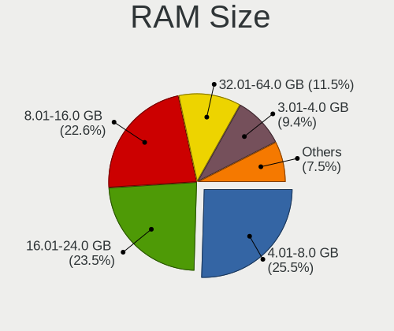
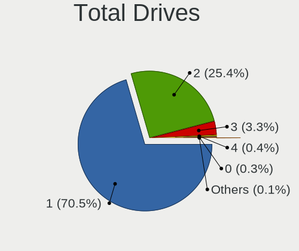
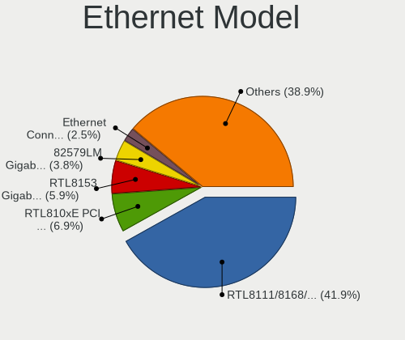
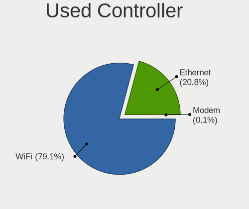
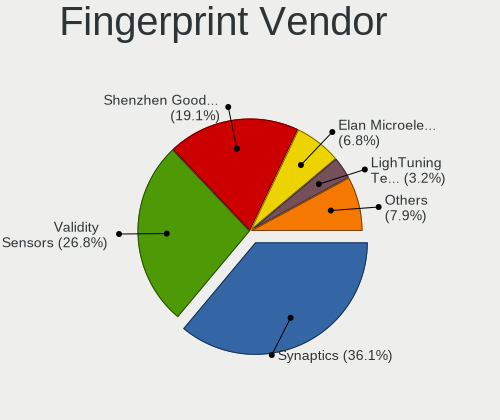

Arch - Tested Hardware & Statistics (Notebooks)
-----------------------------------------------

A project to collect tested hardware configurations for Arch.

Anyone can contribute to this report by the [hw-probe](https://github.com/linuxhw/hw-probe) tool:

    sudo -E hw-probe -all -upload

Please contribute! Especially if your hardware is rare.

Contents
--------

* [ Test Cases ](#test-cases)

* [ System ](#system)
  - [ OS                       ](#os)
  - [ OS Family                ](#os-family)
  - [ Kernel                   ](#kernel)
  - [ Kernel Family            ](#kernel-family)
  - [ Kernel Major Ver.        ](#kernel-major-ver)
  - [ Arch                     ](#arch)
  - [ DE                       ](#de)
  - [ Display Server           ](#display-server)
  - [ Display Manager          ](#display-manager)
  - [ OS Lang                  ](#os-lang)
  - [ Boot Mode                ](#boot-mode)
  - [ Filesystem               ](#filesystem)
  - [ Part. scheme             ](#part-scheme)
  - [ Dual Boot with Linux/BSD ](#dual-boot-with-linuxbsd)
  - [ Dual Boot (Win)          ](#dual-boot-win)

* [ Board ](#board)
  - [ Vendor                   ](#vendor)
  - [ Model                    ](#model)
  - [ Model Family             ](#model-family)
  - [ MFG Year                 ](#mfg-year)
  - [ Form Factor              ](#form-factor)
  - [ Secure Boot              ](#secure-boot)
  - [ Coreboot                 ](#coreboot)
  - [ RAM Size                 ](#ram-size)
  - [ RAM Used                 ](#ram-used)
  - [ Total Drives             ](#total-drives)
  - [ Has CD-ROM               ](#has-cd-rom)
  - [ Has Ethernet             ](#has-ethernet)
  - [ Has WiFi                 ](#has-wifi)
  - [ Has Bluetooth            ](#has-bluetooth)

* [ Location ](#location)
  - [ Country                  ](#country)
  - [ City                     ](#city)

* [ Drives ](#drives)
  - [ Drive Vendor             ](#drive-vendor)
  - [ Drive Model              ](#drive-model)
  - [ HDD Vendor               ](#hdd-vendor)
  - [ SSD Vendor               ](#ssd-vendor)
  - [ Drive Kind               ](#drive-kind)
  - [ Drive Connector          ](#drive-connector)
  - [ Drive Size               ](#drive-size)
  - [ Space Total              ](#space-total)
  - [ Space Used               ](#space-used)
  - [ Malfunc. Drives          ](#malfunc-drives)
  - [ Malfunc. Drive Vendor    ](#malfunc-drive-vendor)
  - [ Malfunc. HDD Vendor      ](#malfunc-hdd-vendor)
  - [ Malfunc. Drive Kind      ](#malfunc-drive-kind)
  - [ Failed Drives            ](#failed-drives)
  - [ Failed Drive Vendor      ](#failed-drive-vendor)
  - [ Drive Status             ](#drive-status)

* [ Storage controller ](#storage-controller)
  - [ Storage Vendor           ](#storage-vendor)
  - [ Storage Model            ](#storage-model)
  - [ Storage Kind             ](#storage-kind)

* [ Processor ](#processor)
  - [ CPU Vendor               ](#cpu-vendor)
  - [ CPU Model                ](#cpu-model)
  - [ CPU Model Family         ](#cpu-model-family)
  - [ CPU Cores                ](#cpu-cores)
  - [ CPU Sockets              ](#cpu-sockets)
  - [ CPU Threads              ](#cpu-threads)
  - [ CPU Op-Modes             ](#cpu-op-modes)
  - [ CPU Microcode            ](#cpu-microcode)
  - [ CPU Microarch            ](#cpu-microarch)

* [ Graphics ](#graphics)
  - [ GPU Vendor               ](#gpu-vendor)
  - [ GPU Model                ](#gpu-model)
  - [ GPU Combo                ](#gpu-combo)
  - [ GPU Driver               ](#gpu-driver)
  - [ GPU Memory               ](#gpu-memory)

* [ Monitor ](#monitor)
  - [ Monitor Vendor           ](#monitor-vendor)
  - [ Monitor Model            ](#monitor-model)
  - [ Monitor Resolution       ](#monitor-resolution)
  - [ Monitor Diagonal         ](#monitor-diagonal)
  - [ Monitor Width            ](#monitor-width)
  - [ Aspect Ratio             ](#aspect-ratio)
  - [ Monitor Area             ](#monitor-area)
  - [ Pixel Density            ](#pixel-density)
  - [ Multiple Monitors        ](#multiple-monitors)

* [ Network ](#network)
  - [ Net Controller Vendor    ](#net-controller-vendor)
  - [ Net Controller Model     ](#net-controller-model)
  - [ Wireless Vendor          ](#wireless-vendor)
  - [ Wireless Model           ](#wireless-model)
  - [ Ethernet Vendor          ](#ethernet-vendor)
  - [ Ethernet Model           ](#ethernet-model)
  - [ Net Controller Kind      ](#net-controller-kind)
  - [ Used Controller          ](#used-controller)
  - [ NICs                     ](#nics)
  - [ IPv6                     ](#ipv6)

* [ Bluetooth ](#bluetooth)
  - [ Bluetooth Vendor         ](#bluetooth-vendor)
  - [ Bluetooth Model          ](#bluetooth-model)

* [ Sound ](#sound)
  - [ Sound Vendor             ](#sound-vendor)
  - [ Sound Model              ](#sound-model)

* [ Memory ](#memory)
  - [ Memory Vendor            ](#memory-vendor)
  - [ Memory Model             ](#memory-model)
  - [ Memory Kind              ](#memory-kind)
  - [ Memory Form Factor       ](#memory-form-factor)
  - [ Memory Size              ](#memory-size)
  - [ Memory Speed             ](#memory-speed)

* [ Printers & scanners ](#printers--scanners)
  - [ Printer Vendor           ](#printer-vendor)
  - [ Printer Model            ](#printer-model)
  - [ Scanner Vendor           ](#scanner-vendor)
  - [ Scanner Model            ](#scanner-model)

* [ Camera ](#camera)
  - [ Camera Vendor            ](#camera-vendor)
  - [ Camera Model             ](#camera-model)

* [ Security ](#security)
  - [ Fingerprint Vendor       ](#fingerprint-vendor)
  - [ Fingerprint Model        ](#fingerprint-model)
  - [ Chipcard Vendor          ](#chipcard-vendor)
  - [ Chipcard Model           ](#chipcard-model)

* [ Unsupported ](#unsupported)
  - [ Unsupported Devices      ](#unsupported-devices)
  - [ Unsupported Device Types ](#unsupported-device-types)

Test Cases
----------

Total: 8069

| Vendor        | Model                       | Probe                                                      | Date         |
|---------------|-----------------------------|------------------------------------------------------------|--------------|
| Lenovo        | ThinkPad 11e 5th Gen 20L... | [f10a0edbdf](https://linux-hardware.org/?probe=f10a0edbdf) | Jan 06, 2025 |
| Acer          | Aspire A715-75G             | [c27afe3737](https://linux-hardware.org/?probe=c27afe3737) | Jan 06, 2025 |
| HP            | Compaq nw8440 (RN043AW#A... | [1a3426f4b6](https://linux-hardware.org/?probe=1a3426f4b6) | Jan 06, 2025 |
| Lenovo        | ThinkPad T450s 20BXCTO1W... | [10131ea72a](https://linux-hardware.org/?probe=10131ea72a) | Jan 06, 2025 |
| Lenovo        | ThinkPad T14s Gen 4 21F8... | [1c78d58aab](https://linux-hardware.org/?probe=1c78d58aab) | Jan 06, 2025 |
| Lenovo        | IdeaPad 1 15ALC7 82R4       | [0baddf7cbe](https://linux-hardware.org/?probe=0baddf7cbe) | Jan 06, 2025 |
| HP            | Pavilion Power Laptop 15... | [83a930718f](https://linux-hardware.org/?probe=83a930718f) | Jan 06, 2025 |
| Acer          | Aspire E1-571               | [1be16a65ff](https://linux-hardware.org/?probe=1be16a65ff) | Jan 05, 2025 |
| ASUSTek       | ASUS Zenbook S 16 UM5606... | [9ddd47e13b](https://linux-hardware.org/?probe=9ddd47e13b) | Jan 05, 2025 |
| Lenovo        | ThinkPad T490 20N3S82N1P    | [b9e31a2832](https://linux-hardware.org/?probe=b9e31a2832) | Jan 05, 2025 |
| Dell          | Inspiron 14 5435            | [d5776f90e8](https://linux-hardware.org/?probe=d5776f90e8) | Jan 05, 2025 |
| Lenovo        | LOQ 15IRH8 82XV             | [8844fc8d14](https://linux-hardware.org/?probe=8844fc8d14) | Jan 05, 2025 |
| ASUSTek       | VivoBook_ASUSLaptop X150... | [0f5c50a01c](https://linux-hardware.org/?probe=0f5c50a01c) | Jan 05, 2025 |
| HP            | Victus by Gaming Laptop ... | [5ef06b7cbe](https://linux-hardware.org/?probe=5ef06b7cbe) | Jan 04, 2025 |
| Dell          | XPS 17 9730                 | [699b3afba1](https://linux-hardware.org/?probe=699b3afba1) | Jan 04, 2025 |
| ASUSTek       | X75VC                       | [5acc8324b3](https://linux-hardware.org/?probe=5acc8324b3) | Jan 04, 2025 |
| Lenovo        | IdeaPad 110-15ISK 80UD      | [fefd4c63ee](https://linux-hardware.org/?probe=fefd4c63ee) | Jan 04, 2025 |
| ASUSTek       | Vivobook Go E1504FA_E150... | [832d6f219e](https://linux-hardware.org/?probe=832d6f219e) | Jan 04, 2025 |
| Dell          | XPS 15 9570                 | [5eb1399d1e](https://linux-hardware.org/?probe=5eb1399d1e) | Jan 04, 2025 |
| Acer          | Aspire 7530G                | [eaf2bcc73a](https://linux-hardware.org/?probe=eaf2bcc73a) | Jan 04, 2025 |
| TCL Commun... | 8085                        | [92e147d4fa](https://linux-hardware.org/?probe=92e147d4fa) | Jan 04, 2025 |
| HP            | Compaq 610                  | [794f66ac7e](https://linux-hardware.org/?probe=794f66ac7e) | Jan 03, 2025 |
| HP            | Compaq 610                  | [9e050e5a86](https://linux-hardware.org/?probe=9e050e5a86) | Jan 03, 2025 |
| ASUSTek       | ASUS TUF Gaming A15 FA50... | [a0bbd6cf37](https://linux-hardware.org/?probe=a0bbd6cf37) | Jan 03, 2025 |
| Lenovo        | ThinkPad T440s 20ARS1EQ0... | [84f58ef48f](https://linux-hardware.org/?probe=84f58ef48f) | Jan 03, 2025 |
| Lenovo        | ThinkPad E14 Gen 2 20TB0... | [a301b43994](https://linux-hardware.org/?probe=a301b43994) | Jan 03, 2025 |
| HP            | EliteBook 830 G8 Noteboo... | [dd7ea1bfca](https://linux-hardware.org/?probe=dd7ea1bfca) | Jan 03, 2025 |
| MSI           | Prestige 15 A12SC           | [5749bc91e9](https://linux-hardware.org/?probe=5749bc91e9) | Jan 03, 2025 |
| Infinix       | ZERO BOOK 13                | [13a15ed2a6](https://linux-hardware.org/?probe=13a15ed2a6) | Jan 03, 2025 |
| Infinix       | ZERO BOOK 13                | [ed7c4d2c05](https://linux-hardware.org/?probe=ed7c4d2c05) | Jan 03, 2025 |
| Dell          | Latitude 9420               | [8e4f82962c](https://linux-hardware.org/?probe=8e4f82962c) | Jan 03, 2025 |
| Acer          | Nitro AN515-54              | [3eae42086a](https://linux-hardware.org/?probe=3eae42086a) | Jan 03, 2025 |
| TUXEDO        | Stellaris Slim 15 Intel ... | [ed65b54407](https://linux-hardware.org/?probe=ed65b54407) | Jan 03, 2025 |
| ASUSTek       | ASUS TUF Gaming A15 FA50... | [ffdf653988](https://linux-hardware.org/?probe=ffdf653988) | Jan 03, 2025 |
| Lenovo        | ThinkPad T14s Gen 1 20T0... | [6e552e94aa](https://linux-hardware.org/?probe=6e552e94aa) | Jan 02, 2025 |
| Lenovo        | ThinkPad E570 20H50070FR    | [cad0007adb](https://linux-hardware.org/?probe=cad0007adb) | Jan 02, 2025 |
| ASUSTek       | ASUS TUF Gaming F15 FX50... | [79854a5556](https://linux-hardware.org/?probe=79854a5556) | Jan 02, 2025 |
| Framework     | Laptop 16 (AMD Ryzen 704... | [6cc92a635d](https://linux-hardware.org/?probe=6cc92a635d) | Jan 02, 2025 |
| Google        | Barla                       | [92ec004230](https://linux-hardware.org/?probe=92ec004230) | Jan 02, 2025 |
| Google        | Barla                       | [b12d7482fe](https://linux-hardware.org/?probe=b12d7482fe) | Jan 02, 2025 |
| Lenovo        | ThinkPad L16 Gen 1 21L70... | [1295119c04](https://linux-hardware.org/?probe=1295119c04) | Jan 01, 2025 |
| MSI           | Prestige 15 A12SC           | [d177ea6bf3](https://linux-hardware.org/?probe=d177ea6bf3) | Jan 01, 2025 |
| Infinix       | YL51A5                      | [431b98dee0](https://linux-hardware.org/?probe=431b98dee0) | Jan 01, 2025 |
| HUAWEI        | RLEF-XX                     | [51f8d1b6dc](https://linux-hardware.org/?probe=51f8d1b6dc) | Jan 01, 2025 |
| Lenovo        | V15 G2 ITL 82KB             | [17c5dac30c](https://linux-hardware.org/?probe=17c5dac30c) | Jan 01, 2025 |
| Lenovo        | IdeaPad Gaming 3 15ARH05... | [f598642ee7](https://linux-hardware.org/?probe=f598642ee7) | Jan 01, 2025 |
| Lenovo        | ThinkPad E570 20H50070FR    | [5369e3db69](https://linux-hardware.org/?probe=5369e3db69) | Jan 01, 2025 |
| Framework     | Laptop (13th Gen Intel C... | [705dce2bdc](https://linux-hardware.org/?probe=705dce2bdc) | Dec 31, 2024 |
| TUXEDO        | Stellaris Slim 15 Intel ... | [939d33fa22](https://linux-hardware.org/?probe=939d33fa22) | Dec 31, 2024 |
| Dell          | Inspiron 1564               | [2c9fde1f45](https://linux-hardware.org/?probe=2c9fde1f45) | Dec 31, 2024 |
| HP            | EliteBook 8470p             | [7a5df9412c](https://linux-hardware.org/?probe=7a5df9412c) | Dec 31, 2024 |
| Acer          | Aspire E5-573G              | [42555dde71](https://linux-hardware.org/?probe=42555dde71) | Dec 31, 2024 |
| Acer          | TravelMate 5335             | [178a9c1abe](https://linux-hardware.org/?probe=178a9c1abe) | Dec 31, 2024 |
| Lenovo        | ThinkPad T450 20BUS35B00    | [f1f91c5a93](https://linux-hardware.org/?probe=f1f91c5a93) | Dec 31, 2024 |
| Google        | Barla                       | [270f360297](https://linux-hardware.org/?probe=270f360297) | Dec 31, 2024 |
| Acer          | Aspire A715-51G             | [cfd28ac9de](https://linux-hardware.org/?probe=cfd28ac9de) | Dec 31, 2024 |
| Apple         | MacBookAir6,2               | [16df9d43b9](https://linux-hardware.org/?probe=16df9d43b9) | Dec 31, 2024 |
| Gigabyte      | AORUS 15P XD                | [a91ae65b48](https://linux-hardware.org/?probe=a91ae65b48) | Dec 31, 2024 |
| TUXEDO        | Stellaris Slim 15 Intel ... | [b8198ebf58](https://linux-hardware.org/?probe=b8198ebf58) | Dec 31, 2024 |
| Google        | Barla                       | [17c9f8db8c](https://linux-hardware.org/?probe=17c9f8db8c) | Dec 31, 2024 |
| Dell          | Inspiron 3583               | [083ef3a0a2](https://linux-hardware.org/?probe=083ef3a0a2) | Dec 30, 2024 |
| Maibenben     | Perfectum Series            | [db84ebbd71](https://linux-hardware.org/?probe=db84ebbd71) | Dec 30, 2024 |
| Lenovo        | ThinkPad L14 Gen 1 20U60... | [031c8d3940](https://linux-hardware.org/?probe=031c8d3940) | Dec 30, 2024 |
| MSI           | Prestige 15 A12SC           | [2a23c371cd](https://linux-hardware.org/?probe=2a23c371cd) | Dec 30, 2024 |
| Acer          | Nitro AN515-54              | [ead2772228](https://linux-hardware.org/?probe=ead2772228) | Dec 30, 2024 |
| Lenovo        | ThinkPad E14 Gen 3 20Y70... | [46361a1b83](https://linux-hardware.org/?probe=46361a1b83) | Dec 30, 2024 |
| System76      | Darter Pro                  | [c5c16912fe](https://linux-hardware.org/?probe=c5c16912fe) | Dec 30, 2024 |
| TUXEDO        | InfinityBook Pro AMD Gen... | [5d3fe59ed7](https://linux-hardware.org/?probe=5d3fe59ed7) | Dec 29, 2024 |
| Lenovo        | LOQ 15IRX9 83DV             | [5e54f584cf](https://linux-hardware.org/?probe=5e54f584cf) | Dec 29, 2024 |
| ASUSTek       | S551LN                      | [ef774595d3](https://linux-hardware.org/?probe=ef774595d3) | Dec 29, 2024 |
| Dell          | Studio 1558                 | [2abf8c0c94](https://linux-hardware.org/?probe=2abf8c0c94) | Dec 29, 2024 |
| Lenovo        | ThinkPad X230 23252UG       | [d8b0adf8fb](https://linux-hardware.org/?probe=d8b0adf8fb) | Dec 29, 2024 |
| Acer          | Aspire A715-42G             | [584e951bfb](https://linux-hardware.org/?probe=584e951bfb) | Dec 29, 2024 |
| Acer          | Nitro AN517-52              | [693e1ff47b](https://linux-hardware.org/?probe=693e1ff47b) | Dec 29, 2024 |
| Acer          | Nitro AN517-52              | [9208846c2a](https://linux-hardware.org/?probe=9208846c2a) | Dec 29, 2024 |
| Samsung       | 750XGK                      | [13ea2575e9](https://linux-hardware.org/?probe=13ea2575e9) | Dec 29, 2024 |
| Lenovo        | Legion 5 16IRX9 83DG        | [54d9440e0d](https://linux-hardware.org/?probe=54d9440e0d) | Dec 29, 2024 |
| Samsung       | 750XGK                      | [7c0257fc3e](https://linux-hardware.org/?probe=7c0257fc3e) | Dec 28, 2024 |
| Dell          | Vostro 5620                 | [8d70ffd3a6](https://linux-hardware.org/?probe=8d70ffd3a6) | Dec 28, 2024 |
| MSI           | Prestige 13 AI+ Evo A2VM... | [c973dc57a1](https://linux-hardware.org/?probe=c973dc57a1) | Dec 28, 2024 |
| HUAWEI        | VGHH-XX                     | [7ef14dba16](https://linux-hardware.org/?probe=7ef14dba16) | Dec 28, 2024 |
| Lenovo        | ThinkPad T480 20L6SJUS2J    | [55f0836ea7](https://linux-hardware.org/?probe=55f0836ea7) | Dec 28, 2024 |
| MSI           | Thin GF63 12UC              | [80bc381a84](https://linux-hardware.org/?probe=80bc381a84) | Dec 28, 2024 |
| HP            | Victus by Gaming Laptop ... | [ed4c73ca71](https://linux-hardware.org/?probe=ed4c73ca71) | Dec 28, 2024 |
| HUAWEI        | FLMH-XX                     | [741c280fca](https://linux-hardware.org/?probe=741c280fca) | Dec 28, 2024 |
| HUAWEI        | FLMH-XX                     | [9f52e1834c](https://linux-hardware.org/?probe=9f52e1834c) | Dec 28, 2024 |
| Lenovo        | ThinkPad E15 Gen 3 20YG0... | [232b0fc3b1](https://linux-hardware.org/?probe=232b0fc3b1) | Dec 27, 2024 |
| ASUSTek       | VivoBook_ASUSLaptop X415... | [0971785105](https://linux-hardware.org/?probe=0971785105) | Dec 26, 2024 |
| MSI           | Katana GF76 12UEOK          | [a3467015fd](https://linux-hardware.org/?probe=a3467015fd) | Dec 26, 2024 |
| Acer          | Aspire 7750G                | [18a8d13fe9](https://linux-hardware.org/?probe=18a8d13fe9) | Dec 26, 2024 |
| Lenovo        | V580c 20160                 | [0cdb0ca83b](https://linux-hardware.org/?probe=0cdb0ca83b) | Dec 26, 2024 |
| Acer          | Swift SF314-71              | [624fb9e1c5](https://linux-hardware.org/?probe=624fb9e1c5) | Dec 25, 2024 |
| CyberPower... | Tracer V                    | [a9524e5a4f](https://linux-hardware.org/?probe=a9524e5a4f) | Dec 25, 2024 |
| MSI           | Prestige 15 A12SC           | [482d068493](https://linux-hardware.org/?probe=482d068493) | Dec 25, 2024 |
| ASUSTek       | ASUS Zenbook 14 UM3406HA... | [15d4c80d32](https://linux-hardware.org/?probe=15d4c80d32) | Dec 25, 2024 |
| HP            | Pavilion Notebook           | [ab8938203b](https://linux-hardware.org/?probe=ab8938203b) | Dec 25, 2024 |
| HP            | Pavilion Notebook           | [ac422e1a6c](https://linux-hardware.org/?probe=ac422e1a6c) | Dec 25, 2024 |
| Lenovo        | ThinkPad T480s 20L7002HU... | [568f04a0e1](https://linux-hardware.org/?probe=568f04a0e1) | Dec 24, 2024 |
| Dell          | Inspiron 1545               | [c4301467a3](https://linux-hardware.org/?probe=c4301467a3) | Dec 24, 2024 |
| Notebook      | L2x0TU                      | [da7db18331](https://linux-hardware.org/?probe=da7db18331) | Dec 24, 2024 |
| Lenovo        | ThinkPad T450s 20BX000WG... | [f435edfb1d](https://linux-hardware.org/?probe=f435edfb1d) | Dec 24, 2024 |
| Lenovo        | V14 G4 ABP 82YX             | [66c7a6f6dc](https://linux-hardware.org/?probe=66c7a6f6dc) | Dec 24, 2024 |
| ASUSTek       | ROG Zephyrus G15 GA503RM    | [5da1cab939](https://linux-hardware.org/?probe=5da1cab939) | Dec 24, 2024 |
| ASUSTek       | G771JM                      | [f76a116151](https://linux-hardware.org/?probe=f76a116151) | Dec 24, 2024 |
| HUAWEI        | KLVL-WXX9                   | [8c5b06dd77](https://linux-hardware.org/?probe=8c5b06dd77) | Dec 23, 2024 |
| HP            | EliteBook 8560w (XX058AV... | [fd12235221](https://linux-hardware.org/?probe=fd12235221) | Dec 23, 2024 |
| Apple         | MacBookPro9,2               | [584f7243e9](https://linux-hardware.org/?probe=584f7243e9) | Dec 23, 2024 |
| Apple         | MacBookAir7,2               | [c02f6f4421](https://linux-hardware.org/?probe=c02f6f4421) | Dec 23, 2024 |
| Avell         | B.ON                        | [8a06f2de3b](https://linux-hardware.org/?probe=8a06f2de3b) | Dec 23, 2024 |
| Samsung       | 700Z3C/700Z5C               | [4c634dc49d](https://linux-hardware.org/?probe=4c634dc49d) | Dec 23, 2024 |
| HP            | ZBook 15 G2                 | [64c7294576](https://linux-hardware.org/?probe=64c7294576) | Dec 22, 2024 |
| Lenovo        | ThinkPad T450 20BUS3GN02    | [ebd69fe1aa](https://linux-hardware.org/?probe=ebd69fe1aa) | Dec 22, 2024 |
| Lenovo        | ThinkPad T430 2349A17       | [467d5bf559](https://linux-hardware.org/?probe=467d5bf559) | Dec 22, 2024 |
| ASUSTek       | Pro B760M-CT                | [d2a2cc2c88](https://linux-hardware.org/?probe=d2a2cc2c88) | Dec 22, 2024 |
| ASUSTek       | ASUS TUF Gaming A15 FA50... | [7172f26f77](https://linux-hardware.org/?probe=7172f26f77) | Dec 22, 2024 |
| Lenovo        | ThinkPad W541 20EGS1FB00    | [6f758495b3](https://linux-hardware.org/?probe=6f758495b3) | Dec 21, 2024 |
| Lenovo        | ThinkPad P14s Gen 1 20Y2... | [b7ad8c7467](https://linux-hardware.org/?probe=b7ad8c7467) | Dec 21, 2024 |
| ASUSTek       | VivoBook_ASUSLaptop X515... | [81230d7d43](https://linux-hardware.org/?probe=81230d7d43) | Dec 21, 2024 |
| Avell         | B.ON                        | [4cdfce4d81](https://linux-hardware.org/?probe=4cdfce4d81) | Dec 21, 2024 |
| Lenovo        | ThinkPad P14s Gen 4 21HF... | [0c9e61a477](https://linux-hardware.org/?probe=0c9e61a477) | Dec 20, 2024 |
| Lenovo        | LOQ 15IRH8 82XV             | [e31581514e](https://linux-hardware.org/?probe=e31581514e) | Dec 20, 2024 |
| Lenovo        | ThinkPad X1 Carbon Gen 1... | [d8ec348d56](https://linux-hardware.org/?probe=d8ec348d56) | Dec 20, 2024 |
| ASUSTek       | ASUS TUF Gaming F15 FX50... | [e2aca4405b](https://linux-hardware.org/?probe=e2aca4405b) | Dec 20, 2024 |
| MSI           | GF65 Thin 9SD               | [404e3c31ea](https://linux-hardware.org/?probe=404e3c31ea) | Dec 20, 2024 |
| Lenovo        | ThinkPad T450 20BUS3GN02    | [54fd784e9c](https://linux-hardware.org/?probe=54fd784e9c) | Dec 20, 2024 |
| Compumax C... | ONIX-CEL-0001               | [5c7c3a9849](https://linux-hardware.org/?probe=5c7c3a9849) | Dec 19, 2024 |
| Compumax C... | ONIX-CEL-0001               | [9365cddb5a](https://linux-hardware.org/?probe=9365cddb5a) | Dec 19, 2024 |
| Dell          | Precision 5520              | [17f5aaa2c6](https://linux-hardware.org/?probe=17f5aaa2c6) | Dec 19, 2024 |
| Google        | Morphius                    | [efd4a1413c](https://linux-hardware.org/?probe=efd4a1413c) | Dec 18, 2024 |
| ASUSTek       | ROG Zephyrus G14 GA402RJ... | [77f57a0535](https://linux-hardware.org/?probe=77f57a0535) | Dec 18, 2024 |
| Apple         | MacBookPro8,1               | [08044442cf](https://linux-hardware.org/?probe=08044442cf) | Dec 18, 2024 |
| Dell          | Precision 5490              | [ee16cc2886](https://linux-hardware.org/?probe=ee16cc2886) | Dec 17, 2024 |
| HP            | 240 G4 Notebook PC          | [1e82cc2079](https://linux-hardware.org/?probe=1e82cc2079) | Dec 17, 2024 |
| Lenovo        | ThinkPad T495 20NKS2JD00    | [31a4026530](https://linux-hardware.org/?probe=31a4026530) | Dec 17, 2024 |
| ASUSTek       | ASUS Zenbook 14 UM3406HA... | [fb3afaa6bb](https://linux-hardware.org/?probe=fb3afaa6bb) | Dec 17, 2024 |
| Lenovo        | ThinkPad T450 20BUS05A09    | [26806171d3](https://linux-hardware.org/?probe=26806171d3) | Dec 17, 2024 |
| Lenovo        | LOQ 15IRH8 82XV             | [18a51b24d7](https://linux-hardware.org/?probe=18a51b24d7) | Dec 17, 2024 |
| ASUSTek       | VivoBook_ASUSLaptop S540... | [dd3f73cd56](https://linux-hardware.org/?probe=dd3f73cd56) | Dec 17, 2024 |
| ASUSTek       | VivoBook_ASUSLaptop X140... | [50315f1b60](https://linux-hardware.org/?probe=50315f1b60) | Dec 17, 2024 |
| Lenovo        | ThinkPad X280 20KES2EW08    | [bbd058898c](https://linux-hardware.org/?probe=bbd058898c) | Dec 17, 2024 |
| ASUSTek       | ZenBook UX425UA_UM425UA     | [119fb952a9](https://linux-hardware.org/?probe=119fb952a9) | Dec 16, 2024 |
| MSI           | GT73EVR 7RD                 | [c3321b8ab3](https://linux-hardware.org/?probe=c3321b8ab3) | Dec 16, 2024 |
| Apple         | MacBookAir7,2               | [047d8ffeee](https://linux-hardware.org/?probe=047d8ffeee) | Dec 15, 2024 |
| Lenovo        | ThinkPad L520 5016NY9       | [1bc4600530](https://linux-hardware.org/?probe=1bc4600530) | Dec 15, 2024 |
| Acer          | Aspire ES1-571              | [91918bcc8e](https://linux-hardware.org/?probe=91918bcc8e) | Dec 15, 2024 |
| ASUSTek       | X550VB                      | [b739f6848e](https://linux-hardware.org/?probe=b739f6848e) | Dec 15, 2024 |
| Acer          | Aspire F5-573G              | [0ca4fe4591](https://linux-hardware.org/?probe=0ca4fe4591) | Dec 14, 2024 |
| HASEE Comp... | CV15S                       | [b1c86ea2a0](https://linux-hardware.org/?probe=b1c86ea2a0) | Dec 14, 2024 |
| HP            | 255 G8 Notebook PC          | [47a16bb755](https://linux-hardware.org/?probe=47a16bb755) | Dec 13, 2024 |
| Lenovo        | LOQ 15IRH8 82XV             | [e9cba9e18e](https://linux-hardware.org/?probe=e9cba9e18e) | Dec 13, 2024 |
| Lenovo        | ThinkPad T480s 20L8S7890... | [6cb6a6ef3b](https://linux-hardware.org/?probe=6cb6a6ef3b) | Dec 13, 2024 |
| Apple         | MacBook10,1                 | [5789633a9d](https://linux-hardware.org/?probe=5789633a9d) | Dec 13, 2024 |
| XIAOMI        | Redmi Book Pro 15 2023      | [36fa9187cd](https://linux-hardware.org/?probe=36fa9187cd) | Dec 13, 2024 |
| Lenovo        | ThinkPad T14 Gen 2i 20W1... | [0cd56b6866](https://linux-hardware.org/?probe=0cd56b6866) | Dec 12, 2024 |
| ASUSTek       | ROG Zephyrus G14 GA402RJ... | [985546b639](https://linux-hardware.org/?probe=985546b639) | Dec 12, 2024 |
| Lenovo        | IdeaPad 5 14ALC05 82LM      | [cc9e7aed4d](https://linux-hardware.org/?probe=cc9e7aed4d) | Dec 12, 2024 |
| MSI           | Bravo 17 A4DDR              | [d8d5ecc26c](https://linux-hardware.org/?probe=d8d5ecc26c) | Dec 11, 2024 |
| HP            | Syndra                      | [5afea7c0af](https://linux-hardware.org/?probe=5afea7c0af) | Dec 11, 2024 |
| HUAWEI        | FLMH-XX                     | [240c1e7372](https://linux-hardware.org/?probe=240c1e7372) | Dec 11, 2024 |
| Framework     | Laptop                      | [ff03f6aa77](https://linux-hardware.org/?probe=ff03f6aa77) | Dec 11, 2024 |
| ASUSTek       | VivoBook_ASUSLaptop K550... | [6dbbb0dd7b](https://linux-hardware.org/?probe=6dbbb0dd7b) | Dec 11, 2024 |
| Lenovo        | ThinkPad A485 20MVS08500    | [bf16c326f0](https://linux-hardware.org/?probe=bf16c326f0) | Dec 11, 2024 |
| Acer          | Predator PHN16-71           | [e18ec1de74](https://linux-hardware.org/?probe=e18ec1de74) | Dec 10, 2024 |
| ASUSTek       | ASUS TUF Gaming A14 FA40... | [3e1d32a05a](https://linux-hardware.org/?probe=3e1d32a05a) | Dec 10, 2024 |
| HP            | Laptop 14-cf2xxx            | [c60ecc3c41](https://linux-hardware.org/?probe=c60ecc3c41) | Dec 10, 2024 |
| ASUSTek       | P553UA                      | [136fda34cf](https://linux-hardware.org/?probe=136fda34cf) | Dec 10, 2024 |
| HP            | Pavilion Gaming Laptop 1... | [440089cb3c](https://linux-hardware.org/?probe=440089cb3c) | Dec 09, 2024 |
| Lenovo        | ThinkPad P51 20HJS16Q0K     | [ecd4468e9c](https://linux-hardware.org/?probe=ecd4468e9c) | Dec 09, 2024 |
| Lenovo        | ThinkPad E14 Gen 2 20TA0... | [cbd8da337a](https://linux-hardware.org/?probe=cbd8da337a) | Dec 09, 2024 |
| AMI           | Intel                       | [8de5915da3](https://linux-hardware.org/?probe=8de5915da3) | Dec 08, 2024 |
| MSI           | Modern 15 A11M              | [c8f5bf1e23](https://linux-hardware.org/?probe=c8f5bf1e23) | Dec 08, 2024 |
| ASUSTek       | ASUS TUF Gaming F15 FX50... | [1fcb1559d5](https://linux-hardware.org/?probe=1fcb1559d5) | Dec 08, 2024 |
| HUAWEI        | HKF-WXX                     | [59cd028fb6](https://linux-hardware.org/?probe=59cd028fb6) | Dec 08, 2024 |
| ASUSTek       | N53SN                       | [fcda31ce2d](https://linux-hardware.org/?probe=fcda31ce2d) | Dec 08, 2024 |
| HP            | EliteBook 8560w (XX058AV... | [8eac1d1836](https://linux-hardware.org/?probe=8eac1d1836) | Dec 08, 2024 |
| Dell          | XPS 15 9530                 | [181a07929f](https://linux-hardware.org/?probe=181a07929f) | Dec 07, 2024 |
| Acer          | Predator PHN16-71           | [727d64bac6](https://linux-hardware.org/?probe=727d64bac6) | Dec 07, 2024 |
| Dell          | XPS 15 9530                 | [d37a70d3c2](https://linux-hardware.org/?probe=d37a70d3c2) | Dec 07, 2024 |
| Lenovo        | IdeaPad 3 15ADA6 82KR       | [3fe07f468b](https://linux-hardware.org/?probe=3fe07f468b) | Dec 07, 2024 |
| ASUSTek       | VivoBook_ASUSLaptop M540... | [43ae490d8a](https://linux-hardware.org/?probe=43ae490d8a) | Dec 07, 2024 |
| Lenovo        | ThinkPad L13 Gen 2a 21AB... | [8a5754e888](https://linux-hardware.org/?probe=8a5754e888) | Dec 07, 2024 |
| ASUSTek       | Zenbook UX3402ZA_UX3402Z... | [f0d77fead4](https://linux-hardware.org/?probe=f0d77fead4) | Dec 06, 2024 |
| Dell          | Latitude 5430               | [da4238a565](https://linux-hardware.org/?probe=da4238a565) | Dec 06, 2024 |
| HUAWEI        | FLMH-XX                     | [458a5ab98f](https://linux-hardware.org/?probe=458a5ab98f) | Dec 06, 2024 |
| Lenovo        | Legion-S7-16APH8 82Y4       | [7ce6044500](https://linux-hardware.org/?probe=7ce6044500) | Dec 06, 2024 |
| HP            | EliteBook 845 G8 Noteboo... | [14c1cdd699](https://linux-hardware.org/?probe=14c1cdd699) | Dec 06, 2024 |
| Chuwi         | FreeBook                    | [dbf51cf2eb](https://linux-hardware.org/?probe=dbf51cf2eb) | Dec 06, 2024 |
| Lenovo        | ThinkPad T14 Gen 1 20UD0... | [8ff81d690d](https://linux-hardware.org/?probe=8ff81d690d) | Dec 06, 2024 |
| Dell          | Inspiron 15 3520            | [58cfe39a15](https://linux-hardware.org/?probe=58cfe39a15) | Dec 06, 2024 |
| TUXEDO        | InfinityBook S 15 Gen6      | [4e73bb1e03](https://linux-hardware.org/?probe=4e73bb1e03) | Dec 06, 2024 |
| TUXEDO        | InfinityBook Pro AMD Gen... | [a7a5047657](https://linux-hardware.org/?probe=a7a5047657) | Dec 05, 2024 |
| ASUSTek       | ASUS TUF Gaming F15 FX50... | [3497127dba](https://linux-hardware.org/?probe=3497127dba) | Dec 05, 2024 |
| Lenovo        | ThinkPad T430 2349A17       | [704c8bef39](https://linux-hardware.org/?probe=704c8bef39) | Dec 05, 2024 |
| Fujitsu       | LIFEBOOK AH531              | [36683f8571](https://linux-hardware.org/?probe=36683f8571) | Dec 05, 2024 |
| Lenovo        | ThinkPad P14s Gen 5 AMD ... | [4ec7e106ef](https://linux-hardware.org/?probe=4ec7e106ef) | Dec 05, 2024 |
| TUXEDO        | Stellaris Slim 15 Intel ... | [a5eace7109](https://linux-hardware.org/?probe=a5eace7109) | Dec 05, 2024 |
| XIAOMI        | Redmi Book Pro 15 2023      | [064554e6d5](https://linux-hardware.org/?probe=064554e6d5) | Dec 05, 2024 |
| HP            | 14                          | [28802b9b1c](https://linux-hardware.org/?probe=28802b9b1c) | Dec 04, 2024 |
| Lenovo        | ThinkPad E14 Gen 3 20Y70... | [48f660fc68](https://linux-hardware.org/?probe=48f660fc68) | Dec 04, 2024 |
| HP            | 250 15.6 inch G10 Notebo... | [f92ea0cda1](https://linux-hardware.org/?probe=f92ea0cda1) | Dec 04, 2024 |
| AMI           | Intel                       | [aea86f3fc2](https://linux-hardware.org/?probe=aea86f3fc2) | Dec 04, 2024 |
| ASUSTek       | Vivobook Go E1404FA_E140... | [d3a555be19](https://linux-hardware.org/?probe=d3a555be19) | Dec 04, 2024 |
| HP            | EliteBook 830 G5            | [4987877bbe](https://linux-hardware.org/?probe=4987877bbe) | Dec 03, 2024 |
| Lenovo        | ThinkPad W520 4284FK4       | [0ac4ac5006](https://linux-hardware.org/?probe=0ac4ac5006) | Dec 03, 2024 |
| Lenovo        | IdeaPad Gaming 3 15ARH05... | [b53e3ffba0](https://linux-hardware.org/?probe=b53e3ffba0) | Dec 03, 2024 |
| ASUSTek       | G751JT                      | [2bbcb36d29](https://linux-hardware.org/?probe=2bbcb36d29) | Dec 03, 2024 |
| Acer          | Aspire E1-532               | [eda3548de6](https://linux-hardware.org/?probe=eda3548de6) | Dec 03, 2024 |
| Dell          | Vostro 3491                 | [361da1df64](https://linux-hardware.org/?probe=361da1df64) | Dec 03, 2024 |
| Lenovo        | ThinkPad T480s 20L7S0BM0... | [77513c5287](https://linux-hardware.org/?probe=77513c5287) | Dec 03, 2024 |
| Gigabyte      | X570S AERO G                | [d3032a686f](https://linux-hardware.org/?probe=d3032a686f) | Dec 03, 2024 |
| Lenovo        | ThinkBook 13s G2 ITL 20V... | [a3435f001c](https://linux-hardware.org/?probe=a3435f001c) | Dec 03, 2024 |
| Lenovo        | ThinkBook 13s G2 ITL 20V... | [601d3d0748](https://linux-hardware.org/?probe=601d3d0748) | Dec 02, 2024 |
| HP            | ProBook 4320s               | [f920f58d1e](https://linux-hardware.org/?probe=f920f58d1e) | Dec 02, 2024 |
| Lenovo        | ThinkPad T495 20NJCTO1WW    | [8ad6c56f00](https://linux-hardware.org/?probe=8ad6c56f00) | Dec 02, 2024 |
| Dell          | XPS 15 9520                 | [1c01a47dcd](https://linux-hardware.org/?probe=1c01a47dcd) | Dec 02, 2024 |
| Lenovo        | IdeaPad 3 15ITL6 82H8       | [1723ab7830](https://linux-hardware.org/?probe=1723ab7830) | Dec 02, 2024 |
| Lenovo        | ThinkBook 14 G6+ AHP 21L... | [481811d3d1](https://linux-hardware.org/?probe=481811d3d1) | Dec 02, 2024 |
| Acer          | Nitro AN515-45              | [ca2521a87a](https://linux-hardware.org/?probe=ca2521a87a) | Dec 02, 2024 |
| Lenovo        | IdeaPad Slim 7 14ITL05 8... | [49b9aeed48](https://linux-hardware.org/?probe=49b9aeed48) | Dec 02, 2024 |
| Lenovo        | ThinkBook 16 G6 ABP 21KK    | [a33adb8a44](https://linux-hardware.org/?probe=a33adb8a44) | Dec 01, 2024 |
| MECHREVO      | WUJIE14 PRO                 | [06cabfde10](https://linux-hardware.org/?probe=06cabfde10) | Dec 01, 2024 |
| Dell          | Inspiron 3443               | [73ce4e96f5](https://linux-hardware.org/?probe=73ce4e96f5) | Dec 01, 2024 |
| HP            | 240 G8 Notebook PC          | [e28f3d21e4](https://linux-hardware.org/?probe=e28f3d21e4) | Dec 01, 2024 |
| Acer          | Swift SFX14-71G             | [790804236a](https://linux-hardware.org/?probe=790804236a) | Nov 30, 2024 |
| Dell          | Latitude E6330              | [f95099755e](https://linux-hardware.org/?probe=f95099755e) | Nov 30, 2024 |
| Dell          | Latitude E6330              | [416ede7598](https://linux-hardware.org/?probe=416ede7598) | Nov 30, 2024 |
| Apple         | MacBookPro9,2               | [182c573df3](https://linux-hardware.org/?probe=182c573df3) | Nov 30, 2024 |
| Lenovo        | ThinkPad X280 20KESD1P00    | [181f001f7a](https://linux-hardware.org/?probe=181f001f7a) | Nov 30, 2024 |
| HP            | Victus by Gaming Laptop ... | [327fdb0e6a](https://linux-hardware.org/?probe=327fdb0e6a) | Nov 30, 2024 |
| Lenovo        | ThinkPad P53 20QN002LUS     | [c4bb47dc8d](https://linux-hardware.org/?probe=c4bb47dc8d) | Nov 30, 2024 |
| TUXEDO        | Pulse 15 Gen1               | [464f624f9c](https://linux-hardware.org/?probe=464f624f9c) | Nov 30, 2024 |
| Lenovo        | ThinkPad L520 5016NY9       | [18ee47c1da](https://linux-hardware.org/?probe=18ee47c1da) | Nov 30, 2024 |
| Lenovo        | 14w Gen 2 82N8              | [80b52e7c83](https://linux-hardware.org/?probe=80b52e7c83) | Nov 30, 2024 |
| Dell          | Inspiron 15-3552            | [3f198d1bea](https://linux-hardware.org/?probe=3f198d1bea) | Nov 30, 2024 |
| ASUSTek       | K53SV                       | [8e09c4ddbe](https://linux-hardware.org/?probe=8e09c4ddbe) | Nov 30, 2024 |
| MSI           | Thin GF63 12UC              | [28a26dc03b](https://linux-hardware.org/?probe=28a26dc03b) | Nov 29, 2024 |
| HP            | EliteBook 8470p             | [f03062334f](https://linux-hardware.org/?probe=f03062334f) | Nov 29, 2024 |
| Apple         | MacBookPro7,1               | [533533a4a2](https://linux-hardware.org/?probe=533533a4a2) | Nov 29, 2024 |
| Apple         | MacBookPro7,1               | [2deddae67e](https://linux-hardware.org/?probe=2deddae67e) | Nov 29, 2024 |
| Lenovo        | ThinkPad E14 Gen 6 21M7C... | [a4553836b7](https://linux-hardware.org/?probe=a4553836b7) | Nov 28, 2024 |
| Lenovo        | ThinkPad P1 Gen 3 20THCT... | [fbac8e7a75](https://linux-hardware.org/?probe=fbac8e7a75) | Nov 28, 2024 |
| MSI           | Cyborg 15 A12UCX            | [e75ffb4bf5](https://linux-hardware.org/?probe=e75ffb4bf5) | Nov 28, 2024 |
| Dell          | XPS 13 9380                 | [3f354f5ca6](https://linux-hardware.org/?probe=3f354f5ca6) | Nov 28, 2024 |
| Google        | Bruce                       | [d8ba6d6ccb](https://linux-hardware.org/?probe=d8ba6d6ccb) | Nov 28, 2024 |
| HP            | Pavilion Laptop 15-eh0xx... | [c8ec259d05](https://linux-hardware.org/?probe=c8ec259d05) | Nov 28, 2024 |
| MSI           | GT73EVR 7RD                 | [9ca450e437](https://linux-hardware.org/?probe=9ca450e437) | Nov 27, 2024 |
| Lenovo        | IdeaPad Gaming 3 15IAH7 ... | [ea458812c2](https://linux-hardware.org/?probe=ea458812c2) | Nov 27, 2024 |
| HP            | Pavilion Laptop 15-eh0xx... | [13184efc28](https://linux-hardware.org/?probe=13184efc28) | Nov 27, 2024 |
| Google        | Kefka                       | [1bab1809fc](https://linux-hardware.org/?probe=1bab1809fc) | Nov 27, 2024 |
| Lenovo        | ThinkPad X13 Gen 4 21J3C... | [ef4b687e2a](https://linux-hardware.org/?probe=ef4b687e2a) | Nov 26, 2024 |
| Dell          | G15 5510                    | [afb04ad337](https://linux-hardware.org/?probe=afb04ad337) | Nov 26, 2024 |
| Samsung       | 940XGK                      | [6d9574a7ed](https://linux-hardware.org/?probe=6d9574a7ed) | Nov 26, 2024 |
| HP            | EliteBook 735 G6            | [df88a7debc](https://linux-hardware.org/?probe=df88a7debc) | Nov 26, 2024 |
| Acer          | Nitro AN515-57              | [efbde89468](https://linux-hardware.org/?probe=efbde89468) | Nov 26, 2024 |
| Acer          | Nitro AN515-57              | [d0251f8c42](https://linux-hardware.org/?probe=d0251f8c42) | Nov 26, 2024 |
| HP            | Gumboz                      | [528fc2780e](https://linux-hardware.org/?probe=528fc2780e) | Nov 26, 2024 |
| Lenovo        | Legion Pro 5 16IRX9 83DF    | [a5494e7f6e](https://linux-hardware.org/?probe=a5494e7f6e) | Nov 25, 2024 |
| HP            | Gumboz                      | [b10cae6218](https://linux-hardware.org/?probe=b10cae6218) | Nov 25, 2024 |
| Positivo B... | VJFE59F11X-B1011H           | [3d6118cb75](https://linux-hardware.org/?probe=3d6118cb75) | Nov 25, 2024 |
| Apple         | MacBookAir7,2               | [78de1913a3](https://linux-hardware.org/?probe=78de1913a3) | Nov 24, 2024 |
| ASUSTek       | X510UNR                     | [9fc9d25b5f](https://linux-hardware.org/?probe=9fc9d25b5f) | Nov 24, 2024 |
| Lenovo        | IdeaPad 5 Pro 14ACN6 82L... | [1a3c4e52b0](https://linux-hardware.org/?probe=1a3c4e52b0) | Nov 24, 2024 |
| ASUSTek       | X551CA                      | [582d2b81ab](https://linux-hardware.org/?probe=582d2b81ab) | Nov 24, 2024 |
| Chuwi         | CoreBook X                  | [5e2d0c17d4](https://linux-hardware.org/?probe=5e2d0c17d4) | Nov 23, 2024 |
| Apple         | MacBookAir6,2               | [524442d7ed](https://linux-hardware.org/?probe=524442d7ed) | Nov 23, 2024 |
| Lenovo        | XiaoXinPro 14 AHP9 83D3     | [ab6b345348](https://linux-hardware.org/?probe=ab6b345348) | Nov 23, 2024 |
| Google        | Lillipup rev2               | [d770b59a72](https://linux-hardware.org/?probe=d770b59a72) | Nov 23, 2024 |
| MSI           | Katana 17 B13VFK            | [c4122d3c4b](https://linux-hardware.org/?probe=c4122d3c4b) | Nov 22, 2024 |
| Schenker      | XMG EVO (M24)               | [605df9f69c](https://linux-hardware.org/?probe=605df9f69c) | Nov 22, 2024 |
| Schenker      | XMG EVO (M24)               | [dd1c282bdb](https://linux-hardware.org/?probe=dd1c282bdb) | Nov 22, 2024 |
| HP            | Pavilion Plus Laptop 14-... | [44489ab77c](https://linux-hardware.org/?probe=44489ab77c) | Nov 22, 2024 |
| Lenovo        | ThinkPad X280 20KES5860J    | [e08eed8590](https://linux-hardware.org/?probe=e08eed8590) | Nov 22, 2024 |
| Lenovo        | ThinkPad T530 2392ASU       | [c822bcb2e0](https://linux-hardware.org/?probe=c822bcb2e0) | Nov 22, 2024 |
| ASUSTek       | ASUS TUF Gaming A15 FA50... | [20d1b63b9a](https://linux-hardware.org/?probe=20d1b63b9a) | Nov 22, 2024 |
| ASUSTek       | ASUS TUF Gaming A15 FA50... | [e95b262427](https://linux-hardware.org/?probe=e95b262427) | Nov 22, 2024 |
| ASUSTek       | ASUS TUF Dash F15 FX516P... | [4e10bbe3d5](https://linux-hardware.org/?probe=4e10bbe3d5) | Nov 22, 2024 |
| Acer          | Aspire one 1-431            | [f8124fcf1e](https://linux-hardware.org/?probe=f8124fcf1e) | Nov 21, 2024 |
| Toshiba       | PORTEGE Z30-C               | [400c49b69f](https://linux-hardware.org/?probe=400c49b69f) | Nov 21, 2024 |
| HP            | ZBook 15u G5                | [066acc45f9](https://linux-hardware.org/?probe=066acc45f9) | Nov 21, 2024 |
| Lenovo        | ThinkPad T14 Gen 1 20UD0... | [09a5bcfa76](https://linux-hardware.org/?probe=09a5bcfa76) | Nov 21, 2024 |
| TongFang      | GX4HRXL                     | [6783d8fc06](https://linux-hardware.org/?probe=6783d8fc06) | Nov 21, 2024 |
| TongFang      | GX4HRXL                     | [0475501c8c](https://linux-hardware.org/?probe=0475501c8c) | Nov 21, 2024 |
| Lenovo        | Legion R9000P ARX8 82WM     | [1a57d5d8e3](https://linux-hardware.org/?probe=1a57d5d8e3) | Nov 21, 2024 |
| Dell          | Inspiron 5577               | [3cfba2e637](https://linux-hardware.org/?probe=3cfba2e637) | Nov 20, 2024 |
| Lenovo        | Legion 5 15IAH7H 82TB       | [7c177a6a4a](https://linux-hardware.org/?probe=7c177a6a4a) | Nov 20, 2024 |
| ASUSTek       | X551CA                      | [9a943d9e04](https://linux-hardware.org/?probe=9a943d9e04) | Nov 20, 2024 |
| HP            | ProBook 650 G8 Notebook ... | [43cc1e95be](https://linux-hardware.org/?probe=43cc1e95be) | Nov 20, 2024 |
| Lenovo        | S21e-20 80M4                | [8a738e2bfe](https://linux-hardware.org/?probe=8a738e2bfe) | Nov 20, 2024 |
| HP            | Pavilion dv4                | [87c9885c13](https://linux-hardware.org/?probe=87c9885c13) | Nov 19, 2024 |
| HP            | Pavilion dv4                | [362374822c](https://linux-hardware.org/?probe=362374822c) | Nov 19, 2024 |
| ASUSTek       | ZenBook UX425QA_UM425QA     | [16e8abbd29](https://linux-hardware.org/?probe=16e8abbd29) | Nov 19, 2024 |
| HP            | ENVY Laptop 13-aq0xxx       | [2c476e1d06](https://linux-hardware.org/?probe=2c476e1d06) | Nov 19, 2024 |
| Lenovo        | ThinkPad E14 Gen 2 20TB0... | [35c0e60566](https://linux-hardware.org/?probe=35c0e60566) | Nov 19, 2024 |
| Lenovo        | IdeaPad Slim 5 16ABR8 82... | [2720f635d1](https://linux-hardware.org/?probe=2720f635d1) | Nov 19, 2024 |
| MSI           | GP76 Leopard 11UG           | [cbcaeb0284](https://linux-hardware.org/?probe=cbcaeb0284) | Nov 19, 2024 |
| Acer          | Aspire ES1-420              | [b3cb011199](https://linux-hardware.org/?probe=b3cb011199) | Nov 18, 2024 |
| ASUSTek       | ROG Flow X13 GV301QC_GV3... | [42bf3485f0](https://linux-hardware.org/?probe=42bf3485f0) | Nov 18, 2024 |
| HP            | EliteBook 840 G5            | [2f1b1349c9](https://linux-hardware.org/?probe=2f1b1349c9) | Nov 18, 2024 |
| Acer          | Aspire AV15-52              | [8169c575f6](https://linux-hardware.org/?probe=8169c575f6) | Nov 18, 2024 |
| HP            | Pavilion Gaming Laptop 1... | [db45208c40](https://linux-hardware.org/?probe=db45208c40) | Nov 18, 2024 |
| ASUSTek       | VivoBook_ASUSLaptop M140... | [48d4b2b2d6](https://linux-hardware.org/?probe=48d4b2b2d6) | Nov 18, 2024 |
| Lenovo        | Legion S7 15ACH6 82K8       | [f96b652500](https://linux-hardware.org/?probe=f96b652500) | Nov 18, 2024 |
| ASUSTek       | ROG Flow X13 GV301QC_GV3... | [accb142325](https://linux-hardware.org/?probe=accb142325) | Nov 17, 2024 |
| Acer          | Aspire A515-57              | [4d419f2834](https://linux-hardware.org/?probe=4d419f2834) | Nov 17, 2024 |
| Lenovo        | Yoga Pro 7 14IMH9 83E2      | [8057e2f08c](https://linux-hardware.org/?probe=8057e2f08c) | Nov 17, 2024 |
| Lenovo        | IdeaPad S145-15API 81UT     | [0aeac8749e](https://linux-hardware.org/?probe=0aeac8749e) | Nov 17, 2024 |
| HONOR         | NBR-WAX9                    | [3eaa1ba85e](https://linux-hardware.org/?probe=3eaa1ba85e) | Nov 17, 2024 |
| HONOR         | NBR-WAX9                    | [c5de0040eb](https://linux-hardware.org/?probe=c5de0040eb) | Nov 17, 2024 |
| Lenovo        | Slim 7 14IRP8 83A4          | [f96e0bb5c2](https://linux-hardware.org/?probe=f96e0bb5c2) | Nov 17, 2024 |
| Dell          | Latitude 7490               | [7199d706be](https://linux-hardware.org/?probe=7199d706be) | Nov 17, 2024 |
| Dell          | Latitude 7490               | [41be043794](https://linux-hardware.org/?probe=41be043794) | Nov 17, 2024 |
| Timi          | A35S                        | [009b192f2b](https://linux-hardware.org/?probe=009b192f2b) | Nov 16, 2024 |
| HP            | Laptop 15-bs0xx             | [a708aafedc](https://linux-hardware.org/?probe=a708aafedc) | Nov 16, 2024 |
| ASUSTek       | ASUS Zenbook S 16 UM5606... | [0571f479ff](https://linux-hardware.org/?probe=0571f479ff) | Nov 16, 2024 |
| HP            | Laptop 15-dw4xxx            | [f1c831146a](https://linux-hardware.org/?probe=f1c831146a) | Nov 16, 2024 |
| Lenovo        | Legion Slim 5 16IRH8 82Y... | [315c87d17e](https://linux-hardware.org/?probe=315c87d17e) | Nov 15, 2024 |
| MSI           | GT73EVR 7RF                 | [e18de4cdc1](https://linux-hardware.org/?probe=e18de4cdc1) | Nov 15, 2024 |
| ASUSTek       | VivoBook_ASUSLaptop X150... | [aeea617a28](https://linux-hardware.org/?probe=aeea617a28) | Nov 15, 2024 |
| HUAWEI        | KLVD-WXX9                   | [f27eff2279](https://linux-hardware.org/?probe=f27eff2279) | Nov 15, 2024 |
| HUAWEI        | KLVD-WXX9                   | [07e19f11fd](https://linux-hardware.org/?probe=07e19f11fd) | Nov 15, 2024 |
| ASUSTek       | TUF Gaming FX505DY_FX505... | [c20991c55f](https://linux-hardware.org/?probe=c20991c55f) | Nov 15, 2024 |
| Apple         | MacBookPro9,2               | [174eea9875](https://linux-hardware.org/?probe=174eea9875) | Nov 15, 2024 |
| Chuwi         | CoreBook X                  | [972031ce24](https://linux-hardware.org/?probe=972031ce24) | Nov 14, 2024 |
| ASUSTek       | ASUS Vivobook S 16 M5606... | [892844a02f](https://linux-hardware.org/?probe=892844a02f) | Nov 14, 2024 |
| HUAWEI        | KPL-W0X                     | [b93c0639ce](https://linux-hardware.org/?probe=b93c0639ce) | Nov 14, 2024 |
| HP            | Pavilion TS 14              | [c1c55466fa](https://linux-hardware.org/?probe=c1c55466fa) | Nov 14, 2024 |
| MSI           | GT73EVR 7RF                 | [eeb9fb2448](https://linux-hardware.org/?probe=eeb9fb2448) | Nov 14, 2024 |
| Lenovo        | Legion-S7-16APH8 82Y4       | [97433bc5ca](https://linux-hardware.org/?probe=97433bc5ca) | Nov 13, 2024 |
| Acer          | Swift SF314-43              | [6b60f8c4bf](https://linux-hardware.org/?probe=6b60f8c4bf) | Nov 13, 2024 |
| HP            | Laptop 15s-eq2xxx           | [447183451b](https://linux-hardware.org/?probe=447183451b) | Nov 13, 2024 |
| ASUSTek       | ROG Zephyrus G14 GA401IH... | [e89ff25201](https://linux-hardware.org/?probe=e89ff25201) | Nov 13, 2024 |
| Infinix       | INBOOK X2 PLUS              | [ab3b8d74e5](https://linux-hardware.org/?probe=ab3b8d74e5) | Nov 13, 2024 |
| HP            | Laptop 15s-fq2xxx           | [e3de54db8d](https://linux-hardware.org/?probe=e3de54db8d) | Nov 12, 2024 |
| Lenovo        | Yoga Slim 6 14APU8 82X3     | [c9ce1b5431](https://linux-hardware.org/?probe=c9ce1b5431) | Nov 12, 2024 |
| Lenovo        | ThinkPad L390 20NRCTO1WW    | [9365473cc4](https://linux-hardware.org/?probe=9365473cc4) | Nov 12, 2024 |
| Lenovo        | ThinkPad P51 20HJS16Q0K     | [2fe6978b43](https://linux-hardware.org/?probe=2fe6978b43) | Nov 12, 2024 |
| ASUSTek       | Zenbook 15 UM3504DA_UM35... | [9c65e1c0fd](https://linux-hardware.org/?probe=9c65e1c0fd) | Nov 12, 2024 |
| ASUSTek       | Zenbook 15 UM3504DA_UM35... | [bea18d3e92](https://linux-hardware.org/?probe=bea18d3e92) | Nov 12, 2024 |
| Acer          | Swift SF314-71              | [582c75cc01](https://linux-hardware.org/?probe=582c75cc01) | Nov 12, 2024 |
| HP            | Laptop 15s-eq0xxx           | [364e24bd93](https://linux-hardware.org/?probe=364e24bd93) | Nov 12, 2024 |
| HP            | Pavilion Notebook           | [9bf9289621](https://linux-hardware.org/?probe=9bf9289621) | Nov 12, 2024 |
| ASUSTek       | ASUS TUF Gaming F15 FX50... | [0cad793541](https://linux-hardware.org/?probe=0cad793541) | Nov 12, 2024 |
| ASUSTek       | ASUS TUF Gaming F15 FX50... | [c8797eb692](https://linux-hardware.org/?probe=c8797eb692) | Nov 12, 2024 |
| Acer          | SFG14-63                    | [48da3de8b8](https://linux-hardware.org/?probe=48da3de8b8) | Nov 11, 2024 |
| Acer          | Aspire xxxx                 | [33a1540b7a](https://linux-hardware.org/?probe=33a1540b7a) | Nov 11, 2024 |
| Lenovo        | Legion R9000P ARX8 82WM     | [82433e9276](https://linux-hardware.org/?probe=82433e9276) | Nov 10, 2024 |
| MSI           | Thin GF63 12VE              | [dba5f78212](https://linux-hardware.org/?probe=dba5f78212) | Nov 10, 2024 |
| Lenovo        | ThinkPad T470s 20HGS1RQ1... | [701fc032db](https://linux-hardware.org/?probe=701fc032db) | Nov 10, 2024 |
| Lenovo        | ThinkPad E16 Gen 2 21MAC... | [00ed16cf7e](https://linux-hardware.org/?probe=00ed16cf7e) | Nov 10, 2024 |
| Lenovo        | G50-80 80E5                 | [3532af1d5e](https://linux-hardware.org/?probe=3532af1d5e) | Nov 10, 2024 |
| Lenovo        | G50-80 80E5                 | [03181287b8](https://linux-hardware.org/?probe=03181287b8) | Nov 10, 2024 |
| HP            | Victus by Gaming Laptop ... | [704e7274cc](https://linux-hardware.org/?probe=704e7274cc) | Nov 09, 2024 |
| Lenovo        | Legion Pro 5 16IRX9 83DF    | [a004ff5f75](https://linux-hardware.org/?probe=a004ff5f75) | Nov 09, 2024 |
| Samsung       | N150/N210/N220              | [3ff57a2986](https://linux-hardware.org/?probe=3ff57a2986) | Nov 09, 2024 |
| Lenovo        | ThinkPad T410 2537LV1       | [f98463af64](https://linux-hardware.org/?probe=f98463af64) | Nov 08, 2024 |
| HP            | Victus by Gaming Laptop ... | [4f410e64c1](https://linux-hardware.org/?probe=4f410e64c1) | Nov 08, 2024 |
| HP            | Notebook                    | [19d1189e7b](https://linux-hardware.org/?probe=19d1189e7b) | Nov 08, 2024 |
| Lenovo        | ThinkBook 15 G2 ITL 20VE    | [684edb890e](https://linux-hardware.org/?probe=684edb890e) | Nov 08, 2024 |
| Apple         | MacBookPro9,2               | [7598c3bae1](https://linux-hardware.org/?probe=7598c3bae1) | Nov 08, 2024 |
| Dell          | Precision 5520              | [05aa886c55](https://linux-hardware.org/?probe=05aa886c55) | Nov 08, 2024 |
| MH            | X133-Plus                   | [4ebb754cb5](https://linux-hardware.org/?probe=4ebb754cb5) | Nov 07, 2024 |
| MSI           | Modern 15 A11ML             | [b78b406278](https://linux-hardware.org/?probe=b78b406278) | Nov 07, 2024 |
| HP            | EliteBook 840 G3            | [1c1ee8b2f3](https://linux-hardware.org/?probe=1c1ee8b2f3) | Nov 07, 2024 |
| MSI           | Modern 15 A11ML             | [7420944998](https://linux-hardware.org/?probe=7420944998) | Nov 07, 2024 |
| Lenovo        | ThinkPad X220 4290MM2       | [c1dfdc10d8](https://linux-hardware.org/?probe=c1dfdc10d8) | Nov 07, 2024 |
| MSI           | Modern 14 B11MOL            | [cd8894b314](https://linux-hardware.org/?probe=cd8894b314) | Nov 07, 2024 |
| Nimo Direc... | N151B                       | [8c081ba51c](https://linux-hardware.org/?probe=8c081ba51c) | Nov 07, 2024 |
| Lenovo        | ThinkPad T480s 20L8S3YG2... | [1fc7c10c39](https://linux-hardware.org/?probe=1fc7c10c39) | Nov 06, 2024 |
| Lenovo        | ThinkPad T480s 20L8S3YG2... | [bb9e9ced42](https://linux-hardware.org/?probe=bb9e9ced42) | Nov 06, 2024 |
| Lenovo        | ThinkPad T480 20L6S5VP3F    | [07edecf7e4](https://linux-hardware.org/?probe=07edecf7e4) | Nov 06, 2024 |
| ASUSTek       | N750JK                      | [ae863bd2e2](https://linux-hardware.org/?probe=ae863bd2e2) | Nov 06, 2024 |
| TECNO         | MEGABOOK T1                 | [967f21c668](https://linux-hardware.org/?probe=967f21c668) | Nov 06, 2024 |
| Acer          | TravelMate P648-M           | [5f73400d79](https://linux-hardware.org/?probe=5f73400d79) | Nov 06, 2024 |
| Lenovo        | IdeaPad Slim 3 15ABR8 82... | [c4579841cc](https://linux-hardware.org/?probe=c4579841cc) | Nov 06, 2024 |
| Lenovo        | ThinkPad X201 Tablet 298... | [be6cb34c0c](https://linux-hardware.org/?probe=be6cb34c0c) | Nov 05, 2024 |
| ASUSTek       | ASUS Zenbook S 14 UX5406... | [9e252f86d2](https://linux-hardware.org/?probe=9e252f86d2) | Nov 05, 2024 |
| Acer          | Aspire E5-774               | [b81d46ef22](https://linux-hardware.org/?probe=b81d46ef22) | Nov 05, 2024 |
| Lenovo        | ThinkPad L440 20ASA1HCPB    | [f5b2a0d378](https://linux-hardware.org/?probe=f5b2a0d378) | Nov 05, 2024 |
| h             | Unknown                     | [890d21f9de](https://linux-hardware.org/?probe=890d21f9de) | Nov 04, 2024 |
| ASUSTek       | ROG Zephyrus G16 GA605WI... | [30ff08ed99](https://linux-hardware.org/?probe=30ff08ed99) | Nov 04, 2024 |
| HP            | Pavilion dv5                | [0045bac0e5](https://linux-hardware.org/?probe=0045bac0e5) | Nov 04, 2024 |
| Gigabyte      | G5 MF                       | [56f19b991f](https://linux-hardware.org/?probe=56f19b991f) | Nov 04, 2024 |
| Lenovo        | LOQ 15APH8 82XT             | [2e21380eb1](https://linux-hardware.org/?probe=2e21380eb1) | Nov 04, 2024 |
| HP            | 250 G8                      | [a1a11558dd](https://linux-hardware.org/?probe=a1a11558dd) | Nov 04, 2024 |
| HP            | 250 G8                      | [e38560cea7](https://linux-hardware.org/?probe=e38560cea7) | Nov 04, 2024 |
| HUAWEI        | BOD-WXX9                    | [a68ce1cd19](https://linux-hardware.org/?probe=a68ce1cd19) | Nov 04, 2024 |
| HUAWEI        | BOD-WXX9                    | [ac7db3e8b3](https://linux-hardware.org/?probe=ac7db3e8b3) | Nov 04, 2024 |
| Dell          | Precision 5530              | [82a3124495](https://linux-hardware.org/?probe=82a3124495) | Nov 03, 2024 |
| Lenovo        | IdeaPad 1 14IGL05 81VU      | [f851654ac1](https://linux-hardware.org/?probe=f851654ac1) | Nov 03, 2024 |
| Lenovo        | IdeaPad S145-15API 81UT     | [5317b1e30b](https://linux-hardware.org/?probe=5317b1e30b) | Nov 03, 2024 |
| Lenovo        | ThinkPad T520 42434WU       | [a8fbc5c8ea](https://linux-hardware.org/?probe=a8fbc5c8ea) | Nov 03, 2024 |
| Lenovo        | ThinkPad T520 42434WU       | [a0b2c8e7d5](https://linux-hardware.org/?probe=a0b2c8e7d5) | Nov 03, 2024 |
| HP            | ProBook 6570b               | [4aa25d1213](https://linux-hardware.org/?probe=4aa25d1213) | Nov 02, 2024 |
| MSI           | Modern 15 B5M               | [1da80ec2d8](https://linux-hardware.org/?probe=1da80ec2d8) | Nov 02, 2024 |
| Toshiba       | Satellite L500              | [ff5b901b0f](https://linux-hardware.org/?probe=ff5b901b0f) | Nov 02, 2024 |
| Lenovo        | LOQ 15IRX9 83DV             | [9693bd12e2](https://linux-hardware.org/?probe=9693bd12e2) | Nov 02, 2024 |
| Timi          | Mi NoteBook 14              | [bd31a530d2](https://linux-hardware.org/?probe=bd31a530d2) | Nov 02, 2024 |
| Timi          | Mi NoteBook 14              | [cea3d5c9e2](https://linux-hardware.org/?probe=cea3d5c9e2) | Nov 02, 2024 |
| Acer          | TravelMate P648-M           | [edc87bbcb7](https://linux-hardware.org/?probe=edc87bbcb7) | Nov 02, 2024 |
| Apple         | MacBookPro8,1               | [e868853b4b](https://linux-hardware.org/?probe=e868853b4b) | Nov 02, 2024 |
| HUAWEI        | MCLF-XX                     | [282a802337](https://linux-hardware.org/?probe=282a802337) | Nov 01, 2024 |
| HP            | EliteBook 845 14 inch G1... | [e550cab5bc](https://linux-hardware.org/?probe=e550cab5bc) | Nov 01, 2024 |
| Dell          | Latitude 7490               | [2852dd1c31](https://linux-hardware.org/?probe=2852dd1c31) | Nov 01, 2024 |
| HP            | EliteBook 830 G5            | [2bbad052d1](https://linux-hardware.org/?probe=2bbad052d1) | Nov 01, 2024 |
| HP            | Notebook                    | [abea0efa1e](https://linux-hardware.org/?probe=abea0efa1e) | Nov 01, 2024 |
| Lenovo        | Legion Y7000P IRH8 82YA     | [6e69005df8](https://linux-hardware.org/?probe=6e69005df8) | Nov 01, 2024 |
| TUXEDO        | N650DU                      | [68f8f8e091](https://linux-hardware.org/?probe=68f8f8e091) | Nov 01, 2024 |
| Lenovo        | ThinkPad T450 20BUS0H200    | [f2c4a96ba0](https://linux-hardware.org/?probe=f2c4a96ba0) | Nov 01, 2024 |
| Lenovo        | ThinkPad T450 20BUS0H200    | [c169540ec2](https://linux-hardware.org/?probe=c169540ec2) | Nov 01, 2024 |
| Apple         | MacBookAir7,2               | [7f1acb1712](https://linux-hardware.org/?probe=7f1acb1712) | Nov 01, 2024 |
| Apple         | MacBookPro8,1               | [225decb89c](https://linux-hardware.org/?probe=225decb89c) | Nov 01, 2024 |
| MSI           | Prestige 15 A10SC           | [d1046e89e8](https://linux-hardware.org/?probe=d1046e89e8) | Oct 31, 2024 |
| Lenovo        | ThinkPad E570 20H50070FR    | [4824bbad46](https://linux-hardware.org/?probe=4824bbad46) | Oct 31, 2024 |
| Lenovo        | ThinkPad E570 20H50070FR    | [44e59be57f](https://linux-hardware.org/?probe=44e59be57f) | Oct 31, 2024 |
| HP            | EliteBook 835 13 inch G9... | [431d4d03c6](https://linux-hardware.org/?probe=431d4d03c6) | Oct 31, 2024 |
| Google        | Drobit                      | [2f2e33668c](https://linux-hardware.org/?probe=2f2e33668c) | Oct 31, 2024 |
| HUAWEI        | MCLG-XX                     | [30dedba666](https://linux-hardware.org/?probe=30dedba666) | Oct 30, 2024 |
| Lenovo        | ThinkPad E14 Gen 6 21M8C... | [9d65915b5e](https://linux-hardware.org/?probe=9d65915b5e) | Oct 30, 2024 |
| Toshiba       | PORTEGE R30-A               | [4e01e0352a](https://linux-hardware.org/?probe=4e01e0352a) | Oct 30, 2024 |
| HP            | Laptop 15s-fq5xxx           | [4af4c5982b](https://linux-hardware.org/?probe=4af4c5982b) | Oct 30, 2024 |
| Acer          | Aspire A315-51              | [b493d8024a](https://linux-hardware.org/?probe=b493d8024a) | Oct 30, 2024 |
| HP            | Laptop 15-db0xxx            | [83dfbd18d2](https://linux-hardware.org/?probe=83dfbd18d2) | Oct 30, 2024 |
| HP            | Laptop 15-db0xxx            | [50ecb94284](https://linux-hardware.org/?probe=50ecb94284) | Oct 30, 2024 |
| Acer          | Aspire E5-774               | [24b5385ac1](https://linux-hardware.org/?probe=24b5385ac1) | Oct 30, 2024 |
| Lenovo        | IdeaPad 5 14ALC05 82LM      | [d1adfd3848](https://linux-hardware.org/?probe=d1adfd3848) | Oct 29, 2024 |
| Dell          | Inspiron 13-7378            | [bef26cea2c](https://linux-hardware.org/?probe=bef26cea2c) | Oct 29, 2024 |
| Dell          | XPS 15 9500                 | [186970ddb7](https://linux-hardware.org/?probe=186970ddb7) | Oct 29, 2024 |
| Lenovo        | Legion Slim 5 16IRH8 82Y... | [eb4dd2b1af](https://linux-hardware.org/?probe=eb4dd2b1af) | Oct 29, 2024 |
| Acer          | Aspire A315-51              | [2b1c1c8a66](https://linux-hardware.org/?probe=2b1c1c8a66) | Oct 29, 2024 |
| HP            | Pavilion Aero Laptop 13-... | [af371bdd53](https://linux-hardware.org/?probe=af371bdd53) | Oct 29, 2024 |
| Dell          | Latitude 7350               | [b78136cbc8](https://linux-hardware.org/?probe=b78136cbc8) | Oct 29, 2024 |
| Dell          | Latitude 7350               | [ce17283a5d](https://linux-hardware.org/?probe=ce17283a5d) | Oct 29, 2024 |
| Sony          | SVE1513B1EW                 | [adafaaffe0](https://linux-hardware.org/?probe=adafaaffe0) | Oct 28, 2024 |
| Dell          | Latitude 5580               | [5eb086f8c2](https://linux-hardware.org/?probe=5eb086f8c2) | Oct 28, 2024 |
| ASUSTek       | VivoBook_ASUSLaptop K340... | [b0ef59bd7f](https://linux-hardware.org/?probe=b0ef59bd7f) | Oct 28, 2024 |
| Dell          | G15 5515                    | [e1bfa90d78](https://linux-hardware.org/?probe=e1bfa90d78) | Oct 28, 2024 |
| Apple         | MacBookPro9,2               | [fecd1a4c57](https://linux-hardware.org/?probe=fecd1a4c57) | Oct 28, 2024 |
| HP            | Pavilion G4-2265BR NB PC    | [0fc9859e9e](https://linux-hardware.org/?probe=0fc9859e9e) | Oct 28, 2024 |
| ASUSTek       | ROG Zephyrus G14 GA401QH... | [1d73e46912](https://linux-hardware.org/?probe=1d73e46912) | Oct 27, 2024 |
| Acer          | Aspire A315-55G             | [fe0e0f75ec](https://linux-hardware.org/?probe=fe0e0f75ec) | Oct 27, 2024 |
| Lenovo        | IdeaPad Y700-15ISK 80NV     | [b6cd810793](https://linux-hardware.org/?probe=b6cd810793) | Oct 26, 2024 |
| ASUSTek       | ASUS Vivobook S 16 M5606... | [452e0bd4d1](https://linux-hardware.org/?probe=452e0bd4d1) | Oct 26, 2024 |
| ASUSTek       | K55VD                       | [e4f91fbd0e](https://linux-hardware.org/?probe=e4f91fbd0e) | Oct 26, 2024 |
| ASUSTek       | ZenBook UX434FAC_UX433FA... | [d545472680](https://linux-hardware.org/?probe=d545472680) | Oct 26, 2024 |
| ASUSTek       | VivoBook_ASUSLaptop M160... | [1fbfa9480a](https://linux-hardware.org/?probe=1fbfa9480a) | Oct 26, 2024 |
| Lenovo        | ThinkPad P16 Gen 2 21FAC... | [02b46efff8](https://linux-hardware.org/?probe=02b46efff8) | Oct 25, 2024 |
| Lenovo        | ThinkBook 13s G2 ITL 20V... | [83ecd0f672](https://linux-hardware.org/?probe=83ecd0f672) | Oct 25, 2024 |
| Acer          | Aspire A315-55G             | [0401925fcf](https://linux-hardware.org/?probe=0401925fcf) | Oct 25, 2024 |
| ASUSTek       | VivoBook_ASUSLaptop K650... | [49d53c27f9](https://linux-hardware.org/?probe=49d53c27f9) | Oct 25, 2024 |
| Framework     | Laptop 13 (AMD Ryzen 704... | [6137c247ec](https://linux-hardware.org/?probe=6137c247ec) | Oct 25, 2024 |
| Acer          | Aspire A315-44P             | [934542a907](https://linux-hardware.org/?probe=934542a907) | Oct 24, 2024 |
| Lenovo        | ThinkPad X13 Gen 4 21J3C... | [c97e5de360](https://linux-hardware.org/?probe=c97e5de360) | Oct 24, 2024 |
| Dell          | Latitude E5470              | [430ace52f3](https://linux-hardware.org/?probe=430ace52f3) | Oct 24, 2024 |
| ASUSTek       | ASUS Zenbook S 16 UM5606... | [b92e7a03a8](https://linux-hardware.org/?probe=b92e7a03a8) | Oct 23, 2024 |
| HP            | Pavilion 15                 | [d49ac4fbd0](https://linux-hardware.org/?probe=d49ac4fbd0) | Oct 23, 2024 |
| Gigabyte      | X570S AERO G                | [66cc317e0f](https://linux-hardware.org/?probe=66cc317e0f) | Oct 23, 2024 |
| HP            | Pavilion Laptop 17-ar0xx    | [b9f567f72b](https://linux-hardware.org/?probe=b9f567f72b) | Oct 23, 2024 |
| ASUSTek       | VivoBook_ASUSLaptop K650... | [8ac43abbf3](https://linux-hardware.org/?probe=8ac43abbf3) | Oct 22, 2024 |
| Lenovo        | Legion Slim 7 16APH8 82Y... | [8389699526](https://linux-hardware.org/?probe=8389699526) | Oct 22, 2024 |
| Lenovo        | Legion 5 15ACH6H 82JU       | [e393f78b8d](https://linux-hardware.org/?probe=e393f78b8d) | Oct 22, 2024 |
| HONOR         | HYM-WXX                     | [aa0f5a62ea](https://linux-hardware.org/?probe=aa0f5a62ea) | Oct 22, 2024 |
| Lenovo        | Legion 5 15ARH05 82B5       | [cfd54e896b](https://linux-hardware.org/?probe=cfd54e896b) | Oct 22, 2024 |
| Lenovo        | ThinkPad E14 Gen 2 20TB0... | [c2f01e3b64](https://linux-hardware.org/?probe=c2f01e3b64) | Oct 22, 2024 |
| Dell          | G16 7620                    | [e07506e2c4](https://linux-hardware.org/?probe=e07506e2c4) | Oct 22, 2024 |
| Lenovo        | Z50-75 80EC                 | [6ff4eea4bd](https://linux-hardware.org/?probe=6ff4eea4bd) | Oct 21, 2024 |
| Dell          | Latitude E6420              | [c8c280e248](https://linux-hardware.org/?probe=c8c280e248) | Oct 21, 2024 |
| MSI           | Katana 15 B12UDXK           | [f677dd1e5c](https://linux-hardware.org/?probe=f677dd1e5c) | Oct 21, 2024 |
| HUAWEI        | BOD-WXX9                    | [2f520bc00e](https://linux-hardware.org/?probe=2f520bc00e) | Oct 21, 2024 |
| Lenovo        | Legion R9000P2021H 82JQ     | [8ce04e68a7](https://linux-hardware.org/?probe=8ce04e68a7) | Oct 21, 2024 |
| Lenovo        | ThinkPad neo 14 21DN0018... | [6eaa5db5ab](https://linux-hardware.org/?probe=6eaa5db5ab) | Oct 21, 2024 |
| Dell          | Inspiron N5110              | [94b87911a5](https://linux-hardware.org/?probe=94b87911a5) | Oct 21, 2024 |
| HP            | Laptop 14-dq2xxx            | [518f17cc92](https://linux-hardware.org/?probe=518f17cc92) | Oct 21, 2024 |
| ASUSTek       | ROG Zephyrus G14 GA401QC... | [758143fbc9](https://linux-hardware.org/?probe=758143fbc9) | Oct 21, 2024 |
| Dell          | Latitude 5510               | [58a2b04e3e](https://linux-hardware.org/?probe=58a2b04e3e) | Oct 21, 2024 |
| Lenovo        | IdeaPad 1 15IJL7 82LX       | [bd3a1195d1](https://linux-hardware.org/?probe=bd3a1195d1) | Oct 20, 2024 |
| ASUSTek       | X556UV                      | [f4babc89f1](https://linux-hardware.org/?probe=f4babc89f1) | Oct 20, 2024 |
| ASUSTek       | VivoBook_ASUSLaptop K360... | [eee2e39a57](https://linux-hardware.org/?probe=eee2e39a57) | Oct 19, 2024 |
| Valve         | Jupiter                     | [1f9c50a8d9](https://linux-hardware.org/?probe=1f9c50a8d9) | Oct 19, 2024 |
| XIAOMI        | Redmi G Pro 2024            | [d147a798ae](https://linux-hardware.org/?probe=d147a798ae) | Oct 19, 2024 |
| TUXEDO        | InfinityBook Pro Gen8 (M... | [789750733d](https://linux-hardware.org/?probe=789750733d) | Oct 18, 2024 |
| Acer          | Swift SFG14-71              | [c797a3a841](https://linux-hardware.org/?probe=c797a3a841) | Oct 18, 2024 |
| HP            | EliteBook 840 G7 Noteboo... | [d4a940d38f](https://linux-hardware.org/?probe=d4a940d38f) | Oct 18, 2024 |
| HP            | EliteBook 840 G7 Noteboo... | [e43e055615](https://linux-hardware.org/?probe=e43e055615) | Oct 17, 2024 |
| Dell          | Latitude E5440              | [e910be9ef4](https://linux-hardware.org/?probe=e910be9ef4) | Oct 17, 2024 |
| Lenovo        | ThinkPad P51 20HJS16Q0K     | [07f65e3a24](https://linux-hardware.org/?probe=07f65e3a24) | Oct 17, 2024 |
| Lenovo        | ThinkPad X230 2325T5Y       | [2a28f693f8](https://linux-hardware.org/?probe=2a28f693f8) | Oct 17, 2024 |
| Acer          | Nitro ANV15-51              | [17d1356bba](https://linux-hardware.org/?probe=17d1356bba) | Oct 17, 2024 |
| Acer          | Nitro ANV15-51              | [65b2fb14db](https://linux-hardware.org/?probe=65b2fb14db) | Oct 17, 2024 |
| ASUSTek       | ASUS TUF Gaming F17 FX70... | [d98e601a12](https://linux-hardware.org/?probe=d98e601a12) | Oct 17, 2024 |
| ASUSTek       | ASUS TUF Gaming F17 FX70... | [cba7eb028d](https://linux-hardware.org/?probe=cba7eb028d) | Oct 17, 2024 |
| Lenovo        | IdeaPad Slim 5 16AHP9 83... | [46abca1cb7](https://linux-hardware.org/?probe=46abca1cb7) | Oct 16, 2024 |
| Lenovo        | ThinkPad X230 2325T5Y       | [3f8ac2c3d2](https://linux-hardware.org/?probe=3f8ac2c3d2) | Oct 16, 2024 |
| Framework     | Laptop 16 (AMD Ryzen 704... | [696cf2e579](https://linux-hardware.org/?probe=696cf2e579) | Oct 16, 2024 |
| Dell          | Inspiron 14 5425            | [2b84f09f85](https://linux-hardware.org/?probe=2b84f09f85) | Oct 16, 2024 |
| HUAWEI        | MRGFG-XX                    | [5e9a1bc7d8](https://linux-hardware.org/?probe=5e9a1bc7d8) | Oct 16, 2024 |
| HP            | Victus by Gaming Laptop ... | [fc1933d5c8](https://linux-hardware.org/?probe=fc1933d5c8) | Oct 16, 2024 |
| ASUSTek       | ASUS TUF Gaming A15 FA50... | [c30967267a](https://linux-hardware.org/?probe=c30967267a) | Oct 16, 2024 |
| Google        | Bobba                       | [816d2f51b3](https://linux-hardware.org/?probe=816d2f51b3) | Oct 16, 2024 |
| Dell          | Latitude 3310               | [8cc7056a67](https://linux-hardware.org/?probe=8cc7056a67) | Oct 15, 2024 |
| ASUSTek       | ROG Zephyrus G16 GA605WI... | [65b7bf7dc9](https://linux-hardware.org/?probe=65b7bf7dc9) | Oct 15, 2024 |
| Dell          | Latitude 3310               | [bf9e23b622](https://linux-hardware.org/?probe=bf9e23b622) | Oct 15, 2024 |
| Lenovo        | ThinkPad P51 20HJS16Q0K     | [5a9b9eee7c](https://linux-hardware.org/?probe=5a9b9eee7c) | Oct 15, 2024 |
| TUXEDO        | InfinityBook Pro Gen8 (M... | [db3b494def](https://linux-hardware.org/?probe=db3b494def) | Oct 15, 2024 |
| Dell          | XPS 13 9305                 | [59e1852dee](https://linux-hardware.org/?probe=59e1852dee) | Oct 15, 2024 |
| ASUSTek       | ROG Zephyrus Duo 16 GX65... | [5a61ea20a0](https://linux-hardware.org/?probe=5a61ea20a0) | Oct 15, 2024 |
| Lenovo        | LOQ 15IRX9 83DV             | [70855c067f](https://linux-hardware.org/?probe=70855c067f) | Oct 15, 2024 |
| ASUSTek       | Vivobook Go E1504FA_E150... | [bcaaa0a8d8](https://linux-hardware.org/?probe=bcaaa0a8d8) | Oct 15, 2024 |
| HP            | Laptop 15s-eq2xxx           | [b5933d6cee](https://linux-hardware.org/?probe=b5933d6cee) | Oct 15, 2024 |
| HP            | Laptop 15s-eq2xxx           | [e022107a17](https://linux-hardware.org/?probe=e022107a17) | Oct 14, 2024 |
| MSI           | Cyborg 15 AI A1VFK          | [ddd66051bb](https://linux-hardware.org/?probe=ddd66051bb) | Oct 14, 2024 |
| PC Special... | GK5NR0O                     | [9d1671ed2b](https://linux-hardware.org/?probe=9d1671ed2b) | Oct 14, 2024 |
| Acer          | Aspire A314-32              | [f0e0f318dd](https://linux-hardware.org/?probe=f0e0f318dd) | Oct 14, 2024 |
| Dell          | XPS 9320                    | [191e3c8a53](https://linux-hardware.org/?probe=191e3c8a53) | Oct 14, 2024 |
| TUXEDO        | Polaris AMD Gen5            | [89d384617f](https://linux-hardware.org/?probe=89d384617f) | Oct 13, 2024 |
| Dell          | G15 5515                    | [13906ffd4a](https://linux-hardware.org/?probe=13906ffd4a) | Oct 13, 2024 |
| Dell          | G15 5515                    | [876d624fba](https://linux-hardware.org/?probe=876d624fba) | Oct 13, 2024 |
| ASUSTek       | ASUS TUF Dash F15 FX516P... | [de8b77384e](https://linux-hardware.org/?probe=de8b77384e) | Oct 13, 2024 |
| ASUSTek       | X510UNR                     | [200df6e03a](https://linux-hardware.org/?probe=200df6e03a) | Oct 13, 2024 |
| Lenovo        | ThinkPad L380 20M6S0CJ00    | [a537bdd7ee](https://linux-hardware.org/?probe=a537bdd7ee) | Oct 12, 2024 |
| Lenovo        | ThinkPad E15 Gen 2 20T9S... | [c4604e2890](https://linux-hardware.org/?probe=c4604e2890) | Oct 12, 2024 |
| Sony          | VPCYB25AL                   | [42ecfd4572](https://linux-hardware.org/?probe=42ecfd4572) | Oct 12, 2024 |
| Acer          | Nitro AN515-45              | [92e637310d](https://linux-hardware.org/?probe=92e637310d) | Oct 12, 2024 |
| Sony          | VPCYB25AL                   | [c3b93f9f40](https://linux-hardware.org/?probe=c3b93f9f40) | Oct 12, 2024 |
| Google        | Cyan                        | [11cd450d50](https://linux-hardware.org/?probe=11cd450d50) | Oct 12, 2024 |
| ASUSTek       | ROG Zephyrus G14 GA401QC... | [bb0bf00fc4](https://linux-hardware.org/?probe=bb0bf00fc4) | Oct 12, 2024 |
| Lenovo        | ThinkPad E14 Gen 2 20TB0... | [2991edd87b](https://linux-hardware.org/?probe=2991edd87b) | Oct 12, 2024 |
| HP            | OMEN X by Laptop 15-dg0x... | [f0f16c0be5](https://linux-hardware.org/?probe=f0f16c0be5) | Oct 12, 2024 |
| Lenovo        | ThinkPad T490s 20NX000EM... | [f7d0f24b04](https://linux-hardware.org/?probe=f7d0f24b04) | Oct 12, 2024 |
| MSI           | Modern 14 B11MOL            | [620a72c350](https://linux-hardware.org/?probe=620a72c350) | Oct 12, 2024 |
| MSI           | Prestige 16 A13UCX          | [13ecbc66e6](https://linux-hardware.org/?probe=13ecbc66e6) | Oct 12, 2024 |
| Lenovo        | ThinkPad T420 4236NVG       | [a76195d435](https://linux-hardware.org/?probe=a76195d435) | Oct 11, 2024 |
| ASUSTek       | ASUS Vivobook Pro 15 N65... | [caabd0867c](https://linux-hardware.org/?probe=caabd0867c) | Oct 11, 2024 |
| Lenovo        | ThinkPad T440p              | [7c87b8f0f7](https://linux-hardware.org/?probe=7c87b8f0f7) | Oct 11, 2024 |
| Timi          | A35S                        | [2e925c5cd6](https://linux-hardware.org/?probe=2e925c5cd6) | Oct 11, 2024 |
| TUXEDO        | Book BA1510                 | [a998b178aa](https://linux-hardware.org/?probe=a998b178aa) | Oct 11, 2024 |
| Dell          | XPS 13 7390                 | [3fda9ed519](https://linux-hardware.org/?probe=3fda9ed519) | Oct 11, 2024 |
| Acer          | Aspire A515-47              | [ebd23b3fc4](https://linux-hardware.org/?probe=ebd23b3fc4) | Oct 11, 2024 |
| Lenovo        | IdeaPad Gaming 3 15ACH6 ... | [d46dac315c](https://linux-hardware.org/?probe=d46dac315c) | Oct 11, 2024 |
| ASUSTek       | ASUS Zenbook S 16 UM5606... | [3336dc9858](https://linux-hardware.org/?probe=3336dc9858) | Oct 11, 2024 |
| ASUSTek       | ASUS Zenbook S 16 UM5606... | [b17814b297](https://linux-hardware.org/?probe=b17814b297) | Oct 10, 2024 |
| HP            | Victus by Gaming Laptop ... | [41f9b55f21](https://linux-hardware.org/?probe=41f9b55f21) | Oct 10, 2024 |
| Lenovo        | ThinkPad T490s 20NX000EM... | [879ee1edbe](https://linux-hardware.org/?probe=879ee1edbe) | Oct 10, 2024 |
| Dell          | XPS 15 9500                 | [5e34cafa29](https://linux-hardware.org/?probe=5e34cafa29) | Oct 10, 2024 |
| ASUSTek       | ASUS TUF Gaming A15 FA50... | [b2b34b8318](https://linux-hardware.org/?probe=b2b34b8318) | Oct 10, 2024 |
| ASUSTek       | ASUS TUF Gaming A15 FA50... | [dea3d3eef7](https://linux-hardware.org/?probe=dea3d3eef7) | Oct 10, 2024 |
| ASUSTek       | VivoBook_ASUSLaptop M350... | [ec5293df08](https://linux-hardware.org/?probe=ec5293df08) | Oct 10, 2024 |
| Acer          | Nitro AN515-58              | [cc74ccf112](https://linux-hardware.org/?probe=cc74ccf112) | Oct 09, 2024 |
| Lenovo        | U310                        | [bb887be5e7](https://linux-hardware.org/?probe=bb887be5e7) | Oct 09, 2024 |
| MECHREVO      | JiguangPro Series GM5AR0... | [aa3b29bb06](https://linux-hardware.org/?probe=aa3b29bb06) | Oct 09, 2024 |
| Lenovo        | ThinkPad T440 20B6005RUS    | [5152b1d77d](https://linux-hardware.org/?probe=5152b1d77d) | Oct 09, 2024 |
| Lenovo        | ThinkPad T490 20N2005VMX    | [68bfe7b560](https://linux-hardware.org/?probe=68bfe7b560) | Oct 09, 2024 |
| HP            | EliteBook 840 G5            | [533e95fac4](https://linux-hardware.org/?probe=533e95fac4) | Oct 09, 2024 |
| HP            | EliteBook 840 G5            | [c40e4f6c66](https://linux-hardware.org/?probe=c40e4f6c66) | Oct 09, 2024 |
| ASUSTek       | ASUS TUF Gaming F15 FX50... | [7cb8ece683](https://linux-hardware.org/?probe=7cb8ece683) | Oct 08, 2024 |
| Apple         | MacBookAir6,2               | [280f27da52](https://linux-hardware.org/?probe=280f27da52) | Oct 08, 2024 |
| Acer          | Swift SFG16-72              | [b8f102b8b2](https://linux-hardware.org/?probe=b8f102b8b2) | Oct 08, 2024 |
| HP            | EliteBook 830 G6            | [6d1c874dc7](https://linux-hardware.org/?probe=6d1c874dc7) | Oct 08, 2024 |
| Dell          | Latitude E5570              | [81ce53f60c](https://linux-hardware.org/?probe=81ce53f60c) | Oct 07, 2024 |
| ASUSTek       | Zenbook UM3402YAR_UM3402... | [440a62c9ca](https://linux-hardware.org/?probe=440a62c9ca) | Oct 07, 2024 |
| Apple         | MacBookPro11,1              | [5cebc42add](https://linux-hardware.org/?probe=5cebc42add) | Oct 07, 2024 |
| Lenovo        | ThinkPad P51 20HJS16Q0K     | [58aaef22a8](https://linux-hardware.org/?probe=58aaef22a8) | Oct 07, 2024 |
| ASUSTek       | ASUS Vivobook S 14 M5406... | [b8741972d4](https://linux-hardware.org/?probe=b8741972d4) | Oct 07, 2024 |
| ASUSTek       | ASUS Vivobook S 14 M5406... | [56c7195dfd](https://linux-hardware.org/?probe=56c7195dfd) | Oct 07, 2024 |
| Lenovo        | ThinkBook 14 G6+ IMH 21L... | [3e569110fc](https://linux-hardware.org/?probe=3e569110fc) | Oct 07, 2024 |
| MSI           | Cyborg 15 A12VE             | [9130fd797f](https://linux-hardware.org/?probe=9130fd797f) | Oct 07, 2024 |
| Lenovo        | ThinkPad P16s Gen 1 21CK... | [faa836b3b9](https://linux-hardware.org/?probe=faa836b3b9) | Oct 07, 2024 |
| Acer          | Aspire A315-59              | [dff7f43799](https://linux-hardware.org/?probe=dff7f43799) | Oct 06, 2024 |
| Acer          | Aspire A315-59              | [7d7cae2c8c](https://linux-hardware.org/?probe=7d7cae2c8c) | Oct 06, 2024 |
| Acer          | Aspire A515-56              | [bac3fde948](https://linux-hardware.org/?probe=bac3fde948) | Oct 05, 2024 |
| Thomson       | N15C                        | [3a3dbb4a48](https://linux-hardware.org/?probe=3a3dbb4a48) | Oct 05, 2024 |
| MSI           | Thin GF63 12VE              | [f7be3a7069](https://linux-hardware.org/?probe=f7be3a7069) | Oct 05, 2024 |
| HP            | Pavilion 17                 | [34f64106ae](https://linux-hardware.org/?probe=34f64106ae) | Oct 05, 2024 |
| Acer          | Nitro AN515-45              | [d6936b11bb](https://linux-hardware.org/?probe=d6936b11bb) | Oct 05, 2024 |
| MH            | X133-Plus                   | [1b670376e6](https://linux-hardware.org/?probe=1b670376e6) | Oct 04, 2024 |
| ASUSTek       | Zenbook UM3402YAR_UM3402... | [26f0747dd8](https://linux-hardware.org/?probe=26f0747dd8) | Oct 04, 2024 |
| Samsung       | 300V3A/300V4A/300V5A/200... | [11c191c0d7](https://linux-hardware.org/?probe=11c191c0d7) | Oct 04, 2024 |
| Dell          | Inspiron 5409               | [4ba6e16ff2](https://linux-hardware.org/?probe=4ba6e16ff2) | Oct 04, 2024 |
| ASUSTek       | ZenBook UX482EGR_UX482EG... | [3ebec0e8f3](https://linux-hardware.org/?probe=3ebec0e8f3) | Oct 04, 2024 |
| ASUSTek       | ROG Strix G531GT_G531GT     | [171a018ea1](https://linux-hardware.org/?probe=171a018ea1) | Oct 04, 2024 |
| Dell          | Precision 5550              | [122dcc19c8](https://linux-hardware.org/?probe=122dcc19c8) | Oct 04, 2024 |
| Lenovo        | ThinkPad E14 Gen 6 21M3C... | [94b7a0d05d](https://linux-hardware.org/?probe=94b7a0d05d) | Oct 03, 2024 |
| HP            | ProBook 440 G6              | [abad2fb323](https://linux-hardware.org/?probe=abad2fb323) | Oct 03, 2024 |
| HP            | ProBook 440 G6              | [b3994d4637](https://linux-hardware.org/?probe=b3994d4637) | Oct 03, 2024 |
| HONOR         | BMH-WDX9                    | [5b9921e270](https://linux-hardware.org/?probe=5b9921e270) | Oct 03, 2024 |
| Dell          | Latitude 7280               | [6799bfcd82](https://linux-hardware.org/?probe=6799bfcd82) | Oct 03, 2024 |
| ASUSTek       | VivoBook_ASUSLaptop X580... | [79ee85d376](https://linux-hardware.org/?probe=79ee85d376) | Oct 02, 2024 |
| ASUSTek       | X510UNR                     | [8716e495f7](https://linux-hardware.org/?probe=8716e495f7) | Oct 02, 2024 |
| Lenovo        | ThinkPad E14 Gen 6 21M3C... | [13b54d2a45](https://linux-hardware.org/?probe=13b54d2a45) | Oct 02, 2024 |
| Lenovo        | IdeaPad 110-15IBR 80T7      | [8ca3e16fa6](https://linux-hardware.org/?probe=8ca3e16fa6) | Oct 02, 2024 |
| ASUSTek       | ASUS TUF Gaming A16 FA60... | [6297a0fcf1](https://linux-hardware.org/?probe=6297a0fcf1) | Oct 02, 2024 |
| Lenovo        | IdeaPad 5 15ARE05 81YQ      | [51933b9433](https://linux-hardware.org/?probe=51933b9433) | Oct 02, 2024 |
| Dell          | Precision 5530              | [67f6a5030f](https://linux-hardware.org/?probe=67f6a5030f) | Oct 02, 2024 |
| Acer          | Aspire E1-531               | [25e5161f8f](https://linux-hardware.org/?probe=25e5161f8f) | Oct 01, 2024 |
| Juana Mans... | SF20GM7                     | [ea96e0cd0f](https://linux-hardware.org/?probe=ea96e0cd0f) | Oct 01, 2024 |
| Lenovo        | ThinkPad L520 5016NY9       | [74c455b2e5](https://linux-hardware.org/?probe=74c455b2e5) | Oct 01, 2024 |
| Lenovo        | ThinkPad Edge E530 3259C... | [3e7004b434](https://linux-hardware.org/?probe=3e7004b434) | Oct 01, 2024 |
| MSI           | Prestige 13 AI+ Evo A2VM... | [f8edffb3f0](https://linux-hardware.org/?probe=f8edffb3f0) | Oct 01, 2024 |
| Acer          | Predator PHN16-71           | [da3e7efc69](https://linux-hardware.org/?probe=da3e7efc69) | Oct 01, 2024 |
| ASUSTek       | ASUS TUF Gaming A15 FA50... | [b501b5c003](https://linux-hardware.org/?probe=b501b5c003) | Oct 01, 2024 |
| Lenovo        | ThinkPad E14 Gen 6 21M3C... | [798fd14550](https://linux-hardware.org/?probe=798fd14550) | Sep 30, 2024 |
| MSI           | Prestige 13 AI+ Evo A2VM... | [9be89b2454](https://linux-hardware.org/?probe=9be89b2454) | Sep 30, 2024 |
| Gigabyte      | G5 KC                       | [b342b2a6f1](https://linux-hardware.org/?probe=b342b2a6f1) | Sep 30, 2024 |
| MSI           | Prestige 13 AI+ Evo A2VM... | [6c955086d2](https://linux-hardware.org/?probe=6c955086d2) | Sep 30, 2024 |
| Lenovo        | IdeaPad Gaming 3 15IAH7 ... | [73a8aa24f1](https://linux-hardware.org/?probe=73a8aa24f1) | Sep 30, 2024 |
| HP            | Victus by Gaming Laptop ... | [9195644a46](https://linux-hardware.org/?probe=9195644a46) | Sep 30, 2024 |
| Lenovo        | ThinkPad X1 Carbon Gen 1... | [4e9df4c8b8](https://linux-hardware.org/?probe=4e9df4c8b8) | Sep 30, 2024 |
| Lenovo        | ThinkPad X1 Carbon Gen 1... | [fa263316e5](https://linux-hardware.org/?probe=fa263316e5) | Sep 30, 2024 |
| Lenovo        | ThinkPad T440s 20ARS0HB0... | [820ea26e25](https://linux-hardware.org/?probe=820ea26e25) | Sep 30, 2024 |
| Acer          | Aspire A315-55G             | [843b16df11](https://linux-hardware.org/?probe=843b16df11) | Sep 30, 2024 |
| Framework     | Laptop 13 (AMD Ryzen 704... | [40d8a53907](https://linux-hardware.org/?probe=40d8a53907) | Sep 29, 2024 |
| Dell          | G15 5520                    | [de13e89911](https://linux-hardware.org/?probe=de13e89911) | Sep 29, 2024 |
| Dell          | Latitude 7390               | [b56180de0c](https://linux-hardware.org/?probe=b56180de0c) | Sep 29, 2024 |
| Lenovo        | ThinkPad T490 20N3SGA800    | [2bde66cbe4](https://linux-hardware.org/?probe=2bde66cbe4) | Sep 29, 2024 |
| Lenovo        | ThinkPad E480 20KN003TUS    | [e9bd3745d3](https://linux-hardware.org/?probe=e9bd3745d3) | Sep 29, 2024 |
| ASUSTek       | ASUS TUF Gaming F15 FX50... | [974d3a9108](https://linux-hardware.org/?probe=974d3a9108) | Sep 28, 2024 |
| Framework     | Laptop 16 (AMD Ryzen 704... | [9a41d58075](https://linux-hardware.org/?probe=9a41d58075) | Sep 28, 2024 |
| Framework     | Laptop 16 (AMD Ryzen 704... | [a310cf32f4](https://linux-hardware.org/?probe=a310cf32f4) | Sep 28, 2024 |
| Dell          | G15 5520                    | [93de68d50d](https://linux-hardware.org/?probe=93de68d50d) | Sep 28, 2024 |
| ASUSTek       | ASUS TUF Gaming F15 FX50... | [be1eb0a23b](https://linux-hardware.org/?probe=be1eb0a23b) | Sep 28, 2024 |
| Acer          | TMP453-M                    | [4602737698](https://linux-hardware.org/?probe=4602737698) | Sep 28, 2024 |
| ASUSTek       | Zenbook 15 UM3504DA_UM35... | [abb2f28947](https://linux-hardware.org/?probe=abb2f28947) | Sep 28, 2024 |
| Lenovo        | Legion 5 15ARH05H 82B1      | [b2977f96cd](https://linux-hardware.org/?probe=b2977f96cd) | Sep 27, 2024 |
| HP            | ProBook 440 G5              | [9cc0b761cf](https://linux-hardware.org/?probe=9cc0b761cf) | Sep 27, 2024 |
| Acer          | TravelMate P414-51          | [83808f9304](https://linux-hardware.org/?probe=83808f9304) | Sep 27, 2024 |
| Dell          | Precision 3591              | [0aed78d6f7](https://linux-hardware.org/?probe=0aed78d6f7) | Sep 27, 2024 |
| HP            | 250 G6 Notebook PC          | [a618b60ac6](https://linux-hardware.org/?probe=a618b60ac6) | Sep 26, 2024 |
| Monster       | ABRA A7 V12.1               | [d1704da937](https://linux-hardware.org/?probe=d1704da937) | Sep 26, 2024 |
| Acer          | Swift SFG14-72              | [e00b023510](https://linux-hardware.org/?probe=e00b023510) | Sep 26, 2024 |
| ASUSTek       | TUF Gaming FX505DT_FX505... | [27da4fdb75](https://linux-hardware.org/?probe=27da4fdb75) | Sep 26, 2024 |
| ASUSTek       | K56CM                       | [11dfa26058](https://linux-hardware.org/?probe=11dfa26058) | Sep 26, 2024 |
| HP            | ProBook 640 G1              | [1f82b08ba3](https://linux-hardware.org/?probe=1f82b08ba3) | Sep 26, 2024 |
| HP            | ProBook 640 G1              | [95c81ffcd0](https://linux-hardware.org/?probe=95c81ffcd0) | Sep 26, 2024 |
| Acer          | Swift SFG14-72              | [a3c8cdd8b8](https://linux-hardware.org/?probe=a3c8cdd8b8) | Sep 26, 2024 |
| Lenovo        | ThinkPad P43s 20RJS0PA18    | [492460d638](https://linux-hardware.org/?probe=492460d638) | Sep 26, 2024 |
| ASUSTek       | TUF Gaming FX705DT_FX705... | [1963cab949](https://linux-hardware.org/?probe=1963cab949) | Sep 25, 2024 |
| HP            | Pavilion 13 x360 PC         | [5adbf6ba5f](https://linux-hardware.org/?probe=5adbf6ba5f) | Sep 25, 2024 |
| HP            | EliteBook 1040 14 inch G... | [7aadd9066a](https://linux-hardware.org/?probe=7aadd9066a) | Sep 25, 2024 |
| HP            | 255 15.6 inch G10 Notebo... | [0f06130867](https://linux-hardware.org/?probe=0f06130867) | Sep 25, 2024 |
| Google        | Lars                        | [3cbecb9da8](https://linux-hardware.org/?probe=3cbecb9da8) | Sep 24, 2024 |
| Lenovo        | ThinkPad P51 20HJS16Q0K     | [1000ce7d88](https://linux-hardware.org/?probe=1000ce7d88) | Sep 24, 2024 |
| Mediacom      | SmartBook 14 FullHD - SB... | [1a85153cc1](https://linux-hardware.org/?probe=1a85153cc1) | Sep 24, 2024 |
| Samsung       | 955XED                      | [6bbfb226cf](https://linux-hardware.org/?probe=6bbfb226cf) | Sep 24, 2024 |
| Samsung       | 955XED                      | [0e433d5e9c](https://linux-hardware.org/?probe=0e433d5e9c) | Sep 24, 2024 |
| Lenovo        | Legion 5 15ACH6H 82JU       | [8eb59e41d3](https://linux-hardware.org/?probe=8eb59e41d3) | Sep 24, 2024 |
| Acer          | Nitro AN515-42              | [1587daa6db](https://linux-hardware.org/?probe=1587daa6db) | Sep 23, 2024 |
| ASUSTek       | VivoBook_ASUSLaptop X515... | [945e1a45cc](https://linux-hardware.org/?probe=945e1a45cc) | Sep 23, 2024 |
| Lenovo        | ThinkPad T480s 20L8002WM... | [34bbe4032c](https://linux-hardware.org/?probe=34bbe4032c) | Sep 23, 2024 |
| Lenovo        | IdeaPad Gaming 3 15ARH05... | [37ebfb4233](https://linux-hardware.org/?probe=37ebfb4233) | Sep 23, 2024 |
| Timi          | Redmi G 2022                | [009256538f](https://linux-hardware.org/?probe=009256538f) | Sep 23, 2024 |
| ASUSTek       | ASUS TUF Gaming A15 FA50... | [6db3471f5e](https://linux-hardware.org/?probe=6db3471f5e) | Sep 23, 2024 |
| Lenovo        | ThinkPad E16 Gen 2 21M6C... | [2235485166](https://linux-hardware.org/?probe=2235485166) | Sep 22, 2024 |
| Dell          | Latitude 5410               | [ee46b07124](https://linux-hardware.org/?probe=ee46b07124) | Sep 22, 2024 |
| Dell          | Latitude E6430              | [c2fd9ae955](https://linux-hardware.org/?probe=c2fd9ae955) | Sep 22, 2024 |
| ASUSTek       | X301A                       | [db18ef4472](https://linux-hardware.org/?probe=db18ef4472) | Sep 22, 2024 |
| Framework     | Laptop (12th Gen Intel C... | [bd30cb5752](https://linux-hardware.org/?probe=bd30cb5752) | Sep 22, 2024 |
| TUXEDO        | Unknown                     | [3e09cc92ad](https://linux-hardware.org/?probe=3e09cc92ad) | Sep 22, 2024 |
| Lenovo        | IdeaPad 720S-13ARR 81BR     | [78ff671bcc](https://linux-hardware.org/?probe=78ff671bcc) | Sep 22, 2024 |
| Lenovo        | Legion 5 15ARH05 82B5       | [254c659a63](https://linux-hardware.org/?probe=254c659a63) | Sep 20, 2024 |
| ASUSTek       | ASUS Vivobook S 15 S5506... | [51b987fa14](https://linux-hardware.org/?probe=51b987fa14) | Sep 20, 2024 |
| ASUSTek       | N550JK                      | [df386a64a5](https://linux-hardware.org/?probe=df386a64a5) | Sep 20, 2024 |
| ASUSTek       | ROG Zephyrus G14 GA403UI... | [a6c4e0d583](https://linux-hardware.org/?probe=a6c4e0d583) | Sep 19, 2024 |
| ASUSTek       | ROG Zephyrus G14 GA403UI... | [92ab414b88](https://linux-hardware.org/?probe=92ab414b88) | Sep 19, 2024 |
| ASUSTek       | ROG Zephyrus G15 GA503RM... | [bb253bd4c8](https://linux-hardware.org/?probe=bb253bd4c8) | Sep 19, 2024 |
| MSI           | Cyborg 15 AI A1VFK          | [ed2d66e7e2](https://linux-hardware.org/?probe=ed2d66e7e2) | Sep 19, 2024 |
| MSI           | Cyborg 15 AI A1VFK          | [057a833c8a](https://linux-hardware.org/?probe=057a833c8a) | Sep 19, 2024 |
| Lenovo        | ThinkPad P1 20MDCTO1WW      | [61d3ed541d](https://linux-hardware.org/?probe=61d3ed541d) | Sep 19, 2024 |
| Acer          | Aspire A317-52              | [a2a5c65cad](https://linux-hardware.org/?probe=a2a5c65cad) | Sep 19, 2024 |
| Lenovo        | ThinkBook 14 G6+ IMH 21L... | [adc3389f02](https://linux-hardware.org/?probe=adc3389f02) | Sep 19, 2024 |
| HUAWEI        | BOM-WXX9                    | [3b52eefc9f](https://linux-hardware.org/?probe=3b52eefc9f) | Sep 19, 2024 |
| HUAWEI        | BOM-WXX9                    | [47b7ea0d0e](https://linux-hardware.org/?probe=47b7ea0d0e) | Sep 19, 2024 |
| Lenovo        | ThinkBook 14 G6 IRL 21KG    | [5dc51d1bdf](https://linux-hardware.org/?probe=5dc51d1bdf) | Sep 19, 2024 |
| HUAWEI        | BOM-WXX9                    | [d7c7ace4d2](https://linux-hardware.org/?probe=d7c7ace4d2) | Sep 19, 2024 |
| ASUSTek       | ROG Zephyrus G14 GA401IH... | [1defe7685f](https://linux-hardware.org/?probe=1defe7685f) | Sep 18, 2024 |
| HP            | Laptop 14-cf2xxx            | [3210db5095](https://linux-hardware.org/?probe=3210db5095) | Sep 18, 2024 |
| Lenovo        | ThinkPad T440s 20AQ005QU... | [fcd951c2fd](https://linux-hardware.org/?probe=fcd951c2fd) | Sep 18, 2024 |
| MSI           | GP63 Leopard 8RE            | [985f70b492](https://linux-hardware.org/?probe=985f70b492) | Sep 18, 2024 |
| Framework     | Laptop                      | [ff49a5d1a9](https://linux-hardware.org/?probe=ff49a5d1a9) | Sep 18, 2024 |
| Dell          | Precision 5490              | [f8c99d8473](https://linux-hardware.org/?probe=f8c99d8473) | Sep 17, 2024 |
| ASUSTek       | ZenBook UX334FL_UX334FL     | [2de2d71afa](https://linux-hardware.org/?probe=2de2d71afa) | Sep 17, 2024 |
| Framework     | Laptop 13 (AMD Ryzen 704... | [68264ea0bf](https://linux-hardware.org/?probe=68264ea0bf) | Sep 17, 2024 |
| HP            | Pavilion Gaming Laptop 1... | [04a06f671a](https://linux-hardware.org/?probe=04a06f671a) | Sep 17, 2024 |
| MSI           | GP66 Leopard 11UG           | [789fe7c711](https://linux-hardware.org/?probe=789fe7c711) | Sep 17, 2024 |
| Dell          | Inspiron 16 5620            | [0523f25502](https://linux-hardware.org/?probe=0523f25502) | Sep 17, 2024 |
| ASUSTek       | TUF Gaming FX705GE_FX705... | [4b8c75fca8](https://linux-hardware.org/?probe=4b8c75fca8) | Sep 17, 2024 |
| Lenovo        | IdeaPad 310-15IKB 80TV      | [0db060b1df](https://linux-hardware.org/?probe=0db060b1df) | Sep 16, 2024 |
| Acer          | Nitro ANV15-51              | [e127a3b2c4](https://linux-hardware.org/?probe=e127a3b2c4) | Sep 16, 2024 |
| Lenovo        | ThinkPad E14 Gen 2 20TB0... | [1a0ec4e233](https://linux-hardware.org/?probe=1a0ec4e233) | Sep 16, 2024 |
| ASUSTek       | X556URK                     | [4b8f57e0d1](https://linux-hardware.org/?probe=4b8f57e0d1) | Sep 16, 2024 |
| Acer          | Nitro ANV15-51              | [fd2d7118f3](https://linux-hardware.org/?probe=fd2d7118f3) | Sep 16, 2024 |
| ASUSTek       | ASUS TUF Gaming F15 FX50... | [e8560c4b23](https://linux-hardware.org/?probe=e8560c4b23) | Sep 16, 2024 |
| ASUSTek       | ROG Zephyrus G15 GA502IU... | [8cf312959f](https://linux-hardware.org/?probe=8cf312959f) | Sep 15, 2024 |
| Lenovo        | IdeaPad Gaming 3 15IMH05... | [9f31983a77](https://linux-hardware.org/?probe=9f31983a77) | Sep 15, 2024 |
| AXIOO         | MyBook Hype 5               | [d6b2a6bbbe](https://linux-hardware.org/?probe=d6b2a6bbbe) | Sep 15, 2024 |
| Monster       | ABRA A5 V15.2               | [5c8499e17f](https://linux-hardware.org/?probe=5c8499e17f) | Sep 15, 2024 |
| Monster       | ABRA A5 V15.2               | [204f1c22dc](https://linux-hardware.org/?probe=204f1c22dc) | Sep 15, 2024 |
| ASUSTek       | X550JK                      | [d945800181](https://linux-hardware.org/?probe=d945800181) | Sep 15, 2024 |
| Lenovo        | ThinkPad R61 8933B51        | [cfaf73140e](https://linux-hardware.org/?probe=cfaf73140e) | Sep 15, 2024 |
| HP            | ProBook 640 G5              | [fe278f807f](https://linux-hardware.org/?probe=fe278f807f) | Sep 14, 2024 |
| ASUSTek       | ASUS TUF Dash F15 FX516P... | [6fd7c686fc](https://linux-hardware.org/?probe=6fd7c686fc) | Sep 14, 2024 |
| Dell          | Latitude 7350               | [47db3d47fa](https://linux-hardware.org/?probe=47db3d47fa) | Sep 14, 2024 |
| HP            | 14                          | [f4d37324e9](https://linux-hardware.org/?probe=f4d37324e9) | Sep 13, 2024 |
| Lenovo        | ThinkPad E16 Gen 2 21M5S... | [a5df2c52de](https://linux-hardware.org/?probe=a5df2c52de) | Sep 13, 2024 |
| TECNO Mobi... | MEGABOOK T15DA              | [07a0fc1acc](https://linux-hardware.org/?probe=07a0fc1acc) | Sep 13, 2024 |
| ASUSTek       | VivoBook_ASUSLaptop X150... | [9c2fa1866b](https://linux-hardware.org/?probe=9c2fa1866b) | Sep 12, 2024 |
| ASUSTek       | VivoBook_ASUSLaptop X150... | [0e27119681](https://linux-hardware.org/?probe=0e27119681) | Sep 12, 2024 |
| HP            | G42                         | [ba7eaabeb2](https://linux-hardware.org/?probe=ba7eaabeb2) | Sep 12, 2024 |
| Lenovo        | ThinkPad T16 Gen 2 21HHC... | [e40fd2534b](https://linux-hardware.org/?probe=e40fd2534b) | Sep 12, 2024 |
| HP            | 255 G8 Notebook PC          | [d0ccb883c8](https://linux-hardware.org/?probe=d0ccb883c8) | Sep 12, 2024 |
| HP            | 255 G8 Notebook PC          | [6c280367e0](https://linux-hardware.org/?probe=6c280367e0) | Sep 12, 2024 |
| ASUSTek       | VivoBook_ASUSLaptop X150... | [069763301b](https://linux-hardware.org/?probe=069763301b) | Sep 12, 2024 |
| HP            | OMEN by 16 Laptop PC        | [f23fbda1cb](https://linux-hardware.org/?probe=f23fbda1cb) | Sep 12, 2024 |
| Google        | Lillipup                    | [4525db5c72](https://linux-hardware.org/?probe=4525db5c72) | Sep 12, 2024 |
| Lenovo        | ThinkPad T480s 20L8S23J0... | [d560ac1964](https://linux-hardware.org/?probe=d560ac1964) | Sep 11, 2024 |
| ASUSTek       | VivoBook_ASUSLaptop K360... | [58163d71c3](https://linux-hardware.org/?probe=58163d71c3) | Sep 11, 2024 |
| Lenovo        | U310                        | [f09c1c114b](https://linux-hardware.org/?probe=f09c1c114b) | Sep 11, 2024 |
| ASUSTek       | ProArt P16 H7606WI_H7606... | [466bf99fa4](https://linux-hardware.org/?probe=466bf99fa4) | Sep 11, 2024 |
| Lenovo        | ThinkPad L15 Gen 1 20U70... | [8232c723f6](https://linux-hardware.org/?probe=8232c723f6) | Sep 11, 2024 |
| ASUSTek       | ASUS TUF Gaming A16 FA61... | [e7c85abbec](https://linux-hardware.org/?probe=e7c85abbec) | Sep 10, 2024 |
| ASUSTek       | Zenbook UM3402YAR_UM3402... | [d9b207c5dc](https://linux-hardware.org/?probe=d9b207c5dc) | Sep 10, 2024 |
| Samsung       | 300E4Z/300E5Z/300E7Z        | [6f92c6744a](https://linux-hardware.org/?probe=6f92c6744a) | Sep 10, 2024 |
| ASUSTek       | ASUS TUF Gaming A16 FA60... | [e12ee6b7f5](https://linux-hardware.org/?probe=e12ee6b7f5) | Sep 10, 2024 |
| ASUSTek       | ASUS TUF Gaming A16 FA60... | [b8ad436c0d](https://linux-hardware.org/?probe=b8ad436c0d) | Sep 10, 2024 |
| GPU Compan... | GWTC116-2                   | [9b52b8f856](https://linux-hardware.org/?probe=9b52b8f856) | Sep 10, 2024 |
| ASUSTek       | X551MA                      | [382d5096f5](https://linux-hardware.org/?probe=382d5096f5) | Sep 10, 2024 |
| TUXEDO        | InfinityBook Pro Gen7 (M... | [6d3a04bc78](https://linux-hardware.org/?probe=6d3a04bc78) | Sep 09, 2024 |
| HP            | ProBook 640 G1              | [f07399d748](https://linux-hardware.org/?probe=f07399d748) | Sep 09, 2024 |
| Lenovo        | Legion Slim 5 16AHP9 83D... | [3a9cf94cd4](https://linux-hardware.org/?probe=3a9cf94cd4) | Sep 09, 2024 |
| Lenovo        | Legion Slim 5 16AHP9 83D... | [0a1fa1b0ca](https://linux-hardware.org/?probe=0a1fa1b0ca) | Sep 09, 2024 |
| Dell          | Latitude E6440              | [087a7aaed7](https://linux-hardware.org/?probe=087a7aaed7) | Sep 09, 2024 |
| Dell          | Inspiron 1090               | [9ce31c0f9a](https://linux-hardware.org/?probe=9ce31c0f9a) | Sep 09, 2024 |
| Lenovo        | ThinkPad L430 24663A4       | [4fb236572e](https://linux-hardware.org/?probe=4fb236572e) | Sep 09, 2024 |
| Dell          | G16 7620                    | [b271f28ece](https://linux-hardware.org/?probe=b271f28ece) | Sep 09, 2024 |
| HP            | Pavilion Notebook 15-bc5... | [9ff8e499fb](https://linux-hardware.org/?probe=9ff8e499fb) | Sep 08, 2024 |
| ASUSTek       | ASUS TUF Gaming F15 FX50... | [5e7551d1f1](https://linux-hardware.org/?probe=5e7551d1f1) | Sep 08, 2024 |
| HP            | Spectre Pro x360 G1         | [8fa4b550fc](https://linux-hardware.org/?probe=8fa4b550fc) | Sep 08, 2024 |
| Lenovo        | ThinkPad T510 4349R16       | [86e6bfc22b](https://linux-hardware.org/?probe=86e6bfc22b) | Sep 07, 2024 |
| HP            | Laptop 15-bw0xx             | [369a69c87c](https://linux-hardware.org/?probe=369a69c87c) | Sep 07, 2024 |
| XIAOMI        | Redmi Book Pro 14 2024      | [8d319c1b3d](https://linux-hardware.org/?probe=8d319c1b3d) | Sep 07, 2024 |
| Lenovo        | ThinkPad Z16 Gen 1 21D4S... | [f6500b9c01](https://linux-hardware.org/?probe=f6500b9c01) | Sep 06, 2024 |
| Razer         | Blade 16 - RZ09-0510        | [ae9fdb894a](https://linux-hardware.org/?probe=ae9fdb894a) | Sep 06, 2024 |
| Sony          | SVE1513B1EW                 | [e559c6df38](https://linux-hardware.org/?probe=e559c6df38) | Sep 06, 2024 |
| HUAWEI        | FLMH-XX                     | [a56765cba5](https://linux-hardware.org/?probe=a56765cba5) | Sep 06, 2024 |
| Sony          | VPCSB2L1E                   | [40ae94a55a](https://linux-hardware.org/?probe=40ae94a55a) | Sep 06, 2024 |
| Acer          | Nitro AN515-46              | [07328d62b9](https://linux-hardware.org/?probe=07328d62b9) | Sep 06, 2024 |
| Lenovo        | IdeaPad Z480                | [200b11efc7](https://linux-hardware.org/?probe=200b11efc7) | Sep 06, 2024 |
| Framework     | Laptop 13 (AMD Ryzen 704... | [353a57593a](https://linux-hardware.org/?probe=353a57593a) | Sep 06, 2024 |
| Lenovo        | IdeaPad 130-14IKB 81H6      | [5645aa8848](https://linux-hardware.org/?probe=5645aa8848) | Sep 05, 2024 |
| Lenovo        | ThinkPad P16s Gen 1 21CK... | [697b5ece3a](https://linux-hardware.org/?probe=697b5ece3a) | Sep 05, 2024 |
| Sony          | VPCSB2L1E                   | [3155245cba](https://linux-hardware.org/?probe=3155245cba) | Sep 05, 2024 |
| Chuwi         | FreeBook                    | [b6bea092ba](https://linux-hardware.org/?probe=b6bea092ba) | Sep 05, 2024 |
| ASUSTek       | Zenbook UX5401ZAS_UX5401... | [09addc5407](https://linux-hardware.org/?probe=09addc5407) | Sep 05, 2024 |
| Lenovo        | G500 20236                  | [ff9094ed00](https://linux-hardware.org/?probe=ff9094ed00) | Sep 04, 2024 |
| Lenovo        | IdeaPad 110-15ISK 80UD      | [24b0e7ea67](https://linux-hardware.org/?probe=24b0e7ea67) | Sep 04, 2024 |
| HP            | 14                          | [934fc68127](https://linux-hardware.org/?probe=934fc68127) | Sep 04, 2024 |
| Timi          | Redmi Book Pro 15 2022      | [c838fddbbd](https://linux-hardware.org/?probe=c838fddbbd) | Sep 04, 2024 |
| LG Electro... | 16Z90P-G.AA75A              | [9c2dee17b6](https://linux-hardware.org/?probe=9c2dee17b6) | Sep 04, 2024 |
| Dell          | Inspiron 7375               | [cb177f3424](https://linux-hardware.org/?probe=cb177f3424) | Sep 04, 2024 |
| ASUSTek       | UX331UN                     | [0301764033](https://linux-hardware.org/?probe=0301764033) | Sep 03, 2024 |
| HP            | ProBook x360 11 G1 EE       | [c191463e94](https://linux-hardware.org/?probe=c191463e94) | Sep 03, 2024 |
| Timi          | Redmi Book Pro 15 2022      | [cc7f332f40](https://linux-hardware.org/?probe=cc7f332f40) | Sep 03, 2024 |
| MSI           | GP62 7QF                    | [299601cb93](https://linux-hardware.org/?probe=299601cb93) | Sep 03, 2024 |
| Lenovo        | G40-70 80GA                 | [59c437e9e2](https://linux-hardware.org/?probe=59c437e9e2) | Sep 03, 2024 |
| Dell          | Vostro 5481                 | [bf7406f7cb](https://linux-hardware.org/?probe=bf7406f7cb) | Sep 03, 2024 |
| Lenovo        | IdeaPad Gaming 3 15IHU6 ... | [d738fd6aec](https://linux-hardware.org/?probe=d738fd6aec) | Sep 03, 2024 |
| Lenovo        | IdeaPad 1 14AMN7 82VF       | [8b4a507262](https://linux-hardware.org/?probe=8b4a507262) | Sep 03, 2024 |
| ASUSTek       | ASUS TUF Gaming A15 FA50... | [9559b1148f](https://linux-hardware.org/?probe=9559b1148f) | Sep 03, 2024 |
| ASUSTek       | VivoBook_ASUSLaptop E210... | [049d64415d](https://linux-hardware.org/?probe=049d64415d) | Sep 02, 2024 |
| HUAWEI        | VGHH-XX                     | [3e0b568827](https://linux-hardware.org/?probe=3e0b568827) | Sep 02, 2024 |
| Acer          | Predator PH315-53           | [cd63dce82d](https://linux-hardware.org/?probe=cd63dce82d) | Sep 02, 2024 |
| Acer          | Predator PH315-53           | [724c1abd48](https://linux-hardware.org/?probe=724c1abd48) | Sep 02, 2024 |
| HP            | EliteBook 745 G2            | [2a343711c6](https://linux-hardware.org/?probe=2a343711c6) | Sep 01, 2024 |
| Acer          | Aspire A715-42G             | [c5fcaf8be4](https://linux-hardware.org/?probe=c5fcaf8be4) | Sep 01, 2024 |
| HP            | EliteBook 850 G3            | [8bf5f0c70c](https://linux-hardware.org/?probe=8bf5f0c70c) | Sep 01, 2024 |
| Toshiba       | PORTEGE Z20T-B              | [0e4218c20f](https://linux-hardware.org/?probe=0e4218c20f) | Sep 01, 2024 |
| Dell          | Inspiron 3583               | [844d4bbc33](https://linux-hardware.org/?probe=844d4bbc33) | Sep 01, 2024 |
| HP            | Pavilion Plus Laptop 14-... | [14f6df4d7c](https://linux-hardware.org/?probe=14f6df4d7c) | Sep 01, 2024 |
| MiTAC         | 9525                        | [dae6039353](https://linux-hardware.org/?probe=dae6039353) | Sep 01, 2024 |
| ASUSTek       | ProArt P16 H7606WI_H7606... | [f1c3ce98a5](https://linux-hardware.org/?probe=f1c3ce98a5) | Sep 01, 2024 |
| ASUSTek       | Vivobook Go E1504FA_E150... | [dc26855cd1](https://linux-hardware.org/?probe=dc26855cd1) | Aug 31, 2024 |
| Lenovo        | ThinkPad T14s Gen 1 20UJ... | [b8f3f0f546](https://linux-hardware.org/?probe=b8f3f0f546) | Aug 31, 2024 |
| HP            | Laptop 15s-eq2xxx           | [58092e72c2](https://linux-hardware.org/?probe=58092e72c2) | Aug 31, 2024 |
| MSI           | GF65 Thin 9SD               | [d5f8e16118](https://linux-hardware.org/?probe=d5f8e16118) | Aug 31, 2024 |
| ASUSTek       | ASUS TUF Gaming A15 FA50... | [45cfeca88a](https://linux-hardware.org/?probe=45cfeca88a) | Aug 31, 2024 |
| AXIOO         | PICO CJW                    | [3c7b0a8d95](https://linux-hardware.org/?probe=3c7b0a8d95) | Aug 31, 2024 |
| Google        | Leona                       | [ae130faacd](https://linux-hardware.org/?probe=ae130faacd) | Aug 31, 2024 |
| Acer          | Swift SFG14-73              | [c9e93d4516](https://linux-hardware.org/?probe=c9e93d4516) | Aug 31, 2024 |
| Google        | Leona                       | [9747424060](https://linux-hardware.org/?probe=9747424060) | Aug 31, 2024 |
| HP            | Laptop 15s-eq2xxx           | [76050eee07](https://linux-hardware.org/?probe=76050eee07) | Aug 31, 2024 |
| HUAWEI        | CREM-WXX9                   | [81c30ac807](https://linux-hardware.org/?probe=81c30ac807) | Aug 31, 2024 |
| Lenovo        | Yoga Slim 9 14IAP7 82T0     | [da5afe15a6](https://linux-hardware.org/?probe=da5afe15a6) | Aug 31, 2024 |
| Dell          | Precision 7520              | [8702794f81](https://linux-hardware.org/?probe=8702794f81) | Aug 31, 2024 |
| Dell          | Precision 7520              | [3ad3935f1f](https://linux-hardware.org/?probe=3ad3935f1f) | Aug 31, 2024 |
| AXIOO         | PICO CJW                    | [6ba416a56c](https://linux-hardware.org/?probe=6ba416a56c) | Aug 31, 2024 |
| Dell          | Latitude 5401               | [1d06c4b29c](https://linux-hardware.org/?probe=1d06c4b29c) | Aug 31, 2024 |
| Dell          | Inspiron 3583               | [6e31c3a495](https://linux-hardware.org/?probe=6e31c3a495) | Aug 30, 2024 |
| HP            | Laptop 15-da0xxx            | [19aa76bbf1](https://linux-hardware.org/?probe=19aa76bbf1) | Aug 30, 2024 |
| HUAWEI        | RLEF-XX                     | [a38415c680](https://linux-hardware.org/?probe=a38415c680) | Aug 30, 2024 |
| HUAWEI        | RLEF-XX                     | [cae2e8fc86](https://linux-hardware.org/?probe=cae2e8fc86) | Aug 30, 2024 |
| ASUSTek       | VivoBook_ASUSLaptop M760... | [ecb8c40d28](https://linux-hardware.org/?probe=ecb8c40d28) | Aug 30, 2024 |
| Samsung       | 300E5K/300E5Q               | [e558a3c796](https://linux-hardware.org/?probe=e558a3c796) | Aug 29, 2024 |
| GPU Compan... | GWTC51427                   | [b6321536b5](https://linux-hardware.org/?probe=b6321536b5) | Aug 29, 2024 |
| GPU Compan... | GWTC51427                   | [58f05b4fbd](https://linux-hardware.org/?probe=58f05b4fbd) | Aug 29, 2024 |
| Lenovo        | ThinkPad X1 Carbon Gen 1... | [4430342ff1](https://linux-hardware.org/?probe=4430342ff1) | Aug 29, 2024 |
| Acer          | Nitro AN515-55              | [bb374eb912](https://linux-hardware.org/?probe=bb374eb912) | Aug 28, 2024 |
| Acer          | Aspire A515-45              | [ccf29e00b4](https://linux-hardware.org/?probe=ccf29e00b4) | Aug 28, 2024 |
| HP            | Pavilion 15                 | [1476a39fe1](https://linux-hardware.org/?probe=1476a39fe1) | Aug 28, 2024 |
| HP            | EliteBook 840 G1            | [64a0f64289](https://linux-hardware.org/?probe=64a0f64289) | Aug 28, 2024 |
| HP            | Elite x2 1012 G1            | [03f386ba3c](https://linux-hardware.org/?probe=03f386ba3c) | Aug 28, 2024 |
| Dell          | Precision 5520              | [486662dfcb](https://linux-hardware.org/?probe=486662dfcb) | Aug 28, 2024 |
| Lenovo        | ThinkPad X1 Carbon Gen 1... | [b1a3eb063e](https://linux-hardware.org/?probe=b1a3eb063e) | Aug 28, 2024 |
| ASUSTek       | ASUS TUF Gaming A15 FA50... | [bf25eefb97](https://linux-hardware.org/?probe=bf25eefb97) | Aug 28, 2024 |
| Lenovo        | ThinkPad T590 20N4CTO1WW    | [25fbae08a3](https://linux-hardware.org/?probe=25fbae08a3) | Aug 28, 2024 |
| HP            | 250 G8 Notebook PC          | [bcdfe0e669](https://linux-hardware.org/?probe=bcdfe0e669) | Aug 28, 2024 |
| ASUSTek       | X555LPB                     | [024c3b441f](https://linux-hardware.org/?probe=024c3b441f) | Aug 27, 2024 |
| Lenovo        | ThinkPad T490 20N3S74301    | [b9218766de](https://linux-hardware.org/?probe=b9218766de) | Aug 27, 2024 |
| ASUSTek       | TUF Gaming FX505GE_FX505... | [9d5c4db3d1](https://linux-hardware.org/?probe=9d5c4db3d1) | Aug 27, 2024 |
| Acer          | Aspire 1830T                | [a869115ff6](https://linux-hardware.org/?probe=a869115ff6) | Aug 27, 2024 |
| ASUSTek       | X555LPB                     | [84824d27ab](https://linux-hardware.org/?probe=84824d27ab) | Aug 27, 2024 |
| Acer          | Nitro AN515-57              | [4ed5ed3973](https://linux-hardware.org/?probe=4ed5ed3973) | Aug 27, 2024 |
| ASUSTek       | N552VX                      | [9ddb41a64f](https://linux-hardware.org/?probe=9ddb41a64f) | Aug 26, 2024 |
| Lenovo        | ThinkPad T480 20L6SCH700    | [0478737f63](https://linux-hardware.org/?probe=0478737f63) | Aug 26, 2024 |
| Dell          | Inspiron 5437               | [9e42cff7eb](https://linux-hardware.org/?probe=9e42cff7eb) | Aug 26, 2024 |
| Maibenben     | Perfectum Series            | [df3e92a570](https://linux-hardware.org/?probe=df3e92a570) | Aug 26, 2024 |
| MSI           | Modern 14 C7M               | [1a17c4b375](https://linux-hardware.org/?probe=1a17c4b375) | Aug 26, 2024 |
| Lenovo        | ThinkPad X1 Carbon 7th 2... | [8538d936b2](https://linux-hardware.org/?probe=8538d936b2) | Aug 26, 2024 |
| Lenovo        | ThinkPad X1 Carbon 7th 2... | [1c7a3b751e](https://linux-hardware.org/?probe=1c7a3b751e) | Aug 26, 2024 |
| HP            | Victus by Laptop 16-e0xx... | [3bfd330231](https://linux-hardware.org/?probe=3bfd330231) | Aug 25, 2024 |
| Lenovo        | ThinkPad T480 20L6S29E1T    | [30420d87d3](https://linux-hardware.org/?probe=30420d87d3) | Aug 25, 2024 |
| Lenovo        | LOQ 15ARP9 83JC             | [5faff34682](https://linux-hardware.org/?probe=5faff34682) | Aug 25, 2024 |
| Acer          | Swift SFE16-43              | [58ce3a1834](https://linux-hardware.org/?probe=58ce3a1834) | Aug 25, 2024 |
| Lenovo        | ThinkPad X1 Carbon 5th 2... | [43e253bc17](https://linux-hardware.org/?probe=43e253bc17) | Aug 24, 2024 |
| ASUSTek       | ASUS ExpertBook P2451FA     | [774d6bb1e9](https://linux-hardware.org/?probe=774d6bb1e9) | Aug 24, 2024 |
| Acer          | Nitro AN515-57              | [88a93dc92a](https://linux-hardware.org/?probe=88a93dc92a) | Aug 23, 2024 |
| ASUSTek       | ROG Zephyrus G14 GA401IH... | [1bc687932f](https://linux-hardware.org/?probe=1bc687932f) | Aug 23, 2024 |
| ASUSTek       | K55VD                       | [bd50cb0d25](https://linux-hardware.org/?probe=bd50cb0d25) | Aug 23, 2024 |
| Schenker      | N650DU                      | [fd35ac43af](https://linux-hardware.org/?probe=fd35ac43af) | Aug 22, 2024 |
| Framework     | Laptop 16 (AMD Ryzen 704... | [4b0a67dcc1](https://linux-hardware.org/?probe=4b0a67dcc1) | Aug 22, 2024 |
| Framework     | Laptop 16 (AMD Ryzen 704... | [9d0b0627bc](https://linux-hardware.org/?probe=9d0b0627bc) | Aug 22, 2024 |
| Acer          | Aspire VN7-593G             | [7d3120172c](https://linux-hardware.org/?probe=7d3120172c) | Aug 22, 2024 |
| HONOR         | GLO-NX6                     | [c9df4596f4](https://linux-hardware.org/?probe=c9df4596f4) | Aug 22, 2024 |
| Lenovo        | ThinkPad E14 Gen 5 21JR0... | [d0af17e647](https://linux-hardware.org/?probe=d0af17e647) | Aug 22, 2024 |
| Lenovo        | IdeaPad S145-14IKB 81VB     | [3292387b69](https://linux-hardware.org/?probe=3292387b69) | Aug 22, 2024 |
| Lenovo        | ThinkPad L14 Gen 4 21H6S... | [1412f15f76](https://linux-hardware.org/?probe=1412f15f76) | Aug 22, 2024 |
| Lenovo        | ThinkPad E14 Gen 5 21JR0... | [d90563b3aa](https://linux-hardware.org/?probe=d90563b3aa) | Aug 21, 2024 |
| ASUSTek       | ROG Zephyrus Duo 16 GX65... | [2524828778](https://linux-hardware.org/?probe=2524828778) | Aug 21, 2024 |
| Apple         | MacBookPro11,3              | [efae5b61f3](https://linux-hardware.org/?probe=efae5b61f3) | Aug 21, 2024 |
| Unknown       | Unknown                     | [12370cc137](https://linux-hardware.org/?probe=12370cc137) | Aug 21, 2024 |
| ASUSTek       | ROG Zephyrus Duo 16 GX65... | [f541da9ff4](https://linux-hardware.org/?probe=f541da9ff4) | Aug 21, 2024 |
| Notebook      | W65_67SH                    | [5fcbc7f537](https://linux-hardware.org/?probe=5fcbc7f537) | Aug 21, 2024 |
| Lenovo        | IdeaPad Gaming 3 15ARH7 ... | [59afcb4476](https://linux-hardware.org/?probe=59afcb4476) | Aug 21, 2024 |
| Lenovo        | Flex 3-1580 80R4            | [e92751c790](https://linux-hardware.org/?probe=e92751c790) | Aug 20, 2024 |
| Lenovo        | ThinkPad T490s 20NX000EM... | [8743507f39](https://linux-hardware.org/?probe=8743507f39) | Aug 20, 2024 |
| HP            | EliteBook 845 14 inch G1... | [4625259735](https://linux-hardware.org/?probe=4625259735) | Aug 20, 2024 |
| Acer          | Aspire A315-44P             | [b6411b76a8](https://linux-hardware.org/?probe=b6411b76a8) | Aug 20, 2024 |
| HP            | Laptop 17-ak0xx             | [1cffc3d735](https://linux-hardware.org/?probe=1cffc3d735) | Aug 20, 2024 |
| HP            | Pavilion g6                 | [5952364144](https://linux-hardware.org/?probe=5952364144) | Aug 20, 2024 |
| Framework     | Laptop (12th Gen Intel C... | [2b6383b772](https://linux-hardware.org/?probe=2b6383b772) | Aug 20, 2024 |
| ASUSTek       | ZenBook UX482EGR_UX482EG... | [6d91f09db2](https://linux-hardware.org/?probe=6d91f09db2) | Aug 19, 2024 |
| Lenovo        | ThinkPad Z16 Gen 1 21D4C... | [8a38a4f569](https://linux-hardware.org/?probe=8a38a4f569) | Aug 19, 2024 |
| Lenovo        | ThinkPad T440s 20AQ0069G... | [4ee06950c8](https://linux-hardware.org/?probe=4ee06950c8) | Aug 19, 2024 |
| Acer          | Aspire A315-24P             | [2f168b5975](https://linux-hardware.org/?probe=2f168b5975) | Aug 18, 2024 |
| Maibenben     | X-Treme Typhoon Series      | [49e3d3748f](https://linux-hardware.org/?probe=49e3d3748f) | Aug 18, 2024 |
| ASUSTek       | VivoBook_ASUSLaptop X150... | [6da7513ad4](https://linux-hardware.org/?probe=6da7513ad4) | Aug 18, 2024 |
| Acer          | Nitro AN515-58              | [c9aa638cca](https://linux-hardware.org/?probe=c9aa638cca) | Aug 18, 2024 |
| ASUSTek       | 1018P                       | [1d5a8a9d92](https://linux-hardware.org/?probe=1d5a8a9d92) | Aug 18, 2024 |
| ASUSTek       | VivoBook_ASUSLaptop M150... | [7a840c3125](https://linux-hardware.org/?probe=7a840c3125) | Aug 18, 2024 |
| ASUSTek       | ASUS Vivobook S 16 S5606... | [7059aa165a](https://linux-hardware.org/?probe=7059aa165a) | Aug 17, 2024 |
| Google        | Bluebird                    | [76db66f7cc](https://linux-hardware.org/?probe=76db66f7cc) | Aug 17, 2024 |
| Notebook      | W65_67SH                    | [b80ca179b5](https://linux-hardware.org/?probe=b80ca179b5) | Aug 17, 2024 |
| Gigabyte      | AORUS 17H BXF               | [d60a638915](https://linux-hardware.org/?probe=d60a638915) | Aug 17, 2024 |
| ASUSTek       | ASUS TUF Gaming F15 FX50... | [9d1f60f81a](https://linux-hardware.org/?probe=9d1f60f81a) | Aug 17, 2024 |
| Lenovo        | ThinkBook 16 G4+ IAP 21C... | [b426ce3ac2](https://linux-hardware.org/?probe=b426ce3ac2) | Aug 17, 2024 |
| Lenovo        | XiaoXinPro-13IML 2019 81... | [9d4ed4f113](https://linux-hardware.org/?probe=9d4ed4f113) | Aug 17, 2024 |
| MiTAC         | 9525                        | [1c218ead51](https://linux-hardware.org/?probe=1c218ead51) | Aug 17, 2024 |
| Lenovo        | ThinkPad E14 Gen 2 20TB0... | [d6a7815a2e](https://linux-hardware.org/?probe=d6a7815a2e) | Aug 16, 2024 |
| Apple         | MacBookAir7,2               | [ba6e6e37a9](https://linux-hardware.org/?probe=ba6e6e37a9) | Aug 16, 2024 |
| Lenovo        | ThinkPad T460 20FMS1CJ02    | [6fd4716585](https://linux-hardware.org/?probe=6fd4716585) | Aug 16, 2024 |
| Lenovo        | ThinkPad X13 Gen 2i 20WL... | [0a192bfe6e](https://linux-hardware.org/?probe=0a192bfe6e) | Aug 16, 2024 |
| Lenovo        | ThinkPad T440s 20AQCTO1W... | [e68ba10f51](https://linux-hardware.org/?probe=e68ba10f51) | Aug 15, 2024 |
| Dell          | G15 5511                    | [7affa35b80](https://linux-hardware.org/?probe=7affa35b80) | Aug 15, 2024 |
| Lenovo        | ThinkPad X270 W10DG 20K5... | [83b132185e](https://linux-hardware.org/?probe=83b132185e) | Aug 15, 2024 |
| ASUSTek       | ASUS TUF Gaming A16 FA60... | [95b779aee2](https://linux-hardware.org/?probe=95b779aee2) | Aug 15, 2024 |
| Lenovo        | ThinkPad X240 20AMA3AECD    | [ca3f5f8a59](https://linux-hardware.org/?probe=ca3f5f8a59) | Aug 15, 2024 |
| Framework     | Laptop 13 (AMD Ryzen 704... | [e4f14f9423](https://linux-hardware.org/?probe=e4f14f9423) | Aug 15, 2024 |
| ASUSTek       | X556URK                     | [7bf3e1b423](https://linux-hardware.org/?probe=7bf3e1b423) | Aug 14, 2024 |
| Lenovo        | ThinkPad T490 20N3S64200    | [14ae99c097](https://linux-hardware.org/?probe=14ae99c097) | Aug 14, 2024 |
| Dell          | Latitude 9420               | [5a75284eb8](https://linux-hardware.org/?probe=5a75284eb8) | Aug 14, 2024 |
| Lenovo        | IdeaPad 1 14IJL7 82LV       | [50fc9f779b](https://linux-hardware.org/?probe=50fc9f779b) | Aug 14, 2024 |
| Dell          | Latitude 5430               | [23a12962d9](https://linux-hardware.org/?probe=23a12962d9) | Aug 13, 2024 |
| Lenovo        | ThinkPad T540p 20BE00AXA... | [c87a2a98f7](https://linux-hardware.org/?probe=c87a2a98f7) | Aug 13, 2024 |
| Lenovo        | Legion 5 15ARH05H 82B1      | [248f8ee89d](https://linux-hardware.org/?probe=248f8ee89d) | Aug 13, 2024 |
| Framework     | Laptop 13 (AMD Ryzen 704... | [fe7999f372](https://linux-hardware.org/?probe=fe7999f372) | Aug 13, 2024 |
| Lenovo        | IdeaPad 330S-15IKB GTX10... | [c30042b2a1](https://linux-hardware.org/?probe=c30042b2a1) | Aug 12, 2024 |
| Lenovo        | ThinkBook 16 G6 ABP 21KK    | [0889080083](https://linux-hardware.org/?probe=0889080083) | Aug 12, 2024 |
| Alienware     | m15 R7 AMD                  | [a2e5c69278](https://linux-hardware.org/?probe=a2e5c69278) | Aug 12, 2024 |
| HP            | EliteBook 8760w             | [ac08aae375](https://linux-hardware.org/?probe=ac08aae375) | Aug 11, 2024 |
| HUAWEI        | VGHH-XX                     | [6fc23d190a](https://linux-hardware.org/?probe=6fc23d190a) | Aug 11, 2024 |
| Lenovo        | Unknown                     | [8911c70f7c](https://linux-hardware.org/?probe=8911c70f7c) | Aug 11, 2024 |
| Lenovo        | ThinkPad X13 Gen 3 21CMC... | [a6e3eac81f](https://linux-hardware.org/?probe=a6e3eac81f) | Aug 11, 2024 |
| Lenovo        | ThinkPad T480s 20L7S0YA0... | [d02b1db350](https://linux-hardware.org/?probe=d02b1db350) | Aug 11, 2024 |
| ASUSTek       | ASUS TUF Dash F15 FX517Z... | [cba265097a](https://linux-hardware.org/?probe=cba265097a) | Aug 10, 2024 |
| HP            | Laptop 15s-fr2xxx           | [b8d714ed83](https://linux-hardware.org/?probe=b8d714ed83) | Aug 10, 2024 |
| ASUSTek       | VivoBook_ASUSLaptop K360... | [d97e3647fe](https://linux-hardware.org/?probe=d97e3647fe) | Aug 10, 2024 |
| ASUSTek       | VivoBook_ASUSLaptop K360... | [f904105da0](https://linux-hardware.org/?probe=f904105da0) | Aug 10, 2024 |
| HP            | Laptop 15s-fq2xxx           | [ac1ac21dd3](https://linux-hardware.org/?probe=ac1ac21dd3) | Aug 10, 2024 |
| ASUSTek       | VivoBook_ASUSLaptop X532... | [b5414efc9b](https://linux-hardware.org/?probe=b5414efc9b) | Aug 10, 2024 |
| Dell          | Inspiron 5448               | [1280e98bdd](https://linux-hardware.org/?probe=1280e98bdd) | Aug 10, 2024 |
| HP            | EliteBook 850 G3            | [d1962e1282](https://linux-hardware.org/?probe=d1962e1282) | Aug 10, 2024 |
| Framework     | Laptop (12th Gen Intel C... | [abcf08b055](https://linux-hardware.org/?probe=abcf08b055) | Aug 10, 2024 |
| Maibenben     | X-Treme Typhoon Series      | [838937e99a](https://linux-hardware.org/?probe=838937e99a) | Aug 09, 2024 |
| ASUSTek       | VivoBook_ASUSLaptop M160... | [bfc7fb420a](https://linux-hardware.org/?probe=bfc7fb420a) | Aug 09, 2024 |
| Dell          | Inspiron 15 5518            | [627d7ca0a1](https://linux-hardware.org/?probe=627d7ca0a1) | Aug 09, 2024 |
| Lenovo        | ThinkPad P16v Gen 1 21FD... | [ad6eb57434](https://linux-hardware.org/?probe=ad6eb57434) | Aug 09, 2024 |
| ASUSTek       | K56CB                       | [729ed18903](https://linux-hardware.org/?probe=729ed18903) | Aug 09, 2024 |
| HP            | EliteBook 850 G3            | [240b4bc1b6](https://linux-hardware.org/?probe=240b4bc1b6) | Aug 08, 2024 |
| MSI           | PS42 8RB                    | [4187ce7823](https://linux-hardware.org/?probe=4187ce7823) | Aug 08, 2024 |
| ASUSTek       | ASUS TUF Gaming A15 FA50... | [850bf21fa2](https://linux-hardware.org/?probe=850bf21fa2) | Aug 08, 2024 |
| ASUSTek       | ROG Zephyrus G16 GU605MV... | [29b6fb5308](https://linux-hardware.org/?probe=29b6fb5308) | Aug 08, 2024 |
| YiFang        | NXW9QC132                   | [05f692d91c](https://linux-hardware.org/?probe=05f692d91c) | Aug 08, 2024 |
| Acer          | Predator PHN16-71           | [81cf5de97d](https://linux-hardware.org/?probe=81cf5de97d) | Aug 08, 2024 |
| Dell          | Latitude 5420               | [4017046879](https://linux-hardware.org/?probe=4017046879) | Aug 08, 2024 |
| HP            | Syndra                      | [7b74b56181](https://linux-hardware.org/?probe=7b74b56181) | Aug 08, 2024 |
| Acer          | Aspire E1-531               | [c22203417a](https://linux-hardware.org/?probe=c22203417a) | Aug 07, 2024 |
| Dell          | Inspiron 5547               | [dd78fce53b](https://linux-hardware.org/?probe=dd78fce53b) | Aug 07, 2024 |
| ASUSTek       | Zenbook UX3402VA_UX3402V... | [4dd44ec336](https://linux-hardware.org/?probe=4dd44ec336) | Aug 07, 2024 |
| Acer          | Predator PHN16-71           | [b56672c1f5](https://linux-hardware.org/?probe=b56672c1f5) | Aug 07, 2024 |
| ASUSTek       | Vivobook Go E1404FA_E140... | [9c08811984](https://linux-hardware.org/?probe=9c08811984) | Aug 07, 2024 |
| Dell          | Inspiron 3541               | [ec49ba522e](https://linux-hardware.org/?probe=ec49ba522e) | Aug 07, 2024 |
| Dell          | Inspiron 3541               | [58e7171b60](https://linux-hardware.org/?probe=58e7171b60) | Aug 07, 2024 |
| Lenovo        | G50-80 Touch 80KR           | [ae2c7e70bf](https://linux-hardware.org/?probe=ae2c7e70bf) | Aug 07, 2024 |
| Lenovo        | Legion Y530-15ICH 81FV      | [66c5f262a5](https://linux-hardware.org/?probe=66c5f262a5) | Aug 07, 2024 |
| Samsung       | 950XED                      | [5f06e00601](https://linux-hardware.org/?probe=5f06e00601) | Aug 07, 2024 |
| Lenovo        | ThinkPad T460 20FMS1CJ02    | [26759106a5](https://linux-hardware.org/?probe=26759106a5) | Aug 06, 2024 |
| Lenovo        | ThinkPad T460 20FMS1CJ02    | [b36d4e7b4f](https://linux-hardware.org/?probe=b36d4e7b4f) | Aug 06, 2024 |
| Lenovo        | IdeaPadFlex 3 11IGL05 82... | [5fd7b86069](https://linux-hardware.org/?probe=5fd7b86069) | Aug 06, 2024 |
| Samsung       | 530U3C/530U4C/532U3C        | [14dae70f7e](https://linux-hardware.org/?probe=14dae70f7e) | Aug 06, 2024 |
| ASUSTek       | ASUS TUF Gaming F15 FX50... | [7682cd79d5](https://linux-hardware.org/?probe=7682cd79d5) | Aug 06, 2024 |
| ASUSTek       | ASUS TUF Gaming F15 FX50... | [c5e066d0af](https://linux-hardware.org/?probe=c5e066d0af) | Aug 06, 2024 |
| ASUSTek       | VivoBook_ASUSLaptop X421... | [72eb587dcc](https://linux-hardware.org/?probe=72eb587dcc) | Aug 06, 2024 |
| HUAWEI        | MACH-WX9                    | [dec24e68aa](https://linux-hardware.org/?probe=dec24e68aa) | Aug 06, 2024 |
| HP            | Laptop 15s-fq1xxx           | [c3c8ae02b7](https://linux-hardware.org/?probe=c3c8ae02b7) | Aug 06, 2024 |
| Acer          | Aspire A515-41G             | [06ea19973a](https://linux-hardware.org/?probe=06ea19973a) | Aug 06, 2024 |
| Dell          | Inspiron 5570               | [82cb591c5b](https://linux-hardware.org/?probe=82cb591c5b) | Aug 06, 2024 |
| Lenovo        | ThinkPad X1 Carbon 5th 2... | [66f6740a4a](https://linux-hardware.org/?probe=66f6740a4a) | Aug 06, 2024 |
| GPU Compan... | GWTN141-10                  | [b6f493fd25](https://linux-hardware.org/?probe=b6f493fd25) | Aug 05, 2024 |
| Dell          | Latitude 3520               | [37f64edf4f](https://linux-hardware.org/?probe=37f64edf4f) | Aug 05, 2024 |
| Lenovo        | G500 20236                  | [b2e258b73f](https://linux-hardware.org/?probe=b2e258b73f) | Aug 05, 2024 |
| ASUSTek       | ASUS Vivobook S 16 M5606... | [def46f775c](https://linux-hardware.org/?probe=def46f775c) | Aug 05, 2024 |
| Acer          | Aspire A314-32              | [4273c3c32a](https://linux-hardware.org/?probe=4273c3c32a) | Aug 05, 2024 |
| Acer          | Aspire A515-45              | [4e93bf3943](https://linux-hardware.org/?probe=4e93bf3943) | Aug 05, 2024 |
| ASUSTek       | ZenBook UX534FT_UX534FT     | [921d206719](https://linux-hardware.org/?probe=921d206719) | Aug 05, 2024 |
| Lenovo        | IdeaPad Gaming 3 15IHU6 ... | [feaff16732](https://linux-hardware.org/?probe=feaff16732) | Aug 05, 2024 |
| GPU Compan... | GWTN141-10                  | [591b212b6a](https://linux-hardware.org/?probe=591b212b6a) | Aug 05, 2024 |
| Acer          | Aspire A314-32              | [c65a701fae](https://linux-hardware.org/?probe=c65a701fae) | Aug 05, 2024 |
| Framework     | Laptop 13 (AMD Ryzen 704... | [300072e101](https://linux-hardware.org/?probe=300072e101) | Aug 05, 2024 |
| Lenovo        | Legion Slim 7 16IRH8 82Y... | [fd9cdaa3ca](https://linux-hardware.org/?probe=fd9cdaa3ca) | Aug 04, 2024 |
| Samsung       | 750XDA                      | [b512f28436](https://linux-hardware.org/?probe=b512f28436) | Aug 04, 2024 |
| Lenovo        | ThinkPad T470s 20HF0010U... | [89a0d549f7](https://linux-hardware.org/?probe=89a0d549f7) | Aug 04, 2024 |
| Samsung       | 750XDA                      | [799b89a1f6](https://linux-hardware.org/?probe=799b89a1f6) | Aug 04, 2024 |
| HP            | Pavilion Laptop 15-cs3xx... | [694cfee657](https://linux-hardware.org/?probe=694cfee657) | Aug 03, 2024 |
| Lenovo        | Legion Slim 7 16APH8 82Y... | [3fc212581a](https://linux-hardware.org/?probe=3fc212581a) | Aug 03, 2024 |
| Lenovo        | XiaoXinPro 14ACH 2021 82... | [c9c8110625](https://linux-hardware.org/?probe=c9c8110625) | Aug 03, 2024 |
| Acer          | Swift SFX16-61G             | [2359a79645](https://linux-hardware.org/?probe=2359a79645) | Aug 03, 2024 |
| HP            | Laptop 15-bs0xx             | [10b0617189](https://linux-hardware.org/?probe=10b0617189) | Aug 03, 2024 |
| HP            | Pavilion 13 Aero            | [1f0f61c36b](https://linux-hardware.org/?probe=1f0f61c36b) | Aug 03, 2024 |
| ASUSTek       | GL503VS                     | [961ae0b772](https://linux-hardware.org/?probe=961ae0b772) | Aug 03, 2024 |
| Lenovo        | ThinkPad T480 20L6S4KR00    | [124704efaa](https://linux-hardware.org/?probe=124704efaa) | Aug 03, 2024 |
| Acer          | Aspire A315-59              | [b569c598c9](https://linux-hardware.org/?probe=b569c598c9) | Aug 02, 2024 |
| Lenovo        | Legion 5-15IMH05H 81Y6      | [45a9f16238](https://linux-hardware.org/?probe=45a9f16238) | Aug 02, 2024 |
| ASUSTek       | VivoBook_ASUSLaptop M160... | [684edc9afe](https://linux-hardware.org/?probe=684edc9afe) | Aug 02, 2024 |
| Lenovo        | Yoga Pro 14s ARH7 82TL      | [c6cbaa3a37](https://linux-hardware.org/?probe=c6cbaa3a37) | Aug 02, 2024 |
| ASUSTek       | G551JW                      | [66f6229f5d](https://linux-hardware.org/?probe=66f6229f5d) | Aug 01, 2024 |
| Lenovo        | Legion 5 Pro 16ACH6H 82J... | [1b30e5cbb9](https://linux-hardware.org/?probe=1b30e5cbb9) | Aug 01, 2024 |
| Schenker      | XMG CORE (REN/E21)          | [57e6383a33](https://linux-hardware.org/?probe=57e6383a33) | Aug 01, 2024 |
| Lenovo        | ThinkPad X1 Carbon Gen 1... | [a87c974729](https://linux-hardware.org/?probe=a87c974729) | Aug 01, 2024 |
| Acer          | Nitro AN515-58              | [e3ff2d0d33](https://linux-hardware.org/?probe=e3ff2d0d33) | Aug 01, 2024 |
| HP            | Laptop 17-ca0xxx            | [be7eaef771](https://linux-hardware.org/?probe=be7eaef771) | Jul 31, 2024 |
| Lenovo        | ThinkPad T16 Gen 1 21CHC... | [a0e3acc92b](https://linux-hardware.org/?probe=a0e3acc92b) | Jul 31, 2024 |
| Lenovo        | ThinkPad T14 Gen 4 21HD0... | [a36137c5fb](https://linux-hardware.org/?probe=a36137c5fb) | Jul 31, 2024 |
| HP            | Meep                        | [4e2878da3f](https://linux-hardware.org/?probe=4e2878da3f) | Jul 31, 2024 |
| Lenovo        | IdeaPad S145-15IIL 81W8     | [a4841836a2](https://linux-hardware.org/?probe=a4841836a2) | Jul 30, 2024 |
| ASUSTek       | VivoBook_ASUSLaptop X150... | [15b810380e](https://linux-hardware.org/?probe=15b810380e) | Jul 30, 2024 |
| Packard Be... | EasyNote LM98               | [5379dc4d94](https://linux-hardware.org/?probe=5379dc4d94) | Jul 30, 2024 |
| HP            | 15                          | [8e33813ccc](https://linux-hardware.org/?probe=8e33813ccc) | Jul 30, 2024 |
| ASUSTek       | ASUS TUF Gaming A15 FA50... | [0d84b625a7](https://linux-hardware.org/?probe=0d84b625a7) | Jul 30, 2024 |
| Framework     | Laptop (12th Gen Intel C... | [ab3c2c10d2](https://linux-hardware.org/?probe=ab3c2c10d2) | Jul 30, 2024 |
| Acer          | Aspire A315-24P             | [4e3d036a91](https://linux-hardware.org/?probe=4e3d036a91) | Jul 29, 2024 |
| Lenovo        | IdeaPad 5 14ITL05 82FE      | [c9aeaed721](https://linux-hardware.org/?probe=c9aeaed721) | Jul 29, 2024 |
| Acer          | Nitro AN515-58              | [5fd8362319](https://linux-hardware.org/?probe=5fd8362319) | Jul 29, 2024 |
| Apple         | MacBookPro11,2              | [94b5adde64](https://linux-hardware.org/?probe=94b5adde64) | Jul 28, 2024 |
| Lenovo        | ThinkPad X260 20F5S1G12P    | [c01b63cea5](https://linux-hardware.org/?probe=c01b63cea5) | Jul 28, 2024 |
| Lenovo        | ThinkPad X1 Carbon 5th 2... | [f683a72991](https://linux-hardware.org/?probe=f683a72991) | Jul 28, 2024 |
| Lenovo        | ThinkPad X1 Carbon 6th 2... | [637a30175e](https://linux-hardware.org/?probe=637a30175e) | Jul 28, 2024 |
| ASUSTek       | ROG Strix G513RS_G513RS     | [bfa037a75c](https://linux-hardware.org/?probe=bfa037a75c) | Jul 28, 2024 |
| Acer          | Nitro AN515-58              | [2da8840d6c](https://linux-hardware.org/?probe=2da8840d6c) | Jul 28, 2024 |
| Dell          | Latitude 5591               | [faa7d655f9](https://linux-hardware.org/?probe=faa7d655f9) | Jul 28, 2024 |
| Lenovo        | IdeaPad 5 14ALC05 82LM      | [057dd65190](https://linux-hardware.org/?probe=057dd65190) | Jul 28, 2024 |
| ASUSTek       | VivoBook_ASUSLaptop X150... | [765173368e](https://linux-hardware.org/?probe=765173368e) | Jul 28, 2024 |
| Lenovo        | ThinkPad P1 Gen 2 20QUS3... | [23f03d0904](https://linux-hardware.org/?probe=23f03d0904) | Jul 28, 2024 |
| ASUSTek       | N56VZ                       | [faf4684833](https://linux-hardware.org/?probe=faf4684833) | Jul 27, 2024 |
| ASUSTek       | ROG Zephyrus M16 GU603ZM... | [7719dfe2b9](https://linux-hardware.org/?probe=7719dfe2b9) | Jul 27, 2024 |

...

See full list of test cases in the file [Test_Cases.md](</Dist/Arch/Notebook/Test_Cases.md>).

System
------

OS
--

Installed operating systems

| Name                   | Notebooks | Percent |
|------------------------|-----------|---------|
| Arch Rolling           | 4001      | 69.49%  |
| Arch                   | 1745      | 30.31%  |
| Arch V20.5.7           | 2         | 0.03%   |
| Arch V19.04.4          | 2         | 0.03%   |
| Arch V6.9.2            | 1         | 0.02%   |
| Arch V20.3.4           | 1         | 0.02%   |
| Arch V19.07.9          | 1         | 0.02%   |
| Arch V19.06.1          | 1         | 0.02%   |
| Arch V19.01.4          | 1         | 0.02%   |
| Arch 23.0.0            | 1         | 0.02%   |
| Arch 20230723.0.166908 | 1         | 0.02%   |
| Arch 2.7               | 1         | 0.02%   |

OS Family
---------

OS without a version

| Name | Notebooks | Percent |
|------|-----------|---------|
| Arch | 5622      | 100%    |

Kernel
------

Version of the Linux kernel

| Version         | Notebooks | Percent |
|-----------------|-----------|---------|
| 6.10.10-arch1-1 | 59        | 0.88%   |
| 6.12.1-arch1-1  | 58        | 0.87%   |
| 6.9.3-arch1-1   | 53        | 0.79%   |
| 5.17.1-arch1-1  | 52        | 0.78%   |
| 6.0.2-arch1-1   | 51        | 0.76%   |
| 6.6.1-arch1-1   | 50        | 0.75%   |
| 6.5.9-arch2-1   | 48        | 0.72%   |
| 6.10.6-arch1-1  | 43        | 0.64%   |
| 6.4.12-arch1-1  | 42        | 0.63%   |
| 6.11.5-arch1-1  | 37        | 0.55%   |
| 6.7.4-arch1-1   | 36        | 0.54%   |
| 6.8.7-arch1-1   | 35        | 0.52%   |
| 6.12.4-arch1-1  | 34        | 0.51%   |
| 6.6.8-arch1-1   | 33        | 0.49%   |
| 6.11.3-arch1-1  | 33        | 0.49%   |
| 6.6.7-arch1-1   | 32        | 0.48%   |
| 6.8.1-arch1-1   | 31        | 0.46%   |
| 6.5.7-arch1-1   | 31        | 0.46%   |
| 5.9.14-arch1-1  | 31        | 0.46%   |
| 5.9.1-arch1-1   | 31        | 0.46%   |
| 6.11.6-arch1-1  | 30        | 0.45%   |
| 6.0.9-arch1-1   | 28        | 0.42%   |
| 5.8.5-arch1-1   | 28        | 0.42%   |
| 5.17.5-arch1-1  | 28        | 0.42%   |
| 6.5.5-arch1-1   | 27        | 0.4%    |
| 6.1.1-arch1-1   | 27        | 0.4%    |
| 6.7.9-arch1-1   | 26        | 0.39%   |
| 6.6.3-arch1-1   | 26        | 0.39%   |
| 6.12.7-arch1-1  | 26        | 0.39%   |
| 6.10.2-arch1-1  | 26        | 0.39%   |
| 5.8.10-arch1-1  | 26        | 0.39%   |
| 6.3.2-arch1-1   | 25        | 0.37%   |
| 6.2.8-arch1-1   | 25        | 0.37%   |
| 6.10.3-arch1-2  | 25        | 0.37%   |
| 5.17.9-arch1-1  | 25        | 0.37%   |
| 6.8.2-arch2-1   | 24        | 0.36%   |
| 6.7.5-arch1-1   | 24        | 0.36%   |
| 6.3.9-arch1-1   | 24        | 0.36%   |
| 6.12.6-arch1-1  | 24        | 0.36%   |
| 6.8.9-arch1-2   | 23        | 0.34%   |

Kernel Family
-------------

Linux kernel without a distro release

| Version | Notebooks | Percent |
|---------|-----------|---------|
| 6.12.1  | 78        | 1.17%   |
| 6.9.3   | 71        | 1.06%   |
| 6.10.10 | 69        | 1.03%   |
| 6.6.1   | 67        | 1%      |
| 5.17.1  | 65        | 0.97%   |
| 6.5.9   | 61        | 0.91%   |
| 6.0.2   | 60        | 0.9%    |
| 6.8.7   | 57        | 0.85%   |
| 6.10.6  | 55        | 0.82%   |
| 6.8.9   | 53        | 0.79%   |
| 6.7.4   | 49        | 0.73%   |
| 6.4.12  | 49        | 0.73%   |
| 6.11.5  | 48        | 0.72%   |
| 6.11.3  | 45        | 0.67%   |
| 6.10.2  | 45        | 0.67%   |
| 6.8.1   | 42        | 0.63%   |
| 6.5.5   | 42        | 0.63%   |
| 6.6.8   | 41        | 0.61%   |
| 5.9.1   | 40        | 0.6%    |
| 6.5.7   | 39        | 0.58%   |
| 6.7.9   | 38        | 0.57%   |
| 6.11.6  | 38        | 0.57%   |
| 6.10.3  | 38        | 0.57%   |
| 5.9.14  | 38        | 0.57%   |
| 5.8.5   | 38        | 0.57%   |
| 5.17.5  | 38        | 0.57%   |
| 6.6.7   | 37        | 0.55%   |
| 6.3.1   | 37        | 0.55%   |
| 6.12.4  | 36        | 0.54%   |
| 6.7.6   | 34        | 0.51%   |
| 6.7.0   | 34        | 0.51%   |
| 6.3.2   | 34        | 0.51%   |
| 6.0.9   | 34        | 0.51%   |
| 6.12.7  | 32        | 0.48%   |
| 6.1.1   | 32        | 0.48%   |
| 6.9.1   | 31        | 0.46%   |
| 6.8.2   | 31        | 0.46%   |
| 6.6.2   | 31        | 0.46%   |
| 6.1.9   | 31        | 0.46%   |
| 5.13.13 | 31        | 0.46%   |

Kernel Major Ver.
-----------------

Linux kernel major version

| Version | Notebooks | Percent |
|---------|-----------|---------|
| 6.6     | 399       | 6.19%   |
| 6.10    | 334       | 5.18%   |
| 6.1     | 296       | 4.59%   |
| 5.15    | 268       | 4.16%   |
| 6.9     | 257       | 3.99%   |
| 6.7     | 257       | 3.99%   |
| 6.11    | 253       | 3.92%   |
| 6.0     | 245       | 3.8%    |
| 6.4     | 240       | 3.72%   |
| 6.5     | 239       | 3.71%   |
| 5.8     | 232       | 3.6%    |
| 6.8     | 229       | 3.55%   |
| 6.2     | 225       | 3.49%   |
| 5.18    | 220       | 3.41%   |
| 6.3     | 217       | 3.37%   |
| 5.9     | 209       | 3.24%   |
| 5.17    | 198       | 3.07%   |
| 5.4     | 193       | 2.99%   |
| 6.12    | 191       | 2.96%   |
| 5.16    | 187       | 2.9%    |
| 5.10    | 181       | 2.81%   |
| 5.19    | 178       | 2.76%   |
| 5.11    | 167       | 2.59%   |
| 5.12    | 154       | 2.39%   |
| 5.13    | 143       | 2.22%   |
| 5.7     | 138       | 2.14%   |
| 5.6     | 135       | 2.09%   |
| 5.14    | 129       | 2%      |
| 5.5     | 93        | 1.44%   |
| 5.3     | 64        | 0.99%   |
| 5.2     | 33        | 0.51%   |
| 4.19    | 26        | 0.4%    |
| 5.0     | 19        | 0.29%   |
| 5.1     | 16        | 0.25%   |
| 4.18    | 16        | 0.25%   |
| 4.17    | 12        | 0.19%   |
| 4.20    | 9         | 0.14%   |
| 4.14    | 9         | 0.14%   |
| 4.15    | 5         | 0.08%   |
| 4.9     | 4         | 0.06%   |

Arch
----

OS architecture (x86_64, i586, etc.)

| Name   | Notebooks | Percent |
|--------|-----------|---------|
| x86_64 | 5618      | 99.93%  |
| i686   | 4         | 0.07%   |

DE
--

Desktop Environment

| Name            | Notebooks | Percent |
|-----------------|-----------|---------|
| GNOME           | 1815      | 30.75%  |
| KDE5            | 1270      | 21.51%  |
| Unknown         | 582       | 9.86%   |
| KDE6            | 494       | 8.37%   |
| XFCE            | 406       | 6.88%   |
| i3              | 297       | 5.03%   |
| KDE             | 240       | 4.07%   |
| Hyprland        | 206       | 3.49%   |
| sway            | 81        | 1.37%   |
| X-Cinnamon      | 70        | 1.19%   |
| Budgie          | 54        | 0.91%   |
| MATE            | 52        | 0.88%   |
| LXQt            | 48        | 0.81%   |
| Cinnamon        | 48        | 0.81%   |
| Deepin          | 32        | 0.54%   |
| awesome         | 32        | 0.54%   |
| bspwm           | 31        | 0.53%   |
| LXDE            | 19        | 0.32%   |
| DWM             | 15        | 0.25%   |
| xmonad          | 13        | 0.22%   |
| GNOME Classic   | 13        | 0.22%   |
| qtile           | 12        | 0.2%    |
| GNOME Flashback | 10        | 0.17%   |
| Unity           | 9         | 0.15%   |
| openbox         | 9         | 0.15%   |
| i3-with-shmlog  | 6         | 0.1%    |
| Enlightenment   | 5         | 0.08%   |
| xinitrc         | 3         | 0.05%   |
| LeftWM          | 3         | 0.05%   |
| DDE             | 3         | 0.05%   |
| X-Generic       | 2         | 0.03%   |
| Trinity         | 2         | 0.03%   |
| river           | 2         | 0.03%   |
| gtk             | 2         | 0.03%   |
| dusk            | 2         | 0.03%   |
| wayland         | 1         | 0.02%   |
| swayland        | 1         | 0.02%   |
| Pantheon        | 1         | 0.02%   |
| niri            | 1         | 0.02%   |
| jwm             | 1         | 0.02%   |

Display Server
--------------

X11 or Wayland

| Name    | Notebooks | Percent |
|---------|-----------|---------|
| X11     | 2880      | 49.16%  |
| Wayland | 2180      | 37.21%  |
| Tty     | 408       | 6.96%   |
| Unknown | 390       | 6.66%   |

Display Manager
---------------

SDDM, LightDM, etc.

| Name    | Notebooks | Percent |
|---------|-----------|---------|
| Unknown | 2451      | 42.14%  |
| SDDM    | 1494      | 25.68%  |
| GDM     | 792       | 13.62%  |
| LightDM | 673       | 11.57%  |
| TDM     | 188       | 3.23%   |
| Ly      | 50        | 0.86%   |
| LY-DM   | 41        | 0.7%    |
| GREETD  | 36        | 0.62%   |
| XDM     | 30        | 0.52%   |
| LXDM    | 30        | 0.52%   |
| SLiM    | 20        | 0.34%   |
| EMPTTY  | 7         | 0.12%   |
| NODM    | 3         | 0.05%   |
| MDM     | 1         | 0.02%   |
| LEMURS  | 1         | 0.02%   |

OS Lang
-------

Language

| Lang    | Notebooks | Percent |
|---------|-----------|---------|
| en_US   | 2946      | 51.35%  |
| Unknown | 400       | 6.97%   |
| C       | 337       | 5.87%   |
| en_GB   | 316       | 5.51%   |
| it_IT   | 207       | 3.61%   |
| ru_RU   | 190       | 3.31%   |
| de_DE   | 180       | 3.14%   |
| pt_BR   | 154       | 2.68%   |
| fr_FR   | 134       | 2.34%   |
| zh_CN   | 84        | 1.46%   |
| pl_PL   | 75        | 1.31%   |
| es_ES   | 71        | 1.24%   |
| en_IN   | 62        | 1.08%   |
| en_CA   | 55        | 0.96%   |
| es_MX   | 43        | 0.75%   |
| en_AU   | 40        | 0.7%    |
| tr_TR   | 25        | 0.44%   |
| es_AR   | 22        | 0.38%   |
| en_IE   | 21        | 0.37%   |
| es_CL   | 19        | 0.33%   |
| de_AT   | 18        | 0.31%   |
| pt_PT   | 17        | 0.3%    |
| en_DK   | 15        | 0.26%   |
| hu_HU   | 14        | 0.24%   |
| es_CO   | 12        | 0.21%   |
| cs_CZ   | 11        | 0.19%   |
| nl_NL   | 10        | 0.17%   |
| ja_JP   | 10        | 0.17%   |
| zh_TW   | 9         | 0.16%   |
| sv_SE   | 9         | 0.16%   |
| es_PE   | 9         | 0.16%   |
| en_ZA   | 8         | 0.14%   |
| en_SG   | 8         | 0.14%   |
| en_NZ   | 8         | 0.14%   |
| en_AG   | 8         | 0.14%   |
| ru_UA   | 7         | 0.12%   |
| fr_CA   | 6         | 0.1%    |
| en_DE   | 6         | 0.1%    |
| en-US   | 6         | 0.1%    |
| ca_ES   | 6         | 0.1%    |

Boot Mode
---------

EFI or BIOS

| Mode | Notebooks | Percent |
|------|-----------|---------|
| EFI  | 3494      | 60.91%  |
| BIOS | 2242      | 39.09%  |

Filesystem
----------

Type of filesystem

| Type                | Notebooks | Percent |
|---------------------|-----------|---------|
| Ext4                | 3916      | 68.7%   |
| Btrfs               | 1380      | 24.21%  |
| Unknown             | 121       | 2.12%   |
| Xfs                 | 120       | 2.11%   |
| F2fs                | 59        | 1.04%   |
| Overlay             | 32        | 0.56%   |
| Zfs                 | 28        | 0.49%   |
| Tmpfs               | 26        | 0.46%   |
| Bcachefs            | 5         | 0.09%   |
| Ext2                | 4         | 0.07%   |
| XXXXX               | 3         | 0.05%   |
| XXX4                | 2         | 0.04%   |
| Jfs                 | 1         | 0.02%   |
| Fuse.fuse-overlayfs | 1         | 0.02%   |
| Ext3                | 1         | 0.02%   |
| Aufs                | 1         | 0.02%   |

Part. scheme
------------

Scheme of partitioning

| Type    | Notebooks | Percent |
|---------|-----------|---------|
| GPT     | 3559      | 62.37%  |
| Unknown | 1771      | 31.04%  |
| MBR     | 376       | 6.59%   |

Dual Boot with Linux/BSD
------------------------

Hosting more than one Linux/BSD

| Dual boot | Notebooks | Percent |
|-----------|-----------|---------|
| No        | 5152      | 90.47%  |
| Yes       | 543       | 9.53%   |

Dual Boot (Win)
---------------

Hosting Linux and Windows

| Dual boot | Notebooks | Percent |
|-----------|-----------|---------|
| No        | 4315      | 75.61%  |
| Yes       | 1392      | 24.39%  |

Board
-----

Vendor
------

Motherboard manufacturer

| Name                   | Notebooks | Percent |
|------------------------|-----------|---------|
| Lenovo                 | 1582      | 28.14%  |
| Dell                   | 808       | 14.37%  |
| Hewlett-Packard        | 790       | 14.05%  |
| ASUSTek Computer       | 749       | 13.32%  |
| Acer                   | 435       | 7.74%   |
| MSI                    | 169       | 3.01%   |
| Apple                  | 123       | 2.19%   |
| HUAWEI                 | 113       | 2.01%   |
| Samsung Electronics    | 74        | 1.32%   |
| Toshiba                | 61        | 1.09%   |
| Framework              | 52        | 0.92%   |
| Google                 | 51        | 0.91%   |
| Notebook               | 46        | 0.82%   |
| Timi                   | 45        | 0.8%    |
| TUXEDO                 | 39        | 0.69%   |
| Sony                   | 34        | 0.6%    |
| Alienware              | 26        | 0.46%   |
| Fujitsu                | 23        | 0.41%   |
| Razer                  | 22        | 0.39%   |
| Gigabyte Technology    | 22        | 0.39%   |
| Unknown                | 20        | 0.36%   |
| HONOR                  | 17        | 0.3%    |
| System76               | 14        | 0.25%   |
| Schenker               | 14        | 0.25%   |
| MECHREVO               | 14        | 0.25%   |
| LG Electronics         | 14        | 0.25%   |
| Avell High Performance | 12        | 0.21%   |
| Chuwi                  | 11        | 0.2%    |
| Positivo               | 10        | 0.18%   |
| Packard Bell           | 10        | 0.18%   |
| XIAOMI                 | 9         | 0.16%   |
| Valve                  | 8         | 0.14%   |
| Monster                | 8         | 0.14%   |
| GPD                    | 8         | 0.14%   |
| Medion                 | 7         | 0.12%   |
| Intel                  | 7         | 0.12%   |
| Maibenben              | 6         | 0.11%   |
| Intel Client Systems   | 6         | 0.11%   |
| GPU Company            | 6         | 0.11%   |
| Teclast                | 5         | 0.09%   |

Model
-----

Motherboard model

| Name                                       | Notebooks | Percent |
|--------------------------------------------|-----------|---------|
| Unknown                                    | 47        | 0.84%   |
| HP Notebook                                | 23        | 0.41%   |
| Framework Laptop                           | 23        | 0.41%   |
| Dell XPS 15 9500                           | 21        | 0.37%   |
| Dell XPS 15 9570                           | 19        | 0.34%   |
| Dell XPS 13 9360                           | 15        | 0.27%   |
| Dell XPS 13 9380                           | 14        | 0.25%   |
| Dell XPS 13 9310                           | 14        | 0.25%   |
| ASUS ROG Strix G513QY_G513QY               | 14        | 0.25%   |
| HP Laptop 15s-eq2xxx                       | 13        | 0.23%   |
| HUAWEI NBLK-WAX9X                          | 12        | 0.21%   |
| HP Pavilion Notebook                       | 12        | 0.21%   |
| Dell Latitude E6430                        | 12        | 0.21%   |
| Dell Inspiron 15 7000 Gaming               | 12        | 0.21%   |
| Lenovo ThinkBook 15 G2 ITL 20VE            | 11        | 0.2%    |
| HP Pavilion g6                             | 11        | 0.2%    |
| Framework Laptop 13 (AMD Ryzen 7040Series) | 11        | 0.2%    |
| Dell XPS 15 7590                           | 11        | 0.2%    |
| Dell XPS 13 9370                           | 11        | 0.2%    |
| Dell Inspiron 5570                         | 11        | 0.2%    |
| Apple MacBookPro9,2                        | 11        | 0.2%    |
| Apple MacBookPro12,1                       | 11        | 0.2%    |
| Apple MacBookAir7,2                        | 11        | 0.2%    |
| Acer Nitro AN515-54                        | 11        | 0.2%    |
| Acer Nitro AN515-45                        | 11        | 0.2%    |
| Lenovo Legion 5 15ARH05 82B5               | 10        | 0.18%   |
| Lenovo Legion 5 15ACH6H 82JU               | 10        | 0.18%   |
| Lenovo IdeaPad Gaming 3 15ARH05 82EY       | 10        | 0.18%   |
| HP Pavilion dv6                            | 10        | 0.18%   |
| HP Laptop 15-da0xxx                        | 10        | 0.18%   |
| HP EliteBook 840 G6                        | 10        | 0.18%   |
| HP EliteBook 840 G5                        | 10        | 0.18%   |
| Dell XPS 13 7390                           | 10        | 0.18%   |
| Acer Nitro AN515-58                        | 10        | 0.18%   |
| Lenovo IdeaPad Gaming 3 15ACH6 82K2        | 9         | 0.16%   |
| Lenovo IdeaPad 3 15ITL6 82H8               | 9         | 0.16%   |
| HP Victus by Laptop 16-e0xxx               | 9         | 0.16%   |
| Dell XPS 15 9560                           | 9         | 0.16%   |
| Dell XPS 13 9350                           | 9         | 0.16%   |
| ASUS TUF Gaming FX505DT_FX505DT            | 9         | 0.16%   |

Model Family
------------

Motherboard model prefix

| Name                | Notebooks | Percent |
|---------------------|-----------|---------|
| Lenovo ThinkPad     | 906       | 16.12%  |
| Lenovo IdeaPad      | 299       | 5.32%   |
| Acer Aspire         | 242       | 4.3%    |
| Dell Latitude       | 234       | 4.16%   |
| Dell Inspiron       | 213       | 3.79%   |
| Dell XPS            | 189       | 3.36%   |
| HP Pavilion         | 164       | 2.92%   |
| HP EliteBook        | 151       | 2.69%   |
| ASUS VivoBook       | 150       | 2.67%   |
| HP Laptop           | 135       | 2.4%    |
| ASUS ROG            | 123       | 2.19%   |
| Lenovo Legion       | 122       | 2.17%   |
| ASUS ASUS           | 109       | 1.94%   |
| HP ProBook          | 92        | 1.64%   |
| Acer Nitro          | 84        | 1.49%   |
| Dell Precision      | 72        | 1.28%   |
| ASUS ZenBook        | 66        | 1.17%   |
| Acer Swift          | 58        | 1.03%   |
| Lenovo ThinkBook    | 56        | 1%      |
| Framework Laptop    | 52        | 0.92%   |
| Unknown             | 47        | 0.84%   |
| Toshiba Satellite   | 45        | 0.8%    |
| HP OMEN             | 42        | 0.75%   |
| Lenovo Yoga         | 41        | 0.73%   |
| Dell Vostro         | 38        | 0.68%   |
| ASUS TUF            | 38        | 0.68%   |
| HP ENVY             | 28        | 0.5%    |
| HP Victus           | 26        | 0.46%   |
| HP ZBook            | 24        | 0.43%   |
| HP Notebook         | 23        | 0.41%   |
| Razer Blade         | 22        | 0.39%   |
| MSI Modern          | 22        | 0.39%   |
| HP 250              | 22        | 0.39%   |
| Apple MacBookPro11  | 22        | 0.39%   |
| Fujitsu LIFEBOOK    | 21        | 0.37%   |
| Dell G3             | 20        | 0.36%   |
| Dell G15            | 18        | 0.32%   |
| Acer Predator       | 16        | 0.28%   |
| TUXEDO InfinityBook | 14        | 0.25%   |
| HP 255              | 14        | 0.25%   |

MFG Year
--------

Motherboard manufacture year

| Year    | Notebooks | Percent |
|---------|-----------|---------|
| 2021    | 717       | 12.75%  |
| 2020    | 670       | 11.92%  |
| 2019    | 611       | 10.87%  |
| 2018    | 533       | 9.48%   |
| 2022    | 429       | 7.63%   |
| 2017    | 373       | 6.63%   |
| 2023    | 324       | 5.76%   |
| 2013    | 278       | 4.94%   |
| 2012    | 278       | 4.94%   |
| 2016    | 260       | 4.62%   |
| 2015    | 253       | 4.5%    |
| 2014    | 244       | 4.34%   |
| 2011    | 205       | 3.65%   |
| 2010    | 127       | 2.26%   |
| 2024    | 123       | 2.19%   |
| 2008    | 102       | 1.81%   |
| 2009    | 57        | 1.01%   |
| 2007    | 31        | 0.55%   |
| 2006    | 5         | 0.09%   |
| Unknown | 2         | 0.04%   |

Form Factor
-----------

Physical design of the computer

| Name     | Notebooks | Percent |
|----------|-----------|---------|
| Notebook | 5622      | 100%    |

Secure Boot
-----------

Enabled or disabled

| State    | Notebooks | Percent |
|----------|-----------|---------|
| Disabled | 5526      | 98.05%  |
| Enabled  | 110       | 1.95%   |

Coreboot
--------

Have coreboot on board

| Used | Notebooks | Percent |
|------|-----------|---------|
| No   | 5539      | 98.52%  |
| Yes  | 83        | 1.48%   |

RAM Size
--------

Total RAM memory

| Size in GB  | Notebooks | Percent |
|-------------|-----------|---------|
| 4.01-8.0    | 1450      | 25.47%  |
| 16.01-24.0  | 1339      | 23.52%  |
| 8.01-16.0   | 1289      | 22.65%  |
| 32.01-64.0  | 653       | 11.47%  |
| 3.01-4.0    | 535       | 9.4%    |
| 24.01-32.0  | 173       | 3.04%   |
| 64.01-256.0 | 127       | 2.23%   |
| 1.01-2.0    | 84        | 1.48%   |
| 2.01-3.0    | 35        | 0.61%   |
| 0.51-1.0    | 7         | 0.12%   |

RAM Used
--------

Used RAM memory

| Used GB    | Notebooks | Percent |
|------------|-----------|---------|
| 4.01-8.0   | 1553      | 24.95%  |
| 2.01-3.0   | 1513      | 24.31%  |
| 1.01-2.0   | 1254      | 20.15%  |
| 3.01-4.0   | 1120      | 17.99%  |
| 8.01-16.0  | 462       | 7.42%   |
| 0.51-1.0   | 209       | 3.36%   |
| 16.01-24.0 | 47        | 0.76%   |
| 0.01-0.5   | 44        | 0.71%   |
| 24.01-32.0 | 17        | 0.27%   |
| 32.01-64.0 | 5         | 0.08%   |

Total Drives
------------

Number of drives on board

| Drives | Notebooks | Percent |
|--------|-----------|---------|
| 1      | 4036      | 70.51%  |
| 2      | 1455      | 25.42%  |
| 3      | 190       | 3.32%   |
| 4      | 21        | 0.37%   |
| 0      | 16        | 0.28%   |
| 5      | 4         | 0.07%   |
| 6      | 2         | 0.03%   |

Has CD-ROM
----------

Has CD-ROM on board

| Presented | Notebooks | Percent |
|-----------|-----------|---------|
| No        | 4676      | 82.89%  |
| Yes       | 965       | 17.11%  |

Has Ethernet
------------

Has Ethernet on board

| Presented | Notebooks | Percent |
|-----------|-----------|---------|
| Yes       | 4214      | 74.53%  |
| No        | 1440      | 25.47%  |

Has WiFi
--------

Has WiFi module

| Presented | Notebooks | Percent |
|-----------|-----------|---------|
| Yes       | 5489      | 97.51%  |
| No        | 140       | 2.49%   |

Has Bluetooth
-------------

Has Bluetooth module

| Presented | Notebooks | Percent |
|-----------|-----------|---------|
| Yes       | 4977      | 87.84%  |
| No        | 689       | 12.16%  |

Location
--------

Country
-------

Geographic location (country)

| Country     | Notebooks | Percent |
|-------------|-----------|---------|
| USA         | 924       | 16.28%  |
| Germany     | 454       | 8%      |
| Russia      | 375       | 6.61%   |
| Italy       | 354       | 6.24%   |
| Brazil      | 286       | 5.04%   |
| India       | 263       | 4.63%   |
| France      | 259       | 4.56%   |
| UK          | 199       | 3.51%   |
| Poland      | 171       | 3.01%   |
| Canada      | 138       | 2.43%   |
| Spain       | 121       | 2.13%   |
| China       | 109       | 1.92%   |
| Turkey      | 104       | 1.83%   |
| Netherlands | 101       | 1.78%   |
| Australia   | 82        | 1.44%   |
| Sweden      | 71        | 1.25%   |
| Mexico      | 71        | 1.25%   |
| Austria     | 68        | 1.2%    |
| Indonesia   | 64        | 1.13%   |
| Czechia     | 62        | 1.09%   |
| Ukraine     | 51        | 0.9%    |
| Romania     | 50        | 0.88%   |
| Portugal    | 50        | 0.88%   |
| Vietnam     | 49        | 0.86%   |
| Belgium     | 49        | 0.86%   |
| Switzerland | 47        | 0.83%   |
| Chile       | 43        | 0.76%   |
| Argentina   | 43        | 0.76%   |
| Japan       | 39        | 0.69%   |
| Belarus     | 37        | 0.65%   |
| Hong Kong   | 36        | 0.63%   |
| Iran        | 34        | 0.6%    |
| Hungary     | 34        | 0.6%    |
| Colombia    | 33        | 0.58%   |
| Norway      | 32        | 0.56%   |
| Denmark     | 32        | 0.56%   |
| Finland     | 30        | 0.53%   |
| Greece      | 28        | 0.49%   |
| New Zealand | 26        | 0.46%   |
| Bangladesh  | 25        | 0.44%   |

City
----

Geographic location (city)

| City              | Notebooks | Percent |
|-------------------|-----------|---------|
| Moscow            | 115       | 1.9%    |
| Milan             | 57        | 0.94%   |
| Paris             | 52        | 0.86%   |
| Berlin            | 51        | 0.84%   |
| St Petersburg     | 49        | 0.81%   |
| Warsaw            | 46        | 0.76%   |
| Sao Paulo         | 44        | 0.73%   |
| Vienna            | 37        | 0.61%   |
| Munich            | 34        | 0.56%   |
| Istanbul          | 34        | 0.56%   |
| Melbourne         | 33        | 0.54%   |
| Bengaluru         | 33        | 0.54%   |
| Los Angeles       | 32        | 0.53%   |
| Frankfurt am Main | 27        | 0.45%   |
| Prague            | 25        | 0.41%   |
| Amsterdam         | 25        | 0.41%   |
| Beijing           | 24        | 0.4%    |
| Chennai           | 23        | 0.38%   |
| Valencia          | 22        | 0.36%   |
| Rome              | 22        | 0.36%   |
| Montreal          | 22        | 0.36%   |
| Sydney            | 21        | 0.35%   |
| Minsk             | 21        | 0.35%   |
| Tehran            | 20        | 0.33%   |
| London            | 20        | 0.33%   |
| Hamburg           | 20        | 0.33%   |
| Delhi             | 20        | 0.33%   |
| Central           | 20        | 0.33%   |
| Santiago          | 19        | 0.31%   |
| Madrid            | 19        | 0.31%   |
| Kyiv              | 19        | 0.31%   |
| Jakarta           | 19        | 0.31%   |
| Phoenix           | 18        | 0.3%    |
| Mexico City       | 18        | 0.3%    |
| New York          | 17        | 0.28%   |
| Krakow            | 17        | 0.28%   |
| Helsinki          | 17        | 0.28%   |
| Hanoi             | 17        | 0.28%   |
| Budapest          | 17        | 0.28%   |
| Bogot           | 17        | 0.28%   |

Drives
------

Drive Vendor
------------

Hard drive vendors

| Vendor                         | Notebooks | Drives | Percent |
|--------------------------------|-----------|--------|---------|
| Samsung Electronics            | 1505      | 2001   | 20.7%   |
| Sandisk                        | 680       | 828    | 9.35%   |
| WDC                            | 569       | 707    | 7.83%   |
| Seagate                        | 498       | 605    | 6.85%   |
| SK hynix                       | 447       | 558    | 6.15%   |
| Toshiba                        | 417       | 476    | 5.74%   |
| Kingston                       | 331       | 418    | 4.55%   |
| Micron Technology              | 330       | 406    | 4.54%   |
| Intel                          | 299       | 388    | 4.11%   |
| Unknown                        | 293       | 361    | 4.03%   |
| Crucial                        | 182       | 259    | 2.5%    |
| HGST                           | 160       | 174    | 2.2%    |
| KIOXIA                         | 118       | 142    | 1.62%   |
| Hitachi                        | 89        | 93     | 1.22%   |
| A-DATA Technology              | 89        | 119    | 1.22%   |
| Phison Electronics             | 75        | 87     | 1.03%   |
| Apple                          | 75        | 96     | 1.03%   |
| Kingston Technology Company    | 73        | 82     | 1%      |
| Micron/Crucial Technology      | 67        | 82     | 0.92%   |
| Silicon Motion                 | 48        | 53     | 0.66%   |
| China                          | 47        | 60     | 0.65%   |
| Phison                         | 39        | 44     | 0.54%   |
| LITEON                         | 38        | 42     | 0.52%   |
| Transcend                      | 31        | 33     | 0.43%   |
| SPCC                           | 29        | 32     | 0.4%    |
| Yangtze Memory Technologies    | 28        | 37     | 0.39%   |
| MAXIO Technology (Hangzhou)    | 28        | 29     | 0.39%   |
| ADATA Technology               | 27        | 29     | 0.37%   |
| Shenzhen Longsys Electronics   | 23        | 26     | 0.32%   |
| PNY                            | 23        | 28     | 0.32%   |
| Union Memory (Shenzhen)        | 21        | 24     | 0.29%   |
| Union Memory                   | 20        | 22     | 0.28%   |
| Lenovo                         | 20        | 32     | 0.28%   |
| GOODRAM                        | 18        | 22     | 0.25%   |
| Realtek Semiconductor          | 17        | 20     | 0.23%   |
| Solid State Storage Technology | 16        | 16     | 0.22%   |
| Patriot                        | 16        | 20     | 0.22%   |
| KingSpec                       | 16        | 19     | 0.22%   |
| JMicron Technology             | 16        | 20     | 0.22%   |
| Unknown                        | 16        | 17     | 0.22%   |

Drive Model
-----------

Hard drive models

| Model                                                 | Notebooks | Percent |
|-------------------------------------------------------|-----------|---------|
| Samsung NVMe SSD Controller SM981/PM981/PM983 512GB   | 242       | 3.19%   |
| Samsung NVMe SSD Controller PM9A1/PM9A3/980PRO 512GB  | 141       | 1.86%   |
| Seagate ST1000LM035-1RK172 1TB                        | 111       | 1.46%   |
| Sandisk WD Black SN750 / PC SN730 NVMe SSD 512GB      | 77        | 1.02%   |
| Samsung NVMe SSD Drive 512GB                          | 63        | 0.83%   |
| Intel SSDPEKNU512GZ 512GB                             | 63        | 0.83%   |
| HGST HTS721010A9E630 1TB                              | 62        | 0.82%   |
| Kingston SA400S37240G 240GB SSD                       | 57        | 0.75%   |
| Sandisk WD Blue SN550 NVMe SSD 256GB                  | 56        | 0.74%   |
| Unknown MMC Card  32GB                                | 55        | 0.73%   |
| Unknown MMC Card  64GB                                | 54        | 0.71%   |
| Toshiba MQ04ABF100 1TB                                | 54        | 0.71%   |
| Toshiba MQ01ABD100 1TB                                | 48        | 0.63%   |
| SanDisk NVMe SSD Drive 512GB                          | 47        | 0.62%   |
| Seagate ST1000LM024 HN-M101MBB 1TB                    | 44        | 0.58%   |
| Intel SSD 660P Series 1024GB                          | 43        | 0.57%   |
| Samsung SSD 860 EVO 500GB                             | 41        | 0.54%   |
| SK hynix NVMe SSD Drive 512GB                         | 39        | 0.51%   |
| Samsung SSD 850 EVO 500GB                             | 38        | 0.5%    |
| Micron/Crucial P2 NVMe PCIe SSD 500GB                 | 37        | 0.49%   |
| Samsung NVMe SSD Drive 256GB                          | 35        | 0.46%   |
| Samsung NVMe SSD Controller SM961/PM961/SM963 256GB   | 35        | 0.46%   |
| Unknown MMC Card  128GB                               | 34        | 0.45%   |
| Kingston SA400S37480G 480GB SSD                       | 34        | 0.45%   |
| Crucial CT500MX500SSD1 500GB                          | 32        | 0.42%   |
| Toshiba XG6 NVMe SSD Controller 1024GB                | 31        | 0.41%   |
| WDC WD10SPZX-21Z10T0 1TB                              | 30        | 0.4%    |
| Samsung SSD 980 1TB                                   | 30        | 0.4%    |
| Toshiba MQ01ABF050 500GB                              | 28        | 0.37%   |
| Seagate ST500LT012-1DG142 500GB                       | 28        | 0.37%   |
| Seagate ST1000LM048-2E7172 1TB                        | 28        | 0.37%   |
| Kingston Company OM3PDP3 NVMe SSD 512GB               | 27        | 0.36%   |
| Crucial CT1000MX500SSD1 1TB                           | 27        | 0.36%   |
| SK hynix BC511 512GB                                  | 26        | 0.34%   |
| Silicon Motion SM2263EN/SM2263XT SSD Controller 256GB | 26        | 0.34%   |
| Sandisk WD Black SN850 2TB                            | 25        | 0.33%   |
| Kingston SA400S37120G 120GB SSD                       | 25        | 0.33%   |
| HGST HTS541010A9E680 1TB                              | 25        | 0.33%   |
| SanDisk NVMe SSD Drive 256GB                          | 24        | 0.32%   |
| SK hynix BC501 NVMe Solid State Drive 512GB           | 23        | 0.3%    |

HDD Vendor
----------

Hard disk drive vendors

| Vendor              | Notebooks | Drives | Percent |
|---------------------|-----------|--------|---------|
| Seagate             | 487       | 592    | 34.76%  |
| WDC                 | 339       | 397    | 24.2%   |
| Toshiba             | 228       | 253    | 16.27%  |
| HGST                | 160       | 174    | 11.42%  |
| Hitachi             | 89        | 93     | 6.35%   |
| Samsung Electronics | 17        | 17     | 1.21%   |
| Unknown             | 14        | 17     | 1%      |
| JMicron Technology  | 11        | 16     | 0.79%   |
| Fujitsu             | 8         | 9      | 0.57%   |
| SABRENT             | 7         | 7      | 0.5%    |
| External            | 7         | 11     | 0.5%    |
| ASMT                | 6         | 8      | 0.43%   |
| TO Exter            | 5         | 10     | 0.36%   |
| Apple               | 4         | 4      | 0.29%   |
| HGST HTS            | 3         | 3      | 0.21%   |
| Generic-            | 3         | 4      | 0.21%   |
| USB                 | 2         | 2      | 0.14%   |
| SAGE                | 2         | 3      | 0.14%   |
| NeoTech             | 2         | 2      | 0.14%   |
| Maxone              | 2         | 2      | 0.14%   |
| ACASIS              | 2         | 2      | 0.14%   |
| XrayDisk            | 1         | 1      | 0.07%   |
| StoreJet            | 1         | 1      | 0.07%   |
| Inateck             | 1         | 1      | 0.07%   |

SSD Vendor
----------

Solid state drive vendors

| Vendor              | Notebooks | Drives | Percent |
|---------------------|-----------|--------|---------|
| Samsung Electronics | 467       | 579    | 24.08%  |
| Kingston            | 221       | 268    | 11.4%   |
| SanDisk             | 205       | 234    | 10.57%  |
| Crucial             | 166       | 233    | 8.56%   |
| WDC                 | 116       | 153    | 5.98%   |
| A-DATA Technology   | 58        | 79     | 2.99%   |
| Intel               | 55        | 62     | 2.84%   |
| Apple               | 52        | 59     | 2.68%   |
| SK hynix            | 47        | 57     | 2.42%   |
| China               | 47        | 60     | 2.42%   |
| Toshiba             | 45        | 54     | 2.32%   |
| Micron Technology   | 45        | 54     | 2.32%   |
| LITEON              | 35        | 39     | 1.81%   |
| Transcend           | 29        | 31     | 1.5%    |
| SPCC                | 25        | 27     | 1.29%   |
| PNY                 | 21        | 26     | 1.08%   |
| GOODRAM             | 17        | 21     | 0.88%   |
| Patriot             | 16        | 20     | 0.83%   |
| KingSpec            | 16        | 19     | 0.83%   |
| LITEONIT            | 15        | 16     | 0.77%   |
| Intenso             | 14        | 18     | 0.72%   |
| OCZ                 | 11        | 11     | 0.57%   |
| Lexar               | 10        | 16     | 0.52%   |
| Apacer              | 9         | 10     | 0.46%   |
| Plextor             | 8         | 8      | 0.41%   |
| Netac               | 7         | 8      | 0.36%   |
| Team                | 6         | 7      | 0.31%   |
| Gigabyte Technology | 6         | 6      | 0.31%   |
| FORESEE             | 6         | 9      | 0.31%   |
| Unknown             | 6         | 6      | 0.31%   |
| Verbatim            | 5         | 5      | 0.26%   |
| Mushkin             | 5         | 6      | 0.26%   |
| Hewlett-Packard     | 5         | 6      | 0.26%   |
| BHT                 | 5         | 7      | 0.26%   |
| HS-SSD-E100         | 4         | 7      | 0.21%   |
| ASMT                | 4         | 4      | 0.21%   |
| Wibtek              | 3         | 3      | 0.15%   |
| WALRAM              | 3         | 3      | 0.15%   |
| USB3.0              | 3         | 3      | 0.15%   |
| Unknown             | 3         | 3      | 0.15%   |

Drive Kind
----------

HDD or SSD

| Kind    | Notebooks | Drives | Percent |
|---------|-----------|--------|---------|
| NVMe    | 3281      | 4615   | 48.37%  |
| SSD     | 1805      | 2369   | 26.61%  |
| HDD     | 1354      | 1629   | 19.96%  |
| MMC     | 264       | 321    | 3.89%   |
| Unknown | 79        | 83     | 1.16%   |

Drive Connector
---------------

SATA, SAS, NVMe, etc.

| Type | Notebooks | Drives | Percent |
|------|-----------|--------|---------|
| NVMe | 3278      | 4586   | 50.66%  |
| SATA | 2690      | 3807   | 41.58%  |
| MMC  | 264       | 321    | 4.08%   |
| SAS  | 238       | 303    | 3.68%   |

Drive Size
----------

Size of hard drive

| Size in TB | Notebooks | Drives | Percent |
|------------|-----------|--------|---------|
| 0.01-0.5   | 1888      | 2492   | 60.59%  |
| 0.51-1.0   | 1062      | 1291   | 34.08%  |
| 1.01-2.0   | 142       | 184    | 4.56%   |
| 3.01-4.0   | 14        | 21     | 0.45%   |
| 4.01-10.0  | 5         | 5      | 0.16%   |
| 10.01-20.0 | 4         | 4      | 0.13%   |
| 2.01-3.0   | 1         | 1      | 0.03%   |

Space Total
-----------

Amount of disk space available on the file system

| Size in GB     | Notebooks | Percent |
|----------------|-----------|---------|
| 251-500        | 1543      | 26.31%  |
| 101-250        | 1409      | 24.02%  |
| 501-1000       | 1115      | 19.01%  |
| 1001-2000      | 704       | 12%     |
| More than 3000 | 318       | 5.42%   |
| 51-100         | 242       | 4.13%   |
| 2001-3000      | 232       | 3.96%   |
| Unknown        | 125       | 2.13%   |
| 21-50          | 97        | 1.65%   |
| 1-20           | 80        | 1.36%   |

Space Used
----------

Amount of used disk space

| Used GB        | Notebooks | Percent |
|----------------|-----------|---------|
| 1-20           | 1355      | 21.99%  |
| 101-250        | 1169      | 18.97%  |
| 21-50          | 1037      | 16.83%  |
| 51-100         | 880       | 14.28%  |
| 251-500        | 766       | 12.43%  |
| 501-1000       | 497       | 8.07%   |
| 1001-2000      | 202       | 3.28%   |
| Unknown        | 125       | 2.03%   |
| More than 3000 | 70        | 1.14%   |
| 2001-3000      | 59        | 0.96%   |
| 0              | 1         | 0.02%   |

Malfunc. Drives
---------------

Drive models with a malfunction

| Model                                                           | Notebooks | Drives | Percent |
|-----------------------------------------------------------------|-----------|--------|---------|
| Seagate ST1000LM035-1RK172 1TB                                  | 14        | 15     | 4.42%   |
| HGST HTS721010A9E630 1TB                                        | 14        | 14     | 4.42%   |
| HGST HTS545050A7E680 500GB                                      | 8         | 9      | 2.52%   |
| HGST HTS725050A7E630 500GB                                      | 7         | 7      | 2.21%   |
| HGST HTS541010A9E680 1TB                                        | 7         | 7      | 2.21%   |
| Seagate ST9500325AS 500GB                                       | 6         | 6      | 1.89%   |
| Seagate ST500LM021-1KJ152 500GB                                 | 6         | 6      | 1.89%   |
| SK hynix HFS128G39TND-N210A 128GB SSD                           | 4         | 4      | 1.26%   |
| Seagate ST500LT012-1DG142 500GB                                 | 4         | 4      | 1.26%   |
| Seagate ST1000LX015-1U7172 1TB                                  | 4         | 5      | 1.26%   |
| Seagate ST1000LM049-2GH172 1TB                                  | 4         | 4      | 1.26%   |
| Seagate ST1000LM024 HN-M101MBB 1TB                              | 4         | 4      | 1.26%   |
| Samsung Electronics NVMe SSD Controller SM981/PM981/PM983 512GB | 4         | 5      | 1.26%   |
| WDC WDS240G2G0A-00JH30 240GB SSD                                | 3         | 3      | 0.95%   |
| WDC WD10JPVX-22JC3T0 1TB                                        | 3         | 3      | 0.95%   |
| Toshiba MQ01ABD100 1TB                                          | 3         | 3      | 0.95%   |
| Toshiba MQ01ABD075 752GB                                        | 3         | 3      | 0.95%   |
| SK hynix PC711 HFS512GDE9X073N 512GB                            | 3         | 3      | 0.95%   |
| Seagate ST9500420AS 500GB                                       | 3         | 3      | 0.95%   |
| Seagate ST9320325AS 320GB                                       | 3         | 3      | 0.95%   |
| Seagate ST2000LM007-1R8174 2TB                                  | 3         | 3      | 0.95%   |
| Seagate ST1000LM048-2E7172 1TB                                  | 3         | 3      | 0.95%   |
| Seagate ST1000LM014-SSHD-8GB                                    | 3         | 3      | 0.95%   |
| SanDisk SSD PLUS 240GB                                          | 3         | 3      | 0.95%   |
| Hitachi HTS545050A7E380 500GB                                   | 3         | 4      | 0.95%   |
| Hitachi HTS545025B9A300 250GB                                   | 3         | 3      | 0.95%   |
| Hitachi HTS541616J9SA00 160GB                                   | 3         | 3      | 0.95%   |
| HGST HTS545050A7E380 500GB                                      | 3         | 3      | 0.95%   |
| WDC WD10SPZX-75Z10T2 1TB                                        | 2         | 2      | 0.63%   |
| WDC WD10SPZX-21Z10T0 1TB                                        | 2         | 2      | 0.63%   |
| Toshiba MQ04ABF100 1TB                                          | 2         | 2      | 0.63%   |
| Toshiba MQ01ABD050 500GB                                        | 2         | 3      | 0.63%   |
| Toshiba MK3276GSX 320GB                                         | 2         | 2      | 0.63%   |
| Toshiba KSG60ZMV256G M.2 2280 256GB SSD                         | 2         | 2      | 0.63%   |
| SK hynix HFS256G39TND-N210A 256GB SSD                           | 2         | 2      | 0.63%   |
| Seagate ST95005620AS 500GB                                      | 2         | 4      | 0.63%   |
| Seagate ST9250315AS 250GB                                       | 2         | 2      | 0.63%   |
| Seagate ST500LT012-9WS142 500GB                                 | 2         | 2      | 0.63%   |
| Seagate ST500LM012 HN-M500MBB 500GB                             | 2         | 2      | 0.63%   |
| Seagate ST500LM000-SSHD-8GB                                     | 2         | 2      | 0.63%   |

Malfunc. Drive Vendor
---------------------

Vendors of faulty drives

| Vendor                         | Notebooks | Drives | Percent |
|--------------------------------|-----------|--------|---------|
| Seagate                        | 83        | 89     | 26.18%  |
| HGST                           | 42        | 43     | 13.25%  |
| WDC                            | 41        | 48     | 12.93%  |
| Toshiba                        | 31        | 35     | 9.78%   |
| Hitachi                        | 24        | 26     | 7.57%   |
| Samsung Electronics            | 20        | 27     | 6.31%   |
| SK hynix                       | 17        | 18     | 5.36%   |
| SanDisk                        | 10        | 11     | 3.15%   |
| Intel                          | 9         | 10     | 2.84%   |
| Micron Technology              | 8         | 9      | 2.52%   |
| Kingston                       | 6         | 6      | 1.89%   |
| Crucial                        | 6         | 6      | 1.89%   |
| LITEON                         | 3         | 3      | 0.95%   |
| A-DATA Technology              | 3         | 3      | 0.95%   |
| China                          | 2         | 2      | 0.63%   |
| ASMT                           | 2         | 2      | 0.63%   |
| Apple                          | 2         | 2      | 0.63%   |
| VNYEZ                          | 1         | 1      | 0.32%   |
| SSSTC                          | 1         | 1      | 0.32%   |
| Solid State Storage Technology | 1         | 1      | 0.32%   |
| Realtek Semiconductor          | 1         | 1      | 0.32%   |
| Phison Electronics             | 1         | 1      | 0.32%   |
| OCZ                            | 1         | 1      | 0.32%   |
| KingSpec                       | 1         | 1      | 0.32%   |
| Fujitsu                        | 1         | 1      | 0.32%   |

Malfunc. HDD Vendor
-------------------

Vendors of faulty HDD drives

| Vendor  | Notebooks | Drives | Percent |
|---------|-----------|--------|---------|
| Seagate | 83        | 89     | 38.6%   |
| HGST    | 42        | 43     | 19.53%  |
| WDC     | 36        | 43     | 16.74%  |
| Toshiba | 26        | 30     | 12.09%  |
| Hitachi | 24        | 26     | 11.16%  |
| ASMT    | 2         | 2      | 0.93%   |
| Fujitsu | 1         | 1      | 0.47%   |
| Apple   | 1         | 1      | 0.47%   |

Malfunc. Drive Kind
-------------------

Kinds of faulty drives

| Kind | Notebooks | Drives | Percent |
|------|-----------|--------|---------|
| HDD  | 214       | 235    | 67.72%  |
| SSD  | 71        | 77     | 22.47%  |
| NVMe | 31        | 36     | 9.81%   |

Failed Drives
-------------

Failed drive models

| Model                                            | Notebooks | Drives | Percent |
|--------------------------------------------------|-----------|--------|---------|
| WDC WD3200BEKT-60V5T1 320GB                      | 1         | 1      | 14.29%  |
| Union Memory (Shenzhen) RPFTJ128PDD2EWX 128GB    | 1         | 2      | 14.29%  |
| Samsung Electronics MZVLW128HEGR-000L2 128GB     | 1         | 2      | 14.29%  |
| Samsung Electronics MZNLN128HAHQ-000H1 128GB SSD | 1         | 1      | 14.29%  |
| Phison ESO128GTLC9-E8C-2 128GB                   | 1         | 1      | 14.29%  |
| Kingston SV300S37A120G 120GB SSD                 | 1         | 1      | 14.29%  |
| Intel SSDSC2BW120H6 120GB                        | 1         | 2      | 14.29%  |

Failed Drive Vendor
-------------------

Failed drive vendors

| Vendor                  | Notebooks | Drives | Percent |
|-------------------------|-----------|--------|---------|
| Samsung Electronics     | 2         | 3      | 28.57%  |
| WDC                     | 1         | 1      | 14.29%  |
| Union Memory (Shenzhen) | 1         | 2      | 14.29%  |
| Phison                  | 1         | 1      | 14.29%  |
| Kingston                | 1         | 1      | 14.29%  |
| Intel                   | 1         | 2      | 14.29%  |

Drive Status
------------

Number of failed and malfunc. drives

| Status   | Notebooks | Drives | Percent |
|----------|-----------|--------|---------|
| Detected | 2908      | 4310   | 47.83%  |
| Works    | 2853      | 4349   | 46.92%  |
| Malfunc  | 312       | 348    | 5.13%   |
| Failed   | 7         | 10     | 0.12%   |

Storage controller
------------------

Storage Vendor
--------------

Storage controller vendors

| Vendor                                  | Notebooks | Percent |
|-----------------------------------------|-----------|---------|
| Intel                                   | 3174      | 44.02%  |
| Samsung Electronics                     | 1093      | 15.16%  |
| AMD                                     | 626       | 8.68%   |
| SanDisk                                 | 571       | 7.92%   |
| SK hynix                                | 397       | 5.51%   |
| Micron Technology                       | 287       | 3.98%   |
| Kingston Technology Company             | 181       | 2.51%   |
| Toshiba America Info Systems            | 145       | 2.01%   |
| Phison Electronics                      | 120       | 1.66%   |
| KIOXIA                                  | 119       | 1.65%   |
| Micron/Crucial Technology               | 83        | 1.15%   |
| Silicon Motion                          | 55        | 0.76%   |
| ADATA Technology                        | 54        | 0.75%   |
| Solid State Storage Technology          | 33        | 0.46%   |
| Union Memory (Shenzhen)                 | 32        | 0.44%   |
| Yangtze Memory Technologies             | 30        | 0.42%   |
| MAXIO Technology (Hangzhou)             | 29        | 0.4%    |
| Shenzhen Longsys Electronics            | 25        | 0.35%   |
| Realtek Semiconductor                   | 22        | 0.31%   |
| Apple                                   | 19        | 0.26%   |
| Lenovo                                  | 18        | 0.25%   |
| Nvidia                                  | 17        | 0.24%   |
| Lite-On Technology                      | 14        | 0.19%   |
| Shenzhen Unionmemory Information System | 11        | 0.15%   |
| INNOGRIT                                | 11        | 0.15%   |
| Solidigm                                | 9         | 0.12%   |
| Marvell Technology Group                | 8         | 0.11%   |
| Biwin Storage Technology                | 8         | 0.11%   |
| Silicon Integrated Systems [SiS]        | 4         | 0.06%   |
| Netac Technology                        | 4         | 0.06%   |
| Transcend                               | 3         | 0.04%   |
| ASMedia Technology                      | 3         | 0.04%   |
| O2 Micro                                | 2         | 0.03%   |
| Unknown                                 | 2         | 0.03%   |
| Seagate Technology                      | 1         | 0.01%   |
| Broadcom / LSI                          | 1         | 0.01%   |

Storage Model
-------------

Storage controller models

| Model                                                                          | Notebooks | Percent |
|--------------------------------------------------------------------------------|-----------|---------|
| AMD FCH SATA Controller [AHCI mode]                                            | 596       | 7.92%   |
| Samsung NVMe SSD Controller SM981/PM981/PM983                                  | 499       | 6.63%   |
| Intel Sunrise Point-LP SATA Controller [AHCI mode]                             | 410       | 5.45%   |
| Intel 7 Series Chipset Family 6-port SATA Controller [AHCI mode]               | 288       | 3.83%   |
| Intel 82801 Mobile SATA Controller [RAID mode]                                 | 274       | 3.64%   |
| Samsung NVMe SSD Controller 980 (DRAM-less)                                    | 247       | 3.28%   |
| Intel Volume Management Device NVMe RAID Controller                            | 247       | 3.28%   |
| Intel Cannon Lake Mobile PCH SATA AHCI Controller                              | 212       | 2.82%   |
| Intel 6 Series/C200 Series Chipset Family 6 port Mobile SATA AHCI Controller   | 171       | 2.27%   |
| Samsung NVMe SSD Controller PM9A1/PM9A3/980PRO                                 | 169       | 2.25%   |
| Intel Wildcat Point-LP SATA Controller [AHCI Mode]                             | 161       | 2.14%   |
| Intel HM170/QM170 Chipset SATA Controller [AHCI Mode]                          | 160       | 2.13%   |
| Intel 8 Series SATA Controller 1 [AHCI mode]                                   | 160       | 2.13%   |
| SK hynix Gold P31/BC711/PC711 NVMe Solid State Drive                           | 155       | 2.06%   |
| SanDisk Extreme Pro / WD Black SN750 / PC SN730 / Red SN700 NVMe SSD           | 141       | 1.87%   |
| Intel 8 Series/C220 Series Chipset Family 6-port SATA Controller 1 [AHCI mode] | 127       | 1.69%   |
| SanDisk Ultra 3D / WD PC SN530, IX SN530, Blue SN550 NVMe SSD (DRAM-less)      | 97        | 1.29%   |
| Intel SSD 660P Series                                                          | 91        | 1.21%   |
| Intel SSD 670p Series [Keystone Harbor]                                        | 89        | 1.18%   |
| Intel Tiger Lake-LP SATA Controller                                            | 85        | 1.13%   |
| Samsung NVMe SSD Controller SM961/PM961/SM963                                  | 84        | 1.12%   |
| Intel Cannon Point-LP SATA Controller [AHCI Mode]                              | 78        | 1.04%   |
| Intel 82801IBM/IEM (ICH9M/ICH9M-E) 4 port SATA Controller [AHCI mode]          | 78        | 1.04%   |
| Micron 2450 NVMe SSD [HendrixV] (DRAM-less)                                    | 74        | 0.98%   |
| Intel 400 Series Chipset Family SATA AHCI Controller                           | 74        | 0.98%   |
| SanDisk WD Black SN770 / PC SN740 256GB / PC SN560 (DRAM-less) NVMe SSD        | 68        | 0.9%    |
| KIOXIA NVMe SSD Controller BG4 (DRAM-less)                                     | 63        | 0.84%   |
| Intel Volume Management Device NVMe RAID Controller Intel Corporation          | 60        | 0.8%    |
| Toshiba America Info Systems XG6 NVMe SSD Controller                           | 58        | 0.77%   |
| Intel Celeron/Pentium Silver Processor SATA Controller                         | 56        | 0.74%   |
| Intel 5 Series/3400 Series Chipset 4 port SATA AHCI Controller                 | 55        | 0.73%   |
| Intel Comet Lake SATA AHCI Controller                                          | 52        | 0.69%   |
| Micron 2400 NVMe SSD (DRAM-less)                                               | 49        | 0.65%   |
| SK hynix BC511 NVMe SSD                                                        | 47        | 0.62%   |
| SK hynix Platinum P41/PC801 NVMe Solid State Drive                             | 46        | 0.61%   |
| Phison E12 NVMe Controller                                                     | 46        | 0.61%   |
| Intel Q170/Q150/B150/H170/H110/Z170/CM236 Chipset SATA Controller [AHCI Mode]  | 46        | 0.61%   |
| SK hynix BC501 NVMe Solid State Drive                                          | 45        | 0.6%    |
| Micron/Crucial P2 [Nick P2] / P3 / P3 Plus NVMe PCIe SSD (DRAM-less)           | 44        | 0.58%   |
| SanDisk WD Blue SN500 / PC SN520 x2 M.2 2280 NVMe SSD                          | 43        | 0.57%   |

Storage Kind
------------

Kind of storage controller (IDE, SATA, NVMe, SAS, ...)

| Kind | Notebooks | Percent |
|------|-----------|---------|
| NVMe | 3280      | 46.03%  |
| SATA | 3184      | 44.68%  |
| RAID | 592       | 8.31%   |
| IDE  | 69        | 0.97%   |
| SAS  | 1         | 0.01%   |

Processor
---------

CPU Vendor
----------

Processor vendors

| Vendor | Notebooks | Percent |
|--------|-----------|---------|
| Intel  | 4213      | 74.94%  |
| AMD    | 1409      | 25.06%  |

CPU Model
---------

Processor models

| Model                                         | Notebooks | Percent |
|-----------------------------------------------|-----------|---------|
| Intel 11th Gen Core i5-1135G7 @ 2.40GHz       | 121       | 2.15%   |
| Intel Core i7-8550U CPU @ 1.80GHz             | 104       | 1.85%   |
| Intel Core i5-8250U CPU @ 1.60GHz             | 102       | 1.81%   |
| Intel Core i7-7700HQ CPU @ 2.80GHz            | 94        | 1.67%   |
| Intel Core i7-9750H CPU @ 2.60GHz             | 92        | 1.64%   |
| Intel 11th Gen Core i7-1165G7 @ 2.80GHz       | 92        | 1.64%   |
| Intel Core i7-8750H CPU @ 2.20GHz             | 86        | 1.53%   |
| AMD Ryzen 5 3500U with Radeon Vega Mobile Gfx | 83        | 1.48%   |
| Intel Core i7-8565U CPU @ 1.80GHz             | 80        | 1.42%   |
| AMD Ryzen 7 5800H with Radeon Graphics        | 78        | 1.39%   |
| Intel Core i5-8265U CPU @ 1.60GHz             | 74        | 1.32%   |
| Intel Core i7-10750H CPU @ 2.60GHz            | 68        | 1.21%   |
| AMD Ryzen 7 4800H with Radeon Graphics        | 67        | 1.19%   |
| AMD Ryzen 7 5700U with Radeon Graphics        | 64        | 1.14%   |
| AMD Ryzen 5 5500U with Radeon Graphics        | 64        | 1.14%   |
| Intel Core i5-7200U CPU @ 2.50GHz             | 63        | 1.12%   |
| Intel Core i5-6200U CPU @ 2.30GHz             | 58        | 1.03%   |
| Intel Core i5-5200U CPU @ 2.20GHz             | 57        | 1.01%   |
| Intel Core i7-7500U CPU @ 2.70GHz             | 55        | 0.98%   |
| AMD Ryzen 5 5600H with Radeon Graphics        | 54        | 0.96%   |
| Intel Core i7-6700HQ CPU @ 2.60GHz            | 52        | 0.92%   |
| Intel Core i7-10510U CPU @ 1.80GHz            | 51        | 0.91%   |
| Intel 12th Gen Core i7-12700H                 | 51        | 0.91%   |
| Intel 11th Gen Core i7-11800H @ 2.30GHz       | 51        | 0.91%   |
| Intel Core i5-3320M CPU @ 2.60GHz             | 47        | 0.84%   |
| AMD Ryzen 5 4600H with Radeon Graphics        | 46        | 0.82%   |
| Intel Core i5-10210U CPU @ 1.60GHz            | 43        | 0.76%   |
| Intel Core i5-6300U CPU @ 2.40GHz             | 42        | 0.75%   |
| Intel Core i5-8300H CPU @ 2.30GHz             | 41        | 0.73%   |
| Intel Core i5-8350U CPU @ 1.70GHz             | 40        | 0.71%   |
| Intel 11th Gen Core i3-1115G4 @ 3.00GHz       | 40        | 0.71%   |
| Intel Core i5-10300H CPU @ 2.50GHz            | 39        | 0.69%   |
| Intel Core i5-5300U CPU @ 2.30GHz             | 38        | 0.68%   |
| Intel Core i5-2520M CPU @ 2.50GHz             | 38        | 0.68%   |
| Intel Core i5-3210M CPU @ 2.50GHz             | 37        | 0.66%   |
| Intel Core i7-8650U CPU @ 1.90GHz             | 36        | 0.64%   |
| AMD Ryzen 7 4700U with Radeon Graphics        | 36        | 0.64%   |
| Intel Core i7-6500U CPU @ 2.50GHz             | 35        | 0.62%   |
| Intel Core i5-1035G1 CPU @ 1.00GHz            | 34        | 0.6%    |
| Intel 11th Gen Core i7-1185G7 @ 3.00GHz       | 34        | 0.6%    |

CPU Model Family
----------------

Processor model prefix

| Model                   | Notebooks | Percent |
|-------------------------|-----------|---------|
| Intel Core i7           | 1309      | 23.27%  |
| Intel Core i5           | 1254      | 22.29%  |
| Other                   | 837       | 14.88%  |
| AMD Ryzen 7             | 484       | 8.6%    |
| AMD Ryzen 5             | 414       | 7.36%   |
| Intel Core i3           | 268       | 4.76%   |
| Intel Celeron           | 168       | 2.99%   |
| Intel Core 2 Duo        | 112       | 1.99%   |
| AMD Ryzen 9             | 112       | 1.99%   |
| AMD Ryzen 7 PRO         | 109       | 1.94%   |
| Intel Pentium           | 76        | 1.35%   |
| AMD Ryzen 3             | 59        | 1.05%   |
| Intel Atom              | 51        | 0.91%   |
| Intel Core i9           | 45        | 0.8%    |
| Intel Core              | 45        | 0.8%    |
| AMD Ryzen 5 PRO         | 42        | 0.75%   |
| AMD A6                  | 26        | 0.46%   |
| AMD A10                 | 20        | 0.36%   |
| Intel Pentium Silver    | 19        | 0.34%   |
| AMD A4                  | 19        | 0.34%   |
| AMD A8                  | 16        | 0.28%   |
| Intel Xeon              | 14        | 0.25%   |
| AMD Athlon              | 13        | 0.23%   |
| AMD E2                  | 12        | 0.21%   |
| Intel Pentium Dual-Core | 10        | 0.18%   |
| AMD E1                  | 10        | 0.18%   |
| AMD E                   | 9         | 0.16%   |
| Intel Core m3           | 8         | 0.14%   |
| Intel Genuine           | 6         | 0.11%   |
| AMD A12                 | 6         | 0.11%   |
| Intel Core M            | 5         | 0.09%   |
| Intel Core 2            | 5         | 0.09%   |
| Intel Core m5           | 4         | 0.07%   |
| Intel Pentium Gold      | 3         | 0.05%   |
| Intel Celeron Dual-Core | 3         | 0.05%   |
| AMD C-60                | 3         | 0.05%   |
| AMD Athlon X2           | 3         | 0.05%   |
| Intel Pentium Dual      | 2         | 0.04%   |
| Intel Core m7           | 2         | 0.04%   |
| Intel Celeron M         | 2         | 0.04%   |

CPU Cores
---------

Number of processor cores

| Number | Notebooks | Percent |
|--------|-----------|---------|
| 4      | 1927      | 34.25%  |
| 2      | 1842      | 32.74%  |
| 8      | 792       | 14.07%  |
| 6      | 633       | 11.25%  |
| 14     | 127       | 2.26%   |
| 12     | 118       | 2.1%    |
| 10     | 87        | 1.55%   |
| 16     | 52        | 0.92%   |
| 1      | 29        | 0.52%   |
| 24     | 17        | 0.3%    |
| 20     | 1         | 0.02%   |
| 5      | 1         | 0.02%   |
| 3      | 1         | 0.02%   |

CPU Sockets
-----------

Number of sockets

| Number | Notebooks | Percent |
|--------|-----------|---------|
| 1      | 5617      | 99.91%  |
| 2      | 5         | 0.09%   |

CPU Threads
-----------

Threads per core (Hyper-Threading)

| Number | Notebooks | Percent |
|--------|-----------|---------|
| 2      | 4896      | 87.01%  |
| 1      | 731       | 12.99%  |

CPU Op-Modes
------------

CPU Operation Modes (32-bit, 64-bit)

| Op mode        | Notebooks | Percent |
|----------------|-----------|---------|
| 32-bit, 64-bit | 5561      | 98.88%  |
| Unknown        | 60        | 1.07%   |
| 32-bit         | 3         | 0.05%   |

CPU Microcode
-------------

Microcode number

| Number     | Notebooks | Percent |
|------------|-----------|---------|
| Unknown    | 3278      | 56.25%  |
| 0x806ea    | 140       | 2.4%    |
| 0x906ea    | 139       | 2.39%   |
| 0x0a50000c | 124       | 2.13%   |
| 0x306a9    | 122       | 2.09%   |
| 0x806ec    | 118       | 2.02%   |
| 0x806c1    | 113       | 1.94%   |
| 0x206a7    | 105       | 1.8%    |
| 0x406e3    | 101       | 1.73%   |
| 0x306d4    | 90        | 1.54%   |
| 0x40651    | 86        | 1.48%   |
| 0x906e9    | 84        | 1.44%   |
| 0x08600106 | 84        | 1.44%   |
| 0x806e9    | 82        | 1.41%   |
| 0x08108102 | 77        | 1.32%   |
| 0x306c3    | 67        | 1.15%   |
| 0xa0652    | 64        | 1.1%    |
| 0x08108109 | 60        | 1.03%   |
| 0x08608103 | 50        | 0.86%   |
| 0x0a404102 | 48        | 0.82%   |
| 0x08600104 | 47        | 0.81%   |
| 0x20655    | 46        | 0.79%   |
| 0x506e3    | 44        | 0.75%   |
| 0x08600103 | 41        | 0.7%    |
| 0x806eb    | 40        | 0.69%   |
| 0x1067a    | 34        | 0.58%   |
| 0x0a50000d | 29        | 0.5%    |
| 0x906a3    | 27        | 0.46%   |
| 0x0810100b | 25        | 0.43%   |
| 0x706e5    | 24        | 0.41%   |
| 0x08608102 | 24        | 0.41%   |
| 0x806d1    | 21        | 0.36%   |
| 0x406c4    | 21        | 0.36%   |
| 0x30678    | 20        | 0.34%   |
| 0x10676    | 19        | 0.33%   |
| 0x906ed    | 18        | 0.31%   |
| 0x706a1    | 16        | 0.27%   |
| 0x506c9    | 16        | 0.27%   |
| 0x20652    | 15        | 0.26%   |
| 0x06006705 | 15        | 0.26%   |

CPU Microarch
-------------

Microarchitecture

| Name              | Notebooks | Percent |
|-------------------|-----------|---------|
| KabyLake          | 1279      | 22.69%  |
| Unknown           | 604       | 10.72%  |
| TigerLake         | 352       | 6.25%   |
| Haswell           | 339       | 6.01%   |
| Zen 3             | 307       | 5.45%   |
| Skylake           | 294       | 5.22%   |
| IvyBridge         | 289       | 5.13%   |
| Zen 2             | 268       | 4.76%   |
| Alderlake Hybrid  | 247       | 4.38%   |
| SandyBridge       | 214       | 3.8%    |
| Zen+              | 213       | 3.78%   |
| Broadwell         | 193       | 3.42%   |
| CometLake         | 178       | 3.16%   |
| IceLake           | 120       | 2.13%   |
| Penryn            | 110       | 1.95%   |
| Silvermont        | 106       | 1.88%   |
| Westmere          | 101       | 1.79%   |
| Goldmont plus     | 71        | 1.26%   |
| Zen               | 61        | 1.08%   |
| Excavator         | 53        | 0.94%   |
| Meteorlake Hybrid | 33        | 0.59%   |
| Core              | 33        | 0.59%   |
| Goldmont          | 28        | 0.5%    |
| Puma              | 24        | 0.43%   |
| Bobcat            | 21        | 0.37%   |
| Bonnell           | 20        | 0.35%   |
| Jaguar            | 13        | 0.23%   |
| Piledriver        | 10        | 0.18%   |
| Nehalem           | 10        | 0.18%   |
| K10 Llano         | 8         | 0.14%   |
| K10               | 8         | 0.14%   |
| Tremont           | 7         | 0.12%   |
| Steamroller       | 6         | 0.11%   |
| Gracemont         | 5         | 0.09%   |
| K8 Hammer         | 4         | 0.07%   |
| K8 & K10 hybrid   | 3         | 0.05%   |
| P6                | 2         | 0.04%   |
| Lunarlake Hybrid  | 2         | 0.04%   |

Graphics
--------

GPU Vendor
----------

Vendors of graphics cards

| Vendor                           | Notebooks | Percent |
|----------------------------------|-----------|---------|
| Intel                            | 3966      | 52.47%  |
| Nvidia                           | 1959      | 25.92%  |
| AMD                              | 1628      | 21.54%  |
| Silicon Integrated Systems [SiS] | 4         | 0.05%   |
| ATI Technologies                 | 1         | 0.01%   |

GPU Model
---------

Graphics card models

| Model                                                                                    | Notebooks | Percent |
|------------------------------------------------------------------------------------------|-----------|---------|
| Intel TigerLake-LP GT2 [Iris Xe Graphics]                                                | 304       | 3.95%   |
| Intel UHD Graphics 620                                                                   | 292       | 3.79%   |
| Intel 3rd Gen Core processor Graphics Controller                                         | 274       | 3.56%   |
| Intel CoffeeLake-H GT2 [UHD Graphics 630]                                                | 271       | 3.52%   |
| AMD Renoir [Radeon Vega Series / Radeon Vega Mobile Series]                              | 255       | 3.31%   |
| AMD Cezanne [Radeon Vega Series / Radeon Vega Mobile Series]                             | 229       | 2.97%   |
| AMD Picasso/Raven 2 [Radeon Vega Series / Radeon Vega Mobile Series]                     | 221       | 2.87%   |
| Intel WhiskeyLake-U GT2 [UHD Graphics 620]                                               | 201       | 2.61%   |
| Intel 2nd Generation Core Processor Family Integrated Graphics Controller                | 190       | 2.47%   |
| Intel Haswell-ULT Integrated Graphics Controller                                         | 185       | 2.4%    |
| Intel Skylake GT2 [HD Graphics 520]                                                      | 175       | 2.27%   |
| Intel HD Graphics 620                                                                    | 174       | 2.26%   |
| Nvidia TU117M [GeForce GTX 1650 Mobile / Max-Q]                                          | 165       | 2.14%   |
| Intel HD Graphics 5500                                                                   | 157       | 2.04%   |
| Intel CometLake-H GT2 [UHD Graphics]                                                     | 155       | 2.01%   |
| AMD Lucienne                                                                             | 136       | 1.77%   |
| Intel 4th Gen Core Processor Integrated Graphics Controller                              | 131       | 1.7%    |
| Intel HD Graphics 630                                                                    | 130       | 1.69%   |
| Intel Alder Lake-P GT2 [Iris Xe Graphics]                                                | 128       | 1.66%   |
| AMD Rembrandt [Radeon 680M]                                                              | 120       | 1.56%   |
| Intel CometLake-U GT2 [UHD Graphics]                                                     | 117       | 1.52%   |
| Nvidia GA106M [GeForce RTX 3060 Mobile / Max-Q]                                          | 106       | 1.38%   |
| Nvidia GP107M [GeForce GTX 1050 Mobile]                                                  | 94        | 1.22%   |
| Nvidia GP107M [GeForce GTX 1050 Ti Mobile]                                               | 89        | 1.16%   |
| Intel TigerLake-H GT1 [UHD Graphics]                                                     | 87        | 1.13%   |
| Intel Raptor Lake-P [Iris Xe Graphics]                                                   | 83        | 1.08%   |
| Intel HD Graphics 530                                                                    | 76        | 0.99%   |
| AMD Phoenix1                                                                             | 74        | 0.96%   |
| Nvidia TU117M [GeForce GTX 1650 Ti Mobile]                                               | 71        | 0.92%   |
| Intel Core Processor Integrated Graphics Controller                                      | 71        | 0.92%   |
| Nvidia GA107M [GeForce RTX 3050 Mobile]                                                  | 67        | 0.87%   |
| Intel Mobile 4 Series Chipset Integrated Graphics Controller                             | 66        | 0.86%   |
| AMD Barcelo                                                                              | 62        | 0.8%    |
| Nvidia AD107M [GeForce RTX 4060 Max-Q / Mobile]                                          | 61        | 0.79%   |
| Nvidia GP108M [GeForce MX150]                                                            | 59        | 0.77%   |
| Intel GeminiLake [UHD Graphics 600]                                                      | 56        | 0.73%   |
| Intel Atom/Celeron/Pentium Processor x5-E8000/J3xxx/N3xxx Integrated Graphics Controller | 56        | 0.73%   |
| AMD Topaz XT [Radeon R7 M260/M265 / M340/M360 / M440/M445 / 530/535 / 620/625 Mobile]    | 53        | 0.69%   |
| Nvidia GA107M [GeForce RTX 3050 Ti Mobile]                                               | 51        | 0.66%   |
| Intel Atom Processor Z36xxx/Z37xxx Series Graphics & Display                             | 50        | 0.65%   |

GPU Combo
---------

Combinations of graphics cards

| Name                     | Notebooks | Percent |
|--------------------------|-----------|---------|
| 1 x Intel                | 2336      | 41.4%   |
| Intel + Nvidia           | 1418      | 25.13%  |
| 1 x AMD                  | 1016      | 18%     |
| AMD + Nvidia             | 317       | 5.62%   |
| 1 x Nvidia               | 222       | 3.93%   |
| Intel + AMD              | 181       | 3.21%   |
| 2 x AMD                  | 112       | 1.98%   |
| 2 x Intel                | 23        | 0.41%   |
| Other                    | 5         | 0.09%   |
| 2 x Nvidia               | 4         | 0.07%   |
| 1 x SiS                  | 4         | 0.07%   |
| Intel + AMD + 1 x Nvidia | 3         | 0.05%   |
| Intel + 2 x Nvidia       | 2         | 0.04%   |

GPU Driver
----------

Free vs proprietary

| Driver      | Notebooks | Percent |
|-------------|-----------|---------|
| Free        | 4284      | 75.34%  |
| Proprietary | 1245      | 21.9%   |
| Unknown     | 157       | 2.76%   |

GPU Memory
----------

Total video memory

| Size in GB | Notebooks | Percent |
|------------|-----------|---------|
| Unknown    | 4015      | 69.57%  |
| 0.01-0.5   | 619       | 10.73%  |
| 1.01-2.0   | 406       | 7.04%   |
| 3.01-4.0   | 281       | 4.87%   |
| 0.51-1.0   | 197       | 3.41%   |
| 7.01-8.0   | 114       | 1.98%   |
| 5.01-6.0   | 103       | 1.78%   |
| 8.01-16.0  | 21        | 0.36%   |
| 2.01-3.0   | 15        | 0.26%   |

Monitor
-------

Monitor Vendor
--------------

Monitor vendors

| Vendor                  | Notebooks | Percent |
|-------------------------|-----------|---------|
| AU Optronics            | 1223      | 18.09%  |
| BOE                     | 1082      | 16%     |
| Chimei Innolux          | 962       | 14.23%  |
| LG Display              | 775       | 11.46%  |
| Samsung Electronics     | 588       | 8.7%    |
| Sharp                   | 252       | 3.73%   |
| Dell                    | 203       | 3%      |
| Goldstar                | 169       | 2.5%    |
| PANDA                   | 161       | 2.38%   |
| Apple                   | 124       | 1.83%   |
| Lenovo                  | 112       | 1.66%   |
| CSO                     | 112       | 1.66%   |
| Hewlett-Packard         | 84        | 1.24%   |
| InfoVision              | 79        | 1.17%   |
| Acer                    | 72        | 1.06%   |
| AOC                     | 68        | 1.01%   |
| BenQ                    | 63        | 0.93%   |
| Philips                 | 56        | 0.83%   |
| Chi Mei Optoelectronics | 51        | 0.75%   |
| TMX                     | 45        | 0.67%   |
| Ancor Communications    | 36        | 0.53%   |
| ASUSTek Computer        | 28        | 0.41%   |
| Iiyama                  | 27        | 0.4%    |
| ViewSonic               | 20        | 0.3%    |
| Sony                    | 20        | 0.3%    |
| Toshiba                 | 15        | 0.22%   |
| MSI                     | 12        | 0.18%   |
| JDI                     | 12        | 0.18%   |
| LG Philips              | 11        | 0.16%   |
| HKC                     | 11        | 0.16%   |
| Eizo                    | 11        | 0.16%   |
| Panasonic               | 10        | 0.15%   |
| Mi                      | 10        | 0.15%   |
| Gigabyte Technology     | 10        | 0.15%   |
| CSW                     | 10        | 0.15%   |
| CPT                     | 10        | 0.15%   |
| BOE Technology Group    | 10        | 0.15%   |
| NEC Computers           | 9         | 0.13%   |
| RTK                     | 8         | 0.12%   |
| HannStar                | 8         | 0.12%   |

Monitor Model
-------------

Monitor models

| Model                                                                 | Notebooks | Percent |
|-----------------------------------------------------------------------|-----------|---------|
| Chimei Innolux LCD Monitor CMN1521 1920x1080 344x193mm 15.5-inch      | 62        | 0.91%   |
| Chimei Innolux LCD Monitor CMN14D4 1920x1080 309x173mm 13.9-inch      | 56        | 0.82%   |
| Chimei Innolux LCD Monitor CMN15F5 1920x1080 344x193mm 15.5-inch      | 53        | 0.78%   |
| PANDA LCD Monitor NCP004D 1920x1080 344x194mm 15.5-inch               | 51        | 0.75%   |
| AU Optronics LCD Monitor AUO21ED 1920x1080 344x193mm 15.5-inch        | 51        | 0.75%   |
| AU Optronics LCD Monitor AUO38ED 1920x1080 344x193mm 15.5-inch        | 49        | 0.72%   |
| BOE LCD Monitor BOE095F 2256x1504 285x190mm 13.5-inch                 | 34        | 0.5%    |
| Chimei Innolux LCD Monitor CMN15E7 1920x1080 344x193mm 15.5-inch      | 33        | 0.48%   |
| AU Optronics LCD Monitor AUO403D 1920x1080 309x174mm 14.0-inch        | 33        | 0.48%   |
| AU Optronics LCD Monitor AUO106C 1366x768 277x156mm 12.5-inch         | 27        | 0.39%   |
| BOE LCD Monitor BOE0872 1920x1080 344x194mm 15.5-inch                 | 26        | 0.38%   |
| Chimei Innolux LCD Monitor CMN15E8 1920x1080 344x193mm 15.5-inch      | 24        | 0.35%   |
| AU Optronics LCD Monitor AUO573D 1920x1080 309x174mm 14.0-inch        | 22        | 0.32%   |
| LG Display LCD Monitor LGD0521 1920x1080 309x174mm 14.0-inch          | 21        | 0.31%   |
| LG Display LCD Monitor LGD046F 1920x1080 344x194mm 15.5-inch          | 21        | 0.31%   |
| LG Display LCD Monitor LGD02D8 1366x768 277x156mm 12.5-inch           | 21        | 0.31%   |
| Chimei Innolux LCD Monitor CMN14D5 1920x1080 309x173mm 13.9-inch      | 21        | 0.31%   |
| Chimei Innolux LCD Monitor CMN15DB 1366x768 344x193mm 15.5-inch       | 20        | 0.29%   |
| Chimei Innolux LCD Monitor CMN14C9 1920x1080 309x173mm 13.9-inch      | 20        | 0.29%   |
| BOE LCD Monitor BOE0812 1920x1080 344x194mm 15.5-inch                 | 19        | 0.28%   |
| AU Optronics LCD Monitor AUOD1ED 1920x1080 344x193mm 15.5-inch        | 19        | 0.28%   |
| LG Display LCD Monitor LGD02DC 1366x768 344x194mm 15.5-inch           | 18        | 0.26%   |
| BOE LCD Monitor BOE0877 1920x1080 309x173mm 13.9-inch                 | 18        | 0.26%   |
| Samsung Electronics LCD Monitor SDC4171 2880x1800 302x189mm 14.0-inch | 17        | 0.25%   |
| Samsung Electronics LCD Monitor SDC4161 1920x1080 344x194mm 15.5-inch | 17        | 0.25%   |
| Lenovo LCD Monitor LEN40BA 1920x1080 344x194mm 15.5-inch              | 17        | 0.25%   |
| Samsung Electronics LCD Monitor SEC5441 1280x800 286x179mm 13.3-inch  | 16        | 0.23%   |
| PANDA LCD Monitor NCP002D 1920x1080 344x194mm 15.5-inch               | 16        | 0.23%   |
| LG Display LCD Monitor LGD05E5 1920x1080 344x194mm 15.5-inch          | 16        | 0.23%   |
| Goldstar FULL HD GSM5B55 1920x1080 480x270mm 21.7-inch                | 16        | 0.23%   |
| Chimei Innolux LCD Monitor CMN1540 2560x1440 344x193mm 15.5-inch      | 16        | 0.23%   |
| Chimei Innolux LCD Monitor CMN153B 1920x1080 344x193mm 15.5-inch      | 16        | 0.23%   |
| BOE LCD Monitor BOE08D5 1920x1080 344x194mm 15.5-inch                 | 16        | 0.23%   |
| BOE LCD Monitor BOE0700 1920x1080 344x194mm 15.5-inch                 | 16        | 0.23%   |
| AU Optronics LCD Monitor AUOAF90 1920x1080 344x193mm 15.5-inch        | 16        | 0.23%   |
| AU Optronics LCD Monitor AUO61ED 1920x1080 344x194mm 15.5-inch        | 16        | 0.23%   |
| Chimei Innolux LCD Monitor CMN1735 1920x1080 382x215mm 17.3-inch      | 15        | 0.22%   |
| Chimei Innolux LCD Monitor CMN15D5 1920x1080 344x193mm 15.5-inch      | 15        | 0.22%   |
| Chimei Innolux LCD Monitor CMN14D6 1366x768 309x173mm 13.9-inch       | 15        | 0.22%   |
| Chimei Innolux LCD Monitor CMN140A 1920x1080 309x173mm 13.9-inch      | 15        | 0.22%   |

Monitor Resolution
------------------

Monitor screen resolution

| Resolution         | Notebooks | Percent |
|--------------------|-----------|---------|
| 1920x1080 (FHD)    | 3153      | 49.99%  |
| 1366x768 (WXGA)    | 1125      | 17.84%  |
| 3840x2160 (4K)     | 297       | 4.71%   |
| 2560x1440 (QHD)    | 258       | 4.09%   |
| 1920x1200 (WUXGA)  | 248       | 3.93%   |
| 2560x1600          | 201       | 3.19%   |
| 1600x900 (HD+)     | 186       | 2.95%   |
| 2880x1800          | 117       | 1.86%   |
| 1280x800 (WXGA)    | 86        | 1.36%   |
| 1440x900 (WXGA+)   | 61        | 0.97%   |
| 3840x2400          | 51        | 0.81%   |
| 3440x1440          | 51        | 0.81%   |
| 2256x1504          | 45        | 0.71%   |
| 1680x1050 (WSXGA+) | 43        | 0.68%   |
| 2560x1080          | 31        | 0.49%   |
| 3200x2000          | 30        | 0.48%   |
| 3200x1800 (QHD+)   | 28        | 0.44%   |
| 2160x1440          | 28        | 0.44%   |
| 1280x1024 (SXGA)   | 27        | 0.43%   |
| Unknown            | 25        | 0.4%    |
| 3072x1920          | 22        | 0.35%   |
| 1360x768           | 20        | 0.32%   |
| 3456x2160          | 14        | 0.22%   |
| 2880x1620          | 14        | 0.22%   |
| 2240x1400          | 13        | 0.21%   |
| 1024x600           | 13        | 0.21%   |
| 3840x1600          | 11        | 0.17%   |
| 3000x2000          | 11        | 0.17%   |
| 2520x1680          | 11        | 0.17%   |
| 800x1280           | 7         | 0.11%   |
| 1920x540           | 7         | 0.11%   |
| 3840x1100          | 6         | 0.1%    |
| 3840x1080          | 6         | 0.1%    |
| 1680x945           | 6         | 0.1%    |
| 1600x1200          | 6         | 0.1%    |
| 2944x1840          | 5         | 0.08%   |
| 1280x720 (HD)      | 5         | 0.08%   |
| 2288x1287          | 4         | 0.06%   |
| 5760x2160          | 3         | 0.05%   |
| 1920x550           | 3         | 0.05%   |

Monitor Diagonal
----------------

Diagonal size in inches

| Inches  | Notebooks | Percent |
|---------|-----------|---------|
| 15      | 2534      | 37.54%  |
| 13      | 1031      | 15.27%  |
| 14      | 984       | 14.58%  |
| 27      | 305       | 4.52%   |
| 17      | 304       | 4.5%    |
| 16      | 273       | 4.04%   |
| 24      | 263       | 3.9%    |
| 23      | 172       | 2.55%   |
| 12      | 146       | 2.16%   |
| 21      | 128       | 1.9%    |
| Unknown | 80        | 1.19%   |
| 31      | 77        | 1.14%   |
| 11      | 77        | 1.14%   |
| 34      | 75        | 1.11%   |
| 18      | 44        | 0.65%   |
| 19      | 36        | 0.53%   |
| 22      | 24        | 0.36%   |
| 20      | 23        | 0.34%   |
| 10      | 22        | 0.33%   |
| 84      | 14        | 0.21%   |
| 40      | 12        | 0.18%   |
| 25      | 11        | 0.16%   |
| 72      | 10        | 0.15%   |
| 54      | 10        | 0.15%   |
| 37      | 10        | 0.15%   |
| 32      | 9         | 0.13%   |
| 29      | 9         | 0.13%   |
| 28      | 9         | 0.13%   |
| 26      | 8         | 0.12%   |
| 74      | 5         | 0.07%   |
| 52      | 5         | 0.07%   |
| 48      | 5         | 0.07%   |
| 7       | 5         | 0.07%   |
| 142     | 4         | 0.06%   |
| 65      | 4         | 0.06%   |
| 86      | 3         | 0.04%   |
| 55      | 2         | 0.03%   |
| 46      | 2         | 0.03%   |
| 42      | 2         | 0.03%   |
| 38      | 2         | 0.03%   |

Monitor Width
-------------

Physical width

| Width in mm    | Notebooks | Percent |
|----------------|-----------|---------|
| 301-350        | 4188      | 62.71%  |
| 201-300        | 781       | 11.7%   |
| 501-600        | 691       | 10.35%  |
| 351-400        | 391       | 5.86%   |
| 401-500        | 232       | 3.47%   |
| 601-700        | 124       | 1.86%   |
| 701-800        | 83        | 1.24%   |
| Unknown        | 80        | 1.2%    |
| 1001-1500      | 34        | 0.51%   |
| 801-900        | 29        | 0.43%   |
| 1501-2000      | 29        | 0.43%   |
| 1-100          | 7         | 0.1%    |
| More than 2000 | 4         | 0.06%   |
| 901-1000       | 3         | 0.04%   |
| 101-200        | 2         | 0.03%   |

Aspect Ratio
------------

Proportional relationship between the width and the height

| Ratio   | Notebooks | Percent |
|---------|-----------|---------|
| 16/9    | 4695      | 79.13%  |
| 16/10   | 887       | 14.95%  |
| 3/2     | 114       | 1.92%   |
| 21/9    | 93        | 1.57%   |
| Unknown | 59        | 0.99%   |
| 5/4     | 29        | 0.49%   |
| 4/3     | 15        | 0.25%   |
| 32/9    | 11        | 0.19%   |
| 3.40    | 6         | 0.1%    |
| 6/5     | 4         | 0.07%   |
| 2.65    | 4         | 0.07%   |
| 1.00    | 4         | 0.07%   |
| 0.67    | 4         | 0.07%   |
| 0.56    | 4         | 0.07%   |
| 3.73    | 1         | 0.02%   |
| 2.58    | 1         | 0.02%   |
| 1.03    | 1         | 0.02%   |
| 0.62    | 1         | 0.02%   |

Monitor Area
------------

Area in inch

| Area in inch | Notebooks | Percent |
|----------------|-----------|---------|
| 101-110        | 2540      | 37.72%  |
| 81-90          | 1590      | 23.61%  |
| 201-250        | 484       | 7.19%   |
| 71-80          | 382       | 5.67%   |
| 301-350        | 313       | 4.65%   |
| 121-130        | 269       | 3.99%   |
| 111-120        | 247       | 3.67%   |
| 351-500        | 168       | 2.49%   |
| 61-70          | 140       | 2.08%   |
| 151-200        | 90        | 1.34%   |
| 251-300        | 88        | 1.31%   |
| 51-60          | 84        | 1.25%   |
| Unknown        | 80        | 1.19%   |
| More than 1000 | 60        | 0.89%   |
| 91-100         | 56        | 0.83%   |
| 141-150        | 48        | 0.71%   |
| 501-1000       | 35        | 0.52%   |
| 131-140        | 29        | 0.43%   |
| 41-50          | 23        | 0.34%   |
| 1-40           | 8         | 0.12%   |

Pixel Density
-------------

Pixels per inch

| Density       | Notebooks | Percent |
|---------------|-----------|---------|
| 121-160       | 3051      | 46.15%  |
| 101-120       | 1324      | 20.03%  |
| 51-100        | 878       | 13.28%  |
| 161-240       | 869       | 13.14%  |
| More than 240 | 349       | 5.28%   |
| Unknown       | 80        | 1.21%   |
| 1-50          | 60        | 0.91%   |

Multiple Monitors
-----------------

Total monitors connected

| Total | Notebooks | Percent |
|-------|-----------|---------|
| 1     | 4521      | 78.57%  |
| 2     | 1067      | 18.54%  |
| 3     | 126       | 2.19%   |
| 0     | 27        | 0.47%   |
| 4     | 13        | 0.23%   |

Network
-------

Net Controller Vendor
---------------------

Controller vendors

| Vendor                                 | Notebooks | Percent |
|----------------------------------------|-----------|---------|
| Intel                                  | 3315      | 38.04%  |
| Realtek Semiconductor                  | 2965      | 34.02%  |
| Qualcomm Atheros                       | 872       | 10.01%  |
| MediaTek                               | 388       | 4.45%   |
| Broadcom                               | 324       | 3.72%   |
| Broadcom Limited                       | 87        | 1%      |
| Qualcomm                               | 83        | 0.95%   |
| ASIX Electronics                       | 79        | 0.91%   |
| TP-Link                                | 57        | 0.65%   |
| Lenovo                                 | 54        | 0.62%   |
| Sierra Wireless                        | 43        | 0.49%   |
| Ericsson Business Mobile Networks      | 32        | 0.37%   |
| Xiaomi                                 | 31        | 0.36%   |
| Samsung Electronics                    | 31        | 0.36%   |
| Marvell Technology Group               | 31        | 0.36%   |
| Ralink                                 | 30        | 0.34%   |
| DisplayLink                            | 29        | 0.33%   |
| Dell                                   | 22        | 0.25%   |
| Ralink Technology                      | 20        | 0.23%   |
| Hewlett-Packard                        | 20        | 0.23%   |
| Google                                 | 19        | 0.22%   |
| Fibocom                                | 13        | 0.15%   |
| Apple                                  | 13        | 0.15%   |
| D-Link                                 | 11        | 0.13%   |
| OPPO Electronics                       | 10        | 0.11%   |
| Nvidia                                 | 10        | 0.11%   |
| Huawei Technologies                    | 10        | 0.11%   |
| JMicron Technology                     | 9         | 0.1%    |
| Cypress Semiconductor                  | 8         | 0.09%   |
| Suzhou Motorcomm Electronic Technology | 7         | 0.08%   |
| Qualcomm Atheros Communications        | 7         | 0.08%   |
| Motorola PCS                           | 7         | 0.08%   |
| NetGear                                | 6         | 0.07%   |
| Microsoft                              | 6         | 0.07%   |
| Qualcomm Technologies                  | 5         | 0.06%   |
| Linksys                                | 5         | 0.06%   |
| Unknown                                | 5         | 0.06%   |
| Silicon Integrated Systems [SiS]       | 4         | 0.05%   |
| ASUSTek Computer                       | 4         | 0.05%   |
| U-Blox                                 | 3         | 0.03%   |

Net Controller Model
--------------------

Controller models

| Model                                                                  | Notebooks | Percent |
|------------------------------------------------------------------------|-----------|---------|
| Realtek RTL8111/8168/8211/8411 PCI Express Gigabit Ethernet Controller | 1905      | 18.35%  |
| Intel Wi-Fi 6 AX200                                                    | 399       | 3.84%   |
| Intel Wireless 8265 / 8275                                             | 316       | 3.04%   |
| Realtek RTL810xE PCI Express Fast Ethernet controller                  | 315       | 3.03%   |
| Realtek RTL8153 Gigabit Ethernet Adapter                               | 270       | 2.6%    |
| Intel Wi-Fi 6 AX201                                                    | 253       | 2.44%   |
| Realtek RTL8822CE 802.11ac PCIe Wireless Network Adapter               | 205       | 1.97%   |
| Qualcomm Atheros QCA9377 802.11ac Wireless Network Adapter             | 203       | 1.96%   |
| MediaTek MT7921 802.11ax PCI Express Wireless Network Adapter          | 198       | 1.91%   |
| Intel Alder Lake-P PCH CNVi WiFi                                       | 185       | 1.78%   |
| Intel 82579LM Gigabit Network Connection (Lewisville)                  | 172       | 1.66%   |
| Realtek RTL8821CE 802.11ac PCIe Wireless Network Adapter               | 170       | 1.64%   |
| Qualcomm Atheros QCA6174 802.11ac Wireless Network Adapter             | 169       | 1.63%   |
| Intel Wireless 7265                                                    | 169       | 1.63%   |
| Intel Cannon Lake PCH CNVi WiFi                                        | 165       | 1.59%   |
| Intel Wi-Fi 6E(802.11ax) AX210/AX1675* 2x2 [Typhoon Peak]              | 156       | 1.5%    |
| Intel Wireless 8260                                                    | 143       | 1.38%   |
| Intel Wireless 7260                                                    | 142       | 1.37%   |
| Intel Comet Lake PCH CNVi WiFi                                         | 130       | 1.25%   |
| Qualcomm Atheros QCA9565 / AR9565 Wireless Network Adapter             | 128       | 1.23%   |
| MediaTek MT7922 802.11ax PCI Express Wireless Network Adapter          | 116       | 1.12%   |
| Intel Cannon Point-LP CNVi [Wireless-AC]                               | 116       | 1.12%   |
| Intel Ethernet Connection (4) I219-LM                                  | 115       | 1.11%   |
| Intel Centrino Advanced-N 6205 [Taylor Peak]                           | 115       | 1.11%   |
| Qualcomm Atheros AR9485 Wireless Network Adapter                       | 102       | 0.98%   |
| Intel Comet Lake PCH-LP CNVi WiFi                                      | 100       | 0.96%   |
| Intel Wireless 3165                                                    | 96        | 0.92%   |
| Intel Raptor Lake PCH CNVi WiFi                                        | 83        | 0.8%    |
| Qualcomm Atheros AR9285 Wireless Network Adapter (PCI-Express)         | 79        | 0.76%   |
| Intel Ethernet Connection (4) I219-V                                   | 75        | 0.72%   |
| Realtek RTL8852AE 802.11ax PCIe Wireless Network Adapter               | 74        | 0.71%   |
| ASIX AX88179 Gigabit Ethernet                                          | 72        | 0.69%   |
| Intel Wi-Fi 5(802.11ac) Wireless-AC 9x6x [Thunder Peak]                | 71        | 0.68%   |
| Realtek Killer E2600 GbE Controller                                    | 67        | 0.65%   |
| Realtek RTL8852BE PCIe 802.11ax Wireless Network Controller            | 66        | 0.64%   |
| Realtek RTL8125 2.5GbE Controller                                      | 66        | 0.64%   |
| Realtek RTL8822BE 802.11a/b/g/n/ac WiFi adapter                        | 62        | 0.6%    |
| Intel Ethernet Connection I217-LM                                      | 61        | 0.59%   |
| Qualcomm QCNFA765 Wireless Network Adapter                             | 59        | 0.57%   |
| Broadcom BCM4313 802.11bgn Wireless Network Adapter                    | 59        | 0.57%   |

Wireless Vendor
---------------

Wireless vendors

| Vendor                          | Notebooks | Percent |
|---------------------------------|-----------|---------|
| Intel                           | 3189      | 55.74%  |
| Realtek Semiconductor           | 804       | 14.05%  |
| Qualcomm Atheros                | 747       | 13.06%  |
| MediaTek                        | 337       | 5.89%   |
| Broadcom                        | 275       | 4.81%   |
| Qualcomm                        | 76        | 1.33%   |
| Broadcom Limited                | 69        | 1.21%   |
| TP-Link                         | 44        | 0.77%   |
| Sierra Wireless                 | 43        | 0.75%   |
| Ralink                          | 30        | 0.52%   |
| Ralink Technology               | 20        | 0.35%   |
| Dell                            | 14        | 0.24%   |
| Fibocom                         | 13        | 0.23%   |
| Hewlett-Packard                 | 10        | 0.17%   |
| D-Link                          | 9         | 0.16%   |
| Qualcomm Atheros Communications | 7         | 0.12%   |
| Qualcomm Technologies           | 5         | 0.09%   |
| NetGear                         | 5         | 0.09%   |
| Linksys                         | 5         | 0.09%   |
| Microsoft                       | 4         | 0.07%   |
| Quectel Wireless Solutions      | 3         | 0.05%   |
| ASUSTek Computer                | 3         | 0.05%   |
| Xiaomi                          | 2         | 0.03%   |
| Edimax Technology               | 2         | 0.03%   |
| D-Link System                   | 2         | 0.03%   |
| Wilocity                        | 1         | 0.02%   |
| Mercucys                        | 1         | 0.02%   |
| Marvell Technology Group        | 1         | 0.02%   |

Wireless Model
--------------

Wireless models

| Model                                                          | Notebooks | Percent |
|----------------------------------------------------------------|-----------|---------|
| Intel Wi-Fi 6 AX200                                            | 399       | 6.95%   |
| Intel Wireless 8265 / 8275                                     | 316       | 5.5%    |
| Intel Wi-Fi 6 AX201                                            | 253       | 4.41%   |
| Realtek RTL8822CE 802.11ac PCIe Wireless Network Adapter       | 205       | 3.57%   |
| Qualcomm Atheros QCA9377 802.11ac Wireless Network Adapter     | 203       | 3.54%   |
| MediaTek MT7921 802.11ax PCI Express Wireless Network Adapter  | 198       | 3.45%   |
| Intel Alder Lake-P PCH CNVi WiFi                               | 184       | 3.21%   |
| Realtek RTL8821CE 802.11ac PCIe Wireless Network Adapter       | 170       | 2.96%   |
| Qualcomm Atheros QCA6174 802.11ac Wireless Network Adapter     | 169       | 2.94%   |
| Intel Wireless 7265                                            | 169       | 2.94%   |
| Intel Cannon Lake PCH CNVi WiFi                                | 165       | 2.87%   |
| Intel Wi-Fi 6E(802.11ax) AX210/AX1675* 2x2 [Typhoon Peak]      | 156       | 2.72%   |
| Intel Wireless 8260                                            | 143       | 2.49%   |
| Intel Wireless 7260                                            | 142       | 2.47%   |
| Intel Comet Lake PCH CNVi WiFi                                 | 130       | 2.26%   |
| Qualcomm Atheros QCA9565 / AR9565 Wireless Network Adapter     | 128       | 2.23%   |
| Intel Cannon Point-LP CNVi [Wireless-AC]                       | 116       | 2.02%   |
| Intel Centrino Advanced-N 6205 [Taylor Peak]                   | 115       | 2%      |
| Qualcomm Atheros AR9485 Wireless Network Adapter               | 102       | 1.78%   |
| Intel Comet Lake PCH-LP CNVi WiFi                              | 100       | 1.74%   |
| Intel Wireless 3165                                            | 96        | 1.67%   |
| Intel Raptor Lake PCH CNVi WiFi                                | 83        | 1.45%   |
| Qualcomm Atheros AR9285 Wireless Network Adapter (PCI-Express) | 79        | 1.38%   |
| Realtek RTL8852AE 802.11ax PCIe Wireless Network Adapter       | 74        | 1.29%   |
| Intel Wi-Fi 5(802.11ac) Wireless-AC 9x6x [Thunder Peak]        | 71        | 1.24%   |
| MediaTek MT7922 802.11ax PCI Express Wireless Network Adapter  | 68        | 1.18%   |
| Realtek RTL8822BE 802.11a/b/g/n/ac WiFi adapter                | 62        | 1.08%   |
| Qualcomm QCNFA765 Wireless Network Adapter                     | 59        | 1.03%   |
| Broadcom BCM4313 802.11bgn Wireless Network Adapter            | 59        | 1.03%   |
| Intel Tiger Lake PCH CNVi WiFi                                 | 56        | 0.98%   |
| Realtek RTL8723BE PCIe Wireless Network Adapter                | 53        | 0.92%   |
| Realtek RTL8852BE PCIe 802.11ax Wireless Network Controller    | 52        | 0.91%   |
| Intel Wireless 3160                                            | 51        | 0.89%   |
| Intel Dual Band Wireless-AC 3168NGW [Stone Peak]               | 50        | 0.87%   |
| Broadcom BCM43142 802.11b/g/n                                  | 46        | 0.8%    |
| Intel Dual Band Wireless-AC 3165 Plus Bluetooth                | 43        | 0.75%   |
| Intel Ice Lake-LP PCH CNVi WiFi                                | 40        | 0.7%    |
| Intel Centrino Ultimate-N 6300                                 | 38        | 0.66%   |
| Intel Meteor Lake PCH CNVi WiFi                                | 37        | 0.64%   |
| Intel Centrino Advanced-N 6235                                 | 35        | 0.61%   |

Ethernet Vendor
---------------

Ethernet vendors

| Vendor                                 | Notebooks | Percent |
|----------------------------------------|-----------|---------|
| Realtek Semiconductor                  | 2619      | 58.92%  |
| Intel                                  | 1098      | 24.7%   |
| Qualcomm Atheros                       | 194       | 4.36%   |
| Broadcom                               | 93        | 2.09%   |
| ASIX Electronics                       | 79        | 1.78%   |
| MediaTek                               | 52        | 1.17%   |
| Lenovo                                 | 50        | 1.12%   |
| Marvell Technology Group               | 30        | 0.67%   |
| Xiaomi                                 | 29        | 0.65%   |
| DisplayLink                            | 29        | 0.65%   |
| Broadcom Limited                       | 18        | 0.4%    |
| Samsung Electronics                    | 17        | 0.38%   |
| Google                                 | 14        | 0.31%   |
| TP-Link                                | 13        | 0.29%   |
| Apple                                  | 13        | 0.29%   |
| OPPO Electronics                       | 10        | 0.22%   |
| Nvidia                                 | 10        | 0.22%   |
| JMicron Technology                     | 9         | 0.2%    |
| Cypress Semiconductor                  | 8         | 0.18%   |
| Suzhou Motorcomm Electronic Technology | 7         | 0.16%   |
| Qualcomm                               | 7         | 0.16%   |
| Motorola PCS                           | 7         | 0.16%   |
| Huawei Technologies                    | 6         | 0.13%   |
| Hewlett-Packard                        | 5         | 0.11%   |
| Unknown                                | 5         | 0.11%   |
| Silicon Integrated Systems [SiS]       | 4         | 0.09%   |
| OnePlus Technology (Shenzhen)          | 2         | 0.04%   |
| Microsoft                              | 2         | 0.04%   |
| LG Electronics                         | 2         | 0.04%   |
| HMD Global                             | 2         | 0.04%   |
| D-Link                                 | 2         | 0.04%   |
| Aquantia                               | 2         | 0.04%   |
| QNAP System                            | 1         | 0.02%   |
| NetGear                                | 1         | 0.02%   |
| Microchip Technology                   | 1         | 0.02%   |
| ICS Advent                             | 1         | 0.02%   |
| HTC (High Tech Computer)               | 1         | 0.02%   |
| Attansic Technology                    | 1         | 0.02%   |
| ASUSTek Computer                       | 1         | 0.02%   |

Ethernet Model
--------------

Ethernet models

| Model                                                                  | Notebooks | Percent |
|------------------------------------------------------------------------|-----------|---------|
| Realtek RTL8111/8168/8211/8411 PCI Express Gigabit Ethernet Controller | 1905      | 41.9%   |
| Realtek RTL810xE PCI Express Fast Ethernet controller                  | 315       | 6.93%   |
| Realtek RTL8153 Gigabit Ethernet Adapter                               | 270       | 5.94%   |
| Intel 82579LM Gigabit Network Connection (Lewisville)                  | 172       | 3.78%   |
| Intel Ethernet Connection (4) I219-LM                                  | 115       | 2.53%   |
| Intel Ethernet Connection (4) I219-V                                   | 75        | 1.65%   |
| ASIX AX88179 Gigabit Ethernet                                          | 72        | 1.58%   |
| Realtek Killer E2600 GbE Controller                                    | 67        | 1.47%   |
| Realtek RTL8125 2.5GbE Controller                                      | 66        | 1.45%   |
| Intel Ethernet Connection I217-LM                                      | 61        | 1.34%   |
| Intel Ethernet Connection I218-LM                                      | 56        | 1.23%   |
| Intel Ethernet Connection (3) I218-LM                                  | 56        | 1.23%   |
| Intel Ethernet Connection I219-LM                                      | 55        | 1.21%   |
| MediaTek MT7922 802.11ax PCI Express Wireless Network Adapter          | 48        | 1.06%   |
| Intel Ethernet Connection (6) I219-V                                   | 47        | 1.03%   |
| Intel Ethernet Connection (7) I219-LM                                  | 37        | 0.81%   |
| Intel Ethernet Connection (6) I219-LM                                  | 37        | 0.81%   |
| Intel 82577LM Gigabit Network Connection                               | 37        | 0.81%   |
| Qualcomm Atheros Killer E2500 Gigabit Ethernet Controller              | 29        | 0.64%   |
| Intel 82567LM Gigabit Network Connection                               | 29        | 0.64%   |
| Intel Ethernet Connection (2) I219-LM                                  | 28        | 0.62%   |
| Intel Ethernet Connection I219-V                                       | 27        | 0.59%   |
| Realtek RTL8152 Fast Ethernet Adapter                                  | 24        | 0.53%   |
| Qualcomm Atheros AR8151 v2.0 Gigabit Ethernet                          | 24        | 0.53%   |
| Qualcomm Atheros Killer E2400 Gigabit Ethernet Controller              | 23        | 0.51%   |
| Intel Ethernet Connection (13) I219-V                                  | 23        | 0.51%   |
| Intel Ethernet Connection (10) I219-V                                  | 22        | 0.48%   |
| Qualcomm Atheros QCA8171 Gigabit Ethernet                              | 21        | 0.46%   |
| Broadcom NetXtreme BCM57765 Gigabit Ethernet PCIe                      | 20        | 0.44%   |
| Samsung Galaxy series, misc. (tethering mode)                          | 17        | 0.37%   |
| Qualcomm Atheros AR8161 Gigabit Ethernet                               | 17        | 0.37%   |
| Xiaomi Mi/Redmi series (RNDIS)                                         | 16        | 0.35%   |
| Intel Ethernet Connection (5) I219-LM                                  | 16        | 0.35%   |
| Qualcomm Atheros QCA8172 Fast Ethernet                                 | 15        | 0.33%   |
| Realtek RTL8852BE PCIe 802.11ax Wireless Network Controller            | 14        | 0.31%   |
| Intel Ethernet Connection (16) I219-V                                  | 14        | 0.31%   |
| Intel Ethernet Connection (16) I219-LM                                 | 14        | 0.31%   |
| Broadcom NetLink BCM57780 Gigabit Ethernet PCIe                        | 14        | 0.31%   |
| Xiaomi Mi/Redmi series (RNDIS + ADB)                                   | 13        | 0.29%   |
| Realtek PCIe GbE Family Controller                                     | 13        | 0.29%   |

Net Controller Kind
-------------------

Ethernet, WiFi or modem

| Kind     | Notebooks | Percent |
|----------|-----------|---------|
| WiFi     | 5489      | 56.12%  |
| Ethernet | 4198      | 42.92%  |
| Modem    | 90        | 0.92%   |
| Unknown  | 4         | 0.04%   |

Used Controller
---------------

Currently used network controller

| Kind     | Notebooks | Percent |
|----------|-----------|---------|
| WiFi     | 4709      | 79.13%  |
| Ethernet | 1238      | 20.8%   |
| Modem    | 4         | 0.07%   |

NICs
----

Total network controllers on board

| Total | Notebooks | Percent |
|-------|-----------|---------|
| 2     | 3733      | 66.31%  |
| 1     | 1787      | 31.74%  |
| 3     | 59        | 1.05%   |
| 0     | 49        | 0.87%   |
| 4     | 2         | 0.04%   |

IPv6
----

IPv6 vs IPv4

| Used | Notebooks | Percent |
|------|-----------|---------|
| No   | 4461      | 77.74%  |
| Yes  | 1277      | 22.26%  |

Bluetooth
---------

Bluetooth Vendor
----------------

Controller vendors

| Vendor                          | Notebooks | Percent |
|---------------------------------|-----------|---------|
| Intel                           | 2786      | 55.48%  |
| Realtek Semiconductor           | 521       | 10.37%  |
| Qualcomm Atheros Communications | 322       | 6.41%   |
| IMC Networks                    | 306       | 6.09%   |
| Foxconn / Hon Hai               | 259       | 5.16%   |
| Lite-On Technology              | 201       | 4%      |
| Broadcom                        | 177       | 3.52%   |
| Apple                           | 100       | 1.99%   |
| Realtek                         | 57        | 1.14%   |
| MediaTek                        | 51        | 1.02%   |
| Dell                            | 43        | 0.86%   |
| USI                             | 38        | 0.76%   |
| Cambridge Silicon Radio         | 38        | 0.76%   |
| Hewlett-Packard                 | 28        | 0.56%   |
| Ralink                          | 18        | 0.36%   |
| Toshiba                         | 17        | 0.34%   |
| Foxconn International           | 11        | 0.22%   |
| Opticis                         | 9         | 0.18%   |
| TP-Link                         | 7         | 0.14%   |
| ASUSTek Computer                | 7         | 0.14%   |
| Ralink Technology               | 3         | 0.06%   |
| Chicony Electronics             | 3         | 0.06%   |
| Belkin Components               | 3         | 0.06%   |
| Askey Computer                  | 3         | 0.06%   |
| Alps Electric                   | 3         | 0.06%   |
| Smart Modular Technologies      | 2         | 0.04%   |
| SINO WEALTH                     | 2         | 0.04%   |
| Edimax Technology               | 2         | 0.04%   |
| Dynex                           | 2         | 0.04%   |
| Syntek                          | 1         | 0.02%   |
| Micro Star International        | 1         | 0.02%   |
| Marvell Semiconductor           | 1         | 0.02%   |

Bluetooth Model
---------------

Controller models

| Model                                               | Notebooks | Percent |
|-----------------------------------------------------|-----------|---------|
| Intel Bluetooth wireless interface                  | 879       | 17.48%  |
| Intel AX201 Bluetooth                               | 574       | 11.41%  |
| Intel Bluetooth 9460/9560 Jefferson Peak (JfP)      | 384       | 7.64%   |
| Intel AX200 Bluetooth                               | 379       | 7.54%   |
| Realtek Bluetooth Radio                             | 302       | 6.01%   |
| Intel AX211 Bluetooth                               | 227       | 4.51%   |
| Qualcomm Atheros  Bluetooth Device                  | 173       | 3.44%   |
| Intel AX210 Bluetooth                               | 156       | 3.1%    |
| IMC Networks Wireless_Device                        | 145       | 2.88%   |
| Realtek  Bluetooth 4.2 Adapter                      | 106       | 2.11%   |
| IMC Networks Bluetooth Radio                        | 92        | 1.83%   |
| Foxconn / Hon Hai Wireless_Device                   | 81        | 1.61%   |
| Foxconn / Hon Hai Bluetooth Device                  | 69        | 1.37%   |
| Lite-On Qualcomm Atheros QCA9377 Bluetooth          | 67        | 1.33%   |
| Qualcomm Atheros QCA61x4 Bluetooth 4.0              | 65        | 1.29%   |
| Apple Bluetooth Host Controller                     | 63        | 1.25%   |
| Intel Wireless-AC 9260 Bluetooth Adapter            | 61        | 1.21%   |
| Intel Centrino Bluetooth Wireless Transceiver       | 60        | 1.19%   |
| Foxconn / Hon Hai MediaTek Bluetooth Adapter        | 58        | 1.15%   |
| Realtek Bluetooth Radio                             | 57        | 1.13%   |
| Realtek 802.11ac WLAN Adapter                       | 54        | 1.07%   |
| Lite-On Bluetooth Device                            | 53        | 1.05%   |
| MediaTek Wireless_Device                            | 49        | 0.97%   |
| Intel Wireless-AC 3168 Bluetooth                    | 49        | 0.97%   |
| Broadcom BCM20702 Bluetooth 4.0 [ThinkPad]          | 45        | 0.89%   |
| Qualcomm Atheros AR3012 Bluetooth 4.0               | 39        | 0.78%   |
| IMC Networks Bluetooth Device                       | 39        | 0.78%   |
| USI Bluetooth Device                                | 38        | 0.76%   |
| Cambridge Silicon Radio Bluetooth Dongle (HCI mode) | 38        | 0.76%   |
| Lite-On Wireless_Device                             | 37        | 0.74%   |
| Broadcom BCM2045B (BDC-2.1)                         | 37        | 0.74%   |
| Apple Bluetooth USB Host Controller                 | 30        | 0.6%    |
| Realtek RTL8822BE Bluetooth 4.2 Adapter             | 22        | 0.44%   |
| Qualcomm Atheros AR3011 Bluetooth                   | 22        | 0.44%   |
| Lite-On Atheros AR3012 Bluetooth                    | 20        | 0.4%    |
| Ralink RT3290 Bluetooth                             | 18        | 0.36%   |
| HP Broadcom 2070 Bluetooth Combo                    | 18        | 0.36%   |
| Dell BCM20702A0 Bluetooth Module                    | 16        | 0.32%   |
| Realtek RTL8723B Bluetooth                          | 15        | 0.3%    |
| Dell DW375 Bluetooth Module                         | 15        | 0.3%    |

Sound
-----

Sound Vendor
------------

Sound card vendors

| Vendor                           | Notebooks | Percent |
|----------------------------------|-----------|---------|
| Intel                            | 4151      | 55.82%  |
| AMD                              | 1488      | 20.01%  |
| Nvidia                           | 1172      | 15.76%  |
| C-Media Electronics              | 64        | 0.86%   |
| Lenovo                           | 54        | 0.73%   |
| Realtek Semiconductor            | 47        | 0.63%   |
| Logitech                         | 35        | 0.47%   |
| JMTek                            | 31        | 0.42%   |
| GN Netcom                        | 29        | 0.39%   |
| Texas Instruments                | 25        | 0.34%   |
| Kingston Technology              | 21        | 0.28%   |
| Focusrite-Novation               | 20        | 0.27%   |
| Apple                            | 20        | 0.27%   |
| Razer USA                        | 17        | 0.23%   |
| Hewlett-Packard                  | 14        | 0.19%   |
| SteelSeries ApS                  | 13        | 0.17%   |
| ASUSTek Computer                 | 13        | 0.17%   |
| Plantronics                      | 11        | 0.15%   |
| Creative Technology              | 9         | 0.12%   |
| Unknown                          | 9         | 0.12%   |
| Sony                             | 8         | 0.11%   |
| Generalplus Technology           | 7         | 0.09%   |
| Conexant Systems                 | 7         | 0.09%   |
| Samsung Electronics              | 6         | 0.08%   |
| DSEA A/S                         | 6         | 0.08%   |
| Corsair                          | 6         | 0.08%   |
| SAVITECH                         | 5         | 0.07%   |
| RODE Microphones                 | 5         | 0.07%   |
| BEHRINGER International          | 5         | 0.07%   |
| XMOS                             | 4         | 0.05%   |
| Silicon Integrated Systems [SiS] | 4         | 0.05%   |
| Samson Technologies              | 4         | 0.05%   |
| M-Audio                          | 4         | 0.05%   |
| Jieli Technology                 | 4         | 0.05%   |
| Comtrue                          | 4         | 0.05%   |
| Yamaha                           | 3         | 0.04%   |
| Walmart                          | 3         | 0.04%   |
| Trust                            | 3         | 0.04%   |
| No brand                         | 3         | 0.04%   |
| Huawei Technologies              | 3         | 0.04%   |

Sound Model
-----------

Sound card models

| Model                                                                      | Notebooks | Percent |
|----------------------------------------------------------------------------|-----------|---------|
| AMD Family 17h/19h/1ah HD Audio Controller                                 | 1213      | 13.2%   |
| Intel Sunrise Point-LP HD Audio                                            | 690       | 7.51%   |
| AMD Renoir Radeon High Definition Audio Controller                         | 572       | 6.22%   |
| Intel Tiger Lake-LP Smart Sound Technology Audio Controller                | 352       | 3.83%   |
| Intel 7 Series/C216 Chipset Family High Definition Audio Controller        | 321       | 3.49%   |
| Intel Cannon Lake PCH cAVS                                                 | 296       | 3.22%   |
| AMD Raven/Raven2/Fenghuang HDMI/DP Audio Controller                        | 247       | 2.69%   |
| AMD Rembrandt Radeon High Definition Audio Controller                      | 244       | 2.65%   |
| Intel Alder Lake PCH-P High Definition Audio Controller                    | 225       | 2.45%   |
| Intel Cannon Point-LP High Definition Audio Controller                     | 211       | 2.3%    |
| Intel Broadwell-U Audio Controller                                         | 192       | 2.09%   |
| Intel Wildcat Point-LP High Definition Audio Controller                    | 187       | 2.03%   |
| Intel Haswell-ULT HD Audio Controller                                      | 187       | 2.03%   |
| Intel 8 Series HD Audio Controller                                         | 187       | 2.03%   |
| Intel 6 Series/C200 Series Chipset Family High Definition Audio Controller | 181       | 1.97%   |
| Nvidia TU107 GeForce GTX 1650 High Definition Audio Controller             | 177       | 1.93%   |
| Intel Comet Lake PCH cAVS                                                  | 166       | 1.81%   |
| Intel 8 Series/C220 Series Chipset High Definition Audio Controller        | 155       | 1.69%   |
| Intel CM238 HD Audio Controller                                            | 151       | 1.64%   |
| Intel Comet Lake PCH-LP cAVS                                               | 129       | 1.4%    |
| Intel Xeon E3-1200 v3/4th Gen Core Processor HD Audio Controller           | 127       | 1.38%   |
| Nvidia GP107GL High Definition Audio Controller                            | 121       | 1.32%   |
| Intel 5 Series/3400 Series Chipset High Definition Audio                   | 111       | 1.21%   |
| Intel Raptor Lake-P/U/H cAVS                                               | 109       | 1.19%   |
| Nvidia GA106 High Definition Audio Controller                              | 106       | 1.15%   |
| Nvidia GA107 High Definition Audio Controller                              | 104       | 1.13%   |
| Intel 82801I (ICH9 Family) HD Audio Controller                             | 93        | 1.01%   |
| Intel Tiger Lake-H HD Audio Controller                                     | 92        | 1%      |
| Intel 100 Series/C230 Series Chipset Family HD Audio Controller            | 92        | 1%      |
| Nvidia AD107 High Definition Audio Controller                              | 90        | 0.98%   |
| Nvidia TU106 High Definition Audio Controller                              | 84        | 0.91%   |
| Nvidia GA104 High Definition Audio Controller                              | 82        | 0.89%   |
| Intel Celeron/Pentium Silver Processor High Definition Audio               | 71        | 0.77%   |
| Intel Ice Lake-LP Smart Sound Technology Audio Controller                  | 69        | 0.75%   |
| AMD FCH Azalia Controller                                                  | 69        | 0.75%   |
| AMD Kabini HDMI/DP Audio                                                   | 57        | 0.62%   |
| Nvidia GF108 High Definition Audio Controller                              | 52        | 0.57%   |
| AMD Family 15h (Models 60h-6fh) Audio Controller                           | 51        | 0.55%   |
| Nvidia TU116 High Definition Audio Controller                              | 48        | 0.52%   |
| Intel Meteor Lake-P HD Audio Controller                                    | 41        | 0.45%   |

Memory
------

Memory Vendor
-------------

Memory module vendors

| Vendor              | Notebooks | Percent |
|---------------------|-----------|---------|
| Samsung Electronics | 1433      | 29.93%  |
| SK hynix            | 1044      | 21.8%   |
| Micron Technology   | 698       | 14.58%  |
| Kingston            | 423       | 8.83%   |
| Crucial             | 314       | 6.56%   |
| Unknown             | 153       | 3.2%    |
| Ramaxel Technology  | 112       | 2.34%   |
| A-DATA Technology   | 97        | 2.03%   |
| Corsair             | 69        | 1.44%   |
| Elpida              | 62        | 1.29%   |
| Unknown             | 55        | 1.15%   |
| G.Skill             | 38        | 0.79%   |
| Nanya Technology    | 29        | 0.61%   |
| Team                | 23        | 0.48%   |
| Smart               | 23        | 0.48%   |
| GOODRAM             | 21        | 0.44%   |
| Transcend           | 19        | 0.4%    |
| Unknown (ABCD)      | 17        | 0.36%   |
| Patriot             | 16        | 0.33%   |
| Smart Brazil        | 8         | 0.17%   |
| Teikon              | 7         | 0.15%   |
| Apacer              | 7         | 0.15%   |
| AMD                 | 7         | 0.15%   |
| Goldkey             | 6         | 0.13%   |
| 4ea5                | 6         | 0.13%   |
| PNY                 | 5         | 0.1%    |
| Hikvision           | 5         | 0.1%    |
| Avant               | 5         | 0.1%    |
| V-GeN               | 4         | 0.08%   |
| Silicon Power       | 4         | 0.08%   |
| 48spaces            | 4         | 0.08%   |
| GSkill              | 3         | 0.06%   |
| ff                  | 3         | 0.06%   |
| fef5                | 3         | 0.06%   |
| CSX                 | 3         | 0.06%   |
| V-Color             | 2         | 0.04%   |
| Unknown (08AE)      | 2         | 0.04%   |
| Timetec             | 2         | 0.04%   |
| SHARETRONIC         | 2         | 0.04%   |
| Sesame              | 2         | 0.04%   |

Memory Model
------------

Memory module models

| Model                                                          | Notebooks | Percent |
|----------------------------------------------------------------|-----------|---------|
| Samsung RAM M471A1G44AB0-CWE 8GB SODIMM DDR4 3200MT/s          | 85        | 1.69%   |
| SK hynix RAM HMA81GS6AFR8N-UH 8GB SODIMM DDR4 2667MT/s         | 76        | 1.51%   |
| Samsung RAM M471A5244CB0-CTD 4GB SODIMM DDR4 3266MT/s          | 72        | 1.43%   |
| Samsung RAM M471A1K43DB1-CWE 8GB SODIMM DDR4 3200MT/s          | 55        | 1.09%   |
| Unknown                                                        | 55        | 1.09%   |
| SK hynix RAM HMAA1GS6CJR6N-XN 8GB SODIMM DDR4 3200MT/s         | 50        | 0.99%   |
| SK hynix RAM HMA81GS6DJR8N-XN 8GB SODIMM DDR4 3200MT/s         | 50        | 0.99%   |
| Samsung RAM M471A1K43EB1-CWE 8GB SODIMM DDR4 3200MT/s          | 49        | 0.97%   |
| Samsung RAM M471A1K43CB1-CRC 8GB SODIMM DDR4 2667MT/s          | 46        | 0.91%   |
| Samsung RAM M471A1K43CB1-CTD 8GB SODIMM DDR4 2667MT/s          | 42        | 0.83%   |
| Samsung RAM M471A2K43DB1-CWE 16GB SODIMM DDR4 3200MT/s         | 37        | 0.73%   |
| Micron RAM 4ATF1G64HZ-3G2E1 8GB SODIMM DDR4 3200MT/s           | 34        | 0.67%   |
| Samsung RAM M471B5173DB0-YK0 4GB SODIMM DDR3 1600MT/s          | 33        | 0.65%   |
| Samsung RAM M471B1G73DB0-YK0 8GB SODIMM DDR3 1600MT/s          | 33        | 0.65%   |
| Samsung RAM M471A1K43DB1-CTD 8GB SODIMM DDR4 2667MT/s          | 33        | 0.65%   |
| SK hynix RAM HMT41GS6BFR8A-PB 8GB SODIMM DDR3 1600MT/s         | 32        | 0.64%   |
| Samsung RAM M471B5173EB0-YK0 4GB SODIMM DDR3 1600MT/s          | 32        | 0.64%   |
| Samsung RAM M471A5244CB0-CRC 4GB SODIMM DDR4 2667MT/s          | 32        | 0.64%   |
| SK hynix RAM HMT451S6BFR8A-PB 4096MB SODIMM DDR3 1600MT/s      | 30        | 0.6%    |
| Samsung RAM M471A5244CB0-CWE 4096MB SODIMM DDR4 3200MT/s       | 30        | 0.6%    |
| Samsung RAM M471A1K43BB1-CRC 8GB SODIMM DDR4 2667MT/s          | 30        | 0.6%    |
| SK hynix RAM HMA81GS6JJR8N-VK 8GB SODIMM DDR4 2667MT/s         | 29        | 0.58%   |
| Samsung RAM M471A1G44BB0-CWE 8GB SODIMM DDR4 3200MT/s          | 29        | 0.58%   |
| SK hynix RAM HMT351S6CFR8C-PB 4GB SODIMM DDR3 1600MT/s         | 28        | 0.56%   |
| Samsung RAM M471B5173QH0-YK0 4GB SODIMM DDR3 1600MT/s          | 27        | 0.54%   |
| Samsung RAM M471A2G44AM0-CWE 16GB SODIMM DDR4 3200MT/s         | 27        | 0.54%   |
| Samsung RAM M471B1G73EB0-YK0 8GB SODIMM DDR3 1600MT/s          | 26        | 0.52%   |
| SK hynix RAM HMA851S6CJR6N-VK 4GB SODIMM DDR4 2667MT/s         | 25        | 0.5%    |
| SK hynix RAM HMA81GS6CJR8N-VK 8GB SODIMM DDR4 2667MT/s         | 25        | 0.5%    |
| Samsung RAM M471A1G44AB0-CWE 8GB Row Of Chips DDR4 3200MT/s    | 25        | 0.5%    |
| Samsung RAM M471B5273CH0-CH9 4GB SODIMM DDR3 1334MT/s          | 24        | 0.48%   |
| Samsung RAM M425R1GB4BB0-CQKOL 8GB SODIMM DDR5 4800MT/s        | 24        | 0.48%   |
| Micron RAM 4ATF51264HZ-2G6E1 4GB SODIMM DDR4 2667MT/s          | 24        | 0.48%   |
| SK hynix RAM HMA851S6AFR6N-UH 4GB SODIMM DDR4 2667MT/s         | 23        | 0.46%   |
| Samsung RAM M471B5273DH0-CH9 4GB SODIMM DDR3 1334MT/s          | 23        | 0.46%   |
| Samsung RAM M471B1G73QH0-YK0 8GB SODIMM DDR3 1600MT/s          | 23        | 0.46%   |
| Micron RAM 8ATF1G64HZ-3G2J1 8GB SODIMM DDR4 3200MT/s           | 23        | 0.46%   |
| SK hynix RAM HMAA1GS6CJR6N-XN 8GB Row Of Chips DDR4 3200MT/s   | 22        | 0.44%   |
| Samsung RAM M471A5244CB0-CWE 4096MB Row Of Chips DDR4 3200MT/s | 22        | 0.44%   |
| Samsung RAM M471A2K43CB1-CRC 16GB SODIMM DDR4 2667MT/s         | 22        | 0.44%   |

Memory Kind
-----------

Memory module kinds

| Kind    | Notebooks | Percent |
|---------|-----------|---------|
| DDR4    | 2220      | 55.96%  |
| DDR3    | 859       | 21.65%  |
| DDR5    | 222       | 5.6%    |
| LPDDR4  | 218       | 5.5%    |
| LPDDR5  | 213       | 5.37%   |
| LPDDR3  | 137       | 3.45%   |
| DDR2    | 51        | 1.29%   |
| SDRAM   | 37        | 0.93%   |
| Unknown | 8         | 0.2%    |
| DRAM    | 1         | 0.03%   |
| DDR     | 1         | 0.03%   |

Memory Form Factor
------------------

Physical design of the memory module

| Name         | Notebooks | Percent |
|--------------|-----------|---------|
| SODIMM       | 3359      | 84.14%  |
| Row Of Chips | 558       | 13.98%  |
| Chip         | 43        | 1.08%   |
| Unknown      | 22        | 0.55%   |
| DIMM         | 10        | 0.25%   |

Memory Size
-----------

Memory module size

| Size  | Notebooks | Percent |
|-------|-----------|---------|
| 8192  | 1920      | 43.9%   |
| 4096  | 1025      | 23.43%  |
| 16384 | 902       | 20.62%  |
| 2048  | 275       | 6.29%   |
| 32768 | 184       | 4.21%   |
| 1024  | 58        | 1.33%   |
| 12288 | 4         | 0.09%   |
| 49152 | 3         | 0.07%   |
| 3072  | 2         | 0.05%   |
| 6144  | 1         | 0.02%   |

Memory Speed
------------

Memory module speed

| Speed   | Notebooks | Percent |
|---------|-----------|---------|
| 3200    | 1056      | 24.64%  |
| 2667    | 915       | 21.35%  |
| 1600    | 599       | 13.98%  |
| 2400    | 339       | 7.91%   |
| 2133    | 211       | 4.92%   |
| 4800    | 137       | 3.2%    |
| 6400    | 134       | 3.13%   |
| 1334    | 118       | 2.75%   |
| 4267    | 108       | 2.52%   |
| 5600    | 90        | 2.1%    |
| 1333    | 81        | 1.89%   |
| 3266    | 72        | 1.68%   |
| 1867    | 68        | 1.59%   |
| 7500    | 46        | 1.07%   |
| 1067    | 42        | 0.98%   |
| 4266    | 40        | 0.93%   |
| 667     | 39        | 0.91%   |
| 8400    | 23        | 0.54%   |
| Unknown | 21        | 0.49%   |
| 4199    | 20        | 0.47%   |
| 1066    | 15        | 0.35%   |
| 8533    | 14        | 0.33%   |
| 2048    | 13        | 0.3%    |
| 7467    | 12        | 0.28%   |
| 2933    | 11        | 0.26%   |
| 800     | 11        | 0.26%   |
| 975     | 10        | 0.23%   |
| 3733    | 9         | 0.21%   |
| 5200    | 4         | 0.09%   |
| 2267    | 4         | 0.09%   |
| 5500    | 2         | 0.05%   |
| 1866    | 2         | 0.05%   |
| 1639    | 2         | 0.05%   |
| 1200    | 2         | 0.05%   |
| 533     | 2         | 0.05%   |
| 400     | 2         | 0.05%   |
| 6000    | 1         | 0.02%   |
| 4000    | 1         | 0.02%   |
| 3800    | 1         | 0.02%   |
| 3600    | 1         | 0.02%   |

Printers & scanners
-------------------

Printer Vendor
--------------

Printer device vendors

| Vendor                | Notebooks | Percent |
|-----------------------|-----------|---------|
| Hewlett-Packard       | 11        | 42.31%  |
| Samsung Electronics   | 4         | 15.38%  |
| Canon                 | 4         | 15.38%  |
| Seiko Epson           | 2         | 7.69%   |
| Prolific Technology   | 2         | 7.69%   |
| Lexmark International | 1         | 3.85%   |
| Dymo-CoStar           | 1         | 3.85%   |
| Brother Industries    | 1         | 3.85%   |

Printer Model
-------------

Printer device models

| Model                                  | Notebooks | Percent |
|----------------------------------------|-----------|---------|
| Prolific PL2305 Parallel Port          | 2         | 7.69%   |
| HP DeskJet 2130 series                 | 2         | 7.69%   |
| Canon LiDE 400                         | 2         | 7.69%   |
| Seiko Epson WF-2530 Series             | 1         | 3.85%   |
| Seiko Epson ET-2810 Series             | 1         | 3.85%   |
| Samsung SCX-3200 Series                | 1         | 3.85%   |
| Samsung ML-1660 Series                 | 1         | 3.85%   |
| Samsung ML-1630 Series                 | 1         | 3.85%   |
| Samsung M2020 Series                   | 1         | 3.85%   |
| Lexmark International Lexmark CX522ade | 1         | 3.85%   |
| HP OfficeJet 5600 (USBHUB)             | 1         | 3.85%   |
| HP LaserJet P1102                      | 1         | 3.85%   |
| HP LaserJet 1320                       | 1         | 3.85%   |
| HP LaserJet 1022                       | 1         | 3.85%   |
| HP ENVY 5000 series                    | 1         | 3.85%   |
| HP DeskJet 840c                        | 1         | 3.85%   |
| HP DeskJet 4100 series                 | 1         | 3.85%   |
| HP DeskJet 2700 series                 | 1         | 3.85%   |
| HP DeskJet 2620 All-in-One Printer     | 1         | 3.85%   |
| Dymo-CoStar LabelWriter 400            | 1         | 3.85%   |
| Canon TR150 series                     | 1         | 3.85%   |
| Canon PIXMA MG2500 Series              | 1         | 3.85%   |
| Brother HL-1110 series                 | 1         | 3.85%   |

Scanner Vendor
--------------

Scanner device vendors

Zero info for selected period =(

Scanner Model
-------------

Scanner device models

Zero info for selected period =(

Camera
------

Camera Vendor
-------------

Camera device vendors

| Vendor                                 | Notebooks | Percent |
|----------------------------------------|-----------|---------|
| Chicony Electronics                    | 1197      | 23.27%  |
| IMC Networks                           | 658       | 12.79%  |
| Microdia                               | 419       | 8.15%   |
| Bison Electronics                      | 402       | 7.81%   |
| Realtek Semiconductor                  | 365       | 7.1%    |
| Quanta                                 | 330       | 6.42%   |
| Sunplus Innovation Technology          | 250       | 4.86%   |
| Luxvisions Innotech Limited            | 179       | 3.48%   |
| Cheng Uei Precision Industry (Foxlink) | 171       | 3.32%   |
| Syntek                                 | 160       | 3.11%   |
| Lite-On Technology                     | 133       | 2.59%   |
| Acer                                   | 103       | 2%      |
| Apple                                  | 91        | 1.77%   |
| Logitech                               | 89        | 1.73%   |
| Sonix Technology                       | 84        | 1.63%   |
| Suyin                                  | 79        | 1.54%   |
| Silicon Motion                         | 58        | 1.13%   |
| Alcor Micro                            | 41        | 0.8%    |
| SunplusIT                              | 40        | 0.78%   |
| Shinetech                              | 40        | 0.78%   |
| Lenovo                                 | 29        | 0.56%   |
| Samsung Electronics                    | 21        | 0.41%   |
| Ricoh                                  | 16        | 0.31%   |
| Importek                               | 14        | 0.27%   |
| ALi                                    | 12        | 0.23%   |
| Primax Electronics                     | 10        | 0.19%   |
| kingcome                               | 10        | 0.19%   |
| Shine-optics                           | 9         | 0.17%   |
| Z-Star Microelectronics                | 7         | 0.14%   |
| Microsoft                              | 7         | 0.14%   |
| Shenzhen Kingcome Optoelectronic       | 6         | 0.12%   |
| MacroSilicon                           | 5         | 0.1%    |
| Google                                 | 5         | 0.1%    |
| BillionPixels                          | 5         | 0.1%    |
| ARC International                      | 5         | 0.1%    |
| Qtech                                  | 4         | 0.08%   |
| OmniVision Technologies                | 4         | 0.08%   |
| icSpring                               | 4         | 0.08%   |
| Unknown                                | 4         | 0.08%   |
| YGTek                                  | 3         | 0.06%   |

Camera Model
------------

Camera device models

| Model                                                                      | Notebooks | Percent |
|----------------------------------------------------------------------------|-----------|---------|
| Chicony Integrated Camera                                                  | 356       | 6.87%   |
| Microdia Integrated_Webcam_HD                                              | 238       | 4.59%   |
| IMC Networks USB2.0 HD UVC WebCam                                          | 216       | 4.17%   |
| IMC Networks Integrated Camera                                             | 203       | 3.92%   |
| Realtek Integrated_Webcam_HD                                               | 132       | 2.55%   |
| Bison Integrated Camera                                                    | 128       | 2.47%   |
| Syntek Integrated Camera                                                   | 114       | 2.2%    |
| Chicony HD WebCam                                                          | 97        | 1.87%   |
| Sunplus Integrated_Webcam_HD                                               | 94        | 1.81%   |
| Bison HD Webcam                                                            | 77        | 1.49%   |
| Lite-On Integrated Camera                                                  | 71        | 1.37%   |
| Quanta HD User Facing                                                      | 70        | 1.35%   |
| Chicony Integrated Camera (1280x720@30)                                    | 58        | 1.12%   |
| Sonix USB2.0 HD UVC WebCam                                                 | 55        | 1.06%   |
| Chicony HP HD Camera                                                       | 55        | 1.06%   |
| Bison SunplusIT Integrated Camera                                          | 55        | 1.06%   |
| Luxvisions Innotech Limited Integrated Camera                              | 54        | 1.04%   |
| Chicony HD User Facing                                                     | 54        | 1.04%   |
| IMC Networks USB2.0 VGA UVC WebCam                                         | 47        | 0.91%   |
| Luxvisions Innotech Limited HP TrueVision HD Camera                        | 46        | 0.89%   |
| Chicony USB2.0 Camera                                                      | 42        | 0.81%   |
| Chicony HP Wide Vision HD Camera                                           | 40        | 0.77%   |
| Quanta HP TrueVision HD Camera                                             | 39        | 0.75%   |
| IMC Networks HD Camera                                                     | 39        | 0.75%   |
| Microdia Integrated Webcam                                                 | 38        | 0.73%   |
| Chicony HP TrueVision HD Camera                                            | 37        | 0.71%   |
| Acer Integrated Camera                                                     | 36        | 0.69%   |
| Sunplus HD WebCam                                                          | 35        | 0.68%   |
| Quanta HP Wide Vision HD Camera                                            | 35        | 0.68%   |
| Chicony Integrated IR Camera                                               | 33        | 0.64%   |
| Chicony HP Truevision HD                                                   | 32        | 0.62%   |
| Cheng Uei Precision Industry (Foxlink) HP Wide Vision HD Integrated Webcam | 32        | 0.62%   |
| Apple iPhone 5/5C/5S/6/SE/7/8/X/XR                                         | 32        | 0.62%   |
| Realtek USB Camera                                                         | 29        | 0.56%   |
| Quanta VGA WebCam                                                          | 29        | 0.56%   |
| Realtek Integrated Webcam                                                  | 27        | 0.52%   |
| Quanta HP HD Camera                                                        | 27        | 0.52%   |
| Luxvisions Innotech Limited Integrated RGB Camera                          | 27        | 0.52%   |
| Luxvisions Innotech Limited HP Wide Vision HD Camera                       | 27        | 0.52%   |
| Quanta ACER HD User Facing                                                 | 26        | 0.5%    |

Security
--------

Fingerprint Vendor
------------------

Fingerprint sensor vendors

| Vendor                             | Notebooks | Percent |
|------------------------------------|-----------|---------|
| Synaptics                          | 402       | 36.09%  |
| Validity Sensors                   | 299       | 26.84%  |
| Shenzhen Goodix Technology         | 213       | 19.12%  |
| Elan Microelectronics              | 76        | 6.82%   |
| LighTuning Technology              | 36        | 3.23%   |
| Upek                               | 34        | 3.05%   |
| AuthenTec                          | 25        | 2.24%   |
| Realtek USB2.0 Finger Print Bridge | 10        | 0.9%    |
| STMicroelectronics                 | 9         | 0.81%   |
| Samsung Electronics                | 3         | 0.27%   |
| HOLTEK                             | 3         | 0.27%   |
| Focal-systems.Corp                 | 3         | 0.27%   |
| FocalTech                          | 1         | 0.09%   |

Fingerprint Model
-----------------

Fingerprint sensor models

| Model                                                                      | Notebooks | Percent |
|----------------------------------------------------------------------------|-----------|---------|
| Synaptics Prometheus MIS Touch Fingerprint Reader                          | 150       | 13.46%  |
| Shenzhen Goodix  FingerPrint Device                                        | 131       | 11.76%  |
| Synaptics Metallica MIS Touch Fingerprint Reader                           | 88        | 7.9%    |
| Validity Sensors VFS 5011 fingerprint sensor                               | 64        | 5.75%   |
| Validity Sensors VFS495 Fingerprint Reader                                 | 53        | 4.76%   |
| Shenzhen Goodix FingerPrint                                                | 46        | 4.13%   |
| Validity Sensors Synaptics WBDI                                            | 43        | 3.86%   |
| Elan ELAN:ARM-M4                                                           | 37        | 3.32%   |
| Shenzhen Goodix Fingerprint Reader                                         | 36        | 3.23%   |
| Upek Biometric Touchchip/Touchstrip Fingerprint Sensor                     | 32        | 2.87%   |
| Elan ELAN:Fingerprint                                                      | 31        | 2.78%   |
| Validity Sensors VFS5011 Fingerprint Reader                                | 29        | 2.6%    |
| Validity Sensors Synaptics VFS7552 Touch Fingerprint Sensor with PurePrint | 26        | 2.33%   |
| Synaptics Metallica MOH Touch Fingerprint Reader                           | 22        | 1.97%   |
| Synaptics Fingerprint reader [HP G6]                                       | 22        | 1.97%   |
| Synaptics UWP WBDI Device                                                  | 21        | 1.89%   |
| Synaptics FS7604 Touch Fingerprint Sensor with PurePrint                   | 21        | 1.89%   |
| Validity Sensors VFS7500 Touch Fingerprint Sensor                          | 20        | 1.8%    |
| Synaptics  FS7604 Touch Fingerprint Sensor with PurePrint                  | 18        | 1.62%   |
| Validity Sensors VFS491                                                    | 17        | 1.53%   |
| Synaptics Prometheus Fingerprint Reader                                    | 17        | 1.53%   |
| LighTuning ES603 Swipe Fingerprint Sensor                                  | 17        | 1.53%   |
| LighTuning EgisTec Touch Fingerprint Sensor                                | 16        | 1.44%   |
| Synaptics WBDI Fingerprint Reader USB 086                                  | 14        | 1.26%   |
| Validity Sensors Fingerprint scanner                                       | 13        | 1.17%   |
| Validity Sensors VFS471 Fingerprint Reader                                 | 11        | 0.99%   |
| AuthenTec AES2810                                                          | 11        | 0.99%   |
| Realtek USB2.0 Finger Print Bridge FocalTech Fingerprint Device            | 10        | 0.9%    |
| STMicroelectronics Fingerprint Reader                                      | 9         | 0.81%   |
| Synaptics  WBDI                                                            | 7         | 0.63%   |
| Elan WBF Fingerprint Sensor                                                | 7         | 0.63%   |
| Synaptics UWP WBDI                                                         | 6         | 0.54%   |
| Validity Sensors VFS451 Fingerprint Reader                                 | 5         | 0.45%   |
| Validity Sensors Swipe Fingerprint Sensor                                  | 5         | 0.45%   |
| Synaptics WBDI Device                                                      | 5         | 0.45%   |
| Synaptics TouchPad                                                         | 5         | 0.45%   |
| AuthenTec Fingerprint Sensor                                               | 5         | 0.45%   |
| Validity Sensors VFS301 Fingerprint Reader                                 | 4         | 0.36%   |
| Validity Sensors VFS Fingerprint sensor                                    | 4         | 0.36%   |
| Synaptics WBDI                                                             | 4         | 0.36%   |

Chipcard Vendor
---------------

Chipcard module vendors

| Vendor                    | Notebooks | Percent |
|---------------------------|-----------|---------|
| Alcor Micro               | 190       | 42.79%  |
| Broadcom                  | 169       | 38.06%  |
| Upek                      | 31        | 6.98%   |
| O2 Micro                  | 16        | 3.6%    |
| Lenovo                    | 14        | 3.15%   |
| Yubico.com                | 5         | 1.13%   |
| SCM Microsystems          | 5         | 1.13%   |
| Gemalto (was Gemplus)     | 3         | 0.68%   |
| Clay Logic                | 2         | 0.45%   |
| Aktiv                     | 2         | 0.45%   |
| Advanced Card Systems     | 2         | 0.45%   |
| Realtek Semiconductor     | 1         | 0.23%   |
| Hewlett-Packard           | 1         | 0.23%   |
| Chicony Electronics       | 1         | 0.23%   |
| Cherry                    | 1         | 0.23%   |
| Aladdin Knowledge Systems | 1         | 0.23%   |

Chipcard Model
--------------

Chipcard module models

| Model                                                                        | Notebooks | Percent |
|------------------------------------------------------------------------------|-----------|---------|
| Alcor Micro AU9540 Smartcard Reader                                          | 190       | 42.79%  |
| Broadcom 58200                                                               | 48        | 10.81%  |
| Broadcom 5880                                                                | 43        | 9.68%   |
| Broadcom BCM5880 Secure Applications Processor with fingerprint swipe sensor | 40        | 9.01%   |
| Broadcom BCM5880 Secure Applications Processor                               | 36        | 8.11%   |
| Upek TouchChip Fingerprint Coprocessor (WBF advanced mode)                   | 31        | 6.98%   |
| O2 Micro OZ776 CCID Smartcard Reader                                         | 15        | 3.38%   |
| Lenovo Integrated Smart Card Reader                                          | 14        | 3.15%   |
| Yubico.com Yubikey 4/5 U2F+CCID                                              | 5         | 1.13%   |
| SCM Microsystems SCR3340 - ExpressCard54 Smart Card Reader                   | 4         | 0.9%    |
| Gemalto (was Gemplus) Compact Smart Card Reader Writer                       | 3         | 0.68%   |
| Clay Logic CanoKey Pigeon                                                    | 2         | 0.45%   |
| Broadcom BCM5880 Secure Applications Processor with fingerprint touch sensor | 2         | 0.45%   |
| Aktiv Rutoken lite                                                           | 2         | 0.45%   |
| SCM Microsystems SCR3500 C Contact Reader                                    | 1         | 0.23%   |
| Realtek Semiconductor Smart Card Reader Interface                            | 1         | 0.23%   |
| O2 Micro Oz776 SmartCard Reader                                              | 1         | 0.23%   |
| Hewlett-Packard SC Keyboard - Apollo (Liteon)                                | 1         | 0.23%   |
| Chicony Electronics HP Skylab USB Smartcard Keyboard                         | 1         | 0.23%   |
| Cherry Smart Terminal XX44                                                   | 1         | 0.23%   |
| Aladdin Knowledge Systems Token JC                                           | 1         | 0.23%   |
| Advanced Card Systems ACR1581                                                | 1         | 0.23%   |
| Advanced Card Systems ACR122U                                                | 1         | 0.23%   |

Unsupported
-----------

Unsupported Devices
-------------------

Total unsupported devices on board

| Total | Notebooks | Percent |
|-------|-----------|---------|
| 0     | 3518      | 61.02%  |
| 1     | 1786      | 30.98%  |
| 2     | 382       | 6.63%   |
| 3     | 68        | 1.18%   |
| 4     | 9         | 0.16%   |
| 7     | 1         | 0.02%   |
| 5     | 1         | 0.02%   |

Unsupported Device Types
------------------------

Types of unsupported devices

| Type                     | Notebooks | Percent |
|--------------------------|-----------|---------|
| Fingerprint reader       | 1089      | 40.01%  |
| Graphics card            | 509       | 18.7%   |
| Chipcard                 | 396       | 14.55%  |
| Multimedia controller    | 228       | 8.38%   |
| Net/wireless             | 163       | 5.99%   |
| Camera                   | 129       | 4.74%   |
| Bluetooth                | 55        | 2.02%   |
| Net/ethernet             | 33        | 1.21%   |
| Card reader              | 23        | 0.84%   |
| Communication controller | 22        | 0.81%   |
| Storage                  | 21        | 0.77%   |
| Sound                    | 20        | 0.73%   |
| Modem                    | 13        | 0.48%   |
| Network                  | 10        | 0.37%   |
| Dvb card                 | 3         | 0.11%   |
| Wireless                 | 2         | 0.07%   |
| Flash memory             | 2         | 0.07%   |
| Unassigned class         | 1         | 0.04%   |
| Storage/nvme             | 1         | 0.04%   |
| Storage/ata              | 1         | 0.04%   |
| Firewire controller      | 1         | 0.04%   |

