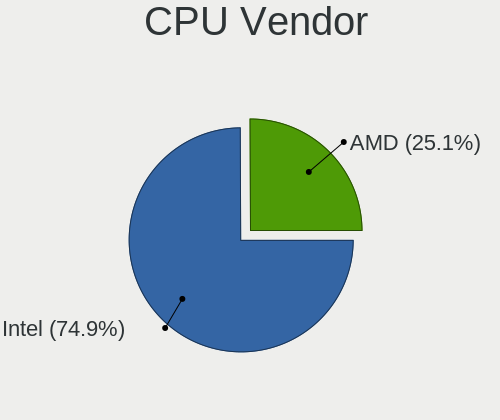
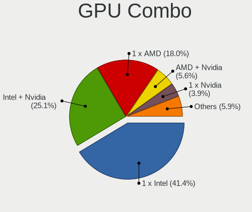
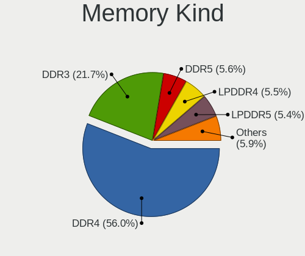
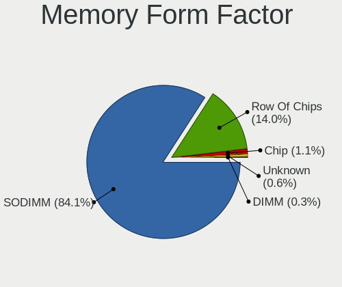
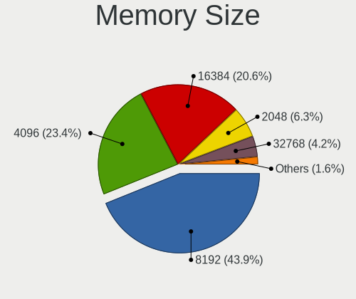
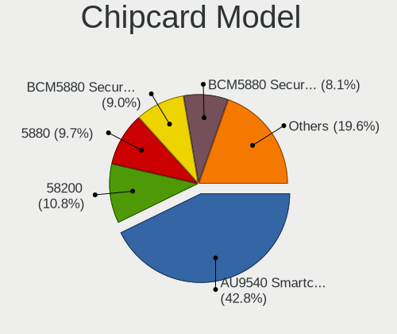

Arch - Tested Hardware & Statistics (Notebooks)
-----------------------------------------------

A project to collect tested hardware configurations for Arch.

Anyone can contribute to this report by the [hw-probe](https://github.com/linuxhw/hw-probe) tool:

    sudo -E hw-probe -all -upload

Please contribute! Especially if your hardware is rare.

Contents
--------

* [ Test Cases ](#test-cases)

* [ System ](#system)
  - [ OS                       ](#os)
  - [ OS Family                ](#os-family)
  - [ Kernel                   ](#kernel)
  - [ Kernel Family            ](#kernel-family)
  - [ Kernel Major Ver.        ](#kernel-major-ver)
  - [ Arch                     ](#arch)
  - [ DE                       ](#de)
  - [ Display Server           ](#display-server)
  - [ Display Manager          ](#display-manager)
  - [ OS Lang                  ](#os-lang)
  - [ Boot Mode                ](#boot-mode)
  - [ Filesystem               ](#filesystem)
  - [ Part. scheme             ](#part-scheme)
  - [ Dual Boot with Linux/BSD ](#dual-boot-with-linuxbsd)
  - [ Dual Boot (Win)          ](#dual-boot-win)

* [ Board ](#board)
  - [ Vendor                   ](#vendor)
  - [ Model                    ](#model)
  - [ Model Family             ](#model-family)
  - [ MFG Year                 ](#mfg-year)
  - [ Form Factor              ](#form-factor)
  - [ Secure Boot              ](#secure-boot)
  - [ Coreboot                 ](#coreboot)
  - [ RAM Size                 ](#ram-size)
  - [ RAM Used                 ](#ram-used)
  - [ Total Drives             ](#total-drives)
  - [ Has CD-ROM               ](#has-cd-rom)
  - [ Has Ethernet             ](#has-ethernet)
  - [ Has WiFi                 ](#has-wifi)
  - [ Has Bluetooth            ](#has-bluetooth)

* [ Location ](#location)
  - [ Country                  ](#country)
  - [ City                     ](#city)

* [ Drives ](#drives)
  - [ Drive Vendor             ](#drive-vendor)
  - [ Drive Model              ](#drive-model)
  - [ HDD Vendor               ](#hdd-vendor)
  - [ SSD Vendor               ](#ssd-vendor)
  - [ Drive Kind               ](#drive-kind)
  - [ Drive Connector          ](#drive-connector)
  - [ Drive Size               ](#drive-size)
  - [ Space Total              ](#space-total)
  - [ Space Used               ](#space-used)
  - [ Malfunc. Drives          ](#malfunc-drives)
  - [ Malfunc. Drive Vendor    ](#malfunc-drive-vendor)
  - [ Malfunc. HDD Vendor      ](#malfunc-hdd-vendor)
  - [ Malfunc. Drive Kind      ](#malfunc-drive-kind)
  - [ Failed Drives            ](#failed-drives)
  - [ Failed Drive Vendor      ](#failed-drive-vendor)
  - [ Drive Status             ](#drive-status)

* [ Storage controller ](#storage-controller)
  - [ Storage Vendor           ](#storage-vendor)
  - [ Storage Model            ](#storage-model)
  - [ Storage Kind             ](#storage-kind)

* [ Processor ](#processor)
  - [ CPU Vendor               ](#cpu-vendor)
  - [ CPU Model                ](#cpu-model)
  - [ CPU Model Family         ](#cpu-model-family)
  - [ CPU Cores                ](#cpu-cores)
  - [ CPU Sockets              ](#cpu-sockets)
  - [ CPU Threads              ](#cpu-threads)
  - [ CPU Op-Modes             ](#cpu-op-modes)
  - [ CPU Microcode            ](#cpu-microcode)
  - [ CPU Microarch            ](#cpu-microarch)

* [ Graphics ](#graphics)
  - [ GPU Vendor               ](#gpu-vendor)
  - [ GPU Model                ](#gpu-model)
  - [ GPU Combo                ](#gpu-combo)
  - [ GPU Driver               ](#gpu-driver)
  - [ GPU Memory               ](#gpu-memory)

* [ Monitor ](#monitor)
  - [ Monitor Vendor           ](#monitor-vendor)
  - [ Monitor Model            ](#monitor-model)
  - [ Monitor Resolution       ](#monitor-resolution)
  - [ Monitor Diagonal         ](#monitor-diagonal)
  - [ Monitor Width            ](#monitor-width)
  - [ Aspect Ratio             ](#aspect-ratio)
  - [ Monitor Area             ](#monitor-area)
  - [ Pixel Density            ](#pixel-density)
  - [ Multiple Monitors        ](#multiple-monitors)

* [ Network ](#network)
  - [ Net Controller Vendor    ](#net-controller-vendor)
  - [ Net Controller Model     ](#net-controller-model)
  - [ Wireless Vendor          ](#wireless-vendor)
  - [ Wireless Model           ](#wireless-model)
  - [ Ethernet Vendor          ](#ethernet-vendor)
  - [ Ethernet Model           ](#ethernet-model)
  - [ Net Controller Kind      ](#net-controller-kind)
  - [ Used Controller          ](#used-controller)
  - [ NICs                     ](#nics)
  - [ IPv6                     ](#ipv6)

* [ Bluetooth ](#bluetooth)
  - [ Bluetooth Vendor         ](#bluetooth-vendor)
  - [ Bluetooth Model          ](#bluetooth-model)

* [ Sound ](#sound)
  - [ Sound Vendor             ](#sound-vendor)
  - [ Sound Model              ](#sound-model)

* [ Memory ](#memory)
  - [ Memory Vendor            ](#memory-vendor)
  - [ Memory Model             ](#memory-model)
  - [ Memory Kind              ](#memory-kind)
  - [ Memory Form Factor       ](#memory-form-factor)
  - [ Memory Size              ](#memory-size)
  - [ Memory Speed             ](#memory-speed)

* [ Printers & scanners ](#printers--scanners)
  - [ Printer Vendor           ](#printer-vendor)
  - [ Printer Model            ](#printer-model)
  - [ Scanner Vendor           ](#scanner-vendor)
  - [ Scanner Model            ](#scanner-model)

* [ Camera ](#camera)
  - [ Camera Vendor            ](#camera-vendor)
  - [ Camera Model             ](#camera-model)

* [ Security ](#security)
  - [ Fingerprint Vendor       ](#fingerprint-vendor)
  - [ Fingerprint Model        ](#fingerprint-model)
  - [ Chipcard Vendor          ](#chipcard-vendor)
  - [ Chipcard Model           ](#chipcard-model)

* [ Unsupported ](#unsupported)
  - [ Unsupported Devices      ](#unsupported-devices)
  - [ Unsupported Device Types ](#unsupported-device-types)

Test Cases
----------

Total: 4595

| Vendor        | Model                       | Probe                                                      | Date         |
|---------------|-----------------------------|------------------------------------------------------------|--------------|
| ASUSTek       | X550LB                      | [3d35ff8b68](https://linux-hardware.org/?probe=3d35ff8b68) | Apr 01, 2023 |
| Dell          | Inspiron 13 5310            | [32bdbfa581](https://linux-hardware.org/?probe=32bdbfa581) | Apr 01, 2023 |
| Lenovo        | ThinkPad T440p              | [4057e0c5e9](https://linux-hardware.org/?probe=4057e0c5e9) | Apr 01, 2023 |
| HP            | Notebook                    | [7cb279c8e0](https://linux-hardware.org/?probe=7cb279c8e0) | Apr 01, 2023 |
| Apple         | MacBookPro11,1              | [53717700a1](https://linux-hardware.org/?probe=53717700a1) | Mar 31, 2023 |
| Dell          | XPS 17 9700                 | [5d0a908832](https://linux-hardware.org/?probe=5d0a908832) | Mar 31, 2023 |
| Lenovo        | ThinkPad T440p              | [1063ba3fb9](https://linux-hardware.org/?probe=1063ba3fb9) | Mar 31, 2023 |
| ASUSTek       | ASUS TUF Gaming F15 FX50... | [e2c6f05595](https://linux-hardware.org/?probe=e2c6f05595) | Mar 31, 2023 |
| Lenovo        | ThinkPad Z13 Gen 1 21D2C... | [0ab4f4cd55](https://linux-hardware.org/?probe=0ab4f4cd55) | Mar 31, 2023 |
| HUAWEI        | KLVL-WXXW                   | [6915349237](https://linux-hardware.org/?probe=6915349237) | Mar 31, 2023 |
| Lenovo        | ThinkPad X250 20CLS2A100    | [2e8eab25be](https://linux-hardware.org/?probe=2e8eab25be) | Mar 30, 2023 |
| Lenovo        | ThinkPad T480 20L5CTO1WW    | [de3828d539](https://linux-hardware.org/?probe=de3828d539) | Mar 29, 2023 |
| HP            | Victus by Laptop 16-d0xx... | [d96583e702](https://linux-hardware.org/?probe=d96583e702) | Mar 29, 2023 |
| Timi          | Redmi Book Pro 14 2022      | [e9b1759970](https://linux-hardware.org/?probe=e9b1759970) | Mar 29, 2023 |
| Acer          | Aspire ES1-512              | [f6357798c5](https://linux-hardware.org/?probe=f6357798c5) | Mar 28, 2023 |
| Dell          | Vostro 2420                 | [0a1739f44c](https://linux-hardware.org/?probe=0a1739f44c) | Mar 28, 2023 |
| HP            | ElitePad 1000 G2            | [4b16a78f3e](https://linux-hardware.org/?probe=4b16a78f3e) | Mar 28, 2023 |
| Dell          | Inspiron 16 5630            | [5838554410](https://linux-hardware.org/?probe=5838554410) | Mar 28, 2023 |
| ASUSTek       | ASUS TUF Gaming F15 FX50... | [60012fd503](https://linux-hardware.org/?probe=60012fd503) | Mar 27, 2023 |
| Lenovo        | IdeaPad 330-15IGM 81D1      | [54f096fd88](https://linux-hardware.org/?probe=54f096fd88) | Mar 27, 2023 |
| Dell          | XPS 15 9500                 | [cebc7c547a](https://linux-hardware.org/?probe=cebc7c547a) | Mar 26, 2023 |
| Dell          | XPS 15 9500                 | [4391dcbdd2](https://linux-hardware.org/?probe=4391dcbdd2) | Mar 26, 2023 |
| Dell          | Inspiron 3501               | [14cc8c6a5e](https://linux-hardware.org/?probe=14cc8c6a5e) | Mar 26, 2023 |
| Lenovo        | ThinkPad Z13 Gen 1 21D2C... | [0933beb0f7](https://linux-hardware.org/?probe=0933beb0f7) | Mar 26, 2023 |
| Dell          | G3 3590                     | [db70257507](https://linux-hardware.org/?probe=db70257507) | Mar 26, 2023 |
| HUAWEI        | NBD-WXX9                    | [8060aec150](https://linux-hardware.org/?probe=8060aec150) | Mar 25, 2023 |
| Acer          | Swift SF314-511             | [55c1b171dd](https://linux-hardware.org/?probe=55c1b171dd) | Mar 25, 2023 |
| Lenovo        | ThinkPad T480s 20L7S0YA0... | [f4cb79dbf8](https://linux-hardware.org/?probe=f4cb79dbf8) | Mar 25, 2023 |
| Lenovo        | ThinkPad X13 Gen 3 21BNC... | [649b881439](https://linux-hardware.org/?probe=649b881439) | Mar 25, 2023 |
| Dynabook      | PORTEGE X40L-K              | [9f4a50bc98](https://linux-hardware.org/?probe=9f4a50bc98) | Mar 25, 2023 |
| HP            | ENVY Laptop 17-ce1xxx       | [f9ff96064b](https://linux-hardware.org/?probe=f9ff96064b) | Mar 24, 2023 |
| Toshiba       | Satellite C850-140          | [6682022c49](https://linux-hardware.org/?probe=6682022c49) | Mar 24, 2023 |
| Lenovo        | Legion 5 Pro 16IAH7H 82R... | [71d058eb0e](https://linux-hardware.org/?probe=71d058eb0e) | Mar 24, 2023 |
| Toshiba       | Satellite C55D-B            | [ae6069d9bb](https://linux-hardware.org/?probe=ae6069d9bb) | Mar 24, 2023 |
| Lenovo        | IdeaPad S145-15IWL 81S9     | [56942672e1](https://linux-hardware.org/?probe=56942672e1) | Mar 24, 2023 |
| Apple         | MacBookPro11,2              | [ded37ac14c](https://linux-hardware.org/?probe=ded37ac14c) | Mar 24, 2023 |
| Apple         | MacBookPro11,2              | [13046d5580](https://linux-hardware.org/?probe=13046d5580) | Mar 24, 2023 |
| Acer          | Aspire A515-57              | [748d918a61](https://linux-hardware.org/?probe=748d918a61) | Mar 23, 2023 |
| Lenovo        | ThinkPad T450s 20BWS05G0... | [38b0e00744](https://linux-hardware.org/?probe=38b0e00744) | Mar 23, 2023 |
| Lenovo        | ThinkPad T450s 20BWS05G0... | [ad1134944b](https://linux-hardware.org/?probe=ad1134944b) | Mar 23, 2023 |
| HP            | Pavilion Gaming Laptop 1... | [e7b4dc0fd4](https://linux-hardware.org/?probe=e7b4dc0fd4) | Mar 23, 2023 |
| Lenovo        | ThinkPad T14 Gen 1 20UDS... | [fc1c184c05](https://linux-hardware.org/?probe=fc1c184c05) | Mar 23, 2023 |
| ASUSTek       | T100HAN                     | [5f0061dd7b](https://linux-hardware.org/?probe=5f0061dd7b) | Mar 23, 2023 |
| Lenovo        | ThinkPad X1 Carbon Gen 1... | [28cd6cb051](https://linux-hardware.org/?probe=28cd6cb051) | Mar 23, 2023 |
| Lenovo        | ThinkPad E14 Gen 4 21ECS... | [fab7c8ab05](https://linux-hardware.org/?probe=fab7c8ab05) | Mar 22, 2023 |
| Dell          | Vostro 2420                 | [e885d387ee](https://linux-hardware.org/?probe=e885d387ee) | Mar 22, 2023 |
| Lenovo        | ThinkPad T14 Gen 3 21CF0... | [0880214933](https://linux-hardware.org/?probe=0880214933) | Mar 22, 2023 |
| Lenovo        | ThinkPad X250 20CLS2A100    | [e7b50c8f22](https://linux-hardware.org/?probe=e7b50c8f22) | Mar 22, 2023 |
| Lenovo        | IdeaPad 330S-15IKB 81F5     | [4b7801e829](https://linux-hardware.org/?probe=4b7801e829) | Mar 22, 2023 |
| TUXEDO        | Pulse 15 Gen1               | [1da76d59b2](https://linux-hardware.org/?probe=1da76d59b2) | Mar 21, 2023 |
| Dell          | XPS 15 9570                 | [6fc76628d3](https://linux-hardware.org/?probe=6fc76628d3) | Mar 21, 2023 |
| MSI           | Modern 14 B10MW             | [2940ea3b40](https://linux-hardware.org/?probe=2940ea3b40) | Mar 21, 2023 |
| HP            | ProBook 440 G3              | [217e9242da](https://linux-hardware.org/?probe=217e9242da) | Mar 20, 2023 |
| HP            | ProBook 440 G3              | [b011027d1a](https://linux-hardware.org/?probe=b011027d1a) | Mar 20, 2023 |
| Dell          | XPS 9315                    | [3a6814a18f](https://linux-hardware.org/?probe=3a6814a18f) | Mar 20, 2023 |
| Dell          | XPS 9315                    | [a6054e6f0e](https://linux-hardware.org/?probe=a6054e6f0e) | Mar 20, 2023 |
| HP            | EliteBook 830 G5            | [ba804b8e21](https://linux-hardware.org/?probe=ba804b8e21) | Mar 20, 2023 |
| MSI           | GS63VR 7RF                  | [8d13f6eef9](https://linux-hardware.org/?probe=8d13f6eef9) | Mar 20, 2023 |
| MSI           | GS63VR 7RF                  | [5b4e0532f8](https://linux-hardware.org/?probe=5b4e0532f8) | Mar 20, 2023 |
| Dell          | Vostro 2420                 | [a98665cff1](https://linux-hardware.org/?probe=a98665cff1) | Mar 20, 2023 |
| Dell          | G15 5511                    | [ddb34b9c1f](https://linux-hardware.org/?probe=ddb34b9c1f) | Mar 19, 2023 |
| TUXEDO        | InfinityBook Pro 14 Gen6    | [0500018bce](https://linux-hardware.org/?probe=0500018bce) | Mar 19, 2023 |
| Lenovo        | ThinkPad P52s 20LBS0FH00    | [aa4184ac0c](https://linux-hardware.org/?probe=aa4184ac0c) | Mar 19, 2023 |
| Lenovo        | ThinkPad P52s 20LBS0FH00    | [00de843c75](https://linux-hardware.org/?probe=00de843c75) | Mar 19, 2023 |
| MSI           | GP66 Leopard 11UG           | [7210f8c423](https://linux-hardware.org/?probe=7210f8c423) | Mar 19, 2023 |
| ASUSTek       | X205TA                      | [9727a94199](https://linux-hardware.org/?probe=9727a94199) | Mar 18, 2023 |
| Lenovo        | ThinkPad T460s 20FAS6PN0... | [bb86a34180](https://linux-hardware.org/?probe=bb86a34180) | Mar 18, 2023 |
| Unknown       | Unknown                     | [e10e576833](https://linux-hardware.org/?probe=e10e576833) | Mar 18, 2023 |
| Unknown       | Unknown                     | [a791424f94](https://linux-hardware.org/?probe=a791424f94) | Mar 18, 2023 |
| Lenovo        | ThinkPad Yoga 11e 20D900... | [434b76d9cd](https://linux-hardware.org/?probe=434b76d9cd) | Mar 18, 2023 |
| Lenovo        | ThinkPad Yoga 11e 20D900... | [2ffc3ebd28](https://linux-hardware.org/?probe=2ffc3ebd28) | Mar 18, 2023 |
| ASUSTek       | TUF Gaming FX505GT_FX505... | [3a565fb944](https://linux-hardware.org/?probe=3a565fb944) | Mar 18, 2023 |
| HONOR         | BOD-WXX9                    | [9bca2e7122](https://linux-hardware.org/?probe=9bca2e7122) | Mar 18, 2023 |
| ASUSTek       | N550JK                      | [6b93d4a171](https://linux-hardware.org/?probe=6b93d4a171) | Mar 17, 2023 |
| Lenovo        | ThinkBook 15 G2 ARE 20VG    | [ccfa4fb30e](https://linux-hardware.org/?probe=ccfa4fb30e) | Mar 17, 2023 |
| Lenovo        | IdeaPad S145-15IWL 81S9     | [fc0e66fc8a](https://linux-hardware.org/?probe=fc0e66fc8a) | Mar 17, 2023 |
| Dell          | Precision 3520              | [2afa31184a](https://linux-hardware.org/?probe=2afa31184a) | Mar 17, 2023 |
| Dell          | Precision 3520              | [819b4aa330](https://linux-hardware.org/?probe=819b4aa330) | Mar 17, 2023 |
| Lenovo        | Legion 5-15IMH05H 81Y6      | [e7e152095b](https://linux-hardware.org/?probe=e7e152095b) | Mar 17, 2023 |
| HP            | 245 14 inch G9 Notebook ... | [03edff3e6f](https://linux-hardware.org/?probe=03edff3e6f) | Mar 16, 2023 |
| HP            | Victus by Laptop 16-e0xx... | [304f8b71db](https://linux-hardware.org/?probe=304f8b71db) | Mar 16, 2023 |
| HP            | Victus by Laptop 16-e0xx... | [4bfe066835](https://linux-hardware.org/?probe=4bfe066835) | Mar 16, 2023 |
| HP            | EliteBook 840 G8 Noteboo... | [590a3ca248](https://linux-hardware.org/?probe=590a3ca248) | Mar 15, 2023 |
| Lenovo        | ThinkPad P15v Gen 3 21EM... | [e4254565ed](https://linux-hardware.org/?probe=e4254565ed) | Mar 15, 2023 |
| Star Labs     | StarBook                    | [13efc22826](https://linux-hardware.org/?probe=13efc22826) | Mar 15, 2023 |
| TUXEDO        | Polaris Intel Gen3 (TGL)    | [29ebc422fe](https://linux-hardware.org/?probe=29ebc422fe) | Mar 15, 2023 |
| Timi          | RedmiBook 14                | [ff5feda02c](https://linux-hardware.org/?probe=ff5feda02c) | Mar 14, 2023 |
| Acer          | Aspire E5-571               | [6c7886396a](https://linux-hardware.org/?probe=6c7886396a) | Mar 14, 2023 |
| Lenovo        | ThinkPad X240 20AMS1FW00    | [0b9501dcc9](https://linux-hardware.org/?probe=0b9501dcc9) | Mar 14, 2023 |
| Dell          | Vostro 2420                 | [a87952a308](https://linux-hardware.org/?probe=a87952a308) | Mar 14, 2023 |
| HP            | OMEN by Laptop 16-c0xxx     | [a13648959d](https://linux-hardware.org/?probe=a13648959d) | Mar 14, 2023 |
| Star Labs     | StarBook                    | [3e534c533a](https://linux-hardware.org/?probe=3e534c533a) | Mar 14, 2023 |
| Dell          | Inspiron 16 Plus 7620       | [2906d8ad11](https://linux-hardware.org/?probe=2906d8ad11) | Mar 14, 2023 |
| Lenovo        | IdeaPad 710S-13ISK 80SW     | [7f06c80526](https://linux-hardware.org/?probe=7f06c80526) | Mar 14, 2023 |
| MSI           | GF63 Thin 11UC              | [7c96c962f0](https://linux-hardware.org/?probe=7c96c962f0) | Mar 13, 2023 |
| Monster       | ABRA A7 V11.3               | [724a9e65d8](https://linux-hardware.org/?probe=724a9e65d8) | Mar 13, 2023 |
| Panasonic     | FZ40-1                      | [1dfcc0c545](https://linux-hardware.org/?probe=1dfcc0c545) | Mar 13, 2023 |
| HP            | ProBook 6460b               | [c6b7f1ec98](https://linux-hardware.org/?probe=c6b7f1ec98) | Mar 13, 2023 |
| ASUSTek       | ASUS TUF Dash F15 FX517Z... | [87331b21e8](https://linux-hardware.org/?probe=87331b21e8) | Mar 13, 2023 |
| Lenovo        | ThinkPad T510 4313CTO       | [c2f9a6e354](https://linux-hardware.org/?probe=c2f9a6e354) | Mar 13, 2023 |
| ASUSTek       | ASUS EXPERTBOOK L1500CDA... | [5522717dc5](https://linux-hardware.org/?probe=5522717dc5) | Mar 12, 2023 |
| MSI           | Pulse GL66 11UGKV           | [1abb09da1a](https://linux-hardware.org/?probe=1abb09da1a) | Mar 12, 2023 |
| Razer         | Blade 14 - RZ09-0370        | [a081c489c9](https://linux-hardware.org/?probe=a081c489c9) | Mar 12, 2023 |
| HP            | G61                         | [2f5e9f6f43](https://linux-hardware.org/?probe=2f5e9f6f43) | Mar 11, 2023 |
| Lenovo        | IdeaPad 320-15AST 80XV      | [062687b226](https://linux-hardware.org/?probe=062687b226) | Mar 11, 2023 |
| ASUSTek       | ROG Zephyrus G15 GA503QS... | [4664479644](https://linux-hardware.org/?probe=4664479644) | Mar 11, 2023 |
| Dell          | Latitude E6530              | [50a26c019d](https://linux-hardware.org/?probe=50a26c019d) | Mar 11, 2023 |
| Lenovo        | IdeaPad Z480                | [eb63a9a0d3](https://linux-hardware.org/?probe=eb63a9a0d3) | Mar 10, 2023 |
| HP            | EliteBook 8730w             | [a012fe4bd2](https://linux-hardware.org/?probe=a012fe4bd2) | Mar 10, 2023 |
| Panasonic     | FZ40-1                      | [5d082aaf0e](https://linux-hardware.org/?probe=5d082aaf0e) | Mar 10, 2023 |
| Monster       | HUMA H4 V5.1                | [4745f71e81](https://linux-hardware.org/?probe=4745f71e81) | Mar 10, 2023 |
| Monster       | HUMA H4 V5.1                | [98c29f81d8](https://linux-hardware.org/?probe=98c29f81d8) | Mar 10, 2023 |
| Acer          | Aspire A715-71G             | [6ef05d9cbb](https://linux-hardware.org/?probe=6ef05d9cbb) | Mar 10, 2023 |
| Acer          | Aspire A715-71G             | [4f916d30c4](https://linux-hardware.org/?probe=4f916d30c4) | Mar 10, 2023 |
| Panasonic     | FZ40-1                      | [9eac1dc6f5](https://linux-hardware.org/?probe=9eac1dc6f5) | Mar 10, 2023 |
| Lenovo        | ThinkPad X250 20CLS2A100    | [06971429a7](https://linux-hardware.org/?probe=06971429a7) | Mar 10, 2023 |
| Lenovo        | ThinkPad T450 20BUA05K00    | [a496755d7a](https://linux-hardware.org/?probe=a496755d7a) | Mar 10, 2023 |
| Lenovo        | IdeaPad 320-15AST 80XV      | [1b0ea7bf68](https://linux-hardware.org/?probe=1b0ea7bf68) | Mar 10, 2023 |
| HP            | Laptop 14-fq0xxx            | [8574146364](https://linux-hardware.org/?probe=8574146364) | Mar 09, 2023 |
| HP            | Laptop 14-fq0xxx            | [c397e2fa8b](https://linux-hardware.org/?probe=c397e2fa8b) | Mar 09, 2023 |
| HP            | ENVY Laptop 13-aq0xxx       | [79fc708bbd](https://linux-hardware.org/?probe=79fc708bbd) | Mar 09, 2023 |
| Lenovo        | IdeaPad Z480                | [bc5f204a78](https://linux-hardware.org/?probe=bc5f204a78) | Mar 08, 2023 |
| Lenovo        | Legion 5 Pro 16IAH7H 82R... | [59bddb27c4](https://linux-hardware.org/?probe=59bddb27c4) | Mar 08, 2023 |
| Dell          | XPS 15 9570                 | [0312ea16b6](https://linux-hardware.org/?probe=0312ea16b6) | Mar 08, 2023 |
| Dell          | Precision 3520              | [99eaeb743c](https://linux-hardware.org/?probe=99eaeb743c) | Mar 08, 2023 |
| HP            | ENVY Laptop 13-aq0xxx       | [c768e8ff8f](https://linux-hardware.org/?probe=c768e8ff8f) | Mar 08, 2023 |
| Dell          | Precision 3520              | [acf74c7740](https://linux-hardware.org/?probe=acf74c7740) | Mar 08, 2023 |
| Lenovo        | ThinkPad T470 20HD0001PG    | [be61e16d11](https://linux-hardware.org/?probe=be61e16d11) | Mar 08, 2023 |
| Dell          | Latitude 5590               | [10e7ed8ff6](https://linux-hardware.org/?probe=10e7ed8ff6) | Mar 07, 2023 |
| HP            | EliteBook 840 G1            | [e2c5933515](https://linux-hardware.org/?probe=e2c5933515) | Mar 07, 2023 |
| Lenovo        | IdeaPad 3 15ALC6 82KU       | [16c33be9a3](https://linux-hardware.org/?probe=16c33be9a3) | Mar 07, 2023 |
| GPD           | P2 MAX                      | [d73c7b9146](https://linux-hardware.org/?probe=d73c7b9146) | Mar 07, 2023 |
| Lenovo        | Legion 5 Pro 16IAH7H 82R... | [bbbf4112e4](https://linux-hardware.org/?probe=bbbf4112e4) | Mar 06, 2023 |
| HP            | Pavilion dv6                | [6485870687](https://linux-hardware.org/?probe=6485870687) | Mar 06, 2023 |
| Acer          | Aspire A114-31              | [33ce987151](https://linux-hardware.org/?probe=33ce987151) | Mar 06, 2023 |
| Lenovo        | IdeaPad L340-15API 81LW     | [0047dd8b2a](https://linux-hardware.org/?probe=0047dd8b2a) | Mar 06, 2023 |
| Lenovo        | Unknown                     | [2ae9263125](https://linux-hardware.org/?probe=2ae9263125) | Mar 06, 2023 |
| Lenovo        | ThinkPad E550 20DF002YUS    | [6a7ad331f8](https://linux-hardware.org/?probe=6a7ad331f8) | Mar 06, 2023 |
| Lenovo        | ThinkPad T16 Gen 1 21CH0... | [6a6864f933](https://linux-hardware.org/?probe=6a6864f933) | Mar 05, 2023 |
| Acer          | Aspire A514-55              | [97e8238d87](https://linux-hardware.org/?probe=97e8238d87) | Mar 05, 2023 |
| IGEL Techn... | H830C                       | [3619b3fcee](https://linux-hardware.org/?probe=3619b3fcee) | Mar 05, 2023 |
| Lenovo        | ThinkPad T16 Gen 1 21CH0... | [ea211d74ee](https://linux-hardware.org/?probe=ea211d74ee) | Mar 05, 2023 |
| Lenovo        | IdeaPad Gaming 3 15ARH05... | [71f2f93645](https://linux-hardware.org/?probe=71f2f93645) | Mar 04, 2023 |
| Lenovo        | IdeaPad Gaming 3 15ARH05... | [13fc723c9e](https://linux-hardware.org/?probe=13fc723c9e) | Mar 04, 2023 |
| Lenovo        | ThinkPad Z16 Gen 1 21D40... | [10c12a6b8a](https://linux-hardware.org/?probe=10c12a6b8a) | Mar 04, 2023 |
| Dell          | Latitude 5480               | [4679c9328e](https://linux-hardware.org/?probe=4679c9328e) | Mar 03, 2023 |
| HUAWEI        | CREF-XX                     | [bef62e57b0](https://linux-hardware.org/?probe=bef62e57b0) | Mar 03, 2023 |
| HUAWEI        | CREF-XX                     | [b42f1c3f6b](https://linux-hardware.org/?probe=b42f1c3f6b) | Mar 03, 2023 |
| ASUSTek       | ASUS TUF Gaming A15 FA50... | [5715b4e8af](https://linux-hardware.org/?probe=5715b4e8af) | Mar 03, 2023 |
| Acer          | Nitro AN515-58              | [d8d83e3bb3](https://linux-hardware.org/?probe=d8d83e3bb3) | Mar 03, 2023 |
| HP            | ENVY dv6                    | [357b5b3506](https://linux-hardware.org/?probe=357b5b3506) | Mar 03, 2023 |
| Dell          | Latitude E6510              | [80edceafbc](https://linux-hardware.org/?probe=80edceafbc) | Mar 03, 2023 |
| Dell          | XPS 15 9500                 | [13f585159e](https://linux-hardware.org/?probe=13f585159e) | Mar 02, 2023 |
| DTRI          | DT317CR                     | [b78d90835c](https://linux-hardware.org/?probe=b78d90835c) | Mar 02, 2023 |
| Toshiba       | TECRA Z50-C                 | [c30ead38bd](https://linux-hardware.org/?probe=c30ead38bd) | Mar 02, 2023 |
| ASUSTek       | VivoBook_ASUSLaptop X421... | [cf806f07cb](https://linux-hardware.org/?probe=cf806f07cb) | Mar 02, 2023 |
| Dell          | Precision 5520              | [9ce4c56521](https://linux-hardware.org/?probe=9ce4c56521) | Mar 02, 2023 |
| Lenovo        | ThinkPad T490 20N3S3UL00    | [f61c295d09](https://linux-hardware.org/?probe=f61c295d09) | Mar 01, 2023 |
| Dell          | XPS 15 9550                 | [0ffe1f9541](https://linux-hardware.org/?probe=0ffe1f9541) | Feb 28, 2023 |
| HP            | Laptop 15s-eq3xxx           | [a08a3c36ab](https://linux-hardware.org/?probe=a08a3c36ab) | Feb 28, 2023 |
| ASUSTek       | Zenbook UX535QE_UM535QE     | [456504fe92](https://linux-hardware.org/?probe=456504fe92) | Feb 28, 2023 |
| HP            | Laptop 15s-eq1xxx           | [c070966ad7](https://linux-hardware.org/?probe=c070966ad7) | Feb 28, 2023 |
| Apple         | MacBookPro8,1               | [ec1f27de09](https://linux-hardware.org/?probe=ec1f27de09) | Feb 28, 2023 |
| MECHREVO      | Jiaolong Series MRID6       | [1643b96eae](https://linux-hardware.org/?probe=1643b96eae) | Feb 28, 2023 |
| MECHREVO      | Jiaolong Series MRID6       | [b48cc99ce3](https://linux-hardware.org/?probe=b48cc99ce3) | Feb 28, 2023 |
| Lenovo        | IdeaPad S145-15IWL 81S9     | [915fc4d913](https://linux-hardware.org/?probe=915fc4d913) | Feb 28, 2023 |
| Intel Clie... | LAPRC510                    | [925c24b3db](https://linux-hardware.org/?probe=925c24b3db) | Feb 28, 2023 |
| HP            | ProBook 430 G1              | [fa75658ee0](https://linux-hardware.org/?probe=fa75658ee0) | Feb 28, 2023 |
| Dell          | G15 5510                    | [77ff8fd545](https://linux-hardware.org/?probe=77ff8fd545) | Feb 28, 2023 |
| Dell          | G15 5510                    | [2c8f883abe](https://linux-hardware.org/?probe=2c8f883abe) | Feb 28, 2023 |
| ASUSTek       | VivoBook_ASUSLaptop M760... | [1f80bce21e](https://linux-hardware.org/?probe=1f80bce21e) | Feb 27, 2023 |
| ASUSTek       | VivoBook_ASUSLaptop M760... | [08e6c7285a](https://linux-hardware.org/?probe=08e6c7285a) | Feb 27, 2023 |
| Dell          | Latitude 7390               | [a2167ae72b](https://linux-hardware.org/?probe=a2167ae72b) | Feb 27, 2023 |
| Schenker      | VISION (E22)                | [498444ca02](https://linux-hardware.org/?probe=498444ca02) | Feb 27, 2023 |
| HP            | ProBook 430 G1              | [1354e0b47e](https://linux-hardware.org/?probe=1354e0b47e) | Feb 26, 2023 |
| ASUSTek       | ROG Zephyrus G15 GA503RW... | [848e43f7c3](https://linux-hardware.org/?probe=848e43f7c3) | Feb 26, 2023 |
| Sony          | SVE1712C1EW                 | [20bd9411d9](https://linux-hardware.org/?probe=20bd9411d9) | Feb 26, 2023 |
| Lenovo        | ThinkPad X1 Carbon Gen 1... | [9755df8e75](https://linux-hardware.org/?probe=9755df8e75) | Feb 25, 2023 |
| Lenovo        | ThinkPad Z13 Gen 1 21D2C... | [e07445a583](https://linux-hardware.org/?probe=e07445a583) | Feb 25, 2023 |
| Lenovo        | ThinkPad T14 Gen 3 21CFC... | [d475dd1788](https://linux-hardware.org/?probe=d475dd1788) | Feb 25, 2023 |
| Star Labs     | StarBook                    | [fbd529b953](https://linux-hardware.org/?probe=fbd529b953) | Feb 25, 2023 |
| Timi          | Xiaomi Book Pro 14 2022     | [46aedb5579](https://linux-hardware.org/?probe=46aedb5579) | Feb 25, 2023 |
| HP            | Laptop 15s-eq2xxx           | [64504d9860](https://linux-hardware.org/?probe=64504d9860) | Feb 24, 2023 |
| HP            | EliteBook 845 14 inch G9... | [8a573735cb](https://linux-hardware.org/?probe=8a573735cb) | Feb 24, 2023 |
| ASUSTek       | ROG Zephyrus Duo 15 SE G... | [ac2d78d240](https://linux-hardware.org/?probe=ac2d78d240) | Feb 24, 2023 |
| Dell          | XPS 13 9310                 | [1b60ef35ce](https://linux-hardware.org/?probe=1b60ef35ce) | Feb 24, 2023 |
| Lenovo        | ThinkPad X61s 7667CG7       | [f090aa4d60](https://linux-hardware.org/?probe=f090aa4d60) | Feb 24, 2023 |
| Lenovo        | ThinkBook 14 G4+ IAP 21C... | [028814b990](https://linux-hardware.org/?probe=028814b990) | Feb 24, 2023 |
| Dell          | Inspiron 3476               | [58bff0319e](https://linux-hardware.org/?probe=58bff0319e) | Feb 24, 2023 |
| HUAWEI        | NBD-WXX9                    | [ea2663126f](https://linux-hardware.org/?probe=ea2663126f) | Feb 24, 2023 |
| Avell High... | A70 MOB                     | [1bf7d82ab3](https://linux-hardware.org/?probe=1bf7d82ab3) | Feb 23, 2023 |
| Lenovo        | Legion S7 15ACH6 82K8       | [c69ac67426](https://linux-hardware.org/?probe=c69ac67426) | Feb 23, 2023 |
| Lenovo        | IdeaPad S145-15IWL 81S9     | [d74903e764](https://linux-hardware.org/?probe=d74903e764) | Feb 23, 2023 |
| Acer          | Swift SF514-54GT            | [dbccc5afa9](https://linux-hardware.org/?probe=dbccc5afa9) | Feb 23, 2023 |
| HP            | Stream Laptop 14-cb1xxx     | [14cf9e07e0](https://linux-hardware.org/?probe=14cf9e07e0) | Feb 23, 2023 |
| HP            | Stream Laptop 14-cb1xxx     | [388f34d16e](https://linux-hardware.org/?probe=388f34d16e) | Feb 23, 2023 |
| Dell          | Latitude 7300               | [c4bb27e884](https://linux-hardware.org/?probe=c4bb27e884) | Feb 23, 2023 |
| Lenovo        | IdeaPad 3 15ITL6 82MD       | [d16dd6d1f3](https://linux-hardware.org/?probe=d16dd6d1f3) | Feb 22, 2023 |
| Lenovo        | ThinkPad X1 Carbon Gen 1... | [701608fad1](https://linux-hardware.org/?probe=701608fad1) | Feb 22, 2023 |
| HP            | ProBook 640 G5              | [e90b71c2fd](https://linux-hardware.org/?probe=e90b71c2fd) | Feb 22, 2023 |
| Acer          | Aspire ES1-533              | [4a7563bd8e](https://linux-hardware.org/?probe=4a7563bd8e) | Feb 22, 2023 |
| Compaq        | 430                         | [4bd84653a5](https://linux-hardware.org/?probe=4bd84653a5) | Feb 21, 2023 |
| Lenovo        | ThinkPad T15p Gen 3 21DA... | [dd12dc45d7](https://linux-hardware.org/?probe=dd12dc45d7) | Feb 21, 2023 |
| Dell          | XPS 13 9360                 | [f36328511d](https://linux-hardware.org/?probe=f36328511d) | Feb 21, 2023 |
| HP            | ProBook 430 G1              | [1505165a73](https://linux-hardware.org/?probe=1505165a73) | Feb 20, 2023 |
| ASUSTek       | X555LPB                     | [29eb95639c](https://linux-hardware.org/?probe=29eb95639c) | Feb 20, 2023 |
| ASUSTek       | Zenbook UX535QE_UM535QE     | [e008fd489b](https://linux-hardware.org/?probe=e008fd489b) | Feb 20, 2023 |
| Lenovo        | ThinkPad T15p Gen 3 21DA... | [defde684a0](https://linux-hardware.org/?probe=defde684a0) | Feb 20, 2023 |
| Lenovo        | ThinkPad Z13 Gen 1 21D2C... | [1832e70d83](https://linux-hardware.org/?probe=1832e70d83) | Feb 20, 2023 |
| Lenovo        | ThinkPad Z13 Gen 1 21D2C... | [9adf6b834b](https://linux-hardware.org/?probe=9adf6b834b) | Feb 20, 2023 |
| Dell          | XPS 15 9520                 | [d346153872](https://linux-hardware.org/?probe=d346153872) | Feb 20, 2023 |
| HUAWEI        | MACHC-WAX9                  | [69a8710cbb](https://linux-hardware.org/?probe=69a8710cbb) | Feb 18, 2023 |
| HUAWEI        | MACHC-WAX9                  | [db5d2b956a](https://linux-hardware.org/?probe=db5d2b956a) | Feb 18, 2023 |
| HP            | Pavilion Gaming Laptop 1... | [6aae20aa14](https://linux-hardware.org/?probe=6aae20aa14) | Feb 18, 2023 |
| Acer          | Nitro AN515-46              | [bf63748499](https://linux-hardware.org/?probe=bf63748499) | Feb 18, 2023 |
| Google        | Celes                       | [3004fce0ed](https://linux-hardware.org/?probe=3004fce0ed) | Feb 18, 2023 |
| Lenovo        | Legion 5 Pro 16IAH7H 82R... | [2e22d32463](https://linux-hardware.org/?probe=2e22d32463) | Feb 18, 2023 |
| MSI           | GL65 9SD                    | [a702514760](https://linux-hardware.org/?probe=a702514760) | Feb 17, 2023 |
| Lenovo        | Legion 5 15ACH6H 82JU       | [bfeb3ab070](https://linux-hardware.org/?probe=bfeb3ab070) | Feb 17, 2023 |
| Lenovo        | ThinkBook 14 G4+ IAP 21C... | [c4ec00ef99](https://linux-hardware.org/?probe=c4ec00ef99) | Feb 17, 2023 |
| TUXEDO        | Unknown                     | [d770ba8b7b](https://linux-hardware.org/?probe=d770ba8b7b) | Feb 17, 2023 |
| Acer          | Nitro AN515-46              | [162b72d7a8](https://linux-hardware.org/?probe=162b72d7a8) | Feb 17, 2023 |
| Acer          | Aspire A515-51G             | [065827a397](https://linux-hardware.org/?probe=065827a397) | Feb 16, 2023 |
| Dell          | Latitude 5330               | [497897c322](https://linux-hardware.org/?probe=497897c322) | Feb 16, 2023 |
| Dell          | Latitude 5330               | [aa55aaad48](https://linux-hardware.org/?probe=aa55aaad48) | Feb 16, 2023 |
| Lenovo        | B40-70 20392                | [7197aacb00](https://linux-hardware.org/?probe=7197aacb00) | Feb 16, 2023 |
| Dell          | Latitude 5480               | [ee1b786fd9](https://linux-hardware.org/?probe=ee1b786fd9) | Feb 15, 2023 |
| HP            | EliteBook 650 15.6 inch ... | [2be1a08ef2](https://linux-hardware.org/?probe=2be1a08ef2) | Feb 15, 2023 |
| HUAWEI        | NBD-WXX9                    | [8f5697ea3a](https://linux-hardware.org/?probe=8f5697ea3a) | Feb 15, 2023 |
| ASUSTek       | Zenbook UX535QE_UM535QE     | [138839541a](https://linux-hardware.org/?probe=138839541a) | Feb 15, 2023 |
| Lenovo        | ThinkPad T490 20N3S3UL00    | [dc352cd9dc](https://linux-hardware.org/?probe=dc352cd9dc) | Feb 14, 2023 |
| Lenovo        | IdeaPad Gaming 3 15ARH05... | [a3eb6fde29](https://linux-hardware.org/?probe=a3eb6fde29) | Feb 14, 2023 |
| Dell          | Latitude 5480               | [ab1652f0da](https://linux-hardware.org/?probe=ab1652f0da) | Feb 14, 2023 |
| Dell          | Venue 8 Pro 5855            | [6e5eacb53a](https://linux-hardware.org/?probe=6e5eacb53a) | Feb 14, 2023 |
| Lenovo        | G50-80 80R0                 | [86422b9261](https://linux-hardware.org/?probe=86422b9261) | Feb 14, 2023 |
| Toshiba       | Satellite P870              | [dcfa5b1fc5](https://linux-hardware.org/?probe=dcfa5b1fc5) | Feb 13, 2023 |
| Toshiba       | Satellite P870              | [3a4a4dedc3](https://linux-hardware.org/?probe=3a4a4dedc3) | Feb 13, 2023 |
| Dell          | Latitude E6530              | [c79c336ef7](https://linux-hardware.org/?probe=c79c336ef7) | Feb 13, 2023 |
| Acer          | Swift SF514-54GT            | [b7e961dae3](https://linux-hardware.org/?probe=b7e961dae3) | Feb 13, 2023 |
| ASUSTek       | ROG Strix G513RM_G513RM     | [b3ab77c355](https://linux-hardware.org/?probe=b3ab77c355) | Feb 13, 2023 |
| ASUSTek       | ROG Strix G513RM_G513RM     | [37c223623f](https://linux-hardware.org/?probe=37c223623f) | Feb 13, 2023 |
| ASUSTek       | Zenbook UX535QE_UM535QE     | [3f25b64868](https://linux-hardware.org/?probe=3f25b64868) | Feb 13, 2023 |
| ASUSTek       | X205TA                      | [dfc9ada1af](https://linux-hardware.org/?probe=dfc9ada1af) | Feb 13, 2023 |
| HP            | ProBook 430 G1              | [8d414de313](https://linux-hardware.org/?probe=8d414de313) | Feb 12, 2023 |
| Lenovo        | ThinkPad Z13 Gen 1 21D2C... | [afb25c8733](https://linux-hardware.org/?probe=afb25c8733) | Feb 12, 2023 |
| MSI           | Modern 14 B11MOU            | [547c8e5750](https://linux-hardware.org/?probe=547c8e5750) | Feb 12, 2023 |
| Lenovo        | ThinkPad Z13 Gen 1 21D2C... | [35d68b3769](https://linux-hardware.org/?probe=35d68b3769) | Feb 12, 2023 |
| Lenovo        | ThinkPad T16 Gen 1 21CH0... | [5335da53d0](https://linux-hardware.org/?probe=5335da53d0) | Feb 11, 2023 |
| Lenovo        | ThinkPad T460s 20FAS2K13... | [5f2fb779b4](https://linux-hardware.org/?probe=5f2fb779b4) | Feb 11, 2023 |
| Samsung       | 767XCL                      | [8a62be0577](https://linux-hardware.org/?probe=8a62be0577) | Feb 11, 2023 |
| HP            | Laptop 15s-eq3xxx           | [36dd5f42fc](https://linux-hardware.org/?probe=36dd5f42fc) | Feb 11, 2023 |
| Unknown       | Unknown                     | [31d099a8db](https://linux-hardware.org/?probe=31d099a8db) | Feb 11, 2023 |
| Acer          | Aspire A515-45              | [ca5ff923cc](https://linux-hardware.org/?probe=ca5ff923cc) | Feb 10, 2023 |
| Lenovo        | IdeaPad L340-15IRH Gamin... | [fd8d478a5b](https://linux-hardware.org/?probe=fd8d478a5b) | Feb 10, 2023 |
| Acer          | Aspire V5-551               | [cb3ab0bbf5](https://linux-hardware.org/?probe=cb3ab0bbf5) | Feb 10, 2023 |
| ASUSTek       | ROG Strix G513RW_G513RW     | [482b3ea2be](https://linux-hardware.org/?probe=482b3ea2be) | Feb 10, 2023 |
| Acer          | Aspire V5-551               | [132d55b2ed](https://linux-hardware.org/?probe=132d55b2ed) | Feb 09, 2023 |
| Sony          | VPCEH1M1E                   | [43f51d50c1](https://linux-hardware.org/?probe=43f51d50c1) | Feb 09, 2023 |
| Lenovo        | ThinkPad T460s 20FAS2K13... | [fc292cd441](https://linux-hardware.org/?probe=fc292cd441) | Feb 09, 2023 |
| Lenovo        | ThinkPad E490 20N9S2AS00    | [5d2f191a6f](https://linux-hardware.org/?probe=5d2f191a6f) | Feb 09, 2023 |
| Lenovo        | G50-70 20351                | [af3d5cd04c](https://linux-hardware.org/?probe=af3d5cd04c) | Feb 09, 2023 |
| Lenovo        | IdeaPad 330S-15IKB 81F5     | [02b69364a6](https://linux-hardware.org/?probe=02b69364a6) | Feb 09, 2023 |
| Lenovo        | IdeaPad 330S-15IKB 81F5     | [83efc68bd7](https://linux-hardware.org/?probe=83efc68bd7) | Feb 09, 2023 |
| Lenovo        | ThinkPad E490 20N9S2AS00    | [668b9a0bfe](https://linux-hardware.org/?probe=668b9a0bfe) | Feb 09, 2023 |
| Lenovo        | IdeaPad 3 15ITL6 82H8       | [5ce86509b6](https://linux-hardware.org/?probe=5ce86509b6) | Feb 08, 2023 |
| Lenovo        | ThinkPad X280 20KEA0VCUK    | [e39c3cefa0](https://linux-hardware.org/?probe=e39c3cefa0) | Feb 08, 2023 |
| Dell          | Latitude E5470              | [e0634fdc6e](https://linux-hardware.org/?probe=e0634fdc6e) | Feb 08, 2023 |
| Lenovo        | IdeaPad Flex-14API 81SS     | [0e174666ba](https://linux-hardware.org/?probe=0e174666ba) | Feb 07, 2023 |
| HUAWEI        | NBD-WXX9                    | [2bb967f6b3](https://linux-hardware.org/?probe=2bb967f6b3) | Feb 07, 2023 |
| Lenovo        | ThinkBook 14 G4+ IAP 21C... | [a127a79277](https://linux-hardware.org/?probe=a127a79277) | Feb 07, 2023 |
| Dell          | Precision M4800             | [2572c61169](https://linux-hardware.org/?probe=2572c61169) | Feb 07, 2023 |
| ASUSTek       | ROG Strix G533ZW_G533ZW     | [6e7434a708](https://linux-hardware.org/?probe=6e7434a708) | Feb 07, 2023 |
| ASUSTek       | ASUS TUF Gaming F15 FX50... | [149a2716a8](https://linux-hardware.org/?probe=149a2716a8) | Feb 06, 2023 |
| Lenovo        | G505 20240                  | [31e2c2f5e1](https://linux-hardware.org/?probe=31e2c2f5e1) | Feb 06, 2023 |
| Toshiba       | Satellite Pro L510          | [c8dc3a76e5](https://linux-hardware.org/?probe=c8dc3a76e5) | Feb 06, 2023 |
| Lenovo        | ThinkBook 15-IIL 20SM       | [8d0a0a0422](https://linux-hardware.org/?probe=8d0a0a0422) | Feb 06, 2023 |
| Apple         | MacBookPro11,4              | [cfcea0a331](https://linux-hardware.org/?probe=cfcea0a331) | Feb 05, 2023 |
| MSI           | Modern 14 B11SBU            | [50538fe8fd](https://linux-hardware.org/?probe=50538fe8fd) | Feb 05, 2023 |
| HP            | Laptop 15s-eq3xxx           | [ba7531b9db](https://linux-hardware.org/?probe=ba7531b9db) | Feb 05, 2023 |
| Acer          | Nitro AN517-52              | [e409f042e2](https://linux-hardware.org/?probe=e409f042e2) | Feb 05, 2023 |
| HP            | Laptop 15s-eq3xxx           | [72228118bb](https://linux-hardware.org/?probe=72228118bb) | Feb 05, 2023 |
| Dell          | XPS 15 9520                 | [90c48082e0](https://linux-hardware.org/?probe=90c48082e0) | Feb 05, 2023 |
| Apple         | MacBookPro13,1              | [76cf23841d](https://linux-hardware.org/?probe=76cf23841d) | Feb 05, 2023 |
| Lenovo        | IdeaPad 3 15IML05 81WB      | [42d855f568](https://linux-hardware.org/?probe=42d855f568) | Feb 04, 2023 |
| Dell          | G3 3579                     | [a3b4edbfd9](https://linux-hardware.org/?probe=a3b4edbfd9) | Feb 04, 2023 |
| Lenovo        | ThinkPad X240 20AMS1FW00    | [cee7b3fa93](https://linux-hardware.org/?probe=cee7b3fa93) | Feb 04, 2023 |
| HUAWEI        | NBD-WXX9                    | [0eb4367fb4](https://linux-hardware.org/?probe=0eb4367fb4) | Feb 04, 2023 |
| Toshiba       | Satellite P500              | [78ebd7c272](https://linux-hardware.org/?probe=78ebd7c272) | Feb 04, 2023 |
| Lenovo        | ThinkPad X280 20KEA0VCUK    | [48d07b6859](https://linux-hardware.org/?probe=48d07b6859) | Feb 04, 2023 |
| Medion        | S17405                      | [85cdfa1290](https://linux-hardware.org/?probe=85cdfa1290) | Feb 03, 2023 |
| Dell          | XPS 15 9520                 | [830188ba1b](https://linux-hardware.org/?probe=830188ba1b) | Feb 03, 2023 |
| MSI           | GE63 Raider RGB 9SE         | [b7ec016843](https://linux-hardware.org/?probe=b7ec016843) | Feb 02, 2023 |
| Lenovo        | IdeaPad Slim 7 14ITL05 8... | [7c6794cc63](https://linux-hardware.org/?probe=7c6794cc63) | Feb 02, 2023 |
| Monster       | ABRA A7 V11.1               | [d839e9036f](https://linux-hardware.org/?probe=d839e9036f) | Feb 02, 2023 |
| Monster       | ABRA A7 V11.1               | [ed1785494a](https://linux-hardware.org/?probe=ed1785494a) | Feb 02, 2023 |
| Lenovo        | IdeaPad 720S-15IKB 81AC     | [1752779e0c](https://linux-hardware.org/?probe=1752779e0c) | Feb 02, 2023 |
| Lenovo        | IdeaPad 720S-15IKB 81AC     | [ef707954b8](https://linux-hardware.org/?probe=ef707954b8) | Feb 02, 2023 |
| Lenovo        | ThinkPad T480 20L6S3PV00    | [08f4e80cb9](https://linux-hardware.org/?probe=08f4e80cb9) | Feb 02, 2023 |
| Lenovo        | IdeaPad S145-15IWL 81S9     | [2be076637c](https://linux-hardware.org/?probe=2be076637c) | Feb 01, 2023 |
| ASUSTek       | Zenbook UX535QE_UM535QE     | [ee219f2f82](https://linux-hardware.org/?probe=ee219f2f82) | Feb 01, 2023 |
| ASUSTek       | Zenbook UX535QE_UM535QE     | [af2f6edc6f](https://linux-hardware.org/?probe=af2f6edc6f) | Feb 01, 2023 |
| ASUSTek       | TUF Gaming FX504GE_FX80G... | [3fc59532b8](https://linux-hardware.org/?probe=3fc59532b8) | Feb 01, 2023 |
| HP            | Laptop 15s-eq3xxx           | [e9525c9a86](https://linux-hardware.org/?probe=e9525c9a86) | Jan 31, 2023 |
| HP            | Laptop 15s-eq3xxx           | [e6cb9d8296](https://linux-hardware.org/?probe=e6cb9d8296) | Jan 31, 2023 |
| ASUSTek       | VivoBook_ASUSLaptop X530... | [78bd5ea99c](https://linux-hardware.org/?probe=78bd5ea99c) | Jan 31, 2023 |
| Lenovo        | Legion R9000P ARH7H 82RG    | [15cda8e776](https://linux-hardware.org/?probe=15cda8e776) | Jan 30, 2023 |
| Lenovo        | IdeaPad 1 14AMN7 82VF       | [0c220851f3](https://linux-hardware.org/?probe=0c220851f3) | Jan 30, 2023 |
| HP            | Laptop 15s-eq1xxx           | [9f093d7cff](https://linux-hardware.org/?probe=9f093d7cff) | Jan 30, 2023 |
| Lenovo        | Legion 7 15IMH05 81YT       | [b88f08d400](https://linux-hardware.org/?probe=b88f08d400) | Jan 29, 2023 |
| Dell          | G15 5520                    | [ae4bf1777e](https://linux-hardware.org/?probe=ae4bf1777e) | Jan 29, 2023 |
| Lenovo        | IdeaPad 3 15ITL6 82H8       | [8727d22cba](https://linux-hardware.org/?probe=8727d22cba) | Jan 29, 2023 |
| ASUSTek       | ROG Strix G513RM_G513RM     | [4603f92b18](https://linux-hardware.org/?probe=4603f92b18) | Jan 29, 2023 |
| ASUSTek       | ASUS TUF Gaming F15 FX50... | [608c0b8c88](https://linux-hardware.org/?probe=608c0b8c88) | Jan 29, 2023 |
| Dell          | Latitude E6530              | [87bca9f2a4](https://linux-hardware.org/?probe=87bca9f2a4) | Jan 29, 2023 |
| Dell          | G15 5520                    | [a0c269c5b1](https://linux-hardware.org/?probe=a0c269c5b1) | Jan 28, 2023 |
| Lenovo        | ThinkPad T14 Gen 2a 20XK... | [85e23fef85](https://linux-hardware.org/?probe=85e23fef85) | Jan 28, 2023 |
| ASUSTek       | X555LAB                     | [343025f50f](https://linux-hardware.org/?probe=343025f50f) | Jan 28, 2023 |
| TUXEDO        | InfinityBook S 15 Gen6      | [f5ebfcecc5](https://linux-hardware.org/?probe=f5ebfcecc5) | Jan 27, 2023 |
| Lenovo        | IdeaPad Gaming 3 15ACH6 ... | [56cb1ce2a6](https://linux-hardware.org/?probe=56cb1ce2a6) | Jan 27, 2023 |
| Acer          | Aspire ES1-572              | [9f745ecc18](https://linux-hardware.org/?probe=9f745ecc18) | Jan 27, 2023 |
| Acer          | Aspire E5-553G              | [e851efaf39](https://linux-hardware.org/?probe=e851efaf39) | Jan 27, 2023 |
| Lenovo        | IdeaPad 3 14ITL05 81X7      | [ff67a5eb33](https://linux-hardware.org/?probe=ff67a5eb33) | Jan 27, 2023 |
| HUAWEI        | BOHK-WAX9X                  | [bd0b1f7e94](https://linux-hardware.org/?probe=bd0b1f7e94) | Jan 27, 2023 |
| Acer          | Aspire ES1-411              | [110767fd86](https://linux-hardware.org/?probe=110767fd86) | Jan 26, 2023 |
| Dell          | XPS 15 9500                 | [4109360c56](https://linux-hardware.org/?probe=4109360c56) | Jan 26, 2023 |
| HUAWEI        | BOHK-WAX9X                  | [a22071f9ec](https://linux-hardware.org/?probe=a22071f9ec) | Jan 26, 2023 |
| Dell          | G3 3500                     | [ea11767144](https://linux-hardware.org/?probe=ea11767144) | Jan 26, 2023 |
| ASUSTek       | Zenbook UX535QE_UM535QE     | [4a3c63f3f0](https://linux-hardware.org/?probe=4a3c63f3f0) | Jan 26, 2023 |
| Lenovo        | ThinkPad X1 Carbon 6th 2... | [2026175299](https://linux-hardware.org/?probe=2026175299) | Jan 26, 2023 |
| ASUSTek       | Zenbook UX535QE_UM535QE     | [702b3c77fc](https://linux-hardware.org/?probe=702b3c77fc) | Jan 25, 2023 |
| HUAWEI        | KLVL-WXX9                   | [f04915614f](https://linux-hardware.org/?probe=f04915614f) | Jan 25, 2023 |
| Lenovo        | IdeaPad 3 15ALC6 82MF       | [0ef51b9eda](https://linux-hardware.org/?probe=0ef51b9eda) | Jan 25, 2023 |
| ASUSTek       | TUF Gaming FX505DY_TUF50... | [92a3e34781](https://linux-hardware.org/?probe=92a3e34781) | Jan 24, 2023 |
| MSI           | Alpha 15 B5EEK              | [d815a80782](https://linux-hardware.org/?probe=d815a80782) | Jan 24, 2023 |
| Dell          | Latitude E7470              | [5258f49771](https://linux-hardware.org/?probe=5258f49771) | Jan 24, 2023 |
| Dell          | XPS 15 9570                 | [270a9bf553](https://linux-hardware.org/?probe=270a9bf553) | Jan 24, 2023 |
| TUXEDO        | Unknown                     | [5973888b27](https://linux-hardware.org/?probe=5973888b27) | Jan 24, 2023 |
| MSI           | Alpha 15 B5EEK              | [d2c9a02f60](https://linux-hardware.org/?probe=d2c9a02f60) | Jan 24, 2023 |
| Dell          | Latitude E7470              | [647c279ad4](https://linux-hardware.org/?probe=647c279ad4) | Jan 24, 2023 |
| Dell          | XPS 13 9360                 | [fabda16ea6](https://linux-hardware.org/?probe=fabda16ea6) | Jan 23, 2023 |
| Lenovo        | IdeaPad 3 15ALC6 82KU       | [4c6da4840e](https://linux-hardware.org/?probe=4c6da4840e) | Jan 23, 2023 |
| Dell          | XPS 13 9360                 | [45f94cdedc](https://linux-hardware.org/?probe=45f94cdedc) | Jan 23, 2023 |
| HP            | Laptop 15s-eq3xxx           | [b00e46e17f](https://linux-hardware.org/?probe=b00e46e17f) | Jan 23, 2023 |
| Lenovo        | Legion 5 Pro 16IAH7H 82R... | [85bfcb35ff](https://linux-hardware.org/?probe=85bfcb35ff) | Jan 23, 2023 |
| Fujitsu       | LIFEBOOK U9311A             | [6bdcfeae43](https://linux-hardware.org/?probe=6bdcfeae43) | Jan 23, 2023 |
| HP            | OMEN by Laptop 15-dc0xxx    | [023f1e3cdc](https://linux-hardware.org/?probe=023f1e3cdc) | Jan 23, 2023 |
| HP            | Laptop 15s-eq3xxx           | [1a9aaa1cb2](https://linux-hardware.org/?probe=1a9aaa1cb2) | Jan 22, 2023 |
| HP            | Laptop 15s-eq3xxx           | [4ed27b0b56](https://linux-hardware.org/?probe=4ed27b0b56) | Jan 22, 2023 |
| Lenovo        | ThinkPad P51 20HJS16Q0K     | [00e6c3575f](https://linux-hardware.org/?probe=00e6c3575f) | Jan 22, 2023 |
| Lenovo        | IdeaPad 300-15ISK 80Q7      | [ae3846db38](https://linux-hardware.org/?probe=ae3846db38) | Jan 22, 2023 |
| Lenovo        | ThinkPad L430 2466DS2       | [8be9a889b7](https://linux-hardware.org/?probe=8be9a889b7) | Jan 22, 2023 |
| Dell          | G3 3500                     | [b3a545ee30](https://linux-hardware.org/?probe=b3a545ee30) | Jan 22, 2023 |
| HP            | Laptop 15s-eq3xxx           | [0ba680dd8f](https://linux-hardware.org/?probe=0ba680dd8f) | Jan 22, 2023 |
| HP            | Pavilion Gaming Laptop 1... | [15b2f3fc5e](https://linux-hardware.org/?probe=15b2f3fc5e) | Jan 22, 2023 |
| Lenovo        | Legion 5 15ACH6H 82JU       | [082d1b40bc](https://linux-hardware.org/?probe=082d1b40bc) | Jan 21, 2023 |
| HP            | Pavilion Gaming Laptop 1... | [cd1f6d8306](https://linux-hardware.org/?probe=cd1f6d8306) | Jan 21, 2023 |
| Dell          | Vostro 15 3515              | [51234f64dd](https://linux-hardware.org/?probe=51234f64dd) | Jan 21, 2023 |
| Lenovo        | IdeaPad Slim 7 14ITL05 8... | [45bc9c5f3f](https://linux-hardware.org/?probe=45bc9c5f3f) | Jan 21, 2023 |
| HP            | Pavilion Gaming Laptop 1... | [f33b08f626](https://linux-hardware.org/?probe=f33b08f626) | Jan 21, 2023 |
| Sony          | VPCF13Z1E                   | [3eaeffde09](https://linux-hardware.org/?probe=3eaeffde09) | Jan 21, 2023 |
| MSI           | GP66 Leopard 11UH           | [cf6837bb85](https://linux-hardware.org/?probe=cf6837bb85) | Jan 20, 2023 |
| Dell          | Vostro 5620                 | [e70af512c8](https://linux-hardware.org/?probe=e70af512c8) | Jan 20, 2023 |
| Lenovo        | IdeaPad S145-15IWL 81S9     | [169ba5d31f](https://linux-hardware.org/?probe=169ba5d31f) | Jan 20, 2023 |
| Unknown       | Unknown                     | [1de254a697](https://linux-hardware.org/?probe=1de254a697) | Jan 20, 2023 |
| Dell          | G3 3579                     | [d418b797c8](https://linux-hardware.org/?probe=d418b797c8) | Jan 20, 2023 |
| HP            | 1000                        | [62ee01ee38](https://linux-hardware.org/?probe=62ee01ee38) | Jan 20, 2023 |
| Dell          | XPS 13 7390                 | [01f3a78934](https://linux-hardware.org/?probe=01f3a78934) | Jan 19, 2023 |
| Dell          | XPS 15 9570                 | [ebd319efff](https://linux-hardware.org/?probe=ebd319efff) | Jan 19, 2023 |
| HP            | EliteBook 840 G5            | [c0667c5ea5](https://linux-hardware.org/?probe=c0667c5ea5) | Jan 18, 2023 |
| HP            | ProBook 640 G5              | [095355c9fc](https://linux-hardware.org/?probe=095355c9fc) | Jan 18, 2023 |
| Acer          | Aspire A515-51              | [1aac8c57f8](https://linux-hardware.org/?probe=1aac8c57f8) | Jan 18, 2023 |
| ASUSTek       | ASUS TUF Gaming F15 FX50... | [987dcf118c](https://linux-hardware.org/?probe=987dcf118c) | Jan 17, 2023 |
| Sony          | VPCF13Z1E                   | [aa93abde02](https://linux-hardware.org/?probe=aa93abde02) | Jan 17, 2023 |
| HP            | Laptop 15s-fq2xxx           | [133972f199](https://linux-hardware.org/?probe=133972f199) | Jan 17, 2023 |
| MSI           | GP66 Leopard 11UH           | [269015d6a4](https://linux-hardware.org/?probe=269015d6a4) | Jan 17, 2023 |
| HP            | OMEN by Laptop 16-c0xxx     | [8474e8ce69](https://linux-hardware.org/?probe=8474e8ce69) | Jan 17, 2023 |
| ASUSTek       | Zenbook UX535QE_UM535QE     | [a5ddfa16b9](https://linux-hardware.org/?probe=a5ddfa16b9) | Jan 17, 2023 |
| Lenovo        | ThinkPad X230 2325CW1       | [44a8ae0b56](https://linux-hardware.org/?probe=44a8ae0b56) | Jan 17, 2023 |
| BANGHO        | MOV                         | [bc4f98d4ff](https://linux-hardware.org/?probe=bc4f98d4ff) | Jan 17, 2023 |
| HP            | OMEN by Laptop 16-c0xxx     | [11ca9b863c](https://linux-hardware.org/?probe=11ca9b863c) | Jan 16, 2023 |
| Lenovo        | IdeaPad 3 15ADA6 82KR       | [5b56cf615b](https://linux-hardware.org/?probe=5b56cf615b) | Jan 16, 2023 |
| MSI           | GE66 Raider 10SF            | [55f5300c59](https://linux-hardware.org/?probe=55f5300c59) | Jan 16, 2023 |
| Lenovo        | Legion R70002021 82JW       | [5e5628739f](https://linux-hardware.org/?probe=5e5628739f) | Jan 16, 2023 |
| Lenovo        | IdeaPad 5-15ARE05 81YQ      | [4c9bb70ea2](https://linux-hardware.org/?probe=4c9bb70ea2) | Jan 16, 2023 |
| Lenovo        | IdeaPad Slim 7 Carbon 14... | [620185bf98](https://linux-hardware.org/?probe=620185bf98) | Jan 15, 2023 |
| Lenovo        | ThinkPad E590 20NCS00800    | [8751d5b445](https://linux-hardware.org/?probe=8751d5b445) | Jan 15, 2023 |
| Dell          | Vostro 15 3515              | [fdf3113afb](https://linux-hardware.org/?probe=fdf3113afb) | Jan 15, 2023 |
| HP            | Pavilion Laptop 14-ce0xx... | [dd0a234ebb](https://linux-hardware.org/?probe=dd0a234ebb) | Jan 14, 2023 |
| Dell          | XPS 15 9570                 | [bff6278ed8](https://linux-hardware.org/?probe=bff6278ed8) | Jan 14, 2023 |
| HP            | Pavilion Laptop 15-cs2xx... | [e7bab74a13](https://linux-hardware.org/?probe=e7bab74a13) | Jan 13, 2023 |
| Dell          | Latitude E6430              | [5951bc10ca](https://linux-hardware.org/?probe=5951bc10ca) | Jan 13, 2023 |
| TUXEDO        | Unknown                     | [5721ffbc43](https://linux-hardware.org/?probe=5721ffbc43) | Jan 13, 2023 |
| ASUSTek       | N53SM                       | [fdf56c0639](https://linux-hardware.org/?probe=fdf56c0639) | Jan 13, 2023 |
| Lenovo        | IdeaPad 3 15ALC6 82MF       | [e4912e6bfc](https://linux-hardware.org/?probe=e4912e6bfc) | Jan 12, 2023 |
| Acer          | Aspire A315-58              | [855dfb5e62](https://linux-hardware.org/?probe=855dfb5e62) | Jan 12, 2023 |
| Lenovo        | ThinkPad T14s Gen 2a 20X... | [998a408a04](https://linux-hardware.org/?probe=998a408a04) | Jan 12, 2023 |
| Notebook      | NS50MU                      | [7d94a36b67](https://linux-hardware.org/?probe=7d94a36b67) | Jan 12, 2023 |
| ASUSTek       | ROG Strix G513RM_G513RM     | [5076e36526](https://linux-hardware.org/?probe=5076e36526) | Jan 11, 2023 |
| HP            | Pavilion Gaming Laptop 1... | [2455d11a72](https://linux-hardware.org/?probe=2455d11a72) | Jan 11, 2023 |
| Lenovo        | IdeaPad 5-15ARE05 81YQ      | [b5d071346b](https://linux-hardware.org/?probe=b5d071346b) | Jan 11, 2023 |
| ASUSTek       | VivoBook_ASUSLaptop X415... | [3b767cfcef](https://linux-hardware.org/?probe=3b767cfcef) | Jan 10, 2023 |
| ASUSTek       | VivoBook_ASUSLaptop X415... | [ac7ae437c8](https://linux-hardware.org/?probe=ac7ae437c8) | Jan 10, 2023 |
| Dell          | Latitude 3570               | [2748121a05](https://linux-hardware.org/?probe=2748121a05) | Jan 10, 2023 |
| Dell          | Inspiron 5502               | [b09655552e](https://linux-hardware.org/?probe=b09655552e) | Jan 09, 2023 |
| MSI           | Modern 14 B11MOU            | [0db2c1a27c](https://linux-hardware.org/?probe=0db2c1a27c) | Jan 09, 2023 |
| Lenovo        | ThinkBook 15 G2 ITL 20VE    | [b6e56e8d87](https://linux-hardware.org/?probe=b6e56e8d87) | Jan 08, 2023 |
| HP            | ZHAN 66 Pro G1              | [76e588ab0a](https://linux-hardware.org/?probe=76e588ab0a) | Jan 08, 2023 |
| ASUSTek       | Zenbook UX535QE_UM535QE     | [66ba6bf6d3](https://linux-hardware.org/?probe=66ba6bf6d3) | Jan 08, 2023 |
| ASUSTek       | Zenbook UX535QE_UM535QE     | [7a02a3b48b](https://linux-hardware.org/?probe=7a02a3b48b) | Jan 08, 2023 |
| Toshiba       | Satellite C55Dt-A           | [e7b268e7e5](https://linux-hardware.org/?probe=e7b268e7e5) | Jan 08, 2023 |
| Lenovo        | ThinkPad T14 Gen 3 21CF0... | [14273d90fd](https://linux-hardware.org/?probe=14273d90fd) | Jan 08, 2023 |
| Lenovo        | ThinkPad E15 Gen 2 20T9S... | [7ce97bb3ec](https://linux-hardware.org/?probe=7ce97bb3ec) | Jan 08, 2023 |
| Acer          | Nitro AN515-54              | [cfabe67812](https://linux-hardware.org/?probe=cfabe67812) | Jan 07, 2023 |
| HP            | Pavilion dv6                | [7e1ac76fc9](https://linux-hardware.org/?probe=7e1ac76fc9) | Jan 07, 2023 |
| HP            | ZBook 15                    | [3e2f33f6c1](https://linux-hardware.org/?probe=3e2f33f6c1) | Jan 07, 2023 |
| Dell          | Inspiron 5515               | [3b8a41b7af](https://linux-hardware.org/?probe=3b8a41b7af) | Jan 07, 2023 |
| Lenovo        | ThinkPad P14s Gen 1 20S4... | [2227400f4c](https://linux-hardware.org/?probe=2227400f4c) | Jan 05, 2023 |
| Gigabyte      | AERO 16 XE4                 | [e05dd3f797](https://linux-hardware.org/?probe=e05dd3f797) | Jan 05, 2023 |
| Lenovo        | ThinkPad T14 Gen 2i 20W0... | [e4a7ff414a](https://linux-hardware.org/?probe=e4a7ff414a) | Jan 05, 2023 |
| Lenovo        | B40-70 20392                | [71c1ae09af](https://linux-hardware.org/?probe=71c1ae09af) | Jan 05, 2023 |
| MSI           | GP66 Leopard 11UH           | [63f0536a21](https://linux-hardware.org/?probe=63f0536a21) | Jan 04, 2023 |
| Valve         | Jupiter                     | [e7e5475978](https://linux-hardware.org/?probe=e7e5475978) | Jan 04, 2023 |
| MSI           | Prestige 15 A11SCX          | [86850a5925](https://linux-hardware.org/?probe=86850a5925) | Jan 04, 2023 |
| Lenovo        | ThinkPad X230 2320LFG       | [e8e510f4e6](https://linux-hardware.org/?probe=e8e510f4e6) | Jan 04, 2023 |
| Lenovo        | ThinkPad W541 20EFCTO1WW    | [a10abfb25a](https://linux-hardware.org/?probe=a10abfb25a) | Jan 03, 2023 |
| Acer          | Aspire R7-572G              | [56e5de8317](https://linux-hardware.org/?probe=56e5de8317) | Jan 03, 2023 |
| Acer          | Aspire A515-57G             | [854bee8efb](https://linux-hardware.org/?probe=854bee8efb) | Jan 02, 2023 |
| HUAWEI        | MACH-WX9                    | [525ea65bc1](https://linux-hardware.org/?probe=525ea65bc1) | Jan 02, 2023 |
| HP            | ProBook 635 Aero G8         | [f710248f3c](https://linux-hardware.org/?probe=f710248f3c) | Jan 02, 2023 |
| Toshiba       | Satellite P755              | [1296e73b50](https://linux-hardware.org/?probe=1296e73b50) | Jan 02, 2023 |
| Lenovo        | ThinkPad T480 20L5000BGE    | [acdb8c643e](https://linux-hardware.org/?probe=acdb8c643e) | Jan 02, 2023 |
| Lenovo        | IdeaPad 100S-11IBY 80R2     | [0179007813](https://linux-hardware.org/?probe=0179007813) | Jan 01, 2023 |
| Acer          | Aspire A515-47              | [aaf0830ffc](https://linux-hardware.org/?probe=aaf0830ffc) | Jan 01, 2023 |
| ASUSTek       | X550VX                      | [e83ccf9576](https://linux-hardware.org/?probe=e83ccf9576) | Jan 01, 2023 |
| Dell          | Latitude E7450              | [f48717bb6f](https://linux-hardware.org/?probe=f48717bb6f) | Jan 01, 2023 |
| Lenovo        | ThinkBook 15-IIL 20SM       | [a30f96dea4](https://linux-hardware.org/?probe=a30f96dea4) | Dec 31, 2022 |
| Dell          | Latitude E6430              | [de9b03cf29](https://linux-hardware.org/?probe=de9b03cf29) | Dec 31, 2022 |
| Dell          | Latitude 3420               | [05095533cd](https://linux-hardware.org/?probe=05095533cd) | Dec 31, 2022 |
| Dell          | G3 3579                     | [cad48f0160](https://linux-hardware.org/?probe=cad48f0160) | Dec 30, 2022 |
| HUAWEI        | BOM-WXX9                    | [4409746122](https://linux-hardware.org/?probe=4409746122) | Dec 30, 2022 |
| ASUSTek       | VivoBook_ASUSLaptop M340... | [d7806eec79](https://linux-hardware.org/?probe=d7806eec79) | Dec 30, 2022 |
| HP            | ProBook 430 G8 Notebook ... | [3f4178001d](https://linux-hardware.org/?probe=3f4178001d) | Dec 29, 2022 |
| ASUSTek       | VivoBook_ASUSLaptop X515... | [ce66958f69](https://linux-hardware.org/?probe=ce66958f69) | Dec 29, 2022 |
| Acer          | Aspire A715-41G             | [92f3c92191](https://linux-hardware.org/?probe=92f3c92191) | Dec 29, 2022 |
| HP            | Pavilion Laptop 15-cs2xx... | [587aa5f819](https://linux-hardware.org/?probe=587aa5f819) | Dec 29, 2022 |
| Lenovo        | ThinkPad E580 20KS001RIX    | [4ca01731b4](https://linux-hardware.org/?probe=4ca01731b4) | Dec 29, 2022 |
| HP            | Pavilion Gaming Laptop 1... | [1cf63ef1ad](https://linux-hardware.org/?probe=1cf63ef1ad) | Dec 28, 2022 |
| Acer          | AO756                       | [d0cf64acd1](https://linux-hardware.org/?probe=d0cf64acd1) | Dec 28, 2022 |
| Acer          | Swift SF314-41              | [2923c4c0fc](https://linux-hardware.org/?probe=2923c4c0fc) | Dec 28, 2022 |
| System76      | Darter Pro                  | [a46000c111](https://linux-hardware.org/?probe=a46000c111) | Dec 28, 2022 |
| HP            | 250 G8 Notebook PC          | [7d79eadc7d](https://linux-hardware.org/?probe=7d79eadc7d) | Dec 28, 2022 |
| Lenovo        | ThinkPad P50 20EQS3BT1R     | [a86fddc0b9](https://linux-hardware.org/?probe=a86fddc0b9) | Dec 28, 2022 |
| Acer          | Aspire 5741                 | [1c41b5afb0](https://linux-hardware.org/?probe=1c41b5afb0) | Dec 27, 2022 |
| HP            | Pavilion Laptop 15-cs0xx... | [d75dbe1e39](https://linux-hardware.org/?probe=d75dbe1e39) | Dec 27, 2022 |
| ASUSTek       | ROG Zephyrus G14 GA401QM... | [196d570869](https://linux-hardware.org/?probe=196d570869) | Dec 26, 2022 |
| ASUSTek       | ASUS TUF Gaming A15 FA50... | [c82ebf8b80](https://linux-hardware.org/?probe=c82ebf8b80) | Dec 26, 2022 |
| HP            | Pavilion Laptop 15-cs0xx... | [38a87e716e](https://linux-hardware.org/?probe=38a87e716e) | Dec 26, 2022 |
| ASUSTek       | ZenBook UX425UG_Q408UG      | [9fb13764cc](https://linux-hardware.org/?probe=9fb13764cc) | Dec 26, 2022 |
| Lenovo        | ThinkPad T440p 20AW007QM... | [6e3d39b4ae](https://linux-hardware.org/?probe=6e3d39b4ae) | Dec 25, 2022 |
| ASUSTek       | GL752VW                     | [021903d3d7](https://linux-hardware.org/?probe=021903d3d7) | Dec 25, 2022 |
| WYSE          | XM CLASS                    | [948bfb388d](https://linux-hardware.org/?probe=948bfb388d) | Dec 25, 2022 |
| Lenovo        | IdeaPad 5 Pro 14ACN6 82L... | [1ae154433a](https://linux-hardware.org/?probe=1ae154433a) | Dec 24, 2022 |
| Lenovo        | ThinkPad L14 Gen 3 21C5C... | [f980d6ed2e](https://linux-hardware.org/?probe=f980d6ed2e) | Dec 23, 2022 |
| Lenovo        | ThinkPad L14 Gen 3 21C5C... | [a5dcdfece2](https://linux-hardware.org/?probe=a5dcdfece2) | Dec 23, 2022 |
| ASUSTek       | ASUS TUF Dash F15 FX516P... | [97749ab6b4](https://linux-hardware.org/?probe=97749ab6b4) | Dec 23, 2022 |
| Google        | Babytiger                   | [352d1a547b](https://linux-hardware.org/?probe=352d1a547b) | Dec 23, 2022 |
| Google        | Babytiger                   | [4b2ae6579f](https://linux-hardware.org/?probe=4b2ae6579f) | Dec 23, 2022 |
| HP            | Pavilion Aero Laptop 13-... | [0246231a61](https://linux-hardware.org/?probe=0246231a61) | Dec 22, 2022 |
| Lenovo        | IdeaPad 110-15IBR 80T7      | [0ee0790d0a](https://linux-hardware.org/?probe=0ee0790d0a) | Dec 22, 2022 |
| Lenovo        | IdeaPad 110-15IBR 80T7      | [c2dd6d0281](https://linux-hardware.org/?probe=c2dd6d0281) | Dec 22, 2022 |
| Lenovo        | IdeaPad 320-15IKB 81BT      | [543b6fc9db](https://linux-hardware.org/?probe=543b6fc9db) | Dec 21, 2022 |
| Lenovo        | ThinkPad T470s 20HF003QU... | [5145350f9a](https://linux-hardware.org/?probe=5145350f9a) | Dec 21, 2022 |
| ASUSTek       | Zenbook UX535QE_UM535QE     | [95b8e650ce](https://linux-hardware.org/?probe=95b8e650ce) | Dec 21, 2022 |
| ASUSTek       | Zenbook UX535QE_UM535QE     | [5262e622da](https://linux-hardware.org/?probe=5262e622da) | Dec 21, 2022 |
| ASUSTek       | ASUS TUF Dash F15 FX517Z... | [d2e0ceb9a5](https://linux-hardware.org/?probe=d2e0ceb9a5) | Dec 20, 2022 |
| Lenovo        | Legion R9000P ARH7H 82RG    | [bbc48ee483](https://linux-hardware.org/?probe=bbc48ee483) | Dec 20, 2022 |
| HUAWEI        | NBLB-WAX9N                  | [2b8c2f06eb](https://linux-hardware.org/?probe=2b8c2f06eb) | Dec 20, 2022 |
| Notebook      | PCX0DX                      | [83c28a3013](https://linux-hardware.org/?probe=83c28a3013) | Dec 20, 2022 |
| Acer          | Swift SF314-71              | [36d833d9c2](https://linux-hardware.org/?probe=36d833d9c2) | Dec 20, 2022 |
| Acer          | Swift SF314-71              | [c065eec185](https://linux-hardware.org/?probe=c065eec185) | Dec 20, 2022 |
| Lenovo        | ThinkPad P50 20EQS3BT1R     | [cd16c6fb41](https://linux-hardware.org/?probe=cd16c6fb41) | Dec 20, 2022 |
| ASUSTek       | VivoBook_ASUSLaptop X509... | [593cdd8cf6](https://linux-hardware.org/?probe=593cdd8cf6) | Dec 19, 2022 |
| Dell          | XPS 15 9560                 | [1f1c0123c7](https://linux-hardware.org/?probe=1f1c0123c7) | Dec 19, 2022 |
| Alienware     | x17 R1                      | [a5ff52a7ce](https://linux-hardware.org/?probe=a5ff52a7ce) | Dec 19, 2022 |
| Alienware     | x14                         | [d965b3510e](https://linux-hardware.org/?probe=d965b3510e) | Dec 19, 2022 |
| Lenovo        | Yoga Slim 7 ProX 14IAH7 ... | [3fe5be03b1](https://linux-hardware.org/?probe=3fe5be03b1) | Dec 18, 2022 |
| Lenovo        | Yoga Slim 7 ProX 14IAH7 ... | [b34d0f3a2c](https://linux-hardware.org/?probe=b34d0f3a2c) | Dec 18, 2022 |
| Lenovo        | Legion 7 16ARHA7 82UH       | [2a39f517ef](https://linux-hardware.org/?probe=2a39f517ef) | Dec 18, 2022 |
| ASUSTek       | Zenbook UM5302TA_UM5302T... | [b0f674ae6f](https://linux-hardware.org/?probe=b0f674ae6f) | Dec 17, 2022 |
| Gigabyte      | G5 KE                       | [9ff3d65e35](https://linux-hardware.org/?probe=9ff3d65e35) | Dec 17, 2022 |
| HP            | EliteBook Folio 1040 G3     | [278cdcd567](https://linux-hardware.org/?probe=278cdcd567) | Dec 17, 2022 |
| HP            | ProBook 445 G8 Notebook ... | [87b21382ec](https://linux-hardware.org/?probe=87b21382ec) | Dec 17, 2022 |
| Lenovo        | ThinkPad X1 Extreme 2nd ... | [9768b1fe82](https://linux-hardware.org/?probe=9768b1fe82) | Dec 16, 2022 |
| Dell          | Precision 5570              | [9468beba51](https://linux-hardware.org/?probe=9468beba51) | Dec 16, 2022 |
| HP            | Laptop 15-dw4xxx            | [ac9c6384ca](https://linux-hardware.org/?probe=ac9c6384ca) | Dec 16, 2022 |
| Lenovo        | ThinkPad T15p Gen 3 21DA... | [6d51ea5c76](https://linux-hardware.org/?probe=6d51ea5c76) | Dec 16, 2022 |
| Lenovo        | IdeaPad Gaming 3 15ARH05... | [30fda215a5](https://linux-hardware.org/?probe=30fda215a5) | Dec 16, 2022 |
| Lenovo        | ThinkBook 15-IIL 20SM       | [36a0b6f8d9](https://linux-hardware.org/?probe=36a0b6f8d9) | Dec 16, 2022 |
| Lenovo        | ThinkBook 15-IIL 20SM       | [61dd034d23](https://linux-hardware.org/?probe=61dd034d23) | Dec 16, 2022 |
| HUAWEI        | KLVL-WXXW                   | [302dc680df](https://linux-hardware.org/?probe=302dc680df) | Dec 16, 2022 |
| HP            | Laptop 15-da0xxx            | [d871acfe36](https://linux-hardware.org/?probe=d871acfe36) | Dec 16, 2022 |
| HUAWEI        | KLVL-WXXW                   | [d289646ec3](https://linux-hardware.org/?probe=d289646ec3) | Dec 16, 2022 |
| Lenovo        | ThinkPad X240 20AMA40QLM    | [ec9133f05d](https://linux-hardware.org/?probe=ec9133f05d) | Dec 16, 2022 |
| ASUSTek       | TUF Gaming FX505DT_FX505... | [7ea1bad26b](https://linux-hardware.org/?probe=7ea1bad26b) | Dec 15, 2022 |
| MSI           | GL75 Leopard 10SDK          | [03dc950ee5](https://linux-hardware.org/?probe=03dc950ee5) | Dec 14, 2022 |
| Dell          | Latitude 5490               | [d05d57e241](https://linux-hardware.org/?probe=d05d57e241) | Dec 14, 2022 |
| Lenovo        | ThinkPad E14 Gen 4 21E3S... | [40cf8dd049](https://linux-hardware.org/?probe=40cf8dd049) | Dec 12, 2022 |
| Lenovo        | IdeaPad 1 14AMN7 82VF       | [ed087084fb](https://linux-hardware.org/?probe=ed087084fb) | Dec 12, 2022 |
| Dell          | XPS 13 9380                 | [665b87269c](https://linux-hardware.org/?probe=665b87269c) | Dec 12, 2022 |
| Lenovo        | IdeaPad S145-15IWL 81S9     | [304bad9c19](https://linux-hardware.org/?probe=304bad9c19) | Dec 12, 2022 |
| ASUSTek       | ROG Flow X13 GV301QH_GV3... | [1461a09931](https://linux-hardware.org/?probe=1461a09931) | Dec 12, 2022 |
| LG Electro... | 15Z95N-G.AAC6U1             | [f8dae62b0c](https://linux-hardware.org/?probe=f8dae62b0c) | Dec 11, 2022 |
| HP            | Compaq Presario CQ71        | [57ab22c9c2](https://linux-hardware.org/?probe=57ab22c9c2) | Dec 11, 2022 |
| Sony          | VPCEB3D4R                   | [5f85b7c516](https://linux-hardware.org/?probe=5f85b7c516) | Dec 11, 2022 |
| HP            | Compaq Presario CQ71        | [b3f0bf2008](https://linux-hardware.org/?probe=b3f0bf2008) | Dec 11, 2022 |
| MSI           | Modern 14 B11MOU            | [ec8ac9bbd7](https://linux-hardware.org/?probe=ec8ac9bbd7) | Dec 11, 2022 |
| HP            | Laptop 14s-fq1xxx           | [811092647b](https://linux-hardware.org/?probe=811092647b) | Dec 11, 2022 |
| ASUSTek       | S551LN                      | [9aabc2d159](https://linux-hardware.org/?probe=9aabc2d159) | Dec 11, 2022 |
| Acer          | Swift SF314-57G             | [3ba8e00e00](https://linux-hardware.org/?probe=3ba8e00e00) | Dec 11, 2022 |
| ASUSTek       | Zenbook UX535QE_UM535QE     | [92d1403bdf](https://linux-hardware.org/?probe=92d1403bdf) | Dec 10, 2022 |
| Lenovo        | ThinkBook 15-IIL 20SM       | [17cbc91488](https://linux-hardware.org/?probe=17cbc91488) | Dec 10, 2022 |
| Lenovo        | ThinkBook 15-IIL 20SM       | [4b9eb9fcab](https://linux-hardware.org/?probe=4b9eb9fcab) | Dec 10, 2022 |
| Dell          | XPS 15 9500                 | [a933e298c7](https://linux-hardware.org/?probe=a933e298c7) | Dec 10, 2022 |
| Dell          | XPS 15 9500                 | [0e7dd9fbdb](https://linux-hardware.org/?probe=0e7dd9fbdb) | Dec 10, 2022 |
| Dell          | Latitude E6430              | [f28775142d](https://linux-hardware.org/?probe=f28775142d) | Dec 09, 2022 |
| Acer          | Swift SFX16-52G             | [02a7a5e487](https://linux-hardware.org/?probe=02a7a5e487) | Dec 09, 2022 |
| Lenovo        | ThinkPad P15v Gen 1 20TQ... | [91b65d2fa1](https://linux-hardware.org/?probe=91b65d2fa1) | Dec 09, 2022 |
| Dell          | Inspiron 3583               | [93934b74f5](https://linux-hardware.org/?probe=93934b74f5) | Dec 09, 2022 |
| Acer          | Aspire A315-55G             | [0c6e399e4f](https://linux-hardware.org/?probe=0c6e399e4f) | Dec 09, 2022 |
| Acer          | Aspire A315-55G             | [9c083ab22c](https://linux-hardware.org/?probe=9c083ab22c) | Dec 09, 2022 |
| HP            | Laptop 14s-dq1xxx           | [6af7fadd72](https://linux-hardware.org/?probe=6af7fadd72) | Dec 09, 2022 |
| HP            | Laptop 14s-dq1xxx           | [7e1510d6c6](https://linux-hardware.org/?probe=7e1510d6c6) | Dec 09, 2022 |
| HP            | EliteBook 840 G5            | [946807e266](https://linux-hardware.org/?probe=946807e266) | Dec 08, 2022 |
| Dell          | Latitude 3400               | [d01726a4d0](https://linux-hardware.org/?probe=d01726a4d0) | Dec 08, 2022 |
| MSI           | Alpha 15 A4DEK              | [d2a30990d9](https://linux-hardware.org/?probe=d2a30990d9) | Dec 08, 2022 |
| HP            | Pavilion Aero Laptop 13-... | [8924598f09](https://linux-hardware.org/?probe=8924598f09) | Dec 08, 2022 |
| MSI           | Modern 14 B11MOU            | [426e23829e](https://linux-hardware.org/?probe=426e23829e) | Dec 08, 2022 |
| HP            | ZBook Fury 17 G7 Mobile ... | [cb45484bb6](https://linux-hardware.org/?probe=cb45484bb6) | Dec 08, 2022 |
| MSI           | Vector GP76 12UGS           | [d6c55a874f](https://linux-hardware.org/?probe=d6c55a874f) | Dec 08, 2022 |
| HP            | EliteBook 840 G5            | [bb11ec4f3f](https://linux-hardware.org/?probe=bb11ec4f3f) | Dec 08, 2022 |
| ASUSTek       | ASUS TUF Gaming F15 FX50... | [ea7638c0f9](https://linux-hardware.org/?probe=ea7638c0f9) | Dec 07, 2022 |
| MSI           | Modern 14 B11MOU            | [49e70cf65f](https://linux-hardware.org/?probe=49e70cf65f) | Dec 07, 2022 |
| Positivo B... | VJFE42F11X-XXXXXX           | [8575adb47e](https://linux-hardware.org/?probe=8575adb47e) | Dec 07, 2022 |
| Dell          | Inspiron 5505               | [183c4593a7](https://linux-hardware.org/?probe=183c4593a7) | Dec 07, 2022 |
| HP            | Laptop 14s-dq2xxx           | [383bc11a0d](https://linux-hardware.org/?probe=383bc11a0d) | Dec 07, 2022 |
| Packard Be... | EasyNote LJ65               | [1ca8a161fd](https://linux-hardware.org/?probe=1ca8a161fd) | Dec 06, 2022 |
| Lenovo        | Yoga Slim 7 14ITL05 82A3    | [db1a2c7a74](https://linux-hardware.org/?probe=db1a2c7a74) | Dec 06, 2022 |
| Toshiba       | Satellite R630              | [3826be6846](https://linux-hardware.org/?probe=3826be6846) | Dec 06, 2022 |
| Toshiba       | Satellite R630              | [eebafcab9e](https://linux-hardware.org/?probe=eebafcab9e) | Dec 06, 2022 |
| Lenovo        | Yoga Slim 7 14ITL05 82A3    | [6ae5470891](https://linux-hardware.org/?probe=6ae5470891) | Dec 06, 2022 |
| Lenovo        | IdeaPad 1 14AMN7 82VF       | [c2d30310e8](https://linux-hardware.org/?probe=c2d30310e8) | Dec 06, 2022 |
| Lenovo        | IdeaPad 1 14AMN7 82VF       | [a978cbc03b](https://linux-hardware.org/?probe=a978cbc03b) | Dec 06, 2022 |
| HP            | ProBook 6560b               | [a73750fc79](https://linux-hardware.org/?probe=a73750fc79) | Dec 06, 2022 |
| HP            | Pavilion Laptop 15-cs0xx... | [dd7a026e5e](https://linux-hardware.org/?probe=dd7a026e5e) | Dec 05, 2022 |
| ASUSTek       | ASUS TUF Dash F15 FX517Z... | [d69f4daaa6](https://linux-hardware.org/?probe=d69f4daaa6) | Dec 05, 2022 |
| eMachines     | E520 V1.06                  | [0ef424fa9b](https://linux-hardware.org/?probe=0ef424fa9b) | Dec 05, 2022 |
| Lenovo        | ThinkPad P51 20HJS16Q0K     | [3dfd18754f](https://linux-hardware.org/?probe=3dfd18754f) | Dec 05, 2022 |
| Google        | Lick                        | [7ee6b1918e](https://linux-hardware.org/?probe=7ee6b1918e) | Dec 04, 2022 |
| HUAWEI        | BOHK-WAX9X                  | [cf810b2e09](https://linux-hardware.org/?probe=cf810b2e09) | Dec 04, 2022 |
| Lenovo        | ThinkPad P51 20HJS1G900     | [aaf35cbcc4](https://linux-hardware.org/?probe=aaf35cbcc4) | Dec 04, 2022 |
| Acer          | Aspire A315-23              | [8c3beba1e1](https://linux-hardware.org/?probe=8c3beba1e1) | Dec 03, 2022 |
| HUAWEI        | BOHK-WAX9X                  | [f34caf87d5](https://linux-hardware.org/?probe=f34caf87d5) | Dec 03, 2022 |
| Lenovo        | IdeaPad 520-15IKB 80YL      | [6dbc014a04](https://linux-hardware.org/?probe=6dbc014a04) | Dec 03, 2022 |
| HONOR         | NMH-WCX9                    | [3f107d24d1](https://linux-hardware.org/?probe=3f107d24d1) | Dec 03, 2022 |
| ASUSTek       | X580VD                      | [027cd08fb1](https://linux-hardware.org/?probe=027cd08fb1) | Dec 03, 2022 |
| Lenovo        | IdeaPad Gaming 3 15IHU6 ... | [e16c372c9c](https://linux-hardware.org/?probe=e16c372c9c) | Dec 02, 2022 |
| Lenovo        | ThinkPad X1 Carbon 6th 2... | [c544d40ecb](https://linux-hardware.org/?probe=c544d40ecb) | Dec 02, 2022 |
| Dell          | XPS 13 9310                 | [ca1fab4db1](https://linux-hardware.org/?probe=ca1fab4db1) | Dec 02, 2022 |
| Dell          | XPS 13 9310                 | [2adab1a5b2](https://linux-hardware.org/?probe=2adab1a5b2) | Dec 02, 2022 |
| Lenovo        | IdeaPad S145-15IWL 81S9     | [ae8f8361c1](https://linux-hardware.org/?probe=ae8f8361c1) | Dec 02, 2022 |
| Gigabyte      | X570S AORUS PRO AX          | [253135f8dc](https://linux-hardware.org/?probe=253135f8dc) | Dec 01, 2022 |
| Lenovo        | ThinkBook 15 G3 ACL 21A4    | [d57de89542](https://linux-hardware.org/?probe=d57de89542) | Dec 01, 2022 |
| Lenovo        | B40-70 20392                | [a527c5b6e6](https://linux-hardware.org/?probe=a527c5b6e6) | Dec 01, 2022 |
| Lenovo        | ThinkPad X13 Gen 1 20UFC... | [cccb2da575](https://linux-hardware.org/?probe=cccb2da575) | Dec 01, 2022 |
| ASUSTek       | E403SA                      | [d3a1f181d5](https://linux-hardware.org/?probe=d3a1f181d5) | Nov 30, 2022 |
| Positivo B... | S14SL03                     | [a42ebacec4](https://linux-hardware.org/?probe=a42ebacec4) | Nov 29, 2022 |
| MSI           | GF75 Thin 9SC               | [50a779c35d](https://linux-hardware.org/?probe=50a779c35d) | Nov 29, 2022 |
| ASUSTek       | Zenbook UX535QE_UM535QE     | [9f473cbdeb](https://linux-hardware.org/?probe=9f473cbdeb) | Nov 29, 2022 |
| Dell          | Inspiron 15-3567            | [b06377f324](https://linux-hardware.org/?probe=b06377f324) | Nov 29, 2022 |
| ASUSTek       | ZenBook UX425IA_UM425IA     | [d258962c35](https://linux-hardware.org/?probe=d258962c35) | Nov 28, 2022 |
| ASUSTek       | Zenbook UX535QE_UM535QE     | [a3c2004787](https://linux-hardware.org/?probe=a3c2004787) | Nov 28, 2022 |
| Lenovo        | ThinkBook 15 G3 ACL 21A4    | [ceb78dbe4e](https://linux-hardware.org/?probe=ceb78dbe4e) | Nov 28, 2022 |
| Timi          | TM1613                      | [37036a425d](https://linux-hardware.org/?probe=37036a425d) | Nov 28, 2022 |
| Dell          | G15 5520                    | [251078d1b4](https://linux-hardware.org/?probe=251078d1b4) | Nov 28, 2022 |
| HP            | Pavilion Laptop 14-ce3xx... | [ccc431ef2e](https://linux-hardware.org/?probe=ccc431ef2e) | Nov 28, 2022 |
| Lenovo        | Yoga Slim 7 ProX 14ARH7 ... | [0d99651537](https://linux-hardware.org/?probe=0d99651537) | Nov 28, 2022 |
| Lenovo        | Yoga Slim 7 ProX 14ARH7 ... | [3f660318ea](https://linux-hardware.org/?probe=3f660318ea) | Nov 28, 2022 |
| Lenovo        | ThinkPad X1 Extreme 20MF... | [f18a4c8031](https://linux-hardware.org/?probe=f18a4c8031) | Nov 28, 2022 |
| Acer          | Predator PH315-54           | [15909202b8](https://linux-hardware.org/?probe=15909202b8) | Nov 27, 2022 |
| Lenovo        | ThinkPad E15 Gen 4 21EES... | [d8bb1b1d38](https://linux-hardware.org/?probe=d8bb1b1d38) | Nov 27, 2022 |
| Lenovo        | Legion 5 Pro 16IAH7H 82R... | [4825bcbe78](https://linux-hardware.org/?probe=4825bcbe78) | Nov 27, 2022 |
| Dell          | Latitude E7440              | [3709af0366](https://linux-hardware.org/?probe=3709af0366) | Nov 27, 2022 |
| Sony          | VPCEA45FG                   | [847b1cb39a](https://linux-hardware.org/?probe=847b1cb39a) | Nov 26, 2022 |
| HP            | Laptop 14s-dq1xxx           | [9b3a058fda](https://linux-hardware.org/?probe=9b3a058fda) | Nov 26, 2022 |
| ASUSTek       | K70AB                       | [8b7e3c4b9e](https://linux-hardware.org/?probe=8b7e3c4b9e) | Nov 26, 2022 |
| Dell          | Latitude 5490               | [7aedc1fbd7](https://linux-hardware.org/?probe=7aedc1fbd7) | Nov 26, 2022 |
| Lenovo        | Legion R9000P ARH7H 82RG    | [0e3f081937](https://linux-hardware.org/?probe=0e3f081937) | Nov 26, 2022 |
| MSI           | Alpha 17 B5EEK              | [0cd6df782e](https://linux-hardware.org/?probe=0cd6df782e) | Nov 26, 2022 |
| ASUSTek       | VivoBook_ASUSLaptop M350... | [cd9478ab62](https://linux-hardware.org/?probe=cd9478ab62) | Nov 26, 2022 |
| HP            | EliteBook 850 G8 Noteboo... | [1f2bd09174](https://linux-hardware.org/?probe=1f2bd09174) | Nov 25, 2022 |
| MSI           | Modern 14 B10MW             | [9768df6ae0](https://linux-hardware.org/?probe=9768df6ae0) | Nov 25, 2022 |
| MSI           | Modern 14 B10MW             | [1564025817](https://linux-hardware.org/?probe=1564025817) | Nov 25, 2022 |
| Acer          | Nitro AN515-52              | [c639db74cb](https://linux-hardware.org/?probe=c639db74cb) | Nov 25, 2022 |
| Lenovo        | ThinkPad T14s Gen 2a 20X... | [2d1c8c7ea5](https://linux-hardware.org/?probe=2d1c8c7ea5) | Nov 24, 2022 |
| ASUSTek       | ASUS TUF Gaming A15 FA50... | [ce5f08445d](https://linux-hardware.org/?probe=ce5f08445d) | Nov 24, 2022 |
| Lenovo        | IdeaPad 5 Pro 14ACN6 82L... | [4efc557c1b](https://linux-hardware.org/?probe=4efc557c1b) | Nov 24, 2022 |
| MECER         | YA13Q20-DP_PRO              | [c51a900a73](https://linux-hardware.org/?probe=c51a900a73) | Nov 23, 2022 |
| HP            | Laptop 15-dw3xxx            | [4f6911ae2c](https://linux-hardware.org/?probe=4f6911ae2c) | Nov 23, 2022 |
| MSI           | Modern 15 A5M               | [51ca9fa048](https://linux-hardware.org/?probe=51ca9fa048) | Nov 23, 2022 |
| MSI           | Modern 15 A5M               | [0ca1ce1d74](https://linux-hardware.org/?probe=0ca1ce1d74) | Nov 23, 2022 |
| Lenovo        | Legion 5 Pro 16IAH7H 82R... | [47d808147c](https://linux-hardware.org/?probe=47d808147c) | Nov 23, 2022 |
| Lenovo        | ThinkPad T480 20L50011US    | [2f32726e0d](https://linux-hardware.org/?probe=2f32726e0d) | Nov 23, 2022 |
| Lenovo        | ThinkPad T440p 20AWS3RJ0... | [43f6a19d9a](https://linux-hardware.org/?probe=43f6a19d9a) | Nov 22, 2022 |
| Lenovo        | ThinkPad X1 Carbon Gen 9... | [65a3383e83](https://linux-hardware.org/?probe=65a3383e83) | Nov 22, 2022 |
| Lenovo        | IdeaPad 5 14ITL05 82FE      | [0584338e31](https://linux-hardware.org/?probe=0584338e31) | Nov 22, 2022 |
| HP            | ProBook 6570b               | [b7bd63db1c](https://linux-hardware.org/?probe=b7bd63db1c) | Nov 22, 2022 |
| HP            | EliteBook 8460w             | [cdb72eea80](https://linux-hardware.org/?probe=cdb72eea80) | Nov 22, 2022 |
| Dell          | XPS 13 9300                 | [3f9c0d5b63](https://linux-hardware.org/?probe=3f9c0d5b63) | Nov 22, 2022 |
| ASUSTek       | GL503VS                     | [18fa411a6d](https://linux-hardware.org/?probe=18fa411a6d) | Nov 22, 2022 |
| Acer          | Nitro AN515-52              | [57b2e84560](https://linux-hardware.org/?probe=57b2e84560) | Nov 22, 2022 |
| ASUSTek       | X455YA                      | [70267d756a](https://linux-hardware.org/?probe=70267d756a) | Nov 21, 2022 |
| Acer          | Nitro AN515-52              | [308968646b](https://linux-hardware.org/?probe=308968646b) | Nov 21, 2022 |
| HP            | Pavilion Laptop 14-ce2xx... | [cd2b457ffb](https://linux-hardware.org/?probe=cd2b457ffb) | Nov 20, 2022 |
| HP            | Notebook                    | [1278403b39](https://linux-hardware.org/?probe=1278403b39) | Nov 20, 2022 |
| HP            | EliteBook 850 G8 Noteboo... | [2db5ac853d](https://linux-hardware.org/?probe=2db5ac853d) | Nov 20, 2022 |
| Dell          | XPS 9320                    | [e590d602a9](https://linux-hardware.org/?probe=e590d602a9) | Nov 19, 2022 |
| Lenovo        | Legion 5 Pro 16ACH6H 82J... | [7ac338ce0d](https://linux-hardware.org/?probe=7ac338ce0d) | Nov 19, 2022 |
| Lenovo        | Legion 5 Pro 16ACH6H 82J... | [50bd30f30d](https://linux-hardware.org/?probe=50bd30f30d) | Nov 19, 2022 |
| Lenovo        | ThinkPad X220 Tablet 429... | [85e0869ac9](https://linux-hardware.org/?probe=85e0869ac9) | Nov 19, 2022 |
| Dell          | Latitude E5440              | [f423bbe9b0](https://linux-hardware.org/?probe=f423bbe9b0) | Nov 19, 2022 |
| HP            | Pavilion Laptop 15-cs0xx... | [865fa07274](https://linux-hardware.org/?probe=865fa07274) | Nov 19, 2022 |
| HP            | Pavilion Laptop 15-cs0xx... | [68d651f36b](https://linux-hardware.org/?probe=68d651f36b) | Nov 19, 2022 |
| ASUSTek       | ASUS TUF Dash F15 FX516P... | [87219ba8e3](https://linux-hardware.org/?probe=87219ba8e3) | Nov 19, 2022 |
| ASUSTek       | ZenBook UX425UG_Q408UG      | [6a39161e50](https://linux-hardware.org/?probe=6a39161e50) | Nov 19, 2022 |
| Dell          | Latitude E5440              | [0f98fe6066](https://linux-hardware.org/?probe=0f98fe6066) | Nov 18, 2022 |
| Lenovo        | Legion 5 Pro 16IAH7H 82R... | [0cdd3b10fc](https://linux-hardware.org/?probe=0cdd3b10fc) | Nov 18, 2022 |
| Alienware     | m17                         | [e3e14a271a](https://linux-hardware.org/?probe=e3e14a271a) | Nov 17, 2022 |
| Dell          | XPS 15 9570                 | [d62ee2298d](https://linux-hardware.org/?probe=d62ee2298d) | Nov 16, 2022 |
| Lenovo        | ThinkPad T490 20RYCTO1WW    | [69f54ed610](https://linux-hardware.org/?probe=69f54ed610) | Nov 16, 2022 |
| Lenovo        | ThinkPad E14 Gen 3 20Y70... | [3eaa12ef7a](https://linux-hardware.org/?probe=3eaa12ef7a) | Nov 16, 2022 |
| Apple         | MacBookPro11,4              | [91268b9919](https://linux-hardware.org/?probe=91268b9919) | Nov 16, 2022 |
| ASUSTek       | ZenBook UX425UG_Q408UG      | [e2982c0c35](https://linux-hardware.org/?probe=e2982c0c35) | Nov 16, 2022 |
| ASUSTek       | X550VX                      | [a1e3d4527c](https://linux-hardware.org/?probe=a1e3d4527c) | Nov 15, 2022 |
| Lenovo        | ThinkPad P52 20MAS70500     | [96db8793b2](https://linux-hardware.org/?probe=96db8793b2) | Nov 15, 2022 |
| Lenovo        | ThinkPad P52 20MAS70500     | [c576805c81](https://linux-hardware.org/?probe=c576805c81) | Nov 15, 2022 |
| Lenovo        | IdeaPad Gaming 3 15ACH6 ... | [35cb137655](https://linux-hardware.org/?probe=35cb137655) | Nov 15, 2022 |
| Alienware     | m17                         | [4140c68e95](https://linux-hardware.org/?probe=4140c68e95) | Nov 15, 2022 |
| Acer          | Aspire A715-42G             | [403bc1b6b5](https://linux-hardware.org/?probe=403bc1b6b5) | Nov 14, 2022 |
| Acer          | Aspire A715-42G             | [6209796b42](https://linux-hardware.org/?probe=6209796b42) | Nov 14, 2022 |
| Lenovo        | IdeaPad 3 15ADA6 82KR       | [d28a778811](https://linux-hardware.org/?probe=d28a778811) | Nov 14, 2022 |
| Dell          | XPS 13 9380                 | [1501d641b4](https://linux-hardware.org/?probe=1501d641b4) | Nov 14, 2022 |
| Lenovo        | Legion R9000P ARH7H 82RG    | [d584008808](https://linux-hardware.org/?probe=d584008808) | Nov 14, 2022 |
| Fujitsu       | LIFEBOOK U7511              | [66656bedcf](https://linux-hardware.org/?probe=66656bedcf) | Nov 14, 2022 |
| Lenovo        | XiaoXinPro 14ACH 2021 82... | [d74b37eebb](https://linux-hardware.org/?probe=d74b37eebb) | Nov 13, 2022 |
| HP            | Laptop 14-dq2xxx            | [dcb6d439d4](https://linux-hardware.org/?probe=dcb6d439d4) | Nov 13, 2022 |
| Lenovo        | ThinkPad T16 Gen 1 21CH0... | [7290725ced](https://linux-hardware.org/?probe=7290725ced) | Nov 13, 2022 |
| HONOR         | BOD-WXX9                    | [ca8b207b30](https://linux-hardware.org/?probe=ca8b207b30) | Nov 12, 2022 |
| Packard Be... | EasyNote LJ65               | [1de1737600](https://linux-hardware.org/?probe=1de1737600) | Nov 12, 2022 |
| Gigabyte      | G5 KE                       | [aefbee04fd](https://linux-hardware.org/?probe=aefbee04fd) | Nov 12, 2022 |
| Acer          | AO722                       | [5c51412f98](https://linux-hardware.org/?probe=5c51412f98) | Nov 12, 2022 |
| Lenovo        | ThinkPad T16 Gen 1 21CH0... | [7fded9a538](https://linux-hardware.org/?probe=7fded9a538) | Nov 12, 2022 |
| Dell          | Inspiron 15 3511            | [361f37b08d](https://linux-hardware.org/?probe=361f37b08d) | Nov 11, 2022 |
| Google        | Blooglet                    | [bd55466988](https://linux-hardware.org/?probe=bd55466988) | Nov 11, 2022 |
| Komplett      | LAPQC71B                    | [b5ee8960c6](https://linux-hardware.org/?probe=b5ee8960c6) | Nov 11, 2022 |
| ASUSTek       | K54C                        | [e347d4a0f5](https://linux-hardware.org/?probe=e347d4a0f5) | Nov 10, 2022 |
| MSI           | GV62 8RC                    | [859227b2bb](https://linux-hardware.org/?probe=859227b2bb) | Nov 10, 2022 |
| Lenovo        | ThinkPad T14s Gen 1 20UJ... | [d6fd1a5ecd](https://linux-hardware.org/?probe=d6fd1a5ecd) | Nov 10, 2022 |
| Panasonic     | CF-R9KWCTDR                 | [2a414f5dc5](https://linux-hardware.org/?probe=2a414f5dc5) | Nov 10, 2022 |
| Lenovo        | ThinkPad E14 20RA004VPH     | [abbb784ea9](https://linux-hardware.org/?probe=abbb784ea9) | Nov 09, 2022 |
| MSI           | GL63 8RD                    | [e10069a2f8](https://linux-hardware.org/?probe=e10069a2f8) | Nov 09, 2022 |
| HP            | Elite x2 1012 G1            | [0847b8a5d7](https://linux-hardware.org/?probe=0847b8a5d7) | Nov 09, 2022 |
| HP            | Elite x2 1012 G1            | [a5446ab998](https://linux-hardware.org/?probe=a5446ab998) | Nov 09, 2022 |
| Dell          | XPS 15 9550                 | [6642f568d4](https://linux-hardware.org/?probe=6642f568d4) | Nov 09, 2022 |
| HP            | ProBook 430 G3              | [e69d9794fd](https://linux-hardware.org/?probe=e69d9794fd) | Nov 09, 2022 |
| DERE          | V14                         | [0431077216](https://linux-hardware.org/?probe=0431077216) | Nov 08, 2022 |
| HP            | ProBook 430 G3              | [d8bae2c402](https://linux-hardware.org/?probe=d8bae2c402) | Nov 08, 2022 |
| HP            | Pavilion Laptop 15-cw1xx... | [b4d22497e8](https://linux-hardware.org/?probe=b4d22497e8) | Nov 08, 2022 |
| Dell          | XPS 13 9310                 | [5f358af327](https://linux-hardware.org/?probe=5f358af327) | Nov 08, 2022 |
| ASUSTek       | Zenbook UM5401QA_UM5401Q... | [d19fce3e6c](https://linux-hardware.org/?probe=d19fce3e6c) | Nov 08, 2022 |
| Dell          | XPS 13 9360                 | [a35aee6ec2](https://linux-hardware.org/?probe=a35aee6ec2) | Nov 08, 2022 |
| ASUSTek       | TUF Gaming FX505DV_FX505... | [95b5d8b8ca](https://linux-hardware.org/?probe=95b5d8b8ca) | Nov 07, 2022 |
| MSI           | Modern 14 B5M               | [c2e7afc800](https://linux-hardware.org/?probe=c2e7afc800) | Nov 07, 2022 |
| Packard Be... | EasyNote LJ65               | [c75f470cf8](https://linux-hardware.org/?probe=c75f470cf8) | Nov 06, 2022 |
| Teclast       | F6 Pro                      | [bfba140f45](https://linux-hardware.org/?probe=bfba140f45) | Nov 06, 2022 |
| Lenovo        | IdeaPad 320S-14IKB 80X4     | [0d7567fb3f](https://linux-hardware.org/?probe=0d7567fb3f) | Nov 06, 2022 |
| Lenovo        | IdeaPad 320S-14IKB 80X4     | [c3a3d8d222](https://linux-hardware.org/?probe=c3a3d8d222) | Nov 06, 2022 |
| HP            | ProBook 6570b               | [1fec197471](https://linux-hardware.org/?probe=1fec197471) | Nov 06, 2022 |
| Lenovo        | ThinkBook 15 G2 ITL 20VE    | [006e91ea03](https://linux-hardware.org/?probe=006e91ea03) | Nov 06, 2022 |
| Lenovo        | ThinkPad P1 Gen 4i 20Y3A... | [d53e6cef83](https://linux-hardware.org/?probe=d53e6cef83) | Nov 06, 2022 |
| Clevo         | Modified by dsanke          | [b0c6c10d48](https://linux-hardware.org/?probe=b0c6c10d48) | Nov 05, 2022 |
| COLORFUL      | X15 XS 22                   | [38bc70c9b2](https://linux-hardware.org/?probe=38bc70c9b2) | Nov 04, 2022 |
| COLORFUL      | X15 XS 22                   | [342a90f101](https://linux-hardware.org/?probe=342a90f101) | Nov 04, 2022 |
| Lenovo        | ThinkPad E14 20RA004VPH     | [fbe5c4578c](https://linux-hardware.org/?probe=fbe5c4578c) | Nov 04, 2022 |
| MSI           | Bravo 15 A4DDR              | [8598cf3c36](https://linux-hardware.org/?probe=8598cf3c36) | Nov 04, 2022 |
| Lenovo        | IdeaPad Creator 5 15IMH0... | [72b1a49ec9](https://linux-hardware.org/?probe=72b1a49ec9) | Nov 04, 2022 |
| Lenovo        | ThinkPad T16 Gen 1 21CHC... | [eeda582315](https://linux-hardware.org/?probe=eeda582315) | Nov 04, 2022 |
| ASUSTek       | X555LJ                      | [b46456d0c2](https://linux-hardware.org/?probe=b46456d0c2) | Nov 04, 2022 |
| ASUSTek       | X555LJ                      | [e57ec28998](https://linux-hardware.org/?probe=e57ec28998) | Nov 03, 2022 |
| ASUSTek       | X550LD                      | [0847d7c7e6](https://linux-hardware.org/?probe=0847d7c7e6) | Nov 03, 2022 |
| Avell High... | B.ON                        | [f0ea745f7d](https://linux-hardware.org/?probe=f0ea745f7d) | Nov 03, 2022 |
| Lenovo        | ThinkPad P14s Gen 2a 21A... | [e2f82d9c90](https://linux-hardware.org/?probe=e2f82d9c90) | Nov 03, 2022 |
| HUAWEI        | NBLK-WAX9X                  | [ec7425c123](https://linux-hardware.org/?probe=ec7425c123) | Nov 03, 2022 |
| Lenovo        | IdeaPad 5 15ALC05 82LN      | [608c7f56e6](https://linux-hardware.org/?probe=608c7f56e6) | Nov 03, 2022 |
| Lenovo        | ThinkPad E15 Gen 2 20TES... | [209e99f964](https://linux-hardware.org/?probe=209e99f964) | Nov 02, 2022 |
| Lenovo        | ThinkPad E15 Gen 2 20TES... | [f12fc289fa](https://linux-hardware.org/?probe=f12fc289fa) | Nov 02, 2022 |
| Lenovo        | ThinkPad L13 Gen 2 20VH0... | [de1cd69b53](https://linux-hardware.org/?probe=de1cd69b53) | Nov 02, 2022 |
| GPD           | P3 MAX                      | [8b198da775](https://linux-hardware.org/?probe=8b198da775) | Nov 02, 2022 |
| GPD           | P3 MAX                      | [aea8f8bb50](https://linux-hardware.org/?probe=aea8f8bb50) | Nov 02, 2022 |
| Notebook      | P65xHP                      | [68d40fd2c7](https://linux-hardware.org/?probe=68d40fd2c7) | Nov 02, 2022 |
| ASUSTek       | N53Jg                       | [8e4782c668](https://linux-hardware.org/?probe=8e4782c668) | Nov 01, 2022 |
| Acer          | Swift SF314-512             | [4c80b212c6](https://linux-hardware.org/?probe=4c80b212c6) | Nov 01, 2022 |
| Acer          | Swift SF314-512             | [4e92800709](https://linux-hardware.org/?probe=4e92800709) | Nov 01, 2022 |
| Lenovo        | ThinkBook 15 G2 ITL 20VE    | [7603f28400](https://linux-hardware.org/?probe=7603f28400) | Nov 01, 2022 |
| ASUSTek       | K54C                        | [dd4f63b1e4](https://linux-hardware.org/?probe=dd4f63b1e4) | Nov 01, 2022 |
| Avell High... | B.ON                        | [1eb1bf21ed](https://linux-hardware.org/?probe=1eb1bf21ed) | Oct 31, 2022 |
| Lenovo        | Legion Y7000 2019 1050 8... | [3821dabcb9](https://linux-hardware.org/?probe=3821dabcb9) | Oct 31, 2022 |
| HP            | ProBook 450 G6              | [224f9c8141](https://linux-hardware.org/?probe=224f9c8141) | Oct 30, 2022 |
| HP            | EliteBook 840 G5            | [f8c58b7061](https://linux-hardware.org/?probe=f8c58b7061) | Oct 30, 2022 |
| Dell          | Latitude E5430 non-vPro     | [70a0354dba](https://linux-hardware.org/?probe=70a0354dba) | Oct 30, 2022 |
| HP            | ProBook 640 G4              | [0a7776630f](https://linux-hardware.org/?probe=0a7776630f) | Oct 30, 2022 |
| Apple         | MacBookPro11,2              | [c5955c7440](https://linux-hardware.org/?probe=c5955c7440) | Oct 29, 2022 |
| MSI           | Prestige 14 A10SC           | [1504398ef8](https://linux-hardware.org/?probe=1504398ef8) | Oct 29, 2022 |
| ASUSTek       | ROG Zephyrus G14 GA402RJ... | [1753d78397](https://linux-hardware.org/?probe=1753d78397) | Oct 29, 2022 |
| HP            | OMEN by Laptop              | [610be75cca](https://linux-hardware.org/?probe=610be75cca) | Oct 29, 2022 |
| HP            | Pavilion dv5                | [8bd42e12c3](https://linux-hardware.org/?probe=8bd42e12c3) | Oct 29, 2022 |
| Lenovo        | ThinkBook 15 G2 ITL 20VE    | [be41a03a4d](https://linux-hardware.org/?probe=be41a03a4d) | Oct 29, 2022 |
| ASUSTek       | VivoBook_ASUSLaptop X530... | [893d006e2f](https://linux-hardware.org/?probe=893d006e2f) | Oct 29, 2022 |
| HP            | 250 G8 Notebook PC          | [59c02d4967](https://linux-hardware.org/?probe=59c02d4967) | Oct 28, 2022 |
| Lenovo        | ThinkBook 16 G4+ ARA 21D... | [0dde1fbb38](https://linux-hardware.org/?probe=0dde1fbb38) | Oct 28, 2022 |
| Lenovo        | ThinkBook 16 G4+ ARA 21D... | [8cf64e81cd](https://linux-hardware.org/?probe=8cf64e81cd) | Oct 28, 2022 |
| Avell High... | B.ON                        | [194a1eddc3](https://linux-hardware.org/?probe=194a1eddc3) | Oct 28, 2022 |
| HP            | 255 G8 Notebook PC          | [2ad60a938a](https://linux-hardware.org/?probe=2ad60a938a) | Oct 28, 2022 |
| Lenovo        | IdeaPad Gaming 3 15ARH05... | [7d99f01f0e](https://linux-hardware.org/?probe=7d99f01f0e) | Oct 28, 2022 |
| Lenovo        | ThinkPad W540 20BHS0730D    | [f24dc12e06](https://linux-hardware.org/?probe=f24dc12e06) | Oct 28, 2022 |
| Unknown       | Unknown                     | [a03935aadd](https://linux-hardware.org/?probe=a03935aadd) | Oct 27, 2022 |
| ASUSTek       | TUF Gaming FX505DT_FX505... | [639503102e](https://linux-hardware.org/?probe=639503102e) | Oct 27, 2022 |
| HP            | EliteBook 850 G8 Noteboo... | [84acb8d19b](https://linux-hardware.org/?probe=84acb8d19b) | Oct 27, 2022 |
| Unknown       | Unknown                     | [069ce9d405](https://linux-hardware.org/?probe=069ce9d405) | Oct 27, 2022 |
| Apple         | MacBookAir7,2               | [abadd71c90](https://linux-hardware.org/?probe=abadd71c90) | Oct 27, 2022 |
| Lenovo        | ThinkPad T480s 20L8S5YM0... | [c348de09bf](https://linux-hardware.org/?probe=c348de09bf) | Oct 26, 2022 |
| Lenovo        | ThinkPad T480 20L50000IX    | [bcb1b11c50](https://linux-hardware.org/?probe=bcb1b11c50) | Oct 26, 2022 |
| Lenovo        | IdeaPad 5 14ALC05 82LM      | [56c91f99e7](https://linux-hardware.org/?probe=56c91f99e7) | Oct 26, 2022 |
| HP            | 250 G8 Notebook PC          | [d4ebaa71a2](https://linux-hardware.org/?probe=d4ebaa71a2) | Oct 26, 2022 |
| Dell          | Precision 5570              | [67d7b55dab](https://linux-hardware.org/?probe=67d7b55dab) | Oct 26, 2022 |
| Timi          | A7S                         | [004df6b9a1](https://linux-hardware.org/?probe=004df6b9a1) | Oct 26, 2022 |
| Dell          | Latitude E6440              | [307356784a](https://linux-hardware.org/?probe=307356784a) | Oct 26, 2022 |
| Dell          | Latitude E5570              | [2d59f069b4](https://linux-hardware.org/?probe=2d59f069b4) | Oct 26, 2022 |
| HUAWEI        | HN-WX9X                     | [042ffc026d](https://linux-hardware.org/?probe=042ffc026d) | Oct 26, 2022 |
| Timi          | A7S                         | [77a87009dd](https://linux-hardware.org/?probe=77a87009dd) | Oct 26, 2022 |
| Apple         | MacBookPro10,1              | [212ce8900d](https://linux-hardware.org/?probe=212ce8900d) | Oct 26, 2022 |
| Lenovo        | ThinkPad X1 Carbon 3rd 2... | [53e6b23ebf](https://linux-hardware.org/?probe=53e6b23ebf) | Oct 26, 2022 |
| Dell          | Latitude E6430              | [f196a9762f](https://linux-hardware.org/?probe=f196a9762f) | Oct 25, 2022 |
| Dell          | Latitude E6430              | [8062ec17fd](https://linux-hardware.org/?probe=8062ec17fd) | Oct 25, 2022 |
| Lenovo        | IdeaPad 3 15ADA05 81W1      | [2d7fa062e3](https://linux-hardware.org/?probe=2d7fa062e3) | Oct 25, 2022 |
| Lenovo        | ThinkPad T14s Gen 1 20UH... | [cca91f3fe8](https://linux-hardware.org/?probe=cca91f3fe8) | Oct 25, 2022 |
| Lenovo        | ThinkPad T14s Gen 1 20UH... | [8f34a9c24c](https://linux-hardware.org/?probe=8f34a9c24c) | Oct 25, 2022 |
| Lenovo        | ThinkPad T470 20HES0FW00    | [1f939e0414](https://linux-hardware.org/?probe=1f939e0414) | Oct 25, 2022 |
| Acer          | Aspire A715-42G             | [72b73a6552](https://linux-hardware.org/?probe=72b73a6552) | Oct 25, 2022 |
| Lenovo        | ThinkPad T14s Gen 2a 20X... | [26415e4b74](https://linux-hardware.org/?probe=26415e4b74) | Oct 25, 2022 |
| Dell          | Inspiron 7559               | [2a1b8eb060](https://linux-hardware.org/?probe=2a1b8eb060) | Oct 25, 2022 |
| HP            | 255 G8 Notebook PC          | [30c305f07c](https://linux-hardware.org/?probe=30c305f07c) | Oct 25, 2022 |
| HP            | Laptop 15s-eq2xxx           | [3146a3d644](https://linux-hardware.org/?probe=3146a3d644) | Oct 25, 2022 |
| ASUSTek       | GL553VD                     | [20278229cd](https://linux-hardware.org/?probe=20278229cd) | Oct 25, 2022 |
| Acer          | Aspire A515-45              | [4584821ae6](https://linux-hardware.org/?probe=4584821ae6) | Oct 25, 2022 |
| Lenovo        | ThinkPad T495 20NJ000XIX    | [169601c723](https://linux-hardware.org/?probe=169601c723) | Oct 25, 2022 |
| Lenovo        | ThinkPad T495 20NJ000XIX    | [efb9c3d448](https://linux-hardware.org/?probe=efb9c3d448) | Oct 25, 2022 |
| Lenovo        | B51-80 80LM                 | [aaed1997fd](https://linux-hardware.org/?probe=aaed1997fd) | Oct 25, 2022 |
| Fujitsu       | LIFEBOOK A532               | [e176b2ac7c](https://linux-hardware.org/?probe=e176b2ac7c) | Oct 25, 2022 |
| Dell          | Inspiron 13-7359            | [5a6d4ce6e7](https://linux-hardware.org/?probe=5a6d4ce6e7) | Oct 25, 2022 |
| Acer          | Aspire A515-52G             | [f569841512](https://linux-hardware.org/?probe=f569841512) | Oct 24, 2022 |
| Lenovo        | Yoga Slim 7 14ITL05 82A3    | [4948eb3b16](https://linux-hardware.org/?probe=4948eb3b16) | Oct 24, 2022 |
| Lenovo        | ThinkPad T480 20L5000AIX    | [43650773c9](https://linux-hardware.org/?probe=43650773c9) | Oct 24, 2022 |
| Lenovo        | ThinkBook 13s G3 ACN 20Y... | [d663683611](https://linux-hardware.org/?probe=d663683611) | Oct 24, 2022 |
| Lenovo        | ThinkPad T14 Gen 1 20S00... | [417beae8e5](https://linux-hardware.org/?probe=417beae8e5) | Oct 24, 2022 |
| ASUSTek       | VivoBook_ASUSLaptop E510... | [7733e4f8d5](https://linux-hardware.org/?probe=7733e4f8d5) | Oct 24, 2022 |
| Acer          | Aspire A315-42              | [20dcade848](https://linux-hardware.org/?probe=20dcade848) | Oct 24, 2022 |
| ASUSTek       | VivoBook_ASUSLaptop E510... | [d4c62f39e3](https://linux-hardware.org/?probe=d4c62f39e3) | Oct 24, 2022 |
| Acer          | Aspire A515-45              | [b39d63f4f2](https://linux-hardware.org/?probe=b39d63f4f2) | Oct 24, 2022 |
| ASUSTek       | K54C                        | [acf64b4ced](https://linux-hardware.org/?probe=acf64b4ced) | Oct 24, 2022 |
| Apple         | MacBookAir7,2               | [d7e99b5869](https://linux-hardware.org/?probe=d7e99b5869) | Oct 24, 2022 |
| Lenovo        | IdeaPad 330-15IKB 81DE      | [c24c3f0836](https://linux-hardware.org/?probe=c24c3f0836) | Oct 23, 2022 |
| Dell          | Vostro 3491                 | [8809be3a93](https://linux-hardware.org/?probe=8809be3a93) | Oct 23, 2022 |
| Lenovo        | ThinkPad T460s 20FAS6EH0... | [794fa1859f](https://linux-hardware.org/?probe=794fa1859f) | Oct 23, 2022 |
| ASUSTek       | ROG Zephyrus G14 GA401QE... | [e21d202e50](https://linux-hardware.org/?probe=e21d202e50) | Oct 22, 2022 |
| Lenovo        | IdeaPad S145-15IWL 81S9     | [514642847b](https://linux-hardware.org/?probe=514642847b) | Oct 22, 2022 |
| Lenovo        | ThinkPad T16 Gen 1 21CHC... | [a22e54462c](https://linux-hardware.org/?probe=a22e54462c) | Oct 21, 2022 |
| Lenovo        | ThinkBook 15-IIL 20SM       | [07acd27a70](https://linux-hardware.org/?probe=07acd27a70) | Oct 21, 2022 |
| HP            | EliteBook 840 G1            | [837845f259](https://linux-hardware.org/?probe=837845f259) | Oct 20, 2022 |
| Dell          | Latitude E6500              | [d64ffd6f2e](https://linux-hardware.org/?probe=d64ffd6f2e) | Oct 20, 2022 |
| ASUSTek       | TUF Gaming FX505GT_FX505... | [1a99b642cc](https://linux-hardware.org/?probe=1a99b642cc) | Oct 20, 2022 |
| HP            | ZBook Firefly 15 inch G8... | [4c0b27f18e](https://linux-hardware.org/?probe=4c0b27f18e) | Oct 20, 2022 |
| HP            | Pavilion Aero Laptop 13-... | [7cd6e349f0](https://linux-hardware.org/?probe=7cd6e349f0) | Oct 20, 2022 |
| Lenovo        | IdeaPad 700-15ISK 80RU      | [d042d922e5](https://linux-hardware.org/?probe=d042d922e5) | Oct 20, 2022 |
| HP            | 250 G8 Notebook PC          | [e8dc04cc0e](https://linux-hardware.org/?probe=e8dc04cc0e) | Oct 20, 2022 |
| Dell          | Inspiron 5584               | [79ec522ef8](https://linux-hardware.org/?probe=79ec522ef8) | Oct 20, 2022 |
| HP            | Pavilion dm4                | [d96f382cc2](https://linux-hardware.org/?probe=d96f382cc2) | Oct 19, 2022 |
| HP            | Pavilion dm4                | [171745a6e8](https://linux-hardware.org/?probe=171745a6e8) | Oct 19, 2022 |
| Dell          | Inspiron 5584               | [4dac48ea7f](https://linux-hardware.org/?probe=4dac48ea7f) | Oct 19, 2022 |
| MOTILE        | M141                        | [a6da22306f](https://linux-hardware.org/?probe=a6da22306f) | Oct 19, 2022 |
| Acer          | Aspire A515-51              | [0022d7c5ef](https://linux-hardware.org/?probe=0022d7c5ef) | Oct 19, 2022 |
| HP            | 255 G8 Notebook PC          | [2f69a96661](https://linux-hardware.org/?probe=2f69a96661) | Oct 18, 2022 |
| Samsung       | 270E5J/2570EJ               | [f2750b0a70](https://linux-hardware.org/?probe=f2750b0a70) | Oct 18, 2022 |
| ASUSTek       | ROG Strix G513QY_G513QY     | [8bc82af4e5](https://linux-hardware.org/?probe=8bc82af4e5) | Oct 18, 2022 |
| Lenovo        | ThinkPad X1 Carbon Gen 1... | [437cb780cb](https://linux-hardware.org/?probe=437cb780cb) | Oct 18, 2022 |
| Avell High... | B.ON                        | [fc8b4d7534](https://linux-hardware.org/?probe=fc8b4d7534) | Oct 18, 2022 |
| Dell          | Vostro 7580                 | [69cc3a8c62](https://linux-hardware.org/?probe=69cc3a8c62) | Oct 18, 2022 |
| HP            | 255 G8 Notebook PC          | [cb651a5071](https://linux-hardware.org/?probe=cb651a5071) | Oct 17, 2022 |
| Lenovo        | ThinkPad T470s 20HGS1R90... | [e3eba59f05](https://linux-hardware.org/?probe=e3eba59f05) | Oct 17, 2022 |
| MECHREVO      | Code01 Ver2.0               | [5fbae9cfcf](https://linux-hardware.org/?probe=5fbae9cfcf) | Oct 17, 2022 |
| Timi          | Xiaomi Book Pro 14 2022     | [18e52559a4](https://linux-hardware.org/?probe=18e52559a4) | Oct 17, 2022 |
| Samsung       | 950XDB/951XDB/950XDY        | [e39622cea9](https://linux-hardware.org/?probe=e39622cea9) | Oct 17, 2022 |
| Dell          | Inspiron 3521               | [f7b9f3cab2](https://linux-hardware.org/?probe=f7b9f3cab2) | Oct 17, 2022 |
| Lenovo        | Y520-15IKBN 80WK            | [e38add57d6](https://linux-hardware.org/?probe=e38add57d6) | Oct 17, 2022 |
| Lenovo        | ThinkPad P50 20EQS6DV00     | [472b64041d](https://linux-hardware.org/?probe=472b64041d) | Oct 16, 2022 |
| HP            | Pavilion Laptop 14-ec0xx... | [babb66e9c9](https://linux-hardware.org/?probe=babb66e9c9) | Oct 16, 2022 |
| Alienware     | m15 R6                      | [3cb0cb3e9d](https://linux-hardware.org/?probe=3cb0cb3e9d) | Oct 15, 2022 |
| Acer          | Aspire A515-45              | [7a8b3b953d](https://linux-hardware.org/?probe=7a8b3b953d) | Oct 15, 2022 |
| ASUSTek       | ROG Strix G513QY_G513QY     | [d56a8a035a](https://linux-hardware.org/?probe=d56a8a035a) | Oct 15, 2022 |
| HP            | ProBook 445 G8 Notebook ... | [6adb156840](https://linux-hardware.org/?probe=6adb156840) | Oct 15, 2022 |
| Dell          | Precision M4500             | [36048a8407](https://linux-hardware.org/?probe=36048a8407) | Oct 15, 2022 |
| Lenovo        | ThinkPad L420 78545EG       | [d2c975644c](https://linux-hardware.org/?probe=d2c975644c) | Oct 15, 2022 |
| ASUSTek       | X553MA                      | [ade1f0f879](https://linux-hardware.org/?probe=ade1f0f879) | Oct 14, 2022 |
| Lenovo        | IdeaPad 5 15IIL05 81YK      | [fbb018d1ef](https://linux-hardware.org/?probe=fbb018d1ef) | Oct 14, 2022 |
| Dell          | Precision M4800             | [aa9a1680fd](https://linux-hardware.org/?probe=aa9a1680fd) | Oct 14, 2022 |
| Lenovo        | ThinkPad Z16 Gen 1 21D40... | [973f501233](https://linux-hardware.org/?probe=973f501233) | Oct 13, 2022 |
| Lenovo        | ThinkPad X201 3680FAG       | [f80eb01da1](https://linux-hardware.org/?probe=f80eb01da1) | Oct 13, 2022 |
| HP            | ProBook 640 G4              | [3d832d1780](https://linux-hardware.org/?probe=3d832d1780) | Oct 12, 2022 |
| Lenovo        | ThinkPad L15 Gen 2a 20X7... | [d3ade506f7](https://linux-hardware.org/?probe=d3ade506f7) | Oct 12, 2022 |
| Acer          | Nitro AN515-52              | [212c135857](https://linux-hardware.org/?probe=212c135857) | Oct 12, 2022 |
| Lenovo        | ThinkBook 14 G4+ IAP 21C... | [8b554dcfe0](https://linux-hardware.org/?probe=8b554dcfe0) | Oct 12, 2022 |
| Dell          | Latitude E6420              | [0083bd14b8](https://linux-hardware.org/?probe=0083bd14b8) | Oct 12, 2022 |
| Unknown       | Unknown                     | [ac743b08fa](https://linux-hardware.org/?probe=ac743b08fa) | Oct 11, 2022 |
| Acer          | Aspire E5-551               | [9d281c015c](https://linux-hardware.org/?probe=9d281c015c) | Oct 11, 2022 |
| Acer          | Aspire E5-551               | [6c351b94ff](https://linux-hardware.org/?probe=6c351b94ff) | Oct 11, 2022 |
| Lenovo        | ThinkPad X201 3680FAG       | [f44ca565c1](https://linux-hardware.org/?probe=f44ca565c1) | Oct 11, 2022 |
| AMI           | Cherry Trail CR             | [7d3c652547](https://linux-hardware.org/?probe=7d3c652547) | Oct 11, 2022 |
| Lenovo        | ThinkPad T410 2522E38       | [7d923eff3f](https://linux-hardware.org/?probe=7d923eff3f) | Oct 11, 2022 |
| Acer          | Nitro AN515-52              | [8e1e663189](https://linux-hardware.org/?probe=8e1e663189) | Oct 10, 2022 |
| HP            | Victus by Laptop 16-e0xx... | [d6e11d36a8](https://linux-hardware.org/?probe=d6e11d36a8) | Oct 10, 2022 |
| Framework     | Laptop                      | [b5fe425089](https://linux-hardware.org/?probe=b5fe425089) | Oct 10, 2022 |
| HP            | EliteBook 8730w             | [e7545a94b2](https://linux-hardware.org/?probe=e7545a94b2) | Oct 09, 2022 |
| HP            | EliteBook 8730w             | [b938a96086](https://linux-hardware.org/?probe=b938a96086) | Oct 09, 2022 |
| ASUSTek       | ASUS TUF Gaming A17 FA70... | [62e134c294](https://linux-hardware.org/?probe=62e134c294) | Oct 09, 2022 |
| Dell          | XPS 13 9370                 | [17f73f4f28](https://linux-hardware.org/?probe=17f73f4f28) | Oct 09, 2022 |
| Timi          | Mi Laptop Pro 15            | [f756c2bb92](https://linux-hardware.org/?probe=f756c2bb92) | Oct 09, 2022 |
| Lenovo        | ThinkPad E14 Gen 2 20T6S... | [a431b20f04](https://linux-hardware.org/?probe=a431b20f04) | Oct 07, 2022 |
| Acer          | Aspire A515-57G             | [f8d3a419e6](https://linux-hardware.org/?probe=f8d3a419e6) | Oct 07, 2022 |
| Fujitsu       | LIFEBOOK LH531              | [5ace2d0c1f](https://linux-hardware.org/?probe=5ace2d0c1f) | Oct 06, 2022 |
| MSI           | Modern 15 A5M               | [035a9bb7fa](https://linux-hardware.org/?probe=035a9bb7fa) | Oct 05, 2022 |
| Fujitsu       | LIFEBOOK LH531              | [3338607f1a](https://linux-hardware.org/?probe=3338607f1a) | Oct 05, 2022 |
| Lenovo        | IdeaPad S145-15IWL 81S9     | [74130061ff](https://linux-hardware.org/?probe=74130061ff) | Oct 05, 2022 |
| HP            | Pavilion Gaming Laptop 1... | [72a5f6b03c](https://linux-hardware.org/?probe=72a5f6b03c) | Oct 05, 2022 |
| HP            | Pavilion Gaming Laptop 1... | [a51c98849b](https://linux-hardware.org/?probe=a51c98849b) | Oct 05, 2022 |
| Dell          | XPS 15 9570                 | [0edf82b5be](https://linux-hardware.org/?probe=0edf82b5be) | Oct 05, 2022 |
| Avell High... | B.ON                        | [2b629889c7](https://linux-hardware.org/?probe=2b629889c7) | Oct 05, 2022 |
| Lenovo        | ThinkPad X1 Carbon Gen 9... | [a4b830a39b](https://linux-hardware.org/?probe=a4b830a39b) | Oct 04, 2022 |
| Acer          | Aspire ES1-572              | [1bd18c9a15](https://linux-hardware.org/?probe=1bd18c9a15) | Oct 04, 2022 |
| Lenovo        | ThinkPad E14 Gen 2 20T6S... | [62b67bffae](https://linux-hardware.org/?probe=62b67bffae) | Oct 04, 2022 |
| Lenovo        | ThinkPad T15p Gen 3 21DA... | [e07e70b822](https://linux-hardware.org/?probe=e07e70b822) | Oct 04, 2022 |
| ASUSTek       | ZenBook UX325EA_UX325EA     | [790114327c](https://linux-hardware.org/?probe=790114327c) | Oct 04, 2022 |
| ASUSTek       | ZenBook UX425UAZ_UM425UA... | [85bcec60e7](https://linux-hardware.org/?probe=85bcec60e7) | Oct 04, 2022 |
| Dell          | XPS 13 9300                 | [00ecde42a1](https://linux-hardware.org/?probe=00ecde42a1) | Oct 02, 2022 |
| UNOWHY        | Y13G012S4EI                 | [5c4c517651](https://linux-hardware.org/?probe=5c4c517651) | Oct 02, 2022 |
| HP            | Pavilion Laptop 15-eh0xx... | [9a2de7b77f](https://linux-hardware.org/?probe=9a2de7b77f) | Oct 02, 2022 |
| UNOWHY        | Y13G012S4EI                 | [014d8c23f8](https://linux-hardware.org/?probe=014d8c23f8) | Oct 01, 2022 |
| Google        | Blooglet                    | [0081fa7064](https://linux-hardware.org/?probe=0081fa7064) | Oct 01, 2022 |
| Lenovo        | ThinkPad E15 Gen 2 20T9S... | [0a022a22c6](https://linux-hardware.org/?probe=0a022a22c6) | Oct 01, 2022 |
| HP            | 655                         | [6b10f9eda8](https://linux-hardware.org/?probe=6b10f9eda8) | Oct 01, 2022 |
| Dell          | Inspiron 5567               | [82e89b9263](https://linux-hardware.org/?probe=82e89b9263) | Oct 01, 2022 |
| Dell          | Inspiron 5567               | [e64a9cf0e2](https://linux-hardware.org/?probe=e64a9cf0e2) | Oct 01, 2022 |
| Toshiba       | PORTEGE Z10t-A              | [1aa913c010](https://linux-hardware.org/?probe=1aa913c010) | Oct 01, 2022 |
| Acer          | Swift SF314-43              | [cfd0c22e29](https://linux-hardware.org/?probe=cfd0c22e29) | Sep 30, 2022 |
| Lenovo        | IdeaPad S540-14API 81NH     | [71ef5c4f0e](https://linux-hardware.org/?probe=71ef5c4f0e) | Sep 30, 2022 |
| Lenovo        | ThinkBook 15p Gen 2 21B1    | [16f1ddb076](https://linux-hardware.org/?probe=16f1ddb076) | Sep 30, 2022 |
| Dell          | XPS 13 7390                 | [c4ccdf9992](https://linux-hardware.org/?probe=c4ccdf9992) | Sep 30, 2022 |
| Lenovo        | ThinkPad E590 20NB002AMB    | [0c8a6ce686](https://linux-hardware.org/?probe=0c8a6ce686) | Sep 29, 2022 |
| TUXEDO        | Book_XA1510                 | [f39b64916d](https://linux-hardware.org/?probe=f39b64916d) | Sep 29, 2022 |
| Lenovo        | ThinkPad T430 23501K0       | [124afba97e](https://linux-hardware.org/?probe=124afba97e) | Sep 28, 2022 |
| ASUSTek       | ROG Strix G513QY_G513QY     | [fbc4f29134](https://linux-hardware.org/?probe=fbc4f29134) | Sep 28, 2022 |
| Lenovo        | Legion R70002021 82JW       | [b12e5d06a3](https://linux-hardware.org/?probe=b12e5d06a3) | Sep 28, 2022 |
| Lenovo        | ThinkPad T440s 20ARS06C0... | [a5aa60c709](https://linux-hardware.org/?probe=a5aa60c709) | Sep 28, 2022 |
| Lenovo        | IdeaPad Z510 20287          | [d4797ada2a](https://linux-hardware.org/?probe=d4797ada2a) | Sep 28, 2022 |
| Dell          | XPS 13 9310                 | [4073c084df](https://linux-hardware.org/?probe=4073c084df) | Sep 28, 2022 |
| ASUSTek       | Zenbook UM5401QA_UM5401Q... | [04fbd64661](https://linux-hardware.org/?probe=04fbd64661) | Sep 27, 2022 |
| HP            | Laptop 15-dw3xxx            | [d7dcd834e2](https://linux-hardware.org/?probe=d7dcd834e2) | Sep 27, 2022 |
| Lenovo        | ThinkPad T15p Gen 3 21DA... | [56131c4db0](https://linux-hardware.org/?probe=56131c4db0) | Sep 27, 2022 |
| Timi          | TM1604                      | [2ee795db1a](https://linux-hardware.org/?probe=2ee795db1a) | Sep 27, 2022 |
| Lenovo        | V15-ADA 82C7                | [e53b87c0fd](https://linux-hardware.org/?probe=e53b87c0fd) | Sep 26, 2022 |
| Lenovo        | IdeaPad 330-15IKB 81DC      | [95c0fd6047](https://linux-hardware.org/?probe=95c0fd6047) | Sep 26, 2022 |
| Lenovo        | IdeaPad S145-15IWL 81S9     | [d9187e470e](https://linux-hardware.org/?probe=d9187e470e) | Sep 26, 2022 |
| Dell          | G15 5511                    | [f960f38940](https://linux-hardware.org/?probe=f960f38940) | Sep 26, 2022 |
| Lenovo        | ThinkPad T14s Gen 3 21CQ... | [109d0ef34c](https://linux-hardware.org/?probe=109d0ef34c) | Sep 26, 2022 |
| MSI           | GS65 Stealth 9SE            | [0c8e0eb1f5](https://linux-hardware.org/?probe=0c8e0eb1f5) | Sep 26, 2022 |
| Dell          | Inspiron 5570               | [6af4756d35](https://linux-hardware.org/?probe=6af4756d35) | Sep 25, 2022 |
| MECHREVO      | Code01 Ver2.0               | [18246c5a9e](https://linux-hardware.org/?probe=18246c5a9e) | Sep 25, 2022 |
| Dell          | XPS 15 9510                 | [1ccf6c5c41](https://linux-hardware.org/?probe=1ccf6c5c41) | Sep 25, 2022 |
| Lenovo        | ThinkPad P14s Gen 2a 21A... | [bdc8453efc](https://linux-hardware.org/?probe=bdc8453efc) | Sep 24, 2022 |
| Acer          | Aspire A314-22              | [31b11c4544](https://linux-hardware.org/?probe=31b11c4544) | Sep 24, 2022 |
| Dell          | Precision 7560              | [8124a7a3eb](https://linux-hardware.org/?probe=8124a7a3eb) | Sep 24, 2022 |
| Lenovo        | ThinkPad P52s 20LCS03L38    | [5d9c8cd268](https://linux-hardware.org/?probe=5d9c8cd268) | Sep 23, 2022 |
| Lenovo        | ThinkPad Z16 Gen 1 21D40... | [0121aac33a](https://linux-hardware.org/?probe=0121aac33a) | Sep 22, 2022 |
| Samsung       | 950XDB/951XDB/950XDY        | [672d6f2fc8](https://linux-hardware.org/?probe=672d6f2fc8) | Sep 22, 2022 |
| HP            | Laptop 15-bs1xx             | [5657597c18](https://linux-hardware.org/?probe=5657597c18) | Sep 22, 2022 |
| Lenovo        | ThinkPad E14 Gen 3 20Y70... | [52bb32a60c](https://linux-hardware.org/?probe=52bb32a60c) | Sep 21, 2022 |
| ASUSTek       | ROG Strix G512LV_G512LV     | [0be5b29760](https://linux-hardware.org/?probe=0be5b29760) | Sep 21, 2022 |
| Lenovo        | IdeaPad 3 14ADA05 81W0      | [628fd0d32d](https://linux-hardware.org/?probe=628fd0d32d) | Sep 21, 2022 |
| ASUSTek       | K46CB                       | [88cbbeaee6](https://linux-hardware.org/?probe=88cbbeaee6) | Sep 20, 2022 |
| Valve         | Jupiter                     | [3aeb184ce4](https://linux-hardware.org/?probe=3aeb184ce4) | Sep 20, 2022 |
| HP            | EliteBook 850 G3            | [7bbcf621e1](https://linux-hardware.org/?probe=7bbcf621e1) | Sep 20, 2022 |
| Dell          | Inspiron 5570               | [16d661b4e5](https://linux-hardware.org/?probe=16d661b4e5) | Sep 20, 2022 |
| Lenovo        | Legion R70002021 82JW       | [b84e8d2682](https://linux-hardware.org/?probe=b84e8d2682) | Sep 20, 2022 |
| Lenovo        | Legion R70002021 82JW       | [4779dfc2b0](https://linux-hardware.org/?probe=4779dfc2b0) | Sep 20, 2022 |
| Lenovo        | ThinkPad L14 Gen 1 20U1S... | [e33202084e](https://linux-hardware.org/?probe=e33202084e) | Sep 20, 2022 |
| Lenovo        | IdeaPad 3 14ADA05 81W0      | [b07937de6a](https://linux-hardware.org/?probe=b07937de6a) | Sep 20, 2022 |
| HP            | Dev One Notebook PC         | [97426638ff](https://linux-hardware.org/?probe=97426638ff) | Sep 20, 2022 |
| HP            | Dev One Notebook PC         | [5367a8e71f](https://linux-hardware.org/?probe=5367a8e71f) | Sep 20, 2022 |
| Dell          | Latitude 7390               | [268add52b3](https://linux-hardware.org/?probe=268add52b3) | Sep 19, 2022 |
| Lenovo        | ThinkPad T14s Gen 1 20UH... | [e149495b74](https://linux-hardware.org/?probe=e149495b74) | Sep 19, 2022 |
| HUAWEI        | NBLK-WAX9X                  | [f454a8f6a5](https://linux-hardware.org/?probe=f454a8f6a5) | Sep 19, 2022 |
| Lenovo        | Yoga Slim 7 Pro 14ACH5 8... | [3862ccf53f](https://linux-hardware.org/?probe=3862ccf53f) | Sep 19, 2022 |
| Acer          | Swift SF314-42              | [f52b35d82d](https://linux-hardware.org/?probe=f52b35d82d) | Sep 19, 2022 |
| Dell          | XPS 13 9305                 | [9d61a37458](https://linux-hardware.org/?probe=9d61a37458) | Sep 19, 2022 |
| Dell          | Inspiron 5566               | [58d84150d6](https://linux-hardware.org/?probe=58d84150d6) | Sep 18, 2022 |
| Lenovo        | IdeaPad 3 15ALC6 82MF       | [cd1441d5a4](https://linux-hardware.org/?probe=cd1441d5a4) | Sep 18, 2022 |
| Lenovo        | Legion S7 15ACH6 82K8       | [dce5b5917c](https://linux-hardware.org/?probe=dce5b5917c) | Sep 18, 2022 |
| HP            | Victus by Laptop 16-d0xx... | [aa3908e5fc](https://linux-hardware.org/?probe=aa3908e5fc) | Sep 17, 2022 |
| HP            | EliteBook 840 G5            | [eb488dae73](https://linux-hardware.org/?probe=eb488dae73) | Sep 17, 2022 |
| ASUSTek       | VivoBook_ASUSLaptop X571... | [abca74f17e](https://linux-hardware.org/?probe=abca74f17e) | Sep 17, 2022 |
| HP            | EliteBook 840 G5            | [eb406c0e81](https://linux-hardware.org/?probe=eb406c0e81) | Sep 15, 2022 |
| HP            | Pavilion Gaming Laptop 1... | [a26e1ad502](https://linux-hardware.org/?probe=a26e1ad502) | Sep 15, 2022 |
| ASUSTek       | ASUS TUF Gaming A17 FA70... | [6ff152e455](https://linux-hardware.org/?probe=6ff152e455) | Sep 15, 2022 |
| HUAWEI        | KLVD-WXX9                   | [9e0c10b8e3](https://linux-hardware.org/?probe=9e0c10b8e3) | Sep 14, 2022 |
| Lenovo        | IdeaPad Gaming 3 15IHU6 ... | [d0d43b3cc5](https://linux-hardware.org/?probe=d0d43b3cc5) | Sep 14, 2022 |
| Lenovo        | ThinkPad L15 Gen 1 20U4S... | [b7ed5c7f4a](https://linux-hardware.org/?probe=b7ed5c7f4a) | Sep 14, 2022 |
| HP            | EliteBook 840 G5            | [6b6e4efdfc](https://linux-hardware.org/?probe=6b6e4efdfc) | Sep 13, 2022 |
| Samsung       | 950XED                      | [f8a15210f0](https://linux-hardware.org/?probe=f8a15210f0) | Sep 13, 2022 |
| ASUSTek       | X555LJ                      | [5d27ea49aa](https://linux-hardware.org/?probe=5d27ea49aa) | Sep 13, 2022 |
| Toshiba       | Satellite U845W             | [030a371841](https://linux-hardware.org/?probe=030a371841) | Sep 12, 2022 |
| Lenovo        | ThinkPad X1 Carbon Gen 9... | [410b905321](https://linux-hardware.org/?probe=410b905321) | Sep 11, 2022 |
| MECHREVO      | Code01 Ver2.0               | [c55fd8d477](https://linux-hardware.org/?probe=c55fd8d477) | Sep 11, 2022 |
| MSI           | Alpha 15 B5EEK              | [c59ebfd9e8](https://linux-hardware.org/?probe=c59ebfd9e8) | Sep 11, 2022 |
| Lenovo        | Legion 5 15ACH6H 82JU       | [46c51b7097](https://linux-hardware.org/?probe=46c51b7097) | Sep 11, 2022 |
| Dell          | Latitude 7424 Rugged Ext... | [0e5e98a9e2](https://linux-hardware.org/?probe=0e5e98a9e2) | Sep 11, 2022 |
| HP            | 255 G8 Notebook PC          | [d2c057ed6e](https://linux-hardware.org/?probe=d2c057ed6e) | Sep 11, 2022 |
| Lenovo        | ThinkPad T430 23444ZG       | [d83eee9752](https://linux-hardware.org/?probe=d83eee9752) | Sep 11, 2022 |
| Samsung       | 750XED                      | [ea68f0910d](https://linux-hardware.org/?probe=ea68f0910d) | Sep 10, 2022 |
| Samsung       | 750XED                      | [475088329e](https://linux-hardware.org/?probe=475088329e) | Sep 10, 2022 |
| Framework     | Laptop                      | [b0b7801b11](https://linux-hardware.org/?probe=b0b7801b11) | Sep 10, 2022 |
| Lenovo        | ThinkPad X230 23252QG       | [4146ff55f9](https://linux-hardware.org/?probe=4146ff55f9) | Sep 10, 2022 |
| ASUSTek       | VivoBook_ASUSLaptop X509... | [3c214d75b2](https://linux-hardware.org/?probe=3c214d75b2) | Sep 10, 2022 |
| Lenovo        | IdeaPad 5 15ALC05 82LN      | [4911a898bd](https://linux-hardware.org/?probe=4911a898bd) | Sep 09, 2022 |
| ASUSTek       | ASUS TUF Dash F15 FX517Z... | [f5c538e2c7](https://linux-hardware.org/?probe=f5c538e2c7) | Sep 09, 2022 |
| Lenovo        | Legion Y7000P-1060 81LF     | [b018911117](https://linux-hardware.org/?probe=b018911117) | Sep 09, 2022 |
| Medion        | S4216                       | [1f1e6b24bf](https://linux-hardware.org/?probe=1f1e6b24bf) | Sep 08, 2022 |
| Dell          | Latitude 7350               | [4a30d9431e](https://linux-hardware.org/?probe=4a30d9431e) | Sep 08, 2022 |
| Google        | Rabbid                      | [636b8205ae](https://linux-hardware.org/?probe=636b8205ae) | Sep 08, 2022 |
| Google        | Rabbid                      | [f33074ee09](https://linux-hardware.org/?probe=f33074ee09) | Sep 08, 2022 |
| LG Electro... | 17Z90P-G.AA86D              | [1f304e9792](https://linux-hardware.org/?probe=1f304e9792) | Sep 07, 2022 |
| Lenovo        | ThinkPad E14 Gen 3 20Y70... | [a5fdc97073](https://linux-hardware.org/?probe=a5fdc97073) | Sep 07, 2022 |
| HP            | Pavilion Gaming Laptop 1... | [e88363a341](https://linux-hardware.org/?probe=e88363a341) | Sep 07, 2022 |
| Lenovo        | Slim 7 ProX 14ARH7 82V2     | [ec22409311](https://linux-hardware.org/?probe=ec22409311) | Sep 07, 2022 |
| Acer          | Aspire A315-34              | [893afb133c](https://linux-hardware.org/?probe=893afb133c) | Sep 06, 2022 |
| Acer          | Aspire A515-44G             | [a4f8e52425](https://linux-hardware.org/?probe=a4f8e52425) | Sep 06, 2022 |
| Lenovo        | Y520-15IKBN 80WK            | [3ce6c0f44c](https://linux-hardware.org/?probe=3ce6c0f44c) | Sep 06, 2022 |
| Acer          | Aspire A515-44G             | [0daca2662d](https://linux-hardware.org/?probe=0daca2662d) | Sep 06, 2022 |
| Lenovo        | ThinkPad X1 Carbon Gen 9... | [d55d359a3e](https://linux-hardware.org/?probe=d55d359a3e) | Sep 05, 2022 |
| Dell          | Latitude E6520              | [e37ba07a92](https://linux-hardware.org/?probe=e37ba07a92) | Sep 05, 2022 |
| Lenovo        | ThinkPad T14s Gen 2a 20X... | [92d04feeca](https://linux-hardware.org/?probe=92d04feeca) | Sep 05, 2022 |
| Dell          | Precision 3571              | [d9939fbfd4](https://linux-hardware.org/?probe=d9939fbfd4) | Sep 05, 2022 |
| Gigabyte      | X570 AORUS PRO WIFI         | [e12af15c84](https://linux-hardware.org/?probe=e12af15c84) | Sep 05, 2022 |
| Google        | Coral                       | [af898f9be4](https://linux-hardware.org/?probe=af898f9be4) | Sep 05, 2022 |
| Acer          | Swift SF314-41              | [aa90cb0d30](https://linux-hardware.org/?probe=aa90cb0d30) | Sep 04, 2022 |
| Lenovo        | IdeaPad 110-15ISK 80UD      | [c9d51bfae8](https://linux-hardware.org/?probe=c9d51bfae8) | Sep 04, 2022 |
| Acer          | Swift SF314-41              | [1394aca8b2](https://linux-hardware.org/?probe=1394aca8b2) | Sep 03, 2022 |
| Lenovo        | ThinkPad X1 Extreme 2nd ... | [e30f86bc30](https://linux-hardware.org/?probe=e30f86bc30) | Sep 03, 2022 |
| Dell          | Latitude 7350               | [f52406cbf2](https://linux-hardware.org/?probe=f52406cbf2) | Sep 03, 2022 |
| Dell          | XPS 15 9570                 | [b313706909](https://linux-hardware.org/?probe=b313706909) | Sep 03, 2022 |
| TUXEDO        | Book_XA1510                 | [e379f966da](https://linux-hardware.org/?probe=e379f966da) | Sep 03, 2022 |
| Apple         | MacBook5,1                  | [0f5aab705f](https://linux-hardware.org/?probe=0f5aab705f) | Sep 03, 2022 |
| ASUSTek       | VivoBook 15_ASUS Laptop ... | [6b62abaaaf](https://linux-hardware.org/?probe=6b62abaaaf) | Sep 03, 2022 |
| ASUSTek       | VivoBook 15_ASUS Laptop ... | [ec466abbf7](https://linux-hardware.org/?probe=ec466abbf7) | Sep 03, 2022 |
| HP            | 15                          | [48493c0282](https://linux-hardware.org/?probe=48493c0282) | Sep 03, 2022 |
| Lenovo        | IdeaPad Gaming 3 15IMH05... | [c073d9fb9f](https://linux-hardware.org/?probe=c073d9fb9f) | Sep 03, 2022 |
| ASUSTek       | TUF Gaming FX505DT_FX505... | [2199481d0a](https://linux-hardware.org/?probe=2199481d0a) | Sep 03, 2022 |
| Lenovo        | ThinkPad L390 20NSS11E00    | [d5dbbd658f](https://linux-hardware.org/?probe=d5dbbd658f) | Sep 03, 2022 |
| ASUSTek       | N501VW                      | [e7e5ddf474](https://linux-hardware.org/?probe=e7e5ddf474) | Sep 03, 2022 |
| Lenovo        | ThinkPad P14s Gen 2a 21A... | [7c04c344cb](https://linux-hardware.org/?probe=7c04c344cb) | Sep 02, 2022 |
| Dell          | Inspiron 5577               | [b06eacf424](https://linux-hardware.org/?probe=b06eacf424) | Sep 02, 2022 |
| Lenovo        | ThinkPad P14s Gen 2a 21A... | [cd935b0146](https://linux-hardware.org/?probe=cd935b0146) | Sep 02, 2022 |
| ASUSTek       | ROG Strix G512LV_G512LV     | [b91c67af87](https://linux-hardware.org/?probe=b91c67af87) | Sep 02, 2022 |
| Dell          | XPS 15 9520                 | [f1cfdb5e32](https://linux-hardware.org/?probe=f1cfdb5e32) | Sep 02, 2022 |
| Acer          | Aspire 5742                 | [fadbc676b4](https://linux-hardware.org/?probe=fadbc676b4) | Sep 02, 2022 |
| Toshiba       | Satellite C55D-B            | [4f9267de27](https://linux-hardware.org/?probe=4f9267de27) | Sep 02, 2022 |
| MECHREVO      | Code01 Ver2.0               | [6456a1b04f](https://linux-hardware.org/?probe=6456a1b04f) | Sep 02, 2022 |
| Acer          | Aspire 4349                 | [1918459ea4](https://linux-hardware.org/?probe=1918459ea4) | Sep 02, 2022 |
| MECHREVO      | Code01 Ver2.0               | [f88772c4dc](https://linux-hardware.org/?probe=f88772c4dc) | Sep 01, 2022 |
| Purism        | Librem 14                   | [54d6cbb49d](https://linux-hardware.org/?probe=54d6cbb49d) | Sep 01, 2022 |
| ASUSTek       | TUF Gaming FX505DT_FX505... | [c9841acd77](https://linux-hardware.org/?probe=c9841acd77) | Sep 01, 2022 |
| HUAWEI        | HKD-WXX                     | [7ff88a93c2](https://linux-hardware.org/?probe=7ff88a93c2) | Sep 01, 2022 |
| MECHREVO      | Code01 Ver2.0               | [bbe5fe0eac](https://linux-hardware.org/?probe=bbe5fe0eac) | Aug 31, 2022 |
| Toshiba       | TECRA S5                    | [121c8e110b](https://linux-hardware.org/?probe=121c8e110b) | Aug 31, 2022 |

...

See full list of test cases in the file [Test_Cases.md](</Dist/Arch/Notebook/Test_Cases.md>).

System
------

OS
--

Installed operating systems

| Name          | Notebooks | Percent |
|---------------|-----------|---------|
| Arch          | 1744      | 53.24%  |
| Arch Rolling  | 1522      | 46.46%  |
| Arch V20.5.7  | 2         | 0.06%   |
| Arch V19.04.4 | 2         | 0.06%   |
| Arch V6.9.2   | 1         | 0.03%   |
| Arch V20.3.4  | 1         | 0.03%   |
| Arch V19.07.9 | 1         | 0.03%   |
| Arch V19.06.1 | 1         | 0.03%   |
| Arch V19.01.4 | 1         | 0.03%   |
| Arch 2.7      | 1         | 0.03%   |

OS Family
---------

OS without a version

| Name | Notebooks | Percent |
|------|-----------|---------|
| Arch | 3171      | 100%    |

Kernel
------

Version of the Linux kernel

| Version         | Notebooks | Percent |
|-----------------|-----------|---------|
| 5.17.1-arch1-1  | 52        | 1.38%   |
| 6.0.2-arch1-1   | 51        | 1.36%   |
| 5.9.14-arch1-1  | 31        | 0.82%   |
| 5.9.1-arch1-1   | 31        | 0.82%   |
| 6.0.9-arch1-1   | 28        | 0.74%   |
| 5.8.5-arch1-1   | 28        | 0.74%   |
| 5.17.5-arch1-1  | 28        | 0.74%   |
| 5.8.10-arch1-1  | 26        | 0.69%   |
| 6.1.1-arch1-1   | 25        | 0.66%   |
| 5.17.9-arch1-1  | 25        | 0.66%   |
| 5.11.16-arch1-1 | 24        | 0.64%   |
| 5.8.14-arch1-1  | 23        | 0.61%   |
| 5.8.1-arch1-1   | 23        | 0.61%   |
| 5.7.12-arch1-1  | 23        | 0.61%   |
| 6.0.12-arch1-1  | 22        | 0.58%   |
| 5.18.1-arch1-1  | 22        | 0.58%   |
| 5.13.13-arch1-1 | 22        | 0.58%   |
| 5.13.12-arch1-1 | 22        | 0.58%   |
| 5.18.16-arch1-1 | 21        | 0.56%   |
| 5.9.10-arch1-1  | 20        | 0.53%   |
| 5.8.12-arch1-1  | 20        | 0.53%   |
| 6.0.7-arch1-1   | 19        | 0.51%   |
| 5.8.3-arch1-1   | 19        | 0.51%   |
| 5.16.16-arch1-1 | 19        | 0.51%   |
| 5.11.11-arch1-1 | 19        | 0.51%   |
| 6.2.8-arch1-1   | 18        | 0.48%   |
| 6.0.10-arch2-1  | 18        | 0.48%   |
| 5.9.11-arch2-1  | 18        | 0.48%   |
| 5.19.13-arch1-1 | 18        | 0.48%   |
| 5.16.2-arch1-1  | 18        | 0.48%   |
| 5.12.15-arch1-1 | 18        | 0.48%   |
| 5.11.2-arch1-1  | 18        | 0.48%   |
| 6.1.9-arch1-1   | 17        | 0.45%   |
| 5.7.6-arch1-1   | 17        | 0.45%   |
| 5.6.13-arch1-1  | 17        | 0.45%   |
| 5.18.14-arch1-1 | 17        | 0.45%   |
| 5.15.2-arch1-1  | 17        | 0.45%   |
| 5.14.14-arch1-1 | 17        | 0.45%   |
| 5.10.16-arch1-1 | 17        | 0.45%   |
| 6.2.2-arch1-1   | 16        | 0.43%   |

Kernel Family
-------------

Linux kernel without a distro release

| Version | Notebooks | Percent |
|---------|-----------|---------|
| 5.17.1  | 65        | 1.73%   |
| 6.0.2   | 60        | 1.6%    |
| 5.9.1   | 40        | 1.06%   |
| 5.9.14  | 38        | 1.01%   |
| 5.8.5   | 38        | 1.01%   |
| 5.17.5  | 38        | 1.01%   |
| 6.0.9   | 34        | 0.9%    |
| 6.1.9   | 31        | 0.82%   |
| 5.13.13 | 31        | 0.82%   |
| 6.1.1   | 30        | 0.8%    |
| 5.8.14  | 30        | 0.8%    |
| 5.17.9  | 30        | 0.8%    |
| 5.8.10  | 29        | 0.77%   |
| 6.0.12  | 27        | 0.72%   |
| 5.18.16 | 27        | 0.72%   |
| 5.8.12  | 26        | 0.69%   |
| 5.8.1   | 26        | 0.69%   |
| 5.18.1  | 26        | 0.69%   |
| 5.16.2  | 26        | 0.69%   |
| 5.13.12 | 26        | 0.69%   |
| 5.11.16 | 26        | 0.69%   |
| 6.2.2   | 25        | 0.66%   |
| 6.0.11  | 25        | 0.66%   |
| 5.7.12  | 25        | 0.66%   |
| 6.1.12  | 24        | 0.64%   |
| 5.19.13 | 24        | 0.64%   |
| 5.16.16 | 24        | 0.64%   |
| 5.14.8  | 24        | 0.64%   |
| 5.11.2  | 24        | 0.64%   |
| 5.10.16 | 24        | 0.64%   |
| 6.0.8   | 23        | 0.61%   |
| 6.0.10  | 23        | 0.61%   |
| 5.18.3  | 23        | 0.61%   |
| 5.12.15 | 23        | 0.61%   |
| 6.2.8   | 22        | 0.59%   |
| 5.14.14 | 22        | 0.59%   |
| 6.0.7   | 21        | 0.56%   |
| 5.9.11  | 21        | 0.56%   |
| 5.9.10  | 21        | 0.56%   |
| 5.8.3   | 21        | 0.56%   |

Kernel Major Ver.
-----------------

Linux kernel major version

| Version | Notebooks | Percent |
|---------|-----------|---------|
| 5.15    | 264       | 7.31%   |
| 6.0     | 243       | 6.73%   |
| 5.8     | 232       | 6.42%   |
| 5.18    | 219       | 6.06%   |
| 5.9     | 208       | 5.76%   |
| 6.1     | 204       | 5.65%   |
| 5.17    | 198       | 5.48%   |
| 5.4     | 193       | 5.34%   |
| 5.16    | 188       | 5.21%   |
| 5.10    | 182       | 5.04%   |
| 5.19    | 177       | 4.9%    |
| 5.11    | 168       | 4.65%   |
| 5.12    | 153       | 4.24%   |
| 5.13    | 143       | 3.96%   |
| 5.7     | 138       | 3.82%   |
| 5.6     | 135       | 3.74%   |
| 5.14    | 128       | 3.54%   |
| 6.2     | 110       | 3.05%   |
| 5.5     | 93        | 2.58%   |
| 5.3     | 64        | 1.77%   |
| 5.2     | 33        | 0.91%   |
| 4.19    | 26        | 0.72%   |
| 5.0     | 19        | 0.53%   |
| 5.1     | 16        | 0.44%   |
| 4.18    | 16        | 0.44%   |
| 4.17    | 12        | 0.33%   |
| 4.20    | 9         | 0.25%   |
| 4.14    | 9         | 0.25%   |
| 4.15    | 5         | 0.14%   |
| 4.9     | 4         | 0.11%   |
| 4.7     | 4         | 0.11%   |
| 4.16    | 4         | 0.11%   |
| 4.6     | 3         | 0.08%   |
| 4.4     | 3         | 0.08%   |
| 4.8     | 2         | 0.06%   |
| 4.13    | 2         | 0.06%   |
| 4.11    | 2         | 0.06%   |
| 6.3     | 1         | 0.03%   |
| Unknown | 1         | 0.03%   |

Arch
----

OS architecture (x86_64, i586, etc.)

| Name   | Notebooks | Percent |
|--------|-----------|---------|
| x86_64 | 3167      | 99.87%  |
| i686   | 4         | 0.13%   |

DE
--

Desktop Environment

| Name                     | Notebooks | Percent |
|--------------------------|-----------|---------|
| GNOME                    | 1122      | 33.91%  |
| KDE5                     | 786       | 23.75%  |
| Unknown                  | 425       | 12.84%  |
| XFCE                     | 252       | 7.62%   |
| i3                       | 181       | 5.47%   |
| KDE                      | 140       | 4.23%   |
| sway                     | 47        | 1.42%   |
| X-Cinnamon               | 42        | 1.27%   |
| MATE                     | 41        | 1.24%   |
| Cinnamon                 | 40        | 1.21%   |
| Budgie                   | 40        | 1.21%   |
| LXQt                     | 34        | 1.03%   |
| awesome                  | 23        | 0.7%    |
| Deepin                   | 22        | 0.66%   |
| LXDE                     | 17        | 0.51%   |
| bspwm                    | 16        | 0.48%   |
| Hyprland                 | 12        | 0.36%   |
| qtile                    | 9         | 0.27%   |
| GNOME Flashback          | 9         | 0.27%   |
| xmonad                   | 8         | 0.24%   |
| Unity                    | 8         | 0.24%   |
| DWM                      | 6         | 0.18%   |
| openbox                  | 5         | 0.15%   |
| GNOME Classic            | 5         | 0.15%   |
| Enlightenment            | 4         | 0.12%   |
| i3-with-shmlog           | 3         | 0.09%   |
| X-Generic                | 1         | 0.03%   |
| river                    | 1         | 0.03%   |
| Pantheon                 | 1         | 0.03%   |
| LeftWM                   | 1         | 0.03%   |
| jwm                      | 1         | 0.03%   |
| instantwm                | 1         | 0.03%   |
| ICEWM                    | 1         | 0.03%   |
| herbstluftwm             | 1         | 0.03%   |
| dusk                     | 1         | 0.03%   |
| default                  | 1         | 0.03%   |
| chadwm                   | 1         | 0.03%   |
| /usr/bin/openbox-session | 1         | 0.03%   |

Display Server
--------------

X11 or Wayland

| Name    | Notebooks | Percent |
|---------|-----------|---------|
| X11     | 1904      | 58.01%  |
| Wayland | 866       | 26.39%  |
| Tty     | 278       | 8.47%   |
| Unknown | 234       | 7.13%   |

Display Manager
---------------

SDDM, LightDM, etc.

| Name    | Notebooks | Percent |
|---------|-----------|---------|
| Unknown | 1360      | 41.44%  |
| SDDM    | 747       | 22.76%  |
| GDM     | 493       | 15.02%  |
| LightDM | 375       | 11.43%  |
| TDM     | 188       | 5.73%   |
| Ly      | 35        | 1.07%   |
| XDM     | 29        | 0.88%   |
| LXDM    | 25        | 0.76%   |
| SLiM    | 13        | 0.4%    |
| GREETD  | 9         | 0.27%   |
| EMPTTY  | 4         | 0.12%   |
| NODM    | 3         | 0.09%   |
| MDM     | 1         | 0.03%   |

OS Lang
-------

Language

| Lang    | Notebooks | Percent |
|---------|-----------|---------|
| en_US   | 1561      | 48.19%  |
| Unknown | 352       | 10.87%  |
| en_GB   | 185       | 5.71%   |
| C       | 167       | 5.16%   |
| it_IT   | 113       | 3.49%   |
| de_DE   | 105       | 3.24%   |
| pt_BR   | 93        | 2.87%   |
| ru_RU   | 83        | 2.56%   |
| fr_FR   | 75        | 2.32%   |
| pl_PL   | 43        | 1.33%   |
| en_IN   | 42        | 1.3%    |
| zh_CN   | 40        | 1.23%   |
| es_ES   | 35        | 1.08%   |
| en_CA   | 31        | 0.96%   |
| en_AU   | 26        | 0.8%    |
| es_MX   | 15        | 0.46%   |
| es_AR   | 13        | 0.4%    |
| en_DK   | 12        | 0.37%   |
| de_AT   | 12        | 0.37%   |
| en_IE   | 11        | 0.34%   |
| tr_TR   | 10        | 0.31%   |
| ja_JP   | 9         | 0.28%   |
| es_CO   | 9         | 0.28%   |
| hu_HU   | 8         | 0.25%   |
| es_CL   | 8         | 0.25%   |
| en_NZ   | 8         | 0.25%   |
| ru_UA   | 7         | 0.22%   |
| nl_NL   | 7         | 0.22%   |
| en_SG   | 7         | 0.22%   |
| pt_PT   | 6         | 0.19%   |
| es_PE   | 6         | 0.19%   |
| en_ZA   | 6         | 0.19%   |
| cs_CZ   | 6         | 0.19%   |
| zh_TW   | 5         | 0.15%   |
| lv_LV   | 5         | 0.15%   |
| fr_CA   | 5         | 0.15%   |
| ca_ES   | 5         | 0.15%   |
| ko_KR   | 4         | 0.12%   |
| fr_CH   | 4         | 0.12%   |
| fr_BE   | 4         | 0.12%   |

Boot Mode
---------

EFI or BIOS

| Mode | Notebooks | Percent |
|------|-----------|---------|
| EFI  | 2015      | 62.13%  |
| BIOS | 1228      | 37.87%  |

Filesystem
----------

Type of filesystem

| Type    | Notebooks | Percent |
|---------|-----------|---------|
| Ext4    | 2331      | 72.73%  |
| Btrfs   | 608       | 18.97%  |
| Unknown | 111       | 3.46%   |
| Xfs     | 73        | 2.28%   |
| F2fs    | 40        | 1.25%   |
| Overlay | 18        | 0.56%   |
| Zfs     | 16        | 0.5%    |
| Ext2    | 3         | 0.09%   |
| XXXXX   | 2         | 0.06%   |
| XXX4    | 1         | 0.03%   |
| Jfs     | 1         | 0.03%   |
| Aufs    | 1         | 0.03%   |

Part. scheme
------------

Scheme of partitioning

| Type    | Notebooks | Percent |
|---------|-----------|---------|
| GPT     | 1997      | 62.12%  |
| Unknown | 936       | 29.11%  |
| MBR     | 282       | 8.77%   |

Dual Boot with Linux/BSD
------------------------

Hosting more than one Linux/BSD

| Dual boot | Notebooks | Percent |
|-----------|-----------|---------|
| No        | 2891      | 90.29%  |
| Yes       | 311       | 9.71%   |

Dual Boot (Win)
---------------

Hosting Linux and Windows

| Dual boot | Notebooks | Percent |
|-----------|-----------|---------|
| No        | 2366      | 73.52%  |
| Yes       | 852       | 26.48%  |

Board
-----

Vendor
------

Motherboard manufacturer

| Name                   | Notebooks | Percent |
|------------------------|-----------|---------|
| Lenovo                 | 925       | 29.17%  |
| Dell                   | 518       | 16.34%  |
| Hewlett-Packard        | 433       | 13.65%  |
| ASUSTek Computer       | 366       | 11.54%  |
| Acer                   | 253       | 7.98%   |
| MSI                    | 96        | 3.03%   |
| Apple                  | 61        | 1.92%   |
| HUAWEI                 | 58        | 1.83%   |
| Samsung Electronics    | 47        | 1.48%   |
| Toshiba                | 44        | 1.39%   |
| Notebook               | 29        | 0.91%   |
| Timi                   | 22        | 0.69%   |
| Sony                   | 22        | 0.69%   |
| Google                 | 22        | 0.69%   |
| TUXEDO                 | 18        | 0.57%   |
| Framework              | 17        | 0.54%   |
| Alienware              | 16        | 0.5%    |
| Unknown                | 15        | 0.47%   |
| Razer                  | 13        | 0.41%   |
| Fujitsu                | 12        | 0.38%   |
| LG Electronics         | 10        | 0.32%   |
| Avell High Performance | 10        | 0.32%   |
| System76               | 9         | 0.28%   |
| Schenker               | 8         | 0.25%   |
| Gigabyte Technology    | 8         | 0.25%   |
| Packard Bell           | 7         | 0.22%   |
| MECHREVO               | 7         | 0.22%   |
| Intel                  | 7         | 0.22%   |
| Positivo               | 5         | 0.16%   |
| Monster                | 5         | 0.16%   |
| Medion                 | 5         | 0.16%   |
| GPD                    | 5         | 0.16%   |
| Chuwi                  | 5         | 0.16%   |
| Teclast                | 4         | 0.13%   |
| Star Labs              | 4         | 0.13%   |
| SLIMBOOK               | 4         | 0.13%   |
| Koompi                 | 4         | 0.13%   |
| Intel Client Systems   | 4         | 0.13%   |
| PC Specialist          | 3         | 0.09%   |
| HONOR                  | 3         | 0.09%   |

Model
-----

Motherboard model

| Name                                | Notebooks | Percent |
|-------------------------------------|-----------|---------|
| Unknown                             | 35        | 1.1%    |
| Dell XPS 15 9570                    | 18        | 0.57%   |
| Framework Laptop                    | 16        | 0.5%    |
| HP Notebook                         | 15        | 0.47%   |
| Dell XPS 15 9500                    | 14        | 0.44%   |
| Dell XPS 13 9360                    | 13        | 0.41%   |
| Dell XPS 13 9380                    | 11        | 0.35%   |
| Dell Latitude E6430                 | 10        | 0.32%   |
| Dell Inspiron 15 7000 Gaming        | 10        | 0.32%   |
| HUAWEI NBLK-WAX9X                   | 9         | 0.28%   |
| HP EliteBook 840 G6                 | 9         | 0.28%   |
| Dell XPS 15 7590                    | 9         | 0.28%   |
| Dell XPS 13 9370                    | 9         | 0.28%   |
| Lenovo ThinkBook 15 G2 ITL 20VE     | 8         | 0.25%   |
| Lenovo IdeaPad 5 14ARE05 81YM       | 8         | 0.25%   |
| HUAWEI BOHK-WAX9X                   | 8         | 0.25%   |
| Dell XPS 13 9350                    | 8         | 0.25%   |
| Dell XPS 13 9310                    | 8         | 0.25%   |
| Dell Latitude E7450                 | 8         | 0.25%   |
| ASUS ROG Strix G513QY_G513QY        | 8         | 0.25%   |
| HP Pavilion dv6                     | 7         | 0.22%   |
| HP EliteBook 840 G5                 | 7         | 0.22%   |
| HP 250 G6 Notebook PC               | 7         | 0.22%   |
| Dell XPS 13 7390                    | 7         | 0.22%   |
| Dell Precision 7540                 | 7         | 0.22%   |
| Dell Inspiron 5570                  | 7         | 0.22%   |
| Dell G3 3579                        | 7         | 0.22%   |
| ASUS TUF Gaming FX505DT_FX505DT     | 7         | 0.22%   |
| Acer Nitro AN515-52                 | 7         | 0.22%   |
| Acer Aspire E5-571                  | 7         | 0.22%   |
| Lenovo Y520-15IKBN 80WK             | 6         | 0.19%   |
| Lenovo ThinkPad T480 20L5CTO1WW     | 6         | 0.19%   |
| Lenovo Legion 5 15ARH05 82B5        | 6         | 0.19%   |
| Lenovo IdeaPad L340-15API 81LW      | 6         | 0.19%   |
| Lenovo IdeaPad Flex-14API 81SS      | 6         | 0.19%   |
| HUAWEI MACH-WX9                     | 6         | 0.19%   |
| HP Pavilion Notebook                | 6         | 0.19%   |
| HP Pavilion Gaming Laptop 15-cx0xxx | 6         | 0.19%   |
| HP Pavilion g6                      | 6         | 0.19%   |
| HP Laptop 15-da0xxx                 | 6         | 0.19%   |

Model Family
------------

Motherboard model prefix

| Name               | Notebooks | Percent |
|--------------------|-----------|---------|
| Lenovo ThinkPad    | 551       | 17.38%  |
| Lenovo IdeaPad     | 183       | 5.77%   |
| Acer Aspire        | 150       | 4.73%   |
| Dell Inspiron      | 137       | 4.32%   |
| Dell XPS           | 135       | 4.26%   |
| Dell Latitude      | 133       | 4.19%   |
| HP Pavilion        | 92        | 2.9%    |
| HP EliteBook       | 89        | 2.81%   |
| HP Laptop          | 59        | 1.86%   |
| Lenovo Legion      | 57        | 1.8%    |
| HP ProBook         | 54        | 1.7%    |
| ASUS VivoBook      | 54        | 1.7%    |
| ASUS ROG           | 53        | 1.67%   |
| Dell Precision     | 45        | 1.42%   |
| Acer Nitro         | 39        | 1.23%   |
| Toshiba Satellite  | 35        | 1.1%    |
| Unknown            | 35        | 1.1%    |
| Acer Swift         | 30        | 0.95%   |
| Lenovo ThinkBook   | 28        | 0.88%   |
| Dell Vostro        | 28        | 0.88%   |
| ASUS TUF           | 27        | 0.85%   |
| ASUS ASUS          | 27        | 0.85%   |
| ASUS ZenBook       | 26        | 0.82%   |
| HP ENVY            | 24        | 0.76%   |
| HP OMEN            | 18        | 0.57%   |
| Framework Laptop   | 17        | 0.54%   |
| Lenovo Yoga        | 16        | 0.5%    |
| HP Notebook        | 15        | 0.47%   |
| HP 250             | 15        | 0.47%   |
| Dell G3            | 15        | 0.47%   |
| MSI Modern         | 14        | 0.44%   |
| Razer Blade        | 13        | 0.41%   |
| Fujitsu LIFEBOOK   | 12        | 0.38%   |
| HP ZBook           | 11        | 0.35%   |
| Acer Predator      | 10        | 0.32%   |
| HUAWEI NBLK-WAX9X  | 9         | 0.28%   |
| HP 255             | 9         | 0.28%   |
| HUAWEI BOHK-WAX9X  | 8         | 0.25%   |
| ASUS Strix         | 8         | 0.25%   |
| Apple MacBookPro11 | 8         | 0.25%   |

MFG Year
--------

Motherboard manufacture year

| Year    | Notebooks | Percent |
|---------|-----------|---------|
| 2019    | 432       | 13.62%  |
| 2020    | 420       | 13.25%  |
| 2018    | 380       | 11.98%  |
| 2021    | 355       | 11.2%   |
| 2017    | 240       | 7.57%   |
| 2016    | 189       | 5.96%   |
| 2015    | 187       | 5.9%    |
| 2012    | 174       | 5.49%   |
| 2013    | 162       | 5.11%   |
| 2014    | 146       | 4.6%    |
| 2011    | 145       | 4.57%   |
| 2022    | 129       | 4.07%   |
| 2010    | 94        | 2.96%   |
| 2008    | 56        | 1.77%   |
| 2009    | 43        | 1.36%   |
| 2007    | 10        | 0.32%   |
| 2023    | 4         | 0.13%   |
| 2006    | 4         | 0.13%   |
| Unknown | 1         | 0.03%   |

Form Factor
-----------

Physical design of the computer

| Name     | Notebooks | Percent |
|----------|-----------|---------|
| Notebook | 3171      | 100%    |

Secure Boot
-----------

Enabled or disabled

| State    | Notebooks | Percent |
|----------|-----------|---------|
| Disabled | 3136      | 98.68%  |
| Enabled  | 42        | 1.32%   |

Coreboot
--------

Have coreboot on board

| Used | Notebooks | Percent |
|------|-----------|---------|
| No   | 3131      | 98.74%  |
| Yes  | 40        | 1.26%   |

RAM Size
--------

Total RAM memory

| Size in GB  | Notebooks | Percent |
|-------------|-----------|---------|
| 4.01-8.0    | 836       | 26.04%  |
| 16.01-24.0  | 765       | 23.83%  |
| 8.01-16.0   | 722       | 22.49%  |
| 3.01-4.0    | 370       | 11.53%  |
| 32.01-64.0  | 323       | 10.06%  |
| 24.01-32.0  | 57        | 1.78%   |
| 64.01-256.0 | 56        | 1.74%   |
| 1.01-2.0    | 52        | 1.62%   |
| 2.01-3.0    | 24        | 0.75%   |
| 0.51-1.0    | 5         | 0.16%   |

RAM Used
--------

Used RAM memory

| Used GB    | Notebooks | Percent |
|------------|-----------|---------|
| 2.01-3.0   | 896       | 25.54%  |
| 1.01-2.0   | 869       | 24.77%  |
| 4.01-8.0   | 718       | 20.47%  |
| 3.01-4.0   | 602       | 17.16%  |
| 8.01-16.0  | 217       | 6.19%   |
| 0.51-1.0   | 141       | 4.02%   |
| 0.01-0.5   | 29        | 0.83%   |
| 16.01-24.0 | 23        | 0.66%   |
| 24.01-32.0 | 12        | 0.34%   |
| 32.01-64.0 | 1         | 0.03%   |

Total Drives
------------

Number of drives on board

| Drives | Notebooks | Percent |
|--------|-----------|---------|
| 1      | 2210      | 68.48%  |
| 2      | 869       | 26.93%  |
| 3      | 118       | 3.66%   |
| 0      | 14        | 0.43%   |
| 4      | 12        | 0.37%   |
| 5      | 3         | 0.09%   |
| 6      | 1         | 0.03%   |

Has CD-ROM
----------

Has CD-ROM on board

| Presented | Notebooks | Percent |
|-----------|-----------|---------|
| No        | 2533      | 79.5%   |
| Yes       | 653       | 20.5%   |

Has Ethernet
------------

Has Ethernet on board

| Presented | Notebooks | Percent |
|-----------|-----------|---------|
| Yes       | 2454      | 77%     |
| No        | 733       | 23%     |

Has WiFi
--------

Has WiFi module

| Presented | Notebooks | Percent |
|-----------|-----------|---------|
| Yes       | 3145      | 99.09%  |
| No        | 29        | 0.91%   |

Has Bluetooth
-------------

Has Bluetooth module

| Presented | Notebooks | Percent |
|-----------|-----------|---------|
| Yes       | 2730      | 85.26%  |
| No        | 472       | 14.74%  |

Location
--------

Country
-------

Geographic location (country)

| Country      | Notebooks | Percent |
|--------------|-----------|---------|
| USA          | 551       | 17.24%  |
| Germany      | 272       | 8.51%   |
| Italy        | 192       | 6.01%   |
| Russia       | 190       | 5.94%   |
| Brazil       | 175       | 5.48%   |
| France       | 147       | 4.6%    |
| India        | 136       | 4.26%   |
| UK           | 107       | 3.35%   |
| Poland       | 93        | 2.91%   |
| Canada       | 81        | 2.53%   |
| Spain        | 69        | 2.16%   |
| Netherlands  | 63        | 1.97%   |
| China        | 59        | 1.85%   |
| Turkey       | 51        | 1.6%    |
| Australia    | 46        | 1.44%   |
| Ukraine      | 41        | 1.28%   |
| Austria      | 41        | 1.28%   |
| Sweden       | 39        | 1.22%   |
| Indonesia    | 38        | 1.19%   |
| Czechia      | 32        | 1%      |
| Belgium      | 31        | 0.97%   |
| Mexico       | 30        | 0.94%   |
| Romania      | 27        | 0.84%   |
| Vietnam      | 26        | 0.81%   |
| Switzerland  | 26        | 0.81%   |
| Portugal     | 26        | 0.81%   |
| Argentina    | 26        | 0.81%   |
| Iran         | 23        | 0.72%   |
| Japan        | 21        | 0.66%   |
| Hungary      | 21        | 0.66%   |
| Colombia     | 21        | 0.66%   |
| Finland      | 20        | 0.63%   |
| New Zealand  | 19        | 0.59%   |
| Greece       | 19        | 0.59%   |
| Denmark      | 19        | 0.59%   |
| Chile        | 17        | 0.53%   |
| Belarus      | 16        | 0.5%    |
| South Africa | 15        | 0.47%   |
| Norway       | 15        | 0.47%   |
| Bulgaria     | 15        | 0.47%   |

City
----

Geographic location (city)

| City              | Notebooks | Percent |
|-------------------|-----------|---------|
| Moscow            | 57        | 1.68%   |
| Milan             | 34        | 1%      |
| Paris             | 32        | 0.94%   |
| Sao Paulo         | 31        | 0.91%   |
| Berlin            | 28        | 0.82%   |
| Warsaw            | 27        | 0.79%   |
| St Petersburg     | 27        | 0.79%   |
| Munich            | 24        | 0.71%   |
| Vienna            | 21        | 0.62%   |
| Los Angeles       | 20        | 0.59%   |
| Valencia          | 19        | 0.56%   |
| Bengaluru         | 19        | 0.56%   |
| Istanbul          | 18        | 0.53%   |
| Amsterdam         | 17        | 0.5%    |
| Sydney            | 16        | 0.47%   |
| Prague            | 16        | 0.47%   |
| Melbourne         | 16        | 0.47%   |
| Kyiv              | 16        | 0.47%   |
| Tehran            | 13        | 0.38%   |
| Phoenix           | 13        | 0.38%   |
| Jakarta           | 13        | 0.38%   |
| Frankfurt am Main | 13        | 0.38%   |
| Rome              | 12        | 0.35%   |
| Montreal          | 12        | 0.35%   |
| Mexico City       | 12        | 0.35%   |
| Helsinki          | 12        | 0.35%   |
| Hamburg           | 12        | 0.35%   |
| Cologne           | 12        | 0.35%   |
| New York          | 11        | 0.32%   |
| Buenos Aires      | 11        | 0.32%   |
| Budapest          | 11        | 0.32%   |
| Bogot           | 11        | 0.32%   |
| Athens            | 11        | 0.32%   |
| Turin             | 10        | 0.29%   |
| Singapore         | 10        | 0.29%   |
| Madrid            | 10        | 0.29%   |
| London            | 10        | 0.29%   |
| Curitiba          | 10        | 0.29%   |
| Beijing           | 10        | 0.29%   |
| Seattle           | 9         | 0.26%   |

Drives
------

Drive Vendor
------------

Hard drive vendors

| Vendor                      | Notebooks | Drives | Percent |
|-----------------------------|-----------|--------|---------|
| Samsung Electronics         | 893       | 1201   | 21.41%  |
| WDC                         | 434       | 535    | 10.41%  |
| Seagate                     | 364       | 443    | 8.73%   |
| SanDisk                     | 340       | 402    | 8.15%   |
| Toshiba                     | 291       | 337    | 6.98%   |
| SK hynix                    | 234       | 281    | 5.61%   |
| Kingston                    | 200       | 250    | 4.8%    |
| Unknown                     | 174       | 208    | 4.17%   |
| Intel                       | 153       | 199    | 3.67%   |
| Micron Technology           | 134       | 164    | 3.21%   |
| Crucial                     | 118       | 166    | 2.83%   |
| HGST                        | 113       | 121    | 2.71%   |
| Hitachi                     | 61        | 62     | 1.46%   |
| A-DATA Technology           | 53        | 75     | 1.27%   |
| Apple                       | 36        | 44     | 0.86%   |
| KIOXIA                      | 32        | 35     | 0.77%   |
| Phison                      | 30        | 35     | 0.72%   |
| Phison Electronics          | 28        | 32     | 0.67%   |
| LITEON                      | 27        | 28     | 0.65%   |
| Transcend                   | 23        | 25     | 0.55%   |
| Silicon Motion              | 20        | 21     | 0.48%   |
| SPCC                        | 18        | 20     | 0.43%   |
| China                       | 18        | 23     | 0.43%   |
| Lenovo                      | 17        | 21     | 0.41%   |
| Micron/Crucial Technology   | 15        | 17     | 0.36%   |
| Kingston Technology Company | 14        | 14     | 0.34%   |
| JMicron Technology          | 14        | 14     | 0.34%   |
| ADATA Technology            | 13        | 15     | 0.31%   |
| PNY                         | 12        | 15     | 0.29%   |
| LITEONIT                    | 12        | 12     | 0.29%   |
| GOODRAM                     | 11        | 11     | 0.26%   |
| KingSpec                    | 10        | 11     | 0.24%   |
| Patriot                     | 9         | 10     | 0.22%   |
| OCZ                         | 9         | 9      | 0.22%   |
| Lite-On                     | 8         | 10     | 0.19%   |
| Union Memory (Shenzhen)     | 7         | 7      | 0.17%   |
| Plextor                     | 7         | 7      | 0.17%   |
| Intenso                     | 7         | 8      | 0.17%   |
| FORESEE                     | 7         | 9      | 0.17%   |
| Corsair                     | 7         | 8      | 0.17%   |

Drive Model
-----------

Hard drive models

| Model                                               | Notebooks | Percent |
|-----------------------------------------------------|-----------|---------|
| Seagate ST1000LM035-1RK172 1TB                      | 81        | 1.85%   |
| Samsung NVMe SSD Controller SM981/PM981/PM983 250GB | 76        | 1.73%   |
| Samsung NVMe SSD Drive 512GB                        | 63        | 1.44%   |
| SanDisk NVMe SSD Drive 512GB                        | 45        | 1.03%   |
| HGST HTS721010A9E630 1TB                            | 44        | 1%      |
| SK hynix NVMe SSD Drive 512GB                       | 39        | 0.89%   |
| Toshiba MQ04ABF100 1TB                              | 38        | 0.87%   |
| Toshiba MQ01ABD100 1TB                              | 37        | 0.84%   |
| Samsung SSD 860 EVO 500GB                           | 36        | 0.82%   |
| Samsung SM963 2.5" NVMe PCIe SSD 256GB              | 35        | 0.8%    |
| Seagate ST1000LM024 HN-M101MBB 1TB                  | 34        | 0.78%   |
| Samsung NVMe SSD Controller PM9A1/PM9A3/980PRO 1TB  | 34        | 0.78%   |
| Kingston SA400S37240G 240GB SSD                     | 31        | 0.71%   |
| Sandisk WD Black SN750 / PC SN730 NVMe SSD 1TB      | 30        | 0.68%   |
| Unknown MMC Card  64GB                              | 27        | 0.62%   |
| Samsung SSD 850 EVO 500GB                           | 27        | 0.62%   |
| Unknown MMC Card  32GB                              | 25        | 0.57%   |
| Seagate ST1000LM048-2E7172 1TB                      | 24        | 0.55%   |
| SanDisk NVMe SSD Drive 256GB                        | 24        | 0.55%   |
| Crucial CT500MX500SSD1 500GB                        | 23        | 0.52%   |
| Seagate ST2000LM007-1R8174 2TB                      | 22        | 0.5%    |
| WDC WD10SPZX-21Z10T0 1TB                            | 21        | 0.48%   |
| SanDisk NVMe SSD Drive 1TB                          | 21        | 0.48%   |
| Samsung SSD 970 EVO Plus 1TB                        | 21        | 0.48%   |
| Toshiba NVMe SSD Drive 512GB                        | 20        | 0.46%   |
| Samsung SSD 970 EVO Plus 500GB                      | 20        | 0.46%   |
| Samsung NVMe SSD Drive 1TB                          | 20        | 0.46%   |
| HGST HTS541010A9E680 1TB                            | 20        | 0.46%   |
| Seagate ST500LT012-1DG142 500GB                     | 19        | 0.43%   |
| Kingston SA400S37480G 480GB SSD                     | 19        | 0.43%   |
| Kingston SA400S37120G 120GB SSD                     | 19        | 0.43%   |
| Seagate ST1000LX015-1U7172 1TB                      | 18        | 0.41%   |
| Crucial CT1000MX500SSD1 1TB                         | 18        | 0.41%   |
| WDC WD10JPVX-22JC3T0 1TB                            | 17        | 0.39%   |
| Toshiba MQ01ABF050 500GB                            | 17        | 0.39%   |
| Samsung SSD 860 EVO 1TB                             | 17        | 0.39%   |
| Samsung NVMe SSD Drive 500GB                        | 17        | 0.39%   |
| Sandisk WD Blue SN550 NVMe SSD 256GB                | 16        | 0.37%   |
| Samsung SSD 850 EVO 250GB                           | 16        | 0.37%   |
| Unknown MMC Card  128GB                             | 15        | 0.34%   |

HDD Vendor
----------

Hard disk drive vendors

| Vendor              | Notebooks | Drives | Percent |
|---------------------|-----------|--------|---------|
| Seagate             | 356       | 433    | 36.66%  |
| WDC                 | 239       | 277    | 24.61%  |
| Toshiba             | 158       | 178    | 16.27%  |
| HGST                | 113       | 121    | 11.64%  |
| Hitachi             | 61        | 62     | 6.28%   |
| Unknown             | 10        | 12     | 1.03%   |
| Samsung Electronics | 10        | 10     | 1.03%   |
| Fujitsu             | 4         | 4      | 0.41%   |
| ASMT                | 4         | 5      | 0.41%   |
| HGST HTS            | 3         | 3      | 0.31%   |
| Apple               | 3         | 3      | 0.31%   |
| SABRENT             | 2         | 2      | 0.21%   |
| USB3.0              | 1         | 1      | 0.1%    |
| SAGE                | 1         | 1      | 0.1%    |
| Pioneer             | 1         | 1      | 0.1%    |
| PHD 3.0             | 1         | 1      | 0.1%    |
| NeoTech             | 1         | 1      | 0.1%    |
| Maxone              | 1         | 1      | 0.1%    |
| Generic-            | 1         | 2      | 0.1%    |
| ACASIS              | 1         | 1      | 0.1%    |

SSD Vendor
----------

Solid state drive vendors

| Vendor              | Notebooks | Drives | Percent |
|---------------------|-----------|--------|---------|
| Samsung Electronics | 326       | 407    | 26.25%  |
| SanDisk             | 144       | 163    | 11.59%  |
| Kingston            | 136       | 167    | 10.95%  |
| Crucial             | 104       | 142    | 8.37%   |
| WDC                 | 81        | 104    | 6.52%   |
| Toshiba             | 35        | 43     | 2.82%   |
| SK hynix            | 34        | 40     | 2.74%   |
| A-DATA Technology   | 33        | 51     | 2.66%   |
| Micron Technology   | 31        | 38     | 2.5%    |
| Intel               | 31        | 35     | 2.5%    |
| LITEON              | 24        | 25     | 1.93%   |
| Transcend           | 22        | 24     | 1.77%   |
| Apple               | 22        | 23     | 1.77%   |
| China               | 18        | 23     | 1.45%   |
| SPCC                | 14        | 15     | 1.13%   |
| LITEONIT            | 12        | 12     | 0.97%   |
| PNY                 | 11        | 14     | 0.89%   |
| KingSpec            | 10        | 11     | 0.81%   |
| GOODRAM             | 10        | 10     | 0.81%   |
| Patriot             | 9         | 10     | 0.72%   |
| OCZ                 | 9         | 9      | 0.72%   |
| JMicron Technology  | 9         | 10     | 0.72%   |
| Plextor             | 7         | 7      | 0.56%   |
| Intenso             | 7         | 8      | 0.56%   |
| FORESEE             | 6         | 8      | 0.48%   |
| Lexar               | 5         | 9      | 0.4%    |
| TO Exter            | 4         | 8      | 0.32%   |
| Gigabyte Technology | 4         | 4      | 0.32%   |
| Unknown             | 3         | 3      | 0.24%   |
| Mushkin             | 3         | 3      | 0.24%   |
| Hewlett-Packard     | 3         | 3      | 0.24%   |
| BHT                 | 3         | 5      | 0.24%   |
| Apacer              | 3         | 3      | 0.24%   |
| Unknown             | 3         | 3      | 0.24%   |
| ZHITAI              | 2         | 3      | 0.16%   |
| Verbatim            | 2         | 2      | 0.16%   |
| Teclast             | 2         | 2      | 0.16%   |
| Seagate             | 2         | 2      | 0.16%   |
| OWC                 | 2         | 2      | 0.16%   |
| Netac               | 2         | 2      | 0.16%   |

Drive Kind
----------

HDD or SSD

| Kind    | Notebooks | Drives | Percent |
|---------|-----------|--------|---------|
| NVMe    | 1627      | 2268   | 41.54%  |
| SSD     | 1145      | 1513   | 29.23%  |
| HDD     | 942       | 1119   | 24.05%  |
| MMC     | 163       | 194    | 4.16%   |
| Unknown | 40        | 42     | 1.02%   |

Drive Connector
---------------

SATA, SAS, NVMe, etc.

| Type | Notebooks | Drives | Percent |
|------|-----------|--------|---------|
| SATA | 1767      | 2519   | 47.91%  |
| NVMe | 1624      | 2256   | 44.03%  |
| MMC  | 163       | 194    | 4.42%   |
| SAS  | 134       | 167    | 3.63%   |

Drive Size
----------

Size of hard drive

| Size in TB | Notebooks | Drives | Percent |
|------------|-----------|--------|---------|
| 0.01-0.5   | 1245      | 1645   | 60.38%  |
| 0.51-1.0   | 721       | 864    | 34.97%  |
| 1.01-2.0   | 86        | 112    | 4.17%   |
| 3.01-4.0   | 4         | 5      | 0.19%   |
| 4.01-10.0  | 4         | 4      | 0.19%   |
| 2.01-3.0   | 1         | 1      | 0.05%   |
| 10.01-20.0 | 1         | 1      | 0.05%   |

Space Total
-----------

Amount of disk space available on the file system

| Size in GB     | Notebooks | Percent |
|----------------|-----------|---------|
| 251-500        | 887       | 26.87%  |
| 101-250        | 885       | 26.81%  |
| 501-1000       | 619       | 18.75%  |
| 1001-2000      | 370       | 11.21%  |
| 51-100         | 151       | 4.57%   |
| More than 3000 | 109       | 3.3%    |
| 2001-3000      | 96        | 2.91%   |
| Unknown        | 79        | 2.39%   |
| 21-50          | 56        | 1.7%    |
| 1-20           | 49        | 1.48%   |

Space Used
----------

Amount of used disk space

| Used GB        | Notebooks | Percent |
|----------------|-----------|---------|
| 1-20           | 759       | 21.98%  |
| 101-250        | 663       | 19.2%   |
| 21-50          | 582       | 16.85%  |
| 51-100         | 496       | 14.36%  |
| 251-500        | 453       | 13.12%  |
| 501-1000       | 273       | 7.91%   |
| 1001-2000      | 92        | 2.66%   |
| Unknown        | 79        | 2.29%   |
| More than 3000 | 29        | 0.84%   |
| 2001-3000      | 26        | 0.75%   |
| 0              | 1         | 0.03%   |

Malfunc. Drives
---------------

Drive models with a malfunction

| Model                                                           | Notebooks | Drives | Percent |
|-----------------------------------------------------------------|-----------|--------|---------|
| HGST HTS721010A9E630 1TB                                        | 9         | 9      | 4.27%   |
| Seagate ST1000LM035-1RK172 1TB                                  | 8         | 8      | 3.79%   |
| HGST HTS541010A9E680 1TB                                        | 6         | 6      | 2.84%   |
| Seagate ST9500325AS 500GB                                       | 5         | 5      | 2.37%   |
| HGST HTS545050A7E680 500GB                                      | 5         | 6      | 2.37%   |
| SK hynix HFS128G39TND-N210A 128GB SSD                           | 4         | 4      | 1.9%    |
| HGST HTS725050A7E630 500GB                                      | 4         | 4      | 1.9%    |
| WDC WD10JPVX-22JC3T0 1TB                                        | 3         | 3      | 1.42%   |
| Seagate ST500LT012-1DG142 500GB                                 | 3         | 3      | 1.42%   |
| Seagate ST500LM021-1KJ152 500GB                                 | 3         | 3      | 1.42%   |
| Seagate ST2000LM007-1R8174 2TB                                  | 3         | 3      | 1.42%   |
| Seagate ST1000LX015-1U7172 1TB                                  | 3         | 4      | 1.42%   |
| Seagate ST1000LM024 HN-M101MBB 1TB                              | 3         | 3      | 1.42%   |
| Seagate ST1000LM014-SSHD-8GB                                    | 3         | 3      | 1.42%   |
| Samsung Electronics NVMe SSD Controller SM981/PM981/PM983 250GB | 3         | 4      | 1.42%   |
| Hitachi HTS545025B9A300 250GB                                   | 3         | 3      | 1.42%   |
| Toshiba MQ01ABD100 1TB                                          | 2         | 2      | 0.95%   |
| Toshiba MK3276GSX 320GB                                         | 2         | 2      | 0.95%   |
| Toshiba KSG60ZMV256G M.2 2280 256GB SSD                         | 2         | 2      | 0.95%   |
| Seagate ST9320325AS 320GB                                       | 2         | 2      | 0.95%   |
| Seagate ST9250315AS 250GB                                       | 2         | 2      | 0.95%   |
| Seagate ST500LT012-9WS142 500GB                                 | 2         | 2      | 0.95%   |
| Seagate ST500LM012 HN-M500MBB 500GB                             | 2         | 2      | 0.95%   |
| Seagate ST500LM000-SSHD-8GB                                     | 2         | 2      | 0.95%   |
| Seagate ST2000LX001-1RG174 2TB                                  | 2         | 2      | 0.95%   |
| Seagate ST1000LM049-2GH172 1TB                                  | 2         | 2      | 0.95%   |
| Seagate ST1000LM048-2E7172 1TB                                  | 2         | 2      | 0.95%   |
| SanDisk SD7SB3Q256G1002 256GB SSD                               | 2         | 2      | 0.95%   |
| Samsung Electronics SSD 970 EVO 2TB                             | 2         | 2      | 0.95%   |
| LITEON CV8-8E128-HP 128GB SSD                                   | 2         | 2      | 0.95%   |
| Intel SSDSC2BF240A4L 240GB                                      | 2         | 2      | 0.95%   |
| Hitachi HTS723232A7A364 320GB                                   | 2         | 2      | 0.95%   |
| Hitachi HTS545050A7E380 500GB                                   | 2         | 3      | 0.95%   |
| Hitachi HTS541680J9SA00 80GB                                    | 2         | 2      | 0.95%   |
| Hitachi HTS541616J9SA00 160GB                                   | 2         | 2      | 0.95%   |
| HGST HTS545050A7E380 500GB                                      | 2         | 2      | 0.95%   |
| WDC WDS240G2G0A-00JH30 240GB SSD                                | 1         | 1      | 0.47%   |
| WDC WDS100T2B0B-00YS70 1TB SSD                                  | 1         | 1      | 0.47%   |
| WDC WD7500BPKT-00PK4T0 752GB                                    | 1         | 1      | 0.47%   |
| WDC WD5000LPVX-80V0TT0 500GB                                    | 1         | 1      | 0.47%   |

Malfunc. Drive Vendor
---------------------

Vendors of faulty drives

| Vendor              | Notebooks | Drives | Percent |
|---------------------|-----------|--------|---------|
| Seagate             | 59        | 63     | 27.96%  |
| HGST                | 28        | 29     | 13.27%  |
| WDC                 | 23        | 25     | 10.9%   |
| Toshiba             | 21        | 24     | 9.95%   |
| Hitachi             | 18        | 19     | 8.53%   |
| Samsung Electronics | 14        | 19     | 6.64%   |
| SK hynix            | 11        | 12     | 5.21%   |
| Intel               | 7         | 8      | 3.32%   |
| SanDisk             | 6         | 7      | 2.84%   |
| Kingston            | 5         | 5      | 2.37%   |
| Crucial             | 5         | 5      | 2.37%   |
| Micron Technology   | 3         | 4      | 1.42%   |
| LITEON              | 3         | 3      | 1.42%   |
| ASMT                | 2         | 2      | 0.95%   |
| A-DATA Technology   | 2         | 2      | 0.95%   |
| OCZ                 | 1         | 1      | 0.47%   |
| KingSpec            | 1         | 1      | 0.47%   |
| China               | 1         | 1      | 0.47%   |
| Apple               | 1         | 1      | 0.47%   |

Malfunc. HDD Vendor
-------------------

Vendors of faulty HDD drives

| Vendor  | Notebooks | Drives | Percent |
|---------|-----------|--------|---------|
| Seagate | 59        | 63     | 40.97%  |
| HGST    | 28        | 29     | 19.44%  |
| WDC     | 21        | 23     | 14.58%  |
| Hitachi | 18        | 19     | 12.5%   |
| Toshiba | 16        | 19     | 11.11%  |
| ASMT    | 1         | 1      | 0.69%   |
| Apple   | 1         | 1      | 0.69%   |

Malfunc. Drive Kind
-------------------

Kinds of faulty drives

| Kind | Notebooks | Drives | Percent |
|------|-----------|--------|---------|
| HDD  | 143       | 155    | 68.1%   |
| SSD  | 50        | 54     | 23.81%  |
| NVMe | 17        | 22     | 8.1%    |

Failed Drives
-------------

Failed drive models

| Model                                            | Notebooks | Drives | Percent |
|--------------------------------------------------|-----------|--------|---------|
| Samsung Electronics MZVLW128HEGR-000L2 128GB     | 1         | 2      | 25%     |
| Samsung Electronics MZNLN128HAHQ-000H1 128GB SSD | 1         | 1      | 25%     |
| Phison ESO128GTLC9-E8C-2 128GB                   | 1         | 1      | 25%     |
| Kingston SV300S37A120G 120GB SSD                 | 1         | 1      | 25%     |

Failed Drive Vendor
-------------------

Failed drive vendors

| Vendor              | Notebooks | Drives | Percent |
|---------------------|-----------|--------|---------|
| Samsung Electronics | 2         | 3      | 50%     |
| Phison              | 1         | 1      | 25%     |
| Kingston            | 1         | 1      | 25%     |

Drive Status
------------

Number of failed and malfunc. drives

| Status   | Notebooks | Drives | Percent |
|----------|-----------|--------|---------|
| Detected | 1640      | 2451   | 47.54%  |
| Works    | 1599      | 2449   | 46.35%  |
| Malfunc  | 207       | 231    | 6%      |
| Failed   | 4         | 5      | 0.12%   |

Storage controller
------------------

Storage Vendor
--------------

Storage controller vendors

| Vendor                           | Notebooks | Percent |
|----------------------------------|-----------|---------|
| Intel                            | 1955      | 48.86%  |
| Samsung Electronics              | 592       | 14.8%   |
| AMD                              | 390       | 9.75%   |
| SanDisk                          | 292       | 7.3%    |
| SK hynix                         | 197       | 4.92%   |
| Micron Technology                | 104       | 2.6%    |
| Toshiba America Info Systems     | 98        | 2.45%   |
| Kingston Technology Company      | 76        | 1.9%    |
| Phison Electronics               | 67        | 1.67%   |
| KIOXIA                           | 33        | 0.82%   |
| Micron/Crucial Technology        | 30        | 0.75%   |
| ADATA Technology                 | 29        | 0.72%   |
| Silicon Motion                   | 27        | 0.67%   |
| Union Memory (Shenzhen)          | 18        | 0.45%   |
| Lenovo                           | 15        | 0.37%   |
| Solid State Storage Technology   | 14        | 0.35%   |
| Realtek Semiconductor            | 11        | 0.27%   |
| Apple                            | 11        | 0.27%   |
| Lite-On Technology               | 10        | 0.25%   |
| Yangtze Memory Technologies      | 5         | 0.12%   |
| Nvidia                           | 5         | 0.12%   |
| MAXIO Technology (Hangzhou)      | 4         | 0.1%    |
| Silicon Integrated Systems [SiS] | 3         | 0.07%   |
| Marvell Technology Group         | 3         | 0.07%   |
| Biwin Storage Technology         | 3         | 0.07%   |
| Netac Technology                 | 2         | 0.05%   |
| INNOGRIT                         | 2         | 0.05%   |
| ASMedia Technology               | 2         | 0.05%   |
| Transcend                        | 1         | 0.02%   |
| Shenzhen Longsys Electronics     | 1         | 0.02%   |
| Seagate Technology               | 1         | 0.02%   |

Storage Model
-------------

Storage controller models

| Model                                                                          | Notebooks | Percent |
|--------------------------------------------------------------------------------|-----------|---------|
| AMD FCH SATA Controller [AHCI mode]                                            | 370       | 8.92%   |
| Samsung NVMe SSD Controller SM981/PM981/PM983                                  | 338       | 8.14%   |
| Intel Sunrise Point-LP SATA Controller [AHCI mode]                             | 286       | 6.89%   |
| Intel 82801 Mobile SATA Controller [RAID mode]                                 | 182       | 4.39%   |
| Intel 7 Series Chipset Family 6-port SATA Controller [AHCI mode]               | 180       | 4.34%   |
| Intel Cannon Lake Mobile PCH SATA AHCI Controller                              | 153       | 3.69%   |
| Samsung NVMe SSD Controller 980                                                | 123       | 2.96%   |
| Intel HM170/QM170 Chipset SATA Controller [AHCI Mode]                          | 118       | 2.84%   |
| Intel 6 Series/C200 Series Chipset Family 6 port Mobile SATA AHCI Controller   | 117       | 2.82%   |
| Intel 8 Series SATA Controller 1 [AHCI mode]                                   | 107       | 2.58%   |
| Micron NVMe Storage Controller                                                 | 103       | 2.48%   |
| Intel Wildcat Point-LP SATA Controller [AHCI Mode]                             | 101       | 2.43%   |
| SanDisk WD Black SN750 / PC SN730 NVMe SSD                                     | 96        | 2.31%   |
| Intel 8 Series/C220 Series Chipset Family 6-port SATA Controller 1 [AHCI mode] | 88        | 2.12%   |
| Intel Volume Management Device NVMe RAID Controller                            | 84        | 2.02%   |
| SK hynix Gold P31/PC711 NVMe Solid State Drive                                 | 81        | 1.95%   |
| Intel SSD 660P Series                                                          | 63        | 1.52%   |
| Samsung NVMe SSD Controller PM9A1/PM9A3/980PRO                                 | 62        | 1.49%   |
| Samsung NVMe SSD Controller SM961/PM961/SM963                                  | 58        | 1.4%    |
| Intel 82801IBM/IEM (ICH9M/ICH9M-E) 4 port SATA Controller [AHCI mode]          | 58        | 1.4%    |
| SanDisk WD Blue SN550 NVMe SSD                                                 | 57        | 1.37%   |
| Intel Cannon Point-LP SATA Controller [AHCI Mode]                              | 48        | 1.16%   |
| Intel 400 Series Chipset Family SATA AHCI Controller                           | 42        | 1.01%   |
| Intel 5 Series/3400 Series Chipset 4 port SATA AHCI Controller                 | 41        | 0.99%   |
| SanDisk WD Blue SN500 / PC SN520 NVMe SSD                                      | 37        | 0.89%   |
| Phison E12 NVMe Controller                                                     | 37        | 0.89%   |
| SK hynix Non-Volatile memory controller                                        | 36        | 0.87%   |
| Intel Tiger Lake-LP SATA Controller                                            | 34        | 0.82%   |
| Toshiba America Info Systems XG6 NVMe SSD Controller                           | 33        | 0.8%    |
| Intel Q170/Q150/B150/H170/H110/Z170/CM236 Chipset SATA Controller [AHCI Mode]  | 32        | 0.77%   |
| Intel 5 Series/3400 Series Chipset 6 port SATA AHCI Controller                 | 32        | 0.77%   |
| SK hynix BC501 NVMe Solid State Drive                                          | 30        | 0.72%   |
| Intel Celeron/Pentium Silver Processor SATA Controller                         | 29        | 0.7%    |
| KIOXIA NVMe SSD Controller BG4                                                 | 27        | 0.65%   |
| Intel Comet Lake SATA AHCI Controller                                          | 27        | 0.65%   |
| SanDisk WD Black 2018/SN750 / PC SN720 NVMe SSD                                | 26        | 0.63%   |
| SK hynix BC511                                                                 | 25        | 0.6%    |
| SanDisk NVMe Controller                                                        | 23        | 0.55%   |
| Kingston Company Company Non-Volatile memory controller                        | 23        | 0.55%   |
| Intel Atom Processor E3800 Series SATA AHCI Controller                         | 21        | 0.51%   |

Storage Kind
------------

Kind of storage controller (IDE, SATA, NVMe, SAS, ...)

| Kind | Notebooks | Percent |
|------|-----------|---------|
| SATA | 2025      | 50.92%  |
| NVMe | 1628      | 40.94%  |
| RAID | 276       | 6.94%   |
| IDE  | 48        | 1.21%   |

Processor
---------

CPU Vendor
----------

Processor vendors

| Vendor | Notebooks | Percent |
|--------|-----------|---------|
| Intel  | 2479      | 78.18%  |
| AMD    | 692       | 21.82%  |

CPU Model
---------

Processor models

| Model                                         | Notebooks | Percent |
|-----------------------------------------------|-----------|---------|
| Intel Core i7-8550U CPU @ 1.80GHz             | 77        | 2.43%   |
| Intel Core i5-8250U CPU @ 1.60GHz             | 73        | 2.3%    |
| Intel Core i7-7700HQ CPU @ 2.80GHz            | 72        | 2.27%   |
| Intel Core i7-8750H CPU @ 2.20GHz             | 67        | 2.11%   |
| Intel Core i7-9750H CPU @ 2.60GHz             | 66        | 2.08%   |
| AMD Ryzen 5 3500U with Radeon Vega Mobile Gfx | 66        | 2.08%   |
| Intel Core i7-8565U CPU @ 1.80GHz             | 64        | 2.02%   |
| Intel 11th Gen Core i5-1135G7 @ 2.40GHz       | 60        | 1.89%   |
| Intel 11th Gen Core i7-1165G7 @ 2.80GHz       | 58        | 1.83%   |
| Intel Core i5-8265U CPU @ 1.60GHz             | 47        | 1.48%   |
| Intel Core i5-6200U CPU @ 2.30GHz             | 45        | 1.42%   |
| AMD Ryzen 7 4800H with Radeon Graphics        | 45        | 1.42%   |
| Intel Core i7-7500U CPU @ 2.70GHz             | 43        | 1.36%   |
| Intel Core i7-10750H CPU @ 2.60GHz            | 41        | 1.29%   |
| Intel Core i7-6700HQ CPU @ 2.60GHz            | 40        | 1.26%   |
| Intel Core i5-7200U CPU @ 2.50GHz             | 40        | 1.26%   |
| Intel Core i7-10510U CPU @ 1.80GHz            | 39        | 1.23%   |
| AMD Ryzen 7 5800H with Radeon Graphics        | 39        | 1.23%   |
| Intel Core i5-5200U CPU @ 2.20GHz             | 36        | 1.13%   |
| Intel Core i5-8300H CPU @ 2.30GHz             | 34        | 1.07%   |
| AMD Ryzen 5 5500U with Radeon Graphics        | 34        | 1.07%   |
| Intel Core i5-3320M CPU @ 2.60GHz             | 33        | 1.04%   |
| AMD Ryzen 7 5700U with Radeon Graphics        | 30        | 0.95%   |
| AMD Ryzen 7 4700U with Radeon Graphics        | 29        | 0.91%   |
| Intel Core i5-6300U CPU @ 2.40GHz             | 26        | 0.82%   |
| Intel Core i5-2520M CPU @ 2.50GHz             | 26        | 0.82%   |
| Intel 11th Gen Core i7-11800H @ 2.30GHz       | 26        | 0.82%   |
| AMD Ryzen 5 2500U with Radeon Vega Mobile Gfx | 26        | 0.82%   |
| Intel Core i5-5300U CPU @ 2.30GHz             | 25        | 0.79%   |
| AMD Ryzen 7 PRO 4750U with Radeon Graphics    | 25        | 0.79%   |
| AMD Ryzen 5 4500U with Radeon Graphics        | 25        | 0.79%   |
| Intel Core i5-3210M CPU @ 2.50GHz             | 24        | 0.76%   |
| Intel Core i5-7300HQ CPU @ 2.50GHz            | 23        | 0.72%   |
| Intel Core i5-10210U CPU @ 1.60GHz            | 23        | 0.72%   |
| Intel Core i7-6500U CPU @ 2.50GHz             | 22        | 0.69%   |
| AMD Ryzen 5 4600H with Radeon Graphics        | 22        | 0.69%   |
| Intel Core i5-8350U CPU @ 1.70GHz             | 21        | 0.66%   |
| Intel 12th Gen Core i7-12700H                 | 21        | 0.66%   |
| Intel Core i5-4210U CPU @ 1.70GHz             | 20        | 0.63%   |
| AMD Ryzen 9 5900HX with Radeon Graphics       | 20        | 0.63%   |

CPU Model Family
----------------

Processor model prefix

| Model                   | Notebooks | Percent |
|-------------------------|-----------|---------|
| Intel Core i7           | 901       | 28.4%   |
| Intel Core i5           | 793       | 24.99%  |
| Other                   | 276       | 8.7%    |
| AMD Ryzen 5             | 222       | 7%      |
| AMD Ryzen 7             | 213       | 6.71%   |
| Intel Core i3           | 180       | 5.67%   |
| Intel Celeron           | 92        | 2.9%    |
| Intel Core 2 Duo        | 77        | 2.43%   |
| AMD Ryzen 7 PRO         | 64        | 2.02%   |
| Intel Pentium           | 49        | 1.54%   |
| AMD Ryzen 9             | 47        | 1.48%   |
| Intel Atom              | 36        | 1.13%   |
| AMD Ryzen 3             | 31        | 0.98%   |
| Intel Core i9           | 28        | 0.88%   |
| AMD Ryzen 5 PRO         | 17        | 0.54%   |
| AMD A6                  | 16        | 0.5%    |
| Intel Xeon              | 12        | 0.38%   |
| AMD A4                  | 12        | 0.38%   |
| AMD A10                 | 12        | 0.38%   |
| Intel Pentium Silver    | 11        | 0.35%   |
| AMD A8                  | 9         | 0.28%   |
| AMD E2                  | 7         | 0.22%   |
| Intel Pentium Dual-Core | 6         | 0.19%   |
| Intel Genuine           | 6         | 0.19%   |
| Intel Core m3           | 6         | 0.19%   |
| AMD E1                  | 6         | 0.19%   |
| AMD E                   | 5         | 0.16%   |
| Intel Core 2            | 4         | 0.13%   |
| Intel Celeron Dual-Core | 3         | 0.09%   |
| AMD Athlon              | 3         | 0.09%   |
| AMD A12                 | 3         | 0.09%   |
| Intel Pentium Dual      | 2         | 0.06%   |
| Intel Core m7           | 2         | 0.06%   |
| Intel Core m5           | 2         | 0.06%   |
| Intel Core M            | 2         | 0.06%   |
| AMD Turion Neo X2       | 2         | 0.06%   |
| AMD Phenom II           | 2         | 0.06%   |
| AMD Athlon X2           | 2         | 0.06%   |
| Intel Pentium Gold      | 1         | 0.03%   |
| Intel Core 2 Solo       | 1         | 0.03%   |

CPU Cores
---------

Number of processor cores

| Number | Notebooks | Percent |
|--------|-----------|---------|
| 4      | 1225      | 38.61%  |
| 2      | 1165      | 36.72%  |
| 8      | 361       | 11.38%  |
| 6      | 343       | 10.81%  |
| 14     | 24        | 0.76%   |
| 1      | 21        | 0.66%   |
| 12     | 20        | 0.63%   |
| 10     | 12        | 0.38%   |
| 5      | 1         | 0.03%   |
| 3      | 1         | 0.03%   |

CPU Sockets
-----------

Number of sockets

| Number | Notebooks | Percent |
|--------|-----------|---------|
| 1      | 3171      | 100%    |

CPU Threads
-----------

Threads per core (Hyper-Threading)

| Number | Notebooks | Percent |
|--------|-----------|---------|
| 2      | 2706      | 85.23%  |
| 1      | 469       | 14.77%  |

CPU Op-Modes
------------

CPU Operation Modes (32-bit, 64-bit)

| Op mode        | Notebooks | Percent |
|----------------|-----------|---------|
| 32-bit, 64-bit | 3110      | 98.01%  |
| Unknown        | 60        | 1.89%   |
| 32-bit         | 3         | 0.09%   |

CPU Microcode
-------------

Microcode number

| Number     | Notebooks | Percent |
|------------|-----------|---------|
| Unknown    | 1040      | 31.55%  |
| 0x906ea    | 136       | 4.13%   |
| 0x806ea    | 136       | 4.13%   |
| 0x306a9    | 117       | 3.55%   |
| 0x806ec    | 115       | 3.49%   |
| 0x806c1    | 109       | 3.31%   |
| 0x206a7    | 103       | 3.13%   |
| 0x406e3    | 99        | 3%      |
| 0x306d4    | 88        | 2.67%   |
| 0x40651    | 85        | 2.58%   |
| 0x906e9    | 84        | 2.55%   |
| 0x0a50000c | 78        | 2.37%   |
| 0x806e9    | 77        | 2.34%   |
| 0x08108102 | 70        | 2.12%   |
| 0x08600106 | 66        | 2%      |
| 0x306c3    | 65        | 1.97%   |
| 0xa0652    | 61        | 1.85%   |
| 0x08108109 | 48        | 1.46%   |
| 0x20655    | 46        | 1.4%    |
| 0x506e3    | 44        | 1.33%   |
| 0x806eb    | 40        | 1.21%   |
| 0x08600104 | 40        | 1.21%   |
| 0x08600103 | 39        | 1.18%   |
| 0x1067a    | 34        | 1.03%   |
| 0x08608103 | 30        | 0.91%   |
| 0x706e5    | 24        | 0.73%   |
| 0x0810100b | 24        | 0.73%   |
| 0x906a3    | 23        | 0.7%    |
| 0x806d1    | 21        | 0.64%   |
| 0x406c4    | 21        | 0.64%   |
| 0x30678    | 20        | 0.61%   |
| 0x10676    | 19        | 0.58%   |
| 0x08608102 | 19        | 0.58%   |
| 0x906ed    | 18        | 0.55%   |
| 0x0a404102 | 17        | 0.52%   |
| 0x706a1    | 16        | 0.49%   |
| 0x506c9    | 16        | 0.49%   |
| 0x20652    | 15        | 0.46%   |
| 0x06006705 | 11        | 0.33%   |
| 0x406c3    | 9         | 0.27%   |

CPU Microarch
-------------

Microarchitecture

| Name             | Notebooks | Percent |
|------------------|-----------|---------|
| KabyLake         | 868       | 27.36%  |
| Haswell          | 217       | 6.84%   |
| Skylake          | 213       | 6.71%   |
| Zen 2            | 183       | 5.77%   |
| IvyBridge        | 177       | 5.58%   |
| TigerLake        | 171       | 5.39%   |
| Unknown          | 149       | 4.7%    |
| SandyBridge      | 148       | 4.66%   |
| Zen+             | 145       | 4.57%   |
| Zen 3            | 121       | 3.81%   |
| Broadwell        | 121       | 3.81%   |
| CometLake        | 103       | 3.25%   |
| Penryn           | 79        | 2.49%   |
| Westmere         | 74        | 2.33%   |
| Silvermont       | 74        | 2.33%   |
| IceLake          | 56        | 1.76%   |
| Zen              | 46        | 1.45%   |
| Alderlake Hybrid | 35        | 1.1%    |
| Goldmont plus    | 34        | 1.07%   |
| Excavator        | 31        | 0.98%   |
| Core             | 21        | 0.66%   |
| Goldmont         | 19        | 0.6%    |
| Bonnell          | 13        | 0.41%   |
| Bobcat           | 13        | 0.41%   |
| Puma             | 10        | 0.32%   |
| Nehalem          | 9         | 0.28%   |
| Jaguar           | 8         | 0.25%   |
| Piledriver       | 7         | 0.22%   |
| K10 Llano        | 7         | 0.22%   |
| K10              | 6         | 0.19%   |
| Tremont          | 5         | 0.16%   |
| Steamroller      | 3         | 0.09%   |
| K8 Hammer        | 3         | 0.09%   |
| P6               | 2         | 0.06%   |
| K8 & K10 hybrid  | 2         | 0.06%   |

Graphics
--------

GPU Vendor
----------

Vendors of graphics cards

| Vendor                           | Notebooks | Percent |
|----------------------------------|-----------|---------|
| Intel                            | 2316      | 53.87%  |
| Nvidia                           | 1121      | 26.08%  |
| AMD                              | 858       | 19.96%  |
| Silicon Integrated Systems [SiS] | 3         | 0.07%   |
| ATI Technologies                 | 1         | 0.02%   |

GPU Model
---------

Graphics card models

| Model                                                                                    | Notebooks | Percent |
|------------------------------------------------------------------------------------------|-----------|---------|
| Intel CoffeeLake-H GT2 [UHD Graphics 630]                                                | 199       | 4.55%   |
| Intel UHD Graphics 620                                                                   | 196       | 4.49%   |
| AMD Renoir                                                                               | 175       | 4.01%   |
| Intel 3rd Gen Core processor Graphics Controller                                         | 168       | 3.85%   |
| Intel TigerLake-LP GT2 [Iris Xe Graphics]                                                | 154       | 3.52%   |
| AMD Picasso/Raven 2 [Radeon Vega Series / Radeon Vega Mobile Series]                     | 147       | 3.36%   |
| Intel WhiskeyLake-U GT2 [UHD Graphics 620]                                               | 142       | 3.25%   |
| Intel 2nd Generation Core Processor Family Integrated Graphics Controller                | 132       | 3.02%   |
| Intel Skylake GT2 [HD Graphics 520]                                                      | 122       | 2.79%   |
| Intel Haswell-ULT Integrated Graphics Controller                                         | 117       | 2.68%   |
| AMD Cezanne [Radeon Vega Series / Radeon Vega Mobile Series]                             | 110       | 2.52%   |
| Intel HD Graphics 620                                                                    | 109       | 2.49%   |
| Intel HD Graphics 5500                                                                   | 102       | 2.33%   |
| Intel HD Graphics 630                                                                    | 92        | 2.11%   |
| Intel 4th Gen Core Processor Integrated Graphics Controller                              | 91        | 2.08%   |
| Intel CometLake-H GT2 [UHD Graphics]                                                     | 90        | 2.06%   |
| Nvidia GP107M [GeForce GTX 1050 Ti Mobile]                                               | 74        | 1.69%   |
| Intel CometLake-U GT2 [UHD Graphics]                                                     | 73        | 1.67%   |
| Nvidia GP107M [GeForce GTX 1050 Mobile]                                                  | 70        | 1.6%    |
| AMD Lucienne                                                                             | 68        | 1.56%   |
| Nvidia TU117M [GeForce GTX 1650 Mobile / Max-Q]                                          | 56        | 1.28%   |
| Intel HD Graphics 530                                                                    | 56        | 1.28%   |
| Intel Core Processor Integrated Graphics Controller                                      | 51        | 1.17%   |
| Intel Mobile 4 Series Chipset Integrated Graphics Controller                             | 49        | 1.12%   |
| Nvidia TU117M [GeForce GTX 1650 Ti Mobile]                                               | 45        | 1.03%   |
| Nvidia GP108M [GeForce MX150]                                                            | 45        | 1.03%   |
| Nvidia GA106M [GeForce RTX 3060 Mobile / Max-Q]                                          | 43        | 0.98%   |
| Intel Alder Lake-P Integrated Graphics Controller                                        | 41        | 0.94%   |
| AMD Raven Ridge [Radeon Vega Series / Radeon Vega Mobile Series]                         | 40        | 0.92%   |
| Intel Atom/Celeron/Pentium Processor x5-E8000/J3xxx/N3xxx Integrated Graphics Controller | 39        | 0.89%   |
| Intel TigerLake-H GT1 [UHD Graphics]                                                     | 37        | 0.85%   |
| Nvidia GM108M [GeForce 940MX]                                                            | 36        | 0.82%   |
| AMD Rembrandt [Radeon 680M]                                                              | 36        | 0.82%   |
| Intel Atom Processor Z36xxx/Z37xxx Series Graphics & Display                             | 35        | 0.8%    |
| AMD Topaz XT [Radeon R7 M260/M265 / M340/M360 / M440/M445 / 530/535 / 620/625 Mobile]    | 35        | 0.8%    |
| Nvidia TU106M [GeForce RTX 2060 Mobile]                                                  | 30        | 0.69%   |
| Nvidia TU116M [GeForce GTX 1660 Ti Mobile]                                               | 29        | 0.66%   |
| Nvidia TU117M                                                                            | 27        | 0.62%   |
| Nvidia GF117M [GeForce 610M/710M/810M/820M / GT 620M/625M/630M/720M]                     | 26        | 0.6%    |
| AMD Sun XT [Radeon HD 8670A/8670M/8690M / R5 M330 / M430 / Radeon 520 Mobile]            | 26        | 0.6%    |

GPU Combo
---------

Combinations of graphics cards

| Name                     | Notebooks | Percent |
|--------------------------|-----------|---------|
| 1 x Intel                | 1329      | 41.77%  |
| Intel + Nvidia           | 851       | 26.74%  |
| 1 x AMD                  | 536       | 16.84%  |
| AMD + Nvidia             | 138       | 4.34%   |
| 1 x Nvidia               | 130       | 4.09%   |
| Intel + AMD              | 127       | 3.99%   |
| 2 x AMD                  | 56        | 1.76%   |
| 2 x Intel                | 4         | 0.13%   |
| Other                    | 3         | 0.09%   |
| 1 x SiS                  | 3         | 0.09%   |
| Intel + 2 x Nvidia       | 2         | 0.06%   |
| Intel + AMD + 1 x Nvidia | 2         | 0.06%   |
| 2 x Nvidia               | 1         | 0.03%   |

GPU Driver
----------

Free vs proprietary

| Driver      | Notebooks | Percent |
|-------------|-----------|---------|
| Free        | 2511      | 78.47%  |
| Proprietary | 679       | 21.22%  |
| Unknown     | 10        | 0.31%   |

GPU Memory
----------

Total video memory

| Size in GB | Notebooks | Percent |
|------------|-----------|---------|
| Unknown    | 2212      | 67.89%  |
| 0.01-0.5   | 323       | 9.91%   |
| 1.01-2.0   | 284       | 8.72%   |
| 3.01-4.0   | 168       | 5.16%   |
| 0.51-1.0   | 127       | 3.9%    |
| 7.01-8.0   | 65        | 2%      |
| 5.01-6.0   | 59        | 1.81%   |
| 2.01-3.0   | 12        | 0.37%   |
| 8.01-16.0  | 8         | 0.25%   |

Monitor
-------

Monitor Vendor
--------------

Monitor vendors

| Vendor                  | Notebooks | Percent |
|-------------------------|-----------|---------|
| AU Optronics            | 730       | 18.99%  |
| BOE                     | 558       | 14.52%  |
| Chimei Innolux          | 514       | 13.37%  |
| LG Display              | 506       | 13.16%  |
| Samsung Electronics     | 322       | 8.38%   |
| Sharp                   | 174       | 4.53%   |
| Dell                    | 136       | 3.54%   |
| PANDA                   | 94        | 2.45%   |
| Goldstar                | 92        | 2.39%   |
| Lenovo                  | 81        | 2.11%   |
| Apple                   | 63        | 1.64%   |
| Hewlett-Packard         | 57        | 1.48%   |
| Acer                    | 43        | 1.12%   |
| AOC                     | 42        | 1.09%   |
| InfoVision              | 38        | 0.99%   |
| BenQ                    | 37        | 0.96%   |
| Philips                 | 33        | 0.86%   |
| CSO                     | 33        | 0.86%   |
| Chi Mei Optoelectronics | 28        | 0.73%   |
| Ancor Communications    | 28        | 0.73%   |
| Iiyama                  | 22        | 0.57%   |
| Sony                    | 15        | 0.39%   |
| ASUSTek Computer        | 14        | 0.36%   |
| ViewSonic               | 13        | 0.34%   |
| JDI                     | 9         | 0.23%   |
| CPT                     | 9         | 0.23%   |
| TMX                     | 8         | 0.21%   |
| NEC Computers           | 8         | 0.21%   |
| Toshiba                 | 7         | 0.18%   |
| MSI                     | 7         | 0.18%   |
| Panasonic               | 6         | 0.16%   |
| Eizo                    | 6         | 0.16%   |
| BOE Technology Group    | 6         | 0.16%   |
| Pixio                   | 5         | 0.13%   |
| LG Philips              | 5         | 0.13%   |
| InnoLux Display         | 5         | 0.13%   |
| LGD                     | 4         | 0.1%    |
| HannStar                | 4         | 0.1%    |
| Fujitsu Siemens         | 4         | 0.1%    |
| Vizio                   | 3         | 0.08%   |

Monitor Model
-------------

Monitor models

| Model                                                                | Notebooks | Percent |
|----------------------------------------------------------------------|-----------|---------|
| Chimei Innolux LCD Monitor CMN14D4 1920x1080 309x173mm 13.9-inch     | 42        | 1.08%   |
| AU Optronics LCD Monitor AUO38ED 1920x1080 344x193mm 15.5-inch       | 41        | 1.05%   |
| AU Optronics LCD Monitor AUO21ED 1920x1080 344x194mm 15.5-inch       | 31        | 0.8%    |
| Chimei Innolux LCD Monitor CMN15F5 1920x1080 344x193mm 15.5-inch     | 25        | 0.64%   |
| AU Optronics LCD Monitor AUO403D 1920x1080 309x173mm 13.9-inch       | 25        | 0.64%   |
| PANDA LCD Monitor NCP004D 1920x1080 344x194mm 15.5-inch              | 24        | 0.62%   |
| AU Optronics LCD Monitor AUO573D 1920x1080 309x174mm 14.0-inch       | 19        | 0.49%   |
| BOE LCD Monitor BOE095F 2256x1504 285x190mm 13.5-inch                | 17        | 0.44%   |
| Chimei Innolux LCD Monitor CMN15E8 1920x1080 344x193mm 15.5-inch     | 16        | 0.41%   |
| AU Optronics LCD Monitor AUO106C 1366x768 276x155mm 12.5-inch        | 16        | 0.41%   |
| Samsung Electronics LCD Monitor SEC5441 1366x768 344x194mm 15.5-inch | 15        | 0.39%   |
| LG Display LCD Monitor LGD0521 1920x1080 309x174mm 14.0-inch         | 15        | 0.39%   |
| LG Display LCD Monitor LGD046F 1920x1080 344x194mm 15.5-inch         | 15        | 0.39%   |
| Chimei Innolux LCD Monitor CMN15E7 1920x1080 344x193mm 15.5-inch     | 15        | 0.39%   |
| Chimei Innolux LCD Monitor CMN1521 1920x1080 344x193mm 15.5-inch     | 15        | 0.39%   |
| AU Optronics LCD Monitor AUO71EC 1366x768 344x193mm 15.5-inch        | 15        | 0.39%   |
| Lenovo LCD Monitor LEN40BA 1920x1080 344x194mm 15.5-inch             | 14        | 0.36%   |
| Chimei Innolux LCD Monitor CMN14D5 1920x1080 309x173mm 13.9-inch     | 14        | 0.36%   |
| BOE LCD Monitor BOE0812 1920x1080 344x194mm 15.5-inch                | 14        | 0.36%   |
| LG Display LCD Monitor LGD05E5 1920x1080 344x194mm 15.5-inch         | 13        | 0.33%   |
| LG Display LCD Monitor LGD02D8 1366x768 277x156mm 12.5-inch          | 13        | 0.33%   |
| Chimei Innolux LCD Monitor CMN1735 1920x1080 382x215mm 17.3-inch     | 13        | 0.33%   |
| Chimei Innolux LCD Monitor CMN15DB 1366x768 344x193mm 15.5-inch      | 12        | 0.31%   |
| Chimei Innolux LCD Monitor CMN15D5 1920x1080 344x193mm 15.5-inch     | 12        | 0.31%   |
| Chimei Innolux LCD Monitor CMN14C9 1920x1080 309x173mm 13.9-inch     | 12        | 0.31%   |
| AU Optronics LCD Monitor AUO133D 1920x1080 309x173mm 13.9-inch       | 12        | 0.31%   |
| Sharp LCD Monitor SHP14D0 3840x2400 336x210mm 15.6-inch              | 11        | 0.28%   |
| PANDA LCD Monitor NCP002D 1920x1080 344x194mm 15.5-inch              | 11        | 0.28%   |
| Chimei Innolux LCD Monitor CMN15AB 1366x768 344x194mm 15.5-inch      | 11        | 0.28%   |
| BOE LCD Monitor BOE0872 1920x1080 344x194mm 15.5-inch                | 11        | 0.28%   |
| AU Optronics LCD Monitor AUO5B2D 1920x1080 293x162mm 13.2-inch       | 11        | 0.28%   |
| AU Optronics LCD Monitor AUO213E 1600x900 309x174mm 14.0-inch        | 11        | 0.28%   |
| Sharp LCD Monitor SHP149A 1920x1080 344x194mm 15.5-inch              | 10        | 0.26%   |
| Sharp LCD Monitor SHP144A 3200x1800 294x165mm 13.3-inch              | 10        | 0.26%   |
| LG Display LCD Monitor LGD065A 1920x1080 344x194mm 15.5-inch         | 10        | 0.26%   |
| LG Display LCD Monitor LGD02DC 1366x768 344x194mm 15.5-inch          | 10        | 0.26%   |
| Goldstar FULL HD GSM5B55 1920x1080 480x270mm 21.7-inch               | 10        | 0.26%   |
| BOE LCD Monitor BOE07C9 1920x1080 309x173mm 13.9-inch                | 10        | 0.26%   |
| AU Optronics LCD Monitor AUO46EC 1366x768 344x193mm 15.5-inch        | 10        | 0.26%   |
| AU Optronics LCD Monitor AUO40EC 1366x768 344x193mm 15.5-inch        | 10        | 0.26%   |

Monitor Resolution
------------------

Monitor screen resolution

| Resolution         | Notebooks | Percent |
|--------------------|-----------|---------|
| 1920x1080 (FHD)    | 1859      | 52.19%  |
| 1366x768 (WXGA)    | 706       | 19.82%  |
| 3840x2160 (4K)     | 179       | 5.03%   |
| 2560x1440 (QHD)    | 145       | 4.07%   |
| 1600x900 (HD+)     | 130       | 3.65%   |
| 1920x1200 (WUXGA)  | 83        | 2.33%   |
| 1280x800 (WXGA)    | 53        | 1.49%   |
| 2560x1600          | 44        | 1.24%   |
| 1440x900 (WXGA+)   | 38        | 1.07%   |
| 2880x1800          | 37        | 1.04%   |
| 1680x1050 (WSXGA+) | 33        | 0.93%   |
| 3440x1440          | 28        | 0.79%   |
| 3840x2400          | 27        | 0.76%   |
| 2560x1080          | 23        | 0.65%   |
| 3200x1800 (QHD+)   | 19        | 0.53%   |
| 1280x1024 (SXGA)   | 18        | 0.51%   |
| 2256x1504          | 17        | 0.48%   |
| 2160x1440          | 15        | 0.42%   |
| 1360x768           | 14        | 0.39%   |
| 3072x1920          | 9         | 0.25%   |
| 3000x2000          | 9         | 0.25%   |
| 3840x1600          | 7         | 0.2%    |
| Unknown            | 7         | 0.2%    |
| 2240x1400          | 6         | 0.17%   |
| 1024x600           | 6         | 0.17%   |
| 1280x720 (HD)      | 5         | 0.14%   |
| 2520x1680          | 4         | 0.11%   |
| 1920x540           | 4         | 0.11%   |
| 3840x1080          | 3         | 0.08%   |
| 3456x2160          | 3         | 0.08%   |
| 1680x945           | 3         | 0.08%   |
| 1600x1200          | 3         | 0.08%   |
| 800x1280           | 2         | 0.06%   |
| 3200x2000          | 2         | 0.06%   |
| 1920x550           | 2         | 0.06%   |
| 1920x1280          | 2         | 0.06%   |
| 1400x1050          | 2         | 0.06%   |
| 7680x1440          | 1         | 0.03%   |
| 5520x1080          | 1         | 0.03%   |
| 5120x1440          | 1         | 0.03%   |

Monitor Diagonal
----------------

Diagonal size in inches

| Inches  | Notebooks | Percent |
|---------|-----------|---------|
| 15      | 1487      | 38.68%  |
| 13      | 607       | 15.79%  |
| 14      | 547       | 14.23%  |
| 17      | 182       | 4.73%   |
| 27      | 176       | 4.58%   |
| 24      | 161       | 4.19%   |
| 23      | 126       | 3.28%   |
| 12      | 98        | 2.55%   |
| 21      | 71        | 1.85%   |
| 16      | 52        | 1.35%   |
| Unknown | 47        | 1.22%   |
| 34      | 45        | 1.17%   |
| 11      | 45        | 1.17%   |
| 18      | 30        | 0.78%   |
| 31      | 25        | 0.65%   |
| 19      | 21        | 0.55%   |
| 22      | 17        | 0.44%   |
| 20      | 15        | 0.39%   |
| 10      | 12        | 0.31%   |
| 84      | 8         | 0.21%   |
| 72      | 8         | 0.21%   |
| 40      | 7         | 0.18%   |
| 25      | 7         | 0.18%   |
| 54      | 6         | 0.16%   |
| 37      | 6         | 0.16%   |
| 29      | 6         | 0.16%   |
| 28      | 6         | 0.16%   |
| 48      | 4         | 0.1%    |
| 32      | 3         | 0.08%   |
| 26      | 3         | 0.08%   |
| 74      | 2         | 0.05%   |
| 42      | 2         | 0.05%   |
| 35      | 2         | 0.05%   |
| 65      | 1         | 0.03%   |
| 55      | 1         | 0.03%   |
| 52      | 1         | 0.03%   |
| 50      | 1         | 0.03%   |
| 47      | 1         | 0.03%   |
| 46      | 1         | 0.03%   |
| 43      | 1         | 0.03%   |

Monitor Width
-------------

Physical width

| Width in mm | Notebooks | Percent |
|-------------|-----------|---------|
| 301-350     | 2334      | 61.42%  |
| 201-300     | 464       | 12.21%  |
| 501-600     | 425       | 11.18%  |
| 351-400     | 228       | 6%      |
| 401-500     | 142       | 3.74%   |
| 601-700     | 57        | 1.5%    |
| 701-800     | 48        | 1.26%   |
| Unknown     | 47        | 1.24%   |
| 1501-2000   | 18        | 0.47%   |
| 801-900     | 16        | 0.42%   |
| 1001-1500   | 16        | 0.42%   |
| 901-1000    | 3         | 0.08%   |
| 101-200     | 2         | 0.05%   |

Aspect Ratio
------------

Proportional relationship between the width and the height

| Ratio   | Notebooks | Percent |
|---------|-----------|---------|
| 16/9    | 2795      | 84.09%  |
| 16/10   | 340       | 10.23%  |
| 3/2     | 57        | 1.71%   |
| 21/9    | 57        | 1.71%   |
| Unknown | 30        | 0.9%    |
| 5/4     | 19        | 0.57%   |
| 4/3     | 11        | 0.33%   |
| 32/9    | 7         | 0.21%   |
| 2.65    | 4         | 0.12%   |
| 0.62    | 2         | 0.06%   |
| 3.40    | 1         | 0.03%   |
| 1.03    | 1         | 0.03%   |

Monitor Area
------------

Area in inch

| Area in inch | Notebooks | Percent |
|----------------|-----------|---------|
| 101-110        | 1489      | 38.88%  |
| 81-90          | 906       | 23.66%  |
| 201-250        | 318       | 8.3%    |
| 71-80          | 241       | 6.29%   |
| 301-350        | 179       | 4.67%   |
| 121-130        | 157       | 4.1%    |
| 61-70          | 95        | 2.48%   |
| 351-500        | 76        | 1.98%   |
| 251-300        | 55        | 1.44%   |
| 151-200        | 48        | 1.25%   |
| Unknown        | 47        | 1.23%   |
| 51-60          | 46        | 1.2%    |
| 111-120        | 40        | 1.04%   |
| 141-150        | 32        | 0.84%   |
| More than 1000 | 29        | 0.76%   |
| 501-1000       | 23        | 0.6%    |
| 91-100         | 18        | 0.47%   |
| 131-140        | 17        | 0.44%   |
| 41-50          | 13        | 0.34%   |
| 1-40           | 1         | 0.03%   |

Pixel Density
-------------

Pixels per inch

| Density       | Notebooks | Percent |
|---------------|-----------|---------|
| 121-160       | 1780      | 47.37%  |
| 101-120       | 795       | 21.15%  |
| 51-100        | 548       | 14.58%  |
| 161-240       | 374       | 9.95%   |
| More than 240 | 180       | 4.79%   |
| Unknown       | 47        | 1.25%   |
| 1-50          | 34        | 0.9%    |

Multiple Monitors
-----------------

Total monitors connected

| Total | Notebooks | Percent |
|-------|-----------|---------|
| 1     | 2522      | 77.77%  |
| 2     | 622       | 19.18%  |
| 3     | 80        | 2.47%   |
| 0     | 13        | 0.4%    |
| 4     | 6         | 0.19%   |

Network
-------

Net Controller Vendor
---------------------

Controller vendors

| Vendor                            | Notebooks | Percent |
|-----------------------------------|-----------|---------|
| Intel                             | 1934      | 38.7%   |
| Realtek Semiconductor             | 1675      | 33.52%  |
| Qualcomm Atheros                  | 623       | 12.47%  |
| Broadcom                          | 191       | 3.82%   |
| MediaTek                          | 102       | 2.04%   |
| Broadcom Limited                  | 51        | 1.02%   |
| Lenovo                            | 39        | 0.78%   |
| ASIX Electronics                  | 32        | 0.64%   |
| TP-Link                           | 31        | 0.62%   |
| Qualcomm                          | 29        | 0.58%   |
| Sierra Wireless                   | 25        | 0.5%    |
| Ericsson Business Mobile Networks | 25        | 0.5%    |
| Marvell Technology Group          | 23        | 0.46%   |
| Ralink                            | 19        | 0.38%   |
| DisplayLink                       | 18        | 0.36%   |
| Ralink Technology                 | 17        | 0.34%   |
| Samsung Electronics               | 15        | 0.3%    |
| Hewlett-Packard                   | 15        | 0.3%    |
| Dell                              | 15        | 0.3%    |
| Xiaomi                            | 14        | 0.28%   |
| Apple                             | 11        | 0.22%   |
| Huawei Technologies               | 8         | 0.16%   |
| D-Link                            | 8         | 0.16%   |
| Google                            | 7         | 0.14%   |
| Cypress Semiconductor             | 7         | 0.14%   |
| NetGear                           | 6         | 0.12%   |
| Fibocom                           | 6         | 0.12%   |
| Qualcomm Atheros Communications   | 5         | 0.1%    |
| Linksys                           | 5         | 0.1%    |
| JMicron Technology                | 5         | 0.1%    |
| Nvidia                            | 4         | 0.08%   |
| Silicon Integrated Systems [SiS]  | 3         | 0.06%   |
| Motorola PCS                      | 3         | 0.06%   |
| Microsoft                         | 3         | 0.06%   |
| ASUSTek Computer                  | 3         | 0.06%   |
| Arduino SA                        | 3         | 0.06%   |
| U-Blox                            | 2         | 0.04%   |
| OnePlus Technology (Shenzhen)     | 2         | 0.04%   |
| ZTE WCDMA Technologies MSM        | 1         | 0.02%   |
| SparkFun                          | 1         | 0.02%   |

Net Controller Model
--------------------

Controller models

| Model                                                             | Notebooks | Percent |
|-------------------------------------------------------------------|-----------|---------|
| Realtek RTL8111/8168/8411 PCI Express Gigabit Ethernet Controller | 1119      | 18.74%  |
| Intel Wi-Fi 6 AX200                                               | 284       | 4.76%   |
| Realtek RTL810xE PCI Express Fast Ethernet controller             | 201       | 3.37%   |
| Intel Wireless 8265 / 8275                                        | 196       | 3.28%   |
| Qualcomm Atheros QCA9377 802.11ac Wireless Network Adapter        | 140       | 2.35%   |
| Realtek RTL8153 Gigabit Ethernet Adapter                          | 139       | 2.33%   |
| Qualcomm Atheros QCA6174 802.11ac Wireless Network Adapter        | 129       | 2.16%   |
| Intel Wi-Fi 6 AX201                                               | 120       | 2.01%   |
| Intel 82579LM Gigabit Network Connection (Lewisville)             | 119       | 1.99%   |
| Intel Cannon Lake PCH CNVi WiFi                                   | 117       | 1.96%   |
| Realtek RTL8822CE 802.11ac PCIe Wireless Network Adapter          | 114       | 1.91%   |
| Intel Wireless 7265                                               | 106       | 1.78%   |
| Intel Wireless 8260                                               | 95        | 1.59%   |
| Intel Wireless 7260                                               | 89        | 1.49%   |
| Realtek RTL8821CE 802.11ac PCIe Wireless Network Adapter          | 87        | 1.46%   |
| Qualcomm Atheros QCA9565 / AR9565 Wireless Network Adapter        | 85        | 1.42%   |
| Intel Centrino Advanced-N 6205 [Taylor Peak]                      | 82        | 1.37%   |
| Intel Wireless 3165                                               | 75        | 1.26%   |
| Intel Comet Lake PCH CNVi WiFi                                    | 74        | 1.24%   |
| Intel Cannon Point-LP CNVi [Wireless-AC]                          | 74        | 1.24%   |
| Intel Wi-Fi 6 AX210/AX211/AX411 160MHz                            | 70        | 1.17%   |
| Qualcomm Atheros AR9485 Wireless Network Adapter                  | 66        | 1.11%   |
| MediaTek MT7921 802.11ax PCI Express Wireless Network Adapter     | 66        | 1.11%   |
| Intel Comet Lake PCH-LP CNVi WiFi                                 | 61        | 1.02%   |
| Qualcomm Atheros AR9285 Wireless Network Adapter (PCI-Express)    | 60        | 1.01%   |
| Intel Ethernet Connection (4) I219-LM                             | 55        | 0.92%   |
| Intel Wireless-AC 9260                                            | 50        | 0.84%   |
| Intel Ethernet Connection (4) I219-V                              | 49        | 0.82%   |
| Intel Alder Lake-P PCH CNVi WiFi                                  | 47        | 0.79%   |
| Realtek RTL8822BE 802.11a/b/g/n/ac WiFi adapter                   | 45        | 0.75%   |
| Intel Ethernet Connection I217-LM                                 | 42        | 0.7%    |
| Intel Wireless 3160                                               | 40        | 0.67%   |
| Intel Ethernet Connection (6) I219-V                              | 38        | 0.64%   |
| Realtek RTL8723BE PCIe Wireless Network Adapter                   | 37        | 0.62%   |
| Intel Ethernet Connection (3) I218-LM                             | 37        | 0.62%   |
| Broadcom BCM4313 802.11bgn Wireless Network Adapter               | 37        | 0.62%   |
| Intel Ethernet Connection I219-LM                                 | 35        | 0.59%   |
| Intel Dual Band Wireless-AC 3168NGW [Stone Peak]                  | 35        | 0.59%   |
| Intel Dual Band Wireless-AC 3165 Plus Bluetooth                   | 34        | 0.57%   |
| Realtek RTL8852AE 802.11ax PCIe Wireless Network Adapter          | 32        | 0.54%   |

Wireless Vendor
---------------

Wireless vendors

| Vendor                          | Notebooks | Percent |
|---------------------------------|-----------|---------|
| Intel                           | 1859      | 56.68%  |
| Qualcomm Atheros                | 528       | 16.1%   |
| Realtek Semiconductor           | 429       | 13.08%  |
| Broadcom                        | 164       | 5%      |
| MediaTek                        | 99        | 3.02%   |
| Broadcom Limited                | 41        | 1.25%   |
| Qualcomm                        | 26        | 0.79%   |
| Sierra Wireless                 | 25        | 0.76%   |
| TP-Link                         | 23        | 0.7%    |
| Ralink                          | 19        | 0.58%   |
| Ralink Technology               | 17        | 0.52%   |
| Dell                            | 8         | 0.24%   |
| Hewlett-Packard                 | 6         | 0.18%   |
| Fibocom                         | 6         | 0.18%   |
| D-Link                          | 6         | 0.18%   |
| Qualcomm Atheros Communications | 5         | 0.15%   |
| NetGear                         | 5         | 0.15%   |
| Linksys                         | 5         | 0.15%   |
| ASUSTek Computer                | 3         | 0.09%   |
| Xiaomi                          | 2         | 0.06%   |
| Quectel Wireless Solutions      | 1         | 0.03%   |
| Microsoft                       | 1         | 0.03%   |
| Marvell Technology Group        | 1         | 0.03%   |
| Edimax Technology               | 1         | 0.03%   |

Wireless Model
--------------

Wireless models

| Model                                                          | Notebooks | Percent |
|----------------------------------------------------------------|-----------|---------|
| Intel Wi-Fi 6 AX200                                            | 284       | 8.63%   |
| Intel Wireless 8265 / 8275                                     | 196       | 5.95%   |
| Qualcomm Atheros QCA9377 802.11ac Wireless Network Adapter     | 140       | 4.25%   |
| Qualcomm Atheros QCA6174 802.11ac Wireless Network Adapter     | 129       | 3.92%   |
| Intel Wi-Fi 6 AX201                                            | 120       | 3.65%   |
| Intel Cannon Lake PCH CNVi WiFi                                | 117       | 3.55%   |
| Realtek RTL8822CE 802.11ac PCIe Wireless Network Adapter       | 114       | 3.46%   |
| Intel Wireless 7265                                            | 106       | 3.22%   |
| Intel Wireless 8260                                            | 95        | 2.89%   |
| Intel Wireless 7260                                            | 89        | 2.7%    |
| Realtek RTL8821CE 802.11ac PCIe Wireless Network Adapter       | 87        | 2.64%   |
| Qualcomm Atheros QCA9565 / AR9565 Wireless Network Adapter     | 85        | 2.58%   |
| Intel Centrino Advanced-N 6205 [Taylor Peak]                   | 82        | 2.49%   |
| Intel Wireless 3165                                            | 75        | 2.28%   |
| Intel Comet Lake PCH CNVi WiFi                                 | 74        | 2.25%   |
| Intel Cannon Point-LP CNVi [Wireless-AC]                       | 74        | 2.25%   |
| Intel Wi-Fi 6 AX210/AX211/AX411 160MHz                         | 70        | 2.13%   |
| Qualcomm Atheros AR9485 Wireless Network Adapter               | 66        | 2%      |
| MediaTek MT7921 802.11ax PCI Express Wireless Network Adapter  | 66        | 2%      |
| Intel Comet Lake PCH-LP CNVi WiFi                              | 61        | 1.85%   |
| Qualcomm Atheros AR9285 Wireless Network Adapter (PCI-Express) | 60        | 1.82%   |
| Intel Wireless-AC 9260                                         | 50        | 1.52%   |
| Intel Alder Lake-P PCH CNVi WiFi                               | 47        | 1.43%   |
| Realtek RTL8822BE 802.11a/b/g/n/ac WiFi adapter                | 45        | 1.37%   |
| Intel Wireless 3160                                            | 40        | 1.22%   |
| Realtek RTL8723BE PCIe Wireless Network Adapter                | 37        | 1.12%   |
| Broadcom BCM4313 802.11bgn Wireless Network Adapter            | 37        | 1.12%   |
| Intel Dual Band Wireless-AC 3168NGW [Stone Peak]               | 35        | 1.06%   |
| Intel Dual Band Wireless-AC 3165 Plus Bluetooth                | 34        | 1.03%   |
| Realtek RTL8852AE 802.11ax PCIe Wireless Network Adapter       | 32        | 0.97%   |
| Qualcomm Atheros AR9462 Wireless Network Adapter               | 25        | 0.76%   |
| Intel Centrino Ultimate-N 6300                                 | 25        | 0.76%   |
| Broadcom BCM43142 802.11b/g/n                                  | 25        | 0.76%   |
| Intel Centrino Advanced-N 6235                                 | 23        | 0.7%    |
| Intel Tiger Lake PCH CNVi WiFi                                 | 22        | 0.67%   |
| Intel Ice Lake-LP PCH CNVi WiFi                                | 21        | 0.64%   |
| Intel Centrino Advanced-N 6200                                 | 20        | 0.61%   |
| Realtek RTL8821AE 802.11ac PCIe Wireless Network Adapter       | 17        | 0.52%   |
| Intel Centrino Wireless-N 2230                                 | 17        | 0.52%   |
| Qualcomm QCNFA765 Wireless Network Adapter                     | 15        | 0.46%   |

Ethernet Vendor
---------------

Ethernet vendors

| Vendor                           | Notebooks | Percent |
|----------------------------------|-----------|---------|
| Realtek Semiconductor            | 1492      | 57.85%  |
| Intel                            | 671       | 26.02%  |
| Qualcomm Atheros                 | 144       | 5.58%   |
| Broadcom                         | 50        | 1.94%   |
| Lenovo                           | 38        | 1.47%   |
| ASIX Electronics                 | 32        | 1.24%   |
| Marvell Technology Group         | 22        | 0.85%   |
| DisplayLink                      | 18        | 0.7%    |
| Samsung Electronics              | 15        | 0.58%   |
| Xiaomi                           | 12        | 0.47%   |
| Apple                            | 11        | 0.43%   |
| Broadcom Limited                 | 10        | 0.39%   |
| TP-Link                          | 8         | 0.31%   |
| Google                           | 7         | 0.27%   |
| Cypress Semiconductor            | 7         | 0.27%   |
| JMicron Technology               | 5         | 0.19%   |
| Nvidia                           | 4         | 0.16%   |
| Huawei Technologies              | 4         | 0.16%   |
| Silicon Integrated Systems [SiS] | 3         | 0.12%   |
| Qualcomm                         | 3         | 0.12%   |
| Motorola PCS                     | 3         | 0.12%   |
| MediaTek                         | 3         | 0.12%   |
| Hewlett-Packard                  | 3         | 0.12%   |
| OnePlus Technology (Shenzhen)    | 2         | 0.08%   |
| Microsoft                        | 2         | 0.08%   |
| D-Link                           | 2         | 0.08%   |
| ZTE WCDMA Technologies MSM       | 1         | 0.04%   |
| QNAP System                      | 1         | 0.04%   |
| NetGear                          | 1         | 0.04%   |
| Microchip Technology             | 1         | 0.04%   |
| LG Electronics                   | 1         | 0.04%   |
| ICS Advent                       | 1         | 0.04%   |
| HTC (High Tech Computer)         | 1         | 0.04%   |
| HMD Global                       | 1         | 0.04%   |

Ethernet Model
--------------

Ethernet models

| Model                                                             | Notebooks | Percent |
|-------------------------------------------------------------------|-----------|---------|
| Realtek RTL8111/8168/8411 PCI Express Gigabit Ethernet Controller | 1119      | 42.64%  |
| Realtek RTL810xE PCI Express Fast Ethernet controller             | 201       | 7.66%   |
| Realtek RTL8153 Gigabit Ethernet Adapter                          | 139       | 5.3%    |
| Intel 82579LM Gigabit Network Connection (Lewisville)             | 119       | 4.54%   |
| Intel Ethernet Connection (4) I219-LM                             | 55        | 2.1%    |
| Intel Ethernet Connection (4) I219-V                              | 49        | 1.87%   |
| Intel Ethernet Connection I217-LM                                 | 42        | 1.6%    |
| Intel Ethernet Connection (6) I219-V                              | 38        | 1.45%   |
| Intel Ethernet Connection (3) I218-LM                             | 37        | 1.41%   |
| Intel Ethernet Connection I219-LM                                 | 35        | 1.33%   |
| Intel Ethernet Connection I218-LM                                 | 32        | 1.22%   |
| Intel 82577LM Gigabit Network Connection                          | 29        | 1.11%   |
| ASIX AX88179 Gigabit Ethernet                                     | 29        | 1.11%   |
| Intel Ethernet Connection (7) I219-LM                             | 25        | 0.95%   |
| Intel 82567LM Gigabit Network Connection                          | 24        | 0.91%   |
| Realtek Killer E2600 Gigabit Ethernet Controller                  | 23        | 0.88%   |
| Qualcomm Atheros Killer E2500 Gigabit Ethernet Controller         | 23        | 0.88%   |
| Intel Ethernet Connection (2) I219-LM                             | 23        | 0.88%   |
| Intel Ethernet Connection (6) I219-LM                             | 22        | 0.84%   |
| Realtek RTL8125 2.5GbE Controller                                 | 20        | 0.76%   |
| Qualcomm Atheros QCA8171 Gigabit Ethernet                         | 18        | 0.69%   |
| Intel Ethernet Connection (10) I219-V                             | 17        | 0.65%   |
| Intel Ethernet Connection I219-V                                  | 16        | 0.61%   |
| Qualcomm Atheros Killer E2400 Gigabit Ethernet Controller         | 15        | 0.57%   |
| Qualcomm Atheros AR8151 v2.0 Gigabit Ethernet                     | 15        | 0.57%   |
| Qualcomm Atheros AR8161 Gigabit Ethernet                          | 12        | 0.46%   |
| Samsung Galaxy series, misc. (tethering mode)                     | 11        | 0.42%   |
| Realtek RTL8152 Fast Ethernet Adapter                             | 11        | 0.42%   |
| Intel Ethernet Connection (13) I219-V                             | 11        | 0.42%   |
| Broadcom NetLink BCM57780 Gigabit Ethernet PCIe                   | 11        | 0.42%   |
| Qualcomm Atheros AR8131 Gigabit Ethernet                          | 10        | 0.38%   |
| Intel Ethernet Connection (7) I219-V                              | 10        | 0.38%   |
| Qualcomm Atheros QCA8172 Fast Ethernet                            | 9         | 0.34%   |
| Lenovo USB-C Dock Ethernet                                        | 9         | 0.34%   |
| Intel Ethernet Connection (5) I219-LM                             | 9         | 0.34%   |
| Broadcom NetXtreme BCM57765 Gigabit Ethernet PCIe                 | 9         | 0.34%   |
| TP-Link UE300 10/100/1000 LAN (ethernet mode) [Realtek RTL8153]   | 8         | 0.3%    |
| Qualcomm Atheros Killer E220x Gigabit Ethernet Controller         | 8         | 0.3%    |
| Qualcomm Atheros AR8152 v2.0 Fast Ethernet                        | 8         | 0.3%    |
| Qualcomm Atheros AR8132 Fast Ethernet                             | 8         | 0.3%    |

Net Controller Kind
-------------------

Ethernet, WiFi or modem

| Kind     | Notebooks | Percent |
|----------|-----------|---------|
| WiFi     | 3146      | 55.69%  |
| Ethernet | 2449      | 43.35%  |
| Modem    | 51        | 0.9%    |
| Unknown  | 3         | 0.05%   |

Used Controller
---------------

Currently used network controller

| Kind     | Notebooks | Percent |
|----------|-----------|---------|
| WiFi     | 2681      | 79.34%  |
| Ethernet | 697       | 20.63%  |
| Modem    | 1         | 0.03%   |

NICs
----

Total network controllers on board

| Total | Notebooks | Percent |
|-------|-----------|---------|
| 2     | 2223      | 69.99%  |
| 1     | 884       | 27.83%  |
| 3     | 38        | 1.2%    |
| 0     | 29        | 0.91%   |
| 4     | 2         | 0.06%   |

IPv6
----

IPv6 vs IPv4

| Used | Notebooks | Percent |
|------|-----------|---------|
| No   | 2703      | 83.94%  |
| Yes  | 517       | 16.06%  |

Bluetooth
---------

Bluetooth Vendor
----------------

Controller vendors

| Vendor                          | Notebooks | Percent |
|---------------------------------|-----------|---------|
| Intel                           | 1553      | 56.45%  |
| Realtek Semiconductor           | 260       | 9.45%   |
| Qualcomm Atheros Communications | 233       | 8.47%   |
| IMC Networks                    | 126       | 4.58%   |
| Lite-On Technology              | 122       | 4.43%   |
| Broadcom                        | 119       | 4.33%   |
| Foxconn / Hon Hai               | 102       | 3.71%   |
| Apple                           | 47        | 1.71%   |
| Realtek                         | 39        | 1.42%   |
| Dell                            | 32        | 1.16%   |
| Cambridge Silicon Radio         | 24        | 0.87%   |
| Hewlett-Packard                 | 17        | 0.62%   |
| Toshiba                         | 13        | 0.47%   |
| Ralink                          | 11        | 0.4%    |
| MediaTek                        | 11        | 0.4%    |
| USI                             | 9         | 0.33%   |
| Foxconn International           | 6         | 0.22%   |
| ASUSTek Computer                | 5         | 0.18%   |
| TP-Link                         | 3         | 0.11%   |
| Chicony Electronics             | 3         | 0.11%   |
| Askey Computer                  | 3         | 0.11%   |
| Ralink Technology               | 2         | 0.07%   |
| Opticis                         | 2         | 0.07%   |
| Alps Electric                   | 2         | 0.07%   |
| Syntek                          | 1         | 0.04%   |
| Smart Modular Technologies      | 1         | 0.04%   |
| Micro Star International        | 1         | 0.04%   |
| Marvell Semiconductor           | 1         | 0.04%   |
| Edimax Technology               | 1         | 0.04%   |
| Dynex                           | 1         | 0.04%   |
| Belkin Components               | 1         | 0.04%   |

Bluetooth Model
---------------

Controller models

| Model                                               | Notebooks | Percent |
|-----------------------------------------------------|-----------|---------|
| Intel Bluetooth wireless interface                  | 577       | 20.94%  |
| Intel AX200 Bluetooth                               | 266       | 9.65%   |
| Intel AX201 Bluetooth                               | 258       | 9.36%   |
| Intel Bluetooth 9460/9560 Jefferson Peak (JfP)      | 227       | 8.24%   |
| Realtek Bluetooth Radio                             | 160       | 5.81%   |
| Qualcomm Atheros  Bluetooth Device                  | 125       | 4.54%   |
| Intel AX210 Bluetooth                               | 70        | 2.54%   |
| Realtek  Bluetooth 4.2 Adapter                      | 58        | 2.1%    |
| Qualcomm Atheros QCA61x4 Bluetooth 4.0              | 48        | 1.74%   |
| Lite-On Qualcomm Atheros QCA9377 Bluetooth          | 43        | 1.56%   |
| Intel Wireless-AC 9260 Bluetooth Adapter            | 43        | 1.56%   |
| IMC Networks Bluetooth Radio                        | 41        | 1.49%   |
| Lite-On Bluetooth Device                            | 40        | 1.45%   |
| Intel Centrino Bluetooth Wireless Transceiver       | 40        | 1.45%   |
| Realtek Bluetooth Radio                             | 39        | 1.42%   |
| Foxconn / Hon Hai Bluetooth Device                  | 39        | 1.42%   |
| IMC Networks Wireless_Device                        | 37        | 1.34%   |
| Intel Bluetooth Device                              | 35        | 1.27%   |
| Foxconn / Hon Hai Wireless_Device                   | 34        | 1.23%   |
| Intel Wireless-AC 3168 Bluetooth                    | 33        | 1.2%    |
| Broadcom BCM20702 Bluetooth 4.0 [ThinkPad]          | 31        | 1.12%   |
| IMC Networks Bluetooth Device                       | 30        | 1.09%   |
| Apple Bluetooth Host Controller                     | 28        | 1.02%   |
| Qualcomm Atheros AR3012 Bluetooth 4.0               | 26        | 0.94%   |
| Cambridge Silicon Radio Bluetooth Dongle (HCI mode) | 24        | 0.87%   |
| Broadcom BCM2045B (BDC-2.1)                         | 23        | 0.83%   |
| Qualcomm Atheros AR3011 Bluetooth                   | 18        | 0.65%   |
| Realtek RTL8822BE Bluetooth 4.2 Adapter             | 16        | 0.58%   |
| Lite-On Wireless_Device                             | 14        | 0.51%   |
| Lite-On Atheros AR3012 Bluetooth                    | 13        | 0.47%   |
| Apple Bluetooth USB Host Controller                 | 13        | 0.47%   |
| Realtek RTL8723B Bluetooth                          | 12        | 0.44%   |
| Dell DW375 Bluetooth Module                         | 12        | 0.44%   |
| Realtek RTL8821A Bluetooth                          | 11        | 0.4%    |
| Ralink RT3290 Bluetooth                             | 11        | 0.4%    |
| Dell BCM20702A0 Bluetooth Module                    | 11        | 0.4%    |
| MediaTek Wireless_Device                            | 10        | 0.36%   |
| HP Broadcom 2070 Bluetooth Combo                    | 10        | 0.36%   |
| Broadcom HP Portable SoftSailing                    | 10        | 0.36%   |
| USI Bluetooth Device                                | 9         | 0.33%   |

Sound
-----

Sound Vendor
------------

Sound card vendors

| Vendor                           | Notebooks | Percent |
|----------------------------------|-----------|---------|
| Intel                            | 2439      | 58.8%   |
| AMD                              | 750       | 18.08%  |
| Nvidia                           | 601       | 14.49%  |
| C-Media Electronics              | 41        | 0.99%   |
| Lenovo                           | 36        | 0.87%   |
| Realtek Semiconductor            | 29        | 0.7%    |
| Logitech                         | 20        | 0.48%   |
| JMTek                            | 19        | 0.46%   |
| Texas Instruments                | 18        | 0.43%   |
| Focusrite-Novation               | 15        | 0.36%   |
| Apple                            | 14        | 0.34%   |
| Kingston Technology              | 13        | 0.31%   |
| GN Netcom                        | 13        | 0.31%   |
| Razer USA                        | 9         | 0.22%   |
| SteelSeries ApS                  | 8         | 0.19%   |
| Plantronics                      | 7         | 0.17%   |
| Creative Technology              | 7         | 0.17%   |
| Generalplus Technology           | 5         | 0.12%   |
| Samson Technologies              | 4         | 0.1%    |
| Hewlett-Packard                  | 4         | 0.1%    |
| Corsair                          | 4         | 0.1%    |
| ASUSTek Computer                 | 4         | 0.1%    |
| Silicon Integrated Systems [SiS] | 3         | 0.07%   |
| Sennheiser Communications        | 3         | 0.07%   |
| Yamaha                           | 2         | 0.05%   |
| XMOS                             | 2         | 0.05%   |
| Valve Software                   | 2         | 0.05%   |
| Sony                             | 2         | 0.05%   |
| Schiit Audio                     | 2         | 0.05%   |
| SAVITECH                         | 2         | 0.05%   |
| No brand                         | 2         | 0.05%   |
| Native Instruments               | 2         | 0.05%   |
| Medeli Electronics               | 2         | 0.05%   |
| Mackie Designs                   | 2         | 0.05%   |
| GYROCOM C&C                      | 2         | 0.05%   |
| Goldvish                         | 2         | 0.05%   |
| DSEA A/S                         | 2         | 0.05%   |
| Comtrue                          | 2         | 0.05%   |
| CMX Systems                      | 2         | 0.05%   |
| BR36                             | 2         | 0.05%   |

Sound Model
-----------

Sound card models

| Model                                                                                             | Notebooks | Percent |
|---------------------------------------------------------------------------------------------------|-----------|---------|
| AMD Family 17h/19h HD Audio Controller                                                            | 581       | 11.41%  |
| Intel Sunrise Point-LP HD Audio                                                                   | 456       | 8.96%   |
| AMD Renoir Radeon High Definition Audio Controller                                                | 298       | 5.85%   |
| Intel Cannon Lake PCH cAVS                                                                        | 213       | 4.18%   |
| Intel 7 Series/C216 Chipset Family High Definition Audio Controller                               | 200       | 3.93%   |
| AMD Raven/Raven2/Fenghuang HDMI/DP Audio Controller                                               | 173       | 3.4%    |
| Intel Tiger Lake-LP Smart Sound Technology Audio Controller                                       | 171       | 3.36%   |
| Intel Cannon Point-LP High Definition Audio Controller                                            | 148       | 2.91%   |
| Intel 6 Series/C200 Series Chipset Family High Definition Audio Controller                        | 124       | 2.44%   |
| Intel Broadwell-U Audio Controller                                                                | 120       | 2.36%   |
| Intel Haswell-ULT HD Audio Controller                                                             | 118       | 2.32%   |
| Intel 8 Series HD Audio Controller                                                                | 118       | 2.32%   |
| Intel Wildcat Point-LP High Definition Audio Controller                                           | 116       | 2.28%   |
| Intel CM238 HD Audio Controller                                                                   | 109       | 2.14%   |
| Intel 8 Series/C220 Series Chipset High Definition Audio Controller                               | 102       | 2%      |
| Intel Comet Lake PCH cAVS                                                                         | 96        | 1.89%   |
| Nvidia TU107 GeForce GTX 1650 High Definition Audio Controller                                    | 94        | 1.85%   |
| Intel Xeon E3-1200 v3/4th Gen Core Processor HD Audio Controller                                  | 88        | 1.73%   |
| Nvidia GP107GL High Definition Audio Controller                                                   | 87        | 1.71%   |
| Intel 5 Series/3400 Series Chipset High Definition Audio                                          | 83        | 1.63%   |
| Intel Comet Lake PCH-LP cAVS                                                                      | 80        | 1.57%   |
| Intel 82801I (ICH9 Family) HD Audio Controller                                                    | 71        | 1.39%   |
| Intel 100 Series/C230 Series Chipset Family HD Audio Controller                                   | 71        | 1.39%   |
| Nvidia TU106 High Definition Audio Controller                                                     | 61        | 1.2%    |
| Intel Alder Lake PCH-P High Definition Audio Controller                                           | 54        | 1.06%   |
| Nvidia GA104 High Definition Audio Controller                                                     | 46        | 0.9%    |
| Nvidia GA106 High Definition Audio Controller                                                     | 44        | 0.86%   |
| Intel Tiger Lake-H HD Audio Controller                                                            | 40        | 0.79%   |
| AMD FCH Azalia Controller                                                                         | 40        | 0.79%   |
| Nvidia GF108 High Definition Audio Controller                                                     | 35        | 0.69%   |
| Intel Ice Lake-LP Smart Sound Technology Audio Controller                                         | 34        | 0.67%   |
| Intel Celeron/Pentium Silver Processor High Definition Audio                                      | 34        | 0.67%   |
| AMD Rembrandt Radeon High Definition Audio Controller                                             | 34        | 0.67%   |
| AMD Family 15h (Models 60h-6fh) Audio Controller                                                  | 31        | 0.61%   |
| Nvidia TU116 High Definition Audio Controller                                                     | 30        | 0.59%   |
| AMD Kabini HDMI/DP Audio                                                                          | 29        | 0.57%   |
| Nvidia GP106 High Definition Audio Controller                                                     | 27        | 0.53%   |
| Intel Atom Processor Z36xxx/Z37xxx Series High Definition Audio Controller                        | 26        | 0.51%   |
| Intel Atom/Celeron/Pentium Processor x5-E8000/J3xxx/N3xxx Series High Definition Audio Controller | 25        | 0.49%   |
| Nvidia GP104 High Definition Audio Controller                                                     | 24        | 0.47%   |

Memory
------

Memory Vendor
-------------

Memory module vendors

| Vendor              | Notebooks | Percent |
|---------------------|-----------|---------|
| Samsung Electronics | 840       | 30.17%  |
| SK hynix            | 632       | 22.7%   |
| Micron Technology   | 367       | 13.18%  |
| Kingston            | 270       | 9.7%    |
| Crucial             | 167       | 6%      |
| Unknown             | 100       | 3.59%   |
| Ramaxel Technology  | 71        | 2.55%   |
| A-DATA Technology   | 60        | 2.16%   |
| Corsair             | 47        | 1.69%   |
| Elpida              | 40        | 1.44%   |
| G.Skill             | 19        | 0.68%   |
| Nanya Technology    | 16        | 0.57%   |
| Team                | 14        | 0.5%    |
| Transcend           | 13        | 0.47%   |
| Patriot             | 13        | 0.47%   |
| Smart               | 12        | 0.43%   |
| Unknown (ABCD)      | 11        | 0.4%    |
| GOODRAM             | 11        | 0.4%    |
| Smart Brazil        | 6         | 0.22%   |
| Unknown             | 6         | 0.22%   |
| Teikon              | 5         | 0.18%   |
| PNY                 | 5         | 0.18%   |
| Goldkey             | 5         | 0.18%   |
| AMD                 | 5         | 0.18%   |
| Apacer              | 4         | 0.14%   |
| V-GeN               | 3         | 0.11%   |
| GSkill              | 3         | 0.11%   |
| Avant               | 3         | 0.11%   |
| 48spaces            | 3         | 0.11%   |
| Silicon Power       | 2         | 0.07%   |
| PKI/Kingston        | 2         | 0.07%   |
| Neo Forza           | 2         | 0.07%   |
| High Bridge         | 2         | 0.07%   |
| ASint Technology    | 2         | 0.07%   |
| Wilk                | 1         | 0.04%   |
| V-Color             | 1         | 0.04%   |
| Unknown (C509)      | 1         | 0.04%   |
| Unknown (0x0C26)    | 1         | 0.04%   |
| Unknown (07F7)      | 1         | 0.04%   |
| Timetec             | 1         | 0.04%   |

Memory Model
------------

Memory module models

| Model                                                            | Notebooks | Percent |
|------------------------------------------------------------------|-----------|---------|
| SK hynix RAM HMA81GS6AFR8N-UH 8GB SODIMM DDR4 2667MT/s           | 56        | 1.9%    |
| Samsung RAM M471A5244CB0-CTD 4GB SODIMM DDR4 3266MT/s            | 53        | 1.8%    |
| Samsung RAM M471A1G44AB0-CWE 8GB SODIMM DDR4 3200MT/s            | 53        | 1.8%    |
| Samsung RAM M471A1K43DB1-CWE 8GB SODIMM DDR4 3200MT/s            | 38        | 1.29%   |
| Samsung RAM M471A1K43CB1-CRC 8GB SODIMM DDR4 2667MT/s            | 33        | 1.12%   |
| Samsung RAM M471A1K43CB1-CTD 8GB SODIMM DDR4 2667MT/s            | 28        | 0.95%   |
| SK hynix RAM HMA81GS6DJR8N-XN 8GB SODIMM DDR4 3200MT/s           | 27        | 0.92%   |
| SK hynix RAM HMT451S6BFR8A-PB 4GB SODIMM DDR3 1600MT/s           | 26        | 0.88%   |
| SK hynix RAM HMA81GS6JJR8N-VK 8GB SODIMM DDR4 2667MT/s           | 26        | 0.88%   |
| Samsung RAM M471B5173EB0-YK0 4GB SODIMM DDR3 1600MT/s            | 24        | 0.82%   |
| Samsung RAM M471B5173DB0-YK0 4GB SODIMM DDR3 1600MT/s            | 24        | 0.82%   |
| Samsung RAM M471A2K43DB1-CWE 16GB SODIMM DDR4 3200MT/s           | 24        | 0.82%   |
| Micron RAM 4ATF1G64HZ-3G2E1 8GB SODIMM DDR4 3200MT/s             | 24        | 0.82%   |
| Samsung RAM M471A1K43DB1-CTD 8GB SODIMM DDR4 2667MT/s            | 23        | 0.78%   |
| SK hynix RAM HMAA1GS6CJR6N-XN 8GB SODIMM DDR4 3200MT/s           | 22        | 0.75%   |
| Samsung RAM M471B1G73DB0-YK0 8GB SODIMM DDR3 1600MT/s            | 22        | 0.75%   |
| SK hynix RAM HMT41GS6BFR8A-PB 8GB SODIMM DDR3 1600MT/s           | 21        | 0.71%   |
| Samsung RAM M471A5244CB0-CRC 4GB SODIMM DDR4 2667MT/s            | 21        | 0.71%   |
| SK hynix RAM HMA81GS6CJR8N-VK 8GB SODIMM DDR4 2667MT/s           | 19        | 0.65%   |
| Samsung RAM M471A2G44AM0-CWE 16GB SODIMM DDR4 3200MT/s           | 19        | 0.65%   |
| Samsung RAM M471B5273CH0-CH9 4GB SODIMM DDR3 1334MT/s            | 18        | 0.61%   |
| Samsung RAM M471B5173QH0-YK0 4GB SODIMM DDR3 1600MT/s            | 18        | 0.61%   |
| Samsung RAM M471A1K43BB1-CRC 8GB SODIMM DDR4 2667MT/s            | 18        | 0.61%   |
| Micron RAM 4ATF51264HZ-2G6E1 4GB SODIMM DDR4 2667MT/s            | 18        | 0.61%   |
| SK hynix RAM HMA851S6AFR6N-UH 4GB SODIMM DDR4 2667MT/s           | 17        | 0.58%   |
| SK hynix RAM H9CCNNNCLGALAR-NVD 8GB Row Of Chips LPDDR3 2133MT/s | 17        | 0.58%   |
| Samsung RAM M471B1G73EB0-YK0 8GB SODIMM DDR3 1600MT/s            | 17        | 0.58%   |
| Samsung RAM M471A1K43EB1-CWE 8GB SODIMM DDR4 3200MT/s            | 17        | 0.58%   |
| Samsung RAM M471B5273DH0-CH9 4GB SODIMM DDR3 1334MT/s            | 15        | 0.51%   |
| Samsung RAM M471B1G73QH0-YK0 8GB SODIMM DDR3 1867MT/s            | 15        | 0.51%   |
| Samsung RAM M471A2K43CB1-CTD 16GB SODIMM DDR4 8400MT/s           | 15        | 0.51%   |
| SK hynix RAM HMT351S6CFR8C-PB 4GB SODIMM DDR3 1600MT/s           | 14        | 0.48%   |
| Samsung RAM M471A5244CB0-CWE 4GB SODIMM DDR4 3200MT/s            | 14        | 0.48%   |
| Samsung RAM M471A2K43CB1-CRC 16GB SODIMM DDR4 2667MT/s           | 14        | 0.48%   |
| Micron RAM 8ATF1G64HZ-3G2J1 8GB SODIMM DDR4 3200MT/s             | 14        | 0.48%   |
| SK hynix RAM HMT451S6AFR8A-PB 4GB SODIMM DDR3 1600MT/s           | 13        | 0.44%   |
| SK hynix RAM HMA851S6CJR6N-VK 4GB Row Of Chips DDR4 2667MT/s     | 13        | 0.44%   |
| SK hynix RAM HMA82GS6AFR8N-UH 16GB SODIMM DDR4 2667MT/s          | 13        | 0.44%   |
| Samsung RAM M471A5244CB0-CWE 4GB Row Of Chips DDR4 3200MT/s      | 13        | 0.44%   |
| Samsung RAM M471A4G43MB1-CTD 32GB SODIMM DDR4 2667MT/s           | 13        | 0.44%   |

Memory Kind
-----------

Memory module kinds

| Kind    | Notebooks | Percent |
|---------|-----------|---------|
| DDR4    | 1365      | 59.5%   |
| DDR3    | 593       | 25.85%  |
| LPDDR4  | 110       | 4.8%    |
| LPDDR3  | 92        | 4.01%   |
| DDR2    | 36        | 1.57%   |
| LPDDR5  | 35        | 1.53%   |
| SDRAM   | 31        | 1.35%   |
| DDR5    | 26        | 1.13%   |
| Unknown | 4         | 0.17%   |
| DRAM    | 1         | 0.04%   |
| DDR     | 1         | 0.04%   |

Memory Form Factor
------------------

Physical design of the memory module

| Name         | Notebooks | Percent |
|--------------|-----------|---------|
| SODIMM       | 1999      | 86.91%  |
| Row Of Chips | 258       | 11.22%  |
| Chip         | 26        | 1.13%   |
| Unknown      | 9         | 0.39%   |
| DIMM         | 8         | 0.35%   |

Memory Size
-----------

Memory module size

| Size  | Notebooks | Percent |
|-------|-----------|---------|
| 8192  | 1101      | 43.9%   |
| 4096  | 659       | 26.28%  |
| 16384 | 433       | 17.26%  |
| 2048  | 199       | 7.93%   |
| 32768 | 85        | 3.39%   |
| 1024  | 31        | 1.24%   |

Memory Speed
------------

Memory module speed

| Speed   | Notebooks | Percent |
|---------|-----------|---------|
| 2667    | 635       | 25.33%  |
| 3200    | 517       | 20.62%  |
| 1600    | 424       | 16.91%  |
| 2400    | 246       | 9.81%   |
| 2133    | 151       | 6.02%   |
| 1334    | 82        | 3.27%   |
| 1333    | 56        | 2.23%   |
| 4267    | 53        | 2.11%   |
| 3266    | 53        | 2.11%   |
| 1867    | 39        | 1.56%   |
| 6400    | 34        | 1.36%   |
| 1067    | 31        | 1.24%   |
| 4800    | 28        | 1.12%   |
| 667     | 27        | 1.08%   |
| 4199    | 18        | 0.72%   |
| 8400    | 17        | 0.68%   |
| 4266    | 17        | 0.68%   |
| Unknown | 14        | 0.56%   |
| 1066    | 13        | 0.52%   |
| 2048    | 10        | 0.4%    |
| 2933    | 8         | 0.32%   |
| 975     | 8         | 0.32%   |
| 800     | 7         | 0.28%   |
| 3733    | 3         | 0.12%   |
| 1866    | 2         | 0.08%   |
| 1777    | 2         | 0.08%   |
| 1200    | 2         | 0.08%   |
| 533     | 2         | 0.08%   |
| 400     | 2         | 0.08%   |
| 3400    | 1         | 0.04%   |
| 3000    | 1         | 0.04%   |
| 2666    | 1         | 0.04%   |
| 1776    | 1         | 0.04%   |
| 1639    | 1         | 0.04%   |
| 200     | 1         | 0.04%   |

Printers & scanners
-------------------

Printer Vendor
--------------

Printer device vendors

| Vendor              | Notebooks | Percent |
|---------------------|-----------|---------|
| Hewlett-Packard     | 9         | 52.94%  |
| Samsung Electronics | 2         | 11.76%  |
| Prolific Technology | 2         | 11.76%  |
| Seiko Epson         | 1         | 5.88%   |
| Dymo-CoStar         | 1         | 5.88%   |
| Canon               | 1         | 5.88%   |
| Brother Industries  | 1         | 5.88%   |

Printer Model
-------------

Printer device models

| Model                         | Notebooks | Percent |
|-------------------------------|-----------|---------|
| Prolific PL2305 Parallel Port | 2         | 11.76%  |
| HP DeskJet 2130 series        | 2         | 11.76%  |
| Seiko Epson WF-2530 Series    | 1         | 5.88%   |
| Samsung SCX-3200 Series       | 1         | 5.88%   |
| Samsung M2020 Series          | 1         | 5.88%   |
| HP OfficeJet 5600 (USBHUB)    | 1         | 5.88%   |
| HP LaserJet 1320              | 1         | 5.88%   |
| HP LaserJet 1022              | 1         | 5.88%   |
| HP ENVY 5000 series           | 1         | 5.88%   |
| HP DeskJet 840c               | 1         | 5.88%   |
| HP DeskJet 4100 series        | 1         | 5.88%   |
| HP DeskJet 2600 series        | 1         | 5.88%   |
| Dymo-CoStar LabelWriter 400   | 1         | 5.88%   |
| Canon PIXMA MG2500 Series     | 1         | 5.88%   |
| Brother HL-1110 series        | 1         | 5.88%   |

Scanner Vendor
--------------

Scanner device vendors

Zero info for selected period =(

Scanner Model
-------------

Scanner device models

Zero info for selected period =(

Camera
------

Camera Vendor
-------------

Camera device vendors

| Vendor                                 | Notebooks | Percent |
|----------------------------------------|-----------|---------|
| Chicony Electronics                    | 694       | 23.84%  |
| IMC Networks                           | 363       | 12.47%  |
| Microdia                               | 278       | 9.55%   |
| Acer                                   | 260       | 8.93%   |
| Realtek Semiconductor                  | 217       | 7.45%   |
| Quanta                                 | 178       | 6.11%   |
| Sunplus Innovation Technology          | 141       | 4.84%   |
| Cheng Uei Precision Industry (Foxlink) | 104       | 3.57%   |
| Syntek                                 | 91        | 3.13%   |
| Lite-On Technology                     | 85        | 2.92%   |
| Logitech                               | 54        | 1.86%   |
| Suyin                                  | 53        | 1.82%   |
| Luxvisions Innotech Limited            | 53        | 1.82%   |
| Apple                                  | 51        | 1.75%   |
| Bison Electronics                      | 45        | 1.55%   |
| Silicon Motion                         | 38        | 1.31%   |
| Alcor Micro                            | 31        | 1.06%   |
| Lenovo                                 | 21        | 0.72%   |
| Samsung Electronics                    | 17        | 0.58%   |
| Sonix Technology                       | 11        | 0.38%   |
| Importek                               | 11        | 0.38%   |
| ALi                                    | 11        | 0.38%   |
| Ricoh                                  | 10        | 0.34%   |
| Primax Electronics                     | 8         | 0.27%   |
| SunplusIT                              | 7         | 0.24%   |
| Microsoft                              | 7         | 0.24%   |
| Z-Star Microelectronics                | 5         | 0.17%   |
| Shenzhen Kingcome Optoelectronic       | 4         | 0.14%   |
| Google                                 | 4         | 0.14%   |
| ARC International                      | 4         | 0.14%   |
| OmniVision Technologies                | 3         | 0.1%    |
| MacroSilicon                           | 3         | 0.1%    |
| YGTek                                  | 2         | 0.07%   |
| Valve Software                         | 2         | 0.07%   |
| USB Camera                             | 2         | 0.07%   |
| Razer USA                              | 2         | 0.07%   |
| LG Electronics                         | 2         | 0.07%   |
| Intel                                  | 2         | 0.07%   |
| Holitech                               | 2         | 0.07%   |
| DigiTech                               | 2         | 0.07%   |

Camera Model
------------

Camera device models

| Model                                                                      | Notebooks | Percent |
|----------------------------------------------------------------------------|-----------|---------|
| Chicony Integrated Camera                                                  | 214       | 7.28%   |
| Microdia Integrated_Webcam_HD                                              | 158       | 5.37%   |
| IMC Networks Integrated Camera                                             | 126       | 4.29%   |
| IMC Networks USB2.0 HD UVC WebCam                                          | 106       | 3.61%   |
| Chicony HD Webcam                                                          | 82        | 2.79%   |
| Acer Integrated Camera                                                     | 78        | 2.65%   |
| Realtek Integrated_Webcam_HD                                               | 74        | 2.52%   |
| Sunplus Integrated_Webcam_HD                                               | 64        | 2.18%   |
| Syntek Integrated Camera                                                   | 56        | 1.9%    |
| Quanta HD User Facing                                                      | 45        | 1.53%   |
| Lite-On Integrated Camera                                                  | 44        | 1.5%    |
| Acer HD Webcam                                                             | 42        | 1.43%   |
| Acer SunplusIT Integrated Camera                                           | 38        | 1.29%   |
| Chicony USB2.0 Camera                                                      | 31        | 1.05%   |
| Chicony Integrated Camera (1280x720@30)                                    | 30        | 1.02%   |
| IMC Networks USB2.0 VGA UVC WebCam                                         | 29        | 0.99%   |
| Microdia Integrated Webcam                                                 | 28        | 0.95%   |
| Chicony HP HD Camera                                                       | 27        | 0.92%   |
| Chicony HD User Facing                                                     | 25        | 0.85%   |
| Cheng Uei Precision Industry (Foxlink) HP Wide Vision HD Integrated Webcam | 23        | 0.78%   |
| Chicony HP Wide Vision HD Camera                                           | 22        | 0.75%   |
| Realtek USB Camera                                                         | 21        | 0.71%   |
| Realtek Integrated Webcam                                                  | 21        | 0.71%   |
| Acer Lenovo EasyCamera                                                     | 21        | 0.71%   |
| Chicony EasyCamera                                                         | 20        | 0.68%   |
| Quanta VGA WebCam                                                          | 19        | 0.65%   |
| Chicony Integrated IR Camera                                               | 19        | 0.65%   |
| Syntek Lenovo EasyCamera                                                   | 18        | 0.61%   |
| Quanta HP TrueVision HD Camera                                             | 18        | 0.61%   |
| Quanta HD Webcam                                                           | 18        | 0.61%   |
| Luxvisions Innotech Limited HP TrueVision HD Camera                        | 18        | 0.61%   |
| Lite-On HP HD Camera                                                       | 18        | 0.61%   |
| Chicony USB2.0 HD UVC WebCam                                               | 18        | 0.61%   |
| Chicony HP TrueVision HD                                                   | 18        | 0.61%   |
| Bison Integrated Camera                                                    | 18        | 0.61%   |
| Sunplus HD WebCam                                                          | 17        | 0.58%   |
| Samsung Galaxy A5 (MTP)                                                    | 17        | 0.58%   |
| Quanta HP Wide Vision HD Camera                                            | 17        | 0.58%   |
| Microdia Integrated Webcam HD                                              | 17        | 0.58%   |
| IMC Networks ov9734_azurewave_camera                                       | 17        | 0.58%   |

Security
--------

Fingerprint Vendor
------------------

Fingerprint sensor vendors

| Vendor                             | Notebooks | Percent |
|------------------------------------|-----------|---------|
| Synaptics                          | 243       | 35.58%  |
| Validity Sensors                   | 182       | 26.65%  |
| Shenzhen Goodix Technology         | 129       | 18.89%  |
| Elan Microelectronics              | 43        | 6.3%    |
| LighTuning Technology              | 27        | 3.95%   |
| Upek                               | 26        | 3.81%   |
| AuthenTec                          | 20        | 2.93%   |
| STMicroelectronics                 | 8         | 1.17%   |
| Samsung Electronics                | 2         | 0.29%   |
| Realtek USB2.0 Finger Print Bridge | 2         | 0.29%   |
| Focal-systems.Corp                 | 1         | 0.15%   |

Fingerprint Model
-----------------

Fingerprint sensor models

| Model                                                                      | Notebooks | Percent |
|----------------------------------------------------------------------------|-----------|---------|
| Synaptics Prometheus MIS Touch Fingerprint Reader                          | 105       | 15.37%  |
| Shenzhen Goodix  Fingerprint Device                                        | 76        | 11.13%  |
| Synaptics Metallica MIS Touch Fingerprint Reader                           | 49        | 7.17%   |
| Validity Sensors VFS 5011 fingerprint sensor                               | 36        | 5.27%   |
| Validity Sensors VFS495 Fingerprint Reader                                 | 28        | 4.1%    |
| Elan ELAN:Fingerprint                                                      | 28        | 4.1%    |
| Shenzhen Goodix FingerPrint                                                | 27        | 3.95%   |
| Shenzhen Goodix Fingerprint Reader                                         | 26        | 3.81%   |
| Upek Biometric Touchchip/Touchstrip Fingerprint Sensor                     | 24        | 3.51%   |
| Validity Sensors VFS5011 Fingerprint Reader                                | 23        | 3.37%   |
| Validity Sensors VFS7500 Touch Fingerprint Sensor                          | 18        | 2.64%   |
| Validity Sensors Synaptics WBDI                                            | 17        | 2.49%   |
| Synaptics Metallica MOH Touch Fingerprint Reader                           | 17        | 2.49%   |
| Validity Sensors Synaptics VFS7552 Touch Fingerprint Sensor with PurePrint | 15        | 2.2%    |
| Synaptics  VFS7552 Touch Fingerprint Sensor with PurePrint                 | 15        | 2.2%    |
| Elan ELAN:ARM-M4                                                           | 15        | 2.2%    |
| Validity Sensors VFS491                                                    | 13        | 1.9%    |
| LighTuning EgisTec Touch Fingerprint Sensor                                | 13        | 1.9%    |
| LighTuning ES603 Swipe Fingerprint Sensor                                  | 12        | 1.76%   |
| AuthenTec AES2810                                                          | 11        | 1.61%   |
| Validity Sensors Fingerprint scanner                                       | 10        | 1.46%   |
| Synaptics FS7604 Touch Fingerprint Sensor with PurePrint                   | 10        | 1.46%   |
| Synaptics UWP WBDI Device                                                  | 9         | 1.32%   |
| Synaptics UWP WBDI                                                         | 9         | 1.32%   |
| Synaptics  FS7604 Touch Fingerprint Sensor with PurePrint                  | 8         | 1.17%   |
| STMicroelectronics Fingerprint Reader                                      | 8         | 1.17%   |
| Synaptics WBDI Fingerprint Reader USB 086                                  | 7         | 1.02%   |
| Synaptics  WBDI                                                            | 6         | 0.88%   |
| Validity Sensors VFS471 Fingerprint Reader                                 | 5         | 0.73%   |
| Validity Sensors Swipe Fingerprint Sensor                                  | 4         | 0.59%   |
| Synaptics WBDI Device                                                      | 4         | 0.59%   |
| Validity Sensors VFS7552 Touch Fingerprint Sensor                          | 3         | 0.44%   |
| Validity Sensors VFS451 Fingerprint Reader                                 | 3         | 0.44%   |
| Validity Sensors VFS301 Fingerprint Reader                                 | 3         | 0.44%   |
| Validity Sensors VFS Fingerprint sensor                                    | 3         | 0.44%   |
| AuthenTec Fingerprint Sensor                                               | 3         | 0.44%   |
| Upek TCS5B Fingerprint sensor                                              | 2         | 0.29%   |
| Synaptics WBDI                                                             | 2         | 0.29%   |
| Realtek USB2.0 Finger Print Bridge FocalTech Fingerprint Device            | 2         | 0.29%   |
| LighTuning Fingerprint Reader                                              | 2         | 0.29%   |

Chipcard Vendor
---------------

Chipcard module vendors

| Vendor                    | Notebooks | Percent |
|---------------------------|-----------|---------|
| Alcor Micro               | 122       | 44.69%  |
| Broadcom                  | 106       | 38.83%  |
| Upek                      | 18        | 6.59%   |
| Lenovo                    | 10        | 3.66%   |
| O2 Micro                  | 5         | 1.83%   |
| SCM Microsystems          | 3         | 1.1%    |
| Yubico.com                | 2         | 0.73%   |
| Clay Logic                | 2         | 0.73%   |
| Realtek Semiconductor     | 1         | 0.37%   |
| Hewlett-Packard           | 1         | 0.37%   |
| Gemalto (was Gemplus)     | 1         | 0.37%   |
| Chicony Electronics       | 1         | 0.37%   |
| Aladdin Knowledge Systems | 1         | 0.37%   |

Chipcard Model
--------------

Chipcard module models

| Model                                                                        | Notebooks | Percent |
|------------------------------------------------------------------------------|-----------|---------|
| Alcor Micro AU9540 Smartcard Reader                                          | 122       | 44.69%  |
| Broadcom 5880                                                                | 31        | 11.36%  |
| Broadcom BCM5880 Secure Applications Processor with fingerprint swipe sensor | 28        | 10.26%  |
| Broadcom BCM5880 Secure Applications Processor                               | 24        | 8.79%   |
| Broadcom 58200                                                               | 21        | 7.69%   |
| Upek TouchChip Fingerprint Coprocessor (WBF advanced mode)                   | 18        | 6.59%   |
| Lenovo Integrated Smart Card Reader                                          | 10        | 3.66%   |
| O2 Micro OZ776 CCID Smartcard Reader                                         | 4         | 1.47%   |
| Yubico.com Yubikey 4/5 U2F+CCID                                              | 2         | 0.73%   |
| SCM Microsystems SCR3340 - ExpressCard54 Smart Card Reader                   | 2         | 0.73%   |
| Clay Logic CanoKey Pigeon                                                    | 2         | 0.73%   |
| Broadcom BCM5880 Secure Applications Processor with fingerprint touch sensor | 2         | 0.73%   |
| SCM Microsystems SCR3500 C Contact Reader                                    | 1         | 0.37%   |
| Realtek Semiconductor Smart Card Reader Interface                            | 1         | 0.37%   |
| O2 Micro Oz776 SmartCard Reader                                              | 1         | 0.37%   |
| Hewlett-Packard SC Keyboard - Apollo (Liteon)                                | 1         | 0.37%   |
| Gemalto (was Gemplus) Compact Smart Card Reader Writer                       | 1         | 0.37%   |
| Chicony Electronics HP Skylab USB Smartcard Keyboard                         | 1         | 0.37%   |
| Aladdin Knowledge Systems Token JC                                           | 1         | 0.37%   |

Unsupported
-----------

Unsupported Devices
-------------------

Total unsupported devices on board

| Total | Notebooks | Percent |
|-------|-----------|---------|
| 0     | 1923      | 59.17%  |
| 1     | 1029      | 31.66%  |
| 2     | 237       | 7.29%   |
| 3     | 51        | 1.57%   |
| 4     | 8         | 0.25%   |
| 7     | 1         | 0.03%   |
| 5     | 1         | 0.03%   |

Unsupported Device Types
------------------------

Types of unsupported devices

| Type                     | Notebooks | Percent |
|--------------------------|-----------|---------|
| Fingerprint reader       | 670       | 40.66%  |
| Graphics card            | 317       | 19.24%  |
| Chipcard                 | 242       | 14.68%  |
| Multimedia controller    | 112       | 6.8%    |
| Net/wireless             | 98        | 5.95%   |
| Camera                   | 87        | 5.28%   |
| Bluetooth                | 31        | 1.88%   |
| Net/ethernet             | 17        | 1.03%   |
| Storage                  | 16        | 0.97%   |
| Sound                    | 14        | 0.85%   |
| Communication controller | 13        | 0.79%   |
| Card reader              | 10        | 0.61%   |
| Network                  | 7         | 0.42%   |
| Modem                    | 5         | 0.3%    |
| Wireless                 | 2         | 0.12%   |
| Dvb card                 | 2         | 0.12%   |
| Unassigned class         | 1         | 0.06%   |
| Storage/nvme             | 1         | 0.06%   |
| Storage/ata              | 1         | 0.06%   |
| Flash memory             | 1         | 0.06%   |
| Firewire controller      | 1         | 0.06%   |

