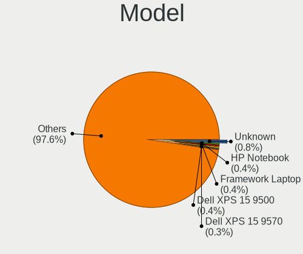
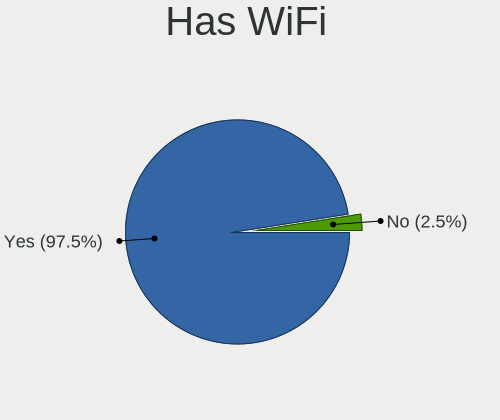
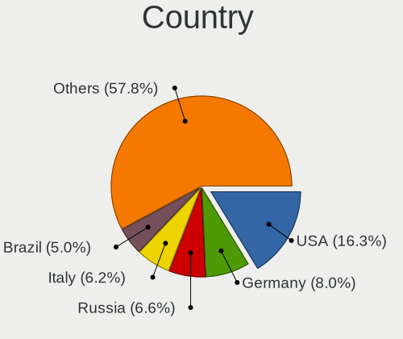
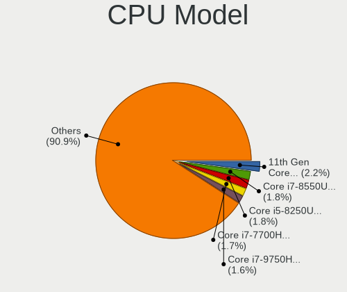
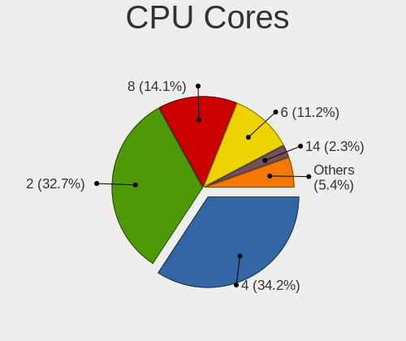
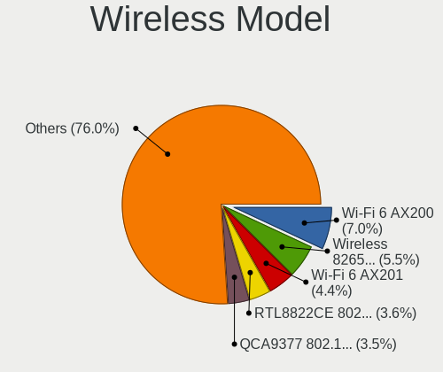

Arch - Tested Hardware & Statistics (Notebooks)
-----------------------------------------------

A project to collect tested hardware configurations for Arch.

Anyone can contribute to this report by the [hw-probe](https://github.com/linuxhw/hw-probe) tool:

    sudo -E hw-probe -all -upload

Please contribute! Especially if your hardware is rare.

Contents
--------

* [ Test Cases ](#test-cases)

* [ System ](#system)
  - [ OS                       ](#os)
  - [ OS Family                ](#os-family)
  - [ Kernel                   ](#kernel)
  - [ Kernel Family            ](#kernel-family)
  - [ Kernel Major Ver.        ](#kernel-major-ver)
  - [ Arch                     ](#arch)
  - [ DE                       ](#de)
  - [ Display Server           ](#display-server)
  - [ Display Manager          ](#display-manager)
  - [ OS Lang                  ](#os-lang)
  - [ Boot Mode                ](#boot-mode)
  - [ Filesystem               ](#filesystem)
  - [ Part. scheme             ](#part-scheme)
  - [ Dual Boot with Linux/BSD ](#dual-boot-with-linuxbsd)
  - [ Dual Boot (Win)          ](#dual-boot-win)

* [ Board ](#board)
  - [ Vendor                   ](#vendor)
  - [ Model                    ](#model)
  - [ Model Family             ](#model-family)
  - [ MFG Year                 ](#mfg-year)
  - [ Form Factor              ](#form-factor)
  - [ Secure Boot              ](#secure-boot)
  - [ Coreboot                 ](#coreboot)
  - [ RAM Size                 ](#ram-size)
  - [ RAM Used                 ](#ram-used)
  - [ Total Drives             ](#total-drives)
  - [ Has CD-ROM               ](#has-cd-rom)
  - [ Has Ethernet             ](#has-ethernet)
  - [ Has WiFi                 ](#has-wifi)
  - [ Has Bluetooth            ](#has-bluetooth)

* [ Location ](#location)
  - [ Country                  ](#country)
  - [ City                     ](#city)

* [ Drives ](#drives)
  - [ Drive Vendor             ](#drive-vendor)
  - [ Drive Model              ](#drive-model)
  - [ HDD Vendor               ](#hdd-vendor)
  - [ SSD Vendor               ](#ssd-vendor)
  - [ Drive Kind               ](#drive-kind)
  - [ Drive Connector          ](#drive-connector)
  - [ Drive Size               ](#drive-size)
  - [ Space Total              ](#space-total)
  - [ Space Used               ](#space-used)
  - [ Malfunc. Drives          ](#malfunc-drives)
  - [ Malfunc. Drive Vendor    ](#malfunc-drive-vendor)
  - [ Malfunc. HDD Vendor      ](#malfunc-hdd-vendor)
  - [ Malfunc. Drive Kind      ](#malfunc-drive-kind)
  - [ Failed Drives            ](#failed-drives)
  - [ Failed Drive Vendor      ](#failed-drive-vendor)
  - [ Drive Status             ](#drive-status)

* [ Storage controller ](#storage-controller)
  - [ Storage Vendor           ](#storage-vendor)
  - [ Storage Model            ](#storage-model)
  - [ Storage Kind             ](#storage-kind)

* [ Processor ](#processor)
  - [ CPU Vendor               ](#cpu-vendor)
  - [ CPU Model                ](#cpu-model)
  - [ CPU Model Family         ](#cpu-model-family)
  - [ CPU Cores                ](#cpu-cores)
  - [ CPU Sockets              ](#cpu-sockets)
  - [ CPU Threads              ](#cpu-threads)
  - [ CPU Op-Modes             ](#cpu-op-modes)
  - [ CPU Microcode            ](#cpu-microcode)
  - [ CPU Microarch            ](#cpu-microarch)

* [ Graphics ](#graphics)
  - [ GPU Vendor               ](#gpu-vendor)
  - [ GPU Model                ](#gpu-model)
  - [ GPU Combo                ](#gpu-combo)
  - [ GPU Driver               ](#gpu-driver)
  - [ GPU Memory               ](#gpu-memory)

* [ Monitor ](#monitor)
  - [ Monitor Vendor           ](#monitor-vendor)
  - [ Monitor Model            ](#monitor-model)
  - [ Monitor Resolution       ](#monitor-resolution)
  - [ Monitor Diagonal         ](#monitor-diagonal)
  - [ Monitor Width            ](#monitor-width)
  - [ Aspect Ratio             ](#aspect-ratio)
  - [ Monitor Area             ](#monitor-area)
  - [ Pixel Density            ](#pixel-density)
  - [ Multiple Monitors        ](#multiple-monitors)

* [ Network ](#network)
  - [ Net Controller Vendor    ](#net-controller-vendor)
  - [ Net Controller Model     ](#net-controller-model)
  - [ Wireless Vendor          ](#wireless-vendor)
  - [ Wireless Model           ](#wireless-model)
  - [ Ethernet Vendor          ](#ethernet-vendor)
  - [ Ethernet Model           ](#ethernet-model)
  - [ Net Controller Kind      ](#net-controller-kind)
  - [ Used Controller          ](#used-controller)
  - [ NICs                     ](#nics)
  - [ IPv6                     ](#ipv6)

* [ Bluetooth ](#bluetooth)
  - [ Bluetooth Vendor         ](#bluetooth-vendor)
  - [ Bluetooth Model          ](#bluetooth-model)

* [ Sound ](#sound)
  - [ Sound Vendor             ](#sound-vendor)
  - [ Sound Model              ](#sound-model)

* [ Memory ](#memory)
  - [ Memory Vendor            ](#memory-vendor)
  - [ Memory Model             ](#memory-model)
  - [ Memory Kind              ](#memory-kind)
  - [ Memory Form Factor       ](#memory-form-factor)
  - [ Memory Size              ](#memory-size)
  - [ Memory Speed             ](#memory-speed)

* [ Printers & scanners ](#printers--scanners)
  - [ Printer Vendor           ](#printer-vendor)
  - [ Printer Model            ](#printer-model)
  - [ Scanner Vendor           ](#scanner-vendor)
  - [ Scanner Model            ](#scanner-model)

* [ Camera ](#camera)
  - [ Camera Vendor            ](#camera-vendor)
  - [ Camera Model             ](#camera-model)

* [ Security ](#security)
  - [ Fingerprint Vendor       ](#fingerprint-vendor)
  - [ Fingerprint Model        ](#fingerprint-model)
  - [ Chipcard Vendor          ](#chipcard-vendor)
  - [ Chipcard Model           ](#chipcard-model)

* [ Unsupported ](#unsupported)
  - [ Unsupported Devices      ](#unsupported-devices)
  - [ Unsupported Device Types ](#unsupported-device-types)

Test Cases
----------

Total: 6157

| Vendor        | Model                       | Probe                                                      | Date         |
|---------------|-----------------------------|------------------------------------------------------------|--------------|
| Alienware     | m17 R4                      | [4372e588f9](https://linux-hardware.org/?probe=4372e588f9) | Feb 02, 2024 |
| Lenovo        | ThinkPad E14 Gen 3 20YE0... | [60cc806e9a](https://linux-hardware.org/?probe=60cc806e9a) | Feb 02, 2024 |
| ASUSTek       | F8Vr                        | [02fced1d70](https://linux-hardware.org/?probe=02fced1d70) | Feb 02, 2024 |
| MECHREVO      | S1 Pro Series               | [ba68410f96](https://linux-hardware.org/?probe=ba68410f96) | Feb 02, 2024 |
| HP            | EliteBook 840 G7 Noteboo... | [6f09cb7800](https://linux-hardware.org/?probe=6f09cb7800) | Feb 02, 2024 |
| Timi          | Redmi Book Pro 15 2022      | [fddf157b5f](https://linux-hardware.org/?probe=fddf157b5f) | Feb 01, 2024 |
| Lenovo        | IdeaPad 320S-14IKB 80X4     | [ceef434e35](https://linux-hardware.org/?probe=ceef434e35) | Feb 01, 2024 |
| Toshiba       | Satellite U845W             | [bfcfa219eb](https://linux-hardware.org/?probe=bfcfa219eb) | Feb 01, 2024 |
| Toshiba       | Satellite U845W             | [7671d63234](https://linux-hardware.org/?probe=7671d63234) | Feb 01, 2024 |
| ASUSTek       | ROG Strix G513RM_G513RM     | [2239a0b698](https://linux-hardware.org/?probe=2239a0b698) | Feb 01, 2024 |
| ASUSTek       | ASUS Zenbook 14 UX3405MA... | [531a090457](https://linux-hardware.org/?probe=531a090457) | Feb 01, 2024 |
| Lenovo        | ThinkPad T16 Gen 2 21K7C... | [3e6a5bfa72](https://linux-hardware.org/?probe=3e6a5bfa72) | Jan 31, 2024 |
| HONOR         | BBR-WAX9                    | [a1b73e72d3](https://linux-hardware.org/?probe=a1b73e72d3) | Jan 31, 2024 |
| Dell          | Inspiron 16 Plus 7630       | [af2db531a1](https://linux-hardware.org/?probe=af2db531a1) | Jan 31, 2024 |
| Lenovo        | ThinkPad E14 Gen 3 20YE0... | [bfe57fcccb](https://linux-hardware.org/?probe=bfe57fcccb) | Jan 31, 2024 |
| MSI           | Prestige 14Evo B13M         | [2724b6a0da](https://linux-hardware.org/?probe=2724b6a0da) | Jan 31, 2024 |
| Lenovo        | ThinkPad T480s 20L8S8XJ0... | [ed474939eb](https://linux-hardware.org/?probe=ed474939eb) | Jan 31, 2024 |
| Lenovo        | IdeaPad 320S-15IKB 81BQ     | [001809149c](https://linux-hardware.org/?probe=001809149c) | Jan 31, 2024 |
| Lenovo        | ThinkPad T480s 20L8S8XJ0... | [021f108e72](https://linux-hardware.org/?probe=021f108e72) | Jan 31, 2024 |
| Lenovo        | ThinkPad P15 Gen 2i 20YR... | [0af07cd951](https://linux-hardware.org/?probe=0af07cd951) | Jan 30, 2024 |
| Lenovo        | ThinkPad T480s 20L8S1WH0... | [f97fbae5f6](https://linux-hardware.org/?probe=f97fbae5f6) | Jan 30, 2024 |
| Lenovo        | ThinkPad T480s 20L8S1WH0... | [c4978054da](https://linux-hardware.org/?probe=c4978054da) | Jan 30, 2024 |
| Dell          | G15 5511                    | [7fc6a18364](https://linux-hardware.org/?probe=7fc6a18364) | Jan 30, 2024 |
| Lenovo        | ThinkPad L14 Gen 4 21H5C... | [7f42dbc84d](https://linux-hardware.org/?probe=7f42dbc84d) | Jan 30, 2024 |
| Lenovo        | ThinkPad L14 Gen 4 21H5C... | [62bda5bd27](https://linux-hardware.org/?probe=62bda5bd27) | Jan 30, 2024 |
| Acer          | Aspire A315-41              | [a78d79030e](https://linux-hardware.org/?probe=a78d79030e) | Jan 30, 2024 |
| MECHREVO      | WUJIE14 PRO                 | [a3b9804ccf](https://linux-hardware.org/?probe=a3b9804ccf) | Jan 30, 2024 |
| Lenovo        | ThinkPad T495 20NKS1EP00    | [addeb3711c](https://linux-hardware.org/?probe=addeb3711c) | Jan 30, 2024 |
| Gigabyte      | AORUS 15P XD                | [72e109e02a](https://linux-hardware.org/?probe=72e109e02a) | Jan 30, 2024 |
| Sony          | SVF1521Q1EW                 | [94c0695977](https://linux-hardware.org/?probe=94c0695977) | Jan 30, 2024 |
| Apple         | MacBookPro15,1              | [12fb54aa81](https://linux-hardware.org/?probe=12fb54aa81) | Jan 29, 2024 |
| MSI           | GL63 9SD                    | [174a4f49ac](https://linux-hardware.org/?probe=174a4f49ac) | Jan 29, 2024 |
| HUAWEI        | BOM-WXX9                    | [346c925e80](https://linux-hardware.org/?probe=346c925e80) | Jan 29, 2024 |
| Lenovo        | G500 20236                  | [312fc3b893](https://linux-hardware.org/?probe=312fc3b893) | Jan 28, 2024 |
| Avell High... | B.ON                        | [8b9b2f2129](https://linux-hardware.org/?probe=8b9b2f2129) | Jan 28, 2024 |
| ASUSTek       | VivoBook_ASUSLaptop X512... | [746b28ec9b](https://linux-hardware.org/?probe=746b28ec9b) | Jan 28, 2024 |
| Framework     | Laptop 13 (AMD Ryzen 704... | [93970413c7](https://linux-hardware.org/?probe=93970413c7) | Jan 27, 2024 |
| HP            | ProBook 640 G1              | [6359631eb5](https://linux-hardware.org/?probe=6359631eb5) | Jan 27, 2024 |
| Acer          | Aspire ES1-511              | [8e8aae3572](https://linux-hardware.org/?probe=8e8aae3572) | Jan 27, 2024 |
| HP            | Laptop 14-fq0xxx            | [d7df41bbf8](https://linux-hardware.org/?probe=d7df41bbf8) | Jan 27, 2024 |
| Dell          | Latitude 5520               | [acedcebd94](https://linux-hardware.org/?probe=acedcebd94) | Jan 26, 2024 |
| Google        | Lindar                      | [9da680f7f4](https://linux-hardware.org/?probe=9da680f7f4) | Jan 26, 2024 |
| ASUSTek       | ROG Strix G713RW_G713RW     | [20827e6f82](https://linux-hardware.org/?probe=20827e6f82) | Jan 26, 2024 |
| ASUSTek       | VivoBook_ASUSLaptop K360... | [5948bdd871](https://linux-hardware.org/?probe=5948bdd871) | Jan 25, 2024 |
| ASUSTek       | Zenbook UX3402VA_UX3402V... | [136eed1999](https://linux-hardware.org/?probe=136eed1999) | Jan 25, 2024 |
| ASUSTek       | VivoBook_ASUSLaptop M650... | [68c758113c](https://linux-hardware.org/?probe=68c758113c) | Jan 25, 2024 |
| Lenovo        | ThinkPad X230 Tablet 343... | [40618fab75](https://linux-hardware.org/?probe=40618fab75) | Jan 25, 2024 |
| HP            | OMEN by Laptop 15-ce0xx     | [90a5837b3c](https://linux-hardware.org/?probe=90a5837b3c) | Jan 24, 2024 |
| HP            | OMEN by 16 Laptop PC        | [ba14f4db44](https://linux-hardware.org/?probe=ba14f4db44) | Jan 24, 2024 |
| Dell          | Latitude 7420               | [98c02f837e](https://linux-hardware.org/?probe=98c02f837e) | Jan 24, 2024 |
| AZW           | GT-R                        | [b9cc91d07d](https://linux-hardware.org/?probe=b9cc91d07d) | Jan 24, 2024 |
| Lenovo        | ThinkPad T480 20L6S4T900    | [ec49fa0394](https://linux-hardware.org/?probe=ec49fa0394) | Jan 24, 2024 |
| Dynabook      | TECRA A50-K                 | [4f6a83fa5a](https://linux-hardware.org/?probe=4f6a83fa5a) | Jan 24, 2024 |
| Acer          | TravelMate P414-51          | [b9eb38b308](https://linux-hardware.org/?probe=b9eb38b308) | Jan 24, 2024 |
| Toshiba       | Satellite Pro NB10-A-125    | [6594f8afba](https://linux-hardware.org/?probe=6594f8afba) | Jan 24, 2024 |
| HP            | ENVY Laptop 13-ba0xxx       | [b0f7b9a32f](https://linux-hardware.org/?probe=b0f7b9a32f) | Jan 23, 2024 |
| HP            | ENVY Laptop 13-ba0xxx       | [5fadf9e223](https://linux-hardware.org/?probe=5fadf9e223) | Jan 23, 2024 |
| Fujitsu       | FMVWG2U47                   | [3d23440c14](https://linux-hardware.org/?probe=3d23440c14) | Jan 23, 2024 |
| Lenovo        | ThinkPad P15s Gen 2i 20W... | [b2e896db49](https://linux-hardware.org/?probe=b2e896db49) | Jan 23, 2024 |
| Lenovo        | IdeaPad 5 15ITL05 82FG      | [a756dd32a8](https://linux-hardware.org/?probe=a756dd32a8) | Jan 23, 2024 |
| Dell          | Inspiron 3421               | [a15cb7d764](https://linux-hardware.org/?probe=a15cb7d764) | Jan 22, 2024 |
| HP            | EliteBook 840 G8 Noteboo... | [00c6aa68c6](https://linux-hardware.org/?probe=00c6aa68c6) | Jan 22, 2024 |
| Alienware     | Area-51m                    | [5d5a86f557](https://linux-hardware.org/?probe=5d5a86f557) | Jan 22, 2024 |
| Lenovo        | ThinkPad T14 Gen 2i 20W1... | [2c5947d48c](https://linux-hardware.org/?probe=2c5947d48c) | Jan 22, 2024 |
| Acer          | Aspire A315-58              | [4a991bd59b](https://linux-hardware.org/?probe=4a991bd59b) | Jan 22, 2024 |
| Lenovo        | ThinkPad T460 20FMS0CR00    | [1bfe0bce6d](https://linux-hardware.org/?probe=1bfe0bce6d) | Jan 21, 2024 |
| Apple         | MacBookPro8,1               | [ba1a3bef35](https://linux-hardware.org/?probe=ba1a3bef35) | Jan 21, 2024 |
| HP            | Pavilion g6                 | [58e29cfd8a](https://linux-hardware.org/?probe=58e29cfd8a) | Jan 21, 2024 |
| Lenovo        | ThinkPad T470s W10DG 20J... | [3de8476f0b](https://linux-hardware.org/?probe=3de8476f0b) | Jan 21, 2024 |
| Lenovo        | G550 20023                  | [577e991c77](https://linux-hardware.org/?probe=577e991c77) | Jan 21, 2024 |
| Lenovo        | IdeaPad Gaming 3 15IHU6 ... | [73fe1f94d6](https://linux-hardware.org/?probe=73fe1f94d6) | Jan 20, 2024 |
| ASUSTek       | K56CB                       | [5cc6df781d](https://linux-hardware.org/?probe=5cc6df781d) | Jan 20, 2024 |
| ASUSTek       | VivoBook_ASUSLaptop K660... | [409adbe1e3](https://linux-hardware.org/?probe=409adbe1e3) | Jan 20, 2024 |
| Dell          | Latitude 7490               | [417a215aa4](https://linux-hardware.org/?probe=417a215aa4) | Jan 20, 2024 |
| Lenovo        | ThinkPad T16 Gen 2 21K7C... | [10192a7c39](https://linux-hardware.org/?probe=10192a7c39) | Jan 20, 2024 |
| ASUSTek       | Zenbook UX3402ZA_UX3402Z... | [06567bb3ae](https://linux-hardware.org/?probe=06567bb3ae) | Jan 20, 2024 |
| ASUSTek       | Zenbook UX3402ZA_UX3402Z... | [01db0b0650](https://linux-hardware.org/?probe=01db0b0650) | Jan 20, 2024 |
| Lenovo        | ThinkPad T480 20L6S5MJ00    | [261ee14375](https://linux-hardware.org/?probe=261ee14375) | Jan 19, 2024 |
| Apple         | MacBookPro9,2               | [1cbef51f51](https://linux-hardware.org/?probe=1cbef51f51) | Jan 19, 2024 |
| Dell          | Latitude 9420               | [8fe55c7fc3](https://linux-hardware.org/?probe=8fe55c7fc3) | Jan 18, 2024 |
| Dream Mach... | NS5x_NS7xPU                 | [d4604f53fc](https://linux-hardware.org/?probe=d4604f53fc) | Jan 17, 2024 |
| Lenovo        | YogaAir 14s APU8 83AA       | [8951d7dd3e](https://linux-hardware.org/?probe=8951d7dd3e) | Jan 16, 2024 |
| Apple         | MacBookPro15,2              | [547ddaf81d](https://linux-hardware.org/?probe=547ddaf81d) | Jan 16, 2024 |
| TUXEDO        | InfinityBook Pro Gen7 (M... | [8e6afbe7c9](https://linux-hardware.org/?probe=8e6afbe7c9) | Jan 16, 2024 |
| ASUSTek       | ASUS TUF Gaming F15 FX50... | [ea249f8333](https://linux-hardware.org/?probe=ea249f8333) | Jan 16, 2024 |
| Acer          | Aspire ES1-511              | [4e322c7abe](https://linux-hardware.org/?probe=4e322c7abe) | Jan 16, 2024 |
| Lenovo        | IdeaPad Slim 5 14ABR8 82... | [7398e123b9](https://linux-hardware.org/?probe=7398e123b9) | Jan 16, 2024 |
| ASUSTek       | ASUS TUF Gaming F15 FX50... | [5712b0783d](https://linux-hardware.org/?probe=5712b0783d) | Jan 15, 2024 |
| Lenovo        | ThinkPad T480s 20L8S1PU0... | [a832e5d2cb](https://linux-hardware.org/?probe=a832e5d2cb) | Jan 15, 2024 |
| HP            | 255 G8 Notebook PC          | [e91147def0](https://linux-hardware.org/?probe=e91147def0) | Jan 15, 2024 |
| Lenovo        | IdeaPad Slim 5 14ABR8 82... | [0fee6d88f1](https://linux-hardware.org/?probe=0fee6d88f1) | Jan 15, 2024 |
| Dell          | XPS 15 9530                 | [aedd365ff3](https://linux-hardware.org/?probe=aedd365ff3) | Jan 15, 2024 |
| Dell          | XPS 15 9530                 | [34cba7cd7c](https://linux-hardware.org/?probe=34cba7cd7c) | Jan 15, 2024 |
| HP            | Laptop 15-bs1xx             | [6f5edb69f1](https://linux-hardware.org/?probe=6f5edb69f1) | Jan 15, 2024 |
| Acer          | Aspire A515-57              | [46ffca29dd](https://linux-hardware.org/?probe=46ffca29dd) | Jan 14, 2024 |
| Lenovo        | ThinkPad T470s W10DG 20J... | [3373e374fb](https://linux-hardware.org/?probe=3373e374fb) | Jan 14, 2024 |
| Acer          | Nitro AN515-51              | [4ce3126197](https://linux-hardware.org/?probe=4ce3126197) | Jan 14, 2024 |
| Acer          | Nitro AN515-51              | [44f67c403a](https://linux-hardware.org/?probe=44f67c403a) | Jan 14, 2024 |
| Fujitsu       | LIFEBOOK U7613              | [9e38b7368d](https://linux-hardware.org/?probe=9e38b7368d) | Jan 14, 2024 |
| Timi          | Mi NoteBook Ultra           | [a14c93df78](https://linux-hardware.org/?probe=a14c93df78) | Jan 14, 2024 |
| HP            | Victus by Laptop 16-e0xx... | [569afd2c6a](https://linux-hardware.org/?probe=569afd2c6a) | Jan 14, 2024 |
| Dell          | Inspiron 5515               | [6523b11a61](https://linux-hardware.org/?probe=6523b11a61) | Jan 14, 2024 |
| Lenovo        | ThinkPad T480 20L6S6WQ00    | [54b126973b](https://linux-hardware.org/?probe=54b126973b) | Jan 14, 2024 |
| Acer          | Nitro AN515-58              | [23ad168a68](https://linux-hardware.org/?probe=23ad168a68) | Jan 14, 2024 |
| MSI           | GL63 8RC                    | [2e52a98d20](https://linux-hardware.org/?probe=2e52a98d20) | Jan 13, 2024 |
| Apple         | MacBookPro7,1               | [932b9f58d5](https://linux-hardware.org/?probe=932b9f58d5) | Jan 13, 2024 |
| Lenovo        | IdeaPad 3 15ALC6 82MF       | [63d2ac1744](https://linux-hardware.org/?probe=63d2ac1744) | Jan 13, 2024 |
| HP            | Victus by Laptop 16-e0xx... | [a3e108e50d](https://linux-hardware.org/?probe=a3e108e50d) | Jan 13, 2024 |
| ASUSTek       | ROG Strix G532LW_G532LW     | [c2778b6624](https://linux-hardware.org/?probe=c2778b6624) | Jan 13, 2024 |
| HP            | ENVY Laptop 17-ch1xxx       | [f13265c30f](https://linux-hardware.org/?probe=f13265c30f) | Jan 13, 2024 |
| Lenovo        | V15-ADA 82C7                | [9fbe7a7217](https://linux-hardware.org/?probe=9fbe7a7217) | Jan 13, 2024 |
| Lenovo        | ThinkPad T480s 20L8002VM... | [d2db433ab2](https://linux-hardware.org/?probe=d2db433ab2) | Jan 12, 2024 |
| HP            | Victus by Gaming Laptop ... | [1bad1acfa2](https://linux-hardware.org/?probe=1bad1acfa2) | Jan 11, 2024 |
| Dell          | Inspiron 15 7000 Gaming     | [ab72da32d1](https://linux-hardware.org/?probe=ab72da32d1) | Jan 11, 2024 |
| Lenovo        | ThinkPad X1 Carbon Gen 1... | [3d7fcea179](https://linux-hardware.org/?probe=3d7fcea179) | Jan 11, 2024 |
| Dell          | Latitude 7420               | [5cb5db0c21](https://linux-hardware.org/?probe=5cb5db0c21) | Jan 10, 2024 |
| ASUSTek       | ASUS TUF Gaming F17 FX70... | [a4897703b1](https://linux-hardware.org/?probe=a4897703b1) | Jan 10, 2024 |
| ASUSTek       | Zenbook UX3402ZA_UX3402Z... | [8d07ceed03](https://linux-hardware.org/?probe=8d07ceed03) | Jan 10, 2024 |
| ASUSTek       | Zenbook UX3402ZA_UX3402Z... | [f0ee73bcb6](https://linux-hardware.org/?probe=f0ee73bcb6) | Jan 10, 2024 |
| Lenovo        | ThinkPad L14 Gen 4 21H5C... | [ec34fc447a](https://linux-hardware.org/?probe=ec34fc447a) | Jan 10, 2024 |
| Apple         | MacBookAir9,1               | [143ae6dd48](https://linux-hardware.org/?probe=143ae6dd48) | Jan 09, 2024 |
| Acer          | Aspire A515-44              | [2cb18af412](https://linux-hardware.org/?probe=2cb18af412) | Jan 09, 2024 |
| Dell          | XPS 13 9370                 | [0d909c4177](https://linux-hardware.org/?probe=0d909c4177) | Jan 08, 2024 |
| Dell          | XPS 15 9530                 | [26570f8a8b](https://linux-hardware.org/?probe=26570f8a8b) | Jan 08, 2024 |
| Unknown       | Unknown                     | [3ea94ff775](https://linux-hardware.org/?probe=3ea94ff775) | Jan 08, 2024 |
| MSI           | Katana GF66 12UG            | [d4affacb08](https://linux-hardware.org/?probe=d4affacb08) | Jan 08, 2024 |
| HP            | ZBook 15 G3                 | [05ad98f468](https://linux-hardware.org/?probe=05ad98f468) | Jan 08, 2024 |
| HP            | EliteBook 840 G3            | [a8bd0e8c75](https://linux-hardware.org/?probe=a8bd0e8c75) | Jan 08, 2024 |
| Dell          | Latitude 7290               | [44a59dcba6](https://linux-hardware.org/?probe=44a59dcba6) | Jan 08, 2024 |
| MECHREVO      | S1 Pro Series               | [419dfc25b2](https://linux-hardware.org/?probe=419dfc25b2) | Jan 08, 2024 |
| Lenovo        | ThinkPad L15 Gen 1 20U70... | [a9f2ff1fc3](https://linux-hardware.org/?probe=a9f2ff1fc3) | Jan 07, 2024 |
| Lenovo        | ThinkPad L15 Gen 1 20U70... | [dac2172dc5](https://linux-hardware.org/?probe=dac2172dc5) | Jan 07, 2024 |
| Lenovo        | ThinkPad X260 20F5S8FQ00    | [eb70ae9801](https://linux-hardware.org/?probe=eb70ae9801) | Jan 07, 2024 |
| Dell          | Inspiron 5570               | [935c69fa60](https://linux-hardware.org/?probe=935c69fa60) | Jan 07, 2024 |
| Dell          | Inspiron 5570               | [9567934911](https://linux-hardware.org/?probe=9567934911) | Jan 07, 2024 |
| HP            | ZBook 17 G6                 | [89cde2f9d4](https://linux-hardware.org/?probe=89cde2f9d4) | Jan 06, 2024 |
| HP            | EliteBook 840 G5            | [f6b222e444](https://linux-hardware.org/?probe=f6b222e444) | Jan 06, 2024 |
| HP            | EliteBook 840 G5            | [0af2ce345e](https://linux-hardware.org/?probe=0af2ce345e) | Jan 06, 2024 |
| MSI           | Thin GF63 12HW              | [3b5cc98847](https://linux-hardware.org/?probe=3b5cc98847) | Jan 06, 2024 |
| Lenovo        | IdeaPad 5 14ARE05 81YM      | [6859e6749d](https://linux-hardware.org/?probe=6859e6749d) | Jan 06, 2024 |
| Lenovo        | ThinkPad P14s Gen 3 21J5... | [56717de890](https://linux-hardware.org/?probe=56717de890) | Jan 06, 2024 |
| MECHREVO      | S1 Pro Series               | [da21c08192](https://linux-hardware.org/?probe=da21c08192) | Jan 06, 2024 |
| Dell          | Latitude 7420               | [7b6c854eaf](https://linux-hardware.org/?probe=7b6c854eaf) | Jan 06, 2024 |
| HUAWEI        | HN-WX9X                     | [b1acec939c](https://linux-hardware.org/?probe=b1acec939c) | Jan 05, 2024 |
| HP            | ZBook 15 G5                 | [7d1279f3ef](https://linux-hardware.org/?probe=7d1279f3ef) | Jan 04, 2024 |
| ASUSTek       | VivoBook_ASUSLaptop K350... | [7c5e33071f](https://linux-hardware.org/?probe=7c5e33071f) | Jan 04, 2024 |
| HUAWEI        | NBLK-WAX9X                  | [be1a88adce](https://linux-hardware.org/?probe=be1a88adce) | Jan 04, 2024 |
| ASUSTek       | VivoBook_ASUSLaptop X160... | [9ccd4b5019](https://linux-hardware.org/?probe=9ccd4b5019) | Jan 04, 2024 |
| ASUSTek       | X705UDR                     | [02cec34b2e](https://linux-hardware.org/?probe=02cec34b2e) | Jan 04, 2024 |
| ASUSTek       | Zenbook UM3402YA_UM3402Y... | [a83656b1fd](https://linux-hardware.org/?probe=a83656b1fd) | Jan 04, 2024 |
| Acer          | Aspire A515-57              | [d5a456e2c8](https://linux-hardware.org/?probe=d5a456e2c8) | Jan 04, 2024 |
| Olidata       | SL1510 MD61444              | [bb1016d11d](https://linux-hardware.org/?probe=bb1016d11d) | Jan 04, 2024 |
| ASUSTek       | VivoBook_ASUSLaptop M160... | [197d144ab0](https://linux-hardware.org/?probe=197d144ab0) | Jan 03, 2024 |
| Lenovo        | ThinkPad X1 Carbon 6th 2... | [e98a083e68](https://linux-hardware.org/?probe=e98a083e68) | Jan 03, 2024 |
| Apple         | MacBookAir7,2               | [04de30dc4d](https://linux-hardware.org/?probe=04de30dc4d) | Jan 03, 2024 |
| ASUSTek       | ROG Zephyrus G15 GA502IV... | [03cff2a666](https://linux-hardware.org/?probe=03cff2a666) | Jan 03, 2024 |
| AMI           | Cherry Trail CR             | [35f5071102](https://linux-hardware.org/?probe=35f5071102) | Jan 03, 2024 |
| Teclast       | F15Plus 2                   | [2f9e8b631e](https://linux-hardware.org/?probe=2f9e8b631e) | Jan 02, 2024 |
| Lenovo        | Legion Pro 5 16IRX8 82WK    | [063cb7f7f8](https://linux-hardware.org/?probe=063cb7f7f8) | Jan 02, 2024 |
| Lenovo        | IdeaPad Slim 3 14IAN8 82... | [c9c25e51c8](https://linux-hardware.org/?probe=c9c25e51c8) | Jan 02, 2024 |
| Dell          | Inspiron 15-3567            | [589f53595e](https://linux-hardware.org/?probe=589f53595e) | Jan 02, 2024 |
| ASUSTek       | ASUS TUF Gaming A17 FA70... | [1b62649586](https://linux-hardware.org/?probe=1b62649586) | Jan 02, 2024 |
| HP            | Pavilion dv6                | [61a52110ba](https://linux-hardware.org/?probe=61a52110ba) | Jan 02, 2024 |
| Dell          | Inspiron 15-3567            | [50d926ec76](https://linux-hardware.org/?probe=50d926ec76) | Jan 02, 2024 |
| Acidanther... | MacBookPro16,4              | [3c8c520472](https://linux-hardware.org/?probe=3c8c520472) | Jan 02, 2024 |
| Google        | Blooguard                   | [dc6c0354a9](https://linux-hardware.org/?probe=dc6c0354a9) | Jan 02, 2024 |
| Philco        | 14M2                        | [b5771423fb](https://linux-hardware.org/?probe=b5771423fb) | Jan 02, 2024 |
| HP            | ProBook 440 G5              | [04753e77e0](https://linux-hardware.org/?probe=04753e77e0) | Jan 02, 2024 |
| Lenovo        | ThinkPad X200s 7469W92      | [6ea14ec02e](https://linux-hardware.org/?probe=6ea14ec02e) | Jan 01, 2024 |
| Lenovo        | ThinkBook 16 G6 ABP 21KK    | [8a14ad7cc9](https://linux-hardware.org/?probe=8a14ad7cc9) | Jan 01, 2024 |
| Lenovo        | ThinkBook 16 G6 ABP 21KK    | [a2acc5bb5f](https://linux-hardware.org/?probe=a2acc5bb5f) | Jan 01, 2024 |
| Lenovo        | Legion Pro 5 16ARX8 82WM    | [67ef36b749](https://linux-hardware.org/?probe=67ef36b749) | Jan 01, 2024 |
| Lenovo        | LOQ 15IRH8 82XV             | [494b496889](https://linux-hardware.org/?probe=494b496889) | Jan 01, 2024 |
| ASUSTek       | ASUS TUF Gaming A16 FA61... | [488deac73a](https://linux-hardware.org/?probe=488deac73a) | Jan 01, 2024 |
| Dell          | Latitude 7420               | [a32d08979b](https://linux-hardware.org/?probe=a32d08979b) | Dec 31, 2023 |
| Dell          | Inspiron 15-3567            | [390160b8e5](https://linux-hardware.org/?probe=390160b8e5) | Dec 31, 2023 |
| Dell          | Latitude 7420               | [9bee55a186](https://linux-hardware.org/?probe=9bee55a186) | Dec 31, 2023 |
| HP            | Pavilion Laptop 15-eh1xx... | [577f6b15de](https://linux-hardware.org/?probe=577f6b15de) | Dec 31, 2023 |
| Dell          | Inspiron 3537               | [7adc50aeab](https://linux-hardware.org/?probe=7adc50aeab) | Dec 31, 2023 |
| Lenovo        | Slim 7 ProX 14ARH7 82V2     | [f160a53f1b](https://linux-hardware.org/?probe=f160a53f1b) | Dec 31, 2023 |
| Apple         | MacBookPro8,2               | [34fcef3266](https://linux-hardware.org/?probe=34fcef3266) | Dec 31, 2023 |
| Acer          | Nitro AN16-41               | [7130d1a699](https://linux-hardware.org/?probe=7130d1a699) | Dec 31, 2023 |
| Acer          | Nitro AN16-41               | [d04c4d749f](https://linux-hardware.org/?probe=d04c4d749f) | Dec 31, 2023 |
| Lenovo        | ThinkPad E16 Gen 1 21JT0... | [815e8736a2](https://linux-hardware.org/?probe=815e8736a2) | Dec 31, 2023 |
| Lenovo        | ThinkPad E16 Gen 1 21JT0... | [4dd47839a4](https://linux-hardware.org/?probe=4dd47839a4) | Dec 31, 2023 |
| Dell          | Inspiron 15-3567            | [5d1ed5c106](https://linux-hardware.org/?probe=5d1ed5c106) | Dec 30, 2023 |
| Lenovo        | V15 G2 ALC 82KD             | [ff8e890649](https://linux-hardware.org/?probe=ff8e890649) | Dec 30, 2023 |
| ASUSTek       | VivoBook_ASUSLaptop X160... | [460fe0575c](https://linux-hardware.org/?probe=460fe0575c) | Dec 30, 2023 |
| Lenovo        | ThinkPad T440p              | [e45829bd8b](https://linux-hardware.org/?probe=e45829bd8b) | Dec 30, 2023 |
| Framework     | Laptop (12th Gen Intel C... | [24ca756f75](https://linux-hardware.org/?probe=24ca756f75) | Dec 30, 2023 |
| ASUSTek       | ROG Strix G713PV_G713PV     | [36856f5ac1](https://linux-hardware.org/?probe=36856f5ac1) | Dec 29, 2023 |
| ASUSTek       | ASUS TUF Gaming F15 FX50... | [42c812d36d](https://linux-hardware.org/?probe=42c812d36d) | Dec 29, 2023 |
| Monster       | TULPAR T5 V23.2             | [9592c22858](https://linux-hardware.org/?probe=9592c22858) | Dec 29, 2023 |
| HP            | OMEN Laptop 15-ek1xxx       | [16c7cb0337](https://linux-hardware.org/?probe=16c7cb0337) | Dec 28, 2023 |
| TrekStor      | Notebook Slim S130          | [9fbe38b102](https://linux-hardware.org/?probe=9fbe38b102) | Dec 28, 2023 |
| Razer         | Blade                       | [bd2101718d](https://linux-hardware.org/?probe=bd2101718d) | Dec 28, 2023 |
| Apple         | MacBookPro8,2               | [a353ad122c](https://linux-hardware.org/?probe=a353ad122c) | Dec 28, 2023 |
| Lenovo        | ThinkPad X1 Carbon Gen 8... | [a81c208684](https://linux-hardware.org/?probe=a81c208684) | Dec 27, 2023 |
| ASUSTek       | VivoBook_ASUSLaptop X515... | [c56c8e1bcf](https://linux-hardware.org/?probe=c56c8e1bcf) | Dec 27, 2023 |
| TUXEDO        | Pulse 14 Gen3               | [7873276f27](https://linux-hardware.org/?probe=7873276f27) | Dec 27, 2023 |
| ASUSTek       | X75A                        | [a7b35ca7c8](https://linux-hardware.org/?probe=a7b35ca7c8) | Dec 27, 2023 |
| Lenovo        | IdeaPad S740-15IRH Touch... | [6584c1853d](https://linux-hardware.org/?probe=6584c1853d) | Dec 27, 2023 |
| Gigabyte      | AERO 15-X9                  | [906642b6ec](https://linux-hardware.org/?probe=906642b6ec) | Dec 27, 2023 |
| Alienware     | m16 R1 AMD                  | [98aaf575cc](https://linux-hardware.org/?probe=98aaf575cc) | Dec 26, 2023 |
| Lenovo        | ThinkPad X1 Carbon Gen 8... | [f2094a7c07](https://linux-hardware.org/?probe=f2094a7c07) | Dec 26, 2023 |
| ASUSTek       | X550CC                      | [6fa1156580](https://linux-hardware.org/?probe=6fa1156580) | Dec 26, 2023 |
| Samsung       | RF511/RF411/RF711           | [743bed087b](https://linux-hardware.org/?probe=743bed087b) | Dec 26, 2023 |
| Dell          | Inspiron 5391               | [a97f2efb6f](https://linux-hardware.org/?probe=a97f2efb6f) | Dec 26, 2023 |
| Lenovo        | ThinkPad P1 Gen 3 20TH00... | [77553a2b0e](https://linux-hardware.org/?probe=77553a2b0e) | Dec 26, 2023 |
| Acer          | Aspire A515-56              | [a35ed82108](https://linux-hardware.org/?probe=a35ed82108) | Dec 26, 2023 |
| Acer          | Aspire A515-56              | [d9ec9cb0f7](https://linux-hardware.org/?probe=d9ec9cb0f7) | Dec 26, 2023 |
| HP            | Pavilion Gaming Laptop 1... | [029b043cec](https://linux-hardware.org/?probe=029b043cec) | Dec 25, 2023 |
| HP            | Laptop 14s-fq0xxx           | [00a9997bfc](https://linux-hardware.org/?probe=00a9997bfc) | Dec 25, 2023 |
| Dell          | Latitude E6420              | [ffcec7155a](https://linux-hardware.org/?probe=ffcec7155a) | Dec 25, 2023 |
| ASUSTek       | X550CC                      | [ee3308d282](https://linux-hardware.org/?probe=ee3308d282) | Dec 25, 2023 |
| Lenovo        | ThinkPad T440s 20ARS1RS0... | [5c4efd5165](https://linux-hardware.org/?probe=5c4efd5165) | Dec 24, 2023 |
| ASUSTek       | X75A                        | [3af5f7aed7](https://linux-hardware.org/?probe=3af5f7aed7) | Dec 24, 2023 |
| Acer          | Aspire A315-41              | [a54e95fcab](https://linux-hardware.org/?probe=a54e95fcab) | Dec 24, 2023 |
| HP            | ENVY Laptop 17-ch1xxx       | [d41bca7300](https://linux-hardware.org/?probe=d41bca7300) | Dec 24, 2023 |
| HP            | ENVY Laptop 17-ch1xxx       | [8080c75b27](https://linux-hardware.org/?probe=8080c75b27) | Dec 24, 2023 |
| Lenovo        | IdeaPad Pro 5 14APH8 83A... | [39e33e4510](https://linux-hardware.org/?probe=39e33e4510) | Dec 24, 2023 |
| Lenovo        | ThinkPad P14s Gen 4 21K5... | [d7b7e34741](https://linux-hardware.org/?probe=d7b7e34741) | Dec 24, 2023 |
| TECNO Mobi... | MEGABOOK T15DA              | [82d65cfce4](https://linux-hardware.org/?probe=82d65cfce4) | Dec 23, 2023 |
| Lenovo        | G50-80 80L0                 | [21df7039b9](https://linux-hardware.org/?probe=21df7039b9) | Dec 23, 2023 |
| Lenovo        | ThinkBook 16 G6 ABP 21KK    | [569ce717aa](https://linux-hardware.org/?probe=569ce717aa) | Dec 23, 2023 |
| Lenovo        | Legion 7 16ARHA7 82UH       | [8dad235090](https://linux-hardware.org/?probe=8dad235090) | Dec 23, 2023 |
| ASUSTek       | ASUS TUF Gaming A17 FA70... | [8a36394313](https://linux-hardware.org/?probe=8a36394313) | Dec 23, 2023 |
| ASUSTek       | ASUS TUF Gaming A17 FA70... | [eb035a95fa](https://linux-hardware.org/?probe=eb035a95fa) | Dec 22, 2023 |
| Dell          | Inspiron 5577               | [e6827a291e](https://linux-hardware.org/?probe=e6827a291e) | Dec 22, 2023 |
| Lenovo        | ThinkPad T440p 20AWS0280... | [239bc0b85a](https://linux-hardware.org/?probe=239bc0b85a) | Dec 22, 2023 |
| ASUSTek       | VivoBook_ASUSLaptop K660... | [e1225d2a37](https://linux-hardware.org/?probe=e1225d2a37) | Dec 22, 2023 |
| HP            | G62                         | [9f6a13bc50](https://linux-hardware.org/?probe=9f6a13bc50) | Dec 22, 2023 |
| ASUSTek       | X75A                        | [ed3c88f944](https://linux-hardware.org/?probe=ed3c88f944) | Dec 22, 2023 |
| Sony          | VPCCA3X1R                   | [156b109950](https://linux-hardware.org/?probe=156b109950) | Dec 21, 2023 |
| HP            | ProBook 6450b               | [dd9c6803cb](https://linux-hardware.org/?probe=dd9c6803cb) | Dec 21, 2023 |
| ASUSTek       | X75A                        | [6d9c65c8ac](https://linux-hardware.org/?probe=6d9c65c8ac) | Dec 21, 2023 |
| HP            | ProBook 6570b               | [7dbd0f9be1](https://linux-hardware.org/?probe=7dbd0f9be1) | Dec 21, 2023 |
| HP            | ProBook 6570b               | [7a4a6018b6](https://linux-hardware.org/?probe=7a4a6018b6) | Dec 21, 2023 |
| Dell          | Latitude 5590               | [9877862088](https://linux-hardware.org/?probe=9877862088) | Dec 21, 2023 |
| ASUSTek       | ROG Strix G732LXS_G732LX... | [6e4bcb9311](https://linux-hardware.org/?probe=6e4bcb9311) | Dec 21, 2023 |
| Lenovo        | ThinkPad X280 20KEA00SUK    | [bc380b4334](https://linux-hardware.org/?probe=bc380b4334) | Dec 21, 2023 |
| HUAWEI        | NBLL-WXX9                   | [c125585a5d](https://linux-hardware.org/?probe=c125585a5d) | Dec 21, 2023 |
| Lenovo        | ThinkPad SL 2746E9G         | [594a56a070](https://linux-hardware.org/?probe=594a56a070) | Dec 21, 2023 |
| ASUSTek       | VivoBook_ASUSLaptop M160... | [5a16e00d6c](https://linux-hardware.org/?probe=5a16e00d6c) | Dec 20, 2023 |
| ASUSTek       | Zenbook UX535QE_UM535QE     | [d420770c44](https://linux-hardware.org/?probe=d420770c44) | Dec 20, 2023 |
| HP            | ProBook 445 14 inch G10 ... | [5b3a77bd87](https://linux-hardware.org/?probe=5b3a77bd87) | Dec 20, 2023 |
| Acer          | Aspire E1-771G              | [07bcd26f94](https://linux-hardware.org/?probe=07bcd26f94) | Dec 20, 2023 |
| ASUSTek       | VivoBook_ASUSLaptop X340... | [00d649079a](https://linux-hardware.org/?probe=00d649079a) | Dec 20, 2023 |
| Google        | Pantheon                    | [f4640ed7c1](https://linux-hardware.org/?probe=f4640ed7c1) | Dec 19, 2023 |
| HP            | ElitePad 1000 G2            | [533ccb0c41](https://linux-hardware.org/?probe=533ccb0c41) | Dec 19, 2023 |
| Dell          | Inspiron 15 3535            | [f86bf3e2f1](https://linux-hardware.org/?probe=f86bf3e2f1) | Dec 18, 2023 |
| Apple         | MacBookPro12,1              | [6db91b5eb2](https://linux-hardware.org/?probe=6db91b5eb2) | Dec 18, 2023 |
| Acer          | Nitro AN517-54              | [c18f5d3a21](https://linux-hardware.org/?probe=c18f5d3a21) | Dec 18, 2023 |
| Acer          | Nitro AN517-54              | [982ae3655c](https://linux-hardware.org/?probe=982ae3655c) | Dec 18, 2023 |
| Samsung       | 750XDA                      | [bdaba42db8](https://linux-hardware.org/?probe=bdaba42db8) | Dec 17, 2023 |
| ASUSTek       | VivoBook_ASUSLaptop M150... | [ed79377477](https://linux-hardware.org/?probe=ed79377477) | Dec 17, 2023 |
| Lenovo        | Legion 5 15ARH05 82B5       | [812cd1effd](https://linux-hardware.org/?probe=812cd1effd) | Dec 16, 2023 |
| Dell          | Latitude 7350               | [ab9a873c1e](https://linux-hardware.org/?probe=ab9a873c1e) | Dec 16, 2023 |
| ASUSTek       | ASUS TUF Gaming A17 FA70... | [bac2e83dd7](https://linux-hardware.org/?probe=bac2e83dd7) | Dec 16, 2023 |
| ASUSTek       | ASUS TUF Gaming A17 FA70... | [6689e06c77](https://linux-hardware.org/?probe=6689e06c77) | Dec 15, 2023 |
| Razer         | Blade 17 (2022) - RZ09-0... | [88ffce598c](https://linux-hardware.org/?probe=88ffce598c) | Dec 15, 2023 |
| Razer         | Blade 15 (2022) - RZ09-0... | [921d38d2df](https://linux-hardware.org/?probe=921d38d2df) | Dec 15, 2023 |
| Lenovo        | IdeaPad Gaming 3 15ACH6 ... | [4cb7a5528b](https://linux-hardware.org/?probe=4cb7a5528b) | Dec 15, 2023 |
| Lenovo        | Yoga Slim 7 Pro 14ACH5 O... | [0b08ee22d8](https://linux-hardware.org/?probe=0b08ee22d8) | Dec 14, 2023 |
| ASUSTek       | VivoBook_ASUSLaptop M160... | [262bfe0585](https://linux-hardware.org/?probe=262bfe0585) | Dec 14, 2023 |
| Dell          | Precision 5680              | [1e063996da](https://linux-hardware.org/?probe=1e063996da) | Dec 14, 2023 |
| Lenovo        | ThinkPad Mini10 3507A31     | [b5b534e106](https://linux-hardware.org/?probe=b5b534e106) | Dec 14, 2023 |
| Apple         | MacBookPro5,1               | [277dadb387](https://linux-hardware.org/?probe=277dadb387) | Dec 13, 2023 |
| Lenovo        | ThinkPad T480 20L50004MX    | [691f1ae82f](https://linux-hardware.org/?probe=691f1ae82f) | Dec 13, 2023 |
| HP            | Laptop 15-bs1xx             | [1785db3e7b](https://linux-hardware.org/?probe=1785db3e7b) | Dec 13, 2023 |
| Timi          | TM1604                      | [67597f3bd5](https://linux-hardware.org/?probe=67597f3bd5) | Dec 13, 2023 |
| Lenovo        | Legion 5 15ACH6H 82JU       | [6a497408c3](https://linux-hardware.org/?probe=6a497408c3) | Dec 13, 2023 |
| HP            | Pavilion g6                 | [f79863b604](https://linux-hardware.org/?probe=f79863b604) | Dec 13, 2023 |
| Lenovo        | ThinkPad T480 20L6SH3L2D    | [73c69f2b50](https://linux-hardware.org/?probe=73c69f2b50) | Dec 13, 2023 |
| HP            | Pavilion Notebook           | [81baeeb4c6](https://linux-hardware.org/?probe=81baeeb4c6) | Dec 12, 2023 |
| Lenovo        | ThinkPad T15 Gen 2i 20W5... | [e340ad2e3a](https://linux-hardware.org/?probe=e340ad2e3a) | Dec 12, 2023 |
| HP            | ENVY 15                     | [d8a9e409c9](https://linux-hardware.org/?probe=d8a9e409c9) | Dec 12, 2023 |
| ASUSTek       | K45VD                       | [527a669776](https://linux-hardware.org/?probe=527a669776) | Dec 12, 2023 |
| Lenovo        | ThinkPad T14s Gen 2a 20X... | [c9dd6aebbd](https://linux-hardware.org/?probe=c9dd6aebbd) | Dec 12, 2023 |
| HP            | ProBook 440 G5              | [af38b45c59](https://linux-hardware.org/?probe=af38b45c59) | Dec 12, 2023 |
| Framework     | Laptop 13 (AMD Ryzen 704... | [ffcb3c9798](https://linux-hardware.org/?probe=ffcb3c9798) | Dec 11, 2023 |
| Acer          | Aspire E5-571G              | [c136ca6eff](https://linux-hardware.org/?probe=c136ca6eff) | Dec 11, 2023 |
| HUAWEI        | NBD-WXX9                    | [2e767eb168](https://linux-hardware.org/?probe=2e767eb168) | Dec 11, 2023 |
| GPD           | G1619-03                    | [92773d52d8](https://linux-hardware.org/?probe=92773d52d8) | Dec 10, 2023 |
| HP            | EliteBook 840 14 inch G9... | [d9227b24b0](https://linux-hardware.org/?probe=d9227b24b0) | Dec 10, 2023 |
| Dell          | Latitude 7490               | [d9f20ad453](https://linux-hardware.org/?probe=d9f20ad453) | Dec 10, 2023 |
| Dell          | Precision 5480              | [e2ef5d90ca](https://linux-hardware.org/?probe=e2ef5d90ca) | Dec 10, 2023 |
| Acer          | Nitro AN515-58              | [9939fe96d2](https://linux-hardware.org/?probe=9939fe96d2) | Dec 10, 2023 |
| ASUSTek       | ROG Strix G533QM_G533QM     | [200be2174b](https://linux-hardware.org/?probe=200be2174b) | Dec 09, 2023 |
| ASUSTek       | X540SA                      | [71c6b35d56](https://linux-hardware.org/?probe=71c6b35d56) | Dec 09, 2023 |
| HP            | Victus by Laptop 16-e0xx... | [551b412a34](https://linux-hardware.org/?probe=551b412a34) | Dec 09, 2023 |
| Dell          | Inspiron 5567               | [ac6488c0c8](https://linux-hardware.org/?probe=ac6488c0c8) | Dec 09, 2023 |
| Acer          | AOD270                      | [b5729a6428](https://linux-hardware.org/?probe=b5729a6428) | Dec 09, 2023 |
| Dell          | Inspiron 5567               | [f061ab31d0](https://linux-hardware.org/?probe=f061ab31d0) | Dec 09, 2023 |
| ASUSTek       | VivoBook_ASUSLaptop X415... | [051769648f](https://linux-hardware.org/?probe=051769648f) | Dec 09, 2023 |
| Dell          | Latitude E5550              | [740c338fbe](https://linux-hardware.org/?probe=740c338fbe) | Dec 08, 2023 |
| GPD           | G1619-03                    | [bc2ade83b8](https://linux-hardware.org/?probe=bc2ade83b8) | Dec 08, 2023 |
| ASUSTek       | ROG Strix G533ZW_G533ZW     | [a696c1d832](https://linux-hardware.org/?probe=a696c1d832) | Dec 08, 2023 |
| Maibenben     | MaiBook X series            | [d3de4cf5b2](https://linux-hardware.org/?probe=d3de4cf5b2) | Dec 08, 2023 |
| ASUSTek       | X540SC                      | [4d5388e6ab](https://linux-hardware.org/?probe=4d5388e6ab) | Dec 08, 2023 |
| Dell          | Latitude E5550              | [52866a9d1a](https://linux-hardware.org/?probe=52866a9d1a) | Dec 08, 2023 |
| Alienware     | x15 R1                      | [08aa034a6d](https://linux-hardware.org/?probe=08aa034a6d) | Dec 08, 2023 |
| Acer          | Aspire E1-771G              | [099fae46db](https://linux-hardware.org/?probe=099fae46db) | Dec 07, 2023 |
| VPU Compan... | VWNC71429-S                 | [c0b0f86403](https://linux-hardware.org/?probe=c0b0f86403) | Dec 07, 2023 |
| Lenovo        | ThinkPad T480s 20L7001LM... | [37c62fe0ba](https://linux-hardware.org/?probe=37c62fe0ba) | Dec 07, 2023 |
| Lenovo        | ThinkPad E14 Gen 2 20TA0... | [c37147ae36](https://linux-hardware.org/?probe=c37147ae36) | Dec 07, 2023 |
| ASUSTek       | ASUS TUF Gaming F15 FX50... | [87aa35c45c](https://linux-hardware.org/?probe=87aa35c45c) | Dec 07, 2023 |
| Lenovo        | ThinkBook 14-IIL 20SL       | [36fe4a1de9](https://linux-hardware.org/?probe=36fe4a1de9) | Dec 06, 2023 |
| Acer          | Aspire E1-771G              | [28f6aca279](https://linux-hardware.org/?probe=28f6aca279) | Dec 06, 2023 |
| ASUSTek       | P553UA                      | [4c19d8a91e](https://linux-hardware.org/?probe=4c19d8a91e) | Dec 06, 2023 |
| ASUSTek       | VivoBook_ASUSLaptop X150... | [ed77f35114](https://linux-hardware.org/?probe=ed77f35114) | Dec 06, 2023 |
| ASUSTek       | ASUS TUF Gaming A17 FA70... | [ac764bedcc](https://linux-hardware.org/?probe=ac764bedcc) | Dec 06, 2023 |
| Acer          | Nitro AN515-58              | [a475eb0eb8](https://linux-hardware.org/?probe=a475eb0eb8) | Dec 06, 2023 |
| ASUSTek       | ASUS TUF Gaming A16 FA61... | [fae6162d7b](https://linux-hardware.org/?probe=fae6162d7b) | Dec 06, 2023 |
| Acer          | Aspire E5-772G              | [1be5bb95d1](https://linux-hardware.org/?probe=1be5bb95d1) | Dec 05, 2023 |
| Lenovo        | G500 20236                  | [6d0f07a930](https://linux-hardware.org/?probe=6d0f07a930) | Dec 05, 2023 |
| HP            | Pavilion 13 x360 PC         | [3eba272feb](https://linux-hardware.org/?probe=3eba272feb) | Dec 05, 2023 |
| Lenovo        | ThinkPad E14 Gen 2 20TA0... | [a2c9c3b295](https://linux-hardware.org/?probe=a2c9c3b295) | Dec 05, 2023 |
| Lenovo        | Legion R9000P ARX8 82WM     | [0964d78171](https://linux-hardware.org/?probe=0964d78171) | Dec 04, 2023 |
| Framework     | Laptop 13 (AMD Ryzen 704... | [d91e8dc1a8](https://linux-hardware.org/?probe=d91e8dc1a8) | Dec 04, 2023 |
| Dell          | Latitude 7350               | [74c3983604](https://linux-hardware.org/?probe=74c3983604) | Dec 04, 2023 |
| ASUSTek       | VivoBook_ASUSLaptop X513... | [b1fdfbc998](https://linux-hardware.org/?probe=b1fdfbc998) | Dec 03, 2023 |
| Lenovo        | ThinkPad T440s 20AQ005TU... | [3c9d00c839](https://linux-hardware.org/?probe=3c9d00c839) | Dec 03, 2023 |
| ASUSTek       | N552VW                      | [c2e09d65d5](https://linux-hardware.org/?probe=c2e09d65d5) | Dec 03, 2023 |
| HP            | Laptop 15s-eq2xxx           | [b052f32ef5](https://linux-hardware.org/?probe=b052f32ef5) | Dec 03, 2023 |
| HP            | ZBook 17 G2                 | [e1edd54ac3](https://linux-hardware.org/?probe=e1edd54ac3) | Dec 03, 2023 |
| Razer         | Blade 17 (2022) - RZ09-0... | [f4c7fc7890](https://linux-hardware.org/?probe=f4c7fc7890) | Dec 03, 2023 |
| System76      | Lemur Pro                   | [8dcc66a7e6](https://linux-hardware.org/?probe=8dcc66a7e6) | Dec 03, 2023 |
| Lenovo        | Legion 5 15ACH6H 82JU       | [a18c178195](https://linux-hardware.org/?probe=a18c178195) | Dec 02, 2023 |
| Gigabyte      | AERO 15 KD                  | [58b6cdf11c](https://linux-hardware.org/?probe=58b6cdf11c) | Dec 02, 2023 |
| Lenovo        | ThinkPad L450 20DSS1G63Q    | [0bb363e4fc](https://linux-hardware.org/?probe=0bb363e4fc) | Dec 02, 2023 |
| ASUSTek       | X550CC                      | [cc61afde30](https://linux-hardware.org/?probe=cc61afde30) | Dec 02, 2023 |
| HP            | Notebook                    | [399699d1ce](https://linux-hardware.org/?probe=399699d1ce) | Dec 02, 2023 |
| Lenovo        | Legion Slim 7 16APH8 82Y... | [5cf002f5af](https://linux-hardware.org/?probe=5cf002f5af) | Dec 02, 2023 |
| Acer          | Nitro AN515-58              | [34df3b2497](https://linux-hardware.org/?probe=34df3b2497) | Dec 02, 2023 |
| HP            | ZBook 15 G2                 | [ba6823f38e](https://linux-hardware.org/?probe=ba6823f38e) | Dec 02, 2023 |
| Framework     | Laptop                      | [92f0d97b05](https://linux-hardware.org/?probe=92f0d97b05) | Dec 02, 2023 |
| Framework     | Laptop                      | [995d231691](https://linux-hardware.org/?probe=995d231691) | Dec 02, 2023 |
| Casper        | EXCALIBUR G770              | [f5e978e47d](https://linux-hardware.org/?probe=f5e978e47d) | Dec 01, 2023 |
| Lenovo        | ThinkPad T14 Gen 2i 20W1... | [6ece5a0c44](https://linux-hardware.org/?probe=6ece5a0c44) | Dec 01, 2023 |
| ASUSTek       | ASUS TUF Gaming A15 FA50... | [27ca1601a1](https://linux-hardware.org/?probe=27ca1601a1) | Dec 01, 2023 |
| Samsung       | QX311/QX411/QX412/QX511     | [a82cdb418c](https://linux-hardware.org/?probe=a82cdb418c) | Dec 01, 2023 |
| Framework     | Laptop 13 (AMD Ryzen 704... | [22263182fb](https://linux-hardware.org/?probe=22263182fb) | Dec 01, 2023 |
| Lenovo        | 14w Gen 2 82N8              | [bc02b5a084](https://linux-hardware.org/?probe=bc02b5a084) | Dec 01, 2023 |
| Lenovo        | B5400 20278                 | [fd17e40f77](https://linux-hardware.org/?probe=fd17e40f77) | Dec 01, 2023 |
| Lenovo        | ThinkPad T470p 20J6CTO1W... | [f98f84669d](https://linux-hardware.org/?probe=f98f84669d) | Dec 01, 2023 |
| Dell          | Inspiron 15 3520            | [945c324d2b](https://linux-hardware.org/?probe=945c324d2b) | Nov 30, 2023 |
| Acer          | Nitro AN515-54              | [7c4f4d3207](https://linux-hardware.org/?probe=7c4f4d3207) | Nov 30, 2023 |
| ASUSTek       | VivoBook_ASUSLaptop X530... | [e0e3a6f229](https://linux-hardware.org/?probe=e0e3a6f229) | Nov 30, 2023 |
| Lenovo        | ThinkPad T14s Gen1 20UH0... | [9c37d9bff8](https://linux-hardware.org/?probe=9c37d9bff8) | Nov 30, 2023 |
| Dell          | Precision M6800             | [0112706077](https://linux-hardware.org/?probe=0112706077) | Nov 29, 2023 |
| ASUSTek       | VivoBook_ASUSLaptop K350... | [71cf2f0a79](https://linux-hardware.org/?probe=71cf2f0a79) | Nov 29, 2023 |
| Acer          | Nitro AN515-58              | [eb52097d1b](https://linux-hardware.org/?probe=eb52097d1b) | Nov 29, 2023 |
| HP            | EliteBook 840 G1            | [bb1d8fb09e](https://linux-hardware.org/?probe=bb1d8fb09e) | Nov 29, 2023 |
| HP            | EliteBook 8530p             | [d4dbee494a](https://linux-hardware.org/?probe=d4dbee494a) | Nov 29, 2023 |
| Lenovo        | ThinkPad P52s 20LCA0ANUK    | [2cf85106d8](https://linux-hardware.org/?probe=2cf85106d8) | Nov 29, 2023 |
| Lenovo        | Yoga Slim 7 14IIL05 82A1    | [f43aaf1d39](https://linux-hardware.org/?probe=f43aaf1d39) | Nov 29, 2023 |
| HP            | 255 G8 Notebook PC          | [be0c718878](https://linux-hardware.org/?probe=be0c718878) | Nov 29, 2023 |
| Gigabyte      | AERO 15 KD                  | [772e5ce3f6](https://linux-hardware.org/?probe=772e5ce3f6) | Nov 29, 2023 |
| ASUSTek       | K501UW                      | [37ecb34a8a](https://linux-hardware.org/?probe=37ecb34a8a) | Nov 29, 2023 |
| Lenovo        | IdeaPad 700-15ISK 80RU      | [21451de65a](https://linux-hardware.org/?probe=21451de65a) | Nov 28, 2023 |
| Dell          | Venue 11 Pro 7130 vPro      | [2a9b640b54](https://linux-hardware.org/?probe=2a9b640b54) | Nov 28, 2023 |
| Lenovo        | IdeaPad 3 15IIL05 81WE      | [35775b438a](https://linux-hardware.org/?probe=35775b438a) | Nov 28, 2023 |
| HP            | Laptop 14-em0xxx            | [9530bb80db](https://linux-hardware.org/?probe=9530bb80db) | Nov 28, 2023 |
| Dell          | Venue 11 Pro 7130 vPro      | [b8337b50d8](https://linux-hardware.org/?probe=b8337b50d8) | Nov 28, 2023 |
| HP            | EliteBook 845 G7 Noteboo... | [5358617403](https://linux-hardware.org/?probe=5358617403) | Nov 28, 2023 |
| Lenovo        | ThinkPad P14s Gen 4 21K5... | [8c51aa422e](https://linux-hardware.org/?probe=8c51aa422e) | Nov 27, 2023 |
| ASUSTek       | X550ZE                      | [d597be352c](https://linux-hardware.org/?probe=d597be352c) | Nov 27, 2023 |
| HP            | 255 G8 Notebook PC          | [3342bb8661](https://linux-hardware.org/?probe=3342bb8661) | Nov 27, 2023 |
| Google        | Osiris                      | [104c509853](https://linux-hardware.org/?probe=104c509853) | Nov 26, 2023 |
| Apple         | MacBookPro11,1              | [9bb8e96cf9](https://linux-hardware.org/?probe=9bb8e96cf9) | Nov 26, 2023 |
| Acer          | Aspire Lite AL15-41         | [1ab369fc06](https://linux-hardware.org/?probe=1ab369fc06) | Nov 26, 2023 |
| ASUSTek       | VivoBook_ASUSLaptop X515... | [76ce86d3d6](https://linux-hardware.org/?probe=76ce86d3d6) | Nov 26, 2023 |
| Lenovo        | IdeaPad Gaming 3 15ARH05... | [41443f69e3](https://linux-hardware.org/?probe=41443f69e3) | Nov 26, 2023 |
| HUAWEI        | HVY-WXX9                    | [e17bdfe79f](https://linux-hardware.org/?probe=e17bdfe79f) | Nov 25, 2023 |
| Acer          | Swift SF314-59              | [3ffe3ca5b7](https://linux-hardware.org/?probe=3ffe3ca5b7) | Nov 25, 2023 |
| Lenovo        | IdeaPad 1 15AMN7 82VG       | [5cbdf33238](https://linux-hardware.org/?probe=5cbdf33238) | Nov 25, 2023 |
| Timi          | TM1604                      | [6dca61908e](https://linux-hardware.org/?probe=6dca61908e) | Nov 25, 2023 |
| ASUSTek       | VivoBook_ASUSLaptop X160... | [5b41f73363](https://linux-hardware.org/?probe=5b41f73363) | Nov 25, 2023 |
| Lenovo        | Legion 5 15IAH7H 82RB       | [0b974daf24](https://linux-hardware.org/?probe=0b974daf24) | Nov 24, 2023 |
| Lenovo        | IdeaPad 320-15IKB 80YH      | [d69be34130](https://linux-hardware.org/?probe=d69be34130) | Nov 24, 2023 |
| Lenovo        | ThinkPad P14s Gen 4 21K5... | [e225477a30](https://linux-hardware.org/?probe=e225477a30) | Nov 24, 2023 |
| HP            | EliteBook 1040 14 inch G... | [f84212c870](https://linux-hardware.org/?probe=f84212c870) | Nov 24, 2023 |
| Lenovo        | IdeaPad Slim 5 14ABR8 82... | [432ec62dd0](https://linux-hardware.org/?probe=432ec62dd0) | Nov 24, 2023 |
| Dell          | Inspiron 5577               | [1302407078](https://linux-hardware.org/?probe=1302407078) | Nov 24, 2023 |
| Dell          | Inspiron 5577               | [7871e7654b](https://linux-hardware.org/?probe=7871e7654b) | Nov 24, 2023 |
| HP            | 255 G8 Notebook PC          | [dfe4473084](https://linux-hardware.org/?probe=dfe4473084) | Nov 24, 2023 |
| Apple         | MacBookPro14,3              | [f6a6c2a2fe](https://linux-hardware.org/?probe=f6a6c2a2fe) | Nov 24, 2023 |
| Dell          | G3 3500                     | [c53dff54a2](https://linux-hardware.org/?probe=c53dff54a2) | Nov 24, 2023 |
| A14CR         | Unknown                     | [c0924a368e](https://linux-hardware.org/?probe=c0924a368e) | Nov 24, 2023 |
| HP            | EliteBook 845 14 inch G9... | [c45c9df0f9](https://linux-hardware.org/?probe=c45c9df0f9) | Nov 24, 2023 |
| HP            | ProBook 440 14 inch G9 N... | [422a19e5a3](https://linux-hardware.org/?probe=422a19e5a3) | Nov 24, 2023 |
| ASUSTek       | VivoBook_ASUSLaptop M160... | [aaccb61f12](https://linux-hardware.org/?probe=aaccb61f12) | Nov 24, 2023 |
| ASUSTek       | VivoBook 15_ASUS Laptop ... | [df38b119a1](https://linux-hardware.org/?probe=df38b119a1) | Nov 23, 2023 |
| Framework     | Laptop 13 (AMD Ryzen 704... | [04dd78f309](https://linux-hardware.org/?probe=04dd78f309) | Nov 23, 2023 |
| Lenovo        | ThinkPad T450 20BUS00700    | [e0be96f7e5](https://linux-hardware.org/?probe=e0be96f7e5) | Nov 23, 2023 |
| HP            | ProBook 440 14 inch G9 N... | [e01de3faf5](https://linux-hardware.org/?probe=e01de3faf5) | Nov 23, 2023 |
| Acer          | Aspire E5-576               | [714225261c](https://linux-hardware.org/?probe=714225261c) | Nov 23, 2023 |
| Acer          | Nitro AN515-58              | [193588412a](https://linux-hardware.org/?probe=193588412a) | Nov 23, 2023 |
| Dell          | Latitude E6420              | [dab1a90459](https://linux-hardware.org/?probe=dab1a90459) | Nov 22, 2023 |
| ASUSTek       | VivoBook_ASUSLaptop X340... | [7172a8aca0](https://linux-hardware.org/?probe=7172a8aca0) | Nov 22, 2023 |
| Lenovo        | ThinkPad T14s Gen 3 21CQ... | [b23adf2f66](https://linux-hardware.org/?probe=b23adf2f66) | Nov 22, 2023 |
| Lenovo        | Legion Y540-15IRH-PG0 81... | [c6e62720db](https://linux-hardware.org/?probe=c6e62720db) | Nov 22, 2023 |
| HUAWEI        | NBLK-WAX9X                  | [522acd0620](https://linux-hardware.org/?probe=522acd0620) | Nov 22, 2023 |
| Samsung       | QX311/QX411/QX412/QX511     | [746bd8c3d5](https://linux-hardware.org/?probe=746bd8c3d5) | Nov 21, 2023 |
| Lenovo        | ThinkPad T480s 20L7004PG... | [32665cdd0e](https://linux-hardware.org/?probe=32665cdd0e) | Nov 21, 2023 |
| Grupo Nucl... | Eurocase MB40               | [aaedd81604](https://linux-hardware.org/?probe=aaedd81604) | Nov 21, 2023 |
| Grupo Nucl... | Eurocase MB40               | [6c601d96d9](https://linux-hardware.org/?probe=6c601d96d9) | Nov 21, 2023 |
| Lenovo        | IdeaPad 1 15AMN7 82VG       | [6b88b81e69](https://linux-hardware.org/?probe=6b88b81e69) | Nov 21, 2023 |
| HP            | Laptop 15-dy1xxx            | [9218c25c70](https://linux-hardware.org/?probe=9218c25c70) | Nov 21, 2023 |
| Dell          | Latitude E6510              | [1ac84451c5](https://linux-hardware.org/?probe=1ac84451c5) | Nov 21, 2023 |
| ASUSTek       | X456UV                      | [f38105228e](https://linux-hardware.org/?probe=f38105228e) | Nov 21, 2023 |
| Lenovo        | IdeaPad 5 Pro 14ACN6 82L... | [58af364f54](https://linux-hardware.org/?probe=58af364f54) | Nov 20, 2023 |
| Lenovo        | IdeaPad 320-15ABR 80XS      | [4191c265d7](https://linux-hardware.org/?probe=4191c265d7) | Nov 20, 2023 |
| Acer          | Aspire A517-53              | [9572f8f8c1](https://linux-hardware.org/?probe=9572f8f8c1) | Nov 20, 2023 |
| Lenovo        | ThinkPad E15 Gen 4 21E60... | [6381dd5516](https://linux-hardware.org/?probe=6381dd5516) | Nov 20, 2023 |
| Apple         | MacBookPro10,2              | [a41e49fbb9](https://linux-hardware.org/?probe=a41e49fbb9) | Nov 20, 2023 |
| Acer          | Aspire 5920                 | [ceafa361bc](https://linux-hardware.org/?probe=ceafa361bc) | Nov 19, 2023 |
| ASUSTek       | K56CB                       | [b20c5c71dd](https://linux-hardware.org/?probe=b20c5c71dd) | Nov 19, 2023 |
| Apple         | MacBookPro10,2              | [414a04328d](https://linux-hardware.org/?probe=414a04328d) | Nov 19, 2023 |
| Lenovo        | ThinkBook 16 G5+ ARP 21J... | [e5148f6b93](https://linux-hardware.org/?probe=e5148f6b93) | Nov 18, 2023 |
| Apple         | MacBookAir7,2               | [186bca6f10](https://linux-hardware.org/?probe=186bca6f10) | Nov 18, 2023 |
| Lenovo        | B5400 20278                 | [69336c15b9](https://linux-hardware.org/?probe=69336c15b9) | Nov 18, 2023 |
| Lenovo        | IdeaPad 3 15ITL6 82H8       | [67b231cfe0](https://linux-hardware.org/?probe=67b231cfe0) | Nov 18, 2023 |
| Apple         | MacBookPro14,3              | [8f5057710c](https://linux-hardware.org/?probe=8f5057710c) | Nov 18, 2023 |
| Lenovo        | ThinkPad X1 Carbon 4th 2... | [e551d74658](https://linux-hardware.org/?probe=e551d74658) | Nov 17, 2023 |
| Dell          | Latitude 3410               | [edb19e1704](https://linux-hardware.org/?probe=edb19e1704) | Nov 17, 2023 |
| ASUSTek       | Zenbook 15 UM3504DA_UM35... | [6518d0d83e](https://linux-hardware.org/?probe=6518d0d83e) | Nov 17, 2023 |
| HP            | Pavilion Laptop 14-ce0xx... | [644a0b97d3](https://linux-hardware.org/?probe=644a0b97d3) | Nov 16, 2023 |
| HONOR         | HYM-WXX                     | [8fd3066986](https://linux-hardware.org/?probe=8fd3066986) | Nov 16, 2023 |
| MSI           | GF75 Thin 10SC              | [5388f8cbdd](https://linux-hardware.org/?probe=5388f8cbdd) | Nov 16, 2023 |
| Samsung       | 300E5M/300E5L               | [0f53418be5](https://linux-hardware.org/?probe=0f53418be5) | Nov 16, 2023 |
| Lenovo        | ThinkPad T470 20HES04Q00    | [ebb179e02e](https://linux-hardware.org/?probe=ebb179e02e) | Nov 16, 2023 |
| Acer          | Nitro AN515-58              | [29dc31d4de](https://linux-hardware.org/?probe=29dc31d4de) | Nov 16, 2023 |
| ASUSTek       | ROG Strix G513QY_G513QY     | [0f5f7fb08d](https://linux-hardware.org/?probe=0f5f7fb08d) | Nov 16, 2023 |
| Dell          | G5 5505                     | [d764e0bb8a](https://linux-hardware.org/?probe=d764e0bb8a) | Nov 16, 2023 |
| Acer          | Nitro AN515-58              | [b612f7a489](https://linux-hardware.org/?probe=b612f7a489) | Nov 16, 2023 |
| Alienware     | m15 R6                      | [c341b25df2](https://linux-hardware.org/?probe=c341b25df2) | Nov 16, 2023 |
| Acer          | Aspire ES1-512              | [03c6bfd1ee](https://linux-hardware.org/?probe=03c6bfd1ee) | Nov 15, 2023 |
| Acer          | Aspire ES1-512              | [41ae79ffa6](https://linux-hardware.org/?probe=41ae79ffa6) | Nov 15, 2023 |
| Lenovo        | IdeaPad 3 15ITL6 82H8       | [378bb9c07b](https://linux-hardware.org/?probe=378bb9c07b) | Nov 15, 2023 |
| Google        | Markarth                    | [5fb5241c23](https://linux-hardware.org/?probe=5fb5241c23) | Nov 15, 2023 |
| Lenovo        | ThinkPad Z13 Gen 1 21D20... | [bceb77e476](https://linux-hardware.org/?probe=bceb77e476) | Nov 15, 2023 |
| Lenovo        | IdeaPad 3 15ITL6 82H8       | [0fae742aa3](https://linux-hardware.org/?probe=0fae742aa3) | Nov 15, 2023 |
| Dell          | Latitude 3340               | [2b92bb812f](https://linux-hardware.org/?probe=2b92bb812f) | Nov 15, 2023 |
| Lenovo        | Legion Y9000P IAH7H 82RF    | [7725a67bda](https://linux-hardware.org/?probe=7725a67bda) | Nov 15, 2023 |
| Lenovo        | Legion Y9000P IAH7H 82RF    | [d643e4ee02](https://linux-hardware.org/?probe=d643e4ee02) | Nov 15, 2023 |
| HP            | Laptop 14-fq0xxx            | [a5718f2f4d](https://linux-hardware.org/?probe=a5718f2f4d) | Nov 15, 2023 |
| Lenovo        | IdeaPad S540-15IWL GTX 8... | [0b16b45e10](https://linux-hardware.org/?probe=0b16b45e10) | Nov 14, 2023 |
| Dell          | G3 3779                     | [af4af2b0b5](https://linux-hardware.org/?probe=af4af2b0b5) | Nov 14, 2023 |
| Dell          | G3 3779                     | [e48e3e3d67](https://linux-hardware.org/?probe=e48e3e3d67) | Nov 14, 2023 |
| ASUSTek       | X555QG                      | [243bc51d12](https://linux-hardware.org/?probe=243bc51d12) | Nov 14, 2023 |
| HP            | ZBook 17 G6                 | [b7d9898316](https://linux-hardware.org/?probe=b7d9898316) | Nov 13, 2023 |
| HP            | Pavilion Aero Laptop 13-... | [b8e2bf284d](https://linux-hardware.org/?probe=b8e2bf284d) | Nov 13, 2023 |
| Lenovo        | IdeaPad 5 15ITL05 82FG      | [f3d934ed44](https://linux-hardware.org/?probe=f3d934ed44) | Nov 13, 2023 |
| ASUSTek       | VivoBook_ASUSLaptop X150... | [ba805ada14](https://linux-hardware.org/?probe=ba805ada14) | Nov 13, 2023 |
| ASUSTek       | VivoBook_ASUSLaptop X150... | [381c8b164d](https://linux-hardware.org/?probe=381c8b164d) | Nov 13, 2023 |
| ASUSTek       | ROG Flow X13 GV301QE_GV3... | [22ba69f09d](https://linux-hardware.org/?probe=22ba69f09d) | Nov 13, 2023 |
| Acer          | Nitro AN515-54              | [656ba48c77](https://linux-hardware.org/?probe=656ba48c77) | Nov 12, 2023 |
| Acer          | Nitro AN515-54              | [6fb9ac1dd2](https://linux-hardware.org/?probe=6fb9ac1dd2) | Nov 12, 2023 |
| Lenovo        | ThinkPad T420 42369N1       | [632121ae02](https://linux-hardware.org/?probe=632121ae02) | Nov 12, 2023 |
| Dell          | Latitude 5420               | [9f68e8d365](https://linux-hardware.org/?probe=9f68e8d365) | Nov 12, 2023 |
| Lenovo        | ThinkPad P14s Gen 4 21K5... | [51e8be0935](https://linux-hardware.org/?probe=51e8be0935) | Nov 12, 2023 |
| HP            | Pavilion g6                 | [e00bbf5062](https://linux-hardware.org/?probe=e00bbf5062) | Nov 12, 2023 |
| Lenovo        | ThinkPad T14s Gen 1 20UH... | [4ba028b0e9](https://linux-hardware.org/?probe=4ba028b0e9) | Nov 12, 2023 |
| Lenovo        | ThinkPad T14s Gen 1 20UH... | [a681b54073](https://linux-hardware.org/?probe=a681b54073) | Nov 12, 2023 |
| HP            | Laptop 15s-eq2xxx           | [569f3a5034](https://linux-hardware.org/?probe=569f3a5034) | Nov 11, 2023 |
| HUAWEI        | BOD-WXX9                    | [0ff417d90e](https://linux-hardware.org/?probe=0ff417d90e) | Nov 11, 2023 |
| Lenovo        | Legion R9000P ARX8 82WM     | [bad94e2ebe](https://linux-hardware.org/?probe=bad94e2ebe) | Nov 11, 2023 |
| Lenovo        | ThinkPad P16 Gen 2 21FAC... | [820f65395e](https://linux-hardware.org/?probe=820f65395e) | Nov 11, 2023 |
| Dell          | Latitude 7390               | [b1f996e81e](https://linux-hardware.org/?probe=b1f996e81e) | Nov 11, 2023 |
| ASUSTek       | VivoBook_ASUSLaptop E410... | [4c24ca4aa2](https://linux-hardware.org/?probe=4c24ca4aa2) | Nov 11, 2023 |
| ASUSTek       | X202E                       | [b78da681e7](https://linux-hardware.org/?probe=b78da681e7) | Nov 11, 2023 |
| Chuwi         | GemiBook                    | [5fb8105768](https://linux-hardware.org/?probe=5fb8105768) | Nov 10, 2023 |
| Lenovo        | ThinkPad P16v Gen 1 21FC... | [f2e379d36f](https://linux-hardware.org/?probe=f2e379d36f) | Nov 10, 2023 |
| Apple         | MacBookPro9,1               | [3bd9aacc85](https://linux-hardware.org/?probe=3bd9aacc85) | Nov 10, 2023 |
| System76      | Pangolin                    | [f71f405b6d](https://linux-hardware.org/?probe=f71f405b6d) | Nov 10, 2023 |
| Lenovo        | ThinkPad P51 20HJS16Q0K     | [ebbeac415f](https://linux-hardware.org/?probe=ebbeac415f) | Nov 10, 2023 |
| Lenovo        | ThinkPad L390 20NRCTO1WW    | [47557dd574](https://linux-hardware.org/?probe=47557dd574) | Nov 09, 2023 |
| HP            | Elite x2 1012 G1            | [0ffa68a85f](https://linux-hardware.org/?probe=0ffa68a85f) | Nov 09, 2023 |
| Lenovo        | IdeaPad Slim 5 14ABR8 82... | [4af4346c2a](https://linux-hardware.org/?probe=4af4346c2a) | Nov 09, 2023 |
| Dell          | Vostro 5402                 | [67a604ba54](https://linux-hardware.org/?probe=67a604ba54) | Nov 08, 2023 |
| Lenovo        | IdeaPad Slim 5 14ABR8 82... | [745cc9650d](https://linux-hardware.org/?probe=745cc9650d) | Nov 08, 2023 |
| Dell          | Latitude 7280               | [a91cab2bb9](https://linux-hardware.org/?probe=a91cab2bb9) | Nov 08, 2023 |
| Dell          | XPS 15 9560                 | [a48d1ad818](https://linux-hardware.org/?probe=a48d1ad818) | Nov 08, 2023 |
| Acer          | Nitro AN515-47              | [b5982ee614](https://linux-hardware.org/?probe=b5982ee614) | Nov 08, 2023 |
| Acer          | Swift SF314-511             | [ba5db231dd](https://linux-hardware.org/?probe=ba5db231dd) | Nov 08, 2023 |
| Dell          | Latitude 7280               | [22957cd62d](https://linux-hardware.org/?probe=22957cd62d) | Nov 08, 2023 |
| Acer          | Nitro AN515-47              | [3cf76cfbda](https://linux-hardware.org/?probe=3cf76cfbda) | Nov 08, 2023 |
| ASUSTek       | ROG Zephyrus G14 GA402RJ... | [598b5837e5](https://linux-hardware.org/?probe=598b5837e5) | Nov 07, 2023 |
| ASUSTek       | VivoBook_ASUSLaptop X160... | [b9eabfe817](https://linux-hardware.org/?probe=b9eabfe817) | Nov 07, 2023 |
| Lenovo        | ThinkPad P14s Gen 4 21K5... | [048559335e](https://linux-hardware.org/?probe=048559335e) | Nov 06, 2023 |
| Dell          | G15 5510                    | [270a41e12b](https://linux-hardware.org/?probe=270a41e12b) | Nov 06, 2023 |
| Acer          | Swift SF314-511             | [1e2ba13164](https://linux-hardware.org/?probe=1e2ba13164) | Nov 06, 2023 |
| Apple         | MacBookPro11,3              | [0009d8a468](https://linux-hardware.org/?probe=0009d8a468) | Nov 06, 2023 |
| HP            | Pavilion Plus Laptop 14-... | [5cfef4c0b7](https://linux-hardware.org/?probe=5cfef4c0b7) | Nov 06, 2023 |
| HP            | Pavilion Plus Laptop 14-... | [f1d9fe0bb7](https://linux-hardware.org/?probe=f1d9fe0bb7) | Nov 06, 2023 |
| Lenovo        | ThinkPad Edge E431 62771... | [8d789a3937](https://linux-hardware.org/?probe=8d789a3937) | Nov 06, 2023 |
| MSI           | Bravo 17 C7VF               | [5982277b4b](https://linux-hardware.org/?probe=5982277b4b) | Nov 06, 2023 |
| HP            | EliteBook 830 G5            | [07ef51bd31](https://linux-hardware.org/?probe=07ef51bd31) | Nov 05, 2023 |
| Dell          | Latitude 7280               | [3f1419b0ea](https://linux-hardware.org/?probe=3f1419b0ea) | Nov 05, 2023 |
| HP            | ProBook 450 G5              | [6407166dd5](https://linux-hardware.org/?probe=6407166dd5) | Nov 05, 2023 |
| Notebook      | N85_N87,HJ,HJ1,HK1          | [53f5c381aa](https://linux-hardware.org/?probe=53f5c381aa) | Nov 05, 2023 |
| Lenovo        | ThinkPad T14s Gen 3 21CQ... | [c235d90592](https://linux-hardware.org/?probe=c235d90592) | Nov 05, 2023 |
| Lenovo        | ThinkPad X1 Carbon Gen 9... | [e95c10c89d](https://linux-hardware.org/?probe=e95c10c89d) | Nov 04, 2023 |
| Notebook      | N141CU                      | [8f817eeabf](https://linux-hardware.org/?probe=8f817eeabf) | Nov 04, 2023 |
| ASUSTek       | VivoBook_ASUSLaptop X513... | [34e4bd156f](https://linux-hardware.org/?probe=34e4bd156f) | Nov 04, 2023 |
| HP            | 255 G8 Notebook PC          | [2d1116cd1b](https://linux-hardware.org/?probe=2d1116cd1b) | Nov 04, 2023 |
| MSI           | GV62 7RE                    | [a6ce21c9de](https://linux-hardware.org/?probe=a6ce21c9de) | Nov 04, 2023 |
| Lenovo        | IdeaPad 710S Plus-13ISK ... | [f143d09ba7](https://linux-hardware.org/?probe=f143d09ba7) | Nov 04, 2023 |
| Lenovo        | ThinkPad T14s Gen 3 21CQ... | [d17e6059bb](https://linux-hardware.org/?probe=d17e6059bb) | Nov 03, 2023 |
| HP            | OMEN by Laptop 17-ck2xxx    | [e34a0ab109](https://linux-hardware.org/?probe=e34a0ab109) | Nov 03, 2023 |
| Dell          | Latitude 7280               | [b795f0157b](https://linux-hardware.org/?probe=b795f0157b) | Nov 03, 2023 |
| Lenovo        | ThinkPad X1 Carbon 5th 2... | [2ac0d5a547](https://linux-hardware.org/?probe=2ac0d5a547) | Nov 03, 2023 |
| HUAWEI        | BOM-WXX9                    | [bc3b3daf33](https://linux-hardware.org/?probe=bc3b3daf33) | Nov 03, 2023 |
| Lenovo        | Legion Pro 5 16ARX8 82WM    | [9ea1c674f9](https://linux-hardware.org/?probe=9ea1c674f9) | Nov 03, 2023 |
| Notebook      | NJ50_70CU                   | [9cabd6fd2c](https://linux-hardware.org/?probe=9cabd6fd2c) | Nov 02, 2023 |
| Notebook      | NJ50_70CU                   | [3414d178f2](https://linux-hardware.org/?probe=3414d178f2) | Nov 02, 2023 |
| Dell          | Inspiron 5567               | [97348209dd](https://linux-hardware.org/?probe=97348209dd) | Nov 02, 2023 |
| ASUSTek       | ASUS TUF Gaming A17 FA70... | [d17a8bc08a](https://linux-hardware.org/?probe=d17a8bc08a) | Nov 02, 2023 |
| Dell          | Latitude E6330              | [b31f60152f](https://linux-hardware.org/?probe=b31f60152f) | Nov 02, 2023 |
| Samsung       | 750XDA                      | [130a1273e5](https://linux-hardware.org/?probe=130a1273e5) | Nov 02, 2023 |
| Fujitsu       | LIFEBOOK A532               | [b596813aeb](https://linux-hardware.org/?probe=b596813aeb) | Nov 02, 2023 |
| Valve         | Jupiter                     | [3ee2512ba0](https://linux-hardware.org/?probe=3ee2512ba0) | Nov 02, 2023 |
| Valve         | Jupiter                     | [2c454d7632](https://linux-hardware.org/?probe=2c454d7632) | Nov 02, 2023 |
| ASUSTek       | ASUS TUF Dash F15 FX517Z... | [c7d2d860fb](https://linux-hardware.org/?probe=c7d2d860fb) | Nov 02, 2023 |
| Schenker      | XMG FUSION 15 (XFU15M22)    | [4ba182f0d5](https://linux-hardware.org/?probe=4ba182f0d5) | Nov 02, 2023 |
| ASUSTek       | K56CB                       | [9fff1dc94c](https://linux-hardware.org/?probe=9fff1dc94c) | Nov 01, 2023 |
| Dell          | Latitude 7370               | [b16724db59](https://linux-hardware.org/?probe=b16724db59) | Nov 01, 2023 |
| HP            | Laptop 15s-eq2xxx           | [3c04d0213b](https://linux-hardware.org/?probe=3c04d0213b) | Nov 01, 2023 |
| ASUSTek       | ZenBook UX325EA_UX325EA     | [6afebfd732](https://linux-hardware.org/?probe=6afebfd732) | Nov 01, 2023 |
| HP            | Laptop 15-bs1xx             | [1bd48815fe](https://linux-hardware.org/?probe=1bd48815fe) | Nov 01, 2023 |
| Dell          | Inspiron 7520               | [460c9255bd](https://linux-hardware.org/?probe=460c9255bd) | Nov 01, 2023 |
| Lenovo        | IdeaPad S145-15IWL 81S9     | [446efaf1bb](https://linux-hardware.org/?probe=446efaf1bb) | Oct 31, 2023 |
| ASUSTek       | F5N                         | [8da324b4fa](https://linux-hardware.org/?probe=8da324b4fa) | Oct 31, 2023 |
| Lenovo        | ThinkPad T495 20NJCTO1WW    | [8e86103e06](https://linux-hardware.org/?probe=8e86103e06) | Oct 31, 2023 |
| Samsung       | 750XED                      | [9dab50e37e](https://linux-hardware.org/?probe=9dab50e37e) | Oct 31, 2023 |
| Dell          | G15 5515                    | [c59e97ba9e](https://linux-hardware.org/?probe=c59e97ba9e) | Oct 31, 2023 |
| Dell          | Vostro 3549                 | [259c646ecb](https://linux-hardware.org/?probe=259c646ecb) | Oct 31, 2023 |
| HP            | Laptop 15s-eq0xxx           | [1323e3ad04](https://linux-hardware.org/?probe=1323e3ad04) | Oct 31, 2023 |
| Lenovo        | G500 20236                  | [6779e74408](https://linux-hardware.org/?probe=6779e74408) | Oct 31, 2023 |
| Lenovo        | Yoga 900-13ISK 80MK         | [38b70999b9](https://linux-hardware.org/?probe=38b70999b9) | Oct 31, 2023 |
| Lenovo        | G500 20236                  | [000230db12](https://linux-hardware.org/?probe=000230db12) | Oct 30, 2023 |
| Lenovo        | IdeaPad Gaming 3 15ACH6 ... | [ab5cef69c3](https://linux-hardware.org/?probe=ab5cef69c3) | Oct 30, 2023 |
| HP            | Pavilion Gaming Notebook    | [17dd2ce988](https://linux-hardware.org/?probe=17dd2ce988) | Oct 30, 2023 |
| Lenovo        | Yoga Slim 7 ProX 14ARH7 ... | [5f8cf197d5](https://linux-hardware.org/?probe=5f8cf197d5) | Oct 30, 2023 |
| HP            | 255 G8 Notebook PC          | [941ca289ce](https://linux-hardware.org/?probe=941ca289ce) | Oct 30, 2023 |
| MSI           | GP66 Leopard 10UG           | [47dbfa475a](https://linux-hardware.org/?probe=47dbfa475a) | Oct 30, 2023 |
| HUAWEI        | BOHK-WAX9X                  | [2b883f993f](https://linux-hardware.org/?probe=2b883f993f) | Oct 30, 2023 |
| MSI           | GF75 Thin 10SC              | [7aa47ebfa1](https://linux-hardware.org/?probe=7aa47ebfa1) | Oct 30, 2023 |
| Lenovo        | ThinkPad T480 20L6S0CE13    | [28a8f59777](https://linux-hardware.org/?probe=28a8f59777) | Oct 29, 2023 |
| Lenovo        | ThinkPad X250 20CMS04J00    | [773098b9e5](https://linux-hardware.org/?probe=773098b9e5) | Oct 29, 2023 |
| Lenovo        | IdeaPad 5 Pro 16ARH7 82S... | [d690fa8f27](https://linux-hardware.org/?probe=d690fa8f27) | Oct 29, 2023 |
| ASUSTek       | Zenbook 15 UM3504DA_UM35... | [e34ea8701a](https://linux-hardware.org/?probe=e34ea8701a) | Oct 28, 2023 |
| ASRock        | B550M-C                     | [51c187d805](https://linux-hardware.org/?probe=51c187d805) | Oct 28, 2023 |
| Lenovo        | IdeaPad Gaming 3 15ARH05... | [b65d7d3b4a](https://linux-hardware.org/?probe=b65d7d3b4a) | Oct 28, 2023 |
| HP            | EliteBook 2570p             | [bc8c6e67a9](https://linux-hardware.org/?probe=bc8c6e67a9) | Oct 28, 2023 |
| Lenovo        | ThinkPad E560 20EV002JUS    | [07a3c8eea8](https://linux-hardware.org/?probe=07a3c8eea8) | Oct 28, 2023 |
| Lenovo        | ThinkPad E560 20EV002JUS    | [906ed51ecf](https://linux-hardware.org/?probe=906ed51ecf) | Oct 27, 2023 |
| Lenovo        | ThinkPad T450 20BUS00700    | [f74328fd58](https://linux-hardware.org/?probe=f74328fd58) | Oct 27, 2023 |
| HONOR         | BOD-WXX9                    | [6de8b3afda](https://linux-hardware.org/?probe=6de8b3afda) | Oct 27, 2023 |
| ASUSTek       | ROG Strix G513QY_G513QY     | [334f8582b0](https://linux-hardware.org/?probe=334f8582b0) | Oct 27, 2023 |
| ASUSTek       | Zenbook 15 UM3504DA_UM35... | [5e0942e6b0](https://linux-hardware.org/?probe=5e0942e6b0) | Oct 27, 2023 |
| ASUSTek       | ASUS TUF Gaming F15 FX50... | [bbba3e21c7](https://linux-hardware.org/?probe=bbba3e21c7) | Oct 27, 2023 |
| Lenovo        | ThinkPad E14 Gen 5 21JKC... | [c9ba633d37](https://linux-hardware.org/?probe=c9ba633d37) | Oct 27, 2023 |
| Dell          | Latitude 5430               | [af33081c9b](https://linux-hardware.org/?probe=af33081c9b) | Oct 27, 2023 |
| LG Electro... | 15Z95N-G.AAC6U1             | [7f2e8a07de](https://linux-hardware.org/?probe=7f2e8a07de) | Oct 27, 2023 |
| HP            | Laptop 14s-fq1xxx           | [ae3bbe4ecf](https://linux-hardware.org/?probe=ae3bbe4ecf) | Oct 26, 2023 |
| ASUSTek       | ROG Zephyrus G14 GA401QC... | [e3c1de1472](https://linux-hardware.org/?probe=e3c1de1472) | Oct 26, 2023 |
| Lenovo        | IdeaPad Slim 7 Carbon 14... | [cbba790d59](https://linux-hardware.org/?probe=cbba790d59) | Oct 26, 2023 |
| Lenovo        | ThinkPad E14 Gen 5 21JRS... | [0ed2bd399f](https://linux-hardware.org/?probe=0ed2bd399f) | Oct 25, 2023 |
| HP            | OMEN by Laptop 15-dc1xxx    | [d69762902a](https://linux-hardware.org/?probe=d69762902a) | Oct 25, 2023 |
| HP            | EliteBook 845 G7 Noteboo... | [e51b06f086](https://linux-hardware.org/?probe=e51b06f086) | Oct 24, 2023 |
| Apple         | MacBookPro9,2               | [97f4660a4d](https://linux-hardware.org/?probe=97f4660a4d) | Oct 24, 2023 |
| TUXEDO        | InfinityBook Pro Gen8 (M... | [3907a62f64](https://linux-hardware.org/?probe=3907a62f64) | Oct 24, 2023 |
| Acer          | Aspire A315-510P            | [332b714861](https://linux-hardware.org/?probe=332b714861) | Oct 24, 2023 |
| Dell          | Inspiron 7559               | [24a664955f](https://linux-hardware.org/?probe=24a664955f) | Oct 23, 2023 |
| Dell          | Inspiron 7559               | [c931b1ef73](https://linux-hardware.org/?probe=c931b1ef73) | Oct 23, 2023 |
| ASUSTek       | ROG Strix G533QM_G533QM     | [a4c0d7be24](https://linux-hardware.org/?probe=a4c0d7be24) | Oct 23, 2023 |
| ASUSTek       | ASUS TUF Gaming A15 FA50... | [4f06b99b2e](https://linux-hardware.org/?probe=4f06b99b2e) | Oct 23, 2023 |
| ASUSTek       | ASUS EXPERTBOOK B9400CEA... | [817e0c8438](https://linux-hardware.org/?probe=817e0c8438) | Oct 23, 2023 |
| Lenovo        | V15 G2 ITL Ua 82KB          | [399c501d43](https://linux-hardware.org/?probe=399c501d43) | Oct 23, 2023 |
| Dell          | Latitude 5430               | [8d552380c4](https://linux-hardware.org/?probe=8d552380c4) | Oct 23, 2023 |
| Acer          | Aspire A315-58              | [60402f4ad8](https://linux-hardware.org/?probe=60402f4ad8) | Oct 23, 2023 |
| Dell          | XPS 9315                    | [d04399e8fd](https://linux-hardware.org/?probe=d04399e8fd) | Oct 23, 2023 |
| UNOWHY        | Y13G012S4EI                 | [37680f1ed6](https://linux-hardware.org/?probe=37680f1ed6) | Oct 22, 2023 |
| HP            | 250 G8 Notebook PC          | [9538ff99bf](https://linux-hardware.org/?probe=9538ff99bf) | Oct 22, 2023 |
| Dell          | XPS 9315                    | [e3c5d45e2a](https://linux-hardware.org/?probe=e3c5d45e2a) | Oct 22, 2023 |
| Lenovo        | ThinkPad T430 2349B74       | [7f7998c326](https://linux-hardware.org/?probe=7f7998c326) | Oct 22, 2023 |
| Lenovo        | IdeaPad 320-15IAP 80XR      | [2ee834d08a](https://linux-hardware.org/?probe=2ee834d08a) | Oct 22, 2023 |
| Framework     | Laptop 13 (AMD Ryzen 704... | [f3cde0eac8](https://linux-hardware.org/?probe=f3cde0eac8) | Oct 22, 2023 |
| ASUSTek       | VivoBook_ASUSLaptop M650... | [f204c7469c](https://linux-hardware.org/?probe=f204c7469c) | Oct 21, 2023 |
| Dell          | Precision 5520              | [79b5c73851](https://linux-hardware.org/?probe=79b5c73851) | Oct 21, 2023 |
| HP            | 250 15.6 inch G10 Notebo... | [f5f8e6f37d](https://linux-hardware.org/?probe=f5f8e6f37d) | Oct 21, 2023 |
| Dell          | Latitude D830               | [53cbc541d2](https://linux-hardware.org/?probe=53cbc541d2) | Oct 20, 2023 |
| Avell High... | B.ON                        | [7f8ce9da76](https://linux-hardware.org/?probe=7f8ce9da76) | Oct 20, 2023 |
| ASUSTek       | Zenbook UM3402YAR_UM3402... | [7323684232](https://linux-hardware.org/?probe=7323684232) | Oct 20, 2023 |
| Dell          | Vostro 3300                 | [827b95e65c](https://linux-hardware.org/?probe=827b95e65c) | Oct 20, 2023 |
| Acer          | Aspire A315-42G             | [46d5d338b3](https://linux-hardware.org/?probe=46d5d338b3) | Oct 20, 2023 |
| Dell          | XPS 13 9310                 | [3a6514e61a](https://linux-hardware.org/?probe=3a6514e61a) | Oct 19, 2023 |
| MSI           | GF63 Thin 10SC              | [41635aba8a](https://linux-hardware.org/?probe=41635aba8a) | Oct 19, 2023 |
| MSI           | GF63 Thin 10SC              | [a370d171d1](https://linux-hardware.org/?probe=a370d171d1) | Oct 19, 2023 |
| ASUSTek       | GL553VD                     | [71ffea0397](https://linux-hardware.org/?probe=71ffea0397) | Oct 19, 2023 |
| ASUSTek       | GL553VD                     | [9ab2c722a5](https://linux-hardware.org/?probe=9ab2c722a5) | Oct 19, 2023 |
| Lenovo        | ThinkPad X1 Carbon 2nd 2... | [94cd063a64](https://linux-hardware.org/?probe=94cd063a64) | Oct 19, 2023 |
| Dell          | Latitude E7270              | [673245c691](https://linux-hardware.org/?probe=673245c691) | Oct 19, 2023 |
| Acer          | Aspire A514-55              | [f25a7d5b9e](https://linux-hardware.org/?probe=f25a7d5b9e) | Oct 18, 2023 |
| Lenovo        | IdeaPad 3 15IIL05 81WE      | [57dbbcb9f3](https://linux-hardware.org/?probe=57dbbcb9f3) | Oct 18, 2023 |
| Dell          | Inspiron N5110              | [8543bed1b3](https://linux-hardware.org/?probe=8543bed1b3) | Oct 17, 2023 |
| HUAWEI        | NBLK-WAX9X                  | [843098c658](https://linux-hardware.org/?probe=843098c658) | Oct 17, 2023 |
| Dell          | XPS 13 9310                 | [295c6b08bd](https://linux-hardware.org/?probe=295c6b08bd) | Oct 17, 2023 |
| Dell          | Latitude 7300               | [e68476c5ee](https://linux-hardware.org/?probe=e68476c5ee) | Oct 17, 2023 |
| ASUSTek       | ROG Zephyrus G14 GA402XV... | [b962ac1dff](https://linux-hardware.org/?probe=b962ac1dff) | Oct 17, 2023 |
| Dell          | XPS 9315                    | [e629bbd153](https://linux-hardware.org/?probe=e629bbd153) | Oct 16, 2023 |
| Dell          | XPS 9315                    | [a0b5099438](https://linux-hardware.org/?probe=a0b5099438) | Oct 16, 2023 |
| Dell          | Latitude 7424 Rugged Ext... | [5e2983dfb6](https://linux-hardware.org/?probe=5e2983dfb6) | Oct 16, 2023 |
| Dell          | XPS 13 9300                 | [e66f442843](https://linux-hardware.org/?probe=e66f442843) | Oct 16, 2023 |
| Dell          | XPS 15 9500                 | [0dcdd0a6a6](https://linux-hardware.org/?probe=0dcdd0a6a6) | Oct 16, 2023 |
| Dell          | XPS 13 9300                 | [eab86d1cc0](https://linux-hardware.org/?probe=eab86d1cc0) | Oct 16, 2023 |
| Dell          | Precision M6700             | [2fb2e2e9a5](https://linux-hardware.org/?probe=2fb2e2e9a5) | Oct 16, 2023 |
| ASUSTek       | N551JW                      | [c78d74d584](https://linux-hardware.org/?probe=c78d74d584) | Oct 16, 2023 |
| Acer          | Nitro AN515-52              | [7f9e09a9e1](https://linux-hardware.org/?probe=7f9e09a9e1) | Oct 16, 2023 |
| Acer          | Nitro AN515-52              | [2571e4fd1b](https://linux-hardware.org/?probe=2571e4fd1b) | Oct 16, 2023 |
| HP            | Victus by Gaming Laptop ... | [f7b210b108](https://linux-hardware.org/?probe=f7b210b108) | Oct 16, 2023 |
| Dell          | Precision 3530              | [79e1f32ab8](https://linux-hardware.org/?probe=79e1f32ab8) | Oct 16, 2023 |
| HONOR         | HYM-WXX                     | [eaff1b458a](https://linux-hardware.org/?probe=eaff1b458a) | Oct 15, 2023 |
| ASUSTek       | ROG Strix G513IM_G513IM     | [81cbdd66c8](https://linux-hardware.org/?probe=81cbdd66c8) | Oct 15, 2023 |
| ASUSTek       | Zephyrus M GM501GS          | [ba4661ac35](https://linux-hardware.org/?probe=ba4661ac35) | Oct 15, 2023 |
| ASUSTek       | VivoBook 15_ASUS Laptop ... | [a9438a93a7](https://linux-hardware.org/?probe=a9438a93a7) | Oct 15, 2023 |
| Dell          | XPS 13 9343                 | [97a3c4d92d](https://linux-hardware.org/?probe=97a3c4d92d) | Oct 15, 2023 |
| HP            | Victus by Laptop 16-e0xx... | [585c33a966](https://linux-hardware.org/?probe=585c33a966) | Oct 15, 2023 |
| HP            | ProBook 6560b               | [49ffe8b6c5](https://linux-hardware.org/?probe=49ffe8b6c5) | Oct 14, 2023 |
| Lenovo        | IdeaPad Gaming 3 16ARH7 ... | [e9d04fdd59](https://linux-hardware.org/?probe=e9d04fdd59) | Oct 14, 2023 |
| ASUSTek       | Zenbook UX535QE_UM535QE     | [ab093317ba](https://linux-hardware.org/?probe=ab093317ba) | Oct 14, 2023 |
| HP            | OMEN by Gaming Laptop 16... | [5584acb2f0](https://linux-hardware.org/?probe=5584acb2f0) | Oct 14, 2023 |
| Dell          | Inspiron 5575               | [c50573f4ae](https://linux-hardware.org/?probe=c50573f4ae) | Oct 14, 2023 |
| Fujitsu       | LIFEBOOK S752               | [4015286a79](https://linux-hardware.org/?probe=4015286a79) | Oct 14, 2023 |
| Dell          | Latitude 7390               | [12de4c5026](https://linux-hardware.org/?probe=12de4c5026) | Oct 14, 2023 |
| Sony          | VPCEB15EL                   | [f7a3de3793](https://linux-hardware.org/?probe=f7a3de3793) | Oct 13, 2023 |
| Lenovo        | ThinkPad X13 Gen 1 20T3S... | [08a6026b21](https://linux-hardware.org/?probe=08a6026b21) | Oct 13, 2023 |
| Acer          | Swift SF314-511             | [3d63dd4590](https://linux-hardware.org/?probe=3d63dd4590) | Oct 13, 2023 |
| Acer          | Aspire E5-523               | [e45e982b6e](https://linux-hardware.org/?probe=e45e982b6e) | Oct 13, 2023 |
| Lenovo        | ThinkPad X13 Gen 1 20T3S... | [c97af886ef](https://linux-hardware.org/?probe=c97af886ef) | Oct 12, 2023 |
| Acer          | Predator PH315-54           | [541e679856](https://linux-hardware.org/?probe=541e679856) | Oct 12, 2023 |
| Dell          | G3 3500                     | [1f975cc52a](https://linux-hardware.org/?probe=1f975cc52a) | Oct 12, 2023 |
| HP            | OMEN Laptop 15-en0xxx       | [d5040f4ca4](https://linux-hardware.org/?probe=d5040f4ca4) | Oct 12, 2023 |
| Dell          | XPS 13 9300                 | [6a0e699ccc](https://linux-hardware.org/?probe=6a0e699ccc) | Oct 11, 2023 |
| ASUSTek       | S550CM                      | [ad1b08de66](https://linux-hardware.org/?probe=ad1b08de66) | Oct 10, 2023 |
| HP            | Notebook                    | [efd1dac9ef](https://linux-hardware.org/?probe=efd1dac9ef) | Oct 10, 2023 |
| HP            | Victus by Laptop 16-e0xx... | [908a750a93](https://linux-hardware.org/?probe=908a750a93) | Oct 10, 2023 |
| HP            | Victus by Laptop 16-e0xx... | [10b2d6465f](https://linux-hardware.org/?probe=10b2d6465f) | Oct 10, 2023 |
| Dell          | Latitude E5440              | [2f6ed33823](https://linux-hardware.org/?probe=2f6ed33823) | Oct 10, 2023 |
| Dell          | Latitude E5440              | [90b9b12b1b](https://linux-hardware.org/?probe=90b9b12b1b) | Oct 10, 2023 |
| Lenovo        | IdeaPad S145-15IWL 81S9     | [c397035651](https://linux-hardware.org/?probe=c397035651) | Oct 10, 2023 |
| HUAWEI        | HN-WX9X                     | [3bb1bed686](https://linux-hardware.org/?probe=3bb1bed686) | Oct 09, 2023 |
| HP            | OMEN by Laptop 16-b0xxx     | [6e8b2311e4](https://linux-hardware.org/?probe=6e8b2311e4) | Oct 09, 2023 |
| Lenovo        | ThinkPad E14 Gen 3 20Y7C... | [d739639932](https://linux-hardware.org/?probe=d739639932) | Oct 09, 2023 |
| HP            | Laptop 15s-eq2xxx           | [341fc3d0f1](https://linux-hardware.org/?probe=341fc3d0f1) | Oct 09, 2023 |
| HP            | Victus by Laptop 16-e0xx... | [29c7192a14](https://linux-hardware.org/?probe=29c7192a14) | Oct 08, 2023 |
| Dell          | Latitude 3440               | [88a0ec8369](https://linux-hardware.org/?probe=88a0ec8369) | Oct 08, 2023 |
| Dell          | Latitude 7430               | [1de7d3085b](https://linux-hardware.org/?probe=1de7d3085b) | Oct 08, 2023 |
| HP            | Notebook                    | [a181ec12af](https://linux-hardware.org/?probe=a181ec12af) | Oct 08, 2023 |
| HP            | Notebook                    | [039a70e9ce](https://linux-hardware.org/?probe=039a70e9ce) | Oct 07, 2023 |
| Toshiba       | Satellite L655              | [3f3879060f](https://linux-hardware.org/?probe=3f3879060f) | Oct 07, 2023 |
| Dell          | XPS 15 9530                 | [1423f1793b](https://linux-hardware.org/?probe=1423f1793b) | Oct 07, 2023 |
| HP            | EliteBook 8460p             | [80b914414e](https://linux-hardware.org/?probe=80b914414e) | Oct 07, 2023 |
| Lenovo        | IdeaPad 3 15ITL6 82H8       | [d8d241531e](https://linux-hardware.org/?probe=d8d241531e) | Oct 07, 2023 |
| Apple         | MacBookPro11,1              | [b30fe669c6](https://linux-hardware.org/?probe=b30fe669c6) | Oct 07, 2023 |
| Lenovo        | ThinkPad P15v Gen 3 21EM... | [0354977d6c](https://linux-hardware.org/?probe=0354977d6c) | Oct 07, 2023 |
| Lenovo        | Yoga Slim 7 Pro 14ACH5 8... | [faea5bdeba](https://linux-hardware.org/?probe=faea5bdeba) | Oct 07, 2023 |
| HP            | Pavilion Laptop 15-eh0xx... | [446c6847c3](https://linux-hardware.org/?probe=446c6847c3) | Oct 06, 2023 |
| HONOR         | FRI-HXX                     | [fd2a01c055](https://linux-hardware.org/?probe=fd2a01c055) | Oct 06, 2023 |
| HP            | 255 G4                      | [7097fff4ee](https://linux-hardware.org/?probe=7097fff4ee) | Oct 06, 2023 |
| ASUSTek       | Zenbook UX5401ZAS_UX5401... | [058c6a0ee6](https://linux-hardware.org/?probe=058c6a0ee6) | Oct 06, 2023 |
| ASUSTek       | ZenBook UX425EA_UX425EA     | [9dc2fd3247](https://linux-hardware.org/?probe=9dc2fd3247) | Oct 06, 2023 |
| Dell          | XPS 15 9530                 | [425aa2b0f7](https://linux-hardware.org/?probe=425aa2b0f7) | Oct 05, 2023 |
| MSI           | GE63 Raider RGB 8RE         | [39b9855097](https://linux-hardware.org/?probe=39b9855097) | Oct 05, 2023 |
| MSI           | GE63 Raider RGB 8RE         | [74bb875f9f](https://linux-hardware.org/?probe=74bb875f9f) | Oct 05, 2023 |
| Acidanther... | MacBookPro16,4              | [c40356b94d](https://linux-hardware.org/?probe=c40356b94d) | Oct 05, 2023 |
| Lenovo        | ThinkPad P1 Gen 4i 20Y4S... | [e23d98e73b](https://linux-hardware.org/?probe=e23d98e73b) | Oct 05, 2023 |
| HP            | OMEN by Laptop 17-an0xx     | [02ff66cc0c](https://linux-hardware.org/?probe=02ff66cc0c) | Oct 05, 2023 |
| Timi          | A30                         | [36d352fb7f](https://linux-hardware.org/?probe=36d352fb7f) | Oct 04, 2023 |
| Dell          | Vostro 15-3568              | [3639fedec4](https://linux-hardware.org/?probe=3639fedec4) | Oct 04, 2023 |
| Positivo      | S14BW01                     | [3027fc7d9b](https://linux-hardware.org/?probe=3027fc7d9b) | Oct 04, 2023 |
| HP            | Pavilion g7                 | [ec5cf4fb00](https://linux-hardware.org/?probe=ec5cf4fb00) | Oct 03, 2023 |
| Dell          | Latitude E7440              | [3cb4fc2857](https://linux-hardware.org/?probe=3cb4fc2857) | Oct 03, 2023 |
| Acer          | Aspire A314-36M             | [5276b99f12](https://linux-hardware.org/?probe=5276b99f12) | Oct 03, 2023 |
| XIAOMI        | Redmi Book Pro 15 2023      | [09b97f9681](https://linux-hardware.org/?probe=09b97f9681) | Oct 02, 2023 |
| Lenovo        | ThinkBook 14 G2 ITL 20VD    | [b0b5262c87](https://linux-hardware.org/?probe=b0b5262c87) | Oct 02, 2023 |
| Sony          | SVF1421PSGB                 | [11d6cad851](https://linux-hardware.org/?probe=11d6cad851) | Oct 02, 2023 |
| HP            | ProBook 6560b               | [ea59e8557f](https://linux-hardware.org/?probe=ea59e8557f) | Oct 01, 2023 |
| Sony          | SVF1421PSGB                 | [84a0c8ea9b](https://linux-hardware.org/?probe=84a0c8ea9b) | Oct 01, 2023 |
| Lenovo        | ThinkPad T14s Gen 3 21CQ... | [6801ddb23b](https://linux-hardware.org/?probe=6801ddb23b) | Oct 01, 2023 |
| Dell          | Latitude E5450              | [76401b3ca2](https://linux-hardware.org/?probe=76401b3ca2) | Oct 01, 2023 |
| HP            | Victus by Laptop 16-d0xx... | [5ee355215f](https://linux-hardware.org/?probe=5ee355215f) | Oct 01, 2023 |
| HP            | Pavilion Gaming Laptop 1... | [c99f28b27d](https://linux-hardware.org/?probe=c99f28b27d) | Oct 01, 2023 |
| Lenovo        | ThinkPad L14 Gen 1 20U6S... | [b79529501a](https://linux-hardware.org/?probe=b79529501a) | Oct 01, 2023 |
| ASUSTek       | VivoBook_ASUSLaptop X512... | [ef74c51c65](https://linux-hardware.org/?probe=ef74c51c65) | Oct 01, 2023 |
| Dell          | Inspiron 5567               | [493a83e70a](https://linux-hardware.org/?probe=493a83e70a) | Sep 30, 2023 |
| Lenovo        | Legion Pro 5 16ARX8 82WM    | [0fad85dfc9](https://linux-hardware.org/?probe=0fad85dfc9) | Sep 30, 2023 |
| HP            | ProBook 6560b               | [904f0eb2cb](https://linux-hardware.org/?probe=904f0eb2cb) | Sep 30, 2023 |
| Lenovo        | ThinkPad 13 2nd Gen 20J2... | [702d68e226](https://linux-hardware.org/?probe=702d68e226) | Sep 30, 2023 |
| eMachines     | eME732Z                     | [ba03824830](https://linux-hardware.org/?probe=ba03824830) | Sep 29, 2023 |
| Dell          | Precision 5480              | [5d157102ea](https://linux-hardware.org/?probe=5d157102ea) | Sep 29, 2023 |
| Lenovo        | ThinkPad T480s 20L8002WM... | [eef8975f1e](https://linux-hardware.org/?probe=eef8975f1e) | Sep 29, 2023 |
| Dell          | XPS 13 9360                 | [2a3e49f18f](https://linux-hardware.org/?probe=2a3e49f18f) | Sep 29, 2023 |
| Google        | Lindar                      | [f8f947a025](https://linux-hardware.org/?probe=f8f947a025) | Sep 28, 2023 |
| Google        | Lindar                      | [9ddbc21f0d](https://linux-hardware.org/?probe=9ddbc21f0d) | Sep 28, 2023 |
| HP            | 240 G8 Notebook PC          | [af9350dd38](https://linux-hardware.org/?probe=af9350dd38) | Sep 28, 2023 |
| Lenovo        | ThinkPad E15 Gen 2 20TDS... | [92d7b8d41e](https://linux-hardware.org/?probe=92d7b8d41e) | Sep 28, 2023 |
| HP            | 240 G8 Notebook PC          | [d40624877e](https://linux-hardware.org/?probe=d40624877e) | Sep 28, 2023 |
| Dell          | Vostro 5470                 | [b6f9976e23](https://linux-hardware.org/?probe=b6f9976e23) | Sep 28, 2023 |
| ASUSTek       | VivoBook_ASUSLaptop X513... | [58fdd789af](https://linux-hardware.org/?probe=58fdd789af) | Sep 28, 2023 |
| Acer          | Aspire E5-571               | [acd3733ebf](https://linux-hardware.org/?probe=acd3733ebf) | Sep 27, 2023 |
| ASUSTek       | ASUS TUF Gaming F15 FX50... | [c5c6c5233a](https://linux-hardware.org/?probe=c5c6c5233a) | Sep 27, 2023 |
| Dell          | G3 3590                     | [3523165978](https://linux-hardware.org/?probe=3523165978) | Sep 27, 2023 |
| Dell          | Latitude 3540               | [eb8bf9b174](https://linux-hardware.org/?probe=eb8bf9b174) | Sep 26, 2023 |
| Dell          | G5 5590                     | [c7e7205fff](https://linux-hardware.org/?probe=c7e7205fff) | Sep 26, 2023 |
| Dell          | G5 5590                     | [0e80b66cb6](https://linux-hardware.org/?probe=0e80b66cb6) | Sep 26, 2023 |
| MSI           | GF75 Thin 10SC              | [f19700e7b0](https://linux-hardware.org/?probe=f19700e7b0) | Sep 26, 2023 |
| MSI           | GF75 Thin 10SC              | [a7610be494](https://linux-hardware.org/?probe=a7610be494) | Sep 26, 2023 |
| Lenovo        | IdeaPad Y700-17ISK 80Q0     | [742cfeafb0](https://linux-hardware.org/?probe=742cfeafb0) | Sep 26, 2023 |
| ASUSTek       | ASUS TUF Gaming A15 FA50... | [a7d0f8e075](https://linux-hardware.org/?probe=a7d0f8e075) | Sep 26, 2023 |
| Lenovo        | V15 G3 ABA 82TV             | [2568280c44](https://linux-hardware.org/?probe=2568280c44) | Sep 25, 2023 |
| Lenovo        | IdeaPad 3 17ALC6 82KV       | [1ce8f959f1](https://linux-hardware.org/?probe=1ce8f959f1) | Sep 25, 2023 |
| ASUSTek       | VivoBook 15_ASUS Laptop ... | [549941d843](https://linux-hardware.org/?probe=549941d843) | Sep 25, 2023 |
| Samsung       | 750XDA                      | [dd03d00004](https://linux-hardware.org/?probe=dd03d00004) | Sep 25, 2023 |
| MSI           | Bravo 15 C7VF               | [ab0a5a435f](https://linux-hardware.org/?probe=ab0a5a435f) | Sep 25, 2023 |
| Dell          | Latitude E5440              | [f4accb1cb0](https://linux-hardware.org/?probe=f4accb1cb0) | Sep 25, 2023 |
| Dell          | Latitude E6330              | [1375d355a5](https://linux-hardware.org/?probe=1375d355a5) | Sep 24, 2023 |
| Dell          | Latitude E5470              | [efb0e356d6](https://linux-hardware.org/?probe=efb0e356d6) | Sep 24, 2023 |
| Lenovo        | IdeaPad N581 7505           | [ed2e5eed86](https://linux-hardware.org/?probe=ed2e5eed86) | Sep 24, 2023 |
| Lenovo        | IdeaPad 3 14IIL05 81WD      | [952169c1ce](https://linux-hardware.org/?probe=952169c1ce) | Sep 24, 2023 |
| Dell          | Inspiron 3543               | [2075d98d66](https://linux-hardware.org/?probe=2075d98d66) | Sep 24, 2023 |
| Dell          | Inspiron 7577               | [685f51111f](https://linux-hardware.org/?probe=685f51111f) | Sep 24, 2023 |
| Lenovo        | ThinkPad Edge E431 62778... | [31b0e8e9ce](https://linux-hardware.org/?probe=31b0e8e9ce) | Sep 24, 2023 |
| Lenovo        | ThinkPad T480s 20L8002WM... | [234fc6a6fb](https://linux-hardware.org/?probe=234fc6a6fb) | Sep 24, 2023 |
| Dell          | Latitude 5580               | [6353ffcdf5](https://linux-hardware.org/?probe=6353ffcdf5) | Sep 23, 2023 |
| MSI           | Katana GF76 11UE            | [8327fd670f](https://linux-hardware.org/?probe=8327fd670f) | Sep 23, 2023 |
| HP            | Pavilion g6                 | [c49107d782](https://linux-hardware.org/?probe=c49107d782) | Sep 22, 2023 |
| Fujitsu       | LIFEBOOK A357               | [d18e2d8811](https://linux-hardware.org/?probe=d18e2d8811) | Sep 22, 2023 |
| Lenovo        | IdeaPad S145-15IWL 81S9     | [04141bd71c](https://linux-hardware.org/?probe=04141bd71c) | Sep 22, 2023 |
| ASUSTek       | ZenBook UX325EA_UX325EA     | [900334906e](https://linux-hardware.org/?probe=900334906e) | Sep 22, 2023 |
| Lenovo        | ThinkPad E14 Gen 4 21E30... | [0f097b1b88](https://linux-hardware.org/?probe=0f097b1b88) | Sep 22, 2023 |
| Lenovo        | ThinkPad P1 Gen 5 21DCCT... | [8c65f7a68a](https://linux-hardware.org/?probe=8c65f7a68a) | Sep 21, 2023 |
| Lenovo        | ThinkPad T440p 20AWS49Q0... | [65fa77246e](https://linux-hardware.org/?probe=65fa77246e) | Sep 21, 2023 |
| Dell          | Inspiron 15-3567            | [0f189d3c2a](https://linux-hardware.org/?probe=0f189d3c2a) | Sep 21, 2023 |
| ASUSTek       | N551JW                      | [5dae6d6eda](https://linux-hardware.org/?probe=5dae6d6eda) | Sep 21, 2023 |
| Lenovo        | ThinkPad L540 20AU006CRI    | [e8885911a0](https://linux-hardware.org/?probe=e8885911a0) | Sep 21, 2023 |
| Apple         | MacBookPro12,1              | [bb796b1e6e](https://linux-hardware.org/?probe=bb796b1e6e) | Sep 21, 2023 |
| Lenovo        | Legion Y540-15IRH-PG0 81... | [2310ddb9a7](https://linux-hardware.org/?probe=2310ddb9a7) | Sep 21, 2023 |
| ASUSTek       | N551JW                      | [ae062bd5ca](https://linux-hardware.org/?probe=ae062bd5ca) | Sep 21, 2023 |
| ASUSTek       | Vivobook Go E1504FA_E150... | [1850488dd1](https://linux-hardware.org/?probe=1850488dd1) | Sep 20, 2023 |
| ASUSTek       | Vivobook Go E1504FA_E150... | [c122be4331](https://linux-hardware.org/?probe=c122be4331) | Sep 20, 2023 |
| Apple         | MacBookPro12,1              | [49ed4b61ff](https://linux-hardware.org/?probe=49ed4b61ff) | Sep 20, 2023 |
| ASUSTek       | ZenBook UX425UAZ_UM425UA... | [91c2eeef2f](https://linux-hardware.org/?probe=91c2eeef2f) | Sep 20, 2023 |
| ASUSTek       | ASUS TUF Gaming F17 FX70... | [052438c7dd](https://linux-hardware.org/?probe=052438c7dd) | Sep 19, 2023 |
| ASUSTek       | ASUS TUF Gaming F17 FX70... | [a87ec029ab](https://linux-hardware.org/?probe=a87ec029ab) | Sep 19, 2023 |
| Dell          | Vostro 15 3515              | [1929f30e86](https://linux-hardware.org/?probe=1929f30e86) | Sep 18, 2023 |
| Lenovo        | IdeaPad 3 14IIL05 81WD      | [e9c24b2427](https://linux-hardware.org/?probe=e9c24b2427) | Sep 18, 2023 |
| Dell          | Latitude 5501               | [66b2685ca5](https://linux-hardware.org/?probe=66b2685ca5) | Sep 18, 2023 |
| HP            | OMEN by Laptop 15-dc0xxx    | [fe68084259](https://linux-hardware.org/?probe=fe68084259) | Sep 18, 2023 |
| ASUSTek       | ASUS TUF Gaming A17 FA70... | [0c21583146](https://linux-hardware.org/?probe=0c21583146) | Sep 17, 2023 |
| ASUSTek       | ASUS TUF Gaming A17 FA70... | [1f152eb6fa](https://linux-hardware.org/?probe=1f152eb6fa) | Sep 17, 2023 |
| Lenovo        | ThinkPad X220 4290LT8       | [56d2386012](https://linux-hardware.org/?probe=56d2386012) | Sep 17, 2023 |
| ASUSTek       | ZenBook UX425UAZ_UM425UA... | [959cef0f9e](https://linux-hardware.org/?probe=959cef0f9e) | Sep 17, 2023 |
| Dell          | Inspiron 5505               | [cf501dc9f9](https://linux-hardware.org/?probe=cf501dc9f9) | Sep 16, 2023 |
| HP            | Pavilion Laptop 15-eg3xx... | [506d025e1e](https://linux-hardware.org/?probe=506d025e1e) | Sep 15, 2023 |
| HUAWEI        | NBD-WXX9                    | [282def5c2a](https://linux-hardware.org/?probe=282def5c2a) | Sep 15, 2023 |
| Lenovo        | ThinkPad T14 Gen 3 21CF0... | [72c4bdf239](https://linux-hardware.org/?probe=72c4bdf239) | Sep 15, 2023 |
| Acer          | Predator PH315-54           | [bb4b6fe52f](https://linux-hardware.org/?probe=bb4b6fe52f) | Sep 15, 2023 |
| Acer          | Nitro AN515-45              | [51c7125a22](https://linux-hardware.org/?probe=51c7125a22) | Sep 15, 2023 |
| Lenovo        | Legion S7 15ACH6 82K8       | [fca517e53f](https://linux-hardware.org/?probe=fca517e53f) | Sep 15, 2023 |
| Timi          | A35S                        | [b229627e35](https://linux-hardware.org/?probe=b229627e35) | Sep 14, 2023 |
| Lenovo        | ThinkPad T470 W10DG 20JN... | [d321e5cfc8](https://linux-hardware.org/?probe=d321e5cfc8) | Sep 14, 2023 |
| Lenovo        | Legion 5 Pro 16ACH6H 82J... | [fd9d93d90d](https://linux-hardware.org/?probe=fd9d93d90d) | Sep 14, 2023 |
| Acer          | Predator PH315-54           | [e1a54edbdc](https://linux-hardware.org/?probe=e1a54edbdc) | Sep 14, 2023 |
| Dell          | Inspiron 5537               | [b06966adc5](https://linux-hardware.org/?probe=b06966adc5) | Sep 14, 2023 |
| Dell          | Inspiron 5537               | [9f459c45cc](https://linux-hardware.org/?probe=9f459c45cc) | Sep 14, 2023 |
| Lenovo        | IdeaPad 1 14IAU7 82QC       | [c4b64b54dd](https://linux-hardware.org/?probe=c4b64b54dd) | Sep 14, 2023 |
| Lenovo        | ThinkPad T470 20HES6HC00    | [040dc9433a](https://linux-hardware.org/?probe=040dc9433a) | Sep 14, 2023 |
| Lenovo        | Legion 5 Pro 16ACH6H 82J... | [72fe934225](https://linux-hardware.org/?probe=72fe934225) | Sep 13, 2023 |
| Lenovo        | YogaAir 14s APU8 83AA       | [b8b03de96a](https://linux-hardware.org/?probe=b8b03de96a) | Sep 13, 2023 |
| HP            | Victus by Gaming Laptop ... | [ac50c36768](https://linux-hardware.org/?probe=ac50c36768) | Sep 13, 2023 |
| HP            | Pavilion Aero Laptop 13-... | [d334b8fcd2](https://linux-hardware.org/?probe=d334b8fcd2) | Sep 13, 2023 |
| Lenovo        | ThinkPad T440s 20ARS0XL0... | [31e98e457c](https://linux-hardware.org/?probe=31e98e457c) | Sep 13, 2023 |
| Lenovo        | ThinkPad T450s 20BWS03F0... | [772c104a64](https://linux-hardware.org/?probe=772c104a64) | Sep 13, 2023 |
| Acer          | Aspire A515-45              | [1df9430f46](https://linux-hardware.org/?probe=1df9430f46) | Sep 13, 2023 |
| Lenovo        | ThinkBook 15 G2 ITL 20VE    | [deb3ba5bf7](https://linux-hardware.org/?probe=deb3ba5bf7) | Sep 13, 2023 |
| ASUSTek       | GL753VD                     | [c122d5178e](https://linux-hardware.org/?probe=c122d5178e) | Sep 12, 2023 |
| Apple         | MacBookPro15,1              | [3d297f7444](https://linux-hardware.org/?probe=3d297f7444) | Sep 12, 2023 |
| HP            | EliteBook 820 G3            | [c549b7a562](https://linux-hardware.org/?probe=c549b7a562) | Sep 12, 2023 |
| HP            | EliteBook 820 G3            | [26fe63f6ba](https://linux-hardware.org/?probe=26fe63f6ba) | Sep 12, 2023 |
| Lenovo        | IdeaPad 330S-14IKB 81F4     | [471faa50e0](https://linux-hardware.org/?probe=471faa50e0) | Sep 12, 2023 |
| ASUSTek       | X555LN                      | [d5d9b73baa](https://linux-hardware.org/?probe=d5d9b73baa) | Sep 11, 2023 |
| ASUSTek       | X555LN                      | [3aef7779ec](https://linux-hardware.org/?probe=3aef7779ec) | Sep 11, 2023 |
| Dell          | Inspiron 5748               | [afa0844d9f](https://linux-hardware.org/?probe=afa0844d9f) | Sep 11, 2023 |
| HP            | Pavilion Notebook           | [e4a14b2349](https://linux-hardware.org/?probe=e4a14b2349) | Sep 11, 2023 |
| HP            | Elite x2 1012 G1            | [f7546a9d25](https://linux-hardware.org/?probe=f7546a9d25) | Sep 11, 2023 |
| Dell          | Latitude 5420               | [d561f541f6](https://linux-hardware.org/?probe=d561f541f6) | Sep 10, 2023 |
| Dell          | Latitude 5420               | [982a0e5ce2](https://linux-hardware.org/?probe=982a0e5ce2) | Sep 10, 2023 |
| Acer          | Swift SF314-71              | [00e5dd81d7](https://linux-hardware.org/?probe=00e5dd81d7) | Sep 10, 2023 |
| Dell          | Inspiron 5515               | [a6c468e52d](https://linux-hardware.org/?probe=a6c468e52d) | Sep 10, 2023 |
| Timi          | Redmi G 2022                | [320bbb4e83](https://linux-hardware.org/?probe=320bbb4e83) | Sep 10, 2023 |
| Timi          | Redmi G 2022                | [534003f1ab](https://linux-hardware.org/?probe=534003f1ab) | Sep 10, 2023 |
| ASUSTek       | X550CC                      | [838e1d8f4a](https://linux-hardware.org/?probe=838e1d8f4a) | Sep 10, 2023 |
| HUAWEI        | HKD-WXX                     | [3b97b2d662](https://linux-hardware.org/?probe=3b97b2d662) | Sep 09, 2023 |
| Lenovo        | IdeaPad Gaming 3 15IMH05... | [57e235e93d](https://linux-hardware.org/?probe=57e235e93d) | Sep 09, 2023 |
| ASUSTek       | X555LAB                     | [dd0683372d](https://linux-hardware.org/?probe=dd0683372d) | Sep 09, 2023 |
| ASUSTek       | VivoBook_ASUSLaptop X509... | [fd38d07a69](https://linux-hardware.org/?probe=fd38d07a69) | Sep 08, 2023 |
| Lenovo        | IdeaPad 1 14AMN7 82VF       | [cbd5cf3e4b](https://linux-hardware.org/?probe=cbd5cf3e4b) | Sep 08, 2023 |
| Dell          | Latitude E5400              | [0ede91c6cd](https://linux-hardware.org/?probe=0ede91c6cd) | Sep 08, 2023 |
| HP            | Laptop 15s-fr1xxx           | [a6e3c47b2d](https://linux-hardware.org/?probe=a6e3c47b2d) | Sep 08, 2023 |
| Dell          | Latitude E5400              | [727b5526f9](https://linux-hardware.org/?probe=727b5526f9) | Sep 08, 2023 |
| Lenovo        | IdeaPad 3 15ITL6 82H8       | [905f93bc0a](https://linux-hardware.org/?probe=905f93bc0a) | Sep 08, 2023 |
| Lenovo        | IdeaPad 3 15ITL6 82H8       | [e87517b925](https://linux-hardware.org/?probe=e87517b925) | Sep 08, 2023 |
| HP            | Pavilion 15                 | [b6de5d8503](https://linux-hardware.org/?probe=b6de5d8503) | Sep 08, 2023 |
| Lenovo        | Legion S7 15ACH6 82K8       | [b6686658dc](https://linux-hardware.org/?probe=b6686658dc) | Sep 07, 2023 |
| HP            | Pavilion 15                 | [6ab4c7f2d8](https://linux-hardware.org/?probe=6ab4c7f2d8) | Sep 07, 2023 |
| HP            | Pavilion 15                 | [c251475f43](https://linux-hardware.org/?probe=c251475f43) | Sep 07, 2023 |
| ASUSTek       | ASUS TUF Dash F15 FX517Z... | [f33c62ab06](https://linux-hardware.org/?probe=f33c62ab06) | Sep 07, 2023 |
| HP            | ProBook 445 G7              | [373ba724e4](https://linux-hardware.org/?probe=373ba724e4) | Sep 06, 2023 |
| HP            | Pavilion dv6                | [08d38c1680](https://linux-hardware.org/?probe=08d38c1680) | Sep 06, 2023 |
| ASUSTek       | Zenbook UM3402YAR_UM3402... | [a4fb146fe8](https://linux-hardware.org/?probe=a4fb146fe8) | Sep 06, 2023 |
| Acer          | Aspire E1-571               | [5d22a61587](https://linux-hardware.org/?probe=5d22a61587) | Sep 06, 2023 |
| Lenovo        | Yoga Slim 7 14APU8 83AA     | [b884752710](https://linux-hardware.org/?probe=b884752710) | Sep 06, 2023 |
| ASUSTek       | X555QG                      | [8cf63afc0f](https://linux-hardware.org/?probe=8cf63afc0f) | Sep 06, 2023 |
| Lenovo        | Legion 7 16ARHA7 82UH       | [57764e02db](https://linux-hardware.org/?probe=57764e02db) | Sep 06, 2023 |
| Lenovo        | ThinkPad X390 20Q0002UUS    | [aab185ac48](https://linux-hardware.org/?probe=aab185ac48) | Sep 06, 2023 |
| HUAWEI        | BOM-WXX9                    | [8e0ee8ad83](https://linux-hardware.org/?probe=8e0ee8ad83) | Sep 06, 2023 |
| ASUSTek       | ASUS TUF Gaming F15 FX50... | [d3e36fc6ea](https://linux-hardware.org/?probe=d3e36fc6ea) | Sep 05, 2023 |
| Acer          | Nitro AN515-46              | [bbbba2bc47](https://linux-hardware.org/?probe=bbbba2bc47) | Sep 05, 2023 |
| Samsung       | 750XDA                      | [efe919fb13](https://linux-hardware.org/?probe=efe919fb13) | Sep 05, 2023 |
| HP            | ProBook 6570b               | [f66ec50e55](https://linux-hardware.org/?probe=f66ec50e55) | Sep 05, 2023 |
| HP            | ProBook 6570b               | [9a31047350](https://linux-hardware.org/?probe=9a31047350) | Sep 05, 2023 |
| Lenovo        | Legion Y530-15ICH 81FV      | [5e7621ae15](https://linux-hardware.org/?probe=5e7621ae15) | Sep 04, 2023 |
| Dell          | XPS 15 9500                 | [3747ee0c29](https://linux-hardware.org/?probe=3747ee0c29) | Sep 04, 2023 |
| ASUSTek       | VivoBook_ASUSLaptop X421... | [ceade9f24f](https://linux-hardware.org/?probe=ceade9f24f) | Sep 04, 2023 |
| HP            | Laptop 15s-eq2xxx           | [522dd175b1](https://linux-hardware.org/?probe=522dd175b1) | Sep 04, 2023 |
| Lenovo        | ThinkPad X250 20CLS2TQ0E    | [c5cdf73aa5](https://linux-hardware.org/?probe=c5cdf73aa5) | Sep 04, 2023 |
| Dell          | XPS 13 9310                 | [e30eaf0d9a](https://linux-hardware.org/?probe=e30eaf0d9a) | Sep 03, 2023 |
| HP            | EliteBook Folio 9470m       | [0fe16a99d6](https://linux-hardware.org/?probe=0fe16a99d6) | Sep 03, 2023 |
| ASUSTek       | X555LAB                     | [b8aba55b59](https://linux-hardware.org/?probe=b8aba55b59) | Sep 03, 2023 |
| Acer          | Nitro AN515-46              | [ebfb4ddd3e](https://linux-hardware.org/?probe=ebfb4ddd3e) | Sep 03, 2023 |
| MSI           | Modern 14 B11MOU            | [239c2bbc02](https://linux-hardware.org/?probe=239c2bbc02) | Sep 02, 2023 |
| Dell          | Latitude 3410               | [695e65a1f0](https://linux-hardware.org/?probe=695e65a1f0) | Sep 02, 2023 |
| Lenovo        | ThinkPad P1 Gen 4i 20Y4S... | [6736962dbe](https://linux-hardware.org/?probe=6736962dbe) | Sep 01, 2023 |
| ASUSTek       | X555LAB                     | [e7d07d7c88](https://linux-hardware.org/?probe=e7d07d7c88) | Aug 31, 2023 |
| Lenovo        | IdeaPad Pro 5 16APH8 83A... | [3c434cdeda](https://linux-hardware.org/?probe=3c434cdeda) | Aug 31, 2023 |
| HP            | Pavilion Notebook           | [aad9baafe2](https://linux-hardware.org/?probe=aad9baafe2) | Aug 31, 2023 |
| MSI           | MS-7E06                     | [afd9e6ccb2](https://linux-hardware.org/?probe=afd9e6ccb2) | Aug 30, 2023 |
| HP            | Pavilion Notebook           | [86b1c6ecfa](https://linux-hardware.org/?probe=86b1c6ecfa) | Aug 30, 2023 |
| Intel Clie... | LAPAC71H                    | [67d6ffca34](https://linux-hardware.org/?probe=67d6ffca34) | Aug 30, 2023 |
| Intel Clie... | LAPAC71H                    | [e5a008be38](https://linux-hardware.org/?probe=e5a008be38) | Aug 30, 2023 |
| ASUSTek       | X555LAB                     | [ce793ccb8d](https://linux-hardware.org/?probe=ce793ccb8d) | Aug 30, 2023 |
| Lenovo        | ThinkPad T470s W10DG 20J... | [6dd95e8115](https://linux-hardware.org/?probe=6dd95e8115) | Aug 30, 2023 |
| Lenovo        | Legion 5 Pro 16ACH6H 82J... | [aa23e296ad](https://linux-hardware.org/?probe=aa23e296ad) | Aug 30, 2023 |
| Lenovo        | IdeaPad S145-15IWL 81S9     | [7075df2d62](https://linux-hardware.org/?probe=7075df2d62) | Aug 30, 2023 |
| ASUSTek       | ROG Zephyrus G15 GA503RW... | [7d74c2bc61](https://linux-hardware.org/?probe=7d74c2bc61) | Aug 29, 2023 |
| ASUSTek       | ROG Zephyrus G15 GA503RW... | [dcceb74a56](https://linux-hardware.org/?probe=dcceb74a56) | Aug 29, 2023 |
| Acer          | One Z1402                   | [2e917719ec](https://linux-hardware.org/?probe=2e917719ec) | Aug 29, 2023 |
| Acer          | Nitro AN515-44              | [caaf599d6a](https://linux-hardware.org/?probe=caaf599d6a) | Aug 29, 2023 |
| Acer          | Nitro AN515-44              | [f91274084a](https://linux-hardware.org/?probe=f91274084a) | Aug 29, 2023 |
| HP            | Laptop 14s-dy2xxx           | [598458b278](https://linux-hardware.org/?probe=598458b278) | Aug 28, 2023 |
| Lenovo        | ThinkPad E14 20RBCTO1WW     | [15b81ebfc0](https://linux-hardware.org/?probe=15b81ebfc0) | Aug 28, 2023 |
| Dell          | Precision 3520              | [a87048ecac](https://linux-hardware.org/?probe=a87048ecac) | Aug 28, 2023 |
| Dell          | Precision 3520              | [6afb6bacac](https://linux-hardware.org/?probe=6afb6bacac) | Aug 28, 2023 |
| ASUSTek       | ASUS TUF Gaming A17 FA70... | [c2c0708639](https://linux-hardware.org/?probe=c2c0708639) | Aug 28, 2023 |
| ASUSTek       | Zenbook UM3402YAR_UM3402... | [4bff36d914](https://linux-hardware.org/?probe=4bff36d914) | Aug 28, 2023 |
| Lenovo        | Legion 5 Pro 16ARH7H 82R... | [9b94ab3887](https://linux-hardware.org/?probe=9b94ab3887) | Aug 27, 2023 |
| Lenovo        | IdeaPad 110-15ACL 80TJ      | [72e8fd41af](https://linux-hardware.org/?probe=72e8fd41af) | Aug 26, 2023 |
| Dell          | Latitude 5580               | [e16786f57e](https://linux-hardware.org/?probe=e16786f57e) | Aug 26, 2023 |
| ASUSTek       | ASUS TUF Dash F15 FX517Z... | [fc59d4358f](https://linux-hardware.org/?probe=fc59d4358f) | Aug 26, 2023 |
| Lenovo        | ThinkBook 15 G3 ACL 21A4    | [caf8dd1fc3](https://linux-hardware.org/?probe=caf8dd1fc3) | Aug 26, 2023 |
| Lenovo        | ThinkBook 15 G3 ACL 21A4    | [3cce8305bb](https://linux-hardware.org/?probe=3cce8305bb) | Aug 26, 2023 |
| Lenovo        | Legion 7 16ARHA7 82UH       | [83695164cc](https://linux-hardware.org/?probe=83695164cc) | Aug 26, 2023 |
| Lenovo        | Legion 7 16ARHA7 82UH       | [ee4e04964c](https://linux-hardware.org/?probe=ee4e04964c) | Aug 26, 2023 |
| Lenovo        | Legion 5 15ARH05 82B5       | [3ee57cbdbe](https://linux-hardware.org/?probe=3ee57cbdbe) | Aug 26, 2023 |
| ASUSTek       | ASUS TUF Gaming F17 FX70... | [f30251883f](https://linux-hardware.org/?probe=f30251883f) | Aug 25, 2023 |
| Lenovo        | Legion Y530-15ICH 81FV      | [2707044ee5](https://linux-hardware.org/?probe=2707044ee5) | Aug 25, 2023 |
| MECHREVO      | Code01 Ver2.0               | [f5f6d366a1](https://linux-hardware.org/?probe=f5f6d366a1) | Aug 24, 2023 |
| Lenovo        | ThinkPad X120e 0611AN2      | [9938e1fbcc](https://linux-hardware.org/?probe=9938e1fbcc) | Aug 24, 2023 |
| Lenovo        | IdeaPad S145-15IWL 81S9     | [d44597af00](https://linux-hardware.org/?probe=d44597af00) | Aug 23, 2023 |
| HP            | ProBook 445 G7              | [90faf14c05](https://linux-hardware.org/?probe=90faf14c05) | Aug 23, 2023 |
| Chuwi         | GemiBook Pro                | [95b9733408](https://linux-hardware.org/?probe=95b9733408) | Aug 23, 2023 |
| Lenovo        | ThinkPad T450 20BV0001US    | [34532a7998](https://linux-hardware.org/?probe=34532a7998) | Aug 23, 2023 |
| Dell          | XPS 15 9560                 | [3a3b362bd0](https://linux-hardware.org/?probe=3a3b362bd0) | Aug 22, 2023 |
| Lenovo        | ThinkPad X1 Carbon 3460A... | [e0a5f63a8b](https://linux-hardware.org/?probe=e0a5f63a8b) | Aug 22, 2023 |
| Lenovo        | IdeaPad Gaming 3 15IHU6 ... | [8e478e15da](https://linux-hardware.org/?probe=8e478e15da) | Aug 22, 2023 |
| Lenovo        | ThinkPad P14s Gen 1 20Y1... | [cdb0c49b6a](https://linux-hardware.org/?probe=cdb0c49b6a) | Aug 22, 2023 |
| ASUSTek       | VivoBook_ASUSLaptop X430... | [8fd1db4fee](https://linux-hardware.org/?probe=8fd1db4fee) | Aug 21, 2023 |
| ASUSTek       | VivoBook_ASUSLaptop X430... | [2cbbb89cd4](https://linux-hardware.org/?probe=2cbbb89cd4) | Aug 21, 2023 |
| HONOR         | NMH-WDX9                    | [edc1d99b63](https://linux-hardware.org/?probe=edc1d99b63) | Aug 21, 2023 |
| HP            | Pavilion Gaming Laptop 1... | [2e4f8c0f7c](https://linux-hardware.org/?probe=2e4f8c0f7c) | Aug 21, 2023 |
| Lenovo        | ThinkPad P51 20HJS5WH0D     | [ae8a51b2f5](https://linux-hardware.org/?probe=ae8a51b2f5) | Aug 21, 2023 |
| Acer          | Aspire E5-573G              | [005b310c55](https://linux-hardware.org/?probe=005b310c55) | Aug 20, 2023 |
| ASUSTek       | ROG Zephyrus G14 GA402XY... | [19675df004](https://linux-hardware.org/?probe=19675df004) | Aug 20, 2023 |
| ASUSTek       | ROG Zephyrus G16 GU603VV... | [b156da40ac](https://linux-hardware.org/?probe=b156da40ac) | Aug 20, 2023 |
| ASUSTek       | ROG Zephyrus G16 GU603VV... | [8b4709e684](https://linux-hardware.org/?probe=8b4709e684) | Aug 20, 2023 |
| MSI           | GF75 Thin 10SC              | [f50df27008](https://linux-hardware.org/?probe=f50df27008) | Aug 20, 2023 |
| Alienware     | m15 R4                      | [46f36f26ff](https://linux-hardware.org/?probe=46f36f26ff) | Aug 20, 2023 |
| HUAWEI        | NBLK-WAX9X                  | [e33524b456](https://linux-hardware.org/?probe=e33524b456) | Aug 20, 2023 |
| Alienware     | m15 R4                      | [cf9a9e0729](https://linux-hardware.org/?probe=cf9a9e0729) | Aug 19, 2023 |
| Lenovo        | ThinkBook 16p Gen 2 20YM    | [0585143fdc](https://linux-hardware.org/?probe=0585143fdc) | Aug 19, 2023 |
| Dell          | XPS 15 9500                 | [006d138f62](https://linux-hardware.org/?probe=006d138f62) | Aug 19, 2023 |
| Lenovo        | IdeaPad L340-15IRH Gamin... | [c95ab5ea6e](https://linux-hardware.org/?probe=c95ab5ea6e) | Aug 18, 2023 |
| Dell          | Inspiron 7591               | [2e09db6501](https://linux-hardware.org/?probe=2e09db6501) | Aug 18, 2023 |
| Lenovo        | ThinkBook 13s G3 ACN 20Y... | [1289521063](https://linux-hardware.org/?probe=1289521063) | Aug 18, 2023 |
| ASUSTek       | GL552VX                     | [fbe195ec09](https://linux-hardware.org/?probe=fbe195ec09) | Aug 17, 2023 |
| ASUSTek       | GL552VX                     | [37a66a073b](https://linux-hardware.org/?probe=37a66a073b) | Aug 17, 2023 |
| Notebook      | NS50MU                      | [37abf5de2d](https://linux-hardware.org/?probe=37abf5de2d) | Aug 17, 2023 |
| HUAWEI        | NBD-WXX9                    | [3a7f4ca491](https://linux-hardware.org/?probe=3a7f4ca491) | Aug 17, 2023 |
| ASUSTek       | K54HR                       | [14ea4148dc](https://linux-hardware.org/?probe=14ea4148dc) | Aug 17, 2023 |
| MSI           | GF75 Thin 9SCSR             | [365fe49e34](https://linux-hardware.org/?probe=365fe49e34) | Aug 17, 2023 |
| Acer          | Swift SFX14-41G             | [576626db19](https://linux-hardware.org/?probe=576626db19) | Aug 17, 2023 |
| ASUSTek       | Zenbook 15 UM3504DA_UM35... | [1b29161809](https://linux-hardware.org/?probe=1b29161809) | Aug 16, 2023 |
| Dell          | Latitude E5430 non-vPro     | [fd91c311ff](https://linux-hardware.org/?probe=fd91c311ff) | Aug 16, 2023 |
| HP            | Laptop 15-db0xxx            | [73640f7f83](https://linux-hardware.org/?probe=73640f7f83) | Aug 16, 2023 |
| HUAWEI        | WRT-WX9                     | [39a98650a3](https://linux-hardware.org/?probe=39a98650a3) | Aug 16, 2023 |
| Timi          | A35S                        | [7f78fd50bd](https://linux-hardware.org/?probe=7f78fd50bd) | Aug 16, 2023 |
| ASUSTek       | VivoBook_ASUS Laptop X51... | [2a3b142ddd](https://linux-hardware.org/?probe=2a3b142ddd) | Aug 16, 2023 |
| Dell          | Latitude 5300               | [506c05d30c](https://linux-hardware.org/?probe=506c05d30c) | Aug 15, 2023 |
| Lenovo        | ThinkPad X1 Carbon 3460A... | [67a1535765](https://linux-hardware.org/?probe=67a1535765) | Aug 15, 2023 |
| Lenovo        | ThinkPad X120e 0611AN2      | [3750dc2cb1](https://linux-hardware.org/?probe=3750dc2cb1) | Aug 15, 2023 |
| Acer          | Swift SF314-71              | [b78f4bf01d](https://linux-hardware.org/?probe=b78f4bf01d) | Aug 15, 2023 |
| Lenovo        | ThinkPad E14 Gen 3 20Y7C... | [d6925a9c7a](https://linux-hardware.org/?probe=d6925a9c7a) | Aug 15, 2023 |
| Valve         | Jupiter                     | [acf70a31a9](https://linux-hardware.org/?probe=acf70a31a9) | Aug 14, 2023 |
| Lenovo        | ThinkPad P1 Gen 4i 20Y4S... | [bbe00bbe48](https://linux-hardware.org/?probe=bbe00bbe48) | Aug 14, 2023 |
| Lenovo        | ThinkPad P14s Gen 2a 21A... | [10f2a6448d](https://linux-hardware.org/?probe=10f2a6448d) | Aug 14, 2023 |
| ASUSTek       | GL752VW                     | [17d837907e](https://linux-hardware.org/?probe=17d837907e) | Aug 14, 2023 |
| Lenovo        | Legion Y530-15ICH 81FV      | [c822a4c96f](https://linux-hardware.org/?probe=c822a4c96f) | Aug 13, 2023 |
| Lenovo        | ThinkPad E14 Gen 4 21ECS... | [d344d7ada0](https://linux-hardware.org/?probe=d344d7ada0) | Aug 13, 2023 |
| ASUSTek       | VivoBook_ASUSLaptop X412... | [5286543cae](https://linux-hardware.org/?probe=5286543cae) | Aug 13, 2023 |
| HP            | Pavilion Gaming Laptop 1... | [464dc037bd](https://linux-hardware.org/?probe=464dc037bd) | Aug 13, 2023 |
| HP            | EliteBook 845 G7 Noteboo... | [a6212b25ea](https://linux-hardware.org/?probe=a6212b25ea) | Aug 13, 2023 |
| Acer          | Aspire 7750G                | [494c725472](https://linux-hardware.org/?probe=494c725472) | Aug 13, 2023 |
| Dell          | XPS 13 9310                 | [11a7488d83](https://linux-hardware.org/?probe=11a7488d83) | Aug 12, 2023 |
| HP            | Pavilion Gaming Laptop 1... | [e0e0c962d5](https://linux-hardware.org/?probe=e0e0c962d5) | Aug 12, 2023 |
| ASUSTek       | ASUS TUF Gaming A15 FA50... | [49662a8ac9](https://linux-hardware.org/?probe=49662a8ac9) | Aug 12, 2023 |
| ASUSTek       | ASUS TUF Gaming A15 FA50... | [c946b79f5a](https://linux-hardware.org/?probe=c946b79f5a) | Aug 12, 2023 |
| Alienware     | 15                          | [d6c9c4f931](https://linux-hardware.org/?probe=d6c9c4f931) | Aug 12, 2023 |
| Acer          | Aspire E1-571G              | [ca51aaad9f](https://linux-hardware.org/?probe=ca51aaad9f) | Aug 12, 2023 |
| Timi          | RedmiBook Pro 15S           | [20559d710a](https://linux-hardware.org/?probe=20559d710a) | Aug 12, 2023 |
| HP            | EliteBook 840 G1            | [95d93fda2c](https://linux-hardware.org/?probe=95d93fda2c) | Aug 11, 2023 |
| Lenovo        | ThinkPad P1 Gen 4i 20Y30... | [79889c3f89](https://linux-hardware.org/?probe=79889c3f89) | Aug 11, 2023 |
| Lenovo        | IdeaPad S145-15IWL 81S9     | [7fe6adce5e](https://linux-hardware.org/?probe=7fe6adce5e) | Aug 10, 2023 |
| Dell          | Inspiron 5570               | [3771669b84](https://linux-hardware.org/?probe=3771669b84) | Aug 10, 2023 |
| Lenovo        | ThinkPad T14 Gen 3 21CF0... | [89cb081c1f](https://linux-hardware.org/?probe=89cb081c1f) | Aug 10, 2023 |
| Lenovo        | ThinkPad T420 4236W1W       | [0b8fc947af](https://linux-hardware.org/?probe=0b8fc947af) | Aug 10, 2023 |
| Lenovo        | ThinkPad P51 20HH0015IX     | [77c11473b2](https://linux-hardware.org/?probe=77c11473b2) | Aug 10, 2023 |
| Dell          | Inspiron 5567               | [fdfeffb5f3](https://linux-hardware.org/?probe=fdfeffb5f3) | Aug 10, 2023 |
| Dell          | Inspiron 5567               | [71424c4380](https://linux-hardware.org/?probe=71424c4380) | Aug 10, 2023 |
| Acer          | Aspire A514-53              | [26e60daa62](https://linux-hardware.org/?probe=26e60daa62) | Aug 10, 2023 |
| HP            | Pavilion 17                 | [65733120b0](https://linux-hardware.org/?probe=65733120b0) | Aug 09, 2023 |
| HUAWEI        | NBLK-WAX9X                  | [51fa860c87](https://linux-hardware.org/?probe=51fa860c87) | Aug 09, 2023 |
| Acer          | Swift SF114-32              | [3474fa639e](https://linux-hardware.org/?probe=3474fa639e) | Aug 08, 2023 |
| Lenovo        | IdeaPad 5 15IIL05 81YK      | [3cd08fb125](https://linux-hardware.org/?probe=3cd08fb125) | Aug 08, 2023 |
| HP            | Laptop 14-cm0xxx            | [ffd0be48c6](https://linux-hardware.org/?probe=ffd0be48c6) | Aug 08, 2023 |
| Dell          | Inspiron 13-7353            | [0b797c9368](https://linux-hardware.org/?probe=0b797c9368) | Aug 08, 2023 |
| Dell          | Inspiron 13-7353            | [90fbc716ed](https://linux-hardware.org/?probe=90fbc716ed) | Aug 07, 2023 |
| Lenovo        | Legion S7 15ARH5 82HM       | [044df6f82e](https://linux-hardware.org/?probe=044df6f82e) | Aug 07, 2023 |
| Schenker      | XMG FUSION 15 (XFU15M22)    | [5510e9c316](https://linux-hardware.org/?probe=5510e9c316) | Aug 06, 2023 |
| ASUSTek       | K73SV                       | [c908f2bfdd](https://linux-hardware.org/?probe=c908f2bfdd) | Aug 05, 2023 |
| Dell          | Inspiron 15 3525            | [0219350ae0](https://linux-hardware.org/?probe=0219350ae0) | Aug 05, 2023 |
| Dell          | Inspiron 15 3525            | [350a405f33](https://linux-hardware.org/?probe=350a405f33) | Aug 05, 2023 |
| Dell          | Inspiron 15 7000 Gaming     | [21eaf09dc9](https://linux-hardware.org/?probe=21eaf09dc9) | Aug 05, 2023 |
| Dell          | Latitude E5440              | [f6981c56b7](https://linux-hardware.org/?probe=f6981c56b7) | Aug 05, 2023 |
| HP            | OMEN by Laptop              | [78566a197e](https://linux-hardware.org/?probe=78566a197e) | Aug 05, 2023 |
| Acer          | Nitro AN515-54              | [c4d1667ffe](https://linux-hardware.org/?probe=c4d1667ffe) | Aug 05, 2023 |
| Dell          | Inspiron 14-3462            | [9300232981](https://linux-hardware.org/?probe=9300232981) | Aug 05, 2023 |
| HP            | EliteBook 840 G2            | [64810e5a10](https://linux-hardware.org/?probe=64810e5a10) | Aug 05, 2023 |
| Lenovo        | IdeaPad S340-15API 81NC     | [f1e284ec93](https://linux-hardware.org/?probe=f1e284ec93) | Aug 04, 2023 |
| ASUSTek       | ASUS TUF Gaming A17 FA70... | [5799f1a89c](https://linux-hardware.org/?probe=5799f1a89c) | Aug 04, 2023 |
| ASUSTek       | ASUS TUF Gaming A17 FA70... | [058011da0f](https://linux-hardware.org/?probe=058011da0f) | Aug 04, 2023 |
| Chuwi         | GemiBook Pro                | [87ecdcb4bd](https://linux-hardware.org/?probe=87ecdcb4bd) | Aug 04, 2023 |
| ASUSTek       | Zenbook UX535QE_UM535QE     | [59dda0e2b7](https://linux-hardware.org/?probe=59dda0e2b7) | Aug 04, 2023 |
| Lenovo        | ThinkPad T470 W10DG 20JN... | [bd2d5f588f](https://linux-hardware.org/?probe=bd2d5f588f) | Aug 04, 2023 |
| HP            | Notebook                    | [9b9a2bd44a](https://linux-hardware.org/?probe=9b9a2bd44a) | Aug 04, 2023 |
| PC Special... | Lafite Pro III 17           | [702cdf4138](https://linux-hardware.org/?probe=702cdf4138) | Aug 03, 2023 |
| ASUSTek       | ZenBook UX425UG_Q408UG      | [a251ad988c](https://linux-hardware.org/?probe=a251ad988c) | Aug 03, 2023 |
| Acer          | Predator PHN16-71           | [1d1937f1d6](https://linux-hardware.org/?probe=1d1937f1d6) | Aug 03, 2023 |
| ASUSTek       | ROG Zephyrus G15 GA503RM... | [c96666b80d](https://linux-hardware.org/?probe=c96666b80d) | Aug 03, 2023 |
| ASUSTek       | TUF Gaming FX505DD_FX505... | [67d851300e](https://linux-hardware.org/?probe=67d851300e) | Aug 03, 2023 |
| Timi          | A7S                         | [7de693ff63](https://linux-hardware.org/?probe=7de693ff63) | Aug 03, 2023 |
| LG Electro... | 16Z90R-K.ADB9U1             | [d3a9e05559](https://linux-hardware.org/?probe=d3a9e05559) | Aug 02, 2023 |
| Dell          | XPS 15 9500                 | [5c8ad99a3c](https://linux-hardware.org/?probe=5c8ad99a3c) | Aug 02, 2023 |
| ASUSTek       | VivoBook_ASUSLaptop K350... | [32d205bbdf](https://linux-hardware.org/?probe=32d205bbdf) | Aug 02, 2023 |
| Lenovo        | ThinkPad T480s 20L8002WM... | [6cfc0b2281](https://linux-hardware.org/?probe=6cfc0b2281) | Aug 01, 2023 |
| Packard Be... | EasyNote TJ65               | [e5193cc5d3](https://linux-hardware.org/?probe=e5193cc5d3) | Aug 01, 2023 |
| HUAWEI        | KPR-WX9                     | [8918c544fe](https://linux-hardware.org/?probe=8918c544fe) | Aug 01, 2023 |
| Dell          | Latitude 5590               | [466fdce7aa](https://linux-hardware.org/?probe=466fdce7aa) | Aug 01, 2023 |
| Apple         | MacBookPro14,1              | [cb322d77a4](https://linux-hardware.org/?probe=cb322d77a4) | Aug 01, 2023 |
| Lenovo        | ThinkPad X1 Carbon Gen 1... | [f7be9307b1](https://linux-hardware.org/?probe=f7be9307b1) | Jul 31, 2023 |
| ASUSTek       | ROG Strix G713RW_G713RW     | [91887235b2](https://linux-hardware.org/?probe=91887235b2) | Jul 31, 2023 |
| Dell          | G15 5511                    | [278d65cdc0](https://linux-hardware.org/?probe=278d65cdc0) | Jul 31, 2023 |
| Dell          | G15 5511                    | [e4570caa8f](https://linux-hardware.org/?probe=e4570caa8f) | Jul 31, 2023 |
| Dell          | Latitude E6400              | [5863677081](https://linux-hardware.org/?probe=5863677081) | Jul 31, 2023 |
| Lenovo        | ThinkPad P50s 20FLCTO1WW    | [1594795f9e](https://linux-hardware.org/?probe=1594795f9e) | Jul 31, 2023 |
| Acer          | Aspire A315-53              | [28ff56233b](https://linux-hardware.org/?probe=28ff56233b) | Jul 30, 2023 |
| Dell          | Latitude 5421               | [3872b1f799](https://linux-hardware.org/?probe=3872b1f799) | Jul 30, 2023 |
| Lenovo        | ThinkPad T480s 20L8S3JE0... | [5e1021c76b](https://linux-hardware.org/?probe=5e1021c76b) | Jul 30, 2023 |

...

See full list of test cases in the file [Test_Cases.md](</Dist/Arch/Notebook/Test_Cases.md>).

System
------

OS
--

Installed operating systems

| Name                   | Notebooks | Percent |
|------------------------|-----------|---------|
| Arch Rolling           | 2627      | 59.94%  |
| Arch                   | 1744      | 39.79%  |
| Arch V20.5.7           | 2         | 0.05%   |
| Arch V19.04.4          | 2         | 0.05%   |
| Arch V6.9.2            | 1         | 0.02%   |
| Arch V20.3.4           | 1         | 0.02%   |
| Arch V19.07.9          | 1         | 0.02%   |
| Arch V19.06.1          | 1         | 0.02%   |
| Arch V19.01.4          | 1         | 0.02%   |
| Arch 23.0.0            | 1         | 0.02%   |
| Arch 20230723.0.166908 | 1         | 0.02%   |
| Arch 2.7               | 1         | 0.02%   |

OS Family
---------

OS without a version

| Name | Notebooks | Percent |
|------|-----------|---------|
| Arch | 4260      | 100%    |

Kernel
------

Version of the Linux kernel

| Version         | Notebooks | Percent |
|-----------------|-----------|---------|
| 5.17.1-arch1-1  | 52        | 1.03%   |
| 6.0.2-arch1-1   | 51        | 1.01%   |
| 6.6.1-arch1-1   | 48        | 0.95%   |
| 6.5.9-arch2-1   | 46        | 0.91%   |
| 6.4.12-arch1-1  | 42        | 0.83%   |
| 6.6.8-arch1-1   | 32        | 0.63%   |
| 6.5.7-arch1-1   | 32        | 0.63%   |
| 6.6.7-arch1-1   | 31        | 0.61%   |
| 5.9.14-arch1-1  | 31        | 0.61%   |
| 5.9.1-arch1-1   | 31        | 0.61%   |
| 6.0.9-arch1-1   | 28        | 0.55%   |
| 5.8.5-arch1-1   | 28        | 0.55%   |
| 5.17.5-arch1-1  | 28        | 0.55%   |
| 6.5.5-arch1-1   | 27        | 0.53%   |
| 6.1.1-arch1-1   | 26        | 0.51%   |
| 5.8.10-arch1-1  | 26        | 0.51%   |
| 6.2.8-arch1-1   | 25        | 0.49%   |
| 5.17.9-arch1-1  | 25        | 0.49%   |
| 6.6.3-arch1-1   | 24        | 0.47%   |
| 6.3.9-arch1-1   | 24        | 0.47%   |
| 6.3.2-arch1-1   | 24        | 0.47%   |
| 6.0.12-arch1-1  | 24        | 0.47%   |
| 5.11.16-arch1-1 | 24        | 0.47%   |
| 6.2.10-arch1-1  | 23        | 0.45%   |
| 5.8.14-arch1-1  | 23        | 0.45%   |
| 5.8.1-arch1-1   | 23        | 0.45%   |
| 5.7.12-arch1-1  | 23        | 0.45%   |
| 6.6.2-arch1-1   | 22        | 0.43%   |
| 6.5.4-arch2-1   | 22        | 0.43%   |
| 5.18.1-arch1-1  | 22        | 0.43%   |
| 5.13.13-arch1-1 | 22        | 0.43%   |
| 5.13.12-arch1-1 | 22        | 0.43%   |
| 6.4.10-arch1-1  | 21        | 0.42%   |
| 5.18.16-arch1-1 | 21        | 0.42%   |
| 6.7.0-arch3-1   | 20        | 0.4%    |
| 6.5.3-arch1-1   | 20        | 0.4%    |
| 6.3.5-arch1-1   | 20        | 0.4%    |
| 5.9.10-arch1-1  | 20        | 0.4%    |
| 5.8.12-arch1-1  | 20        | 0.4%    |
| 6.6.4-arch1-1   | 19        | 0.38%   |

Kernel Family
-------------

Linux kernel without a distro release

| Version | Notebooks | Percent |
|---------|-----------|---------|
| 6.6.1   | 65        | 1.29%   |
| 5.17.1  | 65        | 1.29%   |
| 6.0.2   | 60        | 1.19%   |
| 6.5.9   | 59        | 1.17%   |
| 6.4.12  | 49        | 0.97%   |
| 6.5.5   | 42        | 0.83%   |
| 6.6.8   | 40        | 0.79%   |
| 6.5.7   | 40        | 0.79%   |
| 5.9.1   | 40        | 0.79%   |
| 5.9.14  | 38        | 0.75%   |
| 5.8.5   | 38        | 0.75%   |
| 5.17.5  | 38        | 0.75%   |
| 6.6.7   | 36        | 0.71%   |
| 6.3.1   | 36        | 0.71%   |
| 6.0.9   | 34        | 0.67%   |
| 6.7.0   | 33        | 0.65%   |
| 6.3.2   | 32        | 0.63%   |
| 6.6.2   | 31        | 0.61%   |
| 6.1.9   | 31        | 0.61%   |
| 6.1.1   | 31        | 0.61%   |
| 5.13.13 | 31        | 0.61%   |
| 6.3.5   | 30        | 0.59%   |
| 6.2.8   | 30        | 0.59%   |
| 5.8.14  | 30        | 0.59%   |
| 5.17.9  | 30        | 0.59%   |
| 6.0.12  | 29        | 0.57%   |
| 5.8.10  | 29        | 0.57%   |
| 6.3.9   | 28        | 0.55%   |
| 6.2.10  | 28        | 0.55%   |
| 6.6.3   | 27        | 0.53%   |
| 5.18.16 | 27        | 0.53%   |
| 6.5.4   | 26        | 0.51%   |
| 6.4.3   | 26        | 0.51%   |
| 6.4.10  | 26        | 0.51%   |
| 6.2.2   | 26        | 0.51%   |
| 5.8.12  | 26        | 0.51%   |
| 5.8.1   | 26        | 0.51%   |
| 5.18.1  | 26        | 0.51%   |
| 5.16.2  | 26        | 0.51%   |
| 5.13.12 | 26        | 0.51%   |

Kernel Major Ver.
-----------------

Linux kernel major version

| Version | Notebooks | Percent |
|---------|-----------|---------|
| 6.1     | 297       | 6.1%    |
| 6.6     | 283       | 5.81%   |
| 5.15    | 266       | 5.47%   |
| 6.0     | 246       | 5.05%   |
| 6.5     | 239       | 4.91%   |
| 6.4     | 236       | 4.85%   |
| 5.8     | 232       | 4.77%   |
| 6.2     | 225       | 4.62%   |
| 5.18    | 220       | 4.52%   |
| 6.3     | 214       | 4.4%    |
| 5.9     | 208       | 4.27%   |
| 5.17    | 198       | 4.07%   |
| 5.4     | 193       | 3.97%   |
| 5.16    | 188       | 3.86%   |
| 5.10    | 182       | 3.74%   |
| 5.19    | 177       | 3.64%   |
| 5.11    | 168       | 3.45%   |
| 5.12    | 154       | 3.16%   |
| 5.13    | 142       | 2.92%   |
| 5.7     | 138       | 2.84%   |
| 5.6     | 135       | 2.77%   |
| 5.14    | 129       | 2.65%   |
| 5.5     | 93        | 1.91%   |
| 6.7     | 67        | 1.38%   |
| 5.3     | 64        | 1.31%   |
| 5.2     | 33        | 0.68%   |
| 4.19    | 26        | 0.53%   |
| 5.0     | 19        | 0.39%   |
| 5.1     | 16        | 0.33%   |
| 4.18    | 16        | 0.33%   |
| 4.17    | 12        | 0.25%   |
| 4.20    | 9         | 0.18%   |
| 4.14    | 9         | 0.18%   |
| 4.15    | 5         | 0.1%    |
| 4.9     | 4         | 0.08%   |
| 4.7     | 4         | 0.08%   |
| 4.16    | 4         | 0.08%   |
| 4.6     | 3         | 0.06%   |
| 4.4     | 3         | 0.06%   |
| 4.8     | 2         | 0.04%   |

Arch
----

OS architecture (x86_64, i586, etc.)

| Name   | Notebooks | Percent |
|--------|-----------|---------|
| x86_64 | 4256      | 99.91%  |
| i686   | 4         | 0.09%   |

DE
--

Desktop Environment

| Name            | Notebooks | Percent |
|-----------------|-----------|---------|
| GNOME           | 1466      | 33.05%  |
| KDE5            | 1203      | 27.12%  |
| Unknown         | 494       | 11.14%  |
| XFCE            | 331       | 7.46%   |
| i3              | 243       | 5.48%   |
| KDE             | 147       | 3.31%   |
| Hyprland        | 68        | 1.53%   |
| sway            | 66        | 1.49%   |
| X-Cinnamon      | 54        | 1.22%   |
| MATE            | 49        | 1.1%    |
| Budgie          | 45        | 1.01%   |
| Cinnamon        | 44        | 0.99%   |
| LXQt            | 38        | 0.86%   |
| awesome         | 27        | 0.61%   |
| bspwm           | 26        | 0.59%   |
| Deepin          | 25        | 0.56%   |
| LXDE            | 18        | 0.41%   |
| DWM             | 11        | 0.25%   |
| xmonad          | 10        | 0.23%   |
| GNOME Flashback | 10        | 0.23%   |
| Unity           | 9         | 0.2%    |
| qtile           | 9         | 0.2%    |
| OPENBOX         | 6         | 0.14%   |
| GNOME Classic   | 6         | 0.14%   |
| i3-with-shmlog  | 5         | 0.11%   |
| Enlightenment   | 5         | 0.11%   |
| LeftWM          | 2         | 0.05%   |
| KDE6            | 2         | 0.05%   |
| xinitrc         | 1         | 0.02%   |
| X-Generic       | 1         | 0.02%   |
| wayland         | 1         | 0.02%   |
| swayland        | 1         | 0.02%   |
| river           | 1         | 0.02%   |
| Pantheon        | 1         | 0.02%   |
| jwm             | 1         | 0.02%   |
| instantwm       | 1         | 0.02%   |
| ICEWM           | 1         | 0.02%   |
| herbstluftwm    | 1         | 0.02%   |
| GNOME-Classic   | 1         | 0.02%   |
| dusk            | 1         | 0.02%   |

Display Server
--------------

X11 or Wayland

| Name    | Notebooks | Percent |
|---------|-----------|---------|
| X11     | 2418      | 54.73%  |
| Wayland | 1348      | 30.51%  |
| Tty     | 353       | 7.99%   |
| Unknown | 299       | 6.77%   |

Display Manager
---------------

SDDM, LightDM, etc.

| Name    | Notebooks | Percent |
|---------|-----------|---------|
| Unknown | 1801      | 40.97%  |
| SDDM    | 1077      | 24.5%   |
| GDM     | 649       | 14.76%  |
| LightDM | 531       | 12.08%  |
| TDM     | 188       | 4.28%   |
| Ly      | 42        | 0.96%   |
| XDM     | 29        | 0.66%   |
| LXDM    | 28        | 0.64%   |
| SLiM    | 17        | 0.39%   |
| GREETD  | 12        | 0.27%   |
| LY-DM   | 11        | 0.25%   |
| EMPTTY  | 7         | 0.16%   |
| NODM    | 3         | 0.07%   |
| MDM     | 1         | 0.02%   |

OS Lang
-------

Language

| Lang    | Notebooks | Percent |
|---------|-----------|---------|
| en_US   | 2143      | 49.31%  |
| Unknown | 375       | 8.63%   |
| en_GB   | 247       | 5.68%   |
| C       | 243       | 5.59%   |
| it_IT   | 164       | 3.77%   |
| de_DE   | 137       | 3.15%   |
| ru_RU   | 133       | 3.06%   |
| pt_BR   | 122       | 2.81%   |
| fr_FR   | 110       | 2.53%   |
| zh_CN   | 63        | 1.45%   |
| pl_PL   | 51        | 1.17%   |
| en_IN   | 51        | 1.17%   |
| es_ES   | 46        | 1.06%   |
| en_CA   | 46        | 1.06%   |
| en_AU   | 32        | 0.74%   |
| es_MX   | 26        | 0.6%    |
| tr_TR   | 17        | 0.39%   |
| es_AR   | 17        | 0.39%   |
| en_IE   | 16        | 0.37%   |
| pt_PT   | 14        | 0.32%   |
| es_CL   | 14        | 0.32%   |
| en_DK   | 14        | 0.32%   |
| de_AT   | 13        | 0.3%    |
| ja_JP   | 10        | 0.23%   |
| hu_HU   | 10        | 0.23%   |
| es_CO   | 9         | 0.21%   |
| nl_NL   | 8         | 0.18%   |
| en_ZA   | 8         | 0.18%   |
| en_SG   | 8         | 0.18%   |
| en_NZ   | 8         | 0.18%   |
| en_AG   | 8         | 0.18%   |
| cs_CZ   | 8         | 0.18%   |
| zh_TW   | 7         | 0.16%   |
| ru_UA   | 7         | 0.16%   |
| es_PE   | 7         | 0.16%   |
| fr_CA   | 6         | 0.14%   |
| en-US   | 6         | 0.14%   |
| ca_ES   | 6         | 0.14%   |
| lv_LV   | 5         | 0.12%   |
| en_DE   | 5         | 0.12%   |

Boot Mode
---------

EFI or BIOS

| Mode | Notebooks | Percent |
|------|-----------|---------|
| EFI  | 2713      | 62.47%  |
| BIOS | 1630      | 37.53%  |

Filesystem
----------

Type of filesystem

| Type                | Notebooks | Percent |
|---------------------|-----------|---------|
| Ext4                | 3029      | 70.16%  |
| Btrfs               | 944       | 21.87%  |
| Unknown             | 117       | 2.71%   |
| Xfs                 | 96        | 2.22%   |
| F2fs                | 50        | 1.16%   |
| Overlay             | 28        | 0.65%   |
| Zfs                 | 26        | 0.6%    |
| Tmpfs               | 14        | 0.32%   |
| XXXXX               | 3         | 0.07%   |
| Ext2                | 3         | 0.07%   |
| XXX4                | 2         | 0.05%   |
| Jfs                 | 1         | 0.02%   |
| Fuse.fuse-overlayfs | 1         | 0.02%   |
| Ext3                | 1         | 0.02%   |
| Bcachefs            | 1         | 0.02%   |
| Aufs                | 1         | 0.02%   |

Part. scheme
------------

Scheme of partitioning

| Type    | Notebooks | Percent |
|---------|-----------|---------|
| GPT     | 2737      | 63.43%  |
| Unknown | 1251      | 28.99%  |
| MBR     | 327       | 7.58%   |

Dual Boot with Linux/BSD
------------------------

Hosting more than one Linux/BSD

| Dual boot | Notebooks | Percent |
|-----------|-----------|---------|
| No        | 3887      | 90.29%  |
| Yes       | 418       | 9.71%   |

Dual Boot (Win)
---------------

Hosting Linux and Windows

| Dual boot | Notebooks | Percent |
|-----------|-----------|---------|
| No        | 3198      | 74.01%  |
| Yes       | 1123      | 25.99%  |

Board
-----

Vendor
------

Motherboard manufacturer

| Name                   | Notebooks | Percent |
|------------------------|-----------|---------|
| Lenovo                 | 1226      | 28.78%  |
| Dell                   | 670       | 15.73%  |
| Hewlett-Packard        | 584       | 13.71%  |
| ASUSTek Computer       | 535       | 12.56%  |
| Acer                   | 330       | 7.75%   |
| MSI                    | 121       | 2.84%   |
| Apple                  | 89        | 2.09%   |
| HUAWEI                 | 81        | 1.9%    |
| Samsung Electronics    | 57        | 1.34%   |
| Toshiba                | 49        | 1.15%   |
| Timi                   | 36        | 0.85%   |
| Notebook               | 36        | 0.85%   |
| Google                 | 33        | 0.77%   |
| Sony                   | 27        | 0.63%   |
| Framework              | 26        | 0.61%   |
| TUXEDO                 | 25        | 0.59%   |
| Alienware              | 24        | 0.56%   |
| Fujitsu                | 20        | 0.47%   |
| Razer                  | 19        | 0.45%   |
| Unknown                | 14        | 0.33%   |
| Gigabyte Technology    | 13        | 0.31%   |
| System76               | 12        | 0.28%   |
| LG Electronics         | 12        | 0.28%   |
| Avell High Performance | 11        | 0.26%   |
| Schenker               | 10        | 0.23%   |
| MECHREVO               | 9         | 0.21%   |
| HONOR                  | 9         | 0.21%   |
| Chuwi                  | 9         | 0.21%   |
| Packard Bell           | 8         | 0.19%   |
| Medion                 | 7         | 0.16%   |
| Intel                  | 7         | 0.16%   |
| GPD                    | 7         | 0.16%   |
| Positivo               | 6         | 0.14%   |
| Monster                | 6         | 0.14%   |
| Valve                  | 5         | 0.12%   |
| Teclast                | 5         | 0.12%   |
| Intel Client Systems   | 5         | 0.12%   |
| Star Labs              | 4         | 0.09%   |
| SLIMBOOK               | 4         | 0.09%   |
| PC Specialist          | 4         | 0.09%   |

Model
-----

Motherboard model

| Name                                 | Notebooks | Percent |
|--------------------------------------|-----------|---------|
| Unknown                              | 36        | 0.85%   |
| HP Notebook                          | 19        | 0.45%   |
| Dell XPS 15 9500                     | 19        | 0.45%   |
| Dell XPS 15 9570                     | 18        | 0.42%   |
| Framework Laptop                     | 17        | 0.4%    |
| Dell XPS 13 9360                     | 14        | 0.33%   |
| Dell XPS 13 9310                     | 12        | 0.28%   |
| ASUS ROG Strix G513QY_G513QY         | 12        | 0.28%   |
| HUAWEI NBLK-WAX9X                    | 11        | 0.26%   |
| Dell XPS 13 9380                     | 11        | 0.26%   |
| Dell Inspiron 15 7000 Gaming         | 11        | 0.26%   |
| Lenovo ThinkBook 15 G2 ITL 20VE      | 10        | 0.23%   |
| HP Pavilion dv6                      | 10        | 0.23%   |
| Dell XPS 15 7590                     | 10        | 0.23%   |
| Dell XPS 13 9370                     | 10        | 0.23%   |
| Dell Latitude E6430                  | 10        | 0.23%   |
| Dell Inspiron 5570                   | 10        | 0.23%   |
| HP Pavilion Notebook                 | 9         | 0.21%   |
| HP Pavilion g6                       | 9         | 0.21%   |
| HP EliteBook 840 G6                  | 9         | 0.21%   |
| Dell XPS 13 9350                     | 9         | 0.21%   |
| Lenovo Legion 5 15ARH05 82B5         | 8         | 0.19%   |
| Lenovo Legion 5 15ACH6H 82JU         | 8         | 0.19%   |
| Lenovo IdeaPad 5 14ARE05 81YM        | 8         | 0.19%   |
| HUAWEI BOHK-WAX9X                    | 8         | 0.19%   |
| HP EliteBook 840 G5                  | 8         | 0.19%   |
| Dell XPS 15 9560                     | 8         | 0.19%   |
| Dell Latitude E7450                  | 8         | 0.19%   |
| Dell Latitude 5480                   | 8         | 0.19%   |
| Dell G3 3500                         | 8         | 0.19%   |
| ASUS TUF Gaming FX505DT_FX505DT      | 8         | 0.19%   |
| Apple MacBookAir7,2                  | 8         | 0.19%   |
| Acer Nitro AN515-54                  | 8         | 0.19%   |
| Acer Nitro AN515-45                  | 8         | 0.19%   |
| Acer Aspire E5-571                   | 8         | 0.19%   |
| Razer Blade                          | 7         | 0.16%   |
| Lenovo Legion Y530-15ICH 81FV        | 7         | 0.16%   |
| Lenovo IdeaPad Gaming 3 15ARH05 82EY | 7         | 0.16%   |
| HP Pavilion Gaming Laptop 15-dk0xxx  | 7         | 0.16%   |
| HP Laptop 15s-eq2xxx                 | 7         | 0.16%   |

Model Family
------------

Motherboard model prefix

| Name               | Notebooks | Percent |
|--------------------|-----------|---------|
| Lenovo ThinkPad    | 720       | 16.9%   |
| Lenovo IdeaPad     | 242       | 5.68%   |
| Acer Aspire        | 188       | 4.41%   |
| Dell Latitude      | 187       | 4.39%   |
| Dell Inspiron      | 176       | 4.13%   |
| Dell XPS           | 164       | 3.85%   |
| HP Pavilion        | 121       | 2.84%   |
| HP EliteBook       | 117       | 2.75%   |
| ASUS VivoBook      | 98        | 2.3%    |
| Lenovo Legion      | 88        | 2.07%   |
| HP Laptop          | 87        | 2.04%   |
| ASUS ROG           | 85        | 2%      |
| HP ProBook         | 69        | 1.62%   |
| Acer Nitro         | 58        | 1.36%   |
| ASUS ASUS          | 57        | 1.34%   |
| Dell Precision     | 56        | 1.31%   |
| ASUS ZenBook       | 46        | 1.08%   |
| Acer Swift         | 41        | 0.96%   |
| Toshiba Satellite  | 40        | 0.94%   |
| Lenovo ThinkBook   | 38        | 0.89%   |
| Unknown            | 36        | 0.85%   |
| Dell Vostro        | 35        | 0.82%   |
| HP OMEN            | 34        | 0.8%    |
| ASUS TUF           | 33        | 0.77%   |
| HP ENVY            | 27        | 0.63%   |
| Lenovo Yoga        | 26        | 0.61%   |
| Framework Laptop   | 26        | 0.61%   |
| Dell G3            | 20        | 0.47%   |
| Razer Blade        | 19        | 0.45%   |
| HP Notebook        | 19        | 0.45%   |
| HP ZBook           | 18        | 0.42%   |
| Fujitsu LIFEBOOK   | 18        | 0.42%   |
| HP 250             | 17        | 0.4%    |
| MSI Modern         | 16        | 0.38%   |
| Apple MacBookPro11 | 14        | 0.33%   |
| Acer Predator      | 13        | 0.31%   |
| HP Victus          | 12        | 0.28%   |
| HP 255             | 12        | 0.28%   |
| HUAWEI NBLK-WAX9X  | 11        | 0.26%   |
| Dell G15           | 11        | 0.26%   |

MFG Year
--------

Motherboard manufacture year

| Year    | Notebooks | Percent |
|---------|-----------|---------|
| 2020    | 548       | 12.86%  |
| 2021    | 534       | 12.54%  |
| 2019    | 514       | 12.07%  |
| 2018    | 451       | 10.59%  |
| 2017    | 315       | 7.39%   |
| 2022    | 277       | 6.5%    |
| 2016    | 219       | 5.14%   |
| 2015    | 216       | 5.07%   |
| 2012    | 213       | 5%      |
| 2013    | 211       | 4.95%   |
| 2014    | 198       | 4.65%   |
| 2011    | 175       | 4.11%   |
| 2023    | 120       | 2.82%   |
| 2010    | 107       | 2.51%   |
| 2008    | 88        | 2.07%   |
| 2009    | 45        | 1.06%   |
| 2007    | 24        | 0.56%   |
| 2006    | 4         | 0.09%   |
| Unknown | 1         | 0.02%   |

Form Factor
-----------

Physical design of the computer

| Name     | Notebooks | Percent |
|----------|-----------|---------|
| Notebook | 4260      | 100%    |

Secure Boot
-----------

Enabled or disabled

| State    | Notebooks | Percent |
|----------|-----------|---------|
| Disabled | 4207      | 98.55%  |
| Enabled  | 62        | 1.45%   |

Coreboot
--------

Have coreboot on board

| Used | Notebooks | Percent |
|------|-----------|---------|
| No   | 4203      | 98.66%  |
| Yes  | 57        | 1.34%   |

RAM Size
--------

Total RAM memory

| Size in GB  | Notebooks | Percent |
|-------------|-----------|---------|
| 4.01-8.0    | 1131      | 26.25%  |
| 16.01-24.0  | 1014      | 23.53%  |
| 8.01-16.0   | 970       | 22.51%  |
| 32.01-64.0  | 455       | 10.56%  |
| 3.01-4.0    | 438       | 10.16%  |
| 24.01-32.0  | 105       | 2.44%   |
| 64.01-256.0 | 94        | 2.18%   |
| 1.01-2.0    | 63        | 1.46%   |
| 2.01-3.0    | 33        | 0.77%   |
| 0.51-1.0    | 6         | 0.14%   |

RAM Used
--------

Used RAM memory

| Used GB    | Notebooks | Percent |
|------------|-----------|---------|
| 2.01-3.0   | 1155      | 24.48%  |
| 4.01-8.0   | 1087      | 23.03%  |
| 1.01-2.0   | 1050      | 22.25%  |
| 3.01-4.0   | 829       | 17.57%  |
| 8.01-16.0  | 332       | 7.04%   |
| 0.51-1.0   | 175       | 3.71%   |
| 0.01-0.5   | 37        | 0.78%   |
| 16.01-24.0 | 34        | 0.72%   |
| 24.01-32.0 | 17        | 0.36%   |
| 32.01-64.0 | 3         | 0.06%   |

Total Drives
------------

Number of drives on board

| Drives | Notebooks | Percent |
|--------|-----------|---------|
| 1      | 3006      | 69.37%  |
| 2      | 1137      | 26.24%  |
| 3      | 155       | 3.58%   |
| 4      | 17        | 0.39%   |
| 0      | 14        | 0.32%   |
| 5      | 3         | 0.07%   |
| 6      | 1         | 0.02%   |

Has CD-ROM
----------

Has CD-ROM on board

| Presented | Notebooks | Percent |
|-----------|-----------|---------|
| No        | 3485      | 81.5%   |
| Yes       | 791       | 18.5%   |

Has Ethernet
------------

Has Ethernet on board

| Presented | Notebooks | Percent |
|-----------|-----------|---------|
| Yes       | 3235      | 75.55%  |
| No        | 1047      | 24.45%  |

Has WiFi
--------

Has WiFi module

| Presented | Notebooks | Percent |
|-----------|-----------|---------|
| Yes       | 4223      | 99.04%  |
| No        | 41        | 0.96%   |

Has Bluetooth
-------------

Has Bluetooth module

| Presented | Notebooks | Percent |
|-----------|-----------|---------|
| Yes       | 3728      | 86.7%   |
| No        | 572       | 13.3%   |

Location
--------

Country
-------

Geographic location (country)

| Country     | Notebooks | Percent |
|-------------|-----------|---------|
| USA         | 701       | 16.34%  |
| Germany     | 358       | 8.34%   |
| Italy       | 275       | 6.41%   |
| Russia      | 272       | 6.34%   |
| Brazil      | 229       | 5.34%   |
| France      | 204       | 4.75%   |
| India       | 187       | 4.36%   |
| UK          | 147       | 3.43%   |
| Poland      | 129       | 3.01%   |
| Canada      | 108       | 2.52%   |
| Spain       | 93        | 2.17%   |
| China       | 87        | 2.03%   |
| Netherlands | 80        | 1.86%   |
| Turkey      | 68        | 1.58%   |
| Australia   | 62        | 1.44%   |
| Austria     | 53        | 1.24%   |
| Sweden      | 49        | 1.14%   |
| Ukraine     | 47        | 1.1%    |
| Indonesia   | 47        | 1.1%    |
| Mexico      | 45        | 1.05%   |
| Czechia     | 40        | 0.93%   |
| Romania     | 39        | 0.91%   |
| Portugal    | 39        | 0.91%   |
| Belgium     | 38        | 0.89%   |
| Switzerland | 35        | 0.82%   |
| Vietnam     | 34        | 0.79%   |
| Argentina   | 34        | 0.79%   |
| Japan       | 28        | 0.65%   |
| Denmark     | 28        | 0.65%   |
| Chile       | 28        | 0.65%   |
| Hungary     | 27        | 0.63%   |
| Iran        | 26        | 0.61%   |
| Finland     | 25        | 0.58%   |
| Belarus     | 25        | 0.58%   |
| New Zealand | 24        | 0.56%   |
| Colombia    | 24        | 0.56%   |
| Hong Kong   | 22        | 0.51%   |
| Greece      | 21        | 0.49%   |
| Peru        | 20        | 0.47%   |
| Taiwan      | 19        | 0.44%   |

City
----

Geographic location (city)

| City              | Notebooks | Percent |
|-------------------|-----------|---------|
| Moscow            | 76        | 1.66%   |
| Milan             | 44        | 0.96%   |
| Berlin            | 42        | 0.92%   |
| Paris             | 41        | 0.9%    |
| St Petersburg     | 39        | 0.85%   |
| Sao Paulo         | 39        | 0.85%   |
| Warsaw            | 34        | 0.74%   |
| Vienna            | 27        | 0.59%   |
| Munich            | 27        | 0.59%   |
| Bengaluru         | 26        | 0.57%   |
| Melbourne         | 25        | 0.55%   |
| Istanbul          | 25        | 0.55%   |
| Los Angeles       | 23        | 0.5%    |
| Valencia          | 21        | 0.46%   |
| Amsterdam         | 20        | 0.44%   |
| Sydney            | 19        | 0.42%   |
| Rome              | 18        | 0.39%   |
| Prague            | 18        | 0.39%   |
| Kyiv              | 18        | 0.39%   |
| Frankfurt am Main | 18        | 0.39%   |
| Tehran            | 16        | 0.35%   |
| Montreal          | 16        | 0.35%   |
| Beijing           | 16        | 0.35%   |
| Turin             | 15        | 0.33%   |
| Phoenix           | 15        | 0.33%   |
| Mexico City       | 15        | 0.33%   |
| Madrid            | 15        | 0.33%   |
| Krakow            | 15        | 0.33%   |
| Jakarta           | 15        | 0.33%   |
| Helsinki          | 15        | 0.33%   |
| Hamburg           | 15        | 0.33%   |
| Budapest          | 15        | 0.33%   |
| New York          | 14        | 0.31%   |
| London            | 14        | 0.31%   |
| Lima              | 14        | 0.31%   |
| Chennai           | 14        | 0.31%   |
| Singapore         | 13        | 0.28%   |
| Curitiba          | 13        | 0.28%   |
| Cologne           | 13        | 0.28%   |
| Bogot           | 13        | 0.28%   |

Drives
------

Drive Vendor
------------

Hard drive vendors

| Vendor                         | Notebooks | Drives | Percent |
|--------------------------------|-----------|--------|---------|
| Samsung Electronics            | 1174      | 1566   | 21.11%  |
| WDC                            | 507       | 625    | 9.12%   |
| Sandisk                        | 483       | 584    | 8.69%   |
| Seagate                        | 428       | 519    | 7.7%    |
| Toshiba                        | 349       | 401    | 6.28%   |
| SK hynix                       | 332       | 404    | 5.97%   |
| Kingston                       | 260       | 329    | 4.68%   |
| Intel                          | 220       | 288    | 3.96%   |
| Unknown                        | 217       | 260    | 3.9%    |
| Micron Technology              | 216       | 267    | 3.88%   |
| Crucial                        | 147       | 211    | 2.64%   |
| HGST                           | 133       | 144    | 2.39%   |
| A-DATA Technology              | 75        | 105    | 1.35%   |
| Hitachi                        | 74        | 75     | 1.33%   |
| KIOXIA                         | 67        | 78     | 1.2%    |
| Apple                          | 53        | 67     | 0.95%   |
| Phison Electronics             | 47        | 55     | 0.85%   |
| Micron/Crucial Technology      | 42        | 47     | 0.76%   |
| Kingston Technology Company    | 40        | 40     | 0.72%   |
| Silicon Motion                 | 34        | 37     | 0.61%   |
| LITEON                         | 34        | 35     | 0.61%   |
| Phison                         | 33        | 38     | 0.59%   |
| China                          | 30        | 37     | 0.54%   |
| Transcend                      | 28        | 30     | 0.5%    |
| SPCC                           | 22        | 24     | 0.4%    |
| Lenovo                         | 18        | 24     | 0.32%   |
| PNY                            | 17        | 21     | 0.31%   |
| ADATA Technology               | 17        | 19     | 0.31%   |
| JMicron Technology             | 16        | 19     | 0.29%   |
| MAXIO Technology (Hangzhou)    | 15        | 16     | 0.27%   |
| Yangtze Memory Technologies    | 14        | 15     | 0.25%   |
| Solid State Storage            | 12        | 15     | 0.22%   |
| LITEONIT                       | 12        | 12     | 0.22%   |
| KingSpec                       | 12        | 14     | 0.22%   |
| Intenso                        | 12        | 14     | 0.22%   |
| GOODRAM                        | 12        | 13     | 0.22%   |
| Union Memory (Shenzhen)        | 11        | 12     | 0.2%    |
| Union Memory                   | 11        | 11     | 0.2%    |
| Solid State Storage Technology | 10        | 10     | 0.18%   |
| OCZ                            | 10        | 10     | 0.18%   |

Drive Model
-----------

Hard drive models

| Model                                               | Notebooks | Percent |
|-----------------------------------------------------|-----------|---------|
| Samsung NVMe SSD Controller SM981/PM981/PM983 1TB   | 167       | 2.87%   |
| Seagate ST1000LM035-1RK172 1TB                      | 97        | 1.67%   |
| Samsung NVMe SSD Controller PM9A1/PM9A3/980PRO 2TB  | 92        | 1.58%   |
| Samsung NVMe SSD Drive 512GB                        | 63        | 1.08%   |
| HGST HTS721010A9E630 1TB                            | 53        | 0.91%   |
| Sandisk WD Black SN750 / PC SN730 NVMe SSD 512GB    | 49        | 0.84%   |
| Toshiba MQ04ABF100 1TB                              | 46        | 0.79%   |
| SanDisk NVMe SSD Drive 512GB                        | 46        | 0.79%   |
| Kingston SA400S37240G 240GB SSD                     | 45        | 0.77%   |
| Toshiba MQ01ABD100 1TB                              | 43        | 0.74%   |
| SK hynix NVMe SSD Drive 512GB                       | 39        | 0.67%   |
| Unknown MMC Card  64GB                              | 37        | 0.64%   |
| Unknown MMC Card  32GB                              | 37        | 0.64%   |
| Seagate ST1000LM024 HN-M101MBB 1TB                  | 37        | 0.64%   |
| Intel SSDPEKNU512GZ 512GB                           | 37        | 0.64%   |
| Samsung SSD 860 EVO 500GB                           | 36        | 0.62%   |
| Samsung PM963 2.5" NVMe PCIe SSD 256GB              | 35        | 0.6%    |
| Sandisk WD Blue SN550 NVMe SSD 512GB                | 33        | 0.57%   |
| Samsung SSD 850 EVO 500GB                           | 33        | 0.57%   |
| Unknown MMC Card  128GB                             | 28        | 0.48%   |
| Intel SSD 660P Series 1024GB                        | 28        | 0.48%   |
| Seagate ST1000LM048-2E7172 1TB                      | 26        | 0.45%   |
| Micron/Crucial P2 NVMe PCIe SSD 1TB                 | 26        | 0.45%   |
| Kingston SA400S37480G 480GB SSD                     | 26        | 0.45%   |
| Crucial CT500MX500SSD1 500GB                        | 26        | 0.45%   |
| WDC WD10SPZX-21Z10T0 1TB                            | 25        | 0.43%   |
| Toshiba MQ01ABF050 500GB                            | 24        | 0.41%   |
| SanDisk NVMe SSD Drive 256GB                        | 24        | 0.41%   |
| Seagate ST2000LM007-1R8174 2TB                      | 23        | 0.4%    |
| Crucial CT1000MX500SSD1 1TB                         | 23        | 0.4%    |
| Seagate ST500LT012-1DG142 500GB                     | 22        | 0.38%   |
| SanDisk NVMe SSD Drive 1TB                          | 22        | 0.38%   |
| Samsung SSD 980 1TB                                 | 22        | 0.38%   |
| Samsung SSD 970 EVO Plus 1TB                        | 22        | 0.38%   |
| Samsung NVMe SSD Controller SM961/PM961/SM963 256GB | 22        | 0.38%   |
| Seagate ST1000LX015-1U7172 1TB                      | 21        | 0.36%   |
| Kingston SA400S37120G 120GB SSD                     | 21        | 0.36%   |
| HGST HTS541010A9E680 1TB                            | 21        | 0.36%   |
| Toshiba NVMe SSD Drive 512GB                        | 20        | 0.34%   |
| Samsung SSD 970 EVO Plus 500GB                      | 20        | 0.34%   |

HDD Vendor
----------

Hard disk drive vendors

| Vendor              | Notebooks | Drives | Percent |
|---------------------|-----------|--------|---------|
| Seagate             | 420       | 509    | 35.26%  |
| WDC                 | 297       | 344    | 24.94%  |
| Toshiba             | 191       | 213    | 16.04%  |
| HGST                | 133       | 144    | 11.17%  |
| Hitachi             | 74        | 75     | 6.21%   |
| Samsung Electronics | 13        | 13     | 1.09%   |
| JMicron Technology  | 11        | 15     | 0.92%   |
| Unknown             | 10        | 13     | 0.84%   |
| TO Exter            | 5         | 10     | 0.42%   |
| Fujitsu             | 5         | 6      | 0.42%   |
| External            | 5         | 6      | 0.42%   |
| ASMT                | 5         | 6      | 0.42%   |
| SSK                 | 3         | 4      | 0.25%   |
| HGST HTS            | 3         | 3      | 0.25%   |
| Generic-            | 3         | 4      | 0.25%   |
| Apple               | 3         | 3      | 0.25%   |
| SAGE                | 2         | 3      | 0.17%   |
| NeoTech             | 2         | 2      | 0.17%   |
| ACASIS              | 2         | 2      | 0.17%   |
| StoreJet            | 1         | 1      | 0.08%   |
| SABRENT             | 1         | 1      | 0.08%   |
| Maxone              | 1         | 1      | 0.08%   |
| Inateck             | 1         | 1      | 0.08%   |

SSD Vendor
----------

Solid state drive vendors

| Vendor              | Notebooks | Drives | Percent |
|---------------------|-----------|--------|---------|
| Samsung Electronics | 383       | 475    | 24.73%  |
| Kingston            | 175       | 214    | 11.3%   |
| SanDisk             | 168       | 193    | 10.85%  |
| Crucial             | 133       | 187    | 8.59%   |
| WDC                 | 96        | 126    | 6.2%    |
| A-DATA Technology   | 47        | 67     | 3.03%   |
| SK hynix            | 42        | 51     | 2.71%   |
| Intel               | 41        | 45     | 2.65%   |
| Toshiba             | 39        | 47     | 2.52%   |
| Micron Technology   | 38        | 46     | 2.45%   |
| Apple               | 32        | 33     | 2.07%   |
| LITEON              | 31        | 32     | 2%      |
| China               | 30        | 37     | 1.94%   |
| Transcend           | 27        | 29     | 1.74%   |
| SPCC                | 18        | 19     | 1.16%   |
| PNY                 | 16        | 20     | 1.03%   |
| LITEONIT            | 12        | 12     | 0.77%   |
| KingSpec            | 12        | 14     | 0.77%   |
| Intenso             | 12        | 14     | 0.77%   |
| GOODRAM             | 11        | 12     | 0.71%   |
| OCZ                 | 10        | 10     | 0.65%   |
| Patriot             | 9         | 10     | 0.58%   |
| Plextor             | 8         | 8      | 0.52%   |
| Lexar               | 6         | 12     | 0.39%   |
| FORESEE             | 6         | 9      | 0.39%   |
| Apacer              | 6         | 6      | 0.39%   |
| SABRENT             | 5         | 5      | 0.32%   |
| Netac               | 5         | 6      | 0.32%   |
| Mushkin             | 5         | 6      | 0.32%   |
| Gigabyte Technology | 5         | 5      | 0.32%   |
| BHT                 | 5         | 7      | 0.32%   |
| ASMT                | 5         | 5      | 0.32%   |
| Verbatim            | 4         | 4      | 0.26%   |
| Team                | 4         | 4      | 0.26%   |
| Hewlett-Packard     | 4         | 5      | 0.26%   |
| Unknown             | 4         | 4      | 0.26%   |
| Unknown             | 3         | 3      | 0.19%   |
| Phison              | 3         | 3      | 0.19%   |
| HS-SSD-E100         | 3         | 6      | 0.19%   |
| BIWIN               | 3         | 3      | 0.19%   |

Drive Kind
----------

HDD or SSD

| Kind    | Notebooks | Drives | Percent |
|---------|-----------|--------|---------|
| NVMe    | 2363      | 3304   | 45.44%  |
| SSD     | 1431      | 1887   | 27.52%  |
| HDD     | 1150      | 1379   | 22.12%  |
| MMC     | 203       | 239    | 3.9%    |
| Unknown | 53        | 57     | 1.02%   |

Drive Connector
---------------

SATA, SAS, NVMe, etc.

| Type | Notebooks | Drives | Percent |
|------|-----------|--------|---------|
| NVMe | 2360      | 3288   | 47.81%  |
| SATA | 2186      | 3101   | 44.29%  |
| MMC  | 203       | 239    | 4.11%   |
| SAS  | 187       | 238    | 3.79%   |

Drive Size
----------

Size of hard drive

| Size in TB | Notebooks | Drives | Percent |
|------------|-----------|--------|---------|
| 0.01-0.5   | 1543      | 2040   | 60.44%  |
| 0.51-1.0   | 893       | 1077   | 34.98%  |
| 1.01-2.0   | 101       | 130    | 3.96%   |
| 3.01-4.0   | 8         | 8      | 0.31%   |
| 4.01-10.0  | 7         | 10     | 0.27%   |
| 2.01-3.0   | 1         | 1      | 0.04%   |

Space Total
-----------

Amount of disk space available on the file system

| Size in GB     | Notebooks | Percent |
|----------------|-----------|---------|
| 251-500        | 1171      | 26.37%  |
| 101-250        | 1117      | 25.15%  |
| 501-1000       | 834       | 18.78%  |
| 1001-2000      | 518       | 11.66%  |
| More than 3000 | 207       | 4.66%   |
| 51-100         | 191       | 4.3%    |
| 2001-3000      | 157       | 3.54%   |
| Unknown        | 100       | 2.25%   |
| 21-50          | 76        | 1.71%   |
| 1-20           | 70        | 1.58%   |

Space Used
----------

Amount of used disk space

| Used GB        | Notebooks | Percent |
|----------------|-----------|---------|
| 1-20           | 1030      | 22.17%  |
| 101-250        | 899       | 19.35%  |
| 21-50          | 758       | 16.32%  |
| 51-100         | 672       | 14.47%  |
| 251-500        | 580       | 12.49%  |
| 501-1000       | 373       | 8.03%   |
| 1001-2000      | 143       | 3.08%   |
| Unknown        | 100       | 2.15%   |
| 2001-3000      | 46        | 0.99%   |
| More than 3000 | 43        | 0.93%   |
| 0              | 1         | 0.02%   |

Malfunc. Drives
---------------

Drive models with a malfunction

| Model                                                         | Notebooks | Drives | Percent |
|---------------------------------------------------------------|-----------|--------|---------|
| HGST HTS721010A9E630 1TB                                      | 13        | 13     | 5.02%   |
| Seagate ST1000LM035-1RK172 1TB                                | 11        | 12     | 4.25%   |
| HGST HTS545050A7E680 500GB                                    | 6         | 7      | 2.32%   |
| HGST HTS541010A9E680 1TB                                      | 6         | 6      | 2.32%   |
| Seagate ST9500325AS 500GB                                     | 5         | 5      | 1.93%   |
| Seagate ST500LM021-1KJ152 500GB                               | 5         | 5      | 1.93%   |
| HGST HTS725050A7E630 500GB                                    | 5         | 5      | 1.93%   |
| SK hynix HFS128G39TND-N210A 128GB SSD                         | 4         | 4      | 1.54%   |
| Seagate ST1000LX015-1U7172 1TB                                | 4         | 5      | 1.54%   |
| WDC WD10JPVX-22JC3T0 1TB                                      | 3         | 3      | 1.16%   |
| Seagate ST500LT012-1DG142 500GB                               | 3         | 3      | 1.16%   |
| Seagate ST2000LM007-1R8174 2TB                                | 3         | 3      | 1.16%   |
| Seagate ST1000LM024 HN-M101MBB 1TB                            | 3         | 3      | 1.16%   |
| Seagate ST1000LM014-SSHD-8GB                                  | 3         | 3      | 1.16%   |
| Samsung Electronics NVMe SSD Controller SM981/PM981/PM983 1TB | 3         | 4      | 1.16%   |
| Hitachi HTS545050A7E380 500GB                                 | 3         | 4      | 1.16%   |
| Hitachi HTS545025B9A300 250GB                                 | 3         | 3      | 1.16%   |
| Hitachi HTS541616J9SA00 160GB                                 | 3         | 3      | 1.16%   |
| WDC WDS240G2G0A-00JH30 240GB SSD                              | 2         | 2      | 0.77%   |
| WDC WD10SPZX-75Z10T2 1TB                                      | 2         | 2      | 0.77%   |
| Toshiba MQ01ABD100 1TB                                        | 2         | 2      | 0.77%   |
| Toshiba MK3276GSX 320GB                                       | 2         | 2      | 0.77%   |
| Toshiba KSG60ZMV256G M.2 2280 256GB SSD                       | 2         | 2      | 0.77%   |
| Seagate ST95005620AS 500GB                                    | 2         | 4      | 0.77%   |
| Seagate ST9320325AS 320GB                                     | 2         | 2      | 0.77%   |
| Seagate ST9250315AS 250GB                                     | 2         | 2      | 0.77%   |
| Seagate ST500LT012-9WS142 500GB                               | 2         | 2      | 0.77%   |
| Seagate ST500LM012 HN-M500MBB 500GB                           | 2         | 2      | 0.77%   |
| Seagate ST500LM000-SSHD-8GB                                   | 2         | 2      | 0.77%   |
| Seagate ST2000LX001-1RG174 2TB                                | 2         | 2      | 0.77%   |
| Seagate ST2000LM015-2E8174 2TB                                | 2         | 2      | 0.77%   |
| Seagate ST1000LM049-2GH172 1TB                                | 2         | 2      | 0.77%   |
| Seagate ST1000LM048-2E7172 1TB                                | 2         | 2      | 0.77%   |
| Seagate ST1000LM014-1EJ164 1TB                                | 2         | 2      | 0.77%   |
| SanDisk SD7SB3Q256G1002 256GB SSD                             | 2         | 2      | 0.77%   |
| Samsung Electronics SSD 970 EVO 2TB                           | 2         | 2      | 0.77%   |
| LITEON CV8-8E128-HP 128GB SSD                                 | 2         | 2      | 0.77%   |
| Intel SSDSC2BF240A4L 240GB                                    | 2         | 2      | 0.77%   |
| Hitachi HTS723232A7A364 320GB                                 | 2         | 2      | 0.77%   |
| Hitachi HTS541680J9SA00 80GB                                  | 2         | 2      | 0.77%   |

Malfunc. Drive Vendor
---------------------

Vendors of faulty drives

| Vendor                | Notebooks | Drives | Percent |
|-----------------------|-----------|--------|---------|
| Seagate               | 70        | 76     | 27.03%  |
| WDC                   | 35        | 40     | 13.51%  |
| HGST                  | 35        | 36     | 13.51%  |
| Toshiba               | 23        | 26     | 8.88%   |
| Hitachi               | 23        | 24     | 8.88%   |
| Samsung Electronics   | 13        | 18     | 5.02%   |
| SK hynix              | 12        | 13     | 4.63%   |
| Intel                 | 8         | 9      | 3.09%   |
| SanDisk               | 7         | 8      | 2.7%    |
| Kingston              | 6         | 6      | 2.32%   |
| Micron Technology     | 5         | 6      | 1.93%   |
| Crucial               | 5         | 5      | 1.93%   |
| LITEON                | 3         | 3      | 1.16%   |
| A-DATA Technology     | 3         | 3      | 1.16%   |
| China                 | 2         | 2      | 0.77%   |
| ASMT                  | 2         | 2      | 0.77%   |
| VNYEZ                 | 1         | 1      | 0.39%   |
| SSSTC                 | 1         | 1      | 0.39%   |
| Realtek Semiconductor | 1         | 1      | 0.39%   |
| OCZ                   | 1         | 1      | 0.39%   |
| KingSpec              | 1         | 1      | 0.39%   |
| Fujitsu               | 1         | 1      | 0.39%   |
| Apple                 | 1         | 1      | 0.39%   |

Malfunc. HDD Vendor
-------------------

Vendors of faulty HDD drives

| Vendor  | Notebooks | Drives | Percent |
|---------|-----------|--------|---------|
| Seagate | 70        | 76     | 38.89%  |
| HGST    | 35        | 36     | 19.44%  |
| WDC     | 31        | 36     | 17.22%  |
| Hitachi | 23        | 24     | 12.78%  |
| Toshiba | 18        | 21     | 10%     |
| Fujitsu | 1         | 1      | 0.56%   |
| ASMT    | 1         | 1      | 0.56%   |
| Apple   | 1         | 1      | 0.56%   |

Malfunc. Drive Kind
-------------------

Kinds of faulty drives

| Kind | Notebooks | Drives | Percent |
|------|-----------|--------|---------|
| HDD  | 179       | 196    | 69.38%  |
| SSD  | 61        | 66     | 23.64%  |
| NVMe | 18        | 22     | 6.98%   |

Failed Drives
-------------

Failed drive models

| Model                                            | Notebooks | Drives | Percent |
|--------------------------------------------------|-----------|--------|---------|
| WDC WD3200BEKT-60V5T1 320GB                      | 1         | 1      | 16.67%  |
| Union Memory (Shenzhen) RPFTJ128PDD2EWX 128GB    | 1         | 1      | 16.67%  |
| Samsung Electronics MZVLW128HEGR-000L2 128GB     | 1         | 2      | 16.67%  |
| Samsung Electronics MZNLN128HAHQ-000H1 128GB SSD | 1         | 1      | 16.67%  |
| Phison ESO128GTLC9-E8C-2 128GB                   | 1         | 1      | 16.67%  |
| Kingston SV300S37A120G 120GB SSD                 | 1         | 1      | 16.67%  |

Failed Drive Vendor
-------------------

Failed drive vendors

| Vendor                  | Notebooks | Drives | Percent |
|-------------------------|-----------|--------|---------|
| Samsung Electronics     | 2         | 3      | 33.33%  |
| WDC                     | 1         | 1      | 16.67%  |
| Union Memory (Shenzhen) | 1         | 1      | 16.67%  |
| Phison                  | 1         | 1      | 16.67%  |
| Kingston                | 1         | 1      | 16.67%  |

Drive Status
------------

Number of failed and malfunc. drives

| Status   | Notebooks | Drives | Percent |
|----------|-----------|--------|---------|
| Works    | 2197      | 3336   | 47.53%  |
| Detected | 2165      | 3239   | 46.84%  |
| Malfunc  | 254       | 284    | 5.5%    |
| Failed   | 6         | 7      | 0.13%   |

Storage controller
------------------

Storage Vendor
--------------

Storage controller vendors

| Vendor                                  | Notebooks | Percent |
|-----------------------------------------|-----------|---------|
| Intel                                   | 2508      | 46.15%  |
| Samsung Electronics                     | 827       | 15.22%  |
| AMD                                     | 503       | 9.26%   |
| SanDisk                                 | 410       | 7.55%   |
| SK hynix                                | 287       | 5.28%   |
| Micron Technology                       | 179       | 3.29%   |
| Kingston Technology Company             | 123       | 2.26%   |
| Toshiba America Info Systems            | 119       | 2.19%   |
| Phison Electronics                      | 86        | 1.58%   |
| KIOXIA                                  | 68        | 1.25%   |
| Micron/Crucial Technology               | 57        | 1.05%   |
| Silicon Motion                          | 41        | 0.75%   |
| ADATA Technology                        | 40        | 0.74%   |
| Solid State Storage Technology          | 25        | 0.46%   |
| Union Memory (Shenzhen)                 | 23        | 0.42%   |
| Apple                                   | 18        | 0.33%   |
| Yangtze Memory Technologies             | 16        | 0.29%   |
| Lenovo                                  | 16        | 0.29%   |
| MAXIO Technology (Hangzhou)             | 15        | 0.28%   |
| Realtek Semiconductor                   | 14        | 0.26%   |
| Lite-On Technology                      | 12        | 0.22%   |
| Shenzhen Longsys Electronics            | 9         | 0.17%   |
| Nvidia                                  | 9         | 0.17%   |
| Biwin Storage Technology                | 5         | 0.09%   |
| Marvell Technology Group                | 4         | 0.07%   |
| INNOGRIT                                | 4         | 0.07%   |
| Silicon Integrated Systems [SiS]        | 3         | 0.06%   |
| Netac Technology                        | 3         | 0.06%   |
| Solidigm                                | 2         | 0.04%   |
| Shenzhen Unionmemory Information System | 2         | 0.04%   |
| ASMedia Technology                      | 2         | 0.04%   |
| Transcend                               | 1         | 0.02%   |
| Seagate Technology                      | 1         | 0.02%   |
| O2 Micro                                | 1         | 0.02%   |
| Unknown                                 | 1         | 0.02%   |

Storage Model
-------------

Storage controller models

| Model                                                                          | Notebooks | Percent |
|--------------------------------------------------------------------------------|-----------|---------|
| AMD FCH SATA Controller [AHCI mode]                                            | 476       | 8.41%   |
| Samsung NVMe SSD Controller SM981/PM981/PM983                                  | 425       | 7.51%   |
| Intel Sunrise Point-LP SATA Controller [AHCI mode]                             | 346       | 6.11%   |
| Intel 7 Series Chipset Family 6-port SATA Controller [AHCI mode]               | 233       | 4.12%   |
| Intel 82801 Mobile SATA Controller [RAID mode]                                 | 228       | 4.03%   |
| Samsung NVMe SSD Controller 980 (DRAM-less)                                    | 184       | 3.25%   |
| Intel Cannon Lake Mobile PCH SATA AHCI Controller                              | 183       | 3.23%   |
| Intel Volume Management Device NVMe RAID Controller                            | 152       | 2.69%   |
| Intel 6 Series/C200 Series Chipset Family 6 port Mobile SATA AHCI Controller   | 142       | 2.51%   |
| Intel HM170/QM170 Chipset SATA Controller [AHCI Mode]                          | 140       | 2.47%   |
| Intel 8 Series SATA Controller 1 [AHCI mode]                                   | 131       | 2.31%   |
| Intel Wildcat Point-LP SATA Controller [AHCI Mode]                             | 130       | 2.3%    |
| Samsung NVMe SSD Controller PM9A1/PM9A3/980PRO                                 | 120       | 2.12%   |
| SK hynix Gold P31/BC711/PC711 NVMe Solid State Drive                           | 114       | 2.01%   |
| SanDisk Extreme Pro / WD Black SN750 / PC SN730 / Red SN700 NVMe SSD           | 114       | 2.01%   |
| Intel 8 Series/C220 Series Chipset Family 6-port SATA Controller 1 [AHCI mode] | 103       | 1.82%   |
| Intel SSD 660P Series                                                          | 76        | 1.34%   |
| SanDisk Ultra 3D / WD Blue SN550 NVMe SSD                                      | 74        | 1.31%   |
| Samsung NVMe SSD Controller SM961/PM961/SM963                                  | 70        | 1.24%   |
| Intel 82801IBM/IEM (ICH9M/ICH9M-E) 4 port SATA Controller [AHCI mode]          | 67        | 1.18%   |
| Intel Cannon Point-LP SATA Controller [AHCI Mode]                              | 63        | 1.11%   |
| Intel Tiger Lake-LP SATA Controller                                            | 58        | 1.02%   |
| Intel 400 Series Chipset Family SATA AHCI Controller                           | 57        | 1.01%   |
| Intel SSD 670p Series [Keystone Harbor]                                        | 53        | 0.94%   |
| Intel 5 Series/3400 Series Chipset 4 port SATA AHCI Controller                 | 46        | 0.81%   |
| KIOXIA NVMe SSD Controller BG4 (DRAM-less)                                     | 44        | 0.78%   |
| Toshiba America Info Systems XG6 NVMe SSD Controller                           | 42        | 0.74%   |
| SanDisk WD Blue SN500 / PC SN520 x2 M.2 2280 NVMe SSD                          | 42        | 0.74%   |
| Phison E12 NVMe Controller                                                     | 42        | 0.74%   |
| Micron 2450 NVMe SSD [HendrixV] (DRAM-less)                                    | 42        | 0.74%   |
| Intel Celeron/Pentium Silver Processor SATA Controller                         | 40        | 0.71%   |
| SK hynix BC511 NVMe SSD                                                        | 38        | 0.67%   |
| Micron 2200S NVMe SSD [Cassandra]                                              | 38        | 0.67%   |
| SK hynix BC501 NVMe Solid State Drive                                          | 37        | 0.65%   |
| Intel Q170/Q150/B150/H170/H110/Z170/CM236 Chipset SATA Controller [AHCI Mode]  | 37        | 0.65%   |
| Intel Comet Lake SATA AHCI Controller                                          | 37        | 0.65%   |
| Intel 5 Series/3400 Series Chipset 6 port SATA AHCI Controller                 | 36        | 0.64%   |
| SanDisk Extreme Pro / WD Black 2018/SN750/PC SN720 NVMe SSD                    | 34        | 0.6%    |
| Micron 2300 NVMe SSD [Santana]                                                 | 33        | 0.58%   |
| Micron/Crucial P2 [Nick P2] / P3 / P3 Plus NVMe PCIe SSD (DRAM-less)           | 32        | 0.57%   |

Storage Kind
------------

Kind of storage controller (IDE, SATA, NVMe, SAS, ...)

| Kind | Notebooks | Percent |
|------|-----------|---------|
| SATA | 2560      | 47.47%  |
| NVMe | 2363      | 43.82%  |
| RAID | 410       | 7.6%    |
| IDE  | 60        | 1.11%   |

Processor
---------

CPU Vendor
----------

Processor vendors

| Vendor | Notebooks | Percent |
|--------|-----------|---------|
| Intel  | 3244      | 76.15%  |
| AMD    | 1016      | 23.85%  |

CPU Model
---------

Processor models

| Model                                         | Notebooks | Percent |
|-----------------------------------------------|-----------|---------|
| Intel 11th Gen Core i5-1135G7 @ 2.40GHz       | 93        | 2.18%   |
| Intel Core i7-8550U CPU @ 1.80GHz             | 91        | 2.13%   |
| Intel Core i5-8250U CPU @ 1.60GHz             | 89        | 2.09%   |
| Intel Core i7-7700HQ CPU @ 2.80GHz            | 84        | 1.97%   |
| Intel Core i7-9750H CPU @ 2.60GHz             | 80        | 1.88%   |
| Intel Core i7-8750H CPU @ 2.20GHz             | 80        | 1.88%   |
| AMD Ryzen 5 3500U with Radeon Vega Mobile Gfx | 77        | 1.81%   |
| Intel 11th Gen Core i7-1165G7 @ 2.80GHz       | 71        | 1.67%   |
| Intel Core i7-8565U CPU @ 1.80GHz             | 70        | 1.64%   |
| Intel Core i5-8265U CPU @ 1.60GHz             | 59        | 1.38%   |
| Intel Core i7-10750H CPU @ 2.60GHz            | 57        | 1.34%   |
| AMD Ryzen 7 5800H with Radeon Graphics        | 57        | 1.34%   |
| Intel Core i5-6200U CPU @ 2.30GHz             | 53        | 1.24%   |
| AMD Ryzen 7 4800H with Radeon Graphics        | 53        | 1.24%   |
| AMD Ryzen 5 5500U with Radeon Graphics        | 51        | 1.2%    |
| Intel Core i7-7500U CPU @ 2.70GHz             | 48        | 1.13%   |
| Intel Core i7-6700HQ CPU @ 2.60GHz            | 47        | 1.1%    |
| Intel Core i5-7200U CPU @ 2.50GHz             | 47        | 1.1%    |
| Intel Core i5-5200U CPU @ 2.20GHz             | 46        | 1.08%   |
| AMD Ryzen 7 5700U with Radeon Graphics        | 45        | 1.06%   |
| Intel Core i7-10510U CPU @ 1.80GHz            | 44        | 1.03%   |
| Intel Core i5-3320M CPU @ 2.60GHz             | 40        | 0.94%   |
| Intel 11th Gen Core i7-11800H @ 2.30GHz       | 40        | 0.94%   |
| Intel Core i5-8300H CPU @ 2.30GHz             | 38        | 0.89%   |
| AMD Ryzen 5 5600H with Radeon Graphics        | 36        | 0.84%   |
| Intel Core i5-6300U CPU @ 2.40GHz             | 35        | 0.82%   |
| AMD Ryzen 7 4700U with Radeon Graphics        | 35        | 0.82%   |
| Intel Core i5-5300U CPU @ 2.30GHz             | 34        | 0.8%    |
| Intel Core i5-2520M CPU @ 2.50GHz             | 33        | 0.77%   |
| Intel Core i5-10210U CPU @ 1.60GHz            | 32        | 0.75%   |
| AMD Ryzen 5 4600H with Radeon Graphics        | 32        | 0.75%   |
| Intel Core i5-8350U CPU @ 1.70GHz             | 31        | 0.73%   |
| Intel Core i7-6500U CPU @ 2.50GHz             | 30        | 0.7%    |
| Intel Core i5-3230M CPU @ 2.60GHz             | 30        | 0.7%    |
| Intel 12th Gen Core i7-12700H                 | 30        | 0.7%    |
| AMD Ryzen 5 4500U with Radeon Graphics        | 30        | 0.7%    |
| Intel Core i5-7300HQ CPU @ 2.50GHz            | 29        | 0.68%   |
| AMD Ryzen 7 PRO 4750U with Radeon Graphics    | 29        | 0.68%   |
| Intel Core i5-3210M CPU @ 2.50GHz             | 27        | 0.63%   |
| Intel Core i5-10300H CPU @ 2.50GHz            | 27        | 0.63%   |

CPU Model Family
----------------

Processor model prefix

| Model                   | Notebooks | Percent |
|-------------------------|-----------|---------|
| Intel Core i7           | 1098      | 25.76%  |
| Intel Core i5           | 1015      | 23.81%  |
| Other                   | 513       | 12.03%  |
| AMD Ryzen 7             | 326       | 7.65%   |
| AMD Ryzen 5             | 315       | 7.39%   |
| Intel Core i3           | 225       | 5.28%   |
| Intel Celeron           | 123       | 2.89%   |
| Intel Core 2 Duo        | 92        | 2.16%   |
| AMD Ryzen 7 PRO         | 89        | 2.09%   |
| AMD Ryzen 9             | 80        | 1.88%   |
| Intel Pentium           | 56        | 1.31%   |
| AMD Ryzen 3             | 41        | 0.96%   |
| Intel Atom              | 40        | 0.94%   |
| Intel Core i9           | 32        | 0.75%   |
| AMD Ryzen 5 PRO         | 32        | 0.75%   |
| AMD A6                  | 18        | 0.42%   |
| AMD A10                 | 17        | 0.4%    |
| Intel Pentium Silver    | 15        | 0.35%   |
| AMD A4                  | 15        | 0.35%   |
| AMD A8                  | 13        | 0.3%    |
| Intel Xeon              | 12        | 0.28%   |
| AMD E2                  | 12        | 0.28%   |
| Intel Pentium Dual-Core | 8         | 0.19%   |
| AMD E1                  | 8         | 0.19%   |
| Intel Genuine           | 6         | 0.14%   |
| Intel Core m3           | 6         | 0.14%   |
| AMD E                   | 6         | 0.14%   |
| AMD Athlon              | 6         | 0.14%   |
| Intel Core 2            | 4         | 0.09%   |
| AMD A12                 | 4         | 0.09%   |
| Intel Core m5           | 3         | 0.07%   |
| Intel Celeron Dual-Core | 3         | 0.07%   |
| Intel Pentium Gold      | 2         | 0.05%   |
| Intel Pentium Dual      | 2         | 0.05%   |
| Intel Core m7           | 2         | 0.05%   |
| Intel Core M            | 2         | 0.05%   |
| AMD Turion Neo X2       | 2         | 0.05%   |
| AMD Phenom II           | 2         | 0.05%   |
| AMD C-60                | 2         | 0.05%   |
| AMD Athlon X2           | 2         | 0.05%   |

CPU Cores
---------

Number of processor cores

| Number | Notebooks | Percent |
|--------|-----------|---------|
| 4      | 1553      | 36.43%  |
| 2      | 1474      | 34.58%  |
| 8      | 554       | 13%     |
| 6      | 490       | 11.49%  |
| 14     | 60        | 1.41%   |
| 12     | 54        | 1.27%   |
| 10     | 37        | 0.87%   |
| 1      | 23        | 0.54%   |
| 16     | 11        | 0.26%   |
| 24     | 5         | 0.12%   |
| 5      | 1         | 0.02%   |
| 3      | 1         | 0.02%   |

CPU Sockets
-----------

Number of sockets

| Number | Notebooks | Percent |
|--------|-----------|---------|
| 1      | 4260      | 100%    |

CPU Threads
-----------

Threads per core (Hyper-Threading)

| Number | Notebooks | Percent |
|--------|-----------|---------|
| 2      | 3686      | 86.44%  |
| 1      | 578       | 13.56%  |

CPU Op-Modes
------------

CPU Operation Modes (32-bit, 64-bit)

| Op mode        | Notebooks | Percent |
|----------------|-----------|---------|
| 32-bit, 64-bit | 4199      | 98.52%  |
| Unknown        | 60        | 1.41%   |
| 32-bit         | 3         | 0.07%   |

CPU Microcode
-------------

Microcode number

| Number     | Notebooks | Percent |
|------------|-----------|---------|
| Unknown    | 1901      | 42.89%  |
| 0x906ea    | 140       | 3.16%   |
| 0x806ea    | 140       | 3.16%   |
| 0x306a9    | 122       | 2.75%   |
| 0x0a50000c | 120       | 2.71%   |
| 0x806ec    | 117       | 2.64%   |
| 0x806c1    | 113       | 2.55%   |
| 0x206a7    | 105       | 2.37%   |
| 0x406e3    | 101       | 2.28%   |
| 0x306d4    | 90        | 2.03%   |
| 0x40651    | 86        | 1.94%   |
| 0x906e9    | 84        | 1.9%    |
| 0x806e9    | 82        | 1.85%   |
| 0x08600106 | 82        | 1.85%   |
| 0x08108102 | 77        | 1.74%   |
| 0x306c3    | 67        | 1.51%   |
| 0xa0652    | 64        | 1.44%   |
| 0x08108109 | 59        | 1.33%   |
| 0x08608103 | 50        | 1.13%   |
| 0x0a404102 | 47        | 1.06%   |
| 0x20655    | 46        | 1.04%   |
| 0x08600104 | 46        | 1.04%   |
| 0x506e3    | 44        | 0.99%   |
| 0x08600103 | 41        | 0.93%   |
| 0x806eb    | 40        | 0.9%    |
| 0x1067a    | 34        | 0.77%   |
| 0x0a50000d | 28        | 0.63%   |
| 0x906a3    | 27        | 0.61%   |
| 0x0810100b | 25        | 0.56%   |
| 0x706e5    | 24        | 0.54%   |
| 0x08608102 | 23        | 0.52%   |
| 0x806d1    | 21        | 0.47%   |
| 0x406c4    | 21        | 0.47%   |
| 0x30678    | 20        | 0.45%   |
| 0x10676    | 19        | 0.43%   |
| 0x906ed    | 18        | 0.41%   |
| 0x706a1    | 16        | 0.36%   |
| 0x506c9    | 16        | 0.36%   |
| 0x20652    | 15        | 0.34%   |
| 0x06006705 | 15        | 0.34%   |

CPU Microarch
-------------

Microarchitecture

| Name              | Notebooks | Percent |
|-------------------|-----------|---------|
| KabyLake          | 1064      | 24.95%  |
| Unknown           | 309       | 7.25%   |
| Haswell           | 269       | 6.31%   |
| TigerLake         | 263       | 6.17%   |
| Skylake           | 258       | 6.05%   |
| IvyBridge         | 233       | 5.46%   |
| Zen 2             | 223       | 5.23%   |
| Zen 3             | 213       | 4.99%   |
| SandyBridge       | 179       | 4.2%    |
| Zen+              | 177       | 4.15%   |
| Broadwell         | 155       | 3.63%   |
| CometLake         | 139       | 3.26%   |
| Alderlake Hybrid  | 127       | 2.98%   |
| Icelake           | 93        | 2.18%   |
| Penryn            | 89        | 2.09%   |
| Silvermont        | 86        | 2.02%   |
| Westmere          | 85        | 1.99%   |
| Zen               | 51        | 1.2%    |
| Goldmont plus     | 47        | 1.1%    |
| Excavator         | 42        | 0.98%   |
| Core              | 28        | 0.66%   |
| Goldmont          | 23        | 0.54%   |
| Bobcat            | 17        | 0.4%    |
| Puma              | 16        | 0.38%   |
| Bonnell           | 15        | 0.35%   |
| Jaguar            | 10        | 0.23%   |
| Nehalem           | 9         | 0.21%   |
| Piledriver        | 8         | 0.19%   |
| K10 Llano         | 8         | 0.19%   |
| Tremont           | 7         | 0.16%   |
| K10               | 7         | 0.16%   |
| Steamroller       | 4         | 0.09%   |
| K8 Hammer         | 4         | 0.09%   |
| P6                | 2         | 0.05%   |
| K8 & K10 hybrid   | 2         | 0.05%   |
| Gracemont         | 2         | 0.05%   |
| Meteorlake Hybrid | 1         | 0.02%   |

Graphics
--------

GPU Vendor
----------

Vendors of graphics cards

| Vendor                           | Notebooks | Percent |
|----------------------------------|-----------|---------|
| Intel                            | 3051      | 52.9%   |
| Nvidia                           | 1503      | 26.06%  |
| AMD                              | 1210      | 20.98%  |
| Silicon Integrated Systems [SiS] | 3         | 0.05%   |
| ATI Technologies                 | 1         | 0.02%   |

GPU Model
---------

Graphics card models

| Model                                                                                    | Notebooks | Percent |
|------------------------------------------------------------------------------------------|-----------|---------|
| Intel UHD Graphics 620                                                                   | 244       | 4.15%   |
| Intel CoffeeLake-H GT2 [UHD Graphics 630]                                                | 239       | 4.07%   |
| Intel TigerLake-LP GT2 [Iris Xe Graphics]                                                | 230       | 3.91%   |
| Intel 3rd Gen Core processor Graphics Controller                                         | 221       | 3.76%   |
| AMD Renoir [Radeon RX Vega 6 (Ryzen 4000/5000 Mobile Series)]                            | 213       | 3.63%   |
| AMD Picasso/Raven 2 [Radeon Vega Series / Radeon Vega Mobile Series]                     | 181       | 3.08%   |
| AMD Cezanne [Radeon Vega Series / Radeon Vega Mobile Series]                             | 173       | 2.94%   |
| Intel WhiskeyLake-U GT2 [UHD Graphics 620]                                               | 165       | 2.81%   |
| Intel 2nd Generation Core Processor Family Integrated Graphics Controller                | 162       | 2.76%   |
| Intel Skylake GT2 [HD Graphics 520]                                                      | 152       | 2.59%   |
| Intel Haswell-ULT Integrated Graphics Controller                                         | 147       | 2.5%    |
| Intel HD Graphics 620                                                                    | 138       | 2.35%   |
| Intel HD Graphics 5500                                                                   | 131       | 2.23%   |
| Nvidia TU117M [GeForce GTX 1650 Mobile / Max-Q]                                          | 122       | 2.08%   |
| Intel CometLake-H GT2 [UHD Graphics]                                                     | 121       | 2.06%   |
| Intel HD Graphics 630                                                                    | 113       | 1.92%   |
| Intel 4th Gen Core Processor Integrated Graphics Controller                              | 107       | 1.82%   |
| AMD Lucienne                                                                             | 101       | 1.72%   |
| Intel CometLake-U GT2 [UHD Graphics]                                                     | 93        | 1.58%   |
| Nvidia GP107M [GeForce GTX 1050 Mobile]                                                  | 84        | 1.43%   |
| AMD Rembrandt [Radeon 680M]                                                              | 84        | 1.43%   |
| Nvidia GP107M [GeForce GTX 1050 Ti Mobile]                                               | 82        | 1.4%    |
| Intel Alder Lake-P GT2 [Iris Xe Graphics]                                                | 73        | 1.24%   |
| Nvidia GA106M [GeForce RTX 3060 Mobile / Max-Q]                                          | 69        | 1.17%   |
| Intel HD Graphics 530                                                                    | 67        | 1.14%   |
| Nvidia TU117M [GeForce GTX 1650 Ti Mobile]                                               | 62        | 1.06%   |
| Intel TigerLake-H GT1 [UHD Graphics]                                                     | 62        | 1.06%   |
| Intel Core Processor Integrated Graphics Controller                                      | 58        | 0.99%   |
| Intel Mobile 4 Series Chipset Integrated Graphics Controller                             | 55        | 0.94%   |
| Nvidia GP108M [GeForce MX150]                                                            | 49        | 0.83%   |
| Intel Atom/Celeron/Pentium Processor x5-E8000/J3xxx/N3xxx Integrated Graphics Controller | 46        | 0.78%   |
| AMD Topaz XT [Radeon R7 M260/M265 / M340/M360 / M440/M445 / 530/535 / 620/625 Mobile]    | 46        | 0.78%   |
| AMD Raven Ridge [Radeon Vega Series / Radeon Vega Mobile Series]                         | 44        | 0.75%   |
| Nvidia GA107M [GeForce RTX 3050 Mobile]                                                  | 42        | 0.71%   |
| Nvidia GM108M [GeForce 940MX]                                                            | 41        | 0.7%    |
| Intel Atom Processor Z36xxx/Z37xxx Series Graphics & Display                             | 40        | 0.68%   |
| Nvidia GA107M [GeForce RTX 3050 Ti Mobile]                                               | 37        | 0.63%   |
| Nvidia GA104M [GeForce RTX 3070 Mobile / Max-Q]                                          | 37        | 0.63%   |
| Nvidia TU116M [GeForce GTX 1660 Ti Mobile]                                               | 36        | 0.61%   |
| Intel GeminiLake [UHD Graphics 600]                                                      | 35        | 0.6%    |

GPU Combo
---------

Combinations of graphics cards

| Name                     | Notebooks | Percent |
|--------------------------|-----------|---------|
| 1 x Intel                | 1765      | 41.28%  |
| Intel + Nvidia           | 1115      | 26.08%  |
| 1 x AMD                  | 744       | 17.4%   |
| AMD + Nvidia             | 223       | 5.22%   |
| 1 x Nvidia               | 163       | 3.81%   |
| Intel + AMD              | 155       | 3.62%   |
| 2 x AMD                  | 86        | 2.01%   |
| 2 x Intel                | 12        | 0.28%   |
| Other                    | 3         | 0.07%   |
| 1 x SiS                  | 3         | 0.07%   |
| Intel + AMD + 1 x Nvidia | 3         | 0.07%   |
| 2 x Nvidia               | 2         | 0.05%   |
| Intel + 2 x Nvidia       | 2         | 0.05%   |

GPU Driver
----------

Free vs proprietary

| Driver      | Notebooks | Percent |
|-------------|-----------|---------|
| Free        | 3350      | 77.89%  |
| Proprietary | 934       | 21.72%  |
| Unknown     | 17        | 0.4%    |

GPU Memory
----------

Total video memory

| Size in GB | Notebooks | Percent |
|------------|-----------|---------|
| Unknown    | 2986      | 68.22%  |
| 0.01-0.5   | 462       | 10.56%  |
| 1.01-2.0   | 348       | 7.95%   |
| 3.01-4.0   | 226       | 5.16%   |
| 0.51-1.0   | 164       | 3.75%   |
| 7.01-8.0   | 86        | 1.96%   |
| 5.01-6.0   | 77        | 1.76%   |
| 8.01-16.0  | 16        | 0.37%   |
| 2.01-3.0   | 12        | 0.27%   |

Monitor
-------

Monitor Vendor
--------------

Monitor vendors

| Vendor                  | Notebooks | Percent |
|-------------------------|-----------|---------|
| AU Optronics            | 962       | 18.69%  |
| BOE                     | 792       | 15.38%  |
| Chimei Innolux          | 719       | 13.97%  |
| LG Display              | 640       | 12.43%  |
| Samsung Electronics     | 427       | 8.29%   |
| Sharp                   | 215       | 4.18%   |
| Dell                    | 164       | 3.19%   |
| Goldstar                | 127       | 2.47%   |
| PANDA                   | 124       | 2.41%   |
| Lenovo                  | 94        | 1.83%   |
| Apple                   | 92        | 1.79%   |
| Hewlett-Packard         | 68        | 1.32%   |
| CSO                     | 61        | 1.18%   |
| Acer                    | 58        | 1.13%   |
| AOC                     | 57        | 1.11%   |
| InfoVision              | 54        | 1.05%   |
| BenQ                    | 51        | 0.99%   |
| Philips                 | 42        | 0.82%   |
| Chi Mei Optoelectronics | 41        | 0.8%    |
| Ancor Communications    | 31        | 0.6%    |
| TMX                     | 28        | 0.54%   |
| Iiyama                  | 24        | 0.47%   |
| ASUSTek Computer        | 20        | 0.39%   |
| ViewSonic               | 16        | 0.31%   |
| Sony                    | 15        | 0.29%   |
| JDI                     | 10        | 0.19%   |
| Eizo                    | 10        | 0.19%   |
| CPT                     | 10        | 0.19%   |
| Panasonic               | 9         | 0.17%   |
| NEC Computers           | 9         | 0.17%   |
| MSI                     | 9         | 0.17%   |
| LG Philips              | 9         | 0.17%   |
| Toshiba                 | 8         | 0.16%   |
| BOE Technology Group    | 7         | 0.14%   |
| RTK                     | 5         | 0.1%    |
| Pixio                   | 5         | 0.1%    |
| Mi                      | 5         | 0.1%    |
| LGD                     | 5         | 0.1%    |
| InnoLux Display         | 5         | 0.1%    |
| HannStar                | 5         | 0.1%    |

Monitor Model
-------------

Monitor models

| Model                                                                | Notebooks | Percent |
|----------------------------------------------------------------------|-----------|---------|
| Chimei Innolux LCD Monitor CMN14D4 1920x1080 309x173mm 13.9-inch     | 49        | 0.94%   |
| AU Optronics LCD Monitor AUO38ED 1920x1080 344x193mm 15.5-inch       | 46        | 0.88%   |
| AU Optronics LCD Monitor AUO21ED 1920x1080 344x193mm 15.5-inch       | 43        | 0.83%   |
| PANDA LCD Monitor NCP004D 1920x1080 344x194mm 15.5-inch              | 36        | 0.69%   |
| Chimei Innolux LCD Monitor CMN15F5 1920x1080 344x193mm 15.5-inch     | 35        | 0.67%   |
| AU Optronics LCD Monitor AUO403D 1920x1080 309x174mm 14.0-inch       | 28        | 0.54%   |
| Chimei Innolux LCD Monitor CMN1521 1920x1080 344x193mm 15.5-inch     | 27        | 0.52%   |
| Chimei Innolux LCD Monitor CMN15E7 1920x1080 344x193mm 15.5-inch     | 24        | 0.46%   |
| BOE LCD Monitor BOE095F 2256x1504 285x190mm 13.5-inch                | 24        | 0.46%   |
| AU Optronics LCD Monitor AUO106C 1366x768 276x155mm 12.5-inch        | 23        | 0.44%   |
| AU Optronics LCD Monitor AUO573D 1920x1080 309x174mm 14.0-inch       | 21        | 0.4%    |
| LG Display LCD Monitor LGD0521 1920x1080 309x174mm 14.0-inch         | 19        | 0.37%   |
| LG Display LCD Monitor LGD046F 1920x1080 345x194mm 15.6-inch         | 19        | 0.37%   |
| Chimei Innolux LCD Monitor CMN15E8 1920x1080 344x193mm 15.5-inch     | 19        | 0.37%   |
| Chimei Innolux LCD Monitor CMN14C9 1920x1080 309x173mm 13.9-inch     | 19        | 0.37%   |
| LG Display LCD Monitor LGD02D8 1366x768 277x156mm 12.5-inch          | 18        | 0.35%   |
| Chimei Innolux LCD Monitor CMN15DB 1366x768 344x193mm 15.5-inch      | 18        | 0.35%   |
| Chimei Innolux LCD Monitor CMN14D5 1920x1080 309x173mm 13.9-inch     | 17        | 0.33%   |
| BOE LCD Monitor BOE0872 1920x1080 344x194mm 15.5-inch                | 17        | 0.33%   |
| BOE LCD Monitor BOE0812 1920x1080 344x194mm 15.5-inch                | 16        | 0.31%   |
| Samsung Electronics LCD Monitor SEC5441 1366x768 344x194mm 15.5-inch | 15        | 0.29%   |
| LG Display LCD Monitor LGD05E5 1920x1080 344x194mm 15.5-inch         | 15        | 0.29%   |
| Chimei Innolux LCD Monitor CMN15D5 1920x1080 344x193mm 15.5-inch     | 15        | 0.29%   |
| BOE LCD Monitor BOE0877 1920x1080 309x173mm 13.9-inch                | 15        | 0.29%   |
| AU Optronics LCD Monitor AUO71EC 1366x768 344x193mm 15.5-inch        | 15        | 0.29%   |
| Lenovo LCD Monitor LEN40BA 1920x1080 344x194mm 15.5-inch             | 14        | 0.27%   |
| Chimei Innolux LCD Monitor CMN1735 1920x1080 382x215mm 17.3-inch     | 14        | 0.27%   |
| Chimei Innolux LCD Monitor CMN140A 1920x1080 309x173mm 13.9-inch     | 14        | 0.27%   |
| Sharp LCD Monitor SHP14D0 3840x2400 336x210mm 15.6-inch              | 13        | 0.25%   |
| PANDA LCD Monitor NCP002D 1920x1080 344x194mm 15.5-inch              | 13        | 0.25%   |
| BOE LCD Monitor BOE0700 1920x1080 344x194mm 15.5-inch                | 13        | 0.25%   |
| AU Optronics LCD Monitor AUO45EC 1366x768 340x190mm 15.3-inch        | 13        | 0.25%   |
| AU Optronics LCD Monitor AUO22EC 1366x768 344x193mm 15.5-inch        | 13        | 0.25%   |
| Sharp LCD Monitor SHP144A 3200x1800 294x165mm 13.3-inch              | 12        | 0.23%   |
| LG Display LCD Monitor LGD065A 1920x1080 344x194mm 15.5-inch         | 12        | 0.23%   |
| Goldstar FULL HD GSM5B55 1920x1080 480x270mm 21.7-inch               | 12        | 0.23%   |
| Chimei Innolux LCD Monitor CMN15AB 1366x768 344x194mm 15.5-inch      | 12        | 0.23%   |
| Chimei Innolux LCD Monitor CMN14D6 1366x768 309x173mm 13.9-inch      | 12        | 0.23%   |
| AU Optronics LCD Monitor AUO46EC 1366x768 344x193mm 15.5-inch        | 12        | 0.23%   |
| AU Optronics LCD Monitor AUO213E 1600x900 309x174mm 14.0-inch        | 12        | 0.23%   |

Monitor Resolution
------------------

Monitor screen resolution

| Resolution         | Notebooks | Percent |
|--------------------|-----------|---------|
| 1920x1080 (FHD)    | 2466      | 51.59%  |
| 1366x768 (WXGA)    | 889       | 18.6%   |
| 3840x2160 (4K)     | 233       | 4.87%   |
| 2560x1440 (QHD)    | 196       | 4.1%    |
| 1600x900 (HD+)     | 155       | 3.24%   |
| 1920x1200 (WUXGA)  | 148       | 3.1%    |
| 2560x1600          | 109       | 2.28%   |
| 2880x1800          | 68        | 1.42%   |
| 1280x800 (WXGA)    | 67        | 1.4%    |
| 1440x900 (WXGA+)   | 48        | 1%      |
| 3840x2400          | 39        | 0.82%   |
| 3440x1440          | 38        | 0.79%   |
| 1680x1050 (WSXGA+) | 37        | 0.77%   |
| 2256x1504          | 27        | 0.56%   |
| 2560x1080          | 25        | 0.52%   |
| 3200x1800 (QHD+)   | 24        | 0.5%    |
| 1280x1024 (SXGA)   | 24        | 0.5%    |
| 2160x1440          | 22        | 0.46%   |
| 3200x2000          | 16        | 0.33%   |
| 1360x768           | 16        | 0.33%   |
| 3072x1920          | 12        | 0.25%   |
| 3840x1600          | 10        | 0.21%   |
| 3000x2000          | 10        | 0.21%   |
| Unknown            | 10        | 0.21%   |
| 3456x2160          | 9         | 0.19%   |
| 1024x600           | 9         | 0.19%   |
| 2240x1400          | 8         | 0.17%   |
| 1920x540           | 7         | 0.15%   |
| 2520x1680          | 6         | 0.13%   |
| 1600x1200          | 5         | 0.1%    |
| 1280x720 (HD)      | 5         | 0.1%    |
| 800x1280           | 4         | 0.08%   |
| 3840x1080          | 4         | 0.08%   |
| 2880x1620          | 4         | 0.08%   |
| 3840x1100          | 3         | 0.06%   |
| 2944x1840          | 3         | 0.06%   |
| 1680x945           | 3         | 0.06%   |
| 1920x550           | 2         | 0.04%   |
| 1920x1280          | 2         | 0.04%   |
| 1400x1050          | 2         | 0.04%   |

Monitor Diagonal
----------------

Diagonal size in inches

| Inches  | Notebooks | Percent |
|---------|-----------|---------|
| 15      | 1963      | 38.18%  |
| 13      | 804       | 15.64%  |
| 14      | 744       | 14.47%  |
| 17      | 254       | 4.94%   |
| 27      | 230       | 4.47%   |
| 24      | 208       | 4.05%   |
| 23      | 146       | 2.84%   |
| 16      | 132       | 2.57%   |
| 12      | 120       | 2.33%   |
| 21      | 103       | 2%      |
| 34      | 57        | 1.11%   |
| 11      | 56        | 1.09%   |
| Unknown | 56        | 1.09%   |
| 18      | 40        | 0.78%   |
| 31      | 34        | 0.66%   |
| 19      | 25        | 0.49%   |
| 22      | 20        | 0.39%   |
| 20      | 18        | 0.35%   |
| 10      | 16        | 0.31%   |
| 84      | 11        | 0.21%   |
| 40      | 10        | 0.19%   |
| 25      | 10        | 0.19%   |
| 37      | 9         | 0.18%   |
| 72      | 8         | 0.16%   |
| 54      | 8         | 0.16%   |
| 28      | 8         | 0.16%   |
| 29      | 7         | 0.14%   |
| 32      | 6         | 0.12%   |
| 26      | 5         | 0.1%    |
| 52      | 4         | 0.08%   |
| 48      | 4         | 0.08%   |
| 74      | 3         | 0.06%   |
| 65      | 3         | 0.06%   |
| 42      | 2         | 0.04%   |
| 38      | 2         | 0.04%   |
| 35      | 2         | 0.04%   |
| 7       | 2         | 0.04%   |
| 3       | 2         | 0.04%   |
| 142     | 1         | 0.02%   |
| 57      | 1         | 0.02%   |

Monitor Width
-------------

Physical width

| Width in mm    | Notebooks | Percent |
|----------------|-----------|---------|
| 301-350        | 3170      | 62.3%   |
| 201-300        | 593       | 11.65%  |
| 501-600        | 546       | 10.73%  |
| 351-400        | 320       | 6.29%   |
| 401-500        | 189       | 3.71%   |
| 601-700        | 72        | 1.42%   |
| 701-800        | 64        | 1.26%   |
| Unknown        | 56        | 1.1%    |
| 801-900        | 23        | 0.45%   |
| 1001-1500      | 23        | 0.45%   |
| 1501-2000      | 22        | 0.43%   |
| 1-100          | 4         | 0.08%   |
| 901-1000       | 3         | 0.06%   |
| 101-200        | 2         | 0.04%   |
| More than 2000 | 1         | 0.02%   |

Aspect Ratio
------------

Proportional relationship between the width and the height

| Ratio   | Notebooks | Percent |
|---------|-----------|---------|
| 16/9    | 3666      | 81.74%  |
| 16/10   | 571       | 12.73%  |
| 3/2     | 78        | 1.74%   |
| 21/9    | 72        | 1.61%   |
| Unknown | 38        | 0.85%   |
| 5/4     | 24        | 0.54%   |
| 4/3     | 13        | 0.29%   |
| 32/9    | 8         | 0.18%   |
| 6/5     | 4         | 0.09%   |
| 2.65    | 4         | 0.09%   |
| 3.40    | 3         | 0.07%   |
| 0.67    | 2         | 0.04%   |
| 1.03    | 1         | 0.02%   |
| 1.00    | 1         | 0.02%   |

Monitor Area
------------

Area in inch

| Area in inch | Notebooks | Percent |
|----------------|-----------|---------|
| 101-110        | 1962      | 38.27%  |
| 81-90          | 1230      | 23.99%  |
| 201-250        | 393       | 7.67%   |
| 71-80          | 300       | 5.85%   |
| 301-350        | 234       | 4.56%   |
| 121-130        | 222       | 4.33%   |
| 61-70          | 116       | 2.26%   |
| 111-120        | 116       | 2.26%   |
| 351-500        | 104       | 2.03%   |
| 251-300        | 72        | 1.4%    |
| 151-200        | 69        | 1.35%   |
| 51-60          | 59        | 1.15%   |
| Unknown        | 56        | 1.09%   |
| 141-150        | 44        | 0.86%   |
| More than 1000 | 42        | 0.82%   |
| 91-100         | 32        | 0.62%   |
| 501-1000       | 29        | 0.57%   |
| 131-140        | 25        | 0.49%   |
| 41-50          | 17        | 0.33%   |
| 1-40           | 5         | 0.1%    |

Pixel Density
-------------

Pixels per inch

| Density       | Notebooks | Percent |
|---------------|-----------|---------|
| 121-160       | 2368      | 47.06%  |
| 101-120       | 1024      | 20.35%  |
| 51-100        | 690       | 13.71%  |
| 161-240       | 588       | 11.69%  |
| More than 240 | 263       | 5.23%   |
| Unknown       | 56        | 1.11%   |
| 1-50          | 43        | 0.85%   |

Multiple Monitors
-----------------

Total monitors connected

| Total | Notebooks | Percent |
|-------|-----------|---------|
| 1     | 3408      | 78.22%  |
| 2     | 823       | 18.89%  |
| 3     | 100       | 2.3%    |
| 0     | 17        | 0.39%   |
| 4     | 9         | 0.21%   |

Network
-------

Net Controller Vendor
---------------------

Controller vendors

| Vendor                            | Notebooks | Percent |
|-----------------------------------|-----------|---------|
| Intel                             | 2555      | 38.38%  |
| Realtek Semiconductor             | 2244      | 33.71%  |
| Qualcomm Atheros                  | 731       | 10.98%  |
| Broadcom                          | 260       | 3.91%   |
| MediaTek                          | 227       | 3.41%   |
| Broadcom Limited                  | 64        | 0.96%   |
| ASIX Electronics                  | 56        | 0.84%   |
| Qualcomm                          | 55        | 0.83%   |
| Lenovo                            | 49        | 0.74%   |
| TP-Link                           | 44        | 0.66%   |
| Sierra Wireless                   | 32        | 0.48%   |
| Ericsson Business Mobile Networks | 27        | 0.41%   |
| Xiaomi                            | 26        | 0.39%   |
| Ralink                            | 25        | 0.38%   |
| Marvell Technology Group          | 25        | 0.38%   |
| DisplayLink                       | 23        | 0.35%   |
| Samsung Electronics               | 21        | 0.32%   |
| Ralink Technology                 | 19        | 0.29%   |
| Dell                              | 19        | 0.29%   |
| Hewlett-Packard                   | 16        | 0.24%   |
| Google                            | 12        | 0.18%   |
| Apple                             | 12        | 0.18%   |
| D-Link                            | 11        | 0.17%   |
| Fibocom                           | 9         | 0.14%   |
| Huawei Technologies               | 8         | 0.12%   |
| Cypress Semiconductor             | 7         | 0.11%   |
| Qualcomm Atheros Communications   | 6         | 0.09%   |
| Nvidia                            | 6         | 0.09%   |
| NetGear                           | 6         | 0.09%   |
| Motorola PCS                      | 6         | 0.09%   |
| JMicron Technology                | 6         | 0.09%   |
| OPPO Electronics                  | 5         | 0.08%   |
| Linksys                           | 5         | 0.08%   |
| ASUSTek Computer                  | 4         | 0.06%   |
| Silicon Integrated Systems [SiS]  | 3         | 0.05%   |
| Microsoft                         | 3         | 0.05%   |
| Arduino SA                        | 3         | 0.05%   |
| Unknown                           | 3         | 0.05%   |
| U-Blox                            | 2         | 0.03%   |
| OnePlus Technology (Shenzhen)     | 2         | 0.03%   |

Net Controller Model
--------------------

Controller models

| Model                                                                  | Notebooks | Percent |
|------------------------------------------------------------------------|-----------|---------|
| Realtek RTL8111/8168/8211/8411 PCI Express Gigabit Ethernet Controller | 1476      | 18.56%  |
| Intel Wi-Fi 6 AX200                                                    | 345       | 4.34%   |
| Intel Wireless 8265 / 8275                                             | 251       | 3.16%   |
| Realtek RTL810xE PCI Express Fast Ethernet controller                  | 249       | 3.13%   |
| Realtek RTL8153 Gigabit Ethernet Adapter                               | 203       | 2.55%   |
| Intel Wi-Fi 6 AX201                                                    | 197       | 2.48%   |
| Qualcomm Atheros QCA9377 802.11ac Wireless Network Adapter             | 173       | 2.18%   |
| Realtek RTL8822CE 802.11ac PCIe Wireless Network Adapter               | 151       | 1.9%    |
| Intel Cannon Lake PCH CNVi WiFi                                        | 145       | 1.82%   |
| Intel 82579LM Gigabit Network Connection (Lewisville)                  | 145       | 1.82%   |
| Qualcomm Atheros QCA6174 802.11ac Wireless Network Adapter             | 144       | 1.81%   |
| Intel Wireless 7265                                                    | 137       | 1.72%   |
| MediaTek MT7921 802.11ax PCI Express Wireless Network Adapter          | 126       | 1.58%   |
| Intel Wireless 8260                                                    | 123       | 1.55%   |
| Realtek RTL8821CE 802.11ac PCIe Wireless Network Adapter               | 116       | 1.46%   |
| Intel Wireless 7260                                                    | 113       | 1.42%   |
| Qualcomm Atheros QCA9565 / AR9565 Wireless Network Adapter             | 104       | 1.31%   |
| Intel Alder Lake-P PCH CNVi WiFi                                       | 103       | 1.3%    |
| Intel Wi-Fi 6E(802.11ax) AX210/AX1675* 2x2 [Typhoon Peak]              | 102       | 1.28%   |
| Intel Comet Lake PCH CNVi WiFi                                         | 101       | 1.27%   |
| Intel Centrino Advanced-N 6205 [Taylor Peak]                           | 97        | 1.22%   |
| Intel Cannon Point-LP CNVi [Wireless-AC]                               | 91        | 1.14%   |
| Intel Wireless 3165                                                    | 88        | 1.11%   |
| Intel Ethernet Connection (4) I219-LM                                  | 83        | 1.04%   |
| Qualcomm Atheros AR9485 Wireless Network Adapter                       | 82        | 1.03%   |
| Intel Comet Lake PCH-LP CNVi WiFi                                      | 78        | 0.98%   |
| Qualcomm Atheros AR9285 Wireless Network Adapter (PCI-Express)         | 66        | 0.83%   |
| MediaTek MT7922 802.11ax PCI Express Wireless Network Adapter          | 65        | 0.82%   |
| Intel Ethernet Connection (4) I219-V                                   | 62        | 0.78%   |
| Intel Wi-Fi 5(802.11ac) Wireless-AC 9x6x [Thunder Peak]                | 59        | 0.74%   |
| Realtek RTL8852AE 802.11ax PCIe Wireless Network Adapter               | 58        | 0.73%   |
| Realtek RTL8822BE 802.11a/b/g/n/ac WiFi adapter                        | 56        | 0.7%    |
| Intel Ethernet Connection I217-LM                                      | 50        | 0.63%   |
| Intel Ethernet Connection (3) I218-LM                                  | 50        | 0.63%   |
| Broadcom BCM4313 802.11bgn Wireless Network Adapter                    | 50        | 0.63%   |
| ASIX AX88179 Gigabit Ethernet                                          | 49        | 0.62%   |
| Intel Ethernet Connection I219-LM                                      | 48        | 0.6%    |
| Intel Wireless 3160                                                    | 45        | 0.57%   |
| Realtek RTL8723BE PCIe Wireless Network Adapter                        | 44        | 0.55%   |
| Realtek RTL8125 2.5GbE Controller                                      | 43        | 0.54%   |

Wireless Vendor
---------------

Wireless vendors

| Vendor                            | Notebooks | Percent |
|-----------------------------------|-----------|---------|
| Intel                             | 2459      | 55.76%  |
| Qualcomm Atheros                  | 622       | 14.1%   |
| Realtek Semiconductor             | 593       | 13.45%  |
| MediaTek                          | 224       | 5.08%   |
| Broadcom                          | 224       | 5.08%   |
| Qualcomm                          | 52        | 1.18%   |
| Broadcom Limited                  | 50        | 1.13%   |
| TP-Link                           | 33        | 0.75%   |
| Sierra Wireless                   | 32        | 0.73%   |
| Ralink                            | 25        | 0.57%   |
| Ralink Technology                 | 19        | 0.43%   |
| Dell                              | 12        | 0.27%   |
| Ericsson Business Mobile Networks | 11        | 0.25%   |
| Fibocom                           | 9         | 0.2%    |
| D-Link                            | 9         | 0.2%    |
| Hewlett-Packard                   | 7         | 0.16%   |
| Qualcomm Atheros Communications   | 6         | 0.14%   |
| NetGear                           | 5         | 0.11%   |
| Linksys                           | 5         | 0.11%   |
| ASUSTek Computer                  | 3         | 0.07%   |
| Unknown                           | 3         | 0.07%   |
| Xiaomi                            | 2         | 0.05%   |
| Quectel Wireless Solutions        | 1         | 0.02%   |
| Qualcomm Technologies             | 1         | 0.02%   |
| Microsoft                         | 1         | 0.02%   |
| Marvell Technology Group          | 1         | 0.02%   |
| Edimax Technology                 | 1         | 0.02%   |

Wireless Model
--------------

Wireless models

| Model                                                          | Notebooks | Percent |
|----------------------------------------------------------------|-----------|---------|
| Intel Wi-Fi 6 AX200                                            | 345       | 7.8%    |
| Intel Wireless 8265 / 8275                                     | 251       | 5.67%   |
| Intel Wi-Fi 6 AX201                                            | 197       | 4.45%   |
| Qualcomm Atheros QCA9377 802.11ac Wireless Network Adapter     | 173       | 3.91%   |
| Realtek RTL8822CE 802.11ac PCIe Wireless Network Adapter       | 151       | 3.41%   |
| Intel Cannon Lake PCH CNVi WiFi                                | 145       | 3.28%   |
| Qualcomm Atheros QCA6174 802.11ac Wireless Network Adapter     | 144       | 3.25%   |
| Intel Wireless 7265                                            | 137       | 3.1%    |
| MediaTek MT7921 802.11ax PCI Express Wireless Network Adapter  | 126       | 2.85%   |
| Intel Wireless 8260                                            | 123       | 2.78%   |
| Realtek RTL8821CE 802.11ac PCIe Wireless Network Adapter       | 116       | 2.62%   |
| Intel Wireless 7260                                            | 113       | 2.55%   |
| Qualcomm Atheros QCA9565 / AR9565 Wireless Network Adapter     | 104       | 2.35%   |
| Intel Alder Lake-P PCH CNVi WiFi                               | 103       | 2.33%   |
| Intel Wi-Fi 6E(802.11ax) AX210/AX1675* 2x2 [Typhoon Peak]      | 102       | 2.31%   |
| Intel Comet Lake PCH CNVi WiFi                                 | 101       | 2.28%   |
| Intel Centrino Advanced-N 6205 [Taylor Peak]                   | 97        | 2.19%   |
| Intel Cannon Point-LP CNVi [Wireless-AC]                       | 91        | 2.06%   |
| Intel Wireless 3165                                            | 88        | 1.99%   |
| Qualcomm Atheros AR9485 Wireless Network Adapter               | 82        | 1.85%   |
| Intel Comet Lake PCH-LP CNVi WiFi                              | 78        | 1.76%   |
| Qualcomm Atheros AR9285 Wireless Network Adapter (PCI-Express) | 66        | 1.49%   |
| MediaTek MT7922 802.11ax PCI Express Wireless Network Adapter  | 65        | 1.47%   |
| Intel Wi-Fi 5(802.11ac) Wireless-AC 9x6x [Thunder Peak]        | 59        | 1.33%   |
| Realtek RTL8852AE 802.11ax PCIe Wireless Network Adapter       | 58        | 1.31%   |
| Realtek RTL8822BE 802.11a/b/g/n/ac WiFi adapter                | 56        | 1.27%   |
| Broadcom BCM4313 802.11bgn Wireless Network Adapter            | 50        | 1.13%   |
| Intel Wireless 3160                                            | 45        | 1.02%   |
| Realtek RTL8723BE PCIe Wireless Network Adapter                | 44        | 0.99%   |
| Intel Dual Band Wireless-AC 3168NGW [Stone Peak]               | 40        | 0.9%    |
| Intel Tiger Lake PCH CNVi WiFi                                 | 39        | 0.88%   |
| Qualcomm QCNFA765 Wireless Network Adapter                     | 38        | 0.86%   |
| Intel Dual Band Wireless-AC 3165 Plus Bluetooth                | 38        | 0.86%   |
| Broadcom BCM43142 802.11b/g/n                                  | 37        | 0.84%   |
| Intel Ice Lake-LP PCH CNVi WiFi                                | 31        | 0.7%    |
| Intel Centrino Ultimate-N 6300                                 | 31        | 0.7%    |
| Qualcomm Atheros AR9462 Wireless Network Adapter               | 27        | 0.61%   |
| Intel Raptor Lake PCH CNVi WiFi                                | 27        | 0.61%   |
| Realtek RTL8852BE PCIe 802.11ax Wireless Network Controller    | 26        | 0.59%   |
| Intel Centrino Advanced-N 6235                                 | 25        | 0.56%   |

Ethernet Vendor
---------------

Ethernet vendors

| Vendor                           | Notebooks | Percent |
|----------------------------------|-----------|---------|
| Realtek Semiconductor            | 1999      | 58.66%  |
| Intel                            | 865       | 25.38%  |
| Qualcomm Atheros                 | 168       | 4.93%   |
| Broadcom                         | 70        | 2.05%   |
| ASIX Electronics                 | 56        | 1.64%   |
| Lenovo                           | 45        | 1.32%   |
| Xiaomi                           | 24        | 0.7%    |
| Marvell Technology Group         | 24        | 0.7%    |
| DisplayLink                      | 23        | 0.67%   |
| Samsung Electronics              | 21        | 0.62%   |
| Broadcom Limited                 | 14        | 0.41%   |
| Google                           | 12        | 0.35%   |
| Apple                            | 12        | 0.35%   |
| TP-Link                          | 11        | 0.32%   |
| Cypress Semiconductor            | 7         | 0.21%   |
| Nvidia                           | 6         | 0.18%   |
| JMicron Technology               | 6         | 0.18%   |
| OPPO Electronics                 | 5         | 0.15%   |
| Motorola PCS                     | 5         | 0.15%   |
| MediaTek                         | 4         | 0.12%   |
| Huawei Technologies              | 4         | 0.12%   |
| Silicon Integrated Systems [SiS] | 3         | 0.09%   |
| Qualcomm                         | 3         | 0.09%   |
| Hewlett-Packard                  | 3         | 0.09%   |
| OnePlus Technology (Shenzhen)    | 2         | 0.06%   |
| Microsoft                        | 2         | 0.06%   |
| D-Link                           | 2         | 0.06%   |
| Aquantia                         | 2         | 0.06%   |
| ZTE WCDMA Technologies MSM       | 1         | 0.03%   |
| QNAP System                      | 1         | 0.03%   |
| NetGear                          | 1         | 0.03%   |
| Microchip Technology             | 1         | 0.03%   |
| LG Electronics                   | 1         | 0.03%   |
| ICS Advent                       | 1         | 0.03%   |
| HTC (High Tech Computer)         | 1         | 0.03%   |
| HMD Global                       | 1         | 0.03%   |
| Attansic Technology              | 1         | 0.03%   |
| ASUSTek Computer                 | 1         | 0.03%   |

Ethernet Model
--------------

Ethernet models

| Model                                                                  | Notebooks | Percent |
|------------------------------------------------------------------------|-----------|---------|
| Realtek RTL8111/8168/8211/8411 PCI Express Gigabit Ethernet Controller | 1476      | 42.47%  |
| Realtek RTL810xE PCI Express Fast Ethernet controller                  | 249       | 7.17%   |
| Realtek RTL8153 Gigabit Ethernet Adapter                               | 203       | 5.84%   |
| Intel 82579LM Gigabit Network Connection (Lewisville)                  | 145       | 4.17%   |
| Intel Ethernet Connection (4) I219-LM                                  | 83        | 2.39%   |
| Intel Ethernet Connection (4) I219-V                                   | 62        | 1.78%   |
| Intel Ethernet Connection I217-LM                                      | 50        | 1.44%   |
| Intel Ethernet Connection (3) I218-LM                                  | 50        | 1.44%   |
| ASIX AX88179 Gigabit Ethernet                                          | 49        | 1.41%   |
| Intel Ethernet Connection I219-LM                                      | 48        | 1.38%   |
| Realtek RTL8125 2.5GbE Controller                                      | 43        | 1.24%   |
| Intel Ethernet Connection I218-LM                                      | 43        | 1.24%   |
| Realtek Killer E2600 GbE Controller                                    | 42        | 1.21%   |
| Intel Ethernet Connection (6) I219-V                                   | 41        | 1.18%   |
| Intel 82577LM Gigabit Network Connection                               | 32        | 0.92%   |
| Intel Ethernet Connection (7) I219-LM                                  | 30        | 0.86%   |
| Intel 82567LM Gigabit Network Connection                               | 27        | 0.78%   |
| Qualcomm Atheros Killer E2500 Gigabit Ethernet Controller              | 26        | 0.75%   |
| Intel Ethernet Connection (6) I219-LM                                  | 26        | 0.75%   |
| Intel Ethernet Connection (2) I219-LM                                  | 25        | 0.72%   |
| Intel Ethernet Connection I219-V                                       | 22        | 0.63%   |
| Qualcomm Atheros QCA8171 Gigabit Ethernet                              | 21        | 0.6%    |
| Qualcomm Atheros AR8151 v2.0 Gigabit Ethernet                          | 20        | 0.58%   |
| Realtek RTL8152 Fast Ethernet Adapter                                  | 19        | 0.55%   |
| Intel Ethernet Connection (10) I219-V                                  | 18        | 0.52%   |
| Intel Ethernet Connection (13) I219-V                                  | 17        | 0.49%   |
| Qualcomm Atheros Killer E2400 Gigabit Ethernet Controller              | 16        | 0.46%   |
| Xiaomi Mi/Redmi series (RNDIS)                                         | 14        | 0.4%    |
| Samsung Galaxy series, misc. (tethering mode)                          | 14        | 0.4%    |
| Qualcomm Atheros AR8161 Gigabit Ethernet                               | 14        | 0.4%    |
| Intel Ethernet Connection (5) I219-LM                                  | 14        | 0.4%    |
| Broadcom NetXtreme BCM57765 Gigabit Ethernet PCIe                      | 14        | 0.4%    |
| Qualcomm Atheros QCA8172 Fast Ethernet                                 | 13        | 0.37%   |
| Intel Ethernet Connection (16) I219-V                                  | 13        | 0.37%   |
| Lenovo USB-C Dock Ethernet                                             | 12        | 0.35%   |
| Intel 82579V Gigabit Network Connection                                | 12        | 0.35%   |
| Qualcomm Atheros AR8131 Gigabit Ethernet                               | 11        | 0.32%   |
| Intel Ethernet Connection (7) I219-V                                   | 11        | 0.32%   |
| Broadcom NetLink BCM57785 Gigabit Ethernet PCIe                        | 11        | 0.32%   |
| Broadcom NetLink BCM57780 Gigabit Ethernet PCIe                        | 11        | 0.32%   |

Net Controller Kind
-------------------

Ethernet, WiFi or modem

| Kind     | Notebooks | Percent |
|----------|-----------|---------|
| WiFi     | 4224      | 56.29%  |
| Ethernet | 3228      | 43.02%  |
| Modem    | 46        | 0.61%   |
| Unknown  | 6         | 0.08%   |

Used Controller
---------------

Currently used network controller

| Kind     | Notebooks | Percent |
|----------|-----------|---------|
| WiFi     | 3616      | 79.84%  |
| Ethernet | 912       | 20.14%  |
| Modem    | 1         | 0.02%   |

NICs
----

Total network controllers on board

| Total | Notebooks | Percent |
|-------|-----------|---------|
| 2     | 2907      | 68.14%  |
| 1     | 1274      | 29.86%  |
| 3     | 48        | 1.13%   |
| 0     | 35        | 0.82%   |
| 4     | 2         | 0.05%   |

IPv6
----

IPv6 vs IPv4

| Used | Notebooks | Percent |
|------|-----------|---------|
| No   | 3486      | 80.36%  |
| Yes  | 852       | 19.64%  |

Bluetooth
---------

Bluetooth Vendor
----------------

Controller vendors

| Vendor                          | Notebooks | Percent |
|---------------------------------|-----------|---------|
| Intel                           | 2108      | 56.08%  |
| Realtek Semiconductor           | 360       | 9.58%   |
| Qualcomm Atheros Communications | 275       | 7.32%   |
| IMC Networks                    | 211       | 5.61%   |
| Foxconn / Hon Hai               | 169       | 4.5%    |
| Lite-On Technology              | 157       | 4.18%   |
| Broadcom                        | 146       | 3.88%   |
| Apple                           | 67        | 1.78%   |
| Realtek                         | 50        | 1.33%   |
| Dell                            | 39        | 1.04%   |
| Cambridge Silicon Radio         | 30        | 0.8%    |
| MediaTek                        | 26        | 0.69%   |
| USI                             | 25        | 0.67%   |
| Hewlett-Packard                 | 21        | 0.56%   |
| Toshiba                         | 15        | 0.4%    |
| Ralink                          | 14        | 0.37%   |
| Foxconn International           | 8         | 0.21%   |
| ASUSTek Computer                | 7         | 0.19%   |
| Opticis                         | 6         | 0.16%   |
| TP-Link                         | 3         | 0.08%   |
| Chicony Electronics             | 3         | 0.08%   |
| Belkin Components               | 3         | 0.08%   |
| Askey Computer                  | 3         | 0.08%   |
| Smart Modular Technologies      | 2         | 0.05%   |
| Ralink Technology               | 2         | 0.05%   |
| Dynex                           | 2         | 0.05%   |
| Alps Electric                   | 2         | 0.05%   |
| Syntek                          | 1         | 0.03%   |
| SINO WEALTH                     | 1         | 0.03%   |
| Micro Star International        | 1         | 0.03%   |
| Marvell Semiconductor           | 1         | 0.03%   |
| Edimax Technology               | 1         | 0.03%   |

Bluetooth Model
---------------

Controller models

| Model                                               | Notebooks | Percent |
|-----------------------------------------------------|-----------|---------|
| Intel Bluetooth wireless interface                  | 728       | 19.34%  |
| Intel AX201 Bluetooth                               | 410       | 10.89%  |
| Intel AX200 Bluetooth                               | 325       | 8.63%   |
| Intel Bluetooth 9460/9560 Jefferson Peak (JfP)      | 306       | 8.13%   |
| Realtek Bluetooth Radio                             | 243       | 6.45%   |
| Qualcomm Atheros  Bluetooth Device                  | 152       | 4.04%   |
| Intel Bluetooth Device                              | 105       | 2.79%   |
| Intel AX210 Bluetooth                               | 102       | 2.71%   |
| IMC Networks Wireless_Device                        | 86        | 2.28%   |
| Foxconn / Hon Hai Wireless_Device                   | 82        | 2.18%   |
| Realtek  Bluetooth 4.2 Adapter                      | 75        | 1.99%   |
| IMC Networks Bluetooth Radio                        | 65        | 1.73%   |
| Qualcomm Atheros QCA61x4 Bluetooth 4.0              | 55        | 1.46%   |
| Lite-On Qualcomm Atheros QCA9377 Bluetooth          | 51        | 1.35%   |
| Intel Wireless-AC 9260 Bluetooth Adapter            | 51        | 1.35%   |
| Foxconn / Hon Hai Bluetooth Device                  | 51        | 1.35%   |
| Realtek Bluetooth Radio                             | 50        | 1.33%   |
| Lite-On Bluetooth Device                            | 46        | 1.22%   |
| Intel Centrino Bluetooth Wireless Transceiver       | 46        | 1.22%   |
| Apple Bluetooth Host Controller                     | 43        | 1.14%   |
| Intel Wireless-AC 3168 Bluetooth                    | 38        | 1.01%   |
| IMC Networks Bluetooth Device                       | 38        | 1.01%   |
| Broadcom BCM20702 Bluetooth 4.0 [ThinkPad]          | 38        | 1.01%   |
| Qualcomm Atheros AR3012 Bluetooth 4.0               | 32        | 0.85%   |
| Cambridge Silicon Radio Bluetooth Dongle (HCI mode) | 30        | 0.8%    |
| Broadcom BCM2045B (BDC-2.1)                         | 28        | 0.74%   |
| USI Bluetooth Device                                | 25        | 0.66%   |
| MediaTek Wireless_Device                            | 25        | 0.66%   |
| Lite-On Wireless_Device                             | 25        | 0.66%   |
| Realtek RTL8822BE Bluetooth 4.2 Adapter             | 21        | 0.56%   |
| Qualcomm Atheros AR3011 Bluetooth                   | 18        | 0.48%   |
| Apple Bluetooth USB Host Controller                 | 18        | 0.48%   |
| Lite-On Atheros AR3012 Bluetooth                    | 17        | 0.45%   |
| Realtek RTL8723B Bluetooth                          | 15        | 0.4%    |
| Ralink RT3290 Bluetooth                             | 14        | 0.37%   |
| Dell BCM20702A0 Bluetooth Module                    | 14        | 0.37%   |
| HP Broadcom 2070 Bluetooth Combo                    | 13        | 0.35%   |
| Dell DW375 Bluetooth Module                         | 13        | 0.35%   |
| IMC Networks Atheros AR3012 Bluetooth 4.0 Adapter   | 12        | 0.32%   |
| Broadcom HP Portable SoftSailing                    | 12        | 0.32%   |

Sound
-----

Sound Vendor
------------

Sound card vendors

| Vendor                               | Notebooks | Percent |
|--------------------------------------|-----------|---------|
| Intel                                | 3196      | 56.83%  |
| AMD                                  | 1083      | 19.26%  |
| Nvidia                               | 856       | 15.22%  |
| C-Media Electronics                  | 54        | 0.96%   |
| Lenovo                               | 47        | 0.84%   |
| Realtek Semiconductor                | 41        | 0.73%   |
| Logitech                             | 26        | 0.46%   |
| JMTek                                | 26        | 0.46%   |
| GN Netcom                            | 23        | 0.41%   |
| Texas Instruments                    | 22        | 0.39%   |
| Apple                                | 19        | 0.34%   |
| Focusrite-Novation                   | 18        | 0.32%   |
| Kingston Technology                  | 16        | 0.28%   |
| Razer USA                            | 12        | 0.21%   |
| SteelSeries ApS                      | 10        | 0.18%   |
| ASUSTek Computer                     | 10        | 0.18%   |
| Plantronics                          | 9         | 0.16%   |
| Hewlett-Packard                      | 8         | 0.14%   |
| Creative Technology                  | 8         | 0.14%   |
| Generalplus Technology               | 6         | 0.11%   |
| Corsair                              | 5         | 0.09%   |
| Unknown                              | 5         | 0.09%   |
| Sony                                 | 4         | 0.07%   |
| Sennheiser Communications            | 4         | 0.07%   |
| Samson Technologies                  | 4         | 0.07%   |
| Yamaha                               | 3         | 0.05%   |
| Silicon Integrated Systems [SiS]     | 3         | 0.05%   |
| SAVITECH                             | 3         | 0.05%   |
| No brand                             | 3         | 0.05%   |
| M-Audio                              | 3         | 0.05%   |
| Conexant Systems                     | 3         | 0.05%   |
| BR23                                 | 3         | 0.05%   |
| Blue Microphones                     | 3         | 0.05%   |
| BEHRINGER International              | 3         | 0.05%   |
| XMOS                                 | 2         | 0.04%   |
| Valve Software                       | 2         | 0.04%   |
| Thesycon Systemsoftware & Consulting | 2         | 0.04%   |
| Silicon Motion                       | 2         | 0.04%   |
| Schiit Audio                         | 2         | 0.04%   |
| Native Instruments                   | 2         | 0.04%   |

Sound Model
-----------

Sound card models

| Model                                                                      | Notebooks | Percent |
|----------------------------------------------------------------------------|-----------|---------|
| AMD Family 17h/19h HD Audio Controller                                     | 864       | 12.46%  |
| Intel Sunrise Point-LP HD Audio                                            | 573       | 8.26%   |
| AMD Renoir Radeon High Definition Audio Controller                         | 433       | 6.24%   |
| Intel Tiger Lake-LP Smart Sound Technology Audio Controller                | 263       | 3.79%   |
| Intel 7 Series/C216 Chipset Family High Definition Audio Controller        | 260       | 3.75%   |
| Intel Cannon Lake PCH cAVS                                                 | 257       | 3.71%   |
| AMD Raven/Raven2/Fenghuang HDMI/DP Audio Controller                        | 206       | 2.97%   |
| Intel Cannon Point-LP High Definition Audio Controller                     | 174       | 2.51%   |
| Intel Broadwell-U Audio Controller                                         | 154       | 2.22%   |
| Intel 6 Series/C200 Series Chipset Family High Definition Audio Controller | 151       | 2.18%   |
| Intel Wildcat Point-LP High Definition Audio Controller                    | 150       | 2.16%   |
| Intel Haswell-ULT HD Audio Controller                                      | 149       | 2.15%   |
| Intel 8 Series HD Audio Controller                                         | 149       | 2.15%   |
| Nvidia TU107 GeForce GTX 1650 High Definition Audio Controller             | 135       | 1.95%   |
| Intel CM238 HD Audio Controller                                            | 132       | 1.9%    |
| Intel Comet Lake PCH cAVS                                                  | 131       | 1.89%   |
| Intel 8 Series/C220 Series Chipset High Definition Audio Controller        | 123       | 1.77%   |
| Intel Alder Lake PCH-P High Definition Audio Controller                    | 119       | 1.72%   |
| AMD Rembrandt Radeon High Definition Audio Controller                      | 117       | 1.69%   |
| Nvidia GP107GL High Definition Audio Controller                            | 105       | 1.51%   |
| Intel Xeon E3-1200 v3/4th Gen Core Processor HD Audio Controller           | 103       | 1.49%   |
| Intel Comet Lake PCH-LP cAVS                                               | 101       | 1.46%   |
| Nvidia Audio device                                                        | 98        | 1.41%   |
| Intel 5 Series/3400 Series Chipset High Definition Audio                   | 94        | 1.36%   |
| Intel 82801I (ICH9 Family) HD Audio Controller                             | 80        | 1.15%   |
| Intel 100 Series/C230 Series Chipset Family HD Audio Controller            | 80        | 1.15%   |
| Nvidia TU106 High Definition Audio Controller                              | 72        | 1.04%   |
| Nvidia GA106 High Definition Audio Controller                              | 70        | 1.01%   |
| Nvidia GA104 High Definition Audio Controller                              | 69        | 0.99%   |
| Intel Tiger Lake-H HD Audio Controller                                     | 67        | 0.97%   |
| AMD FCH Azalia Controller                                                  | 53        | 0.76%   |
| Intel Ice Lake-LP Smart Sound Technology Audio Controller                  | 49        | 0.71%   |
| Intel Celeron/Pentium Silver Processor High Definition Audio               | 47        | 0.68%   |
| Nvidia GF108 High Definition Audio Controller                              | 43        | 0.62%   |
| AMD Kabini HDMI/DP Audio                                                   | 42        | 0.61%   |
| AMD Family 15h (Models 60h-6fh) Audio Controller                           | 42        | 0.61%   |
| Nvidia TU116 High Definition Audio Controller                              | 37        | 0.53%   |
| Intel Raptor Lake-P/U/H cAVS                                               | 37        | 0.53%   |
| Nvidia GP106 High Definition Audio Controller                              | 33        | 0.48%   |
| AMD Navi 21/23 HDMI/DP Audio Controller                                    | 32        | 0.46%   |

Memory
------

Memory Vendor
-------------

Memory module vendors

| Vendor              | Notebooks | Percent |
|---------------------|-----------|---------|
| Samsung Electronics | 1120      | 30.08%  |
| SK hynix            | 839       | 22.53%  |
| Micron Technology   | 505       | 13.56%  |
| Kingston            | 353       | 9.48%   |
| Crucial             | 234       | 6.28%   |
| Unknown             | 122       | 3.28%   |
| Ramaxel Technology  | 91        | 2.44%   |
| A-DATA Technology   | 82        | 2.2%    |
| Corsair             | 58        | 1.56%   |
| Elpida              | 48        | 1.29%   |
| G.Skill             | 29        | 0.78%   |
| Nanya Technology    | 21        | 0.56%   |
| Unknown             | 21        | 0.56%   |
| Team                | 18        | 0.48%   |
| GOODRAM             | 17        | 0.46%   |
| Transcend           | 16        | 0.43%   |
| Smart               | 16        | 0.43%   |
| Patriot             | 15        | 0.4%    |
| Unknown (ABCD)      | 13        | 0.35%   |
| Smart Brazil        | 7         | 0.19%   |
| AMD                 | 7         | 0.19%   |
| Teikon              | 6         | 0.16%   |
| Apacer              | 6         | 0.16%   |
| PNY                 | 5         | 0.13%   |
| Goldkey             | 5         | 0.13%   |
| Avant               | 4         | 0.11%   |
| V-GeN               | 3         | 0.08%   |
| Silicon Power       | 3         | 0.08%   |
| GSkill              | 3         | 0.08%   |
| 4ea5                | 3         | 0.08%   |
| 48spaces            | 3         | 0.08%   |
| V-Color             | 2         | 0.05%   |
| Unknown (08AE)      | 2         | 0.05%   |
| Sesame              | 2         | 0.05%   |
| PKI/Kingston        | 2         | 0.05%   |
| Neo Forza           | 2         | 0.05%   |
| High Bridge         | 2         | 0.05%   |
| fef5                | 2         | 0.05%   |
| ASint Technology    | 2         | 0.05%   |
| ZIFEI               | 1         | 0.03%   |

Memory Model
------------

Memory module models

| Model                                                               | Notebooks | Percent |
|---------------------------------------------------------------------|-----------|---------|
| Samsung RAM M471A1G44AB0-CWE 8GB SODIMM DDR4 3200MT/s               | 71        | 1.81%   |
| SK hynix RAM HMA81GS6AFR8N-UH 8GB SODIMM DDR4 2667MT/s              | 68        | 1.73%   |
| Samsung RAM M471A5244CB0-CTD 4096MB SODIMM DDR4 3266MT/s            | 63        | 1.6%    |
| Samsung RAM M471A1K43DB1-CWE 8GB SODIMM DDR4 3200MT/s               | 47        | 1.2%    |
| Samsung RAM M471A1K43CB1-CRC 8GB SODIMM DDR4 2667MT/s               | 40        | 1.02%   |
| SK hynix RAM HMA81GS6DJR8N-XN 8GB SODIMM DDR4 3200MT/s              | 38        | 0.97%   |
| SK hynix RAM HMAA1GS6CJR6N-XN 8GB SODIMM DDR4 3200MT/s              | 37        | 0.94%   |
| Samsung RAM M471A1K43CB1-CTD 8GB SODIMM DDR4 2667MT/s               | 35        | 0.89%   |
| SK hynix RAM HMT451S6BFR8A-PB 4GB SODIMM DDR3 1600MT/s              | 32        | 0.81%   |
| Samsung RAM M471A2K43DB1-CWE 16GB SODIMM DDR4 3200MT/s              | 32        | 0.81%   |
| Samsung RAM M471A1K43EB1-CWE 8GB SODIMM DDR4 3200MT/s               | 31        | 0.79%   |
| Samsung RAM M471A5244CB0-CRC 4GB SODIMM DDR4 2667MT/s               | 29        | 0.74%   |
| Samsung RAM M471A1K43DB1-CTD 8GB SODIMM DDR4 2667MT/s               | 29        | 0.74%   |
| Samsung RAM M471B1G73DB0-YK0 8GB SODIMM DDR3 1600MT/s               | 28        | 0.71%   |
| SK hynix RAM HMT41GS6BFR8A-PB 8GB SODIMM DDR3 1600MT/s              | 27        | 0.69%   |
| SK hynix RAM HMA81GS6JJR8N-VK 8GB SODIMM DDR4 2667MT/s              | 27        | 0.69%   |
| Samsung RAM M471B5173DB0-YK0 4GB SODIMM DDR3 1600MT/s               | 27        | 0.69%   |
| Micron RAM 4ATF1G64HZ-3G2E1 8GB SODIMM DDR4 3200MT/s                | 27        | 0.69%   |
| Samsung RAM M471B5173EB0-YK0 4GB SODIMM DDR3 1600MT/s               | 26        | 0.66%   |
| SK hynix RAM HMT351S6CFR8C-PB 4GB SODIMM DDR3 1600MT/s              | 24        | 0.61%   |
| SK hynix RAM HMA81GS6CJR8N-VK 8GB SODIMM DDR4 2667MT/s              | 24        | 0.61%   |
| Samsung RAM M471A5244CB0-CWE 4GB SODIMM DDR4 3200MT/s               | 24        | 0.61%   |
| Samsung RAM M471A2G44AM0-CWE 16GB SODIMM DDR4 3200MT/s              | 24        | 0.61%   |
| Samsung RAM M471A1K43BB1-CRC 8GB SODIMM DDR4 2667MT/s               | 24        | 0.61%   |
| Samsung RAM M471B5273CH0-CH9 4GB SODIMM DDR3 1334MT/s               | 23        | 0.59%   |
| SK hynix RAM HMA851S6CJR6N-VK 4GB SODIMM DDR4 2667MT/s              | 22        | 0.56%   |
| Samsung RAM M471B5173QH0-YK0 4096MB SODIMM DDR3 1600MT/s            | 22        | 0.56%   |
| Unknown                                                             | 21        | 0.53%   |
| Samsung RAM M471B1G73EB0-YK0 8GB SODIMM DDR3 1600MT/s               | 20        | 0.51%   |
| Micron RAM 4ATF51264HZ-2G6E1 4GB SODIMM DDR4 2667MT/s               | 20        | 0.51%   |
| SK hynix RAM HMA851S6AFR6N-UH 4GB SODIMM DDR4 2667MT/s              | 19        | 0.48%   |
| Samsung RAM M471B1G73QH0-YK0 8GB SODIMM DDR3 1600MT/s               | 19        | 0.48%   |
| Samsung RAM M471A2K43CB1-CRC 16GB SODIMM DDR4 2667MT/s              | 19        | 0.48%   |
| SK hynix RAM H9CCNNNCLGALAR-NVD 8192MB Row Of Chips LPDDR3 2133MT/s | 18        | 0.46%   |
| Samsung RAM M471B5273DH0-CH9 4GB SODIMM DDR3 1334MT/s               | 18        | 0.46%   |
| Micron RAM 8ATF1G64HZ-3G2J1 8GB SODIMM DDR4 3200MT/s                | 18        | 0.46%   |
| Samsung RAM M471A2K43CB1-CTD 16GB SODIMM DDR4 8400MT/s              | 17        | 0.43%   |
| Samsung RAM M471A1G44AB0-CWE 8GB Row Of Chips DDR4 3200MT/s         | 17        | 0.43%   |
| SK hynix RAM HMAA1GS6CJR6N-XN 8GB Row Of Chips DDR4 3200MT/s        | 16        | 0.41%   |
| Samsung RAM M471A5244CB0-CWE 4GB Row Of Chips DDR4 3200MT/s         | 16        | 0.41%   |

Memory Kind
-----------

Memory module kinds

| Kind    | Notebooks | Percent |
|---------|-----------|---------|
| DDR4    | 1793      | 58.16%  |
| DDR3    | 730       | 23.68%  |
| LPDDR4  | 166       | 5.38%   |
| LPDDR3  | 111       | 3.6%    |
| DDR5    | 102       | 3.31%   |
| LPDDR5  | 95        | 3.08%   |
| DDR2    | 44        | 1.43%   |
| SDRAM   | 35        | 1.14%   |
| Unknown | 5         | 0.16%   |
| DRAM    | 1         | 0.03%   |
| DDR     | 1         | 0.03%   |

Memory Form Factor
------------------

Physical design of the memory module

| Name         | Notebooks | Percent |
|--------------|-----------|---------|
| SODIMM       | 2657      | 85.74%  |
| Row Of Chips | 383       | 12.36%  |
| Chip         | 34        | 1.1%    |
| Unknown      | 15        | 0.48%   |
| DIMM         | 10        | 0.32%   |

Memory Size
-----------

Memory module size

| Size  | Notebooks | Percent |
|-------|-----------|---------|
| 8192  | 1518      | 44.74%  |
| 4096  | 818       | 24.11%  |
| 16384 | 634       | 18.69%  |
| 2048  | 234       | 6.9%    |
| 32768 | 145       | 4.27%   |
| 1024  | 43        | 1.27%   |
| 49152 | 1         | 0.03%   |

Memory Speed
------------

Memory module speed

| Speed   | Notebooks | Percent |
|---------|-----------|---------|
| 3200    | 784       | 23.42%  |
| 2667    | 784       | 23.42%  |
| 1600    | 519       | 15.5%   |
| 2400    | 277       | 8.27%   |
| 2133    | 182       | 5.44%   |
| 1334    | 103       | 3.08%   |
| 4800    | 89        | 2.66%   |
| 6400    | 88        | 2.63%   |
| 4267    | 85        | 2.54%   |
| 1333    | 66        | 1.97%   |
| 3266    | 63        | 1.88%   |
| 1867    | 53        | 1.58%   |
| 1067    | 37        | 1.11%   |
| 667     | 32        | 0.96%   |
| 4266    | 31        | 0.93%   |
| 4199    | 20        | 0.6%    |
| 8400    | 19        | 0.57%   |
| 5600    | 16        | 0.48%   |
| Unknown | 16        | 0.48%   |
| 1066    | 14        | 0.42%   |
| 2048    | 12        | 0.36%   |
| 800     | 10        | 0.3%    |
| 2933    | 9         | 0.27%   |
| 975     | 9         | 0.27%   |
| 3733    | 6         | 0.18%   |
| 7500    | 4         | 0.12%   |
| 1866    | 3         | 0.09%   |
| 1200    | 2         | 0.06%   |
| 533     | 2         | 0.06%   |
| 400     | 2         | 0.06%   |
| 8533    | 1         | 0.03%   |
| 6000    | 1         | 0.03%   |
| 3600    | 1         | 0.03%   |
| 3400    | 1         | 0.03%   |
| 3000    | 1         | 0.03%   |
| 2666    | 1         | 0.03%   |
| 1776    | 1         | 0.03%   |
| 1639    | 1         | 0.03%   |
| 666     | 1         | 0.03%   |
| 333     | 1         | 0.03%   |

Printers & scanners
-------------------

Printer Vendor
--------------

Printer device vendors

| Vendor              | Notebooks | Percent |
|---------------------|-----------|---------|
| Hewlett-Packard     | 10        | 52.63%  |
| Samsung Electronics | 2         | 10.53%  |
| Prolific Technology | 2         | 10.53%  |
| Canon               | 2         | 10.53%  |
| Seiko Epson         | 1         | 5.26%   |
| Dymo-CoStar         | 1         | 5.26%   |
| Brother Industries  | 1         | 5.26%   |

Printer Model
-------------

Printer device models

| Model                         | Notebooks | Percent |
|-------------------------------|-----------|---------|
| Prolific PL2305 Parallel Port | 2         | 10.53%  |
| HP DeskJet 2130 series        | 2         | 10.53%  |
| Seiko Epson WF-2530 Series    | 1         | 5.26%   |
| Samsung SCX-3200 Series       | 1         | 5.26%   |
| Samsung M2020 Series          | 1         | 5.26%   |
| HP OfficeJet 5600 (USBHUB)    | 1         | 5.26%   |
| HP LaserJet P1102             | 1         | 5.26%   |
| HP LaserJet 1320              | 1         | 5.26%   |
| HP LaserJet 1022              | 1         | 5.26%   |
| HP ENVY 5000 series           | 1         | 5.26%   |
| HP DeskJet 840c               | 1         | 5.26%   |
| HP DeskJet 4100 series        | 1         | 5.26%   |
| HP DeskJet 2600 series        | 1         | 5.26%   |
| Dymo-CoStar LabelWriter 400   | 1         | 5.26%   |
| Canon PIXMA MG2500 Series     | 1         | 5.26%   |
| Canon LiDE 400                | 1         | 5.26%   |
| Brother HL-1110 series        | 1         | 5.26%   |

Scanner Vendor
--------------

Scanner device vendors

Zero info for selected period =(

Scanner Model
-------------

Scanner device models

Zero info for selected period =(

Camera
------

Camera Vendor
-------------

Camera device vendors

| Vendor                                 | Notebooks | Percent |
|----------------------------------------|-----------|---------|
| Chicony Electronics                    | 909       | 23.27%  |
| IMC Networks                           | 509       | 13.03%  |
| Microdia                               | 337       | 8.63%   |
| Realtek Semiconductor                  | 290       | 7.42%   |
| Bison Electronics                      | 268       | 6.86%   |
| Quanta                                 | 251       | 6.43%   |
| Sunplus Innovation Technology          | 199       | 5.09%   |
| Acer                                   | 136       | 3.48%   |
| Cheng Uei Precision Industry (Foxlink) | 131       | 3.35%   |
| Syntek                                 | 125       | 3.2%    |
| Lite-On Technology                     | 102       | 2.61%   |
| Luxvisions Innotech Limited            | 96        | 2.46%   |
| Logitech                               | 73        | 1.87%   |
| Apple                                  | 67        | 1.72%   |
| Suyin                                  | 61        | 1.56%   |
| Sonix Technology                       | 44        | 1.13%   |
| Silicon Motion                         | 44        | 1.13%   |
| Alcor Micro                            | 37        | 0.95%   |
| Lenovo                                 | 25        | 0.64%   |
| SunplusIT                              | 22        | 0.56%   |
| Samsung Electronics                    | 19        | 0.49%   |
| Importek                               | 14        | 0.36%   |
| Ricoh                                  | 13        | 0.33%   |
| ALi                                    | 11        | 0.28%   |
| Primax Electronics                     | 9         | 0.23%   |
| ShineTech                              | 7         | 0.18%   |
| Microsoft                              | 7         | 0.18%   |
| Z-Star Microelectronics                | 6         | 0.15%   |
| Shenzhen Kingcome Optoelectronic       | 5         | 0.13%   |
| ARC International                      | 5         | 0.13%   |
| OmniVision Technologies                | 4         | 0.1%    |
| MacroSilicon                           | 4         | 0.1%    |
| Google                                 | 4         | 0.1%    |
| 8SSC21D67422V1SR3AV5KW1                | 4         | 0.1%    |
| LG Electronics                         | 3         | 0.08%   |
| 8SSC21K12273V1SR33X2817                | 3         | 0.08%   |
| 8SSC20F27114V1SR0BK1X4S                | 3         | 0.08%   |
| YGTek                                  | 2         | 0.05%   |
| Valve Software                         | 2         | 0.05%   |
| USB Camera                             | 2         | 0.05%   |

Camera Model
------------

Camera device models

| Model                                                                      | Notebooks | Percent |
|----------------------------------------------------------------------------|-----------|---------|
| Chicony Integrated Camera                                                  | 267       | 6.79%   |
| Microdia Integrated_Webcam_HD                                              | 192       | 4.88%   |
| IMC Networks Integrated Camera                                             | 161       | 4.09%   |
| IMC Networks USB2.0 HD UVC WebCam                                          | 160       | 4.07%   |
| Realtek Integrated_Webcam_HD                                               | 118       | 3%      |
| Chicony HD WebCam                                                          | 104       | 2.64%   |
| Bison Integrated Camera                                                    | 97        | 2.47%   |
| Syntek Integrated Camera                                                   | 85        | 2.16%   |
| Sunplus Integrated_Webcam_HD                                               | 85        | 2.16%   |
| Quanta HD User Facing                                                      | 57        | 1.45%   |
| Lite-On Integrated Camera                                                  | 55        | 1.4%    |
| Acer SunplusIT Integrated Camera                                           | 49        | 1.25%   |
| Chicony HD User Facing                                                     | 41        | 1.04%   |
| IMC Networks USB2.0 VGA UVC WebCam                                         | 40        | 1.02%   |
| Chicony Integrated Camera (1280x720@30)                                    | 40        | 1.02%   |
| Chicony USB2.0 Camera                                                      | 37        | 0.94%   |
| Chicony HP HD Camera                                                       | 37        | 0.94%   |
| Realtek USB Camera                                                         | 33        | 0.84%   |
| Microdia Integrated Webcam                                                 | 33        | 0.84%   |
| Chicony HP Wide Vision HD Camera                                           | 32        | 0.81%   |
| Sonix USB2.0 HD UVC WebCam                                                 | 31        | 0.79%   |
| Luxvisions Innotech Limited HP TrueVision HD Camera                        | 29        | 0.74%   |
| Bison HD Webcam                                                            | 29        | 0.74%   |
| Quanta HP Wide Vision HD Camera                                            | 27        | 0.69%   |
| Chicony HP Truevision HD                                                   | 27        | 0.69%   |
| Acer Integrated Camera                                                     | 27        | 0.69%   |
| Acer HD Webcam                                                             | 27        | 0.69%   |
| IMC Networks ov9734_azurewave_camera                                       | 26        | 0.66%   |
| Realtek Integrated Webcam                                                  | 25        | 0.64%   |
| Cheng Uei Precision Industry (Foxlink) HP Wide Vision HD Integrated Webcam | 25        | 0.64%   |
| Quanta VGA WebCam                                                          | 24        | 0.61%   |
| Quanta HP TrueVision HD Camera                                             | 24        | 0.61%   |
| IMC Networks HD Camera                                                     | 24        | 0.61%   |
| Chicony HP TrueVision HD Camera                                            | 24        | 0.61%   |
| Sunplus HD WebCam                                                          | 23        | 0.58%   |
| Quanta HP HD Camera                                                        | 22        | 0.56%   |
| Chicony USB2.0 HD UVC WebCam                                               | 21        | 0.53%   |
| Chicony EasyCamera                                                         | 21        | 0.53%   |
| Bison Lenovo EasyCamera                                                    | 21        | 0.53%   |
| Apple iPhone 5/5C/5S/6/SE/7/8/X/XR                                         | 21        | 0.53%   |

Security
--------

Fingerprint Vendor
------------------

Fingerprint sensor vendors

| Vendor                             | Notebooks | Percent |
|------------------------------------|-----------|---------|
| Synaptics                          | 310       | 34.6%   |
| Validity Sensors                   | 244       | 27.23%  |
| Shenzhen Goodix Technology         | 177       | 19.75%  |
| Elan Microelectronics              | 59        | 6.58%   |
| LighTuning Technology              | 32        | 3.57%   |
| Upek                               | 30        | 3.35%   |
| AuthenTec                          | 21        | 2.34%   |
| STMicroelectronics                 | 9         | 1%      |
| Realtek USB2.0 Finger Print Bridge | 6         | 0.67%   |
| Samsung Electronics                | 3         | 0.33%   |
| HOLTEK                             | 3         | 0.33%   |
| FocalTech                          | 1         | 0.11%   |
| Focal-systems.Corp                 | 1         | 0.11%   |

Fingerprint Model
-----------------

Fingerprint sensor models

| Model                                                                      | Notebooks | Percent |
|----------------------------------------------------------------------------|-----------|---------|
| Synaptics Prometheus MIS Touch Fingerprint Reader                          | 127       | 14.17%  |
| Shenzhen Goodix  Fingerprint Device                                        | 104       | 11.61%  |
| Synaptics Metallica MIS Touch Fingerprint Reader                           | 67        | 7.48%   |
| Validity Sensors VFS 5011 fingerprint sensor                               | 46        | 5.13%   |
| Validity Sensors VFS495 Fingerprint Reader                                 | 42        | 4.69%   |
| Shenzhen Goodix FingerPrint                                                | 40        | 4.46%   |
| Elan ELAN:Fingerprint                                                      | 35        | 3.91%   |
| Validity Sensors Synaptics WBDI                                            | 33        | 3.68%   |
| Shenzhen Goodix Fingerprint Reader                                         | 33        | 3.68%   |
| Validity Sensors VFS5011 Fingerprint Reader                                | 29        | 3.24%   |
| Upek Biometric Touchchip/Touchstrip Fingerprint Sensor                     | 28        | 3.13%   |
| Elan ELAN:ARM-M4                                                           | 24        | 2.68%   |
| Validity Sensors Synaptics VFS7552 Touch Fingerprint Sensor with PurePrint | 21        | 2.34%   |
| Validity Sensors VFS7500 Touch Fingerprint Sensor                          | 19        | 2.12%   |
| Synaptics Metallica MOH Touch Fingerprint Reader                           | 19        | 2.12%   |
| Synaptics Fingerprint reader [HP G6]                                       | 18        | 2.01%   |
| Synaptics UWP WBDI Device                                                  | 16        | 1.79%   |
| LighTuning EgisTec Touch Fingerprint Sensor                                | 15        | 1.67%   |
| Validity Sensors VFS491                                                    | 14        | 1.56%   |
| Synaptics  FS7604 Touch Fingerprint Sensor with PurePrint                  | 14        | 1.56%   |
| Synaptics FS7604 Touch Fingerprint Sensor with PurePrint                   | 14        | 1.56%   |
| LighTuning ES603 Swipe Fingerprint Sensor                                  | 14        | 1.56%   |
| Validity Sensors Fingerprint scanner                                       | 13        | 1.45%   |
| AuthenTec AES2810                                                          | 11        | 1.23%   |
| Synaptics WBDI Fingerprint Reader USB 086                                  | 9         | 1%      |
| STMicroelectronics Fingerprint Reader                                      | 9         | 1%      |
| Validity Sensors VFS471 Fingerprint Reader                                 | 7         | 0.78%   |
| Synaptics UWP WBDI                                                         | 6         | 0.67%   |
| Synaptics  WBDI                                                            | 6         | 0.67%   |
| Realtek USB2.0 Finger Print Bridge FocalTech Fingerprint Device            | 6         | 0.67%   |
| Validity Sensors Swipe Fingerprint Sensor                                  | 5         | 0.56%   |
| Synaptics TouchPad                                                         | 5         | 0.56%   |
| Validity Sensors VFS451 Fingerprint Reader                                 | 4         | 0.45%   |
| Synaptics WBDI Device                                                      | 4         | 0.45%   |
| Validity Sensors VFS7552 Touch Fingerprint Sensor                          | 3         | 0.33%   |
| Validity Sensors VFS301 Fingerprint Reader                                 | 3         | 0.33%   |
| Validity Sensors VFS Fingerprint sensor                                    | 3         | 0.33%   |
| Synaptics WBDI                                                             | 3         | 0.33%   |
| HOLTEK FocalTech Fingerprint Device                                        | 3         | 0.33%   |
| AuthenTec Fingerprint Sensor                                               | 3         | 0.33%   |

Chipcard Vendor
---------------

Chipcard module vendors

| Vendor                    | Notebooks | Percent |
|---------------------------|-----------|---------|
| Alcor Micro               | 160       | 43.84%  |
| Broadcom                  | 134       | 36.71%  |
| Upek                      | 26        | 7.12%   |
| Lenovo                    | 13        | 3.56%   |
| O2 Micro                  | 12        | 3.29%   |
| SCM Microsystems          | 5         | 1.37%   |
| Yubico.com                | 4         | 1.1%    |
| Gemalto (was Gemplus)     | 3         | 0.82%   |
| Clay Logic                | 2         | 0.55%   |
| Realtek Semiconductor     | 1         | 0.27%   |
| Hewlett-Packard           | 1         | 0.27%   |
| Chicony Electronics       | 1         | 0.27%   |
| Aladdin Knowledge Systems | 1         | 0.27%   |
| Aktiv                     | 1         | 0.27%   |
| Advanced Card Systems     | 1         | 0.27%   |

Chipcard Model
--------------

Chipcard module models

| Model                                                                        | Notebooks | Percent |
|------------------------------------------------------------------------------|-----------|---------|
| Alcor Micro AU9540 Smartcard Reader                                          | 160       | 43.84%  |
| Broadcom 5880                                                                | 36        | 9.86%   |
| Broadcom BCM5880 Secure Applications Processor with fingerprint swipe sensor | 34        | 9.32%   |
| Broadcom 58200                                                               | 32        | 8.77%   |
| Broadcom BCM5880 Secure Applications Processor                               | 30        | 8.22%   |
| Upek TouchChip Fingerprint Coprocessor (WBF advanced mode)                   | 26        | 7.12%   |
| Lenovo Integrated Smart Card Reader                                          | 13        | 3.56%   |
| O2 Micro OZ776 CCID Smartcard Reader                                         | 11        | 3.01%   |
| Yubico.com Yubikey 4/5 U2F+CCID                                              | 4         | 1.1%    |
| SCM Microsystems SCR3340 - ExpressCard54 Smart Card Reader                   | 4         | 1.1%    |
| Gemalto (was Gemplus) Compact Smart Card Reader Writer                       | 3         | 0.82%   |
| Clay Logic CanoKey Pigeon                                                    | 2         | 0.55%   |
| Broadcom BCM5880 Secure Applications Processor with fingerprint touch sensor | 2         | 0.55%   |
| SCM Microsystems SCR3500 C Contact Reader                                    | 1         | 0.27%   |
| Realtek Semiconductor Smart Card Reader Interface                            | 1         | 0.27%   |
| O2 Micro Oz776 SmartCard Reader                                              | 1         | 0.27%   |
| Hewlett-Packard SC Keyboard - Apollo (Liteon)                                | 1         | 0.27%   |
| Chicony Electronics HP Skylab USB Smartcard Keyboard                         | 1         | 0.27%   |
| Aladdin Knowledge Systems Token JC                                           | 1         | 0.27%   |
| Aktiv Rutoken lite                                                           | 1         | 0.27%   |
| Advanced Card Systems ACR122U                                                | 1         | 0.27%   |

Unsupported
-----------

Unsupported Devices
-------------------

Total unsupported devices on board

| Total | Notebooks | Percent |
|-------|-----------|---------|
| 0     | 2629      | 60.19%  |
| 1     | 1374      | 31.46%  |
| 2     | 293       | 6.71%   |
| 3     | 62        | 1.42%   |
| 4     | 8         | 0.18%   |
| 7     | 1         | 0.02%   |
| 5     | 1         | 0.02%   |

Unsupported Device Types
------------------------

Types of unsupported devices

| Type                     | Notebooks | Percent |
|--------------------------|-----------|---------|
| Fingerprint reader       | 876       | 41.11%  |
| Graphics card            | 389       | 18.25%  |
| Chipcard                 | 322       | 15.11%  |
| Multimedia controller    | 154       | 7.23%   |
| Net/wireless             | 128       | 6.01%   |
| Camera                   | 107       | 5.02%   |
| Bluetooth                | 42        | 1.97%   |
| Net/ethernet             | 22        | 1.03%   |
| Storage                  | 19        | 0.89%   |
| Sound                    | 17        | 0.8%    |
| Card reader              | 15        | 0.7%    |
| Communication controller | 14        | 0.66%   |
| Network                  | 9         | 0.42%   |
| Modem                    | 7         | 0.33%   |
| Dvb card                 | 3         | 0.14%   |
| Wireless                 | 2         | 0.09%   |
| Unassigned class         | 1         | 0.05%   |
| Storage/nvme             | 1         | 0.05%   |
| Storage/ata              | 1         | 0.05%   |
| Flash memory             | 1         | 0.05%   |
| Firewire controller      | 1         | 0.05%   |

