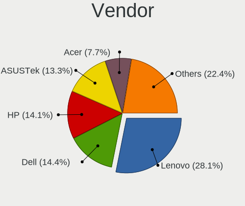
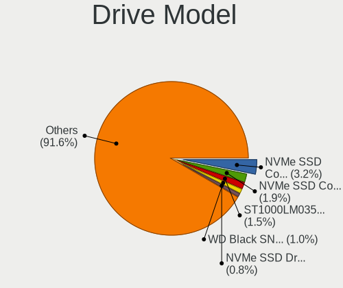
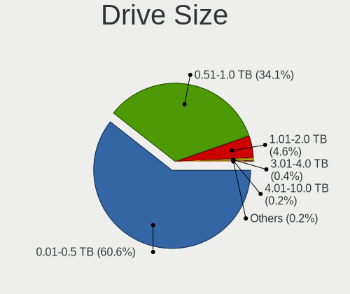
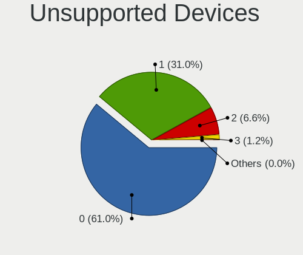

Arch - Tested Hardware & Statistics (Notebooks)
-----------------------------------------------

A project to collect tested hardware configurations for Arch.

Anyone can contribute to this report by the [hw-probe](https://github.com/linuxhw/hw-probe) tool:

    sudo -E hw-probe -all -upload

Please contribute! Especially if your hardware is rare.

Contents
--------

* [ Test Cases ](#test-cases)

* [ System ](#system)
  - [ OS                       ](#os)
  - [ OS Family                ](#os-family)
  - [ Kernel                   ](#kernel)
  - [ Kernel Family            ](#kernel-family)
  - [ Kernel Major Ver.        ](#kernel-major-ver)
  - [ Arch                     ](#arch)
  - [ DE                       ](#de)
  - [ Display Server           ](#display-server)
  - [ Display Manager          ](#display-manager)
  - [ OS Lang                  ](#os-lang)
  - [ Boot Mode                ](#boot-mode)
  - [ Filesystem               ](#filesystem)
  - [ Part. scheme             ](#part-scheme)
  - [ Dual Boot with Linux/BSD ](#dual-boot-with-linuxbsd)
  - [ Dual Boot (Win)          ](#dual-boot-win)

* [ Board ](#board)
  - [ Vendor                   ](#vendor)
  - [ Model                    ](#model)
  - [ Model Family             ](#model-family)
  - [ MFG Year                 ](#mfg-year)
  - [ Form Factor              ](#form-factor)
  - [ Secure Boot              ](#secure-boot)
  - [ Coreboot                 ](#coreboot)
  - [ RAM Size                 ](#ram-size)
  - [ RAM Used                 ](#ram-used)
  - [ Total Drives             ](#total-drives)
  - [ Has CD-ROM               ](#has-cd-rom)
  - [ Has Ethernet             ](#has-ethernet)
  - [ Has WiFi                 ](#has-wifi)
  - [ Has Bluetooth            ](#has-bluetooth)

* [ Location ](#location)
  - [ Country                  ](#country)
  - [ City                     ](#city)

* [ Drives ](#drives)
  - [ Drive Vendor             ](#drive-vendor)
  - [ Drive Model              ](#drive-model)
  - [ HDD Vendor               ](#hdd-vendor)
  - [ SSD Vendor               ](#ssd-vendor)
  - [ Drive Kind               ](#drive-kind)
  - [ Drive Connector          ](#drive-connector)
  - [ Drive Size               ](#drive-size)
  - [ Space Total              ](#space-total)
  - [ Space Used               ](#space-used)
  - [ Malfunc. Drives          ](#malfunc-drives)
  - [ Malfunc. Drive Vendor    ](#malfunc-drive-vendor)
  - [ Malfunc. HDD Vendor      ](#malfunc-hdd-vendor)
  - [ Malfunc. Drive Kind      ](#malfunc-drive-kind)
  - [ Failed Drives            ](#failed-drives)
  - [ Failed Drive Vendor      ](#failed-drive-vendor)
  - [ Drive Status             ](#drive-status)

* [ Storage controller ](#storage-controller)
  - [ Storage Vendor           ](#storage-vendor)
  - [ Storage Model            ](#storage-model)
  - [ Storage Kind             ](#storage-kind)

* [ Processor ](#processor)
  - [ CPU Vendor               ](#cpu-vendor)
  - [ CPU Model                ](#cpu-model)
  - [ CPU Model Family         ](#cpu-model-family)
  - [ CPU Cores                ](#cpu-cores)
  - [ CPU Sockets              ](#cpu-sockets)
  - [ CPU Threads              ](#cpu-threads)
  - [ CPU Op-Modes             ](#cpu-op-modes)
  - [ CPU Microcode            ](#cpu-microcode)
  - [ CPU Microarch            ](#cpu-microarch)

* [ Graphics ](#graphics)
  - [ GPU Vendor               ](#gpu-vendor)
  - [ GPU Model                ](#gpu-model)
  - [ GPU Combo                ](#gpu-combo)
  - [ GPU Driver               ](#gpu-driver)
  - [ GPU Memory               ](#gpu-memory)

* [ Monitor ](#monitor)
  - [ Monitor Vendor           ](#monitor-vendor)
  - [ Monitor Model            ](#monitor-model)
  - [ Monitor Resolution       ](#monitor-resolution)
  - [ Monitor Diagonal         ](#monitor-diagonal)
  - [ Monitor Width            ](#monitor-width)
  - [ Aspect Ratio             ](#aspect-ratio)
  - [ Monitor Area             ](#monitor-area)
  - [ Pixel Density            ](#pixel-density)
  - [ Multiple Monitors        ](#multiple-monitors)

* [ Network ](#network)
  - [ Net Controller Vendor    ](#net-controller-vendor)
  - [ Net Controller Model     ](#net-controller-model)
  - [ Wireless Vendor          ](#wireless-vendor)
  - [ Wireless Model           ](#wireless-model)
  - [ Ethernet Vendor          ](#ethernet-vendor)
  - [ Ethernet Model           ](#ethernet-model)
  - [ Net Controller Kind      ](#net-controller-kind)
  - [ Used Controller          ](#used-controller)
  - [ NICs                     ](#nics)
  - [ IPv6                     ](#ipv6)

* [ Bluetooth ](#bluetooth)
  - [ Bluetooth Vendor         ](#bluetooth-vendor)
  - [ Bluetooth Model          ](#bluetooth-model)

* [ Sound ](#sound)
  - [ Sound Vendor             ](#sound-vendor)
  - [ Sound Model              ](#sound-model)

* [ Memory ](#memory)
  - [ Memory Vendor            ](#memory-vendor)
  - [ Memory Model             ](#memory-model)
  - [ Memory Kind              ](#memory-kind)
  - [ Memory Form Factor       ](#memory-form-factor)
  - [ Memory Size              ](#memory-size)
  - [ Memory Speed             ](#memory-speed)

* [ Printers & scanners ](#printers--scanners)
  - [ Printer Vendor           ](#printer-vendor)
  - [ Printer Model            ](#printer-model)
  - [ Scanner Vendor           ](#scanner-vendor)
  - [ Scanner Model            ](#scanner-model)

* [ Camera ](#camera)
  - [ Camera Vendor            ](#camera-vendor)
  - [ Camera Model             ](#camera-model)

* [ Security ](#security)
  - [ Fingerprint Vendor       ](#fingerprint-vendor)
  - [ Fingerprint Model        ](#fingerprint-model)
  - [ Chipcard Vendor          ](#chipcard-vendor)
  - [ Chipcard Model           ](#chipcard-model)

* [ Unsupported ](#unsupported)
  - [ Unsupported Devices      ](#unsupported-devices)
  - [ Unsupported Device Types ](#unsupported-device-types)

Test Cases
----------

Total: 6673

| Vendor        | Model                       | Probe                                                      | Date         |
|---------------|-----------------------------|------------------------------------------------------------|--------------|
| ASUSTek       | ASUS TUF Gaming F15 FX50... | [291cd1c75f](https://linux-hardware.org/?probe=291cd1c75f) | May 09, 2024 |
| Lenovo        | ThinkPad T440s 20AQ0069G... | [86d66670cb](https://linux-hardware.org/?probe=86d66670cb) | May 09, 2024 |
| Packard Be... | EasyNote LM98               | [4826f72192](https://linux-hardware.org/?probe=4826f72192) | May 08, 2024 |
| Toshiba       | PORTEGE Z30-C               | [38ddab3b19](https://linux-hardware.org/?probe=38ddab3b19) | May 08, 2024 |
| Dell          | Latitude 5530               | [f91e424e6d](https://linux-hardware.org/?probe=f91e424e6d) | May 08, 2024 |
| Lenovo        | ThinkPad T440s 20AQ0069G... | [b84ba3c6c7](https://linux-hardware.org/?probe=b84ba3c6c7) | May 08, 2024 |
| ASUSTek       | ROG Strix G513QY_G513QY     | [964b717d95](https://linux-hardware.org/?probe=964b717d95) | May 08, 2024 |
| MSI           | GF63 Thin 10SC              | [d419afc35f](https://linux-hardware.org/?probe=d419afc35f) | May 08, 2024 |
| Acer          | Aspire A515-54              | [f7d068c059](https://linux-hardware.org/?probe=f7d068c059) | May 07, 2024 |
| Acer          | Aspire A515-54              | [f9375ff03c](https://linux-hardware.org/?probe=f9375ff03c) | May 07, 2024 |
| HP            | 250 G3                      | [c34d89360b](https://linux-hardware.org/?probe=c34d89360b) | May 07, 2024 |
| HP            | 250 G3                      | [7ebf68ab6e](https://linux-hardware.org/?probe=7ebf68ab6e) | May 07, 2024 |
| MSI           | CX61 0NC/CX61 0ND/CX61 0... | [3206e427b1](https://linux-hardware.org/?probe=3206e427b1) | May 07, 2024 |
| ASUSTek       | VivoBook_ASUSLaptop X712... | [9849982066](https://linux-hardware.org/?probe=9849982066) | May 07, 2024 |
| HP            | EliteBook 745 G3            | [7eae46245c](https://linux-hardware.org/?probe=7eae46245c) | May 06, 2024 |
| Acer          | Swift SF314-512             | [c1b3018ff5](https://linux-hardware.org/?probe=c1b3018ff5) | May 06, 2024 |
| MSI           | CX61 0NC/CX61 0ND/CX61 0... | [3d1643b2c5](https://linux-hardware.org/?probe=3d1643b2c5) | May 06, 2024 |
| Lenovo        | ThinkPad P51 W10DG 20MNS... | [76f01093f1](https://linux-hardware.org/?probe=76f01093f1) | May 06, 2024 |
| Lenovo        | ThinkBook 16 G6 ABP 21KK    | [5a7ed888e1](https://linux-hardware.org/?probe=5a7ed888e1) | May 05, 2024 |
| Lenovo        | ThinkPad T470s 20HFS1SW0... | [e27c636616](https://linux-hardware.org/?probe=e27c636616) | May 05, 2024 |
| Lenovo        | ThinkPad T470s 20HFS1SW0... | [bd41e79881](https://linux-hardware.org/?probe=bd41e79881) | May 05, 2024 |
| MSI           | Modern 14 B11MOL            | [c394eac782](https://linux-hardware.org/?probe=c394eac782) | May 05, 2024 |
| Lenovo        | Yoga Slim 7 14ARE05 82A2    | [afb966db9e](https://linux-hardware.org/?probe=afb966db9e) | May 04, 2024 |
| HP            | Laptop 15-dw1xxx            | [deab0f1e98](https://linux-hardware.org/?probe=deab0f1e98) | May 04, 2024 |
| ASUSTek       | ASUS TUF Gaming A16 FA61... | [1f93c42106](https://linux-hardware.org/?probe=1f93c42106) | May 04, 2024 |
| Notebook      | NL40_50GU                   | [00f0ca50a9](https://linux-hardware.org/?probe=00f0ca50a9) | May 04, 2024 |
| Lenovo        | U310                        | [0ce2072c15](https://linux-hardware.org/?probe=0ce2072c15) | May 04, 2024 |
| HP            | Pavilion Laptop 17-ar0xx    | [cf570f28e9](https://linux-hardware.org/?probe=cf570f28e9) | May 03, 2024 |
| ASUSTek       | VivoBook_ASUSLaptop X512... | [58390b50b4](https://linux-hardware.org/?probe=58390b50b4) | May 03, 2024 |
| Razer         | Blade Stealth               | [1728a1a500](https://linux-hardware.org/?probe=1728a1a500) | May 03, 2024 |
| Apple         | MacBookPro11,5              | [fdf75026c9](https://linux-hardware.org/?probe=fdf75026c9) | May 03, 2024 |
| HP            | 1000                        | [5cbdf4ea65](https://linux-hardware.org/?probe=5cbdf4ea65) | May 03, 2024 |
| Lenovo        | IdeaPad S145-15IWL 81S9     | [eb0a05de27](https://linux-hardware.org/?probe=eb0a05de27) | May 03, 2024 |
| Dell          | Precision 7740              | [9219d78a85](https://linux-hardware.org/?probe=9219d78a85) | May 03, 2024 |
| HP            | Laptop 14-ck0xxx            | [2dee9df53a](https://linux-hardware.org/?probe=2dee9df53a) | May 02, 2024 |
| HP            | EliteBook 865 16 inch G1... | [847e639275](https://linux-hardware.org/?probe=847e639275) | May 02, 2024 |
| HP            | ZBook 17 G4                 | [8d618b9f7e](https://linux-hardware.org/?probe=8d618b9f7e) | May 02, 2024 |
| Lenovo        | ThinkBook 14 G6+ IMH 21L... | [e218d7ac14](https://linux-hardware.org/?probe=e218d7ac14) | May 02, 2024 |
| Metabox       | Alpha-SR NP70SNC            | [4fe0c00280](https://linux-hardware.org/?probe=4fe0c00280) | May 02, 2024 |
| Lenovo        | ThinkPad Twist 33472RU      | [88c46ca8d7](https://linux-hardware.org/?probe=88c46ca8d7) | May 02, 2024 |
| HP            | 1000                        | [57f342d3ff](https://linux-hardware.org/?probe=57f342d3ff) | May 02, 2024 |
| Lenovo        | ThinkPad X220 4291H76       | [55dc1b37c5](https://linux-hardware.org/?probe=55dc1b37c5) | May 01, 2024 |
| Framework     | Laptop                      | [b1f763433e](https://linux-hardware.org/?probe=b1f763433e) | May 01, 2024 |
| Lenovo        | U310                        | [48cb164f2f](https://linux-hardware.org/?probe=48cb164f2f) | May 01, 2024 |
| HP            | ProBook 450 15.6 inch G1... | [e39ccf215f](https://linux-hardware.org/?probe=e39ccf215f) | May 01, 2024 |
| Lenovo        | ThinkPad X395 20NMS0D900    | [47098170bb](https://linux-hardware.org/?probe=47098170bb) | May 01, 2024 |
| MSI           | GP62 6QF                    | [1c3538dce8](https://linux-hardware.org/?probe=1c3538dce8) | May 01, 2024 |
| MSI           | GP62 6QF                    | [4ed895c3e2](https://linux-hardware.org/?probe=4ed895c3e2) | May 01, 2024 |
| Dell          | XPS 13 9360                 | [00b20277f7](https://linux-hardware.org/?probe=00b20277f7) | May 01, 2024 |
| Dell          | Precision M4600             | [3c78b1ea06](https://linux-hardware.org/?probe=3c78b1ea06) | May 01, 2024 |
| Dell          | Precision M4600             | [7cae94b1d9](https://linux-hardware.org/?probe=7cae94b1d9) | May 01, 2024 |
| Apple         | MacBookPro10,2              | [57baecb0a5](https://linux-hardware.org/?probe=57baecb0a5) | May 01, 2024 |
| TUXEDO        | InfinityBook S Gen8         | [19d3fc9c13](https://linux-hardware.org/?probe=19d3fc9c13) | Apr 30, 2024 |
| ASUSTek       | VivoBook_ASUSLaptop X150... | [c981d78681](https://linux-hardware.org/?probe=c981d78681) | Apr 30, 2024 |
| Apple         | MacBookPro10,2              | [f80fe988f5](https://linux-hardware.org/?probe=f80fe988f5) | Apr 30, 2024 |
| Lenovo        | Rev B 82LN                  | [5cf26fa98f](https://linux-hardware.org/?probe=5cf26fa98f) | Apr 30, 2024 |
| Lenovo        | Rev B 82LN                  | [130e9ebe45](https://linux-hardware.org/?probe=130e9ebe45) | Apr 30, 2024 |
| HP            | Pavilion g6                 | [466b38f1ee](https://linux-hardware.org/?probe=466b38f1ee) | Apr 30, 2024 |
| HP            | Mini 210-1000               | [f44ded04c1](https://linux-hardware.org/?probe=f44ded04c1) | Apr 29, 2024 |
| Acer          | Swift SFE16-43              | [02fa8654df](https://linux-hardware.org/?probe=02fa8654df) | Apr 29, 2024 |
| HP            | Victus by Laptop 16-e0xx... | [1cd614027a](https://linux-hardware.org/?probe=1cd614027a) | Apr 29, 2024 |
| Lenovo        | ThinkPad L420 7827W1U       | [b6839d25f6](https://linux-hardware.org/?probe=b6839d25f6) | Apr 29, 2024 |
| TUXEDO        | InfinityBook Pro Gen8 (M... | [93815a6cda](https://linux-hardware.org/?probe=93815a6cda) | Apr 28, 2024 |
| Lenovo        | ThinkPad L420 7827W1U       | [9455f8e9de](https://linux-hardware.org/?probe=9455f8e9de) | Apr 28, 2024 |
| ASUSTek       | X553MA                      | [87b13248a4](https://linux-hardware.org/?probe=87b13248a4) | Apr 28, 2024 |
| Lenovo        | ThinkPad E15 Gen 2 20T9S... | [d4c1f97af3](https://linux-hardware.org/?probe=d4c1f97af3) | Apr 28, 2024 |
| HUAWEI        | HVY-WXX9                    | [0f16f57261](https://linux-hardware.org/?probe=0f16f57261) | Apr 28, 2024 |
| Acer          | Swift SF314-41              | [240aeeb256](https://linux-hardware.org/?probe=240aeeb256) | Apr 28, 2024 |
| Lenovo        | IdeaPad Slim 7 Pro 14IHU... | [d01c00759c](https://linux-hardware.org/?probe=d01c00759c) | Apr 28, 2024 |
| Lenovo        | ThinkPad P16s Gen 1 21CK... | [801a6bafe7](https://linux-hardware.org/?probe=801a6bafe7) | Apr 27, 2024 |
| Dell          | G15 5520                    | [80975f981b](https://linux-hardware.org/?probe=80975f981b) | Apr 27, 2024 |
| ASUSTek       | X541NA                      | [19a17079a5](https://linux-hardware.org/?probe=19a17079a5) | Apr 27, 2024 |
| Lenovo        | Yoga Pro 7 14APH8 82Y8      | [0a2f393a3e](https://linux-hardware.org/?probe=0a2f393a3e) | Apr 27, 2024 |
| HUAWEI        | HVY-WXX9                    | [5d98ce8c7a](https://linux-hardware.org/?probe=5d98ce8c7a) | Apr 27, 2024 |
| HP            | EliteBook 8570p             | [cbe3543005](https://linux-hardware.org/?probe=cbe3543005) | Apr 26, 2024 |
| Mediacom      | SmartBook 14 FullHD - SB... | [679f3b5338](https://linux-hardware.org/?probe=679f3b5338) | Apr 26, 2024 |
| Unknown       | Unknown                     | [5fda06b27d](https://linux-hardware.org/?probe=5fda06b27d) | Apr 26, 2024 |
| Lenovo        | XiaoXinPro 16 AHP9 83D5     | [bec1c58cef](https://linux-hardware.org/?probe=bec1c58cef) | Apr 25, 2024 |
| Lenovo        | ThinkPad P52 20M9CTO1WW     | [ce0b51d2c0](https://linux-hardware.org/?probe=ce0b51d2c0) | Apr 25, 2024 |
| Apple         | MacBookPro11,5              | [cfd10a22a4](https://linux-hardware.org/?probe=cfd10a22a4) | Apr 25, 2024 |
| Lenovo        | ThinkPad X230 2324F43       | [3508590441](https://linux-hardware.org/?probe=3508590441) | Apr 25, 2024 |
| ASUSTek       | X553MA                      | [c1b1f9de4b](https://linux-hardware.org/?probe=c1b1f9de4b) | Apr 25, 2024 |
| Acer          | Aspire A315-58              | [4f5fda04fe](https://linux-hardware.org/?probe=4f5fda04fe) | Apr 24, 2024 |
| SKIKK         | Freya                       | [c743ce4dbf](https://linux-hardware.org/?probe=c743ce4dbf) | Apr 24, 2024 |
| Gigabyte      | G7 MF                       | [d55b6078f3](https://linux-hardware.org/?probe=d55b6078f3) | Apr 24, 2024 |
| Notebook      | PA70ES                      | [866c7351b4](https://linux-hardware.org/?probe=866c7351b4) | Apr 24, 2024 |
| Acer          | Swift SF315-52G             | [91c1e44537](https://linux-hardware.org/?probe=91c1e44537) | Apr 24, 2024 |
| HONOR         | GLO-GXXX                    | [d92d20c83b](https://linux-hardware.org/?probe=d92d20c83b) | Apr 23, 2024 |
| ASUSTek       | ROG Zephyrus G15 GA503RW... | [bcc2955a52](https://linux-hardware.org/?probe=bcc2955a52) | Apr 23, 2024 |
| HUAWEI        | BOHB-WAX9                   | [fd94025498](https://linux-hardware.org/?probe=fd94025498) | Apr 23, 2024 |
| HP            | EliteBook 840 G3            | [da0e2c83ac](https://linux-hardware.org/?probe=da0e2c83ac) | Apr 23, 2024 |
| Lenovo        | Yoga Slim 7 Carbon 14ACN... | [3f76329bd6](https://linux-hardware.org/?probe=3f76329bd6) | Apr 23, 2024 |
| Dell          | Precision 5530              | [7e2d09b398](https://linux-hardware.org/?probe=7e2d09b398) | Apr 22, 2024 |
| HP            | 240 G8 Notebook PC          | [309c38a064](https://linux-hardware.org/?probe=309c38a064) | Apr 22, 2024 |
| Lenovo        | ThinkPad T480 20L6S0DH0V    | [28d54c7e4d](https://linux-hardware.org/?probe=28d54c7e4d) | Apr 22, 2024 |
| Dell          | Latitude E7240              | [71103e976e](https://linux-hardware.org/?probe=71103e976e) | Apr 21, 2024 |
| Acer          | Aspire A315-24P             | [51136613de](https://linux-hardware.org/?probe=51136613de) | Apr 21, 2024 |
| Lenovo        | IdeaPad 5 14ALC05 82LM      | [d76ac08a0d](https://linux-hardware.org/?probe=d76ac08a0d) | Apr 21, 2024 |
| Samsung       | 950XDB/951XDB/950XDY        | [252a0c4e05](https://linux-hardware.org/?probe=252a0c4e05) | Apr 21, 2024 |
| Lenovo        | ThinkPad L560 20F2S1P800    | [e7b196367a](https://linux-hardware.org/?probe=e7b196367a) | Apr 21, 2024 |
| XMG           | N85_N87,HJ,HJ1,HK1          | [88ab8ac1a1](https://linux-hardware.org/?probe=88ab8ac1a1) | Apr 20, 2024 |
| HP            | Laptop 15s-eq1xxx           | [9622d53999](https://linux-hardware.org/?probe=9622d53999) | Apr 20, 2024 |
| HP            | OMEN Laptop 15-ek0xxx       | [8f61743310](https://linux-hardware.org/?probe=8f61743310) | Apr 20, 2024 |
| Positivo      | Mobile                      | [c74545679c](https://linux-hardware.org/?probe=c74545679c) | Apr 20, 2024 |
| Lenovo        | ThinkPad E14 Gen 2 20TA0... | [a890a5a9b1](https://linux-hardware.org/?probe=a890a5a9b1) | Apr 20, 2024 |
| ASUSTek       | ASUS TUF Gaming F15 FX50... | [1e8f14cb22](https://linux-hardware.org/?probe=1e8f14cb22) | Apr 20, 2024 |
| ASUSTek       | ROG Zephyrus M16 GU603ZM... | [d93809116b](https://linux-hardware.org/?probe=d93809116b) | Apr 20, 2024 |
| Toshiba       | Satellite C850-124          | [b580358635](https://linux-hardware.org/?probe=b580358635) | Apr 20, 2024 |
| Lenovo        | ThinkPad T16 Gen 1 21CH0... | [3426b632ad](https://linux-hardware.org/?probe=3426b632ad) | Apr 19, 2024 |
| Lenovo        | ThinkPad T480s 20L8S7890... | [7af4a3ded9](https://linux-hardware.org/?probe=7af4a3ded9) | Apr 19, 2024 |
| Apple         | MacBookPro12,1              | [d297fd582e](https://linux-hardware.org/?probe=d297fd582e) | Apr 19, 2024 |
| Apple         | MacBookAir7,2               | [50f7cbb79a](https://linux-hardware.org/?probe=50f7cbb79a) | Apr 19, 2024 |
| Lenovo        | V15 G3 ABA 82TV             | [8e0d1cf973](https://linux-hardware.org/?probe=8e0d1cf973) | Apr 19, 2024 |
| Framework     | Laptop                      | [ce27218533](https://linux-hardware.org/?probe=ce27218533) | Apr 18, 2024 |
| ASUSTek       | VivoBook_ASUSLaptop M150... | [38a33160a4](https://linux-hardware.org/?probe=38a33160a4) | Apr 18, 2024 |
| Lenovo        | ThinkBook 15 G5 ABP 21JF    | [8de733215c](https://linux-hardware.org/?probe=8de733215c) | Apr 18, 2024 |
| Apple         | MacBookPro5,3               | [333256d6dd](https://linux-hardware.org/?probe=333256d6dd) | Apr 18, 2024 |
| HP            | OMEN by Laptop 17-cb0xxx    | [50987e4554](https://linux-hardware.org/?probe=50987e4554) | Apr 18, 2024 |
| Lenovo        | Legion Y9000P IRX8 82WK     | [3d61f319c2](https://linux-hardware.org/?probe=3d61f319c2) | Apr 18, 2024 |
| Lenovo        | ThinkPad T430 2349QF4       | [b9dbaebca0](https://linux-hardware.org/?probe=b9dbaebca0) | Apr 17, 2024 |
| Lenovo        | Legion Y540-15IRH 81SX      | [cebfff5171](https://linux-hardware.org/?probe=cebfff5171) | Apr 17, 2024 |
| Lenovo        | ThinkPad X61 7673V4Q        | [ae6092f0a5](https://linux-hardware.org/?probe=ae6092f0a5) | Apr 17, 2024 |
| Lenovo        | ThinkPad X61 7673V4Q        | [de573ef4aa](https://linux-hardware.org/?probe=de573ef4aa) | Apr 17, 2024 |
| Dell          | XPS 13 9380                 | [56a4aeab46](https://linux-hardware.org/?probe=56a4aeab46) | Apr 17, 2024 |
| Lenovo        | Legion 7 16ACHg6 82N6       | [3d43cbd697](https://linux-hardware.org/?probe=3d43cbd697) | Apr 17, 2024 |
| HP            | EliteBook 2530p             | [930a387011](https://linux-hardware.org/?probe=930a387011) | Apr 17, 2024 |
| HP            | EliteBook 2530p             | [b6df5893ef](https://linux-hardware.org/?probe=b6df5893ef) | Apr 17, 2024 |
| Lenovo        | ThinkPad T580 20LAS2VM00    | [6a81f0c31f](https://linux-hardware.org/?probe=6a81f0c31f) | Apr 17, 2024 |
| Notebook      | PD5x_7xSNC_SND_SNE          | [1672551a61](https://linux-hardware.org/?probe=1672551a61) | Apr 17, 2024 |
| Notebook      | W230ST                      | [946ba4a3b8](https://linux-hardware.org/?probe=946ba4a3b8) | Apr 16, 2024 |
| HUAWEI        | NbDE-WXX9                   | [ae3aece643](https://linux-hardware.org/?probe=ae3aece643) | Apr 16, 2024 |
| Dell          | Latitude 7520               | [f040020d5f](https://linux-hardware.org/?probe=f040020d5f) | Apr 16, 2024 |
| ASUSTek       | N53SM                       | [0769613e83](https://linux-hardware.org/?probe=0769613e83) | Apr 15, 2024 |
| Lenovo        | Legion 5-15IMH05H 81Y6      | [057fa9dd1a](https://linux-hardware.org/?probe=057fa9dd1a) | Apr 15, 2024 |
| Lenovo        | ThinkPad L14 Gen 2 20X2S... | [8ef5274513](https://linux-hardware.org/?probe=8ef5274513) | Apr 15, 2024 |
| Dell          | Latitude 7490               | [9f01d423bc](https://linux-hardware.org/?probe=9f01d423bc) | Apr 14, 2024 |
| Google        | Morphius                    | [422dcd7238](https://linux-hardware.org/?probe=422dcd7238) | Apr 14, 2024 |
| ASUSTek       | VivoBook_ASUSLaptop K350... | [9c4d14519d](https://linux-hardware.org/?probe=9c4d14519d) | Apr 14, 2024 |
| XIAOMI        | Redmi Book Pro 15 2023      | [7bad2daef7](https://linux-hardware.org/?probe=7bad2daef7) | Apr 14, 2024 |
| Google        | Morphius                    | [97da05767b](https://linux-hardware.org/?probe=97da05767b) | Apr 13, 2024 |
| Dell          | Inspiron 3593               | [e1b99394fb](https://linux-hardware.org/?probe=e1b99394fb) | Apr 13, 2024 |
| HP            | Laptop 15-ef2xxx            | [3d32f9eea8](https://linux-hardware.org/?probe=3d32f9eea8) | Apr 13, 2024 |
| HP            | Pavilion Notebook           | [fd68b6da34](https://linux-hardware.org/?probe=fd68b6da34) | Apr 13, 2024 |
| HP            | Laptop 15s-eq2xxx           | [16bde4de91](https://linux-hardware.org/?probe=16bde4de91) | Apr 13, 2024 |
| ASUSTek       | ROG Zephyrus G15 GA503RW... | [b64d99620b](https://linux-hardware.org/?probe=b64d99620b) | Apr 12, 2024 |
| Acer          | Aspire A715-42G             | [0d589db88d](https://linux-hardware.org/?probe=0d589db88d) | Apr 12, 2024 |
| ASUSTek       | N53SM                       | [e69871e7f5](https://linux-hardware.org/?probe=e69871e7f5) | Apr 12, 2024 |
| Acer          | Aspire A715-42G             | [ab14bb8fdc](https://linux-hardware.org/?probe=ab14bb8fdc) | Apr 12, 2024 |
| HUAWEI        | BOD-WXX9                    | [922645652d](https://linux-hardware.org/?probe=922645652d) | Apr 12, 2024 |
| ASUSTek       | GL753VE                     | [0a705b21d4](https://linux-hardware.org/?probe=0a705b21d4) | Apr 12, 2024 |
| Lenovo        | ThinkPad W540 20BG0044UK    | [45c92186a6](https://linux-hardware.org/?probe=45c92186a6) | Apr 12, 2024 |
| Notebook      | N141CU                      | [a89a8ed543](https://linux-hardware.org/?probe=a89a8ed543) | Apr 12, 2024 |
| HP            | Pavilion Gaming Laptop 1... | [9a0c435db3](https://linux-hardware.org/?probe=9a0c435db3) | Apr 12, 2024 |
| HP            | Laptop 14-fq0xxx            | [9a66f32750](https://linux-hardware.org/?probe=9a66f32750) | Apr 11, 2024 |
| Lenovo        | ThinkPad T440p 20ANCTO1W... | [7a39eaa9b8](https://linux-hardware.org/?probe=7a39eaa9b8) | Apr 11, 2024 |
| HP            | Laptop 14-fq0xxx            | [9cc72239b3](https://linux-hardware.org/?probe=9cc72239b3) | Apr 11, 2024 |
| HP            | Laptop 14-fq0xxx            | [b0ed939545](https://linux-hardware.org/?probe=b0ed939545) | Apr 11, 2024 |
| HP            | Laptop 14-fq0xxx            | [57cb359743](https://linux-hardware.org/?probe=57cb359743) | Apr 11, 2024 |
| Gigabyte      | AERO 15-X9                  | [9bbcd276e5](https://linux-hardware.org/?probe=9bbcd276e5) | Apr 11, 2024 |
| HP            | ProBook 430 G4              | [7aa6a736a5](https://linux-hardware.org/?probe=7aa6a736a5) | Apr 10, 2024 |
| Lenovo        | ThinkPad T14s Gen 3 21BR... | [e39dfad279](https://linux-hardware.org/?probe=e39dfad279) | Apr 10, 2024 |
| Dell          | Latitude E6440              | [727e37c03c](https://linux-hardware.org/?probe=727e37c03c) | Apr 10, 2024 |
| HONOR         | NMH-WDX9                    | [03ebb39034](https://linux-hardware.org/?probe=03ebb39034) | Apr 09, 2024 |
| HP            | Victus by Gaming Laptop ... | [e78757c42d](https://linux-hardware.org/?probe=e78757c42d) | Apr 09, 2024 |
| HP            | Victus by Gaming Laptop ... | [4cc13eaf30](https://linux-hardware.org/?probe=4cc13eaf30) | Apr 09, 2024 |
| Gateway       | NV570P                      | [328b47d899](https://linux-hardware.org/?probe=328b47d899) | Apr 09, 2024 |
| Toshiba       | Satellite C670-12E          | [766fbef61b](https://linux-hardware.org/?probe=766fbef61b) | Apr 08, 2024 |
| ASUSTek       | ROG Zephyrus G14 GA401QH... | [bf43ad7ffe](https://linux-hardware.org/?probe=bf43ad7ffe) | Apr 08, 2024 |
| ASUSTek       | ROG Zephyrus G14 GA401QH... | [25dc9ad19d](https://linux-hardware.org/?probe=25dc9ad19d) | Apr 08, 2024 |
| Micro Comp... | HX100G                      | [75c9b0148e](https://linux-hardware.org/?probe=75c9b0148e) | Apr 08, 2024 |
| Micro Comp... | HX100G                      | [c2c53e723c](https://linux-hardware.org/?probe=c2c53e723c) | Apr 08, 2024 |
| ASUSTek       | ROG Zephyrus G16 GU605MI... | [042218f2b2](https://linux-hardware.org/?probe=042218f2b2) | Apr 07, 2024 |
| ASUSTek       | ROG Strix G531GU_G531GU     | [b264255cbe](https://linux-hardware.org/?probe=b264255cbe) | Apr 07, 2024 |
| ASUSTek       | ROG Strix G531GU_G531GU     | [65f080ba2d](https://linux-hardware.org/?probe=65f080ba2d) | Apr 06, 2024 |
| ASUSTek       | ASUS TUF Gaming A16 FA61... | [1500106fac](https://linux-hardware.org/?probe=1500106fac) | Apr 06, 2024 |
| Dell          | XPS 14 9440                 | [1d91483497](https://linux-hardware.org/?probe=1d91483497) | Apr 06, 2024 |
| ASUSTek       | TUF Gaming FX505DV_FX505... | [6ab031c460](https://linux-hardware.org/?probe=6ab031c460) | Apr 06, 2024 |
| Maibenben     | MaiBook X series            | [dbf76a7686](https://linux-hardware.org/?probe=dbf76a7686) | Apr 06, 2024 |
| HUAWEI        | HVY-WXX9                    | [7c7e74b442](https://linux-hardware.org/?probe=7c7e74b442) | Apr 06, 2024 |
| Dell          | Inspiron 3543               | [1c04e1c19f](https://linux-hardware.org/?probe=1c04e1c19f) | Apr 06, 2024 |
| ASUSTek       | X550VX                      | [11705e787a](https://linux-hardware.org/?probe=11705e787a) | Apr 06, 2024 |
| MSI           | Modern 14 B5M               | [0862e9e806](https://linux-hardware.org/?probe=0862e9e806) | Apr 05, 2024 |
| Maibenben     | MaiBook X series            | [44a21e3fc3](https://linux-hardware.org/?probe=44a21e3fc3) | Apr 05, 2024 |
| Dell          | Precision 3581              | [929244a82c](https://linux-hardware.org/?probe=929244a82c) | Apr 05, 2024 |
| Dell          | G15 5530                    | [a1b2877a39](https://linux-hardware.org/?probe=a1b2877a39) | Apr 05, 2024 |
| Dell          | Precision M6500             | [d7df43ff91](https://linux-hardware.org/?probe=d7df43ff91) | Apr 04, 2024 |
| HP            | Pavilion dm4                | [928ce1826d](https://linux-hardware.org/?probe=928ce1826d) | Apr 04, 2024 |
| Lenovo        | ThinkPad X13 Gen 3 21BN0... | [46844a5ee4](https://linux-hardware.org/?probe=46844a5ee4) | Apr 04, 2024 |
| Dell          | XPS 13 9310                 | [818d5697a5](https://linux-hardware.org/?probe=818d5697a5) | Apr 04, 2024 |
| Dell          | XPS 14 9440                 | [82e31ff137](https://linux-hardware.org/?probe=82e31ff137) | Apr 04, 2024 |
| ASUSTek       | ASUS TUF Gaming A15 FA50... | [c91ad09ad3](https://linux-hardware.org/?probe=c91ad09ad3) | Apr 04, 2024 |
| HP            | Laptop 14-fq0xxx            | [2718fc7adc](https://linux-hardware.org/?probe=2718fc7adc) | Apr 04, 2024 |
| Intel Clie... | LAPAC71H                    | [c6f73cce66](https://linux-hardware.org/?probe=c6f73cce66) | Apr 04, 2024 |
| XIAOMI        | Redmi Book Pro 15 2023      | [96b30498b9](https://linux-hardware.org/?probe=96b30498b9) | Apr 04, 2024 |
| ASUSTek       | VivoBook_ASUSLaptop X512... | [5aacb1afe9](https://linux-hardware.org/?probe=5aacb1afe9) | Apr 03, 2024 |
| Acer          | Aspire E5-473G              | [e2f4ed0b39](https://linux-hardware.org/?probe=e2f4ed0b39) | Apr 03, 2024 |
| Lenovo        | ThinkPad X1 Carbon 3rd 2... | [d9533c6ff4](https://linux-hardware.org/?probe=d9533c6ff4) | Apr 03, 2024 |
| Framework     | Laptop                      | [9763d4f719](https://linux-hardware.org/?probe=9763d4f719) | Apr 02, 2024 |
| HP            | Laptop 15-bs0xx             | [1e796b8f8c](https://linux-hardware.org/?probe=1e796b8f8c) | Apr 01, 2024 |
| N-one         | Nbook Ultra                 | [3061b09bec](https://linux-hardware.org/?probe=3061b09bec) | Apr 01, 2024 |
| HP            | Pavilion Gaming Laptop 1... | [971bc94dfd](https://linux-hardware.org/?probe=971bc94dfd) | Mar 31, 2024 |
| MECHREVO      | Code01 Ver2.0               | [559e9886b1](https://linux-hardware.org/?probe=559e9886b1) | Mar 31, 2024 |
| HP            | EliteBook 845 14 inch G1... | [b0f097af17](https://linux-hardware.org/?probe=b0f097af17) | Mar 31, 2024 |
| ASUSTek       | ROG Zephyrus G16 GU603ZU... | [37980dcbe5](https://linux-hardware.org/?probe=37980dcbe5) | Mar 30, 2024 |
| Lenovo        | Yoga Pro 7 14IRH8 82Y7      | [e6fe7cdc31](https://linux-hardware.org/?probe=e6fe7cdc31) | Mar 30, 2024 |
| Lenovo        | IdeaPad 5 Pro 14ACN6 82L... | [7f4da7e9bd](https://linux-hardware.org/?probe=7f4da7e9bd) | Mar 30, 2024 |
| Acer          | Aspire 7750G                | [2a5cf029d6](https://linux-hardware.org/?probe=2a5cf029d6) | Mar 30, 2024 |
| Acer          | Nitro AN515-58              | [3e03bfd67c](https://linux-hardware.org/?probe=3e03bfd67c) | Mar 30, 2024 |
| Positivo      | AT560W                      | [035ac6be27](https://linux-hardware.org/?probe=035ac6be27) | Mar 30, 2024 |
| HP            | Laptop 15s-eq3xxx           | [d310b775e9](https://linux-hardware.org/?probe=d310b775e9) | Mar 29, 2024 |
| Apple         | MacBookPro5,5               | [cb8f6595e4](https://linux-hardware.org/?probe=cb8f6595e4) | Mar 29, 2024 |
| Apple         | MacBookPro5,5               | [3f9d311cfd](https://linux-hardware.org/?probe=3f9d311cfd) | Mar 29, 2024 |
| HP            | EliteBook 840 G6            | [51ba89f920](https://linux-hardware.org/?probe=51ba89f920) | Mar 29, 2024 |
| HP            | EliteBook 840 G6            | [9ef0ed03f7](https://linux-hardware.org/?probe=9ef0ed03f7) | Mar 29, 2024 |
| Infinix       | ZERO BOOK 13                | [d64684c03a](https://linux-hardware.org/?probe=d64684c03a) | Mar 28, 2024 |
| HUAWEI        | HKF-WXX                     | [fbeda19e57](https://linux-hardware.org/?probe=fbeda19e57) | Mar 28, 2024 |
| Dell          | Inspiron 3543               | [eb685d2c83](https://linux-hardware.org/?probe=eb685d2c83) | Mar 28, 2024 |
| HP            | Laptop 15s-eq3xxx           | [f7029cc0e7](https://linux-hardware.org/?probe=f7029cc0e7) | Mar 27, 2024 |
| Lenovo        | Legion Pro 5 16IRX9 83DF    | [5457b4ef4c](https://linux-hardware.org/?probe=5457b4ef4c) | Mar 27, 2024 |
| Dell          | Latitude E7440              | [8046c24f21](https://linux-hardware.org/?probe=8046c24f21) | Mar 27, 2024 |
| Dell          | Latitude 3340               | [c3d085f684](https://linux-hardware.org/?probe=c3d085f684) | Mar 27, 2024 |
| HP            | EliteBook 735 G5            | [92001f175d](https://linux-hardware.org/?probe=92001f175d) | Mar 27, 2024 |
| Lenovo        | IdeaPad 110-15ACL 80TJ      | [04804240cc](https://linux-hardware.org/?probe=04804240cc) | Mar 27, 2024 |
| Dell          | Latitude E6430              | [1ba5377a4a](https://linux-hardware.org/?probe=1ba5377a4a) | Mar 26, 2024 |
| ASUSTek       | ASUS TUF Gaming F15 FX50... | [5c24770c7e](https://linux-hardware.org/?probe=5c24770c7e) | Mar 26, 2024 |
| Notebook      | N85_N87,HJ,HJ1,HK1          | [0c82d13ac8](https://linux-hardware.org/?probe=0c82d13ac8) | Mar 26, 2024 |
| Lenovo        | ThinkPad T480s 20L8S07A0... | [b136c2a573](https://linux-hardware.org/?probe=b136c2a573) | Mar 26, 2024 |
| Packard Be... | EasyNote LM98               | [4002423f3c](https://linux-hardware.org/?probe=4002423f3c) | Mar 26, 2024 |
| Lenovo        | ThinkPad T14s Gen 3 21CQ... | [7f8bc016c4](https://linux-hardware.org/?probe=7f8bc016c4) | Mar 25, 2024 |
| Lenovo        | ThinkPad T490 20N3S7432Z    | [82871a2b3b](https://linux-hardware.org/?probe=82871a2b3b) | Mar 25, 2024 |
| Sony          | SVF1521X1RB                 | [9a7b4d6d38](https://linux-hardware.org/?probe=9a7b4d6d38) | Mar 25, 2024 |
| ASUSTek       | ASUS TUF Dash F15 FX516P... | [cfe386b714](https://linux-hardware.org/?probe=cfe386b714) | Mar 25, 2024 |
| HP            | EliteBook 840 G7 Noteboo... | [5263d017a2](https://linux-hardware.org/?probe=5263d017a2) | Mar 25, 2024 |
| Lenovo        | Legion 5-15IMH05H 81Y6      | [0e57351ccb](https://linux-hardware.org/?probe=0e57351ccb) | Mar 25, 2024 |
| Lenovo        | ThinkPad E16 Gen 1 21JT0... | [f2b119f5cc](https://linux-hardware.org/?probe=f2b119f5cc) | Mar 24, 2024 |
| Dell          | Latitude E5550              | [6147d06b0f](https://linux-hardware.org/?probe=6147d06b0f) | Mar 24, 2024 |
| HP            | Pavilion Laptop 15-cw1xx... | [ff1c38eea1](https://linux-hardware.org/?probe=ff1c38eea1) | Mar 24, 2024 |
| Lenovo        | Yoga Pro 7 14IRH8 82Y7      | [3cf788c2ee](https://linux-hardware.org/?probe=3cf788c2ee) | Mar 24, 2024 |
| ASUSTek       | Zenbook S 13 UX5304VA_UX... | [de66bb55e6](https://linux-hardware.org/?probe=de66bb55e6) | Mar 23, 2024 |
| Fujitsu       | LIFEBOOK U772               | [b8d7fc9d90](https://linux-hardware.org/?probe=b8d7fc9d90) | Mar 23, 2024 |
| ASUSTek       | ROG Zephyrus Duo 16 GX65... | [015232a1ee](https://linux-hardware.org/?probe=015232a1ee) | Mar 22, 2024 |
| ASUSTek       | ASUS TUF Gaming A17 FA70... | [a9cd8ee448](https://linux-hardware.org/?probe=a9cd8ee448) | Mar 22, 2024 |
| Framework     | Laptop 13 (AMD Ryzen 704... | [cb0339240e](https://linux-hardware.org/?probe=cb0339240e) | Mar 22, 2024 |
| HP            | ProBook 450 G2              | [86529bcb5e](https://linux-hardware.org/?probe=86529bcb5e) | Mar 22, 2024 |
| Samsung       | RV415                       | [d49edbbf72](https://linux-hardware.org/?probe=d49edbbf72) | Mar 22, 2024 |
| Lenovo        | Legion 5 15IMH05 82AU       | [8f337fc42f](https://linux-hardware.org/?probe=8f337fc42f) | Mar 22, 2024 |
| Lenovo        | IdeaPad 3 15ITL6 82H8       | [28a7b94965](https://linux-hardware.org/?probe=28a7b94965) | Mar 22, 2024 |
| N-one         | Nbook Ultra                 | [7261d31ee0](https://linux-hardware.org/?probe=7261d31ee0) | Mar 22, 2024 |
| Acer          | Aspire V5-551               | [8f34b815df](https://linux-hardware.org/?probe=8f34b815df) | Mar 21, 2024 |
| Toshiba       | PORTEGE R930                | [c0ac0e9072](https://linux-hardware.org/?probe=c0ac0e9072) | Mar 21, 2024 |
| Lenovo        | ThinkPad P14s Gen 4 21K5... | [83a22f435d](https://linux-hardware.org/?probe=83a22f435d) | Mar 21, 2024 |
| ASUSTek       | Zenbook UX3402ZA_UX3402Z... | [ed920d12cd](https://linux-hardware.org/?probe=ed920d12cd) | Mar 21, 2024 |
| Samsung       | RV415                       | [890eb5d5d0](https://linux-hardware.org/?probe=890eb5d5d0) | Mar 20, 2024 |
| ASUSTek       | VivoBook_ASUSLaptop X509... | [0b1a51735d](https://linux-hardware.org/?probe=0b1a51735d) | Mar 20, 2024 |
| HP            | Pavilion Notebook           | [3870ad9d3b](https://linux-hardware.org/?probe=3870ad9d3b) | Mar 20, 2024 |
| HP            | ProBook 430 G5              | [39696543eb](https://linux-hardware.org/?probe=39696543eb) | Mar 20, 2024 |
| Lenovo        | IdeaPadFlex 10 20324        | [b0b209dac3](https://linux-hardware.org/?probe=b0b209dac3) | Mar 20, 2024 |
| Lenovo        | IdeaPad Gaming 3 15ACH6 ... | [22c9b2637a](https://linux-hardware.org/?probe=22c9b2637a) | Mar 20, 2024 |
| Dell          | System XPS L321X            | [8160aed0c7](https://linux-hardware.org/?probe=8160aed0c7) | Mar 20, 2024 |
| MSI           | MS-7C37                     | [4416fadac0](https://linux-hardware.org/?probe=4416fadac0) | Mar 20, 2024 |
| Samsung       | 550XED                      | [9bb9a4c3f7](https://linux-hardware.org/?probe=9bb9a4c3f7) | Mar 19, 2024 |
| MECHREVO      | WUJIE14 PRO                 | [3bd908f059](https://linux-hardware.org/?probe=3bd908f059) | Mar 19, 2024 |
| Avell High... | B.ON                        | [24fc9741c2](https://linux-hardware.org/?probe=24fc9741c2) | Mar 19, 2024 |
| Lenovo        | IdeaPad Slim 5 16IRL8 82... | [5444f5d926](https://linux-hardware.org/?probe=5444f5d926) | Mar 17, 2024 |
| Lenovo        | IdeaPad Slim 5 16IRL8 82... | [7abc3cc997](https://linux-hardware.org/?probe=7abc3cc997) | Mar 17, 2024 |
| Lenovo        | IdeaPad 3 15ITL6 82H8       | [507e652893](https://linux-hardware.org/?probe=507e652893) | Mar 17, 2024 |
| Acer          | Nitro AN517-54              | [f2f0133087](https://linux-hardware.org/?probe=f2f0133087) | Mar 16, 2024 |
| HP            | Pavilion Aero Laptop 13-... | [91d582db04](https://linux-hardware.org/?probe=91d582db04) | Mar 16, 2024 |
| Lenovo        | ThinkPad T495 20NKS1R700    | [a7435c5834](https://linux-hardware.org/?probe=a7435c5834) | Mar 16, 2024 |
| ASUSTek       | ASUS TUF Gaming F15 FX50... | [511c52e15b](https://linux-hardware.org/?probe=511c52e15b) | Mar 16, 2024 |
| ASUSTek       | ROG Zephyrus G16 GU603ZU... | [0fbca44791](https://linux-hardware.org/?probe=0fbca44791) | Mar 15, 2024 |
| Micro Comp... | Venus series                | [41aa3958de](https://linux-hardware.org/?probe=41aa3958de) | Mar 15, 2024 |
| Lenovo        | IdeaPad Gaming 3 15ARH05... | [711cc3c20d](https://linux-hardware.org/?probe=711cc3c20d) | Mar 15, 2024 |
| ASUSTek       | X102BA                      | [7b12d02a0c](https://linux-hardware.org/?probe=7b12d02a0c) | Mar 15, 2024 |
| HP            | Pavilion Laptop 15-eh1xx... | [0bcd3f4115](https://linux-hardware.org/?probe=0bcd3f4115) | Mar 14, 2024 |
| ASUSTek       | X551MA                      | [a50e7a5c58](https://linux-hardware.org/?probe=a50e7a5c58) | Mar 14, 2024 |
| Acer          | Aspire A315-58              | [95365aa6fa](https://linux-hardware.org/?probe=95365aa6fa) | Mar 14, 2024 |
| Lenovo        | ThinkPad X13 Gen 3 21CMC... | [8226a1148f](https://linux-hardware.org/?probe=8226a1148f) | Mar 14, 2024 |
| Lenovo        | ThinkPad P50 20EN0007MS     | [8c9bcaf098](https://linux-hardware.org/?probe=8c9bcaf098) | Mar 14, 2024 |
| Dell          | Inspiron 16 Plus 7620       | [16c311a8b2](https://linux-hardware.org/?probe=16c311a8b2) | Mar 13, 2024 |
| HP            | EliteBook 1050 G1           | [a0431bb3bc](https://linux-hardware.org/?probe=a0431bb3bc) | Mar 13, 2024 |
| Micro Comp... | HX100G                      | [cf9d094c29](https://linux-hardware.org/?probe=cf9d094c29) | Mar 13, 2024 |
| Lenovo        | G580 20150                  | [f8a3a2f198](https://linux-hardware.org/?probe=f8a3a2f198) | Mar 13, 2024 |
| HP            | Laptop 14-fq0xxx            | [272f74f130](https://linux-hardware.org/?probe=272f74f130) | Mar 12, 2024 |
| Dell          | Latitude 5400               | [44f84745ef](https://linux-hardware.org/?probe=44f84745ef) | Mar 12, 2024 |
| Toshiba       | Satellite C845D             | [dba3c8f7b1](https://linux-hardware.org/?probe=dba3c8f7b1) | Mar 12, 2024 |
| Gigabyte      | AERO 5 XE                   | [83158efac9](https://linux-hardware.org/?probe=83158efac9) | Mar 12, 2024 |
| Gigabyte      | AERO 5 XE                   | [fd2dbb91bd](https://linux-hardware.org/?probe=fd2dbb91bd) | Mar 12, 2024 |
| Samsung       | 700Z3C/700Z5C               | [aa8a2f7241](https://linux-hardware.org/?probe=aa8a2f7241) | Mar 12, 2024 |
| Acer          | S50-54                      | [9fcc7996c7](https://linux-hardware.org/?probe=9fcc7996c7) | Mar 12, 2024 |
| Lenovo        | ThinkPad X1 Carbon 2nd 2... | [10df7d9260](https://linux-hardware.org/?probe=10df7d9260) | Mar 12, 2024 |
| Lenovo        | ThinkBook 15 G4 ABA 21DL    | [d95bf9ddf2](https://linux-hardware.org/?probe=d95bf9ddf2) | Mar 11, 2024 |
| Lenovo        | IdeaPad 3 15ITL05 81X8      | [7628080070](https://linux-hardware.org/?probe=7628080070) | Mar 11, 2024 |
| HP            | Pavilion Notebook           | [dd00acf6d0](https://linux-hardware.org/?probe=dd00acf6d0) | Mar 11, 2024 |
| Gigabyte      | G5 GD                       | [58ac2082b9](https://linux-hardware.org/?probe=58ac2082b9) | Mar 11, 2024 |
| Framework     | Laptop 16 (AMD Ryzen 704... | [2dc45ee33d](https://linux-hardware.org/?probe=2dc45ee33d) | Mar 11, 2024 |
| MSI           | Alpha 15 A3DD               | [4410e98550](https://linux-hardware.org/?probe=4410e98550) | Mar 11, 2024 |
| Lenovo        | ThinkPad T480 20L5000UUS    | [0e8d4b681b](https://linux-hardware.org/?probe=0e8d4b681b) | Mar 11, 2024 |
| Lenovo        | ThinkPad X230 2325GW8       | [e2c027ac26](https://linux-hardware.org/?probe=e2c027ac26) | Mar 11, 2024 |
| Lenovo        | ThinkPad X230 2325GW8       | [ce96a808a1](https://linux-hardware.org/?probe=ce96a808a1) | Mar 11, 2024 |
| ASUSTek       | VivoBook_ASUSLaptop X160... | [76292c56e4](https://linux-hardware.org/?probe=76292c56e4) | Mar 10, 2024 |
| Dell          | Latitude E7440              | [365fdcbf2a](https://linux-hardware.org/?probe=365fdcbf2a) | Mar 10, 2024 |
| Lenovo        | ThinkPad T480s 20L8S2WK0... | [3eedc7b315](https://linux-hardware.org/?probe=3eedc7b315) | Mar 10, 2024 |
| Lenovo        | ThinkPad T480s 20L8S2WK0... | [84a8b3e936](https://linux-hardware.org/?probe=84a8b3e936) | Mar 10, 2024 |
| Lenovo        | XiaoXinPro 14 AHP9 83D3     | [fe15e50e85](https://linux-hardware.org/?probe=fe15e50e85) | Mar 09, 2024 |
| Framework     | Laptop                      | [9dce10359d](https://linux-hardware.org/?probe=9dce10359d) | Mar 09, 2024 |
| HONOR         | BOD-WXX9                    | [a4942d27af](https://linux-hardware.org/?probe=a4942d27af) | Mar 09, 2024 |
| ASUSTek       | ROG Strix G713QM_G713QM     | [3ba89be7ce](https://linux-hardware.org/?probe=3ba89be7ce) | Mar 09, 2024 |
| ASUSTek       | ASUS EXPERTBOOK B1500CEA... | [779fb19ac5](https://linux-hardware.org/?probe=779fb19ac5) | Mar 09, 2024 |
| Lenovo        | ThinkPad T490 20N20022US    | [51c50ecdca](https://linux-hardware.org/?probe=51c50ecdca) | Mar 08, 2024 |
| Dell          | Latitude E5500              | [623812ebc4](https://linux-hardware.org/?probe=623812ebc4) | Mar 08, 2024 |
| Lenovo        | ThinkPad T490 20N20022US    | [81080c0dbf](https://linux-hardware.org/?probe=81080c0dbf) | Mar 08, 2024 |
| Notebook      | P7xxDM(-G)                  | [29b862f789](https://linux-hardware.org/?probe=29b862f789) | Mar 08, 2024 |
| ASUSTek       | Zenbook UX3402VA_UX3402V... | [de4f9c0df5](https://linux-hardware.org/?probe=de4f9c0df5) | Mar 07, 2024 |
| Lenovo        | Legion Y540-15IRH 81SX      | [13aa71b72d](https://linux-hardware.org/?probe=13aa71b72d) | Mar 07, 2024 |
| Lenovo        | Unknown                     | [32588f809f](https://linux-hardware.org/?probe=32588f809f) | Mar 07, 2024 |
| ASUSTek       | ROG Strix G712LWS_G712LW... | [84d939804b](https://linux-hardware.org/?probe=84d939804b) | Mar 07, 2024 |
| ASUSTek       | ROG Strix G712LWS_G712LW... | [7b9efc67c9](https://linux-hardware.org/?probe=7b9efc67c9) | Mar 07, 2024 |
| HP            | ZBook Studio 15.6 Inch G... | [ecbd50f245](https://linux-hardware.org/?probe=ecbd50f245) | Mar 07, 2024 |
| Lenovo        | ThinkPad T470 20HDS01L00    | [48c9ed444c](https://linux-hardware.org/?probe=48c9ed444c) | Mar 06, 2024 |
| Lenovo        | V15 G3 ABA 82TV             | [e25dd52aab](https://linux-hardware.org/?probe=e25dd52aab) | Mar 06, 2024 |
| HP            | 255 G8 Notebook PC          | [d723a88f1b](https://linux-hardware.org/?probe=d723a88f1b) | Mar 05, 2024 |
| ASUSTek       | ASUS Vivobook Pro 15 N65... | [f2ab4be9ab](https://linux-hardware.org/?probe=f2ab4be9ab) | Mar 05, 2024 |
| ASUSTek       | ASUS Vivobook Pro 15 N65... | [28f64d1136](https://linux-hardware.org/?probe=28f64d1136) | Mar 05, 2024 |
| HP            | 540                         | [3423afe2ac](https://linux-hardware.org/?probe=3423afe2ac) | Mar 05, 2024 |
| Lenovo        | IdeaPad 3 15ABA7 82RN       | [da7fc15861](https://linux-hardware.org/?probe=da7fc15861) | Mar 05, 2024 |
| Lenovo        | ThinkPad X13 Gen 4 21EX0... | [0877ab049c](https://linux-hardware.org/?probe=0877ab049c) | Mar 05, 2024 |
| Dell          | Latitude 5580               | [2071cd524e](https://linux-hardware.org/?probe=2071cd524e) | Mar 05, 2024 |
| Lenovo        | IdeaPad 5 Pro 16ACH6 82L... | [ab13c489ef](https://linux-hardware.org/?probe=ab13c489ef) | Mar 05, 2024 |
| Lenovo        | ThinkPad X13 Gen 4 21EX0... | [ad24be96f8](https://linux-hardware.org/?probe=ad24be96f8) | Mar 05, 2024 |
| ASUSTek       | Zenbook UX7602VI_UX7602V... | [dee02a2e0f](https://linux-hardware.org/?probe=dee02a2e0f) | Mar 04, 2024 |
| HONOR         | HYM-WXX                     | [368a0d6d4c](https://linux-hardware.org/?probe=368a0d6d4c) | Mar 04, 2024 |
| Acer          | Aspire A517-51G             | [6ed26782d4](https://linux-hardware.org/?probe=6ed26782d4) | Mar 04, 2024 |
| Lenovo        | Legion R9000P2021H 82JQ     | [524c37b36e](https://linux-hardware.org/?probe=524c37b36e) | Mar 04, 2024 |
| HP            | ProBook 430 G6              | [317ba0c0e0](https://linux-hardware.org/?probe=317ba0c0e0) | Mar 04, 2024 |
| Acer          | Aspire A315-53              | [8f6f1b8a89](https://linux-hardware.org/?probe=8f6f1b8a89) | Mar 03, 2024 |
| HP            | Pavilion Aero Laptop 13-... | [6c93404ad5](https://linux-hardware.org/?probe=6c93404ad5) | Mar 03, 2024 |
| ADVAN         | 1701                        | [c956a2409c](https://linux-hardware.org/?probe=c956a2409c) | Mar 03, 2024 |
| HP            | Pavilion Gaming Laptop 1... | [a8b8bf6b16](https://linux-hardware.org/?probe=a8b8bf6b16) | Mar 02, 2024 |
| Acer          | Aspire E1-771G              | [7657151a7d](https://linux-hardware.org/?probe=7657151a7d) | Mar 02, 2024 |
| Lenovo        | ThinkPad E16 Gen 1 21JT0... | [fef65e6d34](https://linux-hardware.org/?probe=fef65e6d34) | Mar 02, 2024 |
| Acer          | Aspire E5-575               | [440b609902](https://linux-hardware.org/?probe=440b609902) | Mar 02, 2024 |
| Timi          | A35R                        | [3683162bb5](https://linux-hardware.org/?probe=3683162bb5) | Mar 01, 2024 |
| Sony          | SVE1713L1RW                 | [950284e8df](https://linux-hardware.org/?probe=950284e8df) | Mar 01, 2024 |
| Sony          | SVF1521X1RB                 | [7cc44ab7c8](https://linux-hardware.org/?probe=7cc44ab7c8) | Mar 01, 2024 |
| ASUSTek       | B150M-C/BR                  | [09ca7c7aaf](https://linux-hardware.org/?probe=09ca7c7aaf) | Mar 01, 2024 |
| HP            | 255 G8 Notebook PC          | [54724e70b6](https://linux-hardware.org/?probe=54724e70b6) | Mar 01, 2024 |
| TULPAR        | A5 V20.3                    | [24d529a8b9](https://linux-hardware.org/?probe=24d529a8b9) | Feb 29, 2024 |
| Toshiba       | Satellite C670-12E          | [51b3c0df3d](https://linux-hardware.org/?probe=51b3c0df3d) | Feb 29, 2024 |
| MECHREVO      | JiguangPro Series GM6PQ7... | [3d3ce46c84](https://linux-hardware.org/?probe=3d3ce46c84) | Feb 29, 2024 |
| TECNO         | MEGABOOK T1                 | [b1ab1c255d](https://linux-hardware.org/?probe=b1ab1c255d) | Feb 29, 2024 |
| HP            | Laptop 15s-eq3xxx           | [29f6262e4e](https://linux-hardware.org/?probe=29f6262e4e) | Feb 28, 2024 |
| Jumper        | EZpad                       | [526ffbb0c5](https://linux-hardware.org/?probe=526ffbb0c5) | Feb 28, 2024 |
| Lenovo        | ThinkPad X1 Carbon Gen 1... | [d254263eb9](https://linux-hardware.org/?probe=d254263eb9) | Feb 28, 2024 |
| Lenovo        | ThinkPad X1 Carbon Gen 1... | [52199ec5cb](https://linux-hardware.org/?probe=52199ec5cb) | Feb 28, 2024 |
| Lenovo        | ThinkPad T14s Gen 2a 20X... | [3bedd47b16](https://linux-hardware.org/?probe=3bedd47b16) | Feb 28, 2024 |
| Apple         | MacBookPro11,3              | [a77f2601a1](https://linux-hardware.org/?probe=a77f2601a1) | Feb 28, 2024 |
| MSI           | GP76 Leopard 10UE           | [48e3020e8e](https://linux-hardware.org/?probe=48e3020e8e) | Feb 27, 2024 |
| MSI           | GP76 Leopard 10UE           | [ba96bddc39](https://linux-hardware.org/?probe=ba96bddc39) | Feb 27, 2024 |
| Acer          | Aspire V5-573G              | [bebfcaf048](https://linux-hardware.org/?probe=bebfcaf048) | Feb 27, 2024 |
| Lenovo        | ThinkPad X1 Carbon Gen 1... | [8a9129741b](https://linux-hardware.org/?probe=8a9129741b) | Feb 27, 2024 |
| ASUSTek       | VivoBook_ASUSLaptop X160... | [37fcc5b9f5](https://linux-hardware.org/?probe=37fcc5b9f5) | Feb 27, 2024 |
| HP            | ProBook 650 G8 Notebook ... | [476ad16c26](https://linux-hardware.org/?probe=476ad16c26) | Feb 27, 2024 |
| Lenovo        | Legion R7000P APH8 82Y9     | [5192f2f68d](https://linux-hardware.org/?probe=5192f2f68d) | Feb 26, 2024 |
| Dell          | Latitude 5480               | [5fa9d1b722](https://linux-hardware.org/?probe=5fa9d1b722) | Feb 26, 2024 |
| ASUSTek       | ROG Strix G513IC_G513IC     | [becf8ecb62](https://linux-hardware.org/?probe=becf8ecb62) | Feb 26, 2024 |
| Acer          | TravelMate P414-51          | [185c057bf7](https://linux-hardware.org/?probe=185c057bf7) | Feb 26, 2024 |
| Dell          | Precision 5550              | [132b803862](https://linux-hardware.org/?probe=132b803862) | Feb 26, 2024 |
| ASUSTek       | ROG Strix G713QM_G713QM     | [8ca1ce9307](https://linux-hardware.org/?probe=8ca1ce9307) | Feb 25, 2024 |
| ASUSTek       | ROG Strix G713QM_G713QM     | [32101f5927](https://linux-hardware.org/?probe=32101f5927) | Feb 25, 2024 |
| HP            | EliteBook 850 G8 Noteboo... | [d539c076d9](https://linux-hardware.org/?probe=d539c076d9) | Feb 25, 2024 |
| HP            | Notebook                    | [3fb64abfef](https://linux-hardware.org/?probe=3fb64abfef) | Feb 25, 2024 |
| Lenovo        | ThinkPad T14 Gen 1 20S00... | [ff15c3b4a1](https://linux-hardware.org/?probe=ff15c3b4a1) | Feb 25, 2024 |
| Lenovo        | ThinkPad T15g Gen 1 20UR... | [f7d1356a1c](https://linux-hardware.org/?probe=f7d1356a1c) | Feb 25, 2024 |
| HP            | ProBook 430 G3              | [e718712840](https://linux-hardware.org/?probe=e718712840) | Feb 24, 2024 |
| Apple         | MacBookPro12,1              | [d1b1600381](https://linux-hardware.org/?probe=d1b1600381) | Feb 24, 2024 |
| Lenovo        | IdeaPad 5 Pro 16ACH6 82L... | [7c8e1659f2](https://linux-hardware.org/?probe=7c8e1659f2) | Feb 24, 2024 |
| Google        | Link                        | [1fe1ccfbe7](https://linux-hardware.org/?probe=1fe1ccfbe7) | Feb 24, 2024 |
| Dell          | Latitude 5511               | [9737e237df](https://linux-hardware.org/?probe=9737e237df) | Feb 24, 2024 |
| Google        | Link                        | [555c54fdee](https://linux-hardware.org/?probe=555c54fdee) | Feb 24, 2024 |
| Apple         | MacBookPro11,3              | [024ce1892f](https://linux-hardware.org/?probe=024ce1892f) | Feb 24, 2024 |
| ASUSTek       | VivoBook_ASUSLaptop X512... | [b2b0390778](https://linux-hardware.org/?probe=b2b0390778) | Feb 24, 2024 |
| ASUSTek       | VivoBook_ASUSLaptop X512... | [954d71af91](https://linux-hardware.org/?probe=954d71af91) | Feb 23, 2024 |
| Apple         | MacBookAir4,1               | [96d93394a4](https://linux-hardware.org/?probe=96d93394a4) | Feb 23, 2024 |
| Lenovo        | ThinkPad X1 Carbon Gen 1... | [18e097cb5e](https://linux-hardware.org/?probe=18e097cb5e) | Feb 23, 2024 |
| ASUSTek       | ROG Zephyrus M16 GU603ZW... | [6983281b83](https://linux-hardware.org/?probe=6983281b83) | Feb 23, 2024 |
| ASUSTek       | F8Vr                        | [5f463aa091](https://linux-hardware.org/?probe=5f463aa091) | Feb 23, 2024 |
| Apple         | MacBookPro11,3              | [39c63d2ac1](https://linux-hardware.org/?probe=39c63d2ac1) | Feb 23, 2024 |
| Lenovo        | ThinkPad T14s Gen 2a 20X... | [4e5b9229ab](https://linux-hardware.org/?probe=4e5b9229ab) | Feb 23, 2024 |
| Lenovo        | Yoga Slim 7 Pro 14ACH5 O... | [d91a07c2e1](https://linux-hardware.org/?probe=d91a07c2e1) | Feb 22, 2024 |
| Lenovo        | ThinkPad X1 Carbon 3444C... | [0aada22c46](https://linux-hardware.org/?probe=0aada22c46) | Feb 22, 2024 |
| Lenovo        | Legion Y530-15ICH 81FV      | [8fe4f0e76d](https://linux-hardware.org/?probe=8fe4f0e76d) | Feb 22, 2024 |
| Dell          | Inspiron 5423               | [0296c8b2a1](https://linux-hardware.org/?probe=0296c8b2a1) | Feb 22, 2024 |
| Micro Comp... | Venus series                | [8882e4e331](https://linux-hardware.org/?probe=8882e4e331) | Feb 22, 2024 |
| Lenovo        | ThinkPad E16 Gen 1 21JT0... | [a87320ad88](https://linux-hardware.org/?probe=a87320ad88) | Feb 22, 2024 |
| Samsung       | 300E4A/300E5A/300E7A/343... | [c097d5d800](https://linux-hardware.org/?probe=c097d5d800) | Feb 22, 2024 |
| HP            | Sona                        | [de32f1c3fd](https://linux-hardware.org/?probe=de32f1c3fd) | Feb 21, 2024 |
| Lenovo        | Legion 5-15IMH05H 81Y6      | [ef69bd04fc](https://linux-hardware.org/?probe=ef69bd04fc) | Feb 21, 2024 |
| Lenovo        | ThinkPad X1 Carbon 5th 2... | [81c46ec7ff](https://linux-hardware.org/?probe=81c46ec7ff) | Feb 21, 2024 |
| Lenovo        | Legion Slim 5 14APH8 82Y... | [044616ab5e](https://linux-hardware.org/?probe=044616ab5e) | Feb 21, 2024 |
| Lenovo        | Legion R7000 2020 82B6      | [ff1f295b85](https://linux-hardware.org/?probe=ff1f295b85) | Feb 21, 2024 |
| MSI           | GF63 Thin 9SC               | [15dc9ca9eb](https://linux-hardware.org/?probe=15dc9ca9eb) | Feb 21, 2024 |
| Medion        | S17405                      | [aa997b17c6](https://linux-hardware.org/?probe=aa997b17c6) | Feb 21, 2024 |
| Acer          | Aspire A315-57G             | [060f07dd4c](https://linux-hardware.org/?probe=060f07dd4c) | Feb 20, 2024 |
| Lenovo        | ThinkBook 14 G6+ IMH 21L... | [15b4b910e3](https://linux-hardware.org/?probe=15b4b910e3) | Feb 20, 2024 |
| Lenovo        | ThinkBook 14 G6+ IMH 21L... | [3ba9848db3](https://linux-hardware.org/?probe=3ba9848db3) | Feb 20, 2024 |
| ASUSTek       | ASUS Zenbook 14 UX3405MA... | [a38ae05794](https://linux-hardware.org/?probe=a38ae05794) | Feb 20, 2024 |
| MSI           | GF63 Thin 9SC               | [f5eeab1f59](https://linux-hardware.org/?probe=f5eeab1f59) | Feb 20, 2024 |
| Dell          | Inspiron 3542               | [ce020d086c](https://linux-hardware.org/?probe=ce020d086c) | Feb 20, 2024 |
| Lenovo        | V15 G2 ALC 82KD             | [76ecf55cde](https://linux-hardware.org/?probe=76ecf55cde) | Feb 20, 2024 |
| Lenovo        | ThinkPad P16 Gen 2 21FAC... | [c2489aa41a](https://linux-hardware.org/?probe=c2489aa41a) | Feb 20, 2024 |
| Packard Be... | EasyNote LM98               | [3a5dcf9e49](https://linux-hardware.org/?probe=3a5dcf9e49) | Feb 19, 2024 |
| Lenovo        | ThinkPad X1 Carbon 2nd 2... | [57a02b9f25](https://linux-hardware.org/?probe=57a02b9f25) | Feb 19, 2024 |
| HP            | OMEN by Laptop              | [68bbab3ac1](https://linux-hardware.org/?probe=68bbab3ac1) | Feb 19, 2024 |
| HP            | Pavilion Laptop 15-eh0xx... | [e843792ce5](https://linux-hardware.org/?probe=e843792ce5) | Feb 18, 2024 |
| HP            | Pavilion Laptop 15-eh0xx... | [63eec59f69](https://linux-hardware.org/?probe=63eec59f69) | Feb 18, 2024 |
| Acer          | Swift SF314-512             | [8bc80a2f94](https://linux-hardware.org/?probe=8bc80a2f94) | Feb 18, 2024 |
| Packard Be... | EasyNote LM98               | [0155fa730c](https://linux-hardware.org/?probe=0155fa730c) | Feb 18, 2024 |
| Lenovo        | E41-15 80U6                 | [1618d166c7](https://linux-hardware.org/?probe=1618d166c7) | Feb 18, 2024 |
| HUAWEI        | KLVL-WXXW                   | [3f40cff65f](https://linux-hardware.org/?probe=3f40cff65f) | Feb 18, 2024 |
| Lenovo        | ThinkPad X1 Carbon Gen 9... | [adc4dd4486](https://linux-hardware.org/?probe=adc4dd4486) | Feb 18, 2024 |
| ASUSTek       | ROG Strix G531GW_G531GW     | [4a22ae8966](https://linux-hardware.org/?probe=4a22ae8966) | Feb 17, 2024 |
| Lenovo        | Legion R9000P2021H 82JQ     | [a03d0a9190](https://linux-hardware.org/?probe=a03d0a9190) | Feb 17, 2024 |
| Lenovo        | ThinkPad T470s W10DG 20J... | [813c2cba09](https://linux-hardware.org/?probe=813c2cba09) | Feb 17, 2024 |
| Dell          | Inspiron 15 7000 Gaming     | [111c375a02](https://linux-hardware.org/?probe=111c375a02) | Feb 17, 2024 |
| Lenovo        | Legion R9000P2021H 82JQ     | [61774f1b30](https://linux-hardware.org/?probe=61774f1b30) | Feb 17, 2024 |
| Dell          | Inspiron 3543               | [4d2ac712c9](https://linux-hardware.org/?probe=4d2ac712c9) | Feb 17, 2024 |
| MECHREVO      | WUJIE14 PRO                 | [343f712c04](https://linux-hardware.org/?probe=343f712c04) | Feb 17, 2024 |
| Dell          | Inspiron 15 7000 Gaming     | [2fc996bace](https://linux-hardware.org/?probe=2fc996bace) | Feb 17, 2024 |
| Lenovo        | G50-45 80E3                 | [3c6c35f408](https://linux-hardware.org/?probe=3c6c35f408) | Feb 17, 2024 |
| Toshiba       | Satellite C660              | [6e9a9b6226](https://linux-hardware.org/?probe=6e9a9b6226) | Feb 17, 2024 |
| Lenovo        | ThinkPad E590 20NB001AMX    | [5adc73dd2d](https://linux-hardware.org/?probe=5adc73dd2d) | Feb 17, 2024 |
| Lenovo        | ThinkPad T470s W10DG 20J... | [95e1c6903c](https://linux-hardware.org/?probe=95e1c6903c) | Feb 16, 2024 |
| ASUSTek       | ASUS TUF Gaming A15 FA50... | [c4c9fa144f](https://linux-hardware.org/?probe=c4c9fa144f) | Feb 16, 2024 |
| Valve         | Jupiter                     | [70ad42b190](https://linux-hardware.org/?probe=70ad42b190) | Feb 16, 2024 |
| Lenovo        | 3 15ADA05 81W1              | [1751897bf2](https://linux-hardware.org/?probe=1751897bf2) | Feb 16, 2024 |
| Toshiba       | Satellite C660              | [336464e94f](https://linux-hardware.org/?probe=336464e94f) | Feb 16, 2024 |
| Packard Be... | EasyNote LM98               | [ceb5e91ec2](https://linux-hardware.org/?probe=ceb5e91ec2) | Feb 15, 2024 |
| ASUSTek       | ASUS TUF Gaming A17 FA70... | [edb077d9e9](https://linux-hardware.org/?probe=edb077d9e9) | Feb 15, 2024 |
| HP            | Pavilion Gaming Laptop 1... | [2f303b1ad2](https://linux-hardware.org/?probe=2f303b1ad2) | Feb 15, 2024 |
| Lenovo        | ThinkPad L460 20FVS20700    | [aef1f3fcab](https://linux-hardware.org/?probe=aef1f3fcab) | Feb 14, 2024 |
| Acer          | Nitro AN515-47              | [eb8d1814b3](https://linux-hardware.org/?probe=eb8d1814b3) | Feb 14, 2024 |
| ASUSTek       | VivoBook 15_ASUS Laptop ... | [fe21d31fbd](https://linux-hardware.org/?probe=fe21d31fbd) | Feb 14, 2024 |
| Unknown       | W1415A                      | [923b811bb5](https://linux-hardware.org/?probe=923b811bb5) | Feb 14, 2024 |
| ASUSTek       | ASUS EXPERTBOOK B9450FA_... | [32f752641f](https://linux-hardware.org/?probe=32f752641f) | Feb 14, 2024 |
| Dell          | XPS 9320                    | [374764892b](https://linux-hardware.org/?probe=374764892b) | Feb 14, 2024 |
| Dell          | Precision 5550              | [6a4fe28c9c](https://linux-hardware.org/?probe=6a4fe28c9c) | Feb 13, 2024 |
| ASUSTek       | ASUS TUF Gaming A15 FA50... | [5eb2b65d31](https://linux-hardware.org/?probe=5eb2b65d31) | Feb 13, 2024 |
| Lenovo        | ThinkPad X1 Carbon 5th 2... | [5ad55fe6bd](https://linux-hardware.org/?probe=5ad55fe6bd) | Feb 13, 2024 |
| HP            | ProBook 450 G6              | [c3d3cb07e5](https://linux-hardware.org/?probe=c3d3cb07e5) | Feb 12, 2024 |
| Lenovo        | ThinkPad L460 20FVS20700    | [605b38dfd0](https://linux-hardware.org/?probe=605b38dfd0) | Feb 12, 2024 |
| Framework     | Laptop (13th Gen Intel C... | [02462bca6d](https://linux-hardware.org/?probe=02462bca6d) | Feb 12, 2024 |
| Apple         | MacBookPro8,2               | [14db9ac02e](https://linux-hardware.org/?probe=14db9ac02e) | Feb 12, 2024 |
| Lenovo        | ThinkPad X1 Carbon 5th 2... | [d01859ecd5](https://linux-hardware.org/?probe=d01859ecd5) | Feb 12, 2024 |
| Acer          | TravelMate P414-51          | [67ee573d2c](https://linux-hardware.org/?probe=67ee573d2c) | Feb 12, 2024 |
| Lenovo        | ThinkPad R61 8933B51        | [a4100409fa](https://linux-hardware.org/?probe=a4100409fa) | Feb 12, 2024 |
| Lenovo        | ThinkPad X1 Carbon 5th 2... | [62d51cf4cb](https://linux-hardware.org/?probe=62d51cf4cb) | Feb 12, 2024 |
| Lenovo        | ThinkPad P14s Gen 3 21AK... | [1c2bbb975f](https://linux-hardware.org/?probe=1c2bbb975f) | Feb 12, 2024 |
| LG Electro... | A520-U.BE44P1               | [c2eb023bef](https://linux-hardware.org/?probe=c2eb023bef) | Feb 11, 2024 |
| Apple         | MacBookPro12,1              | [4c46037b56](https://linux-hardware.org/?probe=4c46037b56) | Feb 11, 2024 |
| Apple         | MacBookPro12,1              | [5deabaca60](https://linux-hardware.org/?probe=5deabaca60) | Feb 11, 2024 |
| HP            | ProBook 430 G7              | [65ec83f241](https://linux-hardware.org/?probe=65ec83f241) | Feb 11, 2024 |
| ASUSTek       | VivoBook_ASUSLaptop X515... | [80e05c017c](https://linux-hardware.org/?probe=80e05c017c) | Feb 11, 2024 |
| HP            | Pavilion Gaming Laptop 1... | [44eb92e9e8](https://linux-hardware.org/?probe=44eb92e9e8) | Feb 11, 2024 |
| HP            | Pavilion Gaming Laptop 1... | [27231005d1](https://linux-hardware.org/?probe=27231005d1) | Feb 11, 2024 |
| HP            | Pavilion dm1                | [2a8da8e595](https://linux-hardware.org/?probe=2a8da8e595) | Feb 11, 2024 |
| Lenovo        | ThinkPad T470s 20HGS1R90... | [f1ffdd8987](https://linux-hardware.org/?probe=f1ffdd8987) | Feb 11, 2024 |
| Lenovo        | ThinkPad L14 Gen 1 20U2S... | [5398646f81](https://linux-hardware.org/?probe=5398646f81) | Feb 11, 2024 |
| Dell          | Precision 7750              | [8695bec28d](https://linux-hardware.org/?probe=8695bec28d) | Feb 10, 2024 |
| HP            | Laptop 15-ef2xxx            | [f4a064bb65](https://linux-hardware.org/?probe=f4a064bb65) | Feb 10, 2024 |
| Dell          | Latitude 5590               | [5da8b12f67](https://linux-hardware.org/?probe=5da8b12f67) | Feb 10, 2024 |
| ASUSTek       | VivoBook_ASUSLaptop X160... | [2490245b2a](https://linux-hardware.org/?probe=2490245b2a) | Feb 10, 2024 |
| HP            | ProBook 440 14 inch G9 N... | [14b7716990](https://linux-hardware.org/?probe=14b7716990) | Feb 09, 2024 |
| Dell          | Latitude E6500              | [36491ec65d](https://linux-hardware.org/?probe=36491ec65d) | Feb 09, 2024 |
| Dell          | Latitude 5440               | [936bcceed1](https://linux-hardware.org/?probe=936bcceed1) | Feb 09, 2024 |
| Dell          | Latitude 5440               | [ac701c1488](https://linux-hardware.org/?probe=ac701c1488) | Feb 09, 2024 |
| ASUSTek       | Zenbook UX3402VA_UX3402V... | [a8b686dda9](https://linux-hardware.org/?probe=a8b686dda9) | Feb 09, 2024 |
| Lenovo        | ThinkPad T480s 20L8S0C40... | [6b33a1a74e](https://linux-hardware.org/?probe=6b33a1a74e) | Feb 09, 2024 |
| Acer          | Aspire V3-772               | [99253fd4ea](https://linux-hardware.org/?probe=99253fd4ea) | Feb 09, 2024 |
| Acer          | Aspire V3-772               | [662724dc18](https://linux-hardware.org/?probe=662724dc18) | Feb 09, 2024 |
| Dell          | Latitude 5430               | [a65181a103](https://linux-hardware.org/?probe=a65181a103) | Feb 09, 2024 |
| Framework     | Laptop 13 (AMD Ryzen 704... | [a69c247373](https://linux-hardware.org/?probe=a69c247373) | Feb 09, 2024 |
| Lenovo        | ThinkPad E16 Gen 1 21JN0... | [20aea10762](https://linux-hardware.org/?probe=20aea10762) | Feb 08, 2024 |
| Positivo      | C14CR21                     | [90c3040e85](https://linux-hardware.org/?probe=90c3040e85) | Feb 08, 2024 |
| Lenovo        | ThinkPad E15 20RD0011RT     | [0081dd802e](https://linux-hardware.org/?probe=0081dd802e) | Feb 08, 2024 |
| ASUSTek       | N550JK                      | [cd3c8554eb](https://linux-hardware.org/?probe=cd3c8554eb) | Feb 08, 2024 |
| MSI           | GF63 Thin 11UC              | [8dbe3ddfaa](https://linux-hardware.org/?probe=8dbe3ddfaa) | Feb 08, 2024 |
| Lenovo        | ThinkBook 15 G3 ACL 21A4    | [6574b9929b](https://linux-hardware.org/?probe=6574b9929b) | Feb 08, 2024 |
| Lenovo        | ThinkBook 15 G3 ACL 21A4    | [cd4c156951](https://linux-hardware.org/?probe=cd4c156951) | Feb 08, 2024 |
| Toshiba       | Satellite U845W             | [44541173c7](https://linux-hardware.org/?probe=44541173c7) | Feb 07, 2024 |
| HP            | ProBook 450 15.6 inch G1... | [be25a7ff5b](https://linux-hardware.org/?probe=be25a7ff5b) | Feb 07, 2024 |
| Dell          | Latitude E7240              | [88dee45d07](https://linux-hardware.org/?probe=88dee45d07) | Feb 07, 2024 |
| Dell          | Latitude 5490               | [e98fe7a023](https://linux-hardware.org/?probe=e98fe7a023) | Feb 07, 2024 |
| HP            | EliteBook 845 G7 Noteboo... | [521842d39b](https://linux-hardware.org/?probe=521842d39b) | Feb 07, 2024 |
| Lenovo        | Legion Pro 7 16IRX8 82WR    | [de5134283b](https://linux-hardware.org/?probe=de5134283b) | Feb 07, 2024 |
| Lenovo        | Legion Pro 7 16IRX8 82WR    | [7f5d954148](https://linux-hardware.org/?probe=7f5d954148) | Feb 07, 2024 |
| Google        | Liara                       | [4fa5281662](https://linux-hardware.org/?probe=4fa5281662) | Feb 07, 2024 |
| Lenovo        | Yoga Pro 9 14IRP8 83BU      | [fe8cffd529](https://linux-hardware.org/?probe=fe8cffd529) | Feb 07, 2024 |
| ASUSTek       | ASUS TUF Gaming A17 FA70... | [d72d765d84](https://linux-hardware.org/?probe=d72d765d84) | Feb 06, 2024 |
| Lenovo        | ThinkPad T480s 20L8S8XJ0... | [5cbf6ef1b5](https://linux-hardware.org/?probe=5cbf6ef1b5) | Feb 06, 2024 |
| Lenovo        | Legion Pro 5 16ARX8 82WM    | [f0096ac169](https://linux-hardware.org/?probe=f0096ac169) | Feb 06, 2024 |
| Dell          | G3 3500                     | [dba4434e7b](https://linux-hardware.org/?probe=dba4434e7b) | Feb 06, 2024 |
| Lenovo        | Yoga 3 Pro-1370 80HE        | [3665300156](https://linux-hardware.org/?probe=3665300156) | Feb 06, 2024 |
| Dell          | Latitude E5450              | [03b9a11c55](https://linux-hardware.org/?probe=03b9a11c55) | Feb 06, 2024 |
| Lenovo        | IdeaPad 5 Pro 16ACH6 82L... | [a654b497ec](https://linux-hardware.org/?probe=a654b497ec) | Feb 05, 2024 |
| Lenovo        | G50-45 80E3                 | [ce4b2dd824](https://linux-hardware.org/?probe=ce4b2dd824) | Feb 05, 2024 |
| Lenovo        | Legion R70002021 82JW       | [292593aa58](https://linux-hardware.org/?probe=292593aa58) | Feb 05, 2024 |
| Lenovo        | Yoga Pro 9 14IRP8 83BU      | [f2fb0e4adc](https://linux-hardware.org/?probe=f2fb0e4adc) | Feb 05, 2024 |
| HP            | Victus by Laptop 16-d0xx... | [7a1fc9cebd](https://linux-hardware.org/?probe=7a1fc9cebd) | Feb 04, 2024 |
| LG Electro... | 14Z990-V.AR52D              | [efe935f6f1](https://linux-hardware.org/?probe=efe935f6f1) | Feb 04, 2024 |
| ASUSTek       | ASUS TUF Gaming A17 FA70... | [30c5e8cad8](https://linux-hardware.org/?probe=30c5e8cad8) | Feb 04, 2024 |
| Dell          | Inspiron 16 Plus 7630       | [03bce78a46](https://linux-hardware.org/?probe=03bce78a46) | Feb 04, 2024 |
| HP            | Victus by Gaming Laptop ... | [8556443771](https://linux-hardware.org/?probe=8556443771) | Feb 04, 2024 |
| MSI           | Stealth GS77 12UHS          | [eb90564637](https://linux-hardware.org/?probe=eb90564637) | Feb 04, 2024 |
| HP            | ZBook 15 G2                 | [2fe30cca38](https://linux-hardware.org/?probe=2fe30cca38) | Feb 03, 2024 |
| eMachines     | E520                        | [3e024cc89d](https://linux-hardware.org/?probe=3e024cc89d) | Feb 03, 2024 |
| Dell          | Latitude E6430              | [912f31f8e6](https://linux-hardware.org/?probe=912f31f8e6) | Feb 03, 2024 |
| Apple         | MacBook6,1                  | [d844007d2d](https://linux-hardware.org/?probe=d844007d2d) | Feb 03, 2024 |
| Alienware     | m17 R4                      | [4372e588f9](https://linux-hardware.org/?probe=4372e588f9) | Feb 02, 2024 |
| Lenovo        | ThinkPad E14 Gen 3 20YE0... | [60cc806e9a](https://linux-hardware.org/?probe=60cc806e9a) | Feb 02, 2024 |
| ASUSTek       | F8Vr                        | [02fced1d70](https://linux-hardware.org/?probe=02fced1d70) | Feb 02, 2024 |
| MECHREVO      | S1 Pro Series               | [ba68410f96](https://linux-hardware.org/?probe=ba68410f96) | Feb 02, 2024 |
| HP            | EliteBook 840 G7 Noteboo... | [6f09cb7800](https://linux-hardware.org/?probe=6f09cb7800) | Feb 02, 2024 |
| Timi          | Redmi Book Pro 15 2022      | [fddf157b5f](https://linux-hardware.org/?probe=fddf157b5f) | Feb 01, 2024 |
| Lenovo        | IdeaPad 320S-14IKB 80X4     | [ceef434e35](https://linux-hardware.org/?probe=ceef434e35) | Feb 01, 2024 |
| Toshiba       | Satellite U845W             | [bfcfa219eb](https://linux-hardware.org/?probe=bfcfa219eb) | Feb 01, 2024 |
| Toshiba       | Satellite U845W             | [7671d63234](https://linux-hardware.org/?probe=7671d63234) | Feb 01, 2024 |
| ASUSTek       | ROG Strix G513RM_G513RM     | [2239a0b698](https://linux-hardware.org/?probe=2239a0b698) | Feb 01, 2024 |
| ASUSTek       | ASUS Zenbook 14 UX3405MA... | [531a090457](https://linux-hardware.org/?probe=531a090457) | Feb 01, 2024 |
| Lenovo        | ThinkPad T16 Gen 2 21K7C... | [3e6a5bfa72](https://linux-hardware.org/?probe=3e6a5bfa72) | Jan 31, 2024 |
| HONOR         | BBR-WAX9                    | [a1b73e72d3](https://linux-hardware.org/?probe=a1b73e72d3) | Jan 31, 2024 |
| Dell          | Inspiron 16 Plus 7630       | [af2db531a1](https://linux-hardware.org/?probe=af2db531a1) | Jan 31, 2024 |
| Lenovo        | ThinkPad E14 Gen 3 20YE0... | [bfe57fcccb](https://linux-hardware.org/?probe=bfe57fcccb) | Jan 31, 2024 |
| MSI           | Prestige 14Evo B13M         | [2724b6a0da](https://linux-hardware.org/?probe=2724b6a0da) | Jan 31, 2024 |
| Lenovo        | ThinkPad T480s 20L8S8XJ0... | [ed474939eb](https://linux-hardware.org/?probe=ed474939eb) | Jan 31, 2024 |
| Lenovo        | IdeaPad 320S-15IKB 81BQ     | [001809149c](https://linux-hardware.org/?probe=001809149c) | Jan 31, 2024 |
| Lenovo        | ThinkPad T480s 20L8S8XJ0... | [021f108e72](https://linux-hardware.org/?probe=021f108e72) | Jan 31, 2024 |
| Lenovo        | ThinkPad P15 Gen 2i 20YR... | [0af07cd951](https://linux-hardware.org/?probe=0af07cd951) | Jan 30, 2024 |
| Lenovo        | ThinkPad T480s 20L8S1WH0... | [f97fbae5f6](https://linux-hardware.org/?probe=f97fbae5f6) | Jan 30, 2024 |
| Lenovo        | ThinkPad T480s 20L8S1WH0... | [c4978054da](https://linux-hardware.org/?probe=c4978054da) | Jan 30, 2024 |
| Dell          | G15 5511                    | [7fc6a18364](https://linux-hardware.org/?probe=7fc6a18364) | Jan 30, 2024 |
| Lenovo        | ThinkPad L14 Gen 4 21H5C... | [7f42dbc84d](https://linux-hardware.org/?probe=7f42dbc84d) | Jan 30, 2024 |
| Lenovo        | ThinkPad L14 Gen 4 21H5C... | [62bda5bd27](https://linux-hardware.org/?probe=62bda5bd27) | Jan 30, 2024 |
| Acer          | Aspire A315-41              | [a78d79030e](https://linux-hardware.org/?probe=a78d79030e) | Jan 30, 2024 |
| MECHREVO      | WUJIE14 PRO                 | [a3b9804ccf](https://linux-hardware.org/?probe=a3b9804ccf) | Jan 30, 2024 |
| Lenovo        | ThinkPad T495 20NKS1EP00    | [addeb3711c](https://linux-hardware.org/?probe=addeb3711c) | Jan 30, 2024 |
| Gigabyte      | AORUS 15P XD                | [72e109e02a](https://linux-hardware.org/?probe=72e109e02a) | Jan 30, 2024 |
| Sony          | SVF1521Q1EW                 | [94c0695977](https://linux-hardware.org/?probe=94c0695977) | Jan 30, 2024 |
| Apple         | MacBookPro15,1              | [12fb54aa81](https://linux-hardware.org/?probe=12fb54aa81) | Jan 29, 2024 |
| MSI           | GL63 9SD                    | [174a4f49ac](https://linux-hardware.org/?probe=174a4f49ac) | Jan 29, 2024 |
| HUAWEI        | BOM-WXX9                    | [346c925e80](https://linux-hardware.org/?probe=346c925e80) | Jan 29, 2024 |
| Lenovo        | G500 20236                  | [312fc3b893](https://linux-hardware.org/?probe=312fc3b893) | Jan 28, 2024 |
| Avell High... | B.ON                        | [8b9b2f2129](https://linux-hardware.org/?probe=8b9b2f2129) | Jan 28, 2024 |
| ASUSTek       | VivoBook_ASUSLaptop X512... | [746b28ec9b](https://linux-hardware.org/?probe=746b28ec9b) | Jan 28, 2024 |
| Framework     | Laptop 13 (AMD Ryzen 704... | [93970413c7](https://linux-hardware.org/?probe=93970413c7) | Jan 27, 2024 |
| HP            | ProBook 640 G1              | [6359631eb5](https://linux-hardware.org/?probe=6359631eb5) | Jan 27, 2024 |
| Acer          | Aspire ES1-511              | [8e8aae3572](https://linux-hardware.org/?probe=8e8aae3572) | Jan 27, 2024 |
| HP            | Laptop 14-fq0xxx            | [d7df41bbf8](https://linux-hardware.org/?probe=d7df41bbf8) | Jan 27, 2024 |
| Dell          | Latitude 5520               | [acedcebd94](https://linux-hardware.org/?probe=acedcebd94) | Jan 26, 2024 |
| Google        | Lindar                      | [9da680f7f4](https://linux-hardware.org/?probe=9da680f7f4) | Jan 26, 2024 |
| ASUSTek       | ROG Strix G713RW_G713RW     | [20827e6f82](https://linux-hardware.org/?probe=20827e6f82) | Jan 26, 2024 |
| ASUSTek       | VivoBook_ASUSLaptop K360... | [5948bdd871](https://linux-hardware.org/?probe=5948bdd871) | Jan 25, 2024 |
| ASUSTek       | Zenbook UX3402VA_UX3402V... | [136eed1999](https://linux-hardware.org/?probe=136eed1999) | Jan 25, 2024 |
| ASUSTek       | VivoBook_ASUSLaptop M650... | [68c758113c](https://linux-hardware.org/?probe=68c758113c) | Jan 25, 2024 |
| Lenovo        | ThinkPad X230 Tablet 343... | [40618fab75](https://linux-hardware.org/?probe=40618fab75) | Jan 25, 2024 |
| HP            | OMEN by Laptop 15-ce0xx     | [90a5837b3c](https://linux-hardware.org/?probe=90a5837b3c) | Jan 24, 2024 |
| HP            | OMEN by 16 Laptop PC        | [ba14f4db44](https://linux-hardware.org/?probe=ba14f4db44) | Jan 24, 2024 |
| Dell          | Latitude 7420               | [98c02f837e](https://linux-hardware.org/?probe=98c02f837e) | Jan 24, 2024 |
| AZW           | GT-R                        | [b9cc91d07d](https://linux-hardware.org/?probe=b9cc91d07d) | Jan 24, 2024 |
| Lenovo        | ThinkPad T480 20L6S4T900    | [ec49fa0394](https://linux-hardware.org/?probe=ec49fa0394) | Jan 24, 2024 |
| Dynabook      | TECRA A50-K                 | [4f6a83fa5a](https://linux-hardware.org/?probe=4f6a83fa5a) | Jan 24, 2024 |
| Acer          | TravelMate P414-51          | [b9eb38b308](https://linux-hardware.org/?probe=b9eb38b308) | Jan 24, 2024 |
| Toshiba       | Satellite Pro NB10-A-125    | [6594f8afba](https://linux-hardware.org/?probe=6594f8afba) | Jan 24, 2024 |
| HP            | ENVY Laptop 13-ba0xxx       | [b0f7b9a32f](https://linux-hardware.org/?probe=b0f7b9a32f) | Jan 23, 2024 |
| HP            | ENVY Laptop 13-ba0xxx       | [5fadf9e223](https://linux-hardware.org/?probe=5fadf9e223) | Jan 23, 2024 |
| Fujitsu       | FMVWG2U47                   | [3d23440c14](https://linux-hardware.org/?probe=3d23440c14) | Jan 23, 2024 |
| Lenovo        | ThinkPad P15s Gen 2i 20W... | [b2e896db49](https://linux-hardware.org/?probe=b2e896db49) | Jan 23, 2024 |
| Lenovo        | IdeaPad 5 15ITL05 82FG      | [a756dd32a8](https://linux-hardware.org/?probe=a756dd32a8) | Jan 23, 2024 |
| Dell          | Inspiron 3421               | [a15cb7d764](https://linux-hardware.org/?probe=a15cb7d764) | Jan 22, 2024 |
| HP            | EliteBook 840 G8 Noteboo... | [00c6aa68c6](https://linux-hardware.org/?probe=00c6aa68c6) | Jan 22, 2024 |
| Alienware     | Area-51m                    | [5d5a86f557](https://linux-hardware.org/?probe=5d5a86f557) | Jan 22, 2024 |
| Lenovo        | ThinkPad T14 Gen 2i 20W1... | [2c5947d48c](https://linux-hardware.org/?probe=2c5947d48c) | Jan 22, 2024 |
| Acer          | Aspire A315-58              | [4a991bd59b](https://linux-hardware.org/?probe=4a991bd59b) | Jan 22, 2024 |
| Lenovo        | ThinkPad T460 20FMS0CR00    | [1bfe0bce6d](https://linux-hardware.org/?probe=1bfe0bce6d) | Jan 21, 2024 |
| Apple         | MacBookPro8,1               | [ba1a3bef35](https://linux-hardware.org/?probe=ba1a3bef35) | Jan 21, 2024 |
| HP            | Pavilion g6                 | [58e29cfd8a](https://linux-hardware.org/?probe=58e29cfd8a) | Jan 21, 2024 |
| Lenovo        | ThinkPad T470s W10DG 20J... | [3de8476f0b](https://linux-hardware.org/?probe=3de8476f0b) | Jan 21, 2024 |
| Lenovo        | G550 20023                  | [577e991c77](https://linux-hardware.org/?probe=577e991c77) | Jan 21, 2024 |
| Lenovo        | IdeaPad Gaming 3 15IHU6 ... | [73fe1f94d6](https://linux-hardware.org/?probe=73fe1f94d6) | Jan 20, 2024 |
| ASUSTek       | K56CB                       | [5cc6df781d](https://linux-hardware.org/?probe=5cc6df781d) | Jan 20, 2024 |
| ASUSTek       | VivoBook_ASUSLaptop K660... | [409adbe1e3](https://linux-hardware.org/?probe=409adbe1e3) | Jan 20, 2024 |
| Dell          | Latitude 7490               | [417a215aa4](https://linux-hardware.org/?probe=417a215aa4) | Jan 20, 2024 |
| Lenovo        | ThinkPad T16 Gen 2 21K7C... | [10192a7c39](https://linux-hardware.org/?probe=10192a7c39) | Jan 20, 2024 |
| ASUSTek       | Zenbook UX3402ZA_UX3402Z... | [06567bb3ae](https://linux-hardware.org/?probe=06567bb3ae) | Jan 20, 2024 |
| ASUSTek       | Zenbook UX3402ZA_UX3402Z... | [01db0b0650](https://linux-hardware.org/?probe=01db0b0650) | Jan 20, 2024 |
| Lenovo        | ThinkPad T480 20L6S5MJ00    | [261ee14375](https://linux-hardware.org/?probe=261ee14375) | Jan 19, 2024 |
| Apple         | MacBookPro9,2               | [1cbef51f51](https://linux-hardware.org/?probe=1cbef51f51) | Jan 19, 2024 |
| Dell          | Latitude 9420               | [8fe55c7fc3](https://linux-hardware.org/?probe=8fe55c7fc3) | Jan 18, 2024 |
| Dream Mach... | NS5x_NS7xPU                 | [d4604f53fc](https://linux-hardware.org/?probe=d4604f53fc) | Jan 17, 2024 |
| Lenovo        | YogaAir 14s APU8 83AA       | [8951d7dd3e](https://linux-hardware.org/?probe=8951d7dd3e) | Jan 16, 2024 |
| Apple         | MacBookPro15,2              | [547ddaf81d](https://linux-hardware.org/?probe=547ddaf81d) | Jan 16, 2024 |
| TUXEDO        | InfinityBook Pro Gen7 (M... | [8e6afbe7c9](https://linux-hardware.org/?probe=8e6afbe7c9) | Jan 16, 2024 |
| ASUSTek       | ASUS TUF Gaming F15 FX50... | [ea249f8333](https://linux-hardware.org/?probe=ea249f8333) | Jan 16, 2024 |
| Acer          | Aspire ES1-511              | [4e322c7abe](https://linux-hardware.org/?probe=4e322c7abe) | Jan 16, 2024 |
| Lenovo        | IdeaPad Slim 5 14ABR8 82... | [7398e123b9](https://linux-hardware.org/?probe=7398e123b9) | Jan 16, 2024 |
| ASUSTek       | ASUS TUF Gaming F15 FX50... | [5712b0783d](https://linux-hardware.org/?probe=5712b0783d) | Jan 15, 2024 |
| Lenovo        | ThinkPad T480s 20L8S1PU0... | [a832e5d2cb](https://linux-hardware.org/?probe=a832e5d2cb) | Jan 15, 2024 |
| HP            | 255 G8 Notebook PC          | [e91147def0](https://linux-hardware.org/?probe=e91147def0) | Jan 15, 2024 |
| Lenovo        | IdeaPad Slim 5 14ABR8 82... | [0fee6d88f1](https://linux-hardware.org/?probe=0fee6d88f1) | Jan 15, 2024 |
| Dell          | XPS 15 9530                 | [aedd365ff3](https://linux-hardware.org/?probe=aedd365ff3) | Jan 15, 2024 |
| Dell          | XPS 15 9530                 | [34cba7cd7c](https://linux-hardware.org/?probe=34cba7cd7c) | Jan 15, 2024 |
| HP            | Laptop 15-bs1xx             | [6f5edb69f1](https://linux-hardware.org/?probe=6f5edb69f1) | Jan 15, 2024 |
| Acer          | Aspire A515-57              | [46ffca29dd](https://linux-hardware.org/?probe=46ffca29dd) | Jan 14, 2024 |
| Lenovo        | ThinkPad T470s W10DG 20J... | [3373e374fb](https://linux-hardware.org/?probe=3373e374fb) | Jan 14, 2024 |
| Acer          | Nitro AN515-51              | [4ce3126197](https://linux-hardware.org/?probe=4ce3126197) | Jan 14, 2024 |
| Acer          | Nitro AN515-51              | [44f67c403a](https://linux-hardware.org/?probe=44f67c403a) | Jan 14, 2024 |
| Fujitsu       | LIFEBOOK U7613              | [9e38b7368d](https://linux-hardware.org/?probe=9e38b7368d) | Jan 14, 2024 |
| Timi          | Mi NoteBook Ultra           | [a14c93df78](https://linux-hardware.org/?probe=a14c93df78) | Jan 14, 2024 |
| HP            | Victus by Laptop 16-e0xx... | [569afd2c6a](https://linux-hardware.org/?probe=569afd2c6a) | Jan 14, 2024 |
| Dell          | Inspiron 5515               | [6523b11a61](https://linux-hardware.org/?probe=6523b11a61) | Jan 14, 2024 |
| Lenovo        | ThinkPad T480 20L6S6WQ00    | [54b126973b](https://linux-hardware.org/?probe=54b126973b) | Jan 14, 2024 |
| Acer          | Nitro AN515-58              | [23ad168a68](https://linux-hardware.org/?probe=23ad168a68) | Jan 14, 2024 |
| MSI           | GL63 8RC                    | [2e52a98d20](https://linux-hardware.org/?probe=2e52a98d20) | Jan 13, 2024 |
| Apple         | MacBookPro7,1               | [932b9f58d5](https://linux-hardware.org/?probe=932b9f58d5) | Jan 13, 2024 |
| Lenovo        | IdeaPad 3 15ALC6 82MF       | [63d2ac1744](https://linux-hardware.org/?probe=63d2ac1744) | Jan 13, 2024 |
| HP            | Victus by Laptop 16-e0xx... | [a3e108e50d](https://linux-hardware.org/?probe=a3e108e50d) | Jan 13, 2024 |
| ASUSTek       | ROG Strix G532LW_G532LW     | [c2778b6624](https://linux-hardware.org/?probe=c2778b6624) | Jan 13, 2024 |
| HP            | ENVY Laptop 17-ch1xxx       | [f13265c30f](https://linux-hardware.org/?probe=f13265c30f) | Jan 13, 2024 |
| Lenovo        | V15-ADA 82C7                | [9fbe7a7217](https://linux-hardware.org/?probe=9fbe7a7217) | Jan 13, 2024 |
| Lenovo        | ThinkPad T480s 20L8002VM... | [d2db433ab2](https://linux-hardware.org/?probe=d2db433ab2) | Jan 12, 2024 |
| HP            | Victus by Gaming Laptop ... | [1bad1acfa2](https://linux-hardware.org/?probe=1bad1acfa2) | Jan 11, 2024 |
| Dell          | Inspiron 15 7000 Gaming     | [ab72da32d1](https://linux-hardware.org/?probe=ab72da32d1) | Jan 11, 2024 |
| Lenovo        | ThinkPad X1 Carbon Gen 1... | [3d7fcea179](https://linux-hardware.org/?probe=3d7fcea179) | Jan 11, 2024 |
| Dell          | Latitude 7420               | [5cb5db0c21](https://linux-hardware.org/?probe=5cb5db0c21) | Jan 10, 2024 |
| ASUSTek       | ASUS TUF Gaming F17 FX70... | [a4897703b1](https://linux-hardware.org/?probe=a4897703b1) | Jan 10, 2024 |
| ASUSTek       | Zenbook UX3402ZA_UX3402Z... | [8d07ceed03](https://linux-hardware.org/?probe=8d07ceed03) | Jan 10, 2024 |
| ASUSTek       | Zenbook UX3402ZA_UX3402Z... | [f0ee73bcb6](https://linux-hardware.org/?probe=f0ee73bcb6) | Jan 10, 2024 |
| Lenovo        | ThinkPad L14 Gen 4 21H5C... | [ec34fc447a](https://linux-hardware.org/?probe=ec34fc447a) | Jan 10, 2024 |
| Apple         | MacBookAir9,1               | [143ae6dd48](https://linux-hardware.org/?probe=143ae6dd48) | Jan 09, 2024 |
| Acer          | Aspire A515-44              | [2cb18af412](https://linux-hardware.org/?probe=2cb18af412) | Jan 09, 2024 |
| Dell          | XPS 13 9370                 | [0d909c4177](https://linux-hardware.org/?probe=0d909c4177) | Jan 08, 2024 |
| Dell          | XPS 15 9530                 | [26570f8a8b](https://linux-hardware.org/?probe=26570f8a8b) | Jan 08, 2024 |
| Unknown       | Unknown                     | [3ea94ff775](https://linux-hardware.org/?probe=3ea94ff775) | Jan 08, 2024 |
| MSI           | Katana GF66 12UG            | [d4affacb08](https://linux-hardware.org/?probe=d4affacb08) | Jan 08, 2024 |
| HP            | ZBook 15 G3                 | [05ad98f468](https://linux-hardware.org/?probe=05ad98f468) | Jan 08, 2024 |
| HP            | EliteBook 840 G3            | [a8bd0e8c75](https://linux-hardware.org/?probe=a8bd0e8c75) | Jan 08, 2024 |
| Dell          | Latitude 7290               | [44a59dcba6](https://linux-hardware.org/?probe=44a59dcba6) | Jan 08, 2024 |
| MECHREVO      | S1 Pro Series               | [419dfc25b2](https://linux-hardware.org/?probe=419dfc25b2) | Jan 08, 2024 |
| Lenovo        | ThinkPad L15 Gen 1 20U70... | [a9f2ff1fc3](https://linux-hardware.org/?probe=a9f2ff1fc3) | Jan 07, 2024 |
| Lenovo        | ThinkPad L15 Gen 1 20U70... | [dac2172dc5](https://linux-hardware.org/?probe=dac2172dc5) | Jan 07, 2024 |
| Lenovo        | ThinkPad X260 20F5S8FQ00    | [eb70ae9801](https://linux-hardware.org/?probe=eb70ae9801) | Jan 07, 2024 |
| Dell          | Inspiron 5570               | [935c69fa60](https://linux-hardware.org/?probe=935c69fa60) | Jan 07, 2024 |
| Dell          | Inspiron 5570               | [9567934911](https://linux-hardware.org/?probe=9567934911) | Jan 07, 2024 |
| HP            | ZBook 17 G6                 | [89cde2f9d4](https://linux-hardware.org/?probe=89cde2f9d4) | Jan 06, 2024 |
| HP            | EliteBook 840 G5            | [f6b222e444](https://linux-hardware.org/?probe=f6b222e444) | Jan 06, 2024 |
| HP            | EliteBook 840 G5            | [0af2ce345e](https://linux-hardware.org/?probe=0af2ce345e) | Jan 06, 2024 |
| MSI           | Thin GF63 12HW              | [3b5cc98847](https://linux-hardware.org/?probe=3b5cc98847) | Jan 06, 2024 |
| Lenovo        | IdeaPad 5 14ARE05 81YM      | [6859e6749d](https://linux-hardware.org/?probe=6859e6749d) | Jan 06, 2024 |
| Lenovo        | ThinkPad P14s Gen 3 21J5... | [56717de890](https://linux-hardware.org/?probe=56717de890) | Jan 06, 2024 |
| MECHREVO      | S1 Pro Series               | [da21c08192](https://linux-hardware.org/?probe=da21c08192) | Jan 06, 2024 |
| Dell          | Latitude 7420               | [7b6c854eaf](https://linux-hardware.org/?probe=7b6c854eaf) | Jan 06, 2024 |
| HUAWEI        | HN-WX9X                     | [b1acec939c](https://linux-hardware.org/?probe=b1acec939c) | Jan 05, 2024 |
| HP            | ZBook 15 G5                 | [7d1279f3ef](https://linux-hardware.org/?probe=7d1279f3ef) | Jan 04, 2024 |
| ASUSTek       | VivoBook_ASUSLaptop K350... | [7c5e33071f](https://linux-hardware.org/?probe=7c5e33071f) | Jan 04, 2024 |
| HUAWEI        | NBLK-WAX9X                  | [be1a88adce](https://linux-hardware.org/?probe=be1a88adce) | Jan 04, 2024 |
| ASUSTek       | VivoBook_ASUSLaptop X160... | [9ccd4b5019](https://linux-hardware.org/?probe=9ccd4b5019) | Jan 04, 2024 |
| ASUSTek       | X705UDR                     | [02cec34b2e](https://linux-hardware.org/?probe=02cec34b2e) | Jan 04, 2024 |
| ASUSTek       | Zenbook UM3402YA_UM3402Y... | [a83656b1fd](https://linux-hardware.org/?probe=a83656b1fd) | Jan 04, 2024 |
| Acer          | Aspire A515-57              | [d5a456e2c8](https://linux-hardware.org/?probe=d5a456e2c8) | Jan 04, 2024 |
| Olidata       | SL1510 MD61444              | [bb1016d11d](https://linux-hardware.org/?probe=bb1016d11d) | Jan 04, 2024 |
| ASUSTek       | VivoBook_ASUSLaptop M160... | [197d144ab0](https://linux-hardware.org/?probe=197d144ab0) | Jan 03, 2024 |
| Lenovo        | ThinkPad X1 Carbon 6th 2... | [e98a083e68](https://linux-hardware.org/?probe=e98a083e68) | Jan 03, 2024 |
| Apple         | MacBookAir7,2               | [04de30dc4d](https://linux-hardware.org/?probe=04de30dc4d) | Jan 03, 2024 |
| ASUSTek       | ROG Zephyrus G15 GA502IV... | [03cff2a666](https://linux-hardware.org/?probe=03cff2a666) | Jan 03, 2024 |
| AMI           | Cherry Trail CR             | [35f5071102](https://linux-hardware.org/?probe=35f5071102) | Jan 03, 2024 |
| Teclast       | F15Plus 2                   | [2f9e8b631e](https://linux-hardware.org/?probe=2f9e8b631e) | Jan 02, 2024 |
| Lenovo        | Legion Pro 5 16IRX8 82WK    | [063cb7f7f8](https://linux-hardware.org/?probe=063cb7f7f8) | Jan 02, 2024 |
| Lenovo        | IdeaPad Slim 3 14IAN8 82... | [c9c25e51c8](https://linux-hardware.org/?probe=c9c25e51c8) | Jan 02, 2024 |
| Dell          | Inspiron 15-3567            | [589f53595e](https://linux-hardware.org/?probe=589f53595e) | Jan 02, 2024 |
| ASUSTek       | ASUS TUF Gaming A17 FA70... | [1b62649586](https://linux-hardware.org/?probe=1b62649586) | Jan 02, 2024 |
| HP            | Pavilion dv6                | [61a52110ba](https://linux-hardware.org/?probe=61a52110ba) | Jan 02, 2024 |
| Dell          | Inspiron 15-3567            | [50d926ec76](https://linux-hardware.org/?probe=50d926ec76) | Jan 02, 2024 |
| Acidanther... | MacBookPro16,4              | [3c8c520472](https://linux-hardware.org/?probe=3c8c520472) | Jan 02, 2024 |
| Google        | Blooguard                   | [dc6c0354a9](https://linux-hardware.org/?probe=dc6c0354a9) | Jan 02, 2024 |
| Philco        | 14M2                        | [b5771423fb](https://linux-hardware.org/?probe=b5771423fb) | Jan 02, 2024 |
| HP            | ProBook 440 G5              | [04753e77e0](https://linux-hardware.org/?probe=04753e77e0) | Jan 02, 2024 |
| Lenovo        | ThinkPad X200s 7469W92      | [6ea14ec02e](https://linux-hardware.org/?probe=6ea14ec02e) | Jan 01, 2024 |
| Lenovo        | ThinkBook 16 G6 ABP 21KK    | [8a14ad7cc9](https://linux-hardware.org/?probe=8a14ad7cc9) | Jan 01, 2024 |
| Lenovo        | ThinkBook 16 G6 ABP 21KK    | [a2acc5bb5f](https://linux-hardware.org/?probe=a2acc5bb5f) | Jan 01, 2024 |
| Lenovo        | Legion Pro 5 16ARX8 82WM    | [67ef36b749](https://linux-hardware.org/?probe=67ef36b749) | Jan 01, 2024 |
| Lenovo        | LOQ 15IRH8 82XV             | [494b496889](https://linux-hardware.org/?probe=494b496889) | Jan 01, 2024 |
| ASUSTek       | ASUS TUF Gaming A16 FA61... | [488deac73a](https://linux-hardware.org/?probe=488deac73a) | Jan 01, 2024 |
| Dell          | Latitude 7420               | [a32d08979b](https://linux-hardware.org/?probe=a32d08979b) | Dec 31, 2023 |
| Dell          | Inspiron 15-3567            | [390160b8e5](https://linux-hardware.org/?probe=390160b8e5) | Dec 31, 2023 |
| Dell          | Latitude 7420               | [9bee55a186](https://linux-hardware.org/?probe=9bee55a186) | Dec 31, 2023 |
| HP            | Pavilion Laptop 15-eh1xx... | [577f6b15de](https://linux-hardware.org/?probe=577f6b15de) | Dec 31, 2023 |
| Dell          | Inspiron 3537               | [7adc50aeab](https://linux-hardware.org/?probe=7adc50aeab) | Dec 31, 2023 |
| Lenovo        | Slim 7 ProX 14ARH7 82V2     | [f160a53f1b](https://linux-hardware.org/?probe=f160a53f1b) | Dec 31, 2023 |
| Apple         | MacBookPro8,2               | [34fcef3266](https://linux-hardware.org/?probe=34fcef3266) | Dec 31, 2023 |
| Acer          | Nitro AN16-41               | [7130d1a699](https://linux-hardware.org/?probe=7130d1a699) | Dec 31, 2023 |
| Acer          | Nitro AN16-41               | [d04c4d749f](https://linux-hardware.org/?probe=d04c4d749f) | Dec 31, 2023 |
| Lenovo        | ThinkPad E16 Gen 1 21JT0... | [815e8736a2](https://linux-hardware.org/?probe=815e8736a2) | Dec 31, 2023 |
| Lenovo        | ThinkPad E16 Gen 1 21JT0... | [4dd47839a4](https://linux-hardware.org/?probe=4dd47839a4) | Dec 31, 2023 |
| Dell          | Inspiron 15-3567            | [5d1ed5c106](https://linux-hardware.org/?probe=5d1ed5c106) | Dec 30, 2023 |
| Lenovo        | V15 G2 ALC 82KD             | [ff8e890649](https://linux-hardware.org/?probe=ff8e890649) | Dec 30, 2023 |
| ASUSTek       | VivoBook_ASUSLaptop X160... | [460fe0575c](https://linux-hardware.org/?probe=460fe0575c) | Dec 30, 2023 |
| Lenovo        | ThinkPad T440p              | [e45829bd8b](https://linux-hardware.org/?probe=e45829bd8b) | Dec 30, 2023 |
| Framework     | Laptop (12th Gen Intel C... | [24ca756f75](https://linux-hardware.org/?probe=24ca756f75) | Dec 30, 2023 |
| ASUSTek       | ROG Strix G713PV_G713PV     | [36856f5ac1](https://linux-hardware.org/?probe=36856f5ac1) | Dec 29, 2023 |
| ASUSTek       | ASUS TUF Gaming F15 FX50... | [42c812d36d](https://linux-hardware.org/?probe=42c812d36d) | Dec 29, 2023 |
| Monster       | TULPAR T5 V23.2             | [9592c22858](https://linux-hardware.org/?probe=9592c22858) | Dec 29, 2023 |
| HP            | OMEN Laptop 15-ek1xxx       | [16c7cb0337](https://linux-hardware.org/?probe=16c7cb0337) | Dec 28, 2023 |
| TrekStor      | Notebook Slim S130          | [9fbe38b102](https://linux-hardware.org/?probe=9fbe38b102) | Dec 28, 2023 |
| Razer         | Blade                       | [bd2101718d](https://linux-hardware.org/?probe=bd2101718d) | Dec 28, 2023 |
| Apple         | MacBookPro8,2               | [a353ad122c](https://linux-hardware.org/?probe=a353ad122c) | Dec 28, 2023 |
| Lenovo        | ThinkPad X1 Carbon Gen 8... | [a81c208684](https://linux-hardware.org/?probe=a81c208684) | Dec 27, 2023 |
| ASUSTek       | VivoBook_ASUSLaptop X515... | [c56c8e1bcf](https://linux-hardware.org/?probe=c56c8e1bcf) | Dec 27, 2023 |
| TUXEDO        | Pulse 14 Gen3               | [7873276f27](https://linux-hardware.org/?probe=7873276f27) | Dec 27, 2023 |
| ASUSTek       | X75A                        | [a7b35ca7c8](https://linux-hardware.org/?probe=a7b35ca7c8) | Dec 27, 2023 |
| Lenovo        | IdeaPad S740-15IRH Touch... | [6584c1853d](https://linux-hardware.org/?probe=6584c1853d) | Dec 27, 2023 |
| Gigabyte      | AERO 15-X9                  | [906642b6ec](https://linux-hardware.org/?probe=906642b6ec) | Dec 27, 2023 |
| Alienware     | m16 R1 AMD                  | [98aaf575cc](https://linux-hardware.org/?probe=98aaf575cc) | Dec 26, 2023 |
| Lenovo        | ThinkPad X1 Carbon Gen 8... | [f2094a7c07](https://linux-hardware.org/?probe=f2094a7c07) | Dec 26, 2023 |
| ASUSTek       | X550CC                      | [6fa1156580](https://linux-hardware.org/?probe=6fa1156580) | Dec 26, 2023 |
| Samsung       | RF511/RF411/RF711           | [743bed087b](https://linux-hardware.org/?probe=743bed087b) | Dec 26, 2023 |
| Dell          | Inspiron 5391               | [a97f2efb6f](https://linux-hardware.org/?probe=a97f2efb6f) | Dec 26, 2023 |
| Lenovo        | ThinkPad P1 Gen 3 20TH00... | [77553a2b0e](https://linux-hardware.org/?probe=77553a2b0e) | Dec 26, 2023 |
| Acer          | Aspire A515-56              | [a35ed82108](https://linux-hardware.org/?probe=a35ed82108) | Dec 26, 2023 |
| Acer          | Aspire A515-56              | [d9ec9cb0f7](https://linux-hardware.org/?probe=d9ec9cb0f7) | Dec 26, 2023 |
| HP            | Pavilion Gaming Laptop 1... | [029b043cec](https://linux-hardware.org/?probe=029b043cec) | Dec 25, 2023 |
| HP            | Laptop 14s-fq0xxx           | [00a9997bfc](https://linux-hardware.org/?probe=00a9997bfc) | Dec 25, 2023 |
| Dell          | Latitude E6420              | [ffcec7155a](https://linux-hardware.org/?probe=ffcec7155a) | Dec 25, 2023 |
| ASUSTek       | X550CC                      | [ee3308d282](https://linux-hardware.org/?probe=ee3308d282) | Dec 25, 2023 |
| Lenovo        | ThinkPad T440s 20ARS1RS0... | [5c4efd5165](https://linux-hardware.org/?probe=5c4efd5165) | Dec 24, 2023 |
| ASUSTek       | X75A                        | [3af5f7aed7](https://linux-hardware.org/?probe=3af5f7aed7) | Dec 24, 2023 |
| Acer          | Aspire A315-41              | [a54e95fcab](https://linux-hardware.org/?probe=a54e95fcab) | Dec 24, 2023 |
| HP            | ENVY Laptop 17-ch1xxx       | [d41bca7300](https://linux-hardware.org/?probe=d41bca7300) | Dec 24, 2023 |
| HP            | ENVY Laptop 17-ch1xxx       | [8080c75b27](https://linux-hardware.org/?probe=8080c75b27) | Dec 24, 2023 |
| Lenovo        | IdeaPad Pro 5 14APH8 83A... | [39e33e4510](https://linux-hardware.org/?probe=39e33e4510) | Dec 24, 2023 |
| Lenovo        | ThinkPad P14s Gen 4 21K5... | [d7b7e34741](https://linux-hardware.org/?probe=d7b7e34741) | Dec 24, 2023 |
| TECNO Mobi... | MEGABOOK T15DA              | [82d65cfce4](https://linux-hardware.org/?probe=82d65cfce4) | Dec 23, 2023 |
| Lenovo        | G50-80 80L0                 | [21df7039b9](https://linux-hardware.org/?probe=21df7039b9) | Dec 23, 2023 |
| Lenovo        | ThinkBook 16 G6 ABP 21KK    | [569ce717aa](https://linux-hardware.org/?probe=569ce717aa) | Dec 23, 2023 |
| Lenovo        | Legion 7 16ARHA7 82UH       | [8dad235090](https://linux-hardware.org/?probe=8dad235090) | Dec 23, 2023 |
| ASUSTek       | ASUS TUF Gaming A17 FA70... | [8a36394313](https://linux-hardware.org/?probe=8a36394313) | Dec 23, 2023 |
| ASUSTek       | ASUS TUF Gaming A17 FA70... | [eb035a95fa](https://linux-hardware.org/?probe=eb035a95fa) | Dec 22, 2023 |
| Dell          | Inspiron 5577               | [e6827a291e](https://linux-hardware.org/?probe=e6827a291e) | Dec 22, 2023 |
| Lenovo        | ThinkPad T440p 20AWS0280... | [239bc0b85a](https://linux-hardware.org/?probe=239bc0b85a) | Dec 22, 2023 |
| ASUSTek       | VivoBook_ASUSLaptop K660... | [e1225d2a37](https://linux-hardware.org/?probe=e1225d2a37) | Dec 22, 2023 |
| HP            | G62                         | [9f6a13bc50](https://linux-hardware.org/?probe=9f6a13bc50) | Dec 22, 2023 |
| ASUSTek       | X75A                        | [ed3c88f944](https://linux-hardware.org/?probe=ed3c88f944) | Dec 22, 2023 |
| Sony          | VPCCA3X1R                   | [156b109950](https://linux-hardware.org/?probe=156b109950) | Dec 21, 2023 |
| HP            | ProBook 6450b               | [dd9c6803cb](https://linux-hardware.org/?probe=dd9c6803cb) | Dec 21, 2023 |
| ASUSTek       | X75A                        | [6d9c65c8ac](https://linux-hardware.org/?probe=6d9c65c8ac) | Dec 21, 2023 |
| HP            | ProBook 6570b               | [7dbd0f9be1](https://linux-hardware.org/?probe=7dbd0f9be1) | Dec 21, 2023 |
| HP            | ProBook 6570b               | [7a4a6018b6](https://linux-hardware.org/?probe=7a4a6018b6) | Dec 21, 2023 |
| Dell          | Latitude 5590               | [9877862088](https://linux-hardware.org/?probe=9877862088) | Dec 21, 2023 |
| ASUSTek       | ROG Strix G732LXS_G732LX... | [6e4bcb9311](https://linux-hardware.org/?probe=6e4bcb9311) | Dec 21, 2023 |
| Lenovo        | ThinkPad X280 20KEA00SUK    | [bc380b4334](https://linux-hardware.org/?probe=bc380b4334) | Dec 21, 2023 |
| HUAWEI        | NBLL-WXX9                   | [c125585a5d](https://linux-hardware.org/?probe=c125585a5d) | Dec 21, 2023 |
| Lenovo        | ThinkPad SL 2746E9G         | [594a56a070](https://linux-hardware.org/?probe=594a56a070) | Dec 21, 2023 |
| ASUSTek       | VivoBook_ASUSLaptop M160... | [5a16e00d6c](https://linux-hardware.org/?probe=5a16e00d6c) | Dec 20, 2023 |
| ASUSTek       | Zenbook UX535QE_UM535QE     | [d420770c44](https://linux-hardware.org/?probe=d420770c44) | Dec 20, 2023 |
| HP            | ProBook 445 14 inch G10 ... | [5b3a77bd87](https://linux-hardware.org/?probe=5b3a77bd87) | Dec 20, 2023 |
| Acer          | Aspire E1-771G              | [07bcd26f94](https://linux-hardware.org/?probe=07bcd26f94) | Dec 20, 2023 |
| ASUSTek       | VivoBook_ASUSLaptop X340... | [00d649079a](https://linux-hardware.org/?probe=00d649079a) | Dec 20, 2023 |
| Google        | Pantheon                    | [f4640ed7c1](https://linux-hardware.org/?probe=f4640ed7c1) | Dec 19, 2023 |
| HP            | ElitePad 1000 G2            | [533ccb0c41](https://linux-hardware.org/?probe=533ccb0c41) | Dec 19, 2023 |
| Dell          | Inspiron 15 3535            | [f86bf3e2f1](https://linux-hardware.org/?probe=f86bf3e2f1) | Dec 18, 2023 |
| Apple         | MacBookPro12,1              | [6db91b5eb2](https://linux-hardware.org/?probe=6db91b5eb2) | Dec 18, 2023 |
| Acer          | Nitro AN517-54              | [c18f5d3a21](https://linux-hardware.org/?probe=c18f5d3a21) | Dec 18, 2023 |
| Acer          | Nitro AN517-54              | [982ae3655c](https://linux-hardware.org/?probe=982ae3655c) | Dec 18, 2023 |
| Samsung       | 750XDA                      | [bdaba42db8](https://linux-hardware.org/?probe=bdaba42db8) | Dec 17, 2023 |
| ASUSTek       | VivoBook_ASUSLaptop M150... | [ed79377477](https://linux-hardware.org/?probe=ed79377477) | Dec 17, 2023 |
| Lenovo        | Legion 5 15ARH05 82B5       | [812cd1effd](https://linux-hardware.org/?probe=812cd1effd) | Dec 16, 2023 |
| Dell          | Latitude 7350               | [ab9a873c1e](https://linux-hardware.org/?probe=ab9a873c1e) | Dec 16, 2023 |
| ASUSTek       | ASUS TUF Gaming A17 FA70... | [bac2e83dd7](https://linux-hardware.org/?probe=bac2e83dd7) | Dec 16, 2023 |
| ASUSTek       | ASUS TUF Gaming A17 FA70... | [6689e06c77](https://linux-hardware.org/?probe=6689e06c77) | Dec 15, 2023 |
| Razer         | Blade 17 (2022) - RZ09-0... | [88ffce598c](https://linux-hardware.org/?probe=88ffce598c) | Dec 15, 2023 |
| Razer         | Blade 15 (2022) - RZ09-0... | [921d38d2df](https://linux-hardware.org/?probe=921d38d2df) | Dec 15, 2023 |
| Lenovo        | IdeaPad Gaming 3 15ACH6 ... | [4cb7a5528b](https://linux-hardware.org/?probe=4cb7a5528b) | Dec 15, 2023 |
| Lenovo        | Yoga Slim 7 Pro 14ACH5 O... | [0b08ee22d8](https://linux-hardware.org/?probe=0b08ee22d8) | Dec 14, 2023 |
| ASUSTek       | VivoBook_ASUSLaptop M160... | [262bfe0585](https://linux-hardware.org/?probe=262bfe0585) | Dec 14, 2023 |
| Dell          | Precision 5680              | [1e063996da](https://linux-hardware.org/?probe=1e063996da) | Dec 14, 2023 |
| Lenovo        | ThinkPad Mini10 3507A31     | [b5b534e106](https://linux-hardware.org/?probe=b5b534e106) | Dec 14, 2023 |
| Apple         | MacBookPro5,1               | [277dadb387](https://linux-hardware.org/?probe=277dadb387) | Dec 13, 2023 |
| Lenovo        | ThinkPad T480 20L50004MX    | [691f1ae82f](https://linux-hardware.org/?probe=691f1ae82f) | Dec 13, 2023 |
| HP            | Laptop 15-bs1xx             | [1785db3e7b](https://linux-hardware.org/?probe=1785db3e7b) | Dec 13, 2023 |
| Timi          | TM1604                      | [67597f3bd5](https://linux-hardware.org/?probe=67597f3bd5) | Dec 13, 2023 |
| Lenovo        | Legion 5 15ACH6H 82JU       | [6a497408c3](https://linux-hardware.org/?probe=6a497408c3) | Dec 13, 2023 |
| HP            | Pavilion g6                 | [f79863b604](https://linux-hardware.org/?probe=f79863b604) | Dec 13, 2023 |
| Lenovo        | ThinkPad T480 20L6SH3L2D    | [73c69f2b50](https://linux-hardware.org/?probe=73c69f2b50) | Dec 13, 2023 |
| HP            | Pavilion Notebook           | [81baeeb4c6](https://linux-hardware.org/?probe=81baeeb4c6) | Dec 12, 2023 |
| Lenovo        | ThinkPad T15 Gen 2i 20W5... | [e340ad2e3a](https://linux-hardware.org/?probe=e340ad2e3a) | Dec 12, 2023 |
| HP            | ENVY 15                     | [d8a9e409c9](https://linux-hardware.org/?probe=d8a9e409c9) | Dec 12, 2023 |
| ASUSTek       | K45VD                       | [527a669776](https://linux-hardware.org/?probe=527a669776) | Dec 12, 2023 |
| Lenovo        | ThinkPad T14s Gen 2a 20X... | [c9dd6aebbd](https://linux-hardware.org/?probe=c9dd6aebbd) | Dec 12, 2023 |
| HP            | ProBook 440 G5              | [af38b45c59](https://linux-hardware.org/?probe=af38b45c59) | Dec 12, 2023 |
| Framework     | Laptop 13 (AMD Ryzen 704... | [ffcb3c9798](https://linux-hardware.org/?probe=ffcb3c9798) | Dec 11, 2023 |
| Acer          | Aspire E5-571G              | [c136ca6eff](https://linux-hardware.org/?probe=c136ca6eff) | Dec 11, 2023 |
| HUAWEI        | NBD-WXX9                    | [2e767eb168](https://linux-hardware.org/?probe=2e767eb168) | Dec 11, 2023 |
| GPD           | G1619-03                    | [92773d52d8](https://linux-hardware.org/?probe=92773d52d8) | Dec 10, 2023 |
| HP            | EliteBook 840 14 inch G9... | [d9227b24b0](https://linux-hardware.org/?probe=d9227b24b0) | Dec 10, 2023 |
| Dell          | Latitude 7490               | [d9f20ad453](https://linux-hardware.org/?probe=d9f20ad453) | Dec 10, 2023 |
| Dell          | Precision 5480              | [e2ef5d90ca](https://linux-hardware.org/?probe=e2ef5d90ca) | Dec 10, 2023 |
| Acer          | Nitro AN515-58              | [9939fe96d2](https://linux-hardware.org/?probe=9939fe96d2) | Dec 10, 2023 |
| ASUSTek       | ROG Strix G533QM_G533QM     | [200be2174b](https://linux-hardware.org/?probe=200be2174b) | Dec 09, 2023 |
| ASUSTek       | X540SA                      | [71c6b35d56](https://linux-hardware.org/?probe=71c6b35d56) | Dec 09, 2023 |
| HP            | Victus by Laptop 16-e0xx... | [551b412a34](https://linux-hardware.org/?probe=551b412a34) | Dec 09, 2023 |
| Dell          | Inspiron 5567               | [ac6488c0c8](https://linux-hardware.org/?probe=ac6488c0c8) | Dec 09, 2023 |
| Acer          | AOD270                      | [b5729a6428](https://linux-hardware.org/?probe=b5729a6428) | Dec 09, 2023 |
| Dell          | Inspiron 5567               | [f061ab31d0](https://linux-hardware.org/?probe=f061ab31d0) | Dec 09, 2023 |
| ASUSTek       | VivoBook_ASUSLaptop X415... | [051769648f](https://linux-hardware.org/?probe=051769648f) | Dec 09, 2023 |
| Dell          | Latitude E5550              | [740c338fbe](https://linux-hardware.org/?probe=740c338fbe) | Dec 08, 2023 |
| GPD           | G1619-03                    | [bc2ade83b8](https://linux-hardware.org/?probe=bc2ade83b8) | Dec 08, 2023 |
| ASUSTek       | ROG Strix G533ZW_G533ZW     | [a696c1d832](https://linux-hardware.org/?probe=a696c1d832) | Dec 08, 2023 |
| Maibenben     | MaiBook X series            | [d3de4cf5b2](https://linux-hardware.org/?probe=d3de4cf5b2) | Dec 08, 2023 |
| ASUSTek       | X540SC                      | [4d5388e6ab](https://linux-hardware.org/?probe=4d5388e6ab) | Dec 08, 2023 |
| Dell          | Latitude E5550              | [52866a9d1a](https://linux-hardware.org/?probe=52866a9d1a) | Dec 08, 2023 |
| Alienware     | x15 R1                      | [08aa034a6d](https://linux-hardware.org/?probe=08aa034a6d) | Dec 08, 2023 |
| Acer          | Aspire E1-771G              | [099fae46db](https://linux-hardware.org/?probe=099fae46db) | Dec 07, 2023 |
| VPU Compan... | VWNC71429-S                 | [c0b0f86403](https://linux-hardware.org/?probe=c0b0f86403) | Dec 07, 2023 |
| Lenovo        | ThinkPad T480s 20L7001LM... | [37c62fe0ba](https://linux-hardware.org/?probe=37c62fe0ba) | Dec 07, 2023 |
| Lenovo        | ThinkPad E14 Gen 2 20TA0... | [c37147ae36](https://linux-hardware.org/?probe=c37147ae36) | Dec 07, 2023 |
| ASUSTek       | ASUS TUF Gaming F15 FX50... | [87aa35c45c](https://linux-hardware.org/?probe=87aa35c45c) | Dec 07, 2023 |
| Lenovo        | ThinkBook 14-IIL 20SL       | [36fe4a1de9](https://linux-hardware.org/?probe=36fe4a1de9) | Dec 06, 2023 |
| Acer          | Aspire E1-771G              | [28f6aca279](https://linux-hardware.org/?probe=28f6aca279) | Dec 06, 2023 |
| ASUSTek       | P553UA                      | [4c19d8a91e](https://linux-hardware.org/?probe=4c19d8a91e) | Dec 06, 2023 |
| ASUSTek       | VivoBook_ASUSLaptop X150... | [ed77f35114](https://linux-hardware.org/?probe=ed77f35114) | Dec 06, 2023 |
| ASUSTek       | ASUS TUF Gaming A17 FA70... | [ac764bedcc](https://linux-hardware.org/?probe=ac764bedcc) | Dec 06, 2023 |
| Acer          | Nitro AN515-58              | [a475eb0eb8](https://linux-hardware.org/?probe=a475eb0eb8) | Dec 06, 2023 |
| ASUSTek       | ASUS TUF Gaming A16 FA61... | [fae6162d7b](https://linux-hardware.org/?probe=fae6162d7b) | Dec 06, 2023 |
| Acer          | Aspire E5-772G              | [1be5bb95d1](https://linux-hardware.org/?probe=1be5bb95d1) | Dec 05, 2023 |
| Lenovo        | G500 20236                  | [6d0f07a930](https://linux-hardware.org/?probe=6d0f07a930) | Dec 05, 2023 |
| HP            | Pavilion 13 x360 PC         | [3eba272feb](https://linux-hardware.org/?probe=3eba272feb) | Dec 05, 2023 |
| Lenovo        | ThinkPad E14 Gen 2 20TA0... | [a2c9c3b295](https://linux-hardware.org/?probe=a2c9c3b295) | Dec 05, 2023 |
| Lenovo        | Legion R9000P ARX8 82WM     | [0964d78171](https://linux-hardware.org/?probe=0964d78171) | Dec 04, 2023 |
| Framework     | Laptop 13 (AMD Ryzen 704... | [d91e8dc1a8](https://linux-hardware.org/?probe=d91e8dc1a8) | Dec 04, 2023 |
| Dell          | Latitude 7350               | [74c3983604](https://linux-hardware.org/?probe=74c3983604) | Dec 04, 2023 |
| ASUSTek       | VivoBook_ASUSLaptop X513... | [b1fdfbc998](https://linux-hardware.org/?probe=b1fdfbc998) | Dec 03, 2023 |
| Lenovo        | ThinkPad T440s 20AQ005TU... | [3c9d00c839](https://linux-hardware.org/?probe=3c9d00c839) | Dec 03, 2023 |
| ASUSTek       | N552VW                      | [c2e09d65d5](https://linux-hardware.org/?probe=c2e09d65d5) | Dec 03, 2023 |
| HP            | Laptop 15s-eq2xxx           | [b052f32ef5](https://linux-hardware.org/?probe=b052f32ef5) | Dec 03, 2023 |
| HP            | ZBook 17 G2                 | [e1edd54ac3](https://linux-hardware.org/?probe=e1edd54ac3) | Dec 03, 2023 |
| Razer         | Blade 17 (2022) - RZ09-0... | [f4c7fc7890](https://linux-hardware.org/?probe=f4c7fc7890) | Dec 03, 2023 |
| System76      | Lemur Pro                   | [8dcc66a7e6](https://linux-hardware.org/?probe=8dcc66a7e6) | Dec 03, 2023 |
| Lenovo        | Legion 5 15ACH6H 82JU       | [a18c178195](https://linux-hardware.org/?probe=a18c178195) | Dec 02, 2023 |
| Gigabyte      | AERO 15 KD                  | [58b6cdf11c](https://linux-hardware.org/?probe=58b6cdf11c) | Dec 02, 2023 |
| Lenovo        | ThinkPad L450 20DSS1G63Q    | [0bb363e4fc](https://linux-hardware.org/?probe=0bb363e4fc) | Dec 02, 2023 |
| ASUSTek       | X550CC                      | [cc61afde30](https://linux-hardware.org/?probe=cc61afde30) | Dec 02, 2023 |
| HP            | Notebook                    | [399699d1ce](https://linux-hardware.org/?probe=399699d1ce) | Dec 02, 2023 |
| Lenovo        | Legion Slim 7 16APH8 82Y... | [5cf002f5af](https://linux-hardware.org/?probe=5cf002f5af) | Dec 02, 2023 |
| Acer          | Nitro AN515-58              | [34df3b2497](https://linux-hardware.org/?probe=34df3b2497) | Dec 02, 2023 |
| HP            | ZBook 15 G2                 | [ba6823f38e](https://linux-hardware.org/?probe=ba6823f38e) | Dec 02, 2023 |
| Framework     | Laptop                      | [92f0d97b05](https://linux-hardware.org/?probe=92f0d97b05) | Dec 02, 2023 |
| Framework     | Laptop                      | [995d231691](https://linux-hardware.org/?probe=995d231691) | Dec 02, 2023 |
| Casper        | EXCALIBUR G770              | [f5e978e47d](https://linux-hardware.org/?probe=f5e978e47d) | Dec 01, 2023 |
| Lenovo        | ThinkPad T14 Gen 2i 20W1... | [6ece5a0c44](https://linux-hardware.org/?probe=6ece5a0c44) | Dec 01, 2023 |
| ASUSTek       | ASUS TUF Gaming A15 FA50... | [27ca1601a1](https://linux-hardware.org/?probe=27ca1601a1) | Dec 01, 2023 |
| Samsung       | QX311/QX411/QX412/QX511     | [a82cdb418c](https://linux-hardware.org/?probe=a82cdb418c) | Dec 01, 2023 |
| Framework     | Laptop 13 (AMD Ryzen 704... | [22263182fb](https://linux-hardware.org/?probe=22263182fb) | Dec 01, 2023 |
| Lenovo        | 14w Gen 2 82N8              | [bc02b5a084](https://linux-hardware.org/?probe=bc02b5a084) | Dec 01, 2023 |
| Lenovo        | B5400 20278                 | [fd17e40f77](https://linux-hardware.org/?probe=fd17e40f77) | Dec 01, 2023 |
| Lenovo        | ThinkPad T470p 20J6CTO1W... | [f98f84669d](https://linux-hardware.org/?probe=f98f84669d) | Dec 01, 2023 |
| Dell          | Inspiron 15 3520            | [945c324d2b](https://linux-hardware.org/?probe=945c324d2b) | Nov 30, 2023 |
| Acer          | Nitro AN515-54              | [7c4f4d3207](https://linux-hardware.org/?probe=7c4f4d3207) | Nov 30, 2023 |
| ASUSTek       | VivoBook_ASUSLaptop X530... | [e0e3a6f229](https://linux-hardware.org/?probe=e0e3a6f229) | Nov 30, 2023 |
| Lenovo        | ThinkPad T14s Gen1 20UH0... | [9c37d9bff8](https://linux-hardware.org/?probe=9c37d9bff8) | Nov 30, 2023 |
| Dell          | Precision M6800             | [0112706077](https://linux-hardware.org/?probe=0112706077) | Nov 29, 2023 |
| ASUSTek       | VivoBook_ASUSLaptop K350... | [71cf2f0a79](https://linux-hardware.org/?probe=71cf2f0a79) | Nov 29, 2023 |
| Acer          | Nitro AN515-58              | [eb52097d1b](https://linux-hardware.org/?probe=eb52097d1b) | Nov 29, 2023 |
| HP            | EliteBook 840 G1            | [bb1d8fb09e](https://linux-hardware.org/?probe=bb1d8fb09e) | Nov 29, 2023 |
| HP            | EliteBook 8530p             | [d4dbee494a](https://linux-hardware.org/?probe=d4dbee494a) | Nov 29, 2023 |
| Lenovo        | ThinkPad P52s 20LCA0ANUK    | [2cf85106d8](https://linux-hardware.org/?probe=2cf85106d8) | Nov 29, 2023 |
| Lenovo        | Yoga Slim 7 14IIL05 82A1    | [f43aaf1d39](https://linux-hardware.org/?probe=f43aaf1d39) | Nov 29, 2023 |
| HP            | 255 G8 Notebook PC          | [be0c718878](https://linux-hardware.org/?probe=be0c718878) | Nov 29, 2023 |
| Gigabyte      | AERO 15 KD                  | [772e5ce3f6](https://linux-hardware.org/?probe=772e5ce3f6) | Nov 29, 2023 |
| ASUSTek       | K501UW                      | [37ecb34a8a](https://linux-hardware.org/?probe=37ecb34a8a) | Nov 29, 2023 |
| Lenovo        | IdeaPad 700-15ISK 80RU      | [21451de65a](https://linux-hardware.org/?probe=21451de65a) | Nov 28, 2023 |
| Dell          | Venue 11 Pro 7130 vPro      | [2a9b640b54](https://linux-hardware.org/?probe=2a9b640b54) | Nov 28, 2023 |
| Lenovo        | IdeaPad 3 15IIL05 81WE      | [35775b438a](https://linux-hardware.org/?probe=35775b438a) | Nov 28, 2023 |
| HP            | Laptop 14-em0xxx            | [9530bb80db](https://linux-hardware.org/?probe=9530bb80db) | Nov 28, 2023 |
| Dell          | Venue 11 Pro 7130 vPro      | [b8337b50d8](https://linux-hardware.org/?probe=b8337b50d8) | Nov 28, 2023 |
| HP            | EliteBook 845 G7 Noteboo... | [5358617403](https://linux-hardware.org/?probe=5358617403) | Nov 28, 2023 |
| Lenovo        | ThinkPad P14s Gen 4 21K5... | [8c51aa422e](https://linux-hardware.org/?probe=8c51aa422e) | Nov 27, 2023 |
| ASUSTek       | X550ZE                      | [d597be352c](https://linux-hardware.org/?probe=d597be352c) | Nov 27, 2023 |
| HP            | 255 G8 Notebook PC          | [3342bb8661](https://linux-hardware.org/?probe=3342bb8661) | Nov 27, 2023 |
| Google        | Osiris                      | [104c509853](https://linux-hardware.org/?probe=104c509853) | Nov 26, 2023 |
| Apple         | MacBookPro11,1              | [9bb8e96cf9](https://linux-hardware.org/?probe=9bb8e96cf9) | Nov 26, 2023 |
| Acer          | Aspire Lite AL15-41         | [1ab369fc06](https://linux-hardware.org/?probe=1ab369fc06) | Nov 26, 2023 |
| ASUSTek       | VivoBook_ASUSLaptop X515... | [76ce86d3d6](https://linux-hardware.org/?probe=76ce86d3d6) | Nov 26, 2023 |
| Lenovo        | IdeaPad Gaming 3 15ARH05... | [41443f69e3](https://linux-hardware.org/?probe=41443f69e3) | Nov 26, 2023 |
| HUAWEI        | HVY-WXX9                    | [e17bdfe79f](https://linux-hardware.org/?probe=e17bdfe79f) | Nov 25, 2023 |
| Acer          | Swift SF314-59              | [3ffe3ca5b7](https://linux-hardware.org/?probe=3ffe3ca5b7) | Nov 25, 2023 |
| Lenovo        | IdeaPad 1 15AMN7 82VG       | [5cbdf33238](https://linux-hardware.org/?probe=5cbdf33238) | Nov 25, 2023 |
| Timi          | TM1604                      | [6dca61908e](https://linux-hardware.org/?probe=6dca61908e) | Nov 25, 2023 |
| ASUSTek       | VivoBook_ASUSLaptop X160... | [5b41f73363](https://linux-hardware.org/?probe=5b41f73363) | Nov 25, 2023 |
| Lenovo        | Legion 5 15IAH7H 82RB       | [0b974daf24](https://linux-hardware.org/?probe=0b974daf24) | Nov 24, 2023 |
| Lenovo        | IdeaPad 320-15IKB 80YH      | [d69be34130](https://linux-hardware.org/?probe=d69be34130) | Nov 24, 2023 |
| Lenovo        | ThinkPad P14s Gen 4 21K5... | [e225477a30](https://linux-hardware.org/?probe=e225477a30) | Nov 24, 2023 |
| HP            | EliteBook 1040 14 inch G... | [f84212c870](https://linux-hardware.org/?probe=f84212c870) | Nov 24, 2023 |
| Lenovo        | IdeaPad Slim 5 14ABR8 82... | [432ec62dd0](https://linux-hardware.org/?probe=432ec62dd0) | Nov 24, 2023 |
| Dell          | Inspiron 5577               | [1302407078](https://linux-hardware.org/?probe=1302407078) | Nov 24, 2023 |
| Dell          | Inspiron 5577               | [7871e7654b](https://linux-hardware.org/?probe=7871e7654b) | Nov 24, 2023 |
| HP            | 255 G8 Notebook PC          | [dfe4473084](https://linux-hardware.org/?probe=dfe4473084) | Nov 24, 2023 |
| Apple         | MacBookPro14,3              | [f6a6c2a2fe](https://linux-hardware.org/?probe=f6a6c2a2fe) | Nov 24, 2023 |
| Dell          | G3 3500                     | [c53dff54a2](https://linux-hardware.org/?probe=c53dff54a2) | Nov 24, 2023 |
| A14CR         | Unknown                     | [c0924a368e](https://linux-hardware.org/?probe=c0924a368e) | Nov 24, 2023 |
| HP            | EliteBook 845 14 inch G9... | [c45c9df0f9](https://linux-hardware.org/?probe=c45c9df0f9) | Nov 24, 2023 |
| HP            | ProBook 440 14 inch G9 N... | [422a19e5a3](https://linux-hardware.org/?probe=422a19e5a3) | Nov 24, 2023 |
| ASUSTek       | VivoBook_ASUSLaptop M160... | [aaccb61f12](https://linux-hardware.org/?probe=aaccb61f12) | Nov 24, 2023 |
| ASUSTek       | VivoBook 15_ASUS Laptop ... | [df38b119a1](https://linux-hardware.org/?probe=df38b119a1) | Nov 23, 2023 |
| Framework     | Laptop 13 (AMD Ryzen 704... | [04dd78f309](https://linux-hardware.org/?probe=04dd78f309) | Nov 23, 2023 |
| Lenovo        | ThinkPad T450 20BUS00700    | [e0be96f7e5](https://linux-hardware.org/?probe=e0be96f7e5) | Nov 23, 2023 |
| HP            | ProBook 440 14 inch G9 N... | [e01de3faf5](https://linux-hardware.org/?probe=e01de3faf5) | Nov 23, 2023 |
| Acer          | Aspire E5-576               | [714225261c](https://linux-hardware.org/?probe=714225261c) | Nov 23, 2023 |
| Acer          | Nitro AN515-58              | [193588412a](https://linux-hardware.org/?probe=193588412a) | Nov 23, 2023 |
| Dell          | Latitude E6420              | [dab1a90459](https://linux-hardware.org/?probe=dab1a90459) | Nov 22, 2023 |
| ASUSTek       | VivoBook_ASUSLaptop X340... | [7172a8aca0](https://linux-hardware.org/?probe=7172a8aca0) | Nov 22, 2023 |
| Lenovo        | ThinkPad T14s Gen 3 21CQ... | [b23adf2f66](https://linux-hardware.org/?probe=b23adf2f66) | Nov 22, 2023 |
| Lenovo        | Legion Y540-15IRH-PG0 81... | [c6e62720db](https://linux-hardware.org/?probe=c6e62720db) | Nov 22, 2023 |
| HUAWEI        | NBLK-WAX9X                  | [522acd0620](https://linux-hardware.org/?probe=522acd0620) | Nov 22, 2023 |
| Samsung       | QX311/QX411/QX412/QX511     | [746bd8c3d5](https://linux-hardware.org/?probe=746bd8c3d5) | Nov 21, 2023 |
| Lenovo        | ThinkPad T480s 20L7004PG... | [32665cdd0e](https://linux-hardware.org/?probe=32665cdd0e) | Nov 21, 2023 |
| Grupo Nucl... | Eurocase MB40               | [aaedd81604](https://linux-hardware.org/?probe=aaedd81604) | Nov 21, 2023 |
| Grupo Nucl... | Eurocase MB40               | [6c601d96d9](https://linux-hardware.org/?probe=6c601d96d9) | Nov 21, 2023 |
| Lenovo        | IdeaPad 1 15AMN7 82VG       | [6b88b81e69](https://linux-hardware.org/?probe=6b88b81e69) | Nov 21, 2023 |
| HP            | Laptop 15-dy1xxx            | [9218c25c70](https://linux-hardware.org/?probe=9218c25c70) | Nov 21, 2023 |
| Dell          | Latitude E6510              | [1ac84451c5](https://linux-hardware.org/?probe=1ac84451c5) | Nov 21, 2023 |
| ASUSTek       | X456UV                      | [f38105228e](https://linux-hardware.org/?probe=f38105228e) | Nov 21, 2023 |
| Lenovo        | IdeaPad 5 Pro 14ACN6 82L... | [58af364f54](https://linux-hardware.org/?probe=58af364f54) | Nov 20, 2023 |
| Lenovo        | IdeaPad 320-15ABR 80XS      | [4191c265d7](https://linux-hardware.org/?probe=4191c265d7) | Nov 20, 2023 |
| Acer          | Aspire A517-53              | [9572f8f8c1](https://linux-hardware.org/?probe=9572f8f8c1) | Nov 20, 2023 |
| Lenovo        | ThinkPad E15 Gen 4 21E60... | [6381dd5516](https://linux-hardware.org/?probe=6381dd5516) | Nov 20, 2023 |
| Apple         | MacBookPro10,2              | [a41e49fbb9](https://linux-hardware.org/?probe=a41e49fbb9) | Nov 20, 2023 |
| Acer          | Aspire 5920                 | [ceafa361bc](https://linux-hardware.org/?probe=ceafa361bc) | Nov 19, 2023 |
| ASUSTek       | K56CB                       | [b20c5c71dd](https://linux-hardware.org/?probe=b20c5c71dd) | Nov 19, 2023 |
| Apple         | MacBookPro10,2              | [414a04328d](https://linux-hardware.org/?probe=414a04328d) | Nov 19, 2023 |
| Lenovo        | ThinkBook 16 G5+ ARP 21J... | [e5148f6b93](https://linux-hardware.org/?probe=e5148f6b93) | Nov 18, 2023 |
| Apple         | MacBookAir7,2               | [186bca6f10](https://linux-hardware.org/?probe=186bca6f10) | Nov 18, 2023 |
| Lenovo        | B5400 20278                 | [69336c15b9](https://linux-hardware.org/?probe=69336c15b9) | Nov 18, 2023 |
| Lenovo        | IdeaPad 3 15ITL6 82H8       | [67b231cfe0](https://linux-hardware.org/?probe=67b231cfe0) | Nov 18, 2023 |
| Apple         | MacBookPro14,3              | [8f5057710c](https://linux-hardware.org/?probe=8f5057710c) | Nov 18, 2023 |
| Lenovo        | ThinkPad X1 Carbon 4th 2... | [e551d74658](https://linux-hardware.org/?probe=e551d74658) | Nov 17, 2023 |
| Dell          | Latitude 3410               | [edb19e1704](https://linux-hardware.org/?probe=edb19e1704) | Nov 17, 2023 |
| ASUSTek       | Zenbook 15 UM3504DA_UM35... | [6518d0d83e](https://linux-hardware.org/?probe=6518d0d83e) | Nov 17, 2023 |
| HP            | Pavilion Laptop 14-ce0xx... | [644a0b97d3](https://linux-hardware.org/?probe=644a0b97d3) | Nov 16, 2023 |
| HONOR         | HYM-WXX                     | [8fd3066986](https://linux-hardware.org/?probe=8fd3066986) | Nov 16, 2023 |
| MSI           | GF75 Thin 10SC              | [5388f8cbdd](https://linux-hardware.org/?probe=5388f8cbdd) | Nov 16, 2023 |
| Samsung       | 300E5M/300E5L               | [0f53418be5](https://linux-hardware.org/?probe=0f53418be5) | Nov 16, 2023 |
| Lenovo        | ThinkPad T470 20HES04Q00    | [ebb179e02e](https://linux-hardware.org/?probe=ebb179e02e) | Nov 16, 2023 |
| Acer          | Nitro AN515-58              | [29dc31d4de](https://linux-hardware.org/?probe=29dc31d4de) | Nov 16, 2023 |
| ASUSTek       | ROG Strix G513QY_G513QY     | [0f5f7fb08d](https://linux-hardware.org/?probe=0f5f7fb08d) | Nov 16, 2023 |
| Dell          | G5 5505                     | [d764e0bb8a](https://linux-hardware.org/?probe=d764e0bb8a) | Nov 16, 2023 |
| Acer          | Nitro AN515-58              | [b612f7a489](https://linux-hardware.org/?probe=b612f7a489) | Nov 16, 2023 |
| Alienware     | m15 R6                      | [c341b25df2](https://linux-hardware.org/?probe=c341b25df2) | Nov 16, 2023 |
| Acer          | Aspire ES1-512              | [03c6bfd1ee](https://linux-hardware.org/?probe=03c6bfd1ee) | Nov 15, 2023 |
| Acer          | Aspire ES1-512              | [41ae79ffa6](https://linux-hardware.org/?probe=41ae79ffa6) | Nov 15, 2023 |
| Lenovo        | IdeaPad 3 15ITL6 82H8       | [378bb9c07b](https://linux-hardware.org/?probe=378bb9c07b) | Nov 15, 2023 |
| Google        | Markarth                    | [5fb5241c23](https://linux-hardware.org/?probe=5fb5241c23) | Nov 15, 2023 |
| Lenovo        | ThinkPad Z13 Gen 1 21D20... | [bceb77e476](https://linux-hardware.org/?probe=bceb77e476) | Nov 15, 2023 |
| Lenovo        | IdeaPad 3 15ITL6 82H8       | [0fae742aa3](https://linux-hardware.org/?probe=0fae742aa3) | Nov 15, 2023 |
| Dell          | Latitude 3340               | [2b92bb812f](https://linux-hardware.org/?probe=2b92bb812f) | Nov 15, 2023 |
| Lenovo        | Legion Y9000P IAH7H 82RF    | [7725a67bda](https://linux-hardware.org/?probe=7725a67bda) | Nov 15, 2023 |
| Lenovo        | Legion Y9000P IAH7H 82RF    | [d643e4ee02](https://linux-hardware.org/?probe=d643e4ee02) | Nov 15, 2023 |
| HP            | Laptop 14-fq0xxx            | [a5718f2f4d](https://linux-hardware.org/?probe=a5718f2f4d) | Nov 15, 2023 |
| Lenovo        | IdeaPad S540-15IWL GTX 8... | [0b16b45e10](https://linux-hardware.org/?probe=0b16b45e10) | Nov 14, 2023 |
| Dell          | G3 3779                     | [af4af2b0b5](https://linux-hardware.org/?probe=af4af2b0b5) | Nov 14, 2023 |
| Dell          | G3 3779                     | [e48e3e3d67](https://linux-hardware.org/?probe=e48e3e3d67) | Nov 14, 2023 |
| ASUSTek       | X555QG                      | [243bc51d12](https://linux-hardware.org/?probe=243bc51d12) | Nov 14, 2023 |
| HP            | ZBook 17 G6                 | [b7d9898316](https://linux-hardware.org/?probe=b7d9898316) | Nov 13, 2023 |
| HP            | Pavilion Aero Laptop 13-... | [b8e2bf284d](https://linux-hardware.org/?probe=b8e2bf284d) | Nov 13, 2023 |
| Lenovo        | IdeaPad 5 15ITL05 82FG      | [f3d934ed44](https://linux-hardware.org/?probe=f3d934ed44) | Nov 13, 2023 |
| ASUSTek       | VivoBook_ASUSLaptop X150... | [ba805ada14](https://linux-hardware.org/?probe=ba805ada14) | Nov 13, 2023 |
| ASUSTek       | VivoBook_ASUSLaptop X150... | [381c8b164d](https://linux-hardware.org/?probe=381c8b164d) | Nov 13, 2023 |
| ASUSTek       | ROG Flow X13 GV301QE_GV3... | [22ba69f09d](https://linux-hardware.org/?probe=22ba69f09d) | Nov 13, 2023 |
| Acer          | Nitro AN515-54              | [656ba48c77](https://linux-hardware.org/?probe=656ba48c77) | Nov 12, 2023 |
| Acer          | Nitro AN515-54              | [6fb9ac1dd2](https://linux-hardware.org/?probe=6fb9ac1dd2) | Nov 12, 2023 |
| Lenovo        | ThinkPad T420 42369N1       | [632121ae02](https://linux-hardware.org/?probe=632121ae02) | Nov 12, 2023 |
| Dell          | Latitude 5420               | [9f68e8d365](https://linux-hardware.org/?probe=9f68e8d365) | Nov 12, 2023 |
| Lenovo        | ThinkPad P14s Gen 4 21K5... | [51e8be0935](https://linux-hardware.org/?probe=51e8be0935) | Nov 12, 2023 |
| HP            | Pavilion g6                 | [e00bbf5062](https://linux-hardware.org/?probe=e00bbf5062) | Nov 12, 2023 |
| Lenovo        | ThinkPad T14s Gen 1 20UH... | [4ba028b0e9](https://linux-hardware.org/?probe=4ba028b0e9) | Nov 12, 2023 |
| Lenovo        | ThinkPad T14s Gen 1 20UH... | [a681b54073](https://linux-hardware.org/?probe=a681b54073) | Nov 12, 2023 |
| HP            | Laptop 15s-eq2xxx           | [569f3a5034](https://linux-hardware.org/?probe=569f3a5034) | Nov 11, 2023 |
| HUAWEI        | BOD-WXX9                    | [0ff417d90e](https://linux-hardware.org/?probe=0ff417d90e) | Nov 11, 2023 |
| Lenovo        | Legion R9000P ARX8 82WM     | [bad94e2ebe](https://linux-hardware.org/?probe=bad94e2ebe) | Nov 11, 2023 |
| Lenovo        | ThinkPad P16 Gen 2 21FAC... | [820f65395e](https://linux-hardware.org/?probe=820f65395e) | Nov 11, 2023 |
| Dell          | Latitude 7390               | [b1f996e81e](https://linux-hardware.org/?probe=b1f996e81e) | Nov 11, 2023 |
| ASUSTek       | VivoBook_ASUSLaptop E410... | [4c24ca4aa2](https://linux-hardware.org/?probe=4c24ca4aa2) | Nov 11, 2023 |
| ASUSTek       | X202E                       | [b78da681e7](https://linux-hardware.org/?probe=b78da681e7) | Nov 11, 2023 |
| Chuwi         | GemiBook                    | [5fb8105768](https://linux-hardware.org/?probe=5fb8105768) | Nov 10, 2023 |
| Lenovo        | ThinkPad P16v Gen 1 21FC... | [f2e379d36f](https://linux-hardware.org/?probe=f2e379d36f) | Nov 10, 2023 |
| Apple         | MacBookPro9,1               | [3bd9aacc85](https://linux-hardware.org/?probe=3bd9aacc85) | Nov 10, 2023 |
| System76      | Pangolin                    | [f71f405b6d](https://linux-hardware.org/?probe=f71f405b6d) | Nov 10, 2023 |
| Lenovo        | ThinkPad P51 20HJS16Q0K     | [ebbeac415f](https://linux-hardware.org/?probe=ebbeac415f) | Nov 10, 2023 |
| Lenovo        | ThinkPad L390 20NRCTO1WW    | [47557dd574](https://linux-hardware.org/?probe=47557dd574) | Nov 09, 2023 |
| HP            | Elite x2 1012 G1            | [0ffa68a85f](https://linux-hardware.org/?probe=0ffa68a85f) | Nov 09, 2023 |
| Lenovo        | IdeaPad Slim 5 14ABR8 82... | [4af4346c2a](https://linux-hardware.org/?probe=4af4346c2a) | Nov 09, 2023 |
| Dell          | Vostro 5402                 | [67a604ba54](https://linux-hardware.org/?probe=67a604ba54) | Nov 08, 2023 |
| Lenovo        | IdeaPad Slim 5 14ABR8 82... | [745cc9650d](https://linux-hardware.org/?probe=745cc9650d) | Nov 08, 2023 |

...

See full list of test cases in the file [Test_Cases.md](</Dist/Arch/Notebook/Test_Cases.md>).

System
------

OS
--

Installed operating systems

| Name                   | Notebooks | Percent |
|------------------------|-----------|---------|
| Arch Rolling           | 2996      | 63.03%  |
| Arch                   | 1745      | 36.71%  |
| Arch V20.5.7           | 2         | 0.04%   |
| Arch V19.04.4          | 2         | 0.04%   |
| Arch V6.9.2            | 1         | 0.02%   |
| Arch V20.3.4           | 1         | 0.02%   |
| Arch V19.07.9          | 1         | 0.02%   |
| Arch V19.06.1          | 1         | 0.02%   |
| Arch V19.01.4          | 1         | 0.02%   |
| Arch 23.0.0            | 1         | 0.02%   |
| Arch 20230723.0.166908 | 1         | 0.02%   |
| Arch 2.7               | 1         | 0.02%   |

OS Family
---------

OS without a version

| Name | Notebooks | Percent |
|------|-----------|---------|
| Arch | 4626      | 100%    |

Kernel
------

Version of the Linux kernel

| Version         | Notebooks | Percent |
|-----------------|-----------|---------|
| 5.17.1-arch1-1  | 52        | 0.95%   |
| 6.0.2-arch1-1   | 51        | 0.93%   |
| 6.6.1-arch1-1   | 49        | 0.89%   |
| 6.5.9-arch2-1   | 48        | 0.87%   |
| 6.4.12-arch1-1  | 42        | 0.76%   |
| 6.8.7-arch1-1   | 34        | 0.62%   |
| 6.7.4-arch1-1   | 34        | 0.62%   |
| 6.6.8-arch1-1   | 33        | 0.6%    |
| 6.8.1-arch1-1   | 31        | 0.56%   |
| 6.6.7-arch1-1   | 31        | 0.56%   |
| 6.5.7-arch1-1   | 31        | 0.56%   |
| 5.9.14-arch1-1  | 31        | 0.56%   |
| 5.9.1-arch1-1   | 31        | 0.56%   |
| 6.0.9-arch1-1   | 28        | 0.51%   |
| 5.8.5-arch1-1   | 28        | 0.51%   |
| 5.17.5-arch1-1  | 28        | 0.51%   |
| 6.5.5-arch1-1   | 27        | 0.49%   |
| 6.1.1-arch1-1   | 27        | 0.49%   |
| 6.7.9-arch1-1   | 26        | 0.47%   |
| 6.6.3-arch1-1   | 26        | 0.47%   |
| 5.8.10-arch1-1  | 26        | 0.47%   |
| 6.3.2-arch1-1   | 25        | 0.45%   |
| 6.2.8-arch1-1   | 25        | 0.45%   |
| 5.17.9-arch1-1  | 25        | 0.45%   |
| 6.7.5-arch1-1   | 24        | 0.44%   |
| 6.3.9-arch1-1   | 24        | 0.44%   |
| 6.8.2-arch2-1   | 23        | 0.42%   |
| 6.2.10-arch1-1  | 23        | 0.42%   |
| 6.0.12-arch1-1  | 23        | 0.42%   |
| 5.8.14-arch1-1  | 23        | 0.42%   |
| 5.8.1-arch1-1   | 23        | 0.42%   |
| 5.7.12-arch1-1  | 23        | 0.42%   |
| 5.11.16-arch1-1 | 23        | 0.42%   |
| 6.6.2-arch1-1   | 22        | 0.4%    |
| 6.5.4-arch2-1   | 22        | 0.4%    |
| 5.18.1-arch1-1  | 22        | 0.4%    |
| 5.13.13-arch1-1 | 22        | 0.4%    |
| 5.13.12-arch1-1 | 22        | 0.4%    |
| 6.7.0-arch3-1   | 21        | 0.38%   |
| 6.4.10-arch1-1  | 21        | 0.38%   |

Kernel Family
-------------

Linux kernel without a distro release

| Version | Notebooks | Percent |
|---------|-----------|---------|
| 6.6.1   | 66        | 1.2%    |
| 5.17.1  | 65        | 1.18%   |
| 6.5.9   | 61        | 1.11%   |
| 6.0.2   | 60        | 1.09%   |
| 6.8.7   | 54        | 0.98%   |
| 6.4.12  | 49        | 0.89%   |
| 6.7.4   | 46        | 0.84%   |
| 6.5.5   | 42        | 0.76%   |
| 6.8.1   | 41        | 0.75%   |
| 6.6.8   | 41        | 0.75%   |
| 5.9.1   | 40        | 0.73%   |
| 6.5.7   | 39        | 0.71%   |
| 6.7.9   | 38        | 0.69%   |
| 5.9.14  | 38        | 0.69%   |
| 5.8.5   | 38        | 0.69%   |
| 5.17.5  | 38        | 0.69%   |
| 6.6.7   | 36        | 0.66%   |
| 6.3.1   | 36        | 0.66%   |
| 6.7.0   | 34        | 0.62%   |
| 6.3.2   | 34        | 0.62%   |
| 6.0.9   | 34        | 0.62%   |
| 6.7.6   | 32        | 0.58%   |
| 6.1.1   | 32        | 0.58%   |
| 6.6.2   | 31        | 0.56%   |
| 6.1.9   | 31        | 0.56%   |
| 5.13.13 | 31        | 0.56%   |
| 6.8.2   | 30        | 0.55%   |
| 6.3.5   | 30        | 0.55%   |
| 6.2.8   | 30        | 0.55%   |
| 5.8.14  | 30        | 0.55%   |
| 5.17.9  | 30        | 0.55%   |
| 6.7.5   | 29        | 0.53%   |
| 6.6.3   | 29        | 0.53%   |
| 5.8.10  | 29        | 0.53%   |
| 6.3.9   | 28        | 0.51%   |
| 6.2.10  | 28        | 0.51%   |
| 6.0.12  | 28        | 0.51%   |
| 6.4.10  | 27        | 0.49%   |
| 5.18.16 | 27        | 0.49%   |
| 6.6.10  | 26        | 0.47%   |

Kernel Major Ver.
-----------------

Linux kernel major version

| Version | Notebooks | Percent |
|---------|-----------|---------|
| 6.6     | 330       | 6.24%   |
| 6.1     | 296       | 5.59%   |
| 5.15    | 268       | 5.07%   |
| 6.7     | 252       | 4.76%   |
| 6.0     | 245       | 4.63%   |
| 6.5     | 239       | 4.52%   |
| 6.4     | 239       | 4.52%   |
| 5.8     | 232       | 4.38%   |
| 6.2     | 225       | 4.25%   |
| 5.18    | 220       | 4.16%   |
| 6.3     | 216       | 4.08%   |
| 5.9     | 209       | 3.95%   |
| 5.17    | 198       | 3.74%   |
| 5.4     | 193       | 3.65%   |
| 6.8     | 189       | 3.57%   |
| 5.16    | 187       | 3.53%   |
| 5.10    | 181       | 3.42%   |
| 5.19    | 177       | 3.35%   |
| 5.11    | 167       | 3.16%   |
| 5.12    | 154       | 2.91%   |
| 5.13    | 143       | 2.7%    |
| 5.7     | 138       | 2.61%   |
| 5.6     | 135       | 2.55%   |
| 5.14    | 129       | 2.44%   |
| 5.5     | 93        | 1.76%   |
| 5.3     | 64        | 1.21%   |
| 5.2     | 33        | 0.62%   |
| 4.19    | 26        | 0.49%   |
| 5.0     | 19        | 0.36%   |
| 5.1     | 16        | 0.3%    |
| 4.18    | 16        | 0.3%    |
| 4.17    | 12        | 0.23%   |
| 4.20    | 9         | 0.17%   |
| 4.14    | 9         | 0.17%   |
| 4.15    | 5         | 0.09%   |
| 4.9     | 4         | 0.08%   |
| 4.7     | 4         | 0.08%   |
| 4.16    | 4         | 0.08%   |
| 4.6     | 3         | 0.06%   |
| 4.4     | 3         | 0.06%   |

Arch
----

OS architecture (x86_64, i586, etc.)

| Name   | Notebooks | Percent |
|--------|-----------|---------|
| x86_64 | 4622      | 99.91%  |
| i686   | 4         | 0.09%   |

DE
--

Desktop Environment

| Name            | Notebooks | Percent |
|-----------------|-----------|---------|
| GNOME           | 1570      | 32.51%  |
| KDE5            | 1265      | 26.19%  |
| Unknown         | 512       | 10.6%   |
| XFCE            | 358       | 7.41%   |
| i3              | 260       | 5.38%   |
| KDE             | 162       | 3.35%   |
| Hyprland        | 99        | 2.05%   |
| KDE6            | 87        | 1.8%    |
| sway            | 67        | 1.39%   |
| X-Cinnamon      | 59        | 1.22%   |
| MATE            | 49        | 1.01%   |
| Budgie          | 47        | 0.97%   |
| Cinnamon        | 44        | 0.91%   |
| LXQt            | 42        | 0.87%   |
| Deepin          | 30        | 0.62%   |
| awesome         | 29        | 0.6%    |
| bspwm           | 28        | 0.58%   |
| LXDE            | 19        | 0.39%   |
| DWM             | 13        | 0.27%   |
| xmonad          | 12        | 0.25%   |
| qtile           | 11        | 0.23%   |
| GNOME Flashback | 10        | 0.21%   |
| GNOME Classic   | 10        | 0.21%   |
| Unity           | 9         | 0.19%   |
| openbox         | 6         | 0.12%   |
| i3-with-shmlog  | 5         | 0.1%    |
| Enlightenment   | 5         | 0.1%    |
| LeftWM          | 2         | 0.04%   |
| dusk            | 2         | 0.04%   |
| DDE             | 2         | 0.04%   |
| xinitrc         | 1         | 0.02%   |
| X-Generic       | 1         | 0.02%   |
| wayland         | 1         | 0.02%   |
| swayland        | 1         | 0.02%   |
| river           | 1         | 0.02%   |
| Pantheon        | 1         | 0.02%   |
| jwm             | 1         | 0.02%   |
| instantwm       | 1         | 0.02%   |
| ICEWM           | 1         | 0.02%   |
| herbstluftwm    | 1         | 0.02%   |

Display Server
--------------

X11 or Wayland

| Name    | Notebooks | Percent |
|---------|-----------|---------|
| X11     | 2572      | 53.54%  |
| Wayland | 1542      | 32.1%   |
| Tty     | 368       | 7.66%   |
| Unknown | 322       | 6.7%    |

Display Manager
---------------

SDDM, LightDM, etc.

| Name    | Notebooks | Percent |
|---------|-----------|---------|
| Unknown | 1975      | 41.32%  |
| SDDM    | 1175      | 24.58%  |
| GDM     | 696       | 14.56%  |
| LightDM | 576       | 12.05%  |
| TDM     | 187       | 3.91%   |
| Ly      | 45        | 0.94%   |
| LXDM    | 30        | 0.63%   |
| XDM     | 29        | 0.61%   |
| LY-DM   | 21        | 0.44%   |
| SLiM    | 19        | 0.4%    |
| GREETD  | 16        | 0.33%   |
| EMPTTY  | 7         | 0.15%   |
| NODM    | 3         | 0.06%   |
| MDM     | 1         | 0.02%   |

OS Lang
-------

Language

| Lang    | Notebooks | Percent |
|---------|-----------|---------|
| en_US   | 2351      | 49.84%  |
| Unknown | 379       | 8.03%   |
| C       | 270       | 5.72%   |
| en_GB   | 264       | 5.6%    |
| it_IT   | 179       | 3.79%   |
| ru_RU   | 151       | 3.2%    |
| de_DE   | 149       | 3.16%   |
| pt_BR   | 128       | 2.71%   |
| fr_FR   | 117       | 2.48%   |
| zh_CN   | 71        | 1.51%   |
| pl_PL   | 60        | 1.27%   |
| en_IN   | 55        | 1.17%   |
| es_ES   | 50        | 1.06%   |
| en_CA   | 47        | 1%      |
| en_AU   | 35        | 0.74%   |
| es_MX   | 32        | 0.68%   |
| es_AR   | 19        | 0.4%    |
| tr_TR   | 17        | 0.36%   |
| en_IE   | 17        | 0.36%   |
| es_CL   | 16        | 0.34%   |
| de_AT   | 15        | 0.32%   |
| pt_PT   | 14        | 0.3%    |
| en_DK   | 14        | 0.3%    |
| ja_JP   | 10        | 0.21%   |
| hu_HU   | 10        | 0.21%   |
| es_CO   | 10        | 0.21%   |
| cs_CZ   | 9         | 0.19%   |
| zh_TW   | 8         | 0.17%   |
| nl_NL   | 8         | 0.17%   |
| en_ZA   | 8         | 0.17%   |
| en_SG   | 8         | 0.17%   |
| en_NZ   | 8         | 0.17%   |
| en_AG   | 8         | 0.17%   |
| ru_UA   | 7         | 0.15%   |
| es_PE   | 7         | 0.15%   |
| sv_SE   | 6         | 0.13%   |
| fr_CA   | 6         | 0.13%   |
| en_DE   | 6         | 0.13%   |
| en-US   | 6         | 0.13%   |
| ca_ES   | 6         | 0.13%   |

Boot Mode
---------

EFI or BIOS

| Mode | Notebooks | Percent |
|------|-----------|---------|
| EFI  | 2937      | 62.21%  |
| BIOS | 1784      | 37.79%  |

Filesystem
----------

Type of filesystem

| Type                | Notebooks | Percent |
|---------------------|-----------|---------|
| Ext4                | 3269      | 69.72%  |
| Btrfs               | 1058      | 22.56%  |
| Unknown             | 119       | 2.54%   |
| Xfs                 | 101       | 2.15%   |
| F2fs                | 52        | 1.11%   |
| Overlay             | 29        | 0.62%   |
| Zfs                 | 25        | 0.53%   |
| Tmpfs               | 19        | 0.41%   |
| Ext2                | 4         | 0.09%   |
| Bcachefs            | 4         | 0.09%   |
| XXXXX               | 3         | 0.06%   |
| XXX4                | 2         | 0.04%   |
| Jfs                 | 1         | 0.02%   |
| Fuse.fuse-overlayfs | 1         | 0.02%   |
| Ext3                | 1         | 0.02%   |
| Aufs                | 1         | 0.02%   |

Part. scheme
------------

Scheme of partitioning

| Type    | Notebooks | Percent |
|---------|-----------|---------|
| GPT     | 2965      | 63.21%  |
| Unknown | 1385      | 29.52%  |
| MBR     | 341       | 7.27%   |

Dual Boot with Linux/BSD
------------------------

Hosting more than one Linux/BSD

| Dual boot | Notebooks | Percent |
|-----------|-----------|---------|
| No        | 4221      | 90.21%  |
| Yes       | 458       | 9.79%   |

Dual Boot (Win)
---------------

Hosting Linux and Windows

| Dual boot | Notebooks | Percent |
|-----------|-----------|---------|
| No        | 3505      | 74.61%  |
| Yes       | 1193      | 25.39%  |

Board
-----

Vendor
------

Motherboard manufacturer

| Name                   | Notebooks | Percent |
|------------------------|-----------|---------|
| Lenovo                 | 1322      | 28.58%  |
| Dell                   | 706       | 15.26%  |
| Hewlett-Packard        | 648       | 14.01%  |
| ASUSTek Computer       | 585       | 12.65%  |
| Acer                   | 350       | 7.57%   |
| MSI                    | 132       | 2.85%   |
| Apple                  | 101       | 2.18%   |
| HUAWEI                 | 87        | 1.88%   |
| Samsung Electronics    | 62        | 1.34%   |
| Toshiba                | 55        | 1.19%   |
| Notebook               | 43        | 0.93%   |
| Timi                   | 37        | 0.8%    |
| Google                 | 36        | 0.78%   |
| Framework              | 34        | 0.73%   |
| Sony                   | 29        | 0.63%   |
| TUXEDO                 | 27        | 0.58%   |
| Alienware              | 24        | 0.52%   |
| Fujitsu                | 21        | 0.45%   |
| Razer                  | 20        | 0.43%   |
| Unknown                | 16        | 0.35%   |
| Gigabyte Technology    | 15        | 0.32%   |
| LG Electronics         | 14        | 0.3%    |
| System76               | 12        | 0.26%   |
| HONOR                  | 12        | 0.26%   |
| Avell High Performance | 12        | 0.26%   |
| MECHREVO               | 11        | 0.24%   |
| Schenker               | 10        | 0.22%   |
| Positivo               | 9         | 0.19%   |
| Packard Bell           | 9         | 0.19%   |
| Chuwi                  | 9         | 0.19%   |
| Medion                 | 7         | 0.15%   |
| Intel                  | 7         | 0.15%   |
| GPD                    | 7         | 0.15%   |
| Valve                  | 6         | 0.13%   |
| Monster                | 6         | 0.13%   |
| Intel Client Systems   | 6         | 0.13%   |
| Teclast                | 5         | 0.11%   |
| XIAOMI                 | 4         | 0.09%   |
| Star Labs              | 4         | 0.09%   |
| SLIMBOOK               | 4         | 0.09%   |

Model
-----

Motherboard model

| Name                                | Notebooks | Percent |
|-------------------------------------|-----------|---------|
| Unknown                             | 38        | 0.82%   |
| Framework Laptop                    | 21        | 0.45%   |
| HP Notebook                         | 20        | 0.43%   |
| Dell XPS 15 9500                    | 19        | 0.41%   |
| Dell XPS 15 9570                    | 18        | 0.39%   |
| Dell XPS 13 9360                    | 15        | 0.32%   |
| Dell XPS 13 9310                    | 13        | 0.28%   |
| ASUS ROG Strix G513QY_G513QY        | 13        | 0.28%   |
| Dell XPS 13 9380                    | 12        | 0.26%   |
| Dell Inspiron 15 7000 Gaming        | 12        | 0.26%   |
| HUAWEI NBLK-WAX9X                   | 11        | 0.24%   |
| Dell Latitude E6430                 | 11        | 0.24%   |
| Lenovo ThinkBook 15 G2 ITL 20VE     | 10        | 0.22%   |
| HP Pavilion Notebook                | 10        | 0.22%   |
| HP Pavilion g6                      | 10        | 0.22%   |
| HP Pavilion dv6                     | 10        | 0.22%   |
| HP EliteBook 840 G6                 | 10        | 0.22%   |
| Dell XPS 15 7590                    | 10        | 0.22%   |
| Dell XPS 13 9370                    | 10        | 0.22%   |
| Dell Inspiron 5570                  | 10        | 0.22%   |
| Apple MacBookPro12,1                | 10        | 0.22%   |
| Dell XPS 13 9350                    | 9         | 0.19%   |
| Lenovo Legion 5 15ARH05 82B5        | 8         | 0.17%   |
| Lenovo Legion 5 15ACH6H 82JU        | 8         | 0.17%   |
| Lenovo IdeaPad 5 14ARE05 81YM       | 8         | 0.17%   |
| HUAWEI BOHK-WAX9X                   | 8         | 0.17%   |
| HP Pavilion Gaming Laptop 15-dk0xxx | 8         | 0.17%   |
| HP Laptop 15s-eq2xxx                | 8         | 0.17%   |
| HP EliteBook 840 G5                 | 8         | 0.17%   |
| Dell XPS 15 9560                    | 8         | 0.17%   |
| Dell Latitude E7450                 | 8         | 0.17%   |
| Dell Latitude 5480                  | 8         | 0.17%   |
| Dell G3 3500                        | 8         | 0.17%   |
| ASUS TUF Gaming FX505DT_FX505DT     | 8         | 0.17%   |
| Apple MacBookAir7,2                 | 8         | 0.17%   |
| Acer Nitro AN515-54                 | 8         | 0.17%   |
| Acer Nitro AN515-45                 | 8         | 0.17%   |
| Acer Aspire E5-571                  | 8         | 0.17%   |
| Razer Blade                         | 7         | 0.15%   |
| Lenovo Legion Y530-15ICH 81FV       | 7         | 0.15%   |

Model Family
------------

Motherboard model prefix

| Name               | Notebooks | Percent |
|--------------------|-----------|---------|
| Lenovo ThinkPad    | 770       | 16.65%  |
| Lenovo IdeaPad     | 251       | 5.43%   |
| Dell Latitude      | 201       | 4.35%   |
| Acer Aspire        | 200       | 4.32%   |
| Dell Inspiron      | 183       | 3.96%   |
| Dell XPS           | 169       | 3.65%   |
| HP Pavilion        | 134       | 2.9%    |
| HP EliteBook       | 128       | 2.77%   |
| ASUS VivoBook      | 108       | 2.33%   |
| Lenovo Legion      | 101       | 2.18%   |
| HP Laptop          | 100       | 2.16%   |
| ASUS ROG           | 98        | 2.12%   |
| HP ProBook         | 79        | 1.71%   |
| ASUS ASUS          | 70        | 1.51%   |
| Dell Precision     | 63        | 1.36%   |
| Acer Nitro         | 61        | 1.32%   |
| ASUS ZenBook       | 50        | 1.08%   |
| Acer Swift         | 45        | 0.97%   |
| Toshiba Satellite  | 44        | 0.95%   |
| Lenovo ThinkBook   | 43        | 0.93%   |
| Unknown            | 38        | 0.82%   |
| HP OMEN            | 37        | 0.8%    |
| Dell Vostro        | 35        | 0.76%   |
| Framework Laptop   | 34        | 0.73%   |
| Lenovo Yoga        | 33        | 0.71%   |
| ASUS TUF           | 33        | 0.71%   |
| HP ENVY            | 27        | 0.58%   |
| HP ZBook           | 21        | 0.45%   |
| Razer Blade        | 20        | 0.43%   |
| HP Notebook        | 20        | 0.43%   |
| Dell G3            | 20        | 0.43%   |
| Fujitsu LIFEBOOK   | 19        | 0.41%   |
| MSI Modern         | 18        | 0.39%   |
| HP 250             | 18        | 0.39%   |
| Apple MacBookPro11 | 17        | 0.37%   |
| HP Victus          | 16        | 0.35%   |
| Dell G15           | 13        | 0.28%   |
| Acer Predator      | 13        | 0.28%   |
| HP 255             | 12        | 0.26%   |
| HUAWEI NBLK-WAX9X  | 11        | 0.24%   |

MFG Year
--------

Motherboard manufacture year

| Year    | Notebooks | Percent |
|---------|-----------|---------|
| 2021    | 593       | 12.82%  |
| 2020    | 575       | 12.43%  |
| 2019    | 539       | 11.65%  |
| 2018    | 475       | 10.27%  |
| 2017    | 325       | 7.03%   |
| 2022    | 311       | 6.72%   |
| 2012    | 244       | 5.27%   |
| 2013    | 231       | 4.99%   |
| 2016    | 228       | 4.93%   |
| 2015    | 228       | 4.93%   |
| 2014    | 210       | 4.54%   |
| 2023    | 184       | 3.98%   |
| 2011    | 184       | 3.98%   |
| 2010    | 111       | 2.4%    |
| 2008    | 95        | 2.05%   |
| 2009    | 50        | 1.08%   |
| 2007    | 25        | 0.54%   |
| 2024    | 12        | 0.26%   |
| 2006    | 4         | 0.09%   |
| Unknown | 2         | 0.04%   |

Form Factor
-----------

Physical design of the computer

| Name     | Notebooks | Percent |
|----------|-----------|---------|
| Notebook | 4626      | 100%    |

Secure Boot
-----------

Enabled or disabled

| State    | Notebooks | Percent |
|----------|-----------|---------|
| Disabled | 4557      | 98.3%   |
| Enabled  | 79        | 1.7%    |

Coreboot
--------

Have coreboot on board

| Used | Notebooks | Percent |
|------|-----------|---------|
| No   | 4565      | 98.68%  |
| Yes  | 61        | 1.32%   |

RAM Size
--------

Total RAM memory

| Size in GB  | Notebooks | Percent |
|-------------|-----------|---------|
| 4.01-8.0    | 1221      | 26.08%  |
| 16.01-24.0  | 1088      | 23.24%  |
| 8.01-16.0   | 1052      | 22.47%  |
| 32.01-64.0  | 518       | 11.06%  |
| 3.01-4.0    | 467       | 9.97%   |
| 24.01-32.0  | 121       | 2.58%   |
| 64.01-256.0 | 107       | 2.29%   |
| 1.01-2.0    | 69        | 1.47%   |
| 2.01-3.0    | 33        | 0.7%    |
| 0.51-1.0    | 6         | 0.13%   |

RAM Used
--------

Used RAM memory

| Used GB    | Notebooks | Percent |
|------------|-----------|---------|
| 2.01-3.0   | 1263      | 24.65%  |
| 4.01-8.0   | 1209      | 23.6%   |
| 1.01-2.0   | 1101      | 21.49%  |
| 3.01-4.0   | 901       | 17.59%  |
| 8.01-16.0  | 370       | 7.22%   |
| 0.51-1.0   | 187       | 3.65%   |
| 0.01-0.5   | 37        | 0.72%   |
| 16.01-24.0 | 35        | 0.68%   |
| 24.01-32.0 | 16        | 0.31%   |
| 32.01-64.0 | 4         | 0.08%   |

Total Drives
------------

Number of drives on board

| Drives | Notebooks | Percent |
|--------|-----------|---------|
| 1      | 3275      | 69.58%  |
| 2      | 1229      | 26.11%  |
| 3      | 164       | 3.48%   |
| 4      | 20        | 0.42%   |
| 0      | 15        | 0.32%   |
| 5      | 3         | 0.06%   |
| 6      | 1         | 0.02%   |

Has CD-ROM
----------

Has CD-ROM on board

| Presented | Notebooks | Percent |
|-----------|-----------|---------|
| No        | 3802      | 81.9%   |
| Yes       | 840       | 18.1%   |

Has Ethernet
------------

Has Ethernet on board

| Presented | Notebooks | Percent |
|-----------|-----------|---------|
| Yes       | 3502      | 75.3%   |
| No        | 1149      | 24.7%   |

Has WiFi
--------

Has WiFi module

| Presented | Notebooks | Percent |
|-----------|-----------|---------|
| Yes       | 4586      | 99.05%  |
| No        | 44        | 0.95%   |

Has Bluetooth
-------------

Has Bluetooth module

| Presented | Notebooks | Percent |
|-----------|-----------|---------|
| Yes       | 4063      | 87.06%  |
| No        | 604       | 12.94%  |

Location
--------

Country
-------

Geographic location (country)

| Country     | Notebooks | Percent |
|-------------|-----------|---------|
| USA         | 757       | 16.23%  |
| Germany     | 388       | 8.32%   |
| Russia      | 300       | 6.43%   |
| Italy       | 297       | 6.37%   |
| Brazil      | 242       | 5.19%   |
| France      | 220       | 4.72%   |
| India       | 200       | 4.29%   |
| UK          | 164       | 3.52%   |
| Poland      | 141       | 3.02%   |
| Canada      | 117       | 2.51%   |
| Spain       | 102       | 2.19%   |
| China       | 95        | 2.04%   |
| Netherlands | 88        | 1.89%   |
| Turkey      | 74        | 1.59%   |
| Australia   | 69        | 1.48%   |
| Austria     | 57        | 1.22%   |
| Sweden      | 54        | 1.16%   |
| Mexico      | 53        | 1.14%   |
| Indonesia   | 49        | 1.05%   |
| Ukraine     | 47        | 1.01%   |
| Czechia     | 45        | 0.96%   |
| Romania     | 43        | 0.92%   |
| Belgium     | 42        | 0.9%    |
| Portugal    | 40        | 0.86%   |
| Vietnam     | 39        | 0.84%   |
| Switzerland | 38        | 0.81%   |
| Argentina   | 36        | 0.77%   |
| Chile       | 32        | 0.69%   |
| Belarus     | 30        | 0.64%   |
| Japan       | 29        | 0.62%   |
| Hungary     | 28        | 0.6%    |
| Hong Kong   | 28        | 0.6%    |
| Denmark     | 28        | 0.6%    |
| Iran        | 27        | 0.58%   |
| Colombia    | 27        | 0.58%   |
| Finland     | 26        | 0.56%   |
| New Zealand | 25        | 0.54%   |
| Norway      | 22        | 0.47%   |
| Bangladesh  | 22        | 0.47%   |
| Taiwan      | 21        | 0.45%   |

City
----

Geographic location (city)

| City              | Notebooks | Percent |
|-------------------|-----------|---------|
| Moscow            | 82        | 1.65%   |
| Milan             | 49        | 0.99%   |
| Paris             | 44        | 0.89%   |
| Berlin            | 44        | 0.89%   |
| St Petersburg     | 42        | 0.85%   |
| Sao Paulo         | 41        | 0.83%   |
| Warsaw            | 37        | 0.74%   |
| Vienna            | 30        | 0.6%    |
| Melbourne         | 29        | 0.58%   |
| Munich            | 28        | 0.56%   |
| Bengaluru         | 28        | 0.56%   |
| Istanbul          | 27        | 0.54%   |
| Los Angeles       | 24        | 0.48%   |
| Valencia          | 22        | 0.44%   |
| Frankfurt am Main | 22        | 0.44%   |
| Prague            | 20        | 0.4%    |
| Beijing           | 20        | 0.4%    |
| Amsterdam         | 20        | 0.4%    |
| Sydney            | 19        | 0.38%   |
| Rome              | 19        | 0.38%   |
| Montreal          | 19        | 0.38%   |
| Kyiv              | 18        | 0.36%   |
| Tehran            | 17        | 0.34%   |
| Madrid            | 17        | 0.34%   |
| Hamburg           | 17        | 0.34%   |
| Mexico City       | 16        | 0.32%   |
| London            | 16        | 0.32%   |
| Turin             | 15        | 0.3%    |
| Singapore         | 15        | 0.3%    |
| Phoenix           | 15        | 0.3%    |
| New York          | 15        | 0.3%    |
| Minsk             | 15        | 0.3%    |
| Krakow            | 15        | 0.3%    |
| Jakarta           | 15        | 0.3%    |
| Helsinki          | 15        | 0.3%    |
| Chennai           | 15        | 0.3%    |
| Central           | 15        | 0.3%    |
| Budapest          | 15        | 0.3%    |
| Lima              | 14        | 0.28%   |
| Curitiba          | 14        | 0.28%   |

Drives
------

Drive Vendor
------------

Hard drive vendors

| Vendor                         | Notebooks | Drives | Percent |
|--------------------------------|-----------|--------|---------|
| Samsung Electronics            | 1282      | 1705   | 21.27%  |
| SanDisk                        | 531       | 641    | 8.81%   |
| WDC                            | 520       | 644    | 8.63%   |
| Seagate                        | 452       | 547    | 7.5%    |
| Toshiba                        | 372       | 425    | 6.17%   |
| SK hynix                       | 363       | 446    | 6.02%   |
| Kingston                       | 276       | 347    | 4.58%   |
| Intel                          | 243       | 318    | 4.03%   |
| Micron Technology              | 236       | 289    | 3.92%   |
| Unknown                        | 233       | 278    | 3.87%   |
| Crucial                        | 157       | 225    | 2.6%    |
| HGST                           | 142       | 153    | 2.36%   |
| A-DATA Technology              | 81        | 111    | 1.34%   |
| Hitachi                        | 79        | 81     | 1.31%   |
| KIOXIA                         | 76        | 91     | 1.26%   |
| Apple                          | 60        | 77     | 1%      |
| Phison Electronics             | 51        | 60     | 0.85%   |
| Micron/Crucial Technology      | 48        | 56     | 0.8%    |
| Kingston Technology Company    | 48        | 49     | 0.8%    |
| Silicon Motion                 | 39        | 44     | 0.65%   |
| LITEON                         | 35        | 36     | 0.58%   |
| China                          | 35        | 43     | 0.58%   |
| Phison                         | 34        | 39     | 0.56%   |
| Transcend                      | 30        | 32     | 0.5%    |
| SPCC                           | 23        | 26     | 0.38%   |
| PNY                            | 21        | 26     | 0.35%   |
| MAXIO Technology (Hangzhou)    | 19        | 20     | 0.32%   |
| Lenovo                         | 19        | 25     | 0.32%   |
| ADATA Technology               | 19        | 21     | 0.32%   |
| Yangtze Memory Technologies    | 18        | 22     | 0.3%    |
| JMicron Technology             | 16        | 20     | 0.27%   |
| Union Memory (Shenzhen)        | 15        | 16     | 0.25%   |
| KingSpec                       | 15        | 17     | 0.25%   |
| Solid State Storage Technology | 13        | 13     | 0.22%   |
| LITEONIT                       | 13        | 13     | 0.22%   |
| Union Memory                   | 12        | 12     | 0.2%    |
| Solid State Storage            | 12        | 16     | 0.2%    |
| Intenso                        | 12        | 15     | 0.2%    |
| GOODRAM                        | 12        | 13     | 0.2%    |
| Realtek Semiconductor          | 11        | 13     | 0.18%   |

Drive Model
-----------

Hard drive models

| Model                                              | Notebooks | Percent |
|----------------------------------------------------|-----------|---------|
| Samsung NVMe SSD Controller SM981/PM981/PM983 1TB  | 195       | 3.1%    |
| Samsung NVMe SSD Controller PM9A1/PM9A3/980PRO 1TB | 109       | 1.73%   |
| Seagate ST1000LM035-1RK172 1TB                     | 100       | 1.59%   |
| Samsung NVMe SSD Drive 512GB                       | 63        | 1%      |
| HGST HTS721010A9E630 1TB                           | 56        | 0.89%   |
| Sandisk WD Black SN750 / PC SN730 NVMe SSD 512GB   | 55        | 0.87%   |
| Toshiba MQ04ABF100 1TB                             | 48        | 0.76%   |
| Toshiba MQ01ABD100 1TB                             | 46        | 0.73%   |
| SanDisk NVMe SSD Drive 512GB                       | 46        | 0.73%   |
| Kingston SA400S37240G 240GB SSD                    | 46        | 0.73%   |
| Intel SSDPEKNU512GZ 512GB                          | 44        | 0.7%    |
| Sandisk WD Blue SN550 NVMe SSD 2TB                 | 42        | 0.67%   |
| Seagate ST1000LM024 HN-M101MBB 1TB                 | 41        | 0.65%   |
| Unknown MMC Card  64GB                             | 40        | 0.64%   |
| Unknown MMC Card  32GB                             | 40        | 0.64%   |
| SK hynix NVMe SSD Drive 512GB                      | 39        | 0.62%   |
| Samsung SSD 860 EVO 500GB                          | 37        | 0.59%   |
| Samsung SSD 850 EVO 500GB                          | 35        | 0.56%   |
| Samsung PM963 2.5" NVMe PCIe SSD 256GB             | 35        | 0.56%   |
| Intel SSD 660P Series 1024GB                       | 35        | 0.56%   |
| Unknown MMC Card  128GB                            | 30        | 0.48%   |
| Micron/Crucial P2 NVMe PCIe SSD 4TB                | 28        | 0.44%   |
| Crucial CT500MX500SSD1 500GB                       | 28        | 0.44%   |
| WDC WD10SPZX-21Z10T0 1TB                           | 27        | 0.43%   |
| Seagate ST1000LM048-2E7172 1TB                     | 27        | 0.43%   |
| Kingston SA400S37480G 480GB SSD                    | 27        | 0.43%   |
| Toshiba MQ01ABF050 500GB                           | 25        | 0.4%    |
| Seagate ST500LT012-1DG142 500GB                    | 25        | 0.4%    |
| SanDisk NVMe SSD Drive 256GB                       | 24        | 0.38%   |
| Samsung NVMe SSD Controller SM961/PM961/SM963 1TB  | 24        | 0.38%   |
| Seagate ST2000LM007-1R8174 2TB                     | 23        | 0.37%   |
| Samsung SSD 980 1TB                                | 23        | 0.37%   |
| Kingston SA400S37120G 120GB SSD                    | 23        | 0.37%   |
| Crucial CT1000MX500SSD1 1TB                        | 23        | 0.37%   |
| SanDisk NVMe SSD Drive 1TB                         | 22        | 0.35%   |
| Samsung SSD 970 EVO Plus 1TB                       | 22        | 0.35%   |
| Kingston Company OM3PDP3 NVMe SSD 512GB            | 22        | 0.35%   |
| HGST HTS541010A9E680 1TB                           | 22        | 0.35%   |
| Seagate ST1000LX015-1U7172 1TB                     | 21        | 0.33%   |
| HGST HTS725050A7E630 500GB                         | 21        | 0.33%   |

HDD Vendor
----------

Hard disk drive vendors

| Vendor              | Notebooks | Drives | Percent |
|---------------------|-----------|--------|---------|
| Seagate             | 443       | 536    | 35.3%   |
| WDC                 | 306       | 356    | 24.38%  |
| Toshiba             | 207       | 229    | 16.49%  |
| HGST                | 142       | 153    | 11.31%  |
| Hitachi             | 79        | 81     | 6.29%   |
| Samsung Electronics | 15        | 15     | 1.2%    |
| JMicron Technology  | 11        | 16     | 0.88%   |
| Unknown             | 10        | 13     | 0.8%    |
| Fujitsu             | 7         | 8      | 0.56%   |
| SABRENT             | 6         | 6      | 0.48%   |
| TO Exter            | 5         | 10     | 0.4%    |
| ASMT                | 5         | 6      | 0.4%    |
| HGST HTS            | 3         | 3      | 0.24%   |
| Generic-            | 3         | 4      | 0.24%   |
| Apple               | 3         | 3      | 0.24%   |
| SAGE                | 2         | 3      | 0.16%   |
| NeoTech             | 2         | 2      | 0.16%   |
| ACASIS              | 2         | 2      | 0.16%   |
| StoreJet            | 1         | 1      | 0.08%   |
| Maxone              | 1         | 1      | 0.08%   |
| Inateck             | 1         | 1      | 0.08%   |
| External            | 1         | 1      | 0.08%   |

SSD Vendor
----------

Solid state drive vendors

| Vendor              | Notebooks | Drives | Percent |
|---------------------|-----------|--------|---------|
| Samsung Electronics | 415       | 513    | 24.78%  |
| Kingston            | 185       | 224    | 11.04%  |
| SanDisk             | 179       | 205    | 10.69%  |
| Crucial             | 141       | 199    | 8.42%   |
| WDC                 | 100       | 131    | 5.97%   |
| A-DATA Technology   | 52        | 73     | 3.1%    |
| Intel               | 46        | 50     | 2.75%   |
| SK hynix            | 44        | 53     | 2.63%   |
| Toshiba             | 43        | 51     | 2.57%   |
| Apple               | 39        | 43     | 2.33%   |
| Micron Technology   | 38        | 46     | 2.27%   |
| China               | 35        | 43     | 2.09%   |
| LITEON              | 32        | 33     | 1.91%   |
| Transcend           | 29        | 31     | 1.73%   |
| SPCC                | 19        | 21     | 1.13%   |
| PNY                 | 19        | 24     | 1.13%   |
| KingSpec            | 15        | 17     | 0.9%    |
| LITEONIT            | 13        | 13     | 0.78%   |
| Intenso             | 12        | 15     | 0.72%   |
| Patriot             | 11        | 14     | 0.66%   |
| GOODRAM             | 11        | 12     | 0.66%   |
| OCZ                 | 10        | 10     | 0.6%    |
| Plextor             | 8         | 8      | 0.48%   |
| Lexar               | 7         | 13     | 0.42%   |
| Gigabyte Technology | 6         | 6      | 0.36%   |
| FORESEE             | 6         | 9      | 0.36%   |
| Apacer              | 6         | 6      | 0.36%   |
| Netac               | 5         | 6      | 0.3%    |
| Mushkin             | 5         | 6      | 0.3%    |
| External            | 5         | 6      | 0.3%    |
| BHT                 | 5         | 7      | 0.3%    |
| ASMT                | 5         | 5      | 0.3%    |
| Unknown             | 5         | 5      | 0.3%    |
| Verbatim            | 4         | 4      | 0.24%   |
| Team                | 4         | 4      | 0.24%   |
| HS-SSD-E100         | 4         | 7      | 0.24%   |
| Hewlett-Packard     | 4         | 5      | 0.24%   |
| Unknown             | 3         | 3      | 0.18%   |
| SSK                 | 3         | 4      | 0.18%   |
| Phison              | 3         | 3      | 0.18%   |

Drive Kind
----------

HDD or SSD

| Kind    | Notebooks | Drives | Percent |
|---------|-----------|--------|---------|
| NVMe    | 2597      | 3633   | 46.09%  |
| SSD     | 1550      | 2038   | 27.51%  |
| HDD     | 1212      | 1450   | 21.51%  |
| MMC     | 216       | 254    | 3.83%   |
| Unknown | 60        | 64     | 1.06%   |

Drive Connector
---------------

SATA, SAS, NVMe, etc.

| Type | Notebooks | Drives | Percent |
|------|-----------|--------|---------|
| NVMe | 2594      | 3613   | 48.45%  |
| SATA | 2344      | 3316   | 43.78%  |
| MMC  | 216       | 254    | 4.03%   |
| SAS  | 200       | 256    | 3.74%   |

Drive Size
----------

Size of hard drive

| Size in TB | Notebooks | Drives | Percent |
|------------|-----------|--------|---------|
| 0.01-0.5   | 1657      | 2193   | 60.65%  |
| 0.51-1.0   | 938       | 1123   | 34.33%  |
| 1.01-2.0   | 122       | 156    | 4.47%   |
| 3.01-4.0   | 10        | 11     | 0.37%   |
| 10.01-20.0 | 2         | 2      | 0.07%   |
| 4.01-10.0  | 2         | 2      | 0.07%   |
| 2.01-3.0   | 1         | 1      | 0.04%   |

Space Total
-----------

Amount of disk space available on the file system

| Size in GB     | Notebooks | Percent |
|----------------|-----------|---------|
| 251-500        | 1282      | 26.6%   |
| 101-250        | 1196      | 24.81%  |
| 501-1000       | 902       | 18.71%  |
| 1001-2000      | 564       | 11.7%   |
| More than 3000 | 238       | 4.94%   |
| 51-100         | 206       | 4.27%   |
| 2001-3000      | 177       | 3.67%   |
| Unknown        | 106       | 2.2%    |
| 21-50          | 80        | 1.66%   |
| 1-20           | 69        | 1.43%   |

Space Used
----------

Amount of used disk space

| Used GB        | Notebooks | Percent |
|----------------|-----------|---------|
| 1-20           | 1108      | 21.98%  |
| 101-250        | 972       | 19.28%  |
| 21-50          | 833       | 16.52%  |
| 51-100         | 729       | 14.46%  |
| 251-500        | 620       | 12.3%   |
| 501-1000       | 409       | 8.11%   |
| 1001-2000      | 162       | 3.21%   |
| Unknown        | 106       | 2.1%    |
| More than 3000 | 51        | 1.01%   |
| 2001-3000      | 51        | 1.01%   |
| 0              | 1         | 0.02%   |

Malfunc. Drives
---------------

Drive models with a malfunction

| Model                                                         | Notebooks | Drives | Percent |
|---------------------------------------------------------------|-----------|--------|---------|
| HGST HTS721010A9E630 1TB                                      | 13        | 13     | 4.8%    |
| Seagate ST1000LM035-1RK172 1TB                                | 11        | 12     | 4.06%   |
| HGST HTS725050A7E630 500GB                                    | 7         | 7      | 2.58%   |
| HGST HTS541010A9E680 1TB                                      | 7         | 7      | 2.58%   |
| HGST HTS545050A7E680 500GB                                    | 6         | 7      | 2.21%   |
| Seagate ST9500325AS 500GB                                     | 5         | 5      | 1.85%   |
| Seagate ST500LM021-1KJ152 500GB                               | 5         | 5      | 1.85%   |
| SK hynix HFS128G39TND-N210A 128GB SSD                         | 4         | 4      | 1.48%   |
| Seagate ST1000LX015-1U7172 1TB                                | 4         | 5      | 1.48%   |
| WDC WD10JPVX-22JC3T0 1TB                                      | 3         | 3      | 1.11%   |
| Toshiba MQ01ABD075 752GB                                      | 3         | 3      | 1.11%   |
| Seagate ST500LT012-1DG142 500GB                               | 3         | 3      | 1.11%   |
| Seagate ST2000LM007-1R8174 2TB                                | 3         | 3      | 1.11%   |
| Seagate ST1000LM049-2GH172 1TB                                | 3         | 3      | 1.11%   |
| Seagate ST1000LM024 HN-M101MBB 1TB                            | 3         | 3      | 1.11%   |
| Seagate ST1000LM014-SSHD-8GB                                  | 3         | 3      | 1.11%   |
| Samsung Electronics NVMe SSD Controller SM981/PM981/PM983 1TB | 3         | 4      | 1.11%   |
| Hitachi HTS545050A7E380 500GB                                 | 3         | 4      | 1.11%   |
| Hitachi HTS545025B9A300 250GB                                 | 3         | 3      | 1.11%   |
| Hitachi HTS541616J9SA00 160GB                                 | 3         | 3      | 1.11%   |
| WDC WDS240G2G0A-00JH30 240GB SSD                              | 2         | 2      | 0.74%   |
| WDC WD10SPZX-75Z10T2 1TB                                      | 2         | 2      | 0.74%   |
| Toshiba MQ01ABD100 1TB                                        | 2         | 2      | 0.74%   |
| Toshiba MK3276GSX 320GB                                       | 2         | 2      | 0.74%   |
| Toshiba KSG60ZMV256G M.2 2280 256GB SSD                       | 2         | 2      | 0.74%   |
| Seagate ST95005620AS 500GB                                    | 2         | 4      | 0.74%   |
| Seagate ST9320325AS 320GB                                     | 2         | 2      | 0.74%   |
| Seagate ST9250315AS 250GB                                     | 2         | 2      | 0.74%   |
| Seagate ST500LT012-9WS142 500GB                               | 2         | 2      | 0.74%   |
| Seagate ST500LM012 HN-M500MBB 500GB                           | 2         | 2      | 0.74%   |
| Seagate ST500LM000-SSHD-8GB                                   | 2         | 2      | 0.74%   |
| Seagate ST2000LX001-1RG174 2TB                                | 2         | 2      | 0.74%   |
| Seagate ST2000LM015-2E8174 2TB                                | 2         | 2      | 0.74%   |
| Seagate ST1000LM048-2E7172 1TB                                | 2         | 2      | 0.74%   |
| Seagate ST1000LM014-1EJ164 1TB                                | 2         | 2      | 0.74%   |
| SanDisk SD7SB3Q256G1002 256GB SSD                             | 2         | 2      | 0.74%   |
| Samsung Electronics SSD 970 EVO 2TB                           | 2         | 2      | 0.74%   |
| LITEON CV8-8E128-HP 128GB SSD                                 | 2         | 2      | 0.74%   |
| Intel SSDSC2BF240A4L 240GB                                    | 2         | 2      | 0.74%   |
| Hitachi HTS723232A7A364 320GB                                 | 2         | 2      | 0.74%   |

Malfunc. Drive Vendor
---------------------

Vendors of faulty drives

| Vendor                         | Notebooks | Drives | Percent |
|--------------------------------|-----------|--------|---------|
| Seagate                        | 71        | 77     | 26.2%   |
| HGST                           | 38        | 39     | 14.02%  |
| WDC                            | 36        | 41     | 13.28%  |
| Toshiba                        | 26        | 29     | 9.59%   |
| Hitachi                        | 23        | 24     | 8.49%   |
| Samsung Electronics            | 15        | 20     | 5.54%   |
| SK hynix                       | 13        | 14     | 4.8%    |
| Intel                          | 8         | 9      | 2.95%   |
| SanDisk                        | 7         | 8      | 2.58%   |
| Kingston                       | 6         | 6      | 2.21%   |
| Micron Technology              | 5         | 6      | 1.85%   |
| Crucial                        | 5         | 5      | 1.85%   |
| LITEON                         | 3         | 3      | 1.11%   |
| A-DATA Technology              | 3         | 3      | 1.11%   |
| China                          | 2         | 2      | 0.74%   |
| ASMT                           | 2         | 2      | 0.74%   |
| VNYEZ                          | 1         | 1      | 0.37%   |
| SSSTC                          | 1         | 1      | 0.37%   |
| Solid State Storage Technology | 1         | 1      | 0.37%   |
| Realtek Semiconductor          | 1         | 1      | 0.37%   |
| OCZ                            | 1         | 1      | 0.37%   |
| KingSpec                       | 1         | 1      | 0.37%   |
| Fujitsu                        | 1         | 1      | 0.37%   |
| Apple                          | 1         | 1      | 0.37%   |

Malfunc. HDD Vendor
-------------------

Vendors of faulty HDD drives

| Vendor  | Notebooks | Drives | Percent |
|---------|-----------|--------|---------|
| Seagate | 71        | 77     | 37.77%  |
| HGST    | 38        | 39     | 20.21%  |
| WDC     | 32        | 37     | 17.02%  |
| Hitachi | 23        | 24     | 12.23%  |
| Toshiba | 21        | 24     | 11.17%  |
| Fujitsu | 1         | 1      | 0.53%   |
| ASMT    | 1         | 1      | 0.53%   |
| Apple   | 1         | 1      | 0.53%   |

Malfunc. Drive Kind
-------------------

Kinds of faulty drives

| Kind | Notebooks | Drives | Percent |
|------|-----------|--------|---------|
| HDD  | 187       | 204    | 69.26%  |
| SSD  | 62        | 67     | 22.96%  |
| NVMe | 21        | 25     | 7.78%   |

Failed Drives
-------------

Failed drive models

| Model                                            | Notebooks | Drives | Percent |
|--------------------------------------------------|-----------|--------|---------|
| WDC WD3200BEKT-60V5T1 320GB                      | 1         | 1      | 14.29%  |
| Union Memory (Shenzhen) RPFTJ128PDD2EWX 128GB    | 1         | 1      | 14.29%  |
| Samsung Electronics MZVLW128HEGR-000L2 128GB     | 1         | 2      | 14.29%  |
| Samsung Electronics MZNLN128HAHQ-000H1 128GB SSD | 1         | 1      | 14.29%  |
| Phison ESO128GTLC9-E8C-2 128GB                   | 1         | 1      | 14.29%  |
| Kingston SV300S37A120G 120GB SSD                 | 1         | 1      | 14.29%  |
| Intel SSDSC2BW120H6 120GB                        | 1         | 1      | 14.29%  |

Failed Drive Vendor
-------------------

Failed drive vendors

| Vendor                  | Notebooks | Drives | Percent |
|-------------------------|-----------|--------|---------|
| Samsung Electronics     | 2         | 3      | 28.57%  |
| WDC                     | 1         | 1      | 14.29%  |
| Union Memory (Shenzhen) | 1         | 1      | 14.29%  |
| Phison                  | 1         | 1      | 14.29%  |
| Kingston                | 1         | 1      | 14.29%  |
| Intel                   | 1         | 1      | 14.29%  |

Drive Status
------------

Number of failed and malfunc. drives

| Status   | Notebooks | Drives | Percent |
|----------|-----------|--------|---------|
| Works    | 2369      | 3615   | 47.3%   |
| Detected | 2366      | 3520   | 47.24%  |
| Malfunc  | 266       | 296    | 5.31%   |
| Failed   | 7         | 8      | 0.14%   |

Storage controller
------------------

Storage Vendor
--------------

Storage controller vendors

| Vendor                                  | Notebooks | Percent |
|-----------------------------------------|-----------|---------|
| Intel                                   | 2694      | 45.65%  |
| Samsung Electronics                     | 909       | 15.4%   |
| AMD                                     | 535       | 9.06%   |
| SanDisk                                 | 446       | 7.56%   |
| SK hynix                                | 316       | 5.35%   |
| Micron Technology                       | 199       | 3.37%   |
| Kingston Technology Company             | 137       | 2.32%   |
| Toshiba America Info Systems            | 123       | 2.08%   |
| Phison Electronics                      | 92        | 1.56%   |
| KIOXIA                                  | 77        | 1.3%    |
| Micron/Crucial Technology               | 65        | 1.1%    |
| Silicon Motion                          | 46        | 0.78%   |
| ADATA Technology                        | 44        | 0.75%   |
| Solid State Storage Technology          | 28        | 0.47%   |
| Union Memory (Shenzhen)                 | 24        | 0.41%   |
| Yangtze Memory Technologies             | 20        | 0.34%   |
| MAXIO Technology (Hangzhou)             | 19        | 0.32%   |
| Apple                                   | 18        | 0.3%    |
| Lenovo                                  | 17        | 0.29%   |
| Realtek Semiconductor                   | 16        | 0.27%   |
| Lite-On Technology                      | 14        | 0.24%   |
| Nvidia                                  | 12        | 0.2%    |
| Shenzhen Longsys Electronics            | 11        | 0.19%   |
| Biwin Storage Technology                | 7         | 0.12%   |
| Solidigm                                | 5         | 0.08%   |
| Shenzhen Unionmemory Information System | 5         | 0.08%   |
| INNOGRIT                                | 5         | 0.08%   |
| Silicon Integrated Systems [SiS]        | 4         | 0.07%   |
| Marvell Technology Group                | 4         | 0.07%   |
| Netac Technology                        | 3         | 0.05%   |
| ASMedia Technology                      | 3         | 0.05%   |
| Transcend                               | 1         | 0.02%   |
| Seagate Technology                      | 1         | 0.02%   |
| O2 Micro                                | 1         | 0.02%   |
| Unknown                                 | 1         | 0.02%   |

Storage Model
-------------

Storage controller models

| Model                                                                          | Notebooks | Percent |
|--------------------------------------------------------------------------------|-----------|---------|
| AMD FCH SATA Controller [AHCI mode]                                            | 507       | 8.24%   |
| Samsung NVMe SSD Controller SM981/PM981/PM983                                  | 453       | 7.37%   |
| Intel Sunrise Point-LP SATA Controller [AHCI mode]                             | 362       | 5.89%   |
| Intel 7 Series Chipset Family 6-port SATA Controller [AHCI mode]               | 254       | 4.13%   |
| Intel 82801 Mobile SATA Controller [RAID mode]                                 | 240       | 3.9%    |
| Samsung NVMe SSD Controller 980 (DRAM-less)                                    | 204       | 3.32%   |
| Intel Cannon Lake Mobile PCH SATA AHCI Controller                              | 193       | 3.14%   |
| Intel Volume Management Device NVMe RAID Controller                            | 168       | 2.73%   |
| Intel 6 Series/C200 Series Chipset Family 6 port Mobile SATA AHCI Controller   | 153       | 2.49%   |
| Intel HM170/QM170 Chipset SATA Controller [AHCI Mode]                          | 147       | 2.39%   |
| Intel Wildcat Point-LP SATA Controller [AHCI Mode]                             | 138       | 2.24%   |
| Samsung NVMe SSD Controller PM9A1/PM9A3/980PRO                                 | 137       | 2.23%   |
| Intel 8 Series SATA Controller 1 [AHCI mode]                                   | 137       | 2.23%   |
| SK hynix Gold P31/BC711/PC711 NVMe Solid State Drive                           | 127       | 2.07%   |
| SanDisk Extreme Pro / WD Black SN750 / PC SN730 / Red SN700 NVMe SSD           | 119       | 1.93%   |
| Intel 8 Series/C220 Series Chipset Family 6-port SATA Controller 1 [AHCI mode] | 108       | 1.76%   |
| SanDisk Ultra 3D / WD Blue SN550 NVMe SSD                                      | 83        | 1.35%   |
| Intel SSD 660P Series                                                          | 83        | 1.35%   |
| Samsung NVMe SSD Controller SM961/PM961/SM963                                  | 72        | 1.17%   |
| Intel 82801IBM/IEM (ICH9M/ICH9M-E) 4 port SATA Controller [AHCI mode]          | 70        | 1.14%   |
| Intel Cannon Point-LP SATA Controller [AHCI Mode]                              | 69        | 1.12%   |
| Intel Tiger Lake-LP SATA Controller                                            | 65        | 1.06%   |
| Intel 400 Series Chipset Family SATA AHCI Controller                           | 63        | 1.02%   |
| Intel SSD 670p Series [Keystone Harbor]                                        | 60        | 0.98%   |
| Micron 2450 NVMe SSD [HendrixV] (DRAM-less)                                    | 50        | 0.81%   |
| Intel 5 Series/3400 Series Chipset 4 port SATA AHCI Controller                 | 49        | 0.8%    |
| Toshiba America Info Systems XG6 NVMe SSD Controller                           | 46        | 0.75%   |
| KIOXIA NVMe SSD Controller BG4 (DRAM-less)                                     | 45        | 0.73%   |
| Intel Celeron/Pentium Silver Processor SATA Controller                         | 45        | 0.73%   |
| Intel Comet Lake SATA AHCI Controller                                          | 44        | 0.72%   |
| Phison E12 NVMe Controller                                                     | 43        | 0.7%    |
| SanDisk WD Blue SN500 / PC SN520 x2 M.2 2280 NVMe SSD                          | 42        | 0.68%   |
| Intel Q170/Q150/B150/H170/H110/Z170/CM236 Chipset SATA Controller [AHCI Mode]  | 42        | 0.68%   |
| SK hynix BC501 NVMe Solid State Drive                                          | 41        | 0.67%   |
| SK hynix BC511 NVMe SSD                                                        | 39        | 0.63%   |
| Micron 2200S NVMe SSD [Cassandra]                                              | 38        | 0.62%   |
| Intel 5 Series/3400 Series Chipset 6 port SATA AHCI Controller                 | 37        | 0.6%    |
| Micron/Crucial P2 [Nick P2] / P3 / P3 Plus NVMe PCIe SSD (DRAM-less)           | 35        | 0.57%   |
| Micron 2300 NVMe SSD [Santana]                                                 | 35        | 0.57%   |
| SanDisk Extreme Pro / WD Black 2018/SN750/PC SN720 NVMe SSD                    | 34        | 0.55%   |

Storage Kind
------------

Kind of storage controller (IDE, SATA, NVMe, SAS, ...)

| Kind | Notebooks | Percent |
|------|-----------|---------|
| SATA | 2743      | 46.88%  |
| NVMe | 2596      | 44.37%  |
| RAID | 448       | 7.66%   |
| IDE  | 64        | 1.09%   |

Processor
---------

CPU Vendor
----------

Processor vendors

| Vendor | Notebooks | Percent |
|--------|-----------|---------|
| Intel  | 3514      | 75.96%  |
| AMD    | 1112      | 24.04%  |

CPU Model
---------

Processor models

| Model                                         | Notebooks | Percent |
|-----------------------------------------------|-----------|---------|
| Intel 11th Gen Core i5-1135G7 @ 2.40GHz       | 98        | 2.12%   |
| Intel Core i5-8250U CPU @ 1.60GHz             | 93        | 2.01%   |
| Intel Core i7-8550U CPU @ 1.80GHz             | 92        | 1.99%   |
| Intel Core i7-7700HQ CPU @ 2.80GHz            | 88        | 1.9%    |
| Intel Core i7-9750H CPU @ 2.60GHz             | 85        | 1.84%   |
| Intel Core i7-8750H CPU @ 2.20GHz             | 81        | 1.75%   |
| AMD Ryzen 5 3500U with Radeon Vega Mobile Gfx | 79        | 1.71%   |
| Intel 11th Gen Core i7-1165G7 @ 2.80GHz       | 76        | 1.64%   |
| Intel Core i7-8565U CPU @ 1.80GHz             | 72        | 1.56%   |
| Intel Core i5-8265U CPU @ 1.60GHz             | 64        | 1.38%   |
| AMD Ryzen 7 5800H with Radeon Graphics        | 63        | 1.36%   |
| Intel Core i7-10750H CPU @ 2.60GHz            | 61        | 1.32%   |
| AMD Ryzen 7 4800H with Radeon Graphics        | 56        | 1.21%   |
| AMD Ryzen 5 5500U with Radeon Graphics        | 56        | 1.21%   |
| Intel Core i5-6200U CPU @ 2.30GHz             | 54        | 1.17%   |
| AMD Ryzen 7 5700U with Radeon Graphics        | 52        | 1.12%   |
| Intel Core i5-7200U CPU @ 2.50GHz             | 51        | 1.1%    |
| Intel Core i7-7500U CPU @ 2.70GHz             | 50        | 1.08%   |
| Intel Core i7-6700HQ CPU @ 2.60GHz            | 50        | 1.08%   |
| Intel Core i5-5200U CPU @ 2.20GHz             | 49        | 1.06%   |
| Intel Core i7-10510U CPU @ 1.80GHz            | 47        | 1.02%   |
| Intel Core i5-3320M CPU @ 2.60GHz             | 44        | 0.95%   |
| Intel 11th Gen Core i7-11800H @ 2.30GHz       | 42        | 0.91%   |
| AMD Ryzen 5 5600H with Radeon Graphics        | 40        | 0.86%   |
| Intel Core i5-8300H CPU @ 2.30GHz             | 39        | 0.84%   |
| Intel 12th Gen Core i7-12700H                 | 37        | 0.8%    |
| Intel Core i5-6300U CPU @ 2.40GHz             | 36        | 0.78%   |
| Intel Core i5-10210U CPU @ 1.60GHz            | 36        | 0.78%   |
| AMD Ryzen 7 4700U with Radeon Graphics        | 36        | 0.78%   |
| Intel Core i5-5300U CPU @ 2.30GHz             | 35        | 0.76%   |
| Intel Core i5-2520M CPU @ 2.50GHz             | 35        | 0.76%   |
| AMD Ryzen 5 4600H with Radeon Graphics        | 35        | 0.76%   |
| Intel Core i5-8350U CPU @ 1.70GHz             | 34        | 0.73%   |
| Intel Core i7-6500U CPU @ 2.50GHz             | 32        | 0.69%   |
| Intel 11th Gen Core i3-1115G4 @ 3.00GHz       | 32        | 0.69%   |
| Intel Core i5-3230M CPU @ 2.60GHz             | 31        | 0.67%   |
| Intel 11th Gen Core i7-1185G7 @ 3.00GHz       | 31        | 0.67%   |
| AMD Ryzen 5 4500U with Radeon Graphics        | 31        | 0.67%   |
| Intel Core i5-10300H CPU @ 2.50GHz            | 30        | 0.65%   |
| Intel Core i5-7300HQ CPU @ 2.50GHz            | 29        | 0.63%   |

CPU Model Family
----------------

Processor model prefix

| Model                   | Notebooks | Percent |
|-------------------------|-----------|---------|
| Intel Core i7           | 1163      | 25.12%  |
| Intel Core i5           | 1080      | 23.33%  |
| Other                   | 602       | 13%     |
| AMD Ryzen 7             | 366       | 7.91%   |
| AMD Ryzen 5             | 340       | 7.34%   |
| Intel Core i3           | 236       | 5.1%    |
| Intel Celeron           | 133       | 2.87%   |
| Intel Core 2 Duo        | 101       | 2.18%   |
| AMD Ryzen 7 PRO         | 93        | 2.01%   |
| AMD Ryzen 9             | 86        | 1.86%   |
| Intel Pentium           | 62        | 1.34%   |
| Intel Atom              | 42        | 0.91%   |
| AMD Ryzen 3             | 42        | 0.91%   |
| Intel Core i9           | 36        | 0.78%   |
| AMD Ryzen 5 PRO         | 34        | 0.73%   |
| AMD A6                  | 19        | 0.41%   |
| AMD A10                 | 19        | 0.41%   |
| AMD A4                  | 17        | 0.37%   |
| Intel Pentium Silver    | 16        | 0.35%   |
| Intel Xeon              | 14        | 0.3%    |
| AMD A8                  | 13        | 0.28%   |
| AMD E2                  | 12        | 0.26%   |
| AMD Athlon              | 11        | 0.24%   |
| Intel Pentium Dual-Core | 9         | 0.19%   |
| AMD E1                  | 9         | 0.19%   |
| AMD E                   | 8         | 0.17%   |
| Intel Core              | 7         | 0.15%   |
| Intel Genuine           | 6         | 0.13%   |
| Intel Core m3           | 6         | 0.13%   |
| Intel Core 2            | 4         | 0.09%   |
| AMD A12                 | 4         | 0.09%   |
| Intel Core m5           | 3         | 0.06%   |
| Intel Core M            | 3         | 0.06%   |
| Intel Celeron Dual-Core | 3         | 0.06%   |
| Intel Pentium Gold      | 2         | 0.04%   |
| Intel Pentium Dual      | 2         | 0.04%   |
| Intel Core m7           | 2         | 0.04%   |
| AMD Turion Neo X2       | 2         | 0.04%   |
| AMD PRO A10             | 2         | 0.04%   |
| AMD Phenom II           | 2         | 0.04%   |

CPU Cores
---------

Number of processor cores

| Number | Notebooks | Percent |
|--------|-----------|---------|
| 4      | 1651      | 35.66%  |
| 2      | 1582      | 34.17%  |
| 8      | 609       | 13.15%  |
| 6      | 531       | 11.47%  |
| 14     | 84        | 1.81%   |
| 12     | 68        | 1.47%   |
| 10     | 49        | 1.06%   |
| 1      | 24        | 0.52%   |
| 16     | 20        | 0.43%   |
| 24     | 10        | 0.22%   |
| 5      | 1         | 0.02%   |
| 3      | 1         | 0.02%   |

CPU Sockets
-----------

Number of sockets

| Number | Notebooks | Percent |
|--------|-----------|---------|
| 1      | 4626      | 100%    |

CPU Threads
-----------

Threads per core (Hyper-Threading)

| Number | Notebooks | Percent |
|--------|-----------|---------|
| 2      | 4005      | 86.5%   |
| 1      | 625       | 13.5%   |

CPU Op-Modes
------------

CPU Operation Modes (32-bit, 64-bit)

| Op mode        | Notebooks | Percent |
|----------------|-----------|---------|
| 32-bit, 64-bit | 4565      | 98.64%  |
| Unknown        | 60        | 1.3%    |
| 32-bit         | 3         | 0.06%   |

CPU Microcode
-------------

Microcode number

| Number     | Notebooks | Percent |
|------------|-----------|---------|
| Unknown    | 2276      | 47.28%  |
| 0x806ea    | 140       | 2.91%   |
| 0x906ea    | 139       | 2.89%   |
| 0x306a9    | 122       | 2.53%   |
| 0x0a50000c | 121       | 2.51%   |
| 0x806ec    | 118       | 2.45%   |
| 0x806c1    | 113       | 2.35%   |
| 0x206a7    | 105       | 2.18%   |
| 0x406e3    | 101       | 2.1%    |
| 0x306d4    | 90        | 1.87%   |
| 0x40651    | 86        | 1.79%   |
| 0x906e9    | 84        | 1.74%   |
| 0x08600106 | 83        | 1.72%   |
| 0x806e9    | 82        | 1.7%    |
| 0x08108102 | 77        | 1.6%    |
| 0x306c3    | 67        | 1.39%   |
| 0xa0652    | 64        | 1.33%   |
| 0x08108109 | 60        | 1.25%   |
| 0x08608103 | 50        | 1.04%   |
| 0x0a404102 | 47        | 0.98%   |
| 0x20655    | 46        | 0.96%   |
| 0x08600104 | 46        | 0.96%   |
| 0x506e3    | 44        | 0.91%   |
| 0x08600103 | 41        | 0.85%   |
| 0x806eb    | 40        | 0.83%   |
| 0x1067a    | 34        | 0.71%   |
| 0x0a50000d | 28        | 0.58%   |
| 0x906a3    | 27        | 0.56%   |
| 0x0810100b | 25        | 0.52%   |
| 0x706e5    | 24        | 0.5%    |
| 0x08608102 | 24        | 0.5%    |
| 0x806d1    | 21        | 0.44%   |
| 0x406c4    | 21        | 0.44%   |
| 0x30678    | 20        | 0.42%   |
| 0x10676    | 19        | 0.39%   |
| 0x906ed    | 18        | 0.37%   |
| 0x706a1    | 16        | 0.33%   |
| 0x506c9    | 16        | 0.33%   |
| 0x20652    | 15        | 0.31%   |
| 0x06006705 | 15        | 0.31%   |

CPU Microarch
-------------

Microarchitecture

| Name              | Notebooks | Percent |
|-------------------|-----------|---------|
| KabyLake          | 1122      | 24.22%  |
| Unknown           | 368       | 7.94%   |
| TigerLake         | 287       | 6.2%    |
| Haswell           | 287       | 6.2%    |
| Skylake           | 269       | 5.81%   |
| IvyBridge         | 253       | 5.46%   |
| Zen 3             | 239       | 5.16%   |
| Zen 2             | 231       | 4.99%   |
| SandyBridge       | 192       | 4.15%   |
| Zen+              | 189       | 4.08%   |
| Alderlake Hybrid  | 168       | 3.63%   |
| Broadwell         | 166       | 3.58%   |
| CometLake         | 153       | 3.3%    |
| Icelake           | 101       | 2.18%   |
| Penryn            | 97        | 2.09%   |
| Silvermont        | 91        | 1.96%   |
| Westmere          | 88        | 1.9%    |
| Zen               | 53        | 1.14%   |
| Goldmont plus     | 52        | 1.12%   |
| Excavator         | 45        | 0.97%   |
| Core              | 30        | 0.65%   |
| Goldmont          | 24        | 0.52%   |
| Bobcat            | 19        | 0.41%   |
| Puma              | 18        | 0.39%   |
| Bonnell           | 16        | 0.35%   |
| Jaguar            | 11        | 0.24%   |
| Nehalem           | 10        | 0.22%   |
| Piledriver        | 9         | 0.19%   |
| K10 Llano         | 8         | 0.17%   |
| K10               | 8         | 0.17%   |
| Tremont           | 7         | 0.15%   |
| Meteorlake Hybrid | 6         | 0.13%   |
| Steamroller       | 4         | 0.09%   |
| K8 Hammer         | 4         | 0.09%   |
| Gracemont         | 3         | 0.06%   |
| P6                | 2         | 0.04%   |
| K8 & K10 hybrid   | 2         | 0.04%   |

Graphics
--------

GPU Vendor
----------

Vendors of graphics cards

| Vendor                           | Notebooks | Percent |
|----------------------------------|-----------|---------|
| Intel                            | 3297      | 52.85%  |
| Nvidia                           | 1622      | 26%     |
| AMD                              | 1314      | 21.06%  |
| Silicon Integrated Systems [SiS] | 4         | 0.06%   |
| ATI Technologies                 | 1         | 0.02%   |

GPU Model
---------

Graphics card models

| Model                                                                                    | Notebooks | Percent |
|------------------------------------------------------------------------------------------|-----------|---------|
| Intel UHD Graphics 620                                                                   | 255       | 4.01%   |
| Intel TigerLake-LP GT2 [Iris Xe Graphics]                                                | 249       | 3.92%   |
| Intel CoffeeLake-H GT2 [UHD Graphics 630]                                                | 247       | 3.89%   |
| Intel 3rd Gen Core processor Graphics Controller                                         | 238       | 3.75%   |
| AMD Renoir [Radeon RX Vega 6 (Ryzen 4000/5000 Mobile Series)]                            | 220       | 3.46%   |
| AMD Picasso/Raven 2 [Radeon Vega Series / Radeon Vega Mobile Series]                     | 194       | 3.05%   |
| AMD Cezanne [Radeon Vega Series / Radeon Vega Mobile Series]                             | 188       | 2.96%   |
| Intel WhiskeyLake-U GT2 [UHD Graphics 620]                                               | 175       | 2.75%   |
| Intel 2nd Generation Core Processor Family Integrated Graphics Controller                | 173       | 2.72%   |
| Intel Skylake GT2 [HD Graphics 520]                                                      | 157       | 2.47%   |
| Intel Haswell-ULT Integrated Graphics Controller                                         | 155       | 2.44%   |
| Intel HD Graphics 620                                                                    | 147       | 2.31%   |
| Intel HD Graphics 5500                                                                   | 136       | 2.14%   |
| Intel CometLake-H GT2 [UHD Graphics]                                                     | 133       | 2.09%   |
| Nvidia TU117M [GeForce GTX 1650 Mobile / Max-Q]                                          | 132       | 2.08%   |
| Intel HD Graphics 630                                                                    | 117       | 1.84%   |
| Intel 4th Gen Core Processor Integrated Graphics Controller                              | 113       | 1.78%   |
| AMD Lucienne                                                                             | 113       | 1.78%   |
| Intel CometLake-U GT2 [UHD Graphics]                                                     | 101       | 1.59%   |
| Intel Alder Lake-P GT2 [Iris Xe Graphics]                                                | 92        | 1.45%   |
| AMD Rembrandt [Radeon 680M]                                                              | 89        | 1.4%    |
| Nvidia GP107M [GeForce GTX 1050 Mobile]                                                  | 87        | 1.37%   |
| Nvidia GP107M [GeForce GTX 1050 Ti Mobile]                                               | 85        | 1.34%   |
| Nvidia GA106M [GeForce RTX 3060 Mobile / Max-Q]                                          | 77        | 1.21%   |
| Intel HD Graphics 530                                                                    | 72        | 1.13%   |
| Intel TigerLake-H GT1 [UHD Graphics]                                                     | 68        | 1.07%   |
| Nvidia TU117M [GeForce GTX 1650 Ti Mobile]                                               | 63        | 0.99%   |
| Intel Core Processor Integrated Graphics Controller                                      | 61        | 0.96%   |
| Intel Mobile 4 Series Chipset Integrated Graphics Controller                             | 59        | 0.93%   |
| Intel Raptor Lake-P [Iris Xe Graphics]                                                   | 52        | 0.82%   |
| Nvidia GP108M [GeForce MX150]                                                            | 51        | 0.8%    |
| Nvidia GA107M [GeForce RTX 3050 Mobile]                                                  | 49        | 0.77%   |
| Intel Atom/Celeron/Pentium Processor x5-E8000/J3xxx/N3xxx Integrated Graphics Controller | 47        | 0.74%   |
| AMD Topaz XT [Radeon R7 M260/M265 / M340/M360 / M440/M445 / 530/535 / 620/625 Mobile]    | 46        | 0.72%   |
| AMD Raven Ridge [Radeon Vega Series / Radeon Vega Mobile Series]                         | 45        | 0.71%   |
| Intel Atom Processor Z36xxx/Z37xxx Series Graphics & Display                             | 44        | 0.69%   |
| AMD Phoenix1                                                                             | 42        | 0.66%   |
| Nvidia GM108M [GeForce 940MX]                                                            | 41        | 0.65%   |
| Nvidia TU116M [GeForce GTX 1660 Ti Mobile]                                               | 40        | 0.63%   |
| Nvidia GA107M [GeForce RTX 3050 Ti Mobile]                                               | 40        | 0.63%   |

GPU Combo
---------

Combinations of graphics cards

| Name                     | Notebooks | Percent |
|--------------------------|-----------|---------|
| 1 x Intel                | 1921      | 41.37%  |
| Intel + Nvidia           | 1194      | 25.72%  |
| 1 x AMD                  | 819       | 17.64%  |
| AMD + Nvidia             | 240       | 5.17%   |
| 1 x Nvidia               | 186       | 4.01%   |
| Intel + AMD              | 161       | 3.47%   |
| 2 x AMD                  | 91        | 1.96%   |
| 2 x Intel                | 16        | 0.34%   |
| 1 x SiS                  | 4         | 0.09%   |
| Other                    | 3         | 0.06%   |
| 2 x Nvidia               | 3         | 0.06%   |
| Intel + AMD + 1 x Nvidia | 3         | 0.06%   |
| Intel + 2 x Nvidia       | 2         | 0.04%   |

GPU Driver
----------

Free vs proprietary

| Driver      | Notebooks | Percent |
|-------------|-----------|---------|
| Free        | 3611      | 77.27%  |
| Proprietary | 1014      | 21.7%   |
| Unknown     | 48        | 1.03%   |

GPU Memory
----------

Total video memory

| Size in GB | Notebooks | Percent |
|------------|-----------|---------|
| Unknown    | 3260      | 68.62%  |
| 0.01-0.5   | 500       | 10.52%  |
| 1.01-2.0   | 367       | 7.72%   |
| 3.01-4.0   | 243       | 5.11%   |
| 0.51-1.0   | 175       | 3.68%   |
| 7.01-8.0   | 92        | 1.94%   |
| 5.01-6.0   | 86        | 1.81%   |
| 8.01-16.0  | 16        | 0.34%   |
| 2.01-3.0   | 12        | 0.25%   |

Monitor
-------

Monitor Vendor
--------------

Monitor vendors

| Vendor                  | Notebooks | Percent |
|-------------------------|-----------|---------|
| AU Optronics            | 1031      | 18.49%  |
| BOE                     | 874       | 15.67%  |
| Chimei Innolux          | 776       | 13.92%  |
| LG Display              | 682       | 12.23%  |
| Samsung Electronics     | 467       | 8.38%   |
| Sharp                   | 224       | 4.02%   |
| Dell                    | 177       | 3.17%   |
| PANDA                   | 133       | 2.39%   |
| Goldstar                | 133       | 2.39%   |
| Apple                   | 102       | 1.83%   |
| Lenovo                  | 100       | 1.79%   |
| CSO                     | 77        | 1.38%   |
| Hewlett-Packard         | 73        | 1.31%   |
| Acer                    | 62        | 1.11%   |
| InfoVision              | 61        | 1.09%   |
| AOC                     | 57        | 1.02%   |
| BenQ                    | 52        | 0.93%   |
| Philips                 | 48        | 0.86%   |
| Chi Mei Optoelectronics | 45        | 0.81%   |
| TMX                     | 32        | 0.57%   |
| Ancor Communications    | 32        | 0.57%   |
| Iiyama                  | 24        | 0.43%   |
| ASUSTek Computer        | 22        | 0.39%   |
| ViewSonic               | 18        | 0.32%   |
| Sony                    | 16        | 0.29%   |
| Toshiba                 | 11        | 0.2%    |
| Eizo                    | 11        | 0.2%    |
| MSI                     | 10        | 0.18%   |
| JDI                     | 10        | 0.18%   |
| CPT                     | 10        | 0.18%   |
| Panasonic               | 9         | 0.16%   |
| NEC Computers           | 9         | 0.16%   |
| LG Philips              | 9         | 0.16%   |
| BOE Technology Group    | 8         | 0.14%   |
| Unknown                 | 8         | 0.14%   |
| RTK                     | 6         | 0.11%   |
| InnoLux Display         | 6         | 0.11%   |
| HannStar                | 6         | 0.11%   |
| Pixio                   | 5         | 0.09%   |
| Mi                      | 5         | 0.09%   |

Monitor Model
-------------

Monitor models

| Model                                                                 | Notebooks | Percent |
|-----------------------------------------------------------------------|-----------|---------|
| Chimei Innolux LCD Monitor CMN14D4 1920x1080 309x173mm 13.9-inch      | 50        | 0.89%   |
| AU Optronics LCD Monitor AUO38ED 1920x1080 344x193mm 15.5-inch        | 48        | 0.85%   |
| AU Optronics LCD Monitor AUO21ED 1920x1080 344x193mm 15.5-inch        | 46        | 0.82%   |
| PANDA LCD Monitor NCP004D 1920x1080 344x194mm 15.5-inch               | 40        | 0.71%   |
| Chimei Innolux LCD Monitor CMN15F5 1920x1080 344x193mm 15.5-inch      | 39        | 0.69%   |
| Chimei Innolux LCD Monitor CMN1521 1920x1080 344x193mm 15.5-inch      | 31        | 0.55%   |
| AU Optronics LCD Monitor AUO403D 1920x1080 309x174mm 14.0-inch        | 30        | 0.53%   |
| BOE LCD Monitor BOE095F 2256x1504 285x190mm 13.5-inch                 | 28        | 0.5%    |
| Chimei Innolux LCD Monitor CMN15E7 1920x1080 344x193mm 15.5-inch      | 26        | 0.46%   |
| AU Optronics LCD Monitor AUO106C 1366x768 277x156mm 12.5-inch         | 24        | 0.43%   |
| AU Optronics LCD Monitor AUO573D 1920x1080 309x174mm 14.0-inch        | 21        | 0.37%   |
| LG Display LCD Monitor LGD0521 1920x1080 309x174mm 14.0-inch          | 20        | 0.35%   |
| LG Display LCD Monitor LGD046F 1920x1080 340x190mm 15.3-inch          | 20        | 0.35%   |
| LG Display LCD Monitor LGD02D8 1366x768 277x156mm 12.5-inch           | 20        | 0.35%   |
| Chimei Innolux LCD Monitor CMN15E8 1920x1080 344x193mm 15.5-inch      | 20        | 0.35%   |
| Chimei Innolux LCD Monitor CMN15DB 1366x768 344x193mm 15.5-inch       | 19        | 0.34%   |
| Chimei Innolux LCD Monitor CMN14C9 1920x1080 309x173mm 13.9-inch      | 19        | 0.34%   |
| BOE LCD Monitor BOE0872 1920x1080 344x194mm 15.5-inch                 | 19        | 0.34%   |
| Chimei Innolux LCD Monitor CMN14D5 1920x1080 309x173mm 13.9-inch      | 17        | 0.3%    |
| LG Display LCD Monitor LGD05E5 1920x1080 344x194mm 15.5-inch          | 16        | 0.28%   |
| BOE LCD Monitor BOE0877 1920x1080 309x173mm 13.9-inch                 | 16        | 0.28%   |
| BOE LCD Monitor BOE0812 1920x1080 344x194mm 15.5-inch                 | 16        | 0.28%   |
| Samsung Electronics LCD Monitor SEC5441 1366x768 344x194mm 15.5-inch  | 15        | 0.27%   |
| Lenovo LCD Monitor LEN40BA 1920x1080 344x194mm 15.5-inch              | 15        | 0.27%   |
| Chimei Innolux LCD Monitor CMN15D5 1920x1080 344x193mm 15.5-inch      | 15        | 0.27%   |
| AU Optronics LCD Monitor AUO71EC 1366x768 344x193mm 15.5-inch         | 15        | 0.27%   |
| PANDA LCD Monitor NCP002D 1920x1080 344x194mm 15.5-inch               | 14        | 0.25%   |
| Chimei Innolux LCD Monitor CMN1735 1920x1080 382x215mm 17.3-inch      | 14        | 0.25%   |
| Chimei Innolux LCD Monitor CMN140A 1920x1080 309x173mm 13.9-inch      | 14        | 0.25%   |
| BOE LCD Monitor BOE0700 1920x1080 344x194mm 15.5-inch                 | 14        | 0.25%   |
| Sharp LCD Monitor SHP14D0 3840x2400 336x210mm 15.6-inch               | 13        | 0.23%   |
| Sharp LCD Monitor SHP144A 3200x1800 294x165mm 13.3-inch               | 13        | 0.23%   |
| Goldstar FULL HD GSM5B55 1920x1080 480x270mm 21.7-inch                | 13        | 0.23%   |
| Chimei Innolux LCD Monitor CMN14D6 1366x768 309x173mm 13.9-inch       | 13        | 0.23%   |
| AU Optronics LCD Monitor AUO45EC 1366x768 344x193mm 15.5-inch         | 13        | 0.23%   |
| AU Optronics LCD Monitor AUO22EC 1366x768 344x193mm 15.5-inch         | 13        | 0.23%   |
| AU Optronics LCD Monitor AUO123D 1920x1080 309x173mm 13.9-inch        | 13        | 0.23%   |
| Samsung Electronics LCD Monitor SDC4171 2880x1800 302x189mm 14.0-inch | 12        | 0.21%   |
| LG Display LCD Monitor LGD065A 1920x1080 344x194mm 15.5-inch          | 12        | 0.21%   |
| LG Display LCD Monitor LGD02DC 1366x768 344x194mm 15.5-inch           | 12        | 0.21%   |

Monitor Resolution
------------------

Monitor screen resolution

| Resolution         | Notebooks | Percent |
|--------------------|-----------|---------|
| 1920x1080 (FHD)    | 2651      | 51.14%  |
| 1366x768 (WXGA)    | 954       | 18.4%   |
| 3840x2160 (4K)     | 253       | 4.88%   |
| 2560x1440 (QHD)    | 208       | 4.01%   |
| 1920x1200 (WUXGA)  | 171       | 3.3%    |
| 1600x900 (HD+)     | 163       | 3.14%   |
| 2560x1600          | 137       | 2.64%   |
| 2880x1800          | 79        | 1.52%   |
| 1280x800 (WXGA)    | 73        | 1.41%   |
| 1440x900 (WXGA+)   | 50        | 0.96%   |
| 3440x1440          | 41        | 0.79%   |
| 3840x2400          | 40        | 0.77%   |
| 1680x1050 (WSXGA+) | 38        | 0.73%   |
| 2256x1504          | 34        | 0.66%   |
| 3200x1800 (QHD+)   | 26        | 0.5%    |
| 2560x1080          | 25        | 0.48%   |
| 1280x1024 (SXGA)   | 25        | 0.48%   |
| 2160x1440          | 23        | 0.44%   |
| 3200x2000          | 19        | 0.37%   |
| 3072x1920          | 17        | 0.33%   |
| 1360x768           | 17        | 0.33%   |
| Unknown            | 13        | 0.25%   |
| 3840x1600          | 11        | 0.21%   |
| 3456x2160          | 10        | 0.19%   |
| 3000x2000          | 10        | 0.19%   |
| 1024x600           | 10        | 0.19%   |
| 2520x1680          | 8         | 0.15%   |
| 2240x1400          | 8         | 0.15%   |
| 1920x540           | 7         | 0.14%   |
| 2880x1620          | 6         | 0.12%   |
| 1600x1200          | 6         | 0.12%   |
| 800x1280           | 5         | 0.1%    |
| 3840x1080          | 5         | 0.1%    |
| 1280x720 (HD)      | 5         | 0.1%    |
| 3840x1100          | 4         | 0.08%   |
| 1680x945           | 4         | 0.08%   |
| 2944x1840          | 3         | 0.06%   |
| 5760x2160          | 2         | 0.04%   |
| 2560x1700          | 2         | 0.04%   |
| 2288x1287          | 2         | 0.04%   |

Monitor Diagonal
----------------

Diagonal size in inches

| Inches  | Notebooks | Percent |
|---------|-----------|---------|
| 15      | 2110      | 37.9%   |
| 13      | 870       | 15.63%  |
| 14      | 806       | 14.48%  |
| 17      | 276       | 4.96%   |
| 27      | 247       | 4.44%   |
| 24      | 226       | 4.06%   |
| 16      | 169       | 3.04%   |
| 23      | 148       | 2.66%   |
| 12      | 129       | 2.32%   |
| 21      | 111       | 1.99%   |
| Unknown | 63        | 1.13%   |
| 34      | 58        | 1.04%   |
| 11      | 58        | 1.04%   |
| 18      | 42        | 0.75%   |
| 31      | 37        | 0.66%   |
| 19      | 29        | 0.52%   |
| 22      | 21        | 0.38%   |
| 20      | 21        | 0.38%   |
| 10      | 19        | 0.34%   |
| 84      | 12        | 0.22%   |
| 40      | 11        | 0.2%    |
| 37      | 10        | 0.18%   |
| 28      | 10        | 0.18%   |
| 25      | 10        | 0.18%   |
| 72      | 8         | 0.14%   |
| 54      | 8         | 0.14%   |
| 29      | 7         | 0.13%   |
| 32      | 6         | 0.11%   |
| 26      | 6         | 0.11%   |
| 74      | 5         | 0.09%   |
| 48      | 5         | 0.09%   |
| 52      | 4         | 0.07%   |
| 65      | 3         | 0.05%   |
| 7       | 3         | 0.05%   |
| 142     | 2         | 0.04%   |
| 55      | 2         | 0.04%   |
| 42      | 2         | 0.04%   |
| 38      | 2         | 0.04%   |
| 35      | 2         | 0.04%   |
| 3       | 2         | 0.04%   |

Monitor Width
-------------

Physical width

| Width in mm    | Notebooks | Percent |
|----------------|-----------|---------|
| 301-350        | 3434      | 62.35%  |
| 201-300        | 646       | 11.73%  |
| 501-600        | 580       | 10.53%  |
| 351-400        | 350       | 6.35%   |
| 401-500        | 203       | 3.69%   |
| 601-700        | 80        | 1.45%   |
| 701-800        | 65        | 1.18%   |
| Unknown        | 63        | 1.14%   |
| 801-900        | 25        | 0.45%   |
| 1501-2000      | 25        | 0.45%   |
| 1001-1500      | 25        | 0.45%   |
| 1-100          | 5         | 0.09%   |
| 901-1000       | 3         | 0.05%   |
| More than 2000 | 2         | 0.04%   |
| 101-200        | 2         | 0.04%   |

Aspect Ratio
------------

Proportional relationship between the width and the height

| Ratio   | Notebooks | Percent |
|---------|-----------|---------|
| 16/9    | 3937      | 80.89%  |
| 16/10   | 655       | 13.46%  |
| 3/2     | 90        | 1.85%   |
| 21/9    | 75        | 1.54%   |
| Unknown | 44        | 0.9%    |
| 5/4     | 26        | 0.53%   |
| 4/3     | 14        | 0.29%   |
| 32/9    | 8         | 0.16%   |
| 6/5     | 4         | 0.08%   |
| 3.40    | 4         | 0.08%   |
| 2.65    | 4         | 0.08%   |
| 0.67    | 3         | 0.06%   |
| 1.00    | 2         | 0.04%   |
| 1.03    | 1         | 0.02%   |

Monitor Area
------------

Area in inch

| Area in inch | Notebooks | Percent |
|----------------|-----------|---------|
| 101-110        | 2113      | 38.07%  |
| 81-90          | 1323      | 23.83%  |
| 201-250        | 416       | 7.49%   |
| 71-80          | 325       | 5.85%   |
| 301-350        | 251       | 4.52%   |
| 121-130        | 242       | 4.36%   |
| 111-120        | 149       | 2.68%   |
| 61-70          | 124       | 2.23%   |
| 351-500        | 110       | 1.98%   |
| 251-300        | 79        | 1.42%   |
| 151-200        | 76        | 1.37%   |
| Unknown        | 63        | 1.13%   |
| 51-60          | 62        | 1.12%   |
| More than 1000 | 48        | 0.86%   |
| 141-150        | 46        | 0.83%   |
| 91-100         | 41        | 0.74%   |
| 501-1000       | 30        | 0.54%   |
| 131-140        | 27        | 0.49%   |
| 41-50          | 20        | 0.36%   |
| 1-40           | 6         | 0.11%   |

Pixel Density
-------------

Pixels per inch

| Density       | Notebooks | Percent |
|---------------|-----------|---------|
| 121-160       | 2555      | 46.91%  |
| 101-120       | 1099      | 20.18%  |
| 51-100        | 730       | 13.4%   |
| 161-240       | 663       | 12.17%  |
| More than 240 | 289       | 5.31%   |
| Unknown       | 63        | 1.16%   |
| 1-50          | 48        | 0.88%   |

Multiple Monitors
-----------------

Total monitors connected

| Total | Notebooks | Percent |
|-------|-----------|---------|
| 1     | 3704      | 78.28%  |
| 2     | 887       | 18.74%  |
| 3     | 108       | 2.28%   |
| 0     | 23        | 0.49%   |
| 4     | 10        | 0.21%   |

Network
-------

Net Controller Vendor
---------------------

Controller vendors

| Vendor                            | Notebooks | Percent |
|-----------------------------------|-----------|---------|
| Intel                             | 2766      | 38.35%  |
| Realtek Semiconductor             | 2443      | 33.87%  |
| Qualcomm Atheros                  | 766       | 10.62%  |
| Broadcom                          | 286       | 3.97%   |
| MediaTek                          | 262       | 3.63%   |
| Broadcom Limited                  | 68        | 0.94%   |
| Qualcomm                          | 61        | 0.85%   |
| ASIX Electronics                  | 61        | 0.85%   |
| Lenovo                            | 50        | 0.69%   |
| TP-Link                           | 47        | 0.65%   |
| Sierra Wireless                   | 35        | 0.49%   |
| Xiaomi                            | 28        | 0.39%   |
| Ericsson Business Mobile Networks | 28        | 0.39%   |
| Ralink                            | 27        | 0.37%   |
| Marvell Technology Group          | 25        | 0.35%   |
| DisplayLink                       | 25        | 0.35%   |
| Samsung Electronics               | 23        | 0.32%   |
| Dell                              | 22        | 0.31%   |
| Ralink Technology                 | 19        | 0.26%   |
| Hewlett-Packard                   | 16        | 0.22%   |
| Google                            | 13        | 0.18%   |
| Apple                             | 12        | 0.17%   |
| D-Link                            | 11        | 0.15%   |
| FIBOCOM                           | 10        | 0.14%   |
| Nvidia                            | 9         | 0.12%   |
| Huawei Technologies               | 8         | 0.11%   |
| Cypress Semiconductor             | 8         | 0.11%   |
| Qualcomm Atheros Communications   | 7         | 0.1%    |
| JMicron Technology                | 7         | 0.1%    |
| OPPO Electronics                  | 6         | 0.08%   |
| NetGear                           | 6         | 0.08%   |
| Motorola PCS                      | 6         | 0.08%   |
| Linksys                           | 5         | 0.07%   |
| Silicon Integrated Systems [SiS]  | 4         | 0.06%   |
| ASUSTek Computer                  | 4         | 0.06%   |
| Unknown                           | 4         | 0.06%   |
| Qualcomm Technologies             | 3         | 0.04%   |
| Microsoft                         | 3         | 0.04%   |
| Arduino SA                        | 3         | 0.04%   |
| U-Blox                            | 2         | 0.03%   |

Net Controller Model
--------------------

Controller models

| Model                                                                  | Notebooks | Percent |
|------------------------------------------------------------------------|-----------|---------|
| Realtek RTL8111/8168/8211/8411 PCI Express Gigabit Ethernet Controller | 1594      | 18.5%   |
| Intel Wi-Fi 6 AX200                                                    | 357       | 4.14%   |
| Realtek RTL810xE PCI Express Fast Ethernet controller                  | 270       | 3.13%   |
| Intel Wireless 8265 / 8275                                             | 267       | 3.1%    |
| Realtek RTL8153 Gigabit Ethernet Adapter                               | 223       | 2.59%   |
| Intel Wi-Fi 6 AX201                                                    | 211       | 2.45%   |
| Qualcomm Atheros QCA9377 802.11ac Wireless Network Adapter             | 179       | 2.08%   |
| Realtek RTL8822CE 802.11ac PCIe Wireless Network Adapter               | 164       | 1.9%    |
| Intel 82579LM Gigabit Network Connection (Lewisville)                  | 154       | 1.79%   |
| Intel Cannon Lake PCH CNVi WiFi                                        | 152       | 1.76%   |
| Qualcomm Atheros QCA6174 802.11ac Wireless Network Adapter             | 148       | 1.72%   |
| MediaTek MT7921 802.11ax PCI Express Wireless Network Adapter          | 148       | 1.72%   |
| Intel Wireless 7265                                                    | 146       | 1.69%   |
| Realtek RTL8821CE 802.11ac PCIe Wireless Network Adapter               | 132       | 1.53%   |
| Intel Wireless 8260                                                    | 129       | 1.5%    |
| Intel Alder Lake-P PCH CNVi WiFi                                       | 126       | 1.46%   |
| Intel Wireless 7260                                                    | 121       | 1.4%    |
| Intel Wi-Fi 6E(802.11ax) AX210/AX1675* 2x2 [Typhoon Peak]              | 113       | 1.31%   |
| Intel Comet Lake PCH CNVi WiFi                                         | 111       | 1.29%   |
| Qualcomm Atheros QCA9565 / AR9565 Wireless Network Adapter             | 109       | 1.27%   |
| Intel Centrino Advanced-N 6205 [Taylor Peak]                           | 105       | 1.22%   |
| Intel Cannon Point-LP CNVi [Wireless-AC]                               | 96        | 1.11%   |
| Intel Wireless 3165                                                    | 92        | 1.07%   |
| Intel Ethernet Connection (4) I219-LM                                  | 91        | 1.06%   |
| Qualcomm Atheros AR9485 Wireless Network Adapter                       | 88        | 1.02%   |
| Intel Comet Lake PCH-LP CNVi WiFi                                      | 86        | 1%      |
| MediaTek MT7922 802.11ax PCI Express Wireless Network Adapter          | 73        | 0.85%   |
| Qualcomm Atheros AR9285 Wireless Network Adapter (PCI-Express)         | 71        | 0.82%   |
| Intel Ethernet Connection (4) I219-V                                   | 66        | 0.77%   |
| Intel Wi-Fi 5(802.11ac) Wireless-AC 9x6x [Thunder Peak]                | 65        | 0.75%   |
| Realtek RTL8852AE 802.11ax PCIe Wireless Network Adapter               | 61        | 0.71%   |
| Realtek RTL8822BE 802.11a/b/g/n/ac WiFi adapter                        | 59        | 0.68%   |
| Intel Ethernet Connection I217-LM                                      | 54        | 0.63%   |
| ASIX AX88179 Gigabit Ethernet                                          | 54        | 0.63%   |
| Broadcom BCM4313 802.11bgn Wireless Network Adapter                    | 53        | 0.62%   |
| Intel Ethernet Connection (3) I218-LM                                  | 51        | 0.59%   |
| Intel Ethernet Connection I219-LM                                      | 49        | 0.57%   |
| Realtek RTL8723BE PCIe Wireless Network Adapter                        | 48        | 0.56%   |
| Realtek RTL8125 2.5GbE Controller                                      | 48        | 0.56%   |
| Intel Raptor Lake PCH CNVi WiFi                                        | 47        | 0.55%   |

Wireless Vendor
---------------

Wireless vendors

| Vendor                          | Notebooks | Percent |
|---------------------------------|-----------|---------|
| Intel                           | 2666      | 55.8%   |
| Realtek Semiconductor           | 655       | 13.71%  |
| Qualcomm Atheros                | 653       | 13.67%  |
| MediaTek                        | 259       | 5.42%   |
| Broadcom                        | 245       | 5.13%   |
| Qualcomm                        | 58        | 1.21%   |
| Broadcom Limited                | 52        | 1.09%   |
| TP-Link                         | 35        | 0.73%   |
| Sierra Wireless                 | 35        | 0.73%   |
| Ralink                          | 27        | 0.57%   |
| Ralink Technology               | 19        | 0.4%    |
| Dell                            | 14        | 0.29%   |
| FIBOCOM                         | 10        | 0.21%   |
| D-Link                          | 9         | 0.19%   |
| Qualcomm Atheros Communications | 7         | 0.15%   |
| Hewlett-Packard                 | 7         | 0.15%   |
| NetGear                         | 5         | 0.1%    |
| Linksys                         | 5         | 0.1%    |
| Unknown                         | 4         | 0.08%   |
| Qualcomm Technologies           | 3         | 0.06%   |
| ASUSTek Computer                | 3         | 0.06%   |
| Xiaomi                          | 2         | 0.04%   |
| Quectel Wireless Solutions      | 1         | 0.02%   |
| Microsoft                       | 1         | 0.02%   |
| Marvell Technology Group        | 1         | 0.02%   |
| Edimax Technology               | 1         | 0.02%   |
| D-Link System                   | 1         | 0.02%   |

Wireless Model
--------------

Wireless models

| Model                                                          | Notebooks | Percent |
|----------------------------------------------------------------|-----------|---------|
| Intel Wi-Fi 6 AX200                                            | 357       | 7.45%   |
| Intel Wireless 8265 / 8275                                     | 267       | 5.57%   |
| Intel Wi-Fi 6 AX201                                            | 211       | 4.4%    |
| Qualcomm Atheros QCA9377 802.11ac Wireless Network Adapter     | 179       | 3.73%   |
| Realtek RTL8822CE 802.11ac PCIe Wireless Network Adapter       | 164       | 3.42%   |
| Intel Cannon Lake PCH CNVi WiFi                                | 152       | 3.17%   |
| Qualcomm Atheros QCA6174 802.11ac Wireless Network Adapter     | 148       | 3.09%   |
| MediaTek MT7921 802.11ax PCI Express Wireless Network Adapter  | 148       | 3.09%   |
| Intel Wireless 7265                                            | 146       | 3.05%   |
| Realtek RTL8821CE 802.11ac PCIe Wireless Network Adapter       | 132       | 2.75%   |
| Intel Wireless 8260                                            | 129       | 2.69%   |
| Intel Alder Lake-P PCH CNVi WiFi                               | 126       | 2.63%   |
| Intel Wireless 7260                                            | 121       | 2.52%   |
| Intel Wi-Fi 6E(802.11ax) AX210/AX1675* 2x2 [Typhoon Peak]      | 113       | 2.36%   |
| Intel Comet Lake PCH CNVi WiFi                                 | 111       | 2.32%   |
| Qualcomm Atheros QCA9565 / AR9565 Wireless Network Adapter     | 109       | 2.27%   |
| Intel Centrino Advanced-N 6205 [Taylor Peak]                   | 105       | 2.19%   |
| Intel Cannon Point-LP CNVi [Wireless-AC]                       | 96        | 2%      |
| Intel Wireless 3165                                            | 92        | 1.92%   |
| Qualcomm Atheros AR9485 Wireless Network Adapter               | 88        | 1.84%   |
| Intel Comet Lake PCH-LP CNVi WiFi                              | 86        | 1.79%   |
| MediaTek MT7922 802.11ax PCI Express Wireless Network Adapter  | 73        | 1.52%   |
| Qualcomm Atheros AR9285 Wireless Network Adapter (PCI-Express) | 71        | 1.48%   |
| Intel Wi-Fi 5(802.11ac) Wireless-AC 9x6x [Thunder Peak]        | 65        | 1.36%   |
| Realtek RTL8852AE 802.11ax PCIe Wireless Network Adapter       | 61        | 1.27%   |
| Realtek RTL8822BE 802.11a/b/g/n/ac WiFi adapter                | 59        | 1.23%   |
| Broadcom BCM4313 802.11bgn Wireless Network Adapter            | 53        | 1.11%   |
| Realtek RTL8723BE PCIe Wireless Network Adapter                | 48        | 1%      |
| Intel Raptor Lake PCH CNVi WiFi                                | 47        | 0.98%   |
| Intel Wireless 3160                                            | 45        | 0.94%   |
| Intel Tiger Lake PCH CNVi WiFi                                 | 45        | 0.94%   |
| Intel Dual Band Wireless-AC 3168NGW [Stone Peak]               | 44        | 0.92%   |
| Qualcomm QCNFA765 Wireless Network Adapter                     | 43        | 0.9%    |
| Broadcom BCM43142 802.11b/g/n                                  | 40        | 0.83%   |
| Intel Dual Band Wireless-AC 3165 Plus Bluetooth                | 38        | 0.79%   |
| Intel Ice Lake-LP PCH CNVi WiFi                                | 33        | 0.69%   |
| Intel Centrino Ultimate-N 6300                                 | 33        | 0.69%   |
| Realtek RTL8852BE PCIe 802.11ax Wireless Network Controller    | 32        | 0.67%   |
| Qualcomm Atheros AR9462 Wireless Network Adapter               | 30        | 0.63%   |
| Intel Centrino Advanced-N 6235                                 | 29        | 0.6%    |

Ethernet Vendor
---------------

Ethernet vendors

| Vendor                           | Notebooks | Percent |
|----------------------------------|-----------|---------|
| Realtek Semiconductor            | 2165      | 58.83%  |
| Intel                            | 933       | 25.35%  |
| Qualcomm Atheros                 | 175       | 4.76%   |
| Broadcom                         | 77        | 2.09%   |
| ASIX Electronics                 | 61        | 1.66%   |
| Lenovo                           | 46        | 1.25%   |
| Xiaomi                           | 26        | 0.71%   |
| DisplayLink                      | 25        | 0.68%   |
| Marvell Technology Group         | 24        | 0.65%   |
| Samsung Electronics              | 23        | 0.63%   |
| Broadcom Limited                 | 16        | 0.43%   |
| Google                           | 13        | 0.35%   |
| TP-Link                          | 12        | 0.33%   |
| Apple                            | 12        | 0.33%   |
| Nvidia                           | 9         | 0.24%   |
| Cypress Semiconductor            | 8         | 0.22%   |
| JMicron Technology               | 7         | 0.19%   |
| OPPO Electronics                 | 6         | 0.16%   |
| Motorola PCS                     | 5         | 0.14%   |
| Silicon Integrated Systems [SiS] | 4         | 0.11%   |
| MediaTek                         | 4         | 0.11%   |
| Huawei Technologies              | 4         | 0.11%   |
| Qualcomm                         | 3         | 0.08%   |
| Hewlett-Packard                  | 3         | 0.08%   |
| OnePlus Technology (Shenzhen)    | 2         | 0.05%   |
| Microsoft                        | 2         | 0.05%   |
| HMD Global                       | 2         | 0.05%   |
| D-Link                           | 2         | 0.05%   |
| Aquantia                         | 2         | 0.05%   |
| ZTE WCDMA Technologies MSM       | 1         | 0.03%   |
| QNAP System                      | 1         | 0.03%   |
| NetGear                          | 1         | 0.03%   |
| Microchip Technology             | 1         | 0.03%   |
| LG Electronics                   | 1         | 0.03%   |
| ICS Advent                       | 1         | 0.03%   |
| HTC (High Tech Computer)         | 1         | 0.03%   |
| Attansic Technology              | 1         | 0.03%   |
| ASUSTek Computer                 | 1         | 0.03%   |

Ethernet Model
--------------

Ethernet models

| Model                                                                  | Notebooks | Percent |
|------------------------------------------------------------------------|-----------|---------|
| Realtek RTL8111/8168/8211/8411 PCI Express Gigabit Ethernet Controller | 1594      | 42.47%  |
| Realtek RTL810xE PCI Express Fast Ethernet controller                  | 270       | 7.19%   |
| Realtek RTL8153 Gigabit Ethernet Adapter                               | 223       | 5.94%   |
| Intel 82579LM Gigabit Network Connection (Lewisville)                  | 154       | 4.1%    |
| Intel Ethernet Connection (4) I219-LM                                  | 91        | 2.42%   |
| Intel Ethernet Connection (4) I219-V                                   | 66        | 1.76%   |
| Intel Ethernet Connection I217-LM                                      | 54        | 1.44%   |
| ASIX AX88179 Gigabit Ethernet                                          | 54        | 1.44%   |
| Intel Ethernet Connection (3) I218-LM                                  | 51        | 1.36%   |
| Intel Ethernet Connection I219-LM                                      | 49        | 1.31%   |
| Realtek RTL8125 2.5GbE Controller                                      | 48        | 1.28%   |
| Intel Ethernet Connection I218-LM                                      | 47        | 1.25%   |
| Realtek Killer E2600 GbE Controller                                    | 45        | 1.2%    |
| Intel Ethernet Connection (6) I219-V                                   | 42        | 1.12%   |
| Intel Ethernet Connection (7) I219-LM                                  | 32        | 0.85%   |
| Intel 82577LM Gigabit Network Connection                               | 32        | 0.85%   |
| Intel Ethernet Connection (6) I219-LM                                  | 29        | 0.77%   |
| Intel 82567LM Gigabit Network Connection                               | 29        | 0.77%   |
| Intel Ethernet Connection (2) I219-LM                                  | 27        | 0.72%   |
| Qualcomm Atheros Killer E2500 Gigabit Ethernet Controller              | 26        | 0.69%   |
| Intel Ethernet Connection I219-V                                       | 25        | 0.67%   |
| Qualcomm Atheros AR8151 v2.0 Gigabit Ethernet                          | 22        | 0.59%   |
| Realtek RTL8152 Fast Ethernet Adapter                                  | 21        | 0.56%   |
| Qualcomm Atheros QCA8171 Gigabit Ethernet                              | 21        | 0.56%   |
| Intel Ethernet Connection (13) I219-V                                  | 20        | 0.53%   |
| Intel Ethernet Connection (10) I219-V                                  | 20        | 0.53%   |
| Qualcomm Atheros Killer E2400 Gigabit Ethernet Controller              | 18        | 0.48%   |
| Xiaomi Mi/Redmi series (RNDIS)                                         | 15        | 0.4%    |
| Samsung Galaxy series, misc. (tethering mode)                          | 15        | 0.4%    |
| Broadcom NetXtreme BCM57765 Gigabit Ethernet PCIe                      | 15        | 0.4%    |
| Qualcomm Atheros AR8161 Gigabit Ethernet                               | 14        | 0.37%   |
| Intel Ethernet Connection (5) I219-LM                                  | 14        | 0.37%   |
| Qualcomm Atheros QCA8172 Fast Ethernet                                 | 13        | 0.35%   |
| Intel Ethernet Connection (16) I219-V                                  | 13        | 0.35%   |
| Lenovo USB-C Dock Ethernet                                             | 12        | 0.32%   |
| Intel 82579V Gigabit Network Connection                                | 12        | 0.32%   |
| Broadcom NetLink BCM57780 Gigabit Ethernet PCIe                        | 12        | 0.32%   |
| Xiaomi Mi/Redmi series (RNDIS + ADB)                                   | 11        | 0.29%   |
| TP-Link UE300 10/100/1000 LAN (ethernet mode) [Realtek RTL8153]        | 11        | 0.29%   |
| Qualcomm Atheros AR8131 Gigabit Ethernet                               | 11        | 0.29%   |

Net Controller Kind
-------------------

Ethernet, WiFi or modem

| Kind     | Notebooks | Percent |
|----------|-----------|---------|
| WiFi     | 4587      | 56.32%  |
| Ethernet | 3491      | 42.87%  |
| Modem    | 60        | 0.74%   |
| Unknown  | 6         | 0.07%   |

Used Controller
---------------

Currently used network controller

| Kind     | Notebooks | Percent |
|----------|-----------|---------|
| WiFi     | 3920      | 79.9%   |
| Ethernet | 985       | 20.08%  |
| Modem    | 1         | 0.02%   |

NICs
----

Total network controllers on board

| Total | Notebooks | Percent |
|-------|-----------|---------|
| 2     | 3137      | 67.71%  |
| 1     | 1402      | 30.26%  |
| 3     | 52        | 1.12%   |
| 0     | 40        | 0.86%   |
| 4     | 2         | 0.04%   |

IPv6
----

IPv6 vs IPv4

| Used | Notebooks | Percent |
|------|-----------|---------|
| No   | 3757      | 79.72%  |
| Yes  | 956       | 20.28%  |

Bluetooth
---------

Bluetooth Vendor
----------------

Controller vendors

| Vendor                          | Notebooks | Percent |
|---------------------------------|-----------|---------|
| Intel                           | 2293      | 55.91%  |
| Realtek Semiconductor           | 401       | 9.78%   |
| Qualcomm Atheros Communications | 286       | 6.97%   |
| IMC Networks                    | 230       | 5.61%   |
| Foxconn / Hon Hai               | 197       | 4.8%    |
| Lite-On Technology              | 168       | 4.1%    |
| Broadcom                        | 157       | 3.83%   |
| Apple                           | 79        | 1.93%   |
| Realtek                         | 51        | 1.24%   |
| Dell                            | 40        | 0.98%   |
| Cambridge Silicon Radio         | 36        | 0.88%   |
| MediaTek                        | 32        | 0.78%   |
| USI                             | 28        | 0.68%   |
| Hewlett-Packard                 | 22        | 0.54%   |
| Toshiba                         | 16        | 0.39%   |
| Ralink                          | 16        | 0.39%   |
| Foxconn International           | 8         | 0.2%    |
| ASUSTek Computer                | 7         | 0.17%   |
| Opticis                         | 6         | 0.15%   |
| TP-Link                         | 4         | 0.1%    |
| Chicony Electronics             | 3         | 0.07%   |
| Belkin Components               | 3         | 0.07%   |
| Askey Computer                  | 3         | 0.07%   |
| Smart Modular Technologies      | 2         | 0.05%   |
| SINO WEALTH                     | 2         | 0.05%   |
| Ralink Technology               | 2         | 0.05%   |
| Edimax Technology               | 2         | 0.05%   |
| Dynex                           | 2         | 0.05%   |
| Alps Electric                   | 2         | 0.05%   |
| Syntek                          | 1         | 0.02%   |
| Micro Star International        | 1         | 0.02%   |
| Marvell Semiconductor           | 1         | 0.02%   |

Bluetooth Model
---------------

Controller models

| Model                                               | Notebooks | Percent |
|-----------------------------------------------------|-----------|---------|
| Intel AX201 Bluetooth                               | 456       | 11.1%   |
| Intel Bluetooth wireless interface                  | 415       | 10.1%   |
| Intel Bluetooth Device                              | 353       | 8.59%   |
| Intel AX200 Bluetooth                               | 338       | 8.23%   |
| Intel Bluetooth 9460/9560 Jefferson Peak (JfP)      | 323       | 7.86%   |
| Realtek Bluetooth Radio                             | 240       | 5.84%   |
| Qualcomm Atheros  Bluetooth Device                  | 153       | 3.72%   |
| Intel AX211 Bluetooth                               | 141       | 3.43%   |
| Intel AX210 Bluetooth                               | 113       | 2.75%   |
| IMC Networks Wireless_Device                        | 97        | 2.36%   |
| IMC Networks Bluetooth Radio                        | 73        | 1.78%   |
| Realtek  Bluetooth 4.2 Adapter                      | 61        | 1.48%   |
| Qualcomm Atheros QCA61x4 Bluetooth 4.0              | 58        | 1.41%   |
| Foxconn / Hon Hai Bluetooth Device                  | 58        | 1.41%   |
| Intel Wireless-AC 9260 Bluetooth Adapter            | 57        | 1.39%   |
| Lite-On Qualcomm Atheros QCA9377 Bluetooth          | 55        | 1.34%   |
| Apple Bluetooth Host Controller                     | 54        | 1.31%   |
| Foxconn / Hon Hai Wireless_Device                   | 53        | 1.29%   |
| Realtek Bluetooth Radio                             | 51        | 1.24%   |
| Intel Centrino Bluetooth Wireless Transceiver       | 51        | 1.24%   |
| Lite-On Bluetooth Device                            | 48        | 1.17%   |
| Foxconn / Hon Hai MediaTek Bluetooth Adapter        | 46        | 1.12%   |
| Realtek 802.11ac WLAN Adapter                       | 45        | 1.1%    |
| Intel Wireless-AC 3168 Bluetooth                    | 42        | 1.02%   |
| Broadcom BCM20702 Bluetooth 4.0 [ThinkPad]          | 42        | 1.02%   |
| IMC Networks Bluetooth Device                       | 36        | 0.88%   |
| Cambridge Silicon Radio Bluetooth Dongle (HCI mode) | 36        | 0.88%   |
| Qualcomm Atheros AR3012 Bluetooth 4.0               | 35        | 0.85%   |
| MediaTek Wireless_Device                            | 31        | 0.75%   |
| Broadcom BCM2045B (BDC-2.1)                         | 29        | 0.71%   |
| USI Bluetooth Device                                | 28        | 0.68%   |
| Lite-On Wireless_Device                             | 27        | 0.66%   |
| Realtek RTL8822BE Bluetooth 4.2 Adapter             | 21        | 0.51%   |
| Qualcomm Atheros AR3011 Bluetooth                   | 20        | 0.49%   |
| Lite-On Atheros AR3012 Bluetooth                    | 18        | 0.44%   |
| Apple Bluetooth USB Host Controller                 | 18        | 0.44%   |
| Ralink RT3290 Bluetooth                             | 16        | 0.39%   |
| Realtek RTL8723B Bluetooth                          | 15        | 0.37%   |
| Dell DW375 Bluetooth Module                         | 14        | 0.34%   |
| Dell BCM20702A0 Bluetooth Module                    | 14        | 0.34%   |

Sound
-----

Sound Vendor
------------

Sound card vendors

| Vendor                           | Notebooks | Percent |
|----------------------------------|-----------|---------|
| Intel                            | 3460      | 56.62%  |
| AMD                              | 1185      | 19.39%  |
| Nvidia                           | 942       | 15.41%  |
| C-Media Electronics              | 55        | 0.9%    |
| Lenovo                           | 49        | 0.8%    |
| Realtek Semiconductor            | 41        | 0.67%   |
| Logitech                         | 29        | 0.47%   |
| JMTek                            | 27        | 0.44%   |
| GN Netcom                        | 25        | 0.41%   |
| Texas Instruments                | 23        | 0.38%   |
| Apple                            | 19        | 0.31%   |
| Focusrite-Novation               | 18        | 0.29%   |
| Kingston Technology              | 17        | 0.28%   |
| Razer USA                        | 12        | 0.2%    |
| ASUSTek Computer                 | 11        | 0.18%   |
| SteelSeries ApS                  | 10        | 0.16%   |
| Plantronics                      | 9         | 0.15%   |
| Hewlett-Packard                  | 9         | 0.15%   |
| Creative Technology              | 8         | 0.13%   |
| Unknown                          | 7         | 0.11%   |
| Sony                             | 6         | 0.1%    |
| Generalplus Technology           | 6         | 0.1%    |
| DSEA A/S                         | 6         | 0.1%    |
| Corsair                          | 5         | 0.08%   |
| Silicon Integrated Systems [SiS] | 4         | 0.07%   |
| SAVITECH                         | 4         | 0.07%   |
| Samsung Electronics              | 4         | 0.07%   |
| Samson Technologies              | 4         | 0.07%   |
| M-Audio                          | 4         | 0.07%   |
| Comtrue                          | 4         | 0.07%   |
| Yamaha                           | 3         | 0.05%   |
| XMOS                             | 3         | 0.05%   |
| RODE Microphones                 | 3         | 0.05%   |
| No brand                         | 3         | 0.05%   |
| Conexant Systems                 | 3         | 0.05%   |
| BR25                             | 3         | 0.05%   |
| Blue Microphones                 | 3         | 0.05%   |
| BEHRINGER International          | 3         | 0.05%   |
| Valve Software                   | 2         | 0.03%   |
| Trust                            | 2         | 0.03%   |

Sound Model
-----------

Sound card models

| Model                                                                      | Notebooks | Percent |
|----------------------------------------------------------------------------|-----------|---------|
| AMD Family 17h/19h HD Audio Controller                                     | 946       | 12.55%  |
| Intel Sunrise Point-LP HD Audio                                            | 599       | 7.95%   |
| AMD Renoir Radeon High Definition Audio Controller                         | 475       | 6.3%    |
| Intel Tiger Lake-LP Smart Sound Technology Audio Controller                | 287       | 3.81%   |
| Intel 7 Series/C216 Chipset Family High Definition Audio Controller        | 282       | 3.74%   |
| Intel Cannon Lake PCH cAVS                                                 | 270       | 3.58%   |
| AMD Raven/Raven2/Fenghuang HDMI/DP Audio Controller                        | 219       | 2.91%   |
| Intel Cannon Point-LP High Definition Audio Controller                     | 183       | 2.43%   |
| Intel Broadwell-U Audio Controller                                         | 165       | 2.19%   |
| Intel 6 Series/C200 Series Chipset Family High Definition Audio Controller | 162       | 2.15%   |
| Intel Wildcat Point-LP High Definition Audio Controller                    | 161       | 2.14%   |
| Intel Haswell-ULT HD Audio Controller                                      | 157       | 2.08%   |
| Intel 8 Series HD Audio Controller                                         | 157       | 2.08%   |
| Intel Alder Lake PCH-P High Definition Audio Controller                    | 145       | 1.92%   |
| Intel Comet Lake PCH cAVS                                                  | 144       | 1.91%   |
| Nvidia TU107 GeForce GTX 1650 High Definition Audio Controller             | 142       | 1.88%   |
| AMD Rembrandt Radeon High Definition Audio Controller                      | 140       | 1.86%   |
| Intel CM238 HD Audio Controller                                            | 137       | 1.82%   |
| Intel 8 Series/C220 Series Chipset High Definition Audio Controller        | 133       | 1.76%   |
| Nvidia Audio device                                                        | 129       | 1.71%   |
| Nvidia GP107GL High Definition Audio Controller                            | 111       | 1.47%   |
| Intel Comet Lake PCH-LP cAVS                                               | 111       | 1.47%   |
| Intel Xeon E3-1200 v3/4th Gen Core Processor HD Audio Controller           | 109       | 1.45%   |
| Intel 5 Series/3400 Series Chipset High Definition Audio                   | 98        | 1.3%    |
| Intel 100 Series/C230 Series Chipset Family HD Audio Controller            | 86        | 1.14%   |
| Intel 82801I (ICH9 Family) HD Audio Controller                             | 84        | 1.11%   |
| Nvidia GA106 High Definition Audio Controller                              | 78        | 1.04%   |
| Nvidia TU106 High Definition Audio Controller                              | 77        | 1.02%   |
| Nvidia GA104 High Definition Audio Controller                              | 73        | 0.97%   |
| Intel Tiger Lake-H HD Audio Controller                                     | 73        | 0.97%   |
| Intel Raptor Lake-P/U/H cAVS                                               | 60        | 0.8%    |
| AMD FCH Azalia Controller                                                  | 58        | 0.77%   |
| Intel Ice Lake-LP Smart Sound Technology Audio Controller                  | 54        | 0.72%   |
| Intel Celeron/Pentium Silver Processor High Definition Audio               | 52        | 0.69%   |
| AMD Kabini HDMI/DP Audio                                                   | 47        | 0.62%   |
| Nvidia GF108 High Definition Audio Controller                              | 46        | 0.61%   |
| AMD Family 15h (Models 60h-6fh) Audio Controller                           | 44        | 0.58%   |
| Nvidia TU116 High Definition Audio Controller                              | 41        | 0.54%   |
| Nvidia GP106 High Definition Audio Controller                              | 34        | 0.45%   |
| Intel Atom Processor Z36xxx/Z37xxx Series High Definition Audio Controller | 33        | 0.44%   |

Memory
------

Memory Vendor
-------------

Memory module vendors

| Vendor                       | Notebooks | Percent |
|------------------------------|-----------|---------|
| Samsung Electronics          | 1212      | 30.16%  |
| SK hynix                     | 889       | 22.12%  |
| Micron Technology            | 561       | 13.96%  |
| Kingston                     | 374       | 9.31%   |
| Crucial                      | 260       | 6.47%   |
| Unknown                      | 132       | 3.28%   |
| Ramaxel Technology           | 96        | 2.39%   |
| A-DATA Technology            | 83        | 2.07%   |
| Corsair                      | 60        | 1.49%   |
| Elpida                       | 53        | 1.32%   |
| G.Skill                      | 33        | 0.82%   |
| Unknown                      | 24        | 0.6%    |
| Nanya Technology             | 23        | 0.57%   |
| Team                         | 20        | 0.5%    |
| GOODRAM                      | 18        | 0.45%   |
| Transcend                    | 17        | 0.42%   |
| Smart                        | 17        | 0.42%   |
| Patriot                      | 15        | 0.37%   |
| Unknown (ABCD)               | 14        | 0.35%   |
| Smart Brazil                 | 8         | 0.2%    |
| Teikon                       | 7         | 0.17%   |
| AMD                          | 7         | 0.17%   |
| Goldkey                      | 6         | 0.15%   |
| Apacer                       | 6         | 0.15%   |
| PNY                          | 5         | 0.12%   |
| V-GeN                        | 4         | 0.1%    |
| Avant                        | 4         | 0.1%    |
| Silicon Power                | 3         | 0.07%   |
| Hikvision                    | 3         | 0.07%   |
| GSkill                       | 3         | 0.07%   |
| 4ea5                         | 3         | 0.07%   |
| 48spaces                     | 3         | 0.07%   |
| V-Color                      | 2         | 0.05%   |
| Unknown (08AE)               | 2         | 0.05%   |
| SHARETRONIC                  | 2         | 0.05%   |
| Sesame                       | 2         | 0.05%   |
| Qimonda                      | 2         | 0.05%   |
| PKI/Kingston                 | 2         | 0.05%   |
| Patriot Memory (PDP Systems) | 2         | 0.05%   |
| Neo Forza                    | 2         | 0.05%   |

Memory Model
------------

Memory module models

| Model                                                            | Notebooks | Percent |
|------------------------------------------------------------------|-----------|---------|
| Samsung RAM M471A1G44AB0-CWE 8192MB SODIMM DDR4 3200MT/s         | 71        | 1.68%   |
| SK hynix RAM HMA81GS6AFR8N-UH 8GB SODIMM DDR4 2667MT/s           | 70        | 1.65%   |
| Samsung RAM M471A5244CB0-CTD 4GB SODIMM DDR4 3266MT/s            | 68        | 1.61%   |
| Samsung RAM M471A1K43DB1-CWE 8GB SODIMM DDR4 3200MT/s            | 50        | 1.18%   |
| Samsung RAM M471A1K43CB1-CRC 8GB SODIMM DDR4 2667MT/s            | 43        | 1.02%   |
| SK hynix RAM HMAA1GS6CJR6N-XN 8GB SODIMM DDR4 3200MT/s           | 40        | 0.94%   |
| Samsung RAM M471A1K43EB1-CWE 8GB SODIMM DDR4 3200MT/s            | 40        | 0.94%   |
| Samsung RAM M471A1K43CB1-CTD 8GB SODIMM DDR4 2667MT/s            | 36        | 0.85%   |
| Samsung RAM M471A2K43DB1-CWE 16GB SODIMM DDR4 3200MT/s           | 34        | 0.8%    |
| SK hynix RAM HMT451S6BFR8A-PB 4GB SODIMM DDR3 1600MT/s           | 33        | 0.78%   |
| Samsung RAM M471A1K43DB1-CTD 8GB SODIMM DDR4 2667MT/s            | 32        | 0.76%   |
| Samsung RAM M471A5244CB0-CRC 4GB SODIMM DDR4 2667MT/s            | 31        | 0.73%   |
| SK hynix RAM HMT41GS6BFR8A-PB 8GB SODIMM DDR3 1600MT/s           | 29        | 0.68%   |
| SK hynix RAM HMA81GS6JJR8N-VK 8GB SODIMM DDR4 2667MT/s           | 29        | 0.68%   |
| Samsung RAM M471B5173DB0-YK0 4GB SODIMM DDR3 1600MT/s            | 29        | 0.68%   |
| Samsung RAM M471B1G73DB0-YK0 8GB SODIMM DDR3 1600MT/s            | 29        | 0.68%   |
| Micron RAM 4ATF1G64HZ-3G2E1 8GB SODIMM DDR4 3200MT/s             | 28        | 0.66%   |
| Samsung RAM M471B5173EB0-YK0 4GB SODIMM DDR3 1600MT/s            | 27        | 0.64%   |
| Samsung RAM M471A5244CB0-CWE 4GB SODIMM DDR4 3200MT/s            | 27        | 0.64%   |
| Samsung RAM M471A1K43BB1-CRC 8192MB SODIMM DDR4 2667MT/s         | 26        | 0.61%   |
| SK hynix RAM HMT351S6CFR8C-PB 4GB SODIMM DDR3 1600MT/s           | 25        | 0.59%   |
| SK hynix RAM HMA81GS6DJR8N-XN 8GB SODIMM DDR4 3200MT/s           | 24        | 0.57%   |
| SK hynix RAM HMA81GS6CJR8N-VK 8GB SODIMM DDR4 2667MT/s           | 24        | 0.57%   |
| Samsung RAM M471A2G44AM0-CWE 16GB SODIMM DDR4 3200MT/s           | 24        | 0.57%   |
| Unknown                                                          | 24        | 0.57%   |
| Samsung RAM M471B5273CH0-CH9 4GB SODIMM DDR3 1334MT/s            | 23        | 0.54%   |
| Samsung RAM M471B5173QH0-YK0 4GB SODIMM DDR3 1600MT/s            | 23        | 0.54%   |
| Samsung RAM M471B5273DH0-CH9 4GB SODIMM DDR3 1334MT/s            | 22        | 0.52%   |
| Samsung RAM M471B1G73EB0-YK0 8GB SODIMM DDR3 1600MT/s            | 22        | 0.52%   |
| Micron RAM 4ATF51264HZ-2G6E1 4GB SODIMM DDR4 2667MT/s            | 21        | 0.5%    |
| SK hynix RAM HMA851S6AFR6N-UH 4GB SODIMM DDR4 2667MT/s           | 20        | 0.47%   |
| Samsung RAM M471B1G73QH0-YK0 8GB SODIMM DDR3 1600MT/s            | 20        | 0.47%   |
| Samsung RAM M471A2K43CB1-CRC 16GB SODIMM DDR4 2667MT/s           | 19        | 0.45%   |
| Samsung RAM M471A1G44BB0-CWE 8GB SODIMM DDR4 3200MT/s            | 19        | 0.45%   |
| SK hynix RAM HMA81GS6DJR8N-XN 8192MB SODIMM DDR4 3200MT/s        | 18        | 0.43%   |
| SK hynix RAM H9CCNNNCLGALAR-NVD 8GB Row Of Chips LPDDR3 2133MT/s | 18        | 0.43%   |
| Samsung RAM M471A1G44AB0-CWE 8GB Row Of Chips DDR4 3200MT/s      | 18        | 0.43%   |
| Micron RAM 8ATF1G64HZ-3G2J1 8GB SODIMM DDR4 3200MT/s             | 18        | 0.43%   |
| SK hynix RAM HMAA1GS6CJR6N-XN 8GB Row Of Chips DDR4 3200MT/s     | 17        | 0.4%    |
| Samsung RAM M471A5244CB0-CWE 4GB Row Of Chips DDR4 3200MT/s      | 17        | 0.4%    |

Memory Kind
-----------

Memory module kinds

| Kind    | Notebooks | Percent |
|---------|-----------|---------|
| DDR4    | 1911      | 57.44%  |
| DDR3    | 776       | 23.32%  |
| LPDDR4  | 178       | 5.35%   |
| DDR5    | 128       | 3.85%   |
| LPDDR5  | 126       | 3.79%   |
| LPDDR3  | 117       | 3.52%   |
| DDR2    | 47        | 1.41%   |
| SDRAM   | 36        | 1.08%   |
| Unknown | 6         | 0.18%   |
| DRAM    | 1         | 0.03%   |
| DDR     | 1         | 0.03%   |

Memory Form Factor
------------------

Physical design of the memory module

| Name         | Notebooks | Percent |
|--------------|-----------|---------|
| SODIMM       | 2851      | 85.16%  |
| Row Of Chips | 436       | 13.02%  |
| Chip         | 37        | 1.11%   |
| Unknown      | 15        | 0.45%   |
| DIMM         | 9         | 0.27%   |

Memory Size
-----------

Memory module size

| Size  | Notebooks | Percent |
|-------|-----------|---------|
| 8192  | 1631      | 44.44%  |
| 4096  | 888       | 24.2%   |
| 16384 | 703       | 19.16%  |
| 2048  | 240       | 6.54%   |
| 32768 | 160       | 4.36%   |
| 1024  | 46        | 1.25%   |
| 49152 | 1         | 0.03%   |
| 12288 | 1         | 0.03%   |

Memory Speed
------------

Memory module speed

| Speed   | Notebooks | Percent |
|---------|-----------|---------|
| 3200    | 861       | 23.86%  |
| 2667    | 818       | 22.67%  |
| 1600    | 550       | 15.24%  |
| 2400    | 289       | 8.01%   |
| 2133    | 187       | 5.18%   |
| 1334    | 110       | 3.05%   |
| 6400    | 109       | 3.02%   |
| 4800    | 103       | 2.85%   |
| 4267    | 92        | 2.55%   |
| 1333    | 72        | 2%      |
| 3266    | 68        | 1.88%   |
| 1867    | 61        | 1.69%   |
| 1067    | 38        | 1.05%   |
| 667     | 35        | 0.97%   |
| 4266    | 33        | 0.91%   |
| 5600    | 28        | 0.78%   |
| 4199    | 20        | 0.55%   |
| 8400    | 19        | 0.53%   |
| Unknown | 18        | 0.5%    |
| 1066    | 14        | 0.39%   |
| 2048    | 12        | 0.33%   |
| 800     | 10        | 0.28%   |
| 2933    | 9         | 0.25%   |
| 975     | 9         | 0.25%   |
| 7500    | 7         | 0.19%   |
| 3733    | 7         | 0.19%   |
| 7467    | 4         | 0.11%   |
| 1866    | 3         | 0.08%   |
| 8533    | 2         | 0.06%   |
| 1639    | 2         | 0.06%   |
| 1200    | 2         | 0.06%   |
| 533     | 2         | 0.06%   |
| 400     | 2         | 0.06%   |
| 6000    | 1         | 0.03%   |
| 5200    | 1         | 0.03%   |
| 4000    | 1         | 0.03%   |
| 3600    | 1         | 0.03%   |
| 3400    | 1         | 0.03%   |
| 3000    | 1         | 0.03%   |
| 2800    | 1         | 0.03%   |

Printers & scanners
-------------------

Printer Vendor
--------------

Printer device vendors

| Vendor              | Notebooks | Percent |
|---------------------|-----------|---------|
| Hewlett-Packard     | 10        | 50%     |
| Canon               | 3         | 15%     |
| Samsung Electronics | 2         | 10%     |
| Prolific Technology | 2         | 10%     |
| Seiko Epson         | 1         | 5%      |
| Dymo-CoStar         | 1         | 5%      |
| Brother Industries  | 1         | 5%      |

Printer Model
-------------

Printer device models

| Model                         | Notebooks | Percent |
|-------------------------------|-----------|---------|
| Prolific PL2305 Parallel Port | 2         | 10%     |
| HP DeskJet 2130 series        | 2         | 10%     |
| Seiko Epson WF-2530 Series    | 1         | 5%      |
| Samsung SCX-3200 Series       | 1         | 5%      |
| Samsung M2020 Series          | 1         | 5%      |
| HP OfficeJet 5600 (USBHUB)    | 1         | 5%      |
| HP LaserJet P1102             | 1         | 5%      |
| HP LaserJet 1320              | 1         | 5%      |
| HP LaserJet 1022              | 1         | 5%      |
| HP ENVY 5000 series           | 1         | 5%      |
| HP DeskJet 840c               | 1         | 5%      |
| HP DeskJet 4100 series        | 1         | 5%      |
| HP DeskJet 2600 series        | 1         | 5%      |
| Dymo-CoStar LabelWriter 400   | 1         | 5%      |
| Canon TR150 series            | 1         | 5%      |
| Canon PIXMA MG2500 Series     | 1         | 5%      |
| Canon LiDE 400                | 1         | 5%      |
| Brother HL-1110 series        | 1         | 5%      |

Scanner Vendor
--------------

Scanner device vendors

Zero info for selected period =(

Scanner Model
-------------

Scanner device models

Zero info for selected period =(

Camera
------

Camera Vendor
-------------

Camera device vendors

| Vendor                                 | Notebooks | Percent |
|----------------------------------------|-----------|---------|
| Chicony Electronics                    | 982       | 23.22%  |
| IMC Networks                           | 557       | 13.17%  |
| Microdia                               | 357       | 8.44%   |
| Bison Electronics                      | 324       | 7.66%   |
| Realtek Semiconductor                  | 306       | 7.24%   |
| Quanta                                 | 266       | 6.29%   |
| Sunplus Innovation Technology          | 213       | 5.04%   |
| Cheng Uei Precision Industry (Foxlink) | 143       | 3.38%   |
| Syntek                                 | 135       | 3.19%   |
| Luxvisions Innotech Limited            | 126       | 2.98%   |
| Lite-On Technology                     | 116       | 2.74%   |
| Acer                                   | 101       | 2.39%   |
| Apple                                  | 77        | 1.82%   |
| Logitech                               | 75        | 1.77%   |
| Suyin                                  | 67        | 1.58%   |
| Sonix Technology                       | 54        | 1.28%   |
| Silicon Motion                         | 50        | 1.18%   |
| Alcor Micro                            | 39        | 0.92%   |
| SunplusIT                              | 28        | 0.66%   |
| Lenovo                                 | 26        | 0.61%   |
| Samsung Electronics                    | 20        | 0.47%   |
| Ricoh                                  | 14        | 0.33%   |
| Importek                               | 14        | 0.33%   |
| ALi                                    | 12        | 0.28%   |
| ShineTech                              | 11        | 0.26%   |
| Primax Electronics                     | 9         | 0.21%   |
| Microsoft                              | 7         | 0.17%   |
| Z-Star Microelectronics                | 6         | 0.14%   |
| Shenzhen Kingcome Optoelectronic       | 6         | 0.14%   |
| MacroSilicon                           | 5         | 0.12%   |
| ARC International                      | 5         | 0.12%   |
| OmniVision Technologies                | 4         | 0.09%   |
| Google                                 | 4         | 0.09%   |
| LG Electronics                         | 3         | 0.07%   |
| kingcome                               | 3         | 0.07%   |
| YGTek                                  | 2         | 0.05%   |
| Xiaomi                                 | 2         | 0.05%   |
| Valve Software                         | 2         | 0.05%   |
| Shine-optics                           | 2         | 0.05%   |
| Razer USA                              | 2         | 0.05%   |

Camera Model
------------

Camera device models

| Model                                                                      | Notebooks | Percent |
|----------------------------------------------------------------------------|-----------|---------|
| Chicony Integrated Camera                                                  | 288       | 6.76%   |
| Microdia Integrated_Webcam_HD                                              | 201       | 4.72%   |
| IMC Networks Integrated Camera                                             | 179       | 4.2%    |
| IMC Networks USB2.0 HD UVC WebCam                                          | 175       | 4.11%   |
| Realtek Integrated_Webcam_HD                                               | 114       | 2.68%   |
| Bison Integrated Camera                                                    | 103       | 2.42%   |
| Chicony HD WebCam                                                          | 96        | 2.25%   |
| Syntek Integrated Camera                                                   | 95        | 2.23%   |
| Sunplus Integrated_Webcam_HD                                               | 87        | 2.04%   |
| Quanta HD User Facing                                                      | 60        | 1.41%   |
| Lite-On Integrated Camera                                                  | 60        | 1.41%   |
| Bison HD Webcam                                                            | 59        | 1.38%   |
| Bison SunplusIT Integrated Camera                                          | 51        | 1.2%    |
| Chicony Integrated Camera (1280x720@30)                                    | 46        | 1.08%   |
| Acer Integrated Camera                                                     | 45        | 1.06%   |
| Chicony HP HD Camera                                                       | 44        | 1.03%   |
| IMC Networks USB2.0 VGA UVC WebCam                                         | 43        | 1.01%   |
| Chicony HD User Facing                                                     | 43        | 1.01%   |
| Chicony USB2.0 Camera                                                      | 41        | 0.96%   |
| Sonix USB2.0 HD UVC WebCam                                                 | 38        | 0.89%   |
| Microdia Integrated Webcam                                                 | 36        | 0.85%   |
| Realtek USB Camera                                                         | 35        | 0.82%   |
| Chicony HP Wide Vision HD Camera                                           | 35        | 0.82%   |
| Luxvisions Innotech Limited HP TrueVision HD Camera                        | 33        | 0.77%   |
| IMC Networks HD Camera                                                     | 33        | 0.77%   |
| Luxvisions Innotech Limited Integrated Camera                              | 31        | 0.73%   |
| Quanta HP Wide Vision HD Camera                                            | 29        | 0.68%   |
| Chicony HP Truevision HD                                                   | 28        | 0.66%   |
| Cheng Uei Precision Industry (Foxlink) HP Wide Vision HD Integrated Webcam | 28        | 0.66%   |
| Quanta HP TrueVision HD Camera                                             | 27        | 0.63%   |
| Chicony Integrated IR Camera                                               | 27        | 0.63%   |
| Quanta VGA WebCam                                                          | 26        | 0.61%   |
| Chicony HP TrueVision HD Camera                                            | 26        | 0.61%   |
| Realtek Integrated Webcam                                                  | 25        | 0.59%   |
| Apple iPhone 5/5C/5S/6/SE/7/8/X                                            | 25        | 0.59%   |
| Quanta HP HD Camera                                                        | 24        | 0.56%   |
| Sunplus HD WebCam                                                          | 23        | 0.54%   |
| IMC Networks ov9734_azurewave_camera                                       | 22        | 0.52%   |
| Chicony USB2.0 HD UVC WebCam                                               | 22        | 0.52%   |
| Luxvisions Innotech Limited HP Wide Vision HD Camera                       | 21        | 0.49%   |

Security
--------

Fingerprint Vendor
------------------

Fingerprint sensor vendors

| Vendor                             | Notebooks | Percent |
|------------------------------------|-----------|---------|
| Synaptics                          | 329       | 34.31%  |
| Validity Sensors                   | 263       | 27.42%  |
| Shenzhen Goodix Technology         | 188       | 19.6%   |
| Elan Microelectronics              | 66        | 6.88%   |
| LighTuning Technology              | 35        | 3.65%   |
| Upek                               | 31        | 3.23%   |
| AuthenTec                          | 23        | 2.4%    |
| STMicroelectronics                 | 9         | 0.94%   |
| Realtek USB2.0 Finger Print Bridge | 6         | 0.63%   |
| Samsung Electronics                | 3         | 0.31%   |
| HOLTEK                             | 3         | 0.31%   |
| Focal-systems.Corp                 | 2         | 0.21%   |
| FocalTech                          | 1         | 0.1%    |

Fingerprint Model
-----------------

Fingerprint sensor models

| Model                                                                      | Notebooks | Percent |
|----------------------------------------------------------------------------|-----------|---------|
| Synaptics Prometheus MIS Touch Fingerprint Reader                          | 131       | 13.66%  |
| Shenzhen Goodix  FingerPrint Device                                        | 112       | 11.68%  |
| Synaptics Metallica MIS Touch Fingerprint Reader                           | 73        | 7.61%   |
| Validity Sensors VFS 5011 fingerprint sensor                               | 51        | 5.32%   |
| Validity Sensors VFS495 Fingerprint Reader                                 | 48        | 5.01%   |
| Shenzhen Goodix FingerPrint                                                | 42        | 4.38%   |
| Elan ELAN:Fingerprint                                                      | 37        | 3.86%   |
| Validity Sensors Synaptics WBDI                                            | 36        | 3.75%   |
| Shenzhen Goodix Fingerprint Reader                                         | 34        | 3.55%   |
| Validity Sensors VFS5011 Fingerprint Reader                                | 29        | 3.02%   |
| Upek Biometric Touchchip/Touchstrip Fingerprint Sensor                     | 29        | 3.02%   |
| Elan ELAN:ARM-M4                                                           | 29        | 3.02%   |
| Validity Sensors Synaptics VFS7552 Touch Fingerprint Sensor with PurePrint | 22        | 2.29%   |
| Validity Sensors VFS7500 Touch Fingerprint Sensor                          | 20        | 2.09%   |
| Synaptics Metallica MOH Touch Fingerprint Reader                           | 20        | 2.09%   |
| Synaptics Fingerprint reader [HP G6]                                       | 19        | 1.98%   |
| Synaptics UWP WBDI Device                                                  | 17        | 1.77%   |
| Synaptics FS7604 Touch Fingerprint Sensor with PurePrint                   | 17        | 1.77%   |
| Synaptics  FS7604 Touch Fingerprint Sensor with PurePrint                  | 16        | 1.67%   |
| LighTuning ES603 Swipe Fingerprint Sensor                                  | 16        | 1.67%   |
| LighTuning EgisTec Touch Fingerprint Sensor                                | 16        | 1.67%   |
| Validity Sensors VFS491                                                    | 15        | 1.56%   |
| Validity Sensors Fingerprint scanner                                       | 13        | 1.36%   |
| AuthenTec AES2810                                                          | 11        | 1.15%   |
| Synaptics WBDI Fingerprint Reader USB 086                                  | 9         | 0.94%   |
| STMicroelectronics Fingerprint Reader                                      | 9         | 0.94%   |
| Validity Sensors VFS471 Fingerprint Reader                                 | 7         | 0.73%   |
| Synaptics UWP WBDI                                                         | 6         | 0.63%   |
| Synaptics  WBDI                                                            | 6         | 0.63%   |
| Realtek USB2.0 Finger Print Bridge FocalTech Fingerprint Device            | 6         | 0.63%   |
| Validity Sensors Swipe Fingerprint Sensor                                  | 5         | 0.52%   |
| Synaptics WBDI Device                                                      | 5         | 0.52%   |
| Synaptics TouchPad                                                         | 5         | 0.52%   |
| AuthenTec Fingerprint Sensor                                               | 5         | 0.52%   |
| Validity Sensors VFS451 Fingerprint Reader                                 | 4         | 0.42%   |
| Validity Sensors VFS301 Fingerprint Reader                                 | 4         | 0.42%   |
| Validity Sensors VFS Fingerprint sensor                                    | 4         | 0.42%   |
| Validity Sensors VFS7552 Touch Fingerprint Sensor                          | 3         | 0.31%   |
| Synaptics WBDI                                                             | 3         | 0.31%   |
| HOLTEK FocalTech Fingerprint Device                                        | 3         | 0.31%   |

Chipcard Vendor
---------------

Chipcard module vendors

| Vendor                    | Notebooks | Percent |
|---------------------------|-----------|---------|
| Alcor Micro               | 169       | 42.89%  |
| Broadcom                  | 146       | 37.06%  |
| Upek                      | 29        | 7.36%   |
| O2 Micro                  | 14        | 3.55%   |
| Lenovo                    | 13        | 3.3%    |
| Yubico.com                | 5         | 1.27%   |
| SCM Microsystems          | 5         | 1.27%   |
| Gemalto (was Gemplus)     | 3         | 0.76%   |
| Clay Logic                | 2         | 0.51%   |
| Advanced Card Systems     | 2         | 0.51%   |
| Realtek Semiconductor     | 1         | 0.25%   |
| Hewlett-Packard           | 1         | 0.25%   |
| Chicony Electronics       | 1         | 0.25%   |
| Cherry                    | 1         | 0.25%   |
| Aladdin Knowledge Systems | 1         | 0.25%   |
| Aktiv                     | 1         | 0.25%   |

Chipcard Model
--------------

Chipcard module models

| Model                                                                        | Notebooks | Percent |
|------------------------------------------------------------------------------|-----------|---------|
| Alcor Micro AU9540 Smartcard Reader                                          | 169       | 42.89%  |
| Broadcom 58200                                                               | 38        | 9.64%   |
| Broadcom BCM5880 Secure Applications Processor with fingerprint swipe sensor | 37        | 9.39%   |
| Broadcom 5880                                                                | 36        | 9.14%   |
| Broadcom BCM5880 Secure Applications Processor                               | 33        | 8.38%   |
| Upek TouchChip Fingerprint Coprocessor (WBF advanced mode)                   | 29        | 7.36%   |
| O2 Micro OZ776 CCID Smartcard Reader                                         | 13        | 3.3%    |
| Lenovo Integrated Smart Card Reader                                          | 13        | 3.3%    |
| Yubico.com Yubikey 4/5 U2F+CCID                                              | 5         | 1.27%   |
| SCM Microsystems SCR3340 - ExpressCard54 Smart Card Reader                   | 4         | 1.02%   |
| Gemalto (was Gemplus) Compact Smart Card Reader Writer                       | 3         | 0.76%   |
| Clay Logic CanoKey Pigeon                                                    | 2         | 0.51%   |
| Broadcom BCM5880 Secure Applications Processor with fingerprint touch sensor | 2         | 0.51%   |
| SCM Microsystems SCR3500 C Contact Reader                                    | 1         | 0.25%   |
| Realtek Semiconductor Smart Card Reader Interface                            | 1         | 0.25%   |
| O2 Micro Oz776 SmartCard Reader                                              | 1         | 0.25%   |
| Hewlett-Packard SC Keyboard - Apollo (Liteon)                                | 1         | 0.25%   |
| Chicony Electronics HP Skylab USB Smartcard Keyboard                         | 1         | 0.25%   |
| Cherry Smart Terminal XX44                                                   | 1         | 0.25%   |
| Aladdin Knowledge Systems Token JC                                           | 1         | 0.25%   |
| Aktiv Rutoken lite                                                           | 1         | 0.25%   |
| Advanced Card Systems ACR1581                                                | 1         | 0.25%   |
| Advanced Card Systems ACR122U                                                | 1         | 0.25%   |

Unsupported
-----------

Unsupported Devices
-------------------

Total unsupported devices on board

| Total | Notebooks | Percent |
|-------|-----------|---------|
| 0     | 2851      | 60.12%  |
| 1     | 1497      | 31.57%  |
| 2     | 320       | 6.75%   |
| 3     | 64        | 1.35%   |
| 4     | 8         | 0.17%   |
| 7     | 1         | 0.02%   |
| 5     | 1         | 0.02%   |

Unsupported Device Types
------------------------

Types of unsupported devices

| Type                     | Notebooks | Percent |
|--------------------------|-----------|---------|
| Fingerprint reader       | 937       | 40.58%  |
| Graphics card            | 427       | 18.49%  |
| Chipcard                 | 348       | 15.07%  |
| Multimedia controller    | 177       | 7.67%   |
| Net/wireless             | 134       | 5.8%    |
| Camera                   | 115       | 4.98%   |
| Bluetooth                | 49        | 2.12%   |
| Net/ethernet             | 24        | 1.04%   |
| Storage                  | 20        | 0.87%   |
| Sound                    | 17        | 0.74%   |
| Card reader              | 17        | 0.74%   |
| Communication controller | 16        | 0.69%   |
| Network                  | 10        | 0.43%   |
| Modem                    | 8         | 0.35%   |
| Dvb card                 | 3         | 0.13%   |
| Wireless                 | 2         | 0.09%   |
| Unassigned class         | 1         | 0.04%   |
| Storage/nvme             | 1         | 0.04%   |
| Storage/ata              | 1         | 0.04%   |
| Flash memory             | 1         | 0.04%   |
| Firewire controller      | 1         | 0.04%   |

