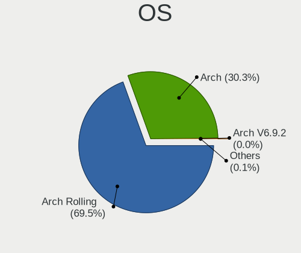
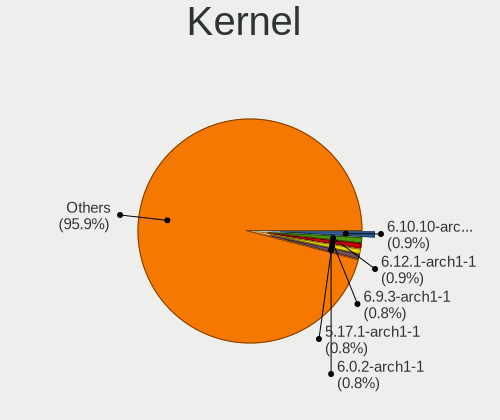
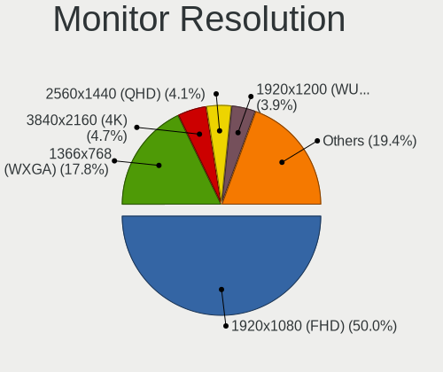
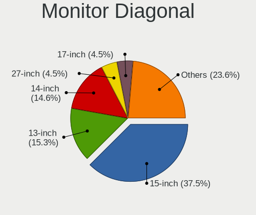
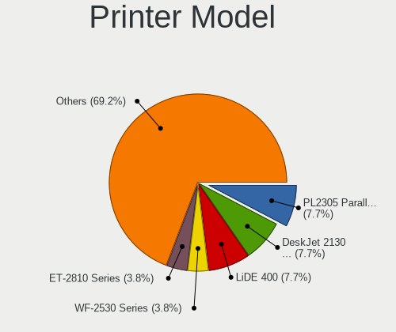

Arch - Tested Hardware & Statistics (Notebooks)
-----------------------------------------------

A project to collect tested hardware configurations for Arch.

Anyone can contribute to this report by the [hw-probe](https://github.com/linuxhw/hw-probe) tool:

    sudo -E hw-probe -all -upload

Please contribute! Especially if your hardware is rare.

Contents
--------

* [ Test Cases ](#test-cases)

* [ System ](#system)
  - [ OS                       ](#os)
  - [ OS Family                ](#os-family)
  - [ Kernel                   ](#kernel)
  - [ Kernel Family            ](#kernel-family)
  - [ Kernel Major Ver.        ](#kernel-major-ver)
  - [ Arch                     ](#arch)
  - [ DE                       ](#de)
  - [ Display Server           ](#display-server)
  - [ Display Manager          ](#display-manager)
  - [ OS Lang                  ](#os-lang)
  - [ Boot Mode                ](#boot-mode)
  - [ Filesystem               ](#filesystem)
  - [ Part. scheme             ](#part-scheme)
  - [ Dual Boot with Linux/BSD ](#dual-boot-with-linuxbsd)
  - [ Dual Boot (Win)          ](#dual-boot-win)

* [ Board ](#board)
  - [ Vendor                   ](#vendor)
  - [ Model                    ](#model)
  - [ Model Family             ](#model-family)
  - [ MFG Year                 ](#mfg-year)
  - [ Form Factor              ](#form-factor)
  - [ Secure Boot              ](#secure-boot)
  - [ Coreboot                 ](#coreboot)
  - [ RAM Size                 ](#ram-size)
  - [ RAM Used                 ](#ram-used)
  - [ Total Drives             ](#total-drives)
  - [ Has CD-ROM               ](#has-cd-rom)
  - [ Has Ethernet             ](#has-ethernet)
  - [ Has WiFi                 ](#has-wifi)
  - [ Has Bluetooth            ](#has-bluetooth)

* [ Location ](#location)
  - [ Country                  ](#country)
  - [ City                     ](#city)

* [ Drives ](#drives)
  - [ Drive Vendor             ](#drive-vendor)
  - [ Drive Model              ](#drive-model)
  - [ HDD Vendor               ](#hdd-vendor)
  - [ SSD Vendor               ](#ssd-vendor)
  - [ Drive Kind               ](#drive-kind)
  - [ Drive Connector          ](#drive-connector)
  - [ Drive Size               ](#drive-size)
  - [ Space Total              ](#space-total)
  - [ Space Used               ](#space-used)
  - [ Malfunc. Drives          ](#malfunc-drives)
  - [ Malfunc. Drive Vendor    ](#malfunc-drive-vendor)
  - [ Malfunc. HDD Vendor      ](#malfunc-hdd-vendor)
  - [ Malfunc. Drive Kind      ](#malfunc-drive-kind)
  - [ Failed Drives            ](#failed-drives)
  - [ Failed Drive Vendor      ](#failed-drive-vendor)
  - [ Drive Status             ](#drive-status)

* [ Storage controller ](#storage-controller)
  - [ Storage Vendor           ](#storage-vendor)
  - [ Storage Model            ](#storage-model)
  - [ Storage Kind             ](#storage-kind)

* [ Processor ](#processor)
  - [ CPU Vendor               ](#cpu-vendor)
  - [ CPU Model                ](#cpu-model)
  - [ CPU Model Family         ](#cpu-model-family)
  - [ CPU Cores                ](#cpu-cores)
  - [ CPU Sockets              ](#cpu-sockets)
  - [ CPU Threads              ](#cpu-threads)
  - [ CPU Op-Modes             ](#cpu-op-modes)
  - [ CPU Microcode            ](#cpu-microcode)
  - [ CPU Microarch            ](#cpu-microarch)

* [ Graphics ](#graphics)
  - [ GPU Vendor               ](#gpu-vendor)
  - [ GPU Model                ](#gpu-model)
  - [ GPU Combo                ](#gpu-combo)
  - [ GPU Driver               ](#gpu-driver)
  - [ GPU Memory               ](#gpu-memory)

* [ Monitor ](#monitor)
  - [ Monitor Vendor           ](#monitor-vendor)
  - [ Monitor Model            ](#monitor-model)
  - [ Monitor Resolution       ](#monitor-resolution)
  - [ Monitor Diagonal         ](#monitor-diagonal)
  - [ Monitor Width            ](#monitor-width)
  - [ Aspect Ratio             ](#aspect-ratio)
  - [ Monitor Area             ](#monitor-area)
  - [ Pixel Density            ](#pixel-density)
  - [ Multiple Monitors        ](#multiple-monitors)

* [ Network ](#network)
  - [ Net Controller Vendor    ](#net-controller-vendor)
  - [ Net Controller Model     ](#net-controller-model)
  - [ Wireless Vendor          ](#wireless-vendor)
  - [ Wireless Model           ](#wireless-model)
  - [ Ethernet Vendor          ](#ethernet-vendor)
  - [ Ethernet Model           ](#ethernet-model)
  - [ Net Controller Kind      ](#net-controller-kind)
  - [ Used Controller          ](#used-controller)
  - [ NICs                     ](#nics)
  - [ IPv6                     ](#ipv6)

* [ Bluetooth ](#bluetooth)
  - [ Bluetooth Vendor         ](#bluetooth-vendor)
  - [ Bluetooth Model          ](#bluetooth-model)

* [ Sound ](#sound)
  - [ Sound Vendor             ](#sound-vendor)
  - [ Sound Model              ](#sound-model)

* [ Memory ](#memory)
  - [ Memory Vendor            ](#memory-vendor)
  - [ Memory Model             ](#memory-model)
  - [ Memory Kind              ](#memory-kind)
  - [ Memory Form Factor       ](#memory-form-factor)
  - [ Memory Size              ](#memory-size)
  - [ Memory Speed             ](#memory-speed)

* [ Printers & scanners ](#printers--scanners)
  - [ Printer Vendor           ](#printer-vendor)
  - [ Printer Model            ](#printer-model)
  - [ Scanner Vendor           ](#scanner-vendor)
  - [ Scanner Model            ](#scanner-model)

* [ Camera ](#camera)
  - [ Camera Vendor            ](#camera-vendor)
  - [ Camera Model             ](#camera-model)

* [ Security ](#security)
  - [ Fingerprint Vendor       ](#fingerprint-vendor)
  - [ Fingerprint Model        ](#fingerprint-model)
  - [ Chipcard Vendor          ](#chipcard-vendor)
  - [ Chipcard Model           ](#chipcard-model)

* [ Unsupported ](#unsupported)
  - [ Unsupported Devices      ](#unsupported-devices)
  - [ Unsupported Device Types ](#unsupported-device-types)

Test Cases
----------

Total: 5659

| Vendor        | Model                       | Probe                                                      | Date         |
|---------------|-----------------------------|------------------------------------------------------------|--------------|
| Apple         | MacBookPro11,3              | [0009d8a468](https://linux-hardware.org/?probe=0009d8a468) | Nov 06, 2023 |
| HP            | Pavilion Plus Laptop 14-... | [5cfef4c0b7](https://linux-hardware.org/?probe=5cfef4c0b7) | Nov 06, 2023 |
| HP            | Pavilion Plus Laptop 14-... | [f1d9fe0bb7](https://linux-hardware.org/?probe=f1d9fe0bb7) | Nov 06, 2023 |
| Lenovo        | ThinkPad Edge E431 62771... | [8d789a3937](https://linux-hardware.org/?probe=8d789a3937) | Nov 06, 2023 |
| MSI           | Bravo 17 C7VF               | [5982277b4b](https://linux-hardware.org/?probe=5982277b4b) | Nov 06, 2023 |
| HP            | EliteBook 830 G5            | [07ef51bd31](https://linux-hardware.org/?probe=07ef51bd31) | Nov 05, 2023 |
| Dell          | Latitude 7280               | [3f1419b0ea](https://linux-hardware.org/?probe=3f1419b0ea) | Nov 05, 2023 |
| HP            | ProBook 450 G5              | [6407166dd5](https://linux-hardware.org/?probe=6407166dd5) | Nov 05, 2023 |
| Notebook      | N85_N87,HJ,HJ1,HK1          | [53f5c381aa](https://linux-hardware.org/?probe=53f5c381aa) | Nov 05, 2023 |
| Lenovo        | ThinkPad T14s Gen 3 21CQ... | [c235d90592](https://linux-hardware.org/?probe=c235d90592) | Nov 05, 2023 |
| Lenovo        | ThinkPad X1 Carbon Gen 9... | [e95c10c89d](https://linux-hardware.org/?probe=e95c10c89d) | Nov 04, 2023 |
| Notebook      | N141CU                      | [8f817eeabf](https://linux-hardware.org/?probe=8f817eeabf) | Nov 04, 2023 |
| ASUSTek       | VivoBook_ASUSLaptop X513... | [34e4bd156f](https://linux-hardware.org/?probe=34e4bd156f) | Nov 04, 2023 |
| HP            | 255 G8 Notebook PC          | [2d1116cd1b](https://linux-hardware.org/?probe=2d1116cd1b) | Nov 04, 2023 |
| MSI           | GV62 7RE                    | [a6ce21c9de](https://linux-hardware.org/?probe=a6ce21c9de) | Nov 04, 2023 |
| Lenovo        | IdeaPad 710S Plus-13ISK ... | [f143d09ba7](https://linux-hardware.org/?probe=f143d09ba7) | Nov 04, 2023 |
| Lenovo        | ThinkPad T14s Gen 3 21CQ... | [d17e6059bb](https://linux-hardware.org/?probe=d17e6059bb) | Nov 03, 2023 |
| HP            | OMEN by Laptop 17-ck2xxx    | [e34a0ab109](https://linux-hardware.org/?probe=e34a0ab109) | Nov 03, 2023 |
| Dell          | Latitude 7280               | [b795f0157b](https://linux-hardware.org/?probe=b795f0157b) | Nov 03, 2023 |
| Lenovo        | ThinkPad X1 Carbon 5th 2... | [2ac0d5a547](https://linux-hardware.org/?probe=2ac0d5a547) | Nov 03, 2023 |
| HUAWEI        | BOM-WXX9                    | [bc3b3daf33](https://linux-hardware.org/?probe=bc3b3daf33) | Nov 03, 2023 |
| Lenovo        | Legion Pro 5 16ARX8 82WM    | [9ea1c674f9](https://linux-hardware.org/?probe=9ea1c674f9) | Nov 03, 2023 |
| Notebook      | NJ50_70CU                   | [9cabd6fd2c](https://linux-hardware.org/?probe=9cabd6fd2c) | Nov 02, 2023 |
| Notebook      | NJ50_70CU                   | [3414d178f2](https://linux-hardware.org/?probe=3414d178f2) | Nov 02, 2023 |
| Dell          | Inspiron 5567               | [97348209dd](https://linux-hardware.org/?probe=97348209dd) | Nov 02, 2023 |
| ASUSTek       | ASUS TUF Gaming A17 FA70... | [d17a8bc08a](https://linux-hardware.org/?probe=d17a8bc08a) | Nov 02, 2023 |
| Dell          | Latitude E6330              | [b31f60152f](https://linux-hardware.org/?probe=b31f60152f) | Nov 02, 2023 |
| Samsung       | 750XDA                      | [130a1273e5](https://linux-hardware.org/?probe=130a1273e5) | Nov 02, 2023 |
| Fujitsu       | LIFEBOOK A532               | [b596813aeb](https://linux-hardware.org/?probe=b596813aeb) | Nov 02, 2023 |
| Valve         | Jupiter                     | [3ee2512ba0](https://linux-hardware.org/?probe=3ee2512ba0) | Nov 02, 2023 |
| Valve         | Jupiter                     | [2c454d7632](https://linux-hardware.org/?probe=2c454d7632) | Nov 02, 2023 |
| ASUSTek       | ASUS TUF Dash F15 FX517Z... | [c7d2d860fb](https://linux-hardware.org/?probe=c7d2d860fb) | Nov 02, 2023 |
| Schenker      | XMG FUSION 15 (XFU15M22)    | [4ba182f0d5](https://linux-hardware.org/?probe=4ba182f0d5) | Nov 02, 2023 |
| ASUSTek       | K56CB                       | [9fff1dc94c](https://linux-hardware.org/?probe=9fff1dc94c) | Nov 01, 2023 |
| Dell          | Latitude 7370               | [b16724db59](https://linux-hardware.org/?probe=b16724db59) | Nov 01, 2023 |
| HP            | Laptop 15s-eq2xxx           | [3c04d0213b](https://linux-hardware.org/?probe=3c04d0213b) | Nov 01, 2023 |
| ASUSTek       | ZenBook UX325EA_UX325EA     | [6afebfd732](https://linux-hardware.org/?probe=6afebfd732) | Nov 01, 2023 |
| HP            | Laptop 15-bs1xx             | [1bd48815fe](https://linux-hardware.org/?probe=1bd48815fe) | Nov 01, 2023 |
| Dell          | Inspiron 7520               | [460c9255bd](https://linux-hardware.org/?probe=460c9255bd) | Nov 01, 2023 |
| Lenovo        | IdeaPad S145-15IWL 81S9     | [446efaf1bb](https://linux-hardware.org/?probe=446efaf1bb) | Oct 31, 2023 |
| ASUSTek       | F5N                         | [8da324b4fa](https://linux-hardware.org/?probe=8da324b4fa) | Oct 31, 2023 |
| Lenovo        | ThinkPad T495 20NJCTO1WW    | [8e86103e06](https://linux-hardware.org/?probe=8e86103e06) | Oct 31, 2023 |
| Samsung       | 750XED                      | [9dab50e37e](https://linux-hardware.org/?probe=9dab50e37e) | Oct 31, 2023 |
| Dell          | G15 5515                    | [c59e97ba9e](https://linux-hardware.org/?probe=c59e97ba9e) | Oct 31, 2023 |
| Dell          | Vostro 3549                 | [259c646ecb](https://linux-hardware.org/?probe=259c646ecb) | Oct 31, 2023 |
| HP            | Laptop 15s-eq0xxx           | [1323e3ad04](https://linux-hardware.org/?probe=1323e3ad04) | Oct 31, 2023 |
| Lenovo        | G500 20236                  | [6779e74408](https://linux-hardware.org/?probe=6779e74408) | Oct 31, 2023 |
| Lenovo        | Yoga 900-13ISK 80MK         | [38b70999b9](https://linux-hardware.org/?probe=38b70999b9) | Oct 31, 2023 |
| Lenovo        | G500 20236                  | [000230db12](https://linux-hardware.org/?probe=000230db12) | Oct 30, 2023 |
| Lenovo        | IdeaPad Gaming 3 15ACH6 ... | [ab5cef69c3](https://linux-hardware.org/?probe=ab5cef69c3) | Oct 30, 2023 |
| HP            | Pavilion Gaming Notebook    | [17dd2ce988](https://linux-hardware.org/?probe=17dd2ce988) | Oct 30, 2023 |
| Lenovo        | Yoga Slim 7 ProX 14ARH7 ... | [5f8cf197d5](https://linux-hardware.org/?probe=5f8cf197d5) | Oct 30, 2023 |
| HP            | 255 G8 Notebook PC          | [941ca289ce](https://linux-hardware.org/?probe=941ca289ce) | Oct 30, 2023 |
| MSI           | GP66 Leopard 10UG           | [47dbfa475a](https://linux-hardware.org/?probe=47dbfa475a) | Oct 30, 2023 |
| HUAWEI        | BOHK-WAX9X                  | [2b883f993f](https://linux-hardware.org/?probe=2b883f993f) | Oct 30, 2023 |
| MSI           | GF75 Thin 10SC              | [7aa47ebfa1](https://linux-hardware.org/?probe=7aa47ebfa1) | Oct 30, 2023 |
| Lenovo        | ThinkPad T480 20L6S0CE13    | [28a8f59777](https://linux-hardware.org/?probe=28a8f59777) | Oct 29, 2023 |
| Lenovo        | ThinkPad X250 20CMS04J00    | [773098b9e5](https://linux-hardware.org/?probe=773098b9e5) | Oct 29, 2023 |
| Lenovo        | IdeaPad 5 Pro 16ARH7 82S... | [d690fa8f27](https://linux-hardware.org/?probe=d690fa8f27) | Oct 29, 2023 |
| ASUSTek       | Zenbook 15 UM3504DA_UM35... | [e34ea8701a](https://linux-hardware.org/?probe=e34ea8701a) | Oct 28, 2023 |
| ASRock        | B550M-C                     | [51c187d805](https://linux-hardware.org/?probe=51c187d805) | Oct 28, 2023 |
| Lenovo        | IdeaPad Gaming 3 15ARH05... | [b65d7d3b4a](https://linux-hardware.org/?probe=b65d7d3b4a) | Oct 28, 2023 |
| HP            | EliteBook 2570p             | [bc8c6e67a9](https://linux-hardware.org/?probe=bc8c6e67a9) | Oct 28, 2023 |
| Lenovo        | ThinkPad E560 20EV002JUS    | [07a3c8eea8](https://linux-hardware.org/?probe=07a3c8eea8) | Oct 28, 2023 |
| Lenovo        | ThinkPad E560 20EV002JUS    | [906ed51ecf](https://linux-hardware.org/?probe=906ed51ecf) | Oct 27, 2023 |
| Lenovo        | ThinkPad T450 20BUS00700    | [f74328fd58](https://linux-hardware.org/?probe=f74328fd58) | Oct 27, 2023 |
| HONOR         | BOD-WXX9                    | [6de8b3afda](https://linux-hardware.org/?probe=6de8b3afda) | Oct 27, 2023 |
| ASUSTek       | ROG Strix G513QY_G513QY     | [334f8582b0](https://linux-hardware.org/?probe=334f8582b0) | Oct 27, 2023 |
| ASUSTek       | Zenbook 15 UM3504DA_UM35... | [5e0942e6b0](https://linux-hardware.org/?probe=5e0942e6b0) | Oct 27, 2023 |
| ASUSTek       | ASUS TUF Gaming F15 FX50... | [bbba3e21c7](https://linux-hardware.org/?probe=bbba3e21c7) | Oct 27, 2023 |
| Lenovo        | ThinkPad E14 Gen 5 21JKC... | [c9ba633d37](https://linux-hardware.org/?probe=c9ba633d37) | Oct 27, 2023 |
| Dell          | Latitude 5430               | [af33081c9b](https://linux-hardware.org/?probe=af33081c9b) | Oct 27, 2023 |
| LG Electro... | 15Z95N-G.AAC6U1             | [7f2e8a07de](https://linux-hardware.org/?probe=7f2e8a07de) | Oct 27, 2023 |
| ASUSTek       | ROG Zephyrus G14 GA401QC... | [e3c1de1472](https://linux-hardware.org/?probe=e3c1de1472) | Oct 26, 2023 |
| Lenovo        | IdeaPad Slim 7 Carbon 14... | [cbba790d59](https://linux-hardware.org/?probe=cbba790d59) | Oct 26, 2023 |
| Lenovo        | ThinkPad E14 Gen 5 21JRS... | [0ed2bd399f](https://linux-hardware.org/?probe=0ed2bd399f) | Oct 25, 2023 |
| HP            | OMEN by Laptop 15-dc1xxx    | [d69762902a](https://linux-hardware.org/?probe=d69762902a) | Oct 25, 2023 |
| HP            | EliteBook 845 G7 Noteboo... | [e51b06f086](https://linux-hardware.org/?probe=e51b06f086) | Oct 24, 2023 |
| Apple         | MacBookPro9,2               | [97f4660a4d](https://linux-hardware.org/?probe=97f4660a4d) | Oct 24, 2023 |
| TUXEDO        | InfinityBook Pro Gen8 (M... | [3907a62f64](https://linux-hardware.org/?probe=3907a62f64) | Oct 24, 2023 |
| Acer          | Aspire A315-510P            | [332b714861](https://linux-hardware.org/?probe=332b714861) | Oct 24, 2023 |
| Dell          | Inspiron 7559               | [24a664955f](https://linux-hardware.org/?probe=24a664955f) | Oct 23, 2023 |
| Dell          | Inspiron 7559               | [c931b1ef73](https://linux-hardware.org/?probe=c931b1ef73) | Oct 23, 2023 |
| ASUSTek       | ROG Strix G533QM_G533QM     | [a4c0d7be24](https://linux-hardware.org/?probe=a4c0d7be24) | Oct 23, 2023 |
| ASUSTek       | ASUS TUF Gaming A15 FA50... | [4f06b99b2e](https://linux-hardware.org/?probe=4f06b99b2e) | Oct 23, 2023 |
| ASUSTek       | ASUS EXPERTBOOK B9400CEA... | [817e0c8438](https://linux-hardware.org/?probe=817e0c8438) | Oct 23, 2023 |
| Lenovo        | V15 G2 ITL Ua 82KB          | [399c501d43](https://linux-hardware.org/?probe=399c501d43) | Oct 23, 2023 |
| Dell          | Latitude 5430               | [8d552380c4](https://linux-hardware.org/?probe=8d552380c4) | Oct 23, 2023 |
| Acer          | Aspire A315-58              | [60402f4ad8](https://linux-hardware.org/?probe=60402f4ad8) | Oct 23, 2023 |
| Dell          | XPS 9315                    | [d04399e8fd](https://linux-hardware.org/?probe=d04399e8fd) | Oct 23, 2023 |
| UNOWHY        | Y13G012S4EI                 | [37680f1ed6](https://linux-hardware.org/?probe=37680f1ed6) | Oct 22, 2023 |
| HP            | 250 G8 Notebook PC          | [9538ff99bf](https://linux-hardware.org/?probe=9538ff99bf) | Oct 22, 2023 |
| Dell          | XPS 9315                    | [e3c5d45e2a](https://linux-hardware.org/?probe=e3c5d45e2a) | Oct 22, 2023 |
| Lenovo        | ThinkPad T430 2349B74       | [7f7998c326](https://linux-hardware.org/?probe=7f7998c326) | Oct 22, 2023 |
| Lenovo        | IdeaPad 320-15IAP 80XR      | [2ee834d08a](https://linux-hardware.org/?probe=2ee834d08a) | Oct 22, 2023 |
| Framework     | Laptop 13 (AMD Ryzen 704... | [f3cde0eac8](https://linux-hardware.org/?probe=f3cde0eac8) | Oct 22, 2023 |
| ASUSTek       | VivoBook_ASUSLaptop M650... | [f204c7469c](https://linux-hardware.org/?probe=f204c7469c) | Oct 21, 2023 |
| Dell          | Precision 5520              | [79b5c73851](https://linux-hardware.org/?probe=79b5c73851) | Oct 21, 2023 |
| HP            | 250 15.6 inch G10 Notebo... | [f5f8e6f37d](https://linux-hardware.org/?probe=f5f8e6f37d) | Oct 21, 2023 |
| Dell          | Latitude D830               | [53cbc541d2](https://linux-hardware.org/?probe=53cbc541d2) | Oct 20, 2023 |
| Avell High... | B.ON                        | [7f8ce9da76](https://linux-hardware.org/?probe=7f8ce9da76) | Oct 20, 2023 |
| ASUSTek       | Zenbook UM3402YAR_UM3402... | [7323684232](https://linux-hardware.org/?probe=7323684232) | Oct 20, 2023 |
| Dell          | Vostro 3300                 | [827b95e65c](https://linux-hardware.org/?probe=827b95e65c) | Oct 20, 2023 |
| Acer          | Aspire A315-42G             | [46d5d338b3](https://linux-hardware.org/?probe=46d5d338b3) | Oct 20, 2023 |
| Dell          | XPS 13 9310                 | [3a6514e61a](https://linux-hardware.org/?probe=3a6514e61a) | Oct 19, 2023 |
| MSI           | GF63 Thin 10SC              | [41635aba8a](https://linux-hardware.org/?probe=41635aba8a) | Oct 19, 2023 |
| MSI           | GF63 Thin 10SC              | [a370d171d1](https://linux-hardware.org/?probe=a370d171d1) | Oct 19, 2023 |
| ASUSTek       | GL553VD                     | [71ffea0397](https://linux-hardware.org/?probe=71ffea0397) | Oct 19, 2023 |
| ASUSTek       | GL553VD                     | [9ab2c722a5](https://linux-hardware.org/?probe=9ab2c722a5) | Oct 19, 2023 |
| Lenovo        | ThinkPad X1 Carbon 2nd 2... | [94cd063a64](https://linux-hardware.org/?probe=94cd063a64) | Oct 19, 2023 |
| Dell          | Latitude E7270              | [673245c691](https://linux-hardware.org/?probe=673245c691) | Oct 19, 2023 |
| Acer          | Aspire A514-55              | [f25a7d5b9e](https://linux-hardware.org/?probe=f25a7d5b9e) | Oct 18, 2023 |
| Lenovo        | IdeaPad 3 15IIL05 81WE      | [57dbbcb9f3](https://linux-hardware.org/?probe=57dbbcb9f3) | Oct 18, 2023 |
| Dell          | Inspiron N5110              | [8543bed1b3](https://linux-hardware.org/?probe=8543bed1b3) | Oct 17, 2023 |
| HUAWEI        | NBLK-WAX9X                  | [843098c658](https://linux-hardware.org/?probe=843098c658) | Oct 17, 2023 |
| Dell          | XPS 13 9310                 | [295c6b08bd](https://linux-hardware.org/?probe=295c6b08bd) | Oct 17, 2023 |
| Dell          | Latitude 7300               | [e68476c5ee](https://linux-hardware.org/?probe=e68476c5ee) | Oct 17, 2023 |
| ASUSTek       | ROG Zephyrus G14 GA402XV... | [b962ac1dff](https://linux-hardware.org/?probe=b962ac1dff) | Oct 17, 2023 |
| Dell          | XPS 9315                    | [e629bbd153](https://linux-hardware.org/?probe=e629bbd153) | Oct 16, 2023 |
| Dell          | XPS 9315                    | [a0b5099438](https://linux-hardware.org/?probe=a0b5099438) | Oct 16, 2023 |
| Dell          | Latitude 7424 Rugged Ext... | [5e2983dfb6](https://linux-hardware.org/?probe=5e2983dfb6) | Oct 16, 2023 |
| Dell          | XPS 13 9300                 | [e66f442843](https://linux-hardware.org/?probe=e66f442843) | Oct 16, 2023 |
| Dell          | XPS 15 9500                 | [0dcdd0a6a6](https://linux-hardware.org/?probe=0dcdd0a6a6) | Oct 16, 2023 |
| Dell          | XPS 13 9300                 | [eab86d1cc0](https://linux-hardware.org/?probe=eab86d1cc0) | Oct 16, 2023 |
| Dell          | Precision M6700             | [2fb2e2e9a5](https://linux-hardware.org/?probe=2fb2e2e9a5) | Oct 16, 2023 |
| ASUSTek       | N551JW                      | [c78d74d584](https://linux-hardware.org/?probe=c78d74d584) | Oct 16, 2023 |
| Acer          | Nitro AN515-52              | [7f9e09a9e1](https://linux-hardware.org/?probe=7f9e09a9e1) | Oct 16, 2023 |
| Acer          | Nitro AN515-52              | [2571e4fd1b](https://linux-hardware.org/?probe=2571e4fd1b) | Oct 16, 2023 |
| HP            | Victus by Gaming Laptop ... | [f7b210b108](https://linux-hardware.org/?probe=f7b210b108) | Oct 16, 2023 |
| Dell          | Precision 3530              | [79e1f32ab8](https://linux-hardware.org/?probe=79e1f32ab8) | Oct 16, 2023 |
| HONOR         | HYM-WXX                     | [eaff1b458a](https://linux-hardware.org/?probe=eaff1b458a) | Oct 15, 2023 |
| ASUSTek       | ROG Strix G513IM_G513IM     | [81cbdd66c8](https://linux-hardware.org/?probe=81cbdd66c8) | Oct 15, 2023 |
| ASUSTek       | Zephyrus M GM501GS          | [ba4661ac35](https://linux-hardware.org/?probe=ba4661ac35) | Oct 15, 2023 |
| ASUSTek       | VivoBook 15_ASUS Laptop ... | [a9438a93a7](https://linux-hardware.org/?probe=a9438a93a7) | Oct 15, 2023 |
| Dell          | XPS 13 9343                 | [97a3c4d92d](https://linux-hardware.org/?probe=97a3c4d92d) | Oct 15, 2023 |
| HP            | Victus by Laptop 16-e0xx... | [585c33a966](https://linux-hardware.org/?probe=585c33a966) | Oct 15, 2023 |
| HP            | ProBook 6560b               | [49ffe8b6c5](https://linux-hardware.org/?probe=49ffe8b6c5) | Oct 14, 2023 |
| Lenovo        | IdeaPad Gaming 3 16ARH7 ... | [e9d04fdd59](https://linux-hardware.org/?probe=e9d04fdd59) | Oct 14, 2023 |
| ASUSTek       | Zenbook UX535QE_UM535QE     | [ab093317ba](https://linux-hardware.org/?probe=ab093317ba) | Oct 14, 2023 |
| HP            | OMEN by Gaming Laptop 16... | [5584acb2f0](https://linux-hardware.org/?probe=5584acb2f0) | Oct 14, 2023 |
| Dell          | Inspiron 5575               | [c50573f4ae](https://linux-hardware.org/?probe=c50573f4ae) | Oct 14, 2023 |
| Fujitsu       | LIFEBOOK S752               | [4015286a79](https://linux-hardware.org/?probe=4015286a79) | Oct 14, 2023 |
| Dell          | Latitude 7390               | [12de4c5026](https://linux-hardware.org/?probe=12de4c5026) | Oct 14, 2023 |
| Sony          | VPCEB15EL                   | [f7a3de3793](https://linux-hardware.org/?probe=f7a3de3793) | Oct 13, 2023 |
| Lenovo        | ThinkPad X13 Gen 1 20T3S... | [08a6026b21](https://linux-hardware.org/?probe=08a6026b21) | Oct 13, 2023 |
| Acer          | Swift SF314-511             | [3d63dd4590](https://linux-hardware.org/?probe=3d63dd4590) | Oct 13, 2023 |
| Acer          | Aspire E5-523               | [e45e982b6e](https://linux-hardware.org/?probe=e45e982b6e) | Oct 13, 2023 |
| Lenovo        | ThinkPad X13 Gen 1 20T3S... | [c97af886ef](https://linux-hardware.org/?probe=c97af886ef) | Oct 12, 2023 |
| Acer          | Predator PH315-54           | [541e679856](https://linux-hardware.org/?probe=541e679856) | Oct 12, 2023 |
| Dell          | G3 3500                     | [1f975cc52a](https://linux-hardware.org/?probe=1f975cc52a) | Oct 12, 2023 |
| HP            | OMEN Laptop 15-en0xxx       | [d5040f4ca4](https://linux-hardware.org/?probe=d5040f4ca4) | Oct 12, 2023 |
| Dell          | XPS 13 9300                 | [6a0e699ccc](https://linux-hardware.org/?probe=6a0e699ccc) | Oct 11, 2023 |
| ASUSTek       | S550CM                      | [ad1b08de66](https://linux-hardware.org/?probe=ad1b08de66) | Oct 10, 2023 |
| HP            | Notebook                    | [efd1dac9ef](https://linux-hardware.org/?probe=efd1dac9ef) | Oct 10, 2023 |
| HP            | Victus by Laptop 16-e0xx... | [908a750a93](https://linux-hardware.org/?probe=908a750a93) | Oct 10, 2023 |
| HP            | Victus by Laptop 16-e0xx... | [10b2d6465f](https://linux-hardware.org/?probe=10b2d6465f) | Oct 10, 2023 |
| Dell          | Latitude E5440              | [2f6ed33823](https://linux-hardware.org/?probe=2f6ed33823) | Oct 10, 2023 |
| Dell          | Latitude E5440              | [90b9b12b1b](https://linux-hardware.org/?probe=90b9b12b1b) | Oct 10, 2023 |
| Lenovo        | IdeaPad S145-15IWL 81S9     | [c397035651](https://linux-hardware.org/?probe=c397035651) | Oct 10, 2023 |
| HUAWEI        | HN-WX9X                     | [3bb1bed686](https://linux-hardware.org/?probe=3bb1bed686) | Oct 09, 2023 |
| HP            | OMEN by Laptop 16-b0xxx     | [6e8b2311e4](https://linux-hardware.org/?probe=6e8b2311e4) | Oct 09, 2023 |
| Lenovo        | ThinkPad E14 Gen 3 20Y7C... | [d739639932](https://linux-hardware.org/?probe=d739639932) | Oct 09, 2023 |
| HP            | Laptop 15s-eq2xxx           | [341fc3d0f1](https://linux-hardware.org/?probe=341fc3d0f1) | Oct 09, 2023 |
| HP            | Victus by Laptop 16-e0xx... | [29c7192a14](https://linux-hardware.org/?probe=29c7192a14) | Oct 08, 2023 |
| Dell          | Latitude 3440               | [88a0ec8369](https://linux-hardware.org/?probe=88a0ec8369) | Oct 08, 2023 |
| Dell          | Latitude 7430               | [1de7d3085b](https://linux-hardware.org/?probe=1de7d3085b) | Oct 08, 2023 |
| HP            | Notebook                    | [a181ec12af](https://linux-hardware.org/?probe=a181ec12af) | Oct 08, 2023 |
| HP            | Notebook                    | [039a70e9ce](https://linux-hardware.org/?probe=039a70e9ce) | Oct 07, 2023 |
| Toshiba       | Satellite L655              | [3f3879060f](https://linux-hardware.org/?probe=3f3879060f) | Oct 07, 2023 |
| Dell          | XPS 15 9530                 | [1423f1793b](https://linux-hardware.org/?probe=1423f1793b) | Oct 07, 2023 |
| HP            | EliteBook 8460p             | [80b914414e](https://linux-hardware.org/?probe=80b914414e) | Oct 07, 2023 |
| Lenovo        | IdeaPad 3 15ITL6 82H8       | [d8d241531e](https://linux-hardware.org/?probe=d8d241531e) | Oct 07, 2023 |
| Apple         | MacBookPro11,1              | [b30fe669c6](https://linux-hardware.org/?probe=b30fe669c6) | Oct 07, 2023 |
| Lenovo        | ThinkPad P15v Gen 3 21EM... | [0354977d6c](https://linux-hardware.org/?probe=0354977d6c) | Oct 07, 2023 |
| Lenovo        | Yoga Slim 7 Pro 14ACH5 8... | [faea5bdeba](https://linux-hardware.org/?probe=faea5bdeba) | Oct 07, 2023 |
| HP            | Pavilion Laptop 15-eh0xx... | [446c6847c3](https://linux-hardware.org/?probe=446c6847c3) | Oct 06, 2023 |
| HONOR         | FRI-HXX                     | [fd2a01c055](https://linux-hardware.org/?probe=fd2a01c055) | Oct 06, 2023 |
| HP            | 255 G4                      | [7097fff4ee](https://linux-hardware.org/?probe=7097fff4ee) | Oct 06, 2023 |
| ASUSTek       | Zenbook UX5401ZAS_UX5401... | [058c6a0ee6](https://linux-hardware.org/?probe=058c6a0ee6) | Oct 06, 2023 |
| ASUSTek       | ZenBook UX425EA_UX425EA     | [9dc2fd3247](https://linux-hardware.org/?probe=9dc2fd3247) | Oct 06, 2023 |
| Dell          | XPS 15 9530                 | [425aa2b0f7](https://linux-hardware.org/?probe=425aa2b0f7) | Oct 05, 2023 |
| MSI           | GE63 Raider RGB 8RE         | [39b9855097](https://linux-hardware.org/?probe=39b9855097) | Oct 05, 2023 |
| MSI           | GE63 Raider RGB 8RE         | [74bb875f9f](https://linux-hardware.org/?probe=74bb875f9f) | Oct 05, 2023 |
| HP            | Laptop 14s-cf2xxx           | [c40356b94d](https://linux-hardware.org/?probe=c40356b94d) | Oct 05, 2023 |
| Lenovo        | ThinkPad P1 Gen 4i 20Y4S... | [e23d98e73b](https://linux-hardware.org/?probe=e23d98e73b) | Oct 05, 2023 |
| HP            | OMEN by Laptop 17-an0xx     | [02ff66cc0c](https://linux-hardware.org/?probe=02ff66cc0c) | Oct 05, 2023 |
| Timi          | A30                         | [36d352fb7f](https://linux-hardware.org/?probe=36d352fb7f) | Oct 04, 2023 |
| Dell          | Vostro 15-3568              | [3639fedec4](https://linux-hardware.org/?probe=3639fedec4) | Oct 04, 2023 |
| Positivo      | S14BW01                     | [3027fc7d9b](https://linux-hardware.org/?probe=3027fc7d9b) | Oct 04, 2023 |
| HP            | Pavilion g7                 | [ec5cf4fb00](https://linux-hardware.org/?probe=ec5cf4fb00) | Oct 03, 2023 |
| Dell          | Latitude E7440              | [3cb4fc2857](https://linux-hardware.org/?probe=3cb4fc2857) | Oct 03, 2023 |
| Acer          | Aspire A314-36M             | [5276b99f12](https://linux-hardware.org/?probe=5276b99f12) | Oct 03, 2023 |
| XIAOMI        | Redmi Book Pro 15 2023      | [09b97f9681](https://linux-hardware.org/?probe=09b97f9681) | Oct 02, 2023 |
| Lenovo        | ThinkBook 14 G2 ITL 20VD    | [b0b5262c87](https://linux-hardware.org/?probe=b0b5262c87) | Oct 02, 2023 |
| Sony          | SVF1421PSGB                 | [11d6cad851](https://linux-hardware.org/?probe=11d6cad851) | Oct 02, 2023 |
| HP            | ProBook 6560b               | [ea59e8557f](https://linux-hardware.org/?probe=ea59e8557f) | Oct 01, 2023 |
| Sony          | SVF1421PSGB                 | [84a0c8ea9b](https://linux-hardware.org/?probe=84a0c8ea9b) | Oct 01, 2023 |
| Lenovo        | ThinkPad T14s Gen 3 21CQ... | [6801ddb23b](https://linux-hardware.org/?probe=6801ddb23b) | Oct 01, 2023 |
| Dell          | Latitude E5450              | [76401b3ca2](https://linux-hardware.org/?probe=76401b3ca2) | Oct 01, 2023 |
| HP            | Victus by Laptop 16-d0xx... | [5ee355215f](https://linux-hardware.org/?probe=5ee355215f) | Oct 01, 2023 |
| HP            | Pavilion Gaming Laptop 1... | [c99f28b27d](https://linux-hardware.org/?probe=c99f28b27d) | Oct 01, 2023 |
| Lenovo        | ThinkPad L14 Gen 1 20U6S... | [b79529501a](https://linux-hardware.org/?probe=b79529501a) | Oct 01, 2023 |
| ASUSTek       | VivoBook_ASUSLaptop X512... | [ef74c51c65](https://linux-hardware.org/?probe=ef74c51c65) | Oct 01, 2023 |
| Dell          | Inspiron 5567               | [493a83e70a](https://linux-hardware.org/?probe=493a83e70a) | Sep 30, 2023 |
| Lenovo        | Legion Pro 5 16ARX8 82WM    | [0fad85dfc9](https://linux-hardware.org/?probe=0fad85dfc9) | Sep 30, 2023 |
| HP            | ProBook 6560b               | [904f0eb2cb](https://linux-hardware.org/?probe=904f0eb2cb) | Sep 30, 2023 |
| Lenovo        | ThinkPad 13 2nd Gen 20J2... | [702d68e226](https://linux-hardware.org/?probe=702d68e226) | Sep 30, 2023 |
| eMachines     | eME732Z                     | [ba03824830](https://linux-hardware.org/?probe=ba03824830) | Sep 29, 2023 |
| Dell          | Precision 5480              | [5d157102ea](https://linux-hardware.org/?probe=5d157102ea) | Sep 29, 2023 |
| Lenovo        | ThinkPad T480s 20L8002WM... | [eef8975f1e](https://linux-hardware.org/?probe=eef8975f1e) | Sep 29, 2023 |
| Dell          | XPS 13 9360                 | [2a3e49f18f](https://linux-hardware.org/?probe=2a3e49f18f) | Sep 29, 2023 |
| Google        | Lindar                      | [f8f947a025](https://linux-hardware.org/?probe=f8f947a025) | Sep 28, 2023 |
| Google        | Lindar                      | [9ddbc21f0d](https://linux-hardware.org/?probe=9ddbc21f0d) | Sep 28, 2023 |
| HP            | 240 G8 Notebook PC          | [af9350dd38](https://linux-hardware.org/?probe=af9350dd38) | Sep 28, 2023 |
| Lenovo        | ThinkPad E15 Gen 2 20TDS... | [92d7b8d41e](https://linux-hardware.org/?probe=92d7b8d41e) | Sep 28, 2023 |
| HP            | 240 G8 Notebook PC          | [d40624877e](https://linux-hardware.org/?probe=d40624877e) | Sep 28, 2023 |
| Dell          | Vostro 5470                 | [b6f9976e23](https://linux-hardware.org/?probe=b6f9976e23) | Sep 28, 2023 |
| ASUSTek       | VivoBook_ASUSLaptop X513... | [58fdd789af](https://linux-hardware.org/?probe=58fdd789af) | Sep 28, 2023 |
| Acer          | Aspire E5-571               | [acd3733ebf](https://linux-hardware.org/?probe=acd3733ebf) | Sep 27, 2023 |
| ASUSTek       | ASUS TUF Gaming F15 FX50... | [c5c6c5233a](https://linux-hardware.org/?probe=c5c6c5233a) | Sep 27, 2023 |
| Dell          | G3 3590                     | [3523165978](https://linux-hardware.org/?probe=3523165978) | Sep 27, 2023 |
| Dell          | Latitude 3540               | [eb8bf9b174](https://linux-hardware.org/?probe=eb8bf9b174) | Sep 26, 2023 |
| Dell          | G5 5590                     | [c7e7205fff](https://linux-hardware.org/?probe=c7e7205fff) | Sep 26, 2023 |
| Dell          | G5 5590                     | [0e80b66cb6](https://linux-hardware.org/?probe=0e80b66cb6) | Sep 26, 2023 |
| MSI           | GF75 Thin 10SC              | [f19700e7b0](https://linux-hardware.org/?probe=f19700e7b0) | Sep 26, 2023 |
| MSI           | GF75 Thin 10SC              | [a7610be494](https://linux-hardware.org/?probe=a7610be494) | Sep 26, 2023 |
| Lenovo        | IdeaPad Y700-17ISK 80Q0     | [742cfeafb0](https://linux-hardware.org/?probe=742cfeafb0) | Sep 26, 2023 |
| ASUSTek       | ASUS TUF Gaming A15 FA50... | [a7d0f8e075](https://linux-hardware.org/?probe=a7d0f8e075) | Sep 26, 2023 |
| Lenovo        | V15 G3 ABA 82TV             | [2568280c44](https://linux-hardware.org/?probe=2568280c44) | Sep 25, 2023 |
| Lenovo        | IdeaPad 3 17ALC6 82KV       | [1ce8f959f1](https://linux-hardware.org/?probe=1ce8f959f1) | Sep 25, 2023 |
| ASUSTek       | VivoBook 15_ASUS Laptop ... | [549941d843](https://linux-hardware.org/?probe=549941d843) | Sep 25, 2023 |
| Samsung       | 750XDA                      | [dd03d00004](https://linux-hardware.org/?probe=dd03d00004) | Sep 25, 2023 |
| MSI           | Bravo 15 C7VF               | [ab0a5a435f](https://linux-hardware.org/?probe=ab0a5a435f) | Sep 25, 2023 |
| Dell          | Latitude E5440              | [f4accb1cb0](https://linux-hardware.org/?probe=f4accb1cb0) | Sep 25, 2023 |
| Dell          | Latitude E6330              | [1375d355a5](https://linux-hardware.org/?probe=1375d355a5) | Sep 24, 2023 |
| Dell          | Latitude E5470              | [efb0e356d6](https://linux-hardware.org/?probe=efb0e356d6) | Sep 24, 2023 |
| Lenovo        | IdeaPad N581 7505           | [ed2e5eed86](https://linux-hardware.org/?probe=ed2e5eed86) | Sep 24, 2023 |
| Lenovo        | IdeaPad 3 14IIL05 81WD      | [952169c1ce](https://linux-hardware.org/?probe=952169c1ce) | Sep 24, 2023 |
| Dell          | Inspiron 3543               | [2075d98d66](https://linux-hardware.org/?probe=2075d98d66) | Sep 24, 2023 |
| Dell          | Inspiron 7577               | [685f51111f](https://linux-hardware.org/?probe=685f51111f) | Sep 24, 2023 |
| Lenovo        | ThinkPad Edge E431 62778... | [31b0e8e9ce](https://linux-hardware.org/?probe=31b0e8e9ce) | Sep 24, 2023 |
| Lenovo        | ThinkPad T480s 20L8002WM... | [234fc6a6fb](https://linux-hardware.org/?probe=234fc6a6fb) | Sep 24, 2023 |
| Dell          | Latitude 5580               | [6353ffcdf5](https://linux-hardware.org/?probe=6353ffcdf5) | Sep 23, 2023 |
| MSI           | Katana GF76 11UE            | [8327fd670f](https://linux-hardware.org/?probe=8327fd670f) | Sep 23, 2023 |
| HP            | Pavilion g6                 | [c49107d782](https://linux-hardware.org/?probe=c49107d782) | Sep 22, 2023 |
| Fujitsu       | LIFEBOOK A357               | [d18e2d8811](https://linux-hardware.org/?probe=d18e2d8811) | Sep 22, 2023 |
| Lenovo        | IdeaPad S145-15IWL 81S9     | [04141bd71c](https://linux-hardware.org/?probe=04141bd71c) | Sep 22, 2023 |
| ASUSTek       | ZenBook UX325EA_UX325EA     | [900334906e](https://linux-hardware.org/?probe=900334906e) | Sep 22, 2023 |
| Lenovo        | ThinkPad E14 Gen 4 21E30... | [0f097b1b88](https://linux-hardware.org/?probe=0f097b1b88) | Sep 22, 2023 |
| Lenovo        | ThinkPad P1 Gen 5 21DCCT... | [8c65f7a68a](https://linux-hardware.org/?probe=8c65f7a68a) | Sep 21, 2023 |
| Lenovo        | ThinkPad T440p 20AWS49Q0... | [65fa77246e](https://linux-hardware.org/?probe=65fa77246e) | Sep 21, 2023 |
| Dell          | Inspiron 15-3567            | [0f189d3c2a](https://linux-hardware.org/?probe=0f189d3c2a) | Sep 21, 2023 |
| ASUSTek       | N551JW                      | [5dae6d6eda](https://linux-hardware.org/?probe=5dae6d6eda) | Sep 21, 2023 |
| Lenovo        | ThinkPad L540 20AU006CRI    | [e8885911a0](https://linux-hardware.org/?probe=e8885911a0) | Sep 21, 2023 |
| Apple         | MacBookPro12,1              | [bb796b1e6e](https://linux-hardware.org/?probe=bb796b1e6e) | Sep 21, 2023 |
| Lenovo        | Legion Y540-15IRH-PG0 81... | [2310ddb9a7](https://linux-hardware.org/?probe=2310ddb9a7) | Sep 21, 2023 |
| ASUSTek       | N551JW                      | [ae062bd5ca](https://linux-hardware.org/?probe=ae062bd5ca) | Sep 21, 2023 |
| ASUSTek       | Vivobook Go E1504FA_E150... | [1850488dd1](https://linux-hardware.org/?probe=1850488dd1) | Sep 20, 2023 |
| ASUSTek       | Vivobook Go E1504FA_E150... | [c122be4331](https://linux-hardware.org/?probe=c122be4331) | Sep 20, 2023 |
| Apple         | MacBookPro12,1              | [49ed4b61ff](https://linux-hardware.org/?probe=49ed4b61ff) | Sep 20, 2023 |
| ASUSTek       | ZenBook UX425UAZ_UM425UA... | [91c2eeef2f](https://linux-hardware.org/?probe=91c2eeef2f) | Sep 20, 2023 |
| ASUSTek       | ASUS TUF Gaming F17 FX70... | [052438c7dd](https://linux-hardware.org/?probe=052438c7dd) | Sep 19, 2023 |
| ASUSTek       | ASUS TUF Gaming F17 FX70... | [a87ec029ab](https://linux-hardware.org/?probe=a87ec029ab) | Sep 19, 2023 |
| Dell          | Vostro 15 3515              | [1929f30e86](https://linux-hardware.org/?probe=1929f30e86) | Sep 18, 2023 |
| Lenovo        | IdeaPad 3 14IIL05 81WD      | [e9c24b2427](https://linux-hardware.org/?probe=e9c24b2427) | Sep 18, 2023 |
| Dell          | Latitude 5501               | [66b2685ca5](https://linux-hardware.org/?probe=66b2685ca5) | Sep 18, 2023 |
| HP            | OMEN by Laptop 15-dc0xxx    | [fe68084259](https://linux-hardware.org/?probe=fe68084259) | Sep 18, 2023 |
| ASUSTek       | ASUS TUF Gaming A17 FA70... | [0c21583146](https://linux-hardware.org/?probe=0c21583146) | Sep 17, 2023 |
| ASUSTek       | ASUS TUF Gaming A17 FA70... | [1f152eb6fa](https://linux-hardware.org/?probe=1f152eb6fa) | Sep 17, 2023 |
| Lenovo        | ThinkPad X220 4290LT8       | [56d2386012](https://linux-hardware.org/?probe=56d2386012) | Sep 17, 2023 |
| ASUSTek       | ZenBook UX425UAZ_UM425UA... | [959cef0f9e](https://linux-hardware.org/?probe=959cef0f9e) | Sep 17, 2023 |
| Dell          | Inspiron 5505               | [cf501dc9f9](https://linux-hardware.org/?probe=cf501dc9f9) | Sep 16, 2023 |
| HP            | Pavilion Laptop 15-eg3xx... | [506d025e1e](https://linux-hardware.org/?probe=506d025e1e) | Sep 15, 2023 |
| HUAWEI        | NBD-WXX9                    | [282def5c2a](https://linux-hardware.org/?probe=282def5c2a) | Sep 15, 2023 |
| Lenovo        | ThinkPad T14 Gen 3 21CF0... | [72c4bdf239](https://linux-hardware.org/?probe=72c4bdf239) | Sep 15, 2023 |
| Acer          | Predator PH315-54           | [bb4b6fe52f](https://linux-hardware.org/?probe=bb4b6fe52f) | Sep 15, 2023 |
| Acer          | Nitro AN515-45              | [51c7125a22](https://linux-hardware.org/?probe=51c7125a22) | Sep 15, 2023 |
| Lenovo        | Legion S7 15ACH6 82K8       | [fca517e53f](https://linux-hardware.org/?probe=fca517e53f) | Sep 15, 2023 |
| Timi          | A35S                        | [b229627e35](https://linux-hardware.org/?probe=b229627e35) | Sep 14, 2023 |
| Lenovo        | ThinkPad T470 W10DG 20JN... | [d321e5cfc8](https://linux-hardware.org/?probe=d321e5cfc8) | Sep 14, 2023 |
| Lenovo        | Legion 5 Pro 16ACH6H 82J... | [fd9d93d90d](https://linux-hardware.org/?probe=fd9d93d90d) | Sep 14, 2023 |
| Acer          | Predator PH315-54           | [e1a54edbdc](https://linux-hardware.org/?probe=e1a54edbdc) | Sep 14, 2023 |
| Dell          | Inspiron 5537               | [b06966adc5](https://linux-hardware.org/?probe=b06966adc5) | Sep 14, 2023 |
| Dell          | Inspiron 5537               | [9f459c45cc](https://linux-hardware.org/?probe=9f459c45cc) | Sep 14, 2023 |
| Lenovo        | IdeaPad 1 14IAU7 82QC       | [c4b64b54dd](https://linux-hardware.org/?probe=c4b64b54dd) | Sep 14, 2023 |
| Lenovo        | ThinkPad T470 20HES6HC00    | [040dc9433a](https://linux-hardware.org/?probe=040dc9433a) | Sep 14, 2023 |
| Lenovo        | Legion 5 Pro 16ACH6H 82J... | [72fe934225](https://linux-hardware.org/?probe=72fe934225) | Sep 13, 2023 |
| Lenovo        | YogaAir 14s APU8 83AA       | [b8b03de96a](https://linux-hardware.org/?probe=b8b03de96a) | Sep 13, 2023 |
| HP            | Victus by Gaming Laptop ... | [ac50c36768](https://linux-hardware.org/?probe=ac50c36768) | Sep 13, 2023 |
| HP            | Pavilion Aero Laptop 13-... | [d334b8fcd2](https://linux-hardware.org/?probe=d334b8fcd2) | Sep 13, 2023 |
| Lenovo        | ThinkPad T440s 20ARS0XL0... | [31e98e457c](https://linux-hardware.org/?probe=31e98e457c) | Sep 13, 2023 |
| Lenovo        | ThinkPad T450s 20BWS03F0... | [772c104a64](https://linux-hardware.org/?probe=772c104a64) | Sep 13, 2023 |
| Acer          | Aspire A515-45              | [1df9430f46](https://linux-hardware.org/?probe=1df9430f46) | Sep 13, 2023 |
| Lenovo        | ThinkBook 15 G2 ITL 20VE    | [deb3ba5bf7](https://linux-hardware.org/?probe=deb3ba5bf7) | Sep 13, 2023 |
| ASUSTek       | GL753VD                     | [c122d5178e](https://linux-hardware.org/?probe=c122d5178e) | Sep 12, 2023 |
| Apple         | MacBookPro15,1              | [3d297f7444](https://linux-hardware.org/?probe=3d297f7444) | Sep 12, 2023 |
| HP            | EliteBook 820 G3            | [c549b7a562](https://linux-hardware.org/?probe=c549b7a562) | Sep 12, 2023 |
| HP            | EliteBook 820 G3            | [26fe63f6ba](https://linux-hardware.org/?probe=26fe63f6ba) | Sep 12, 2023 |
| Lenovo        | IdeaPad 330S-14IKB 81F4     | [471faa50e0](https://linux-hardware.org/?probe=471faa50e0) | Sep 12, 2023 |
| ASUSTek       | X555LN                      | [d5d9b73baa](https://linux-hardware.org/?probe=d5d9b73baa) | Sep 11, 2023 |
| ASUSTek       | X555LN                      | [3aef7779ec](https://linux-hardware.org/?probe=3aef7779ec) | Sep 11, 2023 |
| Dell          | Inspiron 5748               | [afa0844d9f](https://linux-hardware.org/?probe=afa0844d9f) | Sep 11, 2023 |
| HP            | Pavilion Notebook           | [e4a14b2349](https://linux-hardware.org/?probe=e4a14b2349) | Sep 11, 2023 |
| HP            | Elite x2 1012 G1            | [f7546a9d25](https://linux-hardware.org/?probe=f7546a9d25) | Sep 11, 2023 |
| Dell          | Latitude 5420               | [d561f541f6](https://linux-hardware.org/?probe=d561f541f6) | Sep 10, 2023 |
| Dell          | Latitude 5420               | [982a0e5ce2](https://linux-hardware.org/?probe=982a0e5ce2) | Sep 10, 2023 |
| Acer          | Swift SF314-71              | [00e5dd81d7](https://linux-hardware.org/?probe=00e5dd81d7) | Sep 10, 2023 |
| Dell          | Inspiron 5515               | [a6c468e52d](https://linux-hardware.org/?probe=a6c468e52d) | Sep 10, 2023 |
| Timi          | Redmi G 2022                | [320bbb4e83](https://linux-hardware.org/?probe=320bbb4e83) | Sep 10, 2023 |
| Timi          | Redmi G 2022                | [534003f1ab](https://linux-hardware.org/?probe=534003f1ab) | Sep 10, 2023 |
| ASUSTek       | X550CC                      | [838e1d8f4a](https://linux-hardware.org/?probe=838e1d8f4a) | Sep 10, 2023 |
| HUAWEI        | HKD-WXX                     | [3b97b2d662](https://linux-hardware.org/?probe=3b97b2d662) | Sep 09, 2023 |
| Lenovo        | IdeaPad Gaming 3 15IMH05... | [57e235e93d](https://linux-hardware.org/?probe=57e235e93d) | Sep 09, 2023 |
| ASUSTek       | X555LAB                     | [dd0683372d](https://linux-hardware.org/?probe=dd0683372d) | Sep 09, 2023 |
| ASUSTek       | VivoBook_ASUSLaptop X509... | [fd38d07a69](https://linux-hardware.org/?probe=fd38d07a69) | Sep 08, 2023 |
| Lenovo        | IdeaPad 1 14AMN7 82VF       | [cbd5cf3e4b](https://linux-hardware.org/?probe=cbd5cf3e4b) | Sep 08, 2023 |
| Dell          | Latitude E5400              | [0ede91c6cd](https://linux-hardware.org/?probe=0ede91c6cd) | Sep 08, 2023 |
| HP            | Laptop 15s-fr1xxx           | [a6e3c47b2d](https://linux-hardware.org/?probe=a6e3c47b2d) | Sep 08, 2023 |
| Dell          | Latitude E5400              | [727b5526f9](https://linux-hardware.org/?probe=727b5526f9) | Sep 08, 2023 |
| Lenovo        | IdeaPad 3 15ITL6 82H8       | [905f93bc0a](https://linux-hardware.org/?probe=905f93bc0a) | Sep 08, 2023 |
| Lenovo        | IdeaPad 3 15ITL6 82H8       | [e87517b925](https://linux-hardware.org/?probe=e87517b925) | Sep 08, 2023 |
| HP            | Pavilion 15                 | [b6de5d8503](https://linux-hardware.org/?probe=b6de5d8503) | Sep 08, 2023 |
| Lenovo        | Legion S7 15ACH6 82K8       | [b6686658dc](https://linux-hardware.org/?probe=b6686658dc) | Sep 07, 2023 |
| HP            | Pavilion 15                 | [6ab4c7f2d8](https://linux-hardware.org/?probe=6ab4c7f2d8) | Sep 07, 2023 |
| HP            | Pavilion 15                 | [c251475f43](https://linux-hardware.org/?probe=c251475f43) | Sep 07, 2023 |
| ASUSTek       | ASUS TUF Dash F15 FX517Z... | [f33c62ab06](https://linux-hardware.org/?probe=f33c62ab06) | Sep 07, 2023 |
| HP            | ProBook 445 G7              | [373ba724e4](https://linux-hardware.org/?probe=373ba724e4) | Sep 06, 2023 |
| HP            | Pavilion dv6                | [08d38c1680](https://linux-hardware.org/?probe=08d38c1680) | Sep 06, 2023 |
| ASUSTek       | Zenbook UM3402YAR_UM3402... | [a4fb146fe8](https://linux-hardware.org/?probe=a4fb146fe8) | Sep 06, 2023 |
| Acer          | Aspire E1-571               | [5d22a61587](https://linux-hardware.org/?probe=5d22a61587) | Sep 06, 2023 |
| Lenovo        | Yoga Slim 7 14APU8 83AA     | [b884752710](https://linux-hardware.org/?probe=b884752710) | Sep 06, 2023 |
| ASUSTek       | X555QG                      | [8cf63afc0f](https://linux-hardware.org/?probe=8cf63afc0f) | Sep 06, 2023 |
| Lenovo        | Legion 7 16ARHA7 82UH       | [57764e02db](https://linux-hardware.org/?probe=57764e02db) | Sep 06, 2023 |
| Lenovo        | ThinkPad X390 20Q0002UUS    | [aab185ac48](https://linux-hardware.org/?probe=aab185ac48) | Sep 06, 2023 |
| HUAWEI        | BOM-WXX9                    | [8e0ee8ad83](https://linux-hardware.org/?probe=8e0ee8ad83) | Sep 06, 2023 |
| ASUSTek       | ASUS TUF Gaming F15 FX50... | [d3e36fc6ea](https://linux-hardware.org/?probe=d3e36fc6ea) | Sep 05, 2023 |
| Acer          | Nitro AN515-46              | [bbbba2bc47](https://linux-hardware.org/?probe=bbbba2bc47) | Sep 05, 2023 |
| Samsung       | 750XDA                      | [efe919fb13](https://linux-hardware.org/?probe=efe919fb13) | Sep 05, 2023 |
| HP            | ProBook 6570b               | [f66ec50e55](https://linux-hardware.org/?probe=f66ec50e55) | Sep 05, 2023 |
| HP            | ProBook 6570b               | [9a31047350](https://linux-hardware.org/?probe=9a31047350) | Sep 05, 2023 |
| Lenovo        | Legion Y530-15ICH 81FV      | [5e7621ae15](https://linux-hardware.org/?probe=5e7621ae15) | Sep 04, 2023 |
| Dell          | XPS 15 9500                 | [3747ee0c29](https://linux-hardware.org/?probe=3747ee0c29) | Sep 04, 2023 |
| ASUSTek       | VivoBook_ASUSLaptop X421... | [ceade9f24f](https://linux-hardware.org/?probe=ceade9f24f) | Sep 04, 2023 |
| HP            | Laptop 15s-eq2xxx           | [522dd175b1](https://linux-hardware.org/?probe=522dd175b1) | Sep 04, 2023 |
| Lenovo        | ThinkPad X250 20CLS2TQ0E    | [c5cdf73aa5](https://linux-hardware.org/?probe=c5cdf73aa5) | Sep 04, 2023 |
| Dell          | XPS 13 9310                 | [e30eaf0d9a](https://linux-hardware.org/?probe=e30eaf0d9a) | Sep 03, 2023 |
| HP            | EliteBook Folio 9470m       | [0fe16a99d6](https://linux-hardware.org/?probe=0fe16a99d6) | Sep 03, 2023 |
| ASUSTek       | X555LAB                     | [b8aba55b59](https://linux-hardware.org/?probe=b8aba55b59) | Sep 03, 2023 |
| Acer          | Nitro AN515-46              | [ebfb4ddd3e](https://linux-hardware.org/?probe=ebfb4ddd3e) | Sep 03, 2023 |
| MSI           | Modern 14 B11MOU            | [239c2bbc02](https://linux-hardware.org/?probe=239c2bbc02) | Sep 02, 2023 |
| Dell          | Latitude 3410               | [695e65a1f0](https://linux-hardware.org/?probe=695e65a1f0) | Sep 02, 2023 |
| Lenovo        | ThinkPad P1 Gen 4i 20Y4S... | [6736962dbe](https://linux-hardware.org/?probe=6736962dbe) | Sep 01, 2023 |
| ASUSTek       | X555LAB                     | [e7d07d7c88](https://linux-hardware.org/?probe=e7d07d7c88) | Aug 31, 2023 |
| Lenovo        | IdeaPad Pro 5 16APH8 83A... | [3c434cdeda](https://linux-hardware.org/?probe=3c434cdeda) | Aug 31, 2023 |
| HP            | Pavilion Notebook           | [aad9baafe2](https://linux-hardware.org/?probe=aad9baafe2) | Aug 31, 2023 |
| MSI           | MS-7E06                     | [afd9e6ccb2](https://linux-hardware.org/?probe=afd9e6ccb2) | Aug 30, 2023 |
| HP            | Pavilion Notebook           | [86b1c6ecfa](https://linux-hardware.org/?probe=86b1c6ecfa) | Aug 30, 2023 |
| Intel Clie... | LAPAC71H                    | [67d6ffca34](https://linux-hardware.org/?probe=67d6ffca34) | Aug 30, 2023 |
| Intel Clie... | LAPAC71H                    | [e5a008be38](https://linux-hardware.org/?probe=e5a008be38) | Aug 30, 2023 |
| ASUSTek       | X555LAB                     | [ce793ccb8d](https://linux-hardware.org/?probe=ce793ccb8d) | Aug 30, 2023 |
| Lenovo        | ThinkPad T470s W10DG 20J... | [6dd95e8115](https://linux-hardware.org/?probe=6dd95e8115) | Aug 30, 2023 |
| Lenovo        | Legion 5 Pro 16ACH6H 82J... | [aa23e296ad](https://linux-hardware.org/?probe=aa23e296ad) | Aug 30, 2023 |
| Lenovo        | IdeaPad S145-15IWL 81S9     | [7075df2d62](https://linux-hardware.org/?probe=7075df2d62) | Aug 30, 2023 |
| ASUSTek       | ROG Zephyrus G15 GA503RW... | [7d74c2bc61](https://linux-hardware.org/?probe=7d74c2bc61) | Aug 29, 2023 |
| ASUSTek       | ROG Zephyrus G15 GA503RW... | [dcceb74a56](https://linux-hardware.org/?probe=dcceb74a56) | Aug 29, 2023 |
| Acer          | One Z1402                   | [2e917719ec](https://linux-hardware.org/?probe=2e917719ec) | Aug 29, 2023 |
| Acer          | Nitro AN515-44              | [caaf599d6a](https://linux-hardware.org/?probe=caaf599d6a) | Aug 29, 2023 |
| Acer          | Nitro AN515-44              | [f91274084a](https://linux-hardware.org/?probe=f91274084a) | Aug 29, 2023 |
| HP            | Laptop 14s-dy2xxx           | [598458b278](https://linux-hardware.org/?probe=598458b278) | Aug 28, 2023 |
| Lenovo        | ThinkPad E14 20RBCTO1WW     | [15b81ebfc0](https://linux-hardware.org/?probe=15b81ebfc0) | Aug 28, 2023 |
| Dell          | Precision 3520              | [a87048ecac](https://linux-hardware.org/?probe=a87048ecac) | Aug 28, 2023 |
| Dell          | Precision 3520              | [6afb6bacac](https://linux-hardware.org/?probe=6afb6bacac) | Aug 28, 2023 |
| ASUSTek       | ASUS TUF Gaming A17 FA70... | [c2c0708639](https://linux-hardware.org/?probe=c2c0708639) | Aug 28, 2023 |
| ASUSTek       | Zenbook UM3402YAR_UM3402... | [4bff36d914](https://linux-hardware.org/?probe=4bff36d914) | Aug 28, 2023 |
| Lenovo        | Legion 5 Pro 16ARH7H 82R... | [9b94ab3887](https://linux-hardware.org/?probe=9b94ab3887) | Aug 27, 2023 |
| Lenovo        | IdeaPad 110-15ACL 80TJ      | [72e8fd41af](https://linux-hardware.org/?probe=72e8fd41af) | Aug 26, 2023 |
| Dell          | Latitude 5580               | [e16786f57e](https://linux-hardware.org/?probe=e16786f57e) | Aug 26, 2023 |
| ASUSTek       | ASUS TUF Dash F15 FX517Z... | [fc59d4358f](https://linux-hardware.org/?probe=fc59d4358f) | Aug 26, 2023 |
| Lenovo        | ThinkBook 15 G3 ACL 21A4    | [caf8dd1fc3](https://linux-hardware.org/?probe=caf8dd1fc3) | Aug 26, 2023 |
| Lenovo        | ThinkBook 15 G3 ACL 21A4    | [3cce8305bb](https://linux-hardware.org/?probe=3cce8305bb) | Aug 26, 2023 |
| Lenovo        | Legion 7 16ARHA7 82UH       | [83695164cc](https://linux-hardware.org/?probe=83695164cc) | Aug 26, 2023 |
| Lenovo        | Legion 7 16ARHA7 82UH       | [ee4e04964c](https://linux-hardware.org/?probe=ee4e04964c) | Aug 26, 2023 |
| Lenovo        | Legion 5 15ARH05 82B5       | [3ee57cbdbe](https://linux-hardware.org/?probe=3ee57cbdbe) | Aug 26, 2023 |
| ASUSTek       | ASUS TUF Gaming F17 FX70... | [f30251883f](https://linux-hardware.org/?probe=f30251883f) | Aug 25, 2023 |
| Lenovo        | Legion Y530-15ICH 81FV      | [2707044ee5](https://linux-hardware.org/?probe=2707044ee5) | Aug 25, 2023 |
| MECHREVO      | Code01 Ver2.0               | [f5f6d366a1](https://linux-hardware.org/?probe=f5f6d366a1) | Aug 24, 2023 |
| Lenovo        | ThinkPad X120e 0611AN2      | [9938e1fbcc](https://linux-hardware.org/?probe=9938e1fbcc) | Aug 24, 2023 |
| Lenovo        | IdeaPad S145-15IWL 81S9     | [d44597af00](https://linux-hardware.org/?probe=d44597af00) | Aug 23, 2023 |
| HP            | ProBook 445 G7              | [90faf14c05](https://linux-hardware.org/?probe=90faf14c05) | Aug 23, 2023 |
| Chuwi         | GemiBook Pro                | [95b9733408](https://linux-hardware.org/?probe=95b9733408) | Aug 23, 2023 |
| Lenovo        | ThinkPad T450 20BV0001US    | [34532a7998](https://linux-hardware.org/?probe=34532a7998) | Aug 23, 2023 |
| Dell          | XPS 15 9560                 | [3a3b362bd0](https://linux-hardware.org/?probe=3a3b362bd0) | Aug 22, 2023 |
| Lenovo        | ThinkPad X1 Carbon 3460A... | [e0a5f63a8b](https://linux-hardware.org/?probe=e0a5f63a8b) | Aug 22, 2023 |
| Lenovo        | IdeaPad Gaming 3 15IHU6 ... | [8e478e15da](https://linux-hardware.org/?probe=8e478e15da) | Aug 22, 2023 |
| Lenovo        | ThinkPad P14s Gen 1 20Y1... | [cdb0c49b6a](https://linux-hardware.org/?probe=cdb0c49b6a) | Aug 22, 2023 |
| ASUSTek       | VivoBook_ASUSLaptop X430... | [8fd1db4fee](https://linux-hardware.org/?probe=8fd1db4fee) | Aug 21, 2023 |
| ASUSTek       | VivoBook_ASUSLaptop X430... | [2cbbb89cd4](https://linux-hardware.org/?probe=2cbbb89cd4) | Aug 21, 2023 |
| HONOR         | NMH-WDX9                    | [edc1d99b63](https://linux-hardware.org/?probe=edc1d99b63) | Aug 21, 2023 |
| HP            | Pavilion Gaming Laptop 1... | [2e4f8c0f7c](https://linux-hardware.org/?probe=2e4f8c0f7c) | Aug 21, 2023 |
| Lenovo        | ThinkPad P51 20HJS5WH0D     | [ae8a51b2f5](https://linux-hardware.org/?probe=ae8a51b2f5) | Aug 21, 2023 |
| Acer          | Aspire E5-573G              | [005b310c55](https://linux-hardware.org/?probe=005b310c55) | Aug 20, 2023 |
| ASUSTek       | ROG Zephyrus G14 GA402XY... | [19675df004](https://linux-hardware.org/?probe=19675df004) | Aug 20, 2023 |
| ASUSTek       | ROG Zephyrus G16 GU603VV... | [b156da40ac](https://linux-hardware.org/?probe=b156da40ac) | Aug 20, 2023 |
| ASUSTek       | ROG Zephyrus G16 GU603VV... | [8b4709e684](https://linux-hardware.org/?probe=8b4709e684) | Aug 20, 2023 |
| MSI           | GF75 Thin 10SC              | [f50df27008](https://linux-hardware.org/?probe=f50df27008) | Aug 20, 2023 |
| Alienware     | m15 R4                      | [46f36f26ff](https://linux-hardware.org/?probe=46f36f26ff) | Aug 20, 2023 |
| HUAWEI        | NBLK-WAX9X                  | [e33524b456](https://linux-hardware.org/?probe=e33524b456) | Aug 20, 2023 |
| Alienware     | m15 R4                      | [cf9a9e0729](https://linux-hardware.org/?probe=cf9a9e0729) | Aug 19, 2023 |
| Lenovo        | ThinkBook 16p Gen 2 20YM    | [0585143fdc](https://linux-hardware.org/?probe=0585143fdc) | Aug 19, 2023 |
| Dell          | XPS 15 9500                 | [006d138f62](https://linux-hardware.org/?probe=006d138f62) | Aug 19, 2023 |
| Lenovo        | IdeaPad L340-15IRH Gamin... | [c95ab5ea6e](https://linux-hardware.org/?probe=c95ab5ea6e) | Aug 18, 2023 |
| Dell          | Inspiron 7591               | [2e09db6501](https://linux-hardware.org/?probe=2e09db6501) | Aug 18, 2023 |
| Lenovo        | ThinkBook 13s G3 ACN 20Y... | [1289521063](https://linux-hardware.org/?probe=1289521063) | Aug 18, 2023 |
| ASUSTek       | GL552VX                     | [fbe195ec09](https://linux-hardware.org/?probe=fbe195ec09) | Aug 17, 2023 |
| ASUSTek       | GL552VX                     | [37a66a073b](https://linux-hardware.org/?probe=37a66a073b) | Aug 17, 2023 |
| Notebook      | NS50MU                      | [37abf5de2d](https://linux-hardware.org/?probe=37abf5de2d) | Aug 17, 2023 |
| HUAWEI        | NBD-WXX9                    | [3a7f4ca491](https://linux-hardware.org/?probe=3a7f4ca491) | Aug 17, 2023 |
| ASUSTek       | K54HR                       | [14ea4148dc](https://linux-hardware.org/?probe=14ea4148dc) | Aug 17, 2023 |
| MSI           | GF75 Thin 9SCSR             | [365fe49e34](https://linux-hardware.org/?probe=365fe49e34) | Aug 17, 2023 |
| Acer          | Swift SFX14-41G             | [576626db19](https://linux-hardware.org/?probe=576626db19) | Aug 17, 2023 |
| ASUSTek       | Zenbook 15 UM3504DA_UM35... | [1b29161809](https://linux-hardware.org/?probe=1b29161809) | Aug 16, 2023 |
| Dell          | Latitude E5430 non-vPro     | [fd91c311ff](https://linux-hardware.org/?probe=fd91c311ff) | Aug 16, 2023 |
| HP            | Laptop 15-db0xxx            | [73640f7f83](https://linux-hardware.org/?probe=73640f7f83) | Aug 16, 2023 |
| HUAWEI        | WRT-WX9                     | [39a98650a3](https://linux-hardware.org/?probe=39a98650a3) | Aug 16, 2023 |
| Timi          | A35S                        | [7f78fd50bd](https://linux-hardware.org/?probe=7f78fd50bd) | Aug 16, 2023 |
| ASUSTek       | VivoBook_ASUS Laptop X51... | [2a3b142ddd](https://linux-hardware.org/?probe=2a3b142ddd) | Aug 16, 2023 |
| Dell          | Latitude 5300               | [506c05d30c](https://linux-hardware.org/?probe=506c05d30c) | Aug 15, 2023 |
| Lenovo        | ThinkPad X1 Carbon 3460A... | [67a1535765](https://linux-hardware.org/?probe=67a1535765) | Aug 15, 2023 |
| Lenovo        | ThinkPad X120e 0611AN2      | [3750dc2cb1](https://linux-hardware.org/?probe=3750dc2cb1) | Aug 15, 2023 |
| Acer          | Swift SF314-71              | [b78f4bf01d](https://linux-hardware.org/?probe=b78f4bf01d) | Aug 15, 2023 |
| Lenovo        | ThinkPad E14 Gen 3 20Y7C... | [d6925a9c7a](https://linux-hardware.org/?probe=d6925a9c7a) | Aug 15, 2023 |
| Valve         | Jupiter                     | [acf70a31a9](https://linux-hardware.org/?probe=acf70a31a9) | Aug 14, 2023 |
| Lenovo        | ThinkPad P1 Gen 4i 20Y4S... | [bbe00bbe48](https://linux-hardware.org/?probe=bbe00bbe48) | Aug 14, 2023 |
| Lenovo        | ThinkPad P14s Gen 2a 21A... | [10f2a6448d](https://linux-hardware.org/?probe=10f2a6448d) | Aug 14, 2023 |
| ASUSTek       | GL752VW                     | [17d837907e](https://linux-hardware.org/?probe=17d837907e) | Aug 14, 2023 |
| Lenovo        | Legion Y530-15ICH 81FV      | [c822a4c96f](https://linux-hardware.org/?probe=c822a4c96f) | Aug 13, 2023 |
| Lenovo        | ThinkPad E14 Gen 4 21ECS... | [d344d7ada0](https://linux-hardware.org/?probe=d344d7ada0) | Aug 13, 2023 |
| ASUSTek       | VivoBook_ASUSLaptop X412... | [5286543cae](https://linux-hardware.org/?probe=5286543cae) | Aug 13, 2023 |
| HP            | Pavilion Gaming Laptop 1... | [464dc037bd](https://linux-hardware.org/?probe=464dc037bd) | Aug 13, 2023 |
| HP            | EliteBook 845 G7 Noteboo... | [a6212b25ea](https://linux-hardware.org/?probe=a6212b25ea) | Aug 13, 2023 |
| Acer          | Aspire 7750G                | [494c725472](https://linux-hardware.org/?probe=494c725472) | Aug 13, 2023 |
| Dell          | XPS 13 9310                 | [11a7488d83](https://linux-hardware.org/?probe=11a7488d83) | Aug 12, 2023 |
| HP            | Pavilion Gaming Laptop 1... | [e0e0c962d5](https://linux-hardware.org/?probe=e0e0c962d5) | Aug 12, 2023 |
| ASUSTek       | ASUS TUF Gaming A15 FA50... | [49662a8ac9](https://linux-hardware.org/?probe=49662a8ac9) | Aug 12, 2023 |
| ASUSTek       | ASUS TUF Gaming A15 FA50... | [c946b79f5a](https://linux-hardware.org/?probe=c946b79f5a) | Aug 12, 2023 |
| Alienware     | 15                          | [d6c9c4f931](https://linux-hardware.org/?probe=d6c9c4f931) | Aug 12, 2023 |
| Acer          | Aspire E1-571G              | [ca51aaad9f](https://linux-hardware.org/?probe=ca51aaad9f) | Aug 12, 2023 |
| Timi          | RedmiBook Pro 15S           | [20559d710a](https://linux-hardware.org/?probe=20559d710a) | Aug 12, 2023 |
| HP            | EliteBook 840 G1            | [95d93fda2c](https://linux-hardware.org/?probe=95d93fda2c) | Aug 11, 2023 |
| Lenovo        | ThinkPad P1 Gen 4i 20Y30... | [79889c3f89](https://linux-hardware.org/?probe=79889c3f89) | Aug 11, 2023 |
| Lenovo        | IdeaPad S145-15IWL 81S9     | [7fe6adce5e](https://linux-hardware.org/?probe=7fe6adce5e) | Aug 10, 2023 |
| Dell          | Inspiron 5570               | [3771669b84](https://linux-hardware.org/?probe=3771669b84) | Aug 10, 2023 |
| Lenovo        | ThinkPad T14 Gen 3 21CF0... | [89cb081c1f](https://linux-hardware.org/?probe=89cb081c1f) | Aug 10, 2023 |
| Lenovo        | ThinkPad T420 4236W1W       | [0b8fc947af](https://linux-hardware.org/?probe=0b8fc947af) | Aug 10, 2023 |
| Lenovo        | ThinkPad P51 20HH0015IX     | [77c11473b2](https://linux-hardware.org/?probe=77c11473b2) | Aug 10, 2023 |
| Dell          | Inspiron 5567               | [fdfeffb5f3](https://linux-hardware.org/?probe=fdfeffb5f3) | Aug 10, 2023 |
| Dell          | Inspiron 5567               | [71424c4380](https://linux-hardware.org/?probe=71424c4380) | Aug 10, 2023 |
| Acer          | Aspire A514-53              | [26e60daa62](https://linux-hardware.org/?probe=26e60daa62) | Aug 10, 2023 |
| HP            | Pavilion 17                 | [65733120b0](https://linux-hardware.org/?probe=65733120b0) | Aug 09, 2023 |
| HUAWEI        | NBLK-WAX9X                  | [51fa860c87](https://linux-hardware.org/?probe=51fa860c87) | Aug 09, 2023 |
| Acer          | Swift SF114-32              | [3474fa639e](https://linux-hardware.org/?probe=3474fa639e) | Aug 08, 2023 |
| Lenovo        | IdeaPad 5 15IIL05 81YK      | [3cd08fb125](https://linux-hardware.org/?probe=3cd08fb125) | Aug 08, 2023 |
| HP            | Laptop 14-cm0xxx            | [ffd0be48c6](https://linux-hardware.org/?probe=ffd0be48c6) | Aug 08, 2023 |
| Dell          | Inspiron 13-7353            | [0b797c9368](https://linux-hardware.org/?probe=0b797c9368) | Aug 08, 2023 |
| Dell          | Inspiron 13-7353            | [90fbc716ed](https://linux-hardware.org/?probe=90fbc716ed) | Aug 07, 2023 |
| Lenovo        | Legion S7 15ARH5 82HM       | [044df6f82e](https://linux-hardware.org/?probe=044df6f82e) | Aug 07, 2023 |
| Schenker      | XMG FUSION 15 (XFU15M22)    | [5510e9c316](https://linux-hardware.org/?probe=5510e9c316) | Aug 06, 2023 |
| ASUSTek       | K73SV                       | [c908f2bfdd](https://linux-hardware.org/?probe=c908f2bfdd) | Aug 05, 2023 |
| Dell          | Inspiron 15 3525            | [0219350ae0](https://linux-hardware.org/?probe=0219350ae0) | Aug 05, 2023 |
| Dell          | Inspiron 15 3525            | [350a405f33](https://linux-hardware.org/?probe=350a405f33) | Aug 05, 2023 |
| Dell          | Inspiron 15 7000 Gaming     | [21eaf09dc9](https://linux-hardware.org/?probe=21eaf09dc9) | Aug 05, 2023 |
| Dell          | Latitude E5440              | [f6981c56b7](https://linux-hardware.org/?probe=f6981c56b7) | Aug 05, 2023 |
| HP            | OMEN by Laptop              | [78566a197e](https://linux-hardware.org/?probe=78566a197e) | Aug 05, 2023 |
| Acer          | Nitro AN515-54              | [c4d1667ffe](https://linux-hardware.org/?probe=c4d1667ffe) | Aug 05, 2023 |
| Dell          | Inspiron 14-3462            | [9300232981](https://linux-hardware.org/?probe=9300232981) | Aug 05, 2023 |
| HP            | EliteBook 840 G2            | [64810e5a10](https://linux-hardware.org/?probe=64810e5a10) | Aug 05, 2023 |
| Lenovo        | IdeaPad S340-15API 81NC     | [f1e284ec93](https://linux-hardware.org/?probe=f1e284ec93) | Aug 04, 2023 |
| ASUSTek       | ASUS TUF Gaming A17 FA70... | [5799f1a89c](https://linux-hardware.org/?probe=5799f1a89c) | Aug 04, 2023 |
| ASUSTek       | ASUS TUF Gaming A17 FA70... | [058011da0f](https://linux-hardware.org/?probe=058011da0f) | Aug 04, 2023 |
| Chuwi         | GemiBook Pro                | [87ecdcb4bd](https://linux-hardware.org/?probe=87ecdcb4bd) | Aug 04, 2023 |
| ASUSTek       | Zenbook UX535QE_UM535QE     | [59dda0e2b7](https://linux-hardware.org/?probe=59dda0e2b7) | Aug 04, 2023 |
| Lenovo        | ThinkPad T470 W10DG 20JN... | [bd2d5f588f](https://linux-hardware.org/?probe=bd2d5f588f) | Aug 04, 2023 |
| HP            | Notebook                    | [9b9a2bd44a](https://linux-hardware.org/?probe=9b9a2bd44a) | Aug 04, 2023 |
| PC Special... | Lafite Pro III 17           | [702cdf4138](https://linux-hardware.org/?probe=702cdf4138) | Aug 03, 2023 |
| ASUSTek       | ZenBook UX425UG_Q408UG      | [a251ad988c](https://linux-hardware.org/?probe=a251ad988c) | Aug 03, 2023 |
| Acer          | Predator PHN16-71           | [1d1937f1d6](https://linux-hardware.org/?probe=1d1937f1d6) | Aug 03, 2023 |
| ASUSTek       | ROG Zephyrus G15 GA503RM... | [c96666b80d](https://linux-hardware.org/?probe=c96666b80d) | Aug 03, 2023 |
| ASUSTek       | TUF Gaming FX505DD_FX505... | [67d851300e](https://linux-hardware.org/?probe=67d851300e) | Aug 03, 2023 |
| Timi          | A7S                         | [7de693ff63](https://linux-hardware.org/?probe=7de693ff63) | Aug 03, 2023 |
| LG Electro... | 16Z90R-K.ADB9U1             | [d3a9e05559](https://linux-hardware.org/?probe=d3a9e05559) | Aug 02, 2023 |
| Dell          | XPS 15 9500                 | [5c8ad99a3c](https://linux-hardware.org/?probe=5c8ad99a3c) | Aug 02, 2023 |
| ASUSTek       | VivoBook_ASUSLaptop K350... | [32d205bbdf](https://linux-hardware.org/?probe=32d205bbdf) | Aug 02, 2023 |
| Lenovo        | ThinkPad T480s 20L8002WM... | [6cfc0b2281](https://linux-hardware.org/?probe=6cfc0b2281) | Aug 01, 2023 |
| Packard Be... | EasyNote TJ65               | [e5193cc5d3](https://linux-hardware.org/?probe=e5193cc5d3) | Aug 01, 2023 |
| HUAWEI        | KPR-WX9                     | [8918c544fe](https://linux-hardware.org/?probe=8918c544fe) | Aug 01, 2023 |
| Dell          | Latitude 5590               | [466fdce7aa](https://linux-hardware.org/?probe=466fdce7aa) | Aug 01, 2023 |
| Apple         | MacBookPro14,1              | [cb322d77a4](https://linux-hardware.org/?probe=cb322d77a4) | Aug 01, 2023 |
| Lenovo        | ThinkPad X1 Carbon Gen 1... | [f7be9307b1](https://linux-hardware.org/?probe=f7be9307b1) | Jul 31, 2023 |
| ASUSTek       | ROG Strix G713RW_G713RW     | [91887235b2](https://linux-hardware.org/?probe=91887235b2) | Jul 31, 2023 |
| Dell          | G15 5511                    | [278d65cdc0](https://linux-hardware.org/?probe=278d65cdc0) | Jul 31, 2023 |
| Dell          | G15 5511                    | [e4570caa8f](https://linux-hardware.org/?probe=e4570caa8f) | Jul 31, 2023 |
| Dell          | Latitude E6400              | [5863677081](https://linux-hardware.org/?probe=5863677081) | Jul 31, 2023 |
| Lenovo        | ThinkPad P50s 20FLCTO1WW    | [1594795f9e](https://linux-hardware.org/?probe=1594795f9e) | Jul 31, 2023 |
| Acer          | Aspire A315-53              | [28ff56233b](https://linux-hardware.org/?probe=28ff56233b) | Jul 30, 2023 |
| Dell          | Latitude 5421               | [3872b1f799](https://linux-hardware.org/?probe=3872b1f799) | Jul 30, 2023 |
| Lenovo        | ThinkPad T480s 20L8S3JE0... | [5e1021c76b](https://linux-hardware.org/?probe=5e1021c76b) | Jul 30, 2023 |
| Razer         | Blade                       | [6c3ef3aa59](https://linux-hardware.org/?probe=6c3ef3aa59) | Jul 29, 2023 |
| HP            | EliteBook 745 G3            | [30e5e63466](https://linux-hardware.org/?probe=30e5e63466) | Jul 29, 2023 |
| Lenovo        | ThinkPad T480s 20L8S3JE0... | [6426edf740](https://linux-hardware.org/?probe=6426edf740) | Jul 29, 2023 |
| HP            | ProBook 455R G6             | [3731e7465c](https://linux-hardware.org/?probe=3731e7465c) | Jul 29, 2023 |
| Lenovo        | IdeaPad 5 Pro 16ACH6 82L... | [a8e51655da](https://linux-hardware.org/?probe=a8e51655da) | Jul 28, 2023 |
| Framework     | Laptop (12th Gen Intel C... | [d94c3cc0e8](https://linux-hardware.org/?probe=d94c3cc0e8) | Jul 28, 2023 |
| Acer          | Aspire A517-53              | [41c9602cac](https://linux-hardware.org/?probe=41c9602cac) | Jul 28, 2023 |
| Acer          | Aspire 5350                 | [698672b19c](https://linux-hardware.org/?probe=698672b19c) | Jul 28, 2023 |
| MSI           | Raider GE78HX 13VI          | [0b179ca997](https://linux-hardware.org/?probe=0b179ca997) | Jul 28, 2023 |
| Lenovo        | ThinkPad X220 Tablet 429... | [ea402f269e](https://linux-hardware.org/?probe=ea402f269e) | Jul 28, 2023 |
| Google        | Atlas                       | [c3f0326575](https://linux-hardware.org/?probe=c3f0326575) | Jul 28, 2023 |
| ASUSTek       | ROG Strix G533ZW_G533ZW     | [407859fa58](https://linux-hardware.org/?probe=407859fa58) | Jul 27, 2023 |
| HP            | ProBook 4530s               | [46852380f2](https://linux-hardware.org/?probe=46852380f2) | Jul 27, 2023 |
| HUAWEI        | MACHC-WAX9                  | [bf3f7b4c2d](https://linux-hardware.org/?probe=bf3f7b4c2d) | Jul 27, 2023 |
| Lenovo        | ThinkBook 15 G2 ITL 20VE    | [6546d49225](https://linux-hardware.org/?probe=6546d49225) | Jul 27, 2023 |
| HUAWEI        | KPR-WX9                     | [2231e66b3d](https://linux-hardware.org/?probe=2231e66b3d) | Jul 26, 2023 |
| Lenovo        | ThinkPad E14 20RBCTO1WW     | [1bac11c715](https://linux-hardware.org/?probe=1bac11c715) | Jul 26, 2023 |
| Lenovo        | ThinkPad E14 20RBCTO1WW     | [1409af2a38](https://linux-hardware.org/?probe=1409af2a38) | Jul 26, 2023 |
| Lenovo        | IdeaPad S145-15IWL 81S9     | [6c978ec74d](https://linux-hardware.org/?probe=6c978ec74d) | Jul 26, 2023 |
| Acer          | Aspire A514-54              | [787270abee](https://linux-hardware.org/?probe=787270abee) | Jul 25, 2023 |
| ASUSTek       | ZenBook UX325EA_UX325EA     | [7910b0c067](https://linux-hardware.org/?probe=7910b0c067) | Jul 25, 2023 |
| HP            | Pavilion Gaming Laptop 1... | [412bc51f72](https://linux-hardware.org/?probe=412bc51f72) | Jul 24, 2023 |
| Timi          | Mi NoteBook Ultra           | [e1fea727ff](https://linux-hardware.org/?probe=e1fea727ff) | Jul 24, 2023 |
| Gigabyte      | G5 KE                       | [4837040c2a](https://linux-hardware.org/?probe=4837040c2a) | Jul 24, 2023 |
| ASUSTek       | Zenbook UX535QE_UM535QE     | [cb7e913e03](https://linux-hardware.org/?probe=cb7e913e03) | Jul 24, 2023 |
| Acer          | Nitro AN515-46              | [a2d73523d4](https://linux-hardware.org/?probe=a2d73523d4) | Jul 24, 2023 |
| HP            | Pavilion Laptop 15-eg3xx... | [313f3aa210](https://linux-hardware.org/?probe=313f3aa210) | Jul 23, 2023 |
| Acer          | Nitro AN515-54              | [f1db825d10](https://linux-hardware.org/?probe=f1db825d10) | Jul 23, 2023 |
| ASUSTek       | ASUS TUF Gaming A17 FA70... | [3bd5c9d59c](https://linux-hardware.org/?probe=3bd5c9d59c) | Jul 23, 2023 |
| HUAWEI        | HVY-WXX9                    | [44958ef86b](https://linux-hardware.org/?probe=44958ef86b) | Jul 23, 2023 |
| XIAOMI        | Redmi Book Pro 15 2023      | [0e123e6d85](https://linux-hardware.org/?probe=0e123e6d85) | Jul 23, 2023 |
| ASUSTek       | VivoBook_ASUSLaptop M140... | [4222b801a9](https://linux-hardware.org/?probe=4222b801a9) | Jul 23, 2023 |
| HUAWEI        | NBLB-WAX9N                  | [ddb8dbe4e4](https://linux-hardware.org/?probe=ddb8dbe4e4) | Jul 23, 2023 |
| HUAWEI        | NBLB-WAX9N                  | [82242fa0a6](https://linux-hardware.org/?probe=82242fa0a6) | Jul 23, 2023 |
| HP            | Pavilion Plus Laptop 14-... | [a6e2f105ed](https://linux-hardware.org/?probe=a6e2f105ed) | Jul 23, 2023 |
| Infinix       | INBOOK X2 GEN11             | [2b3d4271bf](https://linux-hardware.org/?probe=2b3d4271bf) | Jul 22, 2023 |
| HUAWEI        | MACHC-WAX9                  | [fdbe29a1db](https://linux-hardware.org/?probe=fdbe29a1db) | Jul 22, 2023 |
| XIAOMI        | Redmi Book Pro 15 2023      | [45065697ac](https://linux-hardware.org/?probe=45065697ac) | Jul 22, 2023 |
| Lenovo        | IdeaPad Z510 20287          | [fd2bcebb1d](https://linux-hardware.org/?probe=fd2bcebb1d) | Jul 22, 2023 |
| Acer          | Aspire V5-551               | [8a13138f82](https://linux-hardware.org/?probe=8a13138f82) | Jul 21, 2023 |
| Lenovo        | ThinkPad X390 20SDA018CD    | [b2f5443fc2](https://linux-hardware.org/?probe=b2f5443fc2) | Jul 21, 2023 |
| Lenovo        | ThinkPad X390 20SDA018CD    | [3161baf648](https://linux-hardware.org/?probe=3161baf648) | Jul 21, 2023 |
| ASUSTek       | VivoBook_ASUSLaptop M150... | [55639a6416](https://linux-hardware.org/?probe=55639a6416) | Jul 21, 2023 |
| HP            | ProBook 4530s               | [450e93a8de](https://linux-hardware.org/?probe=450e93a8de) | Jul 21, 2023 |
| ASUSTek       | VivoBook_ASUSLaptop M150... | [8b2077101c](https://linux-hardware.org/?probe=8b2077101c) | Jul 21, 2023 |
| Lenovo        | IdeaPad Z510 20287          | [daff830182](https://linux-hardware.org/?probe=daff830182) | Jul 21, 2023 |
| Dell          | Latitude 5580               | [f115a04168](https://linux-hardware.org/?probe=f115a04168) | Jul 20, 2023 |
| Lenovo        | IdeaPad S145-15AST 81N3     | [cb2cdb1a94](https://linux-hardware.org/?probe=cb2cdb1a94) | Jul 20, 2023 |
| HP            | Laptop 15s-eq2xxx           | [9a2d353d76](https://linux-hardware.org/?probe=9a2d353d76) | Jul 20, 2023 |
| Panasonic     | CFSZ5-3                     | [9eb560d292](https://linux-hardware.org/?probe=9eb560d292) | Jul 20, 2023 |
| ASUSTek       | N501VW                      | [08cd5a81b2](https://linux-hardware.org/?probe=08cd5a81b2) | Jul 19, 2023 |
| Lenovo        | IdeaPad S145-15IWL 81S9     | [9b44d7bd03](https://linux-hardware.org/?probe=9b44d7bd03) | Jul 19, 2023 |
| HP            | Pavilion Notebook           | [6623b71de2](https://linux-hardware.org/?probe=6623b71de2) | Jul 19, 2023 |
| Dell          | Inspiron 7400               | [f145687601](https://linux-hardware.org/?probe=f145687601) | Jul 19, 2023 |
| Avell High... | B.ON                        | [bf1f683383](https://linux-hardware.org/?probe=bf1f683383) | Jul 18, 2023 |
| Apple         | MacBookPro11,2              | [3121fc5450](https://linux-hardware.org/?probe=3121fc5450) | Jul 18, 2023 |
| Lenovo        | B50-45 20388                | [54b4137669](https://linux-hardware.org/?probe=54b4137669) | Jul 18, 2023 |
| ASUSTek       | VivoBook_ASUSLaptop X421... | [50e78d6df5](https://linux-hardware.org/?probe=50e78d6df5) | Jul 18, 2023 |
| Lenovo        | ThinkPad T440s 20AQ005TU... | [53c97d91d4](https://linux-hardware.org/?probe=53c97d91d4) | Jul 18, 2023 |
| HP            | EliteBook 830 G5            | [42eb1edbb6](https://linux-hardware.org/?probe=42eb1edbb6) | Jul 17, 2023 |
| Apple         | MacBookPro11,2              | [6bebb2e751](https://linux-hardware.org/?probe=6bebb2e751) | Jul 17, 2023 |
| HP            | Pavilion Gaming Laptop 1... | [13ba381894](https://linux-hardware.org/?probe=13ba381894) | Jul 17, 2023 |
| TUXEDO        | Aura 15 Gen1                | [b53aa427b9](https://linux-hardware.org/?probe=b53aa427b9) | Jul 17, 2023 |
| Dell          | XPS 15 9500                 | [5be1306636](https://linux-hardware.org/?probe=5be1306636) | Jul 17, 2023 |
| Dell          | XPS 15 9500                 | [2b81f8a707](https://linux-hardware.org/?probe=2b81f8a707) | Jul 17, 2023 |
| HP            | Pavilion 17                 | [7c39d851fd](https://linux-hardware.org/?probe=7c39d851fd) | Jul 16, 2023 |
| Lenovo        | M490s 20215                 | [d029f6cf0b](https://linux-hardware.org/?probe=d029f6cf0b) | Jul 16, 2023 |
| ASUSTek       | ASUS TUF Gaming F15 FX50... | [2f2887fc32](https://linux-hardware.org/?probe=2f2887fc32) | Jul 15, 2023 |
| ASUSTek       | VivoBook 12_ASUS Laptop ... | [c36495481b](https://linux-hardware.org/?probe=c36495481b) | Jul 15, 2023 |
| Dell          | Inspiron 16 5625            | [97e2731292](https://linux-hardware.org/?probe=97e2731292) | Jul 15, 2023 |
| ASUSTek       | ROG Zephyrus G15 GA503QM... | [e204dc6cf1](https://linux-hardware.org/?probe=e204dc6cf1) | Jul 15, 2023 |
| HUAWEI        | HN-WX9X                     | [9868eab45f](https://linux-hardware.org/?probe=9868eab45f) | Jul 14, 2023 |
| Acer          | Swift SF313-52              | [3b393fc916](https://linux-hardware.org/?probe=3b393fc916) | Jul 14, 2023 |
| ASUSTek       | VivoBook_ASUSLaptop M340... | [e042e7c94e](https://linux-hardware.org/?probe=e042e7c94e) | Jul 14, 2023 |
| Dell          | XPS 15 7590                 | [28b21d099f](https://linux-hardware.org/?probe=28b21d099f) | Jul 14, 2023 |
| Lenovo        | ThinkPad X260 20F5S4NR00    | [281c5a429c](https://linux-hardware.org/?probe=281c5a429c) | Jul 13, 2023 |
| ASUSTek       | ROG Zephyrus G15 GA503QM... | [793289bc48](https://linux-hardware.org/?probe=793289bc48) | Jul 13, 2023 |
| ASUSTek       | VivoBook_ASUSLaptop M340... | [934947072a](https://linux-hardware.org/?probe=934947072a) | Jul 13, 2023 |
| Acer          | TravelMate P246-MG          | [62348fa6ed](https://linux-hardware.org/?probe=62348fa6ed) | Jul 13, 2023 |
| Lenovo        | IdeaPad 330-15IGM 81D1      | [adab548264](https://linux-hardware.org/?probe=adab548264) | Jul 13, 2023 |
| Lenovo        | IdeaPad 330-15IGM 81D1      | [ce2deb4b1d](https://linux-hardware.org/?probe=ce2deb4b1d) | Jul 13, 2023 |
| Dell          | Inspiron 7577               | [a9b5963254](https://linux-hardware.org/?probe=a9b5963254) | Jul 13, 2023 |
| Dell          | Latitude 7480               | [a375f7685c](https://linux-hardware.org/?probe=a375f7685c) | Jul 13, 2023 |
| Lenovo        | ThinkPad T550 20CJS0P300    | [2c96c19647](https://linux-hardware.org/?probe=2c96c19647) | Jul 13, 2023 |
| Lenovo        | IdeaPad S340-14API 81NB     | [23e018569e](https://linux-hardware.org/?probe=23e018569e) | Jul 13, 2023 |
| ASUSTek       | VivoBook_ASUSLaptop X515... | [392b02a797](https://linux-hardware.org/?probe=392b02a797) | Jul 13, 2023 |
| ASUSTek       | ROG Strix G731GU_G731GU     | [222924f1c2](https://linux-hardware.org/?probe=222924f1c2) | Jul 12, 2023 |
| TUXEDO        | Pulse 15 Gen1               | [e2792f841d](https://linux-hardware.org/?probe=e2792f841d) | Jul 12, 2023 |
| Lenovo        | ThinkPad A285 20MXS0JR14    | [08bbd89b8c](https://linux-hardware.org/?probe=08bbd89b8c) | Jul 11, 2023 |
| Lenovo        | ThinkPad A285 20MXS0JR14    | [23b123605f](https://linux-hardware.org/?probe=23b123605f) | Jul 11, 2023 |
| ASUSTek       | ROG Strix G513QY_G513QY     | [38f91b870c](https://linux-hardware.org/?probe=38f91b870c) | Jul 11, 2023 |
| HP            | Pavilion Gaming Laptop 1... | [b89cab90c0](https://linux-hardware.org/?probe=b89cab90c0) | Jul 11, 2023 |
| ASUSTek       | ROG Strix G513QY_G513QY     | [e0c7ec0cbc](https://linux-hardware.org/?probe=e0c7ec0cbc) | Jul 11, 2023 |
| Dell          | Precision M4700             | [69a672ec44](https://linux-hardware.org/?probe=69a672ec44) | Jul 11, 2023 |
| Acer          | SF714-52T                   | [97b079be51](https://linux-hardware.org/?probe=97b079be51) | Jul 10, 2023 |
| Lenovo        | IdeaPad 1 14AMN7 82VF       | [de7dbebf49](https://linux-hardware.org/?probe=de7dbebf49) | Jul 10, 2023 |
| Lenovo        | ThinkPad E15 Gen 3 20YG0... | [42aaaa0acb](https://linux-hardware.org/?probe=42aaaa0acb) | Jul 09, 2023 |
| ASUSTek       | ROG Zephyrus Duo 16 GX65... | [ee5ef8132f](https://linux-hardware.org/?probe=ee5ef8132f) | Jul 09, 2023 |
| Lenovo        | ThinkPad P51 20HJS16Q0K     | [866af72fb6](https://linux-hardware.org/?probe=866af72fb6) | Jul 09, 2023 |
| Lenovo        | Legion R9000X ARHA7 82UG    | [5da53d3f61](https://linux-hardware.org/?probe=5da53d3f61) | Jul 09, 2023 |
| HUAWEI        | HN-WX9X                     | [c01a765f59](https://linux-hardware.org/?probe=c01a765f59) | Jul 09, 2023 |
| Lenovo        | IdeaPad S340-14API 81NB     | [214dd1ad57](https://linux-hardware.org/?probe=214dd1ad57) | Jul 09, 2023 |
| HP            | ProBook 6460b               | [af3006237f](https://linux-hardware.org/?probe=af3006237f) | Jul 09, 2023 |
| HP            | OMEN by Laptop              | [87a1bbb5cc](https://linux-hardware.org/?probe=87a1bbb5cc) | Jul 08, 2023 |
| Lenovo        | ThinkPad T14s Gen 3 21CQ... | [72af2d01c0](https://linux-hardware.org/?probe=72af2d01c0) | Jul 08, 2023 |
| Apple         | MacBookPro13,1              | [3a64eabd9b](https://linux-hardware.org/?probe=3a64eabd9b) | Jul 08, 2023 |
| Lenovo        | IdeaPad 330-15IKB 81FE      | [dd8bd37036](https://linux-hardware.org/?probe=dd8bd37036) | Jul 08, 2023 |
| ASUSTek       | Zenbook UM5401QAB_UM5401... | [6f3284cac3](https://linux-hardware.org/?probe=6f3284cac3) | Jul 07, 2023 |
| Purism        | Librem 14                   | [18db47d3f6](https://linux-hardware.org/?probe=18db47d3f6) | Jul 07, 2023 |
| HP            | Laptop 14s-dk0xxx           | [8f01854bc7](https://linux-hardware.org/?probe=8f01854bc7) | Jul 07, 2023 |
| Medion        | Erazer P7643 MD60299        | [2c74ffe58f](https://linux-hardware.org/?probe=2c74ffe58f) | Jul 07, 2023 |
| Lenovo        | B50-70 20384                | [8a0a97b362](https://linux-hardware.org/?probe=8a0a97b362) | Jul 07, 2023 |
| HP            | EliteBook 840 G1            | [2fd3eada0f](https://linux-hardware.org/?probe=2fd3eada0f) | Jul 07, 2023 |
| Lenovo        | Legion R9000P2021 82JS      | [0376dd3cbd](https://linux-hardware.org/?probe=0376dd3cbd) | Jul 07, 2023 |
| HP            | ENVY 15                     | [d519c2699c](https://linux-hardware.org/?probe=d519c2699c) | Jul 06, 2023 |
| HP            | EliteBook 845 G7 Noteboo... | [cf134cbdd9](https://linux-hardware.org/?probe=cf134cbdd9) | Jul 06, 2023 |
| Dell          | G3 3590                     | [e3cfb2968a](https://linux-hardware.org/?probe=e3cfb2968a) | Jul 06, 2023 |
| Lenovo        | ThinkPad T14 Gen 2a 20XL... | [0fc498ccfb](https://linux-hardware.org/?probe=0fc498ccfb) | Jul 06, 2023 |
| ASUSTek       | G750JZA                     | [fb2477dd61](https://linux-hardware.org/?probe=fb2477dd61) | Jul 06, 2023 |
| Lenovo        | ThinkPad E15 Gen 2 20TDS... | [e17ab8bbe7](https://linux-hardware.org/?probe=e17ab8bbe7) | Jul 06, 2023 |
| Lenovo        | IdeaPad Gaming 3 15ARH05... | [e555b073b5](https://linux-hardware.org/?probe=e555b073b5) | Jul 05, 2023 |
| Acer          | TravelMate P246-MG          | [e1e4548a49](https://linux-hardware.org/?probe=e1e4548a49) | Jul 05, 2023 |
| Lenovo        | IdeaPad Gaming 3 15ARH05... | [b11fe33b8c](https://linux-hardware.org/?probe=b11fe33b8c) | Jul 05, 2023 |
| Dell          | G3 3590                     | [35906fded9](https://linux-hardware.org/?probe=35906fded9) | Jul 05, 2023 |
| Dell          | Latitude 7350               | [bc00420bfc](https://linux-hardware.org/?probe=bc00420bfc) | Jul 05, 2023 |
| Lenovo        | IdeaPad S340-14API 81NB     | [c387c4fbf1](https://linux-hardware.org/?probe=c387c4fbf1) | Jul 04, 2023 |
| Dell          | Latitude 7350               | [14d41ff667](https://linux-hardware.org/?probe=14d41ff667) | Jul 04, 2023 |
| ASUSTek       | G750JZA                     | [72fc73822c](https://linux-hardware.org/?probe=72fc73822c) | Jul 04, 2023 |
| Lenovo        | IdeaPad S145-15IWL 81S9     | [7ee43d9cad](https://linux-hardware.org/?probe=7ee43d9cad) | Jul 03, 2023 |
| Lenovo        | Legion 5 Pro 16ACH6 82JS    | [90b6b19a97](https://linux-hardware.org/?probe=90b6b19a97) | Jul 03, 2023 |
| HP            | Laptop 15s-eq2xxx           | [25d3329df1](https://linux-hardware.org/?probe=25d3329df1) | Jul 03, 2023 |
| ASUSTek       | 1015BX                      | [c4bc43a932](https://linux-hardware.org/?probe=c4bc43a932) | Jul 03, 2023 |
| ASUSTek       | VivoBook 15_ASUS Laptop ... | [da24c07da6](https://linux-hardware.org/?probe=da24c07da6) | Jul 02, 2023 |
| Lenovo        | ThinkPad T520 4243B65       | [07584ce70c](https://linux-hardware.org/?probe=07584ce70c) | Jul 02, 2023 |
| Lenovo        | ThinkPad T410 2537PW4       | [10079a3e26](https://linux-hardware.org/?probe=10079a3e26) | Jul 02, 2023 |
| Lenovo        | ThinkPad T530 2429AA9       | [708fe309bc](https://linux-hardware.org/?probe=708fe309bc) | Jul 02, 2023 |
| Lex BayTra... | 2I380D                      | [d69c578d83](https://linux-hardware.org/?probe=d69c578d83) | Jul 02, 2023 |
| Lex BayTra... | 2I380D                      | [2e20df184f](https://linux-hardware.org/?probe=2e20df184f) | Jul 02, 2023 |
| Dell          | Inspiron 7460               | [07f04b7377](https://linux-hardware.org/?probe=07f04b7377) | Jul 01, 2023 |
| Dell          | Inspiron 7460               | [65c2a81637](https://linux-hardware.org/?probe=65c2a81637) | Jul 01, 2023 |
| Apple         | MacBookPro11,1              | [998267633e](https://linux-hardware.org/?probe=998267633e) | Jul 01, 2023 |
| Lenovo        | ThinkPad P17 Gen 2i 20YU... | [2ba1cce30e](https://linux-hardware.org/?probe=2ba1cce30e) | Jul 01, 2023 |
| Lenovo        | ThinkPad E490 20N80017RT    | [a2a1011725](https://linux-hardware.org/?probe=a2a1011725) | Jun 30, 2023 |
| Chuwi         | CoreBook XPro               | [501d899938](https://linux-hardware.org/?probe=501d899938) | Jun 30, 2023 |
| Lenovo        | ThinkPad X1 Carbon Gen 1... | [31db4fffd0](https://linux-hardware.org/?probe=31db4fffd0) | Jun 30, 2023 |
| HP            | EliteBook 830 G6            | [6c6741deb9](https://linux-hardware.org/?probe=6c6741deb9) | Jun 30, 2023 |
| Dell          | Latitude E5440              | [1fd8c9652a](https://linux-hardware.org/?probe=1fd8c9652a) | Jun 30, 2023 |
| HP            | Pavilion Notebook           | [a33602b335](https://linux-hardware.org/?probe=a33602b335) | Jun 29, 2023 |
| Lenovo        | 3000 G530 4151/200          | [f3482421c4](https://linux-hardware.org/?probe=f3482421c4) | Jun 29, 2023 |
| HP            | Pavilion Gaming Laptop 1... | [06212dc183](https://linux-hardware.org/?probe=06212dc183) | Jun 29, 2023 |
| Lenovo        | Yoga 14sITL 2021 82G2       | [9814b54843](https://linux-hardware.org/?probe=9814b54843) | Jun 29, 2023 |
| Lenovo        | Yoga 14sITL 2021 82G2       | [5b82e1dd39](https://linux-hardware.org/?probe=5b82e1dd39) | Jun 29, 2023 |
| Acer          | Swift SF314-43              | [363067c171](https://linux-hardware.org/?probe=363067c171) | Jun 29, 2023 |
| Schenker      | XMG FUSION 15 (XFU15M22)    | [b62328e801](https://linux-hardware.org/?probe=b62328e801) | Jun 28, 2023 |
| HP            | OMEN by Laptop              | [971852cb38](https://linux-hardware.org/?probe=971852cb38) | Jun 28, 2023 |
| TUXEDO        | Polaris AMD Gen2 (REN)      | [18847b167a](https://linux-hardware.org/?probe=18847b167a) | Jun 28, 2023 |
| COLORFUL      | X16 Pro 23                  | [656cf52198](https://linux-hardware.org/?probe=656cf52198) | Jun 28, 2023 |
| Lenovo        | Legion Y7000 81FW           | [6615a04065](https://linux-hardware.org/?probe=6615a04065) | Jun 28, 2023 |
| Lenovo        | ThinkPad X1 Carbon 5th 2... | [c9cbb8f947](https://linux-hardware.org/?probe=c9cbb8f947) | Jun 27, 2023 |
| Lenovo        | Legion Y7000 81FW           | [c0af461776](https://linux-hardware.org/?probe=c0af461776) | Jun 27, 2023 |
| Lenovo        | IdeaPad 330-15IGM 81D1      | [47451d9f30](https://linux-hardware.org/?probe=47451d9f30) | Jun 27, 2023 |
| Lenovo        | ThinkPad X230 2325CW1       | [70cbf738e8](https://linux-hardware.org/?probe=70cbf738e8) | Jun 27, 2023 |
| GPU Compan... | GWTN141-10                  | [474833dcec](https://linux-hardware.org/?probe=474833dcec) | Jun 27, 2023 |
| ASUSTek       | VivoBook_ASUSLaptop X160... | [85c3968edc](https://linux-hardware.org/?probe=85c3968edc) | Jun 26, 2023 |
| Gigabyte      | AERO 15 KD                  | [1a17b8ee06](https://linux-hardware.org/?probe=1a17b8ee06) | Jun 26, 2023 |
| Gigabyte      | AERO 15 KD                  | [2fd779cefc](https://linux-hardware.org/?probe=2fd779cefc) | Jun 26, 2023 |
| Dell          | Precision 5570              | [dbf68aa669](https://linux-hardware.org/?probe=dbf68aa669) | Jun 26, 2023 |
| HP            | EliteBook 840 G3            | [ef2e8da48a](https://linux-hardware.org/?probe=ef2e8da48a) | Jun 26, 2023 |
| ASUSTek       | ASUS TUF Gaming A17 FA70... | [00cf0b0faa](https://linux-hardware.org/?probe=00cf0b0faa) | Jun 26, 2023 |
| Dell          | XPS 9315                    | [41bb8bd332](https://linux-hardware.org/?probe=41bb8bd332) | Jun 25, 2023 |
| Fujitsu       | LIFEBOOK S751               | [94fe70521f](https://linux-hardware.org/?probe=94fe70521f) | Jun 25, 2023 |
| Lenovo        | ThinkPad Helix 36986DG      | [ba30e1369c](https://linux-hardware.org/?probe=ba30e1369c) | Jun 25, 2023 |
| Lenovo        | ThinkPad P14s Gen 2a 21A... | [8b0180f4d4](https://linux-hardware.org/?probe=8b0180f4d4) | Jun 25, 2023 |
| ASUSTek       | N501VW                      | [7513f535f9](https://linux-hardware.org/?probe=7513f535f9) | Jun 25, 2023 |
| HUAWEI        | BOD-WXX9                    | [aa75d0dace](https://linux-hardware.org/?probe=aa75d0dace) | Jun 25, 2023 |
| Notebook      | PCX0DX                      | [d02e6a9fa6](https://linux-hardware.org/?probe=d02e6a9fa6) | Jun 25, 2023 |
| Lenovo        | IdeaPad 3 14ADA05 81W0      | [2b4069db98](https://linux-hardware.org/?probe=2b4069db98) | Jun 25, 2023 |
| MSI           | GS63 7RD                    | [310191e110](https://linux-hardware.org/?probe=310191e110) | Jun 24, 2023 |
| HONOR         | GLO-GXXX                    | [0e22fb1d65](https://linux-hardware.org/?probe=0e22fb1d65) | Jun 24, 2023 |
| Dell          | Inspiron 7460               | [dcfef21d2b](https://linux-hardware.org/?probe=dcfef21d2b) | Jun 24, 2023 |
| Dell          | Inspiron 7460               | [62d08bd4ca](https://linux-hardware.org/?probe=62d08bd4ca) | Jun 24, 2023 |
| Dell          | Precision 3581              | [2e960d89db](https://linux-hardware.org/?probe=2e960d89db) | Jun 23, 2023 |
| HP            | Laptop 15s-eq2xxx           | [2faa400326](https://linux-hardware.org/?probe=2faa400326) | Jun 23, 2023 |
| Lenovo        | Yoga Slim 7 Carbon 14ACN... | [856acf81ed](https://linux-hardware.org/?probe=856acf81ed) | Jun 22, 2023 |
| HUAWEI        | BOD-WXX9                    | [83d89a8751](https://linux-hardware.org/?probe=83d89a8751) | Jun 22, 2023 |
| Lenovo        | XiaoXinPro 14ITL 2021 82... | [928f167dee](https://linux-hardware.org/?probe=928f167dee) | Jun 22, 2023 |
| Acer          | Nitro AN515-58              | [cbf5b19c76](https://linux-hardware.org/?probe=cbf5b19c76) | Jun 21, 2023 |
| Casper        | EXCALIBUR G770              | [9fef8732b6](https://linux-hardware.org/?probe=9fef8732b6) | Jun 21, 2023 |
| Dell          | Inspiron 3558               | [baab7764b1](https://linux-hardware.org/?probe=baab7764b1) | Jun 21, 2023 |
| Lenovo        | ThinkPad X1 Carbon 7th 2... | [26a3b9b3e9](https://linux-hardware.org/?probe=26a3b9b3e9) | Jun 21, 2023 |
| Dell          | Inspiron 5737               | [a7e4d1a6bd](https://linux-hardware.org/?probe=a7e4d1a6bd) | Jun 21, 2023 |
| Lenovo        | IdeaPad S145-15IWL 81S9     | [e67932c5a0](https://linux-hardware.org/?probe=e67932c5a0) | Jun 21, 2023 |
| Acer          | Nitro AN517-51              | [b4423e6ac2](https://linux-hardware.org/?probe=b4423e6ac2) | Jun 20, 2023 |
| Lenovo        | ThinkPad P53 20QNCTO1WW     | [dd152b03bc](https://linux-hardware.org/?probe=dd152b03bc) | Jun 20, 2023 |
| Dell          | Inspiron 3558               | [3375eaaeb3](https://linux-hardware.org/?probe=3375eaaeb3) | Jun 20, 2023 |
| Lenovo        | ThinkPad T590 20N5S14V00    | [6f81cc6d57](https://linux-hardware.org/?probe=6f81cc6d57) | Jun 19, 2023 |
| HASEE Comp... | NH5x_NH7x_HHx_HJx_HKx       | [2c0be5d314](https://linux-hardware.org/?probe=2c0be5d314) | Jun 19, 2023 |
| ASUSTek       | ROG Zephyrus G14 GA402RK... | [5bd2521f5c](https://linux-hardware.org/?probe=5bd2521f5c) | Jun 19, 2023 |
| Lenovo        | XiaoXinPro 14ITL 2021 82... | [6a63f44627](https://linux-hardware.org/?probe=6a63f44627) | Jun 19, 2023 |
| ASUSTek       | ASUS EXPERTBOOK B1400CEA... | [c1472b1c25](https://linux-hardware.org/?probe=c1472b1c25) | Jun 18, 2023 |
| Lenovo        | ThinkPad X230 2324CD1       | [9ee6ed4144](https://linux-hardware.org/?probe=9ee6ed4144) | Jun 18, 2023 |
| Dell          | Latitude E7440              | [60d14fe6ab](https://linux-hardware.org/?probe=60d14fe6ab) | Jun 18, 2023 |
| Acer          | Aspire A314-22              | [676efbb266](https://linux-hardware.org/?probe=676efbb266) | Jun 18, 2023 |
| Lenovo        | IdeaPad 330-15IGM 81D1      | [d5ba369651](https://linux-hardware.org/?probe=d5ba369651) | Jun 17, 2023 |
| HP            | Pavilion dv7                | [f010c487a1](https://linux-hardware.org/?probe=f010c487a1) | Jun 17, 2023 |
| Acer          | Nitro AN517-51              | [d2f2f70083](https://linux-hardware.org/?probe=d2f2f70083) | Jun 16, 2023 |
| ASUSTek       | ASUS TUF Gaming F15 FX50... | [0d47dc3760](https://linux-hardware.org/?probe=0d47dc3760) | Jun 16, 2023 |
| MECHREVO      | Jiaolong16K Series GM6BG... | [bfa70344e3](https://linux-hardware.org/?probe=bfa70344e3) | Jun 16, 2023 |
| Samsung       | 750XDA                      | [e04dd13d49](https://linux-hardware.org/?probe=e04dd13d49) | Jun 16, 2023 |
| Dell          | XPS 13 9350                 | [1150629ceb](https://linux-hardware.org/?probe=1150629ceb) | Jun 16, 2023 |
| Lenovo        | ThinkPad E480 20KNA047CD    | [918de7de03](https://linux-hardware.org/?probe=918de7de03) | Jun 16, 2023 |
| Lenovo        | Legion 5 15ACH6H 82JU       | [67b278ea0e](https://linux-hardware.org/?probe=67b278ea0e) | Jun 15, 2023 |
| Lenovo        | ThinkPad T495 20NKS0TG00    | [628c8fb554](https://linux-hardware.org/?probe=628c8fb554) | Jun 15, 2023 |
| Lenovo        | IdeaPad S145-15IWL 81S9     | [a6f63a08e2](https://linux-hardware.org/?probe=a6f63a08e2) | Jun 15, 2023 |
| Acer          | Aspire A715-41G             | [66cc56555d](https://linux-hardware.org/?probe=66cc56555d) | Jun 15, 2023 |
| Lenovo        | ThinkPad L420 78545EG       | [bb42ee1009](https://linux-hardware.org/?probe=bb42ee1009) | Jun 14, 2023 |
| HP            | ProBook 650 G2              | [535950bae5](https://linux-hardware.org/?probe=535950bae5) | Jun 14, 2023 |
| ASUSTek       | P553UA                      | [2543eb4ce8](https://linux-hardware.org/?probe=2543eb4ce8) | Jun 14, 2023 |
| HP            | Laptop 15s-eq2xxx           | [20c6793733](https://linux-hardware.org/?probe=20c6793733) | Jun 13, 2023 |
| Lenovo        | ThinkPad E14 Gen 2 20TB0... | [d2e4302f28](https://linux-hardware.org/?probe=d2e4302f28) | Jun 13, 2023 |
| Lenovo        | ThinkPad E14 Gen 2 20TB0... | [e858489484](https://linux-hardware.org/?probe=e858489484) | Jun 13, 2023 |
| HP            | EliteBook 845 G8 Noteboo... | [6fcdcaa48c](https://linux-hardware.org/?probe=6fcdcaa48c) | Jun 12, 2023 |
| Acer          | Aspire A715-41G             | [7082d05ede](https://linux-hardware.org/?probe=7082d05ede) | Jun 12, 2023 |
| HP            | Laptop 14-fq0xxx            | [41526d21bc](https://linux-hardware.org/?probe=41526d21bc) | Jun 12, 2023 |
| HP            | Laptop 14-fq0xxx            | [6154060edd](https://linux-hardware.org/?probe=6154060edd) | Jun 12, 2023 |
| ASUSTek       | ROG Zephyrus G14 GA402RK... | [2aaa4324d0](https://linux-hardware.org/?probe=2aaa4324d0) | Jun 12, 2023 |
| ASUSTek       | ASUS TUF Gaming A17 FA70... | [b88dfc7e5c](https://linux-hardware.org/?probe=b88dfc7e5c) | Jun 11, 2023 |
| HUAWEI        | BoDE-WXX9                   | [8bc28cc12c](https://linux-hardware.org/?probe=8bc28cc12c) | Jun 11, 2023 |
| Lenovo        | ThinkPad X13 Gen 3 21BNC... | [ba129cd52d](https://linux-hardware.org/?probe=ba129cd52d) | Jun 11, 2023 |
| ASUSTek       | TUF Gaming FX505DV_FX505... | [67867c022f](https://linux-hardware.org/?probe=67867c022f) | Jun 11, 2023 |
| Lenovo        | Legion R9000P2021H 82JQ     | [7a081b66af](https://linux-hardware.org/?probe=7a081b66af) | Jun 11, 2023 |
| Samsung       | 300E4C/300E5C/300E7C        | [4ecff82426](https://linux-hardware.org/?probe=4ecff82426) | Jun 11, 2023 |
| Acer          | Swift SF314-43              | [823925da4a](https://linux-hardware.org/?probe=823925da4a) | Jun 11, 2023 |
| NEC Comput... | PC-LM550LS6R                | [695f9825a6](https://linux-hardware.org/?probe=695f9825a6) | Jun 11, 2023 |
| Dell          | Latitude E5470              | [cc81f6c74c](https://linux-hardware.org/?probe=cc81f6c74c) | Jun 11, 2023 |
| HP            | EliteBook 840 G2            | [80bc2607fb](https://linux-hardware.org/?probe=80bc2607fb) | Jun 11, 2023 |
| ASUSTek       | ROG Zephyrus G14 GA401QC... | [57f37d5836](https://linux-hardware.org/?probe=57f37d5836) | Jun 10, 2023 |
| Lenovo        | IdeaPad S145-15IWL 81S9     | [0b0c11a052](https://linux-hardware.org/?probe=0b0c11a052) | Jun 09, 2023 |
| MECHREVO      | Jiaolong16K Series GM6BG... | [a165849009](https://linux-hardware.org/?probe=a165849009) | Jun 09, 2023 |
| Dell          | Latitude E5470              | [c9b909273b](https://linux-hardware.org/?probe=c9b909273b) | Jun 09, 2023 |
| MECHREVO      | Jiaolong16K Series GM6BG... | [05c07442a3](https://linux-hardware.org/?probe=05c07442a3) | Jun 09, 2023 |
| HP            | 14                          | [1540a787fb](https://linux-hardware.org/?probe=1540a787fb) | Jun 09, 2023 |
| HP            | 14                          | [1404218cab](https://linux-hardware.org/?probe=1404218cab) | Jun 09, 2023 |
| Dell          | XPS 17 9730                 | [bb7335618d](https://linux-hardware.org/?probe=bb7335618d) | Jun 08, 2023 |
| Lenovo        | ThinkBook 15-IIL 20SM       | [97d002b53a](https://linux-hardware.org/?probe=97d002b53a) | Jun 08, 2023 |
| ASUSTek       | ASUS TUF Gaming A17 FA70... | [19c6b51f80](https://linux-hardware.org/?probe=19c6b51f80) | Jun 08, 2023 |
| Lenovo        | ThinkPad T14 Gen 2a 20XL... | [3cfa2bccb7](https://linux-hardware.org/?probe=3cfa2bccb7) | Jun 08, 2023 |
| HP            | ZBook 15 G2                 | [ac292cca00](https://linux-hardware.org/?probe=ac292cca00) | Jun 08, 2023 |
| Fujitsu       | FMVNA4NE-                   | [59c8fdd841](https://linux-hardware.org/?probe=59c8fdd841) | Jun 08, 2023 |
| Dell          | G15 5520                    | [2410d016d6](https://linux-hardware.org/?probe=2410d016d6) | Jun 08, 2023 |
| Google        | Edgar                       | [bec197cb98](https://linux-hardware.org/?probe=bec197cb98) | Jun 07, 2023 |
| HP            | OMEN by Laptop 16-c0xxx     | [9529a983b8](https://linux-hardware.org/?probe=9529a983b8) | Jun 07, 2023 |
| Lenovo        | Yoga 500-14ISK 80R5         | [2b1a1d3e39](https://linux-hardware.org/?probe=2b1a1d3e39) | Jun 07, 2023 |
| Lenovo        | Yoga 500-14ISK 80R5         | [3308d91565](https://linux-hardware.org/?probe=3308d91565) | Jun 07, 2023 |
| ASUSTek       | VivoBook_ASUSLaptop X150... | [1f4ef72dbd](https://linux-hardware.org/?probe=1f4ef72dbd) | Jun 07, 2023 |
| ASUSTek       | VivoBook_ASUSLaptop X421... | [78f12c4671](https://linux-hardware.org/?probe=78f12c4671) | Jun 07, 2023 |
| Acer          | Aspire A515-47              | [db7f17cbe1](https://linux-hardware.org/?probe=db7f17cbe1) | Jun 07, 2023 |
| Acer          | Swift SF314-43              | [9636ea4dc5](https://linux-hardware.org/?probe=9636ea4dc5) | Jun 07, 2023 |
| Dell          | Latitude 5480               | [dd2fef35ee](https://linux-hardware.org/?probe=dd2fef35ee) | Jun 06, 2023 |
| Dell          | Latitude 5480               | [7917512387](https://linux-hardware.org/?probe=7917512387) | Jun 06, 2023 |
| ASUSTek       | GL752VW                     | [662e292b55](https://linux-hardware.org/?probe=662e292b55) | Jun 06, 2023 |
| ASUSTek       | GL752VW                     | [024a1f80a1](https://linux-hardware.org/?probe=024a1f80a1) | Jun 06, 2023 |
| Lenovo        | ThinkPad 21CKCT01WW         | [92c9ec75c4](https://linux-hardware.org/?probe=92c9ec75c4) | Jun 05, 2023 |
| MSI           | Crosshair 15 C12VF          | [6cd11169d0](https://linux-hardware.org/?probe=6cd11169d0) | Jun 05, 2023 |
| Apple         | MacBookPro7,1               | [e92db65759](https://linux-hardware.org/?probe=e92db65759) | Jun 05, 2023 |
| HUAWEI        | KPR-WX9                     | [3eb711e453](https://linux-hardware.org/?probe=3eb711e453) | Jun 05, 2023 |
| Timi          | Redmi Book Pro 15 2022      | [a3089228b1](https://linux-hardware.org/?probe=a3089228b1) | Jun 05, 2023 |
| HP            | OMEN by Laptop 16-b0xxx     | [f8f07099c7](https://linux-hardware.org/?probe=f8f07099c7) | Jun 05, 2023 |
| Lenovo        | Legion R70002021 82JW       | [f4e7c7034f](https://linux-hardware.org/?probe=f4e7c7034f) | Jun 05, 2023 |
| Apple         | MacBookPro12,1              | [bfce53d6f5](https://linux-hardware.org/?probe=bfce53d6f5) | Jun 05, 2023 |
| Acer          | Aspire A315-42G             | [eb67866c74](https://linux-hardware.org/?probe=eb67866c74) | Jun 05, 2023 |
| MSI           | Katana GF66 11UG            | [d50f02e996](https://linux-hardware.org/?probe=d50f02e996) | Jun 04, 2023 |
| ASUSTek       | X505BP                      | [f92e294ba0](https://linux-hardware.org/?probe=f92e294ba0) | Jun 04, 2023 |
| HP            | OMEN Laptop 15-en0xxx       | [2eeb67613f](https://linux-hardware.org/?probe=2eeb67613f) | Jun 04, 2023 |
| HP            | EliteBook 850 G8 Noteboo... | [7179829c20](https://linux-hardware.org/?probe=7179829c20) | Jun 04, 2023 |
| HP            | Pavilion Gaming Laptop 1... | [038871f5be](https://linux-hardware.org/?probe=038871f5be) | Jun 04, 2023 |
| Cube          | i16-L                       | [5e0bd26a26](https://linux-hardware.org/?probe=5e0bd26a26) | Jun 04, 2023 |
| ASUSTek       | ROG Strix G713RM_G713RM     | [d45c069b9f](https://linux-hardware.org/?probe=d45c069b9f) | Jun 04, 2023 |
| ASUSTek       | Zenbook UM5401RA_RM5401R... | [763a52f3e8](https://linux-hardware.org/?probe=763a52f3e8) | Jun 03, 2023 |
| Acer          | Swift SF314-511             | [6754a25d1d](https://linux-hardware.org/?probe=6754a25d1d) | Jun 03, 2023 |
| ASUSTek       | ROG Strix G814JV_G814JV     | [e0f06316db](https://linux-hardware.org/?probe=e0f06316db) | Jun 03, 2023 |
| Samsung       | 950XCJ/951XCJ/950XCR        | [95ec288436](https://linux-hardware.org/?probe=95ec288436) | Jun 03, 2023 |
| Samsung       | 950XCJ/951XCJ/950XCR        | [7720a9f71c](https://linux-hardware.org/?probe=7720a9f71c) | Jun 03, 2023 |
| Gigabyte      | AERO 15WV8                  | [a8700141be](https://linux-hardware.org/?probe=a8700141be) | Jun 03, 2023 |
| ASUSTek       | ASUS TUF Dash F15 FX516P... | [49ca1fd34f](https://linux-hardware.org/?probe=49ca1fd34f) | Jun 02, 2023 |
| ASUSTek       | Zenbook UM3402YA_UM3402Y... | [d75ea1f93f](https://linux-hardware.org/?probe=d75ea1f93f) | Jun 02, 2023 |
| Acer          | Nitro AN515-55              | [947c70d6b6](https://linux-hardware.org/?probe=947c70d6b6) | Jun 02, 2023 |
| HP            | Pavilion Gaming Laptop 1... | [c9e1edde25](https://linux-hardware.org/?probe=c9e1edde25) | Jun 02, 2023 |
| Lenovo        | ThinkPad T430s 2352CTO      | [1f18cef2df](https://linux-hardware.org/?probe=1f18cef2df) | Jun 01, 2023 |
| Lenovo        | ThinkPad T430s 2352CTO      | [7ae3edd73e](https://linux-hardware.org/?probe=7ae3edd73e) | Jun 01, 2023 |
| Dell          | Vostro 7590                 | [d9bfa42b63](https://linux-hardware.org/?probe=d9bfa42b63) | Jun 01, 2023 |
| Dell          | XPS 13 9310                 | [b3eed1356b](https://linux-hardware.org/?probe=b3eed1356b) | Jun 01, 2023 |
| Dell          | Inspiron 5515               | [f383c5193d](https://linux-hardware.org/?probe=f383c5193d) | Jun 01, 2023 |
| Dell          | Latitude E6400              | [efe855c429](https://linux-hardware.org/?probe=efe855c429) | May 31, 2023 |
| Dell          | Latitude E6400              | [c56e8318db](https://linux-hardware.org/?probe=c56e8318db) | May 31, 2023 |
| MSI           | Modern 14 B4MW              | [2c4acbbad3](https://linux-hardware.org/?probe=2c4acbbad3) | May 31, 2023 |
| Lenovo        | IdeaPad 5 Pro 16ARH7 82S... | [ceaf9120eb](https://linux-hardware.org/?probe=ceaf9120eb) | May 31, 2023 |
| Dell          | Inspiron 5593               | [ac6f421fef](https://linux-hardware.org/?probe=ac6f421fef) | May 31, 2023 |
| Dell          | Latitude E6420              | [102e4634b1](https://linux-hardware.org/?probe=102e4634b1) | May 31, 2023 |
| ASUSTek       | Zenbook UM3402YA_UM3402Y... | [8a6ceb7d8b](https://linux-hardware.org/?probe=8a6ceb7d8b) | May 30, 2023 |
| ASUSTek       | N61Jv                       | [7184d6add6](https://linux-hardware.org/?probe=7184d6add6) | May 30, 2023 |
| HP            | Laptop 15-ef1xxx            | [55b500a1a9](https://linux-hardware.org/?probe=55b500a1a9) | May 30, 2023 |
| HP            | Victus by Laptop 16-e0xx... | [d4cc055d3a](https://linux-hardware.org/?probe=d4cc055d3a) | May 30, 2023 |
| Dell          | Inspiron 1525               | [29d2e377ad](https://linux-hardware.org/?probe=29d2e377ad) | May 29, 2023 |
| Lenovo        | ThinkPad E15 Gen 2 20T9S... | [b8e68f9227](https://linux-hardware.org/?probe=b8e68f9227) | May 29, 2023 |
| HP            | OMEN by Laptop 15-dc1xxx    | [541e16d421](https://linux-hardware.org/?probe=541e16d421) | May 29, 2023 |
| HP            | 14                          | [977d26c9b5](https://linux-hardware.org/?probe=977d26c9b5) | May 29, 2023 |
| Dell          | Inspiron 1525               | [7adfc9796d](https://linux-hardware.org/?probe=7adfc9796d) | May 29, 2023 |
| Lenovo        | ThinkPad X230 23301E0       | [84781c068a](https://linux-hardware.org/?probe=84781c068a) | May 29, 2023 |
| Lenovo        | ThinkPad X230 23301E0       | [97f0880258](https://linux-hardware.org/?probe=97f0880258) | May 29, 2023 |
| Acer          | Aspire A515-41G             | [644a5d7a16](https://linux-hardware.org/?probe=644a5d7a16) | May 29, 2023 |
| Dell          | Inspiron 5447               | [270e3cd993](https://linux-hardware.org/?probe=270e3cd993) | May 29, 2023 |
| ASUSTek       | ROG Strix G513RM_G513RM     | [12838b3e3b](https://linux-hardware.org/?probe=12838b3e3b) | May 28, 2023 |
| Dell          | Inspiron 1525               | [99540846c4](https://linux-hardware.org/?probe=99540846c4) | May 28, 2023 |
| Dell          | Inspiron 1525               | [99c9a792f5](https://linux-hardware.org/?probe=99c9a792f5) | May 28, 2023 |
| Apple         | MacBookPro7,1               | [47ac3b9c43](https://linux-hardware.org/?probe=47ac3b9c43) | May 28, 2023 |
| HP            | EliteBook 840 G5            | [4a54b4e82c](https://linux-hardware.org/?probe=4a54b4e82c) | May 28, 2023 |
| ASUSTek       | TUF Gaming FX505DT_FX505... | [462ae1c4f5](https://linux-hardware.org/?probe=462ae1c4f5) | May 28, 2023 |
| Lenovo        | ThinkPad T560 20FJS0CX00    | [cf7d5b7149](https://linux-hardware.org/?probe=cf7d5b7149) | May 27, 2023 |
| Dell          | Latitude E6440              | [821e3e3246](https://linux-hardware.org/?probe=821e3e3246) | May 27, 2023 |
| Acer          | Swift SF514-54GT            | [dd79b67b18](https://linux-hardware.org/?probe=dd79b67b18) | May 27, 2023 |
| Lenovo        | ThinkPad X1 Carbon 5th 2... | [737d3fe7fb](https://linux-hardware.org/?probe=737d3fe7fb) | May 27, 2023 |
| HP            | EliteBook 8440p             | [cbcea9cc58](https://linux-hardware.org/?probe=cbcea9cc58) | May 27, 2023 |
| Dell          | Precision 3581              | [9fb00fd492](https://linux-hardware.org/?probe=9fb00fd492) | May 27, 2023 |
| Lenovo        | ThinkPad P14s Gen 2a 21A... | [16ee98f9cc](https://linux-hardware.org/?probe=16ee98f9cc) | May 26, 2023 |
| Lenovo        | ThinkPad P14s Gen 2a 21A... | [39cf075935](https://linux-hardware.org/?probe=39cf075935) | May 26, 2023 |
| Lenovo        | IdeaPad 320-14IKB 80YF      | [8b93a6ab33](https://linux-hardware.org/?probe=8b93a6ab33) | May 26, 2023 |
| Dell          | Latitude 5430               | [e8b9199229](https://linux-hardware.org/?probe=e8b9199229) | May 26, 2023 |
| Lenovo        | Yoga Slim 7 proX 14ARH7 ... | [684751d3db](https://linux-hardware.org/?probe=684751d3db) | May 26, 2023 |
| Acer          | Nitro AN515-45              | [a9e0505d3f](https://linux-hardware.org/?probe=a9e0505d3f) | May 26, 2023 |
| Lenovo        | IdeaPad 1 14AMN7 82VF       | [db7d7cf31d](https://linux-hardware.org/?probe=db7d7cf31d) | May 26, 2023 |
| Lenovo        | IdeaPad Z580                | [8d9c3b024d](https://linux-hardware.org/?probe=8d9c3b024d) | May 25, 2023 |
| Lenovo        | ThinkPad X1 Carbon 3460A... | [f876b5169a](https://linux-hardware.org/?probe=f876b5169a) | May 25, 2023 |
| ASUSTek       | S551LB                      | [86f50d3933](https://linux-hardware.org/?probe=86f50d3933) | May 25, 2023 |
| HP            | EliteBook 855 G8 Noteboo... | [fb5edbbd6b](https://linux-hardware.org/?probe=fb5edbbd6b) | May 24, 2023 |
| Acer          | Swift SF314-71              | [00979b3baa](https://linux-hardware.org/?probe=00979b3baa) | May 24, 2023 |
| HP            | Victus by Laptop 16-e0xx... | [d92b2ec905](https://linux-hardware.org/?probe=d92b2ec905) | May 24, 2023 |
| Acer          | Swift SF314-71              | [84d9f5a2cc](https://linux-hardware.org/?probe=84d9f5a2cc) | May 24, 2023 |
| ASUSTek       | ROG Strix G513QY_G513QY     | [e6c958dd68](https://linux-hardware.org/?probe=e6c958dd68) | May 24, 2023 |
| Lenovo        | Legion 7 15IMH05 81YT       | [82183f4762](https://linux-hardware.org/?probe=82183f4762) | May 24, 2023 |
| Acer          | Aspire A315-58              | [43069955ee](https://linux-hardware.org/?probe=43069955ee) | May 23, 2023 |
| Toshiba       | Satellite C645D             | [97abd98fdd](https://linux-hardware.org/?probe=97abd98fdd) | May 23, 2023 |
| ASUSTek       | Strix 17 GL703GE            | [e752398b87](https://linux-hardware.org/?probe=e752398b87) | May 23, 2023 |
| ASUSTek       | ASUS TUF Gaming A17 FA70... | [01c17ab9dc](https://linux-hardware.org/?probe=01c17ab9dc) | May 23, 2023 |
| ASUSTek       | VivoBook_ASUSLaptop X412... | [6e1c91c725](https://linux-hardware.org/?probe=6e1c91c725) | May 23, 2023 |
| HP            | Pavilion 17                 | [eb6c222cf7](https://linux-hardware.org/?probe=eb6c222cf7) | May 23, 2023 |
| Apple         | MacBookPro7,1               | [324a8d5c88](https://linux-hardware.org/?probe=324a8d5c88) | May 22, 2023 |
| ASUSTek       | ROG Zephyrus G14 GA402RK... | [97687a73c3](https://linux-hardware.org/?probe=97687a73c3) | May 22, 2023 |
| Lenovo        | Legion 5 15ARH05H 82B1      | [5300f7df17](https://linux-hardware.org/?probe=5300f7df17) | May 22, 2023 |
| Acer          | Nitro AN515-45              | [179e48239b](https://linux-hardware.org/?probe=179e48239b) | May 22, 2023 |
| HP            | Laptop 14-cf2xxx            | [c2d03bd839](https://linux-hardware.org/?probe=c2d03bd839) | May 22, 2023 |
| Apple         | MacBookPro7,1               | [88830e9fe8](https://linux-hardware.org/?probe=88830e9fe8) | May 22, 2023 |
| HP            | Laptop 15s-eq2xxx           | [cccb529fd3](https://linux-hardware.org/?probe=cccb529fd3) | May 21, 2023 |
| MSI           | GF63 Thin 11UC              | [ca280c2e18](https://linux-hardware.org/?probe=ca280c2e18) | May 21, 2023 |
| Dell          | G3 3500                     | [490bdc1f92](https://linux-hardware.org/?probe=490bdc1f92) | May 21, 2023 |
| HP            | Laptop 15-dy4xxx            | [d739b1ab41](https://linux-hardware.org/?probe=d739b1ab41) | May 21, 2023 |
| HASEE Comp... | V1x0PNPx                    | [ce5f16dcfe](https://linux-hardware.org/?probe=ce5f16dcfe) | May 20, 2023 |
| HP            | Laptop 15s-eq3xxx           | [d82bf9332f](https://linux-hardware.org/?probe=d82bf9332f) | May 20, 2023 |
| Dell          | Latitude D630               | [d5d56f7183](https://linux-hardware.org/?probe=d5d56f7183) | May 20, 2023 |
| Dell          | Latitude D630               | [af41a1c303](https://linux-hardware.org/?probe=af41a1c303) | May 20, 2023 |
| Apple         | MacBookPro15,2              | [d52cf51575](https://linux-hardware.org/?probe=d52cf51575) | May 19, 2023 |
| Lenovo        | ThinkPad X240 20AMA21D00    | [a692a56bc0](https://linux-hardware.org/?probe=a692a56bc0) | May 19, 2023 |
| HP            | Unknown                     | [8ae91264ca](https://linux-hardware.org/?probe=8ae91264ca) | May 19, 2023 |
| ASUSTek       | X555LPB                     | [c1082eef21](https://linux-hardware.org/?probe=c1082eef21) | May 18, 2023 |
| Lenovo        | ThinkPad X61 7673V4Q        | [7df5747f30](https://linux-hardware.org/?probe=7df5747f30) | May 18, 2023 |
| Dell          | Latitude 5500               | [f03dddbf42](https://linux-hardware.org/?probe=f03dddbf42) | May 18, 2023 |
| HP            | EliteBook 850 G8 Noteboo... | [25e9a17dd0](https://linux-hardware.org/?probe=25e9a17dd0) | May 18, 2023 |
| Digma         | EVE 15 P417 NP3158CXW01     | [fdb0fb3d9c](https://linux-hardware.org/?probe=fdb0fb3d9c) | May 18, 2023 |
| Dell          | Latitude 5420               | [bd0c08b7b8](https://linux-hardware.org/?probe=bd0c08b7b8) | May 18, 2023 |
| Lenovo        | IdeaPad S340-15API 81NC     | [aa625a94a0](https://linux-hardware.org/?probe=aa625a94a0) | May 18, 2023 |
| Apple         | MacBookPro11,1              | [d23967583a](https://linux-hardware.org/?probe=d23967583a) | May 18, 2023 |
| Acer          | Swift SF315-51G             | [4361a75669](https://linux-hardware.org/?probe=4361a75669) | May 17, 2023 |
| Lenovo        | ThinkPad X1 Carbon 5th 2... | [42f598550a](https://linux-hardware.org/?probe=42f598550a) | May 17, 2023 |
| Lenovo        | ThinkPad L13 Gen 3 21BAS... | [2df1a28c50](https://linux-hardware.org/?probe=2df1a28c50) | May 17, 2023 |
| Emdoor        | AG958                       | [7ff5858830](https://linux-hardware.org/?probe=7ff5858830) | May 17, 2023 |
| HP            | EliteBook 845 G7 Noteboo... | [4d1cd4ec12](https://linux-hardware.org/?probe=4d1cd4ec12) | May 17, 2023 |
| Framework     | Laptop (12th Gen Intel C... | [de0485927b](https://linux-hardware.org/?probe=de0485927b) | May 17, 2023 |
| Google        | Cyan                        | [41811cace9](https://linux-hardware.org/?probe=41811cace9) | May 17, 2023 |
| Dell          | Latitude 5330               | [3cc5328fee](https://linux-hardware.org/?probe=3cc5328fee) | May 16, 2023 |
| GPD           | MicroPC                     | [0da3fc7738](https://linux-hardware.org/?probe=0da3fc7738) | May 16, 2023 |
| Google        | Cyan                        | [65c63caab7](https://linux-hardware.org/?probe=65c63caab7) | May 16, 2023 |
| ASUSTek       | ASUS EXPERTBOOK B5402CBA... | [170341ae00](https://linux-hardware.org/?probe=170341ae00) | May 15, 2023 |
| Lenovo        | ThinkPad P14s Gen 2a 21A... | [b788039ba1](https://linux-hardware.org/?probe=b788039ba1) | May 15, 2023 |
| ASUSTek       | ROG Strix G713PV_G713PV     | [dc5dd8c32a](https://linux-hardware.org/?probe=dc5dd8c32a) | May 15, 2023 |
| Lenovo        | IdeaPad S145-15IWL 81S9     | [5dadcb24d0](https://linux-hardware.org/?probe=5dadcb24d0) | May 15, 2023 |
| Dell          | XPS 17 9700                 | [55eb2f47b9](https://linux-hardware.org/?probe=55eb2f47b9) | May 15, 2023 |
| HONOR         | NMH-WCX9                    | [b938ce8d64](https://linux-hardware.org/?probe=b938ce8d64) | May 15, 2023 |
| Lenovo        | IdeaPad 3 15ITL6 82H8       | [2750a05721](https://linux-hardware.org/?probe=2750a05721) | May 15, 2023 |
| Dell          | XPS 17 9700                 | [85c2869727](https://linux-hardware.org/?probe=85c2869727) | May 15, 2023 |
| Acer          | Swift SF114-34              | [360db31139](https://linux-hardware.org/?probe=360db31139) | May 14, 2023 |
| Acer          | Swift SF114-34              | [c3bbc544d3](https://linux-hardware.org/?probe=c3bbc544d3) | May 14, 2023 |
| Lenovo        | ThinkPad T570 20H90002GE    | [e6ff63678e](https://linux-hardware.org/?probe=e6ff63678e) | May 14, 2023 |
| HP            | OMEN by Laptop 15-dc1xxx    | [ba47df6545](https://linux-hardware.org/?probe=ba47df6545) | May 14, 2023 |
| HP            | OMEN by Laptop 15-dc1xxx    | [0b6c34eefa](https://linux-hardware.org/?probe=0b6c34eefa) | May 14, 2023 |
| ASUSTek       | ZenBook S UX391UA           | [fe36fee27a](https://linux-hardware.org/?probe=fe36fee27a) | May 14, 2023 |
| HP            | EliteBook 8470p             | [b9f9ed1b25](https://linux-hardware.org/?probe=b9f9ed1b25) | May 14, 2023 |
| TUXEDO        | Polaris Intel Gen3 (TGL)    | [4b296f5c40](https://linux-hardware.org/?probe=4b296f5c40) | May 12, 2023 |
| Razer         | Blade 15 Studio Edition ... | [f1884eebc6](https://linux-hardware.org/?probe=f1884eebc6) | May 12, 2023 |
| realme        | RMNBXXXX                    | [16782746d8](https://linux-hardware.org/?probe=16782746d8) | May 12, 2023 |
| Dell          | Latitude 7390               | [cbd8c5fdbe](https://linux-hardware.org/?probe=cbd8c5fdbe) | May 12, 2023 |
| Dell          | Latitude 7390               | [5677bfdac5](https://linux-hardware.org/?probe=5677bfdac5) | May 12, 2023 |
| Medion        | Crawler E40                 | [d0df38a2da](https://linux-hardware.org/?probe=d0df38a2da) | May 12, 2023 |
| Medion        | Crawler E40                 | [c58193ce55](https://linux-hardware.org/?probe=c58193ce55) | May 12, 2023 |
| Dell          | Latitude 7400               | [c8ce2e462f](https://linux-hardware.org/?probe=c8ce2e462f) | May 11, 2023 |
| Lenovo        | ThinkPad X61 7673V4Q        | [38acb76489](https://linux-hardware.org/?probe=38acb76489) | May 11, 2023 |
| Lenovo        | IdeaPad 3 14IGL05 81WH      | [79d149ff5c](https://linux-hardware.org/?probe=79d149ff5c) | May 11, 2023 |
| Dell          | Latitude 5480               | [eb671ee7d2](https://linux-hardware.org/?probe=eb671ee7d2) | May 11, 2023 |
| HP            | OMEN Laptop 15-en0xxx       | [39dd8fc09a](https://linux-hardware.org/?probe=39dd8fc09a) | May 10, 2023 |
| Lenovo        | ThinkPad T450s 20BWS34A0... | [775c2839fa](https://linux-hardware.org/?probe=775c2839fa) | May 10, 2023 |
| Lenovo        | ThinkPad P14s Gen 2i 20V... | [0a1c43b710](https://linux-hardware.org/?probe=0a1c43b710) | May 09, 2023 |
| MSI           | PS42 Modern 8RA             | [8371e35044](https://linux-hardware.org/?probe=8371e35044) | May 08, 2023 |
| Lenovo        | IdeaPad Gaming 3 15ARH05... | [5cbf24306a](https://linux-hardware.org/?probe=5cbf24306a) | May 08, 2023 |
| Acer          | Aspire A315-22              | [8849d7a1c9](https://linux-hardware.org/?probe=8849d7a1c9) | May 08, 2023 |
| HUAWEI        | NBLK-WAX9X                  | [a4f5dce6d6](https://linux-hardware.org/?probe=a4f5dce6d6) | May 08, 2023 |
| Acer          | Aspire V3-772G              | [bbf20cfdad](https://linux-hardware.org/?probe=bbf20cfdad) | May 08, 2023 |
| MSI           | GV63 8SE                    | [55bfa86f43](https://linux-hardware.org/?probe=55bfa86f43) | May 07, 2023 |
| Lenovo        | ThinkPad E14 Gen 2 20T60... | [af9591cedc](https://linux-hardware.org/?probe=af9591cedc) | May 07, 2023 |
| Dell          | Precision 7720              | [9e0a1bd8ef](https://linux-hardware.org/?probe=9e0a1bd8ef) | May 06, 2023 |
| Toshiba       | Satellite C855              | [775c7346eb](https://linux-hardware.org/?probe=775c7346eb) | May 06, 2023 |
| Dell          | Inspiron 15-3567            | [9a510bb01b](https://linux-hardware.org/?probe=9a510bb01b) | May 06, 2023 |
| Dell          | Precision 7550              | [5f962aaea0](https://linux-hardware.org/?probe=5f962aaea0) | May 06, 2023 |
| HP            | Laptop 15s-eq0xxx           | [a5252d48f3](https://linux-hardware.org/?probe=a5252d48f3) | May 06, 2023 |
| ASUSTek       | ASUS TUF Dash F15 FX516P... | [b4f013c967](https://linux-hardware.org/?probe=b4f013c967) | May 06, 2023 |
| Lenovo        | ThinkPad X131e 33712MU      | [6957336ed7](https://linux-hardware.org/?probe=6957336ed7) | May 05, 2023 |
| ASUSTek       | ASUS TUF Gaming F15 FX50... | [5f4447aa45](https://linux-hardware.org/?probe=5f4447aa45) | May 05, 2023 |
| HP            | EliteBook 850 G8 Noteboo... | [907a94ae07](https://linux-hardware.org/?probe=907a94ae07) | May 05, 2023 |
| MSI           | GV63 8SE                    | [1c78e3feb9](https://linux-hardware.org/?probe=1c78e3feb9) | May 05, 2023 |
| Lenovo        | IdeaPad Gaming 3 15ARH7 ... | [bd885c202d](https://linux-hardware.org/?probe=bd885c202d) | May 05, 2023 |
| Apple         | MacBookPro14,2              | [4124bb2dde](https://linux-hardware.org/?probe=4124bb2dde) | May 04, 2023 |
| ASUSTek       | N550JK                      | [a799667521](https://linux-hardware.org/?probe=a799667521) | May 04, 2023 |
| Lenovo        | G505s 20255                 | [44c5b43b8d](https://linux-hardware.org/?probe=44c5b43b8d) | May 04, 2023 |
| Quanta        | UW3 TBD                     | [0c951d032e](https://linux-hardware.org/?probe=0c951d032e) | May 04, 2023 |
| TUXEDO        | Aura 15 Gen1                | [7d642208ec](https://linux-hardware.org/?probe=7d642208ec) | May 04, 2023 |
| TUXEDO        | Aura 15 Gen1                | [e31ba8f396](https://linux-hardware.org/?probe=e31ba8f396) | May 04, 2023 |
| HUAWEI        | BOM-WXX9                    | [abc1819fc1](https://linux-hardware.org/?probe=abc1819fc1) | May 04, 2023 |
| Lenovo        | B490 37722XP                | [62808a2dee](https://linux-hardware.org/?probe=62808a2dee) | May 04, 2023 |
| Quanta        | UW3 TBD                     | [c138f57a47](https://linux-hardware.org/?probe=c138f57a47) | May 04, 2023 |
| ASUSTek       | VivoBook_ASUSLaptop X513... | [02df3a407e](https://linux-hardware.org/?probe=02df3a407e) | May 03, 2023 |
| Acer          | Predator G9-793             | [b3bd1a1031](https://linux-hardware.org/?probe=b3bd1a1031) | May 03, 2023 |
| Samsung       | 750XDA                      | [2e99c882ff](https://linux-hardware.org/?probe=2e99c882ff) | May 03, 2023 |
| Lenovo        | ThinkPad T530 24297ZG       | [7c56fae21c](https://linux-hardware.org/?probe=7c56fae21c) | May 03, 2023 |
| Lenovo        | IdeaPad L340-17IRH Gamin... | [26bb61d72f](https://linux-hardware.org/?probe=26bb61d72f) | May 02, 2023 |
| Lenovo        | ThinkPad T530 24297ZG       | [2a4cf994ac](https://linux-hardware.org/?probe=2a4cf994ac) | May 02, 2023 |
| ASUSTek       | ROG Zephyrus Duo 16 GX65... | [abd1474dfc](https://linux-hardware.org/?probe=abd1474dfc) | May 02, 2023 |
| Lenovo        | IdeaPad 1 14AMN7 82VF       | [9035ec79cd](https://linux-hardware.org/?probe=9035ec79cd) | May 02, 2023 |
| Lenovo        | IdeaPad S145-15IWL 81S9     | [a5ac1bf5b4](https://linux-hardware.org/?probe=a5ac1bf5b4) | May 01, 2023 |
| HP            | ProBook 430 G1              | [56542de280](https://linux-hardware.org/?probe=56542de280) | May 01, 2023 |
| Dell          | Inspiron 5458               | [c38d3e6513](https://linux-hardware.org/?probe=c38d3e6513) | May 01, 2023 |
| HP            | EliteBook 830 G5            | [6b61472a4a](https://linux-hardware.org/?probe=6b61472a4a) | May 01, 2023 |
| Lenovo        | IdeaPad 3 15ALC6 82MF       | [bd460bdc62](https://linux-hardware.org/?probe=bd460bdc62) | Apr 30, 2023 |
| Lenovo        | IdeaPad 3 15ALC6 82MF       | [edfcd7daa6](https://linux-hardware.org/?probe=edfcd7daa6) | Apr 30, 2023 |
| HP            | Laptop 15s-eq3xxx           | [3c321c476a](https://linux-hardware.org/?probe=3c321c476a) | Apr 30, 2023 |
| ASUSTek       | ROG Strix G513QY_G513QY     | [408aa18a63](https://linux-hardware.org/?probe=408aa18a63) | Apr 30, 2023 |
| HP            | Pavilion Aero Laptop 13-... | [df9cc0160a](https://linux-hardware.org/?probe=df9cc0160a) | Apr 30, 2023 |
| Dell          | XPS 13 9310                 | [2f3308a2ee](https://linux-hardware.org/?probe=2f3308a2ee) | Apr 29, 2023 |
| Lenovo        | Legion 5 Pro 16IAH7H 82R... | [4a8b2ebf8a](https://linux-hardware.org/?probe=4a8b2ebf8a) | Apr 29, 2023 |
| Lenovo        | ThinkPad P1 Gen 5 21DCCT... | [34420e9478](https://linux-hardware.org/?probe=34420e9478) | Apr 28, 2023 |
| ASUSTek       | S550CM                      | [068365f788](https://linux-hardware.org/?probe=068365f788) | Apr 28, 2023 |
| Dell          | XPS 15 9520                 | [96194bc912](https://linux-hardware.org/?probe=96194bc912) | Apr 28, 2023 |
| Lenovo        | IdeaPad S145-15IWL 81S9     | [6926565982](https://linux-hardware.org/?probe=6926565982) | Apr 27, 2023 |
| ASUSTek       | ROG Strix G513QY_G513QY     | [640a71aea3](https://linux-hardware.org/?probe=640a71aea3) | Apr 27, 2023 |
| Dell          | Latitude 7420               | [7ceeb888fd](https://linux-hardware.org/?probe=7ceeb888fd) | Apr 27, 2023 |
| Dell          | Latitude E5440              | [0217386dbe](https://linux-hardware.org/?probe=0217386dbe) | Apr 27, 2023 |
| Sony          | SVE11113FXW                 | [248c7717a4](https://linux-hardware.org/?probe=248c7717a4) | Apr 26, 2023 |
| Apple         | MacBookPro14,2              | [4e1caf5a7a](https://linux-hardware.org/?probe=4e1caf5a7a) | Apr 26, 2023 |
| HUAWEI        | NBLB-WAX9N                  | [50930ebe57](https://linux-hardware.org/?probe=50930ebe57) | Apr 25, 2023 |
| Lenovo        | ThinkPad X250 20CMCTO1WW    | [bf207e9dc3](https://linux-hardware.org/?probe=bf207e9dc3) | Apr 25, 2023 |
| MSI           | Prestige 14 A12UC           | [137a3623dc](https://linux-hardware.org/?probe=137a3623dc) | Apr 25, 2023 |
| Notebook      | N85_N87HCHNHZ               | [ecb3270b4a](https://linux-hardware.org/?probe=ecb3270b4a) | Apr 24, 2023 |
| HP            | EliteBook 650 15.6 inch ... | [78686e5784](https://linux-hardware.org/?probe=78686e5784) | Apr 24, 2023 |
| HP            | 240 G4                      | [997e6e6a0b](https://linux-hardware.org/?probe=997e6e6a0b) | Apr 24, 2023 |
| ASUSTek       | ROG Strix G733QS_G733QS     | [6cacf7a9f9](https://linux-hardware.org/?probe=6cacf7a9f9) | Apr 24, 2023 |
| Notebook      | N15_N17RD1                  | [8bba7a7447](https://linux-hardware.org/?probe=8bba7a7447) | Apr 23, 2023 |
| Notebook      | NH5x_NH7x_HHx_HJx_HKx       | [0be1fdd77a](https://linux-hardware.org/?probe=0be1fdd77a) | Apr 23, 2023 |
| Lenovo        | ThinkPad X1 Carbon 5th 2... | [52001c8ac6](https://linux-hardware.org/?probe=52001c8ac6) | Apr 23, 2023 |
| Acer          | Swift SF314-43              | [b18f893905](https://linux-hardware.org/?probe=b18f893905) | Apr 23, 2023 |
| ASUSTek       | ASUS EXPERTBOOK P2451FA_... | [5ecd3ed1bd](https://linux-hardware.org/?probe=5ecd3ed1bd) | Apr 23, 2023 |
| ASUSTek       | ROG Strix G733QS_G733QS     | [72088721ec](https://linux-hardware.org/?probe=72088721ec) | Apr 22, 2023 |
| HP            | 240 G4                      | [887b406c56](https://linux-hardware.org/?probe=887b406c56) | Apr 22, 2023 |
| Gigabyte      | AERO 15-X9                  | [5eb2235e10](https://linux-hardware.org/?probe=5eb2235e10) | Apr 22, 2023 |
| Lenovo        | ThinkPad T530 24297ZG       | [3f01c5df6e](https://linux-hardware.org/?probe=3f01c5df6e) | Apr 21, 2023 |
| Lenovo        | ThinkPad T530 24297ZG       | [a5ef39681b](https://linux-hardware.org/?probe=a5ef39681b) | Apr 21, 2023 |
| HP            | 15                          | [4f563db114](https://linux-hardware.org/?probe=4f563db114) | Apr 21, 2023 |
| Valve         | Jupiter                     | [a0ee1dbeff](https://linux-hardware.org/?probe=a0ee1dbeff) | Apr 20, 2023 |
| Acer          | Aspire A715-71G             | [83b48fff59](https://linux-hardware.org/?probe=83b48fff59) | Apr 19, 2023 |
| MSI           | Bravo 15 B5DD               | [433c482314](https://linux-hardware.org/?probe=433c482314) | Apr 19, 2023 |
| Lenovo        | ThinkPad X1 Carbon Gen 1... | [be217cbc1e](https://linux-hardware.org/?probe=be217cbc1e) | Apr 19, 2023 |
| Lenovo        | ThinkPad X1 Carbon Gen 1... | [d5e90c4b14](https://linux-hardware.org/?probe=d5e90c4b14) | Apr 19, 2023 |
| Lenovo        | Legion 5 15IMH05H 81Y6      | [146c678131](https://linux-hardware.org/?probe=146c678131) | Apr 18, 2023 |
| HP            | Laptop 15-da0xxx            | [d1d3cf9928](https://linux-hardware.org/?probe=d1d3cf9928) | Apr 17, 2023 |
| HP            | Laptop 15-da0xxx            | [786daebed0](https://linux-hardware.org/?probe=786daebed0) | Apr 17, 2023 |
| ASUSTek       | ROG Zephyrus G15 GA503QM... | [65a5b3f43d](https://linux-hardware.org/?probe=65a5b3f43d) | Apr 17, 2023 |
| MSI           | GF75 Thin 9SC               | [40b6c3bad6](https://linux-hardware.org/?probe=40b6c3bad6) | Apr 17, 2023 |
| HP            | Pavilion dv6                | [fc41269cf8](https://linux-hardware.org/?probe=fc41269cf8) | Apr 16, 2023 |
| ASUSTek       | ASUS TUF Gaming F15 FX50... | [9b05d61f11](https://linux-hardware.org/?probe=9b05d61f11) | Apr 16, 2023 |

...

See full list of test cases in the file [Test_Cases.md](</Dist/Arch/Notebook/Test_Cases.md>).

System
------

OS
--

Installed operating systems

| Name                   | Notebooks | Percent |
|------------------------|-----------|---------|
| Arch Rolling           | 2275      | 56.44%  |
| Arch                   | 1744      | 43.26%  |
| Arch V20.5.7           | 2         | 0.05%   |
| Arch V19.04.4          | 2         | 0.05%   |
| Arch V6.9.2            | 1         | 0.02%   |
| Arch V20.3.4           | 1         | 0.02%   |
| Arch V19.07.9          | 1         | 0.02%   |
| Arch V19.06.1          | 1         | 0.02%   |
| Arch V19.01.4          | 1         | 0.02%   |
| Arch 23.0.0            | 1         | 0.02%   |
| Arch 20230723.0.166908 | 1         | 0.02%   |
| Arch 2.7               | 1         | 0.02%   |

OS Family
---------

OS without a version

| Name | Notebooks | Percent |
|------|-----------|---------|
| Arch | 3913      | 100%    |

Kernel
------

Version of the Linux kernel

| Version         | Notebooks | Percent |
|-----------------|-----------|---------|
| 5.17.1-arch1-1  | 52        | 1.12%   |
| 6.0.2-arch1-1   | 51        | 1.1%    |
| 6.4.12-arch1-1  | 41        | 0.88%   |
| 6.5.9-arch2-1   | 33        | 0.71%   |
| 6.5.7-arch1-1   | 31        | 0.67%   |
| 5.9.14-arch1-1  | 31        | 0.67%   |
| 5.9.1-arch1-1   | 31        | 0.67%   |
| 6.0.9-arch1-1   | 28        | 0.6%    |
| 5.8.5-arch1-1   | 28        | 0.6%    |
| 5.17.5-arch1-1  | 28        | 0.6%    |
| 6.5.5-arch1-1   | 27        | 0.58%   |
| 6.1.1-arch1-1   | 26        | 0.56%   |
| 5.8.10-arch1-1  | 26        | 0.56%   |
| 6.2.8-arch1-1   | 25        | 0.54%   |
| 5.17.9-arch1-1  | 25        | 0.54%   |
| 6.3.9-arch1-1   | 24        | 0.52%   |
| 6.0.12-arch1-1  | 24        | 0.52%   |
| 5.11.16-arch1-1 | 24        | 0.52%   |
| 6.3.2-arch1-1   | 23        | 0.5%    |
| 6.2.10-arch1-1  | 23        | 0.5%    |
| 5.8.14-arch1-1  | 23        | 0.5%    |
| 5.8.1-arch1-1   | 23        | 0.5%    |
| 5.7.12-arch1-1  | 23        | 0.5%    |
| 5.18.1-arch1-1  | 22        | 0.47%   |
| 5.13.13-arch1-1 | 22        | 0.47%   |
| 5.13.12-arch1-1 | 22        | 0.47%   |
| 6.5.4-arch2-1   | 21        | 0.45%   |
| 5.18.16-arch1-1 | 21        | 0.45%   |
| 6.5.3-arch1-1   | 20        | 0.43%   |
| 6.4.10-arch1-1  | 20        | 0.43%   |
| 6.3.5-arch1-1   | 20        | 0.43%   |
| 5.9.10-arch1-1  | 20        | 0.43%   |
| 5.8.12-arch1-1  | 20        | 0.43%   |
| 6.0.7-arch1-1   | 19        | 0.41%   |
| 5.8.3-arch1-1   | 19        | 0.41%   |
| 5.16.16-arch1-1 | 19        | 0.41%   |
| 5.11.11-arch1-1 | 19        | 0.41%   |
| 6.3.6-arch1-1   | 18        | 0.39%   |
| 6.0.10-arch2-1  | 18        | 0.39%   |
| 5.9.11-arch2-1  | 18        | 0.39%   |

Kernel Family
-------------

Linux kernel without a distro release

| Version | Notebooks | Percent |
|---------|-----------|---------|
| 5.17.1  | 65        | 1.4%    |
| 6.0.2   | 60        | 1.29%   |
| 6.4.12  | 48        | 1.03%   |
| 6.5.9   | 43        | 0.93%   |
| 6.5.5   | 41        | 0.88%   |
| 5.9.1   | 40        | 0.86%   |
| 6.5.7   | 39        | 0.84%   |
| 5.9.14  | 38        | 0.82%   |
| 5.8.5   | 38        | 0.82%   |
| 5.17.5  | 38        | 0.82%   |
| 6.3.1   | 36        | 0.78%   |
| 6.0.9   | 34        | 0.73%   |
| 6.3.2   | 31        | 0.67%   |
| 6.1.9   | 31        | 0.67%   |
| 6.1.1   | 31        | 0.67%   |
| 5.13.13 | 31        | 0.67%   |
| 6.3.5   | 30        | 0.65%   |
| 6.2.8   | 30        | 0.65%   |
| 5.8.14  | 30        | 0.65%   |
| 5.17.9  | 30        | 0.65%   |
| 6.0.12  | 29        | 0.62%   |
| 5.8.10  | 29        | 0.62%   |
| 6.3.9   | 28        | 0.6%    |
| 6.2.10  | 28        | 0.6%    |
| 5.18.16 | 27        | 0.58%   |
| 6.4.3   | 26        | 0.56%   |
| 6.2.2   | 26        | 0.56%   |
| 5.8.12  | 26        | 0.56%   |
| 5.8.1   | 26        | 0.56%   |
| 5.18.1  | 26        | 0.56%   |
| 5.16.2  | 26        | 0.56%   |
| 5.13.12 | 26        | 0.56%   |
| 5.11.16 | 26        | 0.56%   |
| 6.5.4   | 25        | 0.54%   |
| 6.4.10  | 25        | 0.54%   |
| 6.1.12  | 25        | 0.54%   |
| 6.0.11  | 25        | 0.54%   |
| 5.7.12  | 25        | 0.54%   |
| 6.5.3   | 24        | 0.52%   |
| 6.4.7   | 24        | 0.52%   |

Kernel Major Ver.
-----------------

Linux kernel major version

| Version | Notebooks | Percent |
|---------|-----------|---------|
| 6.1     | 278       | 6.22%   |
| 5.15    | 266       | 5.95%   |
| 6.0     | 246       | 5.51%   |
| 6.4     | 233       | 5.21%   |
| 5.8     | 232       | 5.19%   |
| 6.2     | 225       | 5.04%   |
| 5.18    | 219       | 4.9%    |
| 6.5     | 216       | 4.83%   |
| 6.3     | 213       | 4.77%   |
| 5.9     | 208       | 4.66%   |
| 5.17    | 198       | 4.43%   |
| 5.4     | 193       | 4.32%   |
| 5.16    | 188       | 4.21%   |
| 5.10    | 182       | 4.07%   |
| 5.19    | 177       | 3.96%   |
| 5.11    | 168       | 3.76%   |
| 5.12    | 153       | 3.42%   |
| 5.13    | 142       | 3.18%   |
| 5.7     | 138       | 3.09%   |
| 5.6     | 135       | 3.02%   |
| 5.14    | 128       | 2.86%   |
| 5.5     | 93        | 2.08%   |
| 5.3     | 64        | 1.43%   |
| 5.2     | 33        | 0.74%   |
| 4.19    | 26        | 0.58%   |
| 5.0     | 19        | 0.43%   |
| 5.1     | 16        | 0.36%   |
| 4.18    | 16        | 0.36%   |
| 4.17    | 12        | 0.27%   |
| 4.20    | 9         | 0.2%    |
| 4.14    | 9         | 0.2%    |
| 4.15    | 5         | 0.11%   |
| 4.9     | 4         | 0.09%   |
| 4.7     | 4         | 0.09%   |
| 4.16    | 4         | 0.09%   |
| 6.6     | 3         | 0.07%   |
| 4.6     | 3         | 0.07%   |
| 4.4     | 3         | 0.07%   |
| 4.8     | 2         | 0.04%   |
| 4.13    | 2         | 0.04%   |

Arch
----

OS architecture (x86_64, i586, etc.)

| Name   | Notebooks | Percent |
|--------|-----------|---------|
| x86_64 | 3909      | 99.9%   |
| i686   | 4         | 0.1%    |

DE
--

Desktop Environment

| Name            | Notebooks | Percent |
|-----------------|-----------|---------|
| GNOME           | 1362      | 33.41%  |
| KDE5            | 1074      | 26.34%  |
| Unknown         | 474       | 11.63%  |
| XFCE            | 307       | 7.53%   |
| i3              | 218       | 5.35%   |
| KDE             | 146       | 3.58%   |
| sway            | 63        | 1.55%   |
| X-Cinnamon      | 50        | 1.23%   |
| MATE            | 46        | 1.13%   |
| Hyprland        | 45        | 1.1%    |
| Budgie          | 42        | 1.03%   |
| Cinnamon        | 41        | 1.01%   |
| LXQt            | 35        | 0.86%   |
| awesome         | 26        | 0.64%   |
| bspwm           | 25        | 0.61%   |
| Deepin          | 24        | 0.59%   |
| LXDE            | 18        | 0.44%   |
| DWM             | 10        | 0.25%   |
| xmonad          | 9         | 0.22%   |
| Unity           | 9         | 0.22%   |
| qtile           | 9         | 0.22%   |
| GNOME Flashback | 9         | 0.22%   |
| openbox         | 6         | 0.15%   |
| GNOME Classic   | 5         | 0.12%   |
| Enlightenment   | 5         | 0.12%   |
| i3-with-shmlog  | 3         | 0.07%   |
| LeftWM          | 2         | 0.05%   |
| X-Generic       | 1         | 0.02%   |
| swayland        | 1         | 0.02%   |
| river           | 1         | 0.02%   |
| Pantheon        | 1         | 0.02%   |
| jwm             | 1         | 0.02%   |
| instantwm       | 1         | 0.02%   |
| ICEWM           | 1         | 0.02%   |
| herbstluftwm    | 1         | 0.02%   |
| GNOME-Classic   | 1         | 0.02%   |
| dusk            | 1         | 0.02%   |
| default         | 1         | 0.02%   |
| Cutefish        | 1         | 0.02%   |
| chadwm          | 1         | 0.02%   |

Display Server
--------------

X11 or Wayland

| Name    | Notebooks | Percent |
|---------|-----------|---------|
| X11     | 2261      | 55.74%  |
| Wayland | 1193      | 29.41%  |
| Tty     | 322       | 7.94%   |
| Unknown | 280       | 6.9%    |

Display Manager
---------------

SDDM, LightDM, etc.

| Name    | Notebooks | Percent |
|---------|-----------|---------|
| Unknown | 1654      | 40.95%  |
| SDDM    | 976       | 24.16%  |
| GDM     | 607       | 15.03%  |
| LightDM | 475       | 11.76%  |
| TDM     | 188       | 4.65%   |
| Ly      | 40        | 0.99%   |
| XDM     | 29        | 0.72%   |
| LXDM    | 27        | 0.67%   |
| SLiM    | 17        | 0.42%   |
| GREETD  | 10        | 0.25%   |
| LY-DM   | 7         | 0.17%   |
| EMPTTY  | 5         | 0.12%   |
| NODM    | 3         | 0.07%   |
| MDM     | 1         | 0.02%   |

OS Lang
-------

Language

| Lang    | Notebooks | Percent |
|---------|-----------|---------|
| en_US   | 1944      | 48.65%  |
| Unknown | 372       | 9.31%   |
| en_GB   | 226       | 5.66%   |
| C       | 219       | 5.48%   |
| it_IT   | 146       | 3.65%   |
| de_DE   | 130       | 3.25%   |
| ru_RU   | 116       | 2.9%    |
| pt_BR   | 114       | 2.85%   |
| fr_FR   | 103       | 2.58%   |
| zh_CN   | 59        | 1.48%   |
| en_IN   | 48        | 1.2%    |
| pl_PL   | 47        | 1.18%   |
| en_CA   | 44        | 1.1%    |
| es_ES   | 43        | 1.08%   |
| en_AU   | 31        | 0.78%   |
| es_MX   | 21        | 0.53%   |
| es_AR   | 15        | 0.38%   |
| tr_TR   | 14        | 0.35%   |
| en_IE   | 14        | 0.35%   |
| pt_PT   | 13        | 0.33%   |
| en_DK   | 13        | 0.33%   |
| de_AT   | 13        | 0.33%   |
| ja_JP   | 10        | 0.25%   |
| hu_HU   | 10        | 0.25%   |
| es_CO   | 9         | 0.23%   |
| es_CL   | 9         | 0.23%   |
| nl_NL   | 8         | 0.2%    |
| en_SG   | 8         | 0.2%    |
| en_NZ   | 8         | 0.2%    |
| en_AG   | 8         | 0.2%    |
| zh_TW   | 7         | 0.18%   |
| ru_UA   | 7         | 0.18%   |
| en_ZA   | 7         | 0.18%   |
| cs_CZ   | 7         | 0.18%   |
| fr_CA   | 6         | 0.15%   |
| es_PE   | 6         | 0.15%   |
| ca_ES   | 6         | 0.15%   |
| lv_LV   | 5         | 0.13%   |
| en_DE   | 5         | 0.13%   |
| en-US   | 5         | 0.13%   |

Boot Mode
---------

EFI or BIOS

| Mode | Notebooks | Percent |
|------|-----------|---------|
| EFI  | 2494      | 62.46%  |
| BIOS | 1499      | 37.54%  |

Filesystem
----------

Type of filesystem

| Type                | Notebooks | Percent |
|---------------------|-----------|---------|
| Ext4                | 2820      | 71.12%  |
| Btrfs               | 830       | 20.93%  |
| Unknown             | 113       | 2.85%   |
| Xfs                 | 90        | 2.27%   |
| F2fs                | 45        | 1.13%   |
| Overlay             | 25        | 0.63%   |
| Zfs                 | 22        | 0.55%   |
| Tmpfs               | 9         | 0.23%   |
| XXXXX               | 3         | 0.08%   |
| Ext2                | 3         | 0.08%   |
| XXX4                | 2         | 0.05%   |
| Jfs                 | 1         | 0.03%   |
| Fuse.fuse-overlayfs | 1         | 0.03%   |
| Aufs                | 1         | 0.03%   |

Part. scheme
------------

Scheme of partitioning

| Type    | Notebooks | Percent |
|---------|-----------|---------|
| GPT     | 2503      | 63.11%  |
| Unknown | 1146      | 28.9%   |
| MBR     | 317       | 7.99%   |

Dual Boot with Linux/BSD
------------------------

Hosting more than one Linux/BSD

| Dual boot | Notebooks | Percent |
|-----------|-----------|---------|
| No        | 3566      | 90.19%  |
| Yes       | 388       | 9.81%   |

Dual Boot (Win)
---------------

Hosting Linux and Windows

| Dual boot | Notebooks | Percent |
|-----------|-----------|---------|
| No        | 2922      | 73.64%  |
| Yes       | 1046      | 26.36%  |

Board
-----

Vendor
------

Motherboard manufacturer

| Name                   | Notebooks | Percent |
|------------------------|-----------|---------|
| Lenovo                 | 1125      | 28.75%  |
| Dell                   | 633       | 16.18%  |
| Hewlett-Packard        | 537       | 13.72%  |
| ASUSTek Computer       | 479       | 12.24%  |
| Acer                   | 304       | 7.77%   |
| MSI                    | 118       | 3.02%   |
| HUAWEI                 | 75        | 1.92%   |
| Apple                  | 75        | 1.92%   |
| Samsung Electronics    | 54        | 1.38%   |
| Toshiba                | 48        | 1.23%   |
| Notebook               | 36        | 0.92%   |
| Timi                   | 33        | 0.84%   |
| Google                 | 28        | 0.72%   |
| Sony                   | 25        | 0.64%   |
| TUXEDO                 | 23        | 0.59%   |
| Framework              | 21        | 0.54%   |
| Alienware              | 19        | 0.49%   |
| Fujitsu                | 18        | 0.46%   |
| Razer                  | 15        | 0.38%   |
| Unknown                | 13        | 0.33%   |
| LG Electronics         | 12        | 0.31%   |
| Gigabyte Technology    | 11        | 0.28%   |
| Avell High Performance | 11        | 0.28%   |
| System76               | 10        | 0.26%   |
| Schenker               | 10        | 0.26%   |
| Packard Bell           | 8         | 0.2%    |
| MECHREVO               | 8         | 0.2%    |
| HONOR                  | 8         | 0.2%    |
| Chuwi                  | 8         | 0.2%    |
| Medion                 | 7         | 0.18%   |
| Intel                  | 7         | 0.18%   |
| Positivo               | 6         | 0.15%   |
| GPD                    | 6         | 0.15%   |
| Valve                  | 5         | 0.13%   |
| Monster                | 5         | 0.13%   |
| Intel Client Systems   | 5         | 0.13%   |
| Teclast                | 4         | 0.1%    |
| Star Labs              | 4         | 0.1%    |
| SLIMBOOK               | 4         | 0.1%    |
| PC Specialist          | 4         | 0.1%    |

Model
-----

Motherboard model

| Name                            | Notebooks | Percent |
|---------------------------------|-----------|---------|
| Unknown                         | 34        | 0.87%   |
| Dell XPS 15 9500                | 19        | 0.49%   |
| HP Notebook                     | 18        | 0.46%   |
| Dell XPS 15 9570                | 18        | 0.46%   |
| Framework Laptop                | 16        | 0.41%   |
| Dell XPS 13 9360                | 14        | 0.36%   |
| Dell XPS 13 9310                | 12        | 0.31%   |
| Dell XPS 13 9380                | 11        | 0.28%   |
| ASUS ROG Strix G513QY_G513QY    | 11        | 0.28%   |
| Lenovo ThinkBook 15 G2 ITL 20VE | 10        | 0.26%   |
| HUAWEI NBLK-WAX9X               | 10        | 0.26%   |
| Dell XPS 15 7590                | 10        | 0.26%   |
| Dell Latitude E6430             | 10        | 0.26%   |
| Dell Inspiron 15 7000 Gaming    | 10        | 0.26%   |
| HP Pavilion dv6                 | 9         | 0.23%   |
| HP EliteBook 840 G6             | 9         | 0.23%   |
| Dell XPS 13 9370                | 9         | 0.23%   |
| Dell XPS 13 9350                | 9         | 0.23%   |
| Dell Inspiron 5570              | 9         | 0.23%   |
| Lenovo IdeaPad 5 14ARE05 81YM   | 8         | 0.2%    |
| HUAWEI BOHK-WAX9X               | 8         | 0.2%    |
| HP Pavilion Notebook            | 8         | 0.2%    |
| HP EliteBook 840 G5             | 8         | 0.2%    |
| Dell Latitude E7450             | 8         | 0.2%    |
| Dell Latitude 5480              | 8         | 0.2%    |
| Dell G3 3500                    | 8         | 0.2%    |
| ASUS TUF Gaming FX505DT_FX505DT | 8         | 0.2%    |
| Acer Nitro AN515-45             | 8         | 0.2%    |
| Acer Aspire E5-571              | 8         | 0.2%    |
| Lenovo Legion Y530-15ICH 81FV   | 7         | 0.18%   |
| Lenovo Legion 5 15ARH05 82B5    | 7         | 0.18%   |
| HP Pavilion g6                  | 7         | 0.18%   |
| HP Laptop 15-da0xxx             | 7         | 0.18%   |
| HP 250 G6 Notebook PC           | 7         | 0.18%   |
| Dell XPS 15 9560                | 7         | 0.18%   |
| Dell XPS 13 9300                | 7         | 0.18%   |
| Dell XPS 13 7390                | 7         | 0.18%   |
| Dell Precision 7540             | 7         | 0.18%   |
| Dell Latitude E5470             | 7         | 0.18%   |
| Dell G3 3579                    | 7         | 0.18%   |

Model Family
------------

Motherboard model prefix

| Name               | Notebooks | Percent |
|--------------------|-----------|---------|
| Lenovo ThinkPad    | 662       | 16.92%  |
| Lenovo IdeaPad     | 224       | 5.72%   |
| Dell Latitude      | 174       | 4.45%   |
| Acer Aspire        | 174       | 4.45%   |
| Dell Inspiron      | 165       | 4.22%   |
| Dell XPS           | 160       | 4.09%   |
| HP Pavilion        | 113       | 2.89%   |
| HP EliteBook       | 109       | 2.79%   |
| HP Laptop          | 80        | 2.04%   |
| ASUS VivoBook      | 79        | 2.02%   |
| Lenovo Legion      | 78        | 1.99%   |
| ASUS ROG           | 77        | 1.97%   |
| HP ProBook         | 63        | 1.61%   |
| Dell Precision     | 53        | 1.35%   |
| Acer Nitro         | 49        | 1.25%   |
| ASUS ASUS          | 48        | 1.23%   |
| ASUS ZenBook       | 41        | 1.05%   |
| Acer Swift         | 40        | 1.02%   |
| Toshiba Satellite  | 39        | 1%      |
| Lenovo ThinkBook   | 35        | 0.89%   |
| Dell Vostro        | 34        | 0.87%   |
| Unknown            | 34        | 0.87%   |
| ASUS TUF           | 33        | 0.84%   |
| HP OMEN            | 31        | 0.79%   |
| Lenovo Yoga        | 24        | 0.61%   |
| HP ENVY            | 24        | 0.61%   |
| Framework Laptop   | 21        | 0.54%   |
| Dell G3            | 19        | 0.49%   |
| HP Notebook        | 18        | 0.46%   |
| HP 250             | 17        | 0.43%   |
| Fujitsu LIFEBOOK   | 17        | 0.43%   |
| MSI Modern         | 16        | 0.41%   |
| Razer Blade        | 15        | 0.38%   |
| HP ZBook           | 13        | 0.33%   |
| Apple MacBookPro11 | 13        | 0.33%   |
| Acer Predator      | 13        | 0.33%   |
| HP 255             | 11        | 0.28%   |
| HUAWEI NBLK-WAX9X  | 10        | 0.26%   |
| Timi RedmiBook     | 9         | 0.23%   |
| HP Victus          | 9         | 0.23%   |

MFG Year
--------

Motherboard manufacture year

| Year    | Notebooks | Percent |
|---------|-----------|---------|
| 2020    | 509       | 13.01%  |
| 2019    | 503       | 12.85%  |
| 2021    | 485       | 12.39%  |
| 2018    | 429       | 10.96%  |
| 2017    | 291       | 7.44%   |
| 2022    | 230       | 5.88%   |
| 2012    | 212       | 5.42%   |
| 2016    | 210       | 5.37%   |
| 2015    | 209       | 5.34%   |
| 2013    | 195       | 4.98%   |
| 2014    | 187       | 4.78%   |
| 2011    | 166       | 4.24%   |
| 2010    | 102       | 2.61%   |
| 2008    | 64        | 1.64%   |
| 2023    | 57        | 1.46%   |
| 2009    | 45        | 1.15%   |
| 2007    | 14        | 0.36%   |
| 2006    | 4         | 0.1%    |
| Unknown | 1         | 0.03%   |

Form Factor
-----------

Physical design of the computer

| Name     | Notebooks | Percent |
|----------|-----------|---------|
| Notebook | 3913      | 100%    |

Secure Boot
-----------

Enabled or disabled

| State    | Notebooks | Percent |
|----------|-----------|---------|
| Disabled | 3866      | 98.57%  |
| Enabled  | 56        | 1.43%   |

Coreboot
--------

Have coreboot on board

| Used | Notebooks | Percent |
|------|-----------|---------|
| No   | 3863      | 98.72%  |
| Yes  | 50        | 1.28%   |

RAM Size
--------

Total RAM memory

| Size in GB  | Notebooks | Percent |
|-------------|-----------|---------|
| 4.01-8.0    | 1040      | 26.28%  |
| 16.01-24.0  | 940       | 23.75%  |
| 8.01-16.0   | 895       | 22.61%  |
| 3.01-4.0    | 411       | 10.38%  |
| 32.01-64.0  | 409       | 10.33%  |
| 24.01-32.0  | 86        | 2.17%   |
| 64.01-256.0 | 82        | 2.07%   |
| 1.01-2.0    | 60        | 1.52%   |
| 2.01-3.0    | 29        | 0.73%   |
| 0.51-1.0    | 6         | 0.15%   |

RAM Used
--------

Used RAM memory

| Used GB    | Notebooks | Percent |
|------------|-----------|---------|
| 2.01-3.0   | 1079      | 24.91%  |
| 1.01-2.0   | 990       | 22.86%  |
| 4.01-8.0   | 964       | 22.26%  |
| 3.01-4.0   | 760       | 17.55%  |
| 8.01-16.0  | 291       | 6.72%   |
| 0.51-1.0   | 164       | 3.79%   |
| 0.01-0.5   | 36        | 0.83%   |
| 16.01-24.0 | 30        | 0.69%   |
| 24.01-32.0 | 14        | 0.32%   |
| 32.01-64.0 | 3         | 0.07%   |

Total Drives
------------

Number of drives on board

| Drives | Notebooks | Percent |
|--------|-----------|---------|
| 1      | 2747      | 69.04%  |
| 2      | 1058      | 26.59%  |
| 3      | 142       | 3.57%   |
| 4      | 14        | 0.35%   |
| 0      | 14        | 0.35%   |
| 5      | 3         | 0.08%   |
| 6      | 1         | 0.03%   |

Has CD-ROM
----------

Has CD-ROM on board

| Presented | Notebooks | Percent |
|-----------|-----------|---------|
| No        | 3187      | 81.14%  |
| Yes       | 741       | 18.86%  |

Has Ethernet
------------

Has Ethernet on board

| Presented | Notebooks | Percent |
|-----------|-----------|---------|
| Yes       | 2985      | 75.9%   |
| No        | 948       | 24.1%   |

Has WiFi
--------

Has WiFi module

| Presented | Notebooks | Percent |
|-----------|-----------|---------|
| Yes       | 3879      | 99.03%  |
| No        | 38        | 0.97%   |

Has Bluetooth
-------------

Has Bluetooth module

| Presented | Notebooks | Percent |
|-----------|-----------|---------|
| Yes       | 3408      | 86.26%  |
| No        | 543       | 13.74%  |

Location
--------

Country
-------

Geographic location (country)

| Country     | Notebooks | Percent |
|-------------|-----------|---------|
| USA         | 646       | 16.39%  |
| Germany     | 333       | 8.45%   |
| Russia      | 250       | 6.34%   |
| Italy       | 248       | 6.29%   |
| Brazil      | 213       | 5.4%    |
| France      | 188       | 4.77%   |
| India       | 168       | 4.26%   |
| UK          | 134       | 3.4%    |
| Poland      | 111       | 2.82%   |
| Canada      | 101       | 2.56%   |
| Spain       | 89        | 2.26%   |
| China       | 83        | 2.11%   |
| Netherlands | 72        | 1.83%   |
| Turkey      | 61        | 1.55%   |
| Australia   | 57        | 1.45%   |
| Austria     | 49        | 1.24%   |
| Ukraine     | 46        | 1.17%   |
| Indonesia   | 45        | 1.14%   |
| Sweden      | 44        | 1.12%   |
| Mexico      | 38        | 0.96%   |
| Romania     | 37        | 0.94%   |
| Portugal    | 37        | 0.94%   |
| Czechia     | 35        | 0.89%   |
| Belgium     | 35        | 0.89%   |
| Argentina   | 32        | 0.81%   |
| Vietnam     | 31        | 0.79%   |
| Switzerland | 31        | 0.79%   |
| Japan       | 27        | 0.69%   |
| Denmark     | 27        | 0.69%   |
| Hungary     | 26        | 0.66%   |
| Iran        | 25        | 0.63%   |
| Finland     | 25        | 0.63%   |
| Colombia    | 24        | 0.61%   |
| New Zealand | 23        | 0.58%   |
| Chile       | 22        | 0.56%   |
| Hong Kong   | 20        | 0.51%   |
| Greece      | 20        | 0.51%   |
| Belarus     | 20        | 0.51%   |
| Peru        | 19        | 0.48%   |
| Taiwan      | 18        | 0.46%   |

City
----

Geographic location (city)

| City              | Notebooks | Percent |
|-------------------|-----------|---------|
| Moscow            | 73        | 1.74%   |
| Milan             | 43        | 1.02%   |
| Paris             | 38        | 0.9%    |
| Berlin            | 38        | 0.9%    |
| Sao Paulo         | 37        | 0.88%   |
| St Petersburg     | 35        | 0.83%   |
| Warsaw            | 31        | 0.74%   |
| Munich            | 26        | 0.62%   |
| Vienna            | 25        | 0.59%   |
| Bengaluru         | 24        | 0.57%   |
| Melbourne         | 23        | 0.55%   |
| Los Angeles       | 23        | 0.55%   |
| Valencia          | 21        | 0.5%    |
| Istanbul          | 21        | 0.5%    |
| Amsterdam         | 19        | 0.45%   |
| Sydney            | 18        | 0.43%   |
| Kyiv              | 18        | 0.43%   |
| Prague            | 17        | 0.4%    |
| Frankfurt am Main | 17        | 0.4%    |
| Rome              | 16        | 0.38%   |
| Montreal          | 16        | 0.38%   |
| Tehran            | 15        | 0.36%   |
| Mexico City       | 15        | 0.36%   |
| Madrid            | 15        | 0.36%   |
| Jakarta           | 15        | 0.36%   |
| Helsinki          | 15        | 0.36%   |
| Beijing           | 15        | 0.36%   |
| Turin             | 14        | 0.33%   |
| Phoenix           | 14        | 0.33%   |
| New York          | 14        | 0.33%   |
| Lima              | 14        | 0.33%   |
| Hamburg           | 14        | 0.33%   |
| Budapest          | 14        | 0.33%   |
| Singapore         | 13        | 0.31%   |
| Curitiba          | 13        | 0.31%   |
| Cologne           | 13        | 0.31%   |
| Bogot           | 13        | 0.31%   |
| Krakow            | 12        | 0.29%   |
| Central           | 12        | 0.29%   |
| Buenos Aires      | 12        | 0.29%   |

Drives
------

Drive Vendor
------------

Hard drive vendors

| Vendor                         | Notebooks | Drives | Percent |
|--------------------------------|-----------|--------|---------|
| Samsung Electronics            | 1085      | 1450   | 21.18%  |
| WDC                            | 483       | 596    | 9.43%   |
| SanDisk                        | 446       | 536    | 8.71%   |
| Seagate                        | 411       | 497    | 8.02%   |
| Toshiba                        | 332       | 382    | 6.48%   |
| SK hynix                       | 295       | 359    | 5.76%   |
| Kingston                       | 238       | 300    | 4.65%   |
| Unknown                        | 198       | 236    | 3.86%   |
| Intel                          | 196       | 258    | 3.83%   |
| Micron Technology              | 186       | 227    | 3.63%   |
| Crucial                        | 139       | 201    | 2.71%   |
| HGST                           | 130       | 141    | 2.54%   |
| Hitachi                        | 68        | 69     | 1.33%   |
| A-DATA Technology              | 67        | 94     | 1.31%   |
| KIOXIA                         | 57        | 66     | 1.11%   |
| Apple                          | 47        | 60     | 0.92%   |
| Phison Electronics             | 42        | 48     | 0.82%   |
| Kingston Technology Company    | 33        | 33     | 0.64%   |
| Silicon Motion                 | 32        | 33     | 0.62%   |
| Phison                         | 32        | 37     | 0.62%   |
| Micron/Crucial Technology      | 31        | 33     | 0.61%   |
| LITEON                         | 31        | 32     | 0.61%   |
| China                          | 29        | 35     | 0.57%   |
| Transcend                      | 27        | 29     | 0.53%   |
| SPCC                           | 21        | 23     | 0.41%   |
| PNY                            | 17        | 21     | 0.33%   |
| Lenovo                         | 17        | 22     | 0.33%   |
| JMicron Technology             | 16        | 18     | 0.31%   |
| ADATA Technology               | 16        | 18     | 0.31%   |
| Yangtze Memory Technologies    | 13        | 13     | 0.25%   |
| LITEONIT                       | 12        | 12     | 0.23%   |
| GOODRAM                        | 12        | 13     | 0.23%   |
| MAXIO Technology (Hangzhou)    | 11        | 12     | 0.21%   |
| KingSpec                       | 11        | 13     | 0.21%   |
| Intenso                        | 11        | 13     | 0.21%   |
| Union Memory (Shenzhen)        | 10        | 11     | 0.2%    |
| Solid State Storage Technology | 10        | 10     | 0.2%    |
| OCZ                            | 10        | 10     | 0.2%    |
| Union Memory                   | 9         | 9      | 0.18%   |
| Solid State Storage            | 9         | 12     | 0.18%   |

Drive Model
-----------

Hard drive models

| Model                                              | Notebooks | Percent |
|----------------------------------------------------|-----------|---------|
| Samsung NVMe SSD Controller SM981/PM981/PM983 1TB  | 139       | 2.59%   |
| Seagate ST1000LM035-1RK172 1TB                     | 94        | 1.75%   |
| Samsung NVMe SSD Controller PM9A1/PM9A3/980PRO 1TB | 72        | 1.34%   |
| Samsung NVMe SSD Drive 512GB                       | 63        | 1.18%   |
| HGST HTS721010A9E630 1TB                           | 52        | 0.97%   |
| SanDisk NVMe SSD Drive 512GB                       | 46        | 0.86%   |
| Sandisk WD Black SN750 / PC SN730 NVMe SSD 1024GB  | 45        | 0.84%   |
| Toshiba MQ04ABF100 1TB                             | 44        | 0.82%   |
| Toshiba MQ01ABD100 1TB                             | 41        | 0.76%   |
| SK hynix NVMe SSD Drive 512GB                      | 39        | 0.73%   |
| Kingston SA400S37240G 240GB SSD                    | 39        | 0.73%   |
| Unknown MMC Card  32GB                             | 36        | 0.67%   |
| Seagate ST1000LM024 HN-M101MBB 1TB                 | 36        | 0.67%   |
| Samsung SSD 860 EVO 500GB                          | 36        | 0.67%   |
| Samsung PM963 2.5" NVMe PCIe SSD 256GB             | 35        | 0.65%   |
| Samsung SSD 850 EVO 500GB                          | 31        | 0.58%   |
| Unknown MMC Card  64GB                             | 30        | 0.56%   |
| Sandisk WD Blue SN550 NVMe SSD 1TB                 | 30        | 0.56%   |
| Intel SSDPEKNU512GZ 512GB                          | 28        | 0.52%   |
| Seagate ST1000LM048-2E7172 1TB                     | 26        | 0.48%   |
| Crucial CT500MX500SSD1 500GB                       | 26        | 0.48%   |
| WDC WD10SPZX-21Z10T0 1TB                           | 24        | 0.45%   |
| SanDisk NVMe SSD Drive 256GB                       | 24        | 0.45%   |
| Unknown MMC Card  128GB                            | 23        | 0.43%   |
| Seagate ST2000LM007-1R8174 2TB                     | 23        | 0.43%   |
| Intel SSD 660P Series 1024GB                       | 23        | 0.43%   |
| SanDisk NVMe SSD Drive 1TB                         | 22        | 0.41%   |
| Samsung SSD 970 EVO Plus 1TB                       | 22        | 0.41%   |
| Kingston SA400S37480G 480GB SSD                    | 22        | 0.41%   |
| Crucial CT1000MX500SSD1 1TB                        | 22        | 0.41%   |
| Toshiba MQ01ABF050 500GB                           | 21        | 0.39%   |
| Seagate ST1000LX015-1U7172 1TB                     | 21        | 0.39%   |
| Kingston SA400S37120G 120GB SSD                    | 21        | 0.39%   |
| HGST HTS541010A9E680 1TB                           | 21        | 0.39%   |
| Toshiba NVMe SSD Drive 512GB                       | 20        | 0.37%   |
| Seagate ST500LT012-1DG142 500GB                    | 20        | 0.37%   |
| Samsung SSD 980 1TB                                | 20        | 0.37%   |
| Samsung SSD 970 EVO Plus 500GB                     | 20        | 0.37%   |
| Samsung SSD 850 EVO 250GB                          | 20        | 0.37%   |
| Samsung NVMe SSD Drive 1TB                         | 20        | 0.37%   |

HDD Vendor
----------

Hard disk drive vendors

| Vendor              | Notebooks | Drives | Percent |
|---------------------|-----------|--------|---------|
| Seagate             | 403       | 487    | 36.05%  |
| WDC                 | 282       | 325    | 25.22%  |
| Toshiba             | 182       | 204    | 16.28%  |
| HGST                | 130       | 141    | 11.63%  |
| Hitachi             | 68        | 69     | 6.08%   |
| Samsung Electronics | 12        | 12     | 1.07%   |
| Unknown             | 10        | 13     | 0.89%   |
| External            | 5         | 6      | 0.45%   |
| Fujitsu             | 4         | 4      | 0.36%   |
| HGST HTS            | 3         | 3      | 0.27%   |
| Apple               | 3         | 3      | 0.27%   |
| USB3.0              | 2         | 2      | 0.18%   |
| SSK                 | 2         | 2      | 0.18%   |
| SAGE                | 2         | 3      | 0.18%   |
| Generic-            | 2         | 3      | 0.18%   |
| ASMT                | 2         | 3      | 0.18%   |
| ACASIS              | 2         | 2      | 0.18%   |
| USB                 | 1         | 1      | 0.09%   |
| Pioneer             | 1         | 1      | 0.09%   |
| NeoTech             | 1         | 1      | 0.09%   |
| Maxone              | 1         | 1      | 0.09%   |

SSD Vendor
----------

Solid state drive vendors

| Vendor              | Notebooks | Drives | Percent |
|---------------------|-----------|--------|---------|
| Samsung Electronics | 367       | 452    | 25.28%  |
| SanDisk             | 163       | 186    | 11.23%  |
| Kingston            | 158       | 194    | 10.88%  |
| Crucial             | 125       | 177    | 8.61%   |
| WDC                 | 88        | 117    | 6.06%   |
| A-DATA Technology   | 42        | 61     | 2.89%   |
| Toshiba             | 37        | 45     | 2.55%   |
| SK hynix            | 37        | 45     | 2.55%   |
| Micron Technology   | 36        | 43     | 2.48%   |
| Intel               | 36        | 40     | 2.48%   |
| China               | 29        | 35     | 2%      |
| LITEON              | 28        | 29     | 1.93%   |
| Apple               | 28        | 29     | 1.93%   |
| Transcend           | 26        | 28     | 1.79%   |
| SPCC                | 17        | 18     | 1.17%   |
| PNY                 | 16        | 20     | 1.1%    |
| LITEONIT            | 12        | 12     | 0.83%   |
| KingSpec            | 11        | 13     | 0.76%   |
| Intenso             | 11        | 13     | 0.76%   |
| GOODRAM             | 11        | 12     | 0.76%   |
| OCZ                 | 10        | 10     | 0.69%   |
| Patriot             | 9         | 10     | 0.62%   |
| Plextor             | 8         | 8      | 0.55%   |
| Lexar               | 6         | 12     | 0.41%   |
| FORESEE             | 6         | 9      | 0.41%   |
| TO Exter            | 5         | 10     | 0.34%   |
| Gigabyte Technology | 5         | 5      | 0.34%   |
| BHT                 | 5         | 7      | 0.34%   |
| ASMT                | 5         | 5      | 0.34%   |
| Team                | 4         | 4      | 0.28%   |
| SABRENT             | 4         | 4      | 0.28%   |
| Mushkin             | 4         | 4      | 0.28%   |
| Hewlett-Packard     | 4         | 5      | 0.28%   |
| Unknown             | 4         | 4      | 0.28%   |
| Verbatim            | 3         | 3      | 0.21%   |
| Unknown             | 3         | 3      | 0.21%   |
| Phison              | 3         | 3      | 0.21%   |
| Netac               | 3         | 3      | 0.21%   |
| HS-SSD-E100         | 3         | 5      | 0.21%   |
| BIWIN               | 3         | 3      | 0.21%   |

Drive Kind
----------

HDD or SSD

| Kind    | Notebooks | Drives | Percent |
|---------|-----------|--------|---------|
| NVMe    | 2132      | 2985   | 44.44%  |
| SSD     | 1343      | 1773   | 28%     |
| HDD     | 1085      | 1286   | 22.62%  |
| MMC     | 187       | 221    | 3.9%    |
| Unknown | 50        | 53     | 1.04%   |

Drive Connector
---------------

SATA, SAS, NVMe, etc.

| Type | Notebooks | Drives | Percent |
|------|-----------|--------|---------|
| NVMe | 2124      | 2956   | 46.74%  |
| SATA | 2062      | 2926   | 45.38%  |
| MMC  | 187       | 221    | 4.12%   |
| SAS  | 171       | 215    | 3.76%   |

Drive Size
----------

Size of hard drive

| Size in TB | Notebooks | Drives | Percent |
|------------|-----------|--------|---------|
| 0.01-0.5   | 1436      | 1896   | 59.98%  |
| 0.51-1.0   | 843       | 1012   | 35.21%  |
| 1.01-2.0   | 100       | 135    | 4.18%   |
| 3.01-4.0   | 7         | 8      | 0.29%   |
| 4.01-10.0  | 4         | 4      | 0.17%   |
| 2.01-3.0   | 3         | 3      | 0.13%   |
| 10.01-20.0 | 1         | 1      | 0.04%   |

Space Total
-----------

Amount of disk space available on the file system

| Size in GB     | Notebooks | Percent |
|----------------|-----------|---------|
| 251-500        | 1086      | 26.62%  |
| 101-250        | 1048      | 25.69%  |
| 501-1000       | 764       | 18.73%  |
| 1001-2000      | 469       | 11.5%   |
| 51-100         | 177       | 4.34%   |
| More than 3000 | 170       | 4.17%   |
| 2001-3000      | 135       | 3.31%   |
| Unknown        | 97        | 2.38%   |
| 21-50          | 70        | 1.72%   |
| 1-20           | 63        | 1.54%   |

Space Used
----------

Amount of used disk space

| Used GB        | Notebooks | Percent |
|----------------|-----------|---------|
| 1-20           | 941       | 22.04%  |
| 101-250        | 819       | 19.18%  |
| 21-50          | 704       | 16.49%  |
| 51-100         | 624       | 14.62%  |
| 251-500        | 542       | 12.7%   |
| 501-1000       | 337       | 7.89%   |
| 1001-2000      | 129       | 3.02%   |
| Unknown        | 97        | 2.27%   |
| More than 3000 | 39        | 0.91%   |
| 2001-3000      | 36        | 0.84%   |
| 0              | 1         | 0.02%   |

Malfunc. Drives
---------------

Drive models with a malfunction

| Model                                                         | Notebooks | Drives | Percent |
|---------------------------------------------------------------|-----------|--------|---------|
| HGST HTS721010A9E630 1TB                                      | 12        | 12     | 4.92%   |
| Seagate ST1000LM035-1RK172 1TB                                | 11        | 11     | 4.51%   |
| HGST HTS545050A7E680 500GB                                    | 6         | 7      | 2.46%   |
| HGST HTS541010A9E680 1TB                                      | 6         | 6      | 2.46%   |
| Seagate ST9500325AS 500GB                                     | 5         | 5      | 2.05%   |
| Seagate ST500LM021-1KJ152 500GB                               | 5         | 5      | 2.05%   |
| SK hynix HFS128G39TND-N210A 128GB SSD                         | 4         | 4      | 1.64%   |
| Seagate ST1000LX015-1U7172 1TB                                | 4         | 5      | 1.64%   |
| HGST HTS725050A7E630 500GB                                    | 4         | 4      | 1.64%   |
| WDC WD10JPVX-22JC3T0 1TB                                      | 3         | 3      | 1.23%   |
| Seagate ST500LT012-1DG142 500GB                               | 3         | 3      | 1.23%   |
| Seagate ST2000LM007-1R8174 2TB                                | 3         | 3      | 1.23%   |
| Seagate ST1000LM024 HN-M101MBB 1TB                            | 3         | 3      | 1.23%   |
| Seagate ST1000LM014-SSHD-8GB                                  | 3         | 3      | 1.23%   |
| Samsung Electronics NVMe SSD Controller SM981/PM981/PM983 1TB | 3         | 4      | 1.23%   |
| Hitachi HTS545050A7E380 500GB                                 | 3         | 4      | 1.23%   |
| Hitachi HTS545025B9A300 250GB                                 | 3         | 3      | 1.23%   |
| Hitachi HTS541616J9SA00 160GB                                 | 3         | 3      | 1.23%   |
| Toshiba MQ01ABD100 1TB                                        | 2         | 2      | 0.82%   |
| Toshiba MK3276GSX 320GB                                       | 2         | 2      | 0.82%   |
| Toshiba KSG60ZMV256G M.2 2280 256GB SSD                       | 2         | 2      | 0.82%   |
| Seagate ST9320325AS 320GB                                     | 2         | 2      | 0.82%   |
| Seagate ST9250315AS 250GB                                     | 2         | 2      | 0.82%   |
| Seagate ST500LT012-9WS142 500GB                               | 2         | 2      | 0.82%   |
| Seagate ST500LM012 HN-M500MBB 500GB                           | 2         | 2      | 0.82%   |
| Seagate ST500LM000-SSHD-8GB                                   | 2         | 2      | 0.82%   |
| Seagate ST2000LX001-1RG174 2TB                                | 2         | 2      | 0.82%   |
| Seagate ST1000LM049-2GH172 1TB                                | 2         | 2      | 0.82%   |
| Seagate ST1000LM048-2E7172 1TB                                | 2         | 2      | 0.82%   |
| Seagate ST1000LM014-1EJ164 1TB                                | 2         | 2      | 0.82%   |
| SanDisk SD7SB3Q256G1002 256GB SSD                             | 2         | 2      | 0.82%   |
| Samsung Electronics SSD 970 EVO 2TB                           | 2         | 2      | 0.82%   |
| LITEON CV8-8E128-HP 128GB SSD                                 | 2         | 2      | 0.82%   |
| Intel SSDSC2BF240A4L 240GB                                    | 2         | 2      | 0.82%   |
| Hitachi HTS723232A7A364 320GB                                 | 2         | 2      | 0.82%   |
| Hitachi HTS541680J9SA00 80GB                                  | 2         | 2      | 0.82%   |
| HGST HTS545050A7E380 500GB                                    | 2         | 2      | 0.82%   |
| WDC WDS240G2G0A-00JH30 240GB SSD                              | 1         | 1      | 0.41%   |
| WDC WDS100T2B0B-00YS70 1TB SSD                                | 1         | 1      | 0.41%   |
| WDC WD7500BPKT-00PK4T0 752GB                                  | 1         | 1      | 0.41%   |

Malfunc. Drive Vendor
---------------------

Vendors of faulty drives

| Vendor                | Notebooks | Drives | Percent |
|-----------------------|-----------|--------|---------|
| Seagate               | 68        | 72     | 27.87%  |
| HGST                  | 33        | 34     | 13.52%  |
| WDC                   | 28        | 31     | 11.48%  |
| Toshiba               | 23        | 26     | 9.43%   |
| Hitachi               | 22        | 23     | 9.02%   |
| Samsung Electronics   | 13        | 18     | 5.33%   |
| SK hynix              | 12        | 13     | 4.92%   |
| Intel                 | 8         | 9      | 3.28%   |
| SanDisk               | 7         | 8      | 2.87%   |
| Kingston              | 5         | 5      | 2.05%   |
| Crucial               | 5         | 5      | 2.05%   |
| Micron Technology     | 4         | 5      | 1.64%   |
| LITEON                | 3         | 3      | 1.23%   |
| A-DATA Technology     | 3         | 3      | 1.23%   |
| China                 | 2         | 2      | 0.82%   |
| ASMT                  | 2         | 2      | 0.82%   |
| VNYEZ                 | 1         | 1      | 0.41%   |
| SSSTC                 | 1         | 1      | 0.41%   |
| Realtek Semiconductor | 1         | 1      | 0.41%   |
| OCZ                   | 1         | 1      | 0.41%   |
| KingSpec              | 1         | 1      | 0.41%   |
| Apple                 | 1         | 1      | 0.41%   |

Malfunc. HDD Vendor
-------------------

Vendors of faulty HDD drives

| Vendor  | Notebooks | Drives | Percent |
|---------|-----------|--------|---------|
| Seagate | 68        | 72     | 40.24%  |
| HGST    | 33        | 34     | 19.53%  |
| WDC     | 26        | 29     | 15.38%  |
| Hitachi | 22        | 23     | 13.02%  |
| Toshiba | 18        | 21     | 10.65%  |
| ASMT    | 1         | 1      | 0.59%   |
| Apple   | 1         | 1      | 0.59%   |

Malfunc. Drive Kind
-------------------

Kinds of faulty drives

| Kind | Notebooks | Drives | Percent |
|------|-----------|--------|---------|
| HDD  | 168       | 181    | 69.14%  |
| SSD  | 58        | 63     | 23.87%  |
| NVMe | 17        | 21     | 7%      |

Failed Drives
-------------

Failed drive models

| Model                                            | Notebooks | Drives | Percent |
|--------------------------------------------------|-----------|--------|---------|
| WDC WD3200BEKT-60V5T1 320GB                      | 1         | 1      | 16.67%  |
| Union Memory (Shenzhen) RPFTJ128PDD2EWX 128GB    | 1         | 1      | 16.67%  |
| Samsung Electronics MZVLW128HEGR-000L2 128GB     | 1         | 2      | 16.67%  |
| Samsung Electronics MZNLN128HAHQ-000H1 128GB SSD | 1         | 1      | 16.67%  |
| Phison ESO128GTLC9-E8C-2 128GB                   | 1         | 1      | 16.67%  |
| Kingston SV300S37A120G 120GB SSD                 | 1         | 1      | 16.67%  |

Failed Drive Vendor
-------------------

Failed drive vendors

| Vendor                  | Notebooks | Drives | Percent |
|-------------------------|-----------|--------|---------|
| Samsung Electronics     | 2         | 3      | 33.33%  |
| WDC                     | 1         | 1      | 16.67%  |
| Union Memory (Shenzhen) | 1         | 1      | 16.67%  |
| Phison                  | 1         | 1      | 16.67%  |
| Kingston                | 1         | 1      | 16.67%  |

Drive Status
------------

Number of failed and malfunc. drives

| Status   | Notebooks | Drives | Percent |
|----------|-----------|--------|---------|
| Works    | 2012      | 3061   | 47.3%   |
| Detected | 1997      | 2985   | 46.94%  |
| Malfunc  | 239       | 265    | 5.62%   |
| Failed   | 6         | 7      | 0.14%   |

Storage controller
------------------

Storage Vendor
--------------

Storage controller vendors

| Vendor                                  | Notebooks | Percent |
|-----------------------------------------|-----------|---------|
| Intel                                   | 2333      | 46.79%  |
| Samsung Electronics                     | 750       | 15.04%  |
| AMD                                     | 475       | 9.53%   |
| SanDisk                                 | 378       | 7.58%   |
| SK hynix                                | 255       | 5.11%   |
| Micron Technology                       | 151       | 3.03%   |
| Toshiba America Info Systems            | 113       | 2.27%   |
| Kingston Technology Company             | 111       | 2.23%   |
| Phison Electronics                      | 80        | 1.6%    |
| KIOXIA                                  | 58        | 1.16%   |
| Micron/Crucial Technology               | 46        | 0.92%   |
| Silicon Motion                          | 39        | 0.78%   |
| ADATA Technology                        | 37        | 0.74%   |
| Union Memory (Shenzhen)                 | 22        | 0.44%   |
| Solid State Storage Technology          | 22        | 0.44%   |
| Apple                                   | 16        | 0.32%   |
| Yangtze Memory Technologies             | 15        | 0.3%    |
| Lenovo                                  | 15        | 0.3%    |
| Realtek Semiconductor                   | 13        | 0.26%   |
| Lite-On Technology                      | 12        | 0.24%   |
| MAXIO Technology (Hangzhou)             | 11        | 0.22%   |
| Nvidia                                  | 7         | 0.14%   |
| Shenzhen Longsys Electronics            | 6         | 0.12%   |
| Silicon Integrated Systems [SiS]        | 3         | 0.06%   |
| Netac Technology                        | 3         | 0.06%   |
| Marvell Technology Group                | 3         | 0.06%   |
| Biwin Storage Technology                | 3         | 0.06%   |
| Shenzhen Unionmemory Information System | 2         | 0.04%   |
| INNOGRIT                                | 2         | 0.04%   |
| Transcend                               | 1         | 0.02%   |
| Seagate Technology                      | 1         | 0.02%   |
| O2 Micro                                | 1         | 0.02%   |
| ASMedia Technology                      | 1         | 0.02%   |
| Unknown                                 | 1         | 0.02%   |

Storage Model
-------------

Storage controller models

| Model                                                                          | Notebooks | Percent |
|--------------------------------------------------------------------------------|-----------|---------|
| AMD FCH SATA Controller [AHCI mode]                                            | 451       | 8.71%   |
| Samsung NVMe SSD Controller SM981/PM981/PM983                                  | 397       | 7.66%   |
| Intel Sunrise Point-LP SATA Controller [AHCI mode]                             | 325       | 6.27%   |
| Intel 82801 Mobile SATA Controller [RAID mode]                                 | 217       | 4.19%   |
| Intel 7 Series Chipset Family 6-port SATA Controller [AHCI mode]               | 215       | 4.15%   |
| Intel Cannon Lake Mobile PCH SATA AHCI Controller                              | 177       | 3.42%   |
| Samsung NVMe SSD Controller 980 (DRAM-less)                                    | 169       | 3.26%   |
| Intel 6 Series/C200 Series Chipset Family 6 port Mobile SATA AHCI Controller   | 135       | 2.61%   |
| Intel HM170/QM170 Chipset SATA Controller [AHCI Mode]                          | 133       | 2.57%   |
| Intel Volume Management Device NVMe RAID Controller                            | 128       | 2.47%   |
| Intel Wildcat Point-LP SATA Controller [AHCI Mode]                             | 127       | 2.45%   |
| Intel 8 Series SATA Controller 1 [AHCI mode]                                   | 122       | 2.36%   |
| SanDisk Extreme Pro / WD Black SN750 / PC SN730 / Red SN700 NVMe SSD           | 111       | 2.14%   |
| SK hynix Gold P31/BC711/PC711 NVMe Solid State Drive                           | 107       | 2.07%   |
| Samsung NVMe SSD Controller PM9A1/PM9A3/980PRO                                 | 100       | 1.93%   |
| Intel 8 Series/C220 Series Chipset Family 6-port SATA Controller 1 [AHCI mode] | 97        | 1.87%   |
| SanDisk Ultra 3D / WD Blue SN550 NVMe SSD                                      | 71        | 1.37%   |
| Intel SSD 660P Series                                                          | 71        | 1.37%   |
| Samsung NVMe SSD Controller SM961/PM961/SM963                                  | 65        | 1.25%   |
| Intel 82801IBM/IEM (ICH9M/ICH9M-E) 4 port SATA Controller [AHCI mode]          | 62        | 1.2%    |
| Intel Cannon Point-LP SATA Controller [AHCI Mode]                              | 60        | 1.16%   |
| Intel 400 Series Chipset Family SATA AHCI Controller                           | 55        | 1.06%   |
| Intel Tiger Lake-LP SATA Controller                                            | 50        | 0.97%   |
| Intel 5 Series/3400 Series Chipset 4 port SATA AHCI Controller                 | 45        | 0.87%   |
| Intel SSD 670p Series [Keystone Harbor]                                        | 43        | 0.83%   |
| Phison E12 NVMe Controller                                                     | 41        | 0.79%   |
| SanDisk WD Blue SN500 / PC SN520 x2 M.2 2280 NVMe SSD                          | 40        | 0.77%   |
| Toshiba America Info Systems XG6 NVMe SSD Controller                           | 39        | 0.75%   |
| KIOXIA NVMe SSD Controller BG4 (DRAM-less)                                     | 39        | 0.75%   |
| SK hynix BC501 NVMe Solid State Drive                                          | 36        | 0.69%   |
| Micron 2200S NVMe SSD [Cassandra]                                              | 36        | 0.69%   |
| Intel Q170/Q150/B150/H170/H110/Z170/CM236 Chipset SATA Controller [AHCI Mode]  | 36        | 0.69%   |
| Intel Comet Lake SATA AHCI Controller                                          | 36        | 0.69%   |
| Intel Celeron/Pentium Silver Processor SATA Controller                         | 36        | 0.69%   |
| Micron 2450 NVMe SSD [HendrixV] (DRAM-less)                                    | 35        | 0.68%   |
| Intel 5 Series/3400 Series Chipset 6 port SATA AHCI Controller                 | 35        | 0.68%   |
| SK hynix BC511 NVMe SSD                                                        | 32        | 0.62%   |
| SanDisk Extreme Pro / WD Black 2018/SN750/PC SN720 NVMe SSD                    | 32        | 0.62%   |
| Micron 2300 NVMe SSD [Santana]                                                 | 29        | 0.56%   |
| Kingston Company OM3PDP3 NVMe SSD                                              | 29        | 0.56%   |

Storage Kind
------------

Kind of storage controller (IDE, SATA, NVMe, SAS, ...)

| Kind | Notebooks | Percent |
|------|-----------|---------|
| SATA | 2407      | 48.67%  |
| NVMe | 2128      | 43.02%  |
| RAID | 358       | 7.24%   |
| IDE  | 53        | 1.07%   |

Processor
---------

CPU Vendor
----------

Processor vendors

| Vendor | Notebooks | Percent |
|--------|-----------|---------|
| Intel  | 2997      | 76.59%  |
| AMD    | 916       | 23.41%  |

CPU Model
---------

Processor models

| Model                                         | Notebooks | Percent |
|-----------------------------------------------|-----------|---------|
| Intel 11th Gen Core i5-1135G7 @ 2.40GHz       | 85        | 2.17%   |
| Intel Core i7-8550U CPU @ 1.80GHz             | 83        | 2.12%   |
| Intel Core i5-8250U CPU @ 1.60GHz             | 83        | 2.12%   |
| Intel Core i7-7700HQ CPU @ 2.80GHz            | 79        | 2.02%   |
| Intel Core i7-8750H CPU @ 2.20GHz             | 78        | 1.99%   |
| Intel Core i7-9750H CPU @ 2.60GHz             | 77        | 1.97%   |
| AMD Ryzen 5 3500U with Radeon Vega Mobile Gfx | 75        | 1.92%   |
| Intel Core i7-8565U CPU @ 1.80GHz             | 69        | 1.76%   |
| Intel 11th Gen Core i7-1165G7 @ 2.80GHz       | 66        | 1.69%   |
| Intel Core i5-8265U CPU @ 1.60GHz             | 56        | 1.43%   |
| Intel Core i7-10750H CPU @ 2.60GHz            | 54        | 1.38%   |
| AMD Ryzen 7 5800H with Radeon Graphics        | 53        | 1.35%   |
| AMD Ryzen 7 4800H with Radeon Graphics        | 52        | 1.33%   |
| Intel Core i5-6200U CPU @ 2.30GHz             | 49        | 1.25%   |
| Intel Core i7-7500U CPU @ 2.70GHz             | 47        | 1.2%    |
| AMD Ryzen 5 5500U with Radeon Graphics        | 46        | 1.17%   |
| Intel Core i5-7200U CPU @ 2.50GHz             | 45        | 1.15%   |
| Intel Core i5-5200U CPU @ 2.20GHz             | 45        | 1.15%   |
| Intel Core i7-6700HQ CPU @ 2.60GHz            | 44        | 1.12%   |
| Intel Core i7-10510U CPU @ 1.80GHz            | 44        | 1.12%   |
| AMD Ryzen 7 5700U with Radeon Graphics        | 43        | 1.1%    |
| Intel Core i5-3320M CPU @ 2.60GHz             | 39        | 1%      |
| Intel Core i5-8300H CPU @ 2.30GHz             | 37        | 0.94%   |
| AMD Ryzen 7 4700U with Radeon Graphics        | 35        | 0.89%   |
| Intel Core i5-5300U CPU @ 2.30GHz             | 33        | 0.84%   |
| Intel 11th Gen Core i7-11800H @ 2.30GHz       | 33        | 0.84%   |
| Intel Core i5-6300U CPU @ 2.40GHz             | 32        | 0.82%   |
| Intel Core i5-2520M CPU @ 2.50GHz             | 31        | 0.79%   |
| AMD Ryzen 5 5600H with Radeon Graphics        | 31        | 0.79%   |
| Intel Core i5-10210U CPU @ 1.60GHz            | 30        | 0.77%   |
| Intel Core i7-6500U CPU @ 2.50GHz             | 28        | 0.72%   |
| AMD Ryzen 7 PRO 4750U with Radeon Graphics    | 28        | 0.72%   |
| Intel Core i5-7300HQ CPU @ 2.50GHz            | 27        | 0.69%   |
| AMD Ryzen 5 4600H with Radeon Graphics        | 27        | 0.69%   |
| AMD Ryzen 5 4500U with Radeon Graphics        | 27        | 0.69%   |
| Intel Core i5-8350U CPU @ 1.70GHz             | 26        | 0.66%   |
| Intel Core i5-10300H CPU @ 2.50GHz            | 26        | 0.66%   |
| Intel 12th Gen Core i7-12700H                 | 26        | 0.66%   |
| AMD Ryzen 5 2500U with Radeon Vega Mobile Gfx | 26        | 0.66%   |
| Intel Core i5-3230M CPU @ 2.60GHz             | 25        | 0.64%   |

CPU Model Family
----------------

Processor model prefix

| Model                   | Notebooks | Percent |
|-------------------------|-----------|---------|
| Intel Core i7           | 1056      | 26.97%  |
| Intel Core i5           | 941       | 24.03%  |
| Other                   | 424       | 10.83%  |
| AMD Ryzen 7             | 298       | 7.61%   |
| AMD Ryzen 5             | 286       | 7.3%    |
| Intel Core i3           | 211       | 5.39%   |
| Intel Celeron           | 111       | 2.83%   |
| Intel Core 2 Duo        | 85        | 2.17%   |
| AMD Ryzen 7 PRO         | 79        | 2.02%   |
| AMD Ryzen 9             | 67        | 1.71%   |
| Intel Pentium           | 53        | 1.35%   |
| Intel Atom              | 37        | 0.94%   |
| AMD Ryzen 3             | 36        | 0.92%   |
| Intel Core i9           | 31        | 0.79%   |
| AMD Ryzen 5 PRO         | 25        | 0.64%   |
| AMD A6                  | 17        | 0.43%   |
| Intel Pentium Silver    | 15        | 0.38%   |
| AMD A4                  | 15        | 0.38%   |
| AMD A10                 | 14        | 0.36%   |
| AMD A8                  | 13        | 0.33%   |
| Intel Xeon              | 12        | 0.31%   |
| AMD E2                  | 12        | 0.31%   |
| Intel Pentium Dual-Core | 7         | 0.18%   |
| AMD E1                  | 7         | 0.18%   |
| Intel Genuine           | 6         | 0.15%   |
| Intel Core m3           | 6         | 0.15%   |
| AMD E                   | 6         | 0.15%   |
| Intel Core 2            | 4         | 0.1%    |
| AMD Athlon              | 4         | 0.1%    |
| AMD A12                 | 4         | 0.1%    |
| Intel Core m5           | 3         | 0.08%   |
| Intel Celeron Dual-Core | 3         | 0.08%   |
| Intel Pentium Dual      | 2         | 0.05%   |
| Intel Core m7           | 2         | 0.05%   |
| Intel Core M            | 2         | 0.05%   |
| AMD Turion Neo X2       | 2         | 0.05%   |
| AMD Phenom II           | 2         | 0.05%   |
| AMD C-60                | 2         | 0.05%   |
| AMD Athlon X2           | 2         | 0.05%   |
| Intel Pentium Gold      | 1         | 0.03%   |

CPU Cores
---------

Number of processor cores

| Number | Notebooks | Percent |
|--------|-----------|---------|
| 4      | 1459      | 37.26%  |
| 2      | 1376      | 35.14%  |
| 8      | 492       | 12.56%  |
| 6      | 449       | 11.47%  |
| 14     | 40        | 1.02%   |
| 12     | 38        | 0.97%   |
| 10     | 27        | 0.69%   |
| 1      | 23        | 0.59%   |
| 16     | 7         | 0.18%   |
| 24     | 3         | 0.08%   |
| 5      | 1         | 0.03%   |
| 3      | 1         | 0.03%   |

CPU Sockets
-----------

Number of sockets

| Number | Notebooks | Percent |
|--------|-----------|---------|
| 1      | 3913      | 100%    |

CPU Threads
-----------

Threads per core (Hyper-Threading)

| Number | Notebooks | Percent |
|--------|-----------|---------|
| 2      | 3376      | 86.19%  |
| 1      | 541       | 13.81%  |

CPU Op-Modes
------------

CPU Operation Modes (32-bit, 64-bit)

| Op mode        | Notebooks | Percent |
|----------------|-----------|---------|
| 32-bit, 64-bit | 3852      | 98.39%  |
| Unknown        | 60        | 1.53%   |
| 32-bit         | 3         | 0.08%   |

CPU Microcode
-------------

Microcode number

| Number     | Notebooks | Percent |
|------------|-----------|---------|
| Unknown    | 1613      | 39.62%  |
| 0x906ea    | 139       | 3.41%   |
| 0x806ea    | 138       | 3.39%   |
| 0x306a9    | 121       | 2.97%   |
| 0x806ec    | 117       | 2.87%   |
| 0x806c1    | 113       | 2.78%   |
| 0x0a50000c | 113       | 2.78%   |
| 0x206a7    | 105       | 2.58%   |
| 0x406e3    | 101       | 2.48%   |
| 0x306d4    | 90        | 2.21%   |
| 0x40651    | 86        | 2.11%   |
| 0x906e9    | 84        | 2.06%   |
| 0x806e9    | 81        | 1.99%   |
| 0x08600106 | 77        | 1.89%   |
| 0x08108102 | 77        | 1.89%   |
| 0x306c3    | 67        | 1.65%   |
| 0xa0652    | 63        | 1.55%   |
| 0x08108109 | 56        | 1.38%   |
| 0x20655    | 46        | 1.13%   |
| 0x506e3    | 44        | 1.08%   |
| 0x08600104 | 44        | 1.08%   |
| 0x08608103 | 43        | 1.06%   |
| 0x806eb    | 40        | 0.98%   |
| 0x0a404102 | 40        | 0.98%   |
| 0x08600103 | 40        | 0.98%   |
| 0x1067a    | 34        | 0.84%   |
| 0x906a3    | 25        | 0.61%   |
| 0x0810100b | 25        | 0.61%   |
| 0x706e5    | 24        | 0.59%   |
| 0x08608102 | 23        | 0.56%   |
| 0x806d1    | 21        | 0.52%   |
| 0x406c4    | 21        | 0.52%   |
| 0x30678    | 20        | 0.49%   |
| 0x10676    | 19        | 0.47%   |
| 0x906ed    | 18        | 0.44%   |
| 0x0a50000d | 18        | 0.44%   |
| 0x706a1    | 16        | 0.39%   |
| 0x506c9    | 16        | 0.39%   |
| 0x20652    | 15        | 0.37%   |
| 0x06006705 | 15        | 0.37%   |

CPU Microarch
-------------

Microarchitecture

| Name             | Notebooks | Percent |
|------------------|-----------|---------|
| KabyLake         | 1010      | 25.78%  |
| Unknown          | 255       | 6.51%   |
| Haswell          | 251       | 6.41%   |
| Skylake          | 246       | 6.28%   |
| TigerLake        | 232       | 5.92%   |
| IvyBridge        | 216       | 5.51%   |
| Zen 2            | 209       | 5.33%   |
| Zen 3            | 186       | 4.75%   |
| Zen+             | 170       | 4.34%   |
| SandyBridge      | 169       | 4.31%   |
| Broadwell        | 149       | 3.8%    |
| CometLake        | 131       | 3.34%   |
| Alderlake Hybrid | 86        | 2.19%   |
| Penryn           | 84        | 2.14%   |
| Westmere         | 81        | 2.07%   |
| Icelake          | 80        | 2.04%   |
| Silvermont       | 79        | 2.02%   |
| Zen              | 48        | 1.23%   |
| Goldmont plus    | 42        | 1.07%   |
| Excavator        | 40        | 1.02%   |
| Core             | 25        | 0.64%   |
| Goldmont         | 23        | 0.59%   |
| Bobcat           | 17        | 0.43%   |
| Puma             | 16        | 0.41%   |
| Bonnell          | 14        | 0.36%   |
| Nehalem          | 9         | 0.23%   |
| Jaguar           | 9         | 0.23%   |
| Piledriver       | 8         | 0.2%    |
| Tremont          | 7         | 0.18%   |
| K10 Llano        | 7         | 0.18%   |
| K10              | 7         | 0.18%   |
| K8 Hammer        | 4         | 0.1%    |
| Steamroller      | 3         | 0.08%   |
| P6               | 2         | 0.05%   |
| K8 & K10 hybrid  | 2         | 0.05%   |
| Gracemont        | 1         | 0.03%   |

Graphics
--------

GPU Vendor
----------

Vendors of graphics cards

| Vendor                           | Notebooks | Percent |
|----------------------------------|-----------|---------|
| Intel                            | 2816      | 53.05%  |
| Nvidia                           | 1388      | 26.15%  |
| AMD                              | 1100      | 20.72%  |
| Silicon Integrated Systems [SiS] | 3         | 0.06%   |
| ATI Technologies                 | 1         | 0.02%   |

GPU Model
---------

Graphics card models

| Model                                                                                    | Notebooks | Percent |
|------------------------------------------------------------------------------------------|-----------|---------|
| Intel CoffeeLake-H GT2 [UHD Graphics 630]                                                | 231       | 4.28%   |
| Intel UHD Graphics 620                                                                   | 221       | 4.09%   |
| Intel TigerLake-LP GT2 [Iris Xe Graphics]                                                | 204       | 3.78%   |
| Intel 3rd Gen Core processor Graphics Controller                                         | 204       | 3.78%   |
| AMD Renoir [Radeon RX Vega 6 (Ryzen 4000/5000 Mobile Series)]                            | 199       | 3.68%   |
| AMD Picasso/Raven 2 [Radeon Vega Series / Radeon Vega Mobile Series]                     | 173       | 3.2%    |
| Intel WhiskeyLake-U GT2 [UHD Graphics 620]                                               | 161       | 2.98%   |
| AMD Cezanne [Radeon Vega Series / Radeon Vega Mobile Series]                             | 157       | 2.91%   |
| Intel 2nd Generation Core Processor Family Integrated Graphics Controller                | 152       | 2.81%   |
| Intel Skylake GT2 [HD Graphics 520]                                                      | 143       | 2.65%   |
| Intel Haswell-ULT Integrated Graphics Controller                                         | 138       | 2.55%   |
| Intel HD Graphics 620                                                                    | 133       | 2.46%   |
| Intel HD Graphics 5500                                                                   | 128       | 2.37%   |
| Intel CometLake-H GT2 [UHD Graphics]                                                     | 115       | 2.13%   |
| Nvidia TU117M [GeForce GTX 1650 Mobile / Max-Q]                                          | 111       | 2.05%   |
| Intel HD Graphics 630                                                                    | 106       | 1.96%   |
| Intel 4th Gen Core Processor Integrated Graphics Controller                              | 100       | 1.85%   |
| AMD Lucienne                                                                             | 93        | 1.72%   |
| Intel CometLake-U GT2 [UHD Graphics]                                                     | 89        | 1.65%   |
| Nvidia GP107M [GeForce GTX 1050 Ti Mobile]                                               | 80        | 1.48%   |
| Nvidia GP107M [GeForce GTX 1050 Mobile]                                                  | 78        | 1.44%   |
| AMD Rembrandt [Radeon 680M]                                                              | 73        | 1.35%   |
| Intel HD Graphics 530                                                                    | 64        | 1.18%   |
| Nvidia GA106M [GeForce RTX 3060 Mobile / Max-Q]                                          | 63        | 1.17%   |
| Nvidia TU117M [GeForce GTX 1650 Ti Mobile]                                               | 59        | 1.09%   |
| Intel Alder Lake-P GT2 [Iris Xe Graphics]                                                | 57        | 1.06%   |
| Intel Core Processor Integrated Graphics Controller                                      | 56        | 1.04%   |
| Intel TigerLake-H GT1 [UHD Graphics]                                                     | 55        | 1.02%   |
| Intel Mobile 4 Series Chipset Integrated Graphics Controller                             | 52        | 0.96%   |
| Nvidia GP108M [GeForce MX150]                                                            | 48        | 0.89%   |
| AMD Topaz XT [Radeon R7 M260/M265 / M340/M360 / M440/M445 / 530/535 / 620/625 Mobile]    | 45        | 0.83%   |
| Intel Atom/Celeron/Pentium Processor x5-E8000/J3xxx/N3xxx Integrated Graphics Controller | 43        | 0.8%    |
| AMD Raven Ridge [Radeon Vega Series / Radeon Vega Mobile Series]                         | 42        | 0.78%   |
| Nvidia GM108M [GeForce 940MX]                                                            | 38        | 0.7%    |
| Nvidia TU116M [GeForce GTX 1660 Ti Mobile]                                               | 36        | 0.67%   |
| Intel Atom Processor Z36xxx/Z37xxx Series Graphics & Display                             | 36        | 0.67%   |
| Nvidia GA107M [GeForce RTX 3050 Mobile]                                                  | 35        | 0.65%   |
| Nvidia TU106M [GeForce RTX 2060 Mobile]                                                  | 34        | 0.63%   |
| Nvidia GA107M [GeForce RTX 3050 Ti Mobile]                                               | 34        | 0.63%   |
| AMD Sun XT [Radeon HD 8670A/8670M/8690M / R5 M330 / M430 / Radeon 520 Mobile]            | 32        | 0.59%   |

GPU Combo
---------

Combinations of graphics cards

| Name                     | Notebooks | Percent |
|--------------------------|-----------|---------|
| 1 x Intel                | 1622      | 41.3%   |
| Intel + Nvidia           | 1033      | 26.31%  |
| 1 x AMD                  | 674       | 17.16%  |
| AMD + Nvidia             | 200       | 5.09%   |
| 1 x Nvidia               | 154       | 3.92%   |
| Intel + AMD              | 149       | 3.79%   |
| 2 x AMD                  | 76        | 1.94%   |
| 2 x Intel                | 8         | 0.2%    |
| Other                    | 3         | 0.08%   |
| 1 x SiS                  | 3         | 0.08%   |
| Intel + 2 x Nvidia       | 2         | 0.05%   |
| Intel + AMD + 1 x Nvidia | 2         | 0.05%   |
| 2 x Nvidia               | 1         | 0.03%   |

GPU Driver
----------

Free vs proprietary

| Driver      | Notebooks | Percent |
|-------------|-----------|---------|
| Free        | 3071      | 77.73%  |
| Proprietary | 863       | 21.84%  |
| Unknown     | 17        | 0.43%   |

GPU Memory
----------

Total video memory

| Size in GB | Notebooks | Percent |
|------------|-----------|---------|
| Unknown    | 2736      | 68.04%  |
| 0.01-0.5   | 421       | 10.47%  |
| 1.01-2.0   | 332       | 8.26%   |
| 3.01-4.0   | 208       | 5.17%   |
| 0.51-1.0   | 150       | 3.73%   |
| 7.01-8.0   | 77        | 1.91%   |
| 5.01-6.0   | 72        | 1.79%   |
| 8.01-16.0  | 13        | 0.32%   |
| 2.01-3.0   | 12        | 0.3%    |

Monitor
-------

Monitor Vendor
--------------

Monitor vendors

| Vendor                  | Notebooks | Percent |
|-------------------------|-----------|---------|
| AU Optronics            | 888       | 18.75%  |
| BOE                     | 715       | 15.1%   |
| Chimei Innolux          | 655       | 13.83%  |
| LG Display              | 602       | 12.71%  |
| Samsung Electronics     | 386       | 8.15%   |
| Sharp                   | 205       | 4.33%   |
| Dell                    | 160       | 3.38%   |
| PANDA                   | 116       | 2.45%   |
| Goldstar                | 114       | 2.41%   |
| Lenovo                  | 91        | 1.92%   |
| Apple                   | 77        | 1.63%   |
| Hewlett-Packard         | 66        | 1.39%   |
| AOC                     | 54        | 1.14%   |
| CSO                     | 52        | 1.1%    |
| Acer                    | 51        | 1.08%   |
| BenQ                    | 48        | 1.01%   |
| InfoVision              | 46        | 0.97%   |
| Philips                 | 42        | 0.89%   |
| Chi Mei Optoelectronics | 35        | 0.74%   |
| Ancor Communications    | 29        | 0.61%   |
| TMX                     | 23        | 0.49%   |
| Iiyama                  | 22        | 0.46%   |
| ASUSTek Computer        | 17        | 0.36%   |
| Sony                    | 15        | 0.32%   |
| ViewSonic               | 14        | 0.3%    |
| JDI                     | 10        | 0.21%   |
| CPT                     | 10        | 0.21%   |
| MSI                     | 9         | 0.19%   |
| Toshiba                 | 8         | 0.17%   |
| Panasonic               | 8         | 0.17%   |
| NEC Computers           | 8         | 0.17%   |
| LG Philips              | 8         | 0.17%   |
| Eizo                    | 8         | 0.17%   |
| BOE Technology Group    | 7         | 0.15%   |
| Pixio                   | 5         | 0.11%   |
| LGD                     | 5         | 0.11%   |
| InnoLux Display         | 5         | 0.11%   |
| HannStar                | 5         | 0.11%   |
| RTK                     | 4         | 0.08%   |
| Mi                      | 4         | 0.08%   |

Monitor Model
-------------

Monitor models

| Model                                                                | Notebooks | Percent |
|----------------------------------------------------------------------|-----------|---------|
| Chimei Innolux LCD Monitor CMN14D4 1920x1080 309x173mm 13.9-inch     | 45        | 0.94%   |
| AU Optronics LCD Monitor AUO38ED 1920x1080 344x193mm 15.5-inch       | 44        | 0.92%   |
| AU Optronics LCD Monitor AUO21ED 1920x1080 344x194mm 15.5-inch       | 39        | 0.81%   |
| PANDA LCD Monitor NCP004D 1920x1080 344x194mm 15.5-inch              | 34        | 0.71%   |
| Chimei Innolux LCD Monitor CMN15F5 1920x1080 344x193mm 15.5-inch     | 33        | 0.69%   |
| AU Optronics LCD Monitor AUO403D 1920x1080 309x173mm 13.9-inch       | 28        | 0.58%   |
| Chimei Innolux LCD Monitor CMN1521 1920x1080 344x193mm 15.5-inch     | 25        | 0.52%   |
| BOE LCD Monitor BOE095F 2256x1504 285x190mm 13.5-inch                | 22        | 0.46%   |
| AU Optronics LCD Monitor AUO106C 1366x768 276x155mm 12.5-inch        | 22        | 0.46%   |
| AU Optronics LCD Monitor AUO573D 1920x1080 309x174mm 14.0-inch       | 20        | 0.42%   |
| LG Display LCD Monitor LGD046F 1920x1080 345x194mm 15.6-inch         | 19        | 0.4%    |
| Chimei Innolux LCD Monitor CMN15E7 1920x1080 344x193mm 15.5-inch     | 19        | 0.4%    |
| Chimei Innolux LCD Monitor CMN15E8 1920x1080 344x193mm 15.5-inch     | 18        | 0.38%   |
| LG Display LCD Monitor LGD02D8 1366x768 277x156mm 12.5-inch          | 17        | 0.35%   |
| Chimei Innolux LCD Monitor CMN15DB 1366x768 344x193mm 15.5-inch      | 17        | 0.35%   |
| Chimei Innolux LCD Monitor CMN14D5 1920x1080 309x173mm 13.9-inch     | 16        | 0.33%   |
| Samsung Electronics LCD Monitor SEC5441 1366x768 309x174mm 14.0-inch | 15        | 0.31%   |
| LG Display LCD Monitor LGD0521 1920x1080 309x174mm 14.0-inch         | 15        | 0.31%   |
| BOE LCD Monitor BOE0872 1920x1080 344x194mm 15.5-inch                | 15        | 0.31%   |
| BOE LCD Monitor BOE0812 1920x1080 344x194mm 15.5-inch                | 15        | 0.31%   |
| AU Optronics LCD Monitor AUO71EC 1366x768 344x193mm 15.5-inch        | 15        | 0.31%   |
| LG Display LCD Monitor LGD05E5 1920x1080 344x194mm 15.5-inch         | 14        | 0.29%   |
| Lenovo LCD Monitor LEN40BA 1920x1080 344x194mm 15.5-inch             | 14        | 0.29%   |
| Chimei Innolux LCD Monitor CMN1735 1920x1080 381x214mm 17.2-inch     | 14        | 0.29%   |
| Chimei Innolux LCD Monitor CMN15D5 1920x1080 344x193mm 15.5-inch     | 14        | 0.29%   |
| Chimei Innolux LCD Monitor CMN14C9 1920x1080 309x173mm 13.9-inch     | 14        | 0.29%   |
| Sharp LCD Monitor SHP14D0 3840x2400 336x210mm 15.6-inch              | 13        | 0.27%   |
| Sharp LCD Monitor SHP144A 3200x1800 294x165mm 13.3-inch              | 12        | 0.25%   |
| PANDA LCD Monitor NCP002D 1920x1080 344x194mm 15.5-inch              | 12        | 0.25%   |
| Goldstar FULL HD GSM5B55 1920x1080 480x270mm 21.7-inch               | 12        | 0.25%   |
| Chimei Innolux LCD Monitor CMN15AB 1366x768 344x194mm 15.5-inch      | 12        | 0.25%   |
| Chimei Innolux LCD Monitor CMN140A 1920x1080 309x173mm 13.9-inch     | 12        | 0.25%   |
| BOE LCD Monitor BOE0877 1920x1080 309x173mm 13.9-inch                | 12        | 0.25%   |
| AU Optronics LCD Monitor AUO22EC 1366x768 344x193mm 15.5-inch        | 12        | 0.25%   |
| AU Optronics LCD Monitor AUO133D 1920x1080 309x173mm 13.9-inch       | 12        | 0.25%   |
| LG Display LCD Monitor LGD02DC 1366x768 344x194mm 15.5-inch          | 11        | 0.23%   |
| BOE LCD Monitor BOE07C9 1920x1080 309x173mm 13.9-inch                | 11        | 0.23%   |
| BOE LCD Monitor BOE0700 1920x1080 344x194mm 15.5-inch                | 11        | 0.23%   |
| AU Optronics LCD Monitor AUO5B2D 1920x1080 293x162mm 13.2-inch       | 11        | 0.23%   |
| AU Optronics LCD Monitor AUO46EC 1366x768 344x193mm 15.5-inch        | 11        | 0.23%   |

Monitor Resolution
------------------

Monitor screen resolution

| Resolution         | Notebooks | Percent |
|--------------------|-----------|---------|
| 1920x1080 (FHD)    | 2281      | 51.94%  |
| 1366x768 (WXGA)    | 837       | 19.06%  |
| 3840x2160 (4K)     | 219       | 4.99%   |
| 2560x1440 (QHD)    | 177       | 4.03%   |
| 1600x900 (HD+)     | 145       | 3.3%    |
| 1920x1200 (WUXGA)  | 117       | 2.66%   |
| 2560x1600          | 88        | 2%      |
| 1280x800 (WXGA)    | 60        | 1.37%   |
| 2880x1800          | 57        | 1.3%    |
| 1440x900 (WXGA+)   | 43        | 0.98%   |
| 3840x2400          | 38        | 0.87%   |
| 3440x1440          | 35        | 0.8%    |
| 1680x1050 (WSXGA+) | 34        | 0.77%   |
| 3200x1800 (QHD+)   | 23        | 0.52%   |
| 2560x1080          | 23        | 0.52%   |
| 2256x1504          | 22        | 0.5%    |
| 2160x1440          | 21        | 0.48%   |
| 1280x1024 (SXGA)   | 20        | 0.46%   |
| 1360x768           | 15        | 0.34%   |
| 3200x2000          | 12        | 0.27%   |
| 3072x1920          | 11        | 0.25%   |
| 3000x2000          | 10        | 0.23%   |
| Unknown            | 10        | 0.23%   |
| 3840x1600          | 9         | 0.2%    |
| 3456x2160          | 8         | 0.18%   |
| 2240x1400          | 8         | 0.18%   |
| 1024x600           | 8         | 0.18%   |
| 2520x1680          | 6         | 0.14%   |
| 1920x540           | 6         | 0.14%   |
| 1600x1200          | 5         | 0.11%   |
| 1280x720 (HD)      | 5         | 0.11%   |
| 800x1280           | 4         | 0.09%   |
| 3840x1080          | 4         | 0.09%   |
| 3840x1100          | 3         | 0.07%   |
| 1680x945           | 3         | 0.07%   |
| 2944x1840          | 2         | 0.05%   |
| 2880x1620          | 2         | 0.05%   |
| 1920x550           | 2         | 0.05%   |
| 1920x1280          | 2         | 0.05%   |
| 1400x1050          | 2         | 0.05%   |

Monitor Diagonal
----------------

Diagonal size in inches

| Inches  | Notebooks | Percent |
|---------|-----------|---------|
| 15      | 1821      | 38.47%  |
| 13      | 740       | 15.63%  |
| 14      | 677       | 14.3%   |
| 17      | 230       | 4.86%   |
| 27      | 212       | 4.48%   |
| 24      | 199       | 4.2%    |
| 23      | 137       | 2.89%   |
| 12      | 114       | 2.41%   |
| 16      | 98        | 2.07%   |
| 21      | 96        | 2.03%   |
| 11      | 54        | 1.14%   |
| Unknown | 54        | 1.14%   |
| 34      | 53        | 1.12%   |
| 18      | 38        | 0.8%    |
| 31      | 30        | 0.63%   |
| 19      | 24        | 0.51%   |
| 22      | 19        | 0.4%    |
| 20      | 16        | 0.34%   |
| 10      | 14        | 0.3%    |
| 84      | 10        | 0.21%   |
| 72      | 8         | 0.17%   |
| 54      | 8         | 0.17%   |
| 40      | 8         | 0.17%   |
| 37      | 8         | 0.17%   |
| 28      | 8         | 0.17%   |
| 25      | 8         | 0.17%   |
| 29      | 7         | 0.15%   |
| 32      | 5         | 0.11%   |
| 26      | 5         | 0.11%   |
| 52      | 4         | 0.08%   |
| 48      | 4         | 0.08%   |
| 74      | 3         | 0.06%   |
| 65      | 3         | 0.06%   |
| 42      | 2         | 0.04%   |
| 38      | 2         | 0.04%   |
| 35      | 2         | 0.04%   |
| 7       | 2         | 0.04%   |
| 3       | 2         | 0.04%   |
| 142     | 1         | 0.02%   |
| 57      | 1         | 0.02%   |

Monitor Width
-------------

Physical width

| Width in mm    | Notebooks | Percent |
|----------------|-----------|---------|
| 301-350        | 2896      | 61.83%  |
| 201-300        | 555       | 11.85%  |
| 501-600        | 509       | 10.87%  |
| 351-400        | 291       | 6.21%   |
| 401-500        | 178       | 3.8%    |
| 601-700        | 68        | 1.45%   |
| 701-800        | 59        | 1.26%   |
| Unknown        | 54        | 1.15%   |
| 1001-1500      | 23        | 0.49%   |
| 1501-2000      | 21        | 0.45%   |
| 801-900        | 20        | 0.43%   |
| 1-100          | 4         | 0.09%   |
| 901-1000       | 3         | 0.06%   |
| 101-200        | 2         | 0.04%   |
| More than 2000 | 1         | 0.02%   |

Aspect Ratio
------------

Proportional relationship between the width and the height

| Ratio   | Notebooks | Percent |
|---------|-----------|---------|
| 16/9    | 3398      | 82.62%  |
| 16/10   | 486       | 11.82%  |
| 3/2     | 72        | 1.75%   |
| 21/9    | 67        | 1.63%   |
| Unknown | 36        | 0.88%   |
| 5/4     | 20        | 0.49%   |
| 4/3     | 12        | 0.29%   |
| 32/9    | 8         | 0.19%   |
| 2.65    | 4         | 0.1%    |
| 6/5     | 3         | 0.07%   |
| 3.40    | 3         | 0.07%   |
| 0.67    | 2         | 0.05%   |
| 1.03    | 1         | 0.02%   |
| 1.00    | 1         | 0.02%   |

Monitor Area
------------

Area in inch

| Area in inch | Notebooks | Percent |
|----------------|-----------|---------|
| 101-110        | 1818      | 38.52%  |
| 81-90          | 1118      | 23.69%  |
| 201-250        | 375       | 7.94%   |
| 71-80          | 283       | 6%      |
| 301-350        | 216       | 4.58%   |
| 121-130        | 201       | 4.26%   |
| 61-70          | 111       | 2.35%   |
| 351-500        | 96        | 2.03%   |
| 111-120        | 86        | 1.82%   |
| 251-300        | 66        | 1.4%    |
| 151-200        | 63        | 1.33%   |
| 51-60          | 57        | 1.21%   |
| Unknown        | 54        | 1.14%   |
| More than 1000 | 41        | 0.87%   |
| 141-150        | 39        | 0.83%   |
| 91-100         | 28        | 0.59%   |
| 501-1000       | 25        | 0.53%   |
| 131-140        | 23        | 0.49%   |
| 41-50          | 15        | 0.32%   |
| 1-40           | 5         | 0.11%   |

Pixel Density
-------------

Pixels per inch

| Density       | Notebooks | Percent |
|---------------|-----------|---------|
| 121-160       | 2182      | 47.13%  |
| 101-120       | 948       | 20.48%  |
| 51-100        | 645       | 13.93%  |
| 161-240       | 518       | 11.19%  |
| More than 240 | 241       | 5.21%   |
| Unknown       | 54        | 1.17%   |
| 1-50          | 42        | 0.91%   |

Multiple Monitors
-----------------

Total monitors connected

| Total | Notebooks | Percent |
|-------|-----------|---------|
| 1     | 3119      | 77.9%   |
| 2     | 763       | 19.06%  |
| 3     | 96        | 2.4%    |
| 0     | 17        | 0.42%   |
| 4     | 9         | 0.22%   |

Network
-------

Net Controller Vendor
---------------------

Controller vendors

| Vendor                            | Notebooks | Percent |
|-----------------------------------|-----------|---------|
| Intel                             | 2376      | 38.79%  |
| Realtek Semiconductor             | 2052      | 33.5%   |
| Qualcomm Atheros                  | 696       | 11.36%  |
| Broadcom                          | 240       | 3.92%   |
| MediaTek                          | 182       | 2.97%   |
| Broadcom Limited                  | 60        | 0.98%   |
| Qualcomm                          | 45        | 0.73%   |
| Lenovo                            | 45        | 0.73%   |
| ASIX Electronics                  | 45        | 0.73%   |
| TP-Link                           | 37        | 0.6%    |
| Sierra Wireless                   | 32        | 0.52%   |
| Ericsson Business Mobile Networks | 27        | 0.44%   |
| Marvell Technology Group          | 25        | 0.41%   |
| Xiaomi                            | 24        | 0.39%   |
| Ralink                            | 23        | 0.38%   |
| DisplayLink                       | 21        | 0.34%   |
| Samsung Electronics               | 19        | 0.31%   |
| Ralink Technology                 | 19        | 0.31%   |
| Dell                              | 19        | 0.31%   |
| Hewlett-Packard                   | 15        | 0.24%   |
| Apple                             | 12        | 0.2%    |
| Google                            | 9         | 0.15%   |
| D-Link                            | 9         | 0.15%   |
| Huawei Technologies               | 8         | 0.13%   |
| Cypress Semiconductor             | 7         | 0.11%   |
| NetGear                           | 6         | 0.1%    |
| Fibocom                           | 6         | 0.1%    |
| Qualcomm Atheros Communications   | 5         | 0.08%   |
| Nvidia                            | 5         | 0.08%   |
| Motorola PCS                      | 5         | 0.08%   |
| Linksys                           | 5         | 0.08%   |
| JMicron Technology                | 5         | 0.08%   |
| OPPO Electronics                  | 4         | 0.07%   |
| ASUSTek Computer                  | 4         | 0.07%   |
| Silicon Integrated Systems [SiS]  | 3         | 0.05%   |
| Microsoft                         | 3         | 0.05%   |
| Arduino SA                        | 3         | 0.05%   |
| Unknown                           | 3         | 0.05%   |
| U-Blox                            | 2         | 0.03%   |
| OnePlus Technology (Shenzhen)     | 2         | 0.03%   |

Net Controller Model
--------------------

Controller models

| Model                                                             | Notebooks | Percent |
|-------------------------------------------------------------------|-----------|---------|
| Realtek RTL8111/8168/8411 PCI Express Gigabit Ethernet Controller | 1364      | 18.64%  |
| Intel Wi-Fi 6 AX200                                               | 331       | 4.52%   |
| Intel Wireless 8265 / 8275                                        | 234       | 3.2%    |
| Realtek RTL810xE PCI Express Fast Ethernet controller             | 232       | 3.17%   |
| Realtek RTL8153 Gigabit Ethernet Adapter                          | 181       | 2.47%   |
| Intel Wi-Fi 6 AX201                                               | 174       | 2.38%   |
| Qualcomm Atheros QCA9377 802.11ac Wireless Network Adapter        | 163       | 2.23%   |
| Realtek RTL8822CE 802.11ac PCIe Wireless Network Adapter          | 141       | 1.93%   |
| Intel 82579LM Gigabit Network Connection (Lewisville)             | 141       | 1.93%   |
| Intel Cannon Lake PCH CNVi WiFi                                   | 140       | 1.91%   |
| Qualcomm Atheros QCA6174 802.11ac Wireless Network Adapter        | 138       | 1.89%   |
| Intel Wireless 7265                                               | 129       | 1.76%   |
| Intel Wireless 8260                                               | 117       | 1.6%    |
| MediaTek MT7921 802.11ax PCI Express Wireless Network Adapter     | 110       | 1.5%    |
| Realtek RTL8821CE 802.11ac PCIe Wireless Network Adapter          | 108       | 1.48%   |
| Intel Wireless 7260                                               | 106       | 1.45%   |
| Qualcomm Atheros QCA9565 / AR9565 Wireless Network Adapter        | 95        | 1.3%    |
| Intel Comet Lake PCH CNVi WiFi                                    | 95        | 1.3%    |
| Intel Centrino Advanced-N 6205 [Taylor Peak]                      | 94        | 1.28%   |
| Intel Wi-Fi 6 AX210/AX211/AX411 160MHz                            | 90        | 1.23%   |
| Intel Cannon Point-LP CNVi [Wireless-AC]                          | 88        | 1.2%    |
| Intel Wireless 3165                                               | 81        | 1.11%   |
| Intel Alder Lake-P PCH CNVi WiFi                                  | 80        | 1.09%   |
| Qualcomm Atheros AR9485 Wireless Network Adapter                  | 76        | 1.04%   |
| Intel Ethernet Connection (4) I219-LM                             | 74        | 1.01%   |
| Intel Comet Lake PCH-LP CNVi WiFi                                 | 74        | 1.01%   |
| Qualcomm Atheros AR9285 Wireless Network Adapter (PCI-Express)    | 66        | 0.9%    |
| Intel Wireless-AC 9260                                            | 58        | 0.79%   |
| Intel Ethernet Connection (4) I219-V                              | 55        | 0.75%   |
| Realtek RTL8822BE 802.11a/b/g/n/ac WiFi adapter                   | 54        | 0.74%   |
| Intel Ethernet Connection (3) I218-LM                             | 49        | 0.67%   |
| Realtek RTL8852AE 802.11ax PCIe Wireless Network Adapter          | 48        | 0.66%   |
| MediaTek MT7922 802.11ax PCI Express Wireless Network Adapter     | 47        | 0.64%   |
| Broadcom BCM4313 802.11bgn Wireless Network Adapter               | 47        | 0.64%   |
| Intel Ethernet Connection I217-LM                                 | 45        | 0.62%   |
| Intel Wireless 3160                                               | 44        | 0.6%    |
| Intel Ethernet Connection I219-LM                                 | 44        | 0.6%    |
| Realtek RTL8723BE PCIe Wireless Network Adapter                   | 41        | 0.56%   |
| Intel Ethernet Connection I218-LM                                 | 40        | 0.55%   |
| Intel Ethernet Connection (6) I219-V                              | 40        | 0.55%   |

Wireless Vendor
---------------

Wireless vendors

| Vendor                            | Notebooks | Percent |
|-----------------------------------|-----------|---------|
| Intel                             | 2283      | 56.34%  |
| Qualcomm Atheros                  | 590       | 14.56%  |
| Realtek Semiconductor             | 537       | 13.25%  |
| Broadcom                          | 205       | 5.06%   |
| MediaTek                          | 179       | 4.42%   |
| Broadcom Limited                  | 46        | 1.14%   |
| Qualcomm                          | 41        | 1.01%   |
| Sierra Wireless                   | 32        | 0.79%   |
| TP-Link                           | 28        | 0.69%   |
| Ralink                            | 23        | 0.57%   |
| Ralink Technology                 | 19        | 0.47%   |
| Dell                              | 12        | 0.3%    |
| Ericsson Business Mobile Networks | 11        | 0.27%   |
| D-Link                            | 7         | 0.17%   |
| Hewlett-Packard                   | 6         | 0.15%   |
| Fibocom                           | 6         | 0.15%   |
| Qualcomm Atheros Communications   | 5         | 0.12%   |
| NetGear                           | 5         | 0.12%   |
| Linksys                           | 5         | 0.12%   |
| ASUSTek Computer                  | 3         | 0.07%   |
| Unknown                           | 3         | 0.07%   |
| Xiaomi                            | 2         | 0.05%   |
| Quectel Wireless Solutions        | 1         | 0.02%   |
| Microsoft                         | 1         | 0.02%   |
| Marvell Technology Group          | 1         | 0.02%   |
| Edimax Technology                 | 1         | 0.02%   |

Wireless Model
--------------

Wireless models

| Model                                                          | Notebooks | Percent |
|----------------------------------------------------------------|-----------|---------|
| Intel Wi-Fi 6 AX200                                            | 331       | 8.14%   |
| Intel Wireless 8265 / 8275                                     | 234       | 5.76%   |
| Intel Wi-Fi 6 AX201                                            | 174       | 4.28%   |
| Qualcomm Atheros QCA9377 802.11ac Wireless Network Adapter     | 163       | 4.01%   |
| Realtek RTL8822CE 802.11ac PCIe Wireless Network Adapter       | 141       | 3.47%   |
| Intel Cannon Lake PCH CNVi WiFi                                | 140       | 3.44%   |
| Qualcomm Atheros QCA6174 802.11ac Wireless Network Adapter     | 138       | 3.39%   |
| Intel Wireless 7265                                            | 129       | 3.17%   |
| Intel Wireless 8260                                            | 117       | 2.88%   |
| MediaTek MT7921 802.11ax PCI Express Wireless Network Adapter  | 110       | 2.71%   |
| Realtek RTL8821CE 802.11ac PCIe Wireless Network Adapter       | 108       | 2.66%   |
| Intel Wireless 7260                                            | 106       | 2.61%   |
| Qualcomm Atheros QCA9565 / AR9565 Wireless Network Adapter     | 95        | 2.34%   |
| Intel Comet Lake PCH CNVi WiFi                                 | 95        | 2.34%   |
| Intel Centrino Advanced-N 6205 [Taylor Peak]                   | 94        | 2.31%   |
| Intel Wi-Fi 6 AX210/AX211/AX411 160MHz                         | 90        | 2.21%   |
| Intel Cannon Point-LP CNVi [Wireless-AC]                       | 88        | 2.16%   |
| Intel Wireless 3165                                            | 81        | 1.99%   |
| Intel Alder Lake-P PCH CNVi WiFi                               | 78        | 1.92%   |
| Qualcomm Atheros AR9485 Wireless Network Adapter               | 76        | 1.87%   |
| Intel Comet Lake PCH-LP CNVi WiFi                              | 74        | 1.82%   |
| Qualcomm Atheros AR9285 Wireless Network Adapter (PCI-Express) | 66        | 1.62%   |
| Intel Wireless-AC 9260                                         | 58        | 1.43%   |
| Realtek RTL8822BE 802.11a/b/g/n/ac WiFi adapter                | 54        | 1.33%   |
| Realtek RTL8852AE 802.11ax PCIe Wireless Network Adapter       | 48        | 1.18%   |
| MediaTek MT7922 802.11ax PCI Express Wireless Network Adapter  | 47        | 1.16%   |
| Broadcom BCM4313 802.11bgn Wireless Network Adapter            | 47        | 1.16%   |
| Intel Wireless 3160                                            | 44        | 1.08%   |
| Realtek RTL8723BE PCIe Wireless Network Adapter                | 41        | 1.01%   |
| Intel Dual Band Wireless-AC 3168NGW [Stone Peak]               | 38        | 0.93%   |
| Intel Dual Band Wireless-AC 3165 Plus Bluetooth                | 38        | 0.93%   |
| Broadcom BCM43142 802.11b/g/n                                  | 36        | 0.89%   |
| Intel Tiger Lake PCH CNVi WiFi                                 | 35        | 0.86%   |
| Intel Centrino Ultimate-N 6300                                 | 31        | 0.76%   |
| Qualcomm QCNFA765 Wireless Network Adapter                     | 27        | 0.66%   |
| Qualcomm Atheros AR9462 Wireless Network Adapter               | 27        | 0.66%   |
| Intel Ice Lake-LP PCH CNVi WiFi                                | 27        | 0.66%   |
| Intel Centrino Advanced-N 6235                                 | 25        | 0.62%   |
| Intel Centrino Advanced-N 6200                                 | 20        | 0.49%   |
| Realtek RTL8821AE 802.11ac PCIe Wireless Network Adapter       | 19        | 0.47%   |

Ethernet Vendor
---------------

Ethernet vendors

| Vendor                           | Notebooks | Percent |
|----------------------------------|-----------|---------|
| Realtek Semiconductor            | 1832      | 58.27%  |
| Intel                            | 810       | 25.76%  |
| Qualcomm Atheros                 | 161       | 5.12%   |
| Broadcom                         | 63        | 2%      |
| ASIX Electronics                 | 45        | 1.43%   |
| Lenovo                           | 42        | 1.34%   |
| Marvell Technology Group         | 24        | 0.76%   |
| Xiaomi                           | 22        | 0.7%    |
| DisplayLink                      | 21        | 0.67%   |
| Samsung Electronics              | 19        | 0.6%    |
| Broadcom Limited                 | 14        | 0.45%   |
| Apple                            | 12        | 0.38%   |
| TP-Link                          | 9         | 0.29%   |
| Google                           | 9         | 0.29%   |
| Cypress Semiconductor            | 7         | 0.22%   |
| Nvidia                           | 5         | 0.16%   |
| JMicron Technology               | 5         | 0.16%   |
| Qualcomm                         | 4         | 0.13%   |
| OPPO Electronics                 | 4         | 0.13%   |
| Motorola PCS                     | 4         | 0.13%   |
| MediaTek                         | 4         | 0.13%   |
| Huawei Technologies              | 4         | 0.13%   |
| Silicon Integrated Systems [SiS] | 3         | 0.1%    |
| Hewlett-Packard                  | 3         | 0.1%    |
| OnePlus Technology (Shenzhen)    | 2         | 0.06%   |
| Microsoft                        | 2         | 0.06%   |
| D-Link                           | 2         | 0.06%   |
| Aquantia                         | 2         | 0.06%   |
| ZTE WCDMA Technologies MSM       | 1         | 0.03%   |
| QNAP System                      | 1         | 0.03%   |
| NetGear                          | 1         | 0.03%   |
| Microchip Technology             | 1         | 0.03%   |
| LG Electronics                   | 1         | 0.03%   |
| ICS Advent                       | 1         | 0.03%   |
| HTC (High Tech Computer)         | 1         | 0.03%   |
| HMD Global                       | 1         | 0.03%   |
| Attansic Technology              | 1         | 0.03%   |
| ASUSTek Computer                 | 1         | 0.03%   |

Ethernet Model
--------------

Ethernet models

| Model                                                             | Notebooks | Percent |
|-------------------------------------------------------------------|-----------|---------|
| Realtek RTL8111/8168/8411 PCI Express Gigabit Ethernet Controller | 1364      | 42.61%  |
| Realtek RTL810xE PCI Express Fast Ethernet controller             | 232       | 7.25%   |
| Realtek RTL8153 Gigabit Ethernet Adapter                          | 181       | 5.65%   |
| Intel 82579LM Gigabit Network Connection (Lewisville)             | 141       | 4.4%    |
| Intel Ethernet Connection (4) I219-LM                             | 74        | 2.31%   |
| Intel Ethernet Connection (4) I219-V                              | 55        | 1.72%   |
| Intel Ethernet Connection (3) I218-LM                             | 49        | 1.53%   |
| Intel Ethernet Connection I217-LM                                 | 45        | 1.41%   |
| Intel Ethernet Connection I219-LM                                 | 44        | 1.37%   |
| Intel Ethernet Connection I218-LM                                 | 40        | 1.25%   |
| Intel Ethernet Connection (6) I219-V                              | 40        | 1.25%   |
| ASIX AX88179 Gigabit Ethernet                                     | 40        | 1.25%   |
| Realtek Killer E2600 Gigabit Ethernet Controller                  | 34        | 1.06%   |
| Realtek RTL8125 2.5GbE Controller                                 | 33        | 1.03%   |
| Intel 82577LM Gigabit Network Connection                          | 31        | 0.97%   |
| Intel Ethernet Connection (7) I219-LM                             | 28        | 0.87%   |
| Qualcomm Atheros Killer E2500 Gigabit Ethernet Controller         | 26        | 0.81%   |
| Intel Ethernet Connection (6) I219-LM                             | 26        | 0.81%   |
| Intel 82567LM Gigabit Network Connection                          | 25        | 0.78%   |
| Intel Ethernet Connection (2) I219-LM                             | 24        | 0.75%   |
| Intel Ethernet Connection I219-V                                  | 21        | 0.66%   |
| Qualcomm Atheros QCA8171 Gigabit Ethernet                         | 20        | 0.62%   |
| Qualcomm Atheros AR8151 v2.0 Gigabit Ethernet                     | 18        | 0.56%   |
| Intel Ethernet Connection (10) I219-V                             | 18        | 0.56%   |
| Qualcomm Atheros Killer E2400 Gigabit Ethernet Controller         | 16        | 0.5%    |
| Realtek RTL8152 Fast Ethernet Adapter                             | 15        | 0.47%   |
| Intel Ethernet Connection (13) I219-V                             | 15        | 0.47%   |
| Intel Ethernet Connection (5) I219-LM                             | 14        | 0.44%   |
| Samsung Galaxy series, misc. (tethering mode)                     | 13        | 0.41%   |
| Qualcomm Atheros AR8161 Gigabit Ethernet                          | 13        | 0.41%   |
| Xiaomi Mi/Redmi series (RNDIS)                                    | 12        | 0.37%   |
| Qualcomm Atheros QCA8172 Fast Ethernet                            | 11        | 0.34%   |
| Qualcomm Atheros AR8131 Gigabit Ethernet                          | 11        | 0.34%   |
| Intel Ethernet Connection (7) I219-V                              | 11        | 0.34%   |
| Intel 82579V Gigabit Network Connection                           | 11        | 0.34%   |
| Broadcom NetLink BCM57785 Gigabit Ethernet PCIe                   | 11        | 0.34%   |
| Broadcom NetLink BCM57780 Gigabit Ethernet PCIe                   | 11        | 0.34%   |
| Xiaomi Mi/Redmi series (RNDIS + ADB)                              | 10        | 0.31%   |
| Lenovo USB-C Dock Ethernet                                        | 10        | 0.31%   |
| Intel Ethernet Connection (16) I219-V                             | 10        | 0.31%   |

Net Controller Kind
-------------------

Ethernet, WiFi or modem

| Kind     | Notebooks | Percent |
|----------|-----------|---------|
| WiFi     | 3880      | 56.16%  |
| Ethernet | 2979      | 43.12%  |
| Modem    | 45        | 0.65%   |
| Unknown  | 5         | 0.07%   |

Used Controller
---------------

Currently used network controller

| Kind     | Notebooks | Percent |
|----------|-----------|---------|
| WiFi     | 3318      | 79.63%  |
| Ethernet | 848       | 20.35%  |
| Modem    | 1         | 0.02%   |

NICs
----

Total network controllers on board

| Total | Notebooks | Percent |
|-------|-----------|---------|
| 2     | 2691      | 68.67%  |
| 1     | 1149      | 29.32%  |
| 3     | 46        | 1.17%   |
| 0     | 31        | 0.79%   |
| 4     | 2         | 0.05%   |

IPv6
----

IPv6 vs IPv4

| Used | Notebooks | Percent |
|------|-----------|---------|
| No   | 3231      | 81.08%  |
| Yes  | 754       | 18.92%  |

Bluetooth
---------

Bluetooth Vendor
----------------

Controller vendors

| Vendor                          | Notebooks | Percent |
|---------------------------------|-----------|---------|
| Intel                           | 1947      | 56.65%  |
| Realtek Semiconductor           | 329       | 9.57%   |
| Qualcomm Atheros Communications | 264       | 7.68%   |
| IMC Networks                    | 179       | 5.21%   |
| Lite-On Technology              | 146       | 4.25%   |
| Foxconn / Hon Hai               | 144       | 4.19%   |
| Broadcom                        | 138       | 4.02%   |
| Apple                           | 56        | 1.63%   |
| Realtek                         | 46        | 1.34%   |
| Dell                            | 37        | 1.08%   |
| Cambridge Silicon Radio         | 28        | 0.81%   |
| MediaTek                        | 19        | 0.55%   |
| Hewlett-Packard                 | 19        | 0.55%   |
| USI                             | 16        | 0.47%   |
| Toshiba                         | 14        | 0.41%   |
| Ralink                          | 12        | 0.35%   |
| Foxconn International           | 8         | 0.23%   |
| ASUSTek Computer                | 6         | 0.17%   |
| Opticis                         | 5         | 0.15%   |
| TP-Link                         | 3         | 0.09%   |
| Chicony Electronics             | 3         | 0.09%   |
| Askey Computer                  | 3         | 0.09%   |
| Smart Modular Technologies      | 2         | 0.06%   |
| Ralink Technology               | 2         | 0.06%   |
| Dynex                           | 2         | 0.06%   |
| Belkin Components               | 2         | 0.06%   |
| Alps Electric                   | 2         | 0.06%   |
| Syntek                          | 1         | 0.03%   |
| SINO WEALTH                     | 1         | 0.03%   |
| Micro Star International        | 1         | 0.03%   |
| Marvell Semiconductor           | 1         | 0.03%   |
| Edimax Technology               | 1         | 0.03%   |

Bluetooth Model
---------------

Controller models

| Model                                               | Notebooks | Percent |
|-----------------------------------------------------|-----------|---------|
| Intel Bluetooth wireless interface                  | 685       | 19.9%   |
| Intel AX201 Bluetooth                               | 364       | 10.57%  |
| Intel AX200 Bluetooth                               | 313       | 9.09%   |
| Intel Bluetooth 9460/9560 Jefferson Peak (JfP)      | 292       | 8.48%   |
| Realtek Bluetooth Radio                             | 207       | 6.01%   |
| Qualcomm Atheros  Bluetooth Device                  | 145       | 4.21%   |
| Intel AX210 Bluetooth                               | 90        | 2.61%   |
| Intel Bluetooth Device                              | 77        | 2.24%   |
| Realtek  Bluetooth 4.2 Adapter                      | 71        | 2.06%   |
| IMC Networks Wireless_Device                        | 69        | 2%      |
| Foxconn / Hon Hai Wireless_Device                   | 63        | 1.83%   |
| IMC Networks Bluetooth Radio                        | 56        | 1.63%   |
| Qualcomm Atheros QCA61x4 Bluetooth 4.0              | 53        | 1.54%   |
| Intel Wireless-AC 9260 Bluetooth Adapter            | 50        | 1.45%   |
| Lite-On Qualcomm Atheros QCA9377 Bluetooth          | 48        | 1.39%   |
| Foxconn / Hon Hai Bluetooth Device                  | 48        | 1.39%   |
| Realtek Bluetooth Radio                             | 46        | 1.34%   |
| Lite-On Bluetooth Device                            | 44        | 1.28%   |
| Intel Centrino Bluetooth Wireless Transceiver       | 43        | 1.25%   |
| Broadcom BCM20702 Bluetooth 4.0 [ThinkPad]          | 37        | 1.07%   |
| Intel Wireless-AC 3168 Bluetooth                    | 36        | 1.05%   |
| Apple Bluetooth Host Controller                     | 36        | 1.05%   |
| IMC Networks Bluetooth Device                       | 33        | 0.96%   |
| Qualcomm Atheros AR3012 Bluetooth 4.0               | 30        | 0.87%   |
| Cambridge Silicon Radio Bluetooth Dongle (HCI mode) | 28        | 0.81%   |
| Broadcom BCM2045B (BDC-2.1)                         | 26        | 0.76%   |
| Lite-On Wireless_Device                             | 24        | 0.7%    |
| Realtek RTL8822BE Bluetooth 4.2 Adapter             | 21        | 0.61%   |
| Qualcomm Atheros AR3011 Bluetooth                   | 18        | 0.52%   |
| MediaTek Wireless_Device                            | 18        | 0.52%   |
| USI Bluetooth Device                                | 16        | 0.46%   |
| Realtek RTL8723B Bluetooth                          | 14        | 0.41%   |
| Lite-On Atheros AR3012 Bluetooth                    | 14        | 0.41%   |
| Dell BCM20702A0 Bluetooth Module                    | 14        | 0.41%   |
| Apple Bluetooth USB Host Controller                 | 14        | 0.41%   |
| Realtek RTL8821A Bluetooth                          | 12        | 0.35%   |
| Ralink RT3290 Bluetooth                             | 12        | 0.35%   |
| HP Broadcom 2070 Bluetooth Combo                    | 12        | 0.35%   |
| Dell DW375 Bluetooth Module                         | 12        | 0.35%   |
| IMC Networks Atheros AR3012 Bluetooth 4.0 Adapter   | 11        | 0.32%   |

Sound
-----

Sound Vendor
------------

Sound card vendors

| Vendor                               | Notebooks | Percent |
|--------------------------------------|-----------|---------|
| Intel                                | 2954      | 57.28%  |
| AMD                                  | 977       | 18.95%  |
| Nvidia                               | 783       | 15.18%  |
| C-Media Electronics                  | 49        | 0.95%   |
| Lenovo                               | 43        | 0.83%   |
| Realtek Semiconductor                | 38        | 0.74%   |
| Logitech                             | 24        | 0.47%   |
| JMTek                                | 23        | 0.45%   |
| Texas Instruments                    | 21        | 0.41%   |
| GN Netcom                            | 19        | 0.37%   |
| Apple                                | 16        | 0.31%   |
| Kingston Technology                  | 15        | 0.29%   |
| Focusrite-Novation                   | 15        | 0.29%   |
| Razer USA                            | 12        | 0.23%   |
| SteelSeries ApS                      | 10        | 0.19%   |
| Plantronics                          | 9         | 0.17%   |
| ASUSTek Computer                     | 9         | 0.17%   |
| Creative Technology                  | 8         | 0.16%   |
| Hewlett-Packard                      | 7         | 0.14%   |
| Generalplus Technology               | 5         | 0.1%    |
| Samson Technologies                  | 4         | 0.08%   |
| Corsair                              | 4         | 0.08%   |
| Unknown                              | 4         | 0.08%   |
| Yamaha                               | 3         | 0.06%   |
| Sony                                 | 3         | 0.06%   |
| Silicon Integrated Systems [SiS]     | 3         | 0.06%   |
| Sennheiser Communications            | 3         | 0.06%   |
| SAVITECH                             | 3         | 0.06%   |
| No brand                             | 3         | 0.06%   |
| DSEA A/S                             | 3         | 0.06%   |
| Conexant Systems                     | 3         | 0.06%   |
| XMOS                                 | 2         | 0.04%   |
| Valve Software                       | 2         | 0.04%   |
| Thesycon Systemsoftware & Consulting | 2         | 0.04%   |
| Schiit Audio                         | 2         | 0.04%   |
| Native Instruments                   | 2         | 0.04%   |
| Microsoft                            | 2         | 0.04%   |
| Medeli Electronics                   | 2         | 0.04%   |
| Mackie Designs                       | 2         | 0.04%   |
| Jieli Technology                     | 2         | 0.04%   |

Sound Model
-----------

Sound card models

| Model                                                                                             | Notebooks | Percent |
|---------------------------------------------------------------------------------------------------|-----------|---------|
| AMD Family 17h/19h HD Audio Controller                                                            | 774       | 12.19%  |
| Intel Sunrise Point-LP HD Audio                                                                   | 535       | 8.42%   |
| AMD Renoir Radeon High Definition Audio Controller                                                | 391       | 6.16%   |
| Intel Cannon Lake PCH cAVS                                                                        | 248       | 3.9%    |
| Intel 7 Series/C216 Chipset Family High Definition Audio Controller                               | 242       | 3.81%   |
| Intel Tiger Lake-LP Smart Sound Technology Audio Controller                                       | 232       | 3.65%   |
| AMD Raven/Raven2/Fenghuang HDMI/DP Audio Controller                                               | 196       | 3.09%   |
| Intel Cannon Point-LP High Definition Audio Controller                                            | 170       | 2.68%   |
| Intel Broadwell-U Audio Controller                                                                | 148       | 2.33%   |
| Intel Wildcat Point-LP High Definition Audio Controller                                           | 144       | 2.27%   |
| Intel 6 Series/C200 Series Chipset Family High Definition Audio Controller                        | 142       | 2.24%   |
| Intel Haswell-ULT HD Audio Controller                                                             | 139       | 2.19%   |
| Intel 8 Series HD Audio Controller                                                                | 139       | 2.19%   |
| Intel CM238 HD Audio Controller                                                                   | 126       | 1.98%   |
| Nvidia TU107 GeForce GTX 1650 High Definition Audio Controller                                    | 124       | 1.95%   |
| Intel Comet Lake PCH cAVS                                                                         | 123       | 1.94%   |
| Intel 8 Series/C220 Series Chipset High Definition Audio Controller                               | 115       | 1.81%   |
| Nvidia GP107GL High Definition Audio Controller                                                   | 100       | 1.57%   |
| Intel Xeon E3-1200 v3/4th Gen Core Processor HD Audio Controller                                  | 97        | 1.53%   |
| Intel Comet Lake PCH-LP cAVS                                                                      | 97        | 1.53%   |
| Intel Alder Lake PCH-P High Definition Audio Controller                                           | 90        | 1.42%   |
| Intel 5 Series/3400 Series Chipset High Definition Audio                                          | 90        | 1.42%   |
| AMD Rembrandt Radeon High Definition Audio Controller                                             | 85        | 1.34%   |
| Nvidia Audio device                                                                               | 76        | 1.2%    |
| Intel 100 Series/C230 Series Chipset Family HD Audio Controller                                   | 76        | 1.2%    |
| Intel 82801I (ICH9 Family) HD Audio Controller                                                    | 75        | 1.18%   |
| Nvidia TU106 High Definition Audio Controller                                                     | 70        | 1.1%    |
| Nvidia GA106 High Definition Audio Controller                                                     | 63        | 0.99%   |
| Nvidia GA104 High Definition Audio Controller                                                     | 60        | 0.94%   |
| Intel Tiger Lake-H HD Audio Controller                                                            | 59        | 0.93%   |
| AMD FCH Azalia Controller                                                                         | 50        | 0.79%   |
| Intel Ice Lake-LP Smart Sound Technology Audio Controller                                         | 44        | 0.69%   |
| Nvidia GF108 High Definition Audio Controller                                                     | 42        | 0.66%   |
| Intel Celeron/Pentium Silver Processor High Definition Audio                                      | 42        | 0.66%   |
| AMD Family 15h (Models 60h-6fh) Audio Controller                                                  | 40        | 0.63%   |
| AMD Kabini HDMI/DP Audio                                                                          | 39        | 0.61%   |
| Nvidia TU116 High Definition Audio Controller                                                     | 37        | 0.58%   |
| Nvidia GP106 High Definition Audio Controller                                                     | 32        | 0.5%    |
| Realtek Semiconductor USB Audio                                                                   | 30        | 0.47%   |
| Intel Atom/Celeron/Pentium Processor x5-E8000/J3xxx/N3xxx Series High Definition Audio Controller | 29        | 0.46%   |

Memory
------

Memory Vendor
-------------

Memory module vendors

| Vendor              | Notebooks | Percent |
|---------------------|-----------|---------|
| Samsung Electronics | 1029      | 30.05%  |
| SK hynix            | 776       | 22.66%  |
| Micron Technology   | 458       | 13.38%  |
| Kingston            | 329       | 9.61%   |
| Crucial             | 212       | 6.19%   |
| Unknown             | 116       | 3.39%   |
| Ramaxel Technology  | 84        | 2.45%   |
| A-DATA Technology   | 72        | 2.1%    |
| Corsair             | 56        | 1.64%   |
| Elpida              | 45        | 1.31%   |
| G.Skill             | 26        | 0.76%   |
| Nanya Technology    | 20        | 0.58%   |
| Unknown             | 17        | 0.5%    |
| Transcend           | 16        | 0.47%   |
| Team                | 16        | 0.47%   |
| Smart               | 15        | 0.44%   |
| Patriot             | 15        | 0.44%   |
| GOODRAM             | 15        | 0.44%   |
| Unknown (ABCD)      | 12        | 0.35%   |
| Smart Brazil        | 7         | 0.2%    |
| AMD                 | 7         | 0.2%    |
| Teikon              | 6         | 0.18%   |
| PNY                 | 5         | 0.15%   |
| Goldkey             | 5         | 0.15%   |
| Apacer              | 5         | 0.15%   |
| Avant               | 4         | 0.12%   |
| V-GeN               | 3         | 0.09%   |
| GSkill              | 3         | 0.09%   |
| 48spaces            | 3         | 0.09%   |
| V-Color             | 2         | 0.06%   |
| Unknown (08AE)      | 2         | 0.06%   |
| Silicon Power       | 2         | 0.06%   |
| PKI/Kingston        | 2         | 0.06%   |
| Neo Forza           | 2         | 0.06%   |
| High Bridge         | 2         | 0.06%   |
| fef5                | 2         | 0.06%   |
| ASint Technology    | 2         | 0.06%   |
| 4ea5                | 2         | 0.06%   |
| ZIFEI               | 1         | 0.03%   |
| Wilk                | 1         | 0.03%   |

Memory Model
------------

Memory module models

| Model                                                            | Notebooks | Percent |
|------------------------------------------------------------------|-----------|---------|
| SK hynix RAM HMA81GS6AFR8N-UH 8GB SODIMM DDR4 2667MT/s           | 64        | 1.77%   |
| Samsung RAM M471A1G44AB0-CWE 8GB SODIMM DDR4 3200MT/s            | 63        | 1.75%   |
| Samsung RAM M471A5244CB0-CTD 4GB SODIMM DDR4 3266MT/s            | 61        | 1.69%   |
| Samsung RAM M471A1K43DB1-CWE 8GB SODIMM DDR4 3200MT/s            | 44        | 1.22%   |
| Samsung RAM M471A1K43CB1-CRC 8GB SODIMM DDR4 2667MT/s            | 37        | 1.03%   |
| SK hynix RAM HMA81GS6DJR8N-XN 8GB SODIMM DDR4 3200MT/s           | 35        | 0.97%   |
| Samsung RAM M471A1K43CB1-CTD 8GB SODIMM DDR4 2667MT/s            | 34        | 0.94%   |
| SK hynix RAM HMAA1GS6CJR6N-XN 8GB SODIMM DDR4 3200MT/s           | 33        | 0.91%   |
| Samsung RAM M471A2K43DB1-CWE 16GB SODIMM DDR4 3200MT/s           | 31        | 0.86%   |
| SK hynix RAM HMT451S6BFR8A-PB 4GB SODIMM DDR3 1600MT/s           | 28        | 0.78%   |
| Samsung RAM M471B1G73DB0-YK0 8GB SODIMM DDR3 1600MT/s            | 28        | 0.78%   |
| Samsung RAM M471A1K43DB1-CTD 8GB SODIMM DDR4 2667MT/s            | 28        | 0.78%   |
| SK hynix RAM HMA81GS6JJR8N-VK 8GB SODIMM DDR4 2667MT/s           | 27        | 0.75%   |
| Samsung RAM M471A1K43EB1-CWE 8GB SODIMM DDR4 3200MT/s            | 27        | 0.75%   |
| Micron RAM 4ATF1G64HZ-3G2E1 8GB SODIMM DDR4 3200MT/s             | 26        | 0.72%   |
| Samsung RAM M471B5173EB0-YK0 4GB SODIMM DDR3 1600MT/s            | 25        | 0.69%   |
| Samsung RAM M471A5244CB0-CRC 4GB SODIMM DDR4 2667MT/s            | 25        | 0.69%   |
| SK hynix RAM HMT351S6CFR8C-PB 4GB SODIMM DDR3 1600MT/s           | 24        | 0.67%   |
| Samsung RAM M471B5173DB0-YK0 4GB SODIMM DDR3 1600MT/s            | 24        | 0.67%   |
| Samsung RAM M471A1K43BB1-CRC 8GB SODIMM DDR4 2667MT/s            | 23        | 0.64%   |
| SK hynix RAM HMA81GS6CJR8N-VK 8GB SODIMM DDR4 2667MT/s           | 22        | 0.61%   |
| Samsung RAM M471A2G44AM0-CWE 16384MB SODIMM DDR4 3200MT/s        | 22        | 0.61%   |
| Samsung RAM M471B5273CH0-CH9 4GB SODIMM DDR3 1334MT/s            | 21        | 0.58%   |
| Samsung RAM M471B5173QH0-YK0 4GB SODIMM DDR3 1600MT/s            | 20        | 0.55%   |
| SK hynix RAM HMA851S6CJR6N-VK 4GB SODIMM DDR4 2667MT/s           | 19        | 0.53%   |
| SK hynix RAM HMA851S6AFR6N-UH 4GB SODIMM DDR4 2667MT/s           | 19        | 0.53%   |
| Samsung RAM M471B1G73EB0-YK0 8GB SODIMM DDR3 1600MT/s            | 19        | 0.53%   |
| Samsung RAM M471A5244CB0-CWE 4GB SODIMM DDR4 3200MT/s            | 19        | 0.53%   |
| Micron RAM 4ATF51264HZ-2G6E1 4GB SODIMM DDR4 2667MT/s            | 19        | 0.53%   |
| SK hynix RAM HMT41GS6BFR8A-PB 8192MB SODIMM DDR3 1600MT/s        | 18        | 0.5%    |
| Samsung RAM M471B1G73QH0-YK0 8GB SODIMM DDR3 1867MT/s            | 18        | 0.5%    |
| SK hynix RAM H9CCNNNCLGALAR-NVD 8GB Row Of Chips LPDDR3 2133MT/s | 17        | 0.47%   |
| Samsung RAM M471B5273DH0-CH9 4GB SODIMM DDR3 1334MT/s            | 17        | 0.47%   |
| Samsung RAM M471A2K43CB1-CTD 16GB SODIMM DDR4 8400MT/s           | 17        | 0.47%   |
| Unknown                                                          | 17        | 0.47%   |
| Samsung RAM M471A2K43CB1-CRC 16GB SODIMM DDR4 2667MT/s           | 16        | 0.44%   |
| Samsung RAM M471A1G44AB0-CWE 8GB Row Of Chips DDR4 3200MT/s      | 16        | 0.44%   |
| SK hynix RAM HMT451S6AFR8A-PB 4GB SODIMM DDR3 1600MT/s           | 15        | 0.42%   |
| SK hynix RAM HMAA1GS6CJR6N-XN 8GB Row Of Chips DDR4 3200MT/s     | 15        | 0.42%   |
| SK hynix RAM HMA82GS6AFR8N-UH 16GB SODIMM DDR4 2667MT/s          | 15        | 0.42%   |

Memory Kind
-----------

Memory module kinds

| Kind    | Notebooks | Percent |
|---------|-----------|---------|
| DDR4    | 1651      | 58.3%   |
| DDR3    | 693       | 24.47%  |
| LPDDR4  | 154       | 5.44%   |
| LPDDR3  | 107       | 3.78%   |
| DDR5    | 76        | 2.68%   |
| LPDDR5  | 70        | 2.47%   |
| DDR2    | 41        | 1.45%   |
| SDRAM   | 33        | 1.17%   |
| Unknown | 5         | 0.18%   |
| DRAM    | 1         | 0.04%   |
| DDR     | 1         | 0.04%   |

Memory Form Factor
------------------

Physical design of the memory module

| Name         | Notebooks | Percent |
|--------------|-----------|---------|
| SODIMM       | 2449      | 85.96%  |
| Row Of Chips | 345       | 12.11%  |
| Chip         | 33        | 1.16%   |
| Unknown      | 14        | 0.49%   |
| DIMM         | 8         | 0.28%   |

Memory Size
-----------

Memory module size

| Size  | Notebooks | Percent |
|-------|-----------|---------|
| 8192  | 1405      | 45.16%  |
| 4096  | 753       | 24.2%   |
| 16384 | 569       | 18.29%  |
| 2048  | 218       | 7.01%   |
| 32768 | 127       | 4.08%   |
| 1024  | 38        | 1.22%   |
| 49152 | 1         | 0.03%   |

Memory Speed
------------

Memory module speed

| Speed   | Notebooks | Percent |
|---------|-----------|---------|
| 2667    | 746       | 24.28%  |
| 3200    | 684       | 22.27%  |
| 1600    | 500       | 16.28%  |
| 2400    | 262       | 8.53%   |
| 2133    | 168       | 5.47%   |
| 1334    | 99        | 3.22%   |
| 4267    | 80        | 2.6%    |
| 4800    | 72        | 2.34%   |
| 6400    | 68        | 2.21%   |
| 3266    | 61        | 1.99%   |
| 1333    | 61        | 1.99%   |
| 1867    | 52        | 1.69%   |
| 1067    | 33        | 1.07%   |
| 667     | 29        | 0.94%   |
| 4266    | 27        | 0.88%   |
| 8400    | 19        | 0.62%   |
| 4199    | 19        | 0.62%   |
| Unknown | 15        | 0.49%   |
| 1066    | 13        | 0.42%   |
| 2048    | 11        | 0.36%   |
| 975     | 9         | 0.29%   |
| 800     | 9         | 0.29%   |
| 2933    | 8         | 0.26%   |
| 5600    | 5         | 0.16%   |
| 3733    | 5         | 0.16%   |
| 1866    | 2         | 0.07%   |
| 1200    | 2         | 0.07%   |
| 533     | 2         | 0.07%   |
| 400     | 2         | 0.07%   |
| 6000    | 1         | 0.03%   |
| 3400    | 1         | 0.03%   |
| 3000    | 1         | 0.03%   |
| 2666    | 1         | 0.03%   |
| 1776    | 1         | 0.03%   |
| 1639    | 1         | 0.03%   |
| 666     | 1         | 0.03%   |
| 333     | 1         | 0.03%   |
| 200     | 1         | 0.03%   |

Printers & scanners
-------------------

Printer Vendor
--------------

Printer device vendors

| Vendor              | Notebooks | Percent |
|---------------------|-----------|---------|
| Hewlett-Packard     | 10        | 52.63%  |
| Samsung Electronics | 2         | 10.53%  |
| Prolific Technology | 2         | 10.53%  |
| Canon               | 2         | 10.53%  |
| Seiko Epson         | 1         | 5.26%   |
| Dymo-CoStar         | 1         | 5.26%   |
| Brother Industries  | 1         | 5.26%   |

Printer Model
-------------

Printer device models

| Model                         | Notebooks | Percent |
|-------------------------------|-----------|---------|
| Prolific PL2305 Parallel Port | 2         | 10.53%  |
| HP DeskJet 2130 series        | 2         | 10.53%  |
| Seiko Epson WF-2530 Series    | 1         | 5.26%   |
| Samsung SCX-3200 Series       | 1         | 5.26%   |
| Samsung M2020 Series          | 1         | 5.26%   |
| HP OfficeJet 5600 (USBHUB)    | 1         | 5.26%   |
| HP LaserJet P1102             | 1         | 5.26%   |
| HP LaserJet 1320              | 1         | 5.26%   |
| HP LaserJet 1022              | 1         | 5.26%   |
| HP ENVY 5000 series           | 1         | 5.26%   |
| HP DeskJet 840c               | 1         | 5.26%   |
| HP DeskJet 4100 series        | 1         | 5.26%   |
| HP DeskJet 2600 series        | 1         | 5.26%   |
| Dymo-CoStar LabelWriter 400   | 1         | 5.26%   |
| Canon PIXMA MG2500 Series     | 1         | 5.26%   |
| Canon LiDE 400                | 1         | 5.26%   |
| Brother HL-1110 series        | 1         | 5.26%   |

Scanner Vendor
--------------

Scanner device vendors

Zero info for selected period =(

Scanner Model
-------------

Scanner device models

Zero info for selected period =(

Camera
------

Camera Vendor
-------------

Camera device vendors

| Vendor                                 | Notebooks | Percent |
|----------------------------------------|-----------|---------|
| Chicony Electronics                    | 843       | 23.49%  |
| IMC Networks                           | 466       | 12.99%  |
| Microdia                               | 325       | 9.06%   |
| Bison Electronics                      | 282       | 7.86%   |
| Realtek Semiconductor                  | 264       | 7.36%   |
| Quanta                                 | 227       | 6.33%   |
| Sunplus Innovation Technology          | 179       | 4.99%   |
| Cheng Uei Precision Industry (Foxlink) | 125       | 3.48%   |
| Syntek                                 | 112       | 3.12%   |
| Lite-On Technology                     | 98        | 2.73%   |
| Acer                                   | 92        | 2.56%   |
| Luxvisions Innotech Limited            | 76        | 2.12%   |
| Logitech                               | 66        | 1.84%   |
| Suyin                                  | 58        | 1.62%   |
| Apple                                  | 56        | 1.56%   |
| Silicon Motion                         | 40        | 1.11%   |
| Alcor Micro                            | 35        | 0.98%   |
| Sonix Technology                       | 31        | 0.86%   |
| Lenovo                                 | 24        | 0.67%   |
| SunplusIT                              | 20        | 0.56%   |
| Samsung Electronics                    | 19        | 0.53%   |
| Importek                               | 14        | 0.39%   |
| Ricoh                                  | 11        | 0.31%   |
| ALi                                    | 11        | 0.31%   |
| Primax Electronics                     | 9         | 0.25%   |
| Microsoft                              | 7         | 0.2%    |
| Z-Star Microelectronics                | 6         | 0.17%   |
| Shenzhen Kingcome Optoelectronic       | 5         | 0.14%   |
| ARC International                      | 5         | 0.14%   |
| ShineTech                              | 4         | 0.11%   |
| OmniVision Technologies                | 4         | 0.11%   |
| MacroSilicon                           | 4         | 0.11%   |
| Google                                 | 4         | 0.11%   |
| LG Electronics                         | 3         | 0.08%   |
| 8SSC21D67422V1SR28902JL                | 3         | 0.08%   |
| 8SSC20F27114V1SR0BK1X4S                | 3         | 0.08%   |
| YGTek                                  | 2         | 0.06%   |
| Valve Software                         | 2         | 0.06%   |
| Razer USA                              | 2         | 0.06%   |
| Pixart Imaging                         | 2         | 0.06%   |

Camera Model
------------

Camera device models

| Model                                                                      | Notebooks | Percent |
|----------------------------------------------------------------------------|-----------|---------|
| Chicony Integrated Camera                                                  | 243       | 6.72%   |
| Microdia Integrated_Webcam_HD                                              | 186       | 5.15%   |
| IMC Networks Integrated Camera                                             | 151       | 4.18%   |
| IMC Networks USB2.0 HD UVC WebCam                                          | 141       | 3.9%    |
| Realtek Integrated_Webcam_HD                                               | 104       | 2.88%   |
| Chicony HD Webcam                                                          | 93        | 2.57%   |
| Sunplus Integrated_Webcam_HD                                               | 79        | 2.19%   |
| Syntek Integrated Camera                                                   | 74        | 2.05%   |
| Bison Integrated Camera                                                    | 67        | 1.85%   |
| Quanta HD User Facing                                                      | 54        | 1.49%   |
| Bison HD Webcam                                                            | 54        | 1.49%   |
| Lite-On Integrated Camera                                                  | 53        | 1.47%   |
| Acer Integrated Camera                                                     | 51        | 1.41%   |
| Bison SunplusIT Integrated Camera                                          | 45        | 1.24%   |
| IMC Networks USB2.0 VGA UVC WebCam                                         | 38        | 1.05%   |
| Chicony USB2.0 Camera                                                      | 37        | 1.02%   |
| Chicony HD User Facing                                                     | 37        | 1.02%   |
| Chicony Integrated Camera (1280x720@30)                                    | 36        | 1%      |
| Microdia Integrated Webcam                                                 | 32        | 0.89%   |
| Chicony HP HD Camera                                                       | 32        | 0.89%   |
| Chicony HP Wide Vision HD Camera                                           | 28        | 0.77%   |
| Sunplus HD WebCam                                                          | 26        | 0.72%   |
| Luxvisions Innotech Limited HP TrueVision HD Camera                        | 26        | 0.72%   |
| Quanta HP Wide Vision HD Camera                                            | 25        | 0.69%   |
| IMC Networks ov9734_azurewave_camera                                       | 25        | 0.69%   |
| Chicony HP Truevision HD                                                   | 25        | 0.69%   |
| Cheng Uei Precision Industry (Foxlink) HP Wide Vision HD Integrated Webcam | 25        | 0.69%   |
| Realtek Integrated Webcam                                                  | 24        | 0.66%   |
| Realtek USB Camera                                                         | 23        | 0.64%   |
| Quanta HP TrueVision HD Camera                                             | 23        | 0.64%   |
| Chicony HP TrueVision HD Camera                                            | 23        | 0.64%   |
| Sonix USB2.0 HD UVC WebCam                                                 | 22        | 0.61%   |
| Quanta VGA WebCam                                                          | 22        | 0.61%   |
| IMC Networks HD Camera                                                     | 22        | 0.61%   |
| Quanta HP HD Camera                                                        | 21        | 0.58%   |
| Chicony EasyCamera                                                         | 21        | 0.58%   |
| Syntek Lenovo EasyCamera                                                   | 20        | 0.55%   |
| Chicony USB2.0 HD UVC WebCam                                               | 20        | 0.55%   |
| Chicony ThinkPad T490 Webcam                                               | 20        | 0.55%   |
| Samsung Galaxy series, misc. (MTP mode)                                    | 19        | 0.53%   |

Security
--------

Fingerprint Vendor
------------------

Fingerprint sensor vendors

| Vendor                             | Notebooks | Percent |
|------------------------------------|-----------|---------|
| Synaptics                          | 283       | 33.77%  |
| Validity Sensors                   | 232       | 27.68%  |
| Shenzhen Goodix Technology         | 168       | 20.05%  |
| Elan Microelectronics              | 53        | 6.32%   |
| LighTuning Technology              | 32        | 3.82%   |
| Upek                               | 30        | 3.58%   |
| AuthenTec                          | 20        | 2.39%   |
| STMicroelectronics                 | 9         | 1.07%   |
| Realtek USB2.0 Finger Print Bridge | 4         | 0.48%   |
| Samsung Electronics                | 3         | 0.36%   |
| HOLTEK                             | 3         | 0.36%   |
| Focal-systems.Corp                 | 1         | 0.12%   |

Fingerprint Model
-----------------

Fingerprint sensor models

| Model                                                                      | Notebooks | Percent |
|----------------------------------------------------------------------------|-----------|---------|
| Synaptics Prometheus MIS Touch Fingerprint Reader                          | 120       | 14.32%  |
| Shenzhen Goodix  Fingerprint Device                                        | 96        | 11.46%  |
| Synaptics Metallica MIS Touch Fingerprint Reader                           | 56        | 6.68%   |
| Validity Sensors VFS 5011 fingerprint sensor                               | 45        | 5.37%   |
| Shenzhen Goodix FingerPrint                                                | 40        | 4.77%   |
| Validity Sensors VFS495 Fingerprint Reader                                 | 38        | 4.53%   |
| Shenzhen Goodix Fingerprint Reader                                         | 32        | 3.82%   |
| Elan ELAN:Fingerprint                                                      | 32        | 3.82%   |
| Validity Sensors Synaptics WBDI                                            | 31        | 3.7%    |
| Validity Sensors VFS5011 Fingerprint Reader                                | 28        | 3.34%   |
| Upek Biometric Touchchip/Touchstrip Fingerprint Sensor                     | 28        | 3.34%   |
| Elan ELAN:ARM-M4                                                           | 21        | 2.51%   |
| Validity Sensors Synaptics VFS7552 Touch Fingerprint Sensor with PurePrint | 20        | 2.39%   |
| Validity Sensors VFS7500 Touch Fingerprint Sensor                          | 18        | 2.15%   |
| Synaptics Metallica MOH Touch Fingerprint Reader                           | 18        | 2.15%   |
| Synaptics Fingerprint reader [HP G6]                                       | 17        | 2.03%   |
| Synaptics UWP WBDI Device                                                  | 16        | 1.91%   |
| LighTuning EgisTec Touch Fingerprint Sensor                                | 15        | 1.79%   |
| LighTuning ES603 Swipe Fingerprint Sensor                                  | 14        | 1.67%   |
| Validity Sensors VFS491                                                    | 13        | 1.55%   |
| Validity Sensors Fingerprint scanner                                       | 13        | 1.55%   |
| Synaptics  FS7604 Touch Fingerprint Sensor with PurePrint                  | 12        | 1.43%   |
| Synaptics FS7604 Touch Fingerprint Sensor with PurePrint                   | 11        | 1.31%   |
| AuthenTec AES2810                                                          | 11        | 1.31%   |
| Synaptics WBDI Fingerprint Reader USB 086                                  | 9         | 1.07%   |
| STMicroelectronics Fingerprint Reader                                      | 9         | 1.07%   |
| Validity Sensors VFS471 Fingerprint Reader                                 | 7         | 0.84%   |
| Synaptics  WBDI                                                            | 6         | 0.72%   |
| Synaptics UWP WBDI                                                         | 5         | 0.6%    |
| Synaptics TouchPad                                                         | 5         | 0.6%    |
| Validity Sensors VFS451 Fingerprint Reader                                 | 4         | 0.48%   |
| Validity Sensors Swipe Fingerprint Sensor                                  | 4         | 0.48%   |
| Synaptics WBDI Device                                                      | 4         | 0.48%   |
| Realtek USB2.0 Finger Print Bridge FocalTech Fingerprint Device            | 4         | 0.48%   |
| Validity Sensors VFS7552 Touch Fingerprint Sensor                          | 3         | 0.36%   |
| Validity Sensors VFS301 Fingerprint Reader                                 | 3         | 0.36%   |
| Validity Sensors VFS Fingerprint sensor                                    | 3         | 0.36%   |
| HOLTEK FocalTech Fingerprint Device                                        | 3         | 0.36%   |
| AuthenTec Fingerprint Sensor                                               | 3         | 0.36%   |
| Upek TCS5B Fingerprint sensor                                              | 2         | 0.24%   |

Chipcard Vendor
---------------

Chipcard module vendors

| Vendor                    | Notebooks | Percent |
|---------------------------|-----------|---------|
| Alcor Micro               | 141       | 42.34%  |
| Broadcom                  | 124       | 37.24%  |
| Upek                      | 25        | 7.51%   |
| Lenovo                    | 13        | 3.9%    |
| O2 Micro                  | 12        | 3.6%    |
| SCM Microsystems          | 4         | 1.2%    |
| Yubico.com                | 3         | 0.9%    |
| Gemalto (was Gemplus)     | 3         | 0.9%    |
| Clay Logic                | 2         | 0.6%    |
| Realtek Semiconductor     | 1         | 0.3%    |
| Hewlett-Packard           | 1         | 0.3%    |
| Chicony Electronics       | 1         | 0.3%    |
| Aladdin Knowledge Systems | 1         | 0.3%    |
| Aktiv                     | 1         | 0.3%    |
| Advanced Card Systems     | 1         | 0.3%    |

Chipcard Model
--------------

Chipcard module models

| Model                                                                        | Notebooks | Percent |
|------------------------------------------------------------------------------|-----------|---------|
| Alcor Micro AU9540 Smartcard Reader                                          | 141       | 42.34%  |
| Broadcom 5880                                                                | 36        | 10.81%  |
| Broadcom BCM5880 Secure Applications Processor with fingerprint swipe sensor | 31        | 9.31%   |
| Broadcom BCM5880 Secure Applications Processor                               | 28        | 8.41%   |
| Broadcom 58200                                                               | 27        | 8.11%   |
| Upek TouchChip Fingerprint Coprocessor (WBF advanced mode)                   | 25        | 7.51%   |
| Lenovo Integrated Smart Card Reader                                          | 13        | 3.9%    |
| O2 Micro OZ776 CCID Smartcard Reader                                         | 11        | 3.3%    |
| Yubico.com Yubikey 4/5 U2F+CCID                                              | 3         | 0.9%    |
| SCM Microsystems SCR3340 - ExpressCard54 Smart Card Reader                   | 3         | 0.9%    |
| Gemalto (was Gemplus) Compact Smart Card Reader Writer                       | 3         | 0.9%    |
| Clay Logic CanoKey Pigeon                                                    | 2         | 0.6%    |
| Broadcom BCM5880 Secure Applications Processor with fingerprint touch sensor | 2         | 0.6%    |
| SCM Microsystems SCR3500 C Contact Reader                                    | 1         | 0.3%    |
| Realtek Semiconductor Smart Card Reader Interface                            | 1         | 0.3%    |
| O2 Micro Oz776 SmartCard Reader                                              | 1         | 0.3%    |
| Hewlett-Packard SC Keyboard - Apollo (Liteon)                                | 1         | 0.3%    |
| Chicony Electronics HP Skylab USB Smartcard Keyboard                         | 1         | 0.3%    |
| Aladdin Knowledge Systems Token JC                                           | 1         | 0.3%    |
| Aktiv Rutoken lite                                                           | 1         | 0.3%    |
| Advanced Card Systems ACR122U                                                | 1         | 0.3%    |

Unsupported
-----------

Unsupported Devices
-------------------

Total unsupported devices on board

| Total | Notebooks | Percent |
|-------|-----------|---------|
| 0     | 2402      | 59.93%  |
| 1     | 1262      | 31.49%  |
| 2     | 273       | 6.81%   |
| 3     | 61        | 1.52%   |
| 4     | 8         | 0.2%    |
| 7     | 1         | 0.02%   |
| 5     | 1         | 0.02%   |

Unsupported Device Types
------------------------

Types of unsupported devices

| Type                     | Notebooks | Percent |
|--------------------------|-----------|---------|
| Fingerprint reader       | 818       | 41.4%   |
| Graphics card            | 360       | 18.22%  |
| Chipcard                 | 293       | 14.83%  |
| Multimedia controller    | 144       | 7.29%   |
| Net/wireless             | 118       | 5.97%   |
| Camera                   | 102       | 5.16%   |
| Bluetooth                | 36        | 1.82%   |
| Net/ethernet             | 20        | 1.01%   |
| Storage                  | 17        | 0.86%   |
| Sound                    | 16        | 0.81%   |
| Communication controller | 14        | 0.71%   |
| Card reader              | 12        | 0.61%   |
| Network                  | 9         | 0.46%   |
| Modem                    | 7         | 0.35%   |
| Dvb card                 | 3         | 0.15%   |
| Wireless                 | 2         | 0.1%    |
| Unassigned class         | 1         | 0.05%   |
| Storage/nvme             | 1         | 0.05%   |
| Storage/ata              | 1         | 0.05%   |
| Flash memory             | 1         | 0.05%   |
| Firewire controller      | 1         | 0.05%   |

