Arch - Tested Hardware & Statistics
-----------------------------------

A project to collect tested hardware configurations for Arch.

Anyone can contribute to this report by the [hw-probe](https://github.com/linuxhw/hw-probe) tool:

    sudo -E hw-probe -all -upload

Please contribute! Especially if your hardware is rare.

This is a report for all computer types. See also reports for [desktops](/Dist/Arch/Desktop/README.md) and [notebooks](/Dist/Arch/Notebook/README.md).

Contents
--------

* [ Test Cases ](#test-cases)

* [ System ](#system)
  - [ OS                       ](#os)
  - [ OS Family                ](#os-family)
  - [ Kernel                   ](#kernel)
  - [ Kernel Family            ](#kernel-family)
  - [ Kernel Major Ver.        ](#kernel-major-ver)
  - [ Arch                     ](#arch)
  - [ DE                       ](#de)
  - [ Display Server           ](#display-server)
  - [ Display Manager          ](#display-manager)
  - [ OS Lang                  ](#os-lang)
  - [ Boot Mode                ](#boot-mode)
  - [ Filesystem               ](#filesystem)
  - [ Part. scheme             ](#part-scheme)
  - [ Dual Boot with Linux/BSD ](#dual-boot-with-linuxbsd)
  - [ Dual Boot (Win)          ](#dual-boot-win)

* [ Board ](#board)
  - [ Vendor                   ](#vendor)
  - [ Model                    ](#model)
  - [ Model Family             ](#model-family)
  - [ MFG Year                 ](#mfg-year)
  - [ Form Factor              ](#form-factor)
  - [ Secure Boot              ](#secure-boot)
  - [ Coreboot                 ](#coreboot)
  - [ RAM Size                 ](#ram-size)
  - [ RAM Used                 ](#ram-used)
  - [ Total Drives             ](#total-drives)
  - [ Has CD-ROM               ](#has-cd-rom)
  - [ Has Ethernet             ](#has-ethernet)
  - [ Has WiFi                 ](#has-wifi)
  - [ Has Bluetooth            ](#has-bluetooth)

* [ Location ](#location)
  - [ Country                  ](#country)
  - [ City                     ](#city)

* [ Drives ](#drives)
  - [ Drive Vendor             ](#drive-vendor)
  - [ Drive Model              ](#drive-model)
  - [ HDD Vendor               ](#hdd-vendor)
  - [ SSD Vendor               ](#ssd-vendor)
  - [ Drive Kind               ](#drive-kind)
  - [ Drive Connector          ](#drive-connector)
  - [ Drive Size               ](#drive-size)
  - [ Space Total              ](#space-total)
  - [ Space Used               ](#space-used)
  - [ Malfunc. Drives          ](#malfunc-drives)
  - [ Malfunc. Drive Vendor    ](#malfunc-drive-vendor)
  - [ Malfunc. HDD Vendor      ](#malfunc-hdd-vendor)
  - [ Malfunc. Drive Kind      ](#malfunc-drive-kind)
  - [ Failed Drives            ](#failed-drives)
  - [ Failed Drive Vendor      ](#failed-drive-vendor)
  - [ Drive Status             ](#drive-status)

* [ Storage controller ](#storage-controller)
  - [ Storage Vendor           ](#storage-vendor)
  - [ Storage Model            ](#storage-model)
  - [ Storage Kind             ](#storage-kind)

* [ Processor ](#processor)
  - [ CPU Vendor               ](#cpu-vendor)
  - [ CPU Model                ](#cpu-model)
  - [ CPU Model Family         ](#cpu-model-family)
  - [ CPU Cores                ](#cpu-cores)
  - [ CPU Sockets              ](#cpu-sockets)
  - [ CPU Threads              ](#cpu-threads)
  - [ CPU Op-Modes             ](#cpu-op-modes)
  - [ CPU Microcode            ](#cpu-microcode)
  - [ CPU Microarch            ](#cpu-microarch)

* [ Graphics ](#graphics)
  - [ GPU Vendor               ](#gpu-vendor)
  - [ GPU Model                ](#gpu-model)
  - [ GPU Combo                ](#gpu-combo)
  - [ GPU Driver               ](#gpu-driver)
  - [ GPU Memory               ](#gpu-memory)

* [ Monitor ](#monitor)
  - [ Monitor Vendor           ](#monitor-vendor)
  - [ Monitor Model            ](#monitor-model)
  - [ Monitor Resolution       ](#monitor-resolution)
  - [ Monitor Diagonal         ](#monitor-diagonal)
  - [ Monitor Width            ](#monitor-width)
  - [ Aspect Ratio             ](#aspect-ratio)
  - [ Monitor Area             ](#monitor-area)
  - [ Pixel Density            ](#pixel-density)
  - [ Multiple Monitors        ](#multiple-monitors)

* [ Network ](#network)
  - [ Net Controller Vendor    ](#net-controller-vendor)
  - [ Net Controller Model     ](#net-controller-model)
  - [ Wireless Vendor          ](#wireless-vendor)
  - [ Wireless Model           ](#wireless-model)
  - [ Ethernet Vendor          ](#ethernet-vendor)
  - [ Ethernet Model           ](#ethernet-model)
  - [ Net Controller Kind      ](#net-controller-kind)
  - [ Used Controller          ](#used-controller)
  - [ NICs                     ](#nics)
  - [ IPv6                     ](#ipv6)

* [ Bluetooth ](#bluetooth)
  - [ Bluetooth Vendor         ](#bluetooth-vendor)
  - [ Bluetooth Model          ](#bluetooth-model)

* [ Sound ](#sound)
  - [ Sound Vendor             ](#sound-vendor)
  - [ Sound Model              ](#sound-model)

* [ Memory ](#memory)
  - [ Memory Vendor            ](#memory-vendor)
  - [ Memory Model             ](#memory-model)
  - [ Memory Kind              ](#memory-kind)
  - [ Memory Form Factor       ](#memory-form-factor)
  - [ Memory Size              ](#memory-size)
  - [ Memory Speed             ](#memory-speed)

* [ Printers & scanners ](#printers--scanners)
  - [ Printer Vendor           ](#printer-vendor)
  - [ Printer Model            ](#printer-model)
  - [ Scanner Vendor           ](#scanner-vendor)
  - [ Scanner Model            ](#scanner-model)

* [ Camera ](#camera)
  - [ Camera Vendor            ](#camera-vendor)
  - [ Camera Model             ](#camera-model)

* [ Security ](#security)
  - [ Fingerprint Vendor       ](#fingerprint-vendor)
  - [ Fingerprint Model        ](#fingerprint-model)
  - [ Chipcard Vendor          ](#chipcard-vendor)
  - [ Chipcard Model           ](#chipcard-model)

* [ Unsupported ](#unsupported)
  - [ Unsupported Devices      ](#unsupported-devices)
  - [ Unsupported Device Types ](#unsupported-device-types)

Test Cases
----------

Total: 18479

| Vendor        | Model                       | Form-Factor | Probe                                                      | Date         |
|---------------|-----------------------------|-------------|------------------------------------------------------------|--------------|
| ASUSTek       | G751JT                      | Notebook    | [7c05d16afe](https://linux-hardware.org/?probe=7c05d16afe) | Jan 03, 2026 |
| ASUSTek       | ASUS Zenbook 14 UM3406HA... | Notebook    | [890648fece](https://linux-hardware.org/?probe=890648fece) | Jan 03, 2026 |
| MECHREVO      | WUJIE14 PRO                 | Notebook    | [a5a2b25cc6](https://linux-hardware.org/?probe=a5a2b25cc6) | Jan 03, 2026 |
| Gigabyte      | X870E AORUS ELITE WIFI7     | Desktop     | [1d43157396](https://linux-hardware.org/?probe=1d43157396) | Jan 03, 2026 |
| Gigabyte      | X870E AORUS ELITE WIFI7     | Desktop     | [a9a8467632](https://linux-hardware.org/?probe=a9a8467632) | Jan 03, 2026 |
| Lenovo        | IdeaPad Slim 3 16IAH8 83... | Notebook    | [edccdf2860](https://linux-hardware.org/?probe=edccdf2860) | Jan 03, 2026 |
| Lenovo        | IdeaPad Slim 3 16IAH8 83... | Notebook    | [7d780cf9c6](https://linux-hardware.org/?probe=7d780cf9c6) | Jan 03, 2026 |
| MECHREVO      | WUJIE14 PRO                 | Notebook    | [134f5477ce](https://linux-hardware.org/?probe=134f5477ce) | Jan 03, 2026 |
| MSI           | A520M-A PRO                 | Desktop     | [43d033633c](https://linux-hardware.org/?probe=43d033633c) | Jan 03, 2026 |
| MSI           | MPG B650I EDGE WIFI         | Notebook    | [e9c3182fd2](https://linux-hardware.org/?probe=e9c3182fd2) | Jan 03, 2026 |
| Acer          | Aspire AV16-51P             | Notebook    | [df8809cb63](https://linux-hardware.org/?probe=df8809cb63) | Jan 03, 2026 |
| Acer          | Aspire AV16-51P             | Notebook    | [7453e9e7d4](https://linux-hardware.org/?probe=7453e9e7d4) | Jan 03, 2026 |
| HP            | Laptop 15-dy1xxx            | Notebook    | [ea06256539](https://linux-hardware.org/?probe=ea06256539) | Jan 03, 2026 |
| ASUSTek       | VivoBook_ASUSLaptop M540... | Notebook    | [1392bba790](https://linux-hardware.org/?probe=1392bba790) | Jan 03, 2026 |
| Gigabyte      | B450M S2H V2                | Desktop     | [6612df4e71](https://linux-hardware.org/?probe=6612df4e71) | Jan 03, 2026 |
| Dell          | Latitude 5480               | Notebook    | [bf6091037f](https://linux-hardware.org/?probe=bf6091037f) | Jan 02, 2026 |
| Acer          | Swift SF514-54GT            | Notebook    | [fade0c3a6c](https://linux-hardware.org/?probe=fade0c3a6c) | Jan 02, 2026 |
| Lenovo        | Y520-15IKBA 80WY            | Notebook    | [822240fb4e](https://linux-hardware.org/?probe=822240fb4e) | Jan 02, 2026 |
| MSI           | MPG X570 GAMING EDGE WIF... | Desktop     | [abf54f4741](https://linux-hardware.org/?probe=abf54f4741) | Jan 02, 2026 |
| MSI           | PRO B650-VC WIFI III        | Desktop     | [c35b31d0d6](https://linux-hardware.org/?probe=c35b31d0d6) | Jan 02, 2026 |
| ASUSTek       | ASUS Vivobook Pro 15 N65... | Notebook    | [fb79399587](https://linux-hardware.org/?probe=fb79399587) | Jan 01, 2026 |
| MSI           | PRO B650-VC WIFI III        | Desktop     | [5def865fd8](https://linux-hardware.org/?probe=5def865fd8) | Jan 01, 2026 |
| Lenovo        | ThinkPad L14 Gen 5 21L6S... | Notebook    | [26d690db11](https://linux-hardware.org/?probe=26d690db11) | Jan 01, 2026 |
| Lenovo        | ThinkPad T14s Gen 1 20UJ... | Notebook    | [8ad3b3b827](https://linux-hardware.org/?probe=8ad3b3b827) | Jan 01, 2026 |
| Lenovo        | ThinkPad E16 Gen 2 21M50... | Notebook    | [60d7dc9a67](https://linux-hardware.org/?probe=60d7dc9a67) | Jan 01, 2026 |
| Dell          | G15 5520                    | Notebook    | [6afdba77b2](https://linux-hardware.org/?probe=6afdba77b2) | Dec 31, 2025 |
| Dell          | 040DDP A00                  | Desktop     | [aee238d8c6](https://linux-hardware.org/?probe=aee238d8c6) | Dec 31, 2025 |
| ASUSTek       | VivoBook_ASUSLaptop X409... | Notebook    | [c448184f24](https://linux-hardware.org/?probe=c448184f24) | Dec 31, 2025 |
| HP            | ProBook 6560b               | Notebook    | [0d3b42f98a](https://linux-hardware.org/?probe=0d3b42f98a) | Dec 31, 2025 |
| Lenovo        | ThinkPad X230 2333AZ2       | Notebook    | [d0563f5f99](https://linux-hardware.org/?probe=d0563f5f99) | Dec 30, 2025 |
| Lenovo        | Yoga Book 9 14IAH10 83KJ    | Convertible | [658d541952](https://linux-hardware.org/?probe=658d541952) | Dec 30, 2025 |
| HP            | Victus by Gaming Laptop ... | Notebook    | [7e060dcd5a](https://linux-hardware.org/?probe=7e060dcd5a) | Dec 30, 2025 |
| GHIA          | PRIME A320M-K               | Desktop     | [771a983b39](https://linux-hardware.org/?probe=771a983b39) | Dec 30, 2025 |
| Lenovo        | Legion S7 15ACH6 82K8       | Notebook    | [97a10c3548](https://linux-hardware.org/?probe=97a10c3548) | Dec 30, 2025 |
| ASUSTek       | TX Gaming FX608LM_FX608L... | Notebook    | [1d4de8ab43](https://linux-hardware.org/?probe=1d4de8ab43) | Dec 30, 2025 |
| Gigabyte      | B650 GAMING X AX V2         | Desktop     | [a6eb7857ce](https://linux-hardware.org/?probe=a6eb7857ce) | Dec 30, 2025 |
| Dell          | Vostro 5471                 | Notebook    | [493c761f0b](https://linux-hardware.org/?probe=493c761f0b) | Dec 29, 2025 |
| XIAOMI        | REDMI Book Pro 16 2025      | Notebook    | [f209324f9a](https://linux-hardware.org/?probe=f209324f9a) | Dec 29, 2025 |
| Dell          | XPS 15 7590                 | Notebook    | [d02df72762](https://linux-hardware.org/?probe=d02df72762) | Dec 29, 2025 |
| ASRock        | A320M-HDV R4.0              | Desktop     | [4fbadfcb23](https://linux-hardware.org/?probe=4fbadfcb23) | Dec 29, 2025 |
| HP            | Spectre x360 Convertible... | Convertible | [40ce3307ba](https://linux-hardware.org/?probe=40ce3307ba) | Dec 29, 2025 |
| ASUSTek       | TUF Gaming Z790-PLUS WIF... | Desktop     | [66a4ecafef](https://linux-hardware.org/?probe=66a4ecafef) | Dec 28, 2025 |
| Gigabyte      | B850M GAMING X WIFI6E       | Desktop     | [090b6bd3e9](https://linux-hardware.org/?probe=090b6bd3e9) | Dec 28, 2025 |
| HP            | Spectre x360 2-in-1 Lapt... | Convertible | [82734a160f](https://linux-hardware.org/?probe=82734a160f) | Dec 28, 2025 |
| Gigabyte      | X570 AORUS ULTRA            | Desktop     | [8a12d75387](https://linux-hardware.org/?probe=8a12d75387) | Dec 28, 2025 |
| WeiBu         | ADL-N Prod                  | Desktop     | [5e9e0d019f](https://linux-hardware.org/?probe=5e9e0d019f) | Dec 28, 2025 |
| Lenovo        | LOQ 15IAX9E 83LK            | Notebook    | [fa29b94b0e](https://linux-hardware.org/?probe=fa29b94b0e) | Dec 28, 2025 |
| ASUSTek       | Pro WS WRX80E-SAGE SE WI... | Desktop     | [d2af67b2b5](https://linux-hardware.org/?probe=d2af67b2b5) | Dec 28, 2025 |
| Dell          | Latitude 5480               | Notebook    | [98b3275fc1](https://linux-hardware.org/?probe=98b3275fc1) | Dec 28, 2025 |
| Gigabyte      | X870E AORUS PRO X3D ICE     | Desktop     | [8f08028a70](https://linux-hardware.org/?probe=8f08028a70) | Dec 28, 2025 |
| HP            | Pavilion x360 Convertibl... | Convertible | [9190e89fce](https://linux-hardware.org/?probe=9190e89fce) | Dec 28, 2025 |
| Acer          | Aspire SW5-012              | Notebook    | [55926a2534](https://linux-hardware.org/?probe=55926a2534) | Dec 27, 2025 |
| HP            | EliteBook 840 G6            | Notebook    | [92480a011f](https://linux-hardware.org/?probe=92480a011f) | Dec 27, 2025 |
| Lenovo        | Legion Pro 5 16ADR10 83L... | Notebook    | [c91ec0ec93](https://linux-hardware.org/?probe=c91ec0ec93) | Dec 27, 2025 |
| Lenovo        | Legion Pro 5 16ADR10 83L... | Notebook    | [ca712e345f](https://linux-hardware.org/?probe=ca712e345f) | Dec 27, 2025 |
| Acer          | Aspire AG15-51P             | Notebook    | [f849b9cfcb](https://linux-hardware.org/?probe=f849b9cfcb) | Dec 27, 2025 |
| MSI           | B550-A PRO                  | Desktop     | [98bd0a5099](https://linux-hardware.org/?probe=98bd0a5099) | Dec 27, 2025 |
| Dell          | 04VHC5 A05                  | Desktop     | [b94afa706d](https://linux-hardware.org/?probe=b94afa706d) | Dec 27, 2025 |
| ASUSTek       | ROG STRIX X570-E GAMING ... | Desktop     | [2dcdfcdbb9](https://linux-hardware.org/?probe=2dcdfcdbb9) | Dec 27, 2025 |
| Lenovo        | Yoga 7 2-in-1 14AKP10 83... | Convertible | [66ff15129e](https://linux-hardware.org/?probe=66ff15129e) | Dec 27, 2025 |
| Dell          | 04VHC5 A05                  | Desktop     | [ee0c5229bf](https://linux-hardware.org/?probe=ee0c5229bf) | Dec 27, 2025 |
| Gigabyte      | B550 GAMING X V2            | Desktop     | [0f7d2dea79](https://linux-hardware.org/?probe=0f7d2dea79) | Dec 27, 2025 |
| Lenovo        | ThinkPad X230 2333AZ2       | Notebook    | [efe2902e42](https://linux-hardware.org/?probe=efe2902e42) | Dec 27, 2025 |
| Apple         | MacBookAir8,2               | Notebook    | [e92f702c09](https://linux-hardware.org/?probe=e92f702c09) | Dec 27, 2025 |
| HP            | EliteBook 8560w             | Notebook    | [5c8e9eb059](https://linux-hardware.org/?probe=5c8e9eb059) | Dec 27, 2025 |
| ASRock        | B250M Pro4                  | Desktop     | [ccdca07581](https://linux-hardware.org/?probe=ccdca07581) | Dec 26, 2025 |
| ASUSTek       | ROG STRIX X670E-F GAMING... | Desktop     | [640f4df36f](https://linux-hardware.org/?probe=640f4df36f) | Dec 26, 2025 |
| HP            | EliteBook 8560w (XX058AV... | Notebook    | [dfe1b50b42](https://linux-hardware.org/?probe=dfe1b50b42) | Dec 26, 2025 |
| HP            | EliteBook 8560w (XX058AV... | Notebook    | [c884bf747d](https://linux-hardware.org/?probe=c884bf747d) | Dec 26, 2025 |
| ASUSTek       | PRIME B660-PLUS D4          | Desktop     | [4783000454](https://linux-hardware.org/?probe=4783000454) | Dec 25, 2025 |
| ASUSTek       | PRIME B660-PLUS D4          | Desktop     | [f2b43c2e79](https://linux-hardware.org/?probe=f2b43c2e79) | Dec 25, 2025 |
| Dell          | Latitude 7420               | Notebook    | [0ed8dc95a0](https://linux-hardware.org/?probe=0ed8dc95a0) | Dec 25, 2025 |
| HP            | 250 G4                      | Notebook    | [2ccbefe156](https://linux-hardware.org/?probe=2ccbefe156) | Dec 25, 2025 |
| Lenovo        | Legion 5 15ACH6H 82JU       | Notebook    | [307f9772ee](https://linux-hardware.org/?probe=307f9772ee) | Dec 25, 2025 |
| Gigabyte      | X870 EAGLE WIFI7            | Desktop     | [a9b8058335](https://linux-hardware.org/?probe=a9b8058335) | Dec 25, 2025 |
| HP            | Notebook                    | Notebook    | [c94b890814](https://linux-hardware.org/?probe=c94b890814) | Dec 25, 2025 |
| ASUSTek       | ROG CROSSHAIR X870E HERO    | Desktop     | [eb71f0c03e](https://linux-hardware.org/?probe=eb71f0c03e) | Dec 25, 2025 |
| ARDOR GAMI... | V15x_V17xRNx                | Notebook    | [8d4a574102](https://linux-hardware.org/?probe=8d4a574102) | Dec 25, 2025 |
| MSI           | MAG Z390 TOMAHAWK           | Desktop     | [ea09e6ecc9](https://linux-hardware.org/?probe=ea09e6ecc9) | Dec 25, 2025 |
| GHIA          | PRIME A320M-K               | Desktop     | [8a22488089](https://linux-hardware.org/?probe=8a22488089) | Dec 25, 2025 |
| Lenovo        | ThinkPad L450 20DSS1G63R    | Notebook    | [5f8751f7e9](https://linux-hardware.org/?probe=5f8751f7e9) | Dec 24, 2025 |
| ASUSTek       | TUF B450-PRO GAMING         | Desktop     | [25c6bd0338](https://linux-hardware.org/?probe=25c6bd0338) | Dec 24, 2025 |
| HP            | ProBook 450 15.6 inch G9... | Notebook    | [2a1db5cd53](https://linux-hardware.org/?probe=2a1db5cd53) | Dec 24, 2025 |
| ASUSTek       | TUF Gaming X570-PLUS        | Desktop     | [67131879bf](https://linux-hardware.org/?probe=67131879bf) | Dec 24, 2025 |
| Lenovo        | ThinkPad P14s Gen 6 AMD ... | Notebook    | [bb64f1a3ec](https://linux-hardware.org/?probe=bb64f1a3ec) | Dec 24, 2025 |
| Chuwi         | FreeBook                    | Notebook    | [96adaeddb8](https://linux-hardware.org/?probe=96adaeddb8) | Dec 23, 2025 |
| Gateway       | NE56R                       | Notebook    | [9f8f8bc1ac](https://linux-hardware.org/?probe=9f8f8bc1ac) | Dec 23, 2025 |
| HUAWEI        | KLVC-WXX9                   | Notebook    | [890b2db723](https://linux-hardware.org/?probe=890b2db723) | Dec 23, 2025 |
| Lenovo        | ThinkPad X1 Carbon 5th 2... | Notebook    | [a4e2f64a6b](https://linux-hardware.org/?probe=a4e2f64a6b) | Dec 23, 2025 |
| HUAWEI        | VGHH-XX                     | Notebook    | [15dba5dcc3](https://linux-hardware.org/?probe=15dba5dcc3) | Dec 23, 2025 |
| Gigabyte      | B150M-D3H DDR3-CF           | Desktop     | [1a5b5770bd](https://linux-hardware.org/?probe=1a5b5770bd) | Dec 23, 2025 |
| Lenovo        | G550 20023                  | Notebook    | [fbcd82ccd0](https://linux-hardware.org/?probe=fbcd82ccd0) | Dec 23, 2025 |
| Lenovo        | G550 20023                  | Notebook    | [4d7ae0d126](https://linux-hardware.org/?probe=4d7ae0d126) | Dec 23, 2025 |
| MSI           | B450M PRO-M2 MAX            | Desktop     | [5e81d492bc](https://linux-hardware.org/?probe=5e81d492bc) | Dec 23, 2025 |
| ASUSTek       | Unknown                     | Notebook    | [65df1dea10](https://linux-hardware.org/?probe=65df1dea10) | Dec 23, 2025 |
| MSI           | Creator X299                | Desktop     | [483b047bc1](https://linux-hardware.org/?probe=483b047bc1) | Dec 23, 2025 |
| MACHINIST     | X99-RS9 V3.1                | Notebook    | [728a490788](https://linux-hardware.org/?probe=728a490788) | Dec 23, 2025 |
| ASUSTek       | ZenBook UX434FLC_UX434FL    | Notebook    | [a010cf6ecb](https://linux-hardware.org/?probe=a010cf6ecb) | Dec 23, 2025 |
| ASUSTek       | UX410UQK                    | Notebook    | [184bc2d47b](https://linux-hardware.org/?probe=184bc2d47b) | Dec 23, 2025 |
| ASUSTek       | ROG Maximus XI CODE         | Desktop     | [7d83666636](https://linux-hardware.org/?probe=7d83666636) | Dec 22, 2025 |
| ASUSTek       | TUF Gaming B550M-PLUS WI... | Desktop     | [4a4c262163](https://linux-hardware.org/?probe=4a4c262163) | Dec 22, 2025 |
| Lenovo        | ThinkPad S3-S431 20AX000... | Notebook    | [1fa42b3faf](https://linux-hardware.org/?probe=1fa42b3faf) | Dec 22, 2025 |
| HP            | 83F0                        | Desktop     | [80761c9897](https://linux-hardware.org/?probe=80761c9897) | Dec 22, 2025 |
| ASUSTek       | ASUS Zenbook 14 UX3405MA... | Notebook    | [95fdc6aafe](https://linux-hardware.org/?probe=95fdc6aafe) | Dec 22, 2025 |
| ASUSTek       | TUF Gaming B650-E WIFI      | Desktop     | [caa1c42d16](https://linux-hardware.org/?probe=caa1c42d16) | Dec 21, 2025 |
| ASUSTek       | ROG Strix G513IC_G513IC     | Notebook    | [82689b9206](https://linux-hardware.org/?probe=82689b9206) | Dec 21, 2025 |
| ASUSTek       | TUF Gaming B550-PLUS        | Desktop     | [ac916f4d38](https://linux-hardware.org/?probe=ac916f4d38) | Dec 21, 2025 |
| Dell          | Precision 7530              | Notebook    | [f0b3d824f7](https://linux-hardware.org/?probe=f0b3d824f7) | Dec 21, 2025 |
| Dell          | Precision 7530              | Notebook    | [19c1be6bd1](https://linux-hardware.org/?probe=19c1be6bd1) | Dec 21, 2025 |
| Lenovo        | ThinkPad X1 Carbon Gen 1... | Notebook    | [7cf76ef1c4](https://linux-hardware.org/?probe=7cf76ef1c4) | Dec 21, 2025 |
| WeiBu         | ADL-N Prod                  | Desktop     | [95d20d23ee](https://linux-hardware.org/?probe=95d20d23ee) | Dec 21, 2025 |
| Dell          | Latitude E5440              | Notebook    | [f28ee0498f](https://linux-hardware.org/?probe=f28ee0498f) | Dec 21, 2025 |
| Dell          | Latitude E5440              | Notebook    | [5b0d8a5777](https://linux-hardware.org/?probe=5b0d8a5777) | Dec 21, 2025 |
| Lenovo        | IdeaPad Slim 5 14AHP9 83... | Notebook    | [95219ee459](https://linux-hardware.org/?probe=95219ee459) | Dec 21, 2025 |
| Lenovo        | Legion Slim 5 16IRH8 82Y... | Notebook    | [d06a921c35](https://linux-hardware.org/?probe=d06a921c35) | Dec 21, 2025 |
| MSI           | MPG B550 GAMING PLUS        | Desktop     | [455996d16c](https://linux-hardware.org/?probe=455996d16c) | Dec 21, 2025 |
| Lenovo        | G500 20236                  | Notebook    | [464de92bda](https://linux-hardware.org/?probe=464de92bda) | Dec 21, 2025 |
| MSI           | MAG B550 TOMAHAWK           | Desktop     | [629fa5510e](https://linux-hardware.org/?probe=629fa5510e) | Dec 20, 2025 |
| MSI           | Katana A17 AI B8VG          | Notebook    | [ef94950fbf](https://linux-hardware.org/?probe=ef94950fbf) | Dec 20, 2025 |
| MSI           | B650 GAMING PLUS WIFI       | Desktop     | [d814487d6b](https://linux-hardware.org/?probe=d814487d6b) | Dec 20, 2025 |
| Dell          | Latitude E6430              | Notebook    | [580692a487](https://linux-hardware.org/?probe=580692a487) | Dec 20, 2025 |
| Supermicro    | X9DBL-3F/X9DBL-iF           | Server      | [5b96054dc1](https://linux-hardware.org/?probe=5b96054dc1) | Dec 20, 2025 |
| Supermicro    | X9DBL-3F/X9DBL-iF           | Server      | [96e32bfd11](https://linux-hardware.org/?probe=96e32bfd11) | Dec 20, 2025 |
| HP            | Spectre x360 2-in-1 Lapt... | Convertible | [49f6b55b17](https://linux-hardware.org/?probe=49f6b55b17) | Dec 19, 2025 |
| Acer          | Nitro ANV16-42              | Notebook    | [151ac5fa42](https://linux-hardware.org/?probe=151ac5fa42) | Dec 19, 2025 |
| Lenovo        | ThinkPad E490 20N8000RIV    | Notebook    | [edc1162616](https://linux-hardware.org/?probe=edc1162616) | Dec 19, 2025 |
| MSI           | P43T-C51                    | Desktop     | [0cd76adb57](https://linux-hardware.org/?probe=0cd76adb57) | Dec 19, 2025 |
| Samsung       | 750XDA                      | Notebook    | [aecc7ae2fb](https://linux-hardware.org/?probe=aecc7ae2fb) | Dec 19, 2025 |
| ASUSTek       | N751JX                      | Notebook    | [af6fb83aa3](https://linux-hardware.org/?probe=af6fb83aa3) | Dec 19, 2025 |
| ASUSTek       | H81M-E                      | Desktop     | [7325690526](https://linux-hardware.org/?probe=7325690526) | Dec 19, 2025 |
| HUAWEI        | MCLG-XX                     | Notebook    | [a1ea970bc2](https://linux-hardware.org/?probe=a1ea970bc2) | Dec 19, 2025 |
| Gigabyte      | Z270X-DESIGNARE-CF          | Desktop     | [52d1ed7ee7](https://linux-hardware.org/?probe=52d1ed7ee7) | Dec 19, 2025 |
| ASUSTek       | PRIME Z790-V AX             | Desktop     | [1e59a8b3fc](https://linux-hardware.org/?probe=1e59a8b3fc) | Dec 19, 2025 |
| Gigabyte      | B550 AORUS PRO AC           | Desktop     | [c30a49cde4](https://linux-hardware.org/?probe=c30a49cde4) | Dec 18, 2025 |
| Samsung       | 530XBB                      | Notebook    | [9aa986f083](https://linux-hardware.org/?probe=9aa986f083) | Dec 18, 2025 |
| Lenovo        | IdeaPad Gaming 3 15IHU6 ... | Notebook    | [8d696c75fb](https://linux-hardware.org/?probe=8d696c75fb) | Dec 18, 2025 |
| Lenovo        | IdeaPad 700-15ISK 80RU      | Notebook    | [b8962f11a1](https://linux-hardware.org/?probe=b8962f11a1) | Dec 18, 2025 |
| Gigabyte      | B650M C V2-Y1               | Desktop     | [cb73486c26](https://linux-hardware.org/?probe=cb73486c26) | Dec 17, 2025 |
| Acer          | Aspire A515-48M             | Notebook    | [ba0d44e25c](https://linux-hardware.org/?probe=ba0d44e25c) | Dec 17, 2025 |
| Lenovo        | Legion 5 15AHP10 83M0       | Notebook    | [01aaf3bd02](https://linux-hardware.org/?probe=01aaf3bd02) | Dec 17, 2025 |
| ECS           | H81H3-M4                    | Desktop     | [ee12afa721](https://linux-hardware.org/?probe=ee12afa721) | Dec 17, 2025 |
| Lenovo        | Legion 5 15AHP10 83M0       | Notebook    | [b0a363db44](https://linux-hardware.org/?probe=b0a363db44) | Dec 17, 2025 |
| ASRock        | B450M Steel Legend          | Desktop     | [e48edcca1d](https://linux-hardware.org/?probe=e48edcca1d) | Dec 17, 2025 |
| HP            | 15                          | Notebook    | [76220de9e4](https://linux-hardware.org/?probe=76220de9e4) | Dec 17, 2025 |
| ASUSTek       | ROG CROSSHAIR X670E HERO    | Desktop     | [09839de809](https://linux-hardware.org/?probe=09839de809) | Dec 16, 2025 |
| Gigabyte      | X570S AERO G                | Desktop     | [76fe06b96b](https://linux-hardware.org/?probe=76fe06b96b) | Dec 16, 2025 |
| ASUSTek       | TUF Gaming B850-PLUS WIF... | Desktop     | [38c112bc96](https://linux-hardware.org/?probe=38c112bc96) | Dec 16, 2025 |
| Lenovo        | ThinkPad P50 20EQS29A00     | Notebook    | [267be0ed1a](https://linux-hardware.org/?probe=267be0ed1a) | Dec 16, 2025 |
| Lenovo        | ThinkPad P50 20EQS29A00     | Notebook    | [4eac5c4e4e](https://linux-hardware.org/?probe=4eac5c4e4e) | Dec 16, 2025 |
| ASUSTek       | PRIME Z790-P                | Desktop     | [fa96a2b502](https://linux-hardware.org/?probe=fa96a2b502) | Dec 16, 2025 |
| Lenovo        | B590 20208                  | Notebook    | [bac5762ee0](https://linux-hardware.org/?probe=bac5762ee0) | Dec 16, 2025 |
| HONOR         | BRN-FXXC                    | Notebook    | [f7ee59f2a2](https://linux-hardware.org/?probe=f7ee59f2a2) | Dec 16, 2025 |
| HP            | OMEN by Gaming Laptop 16... | Notebook    | [29225d7c57](https://linux-hardware.org/?probe=29225d7c57) | Dec 16, 2025 |
| Gigabyte      | Z590 AORUS MASTER           | Desktop     | [9802e6ad33](https://linux-hardware.org/?probe=9802e6ad33) | Dec 16, 2025 |
| HUAWEI        | BoDE-WXX9                   | Notebook    | [07a72eed95](https://linux-hardware.org/?probe=07a72eed95) | Dec 15, 2025 |
| HP            | Laptop 14-cf2xxx            | Notebook    | [85f407bd60](https://linux-hardware.org/?probe=85f407bd60) | Dec 15, 2025 |
| Dell          | Latitude 5580               | Notebook    | [7ee16893a1](https://linux-hardware.org/?probe=7ee16893a1) | Dec 15, 2025 |
| ASUSTek       | ROG CROSSHAIR X870E HERO    | Desktop     | [1bf5114a42](https://linux-hardware.org/?probe=1bf5114a42) | Dec 15, 2025 |
| ASUSTek       | ROG Zephyrus G14 GA401QH... | Notebook    | [50fd88eef7](https://linux-hardware.org/?probe=50fd88eef7) | Dec 15, 2025 |
| ASUSTek       | TUF Gaming X570-PLUS        | Desktop     | [03a642e473](https://linux-hardware.org/?probe=03a642e473) | Dec 15, 2025 |
| Dell          | 0MN1TX A03                  | Desktop     | [4c4db8fa1b](https://linux-hardware.org/?probe=4c4db8fa1b) | Dec 15, 2025 |
| Google        | Kefka                       | Notebook    | [ab86cb8b18](https://linux-hardware.org/?probe=ab86cb8b18) | Dec 15, 2025 |
| Gigabyte      | Z790 UD AX                  | Desktop     | [2cecbb7b53](https://linux-hardware.org/?probe=2cecbb7b53) | Dec 14, 2025 |
| Huanan        | X99-QD4 V1.0                | Desktop     | [1e6f62ab06](https://linux-hardware.org/?probe=1e6f62ab06) | Dec 14, 2025 |
| Gigabyte      | B550M S2H                   | Desktop     | [b27f9d8f05](https://linux-hardware.org/?probe=b27f9d8f05) | Dec 14, 2025 |
| Lenovo        | IdeaPad Gaming 3 15ACH6 ... | Notebook    | [336a805001](https://linux-hardware.org/?probe=336a805001) | Dec 14, 2025 |
| Lenovo        | IdeaPad Gaming 3 15ACH6 ... | Notebook    | [a21bb91b84](https://linux-hardware.org/?probe=a21bb91b84) | Dec 14, 2025 |
| Lenovo        | ThinkPad X1 Carbon 7th 2... | Notebook    | [cfbcc6797a](https://linux-hardware.org/?probe=cfbcc6797a) | Dec 14, 2025 |
| Toshiba       | Satellite C50-A-1HF         | Notebook    | [c5a3068acc](https://linux-hardware.org/?probe=c5a3068acc) | Dec 14, 2025 |
| Dell          | Vostro 15 5501              | Notebook    | [7493f10044](https://linux-hardware.org/?probe=7493f10044) | Dec 14, 2025 |
| ASRock        | B450M/ac R2.0               | Desktop     | [4db9550032](https://linux-hardware.org/?probe=4db9550032) | Dec 14, 2025 |
| ASUSTek       | TUF B450M-PLUS GAMING       | Desktop     | [7019c2ba45](https://linux-hardware.org/?probe=7019c2ba45) | Dec 13, 2025 |
| ASUSTek       | PRIME H610M-K               | Desktop     | [ff8d94a38a](https://linux-hardware.org/?probe=ff8d94a38a) | Dec 13, 2025 |
| Lenovo        | IdeaPad Slim 3 14AHP10 8... | Notebook    | [8c54f2f414](https://linux-hardware.org/?probe=8c54f2f414) | Dec 13, 2025 |
| Intel         | DH61BF AAG81311-102         | Desktop     | [a4b618d4c3](https://linux-hardware.org/?probe=a4b618d4c3) | Dec 13, 2025 |
| ASRock        | B550M Pro4                  | Desktop     | [1d5172aa80](https://linux-hardware.org/?probe=1d5172aa80) | Dec 13, 2025 |
| ASUSTek       | ROG Flow Z13 GZ302EA_GZ3... | Tablet      | [203b3dd93a](https://linux-hardware.org/?probe=203b3dd93a) | Dec 13, 2025 |
| MSI           | MPG Z490 GAMING PLUS        | Desktop     | [ee31e647dd](https://linux-hardware.org/?probe=ee31e647dd) | Dec 13, 2025 |
| HP            | OMEN by Laptop 16-b1xxx     | Notebook    | [e2927026a0](https://linux-hardware.org/?probe=e2927026a0) | Dec 13, 2025 |
| Gigabyte      | B450M GAMING                | Desktop     | [741c8600f7](https://linux-hardware.org/?probe=741c8600f7) | Dec 13, 2025 |
| ASUSTek       | B760M MAX GAMING WIFI       | Desktop     | [d1594ced6e](https://linux-hardware.org/?probe=d1594ced6e) | Dec 13, 2025 |
| MSI           | B450 TOMAHAWK MAX           | Desktop     | [683b98eaf6](https://linux-hardware.org/?probe=683b98eaf6) | Dec 13, 2025 |
| Acer          | Swift SF14-61T              | Notebook    | [8c695bdb21](https://linux-hardware.org/?probe=8c695bdb21) | Dec 13, 2025 |
| MSI           | B360M Pro4                  | Desktop     | [ef61bc8a16](https://linux-hardware.org/?probe=ef61bc8a16) | Dec 13, 2025 |
| ASRock        | Z77 Pro3                    | Desktop     | [54b85a230f](https://linux-hardware.org/?probe=54b85a230f) | Dec 13, 2025 |
| ASUSTek       | TUF Gaming X670E-PLUS WI... | Desktop     | [b2c5085ae6](https://linux-hardware.org/?probe=b2c5085ae6) | Dec 13, 2025 |
| Lenovo        | ThinkPad Yoga 260 20FES0... | Convertible | [840ebc4715](https://linux-hardware.org/?probe=840ebc4715) | Dec 13, 2025 |
| MSI           | B650 GAMING PLUS WIFI       | Desktop     | [64258336a3](https://linux-hardware.org/?probe=64258336a3) | Dec 12, 2025 |
| Framework     | Laptop 13 (AMD Ryzen 704... | Notebook    | [e562591003](https://linux-hardware.org/?probe=e562591003) | Dec 12, 2025 |
| Gigabyte      | X870E AORUS PRO ICE         | Desktop     | [eb720b7dd3](https://linux-hardware.org/?probe=eb720b7dd3) | Dec 12, 2025 |
| Acer          | Predator PT314-51s          | Notebook    | [01a4c6ad4b](https://linux-hardware.org/?probe=01a4c6ad4b) | Dec 12, 2025 |
| ASUSTek       | TUF Gaming B650M-E WIFI     | Desktop     | [4f8401a5e2](https://linux-hardware.org/?probe=4f8401a5e2) | Dec 12, 2025 |
| MACHINIST     | E5-D8-MAX V1.1              | Desktop     | [0018aef54f](https://linux-hardware.org/?probe=0018aef54f) | Dec 12, 2025 |
| Lenovo        | ThinkPad X220 4293AF4       | Notebook    | [184d632d26](https://linux-hardware.org/?probe=184d632d26) | Dec 12, 2025 |
| Acer          | Aspire 5100                 | Notebook    | [e052109722](https://linux-hardware.org/?probe=e052109722) | Dec 12, 2025 |
| MSI           | MAG X870 TOMAHAWK WIFI      | Desktop     | [c10f04886b](https://linux-hardware.org/?probe=c10f04886b) | Dec 12, 2025 |
| MSI           | MPG B550 GAMING PLUS        | Desktop     | [9e27c35981](https://linux-hardware.org/?probe=9e27c35981) | Dec 12, 2025 |
| Wortmann      | TERRA_PAD_1061              | Tablet      | [dcb129d3e4](https://linux-hardware.org/?probe=dcb129d3e4) | Dec 11, 2025 |
| HONOR         | HYM-WXX                     | Notebook    | [b7b96d7b7d](https://linux-hardware.org/?probe=b7b96d7b7d) | Dec 11, 2025 |
| IBM           | 8215D1U                     | Desktop     | [85921d3314](https://linux-hardware.org/?probe=85921d3314) | Dec 11, 2025 |
| MSI           | Katana 15 B12VFK            | Notebook    | [76822b5ea3](https://linux-hardware.org/?probe=76822b5ea3) | Dec 11, 2025 |
| ASUSTek       | PRIME A320M-K               | Desktop     | [cc41f83b1d](https://linux-hardware.org/?probe=cc41f83b1d) | Dec 11, 2025 |
| Dell          | Inspiron 3501               | Notebook    | [c6a5aa8acf](https://linux-hardware.org/?probe=c6a5aa8acf) | Dec 11, 2025 |
| Lenovo        | ThinkPad T14p Gen 3 21RU... | Notebook    | [c136f2ee83](https://linux-hardware.org/?probe=c136f2ee83) | Dec 11, 2025 |
| ASUSTek       | ROG STRIX B550-F GAMING     | Desktop     | [e254d163cb](https://linux-hardware.org/?probe=e254d163cb) | Dec 11, 2025 |
| Lenovo        | ThinkBook 16 G6 ABP 21KK    | Notebook    | [0d70029e5b](https://linux-hardware.org/?probe=0d70029e5b) | Dec 11, 2025 |
| Lenovo        | ThinkBook 16 G6 ABP 21KK    | Notebook    | [241dee0789](https://linux-hardware.org/?probe=241dee0789) | Dec 11, 2025 |
| Lenovo        | Yoga 7 2-in-1 14AKP10 83... | Convertible | [510853f53d](https://linux-hardware.org/?probe=510853f53d) | Dec 11, 2025 |
| ASUSTek       | ProArt X870E-CREATOR WIF... | Desktop     | [ffe4fa73f3](https://linux-hardware.org/?probe=ffe4fa73f3) | Dec 11, 2025 |
| ASUSTek       | ROG STRIX Z490-E GAMING     | Desktop     | [b70ebed59d](https://linux-hardware.org/?probe=b70ebed59d) | Dec 11, 2025 |
| ASUSTek       | ROG STRIX Z490-E GAMING     | Desktop     | [ef60ca111f](https://linux-hardware.org/?probe=ef60ca111f) | Dec 11, 2025 |
| Dell          | Vostro 3560                 | Notebook    | [f7120310b7](https://linux-hardware.org/?probe=f7120310b7) | Dec 11, 2025 |
| Gigabyte      | X870E AORUS ELITE WIFI7     | Desktop     | [870d820f58](https://linux-hardware.org/?probe=870d820f58) | Dec 10, 2025 |
| Gigabyte      | X870E AORUS ELITE WIFI7     | Desktop     | [c53ce4e9f5](https://linux-hardware.org/?probe=c53ce4e9f5) | Dec 10, 2025 |
| ASUSTek       | SABERTOOTH 990FX            | Desktop     | [96443fc1bd](https://linux-hardware.org/?probe=96443fc1bd) | Dec 10, 2025 |
| MSI           | Z890 GAMING PLUS WIFI       | Desktop     | [a60bba1706](https://linux-hardware.org/?probe=a60bba1706) | Dec 10, 2025 |
| Lenovo        | ThinkPad X9-15 Gen 1 21Q... | Notebook    | [0c4f620eb3](https://linux-hardware.org/?probe=0c4f620eb3) | Dec 10, 2025 |
| Lenovo        | ThinkPad T14p Gen 3 21RU... | Notebook    | [a72143615c](https://linux-hardware.org/?probe=a72143615c) | Dec 10, 2025 |
| ASUSTek       | VivoBook_ASUSLaptop TN34... | Convertible | [e95d376e67](https://linux-hardware.org/?probe=e95d376e67) | Dec 10, 2025 |
| AMD           | SteppeEagle-OliveHill       | Notebook    | [936cb68bbd](https://linux-hardware.org/?probe=936cb68bbd) | Dec 10, 2025 |
| Lenovo        | Flex 2-14 20404             | Notebook    | [492de5e1b0](https://linux-hardware.org/?probe=492de5e1b0) | Dec 10, 2025 |
| Lenovo        | IdeaPad Pro 5 14AKP10 83... | Notebook    | [cdc34b5d89](https://linux-hardware.org/?probe=cdc34b5d89) | Dec 10, 2025 |
| ASRock        | B550 Steel Legend           | Desktop     | [6a742b8fbf](https://linux-hardware.org/?probe=6a742b8fbf) | Dec 10, 2025 |
| ASUSTek       | TUF Gaming B550M-PLUS WI... | Desktop     | [2c50a47420](https://linux-hardware.org/?probe=2c50a47420) | Dec 10, 2025 |
| Lenovo        | Legion 5 15IMH05H 81Y6      | Notebook    | [ce150078c1](https://linux-hardware.org/?probe=ce150078c1) | Dec 10, 2025 |
| ASUSTek       | ROG STRIX B550-F GAMING     | Desktop     | [07dca02e1b](https://linux-hardware.org/?probe=07dca02e1b) | Dec 09, 2025 |
| ASUSTek       | ASUS Vivobook S 14 S5406... | Notebook    | [0b5a4ca1f5](https://linux-hardware.org/?probe=0b5a4ca1f5) | Dec 09, 2025 |
| Chuwi         | FreeBook                    | Notebook    | [2c360130f1](https://linux-hardware.org/?probe=2c360130f1) | Dec 09, 2025 |
| MSI           | MAG Z790 TOMAHAWK WIFI      | Desktop     | [631f6b82c2](https://linux-hardware.org/?probe=631f6b82c2) | Dec 09, 2025 |
| ASUSTek       | PRIME B350-PLUS             | Desktop     | [cedac6048f](https://linux-hardware.org/?probe=cedac6048f) | Dec 09, 2025 |
| ASUSTek       | ROG STRIX B350-F GAMING     | Desktop     | [e03c35b689](https://linux-hardware.org/?probe=e03c35b689) | Dec 09, 2025 |
| Framework     | Laptop 16 (AMD Ryzen 704... | Notebook    | [b0050f29bf](https://linux-hardware.org/?probe=b0050f29bf) | Dec 09, 2025 |
| Lenovo        | SDK0E50512 STD 258619080... | Notebook    | [01712c1425](https://linux-hardware.org/?probe=01712c1425) | Dec 09, 2025 |
| Apple         | MacBookPro11,5              | Notebook    | [824ede1d91](https://linux-hardware.org/?probe=824ede1d91) | Dec 09, 2025 |
| Lenovo        | Yoga 7 2-in-1 14AKP10 83... | Convertible | [275a3e643f](https://linux-hardware.org/?probe=275a3e643f) | Dec 09, 2025 |
| Lenovo        | ThinkPad P1 Gen 8 21Q8S0... | Notebook    | [8e319cbda7](https://linux-hardware.org/?probe=8e319cbda7) | Dec 08, 2025 |
| ASUSTek       | VivoBook_ASUSLaptop X140... | Notebook    | [9112fae79f](https://linux-hardware.org/?probe=9112fae79f) | Dec 08, 2025 |
| MSI           | Z87-G45 GAMING              | Desktop     | [3703bfe769](https://linux-hardware.org/?probe=3703bfe769) | Dec 08, 2025 |
| HP            | Laptop 14s-cf3xxx           | Notebook    | [6907a4e8e9](https://linux-hardware.org/?probe=6907a4e8e9) | Dec 08, 2025 |
| Lenovo        | ThinkPad X1 Carbon Gen 1... | Notebook    | [9215095e75](https://linux-hardware.org/?probe=9215095e75) | Dec 08, 2025 |
| ASRock        | C2750D4I                    | Desktop     | [0025a5cc7b](https://linux-hardware.org/?probe=0025a5cc7b) | Dec 08, 2025 |
| ASRock        | X570 Phantom Gaming 4       | Desktop     | [eb3c1ab9a7](https://linux-hardware.org/?probe=eb3c1ab9a7) | Dec 08, 2025 |
| ASUSTek       | VivoBook_ASUSLaptop X415... | Notebook    | [16385d1d67](https://linux-hardware.org/?probe=16385d1d67) | Dec 08, 2025 |
| Dell          | Latitude 3500               | Notebook    | [e3a059c667](https://linux-hardware.org/?probe=e3a059c667) | Dec 08, 2025 |
| HP            | Laptop 15-db1xxx            | Notebook    | [f78dc63b73](https://linux-hardware.org/?probe=f78dc63b73) | Dec 08, 2025 |
| ASUSTek       | VivoBook_ASUSLaptop X150... | Notebook    | [d31620d188](https://linux-hardware.org/?probe=d31620d188) | Dec 08, 2025 |
| Lenovo        | Legion 5 16IRX9 83DG        | Notebook    | [85920203af](https://linux-hardware.org/?probe=85920203af) | Dec 08, 2025 |
| ASUSTek       | Pro WS X570-ACE             | Desktop     | [95b48d7e46](https://linux-hardware.org/?probe=95b48d7e46) | Dec 08, 2025 |
| Gigabyte      | X570 GAMING X               | Desktop     | [8f607932de](https://linux-hardware.org/?probe=8f607932de) | Dec 07, 2025 |
| ASRock        | X570 Pro4                   | Desktop     | [50df70b096](https://linux-hardware.org/?probe=50df70b096) | Dec 07, 2025 |
| Gigabyte      | X870E AORUS PRO ICE         | Desktop     | [0460bde0d3](https://linux-hardware.org/?probe=0460bde0d3) | Dec 07, 2025 |
| Gigabyte      | B550 AORUS ELITE AX V2      | Desktop     | [810fcd5291](https://linux-hardware.org/?probe=810fcd5291) | Dec 07, 2025 |
| Lenovo        | IdeaPad 5 14IIL05 81YH      | Notebook    | [5f3225f9b8](https://linux-hardware.org/?probe=5f3225f9b8) | Dec 07, 2025 |
| ASRock        | B650M-HDV/M.2               | Desktop     | [7aace85a62](https://linux-hardware.org/?probe=7aace85a62) | Dec 07, 2025 |
| ASUSTek       | ROG STRIX B650E-I GAMING... | Desktop     | [6fce20963a](https://linux-hardware.org/?probe=6fce20963a) | Dec 07, 2025 |
| ASUSTek       | TUF Gaming X670E-PLUS       | Desktop     | [ad0dc8cbaa](https://linux-hardware.org/?probe=ad0dc8cbaa) | Dec 07, 2025 |
| ASUSTek       | ASUS TUF Gaming A16 FA61... | Notebook    | [d465acd1bc](https://linux-hardware.org/?probe=d465acd1bc) | Dec 07, 2025 |
| MSI           | PRO B650-A WIFI             | Desktop     | [f65f1d367d](https://linux-hardware.org/?probe=f65f1d367d) | Dec 07, 2025 |
| Gigabyte      | A320M-H-CF                  | Desktop     | [9568b1e3c9](https://linux-hardware.org/?probe=9568b1e3c9) | Dec 07, 2025 |
| Acer          | Nitro AN515-54              | Notebook    | [7148460c8f](https://linux-hardware.org/?probe=7148460c8f) | Dec 07, 2025 |
| MSI           | GF63 Thin 11UC              | Notebook    | [e3af347e0f](https://linux-hardware.org/?probe=e3af347e0f) | Dec 07, 2025 |
| ASUSTek       | ASUS TUF Gaming A16 FA60... | Notebook    | [ef98c445cc](https://linux-hardware.org/?probe=ef98c445cc) | Dec 07, 2025 |
| Gigabyte      | B650M AORUS ELITE AX ICE    | Desktop     | [4876d5e051](https://linux-hardware.org/?probe=4876d5e051) | Dec 07, 2025 |
| ASUSTek       | ASUS Zenbook 14 UM3406HA... | Notebook    | [3ae5ce1fa2](https://linux-hardware.org/?probe=3ae5ce1fa2) | Dec 07, 2025 |
| Framework     | Laptop 16 (AMD Ryzen 704... | Notebook    | [60c4e9c50e](https://linux-hardware.org/?probe=60c4e9c50e) | Dec 07, 2025 |
| Unknown       | Unknown                     | Other       | [5a8d0d4000](https://linux-hardware.org/?probe=5a8d0d4000) | Dec 07, 2025 |
| Unknown       | Unknown                     | Desktop     | [5507f67378](https://linux-hardware.org/?probe=5507f67378) | Dec 07, 2025 |
| HP            | Pavilion Laptop 15-cd0xx    | Notebook    | [b473903346](https://linux-hardware.org/?probe=b473903346) | Dec 07, 2025 |
| ASRock        | B550 Phantom Gaming 4       | Desktop     | [ca5cac4f81](https://linux-hardware.org/?probe=ca5cac4f81) | Dec 07, 2025 |
| MSI           | MAG X870 TOMAHAWK WIFI      | Desktop     | [6994d18861](https://linux-hardware.org/?probe=6994d18861) | Dec 07, 2025 |
| MSI           | MPG X570 GAMING PLUS        | Desktop     | [5ea1e08a0b](https://linux-hardware.org/?probe=5ea1e08a0b) | Dec 07, 2025 |
| Lenovo        | ThinkPad T420 4177Q5U       | Notebook    | [f1937ec95d](https://linux-hardware.org/?probe=f1937ec95d) | Dec 07, 2025 |
| MSI           | B550M PRO-VDH WIFI          | Desktop     | [bbb842175e](https://linux-hardware.org/?probe=bbb842175e) | Dec 07, 2025 |
| HUAWEI        | MACH-WX9                    | Notebook    | [943f79be84](https://linux-hardware.org/?probe=943f79be84) | Dec 07, 2025 |
| ASRock        | B550M Phantom Gaming 4      | Desktop     | [f24886a5d6](https://linux-hardware.org/?probe=f24886a5d6) | Dec 07, 2025 |
| MSI           | MAG X570 TOMAHAWK WIFI      | Desktop     | [2d9dbfb378](https://linux-hardware.org/?probe=2d9dbfb378) | Dec 07, 2025 |
| Framework     | Laptop (13th Gen Intel C... | Notebook    | [cd77323958](https://linux-hardware.org/?probe=cd77323958) | Dec 07, 2025 |
| MSI           | Modern 15 F13MG             | Notebook    | [2006f3e322](https://linux-hardware.org/?probe=2006f3e322) | Dec 07, 2025 |
| Acer          | Nitro AN515-57              | Notebook    | [6a53f113ae](https://linux-hardware.org/?probe=6a53f113ae) | Dec 07, 2025 |
| Gigabyte      | Z690 AORUS ELITE AX         | Desktop     | [509fe803ed](https://linux-hardware.org/?probe=509fe803ed) | Dec 07, 2025 |
| Lenovo        | IdeaPad N581 7505           | Notebook    | [5f1468e0bd](https://linux-hardware.org/?probe=5f1468e0bd) | Dec 07, 2025 |
| MSI           | Z87-G45 GAMING              | Desktop     | [6c1d38dc7c](https://linux-hardware.org/?probe=6c1d38dc7c) | Dec 07, 2025 |
| MSI           | MAG B550 TOMAHAWK           | Desktop     | [36a4e01bcf](https://linux-hardware.org/?probe=36a4e01bcf) | Dec 07, 2025 |
| MSI           | MPG B650 EDGE WIFI          | Desktop     | [7390b3b652](https://linux-hardware.org/?probe=7390b3b652) | Dec 07, 2025 |
| ASUSTek       | VivoBook_ASUSLaptop M150... | Notebook    | [12c8e9ab8a](https://linux-hardware.org/?probe=12c8e9ab8a) | Dec 07, 2025 |
| Lenovo        | ThinkPad T530 239238G       | Notebook    | [9027b6c555](https://linux-hardware.org/?probe=9027b6c555) | Dec 07, 2025 |
| Supermicro    | X11SCA-FA                   | Server      | [0ebe834817](https://linux-hardware.org/?probe=0ebe834817) | Dec 07, 2025 |
| Lenovo        | Yoga Pro 7 14APH8 82Y8      | Notebook    | [63e72195bd](https://linux-hardware.org/?probe=63e72195bd) | Dec 07, 2025 |
| HP            | ProBook 450 G5              | Notebook    | [b6b55deb8e](https://linux-hardware.org/?probe=b6b55deb8e) | Dec 07, 2025 |
| Dell          | Latitude 7480               | Notebook    | [5644369d7c](https://linux-hardware.org/?probe=5644369d7c) | Dec 07, 2025 |
| MSI           | B560M PRO-E                 | Desktop     | [fa9ccc3ccf](https://linux-hardware.org/?probe=fa9ccc3ccf) | Dec 06, 2025 |
| Dell          | Inspiron 14 5420            | Notebook    | [36b4ab2c01](https://linux-hardware.org/?probe=36b4ab2c01) | Dec 06, 2025 |
| HP            | Victus by Gaming Laptop ... | Notebook    | [e6a372bd42](https://linux-hardware.org/?probe=e6a372bd42) | Dec 06, 2025 |
| AZW           | EQ                          | Mini pc     | [bd7b855fe1](https://linux-hardware.org/?probe=bd7b855fe1) | Dec 06, 2025 |
| ASRock        | X399 Taichi                 | Desktop     | [23a66b9eea](https://linux-hardware.org/?probe=23a66b9eea) | Dec 06, 2025 |
| ASRock        | B650M-HDV/M.2               | Desktop     | [6973f274fa](https://linux-hardware.org/?probe=6973f274fa) | Dec 06, 2025 |
| Lenovo        | ThinkPad T14 Gen 2i 20W0... | Notebook    | [d7e95ddd34](https://linux-hardware.org/?probe=d7e95ddd34) | Dec 06, 2025 |
| Gigabyte      | B450 I AORUS PRO WIFI-CF    | Desktop     | [bc24f8a902](https://linux-hardware.org/?probe=bc24f8a902) | Dec 06, 2025 |
| MSI           | PRO A620M-B                 | Desktop     | [9912953d70](https://linux-hardware.org/?probe=9912953d70) | Dec 06, 2025 |
| ASUSTek       | TUF Gaming FX505DV_FX505... | Notebook    | [1907bd840c](https://linux-hardware.org/?probe=1907bd840c) | Dec 06, 2025 |
| ASUSTek       | ProArt X570-CREATOR WIFI    | Desktop     | [0b32f3ed18](https://linux-hardware.org/?probe=0b32f3ed18) | Dec 06, 2025 |
| Shenzhen M... | F7BSI                       | Mini pc     | [54d97a8351](https://linux-hardware.org/?probe=54d97a8351) | Dec 06, 2025 |
| ASUSTek       | PRIME B550M-A               | Desktop     | [cd0599e71d](https://linux-hardware.org/?probe=cd0599e71d) | Dec 06, 2025 |
| Gigabyte      | Z690 AORUS PRO              | Desktop     | [e08f087d03](https://linux-hardware.org/?probe=e08f087d03) | Dec 06, 2025 |
| Gigabyte      | B550 AORUS ELITE V2         | Desktop     | [dcaa6b079f](https://linux-hardware.org/?probe=dcaa6b079f) | Dec 06, 2025 |
| MSI           | B850 GAMING PLUS WIFI       | Desktop     | [1892a2cc7b](https://linux-hardware.org/?probe=1892a2cc7b) | Dec 06, 2025 |
| Acer          | Aspire Lite AL15-41         | Notebook    | [f4321d657c](https://linux-hardware.org/?probe=f4321d657c) | Dec 06, 2025 |
| MSI           | MPG X570 GAMING PLUS        | Desktop     | [d4da434d7b](https://linux-hardware.org/?probe=d4da434d7b) | Dec 06, 2025 |
| MSI           | GF63 Thin 11UC              | Notebook    | [113622fc7d](https://linux-hardware.org/?probe=113622fc7d) | Dec 06, 2025 |
| Gigabyte      | X870 GAMING WIFI6           | Desktop     | [83c50c49c6](https://linux-hardware.org/?probe=83c50c49c6) | Dec 06, 2025 |
| ASRock        | A320M-HDV R4.0              | Desktop     | [966188d1b7](https://linux-hardware.org/?probe=966188d1b7) | Dec 06, 2025 |
| Gigabyte      | X570 AORUS MASTER           | Desktop     | [7942c28091](https://linux-hardware.org/?probe=7942c28091) | Dec 06, 2025 |
| MSI           | MAG X570 TOMAHAWK WIFI      | Desktop     | [958f12e549](https://linux-hardware.org/?probe=958f12e549) | Dec 06, 2025 |
| ASUSTek       | TUF Gaming B650-PLUS WIF... | Desktop     | [094fd452bc](https://linux-hardware.org/?probe=094fd452bc) | Dec 06, 2025 |
| MSI           | MPG Z790 EDGE WIFI          | Desktop     | [65864fe2ae](https://linux-hardware.org/?probe=65864fe2ae) | Dec 06, 2025 |
| ASUSTek       | PRIME Z790-P WIFI           | Desktop     | [2fefcbe886](https://linux-hardware.org/?probe=2fefcbe886) | Dec 06, 2025 |
| MSI           | B550-A PRO                  | Desktop     | [eb384ffc7d](https://linux-hardware.org/?probe=eb384ffc7d) | Dec 06, 2025 |
| MSI           | MPG X570 GAMING EDGE WIF... | Desktop     | [a44fcd74cb](https://linux-hardware.org/?probe=a44fcd74cb) | Dec 06, 2025 |
| Gigabyte      | B450 AORUS M                | Desktop     | [962dad17da](https://linux-hardware.org/?probe=962dad17da) | Dec 06, 2025 |
| MSI           | MPG Z690 EDGE WIFI DDR4     | Desktop     | [f914c0bfe9](https://linux-hardware.org/?probe=f914c0bfe9) | Dec 06, 2025 |
| ASUSTek       | TUF Gaming B550-PRO         | Desktop     | [0f3a603000](https://linux-hardware.org/?probe=0f3a603000) | Dec 06, 2025 |
| Gigabyte      | AX370-Gaming 5              | Desktop     | [9a0b136aad](https://linux-hardware.org/?probe=9a0b136aad) | Dec 06, 2025 |
| MSI           | B550M PRO-VDH WIFI          | Desktop     | [59fe64f3a5](https://linux-hardware.org/?probe=59fe64f3a5) | Dec 06, 2025 |
| ASUSTek       | PRIME Z790-A WIFI           | Desktop     | [329c004f55](https://linux-hardware.org/?probe=329c004f55) | Dec 06, 2025 |
| ASUSTek       | PRIME B650-PLUS WIFI        | Desktop     | [9ddba82947](https://linux-hardware.org/?probe=9ddba82947) | Dec 06, 2025 |
| ASUSTek       | ASUS TUF Gaming A16 FA61... | Notebook    | [3bd1b4b5fc](https://linux-hardware.org/?probe=3bd1b4b5fc) | Dec 06, 2025 |
| Medion        | B360H4-EM V1.0              | Desktop     | [bab575ecee](https://linux-hardware.org/?probe=bab575ecee) | Dec 06, 2025 |
| ASUSTek       | ROG Strix G513RM_G513RM     | Notebook    | [77e8390db9](https://linux-hardware.org/?probe=77e8390db9) | Dec 06, 2025 |
| ASUSTek       | PRIME Z590M-PLUS            | Desktop     | [da6af253e9](https://linux-hardware.org/?probe=da6af253e9) | Dec 06, 2025 |
| ASRock        | B550M-HDV                   | Desktop     | [397ed7d565](https://linux-hardware.org/?probe=397ed7d565) | Dec 06, 2025 |
| MSI           | MAG B550M MORTAR WIFI       | Desktop     | [5ece52a259](https://linux-hardware.org/?probe=5ece52a259) | Dec 06, 2025 |
| Gigabyte      | B550 AORUS PRO V2           | Desktop     | [23f2d150b0](https://linux-hardware.org/?probe=23f2d150b0) | Dec 06, 2025 |
| MSI           | A520M-A PRO                 | Desktop     | [335d462af3](https://linux-hardware.org/?probe=335d462af3) | Dec 06, 2025 |
| Acer          | Predator PHN16-72           | Notebook    | [40a2e9e6a0](https://linux-hardware.org/?probe=40a2e9e6a0) | Dec 06, 2025 |
| Acer          | Swift SFX14-41G             | Notebook    | [bcecb027ea](https://linux-hardware.org/?probe=bcecb027ea) | Dec 06, 2025 |
| Gigabyte      | B450 AORUS ELITE V2         | Desktop     | [dc41618731](https://linux-hardware.org/?probe=dc41618731) | Dec 06, 2025 |
| Acidanther... | MacBookPro16,4              | Notebook    | [5a1455b5fe](https://linux-hardware.org/?probe=5a1455b5fe) | Dec 06, 2025 |
| Lenovo        | IdeaPad Gaming 3 15ARH05... | Notebook    | [708ed628aa](https://linux-hardware.org/?probe=708ed628aa) | Dec 06, 2025 |
| ASUSTek       | X99-E WS                    | Desktop     | [9d9bb6cf45](https://linux-hardware.org/?probe=9d9bb6cf45) | Dec 06, 2025 |
| ASUSTek       | VivoBook_ASUSLaptop M160... | Notebook    | [2dd8f0dd9d](https://linux-hardware.org/?probe=2dd8f0dd9d) | Dec 06, 2025 |
| ASUSTek       | VivoBook_ASUSLaptop X712... | Notebook    | [5ab127ec8d](https://linux-hardware.org/?probe=5ab127ec8d) | Dec 06, 2025 |
| Lenovo        | Legion Y530-15ICH 81FV      | Notebook    | [5914385adc](https://linux-hardware.org/?probe=5914385adc) | Dec 06, 2025 |
| Apple         | MacBookPro9,1               | Notebook    | [06c80aa808](https://linux-hardware.org/?probe=06c80aa808) | Dec 06, 2025 |
| ASUSTek       | PRIME X570-P                | Desktop     | [e0d741aa52](https://linux-hardware.org/?probe=e0d741aa52) | Dec 06, 2025 |
| Acer          | Predator PH315-55           | Notebook    | [4cd4aed2f1](https://linux-hardware.org/?probe=4cd4aed2f1) | Dec 06, 2025 |
| Gigabyte      | X870E AORUS ELITE WIFI7     | Desktop     | [f667ecc8de](https://linux-hardware.org/?probe=f667ecc8de) | Dec 05, 2025 |
| Gigabyte      | B650 AORUS ELITE AX         | Desktop     | [3aa3bf6b19](https://linux-hardware.org/?probe=3aa3bf6b19) | Dec 05, 2025 |
| MSI           | B550-A PRO                  | Desktop     | [b157cda012](https://linux-hardware.org/?probe=b157cda012) | Dec 05, 2025 |
| Gigabyte      | Z270X-DESIGNARE-CF          | Desktop     | [debd3c6d74](https://linux-hardware.org/?probe=debd3c6d74) | Dec 05, 2025 |
| Lenovo        | ThinkPad X9-15 Gen 1 21Q... | Notebook    | [523afebeb0](https://linux-hardware.org/?probe=523afebeb0) | Dec 05, 2025 |
| Acer          | Swift SF314-510G            | Notebook    | [72d4a322d2](https://linux-hardware.org/?probe=72d4a322d2) | Dec 05, 2025 |
| Lenovo        | ThinkPad T14 Gen 6 21QCC... | Notebook    | [13ccc7af02](https://linux-hardware.org/?probe=13ccc7af02) | Dec 05, 2025 |
| Lenovo        | IdeaPad 3 15ALC6 82KU       | Notebook    | [c38dcd8f2e](https://linux-hardware.org/?probe=c38dcd8f2e) | Dec 04, 2025 |
| Lenovo        | 14w 81MQ000JUS              | Notebook    | [a74a4b17c9](https://linux-hardware.org/?probe=a74a4b17c9) | Dec 04, 2025 |
| Lenovo        | ThinkPad P16s Gen 4 AMD ... | Notebook    | [901def504f](https://linux-hardware.org/?probe=901def504f) | Dec 04, 2025 |
| Lenovo        | ThinkPad P16s Gen 4 AMD ... | Notebook    | [3acce9cb19](https://linux-hardware.org/?probe=3acce9cb19) | Dec 04, 2025 |
| HP            | ProBook x360 11 G5 EE       | Convertible | [bd13c40786](https://linux-hardware.org/?probe=bd13c40786) | Dec 04, 2025 |
| Gigabyte      | B650M AORUS ELITE AX ICE    | Desktop     | [0a589627c9](https://linux-hardware.org/?probe=0a589627c9) | Dec 04, 2025 |
| ASUSTek       | TUF B365M-PLUS GAMING       | Desktop     | [4a9aaa793a](https://linux-hardware.org/?probe=4a9aaa793a) | Dec 04, 2025 |
| Lenovo        | IdeaPad Slim 3 14AHP10 8... | Notebook    | [4ac416db99](https://linux-hardware.org/?probe=4ac416db99) | Dec 04, 2025 |
| Gigabyte      | X870E AORUS ELITE WIFI7     | Desktop     | [3ccffc84ad](https://linux-hardware.org/?probe=3ccffc84ad) | Dec 04, 2025 |
| Gigabyte      | Z790 UD AX                  | Desktop     | [570fa5f9ee](https://linux-hardware.org/?probe=570fa5f9ee) | Dec 04, 2025 |
| Lenovo        | IdeaPad Slim 3 14IAN8 82... | Notebook    | [840c7d5ae8](https://linux-hardware.org/?probe=840c7d5ae8) | Dec 04, 2025 |
| Dell          | 09KPNV A01                  | Desktop     | [3a56a8cdde](https://linux-hardware.org/?probe=3a56a8cdde) | Dec 04, 2025 |
| Dell          | Inspiron 15 5510            | Notebook    | [b0d739b781](https://linux-hardware.org/?probe=b0d739b781) | Dec 04, 2025 |
| ASUSTek       | TUF Gaming B850-PLUS WIF... | Desktop     | [fd8d248f67](https://linux-hardware.org/?probe=fd8d248f67) | Dec 04, 2025 |
| MSI           | PRO H610M-E DDR4            | Desktop     | [783d7ebddb](https://linux-hardware.org/?probe=783d7ebddb) | Dec 04, 2025 |
| ASUSTek       | Vivobook Go E1504FA_E150... | Notebook    | [94b59a8a64](https://linux-hardware.org/?probe=94b59a8a64) | Dec 04, 2025 |
| Lenovo        | ThinkPad L15 Gen 2 20X30... | Notebook    | [790db002e9](https://linux-hardware.org/?probe=790db002e9) | Dec 04, 2025 |
| Samsung       | 750XDA                      | Notebook    | [d7e9e71d1b](https://linux-hardware.org/?probe=d7e9e71d1b) | Dec 04, 2025 |
| Dell          | Inspiron 14 7440 2-in-1     | Convertible | [b38cb14f60](https://linux-hardware.org/?probe=b38cb14f60) | Dec 04, 2025 |
| Lenovo        | ThinkPad W520 428423U       | Notebook    | [c8fb8a9984](https://linux-hardware.org/?probe=c8fb8a9984) | Dec 04, 2025 |
| MSI           | X570-A PRO                  | Desktop     | [514b85107f](https://linux-hardware.org/?probe=514b85107f) | Dec 04, 2025 |
| MSI           | X570-A PRO                  | Desktop     | [9a2c106549](https://linux-hardware.org/?probe=9a2c106549) | Dec 04, 2025 |
| ASUSTek       | TUF Gaming B850-PLUS WIF... | Desktop     | [6409badf83](https://linux-hardware.org/?probe=6409badf83) | Dec 04, 2025 |
| Gigabyte      | B450 AORUS ELITE            | Desktop     | [d2f015c4aa](https://linux-hardware.org/?probe=d2f015c4aa) | Dec 04, 2025 |
| Gigabyte      | Z370 AORUS Gaming 7         | Desktop     | [fc202d9153](https://linux-hardware.org/?probe=fc202d9153) | Dec 04, 2025 |
| Framework     | Laptop 13 (AMD Ryzen 704... | Notebook    | [9b292a103e](https://linux-hardware.org/?probe=9b292a103e) | Dec 04, 2025 |
| MSI           | Modern 15 B12M              | Notebook    | [c20a12461d](https://linux-hardware.org/?probe=c20a12461d) | Dec 04, 2025 |
| ASUSTek       | ROG Maximus XII EXTREME     | Desktop     | [38acd962c8](https://linux-hardware.org/?probe=38acd962c8) | Dec 04, 2025 |
| ASUSTek       | SABERTOOTH Z87              | Desktop     | [289bfaf3d9](https://linux-hardware.org/?probe=289bfaf3d9) | Dec 04, 2025 |
| MSI           | X99A SLI PLUS               | Desktop     | [bea983b4e0](https://linux-hardware.org/?probe=bea983b4e0) | Dec 03, 2025 |
| ASUSTek       | ProArt P16 H7606WI_H7606... | Notebook    | [1d31427df0](https://linux-hardware.org/?probe=1d31427df0) | Dec 03, 2025 |
| Acer          | Aspire A515-51              | Notebook    | [6dd4ae966c](https://linux-hardware.org/?probe=6dd4ae966c) | Dec 03, 2025 |
| Dell          | Inspiron 5502               | Notebook    | [3b585f90c7](https://linux-hardware.org/?probe=3b585f90c7) | Dec 03, 2025 |
| Dell          | Latitude 5540               | Notebook    | [2c80d335a1](https://linux-hardware.org/?probe=2c80d335a1) | Dec 03, 2025 |
| Lenovo        | Flex 2-14 20404             | Notebook    | [5bfa835fe4](https://linux-hardware.org/?probe=5bfa835fe4) | Dec 03, 2025 |
| Acer          | Aspire A515-57              | Notebook    | [136c398f20](https://linux-hardware.org/?probe=136c398f20) | Dec 03, 2025 |
| MSI           | PRO B650-P WIFI             | Desktop     | [a9c834ee99](https://linux-hardware.org/?probe=a9c834ee99) | Dec 03, 2025 |
| HONOR         | FRI-HXX                     | Notebook    | [765d7b7fc7](https://linux-hardware.org/?probe=765d7b7fc7) | Dec 03, 2025 |
| Alienware     | 18 Area-51 AA18250          | Notebook    | [7b15e6669c](https://linux-hardware.org/?probe=7b15e6669c) | Dec 03, 2025 |
| Dell          | Latitude 7420               | Convertible | [b123a54001](https://linux-hardware.org/?probe=b123a54001) | Dec 02, 2025 |
| Acer          | Aspire A515-57              | Notebook    | [1cc7a007ae](https://linux-hardware.org/?probe=1cc7a007ae) | Dec 02, 2025 |
| HP            | ProBook 430 G6              | Notebook    | [9a8496d968](https://linux-hardware.org/?probe=9a8496d968) | Dec 02, 2025 |
| Avell         | ION A70                     | Notebook    | [aeda0fe4f9](https://linux-hardware.org/?probe=aeda0fe4f9) | Dec 02, 2025 |
| JGINYUE       | B550i-GAMING                | Desktop     | [63f42e4156](https://linux-hardware.org/?probe=63f42e4156) | Dec 02, 2025 |
| ASUSTek       | ASUS Zenbook S 16 UM5606... | Notebook    | [49819be2c0](https://linux-hardware.org/?probe=49819be2c0) | Dec 02, 2025 |
| Gigabyte      | B850M GAMING X WIFI6E       | Desktop     | [50e1859096](https://linux-hardware.org/?probe=50e1859096) | Dec 02, 2025 |
| MSI           | GL65 9SDK                   | Notebook    | [11520c40d7](https://linux-hardware.org/?probe=11520c40d7) | Dec 02, 2025 |
| Framework     | Laptop 13 (AMD Ryzen 704... | Notebook    | [146b90bc83](https://linux-hardware.org/?probe=146b90bc83) | Dec 02, 2025 |
| Dell          | Precision 7550              | Notebook    | [058008fd22](https://linux-hardware.org/?probe=058008fd22) | Dec 02, 2025 |
| HP            | Laptop 14s-fq1xxx           | Notebook    | [0a3eb16dc6](https://linux-hardware.org/?probe=0a3eb16dc6) | Dec 02, 2025 |
| HP            | Victus by Gaming Laptop ... | Notebook    | [b4fbbbaff9](https://linux-hardware.org/?probe=b4fbbbaff9) | Dec 01, 2025 |
| Packard Be... | ENNS44HR                    | Notebook    | [e7d0498864](https://linux-hardware.org/?probe=e7d0498864) | Dec 01, 2025 |
| MSI           | MAG X570S TORPEDO MAX       | Desktop     | [8cc64398e6](https://linux-hardware.org/?probe=8cc64398e6) | Dec 01, 2025 |
| Lenovo        | ThinkPad T14 Gen 2a 20XL... | Notebook    | [ef0497c56e](https://linux-hardware.org/?probe=ef0497c56e) | Dec 01, 2025 |
| Lenovo        | IdeaPad Y700-17ISK 80Q0     | Notebook    | [fc79b5954a](https://linux-hardware.org/?probe=fc79b5954a) | Dec 01, 2025 |
| Dell          | Precision 3490              | Notebook    | [f30641af9a](https://linux-hardware.org/?probe=f30641af9a) | Dec 01, 2025 |
| ASRock        | B650M Pro RS                | Desktop     | [831af22721](https://linux-hardware.org/?probe=831af22721) | Dec 01, 2025 |
| ASUSTek       | TUF Gaming A520M-PLUS WI... | Desktop     | [d1e9f61bbd](https://linux-hardware.org/?probe=d1e9f61bbd) | Dec 01, 2025 |
| ASUSTek       | ASUS EXPERTBOOK B5604CMA... | Notebook    | [60045ac1d0](https://linux-hardware.org/?probe=60045ac1d0) | Dec 01, 2025 |
| MSI           | B550-A PRO                  | Desktop     | [ef2e5333d8](https://linux-hardware.org/?probe=ef2e5333d8) | Dec 01, 2025 |
| Acer          | Nitro AN515-53              | Notebook    | [8076eb3ee6](https://linux-hardware.org/?probe=8076eb3ee6) | Dec 01, 2025 |
| Unknown       | Unknown                     | Desktop     | [d8cec39953](https://linux-hardware.org/?probe=d8cec39953) | Dec 01, 2025 |
| ASUSTek       | PRIME X570-P                | Desktop     | [0b78fde6c8](https://linux-hardware.org/?probe=0b78fde6c8) | Dec 01, 2025 |
| Lenovo        | 3181 NO DPK                 | Mini pc     | [f8b8098ae3](https://linux-hardware.org/?probe=f8b8098ae3) | Nov 30, 2025 |
| Gigabyte      | Z790 UD AX                  | Desktop     | [3b57cefd72](https://linux-hardware.org/?probe=3b57cefd72) | Nov 30, 2025 |
| MSI           | X570-A PRO                  | Desktop     | [6eb05adb94](https://linux-hardware.org/?probe=6eb05adb94) | Nov 30, 2025 |
| MSI           | PS63 Modern 8RD             | Notebook    | [a3132bfe29](https://linux-hardware.org/?probe=a3132bfe29) | Nov 30, 2025 |
| ASUSTek       | PRIME Z790-V AX             | Desktop     | [013d7902fa](https://linux-hardware.org/?probe=013d7902fa) | Nov 30, 2025 |
| ASUSTek       | X550IU                      | Notebook    | [25abd93fd5](https://linux-hardware.org/?probe=25abd93fd5) | Nov 30, 2025 |
| Gigabyte      | B150M-D3H-CF                | Desktop     | [4d041663b2](https://linux-hardware.org/?probe=4d041663b2) | Nov 30, 2025 |
| Chuwi         | CoreBook X                  | Notebook    | [b57d8dcd7a](https://linux-hardware.org/?probe=b57d8dcd7a) | Nov 30, 2025 |
| Chuwi         | CoreBook X                  | Notebook    | [4adc4959fe](https://linux-hardware.org/?probe=4adc4959fe) | Nov 30, 2025 |
| ASUSTek       | PRIME H610M-E D4            | Desktop     | [26e95f9e80](https://linux-hardware.org/?probe=26e95f9e80) | Nov 29, 2025 |
| Apple         | MacBookPro13,2              | Notebook    | [958f17bbde](https://linux-hardware.org/?probe=958f17bbde) | Nov 29, 2025 |
| ASUSTek       | ASUS Vivobook S 16 M5606... | Notebook    | [4202ca8b79](https://linux-hardware.org/?probe=4202ca8b79) | Nov 29, 2025 |
| HP            | 8267 A01                    | Mini pc     | [818a379a19](https://linux-hardware.org/?probe=818a379a19) | Nov 29, 2025 |
| Gigabyte      | X870 AORUS ELITE WIFI7 I... | Desktop     | [73cc89de01](https://linux-hardware.org/?probe=73cc89de01) | Nov 29, 2025 |
| MSI           | MAG X570 TOMAHAWK WIFI      | Desktop     | [6dd7e51e1a](https://linux-hardware.org/?probe=6dd7e51e1a) | Nov 29, 2025 |
| Dell          | XPS L521X                   | Notebook    | [c10c128a2d](https://linux-hardware.org/?probe=c10c128a2d) | Nov 29, 2025 |
| Acer          | Swift SFX16-51G             | Notebook    | [b37db150dc](https://linux-hardware.org/?probe=b37db150dc) | Nov 29, 2025 |
| Lenovo        | ThinkPad T480s 20L8SF6G0... | Notebook    | [180beb8151](https://linux-hardware.org/?probe=180beb8151) | Nov 29, 2025 |
| MSI           | MAG B650M MORTAR            | Desktop     | [d74283ee06](https://linux-hardware.org/?probe=d74283ee06) | Nov 29, 2025 |
| ASUSTek       | Maximus V FORMULA           | Desktop     | [2015d94397](https://linux-hardware.org/?probe=2015d94397) | Nov 29, 2025 |
| Gigabyte      | X870 AORUS ELITE WIFI7 I... | Desktop     | [51d4662da0](https://linux-hardware.org/?probe=51d4662da0) | Nov 29, 2025 |
| HP            | Laptop 17-by4xxx            | Notebook    | [edd32f8036](https://linux-hardware.org/?probe=edd32f8036) | Nov 28, 2025 |
| ASUSTek       | VivoBook_ASUSLaptop X513... | Notebook    | [b750fafd03](https://linux-hardware.org/?probe=b750fafd03) | Nov 28, 2025 |
| MSI           | B550M PRO-VDH WIFI          | Desktop     | [eb544c449d](https://linux-hardware.org/?probe=eb544c449d) | Nov 28, 2025 |
| MSI           | PRO B650-VC WIFI III        | Desktop     | [e444a12608](https://linux-hardware.org/?probe=e444a12608) | Nov 28, 2025 |
| HP            | EliteBook 840 G6            | Notebook    | [519f8b3be3](https://linux-hardware.org/?probe=519f8b3be3) | Nov 28, 2025 |
| Lenovo        | ThinkPad L14 Gen 5 21L50... | Notebook    | [e305664b12](https://linux-hardware.org/?probe=e305664b12) | Nov 28, 2025 |
| HP            | EliteBook 840 G6            | Notebook    | [fcdd1bb6b4](https://linux-hardware.org/?probe=fcdd1bb6b4) | Nov 28, 2025 |
| Samsung       | 750XDA                      | Notebook    | [7555eabe0a](https://linux-hardware.org/?probe=7555eabe0a) | Nov 28, 2025 |
| HP            | ProBook 430 G2              | Notebook    | [3be0184f5d](https://linux-hardware.org/?probe=3be0184f5d) | Nov 28, 2025 |
| Gigabyte      | B650E AORUS ELITE X AX I... | Desktop     | [c5d52c0629](https://linux-hardware.org/?probe=c5d52c0629) | Nov 27, 2025 |
| Lenovo        | ThinkPad T460 20FN003FUS    | Notebook    | [2e00de6b68](https://linux-hardware.org/?probe=2e00de6b68) | Nov 27, 2025 |
| Lenovo        | Legion Slim 5 16APH8 82Y... | Notebook    | [8a019fbba5](https://linux-hardware.org/?probe=8a019fbba5) | Nov 27, 2025 |
| Lenovo        | IdeaPad Gaming 3 15IHU6 ... | Notebook    | [66f3f8bb71](https://linux-hardware.org/?probe=66f3f8bb71) | Nov 26, 2025 |
| MSI           | MPG Z690 EDGE WIFI DDR4     | Desktop     | [b29d6a1a1a](https://linux-hardware.org/?probe=b29d6a1a1a) | Nov 26, 2025 |
| Lenovo        | ThinkPad E14 Gen 6 21M4S... | Notebook    | [c3fb869636](https://linux-hardware.org/?probe=c3fb869636) | Nov 26, 2025 |
| Lenovo        | Yoga Slim 7 14ILL10 83JX    | Notebook    | [47a3c26a56](https://linux-hardware.org/?probe=47a3c26a56) | Nov 26, 2025 |
| Lenovo        | Yoga Slim 7 14ILL10 83JX    | Notebook    | [0a494f294a](https://linux-hardware.org/?probe=0a494f294a) | Nov 26, 2025 |
| ASUSTek       | VivoBook_ASUSLaptop M160... | Notebook    | [0196ad282c](https://linux-hardware.org/?probe=0196ad282c) | Nov 26, 2025 |
| ASRock        | H81 Pro BTC R2.0            | Desktop     | [608affe123](https://linux-hardware.org/?probe=608affe123) | Nov 26, 2025 |
| Gigabyte      | X570 I AORUS PRO WIFI       | Desktop     | [7cfdb0eaf0](https://linux-hardware.org/?probe=7cfdb0eaf0) | Nov 26, 2025 |
| HP            | 2B29                        | Desktop     | [4c674ed191](https://linux-hardware.org/?probe=4c674ed191) | Nov 26, 2025 |
| ASUSTek       | ROG Zephyrus G14 GA403UI... | Notebook    | [6cffbcba26](https://linux-hardware.org/?probe=6cffbcba26) | Nov 26, 2025 |
| Lenovo        | ThinkPad T14 Gen 6 21QCC... | Notebook    | [6f5f9858bb](https://linux-hardware.org/?probe=6f5f9858bb) | Nov 26, 2025 |
| Dell          | Precision 7560              | Notebook    | [e5841de9a2](https://linux-hardware.org/?probe=e5841de9a2) | Nov 26, 2025 |
| ASUSTek       | PRIME B650M-A WIFI II       | Desktop     | [f22f5763b4](https://linux-hardware.org/?probe=f22f5763b4) | Nov 26, 2025 |
| Apple         | MacBookPro8,1               | Notebook    | [72ec26acbc](https://linux-hardware.org/?probe=72ec26acbc) | Nov 25, 2025 |
| Fujitsu       | LIFEBOOK U938               | Notebook    | [e3d66bdde2](https://linux-hardware.org/?probe=e3d66bdde2) | Nov 25, 2025 |
| Acer          | SFG14-63                    | Notebook    | [202203155a](https://linux-hardware.org/?probe=202203155a) | Nov 25, 2025 |
| Gigabyte      | B850 GAMING WIFI6           | Desktop     | [54c6da69d6](https://linux-hardware.org/?probe=54c6da69d6) | Nov 25, 2025 |
| Gigabyte      | B850 GAMING WIFI6           | Desktop     | [9f4981b37a](https://linux-hardware.org/?probe=9f4981b37a) | Nov 25, 2025 |
| Lenovo        | V480 20143                  | Notebook    | [8a0c37dafd](https://linux-hardware.org/?probe=8a0c37dafd) | Nov 25, 2025 |
| HP            | ProBook 440 14 inch G9 N... | Notebook    | [1862495151](https://linux-hardware.org/?probe=1862495151) | Nov 25, 2025 |
| ORIGIMAGIC    | DNB58                       | Mini pc     | [19cbb47d73](https://linux-hardware.org/?probe=19cbb47d73) | Nov 24, 2025 |
| Lenovo        | LOQ 15IRX9 83DV             | Notebook    | [62e9554036](https://linux-hardware.org/?probe=62e9554036) | Nov 24, 2025 |
| ASUSTek       | VivoBook_ASUSLaptop K350... | Notebook    | [565ed05546](https://linux-hardware.org/?probe=565ed05546) | Nov 24, 2025 |
| Samsung       | 940XFG                      | Notebook    | [fab55452af](https://linux-hardware.org/?probe=fab55452af) | Nov 24, 2025 |
| Lenovo        | Legion Slim 5 16APH8 82Y... | Notebook    | [0d40933d57](https://linux-hardware.org/?probe=0d40933d57) | Nov 24, 2025 |
| Lenovo        | ThinkPad X1 Carbon Gen 1... | Notebook    | [5ae2ee8410](https://linux-hardware.org/?probe=5ae2ee8410) | Nov 24, 2025 |
| ASUSTek       | TUF Gaming B450M-PRO II     | Desktop     | [e0106d8040](https://linux-hardware.org/?probe=e0106d8040) | Nov 24, 2025 |
| Lenovo        | MIIX 310-10ICR 80SG         | Tablet      | [6f18e89d26](https://linux-hardware.org/?probe=6f18e89d26) | Nov 24, 2025 |
| Lenovo        | MIIX 310-10ICR 80SG         | Tablet      | [d54ffe57c0](https://linux-hardware.org/?probe=d54ffe57c0) | Nov 24, 2025 |
| GMKtec        | NucBox G3                   | Other       | [bec96d5d83](https://linux-hardware.org/?probe=bec96d5d83) | Nov 23, 2025 |
| ASUSTek       | ROG STRIX X570-F GAMING     | Notebook    | [423be011f4](https://linux-hardware.org/?probe=423be011f4) | Nov 23, 2025 |
| Lenovo        | ThinkBook 16p Gen 2 20YM    | Notebook    | [96c2c86f9d](https://linux-hardware.org/?probe=96c2c86f9d) | Nov 23, 2025 |
| ASRock        | B560M Pro4                  | Desktop     | [4e6b56e732](https://linux-hardware.org/?probe=4e6b56e732) | Nov 23, 2025 |
| Lenovo        | Legion Slim 5 16APH8 82Y... | Notebook    | [404481151f](https://linux-hardware.org/?probe=404481151f) | Nov 22, 2025 |
| Lenovo        | ThinkPad P1 Gen 4i 20Y4S... | Notebook    | [11330f82f3](https://linux-hardware.org/?probe=11330f82f3) | Nov 22, 2025 |
| Lenovo        | IdeaPad 5 Pro 16ACH6 82L... | Notebook    | [f2f3a89e5e](https://linux-hardware.org/?probe=f2f3a89e5e) | Nov 22, 2025 |
| MSI           | MAG B550 TOMAHAWK           | Desktop     | [acae63b02f](https://linux-hardware.org/?probe=acae63b02f) | Nov 22, 2025 |
| MECHREVO      | Kuangshi16Pro Series GM6... | Notebook    | [f565e1c8a5](https://linux-hardware.org/?probe=f565e1c8a5) | Nov 22, 2025 |
| MECHREVO      | Kuangshi16Pro Series GM6... | Notebook    | [43ad04787d](https://linux-hardware.org/?probe=43ad04787d) | Nov 22, 2025 |
| Lenovo        | ThinkPad E14 Gen 2 20TB0... | Notebook    | [3cd7b2effd](https://linux-hardware.org/?probe=3cd7b2effd) | Nov 22, 2025 |
| Lenovo        | IdeaPad Gaming 3 15IHU6 ... | Notebook    | [16d88cd4b7](https://linux-hardware.org/?probe=16d88cd4b7) | Nov 21, 2025 |
| Lenovo        | Yoga S730-13IWL 81J0        | Notebook    | [04bea5cb24](https://linux-hardware.org/?probe=04bea5cb24) | Nov 21, 2025 |
| Lenovo        | ThinkPad X1 Tablet Gen 3... | Tablet      | [4fb1d2b1f0](https://linux-hardware.org/?probe=4fb1d2b1f0) | Nov 21, 2025 |
| ASUSTek       | ROG STRIX X570-E GAMING ... | Desktop     | [ddde4f61ad](https://linux-hardware.org/?probe=ddde4f61ad) | Nov 20, 2025 |
| Lenovo        | ThinkPad T16 Gen 2 21HH0... | Notebook    | [157ec20d9e](https://linux-hardware.org/?probe=157ec20d9e) | Nov 20, 2025 |
| MSI           | Pulse 15 B13VFK             | Notebook    | [500c34e7af](https://linux-hardware.org/?probe=500c34e7af) | Nov 20, 2025 |
| ASUSTek       | ROG STRIX B650E-I GAMING... | Desktop     | [f0601b969d](https://linux-hardware.org/?probe=f0601b969d) | Nov 20, 2025 |
| Lenovo        | Yoga 7 2-in-1 14ILL10 83... | Convertible | [58020cbf20](https://linux-hardware.org/?probe=58020cbf20) | Nov 20, 2025 |
| MSI           | Thin A15 B7UC               | Notebook    | [7a418cb4a1](https://linux-hardware.org/?probe=7a418cb4a1) | Nov 20, 2025 |
| Dell          | 0100P6 A01                  | Desktop     | [9f65ffd740](https://linux-hardware.org/?probe=9f65ffd740) | Nov 20, 2025 |
| System76      | Gazelle                     | Notebook    | [4c995c7ece](https://linux-hardware.org/?probe=4c995c7ece) | Nov 20, 2025 |
| MSI           | MPG B550 GAMING PLUS        | Desktop     | [09122963f7](https://linux-hardware.org/?probe=09122963f7) | Nov 20, 2025 |
| ASUSTek       | PRIME Z590-P WIFI           | Desktop     | [1c05556f4b](https://linux-hardware.org/?probe=1c05556f4b) | Nov 19, 2025 |
| MSI           | MAG B650 TOMAHAWK WIFI      | Desktop     | [582220f27f](https://linux-hardware.org/?probe=582220f27f) | Nov 19, 2025 |
| Dell          | XPS 13 9350                 | Notebook    | [2b6357a603](https://linux-hardware.org/?probe=2b6357a603) | Nov 19, 2025 |
| Acer          | Aspire TC-1760              | Desktop     | [807b31edc5](https://linux-hardware.org/?probe=807b31edc5) | Nov 19, 2025 |
| Gigabyte      | B450 AORUS M                | Desktop     | [d30e24d69b](https://linux-hardware.org/?probe=d30e24d69b) | Nov 19, 2025 |
| Apple         | Mac-F221BEC8                | Desktop     | [1de4ec40db](https://linux-hardware.org/?probe=1de4ec40db) | Nov 19, 2025 |
| ASUSTek       | PRIME B760M-A WIFI D4       | Desktop     | [83dc05bd57](https://linux-hardware.org/?probe=83dc05bd57) | Nov 19, 2025 |
| ASRock        | H110M-ITX                   | Desktop     | [75c4c73971](https://linux-hardware.org/?probe=75c4c73971) | Nov 19, 2025 |
| Gigabyte      | B75M-D3H                    | Desktop     | [ebf87f29b8](https://linux-hardware.org/?probe=ebf87f29b8) | Nov 19, 2025 |
| Acer          | Predator PH315-51           | Notebook    | [176f9c54d3](https://linux-hardware.org/?probe=176f9c54d3) | Nov 19, 2025 |
| Lenovo        | 3111 SDK0J40697 WIN 3305... | Desktop     | [53a12df75a](https://linux-hardware.org/?probe=53a12df75a) | Nov 18, 2025 |
| Lenovo        | 3111 SDK0J40697 WIN 3305... | Desktop     | [4a7c689434](https://linux-hardware.org/?probe=4a7c689434) | Nov 18, 2025 |
| Lenovo        | B590 20208                  | Notebook    | [d07a89a846](https://linux-hardware.org/?probe=d07a89a846) | Nov 18, 2025 |
| MSI           | X99A SLI Krait Edition      | Desktop     | [24d4e26243](https://linux-hardware.org/?probe=24d4e26243) | Nov 18, 2025 |
| MSI           | B450 GAMING PLUS MAX        | Desktop     | [b164992236](https://linux-hardware.org/?probe=b164992236) | Nov 18, 2025 |
| ASUSTek       | TUF Gaming B760M-PLUS II    | Desktop     | [869576b914](https://linux-hardware.org/?probe=869576b914) | Nov 17, 2025 |
| Lecoo         | Bellator N176               | Notebook    | [7c175fbd3d](https://linux-hardware.org/?probe=7c175fbd3d) | Nov 17, 2025 |
| HP            | 2ADC                        | Desktop     | [5f109faeb9](https://linux-hardware.org/?probe=5f109faeb9) | Nov 17, 2025 |
| Lenovo        | ThinkPad E15 20RD001FMX     | Notebook    | [d0d68ad4d4](https://linux-hardware.org/?probe=d0d68ad4d4) | Nov 16, 2025 |
| ASUSTek       | PRIME B650M-A WIFI II       | Desktop     | [67835dfa3f](https://linux-hardware.org/?probe=67835dfa3f) | Nov 16, 2025 |
| ASUSTek       | ASUS Vivobook S 14 S5406... | Notebook    | [41197cc7d2](https://linux-hardware.org/?probe=41197cc7d2) | Nov 16, 2025 |
| ASRock        | Z370 Pro4                   | Desktop     | [37edd9561a](https://linux-hardware.org/?probe=37edd9561a) | Nov 16, 2025 |
| TUXEDO        | InfinityBook Pro AMD Gen... | Notebook    | [4953217eed](https://linux-hardware.org/?probe=4953217eed) | Nov 16, 2025 |
| Lenovo        | Yoga 7 2-in-1 14AKP10 83... | Convertible | [d5f654213d](https://linux-hardware.org/?probe=d5f654213d) | Nov 16, 2025 |
| MSI           | MPG Z390 GAMING PLUS        | Desktop     | [85cb496b3f](https://linux-hardware.org/?probe=85cb496b3f) | Nov 16, 2025 |
| MSI           | MPG Z390 GAMING PLUS        | Desktop     | [559050547f](https://linux-hardware.org/?probe=559050547f) | Nov 16, 2025 |
| Gigabyte      | B850 GAMING X WIFI6E        | Desktop     | [ac77faedcb](https://linux-hardware.org/?probe=ac77faedcb) | Nov 15, 2025 |
| Gigabyte      | X870E AORUS ELITE WIFI7     | Desktop     | [0bf9cb1a28](https://linux-hardware.org/?probe=0bf9cb1a28) | Nov 15, 2025 |
| MSI           | MAG X870 TOMAHAWK WIFI      | Desktop     | [39d172fa5f](https://linux-hardware.org/?probe=39d172fa5f) | Nov 15, 2025 |
| Dell          | 0MWYPT A02                  | Desktop     | [5aa9e98873](https://linux-hardware.org/?probe=5aa9e98873) | Nov 15, 2025 |
| ASUSTek       | ASUS TUF Gaming F15 FX50... | Notebook    | [c7a527a178](https://linux-hardware.org/?probe=c7a527a178) | Nov 15, 2025 |
| Dell          | Latitude 3189               | Notebook    | [3a6d9c7171](https://linux-hardware.org/?probe=3a6d9c7171) | Nov 15, 2025 |
| Gigabyte      | X870E AORUS ELITE WIFI7     | Desktop     | [c30ff2ce66](https://linux-hardware.org/?probe=c30ff2ce66) | Nov 15, 2025 |
| Gigabyte      | B660 DS3H AX DDR4           | Desktop     | [9fa7c59c09](https://linux-hardware.org/?probe=9fa7c59c09) | Nov 15, 2025 |
| MSI           | MAG B550 TOMAHAWK           | Desktop     | [88c3c11ce7](https://linux-hardware.org/?probe=88c3c11ce7) | Nov 14, 2025 |
| Acer          | Aspire A315-41G             | Notebook    | [2f79241dad](https://linux-hardware.org/?probe=2f79241dad) | Nov 14, 2025 |
| Lenovo        | Legion 5 15IMH05H 81Y6      | Notebook    | [c54eca61fe](https://linux-hardware.org/?probe=c54eca61fe) | Nov 14, 2025 |
| AZW           | GTi14 V1.0                  | Mini pc     | [a76ce0a4df](https://linux-hardware.org/?probe=a76ce0a4df) | Nov 14, 2025 |
| Lenovo        | ThinkPad P1 Gen 5 21DDS8... | Notebook    | [7b452a10c1](https://linux-hardware.org/?probe=7b452a10c1) | Nov 14, 2025 |
| HP            | Laptop 15-da0xxx            | Notebook    | [57dbc27e82](https://linux-hardware.org/?probe=57dbc27e82) | Nov 14, 2025 |
| ASUSTek       | ROG Maximus Z690 HERO       | Desktop     | [a685219666](https://linux-hardware.org/?probe=a685219666) | Nov 14, 2025 |
| Dell          | Latitude 5580               | Notebook    | [86289f3f3c](https://linux-hardware.org/?probe=86289f3f3c) | Nov 14, 2025 |
| Lenovo        | LOQ 15IRX10 83JE            | Notebook    | [3d5623efea](https://linux-hardware.org/?probe=3d5623efea) | Nov 14, 2025 |
| Framework     | Laptop 16 (AMD Ryzen 704... | Notebook    | [c4f23839a1](https://linux-hardware.org/?probe=c4f23839a1) | Nov 13, 2025 |
| ASUSTek       | ROG STRIX X870E-E GAMING... | Desktop     | [530de63234](https://linux-hardware.org/?probe=530de63234) | Nov 13, 2025 |
| HP            | Laptop 15-dw2xxx            | Notebook    | [b27a742abd](https://linux-hardware.org/?probe=b27a742abd) | Nov 13, 2025 |
| Gigabyte      | P55-USB3                    | Desktop     | [df1418406a](https://linux-hardware.org/?probe=df1418406a) | Nov 13, 2025 |
| Gigabyte      | A320M-H-CF                  | Desktop     | [809d82d7d0](https://linux-hardware.org/?probe=809d82d7d0) | Nov 13, 2025 |
| MSI           | A520M-A PRO                 | Desktop     | [6b8105b72e](https://linux-hardware.org/?probe=6b8105b72e) | Nov 12, 2025 |
| HP            | Pavilion x360 Convertibl... | Convertible | [4bc5d0875a](https://linux-hardware.org/?probe=4bc5d0875a) | Nov 12, 2025 |
| ASUSTek       | TUF Gaming B550-PLUS WIF... | Desktop     | [32a20300cd](https://linux-hardware.org/?probe=32a20300cd) | Nov 12, 2025 |
| Lecoo         | N155A                       | Notebook    | [3126acaca0](https://linux-hardware.org/?probe=3126acaca0) | Nov 12, 2025 |
| Dell          | Inspiron 15 3511            | Notebook    | [da49f25346](https://linux-hardware.org/?probe=da49f25346) | Nov 12, 2025 |
| Lenovo        | Legion 7 16IAX7 82TD        | Notebook    | [f86525d0cf](https://linux-hardware.org/?probe=f86525d0cf) | Nov 12, 2025 |
| MSI           | PRO Z690-A DDR4             | Desktop     | [0a91c25d86](https://linux-hardware.org/?probe=0a91c25d86) | Nov 12, 2025 |
| MSI           | PRO Z690-A DDR4             | Desktop     | [438b7edb7f](https://linux-hardware.org/?probe=438b7edb7f) | Nov 12, 2025 |
| Lecoo         | N155A                       | Notebook    | [5d96fdd630](https://linux-hardware.org/?probe=5d96fdd630) | Nov 12, 2025 |
| ASRock        | B550M Pro4                  | Desktop     | [ef69b9e956](https://linux-hardware.org/?probe=ef69b9e956) | Nov 12, 2025 |
| ASUSTek       | PRIME B350-PLUS             | Desktop     | [9e6647ffb1](https://linux-hardware.org/?probe=9e6647ffb1) | Nov 11, 2025 |
| Shenzhen M... | F7BSI                       | Mini pc     | [53af0c1dec](https://linux-hardware.org/?probe=53af0c1dec) | Nov 11, 2025 |
| Lenovo        | ThinkPad T14 Gen 5 21MCC... | Notebook    | [58d8bb48ac](https://linux-hardware.org/?probe=58d8bb48ac) | Nov 11, 2025 |
| NZXT          | N7 Z790                     | Desktop     | [ab54815219](https://linux-hardware.org/?probe=ab54815219) | Nov 11, 2025 |
| Lenovo        | ThinkPad Yoga 370 20JJS0... | Convertible | [26a7c6f5fc](https://linux-hardware.org/?probe=26a7c6f5fc) | Nov 10, 2025 |
| Gigabyte      | B760 GAMING X DDR4          | Desktop     | [4800118c24](https://linux-hardware.org/?probe=4800118c24) | Nov 10, 2025 |
| HP            | Pavilion g6                 | Notebook    | [0281bfbf1c](https://linux-hardware.org/?probe=0281bfbf1c) | Nov 10, 2025 |
| Lenovo        | LOQ 15IRX9 83DV             | Notebook    | [4e7b668674](https://linux-hardware.org/?probe=4e7b668674) | Nov 10, 2025 |
| Lenovo        | LOQ 15IRX9 83DV             | Notebook    | [3481f10738](https://linux-hardware.org/?probe=3481f10738) | Nov 10, 2025 |
| Gigabyte      | X570 AORUS PRO WIFI         | Desktop     | [46e1789571](https://linux-hardware.org/?probe=46e1789571) | Nov 10, 2025 |
| ASRock        | X570 Steel Legend WiFi a... | Desktop     | [721f2b1e2c](https://linux-hardware.org/?probe=721f2b1e2c) | Nov 10, 2025 |
| MSI           | MS-7A39                     | Notebook    | [8c0ff31b59](https://linux-hardware.org/?probe=8c0ff31b59) | Nov 09, 2025 |
| MSI           | B850M GAMING PLUS WIFI      | Desktop     | [c8f00da7e7](https://linux-hardware.org/?probe=c8f00da7e7) | Nov 09, 2025 |
| ASUSTek       | Vivobook Go E1504FA_E150... | Notebook    | [5b95617465](https://linux-hardware.org/?probe=5b95617465) | Nov 09, 2025 |
| HP            | 89E9 0100                   | All in one  | [89bb7c4b85](https://linux-hardware.org/?probe=89bb7c4b85) | Nov 09, 2025 |
| ASUSTek       | PRIME Z490-A                | Desktop     | [0c8b0ef924](https://linux-hardware.org/?probe=0c8b0ef924) | Nov 09, 2025 |
| ASUSTek       | PRIME Z490-A                | Desktop     | [e4e14642b1](https://linux-hardware.org/?probe=e4e14642b1) | Nov 09, 2025 |
| HP            | 3399                        | Desktop     | [c04505a4c2](https://linux-hardware.org/?probe=c04505a4c2) | Nov 09, 2025 |
| ASUSTek       | H110M-A/M.2                 | Desktop     | [3fdcf576e2](https://linux-hardware.org/?probe=3fdcf576e2) | Nov 09, 2025 |
| Gigabyte      | Z790 AORUS ELITE AX         | Desktop     | [6d4b2d0030](https://linux-hardware.org/?probe=6d4b2d0030) | Nov 09, 2025 |
| Lenovo        | ThinkPad L14 Gen 5 21L50... | Notebook    | [a575ac7cb8](https://linux-hardware.org/?probe=a575ac7cb8) | Nov 09, 2025 |
| Lenovo        | Legion Slim 5 16ARP9 83E... | Notebook    | [3777ff31c3](https://linux-hardware.org/?probe=3777ff31c3) | Nov 08, 2025 |
| Dell          | XPS 15 9570                 | Notebook    | [a755d659a2](https://linux-hardware.org/?probe=a755d659a2) | Nov 08, 2025 |
| HP            | ProBook 445 G8 Notebook ... | Notebook    | [698eb76dd8](https://linux-hardware.org/?probe=698eb76dd8) | Nov 08, 2025 |
| Lenovo        | IdeaPad 3 15ALC6 82MF       | Notebook    | [d0545e098b](https://linux-hardware.org/?probe=d0545e098b) | Nov 08, 2025 |
| Lenovo        | SHARKBAY SDK0E50510 WIN     | Desktop     | [ae48ff6128](https://linux-hardware.org/?probe=ae48ff6128) | Nov 08, 2025 |
| Gigabyte      | G41M-ES2L                   | Desktop     | [2880d82fcc](https://linux-hardware.org/?probe=2880d82fcc) | Nov 07, 2025 |
| Lenovo        | IdeaPad 700-15ISK 80RU      | Notebook    | [d0aa1759d4](https://linux-hardware.org/?probe=d0aa1759d4) | Nov 07, 2025 |
| MSI           | MAG B650M MORTAR            | Desktop     | [6db9bb306e](https://linux-hardware.org/?probe=6db9bb306e) | Nov 07, 2025 |
| MSI           | GP70 2PE                    | Notebook    | [7566556b9a](https://linux-hardware.org/?probe=7566556b9a) | Nov 07, 2025 |
| HP            | 8717                        | Desktop     | [634309a836](https://linux-hardware.org/?probe=634309a836) | Nov 07, 2025 |
| MSI           | B350M GAMING PRO            | Desktop     | [4be7577872](https://linux-hardware.org/?probe=4be7577872) | Nov 07, 2025 |
| Samsung       | 750QGK                      | Convertible | [1317541e63](https://linux-hardware.org/?probe=1317541e63) | Nov 07, 2025 |
| MSI           | B850 GAMING PLUS WIFI       | Desktop     | [562e4d3dad](https://linux-hardware.org/?probe=562e4d3dad) | Nov 06, 2025 |
| HP            | Pavilion 15                 | Notebook    | [d3cfba0d9c](https://linux-hardware.org/?probe=d3cfba0d9c) | Nov 06, 2025 |
| MSI           | B650 GAMING PLUS WIFI       | Desktop     | [35af252f9d](https://linux-hardware.org/?probe=35af252f9d) | Nov 06, 2025 |
| ASUSTek       | ROG STRIX Z490-F GAMING     | Desktop     | [2daea1cbc6](https://linux-hardware.org/?probe=2daea1cbc6) | Nov 06, 2025 |
| Alienware     | m15 R7                      | Notebook    | [d8fa9c834f](https://linux-hardware.org/?probe=d8fa9c834f) | Nov 06, 2025 |
| ASUSTek       | TUF Gaming B650-PLUS WIF... | Desktop     | [bc7f9a725c](https://linux-hardware.org/?probe=bc7f9a725c) | Nov 06, 2025 |
| HP            | Laptop 15s-eq3xxx           | Notebook    | [9df87180a4](https://linux-hardware.org/?probe=9df87180a4) | Nov 06, 2025 |
| Framework     | Laptop 13 (AMD Ryzen 704... | Notebook    | [699f4bafb1](https://linux-hardware.org/?probe=699f4bafb1) | Nov 06, 2025 |
| STGAUBRON     | B250DA1                     | Desktop     | [b36bb1526f](https://linux-hardware.org/?probe=b36bb1526f) | Nov 05, 2025 |
| Unknown       | X133                        | Notebook    | [6c90dd5515](https://linux-hardware.org/?probe=6c90dd5515) | Nov 05, 2025 |
| Unknown       | X133                        | Notebook    | [6fcb3d3c90](https://linux-hardware.org/?probe=6fcb3d3c90) | Nov 05, 2025 |
| HP            | ProBook 440 G6              | Notebook    | [0b8ef18f00](https://linux-hardware.org/?probe=0b8ef18f00) | Nov 05, 2025 |
| ASUSTek       | ROG Flow Z13 GZ302EA_GZ3... | Tablet      | [e670916baa](https://linux-hardware.org/?probe=e670916baa) | Nov 05, 2025 |
| Lenovo        | ThinkPad P14s Gen 2a 21A... | Notebook    | [d476d52f98](https://linux-hardware.org/?probe=d476d52f98) | Nov 05, 2025 |
| ASRock        | H310CM-HDV                  | Desktop     | [87add37e15](https://linux-hardware.org/?probe=87add37e15) | Nov 05, 2025 |
| HP            | Presario CQ43               | Notebook    | [2c4b4c2910](https://linux-hardware.org/?probe=2c4b4c2910) | Nov 05, 2025 |
| Dell          | Latitude 3590               | Notebook    | [272952c6cf](https://linux-hardware.org/?probe=272952c6cf) | Nov 05, 2025 |
| Framework     | FRANMFCP06 A6               | Mini pc     | [cd6626fb8f](https://linux-hardware.org/?probe=cd6626fb8f) | Nov 05, 2025 |
| ASUSTek       | X550WE                      | Notebook    | [6f53b56eda](https://linux-hardware.org/?probe=6f53b56eda) | Nov 04, 2025 |
| Lenovo        | IdeaPad Gaming 3 15ACH6 ... | Notebook    | [b165261e8f](https://linux-hardware.org/?probe=b165261e8f) | Nov 04, 2025 |
| MSI           | A520M-A PRO                 | Desktop     | [2edda8b979](https://linux-hardware.org/?probe=2edda8b979) | Nov 04, 2025 |
| HP            | Laptop 17-cp1xxx            | Notebook    | [481497f464](https://linux-hardware.org/?probe=481497f464) | Nov 04, 2025 |
| Lenovo        | ThinkPad P14s Gen 6 AMD ... | Notebook    | [ddb02338ca](https://linux-hardware.org/?probe=ddb02338ca) | Nov 04, 2025 |
| Lenovo        | ThinkPad E14 Gen 2 20TB0... | Notebook    | [d55f821f7d](https://linux-hardware.org/?probe=d55f821f7d) | Nov 04, 2025 |
| Lenovo        | ThinkPad X1 Nano Gen 1 2... | Notebook    | [969a35b07d](https://linux-hardware.org/?probe=969a35b07d) | Nov 04, 2025 |
| MSI           | Modern 15 H C13M            | Notebook    | [8295209893](https://linux-hardware.org/?probe=8295209893) | Nov 04, 2025 |
| MSI           | MAG X870E TOMAHAWK WIFI     | Desktop     | [4927920bae](https://linux-hardware.org/?probe=4927920bae) | Nov 04, 2025 |
| ASUSTek       | TUF Gaming X670E-PLUS WI... | Desktop     | [c2258eab91](https://linux-hardware.org/?probe=c2258eab91) | Nov 04, 2025 |
| HP            | EliteBook 830 G6            | Notebook    | [d23874869c](https://linux-hardware.org/?probe=d23874869c) | Nov 03, 2025 |
| Dell          | Inspiron 3558               | Notebook    | [8f96b0f21d](https://linux-hardware.org/?probe=8f96b0f21d) | Nov 03, 2025 |
| ASUSTek       | TUF Gaming B550M-PLUS WI... | Desktop     | [1ca6be30e5](https://linux-hardware.org/?probe=1ca6be30e5) | Nov 03, 2025 |
| Lenovo        | Yoga 7 2-in-1 14AKP10 83... | Convertible | [fe85e97692](https://linux-hardware.org/?probe=fe85e97692) | Nov 03, 2025 |
| Framework     | Laptop 12 (13th Gen Inte... | Convertible | [6da264567c](https://linux-hardware.org/?probe=6da264567c) | Nov 03, 2025 |
| ASUSTek       | ROG Flow Z13 GZ302EA_GZ3... | Tablet      | [1ac28522fc](https://linux-hardware.org/?probe=1ac28522fc) | Nov 03, 2025 |
| HUAWEI        | NBLK-WAX9X                  | Notebook    | [14cd4ff028](https://linux-hardware.org/?probe=14cd4ff028) | Nov 03, 2025 |
| Lenovo        | ThinkBook 14 G6+ IMH 21L... | Notebook    | [91bd2a79f9](https://linux-hardware.org/?probe=91bd2a79f9) | Nov 03, 2025 |
| ASUSTek       | ASUS EXPERTBOOK B3302FEA    | Convertible | [9d5aa3b860](https://linux-hardware.org/?probe=9d5aa3b860) | Nov 03, 2025 |
| Lenovo        | Yoga 9 2-in-1 14ILL10 83... | Convertible | [dd524db163](https://linux-hardware.org/?probe=dd524db163) | Nov 03, 2025 |
| MSI           | MPG Z490 GAMING EDGE WIF... | Desktop     | [213b107f54](https://linux-hardware.org/?probe=213b107f54) | Nov 03, 2025 |
| Lenovo        | ThinkPad E570 20H5S0JM00    | Notebook    | [3da69b3a90](https://linux-hardware.org/?probe=3da69b3a90) | Nov 02, 2025 |
| ASUSTek       | STRIX Z270E GAMING          | Desktop     | [983fceac12](https://linux-hardware.org/?probe=983fceac12) | Nov 02, 2025 |
| Acer          | Nitro AN515-54              | Notebook    | [7d51f222d4](https://linux-hardware.org/?probe=7d51f222d4) | Nov 02, 2025 |
| Gigabyte      | B650E AORUS ELITE X AX I... | Desktop     | [64a72b7969](https://linux-hardware.org/?probe=64a72b7969) | Nov 02, 2025 |
| HP            | EliteBook 855 G7 Noteboo... | Notebook    | [ab783804df](https://linux-hardware.org/?probe=ab783804df) | Nov 02, 2025 |
| Lenovo        | V15 G4 AMN 82YU             | Notebook    | [6463c7b07f](https://linux-hardware.org/?probe=6463c7b07f) | Nov 02, 2025 |
| Rombica       | RMBC ZAMD                   | Notebook    | [d937c9b387](https://linux-hardware.org/?probe=d937c9b387) | Nov 02, 2025 |
| ASUSTek       | ASUS TUF Gaming A15 FA50... | Notebook    | [0b0f0dad70](https://linux-hardware.org/?probe=0b0f0dad70) | Nov 02, 2025 |
| Gigabyte      | Z790 AORUS ELITE AX         | Desktop     | [cf2c591999](https://linux-hardware.org/?probe=cf2c591999) | Nov 02, 2025 |
| Dell          | Latitude 7390               | Notebook    | [d7cc61b05e](https://linux-hardware.org/?probe=d7cc61b05e) | Nov 02, 2025 |
| ASUSTek       | NUC14SRB-B 60AS0050-MB3B... | Mini pc     | [f71eeecd46](https://linux-hardware.org/?probe=f71eeecd46) | Nov 02, 2025 |
| Intel         | X99                         | Desktop     | [9194308882](https://linux-hardware.org/?probe=9194308882) | Nov 02, 2025 |
| Acer          | Aspire E1-571               | Notebook    | [117d3e3b07](https://linux-hardware.org/?probe=117d3e3b07) | Nov 01, 2025 |
| Acer          | Aspire XC-1760              | Desktop     | [75312525eb](https://linux-hardware.org/?probe=75312525eb) | Nov 01, 2025 |
| Microsoft     | Surface Laptop Go 2         | Tablet      | [2c52ddcaa3](https://linux-hardware.org/?probe=2c52ddcaa3) | Nov 01, 2025 |
| HP            | Laptop 15s-eq2xxx           | Notebook    | [4f95cb040a](https://linux-hardware.org/?probe=4f95cb040a) | Nov 01, 2025 |
| Dell          | Latitude 5410               | Notebook    | [c9b0f6942e](https://linux-hardware.org/?probe=c9b0f6942e) | Nov 01, 2025 |
| ASRock        | H310CM-HDV                  | Desktop     | [cb0ddac74e](https://linux-hardware.org/?probe=cb0ddac74e) | Nov 01, 2025 |
| Dell          | Inspiron 7706 2n1           | Convertible | [818779a046](https://linux-hardware.org/?probe=818779a046) | Nov 01, 2025 |
| Gigabyte      | B550 AORUS ELITE V2         | Desktop     | [65e20cde54](https://linux-hardware.org/?probe=65e20cde54) | Nov 01, 2025 |
| Acer          | Aspire A315-56              | Notebook    | [1a5fad4fb1](https://linux-hardware.org/?probe=1a5fad4fb1) | Nov 01, 2025 |
| Lenovo        | ThinkPad L14 Gen 5 21L50... | Notebook    | [55e231624a](https://linux-hardware.org/?probe=55e231624a) | Nov 01, 2025 |
| Acer          | Predator PH315-54           | Notebook    | [c0538f4aaf](https://linux-hardware.org/?probe=c0538f4aaf) | Oct 31, 2025 |
| Lenovo        | SHARKBAY SDK0E50510 WIN     | Desktop     | [1c0c2eedff](https://linux-hardware.org/?probe=1c0c2eedff) | Oct 31, 2025 |
| Lenovo        | SHARKBAY SDK0E50510 WIN     | Desktop     | [a532ddc472](https://linux-hardware.org/?probe=a532ddc472) | Oct 31, 2025 |
| Lenovo        | SHARKBAY 0B98401 PRO        | Desktop     | [64fccee2dc](https://linux-hardware.org/?probe=64fccee2dc) | Oct 31, 2025 |
| ASUSTek       | VivoBook_ASUSLaptop X150... | Notebook    | [678f93a7d0](https://linux-hardware.org/?probe=678f93a7d0) | Oct 31, 2025 |
| Acer          | Aspire A315-42              | Notebook    | [9cc460a00a](https://linux-hardware.org/?probe=9cc460a00a) | Oct 31, 2025 |
| Lenovo        | SHARKBAY 0B98401 PRO        | Desktop     | [f52148a8a2](https://linux-hardware.org/?probe=f52148a8a2) | Oct 31, 2025 |
| Acer          | Predator PH315-54           | Notebook    | [85b9610ff1](https://linux-hardware.org/?probe=85b9610ff1) | Oct 31, 2025 |
| MSI           | MPG B550 GAMING PLUS        | Desktop     | [a6fefa0b1a](https://linux-hardware.org/?probe=a6fefa0b1a) | Oct 31, 2025 |
| MSI           | Prestige 15 A12SC           | Notebook    | [c608a0c791](https://linux-hardware.org/?probe=c608a0c791) | Oct 31, 2025 |
| Dell          | 0F5C5X A00                  | Desktop     | [bd7f947a73](https://linux-hardware.org/?probe=bd7f947a73) | Oct 31, 2025 |
| GMKtec        | NucBox G3                   | Other       | [9f67d36a59](https://linux-hardware.org/?probe=9f67d36a59) | Oct 31, 2025 |
| ASUSTek       | PRIME B550M-A               | Desktop     | [29245d698a](https://linux-hardware.org/?probe=29245d698a) | Oct 31, 2025 |
| ASUSTek       | PRIME B550M-A               | Desktop     | [c919189ae9](https://linux-hardware.org/?probe=c919189ae9) | Oct 31, 2025 |
| Gigabyte      | X570 AORUS MASTER           | Desktop     | [424ce8ea5c](https://linux-hardware.org/?probe=424ce8ea5c) | Oct 31, 2025 |
| ASUSTek       | TUF Gaming X570-PLUS        | Desktop     | [158a8e0ef3](https://linux-hardware.org/?probe=158a8e0ef3) | Oct 31, 2025 |
| Dell          | Latitude E6230              | Notebook    | [9c1b4889bb](https://linux-hardware.org/?probe=9c1b4889bb) | Oct 31, 2025 |
| Lenovo        | IdeaPad Y700-15ISK 80NV     | Notebook    | [aa164b5db8](https://linux-hardware.org/?probe=aa164b5db8) | Oct 30, 2025 |
| HP            | Pavilion x360 Convertibl... | Convertible | [a911f62bf8](https://linux-hardware.org/?probe=a911f62bf8) | Oct 30, 2025 |
| Apple         | MacBookPro8,1               | Notebook    | [035d4857f0](https://linux-hardware.org/?probe=035d4857f0) | Oct 30, 2025 |
| Lenovo        | ThinkPad T480s 20L8S7GR0... | Notebook    | [a17031c704](https://linux-hardware.org/?probe=a17031c704) | Oct 30, 2025 |
| MSI           | B650 GAMING PLUS WIFI       | Desktop     | [e366a5c7f4](https://linux-hardware.org/?probe=e366a5c7f4) | Oct 30, 2025 |
| LG Electro... | 14Z90S-G.AD78F              | Notebook    | [4e5cdda9ee](https://linux-hardware.org/?probe=4e5cdda9ee) | Oct 30, 2025 |
| ASRock        | B850I Lightning WiFi        | Desktop     | [5431e96712](https://linux-hardware.org/?probe=5431e96712) | Oct 30, 2025 |
| ASUSTek       | TUF Gaming B560M-PLUS WI... | Desktop     | [0c75d433c7](https://linux-hardware.org/?probe=0c75d433c7) | Oct 30, 2025 |
| HP            | Laptop 17-cp1xxx            | Notebook    | [910d54f800](https://linux-hardware.org/?probe=910d54f800) | Oct 30, 2025 |
| HP            | Laptop 17-cp1xxx            | Notebook    | [04a6f41156](https://linux-hardware.org/?probe=04a6f41156) | Oct 30, 2025 |
| ASUSTek       | VivoBook_ASUSLaptop X571... | Notebook    | [5b74347fe1](https://linux-hardware.org/?probe=5b74347fe1) | Oct 30, 2025 |
| MSI           | Prestige 16 AI Evo B1MG     | Notebook    | [ef8843ca98](https://linux-hardware.org/?probe=ef8843ca98) | Oct 30, 2025 |
| ASUSTek       | PRIME B550M-A WIFI II       | Desktop     | [5ba2720b4e](https://linux-hardware.org/?probe=5ba2720b4e) | Oct 30, 2025 |
| Lenovo        | ThinkPad E570 20H5S0JM00    | Notebook    | [f925409c8e](https://linux-hardware.org/?probe=f925409c8e) | Oct 29, 2025 |
| Gigabyte      | B650 EAGLE AX               | Desktop     | [78588a3301](https://linux-hardware.org/?probe=78588a3301) | Oct 29, 2025 |
| Dell          | Latitude 5580               | Notebook    | [f7961b8689](https://linux-hardware.org/?probe=f7961b8689) | Oct 29, 2025 |
| MSI           | B650 GAMING PLUS WIFI       | Desktop     | [ea66c99011](https://linux-hardware.org/?probe=ea66c99011) | Oct 29, 2025 |
| ASUSTek       | TUF B450-PRO GAMING         | Desktop     | [38a4dbcc47](https://linux-hardware.org/?probe=38a4dbcc47) | Oct 29, 2025 |
| Lenovo        | ThinkPad T480s 20L8S3X10... | Notebook    | [e490a86662](https://linux-hardware.org/?probe=e490a86662) | Oct 29, 2025 |
| ASUSTek       | PRIME X670E-PRO WIFI        | Desktop     | [3039e09f7c](https://linux-hardware.org/?probe=3039e09f7c) | Oct 29, 2025 |
| Lenovo        | ThinkPad L15 Gen 3 21C3C... | Notebook    | [93b9335c39](https://linux-hardware.org/?probe=93b9335c39) | Oct 29, 2025 |
| MSI           | MAG B650M MORTAR            | Desktop     | [c54acd2fe5](https://linux-hardware.org/?probe=c54acd2fe5) | Oct 29, 2025 |
| Dell          | 0C2YT8 A00                  | All in one  | [c433c36f71](https://linux-hardware.org/?probe=c433c36f71) | Oct 29, 2025 |
| Lenovo        | ThinkPad T480s 20L8S3X10... | Notebook    | [3a00e8aa6d](https://linux-hardware.org/?probe=3a00e8aa6d) | Oct 28, 2025 |
| Gigabyte      | A320M-H-CF                  | Desktop     | [b37e8ff6f6](https://linux-hardware.org/?probe=b37e8ff6f6) | Oct 28, 2025 |
| MSI           | B85-G43 GAMING              | Desktop     | [8f2da5994b](https://linux-hardware.org/?probe=8f2da5994b) | Oct 28, 2025 |
| Lenovo        | ThinkPad P15 Gen 1 20STS... | Notebook    | [df1fbf7558](https://linux-hardware.org/?probe=df1fbf7558) | Oct 28, 2025 |
| ASRock        | X370 Taichi                 | Desktop     | [d027b144c9](https://linux-hardware.org/?probe=d027b144c9) | Oct 28, 2025 |
| ASRock        | B450M Pro4-F                | Desktop     | [adde969299](https://linux-hardware.org/?probe=adde969299) | Oct 28, 2025 |
| realme        | RMNBXXXX                    | Notebook    | [64b86d54ac](https://linux-hardware.org/?probe=64b86d54ac) | Oct 28, 2025 |
| Panasonic     | CFSV8-2                     | Notebook    | [83104ce2e7](https://linux-hardware.org/?probe=83104ce2e7) | Oct 28, 2025 |
| Toshiba       | Satellite S55-B             | Notebook    | [4af56d9374](https://linux-hardware.org/?probe=4af56d9374) | Oct 28, 2025 |
| Dell          | Inspiron 3501               | Notebook    | [adaf2d9d5b](https://linux-hardware.org/?probe=adaf2d9d5b) | Oct 28, 2025 |
| Lenovo        | 3140 NOK                    | Desktop     | [e7fbeb6a25](https://linux-hardware.org/?probe=e7fbeb6a25) | Oct 28, 2025 |
| Lenovo        | ThinkPad E15 Gen 3 20YGS... | Notebook    | [60446d1e59](https://linux-hardware.org/?probe=60446d1e59) | Oct 28, 2025 |
| ASRock        | B650M PG Riptide WiFi       | Desktop     | [d6c7c5acff](https://linux-hardware.org/?probe=d6c7c5acff) | Oct 28, 2025 |
| Gigabyte      | Z390 AORUS ELITE-CF         | Desktop     | [3bb44b39ca](https://linux-hardware.org/?probe=3bb44b39ca) | Oct 27, 2025 |
| Lenovo        | IdeaPad 730S-13IWL 81JB     | Notebook    | [9d29e3d04e](https://linux-hardware.org/?probe=9d29e3d04e) | Oct 27, 2025 |
| Shenzhen M... | F7BSC                       | Mini pc     | [26d83bbd0b](https://linux-hardware.org/?probe=26d83bbd0b) | Oct 27, 2025 |
| ASUSTek       | TUF B450-PLUS GAMING        | Desktop     | [fde424520c](https://linux-hardware.org/?probe=fde424520c) | Oct 27, 2025 |
| ASUSTek       | ROG STRIX B860-I GAMING ... | Desktop     | [17c1298d03](https://linux-hardware.org/?probe=17c1298d03) | Oct 27, 2025 |
| ASUSTek       | X202E                       | Notebook    | [9b8fc2455a](https://linux-hardware.org/?probe=9b8fc2455a) | Oct 27, 2025 |
| ASRock        | B550 Phantom Gaming 4       | Desktop     | [26d7283fac](https://linux-hardware.org/?probe=26d7283fac) | Oct 27, 2025 |
| HUAWEI        | MCLG-XX                     | Notebook    | [c327bb66d8](https://linux-hardware.org/?probe=c327bb66d8) | Oct 27, 2025 |
| MSI           | MPG B650I EDGE WIFI         | Notebook    | [5a56b1be8c](https://linux-hardware.org/?probe=5a56b1be8c) | Oct 27, 2025 |
| ASUSTek       | ROG CROSSHAIR X870E EXTR... | Desktop     | [fdc71efc86](https://linux-hardware.org/?probe=fdc71efc86) | Oct 27, 2025 |
| ASUSTek       | ROG CROSSHAIR X870E EXTR... | Desktop     | [7f45ed4f8b](https://linux-hardware.org/?probe=7f45ed4f8b) | Oct 27, 2025 |
| ASUSTek       | ROG STRIX B850-G GAMING ... | Desktop     | [8fb9f45907](https://linux-hardware.org/?probe=8fb9f45907) | Oct 26, 2025 |
| HP            | EliteBook 845 G7 Noteboo... | Notebook    | [a2afbb1ae0](https://linux-hardware.org/?probe=a2afbb1ae0) | Oct 26, 2025 |
| ASUSTek       | ProArt X570-CREATOR WIFI    | Desktop     | [2e921d10aa](https://linux-hardware.org/?probe=2e921d10aa) | Oct 26, 2025 |
| ASUSTek       | PRIME B450-PLUS             | Desktop     | [03c1033fe6](https://linux-hardware.org/?probe=03c1033fe6) | Oct 26, 2025 |
| Lenovo        | ThinkPad P16s Gen 1 21BT... | Notebook    | [8daf360c61](https://linux-hardware.org/?probe=8daf360c61) | Oct 26, 2025 |
| Lenovo        | ThinkPad T495 20NKS0CX00    | Notebook    | [042f93ee4c](https://linux-hardware.org/?probe=042f93ee4c) | Oct 26, 2025 |
| Gigabyte      | H110M-S2-CF                 | Desktop     | [840dba19b7](https://linux-hardware.org/?probe=840dba19b7) | Oct 26, 2025 |
| ASUSTek       | Z170 PRO GAMING             | Notebook    | [170bd0e71c](https://linux-hardware.org/?probe=170bd0e71c) | Oct 26, 2025 |
| Morshow       | Cherry Trail CR V100        | Notebook    | [18ead50f37](https://linux-hardware.org/?probe=18ead50f37) | Oct 26, 2025 |
| Unknown       | Unknown                     | Desktop     | [3f32a6423b](https://linux-hardware.org/?probe=3f32a6423b) | Oct 26, 2025 |
| Lenovo        | IdeaPad Gaming 3 15ARH7 ... | Notebook    | [82ae22f86e](https://linux-hardware.org/?probe=82ae22f86e) | Oct 26, 2025 |
| Lenovo        | IdeaPad Gaming 3 15ARH7 ... | Notebook    | [e9fdc5c626](https://linux-hardware.org/?probe=e9fdc5c626) | Oct 26, 2025 |
| Soyo          | SY-YL B550M                 | Desktop     | [c5eafd05ee](https://linux-hardware.org/?probe=c5eafd05ee) | Oct 26, 2025 |
| Gigabyte      | AERO 16 XE5                 | Notebook    | [3a825bbbec](https://linux-hardware.org/?probe=3a825bbbec) | Oct 26, 2025 |
| Gigabyte      | AERO 16 XE5                 | Notebook    | [3d6aaf5166](https://linux-hardware.org/?probe=3d6aaf5166) | Oct 26, 2025 |
| Lenovo        | IdeaPad 5 Pro 16IHU6 82L... | Notebook    | [28f8f0d424](https://linux-hardware.org/?probe=28f8f0d424) | Oct 26, 2025 |
| Lenovo        | IdeaPad 5 Pro 16IHU6 82L... | Notebook    | [17491491f3](https://linux-hardware.org/?probe=17491491f3) | Oct 26, 2025 |
| HP            | 1000                        | Notebook    | [0e167988e4](https://linux-hardware.org/?probe=0e167988e4) | Oct 26, 2025 |
| AZW           | MINI S                      | Desktop     | [71c51a50a4](https://linux-hardware.org/?probe=71c51a50a4) | Oct 25, 2025 |
| Gigabyte      | EP43T-UD3L                  | Desktop     | [ef80fc943b](https://linux-hardware.org/?probe=ef80fc943b) | Oct 25, 2025 |
| ASRock        | B650 LiveMixer              | Desktop     | [465a742dac](https://linux-hardware.org/?probe=465a742dac) | Oct 25, 2025 |
| Gigabyte      | B550M DS3H AC               | Desktop     | [6d49f5ba52](https://linux-hardware.org/?probe=6d49f5ba52) | Oct 25, 2025 |
| Gigabyte      | Z490 UD                     | Desktop     | [8647967d25](https://linux-hardware.org/?probe=8647967d25) | Oct 25, 2025 |
| ASRock        | X570 Taichi                 | Desktop     | [81679d5f6d](https://linux-hardware.org/?probe=81679d5f6d) | Oct 25, 2025 |
| Gigabyte      | X570 AORUS ELITE WIFI       | Desktop     | [bd60d8cc0e](https://linux-hardware.org/?probe=bd60d8cc0e) | Oct 25, 2025 |
| Acer          | TMP455-M                    | Notebook    | [cba71802a5](https://linux-hardware.org/?probe=cba71802a5) | Oct 25, 2025 |
| Acer          | Predator G3-571             | Notebook    | [9379406503](https://linux-hardware.org/?probe=9379406503) | Oct 25, 2025 |
| Lenovo        | ThinkPad X1 Yoga 1st 20F... | Convertible | [72eb53fecd](https://linux-hardware.org/?probe=72eb53fecd) | Oct 25, 2025 |
| Avell         | A72                         | Notebook    | [eca16b692f](https://linux-hardware.org/?probe=eca16b692f) | Oct 25, 2025 |
| ASRock        | B550M PG Riptide            | Desktop     | [48f978a667](https://linux-hardware.org/?probe=48f978a667) | Oct 25, 2025 |
| ASRock        | B550M PG Riptide            | Desktop     | [31d5d7e6c1](https://linux-hardware.org/?probe=31d5d7e6c1) | Oct 25, 2025 |
| Google        | Vorticon                    | Notebook    | [cbd935d31b](https://linux-hardware.org/?probe=cbd935d31b) | Oct 24, 2025 |
| MSI           | GP70 2PE                    | Notebook    | [a8bc2357ec](https://linux-hardware.org/?probe=a8bc2357ec) | Oct 24, 2025 |
| ASUSTek       | TUF Gaming X870-PLUS WIF... | Desktop     | [53a524efac](https://linux-hardware.org/?probe=53a524efac) | Oct 24, 2025 |
| System76      | Darter Pro                  | Notebook    | [a62178ef63](https://linux-hardware.org/?probe=a62178ef63) | Oct 24, 2025 |
| Dell          | 0VYXHD A00                  | Desktop     | [7d22f0410e](https://linux-hardware.org/?probe=7d22f0410e) | Oct 24, 2025 |
| Chuwi         | CW129-6 N150 V2             | Notebook    | [b4a97eefc6](https://linux-hardware.org/?probe=b4a97eefc6) | Oct 23, 2025 |
| MSI           | MAG B650 TOMAHAWK WIFI      | Desktop     | [246fd84aea](https://linux-hardware.org/?probe=246fd84aea) | Oct 23, 2025 |
| MSI           | MAG B650 TOMAHAWK WIFI      | Desktop     | [fca08f8783](https://linux-hardware.org/?probe=fca08f8783) | Oct 23, 2025 |
| Lenovo        | ThinkPad L380 20M6A000AU    | Notebook    | [445e759d25](https://linux-hardware.org/?probe=445e759d25) | Oct 23, 2025 |
| MSI           | B450M MORTAR                | Desktop     | [36c845887f](https://linux-hardware.org/?probe=36c845887f) | Oct 23, 2025 |
| ASUSTek       | P8P67 LE                    | Desktop     | [70f581e844](https://linux-hardware.org/?probe=70f581e844) | Oct 22, 2025 |
| HP            | 240 G5 Notebook PC          | Notebook    | [7e0462dc6d](https://linux-hardware.org/?probe=7e0462dc6d) | Oct 22, 2025 |
| HUAWEI        | ENZH-XX                     | Notebook    | [64b57c295c](https://linux-hardware.org/?probe=64b57c295c) | Oct 22, 2025 |
| ASUSTek       | Vivobook_S_Flip TN3604YA... | Convertible | [e4b27a7b17](https://linux-hardware.org/?probe=e4b27a7b17) | Oct 22, 2025 |
| Lenovo        | ThinkPad T14 Gen 1 20UES... | Notebook    | [b9309fed53](https://linux-hardware.org/?probe=b9309fed53) | Oct 22, 2025 |
| Chuwi         | CoreBook X                  | Notebook    | [527295ff20](https://linux-hardware.org/?probe=527295ff20) | Oct 22, 2025 |
| Acer          | TravelMate P414-51          | Notebook    | [1762c03d72](https://linux-hardware.org/?probe=1762c03d72) | Oct 22, 2025 |
| Framework     | Laptop 12 (13th Gen Inte... | Convertible | [970a72d3b3](https://linux-hardware.org/?probe=970a72d3b3) | Oct 22, 2025 |
| Lenovo        | ThinkPad T14 Gen 1 20UES... | Notebook    | [d5733a7a94](https://linux-hardware.org/?probe=d5733a7a94) | Oct 22, 2025 |
| Dell          | Latitude E6230              | Notebook    | [96c7b411e9](https://linux-hardware.org/?probe=96c7b411e9) | Oct 22, 2025 |
| MECHREVO      | WUJIE 14 Series GX4HRXL     | Notebook    | [4022552e97](https://linux-hardware.org/?probe=4022552e97) | Oct 21, 2025 |
| MSI           | MAG B550 TOMAHAWK           | Desktop     | [423ed801ef](https://linux-hardware.org/?probe=423ed801ef) | Oct 21, 2025 |
| ASUSTek       | F2A85-M                     | Desktop     | [32a5190340](https://linux-hardware.org/?probe=32a5190340) | Oct 21, 2025 |
| Biostar       | H61MGC                      | Desktop     | [43f06edd34](https://linux-hardware.org/?probe=43f06edd34) | Oct 21, 2025 |
| Dell          | Latitude 3390 2-in-1        | Convertible | [dd4f76a63d](https://linux-hardware.org/?probe=dd4f76a63d) | Oct 21, 2025 |
| ASUSTek       | ROG Flow X16 GV601VI_GV6... | Convertible | [6d548941b1](https://linux-hardware.org/?probe=6d548941b1) | Oct 21, 2025 |
| Dell          | Latitude 5530               | Notebook    | [457d75e167](https://linux-hardware.org/?probe=457d75e167) | Oct 20, 2025 |
| Gigabyte      | B650M C V2-Y1               | Desktop     | [474962530b](https://linux-hardware.org/?probe=474962530b) | Oct 20, 2025 |
| ASUSTek       | ASUS Vivobook S 16 S5606... | Notebook    | [1a71fa8c04](https://linux-hardware.org/?probe=1a71fa8c04) | Oct 20, 2025 |
| ASUSTek       | ASUS Zenbook S 16 UM5606... | Notebook    | [2259b74f7b](https://linux-hardware.org/?probe=2259b74f7b) | Oct 20, 2025 |
| ASUSTek       | ROG CROSSHAIR VIII HERO     | Desktop     | [db5a5ef43f](https://linux-hardware.org/?probe=db5a5ef43f) | Oct 20, 2025 |
| Intel         | X99                         | Desktop     | [6ad166bbdd](https://linux-hardware.org/?probe=6ad166bbdd) | Oct 20, 2025 |
| Acer          | Extensa 215-55              | Notebook    | [c169f1fbda](https://linux-hardware.org/?probe=c169f1fbda) | Oct 20, 2025 |
| Lenovo        | ThinkPad T440p 20AW0045M... | Notebook    | [16541763cd](https://linux-hardware.org/?probe=16541763cd) | Oct 20, 2025 |
| MSI           | PRO B650-VC WIFI III        | Desktop     | [3574ce1f0a](https://linux-hardware.org/?probe=3574ce1f0a) | Oct 20, 2025 |
| Gigabyte      | X870E AORUS ELITE WIFI7     | Desktop     | [177dfcfd6e](https://linux-hardware.org/?probe=177dfcfd6e) | Oct 20, 2025 |
| Lenovo        | ThinkPad X1 Carbon 4th 2... | Notebook    | [b36c700798](https://linux-hardware.org/?probe=b36c700798) | Oct 20, 2025 |
| Lenovo        | LOQ 15IRH8 82XV             | Notebook    | [880294ea0a](https://linux-hardware.org/?probe=880294ea0a) | Oct 19, 2025 |
| Dell          | Latitude 5490               | Notebook    | [dad426b8b0](https://linux-hardware.org/?probe=dad426b8b0) | Oct 19, 2025 |
| Dell          | Latitude 5490               | Notebook    | [0b4afcca61](https://linux-hardware.org/?probe=0b4afcca61) | Oct 19, 2025 |
| MSI           | H410M PRO-VH                | Desktop     | [b4d1434e07](https://linux-hardware.org/?probe=b4d1434e07) | Oct 19, 2025 |
| MSI           | Cyborg 15 AI A1VFK          | Notebook    | [5e9c51abf7](https://linux-hardware.org/?probe=5e9c51abf7) | Oct 19, 2025 |
| ASUSTek       | ROG Flow X13 GV301QC_GV3... | Notebook    | [ae124dbdce](https://linux-hardware.org/?probe=ae124dbdce) | Oct 19, 2025 |
| Gigabyte      | X870E AORUS ELITE WIFI7     | Desktop     | [b7eab35865](https://linux-hardware.org/?probe=b7eab35865) | Oct 19, 2025 |
| MSI           | PRO B650-VC WIFI III        | Desktop     | [a627f428c6](https://linux-hardware.org/?probe=a627f428c6) | Oct 19, 2025 |
| HP            | 8A98                        | Desktop     | [0a85112bdc](https://linux-hardware.org/?probe=0a85112bdc) | Oct 19, 2025 |
| HP            | 8A98                        | Desktop     | [91618ff97a](https://linux-hardware.org/?probe=91618ff97a) | Oct 19, 2025 |
| Google        | Eve                         | Convertible | [0568ad0f2a](https://linux-hardware.org/?probe=0568ad0f2a) | Oct 19, 2025 |
| Huanan        | X99-F8D PLUS V1.0           | Desktop     | [b102c9364d](https://linux-hardware.org/?probe=b102c9364d) | Oct 19, 2025 |
| Huanan        | X99-F8D PLUS V1.0           | Desktop     | [80d7b28a2e](https://linux-hardware.org/?probe=80d7b28a2e) | Oct 19, 2025 |
| ASRock        | X870E Nova WiFi             | Desktop     | [49b378e10d](https://linux-hardware.org/?probe=49b378e10d) | Oct 19, 2025 |
| Dell          | Latitude E6430              | Notebook    | [213447a0a1](https://linux-hardware.org/?probe=213447a0a1) | Oct 18, 2025 |
| Gigabyte      | B650M GAMING X AX           | Notebook    | [7409c3c2e5](https://linux-hardware.org/?probe=7409c3c2e5) | Oct 18, 2025 |
| MSI           | Bravo 17 C7VF               | Notebook    | [2553c2e6cd](https://linux-hardware.org/?probe=2553c2e6cd) | Oct 18, 2025 |
| HONOR         | BRN-FXXC                    | Notebook    | [bdfa926e0b](https://linux-hardware.org/?probe=bdfa926e0b) | Oct 18, 2025 |
| Unknown       | Unknown                     | Notebook    | [6f773b03f1](https://linux-hardware.org/?probe=6f773b03f1) | Oct 18, 2025 |
| Apple         | MacBookPro16,1              | Notebook    | [a1b5d5fa70](https://linux-hardware.org/?probe=a1b5d5fa70) | Oct 18, 2025 |
| ASUSTek       | PRIME B350-PLUS             | Desktop     | [fd7e22a4c6](https://linux-hardware.org/?probe=fd7e22a4c6) | Oct 18, 2025 |
| Acer          | Extensa 215-55              | Notebook    | [649fcb931e](https://linux-hardware.org/?probe=649fcb931e) | Oct 18, 2025 |
| HP            | OMEN by Gaming Laptop 16... | Notebook    | [86289ffd18](https://linux-hardware.org/?probe=86289ffd18) | Oct 18, 2025 |
| Lenovo        | IdeaPad 1 15IAU7 82VY       | Notebook    | [ddbf41c096](https://linux-hardware.org/?probe=ddbf41c096) | Oct 18, 2025 |
| MSI           | PRO X870-P WIFI             | Desktop     | [cf11761c10](https://linux-hardware.org/?probe=cf11761c10) | Oct 18, 2025 |
| Azeyou        | Unknown                     | Notebook    | [ca9faea67b](https://linux-hardware.org/?probe=ca9faea67b) | Oct 17, 2025 |
| Lenovo        | ThinkPad X1 Carbon 7th 2... | Notebook    | [ab9364f69c](https://linux-hardware.org/?probe=ab9364f69c) | Oct 17, 2025 |
| MSI           | B550M PRO-VDH WIFI          | Desktop     | [85eea281f0](https://linux-hardware.org/?probe=85eea281f0) | Oct 17, 2025 |
| ASUSTek       | ZenBook UX462DA             | Convertible | [9bf069e341](https://linux-hardware.org/?probe=9bf069e341) | Oct 17, 2025 |
| Lenovo        | Yoga Slim 6 14IAP8 82WU     | Notebook    | [421b5ea9d1](https://linux-hardware.org/?probe=421b5ea9d1) | Oct 16, 2025 |
| ASUSTek       | VivoBook_ASUSLaptop X415... | Notebook    | [d0b5ca8b10](https://linux-hardware.org/?probe=d0b5ca8b10) | Oct 16, 2025 |
| Dell          | Vostro 5502                 | Notebook    | [09e5b4ffb0](https://linux-hardware.org/?probe=09e5b4ffb0) | Oct 16, 2025 |
| Samsung       | 905S3G/906S3G/915S3G/930... | Notebook    | [17c559bccc](https://linux-hardware.org/?probe=17c559bccc) | Oct 16, 2025 |
| Lenovo        | Yoga Pro 7 14ASP10 83LX     | Notebook    | [38abf2e41e](https://linux-hardware.org/?probe=38abf2e41e) | Oct 16, 2025 |
| Dell          | Inspiron 3543               | Notebook    | [c10114bb17](https://linux-hardware.org/?probe=c10114bb17) | Oct 16, 2025 |
| HP            | Victus by Gaming Laptop ... | Notebook    | [dfb46fc8a3](https://linux-hardware.org/?probe=dfb46fc8a3) | Oct 16, 2025 |
| HP            | 2000                        | Notebook    | [75027fcccf](https://linux-hardware.org/?probe=75027fcccf) | Oct 16, 2025 |
| Lenovo        | ThinkPad E14 Gen 7 21U3S... | Notebook    | [71716f8a38](https://linux-hardware.org/?probe=71716f8a38) | Oct 15, 2025 |
| HP            | Notebook                    | Notebook    | [300ddc40bb](https://linux-hardware.org/?probe=300ddc40bb) | Oct 15, 2025 |
| HP            | 8455                        | Desktop     | [5fe941765d](https://linux-hardware.org/?probe=5fe941765d) | Oct 15, 2025 |
| Dell          | 02GDWG A00                  | Desktop     | [8c7e23d284](https://linux-hardware.org/?probe=8c7e23d284) | Oct 15, 2025 |
| ASUSTek       | X441SA                      | Notebook    | [0683121be4](https://linux-hardware.org/?probe=0683121be4) | Oct 15, 2025 |
| TUXEDO        | InfinityBook Pro AMD Gen... | Notebook    | [0fce454da1](https://linux-hardware.org/?probe=0fce454da1) | Oct 15, 2025 |
| Lenovo        | ThinkPad X13 Gen 4 21J3C... | Notebook    | [7e57b21386](https://linux-hardware.org/?probe=7e57b21386) | Oct 15, 2025 |
| ASUSTek       | ZenBook UX462DA             | Convertible | [b827ddeb75](https://linux-hardware.org/?probe=b827ddeb75) | Oct 15, 2025 |
| MSI           | X670E GAMING PLUS WIFI      | Desktop     | [0e4bb4c675](https://linux-hardware.org/?probe=0e4bb4c675) | Oct 15, 2025 |
| Lenovo        | IdeaPad 3 15IIL05 81WE      | Notebook    | [a3ed4f5a9a](https://linux-hardware.org/?probe=a3ed4f5a9a) | Oct 15, 2025 |
| MSI           | X670E GAMING PLUS WIFI      | Desktop     | [14669601ed](https://linux-hardware.org/?probe=14669601ed) | Oct 15, 2025 |
| MSI           | PRO B650-P WIFI             | Desktop     | [e81a4da7b5](https://linux-hardware.org/?probe=e81a4da7b5) | Oct 15, 2025 |
| Gigabyte      | Z170X-Gaming 7              | Desktop     | [05c4b738a3](https://linux-hardware.org/?probe=05c4b738a3) | Oct 15, 2025 |
| ASUSTek       | X441SA                      | Notebook    | [6f218e68a4](https://linux-hardware.org/?probe=6f218e68a4) | Oct 15, 2025 |
| Acer          | Aspire A514-52K             | Notebook    | [db51382800](https://linux-hardware.org/?probe=db51382800) | Oct 14, 2025 |
| Lenovo        | ThinkPad T480 20L50011US    | Notebook    | [b0d8e874d7](https://linux-hardware.org/?probe=b0d8e874d7) | Oct 14, 2025 |
| Valve         | Galileo                     | Notebook    | [03deb69b26](https://linux-hardware.org/?probe=03deb69b26) | Oct 14, 2025 |
| Valve         | Galileo                     | Notebook    | [a469bcb5e1](https://linux-hardware.org/?probe=a469bcb5e1) | Oct 14, 2025 |
| eMachines     | EL1352                      | Desktop     | [86584658c9](https://linux-hardware.org/?probe=86584658c9) | Oct 14, 2025 |
| Lenovo        | V15 G3 ABA 82TV             | Notebook    | [2c1ab01db5](https://linux-hardware.org/?probe=2c1ab01db5) | Oct 14, 2025 |
| HP            | OMEN by Gaming Laptop 16... | Notebook    | [e358f90388](https://linux-hardware.org/?probe=e358f90388) | Oct 14, 2025 |
| MSI           | MPG B550 GAMING EDGE WIF... | Desktop     | [5e4a8bfb97](https://linux-hardware.org/?probe=5e4a8bfb97) | Oct 14, 2025 |
| ASRock        | B450 Gaming K4              | Desktop     | [ccc265d6fc](https://linux-hardware.org/?probe=ccc265d6fc) | Oct 14, 2025 |
| JP-IK         | T140J_Sargas_2025           | Notebook    | [53844ab999](https://linux-hardware.org/?probe=53844ab999) | Oct 14, 2025 |
| Gigabyte      | B550 GAMING X               | Desktop     | [be586a9d34](https://linux-hardware.org/?probe=be586a9d34) | Oct 14, 2025 |
| Gigabyte      | B650 EAGLE AX               | Desktop     | [90cd7a83f3](https://linux-hardware.org/?probe=90cd7a83f3) | Oct 14, 2025 |
| Acer          | Aspire A315-57G             | Notebook    | [74e5304138](https://linux-hardware.org/?probe=74e5304138) | Oct 14, 2025 |
| Lenovo        | ThinkPad X1 Carbon Gen 1... | Notebook    | [33728f1e16](https://linux-hardware.org/?probe=33728f1e16) | Oct 13, 2025 |
| ASUSTek       | PRIME B450M-A II            | Desktop     | [cbf5b495d6](https://linux-hardware.org/?probe=cbf5b495d6) | Oct 13, 2025 |
| Gigabyte      | Z390 AORUS ELITE-CF         | Desktop     | [0c1a6bd889](https://linux-hardware.org/?probe=0c1a6bd889) | Oct 13, 2025 |
| Lenovo        | LOQ 15ARP9 83JC             | Notebook    | [92a5998356](https://linux-hardware.org/?probe=92a5998356) | Oct 13, 2025 |
| Dell          | Latitude 3500               | Notebook    | [f96c5af512](https://linux-hardware.org/?probe=f96c5af512) | Oct 13, 2025 |
| HP            | Laptop 15-dw3xxx            | Notebook    | [a9fca8f1ec](https://linux-hardware.org/?probe=a9fca8f1ec) | Oct 13, 2025 |
| HP            | Laptop 15-dw3xxx            | Notebook    | [e642ef7f74](https://linux-hardware.org/?probe=e642ef7f74) | Oct 13, 2025 |
| ASUSTek       | Zenbook UX3404VC_UX3404V... | Notebook    | [62fe55ff2b](https://linux-hardware.org/?probe=62fe55ff2b) | Oct 13, 2025 |
| MSI           | Z370M MORTAR                | Desktop     | [8c152ca094](https://linux-hardware.org/?probe=8c152ca094) | Oct 13, 2025 |
| Lenovo        | Legion Pro 7 16IAX10H 83... | Notebook    | [379ac3bc2b](https://linux-hardware.org/?probe=379ac3bc2b) | Oct 12, 2025 |
| ASUSTek       | TUF Gaming B650M-PLUS       | Desktop     | [b7169ed2f8](https://linux-hardware.org/?probe=b7169ed2f8) | Oct 12, 2025 |
| ASUSTek       | PRIME H510M-A R2.0          | Desktop     | [bef3e418a2](https://linux-hardware.org/?probe=bef3e418a2) | Oct 12, 2025 |
| Lenovo        | Legion 5 15ARH05H 82B1      | Notebook    | [6983035656](https://linux-hardware.org/?probe=6983035656) | Oct 12, 2025 |
| Lenovo        | IdeaPad Gaming 3 15IHU6 ... | Notebook    | [d3a6ed3b6e](https://linux-hardware.org/?probe=d3a6ed3b6e) | Oct 12, 2025 |
| ASUSTek       | PRIME H510M-A R2.0          | Desktop     | [809e686215](https://linux-hardware.org/?probe=809e686215) | Oct 12, 2025 |
| HP            | 18E7                        | Desktop     | [d6e38c868f](https://linux-hardware.org/?probe=d6e38c868f) | Oct 12, 2025 |
| Fujitsu       | LIFEBOOK T902               | Notebook    | [05e8a02139](https://linux-hardware.org/?probe=05e8a02139) | Oct 12, 2025 |
| GPD           | G1628-04-L                  | Notebook    | [80fb40b9ba](https://linux-hardware.org/?probe=80fb40b9ba) | Oct 12, 2025 |
| HP            | ZBook 15 G3                 | Notebook    | [07c7d9ddc4](https://linux-hardware.org/?probe=07c7d9ddc4) | Oct 12, 2025 |
| HP            | ZBook 15 G3                 | Notebook    | [a9bfc7e936](https://linux-hardware.org/?probe=a9bfc7e936) | Oct 12, 2025 |
| Lenovo        | IdeaPad Gaming 3 15IHU6 ... | Notebook    | [c6d67c9586](https://linux-hardware.org/?probe=c6d67c9586) | Oct 12, 2025 |
| Gigabyte      | Z790 GAMING PLUS AX         | Desktop     | [0fea373d11](https://linux-hardware.org/?probe=0fea373d11) | Oct 12, 2025 |
| Acer          | Aspire A315-57G             | Notebook    | [658e4326d8](https://linux-hardware.org/?probe=658e4326d8) | Oct 11, 2025 |
| MSI           | B350 PC MATE                | Desktop     | [695912bc23](https://linux-hardware.org/?probe=695912bc23) | Oct 11, 2025 |
| Gigabyte      | B550M DS3H AC               | Desktop     | [cfe1a01603](https://linux-hardware.org/?probe=cfe1a01603) | Oct 11, 2025 |
| HP            | 250 G8 Notebook PC          | Notebook    | [1a5a6e3c13](https://linux-hardware.org/?probe=1a5a6e3c13) | Oct 11, 2025 |
| ASUSTek       | ROG Maximus Z690 HERO       | Notebook    | [cd280022a2](https://linux-hardware.org/?probe=cd280022a2) | Oct 11, 2025 |
| HP            | Laptop 14s-fq0xxx           | Notebook    | [ed5d630026](https://linux-hardware.org/?probe=ed5d630026) | Oct 11, 2025 |
| HP            | Laptop 14s-fq0xxx           | Notebook    | [ebe9fa2537](https://linux-hardware.org/?probe=ebe9fa2537) | Oct 11, 2025 |
| ASUSTek       | N53SM                       | Notebook    | [f5a803def6](https://linux-hardware.org/?probe=f5a803def6) | Oct 11, 2025 |
| Framework     | Laptop 12 (13th Gen Inte... | Convertible | [e07064b7bb](https://linux-hardware.org/?probe=e07064b7bb) | Oct 11, 2025 |
| Gigabyte      | X870 GAMING WIFI6           | Desktop     | [282bcefe6f](https://linux-hardware.org/?probe=282bcefe6f) | Oct 11, 2025 |
| ASRock        | X870E Nova WiFi             | Desktop     | [4be79406d5](https://linux-hardware.org/?probe=4be79406d5) | Oct 11, 2025 |
| MSI           | B650 GAMING PLUS WIFI       | Desktop     | [0d5bc5a4cb](https://linux-hardware.org/?probe=0d5bc5a4cb) | Oct 10, 2025 |
| HP            | 250 G8 Notebook PC          | Notebook    | [47b425a257](https://linux-hardware.org/?probe=47b425a257) | Oct 10, 2025 |
| ASUSTek       | PRIME B660M-A AC D4         | Desktop     | [f7326c3f13](https://linux-hardware.org/?probe=f7326c3f13) | Oct 10, 2025 |
| Lenovo        | Yoga 7 15ITL5 82BJ          | Convertible | [79bdb88820](https://linux-hardware.org/?probe=79bdb88820) | Oct 10, 2025 |
| MSI           | B550 GAMING GEN3            | Desktop     | [e9768bc65c](https://linux-hardware.org/?probe=e9768bc65c) | Oct 10, 2025 |
| Lenovo        | Yoga 7 2-in-1 14AKP10 83... | Convertible | [1180ba1aef](https://linux-hardware.org/?probe=1180ba1aef) | Oct 10, 2025 |
| HP            | ProBook 450 G6              | Notebook    | [675616636e](https://linux-hardware.org/?probe=675616636e) | Oct 10, 2025 |
| Lenovo        | ThinkPad T14 Gen 2a 20XL... | Notebook    | [3a2d9ebec9](https://linux-hardware.org/?probe=3a2d9ebec9) | Oct 10, 2025 |
| HP            | EliteBook 860 16 inch G9... | Notebook    | [5021a06770](https://linux-hardware.org/?probe=5021a06770) | Oct 10, 2025 |
| ASUSTek       | H81M-PLUS                   | Desktop     | [46ca4a55c1](https://linux-hardware.org/?probe=46ca4a55c1) | Oct 09, 2025 |
| Gigabyte      | X870E AORUS PRO             | Desktop     | [5f7d65a7f3](https://linux-hardware.org/?probe=5f7d65a7f3) | Oct 09, 2025 |
| Gigabyte      | X570 AORUS ULTRA            | Desktop     | [ca25bf9ace](https://linux-hardware.org/?probe=ca25bf9ace) | Oct 09, 2025 |
| HP            | Victus by Gaming Laptop ... | Notebook    | [37bc07e694](https://linux-hardware.org/?probe=37bc07e694) | Oct 09, 2025 |
| Gigabyte      | A520 AORUS ELITE            | Desktop     | [59c5b08710](https://linux-hardware.org/?probe=59c5b08710) | Oct 09, 2025 |
| Acer          | TravelMate P414-51          | Notebook    | [b0b6d090e2](https://linux-hardware.org/?probe=b0b6d090e2) | Oct 09, 2025 |
| HP            | Victus by Gaming Laptop ... | Notebook    | [a041dd58bc](https://linux-hardware.org/?probe=a041dd58bc) | Oct 09, 2025 |
| Acer          | Nitro AN515-54              | Notebook    | [c2fb492f97](https://linux-hardware.org/?probe=c2fb492f97) | Oct 09, 2025 |
| HP            | ENVY x360 2-in-1 Laptop ... | Convertible | [0917c1ce2f](https://linux-hardware.org/?probe=0917c1ce2f) | Oct 09, 2025 |
| HP            | ProBook 450 G6              | Notebook    | [54ccd95ad8](https://linux-hardware.org/?probe=54ccd95ad8) | Oct 09, 2025 |
| Lenovo        | Yoga 7 2-in-1 14AKP10 83... | Convertible | [292bfe8310](https://linux-hardware.org/?probe=292bfe8310) | Oct 09, 2025 |
| MSI           | MAG X870 TOMAHAWK WIFI      | Desktop     | [addc6775fe](https://linux-hardware.org/?probe=addc6775fe) | Oct 09, 2025 |
| Lenovo        | ThinkPad W540 20BHA13FUK    | Notebook    | [a2a58064db](https://linux-hardware.org/?probe=a2a58064db) | Oct 08, 2025 |
| Lenovo        | IdeaPad 1 15IAU7 82VY       | Notebook    | [7ce8d32623](https://linux-hardware.org/?probe=7ce8d32623) | Oct 08, 2025 |
| Gigabyte      | X670 AORUS ELITE AX         | Desktop     | [7387986677](https://linux-hardware.org/?probe=7387986677) | Oct 08, 2025 |
| TECNO Mobi... | MEGABOOK T1 TGL             | Notebook    | [5abeb88764](https://linux-hardware.org/?probe=5abeb88764) | Oct 08, 2025 |
| Framework     | Laptop 13 (AMD Ryzen 704... | Notebook    | [2f32e86db6](https://linux-hardware.org/?probe=2f32e86db6) | Oct 08, 2025 |
| Dell          | Pro 16 Plus PB16250         | Notebook    | [0f28b07c07](https://linux-hardware.org/?probe=0f28b07c07) | Oct 08, 2025 |
| ASUSTek       | F1A55-M LX PLUS R2.0        | Desktop     | [8bc81bc475](https://linux-hardware.org/?probe=8bc81bc475) | Oct 08, 2025 |
| HP            | EliteBook 860 16 inch G9... | Notebook    | [f1141846f8](https://linux-hardware.org/?probe=f1141846f8) | Oct 08, 2025 |
| ASUSTek       | P8B75-M                     | Desktop     | [bc1f963689](https://linux-hardware.org/?probe=bc1f963689) | Oct 07, 2025 |
| MSI           | MAG Z790 TOMAHAWK MAX WI... | Desktop     | [d66a29ac09](https://linux-hardware.org/?probe=d66a29ac09) | Oct 07, 2025 |
| ASUSTek       | ROG STRIX X670E-E GAMING... | Desktop     | [4aaf8b7f51](https://linux-hardware.org/?probe=4aaf8b7f51) | Oct 07, 2025 |
| Samsung       | 730QFG                      | Convertible | [3bb7e6519b](https://linux-hardware.org/?probe=3bb7e6519b) | Oct 07, 2025 |
| Samsung       | 730QFG                      | Convertible | [4be57fa6fb](https://linux-hardware.org/?probe=4be57fa6fb) | Oct 07, 2025 |
| Acer          | Aspire A315-59              | Notebook    | [67e53aacab](https://linux-hardware.org/?probe=67e53aacab) | Oct 07, 2025 |
| Acer          | Aspire ES1-512              | Notebook    | [be0a7b57a0](https://linux-hardware.org/?probe=be0a7b57a0) | Oct 07, 2025 |
| Gigabyte      | G5 GD                       | Notebook    | [3c6449781c](https://linux-hardware.org/?probe=3c6449781c) | Oct 07, 2025 |
| HP            | Laptop 15-fd0xxx            | Notebook    | [9e8d77cb10](https://linux-hardware.org/?probe=9e8d77cb10) | Oct 07, 2025 |
| Lenovo        | ThinkPad P50 20EQS1NY00     | Notebook    | [ff86243033](https://linux-hardware.org/?probe=ff86243033) | Oct 07, 2025 |
| Lenovo        | Legion Pro 7 16IAX10H 83... | Notebook    | [28b2ba4c33](https://linux-hardware.org/?probe=28b2ba4c33) | Oct 07, 2025 |
| MSI           | B550 GAMING GEN3            | Desktop     | [5efdc17dca](https://linux-hardware.org/?probe=5efdc17dca) | Oct 07, 2025 |
| Microsoft     | Surface Pro 7               | Tablet      | [2bdb6cfa24](https://linux-hardware.org/?probe=2bdb6cfa24) | Oct 07, 2025 |
| HP            | EliteBook 8 G1i 14 inch ... | Notebook    | [a253169027](https://linux-hardware.org/?probe=a253169027) | Oct 07, 2025 |
| HP            | EliteBook 8 G1i 14 inch ... | Notebook    | [50bb098a79](https://linux-hardware.org/?probe=50bb098a79) | Oct 07, 2025 |
| HP            | ENVY x360 Convertible 15... | Convertible | [32a5a9bb8e](https://linux-hardware.org/?probe=32a5a9bb8e) | Oct 07, 2025 |
| ASRock        | B75M-GL R2.0                | Desktop     | [cef3130c78](https://linux-hardware.org/?probe=cef3130c78) | Oct 07, 2025 |
| ASRock        | B75M-GL R2.0                | Desktop     | [e97ce0f62c](https://linux-hardware.org/?probe=e97ce0f62c) | Oct 07, 2025 |
| Dynabook      | PORTEGE X30L-J              | Notebook    | [06211d7821](https://linux-hardware.org/?probe=06211d7821) | Oct 06, 2025 |
| ASUSTek       | ROG STRIX X670E-E GAMING... | Desktop     | [023c32bdd0](https://linux-hardware.org/?probe=023c32bdd0) | Oct 06, 2025 |
| MSI           | 2A9C                        | Desktop     | [7f2f193bc3](https://linux-hardware.org/?probe=7f2f193bc3) | Oct 06, 2025 |
| Gigabyte      | G5 GD                       | Notebook    | [ef98259b99](https://linux-hardware.org/?probe=ef98259b99) | Oct 06, 2025 |
| Gigabyte      | B860I AORUS PRO ICE         | Desktop     | [81ec858586](https://linux-hardware.org/?probe=81ec858586) | Oct 06, 2025 |
| Acer          | Aspire A315-59              | Notebook    | [27fce8b69e](https://linux-hardware.org/?probe=27fce8b69e) | Oct 06, 2025 |
| Gigabyte      | B650 GAMING X AX V2         | Desktop     | [002025b0a1](https://linux-hardware.org/?probe=002025b0a1) | Oct 06, 2025 |
| Lenovo        | ThinkPad P50 20EQS1NY00     | Notebook    | [c796d3ad38](https://linux-hardware.org/?probe=c796d3ad38) | Oct 06, 2025 |
| Lenovo        | ThinkPad T14s Gen 1 20T0... | Notebook    | [8925d431c5](https://linux-hardware.org/?probe=8925d431c5) | Oct 06, 2025 |
| Lenovo        | ThinkPad T14s Gen 1 20T0... | Notebook    | [a707e3d2fc](https://linux-hardware.org/?probe=a707e3d2fc) | Oct 06, 2025 |
| Lenovo        | LOQ 15IAX9 83GS             | Notebook    | [1c692093bf](https://linux-hardware.org/?probe=1c692093bf) | Oct 05, 2025 |
| Acer          | Aspire A515-57              | Notebook    | [5752d6b8b3](https://linux-hardware.org/?probe=5752d6b8b3) | Oct 05, 2025 |
| Dell          | G15 5515                    | Notebook    | [13add03f14](https://linux-hardware.org/?probe=13add03f14) | Oct 05, 2025 |
| Unknown       | Unknown                     | Notebook    | [86eca702f3](https://linux-hardware.org/?probe=86eca702f3) | Oct 05, 2025 |
| MSI           | CR61 2M/CX61 2OC/CX61 2O... | Notebook    | [09f729998b](https://linux-hardware.org/?probe=09f729998b) | Oct 05, 2025 |
| ASUSTek       | X455LD                      | Notebook    | [157c77ae3e](https://linux-hardware.org/?probe=157c77ae3e) | Oct 05, 2025 |
| Shenzhen M... | F7BSI                       | Mini pc     | [ec4e50ac3d](https://linux-hardware.org/?probe=ec4e50ac3d) | Oct 05, 2025 |
| MSI           | 970 GAMING                  | Desktop     | [4285e414d8](https://linux-hardware.org/?probe=4285e414d8) | Oct 05, 2025 |
| Framework     | FRANMFCP06 A6               | Mini pc     | [a03693b1d0](https://linux-hardware.org/?probe=a03693b1d0) | Oct 05, 2025 |
| ASUSTek       | ASUS TUF Gaming F15 FX50... | Notebook    | [fd22f70bd0](https://linux-hardware.org/?probe=fd22f70bd0) | Oct 04, 2025 |
| ASRock        | B450M Pro4-F R2.0           | Desktop     | [37ca78d7b1](https://linux-hardware.org/?probe=37ca78d7b1) | Oct 04, 2025 |
| Dell          | Inspiron 5409               | Notebook    | [ae98b40c76](https://linux-hardware.org/?probe=ae98b40c76) | Oct 04, 2025 |
| MSI           | MPG X570 GAMING PLUS        | Desktop     | [b8683df5bb](https://linux-hardware.org/?probe=b8683df5bb) | Oct 04, 2025 |
| MSI           | MPG X570 GAMING PLUS        | Desktop     | [792b8c86cc](https://linux-hardware.org/?probe=792b8c86cc) | Oct 04, 2025 |
| AZW           | MINI S                      | Desktop     | [782e569094](https://linux-hardware.org/?probe=782e569094) | Oct 04, 2025 |
| ASUSTek       | Zenbook UX3402VA_UX3402V... | Notebook    | [dcc6013859](https://linux-hardware.org/?probe=dcc6013859) | Oct 04, 2025 |
| MSI           | Katana 15 B13VFK            | Notebook    | [2c8ed24a35](https://linux-hardware.org/?probe=2c8ed24a35) | Oct 04, 2025 |
| Unknown       | HX90                        | Desktop     | [c281c3c17d](https://linux-hardware.org/?probe=c281c3c17d) | Oct 04, 2025 |
| Dell          | Vostro 15 5510              | Notebook    | [47e348dccd](https://linux-hardware.org/?probe=47e348dccd) | Oct 04, 2025 |
| HP            | Spectre x360 2-in-1 Lapt... | Convertible | [e368468b79](https://linux-hardware.org/?probe=e368468b79) | Oct 04, 2025 |
| Lenovo        | Yoga Pro 7 14ASP9 83HN      | Notebook    | [b4eb6ca8c2](https://linux-hardware.org/?probe=b4eb6ca8c2) | Oct 03, 2025 |
| MSI           | B550-A PRO                  | Desktop     | [7b376162bb](https://linux-hardware.org/?probe=7b376162bb) | Oct 03, 2025 |
| HP            | 304Ah                       | Desktop     | [b0c4041aaa](https://linux-hardware.org/?probe=b0c4041aaa) | Oct 03, 2025 |
| Google        | Cave                        | Convertible | [71e9506e28](https://linux-hardware.org/?probe=71e9506e28) | Oct 03, 2025 |
| ASUSTek       | TUF Gaming B650-E WIFI      | Desktop     | [6ded28e106](https://linux-hardware.org/?probe=6ded28e106) | Oct 03, 2025 |
| HP            | EliteBook 845 G7 Noteboo... | Notebook    | [50436d562c](https://linux-hardware.org/?probe=50436d562c) | Oct 03, 2025 |
| ASUSTek       | VivoBook_ASUSLaptop X515... | Notebook    | [05e5d797e8](https://linux-hardware.org/?probe=05e5d797e8) | Oct 03, 2025 |
| TECNO Mobi... | MEGABOOK T15DA              | Notebook    | [722b98bc39](https://linux-hardware.org/?probe=722b98bc39) | Oct 03, 2025 |
| TECNO Mobi... | MEGABOOK T15DA              | Notebook    | [59ffa731bd](https://linux-hardware.org/?probe=59ffa731bd) | Oct 03, 2025 |
| MSI           | MPG Z490 GAMING EDGE WIF... | Desktop     | [4ab0548496](https://linux-hardware.org/?probe=4ab0548496) | Oct 03, 2025 |
| ASRock        | A620M Pro RS WiFi           | Desktop     | [621a1e7347](https://linux-hardware.org/?probe=621a1e7347) | Oct 03, 2025 |
| ASUSTek       | ROG STRIX B650E-E GAMING... | Desktop     | [fb8d5de1d2](https://linux-hardware.org/?probe=fb8d5de1d2) | Oct 02, 2025 |
| Lenovo        | T480                        | Notebook    | [de9bfceb9e](https://linux-hardware.org/?probe=de9bfceb9e) | Oct 02, 2025 |
| Lenovo        | IdeaPad Pro 5 14IAH10 83... | Notebook    | [c03a59af48](https://linux-hardware.org/?probe=c03a59af48) | Oct 02, 2025 |
| MSI           | X670E GAMING PLUS WIFI      | Desktop     | [a989eea063](https://linux-hardware.org/?probe=a989eea063) | Oct 02, 2025 |
| Chuwi         | Hi10 X1                     | Tablet      | [9604dc54b8](https://linux-hardware.org/?probe=9604dc54b8) | Oct 02, 2025 |
| MSI           | MPG B550I GAMING EDGE WI... | Desktop     | [770374ac2c](https://linux-hardware.org/?probe=770374ac2c) | Oct 02, 2025 |
| Dell          | Inspiron 7415 2-in-1        | Convertible | [27ec93d0d5](https://linux-hardware.org/?probe=27ec93d0d5) | Oct 02, 2025 |
| Dell          | XPS 15 7590                 | Notebook    | [5ce71ac36e](https://linux-hardware.org/?probe=5ce71ac36e) | Oct 02, 2025 |
| Gigabyte      | X870 GAMING WIFI6           | Desktop     | [080d17d1b8](https://linux-hardware.org/?probe=080d17d1b8) | Oct 02, 2025 |
| Gigabyte      | X570 AORUS PRO WIFI         | Desktop     | [9948c1b006](https://linux-hardware.org/?probe=9948c1b006) | Oct 01, 2025 |
| ASUSTek       | GL502VMK                    | Notebook    | [ec95724e9b](https://linux-hardware.org/?probe=ec95724e9b) | Oct 01, 2025 |
| Dell          | XPS 13 9300                 | Notebook    | [0ecbbbd70a](https://linux-hardware.org/?probe=0ecbbbd70a) | Oct 01, 2025 |
| Dell          | Vostro 7620                 | Notebook    | [cc67d23d1e](https://linux-hardware.org/?probe=cc67d23d1e) | Oct 01, 2025 |
| Lenovo        | IdeaPad 5 15ITL05 82FG      | Notebook    | [594d32dba4](https://linux-hardware.org/?probe=594d32dba4) | Oct 01, 2025 |
| Lenovo        | IdeaPad 5 15ITL05 82FG      | Notebook    | [57e5320a50](https://linux-hardware.org/?probe=57e5320a50) | Oct 01, 2025 |
| Gigabyte      | G5 MF                       | Notebook    | [89081b76f6](https://linux-hardware.org/?probe=89081b76f6) | Oct 01, 2025 |
| Gigabyte      | G6 MF                       | Notebook    | [1e3325105d](https://linux-hardware.org/?probe=1e3325105d) | Oct 01, 2025 |
| Acer          | Aspire A315-23              | Notebook    | [8af60ec68b](https://linux-hardware.org/?probe=8af60ec68b) | Oct 01, 2025 |
| Samsung       | 905S3G/906S3G/915S3G/930... | Notebook    | [156df4e5bf](https://linux-hardware.org/?probe=156df4e5bf) | Sep 30, 2025 |
| MSI           | IONA                        | Desktop     | [14bfad868f](https://linux-hardware.org/?probe=14bfad868f) | Sep 30, 2025 |
| Gigabyte      | B650 GAMING X AX V2         | Desktop     | [7a9c4c481f](https://linux-hardware.org/?probe=7a9c4c481f) | Sep 30, 2025 |
| Intel         | H61                         | Desktop     | [f22e46ed35](https://linux-hardware.org/?probe=f22e46ed35) | Sep 30, 2025 |
| Gigabyte      | P67A-D3-B3                  | Desktop     | [b5ef715972](https://linux-hardware.org/?probe=b5ef715972) | Sep 30, 2025 |
| Lenovo        | G505 20240                  | Notebook    | [f36a15c9f0](https://linux-hardware.org/?probe=f36a15c9f0) | Sep 30, 2025 |
| HONOR         | GOH-X                       | Notebook    | [5e87c16f57](https://linux-hardware.org/?probe=5e87c16f57) | Sep 30, 2025 |
| ASUSTek       | ProArt X870E-CREATOR WIF... | Desktop     | [f052362090](https://linux-hardware.org/?probe=f052362090) | Sep 30, 2025 |
| Dell          | Latitude E6410              | Notebook    | [1ac298f329](https://linux-hardware.org/?probe=1ac298f329) | Sep 30, 2025 |
| Dell          | Latitude E6410              | Notebook    | [c4b6e537e9](https://linux-hardware.org/?probe=c4b6e537e9) | Sep 30, 2025 |
| Dell          | XPS 13 9333                 | Notebook    | [3418246ffa](https://linux-hardware.org/?probe=3418246ffa) | Sep 30, 2025 |
| HP            | 0AACh                       | Desktop     | [95233ca98a](https://linux-hardware.org/?probe=95233ca98a) | Sep 29, 2025 |
| Acer          | Swift SFG16-72              | Notebook    | [aa74e837f2](https://linux-hardware.org/?probe=aa74e837f2) | Sep 29, 2025 |
| Quanta        | 2ABB 101                    | Desktop     | [09afc765ac](https://linux-hardware.org/?probe=09afc765ac) | Sep 29, 2025 |

...

See full list of test cases in the file [Test_Cases.md](</Dist/Arch/All/Test_Cases.md>).

System
------

OS
--

Installed operating systems

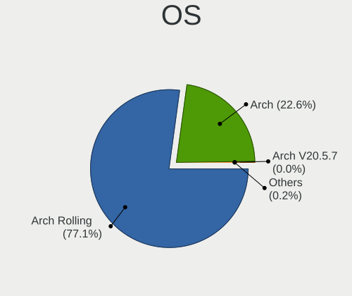

| Name                   | Computers | Percent |
|------------------------|-----------|---------|
| Arch Rolling           | 10183     | 77.15%  |
| Arch                   | 2985      | 22.62%  |
| Arch V20.4.11          | 3         | 0.02%   |
| Arch V19.11.3          | 3         | 0.02%   |
| Arch V20.5.7           | 2         | 0.02%   |
| Arch V20.3.4           | 2         | 0.02%   |
| Arch V19.04.4          | 2         | 0.02%   |
| Arch Workstation       | 1         | 0.01%   |
| Arch V6.9.2            | 1         | 0.01%   |
| Arch V19.09.1          | 1         | 0.01%   |
| Arch V19.07.9          | 1         | 0.01%   |
| Arch V19.07.11         | 1         | 0.01%   |
| Arch V19.06.1          | 1         | 0.01%   |
| Arch V19.05.2          | 1         | 0.01%   |
| Arch V19.01.4          | 1         | 0.01%   |
| Arch Breaking          | 1         | 0.01%   |
| Arch 23.0.0            | 1         | 0.01%   |
| Arch 22.10             | 1         | 0.01%   |
| Arch 20230723.0.166908 | 1         | 0.01%   |
| Arch 2020.09.05        | 1         | 0.01%   |
| Arch 20.08.3           | 1         | 0.01%   |
| Arch 2.7               | 1         | 0.01%   |
| Arch 1.3               | 1         | 0.01%   |
| Arch 1.2               | 1         | 0.01%   |
| Arch 1.1               | 1         | 0.01%   |
| Arch 1.0               | 1         | 0.01%   |

OS Family
---------

OS without a version

| Name | Computers | Percent |
|------|-----------|---------|
| Arch | 12975     | 100%    |

Kernel
------

Version of the Linux kernel

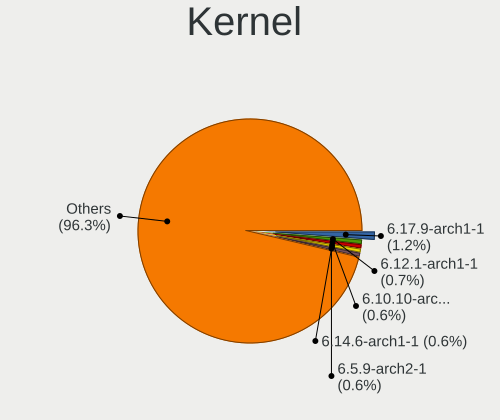

| Version         | Computers | Percent |
|-----------------|-----------|---------|
| 6.17.9-arch1-1  | 187       | 1.21%   |
| 6.12.1-arch1-1  | 106       | 0.68%   |
| 6.10.10-arch1-1 | 96        | 0.62%   |
| 6.14.6-arch1-1  | 92        | 0.59%   |
| 6.5.9-arch2-1   | 89        | 0.57%   |
| 6.6.1-arch1-1   | 88        | 0.57%   |
| 6.13.8-arch1-1  | 86        | 0.56%   |
| 5.17.1-arch1-1  | 85        | 0.55%   |
| 6.9.3-arch1-1   | 79        | 0.51%   |
| 6.4.12-arch1-1  | 79        | 0.51%   |
| 6.13.2-arch1-1  | 76        | 0.49%   |
| 6.10.6-arch1-1  | 76        | 0.49%   |
| 6.12.10-arch1-1 | 75        | 0.48%   |
| 6.0.2-arch1-1   | 71        | 0.46%   |
| 5.8.5-arch1-1   | 70        | 0.45%   |
| 6.12.4-arch1-1  | 69        | 0.45%   |
| 6.15.9-arch1-1  | 68        | 0.44%   |
| 6.15.4-arch2-1  | 65        | 0.42%   |
| 6.14.2-arch1-1  | 64        | 0.41%   |
| 6.6.8-arch1-1   | 62        | 0.4%    |
| 5.9.14-arch1-1  | 61        | 0.39%   |
| 6.15.2-arch1-1  | 60        | 0.39%   |
| 6.11.6-arch1-1  | 60        | 0.39%   |
| 5.9.1-arch1-1   | 60        | 0.39%   |
| 6.17.8-arch1-1  | 59        | 0.38%   |
| 6.7.4-arch1-1   | 57        | 0.37%   |
| 6.6.7-arch1-1   | 57        | 0.37%   |
| 6.17.5-arch1-1  | 57        | 0.37%   |
| 6.8.7-arch1-1   | 56        | 0.36%   |
| 6.16.8-arch3-1  | 56        | 0.36%   |
| 6.11.3-arch1-1  | 56        | 0.36%   |
| 6.8.1-arch1-1   | 55        | 0.36%   |
| 6.11.5-arch1-1  | 55        | 0.36%   |
| 6.17.1-arch1-1  | 53        | 0.34%   |
| 5.17.5-arch1-1  | 53        | 0.34%   |
| 6.14.9-arch1-1  | 51        | 0.33%   |
| 6.13.5-arch1-1  | 51        | 0.33%   |
| 5.17.9-arch1-1  | 51        | 0.33%   |
| 6.7.9-arch1-1   | 49        | 0.32%   |
| 6.15.3-arch1-1  | 49        | 0.32%   |

Kernel Family
-------------

Linux kernel without a distro release

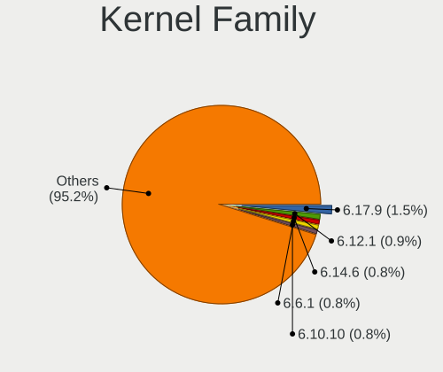

| Version | Computers | Percent |
|---------|-----------|---------|
| 6.17.9  | 231       | 1.49%   |
| 6.12.1  | 146       | 0.94%   |
| 6.14.6  | 127       | 0.82%   |
| 6.6.1   | 125       | 0.81%   |
| 6.10.10 | 118       | 0.76%   |
| 6.5.9   | 114       | 0.74%   |
| 6.13.8  | 111       | 0.72%   |
| 6.9.3   | 107       | 0.69%   |
| 6.14.2  | 107       | 0.69%   |
| 5.17.1  | 105       | 0.68%   |
| 6.13.2  | 103       | 0.67%   |
| 6.16.8  | 101       | 0.65%   |
| 6.10.6  | 100       | 0.65%   |
| 6.8.7   | 99        | 0.64%   |
| 6.12.10 | 95        | 0.61%   |
| 6.8.9   | 93        | 0.6%    |
| 5.8.5   | 92        | 0.59%   |
| 6.4.12  | 91        | 0.59%   |
| 6.14.4  | 91        | 0.59%   |
| 6.0.2   | 90        | 0.58%   |
| 6.15.4  | 85        | 0.55%   |
| 6.15.9  | 84        | 0.54%   |
| 6.10.2  | 81        | 0.52%   |
| 6.15.2  | 79        | 0.51%   |
| 6.11.6  | 79        | 0.51%   |
| 6.6.8   | 78        | 0.5%    |
| 6.11.3  | 78        | 0.5%    |
| 6.7.4   | 77        | 0.5%    |
| 6.11.5  | 77        | 0.5%    |
| 5.9.1   | 77        | 0.5%    |
| 6.8.1   | 75        | 0.48%   |
| 6.12.4  | 75        | 0.48%   |
| 6.17.5  | 74        | 0.48%   |
| 5.8.12  | 73        | 0.47%   |
| 6.17.8  | 72        | 0.47%   |
| 6.15.8  | 72        | 0.47%   |
| 5.9.14  | 72        | 0.47%   |
| 6.7.9   | 70        | 0.45%   |
| 6.6.7   | 70        | 0.45%   |
| 5.17.5  | 70        | 0.45%   |

Kernel Major Ver.
-----------------

Linux kernel major version

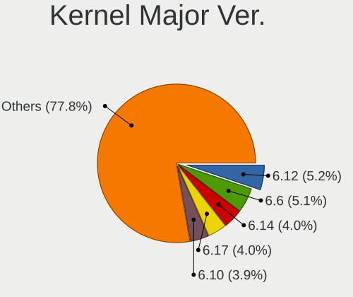

| Version | Computers | Percent |
|---------|-----------|---------|
| 6.12    | 772       | 5.17%   |
| 6.6     | 769       | 5.15%   |
| 6.14    | 603       | 4.04%   |
| 6.17    | 597       | 4%      |
| 6.10    | 577       | 3.86%   |
| 6.15    | 562       | 3.76%   |
| 6.1     | 540       | 3.62%   |
| 5.8     | 521       | 3.49%   |
| 6.13    | 513       | 3.44%   |
| 5.15    | 484       | 3.24%   |
| 6.9     | 458       | 3.07%   |
| 6.11    | 455       | 3.05%   |
| 6.7     | 443       | 2.97%   |
| 6.4     | 431       | 2.89%   |
| 6.8     | 423       | 2.83%   |
| 6.5     | 417       | 2.79%   |
| 6.0     | 413       | 2.77%   |
| 6.16    | 389       | 2.6%    |
| 6.2     | 388       | 2.6%    |
| 5.9     | 385       | 2.58%   |
| 6.3     | 370       | 2.48%   |
| 5.18    | 369       | 2.47%   |
| 5.4     | 355       | 2.38%   |
| 5.10    | 354       | 2.37%   |
| 5.11    | 349       | 2.34%   |
| 5.19    | 345       | 2.31%   |
| 5.17    | 342       | 2.29%   |
| 5.12    | 311       | 2.08%   |
| 5.16    | 304       | 2.04%   |
| 5.6     | 264       | 1.77%   |
| 5.7     | 260       | 1.74%   |
| 5.14    | 237       | 1.59%   |
| 5.13    | 235       | 1.57%   |
| 5.5     | 148       | 0.99%   |
| 5.3     | 114       | 0.76%   |
| 6.18    | 104       | 0.7%    |
| 4.19    | 57        | 0.38%   |
| 5.2     | 54        | 0.36%   |
| 5.0     | 41        | 0.27%   |
| 4.18    | 38        | 0.25%   |

Arch
----

OS architecture (x86_64, i586, etc.)

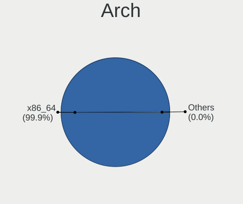

| Name        | Computers | Percent |
|-------------|-----------|---------|
| x86_64      | 12958     | 99.87%  |
| i686        | 6         | 0.05%   |
| riscv64     | 3         | 0.02%   |
| aarch64     | 3         | 0.02%   |
| loongarch64 | 2         | 0.02%   |
| ppc64       | 1         | 0.01%   |
| ppc         | 1         | 0.01%   |
| armv7l      | 1         | 0.01%   |

DE
--

Desktop Environment

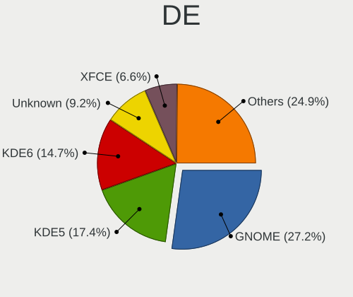

| Name            | Computers | Percent |
|-----------------|-----------|---------|
| GNOME           | 3707      | 27.18%  |
| KDE5            | 2369      | 17.37%  |
| KDE6            | 2009      | 14.73%  |
| Unknown         | 1258      | 9.22%   |
| XFCE            | 907       | 6.65%   |
| Hyprland        | 725       | 5.31%   |
| KDE             | 697       | 5.11%   |
| i3              | 583       | 4.27%   |
| X-Cinnamon      | 188       | 1.38%   |
| sway            | 155       | 1.14%   |
| MATE            | 122       | 0.89%   |
| Cinnamon        | 120       | 0.88%   |
| Budgie          | 114       | 0.84%   |
| Deepin          | 94        | 0.69%   |
| LXQt            | 90        | 0.66%   |
| bspwm           | 63        | 0.46%   |
| awesome         | 51        | 0.37%   |
| LXDE            | 43        | 0.32%   |
| GNOME Classic   | 41        | 0.3%    |
| niri            | 35        | 0.26%   |
| qtile           | 27        | 0.2%    |
| dwm             | 27        | 0.2%    |
| openbox         | 25        | 0.18%   |
| xmonad          | 20        | 0.15%   |
| GNOME Flashback | 16        | 0.12%   |
| COSMIC          | 15        | 0.11%   |
| Unity           | 13        | 0.1%    |
| sway:wlroots    | 13        | 0.1%    |
| i3-with-shmlog  | 10        | 0.07%   |
| LeftWM          | 8         | 0.06%   |
| Enlightenment   | 8         | 0.06%   |
| chadwm          | 8         | 0.06%   |
| ICEWM           | 6         | 0.04%   |
| wlroots         | 5         | 0.04%   |
| xinitrc         | 4         | 0.03%   |
| labwc:wlroots   | 4         | 0.03%   |
| river           | 3         | 0.02%   |
| gtk             | 3         | 0.02%   |
| dusk            | 3         | 0.02%   |
| DDE             | 3         | 0.02%   |

Display Server
--------------

X11 or Wayland

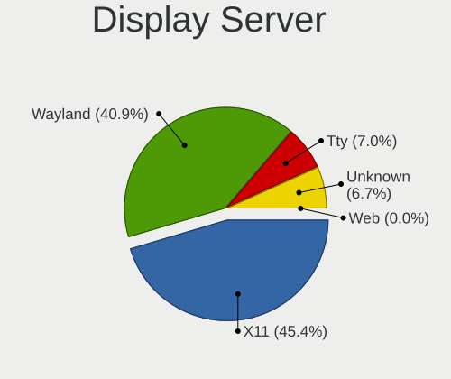

| Name    | Computers | Percent |
|---------|-----------|---------|
| X11     | 6142      | 45.4%   |
| Wayland | 5528      | 40.86%  |
| Tty     | 947       | 7%      |
| Unknown | 910       | 6.73%   |
| Web     | 1         | 0.01%   |

Display Manager
---------------

SDDM, LightDM, etc.

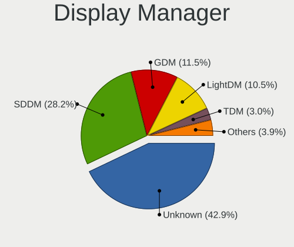

| Name        | Computers | Percent |
|-------------|-----------|---------|
| Unknown     | 5750      | 42.93%  |
| SDDM        | 3771      | 28.16%  |
| GDM         | 1540      | 11.5%   |
| LightDM     | 1409      | 10.52%  |
| TDM         | 398       | 2.97%   |
| LY-DM       | 137       | 1.02%   |
| GREETD      | 103       | 0.77%   |
| Ly          | 98        | 0.73%   |
| LXDM        | 62        | 0.46%   |
| XDM         | 59        | 0.44%   |
| SLiM        | 36        | 0.27%   |
| LEMURS      | 11        | 0.08%   |
| EMPTTY      | 9         | 0.07%   |
| NODM        | 6         | 0.04%   |
| XINIT       | 1         | 0.01%   |
| PLASMALOGIN | 1         | 0.01%   |
| MDM         | 1         | 0.01%   |
| KDM         | 1         | 0.01%   |

OS Lang
-------

Language

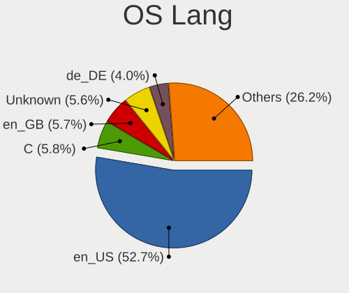

| Lang       | Computers | Percent |
|------------|-----------|---------|
| en_US      | 6967      | 52.68%  |
| C          | 765       | 5.78%   |
| en_GB      | 758       | 5.73%   |
| Unknown    | 739       | 5.59%   |
| de_DE      | 526       | 3.98%   |
| ru_RU      | 466       | 3.52%   |
| it_IT      | 399       | 3.02%   |
| pt_BR      | 362       | 2.74%   |
| fr_FR      | 275       | 2.08%   |
| pl_PL      | 180       | 1.36%   |
| es_ES      | 171       | 1.29%   |
| zh_CN      | 162       | 1.23%   |
| en_AU      | 141       | 1.07%   |
| en_CA      | 122       | 0.92%   |
| en_IN      | 103       | 0.78%   |
| es_MX      | 86        | 0.65%   |
| tr_TR      | 66        | 0.5%    |
| en_IE      | 60        | 0.45%   |
| es_AR      | 48        | 0.36%   |
| en_DK      | 44        | 0.33%   |
| hu_HU      | 41        | 0.31%   |
| es_CL      | 39        | 0.29%   |
| de_AT      | 39        | 0.29%   |
| pt_PT      | 32        | 0.24%   |
| es_CO      | 26        | 0.2%    |
| en_NZ      | 25        | 0.19%   |
| cs_CZ      | 24        | 0.18%   |
| nl_NL      | 22        | 0.17%   |
| sv_SE      | 21        | 0.16%   |
| ja_JP      | 21        | 0.16%   |
| en_ZA      | 18        | 0.14%   |
| en_US.UTF8 | 17        | 0.13%   |
| ru_UA      | 16        | 0.12%   |
| en_DE      | 16        | 0.12%   |
| fi_FI      | 15        | 0.11%   |
| es_PE      | 14        | 0.11%   |
| uk_UA      | 13        | 0.1%    |
| ko_KR      | 13        | 0.1%    |
| en_SG      | 13        | 0.1%    |
| zh_TW      | 12        | 0.09%   |

Boot Mode
---------

EFI or BIOS

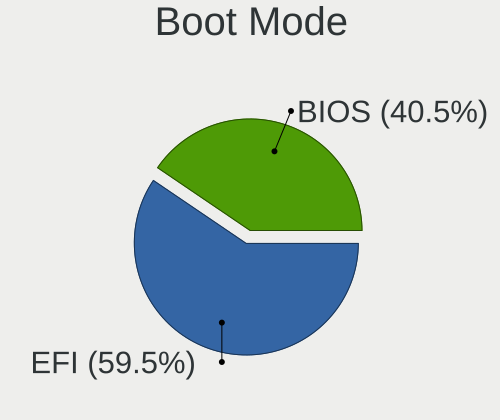

| Mode | Computers | Percent |
|------|-----------|---------|
| EFI  | 7862      | 59.49%  |
| BIOS | 5354      | 40.51%  |

Filesystem
----------

Type of filesystem

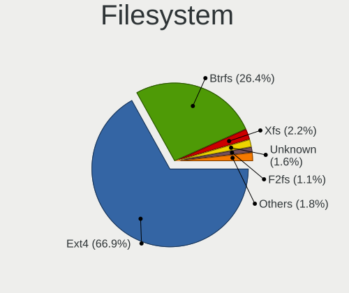

| Type                | Computers | Percent |
|---------------------|-----------|---------|
| Ext4                | 8821      | 66.93%  |
| Btrfs               | 3475      | 26.37%  |
| Xfs                 | 291       | 2.21%   |
| Unknown             | 210       | 1.59%   |
| F2fs                | 148       | 1.12%   |
| Overlay             | 88        | 0.67%   |
| Zfs                 | 60        | 0.46%   |
| Tmpfs               | 51        | 0.39%   |
| Ext2                | 11        | 0.08%   |
| Bcachefs            | 8         | 0.06%   |
| XXXXX               | 6         | 0.05%   |
| Ext3                | 3         | 0.02%   |
| XXX4                | 2         | 0.02%   |
| Jfs                 | 2         | 0.02%   |
| XXX                 | 1         | 0.01%   |
| Reiserfs            | 1         | 0.01%   |
| Fuse.fuse-overlayfs | 1         | 0.01%   |
| Aufs                | 1         | 0.01%   |

Part. scheme
------------

Scheme of partitioning

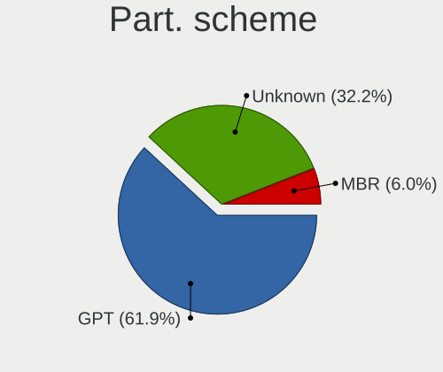

| Type    | Computers | Percent |
|---------|-----------|---------|
| GPT     | 8146      | 61.89%  |
| Unknown | 4232      | 32.15%  |
| MBR     | 784       | 5.96%   |

Dual Boot with Linux/BSD
------------------------

Hosting more than one Linux/BSD

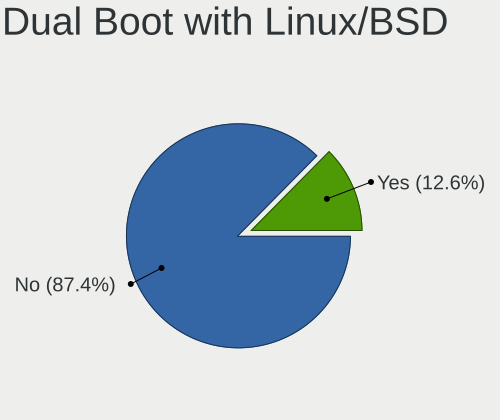

| Dual boot | Computers | Percent |
|-----------|-----------|---------|
| No        | 11518     | 87.4%   |
| Yes       | 1661      | 12.6%   |

Dual Boot (Win)
---------------

Hosting Linux and Windows

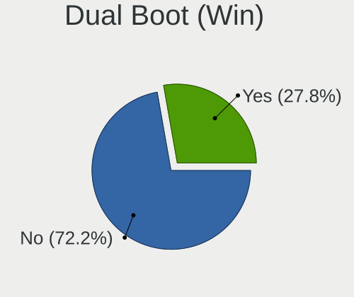

| Dual boot | Computers | Percent |
|-----------|-----------|---------|
| No        | 9530      | 72.22%  |
| Yes       | 3665      | 27.78%  |

Board
-----

Vendor
------

Motherboard manufacturer

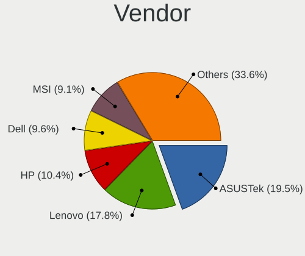

| Name                                 | Computers | Percent |
|--------------------------------------|-----------|---------|
| ASUSTek Computer                     | 2526      | 19.47%  |
| Lenovo                               | 2315      | 17.84%  |
| Hewlett-Packard                      | 1349      | 10.4%   |
| Dell                                 | 1241      | 9.56%   |
| MSI                                  | 1183      | 9.12%   |
| Gigabyte Technology                  | 1039      | 8.01%   |
| Acer                                 | 606       | 4.67%   |
| ASRock                               | 591       | 4.55%   |
| Apple                                | 234       | 1.8%    |
| Intel                                | 140       | 1.08%   |
| HUAWEI                               | 138       | 1.06%   |
| Samsung Electronics                  | 110       | 0.85%   |
| Unknown                              | 91        | 0.7%    |
| Framework                            | 74        | 0.57%   |
| Google                               | 73        | 0.56%   |
| Toshiba                              | 70        | 0.54%   |
| Microsoft                            | 65        | 0.5%    |
| Timi                                 | 49        | 0.38%   |
| Notebook                             | 49        | 0.38%   |
| Fujitsu                              | 48        | 0.37%   |
| TUXEDO                               | 47        | 0.36%   |
| Sony                                 | 38        | 0.29%   |
| HONOR                                | 33        | 0.25%   |
| Alienware                            | 33        | 0.25%   |
| Shenzhen Meigao Electronic Equipment | 30        | 0.23%   |
| MECHREVO                             | 30        | 0.23%   |
| Biostar                              | 30        | 0.23%   |
| AZW                                  | 29        | 0.22%   |
| Razer                                | 26        | 0.2%    |
| LG Electronics                       | 22        | 0.17%   |
| Chuwi                                | 21        | 0.16%   |
| Medion                               | 20        | 0.15%   |
| Huanan                               | 19        | 0.15%   |
| ECS                                  | 19        | 0.15%   |
| Positivo                             | 18        | 0.14%   |
| System76                             | 17        | 0.13%   |
| Schenker                             | 16        | 0.12%   |
| Pegatron                             | 15        | 0.12%   |
| Supermicro                           | 13        | 0.1%    |
| Packard Bell                         | 12        | 0.09%   |

Model
-----

Motherboard model

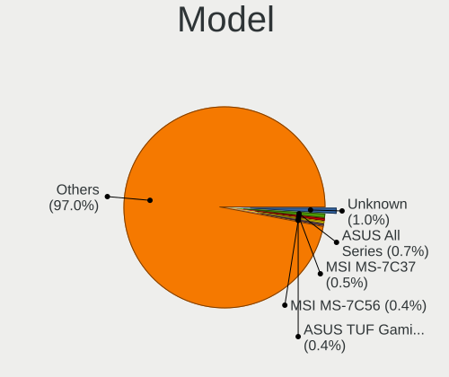

| Name                                       | Computers | Percent |
|--------------------------------------------|-----------|---------|
| Unknown                                    | 126       | 0.97%   |
| ASUS All Series                            | 96        | 0.74%   |
| MSI MS-7C37                                | 60        | 0.46%   |
| MSI MS-7C56                                | 55        | 0.42%   |
| ASUS TUF Gaming X570-PLUS                  | 51        | 0.39%   |
| MSI MS-7C91                                | 50        | 0.39%   |
| MSI MS-7B86                                | 47        | 0.36%   |
| MSI MS-7C02                                | 44        | 0.34%   |
| Gigabyte B450M DS3H                        | 36        | 0.28%   |
| ASUS ROG STRIX B550-F GAMING               | 36        | 0.28%   |
| HP Notebook                                | 32        | 0.25%   |
| MSI MS-7C95                                | 29        | 0.22%   |
| Gigabyte X570 AORUS ELITE                  | 27        | 0.21%   |
| MSI MS-7B79                                | 25        | 0.19%   |
| Framework Laptop                           | 25        | 0.19%   |
| ASUS PRIME X470-PRO                        | 24        | 0.18%   |
| MSI MS-7D75                                | 23        | 0.18%   |
| MSI MS-7A34                                | 23        | 0.18%   |
| ASUS ROG STRIX B450-F GAMING               | 23        | 0.18%   |
| MSI MS-7B89                                | 22        | 0.17%   |
| MSI MS-7A38                                | 22        | 0.17%   |
| Dell XPS 15 9570                           | 22        | 0.17%   |
| Dell XPS 15 9500                           | 22        | 0.17%   |
| ASUS TUF Gaming B550-PLUS                  | 20        | 0.15%   |
| ASUS ROG STRIX X570-E GAMING               | 20        | 0.15%   |
| ASUS PRIME B450M-A                         | 20        | 0.15%   |
| Gigabyte X470 AORUS ULTRA GAMING           | 18        | 0.14%   |
| Gigabyte B450 AORUS ELITE                  | 17        | 0.13%   |
| ASUS PRIME A320M-K                         | 17        | 0.13%   |
| ASRock B550M Pro4                          | 17        | 0.13%   |
| Apple MacBookAir7,2                        | 17        | 0.13%   |
| Gigabyte B550I AORUS PRO AX                | 16        | 0.12%   |
| Framework Laptop 13 (AMD Ryzen 7040Series) | 16        | 0.12%   |
| Dell XPS 13 9360                           | 16        | 0.12%   |
| Dell XPS 13 9310                           | 16        | 0.12%   |
| ASUS PRIME X570-P                          | 16        | 0.12%   |
| ASUS PRIME X370-PRO                        | 16        | 0.12%   |
| ASRock X570 Taichi                         | 16        | 0.12%   |
| ASRock B450M Steel Legend                  | 16        | 0.12%   |
| MSI MS-7E26                                | 15        | 0.12%   |

Model Family
------------

Motherboard model prefix

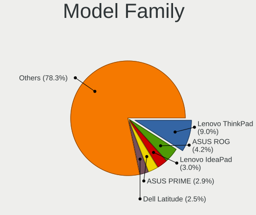

| Name               | Computers | Percent |
|--------------------|-----------|---------|
| Lenovo ThinkPad    | 1174      | 9.05%   |
| ASUS ROG           | 551       | 4.25%   |
| Lenovo IdeaPad     | 388       | 2.99%   |
| ASUS PRIME         | 379       | 2.92%   |
| Dell Latitude      | 322       | 2.48%   |
| Acer Aspire        | 318       | 2.45%   |
| Dell Inspiron      | 302       | 2.33%   |
| ASUS TUF           | 295       | 2.27%   |
| Dell XPS           | 235       | 1.81%   |
| HP Pavilion        | 229       | 1.76%   |
| ASUS VivoBook      | 213       | 1.64%   |
| HP EliteBook       | 195       | 1.5%    |
| HP Laptop          | 176       | 1.36%   |
| Lenovo Legion      | 173       | 1.33%   |
| ASUS ASUS          | 169       | 1.3%    |
| Lenovo Yoga        | 158       | 1.22%   |
| Unknown            | 126       | 0.97%   |
| Acer Nitro         | 119       | 0.92%   |
| HP ProBook         | 118       | 0.91%   |
| Dell Precision     | 114       | 0.88%   |
| Dell OptiPlex      | 111       | 0.86%   |
| Gigabyte X570      | 97        | 0.75%   |
| ASUS All           | 96        | 0.74%   |
| HP ENVY            | 94        | 0.72%   |
| ASUS Zenbook       | 88        | 0.68%   |
| Lenovo ThinkBook   | 75        | 0.58%   |
| Framework Laptop   | 72        | 0.55%   |
| Acer Swift         | 68        | 0.52%   |
| Gigabyte B450M     | 66        | 0.51%   |
| Microsoft Surface  | 65        | 0.5%    |
| HP OMEN            | 65        | 0.5%    |
| MSI MS-7C37        | 60        | 0.46%   |
| Gigabyte B550      | 59        | 0.45%   |
| Dell Vostro        | 58        | 0.45%   |
| MSI MS-7C56        | 55        | 0.42%   |
| Lenovo ThinkCentre | 55        | 0.42%   |
| Toshiba Satellite  | 52        | 0.4%    |
| Gigabyte B450      | 52        | 0.4%    |
| MSI MS-7C91        | 50        | 0.39%   |
| HP Compaq          | 48        | 0.37%   |

MFG Year
--------

Motherboard manufacture year

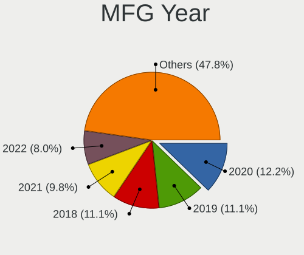

| Year    | Computers | Percent |
|---------|-----------|---------|
| 2020    | 1587      | 12.23%  |
| 2019    | 1441      | 11.11%  |
| 2018    | 1438      | 11.08%  |
| 2021    | 1272      | 9.8%    |
| 2022    | 1041      | 8.02%   |
| 2017    | 845       | 6.51%   |
| 2023    | 816       | 6.29%   |
| 2012    | 620       | 4.78%   |
| 2016    | 597       | 4.6%    |
| 2013    | 547       | 4.22%   |
| 2014    | 537       | 4.14%   |
| 2024    | 520       | 4.01%   |
| 2015    | 513       | 3.95%   |
| 2011    | 410       | 3.16%   |
| 2010    | 235       | 1.81%   |
| 2008    | 161       | 1.24%   |
| 2009    | 146       | 1.13%   |
| 2025    | 128       | 0.99%   |
| 2007    | 62        | 0.48%   |
| 2006    | 37        | 0.29%   |
| Unknown | 16        | 0.12%   |
| 2005    | 4         | 0.03%   |
| 2003    | 1         | 0.01%   |
| 2002    | 1         | 0.01%   |

Form Factor
-----------

Physical design of the computer

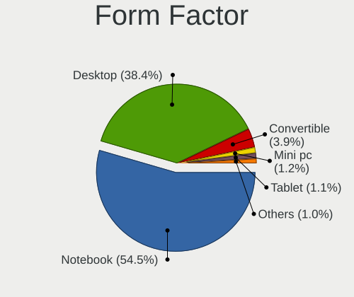

| Name           | Computers | Percent |
|----------------|-----------|---------|
| Notebook       | 7071      | 54.5%   |
| Desktop        | 4976      | 38.35%  |
| Convertible    | 502       | 3.87%   |
| Mini pc        | 154       | 1.19%   |
| Tablet         | 145       | 1.12%   |
| All in one     | 75        | 0.58%   |
| Server         | 43        | 0.33%   |
| System on chip | 4         | 0.03%   |
| Other          | 3         | 0.02%   |
| Stick pc       | 2         | 0.02%   |

Secure Boot
-----------

Enabled or disabled

| State    | Computers | Percent |
|----------|-----------|---------|
| Disabled | 12743     | 97.84%  |
| Enabled  | 281       | 2.16%   |

Coreboot
--------

Have coreboot on board

| Used | Computers | Percent |
|------|-----------|---------|
| No   | 12860     | 99.11%  |
| Yes  | 115       | 0.89%   |

RAM Size
--------

Total RAM memory

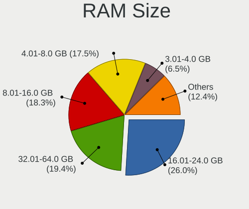

| Size in GB      | Computers | Percent |
|-----------------|-----------|---------|
| 16.01-24.0      | 3420      | 25.97%  |
| 32.01-64.0      | 2557      | 19.42%  |
| 8.01-16.0       | 2408      | 18.28%  |
| 4.01-8.0        | 2299      | 17.46%  |
| 3.01-4.0        | 856       | 6.5%    |
| 64.01-256.0     | 780       | 5.92%   |
| 24.01-32.0      | 612       | 4.65%   |
| 1.01-2.0        | 142       | 1.08%   |
| 2.01-3.0        | 60        | 0.46%   |
| 0.51-1.0        | 18        | 0.14%   |
| More than 256.0 | 14        | 0.11%   |
| 0.01-0.5        | 2         | 0.02%   |
| Unknown         | 2         | 0.02%   |

RAM Used
--------

Used RAM memory

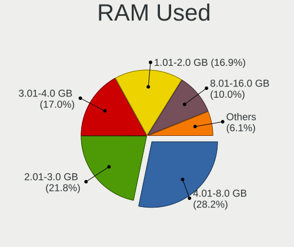

| Used GB         | Computers | Percent |
|-----------------|-----------|---------|
| 4.01-8.0        | 4053      | 28.23%  |
| 2.01-3.0        | 3128      | 21.79%  |
| 3.01-4.0        | 2435      | 16.96%  |
| 1.01-2.0        | 2427      | 16.9%   |
| 8.01-16.0       | 1440      | 10.03%  |
| 0.51-1.0        | 410       | 2.86%   |
| 16.01-24.0      | 217       | 1.51%   |
| 0.01-0.5        | 107       | 0.75%   |
| 24.01-32.0      | 77        | 0.54%   |
| 32.01-64.0      | 54        | 0.38%   |
| 64.01-256.0     | 6         | 0.04%   |
| Unknown         | 2         | 0.01%   |
| More than 256.0 | 1         | 0.01%   |
| 0               | 1         | 0.01%   |

Total Drives
------------

Number of drives on board

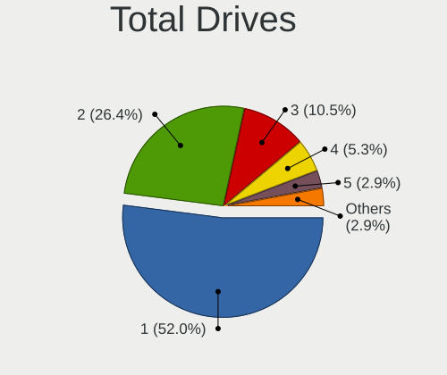

| Drives | Computers | Percent |
|--------|-----------|---------|
| 1      | 6950      | 52.02%  |
| 2      | 3521      | 26.35%  |
| 3      | 1401      | 10.49%  |
| 4      | 712       | 5.33%   |
| 5      | 385       | 2.88%   |
| 6      | 172       | 1.29%   |
| 7      | 83        | 0.62%   |
| 0      | 40        | 0.3%    |
| 8      | 38        | 0.28%   |
| 9      | 27        | 0.2%    |
| 10     | 8         | 0.06%   |
| 12     | 7         | 0.05%   |
| 11     | 5         | 0.04%   |
| 14     | 3         | 0.02%   |
| 13     | 3         | 0.02%   |
| 15     | 2         | 0.01%   |
| 22     | 1         | 0.01%   |
| 19     | 1         | 0.01%   |
| 17     | 1         | 0.01%   |

Has CD-ROM
----------

Has CD-ROM on board

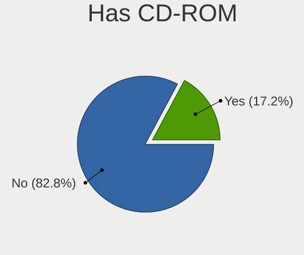

| Presented | Computers | Percent |
|-----------|-----------|---------|
| No        | 10810     | 82.84%  |
| Yes       | 2239      | 17.16%  |

Has Ethernet
------------

Has Ethernet on board

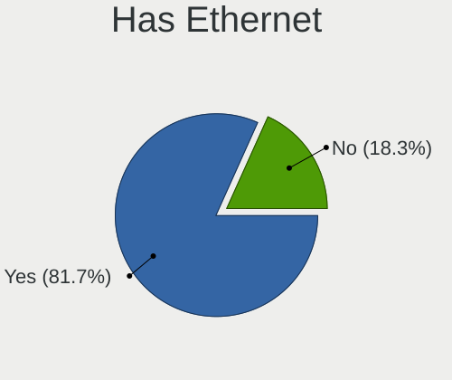

| Presented | Computers | Percent |
|-----------|-----------|---------|
| Yes       | 10657     | 81.73%  |
| No        | 2382      | 18.27%  |

Has WiFi
--------

Has WiFi module

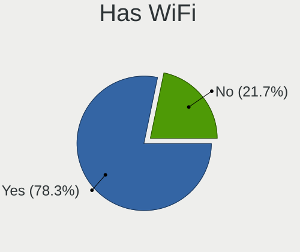

| Presented | Computers | Percent |
|-----------|-----------|---------|
| Yes       | 10206     | 78.25%  |
| No        | 2836      | 21.75%  |

Has Bluetooth
-------------

Has Bluetooth module

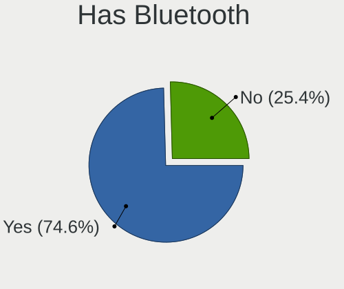

| Presented | Computers | Percent |
|-----------|-----------|---------|
| Yes       | 9777      | 74.58%  |
| No        | 3333      | 25.42%  |

Location
--------

Country
-------

Geographic location (country)

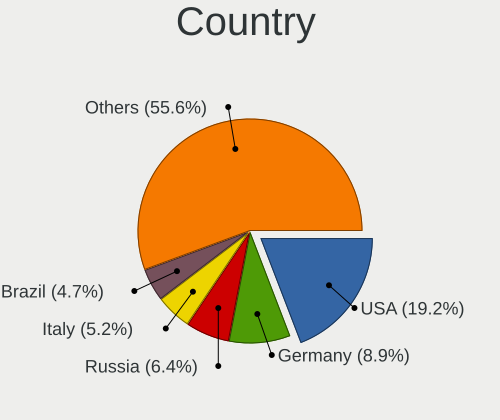

| Country     | Computers | Percent |
|-------------|-----------|---------|
| USA         | 2507      | 19.16%  |
| Germany     | 1161      | 8.87%   |
| Russia      | 832       | 6.36%   |
| Italy       | 685       | 5.24%   |
| Brazil      | 620       | 4.74%   |
| UK          | 552       | 4.22%   |
| France      | 522       | 3.99%   |
| India       | 416       | 3.18%   |
| Poland      | 407       | 3.11%   |
| Canada      | 356       | 2.72%   |
| Australia   | 268       | 2.05%   |
| Spain       | 267       | 2.04%   |
| Netherlands | 239       | 1.83%   |
| China       | 215       | 1.64%   |
| Turkey      | 204       | 1.56%   |
| Sweden      | 181       | 1.38%   |
| Austria     | 169       | 1.29%   |
| Mexico      | 152       | 1.16%   |
| Czechia     | 131       | 1%      |
| Finland     | 125       | 0.96%   |
| Switzerland | 119       | 0.91%   |
| Ukraine     | 118       | 0.9%    |
| Indonesia   | 114       | 0.87%   |
| Romania     | 111       | 0.85%   |
| Argentina   | 105       | 0.8%    |
| Hungary     | 100       | 0.76%   |
| Vietnam     | 94        | 0.72%   |
| Belgium     | 93        | 0.71%   |
| Chile       | 91        | 0.7%    |
| Portugal    | 87        | 0.66%   |
| Japan       | 86        | 0.66%   |
| Norway      | 84        | 0.64%   |
| Hong Kong   | 78        | 0.6%    |
| Denmark     | 78        | 0.6%    |
| Greece      | 75        | 0.57%   |
| Colombia    | 67        | 0.51%   |
| Bulgaria    | 63        | 0.48%   |
| New Zealand | 59        | 0.45%   |
| Iran        | 54        | 0.41%   |
| Belarus     | 54        | 0.41%   |

City
----

Geographic location (city)

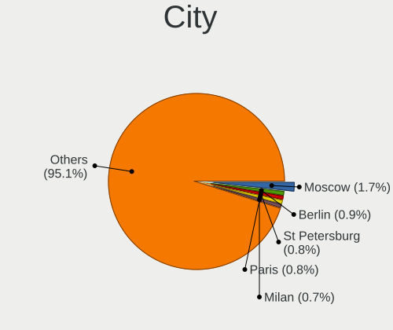

| City              | Computers | Percent |
|-------------------|-----------|---------|
| Moscow            | 240       | 1.73%   |
| Berlin            | 118       | 0.85%   |
| St Petersburg     | 109       | 0.79%   |
| Paris             | 109       | 0.79%   |
| Milan             | 99        | 0.71%   |
| Warsaw            | 98        | 0.71%   |
| Sao Paulo         | 93        | 0.67%   |
| Melbourne         | 93        | 0.67%   |
| Vienna            | 88        | 0.63%   |
| Sydney            | 73        | 0.53%   |
| Munich            | 69        | 0.5%    |
| Istanbul          | 67        | 0.48%   |
| Helsinki          | 66        | 0.48%   |
| Los Angeles       | 65        | 0.47%   |
| Amsterdam         | 62        | 0.45%   |
| Rome              | 59        | 0.43%   |
| Frankfurt am Main | 58        | 0.42%   |
| Prague            | 55        | 0.4%    |
| London            | 52        | 0.37%   |
| Hamburg           | 50        | 0.36%   |
| New York          | 49        | 0.35%   |
| Seattle           | 48        | 0.35%   |
| Bengaluru         | 44        | 0.32%   |
| Beijing           | 44        | 0.32%   |
| Budapest          | 42        | 0.3%    |
| Montreal          | 41        | 0.3%    |
| Central           | 41        | 0.3%    |
| Singapore         | 40        | 0.29%   |
| Santiago          | 40        | 0.29%   |
| Ho Chi Minh City  | 40        | 0.29%   |
| Zurich            | 39        | 0.28%   |
| Madrid            | 39        | 0.28%   |
| Phoenix           | 38        | 0.27%   |
| Brisbane          | 37        | 0.27%   |
| Athens            | 36        | 0.26%   |
| Dublin            | 35        | 0.25%   |
| Chicago           | 35        | 0.25%   |
| Chennai           | 35        | 0.25%   |
| Rio de Janeiro    | 34        | 0.25%   |
| Krakow            | 34        | 0.25%   |

Drives
------

Drive Vendor
------------

Hard drive vendors

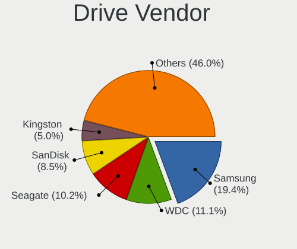

| Vendor                       | Computers | Drives | Percent |
|------------------------------|-----------|--------|---------|
| Samsung Electronics          | 4118      | 6502   | 19.37%  |
| WDC                          | 2351      | 3664   | 11.06%  |
| Seagate                      | 2162      | 3243   | 10.17%  |
| SanDisk                      | 1798      | 2405   | 8.46%   |
| Kingston                     | 1054      | 1412   | 4.96%   |
| Toshiba                      | 1053      | 1391   | 4.95%   |
| Crucial                      | 780       | 1102   | 3.67%   |
| SK hynix                     | 735       | 935    | 3.46%   |
| Micron Technology            | 605       | 745    | 2.85%   |
| Intel                        | 596       | 798    | 2.8%    |
| Unknown                      | 531       | 671    | 2.5%    |
| Micron/Crucial Technology    | 388       | 499    | 1.83%   |
| Phison Electronics           | 329       | 417    | 1.55%   |
| Kingston Technology Company  | 329       | 391    | 1.55%   |
| HGST                         | 299       | 379    | 1.41%   |
| Hitachi                      | 282       | 353    | 1.33%   |
| A-DATA Technology            | 266       | 345    | 1.25%   |
| KIOXIA                       | 249       | 313    | 1.17%   |
| Silicon Motion               | 179       | 214    | 0.84%   |
| China                        | 173       | 225    | 0.81%   |
| MAXIO Technology (Hangzhou)  | 172       | 200    | 0.81%   |
| Apple                        | 146       | 183    | 0.69%   |
| ADATA Technology             | 145       | 205    | 0.68%   |
| Phison                       | 133       | 169    | 0.63%   |
| Realtek Semiconductor        | 99        | 113    | 0.47%   |
| SPCC                         | 95        | 108    | 0.45%   |
| PNY                          | 88        | 108    | 0.41%   |
| Shenzhen Longsys Electronics | 81        | 100    | 0.38%   |
| Patriot                      | 74        | 93     | 0.35%   |
| Transcend                    | 70        | 88     | 0.33%   |
| OCZ                          | 70        | 89     | 0.33%   |
| LITEON                       | 69        | 79     | 0.32%   |
| Yangtze Memory Technologies  | 65        | 89     | 0.31%   |
| Corsair                      | 58        | 75     | 0.27%   |
| GOODRAM                      | 57        | 78     | 0.27%   |
| Team                         | 54        | 72     | 0.25%   |
| Intenso                      | 51        | 57     | 0.24%   |
| Lexar                        | 50        | 62     | 0.24%   |
| Unknown                      | 47        | 52     | 0.22%   |
| JMicron Technology           | 44        | 73     | 0.21%   |

Drive Model
-----------

Hard drive models

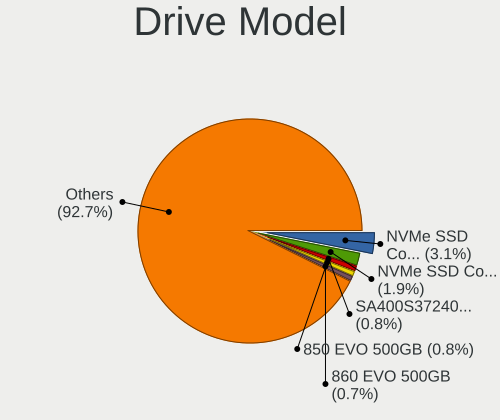

| Model                                                              | Computers | Percent |
|--------------------------------------------------------------------|-----------|---------|
| Samsung NVMe SSD Controller SM981/PM981/PM983 1TB                  | 748       | 3.12%   |
| Samsung NVMe SSD Controller PM9A1/PM9A3/980PRO 1TB                 | 448       | 1.87%   |
| Kingston SA400S37240G 240GB SSD                                    | 203       | 0.85%   |
| Samsung SSD 850 EVO 500GB                                          | 182       | 0.76%   |
| Samsung SSD 860 EVO 500GB                                          | 176       | 0.73%   |
| Seagate ST1000LM035-1RK172 1TB                                     | 168       | 0.7%    |
| Samsung SSD 860 EVO 1TB                                            | 154       | 0.64%   |
| Micron/Crucial P2 NVMe PCIe SSD 2TB                                | 153       | 0.64%   |
| Seagate ST2000DM008-2FR102 2TB                                     | 148       | 0.62%   |
| Samsung SSD 850 EVO 250GB                                          | 143       | 0.6%    |
| Kingston SA400S37480G 480GB SSD                                    | 140       | 0.58%   |
| Seagate ST1000DM010-2EP102 1TB                                     | 138       | 0.58%   |
| Sandisk WD Black SN750 / PC SN730 NVMe SSD 500GB                   | 135       | 0.56%   |
| Sandisk WD Blue SN550 NVMe SSD 1024GB                              | 127       | 0.53%   |
| Crucial CT500MX500SSD1 500GB                                       | 121       | 0.51%   |
| Crucial CT1000MX500SSD1 1TB                                        | 120       | 0.5%    |
| Samsung NVMe SSD Controller SM961/PM961/SM963 1024GB               | 114       | 0.48%   |
| Unknown MMC Card  64GB                                             | 112       | 0.47%   |
| Phison E12 NVMe Controller 1TB                                     | 104       | 0.43%   |
| WDC WD10EZEX-08WN4A0 1TB                                           | 103       | 0.43%   |
| Samsung SSD 980 1TB                                                | 103       | 0.43%   |
| MAXIO (Hangzhou) NVMe SSD Controller MAP1202 2TB                   | 98        | 0.41%   |
| Intel SSD 660P Series 512GB                                        | 94        | 0.39%   |
| Kingston SA400S37120G 120GB SSD                                    | 93        | 0.39%   |
| Seagate ST1000LM024 HN-M101MBB 1TB                                 | 87        | 0.36%   |
| Toshiba MQ01ABD100 1TB                                             | 86        | 0.36%   |
| Toshiba DT01ACA100 1TB                                             | 84        | 0.35%   |
| HGST HTS721010A9E630 1TB                                           | 84        | 0.35%   |
| Unknown MMC Card  32GB                                             | 83        | 0.35%   |
| Seagate ST4000DM004-2CV104 4TB                                     | 82        | 0.34%   |
| Samsung NVMe SSD Drive 512GB                                       | 82        | 0.34%   |
| Samsung SSD 970 EVO Plus 1TB                                       | 78        | 0.33%   |
| ADATA XPG SX8200 Pro PCIe Gen3x4 M.2 2280 Solid State Drive 1024GB | 78        | 0.33%   |
| Intel SSDPEKNU512GZ 512GB                                          | 77        | 0.32%   |
| Seagate ST500DM002-1BD142 500GB                                    | 75        | 0.31%   |
| Samsung SSD 860 EVO 250GB                                          | 75        | 0.31%   |
| Silicon Motion SM2263EN/SM2263XT SSD Controller 512GB              | 74        | 0.31%   |
| Toshiba MQ04ABF100 1TB                                             | 72        | 0.3%    |
| Kingston Company SNV2S1000G 1TB                                    | 72        | 0.3%    |
| Crucial CT240BX500SSD1 240GB                                       | 70        | 0.29%   |

HDD Vendor
----------

Hard disk drive vendors

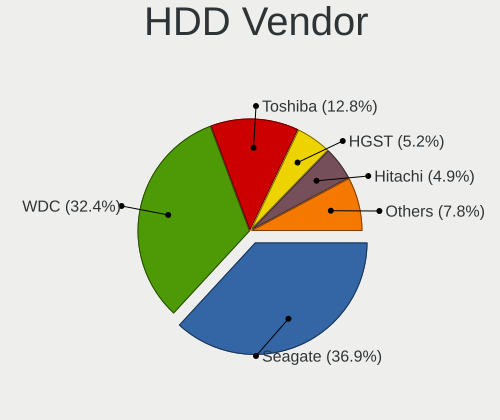

| Vendor              | Computers | Drives | Percent |
|---------------------|-----------|--------|---------|
| Seagate             | 2110      | 3153   | 36.86%  |
| WDC                 | 1857      | 2867   | 32.44%  |
| Toshiba             | 731       | 969    | 12.77%  |
| HGST                | 296       | 376    | 5.17%   |
| Hitachi             | 282       | 353    | 4.93%   |
| Samsung Electronics | 177       | 223    | 3.09%   |
| Unknown             | 54        | 67     | 0.94%   |
| Apple               | 40        | 46     | 0.7%    |
| JMicron Technology  | 26        | 50     | 0.45%   |
| Maxtor              | 16        | 18     | 0.28%   |
| Fujitsu             | 16        | 17     | 0.28%   |
| ASMT                | 11        | 12     | 0.19%   |
| TO Exter            | 10        | 16     | 0.17%   |
| External            | 8         | 13     | 0.14%   |
| Hewlett-Packard     | 7         | 7      | 0.12%   |
| USB3.0              | 6         | 7      | 0.1%    |
| HGST HTS            | 6         | 6      | 0.1%    |
| T-FORCE             | 4         | 5      | 0.07%   |
| SSK                 | 4         | 5      | 0.07%   |
| Generic-            | 4         | 5      | 0.07%   |
| USB                 | 3         | 3      | 0.05%   |
| LaCie               | 3         | 3      | 0.05%   |
| KESU                | 3         | 3      | 0.05%   |
| ASUSTOR             | 3         | 5      | 0.05%   |
| ASMedia             | 3         | 3      | 0.05%   |
| ACASIS              | 3         | 4      | 0.05%   |
| StoreJet            | 2         | 2      | 0.03%   |
| SAGE                | 2         | 3      | 0.03%   |
| SABRENT             | 2         | 2      | 0.03%   |
| NVME USB            | 2         | 2      | 0.03%   |
| NeoTech             | 2         | 2      | 0.03%   |
| Maxone              | 2         | 2      | 0.03%   |
| Inateck             | 2         | 2      | 0.03%   |
| HGST HUS            | 2         | 2      | 0.03%   |
| ASMT109x            | 2         | 2      | 0.03%   |
| Unknown             | 2         | 2      | 0.03%   |
| XrayDisk            | 1         | 1      | 0.02%   |
| WD MediaMax         | 1         | 1      | 0.02%   |
| WALRAM              | 1         | 1      | 0.02%   |
| TrueNAS             | 1         | 1      | 0.02%   |

SSD Vendor
----------

Solid state drive vendors

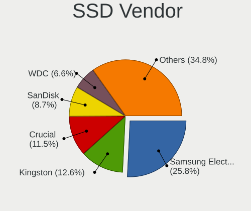

| Vendor              | Computers | Drives | Percent |
|---------------------|-----------|--------|---------|
| Samsung Electronics | 1643      | 2367   | 25.77%  |
| Kingston            | 803       | 1049   | 12.59%  |
| Crucial             | 736       | 1038   | 11.54%  |
| SanDisk             | 553       | 750    | 8.67%   |
| WDC                 | 421       | 550    | 6.6%    |
| A-DATA Technology   | 198       | 257    | 3.11%   |
| China               | 171       | 223    | 2.68%   |
| Intel               | 132       | 165    | 2.07%   |
| Micron Technology   | 92        | 106    | 1.44%   |
| SPCC                | 86        | 97     | 1.35%   |
| Toshiba             | 85        | 130    | 1.33%   |
| SK hynix            | 85        | 105    | 1.33%   |
| PNY                 | 82        | 102    | 1.29%   |
| Apple               | 76        | 83     | 1.19%   |
| Patriot             | 73        | 92     | 1.14%   |
| OCZ                 | 70        | 89     | 1.1%    |
| Transcend           | 64        | 82     | 1%      |
| LITEON              | 64        | 73     | 1%      |
| GOODRAM             | 55        | 76     | 0.86%   |
| Intenso             | 50        | 56     | 0.78%   |
| Team                | 47        | 58     | 0.74%   |
| Lexar               | 44        | 55     | 0.69%   |
| KingSpec            | 32        | 35     | 0.5%    |
| Apacer              | 32        | 34     | 0.5%    |
| Corsair             | 30        | 38     | 0.47%   |
| LITEONIT            | 27        | 30     | 0.42%   |
| Plextor             | 26        | 28     | 0.41%   |
| Unknown             | 26        | 30     | 0.41%   |
| Netac               | 25        | 28     | 0.39%   |
| Gigabyte Technology | 25        | 29     | 0.39%   |
| SABRENT             | 24        | 26     | 0.38%   |
| Verbatim            | 17        | 25     | 0.27%   |
| Mushkin             | 16        | 22     | 0.25%   |
| Hewlett-Packard     | 16        | 18     | 0.25%   |
| Seagate             | 14        | 20     | 0.22%   |
| Fanxiang            | 14        | 14     | 0.22%   |
| KIOXIA-EXCERIA      | 13        | 20     | 0.2%    |
| XrayDisk            | 11        | 16     | 0.17%   |
| T-FORCE             | 11        | 12     | 0.17%   |
| ASMT                | 11        | 12     | 0.17%   |

Drive Kind
----------

HDD or SSD

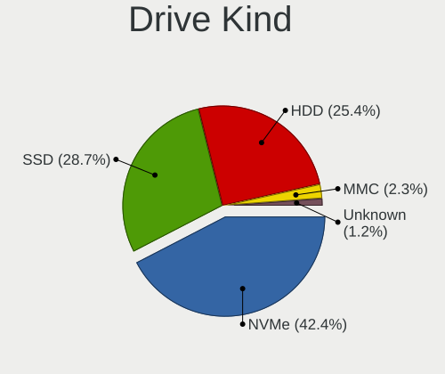

| Kind    | Computers | Drives | Percent |
|---------|-----------|--------|---------|
| NVMe    | 7883      | 12120  | 42.41%  |
| SSD     | 5338      | 8502   | 28.72%  |
| HDD     | 4721      | 8300   | 25.4%   |
| MMC     | 426       | 527    | 2.29%   |
| Unknown | 219       | 261    | 1.18%   |

Drive Connector
---------------

SATA, SAS, NVMe, etc.

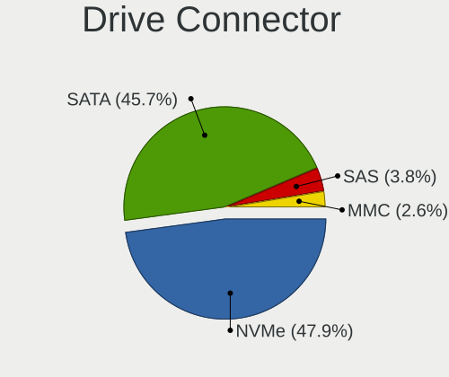

| Type | Computers | Drives | Percent |
|------|-----------|--------|---------|
| NVMe | 7874      | 12059  | 47.87%  |
| SATA | 7521      | 16260  | 45.73%  |
| SAS  | 627       | 864    | 3.81%   |
| MMC  | 426       | 527    | 2.59%   |

Drive Size
----------

Size of hard drive

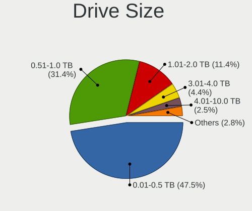

| Size in TB | Computers | Drives | Percent |
|------------|-----------|--------|---------|
| 0.01-0.5   | 5146      | 8169   | 47.52%  |
| 0.51-1.0   | 3396      | 4975   | 31.36%  |
| 1.01-2.0   | 1239      | 1847   | 11.44%  |
| 3.01-4.0   | 476       | 793    | 4.4%    |
| 4.01-10.0  | 273       | 508    | 2.52%   |
| 2.01-3.0   | 220       | 353    | 2.03%   |
| 10.01-20.0 | 77        | 151    | 0.71%   |
| 20.01-50.0 | 3         | 6      | 0.03%   |

Space Total
-----------

Amount of disk space available on the file system

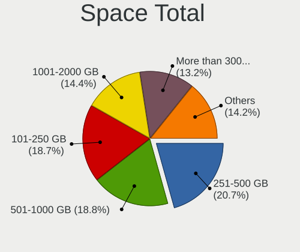

| Size in GB     | Computers | Percent |
|----------------|-----------|---------|
| 251-500        | 2806      | 20.67%  |
| 501-1000       | 2554      | 18.81%  |
| 101-250        | 2541      | 18.71%  |
| 1001-2000      | 1951      | 14.37%  |
| More than 3000 | 1792      | 13.2%   |
| 2001-3000      | 849       | 6.25%   |
| 51-100         | 444       | 3.27%   |
| Unknown        | 282       | 2.08%   |
| 21-50          | 189       | 1.39%   |
| 1-20           | 170       | 1.25%   |

Space Used
----------

Amount of used disk space

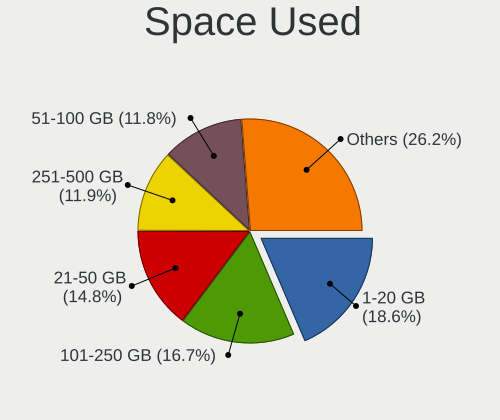

| Used GB        | Computers | Percent |
|----------------|-----------|---------|
| 1-20           | 2642      | 18.56%  |
| 101-250        | 2377      | 16.7%   |
| 21-50          | 2102      | 14.77%  |
| 251-500        | 1695      | 11.91%  |
| 51-100         | 1682      | 11.82%  |
| 501-1000       | 1464      | 10.29%  |
| 1001-2000      | 982       | 6.9%    |
| More than 3000 | 613       | 4.31%   |
| 2001-3000      | 392       | 2.75%   |
| Unknown        | 282       | 1.98%   |
| 0              | 1         | 0.01%   |

Malfunc. Drives
---------------

Drive models with a malfunction

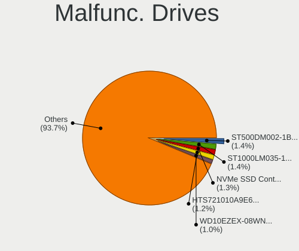

| Model                                                          | Computers | Drives | Percent |
|----------------------------------------------------------------|-----------|--------|---------|
| Seagate ST500DM002-1BD142 500GB                                | 19        | 21     | 1.37%   |
| Seagate ST1000LM035-1RK172 1TB                                 | 19        | 20     | 1.37%   |
| Samsung Electronics NVMe SSD Controller SM981/PM981/PM983 1TB  | 18        | 22     | 1.3%    |
| HGST HTS721010A9E630 1TB                                       | 17        | 17     | 1.23%   |
| WDC WD10EZEX-08WN4A0 1TB                                       | 14        | 16     | 1.01%   |
| HGST HTS545050A7E680 500GB                                     | 14        | 15     | 1.01%   |
| Seagate ST500LT012-1DG142 500GB                                | 13        | 14     | 0.94%   |
| Seagate ST9500325AS 500GB                                      | 12        | 12     | 0.87%   |
| Seagate ST2000DM008-2FR102 2TB                                 | 12        | 15     | 0.87%   |
| Seagate ST1000DM003-9YN162 1TB                                 | 12        | 13     | 0.87%   |
| WDC WDS240G2G0A-00JH30 240GB SSD                               | 11        | 16     | 0.79%   |
| Seagate ST1000DM010-2EP102 1TB                                 | 11        | 21     | 0.79%   |
| Samsung Electronics SSD 870 EVO 1TB                            | 11        | 12     | 0.79%   |
| HGST HTS541010A9E680 1TB                                       | 11        | 11     | 0.79%   |
| WDC WD5000AAKX-001CA0 500GB                                    | 10        | 12     | 0.72%   |
| Kingston SV300S37A120G 120GB SSD                               | 10        | 10     | 0.72%   |
| HGST HTS725050A7E630 500GB                                     | 10        | 10     | 0.72%   |
| Crucial CT525MX300SSD1 528GB                                   | 10        | 13     | 0.72%   |
| Seagate ST3500418AS 500GB                                      | 9         | 10     | 0.65%   |
| Seagate ST2000DM006-2DM164 2TB                                 | 9         | 10     | 0.65%   |
| Seagate ST1000LM024 HN-M101MBB 1TB                             | 9         | 15     | 0.65%   |
| Samsung Electronics SSD 980 1TB                                | 9         | 14     | 0.65%   |
| WDC WD20EARS-00MVWB0 2TB                                       | 8         | 10     | 0.58%   |
| Toshiba MQ01ABD100 1TB                                         | 8         | 11     | 0.58%   |
| Seagate ST500LT012-9WS142 500GB                                | 8         | 11     | 0.58%   |
| Seagate ST500LM021-1KJ152 500GB                                | 8         | 11     | 0.58%   |
| Seagate ST31000528AS 1TB                                       | 8         | 8      | 0.58%   |
| Seagate ST2000DM001-1ER164 2TB                                 | 8         | 10     | 0.58%   |
| SanDisk SSD PLUS 240GB                                         | 8         | 9      | 0.58%   |
| Samsung Electronics NVMe SSD Controller PM9A1/PM9A3/980PRO 1TB | 8         | 15     | 0.58%   |
| WDC WD20EFRX-68EUZN0 2TB                                       | 7         | 15     | 0.5%    |
| WDC WD1002FAEX-00Z3A0 1TB                                      | 7         | 8      | 0.5%    |
| Seagate ST31000524AS 1TB                                       | 7         | 11     | 0.5%    |
| Seagate ST1000LX015-1U7172 1TB                                 | 7         | 9      | 0.5%    |
| Seagate ST1000DM003-1ER162 1TB                                 | 7         | 7      | 0.5%    |
| WDC WD40EFRX-68N32N0 4TB                                       | 6         | 6      | 0.43%   |
| WDC WD20EZRZ-00Z5HB0 2TB                                       | 6         | 6      | 0.43%   |
| WDC WD20EARX-00PASB0 2TB                                       | 6         | 7      | 0.43%   |
| Seagate ST4000DM004-2CV104 4TB                                 | 6         | 6      | 0.43%   |
| Seagate ST1000LM014-SSHD-8GB                                   | 6         | 6      | 0.43%   |

Malfunc. Drive Vendor
---------------------

Vendors of faulty drives

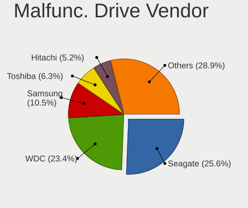

| Vendor                      | Computers | Drives | Percent |
|-----------------------------|-----------|--------|---------|
| Seagate                     | 339       | 439    | 25.6%   |
| WDC                         | 310       | 431    | 23.41%  |
| Samsung Electronics         | 139       | 184    | 10.5%   |
| Toshiba                     | 84        | 109    | 6.34%   |
| Hitachi                     | 69        | 76     | 5.21%   |
| HGST                        | 65        | 67     | 4.91%   |
| SanDisk                     | 38        | 44     | 2.87%   |
| Kingston                    | 37        | 50     | 2.79%   |
| Crucial                     | 33        | 43     | 2.49%   |
| Intel                       | 29        | 35     | 2.19%   |
| SK hynix                    | 27        | 28     | 2.04%   |
| A-DATA Technology           | 19        | 20     | 1.44%   |
| OCZ                         | 13        | 20     | 0.98%   |
| Micron Technology           | 13        | 16     | 0.98%   |
| LITEON                      | 8         | 10     | 0.6%    |
| Apple                       | 8         | 9      | 0.6%    |
| Realtek Semiconductor       | 7         | 8      | 0.53%   |
| Corsair                     | 6         | 6      | 0.45%   |
| China                       | 6         | 9      | 0.45%   |
| Maxtor                      | 5         | 7      | 0.38%   |
| Transcend                   | 4         | 12     | 0.3%    |
| Silicon Motion              | 4         | 5      | 0.3%    |
| MAXIO Technology (Hangzhou) | 4         | 5      | 0.3%    |
| SPCC                        | 3         | 4      | 0.23%   |
| PNY                         | 3         | 4      | 0.23%   |
| Hewlett-Packard             | 3         | 3      | 0.23%   |
| Fujitsu                     | 3         | 3      | 0.23%   |
| Drevo                       | 3         | 4      | 0.23%   |
| ASMT                        | 3         | 3      | 0.23%   |
| XrayDisk                    | 2         | 4      | 0.15%   |
| SSSTC                       | 2         | 2      | 0.15%   |
| Plextor                     | 2         | 9      | 0.15%   |
| Phison Electronics          | 2         | 2      | 0.15%   |
| Patriot                     | 2         | 2      | 0.15%   |
| JMicron Technology          | 2         | 2      | 0.15%   |
| Intenso                     | 2         | 2      | 0.15%   |
| ADATA Technology            | 2         | 3      | 0.15%   |
| WD MediaMax                 | 1         | 1      | 0.08%   |
| WALRAM                      | 1         | 1      | 0.08%   |
| VNYEZ                       | 1         | 1      | 0.08%   |

Malfunc. HDD Vendor
-------------------

Vendors of faulty HDD drives

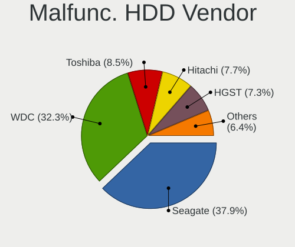

| Vendor              | Computers | Drives | Percent |
|---------------------|-----------|--------|---------|
| Seagate             | 339       | 438    | 37.88%  |
| WDC                 | 289       | 402    | 32.29%  |
| Toshiba             | 76        | 100    | 8.49%   |
| Hitachi             | 69        | 76     | 7.71%   |
| HGST                | 65        | 67     | 7.26%   |
| Samsung Electronics | 34        | 40     | 3.8%    |
| Apple               | 7         | 8      | 0.78%   |
| Maxtor              | 5         | 7      | 0.56%   |
| Fujitsu             | 3         | 3      | 0.34%   |
| JMicron Technology  | 2         | 2      | 0.22%   |
| ASMT                | 2         | 2      | 0.22%   |
| WD MediaMax         | 1         | 1      | 0.11%   |
| TO Exter            | 1         | 1      | 0.11%   |
| HGST HUS            | 1         | 1      | 0.11%   |
| Hewlett-Packard     | 1         | 1      | 0.11%   |

Malfunc. Drive Kind
-------------------

Kinds of faulty drives

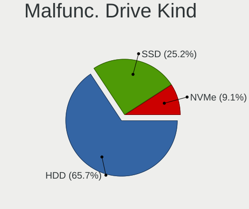

| Kind | Computers | Drives | Percent |
|------|-----------|--------|---------|
| HDD  | 814       | 1149   | 65.7%   |
| SSD  | 312       | 402    | 25.18%  |
| NVMe | 113       | 159    | 9.12%   |

Failed Drives
-------------

Failed drive models

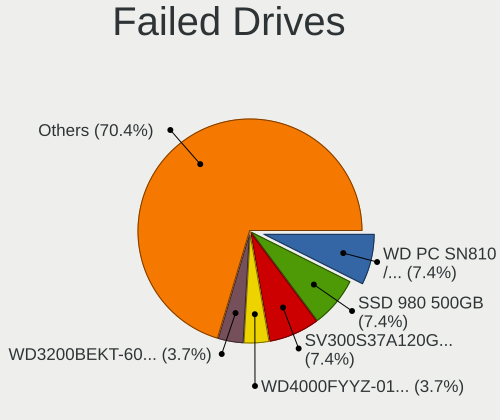

| Model                                            | Computers | Drives | Percent |
|--------------------------------------------------|-----------|--------|---------|
| Sandisk WD PC SN810 / Black SN850 NVMe SSD 500GB | 2         | 2      | 7.41%   |
| Samsung Electronics SSD 980 500GB                | 2         | 2      | 7.41%   |
| Kingston SV300S37A120G 120GB SSD                 | 2         | 2      | 7.41%   |
| WDC WD4000FYYZ-01UL1B2 4TB                       | 1         | 1      | 3.7%    |
| WDC WD3200BEKT-60V5T1 320GB                      | 1         | 1      | 3.7%    |
| WDC WD2500BEVT-22ZCT0 250GB                      | 1         | 1      | 3.7%    |
| Union Memory (Shenzhen) RPFTJ128PDD2EWX 128GB    | 1         | 2      | 3.7%    |
| Transcend TS128GMTE850 128GB                     | 1         | 1      | 3.7%    |
| Toshiba DT01ACA100 1TB                           | 1         | 1      | 3.7%    |
| Toshiba DT01ACA050 500GB                         | 1         | 1      | 3.7%    |
| Seagate ST91000430AS 1TB                         | 1         | 1      | 3.7%    |
| Seagate ST500DM002-1BD142 500GB                  | 1         | 1      | 3.7%    |
| Seagate ST3500418AS 500GB                        | 1         | 1      | 3.7%    |
| Seagate ST32000644NS 2TB                         | 1         | 1      | 3.7%    |
| Seagate ST31000528AS 1TB                         | 1         | 1      | 3.7%    |
| Seagate ST2000DL003-9VT166 2TB                   | 1         | 1      | 3.7%    |
| Samsung Electronics MZVLW128HEGR-000L2 128GB     | 1         | 2      | 3.7%    |
| Samsung Electronics MZNLN128HAHQ-000H1 128GB SSD | 1         | 1      | 3.7%    |
| Samsung Electronics MZ7PC128HAFU-000H1 128GB SSD | 1         | 1      | 3.7%    |
| Samsung Electronics HM251JI 250GB                | 1         | 1      | 3.7%    |
| Phison ESO128GTLC9-E8C-2 128GB                   | 1         | 1      | 3.7%    |
| Intel SSDSC2BW120H6 120GB                        | 1         | 2      | 3.7%    |
| Hitachi HUA722020ALA330 2TB                      | 1         | 1      | 3.7%    |
| Hitachi HDS723030ALA640 3TB                      | 1         | 1      | 3.7%    |

Failed Drive Vendor
-------------------

Failed drive vendors

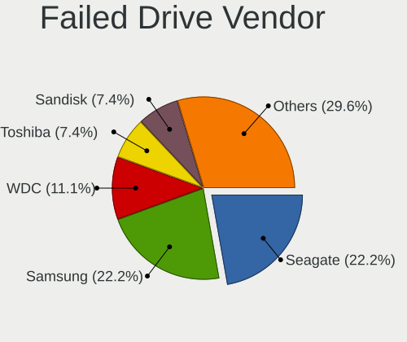

| Vendor                  | Computers | Drives | Percent |
|-------------------------|-----------|--------|---------|
| Seagate                 | 6         | 6      | 22.22%  |
| Samsung Electronics     | 6         | 7      | 22.22%  |
| WDC                     | 3         | 3      | 11.11%  |
| Toshiba                 | 2         | 2      | 7.41%   |
| Sandisk                 | 2         | 2      | 7.41%   |
| Kingston                | 2         | 2      | 7.41%   |
| Hitachi                 | 2         | 2      | 7.41%   |
| Union Memory (Shenzhen) | 1         | 2      | 3.7%    |
| Transcend               | 1         | 1      | 3.7%    |
| Phison                  | 1         | 1      | 3.7%    |
| Intel                   | 1         | 2      | 3.7%    |

Drive Status
------------

Number of failed and malfunc. drives

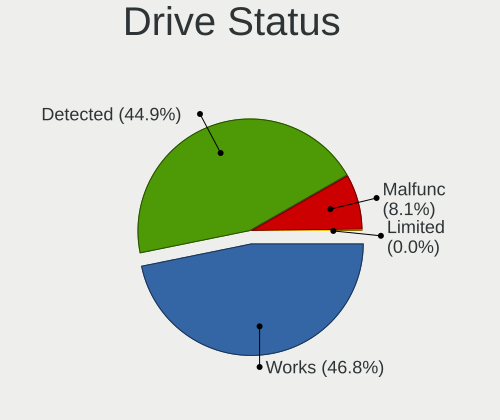

| Status   | Computers | Drives | Percent |
|----------|-----------|--------|---------|
| Works    | 6802      | 14997  | 46.81%  |
| Detected | 6529      | 12971  | 44.93%  |
| Malfunc  | 1172      | 1710   | 8.06%   |
| Failed   | 27        | 30     | 0.19%   |
| Limited  | 2         | 2      | 0.01%   |

Storage controller
------------------

Storage Vendor
--------------

Storage controller vendors

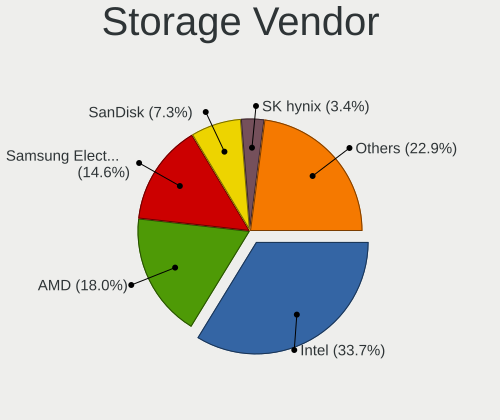

| Vendor                                  | Computers | Percent |
|-----------------------------------------|-----------|---------|
| Intel                                   | 6532      | 33.75%  |
| AMD                                     | 3490      | 18.03%  |
| Samsung Electronics                     | 2825      | 14.6%   |
| SanDisk                                 | 1418      | 7.33%   |
| SK hynix                                | 649       | 3.35%   |
| Kingston Technology Company             | 580       | 3%      |
| Micron Technology                       | 520       | 2.69%   |
| Phison Electronics                      | 507       | 2.62%   |
| Micron/Crucial Technology               | 427       | 2.21%   |
| ASMedia Technology                      | 392       | 2.03%   |
| KIOXIA                                  | 253       | 1.31%   |
| Toshiba America Info Systems            | 239       | 1.23%   |
| ADATA Technology                        | 219       | 1.13%   |
| Silicon Motion                          | 199       | 1.03%   |
| MAXIO Technology (Hangzhou)             | 171       | 0.88%   |
| Realtek Semiconductor                   | 110       | 0.57%   |
| Marvell Technology Group                | 100       | 0.52%   |
| Shenzhen Longsys Electronics            | 90        | 0.46%   |
| Yangtze Memory Technologies             | 69        | 0.36%   |
| JMicron Technology                      | 58        | 0.3%    |
| Union Memory (Shenzhen)                 | 47        | 0.24%   |
| Solid State Storage Technology          | 43        | 0.22%   |
| Nvidia                                  | 39        | 0.2%    |
| INNOGRIT                                | 38        | 0.2%    |
| Seagate Technology                      | 36        | 0.19%   |
| Broadcom / LSI                          | 34        | 0.18%   |
| Apple                                   | 33        | 0.17%   |
| Solidigm                                | 30        | 0.15%   |
| Lite-On Technology                      | 28        | 0.14%   |
| Lenovo                                  | 24        | 0.12%   |
| Shenzhen Unionmemory Information System | 19        | 0.1%    |
| LSI Logic / Symbios Logic               | 18        | 0.09%   |
| Biwin Storage Technology                | 18        | 0.09%   |
| Netac Technology                        | 12        | 0.06%   |
| Adaptec                                 | 10        | 0.05%   |
| VIA Technologies                        | 8         | 0.04%   |
| Transcend                               | 7         | 0.04%   |
| Silicon Image                           | 7         | 0.04%   |
| Hosin Global Electronics                | 7         | 0.04%   |
| Silicon Integrated Systems [SiS]        | 6         | 0.03%   |

Storage Model
-------------

Storage controller models

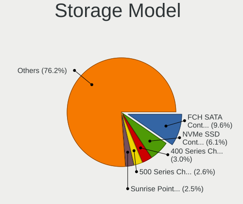

| Model                                                                          | Computers | Percent |
|--------------------------------------------------------------------------------|-----------|---------|
| AMD FCH SATA Controller [AHCI mode]                                            | 2054      | 9.62%   |
| Samsung NVMe SSD Controller SM981/PM981/PM983                                  | 1298      | 6.08%   |
| AMD 400 Series Chipset SATA Controller                                         | 640       | 3%      |
| AMD 500 Series Chipset SATA Controller                                         | 557       | 2.61%   |
| Intel Sunrise Point-LP SATA Controller [AHCI mode]                             | 534       | 2.5%    |
| Samsung NVMe SSD Controller PM9A1/PM9A3/980PRO                                 | 513       | 2.4%    |
| Samsung NVMe SSD Controller 980 (DRAM-less)                                    | 463       | 2.17%   |
| AMD 600 Series Chipset SATA Controller                                         | 461       | 2.16%   |
| Intel Volume Management Device NVMe RAID Controller                            | 439       | 2.06%   |
| Intel 8 Series/C220 Series Chipset Family 6-port SATA Controller 1 [AHCI mode] | 392       | 1.84%   |
| Intel 7 Series Chipset Family 6-port SATA Controller [AHCI mode]               | 355       | 1.66%   |
| ASMedia ASM1061/ASM1062 Serial ATA Controller                                  | 348       | 1.63%   |
| Intel 82801 Mobile SATA Controller [RAID mode]                                 | 346       | 1.62%   |
| Intel Q170/Q150/B150/H170/H110/Z170/CM236 Chipset SATA Controller [AHCI Mode]  | 301       | 1.41%   |
| Intel 200 Series PCH SATA controller [AHCI mode]                               | 264       | 1.24%   |
| Samsung NVMe SSD Controller SM961/PM961/SM963                                  | 255       | 1.19%   |
| SanDisk Extreme Pro / WD Black SN750 / PC SN730 / Red SN700 NVMe SSD           | 245       | 1.15%   |
| Intel Cannon Lake Mobile PCH SATA AHCI Controller                              | 244       | 1.14%   |
| SK hynix Gold P31/BC711/PC711 NVMe Solid State Drive                           | 227       | 1.06%   |
| SanDisk WD SN560/SN740/SN770/SN5000 NVMe SSD                                   | 215       | 1.01%   |
| SanDisk Ultra 3D / WD PC SN530, IX SN530, Blue SN550 NVMe SSD (DRAM-less)      | 206       | 0.96%   |
| Micron/Crucial P2 [Nick P2] / P3 / P3 Plus NVMe PCIe SSD (DRAM-less)           | 205       | 0.96%   |
| Intel Cannon Lake PCH SATA AHCI Controller                                     | 202       | 0.95%   |
| Intel 6 Series/C200 Series Chipset Family 6 port Mobile SATA AHCI Controller   | 199       | 0.93%   |
| Intel 8 Series SATA Controller 1 [AHCI mode]                                   | 195       | 0.91%   |
| Phison E12 NVMe Controller                                                     | 194       | 0.91%   |
| Intel Wildcat Point-LP SATA Controller [AHCI Mode]                             | 191       | 0.89%   |
| Intel HM170/QM170 Chipset SATA Controller [AHCI Mode]                          | 185       | 0.87%   |
| Samsung NVMe SSD Controller S4LV008[Pascal]                                    | 178       | 0.83%   |
| Intel SSD 660P Series                                                          | 169       | 0.79%   |
| AMD SB7x0/SB8x0/SB9x0 SATA Controller [AHCI mode]                              | 153       | 0.72%   |
| Intel 6 Series/C200 Series Chipset Family 6 port Desktop SATA AHCI Controller  | 146       | 0.68%   |
| Intel Comet Lake SATA AHCI Controller                                          | 142       | 0.67%   |
| Intel SATA Controller [RAID mode]                                              | 138       | 0.65%   |
| Intel 400 Series Chipset Family SATA AHCI Controller                           | 138       | 0.65%   |
| Intel SSD 670p Series [Keystone Harbor]                                        | 133       | 0.62%   |
| Intel Tiger Lake-LP SATA Controller                                            | 127       | 0.59%   |
| ADATA XPG SX8200 Pro PCIe Gen3x4 M.2 2280 Solid State Drive                    | 127       | 0.59%   |
| Intel 7 Series/C210 Series Chipset Family 6-port SATA Controller [AHCI mode]   | 125       | 0.59%   |
| Intel Alder Lake-S PCH SATA Controller [AHCI Mode]                             | 124       | 0.58%   |

Storage Kind
------------

Kind of storage controller (IDE, SATA, NVMe, SAS, ...)

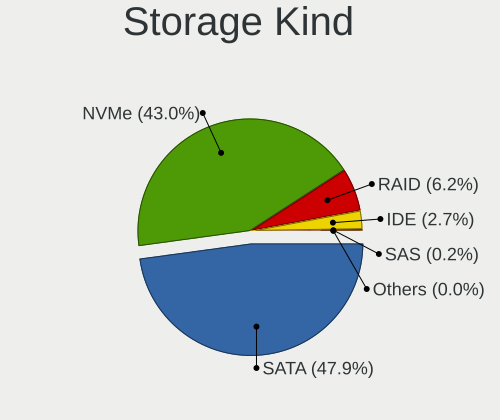

| Kind | Computers | Percent |
|------|-----------|---------|
| SATA | 8769      | 47.85%  |
| NVMe | 7885      | 43.03%  |
| RAID | 1135      | 6.19%   |
| IDE  | 488       | 2.66%   |
| SAS  | 41        | 0.22%   |
| SCSI | 8         | 0.04%   |

Processor
---------

CPU Vendor
----------

Processor vendors

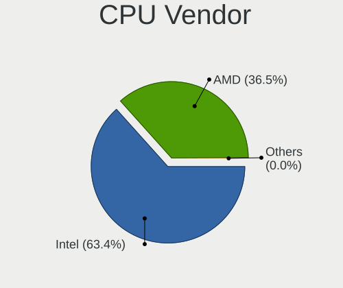

| Vendor             | Computers | Percent |
|--------------------|-----------|---------|
| Intel              | 8221      | 63.36%  |
| AMD                | 4741      | 36.54%  |
| Unknown            | 4         | 0.03%   |
| sifive,u74-mc      | 2         | 0.02%   |
| Loongson           | 2         | 0.02%   |
| Xenon Game Console | 1         | 0.01%   |
| thead,c906         | 1         | 0.01%   |
| Nintendo Wii       | 1         | 0.01%   |
| CentaurHauls       | 1         | 0.01%   |
| ARM                | 1         | 0.01%   |

CPU Model
---------

Processor models

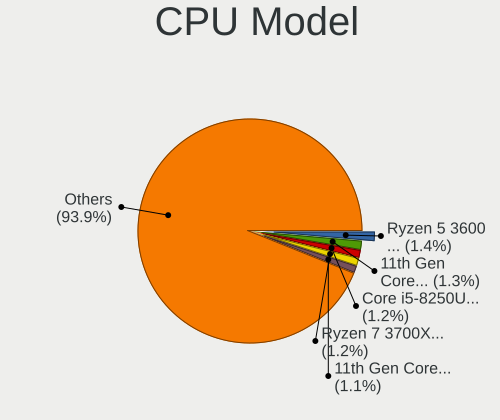

| Model                                         | Computers | Percent |
|-----------------------------------------------|-----------|---------|
| AMD Ryzen 5 3600 6-Core Processor             | 179       | 1.38%   |
| Intel 11th Gen Core i5-1135G7 @ 2.40GHz       | 174       | 1.34%   |
| Intel Core i5-8250U CPU @ 1.60GHz             | 151       | 1.16%   |
| AMD Ryzen 7 3700X 8-Core Processor            | 151       | 1.16%   |
| Intel 11th Gen Core i7-1165G7 @ 2.80GHz       | 137       | 1.05%   |
| AMD Ryzen 5 5600X 6-Core Processor            | 134       | 1.03%   |
| Intel Core i7-8550U CPU @ 1.80GHz             | 128       | 0.98%   |
| AMD Ryzen 7 5800X 8-Core Processor            | 121       | 0.93%   |
| Intel Core i7-8565U CPU @ 1.80GHz             | 108       | 0.83%   |
| AMD Ryzen 9 5900X 12-Core Processor           | 106       | 0.81%   |
| Intel Core i7-9750H CPU @ 2.60GHz             | 105       | 0.81%   |
| Intel Core i7-7700HQ CPU @ 2.80GHz            | 105       | 0.81%   |
| AMD Ryzen 5 2600 Six-Core Processor           | 102       | 0.78%   |
| AMD Ryzen 5 5500U with Radeon Graphics        | 101       | 0.78%   |
| AMD Ryzen 5 3500U with Radeon Vega Mobile Gfx | 101       | 0.78%   |
| Intel Core i7-8750H CPU @ 2.20GHz             | 95        | 0.73%   |
| Intel Core i5-8265U CPU @ 1.60GHz             | 93        | 0.71%   |
| AMD Ryzen 7 5800H with Radeon Graphics        | 91        | 0.7%    |
| AMD Ryzen 7 5700U with Radeon Graphics        | 91        | 0.7%    |
| Intel Core i5-7200U CPU @ 2.50GHz             | 90        | 0.69%   |
| Intel Core i7-10750H CPU @ 2.60GHz            | 87        | 0.67%   |
| AMD Ryzen 9 3900X 12-Core Processor           | 86        | 0.66%   |
| AMD Ryzen 7 2700X Eight-Core Processor        | 84        | 0.65%   |
| Intel Core i7-10510U CPU @ 1.80GHz            | 78        | 0.6%    |
| AMD Ryzen 9 5950X 16-Core Processor           | 78        | 0.6%    |
| AMD Ryzen 7 4800H with Radeon Graphics        | 75        | 0.58%   |
| Intel Core i5-10210U CPU @ 1.60GHz            | 73        | 0.56%   |
| Intel 12th Gen Core i7-12700H                 | 72        | 0.55%   |
| Intel Core i5-6200U CPU @ 2.30GHz             | 71        | 0.55%   |
| AMD Ryzen 5 5600G with Radeon Graphics        | 71        | 0.55%   |
| AMD Ryzen 5 5600H with Radeon Graphics        | 70        | 0.54%   |
| Intel Core i7-7500U CPU @ 2.70GHz             | 69        | 0.53%   |
| Intel Core i7-8650U CPU @ 1.90GHz             | 67        | 0.51%   |
| Intel Core i5-6300U CPU @ 2.40GHz             | 65        | 0.5%    |
| Intel Core i5-5200U CPU @ 2.20GHz             | 64        | 0.49%   |
| Intel 11th Gen Core i7-11800H @ 2.30GHz       | 63        | 0.48%   |
| Intel Core i7-6700HQ CPU @ 2.60GHz            | 61        | 0.47%   |
| Intel 11th Gen Core i3-1115G4 @ 3.00GHz       | 60        | 0.46%   |
| AMD Ryzen 7 7800X3D 8-Core Processor          | 60        | 0.46%   |
| Intel Core i7-6700K CPU @ 4.00GHz             | 58        | 0.45%   |

CPU Model Family
----------------

Processor model prefix

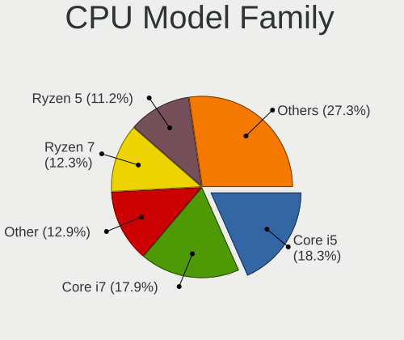

| Model                   | Computers | Percent |
|-------------------------|-----------|---------|
| Intel Core i5           | 2383      | 18.34%  |
| Intel Core i7           | 2325      | 17.89%  |
| Other                   | 1681      | 12.93%  |
| AMD Ryzen 7             | 1594      | 12.26%  |
| AMD Ryzen 5             | 1461      | 11.24%  |
| AMD Ryzen 9             | 689       | 5.3%    |
| Intel Core i3           | 508       | 3.91%   |
| Intel Celeron           | 310       | 2.39%   |
| Intel Xeon              | 232       | 1.79%   |
| Intel Core 2 Duo        | 170       | 1.31%   |
| AMD Ryzen 3             | 164       | 1.26%   |
| Intel Core              | 159       | 1.22%   |
| Intel Pentium           | 152       | 1.17%   |
| Intel Core i9           | 143       | 1.1%    |
| AMD Ryzen 7 PRO         | 132       | 1.02%   |
| AMD FX                  | 119       | 0.92%   |
| Intel Atom              | 94        | 0.72%   |
| AMD Ryzen 5 PRO         | 69        | 0.53%   |
| AMD A8                  | 52        | 0.4%    |
| AMD A6                  | 45        | 0.35%   |
| AMD A10                 | 43        | 0.33%   |
| AMD Ryzen Threadripper  | 39        | 0.3%    |
| Intel Core 2 Quad       | 36        | 0.28%   |
| AMD Athlon              | 36        | 0.28%   |
| Intel Pentium Silver    | 34        | 0.26%   |
| Intel Pentium Dual-Core | 31        | 0.24%   |
| AMD A4                  | 31        | 0.24%   |
| AMD Phenom II X4        | 19        | 0.15%   |
| AMD E                   | 17        | 0.13%   |
| AMD E2                  | 16        | 0.12%   |
| Intel Core m3           | 13        | 0.1%    |
| AMD Athlon II X2        | 13        | 0.1%    |
| Intel Core 2            | 12        | 0.09%   |
| Intel Genuine           | 11        | 0.08%   |
| AMD E1                  | 11        | 0.08%   |
| Intel Pentium Gold      | 9         | 0.07%   |
| Intel Pentium Dual      | 9         | 0.07%   |
| AMD Athlon II X4        | 9         | 0.07%   |
| Intel Core m5           | 8         | 0.06%   |
| AMD Phenom II X6        | 8         | 0.06%   |

CPU Cores
---------

Number of processor cores

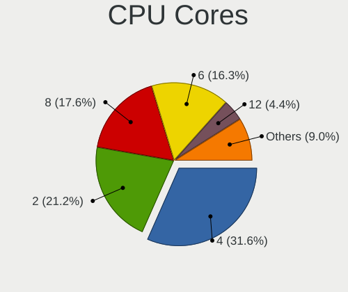

| Number  | Computers | Percent |
|---------|-----------|---------|
| 4       | 4110      | 31.61%  |
| 2       | 2754      | 21.18%  |
| 8       | 2285      | 17.57%  |
| 6       | 2114      | 16.26%  |
| 12      | 576       | 4.43%   |
| 16      | 422       | 3.25%   |
| 10      | 268       | 2.06%   |
| 14      | 233       | 1.79%   |
| 24      | 85        | 0.65%   |
| 1       | 60        | 0.46%   |
| 3       | 34        | 0.26%   |
| 20      | 25        | 0.19%   |
| 32      | 10        | 0.08%   |
| 18      | 5         | 0.04%   |
| 64      | 4         | 0.03%   |
| 28      | 4         | 0.03%   |
| 5       | 4         | 0.03%   |
| Unknown | 3         | 0.02%   |
| 56      | 2         | 0.02%   |
| 40      | 2         | 0.02%   |
| 36      | 2         | 0.02%   |
| 22      | 1         | 0.01%   |
| 13      | 1         | 0.01%   |

CPU Sockets
-----------

Number of sockets

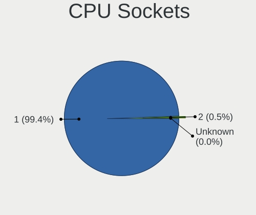

| Number  | Computers | Percent |
|---------|-----------|---------|
| 1       | 12901     | 99.43%  |
| 2       | 71        | 0.55%   |
| 4       | 2         | 0.02%   |
| Unknown | 1         | 0.01%   |

CPU Threads
-----------

Threads per core (Hyper-Threading)

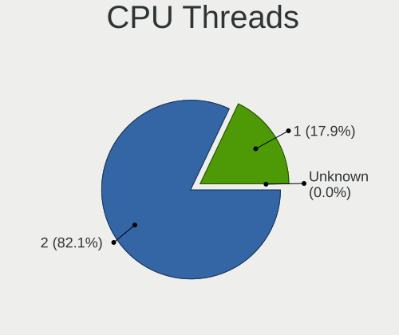

| Number  | Computers | Percent |
|---------|-----------|---------|
| 2       | 10664     | 82.09%  |
| 1       | 2324      | 17.89%  |
| Unknown | 3         | 0.02%   |

CPU Op-Modes
------------

CPU Operation Modes (32-bit, 64-bit)

| Op mode        | Computers | Percent |
|----------------|-----------|---------|
| 32-bit, 64-bit | 12858     | 99.02%  |
| Unknown        | 118       | 0.91%   |
| 32-bit         | 6         | 0.05%   |
| 64-bit         | 3         | 0.02%   |

CPU Microcode
-------------

Microcode number

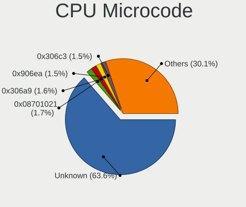

| Number     | Computers | Percent |
|------------|-----------|---------|
| Unknown    | 8545      | 63.64%  |
| 0x08701021 | 225       | 1.68%   |
| 0x306a9    | 209       | 1.56%   |
| 0x906ea    | 204       | 1.52%   |
| 0x306c3    | 202       | 1.5%    |
| 0x206a7    | 181       | 1.35%   |
| 0x906e9    | 174       | 1.3%    |
| 0x806ea    | 171       | 1.27%   |
| 0x0800820d | 161       | 1.2%    |
| 0x0a50000c | 146       | 1.09%   |
| 0x806ec    | 140       | 1.04%   |
| 0x806c1    | 138       | 1.03%   |
| 0x506e3    | 123       | 0.92%   |
| 0x406e3    | 112       | 0.83%   |
| 0x806e9    | 108       | 0.8%    |
| 0x08701013 | 103       | 0.77%   |
| 0x08600106 | 99        | 0.74%   |
| 0x306d4    | 92        | 0.69%   |
| 0x08108109 | 92        | 0.69%   |
| 0x08108102 | 91        | 0.68%   |
| 0x40651    | 87        | 0.65%   |
| 0x1067a    | 68        | 0.51%   |
| 0x0a50000d | 68        | 0.51%   |
| 0x08001138 | 66        | 0.49%   |
| 0xa0652    | 64        | 0.48%   |
| 0x0a601203 | 62        | 0.46%   |
| 0x0a201016 | 62        | 0.46%   |
| 0x08608103 | 62        | 0.46%   |
| 0x08600104 | 58        | 0.43%   |
| 0x0a201009 | 53        | 0.39%   |
| 0x0a404102 | 52        | 0.39%   |
| 0x20655    | 50        | 0.37%   |
| 0x806eb    | 46        | 0.34%   |
| 0x08600103 | 45        | 0.34%   |
| 0x706e5    | 39        | 0.29%   |
| 0x906ed    | 36        | 0.27%   |
| 0x0810100b | 36        | 0.27%   |
| 0x0a20120a | 35        | 0.26%   |
| 0x06000852 | 33        | 0.25%   |
| 0x906a3    | 31        | 0.23%   |

CPU Microarch
-------------

Microarchitecture

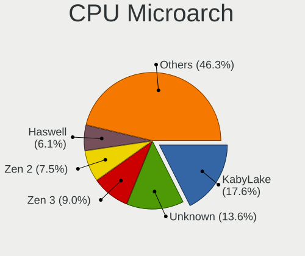

| Name               | Computers | Percent |
|--------------------|-----------|---------|
| KabyLake           | 2288      | 17.55%  |
| Unknown            | 1774      | 13.61%  |
| Zen 3              | 1175      | 9.01%   |
| Zen 2              | 977       | 7.49%   |
| Haswell            | 791       | 6.07%   |
| Zen+               | 622       | 4.77%   |
| Skylake            | 609       | 4.67%   |
| IvyBridge          | 572       | 4.39%   |
| Alderlake Hybrid   | 555       | 4.26%   |
| TigerLake          | 515       | 3.95%   |
| SandyBridge        | 440       | 3.38%   |
| CometLake          | 384       | 2.95%   |
| Zen                | 300       | 2.3%    |
| Broadwell          | 268       | 2.06%   |
| Icelake            | 230       | 1.76%   |
| Penryn             | 215       | 1.65%   |
| Silvermont         | 183       | 1.4%    |
| Westmere           | 159       | 1.22%   |
| Piledriver         | 146       | 1.12%   |
| Goldmont plus      | 122       | 0.94%   |
| Excavator          | 77        | 0.59%   |
| Meteorlake Hybrid  | 73        | 0.56%   |
| Core               | 72        | 0.55%   |
| K10                | 67        | 0.51%   |
| Nehalem            | 56        | 0.43%   |
| Goldmont           | 48        | 0.37%   |
| Puma               | 40        | 0.31%   |
| Bobcat             | 37        | 0.28%   |
| Bonnell            | 32        | 0.25%   |
| Lunarlake Hybrid   | 31        | 0.24%   |
| Steamroller        | 28        | 0.21%   |
| Tremont            | 25        | 0.19%   |
| K10 Llano          | 25        | 0.19%   |
| Gracemont          | 25        | 0.19%   |
| Jaguar             | 24        | 0.18%   |
| K8 Hammer          | 15        | 0.12%   |
| NetBurst           | 12        | 0.09%   |
| Bulldozer          | 9         | 0.07%   |
| ArrowLake-H Hybrid | 9         | 0.07%   |
| K8 & K10 hybrid    | 3         | 0.02%   |

Graphics
--------

GPU Vendor
----------

Vendors of graphics cards

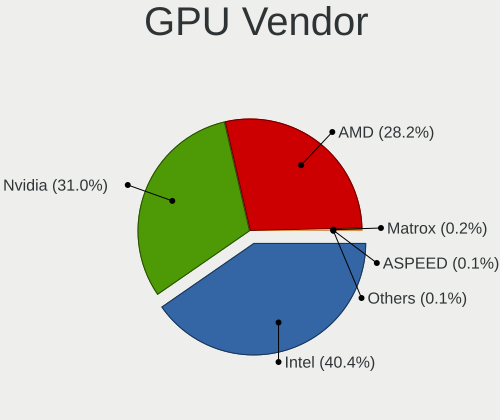

| Vendor                           | Computers | Percent |
|----------------------------------|-----------|---------|
| Intel                            | 6473      | 40.37%  |
| Nvidia                           | 4975      | 31.03%  |
| AMD                              | 4528      | 28.24%  |
| Matrox Electronics Systems       | 29        | 0.18%   |
| ASPEED Technology                | 15        | 0.09%   |
| Silicon Integrated Systems [SiS] | 6         | 0.04%   |
| ATI Technologies                 | 5         | 0.03%   |
| VIA Technologies                 | 2         | 0.01%   |
| Microsoft                        | 1         | 0.01%   |

GPU Model
---------

Graphics card models

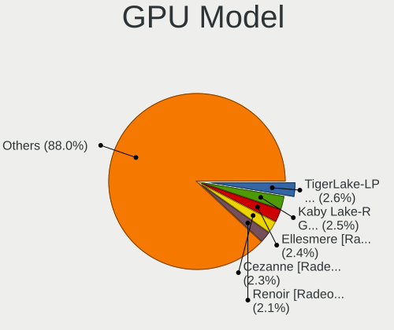

| Model                                                                       | Computers | Percent |
|-----------------------------------------------------------------------------|-----------|---------|
| Intel TigerLake-LP GT2 [Iris Xe Graphics]                                   | 439       | 2.65%   |
| Intel Kaby Lake-R GT2 [UHD Graphics 620]                                    | 414       | 2.5%    |
| AMD Ellesmere [Radeon RX 470/480/570/570X/580/580X/590]                     | 400       | 2.41%   |
| AMD Cezanne [Radeon Vega Series / Radeon Vega Mobile Series]                | 378       | 2.28%   |
| AMD Renoir [Radeon Vega Series / Radeon Vega Mobile Series]                 | 350       | 2.11%   |
| Intel 3rd Gen Core processor Graphics Controller                            | 335       | 2.02%   |
| AMD Picasso/Raven 2 [Radeon Vega Series / Radeon Vega Mobile Series]        | 329       | 1.99%   |
| Intel CoffeeLake-H GT2 [UHD Graphics 630]                                   | 310       | 1.87%   |
| Intel 2nd Generation Core Processor Family Integrated Graphics Controller   | 302       | 1.82%   |
| AMD Raphael                                                                 | 283       | 1.71%   |
| Intel WhiskeyLake-U GT2 [UHD Graphics 620]                                  | 268       | 1.62%   |
| Intel Kaby Lake-U GT2 [HD Graphics 620]                                     | 248       | 1.5%    |
| Intel Skylake-U GT2 [HD Graphics 520]                                       | 233       | 1.41%   |
| Intel Haswell-ULT Integrated Graphics Controller                            | 226       | 1.36%   |
| Nvidia TU117M [GeForce GTX 1650 Mobile / Max-Q]                             | 202       | 1.22%   |
| AMD Lucienne                                                                | 202       | 1.22%   |
| Intel Alder Lake-P GT2 [Iris Xe Graphics]                                   | 200       | 1.21%   |
| Intel CometLake-H GT2 [UHD Graphics]                                        | 188       | 1.13%   |
| AMD Rembrandt [Radeon 680M]                                                 | 188       | 1.13%   |
| Intel CometLake-U GT2 [UHD Graphics]                                        | 187       | 1.13%   |
| Intel Broadwell-U GT2 [HD Graphics 5500]                                    | 185       | 1.12%   |
| AMD Navi 10 [Radeon RX 5600 OEM/5600 XT / 5700/5700 XT]                     | 185       | 1.12%   |
| Intel Kaby Lake-H GT2 [HD Graphics 630]                                     | 154       | 0.93%   |
| Intel 4th Gen Core Processor Integrated Graphics Controller                 | 149       | 0.9%    |
| AMD Navi 22 [Radeon RX 6700/6700 XT/6750 XT / 6800M/6850M XT]               | 149       | 0.9%    |
| Intel Raptor Lake-P [Iris Xe Graphics]                                      | 147       | 0.89%   |
| Nvidia GP107 [GeForce GTX 1050 Ti]                                          | 146       | 0.88%   |
| AMD Phoenix1                                                                | 144       | 0.87%   |
| Nvidia GA106M [GeForce RTX 3060 Mobile / Max-Q]                             | 141       | 0.85%   |
| AMD Navi 23 [Radeon RX 6600/6600 XT/6600M]                                  | 137       | 0.83%   |
| AMD Navi 31 [Radeon RX 7900 XT/7900 XTX/7900 GRE/7900M]                     | 136       | 0.82%   |
| Intel Xeon E3-1200 v3/4th Gen Core Processor Integrated Graphics Controller | 125       | 0.75%   |
| AMD Navi 21 [Radeon RX 6800/6800 XT / 6900 XT]                              | 125       | 0.75%   |
| Intel TigerLake-H GT1 [UHD Graphics]                                        | 120       | 0.72%   |
| Intel CoffeeLake-S GT2 [UHD Graphics 630]                                   | 117       | 0.71%   |
| Nvidia GP106 [GeForce GTX 1060 6GB]                                         | 114       | 0.69%   |
| Nvidia GP107M [GeForce GTX 1050 Mobile]                                     | 113       | 0.68%   |
| Nvidia GP104 [GeForce GTX 1070]                                             | 110       | 0.66%   |
| AMD Raven Ridge [Radeon Vega Series / Radeon Vega Mobile Series]            | 108       | 0.65%   |
| Nvidia AD107M [GeForce RTX 4060 Max-Q / Mobile]                             | 105       | 0.63%   |

GPU Combo
---------

Combinations of graphics cards

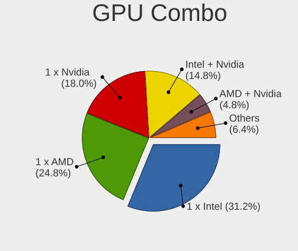

| Name                     | Computers | Percent |
|--------------------------|-----------|---------|
| 1 x Intel                | 4094      | 31.25%  |
| 1 x AMD                  | 3249      | 24.8%   |
| 1 x Nvidia               | 2356      | 17.98%  |
| Intel + Nvidia           | 1933      | 14.75%  |
| AMD + Nvidia             | 630       | 4.81%   |
| 2 x AMD                  | 376       | 2.87%   |
| Intel + AMD              | 275       | 2.1%    |
| 2 x Nvidia               | 49        | 0.37%   |
| 2 x Intel                | 43        | 0.33%   |
| 1 x Matrox               | 22        | 0.17%   |
| Other                    | 21        | 0.16%   |
| 2 x AMD + 1 x Nvidia     | 9         | 0.07%   |
| 1 x ASPEED               | 8         | 0.06%   |
| 1 x SiS                  | 6         | 0.05%   |
| Intel + AMD + 1 x Nvidia | 6         | 0.05%   |
| Nvidia + Matrox          | 5         | 0.04%   |
| AMD + ASPEED             | 5         | 0.04%   |
| Intel + 2 x Nvidia       | 3         | 0.02%   |
| 1 x VIA                  | 2         | 0.02%   |
| Nvidia + ASPEED          | 2         | 0.02%   |
| AMD + Matrox             | 2         | 0.02%   |
| 3 x Nvidia               | 1         | 0.01%   |
| 3 x AMD                  | 1         | 0.01%   |
| 1 x Microsoft            | 1         | 0.01%   |
| Intel + 2 x AMD          | 1         | 0.01%   |
| AMD + 2 x Nvidia         | 1         | 0.01%   |

GPU Driver
----------

Free vs proprietary

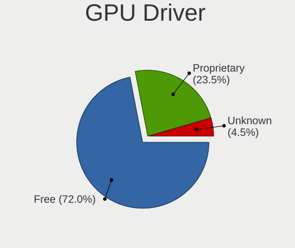

| Driver      | Computers | Percent |
|-------------|-----------|---------|
| Free        | 9455      | 71.96%  |
| Proprietary | 3090      | 23.52%  |
| Unknown     | 595       | 4.53%   |

GPU Memory
----------

Total video memory

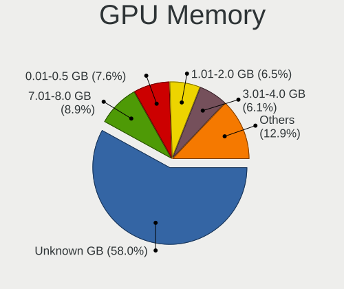

| Size in GB | Computers | Percent |
|------------|-----------|---------|
| Unknown    | 7743      | 58%     |
| 7.01-8.0   | 1186      | 8.88%   |
| 0.01-0.5   | 1016      | 7.61%   |
| 1.01-2.0   | 864       | 6.47%   |
| 3.01-4.0   | 818       | 6.13%   |
| 8.01-16.0  | 687       | 5.15%   |
| 5.01-6.0   | 411       | 3.08%   |
| 0.51-1.0   | 399       | 2.99%   |
| 16.01-24.0 | 139       | 1.04%   |
| 2.01-3.0   | 82        | 0.61%   |
| 4.01-5.0   | 4         | 0.03%   |
| 32.01-64.0 | 1         | 0.01%   |
| 24.01-32.0 | 1         | 0.01%   |

Monitor
-------

Monitor Vendor
--------------

Monitor vendors

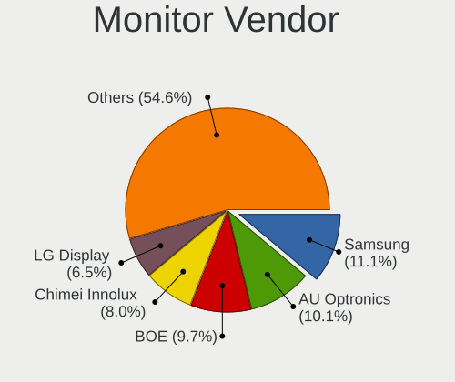

| Vendor                  | Computers | Percent |
|-------------------------|-----------|---------|
| Samsung Electronics     | 1760      | 11.1%   |
| AU Optronics            | 1609      | 10.15%  |
| BOE                     | 1532      | 9.66%   |
| Chimei Innolux          | 1274      | 8.04%   |
| LG Display              | 1031      | 6.5%    |
| Goldstar                | 999       | 6.3%    |
| Dell                    | 994       | 6.27%   |
| Acer                    | 614       | 3.87%   |
| AOC                     | 530       | 3.34%   |
| Hewlett-Packard         | 439       | 2.77%   |
| BenQ                    | 408       | 2.57%   |
| Sharp                   | 336       | 2.12%   |
| Ancor Communications    | 335       | 2.11%   |
| Lenovo                  | 312       | 1.97%   |
| Philips                 | 311       | 1.96%   |
| ASUSTek Computer        | 293       | 1.85%   |
| Apple                   | 204       | 1.29%   |
| PANDA                   | 198       | 1.25%   |
| ViewSonic               | 169       | 1.07%   |
| MSI                     | 163       | 1.03%   |
| Iiyama                  | 139       | 0.88%   |
| InfoVision              | 122       | 0.77%   |
| CSO                     | 113       | 0.71%   |
| Gigabyte Technology     | 112       | 0.71%   |
| Unknown                 | 106       | 0.67%   |
| Sony                    | 77        | 0.49%   |
| LG Electronics          | 74        | 0.47%   |
| Chi Mei Optoelectronics | 67        | 0.42%   |
| TMX                     | 61        | 0.38%   |
| Eizo                    | 56        | 0.35%   |
| Unknown                 | 56        | 0.35%   |
| Sceptre Tech            | 49        | 0.31%   |
| NEC Computers           | 49        | 0.31%   |
| Mi                      | 48        | 0.3%    |
| HKC                     | 42        | 0.26%   |
| CSOT                    | 42        | 0.26%   |
| Panasonic               | 39        | 0.25%   |
| Toshiba                 | 38        | 0.24%   |
| Vizio                   | 37        | 0.23%   |
| Fujitsu Siemens         | 32        | 0.2%    |

Monitor Model
-------------

Monitor models

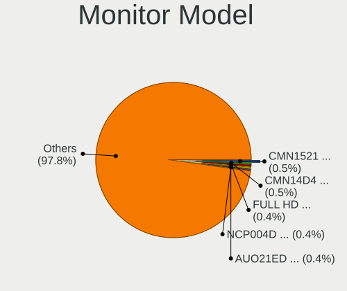

| Model                                                                 | Computers | Percent |
|-----------------------------------------------------------------------|-----------|---------|
| Chimei Innolux LCD Monitor CMN1521 1920x1080 344x193mm 15.5-inch      | 90        | 0.55%   |
| Chimei Innolux LCD Monitor CMN14D4 1920x1080 309x173mm 13.9-inch      | 78        | 0.47%   |
| Goldstar FULL HD GSM5B55 1920x1080 480x270mm 21.7-inch                | 66        | 0.4%    |
| PANDA LCD Monitor NCP004D 1920x1080 344x194mm 15.5-inch               | 65        | 0.39%   |
| AU Optronics LCD Monitor AUO21ED 1920x1080 344x193mm 15.5-inch        | 65        | 0.39%   |
| Chimei Innolux LCD Monitor CMN15F5 1920x1080 344x193mm 15.5-inch      | 64        | 0.39%   |
| Unknown LCD Monitor FFFF 2288x1287 2550x2550mm 142.0-inch             | 60        | 0.36%   |
| AU Optronics LCD Monitor AUO38ED 1920x1080 344x193mm 15.5-inch        | 56        | 0.34%   |
| Unknown                                                               | 56        | 0.34%   |
| AOC 27G2G4 AOC2702 1920x1080 598x336mm 27.0-inch                      | 51        | 0.31%   |
| AOC 24G2W1G3 AOC2402 1920x1080 527x296mm 23.8-inch                    | 51        | 0.31%   |
| Chimei Innolux LCD Monitor CMN15E7 1920x1080 344x193mm 15.5-inch      | 46        | 0.28%   |
| Goldstar Ultra HD GSM5B09 3840x2160 600x340mm 27.2-inch               | 45        | 0.27%   |
| AU Optronics LCD Monitor AUO403D 1920x1080 309x174mm 14.0-inch        | 43        | 0.26%   |
| Samsung Electronics C24F390 SAM0D2C 1920x1080 521x293mm 23.5-inch     | 41        | 0.25%   |
| Goldstar LG ULTRAWIDE GSM59F1 2560x1080 670x280mm 28.6-inch           | 41        | 0.25%   |
| Samsung Electronics S24F350 SAM0D20 1920x1080 521x293mm 23.5-inch     | 39        | 0.24%   |
| Goldstar LG IPS FULLHD GSM5AB8 1920x1080 480x270mm 21.7-inch          | 38        | 0.23%   |
| BOE LCD Monitor BOE095F 2256x1504 285x190mm 13.5-inch                 | 37        | 0.22%   |
| Chimei Innolux LCD Monitor CMN15E8 1920x1080 344x193mm 15.5-inch      | 34        | 0.21%   |
| BOE LCD Monitor BOE0872 1920x1080 344x194mm 15.5-inch                 | 33        | 0.2%    |
| Goldstar 27GL850 GSM5B7F 2560x1440 597x336mm 27.0-inch                | 28        | 0.17%   |
| AU Optronics LCD Monitor AUO106C 1366x768 276x155mm 12.5-inch         | 28        | 0.17%   |
| Goldstar HDR 4K GSM7706 3840x2160 600x340mm 27.2-inch                 | 27        | 0.16%   |
| AOC 24B1W1 AOC2401 1920x1080 527x296mm 23.8-inch                      | 27        | 0.16%   |
| Chimei Innolux LCD Monitor CMN14C9 1920x1080 309x173mm 13.9-inch      | 26        | 0.16%   |
| Ancor Communications VG248 ACI24A4 1920x1080 531x299mm 24.0-inch      | 26        | 0.16%   |
| Samsung Electronics U28E590 SAM0C4D 3840x2160 607x345mm 27.5-inch     | 25        | 0.15%   |
| Samsung Electronics LCD Monitor SDC4171 2880x1800 302x189mm 14.0-inch | 25        | 0.15%   |
| LG Display LCD Monitor LGD0555 2736x1824 260x173mm 12.3-inch          | 25        | 0.15%   |
| LG Display LCD Monitor LGD0521 1920x1080 309x174mm 14.0-inch          | 25        | 0.15%   |
| LG Display LCD Monitor LGD046F 1920x1080 344x194mm 15.5-inch          | 25        | 0.15%   |
| Dell U2412M DELA07A 1920x1200 518x324mm 24.1-inch                     | 25        | 0.15%   |
| Chimei Innolux LCD Monitor CMN14D5 1920x1080 309x173mm 13.9-inch      | 25        | 0.15%   |
| AU Optronics LCD Monitor AUO573D 1920x1080 309x174mm 14.0-inch        | 25        | 0.15%   |
| Samsung Electronics LCD Monitor SDC4161 1920x1080 344x194mm 15.5-inch | 24        | 0.15%   |
| Chimei Innolux LCD Monitor CMN15DB 1366x768 344x193mm 15.5-inch       | 24        | 0.15%   |
| AU Optronics LCD Monitor AUOAF90 1920x1080 344x193mm 15.5-inch        | 24        | 0.15%   |
| LG Display LCD Monitor LGD02DC 1366x768 344x194mm 15.5-inch           | 23        | 0.14%   |
| LG Display LCD Monitor LGD02D8 1366x768 277x156mm 12.5-inch           | 23        | 0.14%   |

Monitor Resolution
------------------

Monitor screen resolution

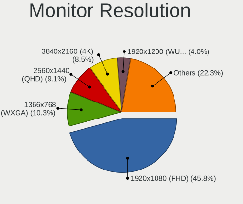

| Resolution         | Computers | Percent |
|--------------------|-----------|---------|
| 1920x1080 (FHD)    | 6822      | 45.78%  |
| 1366x768 (WXGA)    | 1529      | 10.26%  |
| 2560x1440 (QHD)    | 1361      | 9.13%   |
| 3840x2160 (4K)     | 1270      | 8.52%   |
| 1920x1200 (WUXGA)  | 595       | 3.99%   |
| 2560x1600          | 332       | 2.23%   |
| 1600x900 (HD+)     | 315       | 2.11%   |
| 3440x1440          | 298       | 2%      |
| 1680x1050 (WSXGA+) | 232       | 1.56%   |
| 1280x1024 (SXGA)   | 223       | 1.5%    |
| Unknown            | 217       | 1.46%   |
| 2880x1800          | 215       | 1.44%   |
| 1440x900 (WXGA+)   | 174       | 1.17%   |
| 2560x1080          | 170       | 1.14%   |
| 3840x1080          | 114       | 0.76%   |
| 1280x800 (WXGA)    | 111       | 0.74%   |
| 1360x768           | 72        | 0.48%   |
| 3840x2400          | 70        | 0.47%   |
| 2288x1287          | 60        | 0.4%    |
| 2256x1504          | 59        | 0.4%    |
| 2160x1440          | 53        | 0.36%   |
| 3200x2000          | 37        | 0.25%   |
| 2880x1920          | 37        | 0.25%   |
| 3840x1600          | 36        | 0.24%   |
| 3072x1920          | 33        | 0.22%   |
| 3200x1800 (QHD+)   | 32        | 0.21%   |
| 1920x540           | 30        | 0.2%    |
| 3000x2000          | 22        | 0.15%   |
| 2240x1400          | 20        | 0.13%   |
| 1920x1280          | 18        | 0.12%   |
| 1024x600           | 17        | 0.11%   |
| 2880x1620          | 16        | 0.11%   |
| 3456x2160          | 15        | 0.1%    |
| 1600x1200          | 15        | 0.1%    |
| 1024x768 (XGA)     | 15        | 0.1%    |
| 4480x1440          | 14        | 0.09%   |
| 800x1280           | 12        | 0.08%   |
| 2520x1680          | 12        | 0.08%   |
| 7680x2160          | 10        | 0.07%   |
| 5760x1080          | 10        | 0.07%   |

Monitor Diagonal
----------------

Diagonal size in inches

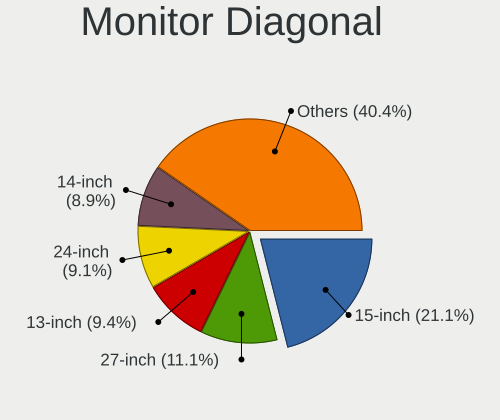

| Inches  | Computers | Percent |
|---------|-----------|---------|
| 15      | 3313      | 21.06%  |
| 27      | 1753      | 11.14%  |
| 13      | 1486      | 9.45%   |
| 24      | 1431      | 9.1%    |
| 14      | 1401      | 8.91%   |
| 23      | 910       | 5.78%   |
| 21      | 758       | 4.82%   |
| Unknown | 624       | 3.97%   |
| 31      | 596       | 3.79%   |
| 16      | 467       | 2.97%   |
| 17      | 455       | 2.89%   |
| 34      | 383       | 2.43%   |
| 19      | 260       | 1.65%   |
| 12      | 209       | 1.33%   |
| 22      | 187       | 1.19%   |
| 18      | 182       | 1.16%   |
| 20      | 131       | 0.83%   |
| 11      | 119       | 0.76%   |
| 84      | 95        | 0.6%    |
| 32      | 83        | 0.53%   |
| 40      | 68        | 0.43%   |
| 72      | 67        | 0.43%   |
| 26      | 66        | 0.42%   |
| 48      | 62        | 0.39%   |
| 142     | 60        | 0.38%   |
| 25      | 57        | 0.36%   |
| 54      | 52        | 0.33%   |
| 28      | 44        | 0.28%   |
| 29      | 38        | 0.24%   |
| 10      | 36        | 0.23%   |
| 63      | 35        | 0.22%   |
| 37      | 35        | 0.22%   |
| 49      | 29        | 0.18%   |
| 46      | 21        | 0.13%   |
| 42      | 19        | 0.12%   |
| 52      | 18        | 0.11%   |
| 33      | 16        | 0.1%    |
| 74      | 15        | 0.1%    |
| 65      | 15        | 0.1%    |
| 35      | 15        | 0.1%    |

Monitor Width
-------------

Physical width

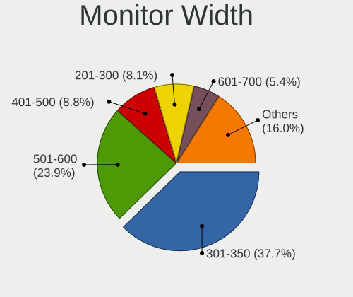

| Width in mm    | Computers | Percent |
|----------------|-----------|---------|
| 301-350        | 5733      | 37.72%  |
| 501-600        | 3631      | 23.89%  |
| 401-500        | 1342      | 8.83%   |
| 201-300        | 1237      | 8.14%   |
| 601-700        | 821       | 5.4%    |
| Unknown        | 624       | 4.11%   |
| 351-400        | 615       | 4.05%   |
| 701-800        | 471       | 3.1%    |
| 1001-1500      | 276       | 1.82%   |
| 1501-2000      | 188       | 1.24%   |
| 801-900        | 145       | 0.95%   |
| More than 2000 | 61        | 0.4%    |
| 901-1000       | 39        | 0.26%   |
| 1-100          | 10        | 0.07%   |
| 101-200        | 6         | 0.04%   |

Aspect Ratio
------------

Proportional relationship between the width and the height

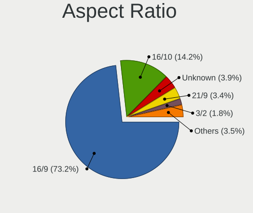

| Ratio   | Computers | Percent |
|---------|-----------|---------|
| 16/9    | 10052     | 73.23%  |
| 16/10   | 1945      | 14.17%  |
| Unknown | 531       | 3.87%   |
| 21/9    | 470       | 3.42%   |
| 3/2     | 244       | 1.78%   |
| 5/4     | 218       | 1.59%   |
| 32/9    | 93        | 0.68%   |
| 1.00    | 60        | 0.44%   |
| 4/3     | 59        | 0.43%   |
| 3.40    | 7         | 0.05%   |
| 0.67    | 7         | 0.05%   |
| 6/5     | 6         | 0.04%   |
| 0.56    | 6         | 0.04%   |
| 2.65    | 4         | 0.03%   |
| 2.00    | 4         | 0.03%   |
| 1.96    | 3         | 0.02%   |
| 0.89    | 3         | 0.02%   |
| 0.62    | 3         | 0.02%   |
| 3.73    | 2         | 0.01%   |
| 3.20    | 2         | 0.01%   |
| 0.79    | 2         | 0.01%   |
| 2.58    | 1         | 0.01%   |
| 1.03    | 1         | 0.01%   |
| 0.63    | 1         | 0.01%   |
| 0.58    | 1         | 0.01%   |
| 0.57    | 1         | 0.01%   |

Monitor Area
------------

Area in inch²

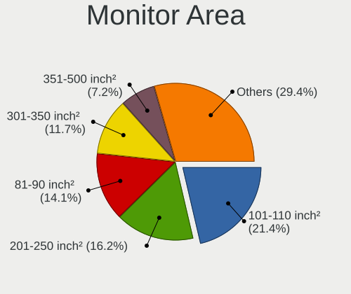

| Area in inch² | Computers | Percent |
|----------------|-----------|---------|
| 101-110        | 3314      | 21.36%  |
| 201-250        | 2521      | 16.25%  |
| 81-90          | 2184      | 14.08%  |
| 301-350        | 1811      | 11.67%  |
| 351-500        | 1123      | 7.24%   |
| 71-80          | 645       | 4.16%   |
| Unknown        | 624       | 4.02%   |
| 151-200        | 570       | 3.67%   |
| 251-300        | 536       | 3.45%   |
| 111-120        | 440       | 2.84%   |
| More than 1000 | 405       | 2.61%   |
| 121-130        | 336       | 2.17%   |
| 501-1000       | 274       | 1.77%   |
| 141-150        | 240       | 1.55%   |
| 61-70          | 197       | 1.27%   |
| 51-60          | 129       | 0.83%   |
| 91-100         | 76        | 0.49%   |
| 131-140        | 40        | 0.26%   |
| 41-50          | 34        | 0.22%   |
| 1-40           | 15        | 0.1%    |

Pixel Density
-------------

Pixels per inch

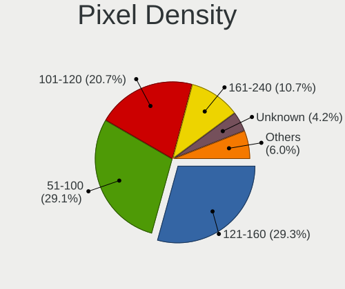

| Density       | Computers | Percent |
|---------------|-----------|---------|
| 121-160       | 4358      | 29.28%  |
| 51-100        | 4330      | 29.1%   |
| 101-120       | 3084      | 20.72%  |
| 161-240       | 1599      | 10.74%  |
| Unknown       | 624       | 4.19%   |
| More than 240 | 566       | 3.8%    |
| 1-50          | 321       | 2.16%   |

Multiple Monitors
-----------------

Total monitors connected

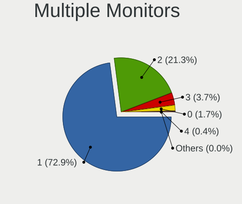

| Total | Computers | Percent |
|-------|-----------|---------|
| 1     | 9694      | 72.93%  |
| 2     | 2827      | 21.27%  |
| 3     | 489       | 3.68%   |
| 0     | 228       | 1.72%   |
| 4     | 50        | 0.38%   |
| 5     | 4         | 0.03%   |
| 6     | 1         | 0.01%   |

Network
-------

Net Controller Vendor
---------------------

Controller vendors

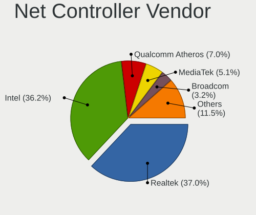

| Vendor                                 | Computers | Percent |
|----------------------------------------|-----------|---------|
| Realtek Semiconductor                  | 7212      | 36.99%  |
| Intel                                  | 7050      | 36.16%  |
| Qualcomm Atheros                       | 1358      | 6.96%   |
| MediaTek                               | 1001      | 5.13%   |
| Broadcom                               | 631       | 3.24%   |
| TP-Link                                | 202       | 1.04%   |
| ASIX Electronics                       | 140       | 0.72%   |
| Broadcom Limited                       | 134       | 0.69%   |
| Ralink Technology                      | 117       | 0.6%    |
| Qualcomm                               | 116       | 0.59%   |
| Microsoft                              | 115       | 0.59%   |
| Marvell Technology Group               | 92        | 0.47%   |
| Shenzhen Goodix Technology             | 86        | 0.44%   |
| Samsung Electronics                    | 83        | 0.43%   |
| Ralink                                 | 71        | 0.36%   |
| Lenovo                                 | 70        | 0.36%   |
| Aquantia                               | 69        | 0.35%   |
| Xiaomi                                 | 63        | 0.32%   |
| Sierra Wireless                        | 59        | 0.3%    |
| DisplayLink                            | 51        | 0.26%   |
| Qualcomm Technologies                  | 39        | 0.2%    |
| Google                                 | 36        | 0.18%   |
| D-Link                                 | 36        | 0.18%   |
| NetGear                                | 35        | 0.18%   |
| Ericsson Business Mobile Networks      | 33        | 0.17%   |
| Nvidia                                 | 28        | 0.14%   |
| Dell                                   | 28        | 0.14%   |
| Apple                                  | 28        | 0.14%   |
| Qualcomm Atheros Communications        | 27        | 0.14%   |
| Hewlett-Packard                        | 25        | 0.13%   |
| OPPO Electronics                       | 23        | 0.12%   |
| Mellanox Technologies                  | 23        | 0.12%   |
| Fibocom                                | 23        | 0.12%   |
| Huawei Technologies                    | 21        | 0.11%   |
| ASUSTek Computer                       | 21        | 0.11%   |
| Motorola PCS                           | 18        | 0.09%   |
| QinHeng Electronics                    | 17        | 0.09%   |
| Suzhou Motorcomm Electronic Technology | 16        | 0.08%   |
| Microchip Technology                   | 16        | 0.08%   |
| D-Link System                          | 13        | 0.07%   |

Net Controller Model
--------------------

Controller models

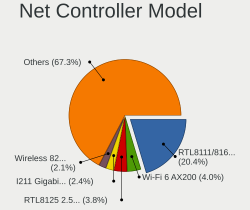

| Model                                                                  | Computers | Percent |
|------------------------------------------------------------------------|-----------|---------|
| Realtek RTL8111/8168/8211/8411 PCI Express Gigabit Ethernet Controller | 4685      | 20.37%  |
| Intel Wi-Fi 6 AX200                                                    | 929       | 4.04%   |
| Realtek RTL8125 2.5GbE Controller                                      | 869       | 3.78%   |
| Intel I211 Gigabit Network Connection                                  | 545       | 2.37%   |
| Intel Wireless 8265 / 8275                                             | 487       | 2.12%   |
| Realtek RTL8153 Gigabit Ethernet Adapter                               | 441       | 1.92%   |
| Realtek RTL810xE PCI Express Fast Ethernet controller                  | 436       | 1.9%    |
| Intel Wi-Fi 6E(802.11ax) AX210/AX1675* 2x2 [Typhoon Peak]              | 397       | 1.73%   |
| MediaTek MT7922 802.11ax PCI Express Wireless Network Adapter          | 394       | 1.71%   |
| Intel Wi-Fi 6 AX201                                                    | 373       | 1.62%   |
| Intel Alder Lake-P PCH CNVi WiFi                                       | 316       | 1.37%   |
| Intel Ethernet Controller I225-V                                       | 304       | 1.32%   |
| MediaTek MT7921 802.11ax PCIe Wireless Network Adapter [Filogic 330]   | 298       | 1.3%    |
| Intel 82579LM Gigabit Network Connection (Lewisville)                  | 295       | 1.28%   |
| Realtek RTL8822CE 802.11ac PCIe Wireless Network Adapter               | 293       | 1.27%   |
| Realtek RTL8821CE 802.11ac PCIe Wireless Network Adapter               | 289       | 1.26%   |
| Qualcomm Atheros QCA9377 802.11ac Wireless Network Adapter             | 265       | 1.15%   |
| Intel Wireless 7265                                                    | 257       | 1.12%   |
| Qualcomm Atheros QCA6174 802.11ac Wireless Network Adapter             | 251       | 1.09%   |
| Intel Cannon Lake PCH CNVi WiFi                                        | 246       | 1.07%   |
| Intel Wireless 8260                                                    | 235       | 1.02%   |
| Intel Ethernet Connection (2) I219-V                                   | 231       | 1%      |
| Intel Dual Band Wireless-AC 3168NGW [Stone Peak]                       | 199       | 0.87%   |
| Intel Wireless 7260                                                    | 190       | 0.83%   |
| Intel Comet Lake PCH CNVi WiFi                                         | 185       | 0.8%    |
| Intel Wi-Fi 5(802.11ac) Wireless-AC 9x6x [Thunder Peak]                | 176       | 0.77%   |
| Intel Comet Lake PCH-LP CNVi WiFi                                      | 169       | 0.73%   |
| Intel Cannon Point-LP CNVi [Wireless-AC]                               | 165       | 0.72%   |
| Intel Ethernet Connection (4) I219-LM                                  | 164       | 0.71%   |
| Intel Raptor Lake PCH CNVi WiFi                                        | 161       | 0.7%    |
| Qualcomm Atheros QCA9565 / AR9565 Wireless Network Adapter             | 157       | 0.68%   |
| Qualcomm Atheros AR9485 Wireless Network Adapter                       | 156       | 0.68%   |
| Intel Ethernet Connection (7) I219-V                                   | 147       | 0.64%   |
| Realtek RTL8852BE PCIe 802.11ax Wireless Network Controller            | 144       | 0.63%   |
| Intel Centrino Advanced-N 6205 [Taylor Peak]                           | 133       | 0.58%   |
| Intel Wireless 3165                                                    | 132       | 0.57%   |
| Intel Ethernet Connection I217-LM                                      | 129       | 0.56%   |
| MediaTek MT7921K (RZ608) Wi-Fi 6E 80MHz                                | 127       | 0.55%   |
| ASIX AX88179 Gigabit Ethernet                                          | 126       | 0.55%   |
| Realtek RTL8822BE 802.11a/b/g/n/ac WiFi adapter                        | 116       | 0.5%    |

Wireless Vendor
---------------

Wireless vendors

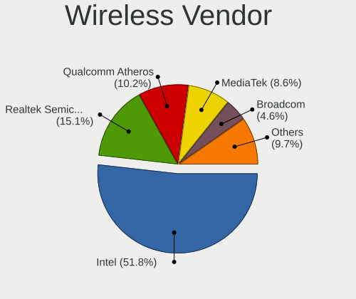

| Vendor                          | Computers | Percent |
|---------------------------------|-----------|---------|
| Intel                           | 5535      | 51.79%  |
| Realtek Semiconductor           | 1619      | 15.15%  |
| Qualcomm Atheros                | 1090      | 10.2%   |
| MediaTek                        | 923       | 8.64%   |
| Broadcom                        | 487       | 4.56%   |
| TP-Link                         | 181       | 1.69%   |
| Ralink Technology               | 117       | 1.09%   |
| Microsoft                       | 102       | 0.95%   |
| Broadcom Limited                | 101       | 0.94%   |
| Qualcomm                        | 99        | 0.93%   |
| Ralink                          | 71        | 0.66%   |
| Sierra Wireless                 | 59        | 0.55%   |
| NetGear                         | 32        | 0.3%    |
| Marvell Technology Group        | 32        | 0.3%    |
| D-Link                          | 32        | 0.3%    |
| Qualcomm Atheros Communications | 27        | 0.25%   |
| Fibocom                         | 23        | 0.22%   |
| Dell                            | 19        | 0.18%   |
| ASUSTek Computer                | 18        | 0.17%   |
| Qualcomm Technologies           | 15        | 0.14%   |
| Linksys                         | 11        | 0.1%    |
| Hewlett-Packard                 | 11        | 0.1%    |
| Edimax Technology               | 11        | 0.1%    |
| D-Link System                   | 9         | 0.08%   |
| Mercucys                        | 7         | 0.07%   |
| Belkin Components               | 5         | 0.05%   |
| AVM                             | 5         | 0.05%   |
| Unknown                         | 5         | 0.05%   |
| Wilocity                        | 4         | 0.04%   |
| Tenda                           | 4         | 0.04%   |
| Quectel Wireless Solutions      | 4         | 0.04%   |
| ZyDAS                           | 3         | 0.03%   |
| Xiaomi                          | 3         | 0.03%   |
| VIA Technologies                | 3         | 0.03%   |
| Realtek                         | 3         | 0.03%   |
| IMC Networks                    | 3         | 0.03%   |
| ZyXEL Communications            | 2         | 0.02%   |
| Micro Star International        | 2         | 0.02%   |
| BUFFALO                         | 2         | 0.02%   |
| AboCom Systems                  | 2         | 0.02%   |

Wireless Model
--------------

Wireless models

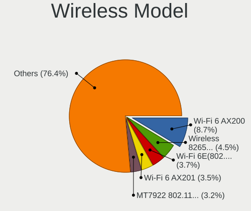

| Model                                                                | Computers | Percent |
|----------------------------------------------------------------------|-----------|---------|
| Intel Wi-Fi 6 AX200                                                  | 929       | 8.65%   |
| Intel Wireless 8265 / 8275                                           | 487       | 4.53%   |
| Intel Wi-Fi 6E(802.11ax) AX210/AX1675* 2x2 [Typhoon Peak]            | 397       | 3.7%    |
| Intel Wi-Fi 6 AX201                                                  | 373       | 3.47%   |
| MediaTek MT7922 802.11ax PCI Express Wireless Network Adapter        | 344       | 3.2%    |
| MediaTek MT7921 802.11ax PCIe Wireless Network Adapter [Filogic 330] | 298       | 2.77%   |
| Realtek RTL8822CE 802.11ac PCIe Wireless Network Adapter             | 293       | 2.73%   |
| Realtek RTL8821CE 802.11ac PCIe Wireless Network Adapter             | 289       | 2.69%   |
| Qualcomm Atheros QCA9377 802.11ac Wireless Network Adapter           | 265       | 2.47%   |
| Intel Wireless 7265                                                  | 257       | 2.39%   |
| Qualcomm Atheros QCA6174 802.11ac Wireless Network Adapter           | 251       | 2.34%   |
| Intel Cannon Lake PCH CNVi WiFi                                      | 246       | 2.29%   |
| Intel Wireless 8260                                                  | 235       | 2.19%   |
| Intel Alder Lake-P PCH CNVi WiFi                                     | 210       | 1.96%   |
| Intel Dual Band Wireless-AC 3168NGW [Stone Peak]                     | 199       | 1.85%   |
| Intel Wireless 7260                                                  | 190       | 1.77%   |
| Intel Comet Lake PCH CNVi WiFi                                       | 185       | 1.72%   |
| Intel Wi-Fi 5(802.11ac) Wireless-AC 9x6x [Thunder Peak]              | 176       | 1.64%   |
| Intel Comet Lake PCH-LP CNVi WiFi                                    | 169       | 1.57%   |
| Intel Cannon Point-LP CNVi [Wireless-AC]                             | 165       | 1.54%   |
| Qualcomm Atheros QCA9565 / AR9565 Wireless Network Adapter           | 157       | 1.46%   |
| Qualcomm Atheros AR9485 Wireless Network Adapter                     | 156       | 1.45%   |
| Intel Raptor Lake PCH CNVi WiFi                                      | 156       | 1.45%   |
| Intel Centrino Advanced-N 6205 [Taylor Peak]                         | 133       | 1.24%   |
| Intel Wireless 3165                                                  | 132       | 1.23%   |
| Realtek RTL8852BE PCIe 802.11ax Wireless Network Controller          | 131       | 1.22%   |
| MediaTek MT7921K (RZ608) Wi-Fi 6E 80MHz                              | 127       | 1.18%   |
| Realtek RTL8822BE 802.11a/b/g/n/ac WiFi adapter                      | 116       | 1.08%   |
| Realtek RTL8852AE 802.11ax PCIe Wireless Network Adapter             | 106       | 0.99%   |
| Intel Tiger Lake PCH CNVi WiFi                                       | 101       | 0.94%   |
| Qualcomm Atheros AR9285 Wireless Network Adapter (PCI-Express)       | 100       | 0.93%   |
| Intel 700 Series Chipset CNVi WiFi                                   | 95        | 0.88%   |
| Intel Meteor Lake PCH CNVi WiFi                                      | 88        | 0.82%   |
| Intel Ice Lake-LP PCH CNVi WiFi                                      | 88        | 0.82%   |
| Qualcomm QCNFA765 Wireless Network Adapter                           | 81        | 0.75%   |
| Broadcom BCM4360 802.11ac Dual Band Wireless Network Adapter         | 80        | 0.74%   |
| Realtek RTL8723BE PCIe Wireless Network Adapter                      | 71        | 0.66%   |
| Broadcom BCM43142 802.11b/g/n                                        | 71        | 0.66%   |
| Intel Wireless 3160                                                  | 66        | 0.61%   |
| Broadcom BCM4313 802.11bgn Wireless Network Adapter                  | 66        | 0.61%   |

Ethernet Vendor
---------------

Ethernet vendors

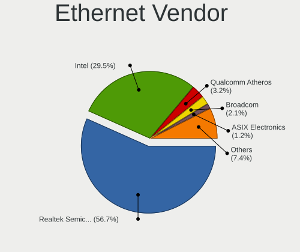

| Vendor                                 | Computers | Percent |
|----------------------------------------|-----------|---------|
| Realtek Semiconductor                  | 6558      | 56.67%  |
| Intel                                  | 3408      | 29.45%  |
| Qualcomm Atheros                       | 365       | 3.15%   |
| Broadcom                               | 241       | 2.08%   |
| ASIX Electronics                       | 140       | 1.21%   |
| Samsung Electronics                    | 82        | 0.71%   |
| MediaTek                               | 77        | 0.67%   |
| Aquantia                               | 69        | 0.6%    |
| Lenovo                                 | 63        | 0.54%   |
| Xiaomi                                 | 60        | 0.52%   |
| Marvell Technology Group               | 60        | 0.52%   |
| DisplayLink                            | 51        | 0.44%   |
| Google                                 | 34        | 0.29%   |
| Broadcom Limited                       | 33        | 0.29%   |
| Nvidia                                 | 28        | 0.24%   |
| Apple                                  | 28        | 0.24%   |
| Qualcomm Technologies                  | 24        | 0.21%   |
| OPPO Electronics                       | 23        | 0.2%    |
| TP-Link                                | 21        | 0.18%   |
| Mellanox Technologies                  | 21        | 0.18%   |
| Motorola PCS                           | 18        | 0.16%   |
| Qualcomm                               | 17        | 0.15%   |
| Suzhou Motorcomm Electronic Technology | 16        | 0.14%   |
| Microsoft                              | 12        | 0.1%    |
| JMicron Technology                     | 12        | 0.1%    |
| Huawei Technologies                    | 12        | 0.1%    |
| Cypress Semiconductor                  | 9         | 0.08%   |
| Silicon Integrated Systems [SiS]       | 6         | 0.05%   |
| ICS Advent                             | 6         | 0.05%   |
| Hewlett-Packard                        | 6         | 0.05%   |
| Sony Ericsson Mobile Communications AB | 5         | 0.04%   |
| QinHeng Electronics                    | 4         | 0.03%   |
| D-Link System                          | 4         | 0.03%   |
| D-Link                                 | 4         | 0.03%   |
| VIA Technologies                       | 3         | 0.03%   |
| QLogic                                 | 3         | 0.03%   |
| NetGear                                | 3         | 0.03%   |
| Motorcomm Microelectronics.            | 3         | 0.03%   |
| LG Electronics                         | 3         | 0.03%   |
| IBM                                    | 3         | 0.03%   |

Ethernet Model
--------------

Ethernet models

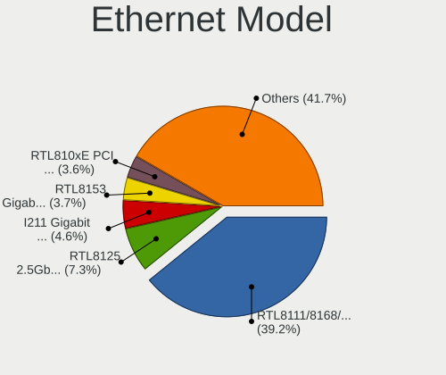

| Model                                                                  | Computers | Percent |
|------------------------------------------------------------------------|-----------|---------|
| Realtek RTL8111/8168/8211/8411 PCI Express Gigabit Ethernet Controller | 4685      | 39.16%  |
| Realtek RTL8125 2.5GbE Controller                                      | 869       | 7.26%   |
| Intel I211 Gigabit Network Connection                                  | 545       | 4.56%   |
| Realtek RTL8153 Gigabit Ethernet Adapter                               | 441       | 3.69%   |
| Realtek RTL810xE PCI Express Fast Ethernet controller                  | 436       | 3.64%   |
| Intel Ethernet Controller I225-V                                       | 304       | 2.54%   |
| Intel 82579LM Gigabit Network Connection (Lewisville)                  | 295       | 2.47%   |
| Intel Ethernet Connection (2) I219-V                                   | 231       | 1.93%   |
| Intel Ethernet Connection (4) I219-LM                                  | 164       | 1.37%   |
| Intel Ethernet Connection (7) I219-V                                   | 147       | 1.23%   |
| Intel Ethernet Connection I217-LM                                      | 129       | 1.08%   |
| ASIX AX88179 Gigabit Ethernet                                          | 126       | 1.05%   |
| Intel Alder Lake-P PCH CNVi WiFi                                       | 106       | 0.89%   |
| Realtek Killer E2600 GbE Controller                                    | 101       | 0.84%   |
| Intel Ethernet Connection (4) I219-V                                   | 101       | 0.84%   |
| Intel Ethernet Connection (2) I219-LM                                  | 87        | 0.73%   |
| Intel Ethernet Connection I219-LM                                      | 79        | 0.66%   |
| Intel Ethernet Controller I226-V                                       | 76        | 0.64%   |
| Intel Ethernet Connection (7) I219-LM                                  | 70        | 0.59%   |
| Qualcomm Atheros Killer E2500 Gigabit Ethernet Controller              | 67        | 0.56%   |
| Intel Ethernet Connection (6) I219-V                                   | 67        | 0.56%   |
| Intel Ethernet Connection (3) I218-LM                                  | 67        | 0.56%   |
| Intel 82579V Gigabit Network Connection                                | 65        | 0.54%   |
| Intel Ethernet Connection I218-LM                                      | 60        | 0.5%    |
| Intel Ethernet Connection (2) I218-V                                   | 59        | 0.49%   |
| Qualcomm Atheros AR8151 v2.0 Gigabit Ethernet                          | 53        | 0.44%   |
| Qualcomm Atheros Killer E220x Gigabit Ethernet Controller              | 52        | 0.43%   |
| Intel I210 Gigabit Network Connection                                  | 51        | 0.43%   |
| MediaTek MT7922 802.11ax PCI Express Wireless Network Adapter          | 50        | 0.42%   |
| Samsung Galaxy series, misc. (tethering mode)                          | 49        | 0.41%   |
| Intel Ethernet Connection (6) I219-LM                                  | 49        | 0.41%   |
| Broadcom NetXtreme BCM57765 Gigabit Ethernet PCIe                      | 43        | 0.36%   |
| Intel Ethernet Connection (10) I219-V                                  | 42        | 0.35%   |
| Intel 82577LM Gigabit Network Connection                               | 42        | 0.35%   |
| Broadcom NetXtreme BCM57766 Gigabit Ethernet PCIe                      | 41        | 0.34%   |
| Realtek RTL8126 5GbE Controller                                        | 40        | 0.33%   |
| Qualcomm Atheros Killer E2400 Gigabit Ethernet Controller              | 40        | 0.33%   |
| Realtek Killer E3000 2.5GbE Controller                                 | 39        | 0.33%   |
| Intel Ethernet Connection I217-V                                       | 39        | 0.33%   |
| Intel 82574L Gigabit Network Connection                                | 39        | 0.33%   |

Net Controller Kind
-------------------

Ethernet, WiFi or modem

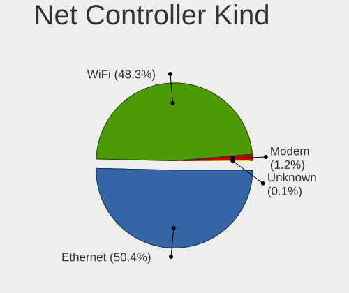

| Kind     | Computers | Percent |
|----------|-----------|---------|
| Ethernet | 10640     | 50.38%  |
| WiFi     | 10192     | 48.26%  |
| Modem    | 258       | 1.22%   |
| Unknown  | 31        | 0.15%   |

Used Controller
---------------

Currently used network controller

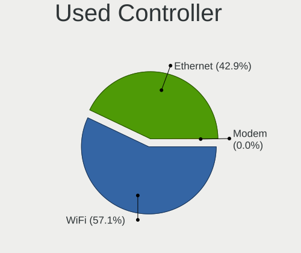

| Kind     | Computers | Percent |
|----------|-----------|---------|
| WiFi     | 7749      | 57.06%  |
| Ethernet | 5825      | 42.89%  |
| Modem    | 6         | 0.04%   |

NICs
----

Total network controllers on board

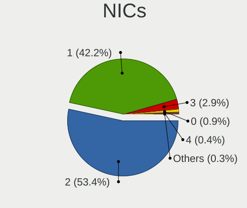

| Total | Computers | Percent |
|-------|-----------|---------|
| 2     | 6960      | 53.37%  |
| 1     | 5506      | 42.22%  |
| 3     | 374       | 2.87%   |
| 0     | 116       | 0.89%   |
| 4     | 50        | 0.38%   |
| 5     | 17        | 0.13%   |
| 6     | 10        | 0.08%   |
| 10    | 2         | 0.02%   |
| 8     | 2         | 0.02%   |
| 7     | 2         | 0.02%   |
| 9     | 1         | 0.01%   |

IPv6
----

IPv6 vs IPv4

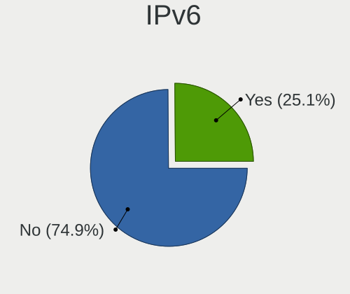

| Used | Computers | Percent |
|------|-----------|---------|
| No   | 9898      | 74.89%  |
| Yes  | 3319      | 25.11%  |

Bluetooth
---------

Bluetooth Vendor
----------------

Controller vendors

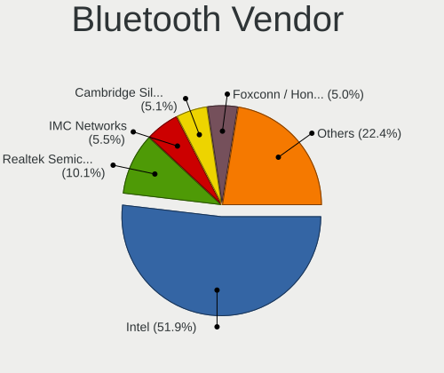

| Vendor                          | Computers | Percent |
|---------------------------------|-----------|---------|
| Intel                           | 5159      | 51.86%  |
| Realtek Semiconductor           | 1004      | 10.09%  |
| IMC Networks                    | 550       | 5.53%   |
| Cambridge Silicon Radio         | 511       | 5.14%   |
| Foxconn / Hon Hai               | 493       | 4.96%   |
| Qualcomm Atheros Communications | 441       | 4.43%   |
| MediaTek                        | 328       | 3.3%    |
| Broadcom                        | 275       | 2.76%   |
| Lite-On Technology              | 256       | 2.57%   |
| Apple                           | 213       | 2.14%   |
| ASUSTek Computer                | 189       | 1.9%    |
| TP-Link                         | 102       | 1.03%   |
| Realtek                         | 71        | 0.71%   |
| USI                             | 50        | 0.5%    |
| Dell                            | 49        | 0.49%   |
| Hewlett-Packard                 | 36        | 0.36%   |
| Marvell Semiconductor           | 28        | 0.28%   |
| Toshiba                         | 22        | 0.22%   |
| Ralink                          | 22        | 0.22%   |
| HTC (High Tech Computer)        | 18        | 0.18%   |
| Foxconn International           | 17        | 0.17%   |
| Unknown                         | 15        | 0.15%   |
| Actions                         | 13        | 0.13%   |
| Edimax Technology               | 12        | 0.12%   |
| Opticis                         | 9         | 0.09%   |
| Dynex                           | 7         | 0.07%   |
| SINO WEALTH                     | 6         | 0.06%   |
| Integrated System Solution      | 6         | 0.06%   |
| Belkin Components               | 5         | 0.05%   |
| Quectel Wireless Solutions      | 4         | 0.04%   |
| Micro Star International        | 4         | 0.04%   |
| Mercucys                        | 4         | 0.04%   |
| Chicony Electronics             | 4         | 0.04%   |
| Alps Electric                   | 4         | 0.04%   |
| Smart Modular Technologies      | 3         | 0.03%   |
| SiW                             | 3         | 0.03%   |
| Ralink Technology               | 3         | 0.03%   |
| Askey Computer                  | 3         | 0.03%   |
| Syntek                          | 1         | 0.01%   |
| Roper                           | 1         | 0.01%   |

Bluetooth Model
---------------

Controller models

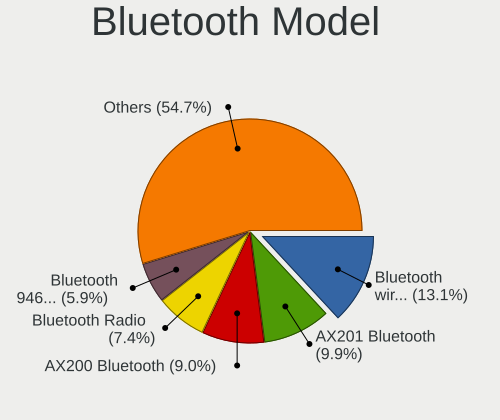

| Model                                               | Computers | Percent |
|-----------------------------------------------------|-----------|---------|
| Intel Bluetooth wireless interface                  | 1305      | 13.1%   |
| Intel AX201 Bluetooth                               | 983       | 9.86%   |
| Intel AX200 Bluetooth                               | 898       | 9.01%   |
| Realtek Bluetooth Radio                             | 739       | 7.42%   |
| Intel Bluetooth 9460/9560 Jefferson Peak (JfP)      | 585       | 5.87%   |
| Intel Bluetooth Device                              | 551       | 5.53%   |
| Cambridge Silicon Radio Bluetooth Dongle (HCI mode) | 511       | 5.13%   |
| Intel AX210 Bluetooth                               | 393       | 3.94%   |
| MediaTek Wireless_Device                            | 326       | 3.27%   |
| IMC Networks Wireless_Device                        | 279       | 2.8%    |
| Qualcomm Atheros  Bluetooth Device                  | 239       | 2.4%    |
| Foxconn / Hon Hai Wireless_Device                   | 221       | 2.22%   |
| Intel Wireless-AC 3168 Bluetooth                    | 194       | 1.95%   |
| IMC Networks Bluetooth Radio                        | 178       | 1.79%   |
| Realtek  Bluetooth 4.2 Adapter                      | 168       | 1.69%   |
| Intel Wireless-AC 9260 Bluetooth Adapter            | 165       | 1.66%   |
| Foxconn / Hon Hai Bluetooth Device                  | 120       | 1.2%    |
| Apple Bluetooth Host Controller                     | 116       | 1.16%   |
| TP-Link TP-T@- UB500 Adapter                        | 102       | 1.02%   |
| Qualcomm Atheros QCA61x4 Bluetooth 4.0              | 88        | 0.88%   |
| Foxconn / Hon Hai MediaTek Bluetooth Adapter        | 82        | 0.82%   |
| Lite-On Qualcomm Atheros QCA9377 Bluetooth          | 78        | 0.78%   |
| Lite-On Bluetooth Device                            | 73        | 0.73%   |
| Intel Centrino Bluetooth Wireless Transceiver       | 72        | 0.72%   |
| Realtek Bluetooth Radio                             | 71        | 0.71%   |
| Apple Bluetooth USB Host Controller                 | 68        | 0.68%   |
| ASUS Broadcom BCM20702A0 Bluetooth                  | 66        | 0.66%   |
| IMC Networks Bluetooth Device                       | 59        | 0.59%   |
| Broadcom BCM20702A0 Bluetooth 4.0                   | 54        | 0.54%   |
| Qualcomm Atheros AR3012 Bluetooth 4.0               | 51        | 0.51%   |
| USI Bluetooth Device                                | 50        | 0.5%    |
| Lite-On Wireless_Device                             | 50        | 0.5%    |
| Broadcom BCM20702 Bluetooth 4.0 [ThinkPad]          | 48        | 0.48%   |
| ASUS ASUS USB-BT500                                 | 48        | 0.48%   |
| Broadcom BCM2045B (BDC-2.1)                         | 40        | 0.4%    |
| Qualcomm Atheros AR3011 Bluetooth                   | 31        | 0.31%   |
| Realtek RTL8822BE Bluetooth 4.2 Adapter             | 28        | 0.28%   |
| HP Broadcom 2070 Bluetooth Combo                    | 25        | 0.25%   |
| Marvell Bluetooth and Wireless LAN Composite        | 24        | 0.24%   |
| ASUS Qualcomm Bluetooth 4.1                         | 24        | 0.24%   |

Sound
-----

Sound Vendor
------------

Sound card vendors

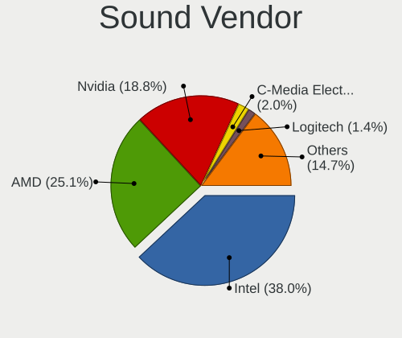

| Vendor                               | Computers | Percent |
|--------------------------------------|-----------|---------|
| Intel                                | 8024      | 38.03%  |
| AMD                                  | 5288      | 25.07%  |
| Nvidia                               | 3957      | 18.76%  |
| C-Media Electronics                  | 430       | 2.04%   |
| Logitech                             | 288       | 1.37%   |
| Focusrite-Novation                   | 164       | 0.78%   |
| Kingston Technology                  | 163       | 0.77%   |
| JMTek                                | 155       | 0.73%   |
| ASUSTek Computer                     | 144       | 0.68%   |
| Razer USA                            | 134       | 0.64%   |
| SteelSeries ApS                      | 132       | 0.63%   |
| Texas Instruments                    | 118       | 0.56%   |
| Micro Star International             | 93        | 0.44%   |
| Realtek Semiconductor                | 90        | 0.43%   |
| Corsair                              | 83        | 0.39%   |
| Lenovo                               | 77        | 0.36%   |
| Creative Technology                  | 77        | 0.36%   |
| Creative Labs                        | 73        | 0.35%   |
| Hewlett-Packard                      | 72        | 0.34%   |
| Blue Microphones                     | 72        | 0.34%   |
| Sony                                 | 71        | 0.34%   |
| Generalplus Technology               | 64        | 0.3%    |
| GN Netcom                            | 63        | 0.3%    |
| KTMicro                              | 43        | 0.2%    |
| Samson Technologies                  | 42        | 0.2%    |
| Unknown                              | 42        | 0.2%    |
| Yamaha                               | 38        | 0.18%   |
| BEHRINGER International              | 38        | 0.18%   |
| Apple                                | 37        | 0.18%   |
| Valve Software                       | 34        | 0.16%   |
| GYROCOM C&C                          | 33        | 0.16%   |
| RODE Microphones                     | 29        | 0.14%   |
| DSEA A/S                             | 29        | 0.14%   |
| Thesycon Systemsoftware & Consulting | 28        | 0.13%   |
| Plantronics                          | 28        | 0.13%   |
| XMOS                                 | 27        | 0.13%   |
| Audio-Technica                       | 27        | 0.13%   |
| FiiO Electronics Technology          | 26        | 0.12%   |
| Astro Gaming                         | 23        | 0.11%   |
| Jieli Technology                     | 22        | 0.1%    |

Sound Model
-----------

Sound card models

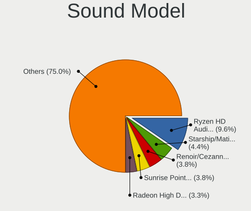

| Model                                                                      | Computers | Percent |
|----------------------------------------------------------------------------|-----------|---------|
| AMD Ryzen HD Audio Controller                                              | 2469      | 9.61%   |
| AMD Starship/Matisse HD Audio Controller                                   | 1139      | 4.43%   |
| AMD Renoir/Cezanne HDMI/DP Audio Controller                                | 988       | 3.84%   |
| Intel Sunrise Point-LP HD Audio                                            | 985       | 3.83%   |
| AMD Radeon High Definition Audio Controller                                | 840       | 3.27%   |
| Intel Cannon Lake PCH cAVS                                                 | 559       | 2.18%   |
| Intel 7 Series/C216 Chipset Family High Definition Audio Controller        | 536       | 2.09%   |
| Intel Tiger Lake-LP Smart Sound Technology Audio Controller                | 515       | 2%      |
| AMD Navi 21/23 HDMI/DP Audio Controller                                    | 509       | 1.98%   |
| AMD Family 17h (Models 00h-0fh) HD Audio Controller                        | 440       | 1.71%   |
| Intel 8 Series/C220 Series Chipset High Definition Audio Controller        | 429       | 1.67%   |
| AMD Ellesmere HDMI Audio [Radeon RX 470/480 / 570/580/590]                 | 420       | 1.63%   |
| Intel 6 Series/C200 Series Chipset Family High Definition Audio Controller | 412       | 1.6%    |
| AMD Raven/Raven2/Fenghuang HDMI/DP Audio Controller                        | 408       | 1.59%   |
| Intel Alder Lake PCH-P High Definition Audio Controller                    | 382       | 1.49%   |
| Intel 100 Series/C230 Series Chipset Family HD Audio Controller            | 359       | 1.4%    |
| Nvidia GP107GL High Definition Audio Controller                            | 320       | 1.25%   |
| Nvidia GA104 High Definition Audio Controller                              | 300       | 1.17%   |
| Intel Cannon Point-LP High Definition Audio Controller                     | 291       | 1.13%   |
| Intel 200 Series PCH HD Audio                                              | 287       | 1.12%   |
| Intel Xeon E3-1200 v3/4th Gen Core Processor HD Audio Controller           | 283       | 1.1%    |
| Nvidia GA106 High Definition Audio Controller                              | 277       | 1.08%   |
| Intel Comet Lake PCH cAVS                                                  | 269       | 1.05%   |
| AMD Navi 31 HDMI/DP Audio                                                  | 266       | 1.04%   |
| Nvidia TU107 GeForce GTX 1650 High Definition Audio Controller             | 257       | 1%      |
| Nvidia GP104 High Definition Audio Controller                              | 255       | 0.99%   |
| Nvidia TU106 High Definition Audio Controller                              | 240       | 0.93%   |
| AMD Navi 10 HDMI Audio                                                     | 240       | 0.93%   |
| Intel Broadwell-U Audio Controller                                         | 236       | 0.92%   |
| Nvidia TU116 High Definition Audio Controller                              | 235       | 0.91%   |
| Intel Wildcat Point-LP High Definition Audio Controller                    | 230       | 0.9%    |
| Intel Haswell-ULT HD Audio Controller                                      | 228       | 0.89%   |
| Intel 8 Series HD Audio Controller                                         | 228       | 0.89%   |
| Nvidia GP106 High Definition Audio Controller                              | 207       | 0.81%   |
| Intel Raptor Lake-P/U/H cAVS                                               | 205       | 0.8%    |
| Intel Comet Lake PCH-LP cAVS                                               | 204       | 0.79%   |
| AMD SBx00 Azalia (Intel HDA)                                               | 200       | 0.78%   |
| Nvidia AD107 High Definition Audio Controller                              | 187       | 0.73%   |
| Intel Tiger Lake-H HD Audio Controller                                     | 183       | 0.71%   |
| Intel CM238 HD Audio Controller                                            | 180       | 0.7%    |

Memory
------

Memory Vendor
-------------

Memory module vendors

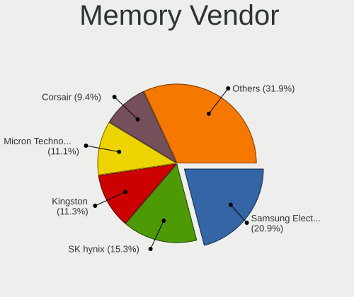

| Vendor                       | Computers | Percent |
|------------------------------|-----------|---------|
| Samsung Electronics          | 2184      | 20.95%  |
| SK hynix                     | 1599      | 15.34%  |
| Kingston                     | 1179      | 11.31%  |
| Micron Technology            | 1155      | 11.08%  |
| Corsair                      | 984       | 9.44%   |
| Crucial                      | 756       | 7.25%   |
| G.Skill                      | 653       | 6.26%   |
| Unknown                      | 449       | 4.31%   |
| A-DATA Technology            | 226       | 2.17%   |
| Unknown                      | 183       | 1.76%   |
| Ramaxel Technology           | 159       | 1.53%   |
| Team                         | 113       | 1.08%   |
| Elpida                       | 85        | 0.82%   |
| Patriot                      | 78        | 0.75%   |
| Nanya Technology             | 50        | 0.48%   |
| GOODRAM                      | 50        | 0.48%   |
| Smart                        | 37        | 0.35%   |
| Unknown (ABCD)               | 34        | 0.33%   |
| Transcend                    | 31        | 0.3%    |
| AMD                          | 27        | 0.26%   |
| PNY                          | 20        | 0.19%   |
| Apacer                       | 20        | 0.19%   |
| Timetec                      | 15        | 0.14%   |
| Patriot Memory (PDP Systems) | 14        | 0.13%   |
| Lexar                        | 13        | 0.12%   |
| Goldkey                      | 13        | 0.12%   |
| 4ea5                         | 10        | 0.1%    |
| Silicon Power                | 9         | 0.09%   |
| Avant                        | 9         | 0.09%   |
| Wilk                         | 8         | 0.08%   |
| Smart Brazil                 | 8         | 0.08%   |
| Lexar Co Limited             | 8         | 0.08%   |
| Hikvision                    | 8         | 0.08%   |
| V-GeN                        | 7         | 0.07%   |
| Teikon                       | 7         | 0.07%   |
| Kingmax                      | 7         | 0.07%   |
| KLEVV                        | 6         | 0.06%   |
| Golden Empire                | 6         | 0.06%   |
| GeIL                         | 6         | 0.06%   |
| ff                           | 6         | 0.06%   |

Memory Model
------------

Memory module models

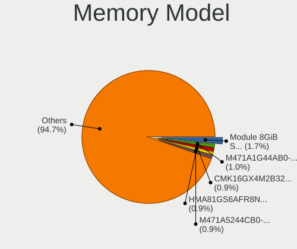

| Model                                                       | Computers | Percent |
|-------------------------------------------------------------|-----------|---------|
| Unknown                                                     | 183       | 1.65%   |
| Samsung RAM M471A1G44AB0-CWE 8GiB SODIMM DDR4 3200MT/s      | 109       | 0.98%   |
| Corsair RAM CMK16GX4M2B3200C16 8GB DIMM DDR4 3600MT/s       | 100       | 0.9%    |
| SK hynix RAM HMA81GS6AFR8N-UH 8GB SODIMM DDR4 2667MT/s      | 96        | 0.87%   |
| Samsung RAM M471A5244CB0-CTD 4GB SODIMM DDR4 3266MT/s       | 95        | 0.86%   |
| Samsung RAM M471A1K43EB1-CWE 8GB SODIMM DDR4 3200MT/s       | 71        | 0.64%   |
| SK hynix RAM HMA81GS6DJR8N-XN 8GB SODIMM DDR4 3200MT/s      | 70        | 0.63%   |
| Samsung RAM M471A1K43DB1-CWE 8GB SODIMM DDR4 3200MT/s       | 69        | 0.62%   |
| Corsair RAM CMK16GX4M2B3000C15 8GB DIMM DDR4 3600MT/s       | 69        | 0.62%   |
| SK hynix RAM HMAA1GS6CJR6N-XN 8GB SODIMM DDR4 3200MT/s      | 67        | 0.6%    |
| Samsung RAM M471A1K43CB1-CTD 8GB SODIMM DDR4 3200MT/s       | 55        | 0.5%    |
| Samsung RAM M471A1K43CB1-CRC 8GB SODIMM DDR4 8400MT/s       | 54        | 0.49%   |
| SK hynix RAM HMT451S6BFR8A-PB 4GB SODIMM DDR3 1600MT/s      | 52        | 0.47%   |
| Samsung RAM M471A1G44BB0-CWE 8GB SODIMM DDR4 3200MT/s       | 49        | 0.44%   |
| Samsung RAM M471A5244CB0-CWE 4GB SODIMM DDR4 3200MT/s       | 48        | 0.43%   |
| G.Skill RAM F4-3200C16-16GVK 16GB DIMM DDR4 3600MT/s        | 45        | 0.41%   |
| Samsung RAM M471A1K43BB1-CRC 8GB SODIMM DDR4 2667MT/s       | 43        | 0.39%   |
| Samsung RAM M471B5173DB0-YK0 4GB SODIMM DDR3 1600MT/s       | 41        | 0.37%   |
| Kingston RAM KHX3200C16D4/8GX 8GB DIMM DDR4 3733MT/s        | 41        | 0.37%   |
| Samsung RAM M471A5244CB0-CRC 4GB SODIMM DDR4 2667MT/s       | 40        | 0.36%   |
| Samsung RAM M471A2K43DB1-CWE 16GB SODIMM DDR4 3200MT/s      | 40        | 0.36%   |
| Samsung RAM M471A1K43DB1-CTD 8GB SODIMM DDR4 2667MT/s       | 40        | 0.36%   |
| Micron RAM 4ATF1G64HZ-3G2E1 8GB SODIMM DDR4 3200MT/s        | 40        | 0.36%   |
| Samsung RAM M471B1G73DB0-YK0 8GB SODIMM DDR3 1600MT/s       | 39        | 0.35%   |
| Samsung RAM M425R1GB4BB0-CQKOL 8GB SODIMM DDR5 4800MT/s     | 37        | 0.33%   |
| Samsung RAM M471B5173QH0-YK0 4GB SODIMM DDR3 1600MT/s       | 36        | 0.33%   |
| Samsung RAM M471A1G44AB0-CWE 8GB Row Of Chips DDR4 3200MT/s | 36        | 0.33%   |
| SK hynix RAM HMA81GS6JJR8N-VK 8GB SODIMM DDR4 2667MT/s      | 35        | 0.32%   |
| SK hynix RAM HMA81GS6CJR8N-VK 8GB SODIMM DDR4 2667MT/s      | 34        | 0.31%   |
| Samsung RAM M471B5173EB0-YK0 4GB SODIMM DDR3 1600MT/s       | 34        | 0.31%   |
| Micron RAM 4ATF1G64HZ-3G2F1 8GB SODIMM DDR4 3200MT/s        | 34        | 0.31%   |
| Micron RAM 8ATF1G64HZ-3G2J1 8GB SODIMM DDR4 3200MT/s        | 33        | 0.3%    |
| Micron RAM 4ATF51264HZ-2G6E1 4GB SODIMM DDR4 2667MT/s       | 32        | 0.29%   |
| Samsung RAM M471B5273CH0-CH9 4GB SODIMM DDR3 1334MT/s       | 31        | 0.28%   |
| Samsung RAM M471B1G73EB0-YK0 8192MB SODIMM DDR3 1600MT/s    | 31        | 0.28%   |
| Samsung RAM M471A5244CB0-CWE 4GB Row Of Chips DDR4 3200MT/s | 31        | 0.28%   |
| Samsung RAM M471A2G44AM0-CWE 16GB SODIMM DDR4 3200MT/s      | 31        | 0.28%   |
| Micron RAM 8ATF1G64HZ-3G2R1 8GB SODIMM DDR4 3200MT/s        | 31        | 0.28%   |
| Corsair RAM CMK32GX4M2E3200C16 16GB DIMM DDR4 3600MT/s      | 31        | 0.28%   |
| SK hynix RAM HMT41GS6BFR8A-PB 8GB SODIMM DDR3 2667MT/s      | 30        | 0.27%   |

Memory Kind
-----------

Memory module kinds

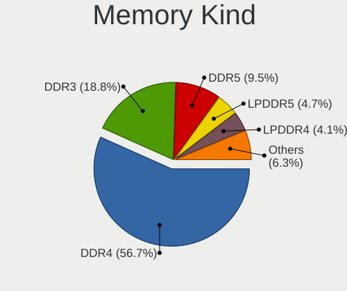

| Kind    | Computers | Percent |
|---------|-----------|---------|
| DDR4    | 5097      | 56.69%  |
| DDR3    | 1691      | 18.81%  |
| DDR5    | 850       | 9.45%   |
| LPDDR5  | 422       | 4.69%   |
| LPDDR4  | 365       | 4.06%   |
| LPDDR3  | 230       | 2.56%   |
| SDRAM   | 118       | 1.31%   |
| DDR2    | 95        | 1.06%   |
| Unknown | 91        | 1.01%   |
| DDR     | 20        | 0.22%   |
| DRAM    | 11        | 0.12%   |
| EEPROM  | 1         | 0.01%   |

Memory Form Factor
------------------

Physical design of the memory module

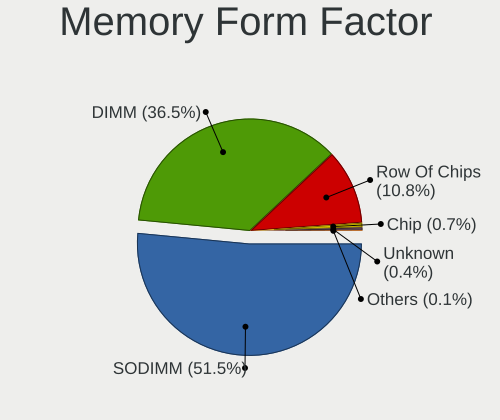

| Name         | Computers | Percent |
|--------------|-----------|---------|
| SODIMM       | 4630      | 51.51%  |
| DIMM         | 3281      | 36.5%   |
| Row Of Chips | 972       | 10.81%  |
| Chip         | 59        | 0.66%   |
| Unknown      | 40        | 0.44%   |
| RIMM         | 4         | 0.04%   |
| FB-DIMM      | 3         | 0.03%   |

Memory Size
-----------

Memory module size

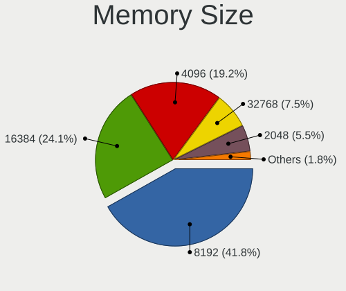

| Size  | Computers | Percent |
|-------|-----------|---------|
| 8192  | 4090      | 41.85%  |
| 16384 | 2357      | 24.11%  |
| 4096  | 1877      | 19.2%   |
| 32768 | 734       | 7.51%   |
| 2048  | 539       | 5.51%   |
| 1024  | 104       | 1.06%   |
| 49152 | 29        | 0.3%    |
| 512   | 10        | 0.1%    |
| 24576 | 9         | 0.09%   |
| 12288 | 9         | 0.09%   |
| 65536 | 5         | 0.05%   |
| 6144  | 5         | 0.05%   |
| 3072  | 5         | 0.05%   |
| 1     | 1         | 0.01%   |

Memory Speed
------------

Memory module speed

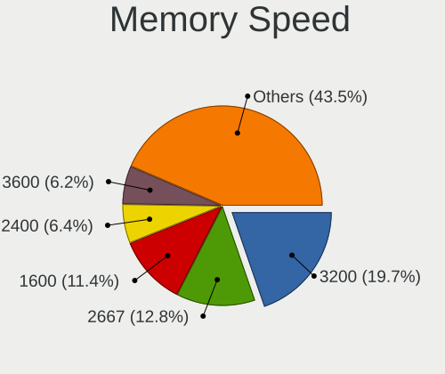

| Speed   | Computers | Percent |
|---------|-----------|---------|
| 3200    | 1936      | 19.71%  |
| 2667    | 1261      | 12.84%  |
| 1600    | 1116      | 11.36%  |
| 2400    | 624       | 6.35%   |
| 3600    | 609       | 6.2%    |
| 2133    | 436       | 4.44%   |
| 1333    | 311       | 3.17%   |
| 5600    | 267       | 2.72%   |
| 6400    | 262       | 2.67%   |
| 4800    | 255       | 2.6%    |
| 4267    | 199       | 2.03%   |
| 6000    | 175       | 1.78%   |
| 3733    | 172       | 1.75%   |
| 3800    | 164       | 1.67%   |
| 1867    | 160       | 1.63%   |
| 1334    | 116       | 1.18%   |
| 7500    | 109       | 1.11%   |
| 3266    | 109       | 1.11%   |
| 3000    | 88        | 0.9%    |
| 3400    | 87        | 0.89%   |
| 4000    | 82        | 0.83%   |
| 8400    | 80        | 0.81%   |
| 667     | 70        | 0.71%   |
| 2666    | 68        | 0.69%   |
| 2933    | 64        | 0.65%   |
| 1866    | 55        | 0.56%   |
| 8533    | 54        | 0.55%   |
| 4266    | 54        | 0.55%   |
| 1067    | 53        | 0.54%   |
| Unknown | 52        | 0.53%   |
| 3466    | 45        | 0.46%   |
| 800     | 44        | 0.45%   |
| 5200    | 43        | 0.44%   |
| 3866    | 40        | 0.41%   |
| 1066    | 37        | 0.38%   |
| 1800    | 35        | 0.36%   |
| 4199    | 30        | 0.31%   |
| 2800    | 30        | 0.31%   |
| 3666    | 28        | 0.29%   |
| 12800   | 27        | 0.27%   |

Printers & scanners
-------------------

Printer Vendor
--------------

Printer device vendors

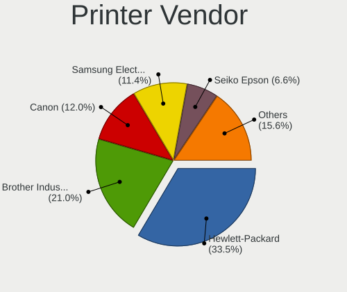

| Vendor                   | Computers | Percent |
|--------------------------|-----------|---------|
| Hewlett-Packard          | 56        | 33.53%  |
| Brother Industries       | 35        | 20.96%  |
| Canon                    | 20        | 11.98%  |
| Samsung Electronics      | 19        | 11.38%  |
| Seiko Epson              | 11        | 6.59%   |
| Prolific Technology      | 4         | 2.4%    |
| Dymo-CoStar              | 4         | 2.4%    |
| STMicroelectronics       | 3         | 1.8%    |
| QinHeng Electronics      | 3         | 1.8%    |
| XiaoMi                   | 2         | 1.2%    |
| Xerox                    | 2         | 1.2%    |
| Ricoh                    | 2         | 1.2%    |
| Zebra Technologies       | 1         | 0.6%    |
| Philips (or NXP)         | 1         | 0.6%    |
| Magic Control Technology | 1         | 0.6%    |
| Lexmark International    | 1         | 0.6%    |
| Fuji Xerox               | 1         | 0.6%    |
| Dell                     | 1         | 0.6%    |

Printer Model
-------------

Printer device models

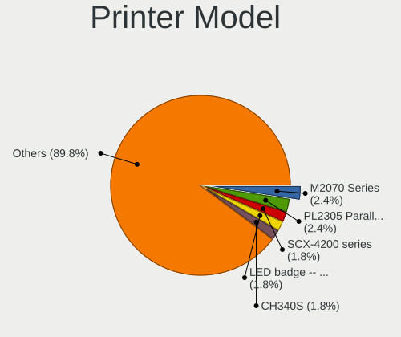

| Model                                                     | Computers | Percent |
|-----------------------------------------------------------|-----------|---------|
| Samsung M2070 Series                                      | 4         | 2.4%    |
| Prolific PL2305 Parallel Port                             | 4         | 2.4%    |
| STMicroelectronics LED badge -- mini LED display -- 11x44 | 3         | 1.8%    |
| Samsung SCX-4200 series                                   | 3         | 1.8%    |
| QinHeng CH340S                                            | 3         | 1.8%    |
| HP LaserJet 1012                                          | 3         | 1.8%    |
| HP DeskJet 2700 series                                    | 3         | 1.8%    |
| HP DeskJet 2600 series                                    | 3         | 1.8%    |
| HP DeskJet 2130 series                                    | 3         | 1.8%    |
| Dymo-CoStar LabelWriter 450                               | 3         | 1.8%    |
| Seiko Epson XP-7100 Series                                | 2         | 1.2%    |
| Seiko Epson ET-2810 Series                                | 2         | 1.2%    |
| Samsung SCX-4100 Scanner                                  | 2         | 1.2%    |
| HP Officejet Pro 8100                                     | 2         | 1.2%    |
| HP LaserJet P2015 series                                  | 2         | 1.2%    |
| HP LaserJet P1102                                         | 2         | 1.2%    |
| HP LaserJet P1005                                         | 2         | 1.2%    |
| HP LaserJet M14-M17                                       | 2         | 1.2%    |
| HP LaserJet 1320                                          | 2         | 1.2%    |
| HP LaserJet 1022                                          | 2         | 1.2%    |
| HP LaserJet 1018                                          | 2         | 1.2%    |
| HP Ink Tank 310 series                                    | 2         | 1.2%    |
| HP ENVY Photo 6200 series                                 | 2         | 1.2%    |
| HP DeskJet F4200 series                                   | 2         | 1.2%    |
| HP DeskJet 840c                                           | 2         | 1.2%    |
| HP Deskjet 3050 J610 series                               | 2         | 1.2%    |
| Canon PIXMA MX320 series                                  | 2         | 1.2%    |
| Canon LiDE 400                                            | 2         | 1.2%    |
| Canon G4010 series                                        | 2         | 1.2%    |
| Brother Printer                                           | 2         | 1.2%    |
| Brother MFC-L2710DW series                                | 2         | 1.2%    |
| Brother HL-L2320D series                                  | 2         | 1.2%    |
| Brother HL-5370DW series                                  | 2         | 1.2%    |
| Brother HL-2130 series                                    | 2         | 1.2%    |
| Brother DCP-1510                                          | 2         | 1.2%    |
| Zebra LP2844 Printer                                      | 1         | 0.6%    |
| Xiaomi MiMouse 2                                          | 1         | 0.6%    |
| XiaoMi MIIIW MECH-KBPro                                   | 1         | 0.6%    |
| Xerox Phaser 3020                                         | 1         | 0.6%    |
| Xerox Phaser 3010                                         | 1         | 0.6%    |

Scanner Vendor
--------------

Scanner device vendors

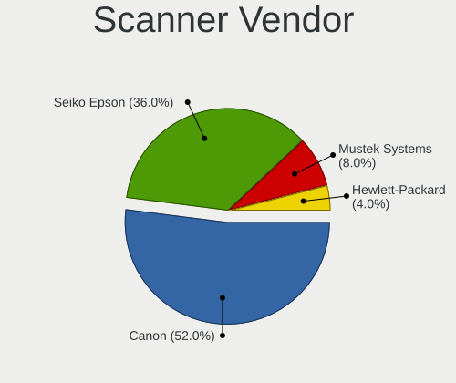

| Vendor          | Computers | Percent |
|-----------------|-----------|---------|
| Canon           | 13        | 52%     |
| Seiko Epson     | 9         | 36%     |
| Mustek Systems  | 2         | 8%      |
| Hewlett-Packard | 1         | 4%      |

Scanner Model
-------------

Scanner device models

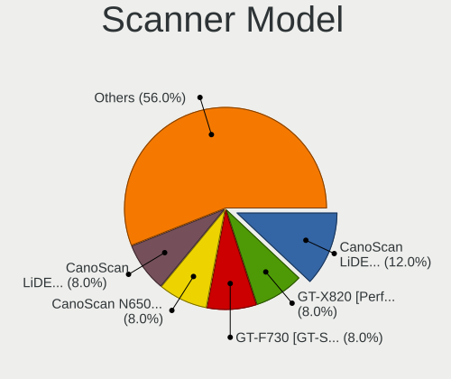

| Model                                                       | Computers | Percent |
|-------------------------------------------------------------|-----------|---------|
| Canon CanoScan LiDE 220                                     | 3         | 12%     |
| Seiko Epson GT-X820 [Perfection V600 Photo]                 | 2         | 8%      |
| Seiko Epson GT-F730 [GT-S630/Perfection V33/V330 Photo]     | 2         | 8%      |
| Canon CanoScan N650U/N656U                                  | 2         | 8%      |
| Canon CanoScan LiDE 200                                     | 2         | 8%      |
| Canon CanoScan LiDE 120                                     | 2         | 8%      |
| Seiko Epson Perfection V37/V370                             | 1         | 4%      |
| Seiko Epson GT-X900 [Perfection V700/V750 Photo]            | 1         | 4%      |
| Seiko Epson GT-F720 [GT-S620/Perfection V30/V300 Photo]     | 1         | 4%      |
| Seiko Epson GT-F700 [Perfection V350]                       | 1         | 4%      |
| Seiko Epson GT-8200U/GT-8200UF [Perfection 1650/1650 PHOTO] | 1         | 4%      |
| Mustek Systems ScanExpress 1200 UB                          | 1         | 4%      |
| Mustek Systems BearPaw 1200 CU Plus                         | 1         | 4%      |
| HP Scanjet 200                                              | 1         | 4%      |
| Canon CanoScan LiDE 60                                      | 1         | 4%      |
| Canon CanoScan LIDE 25                                      | 1         | 4%      |
| Canon CanoScan LiDE 210                                     | 1         | 4%      |
| Canon CanoScan LiDE 110                                     | 1         | 4%      |

Camera
------

Camera Vendor
-------------

Camera device vendors

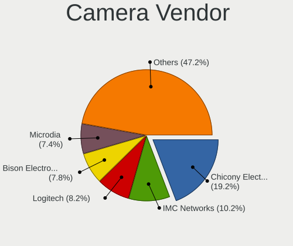

| Vendor                                 | Computers | Percent |
|----------------------------------------|-----------|---------|
| Chicony Electronics                    | 1605      | 19.21%  |
| IMC Networks                           | 854       | 10.22%  |
| Logitech                               | 688       | 8.23%   |
| Bison Electronics                      | 651       | 7.79%   |
| Microdia                               | 618       | 7.4%    |
| Realtek Semiconductor                  | 536       | 6.41%   |
| Quanta                                 | 467       | 5.59%   |
| Sunplus Innovation Technology          | 391       | 4.68%   |
| Luxvisions Innotech Limited            | 278       | 3.33%   |
| Cheng Uei Precision Industry (Foxlink) | 237       | 2.84%   |
| Syntek                                 | 233       | 2.79%   |
| Lite-On Technology                     | 181       | 2.17%   |
| Apple                                  | 177       | 2.12%   |
| Sonix Technology                       | 141       | 1.69%   |
| Suyin                                  | 107       | 1.28%   |
| Microsoft                              | 89        | 1.07%   |
| Shinetech                              | 83        | 0.99%   |
| SunplusIT                              | 76        | 0.91%   |
| Samsung Electronics                    | 71        | 0.85%   |
| Silicon Motion                         | 66        | 0.79%   |
| Alcor Micro                            | 56        | 0.67%   |
| Lenovo                                 | 45        | 0.54%   |
| MacroSilicon                           | 34        | 0.41%   |
| Valve Software                         | 30        | 0.36%   |
| Acer                                   | 30        | 0.36%   |
| Z-Star Microelectronics                | 28        | 0.34%   |
| Razer USA                              | 26        | 0.31%   |
| Creative Technology                    | 23        | 0.28%   |
| kingcome                               | 22        | 0.26%   |
| Generalplus Technology                 | 21        | 0.25%   |
| ARC International                      | 21        | 0.25%   |
| Ricoh                                  | 20        | 0.24%   |
| Shine-optics                           | 19        | 0.23%   |
| Jieli Technology                       | 17        | 0.2%    |
| Importek                               | 15        | 0.18%   |
| Google                                 | 15        | 0.18%   |
| KYE Systems (Mouse Systems)            | 14        | 0.17%   |
| ALi                                    | 13        | 0.16%   |
| Shenzhen Kingcome Optoelectronic       | 12        | 0.14%   |
| Primax Electronics                     | 12        | 0.14%   |

Camera Model
------------

Camera device models

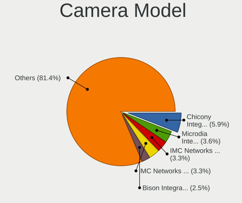

| Model                                               | Computers | Percent |
|-----------------------------------------------------|-----------|---------|
| Chicony Integrated Camera                           | 500       | 5.93%   |
| Microdia Integrated_Webcam_HD                       | 300       | 3.56%   |
| IMC Networks USB2.0 HD UVC WebCam                   | 281       | 3.33%   |
| IMC Networks Integrated Camera                      | 278       | 3.3%    |
| Bison Integrated Camera                             | 213       | 2.52%   |
| Realtek Integrated_Webcam_HD                        | 185       | 2.19%   |
| Syntek Integrated Camera                            | 176       | 2.09%   |
| Chicony HD WebCam                                   | 132       | 1.56%   |
| Logitech HD Pro Webcam C920                         | 121       | 1.43%   |
| Logitech Webcam C270                                | 115       | 1.36%   |
| Sunplus Integrated_Webcam_HD                        | 114       | 1.35%   |
| Luxvisions Innotech Limited Integrated Camera       | 100       | 1.19%   |
| Bison HD Webcam                                     | 100       | 1.19%   |
| Quanta HD User Facing                               | 95        | 1.13%   |
| Lite-On Integrated Camera                           | 90        | 1.07%   |
| Sonix USB2.0 HD UVC WebCam                          | 76        | 0.9%    |
| Logitech C922 Pro Stream Webcam                     | 75        | 0.89%   |
| Chicony Integrated Camera (1280x720@30)             | 72        | 0.85%   |
| Bison SunplusIT Integrated Camera                   | 71        | 0.84%   |
| Samsung Galaxy series, misc. (MTP mode)             | 70        | 0.83%   |
| Chicony HP HD Camera                                | 69        | 0.82%   |
| Chicony HP Wide Vision HD Camera                    | 64        | 0.76%   |
| Chicony HD User Facing                              | 63        | 0.75%   |
| Luxvisions Innotech Limited HP TrueVision HD Camera | 59        | 0.7%    |
| Apple iPhone 5/5C/5S/6/SE/7/8/X                     | 59        | 0.7%    |
| IMC Networks USB2.0 VGA UVC WebCam                  | 58        | 0.69%   |
| Apple FaceTime HD Camera (Built-in)                 | 55        | 0.65%   |
| Chicony Chicony USB2.0 Camera                       | 52        | 0.62%   |
| Quanta HP Wide Vision HD Camera                     | 50        | 0.59%   |
| Sonix USB2.0 FHD UVC WebCam                         | 47        | 0.56%   |
| Quanta HP TrueVision HD Camera                      | 47        | 0.56%   |
| Realtek USB Camera                                  | 46        | 0.55%   |
| Quanta HD Webcam                                    | 46        | 0.55%   |
| Chicony HP TrueVision HD Camera                     | 46        | 0.55%   |
| Logitech BRIO Ultra HD Webcam                       | 45        | 0.53%   |
| IMC Networks HD Camera                              | 44        | 0.52%   |
| Bison Integrated RGB Camera                         | 43        | 0.51%   |
| Chicony Integrated IR Camera                        | 42        | 0.5%    |
| Microdia Webcam Vitade AF                           | 41        | 0.49%   |
| Microdia Integrated Webcam                          | 41        | 0.49%   |

Security
--------

Fingerprint Vendor
------------------

Fingerprint sensor vendors

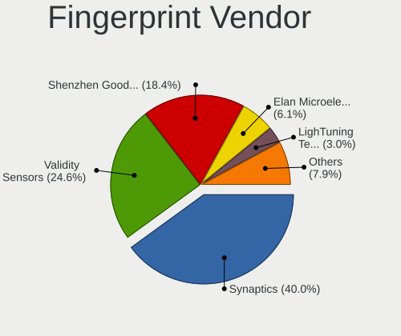

| Vendor                             | Computers | Percent |
|------------------------------------|-----------|---------|
| Synaptics                          | 638       | 39.97%  |
| Validity Sensors                   | 392       | 24.56%  |
| Shenzhen Goodix Technology         | 294       | 18.42%  |
| Elan Microelectronics              | 98        | 6.14%   |
| LighTuning Technology              | 48        | 3.01%   |
| Upek                               | 38        | 2.38%   |
| AuthenTec                          | 29        | 1.82%   |
| Realtek USB2.0 Finger Print Bridge | 14        | 0.88%   |
| HOLTEK                             | 12        | 0.75%   |
| STMicroelectronics                 | 11        | 0.69%   |
| Samsung Electronics                | 9         | 0.56%   |
| Focal-systems.Corp                 | 5         | 0.31%   |
| Microsoft                          | 4         | 0.25%   |
| DigitalPersona                     | 3         | 0.19%   |
| Dell                               | 1         | 0.06%   |

Fingerprint Model
-----------------

Fingerprint sensor models

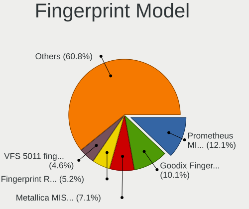

| Model                                                                      | Computers | Percent |
|----------------------------------------------------------------------------|-----------|---------|
| Synaptics Prometheus MIS Touch Fingerprint Reader                          | 193       | 12.09%  |
| Shenzhen Goodix  Fingerprint Device                                        | 161       | 10.09%  |
| Synaptics Metallica MIS Touch Fingerprint Reader                           | 114       | 7.14%   |
| Shenzhen Goodix Fingerprint Reader                                         | 83        | 5.2%    |
| Validity Sensors VFS 5011 fingerprint sensor                               | 74        | 4.64%   |
| Validity Sensors VFS495 Fingerprint Reader                                 | 68        | 4.26%   |
| Validity Sensors Synaptics WBDI                                            | 63        | 3.95%   |
| Shenzhen Goodix FingerPrint                                                | 50        | 3.13%   |
| Elan ELAN:ARM-M4                                                           | 47        | 2.94%   |
| Elan ELAN:Fingerprint                                                      | 46        | 2.88%   |
| Synaptics UWP WBDI Device                                                  | 40        | 2.51%   |
| Upek Biometric Touchchip/Touchstrip Fingerprint Sensor                     | 36        | 2.26%   |
| Synaptics UWP WBDI                                                         | 36        | 2.26%   |
| Validity Sensors VFS7500 Touch Fingerprint Sensor                          | 34        | 2.13%   |
| Synaptics Prometheus Fingerprint Reader                                    | 34        | 2.13%   |
| Synaptics WBDI                                                             | 33        | 2.07%   |
| Validity Sensors VFS5011 Fingerprint Reader                                | 32        | 2.01%   |
| Synaptics Fingerprint reader [HP G6]                                       | 31        | 1.94%   |
| Validity Sensors Synaptics VFS7552 Touch Fingerprint Sensor with PurePrint | 30        | 1.88%   |
| Synaptics FS7604 Touch Fingerprint Sensor with PurePrint                   | 30        | 1.88%   |
| Synaptics  WBDI                                                            | 28        | 1.75%   |
| Synaptics  FS7604 Touch Fingerprint Sensor with PurePrint                  | 28        | 1.75%   |
| Synaptics Metallica MOH Touch Fingerprint Reader                           | 28        | 1.75%   |
| LighTuning ES603 Swipe Fingerprint Sensor                                  | 21        | 1.32%   |
| Validity Sensors VFS491                                                    | 19        | 1.19%   |
| Synaptics WBDI Fingerprint Reader USB 086                                  | 17        | 1.07%   |
| LighTuning EgisTec Touch Fingerprint Sensor                                | 17        | 1.07%   |
| Validity Sensors VFS471 Fingerprint Reader                                 | 15        | 0.94%   |
| Validity Sensors Fingerprint scanner                                       | 14        | 0.88%   |
| Realtek USB2.0 Finger Print Bridge FocalTech Fingerprint Device            | 14        | 0.88%   |
| Validity Sensors Synaptics VFS7552 Touch Fingerprint Sensor                | 13        | 0.81%   |
| AuthenTec AES2810                                                          | 13        | 0.81%   |
| HOLTEK FocalTech Fingerprint Device                                        | 12        | 0.75%   |
| STMicroelectronics Fingerprint Reader                                      | 11        | 0.69%   |
| Validity Sensors VFS7552 Touch Fingerprint Sensor                          | 9         | 0.56%   |
| LighTuning Fingerprint Sensor                                              | 8         | 0.5%    |
| AuthenTec Fingerprint Sensor                                               | 7         | 0.44%   |
| Validity Sensors VFS451 Fingerprint Reader                                 | 6         | 0.38%   |
| Synaptics WBDI Device                                                      | 6         | 0.38%   |
| Synaptics TouchPad                                                         | 6         | 0.38%   |

Chipcard Vendor
---------------

Chipcard module vendors

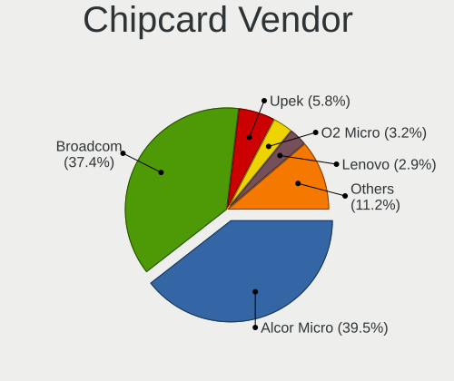

| Vendor                            | Computers | Percent |
|-----------------------------------|-----------|---------|
| Alcor Micro                       | 232       | 39.46%  |
| Broadcom                          | 220       | 37.41%  |
| Upek                              | 34        | 5.78%   |
| O2 Micro                          | 19        | 3.23%   |
| Lenovo                            | 17        | 2.89%   |
| Advanced Card Systems             | 11        | 1.87%   |
| Yubico.com                        | 9         | 1.53%   |
| Gemalto (was Gemplus)             | 8         | 1.36%   |
| Clay Logic                        | 8         | 1.36%   |
| SCM Microsystems                  | 6         | 1.02%   |
| Reiner SCT Kartensysteme          | 4         | 0.68%   |
| Aladdin Knowledge Systems         | 3         | 0.51%   |
| Aktiv                             | 3         | 0.51%   |
| OmniKey                           | 2         | 0.34%   |
| Chicony Electronics               | 2         | 0.34%   |
| CHERRY                            | 2         | 0.34%   |
| VASCO Data Security International | 1         | 0.17%   |
| Realtek Semiconductor             | 1         | 0.17%   |
| Pol Henarejos                     | 1         | 0.17%   |
| Microchip Technology              | 1         | 0.17%   |
| Hewlett-Packard                   | 1         | 0.17%   |
| Fujitsu Siemens Computers         | 1         | 0.17%   |
| C3PO                              | 1         | 0.17%   |
| Aladdin R.D.                      | 1         | 0.17%   |

Chipcard Model
--------------

Chipcard module models

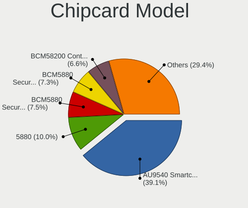

| Model                                                                        | Computers | Percent |
|------------------------------------------------------------------------------|-----------|---------|
| Alcor Micro AU9540 Smartcard Reader                                          | 230       | 39.12%  |
| Broadcom 5880                                                                | 59        | 10.03%  |
| Broadcom BCM5880 Secure Applications Processor                               | 44        | 7.48%   |
| Broadcom BCM5880 Secure Applications Processor with fingerprint swipe sensor | 43        | 7.31%   |
| Broadcom BCM58200 ControlVault 3 (FingerPrint sensor + Contacted SmartCard)  | 39        | 6.63%   |
| Upek TouchChip Fingerprint Coprocessor (WBF advanced mode)                   | 34        | 5.78%   |
| Broadcom 58200                                                               | 32        | 5.44%   |
| O2 Micro OZ776 CCID Smartcard Reader                                         | 18        | 3.06%   |
| Lenovo Integrated Smart Card Reader                                          | 17        | 2.89%   |
| Yubico.com Yubikey 4/5 U2F+CCID                                              | 9         | 1.53%   |
| SCM Microsystems SCR3340 - ExpressCard54 Smart Card Reader                   | 4         | 0.68%   |
| Gemalto (was Gemplus) GemPC Twin SmartCard Reader                            | 4         | 0.68%   |
| Advanced Card Systems ACR122U                                                | 4         | 0.68%   |
| Gemalto (was Gemplus) Compact Smart Card Reader Writer                       | 3         | 0.51%   |
| Clay Logic Nitrokey Pro                                                      | 3         | 0.51%   |
| Broadcom BCM5880 Secure Applications Processor with fingerprint touch sensor | 3         | 0.51%   |
| Aladdin Knowledge Systems Token JC                                           | 3         | 0.51%   |
| Aktiv Rutoken lite                                                           | 3         | 0.51%   |
| Advanced Card Systems ACR38 SmartCard Reader                                 | 3         | 0.51%   |
| Reiner SCT Kartensysteme cyberJack one                                       | 2         | 0.34%   |
| Clay Logic Nitrokey Start                                                    | 2         | 0.34%   |
| Clay Logic CanoKey Canary                                                    | 2         | 0.34%   |
| Chicony Electronics HP Skylab USB Smartcard Keyboard                         | 2         | 0.34%   |
| Alcor Micro Watchdata W 1981                                                 | 2         | 0.34%   |
| Advanced Card Systems ACR1252 Dual Reader                                    | 2         | 0.34%   |
| VASCO Data Security International Digipass 905 SmartCard Reader              | 1         | 0.17%   |
| SCM Microsystems SCR3500 C Contact Reader                                    | 1         | 0.17%   |
| SCM Microsystems SCR331-LC1 / SCR3310 SmartCard Reader                       | 1         | 0.17%   |
| Reiner SCT Kartensysteme tanJack USB                                         | 1         | 0.17%   |
| Reiner SCT Kartensysteme cyberJack RFID basis contactless smartcard reader   | 1         | 0.17%   |
| Realtek Semiconductor Smart Card Reader Interface                            | 1         | 0.17%   |
| Pol Henarejos Pico Key                                                       | 1         | 0.17%   |
| OmniKey Smart Card Reader USB                                                | 1         | 0.17%   |
| OmniKey CardMan 5022                                                         | 1         | 0.17%   |
| O2 Micro Oz776 SmartCard Reader                                              | 1         | 0.17%   |
| Microchip Technology SMSC USX101x Reader                                     | 1         | 0.17%   |
| Hewlett-Packard SC Keyboard - Apollo (Liteon)                                | 1         | 0.17%   |
| Gemalto (was Gemplus) GemPC Key SmartCard Reader                             | 1         | 0.17%   |
| Fujitsu Siemens Computers Keyboard KB100 SCR eSIG                            | 1         | 0.17%   |
| Clay Logic Nitrokey HSM                                                      | 1         | 0.17%   |

Unsupported
-----------

Unsupported Devices
-------------------

Total unsupported devices on board

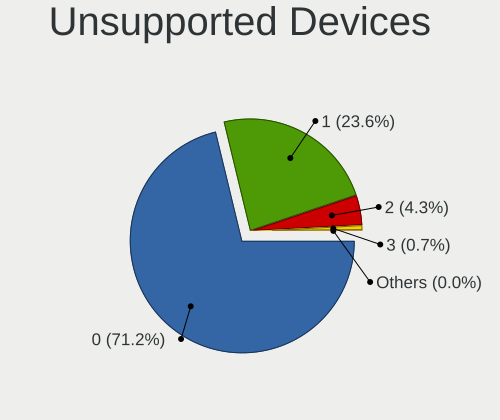

| Total | Computers | Percent |
|-------|-----------|---------|
| 0     | 9448      | 71.23%  |
| 1     | 3133      | 23.62%  |
| 2     | 573       | 4.32%   |
| 3     | 94        | 0.71%   |
| 4     | 11        | 0.08%   |
| 6     | 3         | 0.02%   |
| 5     | 2         | 0.02%   |
| 7     | 1         | 0.01%   |

Unsupported Device Types
------------------------

Types of unsupported devices

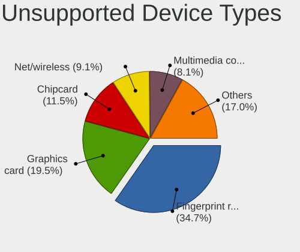

| Type                     | Computers | Percent |
|--------------------------|-----------|---------|
| Fingerprint reader       | 1552      | 34.7%   |
| Graphics card            | 872       | 19.49%  |
| Chipcard                 | 516       | 11.54%  |
| Net/wireless             | 409       | 9.14%   |
| Multimedia controller    | 364       | 8.14%   |
| Camera                   | 195       | 4.36%   |
| Communication controller | 106       | 2.37%   |
| Unassigned class         | 88        | 1.97%   |
| Bluetooth                | 85        | 1.9%    |
| Sound                    | 69        | 1.54%   |
| Net/ethernet             | 60        | 1.34%   |
| Card reader              | 42        | 0.94%   |
| Network                  | 34        | 0.76%   |
| Storage                  | 27        | 0.6%    |
| Modem                    | 22        | 0.49%   |
| Dvb card                 | 10        | 0.22%   |
| Storage/raid             | 7         | 0.16%   |
| Storage/nvme             | 3         | 0.07%   |
| Storage/ide              | 3         | 0.07%   |
| Flash memory             | 3         | 0.07%   |
| Wireless                 | 2         | 0.04%   |
| Tv card                  | 2         | 0.04%   |
| Storage/ata              | 1         | 0.02%   |
| Firewire controller      | 1         | 0.02%   |

