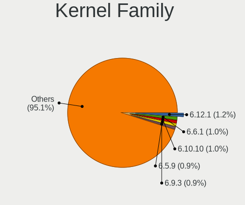
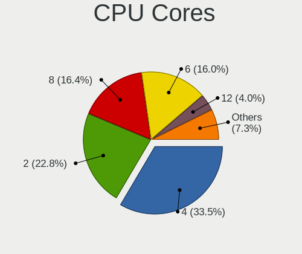
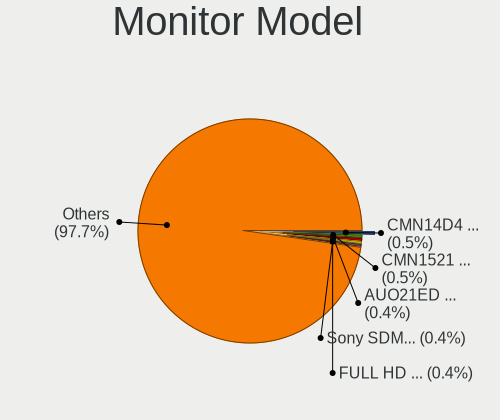
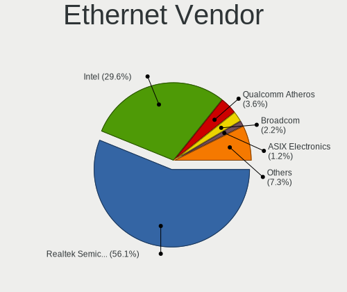
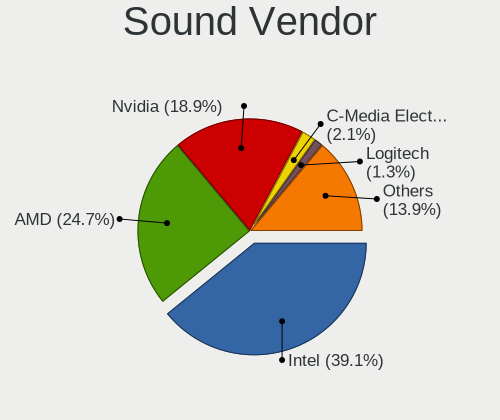
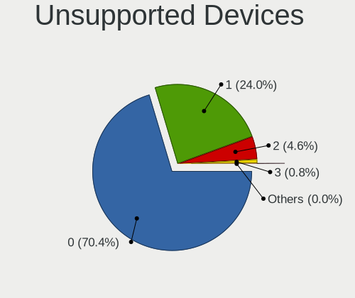

Arch - Tested Hardware & Statistics
-----------------------------------

A project to collect tested hardware configurations for Arch.

Anyone can contribute to this report by the [hw-probe](https://github.com/linuxhw/hw-probe) tool:

    sudo -E hw-probe -all -upload

Please contribute! Especially if your hardware is rare.

This is a report for all computer types. See also reports for [desktops](/Dist/Arch/Desktop/README.md) and [notebooks](/Dist/Arch/Notebook/README.md).

Contents
--------

* [ Test Cases ](#test-cases)

* [ System ](#system)
  - [ OS                       ](#os)
  - [ OS Family                ](#os-family)
  - [ Kernel                   ](#kernel)
  - [ Kernel Family            ](#kernel-family)
  - [ Kernel Major Ver.        ](#kernel-major-ver)
  - [ Arch                     ](#arch)
  - [ DE                       ](#de)
  - [ Display Server           ](#display-server)
  - [ Display Manager          ](#display-manager)
  - [ OS Lang                  ](#os-lang)
  - [ Boot Mode                ](#boot-mode)
  - [ Filesystem               ](#filesystem)
  - [ Part. scheme             ](#part-scheme)
  - [ Dual Boot with Linux/BSD ](#dual-boot-with-linuxbsd)
  - [ Dual Boot (Win)          ](#dual-boot-win)

* [ Board ](#board)
  - [ Vendor                   ](#vendor)
  - [ Model                    ](#model)
  - [ Model Family             ](#model-family)
  - [ MFG Year                 ](#mfg-year)
  - [ Form Factor              ](#form-factor)
  - [ Secure Boot              ](#secure-boot)
  - [ Coreboot                 ](#coreboot)
  - [ RAM Size                 ](#ram-size)
  - [ RAM Used                 ](#ram-used)
  - [ Total Drives             ](#total-drives)
  - [ Has CD-ROM               ](#has-cd-rom)
  - [ Has Ethernet             ](#has-ethernet)
  - [ Has WiFi                 ](#has-wifi)
  - [ Has Bluetooth            ](#has-bluetooth)

* [ Location ](#location)
  - [ Country                  ](#country)
  - [ City                     ](#city)

* [ Drives ](#drives)
  - [ Drive Vendor             ](#drive-vendor)
  - [ Drive Model              ](#drive-model)
  - [ HDD Vendor               ](#hdd-vendor)
  - [ SSD Vendor               ](#ssd-vendor)
  - [ Drive Kind               ](#drive-kind)
  - [ Drive Connector          ](#drive-connector)
  - [ Drive Size               ](#drive-size)
  - [ Space Total              ](#space-total)
  - [ Space Used               ](#space-used)
  - [ Malfunc. Drives          ](#malfunc-drives)
  - [ Malfunc. Drive Vendor    ](#malfunc-drive-vendor)
  - [ Malfunc. HDD Vendor      ](#malfunc-hdd-vendor)
  - [ Malfunc. Drive Kind      ](#malfunc-drive-kind)
  - [ Failed Drives            ](#failed-drives)
  - [ Failed Drive Vendor      ](#failed-drive-vendor)
  - [ Drive Status             ](#drive-status)

* [ Storage controller ](#storage-controller)
  - [ Storage Vendor           ](#storage-vendor)
  - [ Storage Model            ](#storage-model)
  - [ Storage Kind             ](#storage-kind)

* [ Processor ](#processor)
  - [ CPU Vendor               ](#cpu-vendor)
  - [ CPU Model                ](#cpu-model)
  - [ CPU Model Family         ](#cpu-model-family)
  - [ CPU Cores                ](#cpu-cores)
  - [ CPU Sockets              ](#cpu-sockets)
  - [ CPU Threads              ](#cpu-threads)
  - [ CPU Op-Modes             ](#cpu-op-modes)
  - [ CPU Microcode            ](#cpu-microcode)
  - [ CPU Microarch            ](#cpu-microarch)

* [ Graphics ](#graphics)
  - [ GPU Vendor               ](#gpu-vendor)
  - [ GPU Model                ](#gpu-model)
  - [ GPU Combo                ](#gpu-combo)
  - [ GPU Driver               ](#gpu-driver)
  - [ GPU Memory               ](#gpu-memory)

* [ Monitor ](#monitor)
  - [ Monitor Vendor           ](#monitor-vendor)
  - [ Monitor Model            ](#monitor-model)
  - [ Monitor Resolution       ](#monitor-resolution)
  - [ Monitor Diagonal         ](#monitor-diagonal)
  - [ Monitor Width            ](#monitor-width)
  - [ Aspect Ratio             ](#aspect-ratio)
  - [ Monitor Area             ](#monitor-area)
  - [ Pixel Density            ](#pixel-density)
  - [ Multiple Monitors        ](#multiple-monitors)

* [ Network ](#network)
  - [ Net Controller Vendor    ](#net-controller-vendor)
  - [ Net Controller Model     ](#net-controller-model)
  - [ Wireless Vendor          ](#wireless-vendor)
  - [ Wireless Model           ](#wireless-model)
  - [ Ethernet Vendor          ](#ethernet-vendor)
  - [ Ethernet Model           ](#ethernet-model)
  - [ Net Controller Kind      ](#net-controller-kind)
  - [ Used Controller          ](#used-controller)
  - [ NICs                     ](#nics)
  - [ IPv6                     ](#ipv6)

* [ Bluetooth ](#bluetooth)
  - [ Bluetooth Vendor         ](#bluetooth-vendor)
  - [ Bluetooth Model          ](#bluetooth-model)

* [ Sound ](#sound)
  - [ Sound Vendor             ](#sound-vendor)
  - [ Sound Model              ](#sound-model)

* [ Memory ](#memory)
  - [ Memory Vendor            ](#memory-vendor)
  - [ Memory Model             ](#memory-model)
  - [ Memory Kind              ](#memory-kind)
  - [ Memory Form Factor       ](#memory-form-factor)
  - [ Memory Size              ](#memory-size)
  - [ Memory Speed             ](#memory-speed)

* [ Printers & scanners ](#printers--scanners)
  - [ Printer Vendor           ](#printer-vendor)
  - [ Printer Model            ](#printer-model)
  - [ Scanner Vendor           ](#scanner-vendor)
  - [ Scanner Model            ](#scanner-model)

* [ Camera ](#camera)
  - [ Camera Vendor            ](#camera-vendor)
  - [ Camera Model             ](#camera-model)

* [ Security ](#security)
  - [ Fingerprint Vendor       ](#fingerprint-vendor)
  - [ Fingerprint Model        ](#fingerprint-model)
  - [ Chipcard Vendor          ](#chipcard-vendor)
  - [ Chipcard Model           ](#chipcard-model)

* [ Unsupported ](#unsupported)
  - [ Unsupported Devices      ](#unsupported-devices)
  - [ Unsupported Device Types ](#unsupported-device-types)

Test Cases
----------

Total: 11207

| Vendor        | Model                       | Form-Factor | Probe                                                      | Date         |
|---------------|-----------------------------|-------------|------------------------------------------------------------|--------------|
| Alienware     | m17 R4                      | Notebook    | [4372e588f9](https://linux-hardware.org/?probe=4372e588f9) | Feb 02, 2024 |
| Lenovo        | Yoga C740-15IML 81TD        | Convertible | [f4cebc212c](https://linux-hardware.org/?probe=f4cebc212c) | Feb 02, 2024 |
| Lenovo        | ThinkPad E14 Gen 3 20YE0... | Notebook    | [60cc806e9a](https://linux-hardware.org/?probe=60cc806e9a) | Feb 02, 2024 |
| Gigabyte      | B550M AORUS PRO-P           | Desktop     | [1f0ece5a8b](https://linux-hardware.org/?probe=1f0ece5a8b) | Feb 02, 2024 |
| Gigabyte      | B550M AORUS PRO-P           | Desktop     | [11b2f337e7](https://linux-hardware.org/?probe=11b2f337e7) | Feb 02, 2024 |
| ASUSTek       | F8Vr                        | Notebook    | [02fced1d70](https://linux-hardware.org/?probe=02fced1d70) | Feb 02, 2024 |
| ASRock        | H61M-HVS                    | Desktop     | [a41e650c9c](https://linux-hardware.org/?probe=a41e650c9c) | Feb 02, 2024 |
| ASUSTek       | Z170 PRO GAMING             | Desktop     | [b43380d687](https://linux-hardware.org/?probe=b43380d687) | Feb 02, 2024 |
| MECHREVO      | S1 Pro Series               | Notebook    | [ba68410f96](https://linux-hardware.org/?probe=ba68410f96) | Feb 02, 2024 |
| HP            | EliteBook 840 G7 Noteboo... | Notebook    | [6f09cb7800](https://linux-hardware.org/?probe=6f09cb7800) | Feb 02, 2024 |
| Dell          | Latitude 5290 2-in-1        | Tablet      | [51e59eeeb8](https://linux-hardware.org/?probe=51e59eeeb8) | Feb 02, 2024 |
| Timi          | Redmi Book Pro 15 2022      | Notebook    | [fddf157b5f](https://linux-hardware.org/?probe=fddf157b5f) | Feb 01, 2024 |
| Dell          | Inspiron 5482               | Convertible | [29b9d73e8b](https://linux-hardware.org/?probe=29b9d73e8b) | Feb 01, 2024 |
| Lenovo        | IdeaPad 320S-14IKB 80X4     | Notebook    | [ceef434e35](https://linux-hardware.org/?probe=ceef434e35) | Feb 01, 2024 |
| ASUSTek       | PRIME B460M-A               | Desktop     | [40c53134dc](https://linux-hardware.org/?probe=40c53134dc) | Feb 01, 2024 |
| Toshiba       | Satellite U845W             | Notebook    | [bfcfa219eb](https://linux-hardware.org/?probe=bfcfa219eb) | Feb 01, 2024 |
| Toshiba       | Satellite U845W             | Notebook    | [7671d63234](https://linux-hardware.org/?probe=7671d63234) | Feb 01, 2024 |
| Microsoft     | Surface Laptop Go           | Tablet      | [8b82b0fb1f](https://linux-hardware.org/?probe=8b82b0fb1f) | Feb 01, 2024 |
| ASUSTek       | ROG Strix G513RM_G513RM     | Notebook    | [2239a0b698](https://linux-hardware.org/?probe=2239a0b698) | Feb 01, 2024 |
| ASUSTek       | ASUS Zenbook 14 UX3405MA... | Notebook    | [531a090457](https://linux-hardware.org/?probe=531a090457) | Feb 01, 2024 |
| ASUSTek       | ROG STRIX B360-F GAMING     | Desktop     | [ad0630a0fc](https://linux-hardware.org/?probe=ad0630a0fc) | Feb 01, 2024 |
| Dell          | Latitude 5290 2-in-1        | Tablet      | [cfd409b2af](https://linux-hardware.org/?probe=cfd409b2af) | Jan 31, 2024 |
| NZXT          | N7 B650E                    | Desktop     | [acb00e1425](https://linux-hardware.org/?probe=acb00e1425) | Jan 31, 2024 |
| Lenovo        | ThinkPad T16 Gen 2 21K7C... | Notebook    | [3e6a5bfa72](https://linux-hardware.org/?probe=3e6a5bfa72) | Jan 31, 2024 |
| HONOR         | BBR-WAX9                    | Notebook    | [a1b73e72d3](https://linux-hardware.org/?probe=a1b73e72d3) | Jan 31, 2024 |
| Dell          | Inspiron 16 Plus 7630       | Notebook    | [af2db531a1](https://linux-hardware.org/?probe=af2db531a1) | Jan 31, 2024 |
| Lenovo        | ThinkPad E14 Gen 3 20YE0... | Notebook    | [bfe57fcccb](https://linux-hardware.org/?probe=bfe57fcccb) | Jan 31, 2024 |
| MSI           | Prestige 14Evo B13M         | Notebook    | [2724b6a0da](https://linux-hardware.org/?probe=2724b6a0da) | Jan 31, 2024 |
| Lenovo        | Yoga 7 14ITL5 82BH          | Convertible | [c94175a3bc](https://linux-hardware.org/?probe=c94175a3bc) | Jan 31, 2024 |
| Lenovo        | ThinkPad T480s 20L8S8XJ0... | Notebook    | [ed474939eb](https://linux-hardware.org/?probe=ed474939eb) | Jan 31, 2024 |
| ASUSTek       | ROG STRIX X670E-A GAMING... | Desktop     | [0f0dad6ef2](https://linux-hardware.org/?probe=0f0dad6ef2) | Jan 31, 2024 |
| Lenovo        | IdeaPad 320S-15IKB 81BQ     | Notebook    | [001809149c](https://linux-hardware.org/?probe=001809149c) | Jan 31, 2024 |
| Lenovo        | ThinkPad T480s 20L8S8XJ0... | Notebook    | [021f108e72](https://linux-hardware.org/?probe=021f108e72) | Jan 31, 2024 |
| Gigabyte      | B85M-DS3H-A                 | Desktop     | [99e8a768ca](https://linux-hardware.org/?probe=99e8a768ca) | Jan 30, 2024 |
| MSI           | B450 GAMING PLUS MAX        | Desktop     | [0451fa0547](https://linux-hardware.org/?probe=0451fa0547) | Jan 30, 2024 |
| Lenovo        | ThinkPad P15 Gen 2i 20YR... | Notebook    | [0af07cd951](https://linux-hardware.org/?probe=0af07cd951) | Jan 30, 2024 |
| Lenovo        | ThinkPad T480s 20L8S1WH0... | Notebook    | [f97fbae5f6](https://linux-hardware.org/?probe=f97fbae5f6) | Jan 30, 2024 |
| Lenovo        | ThinkPad T480s 20L8S1WH0... | Notebook    | [c4978054da](https://linux-hardware.org/?probe=c4978054da) | Jan 30, 2024 |
| Dell          | G15 5511                    | Notebook    | [7fc6a18364](https://linux-hardware.org/?probe=7fc6a18364) | Jan 30, 2024 |
| Lenovo        | ThinkPad L14 Gen 4 21H5C... | Notebook    | [7f42dbc84d](https://linux-hardware.org/?probe=7f42dbc84d) | Jan 30, 2024 |
| Lenovo        | ThinkPad L14 Gen 4 21H5C... | Notebook    | [62bda5bd27](https://linux-hardware.org/?probe=62bda5bd27) | Jan 30, 2024 |
| Acer          | Aspire A315-41              | Notebook    | [a78d79030e](https://linux-hardware.org/?probe=a78d79030e) | Jan 30, 2024 |
| Dell          | 0NW6H5 A00                  | Desktop     | [ac9d05a0b5](https://linux-hardware.org/?probe=ac9d05a0b5) | Jan 30, 2024 |
| MECHREVO      | WUJIE14 PRO                 | Notebook    | [a3b9804ccf](https://linux-hardware.org/?probe=a3b9804ccf) | Jan 30, 2024 |
| MSI           | X370 GAMING PRO CARBON      | Desktop     | [b37fa10d8f](https://linux-hardware.org/?probe=b37fa10d8f) | Jan 30, 2024 |
| Intel         | NUC5i7RYB H73774-102        | Mini pc     | [762753d726](https://linux-hardware.org/?probe=762753d726) | Jan 30, 2024 |
| Gigabyte      | AB350-Gaming 3-CF           | Desktop     | [6eceb567fd](https://linux-hardware.org/?probe=6eceb567fd) | Jan 30, 2024 |
| Gigabyte      | AB350-Gaming 3-CF           | Desktop     | [547d3168d9](https://linux-hardware.org/?probe=547d3168d9) | Jan 30, 2024 |
| Lenovo        | ThinkPad T495 20NKS1EP00    | Notebook    | [addeb3711c](https://linux-hardware.org/?probe=addeb3711c) | Jan 30, 2024 |
| Gigabyte      | AORUS 15P XD                | Notebook    | [72e109e02a](https://linux-hardware.org/?probe=72e109e02a) | Jan 30, 2024 |
| Sony          | SVF1521Q1EW                 | Notebook    | [94c0695977](https://linux-hardware.org/?probe=94c0695977) | Jan 30, 2024 |
| Apple         | MacBookPro15,1              | Notebook    | [12fb54aa81](https://linux-hardware.org/?probe=12fb54aa81) | Jan 29, 2024 |
| ASRock        | B550 Phantom Gaming 4       | Desktop     | [93c0e7740f](https://linux-hardware.org/?probe=93c0e7740f) | Jan 29, 2024 |
| MSI           | GL63 9SD                    | Notebook    | [174a4f49ac](https://linux-hardware.org/?probe=174a4f49ac) | Jan 29, 2024 |
| Dell          | 0NK70N A03                  | Desktop     | [6b2538c626](https://linux-hardware.org/?probe=6b2538c626) | Jan 29, 2024 |
| HUAWEI        | BOM-WXX9                    | Notebook    | [346c925e80](https://linux-hardware.org/?probe=346c925e80) | Jan 29, 2024 |
| ASUSTek       | ROG STRIX X670E-E GAMING... | Desktop     | [cecfacb5dc](https://linux-hardware.org/?probe=cecfacb5dc) | Jan 29, 2024 |
| MSI           | B550M PRO-VDH WIFI          | Desktop     | [bc1a622cd7](https://linux-hardware.org/?probe=bc1a622cd7) | Jan 29, 2024 |
| Lenovo        | G500 20236                  | Notebook    | [312fc3b893](https://linux-hardware.org/?probe=312fc3b893) | Jan 28, 2024 |
| MSI           | G41M-P23                    | Desktop     | [74ac4742e0](https://linux-hardware.org/?probe=74ac4742e0) | Jan 28, 2024 |
| Avell High... | B.ON                        | Notebook    | [8b9b2f2129](https://linux-hardware.org/?probe=8b9b2f2129) | Jan 28, 2024 |
| ASUSTek       | VivoBook_ASUSLaptop X512... | Notebook    | [746b28ec9b](https://linux-hardware.org/?probe=746b28ec9b) | Jan 28, 2024 |
| LG Electro... | 14T90R-K.AA77A1             | Convertible | [c552693e5d](https://linux-hardware.org/?probe=c552693e5d) | Jan 28, 2024 |
| Dell          | 084J0R A00                  | Desktop     | [74f86a266b](https://linux-hardware.org/?probe=74f86a266b) | Jan 28, 2024 |
| ZOTAC         | ZBOX-ECM73070C/53060C       | Mini pc     | [28556ee188](https://linux-hardware.org/?probe=28556ee188) | Jan 28, 2024 |
| ASUSTek       | PRIME B550M-A               | Desktop     | [0937d9ebea](https://linux-hardware.org/?probe=0937d9ebea) | Jan 27, 2024 |
| Framework     | Laptop 13 (AMD Ryzen 704... | Notebook    | [93970413c7](https://linux-hardware.org/?probe=93970413c7) | Jan 27, 2024 |
| Gigabyte      | B450M DS3H-CF               | Desktop     | [c1312a18b3](https://linux-hardware.org/?probe=c1312a18b3) | Jan 27, 2024 |
| HP            | ProBook 640 G1              | Notebook    | [6359631eb5](https://linux-hardware.org/?probe=6359631eb5) | Jan 27, 2024 |
| MSI           | G41M-P23                    | Desktop     | [12cfad172b](https://linux-hardware.org/?probe=12cfad172b) | Jan 27, 2024 |
| ASUSTek       | G22CH                       | Desktop     | [b83588b4f3](https://linux-hardware.org/?probe=b83588b4f3) | Jan 27, 2024 |
| Acer          | Aspire ES1-511              | Notebook    | [8e8aae3572](https://linux-hardware.org/?probe=8e8aae3572) | Jan 27, 2024 |
| HP            | Laptop 14-fq0xxx            | Notebook    | [d7df41bbf8](https://linux-hardware.org/?probe=d7df41bbf8) | Jan 27, 2024 |
| ASUSTek       | TUF Gaming X570-PLUS        | Desktop     | [540a0893c5](https://linux-hardware.org/?probe=540a0893c5) | Jan 26, 2024 |
| Dell          | Latitude 5520               | Notebook    | [acedcebd94](https://linux-hardware.org/?probe=acedcebd94) | Jan 26, 2024 |
| Google        | Lindar                      | Notebook    | [9da680f7f4](https://linux-hardware.org/?probe=9da680f7f4) | Jan 26, 2024 |
| ASUSTek       | ROG Strix G713RW_G713RW     | Notebook    | [20827e6f82](https://linux-hardware.org/?probe=20827e6f82) | Jan 26, 2024 |
| ASUSTek       | ProArt X670E-CREATOR WIF... | Desktop     | [ea0df7d02b](https://linux-hardware.org/?probe=ea0df7d02b) | Jan 26, 2024 |
| ASUSTek       | ProArt X670E-CREATOR WIF... | Desktop     | [319d0c49cb](https://linux-hardware.org/?probe=319d0c49cb) | Jan 26, 2024 |
| HP            | 8299                        | Desktop     | [60a7b54af3](https://linux-hardware.org/?probe=60a7b54af3) | Jan 25, 2024 |
| Gigabyte      | B550 AORUS ELITE V2         | Desktop     | [c0bdeb8655](https://linux-hardware.org/?probe=c0bdeb8655) | Jan 25, 2024 |
| HP            | 8299                        | Desktop     | [7c8a8d7fc1](https://linux-hardware.org/?probe=7c8a8d7fc1) | Jan 25, 2024 |
| ASUSTek       | VivoBook_ASUSLaptop K360... | Notebook    | [5948bdd871](https://linux-hardware.org/?probe=5948bdd871) | Jan 25, 2024 |
| ASUSTek       | Zenbook UX3402VA_UX3402V... | Notebook    | [136eed1999](https://linux-hardware.org/?probe=136eed1999) | Jan 25, 2024 |
| ASUSTek       | ROG Maximus Z790 HERO       | Desktop     | [7edfb487d5](https://linux-hardware.org/?probe=7edfb487d5) | Jan 25, 2024 |
| ASUSTek       | VivoBook_ASUSLaptop M650... | Notebook    | [68c758113c](https://linux-hardware.org/?probe=68c758113c) | Jan 25, 2024 |
| Lenovo        | ThinkPad X230 Tablet 343... | Notebook    | [40618fab75](https://linux-hardware.org/?probe=40618fab75) | Jan 25, 2024 |
| ASRock        | B450M-HDV R4.0              | Desktop     | [48a4557102](https://linux-hardware.org/?probe=48a4557102) | Jan 25, 2024 |
| Intel         | JSL MRD                     | Desktop     | [17cea243b5](https://linux-hardware.org/?probe=17cea243b5) | Jan 24, 2024 |
| HP            | OMEN by Laptop 15-ce0xx     | Notebook    | [90a5837b3c](https://linux-hardware.org/?probe=90a5837b3c) | Jan 24, 2024 |
| HP            | OMEN by 16 Laptop PC        | Notebook    | [ba14f4db44](https://linux-hardware.org/?probe=ba14f4db44) | Jan 24, 2024 |
| ASRock        | A320M-HDV R4.0              | Desktop     | [64c2e7a1f3](https://linux-hardware.org/?probe=64c2e7a1f3) | Jan 24, 2024 |
| Dell          | Latitude 7420               | Notebook    | [98c02f837e](https://linux-hardware.org/?probe=98c02f837e) | Jan 24, 2024 |
| AZW           | GT-R                        | Notebook    | [b9cc91d07d](https://linux-hardware.org/?probe=b9cc91d07d) | Jan 24, 2024 |
| Lenovo        | ThinkPad T480 20L6S4T900    | Notebook    | [ec49fa0394](https://linux-hardware.org/?probe=ec49fa0394) | Jan 24, 2024 |
| Dynabook      | TECRA A50-K                 | Notebook    | [4f6a83fa5a](https://linux-hardware.org/?probe=4f6a83fa5a) | Jan 24, 2024 |
| Acer          | TravelMate P414-51          | Notebook    | [b9eb38b308](https://linux-hardware.org/?probe=b9eb38b308) | Jan 24, 2024 |
| Toshiba       | Satellite Pro NB10-A-125    | Notebook    | [6594f8afba](https://linux-hardware.org/?probe=6594f8afba) | Jan 24, 2024 |
| MSI           | B650 GAMING PLUS WIFI       | Desktop     | [1a936deeee](https://linux-hardware.org/?probe=1a936deeee) | Jan 23, 2024 |
| HP            | ENVY Laptop 13-ba0xxx       | Notebook    | [b0f7b9a32f](https://linux-hardware.org/?probe=b0f7b9a32f) | Jan 23, 2024 |
| HP            | ENVY Laptop 13-ba0xxx       | Notebook    | [5fadf9e223](https://linux-hardware.org/?probe=5fadf9e223) | Jan 23, 2024 |
| Microsoft     | Surface Pro 3               | Tablet      | [b0c74cf9c0](https://linux-hardware.org/?probe=b0c74cf9c0) | Jan 23, 2024 |
| Fujitsu       | FMVWG2U47                   | Notebook    | [3d23440c14](https://linux-hardware.org/?probe=3d23440c14) | Jan 23, 2024 |
| Lenovo        | ThinkPad P15s Gen 2i 20W... | Notebook    | [b2e896db49](https://linux-hardware.org/?probe=b2e896db49) | Jan 23, 2024 |
| Lenovo        | IdeaPad 5 15ITL05 82FG      | Notebook    | [a756dd32a8](https://linux-hardware.org/?probe=a756dd32a8) | Jan 23, 2024 |
| Dell          | Inspiron 3421               | Notebook    | [a15cb7d764](https://linux-hardware.org/?probe=a15cb7d764) | Jan 22, 2024 |
| HP            | EliteBook 840 G8 Noteboo... | Notebook    | [00c6aa68c6](https://linux-hardware.org/?probe=00c6aa68c6) | Jan 22, 2024 |
| Intel         | AIder Lake PCH B660 M-AT... | Desktop     | [c577cab7c8](https://linux-hardware.org/?probe=c577cab7c8) | Jan 22, 2024 |
| Alienware     | Area-51m                    | Notebook    | [5d5a86f557](https://linux-hardware.org/?probe=5d5a86f557) | Jan 22, 2024 |
| Lenovo        | ThinkPad T14 Gen 2i 20W1... | Notebook    | [2c5947d48c](https://linux-hardware.org/?probe=2c5947d48c) | Jan 22, 2024 |
| Acer          | Aspire A315-58              | Notebook    | [4a991bd59b](https://linux-hardware.org/?probe=4a991bd59b) | Jan 22, 2024 |
| Lenovo        | ThinkPad T460 20FMS0CR00    | Notebook    | [1bfe0bce6d](https://linux-hardware.org/?probe=1bfe0bce6d) | Jan 21, 2024 |
| Apple         | MacBookPro8,1               | Notebook    | [ba1a3bef35](https://linux-hardware.org/?probe=ba1a3bef35) | Jan 21, 2024 |
| HP            | Pavilion g6                 | Notebook    | [58e29cfd8a](https://linux-hardware.org/?probe=58e29cfd8a) | Jan 21, 2024 |
| Lenovo        | ThinkPad T470s W10DG 20J... | Notebook    | [3de8476f0b](https://linux-hardware.org/?probe=3de8476f0b) | Jan 21, 2024 |
| ASRock        | B650M PG Riptide            | Desktop     | [1ebf8a3fea](https://linux-hardware.org/?probe=1ebf8a3fea) | Jan 21, 2024 |
| ASUSTek       | TUF Gaming B550M-E WIFI     | Desktop     | [53b28fea12](https://linux-hardware.org/?probe=53b28fea12) | Jan 21, 2024 |
| Lenovo        | G550 20023                  | Notebook    | [577e991c77](https://linux-hardware.org/?probe=577e991c77) | Jan 21, 2024 |
| ASUSTek       | PRIME B450-PLUS             | Desktop     | [dfd9b8e3b0](https://linux-hardware.org/?probe=dfd9b8e3b0) | Jan 21, 2024 |
| Lenovo        | MAHOBAY                     | Desktop     | [77a68d33db](https://linux-hardware.org/?probe=77a68d33db) | Jan 20, 2024 |
| ASUSTek       | Maximus VIII HERO           | Desktop     | [4b148b87c9](https://linux-hardware.org/?probe=4b148b87c9) | Jan 20, 2024 |
| Lenovo        | IdeaPad Gaming 3 15IHU6 ... | Notebook    | [73fe1f94d6](https://linux-hardware.org/?probe=73fe1f94d6) | Jan 20, 2024 |
| ASUSTek       | K56CB                       | Notebook    | [5cc6df781d](https://linux-hardware.org/?probe=5cc6df781d) | Jan 20, 2024 |
| ASUSTek       | VivoBook_ASUSLaptop K660... | Notebook    | [409adbe1e3](https://linux-hardware.org/?probe=409adbe1e3) | Jan 20, 2024 |
| ASRock        | FM2A68M-HD+ R2.0            | Desktop     | [793d303d19](https://linux-hardware.org/?probe=793d303d19) | Jan 20, 2024 |
| Dell          | Latitude 7490               | Notebook    | [417a215aa4](https://linux-hardware.org/?probe=417a215aa4) | Jan 20, 2024 |
| Lenovo        | ThinkPad T16 Gen 2 21K7C... | Notebook    | [10192a7c39](https://linux-hardware.org/?probe=10192a7c39) | Jan 20, 2024 |
| ASUSTek       | Zenbook UX3402ZA_UX3402Z... | Notebook    | [06567bb3ae](https://linux-hardware.org/?probe=06567bb3ae) | Jan 20, 2024 |
| ASUSTek       | Zenbook UX3402ZA_UX3402Z... | Notebook    | [01db0b0650](https://linux-hardware.org/?probe=01db0b0650) | Jan 20, 2024 |
| MSI           | MAG B550 TOMAHAWK           | Desktop     | [c3cff812af](https://linux-hardware.org/?probe=c3cff812af) | Jan 19, 2024 |
| MSI           | MAG B550 TOMAHAWK           | Desktop     | [e7c81d1364](https://linux-hardware.org/?probe=e7c81d1364) | Jan 19, 2024 |
| Lenovo        | ThinkPad T480 20L6S5MJ00    | Notebook    | [261ee14375](https://linux-hardware.org/?probe=261ee14375) | Jan 19, 2024 |
| Apple         | MacBookPro9,2               | Notebook    | [1cbef51f51](https://linux-hardware.org/?probe=1cbef51f51) | Jan 19, 2024 |
| Dell          | Latitude 9420               | Notebook    | [8fe55c7fc3](https://linux-hardware.org/?probe=8fe55c7fc3) | Jan 18, 2024 |
| Gigabyte      | B450M DS3H V2               | Desktop     | [8d75949d34](https://linux-hardware.org/?probe=8d75949d34) | Jan 18, 2024 |
| ASUSTek       | PRIME B350M-A               | Desktop     | [8b948a01f1](https://linux-hardware.org/?probe=8b948a01f1) | Jan 18, 2024 |
| ASUSTek       | PRIME B350M-A               | Desktop     | [1cec7c40a7](https://linux-hardware.org/?probe=1cec7c40a7) | Jan 18, 2024 |
| Dream Mach... | NS5x_NS7xPU                 | Notebook    | [d4604f53fc](https://linux-hardware.org/?probe=d4604f53fc) | Jan 17, 2024 |
| ASUSTek       | TUF Gaming X570-PLUS        | Desktop     | [f0a5eac649](https://linux-hardware.org/?probe=f0a5eac649) | Jan 17, 2024 |
| ASUSTek       | Z87-K                       | Desktop     | [199117128e](https://linux-hardware.org/?probe=199117128e) | Jan 17, 2024 |
| MSI           | MAG X670E TOMAHAWK WIFI     | Desktop     | [994627fdfd](https://linux-hardware.org/?probe=994627fdfd) | Jan 17, 2024 |
| ASUSTek       | TUF Gaming B450-PLUS II     | Desktop     | [d6de53eba7](https://linux-hardware.org/?probe=d6de53eba7) | Jan 17, 2024 |
| Lenovo        | Yoga 7 14IRL8 82YL          | Convertible | [10957c068b](https://linux-hardware.org/?probe=10957c068b) | Jan 17, 2024 |
| Lenovo        | YogaAir 14s APU8 83AA       | Notebook    | [8951d7dd3e](https://linux-hardware.org/?probe=8951d7dd3e) | Jan 16, 2024 |
| ASUSTek       | PRIME H510M-K               | Desktop     | [b780e18215](https://linux-hardware.org/?probe=b780e18215) | Jan 16, 2024 |
| Apple         | MacBookPro15,2              | Notebook    | [547ddaf81d](https://linux-hardware.org/?probe=547ddaf81d) | Jan 16, 2024 |
| TUXEDO        | InfinityBook Pro Gen7 (M... | Notebook    | [8e6afbe7c9](https://linux-hardware.org/?probe=8e6afbe7c9) | Jan 16, 2024 |
| ASUSTek       | ASUS TUF Gaming F15 FX50... | Notebook    | [ea249f8333](https://linux-hardware.org/?probe=ea249f8333) | Jan 16, 2024 |
| Acer          | Aspire ES1-511              | Notebook    | [4e322c7abe](https://linux-hardware.org/?probe=4e322c7abe) | Jan 16, 2024 |
| ASUSTek       | PRIME B550M-A AC            | Desktop     | [b08880045e](https://linux-hardware.org/?probe=b08880045e) | Jan 16, 2024 |
| Lenovo        | IdeaPad Slim 5 14ABR8 82... | Notebook    | [7398e123b9](https://linux-hardware.org/?probe=7398e123b9) | Jan 16, 2024 |
| Dell          | 06CV2N A01                  | Desktop     | [6f82e8a55c](https://linux-hardware.org/?probe=6f82e8a55c) | Jan 16, 2024 |
| ASUSTek       | ROG STRIX B550-F GAMING ... | Desktop     | [d0c72afc2d](https://linux-hardware.org/?probe=d0c72afc2d) | Jan 15, 2024 |
| Gigabyte      | Z87X-UD5H-CF                | Desktop     | [6578340c93](https://linux-hardware.org/?probe=6578340c93) | Jan 15, 2024 |
| Gigabyte      | B450 AORUS ELITE            | Desktop     | [bf2ce0efeb](https://linux-hardware.org/?probe=bf2ce0efeb) | Jan 15, 2024 |
| MSI           | MPG X570S CARBON MAX WIF... | Desktop     | [c63804fec4](https://linux-hardware.org/?probe=c63804fec4) | Jan 15, 2024 |
| Gigabyte      | B550M AORUS PRO-P           | Desktop     | [9d15ee6561](https://linux-hardware.org/?probe=9d15ee6561) | Jan 15, 2024 |
| Shenzhen M... | F7BAA                       | Desktop     | [8f0e3b9b33](https://linux-hardware.org/?probe=8f0e3b9b33) | Jan 15, 2024 |
| ASUSTek       | ASUS TUF Gaming F15 FX50... | Notebook    | [5712b0783d](https://linux-hardware.org/?probe=5712b0783d) | Jan 15, 2024 |
| Gigabyte      | H61M-S2P                    | Desktop     | [b9dd6cbf20](https://linux-hardware.org/?probe=b9dd6cbf20) | Jan 15, 2024 |
| Lenovo        | ThinkPad T480s 20L8S1PU0... | Notebook    | [a832e5d2cb](https://linux-hardware.org/?probe=a832e5d2cb) | Jan 15, 2024 |
| HP            | 255 G8 Notebook PC          | Notebook    | [e91147def0](https://linux-hardware.org/?probe=e91147def0) | Jan 15, 2024 |
| ASUSTek       | Z87-K                       | Desktop     | [46409c885e](https://linux-hardware.org/?probe=46409c885e) | Jan 15, 2024 |
| AZW           | GTR V21                     | Desktop     | [c87cc08a52](https://linux-hardware.org/?probe=c87cc08a52) | Jan 15, 2024 |
| HP            | 8876 11                     | Desktop     | [56407d15f1](https://linux-hardware.org/?probe=56407d15f1) | Jan 15, 2024 |
| Lenovo        | IdeaPad Slim 5 14ABR8 82... | Notebook    | [0fee6d88f1](https://linux-hardware.org/?probe=0fee6d88f1) | Jan 15, 2024 |
| Dell          | XPS 15 9530                 | Notebook    | [aedd365ff3](https://linux-hardware.org/?probe=aedd365ff3) | Jan 15, 2024 |
| Dell          | XPS 15 9530                 | Notebook    | [34cba7cd7c](https://linux-hardware.org/?probe=34cba7cd7c) | Jan 15, 2024 |
| Intel         | NUC7JYB J67970-402          | Mini pc     | [56ace1ed4a](https://linux-hardware.org/?probe=56ace1ed4a) | Jan 15, 2024 |
| HP            | Laptop 15-bs1xx             | Notebook    | [6f5edb69f1](https://linux-hardware.org/?probe=6f5edb69f1) | Jan 15, 2024 |
| MSI           | B250M PRO-VDH               | Desktop     | [e3752cb3af](https://linux-hardware.org/?probe=e3752cb3af) | Jan 14, 2024 |
| MSI           | X470 GAMING PLUS MAX        | Desktop     | [59be55a9a8](https://linux-hardware.org/?probe=59be55a9a8) | Jan 14, 2024 |
| Acer          | Aspire A515-57              | Notebook    | [46ffca29dd](https://linux-hardware.org/?probe=46ffca29dd) | Jan 14, 2024 |
| Lenovo        | ThinkPad T470s W10DG 20J... | Notebook    | [3373e374fb](https://linux-hardware.org/?probe=3373e374fb) | Jan 14, 2024 |
| ASUSTek       | TUF Gaming X670E-PLUS       | Desktop     | [c6374ed5f1](https://linux-hardware.org/?probe=c6374ed5f1) | Jan 14, 2024 |
| Acer          | Nitro AN515-51              | Notebook    | [4ce3126197](https://linux-hardware.org/?probe=4ce3126197) | Jan 14, 2024 |
| Acer          | Nitro AN515-51              | Notebook    | [44f67c403a](https://linux-hardware.org/?probe=44f67c403a) | Jan 14, 2024 |
| Fujitsu       | LIFEBOOK U7613              | Notebook    | [9e38b7368d](https://linux-hardware.org/?probe=9e38b7368d) | Jan 14, 2024 |
| ASUSTek       | Maximus VIII HERO           | Desktop     | [900bd9fe3c](https://linux-hardware.org/?probe=900bd9fe3c) | Jan 14, 2024 |
| Timi          | Mi NoteBook Ultra           | Notebook    | [a14c93df78](https://linux-hardware.org/?probe=a14c93df78) | Jan 14, 2024 |
| HP            | Victus by Laptop 16-e0xx... | Notebook    | [569afd2c6a](https://linux-hardware.org/?probe=569afd2c6a) | Jan 14, 2024 |
| Dell          | Inspiron 5515               | Notebook    | [6523b11a61](https://linux-hardware.org/?probe=6523b11a61) | Jan 14, 2024 |
| Lenovo        | ThinkPad T480 20L6S6WQ00    | Notebook    | [54b126973b](https://linux-hardware.org/?probe=54b126973b) | Jan 14, 2024 |
| Acer          | Nitro AN515-58              | Notebook    | [23ad168a68](https://linux-hardware.org/?probe=23ad168a68) | Jan 14, 2024 |
| ASUSTek       | TUF Gaming B560-PLUS WIF... | Desktop     | [0d4e6f7e0b](https://linux-hardware.org/?probe=0d4e6f7e0b) | Jan 13, 2024 |
| MSI           | MPG X570 GAMING PLUS        | Desktop     | [cd20d27cfa](https://linux-hardware.org/?probe=cd20d27cfa) | Jan 13, 2024 |
| ASUSTek       | M5A78L LE                   | Desktop     | [eae0903af4](https://linux-hardware.org/?probe=eae0903af4) | Jan 13, 2024 |
| MSI           | GL63 8RC                    | Notebook    | [2e52a98d20](https://linux-hardware.org/?probe=2e52a98d20) | Jan 13, 2024 |
| Apple         | MacBookPro7,1               | Notebook    | [932b9f58d5](https://linux-hardware.org/?probe=932b9f58d5) | Jan 13, 2024 |
| Lenovo        | IdeaPad 3 15ALC6 82MF       | Notebook    | [63d2ac1744](https://linux-hardware.org/?probe=63d2ac1744) | Jan 13, 2024 |
| HP            | Victus by Laptop 16-e0xx... | Notebook    | [a3e108e50d](https://linux-hardware.org/?probe=a3e108e50d) | Jan 13, 2024 |
| ASUSTek       | ROG Strix G532LW_G532LW     | Notebook    | [c2778b6624](https://linux-hardware.org/?probe=c2778b6624) | Jan 13, 2024 |
| MSI           | MPG Z790 EDGE TI MAX WIF... | Desktop     | [f77145f9e7](https://linux-hardware.org/?probe=f77145f9e7) | Jan 13, 2024 |
| HP            | ENVY Laptop 17-ch1xxx       | Notebook    | [f13265c30f](https://linux-hardware.org/?probe=f13265c30f) | Jan 13, 2024 |
| Dell          | XPS 15 9575                 | Convertible | [2b84a66cef](https://linux-hardware.org/?probe=2b84a66cef) | Jan 13, 2024 |
| Lenovo        | V15-ADA 82C7                | Notebook    | [9fbe7a7217](https://linux-hardware.org/?probe=9fbe7a7217) | Jan 13, 2024 |
| HP            | 89D8 SMVB                   | Desktop     | [bf9da1dc49](https://linux-hardware.org/?probe=bf9da1dc49) | Jan 12, 2024 |
| MSI           | Z390-A PRO                  | Desktop     | [2fc8c692c0](https://linux-hardware.org/?probe=2fc8c692c0) | Jan 12, 2024 |
| ASRock        | B450M Pro4                  | Desktop     | [20eede7cbf](https://linux-hardware.org/?probe=20eede7cbf) | Jan 12, 2024 |
| Lenovo        | ThinkPad T480s 20L8002VM... | Notebook    | [d2db433ab2](https://linux-hardware.org/?probe=d2db433ab2) | Jan 12, 2024 |
| HP            | Victus by Gaming Laptop ... | Notebook    | [1bad1acfa2](https://linux-hardware.org/?probe=1bad1acfa2) | Jan 11, 2024 |
| Dell          | Inspiron 15 7000 Gaming     | Notebook    | [ab72da32d1](https://linux-hardware.org/?probe=ab72da32d1) | Jan 11, 2024 |
| Lenovo        | ThinkPad X1 Carbon Gen 1... | Notebook    | [3d7fcea179](https://linux-hardware.org/?probe=3d7fcea179) | Jan 11, 2024 |
| ASUSTek       | ROG STRIX X570-E GAMING     | Desktop     | [f54a4a0ff0](https://linux-hardware.org/?probe=f54a4a0ff0) | Jan 11, 2024 |
| Dell          | Latitude 7420               | Notebook    | [5cb5db0c21](https://linux-hardware.org/?probe=5cb5db0c21) | Jan 10, 2024 |
| ASUSTek       | ASUS TUF Gaming F17 FX70... | Notebook    | [a4897703b1](https://linux-hardware.org/?probe=a4897703b1) | Jan 10, 2024 |
| ASRock        | B760M Pro RS                | Desktop     | [34ecc17795](https://linux-hardware.org/?probe=34ecc17795) | Jan 10, 2024 |
| HP            | 339A                        | Desktop     | [07e0cfbca2](https://linux-hardware.org/?probe=07e0cfbca2) | Jan 10, 2024 |
| ASUSTek       | Zenbook UX3402ZA_UX3402Z... | Notebook    | [8d07ceed03](https://linux-hardware.org/?probe=8d07ceed03) | Jan 10, 2024 |
| HP            | 8643 SMVB                   | Desktop     | [fe18b0188b](https://linux-hardware.org/?probe=fe18b0188b) | Jan 10, 2024 |
| ASUSTek       | Zenbook UX3402ZA_UX3402Z... | Notebook    | [f0ee73bcb6](https://linux-hardware.org/?probe=f0ee73bcb6) | Jan 10, 2024 |
| MSI           | MPG B550 GAMING PLUS        | Desktop     | [757c6f2826](https://linux-hardware.org/?probe=757c6f2826) | Jan 10, 2024 |
| Lenovo        | ThinkPad L14 Gen 4 21H5C... | Notebook    | [ec34fc447a](https://linux-hardware.org/?probe=ec34fc447a) | Jan 10, 2024 |
| ASUSTek       | P5K-E                       | Desktop     | [1cacfbcadd](https://linux-hardware.org/?probe=1cacfbcadd) | Jan 09, 2024 |
| Lenovo        | Yoga 7 14IRL8 82YL          | Convertible | [aaa3a720b3](https://linux-hardware.org/?probe=aaa3a720b3) | Jan 09, 2024 |
| Apple         | MacBookAir9,1               | Notebook    | [143ae6dd48](https://linux-hardware.org/?probe=143ae6dd48) | Jan 09, 2024 |
| Acer          | Aspire A515-44              | Notebook    | [2cb18af412](https://linux-hardware.org/?probe=2cb18af412) | Jan 09, 2024 |
| Dell          | XPS 13 9370                 | Notebook    | [0d909c4177](https://linux-hardware.org/?probe=0d909c4177) | Jan 08, 2024 |
| Dell          | XPS 15 9530                 | Notebook    | [26570f8a8b](https://linux-hardware.org/?probe=26570f8a8b) | Jan 08, 2024 |
| Unknown       | Unknown                     | Notebook    | [3ea94ff775](https://linux-hardware.org/?probe=3ea94ff775) | Jan 08, 2024 |
| MSI           | Katana GF66 12UG            | Notebook    | [d4affacb08](https://linux-hardware.org/?probe=d4affacb08) | Jan 08, 2024 |
| HP            | ZBook 15 G3                 | Notebook    | [05ad98f468](https://linux-hardware.org/?probe=05ad98f468) | Jan 08, 2024 |
| HP            | EliteBook 840 G3            | Notebook    | [a8bd0e8c75](https://linux-hardware.org/?probe=a8bd0e8c75) | Jan 08, 2024 |
| ASUSTek       | ROG CROSSHAIR X670E GENE    | Desktop     | [ffc5dd3aba](https://linux-hardware.org/?probe=ffc5dd3aba) | Jan 08, 2024 |
| Dell          | Latitude 7290               | Notebook    | [44a59dcba6](https://linux-hardware.org/?probe=44a59dcba6) | Jan 08, 2024 |
| MECHREVO      | S1 Pro Series               | Notebook    | [419dfc25b2](https://linux-hardware.org/?probe=419dfc25b2) | Jan 08, 2024 |
| Dell          | 06CV2N A01                  | Desktop     | [0293654766](https://linux-hardware.org/?probe=0293654766) | Jan 08, 2024 |
| Lenovo        | ThinkPad L15 Gen 1 20U70... | Notebook    | [a9f2ff1fc3](https://linux-hardware.org/?probe=a9f2ff1fc3) | Jan 07, 2024 |
| Lenovo        | ThinkPad L15 Gen 1 20U70... | Notebook    | [dac2172dc5](https://linux-hardware.org/?probe=dac2172dc5) | Jan 07, 2024 |
| Gigabyte      | B550M DS3H                  | Desktop     | [5fbc0c1bf0](https://linux-hardware.org/?probe=5fbc0c1bf0) | Jan 07, 2024 |
| ASUSTek       | ROG STRIX X670E-F GAMING... | Desktop     | [fefe45ed1d](https://linux-hardware.org/?probe=fefe45ed1d) | Jan 07, 2024 |
| ASUSTek       | ROG STRIX B550-A GAMING     | Desktop     | [74497839e7](https://linux-hardware.org/?probe=74497839e7) | Jan 07, 2024 |
| Lenovo        | ThinkPad X260 20F5S8FQ00    | Notebook    | [eb70ae9801](https://linux-hardware.org/?probe=eb70ae9801) | Jan 07, 2024 |
| Dell          | Inspiron 5570               | Notebook    | [935c69fa60](https://linux-hardware.org/?probe=935c69fa60) | Jan 07, 2024 |
| Dell          | Inspiron 5570               | Notebook    | [9567934911](https://linux-hardware.org/?probe=9567934911) | Jan 07, 2024 |
| AMI           | Intel                       | Desktop     | [afe7d541c5](https://linux-hardware.org/?probe=afe7d541c5) | Jan 07, 2024 |
| Dell          | 073MMW A03                  | Desktop     | [9ac6e78f88](https://linux-hardware.org/?probe=9ac6e78f88) | Jan 07, 2024 |
| HP            | 829A                        | Mini pc     | [0e0de95003](https://linux-hardware.org/?probe=0e0de95003) | Jan 06, 2024 |
| HP            | 8458                        | Mini pc     | [2d2f54d263](https://linux-hardware.org/?probe=2d2f54d263) | Jan 06, 2024 |
| HP            | ZBook 17 G6                 | Notebook    | [89cde2f9d4](https://linux-hardware.org/?probe=89cde2f9d4) | Jan 06, 2024 |
| HP            | EliteBook 840 G5            | Notebook    | [f6b222e444](https://linux-hardware.org/?probe=f6b222e444) | Jan 06, 2024 |
| HP            | EliteBook 840 G5            | Notebook    | [0af2ce345e](https://linux-hardware.org/?probe=0af2ce345e) | Jan 06, 2024 |
| MSI           | Thin GF63 12HW              | Notebook    | [3b5cc98847](https://linux-hardware.org/?probe=3b5cc98847) | Jan 06, 2024 |
| Lenovo        | IdeaPad 5 14ARE05 81YM      | Notebook    | [6859e6749d](https://linux-hardware.org/?probe=6859e6749d) | Jan 06, 2024 |
| Lenovo        | ThinkPad P14s Gen 3 21J5... | Notebook    | [56717de890](https://linux-hardware.org/?probe=56717de890) | Jan 06, 2024 |
| ASUSTek       | TUF Gaming B550-PLUS        | Desktop     | [2fa55911a5](https://linux-hardware.org/?probe=2fa55911a5) | Jan 06, 2024 |
| MECHREVO      | S1 Pro Series               | Notebook    | [da21c08192](https://linux-hardware.org/?probe=da21c08192) | Jan 06, 2024 |
| ASUSTek       | ROG STRIX X670E-F GAMING... | Desktop     | [c0b1de838b](https://linux-hardware.org/?probe=c0b1de838b) | Jan 06, 2024 |
| Dell          | Latitude 7420               | Notebook    | [7b6c854eaf](https://linux-hardware.org/?probe=7b6c854eaf) | Jan 06, 2024 |
| Unknown       | Unknown                     | Desktop     | [496c931b75](https://linux-hardware.org/?probe=496c931b75) | Jan 06, 2024 |
| Gigabyte      | B550M DS3H                  | Desktop     | [d4c6189dfc](https://linux-hardware.org/?probe=d4c6189dfc) | Jan 06, 2024 |
| Gigabyte      | B550 AORUS ELITE V2         | Desktop     | [0f56b6d674](https://linux-hardware.org/?probe=0f56b6d674) | Jan 05, 2024 |
| Gigabyte      | B550M DS3H                  | Desktop     | [5a34b13f94](https://linux-hardware.org/?probe=5a34b13f94) | Jan 05, 2024 |
| HUAWEI        | HN-WX9X                     | Notebook    | [b1acec939c](https://linux-hardware.org/?probe=b1acec939c) | Jan 05, 2024 |
| MSI           | B450M MORTAR MAX            | Desktop     | [81bec4a67f](https://linux-hardware.org/?probe=81bec4a67f) | Jan 05, 2024 |
| ASRock        | X670E Pro RS                | Desktop     | [d7b3301bdb](https://linux-hardware.org/?probe=d7b3301bdb) | Jan 05, 2024 |
| PIPO          | W10                         | Tablet      | [7bc2391a82](https://linux-hardware.org/?probe=7bc2391a82) | Jan 05, 2024 |
| Gigabyte      | B550M K                     | Desktop     | [39f7c51de0](https://linux-hardware.org/?probe=39f7c51de0) | Jan 05, 2024 |
| HP            | ZBook 15 G5                 | Notebook    | [7d1279f3ef](https://linux-hardware.org/?probe=7d1279f3ef) | Jan 04, 2024 |
| ASUSTek       | VivoBook_ASUSLaptop K350... | Notebook    | [7c5e33071f](https://linux-hardware.org/?probe=7c5e33071f) | Jan 04, 2024 |
| Acer          | Nitro N50-610               | Desktop     | [612f4f165a](https://linux-hardware.org/?probe=612f4f165a) | Jan 04, 2024 |
| Medion        | B550A4-EM                   | Desktop     | [dfc1a632af](https://linux-hardware.org/?probe=dfc1a632af) | Jan 04, 2024 |
| Unknown       | Unknown                     | Desktop     | [293f3effa7](https://linux-hardware.org/?probe=293f3effa7) | Jan 04, 2024 |
| HUAWEI        | NBLK-WAX9X                  | Notebook    | [be1a88adce](https://linux-hardware.org/?probe=be1a88adce) | Jan 04, 2024 |
| ASUSTek       | VivoBook_ASUSLaptop X160... | Notebook    | [9ccd4b5019](https://linux-hardware.org/?probe=9ccd4b5019) | Jan 04, 2024 |
| MSI           | B650 GAMING PLUS WIFI       | Desktop     | [4d0901d122](https://linux-hardware.org/?probe=4d0901d122) | Jan 04, 2024 |
| ASUSTek       | X705UDR                     | Notebook    | [02cec34b2e](https://linux-hardware.org/?probe=02cec34b2e) | Jan 04, 2024 |
| ASUSTek       | Zenbook UM3402YA_UM3402Y... | Notebook    | [a83656b1fd](https://linux-hardware.org/?probe=a83656b1fd) | Jan 04, 2024 |
| ASRock        | B650E PG Riptide WiFi       | Desktop     | [71bf3eba70](https://linux-hardware.org/?probe=71bf3eba70) | Jan 04, 2024 |
| Acer          | Aspire A515-57              | Notebook    | [d5a456e2c8](https://linux-hardware.org/?probe=d5a456e2c8) | Jan 04, 2024 |
| Olidata       | SL1510 MD61444              | Notebook    | [bb1016d11d](https://linux-hardware.org/?probe=bb1016d11d) | Jan 04, 2024 |
| ASUSTek       | VivoBook_ASUSLaptop M160... | Notebook    | [197d144ab0](https://linux-hardware.org/?probe=197d144ab0) | Jan 03, 2024 |
| Lenovo        | ThinkPad X1 Carbon 6th 2... | Notebook    | [e98a083e68](https://linux-hardware.org/?probe=e98a083e68) | Jan 03, 2024 |
| Apple         | MacBookAir7,2               | Notebook    | [04de30dc4d](https://linux-hardware.org/?probe=04de30dc4d) | Jan 03, 2024 |
| ASUSTek       | ROG Zephyrus G15 GA502IV... | Notebook    | [03cff2a666](https://linux-hardware.org/?probe=03cff2a666) | Jan 03, 2024 |
| ASUSTek       | TUF Gaming B650M-E WIFI     | Desktop     | [251b877f2f](https://linux-hardware.org/?probe=251b877f2f) | Jan 03, 2024 |
| Gigabyte      | Z390 AORUS PRO WIFI-CF      | Desktop     | [82df555bfa](https://linux-hardware.org/?probe=82df555bfa) | Jan 03, 2024 |
| AMI           | Cherry Trail CR             | Notebook    | [35f5071102](https://linux-hardware.org/?probe=35f5071102) | Jan 03, 2024 |
| Teclast       | F15Plus 2                   | Notebook    | [2f9e8b631e](https://linux-hardware.org/?probe=2f9e8b631e) | Jan 02, 2024 |
| Lenovo        | Legion Pro 5 16IRX8 82WK    | Notebook    | [063cb7f7f8](https://linux-hardware.org/?probe=063cb7f7f8) | Jan 02, 2024 |
| Gigabyte      | Z790 UD AX                  | Desktop     | [00913517e5](https://linux-hardware.org/?probe=00913517e5) | Jan 02, 2024 |
| Lenovo        | IdeaPad Slim 3 14IAN8 82... | Notebook    | [c9c25e51c8](https://linux-hardware.org/?probe=c9c25e51c8) | Jan 02, 2024 |
| Dell          | Inspiron 15-3567            | Notebook    | [589f53595e](https://linux-hardware.org/?probe=589f53595e) | Jan 02, 2024 |
| ASUSTek       | ASUS TUF Gaming A17 FA70... | Notebook    | [1b62649586](https://linux-hardware.org/?probe=1b62649586) | Jan 02, 2024 |
| HP            | Pavilion dv6                | Notebook    | [61a52110ba](https://linux-hardware.org/?probe=61a52110ba) | Jan 02, 2024 |
| MSI           | B450-A PRO MAX              | Desktop     | [efda91dc2a](https://linux-hardware.org/?probe=efda91dc2a) | Jan 02, 2024 |
| Dell          | Inspiron 15-3567            | Notebook    | [50d926ec76](https://linux-hardware.org/?probe=50d926ec76) | Jan 02, 2024 |
| Acidanther... | MacBookPro16,4              | Notebook    | [3c8c520472](https://linux-hardware.org/?probe=3c8c520472) | Jan 02, 2024 |
| Google        | Blooguard                   | Notebook    | [dc6c0354a9](https://linux-hardware.org/?probe=dc6c0354a9) | Jan 02, 2024 |
| Dell          | 0C2XKD A01                  | Desktop     | [9accd399c5](https://linux-hardware.org/?probe=9accd399c5) | Jan 02, 2024 |
| Philco        | 14M2                        | Notebook    | [b5771423fb](https://linux-hardware.org/?probe=b5771423fb) | Jan 02, 2024 |
| HP            | ProBook 440 G5              | Notebook    | [04753e77e0](https://linux-hardware.org/?probe=04753e77e0) | Jan 02, 2024 |
| ASUSTek       | PRIME X470-PRO              | Desktop     | [68d3d8c6be](https://linux-hardware.org/?probe=68d3d8c6be) | Jan 02, 2024 |
| Lenovo        | ThinkPad X200s 7469W92      | Notebook    | [6ea14ec02e](https://linux-hardware.org/?probe=6ea14ec02e) | Jan 01, 2024 |
| ASUSTek       | PRIME X570-P                | Desktop     | [f8dd732e7a](https://linux-hardware.org/?probe=f8dd732e7a) | Jan 01, 2024 |
| Lenovo        | ThinkBook 16 G6 ABP 21KK    | Notebook    | [8a14ad7cc9](https://linux-hardware.org/?probe=8a14ad7cc9) | Jan 01, 2024 |
| Lenovo        | ThinkBook 16 G6 ABP 21KK    | Notebook    | [a2acc5bb5f](https://linux-hardware.org/?probe=a2acc5bb5f) | Jan 01, 2024 |
| Lenovo        | Legion Pro 5 16ARX8 82WM    | Notebook    | [67ef36b749](https://linux-hardware.org/?probe=67ef36b749) | Jan 01, 2024 |
| Lenovo        | LOQ 15IRH8 82XV             | Notebook    | [494b496889](https://linux-hardware.org/?probe=494b496889) | Jan 01, 2024 |
| ASUSTek       | PRIME X470-PRO              | Desktop     | [7cb99217f7](https://linux-hardware.org/?probe=7cb99217f7) | Jan 01, 2024 |
| ASUSTek       | PRIME X470-PRO              | Desktop     | [1934632c28](https://linux-hardware.org/?probe=1934632c28) | Jan 01, 2024 |
| ASUSTek       | PRIME X470-PRO              | Desktop     | [7df50c6495](https://linux-hardware.org/?probe=7df50c6495) | Jan 01, 2024 |
| ASUSTek       | ASUS TUF Gaming A16 FA61... | Notebook    | [488deac73a](https://linux-hardware.org/?probe=488deac73a) | Jan 01, 2024 |
| Dell          | Latitude 7420               | Notebook    | [a32d08979b](https://linux-hardware.org/?probe=a32d08979b) | Dec 31, 2023 |
| Dell          | Inspiron 15-3567            | Notebook    | [390160b8e5](https://linux-hardware.org/?probe=390160b8e5) | Dec 31, 2023 |
| Dell          | Latitude 7420               | Notebook    | [9bee55a186](https://linux-hardware.org/?probe=9bee55a186) | Dec 31, 2023 |
| ASRock        | H61M-VG4                    | Desktop     | [6eee51a63f](https://linux-hardware.org/?probe=6eee51a63f) | Dec 31, 2023 |
| ASRock        | H61M-VG4                    | Desktop     | [1c5959e766](https://linux-hardware.org/?probe=1c5959e766) | Dec 31, 2023 |
| Dell          | Inspiron 5485 2n1           | Convertible | [a68ce92fec](https://linux-hardware.org/?probe=a68ce92fec) | Dec 31, 2023 |
| HP            | Pavilion Laptop 15-eh1xx... | Notebook    | [577f6b15de](https://linux-hardware.org/?probe=577f6b15de) | Dec 31, 2023 |
| Dell          | Inspiron 3537               | Notebook    | [7adc50aeab](https://linux-hardware.org/?probe=7adc50aeab) | Dec 31, 2023 |
| Lenovo        | Slim 7 ProX 14ARH7 82V2     | Notebook    | [f160a53f1b](https://linux-hardware.org/?probe=f160a53f1b) | Dec 31, 2023 |
| Apple         | MacBookPro8,2               | Notebook    | [34fcef3266](https://linux-hardware.org/?probe=34fcef3266) | Dec 31, 2023 |
| Acer          | Nitro AN16-41               | Notebook    | [7130d1a699](https://linux-hardware.org/?probe=7130d1a699) | Dec 31, 2023 |
| Acer          | Nitro AN16-41               | Notebook    | [d04c4d749f](https://linux-hardware.org/?probe=d04c4d749f) | Dec 31, 2023 |
| Lenovo        | ThinkPad E16 Gen 1 21JT0... | Notebook    | [815e8736a2](https://linux-hardware.org/?probe=815e8736a2) | Dec 31, 2023 |
| ASRock        | B760M PG SONIC WiFi         | Desktop     | [a066542ba9](https://linux-hardware.org/?probe=a066542ba9) | Dec 31, 2023 |
| Lenovo        | ThinkPad E16 Gen 1 21JT0... | Notebook    | [4dd47839a4](https://linux-hardware.org/?probe=4dd47839a4) | Dec 31, 2023 |
| MSI           | Z170A TOMAHAWK              | Desktop     | [451e3803a0](https://linux-hardware.org/?probe=451e3803a0) | Dec 31, 2023 |
| Dell          | Inspiron 15-3567            | Notebook    | [5d1ed5c106](https://linux-hardware.org/?probe=5d1ed5c106) | Dec 30, 2023 |
| ASUSTek       | PRIME H510M-E               | Desktop     | [cfec230076](https://linux-hardware.org/?probe=cfec230076) | Dec 30, 2023 |
| Lenovo        | V15 G2 ALC 82KD             | Notebook    | [ff8e890649](https://linux-hardware.org/?probe=ff8e890649) | Dec 30, 2023 |
| ASUSTek       | VivoBook_ASUSLaptop X160... | Notebook    | [460fe0575c](https://linux-hardware.org/?probe=460fe0575c) | Dec 30, 2023 |
| Lenovo        | ThinkPad T440p              | Notebook    | [e45829bd8b](https://linux-hardware.org/?probe=e45829bd8b) | Dec 30, 2023 |
| HP            | 18E7                        | Desktop     | [f5115e035f](https://linux-hardware.org/?probe=f5115e035f) | Dec 30, 2023 |
| Framework     | Laptop (12th Gen Intel C... | Notebook    | [24ca756f75](https://linux-hardware.org/?probe=24ca756f75) | Dec 30, 2023 |
| ASUSTek       | PRIME H510M-E               | Desktop     | [85ac43fbee](https://linux-hardware.org/?probe=85ac43fbee) | Dec 29, 2023 |
| Unknown       | X99                         | Desktop     | [cc4f5ea8e5](https://linux-hardware.org/?probe=cc4f5ea8e5) | Dec 29, 2023 |
| ASUSTek       | TUF Gaming B650M-E WIFI     | Desktop     | [a9dd36da25](https://linux-hardware.org/?probe=a9dd36da25) | Dec 29, 2023 |
| ASUSTek       | ROG Strix G713PV_G713PV     | Notebook    | [36856f5ac1](https://linux-hardware.org/?probe=36856f5ac1) | Dec 29, 2023 |
| ASUSTek       | ASUS TUF Gaming F15 FX50... | Notebook    | [42c812d36d](https://linux-hardware.org/?probe=42c812d36d) | Dec 29, 2023 |
| Monster       | TULPAR T5 V23.2             | Notebook    | [9592c22858](https://linux-hardware.org/?probe=9592c22858) | Dec 29, 2023 |
| Gigabyte      | B450 AORUS PRO-CF           | Desktop     | [fa779d28cc](https://linux-hardware.org/?probe=fa779d28cc) | Dec 28, 2023 |
| Gigabyte      | B450 AORUS PRO-CF           | Desktop     | [66f68b08bd](https://linux-hardware.org/?probe=66f68b08bd) | Dec 28, 2023 |
| Samsung       | 750QFG                      | Convertible | [e9c0f18533](https://linux-hardware.org/?probe=e9c0f18533) | Dec 28, 2023 |
| ASUSTek       | ROG STRIX B660-I GAMING ... | Desktop     | [159d5b2ef2](https://linux-hardware.org/?probe=159d5b2ef2) | Dec 28, 2023 |
| Lenovo        | ThinkPad X1 Yoga 3rd 20L... | Convertible | [42c62dac0e](https://linux-hardware.org/?probe=42c62dac0e) | Dec 28, 2023 |
| ASUSTek       | TUF Gaming X670E-PLUS WI... | Desktop     | [006255c8c9](https://linux-hardware.org/?probe=006255c8c9) | Dec 28, 2023 |
| Unknown       | Unknown                     | Desktop     | [a97c12a4c8](https://linux-hardware.org/?probe=a97c12a4c8) | Dec 28, 2023 |
| HP            | OMEN Laptop 15-ek1xxx       | Notebook    | [16c7cb0337](https://linux-hardware.org/?probe=16c7cb0337) | Dec 28, 2023 |
| Acer          | G31T-M5                     | Desktop     | [1b0e1c5154](https://linux-hardware.org/?probe=1b0e1c5154) | Dec 28, 2023 |
| TrekStor      | Notebook Slim S130          | Notebook    | [9fbe38b102](https://linux-hardware.org/?probe=9fbe38b102) | Dec 28, 2023 |
| Razer         | Blade                       | Notebook    | [bd2101718d](https://linux-hardware.org/?probe=bd2101718d) | Dec 28, 2023 |
| Apple         | MacBookPro8,2               | Notebook    | [a353ad122c](https://linux-hardware.org/?probe=a353ad122c) | Dec 28, 2023 |
| ASUSTek       | TUF Gaming X670E-PLUS WI... | Desktop     | [8c5f1e135b](https://linux-hardware.org/?probe=8c5f1e135b) | Dec 28, 2023 |
| HP            | Elite x2 G4                 | Tablet      | [cb6bd15ff8](https://linux-hardware.org/?probe=cb6bd15ff8) | Dec 27, 2023 |
| HP            | Elite x2 G4                 | Tablet      | [3a105d883b](https://linux-hardware.org/?probe=3a105d883b) | Dec 27, 2023 |
| HP            | 2AFB                        | Desktop     | [5279d471aa](https://linux-hardware.org/?probe=5279d471aa) | Dec 27, 2023 |
| Lenovo        | ThinkPad X1 Carbon Gen 8... | Notebook    | [a81c208684](https://linux-hardware.org/?probe=a81c208684) | Dec 27, 2023 |
| ASUSTek       | VivoBook_ASUSLaptop X515... | Notebook    | [c56c8e1bcf](https://linux-hardware.org/?probe=c56c8e1bcf) | Dec 27, 2023 |
| TUXEDO        | Pulse 14 Gen3               | Notebook    | [7873276f27](https://linux-hardware.org/?probe=7873276f27) | Dec 27, 2023 |
| ASUSTek       | X75A                        | Notebook    | [a7b35ca7c8](https://linux-hardware.org/?probe=a7b35ca7c8) | Dec 27, 2023 |
| Apple         | Mac-031AEE4D24BFF0B1 Mac... | Mini pc     | [cecd63878b](https://linux-hardware.org/?probe=cecd63878b) | Dec 27, 2023 |
| Lenovo        | IdeaPad S740-15IRH Touch... | Notebook    | [6584c1853d](https://linux-hardware.org/?probe=6584c1853d) | Dec 27, 2023 |
| Samsung       | 750QFG                      | Convertible | [45790ba256](https://linux-hardware.org/?probe=45790ba256) | Dec 27, 2023 |
| Gigabyte      | AERO 15-X9                  | Notebook    | [906642b6ec](https://linux-hardware.org/?probe=906642b6ec) | Dec 27, 2023 |
| MSI           | X470 GAMING PLUS MAX        | Desktop     | [c1d9037478](https://linux-hardware.org/?probe=c1d9037478) | Dec 27, 2023 |
| Biostar       | H61MHV3                     | Desktop     | [f03f05706c](https://linux-hardware.org/?probe=f03f05706c) | Dec 26, 2023 |
| Alienware     | m16 R1 AMD                  | Notebook    | [98aaf575cc](https://linux-hardware.org/?probe=98aaf575cc) | Dec 26, 2023 |
| ASUSTek       | Rampage IV GENE             | Desktop     | [f8466df8c5](https://linux-hardware.org/?probe=f8466df8c5) | Dec 26, 2023 |
| Lenovo        | ThinkPad X1 Carbon Gen 8... | Notebook    | [f2094a7c07](https://linux-hardware.org/?probe=f2094a7c07) | Dec 26, 2023 |
| ASUSTek       | X550CC                      | Notebook    | [6fa1156580](https://linux-hardware.org/?probe=6fa1156580) | Dec 26, 2023 |
| Samsung       | RF511/RF411/RF711           | Notebook    | [743bed087b](https://linux-hardware.org/?probe=743bed087b) | Dec 26, 2023 |
| Microsoft     | Surface Pro 7               | Tablet      | [dbb5cde105](https://linux-hardware.org/?probe=dbb5cde105) | Dec 26, 2023 |
| Dell          | Inspiron 5391               | Notebook    | [a97f2efb6f](https://linux-hardware.org/?probe=a97f2efb6f) | Dec 26, 2023 |
| MSI           | B450 GAMING PLUS MAX        | Desktop     | [2edba36887](https://linux-hardware.org/?probe=2edba36887) | Dec 26, 2023 |
| Lenovo        | ThinkPad P1 Gen 3 20TH00... | Notebook    | [77553a2b0e](https://linux-hardware.org/?probe=77553a2b0e) | Dec 26, 2023 |
| Gigabyte      | A520M K V2                  | Desktop     | [4bd90e2bd6](https://linux-hardware.org/?probe=4bd90e2bd6) | Dec 26, 2023 |
| Acer          | Aspire A515-56              | Notebook    | [a35ed82108](https://linux-hardware.org/?probe=a35ed82108) | Dec 26, 2023 |
| Acer          | Aspire A515-56              | Notebook    | [d9ec9cb0f7](https://linux-hardware.org/?probe=d9ec9cb0f7) | Dec 26, 2023 |
| ASUSTek       | M5A97 LE R2.0               | Desktop     | [0863d91cdc](https://linux-hardware.org/?probe=0863d91cdc) | Dec 25, 2023 |
| ASUSTek       | PRIME X570-PRO              | Desktop     | [0867d19407](https://linux-hardware.org/?probe=0867d19407) | Dec 25, 2023 |
| HP            | Pavilion Gaming Laptop 1... | Notebook    | [029b043cec](https://linux-hardware.org/?probe=029b043cec) | Dec 25, 2023 |
| ASUSTek       | PRIME X670E-PRO WIFI        | Desktop     | [e6cbc30aad](https://linux-hardware.org/?probe=e6cbc30aad) | Dec 25, 2023 |
| Gigabyte      | Z790 D DDR4                 | Desktop     | [68f5cfe720](https://linux-hardware.org/?probe=68f5cfe720) | Dec 25, 2023 |
| ASUSTek       | ROG STRIX B550-E GAMING     | Desktop     | [58dd947260](https://linux-hardware.org/?probe=58dd947260) | Dec 25, 2023 |
| ASUSTek       | PRIME X570-P                | Desktop     | [a78cd32bbe](https://linux-hardware.org/?probe=a78cd32bbe) | Dec 25, 2023 |
| HP            | Laptop 14s-fq0xxx           | Notebook    | [00a9997bfc](https://linux-hardware.org/?probe=00a9997bfc) | Dec 25, 2023 |
| ASUSTek       | ROG STRIX B550-E GAMING     | Desktop     | [d8eafc52d5](https://linux-hardware.org/?probe=d8eafc52d5) | Dec 25, 2023 |
| Dell          | Latitude E6420              | Notebook    | [ffcec7155a](https://linux-hardware.org/?probe=ffcec7155a) | Dec 25, 2023 |
| ASUSTek       | PRIME X570-P                | Desktop     | [c70c575614](https://linux-hardware.org/?probe=c70c575614) | Dec 25, 2023 |
| ASUSTek       | X550CC                      | Notebook    | [ee3308d282](https://linux-hardware.org/?probe=ee3308d282) | Dec 25, 2023 |
| Apple         | Mac-031AEE4D24BFF0B1 Mac... | Mini pc     | [08d0e2e3a0](https://linux-hardware.org/?probe=08d0e2e3a0) | Dec 24, 2023 |
| Lenovo        | ThinkPad T440s 20ARS1RS0... | Notebook    | [5c4efd5165](https://linux-hardware.org/?probe=5c4efd5165) | Dec 24, 2023 |
| ASUSTek       | X75A                        | Notebook    | [3af5f7aed7](https://linux-hardware.org/?probe=3af5f7aed7) | Dec 24, 2023 |
| Acer          | Aspire A315-41              | Notebook    | [a54e95fcab](https://linux-hardware.org/?probe=a54e95fcab) | Dec 24, 2023 |
| HP            | ENVY Laptop 17-ch1xxx       | Notebook    | [d41bca7300](https://linux-hardware.org/?probe=d41bca7300) | Dec 24, 2023 |
| HP            | ENVY Laptop 17-ch1xxx       | Notebook    | [8080c75b27](https://linux-hardware.org/?probe=8080c75b27) | Dec 24, 2023 |
| Gigabyte      | AB350N-Gaming WIFI-CF       | Desktop     | [27a814dd64](https://linux-hardware.org/?probe=27a814dd64) | Dec 24, 2023 |
| Samsung       | 750QFG                      | Convertible | [12b0133961](https://linux-hardware.org/?probe=12b0133961) | Dec 24, 2023 |
| Lenovo        | IdeaPad Pro 5 14APH8 83A... | Notebook    | [39e33e4510](https://linux-hardware.org/?probe=39e33e4510) | Dec 24, 2023 |
| Lenovo        | ThinkPad P14s Gen 4 21K5... | Notebook    | [d7b7e34741](https://linux-hardware.org/?probe=d7b7e34741) | Dec 24, 2023 |
| ASRock        | X670E Taichi Carrara        | Desktop     | [3c53e69328](https://linux-hardware.org/?probe=3c53e69328) | Dec 24, 2023 |
| ASRock        | B450 Gaming-ITX/ac          | Desktop     | [6c6f281927](https://linux-hardware.org/?probe=6c6f281927) | Dec 23, 2023 |
| TECNO Mobi... | MEGABOOK T15DA              | Notebook    | [82d65cfce4](https://linux-hardware.org/?probe=82d65cfce4) | Dec 23, 2023 |
| ASRock        | B450 Gaming-ITX/ac          | Desktop     | [5590fcbfaf](https://linux-hardware.org/?probe=5590fcbfaf) | Dec 23, 2023 |
| Lenovo        | G50-80 80L0                 | Notebook    | [21df7039b9](https://linux-hardware.org/?probe=21df7039b9) | Dec 23, 2023 |
| MSI           | MPG B550 GAMING PLUS        | Desktop     | [9aa71593d4](https://linux-hardware.org/?probe=9aa71593d4) | Dec 23, 2023 |
| MSI           | MPG B550 GAMING PLUS        | Desktop     | [3819a04ddd](https://linux-hardware.org/?probe=3819a04ddd) | Dec 23, 2023 |
| Gigabyte      | X570 AORUS ELITE            | Desktop     | [9425eb3c77](https://linux-hardware.org/?probe=9425eb3c77) | Dec 23, 2023 |
| ASUSTek       | ROG STRIX X570-E GAMING     | Desktop     | [b9b670d3c0](https://linux-hardware.org/?probe=b9b670d3c0) | Dec 23, 2023 |
| Lenovo        | ThinkBook 16 G6 ABP 21KK    | Notebook    | [569ce717aa](https://linux-hardware.org/?probe=569ce717aa) | Dec 23, 2023 |
| Lenovo        | Legion 7 16ARHA7 82UH       | Notebook    | [8dad235090](https://linux-hardware.org/?probe=8dad235090) | Dec 23, 2023 |
| ASUSTek       | ASUS TUF Gaming A17 FA70... | Notebook    | [8a36394313](https://linux-hardware.org/?probe=8a36394313) | Dec 23, 2023 |
| ASUSTek       | ASUS TUF Gaming A17 FA70... | Notebook    | [eb035a95fa](https://linux-hardware.org/?probe=eb035a95fa) | Dec 22, 2023 |
| Dell          | Inspiron 5577               | Notebook    | [e6827a291e](https://linux-hardware.org/?probe=e6827a291e) | Dec 22, 2023 |
| Lenovo        | ThinkPad T440p 20AWS0280... | Notebook    | [239bc0b85a](https://linux-hardware.org/?probe=239bc0b85a) | Dec 22, 2023 |
| ASUSTek       | VivoBook_ASUSLaptop K660... | Notebook    | [e1225d2a37](https://linux-hardware.org/?probe=e1225d2a37) | Dec 22, 2023 |
| HP            | G62                         | Notebook    | [9f6a13bc50](https://linux-hardware.org/?probe=9f6a13bc50) | Dec 22, 2023 |
| ASUSTek       | X75A                        | Notebook    | [ed3c88f944](https://linux-hardware.org/?probe=ed3c88f944) | Dec 22, 2023 |
| Microsoft     | Surface Pro 7               | Tablet      | [3fe6ce1b31](https://linux-hardware.org/?probe=3fe6ce1b31) | Dec 22, 2023 |
| Microsoft     | Surface Pro 7               | Tablet      | [b8dcef4553](https://linux-hardware.org/?probe=b8dcef4553) | Dec 22, 2023 |
| ASUSTek       | PRIME X470-PRO              | Desktop     | [45079856a0](https://linux-hardware.org/?probe=45079856a0) | Dec 22, 2023 |
| MSI           | A320M-A PRO MAX             | Desktop     | [37e175c7a2](https://linux-hardware.org/?probe=37e175c7a2) | Dec 21, 2023 |
| Sony          | VPCCA3X1R                   | Notebook    | [156b109950](https://linux-hardware.org/?probe=156b109950) | Dec 21, 2023 |
| HP            | ProBook 6450b               | Notebook    | [dd9c6803cb](https://linux-hardware.org/?probe=dd9c6803cb) | Dec 21, 2023 |
| Dell          | 0HD5W2 A00                  | Desktop     | [2bd748691b](https://linux-hardware.org/?probe=2bd748691b) | Dec 21, 2023 |
| ASUSTek       | PRIME X670-P WIFI           | Desktop     | [64131ee7e0](https://linux-hardware.org/?probe=64131ee7e0) | Dec 21, 2023 |
| ASUSTek       | X75A                        | Notebook    | [6d9c65c8ac](https://linux-hardware.org/?probe=6d9c65c8ac) | Dec 21, 2023 |
| ASRock        | B760M Pro RS                | Desktop     | [f648cda96d](https://linux-hardware.org/?probe=f648cda96d) | Dec 21, 2023 |
| Gigabyte      | B660I AORUS PRO DDR4        | Desktop     | [f9552f9e38](https://linux-hardware.org/?probe=f9552f9e38) | Dec 21, 2023 |
| ASUSTek       | M5A97 LE R2.0               | Desktop     | [e222a97c0b](https://linux-hardware.org/?probe=e222a97c0b) | Dec 21, 2023 |
| ASRock        | B450M Pro4                  | Desktop     | [8bce457975](https://linux-hardware.org/?probe=8bce457975) | Dec 21, 2023 |
| ASUSTek       | PRIME H510M-K               | Desktop     | [5c0166e1f8](https://linux-hardware.org/?probe=5c0166e1f8) | Dec 21, 2023 |
| HP            | ProBook 6570b               | Notebook    | [7dbd0f9be1](https://linux-hardware.org/?probe=7dbd0f9be1) | Dec 21, 2023 |
| Lenovo        | Yoga 9 15IMH5 82DE          | Convertible | [d0d0568d9d](https://linux-hardware.org/?probe=d0d0568d9d) | Dec 21, 2023 |
| HP            | ProBook 6570b               | Notebook    | [7a4a6018b6](https://linux-hardware.org/?probe=7a4a6018b6) | Dec 21, 2023 |
| Dell          | Latitude 5590               | Notebook    | [9877862088](https://linux-hardware.org/?probe=9877862088) | Dec 21, 2023 |
| ASUSTek       | ROG Strix G732LXS_G732LX... | Notebook    | [6e4bcb9311](https://linux-hardware.org/?probe=6e4bcb9311) | Dec 21, 2023 |
| Lenovo        | ThinkPad X280 20KEA00SUK    | Notebook    | [bc380b4334](https://linux-hardware.org/?probe=bc380b4334) | Dec 21, 2023 |
| ASUSTek       | PRIME H510M-E               | Desktop     | [a2194f1fc6](https://linux-hardware.org/?probe=a2194f1fc6) | Dec 21, 2023 |
| HUAWEI        | NBLL-WXX9                   | Notebook    | [c125585a5d](https://linux-hardware.org/?probe=c125585a5d) | Dec 21, 2023 |
| Lenovo        | ThinkPad SL 2746E9G         | Notebook    | [594a56a070](https://linux-hardware.org/?probe=594a56a070) | Dec 21, 2023 |
| HP            | 82F1                        | Desktop     | [6e05cf58df](https://linux-hardware.org/?probe=6e05cf58df) | Dec 20, 2023 |
| ASUSTek       | VivoBook_ASUSLaptop M160... | Notebook    | [5a16e00d6c](https://linux-hardware.org/?probe=5a16e00d6c) | Dec 20, 2023 |
| ASUSTek       | Zenbook UX535QE_UM535QE     | Notebook    | [d420770c44](https://linux-hardware.org/?probe=d420770c44) | Dec 20, 2023 |
| HP            | ProBook 445 14 inch G10 ... | Notebook    | [5b3a77bd87](https://linux-hardware.org/?probe=5b3a77bd87) | Dec 20, 2023 |
| Acer          | Aspire E1-771G              | Notebook    | [07bcd26f94](https://linux-hardware.org/?probe=07bcd26f94) | Dec 20, 2023 |
| ASUSTek       | VivoBook_ASUSLaptop X340... | Notebook    | [00d649079a](https://linux-hardware.org/?probe=00d649079a) | Dec 20, 2023 |
| Gigabyte      | A520M DS3H V2               | Desktop     | [3ba51c21e8](https://linux-hardware.org/?probe=3ba51c21e8) | Dec 20, 2023 |
| ASRock        | M3A UCC                     | Desktop     | [f28e499d94](https://linux-hardware.org/?probe=f28e499d94) | Dec 20, 2023 |
| Lenovo        | 310C SDK0J40705 WIN 3425... | Desktop     | [c1ee1cd84d](https://linux-hardware.org/?probe=c1ee1cd84d) | Dec 19, 2023 |
| Gigabyte      | Z390 UD                     | Desktop     | [8e6c8be806](https://linux-hardware.org/?probe=8e6c8be806) | Dec 19, 2023 |
| Google        | Pantheon                    | Notebook    | [f4640ed7c1](https://linux-hardware.org/?probe=f4640ed7c1) | Dec 19, 2023 |
| MSI           | MAG B550 TOMAHAWK           | Desktop     | [35272a3d20](https://linux-hardware.org/?probe=35272a3d20) | Dec 19, 2023 |
| ASRock        | B550M Pro4                  | Desktop     | [a32cb7798b](https://linux-hardware.org/?probe=a32cb7798b) | Dec 19, 2023 |
| ASUSTek       | Maximus VII HERO            | Desktop     | [30ecc8cbbb](https://linux-hardware.org/?probe=30ecc8cbbb) | Dec 19, 2023 |
| HP            | ElitePad 1000 G2            | Notebook    | [533ccb0c41](https://linux-hardware.org/?probe=533ccb0c41) | Dec 19, 2023 |
| Gigabyte      | B550M DS3H                  | Desktop     | [0fd7e9086a](https://linux-hardware.org/?probe=0fd7e9086a) | Dec 19, 2023 |
| Gigabyte      | X570 AORUS MASTER           | Desktop     | [8dac564efb](https://linux-hardware.org/?probe=8dac564efb) | Dec 19, 2023 |
| Gigabyte      | X570 AORUS MASTER           | Desktop     | [6184376b69](https://linux-hardware.org/?probe=6184376b69) | Dec 19, 2023 |
| MSI           | B550M PRO-VDH WIFI          | Desktop     | [19af9254cb](https://linux-hardware.org/?probe=19af9254cb) | Dec 19, 2023 |
| Dell          | Inspiron 15 3535            | Notebook    | [f86bf3e2f1](https://linux-hardware.org/?probe=f86bf3e2f1) | Dec 18, 2023 |
| MSI           | MAG X670E TOMAHAWK WIFI     | Desktop     | [5255e11641](https://linux-hardware.org/?probe=5255e11641) | Dec 18, 2023 |
| MSI           | MAG B550M MORTAR            | Desktop     | [6d81343411](https://linux-hardware.org/?probe=6d81343411) | Dec 18, 2023 |
| MSI           | B450M MORTAR                | Desktop     | [5de00ab671](https://linux-hardware.org/?probe=5de00ab671) | Dec 18, 2023 |
| MSI           | B450M MORTAR                | Desktop     | [b6e59d6e3e](https://linux-hardware.org/?probe=b6e59d6e3e) | Dec 18, 2023 |
| Apple         | MacBookPro12,1              | Notebook    | [6db91b5eb2](https://linux-hardware.org/?probe=6db91b5eb2) | Dec 18, 2023 |
| Acer          | Nitro AN517-54              | Notebook    | [c18f5d3a21](https://linux-hardware.org/?probe=c18f5d3a21) | Dec 18, 2023 |
| Acer          | Nitro AN517-54              | Notebook    | [982ae3655c](https://linux-hardware.org/?probe=982ae3655c) | Dec 18, 2023 |
| Samsung       | 750XDA                      | Notebook    | [bdaba42db8](https://linux-hardware.org/?probe=bdaba42db8) | Dec 17, 2023 |
| ASUSTek       | ROG STRIX B550-I GAMING     | Desktop     | [0bedf3955a](https://linux-hardware.org/?probe=0bedf3955a) | Dec 17, 2023 |
| Gigabyte      | A320M-S2H-CF                | Desktop     | [74cbcabaa1](https://linux-hardware.org/?probe=74cbcabaa1) | Dec 17, 2023 |
| ASRock        | B450M Pro4                  | Desktop     | [45d168f910](https://linux-hardware.org/?probe=45d168f910) | Dec 17, 2023 |
| Gigabyte      | B550M DS3H                  | Desktop     | [28d755787e](https://linux-hardware.org/?probe=28d755787e) | Dec 17, 2023 |
| Fujitsu       | D3230-A1 S26361-D3230-A1    | Desktop     | [447fb33261](https://linux-hardware.org/?probe=447fb33261) | Dec 17, 2023 |
| ASUSTek       | VivoBook_ASUSLaptop M150... | Notebook    | [ed79377477](https://linux-hardware.org/?probe=ed79377477) | Dec 17, 2023 |
| Gigabyte      | 970A-D3P                    | Desktop     | [27f1370b2c](https://linux-hardware.org/?probe=27f1370b2c) | Dec 17, 2023 |
| Acer          | Aspire M3920                | Desktop     | [ccca1b4884](https://linux-hardware.org/?probe=ccca1b4884) | Dec 17, 2023 |
| ASUSTek       | PRIME B460M-A               | Desktop     | [28b95cc0b7](https://linux-hardware.org/?probe=28b95cc0b7) | Dec 16, 2023 |
| Lenovo        | Legion 5 15ARH05 82B5       | Notebook    | [812cd1effd](https://linux-hardware.org/?probe=812cd1effd) | Dec 16, 2023 |
| Dell          | Latitude 7350               | Notebook    | [ab9a873c1e](https://linux-hardware.org/?probe=ab9a873c1e) | Dec 16, 2023 |
| ASUSTek       | ASUS TUF Gaming A17 FA70... | Notebook    | [bac2e83dd7](https://linux-hardware.org/?probe=bac2e83dd7) | Dec 16, 2023 |
| MSI           | X470 GAMING PLUS MAX        | Desktop     | [fee42ea005](https://linux-hardware.org/?probe=fee42ea005) | Dec 16, 2023 |
| Microsoft     | Surface Laptop Go           | Tablet      | [091abf1a59](https://linux-hardware.org/?probe=091abf1a59) | Dec 16, 2023 |
| ASUSTek       | ROG STRIX B550-F GAMING     | Desktop     | [e1e496f1a9](https://linux-hardware.org/?probe=e1e496f1a9) | Dec 15, 2023 |
| ASUSTek       | ASUS TUF Gaming A17 FA70... | Notebook    | [6689e06c77](https://linux-hardware.org/?probe=6689e06c77) | Dec 15, 2023 |
| MSI           | MAG B550 TOMAHAWK           | Desktop     | [b653a2fdf8](https://linux-hardware.org/?probe=b653a2fdf8) | Dec 15, 2023 |
| Razer         | Blade 17 (2022) - RZ09-0... | Notebook    | [88ffce598c](https://linux-hardware.org/?probe=88ffce598c) | Dec 15, 2023 |
| ASUSTek       | PRIME B450-PLUS             | Desktop     | [971233beec](https://linux-hardware.org/?probe=971233beec) | Dec 15, 2023 |
| Razer         | Blade 15 (2022) - RZ09-0... | Notebook    | [921d38d2df](https://linux-hardware.org/?probe=921d38d2df) | Dec 15, 2023 |
| Lenovo        | IdeaPad Gaming 3 15ACH6 ... | Notebook    | [4cb7a5528b](https://linux-hardware.org/?probe=4cb7a5528b) | Dec 15, 2023 |
| ASUSTek       | Maximus VIII HERO           | Desktop     | [b65075cb67](https://linux-hardware.org/?probe=b65075cb67) | Dec 14, 2023 |
| Lenovo        | Yoga Slim 7 Pro 14ACH5 O... | Notebook    | [0b08ee22d8](https://linux-hardware.org/?probe=0b08ee22d8) | Dec 14, 2023 |
| ASUSTek       | VivoBook_ASUSLaptop M160... | Notebook    | [262bfe0585](https://linux-hardware.org/?probe=262bfe0585) | Dec 14, 2023 |
| Dell          | Precision 5680              | Notebook    | [1e063996da](https://linux-hardware.org/?probe=1e063996da) | Dec 14, 2023 |
| Lenovo        | ThinkPad Mini10 3507A31     | Notebook    | [b5b534e106](https://linux-hardware.org/?probe=b5b534e106) | Dec 14, 2023 |
| Apple         | MacBookPro5,1               | Notebook    | [277dadb387](https://linux-hardware.org/?probe=277dadb387) | Dec 13, 2023 |
| Lenovo        | ThinkPad T480 20L50004MX    | Notebook    | [691f1ae82f](https://linux-hardware.org/?probe=691f1ae82f) | Dec 13, 2023 |
| Gigabyte      | B550 AORUS ELITE AX V2      | Desktop     | [e101fc39e2](https://linux-hardware.org/?probe=e101fc39e2) | Dec 13, 2023 |
| HP            | Laptop 15-bs1xx             | Notebook    | [1785db3e7b](https://linux-hardware.org/?probe=1785db3e7b) | Dec 13, 2023 |
| Timi          | TM1604                      | Notebook    | [67597f3bd5](https://linux-hardware.org/?probe=67597f3bd5) | Dec 13, 2023 |
| Lenovo        | Legion 5 15ACH6H 82JU       | Notebook    | [6a497408c3](https://linux-hardware.org/?probe=6a497408c3) | Dec 13, 2023 |
| HP            | Pavilion g6                 | Notebook    | [f79863b604](https://linux-hardware.org/?probe=f79863b604) | Dec 13, 2023 |
| Lenovo        | ThinkPad T480 20L6SH3L2D    | Notebook    | [73c69f2b50](https://linux-hardware.org/?probe=73c69f2b50) | Dec 13, 2023 |
| Canyon        | I865P/PE                    | Desktop     | [68de5ab5cb](https://linux-hardware.org/?probe=68de5ab5cb) | Dec 12, 2023 |
| HP            | Pavilion Notebook           | Notebook    | [81baeeb4c6](https://linux-hardware.org/?probe=81baeeb4c6) | Dec 12, 2023 |
| Intel         | NUC5PPYB H76558-102         | Mini pc     | [c05cd1b8c9](https://linux-hardware.org/?probe=c05cd1b8c9) | Dec 12, 2023 |
| Lenovo        | ThinkPad T15 Gen 2i 20W5... | Notebook    | [e340ad2e3a](https://linux-hardware.org/?probe=e340ad2e3a) | Dec 12, 2023 |
| HP            | ENVY 15                     | Notebook    | [d8a9e409c9](https://linux-hardware.org/?probe=d8a9e409c9) | Dec 12, 2023 |
| ASUSTek       | K45VD                       | Notebook    | [527a669776](https://linux-hardware.org/?probe=527a669776) | Dec 12, 2023 |
| ASUSTek       | TUF Gaming Z790-PLUS WIF... | Desktop     | [1d510c91de](https://linux-hardware.org/?probe=1d510c91de) | Dec 12, 2023 |
| HP            | Pavilion x360 Convertibl... | Convertible | [2eeac061b2](https://linux-hardware.org/?probe=2eeac061b2) | Dec 12, 2023 |
| Lenovo        | ThinkPad T14s Gen 2a 20X... | Notebook    | [c9dd6aebbd](https://linux-hardware.org/?probe=c9dd6aebbd) | Dec 12, 2023 |
| AMI           | Aptio CRB                   | Mini pc     | [e2d113342f](https://linux-hardware.org/?probe=e2d113342f) | Dec 12, 2023 |
| AMI           | Aptio CRB                   | Mini pc     | [ecd2c34f0a](https://linux-hardware.org/?probe=ecd2c34f0a) | Dec 12, 2023 |
| HP            | ProBook 440 G5              | Notebook    | [af38b45c59](https://linux-hardware.org/?probe=af38b45c59) | Dec 12, 2023 |
| ASRock        | B250M-HDV                   | Desktop     | [6a4ff9d940](https://linux-hardware.org/?probe=6a4ff9d940) | Dec 11, 2023 |
| ASUSTek       | PRIME Z370-P II             | Desktop     | [9311323293](https://linux-hardware.org/?probe=9311323293) | Dec 11, 2023 |
| Framework     | Laptop 13 (AMD Ryzen 704... | Notebook    | [ffcb3c9798](https://linux-hardware.org/?probe=ffcb3c9798) | Dec 11, 2023 |
| ASUSTek       | TUF Gaming B550M-PLUS       | Desktop     | [c71a153915](https://linux-hardware.org/?probe=c71a153915) | Dec 11, 2023 |
| Acer          | Aspire E5-571G              | Notebook    | [c136ca6eff](https://linux-hardware.org/?probe=c136ca6eff) | Dec 11, 2023 |
| HUAWEI        | NBD-WXX9                    | Notebook    | [2e767eb168](https://linux-hardware.org/?probe=2e767eb168) | Dec 11, 2023 |
| ASRock        | A320M-DVS R4.0              | Desktop     | [2349ef67ed](https://linux-hardware.org/?probe=2349ef67ed) | Dec 11, 2023 |
| MSI           | Z590-A PRO                  | Desktop     | [db2d055fa7](https://linux-hardware.org/?probe=db2d055fa7) | Dec 11, 2023 |
| Gigabyte      | A320M-S2H V2-CF             | Desktop     | [15409fd336](https://linux-hardware.org/?probe=15409fd336) | Dec 11, 2023 |
| GPD           | G1619-03                    | Notebook    | [92773d52d8](https://linux-hardware.org/?probe=92773d52d8) | Dec 10, 2023 |
| HP            | EliteBook 840 14 inch G9... | Notebook    | [d9227b24b0](https://linux-hardware.org/?probe=d9227b24b0) | Dec 10, 2023 |
| Gigabyte      | B550 AORUS ELITE V2         | Desktop     | [508ad0be0e](https://linux-hardware.org/?probe=508ad0be0e) | Dec 10, 2023 |
| AZW           | SER V1.0                    | Mini pc     | [ba6f3ac46c](https://linux-hardware.org/?probe=ba6f3ac46c) | Dec 10, 2023 |
| Fujitsu       | D3230-A1 S26361-D3230-A1    | Desktop     | [62b99b4cdd](https://linux-hardware.org/?probe=62b99b4cdd) | Dec 10, 2023 |
| Fujitsu       | D3230-A1 S26361-D3230-A1    | Desktop     | [dd9345ea7d](https://linux-hardware.org/?probe=dd9345ea7d) | Dec 10, 2023 |
| Gigabyte      | Z790 UD AC                  | Desktop     | [09d713ee95](https://linux-hardware.org/?probe=09d713ee95) | Dec 10, 2023 |
| Apple         | Mac-F227BEC8 PVT            | All in one  | [eed0305500](https://linux-hardware.org/?probe=eed0305500) | Dec 10, 2023 |
| Dell          | Latitude 7490               | Notebook    | [d9f20ad453](https://linux-hardware.org/?probe=d9f20ad453) | Dec 10, 2023 |
| ASUSTek       | PRIME B450-PLUS             | Desktop     | [6e1edcba6d](https://linux-hardware.org/?probe=6e1edcba6d) | Dec 10, 2023 |
| MSI           | B550M PRO-VDH WIFI          | Desktop     | [e7872542e1](https://linux-hardware.org/?probe=e7872542e1) | Dec 10, 2023 |
| Dell          | Precision 5480              | Notebook    | [e2ef5d90ca](https://linux-hardware.org/?probe=e2ef5d90ca) | Dec 10, 2023 |
| MSI           | Z590-A PRO                  | Desktop     | [c8e3c94a82](https://linux-hardware.org/?probe=c8e3c94a82) | Dec 10, 2023 |
| ASUSTek       | M4A89GTD-PRO/USB3           | Desktop     | [0a40b25b2d](https://linux-hardware.org/?probe=0a40b25b2d) | Dec 10, 2023 |
| Acer          | Nitro AN515-58              | Notebook    | [9939fe96d2](https://linux-hardware.org/?probe=9939fe96d2) | Dec 10, 2023 |
| Intel         | DG31PR AAD97573-205         | Desktop     | [69597249b3](https://linux-hardware.org/?probe=69597249b3) | Dec 09, 2023 |
| ASUSTek       | ROG Strix G533QM_G533QM     | Notebook    | [200be2174b](https://linux-hardware.org/?probe=200be2174b) | Dec 09, 2023 |
| ASUSTek       | X540SA                      | Notebook    | [71c6b35d56](https://linux-hardware.org/?probe=71c6b35d56) | Dec 09, 2023 |
| ASUSTek       | PRIME B450-PLUS             | Desktop     | [31943290a3](https://linux-hardware.org/?probe=31943290a3) | Dec 09, 2023 |
| AZW           | SER V1.0                    | Mini pc     | [c5a3d157b2](https://linux-hardware.org/?probe=c5a3d157b2) | Dec 09, 2023 |
| HP            | Victus by Laptop 16-e0xx... | Notebook    | [551b412a34](https://linux-hardware.org/?probe=551b412a34) | Dec 09, 2023 |
| Dell          | Inspiron 5567               | Notebook    | [ac6488c0c8](https://linux-hardware.org/?probe=ac6488c0c8) | Dec 09, 2023 |
| Acer          | AOD270                      | Notebook    | [b5729a6428](https://linux-hardware.org/?probe=b5729a6428) | Dec 09, 2023 |
| Dell          | Inspiron 5567               | Notebook    | [f061ab31d0](https://linux-hardware.org/?probe=f061ab31d0) | Dec 09, 2023 |
| ASUSTek       | VivoBook_ASUSLaptop X415... | Notebook    | [051769648f](https://linux-hardware.org/?probe=051769648f) | Dec 09, 2023 |
| ASRock        | B450M Pro4                  | Desktop     | [b3549a6dea](https://linux-hardware.org/?probe=b3549a6dea) | Dec 08, 2023 |
| Dell          | Latitude E5550              | Notebook    | [740c338fbe](https://linux-hardware.org/?probe=740c338fbe) | Dec 08, 2023 |
| GPD           | G1619-03                    | Notebook    | [bc2ade83b8](https://linux-hardware.org/?probe=bc2ade83b8) | Dec 08, 2023 |
| ASUSTek       | ROG Strix G533ZW_G533ZW     | Notebook    | [a696c1d832](https://linux-hardware.org/?probe=a696c1d832) | Dec 08, 2023 |
| ASUSTek       | ROG Flow Z13 GZ301ZE_GZ3... | Tablet      | [5775bf1613](https://linux-hardware.org/?probe=5775bf1613) | Dec 08, 2023 |
| ASUSTek       | PRIME Z370-P II             | Desktop     | [85cd0d0c3d](https://linux-hardware.org/?probe=85cd0d0c3d) | Dec 08, 2023 |
| Lenovo        | SKYBAY SDK0J40709 WIN 32... | Desktop     | [78c824704d](https://linux-hardware.org/?probe=78c824704d) | Dec 08, 2023 |
| Maibenben     | MaiBook X series            | Notebook    | [d3de4cf5b2](https://linux-hardware.org/?probe=d3de4cf5b2) | Dec 08, 2023 |
| ASUSTek       | X540SC                      | Notebook    | [4d5388e6ab](https://linux-hardware.org/?probe=4d5388e6ab) | Dec 08, 2023 |
| Dell          | Latitude E5550              | Notebook    | [52866a9d1a](https://linux-hardware.org/?probe=52866a9d1a) | Dec 08, 2023 |
| Alienware     | x15 R1                      | Notebook    | [08aa034a6d](https://linux-hardware.org/?probe=08aa034a6d) | Dec 08, 2023 |
| ASRock        | M3A UCC                     | Desktop     | [f73d6783e6](https://linux-hardware.org/?probe=f73d6783e6) | Dec 08, 2023 |
| Acer          | Aspire E1-771G              | Notebook    | [099fae46db](https://linux-hardware.org/?probe=099fae46db) | Dec 07, 2023 |
| ASRock        | B760M Pro RS                | Desktop     | [77b3b5fc4d](https://linux-hardware.org/?probe=77b3b5fc4d) | Dec 07, 2023 |
| VPU Compan... | VWNC71429-S                 | Notebook    | [c0b0f86403](https://linux-hardware.org/?probe=c0b0f86403) | Dec 07, 2023 |
| Lenovo        | ThinkPad T480s 20L7001LM... | Notebook    | [37c62fe0ba](https://linux-hardware.org/?probe=37c62fe0ba) | Dec 07, 2023 |
| Lenovo        | ThinkPad E14 Gen 2 20TA0... | Notebook    | [c37147ae36](https://linux-hardware.org/?probe=c37147ae36) | Dec 07, 2023 |
| ASUSTek       | ASUS TUF Gaming F15 FX50... | Notebook    | [87aa35c45c](https://linux-hardware.org/?probe=87aa35c45c) | Dec 07, 2023 |
| ASUSTek       | ROG Maximus Z790 HERO       | Desktop     | [3df79f79ee](https://linux-hardware.org/?probe=3df79f79ee) | Dec 07, 2023 |
| Lenovo        | ThinkBook 14-IIL 20SL       | Notebook    | [36fe4a1de9](https://linux-hardware.org/?probe=36fe4a1de9) | Dec 06, 2023 |
| Gigabyte      | A320M-S2H V2-CF             | Desktop     | [2a593d9294](https://linux-hardware.org/?probe=2a593d9294) | Dec 06, 2023 |
| Acer          | Aspire E1-771G              | Notebook    | [28f6aca279](https://linux-hardware.org/?probe=28f6aca279) | Dec 06, 2023 |
| ASUSTek       | P553UA                      | Notebook    | [4c19d8a91e](https://linux-hardware.org/?probe=4c19d8a91e) | Dec 06, 2023 |
| Medion        | B550A4-EM                   | Desktop     | [bd40049c5d](https://linux-hardware.org/?probe=bd40049c5d) | Dec 06, 2023 |
| HP            | Pavilion x360 14 Convert... | Convertible | [5de0c29333](https://linux-hardware.org/?probe=5de0c29333) | Dec 06, 2023 |
| ASUSTek       | VivoBook_ASUSLaptop X150... | Notebook    | [ed77f35114](https://linux-hardware.org/?probe=ed77f35114) | Dec 06, 2023 |
| ASUSTek       | ASUS TUF Gaming A17 FA70... | Notebook    | [ac764bedcc](https://linux-hardware.org/?probe=ac764bedcc) | Dec 06, 2023 |
| Acer          | Nitro AN515-58              | Notebook    | [a475eb0eb8](https://linux-hardware.org/?probe=a475eb0eb8) | Dec 06, 2023 |
| HP            | 802E                        | Desktop     | [0f4d573a9b](https://linux-hardware.org/?probe=0f4d573a9b) | Dec 06, 2023 |
| Alienware     | 0VDT73 A00                  | Desktop     | [af5f86d3a2](https://linux-hardware.org/?probe=af5f86d3a2) | Dec 06, 2023 |
| ASUSTek       | PRIME A320M-K               | Desktop     | [58e1501577](https://linux-hardware.org/?probe=58e1501577) | Dec 06, 2023 |
| ASUSTek       | ASUS TUF Gaming A16 FA61... | Notebook    | [fae6162d7b](https://linux-hardware.org/?probe=fae6162d7b) | Dec 06, 2023 |
| Gigabyte      | A320M-S2H V2-CF             | Desktop     | [9b6c1bfbf2](https://linux-hardware.org/?probe=9b6c1bfbf2) | Dec 06, 2023 |
| Dell          | 0YWR73 A06                  | Server      | [78e594b5ad](https://linux-hardware.org/?probe=78e594b5ad) | Dec 06, 2023 |
| ASUSTek       | M4A79XTD EVO                | Desktop     | [e52613f035](https://linux-hardware.org/?probe=e52613f035) | Dec 06, 2023 |
| HP            | 802E                        | Desktop     | [9b58aa9c3a](https://linux-hardware.org/?probe=9b58aa9c3a) | Dec 05, 2023 |
| ASUSTek       | TUF Gaming X670E-PLUS WI... | Desktop     | [f42e951aa3](https://linux-hardware.org/?probe=f42e951aa3) | Dec 05, 2023 |
| ASUSTek       | ROG STRIX B650E-F GAMING... | Desktop     | [757356c6f7](https://linux-hardware.org/?probe=757356c6f7) | Dec 05, 2023 |
| Acer          | Aspire E5-772G              | Notebook    | [1be5bb95d1](https://linux-hardware.org/?probe=1be5bb95d1) | Dec 05, 2023 |
| Lenovo        | G500 20236                  | Notebook    | [6d0f07a930](https://linux-hardware.org/?probe=6d0f07a930) | Dec 05, 2023 |
| Gigabyte      | A320M-S2H-CF                | Desktop     | [5a7d45a007](https://linux-hardware.org/?probe=5a7d45a007) | Dec 05, 2023 |
| Gigabyte      | A320M-S2H-CF                | Desktop     | [2d6eaf642b](https://linux-hardware.org/?probe=2d6eaf642b) | Dec 05, 2023 |
| HP            | Pavilion 13 x360 PC         | Notebook    | [3eba272feb](https://linux-hardware.org/?probe=3eba272feb) | Dec 05, 2023 |
| Lenovo        | ThinkPad E14 Gen 2 20TA0... | Notebook    | [a2c9c3b295](https://linux-hardware.org/?probe=a2c9c3b295) | Dec 05, 2023 |
| Intel         | ChiefRiver                  | Desktop     | [6a4b7aebe9](https://linux-hardware.org/?probe=6a4b7aebe9) | Dec 05, 2023 |
| ASUSTek       | PRIME X470-PRO              | Desktop     | [7ccb597e5c](https://linux-hardware.org/?probe=7ccb597e5c) | Dec 05, 2023 |
| ASUSTek       | PRIME X470-PRO              | Desktop     | [be2d11a5b9](https://linux-hardware.org/?probe=be2d11a5b9) | Dec 04, 2023 |
| Dell          | Latitude 9330               | Convertible | [1c8a7db9cf](https://linux-hardware.org/?probe=1c8a7db9cf) | Dec 04, 2023 |
| Intel         | NUC5i5MYBE H47797-205       | Mini pc     | [a68c730c13](https://linux-hardware.org/?probe=a68c730c13) | Dec 04, 2023 |
| ASUSTek       | ROG STRIX X570-E GAMING     | Desktop     | [54b2e1f4f1](https://linux-hardware.org/?probe=54b2e1f4f1) | Dec 04, 2023 |
| ASUSTek       | ROG STRIX X570-E GAMING     | Desktop     | [4d938aed80](https://linux-hardware.org/?probe=4d938aed80) | Dec 04, 2023 |
| Lenovo        | Legion R9000P ARX8 82WM     | Notebook    | [0964d78171](https://linux-hardware.org/?probe=0964d78171) | Dec 04, 2023 |
| Framework     | Laptop 13 (AMD Ryzen 704... | Notebook    | [d91e8dc1a8](https://linux-hardware.org/?probe=d91e8dc1a8) | Dec 04, 2023 |
| ASUSTek       | PRIME Z270-A                | Desktop     | [836c545bcb](https://linux-hardware.org/?probe=836c545bcb) | Dec 04, 2023 |
| Dell          | Latitude 7350               | Notebook    | [74c3983604](https://linux-hardware.org/?probe=74c3983604) | Dec 04, 2023 |
| Fujitsu       | D3230-A1 S26361-D3230-A1    | Desktop     | [a66e59470c](https://linux-hardware.org/?probe=a66e59470c) | Dec 04, 2023 |
| ASUSTek       | VivoBook_ASUSLaptop X513... | Notebook    | [b1fdfbc998](https://linux-hardware.org/?probe=b1fdfbc998) | Dec 03, 2023 |
| Lenovo        | ThinkPad T440s 20AQ005TU... | Notebook    | [3c9d00c839](https://linux-hardware.org/?probe=3c9d00c839) | Dec 03, 2023 |
| ASUSTek       | N552VW                      | Notebook    | [c2e09d65d5](https://linux-hardware.org/?probe=c2e09d65d5) | Dec 03, 2023 |
| Gigabyte      | H81M-S2PH                   | Desktop     | [2cd108c526](https://linux-hardware.org/?probe=2cd108c526) | Dec 03, 2023 |
| HP            | Laptop 15s-eq2xxx           | Notebook    | [b052f32ef5](https://linux-hardware.org/?probe=b052f32ef5) | Dec 03, 2023 |
| ASUSTek       | TUF Gaming B550M-PLUS       | Desktop     | [6c21c9ac7d](https://linux-hardware.org/?probe=6c21c9ac7d) | Dec 03, 2023 |
| HP            | ZBook 17 G2                 | Notebook    | [e1edd54ac3](https://linux-hardware.org/?probe=e1edd54ac3) | Dec 03, 2023 |
| Razer         | Blade 17 (2022) - RZ09-0... | Notebook    | [f4c7fc7890](https://linux-hardware.org/?probe=f4c7fc7890) | Dec 03, 2023 |
| Lenovo        | ThinkPad X1 Yoga Gen 8 2... | Convertible | [10dbf91cb7](https://linux-hardware.org/?probe=10dbf91cb7) | Dec 03, 2023 |
| Lenovo        | ThinkPad X1 Yoga Gen 8 2... | Convertible | [09104cdc15](https://linux-hardware.org/?probe=09104cdc15) | Dec 03, 2023 |
| HP            | ENVY x360 Convertible 15... | Convertible | [c608bb4e30](https://linux-hardware.org/?probe=c608bb4e30) | Dec 03, 2023 |
| System76      | Lemur Pro                   | Notebook    | [8dcc66a7e6](https://linux-hardware.org/?probe=8dcc66a7e6) | Dec 03, 2023 |
| ASUSTek       | Z170-P                      | Desktop     | [55eb62ad2f](https://linux-hardware.org/?probe=55eb62ad2f) | Dec 02, 2023 |
| ASRock        | B550M-HDV                   | Desktop     | [68c7c96b9b](https://linux-hardware.org/?probe=68c7c96b9b) | Dec 02, 2023 |
| Lenovo        | Legion 5 15ACH6H 82JU       | Notebook    | [a18c178195](https://linux-hardware.org/?probe=a18c178195) | Dec 02, 2023 |
| Gigabyte      | AERO 15 KD                  | Notebook    | [58b6cdf11c](https://linux-hardware.org/?probe=58b6cdf11c) | Dec 02, 2023 |
| Lenovo        | ThinkPad L450 20DSS1G63Q    | Notebook    | [0bb363e4fc](https://linux-hardware.org/?probe=0bb363e4fc) | Dec 02, 2023 |
| MSI           | B550-A PRO                  | Desktop     | [6f41c9ca50](https://linux-hardware.org/?probe=6f41c9ca50) | Dec 02, 2023 |
| Gigabyte      | GA-970A-D3                  | Desktop     | [d01b48eb39](https://linux-hardware.org/?probe=d01b48eb39) | Dec 02, 2023 |
| ASUSTek       | X550CC                      | Notebook    | [cc61afde30](https://linux-hardware.org/?probe=cc61afde30) | Dec 02, 2023 |
| HP            | Notebook                    | Notebook    | [399699d1ce](https://linux-hardware.org/?probe=399699d1ce) | Dec 02, 2023 |
| MSI           | MAG B650 TOMAHAWK WIFI      | Desktop     | [7c6a2f74f0](https://linux-hardware.org/?probe=7c6a2f74f0) | Dec 02, 2023 |
| Lenovo        | Legion Slim 7 16APH8 82Y... | Notebook    | [5cf002f5af](https://linux-hardware.org/?probe=5cf002f5af) | Dec 02, 2023 |
| Gigabyte      | X399 AORUS PRO-CF           | Desktop     | [c9a9c0d3b7](https://linux-hardware.org/?probe=c9a9c0d3b7) | Dec 02, 2023 |
| Gigabyte      | X399 AORUS PRO-CF           | Desktop     | [c3ea561754](https://linux-hardware.org/?probe=c3ea561754) | Dec 02, 2023 |
| Acer          | Nitro AN515-58              | Notebook    | [34df3b2497](https://linux-hardware.org/?probe=34df3b2497) | Dec 02, 2023 |
| HP            | ZBook 15 G2                 | Notebook    | [ba6823f38e](https://linux-hardware.org/?probe=ba6823f38e) | Dec 02, 2023 |
| Framework     | Laptop                      | Notebook    | [92f0d97b05](https://linux-hardware.org/?probe=92f0d97b05) | Dec 02, 2023 |
| Framework     | Laptop                      | Notebook    | [995d231691](https://linux-hardware.org/?probe=995d231691) | Dec 02, 2023 |
| Casper        | EXCALIBUR G770              | Notebook    | [f5e978e47d](https://linux-hardware.org/?probe=f5e978e47d) | Dec 01, 2023 |
| Lenovo        | ThinkPad T14 Gen 2i 20W1... | Notebook    | [6ece5a0c44](https://linux-hardware.org/?probe=6ece5a0c44) | Dec 01, 2023 |
| ASUSTek       | ASUS TUF Gaming A15 FA50... | Notebook    | [27ca1601a1](https://linux-hardware.org/?probe=27ca1601a1) | Dec 01, 2023 |
| Samsung       | QX311/QX411/QX412/QX511     | Notebook    | [a82cdb418c](https://linux-hardware.org/?probe=a82cdb418c) | Dec 01, 2023 |
| ASUSTek       | PRIME B550M-K               | Desktop     | [a1ab0858a6](https://linux-hardware.org/?probe=a1ab0858a6) | Dec 01, 2023 |
| Framework     | Laptop 13 (AMD Ryzen 704... | Notebook    | [22263182fb](https://linux-hardware.org/?probe=22263182fb) | Dec 01, 2023 |
| Lenovo        | 14w Gen 2 82N8              | Notebook    | [bc02b5a084](https://linux-hardware.org/?probe=bc02b5a084) | Dec 01, 2023 |
| MSI           | B450M MORTAR MAX            | Desktop     | [973b00d566](https://linux-hardware.org/?probe=973b00d566) | Dec 01, 2023 |
| HP            | 89D8 SMVB                   | Desktop     | [fb2fbabcbe](https://linux-hardware.org/?probe=fb2fbabcbe) | Dec 01, 2023 |
| Lenovo        | B5400 20278                 | Notebook    | [fd17e40f77](https://linux-hardware.org/?probe=fd17e40f77) | Dec 01, 2023 |
| Lenovo        | ThinkPad T470p 20J6CTO1W... | Notebook    | [f98f84669d](https://linux-hardware.org/?probe=f98f84669d) | Dec 01, 2023 |
| Gigabyte      | B450M H                     | Desktop     | [48d13cedfc](https://linux-hardware.org/?probe=48d13cedfc) | Dec 01, 2023 |
| Gigabyte      | X570S AORUS MASTER          | Desktop     | [f3f624e1cf](https://linux-hardware.org/?probe=f3f624e1cf) | Nov 30, 2023 |
| Dell          | Inspiron 15 3520            | Notebook    | [945c324d2b](https://linux-hardware.org/?probe=945c324d2b) | Nov 30, 2023 |
| Acer          | Nitro AN515-54              | Notebook    | [7c4f4d3207](https://linux-hardware.org/?probe=7c4f4d3207) | Nov 30, 2023 |
| Acer          | Nitro N50-610               | Desktop     | [78a6b232e3](https://linux-hardware.org/?probe=78a6b232e3) | Nov 30, 2023 |
| ASUSTek       | VivoBook_ASUSLaptop X530... | Notebook    | [e0e3a6f229](https://linux-hardware.org/?probe=e0e3a6f229) | Nov 30, 2023 |
| Lenovo        | ThinkPad T14s Gen1 20UH0... | Notebook    | [9c37d9bff8](https://linux-hardware.org/?probe=9c37d9bff8) | Nov 30, 2023 |
| Dell          | Precision M6800             | Notebook    | [0112706077](https://linux-hardware.org/?probe=0112706077) | Nov 29, 2023 |
| ASUSTek       | VivoBook_ASUSLaptop K350... | Notebook    | [71cf2f0a79](https://linux-hardware.org/?probe=71cf2f0a79) | Nov 29, 2023 |
| Acer          | Nitro AN515-58              | Notebook    | [eb52097d1b](https://linux-hardware.org/?probe=eb52097d1b) | Nov 29, 2023 |
| HP            | 1495                        | Desktop     | [cf77f4899b](https://linux-hardware.org/?probe=cf77f4899b) | Nov 29, 2023 |
| HP            | 1495                        | Desktop     | [eafdff069c](https://linux-hardware.org/?probe=eafdff069c) | Nov 29, 2023 |
| HP            | EliteBook 840 G1            | Notebook    | [bb1d8fb09e](https://linux-hardware.org/?probe=bb1d8fb09e) | Nov 29, 2023 |
| HP            | EliteBook 8530p             | Notebook    | [d4dbee494a](https://linux-hardware.org/?probe=d4dbee494a) | Nov 29, 2023 |
| Lenovo        | ThinkPad P52s 20LCA0ANUK    | Notebook    | [2cf85106d8](https://linux-hardware.org/?probe=2cf85106d8) | Nov 29, 2023 |
| Lenovo        | Yoga Slim 7 14IIL05 82A1    | Notebook    | [f43aaf1d39](https://linux-hardware.org/?probe=f43aaf1d39) | Nov 29, 2023 |
| HP            | 255 G8 Notebook PC          | Notebook    | [be0c718878](https://linux-hardware.org/?probe=be0c718878) | Nov 29, 2023 |
| Gigabyte      | AERO 15 KD                  | Notebook    | [772e5ce3f6](https://linux-hardware.org/?probe=772e5ce3f6) | Nov 29, 2023 |
| ASUSTek       | K501UW                      | Notebook    | [37ecb34a8a](https://linux-hardware.org/?probe=37ecb34a8a) | Nov 29, 2023 |
| Dell          | 0V0D45 A01                  | All in one  | [1976be5d27](https://linux-hardware.org/?probe=1976be5d27) | Nov 29, 2023 |
| Lenovo        | IdeaPad 700-15ISK 80RU      | Notebook    | [21451de65a](https://linux-hardware.org/?probe=21451de65a) | Nov 28, 2023 |
| Dell          | Venue 11 Pro 7130 vPro      | Notebook    | [2a9b640b54](https://linux-hardware.org/?probe=2a9b640b54) | Nov 28, 2023 |
| Lenovo        | IdeaPad 3 15IIL05 81WE      | Notebook    | [35775b438a](https://linux-hardware.org/?probe=35775b438a) | Nov 28, 2023 |
| HP            | Laptop 14-em0xxx            | Notebook    | [9530bb80db](https://linux-hardware.org/?probe=9530bb80db) | Nov 28, 2023 |
| Gigabyte      | B660M DS3H AX DDR4          | Desktop     | [6eb25169c1](https://linux-hardware.org/?probe=6eb25169c1) | Nov 28, 2023 |
| Dell          | Venue 11 Pro 7130 vPro      | Notebook    | [b8337b50d8](https://linux-hardware.org/?probe=b8337b50d8) | Nov 28, 2023 |
| ASUSTek       | SABERTOOTH P67              | Desktop     | [8b5f96b606](https://linux-hardware.org/?probe=8b5f96b606) | Nov 28, 2023 |
| MSI           | MPG X570 GAMING PLUS        | Desktop     | [5474258ca4](https://linux-hardware.org/?probe=5474258ca4) | Nov 28, 2023 |
| Gigabyte      | B550 AORUS ELITE AX V2      | Desktop     | [7378c9d9a4](https://linux-hardware.org/?probe=7378c9d9a4) | Nov 28, 2023 |
| Gigabyte      | Z390 AORUS MASTER-CF        | Desktop     | [db37ad807a](https://linux-hardware.org/?probe=db37ad807a) | Nov 28, 2023 |
| HP            | EliteBook 845 G7 Noteboo... | Notebook    | [5358617403](https://linux-hardware.org/?probe=5358617403) | Nov 28, 2023 |
| ASRock        | Z370 Professional Gaming... | Desktop     | [92354a1a90](https://linux-hardware.org/?probe=92354a1a90) | Nov 28, 2023 |
| Gigabyte      | Z97X-Gaming 3               | Desktop     | [549e026701](https://linux-hardware.org/?probe=549e026701) | Nov 28, 2023 |
| ASUSTek       | Z170 PRO GAMING             | Desktop     | [f2dae5468d](https://linux-hardware.org/?probe=f2dae5468d) | Nov 27, 2023 |
| Lenovo        | ThinkPad P14s Gen 4 21K5... | Notebook    | [8c51aa422e](https://linux-hardware.org/?probe=8c51aa422e) | Nov 27, 2023 |
| ASUSTek       | G11CB                       | Desktop     | [31f2fc857d](https://linux-hardware.org/?probe=31f2fc857d) | Nov 27, 2023 |
| ASUSTek       | X550ZE                      | Notebook    | [d597be352c](https://linux-hardware.org/?probe=d597be352c) | Nov 27, 2023 |
| HP            | 255 G8 Notebook PC          | Notebook    | [3342bb8661](https://linux-hardware.org/?probe=3342bb8661) | Nov 27, 2023 |
| Dell          | 0XW3KG A02                  | All in one  | [bfab8a5c50](https://linux-hardware.org/?probe=bfab8a5c50) | Nov 27, 2023 |
| ASUSTek       | PRIME Z390-P                | Desktop     | [aae9fdf3a0](https://linux-hardware.org/?probe=aae9fdf3a0) | Nov 26, 2023 |
| ASUSTek       | PRIME A320M-E               | Desktop     | [ea990a4015](https://linux-hardware.org/?probe=ea990a4015) | Nov 26, 2023 |
| HP            | 158A                        | Desktop     | [880d4cc918](https://linux-hardware.org/?probe=880d4cc918) | Nov 26, 2023 |
| Google        | Osiris                      | Notebook    | [104c509853](https://linux-hardware.org/?probe=104c509853) | Nov 26, 2023 |
| ASRock        | B450 Pro4                   | Desktop     | [5aa0f85707](https://linux-hardware.org/?probe=5aa0f85707) | Nov 26, 2023 |
| Apple         | MacBookPro11,1              | Notebook    | [9bb8e96cf9](https://linux-hardware.org/?probe=9bb8e96cf9) | Nov 26, 2023 |
| ASUSTek       | ROG Flow Z13 GZ301ZE_GZ3... | Tablet      | [5cc2969751](https://linux-hardware.org/?probe=5cc2969751) | Nov 26, 2023 |
| Acer          | Aspire Lite AL15-41         | Notebook    | [1ab369fc06](https://linux-hardware.org/?probe=1ab369fc06) | Nov 26, 2023 |
| ASUSTek       | VivoBook_ASUSLaptop X515... | Notebook    | [76ce86d3d6](https://linux-hardware.org/?probe=76ce86d3d6) | Nov 26, 2023 |
| Lenovo        | IdeaPad Gaming 3 15ARH05... | Notebook    | [41443f69e3](https://linux-hardware.org/?probe=41443f69e3) | Nov 26, 2023 |
| ASUSTek       | ROG STRIX X670E-E GAMING... | Desktop     | [325261bf0d](https://linux-hardware.org/?probe=325261bf0d) | Nov 25, 2023 |
| Apple         | Mac-F4208DC8 PVT            | Desktop     | [b425e66375](https://linux-hardware.org/?probe=b425e66375) | Nov 25, 2023 |
| HUAWEI        | HVY-WXX9                    | Notebook    | [e17bdfe79f](https://linux-hardware.org/?probe=e17bdfe79f) | Nov 25, 2023 |
| ASUSTek       | Maximus VII HERO            | Desktop     | [6dce0312bc](https://linux-hardware.org/?probe=6dce0312bc) | Nov 25, 2023 |
| Acer          | Swift SF314-59              | Notebook    | [3ffe3ca5b7](https://linux-hardware.org/?probe=3ffe3ca5b7) | Nov 25, 2023 |
| MSI           | MAG B650 TOMAHAWK WIFI      | Desktop     | [a44be8cd81](https://linux-hardware.org/?probe=a44be8cd81) | Nov 25, 2023 |
| Gigabyte      | B660M DS3H AX DDR4          | Desktop     | [409c3e67d2](https://linux-hardware.org/?probe=409c3e67d2) | Nov 25, 2023 |
| ASUSTek       | ProArt X570-CREATOR WIFI    | Desktop     | [e63dc731c2](https://linux-hardware.org/?probe=e63dc731c2) | Nov 25, 2023 |
| Lenovo        | IdeaPad 1 15AMN7 82VG       | Notebook    | [5cbdf33238](https://linux-hardware.org/?probe=5cbdf33238) | Nov 25, 2023 |
| ASUSTek       | ROG STRIX B650E-E GAMING... | Desktop     | [0a8b21ee58](https://linux-hardware.org/?probe=0a8b21ee58) | Nov 25, 2023 |
| Timi          | TM1604                      | Notebook    | [6dca61908e](https://linux-hardware.org/?probe=6dca61908e) | Nov 25, 2023 |
| ASUSTek       | VivoBook_ASUSLaptop X160... | Notebook    | [5b41f73363](https://linux-hardware.org/?probe=5b41f73363) | Nov 25, 2023 |
| Gigabyte      | B550 AORUS ELITE AX V2      | Desktop     | [5c29cfeb41](https://linux-hardware.org/?probe=5c29cfeb41) | Nov 25, 2023 |
| Lenovo        | Legion 5 15IAH7H 82RB       | Notebook    | [0b974daf24](https://linux-hardware.org/?probe=0b974daf24) | Nov 24, 2023 |
| ASUSTek       | ROG STRIX B550-F GAMING ... | Desktop     | [94177be7ac](https://linux-hardware.org/?probe=94177be7ac) | Nov 24, 2023 |
| Lenovo        | IdeaPad 320-15IKB 80YH      | Notebook    | [d69be34130](https://linux-hardware.org/?probe=d69be34130) | Nov 24, 2023 |
| Lenovo        | ThinkPad P14s Gen 4 21K5... | Notebook    | [e225477a30](https://linux-hardware.org/?probe=e225477a30) | Nov 24, 2023 |
| HP            | EliteBook 1040 14 inch G... | Notebook    | [f84212c870](https://linux-hardware.org/?probe=f84212c870) | Nov 24, 2023 |
| Lenovo        | IdeaPad Slim 5 14ABR8 82... | Notebook    | [432ec62dd0](https://linux-hardware.org/?probe=432ec62dd0) | Nov 24, 2023 |
| Dell          | Inspiron 5577               | Notebook    | [1302407078](https://linux-hardware.org/?probe=1302407078) | Nov 24, 2023 |
| Dell          | Inspiron 5577               | Notebook    | [7871e7654b](https://linux-hardware.org/?probe=7871e7654b) | Nov 24, 2023 |
| HP            | 255 G8 Notebook PC          | Notebook    | [dfe4473084](https://linux-hardware.org/?probe=dfe4473084) | Nov 24, 2023 |
| Apple         | MacBookPro14,3              | Notebook    | [f6a6c2a2fe](https://linux-hardware.org/?probe=f6a6c2a2fe) | Nov 24, 2023 |
| Dell          | G3 3500                     | Notebook    | [c53dff54a2](https://linux-hardware.org/?probe=c53dff54a2) | Nov 24, 2023 |
| A14CR         | Unknown                     | Notebook    | [c0924a368e](https://linux-hardware.org/?probe=c0924a368e) | Nov 24, 2023 |
| HP            | EliteBook 845 14 inch G9... | Notebook    | [c45c9df0f9](https://linux-hardware.org/?probe=c45c9df0f9) | Nov 24, 2023 |
| HP            | ProBook 440 14 inch G9 N... | Notebook    | [422a19e5a3](https://linux-hardware.org/?probe=422a19e5a3) | Nov 24, 2023 |
| ASUSTek       | VivoBook_ASUSLaptop M160... | Notebook    | [aaccb61f12](https://linux-hardware.org/?probe=aaccb61f12) | Nov 24, 2023 |
| ASUSTek       | VivoBook 15_ASUS Laptop ... | Notebook    | [df38b119a1](https://linux-hardware.org/?probe=df38b119a1) | Nov 23, 2023 |
| Framework     | Laptop 13 (AMD Ryzen 704... | Notebook    | [04dd78f309](https://linux-hardware.org/?probe=04dd78f309) | Nov 23, 2023 |
| Apple         | Mac-35C5E08120C7EEAF Mac... | Mini pc     | [7a59ed85d0](https://linux-hardware.org/?probe=7a59ed85d0) | Nov 23, 2023 |
| ASUSTek       | TUF Gaming Z790-PLUS WIF... | Desktop     | [f3956e461c](https://linux-hardware.org/?probe=f3956e461c) | Nov 23, 2023 |
| Lenovo        | ThinkPad T450 20BUS00700    | Notebook    | [e0be96f7e5](https://linux-hardware.org/?probe=e0be96f7e5) | Nov 23, 2023 |
| Colorful T... | iGame Z270 Ymir             | Desktop     | [62929668f5](https://linux-hardware.org/?probe=62929668f5) | Nov 23, 2023 |
| HP            | ProBook 440 14 inch G9 N... | Notebook    | [e01de3faf5](https://linux-hardware.org/?probe=e01de3faf5) | Nov 23, 2023 |
| Gigabyte      | 970A-D3P                    | Desktop     | [a3eefd5bce](https://linux-hardware.org/?probe=a3eefd5bce) | Nov 23, 2023 |
| Acer          | Aspire E5-576               | Notebook    | [714225261c](https://linux-hardware.org/?probe=714225261c) | Nov 23, 2023 |
| Acer          | Nitro AN515-58              | Notebook    | [193588412a](https://linux-hardware.org/?probe=193588412a) | Nov 23, 2023 |
| ASUSTek       | PRIME X370-PRO              | Desktop     | [3dc5073ae3](https://linux-hardware.org/?probe=3dc5073ae3) | Nov 22, 2023 |
| MSI           | X470 GAMING PLUS            | Desktop     | [88c28ecfa9](https://linux-hardware.org/?probe=88c28ecfa9) | Nov 22, 2023 |
| Dell          | Latitude E6420              | Notebook    | [dab1a90459](https://linux-hardware.org/?probe=dab1a90459) | Nov 22, 2023 |
| MSI           | X470 GAMING PLUS MAX        | Desktop     | [9ae52fcb89](https://linux-hardware.org/?probe=9ae52fcb89) | Nov 22, 2023 |
| ASRock        | B550M Pro4                  | Desktop     | [c1d0f0a97d](https://linux-hardware.org/?probe=c1d0f0a97d) | Nov 22, 2023 |
| ASUSTek       | VivoBook_ASUSLaptop X340... | Notebook    | [7172a8aca0](https://linux-hardware.org/?probe=7172a8aca0) | Nov 22, 2023 |
| ASUSTek       | PRIME Z270-A                | Desktop     | [2669814618](https://linux-hardware.org/?probe=2669814618) | Nov 22, 2023 |
| Lenovo        | ThinkPad T14s Gen 3 21CQ... | Notebook    | [b23adf2f66](https://linux-hardware.org/?probe=b23adf2f66) | Nov 22, 2023 |
| Lenovo        | Legion Y540-15IRH-PG0 81... | Notebook    | [c6e62720db](https://linux-hardware.org/?probe=c6e62720db) | Nov 22, 2023 |
| Gigabyte      | B450M DS3H-CF               | Desktop     | [3b58318a77](https://linux-hardware.org/?probe=3b58318a77) | Nov 22, 2023 |
| Dell          | Inspiron 5485 2n1           | Convertible | [5317e6d4a5](https://linux-hardware.org/?probe=5317e6d4a5) | Nov 22, 2023 |
| HUAWEI        | NBLK-WAX9X                  | Notebook    | [522acd0620](https://linux-hardware.org/?probe=522acd0620) | Nov 22, 2023 |
| MSI           | X370 GAMING PLUS            | Desktop     | [df5747727b](https://linux-hardware.org/?probe=df5747727b) | Nov 22, 2023 |
| MSI           | MAG B550 TOMAHAWK           | Desktop     | [cd2ed07d2e](https://linux-hardware.org/?probe=cd2ed07d2e) | Nov 22, 2023 |
| Samsung       | QX311/QX411/QX412/QX511     | Notebook    | [746bd8c3d5](https://linux-hardware.org/?probe=746bd8c3d5) | Nov 21, 2023 |
| Dell          | 0X4H68 A00                  | Desktop     | [9fe4290fb6](https://linux-hardware.org/?probe=9fe4290fb6) | Nov 21, 2023 |
| ASUSTek       | PRIME H310M-R R2.0          | Desktop     | [7c048e0f1a](https://linux-hardware.org/?probe=7c048e0f1a) | Nov 21, 2023 |
| Dell          | 0X4H68 A00                  | Desktop     | [93d573033d](https://linux-hardware.org/?probe=93d573033d) | Nov 21, 2023 |
| Lenovo        | ThinkPad T480s 20L7004PG... | Notebook    | [32665cdd0e](https://linux-hardware.org/?probe=32665cdd0e) | Nov 21, 2023 |
| Grupo Nucl... | Eurocase MB40               | Notebook    | [aaedd81604](https://linux-hardware.org/?probe=aaedd81604) | Nov 21, 2023 |
| Grupo Nucl... | Eurocase MB40               | Notebook    | [6c601d96d9](https://linux-hardware.org/?probe=6c601d96d9) | Nov 21, 2023 |
| Lenovo        | IdeaPad 1 15AMN7 82VG       | Notebook    | [6b88b81e69](https://linux-hardware.org/?probe=6b88b81e69) | Nov 21, 2023 |
| HP            | Laptop 15-dy1xxx            | Notebook    | [9218c25c70](https://linux-hardware.org/?probe=9218c25c70) | Nov 21, 2023 |
| AMI           | INTEL                       | Convertible | [1a42148f23](https://linux-hardware.org/?probe=1a42148f23) | Nov 21, 2023 |
| MSI           | MPG X570 GAMING EDGE WIF... | Desktop     | [6c94522ba3](https://linux-hardware.org/?probe=6c94522ba3) | Nov 21, 2023 |
| Dell          | Latitude E6510              | Notebook    | [1ac84451c5](https://linux-hardware.org/?probe=1ac84451c5) | Nov 21, 2023 |
| ASUSTek       | X456UV                      | Notebook    | [f38105228e](https://linux-hardware.org/?probe=f38105228e) | Nov 21, 2023 |
| Lenovo        | IdeaPad 5 Pro 14ACN6 82L... | Notebook    | [58af364f54](https://linux-hardware.org/?probe=58af364f54) | Nov 20, 2023 |
| Gigabyte      | X470 AORUS ULTRA GAMING-... | Desktop     | [e1e3a4bb80](https://linux-hardware.org/?probe=e1e3a4bb80) | Nov 20, 2023 |
| ASRock        | B650M Pro RS                | Desktop     | [d5c721e44b](https://linux-hardware.org/?probe=d5c721e44b) | Nov 20, 2023 |
| MSI           | PRO H610M-B DDR4            | Desktop     | [f9da55efe2](https://linux-hardware.org/?probe=f9da55efe2) | Nov 20, 2023 |
| Lenovo        | IdeaPad 320-15ABR 80XS      | Notebook    | [4191c265d7](https://linux-hardware.org/?probe=4191c265d7) | Nov 20, 2023 |
| Acer          | Aspire A517-53              | Notebook    | [9572f8f8c1](https://linux-hardware.org/?probe=9572f8f8c1) | Nov 20, 2023 |
| Lenovo        | ThinkPad E15 Gen 4 21E60... | Notebook    | [6381dd5516](https://linux-hardware.org/?probe=6381dd5516) | Nov 20, 2023 |
| HP            | ENVY x360 Convertible 15... | Convertible | [b7c606eb5e](https://linux-hardware.org/?probe=b7c606eb5e) | Nov 20, 2023 |
| MSI           | MAG B550M MORTAR WIFI       | Desktop     | [1252886377](https://linux-hardware.org/?probe=1252886377) | Nov 20, 2023 |
| Apple         | MacBookPro10,2              | Notebook    | [a41e49fbb9](https://linux-hardware.org/?probe=a41e49fbb9) | Nov 20, 2023 |
| ASUSTek       | TUF Gaming B550M-E WIFI     | Desktop     | [f4f0cc26d8](https://linux-hardware.org/?probe=f4f0cc26d8) | Nov 20, 2023 |
| MSI           | X470 GAMING PLUS MAX        | Desktop     | [b9d4174713](https://linux-hardware.org/?probe=b9d4174713) | Nov 19, 2023 |
| Fujitsu       | D3500-A1 S26361-D3500-A1    | Desktop     | [86881fc519](https://linux-hardware.org/?probe=86881fc519) | Nov 19, 2023 |
| ASRock        | B550 Steel Legend           | Desktop     | [d0272f412b](https://linux-hardware.org/?probe=d0272f412b) | Nov 19, 2023 |
| Acer          | Aspire 5920                 | Notebook    | [ceafa361bc](https://linux-hardware.org/?probe=ceafa361bc) | Nov 19, 2023 |
| ASUSTek       | K56CB                       | Notebook    | [b20c5c71dd](https://linux-hardware.org/?probe=b20c5c71dd) | Nov 19, 2023 |
| Apple         | MacBookPro10,2              | Notebook    | [414a04328d](https://linux-hardware.org/?probe=414a04328d) | Nov 19, 2023 |
| ASRock        | X670E Steel Legend          | Desktop     | [90e30a4476](https://linux-hardware.org/?probe=90e30a4476) | Nov 18, 2023 |
| Lenovo        | ThinkBook 16 G5+ ARP 21J... | Notebook    | [e5148f6b93](https://linux-hardware.org/?probe=e5148f6b93) | Nov 18, 2023 |
| Apple         | MacBookAir7,2               | Notebook    | [186bca6f10](https://linux-hardware.org/?probe=186bca6f10) | Nov 18, 2023 |
| Lenovo        | B5400 20278                 | Notebook    | [69336c15b9](https://linux-hardware.org/?probe=69336c15b9) | Nov 18, 2023 |
| HP            | ENVY x360 2-in-1 Laptop ... | Convertible | [5352f0e4f9](https://linux-hardware.org/?probe=5352f0e4f9) | Nov 18, 2023 |
| Lenovo        | IdeaPad 3 15ITL6 82H8       | Notebook    | [67b231cfe0](https://linux-hardware.org/?probe=67b231cfe0) | Nov 18, 2023 |
| Apple         | MacBookPro14,3              | Notebook    | [8f5057710c](https://linux-hardware.org/?probe=8f5057710c) | Nov 18, 2023 |
| Hardkernel    | ODROID-H3                   | Desktop     | [f93730616e](https://linux-hardware.org/?probe=f93730616e) | Nov 18, 2023 |
| ASUSTek       | PRIME H610M-K D4            | Desktop     | [da00d0b6ca](https://linux-hardware.org/?probe=da00d0b6ca) | Nov 18, 2023 |
| Lenovo        | ThinkPad X1 Carbon 4th 2... | Notebook    | [e551d74658](https://linux-hardware.org/?probe=e551d74658) | Nov 17, 2023 |
| Gigabyte      | X570 GAMING X               | Desktop     | [56b8d552fc](https://linux-hardware.org/?probe=56b8d552fc) | Nov 17, 2023 |
| Lenovo        | Yoga 7 14ITL5 82BH          | Convertible | [dd9cd5ea83](https://linux-hardware.org/?probe=dd9cd5ea83) | Nov 17, 2023 |
| MSI           | MAG B650 TOMAHAWK WIFI      | Desktop     | [5fa3bbac39](https://linux-hardware.org/?probe=5fa3bbac39) | Nov 17, 2023 |
| MSI           | B550M-A PRO                 | Desktop     | [753bf22a5f](https://linux-hardware.org/?probe=753bf22a5f) | Nov 17, 2023 |
| Dell          | Latitude 3410               | Notebook    | [edb19e1704](https://linux-hardware.org/?probe=edb19e1704) | Nov 17, 2023 |
| MSI           | MPG X570 GAMING EDGE WIF... | Desktop     | [a8ac01af3d](https://linux-hardware.org/?probe=a8ac01af3d) | Nov 17, 2023 |
| ASUSTek       | Zenbook 15 UM3504DA_UM35... | Notebook    | [6518d0d83e](https://linux-hardware.org/?probe=6518d0d83e) | Nov 17, 2023 |
| Dell          | 0HGFJM A00                  | Desktop     | [7ef2b1b168](https://linux-hardware.org/?probe=7ef2b1b168) | Nov 17, 2023 |
| HP            | Pavilion Laptop 14-ce0xx... | Notebook    | [644a0b97d3](https://linux-hardware.org/?probe=644a0b97d3) | Nov 16, 2023 |
| HONOR         | HYM-WXX                     | Notebook    | [8fd3066986](https://linux-hardware.org/?probe=8fd3066986) | Nov 16, 2023 |
| MSI           | GF75 Thin 10SC              | Notebook    | [5388f8cbdd](https://linux-hardware.org/?probe=5388f8cbdd) | Nov 16, 2023 |
| Samsung       | 300E5M/300E5L               | Notebook    | [0f53418be5](https://linux-hardware.org/?probe=0f53418be5) | Nov 16, 2023 |
| Dell          | 0PRR48 A01                  | Desktop     | [85839a8c00](https://linux-hardware.org/?probe=85839a8c00) | Nov 16, 2023 |
| Lenovo        | ThinkPad T470 20HES04Q00    | Notebook    | [ebb179e02e](https://linux-hardware.org/?probe=ebb179e02e) | Nov 16, 2023 |
| Acer          | Nitro AN515-58              | Notebook    | [29dc31d4de](https://linux-hardware.org/?probe=29dc31d4de) | Nov 16, 2023 |
| ASUSTek       | ROG Strix G513QY_G513QY     | Notebook    | [0f5f7fb08d](https://linux-hardware.org/?probe=0f5f7fb08d) | Nov 16, 2023 |
| HP            | 802E                        | Desktop     | [9046cfa950](https://linux-hardware.org/?probe=9046cfa950) | Nov 16, 2023 |
| Dell          | G5 5505                     | Notebook    | [d764e0bb8a](https://linux-hardware.org/?probe=d764e0bb8a) | Nov 16, 2023 |
| MSI           | Z97-G43 GAMING              | Desktop     | [86f598c692](https://linux-hardware.org/?probe=86f598c692) | Nov 16, 2023 |
| Gigabyte      | B450 I AORUS PRO WIFI-CF    | Desktop     | [bc84c6feed](https://linux-hardware.org/?probe=bc84c6feed) | Nov 16, 2023 |
| Acer          | Nitro AN515-58              | Notebook    | [b612f7a489](https://linux-hardware.org/?probe=b612f7a489) | Nov 16, 2023 |
| Alienware     | m15 R6                      | Notebook    | [c341b25df2](https://linux-hardware.org/?probe=c341b25df2) | Nov 16, 2023 |
| GEO           | GeoFlex 340                 | Convertible | [bd7e176e90](https://linux-hardware.org/?probe=bd7e176e90) | Nov 16, 2023 |
| Lenovo        | ThinkPad X1 Yoga Gen 7 2... | Convertible | [13b5345c35](https://linux-hardware.org/?probe=13b5345c35) | Nov 16, 2023 |
| GEO           | GeoFlex 340                 | Convertible | [75a4902414](https://linux-hardware.org/?probe=75a4902414) | Nov 16, 2023 |
| Acer          | Aspire ES1-512              | Notebook    | [03c6bfd1ee](https://linux-hardware.org/?probe=03c6bfd1ee) | Nov 15, 2023 |
| Acer          | Aspire ES1-512              | Notebook    | [41ae79ffa6](https://linux-hardware.org/?probe=41ae79ffa6) | Nov 15, 2023 |
| ASUSTek       | ROG STRIX B550-F GAMING     | Desktop     | [166de89ec8](https://linux-hardware.org/?probe=166de89ec8) | Nov 15, 2023 |
| Lenovo        | IdeaPad 3 15ITL6 82H8       | Notebook    | [378bb9c07b](https://linux-hardware.org/?probe=378bb9c07b) | Nov 15, 2023 |
| Google        | Markarth                    | Notebook    | [5fb5241c23](https://linux-hardware.org/?probe=5fb5241c23) | Nov 15, 2023 |
| Lenovo        | ThinkPad Z13 Gen 1 21D20... | Notebook    | [bceb77e476](https://linux-hardware.org/?probe=bceb77e476) | Nov 15, 2023 |
| ASUSTek       | ROG STRIX X670E-A GAMING... | Desktop     | [fd4d64a274](https://linux-hardware.org/?probe=fd4d64a274) | Nov 15, 2023 |
| HP            | Spectre Pro x360 G2         | Convertible | [c2e9793535](https://linux-hardware.org/?probe=c2e9793535) | Nov 15, 2023 |
| Lenovo        | IdeaPad 3 15ITL6 82H8       | Notebook    | [0fae742aa3](https://linux-hardware.org/?probe=0fae742aa3) | Nov 15, 2023 |
| MSI           | B450M MORTAR MAX            | Desktop     | [9113371a8d](https://linux-hardware.org/?probe=9113371a8d) | Nov 15, 2023 |
| Dell          | Latitude 3340               | Notebook    | [2b92bb812f](https://linux-hardware.org/?probe=2b92bb812f) | Nov 15, 2023 |
| Lenovo        | Legion Y9000P IAH7H 82RF    | Notebook    | [7725a67bda](https://linux-hardware.org/?probe=7725a67bda) | Nov 15, 2023 |
| Lenovo        | Legion Y9000P IAH7H 82RF    | Notebook    | [d643e4ee02](https://linux-hardware.org/?probe=d643e4ee02) | Nov 15, 2023 |
| HP            | Laptop 14-fq0xxx            | Notebook    | [a5718f2f4d](https://linux-hardware.org/?probe=a5718f2f4d) | Nov 15, 2023 |
| HP            | 3647h                       | Desktop     | [9b0451eab9](https://linux-hardware.org/?probe=9b0451eab9) | Nov 15, 2023 |
| HP            | 3647h                       | Desktop     | [d6de3838ec](https://linux-hardware.org/?probe=d6de3838ec) | Nov 15, 2023 |
| MSI           | MAG Z790 TOMAHAWK WIFI      | Desktop     | [81fb4db1cc](https://linux-hardware.org/?probe=81fb4db1cc) | Nov 15, 2023 |
| ASUSTek       | ROG STRIX Z490-A GAMING     | Desktop     | [340f007a69](https://linux-hardware.org/?probe=340f007a69) | Nov 14, 2023 |
| HP            | 158A                        | Desktop     | [b64a9c4033](https://linux-hardware.org/?probe=b64a9c4033) | Nov 14, 2023 |
| Gigabyte      | X570 UD                     | Desktop     | [4d7c838629](https://linux-hardware.org/?probe=4d7c838629) | Nov 14, 2023 |
| Lenovo        | IdeaPad S540-15IWL GTX 8... | Notebook    | [0b16b45e10](https://linux-hardware.org/?probe=0b16b45e10) | Nov 14, 2023 |
| AMI           | Aptio CRB                   | Mini pc     | [7a178e1a0f](https://linux-hardware.org/?probe=7a178e1a0f) | Nov 14, 2023 |
| Dell          | G3 3779                     | Notebook    | [af4af2b0b5](https://linux-hardware.org/?probe=af4af2b0b5) | Nov 14, 2023 |
| Dell          | G3 3779                     | Notebook    | [e48e3e3d67](https://linux-hardware.org/?probe=e48e3e3d67) | Nov 14, 2023 |
| ASUSTek       | X555QG                      | Notebook    | [243bc51d12](https://linux-hardware.org/?probe=243bc51d12) | Nov 14, 2023 |
| HP            | ZBook 17 G6                 | Notebook    | [b7d9898316](https://linux-hardware.org/?probe=b7d9898316) | Nov 13, 2023 |
| HP            | Pavilion Aero Laptop 13-... | Notebook    | [b8e2bf284d](https://linux-hardware.org/?probe=b8e2bf284d) | Nov 13, 2023 |
| Lenovo        | 330B NOK                    | Mini pc     | [f720496c11](https://linux-hardware.org/?probe=f720496c11) | Nov 13, 2023 |
| MSI           | MAG X570S TOMAHAWK MAX W... | Desktop     | [637f9b3da9](https://linux-hardware.org/?probe=637f9b3da9) | Nov 13, 2023 |
| Lenovo        | IdeaPad 5 15ITL05 82FG      | Notebook    | [f3d934ed44](https://linux-hardware.org/?probe=f3d934ed44) | Nov 13, 2023 |
| ASUSTek       | VivoBook_ASUSLaptop X150... | Notebook    | [ba805ada14](https://linux-hardware.org/?probe=ba805ada14) | Nov 13, 2023 |
| ASUSTek       | VivoBook_ASUSLaptop X150... | Notebook    | [381c8b164d](https://linux-hardware.org/?probe=381c8b164d) | Nov 13, 2023 |
| MSI           | MPG X570S CARBON MAX WIF... | Desktop     | [37b0caaf30](https://linux-hardware.org/?probe=37b0caaf30) | Nov 13, 2023 |
| ASUSTek       | ROG Flow X13 GV301QE_GV3... | Notebook    | [22ba69f09d](https://linux-hardware.org/?probe=22ba69f09d) | Nov 13, 2023 |
| Intel         | H61 V1.5                    | Desktop     | [798841e126](https://linux-hardware.org/?probe=798841e126) | Nov 12, 2023 |
| ASUSTek       | ROG STRIX Z490-E GAMING     | Desktop     | [a3fe3d9ed8](https://linux-hardware.org/?probe=a3fe3d9ed8) | Nov 12, 2023 |
| Gigabyte      | X570 UD                     | Desktop     | [7c3fc962ca](https://linux-hardware.org/?probe=7c3fc962ca) | Nov 12, 2023 |
| AZW           | GTR V21                     | Desktop     | [8c7e39a466](https://linux-hardware.org/?probe=8c7e39a466) | Nov 12, 2023 |
| Acer          | Nitro AN515-54              | Notebook    | [656ba48c77](https://linux-hardware.org/?probe=656ba48c77) | Nov 12, 2023 |
| Acer          | Nitro AN515-54              | Notebook    | [6fb9ac1dd2](https://linux-hardware.org/?probe=6fb9ac1dd2) | Nov 12, 2023 |
| Lenovo        | ThinkPad T420 42369N1       | Notebook    | [632121ae02](https://linux-hardware.org/?probe=632121ae02) | Nov 12, 2023 |
| Dell          | Latitude 5420               | Notebook    | [9f68e8d365](https://linux-hardware.org/?probe=9f68e8d365) | Nov 12, 2023 |
| ASUSTek       | M4A89GTD-PRO/USB3           | Desktop     | [b141c80561](https://linux-hardware.org/?probe=b141c80561) | Nov 12, 2023 |
| Gigabyte      | AB350M-DS3H V2-CF           | Desktop     | [f1f44353e2](https://linux-hardware.org/?probe=f1f44353e2) | Nov 12, 2023 |
| MSI           | B550M PRO-VDH WIFI          | Desktop     | [61b583fe07](https://linux-hardware.org/?probe=61b583fe07) | Nov 12, 2023 |
| Lenovo        | ThinkPad P14s Gen 4 21K5... | Notebook    | [51e8be0935](https://linux-hardware.org/?probe=51e8be0935) | Nov 12, 2023 |
| ASUSTek       | ProArt X670E-CREATOR WIF... | Desktop     | [bbf00de926](https://linux-hardware.org/?probe=bbf00de926) | Nov 12, 2023 |
| HP            | Pavilion g6                 | Notebook    | [e00bbf5062](https://linux-hardware.org/?probe=e00bbf5062) | Nov 12, 2023 |
| Dell          | 08YDFF A00                  | Desktop     | [4eee0e211a](https://linux-hardware.org/?probe=4eee0e211a) | Nov 12, 2023 |
| Lenovo        | ThinkPad T14s Gen 1 20UH... | Notebook    | [4ba028b0e9](https://linux-hardware.org/?probe=4ba028b0e9) | Nov 12, 2023 |
| Lenovo        | ThinkPad T14s Gen 1 20UH... | Notebook    | [a681b54073](https://linux-hardware.org/?probe=a681b54073) | Nov 12, 2023 |
| HP            | Laptop 15s-eq2xxx           | Notebook    | [569f3a5034](https://linux-hardware.org/?probe=569f3a5034) | Nov 11, 2023 |
| HUAWEI        | BOD-WXX9                    | Notebook    | [0ff417d90e](https://linux-hardware.org/?probe=0ff417d90e) | Nov 11, 2023 |
| AZW           | MINI S                      | Desktop     | [c7a46003d0](https://linux-hardware.org/?probe=c7a46003d0) | Nov 11, 2023 |
| ASRock        | Z790M-ITX WiFi              | Desktop     | [1792b41a0e](https://linux-hardware.org/?probe=1792b41a0e) | Nov 11, 2023 |
| Lenovo        | Legion R9000P ARX8 82WM     | Notebook    | [bad94e2ebe](https://linux-hardware.org/?probe=bad94e2ebe) | Nov 11, 2023 |
| MSI           | P55-GD65                    | Desktop     | [5a95aca3cc](https://linux-hardware.org/?probe=5a95aca3cc) | Nov 11, 2023 |
| Lenovo        | ThinkPad P16 Gen 2 21FAC... | Notebook    | [820f65395e](https://linux-hardware.org/?probe=820f65395e) | Nov 11, 2023 |
| Gigabyte      | B650M AORUS ELITE AX        | Desktop     | [4f49f31e87](https://linux-hardware.org/?probe=4f49f31e87) | Nov 11, 2023 |
| HP            | ProLiant ML310e Gen8        | Desktop     | [0483e390e3](https://linux-hardware.org/?probe=0483e390e3) | Nov 11, 2023 |
| Toshiba       | STI 010433                  | Desktop     | [03007d4f6a](https://linux-hardware.org/?probe=03007d4f6a) | Nov 11, 2023 |
| Dell          | Latitude 7390               | Notebook    | [b1f996e81e](https://linux-hardware.org/?probe=b1f996e81e) | Nov 11, 2023 |
| ASUSTek       | VivoBook_ASUSLaptop E410... | Notebook    | [4c24ca4aa2](https://linux-hardware.org/?probe=4c24ca4aa2) | Nov 11, 2023 |
| ASUSTek       | X202E                       | Notebook    | [b78da681e7](https://linux-hardware.org/?probe=b78da681e7) | Nov 11, 2023 |
| ASUSTek       | TUF Gaming X570-PLUS        | Desktop     | [123d86a139](https://linux-hardware.org/?probe=123d86a139) | Nov 10, 2023 |
| Lenovo        | 312D SDK0J40697 WIN 3305... | Mini pc     | [b7ea934fcd](https://linux-hardware.org/?probe=b7ea934fcd) | Nov 10, 2023 |
| Acer          | Veriton X2611G V1.0         | Desktop     | [dd73474667](https://linux-hardware.org/?probe=dd73474667) | Nov 10, 2023 |
| Chuwi         | GemiBook                    | Notebook    | [5fb8105768](https://linux-hardware.org/?probe=5fb8105768) | Nov 10, 2023 |
| Acer          | Veriton X2611G V1.0         | Desktop     | [aaca941b62](https://linux-hardware.org/?probe=aaca941b62) | Nov 10, 2023 |
| Lenovo        | ThinkPad P16v Gen 1 21FC... | Notebook    | [f2e379d36f](https://linux-hardware.org/?probe=f2e379d36f) | Nov 10, 2023 |
| Apple         | MacBookPro9,1               | Notebook    | [3bd9aacc85](https://linux-hardware.org/?probe=3bd9aacc85) | Nov 10, 2023 |
| ASUSTek       | M5A88-M                     | Desktop     | [c997ccc4d2](https://linux-hardware.org/?probe=c997ccc4d2) | Nov 10, 2023 |
| System76      | Pangolin                    | Notebook    | [f71f405b6d](https://linux-hardware.org/?probe=f71f405b6d) | Nov 10, 2023 |
| Lenovo        | ThinkPad P51 20HJS16Q0K     | Notebook    | [ebbeac415f](https://linux-hardware.org/?probe=ebbeac415f) | Nov 10, 2023 |
| ASUSTek       | ROG STRIX B550-F GAMING ... | Desktop     | [7c15ca35c4](https://linux-hardware.org/?probe=7c15ca35c4) | Nov 09, 2023 |
| ASRock        | X570 Phantom Gaming 4       | Desktop     | [0172afec34](https://linux-hardware.org/?probe=0172afec34) | Nov 09, 2023 |
| Lenovo        | ThinkPad L390 20NRCTO1WW    | Notebook    | [47557dd574](https://linux-hardware.org/?probe=47557dd574) | Nov 09, 2023 |
| HP            | Elite x2 1012 G1            | Notebook    | [0ffa68a85f](https://linux-hardware.org/?probe=0ffa68a85f) | Nov 09, 2023 |
| MSI           | MAG B550 TOMAHAWK MAX WI... | Desktop     | [4472ec34fa](https://linux-hardware.org/?probe=4472ec34fa) | Nov 09, 2023 |
| MSI           | MAG B650 TOMAHAWK WIFI      | Desktop     | [e87d6b7612](https://linux-hardware.org/?probe=e87d6b7612) | Nov 09, 2023 |
| ASRock        | B550M Steel Legend          | Desktop     | [a04987895a](https://linux-hardware.org/?probe=a04987895a) | Nov 09, 2023 |
| MSI           | B450 TOMAHAWK MAX           | Desktop     | [656bd0c4c2](https://linux-hardware.org/?probe=656bd0c4c2) | Nov 09, 2023 |
| Lenovo        | IdeaPad Slim 5 14ABR8 82... | Notebook    | [4af4346c2a](https://linux-hardware.org/?probe=4af4346c2a) | Nov 09, 2023 |
| Lenovo        | IdeaPadFlex 5 14ITL05 82... | Convertible | [e73f300089](https://linux-hardware.org/?probe=e73f300089) | Nov 08, 2023 |
| Dell          | Vostro 5402                 | Notebook    | [67a604ba54](https://linux-hardware.org/?probe=67a604ba54) | Nov 08, 2023 |
| Lenovo        | IdeaPad Slim 5 14ABR8 82... | Notebook    | [745cc9650d](https://linux-hardware.org/?probe=745cc9650d) | Nov 08, 2023 |
| Dell          | Latitude 7280               | Notebook    | [a91cab2bb9](https://linux-hardware.org/?probe=a91cab2bb9) | Nov 08, 2023 |
| Dell          | XPS 15 9560                 | Notebook    | [a48d1ad818](https://linux-hardware.org/?probe=a48d1ad818) | Nov 08, 2023 |
| MSI           | X470 GAMING PLUS MAX        | Desktop     | [f482f58c7c](https://linux-hardware.org/?probe=f482f58c7c) | Nov 08, 2023 |
| ASRock        | B760M Steel Legend WiFi     | Desktop     | [02154de863](https://linux-hardware.org/?probe=02154de863) | Nov 08, 2023 |
| Acer          | Nitro AN515-47              | Notebook    | [b5982ee614](https://linux-hardware.org/?probe=b5982ee614) | Nov 08, 2023 |
| Acer          | Swift SF314-511             | Notebook    | [ba5db231dd](https://linux-hardware.org/?probe=ba5db231dd) | Nov 08, 2023 |
| Dell          | Latitude 7280               | Notebook    | [22957cd62d](https://linux-hardware.org/?probe=22957cd62d) | Nov 08, 2023 |
| HP            | 89D8 SMVB                   | Desktop     | [42b79361a6](https://linux-hardware.org/?probe=42b79361a6) | Nov 08, 2023 |
| HP            | 89D8 SMVB                   | Desktop     | [c2ab637fa9](https://linux-hardware.org/?probe=c2ab637fa9) | Nov 08, 2023 |
| Acer          | Nitro AN515-47              | Notebook    | [3cf76cfbda](https://linux-hardware.org/?probe=3cf76cfbda) | Nov 08, 2023 |
| ASUSTek       | ROG Zephyrus G14 GA402RJ... | Notebook    | [598b5837e5](https://linux-hardware.org/?probe=598b5837e5) | Nov 07, 2023 |
| Unknown       | Unknown                     | Desktop     | [ada9cf1c70](https://linux-hardware.org/?probe=ada9cf1c70) | Nov 07, 2023 |
| Lenovo        | Yoga 7 14ITL5 82BH          | Convertible | [88b8f4ff04](https://linux-hardware.org/?probe=88b8f4ff04) | Nov 07, 2023 |
| HP            | 83EE                        | Desktop     | [edba0a0b55](https://linux-hardware.org/?probe=edba0a0b55) | Nov 07, 2023 |
| HP            | 83EE                        | Desktop     | [d1910b3905](https://linux-hardware.org/?probe=d1910b3905) | Nov 07, 2023 |
| ASUSTek       | VivoBook_ASUSLaptop X160... | Notebook    | [b9eabfe817](https://linux-hardware.org/?probe=b9eabfe817) | Nov 07, 2023 |
| Lenovo        | ThinkPad P14s Gen 4 21K5... | Notebook    | [048559335e](https://linux-hardware.org/?probe=048559335e) | Nov 06, 2023 |
| HP            | 8750                        | Desktop     | [7f321e26b8](https://linux-hardware.org/?probe=7f321e26b8) | Nov 06, 2023 |
| Dell          | 0M5DCD A00                  | Desktop     | [547c61e762](https://linux-hardware.org/?probe=547c61e762) | Nov 06, 2023 |
| Dell          | G15 5510                    | Notebook    | [270a41e12b](https://linux-hardware.org/?probe=270a41e12b) | Nov 06, 2023 |
| Acer          | Swift SF314-511             | Notebook    | [1e2ba13164](https://linux-hardware.org/?probe=1e2ba13164) | Nov 06, 2023 |
| MSI           | B85M-E45                    | Desktop     | [a2b6c4ab44](https://linux-hardware.org/?probe=a2b6c4ab44) | Nov 06, 2023 |
| Apple         | MacBookPro11,3              | Notebook    | [0009d8a468](https://linux-hardware.org/?probe=0009d8a468) | Nov 06, 2023 |
| ASRock        | H110M-ITX                   | Desktop     | [c384352141](https://linux-hardware.org/?probe=c384352141) | Nov 06, 2023 |
| MSI           | B450 TOMAHAWK               | Desktop     | [9b0f4eeb46](https://linux-hardware.org/?probe=9b0f4eeb46) | Nov 06, 2023 |
| HP            | Pavilion Plus Laptop 14-... | Notebook    | [5cfef4c0b7](https://linux-hardware.org/?probe=5cfef4c0b7) | Nov 06, 2023 |
| HP            | Pavilion Plus Laptop 14-... | Notebook    | [f1d9fe0bb7](https://linux-hardware.org/?probe=f1d9fe0bb7) | Nov 06, 2023 |
| Lenovo        | ThinkPad Edge E431 62771... | Notebook    | [8d789a3937](https://linux-hardware.org/?probe=8d789a3937) | Nov 06, 2023 |
| MSI           | Bravo 17 C7VF               | Notebook    | [5982277b4b](https://linux-hardware.org/?probe=5982277b4b) | Nov 06, 2023 |
| HP            | EliteBook 830 G5            | Notebook    | [07ef51bd31](https://linux-hardware.org/?probe=07ef51bd31) | Nov 05, 2023 |
| Huanan        | X99-QD4 V1.0                | Desktop     | [3cedc8f704](https://linux-hardware.org/?probe=3cedc8f704) | Nov 05, 2023 |
| Dell          | Latitude 7280               | Notebook    | [3f1419b0ea](https://linux-hardware.org/?probe=3f1419b0ea) | Nov 05, 2023 |
| HP            | ProBook 450 G5              | Notebook    | [6407166dd5](https://linux-hardware.org/?probe=6407166dd5) | Nov 05, 2023 |
| Notebook      | N85_N87,HJ,HJ1,HK1          | Notebook    | [53f5c381aa](https://linux-hardware.org/?probe=53f5c381aa) | Nov 05, 2023 |
| ASUSTek       | PRIME Z390-P                | Desktop     | [4b29646104](https://linux-hardware.org/?probe=4b29646104) | Nov 05, 2023 |
| HP            | ENVY x360 Convertible 15... | Convertible | [d74f909776](https://linux-hardware.org/?probe=d74f909776) | Nov 05, 2023 |
| Lenovo        | ThinkPad T14s Gen 3 21CQ... | Notebook    | [c235d90592](https://linux-hardware.org/?probe=c235d90592) | Nov 05, 2023 |
| ASUSTek       | PRIME B460M-A               | Desktop     | [52a36f5268](https://linux-hardware.org/?probe=52a36f5268) | Nov 04, 2023 |
| MSI           | MAG B650 TOMAHAWK WIFI      | Desktop     | [5832913981](https://linux-hardware.org/?probe=5832913981) | Nov 04, 2023 |
| MSI           | MAG B650 TOMAHAWK WIFI      | Desktop     | [4f6d5932fa](https://linux-hardware.org/?probe=4f6d5932fa) | Nov 04, 2023 |
| Lenovo        | ThinkPad X1 Carbon Gen 9... | Notebook    | [e95c10c89d](https://linux-hardware.org/?probe=e95c10c89d) | Nov 04, 2023 |
| ASUSTek       | H97M-PLUS                   | Desktop     | [69cb1e7068](https://linux-hardware.org/?probe=69cb1e7068) | Nov 04, 2023 |
| Notebook      | N141CU                      | Notebook    | [8f817eeabf](https://linux-hardware.org/?probe=8f817eeabf) | Nov 04, 2023 |
| Microsoft     | Surface Book 3              | Tablet      | [0a0e80ef0f](https://linux-hardware.org/?probe=0a0e80ef0f) | Nov 04, 2023 |
| Lenovo        | 103D SDK0Q40112 WIN 3305... | Desktop     | [76acaae6cc](https://linux-hardware.org/?probe=76acaae6cc) | Nov 04, 2023 |
| ASUSTek       | VivoBook_ASUSLaptop X513... | Notebook    | [34e4bd156f](https://linux-hardware.org/?probe=34e4bd156f) | Nov 04, 2023 |
| Gigabyte      | H470M K                     | Desktop     | [d69493b7d2](https://linux-hardware.org/?probe=d69493b7d2) | Nov 04, 2023 |
| Gigabyte      | H470M K                     | Desktop     | [80085c7047](https://linux-hardware.org/?probe=80085c7047) | Nov 04, 2023 |
| HP            | 255 G8 Notebook PC          | Notebook    | [2d1116cd1b](https://linux-hardware.org/?probe=2d1116cd1b) | Nov 04, 2023 |
| MSI           | B450 TOMAHAWK               | Desktop     | [2b389d48e1](https://linux-hardware.org/?probe=2b389d48e1) | Nov 04, 2023 |
| MSI           | GV62 7RE                    | Notebook    | [a6ce21c9de](https://linux-hardware.org/?probe=a6ce21c9de) | Nov 04, 2023 |
| ASUSTek       | ROG STRIX X570-E GAMING     | Desktop     | [bc3444ed2f](https://linux-hardware.org/?probe=bc3444ed2f) | Nov 04, 2023 |
| ASUSTek       | ROG STRIX X570-E GAMING     | Desktop     | [3c1e4ea8bf](https://linux-hardware.org/?probe=3c1e4ea8bf) | Nov 04, 2023 |
| Lenovo        | IdeaPad 710S Plus-13ISK ... | Notebook    | [f143d09ba7](https://linux-hardware.org/?probe=f143d09ba7) | Nov 04, 2023 |
| Microsoft     | Surface Book 3              | Tablet      | [ba8e987366](https://linux-hardware.org/?probe=ba8e987366) | Nov 03, 2023 |
| Lenovo        | ThinkPad T14s Gen 3 21CQ... | Notebook    | [d17e6059bb](https://linux-hardware.org/?probe=d17e6059bb) | Nov 03, 2023 |
| HP            | OMEN by Laptop 17-ck2xxx    | Notebook    | [e34a0ab109](https://linux-hardware.org/?probe=e34a0ab109) | Nov 03, 2023 |
| ASUSTek       | PRIME H510M-K               | Desktop     | [9501d6d6cf](https://linux-hardware.org/?probe=9501d6d6cf) | Nov 03, 2023 |
| Dell          | Latitude 7280               | Notebook    | [b795f0157b](https://linux-hardware.org/?probe=b795f0157b) | Nov 03, 2023 |
| Lenovo        | ThinkPad X1 Carbon 5th 2... | Notebook    | [2ac0d5a547](https://linux-hardware.org/?probe=2ac0d5a547) | Nov 03, 2023 |
| HUAWEI        | BOM-WXX9                    | Notebook    | [bc3b3daf33](https://linux-hardware.org/?probe=bc3b3daf33) | Nov 03, 2023 |
| Dell          | Latitude 9330               | Convertible | [d4597194bb](https://linux-hardware.org/?probe=d4597194bb) | Nov 03, 2023 |
| Lenovo        | Legion Pro 5 16ARX8 82WM    | Notebook    | [9ea1c674f9](https://linux-hardware.org/?probe=9ea1c674f9) | Nov 03, 2023 |
| Gigabyte      | Z390 AORUS ELITE-CF         | Desktop     | [7aa3982cb4](https://linux-hardware.org/?probe=7aa3982cb4) | Nov 03, 2023 |
| Notebook      | NJ50_70CU                   | Notebook    | [9cabd6fd2c](https://linux-hardware.org/?probe=9cabd6fd2c) | Nov 02, 2023 |
| Notebook      | NJ50_70CU                   | Notebook    | [3414d178f2](https://linux-hardware.org/?probe=3414d178f2) | Nov 02, 2023 |
| Dell          | Inspiron 5567               | Notebook    | [97348209dd](https://linux-hardware.org/?probe=97348209dd) | Nov 02, 2023 |
| ASUSTek       | ASUS TUF Gaming A17 FA70... | Notebook    | [d17a8bc08a](https://linux-hardware.org/?probe=d17a8bc08a) | Nov 02, 2023 |
| Dell          | Latitude E6330              | Notebook    | [b31f60152f](https://linux-hardware.org/?probe=b31f60152f) | Nov 02, 2023 |
| Samsung       | 750XDA                      | Notebook    | [130a1273e5](https://linux-hardware.org/?probe=130a1273e5) | Nov 02, 2023 |
| Fujitsu       | LIFEBOOK A532               | Notebook    | [b596813aeb](https://linux-hardware.org/?probe=b596813aeb) | Nov 02, 2023 |
| Valve         | Jupiter                     | Notebook    | [3ee2512ba0](https://linux-hardware.org/?probe=3ee2512ba0) | Nov 02, 2023 |
| Valve         | Jupiter                     | Notebook    | [2c454d7632](https://linux-hardware.org/?probe=2c454d7632) | Nov 02, 2023 |
| ASUSTek       | ASUS TUF Dash F15 FX517Z... | Notebook    | [c7d2d860fb](https://linux-hardware.org/?probe=c7d2d860fb) | Nov 02, 2023 |
| Schenker      | XMG FUSION 15 (XFU15M22)    | Notebook    | [4ba182f0d5](https://linux-hardware.org/?probe=4ba182f0d5) | Nov 02, 2023 |
| ASUSTek       | ROG STRIX B450-F GAMING ... | Desktop     | [1fd433ec1e](https://linux-hardware.org/?probe=1fd433ec1e) | Nov 02, 2023 |
| ASUSTek       | TUF Gaming X570-PRO         | Desktop     | [993d985e9e](https://linux-hardware.org/?probe=993d985e9e) | Nov 01, 2023 |
| ASUSTek       | K56CB                       | Notebook    | [9fff1dc94c](https://linux-hardware.org/?probe=9fff1dc94c) | Nov 01, 2023 |
| Dell          | Latitude 7370               | Notebook    | [b16724db59](https://linux-hardware.org/?probe=b16724db59) | Nov 01, 2023 |
| HP            | Laptop 15s-eq2xxx           | Notebook    | [3c04d0213b](https://linux-hardware.org/?probe=3c04d0213b) | Nov 01, 2023 |
| ASUSTek       | ZenBook UX325EA_UX325EA     | Notebook    | [6afebfd732](https://linux-hardware.org/?probe=6afebfd732) | Nov 01, 2023 |
| Gigabyte      | B550M AORUS ELITE           | Desktop     | [be72cba293](https://linux-hardware.org/?probe=be72cba293) | Nov 01, 2023 |
| Dell          | 006K82 A00                  | Desktop     | [f8c521f2f6](https://linux-hardware.org/?probe=f8c521f2f6) | Nov 01, 2023 |
| HP            | Pavilion x360 Convertibl... | Convertible | [d1965aca64](https://linux-hardware.org/?probe=d1965aca64) | Nov 01, 2023 |
| HP            | Laptop 15-bs1xx             | Notebook    | [1bd48815fe](https://linux-hardware.org/?probe=1bd48815fe) | Nov 01, 2023 |
| MSI           | MPG B550 GAMING PLUS        | Desktop     | [301a117426](https://linux-hardware.org/?probe=301a117426) | Nov 01, 2023 |
| ASUSTek       | TUF Gaming X570-PRO         | Desktop     | [ba593f267b](https://linux-hardware.org/?probe=ba593f267b) | Nov 01, 2023 |
| ASUSTek       | ROG STRIX B550-F GAMING ... | Desktop     | [56fe3d964b](https://linux-hardware.org/?probe=56fe3d964b) | Nov 01, 2023 |
| Dell          | Inspiron 7520               | Notebook    | [460c9255bd](https://linux-hardware.org/?probe=460c9255bd) | Nov 01, 2023 |
| ASUSTek       | WS X299 SAGE                | Desktop     | [a01ac98915](https://linux-hardware.org/?probe=a01ac98915) | Oct 31, 2023 |
| Gigabyte      | AX370M-Gaming 3-CF          | Desktop     | [d271d2ae41](https://linux-hardware.org/?probe=d271d2ae41) | Oct 31, 2023 |
| Lenovo        | IdeaPad S145-15IWL 81S9     | Notebook    | [446efaf1bb](https://linux-hardware.org/?probe=446efaf1bb) | Oct 31, 2023 |
| ASUSTek       | F5N                         | Notebook    | [8da324b4fa](https://linux-hardware.org/?probe=8da324b4fa) | Oct 31, 2023 |
| Lenovo        | ThinkPad T495 20NJCTO1WW    | Notebook    | [8e86103e06](https://linux-hardware.org/?probe=8e86103e06) | Oct 31, 2023 |
| Lenovo        | 312D SDK0J40697 WIN 3305... | Mini pc     | [abebb8beea](https://linux-hardware.org/?probe=abebb8beea) | Oct 31, 2023 |
| Samsung       | 750XED                      | Notebook    | [9dab50e37e](https://linux-hardware.org/?probe=9dab50e37e) | Oct 31, 2023 |
| ASUSTek       | PRIME Z590-A                | Desktop     | [40f30de33b](https://linux-hardware.org/?probe=40f30de33b) | Oct 31, 2023 |
| Dell          | G15 5515                    | Notebook    | [c59e97ba9e](https://linux-hardware.org/?probe=c59e97ba9e) | Oct 31, 2023 |
| Gigabyte      | 970-GAMING                  | Desktop     | [2b4315885f](https://linux-hardware.org/?probe=2b4315885f) | Oct 31, 2023 |
| Gigabyte      | X570 AORUS ELITE            | Desktop     | [90172d9cef](https://linux-hardware.org/?probe=90172d9cef) | Oct 31, 2023 |
| Dell          | Vostro 3549                 | Notebook    | [259c646ecb](https://linux-hardware.org/?probe=259c646ecb) | Oct 31, 2023 |
| MSI           | Z270 GAMING M5              | Desktop     | [fb56165b30](https://linux-hardware.org/?probe=fb56165b30) | Oct 31, 2023 |
| HP            | Laptop 15s-eq0xxx           | Notebook    | [1323e3ad04](https://linux-hardware.org/?probe=1323e3ad04) | Oct 31, 2023 |
| ASUSTek       | P7P55D LE                   | Desktop     | [26533c338a](https://linux-hardware.org/?probe=26533c338a) | Oct 31, 2023 |
| Lenovo        | G500 20236                  | Notebook    | [6779e74408](https://linux-hardware.org/?probe=6779e74408) | Oct 31, 2023 |
| MSI           | MAG B650 TOMAHAWK WIFI      | Desktop     | [df43f845a1](https://linux-hardware.org/?probe=df43f845a1) | Oct 31, 2023 |
| Gigabyte      | X570 GAMING X               | Desktop     | [85cb35fdc6](https://linux-hardware.org/?probe=85cb35fdc6) | Oct 31, 2023 |
| HP            | 86F1 10100                  | All in one  | [d3079638ae](https://linux-hardware.org/?probe=d3079638ae) | Oct 31, 2023 |
| Lenovo        | Yoga 900-13ISK 80MK         | Notebook    | [38b70999b9](https://linux-hardware.org/?probe=38b70999b9) | Oct 31, 2023 |
| ASUSTek       | ROG STRIX B760-F GAMING ... | Desktop     | [e0971c3b56](https://linux-hardware.org/?probe=e0971c3b56) | Oct 31, 2023 |
| ASUSTek       | PRIME B360M-A               | Desktop     | [ef307df799](https://linux-hardware.org/?probe=ef307df799) | Oct 31, 2023 |
| Gigabyte      | X570S AORUS ELITE AX        | Desktop     | [01ce498c44](https://linux-hardware.org/?probe=01ce498c44) | Oct 30, 2023 |

...

See full list of test cases in the file [Test_Cases.md](</Dist/Arch/All/Test_Cases.md>).

System
------

OS
--

Installed operating systems

| Name                   | Computers | Percent |
|------------------------|-----------|---------|
| Arch Rolling           | 4959      | 62.24%  |
| Arch                   | 2981      | 37.42%  |
| Arch V20.4.11          | 3         | 0.04%   |
| Arch V19.11.3          | 3         | 0.04%   |
| Arch V20.5.7           | 2         | 0.03%   |
| Arch V20.3.4           | 2         | 0.03%   |
| Arch V19.04.4          | 2         | 0.03%   |
| Arch Workstation       | 1         | 0.01%   |
| Arch V6.9.2            | 1         | 0.01%   |
| Arch V19.09.1          | 1         | 0.01%   |
| Arch V19.07.9          | 1         | 0.01%   |
| Arch V19.07.11         | 1         | 0.01%   |
| Arch V19.06.1          | 1         | 0.01%   |
| Arch V19.05.2          | 1         | 0.01%   |
| Arch V19.01.4          | 1         | 0.01%   |
| Arch Breaking          | 1         | 0.01%   |
| Arch 23.0.0            | 1         | 0.01%   |
| Arch 22.10             | 1         | 0.01%   |
| Arch 20230723.0.166908 | 1         | 0.01%   |
| Arch 2020.09.05        | 1         | 0.01%   |
| Arch 20.08.3           | 1         | 0.01%   |
| Arch 2.7               | 1         | 0.01%   |

OS Family
---------

OS without a version

| Name | Computers | Percent |
|------|-----------|---------|
| Arch | 7766      | 100%    |

Kernel
------

Version of the Linux kernel

| Version         | Computers | Percent |
|-----------------|-----------|---------|
| 6.5.9-arch2-1   | 88        | 0.95%   |
| 6.6.1-arch1-1   | 86        | 0.93%   |
| 5.17.1-arch1-1  | 85        | 0.92%   |
| 6.4.12-arch1-1  | 79        | 0.85%   |
| 6.0.2-arch1-1   | 71        | 0.77%   |
| 5.8.5-arch1-1   | 70        | 0.76%   |
| 5.9.14-arch1-1  | 61        | 0.66%   |
| 5.9.1-arch1-1   | 60        | 0.65%   |
| 6.6.8-arch1-1   | 59        | 0.64%   |
| 6.6.7-arch1-1   | 54        | 0.58%   |
| 5.17.5-arch1-1  | 53        | 0.57%   |
| 5.17.9-arch1-1  | 51        | 0.55%   |
| 5.8.12-arch1-1  | 48        | 0.52%   |
| 5.8.10-arch1-1  | 48        | 0.52%   |
| 6.5.7-arch1-1   | 47        | 0.51%   |
| 5.8.14-arch1-1  | 47        | 0.51%   |
| 6.6.2-arch1-1   | 46        | 0.5%    |
| 6.3.9-arch1-1   | 46        | 0.5%    |
| 6.1.1-arch1-1   | 46        | 0.5%    |
| 5.7.12-arch1-1  | 46        | 0.5%    |
| 6.5.5-arch1-1   | 45        | 0.49%   |
| 6.2.8-arch1-1   | 45        | 0.49%   |
| 5.13.13-arch1-1 | 45        | 0.49%   |
| 6.6.3-arch1-1   | 43        | 0.47%   |
| 6.0.12-arch1-1  | 43        | 0.47%   |
| 5.8.1-arch1-1   | 43        | 0.47%   |
| 6.0.9-arch1-1   | 42        | 0.45%   |
| 5.11.16-arch1-1 | 42        | 0.45%   |
| 6.5.3-arch1-1   | 40        | 0.43%   |
| 6.3.2-arch1-1   | 39        | 0.42%   |
| 6.2.10-arch1-1  | 37        | 0.4%    |
| 6.1.12-arch1-1  | 37        | 0.4%    |
| 5.6.15-arch1-1  | 37        | 0.4%    |
| 6.5.8-arch1-1   | 36        | 0.39%   |
| 6.7.0-arch3-1   | 35        | 0.38%   |
| 6.4.10-arch1-1  | 35        | 0.38%   |
| 6.1.8-arch1-1   | 35        | 0.38%   |
| 6.6.10-arch1-1  | 34        | 0.37%   |
| 6.3.5-arch1-1   | 34        | 0.37%   |
| 5.18.16-arch1-1 | 34        | 0.37%   |

Kernel Family
-------------

Linux kernel without a distro release

| Version | Computers | Percent |
|---------|-----------|---------|
| 6.6.1   | 123       | 1.33%   |
| 6.5.9   | 113       | 1.22%   |
| 5.17.1  | 105       | 1.14%   |
| 5.8.5   | 92        | 1%      |
| 6.4.12  | 91        | 0.98%   |
| 6.0.2   | 90        | 0.97%   |
| 5.9.1   | 77        | 0.83%   |
| 6.6.8   | 75        | 0.81%   |
| 5.8.12  | 73        | 0.79%   |
| 5.9.14  | 72        | 0.78%   |
| 5.17.5  | 70        | 0.76%   |
| 6.6.7   | 67        | 0.73%   |
| 6.5.5   | 67        | 0.73%   |
| 6.3.1   | 65        | 0.7%    |
| 6.5.7   | 64        | 0.69%   |
| 5.8.14  | 63        | 0.68%   |
| 5.8.10  | 62        | 0.67%   |
| 5.17.9  | 61        | 0.66%   |
| 6.6.2   | 59        | 0.64%   |
| 6.3.9   | 59        | 0.64%   |
| 6.7.0   | 58        | 0.63%   |
| 6.1.1   | 57        | 0.62%   |
| 6.5.3   | 56        | 0.61%   |
| 5.13.13 | 56        | 0.61%   |
| 6.4.3   | 54        | 0.58%   |
| 6.2.2   | 54        | 0.58%   |
| 6.1.12  | 54        | 0.58%   |
| 6.2.8   | 53        | 0.57%   |
| 5.8.1   | 53        | 0.57%   |
| 5.7.12  | 53        | 0.57%   |
| 6.6.3   | 52        | 0.56%   |
| 6.3.2   | 52        | 0.56%   |
| 6.0.9   | 52        | 0.56%   |
| 6.0.12  | 52        | 0.56%   |
| 5.11.6  | 52        | 0.56%   |
| 6.1.9   | 51        | 0.55%   |
| 5.11.16 | 51        | 0.55%   |
| 6.6.10  | 50        | 0.54%   |
| 6.3.5   | 49        | 0.53%   |
| 6.2.10  | 49        | 0.53%   |

Kernel Major Ver.
-----------------

Linux kernel major version

| Version | Computers | Percent |
|---------|-----------|---------|
| 6.1     | 534       | 6%      |
| 6.6     | 532       | 5.98%   |
| 5.8     | 522       | 5.87%   |
| 5.15    | 480       | 5.4%    |
| 6.4     | 426       | 4.79%   |
| 6.5     | 417       | 4.69%   |
| 6.0     | 414       | 4.65%   |
| 6.2     | 388       | 4.36%   |
| 5.9     | 384       | 4.32%   |
| 5.18    | 371       | 4.17%   |
| 6.3     | 368       | 4.14%   |
| 5.10    | 355       | 3.99%   |
| 5.4     | 354       | 3.98%   |
| 5.11    | 350       | 3.94%   |
| 5.19    | 343       | 3.86%   |
| 5.17    | 342       | 3.85%   |
| 5.12    | 310       | 3.49%   |
| 5.16    | 305       | 3.43%   |
| 5.6     | 263       | 2.96%   |
| 5.7     | 260       | 2.92%   |
| 5.14    | 237       | 2.66%   |
| 5.13    | 234       | 2.63%   |
| 5.5     | 148       | 1.66%   |
| 6.7     | 114       | 1.28%   |
| 5.3     | 114       | 1.28%   |
| 4.19    | 56        | 0.63%   |
| 5.2     | 54        | 0.61%   |
| 5.0     | 41        | 0.46%   |
| 4.18    | 37        | 0.42%   |
| 5.1     | 32        | 0.36%   |
| 4.20    | 22        | 0.25%   |
| 4.17    | 19        | 0.21%   |
| 4.15    | 15        | 0.17%   |
| 4.14    | 10        | 0.11%   |
| 4.16    | 9         | 0.1%    |
| 4.9     | 5         | 0.06%   |
| 4.7     | 4         | 0.04%   |
| 4.6     | 4         | 0.04%   |
| 4.11    | 4         | 0.04%   |
| 4.8     | 3         | 0.03%   |

Arch
----

OS architecture (x86_64, i586, etc.)

| Name    | Computers | Percent |
|---------|-----------|---------|
| x86_64  | 7759      | 99.91%  |
| i686    | 6         | 0.08%   |
| riscv64 | 1         | 0.01%   |

DE
--

Desktop Environment

| Name                     | Computers | Percent |
|--------------------------|-----------|---------|
| GNOME                    | 2540      | 31.38%  |
| KDE5                     | 2262      | 27.95%  |
| Unknown                  | 916       | 11.32%  |
| XFCE                     | 614       | 7.59%   |
| i3                       | 412       | 5.09%   |
| KDE                      | 302       | 3.73%   |
| Hyprland                 | 130       | 1.61%   |
| X-Cinnamon               | 110       | 1.36%   |
| sway                     | 105       | 1.3%    |
| MATE                     | 93        | 1.15%   |
| Budgie                   | 89        | 1.1%    |
| Cinnamon                 | 84        | 1.04%   |
| Deepin                   | 71        | 0.88%   |
| LXQt                     | 64        | 0.79%   |
| bspwm                    | 46        | 0.57%   |
| LXDE                     | 40        | 0.49%   |
| awesome                  | 39        | 0.48%   |
| Openbox                  | 21        | 0.26%   |
| qtile                    | 20        | 0.25%   |
| DWM                      | 20        | 0.25%   |
| GNOME Flashback          | 16        | 0.2%    |
| xmonad                   | 15        | 0.19%   |
| Unity                    | 12        | 0.15%   |
| GNOME Classic            | 10        | 0.12%   |
| i3-with-shmlog           | 8         | 0.1%    |
| LeftWM                   | 6         | 0.07%   |
| Enlightenment            | 6         | 0.07%   |
| KDE6                     | 4         | 0.05%   |
| chadwm                   | 4         | 0.05%   |
| ICEWM                    | 3         | 0.04%   |
| Yaru:ubuntu:GNOME        | 2         | 0.02%   |
| xinitrc                  | 2         | 0.02%   |
| Wayfire                  | 2         | 0.02%   |
| river                    | 2         | 0.02%   |
| jwm                      | 2         | 0.02%   |
| GNUstep                  | 2         | 0.02%   |
| GNOME-Classic            | 2         | 0.02%   |
| dusk                     | 2         | 0.02%   |
| default                  | 2         | 0.02%   |
| /usr/bin/openbox-session | 2         | 0.02%   |

Display Server
--------------

X11 or Wayland

| Name    | Computers | Percent |
|---------|-----------|---------|
| X11     | 4591      | 56.92%  |
| Wayland | 2203      | 27.32%  |
| Tty     | 719       | 8.92%   |
| Unknown | 551       | 6.83%   |
| Web     | 1         | 0.01%   |

Display Manager
---------------

SDDM, LightDM, etc.

| Name    | Computers | Percent |
|---------|-----------|---------|
| Unknown | 3313      | 41.35%  |
| SDDM    | 1972      | 24.61%  |
| GDM     | 1109      | 13.84%  |
| LightDM | 929       | 11.59%  |
| TDM     | 398       | 4.97%   |
| Ly      | 79        | 0.99%   |
| XDM     | 57        | 0.71%   |
| LXDM    | 56        | 0.7%    |
| SLiM    | 31        | 0.39%   |
| GREETD  | 27        | 0.34%   |
| LY-DM   | 23        | 0.29%   |
| EMPTTY  | 9         | 0.11%   |
| NODM    | 6         | 0.07%   |
| XINIT   | 1         | 0.01%   |
| MDM     | 1         | 0.01%   |
| LEMURS  | 1         | 0.01%   |
| KDM     | 1         | 0.01%   |

OS Lang
-------

Language

| Lang       | Computers | Percent |
|------------|-----------|---------|
| en_US      | 3931      | 49.56%  |
| Unknown    | 661       | 8.33%   |
| en_GB      | 465       | 5.86%   |
| C          | 433       | 5.46%   |
| de_DE      | 311       | 3.92%   |
| it_IT      | 268       | 3.38%   |
| ru_RU      | 263       | 3.32%   |
| pt_BR      | 218       | 2.75%   |
| fr_FR      | 180       | 2.27%   |
| pl_PL      | 99        | 1.25%   |
| zh_CN      | 94        | 1.19%   |
| es_ES      | 88        | 1.11%   |
| en_CA      | 85        | 1.07%   |
| en_AU      | 79        | 1%      |
| en_IN      | 76        | 0.96%   |
| en_IE      | 41        | 0.52%   |
| es_MX      | 35        | 0.44%   |
| en_DK      | 33        | 0.42%   |
| es_AR      | 25        | 0.32%   |
| tr_TR      | 24        | 0.3%    |
| hu_HU      | 23        | 0.29%   |
| de_AT      | 23        | 0.29%   |
| pt_PT      | 21        | 0.26%   |
| es_CL      | 20        | 0.25%   |
| ja_JP      | 18        | 0.23%   |
| nl_NL      | 17        | 0.21%   |
| en_NZ      | 17        | 0.21%   |
| cs_CZ      | 17        | 0.21%   |
| es_CO      | 16        | 0.2%    |
| en_DE      | 14        | 0.18%   |
| ru_UA      | 13        | 0.16%   |
| sv_SE      | 12        | 0.15%   |
| en_SG      | 12        | 0.15%   |
| en_ZA      | 11        | 0.14%   |
| fi_FI      | 10        | 0.13%   |
| en_US.UTF8 | 10        | 0.13%   |
| en_AG      | 10        | 0.13%   |
| de_CH      | 10        | 0.13%   |
| zh_TW      | 9         | 0.11%   |
| uk_UA      | 9         | 0.11%   |

Boot Mode
---------

EFI or BIOS

| Mode | Computers | Percent |
|------|-----------|---------|
| EFI  | 4903      | 61.93%  |
| BIOS | 3014      | 38.07%  |

Filesystem
----------

Type of filesystem

| Type                | Computers | Percent |
|---------------------|-----------|---------|
| Ext4                | 5477      | 69.51%  |
| Btrfs               | 1788      | 22.69%  |
| Unknown             | 188       | 2.39%   |
| Xfs                 | 182       | 2.31%   |
| F2fs                | 99        | 1.26%   |
| Overlay             | 57        | 0.72%   |
| Zfs                 | 49        | 0.62%   |
| Tmpfs               | 15        | 0.19%   |
| Ext2                | 8         | 0.1%    |
| XXXXX               | 5         | 0.06%   |
| Ext3                | 3         | 0.04%   |
| XXX4                | 2         | 0.03%   |
| Jfs                 | 2         | 0.03%   |
| Reiserfs            | 1         | 0.01%   |
| Fuse.fuse-overlayfs | 1         | 0.01%   |
| Bcachefs            | 1         | 0.01%   |
| Aufs                | 1         | 0.01%   |

Part. scheme
------------

Scheme of partitioning

| Type    | Computers | Percent |
|---------|-----------|---------|
| GPT     | 5024      | 63.79%  |
| Unknown | 2252      | 28.59%  |
| MBR     | 600       | 7.62%   |

Dual Boot with Linux/BSD
------------------------

Hosting more than one Linux/BSD

| Dual boot | Computers | Percent |
|-----------|-----------|---------|
| No        | 6789      | 86.23%  |
| Yes       | 1084      | 13.77%  |

Dual Boot (Win)
---------------

Hosting Linux and Windows

| Dual boot | Computers | Percent |
|-----------|-----------|---------|
| No        | 5521      | 69.89%  |
| Yes       | 2379      | 30.11%  |

Board
-----

Vendor
------

Motherboard manufacturer

| Name                   | Computers | Percent |
|------------------------|-----------|---------|
| ASUSTek Computer       | 1521      | 19.59%  |
| Lenovo                 | 1404      | 18.08%  |
| Dell                   | 825       | 10.62%  |
| Hewlett-Packard        | 820       | 10.56%  |
| MSI                    | 643       | 8.28%   |
| Gigabyte Technology    | 613       | 7.89%   |
| ASRock                 | 374       | 4.82%   |
| Acer                   | 371       | 4.78%   |
| Apple                  | 128       | 1.65%   |
| Intel                  | 93        | 1.2%    |
| HUAWEI                 | 81        | 1.04%   |
| Samsung Electronics    | 68        | 0.88%   |
| Toshiba                | 49        | 0.63%   |
| Microsoft              | 43        | 0.55%   |
| Unknown                | 41        | 0.53%   |
| Timi                   | 37        | 0.48%   |
| Notebook               | 36        | 0.46%   |
| Google                 | 34        | 0.44%   |
| Fujitsu                | 30        | 0.39%   |
| Sony                   | 28        | 0.36%   |
| Framework              | 26        | 0.33%   |
| Alienware              | 26        | 0.33%   |
| TUXEDO                 | 25        | 0.32%   |
| Razer                  | 19        | 0.24%   |
| Biostar                | 18        | 0.23%   |
| Medion                 | 14        | 0.18%   |
| LG Electronics         | 14        | 0.18%   |
| ECS                    | 14        | 0.18%   |
| System76               | 12        | 0.15%   |
| AZW                    | 12        | 0.15%   |
| Pegatron               | 11        | 0.14%   |
| Avell High Performance | 11        | 0.14%   |
| Schenker               | 10        | 0.13%   |
| Positivo               | 10        | 0.13%   |
| MECHREVO               | 10        | 0.13%   |
| Chuwi                  | 10        | 0.13%   |
| Packard Bell           | 9         | 0.12%   |
| Huanan                 | 9         | 0.12%   |
| HONOR                  | 9         | 0.12%   |
| Supermicro             | 8         | 0.1%    |

Model
-----

Motherboard model

| Name                             | Computers | Percent |
|----------------------------------|-----------|---------|
| ASUS All Series                  | 70        | 0.9%    |
| Unknown                          | 66        | 0.85%   |
| ASUS TUF Gaming X570-PLUS        | 36        | 0.46%   |
| MSI MS-7C37                      | 35        | 0.45%   |
| MSI MS-7C02                      | 32        | 0.41%   |
| MSI MS-7B86                      | 28        | 0.36%   |
| Gigabyte B450M DS3H              | 25        | 0.32%   |
| MSI MS-7C91                      | 22        | 0.28%   |
| ASUS ROG STRIX B550-F GAMING     | 22        | 0.28%   |
| ASUS PRIME X470-PRO              | 21        | 0.27%   |
| MSI MS-7B89                      | 20        | 0.26%   |
| MSI MS-7C56                      | 19        | 0.24%   |
| MSI MS-7B79                      | 19        | 0.24%   |
| HP Notebook                      | 19        | 0.24%   |
| Gigabyte X570 AORUS ELITE        | 19        | 0.24%   |
| Dell XPS 15 9500                 | 19        | 0.24%   |
| Dell XPS 15 9570                 | 18        | 0.23%   |
| MSI MS-7A34                      | 17        | 0.22%   |
| Framework Laptop                 | 17        | 0.22%   |
| ASUS ROG STRIX B450-F GAMING     | 17        | 0.22%   |
| Gigabyte X470 AORUS ULTRA GAMING | 16        | 0.21%   |
| ASUS PRIME X370-PRO              | 16        | 0.21%   |
| ASUS PRIME B450M-A               | 16        | 0.21%   |
| MSI MS-7A38                      | 15        | 0.19%   |
| ASUS ROG STRIX X570-E GAMING     | 15        | 0.19%   |
| MSI MS-7C95                      | 14        | 0.18%   |
| Dell XPS 13 9360                 | 14        | 0.18%   |
| ASUS TUF Gaming B550-PLUS        | 14        | 0.18%   |
| ASRock B450M Pro4                | 14        | 0.18%   |
| Gigabyte B450 AORUS ELITE        | 12        | 0.15%   |
| Dell XPS 13 9310                 | 12        | 0.15%   |
| ASUS ROG Strix G513QY_G513QY     | 12        | 0.15%   |
| ASUS PRIME A320M-K               | 12        | 0.15%   |
| ASRock X570 Taichi               | 12        | 0.15%   |
| MSI MS-7B98                      | 11        | 0.14%   |
| HUAWEI NBLK-WAX9X                | 11        | 0.14%   |
| Gigabyte 970A-DS3P               | 11        | 0.14%   |
| Dell XPS 13 9380                 | 11        | 0.14%   |
| Dell Inspiron 15 7000 Gaming     | 11        | 0.14%   |
| ASUS ROG STRIX X470-F GAMING     | 11        | 0.14%   |

Model Family
------------

Motherboard model prefix

| Name               | Computers | Percent |
|--------------------|-----------|---------|
| Lenovo ThinkPad    | 757       | 9.75%   |
| ASUS ROG           | 311       | 4%      |
| Lenovo IdeaPad     | 247       | 3.18%   |
| ASUS PRIME         | 247       | 3.18%   |
| Acer Aspire        | 211       | 2.72%   |
| Dell Inspiron      | 204       | 2.63%   |
| Dell Latitude      | 195       | 2.51%   |
| Dell XPS           | 182       | 2.34%   |
| ASUS TUF           | 172       | 2.21%   |
| HP Pavilion        | 149       | 1.92%   |
| HP EliteBook       | 127       | 1.64%   |
| ASUS VivoBook      | 103       | 1.33%   |
| Lenovo Legion      | 90        | 1.16%   |
| HP Laptop          | 87        | 1.12%   |
| HP ENVY            | 75        | 0.97%   |
| Lenovo Yoga        | 72        | 0.93%   |
| Dell Precision     | 71        | 0.91%   |
| HP ProBook         | 70        | 0.9%    |
| ASUS All           | 70        | 0.9%    |
| Dell OptiPlex      | 68        | 0.88%   |
| Unknown            | 66        | 0.85%   |
| Gigabyte X570      | 65        | 0.84%   |
| Acer Nitro         | 60        | 0.77%   |
| ASUS ASUS          | 57        | 0.73%   |
| ASUS Zenbook       | 52        | 0.67%   |
| Microsoft Surface  | 43        | 0.55%   |
| Gigabyte B450M     | 43        | 0.55%   |
| HP OMEN            | 42        | 0.54%   |
| Acer Swift         | 41        | 0.53%   |
| Toshiba Satellite  | 40        | 0.52%   |
| Lenovo ThinkBook   | 39        | 0.5%    |
| Dell Vostro        | 38        | 0.49%   |
| MSI MS-7C37        | 35        | 0.45%   |
| Gigabyte B450      | 33        | 0.42%   |
| MSI MS-7C02        | 32        | 0.41%   |
| HP Spectre         | 32        | 0.41%   |
| ASRock X570        | 32        | 0.41%   |
| Lenovo ThinkCentre | 30        | 0.39%   |
| HP Compaq          | 29        | 0.37%   |
| MSI MS-7B86        | 28        | 0.36%   |

MFG Year
--------

Motherboard manufacture year

| Year    | Computers | Percent |
|---------|-----------|---------|
| 2018    | 1054      | 13.57%  |
| 2020    | 1009      | 12.99%  |
| 2019    | 1003      | 12.92%  |
| 2021    | 746       | 9.61%   |
| 2017    | 617       | 7.94%   |
| 2022    | 471       | 6.06%   |
| 2016    | 415       | 5.34%   |
| 2012    | 391       | 5.03%   |
| 2014    | 384       | 4.94%   |
| 2013    | 377       | 4.85%   |
| 2015    | 358       | 4.61%   |
| 2011    | 301       | 3.88%   |
| 2023    | 178       | 2.29%   |
| 2010    | 177       | 2.28%   |
| 2008    | 123       | 1.58%   |
| 2009    | 94        | 1.21%   |
| 2007    | 48        | 0.62%   |
| 2006    | 11        | 0.14%   |
| Unknown | 4         | 0.05%   |
| 2005    | 3         | 0.04%   |
| 2003    | 1         | 0.01%   |
| 2002    | 1         | 0.01%   |

Form Factor
-----------

Physical design of the computer

| Name           | Computers | Percent |
|----------------|-----------|---------|
| Notebook       | 4260      | 54.85%  |
| Desktop        | 2986      | 38.45%  |
| Convertible    | 280       | 3.61%   |
| Tablet         | 88        | 1.13%   |
| Mini pc        | 73        | 0.94%   |
| All in one     | 48        | 0.62%   |
| Server         | 29        | 0.37%   |
| Stick pc       | 1         | 0.01%   |
| System on chip | 1         | 0.01%   |

Secure Boot
-----------

Enabled or disabled

| State    | Computers | Percent |
|----------|-----------|---------|
| Disabled | 7675      | 98.61%  |
| Enabled  | 108       | 1.39%   |

Coreboot
--------

Have coreboot on board

| Used | Computers | Percent |
|------|-----------|---------|
| No   | 7705      | 99.21%  |
| Yes  | 61        | 0.79%   |

RAM Size
--------

Total RAM memory

| Size in GB      | Computers | Percent |
|-----------------|-----------|---------|
| 16.01-24.0      | 2189      | 27.79%  |
| 8.01-16.0       | 1511      | 19.18%  |
| 4.01-8.0        | 1490      | 18.92%  |
| 32.01-64.0      | 1326      | 16.83%  |
| 3.01-4.0        | 605       | 7.68%   |
| 64.01-256.0     | 353       | 4.48%   |
| 24.01-32.0      | 240       | 3.05%   |
| 1.01-2.0        | 92        | 1.17%   |
| 2.01-3.0        | 46        | 0.58%   |
| 0.51-1.0        | 13        | 0.17%   |
| More than 256.0 | 10        | 0.13%   |
| Unknown         | 2         | 0.03%   |

RAM Used
--------

Used RAM memory

| Used GB     | Computers | Percent |
|-------------|-----------|---------|
| 4.01-8.0    | 2155      | 25.05%  |
| 2.01-3.0    | 1977      | 22.98%  |
| 1.01-2.0    | 1696      | 19.71%  |
| 3.01-4.0    | 1436      | 16.69%  |
| 8.01-16.0   | 780       | 9.07%   |
| 0.51-1.0    | 287       | 3.34%   |
| 16.01-24.0  | 119       | 1.38%   |
| 0.01-0.5    | 77        | 0.89%   |
| 24.01-32.0  | 46        | 0.53%   |
| 32.01-64.0  | 27        | 0.31%   |
| 64.01-256.0 | 2         | 0.02%   |
| Unknown     | 2         | 0.02%   |

Total Drives
------------

Number of drives on board

| Drives | Computers | Percent |
|--------|-----------|---------|
| 1      | 4061      | 50.76%  |
| 2      | 2153      | 26.91%  |
| 3      | 874       | 10.93%  |
| 4      | 416       | 5.2%    |
| 5      | 242       | 3.03%   |
| 6      | 107       | 1.34%   |
| 7      | 56        | 0.7%    |
| 0      | 25        | 0.31%   |
| 8      | 23        | 0.29%   |
| 9      | 18        | 0.23%   |
| 12     | 5         | 0.06%   |
| 11     | 5         | 0.06%   |
| 10     | 5         | 0.06%   |
| 14     | 3         | 0.04%   |
| 13     | 3         | 0.04%   |
| 22     | 1         | 0.01%   |
| 19     | 1         | 0.01%   |
| 17     | 1         | 0.01%   |
| 15     | 1         | 0.01%   |

Has CD-ROM
----------

Has CD-ROM on board

| Presented | Computers | Percent |
|-----------|-----------|---------|
| No        | 6245      | 79.91%  |
| Yes       | 1570      | 20.09%  |

Has Ethernet
------------

Has Ethernet on board

| Presented | Computers | Percent |
|-----------|-----------|---------|
| Yes       | 6440      | 82.6%   |
| No        | 1357      | 17.4%   |

Has WiFi
--------

Has WiFi module

| Presented | Computers | Percent |
|-----------|-----------|---------|
| Yes       | 6150      | 78.73%  |
| No        | 1662      | 21.27%  |

Has Bluetooth
-------------

Has Bluetooth module

| Presented | Computers | Percent |
|-----------|-----------|---------|
| Yes       | 5600      | 71.26%  |
| No        | 2259      | 28.74%  |

Location
--------

Country
-------

Geographic location (country)

| Country     | Computers | Percent |
|-------------|-----------|---------|
| USA         | 1456      | 18.61%  |
| Germany     | 732       | 9.36%   |
| Russia      | 518       | 6.62%   |
| Italy       | 440       | 5.63%   |
| Brazil      | 401       | 5.13%   |
| France      | 339       | 4.33%   |
| UK          | 301       | 3.85%   |
| India       | 244       | 3.12%   |
| Poland      | 239       | 3.06%   |
| Canada      | 207       | 2.65%   |
| Spain       | 172       | 2.2%    |
| Netherlands | 152       | 1.94%   |
| Australia   | 134       | 1.71%   |
| China       | 132       | 1.69%   |
| Sweden      | 110       | 1.41%   |
| Austria     | 108       | 1.38%   |
| Turkey      | 98        | 1.25%   |
| Ukraine     | 97        | 1.24%   |
| Finland     | 78        | 1%      |
| Switzerland | 74        | 0.95%   |
| Mexico      | 73        | 0.93%   |
| Czechia     | 72        | 0.92%   |
| Romania     | 65        | 0.83%   |
| Hungary     | 62        | 0.79%   |
| Indonesia   | 60        | 0.77%   |
| Belgium     | 60        | 0.77%   |
| Argentina   | 60        | 0.77%   |
| Portugal    | 55        | 0.7%    |
| Denmark     | 53        | 0.68%   |
| Japan       | 52        | 0.66%   |
| Vietnam     | 50        | 0.64%   |
| Chile       | 50        | 0.64%   |
| Norway      | 49        | 0.63%   |
| Greece      | 46        | 0.59%   |
| New Zealand | 41        | 0.52%   |
| Hong Kong   | 41        | 0.52%   |
| Colombia    | 39        | 0.5%    |
| Iran        | 38        | 0.49%   |
| Bulgaria    | 35        | 0.45%   |
| Taiwan      | 31        | 0.4%    |

City
----

Geographic location (city)

| City              | Computers | Percent |
|-------------------|-----------|---------|
| Moscow            | 144       | 1.73%   |
| Paris             | 78        | 0.94%   |
| Berlin            | 78        | 0.94%   |
| St Petersburg     | 76        | 0.91%   |
| Milan             | 62        | 0.75%   |
| Sao Paulo         | 61        | 0.73%   |
| Warsaw            | 60        | 0.72%   |
| Vienna            | 58        | 0.7%    |
| Melbourne         | 53        | 0.64%   |
| Munich            | 47        | 0.57%   |
| Helsinki          | 42        | 0.51%   |
| Frankfurt am Main | 39        | 0.47%   |
| Amsterdam         | 39        | 0.47%   |
| Sydney            | 38        | 0.46%   |
| Los Angeles       | 38        | 0.46%   |
| Rome              | 37        | 0.45%   |
| Istanbul          | 35        | 0.42%   |
| Prague            | 33        | 0.4%    |
| New York          | 32        | 0.39%   |
| London            | 32        | 0.39%   |
| Hamburg           | 32        | 0.39%   |
| Valencia          | 29        | 0.35%   |
| Bengaluru         | 28        | 0.34%   |
| Seattle           | 27        | 0.32%   |
| Kyiv              | 27        | 0.32%   |
| Krakow            | 27        | 0.32%   |
| Budapest          | 27        | 0.32%   |
| Singapore         | 26        | 0.31%   |
| Madrid            | 26        | 0.31%   |
| Beijing           | 26        | 0.31%   |
| Zurich            | 25        | 0.3%    |
| Montreal          | 25        | 0.3%    |
| Athens            | 24        | 0.29%   |
| Central           | 23        | 0.28%   |
| Auckland          | 22        | 0.26%   |
| Turin             | 21        | 0.25%   |
| Cologne           | 21        | 0.25%   |
| Chennai           | 21        | 0.25%   |
| Rio de Janeiro    | 20        | 0.24%   |
| Phoenix           | 20        | 0.24%   |

Drives
------

Drive Vendor
------------

Hard drive vendors

| Vendor                      | Computers | Drives | Percent |
|-----------------------------|-----------|--------|---------|
| Samsung Electronics         | 2576      | 4041   | 20.11%  |
| WDC                         | 1684      | 2632   | 13.15%  |
| Seagate                     | 1472      | 2210   | 11.49%  |
| SanDisk                     | 937       | 1270   | 7.31%   |
| Toshiba                     | 749       | 1001   | 5.85%   |
| Kingston                    | 666       | 886    | 5.2%    |
| Crucial                     | 522       | 748    | 4.07%   |
| SK hynix                    | 418       | 518    | 3.26%   |
| Intel                       | 376       | 502    | 2.94%   |
| Unknown                     | 321       | 392    | 2.51%   |
| Micron Technology           | 268       | 328    | 2.09%   |
| HGST                        | 206       | 261    | 1.61%   |
| Hitachi                     | 195       | 240    | 1.52%   |
| A-DATA Technology           | 182       | 251    | 1.42%   |
| Micron/Crucial Technology   | 138       | 166    | 1.08%   |
| Phison                      | 122       | 157    | 0.95%   |
| Phison Electronics          | 117       | 144    | 0.91%   |
| KIOXIA                      | 98        | 120    | 0.77%   |
| Silicon Motion              | 94        | 116    | 0.73%   |
| China                       | 92        | 119    | 0.72%   |
| Apple                       | 84        | 102    | 0.66%   |
| Kingston Technology Company | 78        | 82     | 0.61%   |
| SPCC                        | 63        | 69     | 0.49%   |
| OCZ                         | 58        | 76     | 0.45%   |
| ADATA Technology            | 57        | 73     | 0.44%   |
| PNY                         | 55        | 71     | 0.43%   |
| Corsair                     | 53        | 68     | 0.41%   |
| Transcend                   | 51        | 67     | 0.4%    |
| LITEON                      | 48        | 51     | 0.37%   |
| Patriot                     | 41        | 53     | 0.32%   |
| Realtek Semiconductor       | 40        | 49     | 0.31%   |
| MAXIO Technology (Hangzhou) | 35        | 38     | 0.27%   |
| GOODRAM                     | 34        | 43     | 0.27%   |
| Team                        | 28        | 39     | 0.22%   |
| JMicron Technology          | 28        | 47     | 0.22%   |
| XPG                         | 27        | 39     | 0.21%   |
| Intenso                     | 27        | 29     | 0.21%   |
| Plextor                     | 23        | 33     | 0.18%   |
| Hewlett-Packard             | 23        | 26     | 0.18%   |
| SABRENT                     | 21        | 22     | 0.16%   |

Drive Model
-----------

Hard drive models

| Model                                               | Computers | Percent |
|-----------------------------------------------------|-----------|---------|
| Samsung NVMe SSD Controller SM981/PM981/PM983 1TB   | 340       | 2.34%   |
| Samsung NVMe SSD Controller PM9A1/PM9A3/980PRO 2TB  | 195       | 1.34%   |
| Kingston SA400S37240G 240GB SSD                     | 135       | 0.93%   |
| Samsung SSD 850 EVO 500GB                           | 133       | 0.92%   |
| Samsung SSD 860 EVO 500GB                           | 132       | 0.91%   |
| Seagate ST1000LM035-1RK172 1TB                      | 115       | 0.79%   |
| Samsung SSD 860 EVO 1TB                             | 101       | 0.7%    |
| Samsung SSD 850 EVO 250GB                           | 101       | 0.7%    |
| Seagate ST2000DM008-2FR102 2TB                      | 91        | 0.63%   |
| Crucial CT500MX500SSD1 500GB                        | 84        | 0.58%   |
| Crucial CT1000MX500SSD1 1TB                         | 83        | 0.57%   |
| Samsung NVMe SSD Drive 512GB                        | 82        | 0.57%   |
| Seagate ST1000DM010-2EP102 1TB                      | 81        | 0.56%   |
| Samsung SSD 970 EVO Plus 1TB                        | 78        | 0.54%   |
| Sandisk WD Black SN750 / PC SN730 NVMe SSD 512GB    | 75        | 0.52%   |
| Micron/Crucial P2 NVMe PCIe SSD 1TB                 | 69        | 0.48%   |
| Kingston SA400S37480G 480GB SSD                     | 69        | 0.48%   |
| Kingston SA400S37120G 120GB SSD                     | 69        | 0.48%   |
| Samsung NVMe SSD Drive 1TB                          | 67        | 0.46%   |
| Samsung SSD 970 EVO Plus 500GB                      | 65        | 0.45%   |
| HGST HTS721010A9E630 1TB                            | 65        | 0.45%   |
| Samsung NVMe SSD Drive 500GB                        | 64        | 0.44%   |
| WDC WD10EZEX-08WN4A0 1TB                            | 63        | 0.43%   |
| Toshiba MQ01ABD100 1TB                              | 63        | 0.43%   |
| Seagate ST1000LM024 HN-M101MBB 1TB                  | 63        | 0.43%   |
| Sandisk WD Blue SN550 NVMe SSD 512GB                | 60        | 0.41%   |
| Unknown MMC Card  64GB                              | 58        | 0.4%    |
| Toshiba DT01ACA100 1TB                              | 58        | 0.4%    |
| Samsung SSD 980 1TB                                 | 58        | 0.4%    |
| Samsung SSD 860 EVO 250GB                           | 58        | 0.4%    |
| Seagate ST500DM002-1BD142 500GB                     | 53        | 0.37%   |
| Samsung NVMe SSD Controller SM961/PM961/SM963 256GB | 52        | 0.36%   |
| Seagate ST4000DM004-2CV104 4TB                      | 51        | 0.35%   |
| SanDisk NVMe SSD Drive 1TB                          | 51        | 0.35%   |
| Toshiba MQ04ABF100 1TB                              | 50        | 0.34%   |
| SanDisk NVMe SSD Drive 512GB                        | 50        | 0.34%   |
| Phison E12 NVMe Controller 1TB                      | 49        | 0.34%   |
| Unknown MMC Card  32GB                              | 48        | 0.33%   |
| Samsung PM963 2.5" NVMe PCIe SSD 256GB              | 48        | 0.33%   |
| Seagate ST2000DM006-2DM164 2TB                      | 47        | 0.32%   |

HDD Vendor
----------

Hard disk drive vendors

| Vendor              | Computers | Drives | Percent |
|---------------------|-----------|--------|---------|
| Seagate             | 1439      | 2158   | 36.26%  |
| WDC                 | 1314      | 2034   | 33.11%  |
| Toshiba             | 519       | 687    | 13.08%  |
| HGST                | 204       | 259    | 5.14%   |
| Hitachi             | 195       | 240    | 4.91%   |
| Samsung Electronics | 125       | 165    | 3.15%   |
| Unknown             | 31        | 39     | 0.78%   |
| Apple               | 27        | 27     | 0.68%   |
| JMicron Technology  | 19        | 39     | 0.48%   |
| Fujitsu             | 12        | 13     | 0.3%    |
| TO Exter            | 10        | 16     | 0.25%   |
| Maxtor              | 10        | 10     | 0.25%   |
| ASMT                | 7         | 8      | 0.18%   |
| External            | 6         | 8      | 0.15%   |
| SSK                 | 4         | 5      | 0.1%    |
| HGST HTS            | 4         | 4      | 0.1%    |
| Generic-            | 4         | 5      | 0.1%    |
| StoreJet            | 3         | 3      | 0.08%   |
| LaCie               | 3         | 3      | 0.08%   |
| ACASIS              | 3         | 4      | 0.08%   |
| USB3.0              | 2         | 3      | 0.05%   |
| SAGE                | 2         | 3      | 0.05%   |
| NeoTech             | 2         | 2      | 0.05%   |
| KESU                | 2         | 2      | 0.05%   |
| Hewlett-Packard     | 2         | 2      | 0.05%   |
| ASUSTOR             | 2         | 2      | 0.05%   |
| WD MediaMax         | 1         | 1      | 0.03%   |
| USB                 | 1         | 1      | 0.03%   |
| TDAS                | 1         | 4      | 0.03%   |
| Synology            | 1         | 1      | 0.03%   |
| SABRENT             | 1         | 1      | 0.03%   |
| RSH-319             | 1         | 1      | 0.03%   |
| QNAP                | 1         | 17     | 0.03%   |
| Maxone              | 1         | 1      | 0.03%   |
| MaxDigital          | 1         | 1      | 0.03%   |
| MARVELL             | 1         | 1      | 0.03%   |
| LIO-ORG             | 1         | 2      | 0.03%   |
| Intenso             | 1         | 1      | 0.03%   |
| Inateck             | 1         | 1      | 0.03%   |
| H/W                 | 1         | 1      | 0.03%   |

SSD Vendor
----------

Solid state drive vendors

| Vendor              | Computers | Drives | Percent |
|---------------------|-----------|--------|---------|
| Samsung Electronics | 1129      | 1612   | 27.34%  |
| Kingston            | 513       | 665    | 12.42%  |
| Crucial             | 481       | 687    | 11.65%  |
| SanDisk             | 400       | 551    | 9.69%   |
| WDC                 | 275       | 356    | 6.66%   |
| A-DATA Technology   | 122       | 171    | 2.95%   |
| Intel               | 97        | 115    | 2.35%   |
| China               | 92        | 118    | 2.23%   |
| Toshiba             | 59        | 101    | 1.43%   |
| SK hynix            | 59        | 71     | 1.43%   |
| OCZ                 | 58        | 76     | 1.4%    |
| Micron Technology   | 55        | 66     | 1.33%   |
| SPCC                | 54        | 58     | 1.31%   |
| PNY                 | 50        | 66     | 1.21%   |
| Transcend           | 48        | 64     | 1.16%   |
| LITEON              | 43        | 45     | 1.04%   |
| Patriot             | 41        | 53     | 0.99%   |
| Apple               | 40        | 41     | 0.97%   |
| GOODRAM             | 32        | 41     | 0.78%   |
| Intenso             | 26        | 28     | 0.63%   |
| Corsair             | 26        | 32     | 0.63%   |
| Team                | 22        | 26     | 0.53%   |
| Plextor             | 20        | 22     | 0.48%   |
| Lexar               | 19        | 26     | 0.46%   |
| SABRENT             | 18        | 19     | 0.44%   |
| LITEONIT            | 17        | 17     | 0.41%   |
| KingSpec            | 17        | 19     | 0.41%   |
| Netac               | 13        | 14     | 0.31%   |
| Hewlett-Packard     | 12        | 14     | 0.29%   |
| ASMT                | 12        | 13     | 0.29%   |
| Mushkin             | 11        | 17     | 0.27%   |
| Gigabyte Technology | 11        | 12     | 0.27%   |
| Unknown             | 11        | 12     | 0.27%   |
| Apacer              | 8         | 9      | 0.19%   |
| Seagate             | 7         | 7      | 0.17%   |
| AMD                 | 7         | 8      | 0.17%   |
| Verbatim            | 6         | 10     | 0.15%   |
| KingDian            | 6         | 8      | 0.15%   |
| FORESEE             | 6         | 9      | 0.15%   |
| XrayDisk            | 5         | 7      | 0.12%   |

Drive Kind
----------

HDD or SSD

| Kind    | Computers | Drives | Percent |
|---------|-----------|--------|---------|
| NVMe    | 4198      | 6261   | 37.21%  |
| SSD     | 3440      | 5536   | 30.49%  |
| HDD     | 3254      | 5779   | 28.84%  |
| MMC     | 265       | 316    | 2.35%   |
| Unknown | 125       | 151    | 1.11%   |

Drive Connector
---------------

SATA, SAS, NVMe, etc.

| Type | Computers | Drives | Percent |
|------|-----------|--------|---------|
| SATA | 4944      | 10912  | 50.33%  |
| NVMe | 4195      | 6239   | 42.71%  |
| SAS  | 419       | 576    | 4.27%   |
| MMC  | 265       | 316    | 2.7%    |

Drive Size
----------

Size of hard drive

| Size in TB | Computers | Drives | Percent |
|------------|-----------|--------|---------|
| 0.01-0.5   | 3509      | 5627   | 48.66%  |
| 0.51-1.0   | 2289      | 3391   | 31.74%  |
| 1.01-2.0   | 755       | 1145   | 10.47%  |
| 3.01-4.0   | 272       | 453    | 3.77%   |
| 4.01-10.0  | 195       | 373    | 2.7%    |
| 2.01-3.0   | 153       | 241    | 2.12%   |
| 10.01-20.0 | 38        | 84     | 0.53%   |
| 20.01-50.0 | 1         | 1      | 0.01%   |

Space Total
-----------

Amount of disk space available on the file system

| Size in GB     | Computers | Percent |
|----------------|-----------|---------|
| 251-500        | 1735      | 21.37%  |
| 101-250        | 1643      | 20.24%  |
| 501-1000       | 1497      | 18.44%  |
| 1001-2000      | 1115      | 13.73%  |
| More than 3000 | 916       | 11.28%  |
| 2001-3000      | 477       | 5.88%   |
| 51-100         | 296       | 3.65%   |
| Unknown        | 202       | 2.49%   |
| 21-50          | 123       | 1.51%   |
| 1-20           | 115       | 1.42%   |

Space Used
----------

Amount of used disk space

| Used GB        | Computers | Percent |
|----------------|-----------|---------|
| 1-20           | 1601      | 18.89%  |
| 101-250        | 1466      | 17.3%   |
| 21-50          | 1170      | 13.81%  |
| 251-500        | 1043      | 12.31%  |
| 51-100         | 1026      | 12.11%  |
| 501-1000       | 877       | 10.35%  |
| 1001-2000      | 548       | 6.47%   |
| More than 3000 | 320       | 3.78%   |
| 2001-3000      | 221       | 2.61%   |
| Unknown        | 202       | 2.38%   |
| 0              | 1         | 0.01%   |

Malfunc. Drives
---------------

Drive models with a malfunction

| Model                                                         | Computers | Drives | Percent |
|---------------------------------------------------------------|-----------|--------|---------|
| Seagate ST500DM002-1BD142 500GB                               | 15        | 17     | 1.67%   |
| Seagate ST1000LM035-1RK172 1TB                                | 15        | 16     | 1.67%   |
| HGST HTS721010A9E630 1TB                                      | 13        | 13     | 1.45%   |
| Seagate ST2000DM008-2FR102 2TB                                | 9         | 12     | 1%      |
| HGST HTS541010A9E680 1TB                                      | 9         | 9      | 1%      |
| WDC WD5000AAKX-001CA0 500GB                                   | 8         | 9      | 0.89%   |
| Seagate ST1000LM024 HN-M101MBB 1TB                            | 8         | 13     | 0.89%   |
| WDC WD20EARS-00MVWB0 2TB                                      | 7         | 9      | 0.78%   |
| WDC WD10EZEX-08WN4A0 1TB                                      | 7         | 7      | 0.78%   |
| Seagate ST9500325AS 500GB                                     | 7         | 7      | 0.78%   |
| Seagate ST500LT012-1DG142 500GB                               | 7         | 8      | 0.78%   |
| Seagate ST500LM021-1KJ152 500GB                               | 7         | 10     | 0.78%   |
| Seagate ST2000DM006-2DM164 2TB                                | 7         | 8      | 0.78%   |
| Kingston SV300S37A120G 120GB SSD                              | 7         | 7      | 0.78%   |
| WDC WD20EZRZ-00Z5HB0 2TB                                      | 6         | 6      | 0.67%   |
| Toshiba MQ01ABD100 1TB                                        | 6         | 9      | 0.67%   |
| Seagate ST3500418AS 500GB                                     | 6         | 7      | 0.67%   |
| Seagate ST31000528AS 1TB                                      | 6         | 6      | 0.67%   |
| Seagate ST1000LX015-1U7172 1TB                                | 6         | 8      | 0.67%   |
| Seagate ST1000DM010-2EP102 1TB                                | 6         | 12     | 0.67%   |
| Seagate ST1000DM003-9YN162 1TB                                | 6         | 6      | 0.67%   |
| SanDisk SSD PLUS 480GB                                        | 6         | 7      | 0.67%   |
| Samsung Electronics NVMe SSD Controller SM981/PM981/PM983 1TB | 6         | 7      | 0.67%   |
| OCZ VERTEX4 256GB SSD                                         | 6         | 9      | 0.67%   |
| HGST HTS725050A7E630 500GB                                    | 6         | 6      | 0.67%   |
| HGST HTS545050A7E680 500GB                                    | 6         | 7      | 0.67%   |
| Crucial CT525MX300SSD1 528GB                                  | 6         | 9      | 0.67%   |
| WDC WD10EZEX-08M2NA0 1TB                                      | 5         | 5      | 0.56%   |
| WDC WD10EARS-00Y5B1 1TB                                       | 5         | 7      | 0.56%   |
| WDC WD1002FAEX-00Z3A0 1TB                                     | 5         | 6      | 0.56%   |
| Seagate ST2000LM007-1R8174 2TB                                | 5         | 5      | 0.56%   |
| Seagate ST1000LM014-SSHD-8GB                                  | 5         | 5      | 0.56%   |
| Samsung Electronics SSD 980 1TB                               | 5         | 5      | 0.56%   |
| Samsung Electronics SSD 960 EVO 250GB                         | 5         | 11     | 0.56%   |
| Realtek Semiconductor RTS5763DL NVMe SSD Controller 2TB       | 5         | 6      | 0.56%   |
| WDC WD40EFRX-68N32N0 4TB                                      | 4         | 4      | 0.45%   |
| WDC WD20EFRX-68EUZN0 2TB                                      | 4         | 9      | 0.45%   |
| WDC WD20EARX-00PASB0 2TB                                      | 4         | 4      | 0.45%   |
| WDC WD10EZEX-00WN4A0 1TB                                      | 4         | 4      | 0.45%   |
| Toshiba DT01ACA100 1TB                                        | 4         | 5      | 0.45%   |

Malfunc. Drive Vendor
---------------------

Vendors of faulty drives

| Vendor                      | Computers | Drives | Percent |
|-----------------------------|-----------|--------|---------|
| Seagate                     | 235       | 297    | 27.36%  |
| WDC                         | 200       | 273    | 23.28%  |
| Samsung Electronics         | 76        | 101    | 8.85%   |
| Toshiba                     | 55        | 68     | 6.4%    |
| Hitachi                     | 51        | 55     | 5.94%   |
| HGST                        | 42        | 43     | 4.89%   |
| SanDisk                     | 27        | 30     | 3.14%   |
| Kingston                    | 25        | 35     | 2.91%   |
| Crucial                     | 22        | 27     | 2.56%   |
| Intel                       | 21        | 24     | 2.44%   |
| SK hynix                    | 13        | 14     | 1.51%   |
| OCZ                         | 11        | 18     | 1.28%   |
| A-DATA Technology           | 11        | 12     | 1.28%   |
| Micron Technology           | 7         | 8      | 0.81%   |
| Realtek Semiconductor       | 5         | 6      | 0.58%   |
| LITEON                      | 5         | 5      | 0.58%   |
| Corsair                     | 5         | 5      | 0.58%   |
| Transcend                   | 3         | 11     | 0.35%   |
| Maxtor                      | 3         | 3      | 0.35%   |
| Hewlett-Packard             | 3         | 3      | 0.35%   |
| Drevo                       | 3         | 4      | 0.35%   |
| China                       | 3         | 3      | 0.35%   |
| ASMT                        | 3         | 3      | 0.35%   |
| Apple                       | 3         | 3      | 0.35%   |
| XrayDisk                    | 2         | 4      | 0.23%   |
| SSSTC                       | 2         | 2      | 0.23%   |
| SPCC                        | 2         | 3      | 0.23%   |
| Silicon Motion              | 2         | 2      | 0.23%   |
| PNY                         | 2         | 3      | 0.23%   |
| Plextor                     | 2         | 9      | 0.23%   |
| Patriot                     | 2         | 2      | 0.23%   |
| Fujitsu                     | 2         | 2      | 0.23%   |
| WD MediaMax                 | 1         | 1      | 0.12%   |
| VNYEZ                       | 1         | 1      | 0.12%   |
| TO Exter                    | 1         | 1      | 0.12%   |
| MAXIO Technology (Hangzhou) | 1         | 1      | 0.12%   |
| KingSpec                    | 1         | 1      | 0.12%   |
| Kingrich                    | 1         | 1      | 0.12%   |
| JMicron Technology          | 1         | 1      | 0.12%   |
| INNOVATION IT               | 1         | 1      | 0.12%   |

Malfunc. HDD Vendor
-------------------

Vendors of faulty HDD drives

| Vendor              | Computers | Drives | Percent |
|---------------------|-----------|--------|---------|
| Seagate             | 235       | 297    | 38.78%  |
| WDC                 | 191       | 261    | 31.52%  |
| Hitachi             | 51        | 55     | 8.42%   |
| Toshiba             | 49        | 62     | 8.09%   |
| HGST                | 42        | 43     | 6.93%   |
| Samsung Electronics | 24        | 29     | 3.96%   |
| Maxtor              | 3         | 3      | 0.5%    |
| Apple               | 3         | 3      | 0.5%    |
| Fujitsu             | 2         | 2      | 0.33%   |
| ASMT                | 2         | 2      | 0.33%   |
| WD MediaMax         | 1         | 1      | 0.17%   |
| TO Exter            | 1         | 1      | 0.17%   |
| JMicron Technology  | 1         | 1      | 0.17%   |
| Hewlett-Packard     | 1         | 1      | 0.17%   |

Malfunc. Drive Kind
-------------------

Kinds of faulty drives

| Kind | Computers | Drives | Percent |
|------|-----------|--------|---------|
| HDD  | 556       | 761    | 69.15%  |
| SSD  | 194       | 250    | 24.13%  |
| NVMe | 54        | 81     | 6.72%   |

Failed Drives
-------------

Failed drive models

| Model                                            | Computers | Drives | Percent |
|--------------------------------------------------|-----------|--------|---------|
| Kingston SV300S37A120G 120GB SSD                 | 2         | 2      | 14.29%  |
| WDC WD4000FYYZ-01UL1B2 4TB                       | 1         | 1      | 7.14%   |
| WDC WD3200BEKT-60V5T1 320GB                      | 1         | 1      | 7.14%   |
| WDC WD2500BEVT-22ZCT0 250GB                      | 1         | 1      | 7.14%   |
| Union Memory (Shenzhen) RPFTJ128PDD2EWX 128GB    | 1         | 1      | 7.14%   |
| Transcend TS128GMTE850 128GB                     | 1         | 1      | 7.14%   |
| Seagate ST500DM002-1BD142 500GB                  | 1         | 1      | 7.14%   |
| Seagate ST32000644NS 2TB                         | 1         | 1      | 7.14%   |
| Samsung Electronics MZVLW128HEGR-000L2 128GB     | 1         | 2      | 7.14%   |
| Samsung Electronics MZNLN128HAHQ-000H1 128GB SSD | 1         | 1      | 7.14%   |
| Samsung Electronics MZ7PC128HAFU-000H1 128GB SSD | 1         | 1      | 7.14%   |
| Samsung Electronics HM251JI 250GB                | 1         | 1      | 7.14%   |
| Phison ESO128GTLC9-E8C-2 128GB                   | 1         | 1      | 7.14%   |

Failed Drive Vendor
-------------------

Failed drive vendors

| Vendor                  | Computers | Drives | Percent |
|-------------------------|-----------|--------|---------|
| Samsung Electronics     | 4         | 5      | 28.57%  |
| WDC                     | 3         | 3      | 21.43%  |
| Seagate                 | 2         | 2      | 14.29%  |
| Kingston                | 2         | 2      | 14.29%  |
| Union Memory (Shenzhen) | 1         | 1      | 7.14%   |
| Transcend               | 1         | 1      | 7.14%   |
| Phison                  | 1         | 1      | 7.14%   |

Drive Status
------------

Number of failed and malfunc. drives

| Status   | Computers | Drives | Percent |
|----------|-----------|--------|---------|
| Works    | 4176      | 9160   | 47.48%  |
| Detected | 3839      | 7775   | 43.64%  |
| Malfunc  | 766       | 1092   | 8.71%   |
| Failed   | 14        | 15     | 0.16%   |
| Limited  | 1         | 1      | 0.01%   |

Storage controller
------------------

Storage Vendor
--------------

Storage controller vendors

| Vendor                           | Computers | Percent |
|----------------------------------|-----------|---------|
| Intel                            | 4209      | 37.74%  |
| AMD                              | 2077      | 18.62%  |
| Samsung Electronics              | 1643      | 14.73%  |
| Sandisk                          | 698       | 6.26%   |
| SK hynix                         | 356       | 3.19%   |
| Phison Electronics               | 282       | 2.53%   |
| Kingston Technology Company      | 237       | 2.12%   |
| ASMedia Technology               | 225       | 2.02%   |
| Micron Technology                | 219       | 1.96%   |
| Micron/Crucial Technology        | 175       | 1.57%   |
| Toshiba America Info Systems     | 171       | 1.53%   |
| ADATA Technology                 | 125       | 1.12%   |
| Silicon Motion                   | 114       | 1.02%   |
| KIOXIA                           | 102       | 0.91%   |
| Marvell Technology Group         | 78        | 0.7%    |
| Realtek Semiconductor            | 51        | 0.46%   |
| JMicron Technology               | 45        | 0.4%    |
| MAXIO Technology (Hangzhou)      | 35        | 0.31%   |
| Union Memory (Shenzhen)          | 29        | 0.26%   |
| Solid State Storage Technology   | 26        | 0.23%   |
| Broadcom / LSI                   | 24        | 0.22%   |
| Yangtze Memory Technologies      | 22        | 0.2%    |
| Nvidia                           | 22        | 0.2%    |
| Lite-On Technology               | 21        | 0.19%   |
| Apple                            | 21        | 0.19%   |
| Shenzhen Longsys Electronics     | 20        | 0.18%   |
| Seagate Technology               | 20        | 0.18%   |
| Lenovo                           | 19        | 0.17%   |
| LSI Logic / Symbios Logic        | 11        | 0.1%    |
| Adaptec                          | 10        | 0.09%   |
| VIA Technologies                 | 7         | 0.06%   |
| Silicon Image                    | 7         | 0.06%   |
| INNOGRIT                         | 7         | 0.06%   |
| Solidigm                         | 6         | 0.05%   |
| Hewlett-Packard                  | 6         | 0.05%   |
| Biwin Storage Technology         | 6         | 0.05%   |
| Netac Technology                 | 5         | 0.04%   |
| Silicon Integrated Systems [SiS] | 4         | 0.04%   |
| OCZ Technology Group             | 4         | 0.04%   |
| Transcend                        | 2         | 0.02%   |

Storage Model
-------------

Storage controller models

| Model                                                                          | Computers | Percent |
|--------------------------------------------------------------------------------|-----------|---------|
| AMD FCH SATA Controller [AHCI mode]                                            | 1457      | 11.73%  |
| Samsung NVMe SSD Controller SM981/PM981/PM983                                  | 894       | 7.19%   |
| AMD 400 Series Chipset SATA Controller                                         | 459       | 3.69%   |
| Intel Sunrise Point-LP SATA Controller [AHCI mode]                             | 387       | 3.11%   |
| Samsung NVMe SSD Controller 980 (DRAM-less)                                    | 266       | 2.14%   |
| Intel 8 Series/C220 Series Chipset Family 6-port SATA Controller 1 [AHCI mode] | 260       | 2.09%   |
| AMD 500 Series Chipset SATA Controller                                         | 260       | 2.09%   |
| Samsung NVMe SSD Controller PM9A1/PM9A3/980PRO                                 | 258       | 2.08%   |
| Intel 82801 Mobile SATA Controller [RAID mode]                                 | 249       | 2%      |
| Intel 7 Series Chipset Family 6-port SATA Controller [AHCI mode]               | 246       | 1.98%   |
| Intel Q170/Q150/B150/H170/H110/Z170/CM236 Chipset SATA Controller [AHCI Mode]  | 215       | 1.73%   |
| ASMedia ASM1061/ASM1062 Serial ATA Controller                                  | 212       | 1.71%   |
| Intel Volume Management Device NVMe RAID Controller                            | 199       | 1.6%    |
| Samsung NVMe SSD Controller SM961/PM961/SM963                                  | 191       | 1.54%   |
| Intel Cannon Lake Mobile PCH SATA AHCI Controller                              | 184       | 1.48%   |
| Intel 200 Series PCH SATA controller [AHCI mode]                               | 181       | 1.46%   |
| SanDisk Extreme Pro / WD Black SN750 / PC SN730 / Red SN700 NVMe SSD           | 170       | 1.37%   |
| Intel HM170/QM170 Chipset SATA Controller [AHCI Mode]                          | 144       | 1.16%   |
| Intel 6 Series/C200 Series Chipset Family 6 port Mobile SATA AHCI Controller   | 144       | 1.16%   |
| Intel 8 Series SATA Controller 1 [AHCI mode]                                   | 140       | 1.13%   |
| Phison E12 NVMe Controller                                                     | 139       | 1.12%   |
| SK hynix Gold P31/BC711/PC711 NVMe Solid State Drive                           | 134       | 1.08%   |
| Intel Wildcat Point-LP SATA Controller [AHCI Mode]                             | 133       | 1.07%   |
| SanDisk Ultra 3D / WD Blue SN550 NVMe SSD                                      | 123       | 0.99%   |
| Intel Cannon Lake PCH SATA AHCI Controller                                     | 122       | 0.98%   |
| Intel SSD 660P Series                                                          | 121       | 0.97%   |
| AMD SB7x0/SB8x0/SB9x0 SATA Controller [AHCI mode]                              | 120       | 0.97%   |
| Intel 6 Series/C200 Series Chipset Family 6 port Desktop SATA AHCI Controller  | 97        | 0.78%   |
| Intel SATA Controller [RAID mode]                                              | 92        | 0.74%   |
| ADATA XPG SX8200 Pro PCIe Gen3x4 M.2 2280 Solid State Drive                    | 89        | 0.72%   |
| Intel 7 Series/C210 Series Chipset Family 6-port SATA Controller [AHCI mode]   | 88        | 0.71%   |
| AMD 600 Series Chipset SATA Controller                                         | 87        | 0.7%    |
| Micron/Crucial P2 [Nick P2] / P3 / P3 Plus NVMe PCIe SSD (DRAM-less)           | 84        | 0.68%   |
| Intel 400 Series Chipset Family SATA AHCI Controller                           | 81        | 0.65%   |
| AMD 300 Series Chipset SATA Controller                                         | 80        | 0.64%   |
| AMD SB7x0/SB8x0/SB9x0 IDE Controller                                           | 79        | 0.64%   |
| Intel Comet Lake SATA AHCI Controller                                          | 75        | 0.6%    |
| Intel Cannon Point-LP SATA Controller [AHCI Mode]                              | 74        | 0.6%    |
| SanDisk Extreme Pro / WD Black 2018/SN750/PC SN720 NVMe SSD                    | 73        | 0.59%   |
| Intel 9 Series Chipset Family SATA Controller [AHCI Mode]                      | 72        | 0.58%   |

Storage Kind
------------

Kind of storage controller (IDE, SATA, NVMe, SAS, ...)

| Kind | Computers | Percent |
|------|-----------|---------|
| SATA | 5514      | 51.32%  |
| NVMe | 4210      | 39.18%  |
| RAID | 623       | 5.8%    |
| IDE  | 361       | 3.36%   |
| SAS  | 29        | 0.27%   |
| SCSI | 8         | 0.07%   |

Processor
---------

CPU Vendor
----------

Processor vendors

| Vendor     | Computers | Percent |
|------------|-----------|---------|
| Intel      | 5090      | 65.54%  |
| AMD        | 2675      | 34.45%  |
| thead,c906 | 1         | 0.01%   |

CPU Model
---------

Processor models

| Model                                         | Computers | Percent |
|-----------------------------------------------|-----------|---------|
| AMD Ryzen 5 3600 6-Core Processor             | 135       | 1.73%   |
| AMD Ryzen 7 3700X 8-Core Processor            | 121       | 1.55%   |
| Intel Core i5-8250U CPU @ 1.60GHz             | 110       | 1.41%   |
| Intel 11th Gen Core i5-1135G7 @ 2.40GHz       | 103       | 1.32%   |
| Intel Core i7-8550U CPU @ 1.80GHz             | 99        | 1.27%   |
| Intel 11th Gen Core i7-1165G7 @ 2.80GHz       | 92        | 1.18%   |
| Intel Core i7-7700HQ CPU @ 2.80GHz            | 86        | 1.1%    |
| Intel Core i7-8565U CPU @ 1.80GHz             | 84        | 1.08%   |
| AMD Ryzen 5 3500U with Radeon Vega Mobile Gfx | 84        | 1.08%   |
| Intel Core i7-9750H CPU @ 2.60GHz             | 82        | 1.05%   |
| Intel Core i7-8750H CPU @ 2.20GHz             | 82        | 1.05%   |
| AMD Ryzen 5 2600 Six-Core Processor           | 76        | 0.98%   |
| AMD Ryzen 5 5600X 6-Core Processor            | 72        | 0.92%   |
| AMD Ryzen 7 2700X Eight-Core Processor        | 68        | 0.87%   |
| Intel Core i5-8265U CPU @ 1.60GHz             | 63        | 0.81%   |
| AMD Ryzen 7 5800X 8-Core Processor            | 63        | 0.81%   |
| AMD Ryzen 5 5500U with Radeon Graphics        | 63        | 0.81%   |
| AMD Ryzen 9 3900X 12-Core Processor           | 61        | 0.78%   |
| Intel Core i7-10750H CPU @ 2.60GHz            | 58        | 0.74%   |
| Intel Core i7-10510U CPU @ 1.80GHz            | 58        | 0.74%   |
| AMD Ryzen 7 5800H with Radeon Graphics        | 58        | 0.74%   |
| Intel Core i5-6200U CPU @ 2.30GHz             | 57        | 0.73%   |
| AMD Ryzen 9 5900X 12-Core Processor           | 57        | 0.73%   |
| Intel Core i5-7200U CPU @ 2.50GHz             | 56        | 0.72%   |
| Intel Core i7-7500U CPU @ 2.70GHz             | 55        | 0.71%   |
| AMD Ryzen 7 5700U with Radeon Graphics        | 53        | 0.68%   |
| AMD Ryzen 7 4800H with Radeon Graphics        | 53        | 0.68%   |
| Intel Core i7-6700HQ CPU @ 2.60GHz            | 47        | 0.6%    |
| Intel Core i7-6700K CPU @ 4.00GHz             | 46        | 0.59%   |
| Intel Core i5-5200U CPU @ 2.20GHz             | 46        | 0.59%   |
| AMD Ryzen 7 4700U with Radeon Graphics        | 46        | 0.59%   |
| Intel Core i5-10210U CPU @ 1.60GHz            | 43        | 0.55%   |
| AMD Ryzen 9 5950X 16-Core Processor           | 43        | 0.55%   |
| AMD Ryzen 7 3800X 8-Core Processor            | 42        | 0.54%   |
| AMD Ryzen 5 4500U with Radeon Graphics        | 42        | 0.54%   |
| AMD Ryzen 5 1600 Six-Core Processor           | 42        | 0.54%   |
| Intel Core i5-6300U CPU @ 2.40GHz             | 41        | 0.53%   |
| Intel Core i5-3320M CPU @ 2.60GHz             | 40        | 0.51%   |
| Intel 11th Gen Core i7-11800H @ 2.30GHz       | 40        | 0.51%   |
| Intel Core i7-7700K CPU @ 4.20GHz             | 38        | 0.49%   |

CPU Model Family
----------------

Processor model prefix

| Model                   | Computers | Percent |
|-------------------------|-----------|---------|
| Intel Core i7           | 1664      | 21.4%   |
| Intel Core i5           | 1586      | 20.39%  |
| AMD Ryzen 5             | 871       | 11.2%   |
| AMD Ryzen 7             | 825       | 10.61%  |
| Other                   | 693       | 8.91%   |
| Intel Core i3           | 340       | 4.37%   |
| AMD Ryzen 9             | 329       | 4.23%   |
| Intel Celeron           | 193       | 2.48%   |
| Intel Xeon              | 142       | 1.83%   |
| Intel Core 2 Duo        | 119       | 1.53%   |
| AMD Ryzen 3             | 109       | 1.4%    |
| Intel Pentium           | 105       | 1.35%   |
| AMD FX                  | 94        | 1.21%   |
| AMD Ryzen 7 PRO         | 92        | 1.18%   |
| Intel Core i9           | 82        | 1.05%   |
| Intel Atom              | 62        | 0.8%    |
| AMD Ryzen 5 PRO         | 40        | 0.51%   |
| AMD A8                  | 37        | 0.48%   |
| AMD Ryzen Threadripper  | 34        | 0.44%   |
| AMD A10                 | 31        | 0.4%    |
| AMD A6                  | 30        | 0.39%   |
| Intel Core 2 Quad       | 29        | 0.37%   |
| AMD Athlon              | 24        | 0.31%   |
| Intel Pentium Dual-Core | 22        | 0.28%   |
| Intel Pentium Silver    | 20        | 0.26%   |
| AMD A4                  | 19        | 0.24%   |
| AMD Phenom II X4        | 16        | 0.21%   |
| AMD E2                  | 12        | 0.15%   |
| Intel Genuine           | 10        | 0.13%   |
| Intel Core m3           | 10        | 0.13%   |
| AMD Athlon II X2        | 10        | 0.13%   |
| AMD Athlon II X4        | 9         | 0.12%   |
| Intel Pentium Dual      | 8         | 0.1%    |
| AMD E1                  | 8         | 0.1%    |
| AMD E                   | 8         | 0.1%    |
| Intel Core 2            | 7         | 0.09%   |
| AMD Phenom II X6        | 7         | 0.09%   |
| Intel Core m5           | 6         | 0.08%   |
| AMD Athlon 64 X2        | 6         | 0.08%   |
| AMD Athlon X4           | 5         | 0.06%   |

CPU Cores
---------

Number of processor cores

| Number  | Computers | Percent |
|---------|-----------|---------|
| 4       | 2781      | 35.74%  |
| 2       | 1893      | 24.33%  |
| 6       | 1253      | 16.1%   |
| 8       | 1196      | 15.37%  |
| 12      | 247       | 3.17%   |
| 16      | 144       | 1.85%   |
| 14      | 76        | 0.98%   |
| 10      | 71        | 0.91%   |
| 1       | 39        | 0.5%    |
| 3       | 30        | 0.39%   |
| 24      | 28        | 0.36%   |
| 32      | 8         | 0.1%    |
| 64      | 4         | 0.05%   |
| Unknown | 3         | 0.04%   |
| 28      | 2         | 0.03%   |
| 18      | 2         | 0.03%   |
| 40      | 1         | 0.01%   |
| 22      | 1         | 0.01%   |
| 20      | 1         | 0.01%   |
| 5       | 1         | 0.01%   |

CPU Sockets
-----------

Number of sockets

| Number  | Computers | Percent |
|---------|-----------|---------|
| 1       | 7723      | 99.45%  |
| 2       | 41        | 0.53%   |
| 4       | 1         | 0.01%   |
| Unknown | 1         | 0.01%   |

CPU Threads
-----------

Threads per core (Hyper-Threading)

| Number  | Computers | Percent |
|---------|-----------|---------|
| 2       | 6289      | 80.89%  |
| 1       | 1483      | 19.07%  |
| Unknown | 3         | 0.04%   |

CPU Op-Modes
------------

CPU Operation Modes (32-bit, 64-bit)

| Op mode        | Computers | Percent |
|----------------|-----------|---------|
| 32-bit, 64-bit | 7656      | 98.46%  |
| Unknown        | 115       | 1.48%   |
| 32-bit         | 5         | 0.06%   |

CPU Microcode
-------------

Microcode number

| Number     | Computers | Percent |
|------------|-----------|---------|
| Unknown    | 3283      | 40.53%  |
| 0x08701021 | 224       | 2.77%   |
| 0x306a9    | 209       | 2.58%   |
| 0x906ea    | 205       | 2.53%   |
| 0x306c3    | 202       | 2.49%   |
| 0x206a7    | 181       | 2.23%   |
| 0x906e9    | 173       | 2.14%   |
| 0x806ea    | 171       | 2.11%   |
| 0x0800820d | 159       | 1.96%   |
| 0x0a50000c | 140       | 1.73%   |
| 0x806ec    | 138       | 1.7%    |
| 0x806c1    | 138       | 1.7%    |
| 0x506e3    | 123       | 1.52%   |
| 0x406e3    | 112       | 1.38%   |
| 0x806e9    | 108       | 1.33%   |
| 0x08701013 | 103       | 1.27%   |
| 0x08600106 | 96        | 1.19%   |
| 0x306d4    | 92        | 1.14%   |
| 0x08108102 | 91        | 1.12%   |
| 0x08108109 | 90        | 1.11%   |
| 0x40651    | 87        | 1.07%   |
| 0x1067a    | 68        | 0.84%   |
| 0x0a50000d | 66        | 0.81%   |
| 0x08001138 | 66        | 0.81%   |
| 0xa0652    | 64        | 0.79%   |
| 0x0a601203 | 62        | 0.77%   |
| 0x0a201016 | 62        | 0.77%   |
| 0x08608103 | 62        | 0.77%   |
| 0x08600104 | 57        | 0.7%    |
| 0x0a201009 | 53        | 0.65%   |
| 0x20655    | 50        | 0.62%   |
| 0x0a404102 | 50        | 0.62%   |
| 0x806eb    | 46        | 0.57%   |
| 0x08600103 | 45        | 0.56%   |
| 0x706e5    | 39        | 0.48%   |
| 0x906ed    | 36        | 0.44%   |
| 0x0810100b | 36        | 0.44%   |
| 0x0a20120a | 35        | 0.43%   |
| 0x06000852 | 33        | 0.41%   |
| 0x906a3    | 31        | 0.38%   |

CPU Microarch
-------------

Microarchitecture

| Name              | Computers | Percent |
|-------------------|-----------|---------|
| KabyLake          | 1589      | 20.4%   |
| Zen 2             | 721       | 9.25%   |
| Zen 3             | 562       | 7.21%   |
| Haswell           | 551       | 7.07%   |
| Unknown           | 493       | 6.33%   |
| Zen+              | 465       | 5.97%   |
| Skylake           | 442       | 5.67%   |
| IvyBridge         | 384       | 4.93%   |
| SandyBridge       | 324       | 4.16%   |
| TigerLake         | 306       | 3.93%   |
| Zen               | 239       | 3.07%   |
| CometLake         | 226       | 2.9%    |
| Alderlake Hybrid  | 188       | 2.41%   |
| Broadwell         | 177       | 2.27%   |
| Penryn            | 156       | 2%      |
| IceLake           | 142       | 1.82%   |
| Silvermont        | 121       | 1.55%   |
| Westmere          | 114       | 1.46%   |
| Piledriver        | 114       | 1.46%   |
| Goldmont plus     | 67        | 0.86%   |
| K10               | 56        | 0.72%   |
| Excavator         | 52        | 0.67%   |
| Core              | 51        | 0.65%   |
| Nehalem           | 44        | 0.56%   |
| Goldmont          | 35        | 0.45%   |
| Puma              | 21        | 0.27%   |
| K10 Llano         | 21        | 0.27%   |
| Bonnell           | 21        | 0.27%   |
| Bobcat            | 21        | 0.27%   |
| Steamroller       | 20        | 0.26%   |
| Jaguar            | 16        | 0.21%   |
| Tremont           | 15        | 0.19%   |
| K8 Hammer         | 11        | 0.14%   |
| NetBurst          | 8         | 0.1%    |
| Bulldozer         | 8         | 0.1%    |
| Gracemont         | 5         | 0.06%   |
| P6                | 2         | 0.03%   |
| K8 & K10 hybrid   | 2         | 0.03%   |
| Meteorlake Hybrid | 1         | 0.01%   |

Graphics
--------

GPU Vendor
----------

Vendors of graphics cards

| Vendor                           | Computers | Percent |
|----------------------------------|-----------|---------|
| Intel                            | 3972      | 41.25%  |
| Nvidia                           | 3013      | 31.29%  |
| AMD                              | 2604      | 27.04%  |
| Matrox Electronics Systems       | 20        | 0.21%   |
| ASPEED Technology                | 11        | 0.11%   |
| Silicon Integrated Systems [SiS] | 4         | 0.04%   |
| ATI Technologies                 | 4         | 0.04%   |
| VIA Technologies                 | 1         | 0.01%   |

GPU Model
---------

Graphics card models

| Model                                                                                    | Computers | Percent |
|------------------------------------------------------------------------------------------|-----------|---------|
| AMD Ellesmere [Radeon RX 470/480/570/570X/580/580X/590]                                  | 324       | 3.28%   |
| Intel UHD Graphics 620                                                                   | 284       | 2.87%   |
| Intel TigerLake-LP GT2 [Iris Xe Graphics]                                                | 268       | 2.71%   |
| AMD Renoir [Radeon RX Vega 6 (Ryzen 4000/5000 Mobile Series)]                            | 257       | 2.6%    |
| Intel CoffeeLake-H GT2 [UHD Graphics 630]                                                | 243       | 2.46%   |
| AMD Picasso/Raven 2 [Radeon Vega Series / Radeon Vega Mobile Series]                     | 232       | 2.35%   |
| Intel 3rd Gen Core processor Graphics Controller                                         | 230       | 2.33%   |
| AMD Cezanne [Radeon Vega Series / Radeon Vega Mobile Series]                             | 227       | 2.3%    |
| Intel 2nd Generation Core Processor Family Integrated Graphics Controller                | 218       | 2.21%   |
| Intel WhiskeyLake-U GT2 [UHD Graphics 620]                                               | 187       | 1.89%   |
| Intel HD Graphics 630                                                                    | 177       | 1.79%   |
| Intel HD Graphics 620                                                                    | 171       | 1.73%   |
| Intel Skylake GT2 [HD Graphics 520]                                                      | 169       | 1.71%   |
| Intel Haswell-ULT Integrated Graphics Controller                                         | 157       | 1.59%   |
| AMD Navi 10 [Radeon RX 5600 OEM/5600 XT / 5700/5700 XT]                                  | 142       | 1.44%   |
| Intel HD Graphics 5500                                                                   | 133       | 1.35%   |
| Nvidia TU117M [GeForce GTX 1650 Mobile / Max-Q]                                          | 125       | 1.26%   |
| Intel CometLake-H GT2 [UHD Graphics]                                                     | 123       | 1.24%   |
| Intel CometLake-U GT2 [UHD Graphics]                                                     | 122       | 1.23%   |
| AMD Lucienne                                                                             | 121       | 1.22%   |
| Intel HD Graphics 530                                                                    | 112       | 1.13%   |
| Intel 4th Gen Core Processor Integrated Graphics Controller                              | 107       | 1.08%   |
| Nvidia GP107 [GeForce GTX 1050 Ti]                                                       | 103       | 1.04%   |
| Intel Xeon E3-1200 v3/4th Gen Core Processor Integrated Graphics Controller              | 94        | 0.95%   |
| Nvidia GP106 [GeForce GTX 1060 6GB]                                                      | 93        | 0.94%   |
| Nvidia GP107M [GeForce GTX 1050 Mobile]                                                  | 90        | 0.91%   |
| AMD Rembrandt [Radeon 680M]                                                              | 90        | 0.91%   |
| Intel Alder Lake-P GT2 [Iris Xe Graphics]                                                | 87        | 0.88%   |
| Nvidia GP107M [GeForce GTX 1050 Ti Mobile]                                               | 84        | 0.85%   |
| Nvidia GP104 [GeForce GTX 1070]                                                          | 81        | 0.82%   |
| AMD Raven Ridge [Radeon Vega Series / Radeon Vega Mobile Series]                         | 81        | 0.82%   |
| AMD Raphael                                                                              | 75        | 0.76%   |
| AMD Navi 22 [Radeon RX 6700/6700 XT/6750 XT / 6800M/6850M XT]                            | 73        | 0.74%   |
| Nvidia GP104 [GeForce GTX 1080]                                                          | 69        | 0.7%    |
| Nvidia GA106M [GeForce RTX 3060 Mobile / Max-Q]                                          | 69        | 0.7%    |
| Intel Atom/Celeron/Pentium Processor x5-E8000/J3xxx/N3xxx Integrated Graphics Controller | 69        | 0.7%    |
| Intel CoffeeLake-S GT2 [UHD Graphics 630]                                                | 68        | 0.69%   |
| Intel Core Processor Integrated Graphics Controller                                      | 65        | 0.66%   |
| Nvidia TU117M [GeForce GTX 1650 Ti Mobile]                                               | 63        | 0.64%   |
| Intel TigerLake-H GT1 [UHD Graphics]                                                     | 63        | 0.64%   |

GPU Combo
---------

Combinations of graphics cards

| Name                     | Computers | Percent |
|--------------------------|-----------|---------|
| 1 x Intel                | 2455      | 31.31%  |
| 1 x AMD                  | 1947      | 24.83%  |
| 1 x Nvidia               | 1436      | 18.32%  |
| Intel + Nvidia           | 1230      | 15.69%  |
| AMD + Nvidia             | 310       | 3.95%   |
| Intel + AMD              | 196       | 2.5%    |
| 2 x AMD                  | 155       | 1.98%   |
| 2 x Nvidia               | 38        | 0.48%   |
| 2 x Intel                | 19        | 0.24%   |
| 1 x Matrox               | 15        | 0.19%   |
| Other                    | 9         | 0.11%   |
| 1 x ASPEED               | 6         | 0.08%   |
| 1 x SiS                  | 4         | 0.05%   |
| AMD + ASPEED             | 4         | 0.05%   |
| Nvidia + Matrox          | 3         | 0.04%   |
| Intel + AMD + 1 x Nvidia | 3         | 0.04%   |
| 2 x AMD + 1 x Nvidia     | 2         | 0.03%   |
| Intel + 2 x Nvidia       | 2         | 0.03%   |
| AMD + Matrox             | 2         | 0.03%   |
| 3 x Nvidia               | 1         | 0.01%   |
| 1 x VIA                  | 1         | 0.01%   |
| Nvidia + ASPEED          | 1         | 0.01%   |
| AMD + 2 x Nvidia         | 1         | 0.01%   |

GPU Driver
----------

Free vs proprietary

| Driver      | Computers | Percent |
|-------------|-----------|---------|
| Free        | 5638      | 71.78%  |
| Proprietary | 2132      | 27.14%  |
| Unknown     | 85        | 1.08%   |

GPU Memory
----------

Total video memory

| Size in GB | Computers | Percent |
|------------|-----------|---------|
| Unknown    | 4384      | 54.7%   |
| 7.01-8.0   | 765       | 9.55%   |
| 1.01-2.0   | 674       | 8.41%   |
| 0.01-0.5   | 616       | 7.69%   |
| 3.01-4.0   | 598       | 7.46%   |
| 0.51-1.0   | 310       | 3.87%   |
| 5.01-6.0   | 293       | 3.66%   |
| 8.01-16.0  | 269       | 3.36%   |
| 2.01-3.0   | 62        | 0.77%   |
| 16.01-24.0 | 39        | 0.49%   |
| 4.01-5.0   | 3         | 0.04%   |
| 32.01-64.0 | 1         | 0.01%   |

Monitor
-------

Monitor Vendor
--------------

Monitor vendors

| Vendor                  | Computers | Percent |
|-------------------------|-----------|---------|
| AU Optronics            | 1035      | 10.98%  |
| Samsung Electronics     | 1020      | 10.83%  |
| BOE                     | 875       | 9.29%   |
| Chimei Innolux          | 761       | 8.08%   |
| LG Display              | 699       | 7.42%   |
| Dell                    | 640       | 6.79%   |
| Goldstar                | 565       | 6%      |
| Acer                    | 367       | 3.9%    |
| AOC                     | 297       | 3.15%   |
| BenQ                    | 276       | 2.93%   |
| Hewlett-Packard         | 266       | 2.82%   |
| Sharp                   | 246       | 2.61%   |
| Ancor Communications    | 230       | 2.44%   |
| Philips                 | 183       | 1.94%   |
| Lenovo                  | 153       | 1.62%   |
| PANDA                   | 129       | 1.37%   |
| ASUSTek Computer        | 120       | 1.27%   |
| ViewSonic               | 118       | 1.25%   |
| Apple                   | 117       | 1.24%   |
| Iiyama                  | 98        | 1.04%   |
| InfoVision              | 70        | 0.74%   |
| MSI                     | 64        | 0.68%   |
| LG Electronics          | 62        | 0.66%   |
| CSO                     | 62        | 0.66%   |
| Unknown                 | 53        | 0.56%   |
| Sony                    | 50        | 0.53%   |
| Gigabyte Technology     | 47        | 0.5%    |
| Chi Mei Optoelectronics | 42        | 0.45%   |
| NEC Computers           | 40        | 0.42%   |
| Eizo                    | 37        | 0.39%   |
| TMX                     | 30        | 0.32%   |
| Unknown                 | 30        | 0.32%   |
| Panasonic               | 27        | 0.29%   |
| Sceptre Tech            | 24        | 0.25%   |
| Fujitsu Siemens         | 24        | 0.25%   |
| Vizio                   | 18        | 0.19%   |
| Toshiba                 | 18        | 0.19%   |
| HannStar                | 17        | 0.18%   |
| Valve                   | 16        | 0.17%   |
| HUAWEI                  | 15        | 0.16%   |

Monitor Model
-------------

Monitor models

| Model                                                                | Computers | Percent |
|----------------------------------------------------------------------|-----------|---------|
| Chimei Innolux LCD Monitor CMN14D4 1920x1080 309x173mm 13.9-inch     | 57        | 0.58%   |
| AU Optronics LCD Monitor AUO21ED 1920x1080 344x193mm 15.5-inch       | 47        | 0.48%   |
| AU Optronics LCD Monitor AUO38ED 1920x1080 344x193mm 15.5-inch       | 46        | 0.47%   |
| Goldstar FULL HD GSM5B55 1920x1080 480x270mm 21.7-inch               | 40        | 0.41%   |
| PANDA LCD Monitor NCP004D 1920x1080 344x194mm 15.5-inch              | 36        | 0.37%   |
| Chimei Innolux LCD Monitor CMN15F5 1920x1080 344x193mm 15.5-inch     | 35        | 0.36%   |
| Samsung Electronics S24F350 SAM0D20 1920x1080 521x293mm 23.5-inch    | 33        | 0.34%   |
| AU Optronics LCD Monitor AUO403D 1920x1080 309x174mm 14.0-inch       | 32        | 0.33%   |
| Goldstar Ultra HD GSM5B09 3840x2160 600x340mm 27.2-inch              | 30        | 0.31%   |
| Goldstar IPS FULLHD GSM5AB8 1920x1080 480x270mm 21.7-inch            | 30        | 0.31%   |
| Unknown                                                              | 30        | 0.31%   |
| Goldstar ULTRAWIDE GSM59F1 2560x1080 673x284mm 28.8-inch             | 28        | 0.28%   |
| Samsung Electronics C24F390 SAM0D2C 1920x1080 521x293mm 23.5-inch    | 27        | 0.27%   |
| Chimei Innolux LCD Monitor CMN1521 1920x1080 344x193mm 15.5-inch     | 27        | 0.27%   |
| Chimei Innolux LCD Monitor CMN15E7 1920x1080 344x193mm 15.5-inch     | 25        | 0.25%   |
| AOC 24G2W1G4 AOC2402 1920x1080 527x296mm 23.8-inch                   | 25        | 0.25%   |
| BOE LCD Monitor BOE095F 2256x1504 285x190mm 13.5-inch                | 24        | 0.24%   |
| Dell U2412M DELA07A 1920x1200 518x324mm 24.1-inch                    | 23        | 0.23%   |
| AU Optronics LCD Monitor AUO106C 1366x768 276x155mm 12.5-inch        | 23        | 0.23%   |
| AU Optronics LCD Monitor AUO573D 1920x1080 309x174mm 14.0-inch       | 22        | 0.22%   |
| Chimei Innolux LCD Monitor CMN15E8 1920x1080 344x193mm 15.5-inch     | 20        | 0.2%    |
| Ancor Communications VG248 ACI24A4 1920x1080 530x300mm 24.0-inch     | 20        | 0.2%    |
| LG Display LCD Monitor LGD0521 1920x1080 309x174mm 14.0-inch         | 19        | 0.19%   |
| LG Display LCD Monitor LGD046F 1920x1080 345x194mm 15.6-inch         | 19        | 0.19%   |
| Goldstar HDR 4K GSM7706 3840x2160 600x340mm 27.2-inch                | 19        | 0.19%   |
| Chimei Innolux LCD Monitor CMN14C9 1920x1080 309x173mm 13.9-inch     | 19        | 0.19%   |
| Samsung Electronics U28E590 SAM0C4D 3840x2160 607x345mm 27.5-inch    | 18        | 0.18%   |
| LG Display LCD Monitor LGD02D8 1366x768 277x156mm 12.5-inch          | 18        | 0.18%   |
| Chimei Innolux LCD Monitor CMN15DB 1366x768 344x193mm 15.5-inch      | 18        | 0.18%   |
| AOC 24B1W1 AOC2401 1920x1080 527x296mm 23.8-inch                     | 18        | 0.18%   |
| Chimei Innolux LCD Monitor CMN14D5 1920x1080 309x173mm 13.9-inch     | 17        | 0.17%   |
| BOE LCD Monitor BOE0872 1920x1080 344x194mm 15.5-inch                | 17        | 0.17%   |
| AOC 27G2G8 AOC2702 1920x1080 598x336mm 27.0-inch                     | 17        | 0.17%   |
| Samsung Electronics C27F390 SAM0D32 1920x1080 598x336mm 27.0-inch    | 16        | 0.16%   |
| BOE LCD Monitor BOE0812 1920x1080 344x194mm 15.5-inch                | 16        | 0.16%   |
| Samsung Electronics LCD Monitor SEC5441 1366x768 344x194mm 15.5-inch | 15        | 0.15%   |
| Panasonic VVX14P048M00 MEI96A2 3000x2000 285x190mm 13.5-inch         | 15        | 0.15%   |
| LG Display LCD Monitor LGD05E5 1920x1080 344x194mm 15.5-inch         | 15        | 0.15%   |
| Chimei Innolux LCD Monitor CMN15D5 1920x1080 344x193mm 15.5-inch     | 15        | 0.15%   |
| BOE LCD Monitor BOE0877 1920x1080 309x173mm 13.9-inch                | 15        | 0.15%   |

Monitor Resolution
------------------

Monitor screen resolution

| Resolution         | Computers | Percent |
|--------------------|-----------|---------|
| 1920x1080 (FHD)    | 4250      | 47.97%  |
| 1366x768 (WXGA)    | 989       | 11.16%  |
| 3840x2160 (4K)     | 702       | 7.92%   |
| 2560x1440 (QHD)    | 697       | 7.87%   |
| 1920x1200 (WUXGA)  | 282       | 3.18%   |
| 1600x900 (HD+)     | 220       | 2.48%   |
| 3440x1440          | 166       | 1.87%   |
| 1680x1050 (WSXGA+) | 164       | 1.85%   |
| 1280x1024 (SXGA)   | 148       | 1.67%   |
| Unknown            | 142       | 1.6%    |
| 2560x1600          | 123       | 1.39%   |
| 1440x900 (WXGA+)   | 119       | 1.34%   |
| 2560x1080          | 105       | 1.19%   |
| 2880x1800          | 74        | 0.84%   |
| 1280x800 (WXGA)    | 70        | 0.79%   |
| 3840x1080          | 67        | 0.76%   |
| 1360x768           | 52        | 0.59%   |
| 3840x2400          | 48        | 0.54%   |
| 2256x1504          | 30        | 0.34%   |
| 2160x1440          | 29        | 0.33%   |
| 3840x1600          | 26        | 0.29%   |
| 3200x1800 (QHD+)   | 25        | 0.28%   |
| 1920x540           | 23        | 0.26%   |
| 2736x1824          | 21        | 0.24%   |
| 3200x2000          | 16        | 0.18%   |
| 3000x2000          | 14        | 0.16%   |
| 2288x1287          | 14        | 0.16%   |
| 3072x1920          | 12        | 0.14%   |
| 1600x1200          | 12        | 0.14%   |
| 1920x1280          | 11        | 0.12%   |
| 7680x2160          | 10        | 0.11%   |
| 4480x1440          | 10        | 0.11%   |
| 2240x1400          | 10        | 0.11%   |
| 5760x1080          | 9         | 0.1%    |
| 3456x2160          | 9         | 0.1%    |
| 1280x720 (HD)      | 9         | 0.1%    |
| 1024x600           | 9         | 0.1%    |
| 5120x1440          | 8         | 0.09%   |
| 1024x768 (XGA)     | 8         | 0.09%   |
| 3840x1200          | 6         | 0.07%   |

Monitor Diagonal
----------------

Diagonal size in inches

| Inches  | Computers | Percent |
|---------|-----------|---------|
| 15      | 2080      | 22.23%  |
| 13      | 937       | 10.01%  |
| 27      | 919       | 9.82%   |
| 24      | 871       | 9.31%   |
| 14      | 814       | 8.7%    |
| 23      | 589       | 6.29%   |
| 21      | 511       | 5.46%   |
| Unknown | 448       | 4.79%   |
| 17      | 326       | 3.48%   |
| 34      | 222       | 2.37%   |
| 31      | 213       | 2.28%   |
| 19      | 176       | 1.88%   |
| 12      | 158       | 1.69%   |
| 16      | 138       | 1.47%   |
| 18      | 126       | 1.35%   |
| 22      | 121       | 1.29%   |
| 20      | 83        | 0.89%   |
| 11      | 64        | 0.68%   |
| 84      | 51        | 0.55%   |
| 72      | 47        | 0.5%    |
| 25      | 45        | 0.48%   |
| 40      | 44        | 0.47%   |
| 32      | 35        | 0.37%   |
| 54      | 32        | 0.34%   |
| 26      | 31        | 0.33%   |
| 48      | 28        | 0.3%    |
| 28      | 26        | 0.28%   |
| 37      | 23        | 0.25%   |
| 29      | 23        | 0.25%   |
| 10      | 23        | 0.25%   |
| 142     | 14        | 0.15%   |
| 65      | 12        | 0.13%   |
| 46      | 12        | 0.13%   |
| 33      | 11        | 0.12%   |
| 49      | 10        | 0.11%   |
| 35      | 10        | 0.11%   |
| 42      | 9         | 0.1%    |
| 43      | 8         | 0.09%   |
| 39      | 7         | 0.07%   |
| 74      | 6         | 0.06%   |

Monitor Width
-------------

Physical width

| Width in mm    | Computers | Percent |
|----------------|-----------|---------|
| 301-350        | 3433      | 37.88%  |
| 501-600        | 2128      | 23.48%  |
| 401-500        | 894       | 9.87%   |
| 201-300        | 754       | 8.32%   |
| Unknown        | 448       | 4.94%   |
| 351-400        | 424       | 4.68%   |
| 601-700        | 352       | 3.88%   |
| 701-800        | 271       | 2.99%   |
| 1001-1500      | 120       | 1.32%   |
| 1501-2000      | 107       | 1.18%   |
| 801-900        | 90        | 0.99%   |
| 901-1000       | 18        | 0.2%    |
| More than 2000 | 15        | 0.17%   |
| 101-200        | 4         | 0.04%   |
| 1-100          | 4         | 0.04%   |

Aspect Ratio
------------

Proportional relationship between the width and the height

| Ratio   | Computers | Percent |
|---------|-----------|---------|
| 16/9    | 6118      | 74.79%  |
| 16/10   | 997       | 12.19%  |
| Unknown | 387       | 4.73%   |
| 21/9    | 276       | 3.37%   |
| 5/4     | 148       | 1.81%   |
| 3/2     | 137       | 1.67%   |
| 4/3     | 39        | 0.48%   |
| 32/9    | 38        | 0.46%   |
| 1.00    | 14        | 0.17%   |
| 6/5     | 4         | 0.05%   |
| 2.65    | 4         | 0.05%   |
| 3.40    | 3         | 0.04%   |
| 2.00    | 3         | 0.04%   |
| 3.20    | 2         | 0.02%   |
| 1.96    | 2         | 0.02%   |
| 0.89    | 2         | 0.02%   |
| 0.67    | 2         | 0.02%   |
| 1.03    | 1         | 0.01%   |
| 0.62    | 1         | 0.01%   |
| 0.58    | 1         | 0.01%   |
| 0.57    | 1         | 0.01%   |

Monitor Area
------------

Area in inch

| Area in inch | Computers | Percent |
|----------------|-----------|---------|
| 101-110        | 2074      | 22.5%   |
| 201-250        | 1635      | 17.74%  |
| 81-90          | 1332      | 14.45%  |
| 301-350        | 946       | 10.26%  |
| 351-500        | 513       | 5.57%   |
| Unknown        | 448       | 4.86%   |
| 71-80          | 416       | 4.51%   |
| 151-200        | 366       | 3.97%   |
| 251-300        | 319       | 3.46%   |
| 121-130        | 238       | 2.58%   |
| More than 1000 | 192       | 2.08%   |
| 141-150        | 163       | 1.77%   |
| 501-1000       | 149       | 1.62%   |
| 61-70          | 138       | 1.5%    |
| 111-120        | 123       | 1.33%   |
| 51-60          | 69        | 0.75%   |
| 91-100         | 36        | 0.39%   |
| 131-140        | 33        | 0.36%   |
| 41-50          | 21        | 0.23%   |
| 1-40           | 7         | 0.08%   |

Pixel Density
-------------

Pixels per inch

| Density       | Computers | Percent |
|---------------|-----------|---------|
| 121-160       | 2698      | 30.35%  |
| 51-100        | 2575      | 28.97%  |
| 101-120       | 1866      | 20.99%  |
| 161-240       | 813       | 9.15%   |
| Unknown       | 448       | 5.04%   |
| More than 240 | 336       | 3.78%   |
| 1-50          | 153       | 1.72%   |

Multiple Monitors
-----------------

Total monitors connected

| Total | Computers | Percent |
|-------|-----------|---------|
| 1     | 5800      | 72.91%  |
| 2     | 1689      | 21.23%  |
| 3     | 281       | 3.53%   |
| 0     | 155       | 1.95%   |
| 4     | 27        | 0.34%   |
| 5     | 2         | 0.03%   |
| 6     | 1         | 0.01%   |

Network
-------

Net Controller Vendor
---------------------

Controller vendors

| Vendor                            | Computers | Percent |
|-----------------------------------|-----------|---------|
| Intel                             | 4361      | 37.58%  |
| Realtek Semiconductor             | 4207      | 36.25%  |
| Qualcomm Atheros                  | 986       | 8.5%    |
| Broadcom                          | 408       | 3.52%   |
| MediaTek                          | 345       | 2.97%   |
| TP-Link                           | 122       | 1.05%   |
| Ralink Technology                 | 92        | 0.79%   |
| Microsoft                         | 80        | 0.69%   |
| Broadcom Limited                  | 77        | 0.66%   |
| ASIX Electronics                  | 71        | 0.61%   |
| Marvell Technology Group          | 65        | 0.56%   |
| Qualcomm                          | 60        | 0.52%   |
| Ralink                            | 56        | 0.48%   |
| Lenovo                            | 54        | 0.47%   |
| Xiaomi                            | 42        | 0.36%   |
| Samsung Electronics               | 38        | 0.33%   |
| Sierra Wireless                   | 37        | 0.32%   |
| Aquantia                          | 33        | 0.28%   |
| DisplayLink                       | 32        | 0.28%   |
| Ericsson Business Mobile Networks | 27        | 0.23%   |
| D-Link                            | 26        | 0.22%   |
| NetGear                           | 24        | 0.21%   |
| Google                            | 21        | 0.18%   |
| Qualcomm Atheros Communications   | 20        | 0.17%   |
| Dell                              | 20        | 0.17%   |
| Nvidia                            | 17        | 0.15%   |
| Hewlett-Packard                   | 17        | 0.15%   |
| Apple                             | 16        | 0.14%   |
| Mellanox Technologies             | 14        | 0.12%   |
| Huawei Technologies               | 14        | 0.12%   |
| Microchip Technology              | 13        | 0.11%   |
| ASUSTek Computer                  | 12        | 0.1%    |
| Motorola PCS                      | 11        | 0.09%   |
| OPPO Electronics                  | 10        | 0.09%   |
| Fibocom                           | 10        | 0.09%   |
| Linksys                           | 9         | 0.08%   |
| D-Link System                     | 9         | 0.08%   |
| Cypress Semiconductor             | 8         | 0.07%   |
| Oculus VR                         | 7         | 0.06%   |
| JMicron Technology                | 7         | 0.06%   |

Net Controller Model
--------------------

Controller models

| Model                                                                  | Computers | Percent |
|------------------------------------------------------------------------|-----------|---------|
| Realtek RTL8111/8168/8211/8411 PCI Express Gigabit Ethernet Controller | 2909      | 21.26%  |
| Intel Wi-Fi 6 AX200                                                    | 644       | 4.71%   |
| Intel I211 Gigabit Network Connection                                  | 419       | 3.06%   |
| Realtek RTL8125 2.5GbE Controller                                      | 323       | 2.36%   |
| Intel Wireless 8265 / 8275                                             | 320       | 2.34%   |
| Realtek RTL810xE PCI Express Fast Ethernet controller                  | 294       | 2.15%   |
| Realtek RTL8153 Gigabit Ethernet Adapter                               | 263       | 1.92%   |
| Intel Wi-Fi 6 AX201                                                    | 233       | 1.7%    |
| Intel 82579LM Gigabit Network Connection (Lewisville)                  | 206       | 1.51%   |
| Qualcomm Atheros QCA9377 802.11ac Wireless Network Adapter             | 189       | 1.38%   |
| Intel Cannon Lake PCH CNVi WiFi                                        | 185       | 1.35%   |
| Qualcomm Atheros QCA6174 802.11ac Wireless Network Adapter             | 184       | 1.34%   |
| Realtek RTL8822CE 802.11ac PCIe Wireless Network Adapter               | 180       | 1.32%   |
| Intel Ethernet Connection (2) I219-V                                   | 175       | 1.28%   |
| Intel Wireless 7265                                                    | 172       | 1.26%   |
| Intel Wireless 8260                                                    | 169       | 1.24%   |
| Intel Wi-Fi 6E(802.11ax) AX210/AX1675* 2x2 [Typhoon Peak]              | 166       | 1.21%   |
| Realtek RTL8821CE 802.11ac PCIe Wireless Network Adapter               | 149       | 1.09%   |
| Intel Ethernet Controller I225-V                                       | 149       | 1.09%   |
| Intel Dual Band Wireless-AC 3168NGW [Stone Peak]                       | 144       | 1.05%   |
| MediaTek MT7921 802.11ax PCI Express Wireless Network Adapter          | 142       | 1.04%   |
| Intel Wireless 7260                                                    | 127       | 0.93%   |
| Intel Alder Lake-P PCH CNVi WiFi                                       | 124       | 0.91%   |
| Intel Wi-Fi 5(802.11ac) Wireless-AC 9x6x [Thunder Peak]                | 120       | 0.88%   |
| MediaTek MT7922 802.11ax PCI Express Wireless Network Adapter          | 115       | 0.84%   |
| Intel Comet Lake PCH CNVi WiFi                                         | 112       | 0.82%   |
| Intel Wireless 3165                                                    | 110       | 0.8%    |
| Intel Cannon Point-LP CNVi [Wireless-AC]                               | 110       | 0.8%    |
| Qualcomm Atheros QCA9565 / AR9565 Wireless Network Adapter             | 108       | 0.79%   |
| Qualcomm Atheros AR9485 Wireless Network Adapter                       | 108       | 0.79%   |
| Intel Comet Lake PCH-LP CNVi WiFi                                      | 105       | 0.77%   |
| Intel Ethernet Connection (7) I219-V                                   | 98        | 0.72%   |
| Intel Centrino Advanced-N 6205 [Taylor Peak]                           | 98        | 0.72%   |
| Realtek RTL8822BE 802.11a/b/g/n/ac WiFi adapter                        | 91        | 0.67%   |
| Intel Ethernet Connection I217-LM                                      | 89        | 0.65%   |
| Intel Ethernet Connection (4) I219-LM                                  | 88        | 0.64%   |
| Qualcomm Atheros AR9285 Wireless Network Adapter (PCI-Express)         | 70        | 0.51%   |
| Intel Ethernet Connection (4) I219-V                                   | 69        | 0.5%    |
| Realtek RTL8852AE 802.11ax PCIe Wireless Network Adapter               | 66        | 0.48%   |
| MediaTek MT7921K (RZ608) Wi-Fi 6E 80MHz                                | 65        | 0.48%   |

Wireless Vendor
---------------

Wireless vendors

| Vendor                            | Computers | Percent |
|-----------------------------------|-----------|---------|
| Intel                             | 3445      | 53.36%  |
| Realtek Semiconductor             | 910       | 14.1%   |
| Qualcomm Atheros                  | 775       | 12%     |
| MediaTek                          | 341       | 5.28%   |
| Broadcom                          | 315       | 4.88%   |
| TP-Link                           | 105       | 1.63%   |
| Ralink Technology                 | 92        | 1.43%   |
| Microsoft                         | 72        | 1.12%   |
| Broadcom Limited                  | 58        | 0.9%    |
| Ralink                            | 56        | 0.87%   |
| Qualcomm                          | 52        | 0.81%   |
| Sierra Wireless                   | 37        | 0.57%   |
| Marvell Technology Group          | 23        | 0.36%   |
| D-Link                            | 23        | 0.36%   |
| NetGear                           | 22        | 0.34%   |
| Qualcomm Atheros Communications   | 20        | 0.31%   |
| Dell                              | 13        | 0.2%    |
| Ericsson Business Mobile Networks | 11        | 0.17%   |
| ASUSTek Computer                  | 11        | 0.17%   |
| Fibocom                           | 10        | 0.15%   |
| Linksys                           | 9         | 0.14%   |
| Hewlett-Packard                   | 7         | 0.11%   |
| Edimax Technology                 | 7         | 0.11%   |
| D-Link System                     | 5         | 0.08%   |
| AVM                               | 4         | 0.06%   |
| Wilocity                          | 3         | 0.05%   |
| Tenda                             | 3         | 0.05%   |
| Mercucys                          | 3         | 0.05%   |
| IMC Networks                      | 3         | 0.05%   |
| Belkin Components                 | 3         | 0.05%   |
| Unknown                           | 3         | 0.05%   |
| Xiaomi                            | 2         | 0.03%   |
| Micro Star International          | 2         | 0.03%   |
| ZyXEL Communications              | 1         | 0.02%   |
| ZyDAS                             | 1         | 0.02%   |
| Yoctopuce Sarl                    | 1         | 0.02%   |
| Wacom                             | 1         | 0.02%   |
| Sitecom Europe                    | 1         | 0.02%   |
| Sagem                             | 1         | 0.02%   |
| Quectel Wireless Solutions        | 1         | 0.02%   |

Wireless Model
--------------

Wireless models

| Model                                                          | Computers | Percent |
|----------------------------------------------------------------|-----------|---------|
| Intel Wi-Fi 6 AX200                                            | 644       | 9.93%   |
| Intel Wireless 8265 / 8275                                     | 320       | 4.93%   |
| Intel Wi-Fi 6 AX201                                            | 233       | 3.59%   |
| Qualcomm Atheros QCA9377 802.11ac Wireless Network Adapter     | 189       | 2.91%   |
| Intel Cannon Lake PCH CNVi WiFi                                | 185       | 2.85%   |
| Qualcomm Atheros QCA6174 802.11ac Wireless Network Adapter     | 184       | 2.84%   |
| Realtek RTL8822CE 802.11ac PCIe Wireless Network Adapter       | 180       | 2.78%   |
| Intel Wireless 7265                                            | 172       | 2.65%   |
| Intel Wireless 8260                                            | 169       | 2.61%   |
| Intel Wi-Fi 6E(802.11ax) AX210/AX1675* 2x2 [Typhoon Peak]      | 166       | 2.56%   |
| Realtek RTL8821CE 802.11ac PCIe Wireless Network Adapter       | 149       | 2.3%    |
| Intel Dual Band Wireless-AC 3168NGW [Stone Peak]               | 144       | 2.22%   |
| MediaTek MT7921 802.11ax PCI Express Wireless Network Adapter  | 142       | 2.19%   |
| Intel Wireless 7260                                            | 127       | 1.96%   |
| Intel Alder Lake-P PCH CNVi WiFi                               | 124       | 1.91%   |
| Intel Wi-Fi 5(802.11ac) Wireless-AC 9x6x [Thunder Peak]        | 120       | 1.85%   |
| MediaTek MT7922 802.11ax PCI Express Wireless Network Adapter  | 115       | 1.77%   |
| Intel Comet Lake PCH CNVi WiFi                                 | 112       | 1.73%   |
| Intel Wireless 3165                                            | 110       | 1.7%    |
| Intel Cannon Point-LP CNVi [Wireless-AC]                       | 110       | 1.7%    |
| Qualcomm Atheros QCA9565 / AR9565 Wireless Network Adapter     | 108       | 1.67%   |
| Qualcomm Atheros AR9485 Wireless Network Adapter               | 108       | 1.67%   |
| Intel Comet Lake PCH-LP CNVi WiFi                              | 105       | 1.62%   |
| Intel Centrino Advanced-N 6205 [Taylor Peak]                   | 98        | 1.51%   |
| Realtek RTL8822BE 802.11a/b/g/n/ac WiFi adapter                | 91        | 1.4%    |
| Qualcomm Atheros AR9285 Wireless Network Adapter (PCI-Express) | 70        | 1.08%   |
| Realtek RTL8852AE 802.11ax PCIe Wireless Network Adapter       | 66        | 1.02%   |
| MediaTek MT7921K (RZ608) Wi-Fi 6E 80MHz                        | 65        | 1%      |
| Intel Ice Lake-LP PCH CNVi WiFi                                | 60        | 0.93%   |
| Intel Wireless 3160                                            | 54        | 0.83%   |
| Broadcom BCM4360 802.11ac Dual Band Wireless Network Adapter   | 54        | 0.83%   |
| Broadcom BCM4313 802.11bgn Wireless Network Adapter            | 50        | 0.77%   |
| Realtek RTL8723BE PCIe Wireless Network Adapter                | 47        | 0.72%   |
| Intel Tiger Lake PCH CNVi WiFi                                 | 45        | 0.69%   |
| Intel Dual Band Wireless-AC 3165 Plus Bluetooth                | 42        | 0.65%   |
| Realtek 802.11ac NIC                                           | 40        | 0.62%   |
| Broadcom BCM43142 802.11b/g/n                                  | 40        | 0.62%   |
| Qualcomm QCNFA765 Wireless Network Adapter                     | 38        | 0.59%   |
| Microsoft Xbox Wireless Adapter for Windows                    | 38        | 0.59%   |
| Qualcomm Atheros AR9462 Wireless Network Adapter               | 36        | 0.56%   |

Ethernet Vendor
---------------

Ethernet vendors

| Vendor                                 | Computers | Percent |
|----------------------------------------|-----------|---------|
| Realtek Semiconductor                  | 3820      | 55.37%  |
| Intel                                  | 2125      | 30.8%   |
| Qualcomm Atheros                       | 282       | 4.09%   |
| Broadcom                               | 150       | 2.17%   |
| ASIX Electronics                       | 71        | 1.03%   |
| Lenovo                                 | 49        | 0.71%   |
| Marvell Technology Group               | 42        | 0.61%   |
| Xiaomi                                 | 40        | 0.58%   |
| Samsung Electronics                    | 38        | 0.55%   |
| Aquantia                               | 33        | 0.48%   |
| DisplayLink                            | 32        | 0.46%   |
| Google                                 | 19        | 0.28%   |
| Broadcom Limited                       | 19        | 0.28%   |
| TP-Link                                | 17        | 0.25%   |
| Nvidia                                 | 17        | 0.25%   |
| Apple                                  | 16        | 0.23%   |
| Mellanox Technologies                  | 12        | 0.17%   |
| OPPO Electronics                       | 10        | 0.14%   |
| Qualcomm                               | 8         | 0.12%   |
| Motorola PCS                           | 8         | 0.12%   |
| Cypress Semiconductor                  | 8         | 0.12%   |
| Microsoft                              | 7         | 0.1%    |
| JMicron Technology                     | 7         | 0.1%    |
| Huawei Technologies                    | 7         | 0.1%    |
| MediaTek                               | 5         | 0.07%   |
| ICS Advent                             | 5         | 0.07%   |
| ZTE WCDMA Technologies MSM             | 4         | 0.06%   |
| Silicon Integrated Systems [SiS]       | 4         | 0.06%   |
| Hewlett-Packard                        | 4         | 0.06%   |
| D-Link System                          | 4         | 0.06%   |
| Sony Ericsson Mobile Communications AB | 3         | 0.04%   |
| QLogic                                 | 3         | 0.04%   |
| D-Link                                 | 3         | 0.04%   |
| OnePlus Technology (Shenzhen)          | 2         | 0.03%   |
| NetGear                                | 2         | 0.03%   |
| IBM                                    | 2         | 0.03%   |
| HMD Global                             | 2         | 0.03%   |
| Emulex                                 | 2         | 0.03%   |
| American Megatrends                    | 2         | 0.03%   |
| Xilinx                                 | 1         | 0.01%   |

Ethernet Model
--------------

Ethernet models

| Model                                                                  | Computers | Percent |
|------------------------------------------------------------------------|-----------|---------|
| Realtek RTL8111/8168/8211/8411 PCI Express Gigabit Ethernet Controller | 2909      | 41.08%  |
| Intel I211 Gigabit Network Connection                                  | 419       | 5.92%   |
| Realtek RTL8125 2.5GbE Controller                                      | 323       | 4.56%   |
| Realtek RTL810xE PCI Express Fast Ethernet controller                  | 294       | 4.15%   |
| Realtek RTL8153 Gigabit Ethernet Adapter                               | 263       | 3.71%   |
| Intel 82579LM Gigabit Network Connection (Lewisville)                  | 206       | 2.91%   |
| Intel Ethernet Connection (2) I219-V                                   | 175       | 2.47%   |
| Intel Ethernet Controller I225-V                                       | 149       | 2.1%    |
| Intel Ethernet Connection (7) I219-V                                   | 98        | 1.38%   |
| Intel Ethernet Connection I217-LM                                      | 89        | 1.26%   |
| Intel Ethernet Connection (4) I219-LM                                  | 88        | 1.24%   |
| Intel Ethernet Connection (4) I219-V                                   | 69        | 0.97%   |
| ASIX AX88179 Gigabit Ethernet                                          | 60        | 0.85%   |
| Intel Ethernet Connection (2) I219-LM                                  | 55        | 0.78%   |
| Intel Ethernet Connection (2) I218-V                                   | 54        | 0.76%   |
| Intel Ethernet Connection I219-LM                                      | 53        | 0.75%   |
| Intel Ethernet Connection (3) I218-LM                                  | 51        | 0.72%   |
| Intel 82579V Gigabit Network Connection                                | 51        | 0.72%   |
| Intel Ethernet Connection (6) I219-V                                   | 49        | 0.69%   |
| Qualcomm Atheros Killer E2500 Gigabit Ethernet Controller              | 47        | 0.66%   |
| Realtek Killer E2600 GbE Controller                                    | 45        | 0.64%   |
| Qualcomm Atheros Killer E220x Gigabit Ethernet Controller              | 44        | 0.62%   |
| Qualcomm Atheros AR8151 v2.0 Gigabit Ethernet                          | 43        | 0.61%   |
| Intel Ethernet Connection I218-LM                                      | 43        | 0.61%   |
| Intel Ethernet Connection (7) I219-LM                                  | 41        | 0.58%   |
| Intel I210 Gigabit Network Connection                                  | 33        | 0.47%   |
| Intel 82577LM Gigabit Network Connection                               | 33        | 0.47%   |
| Intel Ethernet Connection I217-V                                       | 30        | 0.42%   |
| Qualcomm Atheros Killer E2400 Gigabit Ethernet Controller              | 29        | 0.41%   |
| Intel Ethernet Connection (6) I219-LM                                  | 28        | 0.4%    |
| Intel 82567LM Gigabit Network Connection                               | 27        | 0.38%   |
| Qualcomm Atheros QCA8171 Gigabit Ethernet                              | 26        | 0.37%   |
| Intel Ethernet Connection I219-V                                       | 25        | 0.35%   |
| Intel Ethernet Connection (10) I219-V                                  | 25        | 0.35%   |
| Intel 82574L Gigabit Network Connection                                | 25        | 0.35%   |
| Broadcom NetXtreme BCM57766 Gigabit Ethernet PCIe                      | 25        | 0.35%   |
| Xiaomi Mi/Redmi series (RNDIS)                                         | 24        | 0.34%   |
| Realtek RTL8152 Fast Ethernet Adapter                                  | 22        | 0.31%   |
| Intel Ethernet Connection (5) I219-LM                                  | 22        | 0.31%   |
| Samsung Galaxy series, misc. (tethering mode)                          | 21        | 0.3%    |

Net Controller Kind
-------------------

Ethernet, WiFi or modem

| Kind     | Computers | Percent |
|----------|-----------|---------|
| Ethernet | 6427      | 50.69%  |
| WiFi     | 6141      | 48.43%  |
| Modem    | 94        | 0.74%   |
| Unknown  | 18        | 0.14%   |

Used Controller
---------------

Currently used network controller

| Kind     | Computers | Percent |
|----------|-----------|---------|
| WiFi     | 4701      | 57.46%  |
| Ethernet | 3478      | 42.51%  |
| Modem    | 2         | 0.02%   |

NICs
----

Total network controllers on board

| Total | Computers | Percent |
|-------|-----------|---------|
| 2     | 4133      | 52.95%  |
| 1     | 3333      | 42.7%   |
| 3     | 226       | 2.9%    |
| 0     | 66        | 0.85%   |
| 4     | 30        | 0.38%   |
| 5     | 9         | 0.12%   |
| 6     | 5         | 0.06%   |
| 10    | 1         | 0.01%   |
| 9     | 1         | 0.01%   |
| 8     | 1         | 0.01%   |

IPv6
----

IPv6 vs IPv4

| Used | Computers | Percent |
|------|-----------|---------|
| No   | 6380      | 80.82%  |
| Yes  | 1514      | 19.18%  |

Bluetooth
---------

Bluetooth Vendor
----------------

Controller vendors

| Vendor                          | Computers | Percent |
|---------------------------------|-----------|---------|
| Intel                           | 3065      | 53.9%   |
| Realtek Semiconductor           | 513       | 9.02%   |
| Cambridge Silicon Radio         | 357       | 6.28%   |
| Qualcomm Atheros Communications | 307       | 5.4%    |
| IMC Networks                    | 240       | 4.22%   |
| Foxconn / Hon Hai               | 203       | 3.57%   |
| Broadcom                        | 195       | 3.43%   |
| Lite-On Technology              | 169       | 2.97%   |
| ASUSTek Computer                | 123       | 2.16%   |
| Apple                           | 116       | 2.04%   |
| MediaTek                        | 100       | 1.76%   |
| Realtek                         | 56        | 0.98%   |
| Dell                            | 39        | 0.69%   |
| TP-Link                         | 28        | 0.49%   |
| USI                             | 25        | 0.44%   |
| Hewlett-Packard                 | 22        | 0.39%   |
| Marvell Semiconductor           | 20        | 0.35%   |
| HTC (High Tech Computer)        | 16        | 0.28%   |
| Toshiba                         | 15        | 0.26%   |
| Ralink                          | 14        | 0.25%   |
| Foxconn International           | 8         | 0.14%   |
| Edimax Technology               | 8         | 0.14%   |
| Opticis                         | 6         | 0.11%   |
| Dynex                           | 6         | 0.11%   |
| Integrated System Solution      | 4         | 0.07%   |
| Belkin Components               | 4         | 0.07%   |
| Smart Modular Technologies      | 3         | 0.05%   |
| Micro Star International        | 3         | 0.05%   |
| Chicony Electronics             | 3         | 0.05%   |
| Askey Computer                  | 3         | 0.05%   |
| SINO WEALTH                     | 2         | 0.04%   |
| Ralink Technology               | 2         | 0.04%   |
| Alps Electric                   | 2         | 0.04%   |
| Actions                         | 2         | 0.04%   |
| Syntek                          | 1         | 0.02%   |
| Roper                           | 1         | 0.02%   |
| Nordic Semiconductor ASA        | 1         | 0.02%   |
| Fujitsu                         | 1         | 0.02%   |
| Cypress Semiconductor           | 1         | 0.02%   |
| Corsair                         | 1         | 0.02%   |

Bluetooth Model
---------------

Controller models

| Model                                                                | Computers | Percent |
|----------------------------------------------------------------------|-----------|---------|
| Intel Bluetooth wireless interface                                   | 916       | 16.08%  |
| Intel AX200 Bluetooth                                                | 617       | 10.83%  |
| Intel AX201 Bluetooth                                                | 520       | 9.13%   |
| Intel Bluetooth 9460/9560 Jefferson Peak (JfP)                       | 391       | 6.87%   |
| Realtek Bluetooth Radio                                              | 359       | 6.3%    |
| Cambridge Silicon Radio Bluetooth Dongle (HCI mode)                  | 357       | 6.27%   |
| Qualcomm Atheros  Bluetooth Device                                   | 168       | 2.95%   |
| Intel AX210 Bluetooth                                                | 165       | 2.9%    |
| Intel Bluetooth Device                                               | 157       | 2.76%   |
| Intel Wireless-AC 3168 Bluetooth                                     | 141       | 2.48%   |
| Intel Wireless-AC 9260 Bluetooth Adapter                             | 112       | 1.97%   |
| Foxconn / Hon Hai Wireless_Device                                    | 111       | 1.95%   |
| Realtek  Bluetooth 4.2 Adapter                                       | 106       | 1.86%   |
| MediaTek Wireless_Device                                             | 99        | 1.74%   |
| IMC Networks Wireless_Device                                         | 97        | 1.7%    |
| IMC Networks Bluetooth Radio                                         | 79        | 1.39%   |
| Qualcomm Atheros QCA61x4 Bluetooth 4.0                               | 64        | 1.12%   |
| Apple Bluetooth Host Controller                                      | 64        | 1.12%   |
| Realtek Bluetooth Radio                                              | 56        | 0.98%   |
| Lite-On Qualcomm Atheros QCA9377 Bluetooth                           | 54        | 0.95%   |
| Foxconn / Hon Hai Bluetooth Device                                   | 54        | 0.95%   |
| Lite-On Bluetooth Device                                             | 53        | 0.93%   |
| Intel Centrino Bluetooth Wireless Transceiver                        | 52        | 0.91%   |
| ASUS Broadcom BCM20702A0 Bluetooth                                   | 47        | 0.83%   |
| IMC Networks Bluetooth Device                                        | 42        | 0.74%   |
| Broadcom BCM20702A0 Bluetooth 4.0                                    | 42        | 0.74%   |
| Broadcom BCM20702 Bluetooth 4.0 [ThinkPad]                           | 38        | 0.67%   |
| Qualcomm Atheros AR3012 Bluetooth 4.0                                | 33        | 0.58%   |
| Apple Bluetooth USB Host Controller                                  | 33        | 0.58%   |
| TP-Link UB500 Adapter                                                | 28        | 0.49%   |
| Broadcom BCM2045B (BDC-2.1)                                          | 28        | 0.49%   |
| USI Bluetooth Device                                                 | 25        | 0.44%   |
| Lite-On Wireless_Device                                              | 25        | 0.44%   |
| Realtek RTL8822BE Bluetooth 4.2 Adapter                              | 24        | 0.42%   |
| Qualcomm Atheros AR3011 Bluetooth                                    | 21        | 0.37%   |
| ASUS Qualcomm Bluetooth 4.1                                          | 19        | 0.33%   |
| ASUS ASUS USB-BT500                                                  | 19        | 0.33%   |
| Lite-On Atheros AR3012 Bluetooth                                     | 17        | 0.3%    |
| Marvell Bluetooth and Wireless LAN Composite                         | 16        | 0.28%   |
| HTC (High Tech Computer) Vive Hub Bluetooth 4.1 (Broadcom BCM920703) | 16        | 0.28%   |

Sound
-----

Sound Vendor
------------

Sound card vendors

| Vendor                               | Computers | Percent |
|--------------------------------------|-----------|---------|
| Intel                                | 4941      | 40.07%  |
| AMD                                  | 3021      | 24.5%   |
| Nvidia                               | 2294      | 18.6%   |
| C-Media Electronics                  | 277       | 2.25%   |
| Logitech                             | 141       | 1.14%   |
| Kingston Technology                  | 101       | 0.82%   |
| Focusrite-Novation                   | 86        | 0.7%    |
| Texas Instruments                    | 82        | 0.66%   |
| JMTek                                | 77        | 0.62%   |
| SteelSeries ApS                      | 70        | 0.57%   |
| Razer USA                            | 68        | 0.55%   |
| Realtek Semiconductor                | 64        | 0.52%   |
| Lenovo                               | 55        | 0.45%   |
| ASUSTek Computer                     | 54        | 0.44%   |
| Creative Technology                  | 50        | 0.41%   |
| Creative Labs                        | 49        | 0.4%    |
| Corsair                              | 47        | 0.38%   |
| Blue Microphones                     | 45        | 0.36%   |
| GN Netcom                            | 42        | 0.34%   |
| Samson Technologies                  | 29        | 0.24%   |
| Generalplus Technology               | 29        | 0.24%   |
| Micro Star International             | 26        | 0.21%   |
| Apple                                | 26        | 0.21%   |
| Valve Software                       | 25        | 0.2%    |
| Sony                                 | 25        | 0.2%    |
| GYROCOM C&C                          | 23        | 0.19%   |
| BEHRINGER International              | 23        | 0.19%   |
| Yamaha                               | 22        | 0.18%   |
| RODE Microphones                     | 18        | 0.15%   |
| M-Audio                              | 17        | 0.14%   |
| XMOS                                 | 16        | 0.13%   |
| Plantronics                          | 16        | 0.13%   |
| FiiO Electronics Technology          | 16        | 0.13%   |
| SAVITECH                             | 15        | 0.12%   |
| Audio-Technica                       | 15        | 0.12%   |
| Hewlett-Packard                      | 14        | 0.11%   |
| KTMicro                              | 13        | 0.11%   |
| Thesycon Systemsoftware & Consulting | 12        | 0.1%    |
| DSEA A/S                             | 12        | 0.1%    |
| Cambridge Silicon Radio              | 12        | 0.1%    |

Sound Model
-----------

Sound card models

| Model                                                                      | Computers | Percent |
|----------------------------------------------------------------------------|-----------|---------|
| AMD Family 17h/19h HD Audio Controller                                     | 1194      | 8%      |
| Intel Sunrise Point-LP HD Audio                                            | 685       | 4.59%   |
| AMD Starship/Matisse HD Audio Controller                                   | 683       | 4.58%   |
| AMD Renoir Radeon High Definition Audio Controller                         | 584       | 3.91%   |
| Intel Cannon Lake PCH cAVS                                                 | 389       | 2.61%   |
| Intel 7 Series/C216 Chipset Family High Definition Audio Controller        | 370       | 2.48%   |
| AMD Family 17h (Models 00h-0fh) HD Audio Controller                        | 352       | 2.36%   |
| AMD Ellesmere HDMI Audio [Radeon RX 470/480 / 570/580/590]                 | 327       | 2.19%   |
| Intel Tiger Lake-LP Smart Sound Technology Audio Controller                | 306       | 2.05%   |
| AMD Raven/Raven2/Fenghuang HDMI/DP Audio Controller                        | 293       | 1.96%   |
| Intel 6 Series/C200 Series Chipset Family High Definition Audio Controller | 287       | 1.92%   |
| Intel 8 Series/C220 Series Chipset High Definition Audio Controller        | 280       | 1.88%   |
| Intel 100 Series/C230 Series Chipset Family HD Audio Controller            | 260       | 1.74%   |
| AMD Navi 21/23 HDMI/DP Audio Controller                                    | 239       | 1.6%    |
| Nvidia GP107GL High Definition Audio Controller                            | 230       | 1.54%   |
| Intel Xeon E3-1200 v3/4th Gen Core Processor HD Audio Controller           | 205       | 1.37%   |
| Intel Cannon Point-LP High Definition Audio Controller                     | 203       | 1.36%   |
| Intel 200 Series PCH HD Audio                                              | 199       | 1.33%   |
| AMD Rembrandt Radeon High Definition Audio Controller                      | 198       | 1.33%   |
| Nvidia GP104 High Definition Audio Controller                              | 193       | 1.29%   |
| AMD Navi 10 HDMI Audio                                                     | 181       | 1.21%   |
| Intel Comet Lake PCH cAVS                                                  | 164       | 1.1%    |
| Nvidia TU107 GeForce GTX 1650 High Definition Audio Controller             | 162       | 1.09%   |
| Nvidia GP106 High Definition Audio Controller                              | 159       | 1.07%   |
| Intel Haswell-ULT HD Audio Controller                                      | 159       | 1.07%   |
| Intel Broadwell-U Audio Controller                                         | 159       | 1.07%   |
| Intel 8 Series HD Audio Controller                                         | 159       | 1.07%   |
| Nvidia TU106 High Definition Audio Controller                              | 156       | 1.05%   |
| Nvidia GA104 High Definition Audio Controller                              | 155       | 1.04%   |
| AMD SBx00 Azalia (Intel HDA)                                               | 155       | 1.04%   |
| Intel Wildcat Point-LP High Definition Audio Controller                    | 154       | 1.03%   |
| Nvidia TU116 High Definition Audio Controller                              | 145       | 0.97%   |
| Intel CM238 HD Audio Controller                                            | 139       | 0.93%   |
| Intel Alder Lake PCH-P High Definition Audio Controller                    | 138       | 0.92%   |
| Intel Comet Lake PCH-LP cAVS                                               | 131       | 0.88%   |
| Intel 5 Series/3400 Series Chipset High Definition Audio                   | 120       | 0.8%    |
| Nvidia Audio device                                                        | 119       | 0.8%    |
| Nvidia GA106 High Definition Audio Controller                              | 116       | 0.78%   |
| Nvidia TU104 HD Audio Controller                                           | 110       | 0.74%   |
| AMD FCH Azalia Controller                                                  | 110       | 0.74%   |

Memory
------

Memory Vendor
-------------

Memory module vendors

| Vendor                       | Computers | Percent |
|------------------------------|-----------|---------|
| Samsung Electronics          | 1376      | 20.93%  |
| SK hynix                     | 1036      | 15.76%  |
| Kingston                     | 815       | 12.4%   |
| Micron Technology            | 650       | 9.89%   |
| Corsair                      | 629       | 9.57%   |
| Crucial                      | 515       | 7.83%   |
| G.Skill                      | 406       | 6.17%   |
| Unknown                      | 329       | 5%      |
| A-DATA Technology            | 134       | 2.04%   |
| Ramaxel Technology           | 100       | 1.52%   |
| Team                         | 65        | 0.99%   |
| Elpida                       | 58        | 0.88%   |
| Patriot                      | 52        | 0.79%   |
| Unknown                      | 49        | 0.75%   |
| GOODRAM                      | 37        | 0.56%   |
| Nanya Technology             | 31        | 0.47%   |
| Unknown (ABCD)               | 23        | 0.35%   |
| Transcend                    | 22        | 0.33%   |
| Smart                        | 22        | 0.33%   |
| AMD                          | 17        | 0.26%   |
| PNY                          | 15        | 0.23%   |
| Apacer                       | 12        | 0.18%   |
| Goldkey                      | 10        | 0.15%   |
| Smart Brazil                 | 7         | 0.11%   |
| Silicon Power                | 7         | 0.11%   |
| Kingmax                      | 7         | 0.11%   |
| Teikon                       | 6         | 0.09%   |
| Golden Empire                | 6         | 0.09%   |
| Patriot Memory (PDP Systems) | 5         | 0.08%   |
| GeIL                         | 5         | 0.08%   |
| Avant                        | 5         | 0.08%   |
| Wilk Elektronik              | 4         | 0.06%   |
| Neo Forza                    | 4         | 0.06%   |
| KLEVV                        | 4         | 0.06%   |
| Wilk                         | 3         | 0.05%   |
| V-GeN                        | 3         | 0.05%   |
| V-Color                      | 3         | 0.05%   |
| Timetec                      | 3         | 0.05%   |
| Lexar                        | 3         | 0.05%   |
| Kllisre                      | 3         | 0.05%   |

Memory Model
------------

Memory module models

| Model                                                       | Computers | Percent |
|-------------------------------------------------------------|-----------|---------|
| Samsung RAM M471A1G44AB0-CWE 8GB SODIMM DDR4 3200MT/s       | 77        | 1.1%    |
| Samsung RAM M471A5244CB0-CTD 4096MB SODIMM DDR4 3266MT/s    | 76        | 1.08%   |
| SK hynix RAM HMA81GS6AFR8N-UH 8GB SODIMM DDR4 2667MT/s      | 71        | 1.01%   |
| Corsair RAM CMK16GX4M2B3200C16 8GB DIMM DDR4 3600MT/s       | 69        | 0.98%   |
| Corsair RAM CMK16GX4M2B3000C15 8GB DIMM DDR4 3533MT/s       | 56        | 0.8%    |
| Samsung RAM M471A1K43DB1-CWE 8GB SODIMM DDR4 3200MT/s       | 50        | 0.71%   |
| Unknown                                                     | 49        | 0.7%    |
| SK hynix RAM HMA81GS6DJR8N-XN 8GB SODIMM DDR4 3200MT/s      | 44        | 0.63%   |
| Samsung RAM M471A1K43CB1-CRC 8GB SODIMM DDR4 2667MT/s       | 41        | 0.59%   |
| SK hynix RAM HMAA1GS6CJR6N-XN 8GB SODIMM DDR4 3200MT/s      | 40        | 0.57%   |
| Samsung RAM M471A1K43CB1-CTD 8GB SODIMM DDR4 2667MT/s       | 39        | 0.56%   |
| Kingston RAM KHX3200C16D4/8GX 8GB DIMM DDR4 3733MT/s        | 34        | 0.49%   |
| SK hynix RAM HMT451S6BFR8A-PB 4GB SODIMM DDR3 1600MT/s      | 33        | 0.47%   |
| Samsung RAM M471A1K43EB1-CWE 8GB SODIMM DDR4 3200MT/s       | 33        | 0.47%   |
| Samsung RAM M471A2K43DB1-CWE 16GB SODIMM DDR4 3200MT/s      | 32        | 0.46%   |
| Samsung RAM M471A5244CB0-CRC 4GB SODIMM DDR4 2667MT/s       | 31        | 0.44%   |
| SK hynix RAM HMA81GS6JJR8N-VK 8GB SODIMM DDR4 2667MT/s      | 30        | 0.43%   |
| Samsung RAM M471A1K43DB1-CTD 8GB SODIMM DDR4 2667MT/s       | 30        | 0.43%   |
| Micron RAM 4ATF1G64HZ-3G2E1 8GB SODIMM DDR4 3200MT/s        | 30        | 0.43%   |
| G.Skill RAM F4-3200C16-16GVK 16GB DIMM DDR4 3600MT/s        | 30        | 0.43%   |
| SK hynix RAM HMT41GS6BFR8A-PB 8GB SODIMM DDR3 1600MT/s      | 29        | 0.41%   |
| Samsung RAM M471B1G73DB0-YK0 8GB SODIMM DDR3 1600MT/s       | 29        | 0.41%   |
| Samsung RAM M471A5244CB0-CWE 4GB SODIMM DDR4 3200MT/s       | 29        | 0.41%   |
| SK hynix RAM HMA81GS6CJR8N-VK 8GB SODIMM DDR4 2667MT/s      | 28        | 0.4%    |
| Samsung RAM M471A1K43BB1-CRC 8GB SODIMM DDR4 2667MT/s       | 28        | 0.4%    |
| Samsung RAM M471B5173DB0-YK0 4GB SODIMM DDR3 1600MT/s       | 27        | 0.39%   |
| Samsung RAM M471B5173QH0-YK0 4096MB SODIMM DDR3 1600MT/s    | 26        | 0.37%   |
| Samsung RAM M471B5173EB0-YK0 4GB SODIMM DDR3 1600MT/s       | 26        | 0.37%   |
| Corsair RAM CMK32GX4M2B3200C16 16GB DIMM DDR4 3800MT/s      | 26        | 0.37%   |
| Samsung RAM M471A2G44AM0-CWE 16GB SODIMM DDR4 3200MT/s      | 25        | 0.36%   |
| SK hynix RAM HMT351S6CFR8C-PB 4GB SODIMM DDR3 1600MT/s      | 24        | 0.34%   |
| G.Skill RAM F4-3200C16-8GVKB 8GB DIMM DDR4 3866MT/s         | 24        | 0.34%   |
| SK hynix RAM HMA851S6CJR6N-VK 4GB SODIMM DDR4 2667MT/s      | 23        | 0.33%   |
| Samsung RAM M471B5273CH0-CH9 4GB SODIMM DDR3 1334MT/s       | 23        | 0.33%   |
| Micron RAM 4ATF51264HZ-2G6E1 4GB SODIMM DDR4 2667MT/s       | 22        | 0.31%   |
| SK hynix RAM HMA851S6AFR6N-UH 4GB SODIMM DDR4 2667MT/s      | 21        | 0.3%    |
| Samsung RAM M471A1G44AB0-CWE 8GB Row Of Chips DDR4 3200MT/s | 21        | 0.3%    |
| Micron RAM 8ATF1G64HZ-3G2J1 8GB SODIMM DDR4 3200MT/s        | 21        | 0.3%    |
| Kingston RAM KHX2666C16/8G 8GB DIMM DDR4 3466MT/s           | 21        | 0.3%    |
| Samsung RAM M471B1G73EB0-YK0 8GB SODIMM DDR3 1600MT/s       | 20        | 0.29%   |

Memory Kind
-----------

Memory module kinds

| Kind    | Computers | Percent |
|---------|-----------|---------|
| DDR4    | 3456      | 61.07%  |
| DDR3    | 1269      | 22.42%  |
| LPDDR4  | 225       | 3.98%   |
| DDR5    | 208       | 3.68%   |
| LPDDR3  | 159       | 2.81%   |
| LPDDR5  | 113       | 2%      |
| SDRAM   | 71        | 1.25%   |
| Unknown | 71        | 1.25%   |
| DDR2    | 67        | 1.18%   |
| DDR     | 17        | 0.3%    |
| DRAM    | 3         | 0.05%   |

Memory Form Factor
------------------

Physical design of the memory module

| Name         | Computers | Percent |
|--------------|-----------|---------|
| SODIMM       | 2957      | 52.22%  |
| DIMM         | 2131      | 37.63%  |
| Row Of Chips | 511       | 9.02%   |
| Chip         | 42        | 0.74%   |
| Unknown      | 17        | 0.3%    |
| RIMM         | 3         | 0.05%   |
| FB-DIMM      | 2         | 0.04%   |

Memory Size
-----------

Memory module size

| Size  | Computers | Percent |
|-------|-----------|---------|
| 8192  | 2784      | 45.29%  |
| 4096  | 1313      | 21.36%  |
| 16384 | 1239      | 20.16%  |
| 2048  | 387       | 6.3%    |
| 32768 | 347       | 5.65%   |
| 1024  | 66        | 1.07%   |
| 512   | 7         | 0.11%   |
| 65536 | 2         | 0.03%   |
| 49152 | 1         | 0.02%   |
| 6144  | 1         | 0.02%   |

Memory Speed
------------

Memory module speed

| Speed   | Computers | Percent |
|---------|-----------|---------|
| 3200    | 1161      | 18.73%  |
| 2667    | 939       | 15.15%  |
| 1600    | 824       | 13.29%  |
| 2400    | 463       | 7.47%   |
| 3600    | 314       | 5.07%   |
| 2133    | 306       | 4.94%   |
| 1333    | 232       | 3.74%   |
| 1867    | 142       | 2.29%   |
| 6400    | 121       | 1.95%   |
| 4800    | 121       | 1.95%   |
| 4267    | 121       | 1.95%   |
| 1334    | 110       | 1.77%   |
| 3733    | 108       | 1.74%   |
| 3800    | 94        | 1.52%   |
| 3266    | 83        | 1.34%   |
| 3400    | 64        | 1.03%   |
| 3000    | 63        | 1.02%   |
| 2933    | 63        | 1.02%   |
| 3533    | 59        | 0.95%   |
| 667     | 53        | 0.85%   |
| 2666    | 50        | 0.81%   |
| 1866    | 44        | 0.71%   |
| 1067    | 42        | 0.68%   |
| Unknown | 39        | 0.63%   |
| 5600    | 36        | 0.58%   |
| 4266    | 36        | 0.58%   |
| 3866    | 36        | 0.58%   |
| 3666    | 35        | 0.56%   |
| 1066    | 33        | 0.53%   |
| 800     | 33        | 0.53%   |
| 3466    | 30        | 0.48%   |
| 1800    | 27        | 0.44%   |
| 6000    | 26        | 0.42%   |
| 2800    | 23        | 0.37%   |
| 3066    | 21        | 0.34%   |
| 4199    | 20        | 0.32%   |
| 8400    | 19        | 0.31%   |
| 4000    | 13        | 0.21%   |
| 400     | 13        | 0.21%   |
| 3333    | 12        | 0.19%   |

Printers & scanners
-------------------

Printer Vendor
--------------

Printer device vendors

| Vendor                   | Computers | Percent |
|--------------------------|-----------|---------|
| Hewlett-Packard          | 37        | 34.91%  |
| Brother Industries       | 19        | 17.92%  |
| Samsung Electronics      | 13        | 12.26%  |
| Canon                    | 13        | 12.26%  |
| Seiko Epson              | 4         | 3.77%   |
| Prolific Technology      | 4         | 3.77%   |
| Dymo-CoStar              | 3         | 2.83%   |
| Xerox                    | 2         | 1.89%   |
| STMicroelectronics       | 2         | 1.89%   |
| QinHeng Electronics      | 2         | 1.89%   |
| Zebra                    | 1         | 0.94%   |
| XiaoMi                   | 1         | 0.94%   |
| Ricoh                    | 1         | 0.94%   |
| Philips (or NXP)         | 1         | 0.94%   |
| Magic Control Technology | 1         | 0.94%   |
| Fuji Xerox               | 1         | 0.94%   |
| Dell                     | 1         | 0.94%   |

Printer Model
-------------

Printer device models

| Model                                                     | Computers | Percent |
|-----------------------------------------------------------|-----------|---------|
| Prolific PL2305 Parallel Port                             | 4         | 3.77%   |
| Samsung M2070 Series                                      | 3         | 2.83%   |
| HP DeskJet 2130 series                                    | 3         | 2.83%   |
| STMicroelectronics LED badge -- mini LED display -- 11x44 | 2         | 1.89%   |
| Samsung SCX-4100 Scanner                                  | 2         | 1.89%   |
| QinHeng CH340S                                            | 2         | 1.89%   |
| HP Officejet Pro 8100                                     | 2         | 1.89%   |
| HP LaserJet P2015 series                                  | 2         | 1.89%   |
| HP LaserJet 1022                                          | 2         | 1.89%   |
| HP LaserJet 1018                                          | 2         | 1.89%   |
| HP LaserJet 1012                                          | 2         | 1.89%   |
| HP DeskJet F4200 series                                   | 2         | 1.89%   |
| HP DeskJet 840c                                           | 2         | 1.89%   |
| HP Deskjet 3050 J610 series                               | 2         | 1.89%   |
| HP DeskJet 2600 series                                    | 2         | 1.89%   |
| Dymo-CoStar LabelWriter 450                               | 2         | 1.89%   |
| Brother Printer                                           | 2         | 1.89%   |
| Brother HL-L2320D series                                  | 2         | 1.89%   |
| Brother HL-5370DW series                                  | 2         | 1.89%   |
| Brother DCP-1510                                          | 2         | 1.89%   |
| Zebra LP2844 Printer                                      | 1         | 0.94%   |
| XiaoMi MIIIW MECH-KBPro                                   | 1         | 0.94%   |
| Xerox Phaser 3020                                         | 1         | 0.94%   |
| Xerox Phaser 3010                                         | 1         | 0.94%   |
| Seiko Epson XP-7100 Series                                | 1         | 0.94%   |
| Seiko Epson WF-2530 Series                                | 1         | 0.94%   |
| Seiko Epson Printer                                       | 1         | 0.94%   |
| Seiko Epson L3110 Series                                  | 1         | 0.94%   |
| Samsung SCX-4200 series                                   | 1         | 0.94%   |
| Samsung SCX-3200 Series                                   | 1         | 0.94%   |
| Samsung ML-216x Series Laser Printer                      | 1         | 0.94%   |
| Samsung ML-1610 Mono Laser Printer                        | 1         | 0.94%   |
| Samsung M267x 287x Series                                 | 1         | 0.94%   |
| Samsung M2020 Series                                      | 1         | 0.94%   |
| Samsung CLP-325 Color Laser Printer                       | 1         | 0.94%   |
| Samsung C1860 Series                                      | 1         | 0.94%   |
| Ricoh SP 150SU                                            | 1         | 0.94%   |
| Philips (or NXP) USB Printer                              | 1         | 0.94%   |
| Magic Control BAY-3U1S1P Parallel Port                    | 1         | 0.94%   |
| HP PSC-1315/PSC-1317                                      | 1         | 0.94%   |

Scanner Vendor
--------------

Scanner device vendors

| Vendor         | Computers | Percent |
|----------------|-----------|---------|
| Canon          | 10        | 55.56%  |
| Seiko Epson    | 6         | 33.33%  |
| Mustek Systems | 2         | 11.11%  |

Scanner Model
-------------

Scanner device models

| Model                                                       | Computers | Percent |
|-------------------------------------------------------------|-----------|---------|
| Seiko Epson GT-X820 [Perfection V600 Photo]                 | 2         | 11.11%  |
| Canon CanoScan N650U/N656U                                  | 2         | 11.11%  |
| Canon CanoScan LiDE 200                                     | 2         | 11.11%  |
| Seiko Epson GT-X900 [Perfection V700/V750 Photo]            | 1         | 5.56%   |
| Seiko Epson GT-F730 [GT-S630/Perfection V33/V330 Photo]     | 1         | 5.56%   |
| Seiko Epson GT-F700 [Perfection V350]                       | 1         | 5.56%   |
| Seiko Epson GT-8200U/GT-8200UF [Perfection 1650/1650 PHOTO] | 1         | 5.56%   |
| Mustek Systems ScanExpress 1200 UB                          | 1         | 5.56%   |
| Mustek Systems BearPaw 1200 CU Plus                         | 1         | 5.56%   |
| Canon CanoScan LiDE 60                                      | 1         | 5.56%   |
| Canon CanoScan LIDE 25                                      | 1         | 5.56%   |
| Canon CanoScan LiDE 220                                     | 1         | 5.56%   |
| Canon CanoScan LiDE 210                                     | 1         | 5.56%   |
| Canon CanoScan LiDE 120                                     | 1         | 5.56%   |
| Canon CanoScan LiDE 110                                     | 1         | 5.56%   |

Camera
------

Camera Vendor
-------------

Camera device vendors

| Vendor                                 | Computers | Percent |
|----------------------------------------|-----------|---------|
| Chicony Electronics                    | 977       | 19.52%  |
| IMC Networks                           | 552       | 11.03%  |
| Logitech                               | 439       | 8.77%   |
| Microdia                               | 405       | 8.09%   |
| Realtek Semiconductor                  | 333       | 6.65%   |
| Bison Electronics                      | 297       | 5.93%   |
| Quanta                                 | 274       | 5.47%   |
| Sunplus Innovation Technology          | 228       | 4.55%   |
| Cheng Uei Precision Industry (Foxlink) | 155       | 3.1%    |
| Syntek                                 | 139       | 2.78%   |
| Acer                                   | 138       | 2.76%   |
| Lite-On Technology                     | 112       | 2.24%   |
| Luxvisions Innotech Limited            | 104       | 2.08%   |
| Apple                                  | 103       | 2.06%   |
| Suyin                                  | 70        | 1.4%    |
| Microsoft                              | 62        | 1.24%   |
| Samsung Electronics                    | 51        | 1.02%   |
| Sonix Technology                       | 50        | 1%      |
| Silicon Motion                         | 46        | 0.92%   |
| Alcor Micro                            | 46        | 0.92%   |
| Lenovo                                 | 32        | 0.64%   |
| SunplusIT                              | 25        | 0.5%    |
| Z-Star Microelectronics                | 23        | 0.46%   |
| MacroSilicon                           | 22        | 0.44%   |
| Valve Software                         | 21        | 0.42%   |
| ARC International                      | 16        | 0.32%   |
| Importek                               | 14        | 0.28%   |
| Ricoh                                  | 13        | 0.26%   |
| Razer USA                              | 13        | 0.26%   |
| Generalplus Technology                 | 13        | 0.26%   |
| Creative Technology                    | 12        | 0.24%   |
| KYE Systems (Mouse Systems)            | 11        | 0.22%   |
| ALi                                    | 11        | 0.22%   |
| Primax Electronics                     | 10        | 0.2%    |
| Shenzhen Kingcome Optoelectronic       | 9         | 0.18%   |
| Jieli Technology                       | 9         | 0.18%   |
| LG Electronics                         | 8         | 0.16%   |
| ShineTech                              | 7         | 0.14%   |
| Trust                                  | 6         | 0.12%   |
| Hewlett-Packard                        | 6         | 0.12%   |

Camera Model
------------

Camera device models

| Model                                                                      | Computers | Percent |
|----------------------------------------------------------------------------|-----------|---------|
| Chicony Integrated Camera                                                  | 288       | 5.7%    |
| Microdia Integrated_Webcam_HD                                              | 199       | 3.94%   |
| IMC Networks Integrated Camera                                             | 179       | 3.54%   |
| IMC Networks USB2.0 HD UVC WebCam                                          | 175       | 3.46%   |
| Realtek Integrated_Webcam_HD                                               | 135       | 2.67%   |
| Bison Integrated Camera                                                    | 118       | 2.33%   |
| Chicony HD WebCam                                                          | 105       | 2.08%   |
| Syntek Integrated Camera                                                   | 97        | 1.92%   |
| Logitech HD Pro Webcam C920                                                | 89        | 1.76%   |
| Sunplus Integrated_Webcam_HD                                               | 86        | 1.7%    |
| Logitech Webcam C270                                                       | 72        | 1.42%   |
| Quanta HD User Facing                                                      | 57        | 1.13%   |
| Lite-On Integrated Camera                                                  | 56        | 1.11%   |
| Samsung Galaxy series, misc. (MTP mode)                                    | 51        | 1.01%   |
| Acer SunplusIT Integrated Camera                                           | 50        | 0.99%   |
| Chicony Integrated Camera (1280x720@30)                                    | 42        | 0.83%   |
| Chicony HP Wide Vision HD Camera                                           | 42        | 0.83%   |
| Chicony HP HD Camera                                                       | 41        | 0.81%   |
| Chicony HD User Facing                                                     | 41        | 0.81%   |
| IMC Networks USB2.0 VGA UVC WebCam                                         | 40        | 0.79%   |
| Logitech C922 Pro Stream Webcam                                            | 39        | 0.77%   |
| Chicony USB2.0 Camera                                                      | 37        | 0.73%   |
| Realtek USB Camera                                                         | 36        | 0.71%   |
| Apple FaceTime HD Camera (Built-in)                                        | 36        | 0.71%   |
| Microdia Integrated Webcam                                                 | 33        | 0.65%   |
| Quanta HP Wide Vision HD Camera                                            | 32        | 0.63%   |
| Microdia USB 2.0 Camera                                                    | 32        | 0.63%   |
| Apple iPhone 5/5C/5S/6/SE/7/8/X/XR                                         | 32        | 0.63%   |
| Sonix USB2.0 HD UVC WebCam                                                 | 31        | 0.61%   |
| Luxvisions Innotech Limited HP TrueVision HD Camera                        | 30        | 0.59%   |
| Bison HD Webcam                                                            | 29        | 0.57%   |
| Chicony HP Truevision HD                                                   | 28        | 0.55%   |
| Microdia Webcam Vitade AF                                                  | 27        | 0.53%   |
| Acer Integrated Camera                                                     | 27        | 0.53%   |
| Acer HD Webcam                                                             | 27        | 0.53%   |
| IMC Networks ov9734_azurewave_camera                                       | 26        | 0.51%   |
| Cheng Uei Precision Industry (Foxlink) HP Wide Vision HD Integrated Webcam | 26        | 0.51%   |
| Realtek Integrated Webcam                                                  | 25        | 0.49%   |
| Logitech Webcam C310                                                       | 25        | 0.49%   |
| Quanta VGA WebCam                                                          | 24        | 0.47%   |

Security
--------

Fingerprint Vendor
------------------

Fingerprint sensor vendors

| Vendor                             | Computers | Percent |
|------------------------------------|-----------|---------|
| Synaptics                          | 398       | 37.58%  |
| Validity Sensors                   | 269       | 25.4%   |
| Shenzhen Goodix Technology         | 203       | 19.17%  |
| Elan Microelectronics              | 67        | 6.33%   |
| LighTuning Technology              | 37        | 3.49%   |
| Upek                               | 30        | 2.83%   |
| AuthenTec                          | 22        | 2.08%   |
| STMicroelectronics                 | 10        | 0.94%   |
| Realtek USB2.0 Finger Print Bridge | 7         | 0.66%   |
| Samsung Electronics                | 6         | 0.57%   |
| Microsoft                          | 4         | 0.38%   |
| HOLTEK                             | 3         | 0.28%   |
| FocalTech                          | 1         | 0.09%   |
| Focal-systems.Corp                 | 1         | 0.09%   |
| DigitalPersona                     | 1         | 0.09%   |

Fingerprint Model
-----------------

Fingerprint sensor models

| Model                                                                      | Computers | Percent |
|----------------------------------------------------------------------------|-----------|---------|
| Synaptics Prometheus MIS Touch Fingerprint Reader                          | 136       | 12.84%  |
| Shenzhen Goodix  Fingerprint Device                                        | 106       | 10.01%  |
| Synaptics Metallica MIS Touch Fingerprint Reader                           | 67        | 6.33%   |
| Shenzhen Goodix Fingerprint Reader                                         | 57        | 5.38%   |
| Validity Sensors VFS 5011 fingerprint sensor                               | 47        | 4.44%   |
| Validity Sensors VFS495 Fingerprint Reader                                 | 44        | 4.15%   |
| Shenzhen Goodix FingerPrint                                                | 40        | 3.78%   |
| Validity Sensors Synaptics WBDI                                            | 39        | 3.68%   |
| Elan ELAN:Fingerprint                                                      | 38        | 3.59%   |
| Synaptics UWP WBDI                                                         | 31        | 2.93%   |
| Validity Sensors VFS5011 Fingerprint Reader                                | 29        | 2.74%   |
| Upek Biometric Touchchip/Touchstrip Fingerprint Sensor                     | 28        | 2.64%   |
| Elan ELAN:ARM-M4                                                           | 27        | 2.55%   |
| Synaptics WBDI                                                             | 23        | 2.17%   |
| Validity Sensors Synaptics VFS7552 Touch Fingerprint Sensor with PurePrint | 22        | 2.08%   |
| Synaptics  WBDI                                                            | 22        | 2.08%   |
| Validity Sensors VFS7500 Touch Fingerprint Sensor                          | 21        | 1.98%   |
| Synaptics Metallica MOH Touch Fingerprint Reader                           | 21        | 1.98%   |
| Synaptics Fingerprint reader [HP G6]                                       | 20        | 1.89%   |
| Synaptics UWP WBDI Device                                                  | 17        | 1.61%   |
| Synaptics  FS7604 Touch Fingerprint Sensor with PurePrint                  | 15        | 1.42%   |
| Synaptics FS7604 Touch Fingerprint Sensor with PurePrint                   | 15        | 1.42%   |
| LighTuning EgisTec Touch Fingerprint Sensor                                | 15        | 1.42%   |
| Validity Sensors VFS491                                                    | 14        | 1.32%   |
| LighTuning ES603 Swipe Fingerprint Sensor                                  | 14        | 1.32%   |
| Validity Sensors Fingerprint scanner                                       | 13        | 1.23%   |
| Validity Sensors Synaptics VFS7552 Touch Fingerprint Sensor                | 11        | 1.04%   |
| AuthenTec AES2810                                                          | 11        | 1.04%   |
| STMicroelectronics Fingerprint Reader                                      | 10        | 0.94%   |
| Synaptics WBDI Fingerprint Reader USB 086                                  | 9         | 0.85%   |
| Validity Sensors VFS471 Fingerprint Reader                                 | 7         | 0.66%   |
| Realtek USB2.0 Finger Print Bridge FocalTech Fingerprint Device            | 7         | 0.66%   |
| Validity Sensors VFS7552 Touch Fingerprint Sensor                          | 6         | 0.57%   |
| LighTuning Fingerprint Sensor                                              | 6         | 0.57%   |
| Validity Sensors Swipe Fingerprint Sensor                                  | 5         | 0.47%   |
| Synaptics WBDI Fingerprint Reader USB 102                                  | 5         | 0.47%   |
| Synaptics TouchPad                                                         | 5         | 0.47%   |
| Validity Sensors VFS451 Fingerprint Reader                                 | 4         | 0.38%   |
| Synaptics WBDI Device                                                      | 4         | 0.38%   |
| Synaptics Fingerprint scanner                                              | 4         | 0.38%   |

Chipcard Vendor
---------------

Chipcard module vendors

| Vendor                            | Computers | Percent |
|-----------------------------------|-----------|---------|
| Alcor Micro                       | 168       | 40.98%  |
| Broadcom                          | 137       | 33.41%  |
| Upek                              | 26        | 6.34%   |
| Lenovo                            | 13        | 3.17%   |
| O2 Micro                          | 12        | 2.93%   |
| Clay Logic                        | 8         | 1.95%   |
| Yubico.com                        | 7         | 1.71%   |
| Gemalto (was Gemplus)             | 7         | 1.71%   |
| Advanced Card Systems             | 7         | 1.71%   |
| SCM Microsystems                  | 6         | 1.46%   |
| Reiner SCT Kartensysteme          | 4         | 0.98%   |
| Aladdin Knowledge Systems         | 3         | 0.73%   |
| OmniKey                           | 2         | 0.49%   |
| Aktiv                             | 2         | 0.49%   |
| VASCO Data Security International | 1         | 0.24%   |
| Realtek Semiconductor             | 1         | 0.24%   |
| Microchip Technology              | 1         | 0.24%   |
| Hewlett-Packard                   | 1         | 0.24%   |
| Fujitsu Siemens Computers         | 1         | 0.24%   |
| Chicony Electronics               | 1         | 0.24%   |
| C3PO                              | 1         | 0.24%   |
| Aladdin R.D.                      | 1         | 0.24%   |

Chipcard Model
--------------

Chipcard module models

| Model                                                                        | Computers | Percent |
|------------------------------------------------------------------------------|-----------|---------|
| Alcor Micro AU9540 Smartcard Reader                                          | 166       | 40.49%  |
| Broadcom 5880                                                                | 36        | 8.78%   |
| Broadcom 58200                                                               | 35        | 8.54%   |
| Broadcom BCM5880 Secure Applications Processor with fingerprint swipe sensor | 34        | 8.29%   |
| Broadcom BCM5880 Secure Applications Processor                               | 30        | 7.32%   |
| Upek TouchChip Fingerprint Coprocessor (WBF advanced mode)                   | 26        | 6.34%   |
| Lenovo Integrated Smart Card Reader                                          | 13        | 3.17%   |
| O2 Micro OZ776 CCID Smartcard Reader                                         | 11        | 2.68%   |
| Yubico.com Yubikey 4/5 U2F+CCID                                              | 7         | 1.71%   |
| SCM Microsystems SCR3340 - ExpressCard54 Smart Card Reader                   | 4         | 0.98%   |
| Gemalto (was Gemplus) GemPC Twin SmartCard Reader                            | 3         | 0.73%   |
| Gemalto (was Gemplus) Compact Smart Card Reader Writer                       | 3         | 0.73%   |
| Clay Logic Nitrokey Pro                                                      | 3         | 0.73%   |
| Aladdin Knowledge Systems Token JC                                           | 3         | 0.73%   |
| Advanced Card Systems ACR38 SmartCard Reader                                 | 3         | 0.73%   |
| Reiner SCT Kartensysteme cyberJack one                                       | 2         | 0.49%   |
| Clay Logic Nitrokey Start                                                    | 2         | 0.49%   |
| Clay Logic CanoKey Pigeon                                                    | 2         | 0.49%   |
| Broadcom BCM5880 Secure Applications Processor with fingerprint touch sensor | 2         | 0.49%   |
| Alcor Micro Watchdata W 1981                                                 | 2         | 0.49%   |
| Aktiv Rutoken lite                                                           | 2         | 0.49%   |
| Advanced Card Systems ACR122U                                                | 2         | 0.49%   |
| VASCO Data Security International Digipass 905 SmartCard Reader              | 1         | 0.24%   |
| SCM Microsystems SCR3500 C Contact Reader                                    | 1         | 0.24%   |
| SCM Microsystems SCR331-LC1 / SCR3310 SmartCard Reader                       | 1         | 0.24%   |
| Reiner SCT Kartensysteme tanJack USB                                         | 1         | 0.24%   |
| Reiner SCT Kartensysteme cyberJack RFID basis contactless smartcard reader   | 1         | 0.24%   |
| Realtek Semiconductor Smart Card Reader Interface                            | 1         | 0.24%   |
| OmniKey Smart Card Reader USB                                                | 1         | 0.24%   |
| OmniKey 5022 Smart Card Reader                                               | 1         | 0.24%   |
| O2 Micro Oz776 SmartCard Reader                                              | 1         | 0.24%   |
| Microchip Technology SMSC USX101x Reader                                     | 1         | 0.24%   |
| Hewlett-Packard SC Keyboard - Apollo (Liteon)                                | 1         | 0.24%   |
| Gemalto (was Gemplus) GemPC Key SmartCard Reader                             | 1         | 0.24%   |
| Fujitsu Siemens Computers Keyboard KB100 SCR eSIG                            | 1         | 0.24%   |
| Clay Logic Nitrokey HSM                                                      | 1         | 0.24%   |
| Chicony Electronics HP Skylab USB Smartcard Keyboard                         | 1         | 0.24%   |
| C3PO LTC31v2                                                                 | 1         | 0.24%   |
| Aladdin R.D. JaCarta                                                         | 1         | 0.24%   |
| Advanced Card Systems ACR39U                                                 | 1         | 0.24%   |

Unsupported
-----------

Unsupported Devices
-------------------

Total unsupported devices on board

| Total | Computers | Percent |
|-------|-----------|---------|
| 0     | 5554      | 69.91%  |
| 1     | 1929      | 24.28%  |
| 2     | 371       | 4.67%   |
| 3     | 76        | 0.96%   |
| 4     | 10        | 0.13%   |
| 6     | 2         | 0.03%   |
| 7     | 1         | 0.01%   |
| 5     | 1         | 0.01%   |

Unsupported Device Types
------------------------

Types of unsupported devices

| Type                     | Computers | Percent |
|--------------------------|-----------|---------|
| Fingerprint reader       | 1034      | 36.23%  |
| Graphics card            | 530       | 18.57%  |
| Chipcard                 | 351       | 12.3%   |
| Net/wireless             | 249       | 8.72%   |
| Multimedia controller    | 208       | 7.29%   |
| Camera                   | 142       | 4.98%   |
| Unassigned class         | 60        | 2.1%    |
| Bluetooth                | 59        | 2.07%   |
| Communication controller | 53        | 1.86%   |
| Sound                    | 43        | 1.51%   |
| Net/ethernet             | 32        | 1.12%   |
| Network                  | 23        | 0.81%   |
| Storage                  | 20        | 0.7%    |
| Card reader              | 18        | 0.63%   |
| Modem                    | 11        | 0.39%   |
| Dvb card                 | 8         | 0.28%   |
| Wireless                 | 2         | 0.07%   |
| Tv card                  | 2         | 0.07%   |
| Storage/raid             | 2         | 0.07%   |
| Storage/nvme             | 2         | 0.07%   |
| Storage/ide              | 2         | 0.07%   |
| Storage/ata              | 1         | 0.04%   |
| Flash memory             | 1         | 0.04%   |
| Firewire controller      | 1         | 0.04%   |

