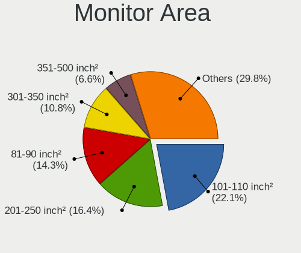

Arch - Tested Hardware & Statistics
-----------------------------------

A project to collect tested hardware configurations for Arch.

Anyone can contribute to this report by the [hw-probe](https://github.com/linuxhw/hw-probe) tool:

    sudo -E hw-probe -all -upload

Please contribute! Especially if your hardware is rare.

This is a report for all computer types. See also reports for [desktops](/Dist/Arch/Desktop/README.md) and [notebooks](/Dist/Arch/Notebook/README.md).

Contents
--------

* [ Test Cases ](#test-cases)

* [ System ](#system)
  - [ OS                       ](#os)
  - [ OS Family                ](#os-family)
  - [ Kernel                   ](#kernel)
  - [ Kernel Family            ](#kernel-family)
  - [ Kernel Major Ver.        ](#kernel-major-ver)
  - [ Arch                     ](#arch)
  - [ DE                       ](#de)
  - [ Display Server           ](#display-server)
  - [ Display Manager          ](#display-manager)
  - [ OS Lang                  ](#os-lang)
  - [ Boot Mode                ](#boot-mode)
  - [ Filesystem               ](#filesystem)
  - [ Part. scheme             ](#part-scheme)
  - [ Dual Boot with Linux/BSD ](#dual-boot-with-linuxbsd)
  - [ Dual Boot (Win)          ](#dual-boot-win)

* [ Board ](#board)
  - [ Vendor                   ](#vendor)
  - [ Model                    ](#model)
  - [ Model Family             ](#model-family)
  - [ MFG Year                 ](#mfg-year)
  - [ Form Factor              ](#form-factor)
  - [ Secure Boot              ](#secure-boot)
  - [ Coreboot                 ](#coreboot)
  - [ RAM Size                 ](#ram-size)
  - [ RAM Used                 ](#ram-used)
  - [ Total Drives             ](#total-drives)
  - [ Has CD-ROM               ](#has-cd-rom)
  - [ Has Ethernet             ](#has-ethernet)
  - [ Has WiFi                 ](#has-wifi)
  - [ Has Bluetooth            ](#has-bluetooth)

* [ Location ](#location)
  - [ Country                  ](#country)
  - [ City                     ](#city)

* [ Drives ](#drives)
  - [ Drive Vendor             ](#drive-vendor)
  - [ Drive Model              ](#drive-model)
  - [ HDD Vendor               ](#hdd-vendor)
  - [ SSD Vendor               ](#ssd-vendor)
  - [ Drive Kind               ](#drive-kind)
  - [ Drive Connector          ](#drive-connector)
  - [ Drive Size               ](#drive-size)
  - [ Space Total              ](#space-total)
  - [ Space Used               ](#space-used)
  - [ Malfunc. Drives          ](#malfunc-drives)
  - [ Malfunc. Drive Vendor    ](#malfunc-drive-vendor)
  - [ Malfunc. HDD Vendor      ](#malfunc-hdd-vendor)
  - [ Malfunc. Drive Kind      ](#malfunc-drive-kind)
  - [ Failed Drives            ](#failed-drives)
  - [ Failed Drive Vendor      ](#failed-drive-vendor)
  - [ Drive Status             ](#drive-status)

* [ Storage controller ](#storage-controller)
  - [ Storage Vendor           ](#storage-vendor)
  - [ Storage Model            ](#storage-model)
  - [ Storage Kind             ](#storage-kind)

* [ Processor ](#processor)
  - [ CPU Vendor               ](#cpu-vendor)
  - [ CPU Model                ](#cpu-model)
  - [ CPU Model Family         ](#cpu-model-family)
  - [ CPU Cores                ](#cpu-cores)
  - [ CPU Sockets              ](#cpu-sockets)
  - [ CPU Threads              ](#cpu-threads)
  - [ CPU Op-Modes             ](#cpu-op-modes)
  - [ CPU Microcode            ](#cpu-microcode)
  - [ CPU Microarch            ](#cpu-microarch)

* [ Graphics ](#graphics)
  - [ GPU Vendor               ](#gpu-vendor)
  - [ GPU Model                ](#gpu-model)
  - [ GPU Combo                ](#gpu-combo)
  - [ GPU Driver               ](#gpu-driver)
  - [ GPU Memory               ](#gpu-memory)

* [ Monitor ](#monitor)
  - [ Monitor Vendor           ](#monitor-vendor)
  - [ Monitor Model            ](#monitor-model)
  - [ Monitor Resolution       ](#monitor-resolution)
  - [ Monitor Diagonal         ](#monitor-diagonal)
  - [ Monitor Width            ](#monitor-width)
  - [ Aspect Ratio             ](#aspect-ratio)
  - [ Monitor Area             ](#monitor-area)
  - [ Pixel Density            ](#pixel-density)
  - [ Multiple Monitors        ](#multiple-monitors)

* [ Network ](#network)
  - [ Net Controller Vendor    ](#net-controller-vendor)
  - [ Net Controller Model     ](#net-controller-model)
  - [ Wireless Vendor          ](#wireless-vendor)
  - [ Wireless Model           ](#wireless-model)
  - [ Ethernet Vendor          ](#ethernet-vendor)
  - [ Ethernet Model           ](#ethernet-model)
  - [ Net Controller Kind      ](#net-controller-kind)
  - [ Used Controller          ](#used-controller)
  - [ NICs                     ](#nics)
  - [ IPv6                     ](#ipv6)

* [ Bluetooth ](#bluetooth)
  - [ Bluetooth Vendor         ](#bluetooth-vendor)
  - [ Bluetooth Model          ](#bluetooth-model)

* [ Sound ](#sound)
  - [ Sound Vendor             ](#sound-vendor)
  - [ Sound Model              ](#sound-model)

* [ Memory ](#memory)
  - [ Memory Vendor            ](#memory-vendor)
  - [ Memory Model             ](#memory-model)
  - [ Memory Kind              ](#memory-kind)
  - [ Memory Form Factor       ](#memory-form-factor)
  - [ Memory Size              ](#memory-size)
  - [ Memory Speed             ](#memory-speed)

* [ Printers & scanners ](#printers--scanners)
  - [ Printer Vendor           ](#printer-vendor)
  - [ Printer Model            ](#printer-model)
  - [ Scanner Vendor           ](#scanner-vendor)
  - [ Scanner Model            ](#scanner-model)

* [ Camera ](#camera)
  - [ Camera Vendor            ](#camera-vendor)
  - [ Camera Model             ](#camera-model)

* [ Security ](#security)
  - [ Fingerprint Vendor       ](#fingerprint-vendor)
  - [ Fingerprint Model        ](#fingerprint-model)
  - [ Chipcard Vendor          ](#chipcard-vendor)
  - [ Chipcard Model           ](#chipcard-model)

* [ Unsupported ](#unsupported)
  - [ Unsupported Devices      ](#unsupported-devices)
  - [ Unsupported Device Types ](#unsupported-device-types)

Test Cases
----------

Total: 7908

| Vendor        | Model                       | Form-Factor | Probe                                                      | Date         |
|---------------|-----------------------------|-------------|------------------------------------------------------------|--------------|
| MSI           | D2415 S26361-D2415-A21      | Desktop     | [3acfaaf14c](https://linux-hardware.org/?probe=3acfaaf14c) | Feb 01, 2023 |
| Lenovo        | IdeaPad S145-15IWL 81S9     | Notebook    | [2be076637c](https://linux-hardware.org/?probe=2be076637c) | Feb 01, 2023 |
| ASUSTek       | Zenbook UX535QE_UM535QE     | Notebook    | [ee219f2f82](https://linux-hardware.org/?probe=ee219f2f82) | Feb 01, 2023 |
| ASUSTek       | Zenbook UX535QE_UM535QE     | Notebook    | [af2f6edc6f](https://linux-hardware.org/?probe=af2f6edc6f) | Feb 01, 2023 |
| MSI           | B250M PRO-VDH               | Desktop     | [1dbacce612](https://linux-hardware.org/?probe=1dbacce612) | Feb 01, 2023 |
| Gigabyte      | B450M H                     | Desktop     | [2d4aa2e1a0](https://linux-hardware.org/?probe=2d4aa2e1a0) | Feb 01, 2023 |
| ASUSTek       | TUF Gaming FX504GE_FX80G... | Notebook    | [3fc59532b8](https://linux-hardware.org/?probe=3fc59532b8) | Feb 01, 2023 |
| Gigabyte      | X570 AORUS ELITE            | Desktop     | [caa1c9e23a](https://linux-hardware.org/?probe=caa1c9e23a) | Jan 31, 2023 |
| HP            | Laptop 15s-eq3xxx           | Notebook    | [e9525c9a86](https://linux-hardware.org/?probe=e9525c9a86) | Jan 31, 2023 |
| HP            | Laptop 15s-eq3xxx           | Notebook    | [e6cb9d8296](https://linux-hardware.org/?probe=e6cb9d8296) | Jan 31, 2023 |
| ASUSTek       | VivoBook_ASUSLaptop X530... | Notebook    | [78bd5ea99c](https://linux-hardware.org/?probe=78bd5ea99c) | Jan 31, 2023 |
| ASUSTek       | TUF Gaming X570-PLUS        | Desktop     | [eb4687961f](https://linux-hardware.org/?probe=eb4687961f) | Jan 31, 2023 |
| MACHINIST     | X99Z V102 IENGINEER         | Desktop     | [d2cfaf56df](https://linux-hardware.org/?probe=d2cfaf56df) | Jan 31, 2023 |
| Lenovo        | Legion R9000P ARH7H 82RG    | Notebook    | [15cda8e776](https://linux-hardware.org/?probe=15cda8e776) | Jan 30, 2023 |
| Lenovo        | IdeaPad 1 14AMN7 82VF       | Notebook    | [0c220851f3](https://linux-hardware.org/?probe=0c220851f3) | Jan 30, 2023 |
| Gigabyte      | X570 I AORUS PRO WIFI       | Desktop     | [7893a67a4b](https://linux-hardware.org/?probe=7893a67a4b) | Jan 30, 2023 |
| HP            | Laptop 15s-eq1xxx           | Notebook    | [9f093d7cff](https://linux-hardware.org/?probe=9f093d7cff) | Jan 30, 2023 |
| Lenovo        | Legion 7 15IMH05 81YT       | Notebook    | [b88f08d400](https://linux-hardware.org/?probe=b88f08d400) | Jan 29, 2023 |
| Dell          | G15 5520                    | Notebook    | [ae4bf1777e](https://linux-hardware.org/?probe=ae4bf1777e) | Jan 29, 2023 |
| Microsoft     | Surface Laptop 4            | Tablet      | [77c9cc065f](https://linux-hardware.org/?probe=77c9cc065f) | Jan 29, 2023 |
| Microsoft     | Surface Laptop 4            | Tablet      | [1ddc17833b](https://linux-hardware.org/?probe=1ddc17833b) | Jan 29, 2023 |
| Lenovo        | IdeaPad 3 15ITL6 82H8       | Notebook    | [8727d22cba](https://linux-hardware.org/?probe=8727d22cba) | Jan 29, 2023 |
| ASUSTek       | TUF Gaming X570-PLUS        | Desktop     | [97aa61aba5](https://linux-hardware.org/?probe=97aa61aba5) | Jan 29, 2023 |
| Apple         | Mac-27ADBB7B4CEE8E61 iMa... | All in one  | [4042b92ee1](https://linux-hardware.org/?probe=4042b92ee1) | Jan 29, 2023 |
| ASUSTek       | ROG Strix G513RM_G513RM     | Notebook    | [4603f92b18](https://linux-hardware.org/?probe=4603f92b18) | Jan 29, 2023 |
| ASUSTek       | Z170M-E D3                  | Desktop     | [2b466d1b19](https://linux-hardware.org/?probe=2b466d1b19) | Jan 29, 2023 |
| Gigabyte      | Z170XP-SLI-CF               | Desktop     | [b9a38b7494](https://linux-hardware.org/?probe=b9a38b7494) | Jan 29, 2023 |
| ASUSTek       | ASUS TUF Gaming F15 FX50... | Notebook    | [608c0b8c88](https://linux-hardware.org/?probe=608c0b8c88) | Jan 29, 2023 |
| Toshiba       | STI 010433                  | Desktop     | [fead488cf1](https://linux-hardware.org/?probe=fead488cf1) | Jan 29, 2023 |
| Dell          | Latitude E6530              | Notebook    | [87bca9f2a4](https://linux-hardware.org/?probe=87bca9f2a4) | Jan 29, 2023 |
| Dell          | G15 5520                    | Notebook    | [a0c269c5b1](https://linux-hardware.org/?probe=a0c269c5b1) | Jan 28, 2023 |
| Gigabyte      | Z390 AORUS ULTRA-CF         | Desktop     | [cba2528a29](https://linux-hardware.org/?probe=cba2528a29) | Jan 28, 2023 |
| ASRock        | X570 Pro4                   | Desktop     | [bf09bd7413](https://linux-hardware.org/?probe=bf09bd7413) | Jan 28, 2023 |
| ASUSTek       | PRIME B660M-A D4            | Desktop     | [41ff395299](https://linux-hardware.org/?probe=41ff395299) | Jan 28, 2023 |
| Lenovo        | ThinkPad T14 Gen 2a 20XK... | Notebook    | [85e23fef85](https://linux-hardware.org/?probe=85e23fef85) | Jan 28, 2023 |
| HP            | Pavilion x360 Convertibl... | Convertible | [7961073f5f](https://linux-hardware.org/?probe=7961073f5f) | Jan 28, 2023 |
| MSI           | 970A-G46                    | Desktop     | [ece518ec34](https://linux-hardware.org/?probe=ece518ec34) | Jan 28, 2023 |
| HP            | ENVY x360 2-in-1 Laptop ... | Convertible | [40672aba71](https://linux-hardware.org/?probe=40672aba71) | Jan 28, 2023 |
| ASUSTek       | X555LAB                     | Notebook    | [343025f50f](https://linux-hardware.org/?probe=343025f50f) | Jan 28, 2023 |
| Apple         | Mac-27ADBB7B4CEE8E61 iMa... | All in one  | [f1f0543123](https://linux-hardware.org/?probe=f1f0543123) | Jan 28, 2023 |
| TUXEDO        | InfinityBook S 15 Gen6      | Notebook    | [f5ebfcecc5](https://linux-hardware.org/?probe=f5ebfcecc5) | Jan 27, 2023 |
| Lenovo        | IdeaPad Gaming 3 15ACH6 ... | Notebook    | [56cb1ce2a6](https://linux-hardware.org/?probe=56cb1ce2a6) | Jan 27, 2023 |
| Acer          | Aspire ES1-572              | Notebook    | [9f745ecc18](https://linux-hardware.org/?probe=9f745ecc18) | Jan 27, 2023 |
| Acer          | Aspire E5-553G              | Notebook    | [e851efaf39](https://linux-hardware.org/?probe=e851efaf39) | Jan 27, 2023 |
| Lenovo        | IdeaPad 3 14ITL05 81X7      | Notebook    | [ff67a5eb33](https://linux-hardware.org/?probe=ff67a5eb33) | Jan 27, 2023 |
| HUAWEI        | BOHK-WAX9X                  | Notebook    | [bd0b1f7e94](https://linux-hardware.org/?probe=bd0b1f7e94) | Jan 27, 2023 |
| ASUSTek       | VivoBook_ASUSLaptop TP42... | Convertible | [9912417dc3](https://linux-hardware.org/?probe=9912417dc3) | Jan 27, 2023 |
| Gigabyte      | J3455N-D3H                  | Desktop     | [3eb9131ab1](https://linux-hardware.org/?probe=3eb9131ab1) | Jan 27, 2023 |
| HP            | 8054                        | Desktop     | [864f5f225e](https://linux-hardware.org/?probe=864f5f225e) | Jan 26, 2023 |
| Acer          | Aspire ES1-411              | Notebook    | [110767fd86](https://linux-hardware.org/?probe=110767fd86) | Jan 26, 2023 |
| Dell          | XPS 15 9500                 | Notebook    | [4109360c56](https://linux-hardware.org/?probe=4109360c56) | Jan 26, 2023 |
| HUAWEI        | BOHK-WAX9X                  | Notebook    | [a22071f9ec](https://linux-hardware.org/?probe=a22071f9ec) | Jan 26, 2023 |
| Dell          | G3 3500                     | Notebook    | [ea11767144](https://linux-hardware.org/?probe=ea11767144) | Jan 26, 2023 |
| ASUSTek       | ROG STRIX B650E-E GAMING... | Desktop     | [4ad0b3594f](https://linux-hardware.org/?probe=4ad0b3594f) | Jan 26, 2023 |
| ASUSTek       | Zenbook UX535QE_UM535QE     | Notebook    | [4a3c63f3f0](https://linux-hardware.org/?probe=4a3c63f3f0) | Jan 26, 2023 |
| Lenovo        | ThinkPad X1 Carbon 6th 2... | Notebook    | [2026175299](https://linux-hardware.org/?probe=2026175299) | Jan 26, 2023 |
| Intel         | NUC7JYB J67967-404          | Mini pc     | [3fbe56012b](https://linux-hardware.org/?probe=3fbe56012b) | Jan 25, 2023 |
| ASUSTek       | Zenbook UX535QE_UM535QE     | Notebook    | [702b3c77fc](https://linux-hardware.org/?probe=702b3c77fc) | Jan 25, 2023 |
| HUAWEI        | KLVL-WXX9                   | Notebook    | [f04915614f](https://linux-hardware.org/?probe=f04915614f) | Jan 25, 2023 |
| Lenovo        | IdeaPad 3 15ALC6 82MF       | Notebook    | [0ef51b9eda](https://linux-hardware.org/?probe=0ef51b9eda) | Jan 25, 2023 |
| ASUSTek       | PRIME H310M-K               | Desktop     | [ec43ef5c17](https://linux-hardware.org/?probe=ec43ef5c17) | Jan 25, 2023 |
| ASUSTek       | TUF Gaming FX505DY_TUF50... | Notebook    | [92a3e34781](https://linux-hardware.org/?probe=92a3e34781) | Jan 24, 2023 |
| MSI           | Alpha 15 B5EEK              | Notebook    | [d815a80782](https://linux-hardware.org/?probe=d815a80782) | Jan 24, 2023 |
| Dell          | Latitude E7470              | Notebook    | [5258f49771](https://linux-hardware.org/?probe=5258f49771) | Jan 24, 2023 |
| Dell          | XPS 15 9570                 | Notebook    | [270a9bf553](https://linux-hardware.org/?probe=270a9bf553) | Jan 24, 2023 |
| TUXEDO        | Unknown                     | Notebook    | [5973888b27](https://linux-hardware.org/?probe=5973888b27) | Jan 24, 2023 |
| MSI           | Alpha 15 B5EEK              | Notebook    | [d2c9a02f60](https://linux-hardware.org/?probe=d2c9a02f60) | Jan 24, 2023 |
| ASUSTek       | ROG STRIX X670E-E GAMING... | Desktop     | [78b817b650](https://linux-hardware.org/?probe=78b817b650) | Jan 24, 2023 |
| MSI           | MPG X570 GAMING PRO CARB... | Desktop     | [81c1e35182](https://linux-hardware.org/?probe=81c1e35182) | Jan 24, 2023 |
| Dell          | Latitude E7470              | Notebook    | [647c279ad4](https://linux-hardware.org/?probe=647c279ad4) | Jan 24, 2023 |
| Dell          | XPS 13 9365                 | Convertible | [f3fb4632c2](https://linux-hardware.org/?probe=f3fb4632c2) | Jan 24, 2023 |
| Dell          | XPS 13 9360                 | Notebook    | [fabda16ea6](https://linux-hardware.org/?probe=fabda16ea6) | Jan 23, 2023 |
| Lenovo        | IdeaPad 3 15ALC6 82KU       | Notebook    | [4c6da4840e](https://linux-hardware.org/?probe=4c6da4840e) | Jan 23, 2023 |
| Dell          | XPS 13 9360                 | Notebook    | [45f94cdedc](https://linux-hardware.org/?probe=45f94cdedc) | Jan 23, 2023 |
| HP            | Laptop 15s-eq3xxx           | Notebook    | [b00e46e17f](https://linux-hardware.org/?probe=b00e46e17f) | Jan 23, 2023 |
| Lenovo        | Legion 5 Pro 16IAH7H 82R... | Notebook    | [85bfcb35ff](https://linux-hardware.org/?probe=85bfcb35ff) | Jan 23, 2023 |
| HP            | ZBook x2 G4                 | Tablet      | [f2799f616c](https://linux-hardware.org/?probe=f2799f616c) | Jan 23, 2023 |
| Fujitsu       | LIFEBOOK U9311A             | Notebook    | [6bdcfeae43](https://linux-hardware.org/?probe=6bdcfeae43) | Jan 23, 2023 |
| HP            | 2B2C                        | Desktop     | [01cb4bc77f](https://linux-hardware.org/?probe=01cb4bc77f) | Jan 23, 2023 |
| T-bao         | MINI PC V1.0                | Desktop     | [6d1c897198](https://linux-hardware.org/?probe=6d1c897198) | Jan 23, 2023 |
| MSI           | B150 PC MATE                | Desktop     | [741901eb8f](https://linux-hardware.org/?probe=741901eb8f) | Jan 23, 2023 |
| HP            | OMEN by Laptop 15-dc0xxx    | Notebook    | [023f1e3cdc](https://linux-hardware.org/?probe=023f1e3cdc) | Jan 23, 2023 |
| HP            | Laptop 15s-eq3xxx           | Notebook    | [1a9aaa1cb2](https://linux-hardware.org/?probe=1a9aaa1cb2) | Jan 22, 2023 |
| HP            | Laptop 15s-eq3xxx           | Notebook    | [4ed27b0b56](https://linux-hardware.org/?probe=4ed27b0b56) | Jan 22, 2023 |
| ASRock        | B450 Pro4                   | Desktop     | [9beaa4240c](https://linux-hardware.org/?probe=9beaa4240c) | Jan 22, 2023 |
| Lenovo        | ThinkPad P51 20HJS16Q0K     | Notebook    | [00e6c3575f](https://linux-hardware.org/?probe=00e6c3575f) | Jan 22, 2023 |
| Lenovo        | IdeaPad 300-15ISK 80Q7      | Notebook    | [ae3846db38](https://linux-hardware.org/?probe=ae3846db38) | Jan 22, 2023 |
| Lenovo        | ThinkPad L430 2466DS2       | Notebook    | [8be9a889b7](https://linux-hardware.org/?probe=8be9a889b7) | Jan 22, 2023 |
| Gigabyte      | A320M-H-CF                  | Desktop     | [14a5fa99db](https://linux-hardware.org/?probe=14a5fa99db) | Jan 22, 2023 |
| Dell          | G3 3500                     | Notebook    | [b3a545ee30](https://linux-hardware.org/?probe=b3a545ee30) | Jan 22, 2023 |
| HP            | Laptop 15s-eq3xxx           | Notebook    | [0ba680dd8f](https://linux-hardware.org/?probe=0ba680dd8f) | Jan 22, 2023 |
| HP            | Pavilion Gaming Laptop 1... | Notebook    | [15b2f3fc5e](https://linux-hardware.org/?probe=15b2f3fc5e) | Jan 22, 2023 |
| ASUSTek       | TUF X470-PLUS GAMING        | Desktop     | [77a744c052](https://linux-hardware.org/?probe=77a744c052) | Jan 22, 2023 |
| Lenovo        | Legion 5 15ACH6H 82JU       | Notebook    | [082d1b40bc](https://linux-hardware.org/?probe=082d1b40bc) | Jan 21, 2023 |
| HP            | Pavilion Gaming Laptop 1... | Notebook    | [cd1f6d8306](https://linux-hardware.org/?probe=cd1f6d8306) | Jan 21, 2023 |
| Dell          | Vostro 15 3515              | Notebook    | [51234f64dd](https://linux-hardware.org/?probe=51234f64dd) | Jan 21, 2023 |
| Lenovo        | IdeaPad Slim 7 14ITL05 8... | Notebook    | [45bc9c5f3f](https://linux-hardware.org/?probe=45bc9c5f3f) | Jan 21, 2023 |
| Lenovo        | MAHOBAY Win8 Pro DPK TPG    | Desktop     | [0d70d03543](https://linux-hardware.org/?probe=0d70d03543) | Jan 21, 2023 |
| ASUSTek       | ROG STRIX B550-F GAMING     | Desktop     | [b4591be73d](https://linux-hardware.org/?probe=b4591be73d) | Jan 21, 2023 |
| HP            | Pavilion Gaming Laptop 1... | Notebook    | [f33b08f626](https://linux-hardware.org/?probe=f33b08f626) | Jan 21, 2023 |
| Sony          | VPCF13Z1E                   | Notebook    | [3eaeffde09](https://linux-hardware.org/?probe=3eaeffde09) | Jan 21, 2023 |
| Gigabyte      | GB-BRR7H-4800               | Desktop     | [0f0f1ed390](https://linux-hardware.org/?probe=0f0f1ed390) | Jan 20, 2023 |
| ASUSTek       | PRIME A320M-K               | Desktop     | [b6b4b01344](https://linux-hardware.org/?probe=b6b4b01344) | Jan 20, 2023 |
| MSI           | GP66 Leopard 11UH           | Notebook    | [cf6837bb85](https://linux-hardware.org/?probe=cf6837bb85) | Jan 20, 2023 |
| Dell          | Vostro 5620                 | Notebook    | [e70af512c8](https://linux-hardware.org/?probe=e70af512c8) | Jan 20, 2023 |
| ASUSTek       | PRIME B360-PLUS             | Desktop     | [9b4b20b28d](https://linux-hardware.org/?probe=9b4b20b28d) | Jan 20, 2023 |
| Lenovo        | IdeaPad S145-15IWL 81S9     | Notebook    | [169ba5d31f](https://linux-hardware.org/?probe=169ba5d31f) | Jan 20, 2023 |
| Unknown       | Unknown                     | Notebook    | [1de254a697](https://linux-hardware.org/?probe=1de254a697) | Jan 20, 2023 |
| Dell          | G3 3579                     | Notebook    | [d418b797c8](https://linux-hardware.org/?probe=d418b797c8) | Jan 20, 2023 |
| ASUSTek       | H110M-R                     | Desktop     | [f872a64ba1](https://linux-hardware.org/?probe=f872a64ba1) | Jan 20, 2023 |
| HP            | 1000                        | Notebook    | [62ee01ee38](https://linux-hardware.org/?probe=62ee01ee38) | Jan 20, 2023 |
| ASUSTek       | TUF Gaming X570-PLUS        | Desktop     | [02089f3393](https://linux-hardware.org/?probe=02089f3393) | Jan 20, 2023 |
| Lenovo        | IdeaPad Duet 5 12IAU7 82... | Tablet      | [065167a01c](https://linux-hardware.org/?probe=065167a01c) | Jan 19, 2023 |
| Dell          | XPS 13 7390                 | Notebook    | [01f3a78934](https://linux-hardware.org/?probe=01f3a78934) | Jan 19, 2023 |
| Dell          | XPS 15 9570                 | Notebook    | [ebd319efff](https://linux-hardware.org/?probe=ebd319efff) | Jan 19, 2023 |
| MSI           | PRO B650M-A WIFI            | Desktop     | [3eb4809e32](https://linux-hardware.org/?probe=3eb4809e32) | Jan 19, 2023 |
| ASUSTek       | H110M-C/BR                  | Desktop     | [58bed7db63](https://linux-hardware.org/?probe=58bed7db63) | Jan 19, 2023 |
| MSI           | MAG B550 TOMAHAWK           | Desktop     | [0c77a64f45](https://linux-hardware.org/?probe=0c77a64f45) | Jan 18, 2023 |
| MSI           | MPG Z490 GAMING PLUS        | Desktop     | [457c3d4d50](https://linux-hardware.org/?probe=457c3d4d50) | Jan 18, 2023 |
| Lenovo        | ThinkPad X1 Titanium Gen... | Convertible | [cda19bda99](https://linux-hardware.org/?probe=cda19bda99) | Jan 18, 2023 |
| HP            | EliteBook 840 G5            | Notebook    | [c0667c5ea5](https://linux-hardware.org/?probe=c0667c5ea5) | Jan 18, 2023 |
| HP            | ProBook 640 G5              | Notebook    | [095355c9fc](https://linux-hardware.org/?probe=095355c9fc) | Jan 18, 2023 |
| MSI           | MAG B550M MORTAR            | Desktop     | [bcae5d5664](https://linux-hardware.org/?probe=bcae5d5664) | Jan 18, 2023 |
| Acer          | Aspire A515-51              | Notebook    | [1aac8c57f8](https://linux-hardware.org/?probe=1aac8c57f8) | Jan 18, 2023 |
| Gigabyte      | Z370 HD3-CF                 | Desktop     | [273e93cce5](https://linux-hardware.org/?probe=273e93cce5) | Jan 18, 2023 |
| ASUSTek       | ASUS TUF Gaming F15 FX50... | Notebook    | [987dcf118c](https://linux-hardware.org/?probe=987dcf118c) | Jan 17, 2023 |
| Sony          | VPCF13Z1E                   | Notebook    | [aa93abde02](https://linux-hardware.org/?probe=aa93abde02) | Jan 17, 2023 |
| HP            | Laptop 15s-fq2xxx           | Notebook    | [133972f199](https://linux-hardware.org/?probe=133972f199) | Jan 17, 2023 |
| MSI           | GP66 Leopard 11UH           | Notebook    | [269015d6a4](https://linux-hardware.org/?probe=269015d6a4) | Jan 17, 2023 |
| HP            | OMEN by Laptop 16-c0xxx     | Notebook    | [8474e8ce69](https://linux-hardware.org/?probe=8474e8ce69) | Jan 17, 2023 |
| ASUSTek       | Zenbook UX535QE_UM535QE     | Notebook    | [a5ddfa16b9](https://linux-hardware.org/?probe=a5ddfa16b9) | Jan 17, 2023 |
| ASUSTek       | Z97M-PLUS                   | Desktop     | [ea58101334](https://linux-hardware.org/?probe=ea58101334) | Jan 17, 2023 |
| Lenovo        | ThinkPad X230 2325CW1       | Notebook    | [44a8ae0b56](https://linux-hardware.org/?probe=44a8ae0b56) | Jan 17, 2023 |
| BANGHO        | MOV                         | Notebook    | [bc4f98d4ff](https://linux-hardware.org/?probe=bc4f98d4ff) | Jan 17, 2023 |
| HP            | OMEN by Laptop 16-c0xxx     | Notebook    | [11ca9b863c](https://linux-hardware.org/?probe=11ca9b863c) | Jan 16, 2023 |
| Lenovo        | IdeaPad 3 15ADA6 82KR       | Notebook    | [5b56cf615b](https://linux-hardware.org/?probe=5b56cf615b) | Jan 16, 2023 |
| MSI           | GE66 Raider 10SF            | Notebook    | [55f5300c59](https://linux-hardware.org/?probe=55f5300c59) | Jan 16, 2023 |
| Lenovo        | Legion R70002021 82JW       | Notebook    | [5e5628739f](https://linux-hardware.org/?probe=5e5628739f) | Jan 16, 2023 |
| Lenovo        | IdeaPad 5-15ARE05 81YQ      | Notebook    | [4c9bb70ea2](https://linux-hardware.org/?probe=4c9bb70ea2) | Jan 16, 2023 |
| Lenovo        | IdeaPad Slim 7 Carbon 14... | Notebook    | [620185bf98](https://linux-hardware.org/?probe=620185bf98) | Jan 15, 2023 |
| ASUSTek       | ROG STRIX X570-F GAMING     | Desktop     | [0e57f4ecbe](https://linux-hardware.org/?probe=0e57f4ecbe) | Jan 15, 2023 |
| Foxconn       | nT-i2000 Series PCB         | Desktop     | [a879fdd461](https://linux-hardware.org/?probe=a879fdd461) | Jan 15, 2023 |
| Supermicro    | X9DRi-LN4+/X9DR3-LN4+       | Server      | [bd3c9aa4fd](https://linux-hardware.org/?probe=bd3c9aa4fd) | Jan 15, 2023 |
| Lenovo        | ThinkPad E590 20NCS00800    | Notebook    | [8751d5b445](https://linux-hardware.org/?probe=8751d5b445) | Jan 15, 2023 |
| Apple         | Mac-BE088AF8C5EB4FA2 iMa... | All in one  | [f5246578fe](https://linux-hardware.org/?probe=f5246578fe) | Jan 15, 2023 |
| Dell          | Vostro 15 3515              | Notebook    | [fdf3113afb](https://linux-hardware.org/?probe=fdf3113afb) | Jan 15, 2023 |
| HP            | Pavilion Laptop 14-ce0xx... | Notebook    | [dd0a234ebb](https://linux-hardware.org/?probe=dd0a234ebb) | Jan 14, 2023 |
| ASRock        | X570 Phantom Gaming 4       | Desktop     | [482cc76bce](https://linux-hardware.org/?probe=482cc76bce) | Jan 14, 2023 |
| ASRock        | X570 Phantom Gaming 4       | Desktop     | [662223c5f6](https://linux-hardware.org/?probe=662223c5f6) | Jan 14, 2023 |
| ASRock        | AB350 Pro4                  | Desktop     | [77adbc7487](https://linux-hardware.org/?probe=77adbc7487) | Jan 14, 2023 |
| ASRock        | AB350 Pro4                  | Desktop     | [e430030b47](https://linux-hardware.org/?probe=e430030b47) | Jan 14, 2023 |
| Dell          | XPS 15 9570                 | Notebook    | [bff6278ed8](https://linux-hardware.org/?probe=bff6278ed8) | Jan 14, 2023 |
| MSI           | B450 TOMAHAWK MAX           | Desktop     | [8fbf586d24](https://linux-hardware.org/?probe=8fbf586d24) | Jan 14, 2023 |
| ASUSTek       | PRIME B550M-A               | Desktop     | [3365f7d56f](https://linux-hardware.org/?probe=3365f7d56f) | Jan 14, 2023 |
| Gigabyte      | B550M DS3H                  | Desktop     | [5de8333ea3](https://linux-hardware.org/?probe=5de8333ea3) | Jan 14, 2023 |
| Microsoft     | Surface Laptop Go           | Tablet      | [d5fb8523c7](https://linux-hardware.org/?probe=d5fb8523c7) | Jan 14, 2023 |
| ASUSTek       | ROG STRIX X370-F GAMING     | Desktop     | [fcda893618](https://linux-hardware.org/?probe=fcda893618) | Jan 13, 2023 |
| HP            | Pavilion Laptop 15-cs2xx... | Notebook    | [e7bab74a13](https://linux-hardware.org/?probe=e7bab74a13) | Jan 13, 2023 |
| Dell          | Latitude E6430              | Notebook    | [5951bc10ca](https://linux-hardware.org/?probe=5951bc10ca) | Jan 13, 2023 |
| MSI           | 970A-G46                    | Desktop     | [32479ec724](https://linux-hardware.org/?probe=32479ec724) | Jan 13, 2023 |
| TUXEDO        | Unknown                     | Notebook    | [5721ffbc43](https://linux-hardware.org/?probe=5721ffbc43) | Jan 13, 2023 |
| ASUSTek       | N53SM                       | Notebook    | [fdf56c0639](https://linux-hardware.org/?probe=fdf56c0639) | Jan 13, 2023 |
| ASUSTek       | PRIME B550M-A               | Desktop     | [25a1763f73](https://linux-hardware.org/?probe=25a1763f73) | Jan 13, 2023 |
| Lenovo        | IdeaPad 3 15ALC6 82MF       | Notebook    | [e4912e6bfc](https://linux-hardware.org/?probe=e4912e6bfc) | Jan 12, 2023 |
| HP            | ENVY x360 Convertible 13... | Convertible | [8322c3202b](https://linux-hardware.org/?probe=8322c3202b) | Jan 12, 2023 |
| Acer          | Aspire A315-58              | Notebook    | [855dfb5e62](https://linux-hardware.org/?probe=855dfb5e62) | Jan 12, 2023 |
| Lenovo        | ThinkPad T14s Gen 2a 20X... | Notebook    | [998a408a04](https://linux-hardware.org/?probe=998a408a04) | Jan 12, 2023 |
| ASUSTek       | B85M-E                      | Desktop     | [5ee23ee475](https://linux-hardware.org/?probe=5ee23ee475) | Jan 12, 2023 |
| Notebook      | NS50MU                      | Notebook    | [7d94a36b67](https://linux-hardware.org/?probe=7d94a36b67) | Jan 12, 2023 |
| Nvidia        | AN-M2                       | Desktop     | [8a7aad3266](https://linux-hardware.org/?probe=8a7aad3266) | Jan 12, 2023 |
| Dell          | 0DXJD9 A01                  | Desktop     | [78549912fa](https://linux-hardware.org/?probe=78549912fa) | Jan 12, 2023 |
| Acidanther... | Mac-CFF7D910A743CAAF iMa... | All in one  | [bbcffca1e1](https://linux-hardware.org/?probe=bbcffca1e1) | Jan 11, 2023 |
| ASUSTek       | PRIME A320M-K               | Desktop     | [54711252e5](https://linux-hardware.org/?probe=54711252e5) | Jan 11, 2023 |
| Dell          | 0K3CM7 A00                  | Desktop     | [2c317eaef8](https://linux-hardware.org/?probe=2c317eaef8) | Jan 11, 2023 |
| ASUSTek       | ROG STRIX B650E-E GAMING... | Desktop     | [a1e541c1b3](https://linux-hardware.org/?probe=a1e541c1b3) | Jan 11, 2023 |
| ASUSTek       | ROG Strix G513RM_G513RM     | Notebook    | [5076e36526](https://linux-hardware.org/?probe=5076e36526) | Jan 11, 2023 |
| HP            | Pavilion Gaming Laptop 1... | Notebook    | [2455d11a72](https://linux-hardware.org/?probe=2455d11a72) | Jan 11, 2023 |
| Lenovo        | IdeaPad 5-15ARE05 81YQ      | Notebook    | [b5d071346b](https://linux-hardware.org/?probe=b5d071346b) | Jan 11, 2023 |
| HP            | 8767 A                      | Desktop     | [7b2c61c215](https://linux-hardware.org/?probe=7b2c61c215) | Jan 11, 2023 |
| ASUSTek       | ROG STRIX B650E-E GAMING... | Desktop     | [a57b3e3df6](https://linux-hardware.org/?probe=a57b3e3df6) | Jan 11, 2023 |
| ASUSTek       | ROG STRIX B650E-E GAMING... | Desktop     | [694c5c31f9](https://linux-hardware.org/?probe=694c5c31f9) | Jan 10, 2023 |
| ASUSTek       | VivoBook_ASUSLaptop X415... | Notebook    | [3b767cfcef](https://linux-hardware.org/?probe=3b767cfcef) | Jan 10, 2023 |
| ASUSTek       | VivoBook_ASUSLaptop X415... | Notebook    | [ac7ae437c8](https://linux-hardware.org/?probe=ac7ae437c8) | Jan 10, 2023 |
| ASUSTek       | TUF Gaming X670E-PLUS WI... | Desktop     | [47ac5c5ee1](https://linux-hardware.org/?probe=47ac5c5ee1) | Jan 10, 2023 |
| ASUSTek       | ROG STRIX B550-I GAMING     | Desktop     | [8e857e93de](https://linux-hardware.org/?probe=8e857e93de) | Jan 10, 2023 |
| Dell          | Latitude 3570               | Notebook    | [2748121a05](https://linux-hardware.org/?probe=2748121a05) | Jan 10, 2023 |
| Gigabyte      | H410M S2H V3                | Desktop     | [1ec26d7d15](https://linux-hardware.org/?probe=1ec26d7d15) | Jan 10, 2023 |
| Dell          | Inspiron 5502               | Notebook    | [b09655552e](https://linux-hardware.org/?probe=b09655552e) | Jan 09, 2023 |
| ASRock        | B450 Gaming-ITX/ac          | Desktop     | [7193f85a8c](https://linux-hardware.org/?probe=7193f85a8c) | Jan 09, 2023 |
| Gigabyte      | B550M DS3H                  | Desktop     | [3e39bca3ed](https://linux-hardware.org/?probe=3e39bca3ed) | Jan 09, 2023 |
| Lenovo        | MIIX 310-10ICR 80SG         | Tablet      | [8f9cd3c097](https://linux-hardware.org/?probe=8f9cd3c097) | Jan 09, 2023 |
| MSI           | Modern 14 B11MOU            | Notebook    | [0db2c1a27c](https://linux-hardware.org/?probe=0db2c1a27c) | Jan 09, 2023 |
| MSI           | B450 TOMAHAWK MAX           | Desktop     | [9bf425bc2d](https://linux-hardware.org/?probe=9bf425bc2d) | Jan 09, 2023 |
| ASUSTek       | PRIME B550M-A               | Desktop     | [153884836e](https://linux-hardware.org/?probe=153884836e) | Jan 09, 2023 |
| MSI           | MPG B550 GAMING PLUS        | Desktop     | [06f9209282](https://linux-hardware.org/?probe=06f9209282) | Jan 08, 2023 |
| Lenovo        | ThinkBook 15 G2 ITL 20VE    | Notebook    | [b6e56e8d87](https://linux-hardware.org/?probe=b6e56e8d87) | Jan 08, 2023 |
| HP            | ZHAN 66 Pro G1              | Notebook    | [76e588ab0a](https://linux-hardware.org/?probe=76e588ab0a) | Jan 08, 2023 |
| ASUSTek       | Zenbook UX535QE_UM535QE     | Notebook    | [66ba6bf6d3](https://linux-hardware.org/?probe=66ba6bf6d3) | Jan 08, 2023 |
| ASUSTek       | Zenbook UX535QE_UM535QE     | Notebook    | [7a02a3b48b](https://linux-hardware.org/?probe=7a02a3b48b) | Jan 08, 2023 |
| Gigabyte      | B550M DS3H                  | Desktop     | [faf4eff378](https://linux-hardware.org/?probe=faf4eff378) | Jan 08, 2023 |
| Toshiba       | Satellite C55Dt-A           | Notebook    | [e7b268e7e5](https://linux-hardware.org/?probe=e7b268e7e5) | Jan 08, 2023 |
| ASUSTek       | PRIME B550M-A               | Desktop     | [a885b118ab](https://linux-hardware.org/?probe=a885b118ab) | Jan 08, 2023 |
| Lenovo        | ThinkPad T14 Gen 3 21CF0... | Notebook    | [14273d90fd](https://linux-hardware.org/?probe=14273d90fd) | Jan 08, 2023 |
| MSI           | B450 TOMAHAWK MAX           | Desktop     | [27c42e99db](https://linux-hardware.org/?probe=27c42e99db) | Jan 08, 2023 |
| MSI           | Z270 PC MATE                | Desktop     | [4d780d6bf9](https://linux-hardware.org/?probe=4d780d6bf9) | Jan 08, 2023 |
| Lenovo        | ThinkPad E15 Gen 2 20T9S... | Notebook    | [7ce97bb3ec](https://linux-hardware.org/?probe=7ce97bb3ec) | Jan 08, 2023 |
| Acer          | Nitro AN515-54              | Notebook    | [cfabe67812](https://linux-hardware.org/?probe=cfabe67812) | Jan 07, 2023 |
| ASUSTek       | PRIME B550M-A               | Desktop     | [ddae48cdbb](https://linux-hardware.org/?probe=ddae48cdbb) | Jan 07, 2023 |
| HP            | Pavilion dv6                | Notebook    | [7e1ac76fc9](https://linux-hardware.org/?probe=7e1ac76fc9) | Jan 07, 2023 |
| ASUSTek       | PRIME B550M-A               | Desktop     | [8b38f9336f](https://linux-hardware.org/?probe=8b38f9336f) | Jan 07, 2023 |
| HP            | ZBook 15                    | Notebook    | [3e2f33f6c1](https://linux-hardware.org/?probe=3e2f33f6c1) | Jan 07, 2023 |
| Dell          | Inspiron 5515               | Notebook    | [3b8a41b7af](https://linux-hardware.org/?probe=3b8a41b7af) | Jan 07, 2023 |
| ASUSTek       | PRIME B550M-A               | Desktop     | [7a2744ca03](https://linux-hardware.org/?probe=7a2744ca03) | Jan 06, 2023 |
| ASUSTek       | PRIME B360M-C               | Desktop     | [aa21c2b75f](https://linux-hardware.org/?probe=aa21c2b75f) | Jan 06, 2023 |
| ASUSTek       | M5A97 R2.0                  | Desktop     | [6cd2288696](https://linux-hardware.org/?probe=6cd2288696) | Jan 06, 2023 |
| ASUSTek       | PRIME B550M-A               | Desktop     | [ed168f4e29](https://linux-hardware.org/?probe=ed168f4e29) | Jan 05, 2023 |
| Lenovo        | ThinkPad P14s Gen 1 20S4... | Notebook    | [2227400f4c](https://linux-hardware.org/?probe=2227400f4c) | Jan 05, 2023 |
| Lenovo        | ThinkPad Yoga 370 20JJS0... | Convertible | [a2a0663674](https://linux-hardware.org/?probe=a2a0663674) | Jan 05, 2023 |
| Dell          | 0HY9JP A01                  | Desktop     | [0532ee0c1e](https://linux-hardware.org/?probe=0532ee0c1e) | Jan 05, 2023 |
| Acer          | IPMBW-BR                    | All in one  | [1485ad36a9](https://linux-hardware.org/?probe=1485ad36a9) | Jan 05, 2023 |
| ASRock        | H310M-HDV/M.2               | Desktop     | [cf98b88234](https://linux-hardware.org/?probe=cf98b88234) | Jan 05, 2023 |
| Gigabyte      | AERO 16 XE4                 | Notebook    | [e05dd3f797](https://linux-hardware.org/?probe=e05dd3f797) | Jan 05, 2023 |
| ASRock        | X570 Steel Legend           | Desktop     | [584234b202](https://linux-hardware.org/?probe=584234b202) | Jan 05, 2023 |
| Lenovo        | ThinkPad T14 Gen 2i 20W0... | Notebook    | [e4a7ff414a](https://linux-hardware.org/?probe=e4a7ff414a) | Jan 05, 2023 |
| Lenovo        | B40-70 20392                | Notebook    | [71c1ae09af](https://linux-hardware.org/?probe=71c1ae09af) | Jan 05, 2023 |
| MSI           | GP66 Leopard 11UH           | Notebook    | [63f0536a21](https://linux-hardware.org/?probe=63f0536a21) | Jan 04, 2023 |
| Valve         | Jupiter                     | Notebook    | [e7e5475978](https://linux-hardware.org/?probe=e7e5475978) | Jan 04, 2023 |
| MSI           | Prestige 15 A11SCX          | Notebook    | [86850a5925](https://linux-hardware.org/?probe=86850a5925) | Jan 04, 2023 |
| Lenovo        | ThinkPad X230 2320LFG       | Notebook    | [e8e510f4e6](https://linux-hardware.org/?probe=e8e510f4e6) | Jan 04, 2023 |
| Gigabyte      | H87-D3H-CF                  | Desktop     | [5b13eb0dad](https://linux-hardware.org/?probe=5b13eb0dad) | Jan 04, 2023 |
| MSI           | H110M PRO-VD                | Desktop     | [5b2857e18b](https://linux-hardware.org/?probe=5b2857e18b) | Jan 04, 2023 |
| Intel         | NUC13SBBi9 M58736-302       | Mini pc     | [f30031a156](https://linux-hardware.org/?probe=f30031a156) | Jan 04, 2023 |
| Lenovo        | ThinkPad W541 20EFCTO1WW    | Notebook    | [a10abfb25a](https://linux-hardware.org/?probe=a10abfb25a) | Jan 03, 2023 |
| Gigabyte      | Z490M GAMING X              | Desktop     | [9012a42d6e](https://linux-hardware.org/?probe=9012a42d6e) | Jan 03, 2023 |
| Acer          | Aspire R7-572G              | Notebook    | [56e5de8317](https://linux-hardware.org/?probe=56e5de8317) | Jan 03, 2023 |
| ASUSTek       | Maximus IX CODE             | Desktop     | [25d993017e](https://linux-hardware.org/?probe=25d993017e) | Jan 02, 2023 |
| Acer          | Aspire A515-57G             | Notebook    | [854bee8efb](https://linux-hardware.org/?probe=854bee8efb) | Jan 02, 2023 |
| HUAWEI        | MACH-WX9                    | Notebook    | [525ea65bc1](https://linux-hardware.org/?probe=525ea65bc1) | Jan 02, 2023 |
| HP            | ProBook 635 Aero G8         | Notebook    | [f710248f3c](https://linux-hardware.org/?probe=f710248f3c) | Jan 02, 2023 |
| Gigabyte      | B550M AORUS PRO             | Desktop     | [bc36d65732](https://linux-hardware.org/?probe=bc36d65732) | Jan 02, 2023 |
| PCWare        | IPMH110G                    | Desktop     | [a795f33f7a](https://linux-hardware.org/?probe=a795f33f7a) | Jan 02, 2023 |
| Toshiba       | Satellite P755              | Notebook    | [1296e73b50](https://linux-hardware.org/?probe=1296e73b50) | Jan 02, 2023 |
| Lenovo        | ThinkPad T480 20L5000BGE    | Notebook    | [acdb8c643e](https://linux-hardware.org/?probe=acdb8c643e) | Jan 02, 2023 |
| Lenovo        | ThinkPad L13 Yoga Gen 3 ... | Convertible | [18d10ee7ac](https://linux-hardware.org/?probe=18d10ee7ac) | Jan 01, 2023 |
| Gigabyte      | B560M AORUS PRO AX          | Desktop     | [30abdaa93b](https://linux-hardware.org/?probe=30abdaa93b) | Jan 01, 2023 |
| Lenovo        | IdeaPad 100S-11IBY 80R2     | Notebook    | [0179007813](https://linux-hardware.org/?probe=0179007813) | Jan 01, 2023 |
| Acer          | Aspire A515-47              | Notebook    | [aaf0830ffc](https://linux-hardware.org/?probe=aaf0830ffc) | Jan 01, 2023 |
| ASUSTek       | X550VX                      | Notebook    | [e83ccf9576](https://linux-hardware.org/?probe=e83ccf9576) | Jan 01, 2023 |
| ASUSTek       | PRIME B550M-A               | Desktop     | [a6540a8761](https://linux-hardware.org/?probe=a6540a8761) | Jan 01, 2023 |
| Dell          | Latitude E7450              | Notebook    | [f48717bb6f](https://linux-hardware.org/?probe=f48717bb6f) | Jan 01, 2023 |
| MSI           | B450 GAMING PRO CARBON M... | Desktop     | [0db2db0d47](https://linux-hardware.org/?probe=0db2db0d47) | Jan 01, 2023 |
| ASUSTek       | PRIME B550M-A               | Desktop     | [162ad451eb](https://linux-hardware.org/?probe=162ad451eb) | Dec 31, 2022 |
| ASUSTek       | TUF Gaming X570-PLUS        | Desktop     | [ea3b140a7f](https://linux-hardware.org/?probe=ea3b140a7f) | Dec 31, 2022 |
| Lenovo        | ThinkBook 15-IIL 20SM       | Notebook    | [a30f96dea4](https://linux-hardware.org/?probe=a30f96dea4) | Dec 31, 2022 |
| MSI           | MPG X570 GAMING PRO CARB... | Desktop     | [ecf944f539](https://linux-hardware.org/?probe=ecf944f539) | Dec 31, 2022 |
| ASUSTek       | PRIME B250M-K               | Desktop     | [9db6f0fda7](https://linux-hardware.org/?probe=9db6f0fda7) | Dec 31, 2022 |
| ASUSTek       | PRIME H610M-K D4            | Desktop     | [0031785936](https://linux-hardware.org/?probe=0031785936) | Dec 31, 2022 |
| ASUSTek       | PRIME H610M-K D4            | Desktop     | [4bd2096c80](https://linux-hardware.org/?probe=4bd2096c80) | Dec 31, 2022 |
| Dell          | Latitude E6430              | Notebook    | [de9b03cf29](https://linux-hardware.org/?probe=de9b03cf29) | Dec 31, 2022 |
| Dell          | Latitude 3420               | Notebook    | [05095533cd](https://linux-hardware.org/?probe=05095533cd) | Dec 31, 2022 |
| ASUSTek       | Pro WS X570-ACE             | Desktop     | [fc2f55c02e](https://linux-hardware.org/?probe=fc2f55c02e) | Dec 31, 2022 |
| Dell          | G3 3579                     | Notebook    | [cad48f0160](https://linux-hardware.org/?probe=cad48f0160) | Dec 30, 2022 |
| ASUSTek       | PRIME B550M-A               | Desktop     | [83810bf0a9](https://linux-hardware.org/?probe=83810bf0a9) | Dec 30, 2022 |
| MSI           | MPG X570 GAMING PRO CARB... | Desktop     | [7b3c89637b](https://linux-hardware.org/?probe=7b3c89637b) | Dec 30, 2022 |
| Apple         | Mac-77F17D7DA9285301 iMa... | All in one  | [eab8778810](https://linux-hardware.org/?probe=eab8778810) | Dec 30, 2022 |
| HUAWEI        | BOM-WXX9                    | Notebook    | [4409746122](https://linux-hardware.org/?probe=4409746122) | Dec 30, 2022 |
| ASUSTek       | VivoBook_ASUSLaptop M340... | Notebook    | [d7806eec79](https://linux-hardware.org/?probe=d7806eec79) | Dec 30, 2022 |
| ASUSTek       | PRIME B550M-A               | Desktop     | [da9b785d2a](https://linux-hardware.org/?probe=da9b785d2a) | Dec 30, 2022 |
| ASRock        | B650M PG Riptide            | Desktop     | [614e6307eb](https://linux-hardware.org/?probe=614e6307eb) | Dec 29, 2022 |
| HP            | ProBook 430 G8 Notebook ... | Notebook    | [3f4178001d](https://linux-hardware.org/?probe=3f4178001d) | Dec 29, 2022 |
| ASUSTek       | VivoBook_ASUSLaptop X515... | Notebook    | [ce66958f69](https://linux-hardware.org/?probe=ce66958f69) | Dec 29, 2022 |
| Acer          | Aspire A715-41G             | Notebook    | [92f3c92191](https://linux-hardware.org/?probe=92f3c92191) | Dec 29, 2022 |
| HP            | Pavilion Laptop 15-cs2xx... | Notebook    | [587aa5f819](https://linux-hardware.org/?probe=587aa5f819) | Dec 29, 2022 |
| ASUSTek       | PRIME B550M-A               | Desktop     | [e6ac6cac6c](https://linux-hardware.org/?probe=e6ac6cac6c) | Dec 29, 2022 |
| Lenovo        | ThinkPad E580 20KS001RIX    | Notebook    | [4ca01731b4](https://linux-hardware.org/?probe=4ca01731b4) | Dec 29, 2022 |
| HP            | Pavilion Gaming Laptop 1... | Notebook    | [1cf63ef1ad](https://linux-hardware.org/?probe=1cf63ef1ad) | Dec 28, 2022 |
| ASUSTek       | PRIME B550M-A               | Desktop     | [1219225d5d](https://linux-hardware.org/?probe=1219225d5d) | Dec 28, 2022 |
| Acer          | AO756                       | Notebook    | [d0cf64acd1](https://linux-hardware.org/?probe=d0cf64acd1) | Dec 28, 2022 |
| Acer          | Swift SF314-41              | Notebook    | [2923c4c0fc](https://linux-hardware.org/?probe=2923c4c0fc) | Dec 28, 2022 |
| ASRock        | X570M Pro4                  | Desktop     | [71d2c76079](https://linux-hardware.org/?probe=71d2c76079) | Dec 28, 2022 |
| HP            | ENVY x360 2-in-1 Laptop ... | Convertible | [0382c36a9d](https://linux-hardware.org/?probe=0382c36a9d) | Dec 28, 2022 |
| HP            | ENVY x360 2-in-1 Laptop ... | Convertible | [a42da327a2](https://linux-hardware.org/?probe=a42da327a2) | Dec 28, 2022 |
| System76      | Darter Pro                  | Notebook    | [a46000c111](https://linux-hardware.org/?probe=a46000c111) | Dec 28, 2022 |
| HP            | 250 G8 Notebook PC          | Notebook    | [7d79eadc7d](https://linux-hardware.org/?probe=7d79eadc7d) | Dec 28, 2022 |
| Lenovo        | ThinkPad P50 20EQS3BT1R     | Notebook    | [a86fddc0b9](https://linux-hardware.org/?probe=a86fddc0b9) | Dec 28, 2022 |
| ASUSTek       | P8Z77-V PRO                 | Desktop     | [79427500b5](https://linux-hardware.org/?probe=79427500b5) | Dec 28, 2022 |
| ASUSTek       | P8H61-M LE R2.0             | Desktop     | [b9fd8381a4](https://linux-hardware.org/?probe=b9fd8381a4) | Dec 27, 2022 |
| MouseCompu... | BC-MB1485UD11A-191          | Convertible | [b24a434561](https://linux-hardware.org/?probe=b24a434561) | Dec 27, 2022 |
| Acer          | Aspire 5741                 | Notebook    | [1c41b5afb0](https://linux-hardware.org/?probe=1c41b5afb0) | Dec 27, 2022 |
| ASRock        | H61M-HG4                    | Desktop     | [8658fa0fa3](https://linux-hardware.org/?probe=8658fa0fa3) | Dec 27, 2022 |
| Dell          | 0YDJK3 A02                  | Server      | [83c3b04914](https://linux-hardware.org/?probe=83c3b04914) | Dec 27, 2022 |
| HP            | Pavilion Laptop 15-cs0xx... | Notebook    | [d75dbe1e39](https://linux-hardware.org/?probe=d75dbe1e39) | Dec 27, 2022 |
| Lenovo        | MIIX 310-10ICR 80SG         | Tablet      | [bef58a2317](https://linux-hardware.org/?probe=bef58a2317) | Dec 26, 2022 |
| Lenovo        | MIIX 310-10ICR 80SG         | Tablet      | [f37619077b](https://linux-hardware.org/?probe=f37619077b) | Dec 26, 2022 |
| HP            | 2B29                        | Desktop     | [b83d4fafa0](https://linux-hardware.org/?probe=b83d4fafa0) | Dec 26, 2022 |
| ASUSTek       | B85M-GAMER                  | Desktop     | [ded2e7e4e6](https://linux-hardware.org/?probe=ded2e7e4e6) | Dec 26, 2022 |
| ASUSTek       | ROG Zephyrus G14 GA401QM... | Notebook    | [196d570869](https://linux-hardware.org/?probe=196d570869) | Dec 26, 2022 |
| ASUSTek       | ASUS TUF Gaming A15 FA50... | Notebook    | [c82ebf8b80](https://linux-hardware.org/?probe=c82ebf8b80) | Dec 26, 2022 |
| HP            | Pavilion Laptop 15-cs0xx... | Notebook    | [38a87e716e](https://linux-hardware.org/?probe=38a87e716e) | Dec 26, 2022 |
| ASUSTek       | ZenBook UX425UG_Q408UG      | Notebook    | [9fb13764cc](https://linux-hardware.org/?probe=9fb13764cc) | Dec 26, 2022 |
| ASUSTek       | PRIME B550M-A               | Desktop     | [8ca73d6b87](https://linux-hardware.org/?probe=8ca73d6b87) | Dec 26, 2022 |
| Lenovo        | ThinkPad T440p 20AW007QM... | Notebook    | [6e3d39b4ae](https://linux-hardware.org/?probe=6e3d39b4ae) | Dec 25, 2022 |
| ASUSTek       | ROG STRIX X670E-E GAMING... | Desktop     | [5d95c28ac6](https://linux-hardware.org/?probe=5d95c28ac6) | Dec 25, 2022 |
| ASUSTek       | GL752VW                     | Notebook    | [021903d3d7](https://linux-hardware.org/?probe=021903d3d7) | Dec 25, 2022 |
| Biostar       | AM1MHP                      | Desktop     | [a4c61d5381](https://linux-hardware.org/?probe=a4c61d5381) | Dec 25, 2022 |
| ASUSTek       | M5A97 PLUS                  | Desktop     | [8a1cb3f5e7](https://linux-hardware.org/?probe=8a1cb3f5e7) | Dec 25, 2022 |
| MSI           | 970A-G46                    | Desktop     | [4b2435b250](https://linux-hardware.org/?probe=4b2435b250) | Dec 25, 2022 |
| ASUSTek       | PRIME B550M-A               | Desktop     | [8bfc8d2560](https://linux-hardware.org/?probe=8bfc8d2560) | Dec 25, 2022 |
| WYSE          | XM CLASS                    | Notebook    | [948bfb388d](https://linux-hardware.org/?probe=948bfb388d) | Dec 25, 2022 |
| ASUSTek       | ROG STRIX X670E-E GAMING... | Desktop     | [a98ca87f6a](https://linux-hardware.org/?probe=a98ca87f6a) | Dec 25, 2022 |
| ASUSTek       | ROG STRIX X670E-E GAMING... | Desktop     | [00af244895](https://linux-hardware.org/?probe=00af244895) | Dec 25, 2022 |
| MSI           | B450 TOMAHAWK MAX           | Desktop     | [457612540c](https://linux-hardware.org/?probe=457612540c) | Dec 24, 2022 |
| Gigabyte      | AX370-Gaming-CF             | Desktop     | [4770daed30](https://linux-hardware.org/?probe=4770daed30) | Dec 24, 2022 |
| Lenovo        | IdeaPad 5 Pro 14ACN6 82L... | Notebook    | [1ae154433a](https://linux-hardware.org/?probe=1ae154433a) | Dec 24, 2022 |
| ASUSTek       | PRIME B550M-A               | Desktop     | [52edc0816c](https://linux-hardware.org/?probe=52edc0816c) | Dec 24, 2022 |
| ASUSTek       | PRIME B450M-K II            | Desktop     | [9a6b000b23](https://linux-hardware.org/?probe=9a6b000b23) | Dec 23, 2022 |
| Lenovo        | ThinkPad L14 Gen 3 21C5C... | Notebook    | [f980d6ed2e](https://linux-hardware.org/?probe=f980d6ed2e) | Dec 23, 2022 |
| Lenovo        | ThinkPad L14 Gen 3 21C5C... | Notebook    | [a5dcdfece2](https://linux-hardware.org/?probe=a5dcdfece2) | Dec 23, 2022 |
| ASUSTek       | ASUS TUF Dash F15 FX516P... | Notebook    | [97749ab6b4](https://linux-hardware.org/?probe=97749ab6b4) | Dec 23, 2022 |
| Google        | Babytiger                   | Notebook    | [352d1a547b](https://linux-hardware.org/?probe=352d1a547b) | Dec 23, 2022 |
| Google        | Babytiger                   | Notebook    | [4b2ae6579f](https://linux-hardware.org/?probe=4b2ae6579f) | Dec 23, 2022 |
| ASUSTek       | TUF Gaming X570-PLUS        | Desktop     | [fe5df748b0](https://linux-hardware.org/?probe=fe5df748b0) | Dec 23, 2022 |
| HP            | Pavilion Aero Laptop 13-... | Notebook    | [0246231a61](https://linux-hardware.org/?probe=0246231a61) | Dec 22, 2022 |
| ASUSTek       | PRIME B550M-A               | Desktop     | [83436ff428](https://linux-hardware.org/?probe=83436ff428) | Dec 22, 2022 |
| Lenovo        | IdeaPad 110-15IBR 80T7      | Notebook    | [0ee0790d0a](https://linux-hardware.org/?probe=0ee0790d0a) | Dec 22, 2022 |
| Lenovo        | IdeaPad 110-15IBR 80T7      | Notebook    | [c2dd6d0281](https://linux-hardware.org/?probe=c2dd6d0281) | Dec 22, 2022 |
| ASUSTek       | PRIME B550M-A               | Desktop     | [90f9fb28f8](https://linux-hardware.org/?probe=90f9fb28f8) | Dec 22, 2022 |
| Lenovo        | IdeaPad 320-15IKB 81BT      | Notebook    | [543b6fc9db](https://linux-hardware.org/?probe=543b6fc9db) | Dec 21, 2022 |
| Lenovo        | ThinkPad T470s 20HF003QU... | Notebook    | [5145350f9a](https://linux-hardware.org/?probe=5145350f9a) | Dec 21, 2022 |
| Gigabyte      | B450 AORUS M                | Desktop     | [74f0c818d6](https://linux-hardware.org/?probe=74f0c818d6) | Dec 21, 2022 |
| ASUSTek       | PRIME H510M-K               | Desktop     | [768834619c](https://linux-hardware.org/?probe=768834619c) | Dec 21, 2022 |
| ASUSTek       | Zenbook UX535QE_UM535QE     | Notebook    | [95b8e650ce](https://linux-hardware.org/?probe=95b8e650ce) | Dec 21, 2022 |
| ASUSTek       | Zenbook UX535QE_UM535QE     | Notebook    | [5262e622da](https://linux-hardware.org/?probe=5262e622da) | Dec 21, 2022 |
| ASUSTek       | PRIME X399-A                | Desktop     | [243fccb6fa](https://linux-hardware.org/?probe=243fccb6fa) | Dec 21, 2022 |
| ASUSTek       | PRIME B550M-A               | Desktop     | [3f3d7ab961](https://linux-hardware.org/?probe=3f3d7ab961) | Dec 21, 2022 |
| Dell          | 0YDJK3 A02                  | Server      | [8b7f633e4c](https://linux-hardware.org/?probe=8b7f633e4c) | Dec 21, 2022 |
| ASUSTek       | ASUS TUF Dash F15 FX517Z... | Notebook    | [d2e0ceb9a5](https://linux-hardware.org/?probe=d2e0ceb9a5) | Dec 20, 2022 |
| Lenovo        | Legion R9000P ARH7H 82RG    | Notebook    | [bbc48ee483](https://linux-hardware.org/?probe=bbc48ee483) | Dec 20, 2022 |
| HUAWEI        | NBLB-WAX9N                  | Notebook    | [2b8c2f06eb](https://linux-hardware.org/?probe=2b8c2f06eb) | Dec 20, 2022 |
| Notebook      | PCX0DX                      | Notebook    | [83c28a3013](https://linux-hardware.org/?probe=83c28a3013) | Dec 20, 2022 |
| ASUSTek       | PRIME B550M-A               | Desktop     | [487d7751d8](https://linux-hardware.org/?probe=487d7751d8) | Dec 20, 2022 |
| Acer          | Swift SF314-71              | Notebook    | [36d833d9c2](https://linux-hardware.org/?probe=36d833d9c2) | Dec 20, 2022 |
| Acer          | Swift SF314-71              | Notebook    | [c065eec185](https://linux-hardware.org/?probe=c065eec185) | Dec 20, 2022 |
| Lenovo        | ThinkPad P50 20EQS3BT1R     | Notebook    | [cd16c6fb41](https://linux-hardware.org/?probe=cd16c6fb41) | Dec 20, 2022 |
| ASUSTek       | VivoBook_ASUSLaptop X509... | Notebook    | [593cdd8cf6](https://linux-hardware.org/?probe=593cdd8cf6) | Dec 19, 2022 |
| Dell          | XPS 15 9560                 | Notebook    | [1f1c0123c7](https://linux-hardware.org/?probe=1f1c0123c7) | Dec 19, 2022 |
| ASUSTek       | PRIME B550-PLUS             | Desktop     | [70b20b876e](https://linux-hardware.org/?probe=70b20b876e) | Dec 19, 2022 |
| Alienware     | x17 R1                      | Notebook    | [a5ff52a7ce](https://linux-hardware.org/?probe=a5ff52a7ce) | Dec 19, 2022 |
| Alienware     | x14                         | Notebook    | [d965b3510e](https://linux-hardware.org/?probe=d965b3510e) | Dec 19, 2022 |
| ASUSTek       | TUF Gaming B650-PLUS WIF... | Desktop     | [afcae667f0](https://linux-hardware.org/?probe=afcae667f0) | Dec 19, 2022 |
| ASRock        | B450 Gaming-ITX/ac          | Desktop     | [17618a8281](https://linux-hardware.org/?probe=17618a8281) | Dec 18, 2022 |
| HP            | 85BA 00100                  | All in one  | [a67c97653f](https://linux-hardware.org/?probe=a67c97653f) | Dec 18, 2022 |
| ASUSTek       | PRIME B550-PLUS             | Desktop     | [8d21cb0063](https://linux-hardware.org/?probe=8d21cb0063) | Dec 18, 2022 |
| Lenovo        | Yoga Slim 7 ProX 14IAH7 ... | Notebook    | [3fe5be03b1](https://linux-hardware.org/?probe=3fe5be03b1) | Dec 18, 2022 |
| Lenovo        | Yoga Slim 7 ProX 14IAH7 ... | Notebook    | [b34d0f3a2c](https://linux-hardware.org/?probe=b34d0f3a2c) | Dec 18, 2022 |
| Gigabyte      | B450M DS3H-CF               | Desktop     | [2d046f9339](https://linux-hardware.org/?probe=2d046f9339) | Dec 18, 2022 |
| Gigabyte      | PH67A-D3-B3                 | Desktop     | [4760b50d21](https://linux-hardware.org/?probe=4760b50d21) | Dec 18, 2022 |
| ASUSTek       | PRIME B550-PLUS             | Desktop     | [7964862f29](https://linux-hardware.org/?probe=7964862f29) | Dec 18, 2022 |
| Intel         | H55                         | Desktop     | [a5033f178f](https://linux-hardware.org/?probe=a5033f178f) | Dec 18, 2022 |
| Lenovo        | Legion 7 16ARHA7 82UH       | Notebook    | [2a39f517ef](https://linux-hardware.org/?probe=2a39f517ef) | Dec 18, 2022 |
| ASUSTek       | PRIME B550-PLUS             | Desktop     | [43d229d12e](https://linux-hardware.org/?probe=43d229d12e) | Dec 17, 2022 |
| ASUSTek       | TUF Gaming B550-PLUS        | Desktop     | [a8936bc5e3](https://linux-hardware.org/?probe=a8936bc5e3) | Dec 17, 2022 |
| ASUSTek       | Zenbook UM5302TA_UM5302T... | Notebook    | [b0f674ae6f](https://linux-hardware.org/?probe=b0f674ae6f) | Dec 17, 2022 |
| ASUSTek       | PRIME B550-PLUS             | Desktop     | [f9f06d0bcb](https://linux-hardware.org/?probe=f9f06d0bcb) | Dec 17, 2022 |
| Gigabyte      | G5 KE                       | Notebook    | [9ff3d65e35](https://linux-hardware.org/?probe=9ff3d65e35) | Dec 17, 2022 |
| ASUSTek       | PRIME B550-PLUS             | Desktop     | [5f8287cae9](https://linux-hardware.org/?probe=5f8287cae9) | Dec 17, 2022 |
| HP            | EliteBook Folio 1040 G3     | Notebook    | [278cdcd567](https://linux-hardware.org/?probe=278cdcd567) | Dec 17, 2022 |
| Dell          | Inspiron 7415 2-in-1        | Convertible | [d37c2f05fd](https://linux-hardware.org/?probe=d37c2f05fd) | Dec 17, 2022 |
| HP            | ProBook 445 G8 Notebook ... | Notebook    | [87b21382ec](https://linux-hardware.org/?probe=87b21382ec) | Dec 17, 2022 |
| HP            | 83EE                        | Desktop     | [a008cde5ae](https://linux-hardware.org/?probe=a008cde5ae) | Dec 17, 2022 |
| Lenovo        | ThinkPad X1 Extreme 2nd ... | Notebook    | [9768b1fe82](https://linux-hardware.org/?probe=9768b1fe82) | Dec 16, 2022 |
| Dell          | Precision 5570              | Notebook    | [9468beba51](https://linux-hardware.org/?probe=9468beba51) | Dec 16, 2022 |
| HP            | Laptop 15-dw4xxx            | Notebook    | [ac9c6384ca](https://linux-hardware.org/?probe=ac9c6384ca) | Dec 16, 2022 |
| Lenovo        | ThinkPad T15p Gen 3 21DA... | Notebook    | [6d51ea5c76](https://linux-hardware.org/?probe=6d51ea5c76) | Dec 16, 2022 |
| Intel         | DH55PJ AAE93812-303         | Desktop     | [bf511c3913](https://linux-hardware.org/?probe=bf511c3913) | Dec 16, 2022 |
| Lenovo        | IdeaPad Gaming 3 15ARH05... | Notebook    | [30fda215a5](https://linux-hardware.org/?probe=30fda215a5) | Dec 16, 2022 |
| Lenovo        | ThinkBook 15-IIL 20SM       | Notebook    | [36a0b6f8d9](https://linux-hardware.org/?probe=36a0b6f8d9) | Dec 16, 2022 |
| Lenovo        | ThinkBook 15-IIL 20SM       | Notebook    | [61dd034d23](https://linux-hardware.org/?probe=61dd034d23) | Dec 16, 2022 |
| Intel         | NUC13SBBi9 M58736-302       | Mini pc     | [de15eb8246](https://linux-hardware.org/?probe=de15eb8246) | Dec 16, 2022 |
| HUAWEI        | KLVL-WXXW                   | Notebook    | [302dc680df](https://linux-hardware.org/?probe=302dc680df) | Dec 16, 2022 |
| Gigabyte      | B150-HD3P-CF                | Desktop     | [18b9f94390](https://linux-hardware.org/?probe=18b9f94390) | Dec 16, 2022 |
| HP            | Laptop 15-da0xxx            | Notebook    | [d871acfe36](https://linux-hardware.org/?probe=d871acfe36) | Dec 16, 2022 |
| HUAWEI        | KLVL-WXXW                   | Notebook    | [d289646ec3](https://linux-hardware.org/?probe=d289646ec3) | Dec 16, 2022 |
| Lenovo        | ThinkPad X240 20AMA40QLM    | Notebook    | [ec9133f05d](https://linux-hardware.org/?probe=ec9133f05d) | Dec 16, 2022 |
| ASUSTek       | PRIME B550-PLUS             | Desktop     | [62395615bf](https://linux-hardware.org/?probe=62395615bf) | Dec 15, 2022 |
| ASUSTek       | PRIME B550M-A               | Desktop     | [2495c6742d](https://linux-hardware.org/?probe=2495c6742d) | Dec 15, 2022 |
| ASUSTek       | TUF Gaming FX505DT_FX505... | Notebook    | [7ea1bad26b](https://linux-hardware.org/?probe=7ea1bad26b) | Dec 15, 2022 |
| Dell          | 0HY9JP A00                  | Desktop     | [82d5ee3bbe](https://linux-hardware.org/?probe=82d5ee3bbe) | Dec 15, 2022 |
| ASUSTek       | PRIME B550M-A               | Desktop     | [eace53ab64](https://linux-hardware.org/?probe=eace53ab64) | Dec 15, 2022 |
| MSI           | B450 TOMAHAWK MAX           | Desktop     | [d087536cbf](https://linux-hardware.org/?probe=d087536cbf) | Dec 14, 2022 |
| MSI           | GL75 Leopard 10SDK          | Notebook    | [03dc950ee5](https://linux-hardware.org/?probe=03dc950ee5) | Dec 14, 2022 |
| Dell          | Latitude 5490               | Notebook    | [d05d57e241](https://linux-hardware.org/?probe=d05d57e241) | Dec 14, 2022 |
| ASUSTek       | PRIME B550M-A               | Desktop     | [a2fc1288f1](https://linux-hardware.org/?probe=a2fc1288f1) | Dec 14, 2022 |
| PCWare        | IPMH110G                    | Desktop     | [baa0f26af0](https://linux-hardware.org/?probe=baa0f26af0) | Dec 13, 2022 |
| Samsung       | 730QED                      | Convertible | [b2c224e73a](https://linux-hardware.org/?probe=b2c224e73a) | Dec 13, 2022 |
| Samsung       | 730QAA                      | Convertible | [3c97d3d801](https://linux-hardware.org/?probe=3c97d3d801) | Dec 13, 2022 |
| Gigabyte      | B550 AORUS ELITE AX V2      | Desktop     | [3d835ed57d](https://linux-hardware.org/?probe=3d835ed57d) | Dec 12, 2022 |
| Lenovo        | ThinkPad X12 Detachable ... | Tablet      | [869c239d63](https://linux-hardware.org/?probe=869c239d63) | Dec 12, 2022 |
| Lenovo        | ThinkPad E14 Gen 4 21E3S... | Notebook    | [40cf8dd049](https://linux-hardware.org/?probe=40cf8dd049) | Dec 12, 2022 |
| Lenovo        | IdeaPad 1 14AMN7 82VF       | Notebook    | [ed087084fb](https://linux-hardware.org/?probe=ed087084fb) | Dec 12, 2022 |
| ASUSTek       | PRIME B550M-K               | Desktop     | [fa85be7b33](https://linux-hardware.org/?probe=fa85be7b33) | Dec 12, 2022 |
| Dell          | XPS 13 9380                 | Notebook    | [665b87269c](https://linux-hardware.org/?probe=665b87269c) | Dec 12, 2022 |
| Lenovo        | IdeaPad S145-15IWL 81S9     | Notebook    | [304bad9c19](https://linux-hardware.org/?probe=304bad9c19) | Dec 12, 2022 |
| ASUSTek       | ROG Flow X13 GV301QH_GV3... | Notebook    | [1461a09931](https://linux-hardware.org/?probe=1461a09931) | Dec 12, 2022 |
| ASUSTek       | PRIME B450M-A               | Desktop     | [2c52e941ea](https://linux-hardware.org/?probe=2c52e941ea) | Dec 11, 2022 |
| LG Electro... | 15Z95N-G.AAC6U1             | Notebook    | [f8dae62b0c](https://linux-hardware.org/?probe=f8dae62b0c) | Dec 11, 2022 |
| HP            | Compaq Presario CQ71        | Notebook    | [57ab22c9c2](https://linux-hardware.org/?probe=57ab22c9c2) | Dec 11, 2022 |
| Sony          | VPCEB3D4R                   | Notebook    | [5f85b7c516](https://linux-hardware.org/?probe=5f85b7c516) | Dec 11, 2022 |
| HP            | Compaq Presario CQ71        | Notebook    | [b3f0bf2008](https://linux-hardware.org/?probe=b3f0bf2008) | Dec 11, 2022 |
| ZOTAC         | ZBOX-ID42-BE                | Mini pc     | [98600510bf](https://linux-hardware.org/?probe=98600510bf) | Dec 11, 2022 |
| MSI           | Modern 14 B11MOU            | Notebook    | [ec8ac9bbd7](https://linux-hardware.org/?probe=ec8ac9bbd7) | Dec 11, 2022 |
| HP            | Laptop 14s-fq1xxx           | Notebook    | [811092647b](https://linux-hardware.org/?probe=811092647b) | Dec 11, 2022 |
| ASUSTek       | S551LN                      | Notebook    | [9aabc2d159](https://linux-hardware.org/?probe=9aabc2d159) | Dec 11, 2022 |
| Acer          | Swift SF314-57G             | Notebook    | [3ba8e00e00](https://linux-hardware.org/?probe=3ba8e00e00) | Dec 11, 2022 |
| Lenovo        | Yoga 6 13ALC7 82UD          | Convertible | [eb171830a5](https://linux-hardware.org/?probe=eb171830a5) | Dec 11, 2022 |
| Lenovo        | HASWELLREFRESHDT 3190005... | All in one  | [b73060ce38](https://linux-hardware.org/?probe=b73060ce38) | Dec 10, 2022 |
| ASUSTek       | PRIME A320M-K               | Desktop     | [5073afb493](https://linux-hardware.org/?probe=5073afb493) | Dec 10, 2022 |
| ASUSTek       | Zenbook UX535QE_UM535QE     | Notebook    | [92d1403bdf](https://linux-hardware.org/?probe=92d1403bdf) | Dec 10, 2022 |
| Gigabyte      | B550M AORUS PRO-P           | Desktop     | [ad6dc99c8a](https://linux-hardware.org/?probe=ad6dc99c8a) | Dec 10, 2022 |
| Lenovo        | ThinkBook 15-IIL 20SM       | Notebook    | [17cbc91488](https://linux-hardware.org/?probe=17cbc91488) | Dec 10, 2022 |
| Lenovo        | ThinkBook 15-IIL 20SM       | Notebook    | [4b9eb9fcab](https://linux-hardware.org/?probe=4b9eb9fcab) | Dec 10, 2022 |
| Dell          | XPS 15 9500                 | Notebook    | [a933e298c7](https://linux-hardware.org/?probe=a933e298c7) | Dec 10, 2022 |
| Dell          | XPS 15 9500                 | Notebook    | [0e7dd9fbdb](https://linux-hardware.org/?probe=0e7dd9fbdb) | Dec 10, 2022 |
| Dell          | Latitude E6430              | Notebook    | [f28775142d](https://linux-hardware.org/?probe=f28775142d) | Dec 09, 2022 |
| Acer          | Swift SFX16-52G             | Notebook    | [02a7a5e487](https://linux-hardware.org/?probe=02a7a5e487) | Dec 09, 2022 |
| Lenovo        | ThinkPad P15v Gen 1 20TQ... | Notebook    | [91b65d2fa1](https://linux-hardware.org/?probe=91b65d2fa1) | Dec 09, 2022 |
| Dell          | Inspiron 3583               | Notebook    | [93934b74f5](https://linux-hardware.org/?probe=93934b74f5) | Dec 09, 2022 |
| Acer          | Aspire A315-55G             | Notebook    | [0c6e399e4f](https://linux-hardware.org/?probe=0c6e399e4f) | Dec 09, 2022 |
| Acer          | Aspire A315-55G             | Notebook    | [9c083ab22c](https://linux-hardware.org/?probe=9c083ab22c) | Dec 09, 2022 |
| ASUSTek       | PRIME B550M-K               | Desktop     | [c8890a2f74](https://linux-hardware.org/?probe=c8890a2f74) | Dec 09, 2022 |
| ASRock        | X300M-STX                   | Desktop     | [a6f72ec4e3](https://linux-hardware.org/?probe=a6f72ec4e3) | Dec 09, 2022 |
| Lenovo        | MIIX 300-10IBY 80NR         | Tablet      | [b9e3c45caa](https://linux-hardware.org/?probe=b9e3c45caa) | Dec 09, 2022 |
| HP            | Laptop 14s-dq1xxx           | Notebook    | [6af7fadd72](https://linux-hardware.org/?probe=6af7fadd72) | Dec 09, 2022 |
| HP            | Laptop 14s-dq1xxx           | Notebook    | [7e1510d6c6](https://linux-hardware.org/?probe=7e1510d6c6) | Dec 09, 2022 |
| MSI           | B450 TOMAHAWK               | Desktop     | [b822420d6d](https://linux-hardware.org/?probe=b822420d6d) | Dec 09, 2022 |
| ASUSTek       | P8P67 DELUXE                | Desktop     | [82fdec2637](https://linux-hardware.org/?probe=82fdec2637) | Dec 09, 2022 |
| HP            | EliteBook 840 G5            | Notebook    | [946807e266](https://linux-hardware.org/?probe=946807e266) | Dec 08, 2022 |
| ASUSTek       | PRIME B550M-A               | Desktop     | [5e58e0fc36](https://linux-hardware.org/?probe=5e58e0fc36) | Dec 08, 2022 |
| Dell          | Latitude 3400               | Notebook    | [d01726a4d0](https://linux-hardware.org/?probe=d01726a4d0) | Dec 08, 2022 |
| MSI           | Alpha 15 A4DEK              | Notebook    | [d2a30990d9](https://linux-hardware.org/?probe=d2a30990d9) | Dec 08, 2022 |
| HP            | Pavilion Aero Laptop 13-... | Notebook    | [8924598f09](https://linux-hardware.org/?probe=8924598f09) | Dec 08, 2022 |
| MSI           | Modern 14 B11MOU            | Notebook    | [426e23829e](https://linux-hardware.org/?probe=426e23829e) | Dec 08, 2022 |
| HP            | ZBook Fury 17 G7 Mobile ... | Notebook    | [cb45484bb6](https://linux-hardware.org/?probe=cb45484bb6) | Dec 08, 2022 |
| MSI           | Vector GP76 12UGS           | Notebook    | [d6c55a874f](https://linux-hardware.org/?probe=d6c55a874f) | Dec 08, 2022 |
| HP            | EliteBook 840 G5            | Notebook    | [bb11ec4f3f](https://linux-hardware.org/?probe=bb11ec4f3f) | Dec 08, 2022 |
| ASUSTek       | ASUS TUF Gaming F15 FX50... | Notebook    | [ea7638c0f9](https://linux-hardware.org/?probe=ea7638c0f9) | Dec 07, 2022 |
| MSI           | Modern 14 B11MOU            | Notebook    | [49e70cf65f](https://linux-hardware.org/?probe=49e70cf65f) | Dec 07, 2022 |
| Positivo B... | VJFE42F11X-XXXXXX           | Notebook    | [8575adb47e](https://linux-hardware.org/?probe=8575adb47e) | Dec 07, 2022 |
| Dell          | Inspiron 5505               | Notebook    | [183c4593a7](https://linux-hardware.org/?probe=183c4593a7) | Dec 07, 2022 |
| Gigabyte      | B550 GAMING X V2            | Desktop     | [7ac17baea3](https://linux-hardware.org/?probe=7ac17baea3) | Dec 07, 2022 |
| HP            | Laptop 14s-dq2xxx           | Notebook    | [383bc11a0d](https://linux-hardware.org/?probe=383bc11a0d) | Dec 07, 2022 |
| ASUSTek       | PRIME B550M-A               | Desktop     | [5b4cf72d01](https://linux-hardware.org/?probe=5b4cf72d01) | Dec 07, 2022 |
| Gigabyte      | B550 AORUS PRO V2           | Desktop     | [def749869a](https://linux-hardware.org/?probe=def749869a) | Dec 07, 2022 |
| Acer          | Aspire R5-571T              | Convertible | [1530922d4f](https://linux-hardware.org/?probe=1530922d4f) | Dec 06, 2022 |
| Packard Be... | EasyNote LJ65               | Notebook    | [1ca8a161fd](https://linux-hardware.org/?probe=1ca8a161fd) | Dec 06, 2022 |
| Acer          | Aspire R5-571T              | Convertible | [12160f0234](https://linux-hardware.org/?probe=12160f0234) | Dec 06, 2022 |
| Lenovo        | Yoga Slim 7 14ITL05 82A3    | Notebook    | [db1a2c7a74](https://linux-hardware.org/?probe=db1a2c7a74) | Dec 06, 2022 |
| Toshiba       | Satellite R630              | Notebook    | [3826be6846](https://linux-hardware.org/?probe=3826be6846) | Dec 06, 2022 |
| Toshiba       | Satellite R630              | Notebook    | [eebafcab9e](https://linux-hardware.org/?probe=eebafcab9e) | Dec 06, 2022 |
| Lenovo        | Yoga Slim 7 14ITL05 82A3    | Notebook    | [6ae5470891](https://linux-hardware.org/?probe=6ae5470891) | Dec 06, 2022 |
| Lenovo        | IdeaPad 1 14AMN7 82VF       | Notebook    | [c2d30310e8](https://linux-hardware.org/?probe=c2d30310e8) | Dec 06, 2022 |
| Lenovo        | IdeaPad 1 14AMN7 82VF       | Notebook    | [a978cbc03b](https://linux-hardware.org/?probe=a978cbc03b) | Dec 06, 2022 |
| HP            | ProBook 6560b               | Notebook    | [a73750fc79](https://linux-hardware.org/?probe=a73750fc79) | Dec 06, 2022 |
| ASUSTek       | P5Q DELUXE                  | Desktop     | [1519fb3a87](https://linux-hardware.org/?probe=1519fb3a87) | Dec 06, 2022 |
| MSI           | B550M PRO-VDH WIFI          | Desktop     | [2ddb168532](https://linux-hardware.org/?probe=2ddb168532) | Dec 05, 2022 |
| HP            | Pavilion Laptop 15-cs0xx... | Notebook    | [dd7a026e5e](https://linux-hardware.org/?probe=dd7a026e5e) | Dec 05, 2022 |
| MSI           | X470 GAMING PRO CARBON      | Desktop     | [76ce7610ea](https://linux-hardware.org/?probe=76ce7610ea) | Dec 05, 2022 |
| ASUSTek       | ASUS TUF Dash F15 FX517Z... | Notebook    | [d69f4daaa6](https://linux-hardware.org/?probe=d69f4daaa6) | Dec 05, 2022 |
| PCWare        | IPMH110G                    | Desktop     | [0574aeace9](https://linux-hardware.org/?probe=0574aeace9) | Dec 05, 2022 |
| eMachines     | E520 V1.06                  | Notebook    | [0ef424fa9b](https://linux-hardware.org/?probe=0ef424fa9b) | Dec 05, 2022 |
| Lenovo        | ThinkPad P51 20HJS16Q0K     | Notebook    | [3dfd18754f](https://linux-hardware.org/?probe=3dfd18754f) | Dec 05, 2022 |
| Dell          | 0NNFGG A00                  | Desktop     | [b955357ccc](https://linux-hardware.org/?probe=b955357ccc) | Dec 05, 2022 |
| ASUSTek       | PRIME B550M-A               | Desktop     | [d081f85083](https://linux-hardware.org/?probe=d081f85083) | Dec 05, 2022 |
| Google        | Lick                        | Notebook    | [7ee6b1918e](https://linux-hardware.org/?probe=7ee6b1918e) | Dec 04, 2022 |
| HUAWEI        | BOHK-WAX9X                  | Notebook    | [cf810b2e09](https://linux-hardware.org/?probe=cf810b2e09) | Dec 04, 2022 |
| ASRock        | J4205-ITX                   | Desktop     | [f5eb647cc9](https://linux-hardware.org/?probe=f5eb647cc9) | Dec 04, 2022 |
| Lenovo        | ThinkPad P51 20HJS1G900     | Notebook    | [aaf35cbcc4](https://linux-hardware.org/?probe=aaf35cbcc4) | Dec 04, 2022 |
| Acer          | Aspire A315-23              | Notebook    | [8c3beba1e1](https://linux-hardware.org/?probe=8c3beba1e1) | Dec 03, 2022 |
| HUAWEI        | BOHK-WAX9X                  | Notebook    | [f34caf87d5](https://linux-hardware.org/?probe=f34caf87d5) | Dec 03, 2022 |
| Lenovo        | IdeaPad 520-15IKB 80YL      | Notebook    | [6dbc014a04](https://linux-hardware.org/?probe=6dbc014a04) | Dec 03, 2022 |
| Gigabyte      | Z370M DS3H-CF               | Desktop     | [580b716020](https://linux-hardware.org/?probe=580b716020) | Dec 03, 2022 |
| HONOR         | NMH-WCX9                    | Notebook    | [3f107d24d1](https://linux-hardware.org/?probe=3f107d24d1) | Dec 03, 2022 |
| ASUSTek       | X580VD                      | Notebook    | [027cd08fb1](https://linux-hardware.org/?probe=027cd08fb1) | Dec 03, 2022 |
| MSI           | MPG B550 GAMING EDGE WIF... | Desktop     | [f477b8f059](https://linux-hardware.org/?probe=f477b8f059) | Dec 03, 2022 |
| Gigabyte      | X570 AORUS MASTER           | Desktop     | [7a778f7987](https://linux-hardware.org/?probe=7a778f7987) | Dec 02, 2022 |
| Lenovo        | IdeaPad Gaming 3 15IHU6 ... | Notebook    | [e16c372c9c](https://linux-hardware.org/?probe=e16c372c9c) | Dec 02, 2022 |
| Lenovo        | ThinkPad X1 Carbon 6th 2... | Notebook    | [c544d40ecb](https://linux-hardware.org/?probe=c544d40ecb) | Dec 02, 2022 |
| IBM           | 90Y4784                     | Server      | [a9289ca04c](https://linux-hardware.org/?probe=a9289ca04c) | Dec 02, 2022 |
| Dell          | 01V648 A02                  | Server      | [b8747a97b7](https://linux-hardware.org/?probe=b8747a97b7) | Dec 02, 2022 |
| Intel         | S1200RP G62251-405          | Server      | [28f4ceb8ee](https://linux-hardware.org/?probe=28f4ceb8ee) | Dec 02, 2022 |
| IBM           | 00MV214                     | Server      | [f2d1382390](https://linux-hardware.org/?probe=f2d1382390) | Dec 02, 2022 |
| Dell          | XPS 13 9310                 | Notebook    | [ca1fab4db1](https://linux-hardware.org/?probe=ca1fab4db1) | Dec 02, 2022 |
| ASUSTek       | SABERTOOTH X79              | Desktop     | [85f6854ce5](https://linux-hardware.org/?probe=85f6854ce5) | Dec 02, 2022 |
| Lenovo        | SHARKBAY SDK0E50510 WIN     | Desktop     | [919c5d80c8](https://linux-hardware.org/?probe=919c5d80c8) | Dec 02, 2022 |
| Gigabyte      | X570 I AORUS PRO WIFI       | Desktop     | [0949d0916c](https://linux-hardware.org/?probe=0949d0916c) | Dec 02, 2022 |
| Shuttle       | FS81                        | Desktop     | [6352050887](https://linux-hardware.org/?probe=6352050887) | Dec 02, 2022 |
| Dell          | XPS 13 9310                 | Notebook    | [2adab1a5b2](https://linux-hardware.org/?probe=2adab1a5b2) | Dec 02, 2022 |
| Gigabyte      | B360M D3H-CF                | Desktop     | [e902390c9c](https://linux-hardware.org/?probe=e902390c9c) | Dec 02, 2022 |
| Gigabyte      | X570 I AORUS PRO WIFI       | Desktop     | [f9ff6b9e31](https://linux-hardware.org/?probe=f9ff6b9e31) | Dec 02, 2022 |
| ASUSTek       | ROG STRIX X670E-E GAMING... | Desktop     | [3c05de2bb5](https://linux-hardware.org/?probe=3c05de2bb5) | Dec 02, 2022 |
| ASUSTek       | ROG STRIX X670E-E GAMING... | Desktop     | [17e6d4dbb5](https://linux-hardware.org/?probe=17e6d4dbb5) | Dec 02, 2022 |
| Lenovo        | IdeaPad S145-15IWL 81S9     | Notebook    | [ae8f8361c1](https://linux-hardware.org/?probe=ae8f8361c1) | Dec 02, 2022 |
| Microsoft     | Surface Pro 7               | Tablet      | [89ab28028e](https://linux-hardware.org/?probe=89ab28028e) | Dec 02, 2022 |
| Gigabyte      | X570S AORUS PRO AX          | Notebook    | [253135f8dc](https://linux-hardware.org/?probe=253135f8dc) | Dec 01, 2022 |
| ASUSTek       | TUF Gaming X570-PLUS_BR     | Desktop     | [7ff54a3b05](https://linux-hardware.org/?probe=7ff54a3b05) | Dec 01, 2022 |
| Lenovo        | ThinkBook 15 G3 ACL 21A4    | Notebook    | [d57de89542](https://linux-hardware.org/?probe=d57de89542) | Dec 01, 2022 |
| Lenovo        | B40-70 20392                | Notebook    | [a527c5b6e6](https://linux-hardware.org/?probe=a527c5b6e6) | Dec 01, 2022 |
| ASUSTek       | PRIME B550M-A               | Desktop     | [5b86ca0927](https://linux-hardware.org/?probe=5b86ca0927) | Dec 01, 2022 |
| Lenovo        | ThinkPad X13 Gen 1 20UFC... | Notebook    | [cccb2da575](https://linux-hardware.org/?probe=cccb2da575) | Dec 01, 2022 |
| MSI           | B450-A PRO MAX              | Desktop     | [8de79673ea](https://linux-hardware.org/?probe=8de79673ea) | Dec 01, 2022 |
| MSI           | B450-A PRO MAX              | Desktop     | [e2f97abdea](https://linux-hardware.org/?probe=e2f97abdea) | Nov 30, 2022 |
| Samsung       | 730QAA                      | Convertible | [7ec4c2ecfd](https://linux-hardware.org/?probe=7ec4c2ecfd) | Nov 30, 2022 |
| ASUSTek       | P8P67 DELUXE                | Desktop     | [c117ba54ea](https://linux-hardware.org/?probe=c117ba54ea) | Nov 30, 2022 |
| Dell          | 0WWJRX A00                  | Desktop     | [83ef480c7d](https://linux-hardware.org/?probe=83ef480c7d) | Nov 30, 2022 |
| MSI           | MAG B550M MORTAR            | Desktop     | [b4c010a2b2](https://linux-hardware.org/?probe=b4c010a2b2) | Nov 30, 2022 |
| ASUSTek       | P8P67 DELUXE                | Desktop     | [47131749a5](https://linux-hardware.org/?probe=47131749a5) | Nov 30, 2022 |
| ASUSTek       | E403SA                      | Notebook    | [d3a1f181d5](https://linux-hardware.org/?probe=d3a1f181d5) | Nov 30, 2022 |
| Positivo B... | S14SL03                     | Notebook    | [a42ebacec4](https://linux-hardware.org/?probe=a42ebacec4) | Nov 29, 2022 |
| MSI           | GF75 Thin 9SC               | Notebook    | [50a779c35d](https://linux-hardware.org/?probe=50a779c35d) | Nov 29, 2022 |
| IBM           | MSI-9151 Boards             | Desktop     | [720ff829b9](https://linux-hardware.org/?probe=720ff829b9) | Nov 29, 2022 |
| ASUSTek       | Zenbook UX535QE_UM535QE     | Notebook    | [9f473cbdeb](https://linux-hardware.org/?probe=9f473cbdeb) | Nov 29, 2022 |
| Gigabyte      | B550 AORUS ELITE AX V2      | Desktop     | [ff119f84e6](https://linux-hardware.org/?probe=ff119f84e6) | Nov 29, 2022 |
| Dell          | Inspiron 15-3567            | Notebook    | [b06377f324](https://linux-hardware.org/?probe=b06377f324) | Nov 29, 2022 |
| ASUSTek       | ZenBook UX425IA_UM425IA     | Notebook    | [d258962c35](https://linux-hardware.org/?probe=d258962c35) | Nov 28, 2022 |
| ASUSTek       | Zenbook UX535QE_UM535QE     | Notebook    | [a3c2004787](https://linux-hardware.org/?probe=a3c2004787) | Nov 28, 2022 |
| Lenovo        | ThinkBook 15 G3 ACL 21A4    | Notebook    | [ceb78dbe4e](https://linux-hardware.org/?probe=ceb78dbe4e) | Nov 28, 2022 |
| Timi          | TM1613                      | Notebook    | [37036a425d](https://linux-hardware.org/?probe=37036a425d) | Nov 28, 2022 |
| ASUSTek       | H110M-K                     | Desktop     | [becbfa5cc7](https://linux-hardware.org/?probe=becbfa5cc7) | Nov 28, 2022 |
| Dell          | G15 5520                    | Notebook    | [251078d1b4](https://linux-hardware.org/?probe=251078d1b4) | Nov 28, 2022 |
| HP            | Pavilion Laptop 14-ce3xx... | Notebook    | [ccc431ef2e](https://linux-hardware.org/?probe=ccc431ef2e) | Nov 28, 2022 |
| Lenovo        | Yoga Slim 7 ProX 14ARH7 ... | Notebook    | [0d99651537](https://linux-hardware.org/?probe=0d99651537) | Nov 28, 2022 |
| Lenovo        | Yoga Slim 7 ProX 14ARH7 ... | Notebook    | [3f660318ea](https://linux-hardware.org/?probe=3f660318ea) | Nov 28, 2022 |
| Lenovo        | ThinkPad X1 Extreme 20MF... | Notebook    | [f18a4c8031](https://linux-hardware.org/?probe=f18a4c8031) | Nov 28, 2022 |
| ASUSTek       | ROG STRIX B550-E GAMING     | Desktop     | [b0078eda9b](https://linux-hardware.org/?probe=b0078eda9b) | Nov 27, 2022 |
| Acer          | Predator PH315-54           | Notebook    | [15909202b8](https://linux-hardware.org/?probe=15909202b8) | Nov 27, 2022 |
| Lenovo        | ThinkPad E15 Gen 4 21EES... | Notebook    | [d8bb1b1d38](https://linux-hardware.org/?probe=d8bb1b1d38) | Nov 27, 2022 |
| ASUSTek       | P7H55-M                     | Desktop     | [e5ac492508](https://linux-hardware.org/?probe=e5ac492508) | Nov 27, 2022 |
| MSI           | X570-A PRO                  | Desktop     | [c2c27cf47f](https://linux-hardware.org/?probe=c2c27cf47f) | Nov 27, 2022 |
| Lenovo        | Legion 5 Pro 16IAH7H 82R... | Notebook    | [4825bcbe78](https://linux-hardware.org/?probe=4825bcbe78) | Nov 27, 2022 |
| Dell          | Latitude E7440              | Notebook    | [3709af0366](https://linux-hardware.org/?probe=3709af0366) | Nov 27, 2022 |
| ASUSTek       | PRIME B550M-A               | Desktop     | [7bdb03388b](https://linux-hardware.org/?probe=7bdb03388b) | Nov 27, 2022 |
| Sony          | VPCEA45FG                   | Notebook    | [847b1cb39a](https://linux-hardware.org/?probe=847b1cb39a) | Nov 26, 2022 |
| HP            | Laptop 14s-dq1xxx           | Notebook    | [9b3a058fda](https://linux-hardware.org/?probe=9b3a058fda) | Nov 26, 2022 |
| HP            | ENVY x360 2-in-1 Laptop ... | Convertible | [1b3355afbc](https://linux-hardware.org/?probe=1b3355afbc) | Nov 26, 2022 |
| ASUSTek       | K70AB                       | Notebook    | [8b7e3c4b9e](https://linux-hardware.org/?probe=8b7e3c4b9e) | Nov 26, 2022 |
| Dell          | Latitude 5490               | Notebook    | [7aedc1fbd7](https://linux-hardware.org/?probe=7aedc1fbd7) | Nov 26, 2022 |
| Lenovo        | Legion R9000P ARH7H 82RG    | Notebook    | [0e3f081937](https://linux-hardware.org/?probe=0e3f081937) | Nov 26, 2022 |
| ASUSTek       | TUF B350M-PLUS GAMING       | Desktop     | [098116b1d6](https://linux-hardware.org/?probe=098116b1d6) | Nov 26, 2022 |
| MSI           | Alpha 17 B5EEK              | Notebook    | [0cd6df782e](https://linux-hardware.org/?probe=0cd6df782e) | Nov 26, 2022 |
| ASUSTek       | VivoBook_ASUSLaptop M350... | Notebook    | [cd9478ab62](https://linux-hardware.org/?probe=cd9478ab62) | Nov 26, 2022 |
| ASRock        | B460M-HDV                   | Desktop     | [00c07e7aa9](https://linux-hardware.org/?probe=00c07e7aa9) | Nov 25, 2022 |
| HP            | EliteBook 850 G8 Noteboo... | Notebook    | [1f2bd09174](https://linux-hardware.org/?probe=1f2bd09174) | Nov 25, 2022 |
| MSI           | Modern 14 B10MW             | Notebook    | [9768df6ae0](https://linux-hardware.org/?probe=9768df6ae0) | Nov 25, 2022 |
| MSI           | Modern 14 B10MW             | Notebook    | [1564025817](https://linux-hardware.org/?probe=1564025817) | Nov 25, 2022 |
| Acer          | Nitro AN515-52              | Notebook    | [c639db74cb](https://linux-hardware.org/?probe=c639db74cb) | Nov 25, 2022 |
| Lenovo        | ThinkPad T14s Gen 2a 20X... | Notebook    | [2d1c8c7ea5](https://linux-hardware.org/?probe=2d1c8c7ea5) | Nov 24, 2022 |
| ASUSTek       | ASUS TUF Gaming A15 FA50... | Notebook    | [ce5f08445d](https://linux-hardware.org/?probe=ce5f08445d) | Nov 24, 2022 |
| Lenovo        | IdeaPad 5 Pro 14ACN6 82L... | Notebook    | [4efc557c1b](https://linux-hardware.org/?probe=4efc557c1b) | Nov 24, 2022 |
| Gigabyte      | B550 AORUS ELITE            | Desktop     | [d2d484b35b](https://linux-hardware.org/?probe=d2d484b35b) | Nov 24, 2022 |
| Gateway       | SX2803                      | Desktop     | [68a008f332](https://linux-hardware.org/?probe=68a008f332) | Nov 24, 2022 |
| MECER         | YA13Q20-DP_PRO              | Notebook    | [c51a900a73](https://linux-hardware.org/?probe=c51a900a73) | Nov 23, 2022 |
| ASUSTek       | PRIME B550M-A               | Desktop     | [ed9d641fda](https://linux-hardware.org/?probe=ed9d641fda) | Nov 23, 2022 |
| HP            | Laptop 15-dw3xxx            | Notebook    | [4f6911ae2c](https://linux-hardware.org/?probe=4f6911ae2c) | Nov 23, 2022 |
| MSI           | Modern 15 A5M               | Notebook    | [51ca9fa048](https://linux-hardware.org/?probe=51ca9fa048) | Nov 23, 2022 |
| MSI           | Modern 15 A5M               | Notebook    | [0ca1ce1d74](https://linux-hardware.org/?probe=0ca1ce1d74) | Nov 23, 2022 |
| Lenovo        | Legion 5 Pro 16IAH7H 82R... | Notebook    | [47d808147c](https://linux-hardware.org/?probe=47d808147c) | Nov 23, 2022 |
| Lenovo        | ThinkPad T480 20L50011US    | Notebook    | [2f32726e0d](https://linux-hardware.org/?probe=2f32726e0d) | Nov 23, 2022 |
| Lenovo        | ThinkPad T440p 20AWS3RJ0... | Notebook    | [43f6a19d9a](https://linux-hardware.org/?probe=43f6a19d9a) | Nov 22, 2022 |
| Lenovo        | ThinkPad X1 Carbon Gen 9... | Notebook    | [65a3383e83](https://linux-hardware.org/?probe=65a3383e83) | Nov 22, 2022 |
| PCWare        | IPMH110G                    | Desktop     | [7d952c2b0d](https://linux-hardware.org/?probe=7d952c2b0d) | Nov 22, 2022 |
| Lenovo        | IdeaPad 5 14ITL05 82FE      | Notebook    | [0584338e31](https://linux-hardware.org/?probe=0584338e31) | Nov 22, 2022 |
| HP            | ProBook 6570b               | Notebook    | [b7bd63db1c](https://linux-hardware.org/?probe=b7bd63db1c) | Nov 22, 2022 |
| HP            | EliteBook 8460w             | Notebook    | [cdb72eea80](https://linux-hardware.org/?probe=cdb72eea80) | Nov 22, 2022 |
| Gigabyte      | H110M-H-CF                  | Desktop     | [fdafa2db2a](https://linux-hardware.org/?probe=fdafa2db2a) | Nov 22, 2022 |
| Dell          | XPS 13 9300                 | Notebook    | [3f9c0d5b63](https://linux-hardware.org/?probe=3f9c0d5b63) | Nov 22, 2022 |
| ASUSTek       | GL503VS                     | Notebook    | [18fa411a6d](https://linux-hardware.org/?probe=18fa411a6d) | Nov 22, 2022 |
| Acer          | Nitro AN515-52              | Notebook    | [57b2e84560](https://linux-hardware.org/?probe=57b2e84560) | Nov 22, 2022 |
| ASUSTek       | X455YA                      | Notebook    | [70267d756a](https://linux-hardware.org/?probe=70267d756a) | Nov 21, 2022 |
| Acer          | Nitro AN515-52              | Notebook    | [308968646b](https://linux-hardware.org/?probe=308968646b) | Nov 21, 2022 |
| ASUSTek       | P5E3 Deluxe                 | Desktop     | [c14020107c](https://linux-hardware.org/?probe=c14020107c) | Nov 21, 2022 |
| Gigabyte      | B450M DS3H-CF               | Desktop     | [8de96e0012](https://linux-hardware.org/?probe=8de96e0012) | Nov 20, 2022 |
| HP            | Pavilion Laptop 14-ce2xx... | Notebook    | [cd2b457ffb](https://linux-hardware.org/?probe=cd2b457ffb) | Nov 20, 2022 |
| HP            | Notebook                    | Notebook    | [1278403b39](https://linux-hardware.org/?probe=1278403b39) | Nov 20, 2022 |
| HP            | EliteBook 850 G8 Noteboo... | Notebook    | [2db5ac853d](https://linux-hardware.org/?probe=2db5ac853d) | Nov 20, 2022 |
| ASUSTek       | PRIME TRX40-PRO             | Desktop     | [ecafbb7acb](https://linux-hardware.org/?probe=ecafbb7acb) | Nov 20, 2022 |
| ASUSTek       | PRIME B450-PLUS             | Desktop     | [9b0f3f926d](https://linux-hardware.org/?probe=9b0f3f926d) | Nov 20, 2022 |
| ASUSTek       | PRIME Z590-A                | Desktop     | [ba2c2a39ed](https://linux-hardware.org/?probe=ba2c2a39ed) | Nov 20, 2022 |
| ASUSTek       | PRIME Z590-A                | Desktop     | [07985535f4](https://linux-hardware.org/?probe=07985535f4) | Nov 20, 2022 |
| ASRock        | AB350M-HDV                  | Desktop     | [9484c00cb6](https://linux-hardware.org/?probe=9484c00cb6) | Nov 20, 2022 |
| HP            | 8055                        | Desktop     | [65b0ad04f1](https://linux-hardware.org/?probe=65b0ad04f1) | Nov 20, 2022 |
| MSI           | PRO Z690-A WIFI DDR4        | Desktop     | [08372f6535](https://linux-hardware.org/?probe=08372f6535) | Nov 20, 2022 |
| Dell          | XPS 9320                    | Notebook    | [e590d602a9](https://linux-hardware.org/?probe=e590d602a9) | Nov 19, 2022 |
| Lenovo        | Legion 5 Pro 16ACH6H 82J... | Notebook    | [7ac338ce0d](https://linux-hardware.org/?probe=7ac338ce0d) | Nov 19, 2022 |
| Lenovo        | Legion 5 Pro 16ACH6H 82J... | Notebook    | [50bd30f30d](https://linux-hardware.org/?probe=50bd30f30d) | Nov 19, 2022 |
| Lenovo        | ThinkPad X220 Tablet 429... | Notebook    | [85e0869ac9](https://linux-hardware.org/?probe=85e0869ac9) | Nov 19, 2022 |
| ASUSTek       | PRIME H310M-E R2.0          | Desktop     | [9d276a36d8](https://linux-hardware.org/?probe=9d276a36d8) | Nov 19, 2022 |
| Gigabyte      | B660M DS3H DDR4             | Desktop     | [4956957df8](https://linux-hardware.org/?probe=4956957df8) | Nov 19, 2022 |
| ASUSTek       | PRIME H310M-E R2.0          | Desktop     | [362cf69f1f](https://linux-hardware.org/?probe=362cf69f1f) | Nov 19, 2022 |
| Dell          | Latitude E5440              | Notebook    | [f423bbe9b0](https://linux-hardware.org/?probe=f423bbe9b0) | Nov 19, 2022 |
| HP            | Pavilion Laptop 15-cs0xx... | Notebook    | [865fa07274](https://linux-hardware.org/?probe=865fa07274) | Nov 19, 2022 |
| HP            | Pavilion Laptop 15-cs0xx... | Notebook    | [68d651f36b](https://linux-hardware.org/?probe=68d651f36b) | Nov 19, 2022 |
| ASUSTek       | ASUS TUF Dash F15 FX516P... | Notebook    | [87219ba8e3](https://linux-hardware.org/?probe=87219ba8e3) | Nov 19, 2022 |
| ASUSTek       | ZenBook UX425UG_Q408UG      | Notebook    | [6a39161e50](https://linux-hardware.org/?probe=6a39161e50) | Nov 19, 2022 |
| ASUSTek       | PRIME B550M-A               | Desktop     | [9b19115bc7](https://linux-hardware.org/?probe=9b19115bc7) | Nov 18, 2022 |
| Dell          | Latitude E5440              | Notebook    | [0f98fe6066](https://linux-hardware.org/?probe=0f98fe6066) | Nov 18, 2022 |
| Lenovo        | Legion 5 Pro 16IAH7H 82R... | Notebook    | [0cdd3b10fc](https://linux-hardware.org/?probe=0cdd3b10fc) | Nov 18, 2022 |
| ASRock        | X470 Taichi Ultimate        | Desktop     | [7c8a72cae4](https://linux-hardware.org/?probe=7c8a72cae4) | Nov 18, 2022 |
| MSI           | H110M PRO-VH PLUS           | Desktop     | [54f40f8c4b](https://linux-hardware.org/?probe=54f40f8c4b) | Nov 18, 2022 |
| Gigabyte      | B550M DS3H                  | Desktop     | [469ead98f8](https://linux-hardware.org/?probe=469ead98f8) | Nov 17, 2022 |
| Foxconn       | 2ABF                        | Desktop     | [018a2825bf](https://linux-hardware.org/?probe=018a2825bf) | Nov 17, 2022 |
| ASUSTek       | TUF Gaming B550-PLUS        | Desktop     | [bb2db87e9a](https://linux-hardware.org/?probe=bb2db87e9a) | Nov 17, 2022 |
| MSI           | B450 GAMING PLUS MAX        | Desktop     | [8a9570e828](https://linux-hardware.org/?probe=8a9570e828) | Nov 17, 2022 |
| Alienware     | m17                         | Notebook    | [e3e14a271a](https://linux-hardware.org/?probe=e3e14a271a) | Nov 17, 2022 |
| Dell          | XPS 15 9570                 | Notebook    | [d62ee2298d](https://linux-hardware.org/?probe=d62ee2298d) | Nov 16, 2022 |
| Lenovo        | ThinkPad T490 20RYCTO1WW    | Notebook    | [69f54ed610](https://linux-hardware.org/?probe=69f54ed610) | Nov 16, 2022 |
| MSI           | Z590 PRO WIFI               | Desktop     | [c53f301391](https://linux-hardware.org/?probe=c53f301391) | Nov 16, 2022 |
| Lenovo        | ThinkPad E14 Gen 3 20Y70... | Notebook    | [3eaa12ef7a](https://linux-hardware.org/?probe=3eaa12ef7a) | Nov 16, 2022 |
| Apple         | MacBookPro11,4              | Notebook    | [91268b9919](https://linux-hardware.org/?probe=91268b9919) | Nov 16, 2022 |
| ASUSTek       | TUF B450-PRO GAMING         | Desktop     | [b0c0ad46de](https://linux-hardware.org/?probe=b0c0ad46de) | Nov 16, 2022 |
| ASUSTek       | ZenBook UX425UG_Q408UG      | Notebook    | [e2982c0c35](https://linux-hardware.org/?probe=e2982c0c35) | Nov 16, 2022 |
| ASUSTek       | PRIME B550M-A               | Desktop     | [5ce6a414cd](https://linux-hardware.org/?probe=5ce6a414cd) | Nov 16, 2022 |
| HP            | 83EE                        | Desktop     | [182682b17c](https://linux-hardware.org/?probe=182682b17c) | Nov 16, 2022 |
| HP            | 83EE                        | Desktop     | [65d7bade6e](https://linux-hardware.org/?probe=65d7bade6e) | Nov 16, 2022 |
| Unknown       | Unknown                     | Desktop     | [ca24381492](https://linux-hardware.org/?probe=ca24381492) | Nov 15, 2022 |
| ASUSTek       | X550VX                      | Notebook    | [a1e3d4527c](https://linux-hardware.org/?probe=a1e3d4527c) | Nov 15, 2022 |
| Lenovo        | ThinkPad P52 20MAS70500     | Notebook    | [96db8793b2](https://linux-hardware.org/?probe=96db8793b2) | Nov 15, 2022 |
| Lenovo        | ThinkPad P52 20MAS70500     | Notebook    | [c576805c81](https://linux-hardware.org/?probe=c576805c81) | Nov 15, 2022 |
| Lenovo        | IdeaPad Gaming 3 15ACH6 ... | Notebook    | [35cb137655](https://linux-hardware.org/?probe=35cb137655) | Nov 15, 2022 |
| Alienware     | m17                         | Notebook    | [4140c68e95](https://linux-hardware.org/?probe=4140c68e95) | Nov 15, 2022 |
| ASUSTek       | A58M-A/USB3                 | Desktop     | [f6342a3d18](https://linux-hardware.org/?probe=f6342a3d18) | Nov 15, 2022 |
| Acer          | Aspire A715-42G             | Notebook    | [403bc1b6b5](https://linux-hardware.org/?probe=403bc1b6b5) | Nov 14, 2022 |
| Acer          | Aspire A715-42G             | Notebook    | [6209796b42](https://linux-hardware.org/?probe=6209796b42) | Nov 14, 2022 |
| Lenovo        | IdeaPad 3 15ADA6 82KR       | Notebook    | [d28a778811](https://linux-hardware.org/?probe=d28a778811) | Nov 14, 2022 |
| Dell          | XPS 13 9380                 | Notebook    | [1501d641b4](https://linux-hardware.org/?probe=1501d641b4) | Nov 14, 2022 |
| Gigabyte      | B450M DS3H V2               | Desktop     | [dc808c4131](https://linux-hardware.org/?probe=dc808c4131) | Nov 14, 2022 |
| Lenovo        | Legion R9000P ARH7H 82RG    | Notebook    | [d584008808](https://linux-hardware.org/?probe=d584008808) | Nov 14, 2022 |
| Fujitsu       | LIFEBOOK U7511              | Notebook    | [66656bedcf](https://linux-hardware.org/?probe=66656bedcf) | Nov 14, 2022 |
| Dell          | 03KWTV A02                  | Desktop     | [2853121816](https://linux-hardware.org/?probe=2853121816) | Nov 14, 2022 |
| Lenovo        | XiaoXinPro 14ACH 2021 82... | Notebook    | [d74b37eebb](https://linux-hardware.org/?probe=d74b37eebb) | Nov 13, 2022 |
| HP            | Laptop 14-dq2xxx            | Notebook    | [dcb6d439d4](https://linux-hardware.org/?probe=dcb6d439d4) | Nov 13, 2022 |
| Gigabyte      | B550M DS3H                  | Desktop     | [c16c0f7d8f](https://linux-hardware.org/?probe=c16c0f7d8f) | Nov 13, 2022 |
| Lenovo        | ThinkPad T16 Gen 1 21CH0... | Notebook    | [7290725ced](https://linux-hardware.org/?probe=7290725ced) | Nov 13, 2022 |
| HP            | 88BE                        | Desktop     | [1c03e5957d](https://linux-hardware.org/?probe=1c03e5957d) | Nov 13, 2022 |
| EVGA          | Z690 CLASSIFIED.0           | Desktop     | [aabaab5ceb](https://linux-hardware.org/?probe=aabaab5ceb) | Nov 13, 2022 |
| ASUSTek       | PRIME B550M-A               | Desktop     | [0bc3c759d6](https://linux-hardware.org/?probe=0bc3c759d6) | Nov 13, 2022 |
| HONOR         | BOD-WXX9                    | Notebook    | [ca8b207b30](https://linux-hardware.org/?probe=ca8b207b30) | Nov 12, 2022 |
| Lenovo        | Yoga C640-13IML 81UE        | Convertible | [768efc0c32](https://linux-hardware.org/?probe=768efc0c32) | Nov 12, 2022 |
| ASUSTek       | P8P67 EVO                   | Desktop     | [c033c311f3](https://linux-hardware.org/?probe=c033c311f3) | Nov 12, 2022 |
| ASUSTek       | PRIME X470-PRO              | Desktop     | [2d2cdbb40b](https://linux-hardware.org/?probe=2d2cdbb40b) | Nov 12, 2022 |
| Packard Be... | EasyNote LJ65               | Notebook    | [1de1737600](https://linux-hardware.org/?probe=1de1737600) | Nov 12, 2022 |
| Gigabyte      | G5 KE                       | Notebook    | [aefbee04fd](https://linux-hardware.org/?probe=aefbee04fd) | Nov 12, 2022 |
| Acer          | AO722                       | Notebook    | [5c51412f98](https://linux-hardware.org/?probe=5c51412f98) | Nov 12, 2022 |
| ASUSTek       | ROG STRIX X570-E GAMING     | Desktop     | [d134c6d6bf](https://linux-hardware.org/?probe=d134c6d6bf) | Nov 12, 2022 |
| ASUSTek       | A68HM-K                     | Desktop     | [842f768168](https://linux-hardware.org/?probe=842f768168) | Nov 12, 2022 |
| Lenovo        | ThinkPad T16 Gen 1 21CH0... | Notebook    | [7fded9a538](https://linux-hardware.org/?probe=7fded9a538) | Nov 12, 2022 |
| Dell          | Inspiron 15 3511            | Notebook    | [361f37b08d](https://linux-hardware.org/?probe=361f37b08d) | Nov 11, 2022 |
| Google        | Blooglet                    | Notebook    | [bd55466988](https://linux-hardware.org/?probe=bd55466988) | Nov 11, 2022 |
| ASRock        | X570 Taichi                 | Desktop     | [8bbd88e580](https://linux-hardware.org/?probe=8bbd88e580) | Nov 11, 2022 |
| Komplett      | LAPQC71B                    | Notebook    | [b5ee8960c6](https://linux-hardware.org/?probe=b5ee8960c6) | Nov 11, 2022 |
| Lenovo        | Yoga 720-13IKB 80X6         | Convertible | [38763f3628](https://linux-hardware.org/?probe=38763f3628) | Nov 11, 2022 |
| MSI           | D2415 S26361-D2415-A10      | Desktop     | [924e18bdcc](https://linux-hardware.org/?probe=924e18bdcc) | Nov 10, 2022 |
| ASUSTek       | K54C                        | Notebook    | [e347d4a0f5](https://linux-hardware.org/?probe=e347d4a0f5) | Nov 10, 2022 |
| MSI           | GV62 8RC                    | Notebook    | [859227b2bb](https://linux-hardware.org/?probe=859227b2bb) | Nov 10, 2022 |
| Lenovo        | ThinkPad T14s Gen 1 20UJ... | Notebook    | [d6fd1a5ecd](https://linux-hardware.org/?probe=d6fd1a5ecd) | Nov 10, 2022 |
| ASUSTek       | ROG STRIX B365-F GAMING     | Desktop     | [f20eddfba9](https://linux-hardware.org/?probe=f20eddfba9) | Nov 10, 2022 |
| ASUSTek       | PRIME B550M-A               | Desktop     | [34e25768ae](https://linux-hardware.org/?probe=34e25768ae) | Nov 10, 2022 |
| ASUSTek       | Rampage IV EXTREME          | Desktop     | [39b6ceb06c](https://linux-hardware.org/?probe=39b6ceb06c) | Nov 10, 2022 |
| Panasonic     | CF-R9KWCTDR                 | Notebook    | [2a414f5dc5](https://linux-hardware.org/?probe=2a414f5dc5) | Nov 10, 2022 |
| MSI           | X470 GAMING PLUS MAX        | Desktop     | [9c6a00b034](https://linux-hardware.org/?probe=9c6a00b034) | Nov 09, 2022 |
| Lenovo        | ThinkPad E14 20RA004VPH     | Notebook    | [abbb784ea9](https://linux-hardware.org/?probe=abbb784ea9) | Nov 09, 2022 |
| MSI           | GL63 8RD                    | Notebook    | [e10069a2f8](https://linux-hardware.org/?probe=e10069a2f8) | Nov 09, 2022 |
| HP            | Elite x2 1012 G1            | Notebook    | [0847b8a5d7](https://linux-hardware.org/?probe=0847b8a5d7) | Nov 09, 2022 |
| HP            | Elite x2 1012 G1            | Notebook    | [a5446ab998](https://linux-hardware.org/?probe=a5446ab998) | Nov 09, 2022 |
| Dell          | XPS 15 9550                 | Notebook    | [6642f568d4](https://linux-hardware.org/?probe=6642f568d4) | Nov 09, 2022 |
| HP            | ProBook 430 G3              | Notebook    | [e69d9794fd](https://linux-hardware.org/?probe=e69d9794fd) | Nov 09, 2022 |
| ASUSTek       | ROG STRIX B365-F GAMING     | Desktop     | [3e90cd2d25](https://linux-hardware.org/?probe=3e90cd2d25) | Nov 09, 2022 |
| OKI Brasil    | ST 4280 Padrao              | Desktop     | [f2841b0f4d](https://linux-hardware.org/?probe=f2841b0f4d) | Nov 08, 2022 |
| DERE          | V14                         | Notebook    | [0431077216](https://linux-hardware.org/?probe=0431077216) | Nov 08, 2022 |
| OKI Brasil    | ST 4280 Padrao              | Desktop     | [58cb07d7e1](https://linux-hardware.org/?probe=58cb07d7e1) | Nov 08, 2022 |
| ASRock        | X370 Gaming K4              | Desktop     | [f0634d863e](https://linux-hardware.org/?probe=f0634d863e) | Nov 08, 2022 |
| HP            | ProBook 430 G3              | Notebook    | [d8bae2c402](https://linux-hardware.org/?probe=d8bae2c402) | Nov 08, 2022 |
| Intel         | NUC10i7FNB M38062-307       | Mini pc     | [f36e8a56db](https://linux-hardware.org/?probe=f36e8a56db) | Nov 08, 2022 |
| HP            | 8906 SMVB                   | Desktop     | [2670a536f0](https://linux-hardware.org/?probe=2670a536f0) | Nov 08, 2022 |
| HP            | Pavilion Laptop 15-cw1xx... | Notebook    | [b4d22497e8](https://linux-hardware.org/?probe=b4d22497e8) | Nov 08, 2022 |
| Gigabyte      | B360M D3H-CF                | Desktop     | [ee895bde1f](https://linux-hardware.org/?probe=ee895bde1f) | Nov 08, 2022 |
| Gigabyte      | X570 I AORUS PRO WIFI       | Desktop     | [0e2747c7ab](https://linux-hardware.org/?probe=0e2747c7ab) | Nov 08, 2022 |
| Dell          | XPS 13 9310                 | Notebook    | [5f358af327](https://linux-hardware.org/?probe=5f358af327) | Nov 08, 2022 |
| ASUSTek       | Zenbook UM5401QA_UM5401Q... | Notebook    | [d19fce3e6c](https://linux-hardware.org/?probe=d19fce3e6c) | Nov 08, 2022 |
| Intel         | NUC10i7FNB M38062-307       | Mini pc     | [47ac77d647](https://linux-hardware.org/?probe=47ac77d647) | Nov 08, 2022 |
| Dell          | XPS 13 9360                 | Notebook    | [a35aee6ec2](https://linux-hardware.org/?probe=a35aee6ec2) | Nov 08, 2022 |
| ASUSTek       | TUF Gaming FX505DV_FX505... | Notebook    | [95b5d8b8ca](https://linux-hardware.org/?probe=95b5d8b8ca) | Nov 07, 2022 |
| ASUSTek       | PRIME X670-P WIFI           | Desktop     | [b49062def4](https://linux-hardware.org/?probe=b49062def4) | Nov 07, 2022 |
| MSI           | Modern 14 B5M               | Notebook    | [c2e7afc800](https://linux-hardware.org/?probe=c2e7afc800) | Nov 07, 2022 |
| ASRock        | X570 Taichi                 | Desktop     | [79475d514b](https://linux-hardware.org/?probe=79475d514b) | Nov 07, 2022 |
| ASRock        | X570 Taichi                 | Desktop     | [442c68f23d](https://linux-hardware.org/?probe=442c68f23d) | Nov 07, 2022 |
| ASUSTek       | TUF Gaming X570-PLUS        | Desktop     | [b414369067](https://linux-hardware.org/?probe=b414369067) | Nov 07, 2022 |
| ASUSTek       | P5Q DELUXE                  | Desktop     | [82bf0e80f0](https://linux-hardware.org/?probe=82bf0e80f0) | Nov 06, 2022 |
| ASUSTek       | P5Q DELUXE                  | Desktop     | [28af0c9803](https://linux-hardware.org/?probe=28af0c9803) | Nov 06, 2022 |
| Dell          | 0GDG8Y A02                  | Desktop     | [e61ccb96d0](https://linux-hardware.org/?probe=e61ccb96d0) | Nov 06, 2022 |
| Packard Be... | EasyNote LJ65               | Notebook    | [c75f470cf8](https://linux-hardware.org/?probe=c75f470cf8) | Nov 06, 2022 |
| Teclast       | F6 Pro                      | Notebook    | [bfba140f45](https://linux-hardware.org/?probe=bfba140f45) | Nov 06, 2022 |
| Lenovo        | IdeaPad 320S-14IKB 80X4     | Notebook    | [0d7567fb3f](https://linux-hardware.org/?probe=0d7567fb3f) | Nov 06, 2022 |
| Lenovo        | IdeaPad 320S-14IKB 80X4     | Notebook    | [c3a3d8d222](https://linux-hardware.org/?probe=c3a3d8d222) | Nov 06, 2022 |
| HP            | ProBook 6570b               | Notebook    | [1fec197471](https://linux-hardware.org/?probe=1fec197471) | Nov 06, 2022 |
| Lenovo        | ThinkBook 15 G2 ITL 20VE    | Notebook    | [006e91ea03](https://linux-hardware.org/?probe=006e91ea03) | Nov 06, 2022 |
| PCWare        | IPMH110G                    | Desktop     | [3409bf9968](https://linux-hardware.org/?probe=3409bf9968) | Nov 06, 2022 |
| ASRock        | B550M-ITX/ac                | Desktop     | [e351ee8496](https://linux-hardware.org/?probe=e351ee8496) | Nov 06, 2022 |
| MSI           | 880GMS-E41                  | Desktop     | [2f53fa13ed](https://linux-hardware.org/?probe=2f53fa13ed) | Nov 06, 2022 |
| ASUSTek       | PRIME B550M-A               | Desktop     | [690e470acf](https://linux-hardware.org/?probe=690e470acf) | Nov 06, 2022 |
| Lenovo        | ThinkPad P1 Gen 4i 20Y3A... | Notebook    | [d53e6cef83](https://linux-hardware.org/?probe=d53e6cef83) | Nov 06, 2022 |
| Gigabyte      | H61M-S2PV                   | Desktop     | [5db0a08b25](https://linux-hardware.org/?probe=5db0a08b25) | Nov 06, 2022 |
| MSI           | MPG B550 GAMING PLUS        | Desktop     | [c7a85b52dc](https://linux-hardware.org/?probe=c7a85b52dc) | Nov 05, 2022 |
| ASUSTek       | ROG STRIX B350-F GAMING     | Desktop     | [958f0c8551](https://linux-hardware.org/?probe=958f0c8551) | Nov 05, 2022 |
| ASRock        | X670E Taichi                | Desktop     | [c5227abc14](https://linux-hardware.org/?probe=c5227abc14) | Nov 05, 2022 |
| Lenovo        | 3730 SDK0T76465 WIN 3422... | Desktop     | [f59d3d75ed](https://linux-hardware.org/?probe=f59d3d75ed) | Nov 05, 2022 |
| Dell          | Latitude 3390 2-in-1        | Convertible | [56d14a3b3f](https://linux-hardware.org/?probe=56d14a3b3f) | Nov 05, 2022 |
| Gigabyte      | H61M-S2PV                   | Desktop     | [1c2a17391f](https://linux-hardware.org/?probe=1c2a17391f) | Nov 05, 2022 |
| Clevo         | Modified by dsanke          | Notebook    | [b0c6c10d48](https://linux-hardware.org/?probe=b0c6c10d48) | Nov 05, 2022 |
| HP            | 83E9                        | Desktop     | [837b4320c1](https://linux-hardware.org/?probe=837b4320c1) | Nov 05, 2022 |
| COLORFUL      | X15 XS 22                   | Notebook    | [38bc70c9b2](https://linux-hardware.org/?probe=38bc70c9b2) | Nov 04, 2022 |
| COLORFUL      | X15 XS 22                   | Notebook    | [342a90f101](https://linux-hardware.org/?probe=342a90f101) | Nov 04, 2022 |
| Gigabyte      | B560M D3H                   | Desktop     | [e8364f4018](https://linux-hardware.org/?probe=e8364f4018) | Nov 04, 2022 |
| Lenovo        | ThinkPad E14 20RA004VPH     | Notebook    | [fbe5c4578c](https://linux-hardware.org/?probe=fbe5c4578c) | Nov 04, 2022 |
| MSI           | Bravo 15 A4DDR              | Notebook    | [8598cf3c36](https://linux-hardware.org/?probe=8598cf3c36) | Nov 04, 2022 |
| Lenovo        | IdeaPad Creator 5 15IMH0... | Notebook    | [72b1a49ec9](https://linux-hardware.org/?probe=72b1a49ec9) | Nov 04, 2022 |
| Lenovo        | ThinkPad T16 Gen 1 21CHC... | Notebook    | [eeda582315](https://linux-hardware.org/?probe=eeda582315) | Nov 04, 2022 |
| ASUSTek       | TUF Gaming X570-PLUS        | Desktop     | [27bc8e172c](https://linux-hardware.org/?probe=27bc8e172c) | Nov 04, 2022 |
| ASUSTek       | X555LJ                      | Notebook    | [b46456d0c2](https://linux-hardware.org/?probe=b46456d0c2) | Nov 04, 2022 |
| ASUSTek       | X555LJ                      | Notebook    | [e57ec28998](https://linux-hardware.org/?probe=e57ec28998) | Nov 03, 2022 |
| Gigabyte      | X570 AORUS ELITE            | Desktop     | [97d8c001ef](https://linux-hardware.org/?probe=97d8c001ef) | Nov 03, 2022 |
| ASUSTek       | X550LD                      | Notebook    | [0847d7c7e6](https://linux-hardware.org/?probe=0847d7c7e6) | Nov 03, 2022 |
| Avell High... | B.ON                        | Notebook    | [f0ea745f7d](https://linux-hardware.org/?probe=f0ea745f7d) | Nov 03, 2022 |
| Microsoft     | Surface Book 2              | Tablet      | [fe997bad04](https://linux-hardware.org/?probe=fe997bad04) | Nov 03, 2022 |
| Lenovo        | ThinkPad P14s Gen 2a 21A... | Notebook    | [e2f82d9c90](https://linux-hardware.org/?probe=e2f82d9c90) | Nov 03, 2022 |
| HUAWEI        | NBLK-WAX9X                  | Notebook    | [ec7425c123](https://linux-hardware.org/?probe=ec7425c123) | Nov 03, 2022 |
| Lenovo        | IdeaPad 5 15ALC05 82LN      | Notebook    | [608c7f56e6](https://linux-hardware.org/?probe=608c7f56e6) | Nov 03, 2022 |
| Lenovo        | ThinkPad E15 Gen 2 20TES... | Notebook    | [209e99f964](https://linux-hardware.org/?probe=209e99f964) | Nov 02, 2022 |
| Lenovo        | ThinkPad E15 Gen 2 20TES... | Notebook    | [f12fc289fa](https://linux-hardware.org/?probe=f12fc289fa) | Nov 02, 2022 |
| Lenovo        | ThinkPad L13 Gen 2 20VH0... | Notebook    | [de1cd69b53](https://linux-hardware.org/?probe=de1cd69b53) | Nov 02, 2022 |
| Gigabyte      | Z690 AORUS MASTER           | Desktop     | [2c9714bc6b](https://linux-hardware.org/?probe=2c9714bc6b) | Nov 02, 2022 |
| ASUSTek       | H81T                        | Desktop     | [7598a634e6](https://linux-hardware.org/?probe=7598a634e6) | Nov 02, 2022 |
| GPD           | P3 MAX                      | Notebook    | [8b198da775](https://linux-hardware.org/?probe=8b198da775) | Nov 02, 2022 |
| GPD           | P3 MAX                      | Notebook    | [aea8f8bb50](https://linux-hardware.org/?probe=aea8f8bb50) | Nov 02, 2022 |
| Notebook      | P65xHP                      | Notebook    | [68d40fd2c7](https://linux-hardware.org/?probe=68d40fd2c7) | Nov 02, 2022 |
| ASUSTek       | PRIME B550M-A               | Desktop     | [454939df34](https://linux-hardware.org/?probe=454939df34) | Nov 02, 2022 |
| ASUSTek       | N53Jg                       | Notebook    | [8e4782c668](https://linux-hardware.org/?probe=8e4782c668) | Nov 01, 2022 |
| Acer          | Swift SF314-512             | Notebook    | [4c80b212c6](https://linux-hardware.org/?probe=4c80b212c6) | Nov 01, 2022 |
| Acer          | Swift SF314-512             | Notebook    | [4e92800709](https://linux-hardware.org/?probe=4e92800709) | Nov 01, 2022 |
| Lenovo        | ThinkBook 15 G2 ITL 20VE    | Notebook    | [7603f28400](https://linux-hardware.org/?probe=7603f28400) | Nov 01, 2022 |
| ASUSTek       | PRIME B550M-A               | Desktop     | [321eae8d23](https://linux-hardware.org/?probe=321eae8d23) | Nov 01, 2022 |
| ASUSTek       | K54C                        | Notebook    | [dd4f63b1e4](https://linux-hardware.org/?probe=dd4f63b1e4) | Nov 01, 2022 |
| ASUSTek       | PRIME A320M-K               | Desktop     | [689b5a4022](https://linux-hardware.org/?probe=689b5a4022) | Nov 01, 2022 |
| Lenovo        | 3102 SDK0J40697 WIN 3305... | Desktop     | [a5d58af861](https://linux-hardware.org/?probe=a5d58af861) | Oct 31, 2022 |
| Avell High... | B.ON                        | Notebook    | [1eb1bf21ed](https://linux-hardware.org/?probe=1eb1bf21ed) | Oct 31, 2022 |
| Lenovo        | Legion Y7000 2019 1050 8... | Notebook    | [3821dabcb9](https://linux-hardware.org/?probe=3821dabcb9) | Oct 31, 2022 |
| ASRock        | X670E Pro RS                | Desktop     | [5ebdf73c67](https://linux-hardware.org/?probe=5ebdf73c67) | Oct 31, 2022 |
| ASUSTek       | PRIME Z690-A                | Desktop     | [b1027d78bc](https://linux-hardware.org/?probe=b1027d78bc) | Oct 31, 2022 |
| MSI           | B550M PRO-VDH WIFI          | Desktop     | [472a3f2707](https://linux-hardware.org/?probe=472a3f2707) | Oct 30, 2022 |
| ASUSTek       | ROG STRIX B450-F GAMING     | Desktop     | [71de876615](https://linux-hardware.org/?probe=71de876615) | Oct 30, 2022 |
| MSI           | B550-A PRO                  | Desktop     | [0d67856d8a](https://linux-hardware.org/?probe=0d67856d8a) | Oct 30, 2022 |
| MSI           | B550-A PRO                  | Desktop     | [9845791d39](https://linux-hardware.org/?probe=9845791d39) | Oct 30, 2022 |
| HP            | ProBook 450 G6              | Notebook    | [224f9c8141](https://linux-hardware.org/?probe=224f9c8141) | Oct 30, 2022 |
| Gigabyte      | G1.Sniper B5-CF             | Desktop     | [c128f85cdc](https://linux-hardware.org/?probe=c128f85cdc) | Oct 30, 2022 |
| ASUSTek       | PRIME H310M-E R2.0/BR       | Desktop     | [93d25dfb1f](https://linux-hardware.org/?probe=93d25dfb1f) | Oct 30, 2022 |
| HP            | EliteBook 840 G5            | Notebook    | [f8c58b7061](https://linux-hardware.org/?probe=f8c58b7061) | Oct 30, 2022 |
| ASUSTek       | PRIME H310M-E R2.0/BR       | Desktop     | [8384c9e137](https://linux-hardware.org/?probe=8384c9e137) | Oct 30, 2022 |
| MSI           | MPG B550 GAMING PLUS        | Desktop     | [1f7df5159e](https://linux-hardware.org/?probe=1f7df5159e) | Oct 30, 2022 |
| ASUSTek       | P6TD DELUXE                 | Desktop     | [faa61ea635](https://linux-hardware.org/?probe=faa61ea635) | Oct 30, 2022 |
| Dell          | Latitude E5430 non-vPro     | Notebook    | [70a0354dba](https://linux-hardware.org/?probe=70a0354dba) | Oct 30, 2022 |
| HP            | ProBook 640 G4              | Notebook    | [0a7776630f](https://linux-hardware.org/?probe=0a7776630f) | Oct 30, 2022 |
| Apple         | MacBookPro11,2              | Notebook    | [c5955c7440](https://linux-hardware.org/?probe=c5955c7440) | Oct 29, 2022 |
| MSI           | Prestige 14 A10SC           | Notebook    | [1504398ef8](https://linux-hardware.org/?probe=1504398ef8) | Oct 29, 2022 |
| Gigabyte      | B550 AORUS ELITE            | Desktop     | [957fc9af86](https://linux-hardware.org/?probe=957fc9af86) | Oct 29, 2022 |
| ASUSTek       | ROG Zephyrus G14 GA402RJ... | Notebook    | [1753d78397](https://linux-hardware.org/?probe=1753d78397) | Oct 29, 2022 |
| HP            | OMEN by Laptop              | Notebook    | [610be75cca](https://linux-hardware.org/?probe=610be75cca) | Oct 29, 2022 |
| Gigabyte      | B550M DS3H                  | Desktop     | [4234f1fe02](https://linux-hardware.org/?probe=4234f1fe02) | Oct 29, 2022 |
| Gigabyte      | B550M DS3H                  | Desktop     | [6ab822b64c](https://linux-hardware.org/?probe=6ab822b64c) | Oct 29, 2022 |
| HP            | Pavilion dv5                | Notebook    | [8bd42e12c3](https://linux-hardware.org/?probe=8bd42e12c3) | Oct 29, 2022 |
| Lenovo        | ThinkBook 15 G2 ITL 20VE    | Notebook    | [be41a03a4d](https://linux-hardware.org/?probe=be41a03a4d) | Oct 29, 2022 |
| ASUSTek       | VivoBook_ASUSLaptop X530... | Notebook    | [893d006e2f](https://linux-hardware.org/?probe=893d006e2f) | Oct 29, 2022 |
| Gigabyte      | EX58-UD3R                   | Desktop     | [0d76cc7e31](https://linux-hardware.org/?probe=0d76cc7e31) | Oct 29, 2022 |
| HP            | 250 G8 Notebook PC          | Notebook    | [59c02d4967](https://linux-hardware.org/?probe=59c02d4967) | Oct 28, 2022 |
| Lenovo        | ThinkBook 16 G4+ ARA 21D... | Notebook    | [0dde1fbb38](https://linux-hardware.org/?probe=0dde1fbb38) | Oct 28, 2022 |
| Lenovo        | ThinkBook 16 G4+ ARA 21D... | Notebook    | [8cf64e81cd](https://linux-hardware.org/?probe=8cf64e81cd) | Oct 28, 2022 |
| Avell High... | B.ON                        | Notebook    | [194a1eddc3](https://linux-hardware.org/?probe=194a1eddc3) | Oct 28, 2022 |
| HP            | 255 G8 Notebook PC          | Notebook    | [2ad60a938a](https://linux-hardware.org/?probe=2ad60a938a) | Oct 28, 2022 |
| Lenovo        | IdeaPad Gaming 3 15ARH05... | Notebook    | [7d99f01f0e](https://linux-hardware.org/?probe=7d99f01f0e) | Oct 28, 2022 |
| Lenovo        | ThinkPad W540 20BHS0730D    | Notebook    | [f24dc12e06](https://linux-hardware.org/?probe=f24dc12e06) | Oct 28, 2022 |
| Lenovo        | IdeaPadFlex 5 14ALC7 82R... | Convertible | [ebdd62cbe3](https://linux-hardware.org/?probe=ebdd62cbe3) | Oct 28, 2022 |
| ASUSTek       | M5A99FX PRO R2.0            | Desktop     | [060c8aadd1](https://linux-hardware.org/?probe=060c8aadd1) | Oct 28, 2022 |
| Unknown       | Unknown                     | Notebook    | [a03935aadd](https://linux-hardware.org/?probe=a03935aadd) | Oct 27, 2022 |
| ASUSTek       | TUF Gaming FX505DT_FX505... | Notebook    | [639503102e](https://linux-hardware.org/?probe=639503102e) | Oct 27, 2022 |
| HP            | EliteBook 850 G8 Noteboo... | Notebook    | [84acb8d19b](https://linux-hardware.org/?probe=84acb8d19b) | Oct 27, 2022 |
| Unknown       | Unknown                     | Notebook    | [069ce9d405](https://linux-hardware.org/?probe=069ce9d405) | Oct 27, 2022 |
| HP            | Pavilion x360 Convertibl... | Convertible | [19859b5baf](https://linux-hardware.org/?probe=19859b5baf) | Oct 27, 2022 |
| HP            | Pavilion x360 Convertibl... | Convertible | [810ec3e083](https://linux-hardware.org/?probe=810ec3e083) | Oct 27, 2022 |
| Lenovo        | IdeaPadFlex 5 14ITL05 82... | Convertible | [0d31bc8f88](https://linux-hardware.org/?probe=0d31bc8f88) | Oct 27, 2022 |
| Apple         | MacBookAir7,2               | Notebook    | [abadd71c90](https://linux-hardware.org/?probe=abadd71c90) | Oct 27, 2022 |
| ASUSTek       | PRIME B550M-A               | Desktop     | [6650af69ad](https://linux-hardware.org/?probe=6650af69ad) | Oct 27, 2022 |
| HP            | ENVY x360 Convertible 13... | Convertible | [51877edd1e](https://linux-hardware.org/?probe=51877edd1e) | Oct 27, 2022 |
| HP            | ENVY x360 Convertible 13... | Convertible | [aca9e00b3d](https://linux-hardware.org/?probe=aca9e00b3d) | Oct 27, 2022 |
| Lenovo        | ThinkPad T480s 20L8S5YM0... | Notebook    | [c348de09bf](https://linux-hardware.org/?probe=c348de09bf) | Oct 26, 2022 |
| Gigabyte      | X570 AORUS ELITE            | Desktop     | [82fcc1ecc7](https://linux-hardware.org/?probe=82fcc1ecc7) | Oct 26, 2022 |
| Lenovo        | ThinkPad T480 20L50000IX    | Notebook    | [bcb1b11c50](https://linux-hardware.org/?probe=bcb1b11c50) | Oct 26, 2022 |
| Intel         | H55                         | Desktop     | [f634aefb9a](https://linux-hardware.org/?probe=f634aefb9a) | Oct 26, 2022 |
| Lenovo        | IdeaPad 5 14ALC05 82LM      | Notebook    | [56c91f99e7](https://linux-hardware.org/?probe=56c91f99e7) | Oct 26, 2022 |
| MSI           | ZH77A-G43                   | Desktop     | [ff43c876e9](https://linux-hardware.org/?probe=ff43c876e9) | Oct 26, 2022 |
| HP            | 250 G8 Notebook PC          | Notebook    | [d4ebaa71a2](https://linux-hardware.org/?probe=d4ebaa71a2) | Oct 26, 2022 |
| Dell          | Precision 5570              | Notebook    | [67d7b55dab](https://linux-hardware.org/?probe=67d7b55dab) | Oct 26, 2022 |
| Gigabyte      | X570 AORUS ELITE            | Desktop     | [8a718e0ade](https://linux-hardware.org/?probe=8a718e0ade) | Oct 26, 2022 |
| Timi          | A7S                         | Notebook    | [004df6b9a1](https://linux-hardware.org/?probe=004df6b9a1) | Oct 26, 2022 |
| Dell          | Latitude E6440              | Notebook    | [307356784a](https://linux-hardware.org/?probe=307356784a) | Oct 26, 2022 |
| Lenovo        | IdeaPadFlex 5 14ITL05 82... | Convertible | [b05308c0f0](https://linux-hardware.org/?probe=b05308c0f0) | Oct 26, 2022 |
| Dell          | Latitude E5570              | Notebook    | [2d59f069b4](https://linux-hardware.org/?probe=2d59f069b4) | Oct 26, 2022 |
| HP            | Pavilion x360 Convertibl... | Convertible | [40447b0a52](https://linux-hardware.org/?probe=40447b0a52) | Oct 26, 2022 |
| HP            | Pavilion x360 Convertibl... | Convertible | [040b99188b](https://linux-hardware.org/?probe=040b99188b) | Oct 26, 2022 |
| HP            | Pavilion x360 Convertibl... | Convertible | [7b20f93496](https://linux-hardware.org/?probe=7b20f93496) | Oct 26, 2022 |
| HUAWEI        | HN-WX9X                     | Notebook    | [042ffc026d](https://linux-hardware.org/?probe=042ffc026d) | Oct 26, 2022 |
| Timi          | A7S                         | Notebook    | [77a87009dd](https://linux-hardware.org/?probe=77a87009dd) | Oct 26, 2022 |
| Apple         | MacBookPro10,1              | Notebook    | [212ce8900d](https://linux-hardware.org/?probe=212ce8900d) | Oct 26, 2022 |
| Lenovo        | ThinkPad X1 Carbon 3rd 2... | Notebook    | [53e6b23ebf](https://linux-hardware.org/?probe=53e6b23ebf) | Oct 26, 2022 |
| Dell          | Latitude E6430              | Notebook    | [f196a9762f](https://linux-hardware.org/?probe=f196a9762f) | Oct 25, 2022 |
| Dell          | Latitude E6430              | Notebook    | [8062ec17fd](https://linux-hardware.org/?probe=8062ec17fd) | Oct 25, 2022 |
| Lenovo        | IdeaPad 3 15ADA05 81W1      | Notebook    | [2d7fa062e3](https://linux-hardware.org/?probe=2d7fa062e3) | Oct 25, 2022 |
| Lenovo        | ThinkPad T14s Gen 1 20UH... | Notebook    | [cca91f3fe8](https://linux-hardware.org/?probe=cca91f3fe8) | Oct 25, 2022 |
| Lenovo        | ThinkPad T14s Gen 1 20UH... | Notebook    | [8f34a9c24c](https://linux-hardware.org/?probe=8f34a9c24c) | Oct 25, 2022 |
| ASUSTek       | ROG Flow Z13 GZ301ZE_GZ3... | Tablet      | [dee13eac1d](https://linux-hardware.org/?probe=dee13eac1d) | Oct 25, 2022 |
| ASUSTek       | ROG Flow Z13 GZ301ZE_GZ3... | Tablet      | [1bc80461df](https://linux-hardware.org/?probe=1bc80461df) | Oct 25, 2022 |
| Lenovo        | ThinkPad T470 20HES0FW00    | Notebook    | [1f939e0414](https://linux-hardware.org/?probe=1f939e0414) | Oct 25, 2022 |
| MSI           | X470 GAMING PLUS MAX        | Desktop     | [040714e135](https://linux-hardware.org/?probe=040714e135) | Oct 25, 2022 |
| Acer          | Aspire A715-42G             | Notebook    | [72b73a6552](https://linux-hardware.org/?probe=72b73a6552) | Oct 25, 2022 |
| Lenovo        | ThinkPad T14s Gen 2a 20X... | Notebook    | [26415e4b74](https://linux-hardware.org/?probe=26415e4b74) | Oct 25, 2022 |
| Dell          | Inspiron 7559               | Notebook    | [2a1b8eb060](https://linux-hardware.org/?probe=2a1b8eb060) | Oct 25, 2022 |
| HP            | 255 G8 Notebook PC          | Notebook    | [30c305f07c](https://linux-hardware.org/?probe=30c305f07c) | Oct 25, 2022 |
| HP            | Laptop 15s-eq2xxx           | Notebook    | [3146a3d644](https://linux-hardware.org/?probe=3146a3d644) | Oct 25, 2022 |
| HP            | ENVY x360 Convertible 13... | Convertible | [c55b37c393](https://linux-hardware.org/?probe=c55b37c393) | Oct 25, 2022 |
| ASUSTek       | GL553VD                     | Notebook    | [20278229cd](https://linux-hardware.org/?probe=20278229cd) | Oct 25, 2022 |
| Microsoft     | Surface Laptop 4            | Tablet      | [4bff3b131d](https://linux-hardware.org/?probe=4bff3b131d) | Oct 25, 2022 |
| Acer          | Aspire A515-45              | Notebook    | [4584821ae6](https://linux-hardware.org/?probe=4584821ae6) | Oct 25, 2022 |
| Lenovo        | ThinkPad T495 20NJ000XIX    | Notebook    | [169601c723](https://linux-hardware.org/?probe=169601c723) | Oct 25, 2022 |
| Lenovo        | ThinkPad T495 20NJ000XIX    | Notebook    | [efb9c3d448](https://linux-hardware.org/?probe=efb9c3d448) | Oct 25, 2022 |
| ASUSTek       | PRIME B550M-A               | Desktop     | [a55a6ef774](https://linux-hardware.org/?probe=a55a6ef774) | Oct 25, 2022 |
| ASUSTek       | Pro WS X570-ACE             | Desktop     | [52a4b91a1e](https://linux-hardware.org/?probe=52a4b91a1e) | Oct 25, 2022 |
| Lenovo        | B51-80 80LM                 | Notebook    | [aaed1997fd](https://linux-hardware.org/?probe=aaed1997fd) | Oct 25, 2022 |
| ASUSTek       | TUF Gaming X570-PLUS        | Desktop     | [6e98085fc5](https://linux-hardware.org/?probe=6e98085fc5) | Oct 25, 2022 |
| Fujitsu       | LIFEBOOK A532               | Notebook    | [e176b2ac7c](https://linux-hardware.org/?probe=e176b2ac7c) | Oct 25, 2022 |
| MSI           | Z170A GAMING M7             | Desktop     | [3326f67ecf](https://linux-hardware.org/?probe=3326f67ecf) | Oct 25, 2022 |
| Dell          | Inspiron 13-7359            | Notebook    | [5a6d4ce6e7](https://linux-hardware.org/?probe=5a6d4ce6e7) | Oct 25, 2022 |
| ASRock        | H110M-ITX                   | Desktop     | [6818d9b7e2](https://linux-hardware.org/?probe=6818d9b7e2) | Oct 24, 2022 |
| Acer          | Aspire A515-52G             | Notebook    | [f569841512](https://linux-hardware.org/?probe=f569841512) | Oct 24, 2022 |
| Microsoft     | Surface Laptop 4            | Tablet      | [bdb6b876db](https://linux-hardware.org/?probe=bdb6b876db) | Oct 24, 2022 |
| Lenovo        | Yoga Slim 7 14ITL05 82A3    | Notebook    | [4948eb3b16](https://linux-hardware.org/?probe=4948eb3b16) | Oct 24, 2022 |
| ASUSTek       | ROG STRIX X470-F GAMING     | Desktop     | [b4f3e516e3](https://linux-hardware.org/?probe=b4f3e516e3) | Oct 24, 2022 |
| Gigabyte      | X570 AORUS ELITE            | Desktop     | [581fb21345](https://linux-hardware.org/?probe=581fb21345) | Oct 24, 2022 |
| ASRock        | B450 Gaming-ITX/ac          | Desktop     | [c76c6f0a0e](https://linux-hardware.org/?probe=c76c6f0a0e) | Oct 24, 2022 |
| Lenovo        | ThinkPad T480 20L5000AIX    | Notebook    | [43650773c9](https://linux-hardware.org/?probe=43650773c9) | Oct 24, 2022 |
| Lenovo        | ThinkBook 13s G3 ACN 20Y... | Notebook    | [d663683611](https://linux-hardware.org/?probe=d663683611) | Oct 24, 2022 |
| ASUSTek       | PRIME B550M-A               | Desktop     | [baf284f131](https://linux-hardware.org/?probe=baf284f131) | Oct 24, 2022 |
| Lenovo        | ThinkPad T14 Gen 1 20S00... | Notebook    | [417beae8e5](https://linux-hardware.org/?probe=417beae8e5) | Oct 24, 2022 |
| ASUSTek       | VivoBook_ASUSLaptop E510... | Notebook    | [7733e4f8d5](https://linux-hardware.org/?probe=7733e4f8d5) | Oct 24, 2022 |
| ASUSTek       | PRIME B360M-A               | Desktop     | [19ccd70ee8](https://linux-hardware.org/?probe=19ccd70ee8) | Oct 24, 2022 |
| MSI           | MPG Z490 GAMING EDGE WIF... | Desktop     | [01c09a61ae](https://linux-hardware.org/?probe=01c09a61ae) | Oct 24, 2022 |
| MSI           | MAG X570S TORPEDO MAX       | Desktop     | [a8ab16a5c5](https://linux-hardware.org/?probe=a8ab16a5c5) | Oct 24, 2022 |
| Acer          | Aspire A315-42              | Notebook    | [20dcade848](https://linux-hardware.org/?probe=20dcade848) | Oct 24, 2022 |
| MSI           | B450M MORTAR TITANIUM       | Desktop     | [37a0403fc9](https://linux-hardware.org/?probe=37a0403fc9) | Oct 24, 2022 |
| ASUSTek       | VivoBook_ASUSLaptop E510... | Notebook    | [d4c62f39e3](https://linux-hardware.org/?probe=d4c62f39e3) | Oct 24, 2022 |
| Acer          | Aspire A515-45              | Notebook    | [b39d63f4f2](https://linux-hardware.org/?probe=b39d63f4f2) | Oct 24, 2022 |
| ASUSTek       | K54C                        | Notebook    | [acf64b4ced](https://linux-hardware.org/?probe=acf64b4ced) | Oct 24, 2022 |
| ASUSTek       | PRIME B550M-A               | Desktop     | [c9b4dc7a70](https://linux-hardware.org/?probe=c9b4dc7a70) | Oct 24, 2022 |
| ASUSTek       | PRIME B550M-A               | Desktop     | [b237965d1c](https://linux-hardware.org/?probe=b237965d1c) | Oct 24, 2022 |
| MSI           | MAG Z490 TOMAHAWK           | Desktop     | [25db15ea87](https://linux-hardware.org/?probe=25db15ea87) | Oct 24, 2022 |
| Apple         | MacBookAir7,2               | Notebook    | [d7e99b5869](https://linux-hardware.org/?probe=d7e99b5869) | Oct 24, 2022 |
| Lenovo        | IdeaPad 330-15IKB 81DE      | Notebook    | [c24c3f0836](https://linux-hardware.org/?probe=c24c3f0836) | Oct 23, 2022 |
| Dell          | Vostro 3491                 | Notebook    | [8809be3a93](https://linux-hardware.org/?probe=8809be3a93) | Oct 23, 2022 |
| Lenovo        | ThinkPad T460s 20FAS6EH0... | Notebook    | [794fa1859f](https://linux-hardware.org/?probe=794fa1859f) | Oct 23, 2022 |
| MSI           | MAG B550M MORTAR WIFI       | Desktop     | [ce7a9a3171](https://linux-hardware.org/?probe=ce7a9a3171) | Oct 23, 2022 |
| Gigabyte      | B550 AORUS PRO              | Desktop     | [76c1dffd95](https://linux-hardware.org/?probe=76c1dffd95) | Oct 23, 2022 |
| ASUSTek       | PRIME X670-P WIFI           | Desktop     | [e2d21dcb54](https://linux-hardware.org/?probe=e2d21dcb54) | Oct 23, 2022 |
| ASUSTek       | ROG Zephyrus G14 GA401QE... | Notebook    | [e21d202e50](https://linux-hardware.org/?probe=e21d202e50) | Oct 22, 2022 |
| Lenovo        | IdeaPad S145-15IWL 81S9     | Notebook    | [514642847b](https://linux-hardware.org/?probe=514642847b) | Oct 22, 2022 |
| MSI           | MPG X570 GAMING EDGE WIF... | Desktop     | [edf45abefe](https://linux-hardware.org/?probe=edf45abefe) | Oct 21, 2022 |
| Lenovo        | ThinkPad T16 Gen 1 21CHC... | Notebook    | [a22e54462c](https://linux-hardware.org/?probe=a22e54462c) | Oct 21, 2022 |
| Lenovo        | ThinkBook 15-IIL 20SM       | Notebook    | [07acd27a70](https://linux-hardware.org/?probe=07acd27a70) | Oct 21, 2022 |
| HP            | EliteBook 840 G1            | Notebook    | [837845f259](https://linux-hardware.org/?probe=837845f259) | Oct 20, 2022 |
| Dell          | Latitude E6500              | Notebook    | [d64ffd6f2e](https://linux-hardware.org/?probe=d64ffd6f2e) | Oct 20, 2022 |
| ASUSTek       | TUF Gaming FX505GT_FX505... | Notebook    | [1a99b642cc](https://linux-hardware.org/?probe=1a99b642cc) | Oct 20, 2022 |
| HP            | ZBook Firefly 15 inch G8... | Notebook    | [4c0b27f18e](https://linux-hardware.org/?probe=4c0b27f18e) | Oct 20, 2022 |
| HP            | Pavilion Aero Laptop 13-... | Notebook    | [7cd6e349f0](https://linux-hardware.org/?probe=7cd6e349f0) | Oct 20, 2022 |
| Acer          | Predator PO3-630            | Desktop     | [aae61f30c7](https://linux-hardware.org/?probe=aae61f30c7) | Oct 20, 2022 |
| Lenovo        | IdeaPad 700-15ISK 80RU      | Notebook    | [d042d922e5](https://linux-hardware.org/?probe=d042d922e5) | Oct 20, 2022 |
| HP            | 250 G8 Notebook PC          | Notebook    | [e8dc04cc0e](https://linux-hardware.org/?probe=e8dc04cc0e) | Oct 20, 2022 |
| ASUSTek       | PRIME B550M-A               | Desktop     | [68b839f16e](https://linux-hardware.org/?probe=68b839f16e) | Oct 20, 2022 |
| ASUSTek       | TUF Gaming X570-PRO         | Desktop     | [6be0c6ee5f](https://linux-hardware.org/?probe=6be0c6ee5f) | Oct 20, 2022 |
| Dell          | Inspiron 5584               | Notebook    | [79ec522ef8](https://linux-hardware.org/?probe=79ec522ef8) | Oct 20, 2022 |
| MSI           | B450 TOMAHAWK MAX           | Desktop     | [8b459ac79b](https://linux-hardware.org/?probe=8b459ac79b) | Oct 20, 2022 |
| Lenovo        | Yoga 7 14ARB7 82QF          | Convertible | [e389da5691](https://linux-hardware.org/?probe=e389da5691) | Oct 20, 2022 |
| Lenovo        | Yoga 7 14ARB7 82QF          | Convertible | [ad9d78fb43](https://linux-hardware.org/?probe=ad9d78fb43) | Oct 19, 2022 |
| HP            | Pavilion dm4                | Notebook    | [d96f382cc2](https://linux-hardware.org/?probe=d96f382cc2) | Oct 19, 2022 |
| HP            | Pavilion dm4                | Notebook    | [171745a6e8](https://linux-hardware.org/?probe=171745a6e8) | Oct 19, 2022 |
| Dell          | Inspiron 5584               | Notebook    | [4dac48ea7f](https://linux-hardware.org/?probe=4dac48ea7f) | Oct 19, 2022 |
| MOTILE        | M141                        | Notebook    | [a6da22306f](https://linux-hardware.org/?probe=a6da22306f) | Oct 19, 2022 |
| Acer          | Aspire A515-51              | Notebook    | [0022d7c5ef](https://linux-hardware.org/?probe=0022d7c5ef) | Oct 19, 2022 |
| HP            | 255 G8 Notebook PC          | Notebook    | [2f69a96661](https://linux-hardware.org/?probe=2f69a96661) | Oct 18, 2022 |
| Samsung       | 270E5J/2570EJ               | Notebook    | [f2750b0a70](https://linux-hardware.org/?probe=f2750b0a70) | Oct 18, 2022 |
| ASUSTek       | ROG Strix G513QY_G513QY     | Notebook    | [8bc82af4e5](https://linux-hardware.org/?probe=8bc82af4e5) | Oct 18, 2022 |
| HP            | 8056                        | Desktop     | [37ed8a6b64](https://linux-hardware.org/?probe=37ed8a6b64) | Oct 18, 2022 |
| Gigabyte      | X99-UD7 WIFI-CF             | Desktop     | [9c484b6d22](https://linux-hardware.org/?probe=9c484b6d22) | Oct 18, 2022 |
| Lenovo        | ThinkPad X1 Carbon Gen 1... | Notebook    | [437cb780cb](https://linux-hardware.org/?probe=437cb780cb) | Oct 18, 2022 |
| ASRock        | X300M-STX                   | Desktop     | [549fe857a6](https://linux-hardware.org/?probe=549fe857a6) | Oct 18, 2022 |
| Gigabyte      | AB350-Gaming 3-CF           | Desktop     | [7891f1e18c](https://linux-hardware.org/?probe=7891f1e18c) | Oct 18, 2022 |
| Gigabyte      | B450M DS3H-CF               | Desktop     | [36c0e4dd87](https://linux-hardware.org/?probe=36c0e4dd87) | Oct 18, 2022 |
| ASUSTek       | PRIME B550M-A               | Desktop     | [8d774a5771](https://linux-hardware.org/?probe=8d774a5771) | Oct 18, 2022 |
| Avell High... | B.ON                        | Notebook    | [fc8b4d7534](https://linux-hardware.org/?probe=fc8b4d7534) | Oct 18, 2022 |
| Dell          | Vostro 7580                 | Notebook    | [69cc3a8c62](https://linux-hardware.org/?probe=69cc3a8c62) | Oct 18, 2022 |
| ASUSTek       | ROG STRIX B550-F GAMING     | Desktop     | [d727afe327](https://linux-hardware.org/?probe=d727afe327) | Oct 17, 2022 |
| HP            | 255 G8 Notebook PC          | Notebook    | [cb651a5071](https://linux-hardware.org/?probe=cb651a5071) | Oct 17, 2022 |
| MACHINIST     | X99-RS9 V2.0                | Desktop     | [9d4d455bb2](https://linux-hardware.org/?probe=9d4d455bb2) | Oct 17, 2022 |
| Lenovo        | ThinkPad T470s 20HGS1R90... | Notebook    | [e3eba59f05](https://linux-hardware.org/?probe=e3eba59f05) | Oct 17, 2022 |
| MECHREVO      | Code01 Ver2.0               | Notebook    | [5fbae9cfcf](https://linux-hardware.org/?probe=5fbae9cfcf) | Oct 17, 2022 |
| Timi          | Xiaomi Book Pro 14 2022     | Notebook    | [18e52559a4](https://linux-hardware.org/?probe=18e52559a4) | Oct 17, 2022 |
| Lenovo        | ThinkPad X1 Yoga Gen 7 2... | Convertible | [2f952f7898](https://linux-hardware.org/?probe=2f952f7898) | Oct 17, 2022 |
| Samsung       | 950XDB/951XDB/950XDY        | Notebook    | [e39622cea9](https://linux-hardware.org/?probe=e39622cea9) | Oct 17, 2022 |
| Dell          | Inspiron 3521               | Notebook    | [f7b9f3cab2](https://linux-hardware.org/?probe=f7b9f3cab2) | Oct 17, 2022 |
| Lenovo        | Y520-15IKBN 80WK            | Notebook    | [e38add57d6](https://linux-hardware.org/?probe=e38add57d6) | Oct 17, 2022 |
| Dell          | 0HHV7N A00                  | Desktop     | [fec2e273f7](https://linux-hardware.org/?probe=fec2e273f7) | Oct 17, 2022 |
| Gigabyte      | B460M DS3H V2               | Desktop     | [4fe1c6d3e8](https://linux-hardware.org/?probe=4fe1c6d3e8) | Oct 17, 2022 |
| PCWare        | IPMH110G                    | Desktop     | [cde154a026](https://linux-hardware.org/?probe=cde154a026) | Oct 16, 2022 |
| Intel         | D955XBK AAC96732-501        | Desktop     | [57a5e6cd9a](https://linux-hardware.org/?probe=57a5e6cd9a) | Oct 16, 2022 |
| ASUSTek       | M5A99FX PRO R2.0            | Desktop     | [24c63dcc9e](https://linux-hardware.org/?probe=24c63dcc9e) | Oct 16, 2022 |
| Lenovo        | ThinkPad P50 20EQS6DV00     | Notebook    | [472b64041d](https://linux-hardware.org/?probe=472b64041d) | Oct 16, 2022 |
| HP            | Pavilion Laptop 14-ec0xx... | Notebook    | [babb66e9c9](https://linux-hardware.org/?probe=babb66e9c9) | Oct 16, 2022 |
| ASUSTek       | PRIME B550-PLUS             | Desktop     | [e71107e8cd](https://linux-hardware.org/?probe=e71107e8cd) | Oct 16, 2022 |
| Microsoft     | Surface Go 3                | Tablet      | [70494f7310](https://linux-hardware.org/?probe=70494f7310) | Oct 16, 2022 |
| ASUSTek       | PRIME B550M-A               | Desktop     | [4aa372d298](https://linux-hardware.org/?probe=4aa372d298) | Oct 16, 2022 |
| ASUSTek       | PRIME X370-PRO              | Desktop     | [2495f40df9](https://linux-hardware.org/?probe=2495f40df9) | Oct 16, 2022 |
| Alienware     | m15 R6                      | Notebook    | [3cb0cb3e9d](https://linux-hardware.org/?probe=3cb0cb3e9d) | Oct 15, 2022 |
| ASUSTek       | PRIME X370-PRO              | Desktop     | [ba8acdb280](https://linux-hardware.org/?probe=ba8acdb280) | Oct 15, 2022 |
| Acer          | Aspire A515-45              | Notebook    | [7a8b3b953d](https://linux-hardware.org/?probe=7a8b3b953d) | Oct 15, 2022 |
| ASUSTek       | ROG Strix G513QY_G513QY     | Notebook    | [d56a8a035a](https://linux-hardware.org/?probe=d56a8a035a) | Oct 15, 2022 |
| HP            | ProBook 445 G8 Notebook ... | Notebook    | [6adb156840](https://linux-hardware.org/?probe=6adb156840) | Oct 15, 2022 |
| Dell          | Precision M4500             | Notebook    | [36048a8407](https://linux-hardware.org/?probe=36048a8407) | Oct 15, 2022 |
| Lenovo        | ThinkPad L420 78545EG       | Notebook    | [d2c975644c](https://linux-hardware.org/?probe=d2c975644c) | Oct 15, 2022 |
| ASUSTek       | X553MA                      | Notebook    | [ade1f0f879](https://linux-hardware.org/?probe=ade1f0f879) | Oct 14, 2022 |
| Lenovo        | IdeaPad 5 15IIL05 81YK      | Notebook    | [fbb018d1ef](https://linux-hardware.org/?probe=fbb018d1ef) | Oct 14, 2022 |
| Dell          | Precision M4800             | Notebook    | [aa9a1680fd](https://linux-hardware.org/?probe=aa9a1680fd) | Oct 14, 2022 |
| Gigabyte      | AB350M-HD3-CF se1           | Desktop     | [89060aa147](https://linux-hardware.org/?probe=89060aa147) | Oct 13, 2022 |
| Lenovo        | ThinkPad Z16 Gen 1 21D40... | Notebook    | [973f501233](https://linux-hardware.org/?probe=973f501233) | Oct 13, 2022 |
| Lenovo        | ThinkPad X201 3680FAG       | Notebook    | [f80eb01da1](https://linux-hardware.org/?probe=f80eb01da1) | Oct 13, 2022 |
| HP            | ProBook 640 G4              | Notebook    | [3d832d1780](https://linux-hardware.org/?probe=3d832d1780) | Oct 12, 2022 |
| Lenovo        | ThinkPad L15 Gen 2a 20X7... | Notebook    | [d3ade506f7](https://linux-hardware.org/?probe=d3ade506f7) | Oct 12, 2022 |
| Acer          | Nitro AN515-52              | Notebook    | [212c135857](https://linux-hardware.org/?probe=212c135857) | Oct 12, 2022 |
| ASUSTek       | P6T SE                      | Desktop     | [4ba4bc909d](https://linux-hardware.org/?probe=4ba4bc909d) | Oct 12, 2022 |
| Intel         | DH87RL AAG74240-400         | Desktop     | [82d2063927](https://linux-hardware.org/?probe=82d2063927) | Oct 12, 2022 |
| Lenovo        | ThinkBook 14 G4+ IAP 21C... | Notebook    | [8b554dcfe0](https://linux-hardware.org/?probe=8b554dcfe0) | Oct 12, 2022 |
| Dell          | Latitude E6420              | Notebook    | [0083bd14b8](https://linux-hardware.org/?probe=0083bd14b8) | Oct 12, 2022 |
| ASUSTek       | ROG STRIX B550-A GAMING     | Desktop     | [ec470df515](https://linux-hardware.org/?probe=ec470df515) | Oct 11, 2022 |
| Unknown       | Unknown                     | Notebook    | [ac743b08fa](https://linux-hardware.org/?probe=ac743b08fa) | Oct 11, 2022 |
| Acer          | Aspire E5-551               | Notebook    | [9d281c015c](https://linux-hardware.org/?probe=9d281c015c) | Oct 11, 2022 |
| Acer          | Aspire E5-551               | Notebook    | [6c351b94ff](https://linux-hardware.org/?probe=6c351b94ff) | Oct 11, 2022 |
| Dell          | 0WR7PY A02                  | Desktop     | [e464adc2d9](https://linux-hardware.org/?probe=e464adc2d9) | Oct 11, 2022 |
| PCWare        | IPMH110G                    | Desktop     | [2bcf719742](https://linux-hardware.org/?probe=2bcf719742) | Oct 11, 2022 |
| Lenovo        | ThinkPad X201 3680FAG       | Notebook    | [f44ca565c1](https://linux-hardware.org/?probe=f44ca565c1) | Oct 11, 2022 |
| AMI           | Cherry Trail CR             | Notebook    | [7d3c652547](https://linux-hardware.org/?probe=7d3c652547) | Oct 11, 2022 |
| Lenovo        | ThinkPad T410 2522E38       | Notebook    | [7d923eff3f](https://linux-hardware.org/?probe=7d923eff3f) | Oct 11, 2022 |
| ASUSTek       | ROG STRIX B550-I GAMING     | Desktop     | [2f346a2afb](https://linux-hardware.org/?probe=2f346a2afb) | Oct 11, 2022 |
| Gigabyte      | B450 AORUS ELITE            | Desktop     | [a2b8a7d46c](https://linux-hardware.org/?probe=a2b8a7d46c) | Oct 11, 2022 |
| Acer          | Nitro AN515-52              | Notebook    | [8e1e663189](https://linux-hardware.org/?probe=8e1e663189) | Oct 10, 2022 |
| HP            | Victus by Laptop 16-e0xx... | Notebook    | [d6e11d36a8](https://linux-hardware.org/?probe=d6e11d36a8) | Oct 10, 2022 |
| ASUSTek       | PRIME B550M-A               | Desktop     | [0bbe955a36](https://linux-hardware.org/?probe=0bbe955a36) | Oct 10, 2022 |
| Gigabyte      | B450M DS3H V2               | Desktop     | [e60a581f5f](https://linux-hardware.org/?probe=e60a581f5f) | Oct 10, 2022 |
| Framework     | Laptop                      | Notebook    | [b5fe425089](https://linux-hardware.org/?probe=b5fe425089) | Oct 10, 2022 |
| ASUSTek       | ROG STRIX B550-I GAMING     | Desktop     | [cde031e816](https://linux-hardware.org/?probe=cde031e816) | Oct 10, 2022 |
| HP            | EliteBook 8730w             | Notebook    | [e7545a94b2](https://linux-hardware.org/?probe=e7545a94b2) | Oct 09, 2022 |
| HP            | EliteBook 8730w             | Notebook    | [b938a96086](https://linux-hardware.org/?probe=b938a96086) | Oct 09, 2022 |
| ASUSTek       | ASUS TUF Gaming A17 FA70... | Notebook    | [62e134c294](https://linux-hardware.org/?probe=62e134c294) | Oct 09, 2022 |
| Dell          | XPS 13 9370                 | Notebook    | [17f73f4f28](https://linux-hardware.org/?probe=17f73f4f28) | Oct 09, 2022 |
| Timi          | Mi Laptop Pro 15            | Notebook    | [f756c2bb92](https://linux-hardware.org/?probe=f756c2bb92) | Oct 09, 2022 |
| HP            | 2B4B                        | Desktop     | [b36dc773b0](https://linux-hardware.org/?probe=b36dc773b0) | Oct 09, 2022 |
| ASUSTek       | PRIME X370-PRO              | Desktop     | [be9437ed6b](https://linux-hardware.org/?probe=be9437ed6b) | Oct 08, 2022 |
| Intel         | DH55TC AAE70932-302         | Desktop     | [696f55a7c4](https://linux-hardware.org/?probe=696f55a7c4) | Oct 07, 2022 |
| ASRock        | Z490 Steel Legend           | Desktop     | [ac371fb998](https://linux-hardware.org/?probe=ac371fb998) | Oct 07, 2022 |
| ASRock        | B450M Pro4                  | Desktop     | [92998a2fa1](https://linux-hardware.org/?probe=92998a2fa1) | Oct 07, 2022 |
| Lenovo        | ThinkPad E14 Gen 2 20T6S... | Notebook    | [a431b20f04](https://linux-hardware.org/?probe=a431b20f04) | Oct 07, 2022 |
| ASUSTek       | PRIME B550M-A               | Desktop     | [f4a339aa76](https://linux-hardware.org/?probe=f4a339aa76) | Oct 07, 2022 |
| ASUSTek       | PRIME Z390-P                | Desktop     | [db5dd33683](https://linux-hardware.org/?probe=db5dd33683) | Oct 07, 2022 |
| Acer          | Aspire A515-57G             | Notebook    | [f8d3a419e6](https://linux-hardware.org/?probe=f8d3a419e6) | Oct 07, 2022 |
| ASRock        | B450M Pro4                  | Desktop     | [87936d87c6](https://linux-hardware.org/?probe=87936d87c6) | Oct 06, 2022 |
| Fujitsu       | D3071-S1 S26361-D3071-S1    | Desktop     | [852194f41b](https://linux-hardware.org/?probe=852194f41b) | Oct 06, 2022 |
| Lenovo        | 0B98401 PRO                 | Desktop     | [6d338f36ef](https://linux-hardware.org/?probe=6d338f36ef) | Oct 06, 2022 |
| Fujitsu       | LIFEBOOK LH531              | Notebook    | [5ace2d0c1f](https://linux-hardware.org/?probe=5ace2d0c1f) | Oct 06, 2022 |
| Gigabyte      | B450 AORUS ELITE            | Desktop     | [b5cf733c51](https://linux-hardware.org/?probe=b5cf733c51) | Oct 06, 2022 |
| ASUSTek       | PRIME H410M-E               | Desktop     | [abe6a3fde2](https://linux-hardware.org/?probe=abe6a3fde2) | Oct 06, 2022 |
| MSI           | B450-A PRO MAX              | Desktop     | [bb71e0e8c3](https://linux-hardware.org/?probe=bb71e0e8c3) | Oct 05, 2022 |
| Gigabyte      | B85M-DS3H-A                 | Desktop     | [9395944d67](https://linux-hardware.org/?probe=9395944d67) | Oct 05, 2022 |
| MSI           | X470 GAMING PRO MAX         | Desktop     | [2e45442f11](https://linux-hardware.org/?probe=2e45442f11) | Oct 05, 2022 |
| MSI           | Modern 15 A5M               | Notebook    | [035a9bb7fa](https://linux-hardware.org/?probe=035a9bb7fa) | Oct 05, 2022 |
| Fujitsu       | LIFEBOOK LH531              | Notebook    | [3338607f1a](https://linux-hardware.org/?probe=3338607f1a) | Oct 05, 2022 |
| Lenovo        | IdeaPad S145-15IWL 81S9     | Notebook    | [74130061ff](https://linux-hardware.org/?probe=74130061ff) | Oct 05, 2022 |
| HP            | Pavilion Gaming Laptop 1... | Notebook    | [72a5f6b03c](https://linux-hardware.org/?probe=72a5f6b03c) | Oct 05, 2022 |
| HP            | Pavilion Gaming Laptop 1... | Notebook    | [a51c98849b](https://linux-hardware.org/?probe=a51c98849b) | Oct 05, 2022 |
| Dell          | XPS 15 9570                 | Notebook    | [0edf82b5be](https://linux-hardware.org/?probe=0edf82b5be) | Oct 05, 2022 |

...

See full list of test cases in the file [Test_Cases.md](</Dist/Arch/All/Test_Cases.md>).

System
------

OS
--

Installed operating systems

| Name             | Computers | Percent |
|------------------|-----------|---------|
| Arch             | 2982      | 52.45%  |
| Arch Rolling     | 2679      | 47.12%  |
| Arch V20.4.11    | 3         | 0.05%   |
| Arch V19.11.3    | 3         | 0.05%   |
| Arch V20.5.7     | 2         | 0.04%   |
| Arch V20.3.4     | 2         | 0.04%   |
| Arch V19.04.4    | 2         | 0.04%   |
| Arch Workstation | 1         | 0.02%   |
| Arch V6.9.2      | 1         | 0.02%   |
| Arch V19.09.1    | 1         | 0.02%   |
| Arch V19.07.9    | 1         | 0.02%   |
| Arch V19.07.11   | 1         | 0.02%   |
| Arch V19.06.1    | 1         | 0.02%   |
| Arch V19.05.2    | 1         | 0.02%   |
| Arch V19.01.4    | 1         | 0.02%   |
| Arch Breaking    | 1         | 0.02%   |
| Arch 2020.09.05  | 1         | 0.02%   |
| Arch 20.08.3     | 1         | 0.02%   |
| Arch 2.7         | 1         | 0.02%   |

OS Family
---------

OS without a version

| Name | Computers | Percent |
|------|-----------|---------|
| Arch | 5530      | 100%    |

Kernel
------

Version of the Linux kernel

| Version         | Computers | Percent |
|-----------------|-----------|---------|
| 5.17.1-arch1-1  | 85        | 1.3%    |
| 6.0.2-arch1-1   | 71        | 1.09%   |
| 5.8.5-arch1-1   | 70        | 1.07%   |
| 5.9.14-arch1-1  | 61        | 0.93%   |
| 5.9.1-arch1-1   | 60        | 0.92%   |
| 5.17.5-arch1-1  | 53        | 0.81%   |
| 5.17.9-arch1-1  | 51        | 0.78%   |
| 5.8.12-arch1-1  | 48        | 0.73%   |
| 5.8.10-arch1-1  | 48        | 0.73%   |
| 5.8.14-arch1-1  | 47        | 0.72%   |
| 5.7.12-arch1-1  | 46        | 0.7%    |
| 5.13.13-arch1-1 | 45        | 0.69%   |
| 5.8.1-arch1-1   | 43        | 0.66%   |
| 6.1.1-arch1-1   | 42        | 0.64%   |
| 5.11.16-arch1-1 | 42        | 0.64%   |
| 6.0.9-arch1-1   | 41        | 0.63%   |
| 6.0.12-arch1-1  | 41        | 0.63%   |
| 5.6.15-arch1-1  | 37        | 0.57%   |
| 5.18.16-arch1-1 | 34        | 0.52%   |
| 5.11.6-arch1-1  | 34        | 0.52%   |
| 5.11.11-arch1-1 | 34        | 0.52%   |
| 5.12.15-arch1-1 | 33        | 0.51%   |
| 5.10.16-arch1-1 | 33        | 0.51%   |
| 6.0.10-arch2-1  | 32        | 0.49%   |
| 5.18.1-arch1-1  | 32        | 0.49%   |
| 6.0.7-arch1-1   | 31        | 0.47%   |
| 5.8.3-arch1-1   | 31        | 0.47%   |
| 5.19.7-arch1-1  | 31        | 0.47%   |
| 5.19.13-arch1-1 | 31        | 0.47%   |
| 5.15.7-arch1-1  | 31        | 0.47%   |
| 5.14.14-arch1-1 | 31        | 0.47%   |
| 6.0.8-arch1-1   | 30        | 0.46%   |
| 5.9.11-arch2-1  | 30        | 0.46%   |
| 5.9.10-arch1-1  | 30        | 0.46%   |
| 5.13.12-arch1-1 | 30        | 0.46%   |
| 6.0.11-arch1-1  | 29        | 0.44%   |
| 5.7.6-arch1-1   | 29        | 0.44%   |
| 5.6.13-arch1-1  | 29        | 0.44%   |
| 5.18.5-arch1-1  | 29        | 0.44%   |
| 5.18.12-arch1-1 | 29        | 0.44%   |

Kernel Family
-------------

Linux kernel without a distro release

| Version | Computers | Percent |
|---------|-----------|---------|
| 5.17.1  | 105       | 1.61%   |
| 5.8.5   | 92        | 1.41%   |
| 6.0.2   | 90        | 1.38%   |
| 5.9.1   | 77        | 1.18%   |
| 5.8.12  | 73        | 1.12%   |
| 5.9.14  | 72        | 1.1%    |
| 5.17.5  | 70        | 1.07%   |
| 5.8.14  | 63        | 0.96%   |
| 5.8.10  | 62        | 0.95%   |
| 5.17.9  | 61        | 0.93%   |
| 5.13.13 | 56        | 0.86%   |
| 6.1.1   | 53        | 0.81%   |
| 5.8.1   | 53        | 0.81%   |
| 5.7.12  | 53        | 0.81%   |
| 5.11.6  | 52        | 0.8%    |
| 6.0.9   | 51        | 0.78%   |
| 5.11.16 | 51        | 0.78%   |
| 6.0.12  | 50        | 0.77%   |
| 5.11.2  | 43        | 0.66%   |
| 6.0.8   | 42        | 0.64%   |
| 5.12.15 | 42        | 0.64%   |
| 5.10.16 | 42        | 0.64%   |
| 5.19.7  | 41        | 0.63%   |
| 5.18.16 | 41        | 0.63%   |
| 5.11.11 | 41        | 0.63%   |
| 6.0.11  | 40        | 0.61%   |
| 6.0.10  | 40        | 0.61%   |
| 5.19.13 | 39        | 0.6%    |
| 5.7.6   | 38        | 0.58%   |
| 5.6.15  | 38        | 0.58%   |
| 5.18.1  | 38        | 0.58%   |
| 5.15.7  | 38        | 0.58%   |
| 5.14.14 | 38        | 0.58%   |
| 5.12.14 | 38        | 0.58%   |
| 6.0.7   | 37        | 0.57%   |
| 5.18.12 | 37        | 0.57%   |
| 5.16.2  | 37        | 0.57%   |
| 5.8.3   | 36        | 0.55%   |
| 5.16.16 | 36        | 0.55%   |
| 5.14.8  | 36        | 0.55%   |

Kernel Major Ver.
-----------------

Linux kernel major version

| Version | Computers | Percent |
|---------|-----------|---------|
| 5.8     | 522       | 8.3%    |
| 5.15    | 464       | 7.37%   |
| 6.0     | 407       | 6.47%   |
| 5.9     | 384       | 6.1%    |
| 5.18    | 366       | 5.82%   |
| 5.10    | 354       | 5.63%   |
| 5.4     | 353       | 5.61%   |
| 5.11    | 350       | 5.56%   |
| 5.19    | 341       | 5.42%   |
| 5.17    | 341       | 5.42%   |
| 5.12    | 309       | 4.91%   |
| 5.16    | 305       | 4.85%   |
| 5.6     | 263       | 4.18%   |
| 5.7     | 260       | 4.13%   |
| 5.14    | 236       | 3.75%   |
| 5.13    | 234       | 3.72%   |
| 6.1     | 217       | 3.45%   |
| 5.5     | 148       | 2.35%   |
| 5.3     | 114       | 1.81%   |
| 4.19    | 56        | 0.89%   |
| 5.2     | 54        | 0.86%   |
| 5.0     | 41        | 0.65%   |
| 4.18    | 37        | 0.59%   |
| 5.1     | 32        | 0.51%   |
| 4.20    | 22        | 0.35%   |
| 4.17    | 19        | 0.3%    |
| 4.15    | 14        | 0.22%   |
| 4.14    | 10        | 0.16%   |
| 4.16    | 9         | 0.14%   |
| 4.9     | 5         | 0.08%   |
| 4.7     | 4         | 0.06%   |
| 4.6     | 4         | 0.06%   |
| 4.11    | 4         | 0.06%   |
| 4.8     | 3         | 0.05%   |
| 4.4     | 3         | 0.05%   |
| 4.13    | 3         | 0.05%   |
| 4.10    | 2         | 0.03%   |
| 4.12    | 1         | 0.02%   |
| Unknown | 1         | 0.02%   |

Arch
----

OS architecture (x86_64, i586, etc.)

| Name   | Computers | Percent |
|--------|-----------|---------|
| x86_64 | 5525      | 99.91%  |
| i686   | 5         | 0.09%   |

DE
--

Desktop Environment

| Name                     | Computers | Percent |
|--------------------------|-----------|---------|
| GNOME                    | 1863      | 32.31%  |
| KDE5                     | 1367      | 23.71%  |
| Unknown                  | 757       | 13.13%  |
| XFCE                     | 457       | 7.93%   |
| i3                       | 298       | 5.17%   |
| KDE                      | 286       | 4.96%   |
| MATE                     | 81        | 1.4%    |
| Budgie                   | 81        | 1.4%    |
| Cinnamon                 | 77        | 1.34%   |
| sway                     | 76        | 1.32%   |
| X-Cinnamon               | 75        | 1.3%    |
| Deepin                   | 64        | 1.11%   |
| LXQt                     | 46        | 0.8%    |
| LXDE                     | 36        | 0.62%   |
| bspwm                    | 31        | 0.54%   |
| awesome                  | 29        | 0.5%    |
| Openbox                  | 19        | 0.33%   |
| qtile                    | 18        | 0.31%   |
| Hyprland                 | 15        | 0.26%   |
| GNOME Flashback          | 15        | 0.26%   |
| xmonad                   | 11        | 0.19%   |
| Unity                    | 11        | 0.19%   |
| DWM                      | 10        | 0.17%   |
| GNOME Classic            | 7         | 0.12%   |
| i3-with-shmlog           | 5         | 0.09%   |
| Enlightenment            | 4         | 0.07%   |
| LeftWM                   | 3         | 0.05%   |
| river                    | 2         | 0.03%   |
| jwm                      | 2         | 0.03%   |
| ICEWM                    | 2         | 0.03%   |
| GNUstep                  | 2         | 0.03%   |
| dusk                     | 2         | 0.03%   |
| default                  | 2         | 0.03%   |
| /usr/bin/openbox-session | 2         | 0.03%   |
| Yaru:ubuntu:GNOME        | 1         | 0.02%   |
| xinitrc                  | 1         | 0.02%   |
| X-Generic                | 1         | 0.02%   |
| Wayfire                  | 1         | 0.02%   |
| sway:Unity               | 1         | 0.02%   |
| Pantheon                 | 1         | 0.02%   |

Display Server
--------------

X11 or Wayland

| Name    | Computers | Percent |
|---------|-----------|---------|
| X11     | 3500      | 61.18%  |
| Wayland | 1277      | 22.32%  |
| Tty     | 544       | 9.51%   |
| Unknown | 399       | 6.97%   |
| Web     | 1         | 0.02%   |

Display Manager
---------------

SDDM, LightDM, etc.

| Name    | Computers | Percent |
|---------|-----------|---------|
| Unknown | 2380      | 41.69%  |
| SDDM    | 1299      | 22.75%  |
| GDM     | 812       | 14.22%  |
| LightDM | 604       | 10.58%  |
| TDM     | 398       | 6.97%   |
| Ly      | 65        | 1.14%   |
| XDM     | 56        | 0.98%   |
| LXDM    | 47        | 0.82%   |
| SLiM    | 23        | 0.4%    |
| GREETD  | 15        | 0.26%   |
| NODM    | 4         | 0.07%   |
| EMPTTY  | 3         | 0.05%   |
| XINIT   | 1         | 0.02%   |
| MDM     | 1         | 0.02%   |
| KDM     | 1         | 0.02%   |

OS Lang
-------

Language

| Lang       | Computers | Percent |
|------------|-----------|---------|
| en_US      | 2739      | 48.4%   |
| Unknown    | 594       | 10.5%   |
| en_GB      | 328       | 5.8%    |
| C          | 264       | 4.67%   |
| de_DE      | 235       | 4.15%   |
| ru_RU      | 172       | 3.04%   |
| it_IT      | 171       | 3.02%   |
| pt_BR      | 152       | 2.69%   |
| fr_FR      | 126       | 2.23%   |
| pl_PL      | 74        | 1.31%   |
| es_ES      | 62        | 1.1%    |
| en_IN      | 62        | 1.1%    |
| en_CA      | 60        | 1.06%   |
| en_AU      | 60        | 1.06%   |
| zh_CN      | 51        | 0.9%    |
| en_IE      | 33        | 0.58%   |
| en_DK      | 25        | 0.44%   |
| es_MX      | 22        | 0.39%   |
| de_AT      | 20        | 0.35%   |
| hu_HU      | 18        | 0.32%   |
| es_AR      | 18        | 0.32%   |
| en_NZ      | 17        | 0.3%    |
| ja_JP      | 16        | 0.28%   |
| tr_TR      | 14        | 0.25%   |
| nl_NL      | 14        | 0.25%   |
| es_CL      | 14        | 0.25%   |
| ru_UA      | 13        | 0.23%   |
| es_CO      | 13        | 0.23%   |
| cs_CZ      | 13        | 0.23%   |
| pt_PT      | 11        | 0.19%   |
| en_US.UTF8 | 10        | 0.18%   |
| en_SG      | 10        | 0.18%   |
| en_ZA      | 9         | 0.16%   |
| en_DE      | 9         | 0.16%   |
| sv_SE      | 8         | 0.14%   |
| lv_LV      | 8         | 0.14%   |
| fi_FI      | 8         | 0.14%   |
| de_CH      | 8         | 0.14%   |
| uk_UA      | 7         | 0.12%   |
| ca_ES      | 7         | 0.12%   |

Boot Mode
---------

EFI or BIOS

| Mode | Computers | Percent |
|------|-----------|---------|
| EFI  | 3483      | 61.65%  |
| BIOS | 2167      | 38.35%  |

Filesystem
----------

Type of filesystem

| Type     | Computers | Percent |
|----------|-----------|---------|
| Ext4     | 4038      | 72.03%  |
| Btrfs    | 1093      | 19.5%   |
| Unknown  | 177       | 3.16%   |
| Xfs      | 137       | 2.44%   |
| F2fs     | 80        | 1.43%   |
| Zfs      | 34        | 0.61%   |
| Overlay  | 29        | 0.52%   |
| Ext2     | 8         | 0.14%   |
| XXXXX    | 4         | 0.07%   |
| Ext3     | 2         | 0.04%   |
| XXX4     | 1         | 0.02%   |
| Reiserfs | 1         | 0.02%   |
| Jfs      | 1         | 0.02%   |
| Aufs     | 1         | 0.02%   |

Part. scheme
------------

Scheme of partitioning

| Type    | Computers | Percent |
|---------|-----------|---------|
| GPT     | 3523      | 62.79%  |
| Unknown | 1598      | 28.48%  |
| MBR     | 490       | 8.73%   |

Dual Boot with Linux/BSD
------------------------

Hosting more than one Linux/BSD

| Dual boot | Computers | Percent |
|-----------|-----------|---------|
| No        | 4821      | 85.97%  |
| Yes       | 787       | 14.03%  |

Dual Boot (Win)
---------------

Hosting Linux and Windows

| Dual boot | Computers | Percent |
|-----------|-----------|---------|
| No        | 3862      | 68.68%  |
| Yes       | 1761      | 31.32%  |

Board
-----

Vendor
------

Motherboard manufacturer

| Name                   | Computers | Percent |
|------------------------|-----------|---------|
| ASUSTek Computer       | 1069      | 19.33%  |
| Lenovo                 | 996       | 18.01%  |
| Dell                   | 593       | 10.72%  |
| Hewlett-Packard        | 577       | 10.43%  |
| MSI                    | 466       | 8.43%   |
| Gigabyte Technology    | 457       | 8.26%   |
| ASRock                 | 287       | 5.19%   |
| Acer                   | 267       | 4.83%   |
| Apple                  | 86        | 1.56%   |
| Intel                  | 71        | 1.28%   |
| Samsung Electronics    | 56        | 1.01%   |
| HUAWEI                 | 53        | 0.96%   |
| Toshiba                | 39        | 0.71%   |
| Notebook               | 29        | 0.52%   |
| Unknown                | 29        | 0.52%   |
| Microsoft              | 28        | 0.51%   |
| Google                 | 22        | 0.4%    |
| Sony                   | 21        | 0.38%   |
| Timi                   | 20        | 0.36%   |
| Fujitsu                | 17        | 0.31%   |
| Framework              | 17        | 0.31%   |
| Alienware              | 17        | 0.31%   |
| TUXEDO                 | 15        | 0.27%   |
| Biostar                | 14        | 0.25%   |
| Razer                  | 13        | 0.24%   |
| LG Electronics         | 11        | 0.2%    |
| Pegatron               | 10        | 0.18%   |
| ECS                    | 10        | 0.18%   |
| System76               | 9         | 0.16%   |
| Medion                 | 9         | 0.16%   |
| Avell High Performance | 9         | 0.16%   |
| Supermicro             | 8         | 0.14%   |
| Positivo               | 8         | 0.14%   |
| Packard Bell           | 8         | 0.14%   |
| Schenker               | 7         | 0.13%   |
| MECHREVO               | 6         | 0.11%   |
| Huanan                 | 6         | 0.11%   |
| Chuwi                  | 6         | 0.11%   |
| ZOTAC                  | 5         | 0.09%   |
| Teclast                | 5         | 0.09%   |

Model
-----

Motherboard model

| Name                             | Computers | Percent |
|----------------------------------|-----------|---------|
| ASUS All Series                  | 58        | 1.05%   |
| Unknown                          | 50        | 0.9%    |
| MSI MS-7C37                      | 28        | 0.51%   |
| MSI MS-7C02                      | 27        | 0.49%   |
| ASUS TUF Gaming X570-PLUS        | 27        | 0.49%   |
| MSI MS-7B86                      | 22        | 0.4%    |
| Gigabyte B450M DS3H              | 22        | 0.4%    |
| Dell XPS 15 9570                 | 17        | 0.31%   |
| MSI MS-7A34                      | 16        | 0.29%   |
| Framework Laptop                 | 16        | 0.29%   |
| MSI MS-7C91                      | 15        | 0.27%   |
| ASUS ROG STRIX B450-F GAMING     | 15        | 0.27%   |
| ASUS PRIME X470-PRO              | 15        | 0.27%   |
| ASUS PRIME X370-PRO              | 15        | 0.27%   |
| MSI MS-7B89                      | 14        | 0.25%   |
| MSI MS-7A38                      | 14        | 0.25%   |
| HP Notebook                      | 14        | 0.25%   |
| Gigabyte X570 AORUS ELITE        | 14        | 0.25%   |
| ASUS PRIME B450M-A               | 14        | 0.25%   |
| MSI MS-7B79                      | 13        | 0.24%   |
| Gigabyte X470 AORUS ULTRA GAMING | 13        | 0.24%   |
| Dell XPS 15 9500                 | 13        | 0.24%   |
| Dell XPS 13 9360                 | 12        | 0.22%   |
| ASUS ROG STRIX B550-F GAMING     | 12        | 0.22%   |
| Gigabyte 970A-DS3P               | 11        | 0.2%    |
| Dell XPS 13 9380                 | 11        | 0.2%    |
| ASRock X570 Taichi               | 11        | 0.2%    |
| Gigabyte B450 AORUS ELITE        | 10        | 0.18%   |
| Dell Latitude E6430              | 10        | 0.18%   |
| Dell Inspiron 15 7000 Gaming     | 10        | 0.18%   |
| ASUS TUF Gaming B550-PLUS        | 10        | 0.18%   |
| ASUS ROG STRIX X570-E GAMING     | 10        | 0.18%   |
| ASUS PRIME A320M-K               | 10        | 0.18%   |
| MSI MS-7C56                      | 9         | 0.16%   |
| HUAWEI NBLK-WAX9X                | 9         | 0.16%   |
| HP EliteBook 840 G6              | 9         | 0.16%   |
| Gigabyte X570 I AORUS PRO WIFI   | 9         | 0.16%   |
| Gigabyte B450 AORUS M            | 9         | 0.16%   |
| Dell XPS 15 7590                 | 9         | 0.16%   |
| Dell XPS 13 9370                 | 9         | 0.16%   |

Model Family
------------

Motherboard model prefix

| Name               | Computers | Percent |
|--------------------|-----------|---------|
| Lenovo ThinkPad    | 541       | 9.78%   |
| ASUS ROG           | 189       | 3.42%   |
| ASUS PRIME         | 179       | 3.24%   |
| Lenovo IdeaPad     | 172       | 3.11%   |
| Acer Aspire        | 158       | 2.86%   |
| Dell Inspiron      | 148       | 2.68%   |
| Dell XPS           | 142       | 2.57%   |
| Dell Latitude      | 131       | 2.37%   |
| ASUS TUF           | 121       | 2.19%   |
| HP Pavilion        | 108       | 1.95%   |
| HP EliteBook       | 93        | 1.68%   |
| HP ENVY            | 58        | 1.05%   |
| ASUS All           | 58        | 1.05%   |
| HP Laptop          | 57        | 1.03%   |
| Lenovo Legion      | 56        | 1.01%   |
| Lenovo Yoga        | 55        | 0.99%   |
| HP ProBook         | 53        | 0.96%   |
| ASUS VivoBook      | 53        | 0.96%   |
| Gigabyte X570      | 50        | 0.9%    |
| Dell Precision     | 50        | 0.9%    |
| Unknown            | 50        | 0.9%    |
| Dell OptiPlex      | 46        | 0.83%   |
| Acer Nitro         | 36        | 0.65%   |
| Gigabyte B450M     | 32        | 0.58%   |
| Toshiba Satellite  | 31        | 0.56%   |
| Dell Vostro        | 30        | 0.54%   |
| ASRock X570        | 30        | 0.54%   |
| MSI MS-7C37        | 28        | 0.51%   |
| Microsoft Surface  | 28        | 0.51%   |
| Gigabyte B450      | 28        | 0.51%   |
| Acer Swift         | 28        | 0.51%   |
| MSI MS-7C02        | 27        | 0.49%   |
| ASUS Zenbook       | 27        | 0.49%   |
| Lenovo ThinkBook   | 26        | 0.47%   |
| ASUS ASUS          | 25        | 0.45%   |
| HP Spectre         | 23        | 0.42%   |
| MSI MS-7B86        | 22        | 0.4%    |
| HP OMEN            | 22        | 0.4%    |
| Lenovo ThinkCentre | 21        | 0.38%   |
| HP Compaq          | 21        | 0.38%   |

MFG Year
--------

Motherboard manufacture year

| Year    | Computers | Percent |
|---------|-----------|---------|
| 2018    | 844       | 15.26%  |
| 2019    | 803       | 14.52%  |
| 2020    | 719       | 13%     |
| 2017    | 492       | 8.9%    |
| 2021    | 439       | 7.94%   |
| 2016    | 329       | 5.95%   |
| 2012    | 321       | 5.8%    |
| 2015    | 295       | 5.33%   |
| 2013    | 288       | 5.21%   |
| 2014    | 278       | 5.03%   |
| 2011    | 240       | 4.34%   |
| 2010    | 143       | 2.59%   |
| 2022    | 138       | 2.5%    |
| 2008    | 84        | 1.52%   |
| 2009    | 73        | 1.32%   |
| 2007    | 27        | 0.49%   |
| 2006    | 11        | 0.2%    |
| Unknown | 3         | 0.05%   |
| 2005    | 2         | 0.04%   |
| 2002    | 1         | 0.02%   |

Form Factor
-----------

Physical design of the computer

| Name        | Computers | Percent |
|-------------|-----------|---------|
| Notebook    | 2992      | 54.1%   |
| Desktop     | 2179      | 39.4%   |
| Convertible | 194       | 3.51%   |
| Tablet      | 55        | 0.99%   |
| Mini pc     | 48        | 0.87%   |
| All in one  | 37        | 0.67%   |
| Server      | 24        | 0.43%   |
| Stick pc    | 1         | 0.02%   |

Secure Boot
-----------

Enabled or disabled

| State    | Computers | Percent |
|----------|-----------|---------|
| Disabled | 5488      | 99.06%  |
| Enabled  | 52        | 0.94%   |

Coreboot
--------

Have coreboot on board

| Used | Computers | Percent |
|------|-----------|---------|
| No   | 5491      | 99.29%  |
| Yes  | 39        | 0.71%   |

RAM Size
--------

Total RAM memory

| Size in GB      | Computers | Percent |
|-----------------|-----------|---------|
| 16.01-24.0      | 1641      | 29.25%  |
| 8.01-16.0       | 1088      | 19.39%  |
| 4.01-8.0        | 1059      | 18.88%  |
| 32.01-64.0      | 889       | 15.85%  |
| 3.01-4.0        | 469       | 8.36%   |
| 64.01-256.0     | 205       | 3.65%   |
| 24.01-32.0      | 137       | 2.44%   |
| 1.01-2.0        | 70        | 1.25%   |
| 2.01-3.0        | 31        | 0.55%   |
| 0.51-1.0        | 11        | 0.2%    |
| More than 256.0 | 8         | 0.14%   |
| Unknown         | 2         | 0.04%   |

RAM Used
--------

Used RAM memory

| Used GB     | Computers | Percent |
|-------------|-----------|---------|
| 2.01-3.0    | 1442      | 23.66%  |
| 4.01-8.0    | 1410      | 23.14%  |
| 1.01-2.0    | 1353      | 22.2%   |
| 3.01-4.0    | 972       | 15.95%  |
| 8.01-16.0   | 509       | 8.35%   |
| 0.51-1.0    | 219       | 3.59%   |
| 16.01-24.0  | 82        | 1.35%   |
| 0.01-0.5    | 53        | 0.87%   |
| 24.01-32.0  | 33        | 0.54%   |
| 32.01-64.0  | 17        | 0.28%   |
| 64.01-256.0 | 2         | 0.03%   |
| Unknown     | 2         | 0.03%   |

Total Drives
------------

Number of drives on board

| Drives | Computers | Percent |
|--------|-----------|---------|
| 1      | 2798      | 49.21%  |
| 2      | 1571      | 27.63%  |
| 3      | 641       | 11.27%  |
| 4      | 313       | 5.5%    |
| 5      | 172       | 3.02%   |
| 6      | 78        | 1.37%   |
| 7      | 42        | 0.74%   |
| 8      | 19        | 0.33%   |
| 0      | 19        | 0.33%   |
| 9      | 16        | 0.28%   |
| 11     | 4         | 0.07%   |
| 12     | 3         | 0.05%   |
| 10     | 3         | 0.05%   |
| 14     | 2         | 0.04%   |
| 13     | 2         | 0.04%   |
| 22     | 1         | 0.02%   |
| 17     | 1         | 0.02%   |
| 15     | 1         | 0.02%   |

Has CD-ROM
----------

Has CD-ROM on board

| Presented | Computers | Percent |
|-----------|-----------|---------|
| No        | 4330      | 77.77%  |
| Yes       | 1238      | 22.23%  |

Has Ethernet
------------

Has Ethernet on board

| Presented | Computers | Percent |
|-----------|-----------|---------|
| Yes       | 4662      | 83.98%  |
| No        | 889       | 16.02%  |

Has WiFi
--------

Has WiFi module

| Presented | Computers | Percent |
|-----------|-----------|---------|
| Yes       | 4282      | 77%     |
| No        | 1279      | 23%     |

Has Bluetooth
-------------

Has Bluetooth module

| Presented | Computers | Percent |
|-----------|-----------|---------|
| Yes       | 3834      | 68.51%  |
| No        | 1762      | 31.49%  |

Location
--------

Country
-------

Geographic location (country)

| Country     | Computers | Percent |
|-------------|-----------|---------|
| USA         | 1067      | 19.16%  |
| Germany     | 540       | 9.7%    |
| Russia      | 361       | 6.48%   |
| Brazil      | 293       | 5.26%   |
| Italy       | 286       | 5.14%   |
| France      | 243       | 4.36%   |
| UK          | 210       | 3.77%   |
| India       | 173       | 3.11%   |
| Poland      | 163       | 2.93%   |
| Canada      | 143       | 2.57%   |
| Spain       | 124       | 2.23%   |
| Netherlands | 114       | 2.05%   |
| Australia   | 95        | 1.71%   |
| China       | 88        | 1.58%   |
| Ukraine     | 87        | 1.56%   |
| Austria     | 84        | 1.51%   |
| Sweden      | 82        | 1.47%   |
| Turkey      | 64        | 1.15%   |
| Finland     | 63        | 1.13%   |
| Czechia     | 53        | 0.95%   |
| Switzerland | 51        | 0.92%   |
| Mexico      | 48        | 0.86%   |
| Hungary     | 45        | 0.81%   |
| Belgium     | 45        | 0.81%   |
| Indonesia   | 44        | 0.79%   |
| Romania     | 43        | 0.77%   |
| Argentina   | 42        | 0.75%   |
| Japan       | 40        | 0.72%   |
| Greece      | 39        | 0.7%    |
| Norway      | 36        | 0.65%   |
| Denmark     | 35        | 0.63%   |
| Portugal    | 34        | 0.61%   |
| Chile       | 34        | 0.61%   |
| New Zealand | 31        | 0.56%   |
| Vietnam     | 30        | 0.54%   |
| Iran        | 30        | 0.54%   |
| Colombia    | 28        | 0.5%    |
| Serbia      | 24        | 0.43%   |
| Bulgaria    | 24        | 0.43%   |
| Hong Kong   | 22        | 0.4%    |

City
----

Geographic location (city)

| City              | Computers | Percent |
|-------------------|-----------|---------|
| Moscow            | 107       | 1.82%   |
| Paris             | 62        | 1.05%   |
| St Petersburg     | 56        | 0.95%   |
| Berlin            | 50        | 0.85%   |
| Sao Paulo         | 48        | 0.82%   |
| Vienna            | 45        | 0.76%   |
| Milan             | 43        | 0.73%   |
| Warsaw            | 42        | 0.71%   |
| Munich            | 35        | 0.59%   |
| Helsinki          | 35        | 0.59%   |
| Melbourne         | 34        | 0.58%   |
| Amsterdam         | 31        | 0.53%   |
| Frankfurt am Main | 30        | 0.51%   |
| Sydney            | 28        | 0.48%   |
| Los Angeles       | 27        | 0.46%   |
| Valencia          | 25        | 0.42%   |
| Prague            | 24        | 0.41%   |
| New York          | 24        | 0.41%   |
| Kyiv              | 24        | 0.41%   |
| Hamburg           | 23        | 0.39%   |
| Rome              | 22        | 0.37%   |
| London            | 22        | 0.37%   |
| Istanbul          | 22        | 0.37%   |
| Athens            | 21        | 0.36%   |
| Madrid            | 20        | 0.34%   |
| Seattle           | 19        | 0.32%   |
| Montreal          | 19        | 0.32%   |
| Krakow            | 19        | 0.32%   |
| Budapest          | 19        | 0.32%   |
| Cologne           | 18        | 0.31%   |
| Bengaluru         | 18        | 0.31%   |
| Phoenix           | 17        | 0.29%   |
| Singapore         | 16        | 0.27%   |
| Mexico City       | 16        | 0.27%   |
| Dallas            | 16        | 0.27%   |
| Tallinn           | 15        | 0.25%   |
| Stockholm         | 15        | 0.25%   |
| Shanghai          | 15        | 0.25%   |
| Dublin            | 15        | 0.25%   |
| Chicago           | 15        | 0.25%   |

Drives
------

Drive Vendor
------------

Hard drive vendors

| Vendor                      | Computers | Drives | Percent |
|-----------------------------|-----------|--------|---------|
| Samsung Electronics         | 1878      | 2947   | 20.34%  |
| WDC                         | 1345      | 2069   | 14.57%  |
| Seagate                     | 1143      | 1714   | 12.38%  |
| SanDisk                     | 611       | 798    | 6.62%   |
| Toshiba                     | 599       | 794    | 6.49%   |
| Kingston                    | 488       | 635    | 5.28%   |
| Crucial                     | 408       | 577    | 4.42%   |
| SK hynix                    | 280       | 338    | 3.03%   |
| Intel                       | 261       | 347    | 2.83%   |
| Unknown                     | 227       | 274    | 2.46%   |
| HGST                        | 164       | 206    | 1.78%   |
| Hitachi                     | 156       | 195    | 1.69%   |
| Micron Technology           | 144       | 172    | 1.56%   |
| A-DATA Technology           | 140       | 198    | 1.52%   |
| Phison                      | 110       | 143    | 1.19%   |
| Apple                       | 61        | 72     | 0.66%   |
| Micron/Crucial Technology   | 58        | 66     | 0.63%   |
| China                       | 58        | 71     | 0.63%   |
| Silicon Motion              | 57        | 68     | 0.62%   |
| OCZ                         | 49        | 67     | 0.53%   |
| SPCC                        | 48        | 52     | 0.52%   |
| KIOXIA                      | 47        | 58     | 0.51%   |
| Corsair                     | 47        | 60     | 0.51%   |
| Transcend                   | 41        | 52     | 0.44%   |
| PNY                         | 40        | 48     | 0.43%   |
| Phison Electronics          | 40        | 47     | 0.43%   |
| LITEON                      | 40        | 43     | 0.43%   |
| Patriot                     | 37        | 44     | 0.4%    |
| XPG                         | 27        | 38     | 0.29%   |
| GOODRAM                     | 25        | 28     | 0.27%   |
| ADATA Technology            | 24        | 30     | 0.26%   |
| Kingston Technology Company | 22        | 23     | 0.24%   |
| Realtek Semiconductor       | 21        | 26     | 0.23%   |
| JMicron Technology          | 21        | 21     | 0.23%   |
| Hewlett-Packard             | 21        | 22     | 0.23%   |
| Plextor                     | 20        | 29     | 0.22%   |
| Lenovo                      | 19        | 23     | 0.21%   |
| Team                        | 16        | 24     | 0.17%   |
| LITEONIT                    | 16        | 16     | 0.17%   |
| Intenso                     | 16        | 17     | 0.17%   |

Drive Model
-----------

Hard drive models

| Model                                                | Computers | Percent |
|------------------------------------------------------|-----------|---------|
| Samsung NVMe SSD Controller SM981/PM981/PM983 500GB  | 113       | 1.07%   |
| Samsung SSD 850 EVO 500GB                            | 110       | 1.05%   |
| Samsung SSD 860 EVO 500GB                            | 106       | 1.01%   |
| Seagate ST1000LM035-1RK172 1TB                       | 91        | 0.86%   |
| Kingston SA400S37240G 240GB SSD                      | 91        | 0.86%   |
| Samsung NVMe SSD Drive 512GB                         | 82        | 0.78%   |
| Samsung SSD 850 EVO 250GB                            | 80        | 0.76%   |
| Samsung SSD 860 EVO 1TB                              | 77        | 0.73%   |
| Samsung SSD 970 EVO Plus 1TB                         | 76        | 0.72%   |
| Seagate ST2000DM008-2FR102 2TB                       | 68        | 0.65%   |
| Samsung NVMe SSD Drive 1TB                           | 67        | 0.64%   |
| Crucial CT500MX500SSD1 500GB                         | 66        | 0.63%   |
| Samsung SSD 970 EVO Plus 500GB                       | 65        | 0.62%   |
| Samsung NVMe SSD Drive 500GB                         | 64        | 0.61%   |
| Crucial CT1000MX500SSD1 1TB                          | 61        | 0.58%   |
| Kingston SA400S37120G 120GB SSD                      | 58        | 0.55%   |
| Seagate ST1000LM024 HN-M101MBB 1TB                   | 55        | 0.52%   |
| HGST HTS721010A9E630 1TB                             | 54        | 0.51%   |
| Seagate ST1000DM010-2EP102 1TB                       | 53        | 0.5%    |
| Toshiba MQ01ABD100 1TB                               | 52        | 0.49%   |
| Samsung SSD 860 EVO 250GB                            | 51        | 0.48%   |
| Samsung NVMe SSD Controller PM9A1/PM9A3/980PRO 512GB | 51        | 0.48%   |
| SanDisk NVMe SSD Drive 1TB                           | 50        | 0.48%   |
| Kingston SA400S37480G 480GB SSD                      | 49        | 0.47%   |
| WDC WD10EZEX-08WN4A0 1TB                             | 48        | 0.46%   |
| SanDisk NVMe SSD Drive 512GB                         | 48        | 0.46%   |
| Samsung SM963 2.5" NVMe PCIe SSD 256GB               | 48        | 0.46%   |
| Toshiba DT01ACA100 1TB                               | 46        | 0.44%   |
| Seagate ST2000DM006-2DM164 2TB                       | 44        | 0.42%   |
| SK hynix NVMe SSD Drive 512GB                        | 43        | 0.41%   |
| Seagate ST500DM002-1BD142 500GB                      | 42        | 0.4%    |
| Samsung SSD 860 QVO 1TB                              | 41        | 0.39%   |
| Kingston SV300S37A120G 120GB SSD                     | 40        | 0.38%   |
| Seagate ST4000DM004-2CV104 4TB                       | 39        | 0.37%   |
| Toshiba MQ04ABF100 1TB                               | 37        | 0.35%   |
| Samsung SSD 970 EVO 500GB                            | 37        | 0.35%   |
| Samsung SSD 840 EVO 250GB                            | 35        | 0.33%   |
| Sandisk WD Black SN750 / PC SN730 NVMe SSD 1TB       | 34        | 0.32%   |
| WDC WD20EZRZ-00Z5HB0 2TB                             | 33        | 0.31%   |
| Toshiba HDWD110 1TB                                  | 33        | 0.31%   |

HDD Vendor
----------

Hard disk drive vendors

| Vendor              | Computers | Drives | Percent |
|---------------------|-----------|--------|---------|
| Seagate             | 1117      | 1671   | 36.08%  |
| WDC                 | 1020      | 1551   | 32.95%  |
| Toshiba             | 416       | 543    | 13.44%  |
| HGST                | 162       | 204    | 5.23%   |
| Hitachi             | 156       | 195    | 5.04%   |
| Samsung Electronics | 103       | 137    | 3.33%   |
| Unknown             | 26        | 32     | 0.84%   |
| Apple               | 25        | 25     | 0.81%   |
| SABRENT             | 12        | 13     | 0.39%   |
| ASMT                | 11        | 13     | 0.36%   |
| Fujitsu             | 9         | 9      | 0.29%   |
| Maxtor              | 5         | 5      | 0.16%   |
| HGST HTS            | 4         | 4      | 0.13%   |
| USB3.0              | 2         | 3      | 0.06%   |
| LaCie               | 2         | 2      | 0.06%   |
| KESU                | 2         | 2      | 0.06%   |
| Hewlett-Packard     | 2         | 2      | 0.06%   |
| ASMedia             | 2         | 2      | 0.06%   |
| USB                 | 1         | 1      | 0.03%   |
| TrueNAS             | 1         | 1      | 0.03%   |
| Synology            | 1         | 1      | 0.03%   |
| StoreJet            | 1         | 1      | 0.03%   |
| SAGE                | 1         | 1      | 0.03%   |
| RSH-319             | 1         | 1      | 0.03%   |
| Pioneer             | 1         | 1      | 0.03%   |
| PHD 3.0             | 1         | 1      | 0.03%   |
| NeoTech             | 1         | 1      | 0.03%   |
| Maxone              | 1         | 1      | 0.03%   |
| MaxDigital          | 1         | 1      | 0.03%   |
| MARVELL             | 1         | 1      | 0.03%   |
| LIO-ORG             | 1         | 2      | 0.03%   |
| Intenso             | 1         | 1      | 0.03%   |
| H/W                 | 1         | 1      | 0.03%   |
| Generic-            | 1         | 1      | 0.03%   |
| Config              | 1         | 1      | 0.03%   |
| ASUSTOR             | 1         | 1      | 0.03%   |
| ASMT109x            | 1         | 1      | 0.03%   |
| ACASIS              | 1         | 1      | 0.03%   |

SSD Vendor
----------

Solid state drive vendors

| Vendor              | Computers | Drives | Percent |
|---------------------|-----------|--------|---------|
| Samsung Electronics | 900       | 1280   | 28.54%  |
| Kingston            | 388       | 495    | 12.3%   |
| Crucial             | 367       | 518    | 11.64%  |
| SanDisk             | 319       | 432    | 10.11%  |
| WDC                 | 214       | 278    | 6.79%   |
| A-DATA Technology   | 91        | 134    | 2.89%   |
| Intel               | 75        | 88     | 2.38%   |
| China               | 58        | 71     | 1.84%   |
| Toshiba             | 51        | 81     | 1.62%   |
| OCZ                 | 49        | 67     | 1.55%   |
| SK hynix            | 46        | 54     | 1.46%   |
| Transcend           | 39        | 50     | 1.24%   |
| SPCC                | 39        | 41     | 1.24%   |
| Micron Technology   | 39        | 48     | 1.24%   |
| Patriot             | 37        | 44     | 1.17%   |
| PNY                 | 35        | 43     | 1.11%   |
| LITEON              | 35        | 37     | 1.11%   |
| Apple               | 28        | 29     | 0.89%   |
| GOODRAM             | 23        | 26     | 0.73%   |
| Corsair             | 20        | 25     | 0.63%   |
| Plextor             | 17        | 18     | 0.54%   |
| LITEONIT            | 16        | 16     | 0.51%   |
| Intenso             | 15        | 16     | 0.48%   |
| KingSpec            | 14        | 15     | 0.44%   |
| JMicron Technology  | 14        | 15     | 0.44%   |
| Lexar               | 13        | 17     | 0.41%   |
| Team                | 10        | 11     | 0.32%   |
| Hewlett-Packard     | 10        | 10     | 0.32%   |
| Mushkin             | 9         | 14     | 0.29%   |
| TO Exter            | 8         | 10     | 0.25%   |
| Seagate             | 7         | 7      | 0.22%   |
| Netac               | 7         | 7      | 0.22%   |
| Gigabyte Technology | 7         | 7      | 0.22%   |
| FORESEE             | 6         | 8      | 0.19%   |
| Unknown             | 6         | 7      | 0.19%   |
| KingDian            | 5         | 6      | 0.16%   |
| Unknown             | 4         | 4      | 0.13%   |
| AMD                 | 4         | 5      | 0.13%   |
| XrayDisk            | 3         | 3      | 0.1%    |
| Verbatim            | 3         | 3      | 0.1%    |

Drive Kind
----------

HDD or SSD

| Kind    | Computers | Drives | Percent |
|---------|-----------|--------|---------|
| NVMe    | 2711      | 3985   | 33.26%  |
| SSD     | 2627      | 4195   | 32.23%  |
| HDD     | 2542      | 4434   | 31.19%  |
| MMC     | 191       | 231    | 2.34%   |
| Unknown | 79        | 96     | 0.97%   |

Drive Connector
---------------

SATA, SAS, NVMe, etc.

| Type | Computers | Drives | Percent |
|------|-----------|--------|---------|
| SATA | 3784      | 8354   | 54.27%  |
| NVMe | 2708      | 3973   | 38.84%  |
| SAS  | 289       | 383    | 4.15%   |
| MMC  | 191       | 231    | 2.74%   |

Drive Size
----------

Size of hard drive

| Size in TB | Computers | Drives | Percent |
|------------|-----------|--------|---------|
| 0.01-0.5   | 2714      | 4337   | 48.95%  |
| 0.51-1.0   | 1751      | 2531   | 31.58%  |
| 1.01-2.0   | 583       | 894    | 10.52%  |
| 3.01-4.0   | 202       | 338    | 3.64%   |
| 4.01-10.0  | 144       | 275    | 2.6%    |
| 2.01-3.0   | 128       | 201    | 2.31%   |
| 10.01-20.0 | 22        | 53     | 0.4%    |

Space Total
-----------

Amount of disk space available on the file system

| Size in GB     | Computers | Percent |
|----------------|-----------|---------|
| 251-500        | 1258      | 21.77%  |
| 101-250        | 1241      | 21.47%  |
| 501-1000       | 1066      | 18.45%  |
| 1001-2000      | 781       | 13.51%  |
| More than 3000 | 570       | 9.86%   |
| 2001-3000      | 329       | 5.69%   |
| 51-100         | 218       | 3.77%   |
| Unknown        | 148       | 2.56%   |
| 21-50          | 88        | 1.52%   |
| 1-20           | 80        | 1.38%   |

Space Used
----------

Amount of used disk space

| Used GB        | Computers | Percent |
|----------------|-----------|---------|
| 1-20           | 1092      | 18.19%  |
| 101-250        | 1051      | 17.5%   |
| 21-50          | 846       | 14.09%  |
| 251-500        | 764       | 12.72%  |
| 51-100         | 723       | 12.04%  |
| 501-1000       | 633       | 10.54%  |
| 1001-2000      | 377       | 6.28%   |
| More than 3000 | 214       | 3.56%   |
| 2001-3000      | 155       | 2.58%   |
| Unknown        | 148       | 2.47%   |
| 0              | 1         | 0.02%   |

Malfunc. Drives
---------------

Drive models with a malfunction

| Model                                 | Computers | Drives | Percent |
|---------------------------------------|-----------|--------|---------|
| Seagate ST500DM002-1BD142 500GB       | 12        | 14     | 1.85%   |
| Seagate ST1000LM035-1RK172 1TB        | 11        | 11     | 1.7%    |
| HGST HTS721010A9E630 1TB              | 9         | 9      | 1.39%   |
| Kingston SV300S37A120G 120GB SSD      | 7         | 7      | 1.08%   |
| HGST HTS541010A9E680 1TB              | 7         | 7      | 1.08%   |
| WDC WD20EZRZ-00Z5HB0 2TB              | 6         | 6      | 0.93%   |
| Seagate ST2000DM008-2FR102 2TB        | 6         | 9      | 0.93%   |
| Seagate ST1000LM024 HN-M101MBB 1TB    | 6         | 9      | 0.93%   |
| OCZ VERTEX4 256GB SSD                 | 6         | 9      | 0.93%   |
| WDC WD5000AAKX-001CA0 500GB           | 5         | 6      | 0.77%   |
| WDC WD20EARS-00MVWB0 2TB              | 5         | 6      | 0.77%   |
| Toshiba MQ01ABD100 1TB                | 5         | 8      | 0.77%   |
| Seagate ST9500325AS 500GB             | 5         | 5      | 0.77%   |
| Seagate ST500LT012-1DG142 500GB       | 5         | 5      | 0.77%   |
| Seagate ST31000528AS 1TB              | 5         | 5      | 0.77%   |
| Seagate ST2000DM006-2DM164 2TB        | 5         | 6      | 0.77%   |
| Seagate ST1000LM014-SSHD-8GB          | 5         | 5      | 0.77%   |
| Seagate ST1000DM003-9YN162 1TB        | 5         | 5      | 0.77%   |
| Samsung Electronics SSD 960 EVO 250GB | 5         | 11     | 0.77%   |
| HGST HTS725050A7E630 500GB            | 5         | 5      | 0.77%   |
| HGST HTS545050A7E680 500GB            | 5         | 6      | 0.77%   |
| WDC WD20EARX-00PASB0 2TB              | 4         | 4      | 0.62%   |
| WDC WD10EZEX-08WN4A0 1TB              | 4         | 4      | 0.62%   |
| SK hynix HFS128G39TND-N210A 128GB SSD | 4         | 4      | 0.62%   |
| Seagate ST3320620AS 320GB             | 4         | 4      | 0.62%   |
| Seagate ST2000LM007-1R8174 2TB        | 4         | 4      | 0.62%   |
| Seagate ST2000DM001-1ER164 2TB        | 4         | 4      | 0.62%   |
| Seagate ST1000LX015-1U7172 1TB        | 4         | 5      | 0.62%   |
| Seagate ST1000DM003-1ER162 1TB        | 4         | 4      | 0.62%   |
| Samsung Electronics HD103SJ 1TB       | 4         | 6      | 0.62%   |
| LITEON CV8-8E128-HP 128GB SSD         | 4         | 4      | 0.62%   |
| WDC WD40EFRX-68N32N0 4TB              | 3         | 3      | 0.46%   |
| WDC WD10JPVX-22JC3T0 1TB              | 3         | 3      | 0.46%   |
| WDC WD10EZEX-08M2NA0 1TB              | 3         | 3      | 0.46%   |
| WDC WD10EARS-00Y5B1 1TB               | 3         | 4      | 0.46%   |
| Toshiba MK3261GSYN 320GB              | 3         | 3      | 0.46%   |
| Toshiba DT01ACA100 1TB                | 3         | 3      | 0.46%   |
| Seagate ST9250315AS 250GB             | 3         | 3      | 0.46%   |
| Seagate ST500LT012-9WS142 500GB       | 3         | 3      | 0.46%   |
| Seagate ST500LM021-1KJ152 500GB       | 3         | 3      | 0.46%   |

Malfunc. Drive Vendor
---------------------

Vendors of faulty drives

| Vendor                | Computers | Drives | Percent |
|-----------------------|-----------|--------|---------|
| Seagate               | 174       | 207    | 27.97%  |
| WDC                   | 135       | 174    | 21.7%   |
| Samsung Electronics   | 54        | 71     | 8.68%   |
| Toshiba               | 45        | 56     | 7.23%   |
| Hitachi               | 40        | 43     | 6.43%   |
| HGST                  | 31        | 32     | 4.98%   |
| Kingston              | 20        | 21     | 3.22%   |
| Intel                 | 18        | 21     | 2.89%   |
| Crucial               | 16        | 18     | 2.57%   |
| SanDisk               | 15        | 16     | 2.41%   |
| SK hynix              | 11        | 12     | 1.77%   |
| OCZ                   | 10        | 17     | 1.61%   |
| A-DATA Technology     | 8         | 9      | 1.29%   |
| LITEON                | 5         | 5      | 0.8%    |
| Transcend             | 3         | 7      | 0.48%   |
| Micron Technology     | 3         | 4      | 0.48%   |
| Hewlett-Packard       | 3         | 3      | 0.48%   |
| Drevo                 | 3         | 4      | 0.48%   |
| Corsair               | 3         | 3      | 0.48%   |
| XrayDisk              | 2         | 2      | 0.32%   |
| SPCC                  | 2         | 3      | 0.32%   |
| Realtek Semiconductor | 2         | 3      | 0.32%   |
| PNY                   | 2         | 3      | 0.32%   |
| Plextor               | 2         | 9      | 0.32%   |
| Patriot               | 2         | 2      | 0.32%   |
| ASMT                  | 2         | 2      | 0.32%   |
| Apple                 | 2         | 2      | 0.32%   |
| SSSTC                 | 1         | 1      | 0.16%   |
| KingSpec              | 1         | 1      | 0.16%   |
| Kingrich              | 1         | 1      | 0.16%   |
| JMicron Technology    | 1         | 1      | 0.16%   |
| INNOVATION IT         | 1         | 1      | 0.16%   |
| GLOWAY                | 1         | 1      | 0.16%   |
| Gigabyte Technology   | 1         | 1      | 0.16%   |
| China                 | 1         | 1      | 0.16%   |
| BAITITON              | 1         | 4      | 0.16%   |

Malfunc. HDD Vendor
-------------------

Vendors of faulty HDD drives

| Vendor              | Computers | Drives | Percent |
|---------------------|-----------|--------|---------|
| Seagate             | 174       | 207    | 39.73%  |
| WDC                 | 130       | 168    | 29.68%  |
| Hitachi             | 40        | 43     | 9.13%   |
| Toshiba             | 39        | 50     | 8.9%    |
| HGST                | 31        | 32     | 7.08%   |
| Samsung Electronics | 20        | 24     | 4.57%   |
| Apple               | 2         | 2      | 0.46%   |
| Hewlett-Packard     | 1         | 1      | 0.23%   |
| ASMT                | 1         | 1      | 0.23%   |

Malfunc. Drive Kind
-------------------

Kinds of faulty drives

| Kind | Computers | Drives | Percent |
|------|-----------|--------|---------|
| HDD  | 406       | 528    | 69.4%   |
| SSD  | 142       | 175    | 24.27%  |
| NVMe | 37        | 58     | 6.32%   |

Failed Drives
-------------

Failed drive models

| Model                                            | Computers | Drives | Percent |
|--------------------------------------------------|-----------|--------|---------|
| Kingston SV300S37A120G 120GB SSD                 | 2         | 2      | 16.67%  |
| WDC WD4000FYYZ-01UL1B2 4TB                       | 1         | 1      | 8.33%   |
| WDC WD2500BEVT-22ZCT0 250GB                      | 1         | 1      | 8.33%   |
| Transcend TS128GMTE850 128GB                     | 1         | 1      | 8.33%   |
| Seagate ST500DM002-1BD142 500GB                  | 1         | 1      | 8.33%   |
| Seagate ST32000644NS 2TB                         | 1         | 1      | 8.33%   |
| Samsung Electronics MZVLW128HEGR-000L2 128GB     | 1         | 2      | 8.33%   |
| Samsung Electronics MZNLN128HAHQ-000H1 128GB SSD | 1         | 1      | 8.33%   |
| Samsung Electronics MZ7PC128HAFU-000H1 128GB SSD | 1         | 1      | 8.33%   |
| Samsung Electronics HM251JI 250GB                | 1         | 1      | 8.33%   |
| Phison ESO128GTLC9-E8C-2 128GB                   | 1         | 1      | 8.33%   |

Failed Drive Vendor
-------------------

Failed drive vendors

| Vendor              | Computers | Drives | Percent |
|---------------------|-----------|--------|---------|
| Samsung Electronics | 4         | 5      | 33.33%  |
| WDC                 | 2         | 2      | 16.67%  |
| Seagate             | 2         | 2      | 16.67%  |
| Kingston            | 2         | 2      | 16.67%  |
| Transcend           | 1         | 1      | 8.33%   |
| Phison              | 1         | 1      | 8.33%   |

Drive Status
------------

Number of failed and malfunc. drives

| Status   | Computers | Drives | Percent |
|----------|-----------|--------|---------|
| Works    | 2918      | 6473   | 46.59%  |
| Detected | 2770      | 5693   | 44.23%  |
| Malfunc  | 562       | 761    | 8.97%   |
| Failed   | 12        | 13     | 0.19%   |
| Limited  | 1         | 1      | 0.02%   |

Storage controller
------------------

Storage Vendor
--------------

Storage controller vendors

| Vendor                           | Computers | Percent |
|----------------------------------|-----------|---------|
| Intel                            | 3117      | 40.03%  |
| AMD                              | 1511      | 19.41%  |
| Samsung Electronics              | 1110      | 14.26%  |
| SanDisk                          | 448       | 5.75%   |
| SK hynix                         | 231       | 2.97%   |
| Phison Electronics               | 197       | 2.53%   |
| ASMedia Technology               | 163       | 2.09%   |
| Toshiba America Info Systems     | 132       | 1.7%    |
| Kingston Technology Company      | 127       | 1.63%   |
| Micron Technology                | 111       | 1.43%   |
| Micron/Crucial Technology        | 95        | 1.22%   |
| ADATA Technology                 | 84        | 1.08%   |
| Silicon Motion                   | 78        | 1%      |
| Marvell Technology Group         | 66        | 0.85%   |
| KIOXIA                           | 50        | 0.64%   |
| JMicron Technology               | 37        | 0.48%   |
| Realtek Semiconductor            | 31        | 0.4%    |
| Union Memory (Shenzhen)          | 21        | 0.27%   |
| Lite-On Technology               | 18        | 0.23%   |
| Broadcom / LSI                   | 18        | 0.23%   |
| Lenovo                           | 17        | 0.22%   |
| Nvidia                           | 15        | 0.19%   |
| Apple                            | 12        | 0.15%   |
| Seagate Technology               | 11        | 0.14%   |
| LSI Logic / Symbios Logic        | 11        | 0.14%   |
| Adaptec                          | 10        | 0.13%   |
| Solid State Storage Technology   | 9         | 0.12%   |
| Yangtze Memory Technologies      | 8         | 0.1%    |
| Silicon Image                    | 7         | 0.09%   |
| VIA Technologies                 | 6         | 0.08%   |
| MAXIO Technology (Hangzhou)      | 6         | 0.08%   |
| Hewlett-Packard                  | 6         | 0.08%   |
| Silicon Integrated Systems [SiS] | 4         | 0.05%   |
| Shenzhen Longsys Electronics     | 4         | 0.05%   |
| OCZ Technology Group             | 4         | 0.05%   |
| INNOGRIT                         | 3         | 0.04%   |
| Biwin Storage Technology         | 3         | 0.04%   |
| Integrated Technology Express    | 2         | 0.03%   |
| Promise Technology               | 1         | 0.01%   |
| Netac Technology                 | 1         | 0.01%   |

Storage Model
-------------

Storage controller models

| Model                                                                          | Computers | Percent |
|--------------------------------------------------------------------------------|-----------|---------|
| AMD FCH SATA Controller [AHCI mode]                                            | 1138      | 13.03%  |
| Samsung NVMe SSD Controller SM981/PM981/PM983                                  | 677       | 7.75%   |
| AMD 400 Series Chipset SATA Controller                                         | 366       | 4.19%   |
| Intel Sunrise Point-LP SATA Controller [AHCI mode]                             | 310       | 3.55%   |
| Intel 8 Series/C220 Series Chipset Family 6-port SATA Controller 1 [AHCI mode] | 207       | 2.37%   |
| Intel 82801 Mobile SATA Controller [RAID mode]                                 | 188       | 2.15%   |
| Intel 7 Series Chipset Family 6-port SATA Controller [AHCI mode]               | 185       | 2.12%   |
| Intel Q170/Q150/B150/H170/H110/Z170/CM236 Chipset SATA Controller [AHCI Mode]  | 178       | 2.04%   |
| ASMedia ASM1062 Serial ATA Controller                                          | 157       | 1.8%    |
| Samsung NVMe SSD Controller SM961/PM961/SM963                                  | 156       | 1.79%   |
| Samsung NVMe SSD Controller 980                                                | 151       | 1.73%   |
| AMD 500 Series Chipset SATA Controller                                         | 149       | 1.71%   |
| Intel Cannon Lake Mobile PCH SATA AHCI Controller                              | 148       | 1.69%   |
| Intel 200 Series PCH SATA controller [AHCI mode]                               | 144       | 1.65%   |
| SanDisk WD Black SN750 / PC SN730 NVMe SSD                                     | 130       | 1.49%   |
| Intel HM170/QM170 Chipset SATA Controller [AHCI Mode]                          | 120       | 1.37%   |
| Intel 6 Series/C200 Series Chipset Family 6 port Mobile SATA AHCI Controller   | 115       | 1.32%   |
| Samsung NVMe SSD Controller PM9A1/PM9A3/980PRO                                 | 112       | 1.28%   |
| Micron Non-Volatile memory controller                                          | 109       | 1.25%   |
| Phison E12 NVMe Controller                                                     | 108       | 1.24%   |
| AMD SB7x0/SB8x0/SB9x0 SATA Controller [AHCI mode]                              | 107       | 1.23%   |
| Intel 8 Series SATA Controller 1 [AHCI mode]                                   | 106       | 1.21%   |
| Intel Wildcat Point-LP SATA Controller [AHCI Mode]                             | 97        | 1.11%   |
| Intel SSD 660P Series                                                          | 96        | 1.1%    |
| Intel Volume Management Device NVMe RAID Controller                            | 92        | 1.05%   |
| SanDisk WD Blue SN550 NVMe SSD                                                 | 88        | 1.01%   |
| SK hynix Gold P31/PC711 NVMe Solid State Drive                                 | 86        | 0.98%   |
| Intel Cannon Lake PCH SATA AHCI Controller                                     | 86        | 0.98%   |
| Intel 6 Series/C200 Series Chipset Family 6 port Desktop SATA AHCI Controller  | 74        | 0.85%   |
| Intel 7 Series/C210 Series Chipset Family 6-port SATA Controller [AHCI mode]   | 71        | 0.81%   |
| ADATA XPG SX8200 Pro PCIe Gen3x4 M.2 2280 Solid State Drive                    | 67        | 0.77%   |
| AMD 300 Series Chipset SATA Controller                                         | 66        | 0.76%   |
| Intel SATA Controller [RAID mode]                                              | 65        | 0.74%   |
| AMD SB7x0/SB8x0/SB9x0 IDE Controller                                           | 65        | 0.74%   |
| AMD X370 Series Chipset SATA Controller                                        | 61        | 0.7%    |
| SanDisk WD Black 2018/SN750 / PC SN720 NVMe SSD                                | 60        | 0.69%   |
| Intel 9 Series Chipset Family SATA Controller [AHCI Mode]                      | 59        | 0.68%   |
| SanDisk Non-Volatile memory controller                                         | 58        | 0.66%   |
| Intel Cannon Point-LP SATA Controller [AHCI Mode]                              | 58        | 0.66%   |
| Intel 82801IBM/IEM (ICH9M/ICH9M-E) 4 port SATA Controller [AHCI mode]          | 56        | 0.64%   |

Storage Kind
------------

Kind of storage controller (IDE, SATA, NVMe, SAS, ...)

| Kind | Computers | Percent |
|------|-----------|---------|
| SATA | 4102      | 54.45%  |
| NVMe | 2723      | 36.15%  |
| RAID | 393       | 5.22%   |
| IDE  | 284       | 3.77%   |
| SAS  | 23        | 0.31%   |
| SCSI | 8         | 0.11%   |

Processor
---------

CPU Vendor
----------

Processor vendors

| Vendor | Computers | Percent |
|--------|-----------|---------|
| Intel  | 3691      | 66.75%  |
| AMD    | 1839      | 33.25%  |

CPU Model
---------

Processor models

| Model                                         | Computers | Percent |
|-----------------------------------------------|-----------|---------|
| AMD Ryzen 5 3600 6-Core Processor             | 102       | 1.84%   |
| AMD Ryzen 7 3700X 8-Core Processor            | 99        | 1.79%   |
| Intel Core i5-8250U CPU @ 1.60GHz             | 91        | 1.64%   |
| Intel Core i7-8550U CPU @ 1.80GHz             | 84        | 1.51%   |
| Intel Core i7-8565U CPU @ 1.80GHz             | 76        | 1.37%   |
| Intel Core i7-7700HQ CPU @ 2.80GHz            | 73        | 1.32%   |
| AMD Ryzen 5 3500U with Radeon Vega Mobile Gfx | 70        | 1.26%   |
| Intel Core i7-8750H CPU @ 2.20GHz             | 68        | 1.23%   |
| Intel 11th Gen Core i7-1165G7 @ 2.80GHz       | 68        | 1.23%   |
| Intel Core i7-9750H CPU @ 2.60GHz             | 64        | 1.15%   |
| AMD Ryzen 5 2600 Six-Core Processor           | 63        | 1.14%   |
| AMD Ryzen 7 2700X Eight-Core Processor        | 59        | 1.06%   |
| Intel 11th Gen Core i5-1135G7 @ 2.40GHz       | 57        | 1.03%   |
| Intel Core i7-7500U CPU @ 2.70GHz             | 49        | 0.88%   |
| Intel Core i5-6200U CPU @ 2.30GHz             | 48        | 0.87%   |
| AMD Ryzen 9 3900X 12-Core Processor           | 47        | 0.85%   |
| Intel Core i5-8265U CPU @ 1.60GHz             | 46        | 0.83%   |
| AMD Ryzen 5 5600X 6-Core Processor            | 46        | 0.83%   |
| Intel Core i5-7200U CPU @ 2.50GHz             | 45        | 0.81%   |
| Intel Core i7-10510U CPU @ 1.80GHz            | 44        | 0.79%   |
| AMD Ryzen 7 4800H with Radeon Graphics        | 44        | 0.79%   |
| AMD Ryzen 7 5800X 8-Core Processor            | 40        | 0.72%   |
| Intel Core i7-6700HQ CPU @ 2.60GHz            | 39        | 0.7%    |
| Intel Core i7-10750H CPU @ 2.60GHz            | 39        | 0.7%    |
| AMD Ryzen 9 5900X 12-Core Processor           | 39        | 0.7%    |
| Intel Core i7-6700K CPU @ 4.00GHz             | 38        | 0.69%   |
| AMD Ryzen 7 5800H with Radeon Graphics        | 37        | 0.67%   |
| AMD Ryzen 7 4700U with Radeon Graphics        | 37        | 0.67%   |
| AMD Ryzen 5 5500U with Radeon Graphics        | 36        | 0.65%   |
| Intel Core i5-5200U CPU @ 2.20GHz             | 35        | 0.63%   |
| AMD Ryzen 5 2600X Six-Core Processor          | 35        | 0.63%   |
| AMD Ryzen 7 5700U with Radeon Graphics        | 34        | 0.61%   |
| AMD Ryzen 5 4500U with Radeon Graphics        | 34        | 0.61%   |
| Intel Core i5-8300H CPU @ 2.30GHz             | 33        | 0.6%    |
| Intel Core i5-3320M CPU @ 2.60GHz             | 33        | 0.6%    |
| AMD Ryzen 5 1600 Six-Core Processor           | 32        | 0.58%   |
| Intel Core i7-7700K CPU @ 4.20GHz             | 31        | 0.56%   |
| Intel Core i5-10210U CPU @ 1.60GHz            | 31        | 0.56%   |
| AMD Ryzen 7 3800X 8-Core Processor            | 31        | 0.56%   |
| Intel Core i5-6300U CPU @ 2.40GHz             | 28        | 0.5%    |

CPU Model Family
----------------

Processor model prefix

| Model                   | Computers | Percent |
|-------------------------|-----------|---------|
| Intel Core i7           | 1303      | 23.54%  |
| Intel Core i5           | 1195      | 21.59%  |
| AMD Ryzen 5             | 608       | 10.98%  |
| AMD Ryzen 7             | 554       | 10.01%  |
| Other                   | 314       | 5.67%   |
| Intel Core i3           | 268       | 4.84%   |
| AMD Ryzen 9             | 187       | 3.38%   |
| Intel Celeron           | 135       | 2.44%   |
| Intel Xeon              | 111       | 2.01%   |
| Intel Core 2 Duo        | 91        | 1.64%   |
| AMD Ryzen 3             | 85        | 1.54%   |
| Intel Pentium           | 83        | 1.5%    |
| AMD FX                  | 82        | 1.48%   |
| Intel Core i9           | 60        | 1.08%   |
| AMD Ryzen 7 PRO         | 60        | 1.08%   |
| Intel Atom              | 43        | 0.78%   |
| AMD A8                  | 29        | 0.52%   |
| AMD Ryzen Threadripper  | 28        | 0.51%   |
| AMD A10                 | 24        | 0.43%   |
| AMD Ryzen 5 PRO         | 23        | 0.42%   |
| Intel Core 2 Quad       | 22        | 0.4%    |
| AMD A6                  | 22        | 0.4%    |
| Intel Pentium Dual-Core | 17        | 0.31%   |
| AMD Athlon              | 17        | 0.31%   |
| AMD A4                  | 15        | 0.27%   |
| Intel Pentium Silver    | 14        | 0.25%   |
| AMD Phenom II X4        | 13        | 0.23%   |
| Intel Genuine           | 9         | 0.16%   |
| Intel Core m3           | 8         | 0.14%   |
| Intel Core 2            | 7         | 0.13%   |
| AMD E2                  | 7         | 0.13%   |
| AMD E                   | 7         | 0.13%   |
| AMD Athlon II X4        | 7         | 0.13%   |
| AMD Athlon II X2        | 7         | 0.13%   |
| AMD Phenom II X6        | 6         | 0.11%   |
| AMD Athlon 64 X2        | 6         | 0.11%   |
| Intel Pentium Dual      | 5         | 0.09%   |
| Intel Core m5           | 5         | 0.09%   |
| AMD E1                  | 5         | 0.09%   |
| Intel Pentium Gold      | 3         | 0.05%   |

CPU Cores
---------

Number of processor cores

| Number  | Computers | Percent |
|---------|-----------|---------|
| 4       | 2132      | 38.49%  |
| 2       | 1438      | 25.96%  |
| 6       | 867       | 15.65%  |
| 8       | 765       | 13.81%  |
| 12      | 136       | 2.46%   |
| 16      | 75        | 1.35%   |
| 1       | 31        | 0.56%   |
| 10      | 24        | 0.43%   |
| 3       | 24        | 0.43%   |
| 14      | 19        | 0.34%   |
| 24      | 9         | 0.16%   |
| 32      | 7         | 0.13%   |
| 64      | 4         | 0.07%   |
| 18      | 2         | 0.04%   |
| Unknown | 2         | 0.04%   |
| 40      | 1         | 0.02%   |
| 28      | 1         | 0.02%   |
| 20      | 1         | 0.02%   |
| 5       | 1         | 0.02%   |

CPU Sockets
-----------

Number of sockets

| Number | Computers | Percent |
|--------|-----------|---------|
| 1      | 5497      | 99.4%   |
| 2      | 33        | 0.6%    |

CPU Threads
-----------

Threads per core (Hyper-Threading)

| Number  | Computers | Percent |
|---------|-----------|---------|
| 2       | 4389      | 79.25%  |
| 1       | 1147      | 20.71%  |
| Unknown | 2         | 0.04%   |

CPU Op-Modes
------------

CPU Operation Modes (32-bit, 64-bit)

| Op mode        | Computers | Percent |
|----------------|-----------|---------|
| 32-bit, 64-bit | 5422      | 97.87%  |
| Unknown        | 114       | 2.06%   |
| 32-bit         | 4         | 0.07%   |

CPU Microcode
-------------

Microcode number

| Number     | Computers | Percent |
|------------|-----------|---------|
| Unknown    | 1656      | 28.83%  |
| 0x306a9    | 202       | 3.52%   |
| 0x906ea    | 197       | 3.43%   |
| 0x306c3    | 196       | 3.41%   |
| 0x08701021 | 188       | 3.27%   |
| 0x206a7    | 173       | 3.01%   |
| 0x906e9    | 170       | 2.96%   |
| 0x806ea    | 164       | 2.85%   |
| 0x0800820d | 139       | 2.42%   |
| 0x806ec    | 131       | 2.28%   |
| 0x806c1    | 122       | 2.12%   |
| 0x506e3    | 120       | 2.09%   |
| 0x406e3    | 109       | 1.9%    |
| 0x806e9    | 102       | 1.78%   |
| 0x08701013 | 95        | 1.65%   |
| 0x306d4    | 90        | 1.57%   |
| 0x0a50000c | 86        | 1.5%    |
| 0x40651    | 84        | 1.46%   |
| 0x08108102 | 83        | 1.44%   |
| 0x08600106 | 71        | 1.24%   |
| 0x08108109 | 68        | 1.18%   |
| 0x1067a    | 66        | 1.15%   |
| 0xa0652    | 60        | 1.04%   |
| 0x08001138 | 56        | 0.97%   |
| 0x20655    | 50        | 0.87%   |
| 0x08600104 | 50        | 0.87%   |
| 0x0a201009 | 49        | 0.85%   |
| 0x806eb    | 45        | 0.78%   |
| 0x0a201016 | 45        | 0.78%   |
| 0x08600103 | 41        | 0.71%   |
| 0x706e5    | 36        | 0.63%   |
| 0x08608103 | 35        | 0.61%   |
| 0x0810100b | 35        | 0.61%   |
| 0x906ed    | 33        | 0.57%   |
| 0x406c4    | 26        | 0.45%   |
| 0x06000852 | 26        | 0.45%   |
| 0x08001137 | 25        | 0.44%   |
| 0x506c9    | 23        | 0.4%    |
| 0x08101016 | 23        | 0.4%    |
| 0x706a1    | 22        | 0.38%   |

CPU Microarch
-------------

Microarchitecture

| Name             | Computers | Percent |
|------------------|-----------|---------|
| KabyLake         | 1239      | 22.36%  |
| Zen 2            | 569       | 10.27%  |
| Haswell          | 428       | 7.72%   |
| Zen+             | 379       | 6.84%   |
| Skylake          | 348       | 6.28%   |
| Zen 3            | 299       | 5.4%    |
| IvyBridge        | 295       | 5.32%   |
| SandyBridge      | 256       | 4.62%   |
| Zen              | 209       | 3.77%   |
| TigerLake        | 182       | 3.28%   |
| Unknown          | 178       | 3.21%   |
| CometLake        | 146       | 2.63%   |
| Broadwell        | 133       | 2.4%    |
| Penryn           | 127       | 2.29%   |
| Piledriver       | 100       | 1.8%    |
| Westmere         | 97        | 1.75%   |
| Silvermont       | 85        | 1.53%   |
| IceLake          | 83        | 1.5%    |
| K10              | 46        | 0.83%   |
| Goldmont plus    | 45        | 0.81%   |
| Nehalem          | 39        | 0.7%    |
| Alderlake Hybrid | 36        | 0.65%   |
| Excavator        | 35        | 0.63%   |
| Core             | 35        | 0.63%   |
| Goldmont         | 29        | 0.52%   |
| K10 Llano        | 18        | 0.32%   |
| Steamroller      | 17        | 0.31%   |
| Bonnell          | 17        | 0.31%   |
| Bobcat           | 17        | 0.31%   |
| Jaguar           | 12        | 0.22%   |
| Puma             | 11        | 0.2%    |
| K8 Hammer        | 10        | 0.18%   |
| Tremont          | 7         | 0.13%   |
| NetBurst         | 6         | 0.11%   |
| Bulldozer        | 5         | 0.09%   |
| P6               | 2         | 0.04%   |
| K8 & K10 hybrid  | 2         | 0.04%   |

Graphics
--------

GPU Vendor
----------

Vendors of graphics cards

| Vendor                           | Computers | Percent |
|----------------------------------|-----------|---------|
| Intel                            | 2835      | 41.42%  |
| Nvidia                           | 2145      | 31.34%  |
| AMD                              | 1830      | 26.74%  |
| Matrox Electronics Systems       | 17        | 0.25%   |
| ASPEED Technology                | 9         | 0.13%   |
| Silicon Integrated Systems [SiS] | 4         | 0.06%   |
| ATI Technologies                 | 3         | 0.04%   |
| VIA Technologies                 | 1         | 0.01%   |

GPU Model
---------

Graphics card models

| Model                                                                                    | Computers | Percent |
|------------------------------------------------------------------------------------------|-----------|---------|
| AMD Ellesmere [Radeon RX 470/480/570/570X/580/580X/590]                                  | 276       | 3.95%   |
| Intel UHD Graphics 620                                                                   | 220       | 3.15%   |
| AMD Renoir                                                                               | 202       | 2.89%   |
| Intel CoffeeLake-H GT2 [UHD Graphics 630]                                                | 195       | 2.79%   |
| AMD Picasso/Raven 2 [Radeon Vega Series / Radeon Vega Mobile Series]                     | 179       | 2.56%   |
| Intel 2nd Generation Core Processor Family Integrated Graphics Controller                | 174       | 2.49%   |
| Intel 3rd Gen Core processor Graphics Controller                                         | 172       | 2.46%   |
| Intel TigerLake-LP GT2 [Iris Xe Graphics]                                                | 163       | 2.33%   |
| Intel WhiskeyLake-U GT2 [UHD Graphics 620]                                               | 153       | 2.19%   |
| Intel HD Graphics 630                                                                    | 142       | 2.03%   |
| Intel HD Graphics 620                                                                    | 133       | 1.9%    |
| Intel Skylake GT2 [HD Graphics 520]                                                      | 128       | 1.83%   |
| AMD Cezanne [Radeon Vega Series / Radeon Vega Mobile Series]                             | 125       | 1.79%   |
| AMD Navi 10 [Radeon RX 5600 OEM/5600 XT / 5700/5700 XT]                                  | 122       | 1.74%   |
| Intel Haswell-ULT Integrated Graphics Controller                                         | 116       | 1.66%   |
| Intel HD Graphics 5500                                                                   | 98        | 1.4%    |
| Intel HD Graphics 530                                                                    | 89        | 1.27%   |
| Intel 4th Gen Core Processor Integrated Graphics Controller                              | 88        | 1.26%   |
| Intel CometLake-U GT2 [UHD Graphics]                                                     | 86        | 1.23%   |
| Intel CometLake-H GT2 [UHD Graphics]                                                     | 84        | 1.2%    |
| Nvidia GP107 [GeForce GTX 1050 Ti]                                                       | 78        | 1.12%   |
| Nvidia GP106 [GeForce GTX 1060 6GB]                                                      | 78        | 1.12%   |
| Nvidia GP107M [GeForce GTX 1050 Ti Mobile]                                               | 74        | 1.06%   |
| AMD Raven Ridge [Radeon Vega Series / Radeon Vega Mobile Series]                         | 74        | 1.06%   |
| AMD Lucienne                                                                             | 73        | 1.04%   |
| Nvidia GP107M [GeForce GTX 1050 Mobile]                                                  | 72        | 1.03%   |
| Intel Xeon E3-1200 v3/4th Gen Core Processor Integrated Graphics Controller              | 71        | 1.02%   |
| Nvidia GP104 [GeForce GTX 1070]                                                          | 65        | 0.93%   |
| Nvidia GP104 [GeForce GTX 1080]                                                          | 58        | 0.83%   |
| Nvidia GM204 [GeForce GTX 970]                                                           | 54        | 0.77%   |
| Nvidia TU117M [GeForce GTX 1650 Mobile / Max-Q]                                          | 53        | 0.76%   |
| Intel Core Processor Integrated Graphics Controller                                      | 53        | 0.76%   |
| Intel CoffeeLake-S GT2 [UHD Graphics 630]                                                | 52        | 0.74%   |
| Nvidia GP108M [GeForce MX150]                                                            | 49        | 0.7%    |
| Intel Mobile 4 Series Chipset Integrated Graphics Controller                             | 49        | 0.7%    |
| Intel Atom/Celeron/Pentium Processor x5-E8000/J3xxx/N3xxx Integrated Graphics Controller | 46        | 0.66%   |
| AMD Vega 10 XL/XT [Radeon RX Vega 56/64]                                                 | 43        | 0.61%   |
| Nvidia GP102 [GeForce GTX 1080 Ti]                                                       | 42        | 0.6%    |
| Nvidia TU117M [GeForce GTX 1650 Ti Mobile]                                               | 41        | 0.59%   |
| Nvidia GA106M [GeForce RTX 3060 Mobile / Max-Q]                                          | 40        | 0.57%   |

GPU Combo
---------

Combinations of graphics cards

| Name                     | Computers | Percent |
|--------------------------|-----------|---------|
| 1 x Intel                | 1733      | 31.06%  |
| 1 x AMD                  | 1418      | 25.42%  |
| 1 x Nvidia               | 1051      | 18.84%  |
| Intel + Nvidia           | 885       | 15.86%  |
| AMD + Nvidia             | 180       | 3.23%   |
| Intel + AMD              | 148       | 2.65%   |
| 2 x AMD                  | 87        | 1.56%   |
| 2 x Nvidia               | 29        | 0.52%   |
| 1 x Matrox               | 13        | 0.23%   |
| Other                    | 6         | 0.11%   |
| 2 x Intel                | 5         | 0.09%   |
| 1 x ASPEED               | 5         | 0.09%   |
| 1 x SiS                  | 4         | 0.07%   |
| AMD + ASPEED             | 3         | 0.05%   |
| Nvidia + Matrox          | 2         | 0.04%   |
| Intel + 2 x Nvidia       | 2         | 0.04%   |
| Intel + AMD + 1 x Nvidia | 2         | 0.04%   |
| AMD + Matrox             | 2         | 0.04%   |
| 3 x Nvidia               | 1         | 0.02%   |
| 2 x AMD + 1 x Nvidia     | 1         | 0.02%   |
| 1 x VIA                  | 1         | 0.02%   |
| Nvidia + ASPEED          | 1         | 0.02%   |

GPU Driver
----------

Free vs proprietary

| Driver      | Computers | Percent |
|-------------|-----------|---------|
| Free        | 4033      | 72.2%   |
| Proprietary | 1505      | 26.94%  |
| Unknown     | 48        | 0.86%   |

GPU Memory
----------

Total video memory

| Size in GB | Computers | Percent |
|------------|-----------|---------|
| Unknown    | 3035      | 53.34%  |
| 7.01-8.0   | 574       | 10.09%  |
| 1.01-2.0   | 545       | 9.58%   |
| 3.01-4.0   | 451       | 7.93%   |
| 0.01-0.5   | 415       | 7.29%   |
| 0.51-1.0   | 241       | 4.24%   |
| 5.01-6.0   | 223       | 3.92%   |
| 8.01-16.0  | 144       | 2.53%   |
| 2.01-3.0   | 51        | 0.9%    |
| 16.01-24.0 | 8         | 0.14%   |
| 4.01-5.0   | 3         | 0.05%   |

Monitor
-------

Monitor Vendor
--------------

Monitor vendors

| Vendor                  | Computers | Percent |
|-------------------------|-----------|---------|
| AU Optronics            | 764       | 11.22%  |
| Samsung Electronics     | 749       | 11%     |
| BOE                     | 584       | 8.58%   |
| LG Display              | 521       | 7.65%   |
| Chimei Innolux          | 509       | 7.47%   |
| Dell                    | 497       | 7.3%    |
| Goldstar                | 444       | 6.52%   |
| Acer                    | 269       | 3.95%   |
| AOC                     | 220       | 3.23%   |
| BenQ                    | 206       | 3.02%   |
| Hewlett-Packard         | 198       | 2.91%   |
| Sharp                   | 187       | 2.75%   |
| Ancor Communications    | 187       | 2.75%   |
| Philips                 | 134       | 1.97%   |
| Lenovo                  | 115       | 1.69%   |
| PANDA                   | 95        | 1.4%    |
| ViewSonic               | 91        | 1.34%   |
| Apple                   | 80        | 1.17%   |
| Iiyama                  | 78        | 1.15%   |
| ASUSTek Computer        | 70        | 1.03%   |
| InfoVision              | 50        | 0.73%   |
| LG Electronics          | 45        | 0.66%   |
| Sony                    | 40        | 0.59%   |
| NEC Computers           | 35        | 0.51%   |
| MSI                     | 34        | 0.5%    |
| Unknown                 | 33        | 0.48%   |
| CSO                     | 29        | 0.43%   |
| Chi Mei Optoelectronics | 29        | 0.43%   |
| Eizo                    | 24        | 0.35%   |
| Gigabyte Technology     | 22        | 0.32%   |
| Fujitsu Siemens         | 19        | 0.28%   |
| Sceptre Tech            | 18        | 0.26%   |
| Panasonic               | 18        | 0.26%   |
| Toshiba                 | 15        | 0.22%   |
| Vizio                   | 13        | 0.19%   |
| HannStar                | 13        | 0.19%   |
| Pixio                   | 11        | 0.16%   |
| Valve                   | 10        | 0.15%   |
| Vestel Elektronik       | 9         | 0.13%   |
| Medion                  | 9         | 0.13%   |

Monitor Model
-------------

Monitor models

| Model                                                                | Computers | Percent |
|----------------------------------------------------------------------|-----------|---------|
| Chimei Innolux LCD Monitor CMN14D4 1920x1080 309x173mm 13.9-inch     | 43        | 0.6%    |
| AU Optronics LCD Monitor AUO38ED 1920x1080 344x193mm 15.5-inch       | 41        | 0.57%   |
| AU Optronics LCD Monitor AUO21ED 1920x1080 344x194mm 15.5-inch       | 33        | 0.46%   |
| Goldstar FULL HD GSM5B55 1920x1080 480x270mm 21.7-inch               | 32        | 0.45%   |
| AU Optronics LCD Monitor AUO61ED 1920x1080 344x194mm 15.5-inch       | 31        | 0.43%   |
| Samsung Electronics S24F350 SAM0D20 1920x1080 521x293mm 23.5-inch    | 27        | 0.38%   |
| AU Optronics LCD Monitor AUO403D 1920x1080 309x173mm 13.9-inch       | 27        | 0.38%   |
| Goldstar Ultra HD GSM5B09 3840x2160 600x340mm 27.2-inch              | 24        | 0.34%   |
| Chimei Innolux LCD Monitor CMN15F5 1920x1080 344x193mm 15.5-inch     | 24        | 0.34%   |
| PANDA LCD Monitor NCP004D 1920x1080 344x194mm 15.5-inch              | 23        | 0.32%   |
| Goldstar IPS FULLHD GSM5AB8 1920x1080 480x270mm 21.7-inch            | 23        | 0.32%   |
| Dell U2412M DELA07B 1920x1200 518x324mm 24.1-inch                    | 22        | 0.31%   |
| Dell U2412M DELA07A 1920x1200 518x324mm 24.1-inch                    | 22        | 0.31%   |
| Goldstar LG ULTRAWIDE GSM59F1 2560x1080 670x280mm 28.6-inch          | 21        | 0.29%   |
| Goldstar 27GL850 GSM5B7F 2560x1440 597x336mm 27.0-inch               | 21        | 0.29%   |
| Samsung Electronics C24F390 SAM0D2C 1920x1080 521x293mm 23.5-inch    | 20        | 0.28%   |
| Goldstar HDR 4K GSM7707 3840x2160 600x340mm 27.2-inch                | 19        | 0.27%   |
| AU Optronics LCD Monitor AUO573D 1920x1080 309x174mm 14.0-inch       | 19        | 0.27%   |
| AOC 24G2W1G4 AOC2402 1920x1080 527x296mm 23.8-inch                   | 18        | 0.25%   |
| BOE LCD Monitor BOE095F 2256x1504 285x190mm 13.5-inch                | 17        | 0.24%   |
| Chimei Innolux LCD Monitor CMN15E8 1920x1080 344x193mm 15.5-inch     | 16        | 0.22%   |
| Samsung Electronics LCD Monitor SEC5441 1366x768 344x194mm 15.5-inch | 15        | 0.21%   |
| Goldstar HDR 4K GSM7706 3840x2160 600x340mm 27.2-inch                | 15        | 0.21%   |
| AU Optronics LCD Monitor AUO71EC 1366x768 344x193mm 15.5-inch        | 15        | 0.21%   |
| AU Optronics LCD Monitor AUO106C 1366x768 276x155mm 12.5-inch        | 15        | 0.21%   |
| Ancor Communications VG248 ACI24A4 1920x1080 531x299mm 24.0-inch     | 15        | 0.21%   |
| LG Display LCD Monitor LGD0521 1920x1080 309x174mm 14.0-inch         | 14        | 0.2%    |
| LG Display LCD Monitor LGD046F 1920x1080 344x194mm 15.5-inch         | 14        | 0.2%    |
| Chimei Innolux LCD Monitor CMN15E7 1920x1080 344x193mm 15.5-inch     | 14        | 0.2%    |
| Chimei Innolux LCD Monitor CMN14D5 1920x1080 309x173mm 13.9-inch     | 14        | 0.2%    |
| Samsung Electronics C27F390 SAM0D32 1920x1080 598x336mm 27.0-inch    | 13        | 0.18%   |
| LG Display LCD Monitor LGD02D8 1366x768 277x156mm 12.5-inch          | 13        | 0.18%   |
| Lenovo LCD Monitor LEN40BA 1920x1080 344x194mm 15.5-inch             | 13        | 0.18%   |
| Chimei Innolux LCD Monitor CMN1735 1920x1080 382x215mm 17.3-inch     | 13        | 0.18%   |
| Chimei Innolux LCD Monitor CMN1521 1920x1080 344x193mm 15.5-inch     | 13        | 0.18%   |
| AOC 24B1W1G5 AOC2401 1920x1080 527x296mm 23.8-inch                   | 13        | 0.18%   |
| LG Display LCD Monitor LGD05E5 1920x1080 344x194mm 15.5-inch         | 12        | 0.17%   |
| Chimei Innolux LCD Monitor CMN15D5 1920x1080 344x193mm 15.5-inch     | 12        | 0.17%   |
| BOE LCD Monitor BOE0812 1920x1080 344x194mm 15.5-inch                | 12        | 0.17%   |
| Sharp LCD Monitor SHP14D0 3840x2400 336x210mm 15.6-inch              | 11        | 0.15%   |

Monitor Resolution
------------------

Monitor screen resolution

| Resolution         | Computers | Percent |
|--------------------|-----------|---------|
| 1920x1080 (FHD)    | 3130      | 48.96%  |
| 1366x768 (WXGA)    | 741       | 11.59%  |
| 3840x2160 (4K)     | 518       | 8.1%    |
| 2560x1440 (QHD)    | 489       | 7.65%   |
| 1920x1200 (WUXGA)  | 185       | 2.89%   |
| 1600x900 (HD+)     | 178       | 2.78%   |
| 1680x1050 (WSXGA+) | 129       | 2.02%   |
| 3440x1440          | 112       | 1.75%   |
| 1280x1024 (SXGA)   | 109       | 1.7%    |
| Unknown            | 99        | 1.55%   |
| 1440x900 (WXGA+)   | 89        | 1.39%   |
| 2560x1080          | 80        | 1.25%   |
| 1280x800 (WXGA)    | 54        | 0.84%   |
| 2560x1600          | 50        | 0.78%   |
| 3840x1080          | 45        | 0.7%    |
| 1360x768           | 39        | 0.61%   |
| 2880x1800          | 36        | 0.56%   |
| 3840x2400          | 28        | 0.44%   |
| 2256x1504          | 20        | 0.31%   |
| 3200x1800 (QHD+)   | 19        | 0.3%    |
| 2160x1440          | 19        | 0.3%    |
| 3840x1600          | 17        | 0.27%   |
| 1920x540           | 15        | 0.23%   |
| 2736x1824          | 12        | 0.19%   |
| 3000x2000          | 10        | 0.16%   |
| 7680x2160          | 9         | 0.14%   |
| 3072x1920          | 8         | 0.13%   |
| 1920x1280          | 8         | 0.13%   |
| 4480x1440          | 7         | 0.11%   |
| 2240x1400          | 7         | 0.11%   |
| 1024x768 (XGA)     | 7         | 0.11%   |
| 5120x1440          | 6         | 0.09%   |
| 1600x1200          | 6         | 0.09%   |
| 1280x720 (HD)      | 6         | 0.09%   |
| 1024x600           | 6         | 0.09%   |
| 5760x1080          | 5         | 0.08%   |
| 6400x2160          | 4         | 0.06%   |
| 6400x1440          | 4         | 0.06%   |
| 3840x1200          | 4         | 0.06%   |
| 3286x1080          | 4         | 0.06%   |

Monitor Diagonal
----------------

Diagonal size in inches

| Inches  | Computers | Percent |
|---------|-----------|---------|
| 15      | 1522      | 22.49%  |
| 27      | 703       | 10.39%  |
| 13      | 674       | 9.96%   |
| 24      | 673       | 9.94%   |
| 14      | 559       | 8.26%   |
| 23      | 471       | 6.96%   |
| 21      | 377       | 5.57%   |
| Unknown | 311       | 4.6%    |
| 17      | 230       | 3.4%    |
| 34      | 160       | 2.36%   |
| 31      | 137       | 2.02%   |
| 19      | 135       | 1.99%   |
| 12      | 118       | 1.74%   |
| 22      | 92        | 1.36%   |
| 18      | 90        | 1.33%   |
| 20      | 62        | 0.92%   |
| 16      | 47        | 0.69%   |
| 11      | 44        | 0.65%   |
| 84      | 38        | 0.56%   |
| 72      | 34        | 0.5%    |
| 25      | 34        | 0.5%    |
| 40      | 25        | 0.37%   |
| 54      | 21        | 0.31%   |
| 48      | 21        | 0.31%   |
| 32      | 19        | 0.28%   |
| 28      | 19        | 0.28%   |
| 26      | 18        | 0.27%   |
| 10      | 16        | 0.24%   |
| 29      | 15        | 0.22%   |
| 37      | 14        | 0.21%   |
| 46      | 11        | 0.16%   |
| 49      | 7         | 0.1%    |
| 35      | 7         | 0.1%    |
| 33      | 7         | 0.1%    |
| 43      | 6         | 0.09%   |
| 42      | 5         | 0.07%   |
| 39      | 5         | 0.07%   |
| 74      | 4         | 0.06%   |
| 65      | 4         | 0.06%   |
| 38      | 4         | 0.06%   |

Monitor Width
-------------

Physical width

| Width in mm    | Computers | Percent |
|----------------|-----------|---------|
| 301-350        | 2416      | 37%     |
| 501-600        | 1638      | 25.08%  |
| 401-500        | 669       | 10.25%  |
| 201-300        | 555       | 8.5%    |
| Unknown        | 311       | 4.76%   |
| 351-400        | 287       | 4.4%    |
| 601-700        | 238       | 3.64%   |
| 701-800        | 187       | 2.86%   |
| 1001-1500      | 81        | 1.24%   |
| 1501-2000      | 77        | 1.18%   |
| 801-900        | 55        | 0.84%   |
| 901-1000       | 13        | 0.2%    |
| 101-200        | 2         | 0.03%   |
| More than 2000 | 1         | 0.02%   |

Aspect Ratio
------------

Proportional relationship between the width and the height

| Ratio   | Computers | Percent |
|---------|-----------|---------|
| 16/9    | 4503      | 76.66%  |
| 16/10   | 636       | 10.83%  |
| Unknown | 262       | 4.46%   |
| 21/9    | 194       | 3.3%    |
| 5/4     | 111       | 1.89%   |
| 3/2     | 97        | 1.65%   |
| 4/3     | 30        | 0.51%   |
| 32/9    | 29        | 0.49%   |
| 2.65    | 4         | 0.07%   |
| 0.62    | 3         | 0.05%   |
| 3.40    | 1         | 0.02%   |
| 2.00    | 1         | 0.02%   |
| 1.96    | 1         | 0.02%   |
| 1.03    | 1         | 0.02%   |
| 0.57    | 1         | 0.02%   |

Monitor Area
------------

Area in inch

| Area in inch | Computers | Percent |
|----------------|-----------|---------|
| 101-110        | 1519      | 22.81%  |
| 201-250        | 1251      | 18.79%  |
| 81-90          | 919       | 13.8%   |
| 301-350        | 721       | 10.83%  |
| 351-500        | 343       | 5.15%   |
| 71-80          | 314       | 4.72%   |
| Unknown        | 311       | 4.67%   |
| 151-200        | 267       | 4.01%   |
| 251-300        | 260       | 3.91%   |
| 121-130        | 158       | 2.37%   |
| 141-150        | 126       | 1.89%   |
| More than 1000 | 121       | 1.82%   |
| 61-70          | 106       | 1.59%   |
| 501-1000       | 99        | 1.49%   |
| 51-60          | 46        | 0.69%   |
| 111-120        | 36        | 0.54%   |
| 131-140        | 23        | 0.35%   |
| 91-100         | 22        | 0.33%   |
| 41-50          | 15        | 0.23%   |
| 1-40           | 1         | 0.02%   |

Pixel Density
-------------

Pixels per inch

| Density       | Computers | Percent |
|---------------|-----------|---------|
| 121-160       | 1936      | 30.19%  |
| 51-100        | 1934      | 30.16%  |
| 101-120       | 1382      | 21.55%  |
| 161-240       | 529       | 8.25%   |
| Unknown       | 311       | 4.85%   |
| More than 240 | 220       | 3.43%   |
| 1-50          | 100       | 1.56%   |

Multiple Monitors
-----------------

Total monitors connected

| Total | Computers | Percent |
|-------|-----------|---------|
| 1     | 4097      | 72.31%  |
| 2     | 1234      | 21.78%  |
| 3     | 210       | 3.71%   |
| 0     | 106       | 1.87%   |
| 4     | 16        | 0.28%   |
| 5     | 2         | 0.04%   |
| 6     | 1         | 0.02%   |

Network
-------

Net Controller Vendor
---------------------

Controller vendors

| Vendor                            | Computers | Percent |
|-----------------------------------|-----------|---------|
| Intel                             | 3124      | 37.87%  |
| Realtek Semiconductor             | 2994      | 36.3%   |
| Qualcomm Atheros                  | 808       | 9.8%    |
| Broadcom                          | 298       | 3.61%   |
| MediaTek                          | 108       | 1.31%   |
| TP-Link                           | 84        | 1.02%   |
| Ralink Technology                 | 71        | 0.86%   |
| Microsoft                         | 58        | 0.7%    |
| Broadcom Limited                  | 56        | 0.68%   |
| Marvell Technology Group          | 52        | 0.63%   |
| Ralink                            | 42        | 0.51%   |
| Lenovo                            | 42        | 0.51%   |
| ASIX Electronics                  | 38        | 0.46%   |
| Sierra Wireless                   | 28        | 0.34%   |
| Samsung Electronics               | 25        | 0.3%    |
| Ericsson Business Mobile Networks | 25        | 0.3%    |
| Qualcomm                          | 24        | 0.29%   |
| DisplayLink                       | 24        | 0.29%   |
| Xiaomi                            | 23        | 0.28%   |
| Aquantia                          | 23        | 0.28%   |
| D-Link                            | 20        | 0.24%   |
| NetGear                           | 19        | 0.23%   |
| Apple                             | 15        | 0.18%   |
| Qualcomm Atheros Communications   | 14        | 0.17%   |
| Hewlett-Packard                   | 14        | 0.17%   |
| Dell                              | 14        | 0.17%   |
| Nvidia                            | 13        | 0.16%   |
| Huawei Technologies               | 13        | 0.16%   |
| Google                            | 12        | 0.15%   |
| Mellanox Technologies             | 11        | 0.13%   |
| Microchip Technology              | 10        | 0.12%   |
| ASUSTek Computer                  | 9         | 0.11%   |
| Linksys                           | 8         | 0.1%    |
| Cypress Semiconductor             | 8         | 0.1%    |
| D-Link System                     | 7         | 0.08%   |
| JMicron Technology                | 6         | 0.07%   |
| Fibocom                           | 6         | 0.07%   |
| Edimax Technology                 | 6         | 0.07%   |
| Oculus VR                         | 5         | 0.06%   |
| Motorola PCS                      | 5         | 0.06%   |

Net Controller Model
--------------------

Controller models

| Model                                                             | Computers | Percent |
|-------------------------------------------------------------------|-----------|---------|
| Realtek RTL8111/8168/8411 PCI Express Gigabit Ethernet Controller | 2153      | 22.15%  |
| Intel Wi-Fi 6 AX200                                               | 497       | 5.11%   |
| Intel I211 Gigabit Network Connection                             | 343       | 3.53%   |
| Intel Wireless 8265 / 8275                                        | 237       | 2.44%   |
| Realtek RTL810xE PCI Express Fast Ethernet controller             | 222       | 2.28%   |
| Realtek RTL8153 Gigabit Ethernet Adapter                          | 175       | 1.8%    |
| Intel 82579LM Gigabit Network Connection (Lewisville)             | 164       | 1.69%   |
| Qualcomm Atheros QCA6174 802.11ac Wireless Network Adapter        | 162       | 1.67%   |
| Realtek RTL8125 2.5GbE Controller                                 | 155       | 1.59%   |
| Intel Ethernet Connection (2) I219-V                              | 151       | 1.55%   |
| Intel Cannon Lake PCH CNVi WiFi                                   | 145       | 1.49%   |
| Qualcomm Atheros QCA9377 802.11ac Wireless Network Adapter        | 140       | 1.44%   |
| Realtek RTL8822CE 802.11ac PCIe Wireless Network Adapter          | 129       | 1.33%   |
| Intel Wi-Fi 6 AX201                                               | 127       | 1.31%   |
| Intel Wireless 8260                                               | 126       | 1.3%    |
| Intel Wireless 7265                                               | 124       | 1.28%   |
| Intel Dual Band Wireless-AC 3168NGW [Stone Peak]                  | 111       | 1.14%   |
| Realtek RTL8821CE 802.11ac PCIe Wireless Network Adapter          | 102       | 1.05%   |
| Intel Wireless 7260                                               | 97        | 1%      |
| Intel Wireless-AC 9260                                            | 93        | 0.96%   |
| Intel Wi-Fi 6 AX210/AX211/AX411 160MHz                            | 93        | 0.96%   |
| Intel Cannon Point-LP CNVi [Wireless-AC]                          | 88        | 0.91%   |
| Intel Wireless 3165                                               | 87        | 0.89%   |
| Qualcomm Atheros AR9485 Wireless Network Adapter                  | 84        | 0.86%   |
| Qualcomm Atheros QCA9565 / AR9565 Wireless Network Adapter        | 83        | 0.85%   |
| Intel Centrino Advanced-N 6205 [Taylor Peak]                      | 82        | 0.84%   |
| Realtek RTL8822BE 802.11a/b/g/n/ac WiFi adapter                   | 76        | 0.78%   |
| Intel Comet Lake PCH-LP CNVi WiFi                                 | 74        | 0.76%   |
| Intel Comet Lake PCH CNVi WiFi                                    | 73        | 0.75%   |
| Intel Ethernet Connection (7) I219-V                              | 71        | 0.73%   |
| MediaTek MT7921 802.11ax PCI Express Wireless Network Adapter     | 66        | 0.68%   |
| Intel Ethernet Controller I225-V                                  | 65        | 0.67%   |
| Intel Ethernet Connection I217-LM                                 | 64        | 0.66%   |
| Qualcomm Atheros AR9285 Wireless Network Adapter (PCI-Express)    | 60        | 0.62%   |
| Intel Ethernet Connection (4) I219-V                              | 52        | 0.53%   |
| Intel Ethernet Connection (4) I219-LM                             | 49        | 0.5%    |
| Intel Wireless 3160                                               | 48        | 0.49%   |
| Intel Ethernet Connection (6) I219-V                              | 46        | 0.47%   |
| Intel Ethernet Connection (2) I218-V                              | 46        | 0.47%   |
| Intel Ethernet Connection (2) I219-LM                             | 44        | 0.45%   |

Wireless Vendor
---------------

Wireless vendors

| Vendor                            | Computers | Percent |
|-----------------------------------|-----------|---------|
| Intel                             | 2428      | 54%     |
| Realtek Semiconductor             | 636       | 14.15%  |
| Qualcomm Atheros                  | 631       | 14.03%  |
| Broadcom                          | 228       | 5.07%   |
| MediaTek                          | 104       | 2.31%   |
| TP-Link                           | 72        | 1.6%    |
| Ralink Technology                 | 71        | 1.58%   |
| Microsoft                         | 52        | 1.16%   |
| Ralink                            | 42        | 0.93%   |
| Broadcom Limited                  | 42        | 0.93%   |
| Sierra Wireless                   | 28        | 0.62%   |
| Qualcomm                          | 20        | 0.44%   |
| NetGear                           | 17        | 0.38%   |
| D-Link                            | 17        | 0.38%   |
| Marvell Technology Group          | 15        | 0.33%   |
| Qualcomm Atheros Communications   | 14        | 0.31%   |
| Ericsson Business Mobile Networks | 11        | 0.24%   |
| ASUSTek Computer                  | 9         | 0.2%    |
| Linksys                           | 8         | 0.18%   |
| Dell                              | 7         | 0.16%   |
| Fibocom                           | 6         | 0.13%   |
| Edimax Technology                 | 6         | 0.13%   |
| Hewlett-Packard                   | 5         | 0.11%   |
| AVM                               | 4         | 0.09%   |
| Wilocity                          | 3         | 0.07%   |
| Mercucys                          | 3         | 0.07%   |
| D-Link System                     | 3         | 0.07%   |
| Belkin Components                 | 3         | 0.07%   |
| Xiaomi                            | 2         | 0.04%   |
| Micro Star International          | 2         | 0.04%   |
| IMC Networks                      | 2         | 0.04%   |
| ZyXEL Communications              | 1         | 0.02%   |
| Tenda                             | 1         | 0.02%   |
| Sagem                             | 1         | 0.02%   |
| Quectel Wireless Solutions        | 1         | 0.02%   |
| AboCom Systems                    | 1         | 0.02%   |

Wireless Model
--------------

Wireless models

| Model                                                          | Computers | Percent |
|----------------------------------------------------------------|-----------|---------|
| Intel Wi-Fi 6 AX200                                            | 497       | 11.01%  |
| Intel Wireless 8265 / 8275                                     | 237       | 5.25%   |
| Qualcomm Atheros QCA6174 802.11ac Wireless Network Adapter     | 162       | 3.59%   |
| Intel Cannon Lake PCH CNVi WiFi                                | 145       | 3.21%   |
| Qualcomm Atheros QCA9377 802.11ac Wireless Network Adapter     | 140       | 3.1%    |
| Realtek RTL8822CE 802.11ac PCIe Wireless Network Adapter       | 129       | 2.86%   |
| Intel Wi-Fi 6 AX201                                            | 127       | 2.81%   |
| Intel Wireless 8260                                            | 126       | 2.79%   |
| Intel Wireless 7265                                            | 124       | 2.75%   |
| Intel Dual Band Wireless-AC 3168NGW [Stone Peak]               | 111       | 2.46%   |
| Realtek RTL8821CE 802.11ac PCIe Wireless Network Adapter       | 102       | 2.26%   |
| Intel Wireless 7260                                            | 97        | 2.15%   |
| Intel Wireless-AC 9260                                         | 93        | 2.06%   |
| Intel Wi-Fi 6 AX210/AX211/AX411 160MHz                         | 93        | 2.06%   |
| Intel Cannon Point-LP CNVi [Wireless-AC]                       | 88        | 1.95%   |
| Intel Wireless 3165                                            | 87        | 1.93%   |
| Qualcomm Atheros AR9485 Wireless Network Adapter               | 84        | 1.86%   |
| Qualcomm Atheros QCA9565 / AR9565 Wireless Network Adapter     | 83        | 1.84%   |
| Intel Centrino Advanced-N 6205 [Taylor Peak]                   | 82        | 1.82%   |
| Realtek RTL8822BE 802.11a/b/g/n/ac WiFi adapter                | 76        | 1.68%   |
| Intel Comet Lake PCH-LP CNVi WiFi                              | 74        | 1.64%   |
| Intel Comet Lake PCH CNVi WiFi                                 | 73        | 1.62%   |
| MediaTek MT7921 802.11ax PCI Express Wireless Network Adapter  | 66        | 1.46%   |
| Qualcomm Atheros AR9285 Wireless Network Adapter (PCI-Express) | 60        | 1.33%   |
| Intel Wireless 3160                                            | 48        | 1.06%   |
| Intel Ice Lake-LP PCH CNVi WiFi                                | 40        | 0.89%   |
| Realtek RTL8723BE PCIe Wireless Network Adapter                | 39        | 0.86%   |
| Intel Alder Lake-P PCH CNVi WiFi                               | 39        | 0.86%   |
| Broadcom BCM4360 802.11ac Wireless Network Adapter             | 39        | 0.86%   |
| Intel Dual Band Wireless-AC 3165 Plus Bluetooth                | 37        | 0.82%   |
| Broadcom BCM4313 802.11bgn Wireless Network Adapter            | 36        | 0.8%    |
| Realtek RTL8852AE 802.11ax PCIe Wireless Network Adapter       | 34        | 0.75%   |
| Qualcomm Atheros AR9462 Wireless Network Adapter               | 33        | 0.73%   |
| Realtek RTL8188EUS 802.11n Wireless Network Adapter            | 28        | 0.62%   |
| Microsoft Xbox 360 Wireless Adapter                            | 28        | 0.62%   |
| Qualcomm Atheros AR93xx Wireless Network Adapter               | 26        | 0.58%   |
| Broadcom BCM43142 802.11b/g/n                                  | 26        | 0.58%   |
| Realtek RTL8821AE 802.11ac PCIe Wireless Network Adapter       | 25        | 0.55%   |
| Intel Centrino Ultimate-N 6300                                 | 25        | 0.55%   |
| Ralink MT7601U Wireless Adapter                                | 24        | 0.53%   |

Ethernet Vendor
---------------

Ethernet vendors

| Vendor                           | Computers | Percent |
|----------------------------------|-----------|---------|
| Realtek Semiconductor            | 2714      | 54.39%  |
| Intel                            | 1566      | 31.38%  |
| Qualcomm Atheros                 | 233       | 4.67%   |
| Broadcom                         | 110       | 2.2%    |
| Lenovo                           | 40        | 0.8%    |
| ASIX Electronics                 | 38        | 0.76%   |
| Marvell Technology Group         | 37        | 0.74%   |
| Samsung Electronics              | 25        | 0.5%    |
| DisplayLink                      | 24        | 0.48%   |
| Aquantia                         | 23        | 0.46%   |
| Xiaomi                           | 21        | 0.42%   |
| Apple                            | 15        | 0.3%    |
| Broadcom Limited                 | 14        | 0.28%   |
| Nvidia                           | 13        | 0.26%   |
| TP-Link                          | 12        | 0.24%   |
| Mellanox Technologies            | 11        | 0.22%   |
| Google                           | 11        | 0.22%   |
| Cypress Semiconductor            | 8         | 0.16%   |
| JMicron Technology               | 6         | 0.12%   |
| Huawei Technologies              | 6         | 0.12%   |
| Microsoft                        | 5         | 0.1%    |
| Silicon Integrated Systems [SiS] | 4         | 0.08%   |
| Qualcomm                         | 4         | 0.08%   |
| Motorola PCS                     | 4         | 0.08%   |
| MediaTek                         | 4         | 0.08%   |
| ICS Advent                       | 4         | 0.08%   |
| D-Link System                    | 4         | 0.08%   |
| QLogic                           | 3         | 0.06%   |
| OPPO Electronics                 | 3         | 0.06%   |
| Hewlett-Packard                  | 3         | 0.06%   |
| D-Link                           | 3         | 0.06%   |
| ZTE WCDMA Technologies MSM       | 2         | 0.04%   |
| OnePlus Technology (Shenzhen)    | 2         | 0.04%   |
| NetGear                          | 2         | 0.04%   |
| IBM                              | 2         | 0.04%   |
| HMD Global                       | 2         | 0.04%   |
| VIA Technologies                 | 1         | 0.02%   |
| Standard Microsystems [SMC]      | 1         | 0.02%   |
| QNAP System                      | 1         | 0.02%   |
| Netchip Technology               | 1         | 0.02%   |

Ethernet Model
--------------

Ethernet models

| Model                                                             | Computers | Percent |
|-------------------------------------------------------------------|-----------|---------|
| Realtek RTL8111/8168/8411 PCI Express Gigabit Ethernet Controller | 2153      | 42.06%  |
| Intel I211 Gigabit Network Connection                             | 343       | 6.7%    |
| Realtek RTL810xE PCI Express Fast Ethernet controller             | 222       | 4.34%   |
| Realtek RTL8153 Gigabit Ethernet Adapter                          | 175       | 3.42%   |
| Intel 82579LM Gigabit Network Connection (Lewisville)             | 164       | 3.2%    |
| Realtek RTL8125 2.5GbE Controller                                 | 155       | 3.03%   |
| Intel Ethernet Connection (2) I219-V                              | 151       | 2.95%   |
| Intel Ethernet Connection (7) I219-V                              | 71        | 1.39%   |
| Intel Ethernet Controller I225-V                                  | 65        | 1.27%   |
| Intel Ethernet Connection I217-LM                                 | 64        | 1.25%   |
| Intel Ethernet Connection (4) I219-V                              | 52        | 1.02%   |
| Intel Ethernet Connection (4) I219-LM                             | 49        | 0.96%   |
| Intel Ethernet Connection (6) I219-V                              | 46        | 0.9%    |
| Intel Ethernet Connection (2) I218-V                              | 46        | 0.9%    |
| Intel Ethernet Connection (2) I219-LM                             | 44        | 0.86%   |
| Intel 82579V Gigabit Network Connection                           | 39        | 0.76%   |
| Qualcomm Atheros Killer E2500 Gigabit Ethernet Controller         | 38        | 0.74%   |
| Qualcomm Atheros Killer E220x Gigabit Ethernet Controller         | 36        | 0.7%    |
| Intel Ethernet Connection (7) I219-LM                             | 35        | 0.68%   |
| Intel Ethernet Connection I219-LM                                 | 34        | 0.66%   |
| Intel Ethernet Connection (3) I218-LM                             | 34        | 0.66%   |
| ASIX AX88179 Gigabit Ethernet                                     | 32        | 0.63%   |
| Qualcomm Atheros AR8151 v2.0 Gigabit Ethernet                     | 31        | 0.61%   |
| Intel Ethernet Connection I218-LM                                 | 30        | 0.59%   |
| Intel I210 Gigabit Network Connection                             | 28        | 0.55%   |
| Intel 82577LM Gigabit Network Connection                          | 28        | 0.55%   |
| Qualcomm Atheros Killer E2400 Gigabit Ethernet Controller         | 26        | 0.51%   |
| Intel Ethernet Connection I217-V                                  | 24        | 0.47%   |
| Intel 82567LM Gigabit Network Connection                          | 24        | 0.47%   |
| Realtek Killer E2600 Gigabit Ethernet Controller                  | 23        | 0.45%   |
| Qualcomm Atheros QCA8171 Gigabit Ethernet                         | 23        | 0.45%   |
| Intel Ethernet Connection (6) I219-LM                             | 21        | 0.41%   |
| Intel Ethernet Connection (10) I219-V                             | 21        | 0.41%   |
| Intel 82574L Gigabit Network Connection                           | 20        | 0.39%   |
| Broadcom NetXtreme BCM57766 Gigabit Ethernet PCIe                 | 19        | 0.37%   |
| Intel Ethernet Connection I219-V                                  | 18        | 0.35%   |
| Qualcomm Atheros AR8161 Gigabit Ethernet                          | 16        | 0.31%   |
| Xiaomi Mi/Redmi series (RNDIS)                                    | 14        | 0.27%   |
| Intel Ethernet Connection (14) I219-V                             | 14        | 0.27%   |
| Samsung Galaxy series, misc. (tethering mode)                     | 13        | 0.25%   |

Net Controller Kind
-------------------

Ethernet, WiFi or modem

| Kind     | Computers | Percent |
|----------|-----------|---------|
| Ethernet | 4654      | 51.61%  |
| WiFi     | 4279      | 47.45%  |
| Modem    | 75        | 0.83%   |
| Unknown  | 10        | 0.11%   |

Used Controller
---------------

Currently used network controller

| Kind     | Computers | Percent |
|----------|-----------|---------|
| WiFi     | 3265      | 56.04%  |
| Ethernet | 2559      | 43.92%  |
| Modem    | 2         | 0.03%   |

NICs
----

Total network controllers on board

| Total | Computers | Percent |
|-------|-----------|---------|
| 2     | 2956      | 53.24%  |
| 1     | 2362      | 42.54%  |
| 3     | 160       | 2.88%   |
| 0     | 45        | 0.81%   |
| 4     | 17        | 0.31%   |
| 5     | 7         | 0.13%   |
| 6     | 4         | 0.07%   |
| 8     | 1         | 0.02%   |

IPv6
----

IPv6 vs IPv4

| Used | Computers | Percent |
|------|-----------|---------|
| No   | 4752      | 84.72%  |
| Yes  | 857       | 15.28%  |

Bluetooth
---------

Bluetooth Vendor
----------------

Controller vendors

| Vendor                          | Computers | Percent |
|---------------------------------|-----------|---------|
| Intel                           | 2106      | 54.17%  |
| Realtek Semiconductor           | 346       | 8.9%    |
| Cambridge Silicon Radio         | 282       | 7.25%   |
| Qualcomm Atheros Communications | 243       | 6.25%   |
| Broadcom                        | 156       | 4.01%   |
| IMC Networks                    | 134       | 3.45%   |
| Lite-On Technology              | 123       | 3.16%   |
| Foxconn / Hon Hai               | 103       | 2.65%   |
| ASUSTek Computer                | 97        | 2.49%   |
| Apple                           | 81        | 2.08%   |
| Realtek                         | 41        | 1.05%   |
| Dell                            | 32        | 0.82%   |
| MediaTek                        | 18        | 0.46%   |
| Hewlett-Packard                 | 16        | 0.41%   |
| Marvell Semiconductor           | 14        | 0.36%   |
| TP-Link                         | 13        | 0.33%   |
| HTC (High Tech Computer)        | 13        | 0.33%   |
| Toshiba                         | 10        | 0.26%   |
| Ralink                          | 9         | 0.23%   |
| Edimax Technology               | 8         | 0.21%   |
| USI                             | 6         | 0.15%   |
| Foxconn International           | 6         | 0.15%   |
| Dynex                           | 4         | 0.1%    |
| Micro Star International        | 3         | 0.08%   |
| Integrated System Solution      | 3         | 0.08%   |
| Chicony Electronics             | 3         | 0.08%   |
| Askey Computer                  | 3         | 0.08%   |
| Unknown                         | 2         | 0.05%   |
| Ralink Technology               | 2         | 0.05%   |
| Belkin Components               | 2         | 0.05%   |
| Alps Electric                   | 2         | 0.05%   |
| Syntek                          | 1         | 0.03%   |
| SIN                             | 1         | 0.03%   |
| Roper                           | 1         | 0.03%   |
| Opticis                         | 1         | 0.03%   |
| Fujitsu                         | 1         | 0.03%   |
| Corsair                         | 1         | 0.03%   |
| Unknown                         | 1         | 0.03%   |

Bluetooth Model
---------------

Controller models

| Model                                                                | Computers | Percent |
|----------------------------------------------------------------------|-----------|---------|
| Intel Bluetooth wireless interface                                   | 692       | 17.76%  |
| Intel AX200 Bluetooth                                                | 472       | 12.11%  |
| Intel Bluetooth Device                                               | 327       | 8.39%   |
| Cambridge Silicon Radio Bluetooth Dongle (HCI mode)                  | 282       | 7.24%   |
| Intel Bluetooth 9460/9560 Jefferson Peak (JfP)                       | 281       | 7.21%   |
| Realtek Bluetooth Radio                                              | 216       | 5.54%   |
| Qualcomm Atheros  Bluetooth Device                                   | 126       | 3.23%   |
| Intel Wireless-AC 3168 Bluetooth                                     | 108       | 2.77%   |
| Intel AX210 Bluetooth                                                | 93        | 2.39%   |
| Lite-On Bluetooth Device                                             | 88        | 2.26%   |
| Intel Wireless-AC 9260 Bluetooth Adapter                             | 87        | 2.23%   |
| Realtek  Bluetooth 4.2 Adapter                                       | 81        | 2.08%   |
| Qualcomm Atheros QCA61x4 Bluetooth 4.0                               | 55        | 1.41%   |
| IMC Networks Bluetooth Radio                                         | 47        | 1.21%   |
| Intel Centrino Bluetooth Wireless Transceiver                        | 45        | 1.16%   |
| Realtek Bluetooth Radio                                              | 41        | 1.05%   |
| Foxconn / Hon Hai Bluetooth Device                                   | 41        | 1.05%   |
| ASUS Broadcom BCM20702A0 Bluetooth                                   | 38        | 0.98%   |
| Apple Bluetooth USB Host Controller                                  | 37        | 0.95%   |
| IMC Networks Wireless_Device                                         | 36        | 0.92%   |
| Foxconn / Hon Hai Wireless_Device                                    | 35        | 0.9%    |
| Broadcom BCM20702A0 Bluetooth 4.0                                    | 35        | 0.9%    |
| IMC Networks Bluetooth Device                                        | 34        | 0.87%   |
| Broadcom BCM20702 Bluetooth 4.0 [ThinkPad]                           | 31        | 0.8%    |
| Apple Bluetooth Host Controller                                      | 28        | 0.72%   |
| Qualcomm Atheros AR3012 Bluetooth 4.0                                | 24        | 0.62%   |
| Broadcom BCM2045B (BDC-2.1)                                          | 22        | 0.56%   |
| Qualcomm Atheros AR3011 Bluetooth                                    | 20        | 0.51%   |
| Realtek RTL8822BE Bluetooth 4.2 Adapter                              | 18        | 0.46%   |
| MediaTek Wireless_Device                                             | 17        | 0.44%   |
| ASUS Qualcomm Bluetooth 4.1                                          | 17        | 0.44%   |
| Realtek RTL8821A Bluetooth                                           | 15        | 0.39%   |
| ASUS Bluetooth Radio                                                 | 14        | 0.36%   |
| TP-Link TPuLink UB500 Adapter                                        | 13        | 0.33%   |
| Lite-On Atheros AR3012 Bluetooth                                     | 13        | 0.33%   |
| HTC (High Tech Computer) Vive Hub Bluetooth 4.1 (Broadcom BCM920703) | 13        | 0.33%   |
| Realtek RTL8723B Bluetooth                                           | 12        | 0.31%   |
| Lite-On Wireless_Device                                              | 12        | 0.31%   |
| Dell DW375 Bluetooth Module                                          | 12        | 0.31%   |
| Marvell Bluetooth and Wireless LAN Composite                         | 11        | 0.28%   |

Sound
-----

Sound Vendor
------------

Sound card vendors

| Vendor                               | Computers | Percent |
|--------------------------------------|-----------|---------|
| Intel                                | 3571      | 40.88%  |
| AMD                                  | 2129      | 24.37%  |
| Nvidia                               | 1599      | 18.31%  |
| C-Media Electronics                  | 208       | 2.38%   |
| Logitech                             | 98        | 1.12%   |
| Kingston Technology                  | 72        | 0.82%   |
| Focusrite-Novation                   | 64        | 0.73%   |
| Texas Instruments                    | 58        | 0.66%   |
| JMTek                                | 55        | 0.63%   |
| SteelSeries ApS                      | 51        | 0.58%   |
| Razer USA                            | 48        | 0.55%   |
| Realtek Semiconductor                | 47        | 0.54%   |
| Creative Labs                        | 41        | 0.47%   |
| Lenovo                               | 40        | 0.46%   |
| Creative Technology                  | 37        | 0.42%   |
| Corsair                              | 36        | 0.41%   |
| Blue Microphones                     | 33        | 0.38%   |
| Samson Technologies                  | 24        | 0.27%   |
| GN Netcom                            | 21        | 0.24%   |
| ASUSTek Computer                     | 20        | 0.23%   |
| Valve Software                       | 19        | 0.22%   |
| Yamaha                               | 17        | 0.19%   |
| GYROCOM C&C                          | 17        | 0.19%   |
| Generalplus Technology               | 17        | 0.19%   |
| BEHRINGER International              | 17        | 0.19%   |
| Apple                                | 17        | 0.19%   |
| Sony                                 | 15        | 0.17%   |
| Plantronics                          | 14        | 0.16%   |
| SAVITECH                             | 13        | 0.15%   |
| Audio-Technica                       | 13        | 0.15%   |
| XMOS                                 | 12        | 0.14%   |
| FiiO Electronics Technology          | 12        | 0.14%   |
| RODE Microphones                     | 10        | 0.11%   |
| M-Audio                              | 10        | 0.11%   |
| Dell                                 | 10        | 0.11%   |
| Sennheiser Communications            | 9         | 0.1%    |
| Cambridge Silicon Radio              | 8         | 0.09%   |
| Thesycon Systemsoftware & Consulting | 7         | 0.08%   |
| Microsoft                            | 7         | 0.08%   |
| Giga-Byte Technology                 | 7         | 0.08%   |

Sound Model
-----------

Sound card models

| Model                                                                      | Computers | Percent |
|----------------------------------------------------------------------------|-----------|---------|
| AMD Family 17h/19h HD Audio Controller                                     | 714       | 6.8%    |
| Intel Sunrise Point-LP HD Audio                                            | 524       | 4.99%   |
| AMD Starship/Matisse HD Audio Controller                                   | 493       | 4.69%   |
| AMD Renoir Radeon High Definition Audio Controller                         | 356       | 3.39%   |
| Intel Cannon Lake PCH cAVS                                                 | 302       | 2.88%   |
| AMD Family 17h (Models 00h-0fh) HD Audio Controller                        | 302       | 2.88%   |
| Intel 7 Series/C216 Chipset Family High Definition Audio Controller        | 282       | 2.69%   |
| AMD Ellesmere HDMI Audio [Radeon RX 470/480 / 570/580/590]                 | 276       | 2.63%   |
| AMD Raven/Raven2/Fenghuang HDMI/DP Audio Controller                        | 238       | 2.27%   |
| Intel 6 Series/C200 Series Chipset Family High Definition Audio Controller | 227       | 2.16%   |
| Intel 8 Series/C220 Series Chipset High Definition Audio Controller        | 217       | 2.07%   |
| Intel 100 Series/C230 Series Chipset Family HD Audio Controller            | 217       | 2.07%   |
| Nvidia GP107GL High Definition Audio Controller                            | 182       | 1.73%   |
| Intel Tiger Lake-LP Smart Sound Technology Audio Controller                | 182       | 1.73%   |
| Intel Cannon Point-LP High Definition Audio Controller                     | 166       | 1.58%   |
| Intel Xeon E3-1200 v3/4th Gen Core Processor HD Audio Controller           | 161       | 1.53%   |
| Nvidia GP104 High Definition Audio Controller                              | 160       | 1.52%   |
| Intel 200 Series PCH HD Audio                                              | 158       | 1.5%    |
| AMD Navi 10 HDMI Audio                                                     | 154       | 1.47%   |
| AMD SBx00 Azalia (Intel HDA)                                               | 134       | 1.28%   |
| Nvidia GP106 High Definition Audio Controller                              | 126       | 1.2%    |
| Intel Broadwell-U Audio Controller                                         | 118       | 1.12%   |
| Intel Haswell-ULT HD Audio Controller                                      | 117       | 1.11%   |
| Intel 8 Series HD Audio Controller                                         | 117       | 1.11%   |
| Nvidia TU106 High Definition Audio Controller                              | 114       | 1.09%   |
| Intel Wildcat Point-LP High Definition Audio Controller                    | 113       | 1.08%   |
| Intel CM238 HD Audio Controller                                            | 110       | 1.05%   |
| AMD Navi 21/23 HDMI/DP Audio Controller                                    | 110       | 1.05%   |
| Intel Comet Lake PCH cAVS                                                  | 107       | 1.02%   |
| Nvidia TU116 High Definition Audio Controller                              | 103       | 0.98%   |
| Nvidia TU107 GeForce GTX 1650 High Definition Audio Controller             | 102       | 0.97%   |
| Intel 5 Series/3400 Series Chipset High Definition Audio                   | 101       | 0.96%   |
| AMD Baffin HDMI/DP Audio [Radeon RX 550 640SP / RX 560/560X]               | 95        | 0.9%    |
| Intel Comet Lake PCH-LP cAVS                                               | 94        | 0.9%    |
| Nvidia TU104 HD Audio Controller                                           | 88        | 0.84%   |
| AMD FCH Azalia Controller                                                  | 82        | 0.78%   |
| Nvidia GA104 High Definition Audio Controller                              | 80        | 0.76%   |
| Intel 82801I (ICH9 Family) HD Audio Controller                             | 75        | 0.71%   |
| Nvidia GM204 High Definition Audio Controller                              | 73        | 0.7%    |
| Nvidia GK208 HDMI/DP Audio Controller                                      | 72        | 0.69%   |

Memory
------

Memory Vendor
-------------

Memory module vendors

| Vendor              | Computers | Percent |
|---------------------|-----------|---------|
| Samsung Electronics | 969       | 20.64%  |
| SK hynix            | 728       | 15.51%  |
| Kingston            | 598       | 12.74%  |
| Corsair             | 466       | 9.93%   |
| Micron Technology   | 452       | 9.63%   |
| Crucial             | 383       | 8.16%   |
| G.Skill             | 305       | 6.5%    |
| Unknown             | 252       | 5.37%   |
| A-DATA Technology   | 87        | 1.85%   |
| Ramaxel Technology  | 74        | 1.58%   |
| Elpida              | 44        | 0.94%   |
| Team                | 41        | 0.87%   |
| Patriot             | 39        | 0.83%   |
| GOODRAM             | 25        | 0.53%   |
| Nanya Technology    | 22        | 0.47%   |
| Unknown (ABCD)      | 18        | 0.38%   |
| Smart               | 18        | 0.38%   |
| Transcend           | 16        | 0.34%   |
| Unknown             | 16        | 0.34%   |
| AMD                 | 11        | 0.23%   |
| PNY                 | 10        | 0.21%   |
| Goldkey             | 9         | 0.19%   |
| Apacer              | 7         | 0.15%   |
| Smart Brazil        | 6         | 0.13%   |
| Teikon              | 5         | 0.11%   |
| GeIL                | 5         | 0.11%   |
| Wilk Elektronik     | 4         | 0.09%   |
| Silicon Power       | 4         | 0.09%   |
| Neo Forza           | 4         | 0.09%   |
| Golden Empire       | 4         | 0.09%   |
| V-GeN               | 3         | 0.06%   |
| KLEVV               | 3         | 0.06%   |
| Kingmax             | 3         | 0.06%   |
| Avant               | 3         | 0.06%   |
| 48spaces            | 3         | 0.06%   |
| Wilk                | 2         | 0.04%   |
| Thermaltake         | 2         | 0.04%   |
| PKI/Kingston        | 2         | 0.04%   |
| Kllisre             | 2         | 0.04%   |
| High Bridge         | 2         | 0.04%   |

Memory Model
------------

Memory module models

| Model                                                            | Computers | Percent |
|------------------------------------------------------------------|-----------|---------|
| Samsung RAM M471A5244CB0-CTD 4GB SODIMM DDR4 3266MT/s            | 61        | 1.21%   |
| SK hynix RAM HMA81GS6AFR8N-UH 8192MB SODIMM DDR4 2667MT/s        | 57        | 1.13%   |
| Samsung RAM M471A1G44AB0-CWE 8GB SODIMM DDR4 3200MT/s            | 53        | 1.05%   |
| Corsair RAM CMK16GX4M2B3000C15 8GB DIMM DDR4 3200MT/s            | 53        | 1.05%   |
| Corsair RAM CMK16GX4M2B3200C16 8GB DIMM DDR4 3600MT/s            | 47        | 0.94%   |
| Samsung RAM M471A1K43DB1-CWE 8GB SODIMM DDR4 3200MT/s            | 40        | 0.8%    |
| Samsung RAM M471A1K43CB1-CRC 8GB SODIMM DDR4 2667MT/s            | 33        | 0.66%   |
| SK hynix RAM HMA81GS6DJR8N-XN 8GB SODIMM DDR4 3200MT/s           | 29        | 0.58%   |
| Kingston RAM KHX3200C16D4/8GX 8GB DIMM DDR4 3600MT/s             | 29        | 0.58%   |
| SK hynix RAM HMA81GS6JJR8N-VK 8GB SODIMM DDR4 2667MT/s           | 28        | 0.56%   |
| Samsung RAM M471A1K43CB1-CTD 8GB SODIMM DDR4 2667MT/s            | 26        | 0.52%   |
| Samsung RAM M471B5173EB0-YK0 4GB SODIMM DDR3 1600MT/s            | 24        | 0.48%   |
| Samsung RAM M471B5173DB0-YK0 4GB SODIMM DDR3 1600MT/s            | 24        | 0.48%   |
| Micron RAM 4ATF1G64HZ-3G2E1 8GB SODIMM DDR4 3200MT/s             | 24        | 0.48%   |
| Samsung RAM M471A5244CB0-CRC 4GB SODIMM DDR4 2667MT/s            | 23        | 0.46%   |
| Samsung RAM M471A2K43DB1-CWE 16GB SODIMM DDR4 3200MT/s           | 23        | 0.46%   |
| Samsung RAM M471A1K43DB1-CTD 8GB SODIMM DDR4 2667MT/s            | 23        | 0.46%   |
| SK hynix RAM HMT451S6BFR8A-PB 4096MB SODIMM DDR3 1600MT/s        | 22        | 0.44%   |
| SK hynix RAM HMT41GS6BFR8A-PB 8GB SODIMM DDR3 1600MT/s           | 22        | 0.44%   |
| SK hynix RAM HMA81GS6CJR8N-VK 8GB SODIMM DDR4 2667MT/s           | 22        | 0.44%   |
| Samsung RAM M471B1G73DB0-YK0 8GB SODIMM DDR3 1600MT/s            | 22        | 0.44%   |
| Samsung RAM M471A1K43BB1-CRC 8GB SODIMM DDR4 2667MT/s            | 21        | 0.42%   |
| G.Skill RAM F4-3200C16-16GVK 16GB DIMM DDR4 3600MT/s             | 21        | 0.42%   |
| Samsung RAM M471B5173QH0-YK0 4GB SODIMM DDR3 1600MT/s            | 20        | 0.4%    |
| Micron RAM 4ATF51264HZ-2G6E1 4GB SODIMM DDR4 2667MT/s            | 20        | 0.4%    |
| Kingston RAM KHX2400C15/8G 8GB DIMM DDR4 3400MT/s                | 20        | 0.4%    |
| Corsair RAM CMK32GX4M2B3200C16 16GB DIMM DDR4 3400MT/s           | 20        | 0.4%    |
| SK hynix RAM HMAA1GS6CJR6N-XN 8GB SODIMM DDR4 3200MT/s           | 19        | 0.38%   |
| Samsung RAM M471A2G44AM0-CWE 16GB SODIMM DDR4 3200MT/s           | 19        | 0.38%   |
| SK hynix RAM H9CCNNNCLGALAR-NVD 8GB Row Of Chips LPDDR3 2133MT/s | 18        | 0.36%   |
| Samsung RAM M471B5273CH0-CH9 4GB SODIMM DDR3 1334MT/s            | 18        | 0.36%   |
| G.Skill RAM F4-3200C16-8GVKB 8GB DIMM DDR4 3866MT/s              | 18        | 0.36%   |
| Samsung RAM M471B1G73EB0-YK0 8GB SODIMM DDR3 1600MT/s            | 17        | 0.34%   |
| Micron RAM 8ATF1G64HZ-3G2J1 8GB SODIMM DDR4 3200MT/s             | 17        | 0.34%   |
| Kingston RAM KHX2666C16/8G 8GB DIMM DDR4 3466MT/s                | 17        | 0.34%   |
| Kingston RAM KHX1600C10D3/8G 8GB DIMM DDR3                       | 17        | 0.34%   |
| SK hynix RAM HMA851S6AFR6N-UH 4GB SODIMM DDR4 2667MT/s           | 16        | 0.32%   |
| Unknown                                                          | 16        | 0.32%   |
| Samsung RAM M471B5273DH0-CH9 4GB SODIMM DDR3 1334MT/s            | 15        | 0.3%    |
| Samsung RAM M471B1G73QH0-YK0 8GB SODIMM DDR3 1867MT/s            | 15        | 0.3%    |

Memory Kind
-----------

Memory module kinds

| Kind    | Computers | Percent |
|---------|-----------|---------|
| DDR4    | 2529      | 62.71%  |
| DDR3    | 1000      | 24.8%   |
| LPDDR4  | 141       | 3.5%    |
| LPDDR3  | 125       | 3.1%    |
| Unknown | 59        | 1.46%   |
| DDR2    | 53        | 1.31%   |
| SDRAM   | 52        | 1.29%   |
| LPDDR5  | 32        | 0.79%   |
| DDR5    | 28        | 0.69%   |
| DDR     | 13        | 0.32%   |
| DRAM    | 1         | 0.02%   |

Memory Form Factor
------------------

Physical design of the memory module

| Name         | Computers | Percent |
|--------------|-----------|---------|
| SODIMM       | 2093      | 51.96%  |
| DIMM         | 1572      | 39.03%  |
| Row Of Chips | 320       | 7.94%   |
| Chip         | 30        | 0.74%   |
| Unknown      | 10        | 0.25%   |
| RIMM         | 2         | 0.05%   |
| FB-DIMM      | 1         | 0.02%   |

Memory Size
-----------

Memory module size

| Size  | Computers | Percent |
|-------|-----------|---------|
| 8192  | 2016      | 46.24%  |
| 4096  | 1016      | 23.3%   |
| 16384 | 792       | 18.17%  |
| 2048  | 302       | 6.93%   |
| 32768 | 176       | 4.04%   |
| 1024  | 51        | 1.17%   |
| 512   | 6         | 0.14%   |
| 65536 | 1         | 0.02%   |

Memory Speed
------------

Memory module speed

| Speed   | Computers | Percent |
|---------|-----------|---------|
| 2667    | 735       | 16.58%  |
| 3200    | 731       | 16.49%  |
| 1600    | 661       | 14.91%  |
| 2400    | 396       | 8.93%   |
| 2133    | 256       | 5.77%   |
| 3600    | 240       | 5.41%   |
| 1333    | 190       | 4.29%   |
| 1867    | 109       | 2.46%   |
| 1334    | 87        | 1.96%   |
| 3466    | 75        | 1.69%   |
| 4267    | 72        | 1.62%   |
| 3400    | 72        | 1.62%   |
| 3266    | 69        | 1.56%   |
| 3000    | 56        | 1.26%   |
| 3733    | 49        | 1.11%   |
| 2933    | 47        | 1.06%   |
| 667     | 43        | 0.97%   |
| 1866    | 33        | 0.74%   |
| 6400    | 32        | 0.72%   |
| 3800    | 32        | 0.72%   |
| 1067    | 32        | 0.72%   |
| 2800    | 30        | 0.68%   |
| Unknown | 30        | 0.68%   |
| 3866    | 27        | 0.61%   |
| 1066    | 27        | 0.61%   |
| 4800    | 26        | 0.59%   |
| 800     | 25        | 0.56%   |
| 2666    | 24        | 0.54%   |
| 4266    | 19        | 0.43%   |
| 4199    | 17        | 0.38%   |
| 8400    | 16        | 0.36%   |
| 3666    | 12        | 0.27%   |
| 400     | 11        | 0.25%   |
| 3333    | 10        | 0.23%   |
| 2048    | 10        | 0.23%   |
| 4000    | 9         | 0.2%    |
| 3066    | 9         | 0.2%    |
| 2733    | 9         | 0.2%    |
| 1800    | 8         | 0.18%   |
| 3151    | 7         | 0.16%   |

Printers & scanners
-------------------

Printer Vendor
--------------

Printer device vendors

| Vendor                   | Computers | Percent |
|--------------------------|-----------|---------|
| Hewlett-Packard          | 30        | 36.14%  |
| Brother Industries       | 15        | 18.07%  |
| Samsung Electronics      | 13        | 15.66%  |
| Canon                    | 10        | 12.05%  |
| Seiko Epson              | 3         | 3.61%   |
| Prolific Technology      | 3         | 3.61%   |
| Dymo-CoStar              | 3         | 3.61%   |
| Zebra                    | 1         | 1.2%    |
| STMicroelectronics       | 1         | 1.2%    |
| Ricoh                    | 1         | 1.2%    |
| QinHeng Electronics      | 1         | 1.2%    |
| Magic Control Technology | 1         | 1.2%    |
| Fuji Xerox               | 1         | 1.2%    |

Printer Model
-------------

Printer device models

| Model                                                     | Computers | Percent |
|-----------------------------------------------------------|-----------|---------|
| Samsung M2070 Series                                      | 3         | 3.61%   |
| Prolific PL2305 Parallel Port                             | 3         | 3.61%   |
| HP DeskJet 2130 series                                    | 3         | 3.61%   |
| Samsung SCX-4100 Scanner                                  | 2         | 2.41%   |
| HP Officejet Pro 8100                                     | 2         | 2.41%   |
| HP LaserJet P2015 series                                  | 2         | 2.41%   |
| HP LaserJet 1012                                          | 2         | 2.41%   |
| HP Deskjet 3050 J610 series                               | 2         | 2.41%   |
| HP DeskJet 2600 series                                    | 2         | 2.41%   |
| Dymo-CoStar LabelWriter 450                               | 2         | 2.41%   |
| Brother Printer                                           | 2         | 2.41%   |
| Brother HL-5370DW series                                  | 2         | 2.41%   |
| Zebra LP2844 Printer                                      | 1         | 1.2%    |
| STMicroelectronics LED badge -- mini LED display -- 11x44 | 1         | 1.2%    |
| Seiko Epson XP-7100 Series                                | 1         | 1.2%    |
| Seiko Epson WF-2530 Series                                | 1         | 1.2%    |
| Seiko Epson Printer                                       | 1         | 1.2%    |
| Samsung SCX-4200 series                                   | 1         | 1.2%    |
| Samsung SCX-3200 Series                                   | 1         | 1.2%    |
| Samsung ML-216x Series Laser Printer                      | 1         | 1.2%    |
| Samsung ML-1610 Mono Laser Printer                        | 1         | 1.2%    |
| Samsung M267x 287x Series                                 | 1         | 1.2%    |
| Samsung M2020 Series                                      | 1         | 1.2%    |
| Samsung CLP-325 Color Laser Printer                       | 1         | 1.2%    |
| Samsung C1860 Series                                      | 1         | 1.2%    |
| Ricoh SP 150SU                                            | 1         | 1.2%    |
| QinHeng CH340S                                            | 1         | 1.2%    |
| Magic Control BAY-3U1S1P Parallel Port                    | 1         | 1.2%    |
| HP OfficeJet 5600 (USBHUB)                                | 1         | 1.2%    |
| HP Officejet 4500 G510g-m                                 | 1         | 1.2%    |
| HP LaserJet P1005                                         | 1         | 1.2%    |
| HP LaserJet M14-M17                                       | 1         | 1.2%    |
| HP LaserJet 1320                                          | 1         | 1.2%    |
| HP LaserJet 1200                                          | 1         | 1.2%    |
| HP LaserJet 1022                                          | 1         | 1.2%    |
| HP LaserJet 1020                                          | 1         | 1.2%    |
| HP LaserJet 1018                                          | 1         | 1.2%    |
| HP Ink Tank 310 series                                    | 1         | 1.2%    |
| HP ENVY Photo 6200 series                                 | 1         | 1.2%    |
| HP ENVY 5540 series                                       | 1         | 1.2%    |

Scanner Vendor
--------------

Scanner device vendors

| Vendor         | Computers | Percent |
|----------------|-----------|---------|
| Canon          | 9         | 52.94%  |
| Seiko Epson    | 6         | 35.29%  |
| Mustek Systems | 2         | 11.76%  |

Scanner Model
-------------

Scanner device models

| Model                                                       | Computers | Percent |
|-------------------------------------------------------------|-----------|---------|
| Seiko Epson GT-X820 [Perfection V600 Photo]                 | 2         | 11.76%  |
| Canon CanoScan N650U/N656U                                  | 2         | 11.76%  |
| Canon CanoScan LiDE 200                                     | 2         | 11.76%  |
| Seiko Epson GT-X900 [Perfection V700/V750 Photo]            | 1         | 5.88%   |
| Seiko Epson GT-F730 [GT-S630/Perfection V33/V330 Photo]     | 1         | 5.88%   |
| Seiko Epson GT-F700 [Perfection V350]                       | 1         | 5.88%   |
| Seiko Epson GT-8200U/GT-8200UF [Perfection 1650/1650 PHOTO] | 1         | 5.88%   |
| Mustek Systems ScanExpress 1200 UB                          | 1         | 5.88%   |
| Mustek Systems BearPaw 1200 CU Plus                         | 1         | 5.88%   |
| Canon CanoScan LiDE 60                                      | 1         | 5.88%   |
| Canon CanoScan LIDE 25                                      | 1         | 5.88%   |
| Canon CanoScan LiDE 220                                     | 1         | 5.88%   |
| Canon CanoScan LiDE 210                                     | 1         | 5.88%   |
| Canon CanoScan LiDE 110                                     | 1         | 5.88%   |

Camera
------

Camera Vendor
-------------

Camera device vendors

| Vendor                                 | Computers | Percent |
|----------------------------------------|-----------|---------|
| Chicony Electronics                    | 707       | 19.98%  |
| IMC Networks                           | 377       | 10.66%  |
| Logitech                               | 314       | 8.88%   |
| Microdia                               | 305       | 8.62%   |
| Acer                                   | 303       | 8.56%   |
| Realtek Semiconductor                  | 236       | 6.67%   |
| Quanta                                 | 182       | 5.14%   |
| Sunplus Innovation Technology          | 155       | 4.38%   |
| Cheng Uei Precision Industry (Foxlink) | 118       | 3.34%   |
| Syntek                                 | 93        | 2.63%   |
| Lite-On Technology                     | 92        | 2.6%    |
| Apple                                  | 77        | 2.18%   |
| Suyin                                  | 58        | 1.64%   |
| Luxvisions Innotech Limited            | 53        | 1.5%    |
| Microsoft                              | 46        | 1.3%    |
| Samsung Electronics                    | 44        | 1.24%   |
| Silicon Motion                         | 39        | 1.1%    |
| Alcor Micro                            | 36        | 1.02%   |
| Lenovo                                 | 25        | 0.71%   |
| Z-Star Microelectronics                | 22        | 0.62%   |
| Valve Software                         | 17        | 0.48%   |
| MacroSilicon                           | 16        | 0.45%   |
| ARC International                      | 13        | 0.37%   |
| Sonix Technology                       | 11        | 0.31%   |
| KYE Systems (Mouse Systems)            | 11        | 0.31%   |
| ALi                                    | 11        | 0.31%   |
| Ricoh                                  | 10        | 0.28%   |
| Importek                               | 10        | 0.28%   |
| Unknown                                | 9         | 0.25%   |
| SunplusIT                              | 9         | 0.25%   |
| Razer USA                              | 9         | 0.25%   |
| Primax Electronics                     | 9         | 0.25%   |
| Generalplus Technology                 | 9         | 0.25%   |
| LG Electronics                         | 7         | 0.2%    |
| Creative Technology                    | 7         | 0.2%    |
| Jieli Technology                       | 6         | 0.17%   |
| Google                                 | 6         | 0.17%   |
| Trust                                  | 4         | 0.11%   |
| Huawei Technologies                    | 4         | 0.11%   |
| Hewlett-Packard                        | 4         | 0.11%   |

Camera Model
------------

Camera device models

| Model                                                                      | Computers | Percent |
|----------------------------------------------------------------------------|-----------|---------|
| Chicony Integrated Camera                                                  | 205       | 5.72%   |
| Microdia Integrated_Webcam_HD                                              | 150       | 4.19%   |
| IMC Networks Integrated Camera                                             | 134       | 3.74%   |
| IMC Networks USB2.0 HD UVC WebCam                                          | 107       | 2.99%   |
| Acer Integrated Camera                                                     | 105       | 2.93%   |
| Realtek Integrated_Webcam_HD                                               | 85        | 2.37%   |
| Chicony HD WebCam                                                          | 80        | 2.23%   |
| Logitech HD Pro Webcam C920                                                | 66        | 1.84%   |
| Sunplus Integrated_Webcam_HD                                               | 63        | 1.76%   |
| Syntek Integrated Camera                                                   | 56        | 1.56%   |
| Logitech Webcam C270                                                       | 55        | 1.54%   |
| Samsung Galaxy A5 (MTP)                                                    | 44        | 1.23%   |
| Quanta HD User Facing                                                      | 43        | 1.2%    |
| Lite-On Integrated Camera                                                  | 42        | 1.17%   |
| Acer HD Webcam                                                             | 37        | 1.03%   |
| Acer SunplusIT Integrated Camera                                           | 35        | 0.98%   |
| Chicony HP Wide Vision HD Camera                                           | 31        | 0.87%   |
| Apple FaceTime HD Camera (Built-in)                                        | 31        | 0.87%   |
| Chicony USB2.0 Camera                                                      | 30        | 0.84%   |
| IMC Networks USB2.0 VGA UVC WebCam                                         | 29        | 0.81%   |
| Chicony Integrated Camera (1280x720@30)                                    | 29        | 0.81%   |
| Chicony HP HD Camera                                                       | 28        | 0.78%   |
| Microdia Integrated Webcam                                                 | 27        | 0.75%   |
| Logitech C922 Pro Stream Webcam                                            | 27        | 0.75%   |
| Realtek USB Camera                                                         | 25        | 0.7%    |
| Acer Lenovo EasyCamera                                                     | 25        | 0.7%    |
| Chicony HD User Facing                                                     | 24        | 0.67%   |
| Cheng Uei Precision Industry (Foxlink) HP Wide Vision HD Integrated Webcam | 24        | 0.67%   |
| Chicony EasyCamera                                                         | 23        | 0.64%   |
| Apple iPhone 5/5C/5S/6/SE                                                  | 23        | 0.64%   |
| IMC Networks ov9734_azurewave_camera                                       | 22        | 0.61%   |
| Microdia Webcam Vitade AF                                                  | 20        | 0.56%   |
| Acer EasyCamera                                                            | 20        | 0.56%   |
| Realtek Integrated Webcam                                                  | 19        | 0.53%   |
| Quanta VGA WebCam                                                          | 19        | 0.53%   |
| Quanta HP Wide Vision HD Camera                                            | 19        | 0.53%   |
| Microdia USB 2.0 Camera                                                    | 19        | 0.53%   |
| Lite-On HP HD Camera                                                       | 19        | 0.53%   |
| Chicony USB2.0 HD UVC WebCam                                               | 19        | 0.53%   |
| Syntek Lenovo EasyCamera                                                   | 18        | 0.5%    |

Security
--------

Fingerprint Vendor
------------------

Fingerprint sensor vendors

| Vendor                             | Computers | Percent |
|------------------------------------|-----------|---------|
| Synaptics                          | 296       | 38.49%  |
| Validity Sensors                   | 195       | 25.36%  |
| Shenzhen Goodix Technology         | 140       | 18.21%  |
| Elan Microelectronics              | 47        | 6.11%   |
| Upek                               | 26        | 3.38%   |
| LighTuning Technology              | 26        | 3.38%   |
| AuthenTec                          | 20        | 2.6%    |
| STMicroelectronics                 | 8         | 1.04%   |
| Samsung Electronics                | 4         | 0.52%   |
| Microsoft                          | 3         | 0.39%   |
| Realtek USB2.0 Finger Print Bridge | 2         | 0.26%   |
| Focal-systems.Corp                 | 1         | 0.13%   |
| DigitalPersona                     | 1         | 0.13%   |

Fingerprint Model
-----------------

Fingerprint sensor models

| Model                                                                      | Computers | Percent |
|----------------------------------------------------------------------------|-----------|---------|
| Synaptics Prometheus MIS Touch Fingerprint Reader                          | 107       | 13.91%  |
| Unknown                                                                    | 76        | 9.88%   |
| Shenzhen Goodix  FingerPrint Device                                        | 74        | 9.62%   |
| Synaptics Metallica MIS Touch Fingerprint Reader                           | 45        | 5.85%   |
| Shenzhen Goodix Fingerprint Reader                                         | 41        | 5.33%   |
| Validity Sensors VFS 5011 fingerprint sensor                               | 37        | 4.81%   |
| Validity Sensors VFS495 Fingerprint Reader                                 | 29        | 3.77%   |
| Elan ELAN:Fingerprint                                                      | 29        | 3.77%   |
| Shenzhen Goodix FingerPrint                                                | 25        | 3.25%   |
| Upek Biometric Touchchip/Touchstrip Fingerprint Sensor                     | 24        | 3.12%   |
| Validity Sensors VFS5011 Fingerprint Reader                                | 22        | 2.86%   |
| Synaptics  WBDI                                                            | 21        | 2.73%   |
| Validity Sensors Synaptics WBDI                                            | 19        | 2.47%   |
| Synaptics Metallica MOH Touch Fingerprint Reader                           | 18        | 2.34%   |
| Validity Sensors VFS7500 Touch Fingerprint Sensor                          | 17        | 2.21%   |
| Elan ELAN:ARM-M4                                                           | 16        | 2.08%   |
| Validity Sensors Synaptics VFS7552 Touch Fingerprint Sensor with PurePrint | 15        | 1.95%   |
| Synaptics  VFS7552 Touch Fingerprint Sensor with PurePrint                 | 15        | 1.95%   |
| Validity Sensors VFS491                                                    | 13        | 1.69%   |
| LighTuning ES603 Swipe Fingerprint Sensor                                  | 12        | 1.56%   |
| LighTuning EgisTec Touch Fingerprint Sensor                                | 12        | 1.56%   |
| Validity Sensors Synaptics VFS7552 Touch Fingerprint Sensor                | 11        | 1.43%   |
| AuthenTec AES2810                                                          | 11        | 1.43%   |
| Validity Sensors Fingerprint scanner                                       | 9         | 1.17%   |
| Synaptics  FS7604 Touch Fingerprint Sensor with PurePrint                  | 8         | 1.04%   |
| STMicroelectronics Fingerprint Reader                                      | 8         | 1.04%   |
| Validity Sensors VFS7552 Touch Fingerprint Sensor                          | 6         | 0.78%   |
| Validity Sensors VFS471 Fingerprint Reader                                 | 5         | 0.65%   |
| Validity Sensors Swipe Fingerprint Sensor                                  | 4         | 0.52%   |
| Synaptics WBDI Device                                                      | 4         | 0.52%   |
| Validity Sensors VFS451 Fingerprint Reader                                 | 3         | 0.39%   |
| Validity Sensors VFS301 Fingerprint Reader                                 | 3         | 0.39%   |
| Samsung Fingerprint Device                                                 | 3         | 0.39%   |
| Microsoft Fingerprint Reader                                               | 3         | 0.39%   |
| AuthenTec Fingerprint Sensor                                               | 3         | 0.39%   |
| Validity Sensors VFS Fingerprint sensor                                    | 2         | 0.26%   |
| Upek TCS5B Fingerprint sensor                                              | 2         | 0.26%   |
| Synaptics  WBDI Fingerprint Reader - USB 052                               | 2         | 0.26%   |
| Realtek USB2.0 Finger Print Bridge FocalTech Fingerprint Device            | 2         | 0.26%   |
| LighTuning Fingerprint Reader                                              | 2         | 0.26%   |

Chipcard Vendor
---------------

Chipcard module vendors

| Vendor                            | Computers | Percent |
|-----------------------------------|-----------|---------|
| Alcor Micro                       | 121       | 41.02%  |
| Broadcom                          | 100       | 33.9%   |
| Upek                              | 18        | 6.1%    |
| Lenovo                            | 10        | 3.39%   |
| Clay Logic                        | 8         | 2.71%   |
| Advanced Card Systems             | 6         | 2.03%   |
| Yubico.com                        | 5         | 1.69%   |
| O2 Micro                          | 5         | 1.69%   |
| SCM Microsystems                  | 4         | 1.36%   |
| Reiner SCT Kartensysteme          | 4         | 1.36%   |
| Gemalto (was Gemplus)             | 4         | 1.36%   |
| OmniKey                           | 2         | 0.68%   |
| Aladdin Knowledge Systems         | 2         | 0.68%   |
| VASCO Data Security International | 1         | 0.34%   |
| Hewlett-Packard                   | 1         | 0.34%   |
| Fujitsu Siemens Computers         | 1         | 0.34%   |
| Chicony Electronics               | 1         | 0.34%   |
| Aladdin R.D.                      | 1         | 0.34%   |
| Aktiv                             | 1         | 0.34%   |

Chipcard Model
--------------

Chipcard module models

| Model                                                                        | Computers | Percent |
|------------------------------------------------------------------------------|-----------|---------|
| Alcor Micro AU9540 Smartcard Reader                                          | 119       | 40.34%  |
| Broadcom BCM5880 Secure Applications Processor with fingerprint swipe sensor | 28        | 9.49%   |
| Broadcom 5880                                                                | 28        | 9.49%   |
| Broadcom BCM5880 Secure Applications Processor                               | 22        | 7.46%   |
| Broadcom 58200                                                               | 20        | 6.78%   |
| Upek TouchChip Fingerprint Coprocessor (WBF advanced mode)                   | 18        | 6.1%    |
| Lenovo Integrated Smart Card Reader                                          | 10        | 3.39%   |
| Yubico.com Yubikey 4/5 U2F+CCID                                              | 5         | 1.69%   |
| O2 Micro OZ776 CCID Smartcard Reader                                         | 4         | 1.36%   |
| Clay Logic Nitrokey Pro                                                      | 3         | 1.02%   |
| Advanced Card Systems ACR38 SmartCard Reader                                 | 3         | 1.02%   |
| SCM Microsystems SCR3340 - ExpressCard54 Smart Card Reader                   | 2         | 0.68%   |
| Reiner SCT Kartensysteme cyberJack one                                       | 2         | 0.68%   |
| Gemalto (was Gemplus) GemPC Twin SmartCard Reader                            | 2         | 0.68%   |
| Clay Logic Nitrokey Start                                                    | 2         | 0.68%   |
| Clay Logic CanoKey Pigeon                                                    | 2         | 0.68%   |
| Broadcom BCM5880 Secure Applications Processor with fingerprint touch sensor | 2         | 0.68%   |
| Alcor Micro Watchdata W 1981                                                 | 2         | 0.68%   |
| Aladdin Knowledge Systems Token JC                                           | 2         | 0.68%   |
| VASCO Data Security International Digipass 905 SmartCard Reader              | 1         | 0.34%   |
| SCM Microsystems SCR3500 C Contact Reader                                    | 1         | 0.34%   |
| SCM Microsystems SCR331-LC1 / SCR3310 SmartCard Reader                       | 1         | 0.34%   |
| Reiner SCT Kartensysteme tanJack USB                                         | 1         | 0.34%   |
| Reiner SCT Kartensysteme cyberJack RFID basis contactless smartcard reader   | 1         | 0.34%   |
| OmniKey Smart Card Reader USB                                                | 1         | 0.34%   |
| OmniKey 5022 Smart Card Reader                                               | 1         | 0.34%   |
| O2 Micro Oz776 SmartCard Reader                                              | 1         | 0.34%   |
| Hewlett-Packard SC Keyboard - Apollo (Liteon)                                | 1         | 0.34%   |
| Gemalto (was Gemplus) GemPC Key SmartCard Reader                             | 1         | 0.34%   |
| Gemalto (was Gemplus) Compact Smart Card Reader Writer                       | 1         | 0.34%   |
| Fujitsu Siemens Computers Keyboard KB100 SCR eSIG                            | 1         | 0.34%   |
| Clay Logic Nitrokey HSM                                                      | 1         | 0.34%   |
| Chicony Electronics HP Skylab USB Smartcard Keyboard                         | 1         | 0.34%   |
| Aladdin R.D. JaCarta                                                         | 1         | 0.34%   |
| Aktiv Rutoken lite                                                           | 1         | 0.34%   |
| Advanced Card Systems ACR39U                                                 | 1         | 0.34%   |
| Advanced Card Systems ACR1252 Dual Reader                                    | 1         | 0.34%   |
| Advanced Card Systems ACR122U                                                | 1         | 0.34%   |

Unsupported
-----------

Unsupported Devices
-------------------

Total unsupported devices on board

| Total | Computers | Percent |
|-------|-----------|---------|
| 0     | 3946      | 69.83%  |
| 1     | 1355      | 23.98%  |
| 2     | 277       | 4.9%    |
| 3     | 61        | 1.08%   |
| 4     | 10        | 0.18%   |
| 7     | 1         | 0.02%   |
| 6     | 1         | 0.02%   |

Unsupported Device Types
------------------------

Types of unsupported devices

| Type                     | Computers | Percent |
|--------------------------|-----------|---------|
| Fingerprint reader       | 752       | 36.29%  |
| Graphics card            | 374       | 18.05%  |
| Chipcard                 | 252       | 12.16%  |
| Net/wireless             | 183       | 8.83%   |
| Multimedia controller    | 135       | 6.52%   |
| Camera                   | 113       | 5.45%   |
| Unassigned class         | 50        | 2.41%   |
| Bluetooth                | 42        | 2.03%   |
| Communication controller | 41        | 1.98%   |
| Sound                    | 34        | 1.64%   |
| Net/ethernet             | 22        | 1.06%   |
| Network                  | 20        | 0.97%   |
| Storage                  | 17        | 0.82%   |
| Card reader              | 12        | 0.58%   |
| Modem                    | 8         | 0.39%   |
| Dvb card                 | 5         | 0.24%   |
| Wireless                 | 2         | 0.1%    |
| Storage/raid             | 2         | 0.1%    |
| Storage/nvme             | 2         | 0.1%    |
| Storage/ide              | 2         | 0.1%    |
| Tv card                  | 1         | 0.05%   |
| Storage/ata              | 1         | 0.05%   |
| Flash memory             | 1         | 0.05%   |
| Firewire controller      | 1         | 0.05%   |

