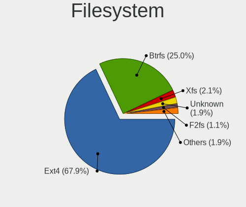
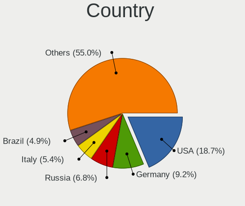
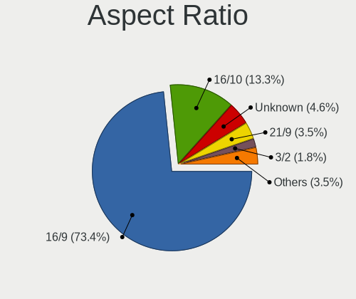
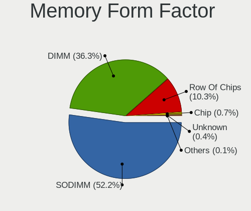
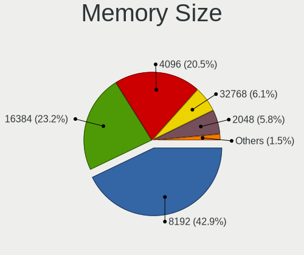
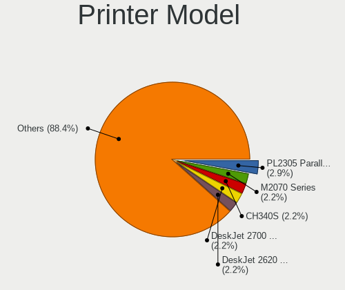
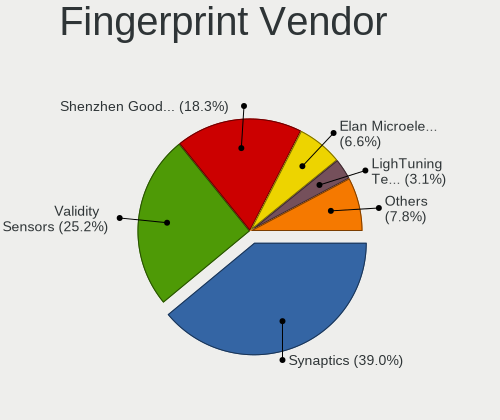

Arch - Tested Hardware & Statistics
-----------------------------------

A project to collect tested hardware configurations for Arch.

Anyone can contribute to this report by the [hw-probe](https://github.com/linuxhw/hw-probe) tool:

    sudo -E hw-probe -all -upload

Please contribute! Especially if your hardware is rare.

This is a report for all computer types. See also reports for [desktops](/Dist/Arch/Desktop/README.md) and [notebooks](/Dist/Arch/Notebook/README.md).

Contents
--------

* [ Test Cases ](#test-cases)

* [ System ](#system)
  - [ OS                       ](#os)
  - [ OS Family                ](#os-family)
  - [ Kernel                   ](#kernel)
  - [ Kernel Family            ](#kernel-family)
  - [ Kernel Major Ver.        ](#kernel-major-ver)
  - [ Arch                     ](#arch)
  - [ DE                       ](#de)
  - [ Display Server           ](#display-server)
  - [ Display Manager          ](#display-manager)
  - [ OS Lang                  ](#os-lang)
  - [ Boot Mode                ](#boot-mode)
  - [ Filesystem               ](#filesystem)
  - [ Part. scheme             ](#part-scheme)
  - [ Dual Boot with Linux/BSD ](#dual-boot-with-linuxbsd)
  - [ Dual Boot (Win)          ](#dual-boot-win)

* [ Board ](#board)
  - [ Vendor                   ](#vendor)
  - [ Model                    ](#model)
  - [ Model Family             ](#model-family)
  - [ MFG Year                 ](#mfg-year)
  - [ Form Factor              ](#form-factor)
  - [ Secure Boot              ](#secure-boot)
  - [ Coreboot                 ](#coreboot)
  - [ RAM Size                 ](#ram-size)
  - [ RAM Used                 ](#ram-used)
  - [ Total Drives             ](#total-drives)
  - [ Has CD-ROM               ](#has-cd-rom)
  - [ Has Ethernet             ](#has-ethernet)
  - [ Has WiFi                 ](#has-wifi)
  - [ Has Bluetooth            ](#has-bluetooth)

* [ Location ](#location)
  - [ Country                  ](#country)
  - [ City                     ](#city)

* [ Drives ](#drives)
  - [ Drive Vendor             ](#drive-vendor)
  - [ Drive Model              ](#drive-model)
  - [ HDD Vendor               ](#hdd-vendor)
  - [ SSD Vendor               ](#ssd-vendor)
  - [ Drive Kind               ](#drive-kind)
  - [ Drive Connector          ](#drive-connector)
  - [ Drive Size               ](#drive-size)
  - [ Space Total              ](#space-total)
  - [ Space Used               ](#space-used)
  - [ Malfunc. Drives          ](#malfunc-drives)
  - [ Malfunc. Drive Vendor    ](#malfunc-drive-vendor)
  - [ Malfunc. HDD Vendor      ](#malfunc-hdd-vendor)
  - [ Malfunc. Drive Kind      ](#malfunc-drive-kind)
  - [ Failed Drives            ](#failed-drives)
  - [ Failed Drive Vendor      ](#failed-drive-vendor)
  - [ Drive Status             ](#drive-status)

* [ Storage controller ](#storage-controller)
  - [ Storage Vendor           ](#storage-vendor)
  - [ Storage Model            ](#storage-model)
  - [ Storage Kind             ](#storage-kind)

* [ Processor ](#processor)
  - [ CPU Vendor               ](#cpu-vendor)
  - [ CPU Model                ](#cpu-model)
  - [ CPU Model Family         ](#cpu-model-family)
  - [ CPU Cores                ](#cpu-cores)
  - [ CPU Sockets              ](#cpu-sockets)
  - [ CPU Threads              ](#cpu-threads)
  - [ CPU Op-Modes             ](#cpu-op-modes)
  - [ CPU Microcode            ](#cpu-microcode)
  - [ CPU Microarch            ](#cpu-microarch)

* [ Graphics ](#graphics)
  - [ GPU Vendor               ](#gpu-vendor)
  - [ GPU Model                ](#gpu-model)
  - [ GPU Combo                ](#gpu-combo)
  - [ GPU Driver               ](#gpu-driver)
  - [ GPU Memory               ](#gpu-memory)

* [ Monitor ](#monitor)
  - [ Monitor Vendor           ](#monitor-vendor)
  - [ Monitor Model            ](#monitor-model)
  - [ Monitor Resolution       ](#monitor-resolution)
  - [ Monitor Diagonal         ](#monitor-diagonal)
  - [ Monitor Width            ](#monitor-width)
  - [ Aspect Ratio             ](#aspect-ratio)
  - [ Monitor Area             ](#monitor-area)
  - [ Pixel Density            ](#pixel-density)
  - [ Multiple Monitors        ](#multiple-monitors)

* [ Network ](#network)
  - [ Net Controller Vendor    ](#net-controller-vendor)
  - [ Net Controller Model     ](#net-controller-model)
  - [ Wireless Vendor          ](#wireless-vendor)
  - [ Wireless Model           ](#wireless-model)
  - [ Ethernet Vendor          ](#ethernet-vendor)
  - [ Ethernet Model           ](#ethernet-model)
  - [ Net Controller Kind      ](#net-controller-kind)
  - [ Used Controller          ](#used-controller)
  - [ NICs                     ](#nics)
  - [ IPv6                     ](#ipv6)

* [ Bluetooth ](#bluetooth)
  - [ Bluetooth Vendor         ](#bluetooth-vendor)
  - [ Bluetooth Model          ](#bluetooth-model)

* [ Sound ](#sound)
  - [ Sound Vendor             ](#sound-vendor)
  - [ Sound Model              ](#sound-model)

* [ Memory ](#memory)
  - [ Memory Vendor            ](#memory-vendor)
  - [ Memory Model             ](#memory-model)
  - [ Memory Kind              ](#memory-kind)
  - [ Memory Form Factor       ](#memory-form-factor)
  - [ Memory Size              ](#memory-size)
  - [ Memory Speed             ](#memory-speed)

* [ Printers & scanners ](#printers--scanners)
  - [ Printer Vendor           ](#printer-vendor)
  - [ Printer Model            ](#printer-model)
  - [ Scanner Vendor           ](#scanner-vendor)
  - [ Scanner Model            ](#scanner-model)

* [ Camera ](#camera)
  - [ Camera Vendor            ](#camera-vendor)
  - [ Camera Model             ](#camera-model)

* [ Security ](#security)
  - [ Fingerprint Vendor       ](#fingerprint-vendor)
  - [ Fingerprint Model        ](#fingerprint-model)
  - [ Chipcard Vendor          ](#chipcard-vendor)
  - [ Chipcard Model           ](#chipcard-model)

* [ Unsupported ](#unsupported)
  - [ Unsupported Devices      ](#unsupported-devices)
  - [ Unsupported Device Types ](#unsupported-device-types)

Test Cases
----------

Total: 12129

| Vendor        | Model                       | Form-Factor | Probe                                                      | Date         |
|---------------|-----------------------------|-------------|------------------------------------------------------------|--------------|
| Gigabyte      | H410M H V2                  | Desktop     | [fdb662e09b](https://linux-hardware.org/?probe=fdb662e09b) | May 09, 2024 |
| ASUSTek       | H110M-CS/BR                 | Desktop     | [5c516f0aa0](https://linux-hardware.org/?probe=5c516f0aa0) | May 09, 2024 |
| ASUSTek       | ASUS TUF Gaming F15 FX50... | Notebook    | [291cd1c75f](https://linux-hardware.org/?probe=291cd1c75f) | May 09, 2024 |
| TianBei       | GEM12                       | Desktop     | [d7b4f33b27](https://linux-hardware.org/?probe=d7b4f33b27) | May 09, 2024 |
| Lenovo        | ThinkPad T440s 20AQ0069G... | Notebook    | [86d66670cb](https://linux-hardware.org/?probe=86d66670cb) | May 09, 2024 |
| Packard Be... | EasyNote LM98               | Notebook    | [4826f72192](https://linux-hardware.org/?probe=4826f72192) | May 08, 2024 |
| Toshiba       | PORTEGE Z30-C               | Notebook    | [38ddab3b19](https://linux-hardware.org/?probe=38ddab3b19) | May 08, 2024 |
| Dell          | Latitude 5530               | Notebook    | [f91e424e6d](https://linux-hardware.org/?probe=f91e424e6d) | May 08, 2024 |
| TianBei       | GEM12                       | Desktop     | [5e850d92f6](https://linux-hardware.org/?probe=5e850d92f6) | May 08, 2024 |
| Lenovo        | ThinkPad T440s 20AQ0069G... | Notebook    | [b84ba3c6c7](https://linux-hardware.org/?probe=b84ba3c6c7) | May 08, 2024 |
| ASUSTek       | ROG STRIX Z490-G GAMING     | Desktop     | [3514a63f05](https://linux-hardware.org/?probe=3514a63f05) | May 08, 2024 |
| MSI           | H110M PRO-VH PLUS           | Desktop     | [d9c35695a3](https://linux-hardware.org/?probe=d9c35695a3) | May 08, 2024 |
| ASUSTek       | ROG Strix G513QY_G513QY     | Notebook    | [964b717d95](https://linux-hardware.org/?probe=964b717d95) | May 08, 2024 |
| MSI           | GF63 Thin 10SC              | Notebook    | [d419afc35f](https://linux-hardware.org/?probe=d419afc35f) | May 08, 2024 |
| Acer          | Aspire A515-54              | Notebook    | [f7d068c059](https://linux-hardware.org/?probe=f7d068c059) | May 07, 2024 |
| Acer          | Aspire A515-54              | Notebook    | [f9375ff03c](https://linux-hardware.org/?probe=f9375ff03c) | May 07, 2024 |
| HP            | 250 G3                      | Notebook    | [c34d89360b](https://linux-hardware.org/?probe=c34d89360b) | May 07, 2024 |
| HP            | 250 G3                      | Notebook    | [7ebf68ab6e](https://linux-hardware.org/?probe=7ebf68ab6e) | May 07, 2024 |
| MSI           | CX61 0NC/CX61 0ND/CX61 0... | Notebook    | [3206e427b1](https://linux-hardware.org/?probe=3206e427b1) | May 07, 2024 |
| ASUSTek       | VivoBook_ASUSLaptop X712... | Notebook    | [9849982066](https://linux-hardware.org/?probe=9849982066) | May 07, 2024 |
| Shenzhen M... | F7BAA                       | Desktop     | [69aa3dca70](https://linux-hardware.org/?probe=69aa3dca70) | May 06, 2024 |
| HP            | EliteBook 745 G3            | Notebook    | [7eae46245c](https://linux-hardware.org/?probe=7eae46245c) | May 06, 2024 |
| Acer          | Swift SF314-512             | Notebook    | [c1b3018ff5](https://linux-hardware.org/?probe=c1b3018ff5) | May 06, 2024 |
| ASUSTek       | PN50                        | Mini pc     | [9007198402](https://linux-hardware.org/?probe=9007198402) | May 06, 2024 |
| MSI           | CX61 0NC/CX61 0ND/CX61 0... | Notebook    | [3d1643b2c5](https://linux-hardware.org/?probe=3d1643b2c5) | May 06, 2024 |
| Lenovo        | ThinkPad P51 W10DG 20MNS... | Notebook    | [76f01093f1](https://linux-hardware.org/?probe=76f01093f1) | May 06, 2024 |
| HP            | 8767 A                      | Desktop     | [c5fd3ea1e4](https://linux-hardware.org/?probe=c5fd3ea1e4) | May 06, 2024 |
| Dell          | 004FN1 A01                  | Desktop     | [d0cd268922](https://linux-hardware.org/?probe=d0cd268922) | May 05, 2024 |
| Lenovo        | ThinkBook 16 G6 ABP 21KK    | Notebook    | [5a7ed888e1](https://linux-hardware.org/?probe=5a7ed888e1) | May 05, 2024 |
| Lenovo        | ThinkPad T470s 20HFS1SW0... | Notebook    | [e27c636616](https://linux-hardware.org/?probe=e27c636616) | May 05, 2024 |
| Lenovo        | ThinkPad T470s 20HFS1SW0... | Notebook    | [bd41e79881](https://linux-hardware.org/?probe=bd41e79881) | May 05, 2024 |
| MSI           | Modern 14 B11MOL            | Notebook    | [c394eac782](https://linux-hardware.org/?probe=c394eac782) | May 05, 2024 |
| ASRock        | B560 Pro4                   | Desktop     | [30ae860ce9](https://linux-hardware.org/?probe=30ae860ce9) | May 04, 2024 |
| Lenovo        | Yoga Slim 7 14ARE05 82A2    | Notebook    | [afb966db9e](https://linux-hardware.org/?probe=afb966db9e) | May 04, 2024 |
| Intel         | NUC13ANBi3 N13056-202       | Mini pc     | [282e1b1f01](https://linux-hardware.org/?probe=282e1b1f01) | May 04, 2024 |
| Dell          | Inspiron 5482               | Convertible | [b7f0312cc2](https://linux-hardware.org/?probe=b7f0312cc2) | May 04, 2024 |
| Gigabyte      | B550I AORUS PRO AX          | Desktop     | [eb9d1ccf1d](https://linux-hardware.org/?probe=eb9d1ccf1d) | May 04, 2024 |
| Lenovo        | ThinkPad X1 Yoga 2nd 20J... | Convertible | [c7d7f48a0f](https://linux-hardware.org/?probe=c7d7f48a0f) | May 04, 2024 |
| Gigabyte      | B550I AORUS PRO AX          | Desktop     | [988912da82](https://linux-hardware.org/?probe=988912da82) | May 04, 2024 |
| HP            | Laptop 15-dw1xxx            | Notebook    | [deab0f1e98](https://linux-hardware.org/?probe=deab0f1e98) | May 04, 2024 |
| ASUSTek       | ASUS TUF Gaming A16 FA61... | Notebook    | [1f93c42106](https://linux-hardware.org/?probe=1f93c42106) | May 04, 2024 |
| Notebook      | NL40_50GU                   | Notebook    | [00f0ca50a9](https://linux-hardware.org/?probe=00f0ca50a9) | May 04, 2024 |
| Lenovo        | U310                        | Notebook    | [0ce2072c15](https://linux-hardware.org/?probe=0ce2072c15) | May 04, 2024 |
| ASUSTek       | TUF Gaming Z790-PLUS WIF... | Desktop     | [22cf049537](https://linux-hardware.org/?probe=22cf049537) | May 04, 2024 |
| HP            | Pavilion Laptop 17-ar0xx    | Notebook    | [cf570f28e9](https://linux-hardware.org/?probe=cf570f28e9) | May 03, 2024 |
| ASUSTek       | TUF Gaming B460M-PLUS       | Desktop     | [7e4062c114](https://linux-hardware.org/?probe=7e4062c114) | May 03, 2024 |
| ASUSTek       | VivoBook_ASUSLaptop X512... | Notebook    | [58390b50b4](https://linux-hardware.org/?probe=58390b50b4) | May 03, 2024 |
| ASUSTek       | TUF Gaming B560-PLUS WIF... | Desktop     | [026737408a](https://linux-hardware.org/?probe=026737408a) | May 03, 2024 |
| Razer         | Blade Stealth               | Notebook    | [1728a1a500](https://linux-hardware.org/?probe=1728a1a500) | May 03, 2024 |
| Apple         | MacBookPro11,5              | Notebook    | [fdf75026c9](https://linux-hardware.org/?probe=fdf75026c9) | May 03, 2024 |
| HP            | 1000                        | Notebook    | [5cbdf4ea65](https://linux-hardware.org/?probe=5cbdf4ea65) | May 03, 2024 |
| MSI           | A320M-A PRO                 | Desktop     | [007b5d93c7](https://linux-hardware.org/?probe=007b5d93c7) | May 03, 2024 |
| Lenovo        | IdeaPad S145-15IWL 81S9     | Notebook    | [eb0a05de27](https://linux-hardware.org/?probe=eb0a05de27) | May 03, 2024 |
| Dell          | Precision 7740              | Notebook    | [9219d78a85](https://linux-hardware.org/?probe=9219d78a85) | May 03, 2024 |
| MSI           | B450-A PRO                  | Desktop     | [028acf1ed9](https://linux-hardware.org/?probe=028acf1ed9) | May 02, 2024 |
| Dell          | 0VRWRC A00                  | Desktop     | [137a659482](https://linux-hardware.org/?probe=137a659482) | May 02, 2024 |
| HP            | Laptop 14-ck0xxx            | Notebook    | [2dee9df53a](https://linux-hardware.org/?probe=2dee9df53a) | May 02, 2024 |
| HP            | 82FE 11                     | Desktop     | [417dc3a68d](https://linux-hardware.org/?probe=417dc3a68d) | May 02, 2024 |
| HP            | EliteBook 865 16 inch G1... | Notebook    | [847e639275](https://linux-hardware.org/?probe=847e639275) | May 02, 2024 |
| HP            | ZBook 17 G4                 | Notebook    | [8d618b9f7e](https://linux-hardware.org/?probe=8d618b9f7e) | May 02, 2024 |
| Lenovo        | ThinkBook 14 G6+ IMH 21L... | Notebook    | [e218d7ac14](https://linux-hardware.org/?probe=e218d7ac14) | May 02, 2024 |
| Gigabyte      | B550M K                     | Desktop     | [ad98dca4f1](https://linux-hardware.org/?probe=ad98dca4f1) | May 02, 2024 |
| Metabox       | Alpha-SR NP70SNC            | Notebook    | [4fe0c00280](https://linux-hardware.org/?probe=4fe0c00280) | May 02, 2024 |
| Lenovo        | ThinkPad Twist 33472RU      | Notebook    | [88c46ca8d7](https://linux-hardware.org/?probe=88c46ca8d7) | May 02, 2024 |
| HP            | 1000                        | Notebook    | [57f342d3ff](https://linux-hardware.org/?probe=57f342d3ff) | May 02, 2024 |
| ASUSTek       | PRIME A320M-K               | Desktop     | [1c25e4346a](https://linux-hardware.org/?probe=1c25e4346a) | May 02, 2024 |
| MSI           | B650 GAMING PLUS WIFI       | Desktop     | [23638766ff](https://linux-hardware.org/?probe=23638766ff) | May 01, 2024 |
| Lenovo        | ThinkPad X220 4291H76       | Notebook    | [55dc1b37c5](https://linux-hardware.org/?probe=55dc1b37c5) | May 01, 2024 |
| MSI           | MAG B650 TOMAHAWK WIFI      | Desktop     | [692f458014](https://linux-hardware.org/?probe=692f458014) | May 01, 2024 |
| HP            | Pavilion x360 Convertibl... | Convertible | [31b06308f0](https://linux-hardware.org/?probe=31b06308f0) | May 01, 2024 |
| ASUSTek       | ROG STRIX B550-A GAMING     | Desktop     | [0688fff0ed](https://linux-hardware.org/?probe=0688fff0ed) | May 01, 2024 |
| ASUSTek       | B150 PRO GAMING             | Desktop     | [fd39a02925](https://linux-hardware.org/?probe=fd39a02925) | May 01, 2024 |
| ASUSTek       | B150 PRO GAMING             | Desktop     | [61160f0f14](https://linux-hardware.org/?probe=61160f0f14) | May 01, 2024 |
| Framework     | Laptop                      | Notebook    | [b1f763433e](https://linux-hardware.org/?probe=b1f763433e) | May 01, 2024 |
| Lenovo        | U310                        | Notebook    | [48cb164f2f](https://linux-hardware.org/?probe=48cb164f2f) | May 01, 2024 |
| HP            | ProBook 450 15.6 inch G1... | Notebook    | [e39ccf215f](https://linux-hardware.org/?probe=e39ccf215f) | May 01, 2024 |
| Lenovo        | ThinkPad X395 20NMS0D900    | Notebook    | [47098170bb](https://linux-hardware.org/?probe=47098170bb) | May 01, 2024 |
| MSI           | GP62 6QF                    | Notebook    | [1c3538dce8](https://linux-hardware.org/?probe=1c3538dce8) | May 01, 2024 |
| ASUSTek       | TUF Gaming Z690-PLUS WIF... | Desktop     | [e0847e949c](https://linux-hardware.org/?probe=e0847e949c) | May 01, 2024 |
| MSI           | GP62 6QF                    | Notebook    | [4ed895c3e2](https://linux-hardware.org/?probe=4ed895c3e2) | May 01, 2024 |
| Dell          | XPS 13 9360                 | Notebook    | [00b20277f7](https://linux-hardware.org/?probe=00b20277f7) | May 01, 2024 |
| MSI           | MPG Z390 GAMING PLUS        | Desktop     | [f50df78b1f](https://linux-hardware.org/?probe=f50df78b1f) | May 01, 2024 |
| Dell          | Precision M4600             | Notebook    | [3c78b1ea06](https://linux-hardware.org/?probe=3c78b1ea06) | May 01, 2024 |
| Gigabyte      | Z590 AORUS ULTRA            | Desktop     | [53cec6c7a1](https://linux-hardware.org/?probe=53cec6c7a1) | May 01, 2024 |
| Dell          | Precision M4600             | Notebook    | [7cae94b1d9](https://linux-hardware.org/?probe=7cae94b1d9) | May 01, 2024 |
| Apple         | MacBookPro10,2              | Notebook    | [57baecb0a5](https://linux-hardware.org/?probe=57baecb0a5) | May 01, 2024 |
| ASRock        | X570 Phantom Gaming-ITX/... | Desktop     | [dbb2e90b8c](https://linux-hardware.org/?probe=dbb2e90b8c) | May 01, 2024 |
| AZW           | SER V2.0                    | Mini pc     | [88658fa4bd](https://linux-hardware.org/?probe=88658fa4bd) | May 01, 2024 |
| AZW           | SER V2.0                    | Mini pc     | [45938caf5b](https://linux-hardware.org/?probe=45938caf5b) | Apr 30, 2024 |
| MSI           | B450-A PRO MAX              | Desktop     | [2f0452583f](https://linux-hardware.org/?probe=2f0452583f) | Apr 30, 2024 |
| TUXEDO        | InfinityBook S Gen8         | Notebook    | [19d3fc9c13](https://linux-hardware.org/?probe=19d3fc9c13) | Apr 30, 2024 |
| Gigabyte      | Z590 AORUS ULTRA            | Desktop     | [1a48c73aca](https://linux-hardware.org/?probe=1a48c73aca) | Apr 30, 2024 |
| Gigabyte      | X570 AORUS MASTER           | Desktop     | [5b49b60b38](https://linux-hardware.org/?probe=5b49b60b38) | Apr 30, 2024 |
| ASUSTek       | VivoBook_ASUSLaptop X150... | Notebook    | [c981d78681](https://linux-hardware.org/?probe=c981d78681) | Apr 30, 2024 |
| Apple         | MacBookPro10,2              | Notebook    | [f80fe988f5](https://linux-hardware.org/?probe=f80fe988f5) | Apr 30, 2024 |
| Gigabyte      | Z790 UD                     | Desktop     | [64ccf744b7](https://linux-hardware.org/?probe=64ccf744b7) | Apr 30, 2024 |
| Lenovo        | Rev B 82LN                  | Notebook    | [5cf26fa98f](https://linux-hardware.org/?probe=5cf26fa98f) | Apr 30, 2024 |
| Lenovo        | Rev B 82LN                  | Notebook    | [130e9ebe45](https://linux-hardware.org/?probe=130e9ebe45) | Apr 30, 2024 |
| HP            | 871A                        | Mini pc     | [c3e106f381](https://linux-hardware.org/?probe=c3e106f381) | Apr 30, 2024 |
| MSI           | MPG B550 GAMING PLUS        | Desktop     | [e2ec2b51c8](https://linux-hardware.org/?probe=e2ec2b51c8) | Apr 30, 2024 |
| HP            | Pavilion g6                 | Notebook    | [466b38f1ee](https://linux-hardware.org/?probe=466b38f1ee) | Apr 30, 2024 |
| Lenovo        | Yoga 6 13ALC6 82ND          | Convertible | [afd9edcffa](https://linux-hardware.org/?probe=afd9edcffa) | Apr 30, 2024 |
| HP            | Mini 210-1000               | Notebook    | [f44ded04c1](https://linux-hardware.org/?probe=f44ded04c1) | Apr 29, 2024 |
| ASRock        | B365M-HDV                   | Desktop     | [23d6569af8](https://linux-hardware.org/?probe=23d6569af8) | Apr 29, 2024 |
| Acer          | Swift SFE16-43              | Notebook    | [02fa8654df](https://linux-hardware.org/?probe=02fa8654df) | Apr 29, 2024 |
| HP            | Victus by Laptop 16-e0xx... | Notebook    | [1cd614027a](https://linux-hardware.org/?probe=1cd614027a) | Apr 29, 2024 |
| Gigabyte      | Z790 D DDR4                 | Desktop     | [8e6a5285a6](https://linux-hardware.org/?probe=8e6a5285a6) | Apr 29, 2024 |
| Lenovo        | ThinkPad L420 7827W1U       | Notebook    | [b6839d25f6](https://linux-hardware.org/?probe=b6839d25f6) | Apr 29, 2024 |
| TUXEDO        | InfinityBook Pro Gen8 (M... | Notebook    | [93815a6cda](https://linux-hardware.org/?probe=93815a6cda) | Apr 28, 2024 |
| Lenovo        | ThinkPad L420 7827W1U       | Notebook    | [9455f8e9de](https://linux-hardware.org/?probe=9455f8e9de) | Apr 28, 2024 |
| ASUSTek       | ROG Flow X16 GV601VI_GV6... | Convertible | [1f06de22c7](https://linux-hardware.org/?probe=1f06de22c7) | Apr 28, 2024 |
| ASUSTek       | PRIME A520M-E               | Desktop     | [e0dc85f1a0](https://linux-hardware.org/?probe=e0dc85f1a0) | Apr 28, 2024 |
| MSI           | MPG B550 GAMING PLUS        | Desktop     | [df28569bfc](https://linux-hardware.org/?probe=df28569bfc) | Apr 28, 2024 |
| ASUSTek       | X553MA                      | Notebook    | [87b13248a4](https://linux-hardware.org/?probe=87b13248a4) | Apr 28, 2024 |
| HP            | 2AFB                        | Desktop     | [6173192c73](https://linux-hardware.org/?probe=6173192c73) | Apr 28, 2024 |
| Lenovo        | ThinkPad E15 Gen 2 20T9S... | Notebook    | [d4c1f97af3](https://linux-hardware.org/?probe=d4c1f97af3) | Apr 28, 2024 |
| Fujitsu       | D2628-C1 S26361-D2628-C1    | Desktop     | [1456965e8a](https://linux-hardware.org/?probe=1456965e8a) | Apr 28, 2024 |
| HUAWEI        | HVY-WXX9                    | Notebook    | [0f16f57261](https://linux-hardware.org/?probe=0f16f57261) | Apr 28, 2024 |
| MSI           | MAG B550 TOMAHAWK           | Desktop     | [25abfac8b7](https://linux-hardware.org/?probe=25abfac8b7) | Apr 28, 2024 |
| Acer          | Swift SF314-41              | Notebook    | [240aeeb256](https://linux-hardware.org/?probe=240aeeb256) | Apr 28, 2024 |
| Lenovo        | IdeaPad Slim 7 Pro 14IHU... | Notebook    | [d01c00759c](https://linux-hardware.org/?probe=d01c00759c) | Apr 28, 2024 |
| Lenovo        | ThinkPad P16s Gen 1 21CK... | Notebook    | [801a6bafe7](https://linux-hardware.org/?probe=801a6bafe7) | Apr 27, 2024 |
| Dell          | G15 5520                    | Notebook    | [80975f981b](https://linux-hardware.org/?probe=80975f981b) | Apr 27, 2024 |
| ASUSTek       | X541NA                      | Notebook    | [19a17079a5](https://linux-hardware.org/?probe=19a17079a5) | Apr 27, 2024 |
| Lenovo        | Yoga Pro 7 14APH8 82Y8      | Notebook    | [0a2f393a3e](https://linux-hardware.org/?probe=0a2f393a3e) | Apr 27, 2024 |
| ASUSTek       | ROG STRIX B650E-E GAMING... | Desktop     | [40d791bbd0](https://linux-hardware.org/?probe=40d791bbd0) | Apr 27, 2024 |
| Medion        | B550A4-EM                   | Desktop     | [0549fa7bff](https://linux-hardware.org/?probe=0549fa7bff) | Apr 27, 2024 |
| Medion        | B550A4-EM                   | Desktop     | [7b5fb13788](https://linux-hardware.org/?probe=7b5fb13788) | Apr 27, 2024 |
| HUAWEI        | HVY-WXX9                    | Notebook    | [5d98ce8c7a](https://linux-hardware.org/?probe=5d98ce8c7a) | Apr 27, 2024 |
| Gigabyte      | AB350M-DS3H-CF              | Desktop     | [38c0cc58a5](https://linux-hardware.org/?probe=38c0cc58a5) | Apr 27, 2024 |
| ASUSTek       | M5A97                       | Desktop     | [ba034c6e1b](https://linux-hardware.org/?probe=ba034c6e1b) | Apr 27, 2024 |
| HP            | EliteBook 8570p             | Notebook    | [cbe3543005](https://linux-hardware.org/?probe=cbe3543005) | Apr 26, 2024 |
| Mediacom      | SmartBook 14 FullHD - SB... | Notebook    | [679f3b5338](https://linux-hardware.org/?probe=679f3b5338) | Apr 26, 2024 |
| ASUSTek       | ROG STRIX B550-I GAMING     | Desktop     | [8eb518c57d](https://linux-hardware.org/?probe=8eb518c57d) | Apr 26, 2024 |
| Microsoft     | Surface Pro 4               | Tablet      | [4548a5f355](https://linux-hardware.org/?probe=4548a5f355) | Apr 26, 2024 |
| ASUSTek       | PRIME A320M-K               | Desktop     | [b55bedf1e5](https://linux-hardware.org/?probe=b55bedf1e5) | Apr 26, 2024 |
| Unknown       | Unknown                     | Notebook    | [5fda06b27d](https://linux-hardware.org/?probe=5fda06b27d) | Apr 26, 2024 |
| MSI           | PRO B550M-VC WIFI           | Desktop     | [fa2cc2126e](https://linux-hardware.org/?probe=fa2cc2126e) | Apr 26, 2024 |
| ASUSTek       | ROG STRIX X670E-A GAMING... | Desktop     | [9a4a6cdc15](https://linux-hardware.org/?probe=9a4a6cdc15) | Apr 25, 2024 |
| Lenovo        | XiaoXinPro 16 AHP9 83D5     | Notebook    | [bec1c58cef](https://linux-hardware.org/?probe=bec1c58cef) | Apr 25, 2024 |
| Lenovo        | ThinkPad P52 20M9CTO1WW     | Notebook    | [ce0b51d2c0](https://linux-hardware.org/?probe=ce0b51d2c0) | Apr 25, 2024 |
| MSI           | MEG X670E ACE               | Desktop     | [e83a37876c](https://linux-hardware.org/?probe=e83a37876c) | Apr 25, 2024 |
| Apple         | MacBookPro11,5              | Notebook    | [cfd10a22a4](https://linux-hardware.org/?probe=cfd10a22a4) | Apr 25, 2024 |
| Lenovo        | ThinkPad X230 2324F43       | Notebook    | [3508590441](https://linux-hardware.org/?probe=3508590441) | Apr 25, 2024 |
| ASUSTek       | X553MA                      | Notebook    | [c1b1f9de4b](https://linux-hardware.org/?probe=c1b1f9de4b) | Apr 25, 2024 |
| Dell          | Latitude 3120               | Convertible | [3b8679ada5](https://linux-hardware.org/?probe=3b8679ada5) | Apr 25, 2024 |
| ASUSTek       | P8Z77-V PRO                 | Desktop     | [755f446bc7](https://linux-hardware.org/?probe=755f446bc7) | Apr 24, 2024 |
| Acer          | Aspire A315-58              | Notebook    | [4f5fda04fe](https://linux-hardware.org/?probe=4f5fda04fe) | Apr 24, 2024 |
| SKIKK         | Freya                       | Notebook    | [c743ce4dbf](https://linux-hardware.org/?probe=c743ce4dbf) | Apr 24, 2024 |
| Gigabyte      | G7 MF                       | Notebook    | [d55b6078f3](https://linux-hardware.org/?probe=d55b6078f3) | Apr 24, 2024 |
| Notebook      | PA70ES                      | Notebook    | [866c7351b4](https://linux-hardware.org/?probe=866c7351b4) | Apr 24, 2024 |
| Acer          | Swift SF315-52G             | Notebook    | [91c1e44537](https://linux-hardware.org/?probe=91c1e44537) | Apr 24, 2024 |
| HONOR         | GLO-GXXX                    | Notebook    | [d92d20c83b](https://linux-hardware.org/?probe=d92d20c83b) | Apr 23, 2024 |
| ASUSTek       | ROG Zephyrus G15 GA503RW... | Notebook    | [bcc2955a52](https://linux-hardware.org/?probe=bcc2955a52) | Apr 23, 2024 |
| HUAWEI        | BOHB-WAX9                   | Notebook    | [fd94025498](https://linux-hardware.org/?probe=fd94025498) | Apr 23, 2024 |
| ASUSTek       | TUF Gaming A520M-PLUS WI... | Desktop     | [9e7d5daf63](https://linux-hardware.org/?probe=9e7d5daf63) | Apr 23, 2024 |
| Biostar       | A320MH                      | Desktop     | [5506fc2ad4](https://linux-hardware.org/?probe=5506fc2ad4) | Apr 23, 2024 |
| ASUSTek       | PRIME X470-PRO              | Desktop     | [e86b7c32f6](https://linux-hardware.org/?probe=e86b7c32f6) | Apr 23, 2024 |
| MSI           | MPG X670E CARBON WIFI       | Desktop     | [d525938452](https://linux-hardware.org/?probe=d525938452) | Apr 23, 2024 |
| Lenovo        | Yoga 7 14ARP8 82YM          | Convertible | [3920d7dc49](https://linux-hardware.org/?probe=3920d7dc49) | Apr 23, 2024 |
| HP            | EliteBook 840 G3            | Notebook    | [da0e2c83ac](https://linux-hardware.org/?probe=da0e2c83ac) | Apr 23, 2024 |
| Lenovo        | Yoga Slim 7 Carbon 14ACN... | Notebook    | [3f76329bd6](https://linux-hardware.org/?probe=3f76329bd6) | Apr 23, 2024 |
| MSI           | B550-A PRO                  | Desktop     | [077d8caca8](https://linux-hardware.org/?probe=077d8caca8) | Apr 22, 2024 |
| MSI           | B550-A PRO                  | Desktop     | [1e07f3fb8f](https://linux-hardware.org/?probe=1e07f3fb8f) | Apr 22, 2024 |
| MSI           | B550-A PRO                  | Desktop     | [909681165a](https://linux-hardware.org/?probe=909681165a) | Apr 22, 2024 |
| Dell          | Precision 5530              | Notebook    | [7e2d09b398](https://linux-hardware.org/?probe=7e2d09b398) | Apr 22, 2024 |
| HP            | 240 G8 Notebook PC          | Notebook    | [309c38a064](https://linux-hardware.org/?probe=309c38a064) | Apr 22, 2024 |
| Intel         | DQ45CB AAE30148-206         | Desktop     | [fb8d3b6c11](https://linux-hardware.org/?probe=fb8d3b6c11) | Apr 22, 2024 |
| MSI           | MAG B550 TOMAHAWK           | Desktop     | [8a9bcf9b7f](https://linux-hardware.org/?probe=8a9bcf9b7f) | Apr 22, 2024 |
| MSI           | MPG B650I EDGE WIFI         | Desktop     | [2655453b82](https://linux-hardware.org/?probe=2655453b82) | Apr 22, 2024 |
| ASUSTek       | ROG STRIX B550-E GAMING     | Desktop     | [af767cfb5a](https://linux-hardware.org/?probe=af767cfb5a) | Apr 22, 2024 |
| Lenovo        | ThinkPad T480 20L6S0DH0V    | Notebook    | [28d54c7e4d](https://linux-hardware.org/?probe=28d54c7e4d) | Apr 22, 2024 |
| MSI           | MEG Z790 GODLIKE            | Desktop     | [23bca8eb91](https://linux-hardware.org/?probe=23bca8eb91) | Apr 21, 2024 |
| ASUSTek       | ROG STRIX Z690-F GAMING ... | Desktop     | [77503515ef](https://linux-hardware.org/?probe=77503515ef) | Apr 21, 2024 |
| Lenovo        | 3136 SDK0J40697 WIN 3305... | Mini pc     | [c4ae0be9f2](https://linux-hardware.org/?probe=c4ae0be9f2) | Apr 21, 2024 |
| Dell          | Latitude E7240              | Notebook    | [71103e976e](https://linux-hardware.org/?probe=71103e976e) | Apr 21, 2024 |
| Acer          | Aspire A315-24P             | Notebook    | [51136613de](https://linux-hardware.org/?probe=51136613de) | Apr 21, 2024 |
| HP            | 82FE 11                     | Desktop     | [8275c83127](https://linux-hardware.org/?probe=8275c83127) | Apr 21, 2024 |
| Lenovo        | IdeaPad 5 14ALC05 82LM      | Notebook    | [d76ac08a0d](https://linux-hardware.org/?probe=d76ac08a0d) | Apr 21, 2024 |
| Samsung       | 950XDB/951XDB/950XDY        | Notebook    | [252a0c4e05](https://linux-hardware.org/?probe=252a0c4e05) | Apr 21, 2024 |
| Lenovo        | ThinkPad L560 20F2S1P800    | Notebook    | [e7b196367a](https://linux-hardware.org/?probe=e7b196367a) | Apr 21, 2024 |
| ASUSTek       | P5K Premium                 | Desktop     | [5ff3e52237](https://linux-hardware.org/?probe=5ff3e52237) | Apr 21, 2024 |
| Lenovo        | IdeaPadFlex 5 14ALC7 82R... | Convertible | [e61a160d38](https://linux-hardware.org/?probe=e61a160d38) | Apr 20, 2024 |
| MSI           | B85M Night Elf              | Desktop     | [bcf2e02f82](https://linux-hardware.org/?probe=bcf2e02f82) | Apr 20, 2024 |
| MSI           | MAG B460 TORPEDO            | Desktop     | [14ab4e8bf9](https://linux-hardware.org/?probe=14ab4e8bf9) | Apr 20, 2024 |
| XMG           | N85_N87,HJ,HJ1,HK1          | Notebook    | [88ab8ac1a1](https://linux-hardware.org/?probe=88ab8ac1a1) | Apr 20, 2024 |
| HP            | Laptop 15s-eq1xxx           | Notebook    | [9622d53999](https://linux-hardware.org/?probe=9622d53999) | Apr 20, 2024 |
| Samsung       | 950QED                      | Convertible | [f90bbb5ff4](https://linux-hardware.org/?probe=f90bbb5ff4) | Apr 20, 2024 |
| HP            | OMEN Laptop 15-ek0xxx       | Notebook    | [8f61743310](https://linux-hardware.org/?probe=8f61743310) | Apr 20, 2024 |
| HP            | 802E                        | Desktop     | [2c4cd0708d](https://linux-hardware.org/?probe=2c4cd0708d) | Apr 20, 2024 |
| Positivo      | Mobile                      | Notebook    | [c74545679c](https://linux-hardware.org/?probe=c74545679c) | Apr 20, 2024 |
| Lenovo        | ThinkPad E14 Gen 2 20TA0... | Notebook    | [a890a5a9b1](https://linux-hardware.org/?probe=a890a5a9b1) | Apr 20, 2024 |
| ASUSTek       | ASUS TUF Gaming F15 FX50... | Notebook    | [1e8f14cb22](https://linux-hardware.org/?probe=1e8f14cb22) | Apr 20, 2024 |
| ASUSTek       | ROG Zephyrus M16 GU603ZM... | Notebook    | [d93809116b](https://linux-hardware.org/?probe=d93809116b) | Apr 20, 2024 |
| Toshiba       | Satellite C850-124          | Notebook    | [b580358635](https://linux-hardware.org/?probe=b580358635) | Apr 20, 2024 |
| ASRock        | A620M Pro RS WiFi           | Desktop     | [d715b7146f](https://linux-hardware.org/?probe=d715b7146f) | Apr 20, 2024 |
| Trigkey       | S5 V2.0                     | Mini pc     | [c71e66ecb4](https://linux-hardware.org/?probe=c71e66ecb4) | Apr 19, 2024 |
| Trigkey       | S5 V2.0                     | Mini pc     | [9c50a0fe20](https://linux-hardware.org/?probe=9c50a0fe20) | Apr 19, 2024 |
| ASRock        | 970 Extreme4                | Desktop     | [30d0e5d49e](https://linux-hardware.org/?probe=30d0e5d49e) | Apr 19, 2024 |
| Lenovo        | ThinkPad T16 Gen 1 21CH0... | Notebook    | [3426b632ad](https://linux-hardware.org/?probe=3426b632ad) | Apr 19, 2024 |
| ASUSTek       | ROG Flow X16 GV601VV_GV6... | Convertible | [1bf1523c67](https://linux-hardware.org/?probe=1bf1523c67) | Apr 19, 2024 |
| ASRock        | A520M-HDV                   | Desktop     | [7fab320f1b](https://linux-hardware.org/?probe=7fab320f1b) | Apr 19, 2024 |
| Lenovo        | ThinkPad T480s 20L8S7890... | Notebook    | [7af4a3ded9](https://linux-hardware.org/?probe=7af4a3ded9) | Apr 19, 2024 |
| Apple         | MacBookPro12,1              | Notebook    | [d297fd582e](https://linux-hardware.org/?probe=d297fd582e) | Apr 19, 2024 |
| Lenovo        | ThinkPad X1 Yoga Gen 6 2... | Convertible | [f61c1dcda7](https://linux-hardware.org/?probe=f61c1dcda7) | Apr 19, 2024 |
| Apple         | MacBookAir7,2               | Notebook    | [50f7cbb79a](https://linux-hardware.org/?probe=50f7cbb79a) | Apr 19, 2024 |
| ASUSTek       | PRIME H510M-E               | Desktop     | [31e1a13f27](https://linux-hardware.org/?probe=31e1a13f27) | Apr 19, 2024 |
| Lenovo        | V15 G3 ABA 82TV             | Notebook    | [8e0d1cf973](https://linux-hardware.org/?probe=8e0d1cf973) | Apr 19, 2024 |
| Gigabyte      | AB350M-DS3H-CF              | Desktop     | [9624739b2f](https://linux-hardware.org/?probe=9624739b2f) | Apr 19, 2024 |
| Framework     | Laptop                      | Notebook    | [ce27218533](https://linux-hardware.org/?probe=ce27218533) | Apr 18, 2024 |
| ASUSTek       | VivoBook_ASUSLaptop M150... | Notebook    | [38a33160a4](https://linux-hardware.org/?probe=38a33160a4) | Apr 18, 2024 |
| HP            | 829A                        | Mini pc     | [20a6bfef96](https://linux-hardware.org/?probe=20a6bfef96) | Apr 18, 2024 |
| Lenovo        | ThinkBook 15 G5 ABP 21JF    | Notebook    | [8de733215c](https://linux-hardware.org/?probe=8de733215c) | Apr 18, 2024 |
| Apple         | MacBookPro5,3               | Notebook    | [333256d6dd](https://linux-hardware.org/?probe=333256d6dd) | Apr 18, 2024 |
| MSI           | Z790 GAMING PRO WIFI        | Desktop     | [0a6383a334](https://linux-hardware.org/?probe=0a6383a334) | Apr 18, 2024 |
| HP            | OMEN by Laptop 17-cb0xxx    | Notebook    | [50987e4554](https://linux-hardware.org/?probe=50987e4554) | Apr 18, 2024 |
| Lenovo        | Legion Y9000P IRX8 82WK     | Notebook    | [3d61f319c2](https://linux-hardware.org/?probe=3d61f319c2) | Apr 18, 2024 |
| Lenovo        | ThinkPad T430 2349QF4       | Notebook    | [b9dbaebca0](https://linux-hardware.org/?probe=b9dbaebca0) | Apr 17, 2024 |
| Lenovo        | Legion Y540-15IRH 81SX      | Notebook    | [cebfff5171](https://linux-hardware.org/?probe=cebfff5171) | Apr 17, 2024 |
| Lenovo        | ThinkPad X61 7673V4Q        | Notebook    | [ae6092f0a5](https://linux-hardware.org/?probe=ae6092f0a5) | Apr 17, 2024 |
| Lenovo        | ThinkPad X61 7673V4Q        | Notebook    | [de573ef4aa](https://linux-hardware.org/?probe=de573ef4aa) | Apr 17, 2024 |
| Unknown       | Unknown                     | Desktop     | [bae188579b](https://linux-hardware.org/?probe=bae188579b) | Apr 17, 2024 |
| Dell          | XPS 13 9380                 | Notebook    | [56a4aeab46](https://linux-hardware.org/?probe=56a4aeab46) | Apr 17, 2024 |
| ASRock        | B760M Pro RS                | Desktop     | [ba1fde2d8b](https://linux-hardware.org/?probe=ba1fde2d8b) | Apr 17, 2024 |
| Lenovo        | Legion 7 16ACHg6 82N6       | Notebook    | [3d43cbd697](https://linux-hardware.org/?probe=3d43cbd697) | Apr 17, 2024 |
| Unknown       | Unknown                     | Desktop     | [9c69980686](https://linux-hardware.org/?probe=9c69980686) | Apr 17, 2024 |
| HP            | EliteBook 2530p             | Notebook    | [930a387011](https://linux-hardware.org/?probe=930a387011) | Apr 17, 2024 |
| HP            | EliteBook 2530p             | Notebook    | [b6df5893ef](https://linux-hardware.org/?probe=b6df5893ef) | Apr 17, 2024 |
| Lenovo        | ThinkPad T580 20LAS2VM00    | Notebook    | [6a81f0c31f](https://linux-hardware.org/?probe=6a81f0c31f) | Apr 17, 2024 |
| ECS           | G31T-M7                     | Desktop     | [fa7e63c25c](https://linux-hardware.org/?probe=fa7e63c25c) | Apr 17, 2024 |
| Notebook      | PD5x_7xSNC_SND_SNE          | Notebook    | [1672551a61](https://linux-hardware.org/?probe=1672551a61) | Apr 17, 2024 |
| Notebook      | W230ST                      | Notebook    | [946ba4a3b8](https://linux-hardware.org/?probe=946ba4a3b8) | Apr 16, 2024 |
| HUAWEI        | NbDE-WXX9                   | Notebook    | [ae3aece643](https://linux-hardware.org/?probe=ae3aece643) | Apr 16, 2024 |
| Dell          | Latitude 7520               | Notebook    | [f040020d5f](https://linux-hardware.org/?probe=f040020d5f) | Apr 16, 2024 |
| MSI           | MAG X670E TOMAHAWK WIFI     | Desktop     | [d4b692ce92](https://linux-hardware.org/?probe=d4b692ce92) | Apr 15, 2024 |
| ASUSTek       | N53SM                       | Notebook    | [0769613e83](https://linux-hardware.org/?probe=0769613e83) | Apr 15, 2024 |
| MSI           | X670E GAMING PLUS WIFI      | Desktop     | [e349330184](https://linux-hardware.org/?probe=e349330184) | Apr 15, 2024 |
| Lenovo        | Legion 5-15IMH05H 81Y6      | Notebook    | [057fa9dd1a](https://linux-hardware.org/?probe=057fa9dd1a) | Apr 15, 2024 |
| Lenovo        | ThinkPad L14 Gen 2 20X2S... | Notebook    | [8ef5274513](https://linux-hardware.org/?probe=8ef5274513) | Apr 15, 2024 |
| Gigabyte      | A520M H                     | Desktop     | [8c9dec81e3](https://linux-hardware.org/?probe=8c9dec81e3) | Apr 15, 2024 |
| Gigabyte      | A520M H                     | Desktop     | [ac53e58a8c](https://linux-hardware.org/?probe=ac53e58a8c) | Apr 15, 2024 |
| Dell          | Latitude 7490               | Notebook    | [9f01d423bc](https://linux-hardware.org/?probe=9f01d423bc) | Apr 14, 2024 |
| Google        | Morphius                    | Notebook    | [422dcd7238](https://linux-hardware.org/?probe=422dcd7238) | Apr 14, 2024 |
| ASUSTek       | VivoBook_ASUSLaptop K350... | Notebook    | [9c4d14519d](https://linux-hardware.org/?probe=9c4d14519d) | Apr 14, 2024 |
| Gigabyte      | Z590 AORUS ULTRA            | Desktop     | [c205fddaa6](https://linux-hardware.org/?probe=c205fddaa6) | Apr 14, 2024 |
| XIAOMI        | Redmi Book Pro 15 2023      | Notebook    | [7bad2daef7](https://linux-hardware.org/?probe=7bad2daef7) | Apr 14, 2024 |
| Google        | Morphius                    | Notebook    | [97da05767b](https://linux-hardware.org/?probe=97da05767b) | Apr 13, 2024 |
| Gigabyte      | B550 UD AC                  | Desktop     | [241b4589b5](https://linux-hardware.org/?probe=241b4589b5) | Apr 13, 2024 |
| Dell          | Latitude 5290 2-in-1        | Tablet      | [756e837ab6](https://linux-hardware.org/?probe=756e837ab6) | Apr 13, 2024 |
| Dell          | Inspiron 3593               | Notebook    | [e1b99394fb](https://linux-hardware.org/?probe=e1b99394fb) | Apr 13, 2024 |
| Dell          | Inspiron 5482               | Convertible | [0cc71d9718](https://linux-hardware.org/?probe=0cc71d9718) | Apr 13, 2024 |
| Biostar       | B560M-SILVER                | Desktop     | [5a452f7d1c](https://linux-hardware.org/?probe=5a452f7d1c) | Apr 13, 2024 |
| HP            | Laptop 15-ef2xxx            | Notebook    | [3d32f9eea8](https://linux-hardware.org/?probe=3d32f9eea8) | Apr 13, 2024 |
| HP            | Pavilion Notebook           | Notebook    | [fd68b6da34](https://linux-hardware.org/?probe=fd68b6da34) | Apr 13, 2024 |
| HP            | Laptop 15s-eq2xxx           | Notebook    | [16bde4de91](https://linux-hardware.org/?probe=16bde4de91) | Apr 13, 2024 |
| ASUSTek       | ROG Zephyrus G15 GA503RW... | Notebook    | [b64d99620b](https://linux-hardware.org/?probe=b64d99620b) | Apr 12, 2024 |
| HP            | Spectre x360 2-in-1 Lapt... | Convertible | [d4509f2690](https://linux-hardware.org/?probe=d4509f2690) | Apr 12, 2024 |
| Acer          | Aspire A715-42G             | Notebook    | [0d589db88d](https://linux-hardware.org/?probe=0d589db88d) | Apr 12, 2024 |
| ASUSTek       | N53SM                       | Notebook    | [e69871e7f5](https://linux-hardware.org/?probe=e69871e7f5) | Apr 12, 2024 |
| Acer          | Aspire A715-42G             | Notebook    | [ab14bb8fdc](https://linux-hardware.org/?probe=ab14bb8fdc) | Apr 12, 2024 |
| HUAWEI        | BOD-WXX9                    | Notebook    | [922645652d](https://linux-hardware.org/?probe=922645652d) | Apr 12, 2024 |
| Gigabyte      | B550M AORUS ELITE           | Desktop     | [f79c4fd06b](https://linux-hardware.org/?probe=f79c4fd06b) | Apr 12, 2024 |
| ASRock        | B650M-HDV/M.2               | Desktop     | [9958bc908a](https://linux-hardware.org/?probe=9958bc908a) | Apr 12, 2024 |
| ASUSTek       | GL753VE                     | Notebook    | [0a705b21d4](https://linux-hardware.org/?probe=0a705b21d4) | Apr 12, 2024 |
| Lenovo        | ThinkPad W540 20BG0044UK    | Notebook    | [45c92186a6](https://linux-hardware.org/?probe=45c92186a6) | Apr 12, 2024 |
| Notebook      | N141CU                      | Notebook    | [a89a8ed543](https://linux-hardware.org/?probe=a89a8ed543) | Apr 12, 2024 |
| HP            | Pavilion Gaming Laptop 1... | Notebook    | [9a0c435db3](https://linux-hardware.org/?probe=9a0c435db3) | Apr 12, 2024 |
| HP            | Laptop 14-fq0xxx            | Notebook    | [9a66f32750](https://linux-hardware.org/?probe=9a66f32750) | Apr 11, 2024 |
| Lenovo        | ThinkPad T440p 20ANCTO1W... | Notebook    | [7a39eaa9b8](https://linux-hardware.org/?probe=7a39eaa9b8) | Apr 11, 2024 |
| Unknown       | Unknown                     | Desktop     | [a9ac4edde2](https://linux-hardware.org/?probe=a9ac4edde2) | Apr 11, 2024 |
| Unknown       | Unknown                     | Desktop     | [a6ee0c5ce6](https://linux-hardware.org/?probe=a6ee0c5ce6) | Apr 11, 2024 |
| HP            | ENVY x360 2-in-1 Laptop ... | Convertible | [9f7c031ba4](https://linux-hardware.org/?probe=9f7c031ba4) | Apr 11, 2024 |
| HP            | Laptop 14-fq0xxx            | Notebook    | [9cc72239b3](https://linux-hardware.org/?probe=9cc72239b3) | Apr 11, 2024 |
| HP            | Laptop 14-fq0xxx            | Notebook    | [b0ed939545](https://linux-hardware.org/?probe=b0ed939545) | Apr 11, 2024 |
| HP            | Laptop 14-fq0xxx            | Notebook    | [57cb359743](https://linux-hardware.org/?probe=57cb359743) | Apr 11, 2024 |
| Gigabyte      | AERO 15-X9                  | Notebook    | [9bbcd276e5](https://linux-hardware.org/?probe=9bbcd276e5) | Apr 11, 2024 |
| MSI           | MPG X670E CARBON WIFI       | Desktop     | [bab00d0c4a](https://linux-hardware.org/?probe=bab00d0c4a) | Apr 11, 2024 |
| Dell          | 0KCKR5 A07                  | Server      | [5927183a6c](https://linux-hardware.org/?probe=5927183a6c) | Apr 11, 2024 |
| Apple         | Mac-942B5BF58194151B        | All in one  | [e7ded34500](https://linux-hardware.org/?probe=e7ded34500) | Apr 11, 2024 |
| HP            | ProBook 430 G4              | Notebook    | [7aa6a736a5](https://linux-hardware.org/?probe=7aa6a736a5) | Apr 10, 2024 |
| Lenovo        | ThinkPad T14s Gen 3 21BR... | Notebook    | [e39dfad279](https://linux-hardware.org/?probe=e39dfad279) | Apr 10, 2024 |
| Dell          | Latitude E6440              | Notebook    | [727e37c03c](https://linux-hardware.org/?probe=727e37c03c) | Apr 10, 2024 |
| Apple         | Mac-35C5E08120C7EEAF Mac... | Mini pc     | [514b47d993](https://linux-hardware.org/?probe=514b47d993) | Apr 10, 2024 |
| Lenovo        | ThinkPad X380 Yoga 20LJS... | Convertible | [a0c78de882](https://linux-hardware.org/?probe=a0c78de882) | Apr 09, 2024 |
| HONOR         | NMH-WDX9                    | Notebook    | [03ebb39034](https://linux-hardware.org/?probe=03ebb39034) | Apr 09, 2024 |
| MSI           | A520M-A PRO                 | Desktop     | [e36f7cb49b](https://linux-hardware.org/?probe=e36f7cb49b) | Apr 09, 2024 |
| HP            | Victus by Gaming Laptop ... | Notebook    | [e78757c42d](https://linux-hardware.org/?probe=e78757c42d) | Apr 09, 2024 |
| HP            | Victus by Gaming Laptop ... | Notebook    | [4cc13eaf30](https://linux-hardware.org/?probe=4cc13eaf30) | Apr 09, 2024 |
| Lenovo        | ThinkPad Yoga 260 20FES1... | Convertible | [8dfad29114](https://linux-hardware.org/?probe=8dfad29114) | Apr 09, 2024 |
| Gateway       | NV570P                      | Notebook    | [328b47d899](https://linux-hardware.org/?probe=328b47d899) | Apr 09, 2024 |
| TSINGHUA T... | B560M-J01 V0.2              | Desktop     | [85ca1b62a7](https://linux-hardware.org/?probe=85ca1b62a7) | Apr 09, 2024 |
| MSI           | B550-A PRO                  | Desktop     | [ca6373a09f](https://linux-hardware.org/?probe=ca6373a09f) | Apr 09, 2024 |
| Toshiba       | Satellite C670-12E          | Notebook    | [766fbef61b](https://linux-hardware.org/?probe=766fbef61b) | Apr 08, 2024 |
| Gigabyte      | B550 AORUS ELITE V2         | Desktop     | [da36e04639](https://linux-hardware.org/?probe=da36e04639) | Apr 08, 2024 |
| ASUSTek       | ROG Zephyrus G14 GA401QH... | Notebook    | [bf43ad7ffe](https://linux-hardware.org/?probe=bf43ad7ffe) | Apr 08, 2024 |
| ASUSTek       | ROG Zephyrus G14 GA401QH... | Notebook    | [25dc9ad19d](https://linux-hardware.org/?probe=25dc9ad19d) | Apr 08, 2024 |
| Micro Comp... | HX100G                      | Notebook    | [75c9b0148e](https://linux-hardware.org/?probe=75c9b0148e) | Apr 08, 2024 |
| Micro Comp... | HX100G                      | Notebook    | [c2c53e723c](https://linux-hardware.org/?probe=c2c53e723c) | Apr 08, 2024 |
| ASRock        | FM2A68M-HD+ R2.0            | Desktop     | [7e29667b78](https://linux-hardware.org/?probe=7e29667b78) | Apr 08, 2024 |
| ASUSTek       | ROG Zephyrus G16 GU605MI... | Notebook    | [042218f2b2](https://linux-hardware.org/?probe=042218f2b2) | Apr 07, 2024 |
| ASRock        | Z390 Phantom Gaming 4-CB    | Desktop     | [74f10608ac](https://linux-hardware.org/?probe=74f10608ac) | Apr 07, 2024 |
| Gigabyte      | B560M AORUS PRO             | Desktop     | [67db3a141e](https://linux-hardware.org/?probe=67db3a141e) | Apr 07, 2024 |
| ASUSTek       | ROG Strix G531GU_G531GU     | Notebook    | [b264255cbe](https://linux-hardware.org/?probe=b264255cbe) | Apr 07, 2024 |
| ASUSTek       | ROG Strix G531GU_G531GU     | Notebook    | [65f080ba2d](https://linux-hardware.org/?probe=65f080ba2d) | Apr 06, 2024 |
| ASUSTek       | ROG STRIX B550-E GAMING     | Desktop     | [8d7890aa2d](https://linux-hardware.org/?probe=8d7890aa2d) | Apr 06, 2024 |
| ASUSTek       | P8Z77-V LK                  | Desktop     | [1b5139bc55](https://linux-hardware.org/?probe=1b5139bc55) | Apr 06, 2024 |
| ASUSTek       | PRIME B550M-A               | Desktop     | [333f1f3a12](https://linux-hardware.org/?probe=333f1f3a12) | Apr 06, 2024 |
| ASUSTek       | ASUS TUF Gaming A16 FA61... | Notebook    | [1500106fac](https://linux-hardware.org/?probe=1500106fac) | Apr 06, 2024 |
| Apple         | Mac-7BA5B2DFE22DDD8C Mac... | Mini pc     | [adbbf86d12](https://linux-hardware.org/?probe=adbbf86d12) | Apr 06, 2024 |
| Dell          | XPS 14 9440                 | Notebook    | [1d91483497](https://linux-hardware.org/?probe=1d91483497) | Apr 06, 2024 |
| ASUSTek       | TUF Gaming FX505DV_FX505... | Notebook    | [6ab031c460](https://linux-hardware.org/?probe=6ab031c460) | Apr 06, 2024 |
| Maibenben     | MaiBook X series            | Notebook    | [dbf76a7686](https://linux-hardware.org/?probe=dbf76a7686) | Apr 06, 2024 |
| HUAWEI        | HVY-WXX9                    | Notebook    | [7c7e74b442](https://linux-hardware.org/?probe=7c7e74b442) | Apr 06, 2024 |
| Dell          | Inspiron 3543               | Notebook    | [1c04e1c19f](https://linux-hardware.org/?probe=1c04e1c19f) | Apr 06, 2024 |
| Gigabyte      | Z590 AORUS ULTRA            | Desktop     | [a02e47dcca](https://linux-hardware.org/?probe=a02e47dcca) | Apr 06, 2024 |
| ASRock        | B550 Extreme4               | Desktop     | [40f3fcd90e](https://linux-hardware.org/?probe=40f3fcd90e) | Apr 06, 2024 |
| ASUSTek       | X550VX                      | Notebook    | [11705e787a](https://linux-hardware.org/?probe=11705e787a) | Apr 06, 2024 |
| ASUSTek       | TUF Gaming Z790-PLUS WIF... | Desktop     | [4e25522fd7](https://linux-hardware.org/?probe=4e25522fd7) | Apr 06, 2024 |
| Gigabyte      | Z170X-Gaming 5              | Desktop     | [6cd475d812](https://linux-hardware.org/?probe=6cd475d812) | Apr 05, 2024 |
| MSI           | Modern 14 B5M               | Notebook    | [0862e9e806](https://linux-hardware.org/?probe=0862e9e806) | Apr 05, 2024 |
| Maibenben     | MaiBook X series            | Notebook    | [44a21e3fc3](https://linux-hardware.org/?probe=44a21e3fc3) | Apr 05, 2024 |
| Dell          | Precision 3581              | Notebook    | [929244a82c](https://linux-hardware.org/?probe=929244a82c) | Apr 05, 2024 |
| Gigabyte      | TRX40 AORUS PRO WIFI        | Desktop     | [319248f75b](https://linux-hardware.org/?probe=319248f75b) | Apr 05, 2024 |
| ASRock        | X570 Taichi                 | Desktop     | [0818277fe9](https://linux-hardware.org/?probe=0818277fe9) | Apr 05, 2024 |
| Dell          | G15 5530                    | Notebook    | [a1b2877a39](https://linux-hardware.org/?probe=a1b2877a39) | Apr 05, 2024 |
| Dell          | Precision M6500             | Notebook    | [d7df43ff91](https://linux-hardware.org/?probe=d7df43ff91) | Apr 04, 2024 |
| MSI           | X670E GAMING PLUS WIFI      | Desktop     | [6d1d9cbc9e](https://linux-hardware.org/?probe=6d1d9cbc9e) | Apr 04, 2024 |
| ASUSTek       | ROG STRIX X570-E GAMING     | Desktop     | [1808d3446c](https://linux-hardware.org/?probe=1808d3446c) | Apr 04, 2024 |
| HP            | Pavilion dm4                | Notebook    | [928ce1826d](https://linux-hardware.org/?probe=928ce1826d) | Apr 04, 2024 |
| Lenovo        | ThinkPad X13 Gen 3 21BN0... | Notebook    | [46844a5ee4](https://linux-hardware.org/?probe=46844a5ee4) | Apr 04, 2024 |
| Dell          | XPS 13 9310                 | Notebook    | [818d5697a5](https://linux-hardware.org/?probe=818d5697a5) | Apr 04, 2024 |
| Dell          | XPS 14 9440                 | Notebook    | [82e31ff137](https://linux-hardware.org/?probe=82e31ff137) | Apr 04, 2024 |
| ASUSTek       | ASUS TUF Gaming A15 FA50... | Notebook    | [c91ad09ad3](https://linux-hardware.org/?probe=c91ad09ad3) | Apr 04, 2024 |
| HP            | Laptop 14-fq0xxx            | Notebook    | [2718fc7adc](https://linux-hardware.org/?probe=2718fc7adc) | Apr 04, 2024 |
| ASUSTek       | ROG CROSSHAIR X670E GENE    | Desktop     | [eec97cd7b8](https://linux-hardware.org/?probe=eec97cd7b8) | Apr 04, 2024 |
| Microsoft     | Surface Laptop Go           | Tablet      | [3351d2743c](https://linux-hardware.org/?probe=3351d2743c) | Apr 04, 2024 |
| AAEON         | GENE-EHL5 V1.0              | Desktop     | [02bd4acd6a](https://linux-hardware.org/?probe=02bd4acd6a) | Apr 04, 2024 |
| Intel Clie... | LAPAC71H                    | Notebook    | [c6f73cce66](https://linux-hardware.org/?probe=c6f73cce66) | Apr 04, 2024 |
| XIAOMI        | Redmi Book Pro 15 2023      | Notebook    | [96b30498b9](https://linux-hardware.org/?probe=96b30498b9) | Apr 04, 2024 |
| Gigabyte      | X570 AORUS XTREME           | Desktop     | [8411720293](https://linux-hardware.org/?probe=8411720293) | Apr 04, 2024 |
| ASUSTek       | PRIME B550M-A AC            | Desktop     | [61f8f4ee36](https://linux-hardware.org/?probe=61f8f4ee36) | Apr 03, 2024 |
| MSI           | PRO B550M-P GEN3            | Desktop     | [c29b99633c](https://linux-hardware.org/?probe=c29b99633c) | Apr 03, 2024 |
| ASUSTek       | VivoBook_ASUSLaptop X512... | Notebook    | [5aacb1afe9](https://linux-hardware.org/?probe=5aacb1afe9) | Apr 03, 2024 |
| Acer          | Aspire E5-473G              | Notebook    | [e2f4ed0b39](https://linux-hardware.org/?probe=e2f4ed0b39) | Apr 03, 2024 |
| Lenovo        | ThinkPad X1 Carbon 3rd 2... | Notebook    | [d9533c6ff4](https://linux-hardware.org/?probe=d9533c6ff4) | Apr 03, 2024 |
| Framework     | Laptop                      | Notebook    | [9763d4f719](https://linux-hardware.org/?probe=9763d4f719) | Apr 02, 2024 |
| MANCER        | A320M-DA 1006               | Desktop     | [7d1b08ec69](https://linux-hardware.org/?probe=7d1b08ec69) | Apr 02, 2024 |
| Lenovo        | 310B SDK0J40697 WIN 3305... | Desktop     | [536e30fe1c](https://linux-hardware.org/?probe=536e30fe1c) | Apr 02, 2024 |
| MSI           | MAG Z690 TOMAHAWK WIFI D... | Desktop     | [378f4bbcad](https://linux-hardware.org/?probe=378f4bbcad) | Apr 02, 2024 |
| Acer          | Spin SP111-32N              | Convertible | [20415308ba](https://linux-hardware.org/?probe=20415308ba) | Apr 02, 2024 |
| Shenzhen M... | F7BAA                       | Desktop     | [99bea2af0a](https://linux-hardware.org/?probe=99bea2af0a) | Apr 02, 2024 |
| ASUSTek       | ROG STRIX B450-F GAMING     | Desktop     | [6b8fa8191d](https://linux-hardware.org/?probe=6b8fa8191d) | Apr 01, 2024 |
| ASUSTek       | PRIME H410I-PLUS            | Desktop     | [83512bce25](https://linux-hardware.org/?probe=83512bce25) | Apr 01, 2024 |
| ASUSTek       | PRIME H410I-PLUS            | Desktop     | [49cdc3b7f7](https://linux-hardware.org/?probe=49cdc3b7f7) | Apr 01, 2024 |
| ASUSTek       | ROG STRIX X570-E GAMING     | Desktop     | [bd03ed36a4](https://linux-hardware.org/?probe=bd03ed36a4) | Apr 01, 2024 |
| Dell          | Inspiron 5482               | Convertible | [7811a92fb7](https://linux-hardware.org/?probe=7811a92fb7) | Apr 01, 2024 |
| ASUSTek       | TUF Gaming A620M-PLUS WI... | Desktop     | [ab873cae00](https://linux-hardware.org/?probe=ab873cae00) | Apr 01, 2024 |
| ASUSTek       | PRIME A320M-K               | Desktop     | [d98f7f3516](https://linux-hardware.org/?probe=d98f7f3516) | Apr 01, 2024 |
| HP            | Laptop 15-bs0xx             | Notebook    | [1e796b8f8c](https://linux-hardware.org/?probe=1e796b8f8c) | Apr 01, 2024 |
| ECS           | G31T-M7                     | Desktop     | [ce42a0a99a](https://linux-hardware.org/?probe=ce42a0a99a) | Apr 01, 2024 |
| N-one         | Nbook Ultra                 | Notebook    | [3061b09bec](https://linux-hardware.org/?probe=3061b09bec) | Apr 01, 2024 |
| MSI           | MPG X670E CARBON WIFI       | Desktop     | [7ffa72a657](https://linux-hardware.org/?probe=7ffa72a657) | Mar 31, 2024 |
| Unknown       | Unknown                     | Tablet      | [447c7d54b9](https://linux-hardware.org/?probe=447c7d54b9) | Mar 31, 2024 |
| Fujitsu       | D3532-A1 S26361-D3532-A1    | Desktop     | [ff398e116e](https://linux-hardware.org/?probe=ff398e116e) | Mar 31, 2024 |
| Unknown       | Unknown                     | Tablet      | [ae87758c50](https://linux-hardware.org/?probe=ae87758c50) | Mar 31, 2024 |
| HP            | Pavilion Gaming Laptop 1... | Notebook    | [971bc94dfd](https://linux-hardware.org/?probe=971bc94dfd) | Mar 31, 2024 |
| ASUSTek       | ROG STRIX B550-F GAMING ... | Desktop     | [a539ea2bad](https://linux-hardware.org/?probe=a539ea2bad) | Mar 31, 2024 |
| MECHREVO      | Code01 Ver2.0               | Notebook    | [559e9886b1](https://linux-hardware.org/?probe=559e9886b1) | Mar 31, 2024 |
| ASUSTek       | PRIME B550-PLUS AC-HES      | Desktop     | [fadc30e176](https://linux-hardware.org/?probe=fadc30e176) | Mar 31, 2024 |
| HP            | EliteBook 845 14 inch G1... | Notebook    | [b0f097af17](https://linux-hardware.org/?probe=b0f097af17) | Mar 31, 2024 |
| ASUSTek       | STRIX Z270E GAMING          | Desktop     | [19503f4799](https://linux-hardware.org/?probe=19503f4799) | Mar 30, 2024 |
| ASUSTek       | ROG Zephyrus G16 GU603ZU... | Notebook    | [37980dcbe5](https://linux-hardware.org/?probe=37980dcbe5) | Mar 30, 2024 |
| ASUSTek       | ROG STRIX B650E-E GAMING... | Desktop     | [79fe67eaa6](https://linux-hardware.org/?probe=79fe67eaa6) | Mar 30, 2024 |
| Lenovo        | Yoga Pro 7 14IRH8 82Y7      | Notebook    | [e6fe7cdc31](https://linux-hardware.org/?probe=e6fe7cdc31) | Mar 30, 2024 |
| Lenovo        | IdeaPad 5 Pro 14ACN6 82L... | Notebook    | [7f4da7e9bd](https://linux-hardware.org/?probe=7f4da7e9bd) | Mar 30, 2024 |
| Acer          | Aspire 7750G                | Notebook    | [2a5cf029d6](https://linux-hardware.org/?probe=2a5cf029d6) | Mar 30, 2024 |
| Acer          | Nitro AN515-58              | Notebook    | [3e03bfd67c](https://linux-hardware.org/?probe=3e03bfd67c) | Mar 30, 2024 |
| ASUSTek       | ProArt X570-CREATOR WIFI    | Desktop     | [49d1b1cce7](https://linux-hardware.org/?probe=49d1b1cce7) | Mar 30, 2024 |
| ASRock        | B650M Pro RS WiFi           | Desktop     | [ffda527258](https://linux-hardware.org/?probe=ffda527258) | Mar 30, 2024 |
| Positivo      | AT560W                      | Notebook    | [035ac6be27](https://linux-hardware.org/?probe=035ac6be27) | Mar 30, 2024 |
| MSI           | X370 XPOWER GAMING TITAN... | Desktop     | [8aa60324c7](https://linux-hardware.org/?probe=8aa60324c7) | Mar 30, 2024 |
| Gigabyte      | H61M-S1                     | Desktop     | [bd73da1ce5](https://linux-hardware.org/?probe=bd73da1ce5) | Mar 29, 2024 |
| HP            | Laptop 15s-eq3xxx           | Notebook    | [d310b775e9](https://linux-hardware.org/?probe=d310b775e9) | Mar 29, 2024 |
| Apple         | MacBookPro5,5               | Notebook    | [cb8f6595e4](https://linux-hardware.org/?probe=cb8f6595e4) | Mar 29, 2024 |
| Apple         | MacBookPro5,5               | Notebook    | [3f9d311cfd](https://linux-hardware.org/?probe=3f9d311cfd) | Mar 29, 2024 |
| Intel         | D102GGC2 AAD42789-204       | Desktop     | [6faa4bd906](https://linux-hardware.org/?probe=6faa4bd906) | Mar 29, 2024 |
| Dell          | 03KWTV A02                  | Desktop     | [f97822b63a](https://linux-hardware.org/?probe=f97822b63a) | Mar 29, 2024 |
| Gigabyte      | Z370 AORUS Gaming 7         | Desktop     | [c62e89dd15](https://linux-hardware.org/?probe=c62e89dd15) | Mar 29, 2024 |
| HP            | EliteBook 840 G6            | Notebook    | [51ba89f920](https://linux-hardware.org/?probe=51ba89f920) | Mar 29, 2024 |
| HP            | EliteBook 840 G6            | Notebook    | [9ef0ed03f7](https://linux-hardware.org/?probe=9ef0ed03f7) | Mar 29, 2024 |
| ASRock        | N68-VGS3 FX                 | Desktop     | [09c307fa55](https://linux-hardware.org/?probe=09c307fa55) | Mar 28, 2024 |
| Infinix       | ZERO BOOK 13                | Notebook    | [d64684c03a](https://linux-hardware.org/?probe=d64684c03a) | Mar 28, 2024 |
| ASUSTek       | M5A97 LE R2.0               | Desktop     | [005e6757ee](https://linux-hardware.org/?probe=005e6757ee) | Mar 28, 2024 |
| HUAWEI        | HKF-WXX                     | Notebook    | [fbeda19e57](https://linux-hardware.org/?probe=fbeda19e57) | Mar 28, 2024 |
| Lenovo        | Yoga C930-13IKB 81C4        | Convertible | [6a21316431](https://linux-hardware.org/?probe=6a21316431) | Mar 28, 2024 |
| Dell          | Inspiron 3543               | Notebook    | [eb685d2c83](https://linux-hardware.org/?probe=eb685d2c83) | Mar 28, 2024 |
| Panasonic     | CFRZ6-2                     | Convertible | [be6728c577](https://linux-hardware.org/?probe=be6728c577) | Mar 28, 2024 |
| HP            | ENVY x360 2-in-1 Laptop ... | Convertible | [38974aebbd](https://linux-hardware.org/?probe=38974aebbd) | Mar 28, 2024 |
| MSI           | B450-A PRO MAX              | Desktop     | [0d965c6ad6](https://linux-hardware.org/?probe=0d965c6ad6) | Mar 28, 2024 |
| Gigabyte      | B650 GAMING X AX            | Desktop     | [f0ad7c8cc7](https://linux-hardware.org/?probe=f0ad7c8cc7) | Mar 27, 2024 |
| HP            | Laptop 15s-eq3xxx           | Notebook    | [f7029cc0e7](https://linux-hardware.org/?probe=f7029cc0e7) | Mar 27, 2024 |
| Lenovo        | Legion Pro 5 16IRX9 83DF    | Notebook    | [5457b4ef4c](https://linux-hardware.org/?probe=5457b4ef4c) | Mar 27, 2024 |
| Dell          | Latitude E7440              | Notebook    | [8046c24f21](https://linux-hardware.org/?probe=8046c24f21) | Mar 27, 2024 |
| Dell          | Latitude 3340               | Notebook    | [c3d085f684](https://linux-hardware.org/?probe=c3d085f684) | Mar 27, 2024 |
| HP            | EliteBook 735 G5            | Notebook    | [92001f175d](https://linux-hardware.org/?probe=92001f175d) | Mar 27, 2024 |
| Lenovo        | IdeaPad 110-15ACL 80TJ      | Notebook    | [04804240cc](https://linux-hardware.org/?probe=04804240cc) | Mar 27, 2024 |
| Dell          | Latitude E6430              | Notebook    | [1ba5377a4a](https://linux-hardware.org/?probe=1ba5377a4a) | Mar 26, 2024 |
| ASUSTek       | ASUS TUF Gaming F15 FX50... | Notebook    | [5c24770c7e](https://linux-hardware.org/?probe=5c24770c7e) | Mar 26, 2024 |
| Medion        | MS-7728                     | Desktop     | [240988c558](https://linux-hardware.org/?probe=240988c558) | Mar 26, 2024 |
| Notebook      | N85_N87,HJ,HJ1,HK1          | Notebook    | [0c82d13ac8](https://linux-hardware.org/?probe=0c82d13ac8) | Mar 26, 2024 |
| SZMZ          | X99-S3                      | Desktop     | [915afc0f14](https://linux-hardware.org/?probe=915afc0f14) | Mar 26, 2024 |
| ASRock        | B460M Steel Legend          | Desktop     | [81687517db](https://linux-hardware.org/?probe=81687517db) | Mar 26, 2024 |
| Lenovo        | ThinkPad T480s 20L8S07A0... | Notebook    | [b136c2a573](https://linux-hardware.org/?probe=b136c2a573) | Mar 26, 2024 |
| ASRock        | B460M Steel Legend          | Desktop     | [fb3bee6574](https://linux-hardware.org/?probe=fb3bee6574) | Mar 26, 2024 |
| Packard Be... | EasyNote LM98               | Notebook    | [4002423f3c](https://linux-hardware.org/?probe=4002423f3c) | Mar 26, 2024 |
| Lenovo        | ThinkPad T14s Gen 3 21CQ... | Notebook    | [7f8bc016c4](https://linux-hardware.org/?probe=7f8bc016c4) | Mar 25, 2024 |
| Lenovo        | ThinkPad T490 20N3S7432Z    | Notebook    | [82871a2b3b](https://linux-hardware.org/?probe=82871a2b3b) | Mar 25, 2024 |
| Sony          | SVF1521X1RB                 | Notebook    | [9a7b4d6d38](https://linux-hardware.org/?probe=9a7b4d6d38) | Mar 25, 2024 |
| Dell          | 02M8NY A00                  | Desktop     | [0f0dde91e3](https://linux-hardware.org/?probe=0f0dde91e3) | Mar 25, 2024 |
| Dell          | 02M8NY A00                  | Desktop     | [fad2bb75b1](https://linux-hardware.org/?probe=fad2bb75b1) | Mar 25, 2024 |
| ASUSTek       | ASUS TUF Dash F15 FX516P... | Notebook    | [cfe386b714](https://linux-hardware.org/?probe=cfe386b714) | Mar 25, 2024 |
| HP            | EliteBook 840 G7 Noteboo... | Notebook    | [5263d017a2](https://linux-hardware.org/?probe=5263d017a2) | Mar 25, 2024 |
| ASUSTek       | STRIX Z270E GAMING          | Desktop     | [9d2c719407](https://linux-hardware.org/?probe=9d2c719407) | Mar 25, 2024 |
| Intel         | NUC11PHBi7 M26151-405       | Mini pc     | [a0ec01eae7](https://linux-hardware.org/?probe=a0ec01eae7) | Mar 25, 2024 |
| Intel         | NUC11PHBi7 M26151-405       | Mini pc     | [5ae3bda06f](https://linux-hardware.org/?probe=5ae3bda06f) | Mar 25, 2024 |
| Lenovo        | Legion 5-15IMH05H 81Y6      | Notebook    | [0e57351ccb](https://linux-hardware.org/?probe=0e57351ccb) | Mar 25, 2024 |
| Lenovo        | ThinkPad E16 Gen 1 21JT0... | Notebook    | [f2b119f5cc](https://linux-hardware.org/?probe=f2b119f5cc) | Mar 24, 2024 |
| ASRock        | X670E Steel Legend          | Desktop     | [a595f178d8](https://linux-hardware.org/?probe=a595f178d8) | Mar 24, 2024 |
| Dell          | Latitude E5550              | Notebook    | [6147d06b0f](https://linux-hardware.org/?probe=6147d06b0f) | Mar 24, 2024 |
| Lenovo        | MIIX 310-10ICR 80SG         | Tablet      | [be52b57f8d](https://linux-hardware.org/?probe=be52b57f8d) | Mar 24, 2024 |
| HP            | Pavilion Laptop 15-cw1xx... | Notebook    | [ff1c38eea1](https://linux-hardware.org/?probe=ff1c38eea1) | Mar 24, 2024 |
| ASUSTek       | TUF Gaming B650M-E WIFI     | Desktop     | [a2edfcd860](https://linux-hardware.org/?probe=a2edfcd860) | Mar 24, 2024 |
| Lenovo        | Yoga Pro 7 14IRH8 82Y7      | Notebook    | [3cf788c2ee](https://linux-hardware.org/?probe=3cf788c2ee) | Mar 24, 2024 |
| Gigabyte      | B560 DS3H AC-Y1             | Desktop     | [dc128a0363](https://linux-hardware.org/?probe=dc128a0363) | Mar 23, 2024 |
| ASRock        | B550 Steel Legend           | Desktop     | [01f9275812](https://linux-hardware.org/?probe=01f9275812) | Mar 23, 2024 |
| Gigabyte      | B550M AORUS PRO-P           | Desktop     | [97671bb0a9](https://linux-hardware.org/?probe=97671bb0a9) | Mar 23, 2024 |
| MSI           | B650 GAMING PLUS WIFI       | Desktop     | [8f6b235761](https://linux-hardware.org/?probe=8f6b235761) | Mar 23, 2024 |
| ASUSTek       | Zenbook S 13 UX5304VA_UX... | Notebook    | [de66bb55e6](https://linux-hardware.org/?probe=de66bb55e6) | Mar 23, 2024 |
| Fujitsu       | LIFEBOOK U772               | Notebook    | [b8d7fc9d90](https://linux-hardware.org/?probe=b8d7fc9d90) | Mar 23, 2024 |
| MSI           | MAG B550 TOMAHAWK MAX WI... | Desktop     | [0f718ad2b9](https://linux-hardware.org/?probe=0f718ad2b9) | Mar 23, 2024 |
| ASUSTek       | ROG Zephyrus Duo 16 GX65... | Notebook    | [015232a1ee](https://linux-hardware.org/?probe=015232a1ee) | Mar 22, 2024 |
| ASUSTek       | ASUS TUF Gaming A17 FA70... | Notebook    | [a9cd8ee448](https://linux-hardware.org/?probe=a9cd8ee448) | Mar 22, 2024 |
| Framework     | Laptop 13 (AMD Ryzen 704... | Notebook    | [cb0339240e](https://linux-hardware.org/?probe=cb0339240e) | Mar 22, 2024 |
| HP            | ProBook 450 G2              | Notebook    | [86529bcb5e](https://linux-hardware.org/?probe=86529bcb5e) | Mar 22, 2024 |
| Samsung       | RV415                       | Notebook    | [d49edbbf72](https://linux-hardware.org/?probe=d49edbbf72) | Mar 22, 2024 |
| Lenovo        | Legion 5 15IMH05 82AU       | Notebook    | [8f337fc42f](https://linux-hardware.org/?probe=8f337fc42f) | Mar 22, 2024 |
| Lenovo        | IdeaPad 3 15ITL6 82H8       | Notebook    | [28a7b94965](https://linux-hardware.org/?probe=28a7b94965) | Mar 22, 2024 |
| N-one         | Nbook Ultra                 | Notebook    | [7261d31ee0](https://linux-hardware.org/?probe=7261d31ee0) | Mar 22, 2024 |
| Acer          | Aspire V5-551               | Notebook    | [8f34b815df](https://linux-hardware.org/?probe=8f34b815df) | Mar 21, 2024 |
| Samsung       | 730QED                      | Convertible | [babaecdcc6](https://linux-hardware.org/?probe=babaecdcc6) | Mar 21, 2024 |
| Gigabyte      | X570 GAMING X               | Desktop     | [4b4d9090da](https://linux-hardware.org/?probe=4b4d9090da) | Mar 21, 2024 |
| Toshiba       | PORTEGE R930                | Notebook    | [c0ac0e9072](https://linux-hardware.org/?probe=c0ac0e9072) | Mar 21, 2024 |
| ASUSTek       | Pro WS X570-ACE             | Desktop     | [fe713b8d04](https://linux-hardware.org/?probe=fe713b8d04) | Mar 21, 2024 |
| Lenovo        | ThinkPad P14s Gen 4 21K5... | Notebook    | [83a22f435d](https://linux-hardware.org/?probe=83a22f435d) | Mar 21, 2024 |
| ASUSTek       | PRIME X570-PRO              | Desktop     | [3fa45d5930](https://linux-hardware.org/?probe=3fa45d5930) | Mar 21, 2024 |
| ASUSTek       | TUF Gaming B550-PLUS        | Desktop     | [4e4b5aa3ab](https://linux-hardware.org/?probe=4e4b5aa3ab) | Mar 21, 2024 |
| ASUSTek       | Zenbook UX3402ZA_UX3402Z... | Notebook    | [ed920d12cd](https://linux-hardware.org/?probe=ed920d12cd) | Mar 21, 2024 |
| Samsung       | RV415                       | Notebook    | [890eb5d5d0](https://linux-hardware.org/?probe=890eb5d5d0) | Mar 20, 2024 |
| ASUSTek       | VivoBook_ASUSLaptop X509... | Notebook    | [0b1a51735d](https://linux-hardware.org/?probe=0b1a51735d) | Mar 20, 2024 |
| HP            | Pavilion Notebook           | Notebook    | [3870ad9d3b](https://linux-hardware.org/?probe=3870ad9d3b) | Mar 20, 2024 |
| Gigabyte      | B550 AORUS PRO              | Desktop     | [fa1b26cc24](https://linux-hardware.org/?probe=fa1b26cc24) | Mar 20, 2024 |
| Lenovo        | 317F SDK0J40697 WIN 3305... | Desktop     | [b632b0cce4](https://linux-hardware.org/?probe=b632b0cce4) | Mar 20, 2024 |
| Lenovo        | IdeaCentre B310             | All in one  | [7cce3e46d0](https://linux-hardware.org/?probe=7cce3e46d0) | Mar 20, 2024 |
| Lenovo        | IdeaCentre B310             | All in one  | [5fadb262b9](https://linux-hardware.org/?probe=5fadb262b9) | Mar 20, 2024 |
| HP            | ProBook 430 G5              | Notebook    | [39696543eb](https://linux-hardware.org/?probe=39696543eb) | Mar 20, 2024 |
| Lenovo        | IdeaPadFlex 10 20324        | Notebook    | [b0b209dac3](https://linux-hardware.org/?probe=b0b209dac3) | Mar 20, 2024 |
| ASUSTek       | TUF Gaming X670E-PLUS WI... | Desktop     | [c08fc09293](https://linux-hardware.org/?probe=c08fc09293) | Mar 20, 2024 |
| Lenovo        | IdeaPad Gaming 3 15ACH6 ... | Notebook    | [22c9b2637a](https://linux-hardware.org/?probe=22c9b2637a) | Mar 20, 2024 |
| Dell          | System XPS L321X            | Notebook    | [8160aed0c7](https://linux-hardware.org/?probe=8160aed0c7) | Mar 20, 2024 |
| Gigabyte      | B450 AORUS PRO-CF           | Desktop     | [abd26f8a7f](https://linux-hardware.org/?probe=abd26f8a7f) | Mar 20, 2024 |
| MSI           | MS-7C37                     | Notebook    | [4416fadac0](https://linux-hardware.org/?probe=4416fadac0) | Mar 20, 2024 |
| Huanan        | X99-F8                      | Desktop     | [bc96a65f95](https://linux-hardware.org/?probe=bc96a65f95) | Mar 20, 2024 |
| ASRock        | 4X4-4000 Series             | Desktop     | [3f61116a9d](https://linux-hardware.org/?probe=3f61116a9d) | Mar 20, 2024 |
| Dell          | 0NNNCT A01                  | Desktop     | [35ada485ab](https://linux-hardware.org/?probe=35ada485ab) | Mar 19, 2024 |
| ASUSTek       | Maximus VIII HERO ALPHA     | Desktop     | [27e08fbafc](https://linux-hardware.org/?probe=27e08fbafc) | Mar 19, 2024 |
| Samsung       | 550XED                      | Notebook    | [9bb9a4c3f7](https://linux-hardware.org/?probe=9bb9a4c3f7) | Mar 19, 2024 |
| ASUSTek       | PRIME B650M-A WIFI II       | Desktop     | [8aee5caf8f](https://linux-hardware.org/?probe=8aee5caf8f) | Mar 19, 2024 |
| MECHREVO      | WUJIE14 PRO                 | Notebook    | [3bd908f059](https://linux-hardware.org/?probe=3bd908f059) | Mar 19, 2024 |
| Avell High... | B.ON                        | Notebook    | [24fc9741c2](https://linux-hardware.org/?probe=24fc9741c2) | Mar 19, 2024 |
| ASUSTek       | ROG STRIX B650E-E GAMING... | Desktop     | [31e479654b](https://linux-hardware.org/?probe=31e479654b) | Mar 19, 2024 |
| ASUSTek       | ROG STRIX B650E-E GAMING... | Desktop     | [34fe95092d](https://linux-hardware.org/?probe=34fe95092d) | Mar 19, 2024 |
| Microsoft     | Surface Laptop Go 3         | Tablet      | [948245587d](https://linux-hardware.org/?probe=948245587d) | Mar 19, 2024 |
| ASUSTek       | PRIME A320M-C R2.0          | Desktop     | [fd21a76e7d](https://linux-hardware.org/?probe=fd21a76e7d) | Mar 19, 2024 |
| Gigabyte      | B760 DS3H DDR4              | Desktop     | [18eb8a593e](https://linux-hardware.org/?probe=18eb8a593e) | Mar 18, 2024 |
| ASUSTek       | ROG STRIX B650E-E GAMING... | Desktop     | [0c33dcb635](https://linux-hardware.org/?probe=0c33dcb635) | Mar 18, 2024 |
| Supermicro    | X10DAI                      | Desktop     | [f50171c58c](https://linux-hardware.org/?probe=f50171c58c) | Mar 18, 2024 |
| Gigabyte      | B550 AORUS PRO V2           | Desktop     | [2a82d452a3](https://linux-hardware.org/?probe=2a82d452a3) | Mar 17, 2024 |
| Lenovo        | IdeaPad Slim 5 16IRL8 82... | Notebook    | [5444f5d926](https://linux-hardware.org/?probe=5444f5d926) | Mar 17, 2024 |
| Lenovo        | IdeaPad Slim 5 16IRL8 82... | Notebook    | [7abc3cc997](https://linux-hardware.org/?probe=7abc3cc997) | Mar 17, 2024 |
| MSI           | MAG B550M MORTAR            | Desktop     | [7190a95ce8](https://linux-hardware.org/?probe=7190a95ce8) | Mar 17, 2024 |
| MSI           | Z270 GAMING M5              | Desktop     | [5deb427721](https://linux-hardware.org/?probe=5deb427721) | Mar 17, 2024 |
| Unknown       | ADL-N Prod                  | Desktop     | [12da5385de](https://linux-hardware.org/?probe=12da5385de) | Mar 17, 2024 |
| ASUSTek       | TUF Gaming A620M-PLUS WI... | Desktop     | [aa2afae5e1](https://linux-hardware.org/?probe=aa2afae5e1) | Mar 17, 2024 |
| Panasonic     | CF-33S-1                    | Tablet      | [272b446271](https://linux-hardware.org/?probe=272b446271) | Mar 17, 2024 |
| ASUSTek       | TUF Gaming X570-PLUS        | Desktop     | [6f76b5bd1c](https://linux-hardware.org/?probe=6f76b5bd1c) | Mar 17, 2024 |
| Lenovo        | IdeaPad 3 15ITL6 82H8       | Notebook    | [507e652893](https://linux-hardware.org/?probe=507e652893) | Mar 17, 2024 |
| Acer          | Nitro AN517-54              | Notebook    | [f2f0133087](https://linux-hardware.org/?probe=f2f0133087) | Mar 16, 2024 |
| HP            | Pavilion Aero Laptop 13-... | Notebook    | [91d582db04](https://linux-hardware.org/?probe=91d582db04) | Mar 16, 2024 |
| Lenovo        | ThinkPad T495 20NKS1R700    | Notebook    | [a7435c5834](https://linux-hardware.org/?probe=a7435c5834) | Mar 16, 2024 |
| ASUSTek       | ASUS TUF Gaming F15 FX50... | Notebook    | [511c52e15b](https://linux-hardware.org/?probe=511c52e15b) | Mar 16, 2024 |
| ASUSTek       | ROG Flow X16 GV601VI_GV6... | Convertible | [08e649cdcf](https://linux-hardware.org/?probe=08e649cdcf) | Mar 16, 2024 |
| Dell          | Inspiron 5482               | Convertible | [91b14028f7](https://linux-hardware.org/?probe=91b14028f7) | Mar 16, 2024 |
| GEEKOM        | A7                          | Desktop     | [95e32abf44](https://linux-hardware.org/?probe=95e32abf44) | Mar 15, 2024 |
| GEEKOM        | A7                          | Desktop     | [7260c28a7b](https://linux-hardware.org/?probe=7260c28a7b) | Mar 15, 2024 |
| ASUSTek       | ROG Zephyrus G16 GU603ZU... | Notebook    | [0fbca44791](https://linux-hardware.org/?probe=0fbca44791) | Mar 15, 2024 |
| ASRock        | B550M Pro4                  | Desktop     | [fdc0a9c1cb](https://linux-hardware.org/?probe=fdc0a9c1cb) | Mar 15, 2024 |
| Micro Comp... | Venus series                | Notebook    | [41aa3958de](https://linux-hardware.org/?probe=41aa3958de) | Mar 15, 2024 |
| Lenovo        | IdeaPad Gaming 3 15ARH05... | Notebook    | [711cc3c20d](https://linux-hardware.org/?probe=711cc3c20d) | Mar 15, 2024 |
| ASUSTek       | X102BA                      | Notebook    | [7b12d02a0c](https://linux-hardware.org/?probe=7b12d02a0c) | Mar 15, 2024 |
| ASRock        | Q1900-ITX                   | Desktop     | [4072e46815](https://linux-hardware.org/?probe=4072e46815) | Mar 15, 2024 |
| ASRock        | Q1900-ITX                   | Desktop     | [828cfa47a1](https://linux-hardware.org/?probe=828cfa47a1) | Mar 14, 2024 |
| HP            | Pavilion Laptop 15-eh1xx... | Notebook    | [0bcd3f4115](https://linux-hardware.org/?probe=0bcd3f4115) | Mar 14, 2024 |
| ASUSTek       | X551MA                      | Notebook    | [a50e7a5c58](https://linux-hardware.org/?probe=a50e7a5c58) | Mar 14, 2024 |
| Acer          | Aspire A315-58              | Notebook    | [95365aa6fa](https://linux-hardware.org/?probe=95365aa6fa) | Mar 14, 2024 |
| Acer          | Aspire MC605 v1.0           | Desktop     | [904ac049ec](https://linux-hardware.org/?probe=904ac049ec) | Mar 14, 2024 |
| Acer          | Aspire MC605 v1.0           | Desktop     | [0ffe490879](https://linux-hardware.org/?probe=0ffe490879) | Mar 14, 2024 |
| Lenovo        | ThinkPad X13 Gen 3 21CMC... | Notebook    | [8226a1148f](https://linux-hardware.org/?probe=8226a1148f) | Mar 14, 2024 |
| Biostar       | A320MH                      | Desktop     | [0c17a88db4](https://linux-hardware.org/?probe=0c17a88db4) | Mar 14, 2024 |
| Foxconn       | B75M                        | Desktop     | [e1cf2eb1cd](https://linux-hardware.org/?probe=e1cf2eb1cd) | Mar 14, 2024 |
| ASUSTek       | PRIME H310M-E/BR            | Desktop     | [c53d3a6b0f](https://linux-hardware.org/?probe=c53d3a6b0f) | Mar 14, 2024 |
| Lenovo        | ThinkPad P50 20EN0007MS     | Notebook    | [8c9bcaf098](https://linux-hardware.org/?probe=8c9bcaf098) | Mar 14, 2024 |
| ASUSTek       | Maximus VIII HERO ALPHA     | Desktop     | [d98c142fbe](https://linux-hardware.org/?probe=d98c142fbe) | Mar 14, 2024 |
| Gigabyte      | H310N                       | Desktop     | [b2cf43b3ec](https://linux-hardware.org/?probe=b2cf43b3ec) | Mar 13, 2024 |
| Dell          | Inspiron 16 Plus 7620       | Notebook    | [16c311a8b2](https://linux-hardware.org/?probe=16c311a8b2) | Mar 13, 2024 |
| HP            | EliteBook 1050 G1           | Notebook    | [a0431bb3bc](https://linux-hardware.org/?probe=a0431bb3bc) | Mar 13, 2024 |
| ASUSTek       | ROG STRIX B450-F GAMING     | Desktop     | [1784dbda58](https://linux-hardware.org/?probe=1784dbda58) | Mar 13, 2024 |
| Lenovo        | Yoga 9 2-in-1 14IMH9 83A... | Convertible | [a5be7c159b](https://linux-hardware.org/?probe=a5be7c159b) | Mar 13, 2024 |
| MSI           | MPG X570 GAMING PRO CARB... | Desktop     | [ec5e2c689a](https://linux-hardware.org/?probe=ec5e2c689a) | Mar 13, 2024 |
| Gigabyte      | X470 AORUS GAMING 5 WIFI... | Desktop     | [21b5121219](https://linux-hardware.org/?probe=21b5121219) | Mar 13, 2024 |
| Unknown       | Unknown                     | Desktop     | [43cc7195bf](https://linux-hardware.org/?probe=43cc7195bf) | Mar 13, 2024 |
| Unknown       | Unknown                     | Desktop     | [857000f5f1](https://linux-hardware.org/?probe=857000f5f1) | Mar 13, 2024 |
| MSI           | B450 TOMAHAWK               | Desktop     | [c8aa89bb80](https://linux-hardware.org/?probe=c8aa89bb80) | Mar 13, 2024 |
| ASUSTek       | Q170M2                      | Desktop     | [a8946a8559](https://linux-hardware.org/?probe=a8946a8559) | Mar 13, 2024 |
| Micro Comp... | HX100G                      | Notebook    | [cf9d094c29](https://linux-hardware.org/?probe=cf9d094c29) | Mar 13, 2024 |
| Lenovo        | G580 20150                  | Notebook    | [f8a3a2f198](https://linux-hardware.org/?probe=f8a3a2f198) | Mar 13, 2024 |
| HP            | Laptop 14-fq0xxx            | Notebook    | [272f74f130](https://linux-hardware.org/?probe=272f74f130) | Mar 12, 2024 |
| Dell          | Latitude 5400               | Notebook    | [44f84745ef](https://linux-hardware.org/?probe=44f84745ef) | Mar 12, 2024 |
| Toshiba       | Satellite C845D             | Notebook    | [dba3c8f7b1](https://linux-hardware.org/?probe=dba3c8f7b1) | Mar 12, 2024 |
| Gigabyte      | AERO 5 XE                   | Notebook    | [83158efac9](https://linux-hardware.org/?probe=83158efac9) | Mar 12, 2024 |
| Gigabyte      | AERO 5 XE                   | Notebook    | [fd2dbb91bd](https://linux-hardware.org/?probe=fd2dbb91bd) | Mar 12, 2024 |
| Samsung       | 700Z3C/700Z5C               | Notebook    | [aa8a2f7241](https://linux-hardware.org/?probe=aa8a2f7241) | Mar 12, 2024 |
| ASRock        | B650M PG Riptide            | Desktop     | [9f24004a90](https://linux-hardware.org/?probe=9f24004a90) | Mar 12, 2024 |
| Acer          | S50-54                      | Notebook    | [9fcc7996c7](https://linux-hardware.org/?probe=9fcc7996c7) | Mar 12, 2024 |
| Lenovo        | ThinkPad X1 Carbon 2nd 2... | Notebook    | [10df7d9260](https://linux-hardware.org/?probe=10df7d9260) | Mar 12, 2024 |
| ASUSTek       | PRIME B450M-A               | Desktop     | [edad3b75e7](https://linux-hardware.org/?probe=edad3b75e7) | Mar 12, 2024 |
| Lenovo        | ThinkBook 15 G4 ABA 21DL    | Notebook    | [d95bf9ddf2](https://linux-hardware.org/?probe=d95bf9ddf2) | Mar 11, 2024 |
| ASRock        | B650M Pro RS WiFi           | Desktop     | [4b4239eb96](https://linux-hardware.org/?probe=4b4239eb96) | Mar 11, 2024 |
| Lenovo        | IdeaPad 3 15ITL05 81X8      | Notebook    | [7628080070](https://linux-hardware.org/?probe=7628080070) | Mar 11, 2024 |
| HP            | Pavilion Notebook           | Notebook    | [dd00acf6d0](https://linux-hardware.org/?probe=dd00acf6d0) | Mar 11, 2024 |
| ASUSTek       | B150M-A                     | Desktop     | [741fe838a7](https://linux-hardware.org/?probe=741fe838a7) | Mar 11, 2024 |
| Gigabyte      | G5 GD                       | Notebook    | [58ac2082b9](https://linux-hardware.org/?probe=58ac2082b9) | Mar 11, 2024 |
| Framework     | Laptop 16 (AMD Ryzen 704... | Notebook    | [2dc45ee33d](https://linux-hardware.org/?probe=2dc45ee33d) | Mar 11, 2024 |
| Acer          | Spin SP314-54N              | Convertible | [d0ed803122](https://linux-hardware.org/?probe=d0ed803122) | Mar 11, 2024 |
| MSI           | Alpha 15 A3DD               | Notebook    | [4410e98550](https://linux-hardware.org/?probe=4410e98550) | Mar 11, 2024 |
| Lenovo        | ThinkPad T480 20L5000UUS    | Notebook    | [0e8d4b681b](https://linux-hardware.org/?probe=0e8d4b681b) | Mar 11, 2024 |
| Gigabyte      | B450M DS3H-CF               | Desktop     | [05b14ed2cd](https://linux-hardware.org/?probe=05b14ed2cd) | Mar 11, 2024 |
| Lenovo        | ThinkPad X230 2325GW8       | Notebook    | [e2c027ac26](https://linux-hardware.org/?probe=e2c027ac26) | Mar 11, 2024 |
| Lenovo        | ThinkPad X230 2325GW8       | Notebook    | [ce96a808a1](https://linux-hardware.org/?probe=ce96a808a1) | Mar 11, 2024 |
| ASUSTek       | P8B75-M LX                  | Desktop     | [8f95893494](https://linux-hardware.org/?probe=8f95893494) | Mar 10, 2024 |
| ASUSTek       | VivoBook_ASUSLaptop X160... | Notebook    | [76292c56e4](https://linux-hardware.org/?probe=76292c56e4) | Mar 10, 2024 |
| Dell          | Latitude E7440              | Notebook    | [365fdcbf2a](https://linux-hardware.org/?probe=365fdcbf2a) | Mar 10, 2024 |
| Lenovo        | ThinkPad T480s 20L8S2WK0... | Notebook    | [3eedc7b315](https://linux-hardware.org/?probe=3eedc7b315) | Mar 10, 2024 |
| ASRock        | B550M Pro SE                | Desktop     | [d65f24cdae](https://linux-hardware.org/?probe=d65f24cdae) | Mar 10, 2024 |
| Lenovo        | ThinkPad T480s 20L8S2WK0... | Notebook    | [84a8b3e936](https://linux-hardware.org/?probe=84a8b3e936) | Mar 10, 2024 |
| Lenovo        | XiaoXinPro 14 AHP9 83D3     | Notebook    | [fe15e50e85](https://linux-hardware.org/?probe=fe15e50e85) | Mar 09, 2024 |
| ASUSTek       | ROG STRIX B660-A GAMING ... | Desktop     | [4b181b04ee](https://linux-hardware.org/?probe=4b181b04ee) | Mar 09, 2024 |
| Framework     | Laptop                      | Notebook    | [9dce10359d](https://linux-hardware.org/?probe=9dce10359d) | Mar 09, 2024 |
| HONOR         | BOD-WXX9                    | Notebook    | [a4942d27af](https://linux-hardware.org/?probe=a4942d27af) | Mar 09, 2024 |
| ASUSTek       | ROG Strix G713QM_G713QM     | Notebook    | [3ba89be7ce](https://linux-hardware.org/?probe=3ba89be7ce) | Mar 09, 2024 |
| MSI           | MAG B650 TOMAHAWK WIFI      | Desktop     | [d6571ee346](https://linux-hardware.org/?probe=d6571ee346) | Mar 09, 2024 |
| ASUSTek       | ASUS EXPERTBOOK B1500CEA... | Notebook    | [779fb19ac5](https://linux-hardware.org/?probe=779fb19ac5) | Mar 09, 2024 |
| MSI           | B450 TOMAHAWK MAX           | Desktop     | [e08c8da202](https://linux-hardware.org/?probe=e08c8da202) | Mar 09, 2024 |
| ASUSTek       | H81M-CS                     | Desktop     | [3f7a881615](https://linux-hardware.org/?probe=3f7a881615) | Mar 09, 2024 |
| ASUSTek       | PRIME X670-P WIFI           | Desktop     | [120f62e576](https://linux-hardware.org/?probe=120f62e576) | Mar 08, 2024 |
| Lenovo        | ThinkPad T490 20N20022US    | Notebook    | [51c50ecdca](https://linux-hardware.org/?probe=51c50ecdca) | Mar 08, 2024 |
| Dell          | Latitude E5500              | Notebook    | [623812ebc4](https://linux-hardware.org/?probe=623812ebc4) | Mar 08, 2024 |
| Lenovo        | ThinkPad T490 20N20022US    | Notebook    | [81080c0dbf](https://linux-hardware.org/?probe=81080c0dbf) | Mar 08, 2024 |
| HP            | 1825                        | Desktop     | [7233d441fc](https://linux-hardware.org/?probe=7233d441fc) | Mar 08, 2024 |
| Notebook      | P7xxDM(-G)                  | Notebook    | [29b862f789](https://linux-hardware.org/?probe=29b862f789) | Mar 08, 2024 |
| Intel         | D945GCLF AAE27042-302       | Desktop     | [9a6a316fc2](https://linux-hardware.org/?probe=9a6a316fc2) | Mar 08, 2024 |
| Gigabyte      | B550 AORUS ELITE AX V2      | Desktop     | [49d263187a](https://linux-hardware.org/?probe=49d263187a) | Mar 08, 2024 |
| ASRock        | B560M Steel Legend          | Desktop     | [a620bc0241](https://linux-hardware.org/?probe=a620bc0241) | Mar 08, 2024 |
| Gigabyte      | AX370-Gaming K5-CF          | Desktop     | [72315b2955](https://linux-hardware.org/?probe=72315b2955) | Mar 08, 2024 |
| MSI           | G41M-P33 Combo              | Desktop     | [20fee7f4de](https://linux-hardware.org/?probe=20fee7f4de) | Mar 07, 2024 |
| MSI           | G41M-P33 Combo              | Desktop     | [f2cca8436d](https://linux-hardware.org/?probe=f2cca8436d) | Mar 07, 2024 |
| MSI           | Z370-A PRO                  | Desktop     | [d9dd8f8f33](https://linux-hardware.org/?probe=d9dd8f8f33) | Mar 07, 2024 |
| ASUSTek       | Zenbook UX3402VA_UX3402V... | Notebook    | [de4f9c0df5](https://linux-hardware.org/?probe=de4f9c0df5) | Mar 07, 2024 |
| Lenovo        | Legion Y540-15IRH 81SX      | Notebook    | [13aa71b72d](https://linux-hardware.org/?probe=13aa71b72d) | Mar 07, 2024 |
| Lenovo        | Unknown                     | Notebook    | [32588f809f](https://linux-hardware.org/?probe=32588f809f) | Mar 07, 2024 |
| ASUSTek       | ROG Strix G712LWS_G712LW... | Notebook    | [84d939804b](https://linux-hardware.org/?probe=84d939804b) | Mar 07, 2024 |
| ASUSTek       | ROG Strix G712LWS_G712LW... | Notebook    | [7b9efc67c9](https://linux-hardware.org/?probe=7b9efc67c9) | Mar 07, 2024 |
| Acer          | Spin SP314-54N              | Convertible | [328b8f45f5](https://linux-hardware.org/?probe=328b8f45f5) | Mar 07, 2024 |
| ASUSTek       | PRIME B450M-A II            | Desktop     | [69cfc7b5d9](https://linux-hardware.org/?probe=69cfc7b5d9) | Mar 07, 2024 |
| HP            | ZBook Studio 15.6 Inch G... | Notebook    | [ecbd50f245](https://linux-hardware.org/?probe=ecbd50f245) | Mar 07, 2024 |
| ASRock        | B550M Phantom Gaming 4      | Desktop     | [f7faf7e32a](https://linux-hardware.org/?probe=f7faf7e32a) | Mar 06, 2024 |
| Lenovo        | ThinkPad T470 20HDS01L00    | Notebook    | [48c9ed444c](https://linux-hardware.org/?probe=48c9ed444c) | Mar 06, 2024 |
| MSI           | B350 PC MATE                | Desktop     | [d8d878b292](https://linux-hardware.org/?probe=d8d878b292) | Mar 06, 2024 |
| Lenovo        | V15 G3 ABA 82TV             | Notebook    | [e25dd52aab](https://linux-hardware.org/?probe=e25dd52aab) | Mar 06, 2024 |
| MSI           | MAG B550 TOMAHAWK           | Desktop     | [94321f9a08](https://linux-hardware.org/?probe=94321f9a08) | Mar 06, 2024 |
| MSI           | A68HI AC                    | Desktop     | [75512f61c0](https://linux-hardware.org/?probe=75512f61c0) | Mar 06, 2024 |
| ASUSTek       | G15CE                       | Desktop     | [0ac68b6141](https://linux-hardware.org/?probe=0ac68b6141) | Mar 06, 2024 |
| ASRock        | B650E PG-ITX WiFi           | Desktop     | [6d36253253](https://linux-hardware.org/?probe=6d36253253) | Mar 05, 2024 |
| HP            | 255 G8 Notebook PC          | Notebook    | [d723a88f1b](https://linux-hardware.org/?probe=d723a88f1b) | Mar 05, 2024 |
| ASUSTek       | ASUS Vivobook Pro 15 N65... | Notebook    | [f2ab4be9ab](https://linux-hardware.org/?probe=f2ab4be9ab) | Mar 05, 2024 |
| ASUSTek       | ASUS Vivobook Pro 15 N65... | Notebook    | [28f64d1136](https://linux-hardware.org/?probe=28f64d1136) | Mar 05, 2024 |
| Gigabyte      | H610M S2H DDR4              | Desktop     | [ce07f0ac70](https://linux-hardware.org/?probe=ce07f0ac70) | Mar 05, 2024 |
| HP            | 540                         | Notebook    | [3423afe2ac](https://linux-hardware.org/?probe=3423afe2ac) | Mar 05, 2024 |
| ASUSTek       | PRIME B460M-A R2.0          | Desktop     | [d3ece94c42](https://linux-hardware.org/?probe=d3ece94c42) | Mar 05, 2024 |
| ASRockRack    | X570D4U-2L2T                | Server      | [96215114a0](https://linux-hardware.org/?probe=96215114a0) | Mar 05, 2024 |
| Lenovo        | ThinkPad X1 Fold 16 Gen ... | Tablet      | [5236752319](https://linux-hardware.org/?probe=5236752319) | Mar 05, 2024 |
| Lenovo        | IdeaPad 3 15ABA7 82RN       | Notebook    | [da7fc15861](https://linux-hardware.org/?probe=da7fc15861) | Mar 05, 2024 |
| Lenovo        | ThinkPad X13 Gen 4 21EX0... | Notebook    | [0877ab049c](https://linux-hardware.org/?probe=0877ab049c) | Mar 05, 2024 |
| Dell          | Latitude 5580               | Notebook    | [2071cd524e](https://linux-hardware.org/?probe=2071cd524e) | Mar 05, 2024 |
| HP            | ENVY x360 2-in-1 Laptop ... | Convertible | [127a5b1c8a](https://linux-hardware.org/?probe=127a5b1c8a) | Mar 05, 2024 |
| Lenovo        | IdeaPad 5 Pro 16ACH6 82L... | Notebook    | [ab13c489ef](https://linux-hardware.org/?probe=ab13c489ef) | Mar 05, 2024 |
| Gigabyte      | B550 AORUS ELITE V2         | Desktop     | [e64fb708fb](https://linux-hardware.org/?probe=e64fb708fb) | Mar 05, 2024 |
| ASUSTek       | H110M-K                     | Desktop     | [8600134462](https://linux-hardware.org/?probe=8600134462) | Mar 05, 2024 |
| Lenovo        | ThinkPad X13 Gen 4 21EX0... | Notebook    | [ad24be96f8](https://linux-hardware.org/?probe=ad24be96f8) | Mar 05, 2024 |
| ASUSTek       | TUF Gaming B550-PLUS        | Desktop     | [38123fe3aa](https://linux-hardware.org/?probe=38123fe3aa) | Mar 05, 2024 |
| ASRock        | B550M-ITX/ac                | Desktop     | [f44ccbad6c](https://linux-hardware.org/?probe=f44ccbad6c) | Mar 05, 2024 |
| ASUSTek       | Zenbook UX7602VI_UX7602V... | Notebook    | [dee02a2e0f](https://linux-hardware.org/?probe=dee02a2e0f) | Mar 04, 2024 |
| Gigabyte      | Z390 AORUS ELITE-CF         | Desktop     | [39216b08cb](https://linux-hardware.org/?probe=39216b08cb) | Mar 04, 2024 |
| Gigabyte      | B550M AORUS ELITE           | Desktop     | [38bb99bd17](https://linux-hardware.org/?probe=38bb99bd17) | Mar 04, 2024 |
| HONOR         | HYM-WXX                     | Notebook    | [368a0d6d4c](https://linux-hardware.org/?probe=368a0d6d4c) | Mar 04, 2024 |
| Acer          | Aspire A517-51G             | Notebook    | [6ed26782d4](https://linux-hardware.org/?probe=6ed26782d4) | Mar 04, 2024 |
| Lenovo        | Legion R9000P2021H 82JQ     | Notebook    | [524c37b36e](https://linux-hardware.org/?probe=524c37b36e) | Mar 04, 2024 |
| MSI           | B550-A PRO                  | Desktop     | [77f45fada5](https://linux-hardware.org/?probe=77f45fada5) | Mar 04, 2024 |
| HP            | ProBook 430 G6              | Notebook    | [317ba0c0e0](https://linux-hardware.org/?probe=317ba0c0e0) | Mar 04, 2024 |
| Gigabyte      | B550M AORUS PRO-P           | Desktop     | [cca8bbba52](https://linux-hardware.org/?probe=cca8bbba52) | Mar 03, 2024 |
| HP            | 8434 11                     | Desktop     | [842df97252](https://linux-hardware.org/?probe=842df97252) | Mar 03, 2024 |
| ASUSTek       | ET2230I                     | Desktop     | [38a741d641](https://linux-hardware.org/?probe=38a741d641) | Mar 03, 2024 |
| Acer          | Aspire A315-53              | Notebook    | [8f6f1b8a89](https://linux-hardware.org/?probe=8f6f1b8a89) | Mar 03, 2024 |
| HP            | Pavilion Aero Laptop 13-... | Notebook    | [6c93404ad5](https://linux-hardware.org/?probe=6c93404ad5) | Mar 03, 2024 |
| MSI           | H110M PRO-VH PLUS           | Desktop     | [729100c106](https://linux-hardware.org/?probe=729100c106) | Mar 03, 2024 |
| ADVAN         | 1701                        | Notebook    | [c956a2409c](https://linux-hardware.org/?probe=c956a2409c) | Mar 03, 2024 |
| HP            | 8643 SMVB                   | Desktop     | [88c682dcc0](https://linux-hardware.org/?probe=88c682dcc0) | Mar 03, 2024 |
| HP            | 8643 SMVB                   | Desktop     | [347c8964b9](https://linux-hardware.org/?probe=347c8964b9) | Mar 03, 2024 |
| MSI           | MAG Z790 TOMAHAWK MAX WI... | Desktop     | [8f67947698](https://linux-hardware.org/?probe=8f67947698) | Mar 03, 2024 |
| HP            | Pavilion Gaming Laptop 1... | Notebook    | [a8b8bf6b16](https://linux-hardware.org/?probe=a8b8bf6b16) | Mar 02, 2024 |
| Acer          | Aspire E1-771G              | Notebook    | [7657151a7d](https://linux-hardware.org/?probe=7657151a7d) | Mar 02, 2024 |
| Gigabyte      | PH67-UD3-B3                 | Desktop     | [b3fe2a1c07](https://linux-hardware.org/?probe=b3fe2a1c07) | Mar 02, 2024 |
| Gigabyte      | Z490 VISION G               | Desktop     | [23347b4c30](https://linux-hardware.org/?probe=23347b4c30) | Mar 02, 2024 |
| Gigabyte      | Z490 VISION G               | Desktop     | [f202c83002](https://linux-hardware.org/?probe=f202c83002) | Mar 02, 2024 |
| Lenovo        | ThinkPad E16 Gen 1 21JT0... | Notebook    | [fef65e6d34](https://linux-hardware.org/?probe=fef65e6d34) | Mar 02, 2024 |
| ASUSTek       | PRIME Z370-P                | Desktop     | [0929ad6623](https://linux-hardware.org/?probe=0929ad6623) | Mar 02, 2024 |
| HP            | 8446                        | All in one  | [b05954ff69](https://linux-hardware.org/?probe=b05954ff69) | Mar 02, 2024 |
| Acer          | Aspire E5-575               | Notebook    | [440b609902](https://linux-hardware.org/?probe=440b609902) | Mar 02, 2024 |
| ASRock        | X470 Taichi                 | Desktop     | [fa0e0a621c](https://linux-hardware.org/?probe=fa0e0a621c) | Mar 01, 2024 |
| Timi          | A35R                        | Notebook    | [3683162bb5](https://linux-hardware.org/?probe=3683162bb5) | Mar 01, 2024 |
| Shenzhen M... | RPFXI                       | Desktop     | [6ed9064b66](https://linux-hardware.org/?probe=6ed9064b66) | Mar 01, 2024 |
| Sony          | SVE1713L1RW                 | Notebook    | [950284e8df](https://linux-hardware.org/?probe=950284e8df) | Mar 01, 2024 |
| Sony          | SVF1521X1RB                 | Notebook    | [7cc44ab7c8](https://linux-hardware.org/?probe=7cc44ab7c8) | Mar 01, 2024 |
| ASUSTek       | B150M-C/BR                  | Notebook    | [09ca7c7aaf](https://linux-hardware.org/?probe=09ca7c7aaf) | Mar 01, 2024 |
| GMKtec        | NucBox G2                   | Other       | [d5cedb1c7c](https://linux-hardware.org/?probe=d5cedb1c7c) | Mar 01, 2024 |
| MSI           | PRO B650-P WIFI             | Desktop     | [66a972984d](https://linux-hardware.org/?probe=66a972984d) | Mar 01, 2024 |
| HP            | 255 G8 Notebook PC          | Notebook    | [54724e70b6](https://linux-hardware.org/?probe=54724e70b6) | Mar 01, 2024 |
| Gigabyte      | Z390 UD                     | Desktop     | [bd6ca078d8](https://linux-hardware.org/?probe=bd6ca078d8) | Feb 29, 2024 |
| TULPAR        | A5 V20.3                    | Notebook    | [24d529a8b9](https://linux-hardware.org/?probe=24d529a8b9) | Feb 29, 2024 |
| Toshiba       | Satellite C670-12E          | Notebook    | [51b3c0df3d](https://linux-hardware.org/?probe=51b3c0df3d) | Feb 29, 2024 |
| ASUSTek       | TUF Gaming B550-PLUS WIF... | Desktop     | [7604978d36](https://linux-hardware.org/?probe=7604978d36) | Feb 29, 2024 |
| MECHREVO      | JiguangPro Series GM6PQ7... | Notebook    | [3d3ce46c84](https://linux-hardware.org/?probe=3d3ce46c84) | Feb 29, 2024 |
| TECNO         | MEGABOOK T1                 | Notebook    | [b1ab1c255d](https://linux-hardware.org/?probe=b1ab1c255d) | Feb 29, 2024 |
| HP            | 8523 A01                    | Mini pc     | [dc76e1da8b](https://linux-hardware.org/?probe=dc76e1da8b) | Feb 28, 2024 |
| Apple         | Mac-031B6874CF7F642A iMa... | All in one  | [64a5beba0b](https://linux-hardware.org/?probe=64a5beba0b) | Feb 28, 2024 |
| ASUSTek       | TUF Gaming Z790-PLUS WIF... | Desktop     | [a358f29362](https://linux-hardware.org/?probe=a358f29362) | Feb 28, 2024 |
| HP            | Laptop 15s-eq3xxx           | Notebook    | [29f6262e4e](https://linux-hardware.org/?probe=29f6262e4e) | Feb 28, 2024 |
| ASUSTek       | ProArt X670E-CREATOR WIF... | Desktop     | [a31c198126](https://linux-hardware.org/?probe=a31c198126) | Feb 28, 2024 |
| Jumper        | EZpad                       | Notebook    | [526ffbb0c5](https://linux-hardware.org/?probe=526ffbb0c5) | Feb 28, 2024 |
| Lenovo        | ThinkPad X1 Carbon Gen 1... | Notebook    | [d254263eb9](https://linux-hardware.org/?probe=d254263eb9) | Feb 28, 2024 |
| Lenovo        | ThinkPad X1 Carbon Gen 1... | Notebook    | [52199ec5cb](https://linux-hardware.org/?probe=52199ec5cb) | Feb 28, 2024 |
| ASRock        | B450M Pro4 R2.0             | Desktop     | [cf119a940e](https://linux-hardware.org/?probe=cf119a940e) | Feb 28, 2024 |
| Lenovo        | ThinkPad T14s Gen 2a 20X... | Notebook    | [3bedd47b16](https://linux-hardware.org/?probe=3bedd47b16) | Feb 28, 2024 |
| Apple         | MacBookPro11,3              | Notebook    | [a77f2601a1](https://linux-hardware.org/?probe=a77f2601a1) | Feb 28, 2024 |
| MANCER        | A320M-DA 1006               | Desktop     | [78d252ec10](https://linux-hardware.org/?probe=78d252ec10) | Feb 28, 2024 |
| ASRock        | B450M Steel Legend          | Desktop     | [d1865a4030](https://linux-hardware.org/?probe=d1865a4030) | Feb 27, 2024 |
| MSI           | GP76 Leopard 10UE           | Notebook    | [48e3020e8e](https://linux-hardware.org/?probe=48e3020e8e) | Feb 27, 2024 |
| MSI           | GP76 Leopard 10UE           | Notebook    | [ba96bddc39](https://linux-hardware.org/?probe=ba96bddc39) | Feb 27, 2024 |
| ASRock        | B650 PG Lightning           | Desktop     | [fb0362344a](https://linux-hardware.org/?probe=fb0362344a) | Feb 27, 2024 |
| Acer          | Aspire V5-573G              | Notebook    | [bebfcaf048](https://linux-hardware.org/?probe=bebfcaf048) | Feb 27, 2024 |
| Lenovo        | ThinkPad X1 Carbon Gen 1... | Notebook    | [8a9129741b](https://linux-hardware.org/?probe=8a9129741b) | Feb 27, 2024 |
| ASUSTek       | VivoBook_ASUSLaptop X160... | Notebook    | [37fcc5b9f5](https://linux-hardware.org/?probe=37fcc5b9f5) | Feb 27, 2024 |
| Shenzhen M... | F7BAA                       | Desktop     | [1a07982545](https://linux-hardware.org/?probe=1a07982545) | Feb 27, 2024 |
| ASRock        | B550M Phantom Gaming 4      | Desktop     | [c4cd06d98d](https://linux-hardware.org/?probe=c4cd06d98d) | Feb 27, 2024 |
| HP            | ProBook 650 G8 Notebook ... | Notebook    | [476ad16c26](https://linux-hardware.org/?probe=476ad16c26) | Feb 27, 2024 |
| ASUSTek       | CROSSHAIR VI HERO           | Desktop     | [6f1eca8990](https://linux-hardware.org/?probe=6f1eca8990) | Feb 27, 2024 |
| ASUSTek       | ROG CROSSHAIR VIII DARK ... | Desktop     | [18159e9d65](https://linux-hardware.org/?probe=18159e9d65) | Feb 26, 2024 |
| Lenovo        | Legion R7000P APH8 82Y9     | Notebook    | [5192f2f68d](https://linux-hardware.org/?probe=5192f2f68d) | Feb 26, 2024 |
| Dell          | Latitude 5480               | Notebook    | [5fa9d1b722](https://linux-hardware.org/?probe=5fa9d1b722) | Feb 26, 2024 |
| MSI           | B550-A PRO                  | Desktop     | [095b6fa610](https://linux-hardware.org/?probe=095b6fa610) | Feb 26, 2024 |
| Intel         | NUC8BEB J72688-307          | Mini pc     | [ac3f54bebb](https://linux-hardware.org/?probe=ac3f54bebb) | Feb 26, 2024 |
| MSI           | X570-A PRO                  | Desktop     | [e9f2c5ca41](https://linux-hardware.org/?probe=e9f2c5ca41) | Feb 26, 2024 |
| ASUSTek       | ROG Strix G513IC_G513IC     | Notebook    | [becf8ecb62](https://linux-hardware.org/?probe=becf8ecb62) | Feb 26, 2024 |
| Acer          | TravelMate P414-51          | Notebook    | [185c057bf7](https://linux-hardware.org/?probe=185c057bf7) | Feb 26, 2024 |
| Dell          | Precision 5550              | Notebook    | [132b803862](https://linux-hardware.org/?probe=132b803862) | Feb 26, 2024 |
| MSI           | MPG X670E CARBON WIFI       | Desktop     | [1c0abd58f9](https://linux-hardware.org/?probe=1c0abd58f9) | Feb 26, 2024 |
| Supermicro    | X9SRE/X9SRE-3F/X9SRi/X9S... | Server      | [c2582319e4](https://linux-hardware.org/?probe=c2582319e4) | Feb 26, 2024 |
| MSI           | B450-A PRO MAX              | Desktop     | [4e4ef2d81d](https://linux-hardware.org/?probe=4e4ef2d81d) | Feb 26, 2024 |
| Gigabyte      | B450 AORUS M                | Desktop     | [37a237ff5d](https://linux-hardware.org/?probe=37a237ff5d) | Feb 25, 2024 |
| ASUSTek       | ROG Strix G713QM_G713QM     | Notebook    | [8ca1ce9307](https://linux-hardware.org/?probe=8ca1ce9307) | Feb 25, 2024 |
| ASUSTek       | ROG Strix G713QM_G713QM     | Notebook    | [32101f5927](https://linux-hardware.org/?probe=32101f5927) | Feb 25, 2024 |
| HP            | EliteBook 850 G8 Noteboo... | Notebook    | [d539c076d9](https://linux-hardware.org/?probe=d539c076d9) | Feb 25, 2024 |
| HP            | Notebook                    | Notebook    | [3fb64abfef](https://linux-hardware.org/?probe=3fb64abfef) | Feb 25, 2024 |
| Lenovo        | ThinkPad T14 Gen 1 20S00... | Notebook    | [ff15c3b4a1](https://linux-hardware.org/?probe=ff15c3b4a1) | Feb 25, 2024 |
| HP            | Pavilion x360 Convertibl... | Convertible | [db743769d3](https://linux-hardware.org/?probe=db743769d3) | Feb 25, 2024 |
| MSI           | MPG Z790 EDGE TI MAX WIF... | Desktop     | [db87415493](https://linux-hardware.org/?probe=db87415493) | Feb 25, 2024 |
| Lenovo        | ThinkPad T15g Gen 1 20UR... | Notebook    | [f7d1356a1c](https://linux-hardware.org/?probe=f7d1356a1c) | Feb 25, 2024 |
| ASUSTek       | ROG STRIX B550-F GAMING     | Desktop     | [00993d2a74](https://linux-hardware.org/?probe=00993d2a74) | Feb 24, 2024 |
| HP            | ProBook 430 G3              | Notebook    | [e718712840](https://linux-hardware.org/?probe=e718712840) | Feb 24, 2024 |
| Apple         | MacBookPro12,1              | Notebook    | [d1b1600381](https://linux-hardware.org/?probe=d1b1600381) | Feb 24, 2024 |
| Quanta        | 2AC7 011                    | Desktop     | [b4886173ba](https://linux-hardware.org/?probe=b4886173ba) | Feb 24, 2024 |
| Samsung       | 950QED                      | Convertible | [bafa3e3978](https://linux-hardware.org/?probe=bafa3e3978) | Feb 24, 2024 |
| Lenovo        | IdeaPad 5 Pro 16ACH6 82L... | Notebook    | [7c8e1659f2](https://linux-hardware.org/?probe=7c8e1659f2) | Feb 24, 2024 |
| Google        | Link                        | Notebook    | [1fe1ccfbe7](https://linux-hardware.org/?probe=1fe1ccfbe7) | Feb 24, 2024 |
| MSI           | MAG B650M MORTAR WIFI       | Desktop     | [7bc1964f22](https://linux-hardware.org/?probe=7bc1964f22) | Feb 24, 2024 |
| Dell          | Latitude 5511               | Notebook    | [9737e237df](https://linux-hardware.org/?probe=9737e237df) | Feb 24, 2024 |
| Google        | Link                        | Notebook    | [555c54fdee](https://linux-hardware.org/?probe=555c54fdee) | Feb 24, 2024 |
| Apple         | MacBookPro11,3              | Notebook    | [024ce1892f](https://linux-hardware.org/?probe=024ce1892f) | Feb 24, 2024 |
| ASUSTek       | TUF Gaming B650M-E WIFI     | Desktop     | [b166351cca](https://linux-hardware.org/?probe=b166351cca) | Feb 24, 2024 |
| ASUSTek       | VivoBook_ASUSLaptop X512... | Notebook    | [b2b0390778](https://linux-hardware.org/?probe=b2b0390778) | Feb 24, 2024 |
| ASUSTek       | VivoBook_ASUSLaptop X512... | Notebook    | [954d71af91](https://linux-hardware.org/?probe=954d71af91) | Feb 23, 2024 |
| HP            | 18E7                        | Desktop     | [475e3c44b5](https://linux-hardware.org/?probe=475e3c44b5) | Feb 23, 2024 |
| Lenovo        | ThinkPad X1 Yoga 1st 20F... | Convertible | [82f27e44a8](https://linux-hardware.org/?probe=82f27e44a8) | Feb 23, 2024 |
| HP            | ENVY x360 2-in-1 Laptop ... | Convertible | [349dce666a](https://linux-hardware.org/?probe=349dce666a) | Feb 23, 2024 |
| Apple         | MacBookAir4,1               | Notebook    | [96d93394a4](https://linux-hardware.org/?probe=96d93394a4) | Feb 23, 2024 |
| Lenovo        | ThinkPad X1 Carbon Gen 1... | Notebook    | [18e097cb5e](https://linux-hardware.org/?probe=18e097cb5e) | Feb 23, 2024 |
| ASUSTek       | ROG Zephyrus M16 GU603ZW... | Notebook    | [6983281b83](https://linux-hardware.org/?probe=6983281b83) | Feb 23, 2024 |
| Gigabyte      | B550M AORUS PRO-P           | Desktop     | [2c8688d9c9](https://linux-hardware.org/?probe=2c8688d9c9) | Feb 23, 2024 |
| ASUSTek       | F8Vr                        | Notebook    | [5f463aa091](https://linux-hardware.org/?probe=5f463aa091) | Feb 23, 2024 |
| MSI           | MAG B650M MORTAR WIFI       | Desktop     | [f537e67907](https://linux-hardware.org/?probe=f537e67907) | Feb 23, 2024 |
| Apple         | MacBookPro11,3              | Notebook    | [39c63d2ac1](https://linux-hardware.org/?probe=39c63d2ac1) | Feb 23, 2024 |
| MSI           | B350 TOMAHAWK               | Desktop     | [1ef6bab212](https://linux-hardware.org/?probe=1ef6bab212) | Feb 23, 2024 |
| Lenovo        | ThinkPad T14s Gen 2a 20X... | Notebook    | [4e5b9229ab](https://linux-hardware.org/?probe=4e5b9229ab) | Feb 23, 2024 |
| Gigabyte      | Z270X-Ultra Gaming-CF       | Desktop     | [40a080c64d](https://linux-hardware.org/?probe=40a080c64d) | Feb 23, 2024 |
| Gigabyte      | Z270X-Ultra Gaming-CF       | Desktop     | [59f9c4d096](https://linux-hardware.org/?probe=59f9c4d096) | Feb 23, 2024 |
| Lenovo        | Yoga Slim 7 Pro 14ACH5 O... | Notebook    | [d91a07c2e1](https://linux-hardware.org/?probe=d91a07c2e1) | Feb 22, 2024 |
| Lenovo        | ThinkPad X1 Carbon 3444C... | Notebook    | [0aada22c46](https://linux-hardware.org/?probe=0aada22c46) | Feb 22, 2024 |
| Lenovo        | Legion Y530-15ICH 81FV      | Notebook    | [8fe4f0e76d](https://linux-hardware.org/?probe=8fe4f0e76d) | Feb 22, 2024 |
| Dell          | Inspiron 5423               | Notebook    | [0296c8b2a1](https://linux-hardware.org/?probe=0296c8b2a1) | Feb 22, 2024 |
| Gigabyte      | Z590 VISION G               | Desktop     | [4e93c45557](https://linux-hardware.org/?probe=4e93c45557) | Feb 22, 2024 |
| Micro Comp... | Venus series                | Notebook    | [8882e4e331](https://linux-hardware.org/?probe=8882e4e331) | Feb 22, 2024 |
| Lenovo        | ThinkPad E16 Gen 1 21JT0... | Notebook    | [a87320ad88](https://linux-hardware.org/?probe=a87320ad88) | Feb 22, 2024 |
| Positivo      | POS-PIQ77CL POSITIVO        | Desktop     | [4ceccc4f21](https://linux-hardware.org/?probe=4ceccc4f21) | Feb 22, 2024 |
| Samsung       | 300E4A/300E5A/300E7A/343... | Notebook    | [c097d5d800](https://linux-hardware.org/?probe=c097d5d800) | Feb 22, 2024 |
| HP            | Sona                        | Notebook    | [de32f1c3fd](https://linux-hardware.org/?probe=de32f1c3fd) | Feb 21, 2024 |
| Lenovo        | Legion 5-15IMH05H 81Y6      | Notebook    | [ef69bd04fc](https://linux-hardware.org/?probe=ef69bd04fc) | Feb 21, 2024 |
| Lenovo        | ThinkPad X1 Carbon 5th 2... | Notebook    | [81c46ec7ff](https://linux-hardware.org/?probe=81c46ec7ff) | Feb 21, 2024 |
| Lenovo        | Legion Slim 5 14APH8 82Y... | Notebook    | [044616ab5e](https://linux-hardware.org/?probe=044616ab5e) | Feb 21, 2024 |
| ASUSTek       | P8H61-M LX3                 | Desktop     | [aabaa18698](https://linux-hardware.org/?probe=aabaa18698) | Feb 21, 2024 |
| HP            | ENVY x360 2-in-1 Laptop ... | Convertible | [ba7a920447](https://linux-hardware.org/?probe=ba7a920447) | Feb 21, 2024 |
| Lenovo        | Legion R7000 2020 82B6      | Notebook    | [ff1f295b85](https://linux-hardware.org/?probe=ff1f295b85) | Feb 21, 2024 |
| MSI           | GF63 Thin 9SC               | Notebook    | [15dc9ca9eb](https://linux-hardware.org/?probe=15dc9ca9eb) | Feb 21, 2024 |
| Shenzhen M... | Mini PC AMD HX90 v1.0       | Mini pc     | [cae64cf7bf](https://linux-hardware.org/?probe=cae64cf7bf) | Feb 21, 2024 |
| Shenzhen M... | Mini PC AMD HX90 v1.0       | Mini pc     | [94958b3cd2](https://linux-hardware.org/?probe=94958b3cd2) | Feb 21, 2024 |
| Medion        | S17405                      | Notebook    | [aa997b17c6](https://linux-hardware.org/?probe=aa997b17c6) | Feb 21, 2024 |
| ASUSTek       | ROG Maximus Z790 HERO       | Desktop     | [25e28af814](https://linux-hardware.org/?probe=25e28af814) | Feb 21, 2024 |
| Acer          | Aspire A315-57G             | Notebook    | [060f07dd4c](https://linux-hardware.org/?probe=060f07dd4c) | Feb 20, 2024 |
| Lenovo        | ThinkBook 14 G6+ IMH 21L... | Notebook    | [15b4b910e3](https://linux-hardware.org/?probe=15b4b910e3) | Feb 20, 2024 |
| Lenovo        | ThinkBook 14 G6+ IMH 21L... | Notebook    | [3ba9848db3](https://linux-hardware.org/?probe=3ba9848db3) | Feb 20, 2024 |
| ASUSTek       | ASUS Zenbook 14 UX3405MA... | Notebook    | [a38ae05794](https://linux-hardware.org/?probe=a38ae05794) | Feb 20, 2024 |
| MSI           | GF63 Thin 9SC               | Notebook    | [f5eeab1f59](https://linux-hardware.org/?probe=f5eeab1f59) | Feb 20, 2024 |
| ASUSTek       | P8P67 LE                    | Desktop     | [d0258cca7f](https://linux-hardware.org/?probe=d0258cca7f) | Feb 20, 2024 |
| ASUSTek       | P8P67 LE                    | Desktop     | [b2cba004d5](https://linux-hardware.org/?probe=b2cba004d5) | Feb 20, 2024 |
| Dell          | Inspiron 3542               | Notebook    | [ce020d086c](https://linux-hardware.org/?probe=ce020d086c) | Feb 20, 2024 |
| Lenovo        | V15 G2 ALC 82KD             | Notebook    | [76ecf55cde](https://linux-hardware.org/?probe=76ecf55cde) | Feb 20, 2024 |
| Lenovo        | ThinkPad P16 Gen 2 21FAC... | Notebook    | [c2489aa41a](https://linux-hardware.org/?probe=c2489aa41a) | Feb 20, 2024 |
| Gigabyte      | B550M AORUS ELITE           | Desktop     | [8ecbb265e1](https://linux-hardware.org/?probe=8ecbb265e1) | Feb 19, 2024 |
| Packard Be... | EasyNote LM98               | Notebook    | [3a5dcf9e49](https://linux-hardware.org/?probe=3a5dcf9e49) | Feb 19, 2024 |
| Gigabyte      | B550M AORUS ELITE           | Desktop     | [954b7c6acf](https://linux-hardware.org/?probe=954b7c6acf) | Feb 19, 2024 |
| Dell          | 060K5C A00                  | Server      | [51fbc183f6](https://linux-hardware.org/?probe=51fbc183f6) | Feb 19, 2024 |
| Lenovo        | ThinkPad X1 Carbon 2nd 2... | Notebook    | [57a02b9f25](https://linux-hardware.org/?probe=57a02b9f25) | Feb 19, 2024 |
| HP            | OMEN by Laptop              | Notebook    | [68bbab3ac1](https://linux-hardware.org/?probe=68bbab3ac1) | Feb 19, 2024 |
| Gigabyte      | B650M AORUS ELITE AX        | Desktop     | [4fb324edd0](https://linux-hardware.org/?probe=4fb324edd0) | Feb 19, 2024 |
| ASUSTek       | ROG STRIX B550-F GAMING     | Desktop     | [c3f8499095](https://linux-hardware.org/?probe=c3f8499095) | Feb 18, 2024 |
| HP            | Pavilion Laptop 15-eh0xx... | Notebook    | [e843792ce5](https://linux-hardware.org/?probe=e843792ce5) | Feb 18, 2024 |
| HP            | Pavilion Laptop 15-eh0xx... | Notebook    | [63eec59f69](https://linux-hardware.org/?probe=63eec59f69) | Feb 18, 2024 |
| Acer          | Swift SF314-512             | Notebook    | [8bc80a2f94](https://linux-hardware.org/?probe=8bc80a2f94) | Feb 18, 2024 |
| ASUSTek       | ROG STRIX B550-F GAMING     | Desktop     | [8ff055ea98](https://linux-hardware.org/?probe=8ff055ea98) | Feb 18, 2024 |
| MSI           | MPG X570 GAMING PRO CARB... | Desktop     | [359a143838](https://linux-hardware.org/?probe=359a143838) | Feb 18, 2024 |
| Packard Be... | EasyNote LM98               | Notebook    | [0155fa730c](https://linux-hardware.org/?probe=0155fa730c) | Feb 18, 2024 |
| Lenovo        | E41-15 80U6                 | Notebook    | [1618d166c7](https://linux-hardware.org/?probe=1618d166c7) | Feb 18, 2024 |
| HUAWEI        | KLVL-WXXW                   | Notebook    | [3f40cff65f](https://linux-hardware.org/?probe=3f40cff65f) | Feb 18, 2024 |
| Lenovo        | ThinkPad X1 Carbon Gen 9... | Notebook    | [adc4dd4486](https://linux-hardware.org/?probe=adc4dd4486) | Feb 18, 2024 |
| ASUSTek       | ROG Strix G531GW_G531GW     | Notebook    | [4a22ae8966](https://linux-hardware.org/?probe=4a22ae8966) | Feb 17, 2024 |
| Lenovo        | Legion R9000P2021H 82JQ     | Notebook    | [a03d0a9190](https://linux-hardware.org/?probe=a03d0a9190) | Feb 17, 2024 |
| Lenovo        | ThinkPad T470s W10DG 20J... | Notebook    | [813c2cba09](https://linux-hardware.org/?probe=813c2cba09) | Feb 17, 2024 |
| Dell          | Inspiron 15 7000 Gaming     | Notebook    | [111c375a02](https://linux-hardware.org/?probe=111c375a02) | Feb 17, 2024 |
| Lenovo        | Legion R9000P2021H 82JQ     | Notebook    | [61774f1b30](https://linux-hardware.org/?probe=61774f1b30) | Feb 17, 2024 |
| Dell          | Inspiron 3543               | Notebook    | [4d2ac712c9](https://linux-hardware.org/?probe=4d2ac712c9) | Feb 17, 2024 |
| Gigabyte      | H410M H V3                  | Desktop     | [934be97e77](https://linux-hardware.org/?probe=934be97e77) | Feb 17, 2024 |
| MECHREVO      | WUJIE14 PRO                 | Notebook    | [343f712c04](https://linux-hardware.org/?probe=343f712c04) | Feb 17, 2024 |
| Dell          | Inspiron 15 7000 Gaming     | Notebook    | [2fc996bace](https://linux-hardware.org/?probe=2fc996bace) | Feb 17, 2024 |
| Lenovo        | G50-45 80E3                 | Notebook    | [3c6c35f408](https://linux-hardware.org/?probe=3c6c35f408) | Feb 17, 2024 |
| Toshiba       | Satellite C660              | Notebook    | [6e9a9b6226](https://linux-hardware.org/?probe=6e9a9b6226) | Feb 17, 2024 |
| Lenovo        | ThinkPad E590 20NB001AMX    | Notebook    | [5adc73dd2d](https://linux-hardware.org/?probe=5adc73dd2d) | Feb 17, 2024 |
| HP            | Spectre x360 2-in-1 Lapt... | Convertible | [18628aaf49](https://linux-hardware.org/?probe=18628aaf49) | Feb 17, 2024 |
| ASUSTek       | P8B75-M LE                  | Desktop     | [fd56e7b556](https://linux-hardware.org/?probe=fd56e7b556) | Feb 17, 2024 |
| Lenovo        | ThinkPad T470s W10DG 20J... | Notebook    | [95e1c6903c](https://linux-hardware.org/?probe=95e1c6903c) | Feb 16, 2024 |
| ASUSTek       | ASUS TUF Gaming A15 FA50... | Notebook    | [c4c9fa144f](https://linux-hardware.org/?probe=c4c9fa144f) | Feb 16, 2024 |
| Valve         | Jupiter                     | Notebook    | [70ad42b190](https://linux-hardware.org/?probe=70ad42b190) | Feb 16, 2024 |
| Gigabyte      | Z790 AORUS ELITE AX         | Desktop     | [ae32d03297](https://linux-hardware.org/?probe=ae32d03297) | Feb 16, 2024 |
| Lenovo        | 3 15ADA05 81W1              | Notebook    | [1751897bf2](https://linux-hardware.org/?probe=1751897bf2) | Feb 16, 2024 |
| Toshiba       | Satellite C660              | Notebook    | [336464e94f](https://linux-hardware.org/?probe=336464e94f) | Feb 16, 2024 |
| Packard Be... | EasyNote LM98               | Notebook    | [ceb5e91ec2](https://linux-hardware.org/?probe=ceb5e91ec2) | Feb 15, 2024 |
| ASUSTek       | ASUS TUF Gaming A17 FA70... | Notebook    | [edb077d9e9](https://linux-hardware.org/?probe=edb077d9e9) | Feb 15, 2024 |
| ASRock        | B450M-HDV R4.0              | Desktop     | [910a91c8ee](https://linux-hardware.org/?probe=910a91c8ee) | Feb 15, 2024 |
| MSI           | MPG X570 GAMING PLUS        | Desktop     | [853ba00e19](https://linux-hardware.org/?probe=853ba00e19) | Feb 15, 2024 |
| ASRock        | B650M Pro RS WiFi           | Desktop     | [6c5b0a98fc](https://linux-hardware.org/?probe=6c5b0a98fc) | Feb 15, 2024 |
| Shenzhen M... | F7BAA                       | Desktop     | [b3436eb9b3](https://linux-hardware.org/?probe=b3436eb9b3) | Feb 15, 2024 |
| HP            | Pavilion Gaming Laptop 1... | Notebook    | [2f303b1ad2](https://linux-hardware.org/?probe=2f303b1ad2) | Feb 15, 2024 |
| Lenovo        | ThinkPad L460 20FVS20700    | Notebook    | [aef1f3fcab](https://linux-hardware.org/?probe=aef1f3fcab) | Feb 14, 2024 |
| Acer          | Nitro AN515-47              | Notebook    | [eb8d1814b3](https://linux-hardware.org/?probe=eb8d1814b3) | Feb 14, 2024 |
| ASUSTek       | VivoBook 15_ASUS Laptop ... | Notebook    | [fe21d31fbd](https://linux-hardware.org/?probe=fe21d31fbd) | Feb 14, 2024 |
| Unknown       | W1415A                      | Notebook    | [923b811bb5](https://linux-hardware.org/?probe=923b811bb5) | Feb 14, 2024 |
| ASUSTek       | ASUS EXPERTBOOK B9450FA_... | Notebook    | [32f752641f](https://linux-hardware.org/?probe=32f752641f) | Feb 14, 2024 |
| Dell          | XPS 9320                    | Notebook    | [374764892b](https://linux-hardware.org/?probe=374764892b) | Feb 14, 2024 |
| Dell          | Precision 5550              | Notebook    | [6a4fe28c9c](https://linux-hardware.org/?probe=6a4fe28c9c) | Feb 13, 2024 |
| ASUSTek       | ASUS TUF Gaming A15 FA50... | Notebook    | [5eb2b65d31](https://linux-hardware.org/?probe=5eb2b65d31) | Feb 13, 2024 |
| MSI           | A68HI AC                    | Desktop     | [dc6a06be92](https://linux-hardware.org/?probe=dc6a06be92) | Feb 13, 2024 |
| Lenovo        | ThinkPad X1 Carbon 5th 2... | Notebook    | [5ad55fe6bd](https://linux-hardware.org/?probe=5ad55fe6bd) | Feb 13, 2024 |
| HP            | ProBook 450 G6              | Notebook    | [c3d3cb07e5](https://linux-hardware.org/?probe=c3d3cb07e5) | Feb 12, 2024 |
| Lenovo        | ThinkPad L460 20FVS20700    | Notebook    | [605b38dfd0](https://linux-hardware.org/?probe=605b38dfd0) | Feb 12, 2024 |
| ASUSTek       | ROG STRIX B550-F GAMING ... | Desktop     | [22a553d946](https://linux-hardware.org/?probe=22a553d946) | Feb 12, 2024 |
| Framework     | Laptop (13th Gen Intel C... | Notebook    | [02462bca6d](https://linux-hardware.org/?probe=02462bca6d) | Feb 12, 2024 |
| ASUSTek       | ROG STRIX B550-F GAMING     | Desktop     | [570cf9554e](https://linux-hardware.org/?probe=570cf9554e) | Feb 12, 2024 |
| Apple         | MacBookPro8,2               | Notebook    | [14db9ac02e](https://linux-hardware.org/?probe=14db9ac02e) | Feb 12, 2024 |
| Lenovo        | ThinkPad X1 Carbon 5th 2... | Notebook    | [d01859ecd5](https://linux-hardware.org/?probe=d01859ecd5) | Feb 12, 2024 |
| Medion        | E2291                       | Convertible | [9fa459579c](https://linux-hardware.org/?probe=9fa459579c) | Feb 12, 2024 |
| Acer          | TravelMate P414-51          | Notebook    | [67ee573d2c](https://linux-hardware.org/?probe=67ee573d2c) | Feb 12, 2024 |
| Lenovo        | ThinkPad R61 8933B51        | Notebook    | [a4100409fa](https://linux-hardware.org/?probe=a4100409fa) | Feb 12, 2024 |
| Lenovo        | ThinkPad X1 Carbon 5th 2... | Notebook    | [62d51cf4cb](https://linux-hardware.org/?probe=62d51cf4cb) | Feb 12, 2024 |
| Lenovo        | ThinkPad P14s Gen 3 21AK... | Notebook    | [1c2bbb975f](https://linux-hardware.org/?probe=1c2bbb975f) | Feb 12, 2024 |
| Dell          | Latitude 5290 2-in-1        | Tablet      | [3cec12b3d9](https://linux-hardware.org/?probe=3cec12b3d9) | Feb 12, 2024 |
| LG Electro... | A520-U.BE44P1               | Notebook    | [c2eb023bef](https://linux-hardware.org/?probe=c2eb023bef) | Feb 11, 2024 |
| Dell          | Latitude 5290 2-in-1        | Tablet      | [e179e87544](https://linux-hardware.org/?probe=e179e87544) | Feb 11, 2024 |
| Apple         | MacBookPro12,1              | Notebook    | [4c46037b56](https://linux-hardware.org/?probe=4c46037b56) | Feb 11, 2024 |
| Apple         | MacBookPro12,1              | Notebook    | [5deabaca60](https://linux-hardware.org/?probe=5deabaca60) | Feb 11, 2024 |
| ASRock        | N73V-S                      | Desktop     | [91167398d3](https://linux-hardware.org/?probe=91167398d3) | Feb 11, 2024 |
| Gigabyte      | X670E AORUS MASTER          | Desktop     | [eb23a2b87a](https://linux-hardware.org/?probe=eb23a2b87a) | Feb 11, 2024 |
| HP            | ProBook 430 G7              | Notebook    | [65ec83f241](https://linux-hardware.org/?probe=65ec83f241) | Feb 11, 2024 |
| ASUSTek       | VivoBook_ASUSLaptop X515... | Notebook    | [80e05c017c](https://linux-hardware.org/?probe=80e05c017c) | Feb 11, 2024 |
| HP            | Pavilion Gaming Laptop 1... | Notebook    | [44eb92e9e8](https://linux-hardware.org/?probe=44eb92e9e8) | Feb 11, 2024 |
| HP            | Pavilion Gaming Laptop 1... | Notebook    | [27231005d1](https://linux-hardware.org/?probe=27231005d1) | Feb 11, 2024 |
| HP            | Pavilion dm1                | Notebook    | [2a8da8e595](https://linux-hardware.org/?probe=2a8da8e595) | Feb 11, 2024 |
| Lenovo        | ThinkPad T470s 20HGS1R90... | Notebook    | [f1ffdd8987](https://linux-hardware.org/?probe=f1ffdd8987) | Feb 11, 2024 |
| Lenovo        | ThinkPad L14 Gen 1 20U2S... | Notebook    | [5398646f81](https://linux-hardware.org/?probe=5398646f81) | Feb 11, 2024 |
| Dell          | Precision 7750              | Notebook    | [8695bec28d](https://linux-hardware.org/?probe=8695bec28d) | Feb 10, 2024 |
| ASRock        | B450M Pro4-F                | Desktop     | [98fd8e2e30](https://linux-hardware.org/?probe=98fd8e2e30) | Feb 10, 2024 |
| HP            | Laptop 15-ef2xxx            | Notebook    | [f4a064bb65](https://linux-hardware.org/?probe=f4a064bb65) | Feb 10, 2024 |
| ASUSTek       | P8H61-M LX3                 | Desktop     | [004ab7b6d5](https://linux-hardware.org/?probe=004ab7b6d5) | Feb 10, 2024 |
| ASUSTek       | ROG STRIX B450-F GAMING     | Desktop     | [fc4265de42](https://linux-hardware.org/?probe=fc4265de42) | Feb 10, 2024 |
| Gigabyte      | Z170X-Gaming 3              | Desktop     | [d264eab3b7](https://linux-hardware.org/?probe=d264eab3b7) | Feb 10, 2024 |
| ASRock        | B450M Pro4-F                | Desktop     | [67554e240c](https://linux-hardware.org/?probe=67554e240c) | Feb 10, 2024 |
| Gigabyte      | Z390 AORUS ELITE-CF         | Desktop     | [a75ac011a7](https://linux-hardware.org/?probe=a75ac011a7) | Feb 10, 2024 |
| HP            | 1850                        | Desktop     | [f41abedd69](https://linux-hardware.org/?probe=f41abedd69) | Feb 10, 2024 |
| Dell          | Latitude 5590               | Notebook    | [5da8b12f67](https://linux-hardware.org/?probe=5da8b12f67) | Feb 10, 2024 |
| ASUSTek       | VivoBook_ASUSLaptop X160... | Notebook    | [2490245b2a](https://linux-hardware.org/?probe=2490245b2a) | Feb 10, 2024 |
| HP            | ProBook 440 14 inch G9 N... | Notebook    | [14b7716990](https://linux-hardware.org/?probe=14b7716990) | Feb 09, 2024 |
| Dell          | Latitude E6500              | Notebook    | [36491ec65d](https://linux-hardware.org/?probe=36491ec65d) | Feb 09, 2024 |
| Dell          | Latitude 5440               | Notebook    | [936bcceed1](https://linux-hardware.org/?probe=936bcceed1) | Feb 09, 2024 |
| Dell          | Latitude 5440               | Notebook    | [ac701c1488](https://linux-hardware.org/?probe=ac701c1488) | Feb 09, 2024 |
| ASUSTek       | Zenbook UX3402VA_UX3402V... | Notebook    | [a8b686dda9](https://linux-hardware.org/?probe=a8b686dda9) | Feb 09, 2024 |
| Lenovo        | ThinkPad T480s 20L8S0C40... | Notebook    | [6b33a1a74e](https://linux-hardware.org/?probe=6b33a1a74e) | Feb 09, 2024 |
| Acer          | Aspire V3-772               | Notebook    | [99253fd4ea](https://linux-hardware.org/?probe=99253fd4ea) | Feb 09, 2024 |
| Acer          | Aspire V3-772               | Notebook    | [662724dc18](https://linux-hardware.org/?probe=662724dc18) | Feb 09, 2024 |
| Dell          | Latitude 5430               | Notebook    | [a65181a103](https://linux-hardware.org/?probe=a65181a103) | Feb 09, 2024 |
| Framework     | Laptop 13 (AMD Ryzen 704... | Notebook    | [a69c247373](https://linux-hardware.org/?probe=a69c247373) | Feb 09, 2024 |
| MSI           | X570-A PRO                  | Desktop     | [779b399243](https://linux-hardware.org/?probe=779b399243) | Feb 09, 2024 |
| Lenovo        | Yoga 7 16IAP7 82QG          | Convertible | [4c21df37cc](https://linux-hardware.org/?probe=4c21df37cc) | Feb 09, 2024 |
| Lenovo        | ThinkPad E16 Gen 1 21JN0... | Notebook    | [20aea10762](https://linux-hardware.org/?probe=20aea10762) | Feb 08, 2024 |
| Positivo      | C14CR21                     | Notebook    | [90c3040e85](https://linux-hardware.org/?probe=90c3040e85) | Feb 08, 2024 |
| Lenovo        | ThinkPad E15 20RD0011RT     | Notebook    | [0081dd802e](https://linux-hardware.org/?probe=0081dd802e) | Feb 08, 2024 |
| Gigabyte      | Z390 UD                     | Desktop     | [215f7c67af](https://linux-hardware.org/?probe=215f7c67af) | Feb 08, 2024 |
| ASUSTek       | N550JK                      | Notebook    | [cd3c8554eb](https://linux-hardware.org/?probe=cd3c8554eb) | Feb 08, 2024 |
| MSI           | GF63 Thin 11UC              | Notebook    | [8dbe3ddfaa](https://linux-hardware.org/?probe=8dbe3ddfaa) | Feb 08, 2024 |
| Lenovo        | ThinkBook 15 G3 ACL 21A4    | Notebook    | [6574b9929b](https://linux-hardware.org/?probe=6574b9929b) | Feb 08, 2024 |
| Lenovo        | ThinkBook 15 G3 ACL 21A4    | Notebook    | [cd4c156951](https://linux-hardware.org/?probe=cd4c156951) | Feb 08, 2024 |
| Intel         | DP55WB AAE64798-205         | Desktop     | [d0f78846ba](https://linux-hardware.org/?probe=d0f78846ba) | Feb 08, 2024 |
| Toshiba       | Satellite U845W             | Notebook    | [44541173c7](https://linux-hardware.org/?probe=44541173c7) | Feb 07, 2024 |
| HP            | ProBook 450 15.6 inch G1... | Notebook    | [be25a7ff5b](https://linux-hardware.org/?probe=be25a7ff5b) | Feb 07, 2024 |
| Dell          | Latitude E7240              | Notebook    | [88dee45d07](https://linux-hardware.org/?probe=88dee45d07) | Feb 07, 2024 |
| Dell          | Latitude 5490               | Notebook    | [e98fe7a023](https://linux-hardware.org/?probe=e98fe7a023) | Feb 07, 2024 |
| HP            | EliteBook 845 G7 Noteboo... | Notebook    | [521842d39b](https://linux-hardware.org/?probe=521842d39b) | Feb 07, 2024 |
| Lenovo        | Legion Pro 7 16IRX8 82WR    | Notebook    | [de5134283b](https://linux-hardware.org/?probe=de5134283b) | Feb 07, 2024 |
| Lenovo        | Legion Pro 7 16IRX8 82WR    | Notebook    | [7f5d954148](https://linux-hardware.org/?probe=7f5d954148) | Feb 07, 2024 |
| Google        | Liara                       | Notebook    | [4fa5281662](https://linux-hardware.org/?probe=4fa5281662) | Feb 07, 2024 |
| ASUSTek       | PRIME X670E-PRO WIFI        | Desktop     | [0e40fbc03f](https://linux-hardware.org/?probe=0e40fbc03f) | Feb 07, 2024 |
| Lenovo        | Yoga Pro 9 14IRP8 83BU      | Notebook    | [fe8cffd529](https://linux-hardware.org/?probe=fe8cffd529) | Feb 07, 2024 |
| HP            | 802E                        | Desktop     | [b157e8cc27](https://linux-hardware.org/?probe=b157e8cc27) | Feb 07, 2024 |
| ASUSTek       | ASUS TUF Gaming A17 FA70... | Notebook    | [d72d765d84](https://linux-hardware.org/?probe=d72d765d84) | Feb 06, 2024 |
| AZW           | MINI S                      | Desktop     | [7604bed153](https://linux-hardware.org/?probe=7604bed153) | Feb 06, 2024 |
| Lenovo        | ThinkPad T480s 20L8S8XJ0... | Notebook    | [5cbf6ef1b5](https://linux-hardware.org/?probe=5cbf6ef1b5) | Feb 06, 2024 |
| Lenovo        | Legion Pro 5 16ARX8 82WM    | Notebook    | [f0096ac169](https://linux-hardware.org/?probe=f0096ac169) | Feb 06, 2024 |
| Dell          | G3 3500                     | Notebook    | [dba4434e7b](https://linux-hardware.org/?probe=dba4434e7b) | Feb 06, 2024 |
| Lenovo        | Yoga 3 Pro-1370 80HE        | Notebook    | [3665300156](https://linux-hardware.org/?probe=3665300156) | Feb 06, 2024 |
| Unknown       | Unknown                     | Desktop     | [e38bcac0f1](https://linux-hardware.org/?probe=e38bcac0f1) | Feb 06, 2024 |
| ASRock        | AB350 Gaming-ITX/ac         | Desktop     | [a031d7db6d](https://linux-hardware.org/?probe=a031d7db6d) | Feb 06, 2024 |
| Dell          | Latitude E5450              | Notebook    | [03b9a11c55](https://linux-hardware.org/?probe=03b9a11c55) | Feb 06, 2024 |
| ASRock        | B450M Pro4 R2.0             | Desktop     | [32c25b47b4](https://linux-hardware.org/?probe=32c25b47b4) | Feb 05, 2024 |
| Lenovo        | IdeaPad 5 Pro 16ACH6 82L... | Notebook    | [a654b497ec](https://linux-hardware.org/?probe=a654b497ec) | Feb 05, 2024 |
| Lenovo        | G50-45 80E3                 | Notebook    | [ce4b2dd824](https://linux-hardware.org/?probe=ce4b2dd824) | Feb 05, 2024 |
| Lenovo        | Legion R70002021 82JW       | Notebook    | [292593aa58](https://linux-hardware.org/?probe=292593aa58) | Feb 05, 2024 |
| MSI           | MPG X570S EDGE MAX WIFI     | Desktop     | [c9f8974163](https://linux-hardware.org/?probe=c9f8974163) | Feb 05, 2024 |
| Lenovo        | Yoga Pro 9 14IRP8 83BU      | Notebook    | [f2fb0e4adc](https://linux-hardware.org/?probe=f2fb0e4adc) | Feb 05, 2024 |
| HP            | 8460                        | Desktop     | [d9f910e260](https://linux-hardware.org/?probe=d9f910e260) | Feb 05, 2024 |
| MSI           | X470 GAMING PLUS MAX        | Desktop     | [b2baf8b2a6](https://linux-hardware.org/?probe=b2baf8b2a6) | Feb 05, 2024 |
| HP            | 8460                        | Desktop     | [7a0d884334](https://linux-hardware.org/?probe=7a0d884334) | Feb 05, 2024 |
| HP            | Victus by Laptop 16-d0xx... | Notebook    | [7a1fc9cebd](https://linux-hardware.org/?probe=7a1fc9cebd) | Feb 04, 2024 |
| ASUSTek       | PRIME H510M-E               | Desktop     | [c5b2a7386a](https://linux-hardware.org/?probe=c5b2a7386a) | Feb 04, 2024 |
| LG Electro... | 14Z990-V.AR52D              | Notebook    | [efe935f6f1](https://linux-hardware.org/?probe=efe935f6f1) | Feb 04, 2024 |
| ASUSTek       | ASUS TUF Gaming A17 FA70... | Notebook    | [30c5e8cad8](https://linux-hardware.org/?probe=30c5e8cad8) | Feb 04, 2024 |
| Dell          | Inspiron 16 Plus 7630       | Notebook    | [03bce78a46](https://linux-hardware.org/?probe=03bce78a46) | Feb 04, 2024 |
| HP            | Victus by Gaming Laptop ... | Notebook    | [8556443771](https://linux-hardware.org/?probe=8556443771) | Feb 04, 2024 |
| MSI           | MEG X570 UNIFY              | Desktop     | [b80d90a2b9](https://linux-hardware.org/?probe=b80d90a2b9) | Feb 04, 2024 |
| MSI           | Stealth GS77 12UHS          | Notebook    | [eb90564637](https://linux-hardware.org/?probe=eb90564637) | Feb 04, 2024 |
| MSI           | X470 GAMING PLUS MAX        | Desktop     | [70f9f386bc](https://linux-hardware.org/?probe=70f9f386bc) | Feb 03, 2024 |
| Gigabyte      | X570 I AORUS PRO WIFI       | Desktop     | [3a50893afb](https://linux-hardware.org/?probe=3a50893afb) | Feb 03, 2024 |
| Gigabyte      | X570 I AORUS PRO WIFI       | Desktop     | [ab3a51bb10](https://linux-hardware.org/?probe=ab3a51bb10) | Feb 03, 2024 |
| HP            | ZBook 15 G2                 | Notebook    | [2fe30cca38](https://linux-hardware.org/?probe=2fe30cca38) | Feb 03, 2024 |
| eMachines     | E520                        | Notebook    | [3e024cc89d](https://linux-hardware.org/?probe=3e024cc89d) | Feb 03, 2024 |
| Dell          | Latitude E6430              | Notebook    | [912f31f8e6](https://linux-hardware.org/?probe=912f31f8e6) | Feb 03, 2024 |
| Lenovo        | ThinkPad X1 Fold 16 Gen ... | Tablet      | [c046771a97](https://linux-hardware.org/?probe=c046771a97) | Feb 03, 2024 |
| Apple         | MacBook6,1                  | Notebook    | [d844007d2d](https://linux-hardware.org/?probe=d844007d2d) | Feb 03, 2024 |
| Alienware     | m17 R4                      | Notebook    | [4372e588f9](https://linux-hardware.org/?probe=4372e588f9) | Feb 02, 2024 |
| Lenovo        | Yoga C740-15IML 81TD        | Convertible | [f4cebc212c](https://linux-hardware.org/?probe=f4cebc212c) | Feb 02, 2024 |
| Lenovo        | ThinkPad E14 Gen 3 20YE0... | Notebook    | [60cc806e9a](https://linux-hardware.org/?probe=60cc806e9a) | Feb 02, 2024 |
| Gigabyte      | B550M AORUS PRO-P           | Desktop     | [1f0ece5a8b](https://linux-hardware.org/?probe=1f0ece5a8b) | Feb 02, 2024 |
| Gigabyte      | B550M AORUS PRO-P           | Desktop     | [11b2f337e7](https://linux-hardware.org/?probe=11b2f337e7) | Feb 02, 2024 |
| ASUSTek       | F8Vr                        | Notebook    | [02fced1d70](https://linux-hardware.org/?probe=02fced1d70) | Feb 02, 2024 |
| ASRock        | H61M-HVS                    | Desktop     | [a41e650c9c](https://linux-hardware.org/?probe=a41e650c9c) | Feb 02, 2024 |
| ASUSTek       | Z170 PRO GAMING             | Desktop     | [b43380d687](https://linux-hardware.org/?probe=b43380d687) | Feb 02, 2024 |
| MECHREVO      | S1 Pro Series               | Notebook    | [ba68410f96](https://linux-hardware.org/?probe=ba68410f96) | Feb 02, 2024 |
| HP            | EliteBook 840 G7 Noteboo... | Notebook    | [6f09cb7800](https://linux-hardware.org/?probe=6f09cb7800) | Feb 02, 2024 |
| Dell          | Latitude 5290 2-in-1        | Tablet      | [51e59eeeb8](https://linux-hardware.org/?probe=51e59eeeb8) | Feb 02, 2024 |
| Timi          | Redmi Book Pro 15 2022      | Notebook    | [fddf157b5f](https://linux-hardware.org/?probe=fddf157b5f) | Feb 01, 2024 |
| Dell          | Inspiron 5482               | Convertible | [29b9d73e8b](https://linux-hardware.org/?probe=29b9d73e8b) | Feb 01, 2024 |
| Lenovo        | IdeaPad 320S-14IKB 80X4     | Notebook    | [ceef434e35](https://linux-hardware.org/?probe=ceef434e35) | Feb 01, 2024 |
| ASUSTek       | PRIME B460M-A               | Desktop     | [40c53134dc](https://linux-hardware.org/?probe=40c53134dc) | Feb 01, 2024 |
| Toshiba       | Satellite U845W             | Notebook    | [bfcfa219eb](https://linux-hardware.org/?probe=bfcfa219eb) | Feb 01, 2024 |
| Toshiba       | Satellite U845W             | Notebook    | [7671d63234](https://linux-hardware.org/?probe=7671d63234) | Feb 01, 2024 |
| Microsoft     | Surface Laptop Go           | Tablet      | [8b82b0fb1f](https://linux-hardware.org/?probe=8b82b0fb1f) | Feb 01, 2024 |
| ASUSTek       | ROG Strix G513RM_G513RM     | Notebook    | [2239a0b698](https://linux-hardware.org/?probe=2239a0b698) | Feb 01, 2024 |
| ASUSTek       | ASUS Zenbook 14 UX3405MA... | Notebook    | [531a090457](https://linux-hardware.org/?probe=531a090457) | Feb 01, 2024 |
| ASUSTek       | ROG STRIX B360-F GAMING     | Desktop     | [ad0630a0fc](https://linux-hardware.org/?probe=ad0630a0fc) | Feb 01, 2024 |
| Dell          | Latitude 5290 2-in-1        | Tablet      | [cfd409b2af](https://linux-hardware.org/?probe=cfd409b2af) | Jan 31, 2024 |
| NZXT          | N7 B650E                    | Desktop     | [acb00e1425](https://linux-hardware.org/?probe=acb00e1425) | Jan 31, 2024 |
| Lenovo        | ThinkPad T16 Gen 2 21K7C... | Notebook    | [3e6a5bfa72](https://linux-hardware.org/?probe=3e6a5bfa72) | Jan 31, 2024 |
| HONOR         | BBR-WAX9                    | Notebook    | [a1b73e72d3](https://linux-hardware.org/?probe=a1b73e72d3) | Jan 31, 2024 |
| Dell          | Inspiron 16 Plus 7630       | Notebook    | [af2db531a1](https://linux-hardware.org/?probe=af2db531a1) | Jan 31, 2024 |
| Lenovo        | ThinkPad E14 Gen 3 20YE0... | Notebook    | [bfe57fcccb](https://linux-hardware.org/?probe=bfe57fcccb) | Jan 31, 2024 |
| MSI           | Prestige 14Evo B13M         | Notebook    | [2724b6a0da](https://linux-hardware.org/?probe=2724b6a0da) | Jan 31, 2024 |
| Lenovo        | Yoga 7 14ITL5 82BH          | Convertible | [c94175a3bc](https://linux-hardware.org/?probe=c94175a3bc) | Jan 31, 2024 |
| Lenovo        | ThinkPad T480s 20L8S8XJ0... | Notebook    | [ed474939eb](https://linux-hardware.org/?probe=ed474939eb) | Jan 31, 2024 |
| ASUSTek       | ROG STRIX X670E-A GAMING... | Desktop     | [0f0dad6ef2](https://linux-hardware.org/?probe=0f0dad6ef2) | Jan 31, 2024 |
| Lenovo        | IdeaPad 320S-15IKB 81BQ     | Notebook    | [001809149c](https://linux-hardware.org/?probe=001809149c) | Jan 31, 2024 |
| Lenovo        | ThinkPad T480s 20L8S8XJ0... | Notebook    | [021f108e72](https://linux-hardware.org/?probe=021f108e72) | Jan 31, 2024 |
| Gigabyte      | B85M-DS3H-A                 | Desktop     | [99e8a768ca](https://linux-hardware.org/?probe=99e8a768ca) | Jan 30, 2024 |
| MSI           | B450 GAMING PLUS MAX        | Desktop     | [0451fa0547](https://linux-hardware.org/?probe=0451fa0547) | Jan 30, 2024 |
| Lenovo        | ThinkPad P15 Gen 2i 20YR... | Notebook    | [0af07cd951](https://linux-hardware.org/?probe=0af07cd951) | Jan 30, 2024 |
| Lenovo        | ThinkPad T480s 20L8S1WH0... | Notebook    | [f97fbae5f6](https://linux-hardware.org/?probe=f97fbae5f6) | Jan 30, 2024 |
| Lenovo        | ThinkPad T480s 20L8S1WH0... | Notebook    | [c4978054da](https://linux-hardware.org/?probe=c4978054da) | Jan 30, 2024 |
| Dell          | G15 5511                    | Notebook    | [7fc6a18364](https://linux-hardware.org/?probe=7fc6a18364) | Jan 30, 2024 |
| Lenovo        | ThinkPad L14 Gen 4 21H5C... | Notebook    | [7f42dbc84d](https://linux-hardware.org/?probe=7f42dbc84d) | Jan 30, 2024 |
| Lenovo        | ThinkPad L14 Gen 4 21H5C... | Notebook    | [62bda5bd27](https://linux-hardware.org/?probe=62bda5bd27) | Jan 30, 2024 |
| Acer          | Aspire A315-41              | Notebook    | [a78d79030e](https://linux-hardware.org/?probe=a78d79030e) | Jan 30, 2024 |
| Dell          | 0NW6H5 A00                  | Desktop     | [ac9d05a0b5](https://linux-hardware.org/?probe=ac9d05a0b5) | Jan 30, 2024 |
| MECHREVO      | WUJIE14 PRO                 | Notebook    | [a3b9804ccf](https://linux-hardware.org/?probe=a3b9804ccf) | Jan 30, 2024 |
| MSI           | X370 GAMING PRO CARBON      | Desktop     | [b37fa10d8f](https://linux-hardware.org/?probe=b37fa10d8f) | Jan 30, 2024 |
| Intel         | NUC5i7RYB H73774-102        | Mini pc     | [762753d726](https://linux-hardware.org/?probe=762753d726) | Jan 30, 2024 |
| Gigabyte      | AB350-Gaming 3-CF           | Desktop     | [6eceb567fd](https://linux-hardware.org/?probe=6eceb567fd) | Jan 30, 2024 |
| Gigabyte      | AB350-Gaming 3-CF           | Desktop     | [547d3168d9](https://linux-hardware.org/?probe=547d3168d9) | Jan 30, 2024 |
| Lenovo        | ThinkPad T495 20NKS1EP00    | Notebook    | [addeb3711c](https://linux-hardware.org/?probe=addeb3711c) | Jan 30, 2024 |
| Gigabyte      | AORUS 15P XD                | Notebook    | [72e109e02a](https://linux-hardware.org/?probe=72e109e02a) | Jan 30, 2024 |
| Sony          | SVF1521Q1EW                 | Notebook    | [94c0695977](https://linux-hardware.org/?probe=94c0695977) | Jan 30, 2024 |
| Apple         | MacBookPro15,1              | Notebook    | [12fb54aa81](https://linux-hardware.org/?probe=12fb54aa81) | Jan 29, 2024 |
| ASRock        | B550 Phantom Gaming 4       | Desktop     | [93c0e7740f](https://linux-hardware.org/?probe=93c0e7740f) | Jan 29, 2024 |
| MSI           | GL63 9SD                    | Notebook    | [174a4f49ac](https://linux-hardware.org/?probe=174a4f49ac) | Jan 29, 2024 |
| Dell          | 0NK70N A03                  | Desktop     | [6b2538c626](https://linux-hardware.org/?probe=6b2538c626) | Jan 29, 2024 |
| HUAWEI        | BOM-WXX9                    | Notebook    | [346c925e80](https://linux-hardware.org/?probe=346c925e80) | Jan 29, 2024 |
| ASUSTek       | ROG STRIX X670E-E GAMING... | Desktop     | [cecfacb5dc](https://linux-hardware.org/?probe=cecfacb5dc) | Jan 29, 2024 |
| MSI           | B550M PRO-VDH WIFI          | Desktop     | [bc1a622cd7](https://linux-hardware.org/?probe=bc1a622cd7) | Jan 29, 2024 |
| Lenovo        | G500 20236                  | Notebook    | [312fc3b893](https://linux-hardware.org/?probe=312fc3b893) | Jan 28, 2024 |
| MSI           | G41M-P23                    | Desktop     | [74ac4742e0](https://linux-hardware.org/?probe=74ac4742e0) | Jan 28, 2024 |
| Avell High... | B.ON                        | Notebook    | [8b9b2f2129](https://linux-hardware.org/?probe=8b9b2f2129) | Jan 28, 2024 |
| ASUSTek       | VivoBook_ASUSLaptop X512... | Notebook    | [746b28ec9b](https://linux-hardware.org/?probe=746b28ec9b) | Jan 28, 2024 |
| LG Electro... | 14T90R-K.AA77A1             | Convertible | [c552693e5d](https://linux-hardware.org/?probe=c552693e5d) | Jan 28, 2024 |
| Dell          | 084J0R A00                  | Desktop     | [74f86a266b](https://linux-hardware.org/?probe=74f86a266b) | Jan 28, 2024 |
| ZOTAC         | ZBOX-ECM73070C/53060C       | Mini pc     | [28556ee188](https://linux-hardware.org/?probe=28556ee188) | Jan 28, 2024 |
| ASUSTek       | PRIME B550M-A               | Desktop     | [0937d9ebea](https://linux-hardware.org/?probe=0937d9ebea) | Jan 27, 2024 |
| Framework     | Laptop 13 (AMD Ryzen 704... | Notebook    | [93970413c7](https://linux-hardware.org/?probe=93970413c7) | Jan 27, 2024 |
| Gigabyte      | B450M DS3H-CF               | Desktop     | [c1312a18b3](https://linux-hardware.org/?probe=c1312a18b3) | Jan 27, 2024 |
| HP            | ProBook 640 G1              | Notebook    | [6359631eb5](https://linux-hardware.org/?probe=6359631eb5) | Jan 27, 2024 |
| MSI           | G41M-P23                    | Desktop     | [12cfad172b](https://linux-hardware.org/?probe=12cfad172b) | Jan 27, 2024 |
| ASUSTek       | G22CH                       | Desktop     | [b83588b4f3](https://linux-hardware.org/?probe=b83588b4f3) | Jan 27, 2024 |
| Acer          | Aspire ES1-511              | Notebook    | [8e8aae3572](https://linux-hardware.org/?probe=8e8aae3572) | Jan 27, 2024 |
| HP            | Laptop 14-fq0xxx            | Notebook    | [d7df41bbf8](https://linux-hardware.org/?probe=d7df41bbf8) | Jan 27, 2024 |
| ASUSTek       | TUF Gaming X570-PLUS        | Desktop     | [540a0893c5](https://linux-hardware.org/?probe=540a0893c5) | Jan 26, 2024 |
| Dell          | Latitude 5520               | Notebook    | [acedcebd94](https://linux-hardware.org/?probe=acedcebd94) | Jan 26, 2024 |
| Google        | Lindar                      | Notebook    | [9da680f7f4](https://linux-hardware.org/?probe=9da680f7f4) | Jan 26, 2024 |
| ASUSTek       | ROG Strix G713RW_G713RW     | Notebook    | [20827e6f82](https://linux-hardware.org/?probe=20827e6f82) | Jan 26, 2024 |
| ASUSTek       | ProArt X670E-CREATOR WIF... | Desktop     | [ea0df7d02b](https://linux-hardware.org/?probe=ea0df7d02b) | Jan 26, 2024 |
| ASUSTek       | ProArt X670E-CREATOR WIF... | Desktop     | [319d0c49cb](https://linux-hardware.org/?probe=319d0c49cb) | Jan 26, 2024 |

...

See full list of test cases in the file [Test_Cases.md](</Dist/Arch/All/Test_Cases.md>).

System
------

OS
--

Installed operating systems

| Name                   | Computers | Percent |
|------------------------|-----------|---------|
| Arch Rolling           | 5614      | 65.1%   |
| Arch                   | 2983      | 34.59%  |
| Arch V20.4.11          | 3         | 0.03%   |
| Arch V19.11.3          | 3         | 0.03%   |
| Arch V20.5.7           | 2         | 0.02%   |
| Arch V20.3.4           | 2         | 0.02%   |
| Arch V19.04.4          | 2         | 0.02%   |
| Arch Workstation       | 1         | 0.01%   |
| Arch V6.9.2            | 1         | 0.01%   |
| Arch V19.09.1          | 1         | 0.01%   |
| Arch V19.07.9          | 1         | 0.01%   |
| Arch V19.07.11         | 1         | 0.01%   |
| Arch V19.06.1          | 1         | 0.01%   |
| Arch V19.05.2          | 1         | 0.01%   |
| Arch V19.01.4          | 1         | 0.01%   |
| Arch Breaking          | 1         | 0.01%   |
| Arch 23.0.0            | 1         | 0.01%   |
| Arch 22.10             | 1         | 0.01%   |
| Arch 20230723.0.166908 | 1         | 0.01%   |
| Arch 2020.09.05        | 1         | 0.01%   |
| Arch 20.08.3           | 1         | 0.01%   |
| Arch 2.7               | 1         | 0.01%   |

OS Family
---------

OS without a version

| Name | Computers | Percent |
|------|-----------|---------|
| Arch | 8419      | 100%    |

Kernel
------

Version of the Linux kernel

| Version         | Computers | Percent |
|-----------------|-----------|---------|
| 6.5.9-arch2-1   | 89        | 0.89%   |
| 6.6.1-arch1-1   | 87        | 0.87%   |
| 5.17.1-arch1-1  | 85        | 0.85%   |
| 6.4.12-arch1-1  | 79        | 0.79%   |
| 6.0.2-arch1-1   | 71        | 0.71%   |
| 5.8.5-arch1-1   | 70        | 0.7%    |
| 6.6.8-arch1-1   | 62        | 0.62%   |
| 5.9.14-arch1-1  | 61        | 0.61%   |
| 5.9.1-arch1-1   | 60        | 0.6%    |
| 6.7.4-arch1-1   | 55        | 0.55%   |
| 6.8.7-arch1-1   | 54        | 0.54%   |
| 6.6.7-arch1-1   | 54        | 0.54%   |
| 6.8.1-arch1-1   | 53        | 0.53%   |
| 5.17.5-arch1-1  | 53        | 0.53%   |
| 5.17.9-arch1-1  | 51        | 0.51%   |
| 6.7.9-arch1-1   | 48        | 0.48%   |
| 5.8.12-arch1-1  | 48        | 0.48%   |
| 5.8.10-arch1-1  | 48        | 0.48%   |
| 6.1.1-arch1-1   | 47        | 0.47%   |
| 5.8.14-arch1-1  | 47        | 0.47%   |
| 6.6.2-arch1-1   | 46        | 0.46%   |
| 6.5.7-arch1-1   | 46        | 0.46%   |
| 6.5.5-arch1-1   | 46        | 0.46%   |
| 6.3.9-arch1-1   | 46        | 0.46%   |
| 5.7.12-arch1-1  | 46        | 0.46%   |
| 6.6.3-arch1-1   | 45        | 0.45%   |
| 6.2.8-arch1-1   | 45        | 0.45%   |
| 5.13.13-arch1-1 | 45        | 0.45%   |
| 5.8.1-arch1-1   | 43        | 0.43%   |
| 6.0.9-arch1-1   | 42        | 0.42%   |
| 6.0.12-arch1-1  | 42        | 0.42%   |
| 6.8.2-arch2-1   | 41        | 0.41%   |
| 5.11.16-arch1-1 | 41        | 0.41%   |
| 6.3.2-arch1-1   | 40        | 0.4%    |
| 6.1.12-arch1-1  | 39        | 0.39%   |
| 6.7.0-arch3-1   | 38        | 0.38%   |
| 6.5.3-arch1-1   | 38        | 0.38%   |
| 6.2.10-arch1-1  | 37        | 0.37%   |
| 5.6.15-arch1-1  | 37        | 0.37%   |
| 6.5.8-arch1-1   | 36        | 0.36%   |

Kernel Family
-------------

Linux kernel without a distro release

| Version | Computers | Percent |
|---------|-----------|---------|
| 6.6.1   | 124       | 1.24%   |
| 6.5.9   | 114       | 1.14%   |
| 5.17.1  | 105       | 1.05%   |
| 6.8.7   | 94        | 0.94%   |
| 5.8.5   | 92        | 0.92%   |
| 6.4.12  | 91        | 0.91%   |
| 6.0.2   | 90        | 0.9%    |
| 6.6.8   | 78        | 0.78%   |
| 5.9.1   | 77        | 0.77%   |
| 6.7.4   | 74        | 0.74%   |
| 5.8.12  | 73        | 0.73%   |
| 6.8.1   | 72        | 0.72%   |
| 5.9.14  | 72        | 0.72%   |
| 5.17.5  | 70        | 0.7%    |
| 6.7.9   | 69        | 0.69%   |
| 6.8.2   | 68        | 0.68%   |
| 6.5.5   | 68        | 0.68%   |
| 6.6.7   | 67        | 0.67%   |
| 6.3.1   | 65        | 0.65%   |
| 6.5.7   | 63        | 0.63%   |
| 5.8.14  | 63        | 0.63%   |
| 5.8.10  | 62        | 0.62%   |
| 6.7.0   | 61        | 0.61%   |
| 5.17.9  | 61        | 0.61%   |
| 6.6.2   | 59        | 0.59%   |
| 6.3.9   | 59        | 0.59%   |
| 6.1.1   | 58        | 0.58%   |
| 6.7.6   | 57        | 0.57%   |
| 5.13.13 | 56        | 0.56%   |
| 6.5.3   | 55        | 0.55%   |
| 6.4.3   | 55        | 0.55%   |
| 6.6.3   | 54        | 0.54%   |
| 6.3.2   | 54        | 0.54%   |
| 6.1.12  | 54        | 0.54%   |
| 6.2.8   | 53        | 0.53%   |
| 6.2.2   | 53        | 0.53%   |
| 5.8.1   | 53        | 0.53%   |
| 5.7.12  | 53        | 0.53%   |
| 6.6.10  | 52        | 0.52%   |
| 6.0.9   | 52        | 0.52%   |

Kernel Major Ver.
-----------------

Linux kernel major version

| Version | Computers | Percent |
|---------|-----------|---------|
| 6.6     | 615       | 6.37%   |
| 6.1     | 537       | 5.57%   |
| 5.8     | 521       | 5.4%    |
| 5.15    | 481       | 4.98%   |
| 6.7     | 436       | 4.52%   |
| 6.4     | 430       | 4.46%   |
| 6.5     | 416       | 4.31%   |
| 6.0     | 413       | 4.28%   |
| 6.2     | 388       | 4.02%   |
| 5.9     | 385       | 3.99%   |
| 6.3     | 370       | 3.83%   |
| 5.18    | 369       | 3.82%   |
| 5.4     | 354       | 3.67%   |
| 5.10    | 354       | 3.67%   |
| 5.11    | 349       | 3.62%   |
| 5.19    | 344       | 3.57%   |
| 6.8     | 343       | 3.55%   |
| 5.17    | 342       | 3.54%   |
| 5.12    | 311       | 3.22%   |
| 5.16    | 304       | 3.15%   |
| 5.6     | 263       | 2.73%   |
| 5.7     | 260       | 2.69%   |
| 5.14    | 237       | 2.46%   |
| 5.13    | 235       | 2.44%   |
| 5.5     | 148       | 1.53%   |
| 5.3     | 114       | 1.18%   |
| 4.19    | 56        | 0.58%   |
| 5.2     | 54        | 0.56%   |
| 5.0     | 41        | 0.42%   |
| 4.18    | 38        | 0.39%   |
| 5.1     | 32        | 0.33%   |
| 4.20    | 22        | 0.23%   |
| 4.17    | 18        | 0.19%   |
| 4.15    | 15        | 0.16%   |
| 4.14    | 10        | 0.1%    |
| 4.16    | 9         | 0.09%   |
| 4.9     | 5         | 0.05%   |
| 4.7     | 4         | 0.04%   |
| 4.6     | 4         | 0.04%   |
| 4.11    | 4         | 0.04%   |

Arch
----

OS architecture (x86_64, i586, etc.)

| Name    | Computers | Percent |
|---------|-----------|---------|
| x86_64  | 8412      | 99.92%  |
| i686    | 6         | 0.07%   |
| riscv64 | 1         | 0.01%   |

DE
--

Desktop Environment

| Name                    | Computers | Percent |
|-------------------------|-----------|---------|
| GNOME                   | 2710      | 30.81%  |
| KDE5                    | 2362      | 26.85%  |
| Unknown                 | 953       | 10.83%  |
| XFCE                    | 658       | 7.48%   |
| i3                      | 437       | 4.97%   |
| KDE                     | 333       | 3.79%   |
| KDE6                    | 188       | 2.14%   |
| Hyprland                | 186       | 2.11%   |
| X-Cinnamon              | 120       | 1.36%   |
| sway                    | 110       | 1.25%   |
| MATE                    | 96        | 1.09%   |
| Budgie                  | 91        | 1.03%   |
| Cinnamon                | 86        | 0.98%   |
| Deepin                  | 76        | 0.86%   |
| LXQt                    | 68        | 0.77%   |
| bspwm                   | 49        | 0.56%   |
| awesome                 | 42        | 0.48%   |
| LXDE                    | 41        | 0.47%   |
| qtile                   | 22        | 0.25%   |
| DWM                     | 22        | 0.25%   |
| openbox                 | 21        | 0.24%   |
| xmonad                  | 17        | 0.19%   |
| GNOME Flashback         | 16        | 0.18%   |
| GNOME Classic           | 15        | 0.17%   |
| Unity                   | 12        | 0.14%   |
| i3-with-shmlog          | 8         | 0.09%   |
| leftwm                  | 6         | 0.07%   |
| Enlightenment           | 6         | 0.07%   |
| chadwm                  | 4         | 0.05%   |
| ICEWM                   | 3         | 0.03%   |
| dusk                    | 3         | 0.03%   |
| Yaru:ubuntu:GNOME       | 2         | 0.02%   |
| xinitrc                 | 2         | 0.02%   |
| Wayfire:wayfire:wlroots | 2         | 0.02%   |
| Wayfire                 | 2         | 0.02%   |
| river                   | 2         | 0.02%   |
| jwm                     | 2         | 0.02%   |
| GNUstep                 | 2         | 0.02%   |
| GNOME-Classic           | 2         | 0.02%   |
| default                 | 2         | 0.02%   |

Display Server
--------------

X11 or Wayland

| Name    | Computers | Percent |
|---------|-----------|---------|
| X11     | 4871      | 55.66%  |
| Wayland | 2533      | 28.95%  |
| Tty     | 753       | 8.6%    |
| Unknown | 593       | 6.78%   |
| Web     | 1         | 0.01%   |

Display Manager
---------------

SDDM, LightDM, etc.

| Name    | Computers | Percent |
|---------|-----------|---------|
| Unknown | 3637      | 41.82%  |
| SDDM    | 2162      | 24.86%  |
| GDM     | 1177      | 13.53%  |
| LightDM | 1002      | 11.52%  |
| TDM     | 397       | 4.57%   |
| Ly      | 82        | 0.94%   |
| LXDM    | 58        | 0.67%   |
| XDM     | 57        | 0.66%   |
| LY-DM   | 38        | 0.44%   |
| SLiM    | 33        | 0.38%   |
| GREETD  | 33        | 0.38%   |
| EMPTTY  | 9         | 0.1%    |
| NODM    | 6         | 0.07%   |
| LEMURS  | 2         | 0.02%   |
| XINIT   | 1         | 0.01%   |
| MDM     | 1         | 0.01%   |
| KDM     | 1         | 0.01%   |

OS Lang
-------

Language

| Lang       | Computers | Percent |
|------------|-----------|---------|
| en_US      | 4303      | 50.08%  |
| Unknown    | 670       | 7.8%    |
| en_GB      | 497       | 5.78%   |
| C          | 482       | 5.61%   |
| de_DE      | 335       | 3.9%    |
| it_IT      | 294       | 3.42%   |
| ru_RU      | 289       | 3.36%   |
| pt_BR      | 236       | 2.75%   |
| fr_FR      | 194       | 2.26%   |
| pl_PL      | 109       | 1.27%   |
| zh_CN      | 102       | 1.19%   |
| es_ES      | 96        | 1.12%   |
| en_CA      | 90        | 1.05%   |
| en_AU      | 84        | 0.98%   |
| en_IN      | 80        | 0.93%   |
| en_IE      | 43        | 0.5%    |
| es_MX      | 42        | 0.49%   |
| en_DK      | 33        | 0.38%   |
| es_AR      | 29        | 0.34%   |
| de_AT      | 27        | 0.31%   |
| tr_TR      | 25        | 0.29%   |
| es_CL      | 24        | 0.28%   |
| hu_HU      | 23        | 0.27%   |
| pt_PT      | 21        | 0.24%   |
| nl_NL      | 18        | 0.21%   |
| ja_JP      | 18        | 0.21%   |
| en_NZ      | 18        | 0.21%   |
| cs_CZ      | 18        | 0.21%   |
| es_CO      | 17        | 0.2%    |
| en_DE      | 15        | 0.17%   |
| sv_SE      | 14        | 0.16%   |
| ru_UA      | 13        | 0.15%   |
| fi_FI      | 12        | 0.14%   |
| en_SG      | 12        | 0.14%   |
| en_ZA      | 11        | 0.13%   |
| de_CH      | 11        | 0.13%   |
| zh_TW      | 10        | 0.12%   |
| en_US.UTF8 | 10        | 0.12%   |
| en_AG      | 10        | 0.12%   |
| uk_UA      | 9         | 0.1%    |

Boot Mode
---------

EFI or BIOS

| Mode | Computers | Percent |
|------|-----------|---------|
| EFI  | 5286      | 61.56%  |
| BIOS | 3301      | 38.44%  |

Filesystem
----------

Type of filesystem

| Type                | Computers | Percent |
|---------------------|-----------|---------|
| Ext4                | 5889      | 68.96%  |
| Btrfs               | 2001      | 23.43%  |
| Xfs                 | 191       | 2.24%   |
| Unknown             | 191       | 2.24%   |
| F2fs                | 105       | 1.23%   |
| Overlay             | 60        | 0.7%    |
| Zfs                 | 50        | 0.59%   |
| Tmpfs               | 24        | 0.28%   |
| Ext2                | 9         | 0.11%   |
| XXXXX               | 5         | 0.06%   |
| Bcachefs            | 4         | 0.05%   |
| Ext3                | 3         | 0.04%   |
| XXX4                | 2         | 0.02%   |
| Jfs                 | 2         | 0.02%   |
| XXX                 | 1         | 0.01%   |
| Reiserfs            | 1         | 0.01%   |
| Fuse.fuse-overlayfs | 1         | 0.01%   |
| Aufs                | 1         | 0.01%   |

Part. scheme
------------

Scheme of partitioning

| Type    | Computers | Percent |
|---------|-----------|---------|
| GPT     | 5417      | 63.4%   |
| Unknown | 2503      | 29.3%   |
| MBR     | 624       | 7.3%    |

Dual Boot with Linux/BSD
------------------------

Hosting more than one Linux/BSD

| Dual boot | Computers | Percent |
|-----------|-----------|---------|
| No        | 7375      | 86.36%  |
| Yes       | 1165      | 13.64%  |

Dual Boot (Win)
---------------

Hosting Linux and Windows

| Dual boot | Computers | Percent |
|-----------|-----------|---------|
| No        | 6055      | 70.66%  |
| Yes       | 2514      | 29.34%  |

Board
-----

Vendor
------

Motherboard manufacturer

| Name                   | Computers | Percent |
|------------------------|-----------|---------|
| ASUSTek Computer       | 1638      | 19.46%  |
| Lenovo                 | 1517      | 18.02%  |
| Hewlett-Packard        | 902       | 10.71%  |
| Dell                   | 869       | 10.32%  |
| MSI                    | 704       | 8.36%   |
| Gigabyte Technology    | 660       | 7.84%   |
| ASRock                 | 407       | 4.83%   |
| Acer                   | 393       | 4.67%   |
| Apple                  | 142       | 1.69%   |
| Intel                  | 100       | 1.19%   |
| HUAWEI                 | 87        | 1.03%   |
| Samsung Electronics    | 76        | 0.9%    |
| Toshiba                | 55        | 0.65%   |
| Unknown                | 50        | 0.59%   |
| Microsoft              | 46        | 0.55%   |
| Notebook               | 43        | 0.51%   |
| Timi                   | 38        | 0.45%   |
| Google                 | 37        | 0.44%   |
| Framework              | 34        | 0.4%    |
| Fujitsu                | 33        | 0.39%   |
| Sony                   | 30        | 0.36%   |
| TUXEDO                 | 27        | 0.32%   |
| Alienware              | 26        | 0.31%   |
| Razer                  | 20        | 0.24%   |
| Biostar                | 20        | 0.24%   |
| LG Electronics         | 16        | 0.19%   |
| Medion                 | 15        | 0.18%   |
| Positivo               | 14        | 0.17%   |
| ECS                    | 14        | 0.17%   |
| AZW                    | 14        | 0.17%   |
| System76               | 12        | 0.14%   |
| MECHREVO               | 12        | 0.14%   |
| HONOR                  | 12        | 0.14%   |
| Avell High Performance | 12        | 0.14%   |
| Pegatron               | 11        | 0.13%   |
| Supermicro             | 10        | 0.12%   |
| Schenker               | 10        | 0.12%   |
| Packard Bell           | 10        | 0.12%   |
| Huanan                 | 10        | 0.12%   |
| Chuwi                  | 10        | 0.12%   |

Model
-----

Motherboard model

| Name                             | Computers | Percent |
|----------------------------------|-----------|---------|
| Unknown                          | 75        | 0.89%   |
| ASUS All Series                  | 71        | 0.84%   |
| MSI MS-7C37                      | 38        | 0.45%   |
| ASUS TUF Gaming X570-PLUS        | 37        | 0.44%   |
| MSI MS-7C02                      | 34        | 0.4%    |
| MSI MS-7B86                      | 30        | 0.36%   |
| MSI MS-7C91                      | 26        | 0.31%   |
| Gigabyte B450M DS3H              | 26        | 0.31%   |
| MSI MS-7C56                      | 25        | 0.3%    |
| ASUS ROG STRIX B550-F GAMING     | 25        | 0.3%    |
| ASUS PRIME X470-PRO              | 22        | 0.26%   |
| Framework Laptop                 | 21        | 0.25%   |
| MSI MS-7B89                      | 20        | 0.24%   |
| HP Notebook                      | 20        | 0.24%   |
| MSI MS-7B79                      | 19        | 0.23%   |
| MSI MS-7A34                      | 19        | 0.23%   |
| Gigabyte X570 AORUS ELITE        | 19        | 0.23%   |
| Dell XPS 15 9500                 | 19        | 0.23%   |
| ASUS ROG STRIX B450-F GAMING     | 19        | 0.23%   |
| Dell XPS 15 9570                 | 18        | 0.21%   |
| ASUS ROG STRIX X570-E GAMING     | 17        | 0.2%    |
| ASUS PRIME B450M-A               | 17        | 0.2%    |
| Gigabyte X470 AORUS ULTRA GAMING | 16        | 0.19%   |
| ASUS PRIME X370-PRO              | 16        | 0.19%   |
| MSI MS-7C95                      | 15        | 0.18%   |
| MSI MS-7A38                      | 15        | 0.18%   |
| Dell XPS 13 9360                 | 15        | 0.18%   |
| ASUS TUF Gaming B550-PLUS        | 15        | 0.18%   |
| ASRock B450M Pro4                | 14        | 0.17%   |
| Dell XPS 13 9310                 | 13        | 0.15%   |
| ASUS ROG Strix G513QY_G513QY     | 13        | 0.15%   |
| ASUS PRIME A320M-K               | 13        | 0.15%   |
| ASRock X570 Taichi               | 13        | 0.15%   |
| Gigabyte B450 AORUS ELITE        | 12        | 0.14%   |
| Dell XPS 13 9380                 | 12        | 0.14%   |
| Dell Inspiron 15 7000 Gaming     | 12        | 0.14%   |
| MSI MS-7D75                      | 11        | 0.13%   |
| MSI MS-7B98                      | 11        | 0.13%   |
| HUAWEI NBLK-WAX9X                | 11        | 0.13%   |
| Gigabyte X570 I AORUS PRO WIFI   | 11        | 0.13%   |

Model Family
------------

Motherboard model prefix

| Name               | Computers | Percent |
|--------------------|-----------|---------|
| Lenovo ThinkPad    | 813       | 9.66%   |
| ASUS ROG           | 345       | 4.1%    |
| ASUS PRIME         | 264       | 3.14%   |
| Lenovo IdeaPad     | 256       | 3.04%   |
| Acer Aspire        | 224       | 2.66%   |
| Dell Inspiron      | 211       | 2.51%   |
| Dell Latitude      | 210       | 2.49%   |
| Dell XPS           | 188       | 2.23%   |
| ASUS TUF           | 181       | 2.15%   |
| HP Pavilion        | 164       | 1.95%   |
| HP EliteBook       | 138       | 1.64%   |
| ASUS VivoBook      | 113       | 1.34%   |
| Lenovo Legion      | 103       | 1.22%   |
| HP Laptop          | 100       | 1.19%   |
| Lenovo Yoga        | 84        | 1%      |
| Dell Precision     | 81        | 0.96%   |
| HP ProBook         | 80        | 0.95%   |
| HP ENVY            | 79        | 0.94%   |
| Unknown            | 75        | 0.89%   |
| ASUS All           | 71        | 0.84%   |
| Dell OptiPlex      | 70        | 0.83%   |
| ASUS ASUS          | 70        | 0.83%   |
| Gigabyte X570      | 69        | 0.82%   |
| Acer Nitro         | 63        | 0.75%   |
| ASUS Zenbook       | 56        | 0.67%   |
| Microsoft Surface  | 46        | 0.55%   |
| HP OMEN            | 45        | 0.53%   |
| Acer Swift         | 45        | 0.53%   |
| Toshiba Satellite  | 44        | 0.52%   |
| Lenovo ThinkBook   | 44        | 0.52%   |
| Gigabyte B450M     | 44        | 0.52%   |
| MSI MS-7C37        | 38        | 0.45%   |
| Dell Vostro        | 38        | 0.45%   |
| Gigabyte B450      | 35        | 0.42%   |
| MSI MS-7C02        | 34        | 0.4%    |
| HP Spectre         | 34        | 0.4%    |
| Framework Laptop   | 34        | 0.4%    |
| ASRock X570        | 34        | 0.4%    |
| Lenovo ThinkCentre | 33        | 0.39%   |
| MSI MS-7B86        | 30        | 0.36%   |

MFG Year
--------

Motherboard manufacture year

| Year    | Computers | Percent |
|---------|-----------|---------|
| 2018    | 1106      | 13.14%  |
| 2020    | 1089      | 12.94%  |
| 2019    | 1056      | 12.54%  |
| 2021    | 830       | 9.86%   |
| 2017    | 643       | 7.64%   |
| 2022    | 544       | 6.46%   |
| 2016    | 435       | 5.17%   |
| 2012    | 433       | 5.14%   |
| 2014    | 403       | 4.79%   |
| 2013    | 398       | 4.73%   |
| 2015    | 374       | 4.44%   |
| 2011    | 316       | 3.75%   |
| 2023    | 286       | 3.4%    |
| 2010    | 184       | 2.19%   |
| 2008    | 130       | 1.54%   |
| 2009    | 101       | 1.2%    |
| 2007    | 51        | 0.61%   |
| 2024    | 18        | 0.21%   |
| 2006    | 12        | 0.14%   |
| Unknown | 5         | 0.06%   |
| 2005    | 3         | 0.04%   |
| 2003    | 1         | 0.01%   |
| 2002    | 1         | 0.01%   |

Form Factor
-----------

Physical design of the computer

| Name           | Computers | Percent |
|----------------|-----------|---------|
| Notebook       | 4626      | 54.95%  |
| Desktop        | 3222      | 38.27%  |
| Convertible    | 304       | 3.61%   |
| Tablet         | 95        | 1.13%   |
| Mini pc        | 86        | 1.02%   |
| All in one     | 50        | 0.59%   |
| Server         | 33        | 0.39%   |
| Other          | 1         | 0.01%   |
| Stick pc       | 1         | 0.01%   |
| System on chip | 1         | 0.01%   |

Secure Boot
-----------

Enabled or disabled

| State    | Computers | Percent |
|----------|-----------|---------|
| Disabled | 8301      | 98.36%  |
| Enabled  | 138       | 1.64%   |

Coreboot
--------

Have coreboot on board

| Used | Computers | Percent |
|------|-----------|---------|
| No   | 8354      | 99.23%  |
| Yes  | 65        | 0.77%   |

RAM Size
--------

Total RAM memory

| Size in GB      | Computers | Percent |
|-----------------|-----------|---------|
| 16.01-24.0      | 2330      | 27.27%  |
| 8.01-16.0       | 1627      | 19.04%  |
| 4.01-8.0        | 1606      | 18.79%  |
| 32.01-64.0      | 1485      | 17.38%  |
| 3.01-4.0        | 642       | 7.51%   |
| 64.01-256.0     | 408       | 4.77%   |
| 24.01-32.0      | 274       | 3.21%   |
| 1.01-2.0        | 100       | 1.17%   |
| 2.01-3.0        | 46        | 0.54%   |
| 0.51-1.0        | 14        | 0.16%   |
| More than 256.0 | 11        | 0.13%   |
| Unknown         | 2         | 0.02%   |

RAM Used
--------

Used RAM memory

| Used GB     | Computers | Percent |
|-------------|-----------|---------|
| 4.01-8.0    | 2395      | 25.68%  |
| 2.01-3.0    | 2137      | 22.91%  |
| 1.01-2.0    | 1784      | 19.13%  |
| 3.01-4.0    | 1560      | 16.73%  |
| 8.01-16.0   | 856       | 9.18%   |
| 0.51-1.0    | 305       | 3.27%   |
| 16.01-24.0  | 126       | 1.35%   |
| 0.01-0.5    | 79        | 0.85%   |
| 24.01-32.0  | 49        | 0.53%   |
| 32.01-64.0  | 32        | 0.34%   |
| 64.01-256.0 | 2         | 0.02%   |
| Unknown     | 2         | 0.02%   |

Total Drives
------------

Number of drives on board

| Drives | Computers | Percent |
|--------|-----------|---------|
| 1      | 4435      | 51.15%  |
| 2      | 2318      | 26.73%  |
| 3      | 939       | 10.83%  |
| 4      | 453       | 5.22%   |
| 5      | 255       | 2.94%   |
| 6      | 114       | 1.31%   |
| 7      | 61        | 0.7%    |
| 0      | 27        | 0.31%   |
| 8      | 24        | 0.28%   |
| 9      | 20        | 0.23%   |
| 12     | 5         | 0.06%   |
| 11     | 5         | 0.06%   |
| 10     | 5         | 0.06%   |
| 14     | 3         | 0.03%   |
| 13     | 3         | 0.03%   |
| 22     | 1         | 0.01%   |
| 19     | 1         | 0.01%   |
| 17     | 1         | 0.01%   |
| 15     | 1         | 0.01%   |

Has CD-ROM
----------

Has CD-ROM on board

| Presented | Computers | Percent |
|-----------|-----------|---------|
| No        | 6815      | 80.44%  |
| Yes       | 1657      | 19.56%  |

Has Ethernet
------------

Has Ethernet on board

| Presented | Computers | Percent |
|-----------|-----------|---------|
| Yes       | 6969      | 82.42%  |
| No        | 1486      | 17.58%  |

Has WiFi
--------

Has WiFi module

| Presented | Computers | Percent |
|-----------|-----------|---------|
| Yes       | 6696      | 79.07%  |
| No        | 1772      | 20.93%  |

Has Bluetooth
-------------

Has Bluetooth module

| Presented | Computers | Percent |
|-----------|-----------|---------|
| Yes       | 6112      | 71.78%  |
| No        | 2403      | 28.22%  |

Location
--------

Country
-------

Geographic location (country)

| Country     | Computers | Percent |
|-------------|-----------|---------|
| USA         | 1575      | 18.56%  |
| Germany     | 793       | 9.34%   |
| Russia      | 564       | 6.65%   |
| Italy       | 476       | 5.61%   |
| Brazil      | 435       | 5.13%   |
| France      | 366       | 4.31%   |
| UK          | 335       | 3.95%   |
| India       | 262       | 3.09%   |
| Poland      | 261       | 3.08%   |
| Canada      | 227       | 2.67%   |
| Spain       | 185       | 2.18%   |
| Netherlands | 169       | 1.99%   |
| China       | 146       | 1.72%   |
| Australia   | 146       | 1.72%   |
| Sweden      | 118       | 1.39%   |
| Austria     | 115       | 1.36%   |
| Turkey      | 105       | 1.24%   |
| Ukraine     | 97        | 1.14%   |
| Finland     | 86        | 1.01%   |
| Mexico      | 83        | 0.98%   |
| Switzerland | 80        | 0.94%   |
| Czechia     | 79        | 0.93%   |
| Romania     | 71        | 0.84%   |
| Belgium     | 65        | 0.77%   |
| Hungary     | 64        | 0.75%   |
| Argentina   | 63        | 0.74%   |
| Indonesia   | 62        | 0.73%   |
| Portugal    | 57        | 0.67%   |
| Chile       | 57        | 0.67%   |
| Vietnam     | 55        | 0.65%   |
| Japan       | 55        | 0.65%   |
| Norway      | 53        | 0.62%   |
| Denmark     | 53        | 0.62%   |
| Hong Kong   | 49        | 0.58%   |
| Greece      | 47        | 0.55%   |
| New Zealand | 43        | 0.51%   |
| Colombia    | 43        | 0.51%   |
| Iran        | 39        | 0.46%   |
| Bulgaria    | 37        | 0.44%   |
| Belarus     | 35        | 0.41%   |

City
----

Geographic location (city)

| City              | Computers | Percent |
|-------------------|-----------|---------|
| Moscow            | 155       | 1.72%   |
| St Petersburg     | 84        | 0.93%   |
| Berlin            | 84        | 0.93%   |
| Paris             | 83        | 0.92%   |
| Milan             | 70        | 0.78%   |
| Sao Paulo         | 69        | 0.77%   |
| Warsaw            | 63        | 0.7%    |
| Vienna            | 62        | 0.69%   |
| Melbourne         | 59        | 0.66%   |
| Munich            | 49        | 0.54%   |
| Helsinki          | 46        | 0.51%   |
| Frankfurt am Main | 44        | 0.49%   |
| Amsterdam         | 41        | 0.46%   |
| Sydney            | 40        | 0.44%   |
| Los Angeles       | 40        | 0.44%   |
| Rome              | 38        | 0.42%   |
| London            | 38        | 0.42%   |
| Istanbul          | 37        | 0.41%   |
| Prague            | 36        | 0.4%    |
| New York          | 35        | 0.39%   |
| Hamburg           | 34        | 0.38%   |
| Beijing           | 33        | 0.37%   |
| Valencia          | 30        | 0.33%   |
| Bengaluru         | 30        | 0.33%   |
| Singapore         | 29        | 0.32%   |
| Montreal          | 29        | 0.32%   |
| Krakow            | 29        | 0.32%   |
| Zurich            | 28        | 0.31%   |
| Seattle           | 28        | 0.31%   |
| Madrid            | 28        | 0.31%   |
| Kyiv              | 27        | 0.3%    |
| Central           | 27        | 0.3%    |
| Budapest          | 27        | 0.3%    |
| Athens            | 25        | 0.28%   |
| Chennai           | 23        | 0.26%   |
| Auckland          | 23        | 0.26%   |
| Tallinn           | 22        | 0.24%   |
| Stockholm         | 22        | 0.24%   |
| Santiago          | 22        | 0.24%   |
| Rio de Janeiro    | 22        | 0.24%   |

Drives
------

Drive Vendor
------------

Hard drive vendors

| Vendor                      | Computers | Drives | Percent |
|-----------------------------|-----------|--------|---------|
| Samsung Electronics         | 2791      | 4369   | 20.16%  |
| WDC                         | 1755      | 2744   | 12.68%  |
| Seagate                     | 1567      | 2359   | 11.32%  |
| SanDisk                     | 1041      | 1409   | 7.52%   |
| Toshiba                     | 790       | 1045   | 5.71%   |
| Kingston                    | 705       | 943    | 5.09%   |
| Crucial                     | 556       | 796    | 4.02%   |
| SK hynix                    | 458       | 576    | 3.31%   |
| Intel                       | 407       | 545    | 2.94%   |
| Unknown                     | 346       | 422    | 2.5%    |
| Micron Technology           | 294       | 359    | 2.12%   |
| HGST                        | 219       | 276    | 1.58%   |
| Hitachi                     | 206       | 254    | 1.49%   |
| A-DATA Technology           | 192       | 262    | 1.39%   |
| Micron/Crucial Technology   | 166       | 203    | 1.2%    |
| Phison Electronics          | 144       | 178    | 1.04%   |
| Phison                      | 124       | 159    | 0.9%    |
| KIOXIA                      | 108       | 134    | 0.78%   |
| Silicon Motion              | 104       | 129    | 0.75%   |
| China                       | 100       | 128    | 0.72%   |
| Kingston Technology Company | 99        | 104    | 0.72%   |
| Apple                       | 94        | 116    | 0.68%   |
| SPCC                        | 72        | 80     | 0.52%   |
| ADATA Technology            | 64        | 85     | 0.46%   |
| PNY                         | 62        | 80     | 0.45%   |
| OCZ                         | 58        | 76     | 0.42%   |
| Corsair                     | 54        | 69     | 0.39%   |
| Transcend                   | 53        | 70     | 0.38%   |
| MAXIO Technology (Hangzhou) | 50        | 57     | 0.36%   |
| LITEON                      | 49        | 52     | 0.35%   |
| Realtek Semiconductor       | 46        | 55     | 0.33%   |
| Patriot                     | 44        | 58     | 0.32%   |
| GOODRAM                     | 36        | 46     | 0.26%   |
| Team                        | 30        | 42     | 0.22%   |
| JMicron Technology          | 29        | 53     | 0.21%   |
| Intenso                     | 29        | 32     | 0.21%   |
| XPG                         | 28        | 40     | 0.2%    |
| Lexar                       | 26        | 34     | 0.19%   |
| Hewlett-Packard             | 26        | 29     | 0.19%   |
| Unknown                     | 26        | 30     | 0.19%   |

Drive Model
-----------

Hard drive models

| Model                                              | Computers | Percent |
|----------------------------------------------------|-----------|---------|
| Samsung NVMe SSD Controller SM981/PM981/PM983 1TB  | 404       | 2.58%   |
| Samsung NVMe SSD Controller PM9A1/PM9A3/980PRO 1TB | 240       | 1.53%   |
| Kingston SA400S37240G 240GB SSD                    | 141       | 0.9%    |
| Samsung SSD 850 EVO 500GB                          | 139       | 0.89%   |
| Samsung SSD 860 EVO 500GB                          | 136       | 0.87%   |
| Seagate ST1000LM035-1RK172 1TB                     | 120       | 0.77%   |
| Samsung SSD 860 EVO 1TB                            | 109       | 0.7%    |
| Samsung SSD 850 EVO 250GB                          | 104       | 0.66%   |
| Seagate ST2000DM008-2FR102 2TB                     | 98        | 0.63%   |
| Seagate ST1000DM010-2EP102 1TB                     | 92        | 0.59%   |
| Crucial CT500MX500SSD1 500GB                       | 89        | 0.57%   |
| Sandisk WD Black SN750 / PC SN730 NVMe SSD 512GB   | 86        | 0.55%   |
| Micron/Crucial P2 NVMe PCIe SSD 4TB                | 85        | 0.54%   |
| Crucial CT1000MX500SSD1 1TB                        | 85        | 0.54%   |
| Samsung NVMe SSD Drive 512GB                       | 82        | 0.52%   |
| Samsung SSD 970 EVO Plus 1TB                       | 78        | 0.5%    |
| Kingston SA400S37480G 480GB SSD                    | 75        | 0.48%   |
| Kingston SA400S37120G 120GB SSD                    | 72        | 0.46%   |
| Sandisk WD Blue SN550 NVMe SSD 2TB                 | 71        | 0.45%   |
| WDC WD10EZEX-08WN4A0 1TB                           | 68        | 0.43%   |
| HGST HTS721010A9E630 1TB                           | 68        | 0.43%   |
| Seagate ST1000LM024 HN-M101MBB 1TB                 | 67        | 0.43%   |
| Samsung NVMe SSD Drive 1TB                         | 67        | 0.43%   |
| Toshiba MQ01ABD100 1TB                             | 66        | 0.42%   |
| Unknown MMC Card  64GB                             | 65        | 0.41%   |
| Samsung SSD 970 EVO Plus 500GB                     | 65        | 0.41%   |
| Samsung NVMe SSD Drive 500GB                       | 64        | 0.41%   |
| Samsung SSD 980 1TB                                | 63        | 0.4%    |
| Samsung SSD 860 EVO 250GB                          | 63        | 0.4%    |
| Toshiba DT01ACA100 1TB                             | 62        | 0.4%    |
| Samsung NVMe SSD Controller SM961/PM961/SM963 1TB  | 60        | 0.38%   |
| Phison E12 NVMe Controller 2TB                     | 59        | 0.38%   |
| Seagate ST4000DM004-2CV104 4TB                     | 58        | 0.37%   |
| Seagate ST500DM002-1BD142 500GB                    | 54        | 0.34%   |
| Unknown MMC Card  32GB                             | 52        | 0.33%   |
| Toshiba MQ04ABF100 1TB                             | 52        | 0.33%   |
| Intel SSD 660P Series 1024GB                       | 52        | 0.33%   |
| SanDisk NVMe SSD Drive 1TB                         | 51        | 0.33%   |
| SanDisk NVMe SSD Drive 512GB                       | 50        | 0.32%   |
| Samsung SSD 860 QVO 1TB                            | 49        | 0.31%   |

HDD Vendor
----------

Hard disk drive vendors

| Vendor              | Computers | Drives | Percent |
|---------------------|-----------|--------|---------|
| Seagate             | 1531      | 2301   | 36.45%  |
| WDC                 | 1368      | 2119   | 32.57%  |
| Toshiba             | 550       | 720    | 13.1%   |
| HGST                | 217       | 274    | 5.17%   |
| Hitachi             | 206       | 254    | 4.9%    |
| Samsung Electronics | 131       | 172    | 3.12%   |
| Unknown             | 34        | 44     | 0.81%   |
| Apple               | 29        | 30     | 0.69%   |
| SABRENT             | 20        | 21     | 0.48%   |
| JMicron Technology  | 20        | 44     | 0.48%   |
| Fujitsu             | 14        | 15     | 0.33%   |
| Maxtor              | 11        | 11     | 0.26%   |
| TO Exter            | 10        | 16     | 0.24%   |
| ASMT                | 8         | 9      | 0.19%   |
| Hewlett-Packard     | 5         | 5      | 0.12%   |
| HGST HTS            | 4         | 4      | 0.1%    |
| Generic-            | 4         | 5      | 0.1%    |
| LaCie               | 3         | 3      | 0.07%   |
| ACASIS              | 3         | 4      | 0.07%   |
| USB3.0              | 2         | 3      | 0.05%   |
| StoreJet            | 2         | 2      | 0.05%   |
| SAGE                | 2         | 3      | 0.05%   |
| NeoTech             | 2         | 2      | 0.05%   |
| KESU                | 2         | 2      | 0.05%   |
| ASUSTOR             | 2         | 2      | 0.05%   |
| ASMedia             | 2         | 2      | 0.05%   |
| WD MediaMax         | 1         | 1      | 0.02%   |
| USB                 | 1         | 1      | 0.02%   |
| TDAS                | 1         | 4      | 0.02%   |
| Synology            | 1         | 1      | 0.02%   |
| RSH-319             | 1         | 1      | 0.02%   |
| QNAP                | 1         | 17     | 0.02%   |
| MSFT                | 1         | 1      | 0.02%   |
| Maxone              | 1         | 1      | 0.02%   |
| MaxDigital          | 1         | 1      | 0.02%   |
| MARVELL             | 1         | 1      | 0.02%   |
| LIO-ORG             | 1         | 2      | 0.02%   |
| Intenso             | 1         | 1      | 0.02%   |
| Inateck             | 1         | 1      | 0.02%   |
| H/W                 | 1         | 1      | 0.02%   |

SSD Vendor
----------

Solid state drive vendors

| Vendor              | Computers | Drives | Percent |
|---------------------|-----------|--------|---------|
| Samsung Electronics | 1204      | 1717   | 27.31%  |
| Kingston            | 542       | 706    | 12.29%  |
| Crucial             | 513       | 733    | 11.64%  |
| SanDisk             | 421       | 577    | 9.55%   |
| WDC                 | 294       | 381    | 6.67%   |
| A-DATA Technology   | 130       | 180    | 2.95%   |
| Intel               | 103       | 123    | 2.34%   |
| China               | 100       | 127    | 2.27%   |
| Toshiba             | 63        | 105    | 1.43%   |
| SPCC                | 63        | 69     | 1.43%   |
| SK hynix            | 63        | 76     | 1.43%   |
| OCZ                 | 58        | 76     | 1.32%   |
| Micron Technology   | 58        | 69     | 1.32%   |
| PNY                 | 56        | 74     | 1.27%   |
| Transcend           | 50        | 67     | 1.13%   |
| Apple               | 47        | 51     | 1.07%   |
| Patriot             | 44        | 58     | 1%      |
| LITEON              | 44        | 46     | 1%      |
| GOODRAM             | 34        | 44     | 0.77%   |
| Intenso             | 28        | 31     | 0.64%   |
| Corsair             | 27        | 33     | 0.61%   |
| Team                | 24        | 29     | 0.54%   |
| Lexar               | 23        | 30     | 0.52%   |
| KingSpec            | 22        | 24     | 0.5%    |
| Plextor             | 20        | 22     | 0.45%   |
| LITEONIT            | 18        | 18     | 0.41%   |
| Unknown             | 15        | 18     | 0.34%   |
| Gigabyte Technology | 14        | 15     | 0.32%   |
| Netac               | 13        | 14     | 0.29%   |
| Hewlett-Packard     | 12        | 14     | 0.27%   |
| Mushkin             | 11        | 17     | 0.25%   |
| ASMT                | 11        | 12     | 0.25%   |
| Verbatim            | 8         | 13     | 0.18%   |
| KingDian            | 8         | 10     | 0.18%   |
| Apacer              | 8         | 9      | 0.18%   |
| Seagate             | 7         | 7      | 0.16%   |
| AMD                 | 7         | 8      | 0.16%   |
| HS-SSD-C100         | 6         | 6      | 0.14%   |
| FORESEE             | 6         | 9      | 0.14%   |
| External            | 6         | 8      | 0.14%   |

Drive Kind
----------

HDD or SSD

| Kind    | Computers | Drives | Percent |
|---------|-----------|--------|---------|
| NVMe    | 4636      | 6948   | 38.02%  |
| SSD     | 3686      | 5908   | 30.23%  |
| HDD     | 3447      | 6105   | 28.27%  |
| MMC     | 283       | 337    | 2.32%   |
| Unknown | 142       | 168    | 1.16%   |

Drive Connector
---------------

SATA, SAS, NVMe, etc.

| Type | Computers | Drives | Percent |
|------|-----------|--------|---------|
| SATA | 5289      | 11587  | 49.64%  |
| NVMe | 4631      | 6918   | 43.47%  |
| SAS  | 451       | 624    | 4.23%   |
| MMC  | 283       | 337    | 2.66%   |

Drive Size
----------

Size of hard drive

| Size in TB | Computers | Drives | Percent |
|------------|-----------|--------|---------|
| 0.01-0.5   | 3736      | 5970   | 48.61%  |
| 0.51-1.0   | 2419      | 3557   | 31.48%  |
| 1.01-2.0   | 832       | 1258   | 10.83%  |
| 3.01-4.0   | 298       | 494    | 3.88%   |
| 4.01-10.0  | 191       | 382    | 2.49%   |
| 2.01-3.0   | 161       | 253    | 2.09%   |
| 10.01-20.0 | 47        | 98     | 0.61%   |
| 20.01-50.0 | 1         | 1      | 0.01%   |

Space Total
-----------

Amount of disk space available on the file system

| Size in GB     | Computers | Percent |
|----------------|-----------|---------|
| 251-500        | 1881      | 21.4%   |
| 101-250        | 1759      | 20.01%  |
| 501-1000       | 1619      | 18.42%  |
| 1001-2000      | 1212      | 13.79%  |
| More than 3000 | 1019      | 11.59%  |
| 2001-3000      | 520       | 5.92%   |
| 51-100         | 326       | 3.71%   |
| Unknown        | 211       | 2.4%    |
| 21-50          | 128       | 1.46%   |
| 1-20           | 116       | 1.32%   |

Space Used
----------

Amount of used disk space

| Used GB        | Computers | Percent |
|----------------|-----------|---------|
| 1-20           | 1730      | 18.82%  |
| 101-250        | 1575      | 17.14%  |
| 21-50          | 1285      | 13.98%  |
| 51-100         | 1127      | 12.26%  |
| 251-500        | 1113      | 12.11%  |
| 501-1000       | 950       | 10.34%  |
| 1001-2000      | 598       | 6.51%   |
| More than 3000 | 353       | 3.84%   |
| 2001-3000      | 248       | 2.7%    |
| Unknown        | 211       | 2.3%    |
| 0              | 1         | 0.01%   |

Malfunc. Drives
---------------

Drive models with a malfunction

| Model                                                         | Computers | Drives | Percent |
|---------------------------------------------------------------|-----------|--------|---------|
| Seagate ST500DM002-1BD142 500GB                               | 15        | 17     | 1.6%    |
| Seagate ST1000LM035-1RK172 1TB                                | 15        | 16     | 1.6%    |
| HGST HTS721010A9E630 1TB                                      | 13        | 13     | 1.39%   |
| Seagate ST2000DM008-2FR102 2TB                                | 10        | 13     | 1.07%   |
| HGST HTS541010A9E680 1TB                                      | 10        | 10     | 1.07%   |
| WDC WD5000AAKX-001CA0 500GB                                   | 8         | 9      | 0.86%   |
| Seagate ST500LT012-1DG142 500GB                               | 8         | 9      | 0.86%   |
| Seagate ST1000LM024 HN-M101MBB 1TB                            | 8         | 14     | 0.86%   |
| HGST HTS725050A7E630 500GB                                    | 8         | 8      | 0.86%   |
| WDC WD20EARS-00MVWB0 2TB                                      | 7         | 9      | 0.75%   |
| WDC WD10EZEX-08WN4A0 1TB                                      | 7         | 7      | 0.75%   |
| Seagate ST9500325AS 500GB                                     | 7         | 7      | 0.75%   |
| Seagate ST500LM021-1KJ152 500GB                               | 7         | 10     | 0.75%   |
| Seagate ST3500418AS 500GB                                     | 7         | 8      | 0.75%   |
| Seagate ST2000DM006-2DM164 2TB                                | 7         | 8      | 0.75%   |
| Seagate ST1000DM003-9YN162 1TB                                | 7         | 8      | 0.75%   |
| Samsung Electronics NVMe SSD Controller SM981/PM981/PM983 1TB | 7         | 8      | 0.75%   |
| Kingston SV300S37A120G 120GB SSD                              | 7         | 7      | 0.75%   |
| Crucial CT525MX300SSD1 528GB                                  | 7         | 10     | 0.75%   |
| WDC WD20EZRZ-00Z5HB0 2TB                                      | 6         | 6      | 0.64%   |
| Toshiba MQ01ABD100 1TB                                        | 6         | 9      | 0.64%   |
| Seagate ST31000528AS 1TB                                      | 6         | 6      | 0.64%   |
| Seagate ST1000LX015-1U7172 1TB                                | 6         | 8      | 0.64%   |
| Seagate ST1000DM010-2EP102 1TB                                | 6         | 12     | 0.64%   |
| SanDisk SSD PLUS 480GB                                        | 6         | 7      | 0.64%   |
| OCZ VERTEX4 256GB SSD                                         | 6         | 9      | 0.64%   |
| HGST HTS545050A7E680 500GB                                    | 6         | 7      | 0.64%   |
| WDC WD10EZEX-08M2NA0 1TB                                      | 5         | 5      | 0.53%   |
| WDC WD10EARS-00Y5B1 1TB                                       | 5         | 7      | 0.53%   |
| WDC WD1002FAEX-00Z3A0 1TB                                     | 5         | 6      | 0.53%   |
| Toshiba DT01ACA100 1TB                                        | 5         | 6      | 0.53%   |
| Seagate ST2000LM007-1R8174 2TB                                | 5         | 5      | 0.53%   |
| Seagate ST2000DM001-1CH164 2TB                                | 5         | 5      | 0.53%   |
| Seagate ST1000LM014-SSHD-8GB                                  | 5         | 5      | 0.53%   |
| Samsung Electronics SSD 980 1TB                               | 5         | 6      | 0.53%   |
| Samsung Electronics SSD 960 EVO 250GB                         | 5         | 11     | 0.53%   |
| Realtek Semiconductor RTS5763DL NVMe SSD Controller 256GB     | 5         | 6      | 0.53%   |
| WDC WD40EFRX-68WT0N0 4TB                                      | 4         | 10     | 0.43%   |
| WDC WD40EFRX-68N32N0 4TB                                      | 4         | 4      | 0.43%   |
| WDC WD20EFRX-68EUZN0 2TB                                      | 4         | 9      | 0.43%   |

Malfunc. Drive Vendor
---------------------

Vendors of faulty drives

| Vendor                         | Computers | Drives | Percent |
|--------------------------------|-----------|--------|---------|
| Seagate                        | 245       | 311    | 27.31%  |
| WDC                            | 207       | 284    | 23.08%  |
| Samsung Electronics            | 82        | 108    | 9.14%   |
| Toshiba                        | 59        | 72     | 6.58%   |
| Hitachi                        | 51        | 55     | 5.69%   |
| HGST                           | 45        | 46     | 5.02%   |
| SanDisk                        | 27        | 31     | 3.01%   |
| Kingston                       | 26        | 38     | 2.9%    |
| Crucial                        | 25        | 30     | 2.79%   |
| Intel                          | 22        | 25     | 2.45%   |
| SK hynix                       | 14        | 15     | 1.56%   |
| OCZ                            | 11        | 18     | 1.23%   |
| A-DATA Technology              | 11        | 12     | 1.23%   |
| Micron Technology              | 7         | 8      | 0.78%   |
| Realtek Semiconductor          | 5         | 6      | 0.56%   |
| LITEON                         | 5         | 5      | 0.56%   |
| Corsair                        | 5         | 5      | 0.56%   |
| Apple                          | 4         | 5      | 0.45%   |
| Transcend                      | 3         | 11     | 0.33%   |
| Maxtor                         | 3         | 3      | 0.33%   |
| Hewlett-Packard                | 3         | 3      | 0.33%   |
| Drevo                          | 3         | 4      | 0.33%   |
| China                          | 3         | 3      | 0.33%   |
| ASMT                           | 3         | 3      | 0.33%   |
| XrayDisk                       | 2         | 4      | 0.22%   |
| SSSTC                          | 2         | 2      | 0.22%   |
| SPCC                           | 2         | 3      | 0.22%   |
| Silicon Motion                 | 2         | 2      | 0.22%   |
| PNY                            | 2         | 3      | 0.22%   |
| Plextor                        | 2         | 9      | 0.22%   |
| Patriot                        | 2         | 2      | 0.22%   |
| Fujitsu                        | 2         | 2      | 0.22%   |
| WD MediaMax                    | 1         | 1      | 0.11%   |
| VNYEZ                          | 1         | 1      | 0.11%   |
| TO Exter                       | 1         | 1      | 0.11%   |
| Solid State Storage Technology | 1         | 1      | 0.11%   |
| MAXIO Technology (Hangzhou)    | 1         | 1      | 0.11%   |
| KingSpec                       | 1         | 1      | 0.11%   |
| Kingrich                       | 1         | 1      | 0.11%   |
| JMicron Technology             | 1         | 1      | 0.11%   |

Malfunc. HDD Vendor
-------------------

Vendors of faulty HDD drives

| Vendor              | Computers | Drives | Percent |
|---------------------|-----------|--------|---------|
| Seagate             | 245       | 311    | 38.83%  |
| WDC                 | 198       | 272    | 31.38%  |
| Toshiba             | 53        | 66     | 8.4%    |
| Hitachi             | 51        | 55     | 8.08%   |
| HGST                | 45        | 46     | 7.13%   |
| Samsung Electronics | 24        | 29     | 3.8%    |
| Apple               | 4         | 5      | 0.63%   |
| Maxtor              | 3         | 3      | 0.48%   |
| Fujitsu             | 2         | 2      | 0.32%   |
| ASMT                | 2         | 2      | 0.32%   |
| WD MediaMax         | 1         | 1      | 0.16%   |
| TO Exter            | 1         | 1      | 0.16%   |
| JMicron Technology  | 1         | 1      | 0.16%   |
| Hewlett-Packard     | 1         | 1      | 0.16%   |

Malfunc. Drive Kind
-------------------

Kinds of faulty drives

| Kind | Computers | Drives | Percent |
|------|-----------|--------|---------|
| HDD  | 580       | 795    | 68.97%  |
| SSD  | 199       | 259    | 23.66%  |
| NVMe | 62        | 90     | 7.37%   |

Failed Drives
-------------

Failed drive models

| Model                                            | Computers | Drives | Percent |
|--------------------------------------------------|-----------|--------|---------|
| Kingston SV300S37A120G 120GB SSD                 | 2         | 2      | 13.33%  |
| WDC WD4000FYYZ-01UL1B2 4TB                       | 1         | 1      | 6.67%   |
| WDC WD3200BEKT-60V5T1 320GB                      | 1         | 1      | 6.67%   |
| WDC WD2500BEVT-22ZCT0 250GB                      | 1         | 1      | 6.67%   |
| Union Memory (Shenzhen) RPFTJ128PDD2EWX 128GB    | 1         | 1      | 6.67%   |
| Transcend TS128GMTE850 128GB                     | 1         | 1      | 6.67%   |
| Seagate ST500DM002-1BD142 500GB                  | 1         | 1      | 6.67%   |
| Seagate ST32000644NS 2TB                         | 1         | 1      | 6.67%   |
| Samsung Electronics MZVLW128HEGR-000L2 128GB     | 1         | 2      | 6.67%   |
| Samsung Electronics MZNLN128HAHQ-000H1 128GB SSD | 1         | 1      | 6.67%   |
| Samsung Electronics MZ7PC128HAFU-000H1 128GB SSD | 1         | 1      | 6.67%   |
| Samsung Electronics HM251JI 250GB                | 1         | 1      | 6.67%   |
| Phison ESO128GTLC9-E8C-2 128GB                   | 1         | 1      | 6.67%   |
| Intel SSDSC2BW120H6 120GB                        | 1         | 1      | 6.67%   |

Failed Drive Vendor
-------------------

Failed drive vendors

| Vendor                  | Computers | Drives | Percent |
|-------------------------|-----------|--------|---------|
| Samsung Electronics     | 4         | 5      | 26.67%  |
| WDC                     | 3         | 3      | 20%     |
| Seagate                 | 2         | 2      | 13.33%  |
| Kingston                | 2         | 2      | 13.33%  |
| Union Memory (Shenzhen) | 1         | 1      | 6.67%   |
| Transcend               | 1         | 1      | 6.67%   |
| Phison                  | 1         | 1      | 6.67%   |
| Intel                   | 1         | 1      | 6.67%   |

Drive Status
------------

Number of failed and malfunc. drives

| Status   | Computers | Drives | Percent |
|----------|-----------|--------|---------|
| Works    | 4487      | 9858   | 47.2%   |
| Detected | 4202      | 8447   | 44.2%   |
| Malfunc  | 801       | 1144   | 8.43%   |
| Failed   | 15        | 16     | 0.16%   |
| Limited  | 1         | 1      | 0.01%   |

Storage controller
------------------

Storage Vendor
--------------

Storage controller vendors

| Vendor                                  | Computers | Percent |
|-----------------------------------------|-----------|---------|
| Intel                                   | 4509      | 37.1%   |
| AMD                                     | 2254      | 18.55%  |
| Samsung Electronics                     | 1805      | 14.85%  |
| Sandisk                                 | 781       | 6.43%   |
| SK hynix                                | 392       | 3.23%   |
| Phison Electronics                      | 312       | 2.57%   |
| Kingston Technology Company             | 268       | 2.21%   |
| ASMedia Technology                      | 247       | 2.03%   |
| Micron Technology                       | 242       | 1.99%   |
| Micron/Crucial Technology               | 205       | 1.69%   |
| Toshiba America Info Systems            | 178       | 1.46%   |
| ADATA Technology                        | 133       | 1.09%   |
| Silicon Motion                          | 124       | 1.02%   |
| KIOXIA                                  | 112       | 0.92%   |
| Marvell Technology Group                | 78        | 0.64%   |
| Realtek Semiconductor                   | 57        | 0.47%   |
| MAXIO Technology (Hangzhou)             | 50        | 0.41%   |
| JMicron Technology                      | 47        | 0.39%   |
| Union Memory (Shenzhen)                 | 30        | 0.25%   |
| Yangtze Memory Technologies             | 29        | 0.24%   |
| Solid State Storage Technology          | 29        | 0.24%   |
| Shenzhen Longsys Electronics            | 27        | 0.22%   |
| Nvidia                                  | 27        | 0.22%   |
| Lite-On Technology                      | 24        | 0.2%    |
| Broadcom / LSI                          | 24        | 0.2%    |
| Seagate Technology                      | 22        | 0.18%   |
| Apple                                   | 22        | 0.18%   |
| Lenovo                                  | 20        | 0.16%   |
| LSI Logic / Symbios Logic               | 13        | 0.11%   |
| INNOGRIT                                | 11        | 0.09%   |
| Adaptec                                 | 10        | 0.08%   |
| Solidigm                                | 9         | 0.07%   |
| Biwin Storage Technology                | 9         | 0.07%   |
| VIA Technologies                        | 7         | 0.06%   |
| Silicon Image                           | 7         | 0.06%   |
| Hewlett-Packard                         | 6         | 0.05%   |
| Silicon Integrated Systems [SiS]        | 5         | 0.04%   |
| Shenzhen Unionmemory Information System | 5         | 0.04%   |
| Netac Technology                        | 5         | 0.04%   |
| OCZ Technology Group                    | 4         | 0.03%   |

Storage Model
-------------

Storage controller models

| Model                                                                          | Computers | Percent |
|--------------------------------------------------------------------------------|-----------|---------|
| AMD FCH SATA Controller [AHCI mode]                                            | 1542      | 11.41%  |
| Samsung NVMe SSD Controller SM981/PM981/PM983                                  | 956       | 7.07%   |
| AMD 400 Series Chipset SATA Controller                                         | 479       | 3.54%   |
| Intel Sunrise Point-LP SATA Controller [AHCI mode]                             | 407       | 3.01%   |
| AMD 500 Series Chipset SATA Controller                                         | 305       | 2.26%   |
| Samsung NVMe SSD Controller PM9A1/PM9A3/980PRO                                 | 303       | 2.24%   |
| Samsung NVMe SSD Controller 980 (DRAM-less)                                    | 297       | 2.2%    |
| Intel 8 Series/C220 Series Chipset Family 6-port SATA Controller 1 [AHCI mode] | 270       | 2%      |
| Intel 7 Series Chipset Family 6-port SATA Controller [AHCI mode]               | 267       | 1.97%   |
| Intel 82801 Mobile SATA Controller [RAID mode]                                 | 262       | 1.94%   |
| ASMedia ASM1061/ASM1062 Serial ATA Controller                                  | 231       | 1.71%   |
| Intel Q170/Q150/B150/H170/H110/Z170/CM236 Chipset SATA Controller [AHCI Mode]  | 228       | 1.69%   |
| Intel Volume Management Device NVMe RAID Controller                            | 221       | 1.63%   |
| Samsung NVMe SSD Controller SM961/PM961/SM963                                  | 199       | 1.47%   |
| Intel Cannon Lake Mobile PCH SATA AHCI Controller                              | 194       | 1.44%   |
| Intel 200 Series PCH SATA controller [AHCI mode]                               | 192       | 1.42%   |
| SanDisk Extreme Pro / WD Black SN750 / PC SN730 / Red SN700 NVMe SSD           | 180       | 1.33%   |
| Intel 6 Series/C200 Series Chipset Family 6 port Mobile SATA AHCI Controller   | 155       | 1.15%   |
| SK hynix Gold P31/BC711/PC711 NVMe Solid State Drive                           | 151       | 1.12%   |
| Intel HM170/QM170 Chipset SATA Controller [AHCI Mode]                          | 151       | 1.12%   |
| Phison E12 NVMe Controller                                                     | 149       | 1.1%    |
| Intel 8 Series SATA Controller 1 [AHCI mode]                                   | 147       | 1.09%   |
| Intel Wildcat Point-LP SATA Controller [AHCI Mode]                             | 141       | 1.04%   |
| SanDisk Ultra 3D / WD Blue SN550 NVMe SSD                                      | 134       | 0.99%   |
| Intel Cannon Lake PCH SATA AHCI Controller                                     | 131       | 0.97%   |
| Intel SSD 660P Series                                                          | 129       | 0.95%   |
| AMD SB7x0/SB8x0/SB9x0 SATA Controller [AHCI mode]                              | 125       | 0.92%   |
| AMD 600 Series Chipset SATA Controller                                         | 119       | 0.88%   |
| Intel 6 Series/C200 Series Chipset Family 6 port Desktop SATA AHCI Controller  | 102       | 0.75%   |
| Micron/Crucial P2 [Nick P2] / P3 / P3 Plus NVMe PCIe SSD (DRAM-less)           | 101       | 0.75%   |
| Intel SATA Controller [RAID mode]                                              | 95        | 0.7%    |
| ADATA XPG SX8200 Pro PCIe Gen3x4 M.2 2280 Solid State Drive                    | 93        | 0.69%   |
| Intel 400 Series Chipset Family SATA AHCI Controller                           | 92        | 0.68%   |
| Intel 7 Series/C210 Series Chipset Family 6-port SATA Controller [AHCI mode]   | 91        | 0.67%   |
| Intel Comet Lake SATA AHCI Controller                                          | 85        | 0.63%   |
| AMD 300 Series Chipset SATA Controller                                         | 85        | 0.63%   |
| Intel Cannon Point-LP SATA Controller [AHCI Mode]                              | 81        | 0.6%    |
| AMD SB7x0/SB8x0/SB9x0 IDE Controller                                           | 80        | 0.59%   |
| SanDisk Extreme Pro / WD Black 2018/SN750/PC SN720 NVMe SSD                    | 75        | 0.55%   |
| Silicon Motion SM2263EN/SM2263XT (DRAM-less) NVMe SSD Controllers              | 72        | 0.53%   |

Storage Kind
------------

Kind of storage controller (IDE, SATA, NVMe, SAS, ...)

| Kind | Computers | Percent |
|------|-----------|---------|
| SATA | 5934      | 50.84%  |
| NVMe | 4645      | 39.79%  |
| RAID | 677       | 5.8%    |
| IDE  | 378       | 3.24%   |
| SAS  | 31        | 0.27%   |
| SCSI | 8         | 0.07%   |

Processor
---------

CPU Vendor
----------

Processor vendors

| Vendor     | Computers | Percent |
|------------|-----------|---------|
| Intel      | 5495      | 65.27%  |
| AMD        | 2923      | 34.72%  |
| thead,c906 | 1         | 0.01%   |

CPU Model
---------

Processor models

| Model                                         | Computers | Percent |
|-----------------------------------------------|-----------|---------|
| AMD Ryzen 5 3600 6-Core Processor             | 144       | 1.7%    |
| AMD Ryzen 7 3700X 8-Core Processor            | 127       | 1.5%    |
| Intel Core i5-8250U CPU @ 1.60GHz             | 114       | 1.35%   |
| Intel 11th Gen Core i5-1135G7 @ 2.40GHz       | 109       | 1.29%   |
| Intel Core i7-8550U CPU @ 1.80GHz             | 101       | 1.2%    |
| Intel 11th Gen Core i7-1165G7 @ 2.80GHz       | 99        | 1.17%   |
| Intel Core i7-7700HQ CPU @ 2.80GHz            | 90        | 1.07%   |
| Intel Core i7-9750H CPU @ 2.60GHz             | 87        | 1.03%   |
| Intel Core i7-8565U CPU @ 1.80GHz             | 86        | 1.02%   |
| AMD Ryzen 5 3500U with Radeon Vega Mobile Gfx | 86        | 1.02%   |
| Intel Core i7-8750H CPU @ 2.20GHz             | 83        | 0.98%   |
| AMD Ryzen 5 5600X 6-Core Processor            | 83        | 0.98%   |
| AMD Ryzen 5 2600 Six-Core Processor           | 79        | 0.94%   |
| AMD Ryzen 7 2700X Eight-Core Processor        | 72        | 0.85%   |
| AMD Ryzen 5 5500U with Radeon Graphics        | 69        | 0.82%   |
| Intel Core i5-8265U CPU @ 1.60GHz             | 68        | 0.81%   |
| AMD Ryzen 7 5800X 8-Core Processor            | 66        | 0.78%   |
| AMD Ryzen 9 3900X 12-Core Processor           | 65        | 0.77%   |
| AMD Ryzen 7 5800H with Radeon Graphics        | 65        | 0.77%   |
| Intel Core i7-10750H CPU @ 2.60GHz            | 62        | 0.73%   |
| AMD Ryzen 7 5700U with Radeon Graphics        | 62        | 0.73%   |
| Intel Core i7-10510U CPU @ 1.80GHz            | 61        | 0.72%   |
| Intel Core i5-7200U CPU @ 2.50GHz             | 60        | 0.71%   |
| AMD Ryzen 9 5900X 12-Core Processor           | 60        | 0.71%   |
| Intel Core i5-6200U CPU @ 2.30GHz             | 58        | 0.69%   |
| Intel Core i7-7500U CPU @ 2.70GHz             | 57        | 0.67%   |
| AMD Ryzen 7 4800H with Radeon Graphics        | 56        | 0.66%   |
| Intel Core i7-6700HQ CPU @ 2.60GHz            | 50        | 0.59%   |
| Intel Core i5-5200U CPU @ 2.20GHz             | 49        | 0.58%   |
| Intel Core i7-6700K CPU @ 4.00GHz             | 48        | 0.57%   |
| AMD Ryzen 9 5950X 16-Core Processor           | 48        | 0.57%   |
| Intel Core i5-10210U CPU @ 1.60GHz            | 47        | 0.56%   |
| AMD Ryzen 7 4700U with Radeon Graphics        | 47        | 0.56%   |
| Intel Core i5-6300U CPU @ 2.40GHz             | 45        | 0.53%   |
| AMD Ryzen 7 3800X 8-Core Processor            | 45        | 0.53%   |
| AMD Ryzen 5 4500U with Radeon Graphics        | 45        | 0.53%   |
| Intel Core i5-3320M CPU @ 2.60GHz             | 44        | 0.52%   |
| AMD Ryzen 5 1600 Six-Core Processor           | 44        | 0.52%   |
| Intel 11th Gen Core i7-11800H @ 2.30GHz       | 42        | 0.5%    |
| AMD Ryzen 5 5600H with Radeon Graphics        | 40        | 0.47%   |

CPU Model Family
----------------

Processor model prefix

| Model                   | Computers | Percent |
|-------------------------|-----------|---------|
| Intel Core i7           | 1755      | 20.82%  |
| Intel Core i5           | 1692      | 20.07%  |
| AMD Ryzen 5             | 955       | 11.33%  |
| AMD Ryzen 7             | 914       | 10.84%  |
| Other                   | 818       | 9.7%    |
| AMD Ryzen 9             | 364       | 4.32%   |
| Intel Core i3           | 360       | 4.27%   |
| Intel Celeron           | 209       | 2.48%   |
| Intel Xeon              | 152       | 1.8%    |
| Intel Core 2 Duo        | 128       | 1.52%   |
| AMD Ryzen 3             | 113       | 1.34%   |
| Intel Pentium           | 111       | 1.32%   |
| AMD Ryzen 7 PRO         | 96        | 1.14%   |
| AMD FX                  | 96        | 1.14%   |
| Intel Core i9           | 88        | 1.04%   |
| Intel Atom              | 66        | 0.78%   |
| AMD Ryzen 5 PRO         | 44        | 0.52%   |
| AMD A8                  | 38        | 0.45%   |
| AMD Ryzen Threadripper  | 35        | 0.42%   |
| AMD A10                 | 35        | 0.42%   |
| Intel Core 2 Quad       | 31        | 0.37%   |
| AMD A6                  | 31        | 0.37%   |
| AMD Athlon              | 29        | 0.34%   |
| Intel Pentium Dual-Core | 24        | 0.28%   |
| AMD A4                  | 22        | 0.26%   |
| Intel Pentium Silver    | 21        | 0.25%   |
| AMD Phenom II X4        | 16        | 0.19%   |
| AMD E2                  | 12        | 0.14%   |
| AMD E                   | 11        | 0.13%   |
| AMD Athlon II X2        | 11        | 0.13%   |
| Intel Genuine           | 10        | 0.12%   |
| Intel Core m3           | 10        | 0.12%   |
| AMD E1                  | 9         | 0.11%   |
| AMD Athlon II X4        | 9         | 0.11%   |
| Intel Pentium Dual      | 8         | 0.09%   |
| Intel Core              | 8         | 0.09%   |
| Intel Core 2            | 7         | 0.08%   |
| AMD Phenom II X6        | 7         | 0.08%   |
| Intel Core m5           | 6         | 0.07%   |
| AMD Athlon 64 X2        | 6         | 0.07%   |

CPU Cores
---------

Number of processor cores

| Number  | Computers | Percent |
|---------|-----------|---------|
| 4       | 2935      | 34.79%  |
| 2       | 2021      | 23.96%  |
| 6       | 1376      | 16.31%  |
| 8       | 1318      | 15.62%  |
| 12      | 283       | 3.35%   |
| 16      | 171       | 2.03%   |
| 14      | 102       | 1.21%   |
| 10      | 92        | 1.09%   |
| 1       | 43        | 0.51%   |
| 24      | 37        | 0.44%   |
| 3       | 31        | 0.37%   |
| 32      | 8         | 0.09%   |
| 64      | 4         | 0.05%   |
| 20      | 4         | 0.05%   |
| Unknown | 3         | 0.04%   |
| 28      | 2         | 0.02%   |
| 18      | 2         | 0.02%   |
| 56      | 1         | 0.01%   |
| 40      | 1         | 0.01%   |
| 22      | 1         | 0.01%   |
| 5       | 1         | 0.01%   |

CPU Sockets
-----------

Number of sockets

| Number  | Computers | Percent |
|---------|-----------|---------|
| 1       | 8373      | 99.45%  |
| 2       | 44        | 0.52%   |
| 4       | 1         | 0.01%   |
| Unknown | 1         | 0.01%   |

CPU Threads
-----------

Threads per core (Hyper-Threading)

| Number  | Computers | Percent |
|---------|-----------|---------|
| 2       | 6842      | 81.18%  |
| 1       | 1583      | 18.78%  |
| Unknown | 3         | 0.04%   |

CPU Op-Modes
------------

CPU Operation Modes (32-bit, 64-bit)

| Op mode        | Computers | Percent |
|----------------|-----------|---------|
| 32-bit, 64-bit | 8309      | 98.58%  |
| Unknown        | 115       | 1.36%   |
| 32-bit         | 5         | 0.06%   |

CPU Microcode
-------------

Microcode number

| Number     | Computers | Percent |
|------------|-----------|---------|
| Unknown    | 3953      | 44.99%  |
| 0x08701021 | 224       | 2.55%   |
| 0x306a9    | 209       | 2.38%   |
| 0x906ea    | 204       | 2.32%   |
| 0x306c3    | 202       | 2.3%    |
| 0x206a7    | 181       | 2.06%   |
| 0x906e9    | 173       | 1.97%   |
| 0x806ea    | 171       | 1.95%   |
| 0x0800820d | 160       | 1.82%   |
| 0x0a50000c | 142       | 1.62%   |
| 0x806ec    | 139       | 1.58%   |
| 0x806c1    | 138       | 1.57%   |
| 0x506e3    | 123       | 1.4%    |
| 0x406e3    | 112       | 1.27%   |
| 0x806e9    | 108       | 1.23%   |
| 0x08701013 | 103       | 1.17%   |
| 0x08600106 | 97        | 1.1%    |
| 0x306d4    | 92        | 1.05%   |
| 0x08108109 | 91        | 1.04%   |
| 0x08108102 | 91        | 1.04%   |
| 0x40651    | 87        | 0.99%   |
| 0x1067a    | 68        | 0.77%   |
| 0x0a50000d | 67        | 0.76%   |
| 0x08001138 | 66        | 0.75%   |
| 0xa0652    | 64        | 0.73%   |
| 0x0a601203 | 62        | 0.71%   |
| 0x0a201016 | 62        | 0.71%   |
| 0x08608103 | 62        | 0.71%   |
| 0x08600104 | 57        | 0.65%   |
| 0x0a201009 | 53        | 0.6%    |
| 0x20655    | 50        | 0.57%   |
| 0x0a404102 | 50        | 0.57%   |
| 0x806eb    | 46        | 0.52%   |
| 0x08600103 | 45        | 0.51%   |
| 0x706e5    | 39        | 0.44%   |
| 0x906ed    | 36        | 0.41%   |
| 0x0810100b | 36        | 0.41%   |
| 0x0a20120a | 35        | 0.4%    |
| 0x06000852 | 33        | 0.38%   |
| 0x906a3    | 31        | 0.35%   |

CPU Microarch
-------------

Microarchitecture

| Name              | Computers | Percent |
|-------------------|-----------|---------|
| KabyLake          | 1676      | 19.84%  |
| Zen 2             | 763       | 9.03%   |
| Zen 3             | 644       | 7.62%   |
| Unknown           | 606       | 7.17%   |
| Haswell           | 577       | 6.83%   |
| Zen+              | 487       | 5.77%   |
| Skylake           | 465       | 5.5%    |
| IvyBridge         | 411       | 4.87%   |
| SandyBridge       | 343       | 4.06%   |
| TigerLake         | 333       | 3.94%   |
| CometLake         | 255       | 3.02%   |
| Zen               | 248       | 2.94%   |
| Alderlake Hybrid  | 247       | 2.92%   |
| Broadwell         | 189       | 2.24%   |
| Penryn            | 166       | 1.97%   |
| Icelake           | 153       | 1.81%   |
| Silvermont        | 128       | 1.52%   |
| Westmere          | 119       | 1.41%   |
| Piledriver        | 118       | 1.4%    |
| Goldmont plus     | 73        | 0.86%   |
| K10               | 58        | 0.69%   |
| Excavator         | 56        | 0.66%   |
| Core              | 54        | 0.64%   |
| Nehalem           | 46        | 0.54%   |
| Goldmont          | 36        | 0.43%   |
| Bobcat            | 24        | 0.28%   |
| Puma              | 23        | 0.27%   |
| Bonnell           | 23        | 0.27%   |
| Steamroller       | 22        | 0.26%   |
| K10 Llano         | 21        | 0.25%   |
| Tremont           | 17        | 0.2%    |
| Jaguar            | 17        | 0.2%    |
| K8 Hammer         | 11        | 0.13%   |
| Gracemont         | 10        | 0.12%   |
| NetBurst          | 9         | 0.11%   |
| Bulldozer         | 8         | 0.09%   |
| Meteorlake Hybrid | 7         | 0.08%   |
| P6                | 2         | 0.02%   |
| K8 & K10 hybrid   | 2         | 0.02%   |

Graphics
--------

GPU Vendor
----------

Vendors of graphics cards

| Vendor                           | Computers | Percent |
|----------------------------------|-----------|---------|
| Intel                            | 4296      | 41.22%  |
| Nvidia                           | 3247      | 31.16%  |
| AMD                              | 2835      | 27.2%   |
| Matrox Electronics Systems       | 22        | 0.21%   |
| ASPEED Technology                | 11        | 0.11%   |
| Silicon Integrated Systems [SiS] | 5         | 0.05%   |
| ATI Technologies                 | 4         | 0.04%   |
| VIA Technologies                 | 1         | 0.01%   |

GPU Model
---------

Graphics card models

| Model                                                                                    | Computers | Percent |
|------------------------------------------------------------------------------------------|-----------|---------|
| AMD Ellesmere [Radeon RX 470/480/570/570X/580/580X/590]                                  | 334       | 3.12%   |
| Intel UHD Graphics 620                                                                   | 297       | 2.77%   |
| Intel TigerLake-LP GT2 [Iris Xe Graphics]                                                | 290       | 2.71%   |
| AMD Renoir [Radeon RX Vega 6 (Ryzen 4000/5000 Mobile Series)]                            | 270       | 2.52%   |
| Intel CoffeeLake-H GT2 [UHD Graphics 630]                                                | 252       | 2.35%   |
| AMD Cezanne [Radeon Vega Series / Radeon Vega Mobile Series]                             | 252       | 2.35%   |
| Intel 3rd Gen Core processor Graphics Controller                                         | 247       | 2.31%   |
| AMD Picasso/Raven 2 [Radeon Vega Series / Radeon Vega Mobile Series]                     | 247       | 2.31%   |
| Intel 2nd Generation Core Processor Family Integrated Graphics Controller                | 231       | 2.16%   |
| Intel WhiskeyLake-U GT2 [UHD Graphics 620]                                               | 197       | 1.84%   |
| Intel HD Graphics 630                                                                    | 183       | 1.71%   |
| Intel HD Graphics 620                                                                    | 181       | 1.69%   |
| Intel Skylake GT2 [HD Graphics 520]                                                      | 177       | 1.65%   |
| Intel Haswell-ULT Integrated Graphics Controller                                         | 166       | 1.55%   |
| AMD Navi 10 [Radeon RX 5600 OEM/5600 XT / 5700/5700 XT]                                  | 147       | 1.37%   |
| Intel HD Graphics 5500                                                                   | 138       | 1.29%   |
| AMD Lucienne                                                                             | 136       | 1.27%   |
| Nvidia TU117M [GeForce GTX 1650 Mobile / Max-Q]                                          | 135       | 1.26%   |
| Intel CometLake-H GT2 [UHD Graphics]                                                     | 135       | 1.26%   |
| Intel CometLake-U GT2 [UHD Graphics]                                                     | 130       | 1.21%   |
| Intel HD Graphics 530                                                                    | 120       | 1.12%   |
| Intel 4th Gen Core Processor Integrated Graphics Controller                              | 113       | 1.06%   |
| Intel Alder Lake-P GT2 [Iris Xe Graphics]                                                | 110       | 1.03%   |
| Nvidia GP107 [GeForce GTX 1050 Ti]                                                       | 108       | 1.01%   |
| AMD Raphael                                                                              | 100       | 0.93%   |
| Intel Xeon E3-1200 v3/4th Gen Core Processor Integrated Graphics Controller              | 97        | 0.91%   |
| AMD Rembrandt [Radeon 680M]                                                              | 96        | 0.9%    |
| Nvidia GP106 [GeForce GTX 1060 6GB]                                                      | 94        | 0.88%   |
| Nvidia GP107M [GeForce GTX 1050 Mobile]                                                  | 93        | 0.87%   |
| Nvidia GP107M [GeForce GTX 1050 Ti Mobile]                                               | 87        | 0.81%   |
| Nvidia GP104 [GeForce GTX 1070]                                                          | 84        | 0.78%   |
| AMD Raven Ridge [Radeon Vega Series / Radeon Vega Mobile Series]                         | 83        | 0.78%   |
| AMD Navi 22 [Radeon RX 6700/6700 XT/6750 XT / 6800M/6850M XT]                            | 81        | 0.76%   |
| Nvidia GA106M [GeForce RTX 3060 Mobile / Max-Q]                                          | 77        | 0.72%   |
| Intel CoffeeLake-S GT2 [UHD Graphics 630]                                                | 77        | 0.72%   |
| Nvidia GP104 [GeForce GTX 1080]                                                          | 71        | 0.66%   |
| Intel Atom/Celeron/Pentium Processor x5-E8000/J3xxx/N3xxx Integrated Graphics Controller | 71        | 0.66%   |
| Intel TigerLake-H GT1 [UHD Graphics]                                                     | 69        | 0.64%   |
| Intel Core Processor Integrated Graphics Controller                                      | 68        | 0.64%   |
| AMD Navi 21 [Radeon RX 6800/6800 XT / 6900 XT]                                           | 67        | 0.63%   |

GPU Combo
---------

Combinations of graphics cards

| Name                     | Computers | Percent |
|--------------------------|-----------|---------|
| 1 x Intel                | 2670      | 31.41%  |
| 1 x AMD                  | 2118      | 24.91%  |
| 1 x Nvidia               | 1552      | 18.26%  |
| Intel + Nvidia           | 1318      | 15.5%   |
| AMD + Nvidia             | 339       | 3.99%   |
| Intel + AMD              | 207       | 2.44%   |
| 2 x AMD                  | 174       | 2.05%   |
| 2 x Nvidia               | 40        | 0.47%   |
| 2 x Intel                | 25        | 0.29%   |
| 1 x Matrox               | 17        | 0.2%    |
| Other                    | 9         | 0.11%   |
| 1 x ASPEED               | 6         | 0.07%   |
| 1 x SiS                  | 5         | 0.06%   |
| AMD + ASPEED             | 4         | 0.05%   |
| 2 x AMD + 1 x Nvidia     | 3         | 0.04%   |
| Nvidia + Matrox          | 3         | 0.04%   |
| Intel + AMD + 1 x Nvidia | 3         | 0.04%   |
| Intel + 2 x Nvidia       | 2         | 0.02%   |
| AMD + Matrox             | 2         | 0.02%   |
| 3 x Nvidia               | 1         | 0.01%   |
| 1 x VIA                  | 1         | 0.01%   |
| Nvidia + ASPEED          | 1         | 0.01%   |
| AMD + 2 x Nvidia         | 1         | 0.01%   |

GPU Driver
----------

Free vs proprietary

| Driver      | Computers | Percent |
|-------------|-----------|---------|
| Free        | 6084      | 71.4%   |
| Proprietary | 2303      | 27.03%  |
| Unknown     | 134       | 1.57%   |

GPU Memory
----------

Total video memory

| Size in GB | Computers | Percent |
|------------|-----------|---------|
| Unknown    | 4800      | 55.25%  |
| 7.01-8.0   | 811       | 9.33%   |
| 1.01-2.0   | 703       | 8.09%   |
| 0.01-0.5   | 665       | 7.65%   |
| 3.01-4.0   | 636       | 7.32%   |
| 0.51-1.0   | 325       | 3.74%   |
| 8.01-16.0  | 319       | 3.67%   |
| 5.01-6.0   | 312       | 3.59%   |
| 2.01-3.0   | 64        | 0.74%   |
| 16.01-24.0 | 49        | 0.56%   |
| 4.01-5.0   | 3         | 0.03%   |
| 32.01-64.0 | 1         | 0.01%   |

Monitor
-------

Monitor Vendor
--------------

Monitor vendors

| Vendor                  | Computers | Percent |
|-------------------------|-----------|---------|
| AU Optronics            | 1109      | 10.86%  |
| Samsung Electronics     | 1102      | 10.79%  |
| BOE                     | 960       | 9.4%    |
| Chimei Innolux          | 819       | 8.02%   |
| LG Display              | 746       | 7.3%    |
| Dell                    | 696       | 6.81%   |
| Goldstar                | 612       | 5.99%   |
| Acer                    | 399       | 3.91%   |
| AOC                     | 317       | 3.1%    |
| BenQ                    | 287       | 2.81%   |
| Hewlett-Packard         | 286       | 2.8%    |
| Sharp                   | 256       | 2.51%   |
| Ancor Communications    | 239       | 2.34%   |
| Philips                 | 201       | 1.97%   |
| Lenovo                  | 168       | 1.64%   |
| ASUSTek Computer        | 142       | 1.39%   |
| PANDA                   | 138       | 1.35%   |
| Apple                   | 127       | 1.24%   |
| ViewSonic               | 124       | 1.21%   |
| Iiyama                  | 104       | 1.02%   |
| InfoVision              | 80        | 0.78%   |
| CSO                     | 78        | 0.76%   |
| MSI                     | 72        | 0.7%    |
| Unknown                 | 66        | 0.65%   |
| LG Electronics          | 65        | 0.64%   |
| Gigabyte Technology     | 54        | 0.53%   |
| Sony                    | 53        | 0.52%   |
| Chi Mei Optoelectronics | 46        | 0.45%   |
| Unknown                 | 46        | 0.45%   |
| NEC Computers           | 43        | 0.42%   |
| Eizo                    | 42        | 0.41%   |
| TMX                     | 35        | 0.34%   |
| Panasonic               | 28        | 0.27%   |
| Sceptre Tech            | 26        | 0.25%   |
| Fujitsu Siemens         | 24        | 0.23%   |
| Toshiba                 | 22        | 0.22%   |
| Vizio                   | 19        | 0.19%   |
| HannStar                | 19        | 0.19%   |
| Valve                   | 17        | 0.17%   |
| Pixio                   | 16        | 0.16%   |

Monitor Model
-------------

Monitor models

| Model                                                                | Computers | Percent |
|----------------------------------------------------------------------|-----------|---------|
| Chimei Innolux LCD Monitor CMN14D4 1920x1080 309x173mm 13.9-inch     | 58        | 0.54%   |
| AU Optronics LCD Monitor AUO21ED 1920x1080 344x193mm 15.5-inch       | 50        | 0.47%   |
| AU Optronics LCD Monitor AUO38ED 1920x1080 344x193mm 15.5-inch       | 48        | 0.45%   |
| Unknown                                                              | 46        | 0.43%   |
| Goldstar FULL HD GSM5B55 1920x1080 480x270mm 21.7-inch               | 43        | 0.4%    |
| PANDA LCD Monitor NCP004D 1920x1080 344x194mm 15.5-inch              | 40        | 0.38%   |
| Chimei Innolux LCD Monitor CMN15F5 1920x1080 344x193mm 15.5-inch     | 39        | 0.37%   |
| Samsung Electronics S24F350 SAM0D20 1920x1080 521x293mm 23.5-inch    | 34        | 0.32%   |
| AU Optronics LCD Monitor AUO403D 1920x1080 309x174mm 14.0-inch       | 34        | 0.32%   |
| Goldstar Ultra HD GSM5B09 3840x2160 600x340mm 27.2-inch              | 32        | 0.3%    |
| Goldstar IPS FULLHD GSM5AB8 1920x1080 480x270mm 21.7-inch            | 31        | 0.29%   |
| Chimei Innolux LCD Monitor CMN1521 1920x1080 344x193mm 15.5-inch     | 31        | 0.29%   |
| Goldstar ULTRAWIDE GSM59F1 2560x1080 673x284mm 28.8-inch             | 29        | 0.27%   |
| Samsung Electronics C24F390 SAM0D2C 1920x1080 521x293mm 23.5-inch    | 28        | 0.26%   |
| BOE LCD Monitor BOE095F 2256x1504 285x190mm 13.5-inch                | 28        | 0.26%   |
| Chimei Innolux LCD Monitor CMN15E7 1920x1080 344x193mm 15.5-inch     | 27        | 0.25%   |
| Unknown LCD Monitor FFFF 2288x1287 2550x2550mm 142.0-inch            | 26        | 0.24%   |
| AOC 24B2W1 AOC2402 1920x1080 527x296mm 23.8-inch                     | 26        | 0.24%   |
| Dell U2412M DELA07A 1920x1200 518x324mm 24.1-inch                    | 24        | 0.23%   |
| AU Optronics LCD Monitor AUO106C 1366x768 277x156mm 12.5-inch        | 24        | 0.23%   |
| AU Optronics LCD Monitor AUO573D 1920x1080 309x174mm 14.0-inch       | 22        | 0.21%   |
| Chimei Innolux LCD Monitor CMN15E8 1920x1080 344x193mm 15.5-inch     | 21        | 0.2%    |
| AOC 27G2G3 AOC2702 1920x1080 598x336mm 27.0-inch                     | 21        | 0.2%    |
| Samsung Electronics U28E590 SAM0C4D 3840x2160 607x345mm 27.5-inch    | 20        | 0.19%   |
| LG Display LCD Monitor LGD0521 1920x1080 309x174mm 14.0-inch         | 20        | 0.19%   |
| LG Display LCD Monitor LGD046F 1920x1080 340x190mm 15.3-inch         | 20        | 0.19%   |
| LG Display LCD Monitor LGD02D8 1366x768 277x156mm 12.5-inch          | 20        | 0.19%   |
| Ancor Communications VG248 ACI24A4 1920x1080 531x299mm 24.0-inch     | 20        | 0.19%   |
| Goldstar HDR 4K GSM7706 3840x2160 600x340mm 27.2-inch                | 19        | 0.18%   |
| Chimei Innolux LCD Monitor CMN15DB 1366x768 344x193mm 15.5-inch      | 19        | 0.18%   |
| Chimei Innolux LCD Monitor CMN14C9 1920x1080 309x173mm 13.9-inch     | 19        | 0.18%   |
| BOE LCD Monitor BOE0872 1920x1080 344x194mm 15.5-inch                | 19        | 0.18%   |
| AOC 24B1W1G5 AOC2401 1920x1080 527x296mm 23.8-inch                   | 18        | 0.17%   |
| Chimei Innolux LCD Monitor CMN14D5 1920x1080 309x173mm 13.9-inch     | 17        | 0.16%   |
| Samsung Electronics C27F390 SAM0D32 1920x1080 598x336mm 27.0-inch    | 16        | 0.15%   |
| LG Display LCD Monitor LGD05E5 1920x1080 344x194mm 15.5-inch         | 16        | 0.15%   |
| BOE LCD Monitor BOE0877 1920x1080 309x173mm 13.9-inch                | 16        | 0.15%   |
| BOE LCD Monitor BOE0812 1920x1080 344x194mm 15.5-inch                | 16        | 0.15%   |
| Samsung Electronics LCD Monitor SEC5441 1366x768 344x194mm 15.5-inch | 15        | 0.14%   |
| Panasonic VVX13F009G00 MEI96A2 1920x1080 344x193mm 15.5-inch         | 15        | 0.14%   |

Monitor Resolution
------------------

Monitor screen resolution

| Resolution         | Computers | Percent |
|--------------------|-----------|---------|
| 1920x1080 (FHD)    | 4566      | 47.51%  |
| 1366x768 (WXGA)    | 1061      | 11.04%  |
| 2560x1440 (QHD)    | 765       | 7.96%   |
| 3840x2160 (4K)     | 763       | 7.94%   |
| 1920x1200 (WUXGA)  | 314       | 3.27%   |
| 1600x900 (HD+)     | 235       | 2.45%   |
| 3440x1440          | 189       | 1.97%   |
| 1680x1050 (WSXGA+) | 170       | 1.77%   |
| 2560x1600          | 153       | 1.59%   |
| 1280x1024 (SXGA)   | 153       | 1.59%   |
| Unknown            | 153       | 1.59%   |
| 1440x900 (WXGA+)   | 126       | 1.31%   |
| 2560x1080          | 114       | 1.19%   |
| 2880x1800          | 87        | 0.91%   |
| 1280x800 (WXGA)    | 77        | 0.8%    |
| 3840x1080          | 73        | 0.76%   |
| 1360x768           | 55        | 0.57%   |
| 3840x2400          | 51        | 0.53%   |
| 2256x1504          | 37        | 0.39%   |
| 2160x1440          | 31        | 0.32%   |
| 3840x1600          | 28        | 0.29%   |
| 3200x1800 (QHD+)   | 27        | 0.28%   |
| 2288x1287          | 26        | 0.27%   |
| 2736x1824          | 24        | 0.25%   |
| 1920x540           | 23        | 0.24%   |
| 3200x2000          | 19        | 0.2%    |
| 3072x1920          | 17        | 0.18%   |
| 3000x2000          | 15        | 0.16%   |
| 1600x1200          | 14        | 0.15%   |
| 1920x1280          | 11        | 0.11%   |
| 7680x2160          | 10        | 0.1%    |
| 4480x1440          | 10        | 0.1%    |
| 3456x2160          | 10        | 0.1%    |
| 2240x1400          | 10        | 0.1%    |
| 1024x600           | 10        | 0.1%    |
| 5760x1080          | 9         | 0.09%   |
| 1280x720 (HD)      | 9         | 0.09%   |
| 1024x768 (XGA)     | 9         | 0.09%   |
| 5120x1440          | 8         | 0.08%   |
| 2520x1680          | 8         | 0.08%   |

Monitor Diagonal
----------------

Diagonal size in inches

| Inches  | Computers | Percent |
|---------|-----------|---------|
| 15      | 2235      | 22.05%  |
| 27      | 1008      | 9.95%   |
| 13      | 1008      | 9.95%   |
| 24      | 965       | 9.52%   |
| 14      | 884       | 8.72%   |
| 23      | 609       | 6.01%   |
| 21      | 542       | 5.35%   |
| Unknown | 484       | 4.78%   |
| 17      | 348       | 3.43%   |
| 34      | 248       | 2.45%   |
| 31      | 234       | 2.31%   |
| 19      | 187       | 1.85%   |
| 16      | 180       | 1.78%   |
| 12      | 172       | 1.7%    |
| 18      | 134       | 1.32%   |
| 22      | 125       | 1.23%   |
| 20      | 94        | 0.93%   |
| 11      | 67        | 0.66%   |
| 84      | 55        | 0.54%   |
| 72      | 49        | 0.48%   |
| 40      | 46        | 0.45%   |
| 25      | 46        | 0.45%   |
| 32      | 35        | 0.35%   |
| 54      | 33        | 0.33%   |
| 26      | 33        | 0.33%   |
| 48      | 32        | 0.32%   |
| 28      | 31        | 0.31%   |
| 142     | 26        | 0.26%   |
| 10      | 26        | 0.26%   |
| 37      | 25        | 0.25%   |
| 29      | 24        | 0.24%   |
| 65      | 12        | 0.12%   |
| 46      | 12        | 0.12%   |
| 33      | 12        | 0.12%   |
| 49      | 11        | 0.11%   |
| 42      | 10        | 0.1%    |
| 35      | 10        | 0.1%    |
| 74      | 8         | 0.08%   |
| 43      | 8         | 0.08%   |
| 39      | 7         | 0.07%   |

Monitor Width
-------------

Physical width

| Width in mm    | Computers | Percent |
|----------------|-----------|---------|
| 301-350        | 3718      | 37.93%  |
| 501-600        | 2294      | 23.4%   |
| 401-500        | 950       | 9.69%   |
| 201-300        | 819       | 8.36%   |
| Unknown        | 484       | 4.94%   |
| 351-400        | 456       | 4.65%   |
| 601-700        | 390       | 3.98%   |
| 701-800        | 296       | 3.02%   |
| 1001-1500      | 128       | 1.31%   |
| 1501-2000      | 115       | 1.17%   |
| 801-900        | 96        | 0.98%   |
| More than 2000 | 27        | 0.28%   |
| 901-1000       | 19        | 0.19%   |
| 101-200        | 5         | 0.05%   |
| 1-100          | 5         | 0.05%   |

Aspect Ratio
------------

Proportional relationship between the width and the height

| Ratio   | Computers | Percent |
|---------|-----------|---------|
| 16/9    | 6579      | 74.2%   |
| 16/10   | 1115      | 12.57%  |
| Unknown | 420       | 4.74%   |
| 21/9    | 306       | 3.45%   |
| 5/4     | 154       | 1.74%   |
| 3/2     | 154       | 1.74%   |
| 4/3     | 42        | 0.47%   |
| 32/9    | 42        | 0.47%   |
| 1.00    | 26        | 0.29%   |
| 6/5     | 4         | 0.05%   |
| 3.40    | 4         | 0.05%   |
| 2.65    | 4         | 0.05%   |
| 2.00    | 3         | 0.03%   |
| 0.67    | 3         | 0.03%   |
| 3.20    | 2         | 0.02%   |
| 1.96    | 2         | 0.02%   |
| 0.89    | 2         | 0.02%   |
| 1.03    | 1         | 0.01%   |
| 0.79    | 1         | 0.01%   |
| 0.62    | 1         | 0.01%   |
| 0.58    | 1         | 0.01%   |
| 0.57    | 1         | 0.01%   |

Monitor Area
------------

Area in inch

| Area in inch | Computers | Percent |
|----------------|-----------|---------|
| 101-110        | 2232      | 22.34%  |
| 201-250        | 1725      | 17.27%  |
| 81-90          | 1435      | 14.37%  |
| 301-350        | 1037      | 10.38%  |
| 351-500        | 564       | 5.65%   |
| Unknown        | 484       | 4.85%   |
| 71-80          | 447       | 4.47%   |
| 151-200        | 395       | 3.95%   |
| 251-300        | 373       | 3.73%   |
| 121-130        | 259       | 2.59%   |
| More than 1000 | 216       | 2.16%   |
| 141-150        | 169       | 1.69%   |
| 111-120        | 160       | 1.6%    |
| 501-1000       | 158       | 1.58%   |
| 61-70          | 148       | 1.48%   |
| 51-60          | 73        | 0.73%   |
| 91-100         | 46        | 0.46%   |
| 131-140        | 35        | 0.35%   |
| 41-50          | 24        | 0.24%   |
| 1-40           | 9         | 0.09%   |

Pixel Density
-------------

Pixels per inch

| Density       | Computers | Percent |
|---------------|-----------|---------|
| 121-160       | 2916      | 30.31%  |
| 51-100        | 2762      | 28.71%  |
| 101-120       | 2012      | 20.91%  |
| 161-240       | 908       | 9.44%   |
| Unknown       | 484       | 5.03%   |
| More than 240 | 367       | 3.81%   |
| 1-50          | 172       | 1.79%   |

Multiple Monitors
-----------------

Total monitors connected

| Total | Computers | Percent |
|-------|-----------|---------|
| 1     | 6281      | 72.84%  |
| 2     | 1832      | 21.25%  |
| 3     | 308       | 3.57%   |
| 0     | 170       | 1.97%   |
| 4     | 29        | 0.34%   |
| 5     | 2         | 0.02%   |
| 6     | 1         | 0.01%   |

Network
-------

Net Controller Vendor
---------------------

Controller vendors

| Vendor                            | Computers | Percent |
|-----------------------------------|-----------|---------|
| Intel                             | 4711      | 37.44%  |
| Realtek Semiconductor             | 4580      | 36.4%   |
| Qualcomm Atheros                  | 1029      | 8.18%   |
| Broadcom                          | 443       | 3.52%   |
| MediaTek                          | 416       | 3.31%   |
| TP-Link                           | 133       | 1.06%   |
| Ralink Technology                 | 93        | 0.74%   |
| Microsoft                         | 85        | 0.68%   |
| Broadcom Limited                  | 83        | 0.66%   |
| ASIX Electronics                  | 80        | 0.64%   |
| Marvell Technology Group          | 67        | 0.53%   |
| Qualcomm                          | 66        | 0.52%   |
| Ralink                            | 59        | 0.47%   |
| Lenovo                            | 55        | 0.44%   |
| Samsung Electronics               | 47        | 0.37%   |
| Xiaomi                            | 45        | 0.36%   |
| Sierra Wireless                   | 41        | 0.33%   |
| Aquantia                          | 41        | 0.33%   |
| DisplayLink                       | 35        | 0.28%   |
| Ericsson Business Mobile Networks | 28        | 0.22%   |
| D-Link                            | 26        | 0.21%   |
| NetGear                           | 24        | 0.19%   |
| Dell                              | 23        | 0.18%   |
| Nvidia                            | 22        | 0.17%   |
| Google                            | 22        | 0.17%   |
| Qualcomm Atheros Communications   | 21        | 0.17%   |
| Hewlett-Packard                   | 17        | 0.14%   |
| Apple                             | 16        | 0.13%   |
| Mellanox Technologies             | 15        | 0.12%   |
| Huawei Technologies               | 14        | 0.11%   |
| Microchip Technology              | 13        | 0.1%    |
| OPPO Electronics                  | 12        | 0.1%    |
| Motorola PCS                      | 12        | 0.1%    |
| ASUSTek Computer                  | 12        | 0.1%    |
| FIBOCOM                           | 11        | 0.09%   |
| D-Link System                     | 11        | 0.09%   |
| Linksys                           | 10        | 0.08%   |
| Cypress Semiconductor             | 9         | 0.07%   |
| JMicron Technology                | 8         | 0.06%   |
| Oculus VR                         | 7         | 0.06%   |

Net Controller Model
--------------------

Controller models

| Model                                                                  | Computers | Percent |
|------------------------------------------------------------------------|-----------|---------|
| Realtek RTL8111/8168/8211/8411 PCI Express Gigabit Ethernet Controller | 3134      | 21.11%  |
| Intel Wi-Fi 6 AX200                                                    | 680       | 4.58%   |
| Intel I211 Gigabit Network Connection                                  | 439       | 2.96%   |
| Realtek RTL8125 2.5GbE Controller                                      | 382       | 2.57%   |
| Intel Wireless 8265 / 8275                                             | 340       | 2.29%   |
| Realtek RTL810xE PCI Express Fast Ethernet controller                  | 319       | 2.15%   |
| Realtek RTL8153 Gigabit Ethernet Adapter                               | 289       | 1.95%   |
| Intel Wi-Fi 6 AX201                                                    | 249       | 1.68%   |
| Intel 82579LM Gigabit Network Connection (Lewisville)                  | 216       | 1.46%   |
| Realtek RTL8822CE 802.11ac PCIe Wireless Network Adapter               | 195       | 1.31%   |
| Qualcomm Atheros QCA9377 802.11ac Wireless Network Adapter             | 195       | 1.31%   |
| Intel Wi-Fi 6E(802.11ax) AX210/AX1675* 2x2 [Typhoon Peak]              | 194       | 1.31%   |
| Intel Cannon Lake PCH CNVi WiFi                                        | 193       | 1.3%    |
| Qualcomm Atheros QCA6174 802.11ac Wireless Network Adapter             | 190       | 1.28%   |
| Intel Wireless 7265                                                    | 182       | 1.23%   |
| Intel Ethernet Connection (2) I219-V                                   | 181       | 1.22%   |
| Intel Wireless 8260                                                    | 178       | 1.2%    |
| Intel Ethernet Controller I225-V                                       | 177       | 1.19%   |
| Realtek RTL8821CE 802.11ac PCIe Wireless Network Adapter               | 170       | 1.15%   |
| MediaTek MT7921 802.11ax PCI Express Wireless Network Adapter          | 170       | 1.15%   |
| Intel Alder Lake-P PCH CNVi WiFi                                       | 155       | 1.04%   |
| Intel Dual Band Wireless-AC 3168NGW [Stone Peak]                       | 154       | 1.04%   |
| MediaTek MT7922 802.11ax PCI Express Wireless Network Adapter          | 145       | 0.98%   |
| Intel Wireless 7260                                                    | 136       | 0.92%   |
| Intel Wi-Fi 5(802.11ac) Wireless-AC 9x6x [Thunder Peak]                | 130       | 0.88%   |
| Intel Comet Lake PCH CNVi WiFi                                         | 123       | 0.83%   |
| Intel Cannon Point-LP CNVi [Wireless-AC]                               | 116       | 0.78%   |
| Qualcomm Atheros AR9485 Wireless Network Adapter                       | 114       | 0.77%   |
| Intel Wireless 3165                                                    | 114       | 0.77%   |
| Qualcomm Atheros QCA9565 / AR9565 Wireless Network Adapter             | 113       | 0.76%   |
| Intel Comet Lake PCH-LP CNVi WiFi                                      | 113       | 0.76%   |
| Intel Centrino Advanced-N 6205 [Taylor Peak]                           | 106       | 0.71%   |
| Intel Ethernet Connection (7) I219-V                                   | 102       | 0.69%   |
| Intel Ethernet Connection (4) I219-LM                                  | 99        | 0.67%   |
| Realtek RTL8822BE 802.11a/b/g/n/ac WiFi adapter                        | 95        | 0.64%   |
| Intel Ethernet Connection I217-LM                                      | 94        | 0.63%   |
| Qualcomm Atheros AR9285 Wireless Network Adapter (PCI-Express)         | 76        | 0.51%   |
| MediaTek MT7921K (RZ608) Wi-Fi 6E 80MHz                                | 73        | 0.49%   |
| Intel Ethernet Connection (4) I219-V                                   | 73        | 0.49%   |
| Realtek RTL8852AE 802.11ax PCIe Wireless Network Adapter               | 70        | 0.47%   |

Wireless Vendor
---------------

Wireless vendors

| Vendor                          | Computers | Percent |
|---------------------------------|-----------|---------|
| Intel                           | 3741      | 53.34%  |
| Realtek Semiconductor           | 999       | 14.24%  |
| Qualcomm Atheros                | 812       | 11.58%  |
| MediaTek                        | 412       | 5.87%   |
| Broadcom                        | 343       | 4.89%   |
| TP-Link                         | 115       | 1.64%   |
| Ralink Technology               | 93        | 1.33%   |
| Microsoft                       | 77        | 1.1%    |
| Broadcom Limited                | 61        | 0.87%   |
| Ralink                          | 59        | 0.84%   |
| Qualcomm                        | 58        | 0.83%   |
| Sierra Wireless                 | 41        | 0.58%   |
| Marvell Technology Group        | 24        | 0.34%   |
| D-Link                          | 23        | 0.33%   |
| NetGear                         | 22        | 0.31%   |
| Qualcomm Atheros Communications | 21        | 0.3%    |
| Dell                            | 15        | 0.21%   |
| FIBOCOM                         | 11        | 0.16%   |
| ASUSTek Computer                | 11        | 0.16%   |
| Linksys                         | 10        | 0.14%   |
| Hewlett-Packard                 | 7         | 0.1%    |
| Edimax Technology               | 7         | 0.1%    |
| D-Link System                   | 7         | 0.1%    |
| Qualcomm Technologies           | 5         | 0.07%   |
| Mercucys                        | 4         | 0.06%   |
| Belkin Components               | 4         | 0.06%   |
| AVM                             | 4         | 0.06%   |
| Unknown                         | 4         | 0.06%   |
| Wilocity                        | 3         | 0.04%   |
| Tenda                           | 3         | 0.04%   |
| IMC Networks                    | 3         | 0.04%   |
| Xiaomi                          | 2         | 0.03%   |
| Micro Star International        | 2         | 0.03%   |
| ZyXEL Communications            | 1         | 0.01%   |
| ZyDAS                           | 1         | 0.01%   |
| Yoctopuce Sarl                  | 1         | 0.01%   |
| Wacom                           | 1         | 0.01%   |
| Sitecom Europe                  | 1         | 0.01%   |
| Sagem                           | 1         | 0.01%   |
| Quectel Wireless Solutions      | 1         | 0.01%   |

Wireless Model
--------------

Wireless models

| Model                                                          | Computers | Percent |
|----------------------------------------------------------------|-----------|---------|
| Intel Wi-Fi 6 AX200                                            | 680       | 9.65%   |
| Intel Wireless 8265 / 8275                                     | 340       | 4.83%   |
| Intel Wi-Fi 6 AX201                                            | 249       | 3.54%   |
| Realtek RTL8822CE 802.11ac PCIe Wireless Network Adapter       | 195       | 2.77%   |
| Qualcomm Atheros QCA9377 802.11ac Wireless Network Adapter     | 195       | 2.77%   |
| Intel Wi-Fi 6E(802.11ax) AX210/AX1675* 2x2 [Typhoon Peak]      | 194       | 2.75%   |
| Intel Cannon Lake PCH CNVi WiFi                                | 193       | 2.74%   |
| Qualcomm Atheros QCA6174 802.11ac Wireless Network Adapter     | 190       | 2.7%    |
| Intel Wireless 7265                                            | 182       | 2.58%   |
| Intel Wireless 8260                                            | 178       | 2.53%   |
| Realtek RTL8821CE 802.11ac PCIe Wireless Network Adapter       | 170       | 2.41%   |
| MediaTek MT7921 802.11ax PCI Express Wireless Network Adapter  | 170       | 2.41%   |
| Intel Alder Lake-P PCH CNVi WiFi                               | 155       | 2.2%    |
| Intel Dual Band Wireless-AC 3168NGW [Stone Peak]               | 154       | 2.19%   |
| MediaTek MT7922 802.11ax PCI Express Wireless Network Adapter  | 145       | 2.06%   |
| Intel Wireless 7260                                            | 136       | 1.93%   |
| Intel Wi-Fi 5(802.11ac) Wireless-AC 9x6x [Thunder Peak]        | 130       | 1.85%   |
| Intel Comet Lake PCH CNVi WiFi                                 | 123       | 1.75%   |
| Intel Cannon Point-LP CNVi [Wireless-AC]                       | 116       | 1.65%   |
| Qualcomm Atheros AR9485 Wireless Network Adapter               | 114       | 1.62%   |
| Intel Wireless 3165                                            | 114       | 1.62%   |
| Qualcomm Atheros QCA9565 / AR9565 Wireless Network Adapter     | 113       | 1.6%    |
| Intel Comet Lake PCH-LP CNVi WiFi                              | 113       | 1.6%    |
| Intel Centrino Advanced-N 6205 [Taylor Peak]                   | 106       | 1.51%   |
| Realtek RTL8822BE 802.11a/b/g/n/ac WiFi adapter                | 95        | 1.35%   |
| Qualcomm Atheros AR9285 Wireless Network Adapter (PCI-Express) | 76        | 1.08%   |
| MediaTek MT7921K (RZ608) Wi-Fi 6E 80MHz                        | 73        | 1.04%   |
| Realtek RTL8852AE 802.11ax PCIe Wireless Network Adapter       | 70        | 0.99%   |
| Intel Ice Lake-LP PCH CNVi WiFi                                | 64        | 0.91%   |
| Broadcom BCM4360 802.11ac Dual Band Wireless Network Adapter   | 60        | 0.85%   |
| Intel Raptor Lake PCH CNVi WiFi                                | 56        | 0.8%    |
| Intel Wireless 3160                                            | 54        | 0.77%   |
| Broadcom BCM4313 802.11bgn Wireless Network Adapter            | 53        | 0.75%   |
| Intel Tiger Lake PCH CNVi WiFi                                 | 52        | 0.74%   |
| Realtek RTL8723BE PCIe Wireless Network Adapter                | 51        | 0.72%   |
| Realtek 802.11ac NIC                                           | 45        | 0.64%   |
| Realtek RTL8852BE PCIe 802.11ax Wireless Network Controller    | 44        | 0.62%   |
| Qualcomm QCNFA765 Wireless Network Adapter                     | 43        | 0.61%   |
| Broadcom BCM43142 802.11b/g/n                                  | 43        | 0.61%   |
| Intel Dual Band Wireless-AC 3165 Plus Bluetooth                | 42        | 0.6%    |

Ethernet Vendor
---------------

Ethernet vendors

| Vendor                                 | Computers | Percent |
|----------------------------------------|-----------|---------|
| Realtek Semiconductor                  | 4152      | 55.59%  |
| Intel                                  | 2288      | 30.63%  |
| Qualcomm Atheros                       | 291       | 3.9%    |
| Broadcom                               | 160       | 2.14%   |
| ASIX Electronics                       | 80        | 1.07%   |
| Lenovo                                 | 50        | 0.67%   |
| Samsung Electronics                    | 47        | 0.63%   |
| Xiaomi                                 | 43        | 0.58%   |
| Marvell Technology Group               | 43        | 0.58%   |
| Aquantia                               | 41        | 0.55%   |
| DisplayLink                            | 35        | 0.47%   |
| Nvidia                                 | 22        | 0.29%   |
| Broadcom Limited                       | 22        | 0.29%   |
| Google                                 | 20        | 0.27%   |
| TP-Link                                | 18        | 0.24%   |
| Apple                                  | 16        | 0.21%   |
| Mellanox Technologies                  | 13        | 0.17%   |
| OPPO Electronics                       | 12        | 0.16%   |
| Motorola PCS                           | 9         | 0.12%   |
| Cypress Semiconductor                  | 9         | 0.12%   |
| Qualcomm                               | 8         | 0.11%   |
| JMicron Technology                     | 8         | 0.11%   |
| Microsoft                              | 7         | 0.09%   |
| Huawei Technologies                    | 7         | 0.09%   |
| Silicon Integrated Systems [SiS]       | 5         | 0.07%   |
| MediaTek                               | 5         | 0.07%   |
| ICS Advent                             | 5         | 0.07%   |
| ZTE WCDMA Technologies MSM             | 4         | 0.05%   |
| Hewlett-Packard                        | 4         | 0.05%   |
| D-Link System                          | 4         | 0.05%   |
| Sony Ericsson Mobile Communications AB | 3         | 0.04%   |
| QLogic                                 | 3         | 0.04%   |
| HMD Global                             | 3         | 0.04%   |
| D-Link                                 | 3         | 0.04%   |
| American Megatrends                    | 3         | 0.04%   |
| OnePlus Technology (Shenzhen)          | 2         | 0.03%   |
| NetGear                                | 2         | 0.03%   |
| IBM                                    | 2         | 0.03%   |
| Emulex                                 | 2         | 0.03%   |
| Xilinx                                 | 1         | 0.01%   |

Ethernet Model
--------------

Ethernet models

| Model                                                                  | Computers | Percent |
|------------------------------------------------------------------------|-----------|---------|
| Realtek RTL8111/8168/8211/8411 PCI Express Gigabit Ethernet Controller | 3134      | 40.86%  |
| Intel I211 Gigabit Network Connection                                  | 439       | 5.72%   |
| Realtek RTL8125 2.5GbE Controller                                      | 382       | 4.98%   |
| Realtek RTL810xE PCI Express Fast Ethernet controller                  | 319       | 4.16%   |
| Realtek RTL8153 Gigabit Ethernet Adapter                               | 289       | 3.77%   |
| Intel 82579LM Gigabit Network Connection (Lewisville)                  | 216       | 2.82%   |
| Intel Ethernet Connection (2) I219-V                                   | 181       | 2.36%   |
| Intel Ethernet Controller I225-V                                       | 177       | 2.31%   |
| Intel Ethernet Connection (7) I219-V                                   | 102       | 1.33%   |
| Intel Ethernet Connection (4) I219-LM                                  | 99        | 1.29%   |
| Intel Ethernet Connection I217-LM                                      | 94        | 1.23%   |
| Intel Ethernet Connection (4) I219-V                                   | 73        | 0.95%   |
| ASIX AX88179 Gigabit Ethernet                                          | 69        | 0.9%    |
| Intel Ethernet Connection (2) I219-LM                                  | 61        | 0.8%    |
| Intel Ethernet Connection I219-LM                                      | 57        | 0.74%   |
| Intel Ethernet Connection (2) I218-V                                   | 54        | 0.7%    |
| Intel Ethernet Connection (3) I218-LM                                  | 52        | 0.68%   |
| Intel Ethernet Connection (6) I219-V                                   | 51        | 0.66%   |
| Intel 82579V Gigabit Network Connection                                | 51        | 0.66%   |
| Realtek Killer E2600 GbE Controller                                    | 48        | 0.63%   |
| Qualcomm Atheros Killer E2500 Gigabit Ethernet Controller              | 48        | 0.63%   |
| Intel Ethernet Connection I218-LM                                      | 47        | 0.61%   |
| Qualcomm Atheros Killer E220x Gigabit Ethernet Controller              | 45        | 0.59%   |
| Qualcomm Atheros AR8151 v2.0 Gigabit Ethernet                          | 45        | 0.59%   |
| Intel Ethernet Connection (7) I219-LM                                  | 45        | 0.59%   |
| Intel I210 Gigabit Network Connection                                  | 37        | 0.48%   |
| Intel 82577LM Gigabit Network Connection                               | 33        | 0.43%   |
| Qualcomm Atheros Killer E2400 Gigabit Ethernet Controller              | 31        | 0.4%    |
| Intel Ethernet Connection (6) I219-LM                                  | 31        | 0.4%    |
| Intel Ethernet Connection I217-V                                       | 30        | 0.39%   |
| Intel 82567LM Gigabit Network Connection                               | 29        | 0.38%   |
| Intel Ethernet Connection I219-V                                       | 28        | 0.37%   |
| Intel Ethernet Connection (10) I219-V                                  | 27        | 0.35%   |
| Broadcom NetXtreme BCM57766 Gigabit Ethernet PCIe                      | 27        | 0.35%   |
| Xiaomi Mi/Redmi series (RNDIS)                                         | 26        | 0.34%   |
| Samsung Galaxy series, misc. (tethering mode)                          | 26        | 0.34%   |
| Qualcomm Atheros QCA8171 Gigabit Ethernet                              | 26        | 0.34%   |
| Intel 82574L Gigabit Network Connection                                | 25        | 0.33%   |
| Realtek RTL8152 Fast Ethernet Adapter                                  | 24        | 0.31%   |
| Intel Ethernet Connection (5) I219-LM                                  | 24        | 0.31%   |

Net Controller Kind
-------------------

Ethernet, WiFi or modem

| Kind     | Computers | Percent |
|----------|-----------|---------|
| Ethernet | 6952      | 50.51%  |
| WiFi     | 6685      | 48.57%  |
| Modem    | 109       | 0.79%   |
| Unknown  | 17        | 0.12%   |

Used Controller
---------------

Currently used network controller

| Kind     | Computers | Percent |
|----------|-----------|---------|
| WiFi     | 5106      | 57.61%  |
| Ethernet | 3755      | 42.37%  |
| Modem    | 2         | 0.02%   |

NICs
----

Total network controllers on board

| Total | Computers | Percent |
|-------|-----------|---------|
| 2     | 4488      | 53.05%  |
| 1     | 3596      | 42.51%  |
| 3     | 246       | 2.91%   |
| 0     | 73        | 0.86%   |
| 4     | 37        | 0.44%   |
| 5     | 11        | 0.13%   |
| 6     | 6         | 0.07%   |
| 10    | 1         | 0.01%   |
| 9     | 1         | 0.01%   |
| 8     | 1         | 0.01%   |

IPv6
----

IPv6 vs IPv4

| Used | Computers | Percent |
|------|-----------|---------|
| No   | 6846      | 79.95%  |
| Yes  | 1717      | 20.05%  |

Bluetooth
---------

Bluetooth Vendor
----------------

Controller vendors

| Vendor                          | Computers | Percent |
|---------------------------------|-----------|---------|
| Intel                           | 3338      | 53.76%  |
| Realtek Semiconductor           | 569       | 9.16%   |
| Cambridge Silicon Radio         | 376       | 6.06%   |
| Qualcomm Atheros Communications | 319       | 5.14%   |
| IMC Networks                    | 269       | 4.33%   |
| Foxconn / Hon Hai               | 238       | 3.83%   |
| Broadcom                        | 208       | 3.35%   |
| Lite-On Technology              | 180       | 2.9%    |
| ASUSTek Computer                | 134       | 2.16%   |
| Apple                           | 130       | 2.09%   |
| MediaTek                        | 127       | 2.05%   |
| Realtek                         | 57        | 0.92%   |
| Dell                            | 40        | 0.64%   |
| TP-Link                         | 33        | 0.53%   |
| USI                             | 28        | 0.45%   |
| Hewlett-Packard                 | 23        | 0.37%   |
| Marvell Semiconductor           | 21        | 0.34%   |
| Toshiba                         | 16        | 0.26%   |
| Ralink                          | 16        | 0.26%   |
| HTC (High Tech Computer)        | 16        | 0.26%   |
| Edimax Technology               | 9         | 0.14%   |
| Foxconn International           | 8         | 0.13%   |
| Opticis                         | 6         | 0.1%    |
| Dynex                           | 6         | 0.1%    |
| SINO WEALTH                     | 5         | 0.08%   |
| Integrated System Solution      | 4         | 0.06%   |
| Belkin Components               | 4         | 0.06%   |
| Actions                         | 4         | 0.06%   |
| Smart Modular Technologies      | 3         | 0.05%   |
| Micro Star International        | 3         | 0.05%   |
| Chicony Electronics             | 3         | 0.05%   |
| Askey Computer                  | 3         | 0.05%   |
| SiW                             | 2         | 0.03%   |
| Ralink Technology               | 2         | 0.03%   |
| Alps Electric                   | 2         | 0.03%   |
| Syntek                          | 1         | 0.02%   |
| Roper                           | 1         | 0.02%   |
| Nordic Semiconductor ASA        | 1         | 0.02%   |
| Fujitsu                         | 1         | 0.02%   |
| Cypress Semiconductor           | 1         | 0.02%   |

Bluetooth Model
---------------

Controller models

| Model                                               | Computers | Percent |
|-----------------------------------------------------|-----------|---------|
| Intel AX200 Bluetooth                               | 653       | 10.5%   |
| Intel AX201 Bluetooth                               | 577       | 9.28%   |
| Intel Bluetooth wireless interface                  | 498       | 8.01%   |
| Intel Bluetooth Device                              | 468       | 7.53%   |
| Intel Bluetooth 9460/9560 Jefferson Peak (JfP)      | 411       | 6.61%   |
| Cambridge Silicon Radio Bluetooth Dongle (HCI mode) | 376       | 6.05%   |
| Realtek Bluetooth Radio                             | 366       | 5.89%   |
| Intel AX211 Bluetooth                               | 207       | 3.33%   |
| Intel AX210 Bluetooth                               | 193       | 3.1%    |
| Qualcomm Atheros  Bluetooth Device                  | 170       | 2.73%   |
| Intel Wireless-AC 3168 Bluetooth                    | 150       | 2.41%   |
| MediaTek Wireless_Device                            | 126       | 2.03%   |
| Intel Wireless-AC 9260 Bluetooth Adapter            | 122       | 1.96%   |
| IMC Networks Wireless_Device                        | 116       | 1.87%   |
| IMC Networks Bluetooth Radio                        | 89        | 1.43%   |
| Foxconn / Hon Hai Wireless_Device                   | 80        | 1.29%   |
| Apple Bluetooth Host Controller                     | 77        | 1.24%   |
| Realtek  Bluetooth 4.2 Adapter                      | 75        | 1.21%   |
| Qualcomm Atheros QCA61x4 Bluetooth 4.0              | 67        | 1.08%   |
| Foxconn / Hon Hai Bluetooth Device                  | 64        | 1.03%   |
| Realtek 802.11ac WLAN Adapter                       | 62        | 1%      |
| Lite-On Qualcomm Atheros QCA9377 Bluetooth          | 58        | 0.93%   |
| Realtek Bluetooth Radio                             | 57        | 0.92%   |
| Intel Centrino Bluetooth Wireless Transceiver       | 57        | 0.92%   |
| Lite-On Bluetooth Device                            | 55        | 0.88%   |
| Foxconn / Hon Hai MediaTek Bluetooth Adapter        | 52        | 0.84%   |
| ASUS Broadcom BCM20702A0 Bluetooth                  | 49        | 0.79%   |
| Broadcom BCM20702A0 Bluetooth 4.0                   | 45        | 0.72%   |
| Broadcom BCM20702 Bluetooth 4.0 [ThinkPad]          | 42        | 0.68%   |
| IMC Networks Bluetooth Device                       | 40        | 0.64%   |
| Qualcomm Atheros AR3012 Bluetooth 4.0               | 36        | 0.58%   |
| TP-Link UB500 Adapter                               | 33        | 0.53%   |
| Apple Bluetooth USB Host Controller                 | 33        | 0.53%   |
| Broadcom BCM2045B (BDC-2.1)                         | 29        | 0.47%   |
| USI Bluetooth Device                                | 28        | 0.45%   |
| Lite-On Wireless_Device                             | 27        | 0.43%   |
| Realtek RTL8822BE Bluetooth 4.2 Adapter             | 24        | 0.39%   |
| Qualcomm Atheros AR3011 Bluetooth                   | 23        | 0.37%   |
| ASUS ASUS USB-BT500                                 | 23        | 0.37%   |
| ASUS Qualcomm Bluetooth 4.1                         | 21        | 0.34%   |

Sound
-----

Sound Vendor
------------

Sound card vendors

| Vendor                               | Computers | Percent |
|--------------------------------------|-----------|---------|
| Intel                                | 5331      | 39.81%  |
| AMD                                  | 3290      | 24.57%  |
| Nvidia                               | 2493      | 18.62%  |
| C-Media Electronics                  | 290       | 2.17%   |
| Logitech                             | 156       | 1.16%   |
| Kingston Technology                  | 111       | 0.83%   |
| Focusrite-Novation                   | 90        | 0.67%   |
| Texas Instruments                    | 89        | 0.66%   |
| JMTek                                | 84        | 0.63%   |
| Razer USA                            | 76        | 0.57%   |
| SteelSeries ApS                      | 75        | 0.56%   |
| Realtek Semiconductor                | 68        | 0.51%   |
| ASUSTek Computer                     | 60        | 0.45%   |
| Lenovo                               | 58        | 0.43%   |
| Creative Labs                        | 54        | 0.4%    |
| Creative Technology                  | 53        | 0.4%    |
| Corsair                              | 52        | 0.39%   |
| Blue Microphones                     | 47        | 0.35%   |
| GN Netcom                            | 44        | 0.33%   |
| Micro Star International             | 37        | 0.28%   |
| Generalplus Technology               | 32        | 0.24%   |
| Samson Technologies                  | 31        | 0.23%   |
| Valve Software                       | 27        | 0.2%    |
| Sony                                 | 27        | 0.2%    |
| Apple                                | 27        | 0.2%    |
| Yamaha                               | 25        | 0.19%   |
| BEHRINGER International              | 24        | 0.18%   |
| GYROCOM C&C                          | 23        | 0.17%   |
| RODE Microphones                     | 20        | 0.15%   |
| Hewlett-Packard                      | 20        | 0.15%   |
| XMOS                                 | 19        | 0.14%   |
| DSEA A/S                             | 19        | 0.14%   |
| M-Audio                              | 18        | 0.13%   |
| Plantronics                          | 17        | 0.13%   |
| Audio-Technica                       | 17        | 0.13%   |
| SAVITECH                             | 16        | 0.12%   |
| FiiO Electronics Technology          | 16        | 0.12%   |
| Giga-Byte Technology                 | 14        | 0.1%    |
| Thesycon Systemsoftware & Consulting | 13        | 0.1%    |
| Cambridge Silicon Radio              | 13        | 0.1%    |

Sound Model
-----------

Sound card models

| Model                                                                      | Computers | Percent |
|----------------------------------------------------------------------------|-----------|---------|
| AMD Family 17h/19h HD Audio Controller                                     | 1335      | 8.23%   |
| AMD Starship/Matisse HD Audio Controller                                   | 745       | 4.59%   |
| Intel Sunrise Point-LP HD Audio                                            | 719       | 4.43%   |
| AMD Renoir Radeon High Definition Audio Controller                         | 654       | 4.03%   |
| Intel Cannon Lake PCH cAVS                                                 | 413       | 2.54%   |
| Intel 7 Series/C216 Chipset Family High Definition Audio Controller        | 396       | 2.44%   |
| AMD Family 17h (Models 00h-0fh) HD Audio Controller                        | 365       | 2.25%   |
| AMD Ellesmere HDMI Audio [Radeon RX 470/480 / 570/580/590]                 | 339       | 2.09%   |
| Intel Tiger Lake-LP Smart Sound Technology Audio Controller                | 333       | 2.05%   |
| AMD Raven/Raven2/Fenghuang HDMI/DP Audio Controller                        | 309       | 1.9%    |
| Intel 6 Series/C200 Series Chipset Family High Definition Audio Controller | 304       | 1.87%   |
| Intel 8 Series/C220 Series Chipset High Definition Audio Controller        | 295       | 1.82%   |
| Intel 100 Series/C230 Series Chipset Family HD Audio Controller            | 275       | 1.69%   |
| AMD Navi 21/23 HDMI/DP Audio Controller                                    | 269       | 1.66%   |
| AMD Rembrandt Radeon High Definition Audio Controller                      | 247       | 1.52%   |
| Nvidia GP107GL High Definition Audio Controller                            | 244       | 1.5%    |
| Intel Xeon E3-1200 v3/4th Gen Core Processor HD Audio Controller           | 215       | 1.32%   |
| Intel Cannon Point-LP High Definition Audio Controller                     | 213       | 1.31%   |
| Intel 200 Series PCH HD Audio                                              | 210       | 1.29%   |
| Nvidia GP104 High Definition Audio Controller                              | 201       | 1.24%   |
| AMD Navi 10 HDMI Audio                                                     | 189       | 1.16%   |
| Intel Comet Lake PCH cAVS                                                  | 182       | 1.12%   |
| Nvidia GA104 High Definition Audio Controller                              | 174       | 1.07%   |
| Nvidia TU107 GeForce GTX 1650 High Definition Audio Controller             | 173       | 1.07%   |
| Intel Alder Lake PCH-P High Definition Audio Controller                    | 171       | 1.05%   |
| Intel Broadwell-U Audio Controller                                         | 170       | 1.05%   |
| Nvidia TU106 High Definition Audio Controller                              | 169       | 1.04%   |
| Intel Haswell-ULT HD Audio Controller                                      | 168       | 1.04%   |
| Intel 8 Series HD Audio Controller                                         | 168       | 1.04%   |
| Nvidia Audio device                                                        | 165       | 1.02%   |
| Intel Wildcat Point-LP High Definition Audio Controller                    | 165       | 1.02%   |
| Nvidia GP106 High Definition Audio Controller                              | 162       | 1%      |
| AMD SBx00 Azalia (Intel HDA)                                               | 160       | 0.99%   |
| Nvidia TU116 High Definition Audio Controller                              | 155       | 0.96%   |
| Intel CM238 HD Audio Controller                                            | 144       | 0.89%   |
| Intel Comet Lake PCH-LP cAVS                                               | 141       | 0.87%   |
| Nvidia GA106 High Definition Audio Controller                              | 135       | 0.83%   |
| Intel 5 Series/3400 Series Chipset High Definition Audio                   | 126       | 0.78%   |
| Nvidia TU104 HD Audio Controller                                           | 121       | 0.75%   |
| AMD FCH Azalia Controller                                                  | 118       | 0.73%   |

Memory
------

Memory Vendor
-------------

Memory module vendors

| Vendor                       | Computers | Percent |
|------------------------------|-----------|---------|
| Samsung Electronics          | 1487      | 21.05%  |
| SK hynix                     | 1099      | 15.56%  |
| Kingston                     | 864       | 12.23%  |
| Micron Technology            | 716       | 10.14%  |
| Corsair                      | 669       | 9.47%   |
| Crucial                      | 552       | 7.82%   |
| G.Skill                      | 443       | 6.27%   |
| Unknown                      | 346       | 4.9%    |
| A-DATA Technology            | 145       | 2.05%   |
| Ramaxel Technology           | 107       | 1.51%   |
| Team                         | 70        | 0.99%   |
| Elpida                       | 63        | 0.89%   |
| Unknown                      | 56        | 0.79%   |
| Patriot                      | 53        | 0.75%   |
| GOODRAM                      | 40        | 0.57%   |
| Nanya Technology             | 33        | 0.47%   |
| Unknown (ABCD)               | 25        | 0.35%   |
| Smart                        | 24        | 0.34%   |
| Transcend                    | 23        | 0.33%   |
| AMD                          | 17        | 0.24%   |
| PNY                          | 15        | 0.21%   |
| Apacer                       | 12        | 0.17%   |
| Goldkey                      | 11        | 0.16%   |
| Smart Brazil                 | 8         | 0.11%   |
| Teikon                       | 7         | 0.1%    |
| Silicon Power                | 7         | 0.1%    |
| Kingmax                      | 7         | 0.1%    |
| Patriot Memory (PDP Systems) | 6         | 0.08%   |
| Golden Empire                | 6         | 0.08%   |
| Avant                        | 6         | 0.08%   |
| GeIL                         | 5         | 0.07%   |
| Wilk Elektronik              | 4         | 0.06%   |
| V-GeN                        | 4         | 0.06%   |
| Neo Forza                    | 4         | 0.06%   |
| KLEVV                        | 4         | 0.06%   |
| CSX                          | 4         | 0.06%   |
| Wilk                         | 3         | 0.04%   |
| V-Color                      | 3         | 0.04%   |
| Timetec                      | 3         | 0.04%   |
| Lexar                        | 3         | 0.04%   |

Memory Model
------------

Memory module models

| Model                                                       | Computers | Percent |
|-------------------------------------------------------------|-----------|---------|
| Samsung RAM M471A5244CB0-CTD 4GB SODIMM DDR4 3266MT/s       | 81        | 1.08%   |
| Samsung RAM M471A1G44AB0-CWE 8192MB SODIMM DDR4 3200MT/s    | 77        | 1.02%   |
| SK hynix RAM HMA81GS6AFR8N-UH 8GB SODIMM DDR4 2667MT/s      | 73        | 0.97%   |
| Corsair RAM CMK16GX4M2B3200C16 8GB DIMM DDR4 3600MT/s       | 72        | 0.96%   |
| Corsair RAM CMK16GX4M2B3000C15 8GB DIMM DDR4 3600MT/s       | 56        | 0.74%   |
| Unknown                                                     | 56        | 0.74%   |
| Samsung RAM M471A1K43DB1-CWE 8GB SODIMM DDR4 3200MT/s       | 54        | 0.72%   |
| Samsung RAM M471A1K43CB1-CRC 8GB SODIMM DDR4 2667MT/s       | 44        | 0.58%   |
| SK hynix RAM HMAA1GS6CJR6N-XN 8GB SODIMM DDR4 3200MT/s      | 43        | 0.57%   |
| Samsung RAM M471A1K43EB1-CWE 8GB SODIMM DDR4 3200MT/s       | 42        | 0.56%   |
| Samsung RAM M471A1K43CB1-CTD 8GB SODIMM DDR4 2667MT/s       | 42        | 0.56%   |
| SK hynix RAM HMT451S6BFR8A-PB 4GB SODIMM DDR3 1600MT/s      | 34        | 0.45%   |
| Samsung RAM M471A2K43DB1-CWE 16GB SODIMM DDR4 3200MT/s      | 34        | 0.45%   |
| Kingston RAM KHX3200C16D4/8GX 8GB DIMM DDR4 3733MT/s        | 34        | 0.45%   |
| Samsung RAM M471A5244CB0-CWE 4GB SODIMM DDR4 3200MT/s       | 33        | 0.44%   |
| Samsung RAM M471A5244CB0-CRC 4GB SODIMM DDR4 2667MT/s       | 33        | 0.44%   |
| Samsung RAM M471A1K43DB1-CTD 8GB SODIMM DDR4 2667MT/s       | 33        | 0.44%   |
| SK hynix RAM HMT41GS6BFR8A-PB 8GB SODIMM DDR3 1600MT/s      | 32        | 0.43%   |
| SK hynix RAM HMA81GS6JJR8N-VK 8GB SODIMM DDR4 2667MT/s      | 32        | 0.43%   |
| Samsung RAM M471A1K43BB1-CRC 8192MB SODIMM DDR4 2667MT/s    | 31        | 0.41%   |
| Micron RAM 4ATF1G64HZ-3G2E1 8GB SODIMM DDR4 3200MT/s        | 31        | 0.41%   |
| G.Skill RAM F4-3200C16-16GVK 16GB DIMM DDR4 3600MT/s        | 31        | 0.41%   |
| Samsung RAM M471B1G73DB0-YK0 8GB SODIMM DDR3 1600MT/s       | 30        | 0.4%    |
| Samsung RAM M471B5173DB0-YK0 4GB SODIMM DDR3 1600MT/s       | 29        | 0.39%   |
| SK hynix RAM HMA81GS6CJR8N-VK 8GB SODIMM DDR4 2667MT/s      | 28        | 0.37%   |
| SK hynix RAM HMA81GS6DJR8N-XN 8GB SODIMM DDR4 3200MT/s      | 27        | 0.36%   |
| Samsung RAM M471B5173QH0-YK0 4GB SODIMM DDR3 1600MT/s       | 27        | 0.36%   |
| Samsung RAM M471B5173EB0-YK0 4GB SODIMM DDR3 1600MT/s       | 27        | 0.36%   |
| G.Skill RAM F4-3200C16-8GVKB 8GB DIMM DDR4 3866MT/s         | 27        | 0.36%   |
| Corsair RAM CMK32GX4M2B3200C16 16GB DIMM DDR4 3800MT/s      | 26        | 0.35%   |
| SK hynix RAM HMT351S6CFR8C-PB 4GB SODIMM DDR3 1600MT/s      | 25        | 0.33%   |
| Samsung RAM M471A2G44AM0-CWE 16GB SODIMM DDR4 3200MT/s      | 25        | 0.33%   |
| Samsung RAM M471B5273CH0-CH9 4GB SODIMM DDR3 1334MT/s       | 23        | 0.31%   |
| Micron RAM 4ATF51264HZ-2G6E1 4GB SODIMM DDR4 2667MT/s       | 23        | 0.31%   |
| SK hynix RAM HMA851S6AFR6N-UH 4GB SODIMM DDR4 2667MT/s      | 22        | 0.29%   |
| Samsung RAM M471B5273DH0-CH9 4GB SODIMM DDR3 1334MT/s       | 22        | 0.29%   |
| Samsung RAM M471B1G73EB0-YK0 8GB SODIMM DDR3 1600MT/s       | 22        | 0.29%   |
| Samsung RAM M471A1G44AB0-CWE 8GB Row Of Chips DDR4 3200MT/s | 22        | 0.29%   |
| SK hynix RAM HMA81GS6DJR8N-XN 8192MB SODIMM DDR4 3200MT/s   | 21        | 0.28%   |
| Samsung RAM M471B1G73QH0-YK0 8GB SODIMM DDR3 1600MT/s       | 21        | 0.28%   |

Memory Kind
-----------

Memory module kinds

| Kind    | Computers | Percent |
|---------|-----------|---------|
| DDR4    | 3674      | 60.47%  |
| DDR3    | 1331      | 21.91%  |
| DDR5    | 269       | 4.43%   |
| LPDDR4  | 245       | 4.03%   |
| LPDDR3  | 167       | 2.75%   |
| LPDDR5  | 149       | 2.45%   |
| SDRAM   | 73        | 1.2%    |
| DDR2    | 73        | 1.2%    |
| Unknown | 73        | 1.2%    |
| DDR     | 17        | 0.28%   |
| DRAM    | 5         | 0.08%   |

Memory Form Factor
------------------

Physical design of the memory module

| Name         | Computers | Percent |
|--------------|-----------|---------|
| SODIMM       | 3180      | 52.25%  |
| DIMM         | 2260      | 37.13%  |
| Row Of Chips | 575       | 9.45%   |
| Chip         | 47        | 0.77%   |
| Unknown      | 19        | 0.31%   |
| RIMM         | 3         | 0.05%   |
| FB-DIMM      | 2         | 0.03%   |

Memory Size
-----------

Memory module size

| Size  | Computers | Percent |
|-------|-----------|---------|
| 8192  | 2902      | 43.82%  |
| 16384 | 1437      | 21.7%   |
| 4096  | 1401      | 21.15%  |
| 2048  | 402       | 6.07%   |
| 32768 | 396       | 5.98%   |
| 1024  | 70        | 1.06%   |
| 512   | 7         | 0.11%   |
| 65536 | 3         | 0.05%   |
| 49152 | 2         | 0.03%   |
| 24576 | 1         | 0.02%   |
| 12288 | 1         | 0.02%   |
| 6144  | 1         | 0.02%   |

Memory Speed
------------

Memory module speed

| Speed   | Computers | Percent |
|---------|-----------|---------|
| 3200    | 1257      | 18.91%  |
| 2667    | 987       | 14.85%  |
| 1600    | 862       | 12.97%  |
| 2400    | 481       | 7.24%   |
| 3600    | 385       | 5.79%   |
| 2133    | 319       | 4.8%    |
| 1333    | 246       | 3.7%    |
| 1867    | 151       | 2.27%   |
| 6400    | 150       | 2.26%   |
| 4800    | 137       | 2.06%   |
| 4267    | 133       | 2%      |
| 1334    | 117       | 1.76%   |
| 3733    | 116       | 1.75%   |
| 3800    | 101       | 1.52%   |
| 3266    | 88        | 1.32%   |
| 3400    | 73        | 1.1%    |
| 3000    | 69        | 1.04%   |
| 2933    | 60        | 0.9%    |
| 667     | 57        | 0.86%   |
| 5600    | 54        | 0.81%   |
| 2666    | 52        | 0.78%   |
| 3866    | 51        | 0.77%   |
| 1866    | 47        | 0.71%   |
| 1067    | 43        | 0.65%   |
| Unknown | 42        | 0.63%   |
| 6000    | 41        | 0.62%   |
| 4266    | 40        | 0.6%    |
| 3666    | 36        | 0.54%   |
| 1066    | 33        | 0.5%    |
| 800     | 33        | 0.5%    |
| 3466    | 30        | 0.45%   |
| 1800    | 28        | 0.42%   |
| 2800    | 24        | 0.36%   |
| 3066    | 22        | 0.33%   |
| 4199    | 20        | 0.3%    |
| 8400    | 19        | 0.29%   |
| 5200    | 16        | 0.24%   |
| 4000    | 16        | 0.24%   |
| 400     | 13        | 0.2%    |
| 3933    | 12        | 0.18%   |

Printers & scanners
-------------------

Printer Vendor
--------------

Printer device vendors

| Vendor                   | Computers | Percent |
|--------------------------|-----------|---------|
| Hewlett-Packard          | 41        | 35.65%  |
| Brother Industries       | 20        | 17.39%  |
| Canon                    | 16        | 13.91%  |
| Samsung Electronics      | 13        | 11.3%   |
| Seiko Epson              | 5         | 4.35%   |
| Prolific Technology      | 4         | 3.48%   |
| Dymo-CoStar              | 3         | 2.61%   |
| Xerox                    | 2         | 1.74%   |
| STMicroelectronics       | 2         | 1.74%   |
| QinHeng Electronics      | 2         | 1.74%   |
| Zebra                    | 1         | 0.87%   |
| XiaoMi                   | 1         | 0.87%   |
| Ricoh                    | 1         | 0.87%   |
| Philips (or NXP)         | 1         | 0.87%   |
| Magic Control Technology | 1         | 0.87%   |
| Fuji Xerox               | 1         | 0.87%   |
| Dell                     | 1         | 0.87%   |

Printer Model
-------------

Printer device models

| Model                                                     | Computers | Percent |
|-----------------------------------------------------------|-----------|---------|
| Prolific PL2305 Parallel Port                             | 4         | 3.48%   |
| Samsung M2070 Series                                      | 3         | 2.61%   |
| HP DeskJet 2130 series                                    | 3         | 2.61%   |
| STMicroelectronics LED badge -- mini LED display -- 11x44 | 2         | 1.74%   |
| Samsung SCX-4100 Scanner                                  | 2         | 1.74%   |
| QinHeng CH340S                                            | 2         | 1.74%   |
| HP Officejet Pro 8100                                     | 2         | 1.74%   |
| HP LaserJet P2015 series                                  | 2         | 1.74%   |
| HP LaserJet 1022                                          | 2         | 1.74%   |
| HP LaserJet 1018                                          | 2         | 1.74%   |
| HP LaserJet 1012                                          | 2         | 1.74%   |
| HP HP LaserJet M14-M17                                    | 2         | 1.74%   |
| HP ENVY Photo 6200 series                                 | 2         | 1.74%   |
| HP DeskJet F4200 series                                   | 2         | 1.74%   |
| HP DeskJet 840c                                           | 2         | 1.74%   |
| HP Deskjet 3050 J610 series                               | 2         | 1.74%   |
| HP DeskJet 2600 series                                    | 2         | 1.74%   |
| Dymo-CoStar LabelWriter 450                               | 2         | 1.74%   |
| Canon G4010 series                                        | 2         | 1.74%   |
| Brother Printer                                           | 2         | 1.74%   |
| Brother HL-L2320D series                                  | 2         | 1.74%   |
| Brother HL-5370DW series                                  | 2         | 1.74%   |
| Brother DCP-1510                                          | 2         | 1.74%   |
| Zebra LP2844 Printer                                      | 1         | 0.87%   |
| XiaoMi MIIIW MECH-KBPro                                   | 1         | 0.87%   |
| Xerox Phaser 3020                                         | 1         | 0.87%   |
| Xerox Phaser 3010                                         | 1         | 0.87%   |
| Seiko Epson XP-7100 Series                                | 1         | 0.87%   |
| Seiko Epson WF-2530 Series                                | 1         | 0.87%   |
| Seiko Epson Printer                                       | 1         | 0.87%   |
| Seiko Epson M1140 Series                                  | 1         | 0.87%   |
| Seiko Epson L3110 Series                                  | 1         | 0.87%   |
| Samsung SCX-4200 series                                   | 1         | 0.87%   |
| Samsung SCX-3200 Series                                   | 1         | 0.87%   |
| Samsung ML-216x Series Laser Printer                      | 1         | 0.87%   |
| Samsung ML-1610 Mono Laser Printer                        | 1         | 0.87%   |
| Samsung M267x 287x Series                                 | 1         | 0.87%   |
| Samsung M2020 Series                                      | 1         | 0.87%   |
| Samsung CLP-325 Color Laser Printer                       | 1         | 0.87%   |
| Samsung C1860 Series                                      | 1         | 0.87%   |

Scanner Vendor
--------------

Scanner device vendors

| Vendor         | Computers | Percent |
|----------------|-----------|---------|
| Canon          | 11        | 57.89%  |
| Seiko Epson    | 6         | 31.58%  |
| Mustek Systems | 2         | 10.53%  |

Scanner Model
-------------

Scanner device models

| Model                                                       | Computers | Percent |
|-------------------------------------------------------------|-----------|---------|
| Seiko Epson GT-X820 [Perfection V600 Photo]                 | 2         | 10.53%  |
| Canon CanoScan N650U/N656U                                  | 2         | 10.53%  |
| Canon CanoScan LiDE 200                                     | 2         | 10.53%  |
| Canon CanoScan LiDE 120                                     | 2         | 10.53%  |
| Seiko Epson GT-X900 [Perfection V700/V750 Photo]            | 1         | 5.26%   |
| Seiko Epson GT-F730 [GT-S630/Perfection V33/V330 Photo]     | 1         | 5.26%   |
| Seiko Epson GT-F700 [Perfection V350]                       | 1         | 5.26%   |
| Seiko Epson GT-8200U/GT-8200UF [Perfection 1650/1650 PHOTO] | 1         | 5.26%   |
| Mustek Systems ScanExpress 1200 UB                          | 1         | 5.26%   |
| Mustek Systems BearPaw 1200 CU Plus                         | 1         | 5.26%   |
| Canon CanoScan LiDE 60                                      | 1         | 5.26%   |
| Canon CanoScan LIDE 25                                      | 1         | 5.26%   |
| Canon CanoScan LiDE 220                                     | 1         | 5.26%   |
| Canon CanoScan LiDE 210                                     | 1         | 5.26%   |
| Canon CanoScan LiDE 110                                     | 1         | 5.26%   |

Camera
------

Camera Vendor
-------------

Camera device vendors

| Vendor                                 | Computers | Percent |
|----------------------------------------|-----------|---------|
| Chicony Electronics                    | 1059      | 19.54%  |
| IMC Networks                           | 603       | 11.12%  |
| Logitech                               | 472       | 8.71%   |
| Microdia                               | 436       | 8.04%   |
| Bison Electronics                      | 356       | 6.57%   |
| Realtek Semiconductor                  | 350       | 6.46%   |
| Quanta                                 | 293       | 5.4%    |
| Sunplus Innovation Technology          | 246       | 4.54%   |
| Cheng Uei Precision Industry (Foxlink) | 169       | 3.12%   |
| Syntek                                 | 150       | 2.77%   |
| Luxvisions Innotech Limited            | 137       | 2.53%   |
| Lite-On Technology                     | 126       | 2.32%   |
| Apple                                  | 113       | 2.08%   |
| Acer                                   | 102       | 1.88%   |
| Suyin                                  | 76        | 1.4%    |
| Microsoft                              | 63        | 1.16%   |
| Sonix Technology                       | 62        | 1.14%   |
| Samsung Electronics                    | 53        | 0.98%   |
| Silicon Motion                         | 52        | 0.96%   |
| Alcor Micro                            | 48        | 0.89%   |
| Lenovo                                 | 34        | 0.63%   |
| SunplusIT                              | 33        | 0.61%   |
| Z-Star Microelectronics                | 23        | 0.42%   |
| Valve Software                         | 23        | 0.42%   |
| MacroSilicon                           | 23        | 0.42%   |
| ARC International                      | 16        | 0.3%    |
| Ricoh                                  | 14        | 0.26%   |
| Razer USA                              | 14        | 0.26%   |
| Importek                               | 14        | 0.26%   |
| Generalplus Technology                 | 14        | 0.26%   |
| Creative Technology                    | 14        | 0.26%   |
| ALi                                    | 12        | 0.22%   |
| ShineTech                              | 11        | 0.2%    |
| KYE Systems (Mouse Systems)            | 11        | 0.2%    |
| Jieli Technology                       | 11        | 0.2%    |
| Shenzhen Kingcome Optoelectronic       | 10        | 0.18%   |
| Primax Electronics                     | 10        | 0.18%   |
| LG Electronics                         | 8         | 0.15%   |
| Trust                                  | 6         | 0.11%   |
| Hewlett-Packard                        | 6         | 0.11%   |

Camera Model
------------

Camera device models

| Model                                                                      | Computers | Percent |
|----------------------------------------------------------------------------|-----------|---------|
| Chicony Integrated Camera                                                  | 316       | 5.77%   |
| Microdia Integrated_Webcam_HD                                              | 209       | 3.82%   |
| IMC Networks Integrated Camera                                             | 200       | 3.65%   |
| IMC Networks USB2.0 HD UVC WebCam                                          | 190       | 3.47%   |
| Realtek Integrated_Webcam_HD                                               | 131       | 2.39%   |
| Bison Integrated Camera                                                    | 123       | 2.25%   |
| Syntek Integrated Camera                                                   | 108       | 1.97%   |
| Chicony HD WebCam                                                          | 97        | 1.77%   |
| Logitech HD Pro Webcam C920                                                | 95        | 1.73%   |
| Sunplus Integrated_Webcam_HD                                               | 88        | 1.61%   |
| Logitech Webcam C270                                                       | 76        | 1.39%   |
| Quanta HD User Facing                                                      | 61        | 1.11%   |
| Lite-On Integrated Camera                                                  | 61        | 1.11%   |
| Bison HD Webcam                                                            | 59        | 1.08%   |
| Samsung Galaxy series, misc. (MTP mode)                                    | 53        | 0.97%   |
| Bison SunplusIT Integrated Camera                                          | 52        | 0.95%   |
| Chicony Integrated Camera (1280x720@30)                                    | 48        | 0.88%   |
| Chicony HP HD Camera                                                       | 48        | 0.88%   |
| Acer Integrated Camera                                                     | 46        | 0.84%   |
| Chicony HP Wide Vision HD Camera                                           | 45        | 0.82%   |
| Logitech C922 Pro Stream Webcam                                            | 43        | 0.79%   |
| IMC Networks USB2.0 VGA UVC WebCam                                         | 43        | 0.79%   |
| Chicony HD User Facing                                                     | 43        | 0.79%   |
| Chicony USB2.0 Camera                                                      | 41        | 0.75%   |
| Sonix USB2.0 HD UVC WebCam                                                 | 38        | 0.69%   |
| Realtek USB Camera                                                         | 38        | 0.69%   |
| Apple FaceTime HD Camera (Built-in)                                        | 37        | 0.68%   |
| Microdia Integrated Webcam                                                 | 36        | 0.66%   |
| Apple iPhone 5/5C/5S/6/SE/7/8/X                                            | 36        | 0.66%   |
| Microdia USB 2.0 Camera                                                    | 35        | 0.64%   |
| Quanta HP Wide Vision HD Camera                                            | 34        | 0.62%   |
| Luxvisions Innotech Limited Integrated Camera                              | 34        | 0.62%   |
| Luxvisions Innotech Limited HP TrueVision HD Camera                        | 34        | 0.62%   |
| IMC Networks HD Camera                                                     | 33        | 0.6%    |
| Chicony HP Truevision HD                                                   | 29        | 0.53%   |
| Cheng Uei Precision Industry (Foxlink) HP Wide Vision HD Integrated Webcam | 29        | 0.53%   |
| Microdia Webcam Vitade AF                                                  | 28        | 0.51%   |
| Chicony Integrated IR Camera                                               | 28        | 0.51%   |
| Quanta HP TrueVision HD Camera                                             | 27        | 0.49%   |
| Logitech Webcam C310                                                       | 27        | 0.49%   |

Security
--------

Fingerprint Vendor
------------------

Fingerprint sensor vendors

| Vendor                             | Computers | Percent |
|------------------------------------|-----------|---------|
| Synaptics                          | 419       | 36.98%  |
| Validity Sensors                   | 292       | 25.77%  |
| Shenzhen Goodix Technology         | 215       | 18.98%  |
| Elan Microelectronics              | 76        | 6.71%   |
| LighTuning Technology              | 40        | 3.53%   |
| Upek                               | 31        | 2.74%   |
| AuthenTec                          | 24        | 2.12%   |
| STMicroelectronics                 | 10        | 0.88%   |
| Realtek USB2.0 Finger Print Bridge | 7         | 0.62%   |
| Samsung Electronics                | 6         | 0.53%   |
| Microsoft                          | 4         | 0.35%   |
| HOLTEK                             | 3         | 0.26%   |
| Focal-systems.Corp                 | 2         | 0.18%   |
| DigitalPersona                     | 2         | 0.18%   |
| FocalTech                          | 1         | 0.09%   |
| Dell                               | 1         | 0.09%   |

Fingerprint Model
-----------------

Fingerprint sensor models

| Model                                                                      | Computers | Percent |
|----------------------------------------------------------------------------|-----------|---------|
| Synaptics Prometheus MIS Touch Fingerprint Reader                          | 140       | 12.36%  |
| Shenzhen Goodix  FingerPrint Device                                        | 114       | 10.06%  |
| Synaptics Metallica MIS Touch Fingerprint Reader                           | 73        | 6.44%   |
| Shenzhen Goodix Fingerprint Reader                                         | 59        | 5.21%   |
| Validity Sensors VFS 5011 fingerprint sensor                               | 52        | 4.59%   |
| Validity Sensors VFS495 Fingerprint Reader                                 | 50        | 4.41%   |
| Validity Sensors Synaptics WBDI                                            | 44        | 3.88%   |
| Shenzhen Goodix FingerPrint                                                | 42        | 3.71%   |
| Elan ELAN:Fingerprint                                                      | 40        | 3.53%   |
| Elan ELAN:ARM-M4                                                           | 33        | 2.91%   |
| Synaptics UWP WBDI                                                         | 31        | 2.74%   |
| Validity Sensors VFS5011 Fingerprint Reader                                | 29        | 2.56%   |
| Upek Biometric Touchchip/Touchstrip Fingerprint Sensor                     | 29        | 2.56%   |
| Validity Sensors VFS7500 Touch Fingerprint Sensor                          | 24        | 2.12%   |
| Synaptics WBDI                                                             | 24        | 2.12%   |
| Validity Sensors Synaptics VFS7552 Touch Fingerprint Sensor with PurePrint | 23        | 2.03%   |
| Synaptics  WBDI                                                            | 23        | 2.03%   |
| Synaptics Metallica MOH Touch Fingerprint Reader                           | 22        | 1.94%   |
| Synaptics Fingerprint reader [HP G6]                                       | 21        | 1.85%   |
| Synaptics UWP WBDI Device                                                  | 18        | 1.59%   |
| Synaptics FS7604 Touch Fingerprint Sensor with PurePrint                   | 18        | 1.59%   |
| Synaptics  FS7604 Touch Fingerprint Sensor with PurePrint                  | 17        | 1.5%    |
| LighTuning ES603 Swipe Fingerprint Sensor                                  | 16        | 1.41%   |
| LighTuning EgisTec Touch Fingerprint Sensor                                | 16        | 1.41%   |
| Validity Sensors VFS491                                                    | 15        | 1.32%   |
| Validity Sensors Fingerprint scanner                                       | 13        | 1.15%   |
| Validity Sensors Synaptics VFS7552 Touch Fingerprint Sensor                | 11        | 0.97%   |
| AuthenTec AES2810                                                          | 11        | 0.97%   |
| STMicroelectronics Fingerprint Reader                                      | 10        | 0.88%   |
| Synaptics WBDI Fingerprint Reader USB 086                                  | 9         | 0.79%   |
| Validity Sensors VFS471 Fingerprint Reader                                 | 7         | 0.62%   |
| Realtek USB2.0 Finger Print Bridge FocalTech Fingerprint Device            | 7         | 0.62%   |
| Validity Sensors VFS7552 Touch Fingerprint Sensor                          | 6         | 0.53%   |
| LighTuning Fingerprint Sensor                                              | 6         | 0.53%   |
| AuthenTec Fingerprint Sensor                                               | 6         | 0.53%   |
| Validity Sensors Swipe Fingerprint Sensor                                  | 5         | 0.44%   |
| Synaptics WBDI Fingerprint Reader USB 102                                  | 5         | 0.44%   |
| Synaptics WBDI Device                                                      | 5         | 0.44%   |
| Synaptics TouchPad                                                         | 5         | 0.44%   |
| Validity Sensors VFS451 Fingerprint Reader                                 | 4         | 0.35%   |

Chipcard Vendor
---------------

Chipcard module vendors

| Vendor                            | Computers | Percent |
|-----------------------------------|-----------|---------|
| Alcor Micro                       | 177       | 40.32%  |
| Broadcom                          | 149       | 33.94%  |
| Upek                              | 29        | 6.61%   |
| O2 Micro                          | 14        | 3.19%   |
| Lenovo                            | 13        | 2.96%   |
| Yubico.com                        | 8         | 1.82%   |
| Clay Logic                        | 8         | 1.82%   |
| Advanced Card Systems             | 8         | 1.82%   |
| Gemalto (was Gemplus)             | 7         | 1.59%   |
| SCM Microsystems                  | 6         | 1.37%   |
| Reiner SCT Kartensysteme          | 4         | 0.91%   |
| Aladdin Knowledge Systems         | 3         | 0.68%   |
| OmniKey                           | 2         | 0.46%   |
| Aktiv                             | 2         | 0.46%   |
| VASCO Data Security International | 1         | 0.23%   |
| Realtek Semiconductor             | 1         | 0.23%   |
| Microchip Technology              | 1         | 0.23%   |
| Hewlett-Packard                   | 1         | 0.23%   |
| Fujitsu Siemens Computers         | 1         | 0.23%   |
| Chicony Electronics               | 1         | 0.23%   |
| Cherry                            | 1         | 0.23%   |
| C3PO                              | 1         | 0.23%   |
| Aladdin R.D.                      | 1         | 0.23%   |

Chipcard Model
--------------

Chipcard module models

| Model                                                                        | Computers | Percent |
|------------------------------------------------------------------------------|-----------|---------|
| Alcor Micro AU9540 Smartcard Reader                                          | 175       | 39.86%  |
| Broadcom 58200                                                               | 41        | 9.34%   |
| Broadcom BCM5880 Secure Applications Processor with fingerprint swipe sensor | 37        | 8.43%   |
| Broadcom 5880                                                                | 36        | 8.2%    |
| Broadcom BCM5880 Secure Applications Processor                               | 33        | 7.52%   |
| Upek TouchChip Fingerprint Coprocessor (WBF advanced mode)                   | 29        | 6.61%   |
| O2 Micro OZ776 CCID Smartcard Reader                                         | 13        | 2.96%   |
| Lenovo Integrated Smart Card Reader                                          | 13        | 2.96%   |
| Yubico.com Yubikey 4/5 U2F+CCID                                              | 8         | 1.82%   |
| SCM Microsystems SCR3340 - ExpressCard54 Smart Card Reader                   | 4         | 0.91%   |
| Gemalto (was Gemplus) GemPC Twin SmartCard Reader                            | 3         | 0.68%   |
| Gemalto (was Gemplus) Compact Smart Card Reader Writer                       | 3         | 0.68%   |
| Clay Logic Nitrokey Pro                                                      | 3         | 0.68%   |
| Aladdin Knowledge Systems Token JC                                           | 3         | 0.68%   |
| Advanced Card Systems ACR38 SmartCard Reader                                 | 3         | 0.68%   |
| Reiner SCT Kartensysteme cyberJack one                                       | 2         | 0.46%   |
| Clay Logic Nitrokey Start                                                    | 2         | 0.46%   |
| Clay Logic CanoKey Pigeon                                                    | 2         | 0.46%   |
| Broadcom BCM5880 Secure Applications Processor with fingerprint touch sensor | 2         | 0.46%   |
| Alcor Micro Watchdata W 1981                                                 | 2         | 0.46%   |
| Aktiv Rutoken lite                                                           | 2         | 0.46%   |
| Advanced Card Systems ACR122U                                                | 2         | 0.46%   |
| VASCO Data Security International Digipass 905 SmartCard Reader              | 1         | 0.23%   |
| SCM Microsystems SCR3500 C Contact Reader                                    | 1         | 0.23%   |
| SCM Microsystems SCR331-LC1 / SCR3310 SmartCard Reader                       | 1         | 0.23%   |
| Reiner SCT Kartensysteme tanJack USB                                         | 1         | 0.23%   |
| Reiner SCT Kartensysteme cyberJack RFID basis contactless smartcard reader   | 1         | 0.23%   |
| Realtek Semiconductor Smart Card Reader Interface                            | 1         | 0.23%   |
| OmniKey Smart Card Reader USB                                                | 1         | 0.23%   |
| OmniKey 5022 Smart Card Reader                                               | 1         | 0.23%   |
| O2 Micro Oz776 SmartCard Reader                                              | 1         | 0.23%   |
| Microchip Technology SMSC USX101x Reader                                     | 1         | 0.23%   |
| Hewlett-Packard SC Keyboard - Apollo (Liteon)                                | 1         | 0.23%   |
| Gemalto (was Gemplus) GemPC Key SmartCard Reader                             | 1         | 0.23%   |
| Fujitsu Siemens Computers Keyboard KB100 SCR eSIG                            | 1         | 0.23%   |
| Clay Logic Nitrokey HSM                                                      | 1         | 0.23%   |
| Chicony Electronics HP Skylab USB Smartcard Keyboard                         | 1         | 0.23%   |
| Cherry Smart Terminal XX44                                                   | 1         | 0.23%   |
| C3PO LTC31v2                                                                 | 1         | 0.23%   |
| Aladdin R.D. JaCarta                                                         | 1         | 0.23%   |

Unsupported
-----------

Unsupported Devices
-------------------

Total unsupported devices on board

| Total | Computers | Percent |
|-------|-----------|---------|
| 0     | 6011      | 69.81%  |
| 1     | 2103      | 24.43%  |
| 2     | 404       | 4.69%   |
| 3     | 78        | 0.91%   |
| 4     | 10        | 0.12%   |
| 6     | 2         | 0.02%   |
| 7     | 1         | 0.01%   |
| 5     | 1         | 0.01%   |

Unsupported Device Types
------------------------

Types of unsupported devices

| Type                     | Computers | Percent |
|--------------------------|-----------|---------|
| Fingerprint reader       | 1105      | 35.71%  |
| Graphics card            | 587       | 18.97%  |
| Chipcard                 | 377       | 12.18%  |
| Net/wireless             | 264       | 8.53%   |
| Multimedia controller    | 238       | 7.69%   |
| Camera                   | 150       | 4.85%   |
| Bluetooth                | 66        | 2.13%   |
| Unassigned class         | 65        | 2.1%    |
| Communication controller | 60        | 1.94%   |
| Sound                    | 46        | 1.49%   |
| Net/ethernet             | 36        | 1.16%   |
| Network                  | 24        | 0.78%   |
| Storage                  | 21        | 0.68%   |
| Card reader              | 20        | 0.65%   |
| Modem                    | 12        | 0.39%   |
| Dvb card                 | 8         | 0.26%   |
| Storage/raid             | 3         | 0.1%    |
| Storage/ide              | 3         | 0.1%    |
| Wireless                 | 2         | 0.06%   |
| Tv card                  | 2         | 0.06%   |
| Storage/nvme             | 2         | 0.06%   |
| Storage/ata              | 1         | 0.03%   |
| Flash memory             | 1         | 0.03%   |
| Firewire controller      | 1         | 0.03%   |

