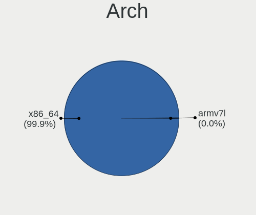
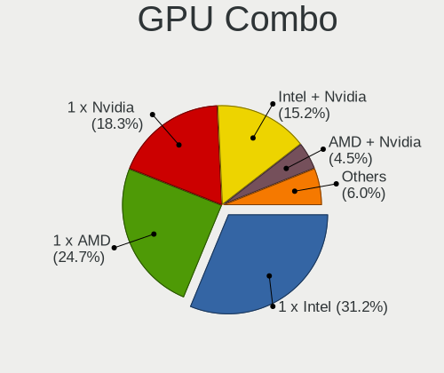
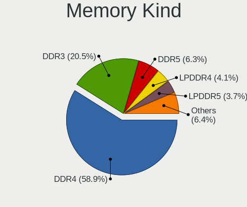
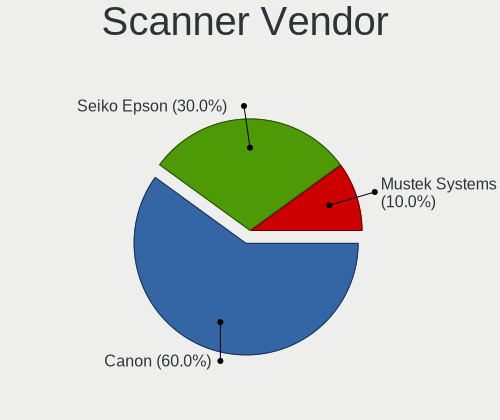

Arch - Tested Hardware & Statistics
-----------------------------------

A project to collect tested hardware configurations for Arch.

Anyone can contribute to this report by the [hw-probe](https://github.com/linuxhw/hw-probe) tool:

    sudo -E hw-probe -all -upload

Please contribute! Especially if your hardware is rare.

This is a report for all computer types. See also reports for [desktops](/Dist/Arch/Desktop/README.md) and [notebooks](/Dist/Arch/Notebook/README.md).

Contents
--------

* [ Test Cases ](#test-cases)

* [ System ](#system)
  - [ OS                       ](#os)
  - [ OS Family                ](#os-family)
  - [ Kernel                   ](#kernel)
  - [ Kernel Family            ](#kernel-family)
  - [ Kernel Major Ver.        ](#kernel-major-ver)
  - [ Arch                     ](#arch)
  - [ DE                       ](#de)
  - [ Display Server           ](#display-server)
  - [ Display Manager          ](#display-manager)
  - [ OS Lang                  ](#os-lang)
  - [ Boot Mode                ](#boot-mode)
  - [ Filesystem               ](#filesystem)
  - [ Part. scheme             ](#part-scheme)
  - [ Dual Boot with Linux/BSD ](#dual-boot-with-linuxbsd)
  - [ Dual Boot (Win)          ](#dual-boot-win)

* [ Board ](#board)
  - [ Vendor                   ](#vendor)
  - [ Model                    ](#model)
  - [ Model Family             ](#model-family)
  - [ MFG Year                 ](#mfg-year)
  - [ Form Factor              ](#form-factor)
  - [ Secure Boot              ](#secure-boot)
  - [ Coreboot                 ](#coreboot)
  - [ RAM Size                 ](#ram-size)
  - [ RAM Used                 ](#ram-used)
  - [ Total Drives             ](#total-drives)
  - [ Has CD-ROM               ](#has-cd-rom)
  - [ Has Ethernet             ](#has-ethernet)
  - [ Has WiFi                 ](#has-wifi)
  - [ Has Bluetooth            ](#has-bluetooth)

* [ Location ](#location)
  - [ Country                  ](#country)
  - [ City                     ](#city)

* [ Drives ](#drives)
  - [ Drive Vendor             ](#drive-vendor)
  - [ Drive Model              ](#drive-model)
  - [ HDD Vendor               ](#hdd-vendor)
  - [ SSD Vendor               ](#ssd-vendor)
  - [ Drive Kind               ](#drive-kind)
  - [ Drive Connector          ](#drive-connector)
  - [ Drive Size               ](#drive-size)
  - [ Space Total              ](#space-total)
  - [ Space Used               ](#space-used)
  - [ Malfunc. Drives          ](#malfunc-drives)
  - [ Malfunc. Drive Vendor    ](#malfunc-drive-vendor)
  - [ Malfunc. HDD Vendor      ](#malfunc-hdd-vendor)
  - [ Malfunc. Drive Kind      ](#malfunc-drive-kind)
  - [ Failed Drives            ](#failed-drives)
  - [ Failed Drive Vendor      ](#failed-drive-vendor)
  - [ Drive Status             ](#drive-status)

* [ Storage controller ](#storage-controller)
  - [ Storage Vendor           ](#storage-vendor)
  - [ Storage Model            ](#storage-model)
  - [ Storage Kind             ](#storage-kind)

* [ Processor ](#processor)
  - [ CPU Vendor               ](#cpu-vendor)
  - [ CPU Model                ](#cpu-model)
  - [ CPU Model Family         ](#cpu-model-family)
  - [ CPU Cores                ](#cpu-cores)
  - [ CPU Sockets              ](#cpu-sockets)
  - [ CPU Threads              ](#cpu-threads)
  - [ CPU Op-Modes             ](#cpu-op-modes)
  - [ CPU Microcode            ](#cpu-microcode)
  - [ CPU Microarch            ](#cpu-microarch)

* [ Graphics ](#graphics)
  - [ GPU Vendor               ](#gpu-vendor)
  - [ GPU Model                ](#gpu-model)
  - [ GPU Combo                ](#gpu-combo)
  - [ GPU Driver               ](#gpu-driver)
  - [ GPU Memory               ](#gpu-memory)

* [ Monitor ](#monitor)
  - [ Monitor Vendor           ](#monitor-vendor)
  - [ Monitor Model            ](#monitor-model)
  - [ Monitor Resolution       ](#monitor-resolution)
  - [ Monitor Diagonal         ](#monitor-diagonal)
  - [ Monitor Width            ](#monitor-width)
  - [ Aspect Ratio             ](#aspect-ratio)
  - [ Monitor Area             ](#monitor-area)
  - [ Pixel Density            ](#pixel-density)
  - [ Multiple Monitors        ](#multiple-monitors)

* [ Network ](#network)
  - [ Net Controller Vendor    ](#net-controller-vendor)
  - [ Net Controller Model     ](#net-controller-model)
  - [ Wireless Vendor          ](#wireless-vendor)
  - [ Wireless Model           ](#wireless-model)
  - [ Ethernet Vendor          ](#ethernet-vendor)
  - [ Ethernet Model           ](#ethernet-model)
  - [ Net Controller Kind      ](#net-controller-kind)
  - [ Used Controller          ](#used-controller)
  - [ NICs                     ](#nics)
  - [ IPv6                     ](#ipv6)

* [ Bluetooth ](#bluetooth)
  - [ Bluetooth Vendor         ](#bluetooth-vendor)
  - [ Bluetooth Model          ](#bluetooth-model)

* [ Sound ](#sound)
  - [ Sound Vendor             ](#sound-vendor)
  - [ Sound Model              ](#sound-model)

* [ Memory ](#memory)
  - [ Memory Vendor            ](#memory-vendor)
  - [ Memory Model             ](#memory-model)
  - [ Memory Kind              ](#memory-kind)
  - [ Memory Form Factor       ](#memory-form-factor)
  - [ Memory Size              ](#memory-size)
  - [ Memory Speed             ](#memory-speed)

* [ Printers & scanners ](#printers--scanners)
  - [ Printer Vendor           ](#printer-vendor)
  - [ Printer Model            ](#printer-model)
  - [ Scanner Vendor           ](#scanner-vendor)
  - [ Scanner Model            ](#scanner-model)

* [ Camera ](#camera)
  - [ Camera Vendor            ](#camera-vendor)
  - [ Camera Model             ](#camera-model)

* [ Security ](#security)
  - [ Fingerprint Vendor       ](#fingerprint-vendor)
  - [ Fingerprint Model        ](#fingerprint-model)
  - [ Chipcard Vendor          ](#chipcard-vendor)
  - [ Chipcard Model           ](#chipcard-model)

* [ Unsupported ](#unsupported)
  - [ Unsupported Devices      ](#unsupported-devices)
  - [ Unsupported Device Types ](#unsupported-device-types)

Test Cases
----------

Total: 6234

| Vendor        | Model                       | Form-Factor | Probe                                                      | Date         |
|---------------|-----------------------------|-------------|------------------------------------------------------------|--------------|
| Lenovo        | ThinkPad X1 Yoga Gen 7 2... | Convertible | [5f076638f4](https://linux-hardware.org/?probe=5f076638f4) | Jul 01, 2022 |
| Razer         | Blade 14 (2022) - RZ09-0... | Notebook    | [927dbb8452](https://linux-hardware.org/?probe=927dbb8452) | Jul 01, 2022 |
| ASUSTek       | PRIME B550M-A               | Desktop     | [9f4f6d2323](https://linux-hardware.org/?probe=9f4f6d2323) | Jul 01, 2022 |
| Razer         | Blade 15 Base Model (Ear... | Notebook    | [7e809da3ad](https://linux-hardware.org/?probe=7e809da3ad) | Jul 01, 2022 |
| Lenovo        | ThinkPad W510 4318CTO       | Notebook    | [27cd378ed6](https://linux-hardware.org/?probe=27cd378ed6) | Jul 01, 2022 |
| HP            | Pavilion g4                 | Notebook    | [3626d9afe4](https://linux-hardware.org/?probe=3626d9afe4) | Jul 01, 2022 |
| ASUSTek       | ROG Flow X13 GV301RE_GV3... | Convertible | [03dd055ce5](https://linux-hardware.org/?probe=03dd055ce5) | Jun 30, 2022 |
| Dell          | XPS M1330                   | Notebook    | [b891e49fac](https://linux-hardware.org/?probe=b891e49fac) | Jun 30, 2022 |
| Gigabyte      | B450 AORUS ELITE            | Desktop     | [7287dd0ad5](https://linux-hardware.org/?probe=7287dd0ad5) | Jun 30, 2022 |
| Gigabyte      | B450 AORUS ELITE            | Desktop     | [3c478faa0c](https://linux-hardware.org/?probe=3c478faa0c) | Jun 30, 2022 |
| Gigabyte      | AX370-Gaming 5              | Desktop     | [bd54eb7f9c](https://linux-hardware.org/?probe=bd54eb7f9c) | Jun 30, 2022 |
| HP            | EliteBook 8470p             | Notebook    | [96b07cbbd5](https://linux-hardware.org/?probe=96b07cbbd5) | Jun 30, 2022 |
| ASUSTek       | ROG Strix G713RW_G713RW     | Notebook    | [abebd5c659](https://linux-hardware.org/?probe=abebd5c659) | Jun 30, 2022 |
| Gigabyte      | Z87P-D3                     | Desktop     | [2ae62ac227](https://linux-hardware.org/?probe=2ae62ac227) | Jun 30, 2022 |
| Dell          | Vostro 5625                 | Notebook    | [0a047126ba](https://linux-hardware.org/?probe=0a047126ba) | Jun 30, 2022 |
| HUAWEI        | HVY-WXX9                    | Notebook    | [e7f3ea5cf5](https://linux-hardware.org/?probe=e7f3ea5cf5) | Jun 30, 2022 |
| HP            | Spectre x360 Convertible... | Convertible | [e594fe8eb6](https://linux-hardware.org/?probe=e594fe8eb6) | Jun 29, 2022 |
| Gigabyte      | X570S AORUS ELITE AX        | Desktop     | [ec8f2e717c](https://linux-hardware.org/?probe=ec8f2e717c) | Jun 29, 2022 |
| Infinix       | INBOOK X2                   | Notebook    | [1c87102f96](https://linux-hardware.org/?probe=1c87102f96) | Jun 29, 2022 |
| Lenovo        | ThinkPad P50 20EQS5M100     | Notebook    | [d0b6aa0a1a](https://linux-hardware.org/?probe=d0b6aa0a1a) | Jun 29, 2022 |
| Gigabyte      | H81M-S1                     | Desktop     | [6dfee96211](https://linux-hardware.org/?probe=6dfee96211) | Jun 29, 2022 |
| Dell          | XPS 13 9310                 | Notebook    | [6a2b56796c](https://linux-hardware.org/?probe=6a2b56796c) | Jun 28, 2022 |
| Acer          | Aspire M5-582PT             | Notebook    | [e159de9f3e](https://linux-hardware.org/?probe=e159de9f3e) | Jun 28, 2022 |
| HP            | EliteBook 840 G2            | Notebook    | [79a978476b](https://linux-hardware.org/?probe=79a978476b) | Jun 28, 2022 |
| Dell          | Latitude 7350               | Notebook    | [427cc37d76](https://linux-hardware.org/?probe=427cc37d76) | Jun 28, 2022 |
| Dell          | Latitude 7350               | Notebook    | [65d1c5c6f5](https://linux-hardware.org/?probe=65d1c5c6f5) | Jun 28, 2022 |
| Lenovo        | ThinkBook 13s G2 ITL 20V... | Notebook    | [20054c6da2](https://linux-hardware.org/?probe=20054c6da2) | Jun 27, 2022 |
| Lenovo        | ThinkPad T580 20LAS6XC00    | Notebook    | [a4b9098138](https://linux-hardware.org/?probe=a4b9098138) | Jun 26, 2022 |
| Lenovo        | Yoga 710-15IKB 80V5         | Convertible | [088e3e2f28](https://linux-hardware.org/?probe=088e3e2f28) | Jun 26, 2022 |
| HP            | Pavilion Gaming Laptop 1... | Notebook    | [0beecf61e4](https://linux-hardware.org/?probe=0beecf61e4) | Jun 26, 2022 |
| MSI           | B250 GAMING M3              | Desktop     | [f79c31ad28](https://linux-hardware.org/?probe=f79c31ad28) | Jun 26, 2022 |
| ASRock        | X570 Taichi                 | Desktop     | [70a0ba730c](https://linux-hardware.org/?probe=70a0ba730c) | Jun 26, 2022 |
| Dell          | Inspiron 3442               | Notebook    | [72286bac00](https://linux-hardware.org/?probe=72286bac00) | Jun 26, 2022 |
| Lenovo        | ThinkPad X1 Extreme 20MF... | Notebook    | [68e2e0bbdb](https://linux-hardware.org/?probe=68e2e0bbdb) | Jun 25, 2022 |
| ASRock        | B550 Taichi                 | Desktop     | [a84e0d9197](https://linux-hardware.org/?probe=a84e0d9197) | Jun 25, 2022 |
| ASUSTek       | ROG Strix G733QS_G733QS     | Notebook    | [27343a622f](https://linux-hardware.org/?probe=27343a622f) | Jun 25, 2022 |
| Dell          | Latitude 5420               | Notebook    | [2149a24612](https://linux-hardware.org/?probe=2149a24612) | Jun 25, 2022 |
| Dell          | Latitude 5490               | Notebook    | [4c3d48724c](https://linux-hardware.org/?probe=4c3d48724c) | Jun 25, 2022 |
| Dell          | Latitude 5490               | Notebook    | [3bb8a81dbf](https://linux-hardware.org/?probe=3bb8a81dbf) | Jun 25, 2022 |
| ASUSTek       | G551JM                      | Notebook    | [2d8e7ffcb2](https://linux-hardware.org/?probe=2d8e7ffcb2) | Jun 24, 2022 |
| ASUSTek       | ASUS TUF Dash F15 FX516P... | Notebook    | [e575e05b18](https://linux-hardware.org/?probe=e575e05b18) | Jun 24, 2022 |
| HP            | ENVY x360 Convertible 13... | Convertible | [a2f3ee6e42](https://linux-hardware.org/?probe=a2f3ee6e42) | Jun 24, 2022 |
| Lenovo        | ThinkBook 14 G4+ ARA 21D... | Notebook    | [5bd3ad4d01](https://linux-hardware.org/?probe=5bd3ad4d01) | Jun 24, 2022 |
| HP            | 8906 SMVB                   | Desktop     | [a10adc5a33](https://linux-hardware.org/?probe=a10adc5a33) | Jun 24, 2022 |
| Dell          | Inspiron 15 7000 Gaming     | Notebook    | [fac01563a9](https://linux-hardware.org/?probe=fac01563a9) | Jun 24, 2022 |
| ASUSTek       | TUF Gaming B550M-E WIFI     | Desktop     | [08e5f734f9](https://linux-hardware.org/?probe=08e5f734f9) | Jun 24, 2022 |
| Gigabyte      | B550 AORUS ELITE            | Desktop     | [95d5fd3cd1](https://linux-hardware.org/?probe=95d5fd3cd1) | Jun 24, 2022 |
| ASRock        | X370 Taichi                 | Desktop     | [788acf13f2](https://linux-hardware.org/?probe=788acf13f2) | Jun 24, 2022 |
| Acer          | Nitro AN715-51              | Notebook    | [a8df58056b](https://linux-hardware.org/?probe=a8df58056b) | Jun 24, 2022 |
| Lenovo        | ThinkPad T580 20LAS6XC00    | Notebook    | [55e631d9b6](https://linux-hardware.org/?probe=55e631d9b6) | Jun 24, 2022 |
| ASUSTek       | ROG Strix G513QY_G513QY     | Notebook    | [1780abcf08](https://linux-hardware.org/?probe=1780abcf08) | Jun 24, 2022 |
| Lenovo        | Legion Y740-15IRHg 81UH     | Notebook    | [e0da282c48](https://linux-hardware.org/?probe=e0da282c48) | Jun 23, 2022 |
| ASUSTek       | ASUS TUF Gaming A17 FA70... | Notebook    | [a1a0b3b43b](https://linux-hardware.org/?probe=a1a0b3b43b) | Jun 23, 2022 |
| Lenovo        | Legion 5 15ARH05H 82B1      | Notebook    | [cacc2464af](https://linux-hardware.org/?probe=cacc2464af) | Jun 23, 2022 |
| HP            | EliteBook 850 G8 Noteboo... | Notebook    | [7d5a943ab0](https://linux-hardware.org/?probe=7d5a943ab0) | Jun 23, 2022 |
| Dell          | Vostro 2420                 | Notebook    | [2d50f4b4d8](https://linux-hardware.org/?probe=2d50f4b4d8) | Jun 23, 2022 |
| Acer          | Nitro AN515-55              | Notebook    | [c4b2a02630](https://linux-hardware.org/?probe=c4b2a02630) | Jun 23, 2022 |
| ASUSTek       | VivoBook_ASUSLaptop M350... | Notebook    | [f2b61e1e02](https://linux-hardware.org/?probe=f2b61e1e02) | Jun 23, 2022 |
| Acer          | Aspire E1-570               | Notebook    | [906b1f465e](https://linux-hardware.org/?probe=906b1f465e) | Jun 23, 2022 |
| ASUSTek       | PRIME X370-PRO              | Desktop     | [165a04e05f](https://linux-hardware.org/?probe=165a04e05f) | Jun 23, 2022 |
| Razer         | Blade                       | Notebook    | [6c8b201cd9](https://linux-hardware.org/?probe=6c8b201cd9) | Jun 23, 2022 |
| Apple         | Mac-65CE76090165799A iMa... | All in one  | [257f40005f](https://linux-hardware.org/?probe=257f40005f) | Jun 23, 2022 |
| ASRock        | X370 Pro4                   | Desktop     | [df6751dcaa](https://linux-hardware.org/?probe=df6751dcaa) | Jun 22, 2022 |
| Apple         | Mac-F2208EC8                | Mini pc     | [2ca2a822ed](https://linux-hardware.org/?probe=2ca2a822ed) | Jun 22, 2022 |
| ASUSTek       | PRIME Z270-A                | Desktop     | [c8b0e5e0ca](https://linux-hardware.org/?probe=c8b0e5e0ca) | Jun 22, 2022 |
| Acer          | H110H4-M14 P21-A2E          | Desktop     | [f3c553d3f0](https://linux-hardware.org/?probe=f3c553d3f0) | Jun 22, 2022 |
| ASUSTek       | ASUS TUF Gaming A17 FA70... | Notebook    | [51ec938467](https://linux-hardware.org/?probe=51ec938467) | Jun 22, 2022 |
| Acer          | H110H4-M14 P21-A2E          | Desktop     | [17e46ecec3](https://linux-hardware.org/?probe=17e46ecec3) | Jun 22, 2022 |
| HP            | 2B4B                        | Desktop     | [fe2eceeeda](https://linux-hardware.org/?probe=fe2eceeeda) | Jun 22, 2022 |
| LG Electro... | 15Z95N-G.AAC6U1             | Notebook    | [c5b4596c19](https://linux-hardware.org/?probe=c5b4596c19) | Jun 22, 2022 |
| Acer          | Nitro AN515-55              | Notebook    | [bc159b637c](https://linux-hardware.org/?probe=bc159b637c) | Jun 22, 2022 |
| ASUSTek       | TUF Gaming B450-PLUS II     | Desktop     | [5fc2a02e85](https://linux-hardware.org/?probe=5fc2a02e85) | Jun 22, 2022 |
| Dell          | Vostro 2420                 | Notebook    | [84a4eb23c6](https://linux-hardware.org/?probe=84a4eb23c6) | Jun 21, 2022 |
| Acer          | Ferrari One 200             | Notebook    | [52ba124048](https://linux-hardware.org/?probe=52ba124048) | Jun 21, 2022 |
| Lenovo        | ThinkPad T14s Gen 1 20UH... | Notebook    | [a8d78740e8](https://linux-hardware.org/?probe=a8d78740e8) | Jun 21, 2022 |
| HUAWEI        | KLVL-WXXW                   | Notebook    | [4539c26ede](https://linux-hardware.org/?probe=4539c26ede) | Jun 21, 2022 |
| HUAWEI        | KLVL-WXXW                   | Notebook    | [cf80e45435](https://linux-hardware.org/?probe=cf80e45435) | Jun 21, 2022 |
| Apple         | MacBookPro16,1              | Notebook    | [35f551b127](https://linux-hardware.org/?probe=35f551b127) | Jun 21, 2022 |
| HP            | EliteBook 8570w             | Notebook    | [2530e2e400](https://linux-hardware.org/?probe=2530e2e400) | Jun 21, 2022 |
| Lenovo        | ThinkPad L15 Gen 2a 20X7... | Notebook    | [9a9dd8fa0c](https://linux-hardware.org/?probe=9a9dd8fa0c) | Jun 21, 2022 |
| TUXEDO        | InfinityBook S 15 Gen6      | Notebook    | [ff5ed1835c](https://linux-hardware.org/?probe=ff5ed1835c) | Jun 20, 2022 |
| Philco        | OEM                         | Notebook    | [bee7961704](https://linux-hardware.org/?probe=bee7961704) | Jun 20, 2022 |
| HONOR         | HYM-WXX                     | Notebook    | [9eb7129a46](https://linux-hardware.org/?probe=9eb7129a46) | Jun 20, 2022 |
| ASUSTek       | SABERTOOTH X99              | Desktop     | [1052591535](https://linux-hardware.org/?probe=1052591535) | Jun 20, 2022 |
| Lenovo        | ThinkPad E14 Gen 2 20T60... | Notebook    | [fc053b8a95](https://linux-hardware.org/?probe=fc053b8a95) | Jun 20, 2022 |
| ASRock        | X570 Steel Legend           | Desktop     | [8e8fcfc4bf](https://linux-hardware.org/?probe=8e8fcfc4bf) | Jun 20, 2022 |
| MSI           | X370 XPOWER GAMING TITAN... | Desktop     | [4e9034764b](https://linux-hardware.org/?probe=4e9034764b) | Jun 20, 2022 |
| HP            | ENVY dv7                    | Notebook    | [22dec86487](https://linux-hardware.org/?probe=22dec86487) | Jun 20, 2022 |
| ASRock        | B550 Taichi                 | Desktop     | [ddd610d863](https://linux-hardware.org/?probe=ddd610d863) | Jun 20, 2022 |
| ASUSTek       | GL502VMK                    | Notebook    | [d872e88532](https://linux-hardware.org/?probe=d872e88532) | Jun 20, 2022 |
| ASUSTek       | TUF Gaming X570-PLUS        | Desktop     | [4879f19d4a](https://linux-hardware.org/?probe=4879f19d4a) | Jun 20, 2022 |
| ASUSTek       | X550JX                      | Notebook    | [999d6e4735](https://linux-hardware.org/?probe=999d6e4735) | Jun 20, 2022 |
| ASUSTek       | TUF Gaming B550M-PLUS       | Desktop     | [b841edf2b7](https://linux-hardware.org/?probe=b841edf2b7) | Jun 19, 2022 |
| Framework     | Laptop                      | Notebook    | [f5ece7ce85](https://linux-hardware.org/?probe=f5ece7ce85) | Jun 19, 2022 |
| ASRock        | X470 Master SLI             | Desktop     | [42b74b0907](https://linux-hardware.org/?probe=42b74b0907) | Jun 19, 2022 |
| Toshiba       | Satellite Click 10 LX5W-... | Notebook    | [b8f87c8ede](https://linux-hardware.org/?probe=b8f87c8ede) | Jun 19, 2022 |
| Gigabyte      | Z590 AORUS ELITE AX         | Desktop     | [8cff182bbf](https://linux-hardware.org/?probe=8cff182bbf) | Jun 19, 2022 |
| HP            | Spectre x360 Convertible... | Convertible | [67faa5fcd3](https://linux-hardware.org/?probe=67faa5fcd3) | Jun 19, 2022 |
| ASUSTek       | PRIME B450M-K               | Desktop     | [90012988e8](https://linux-hardware.org/?probe=90012988e8) | Jun 19, 2022 |
| Microsoft     | Surface Pro 3               | Tablet      | [b93d65dd64](https://linux-hardware.org/?probe=b93d65dd64) | Jun 18, 2022 |
| HP            | Pavilion Laptop 15-eh1xx... | Notebook    | [fcbbdaf844](https://linux-hardware.org/?probe=fcbbdaf844) | Jun 18, 2022 |
| Lenovo        | MIIX 3-830 80JB             | Tablet      | [621742ba14](https://linux-hardware.org/?probe=621742ba14) | Jun 18, 2022 |
| HUAWEI        | KPR-WX9                     | Notebook    | [4c08060155](https://linux-hardware.org/?probe=4c08060155) | Jun 18, 2022 |
| HP            | EliteBook 8460p             | Notebook    | [e19c095325](https://linux-hardware.org/?probe=e19c095325) | Jun 18, 2022 |
| Dell          | 0Y5DDC A00                  | Desktop     | [c59a0a5413](https://linux-hardware.org/?probe=c59a0a5413) | Jun 18, 2022 |
| OEM           | G41 775 ICH7 8712           | Desktop     | [31cdb7f2fc](https://linux-hardware.org/?probe=31cdb7f2fc) | Jun 17, 2022 |
| Acer          | Nitro AN515-44              | Notebook    | [9ed8b5c759](https://linux-hardware.org/?probe=9ed8b5c759) | Jun 17, 2022 |
| Lenovo        | ThinkPad P50 20EQS31G00     | Notebook    | [2e98922741](https://linux-hardware.org/?probe=2e98922741) | Jun 17, 2022 |
| Dell          | Latitude E5450              | Notebook    | [42f5a53e24](https://linux-hardware.org/?probe=42f5a53e24) | Jun 16, 2022 |
| HP            | Laptop 15-dw2xxx            | Notebook    | [7eee6145a1](https://linux-hardware.org/?probe=7eee6145a1) | Jun 16, 2022 |
| ASUSTek       | X411UA                      | Notebook    | [da7deca26c](https://linux-hardware.org/?probe=da7deca26c) | Jun 16, 2022 |
| ASUSTek       | T100HAN                     | Notebook    | [20105d0e64](https://linux-hardware.org/?probe=20105d0e64) | Jun 16, 2022 |
| Acer          | Swift SF314-511             | Notebook    | [c414ab98c5](https://linux-hardware.org/?probe=c414ab98c5) | Jun 16, 2022 |
| MSI           | GP66 Leopard 11UG           | Notebook    | [ffcca1ccac](https://linux-hardware.org/?probe=ffcca1ccac) | Jun 16, 2022 |
| ASUSTek       | PRIME B550M-A               | Desktop     | [738709ae5d](https://linux-hardware.org/?probe=738709ae5d) | Jun 16, 2022 |
| Lenovo        | IdeaPad 110-14IBR 80T6      | Notebook    | [27d9d9e55e](https://linux-hardware.org/?probe=27d9d9e55e) | Jun 16, 2022 |
| Lenovo        | ThinkPad P50 20EQS31G00     | Notebook    | [51042aca4a](https://linux-hardware.org/?probe=51042aca4a) | Jun 15, 2022 |
| ASRock        | B450 Gaming-ITX/ac          | Desktop     | [5afd9dcda0](https://linux-hardware.org/?probe=5afd9dcda0) | Jun 15, 2022 |
| ASUSTek       | PRIME Z370-P                | Desktop     | [b6cdb73504](https://linux-hardware.org/?probe=b6cdb73504) | Jun 15, 2022 |
| Acer          | Nitro AN515-55              | Notebook    | [bb631825e3](https://linux-hardware.org/?probe=bb631825e3) | Jun 15, 2022 |
| Lenovo        | SHARKBAY NOK                | Desktop     | [4b2037715f](https://linux-hardware.org/?probe=4b2037715f) | Jun 15, 2022 |
| Lenovo        | ThinkPad E490 20N8002APB    | Notebook    | [3a17ac0192](https://linux-hardware.org/?probe=3a17ac0192) | Jun 15, 2022 |
| Acer          | Nitro AN515-55              | Notebook    | [670d05fbe3](https://linux-hardware.org/?probe=670d05fbe3) | Jun 15, 2022 |
| MSI           | B450 GAMING PRO CARBON M... | Desktop     | [971f310609](https://linux-hardware.org/?probe=971f310609) | Jun 15, 2022 |
| ASUSTek       | ROG Zephyrus G15 GA503QS... | Notebook    | [527587d2b9](https://linux-hardware.org/?probe=527587d2b9) | Jun 14, 2022 |
| GPU Compan... | GWTN141-10                  | Notebook    | [c856f6d54f](https://linux-hardware.org/?probe=c856f6d54f) | Jun 14, 2022 |
| Timi          | TM1701                      | Notebook    | [e57d1ac956](https://linux-hardware.org/?probe=e57d1ac956) | Jun 14, 2022 |
| Lenovo        | IdeaPad 100-14IBY 80MH      | Notebook    | [ee0b4c4389](https://linux-hardware.org/?probe=ee0b4c4389) | Jun 14, 2022 |
| Lenovo        | ThinkPad P15 Gen 1 20ST0... | Notebook    | [c87c87881e](https://linux-hardware.org/?probe=c87c87881e) | Jun 14, 2022 |
| Google        | Quawks                      | Notebook    | [c513bb8294](https://linux-hardware.org/?probe=c513bb8294) | Jun 14, 2022 |
| Microsoft     | Surface Laptop 3            | Tablet      | [44eccb41e1](https://linux-hardware.org/?probe=44eccb41e1) | Jun 14, 2022 |
| HP            | Pavilion x360 Convertibl... | Convertible | [002c21e90f](https://linux-hardware.org/?probe=002c21e90f) | Jun 14, 2022 |
| HP            | Pavilion x360 Convertibl... | Convertible | [dfa7cc38e7](https://linux-hardware.org/?probe=dfa7cc38e7) | Jun 14, 2022 |
| ASUSTek       | U36SG                       | Notebook    | [d5c67322d4](https://linux-hardware.org/?probe=d5c67322d4) | Jun 14, 2022 |
| HONOR         | HYM-WXX                     | Notebook    | [0f745d7bc7](https://linux-hardware.org/?probe=0f745d7bc7) | Jun 13, 2022 |
| HP            | Laptop 15-dw2xxx            | Notebook    | [cdc0b49b72](https://linux-hardware.org/?probe=cdc0b49b72) | Jun 13, 2022 |
| Lenovo        | Legion 5 Pro 16ACH6H 82J... | Notebook    | [e33ea31f97](https://linux-hardware.org/?probe=e33ea31f97) | Jun 13, 2022 |
| ASUSTek       | M4A785TD-V EVO              | Desktop     | [5f5c3fcba9](https://linux-hardware.org/?probe=5f5c3fcba9) | Jun 13, 2022 |
| Gigabyte      | Z390 AORUS PRO-CF           | Desktop     | [d827dcbe06](https://linux-hardware.org/?probe=d827dcbe06) | Jun 13, 2022 |
| HP            | Laptop 15q-bu0xx            | Notebook    | [859d1ddbb0](https://linux-hardware.org/?probe=859d1ddbb0) | Jun 13, 2022 |
| Samsung       | 670Z5E                      | Notebook    | [049e305b33](https://linux-hardware.org/?probe=049e305b33) | Jun 13, 2022 |
| ASUSTek       | ROG STRIX B350-F GAMING     | Desktop     | [f3cb75acef](https://linux-hardware.org/?probe=f3cb75acef) | Jun 13, 2022 |
| HP            | ENVY x360 Convertible 13... | Convertible | [0d74445d24](https://linux-hardware.org/?probe=0d74445d24) | Jun 13, 2022 |
| HP            | 8906 SMVB                   | Desktop     | [7cc9d90361](https://linux-hardware.org/?probe=7cc9d90361) | Jun 12, 2022 |
| Dell          | Inspiron 1545               | Notebook    | [ac1f1fe24f](https://linux-hardware.org/?probe=ac1f1fe24f) | Jun 12, 2022 |
| ASUSTek       | P6T DELUXE V2               | Desktop     | [db209b6bf1](https://linux-hardware.org/?probe=db209b6bf1) | Jun 12, 2022 |
| ASUSTek       | T100HAN                     | Notebook    | [9a5b9400a1](https://linux-hardware.org/?probe=9a5b9400a1) | Jun 12, 2022 |
| ASUSTek       | PRIME B550M-A               | Desktop     | [d8ae63f677](https://linux-hardware.org/?probe=d8ae63f677) | Jun 12, 2022 |
| HP            | ProBook 440 G4              | Notebook    | [52efea465c](https://linux-hardware.org/?probe=52efea465c) | Jun 12, 2022 |
| HP            | ProBook 440 G4              | Notebook    | [731e6f4aa8](https://linux-hardware.org/?probe=731e6f4aa8) | Jun 12, 2022 |
| Dell          | Precision 7520              | Notebook    | [002f7ce017](https://linux-hardware.org/?probe=002f7ce017) | Jun 12, 2022 |
| ASUSTek       | SABERTOOTH X99              | Desktop     | [564e15d66b](https://linux-hardware.org/?probe=564e15d66b) | Jun 11, 2022 |
| Lenovo        | IdeaPad 3 15ALC6 82KU       | Notebook    | [e414ea3e15](https://linux-hardware.org/?probe=e414ea3e15) | Jun 11, 2022 |
| Alienware     | m15 R4                      | Notebook    | [5299db8f70](https://linux-hardware.org/?probe=5299db8f70) | Jun 11, 2022 |
| Apple         | Mac-F226BEC8 PVT            | All in one  | [c1bde29740](https://linux-hardware.org/?probe=c1bde29740) | Jun 11, 2022 |
| ASUSTek       | X555LD                      | Notebook    | [d5d6eeb639](https://linux-hardware.org/?probe=d5d6eeb639) | Jun 11, 2022 |
| Lenovo        | ThinkPad X270 W10DG 20K5... | Notebook    | [c8f8c1a8e3](https://linux-hardware.org/?probe=c8f8c1a8e3) | Jun 10, 2022 |
| ASUSTek       | PRIME B450M-A II            | Desktop     | [148d14437b](https://linux-hardware.org/?probe=148d14437b) | Jun 10, 2022 |
| ASUSTek       | PRIME X470-PRO              | Desktop     | [693e499a6d](https://linux-hardware.org/?probe=693e499a6d) | Jun 10, 2022 |
| HUAWEI        | CREM-WXX9                   | Notebook    | [91580d9a20](https://linux-hardware.org/?probe=91580d9a20) | Jun 10, 2022 |
| Fujitsu       | LIFEBOOK E556               | Notebook    | [1dd2b6a645](https://linux-hardware.org/?probe=1dd2b6a645) | Jun 10, 2022 |
| MSI           | X99A GAMING PRO CARBON      | Desktop     | [31275cdf72](https://linux-hardware.org/?probe=31275cdf72) | Jun 10, 2022 |
| Acer          | WG43M                       | Desktop     | [bdd6d72374](https://linux-hardware.org/?probe=bdd6d72374) | Jun 10, 2022 |
| Lenovo        | ThinkPad X230 2325TXV       | Notebook    | [67f152d520](https://linux-hardware.org/?probe=67f152d520) | Jun 10, 2022 |
| ASUSTek       | P6T DELUXE V2               | Desktop     | [9198e2d64c](https://linux-hardware.org/?probe=9198e2d64c) | Jun 10, 2022 |
| MSI           | X99A GAMING PRO CARBON      | Desktop     | [9e574bef7c](https://linux-hardware.org/?probe=9e574bef7c) | Jun 10, 2022 |
| ASUSTek       | ROG Strix G513QR_G513QR     | Notebook    | [e33e73a70f](https://linux-hardware.org/?probe=e33e73a70f) | Jun 10, 2022 |
| Lenovo        | ThinkPad X220 4291IR6       | Notebook    | [958f8bb25b](https://linux-hardware.org/?probe=958f8bb25b) | Jun 09, 2022 |
| Lenovo        | Unknown                     | Notebook    | [2921bcaa1c](https://linux-hardware.org/?probe=2921bcaa1c) | Jun 09, 2022 |
| Lenovo        | ThinkBook 15 G2 ITL 20VE    | Notebook    | [dcfb1c33aa](https://linux-hardware.org/?probe=dcfb1c33aa) | Jun 09, 2022 |
| MSI           | MPG B550 GAMING PLUS        | Desktop     | [bfe8486e59](https://linux-hardware.org/?probe=bfe8486e59) | Jun 09, 2022 |
| ASUSTek       | ROG STRIX Z390-E GAMING     | Desktop     | [44aa7de1c8](https://linux-hardware.org/?probe=44aa7de1c8) | Jun 08, 2022 |
| ASUSTek       | PRIME B450M-A               | Desktop     | [a144e0b75e](https://linux-hardware.org/?probe=a144e0b75e) | Jun 08, 2022 |
| Dell          | 0WR7PY A03                  | Desktop     | [630d0bc381](https://linux-hardware.org/?probe=630d0bc381) | Jun 08, 2022 |
| ASUSTek       | PRIME B550M-A               | Desktop     | [f2b810d97f](https://linux-hardware.org/?probe=f2b810d97f) | Jun 08, 2022 |
| Gigabyte      | X570 I AORUS PRO WIFI       | Desktop     | [d984f403e9](https://linux-hardware.org/?probe=d984f403e9) | Jun 08, 2022 |
| Gigabyte      | B360M D3H-CF                | Desktop     | [73e68df88c](https://linux-hardware.org/?probe=73e68df88c) | Jun 08, 2022 |
| Chuwi         | GemiBook Pro                | Notebook    | [737a4183c8](https://linux-hardware.org/?probe=737a4183c8) | Jun 07, 2022 |
| Lenovo        | SHARKBAY 0B98401 PRO        | Desktop     | [59f197c68d](https://linux-hardware.org/?probe=59f197c68d) | Jun 07, 2022 |
| Acer          | WG43M                       | Desktop     | [70d3c85c47](https://linux-hardware.org/?probe=70d3c85c47) | Jun 07, 2022 |
| Avell High... | A62 LIV                     | Notebook    | [5a7be822e3](https://linux-hardware.org/?probe=5a7be822e3) | Jun 07, 2022 |
| Dell          | Precision 5550              | Notebook    | [a4bf41771c](https://linux-hardware.org/?probe=a4bf41771c) | Jun 07, 2022 |
| ASRock        | Z97M Anniversary            | Desktop     | [1855124dd3](https://linux-hardware.org/?probe=1855124dd3) | Jun 07, 2022 |
| Samsung       | 740U5M                      | Convertible | [df817ce700](https://linux-hardware.org/?probe=df817ce700) | Jun 07, 2022 |
| Lenovo        | ThinkPad T495 20NJ0007US    | Notebook    | [2b3ee11cad](https://linux-hardware.org/?probe=2b3ee11cad) | Jun 07, 2022 |
| Shenzhen W... | AERO 2 Pro                  | Mini pc     | [e445d85039](https://linux-hardware.org/?probe=e445d85039) | Jun 06, 2022 |
| HP            | EliteBook 840 G5            | Notebook    | [73ba6fe3c0](https://linux-hardware.org/?probe=73ba6fe3c0) | Jun 06, 2022 |
| Lenovo        | IdeaPadFlex 5 14ALC05 82... | Convertible | [aab255864c](https://linux-hardware.org/?probe=aab255864c) | Jun 06, 2022 |
| Huanan        | X79-ZD3                     | Desktop     | [e1a7cd65ab](https://linux-hardware.org/?probe=e1a7cd65ab) | Jun 06, 2022 |
| Acer          | Nitro AN515-55              | Notebook    | [0546f2fdfd](https://linux-hardware.org/?probe=0546f2fdfd) | Jun 06, 2022 |
| Lenovo        | ThinkPad P14s Gen 2a 21A... | Notebook    | [228fe8f3f1](https://linux-hardware.org/?probe=228fe8f3f1) | Jun 06, 2022 |
| Dell          | Latitude 5511               | Notebook    | [5d9a12a88d](https://linux-hardware.org/?probe=5d9a12a88d) | Jun 06, 2022 |
| Acer          | Nitro AN515-55              | Notebook    | [4ab9f94abe](https://linux-hardware.org/?probe=4ab9f94abe) | Jun 06, 2022 |
| BESSTAR Te... | DMAF5 V1.0                  | Desktop     | [9a2ab90fd4](https://linux-hardware.org/?probe=9a2ab90fd4) | Jun 06, 2022 |
| Lenovo        | ThinkBook 14p Gen 2 20YN    | Notebook    | [6d46a6107c](https://linux-hardware.org/?probe=6d46a6107c) | Jun 06, 2022 |
| Lenovo        | IdeaPad S145-15IWL 81S9     | Notebook    | [f4dcc8e7a1](https://linux-hardware.org/?probe=f4dcc8e7a1) | Jun 06, 2022 |
| ASUSTek       | PRIME B550M-A               | Desktop     | [d944531fed](https://linux-hardware.org/?probe=d944531fed) | Jun 06, 2022 |
| Dell          | 0YXT71 A02                  | Desktop     | [4dd5ceef26](https://linux-hardware.org/?probe=4dd5ceef26) | Jun 05, 2022 |
| Samsung       | 550XBE/350XBE               | Notebook    | [4746fe546b](https://linux-hardware.org/?probe=4746fe546b) | Jun 05, 2022 |
| Lenovo        | ThinkPad T460p 20FW0005A... | Notebook    | [f9bd82bcd7](https://linux-hardware.org/?probe=f9bd82bcd7) | Jun 05, 2022 |
| Dell          | G3 3500                     | Notebook    | [6734206fa0](https://linux-hardware.org/?probe=6734206fa0) | Jun 05, 2022 |
| ASUSTek       | PRIME A520M-K               | Desktop     | [72dd09a86a](https://linux-hardware.org/?probe=72dd09a86a) | Jun 05, 2022 |
| ASRock        | A520M Pro4                  | Desktop     | [6c408a6fd7](https://linux-hardware.org/?probe=6c408a6fd7) | Jun 05, 2022 |
| Fujitsu       | LIFEBOOK U937               | Notebook    | [44d3d1edad](https://linux-hardware.org/?probe=44d3d1edad) | Jun 04, 2022 |
| ASUSTek       | PRIME H510M-E               | Desktop     | [9207d2f2d8](https://linux-hardware.org/?probe=9207d2f2d8) | Jun 04, 2022 |
| MSI           | X570-A PRO                  | Desktop     | [95af0fa349](https://linux-hardware.org/?probe=95af0fa349) | Jun 04, 2022 |
| TUXEDO        | Book_XA1510                 | Notebook    | [6738253853](https://linux-hardware.org/?probe=6738253853) | Jun 04, 2022 |
| Lenovo        | Y520-15IKBN 80WK            | Notebook    | [66cc7342ec](https://linux-hardware.org/?probe=66cc7342ec) | Jun 04, 2022 |
| Acer          | Swift SF314-511             | Notebook    | [883f386564](https://linux-hardware.org/?probe=883f386564) | Jun 03, 2022 |
| Acer          | Swift SF314-511             | Notebook    | [ecd590c347](https://linux-hardware.org/?probe=ecd590c347) | Jun 03, 2022 |
| ASUSTek       | TUF Gaming X570-PRO         | Desktop     | [d8348d5353](https://linux-hardware.org/?probe=d8348d5353) | Jun 03, 2022 |
| ASUSTek       | PRIME B550M-A               | Desktop     | [84d1d3efdc](https://linux-hardware.org/?probe=84d1d3efdc) | Jun 03, 2022 |
| Huanan        | X79-8D VAA31                | Desktop     | [eefff24cc2](https://linux-hardware.org/?probe=eefff24cc2) | Jun 03, 2022 |
| HP            | Pavilion Notebook           | Notebook    | [0fe589689b](https://linux-hardware.org/?probe=0fe589689b) | Jun 02, 2022 |
| ASUSTek       | ROG CROSSHAIR VIII HERO     | Desktop     | [35ff0536a6](https://linux-hardware.org/?probe=35ff0536a6) | Jun 02, 2022 |
| Dell          | Latitude 9420               | Notebook    | [28ba6de10d](https://linux-hardware.org/?probe=28ba6de10d) | Jun 01, 2022 |
| Lenovo        | ThinkPad X200T 7449G6G      | Notebook    | [fd7f5dd506](https://linux-hardware.org/?probe=fd7f5dd506) | Jun 01, 2022 |
| Lenovo        | ThinkPad X200s 74663RG      | Notebook    | [84efabac8f](https://linux-hardware.org/?probe=84efabac8f) | Jun 01, 2022 |
| MSI           | Bravo 15 B5DD               | Notebook    | [4ae400000f](https://linux-hardware.org/?probe=4ae400000f) | Jun 01, 2022 |
| ASUSTek       | PRIME B550-PLUS             | Desktop     | [156b265da0](https://linux-hardware.org/?probe=156b265da0) | Jun 01, 2022 |
| Gigabyte      | 970A-UD3                    | Desktop     | [c56522071c](https://linux-hardware.org/?probe=c56522071c) | Jun 01, 2022 |
| ASUSTek       | PRIME B550M-A               | Desktop     | [58051fe7e2](https://linux-hardware.org/?probe=58051fe7e2) | Jun 01, 2022 |
| MSI           | Bravo 15 B5DD               | Notebook    | [d561d8dbdb](https://linux-hardware.org/?probe=d561d8dbdb) | Jun 01, 2022 |
| Lenovo        | ThinkPad X200s 74663RG      | Notebook    | [460e11ebe2](https://linux-hardware.org/?probe=460e11ebe2) | May 31, 2022 |
| Gigabyte      | B365M GAMING HD             | Desktop     | [5b8924befc](https://linux-hardware.org/?probe=5b8924befc) | May 31, 2022 |
| Intel         | NUC8BEB J72693-306          | Mini pc     | [ec75dd8324](https://linux-hardware.org/?probe=ec75dd8324) | May 31, 2022 |
| HP            | EliteBook x360 1030 G2      | Convertible | [ed68bc8e1d](https://linux-hardware.org/?probe=ed68bc8e1d) | May 31, 2022 |
| Schenker      | XMG FUSION 15 (XFU15L19)    | Notebook    | [3195728920](https://linux-hardware.org/?probe=3195728920) | May 31, 2022 |
| ASUSTek       | ASUS TUF Gaming A17 FA70... | Notebook    | [799a25df83](https://linux-hardware.org/?probe=799a25df83) | May 31, 2022 |
| Dell          | Latitude 5511               | Notebook    | [ef262c4020](https://linux-hardware.org/?probe=ef262c4020) | May 31, 2022 |
| Dell          | Inspiron 5567               | Notebook    | [2f14b6956f](https://linux-hardware.org/?probe=2f14b6956f) | May 31, 2022 |
| ASUSTek       | ROG STRIX X570-E GAMING     | Desktop     | [6560268d80](https://linux-hardware.org/?probe=6560268d80) | May 31, 2022 |
| ASUSTek       | ROG Strix G513QY_G513QY     | Notebook    | [49c400d1f7](https://linux-hardware.org/?probe=49c400d1f7) | May 31, 2022 |
| ASUSTek       | PRIME B550M-A               | Desktop     | [f2500a22ea](https://linux-hardware.org/?probe=f2500a22ea) | May 31, 2022 |
| ASUSTek       | ASUS TUF Gaming A15 FA50... | Notebook    | [deaac8464e](https://linux-hardware.org/?probe=deaac8464e) | May 31, 2022 |
| HP            | EliteBook 8470p             | Notebook    | [6b22d31e8e](https://linux-hardware.org/?probe=6b22d31e8e) | May 31, 2022 |
| MSI           | MPG Z390 GAMING PRO CARB... | Desktop     | [580abb0cf9](https://linux-hardware.org/?probe=580abb0cf9) | May 30, 2022 |
| Lenovo        | ThinkPad T460p 20FW0005A... | Notebook    | [df0f623625](https://linux-hardware.org/?probe=df0f623625) | May 30, 2022 |
| Lenovo        | Yoga Duet IML 2020 82E9     | Tablet      | [63eab4a6b5](https://linux-hardware.org/?probe=63eab4a6b5) | May 30, 2022 |
| Dell          | Latitude 5511               | Notebook    | [33b796acff](https://linux-hardware.org/?probe=33b796acff) | May 30, 2022 |
| MSI           | B365M PRO-VH                | Desktop     | [a1e7cf7158](https://linux-hardware.org/?probe=a1e7cf7158) | May 30, 2022 |
| MSI           | B365M PRO-VH                | Desktop     | [4d4ea4beec](https://linux-hardware.org/?probe=4d4ea4beec) | May 30, 2022 |
| ASUSTek       | X555UQ                      | Notebook    | [c266f3d070](https://linux-hardware.org/?probe=c266f3d070) | May 30, 2022 |
| Huanan        | X99-TF                      | Desktop     | [cb08cd42a9](https://linux-hardware.org/?probe=cb08cd42a9) | May 30, 2022 |
| Dell          | Inspiron 15-3567            | Notebook    | [3299abfc78](https://linux-hardware.org/?probe=3299abfc78) | May 30, 2022 |
| ASUSTek       | PRIME B450M-A               | Desktop     | [2ce35a0cba](https://linux-hardware.org/?probe=2ce35a0cba) | May 30, 2022 |
| ASUSTek       | SABERTOOTH Z77              | Desktop     | [3bb74db496](https://linux-hardware.org/?probe=3bb74db496) | May 30, 2022 |
| Lenovo        | ThinkPad X1 Carbon Gen 8... | Notebook    | [c71a8e9817](https://linux-hardware.org/?probe=c71a8e9817) | May 29, 2022 |
| ASUSTek       | TUF Gaming B550M-PLUS       | Desktop     | [ca67455f28](https://linux-hardware.org/?probe=ca67455f28) | May 29, 2022 |
| Timi          | TM1604                      | Notebook    | [cd9b839800](https://linux-hardware.org/?probe=cd9b839800) | May 29, 2022 |
| Gigabyte      | X570 UD                     | Desktop     | [627604d5dc](https://linux-hardware.org/?probe=627604d5dc) | May 29, 2022 |
| Lenovo        | Legion Y7000P2020H 82AX     | Notebook    | [220325c031](https://linux-hardware.org/?probe=220325c031) | May 29, 2022 |
| HP            | Laptop 15-dy2xxx            | Notebook    | [1c71dac18b](https://linux-hardware.org/?probe=1c71dac18b) | May 29, 2022 |
| ASUSTek       | GL502VSK                    | Notebook    | [44fb5da9d6](https://linux-hardware.org/?probe=44fb5da9d6) | May 29, 2022 |
| eMachines     | eM350                       | Notebook    | [2573854a09](https://linux-hardware.org/?probe=2573854a09) | May 29, 2022 |
| SLIMBOOK      | TITAN                       | Notebook    | [1029a819d7](https://linux-hardware.org/?probe=1029a819d7) | May 29, 2022 |
| SLIMBOOK      | TITAN                       | Notebook    | [c4e27f4d19](https://linux-hardware.org/?probe=c4e27f4d19) | May 29, 2022 |
| ASUSTek       | VivoBook_ASUSLaptop X509... | Notebook    | [de7ed0046e](https://linux-hardware.org/?probe=de7ed0046e) | May 29, 2022 |
| Lenovo        | IdeaPad S145-15IWL 81S9     | Notebook    | [09aa4c998d](https://linux-hardware.org/?probe=09aa4c998d) | May 28, 2022 |
| ASUSTek       | PRIME B550M-A               | Desktop     | [c84d9cc3c4](https://linux-hardware.org/?probe=c84d9cc3c4) | May 28, 2022 |
| ASUSTek       | PRIME X570-P                | Desktop     | [6b3439b423](https://linux-hardware.org/?probe=6b3439b423) | May 28, 2022 |
| Dell          | XPS 13 9365                 | Convertible | [cd703bd1b1](https://linux-hardware.org/?probe=cd703bd1b1) | May 28, 2022 |
| ASRock        | B450M Pro4-F                | Desktop     | [f67fdd8166](https://linux-hardware.org/?probe=f67fdd8166) | May 28, 2022 |
| ASUSTek       | PRIME B550M-A               | Desktop     | [1238dba054](https://linux-hardware.org/?probe=1238dba054) | May 28, 2022 |
| HP            | 8643 SMVB                   | Desktop     | [cf38cf9584](https://linux-hardware.org/?probe=cf38cf9584) | May 28, 2022 |
| ASUSTek       | G750JX                      | Notebook    | [dfb08cef0b](https://linux-hardware.org/?probe=dfb08cef0b) | May 28, 2022 |
| ASUSTek       | VivoBook_ASUSLaptop TP42... | Convertible | [09a0a17046](https://linux-hardware.org/?probe=09a0a17046) | May 28, 2022 |
| ASUSTek       | ROG STRIX X570-E GAMING     | Desktop     | [caeeaac144](https://linux-hardware.org/?probe=caeeaac144) | May 28, 2022 |
| Lenovo        | ThinkPad X1 Carbon Gen 8... | Notebook    | [ae044ab2d9](https://linux-hardware.org/?probe=ae044ab2d9) | May 28, 2022 |
| MSI           | B450I GAMING PLUS AC        | Desktop     | [e64dfe3f6f](https://linux-hardware.org/?probe=e64dfe3f6f) | May 28, 2022 |
| Lenovo        | ThinkPad X1 Carbon Gen 8... | Notebook    | [b8c8e8baef](https://linux-hardware.org/?probe=b8c8e8baef) | May 27, 2022 |
| ASUSTek       | PRIME B550M-A               | Desktop     | [74c7a449f9](https://linux-hardware.org/?probe=74c7a449f9) | May 27, 2022 |
| Dell          | 0T7D40 A00                  | Desktop     | [c9c3fd7a7e](https://linux-hardware.org/?probe=c9c3fd7a7e) | May 27, 2022 |
| HP            | 0A80h                       | Desktop     | [7e5c6cf61e](https://linux-hardware.org/?probe=7e5c6cf61e) | May 27, 2022 |
| ASRock        | FM2A75M-DGS                 | Desktop     | [73260214ee](https://linux-hardware.org/?probe=73260214ee) | May 27, 2022 |
| ASUSTek       | G20AJ                       | Desktop     | [72ead90cb6](https://linux-hardware.org/?probe=72ead90cb6) | May 26, 2022 |
| System76      | Lemur Pro                   | Notebook    | [dcfd3abdd6](https://linux-hardware.org/?probe=dcfd3abdd6) | May 26, 2022 |
| Lenovo        | IdeaPad Z580                | Notebook    | [4b1c87e746](https://linux-hardware.org/?probe=4b1c87e746) | May 26, 2022 |
| ASUSTek       | ROG STRIX B550-I GAMING     | Desktop     | [d6bd3ae553](https://linux-hardware.org/?probe=d6bd3ae553) | May 26, 2022 |
| Dell          | G15 5515                    | Notebook    | [4f47780467](https://linux-hardware.org/?probe=4f47780467) | May 26, 2022 |
| ASUSTek       | 970 PRO GAMING/AURA         | Desktop     | [4673dbdffc](https://linux-hardware.org/?probe=4673dbdffc) | May 26, 2022 |
| ASUSTek       | ROG Strix G513QY_G513QY     | Notebook    | [1eecb7a012](https://linux-hardware.org/?probe=1eecb7a012) | May 26, 2022 |
| ASUSTek       | ROG CROSSHAIR VIII DARK ... | Desktop     | [c035632382](https://linux-hardware.org/?probe=c035632382) | May 26, 2022 |
| Lenovo        | IdeaPad 310-14ISK 80UG      | Notebook    | [2eb4f98b37](https://linux-hardware.org/?probe=2eb4f98b37) | May 26, 2022 |
| Acer          | Aspire A515-46              | Notebook    | [e004aa3fd2](https://linux-hardware.org/?probe=e004aa3fd2) | May 25, 2022 |
| Gigabyte      | H61M-DS2                    | Desktop     | [09ba129a3b](https://linux-hardware.org/?probe=09ba129a3b) | May 25, 2022 |
| HP            | 8643 SMVB                   | Desktop     | [fc5aa62215](https://linux-hardware.org/?probe=fc5aa62215) | May 25, 2022 |
| ASUSTek       | ROG STRIX Z390-E GAMING     | Desktop     | [13006f8cc4](https://linux-hardware.org/?probe=13006f8cc4) | May 25, 2022 |
| Lenovo        | IdeaPad 310-14ISK 80UG      | Notebook    | [4b23940919](https://linux-hardware.org/?probe=4b23940919) | May 25, 2022 |
| Acer          | WG43M                       | Desktop     | [ae5adc512f](https://linux-hardware.org/?probe=ae5adc512f) | May 24, 2022 |
| Lenovo        | ThinkPad E15 Gen 3 20YG0... | Notebook    | [c8051b3bfc](https://linux-hardware.org/?probe=c8051b3bfc) | May 24, 2022 |
| HP            | Pavilion 15                 | Notebook    | [4140810d35](https://linux-hardware.org/?probe=4140810d35) | May 24, 2022 |
| HP            | 83EF                        | Desktop     | [4f52313cee](https://linux-hardware.org/?probe=4f52313cee) | May 24, 2022 |
| System76      | Oryx Pro                    | Notebook    | [f95bed2419](https://linux-hardware.org/?probe=f95bed2419) | May 24, 2022 |
| Dell          | 0N4YC8 A00                  | Desktop     | [76789ea4f5](https://linux-hardware.org/?probe=76789ea4f5) | May 24, 2022 |
| System76      | Oryx Pro                    | Notebook    | [10502c5379](https://linux-hardware.org/?probe=10502c5379) | May 24, 2022 |
| ASUSTek       | PRIME B550M-A               | Desktop     | [65710bb1bc](https://linux-hardware.org/?probe=65710bb1bc) | May 23, 2022 |
| Dell          | Inspiron N4010              | Notebook    | [872649a8b4](https://linux-hardware.org/?probe=872649a8b4) | May 23, 2022 |
| Acer          | Nitro AN515-45              | Notebook    | [293712cc51](https://linux-hardware.org/?probe=293712cc51) | May 23, 2022 |
| Lenovo        | Legion 5 15ACH6H 82JU       | Notebook    | [5c74b9f6e4](https://linux-hardware.org/?probe=5c74b9f6e4) | May 23, 2022 |
| HP            | Pavilion 15                 | Notebook    | [ca77af8ab9](https://linux-hardware.org/?probe=ca77af8ab9) | May 23, 2022 |
| ASUSTek       | M4A88T-M/USB3               | Desktop     | [51ce08137b](https://linux-hardware.org/?probe=51ce08137b) | May 23, 2022 |
| Gigabyte      | TRX40 AORUS PRO WIFI        | Desktop     | [0c144ce08f](https://linux-hardware.org/?probe=0c144ce08f) | May 22, 2022 |
| Lenovo        | ThinkBook 15 G2 ITL 20VE    | Notebook    | [5ab3662d65](https://linux-hardware.org/?probe=5ab3662d65) | May 22, 2022 |
| ASUSTek       | ASUS TUF Gaming F17 FX70... | Notebook    | [fe1d187774](https://linux-hardware.org/?probe=fe1d187774) | May 22, 2022 |
| Dell          | Inspiron 3558               | Notebook    | [47b2310054](https://linux-hardware.org/?probe=47b2310054) | May 22, 2022 |
| Google        | Quawks                      | Notebook    | [cb763161cf](https://linux-hardware.org/?probe=cb763161cf) | May 22, 2022 |
| Dell          | 0KWVT8 A03                  | Desktop     | [01b1caa77a](https://linux-hardware.org/?probe=01b1caa77a) | May 21, 2022 |
| Gigabyte      | Z97P-D3                     | Desktop     | [1b7bdd0f65](https://linux-hardware.org/?probe=1b7bdd0f65) | May 21, 2022 |
| MSI           | MAG Z690 TOMAHAWK WIFI D... | Desktop     | [f0fb1b2fc1](https://linux-hardware.org/?probe=f0fb1b2fc1) | May 21, 2022 |
| ASUSTek       | PRIME B550M-A               | Desktop     | [77ee982546](https://linux-hardware.org/?probe=77ee982546) | May 21, 2022 |
| ASUSTek       | VivoBook_ASUSLaptop X513... | Notebook    | [f2c0dedc02](https://linux-hardware.org/?probe=f2c0dedc02) | May 20, 2022 |
| Lenovo        | NOK                         | Desktop     | [567c167a97](https://linux-hardware.org/?probe=567c167a97) | May 20, 2022 |
| HP            | ProBook 440 G8 Notebook ... | Notebook    | [99283be07b](https://linux-hardware.org/?probe=99283be07b) | May 20, 2022 |
| Dell          | XPS 15 9510                 | Notebook    | [ee62ecda2e](https://linux-hardware.org/?probe=ee62ecda2e) | May 19, 2022 |
| Apple         | MacBookPro8,1               | Notebook    | [e9a6f0bd85](https://linux-hardware.org/?probe=e9a6f0bd85) | May 19, 2022 |
| Google        | Caroline                    | Notebook    | [2b665e84d3](https://linux-hardware.org/?probe=2b665e84d3) | May 19, 2022 |
| Samsung       | 730QCJ/730QCR               | Notebook    | [08452b3686](https://linux-hardware.org/?probe=08452b3686) | May 19, 2022 |
| Lenovo        | IdeaPad U430p 20269         | Notebook    | [bcf848458f](https://linux-hardware.org/?probe=bcf848458f) | May 18, 2022 |
| Apple         | Mac-942B5BF58194151B        | All in one  | [f400995910](https://linux-hardware.org/?probe=f400995910) | May 18, 2022 |
| HP            | ProBook 445 G7 Notebook ... | Notebook    | [e85e2e6559](https://linux-hardware.org/?probe=e85e2e6559) | May 18, 2022 |
| ASUSTek       | ROG Strix G513QY_G513QY     | Notebook    | [2ee4916960](https://linux-hardware.org/?probe=2ee4916960) | May 18, 2022 |
| ASUSTek       | CROSSHAIR VI HERO           | Desktop     | [b5a519663c](https://linux-hardware.org/?probe=b5a519663c) | May 17, 2022 |
| Lenovo        | IdeaPad Gaming 3 15IMH05... | Notebook    | [153dab147a](https://linux-hardware.org/?probe=153dab147a) | May 17, 2022 |
| Dell          | 0T0MHW A02                  | Desktop     | [709512376a](https://linux-hardware.org/?probe=709512376a) | May 17, 2022 |
| ASUSTek       | VivoBook_ASUSLaptop X403... | Notebook    | [843a31b222](https://linux-hardware.org/?probe=843a31b222) | May 17, 2022 |
| Acer          | Aspire A515-56              | Notebook    | [a32b5ba574](https://linux-hardware.org/?probe=a32b5ba574) | May 17, 2022 |
| Acer          | Aspire A515-56              | Notebook    | [27366d5566](https://linux-hardware.org/?probe=27366d5566) | May 17, 2022 |
| Lenovo        | IdeaPad Gaming 3 15ACH6 ... | Notebook    | [a10241fd00](https://linux-hardware.org/?probe=a10241fd00) | May 17, 2022 |
| Dell          | Vostro 3405                 | Notebook    | [fcec5f1cdd](https://linux-hardware.org/?probe=fcec5f1cdd) | May 17, 2022 |
| Fujitsu Si... | AMILO Li 2727               | Notebook    | [d52e9e2938](https://linux-hardware.org/?probe=d52e9e2938) | May 17, 2022 |
| ASUSTek       | ROG Strix G513QY_G513QY     | Notebook    | [21f3f7368f](https://linux-hardware.org/?probe=21f3f7368f) | May 17, 2022 |
| Dell          | Precision 5540              | Notebook    | [02576569ce](https://linux-hardware.org/?probe=02576569ce) | May 16, 2022 |
| Dell          | 02YYK5 A01                  | Desktop     | [8471800bb3](https://linux-hardware.org/?probe=8471800bb3) | May 16, 2022 |
| ASUSTek       | PRIME B450M-A               | Desktop     | [47bac4aae9](https://linux-hardware.org/?probe=47bac4aae9) | May 16, 2022 |
| ASUSTek       | TUF Gaming X570-PRO         | Desktop     | [500c6d2ddf](https://linux-hardware.org/?probe=500c6d2ddf) | May 16, 2022 |
| Gigabyte      | X570 I AORUS PRO WIFI       | Desktop     | [5e9289dcf5](https://linux-hardware.org/?probe=5e9289dcf5) | May 16, 2022 |
| Dell          | Inspiron 3458               | Notebook    | [5c4fca4c42](https://linux-hardware.org/?probe=5c4fca4c42) | May 16, 2022 |
| Lenovo        | ThinkPad W510 4318CTO       | Notebook    | [00acddbf24](https://linux-hardware.org/?probe=00acddbf24) | May 16, 2022 |
| HP            | Pavilion Laptop 13-an0xx... | Notebook    | [b4d7d75ad1](https://linux-hardware.org/?probe=b4d7d75ad1) | May 15, 2022 |
| Dell          | XPS 17 9710                 | Notebook    | [449c90c9dd](https://linux-hardware.org/?probe=449c90c9dd) | May 15, 2022 |
| ASUSTek       | STRIX Z270E GAMING          | Desktop     | [3973263b34](https://linux-hardware.org/?probe=3973263b34) | May 15, 2022 |
| MSI           | Stealth 15M A11SDK          | Notebook    | [0067badf7c](https://linux-hardware.org/?probe=0067badf7c) | May 15, 2022 |
| Lenovo        | IdeaPad 110-15IBR 80T7      | Notebook    | [0793a5608a](https://linux-hardware.org/?probe=0793a5608a) | May 15, 2022 |
| MSI           | MPG B550 GAMING EDGE WIF... | Desktop     | [beaaf4e7f7](https://linux-hardware.org/?probe=beaaf4e7f7) | May 15, 2022 |
| Gigabyte      | TRX40 AORUS XTREME          | Desktop     | [2d23125cd0](https://linux-hardware.org/?probe=2d23125cd0) | May 15, 2022 |
| ASUSTek       | P8Z77-V LX                  | Desktop     | [5ae90596ad](https://linux-hardware.org/?probe=5ae90596ad) | May 15, 2022 |
| ASUSTek       | PRIME B550M-A               | Desktop     | [97dd9d44d5](https://linux-hardware.org/?probe=97dd9d44d5) | May 15, 2022 |
| ASUSTek       | VivoBook_ASUSLaptop M760... | Notebook    | [84ae0966e6](https://linux-hardware.org/?probe=84ae0966e6) | May 15, 2022 |
| MAXSUN        | MS-M3A78EL                  | Desktop     | [98d8c5a6ee](https://linux-hardware.org/?probe=98d8c5a6ee) | May 14, 2022 |
| Lenovo        | IdeaPad 110-15IBR 80T7      | Notebook    | [d8361f7895](https://linux-hardware.org/?probe=d8361f7895) | May 14, 2022 |
| ASUSTek       | PRIME B450M-A               | Desktop     | [03581837bc](https://linux-hardware.org/?probe=03581837bc) | May 14, 2022 |
| HP            | ENVY x360 Convertible 13... | Convertible | [96940c6436](https://linux-hardware.org/?probe=96940c6436) | May 13, 2022 |
| Dell          | Latitude E6400              | Notebook    | [2831bacde3](https://linux-hardware.org/?probe=2831bacde3) | May 13, 2022 |
| ASUSTek       | STRIX X99 GAMING            | Desktop     | [5731fe7eb9](https://linux-hardware.org/?probe=5731fe7eb9) | May 13, 2022 |
| ASUSTek       | PRIME B450M-A               | Desktop     | [e436a62479](https://linux-hardware.org/?probe=e436a62479) | May 13, 2022 |
| ASUSTek       | PRIME B450-PLUS             | Desktop     | [6003e5a67f](https://linux-hardware.org/?probe=6003e5a67f) | May 13, 2022 |
| ASUSTek       | PRIME B450-PLUS             | Desktop     | [f7d09ea6c5](https://linux-hardware.org/?probe=f7d09ea6c5) | May 13, 2022 |
| ASUSTek       | ROG Strix G513QE_G513QE     | Notebook    | [0a28329f7a](https://linux-hardware.org/?probe=0a28329f7a) | May 12, 2022 |
| MSI           | Alpha 15 B5EEK              | Notebook    | [ea8ce36bef](https://linux-hardware.org/?probe=ea8ce36bef) | May 12, 2022 |
| ASUSTek       | ROG STRIX B550-F GAMING     | Desktop     | [2c8abb0fed](https://linux-hardware.org/?probe=2c8abb0fed) | May 12, 2022 |
| Dell          | Vostro 3405                 | Notebook    | [3c8e334d43](https://linux-hardware.org/?probe=3c8e334d43) | May 12, 2022 |
| Lenovo        | Unknown                     | Notebook    | [3cced8a4fa](https://linux-hardware.org/?probe=3cced8a4fa) | May 12, 2022 |
| MSI           | Modern 14 B5M               | Notebook    | [b207ce7566](https://linux-hardware.org/?probe=b207ce7566) | May 12, 2022 |
| Dell          | XPS 17 9710                 | Notebook    | [ff27218d11](https://linux-hardware.org/?probe=ff27218d11) | May 12, 2022 |
| Dell          | XPS 15 9510                 | Notebook    | [299f811f98](https://linux-hardware.org/?probe=299f811f98) | May 12, 2022 |
| Intel         | D54250WYK H13922-305        | Desktop     | [6d1745c79b](https://linux-hardware.org/?probe=6d1745c79b) | May 11, 2022 |
| Dell          | 00V62H A00                  | Desktop     | [e765b34181](https://linux-hardware.org/?probe=e765b34181) | May 11, 2022 |
| Lenovo        | ThinkPad X230 23257Y1       | Notebook    | [0c4e13a23d](https://linux-hardware.org/?probe=0c4e13a23d) | May 11, 2022 |
| Intel         | DH61BF AAG81311-101         | Desktop     | [9c54929196](https://linux-hardware.org/?probe=9c54929196) | May 11, 2022 |
| Lenovo        | IdeaPad Flex-14API 81SS     | Notebook    | [0e3079b5a1](https://linux-hardware.org/?probe=0e3079b5a1) | May 11, 2022 |
| MSI           | GF75 Thin 9SC               | Notebook    | [6e8c40ad7c](https://linux-hardware.org/?probe=6e8c40ad7c) | May 10, 2022 |
| ASRock        | X470 Gaming K4              | Desktop     | [469d81fb89](https://linux-hardware.org/?probe=469d81fb89) | May 10, 2022 |
| ASUSTek       | P9X79                       | Desktop     | [694affb24e](https://linux-hardware.org/?probe=694affb24e) | May 10, 2022 |
| Dell          | Inspiron 5567               | Notebook    | [f09183023d](https://linux-hardware.org/?probe=f09183023d) | May 10, 2022 |
| Toshiba       | Satellite C55-A-1N0         | Notebook    | [c64d31da4e](https://linux-hardware.org/?probe=c64d31da4e) | May 10, 2022 |
| Gigabyte      | B550 AORUS ELITE            | Desktop     | [1e1a8e1815](https://linux-hardware.org/?probe=1e1a8e1815) | May 10, 2022 |
| ASUSTek       | TUF Gaming B550M-E WIFI     | Desktop     | [56fc7bcca2](https://linux-hardware.org/?probe=56fc7bcca2) | May 10, 2022 |
| Notebook      | P65xHP                      | Notebook    | [b1205b8ca1](https://linux-hardware.org/?probe=b1205b8ca1) | May 10, 2022 |
| Gigabyte      | X299 UD4 Pro-CF             | Desktop     | [a4a39dbf3a](https://linux-hardware.org/?probe=a4a39dbf3a) | May 10, 2022 |
| ASUSTek       | STRIX Z270E GAMING          | Desktop     | [036daac317](https://linux-hardware.org/?probe=036daac317) | May 10, 2022 |
| Dell          | Latitude E6430              | Notebook    | [a188e200b3](https://linux-hardware.org/?probe=a188e200b3) | May 10, 2022 |
| Gigabyte      | X570 UD                     | Desktop     | [20c66a91ff](https://linux-hardware.org/?probe=20c66a91ff) | May 09, 2022 |
| Unknown       | Unknown                     | Desktop     | [aa961e1d63](https://linux-hardware.org/?probe=aa961e1d63) | May 09, 2022 |
| ASUSTek       | PRIME B450M-A               | Desktop     | [358cadc7df](https://linux-hardware.org/?probe=358cadc7df) | May 09, 2022 |
| MSI           | MPG B550 GAMING EDGE WIF... | Desktop     | [10161c9a1d](https://linux-hardware.org/?probe=10161c9a1d) | May 09, 2022 |
| Dell          | 02YYK5 A01                  | Desktop     | [373e009d3b](https://linux-hardware.org/?probe=373e009d3b) | May 09, 2022 |
| Lenovo        | IdeaPad C340-15IML 81TL     | Convertible | [7bead04cef](https://linux-hardware.org/?probe=7bead04cef) | May 09, 2022 |
| Acer          | Aspire A315-22              | Notebook    | [b3c9da4989](https://linux-hardware.org/?probe=b3c9da4989) | May 09, 2022 |
| Dell          | Inspiron 13-7378            | Notebook    | [768b19f0ff](https://linux-hardware.org/?probe=768b19f0ff) | May 09, 2022 |
| ASUSTek       | Pro WS 565-ACE              | Desktop     | [cbecc01c76](https://linux-hardware.org/?probe=cbecc01c76) | May 09, 2022 |
| ASUSTek       | TUF Gaming B560-PLUS WIF... | Desktop     | [8f09cb9a0e](https://linux-hardware.org/?probe=8f09cb9a0e) | May 08, 2022 |
| ASRock        | AB350 Gaming-ITX/ac         | Desktop     | [6836f79bdf](https://linux-hardware.org/?probe=6836f79bdf) | May 08, 2022 |
| ASRock        | AB350 Gaming-ITX/ac         | Desktop     | [41cc4d30d4](https://linux-hardware.org/?probe=41cc4d30d4) | May 08, 2022 |
| Dell          | Latitude E6430              | Notebook    | [a6b570e125](https://linux-hardware.org/?probe=a6b570e125) | May 08, 2022 |
| HUAWEI        | BOD-WXX9                    | Notebook    | [b0b389263a](https://linux-hardware.org/?probe=b0b389263a) | May 08, 2022 |
| Dell          | Latitude 3330               | Notebook    | [4f05d8475c](https://linux-hardware.org/?probe=4f05d8475c) | May 08, 2022 |
| ASUSTek       | TUF Gaming B450M-PRO S      | Desktop     | [c5c38a0da4](https://linux-hardware.org/?probe=c5c38a0da4) | May 08, 2022 |
| Acer          | Aspire R7-371T              | Notebook    | [207110a3d4](https://linux-hardware.org/?probe=207110a3d4) | May 07, 2022 |
| Timi          | TM1604                      | Notebook    | [bc97206a3a](https://linux-hardware.org/?probe=bc97206a3a) | May 07, 2022 |
| ASRock        | H270M Pro4                  | Desktop     | [7fb19cf73f](https://linux-hardware.org/?probe=7fb19cf73f) | May 07, 2022 |
| ASRock        | H270M Pro4                  | Desktop     | [1b6f35a5d0](https://linux-hardware.org/?probe=1b6f35a5d0) | May 07, 2022 |
| HP            | ProBook 4530s               | Notebook    | [76fc5ea6ce](https://linux-hardware.org/?probe=76fc5ea6ce) | May 06, 2022 |
| Gigabyte      | B250M-DS3H-CF               | Desktop     | [86bb047b79](https://linux-hardware.org/?probe=86bb047b79) | May 06, 2022 |
| Lenovo        | ThinkPad E15 20RD0011GE     | Notebook    | [795365ba55](https://linux-hardware.org/?probe=795365ba55) | May 06, 2022 |
| Lenovo        | B590 37613LG                | Notebook    | [b0226c712c](https://linux-hardware.org/?probe=b0226c712c) | May 06, 2022 |
| ASUSTek       | TUF Gaming FX505GE_FX505... | Notebook    | [ac270166aa](https://linux-hardware.org/?probe=ac270166aa) | May 06, 2022 |
| Framework     | Laptop                      | Notebook    | [67c58248dd](https://linux-hardware.org/?probe=67c58248dd) | May 06, 2022 |
| Compal        | QAQXX                       | Notebook    | [d3211e6bc6](https://linux-hardware.org/?probe=d3211e6bc6) | May 05, 2022 |
| ASUSTek       | ASUS TUF Gaming A15 FA50... | Notebook    | [fb4cf43d54](https://linux-hardware.org/?probe=fb4cf43d54) | May 05, 2022 |
| Apple         | MacBookAir7,2               | Notebook    | [8a9eed8fe0](https://linux-hardware.org/?probe=8a9eed8fe0) | May 05, 2022 |
| Apple         | MacBookAir7,2               | Notebook    | [0f36c83b15](https://linux-hardware.org/?probe=0f36c83b15) | May 05, 2022 |
| Lenovo        | IdeaPad 100-15IBY 80MJ      | Notebook    | [0bbc6c64c2](https://linux-hardware.org/?probe=0bbc6c64c2) | May 05, 2022 |
| Dell          | Latitude 3340               | Notebook    | [b724073bff](https://linux-hardware.org/?probe=b724073bff) | May 05, 2022 |
| Lenovo        | IdeaPad S145-15IWL 81S9     | Notebook    | [3c081a7012](https://linux-hardware.org/?probe=3c081a7012) | May 04, 2022 |
| MSI           | MS-7100                     | Desktop     | [3f753d8582](https://linux-hardware.org/?probe=3f753d8582) | May 04, 2022 |
| HP            | EliteBook 8470p             | Notebook    | [db81dd7652](https://linux-hardware.org/?probe=db81dd7652) | May 04, 2022 |
| HP            | OMEN by Laptop 16-c0xxx     | Notebook    | [ee3b3dc380](https://linux-hardware.org/?probe=ee3b3dc380) | May 04, 2022 |
| Dell          | XPS 13 7390 2-in-1          | Convertible | [b6437729be](https://linux-hardware.org/?probe=b6437729be) | May 04, 2022 |
| ASUSTek       | TUF Gaming X570-PLUS        | Desktop     | [7eb149a2ac](https://linux-hardware.org/?probe=7eb149a2ac) | May 04, 2022 |
| Lenovo        | ThinkPad T490 20N2CTO1WW    | Notebook    | [79491af642](https://linux-hardware.org/?probe=79491af642) | May 03, 2022 |
| Acer          | Aspire A517-51G             | Notebook    | [1dc71986aa](https://linux-hardware.org/?probe=1dc71986aa) | May 03, 2022 |
| Acer          | Aspire A517-51G             | Notebook    | [d0ad1ff2fe](https://linux-hardware.org/?probe=d0ad1ff2fe) | May 03, 2022 |
| HP            | 2B5A 011                    | Desktop     | [03994461e6](https://linux-hardware.org/?probe=03994461e6) | May 02, 2022 |
| HP            | 2B5A 011                    | Desktop     | [14a723b177](https://linux-hardware.org/?probe=14a723b177) | May 02, 2022 |
| Acer          | Nitro AN517-54              | Notebook    | [de2960b350](https://linux-hardware.org/?probe=de2960b350) | May 01, 2022 |
| Lenovo        | IdeaPad 5 15ALC05 82LN      | Notebook    | [f937431614](https://linux-hardware.org/?probe=f937431614) | May 01, 2022 |
| Lenovo        | IdeaPad 5 14ARE05 81YM      | Notebook    | [59e65b422b](https://linux-hardware.org/?probe=59e65b422b) | May 01, 2022 |
| MSI           | Modern 14 B5M               | Notebook    | [04dee023e6](https://linux-hardware.org/?probe=04dee023e6) | May 01, 2022 |
| MSI           | PRO B660M-A WIFI            | Desktop     | [878c361636](https://linux-hardware.org/?probe=878c361636) | May 01, 2022 |
| Lenovo        | Yoga Duet 7 13IML05 82AS    | Tablet      | [09944d29bf](https://linux-hardware.org/?probe=09944d29bf) | May 01, 2022 |
| ASUSTek       | H110M-R                     | Desktop     | [0fa0b3d5f4](https://linux-hardware.org/?probe=0fa0b3d5f4) | May 01, 2022 |
| ASUSTek       | TUF Gaming X570-PLUS        | Desktop     | [22008db28a](https://linux-hardware.org/?probe=22008db28a) | Apr 30, 2022 |
| MSI           | MPG Z490 GAMING PLUS        | Desktop     | [8d3881574d](https://linux-hardware.org/?probe=8d3881574d) | Apr 30, 2022 |
| HP            | 1494                        | Desktop     | [939f3b7987](https://linux-hardware.org/?probe=939f3b7987) | Apr 30, 2022 |
| Acer          | Aspire E5-571               | Notebook    | [35b5fa2276](https://linux-hardware.org/?probe=35b5fa2276) | Apr 30, 2022 |
| Dell          | Precision 7540              | Notebook    | [8b1b7dd8da](https://linux-hardware.org/?probe=8b1b7dd8da) | Apr 30, 2022 |
| ASRock        | Z68 Extreme4 Gen3           | Desktop     | [6afc1a0af8](https://linux-hardware.org/?probe=6afc1a0af8) | Apr 30, 2022 |
| MSI           | MAG B550M MORTAR            | Desktop     | [c994128afd](https://linux-hardware.org/?probe=c994128afd) | Apr 30, 2022 |
| ASRock        | B450M Steel Legend          | Desktop     | [c40273d0bc](https://linux-hardware.org/?probe=c40273d0bc) | Apr 29, 2022 |
| Dell          | Precision M6600             | Notebook    | [bb40a22dd3](https://linux-hardware.org/?probe=bb40a22dd3) | Apr 29, 2022 |
| ASUSTek       | ROG STRIX X470-F GAMING     | Desktop     | [809ea3e76a](https://linux-hardware.org/?probe=809ea3e76a) | Apr 29, 2022 |
| Acer          | Aspire A715-71G             | Notebook    | [ec6c90818c](https://linux-hardware.org/?probe=ec6c90818c) | Apr 29, 2022 |
| ASUSTek       | ROG Zephyrus G14 GA402RJ... | Notebook    | [96fc510369](https://linux-hardware.org/?probe=96fc510369) | Apr 29, 2022 |
| Foxconn       | H61MD/H61MD-V               | Desktop     | [25b52955ee](https://linux-hardware.org/?probe=25b52955ee) | Apr 29, 2022 |
| ASUSTek       | B150 PRO GAMING D3          | Desktop     | [e258d71e2e](https://linux-hardware.org/?probe=e258d71e2e) | Apr 29, 2022 |
| Gigabyte      | B450M S2H                   | Desktop     | [2e84d98937](https://linux-hardware.org/?probe=2e84d98937) | Apr 29, 2022 |
| Gigabyte      | Z170X-UD3-CF                | Desktop     | [ca711b9db0](https://linux-hardware.org/?probe=ca711b9db0) | Apr 29, 2022 |
| OEM           | V1.0                        | Desktop     | [167ee50568](https://linux-hardware.org/?probe=167ee50568) | Apr 29, 2022 |
| ASUSTek       | TUF Gaming X570-PLUS        | Desktop     | [a26fd2399d](https://linux-hardware.org/?probe=a26fd2399d) | Apr 29, 2022 |
| Razer         | Blade 15 Studio Edition ... | Notebook    | [563510a4b7](https://linux-hardware.org/?probe=563510a4b7) | Apr 28, 2022 |
| HP            | ZBook 17 G2                 | Notebook    | [81409450dc](https://linux-hardware.org/?probe=81409450dc) | Apr 28, 2022 |
| Lenovo        | IdeaPad 5 Pro 14ACN6 82L... | Notebook    | [ab11d6ac2f](https://linux-hardware.org/?probe=ab11d6ac2f) | Apr 28, 2022 |
| HP            | Spectre x360 Convertible... | Convertible | [64cb392628](https://linux-hardware.org/?probe=64cb392628) | Apr 28, 2022 |
| ASUSTek       | ROG Flow Z13 GZ301ZE_GZ3... | Tablet      | [2bf0ef0725](https://linux-hardware.org/?probe=2bf0ef0725) | Apr 28, 2022 |
| Acer          | Aspire ES1-572              | Notebook    | [25f9b83c30](https://linux-hardware.org/?probe=25f9b83c30) | Apr 28, 2022 |
| HP            | Notebook                    | Notebook    | [daaa31b65a](https://linux-hardware.org/?probe=daaa31b65a) | Apr 27, 2022 |
| ASUSTek       | H87-PRO                     | Desktop     | [476e417317](https://linux-hardware.org/?probe=476e417317) | Apr 27, 2022 |
| ASUSTek       | E402SA                      | Notebook    | [4c5cbe705d](https://linux-hardware.org/?probe=4c5cbe705d) | Apr 27, 2022 |
| Lenovo        | IdeaPad 5 14ALC05 82LM      | Notebook    | [ea3e0b8695](https://linux-hardware.org/?probe=ea3e0b8695) | Apr 26, 2022 |
| ASUSTek       | ROG CROSSHAIR VIII DARK ... | Desktop     | [f37918f4d4](https://linux-hardware.org/?probe=f37918f4d4) | Apr 26, 2022 |
| ASUSTek       | PRIME X570-PRO              | Desktop     | [ed0065a715](https://linux-hardware.org/?probe=ed0065a715) | Apr 26, 2022 |
| ASUSTek       | M4A87TD/USB3                | Desktop     | [9574f78f95](https://linux-hardware.org/?probe=9574f78f95) | Apr 25, 2022 |
| MouseCompu... | NH55Dx                      | Notebook    | [0a397dd5e7](https://linux-hardware.org/?probe=0a397dd5e7) | Apr 25, 2022 |
| Lenovo        | ThinkPad T14 Gen 2i 20W0... | Notebook    | [37a92322aa](https://linux-hardware.org/?probe=37a92322aa) | Apr 25, 2022 |
| Gigabyte      | X570 AORUS MASTER           | Desktop     | [4a9e24224a](https://linux-hardware.org/?probe=4a9e24224a) | Apr 25, 2022 |
| TUXEDO        | Pulse 15 Gen1               | Notebook    | [190d52b2d6](https://linux-hardware.org/?probe=190d52b2d6) | Apr 25, 2022 |
| HP            | Spectre x360 Convertible... | Convertible | [973e161bd9](https://linux-hardware.org/?probe=973e161bd9) | Apr 25, 2022 |
| ASUSTek       | Pro WS X570-ACE             | Desktop     | [1612f46137](https://linux-hardware.org/?probe=1612f46137) | Apr 24, 2022 |
| MSI           | X570-A PRO                  | Desktop     | [b6a4a77ba4](https://linux-hardware.org/?probe=b6a4a77ba4) | Apr 23, 2022 |
| Acer          | TravelMate P259-MG          | Notebook    | [debe4697b9](https://linux-hardware.org/?probe=debe4697b9) | Apr 23, 2022 |
| Dell          | Latitude 3340               | Notebook    | [e6aa31da26](https://linux-hardware.org/?probe=e6aa31da26) | Apr 23, 2022 |
| Lenovo        | IdeaPad Gaming 3 15ACH6 ... | Notebook    | [c90694a42c](https://linux-hardware.org/?probe=c90694a42c) | Apr 23, 2022 |
| Intel         | H81                         | Desktop     | [9720e797c4](https://linux-hardware.org/?probe=9720e797c4) | Apr 23, 2022 |
| Intel         | H81                         | Desktop     | [2c89989829](https://linux-hardware.org/?probe=2c89989829) | Apr 23, 2022 |
| Lenovo        | IdeaPad S145-15IWL 81S9     | Notebook    | [e97ab3fc6c](https://linux-hardware.org/?probe=e97ab3fc6c) | Apr 22, 2022 |
| Lenovo        | Legion Y530-15ICH 81FV      | Notebook    | [2c17462cda](https://linux-hardware.org/?probe=2c17462cda) | Apr 22, 2022 |
| Dell          | Latitude E5500              | Notebook    | [500b4b5ee2](https://linux-hardware.org/?probe=500b4b5ee2) | Apr 22, 2022 |
| Dell          | Inspiron 7577               | Notebook    | [ea4f513eb9](https://linux-hardware.org/?probe=ea4f513eb9) | Apr 22, 2022 |
| ASUSTek       | PRIME B450M-A               | Desktop     | [a3a204ed56](https://linux-hardware.org/?probe=a3a204ed56) | Apr 21, 2022 |
| HP            | EliteBook 8470p             | Notebook    | [c1623a9f89](https://linux-hardware.org/?probe=c1623a9f89) | Apr 21, 2022 |
| HP            | Pavilion Gaming Laptop 1... | Notebook    | [ce3b387afa](https://linux-hardware.org/?probe=ce3b387afa) | Apr 21, 2022 |
| ASRock        | X470 Taichi                 | Desktop     | [0da1d9833d](https://linux-hardware.org/?probe=0da1d9833d) | Apr 21, 2022 |
| Dell          | XPS 13 7390                 | Notebook    | [b2cc2161d3](https://linux-hardware.org/?probe=b2cc2161d3) | Apr 21, 2022 |
| ASRock        | B560M Pro4                  | Desktop     | [ab9982c327](https://linux-hardware.org/?probe=ab9982c327) | Apr 21, 2022 |
| Apple         | MacBookAir5,1               | Notebook    | [3dd8282149](https://linux-hardware.org/?probe=3dd8282149) | Apr 20, 2022 |
| Toshiba       | TECRA R940                  | Notebook    | [e7dc07a41c](https://linux-hardware.org/?probe=e7dc07a41c) | Apr 20, 2022 |
| Intel         | W7650                       | Notebook    | [cdf0885f07](https://linux-hardware.org/?probe=cdf0885f07) | Apr 20, 2022 |
| Dell          | XPS 13 9310                 | Notebook    | [e6f96a585c](https://linux-hardware.org/?probe=e6f96a585c) | Apr 18, 2022 |
| Alienware     | M11x                        | Notebook    | [df72ecbe58](https://linux-hardware.org/?probe=df72ecbe58) | Apr 18, 2022 |
| Avell High... | B.ON                        | Notebook    | [6f37e0aabc](https://linux-hardware.org/?probe=6f37e0aabc) | Apr 18, 2022 |
| MSI           | B450 GAMING PRO CARBON A... | Desktop     | [be1e468728](https://linux-hardware.org/?probe=be1e468728) | Apr 17, 2022 |
| Apple         | MacBookPro12,1              | Notebook    | [3c5f232016](https://linux-hardware.org/?probe=3c5f232016) | Apr 17, 2022 |
| TUXEDO        | Book_XA1510                 | Notebook    | [441b2fd4ab](https://linux-hardware.org/?probe=441b2fd4ab) | Apr 17, 2022 |
| ASUSTek       | ROG STRIX B450-F GAMING ... | Desktop     | [601e55a0a8](https://linux-hardware.org/?probe=601e55a0a8) | Apr 17, 2022 |
| TUXEDO        | Book_XA1510                 | Notebook    | [b109942662](https://linux-hardware.org/?probe=b109942662) | Apr 17, 2022 |
| ASUSTek       | TUF Gaming X570-PLUS        | Desktop     | [a4dda68647](https://linux-hardware.org/?probe=a4dda68647) | Apr 17, 2022 |
| HP            | ZBook 17 G2                 | Notebook    | [d7b7a81cbb](https://linux-hardware.org/?probe=d7b7a81cbb) | Apr 16, 2022 |
| Dell          | XPS 15 9560                 | Notebook    | [9529ed78e9](https://linux-hardware.org/?probe=9529ed78e9) | Apr 16, 2022 |
| Dell          | XPS 15 9560                 | Notebook    | [1ef9e4e85d](https://linux-hardware.org/?probe=1ef9e4e85d) | Apr 16, 2022 |
| Dell          | XPS 15 9560                 | Notebook    | [abee14fa00](https://linux-hardware.org/?probe=abee14fa00) | Apr 16, 2022 |
| Fujitsu       | LIFEBOOK P771               | Notebook    | [f9d5ba9c1c](https://linux-hardware.org/?probe=f9d5ba9c1c) | Apr 16, 2022 |
| Fujitsu       | LIFEBOOK P771               | Notebook    | [a6580631d1](https://linux-hardware.org/?probe=a6580631d1) | Apr 16, 2022 |
| Lenovo        | IdeaPadFlex 5 14ALC05 82... | Convertible | [a8582f6cb4](https://linux-hardware.org/?probe=a8582f6cb4) | Apr 16, 2022 |
| LG Electro... | 15Z95P-G.AA78B              | Notebook    | [f5ef9987a4](https://linux-hardware.org/?probe=f5ef9987a4) | Apr 15, 2022 |
| MSI           | Creator 15 A10SFS           | Notebook    | [42b2140343](https://linux-hardware.org/?probe=42b2140343) | Apr 15, 2022 |
| Lenovo        | ThinkPad T14s Gen 2i 20W... | Notebook    | [539ce7e59a](https://linux-hardware.org/?probe=539ce7e59a) | Apr 15, 2022 |
| Alienware     | x17 R1                      | Notebook    | [86a2d88704](https://linux-hardware.org/?probe=86a2d88704) | Apr 15, 2022 |
| Lenovo        | MAHOBAY NO DPK              | Desktop     | [c3d8900f58](https://linux-hardware.org/?probe=c3d8900f58) | Apr 15, 2022 |
| Sony          | VPCF115FM                   | Notebook    | [b174df5915](https://linux-hardware.org/?probe=b174df5915) | Apr 15, 2022 |
| MSI           | MPG B550 GAMING EDGE WIF... | Desktop     | [4a93a73c74](https://linux-hardware.org/?probe=4a93a73c74) | Apr 15, 2022 |
| Lenovo        | Yoga Slim 7 14ARE05 82A2    | Notebook    | [078a3464bf](https://linux-hardware.org/?probe=078a3464bf) | Apr 15, 2022 |
| Lenovo        | ThinkPad P14s Gen 2a 21A... | Notebook    | [cffdde259f](https://linux-hardware.org/?probe=cffdde259f) | Apr 15, 2022 |
| Intel         | DQ67EP AAG12529-307         | Desktop     | [8e345bbb6a](https://linux-hardware.org/?probe=8e345bbb6a) | Apr 15, 2022 |
| Dell          | Inspiron 7559               | Notebook    | [5302420f94](https://linux-hardware.org/?probe=5302420f94) | Apr 15, 2022 |
| Dell          | Latitude E7450              | Notebook    | [9af0006104](https://linux-hardware.org/?probe=9af0006104) | Apr 15, 2022 |
| Gigabyte      | Z77X-D3H                    | Desktop     | [da67065e13](https://linux-hardware.org/?probe=da67065e13) | Apr 14, 2022 |
| Framework     | Laptop                      | Notebook    | [e4c994f47a](https://linux-hardware.org/?probe=e4c994f47a) | Apr 14, 2022 |
| HP            | Laptop 14-cf0xxx            | Notebook    | [3fcf4f7e02](https://linux-hardware.org/?probe=3fcf4f7e02) | Apr 14, 2022 |
| Lenovo        | Legion 5 15IMH05H 81Y6      | Notebook    | [68d7627d20](https://linux-hardware.org/?probe=68d7627d20) | Apr 14, 2022 |
| Sony          | VPCF115FM                   | Notebook    | [03f96804b2](https://linux-hardware.org/?probe=03f96804b2) | Apr 14, 2022 |
| Lenovo        | E31-80 80MX                 | Notebook    | [ea96e85c49](https://linux-hardware.org/?probe=ea96e85c49) | Apr 14, 2022 |
| Lenovo        | ThinkPad X1 Carbon 7th 2... | Notebook    | [c49c891a78](https://linux-hardware.org/?probe=c49c891a78) | Apr 14, 2022 |
| ASUSTek       | Rampage V EDITION 10        | Desktop     | [4021615a20](https://linux-hardware.org/?probe=4021615a20) | Apr 14, 2022 |
| Lenovo        | ThinkPad T480 20L6S93F00    | Notebook    | [b8c57e6b8a](https://linux-hardware.org/?probe=b8c57e6b8a) | Apr 14, 2022 |
| Lenovo        | ThinkPad X220 4291QT1       | Notebook    | [9e6fc630f4](https://linux-hardware.org/?probe=9e6fc630f4) | Apr 14, 2022 |
| Framework     | Laptop                      | Notebook    | [d4a02dfec9](https://linux-hardware.org/?probe=d4a02dfec9) | Apr 14, 2022 |
| HP            | 8298                        | Desktop     | [a9796ddd8d](https://linux-hardware.org/?probe=a9796ddd8d) | Apr 14, 2022 |
| Lenovo        | Legion 5 15IMH05H 81Y6      | Notebook    | [c9e8c79a2e](https://linux-hardware.org/?probe=c9e8c79a2e) | Apr 14, 2022 |
| Fujitsu       | D3434-S2 S26361-D3434-S2    | Desktop     | [7ff488cc8d](https://linux-hardware.org/?probe=7ff488cc8d) | Apr 14, 2022 |
| Lenovo        | XiaoXin Chao7000-14IKBR ... | Notebook    | [2394088db1](https://linux-hardware.org/?probe=2394088db1) | Apr 14, 2022 |
| MSI           | A68HM-P33                   | Desktop     | [8c395556de](https://linux-hardware.org/?probe=8c395556de) | Apr 14, 2022 |
| Microsoft     | Surface Laptop 3            | Tablet      | [742326c230](https://linux-hardware.org/?probe=742326c230) | Apr 14, 2022 |
| Framework     | Laptop                      | Notebook    | [b8850e9dc8](https://linux-hardware.org/?probe=b8850e9dc8) | Apr 14, 2022 |
| Lenovo        | IdeaPad 320-14ISK 80XG      | Notebook    | [5f85d41ef2](https://linux-hardware.org/?probe=5f85d41ef2) | Apr 14, 2022 |
| TUXEDO        | InfinityBook Pro 14 Gen6    | Notebook    | [f3d294f808](https://linux-hardware.org/?probe=f3d294f808) | Apr 14, 2022 |
| Dell          | 04PT3G A00                  | Desktop     | [a10754ebca](https://linux-hardware.org/?probe=a10754ebca) | Apr 14, 2022 |
| Dell          | Inspiron 15 7000 Gaming     | Notebook    | [a7f25c6027](https://linux-hardware.org/?probe=a7f25c6027) | Apr 14, 2022 |
| Dell          | G5 5505                     | Notebook    | [7c8b949b95](https://linux-hardware.org/?probe=7c8b949b95) | Apr 14, 2022 |
| HP            | ENVY Notebook               | Notebook    | [2b982a201c](https://linux-hardware.org/?probe=2b982a201c) | Apr 14, 2022 |
| Lenovo        | ThinkPad T550 20CKCTO1WW    | Notebook    | [81d6a811d5](https://linux-hardware.org/?probe=81d6a811d5) | Apr 14, 2022 |
| Lenovo        | ThinkPad T410 2537E82       | Notebook    | [84026a1dd3](https://linux-hardware.org/?probe=84026a1dd3) | Apr 14, 2022 |
| MSI           | X370 KRAIT GAMING           | Desktop     | [26be53ebd1](https://linux-hardware.org/?probe=26be53ebd1) | Apr 14, 2022 |
| Lenovo        | ThinkPad X220 Tablet 429... | Notebook    | [c68c62f98c](https://linux-hardware.org/?probe=c68c62f98c) | Apr 14, 2022 |
| Framework     | Laptop                      | Notebook    | [16d27bad7a](https://linux-hardware.org/?probe=16d27bad7a) | Apr 14, 2022 |
| Lenovo        | IdeaPad S540-13ARE 82DL     | Notebook    | [17363a1a13](https://linux-hardware.org/?probe=17363a1a13) | Apr 14, 2022 |
| Gigabyte      | Z690 AORUS MASTER           | Desktop     | [0f449aecbc](https://linux-hardware.org/?probe=0f449aecbc) | Apr 13, 2022 |
| HP            | ZBook Firefly 15 G7 Mobi... | Notebook    | [0e9e99acae](https://linux-hardware.org/?probe=0e9e99acae) | Apr 13, 2022 |
| Monster       | ABRA A5 V15.8               | Notebook    | [28f1e82585](https://linux-hardware.org/?probe=28f1e82585) | Apr 13, 2022 |
| ASUSTek       | ROG STRIX B550-F GAMING     | Desktop     | [8a5920ae1a](https://linux-hardware.org/?probe=8a5920ae1a) | Apr 13, 2022 |
| Lenovo        | ThinkPad X220 4291QT1       | Notebook    | [58ef1f3594](https://linux-hardware.org/?probe=58ef1f3594) | Apr 13, 2022 |
| ASUSTek       | PRIME Z590M-PLUS            | Desktop     | [a0b6dfe7e4](https://linux-hardware.org/?probe=a0b6dfe7e4) | Apr 13, 2022 |
| Gigabyte      | X570 AORUS PRO              | Desktop     | [acd0ebed7c](https://linux-hardware.org/?probe=acd0ebed7c) | Apr 13, 2022 |
| Apple         | MacBookPro10,2              | Notebook    | [cf7c54ff19](https://linux-hardware.org/?probe=cf7c54ff19) | Apr 13, 2022 |
| Gigabyte      | X570 I AORUS PRO WIFI       | Desktop     | [8e46ef2a00](https://linux-hardware.org/?probe=8e46ef2a00) | Apr 13, 2022 |
| Lenovo        | ThinkPad T440p 20AN006GU... | Notebook    | [8c26cf3ce0](https://linux-hardware.org/?probe=8c26cf3ce0) | Apr 13, 2022 |
| MSI           | X470 GAMING PLUS            | Desktop     | [5100c45b65](https://linux-hardware.org/?probe=5100c45b65) | Apr 13, 2022 |
| Lenovo        | ThinkPad P1 Gen 4i 20Y30... | Notebook    | [6dc0087ab4](https://linux-hardware.org/?probe=6dc0087ab4) | Apr 13, 2022 |
| Lenovo        | IdeaPad 5 15ALC05 82LN      | Notebook    | [b076cac85d](https://linux-hardware.org/?probe=b076cac85d) | Apr 13, 2022 |
| ASUSTek       | ROG CROSSHAIR VIII HERO     | Desktop     | [3fade276ac](https://linux-hardware.org/?probe=3fade276ac) | Apr 13, 2022 |
| ASUSTek       | Z87-PLUS                    | Desktop     | [22fe7aea72](https://linux-hardware.org/?probe=22fe7aea72) | Apr 13, 2022 |
| Dell          | 0WVYMC A00                  | Desktop     | [e2f9d3638d](https://linux-hardware.org/?probe=e2f9d3638d) | Apr 13, 2022 |
| Samsung       | 270E5J/2570EJ               | Notebook    | [4aeb8de6f6](https://linux-hardware.org/?probe=4aeb8de6f6) | Apr 13, 2022 |
| Lenovo        | ThinkPad T14 Gen 1 20UD0... | Notebook    | [90505ddcfa](https://linux-hardware.org/?probe=90505ddcfa) | Apr 13, 2022 |
| ASUSTek       | PRIME X370-PRO              | Desktop     | [f2a040ef2b](https://linux-hardware.org/?probe=f2a040ef2b) | Apr 13, 2022 |
| HP            | EliteBook 845 G8 Noteboo... | Notebook    | [eff12a28fd](https://linux-hardware.org/?probe=eff12a28fd) | Apr 13, 2022 |
| Lenovo        | ThinkPad T490s 20NY000JM... | Notebook    | [e93e7d9ad1](https://linux-hardware.org/?probe=e93e7d9ad1) | Apr 13, 2022 |
| Lenovo        | ThinkPad T490s 20NXCTO1W... | Notebook    | [2edcc0aefa](https://linux-hardware.org/?probe=2edcc0aefa) | Apr 13, 2022 |
| ASUSTek       | Z87-PLUS                    | Desktop     | [01f7261143](https://linux-hardware.org/?probe=01f7261143) | Apr 13, 2022 |
| ASRock        | B550 Taichi                 | Desktop     | [28c58dfde0](https://linux-hardware.org/?probe=28c58dfde0) | Apr 13, 2022 |
| ASUSTek       | PRIME B550-PLUS             | Desktop     | [1f7a434559](https://linux-hardware.org/?probe=1f7a434559) | Apr 13, 2022 |
| Gigabyte      | B550I AORUS PRO AX          | Desktop     | [68aa564b9f](https://linux-hardware.org/?probe=68aa564b9f) | Apr 13, 2022 |
| Lenovo        | Legion Y540-15IRH-PG0 81... | Notebook    | [32371c52a6](https://linux-hardware.org/?probe=32371c52a6) | Apr 13, 2022 |
| MSI           | B450M PRO-VDH MAX           | Desktop     | [5792134e78](https://linux-hardware.org/?probe=5792134e78) | Apr 13, 2022 |
| Apple         | MacBookPro8,1               | Notebook    | [fad4436356](https://linux-hardware.org/?probe=fad4436356) | Apr 13, 2022 |
| Gigabyte      | Z390 DESIGNARE-CF           | Desktop     | [b00858fa95](https://linux-hardware.org/?probe=b00858fa95) | Apr 13, 2022 |
| HP            | Pavilion Gaming Laptop 1... | Notebook    | [75f2876f06](https://linux-hardware.org/?probe=75f2876f06) | Apr 12, 2022 |
| Lenovo        | V130-15IGM 81HL             | Notebook    | [c74caa4194](https://linux-hardware.org/?probe=c74caa4194) | Apr 12, 2022 |
| Dell          | Vostro 14-5459              | Notebook    | [89d65f0a36](https://linux-hardware.org/?probe=89d65f0a36) | Apr 12, 2022 |
| Lenovo        | IdeaPad 700-15ISK 80RU      | Notebook    | [7c4eb57bca](https://linux-hardware.org/?probe=7c4eb57bca) | Apr 12, 2022 |
| Razer         | Blade                       | Notebook    | [13c7eb09fa](https://linux-hardware.org/?probe=13c7eb09fa) | Apr 12, 2022 |
| Lenovo        | ThinkPad E14 Gen 2 20T60... | Notebook    | [7007f9e0fc](https://linux-hardware.org/?probe=7007f9e0fc) | Apr 12, 2022 |
| Framework     | Laptop                      | Notebook    | [02b837b78a](https://linux-hardware.org/?probe=02b837b78a) | Apr 12, 2022 |
| Dell          | Latitude 5480               | Notebook    | [f733f24fdc](https://linux-hardware.org/?probe=f733f24fdc) | Apr 12, 2022 |
| ASUSTek       | S551LN                      | Notebook    | [8795a49142](https://linux-hardware.org/?probe=8795a49142) | Apr 12, 2022 |
| ASUSTek       | S551LN                      | Notebook    | [4999fb1eff](https://linux-hardware.org/?probe=4999fb1eff) | Apr 12, 2022 |
| HUAWEI        | KLVL-WXX9                   | Notebook    | [47cecc43f6](https://linux-hardware.org/?probe=47cecc43f6) | Apr 11, 2022 |
| Dell          | Latitude 7420               | Convertible | [b4868ec992](https://linux-hardware.org/?probe=b4868ec992) | Apr 11, 2022 |
| Lenovo        | ThinkBook 15-IIL 20SM       | Notebook    | [a86b688768](https://linux-hardware.org/?probe=a86b688768) | Apr 11, 2022 |
| MSI           | B460M PRO-VDH WIFI          | Desktop     | [27cb501628](https://linux-hardware.org/?probe=27cb501628) | Apr 11, 2022 |
| HP            | 85BA 00100                  | All in one  | [9a523d5258](https://linux-hardware.org/?probe=9a523d5258) | Apr 10, 2022 |
| Jetway        | 1.0                         | Desktop     | [dbfff94911](https://linux-hardware.org/?probe=dbfff94911) | Apr 10, 2022 |
| Dell          | Precision M6800             | Notebook    | [571eab63d2](https://linux-hardware.org/?probe=571eab63d2) | Apr 10, 2022 |
| Dell          | Precision M6800             | Notebook    | [236217f64d](https://linux-hardware.org/?probe=236217f64d) | Apr 10, 2022 |
| Acer          | One 14 Z2-485               | Notebook    | [57f307fa80](https://linux-hardware.org/?probe=57f307fa80) | Apr 09, 2022 |
| Lenovo        | XiaoXin Air 13IML 81WV      | Notebook    | [c5ae7c810d](https://linux-hardware.org/?probe=c5ae7c810d) | Apr 09, 2022 |
| Lenovo        | ThinkPad X1 Yoga 2nd 20J... | Convertible | [17216f9bb3](https://linux-hardware.org/?probe=17216f9bb3) | Apr 09, 2022 |
| HP            | Pavilion Notebook           | Notebook    | [f76d101440](https://linux-hardware.org/?probe=f76d101440) | Apr 09, 2022 |
| Acer          | Nitro AN515-45              | Notebook    | [ce9698e187](https://linux-hardware.org/?probe=ce9698e187) | Apr 09, 2022 |
| Lenovo        | Yoga Slim 7 Carbon 14ACN... | Notebook    | [5328fde624](https://linux-hardware.org/?probe=5328fde624) | Apr 08, 2022 |
| EVGA          | 140-SS-E177                 | Desktop     | [4af369b993](https://linux-hardware.org/?probe=4af369b993) | Apr 08, 2022 |
| LG Electro... | S430-G.BC33P1               | Notebook    | [95f8d514d6](https://linux-hardware.org/?probe=95f8d514d6) | Apr 08, 2022 |
| Acer          | Aspire A515-44              | Notebook    | [9dfd75a7dd](https://linux-hardware.org/?probe=9dfd75a7dd) | Apr 07, 2022 |
| Intel         | STK2MV64CC H89290-502       | Desktop     | [b2cb31c994](https://linux-hardware.org/?probe=b2cb31c994) | Apr 07, 2022 |
| Gigabyte      | 970A-UD3P                   | Desktop     | [5b3b1df897](https://linux-hardware.org/?probe=5b3b1df897) | Apr 07, 2022 |
| Dell          | Latitude 5480               | Notebook    | [4e82478bdf](https://linux-hardware.org/?probe=4e82478bdf) | Apr 07, 2022 |
| ASUSTek       | VivoBook 14_ASUS Laptop ... | Notebook    | [345734b3fd](https://linux-hardware.org/?probe=345734b3fd) | Apr 07, 2022 |
| Dell          | XPS 13 9310                 | Notebook    | [a497a79602](https://linux-hardware.org/?probe=a497a79602) | Apr 07, 2022 |
| Dell          | XPS 13 9310                 | Notebook    | [f5d617af1b](https://linux-hardware.org/?probe=f5d617af1b) | Apr 07, 2022 |
| Dell          | Inspiron 5565               | Notebook    | [265b99f9a2](https://linux-hardware.org/?probe=265b99f9a2) | Apr 07, 2022 |
| ASUSTek       | GL752VW                     | Notebook    | [0dbc471fee](https://linux-hardware.org/?probe=0dbc471fee) | Apr 07, 2022 |
| MSI           | GL75 Leopard 10SDK          | Notebook    | [e168714dee](https://linux-hardware.org/?probe=e168714dee) | Apr 06, 2022 |
| MSI           | MPG B550 GAMING CARBON W... | Desktop     | [203b65a3f5](https://linux-hardware.org/?probe=203b65a3f5) | Apr 06, 2022 |
| Gigabyte      | B360M D2V                   | Desktop     | [87f55ffa54](https://linux-hardware.org/?probe=87f55ffa54) | Apr 06, 2022 |
| Foxconn       | H61MD/H61MD-V               | Desktop     | [7bb124e322](https://linux-hardware.org/?probe=7bb124e322) | Apr 06, 2022 |
| MSI           | GL63 9SD                    | Notebook    | [6b4f4b5c10](https://linux-hardware.org/?probe=6b4f4b5c10) | Apr 06, 2022 |
| HP            | ENVY x360 Convertible 15... | Convertible | [6fa4fe160c](https://linux-hardware.org/?probe=6fa4fe160c) | Apr 06, 2022 |
| Star Labs     | Lite                        | Notebook    | [7a49876efc](https://linux-hardware.org/?probe=7a49876efc) | Apr 05, 2022 |
| HP            | ENVY x360 Convertible 15... | Convertible | [accd10a83f](https://linux-hardware.org/?probe=accd10a83f) | Apr 05, 2022 |
| Acer          | Extensa 2511                | Notebook    | [00d24bfb95](https://linux-hardware.org/?probe=00d24bfb95) | Apr 05, 2022 |
| Gigabyte      | B450M DS3H-CF               | Desktop     | [adf960d914](https://linux-hardware.org/?probe=adf960d914) | Apr 05, 2022 |
| Dell          | XPS 15 9570                 | Notebook    | [0437f62b89](https://linux-hardware.org/?probe=0437f62b89) | Apr 05, 2022 |
| ASUSTek       | ZenBook UX431DA_UM431DA     | Notebook    | [91bae7b644](https://linux-hardware.org/?probe=91bae7b644) | Apr 05, 2022 |
| Razer         | Blade Stealth               | Notebook    | [426dc681c4](https://linux-hardware.org/?probe=426dc681c4) | Apr 05, 2022 |
| Dell          | Inspiron 5565               | Notebook    | [ec32d093d4](https://linux-hardware.org/?probe=ec32d093d4) | Apr 05, 2022 |
| Dell          | Vostro 3578                 | Notebook    | [8e2637c774](https://linux-hardware.org/?probe=8e2637c774) | Apr 05, 2022 |
| Lenovo        | Yoga C640-13IML 81UE        | Convertible | [493d8fa69d](https://linux-hardware.org/?probe=493d8fa69d) | Apr 05, 2022 |
| ASUSTek       | PRIME X299-DELUXE II        | Desktop     | [f3bc34e630](https://linux-hardware.org/?probe=f3bc34e630) | Apr 05, 2022 |
| ASUSTek       | P8Z77-V LX                  | Desktop     | [d7bf7b48a1](https://linux-hardware.org/?probe=d7bf7b48a1) | Apr 05, 2022 |
| Intel         | H61                         | Desktop     | [d378493561](https://linux-hardware.org/?probe=d378493561) | Apr 05, 2022 |
| Acer          | E1-510                      | Notebook    | [bdcc9d59ad](https://linux-hardware.org/?probe=bdcc9d59ad) | Apr 05, 2022 |
| MSI           | X570-A PRO                  | Desktop     | [2af47af588](https://linux-hardware.org/?probe=2af47af588) | Apr 04, 2022 |
| Lenovo        | Flex 2-14 20404             | Notebook    | [4368114931](https://linux-hardware.org/?probe=4368114931) | Apr 04, 2022 |
| ASRock        | X470 Master SLI             | Desktop     | [255ce25970](https://linux-hardware.org/?probe=255ce25970) | Apr 04, 2022 |
| Acer          | Nitro AN515-52              | Notebook    | [08491e74ef](https://linux-hardware.org/?probe=08491e74ef) | Apr 04, 2022 |
| Lenovo        | IdeaPad S145-15IWL 81S9     | Notebook    | [ecdd532a2c](https://linux-hardware.org/?probe=ecdd532a2c) | Apr 03, 2022 |
| Acer          | Nitro AN515-43              | Notebook    | [e6e1af5316](https://linux-hardware.org/?probe=e6e1af5316) | Apr 03, 2022 |
| ASUSTek       | PRIME H570-PLUS             | Desktop     | [4a9be0ab22](https://linux-hardware.org/?probe=4a9be0ab22) | Apr 03, 2022 |
| ASUSTek       | ROG STRIX X570-E GAMING     | Desktop     | [13aa7656f3](https://linux-hardware.org/?probe=13aa7656f3) | Apr 03, 2022 |
| Acer          | Aspire E5-573G              | Notebook    | [8c6db85346](https://linux-hardware.org/?probe=8c6db85346) | Apr 03, 2022 |
| HP            | 87D6 SMVB                   | Desktop     | [57d44d9705](https://linux-hardware.org/?probe=57d44d9705) | Apr 03, 2022 |
| HP            | 87D6 SMVB                   | Desktop     | [e70c6e6d89](https://linux-hardware.org/?probe=e70c6e6d89) | Apr 03, 2022 |
| MSI           | B350 TOMAHAWK               | Desktop     | [f531f62c1b](https://linux-hardware.org/?probe=f531f62c1b) | Apr 03, 2022 |
| ASRock        | X370 Killer SLI             | Desktop     | [ffb866117c](https://linux-hardware.org/?probe=ffb866117c) | Apr 02, 2022 |
| ASUSTek       | ROG CROSSHAIR VII HERO      | Desktop     | [35f6caff42](https://linux-hardware.org/?probe=35f6caff42) | Apr 02, 2022 |
| Dell          | 0M017G A00                  | Desktop     | [a7ee814f3a](https://linux-hardware.org/?probe=a7ee814f3a) | Apr 02, 2022 |
| Lenovo        | IdeaPad L340-15API 81LW     | Notebook    | [262e4f8317](https://linux-hardware.org/?probe=262e4f8317) | Apr 02, 2022 |
| Dell          | 0HHV7N A00                  | Desktop     | [4589c59d45](https://linux-hardware.org/?probe=4589c59d45) | Apr 02, 2022 |
| Dell          | Inspiron 5520               | Notebook    | [63f818dc19](https://linux-hardware.org/?probe=63f818dc19) | Apr 02, 2022 |
| MSI           | Modern 15 A5M               | Notebook    | [ea091854ed](https://linux-hardware.org/?probe=ea091854ed) | Apr 01, 2022 |
| MSI           | Modern 15 A5M               | Notebook    | [ae491737c7](https://linux-hardware.org/?probe=ae491737c7) | Apr 01, 2022 |
| HUAWEI        | KLVL-WXXW                   | Notebook    | [4246affe99](https://linux-hardware.org/?probe=4246affe99) | Apr 01, 2022 |
| ASUSTek       | Strix GL504GW_GL504GW       | Notebook    | [aa7f16fc39](https://linux-hardware.org/?probe=aa7f16fc39) | Apr 01, 2022 |
| Lenovo        | ThinkPad T480s 20L70058G... | Notebook    | [d9fb78563a](https://linux-hardware.org/?probe=d9fb78563a) | Apr 01, 2022 |
| Gigabyte      | AB350M-Gaming 3-CF          | Desktop     | [a94e9d5553](https://linux-hardware.org/?probe=a94e9d5553) | Apr 01, 2022 |
| Dell          | Inspiron 7460               | Notebook    | [9658d99893](https://linux-hardware.org/?probe=9658d99893) | Apr 01, 2022 |
| Dell          | Inspiron 7460               | Notebook    | [24e5262a03](https://linux-hardware.org/?probe=24e5262a03) | Apr 01, 2022 |
| Lenovo        | Yoga C640-13IML 81UE        | Convertible | [7cd6d9baad](https://linux-hardware.org/?probe=7cd6d9baad) | Apr 01, 2022 |
| Acer          | Nitro AN517-41              | Notebook    | [7bce36b9fa](https://linux-hardware.org/?probe=7bce36b9fa) | Apr 01, 2022 |
| HP            | Laptop 14-cm0xxx            | Notebook    | [01f7a198c5](https://linux-hardware.org/?probe=01f7a198c5) | Mar 31, 2022 |
| HP            | EliteBook 820 G2            | Notebook    | [5308b25e76](https://linux-hardware.org/?probe=5308b25e76) | Mar 31, 2022 |
| MSI           | B350 PC MATE                | Desktop     | [09a8208d01](https://linux-hardware.org/?probe=09a8208d01) | Mar 31, 2022 |
| System76      | Lemur Pro                   | Notebook    | [34b16b2584](https://linux-hardware.org/?probe=34b16b2584) | Mar 31, 2022 |
| Avell High... | B.ON                        | Notebook    | [d2628705e8](https://linux-hardware.org/?probe=d2628705e8) | Mar 31, 2022 |
| Dell          | 0HHV7N A00                  | Desktop     | [2d6f6c72fa](https://linux-hardware.org/?probe=2d6f6c72fa) | Mar 30, 2022 |
| Lenovo        | ThinkPad E15 Gen 2 20TD0... | Notebook    | [27f986af8c](https://linux-hardware.org/?probe=27f986af8c) | Mar 30, 2022 |
| MSI           | GP62 7QF                    | Notebook    | [c15ac1cd59](https://linux-hardware.org/?probe=c15ac1cd59) | Mar 29, 2022 |
| Acer          | Nitro AN515-43              | Notebook    | [d1c02dfaee](https://linux-hardware.org/?probe=d1c02dfaee) | Mar 29, 2022 |
| ASRock        | B450 Pro4                   | Desktop     | [c879b8be1c](https://linux-hardware.org/?probe=c879b8be1c) | Mar 29, 2022 |
| Dell          | XPS 15 7590                 | Notebook    | [426b141f91](https://linux-hardware.org/?probe=426b141f91) | Mar 29, 2022 |
| Lenovo        | Legion 5 15ARH05 82B5       | Notebook    | [d346f2a1b1](https://linux-hardware.org/?probe=d346f2a1b1) | Mar 29, 2022 |
| Lenovo        | IdeaPad 320-15ABR 80XS      | Notebook    | [b0a630a992](https://linux-hardware.org/?probe=b0a630a992) | Mar 29, 2022 |
| ASUSTek       | ROG STRIX X570-E GAMING     | Desktop     | [405fedcff9](https://linux-hardware.org/?probe=405fedcff9) | Mar 28, 2022 |
| ASUSTek       | ROG STRIX B550-E GAMING     | Desktop     | [3d9b292e29](https://linux-hardware.org/?probe=3d9b292e29) | Mar 28, 2022 |
| ASUSTek       | X751LD                      | Notebook    | [6741a3f9dc](https://linux-hardware.org/?probe=6741a3f9dc) | Mar 28, 2022 |
| HUAWEI        | BOHB-WAX9                   | Notebook    | [cb353468c2](https://linux-hardware.org/?probe=cb353468c2) | Mar 28, 2022 |
| MSI           | B450 GAMING PLUS MAX        | Desktop     | [656413f7e6](https://linux-hardware.org/?probe=656413f7e6) | Mar 28, 2022 |
| HONOR         | NMH-WCX9                    | Notebook    | [b8f4b2750d](https://linux-hardware.org/?probe=b8f4b2750d) | Mar 27, 2022 |
| Notebook      | N85_N87,HJ,HJ1,HK1          | Notebook    | [078c1af4c3](https://linux-hardware.org/?probe=078c1af4c3) | Mar 27, 2022 |
| HP            | ZBook 17 G2                 | Notebook    | [f0efa22aa2](https://linux-hardware.org/?probe=f0efa22aa2) | Mar 27, 2022 |
| HP            | ENVY dv6                    | Notebook    | [bfe11c2160](https://linux-hardware.org/?probe=bfe11c2160) | Mar 27, 2022 |
| ASUSTek       | ROG Strix G513QY_G513QY     | Notebook    | [ba743bbb3b](https://linux-hardware.org/?probe=ba743bbb3b) | Mar 27, 2022 |
| ASUSTek       | GL552VW                     | Notebook    | [7e8bfac4b7](https://linux-hardware.org/?probe=7e8bfac4b7) | Mar 27, 2022 |
| Acer          | Aspire 4752                 | Notebook    | [a30c3c112b](https://linux-hardware.org/?probe=a30c3c112b) | Mar 27, 2022 |
| MSI           | GP62 7QF                    | Notebook    | [f05a7cf0e8](https://linux-hardware.org/?probe=f05a7cf0e8) | Mar 26, 2022 |
| Notebook      | NV4XMB,ME,MZ                | Notebook    | [8c3ffc28b7](https://linux-hardware.org/?probe=8c3ffc28b7) | Mar 26, 2022 |
| Apple         | Mac-942B59F58194171B iMa... | All in one  | [65bf9736b3](https://linux-hardware.org/?probe=65bf9736b3) | Mar 26, 2022 |
| Acer          | Nitro AN515-45              | Notebook    | [c6fa89e81f](https://linux-hardware.org/?probe=c6fa89e81f) | Mar 26, 2022 |
| Alienware     | 15 R4                       | Notebook    | [204145e795](https://linux-hardware.org/?probe=204145e795) | Mar 26, 2022 |
| HUAWEI        | HVY-WXX9                    | Notebook    | [cc9e9e5839](https://linux-hardware.org/?probe=cc9e9e5839) | Mar 25, 2022 |
| Gigabyte      | X570 I AORUS PRO WIFI       | Desktop     | [c4986f3f81](https://linux-hardware.org/?probe=c4986f3f81) | Mar 25, 2022 |
| Acer          | E1-510                      | Notebook    | [acfbdcfffc](https://linux-hardware.org/?probe=acfbdcfffc) | Mar 25, 2022 |
| Dell          | XPS 15 9510                 | Notebook    | [e463ecc7bc](https://linux-hardware.org/?probe=e463ecc7bc) | Mar 25, 2022 |
| ASUSTek       | SABERTOOTH P67              | Desktop     | [27099d48f9](https://linux-hardware.org/?probe=27099d48f9) | Mar 25, 2022 |
| Apple         | MacBookPro10,1              | Notebook    | [a9caf3d428](https://linux-hardware.org/?probe=a9caf3d428) | Mar 25, 2022 |
| Gigabyte      | A520M H                     | Desktop     | [0eb6fdc31d](https://linux-hardware.org/?probe=0eb6fdc31d) | Mar 25, 2022 |
| MSI           | GL63 9SD                    | Notebook    | [d82d8f7857](https://linux-hardware.org/?probe=d82d8f7857) | Mar 25, 2022 |
| MSI           | B450 TOMAHAWK               | Desktop     | [cda786fd40](https://linux-hardware.org/?probe=cda786fd40) | Mar 25, 2022 |
| HP            | Laptop 14-fq1xxx            | Notebook    | [c6f4cf8c7a](https://linux-hardware.org/?probe=c6f4cf8c7a) | Mar 25, 2022 |
| Lenovo        | ThinkPad X220 4290LL3       | Notebook    | [4a7adefa43](https://linux-hardware.org/?probe=4a7adefa43) | Mar 25, 2022 |
| Lenovo        | V15 G2 ITL 82ME             | Notebook    | [f89824dbc7](https://linux-hardware.org/?probe=f89824dbc7) | Mar 24, 2022 |
| ASUSTek       | TUF B450-PLUS GAMING        | Desktop     | [93014492bd](https://linux-hardware.org/?probe=93014492bd) | Mar 24, 2022 |
| ASUSTek       | ROG Zephyrus M15 GU502LW... | Notebook    | [c9775b9b30](https://linux-hardware.org/?probe=c9775b9b30) | Mar 23, 2022 |
| Lenovo        | IdeaPad 5 Pro 14ACN6 82L... | Notebook    | [321d0c1b4a](https://linux-hardware.org/?probe=321d0c1b4a) | Mar 23, 2022 |
| Dell          | Inspiron 3185               | Notebook    | [f46418a449](https://linux-hardware.org/?probe=f46418a449) | Mar 23, 2022 |
| ASUSTek       | VivoBook S15 X510UF         | Notebook    | [10bc700e9b](https://linux-hardware.org/?probe=10bc700e9b) | Mar 23, 2022 |
| ASUSTek       | X510UNR                     | Notebook    | [ab3b8653a6](https://linux-hardware.org/?probe=ab3b8653a6) | Mar 23, 2022 |
| Lenovo        | G565 20071                  | Notebook    | [40cf723fac](https://linux-hardware.org/?probe=40cf723fac) | Mar 23, 2022 |
| HP            | EliteBook x360 1030 G2      | Convertible | [3193e91c83](https://linux-hardware.org/?probe=3193e91c83) | Mar 23, 2022 |
| ASUSTek       | PRIME H310M-E R2.0          | Desktop     | [ce3756c3cb](https://linux-hardware.org/?probe=ce3756c3cb) | Mar 23, 2022 |
| ASUSTek       | VivoBook_ASUSLaptop X421... | Notebook    | [f7f7b2d459](https://linux-hardware.org/?probe=f7f7b2d459) | Mar 22, 2022 |
| ASUSTek       | ROG STRIX X570-E GAMING     | Desktop     | [b2d23b47a5](https://linux-hardware.org/?probe=b2d23b47a5) | Mar 22, 2022 |
| ASRock        | AB350M-HDV                  | Desktop     | [069ce018ad](https://linux-hardware.org/?probe=069ce018ad) | Mar 22, 2022 |
| Acer          | Aspire 4752                 | Notebook    | [609641d7df](https://linux-hardware.org/?probe=609641d7df) | Mar 21, 2022 |
| ASUSTek       | SABERTOOTH X79              | Desktop     | [9e6ccdc0e4](https://linux-hardware.org/?probe=9e6ccdc0e4) | Mar 21, 2022 |
| Dell          | XPS 13 9365                 | Convertible | [a1cf64d032](https://linux-hardware.org/?probe=a1cf64d032) | Mar 20, 2022 |
| Unknown       | Unknown                     | Desktop     | [cb949f34eb](https://linux-hardware.org/?probe=cb949f34eb) | Mar 20, 2022 |
| ASUSTek       | GL752VW                     | Notebook    | [39746d7497](https://linux-hardware.org/?probe=39746d7497) | Mar 20, 2022 |
| Lenovo        | IdeaPad 5 Pro 14ACN6 82L... | Notebook    | [da23c76a90](https://linux-hardware.org/?probe=da23c76a90) | Mar 19, 2022 |
| Lenovo        | Legion 5 Pro 16ACH6H 82J... | Notebook    | [be18e33911](https://linux-hardware.org/?probe=be18e33911) | Mar 19, 2022 |
| MSI           | Stealth GS66 12UGS          | Notebook    | [882be4cd35](https://linux-hardware.org/?probe=882be4cd35) | Mar 19, 2022 |
| Timi          | TM1701                      | Notebook    | [5127044e2a](https://linux-hardware.org/?probe=5127044e2a) | Mar 19, 2022 |
| ASRock        | B450M Pro4                  | Desktop     | [eca789aa9e](https://linux-hardware.org/?probe=eca789aa9e) | Mar 19, 2022 |
| ASUSTek       | GL752VW                     | Notebook    | [6d64c8e4de](https://linux-hardware.org/?probe=6d64c8e4de) | Mar 19, 2022 |
| Lenovo        | ThinkPad P14s Gen 2a 21A... | Notebook    | [35e488d04a](https://linux-hardware.org/?probe=35e488d04a) | Mar 19, 2022 |
| Lenovo        | ThinkPad T14s Gen 1 20UH... | Notebook    | [4db96169bf](https://linux-hardware.org/?probe=4db96169bf) | Mar 18, 2022 |
| Inspur        | Computer All in one PC V... | Desktop     | [5c419895c5](https://linux-hardware.org/?probe=5c419895c5) | Mar 18, 2022 |
| Dell          | Inspiron 5566               | Notebook    | [7ab3aba611](https://linux-hardware.org/?probe=7ab3aba611) | Mar 18, 2022 |
| Toshiba       | Satellite L655              | Notebook    | [117807dfde](https://linux-hardware.org/?probe=117807dfde) | Mar 18, 2022 |
| MSI           | MAG Z690 TOMAHAWK WIFI D... | Desktop     | [337a1bad36](https://linux-hardware.org/?probe=337a1bad36) | Mar 17, 2022 |
| Gigabyte      | B450M DS3H-CF               | Desktop     | [b2ec039a2e](https://linux-hardware.org/?probe=b2ec039a2e) | Mar 17, 2022 |
| Unknown       | Unknown                     | Desktop     | [fd9e66788c](https://linux-hardware.org/?probe=fd9e66788c) | Mar 17, 2022 |
| Microsoft     | Surface Laptop              | Tablet      | [da83fd0087](https://linux-hardware.org/?probe=da83fd0087) | Mar 16, 2022 |
| Lenovo        | ThinkPad X270 W10DG 20K5... | Notebook    | [f785998dcb](https://linux-hardware.org/?probe=f785998dcb) | Mar 16, 2022 |
| HUAWEI        | KLVL-WXX9                   | Notebook    | [91eab99551](https://linux-hardware.org/?probe=91eab99551) | Mar 15, 2022 |
| HP            | Laptop 14-dq0xxx            | Notebook    | [46b66a5e79](https://linux-hardware.org/?probe=46b66a5e79) | Mar 15, 2022 |
| MSI           | Z170A PC MATE               | Desktop     | [56c1c58549](https://linux-hardware.org/?probe=56c1c58549) | Mar 15, 2022 |
| Lenovo        | Yoga 6 13ALC6 82ND          | Convertible | [49e50389ea](https://linux-hardware.org/?probe=49e50389ea) | Mar 15, 2022 |
| Dell          | Precision 5560              | Notebook    | [37f8320dbb](https://linux-hardware.org/?probe=37f8320dbb) | Mar 15, 2022 |
| HP            | ProBook 455 G7              | Notebook    | [453d423ede](https://linux-hardware.org/?probe=453d423ede) | Mar 15, 2022 |
| ASRock        | B450M-HDV R4.0              | Desktop     | [3c7163e5d1](https://linux-hardware.org/?probe=3c7163e5d1) | Mar 14, 2022 |
| HP            | Laptop 14-dq0xxx            | Notebook    | [58afe91a23](https://linux-hardware.org/?probe=58afe91a23) | Mar 14, 2022 |
| ASUSTek       | ASUS TUF Dash F15 FX516P... | Notebook    | [78ae0419a3](https://linux-hardware.org/?probe=78ae0419a3) | Mar 14, 2022 |
| Eluktronic... | Mech-15 G2                  | Notebook    | [5dd8b83919](https://linux-hardware.org/?probe=5dd8b83919) | Mar 14, 2022 |
| HUAWEI        | NBLK-WAX9X                  | Notebook    | [82cfb46909](https://linux-hardware.org/?probe=82cfb46909) | Mar 13, 2022 |
| HP            | EliteBook 840 G2            | Notebook    | [b2ae743e44](https://linux-hardware.org/?probe=b2ae743e44) | Mar 13, 2022 |
| HP            | Pavilion Gaming Laptop 1... | Notebook    | [692ae92211](https://linux-hardware.org/?probe=692ae92211) | Mar 13, 2022 |
| MSI           | B450M MORTAR                | Desktop     | [4c4039754c](https://linux-hardware.org/?probe=4c4039754c) | Mar 13, 2022 |
| Acer          | Aspire A515-52G             | Notebook    | [e86cb3194d](https://linux-hardware.org/?probe=e86cb3194d) | Mar 13, 2022 |
| MSI           | B450M PRO-VDH MAX           | Desktop     | [faea9769bd](https://linux-hardware.org/?probe=faea9769bd) | Mar 13, 2022 |
| ASUSTek       | PRIME B550M-K               | Desktop     | [b009bb5f7b](https://linux-hardware.org/?probe=b009bb5f7b) | Mar 12, 2022 |
| Gigabyte      | Z270X-Gaming 7              | Desktop     | [e3f3e0ced8](https://linux-hardware.org/?probe=e3f3e0ced8) | Mar 12, 2022 |
| Lenovo        | 3130 SDK0J40700 WIN 3258... | Mini pc     | [8df8132490](https://linux-hardware.org/?probe=8df8132490) | Mar 11, 2022 |
| Toshiba       | Satellite C50-A             | Notebook    | [f778fcf85e](https://linux-hardware.org/?probe=f778fcf85e) | Mar 11, 2022 |
| ASUSTek       | PRIME B450M-A               | Desktop     | [b179a5048f](https://linux-hardware.org/?probe=b179a5048f) | Mar 10, 2022 |
| Lenovo        | ThinkPad T490 20N2000KRT    | Notebook    | [4766fe6362](https://linux-hardware.org/?probe=4766fe6362) | Mar 10, 2022 |
| ASUSTek       | X510UAR                     | Notebook    | [3bef060804](https://linux-hardware.org/?probe=3bef060804) | Mar 10, 2022 |
| ASRock        | X99 Extreme4                | Desktop     | [d47819516a](https://linux-hardware.org/?probe=d47819516a) | Mar 10, 2022 |
| MSI           | Modern 14 B4MW              | Notebook    | [698af00b9c](https://linux-hardware.org/?probe=698af00b9c) | Mar 10, 2022 |
| Lenovo        | 3187 SDK0L77769 WIN 3423... | Desktop     | [545b878c51](https://linux-hardware.org/?probe=545b878c51) | Mar 10, 2022 |
| Gigabyte      | B550I AORUS PRO AX          | Desktop     | [b979165379](https://linux-hardware.org/?probe=b979165379) | Mar 10, 2022 |
| ASUSTek       | ASUS TUF Dash F15 FX516P... | Notebook    | [f351d9839b](https://linux-hardware.org/?probe=f351d9839b) | Mar 09, 2022 |
| MSI           | B75MA-P45                   | Desktop     | [6034a2269a](https://linux-hardware.org/?probe=6034a2269a) | Mar 09, 2022 |
| MSI           | GP66 Leopard 11UG           | Notebook    | [ccbd207ebd](https://linux-hardware.org/?probe=ccbd207ebd) | Mar 09, 2022 |
| Dell          | Inspiron 3793               | Notebook    | [1fb19c1b23](https://linux-hardware.org/?probe=1fb19c1b23) | Mar 09, 2022 |
| Gigabyte      | Z270X-Gaming 7              | Desktop     | [ecafc7a265](https://linux-hardware.org/?probe=ecafc7a265) | Mar 08, 2022 |
| MSI           | B450M PRO-VDH MAX           | Desktop     | [a27291e807](https://linux-hardware.org/?probe=a27291e807) | Mar 08, 2022 |
| Dell          | XPS 15 9550                 | Notebook    | [c39fe1a3e3](https://linux-hardware.org/?probe=c39fe1a3e3) | Mar 08, 2022 |
| Gigabyte      | H310M H                     | Desktop     | [bd17b4c7fd](https://linux-hardware.org/?probe=bd17b4c7fd) | Mar 07, 2022 |
| ASUSTek       | TUF B450M-PLUS GAMING       | Desktop     | [385d1914ee](https://linux-hardware.org/?probe=385d1914ee) | Mar 07, 2022 |
| ASRock        | H670M-ITX/ax                | Desktop     | [066930734a](https://linux-hardware.org/?probe=066930734a) | Mar 07, 2022 |
| Samsung       | 767XCL                      | Notebook    | [7685cdcfb9](https://linux-hardware.org/?probe=7685cdcfb9) | Mar 07, 2022 |
| Avell High... | 1513                        | Notebook    | [c2a1be9b32](https://linux-hardware.org/?probe=c2a1be9b32) | Mar 06, 2022 |
| ASUSTek       | PRIME X399-A                | Desktop     | [6ea4f3e080](https://linux-hardware.org/?probe=6ea4f3e080) | Mar 06, 2022 |
| ASUSTek       | PRIME Z590-A                | Desktop     | [72960138d6](https://linux-hardware.org/?probe=72960138d6) | Mar 06, 2022 |
| Lenovo        | IdeaPad 5 15ITL05 82FG      | Notebook    | [2d5c05af33](https://linux-hardware.org/?probe=2d5c05af33) | Mar 06, 2022 |
| HP            | Pavilion Gaming Laptop 1... | Notebook    | [e7d5945f3d](https://linux-hardware.org/?probe=e7d5945f3d) | Mar 05, 2022 |
| Samsung       | 767XCL                      | Notebook    | [a45c6cfda9](https://linux-hardware.org/?probe=a45c6cfda9) | Mar 05, 2022 |
| HP            | ProBook 450 G4              | Notebook    | [87d97b3c00](https://linux-hardware.org/?probe=87d97b3c00) | Mar 05, 2022 |
| MSI           | Modern 14 B4MW              | Notebook    | [b52536f8a4](https://linux-hardware.org/?probe=b52536f8a4) | Mar 05, 2022 |
| ASUSTek       | PRIME B550M-A               | Desktop     | [37410fc3e3](https://linux-hardware.org/?probe=37410fc3e3) | Mar 05, 2022 |
| ASUSTek       | X550VX                      | Notebook    | [91eafd1ed4](https://linux-hardware.org/?probe=91eafd1ed4) | Mar 04, 2022 |
| ASRock        | B450M-HDV R4.0              | Desktop     | [5914978461](https://linux-hardware.org/?probe=5914978461) | Mar 04, 2022 |
| ASRock        | B450M-HDV R4.0              | Desktop     | [ddb21aba7b](https://linux-hardware.org/?probe=ddb21aba7b) | Mar 04, 2022 |
| MSI           | X470 GAMING PRO CARBON      | Desktop     | [86dd550b46](https://linux-hardware.org/?probe=86dd550b46) | Mar 04, 2022 |
| Dell          | Latitude 7480               | Notebook    | [68996ba096](https://linux-hardware.org/?probe=68996ba096) | Mar 03, 2022 |
| Dell          | Latitude 9420               | Notebook    | [355f64f6a7](https://linux-hardware.org/?probe=355f64f6a7) | Mar 03, 2022 |
| Dell          | Latitude 7480               | Notebook    | [4eb2f9a217](https://linux-hardware.org/?probe=4eb2f9a217) | Mar 03, 2022 |
| HP            | ENVY Laptop 13-ah0xxx       | Notebook    | [7fb04e6c7d](https://linux-hardware.org/?probe=7fb04e6c7d) | Mar 03, 2022 |
| Gigabyte      | B450M DS3H-CF               | Desktop     | [ea7eabcf23](https://linux-hardware.org/?probe=ea7eabcf23) | Mar 02, 2022 |
| HP            | ENVY Laptop 13-ah0xxx       | Notebook    | [0f27bdf5a8](https://linux-hardware.org/?probe=0f27bdf5a8) | Mar 02, 2022 |
| Packard Be... | DOT S                       | Notebook    | [4110664747](https://linux-hardware.org/?probe=4110664747) | Mar 02, 2022 |
| Samsung       | 670Z5E                      | Notebook    | [fd7ddf8a96](https://linux-hardware.org/?probe=fd7ddf8a96) | Mar 01, 2022 |
| Samsung       | R530/R730                   | Notebook    | [d28aae8671](https://linux-hardware.org/?probe=d28aae8671) | Mar 01, 2022 |
| ASUSTek       | ROG Strix G513QY_G513QY     | Notebook    | [01f6429898](https://linux-hardware.org/?probe=01f6429898) | Mar 01, 2022 |
| ASUSTek       | X751LD                      | Notebook    | [c2d198ab83](https://linux-hardware.org/?probe=c2d198ab83) | Feb 28, 2022 |
| HP            | Laptop 15s-fq0xxx           | Notebook    | [9acf95b26b](https://linux-hardware.org/?probe=9acf95b26b) | Feb 28, 2022 |
| GHIA          | GB3B V1.1                   | Mini pc     | [b11e8e0ad2](https://linux-hardware.org/?probe=b11e8e0ad2) | Feb 28, 2022 |
| Lenovo        | ThinkPad X220 42912WU       | Notebook    | [71cc4e2875](https://linux-hardware.org/?probe=71cc4e2875) | Feb 28, 2022 |
| Notebook      | P15SM-A                     | Notebook    | [dfe7b95d25](https://linux-hardware.org/?probe=dfe7b95d25) | Feb 27, 2022 |
| HP            | Laptop 15-da0xxx            | Notebook    | [c06730e711](https://linux-hardware.org/?probe=c06730e711) | Feb 27, 2022 |
| MSI           | FM2-A55M-E33                | Desktop     | [d7a873bf3d](https://linux-hardware.org/?probe=d7a873bf3d) | Feb 27, 2022 |
| HP            | Pavilion x360 Convertibl... | Convertible | [c57b3c9081](https://linux-hardware.org/?probe=c57b3c9081) | Feb 26, 2022 |
| Dell          | 0WWJRX A00                  | Desktop     | [bb620cc0f9](https://linux-hardware.org/?probe=bb620cc0f9) | Feb 26, 2022 |
| Samsung       | 550XDA                      | Notebook    | [460d65857c](https://linux-hardware.org/?probe=460d65857c) | Feb 26, 2022 |
| Teclast       | F15 Plus                    | Notebook    | [a14a5fd6eb](https://linux-hardware.org/?probe=a14a5fd6eb) | Feb 26, 2022 |
| ASRock        | B450M-HDV R4.0              | Desktop     | [70fa55ac83](https://linux-hardware.org/?probe=70fa55ac83) | Feb 26, 2022 |
| ASUSTek       | ASUS TUF Gaming F15 FX50... | Notebook    | [59b53c7f42](https://linux-hardware.org/?probe=59b53c7f42) | Feb 26, 2022 |
| Lenovo        | IdeaPad 5 14ALC05 82LM      | Notebook    | [ab78767b82](https://linux-hardware.org/?probe=ab78767b82) | Feb 26, 2022 |
| ASRock        | A75 Extreme6                | Desktop     | [8db778fe6e](https://linux-hardware.org/?probe=8db778fe6e) | Feb 26, 2022 |
| ASUSTek       | T101HA                      | Tablet      | [db2b372be1](https://linux-hardware.org/?probe=db2b372be1) | Feb 26, 2022 |
| ASUSTek       | T101HA                      | Tablet      | [202804c383](https://linux-hardware.org/?probe=202804c383) | Feb 26, 2022 |
| Unknown       | Unknown                     | Desktop     | [3030271376](https://linux-hardware.org/?probe=3030271376) | Feb 25, 2022 |
| HP            | 2AF7                        | Desktop     | [4487f8d05d](https://linux-hardware.org/?probe=4487f8d05d) | Feb 25, 2022 |
| Samsung       | R530/R730                   | Notebook    | [8786882929](https://linux-hardware.org/?probe=8786882929) | Feb 25, 2022 |
| Lenovo        | Yoga Slim 7 14ARE05 82A2    | Notebook    | [cfd0806662](https://linux-hardware.org/?probe=cfd0806662) | Feb 25, 2022 |
| Acer          | Swift SF314-43              | Notebook    | [1434453fc0](https://linux-hardware.org/?probe=1434453fc0) | Feb 24, 2022 |
| MSI           | GL75 Leopard 10SDK          | Notebook    | [6a14728490](https://linux-hardware.org/?probe=6a14728490) | Feb 24, 2022 |
| HP            | 81B7 1101                   | All in one  | [35ab480926](https://linux-hardware.org/?probe=35ab480926) | Feb 24, 2022 |
| Teclast       | F15 Plus                    | Notebook    | [e8e8b2f6da](https://linux-hardware.org/?probe=e8e8b2f6da) | Feb 24, 2022 |
| Lenovo        | ThinkPad P1 Gen 3 20TJS2... | Notebook    | [393e833123](https://linux-hardware.org/?probe=393e833123) | Feb 24, 2022 |
| HP            | 2129                        | Desktop     | [b4445ac549](https://linux-hardware.org/?probe=b4445ac549) | Feb 24, 2022 |
| Dell          | 0773VG A00                  | Desktop     | [d24a3aebe9](https://linux-hardware.org/?probe=d24a3aebe9) | Feb 23, 2022 |
| Dell          | XPS 15 7590                 | Notebook    | [69896e5117](https://linux-hardware.org/?probe=69896e5117) | Feb 23, 2022 |
| Dell          | Latitude 7480               | Notebook    | [fbd2d9b5c7](https://linux-hardware.org/?probe=fbd2d9b5c7) | Feb 23, 2022 |
| IP3 Tech      | GB3                         | Mini pc     | [0fadf2b0fa](https://linux-hardware.org/?probe=0fadf2b0fa) | Feb 23, 2022 |
| ASRock        | AB350M-HDV                  | Desktop     | [5fe85bba2e](https://linux-hardware.org/?probe=5fe85bba2e) | Feb 22, 2022 |
| MSI           | MAG B460M MORTAR WIFI       | Desktop     | [50536f1318](https://linux-hardware.org/?probe=50536f1318) | Feb 22, 2022 |
| MSI           | MAG B460M MORTAR WIFI       | Desktop     | [b6a9e09f78](https://linux-hardware.org/?probe=b6a9e09f78) | Feb 22, 2022 |
| HP            | 87D6 SMVB                   | Desktop     | [46ae4f0da6](https://linux-hardware.org/?probe=46ae4f0da6) | Feb 22, 2022 |
| Razer         | Blade                       | Notebook    | [4b78377a27](https://linux-hardware.org/?probe=4b78377a27) | Feb 21, 2022 |
| Dell          | Precision 3530              | Notebook    | [8cf015e233](https://linux-hardware.org/?probe=8cf015e233) | Feb 21, 2022 |
| HUAWEI        | BOHB-WAX9                   | Notebook    | [8e2cd5844e](https://linux-hardware.org/?probe=8e2cd5844e) | Feb 21, 2022 |
| LG Electro... | 17UD70P-PX76K               | Notebook    | [968b189e38](https://linux-hardware.org/?probe=968b189e38) | Feb 21, 2022 |
| Gigabyte      | MZBSWMP-00                  | Desktop     | [fc444df804](https://linux-hardware.org/?probe=fc444df804) | Feb 20, 2022 |
| HP            | OMEN by Laptop 15-dh1xxx    | Notebook    | [fde67099dc](https://linux-hardware.org/?probe=fde67099dc) | Feb 20, 2022 |
| ASUSTek       | PRIME H510M-E               | Desktop     | [ea2ce4070c](https://linux-hardware.org/?probe=ea2ce4070c) | Feb 20, 2022 |
| Dell          | Inspiron 3576               | Notebook    | [6b61eccd4d](https://linux-hardware.org/?probe=6b61eccd4d) | Feb 20, 2022 |
| Dell          | Inspiron 3576               | Notebook    | [16ffefcda4](https://linux-hardware.org/?probe=16ffefcda4) | Feb 20, 2022 |
| Framework     | Laptop                      | Notebook    | [1644c89c1c](https://linux-hardware.org/?probe=1644c89c1c) | Feb 20, 2022 |
| HP            | 8906 SMVB                   | Desktop     | [ae83ee4d22](https://linux-hardware.org/?probe=ae83ee4d22) | Feb 19, 2022 |
| ASUSTek       | ROG STRIX B450-F GAMING     | Desktop     | [f9daebc3cd](https://linux-hardware.org/?probe=f9daebc3cd) | Feb 19, 2022 |
| Unknown       | Intel X79                   | Desktop     | [7968affda8](https://linux-hardware.org/?probe=7968affda8) | Feb 19, 2022 |
| Lenovo        | ThinkPad P14s Gen 1 20Y1... | Notebook    | [bcb0d0c077](https://linux-hardware.org/?probe=bcb0d0c077) | Feb 19, 2022 |
| Gigabyte      | B360M D2V                   | Desktop     | [7ddecfd5b6](https://linux-hardware.org/?probe=7ddecfd5b6) | Feb 19, 2022 |
| Avell High... | B.ON                        | Notebook    | [9ef94d96d1](https://linux-hardware.org/?probe=9ef94d96d1) | Feb 18, 2022 |
| ASRock        | A300M-STX                   | Desktop     | [0797e9e8e3](https://linux-hardware.org/?probe=0797e9e8e3) | Feb 18, 2022 |
| Fujitsu       | LIFEBOOK U9311X             | Convertible | [68ad6548f8](https://linux-hardware.org/?probe=68ad6548f8) | Feb 18, 2022 |
| ASUSTek       | H110M-R                     | Desktop     | [d3787fdf74](https://linux-hardware.org/?probe=d3787fdf74) | Feb 18, 2022 |
| IT Channel... | P95xER                      | Notebook    | [c8add471fb](https://linux-hardware.org/?probe=c8add471fb) | Feb 18, 2022 |
| Samsung       | 300E4A/300E5A/300E7A/343... | Notebook    | [c2df5bb692](https://linux-hardware.org/?probe=c2df5bb692) | Feb 18, 2022 |
| Acer          | Predator PH517-61           | Notebook    | [96eedc2832](https://linux-hardware.org/?probe=96eedc2832) | Feb 18, 2022 |
| HP            | 18E4                        | Desktop     | [1ddb4ff651](https://linux-hardware.org/?probe=1ddb4ff651) | Feb 18, 2022 |
| ASUSTek       | ZenBook UX425UA_UM425UA     | Notebook    | [bda7853dd1](https://linux-hardware.org/?probe=bda7853dd1) | Feb 17, 2022 |
| Dell          | Precision 7560              | Notebook    | [811983afdd](https://linux-hardware.org/?probe=811983afdd) | Feb 17, 2022 |
| Dell          | Latitude 9420               | Notebook    | [80a2f3e508](https://linux-hardware.org/?probe=80a2f3e508) | Feb 17, 2022 |
| ASRock        | B450M Steel Legend          | Desktop     | [9bc33ce91e](https://linux-hardware.org/?probe=9bc33ce91e) | Feb 16, 2022 |
| ASRock        | QC5000M-ITX/PH              | Desktop     | [573ff5a0d0](https://linux-hardware.org/?probe=573ff5a0d0) | Feb 16, 2022 |
| MSI           | B450M MORTAR MAX            | Desktop     | [54f55cc209](https://linux-hardware.org/?probe=54f55cc209) | Feb 16, 2022 |
| Lenovo        | Yoga Creator 7 15IMH05 8... | Notebook    | [12a1b54a3a](https://linux-hardware.org/?probe=12a1b54a3a) | Feb 16, 2022 |
| Toshiba       | Satellite C870-19R          | Notebook    | [72755f69a8](https://linux-hardware.org/?probe=72755f69a8) | Feb 16, 2022 |
| Lenovo        | B50-30 80ES                 | Notebook    | [d9b49b400b](https://linux-hardware.org/?probe=d9b49b400b) | Feb 16, 2022 |
| Lenovo        | ThinkPad X220 42912WU       | Notebook    | [05281aa81f](https://linux-hardware.org/?probe=05281aa81f) | Feb 16, 2022 |
| Lenovo        | ThinkPad X220 42912WU       | Notebook    | [1c04b9e65f](https://linux-hardware.org/?probe=1c04b9e65f) | Feb 16, 2022 |
| CJSCOPE       | Z Series                    | Notebook    | [c594abda0a](https://linux-hardware.org/?probe=c594abda0a) | Feb 16, 2022 |
| ASRock        | B450M Steel Legend          | Desktop     | [cc420f69ce](https://linux-hardware.org/?probe=cc420f69ce) | Feb 16, 2022 |
| Dell          | Inspiron 5520               | Notebook    | [fa0603a25d](https://linux-hardware.org/?probe=fa0603a25d) | Feb 16, 2022 |
| Fujitsu       | LIFEBOOK E556               | Notebook    | [b9f9511cb0](https://linux-hardware.org/?probe=b9f9511cb0) | Feb 15, 2022 |
| Toshiba       | Satellite C870-19R          | Notebook    | [4e0345b36d](https://linux-hardware.org/?probe=4e0345b36d) | Feb 15, 2022 |
| HP            | Notebook                    | Notebook    | [40c672794e](https://linux-hardware.org/?probe=40c672794e) | Feb 15, 2022 |
| ASUSTek       | P8H61-M LX3 R2.0            | Desktop     | [f84382df07](https://linux-hardware.org/?probe=f84382df07) | Feb 15, 2022 |
| ASUSTek       | P8H61-M LX3 R2.0            | Desktop     | [32b28f79c9](https://linux-hardware.org/?probe=32b28f79c9) | Feb 15, 2022 |
| ASRock        | X99 Taichi                  | Desktop     | [fafa4b9021](https://linux-hardware.org/?probe=fafa4b9021) | Feb 15, 2022 |
| Lenovo        | XiaoXinPro 14IHU 2021 82... | Notebook    | [d994752dc6](https://linux-hardware.org/?probe=d994752dc6) | Feb 15, 2022 |
| Avell High... | B.ON                        | Notebook    | [736bab4e42](https://linux-hardware.org/?probe=736bab4e42) | Feb 14, 2022 |
| ASUSTek       | TUF Z390M-PRO GAMING        | Desktop     | [aad23e9c01](https://linux-hardware.org/?probe=aad23e9c01) | Feb 14, 2022 |
| LG Electro... | 17UD70P-PX76K               | Notebook    | [d8f6d95994](https://linux-hardware.org/?probe=d8f6d95994) | Feb 14, 2022 |
| ASRock        | B450M-HDV R4.0              | Desktop     | [97cb73d4dc](https://linux-hardware.org/?probe=97cb73d4dc) | Feb 14, 2022 |
| Dell          | Inspiron 3793               | Notebook    | [108edf2064](https://linux-hardware.org/?probe=108edf2064) | Feb 13, 2022 |
| ASUSTek       | PRIME B460-PLUS             | Desktop     | [dabc0eb514](https://linux-hardware.org/?probe=dabc0eb514) | Feb 13, 2022 |
| Acer          | Aspire VX5-591G             | Notebook    | [f8602e7dbf](https://linux-hardware.org/?probe=f8602e7dbf) | Feb 13, 2022 |
| Dell          | Inspiron 13-7378            | Notebook    | [53bdd438f6](https://linux-hardware.org/?probe=53bdd438f6) | Feb 13, 2022 |
| Lenovo        | ThinkBook 14-IIL 20SL       | Notebook    | [2289e255e7](https://linux-hardware.org/?probe=2289e255e7) | Feb 13, 2022 |
| Dell          | Latitude E6420              | Notebook    | [019b0aeeea](https://linux-hardware.org/?probe=019b0aeeea) | Feb 13, 2022 |
| Lenovo        | IdeaPad 5 14ALC05 82LM      | Notebook    | [6284595dc0](https://linux-hardware.org/?probe=6284595dc0) | Feb 13, 2022 |
| ASUSTek       | S550CM                      | Notebook    | [a6605f0fa3](https://linux-hardware.org/?probe=a6605f0fa3) | Feb 13, 2022 |
| Lenovo        | ThinkPad L13 Yoga Gen 2 ... | Convertible | [2fe2235d74](https://linux-hardware.org/?probe=2fe2235d74) | Feb 13, 2022 |
| ASUSTek       | ROG STRIX Z590-E GAMING ... | Desktop     | [9078420067](https://linux-hardware.org/?probe=9078420067) | Feb 13, 2022 |
| ASUSTek       | PRIME B450M-A               | Desktop     | [daa58b3386](https://linux-hardware.org/?probe=daa58b3386) | Feb 12, 2022 |
| Dell          | Latitude 5480               | Notebook    | [1804ba8af6](https://linux-hardware.org/?probe=1804ba8af6) | Feb 12, 2022 |
| Dell          | Latitude 5480               | Notebook    | [198846e977](https://linux-hardware.org/?probe=198846e977) | Feb 12, 2022 |
| Lenovo        | G40-80 80JE                 | Notebook    | [efb0663602](https://linux-hardware.org/?probe=efb0663602) | Feb 12, 2022 |
| ASRock        | X370 Gaming X               | Desktop     | [44da109aed](https://linux-hardware.org/?probe=44da109aed) | Feb 12, 2022 |
| Dell          | 0PC5F7 A00                  | Desktop     | [6786a9d95b](https://linux-hardware.org/?probe=6786a9d95b) | Feb 12, 2022 |
| ASUSTek       | Maximus VII HERO            | Desktop     | [4f53e07ed1](https://linux-hardware.org/?probe=4f53e07ed1) | Feb 11, 2022 |
| Dell          | Inspiron N4050              | Notebook    | [0619812e27](https://linux-hardware.org/?probe=0619812e27) | Feb 11, 2022 |
| ASRock        | J4205-ITX                   | Desktop     | [1decffbafb](https://linux-hardware.org/?probe=1decffbafb) | Feb 11, 2022 |
| Gigabyte      | H270-Gaming 3               | Desktop     | [98a3f252a8](https://linux-hardware.org/?probe=98a3f252a8) | Feb 11, 2022 |
| Lenovo        | IdeaPad 5 14ALC05 82LM      | Notebook    | [4d49233d4b](https://linux-hardware.org/?probe=4d49233d4b) | Feb 11, 2022 |
| HP            | 18E4                        | Desktop     | [ef8e0ed69f](https://linux-hardware.org/?probe=ef8e0ed69f) | Feb 11, 2022 |
| Lenovo        | ThinkPad P15v Gen 2i 21A... | Notebook    | [63be20cf71](https://linux-hardware.org/?probe=63be20cf71) | Feb 11, 2022 |
| Lenovo        | ThinkPad P15v Gen 2i 21A... | Notebook    | [a7d5970d58](https://linux-hardware.org/?probe=a7d5970d58) | Feb 11, 2022 |
| Acer          | Swift SF314-43              | Notebook    | [2a2573e162](https://linux-hardware.org/?probe=2a2573e162) | Feb 11, 2022 |
| ASUSTek       | ROG CROSSHAIR VIII DARK ... | Desktop     | [50383ac9b6](https://linux-hardware.org/?probe=50383ac9b6) | Feb 11, 2022 |
| ASUSTek       | VivoBook_ASUSLaptop X421... | Notebook    | [046ea2d5dc](https://linux-hardware.org/?probe=046ea2d5dc) | Feb 10, 2022 |
| HP            | 8906 SMVB                   | Desktop     | [646a1296e0](https://linux-hardware.org/?probe=646a1296e0) | Feb 10, 2022 |
| Gigabyte      | B450M DS3H V2               | Desktop     | [824518037a](https://linux-hardware.org/?probe=824518037a) | Feb 10, 2022 |
| Lenovo        | ThinkPad T460 20FMS2TG0D    | Notebook    | [f51933de6d](https://linux-hardware.org/?probe=f51933de6d) | Feb 10, 2022 |
| System76      | Oryx Pro                    | Notebook    | [f8437eee6d](https://linux-hardware.org/?probe=f8437eee6d) | Feb 10, 2022 |
| MSI           | MAG B550 TOMAHAWK           | Desktop     | [aaff820712](https://linux-hardware.org/?probe=aaff820712) | Feb 09, 2022 |
| Lenovo        | Legion 5 15ARH05H 82B1      | Notebook    | [1a90d7bf00](https://linux-hardware.org/?probe=1a90d7bf00) | Feb 09, 2022 |
| Lenovo        | Legion 5 15ARH05H 82B1      | Notebook    | [74c0d79425](https://linux-hardware.org/?probe=74c0d79425) | Feb 09, 2022 |
| Avell High... | B.ON                        | Notebook    | [299d30a86c](https://linux-hardware.org/?probe=299d30a86c) | Feb 09, 2022 |
| GPD           | G1621-02                    | Notebook    | [d823ea2989](https://linux-hardware.org/?probe=d823ea2989) | Feb 09, 2022 |
| Lenovo        | Yoga 14cACN 2021 82N7       | Convertible | [b9019fac00](https://linux-hardware.org/?probe=b9019fac00) | Feb 09, 2022 |
| HONOR         | NMH-WCX9                    | Notebook    | [854a761f9f](https://linux-hardware.org/?probe=854a761f9f) | Feb 09, 2022 |
| Dell          | G3 3500                     | Notebook    | [9001ccacbc](https://linux-hardware.org/?probe=9001ccacbc) | Feb 09, 2022 |
| Lenovo        | Yoga 14cACN 2021 82N7       | Convertible | [beb9e79811](https://linux-hardware.org/?probe=beb9e79811) | Feb 09, 2022 |
| MSI           | MAG Z590 TOMAHAWK WIFI      | Desktop     | [b6b1889923](https://linux-hardware.org/?probe=b6b1889923) | Feb 09, 2022 |
| ASUSTek       | ASUS TUF Gaming A15 FA50... | Notebook    | [0c5853297a](https://linux-hardware.org/?probe=0c5853297a) | Feb 09, 2022 |
| Dell          | Precision 3520              | Notebook    | [c2e3e54c45](https://linux-hardware.org/?probe=c2e3e54c45) | Feb 09, 2022 |
| Lenovo        | ThinkPad W500 40624DG       | Notebook    | [2d9ffc1ce5](https://linux-hardware.org/?probe=2d9ffc1ce5) | Feb 08, 2022 |
| Acer          | Nitro AN515-54              | Notebook    | [2656f9019e](https://linux-hardware.org/?probe=2656f9019e) | Feb 08, 2022 |
| Lenovo        | Yoga C640-13IML 81UE        | Convertible | [36f709712b](https://linux-hardware.org/?probe=36f709712b) | Feb 08, 2022 |
| ASUSTek       | ASUS TUF Gaming A17 FA70... | Notebook    | [dfc4821588](https://linux-hardware.org/?probe=dfc4821588) | Feb 08, 2022 |
| Gigabyte      | Z87X-UD3H-CF                | Desktop     | [507a073b3b](https://linux-hardware.org/?probe=507a073b3b) | Feb 08, 2022 |
| Gigabyte      | Z97-HD3                     | Desktop     | [7f67212d39](https://linux-hardware.org/?probe=7f67212d39) | Feb 08, 2022 |
| Lenovo        | ThinkBook 13s G2 ITL 20V... | Notebook    | [73962c18e5](https://linux-hardware.org/?probe=73962c18e5) | Feb 08, 2022 |
| ASRock        | B450 Gaming K4              | Desktop     | [42e37d6172](https://linux-hardware.org/?probe=42e37d6172) | Feb 07, 2022 |
| Lenovo        | ThinkPad L420 7829BH2       | Notebook    | [7196de2b08](https://linux-hardware.org/?probe=7196de2b08) | Feb 06, 2022 |
| Acer          | Aspire A315-56              | Notebook    | [bf52089137](https://linux-hardware.org/?probe=bf52089137) | Feb 06, 2022 |
| Acer          | Aspire A315-56              | Notebook    | [d069ac806e](https://linux-hardware.org/?probe=d069ac806e) | Feb 06, 2022 |
| Timi          | TM1701                      | Notebook    | [64527262f8](https://linux-hardware.org/?probe=64527262f8) | Feb 06, 2022 |
| Star Labs     | StarBook                    | Notebook    | [e53bcff920](https://linux-hardware.org/?probe=e53bcff920) | Feb 06, 2022 |
| Dell          | 07F37C A00                  | Desktop     | [7caf8ccbb1](https://linux-hardware.org/?probe=7caf8ccbb1) | Feb 06, 2022 |
| Google        | Ampton                      | Notebook    | [0f1564bb4a](https://linux-hardware.org/?probe=0f1564bb4a) | Feb 06, 2022 |
| ASUSTek       | K42F                        | Notebook    | [8bab320535](https://linux-hardware.org/?probe=8bab320535) | Feb 06, 2022 |
| Gigabyte      | Z77M-D3H                    | Desktop     | [f960601cd0](https://linux-hardware.org/?probe=f960601cd0) | Feb 05, 2022 |
| MSI           | B450M PRO-VDH MAX           | Desktop     | [70125d2629](https://linux-hardware.org/?probe=70125d2629) | Feb 05, 2022 |
| MSI           | B450-A PRO MAX              | Desktop     | [95c601fd3e](https://linux-hardware.org/?probe=95c601fd3e) | Feb 05, 2022 |
| Lenovo        | ThinkPad T15 Gen 2i 20W4... | Notebook    | [34488dc6f3](https://linux-hardware.org/?probe=34488dc6f3) | Feb 05, 2022 |
| MSI           | MPG B550 GAMING PLUS        | Desktop     | [e6ff5f1893](https://linux-hardware.org/?probe=e6ff5f1893) | Feb 04, 2022 |
| ASUSTek       | X510UNR                     | Notebook    | [df6616c490](https://linux-hardware.org/?probe=df6616c490) | Feb 04, 2022 |
| HP            | 650                         | Notebook    | [0b786d0490](https://linux-hardware.org/?probe=0b786d0490) | Feb 04, 2022 |
| ASUSTek       | ASUS TUF Dash F15 FX516P... | Notebook    | [cbb1e33af4](https://linux-hardware.org/?probe=cbb1e33af4) | Feb 03, 2022 |
| ASUSTek       | K55VJ                       | Notebook    | [f0421851fa](https://linux-hardware.org/?probe=f0421851fa) | Feb 03, 2022 |
| Razer         | Blade                       | Notebook    | [54b2f401d2](https://linux-hardware.org/?probe=54b2f401d2) | Feb 03, 2022 |
| Lenovo        | ThinkPad L15 Gen 2a 20X7... | Notebook    | [76b3522c5f](https://linux-hardware.org/?probe=76b3522c5f) | Feb 03, 2022 |
| Supermicro    | H8DG6/H8DGi                 | Server      | [aa1c79ab75](https://linux-hardware.org/?probe=aa1c79ab75) | Feb 03, 2022 |
| Supermicro    | H8DG6/H8DGi                 | Server      | [7f27062e48](https://linux-hardware.org/?probe=7f27062e48) | Feb 03, 2022 |
| Lenovo        | IdeaPadFlex 5 15ALC05 82... | Convertible | [8cbd3411bb](https://linux-hardware.org/?probe=8cbd3411bb) | Feb 03, 2022 |
| Lenovo        | ThinkPad Mini10 3507A31     | Notebook    | [f49f0801c0](https://linux-hardware.org/?probe=f49f0801c0) | Feb 03, 2022 |
| ASUSTek       | ASUS TUF Gaming A15 FA50... | Notebook    | [d134e108f4](https://linux-hardware.org/?probe=d134e108f4) | Feb 03, 2022 |
| MSI           | B550M PRO                   | Desktop     | [bf3292945e](https://linux-hardware.org/?probe=bf3292945e) | Feb 02, 2022 |
| Gigabyte      | B550M AORUS PRO-P           | Desktop     | [3e91c92999](https://linux-hardware.org/?probe=3e91c92999) | Feb 02, 2022 |
| Gigabyte      | B550M AORUS PRO-P           | Desktop     | [e1c7c237e8](https://linux-hardware.org/?probe=e1c7c237e8) | Feb 02, 2022 |
| Dell          | Vostro 3558                 | Notebook    | [de621c4916](https://linux-hardware.org/?probe=de621c4916) | Feb 02, 2022 |
| Samsung       | RV415/RV515                 | Notebook    | [1762291c98](https://linux-hardware.org/?probe=1762291c98) | Feb 02, 2022 |
| Samsung       | RV415/RV515                 | Notebook    | [1fc021cf65](https://linux-hardware.org/?probe=1fc021cf65) | Feb 02, 2022 |
| Gigabyte      | P31-ES3G                    | Desktop     | [8294f013e8](https://linux-hardware.org/?probe=8294f013e8) | Feb 02, 2022 |
| Dell          | XPS 13 9305                 | Notebook    | [3db01f2b60](https://linux-hardware.org/?probe=3db01f2b60) | Feb 02, 2022 |
| LG Electro... | S425-G.BC31P1               | Notebook    | [fa414c50c0](https://linux-hardware.org/?probe=fa414c50c0) | Feb 02, 2022 |
| HP            | EliteBook x360 1040 G5      | Notebook    | [4aa3aa1f30](https://linux-hardware.org/?probe=4aa3aa1f30) | Feb 02, 2022 |
| Toshiba       | Satellite P500              | Notebook    | [2403a2d0f9](https://linux-hardware.org/?probe=2403a2d0f9) | Feb 02, 2022 |
| MSI           | GP73 Leopard 8RE            | Notebook    | [98271a4acb](https://linux-hardware.org/?probe=98271a4acb) | Feb 02, 2022 |
| Lenovo        | IdeaPadFlex 5 14ARE05 81... | Convertible | [981deab8ee](https://linux-hardware.org/?probe=981deab8ee) | Feb 02, 2022 |
| HP            | EliteBook x360 1030 G2      | Convertible | [34cd69898b](https://linux-hardware.org/?probe=34cd69898b) | Feb 02, 2022 |
| Avell High... | B.ON                        | Notebook    | [845b25e77d](https://linux-hardware.org/?probe=845b25e77d) | Feb 01, 2022 |
| MSI           | GP73 Leopard 8RE            | Notebook    | [9638de228d](https://linux-hardware.org/?probe=9638de228d) | Feb 01, 2022 |
| HP            | ProBook 450 G6              | Notebook    | [1de51c3e3b](https://linux-hardware.org/?probe=1de51c3e3b) | Feb 01, 2022 |
| HP            | ProBook 450 G6              | Notebook    | [e6dfa0f8ec](https://linux-hardware.org/?probe=e6dfa0f8ec) | Feb 01, 2022 |
| Lenovo        | ThinkPad L15 Gen 2a 20X7... | Notebook    | [2eb1af6927](https://linux-hardware.org/?probe=2eb1af6927) | Feb 01, 2022 |
| Lenovo        | ThinkPad L15 Gen 2a 20X7... | Notebook    | [1e4a3dd14b](https://linux-hardware.org/?probe=1e4a3dd14b) | Feb 01, 2022 |
| Gigabyte      | B450 AORUS M                | Desktop     | [dc84550242](https://linux-hardware.org/?probe=dc84550242) | Feb 01, 2022 |
| Acer          | Nitro AN715-51              | Notebook    | [6455c7e22d](https://linux-hardware.org/?probe=6455c7e22d) | Jan 30, 2022 |
| Lenovo        | Yoga Duet IML 2020 82E9     | Tablet      | [927ed071b3](https://linux-hardware.org/?probe=927ed071b3) | Jan 30, 2022 |
| Lenovo        | Legion Y540-15IRH-PG0 81... | Notebook    | [91f859c774](https://linux-hardware.org/?probe=91f859c774) | Jan 30, 2022 |
| Acer          | Aspire A715-42G             | Notebook    | [f9c872ec0c](https://linux-hardware.org/?probe=f9c872ec0c) | Jan 30, 2022 |
| HP            | Pavilion Laptop 15z-eh00... | Notebook    | [c825fd8c26](https://linux-hardware.org/?probe=c825fd8c26) | Jan 30, 2022 |
| Lenovo        | ThinkPad X260 20F5S08P00    | Notebook    | [1fcf6565e3](https://linux-hardware.org/?probe=1fcf6565e3) | Jan 30, 2022 |
| Acer          | Aspire 7741                 | Notebook    | [900ca238e9](https://linux-hardware.org/?probe=900ca238e9) | Jan 29, 2022 |
| Lenovo        | IdeaPad 330S-15IKB 81F5     | Notebook    | [a1b813490a](https://linux-hardware.org/?probe=a1b813490a) | Jan 29, 2022 |
| Linx          | LAMINALTT8W4G-HBN           | Tablet      | [6350a05df4](https://linux-hardware.org/?probe=6350a05df4) | Jan 29, 2022 |
| Linx          | LAMINALTT8W4G-HBN           | Tablet      | [fa389062e6](https://linux-hardware.org/?probe=fa389062e6) | Jan 29, 2022 |
| Fujitsu       | LIFEBOOK U9311X             | Convertible | [a98a9e9993](https://linux-hardware.org/?probe=a98a9e9993) | Jan 29, 2022 |
| HP            | EliteBook 855 G7 Noteboo... | Notebook    | [7f9793a709](https://linux-hardware.org/?probe=7f9793a709) | Jan 29, 2022 |
| HP            | EliteBook 830 G5            | Notebook    | [89e0eab168](https://linux-hardware.org/?probe=89e0eab168) | Jan 29, 2022 |
| ASUSTek       | X556UQ                      | Notebook    | [b9589b97a3](https://linux-hardware.org/?probe=b9589b97a3) | Jan 28, 2022 |
| HP            | ProBook 445 G7              | Notebook    | [a386252eaa](https://linux-hardware.org/?probe=a386252eaa) | Jan 28, 2022 |
| HP            | Pavilion x360 Convertibl... | Convertible | [b30d8366ba](https://linux-hardware.org/?probe=b30d8366ba) | Jan 28, 2022 |
| ASUSTek       | TUF Gaming B550M-PLUS       | Desktop     | [6e5689a733](https://linux-hardware.org/?probe=6e5689a733) | Jan 28, 2022 |
| Dell          | 0HHV7N A00                  | Desktop     | [eab8844569](https://linux-hardware.org/?probe=eab8844569) | Jan 28, 2022 |
| Lenovo        | ThinkPad A485 20MVS0FH00    | Notebook    | [1df9dbefa1](https://linux-hardware.org/?probe=1df9dbefa1) | Jan 28, 2022 |
| Dell          | G3 3579                     | Notebook    | [c869de19b3](https://linux-hardware.org/?probe=c869de19b3) | Jan 27, 2022 |
| Lenovo        | ThinkPad E15 Gen 3 20YG0... | Notebook    | [6b771832b8](https://linux-hardware.org/?probe=6b771832b8) | Jan 27, 2022 |
| Medion        | P6685 MD61138               | Notebook    | [57dfdfb610](https://linux-hardware.org/?probe=57dfdfb610) | Jan 27, 2022 |
| Acer          | Nitro AN515-55              | Notebook    | [ca4c953595](https://linux-hardware.org/?probe=ca4c953595) | Jan 27, 2022 |
| Jetway        | 1.0                         | Desktop     | [49169b21a3](https://linux-hardware.org/?probe=49169b21a3) | Jan 27, 2022 |
| Alienware     | x15 R1                      | Notebook    | [4d82c0e97f](https://linux-hardware.org/?probe=4d82c0e97f) | Jan 26, 2022 |
| ASUSTek       | ASUS TUF Gaming F15 FX50... | Notebook    | [eeadbaa61e](https://linux-hardware.org/?probe=eeadbaa61e) | Jan 26, 2022 |
| HP            | ProBook 440 G8 Notebook ... | Notebook    | [11d9c59e44](https://linux-hardware.org/?probe=11d9c59e44) | Jan 26, 2022 |
| Lenovo        | IdeaPad S145-15IWL 81S9     | Notebook    | [4a3755734e](https://linux-hardware.org/?probe=4a3755734e) | Jan 26, 2022 |
| HP            | 8906 SMVB                   | Desktop     | [132c3acbb1](https://linux-hardware.org/?probe=132c3acbb1) | Jan 26, 2022 |
| MSI           | GP73 Leopard 8RE            | Notebook    | [908e003892](https://linux-hardware.org/?probe=908e003892) | Jan 26, 2022 |
| ASRock        | AB350M-HDV                  | Desktop     | [cf5823e07b](https://linux-hardware.org/?probe=cf5823e07b) | Jan 26, 2022 |
| Lenovo        | ThinkPad L15 Gen 2a 20X7... | Notebook    | [fcaa7e58f1](https://linux-hardware.org/?probe=fcaa7e58f1) | Jan 26, 2022 |
| Lenovo        | V155-15API 81V5             | Notebook    | [25e8674c5b](https://linux-hardware.org/?probe=25e8674c5b) | Jan 26, 2022 |
| Dell          | G3 3500                     | Notebook    | [57dd97e7c8](https://linux-hardware.org/?probe=57dd97e7c8) | Jan 25, 2022 |
| Eluktronic... | THINN-15                    | Notebook    | [d4c177ff7d](https://linux-hardware.org/?probe=d4c177ff7d) | Jan 25, 2022 |
| MSI           | Z97 GAMING 3                | Desktop     | [7bf9b21a5c](https://linux-hardware.org/?probe=7bf9b21a5c) | Jan 25, 2022 |
| Unknown       | Unknown                     | Desktop     | [caca9680a9](https://linux-hardware.org/?probe=caca9680a9) | Jan 25, 2022 |
| Intel Clie... | LAPBC710                    | Notebook    | [586a7bef92](https://linux-hardware.org/?probe=586a7bef92) | Jan 25, 2022 |
| Unknown       | Unknown                     | Notebook    | [84effb261a](https://linux-hardware.org/?probe=84effb261a) | Jan 24, 2022 |
| Lenovo        | 3717 NO DPK                 | Desktop     | [7c0b9aaab5](https://linux-hardware.org/?probe=7c0b9aaab5) | Jan 24, 2022 |
| HP            | Elite x2 1012 G1            | Notebook    | [64fdc4c525](https://linux-hardware.org/?probe=64fdc4c525) | Jan 24, 2022 |
| ASUSTek       | ROG Strix G713QM_G713QM     | Notebook    | [9b0a73843e](https://linux-hardware.org/?probe=9b0a73843e) | Jan 24, 2022 |
| ASUSTek       | G15CE                       | Desktop     | [9c55da98c8](https://linux-hardware.org/?probe=9c55da98c8) | Jan 24, 2022 |
| Gigabyte      | GA-MA74GMT-S2               | Desktop     | [3bc656f465](https://linux-hardware.org/?probe=3bc656f465) | Jan 24, 2022 |
| Framework     | Laptop                      | Notebook    | [47222fcb36](https://linux-hardware.org/?probe=47222fcb36) | Jan 23, 2022 |
| Lenovo        | ThinkPad L13 Yoga Gen 2 ... | Convertible | [8d72f7a752](https://linux-hardware.org/?probe=8d72f7a752) | Jan 23, 2022 |
| Lenovo        | ThinkPad T420 423664U       | Notebook    | [0e2bb9a59f](https://linux-hardware.org/?probe=0e2bb9a59f) | Jan 23, 2022 |
| ASUSTek       | VivoBook_ASUSLaptop X421... | Notebook    | [086f2b17b3](https://linux-hardware.org/?probe=086f2b17b3) | Jan 23, 2022 |
| Intel         | NUC7i7DNB J83500-206        | Mini pc     | [65ae59d048](https://linux-hardware.org/?probe=65ae59d048) | Jan 23, 2022 |
| MSI           | H510M-A PRO                 | Desktop     | [8e23028f92](https://linux-hardware.org/?probe=8e23028f92) | Jan 23, 2022 |
| MSI           | H510M-A PRO                 | Desktop     | [ce753b3532](https://linux-hardware.org/?probe=ce753b3532) | Jan 23, 2022 |
| ASUSTek       | GL702VM                     | Notebook    | [7e9406edc6](https://linux-hardware.org/?probe=7e9406edc6) | Jan 23, 2022 |
| ASUSTek       | X450CP                      | Notebook    | [3f431523c1](https://linux-hardware.org/?probe=3f431523c1) | Jan 22, 2022 |
| MSI           | MPG X570 GAMING EDGE WIF... | Desktop     | [88049a6cee](https://linux-hardware.org/?probe=88049a6cee) | Jan 22, 2022 |
| HP            | EliteBook 855 G7 Noteboo... | Notebook    | [c081d60b2a](https://linux-hardware.org/?probe=c081d60b2a) | Jan 22, 2022 |
| ASUSTek       | UX303UB                     | Notebook    | [c48fbc97e2](https://linux-hardware.org/?probe=c48fbc97e2) | Jan 22, 2022 |
| Lenovo        | ThinkPad X395 20NL000HMC    | Notebook    | [6c07e3f92a](https://linux-hardware.org/?probe=6c07e3f92a) | Jan 21, 2022 |
| MSI           | B560M PRO-VDH WIFI          | Desktop     | [a4b004ea5e](https://linux-hardware.org/?probe=a4b004ea5e) | Jan 21, 2022 |
| HP            | Elite x2 1012 G1            | Notebook    | [2c73df6abc](https://linux-hardware.org/?probe=2c73df6abc) | Jan 21, 2022 |
| ASUSTek       | TUF B450-PLUS GAMING        | Desktop     | [52e78b26c2](https://linux-hardware.org/?probe=52e78b26c2) | Jan 21, 2022 |
| Acer          | Nitro AN515-44              | Notebook    | [e9a3d35409](https://linux-hardware.org/?probe=e9a3d35409) | Jan 21, 2022 |
| MSI           | FM2-A55M-E33                | Desktop     | [ac35b74090](https://linux-hardware.org/?probe=ac35b74090) | Jan 21, 2022 |
| MSI           | MEG X570 UNIFY              | Desktop     | [0bb120993f](https://linux-hardware.org/?probe=0bb120993f) | Jan 21, 2022 |
| MSI           | MAG B550 TOMAHAWK           | Desktop     | [09c6c38d95](https://linux-hardware.org/?probe=09c6c38d95) | Jan 21, 2022 |
| Dell          | Inspiron 15 5510            | Notebook    | [e40957f661](https://linux-hardware.org/?probe=e40957f661) | Jan 21, 2022 |
| ASUSTek       | ROG STRIX Z390-F GAMING     | Desktop     | [f772b2fd3c](https://linux-hardware.org/?probe=f772b2fd3c) | Jan 20, 2022 |
| Acer          | Nitro AN515-52              | Notebook    | [e4791d09ec](https://linux-hardware.org/?probe=e4791d09ec) | Jan 20, 2022 |
| Microsoft     | Surface Pro 7               | Tablet      | [94e7c9e1ed](https://linux-hardware.org/?probe=94e7c9e1ed) | Jan 20, 2022 |
| Lenovo        | IdeaPad 305-14IBD 80R1      | Notebook    | [f963f78bc6](https://linux-hardware.org/?probe=f963f78bc6) | Jan 20, 2022 |
| HP            | Pavilion x360 Convertibl... | Convertible | [675d700954](https://linux-hardware.org/?probe=675d700954) | Jan 20, 2022 |
| HP            | Pavilion x360 Convertibl... | Convertible | [5fe905242e](https://linux-hardware.org/?probe=5fe905242e) | Jan 20, 2022 |
| ASUSTek       | ROG Zephyrus G15 GA503QS... | Notebook    | [178c594c6a](https://linux-hardware.org/?probe=178c594c6a) | Jan 20, 2022 |
| Lenovo        | IdeaPad 330-15IKB 81DE      | Notebook    | [dfbb7c034f](https://linux-hardware.org/?probe=dfbb7c034f) | Jan 20, 2022 |
| Lenovo        | ThinkPad P50 20EQS2AB00     | Notebook    | [bdc680b5f1](https://linux-hardware.org/?probe=bdc680b5f1) | Jan 19, 2022 |
| ASUSTek       | TUF Gaming FX505DT_FX505... | Notebook    | [2e7e3ccc17](https://linux-hardware.org/?probe=2e7e3ccc17) | Jan 19, 2022 |
| ASUSTek       | Maximus VIII HERO           | Desktop     | [8f7c57b03f](https://linux-hardware.org/?probe=8f7c57b03f) | Jan 18, 2022 |
| Dell          | 0F6X5P A00                  | Desktop     | [a75addb4d5](https://linux-hardware.org/?probe=a75addb4d5) | Jan 18, 2022 |
| MSI           | Modern 14 B5M               | Notebook    | [ae605d8a23](https://linux-hardware.org/?probe=ae605d8a23) | Jan 18, 2022 |
| ASUSTek       | VivoBook_ASUSLaptop X411... | Notebook    | [6294ff032d](https://linux-hardware.org/?probe=6294ff032d) | Jan 18, 2022 |
| Dell          | XPS 13 9360                 | Notebook    | [0370593223](https://linux-hardware.org/?probe=0370593223) | Jan 18, 2022 |
| LG Electro... | 17UD70P-PX76K               | Notebook    | [d0d21d2892](https://linux-hardware.org/?probe=d0d21d2892) | Jan 18, 2022 |
| Lenovo        | Legion R9000P2021H 82JQ     | Notebook    | [51d6b35ddf](https://linux-hardware.org/?probe=51d6b35ddf) | Jan 17, 2022 |
| Dell          | Inspiron 5515               | Notebook    | [b2251870ed](https://linux-hardware.org/?probe=b2251870ed) | Jan 17, 2022 |
| HP            | ENVY x360 Convertible 15... | Convertible | [910af5ce1a](https://linux-hardware.org/?probe=910af5ce1a) | Jan 17, 2022 |
| Toshiba       | STI 010433                  | Desktop     | [55f81b7b7c](https://linux-hardware.org/?probe=55f81b7b7c) | Jan 16, 2022 |
| MSI           | X570-A PRO                  | Desktop     | [acd5f363d7](https://linux-hardware.org/?probe=acd5f363d7) | Jan 16, 2022 |
| ASUSTek       | X751LB                      | Notebook    | [c9d01095cd](https://linux-hardware.org/?probe=c9d01095cd) | Jan 16, 2022 |
| Microsoft     | Surface Go 2                | Tablet      | [e530d905da](https://linux-hardware.org/?probe=e530d905da) | Jan 16, 2022 |
| ASUSTek       | ROG STRIX X570-E GAMING     | Desktop     | [2be6b8f92f](https://linux-hardware.org/?probe=2be6b8f92f) | Jan 16, 2022 |
| ASUSTek       | VivoBook_ASUSLaptop X531... | Notebook    | [88f62c8333](https://linux-hardware.org/?probe=88f62c8333) | Jan 15, 2022 |
| Multilaser    | UB32X                       | Notebook    | [f65b37d922](https://linux-hardware.org/?probe=f65b37d922) | Jan 15, 2022 |
| ASUSTek       | X580VD                      | Notebook    | [9cb7ebea38](https://linux-hardware.org/?probe=9cb7ebea38) | Jan 14, 2022 |
| ASUSTek       | PRIME B550M-A               | Desktop     | [a01a41b353](https://linux-hardware.org/?probe=a01a41b353) | Jan 14, 2022 |
| MSI           | MAG X570 TOMAHAWK WIFI      | Desktop     | [7921e32637](https://linux-hardware.org/?probe=7921e32637) | Jan 14, 2022 |
| Gigabyte      | X570 I AORUS PRO WIFI       | Desktop     | [daa65dc7ef](https://linux-hardware.org/?probe=daa65dc7ef) | Jan 14, 2022 |
| ASUSTek       | PRIME A320M-K               | Desktop     | [d93c0f1e9c](https://linux-hardware.org/?probe=d93c0f1e9c) | Jan 14, 2022 |
| Dell          | XPS 15 7590                 | Notebook    | [91ac362b29](https://linux-hardware.org/?probe=91ac362b29) | Jan 14, 2022 |
| Intel Clie... | LAPBC710                    | Notebook    | [50f8ca3c0e](https://linux-hardware.org/?probe=50f8ca3c0e) | Jan 14, 2022 |
| Intel Clie... | LAPBC710                    | Notebook    | [bff400b353](https://linux-hardware.org/?probe=bff400b353) | Jan 14, 2022 |
| Acer          | Swift SF314-55G             | Notebook    | [fc48cf8ace](https://linux-hardware.org/?probe=fc48cf8ace) | Jan 14, 2022 |
| Lenovo        | ThinkPad T420 4236WR1       | Notebook    | [15dd95fdfd](https://linux-hardware.org/?probe=15dd95fdfd) | Jan 14, 2022 |
| MSI           | GS66 Stealth 10SFS          | Notebook    | [6401c76a8f](https://linux-hardware.org/?probe=6401c76a8f) | Jan 14, 2022 |
| Acer          | Swift SF114-32              | Notebook    | [f45f5dc35b](https://linux-hardware.org/?probe=f45f5dc35b) | Jan 13, 2022 |
| HP            | ProBook 450 G4              | Notebook    | [38a7870ece](https://linux-hardware.org/?probe=38a7870ece) | Jan 13, 2022 |
| Dell          | Latitude E5470              | Notebook    | [f1f2897964](https://linux-hardware.org/?probe=f1f2897964) | Jan 13, 2022 |
| MSI           | MEG X570 UNIFY              | Desktop     | [0eb5cecbac](https://linux-hardware.org/?probe=0eb5cecbac) | Jan 12, 2022 |
| ASUSTek       | TUF B450M-PRO GAMING        | Desktop     | [bc26b76df4](https://linux-hardware.org/?probe=bc26b76df4) | Jan 11, 2022 |
| MSI           | MEG X570 UNIFY              | Desktop     | [102e1371f8](https://linux-hardware.org/?probe=102e1371f8) | Jan 11, 2022 |
| ASRock        | AB350 Gaming-ITX/ac         | Desktop     | [6c19d2fbd6](https://linux-hardware.org/?probe=6c19d2fbd6) | Jan 11, 2022 |
| Lenovo        | IdeaPad Gaming 3 15ARH05... | Notebook    | [137736d936](https://linux-hardware.org/?probe=137736d936) | Jan 11, 2022 |
| Apple         | MacBookPro9,2               | Notebook    | [34acf9099a](https://linux-hardware.org/?probe=34acf9099a) | Jan 11, 2022 |
| Dell          | Latitude E5570              | Notebook    | [09a67dee6c](https://linux-hardware.org/?probe=09a67dee6c) | Jan 11, 2022 |
| ASUSTek       | PRIME B550M-A               | Desktop     | [b90e1e5e6a](https://linux-hardware.org/?probe=b90e1e5e6a) | Jan 10, 2022 |
| Lenovo        | SHARKBAY SDK0E50510 WIN     | Desktop     | [32b2cea437](https://linux-hardware.org/?probe=32b2cea437) | Jan 10, 2022 |
| MSI           | GS66 Stealth 10UH           | Notebook    | [a38abf3dd0](https://linux-hardware.org/?probe=a38abf3dd0) | Jan 10, 2022 |
| Lenovo        | ThinkPad T480 20L5001DUS    | Notebook    | [872bc057f0](https://linux-hardware.org/?probe=872bc057f0) | Jan 10, 2022 |
| HP            | 8509                        | Desktop     | [589105cfe3](https://linux-hardware.org/?probe=589105cfe3) | Jan 10, 2022 |
| Dell          | Precision 7550              | Notebook    | [0b72e489be](https://linux-hardware.org/?probe=0b72e489be) | Jan 10, 2022 |
| Lenovo        | IdeaPad 5 14ALC05 82LM      | Notebook    | [c98201c522](https://linux-hardware.org/?probe=c98201c522) | Jan 09, 2022 |
| MSI           | Modern 14 B5M               | Notebook    | [4822adcbc3](https://linux-hardware.org/?probe=4822adcbc3) | Jan 09, 2022 |
| Gigabyte      | H470 HD3                    | Desktop     | [ff2f0db3fe](https://linux-hardware.org/?probe=ff2f0db3fe) | Jan 09, 2022 |
| Intel         | NUC8BEB J72688-303          | Mini pc     | [993e94e5fd](https://linux-hardware.org/?probe=993e94e5fd) | Jan 09, 2022 |
| Intel         | NUC8BEB J72688-303          | Mini pc     | [c908574f83](https://linux-hardware.org/?probe=c908574f83) | Jan 09, 2022 |
| HP            | Notebook                    | Notebook    | [4e0916b606](https://linux-hardware.org/?probe=4e0916b606) | Jan 08, 2022 |
| Gigabyte      | Q87M-D2H                    | Desktop     | [5107953369](https://linux-hardware.org/?probe=5107953369) | Jan 08, 2022 |
| MSI           | Modern 14 B5M               | Notebook    | [ea82b6b417](https://linux-hardware.org/?probe=ea82b6b417) | Jan 08, 2022 |
| ASUSTek       | ROG CROSSHAIR VIII IMPAC... | Desktop     | [2ca9e42a3f](https://linux-hardware.org/?probe=2ca9e42a3f) | Jan 08, 2022 |
| MSI           | B450 TOMAHAWK               | Desktop     | [0d375a3383](https://linux-hardware.org/?probe=0d375a3383) | Jan 07, 2022 |
| MSI           | X570-A PRO                  | Desktop     | [8319fcd2fe](https://linux-hardware.org/?probe=8319fcd2fe) | Jan 07, 2022 |
| Lenovo        | S145-15API 81UT             | Notebook    | [74b342a9fe](https://linux-hardware.org/?probe=74b342a9fe) | Jan 07, 2022 |
| Lenovo        | S145-15API 81UT             | Notebook    | [ed7ca5bcb0](https://linux-hardware.org/?probe=ed7ca5bcb0) | Jan 07, 2022 |
| MSI           | B450 TOMAHAWK               | Desktop     | [092869cacd](https://linux-hardware.org/?probe=092869cacd) | Jan 07, 2022 |
| Samsung       | 935XDB                      | Notebook    | [1bb7122515](https://linux-hardware.org/?probe=1bb7122515) | Jan 06, 2022 |
| Lenovo        | ThinkPad P14s Gen 2a 21A... | Notebook    | [d331d91cd7](https://linux-hardware.org/?probe=d331d91cd7) | Jan 06, 2022 |
| Lenovo        | ThinkBook 13s G3 ACN 20Y... | Notebook    | [0bba156d27](https://linux-hardware.org/?probe=0bba156d27) | Jan 06, 2022 |
| HP            | ProBook 6460b               | Notebook    | [344d4bf578](https://linux-hardware.org/?probe=344d4bf578) | Jan 06, 2022 |
| HP            | ENVY x360 Convertible 15... | Convertible | [7889d05ee4](https://linux-hardware.org/?probe=7889d05ee4) | Jan 06, 2022 |
| Gigabyte      | 970A-UD3P                   | Desktop     | [a03672b4e9](https://linux-hardware.org/?probe=a03672b4e9) | Jan 05, 2022 |
| ASUSTek       | UX303LAB                    | Notebook    | [f67f6315ad](https://linux-hardware.org/?probe=f67f6315ad) | Jan 05, 2022 |
| Gigabyte      | H110M-A-CF                  | Desktop     | [6d80075d2b](https://linux-hardware.org/?probe=6d80075d2b) | Jan 05, 2022 |
| Lenovo        | IdeaPad 320S-14IKB 80X4     | Notebook    | [235ebe435c](https://linux-hardware.org/?probe=235ebe435c) | Jan 04, 2022 |
| Lenovo        | U310                        | Notebook    | [47b64f9b71](https://linux-hardware.org/?probe=47b64f9b71) | Jan 04, 2022 |
| HP            | Pavilion Laptop 15-cs0xx... | Notebook    | [2e7edfda25](https://linux-hardware.org/?probe=2e7edfda25) | Jan 04, 2022 |
| HP            | EliteBook 850 G8 Noteboo... | Notebook    | [9f198f45b9](https://linux-hardware.org/?probe=9f198f45b9) | Jan 04, 2022 |
| Dell          | Latitude E5570              | Notebook    | [c8aab15c00](https://linux-hardware.org/?probe=c8aab15c00) | Jan 03, 2022 |
| MSI           | B560M PRO-VDH WIFI          | Desktop     | [419ebc438e](https://linux-hardware.org/?probe=419ebc438e) | Jan 03, 2022 |
| ASRock        | B450M Pro4                  | Desktop     | [f73ffbf4d7](https://linux-hardware.org/?probe=f73ffbf4d7) | Jan 03, 2022 |
| Acer          | Aspire A515-44              | Notebook    | [d53cecaa8d](https://linux-hardware.org/?probe=d53cecaa8d) | Jan 03, 2022 |
| Samsung       | 300E5M/300E5L               | Notebook    | [3d96bb9bc2](https://linux-hardware.org/?probe=3d96bb9bc2) | Jan 02, 2022 |
| HP            | 1497                        | Desktop     | [540458f943](https://linux-hardware.org/?probe=540458f943) | Jan 02, 2022 |
| Apple         | MacBookPro11,5              | Notebook    | [1c88a2bad0](https://linux-hardware.org/?probe=1c88a2bad0) | Jan 02, 2022 |
| ASUSTek       | Maximus VIII GENE           | Desktop     | [0c33771b47](https://linux-hardware.org/?probe=0c33771b47) | Jan 02, 2022 |
| ASUSTek       | P8B-M Series                | Server      | [1583e40005](https://linux-hardware.org/?probe=1583e40005) | Jan 02, 2022 |
| HP            | Laptop 15-da0xxx            | Notebook    | [50a5dc78eb](https://linux-hardware.org/?probe=50a5dc78eb) | Jan 02, 2022 |
| Medion        | S4216                       | Notebook    | [5d64e25278](https://linux-hardware.org/?probe=5d64e25278) | Jan 02, 2022 |
| Lenovo        | IdeaPad S145-15IIL 82DJ     | Notebook    | [e0415c1970](https://linux-hardware.org/?probe=e0415c1970) | Jan 01, 2022 |
| HUAWEI        | BOHK-WAX9X                  | Notebook    | [d5e6362672](https://linux-hardware.org/?probe=d5e6362672) | Jan 01, 2022 |
| Acer          | Swift SF314-41              | Notebook    | [d7b4fd099d](https://linux-hardware.org/?probe=d7b4fd099d) | Jan 01, 2022 |
| MSI           | H61M-P31/W8                 | Desktop     | [4c7df047c4](https://linux-hardware.org/?probe=4c7df047c4) | Jan 01, 2022 |
| ASUSTek       | ROG Strix G513QM_G513QM     | Notebook    | [65c9a87d51](https://linux-hardware.org/?probe=65c9a87d51) | Jan 01, 2022 |
| Dell          | Latitude E6230              | Notebook    | [fd4e9c6d43](https://linux-hardware.org/?probe=fd4e9c6d43) | Dec 31, 2021 |
| ASUSTek       | Z97-C                       | Desktop     | [2956508483](https://linux-hardware.org/?probe=2956508483) | Dec 31, 2021 |
| Hyperbook     | Z15 Zen                     | Notebook    | [6fe0e1a6d0](https://linux-hardware.org/?probe=6fe0e1a6d0) | Dec 30, 2021 |
| LG Electro... | 16ZD90P-GX7LK               | Notebook    | [0870fd8772](https://linux-hardware.org/?probe=0870fd8772) | Dec 29, 2021 |
| ASRock        | X370 Gaming X               | Desktop     | [4859c24519](https://linux-hardware.org/?probe=4859c24519) | Dec 29, 2021 |
| Lenovo        | V15 G2 ALC 82KD             | Notebook    | [57a3728f0d](https://linux-hardware.org/?probe=57a3728f0d) | Dec 29, 2021 |
| Acer          | Aspire XC-1660 V:1.1        | Desktop     | [22a2611b6f](https://linux-hardware.org/?probe=22a2611b6f) | Dec 29, 2021 |
| Apple         | MacBookAir7,2               | Notebook    | [2429b77086](https://linux-hardware.org/?probe=2429b77086) | Dec 29, 2021 |
| Apple         | MacBookAir7,2               | Notebook    | [847cf2b80d](https://linux-hardware.org/?probe=847cf2b80d) | Dec 29, 2021 |
| Lenovo        | IdeaPad 300-15ISK 80Q7      | Notebook    | [0d09c12302](https://linux-hardware.org/?probe=0d09c12302) | Dec 28, 2021 |
| Dell          | Vostro 3590                 | Notebook    | [31338a4a85](https://linux-hardware.org/?probe=31338a4a85) | Dec 27, 2021 |
| Acer          | Swift SF314-511             | Notebook    | [3a201fd936](https://linux-hardware.org/?probe=3a201fd936) | Dec 27, 2021 |
| Intel         | DH67BL AAG10189-213         | Desktop     | [169195ce50](https://linux-hardware.org/?probe=169195ce50) | Dec 27, 2021 |
| Lenovo        | G580 20150                  | Notebook    | [71135c1724](https://linux-hardware.org/?probe=71135c1724) | Dec 27, 2021 |
| Gigabyte      | B450 AORUS M                | Desktop     | [38aae760ab](https://linux-hardware.org/?probe=38aae760ab) | Dec 27, 2021 |
| ASUSTek       | H170 PRO GAMING             | Desktop     | [41f329f7d3](https://linux-hardware.org/?probe=41f329f7d3) | Dec 27, 2021 |
| MSI           | FM2-A55M-E33                | Desktop     | [7280895518](https://linux-hardware.org/?probe=7280895518) | Dec 27, 2021 |
| MSI           | X470 GAMING PRO MAX         | Desktop     | [311d35db0f](https://linux-hardware.org/?probe=311d35db0f) | Dec 27, 2021 |
| MSI           | B450 GAMING PLUS MAX        | Desktop     | [d139e4cfa0](https://linux-hardware.org/?probe=d139e4cfa0) | Dec 27, 2021 |
| Gigabyte      | B450M DS3H-CF               | Desktop     | [5b7f950dfe](https://linux-hardware.org/?probe=5b7f950dfe) | Dec 27, 2021 |
| ASUSTek       | TUF Gaming FX505DD_FX505... | Notebook    | [c688144796](https://linux-hardware.org/?probe=c688144796) | Dec 26, 2021 |
| HP            | EliteBook 2570p             | Notebook    | [e17f3ed027](https://linux-hardware.org/?probe=e17f3ed027) | Dec 26, 2021 |
| ASRock        | X99 Extreme4                | Desktop     | [5eedf51dce](https://linux-hardware.org/?probe=5eedf51dce) | Dec 26, 2021 |
| MSI           | GS66 Stealth 10UH           | Notebook    | [6246228e2d](https://linux-hardware.org/?probe=6246228e2d) | Dec 26, 2021 |
| Dell          | Inspiron 7791 2n1           | Convertible | [b5887ff3fd](https://linux-hardware.org/?probe=b5887ff3fd) | Dec 25, 2021 |
| ASUSTek       | X580VD                      | Notebook    | [fe350107e3](https://linux-hardware.org/?probe=fe350107e3) | Dec 25, 2021 |
| Lenovo        | IdeaPad L340-15API 81LW     | Notebook    | [15cd749c6e](https://linux-hardware.org/?probe=15cd749c6e) | Dec 25, 2021 |
| Microtech     | ebookPro                    | Notebook    | [3c55dc5833](https://linux-hardware.org/?probe=3c55dc5833) | Dec 24, 2021 |
| Microtech     | ebookPro                    | Notebook    | [6f13d15aaf](https://linux-hardware.org/?probe=6f13d15aaf) | Dec 24, 2021 |
| ASUSTek       | ASUS TUF Gaming F15 FX50... | Notebook    | [b2b9ea9e60](https://linux-hardware.org/?probe=b2b9ea9e60) | Dec 24, 2021 |
| HP            | Pav Gaming Laptop 15-dk1... | Notebook    | [b0f9889c91](https://linux-hardware.org/?probe=b0f9889c91) | Dec 24, 2021 |
| MSI           | MAG B550 TOMAHAWK           | Desktop     | [adf33163a2](https://linux-hardware.org/?probe=adf33163a2) | Dec 24, 2021 |
| HP            | Pavilion Gaming Laptop 1... | Notebook    | [573930ce59](https://linux-hardware.org/?probe=573930ce59) | Dec 23, 2021 |
| Schenker      | XMG CORE 15(M20, RTX 206... | Notebook    | [f4c47d6284](https://linux-hardware.org/?probe=f4c47d6284) | Dec 23, 2021 |
| Microsoft     | Surface Pro 4               | Tablet      | [8bb2ad2c01](https://linux-hardware.org/?probe=8bb2ad2c01) | Dec 23, 2021 |
| Lenovo        | V14-ADA 82C6                | Notebook    | [c8371f27fd](https://linux-hardware.org/?probe=c8371f27fd) | Dec 23, 2021 |
| Dell          | Latitude 5580               | Notebook    | [f0bf7f4dd9](https://linux-hardware.org/?probe=f0bf7f4dd9) | Dec 23, 2021 |
| Toshiba       | Satellite L650              | Notebook    | [6ce7007b2b](https://linux-hardware.org/?probe=6ce7007b2b) | Dec 23, 2021 |
| ASUSTek       | Strix 17 GL703GE            | Notebook    | [f34a512b46](https://linux-hardware.org/?probe=f34a512b46) | Dec 22, 2021 |
| HP            | Laptop 15s-eq1xxx           | Notebook    | [bdb88d3ef1](https://linux-hardware.org/?probe=bdb88d3ef1) | Dec 22, 2021 |
| Timi          | TM1701                      | Notebook    | [96e5b3d8a2](https://linux-hardware.org/?probe=96e5b3d8a2) | Dec 22, 2021 |
| Lenovo        | ThinkPad P51 20HJS16Q0K     | Notebook    | [5390e6662b](https://linux-hardware.org/?probe=5390e6662b) | Dec 22, 2021 |
| ASUSTek       | ASUS TUF Dash F15 FX516P... | Notebook    | [d844963da6](https://linux-hardware.org/?probe=d844963da6) | Dec 22, 2021 |
| Lenovo        | Legion Y7000 2019 1050 8... | Notebook    | [b16546ce2c](https://linux-hardware.org/?probe=b16546ce2c) | Dec 22, 2021 |
| ASUSTek       | F1A75-V EVO                 | Desktop     | [fa17fae5a5](https://linux-hardware.org/?probe=fa17fae5a5) | Dec 22, 2021 |
| Lenovo        | Legion Y7000 81FW           | Notebook    | [a7cc31a69f](https://linux-hardware.org/?probe=a7cc31a69f) | Dec 22, 2021 |
| Gigabyte      | B450M DS3H V2               | Desktop     | [c7392e5755](https://linux-hardware.org/?probe=c7392e5755) | Dec 21, 2021 |
| Medion        | ERAZER X7857 MD60893        | Notebook    | [3662e2c4d5](https://linux-hardware.org/?probe=3662e2c4d5) | Dec 21, 2021 |
| Dell          | XPS 15 9500                 | Notebook    | [86789982ba](https://linux-hardware.org/?probe=86789982ba) | Dec 21, 2021 |
| ASRock        | Z170 Extreme7+              | Desktop     | [094b6e829a](https://linux-hardware.org/?probe=094b6e829a) | Dec 21, 2021 |
| Apple         | MacBookPro4,1               | Notebook    | [855e5ba65d](https://linux-hardware.org/?probe=855e5ba65d) | Dec 21, 2021 |
| Lenovo        | ThinkPad P14s Gen 1 20Y1... | Notebook    | [897aac29d2](https://linux-hardware.org/?probe=897aac29d2) | Dec 21, 2021 |
| ASUSTek       | H170 PRO GAMING             | Desktop     | [6df6c5e48b](https://linux-hardware.org/?probe=6df6c5e48b) | Dec 21, 2021 |
| HP            | Victus by Laptop 16-e0xx... | Notebook    | [29b9cc77f1](https://linux-hardware.org/?probe=29b9cc77f1) | Dec 21, 2021 |
| ASUSTek       | Maximus VII HERO            | Desktop     | [38d5166fd8](https://linux-hardware.org/?probe=38d5166fd8) | Dec 20, 2021 |
| Timi          | RedmiBook 14 II             | Notebook    | [b6179a5282](https://linux-hardware.org/?probe=b6179a5282) | Dec 19, 2021 |
| HUAWEI        | KLVD-WXX9                   | Notebook    | [96661cdf6b](https://linux-hardware.org/?probe=96661cdf6b) | Dec 19, 2021 |
| ASRock        | X470 Gaming K4              | Desktop     | [ef7f541787](https://linux-hardware.org/?probe=ef7f541787) | Dec 19, 2021 |
| ASUSTek       | GX501VIK                    | Notebook    | [40e6f35954](https://linux-hardware.org/?probe=40e6f35954) | Dec 19, 2021 |
| Dell          | Inspiron 5575               | Notebook    | [9a0876b2f1](https://linux-hardware.org/?probe=9a0876b2f1) | Dec 18, 2021 |
| ASUSTek       | ZenBook UX450FDX_UX480FD    | Notebook    | [3cd4b5c111](https://linux-hardware.org/?probe=3cd4b5c111) | Dec 18, 2021 |
| Lenovo        | IdeaPad 5 14ARE05 81YM      | Notebook    | [ae4b7d946e](https://linux-hardware.org/?probe=ae4b7d946e) | Dec 18, 2021 |
| ASRock        | B560M Pro4                  | Desktop     | [bd3ec294cb](https://linux-hardware.org/?probe=bd3ec294cb) | Dec 18, 2021 |
| Dell          | Latitude 9420               | Notebook    | [a5eeb38a83](https://linux-hardware.org/?probe=a5eeb38a83) | Dec 18, 2021 |
| ASUSTek       | ZenBook UX450FDX_UX480FD    | Notebook    | [03115bdd2e](https://linux-hardware.org/?probe=03115bdd2e) | Dec 18, 2021 |
| MSI           | X470 GAMING M7 AC           | Desktop     | [aa83fa2478](https://linux-hardware.org/?probe=aa83fa2478) | Dec 18, 2021 |
| ASRock        | B550AM Gaming               | Desktop     | [f3aa3ab067](https://linux-hardware.org/?probe=f3aa3ab067) | Dec 17, 2021 |
| Dell          | XPS 15 9500                 | Notebook    | [f9a4ac885d](https://linux-hardware.org/?probe=f9a4ac885d) | Dec 17, 2021 |
| Acer          | Nitro AN515-54              | Notebook    | [cda96a5417](https://linux-hardware.org/?probe=cda96a5417) | Dec 16, 2021 |
| ASUSTek       | TUF Gaming X570-PLUS        | Desktop     | [92f0b24884](https://linux-hardware.org/?probe=92f0b24884) | Dec 16, 2021 |
| AMI           | Cherry Trail CR             | Desktop     | [96c2c68676](https://linux-hardware.org/?probe=96c2c68676) | Dec 16, 2021 |
| Dell          | 0C96W1 A02                  | Desktop     | [31f32bf184](https://linux-hardware.org/?probe=31f32bf184) | Dec 16, 2021 |
| System76      | Galago Pro                  | Notebook    | [e702cc7d76](https://linux-hardware.org/?probe=e702cc7d76) | Dec 16, 2021 |
| Alienware     | x15 R1                      | Notebook    | [e93cad3713](https://linux-hardware.org/?probe=e93cad3713) | Dec 16, 2021 |
| ASRock        | AB350 Pro4                  | Desktop     | [783c3be01f](https://linux-hardware.org/?probe=783c3be01f) | Dec 16, 2021 |
| ASUSTek       | ROG CROSSHAIR VI EXTREME    | Desktop     | [7d11758943](https://linux-hardware.org/?probe=7d11758943) | Dec 16, 2021 |
| ASUSTek       | ROG STRIX X570-I GAMING     | Desktop     | [ce1e47fdc8](https://linux-hardware.org/?probe=ce1e47fdc8) | Dec 16, 2021 |
| Dell          | XPS 15 9570                 | Notebook    | [3a5c1ae641](https://linux-hardware.org/?probe=3a5c1ae641) | Dec 16, 2021 |
| Lenovo        | ThinkPad E14 20RA001LMC     | Notebook    | [a0ec890791](https://linux-hardware.org/?probe=a0ec890791) | Dec 15, 2021 |
| HP            | Laptop 15-db1xxx            | Notebook    | [a0f01cc0fa](https://linux-hardware.org/?probe=a0f01cc0fa) | Dec 15, 2021 |
| MSI           | B450-A PRO MAX              | Desktop     | [3d2df8463f](https://linux-hardware.org/?probe=3d2df8463f) | Dec 15, 2021 |
| ASUSTek       | N53SV                       | Notebook    | [c17076e55c](https://linux-hardware.org/?probe=c17076e55c) | Dec 15, 2021 |
| ASRock        | AB350 Pro4                  | Desktop     | [002a05b1c7](https://linux-hardware.org/?probe=002a05b1c7) | Dec 14, 2021 |
| Dell          | Vostro 1720                 | Notebook    | [551616e359](https://linux-hardware.org/?probe=551616e359) | Dec 14, 2021 |
| System76      | Gazelle                     | Notebook    | [8c9e49308f](https://linux-hardware.org/?probe=8c9e49308f) | Dec 14, 2021 |
| System76      | Gazelle                     | Notebook    | [5b43bc13d5](https://linux-hardware.org/?probe=5b43bc13d5) | Dec 14, 2021 |
| HP            | ProLiant BL460c Gen8        | Server      | [9f21e5d9d9](https://linux-hardware.org/?probe=9f21e5d9d9) | Dec 14, 2021 |
| Dell          | XPS 13 9360                 | Notebook    | [b4a6dc4e1b](https://linux-hardware.org/?probe=b4a6dc4e1b) | Dec 14, 2021 |
| ASUSTek       | G752VT                      | Notebook    | [2fd049dae1](https://linux-hardware.org/?probe=2fd049dae1) | Dec 14, 2021 |
| Lenovo        | ThinkPad T400 2768GB4       | Notebook    | [7b62a6c11b](https://linux-hardware.org/?probe=7b62a6c11b) | Dec 14, 2021 |
| Lenovo        | ThinkPad T400 2768GB4       | Notebook    | [02de13907c](https://linux-hardware.org/?probe=02de13907c) | Dec 14, 2021 |
| MSI           | MPG Z590 GAMING PLUS        | Desktop     | [b3a7521bf7](https://linux-hardware.org/?probe=b3a7521bf7) | Dec 14, 2021 |
| Toshiba       | Satellite L650              | Notebook    | [550eaaed77](https://linux-hardware.org/?probe=550eaaed77) | Dec 14, 2021 |
| ASUSTek       | ZenBook UX533FD_UX533FD     | Notebook    | [5b3b8680df](https://linux-hardware.org/?probe=5b3b8680df) | Dec 13, 2021 |
| ASUSTek       | X55CR                       | Notebook    | [fbfa84587c](https://linux-hardware.org/?probe=fbfa84587c) | Dec 13, 2021 |
| Samsung       | RV415/RV515                 | Notebook    | [16af5a00db](https://linux-hardware.org/?probe=16af5a00db) | Dec 13, 2021 |
| HP            | Pavilion x360 Convertibl... | Convertible | [995b673472](https://linux-hardware.org/?probe=995b673472) | Dec 13, 2021 |
| ASUSTek       | P8P67 LE                    | Desktop     | [b86c41a0a9](https://linux-hardware.org/?probe=b86c41a0a9) | Dec 13, 2021 |
| HP            | 87C3                        | Desktop     | [db4ba43d02](https://linux-hardware.org/?probe=db4ba43d02) | Dec 13, 2021 |
| Microsoft     | Surface Pro 4               | Tablet      | [e8a44e7fb4](https://linux-hardware.org/?probe=e8a44e7fb4) | Dec 12, 2021 |
| Lenovo        | IdeaPad S145-15IWL 81S9     | Notebook    | [499d539995](https://linux-hardware.org/?probe=499d539995) | Dec 12, 2021 |
| Lenovo        | ThinkPad T460s 20FAS05Q0... | Notebook    | [3a4b9beb1d](https://linux-hardware.org/?probe=3a4b9beb1d) | Dec 12, 2021 |
| Biostar       | H77MU3                      | Desktop     | [7e1a10f744](https://linux-hardware.org/?probe=7e1a10f744) | Dec 12, 2021 |
| Apple         | MacBookAir3,1               | Notebook    | [edebb4d39b](https://linux-hardware.org/?probe=edebb4d39b) | Dec 12, 2021 |
| MSI           | FM2-A55M-E33                | Desktop     | [6ab6a89db8](https://linux-hardware.org/?probe=6ab6a89db8) | Dec 12, 2021 |
| Gigabyte      | X58A-UD3R                   | Desktop     | [cc4e06fca3](https://linux-hardware.org/?probe=cc4e06fca3) | Dec 12, 2021 |
| ASUSTek       | Z97I-PLUS                   | Desktop     | [a379cfa431](https://linux-hardware.org/?probe=a379cfa431) | Dec 12, 2021 |
| ASUSTek       | Z170-A                      | Desktop     | [aff0dfa906](https://linux-hardware.org/?probe=aff0dfa906) | Dec 12, 2021 |
| HP            | Pavilion g7                 | Notebook    | [c158dbcdcf](https://linux-hardware.org/?probe=c158dbcdcf) | Dec 12, 2021 |
| ASUSTek       | PRIME X370-PRO              | Desktop     | [fa39ad9d3b](https://linux-hardware.org/?probe=fa39ad9d3b) | Dec 12, 2021 |
| Microsoft     | Surface Laptop Go           | Tablet      | [9deef5a64e](https://linux-hardware.org/?probe=9deef5a64e) | Dec 12, 2021 |
| Microsoft     | Surface Laptop Go           | Tablet      | [64624c1d24](https://linux-hardware.org/?probe=64624c1d24) | Dec 12, 2021 |
| MSI           | H510M-A PRO                 | Desktop     | [87885c944e](https://linux-hardware.org/?probe=87885c944e) | Dec 12, 2021 |
| HP            | 8643 SMVB                   | Desktop     | [0b61d9479e](https://linux-hardware.org/?probe=0b61d9479e) | Dec 12, 2021 |
| Gigabyte      | Z390 AORUS PRO-CF           | Desktop     | [563310cf3d](https://linux-hardware.org/?probe=563310cf3d) | Dec 12, 2021 |
| ASUSTek       | M4A88TD-M EVO               | Desktop     | [815ae34e1d](https://linux-hardware.org/?probe=815ae34e1d) | Dec 11, 2021 |
| ASUSTek       | TUF B450M-PLUS GAMING       | Desktop     | [ed065155fb](https://linux-hardware.org/?probe=ed065155fb) | Dec 11, 2021 |
| Lenovo        | ThinkBook 15 G2 ITL 20VE    | Notebook    | [d09c52b686](https://linux-hardware.org/?probe=d09c52b686) | Dec 11, 2021 |
| ASUSTek       | TUF B450M-PLUS GAMING       | Desktop     | [7fe98389c6](https://linux-hardware.org/?probe=7fe98389c6) | Dec 11, 2021 |
| Dell          | Precision 3561              | Notebook    | [1a93ee047d](https://linux-hardware.org/?probe=1a93ee047d) | Dec 11, 2021 |
| ASUSTek       | M5A78L-M/USB3               | Desktop     | [b52176e414](https://linux-hardware.org/?probe=b52176e414) | Dec 11, 2021 |
| ASUSTek       | M5A78L-M/USB3               | Desktop     | [7bd2f898d4](https://linux-hardware.org/?probe=7bd2f898d4) | Dec 11, 2021 |
| Dell          | Inspiron 3521               | Notebook    | [2ffd4b930a](https://linux-hardware.org/?probe=2ffd4b930a) | Dec 10, 2021 |
| ASRock        | X570 Taichi                 | Desktop     | [b2de2f8f6a](https://linux-hardware.org/?probe=b2de2f8f6a) | Dec 10, 2021 |
| Lenovo        | ThinkPad X13 Gen 1 20UGS... | Notebook    | [87d91182e5](https://linux-hardware.org/?probe=87d91182e5) | Dec 09, 2021 |
| Acer          | WG43M                       | Desktop     | [9cafb5a511](https://linux-hardware.org/?probe=9cafb5a511) | Dec 09, 2021 |
| Lenovo        | ThinkPad T470s 20HF004UM... | Notebook    | [e7144e5f86](https://linux-hardware.org/?probe=e7144e5f86) | Dec 09, 2021 |
| Gigabyte      | H110M-H-CF                  | Desktop     | [8d19cd079a](https://linux-hardware.org/?probe=8d19cd079a) | Dec 09, 2021 |
| Gigabyte      | H110M-H-CF                  | Desktop     | [ecd0add9b3](https://linux-hardware.org/?probe=ecd0add9b3) | Dec 09, 2021 |
| MSI           | X470 GAMING PLUS MAX        | Desktop     | [01b9229bd4](https://linux-hardware.org/?probe=01b9229bd4) | Dec 08, 2021 |
| ASUSTek       | ZenBook UX325EA_UX325EA     | Notebook    | [11fb7ea1d7](https://linux-hardware.org/?probe=11fb7ea1d7) | Dec 08, 2021 |
| ASUSTek       | ZenBook UX325EA_UX325EA     | Notebook    | [23579d8b3a](https://linux-hardware.org/?probe=23579d8b3a) | Dec 08, 2021 |
| ASUSTek       | VivoBook_ASUSLaptop X421... | Notebook    | [6860b48116](https://linux-hardware.org/?probe=6860b48116) | Dec 08, 2021 |
| HP            | ENVY x360 Convertible 15... | Convertible | [3b208cac76](https://linux-hardware.org/?probe=3b208cac76) | Dec 06, 2021 |
| HP            | ENVY x360 Convertible 15... | Convertible | [b9dcaba47e](https://linux-hardware.org/?probe=b9dcaba47e) | Dec 06, 2021 |
| Apple         | Mac-031AEE4D24BFF0B1 Mac... | Mini pc     | [e703cdb048](https://linux-hardware.org/?probe=e703cdb048) | Dec 06, 2021 |
| ASUSTek       | ZenBook UX325EA_UX325EA     | Notebook    | [66796a4303](https://linux-hardware.org/?probe=66796a4303) | Dec 06, 2021 |
| UNOWHY        | Y13G002S4EI                 | Notebook    | [d3328717de](https://linux-hardware.org/?probe=d3328717de) | Dec 06, 2021 |
| ASUSTek       | ROG STRIX B550-I GAMING     | Desktop     | [a2e2eceb54](https://linux-hardware.org/?probe=a2e2eceb54) | Dec 05, 2021 |
| Dell          | Latitude E6400              | Notebook    | [b8d03425c9](https://linux-hardware.org/?probe=b8d03425c9) | Dec 05, 2021 |
| HP            | ProBook 4740s               | Notebook    | [a24f0e642b](https://linux-hardware.org/?probe=a24f0e642b) | Dec 05, 2021 |
| ASUSTek       | ROG CROSSHAIR VIII DARK ... | Desktop     | [9c4308e5f7](https://linux-hardware.org/?probe=9c4308e5f7) | Dec 05, 2021 |
| Dell          | Latitude 5410               | Notebook    | [af7b378137](https://linux-hardware.org/?probe=af7b378137) | Dec 05, 2021 |
| Dell          | Latitude 5410               | Notebook    | [0d992a9be7](https://linux-hardware.org/?probe=0d992a9be7) | Dec 05, 2021 |
| Lenovo        | IdeaPad S540-15IWL GTX 8... | Notebook    | [d566229da2](https://linux-hardware.org/?probe=d566229da2) | Dec 05, 2021 |
| ASUSTek       | ROG CROSSHAIR VIII DARK ... | Desktop     | [e146faa19c](https://linux-hardware.org/?probe=e146faa19c) | Dec 05, 2021 |
| HP            | 85BA 00100                  | All in one  | [082d2ae17d](https://linux-hardware.org/?probe=082d2ae17d) | Dec 05, 2021 |
| ASUSTek       | TUF Gaming X570-PLUS        | Desktop     | [85e67dc7fc](https://linux-hardware.org/?probe=85e67dc7fc) | Dec 04, 2021 |
| Lenovo        | IdeaPad S540-15IWL GTX 8... | Notebook    | [7eed1618fe](https://linux-hardware.org/?probe=7eed1618fe) | Dec 04, 2021 |
| MSI           | Z370 PC PRO                 | Desktop     | [e9d80c066a](https://linux-hardware.org/?probe=e9d80c066a) | Dec 04, 2021 |
| Chuwi         | GemiBook Pro                | Notebook    | [664d1dc278](https://linux-hardware.org/?probe=664d1dc278) | Dec 04, 2021 |
| HP            | ProBook 450 G4              | Notebook    | [42edbb20ce](https://linux-hardware.org/?probe=42edbb20ce) | Dec 04, 2021 |
| HP            | 250 G7 Notebook PC          | Notebook    | [3f21e28b42](https://linux-hardware.org/?probe=3f21e28b42) | Dec 03, 2021 |
| Gigabyte      | 970A-DS3P                   | Desktop     | [4ad98be831](https://linux-hardware.org/?probe=4ad98be831) | Dec 02, 2021 |
| Dell          | 0KFFK8 A03                  | Server      | [fb712e669e](https://linux-hardware.org/?probe=fb712e669e) | Dec 02, 2021 |
| Unknown       | Intel X79                   | Desktop     | [e1ef0e8dc9](https://linux-hardware.org/?probe=e1ef0e8dc9) | Dec 02, 2021 |
| Lenovo        | IdeaPad Y510P 20217         | Notebook    | [74c27eb6e8](https://linux-hardware.org/?probe=74c27eb6e8) | Dec 01, 2021 |
| HP            | ProBook 440 G8 Notebook ... | Notebook    | [a70cef2501](https://linux-hardware.org/?probe=a70cef2501) | Dec 01, 2021 |
| HP            | OMEN Laptop 15-en0xxx       | Notebook    | [e9fd574b87](https://linux-hardware.org/?probe=e9fd574b87) | Nov 30, 2021 |
| ASRock        | Z87 Extreme4                | Desktop     | [2eb7265c5e](https://linux-hardware.org/?probe=2eb7265c5e) | Nov 30, 2021 |
| HP            | 82A1                        | Desktop     | [18f2055a71](https://linux-hardware.org/?probe=18f2055a71) | Nov 30, 2021 |
| ASRock        | Z87 Extreme4                | Desktop     | [c131e8ee89](https://linux-hardware.org/?probe=c131e8ee89) | Nov 30, 2021 |
| ASUSTek       | ROG STRIX B550-F GAMING     | Desktop     | [4b156cde7e](https://linux-hardware.org/?probe=4b156cde7e) | Nov 30, 2021 |
| ASUSTek       | Z97-A                       | Desktop     | [a4f4e18aa1](https://linux-hardware.org/?probe=a4f4e18aa1) | Nov 30, 2021 |
| ASUSTek       | M5A97 LE R2.0               | Desktop     | [afc69583d1](https://linux-hardware.org/?probe=afc69583d1) | Nov 29, 2021 |
| ASUSTek       | Z10PE-D16 WS                | Desktop     | [3188aa78c9](https://linux-hardware.org/?probe=3188aa78c9) | Nov 29, 2021 |
| HP            | Compaq Presario CQ40        | Notebook    | [677782bf59](https://linux-hardware.org/?probe=677782bf59) | Nov 29, 2021 |
| Dell          | XPS 13 9300                 | Notebook    | [f3177651b4](https://linux-hardware.org/?probe=f3177651b4) | Nov 29, 2021 |
| Medion        | MS-7748                     | Desktop     | [bb473ca5d8](https://linux-hardware.org/?probe=bb473ca5d8) | Nov 29, 2021 |
| Notebook      | NHx0DB,DE                   | Notebook    | [90806839ac](https://linux-hardware.org/?probe=90806839ac) | Nov 28, 2021 |
| ASRock        | X570 Steel Legend           | Desktop     | [66c0369c95](https://linux-hardware.org/?probe=66c0369c95) | Nov 27, 2021 |
| ASRock        | B450 Pro4                   | Desktop     | [cc0c8de988](https://linux-hardware.org/?probe=cc0c8de988) | Nov 27, 2021 |
| MSI           | Z390-A PRO                  | Desktop     | [873285662e](https://linux-hardware.org/?probe=873285662e) | Nov 27, 2021 |
| HP            | EliteBook 840 G1            | Notebook    | [6eff02505f](https://linux-hardware.org/?probe=6eff02505f) | Nov 27, 2021 |
| Gigabyte      | Z87X-UD3H-CF                | Desktop     | [9076c615dc](https://linux-hardware.org/?probe=9076c615dc) | Nov 27, 2021 |
| Gigabyte      | B550M AORUS PRO-P           | Desktop     | [503d7ece7a](https://linux-hardware.org/?probe=503d7ece7a) | Nov 27, 2021 |
| Lenovo        | IdeaPad 100-15IBD 80QQ      | Notebook    | [dc981a1604](https://linux-hardware.org/?probe=dc981a1604) | Nov 27, 2021 |
| Acer          | Nitro AN515-52              | Notebook    | [49a5e6faa8](https://linux-hardware.org/?probe=49a5e6faa8) | Nov 26, 2021 |
| ASUSTek       | Z170-P                      | Desktop     | [09a6ad012f](https://linux-hardware.org/?probe=09a6ad012f) | Nov 26, 2021 |
| MSI           | B350M MORTAR ARCTIC         | Desktop     | [7c0e3a92a5](https://linux-hardware.org/?probe=7c0e3a92a5) | Nov 26, 2021 |
| ASUSTek       | X556URK                     | Notebook    | [dcb4c56719](https://linux-hardware.org/?probe=dcb4c56719) | Nov 26, 2021 |
| Dell          | Inspiron 5567               | Notebook    | [e73341feab](https://linux-hardware.org/?probe=e73341feab) | Nov 26, 2021 |
| HP            | Spectre x360 Convertible... | Convertible | [51d432b698](https://linux-hardware.org/?probe=51d432b698) | Nov 26, 2021 |
| Dell          | Vostro 3500                 | Notebook    | [c323b490bf](https://linux-hardware.org/?probe=c323b490bf) | Nov 26, 2021 |
| Dell          | 0200DY A03                  | Desktop     | [d4ebf48195](https://linux-hardware.org/?probe=d4ebf48195) | Nov 26, 2021 |
| Framework     | Laptop                      | Notebook    | [2669bf6af2](https://linux-hardware.org/?probe=2669bf6af2) | Nov 25, 2021 |
| MSI           | MAG X570 TOMAHAWK WIFI      | Desktop     | [846877b55f](https://linux-hardware.org/?probe=846877b55f) | Nov 25, 2021 |
| ASUSTek       | TUF Gaming X570-PRO         | Desktop     | [db3c55ad31](https://linux-hardware.org/?probe=db3c55ad31) | Nov 25, 2021 |
| Dell          | Inspiron 3505               | Notebook    | [9d28cad38c](https://linux-hardware.org/?probe=9d28cad38c) | Nov 24, 2021 |
| Alienware     | m15 R6                      | Notebook    | [7a71325757](https://linux-hardware.org/?probe=7a71325757) | Nov 24, 2021 |
| MSI           | H170 GAMING M3              | Desktop     | [e9a754ed5c](https://linux-hardware.org/?probe=e9a754ed5c) | Nov 24, 2021 |
| ASUSTek       | Zephyrus G GU502DU_GA502... | Notebook    | [55a7f1df10](https://linux-hardware.org/?probe=55a7f1df10) | Nov 24, 2021 |
| Lenovo        | ThinkPad T14 Gen 2i 20W0... | Notebook    | [e1827cbbc6](https://linux-hardware.org/?probe=e1827cbbc6) | Nov 24, 2021 |
| Lenovo        | Legion R9000P2021H 82JQ     | Notebook    | [4a634caeca](https://linux-hardware.org/?probe=4a634caeca) | Nov 24, 2021 |
| Dell          | Vostro 5515                 | Notebook    | [85d1947f69](https://linux-hardware.org/?probe=85d1947f69) | Nov 24, 2021 |
| ASUSTek       | H81M-C                      | Desktop     | [982ff7fc5f](https://linux-hardware.org/?probe=982ff7fc5f) | Nov 24, 2021 |
| Acer          | Aspire A515-43              | Notebook    | [20d1a10bbf](https://linux-hardware.org/?probe=20d1a10bbf) | Nov 24, 2021 |
| Dell          | Inspiron 7405 2n1           | Convertible | [b56c0ba687](https://linux-hardware.org/?probe=b56c0ba687) | Nov 23, 2021 |
| ASUSTek       | PRIME B365M-K               | Desktop     | [523372b197](https://linux-hardware.org/?probe=523372b197) | Nov 23, 2021 |
| ASUSTek       | B85M-G PLUS                 | Desktop     | [e198df930c](https://linux-hardware.org/?probe=e198df930c) | Nov 23, 2021 |
| ASUSTek       | B85M-G PLUS                 | Desktop     | [023ab776cd](https://linux-hardware.org/?probe=023ab776cd) | Nov 23, 2021 |
| Dell          | G5 5590                     | Notebook    | [3a149ffc5e](https://linux-hardware.org/?probe=3a149ffc5e) | Nov 23, 2021 |
| HP            | 250 G7 Notebook PC          | Notebook    | [fac36029d0](https://linux-hardware.org/?probe=fac36029d0) | Nov 23, 2021 |
| ASUSTek       | TUF Gaming B550-PLUS        | Desktop     | [29efd53713](https://linux-hardware.org/?probe=29efd53713) | Nov 23, 2021 |
| Dell          | XPS 13 9310                 | Notebook    | [01fd26642f](https://linux-hardware.org/?probe=01fd26642f) | Nov 23, 2021 |
| Gigabyte      | Z370P D3-CF                 | Desktop     | [4597ebef52](https://linux-hardware.org/?probe=4597ebef52) | Nov 23, 2021 |
| ASUSTek       | Z170-PRO                    | Desktop     | [005b267983](https://linux-hardware.org/?probe=005b267983) | Nov 22, 2021 |
| Lenovo        | IdeaPad 5 15IIL05 81YK      | Notebook    | [78868c28c5](https://linux-hardware.org/?probe=78868c28c5) | Nov 22, 2021 |
| ASUSTek       | PRIME Z270-AR               | Desktop     | [fc4deaf8ed](https://linux-hardware.org/?probe=fc4deaf8ed) | Nov 22, 2021 |
| ASUSTek       | ROG STRIX X570-E GAMING     | Desktop     | [f1ffb15cce](https://linux-hardware.org/?probe=f1ffb15cce) | Nov 22, 2021 |
| ASUSTek       | STRIX X99 GAMING            | Desktop     | [62c85691b8](https://linux-hardware.org/?probe=62c85691b8) | Nov 22, 2021 |
| HP            | Victus by Laptop 16-e0xx... | Notebook    | [53e26c9677](https://linux-hardware.org/?probe=53e26c9677) | Nov 22, 2021 |
| ASUSTek       | M5A97                       | Desktop     | [b4ec743df7](https://linux-hardware.org/?probe=b4ec743df7) | Nov 22, 2021 |
| HP            | 304Bh                       | Desktop     | [af18a2983f](https://linux-hardware.org/?probe=af18a2983f) | Nov 21, 2021 |
| Protectli     | FW6 Ver                     | Desktop     | [665c6855a8](https://linux-hardware.org/?probe=665c6855a8) | Nov 21, 2021 |
| Lenovo        | IdeaPad 320S-14IKB 80X4     | Notebook    | [bfb50a6ed5](https://linux-hardware.org/?probe=bfb50a6ed5) | Nov 21, 2021 |
| Lenovo        | IdeaPad 320S-14IKB 80X4     | Notebook    | [1793df5011](https://linux-hardware.org/?probe=1793df5011) | Nov 21, 2021 |
| ASUSTek       | UX410UAK                    | Notebook    | [5f7c5692f7](https://linux-hardware.org/?probe=5f7c5692f7) | Nov 21, 2021 |
| Gigabyte      | 970A-DS3P                   | Desktop     | [49b2de162d](https://linux-hardware.org/?probe=49b2de162d) | Nov 21, 2021 |
| Dell          | Inspiron 5570               | Notebook    | [bde1fd1da2](https://linux-hardware.org/?probe=bde1fd1da2) | Nov 20, 2021 |
| ASUSTek       | VivoBook_ASUSLaptop X705... | Notebook    | [362a840c47](https://linux-hardware.org/?probe=362a840c47) | Nov 20, 2021 |
| Lenovo        | ThinkPad T14 Gen 2i 20W0... | Notebook    | [0f2e59e45b](https://linux-hardware.org/?probe=0f2e59e45b) | Nov 20, 2021 |
| ASUSTek       | M2N                         | Desktop     | [cc4cf29780](https://linux-hardware.org/?probe=cc4cf29780) | Nov 20, 2021 |
| Dell          | Inspiron 15-3552            | Notebook    | [50311c71ac](https://linux-hardware.org/?probe=50311c71ac) | Nov 20, 2021 |
| Dell          | Inspiron 5570               | Notebook    | [9c7eba9b77](https://linux-hardware.org/?probe=9c7eba9b77) | Nov 19, 2021 |
| Lenovo        | Yoga 530-14ARR 81H9         | Convertible | [e84acf2bba](https://linux-hardware.org/?probe=e84acf2bba) | Nov 19, 2021 |
| Lenovo        | IdeaPad S340-14API 81NB     | Notebook    | [1afc762c2d](https://linux-hardware.org/?probe=1afc762c2d) | Nov 19, 2021 |
| Chuwi         | CoreBook XPro               | Notebook    | [0052e1b593](https://linux-hardware.org/?probe=0052e1b593) | Nov 19, 2021 |
| ASRock        | X570 Taichi                 | Desktop     | [f43f8be8d8](https://linux-hardware.org/?probe=f43f8be8d8) | Nov 19, 2021 |
| ASRock        | X370 Gaming X               | Desktop     | [ca1990401c](https://linux-hardware.org/?probe=ca1990401c) | Nov 18, 2021 |
| ASRock        | B550M-ITX/ac                | Desktop     | [d090400139](https://linux-hardware.org/?probe=d090400139) | Nov 18, 2021 |
| Lenovo        | Yoga 14sACH 2021 82MS       | Notebook    | [69c06885de](https://linux-hardware.org/?probe=69c06885de) | Nov 18, 2021 |
| Dell          | Inspiron 15 5510            | Notebook    | [1a6cade330](https://linux-hardware.org/?probe=1a6cade330) | Nov 18, 2021 |
| MSI           | MAG X570 TOMAHAWK WIFI      | Desktop     | [a88da8ce6f](https://linux-hardware.org/?probe=a88da8ce6f) | Nov 18, 2021 |
| ASUSTek       | TUF X470-PLUS GAMING        | Desktop     | [589cb14b9f](https://linux-hardware.org/?probe=589cb14b9f) | Nov 18, 2021 |
| Fujitsu       | D3071-S1 S26361-D3071-S1    | Desktop     | [3dfff3f9e3](https://linux-hardware.org/?probe=3dfff3f9e3) | Nov 17, 2021 |
| Lenovo        | ThinkPad T14 Gen 2i 20W0... | Notebook    | [33fcefc1b3](https://linux-hardware.org/?probe=33fcefc1b3) | Nov 17, 2021 |
| Dell          | 00F82W A01                  | Desktop     | [972f96ba1d](https://linux-hardware.org/?probe=972f96ba1d) | Nov 17, 2021 |
| Lenovo        | ThinkPad T530 24341G0       | Notebook    | [0dcfa8bdc7](https://linux-hardware.org/?probe=0dcfa8bdc7) | Nov 17, 2021 |
| Lenovo        | ThinkBook 15 G2 ITL 20VE    | Notebook    | [81a7c19597](https://linux-hardware.org/?probe=81a7c19597) | Nov 17, 2021 |
| Dell          | Inspiron 5515               | Notebook    | [acd9469780](https://linux-hardware.org/?probe=acd9469780) | Nov 16, 2021 |
| ASUSTek       | X550LD                      | Notebook    | [6337158c74](https://linux-hardware.org/?probe=6337158c74) | Nov 16, 2021 |
| Acer          | Swift SF315-41              | Notebook    | [6720bdb10e](https://linux-hardware.org/?probe=6720bdb10e) | Nov 16, 2021 |
| Dell          | Vostro 7500                 | Notebook    | [773174f5d1](https://linux-hardware.org/?probe=773174f5d1) | Nov 16, 2021 |
| ASRock        | Z87 Extreme4                | Desktop     | [ba664af95d](https://linux-hardware.org/?probe=ba664af95d) | Nov 16, 2021 |
| Intel Clie... | LAPBC710                    | Notebook    | [994e4bac0a](https://linux-hardware.org/?probe=994e4bac0a) | Nov 16, 2021 |
| Lenovo        | IdeaPad 3 15ADA05 81W1      | Notebook    | [ad427f77d7](https://linux-hardware.org/?probe=ad427f77d7) | Nov 15, 2021 |
| HP            | 250 G4 Notebook PC          | Notebook    | [795371d9ce](https://linux-hardware.org/?probe=795371d9ce) | Nov 15, 2021 |
| TUXEDO        | InfinityBook S 15 Gen6      | Notebook    | [90b63564bb](https://linux-hardware.org/?probe=90b63564bb) | Nov 15, 2021 |
| ASUSTek       | ROG Zephyrus G15 GA503QR... | Notebook    | [0362606eb7](https://linux-hardware.org/?probe=0362606eb7) | Nov 15, 2021 |
| LG Electro... | 17UD70P-PX76K               | Notebook    | [b4c7522ea3](https://linux-hardware.org/?probe=b4c7522ea3) | Nov 15, 2021 |
| LG Electro... | 16Z90P-G.AA75A              | Notebook    | [d15e199bb4](https://linux-hardware.org/?probe=d15e199bb4) | Nov 14, 2021 |
| HP            | Spectre x360 Convertible... | Convertible | [e3825be547](https://linux-hardware.org/?probe=e3825be547) | Nov 14, 2021 |
| Framework     | Laptop                      | Notebook    | [4be893ca2b](https://linux-hardware.org/?probe=4be893ca2b) | Nov 14, 2021 |
| ASUSTek       | PRIME Z270-AR               | Desktop     | [0649744c5f](https://linux-hardware.org/?probe=0649744c5f) | Nov 13, 2021 |
| ASUSTek       | P8B75-M                     | Desktop     | [a3cd1a283b](https://linux-hardware.org/?probe=a3cd1a283b) | Nov 13, 2021 |
| MSI           | X470 GAMING PLUS            | Desktop     | [6254813c6b](https://linux-hardware.org/?probe=6254813c6b) | Nov 13, 2021 |
| Notebook      | NP50DE_DB                   | Notebook    | [62a4d59bf5](https://linux-hardware.org/?probe=62a4d59bf5) | Nov 12, 2021 |
| Dell          | Inspiron 5515               | Notebook    | [c4f55dcfb7](https://linux-hardware.org/?probe=c4f55dcfb7) | Nov 12, 2021 |
| Gigabyte      | AX370-Gaming K5-CF          | Desktop     | [0529cdf66c](https://linux-hardware.org/?probe=0529cdf66c) | Nov 12, 2021 |
| ASUSTek       | PRIME X570-P                | Desktop     | [abd0cfab6b](https://linux-hardware.org/?probe=abd0cfab6b) | Nov 12, 2021 |
| ASUSTek       | PRIME X570-P                | Desktop     | [27aa14962f](https://linux-hardware.org/?probe=27aa14962f) | Nov 12, 2021 |
| Lenovo        | IdeaPad 130-14IKB 81H6      | Notebook    | [7f8d17d99d](https://linux-hardware.org/?probe=7f8d17d99d) | Nov 12, 2021 |
| Dell          | Precision 7540              | Notebook    | [321b2a1ab3](https://linux-hardware.org/?probe=321b2a1ab3) | Nov 12, 2021 |
| ASRock        | Z87 Extreme4                | Desktop     | [cf98142879](https://linux-hardware.org/?probe=cf98142879) | Nov 12, 2021 |
| Notebook      | P870DM                      | Notebook    | [7681edf3ee](https://linux-hardware.org/?probe=7681edf3ee) | Nov 12, 2021 |
| Lenovo        | ThinkPad T520 4243E51       | Notebook    | [b15d1927cd](https://linux-hardware.org/?probe=b15d1927cd) | Nov 12, 2021 |
| HP            | Pavilion 15                 | Notebook    | [366558c9a6](https://linux-hardware.org/?probe=366558c9a6) | Nov 11, 2021 |
| ASUSTek       | Strix 17 GL703GE            | Notebook    | [72c968f9eb](https://linux-hardware.org/?probe=72c968f9eb) | Nov 11, 2021 |
| ASUSTek       | M5A97                       | Desktop     | [027f2fbf96](https://linux-hardware.org/?probe=027f2fbf96) | Nov 11, 2021 |
| Dell          | XPS 15 9510                 | Notebook    | [b95625ab23](https://linux-hardware.org/?probe=b95625ab23) | Nov 10, 2021 |
| HP            | Pavilion g6                 | Notebook    | [ed1f976323](https://linux-hardware.org/?probe=ed1f976323) | Nov 10, 2021 |
| HP            | 81C5 MVB                    | Desktop     | [4eed232d69](https://linux-hardware.org/?probe=4eed232d69) | Nov 10, 2021 |
| ASRock        | Q1900-ITX                   | Desktop     | [95a8f33769](https://linux-hardware.org/?probe=95a8f33769) | Nov 10, 2021 |
| Gigabyte      | Z370 AORUS Ultra Gaming-... | Desktop     | [3644c26fb6](https://linux-hardware.org/?probe=3644c26fb6) | Nov 10, 2021 |
| ASUSTek       | X550CC                      | Notebook    | [d45eb47123](https://linux-hardware.org/?probe=d45eb47123) | Nov 09, 2021 |
| MSI           | MPG X570 GAMING EDGE WIF... | Desktop     | [b98565dc8e](https://linux-hardware.org/?probe=b98565dc8e) | Nov 09, 2021 |
| Google        | Morphius                    | Notebook    | [36055c10c4](https://linux-hardware.org/?probe=36055c10c4) | Nov 09, 2021 |
| HP            | 1587h                       | Desktop     | [1b1898d87a](https://linux-hardware.org/?probe=1b1898d87a) | Nov 09, 2021 |
| ASRock        | P67 Pro3                    | Desktop     | [17c9af356a](https://linux-hardware.org/?probe=17c9af356a) | Nov 08, 2021 |
| HP            | EliteBook 8570w             | Notebook    | [034b6c777c](https://linux-hardware.org/?probe=034b6c777c) | Nov 08, 2021 |
| HP            | Pavilion Laptop 14-ce3xx... | Notebook    | [d410e36b94](https://linux-hardware.org/?probe=d410e36b94) | Nov 08, 2021 |
| Lenovo        | ThinkPad T470s W10DG 20J... | Notebook    | [6a4809c5af](https://linux-hardware.org/?probe=6a4809c5af) | Nov 08, 2021 |
| Schenker      | VIA 15 Pro                  | Notebook    | [82e1c9fd71](https://linux-hardware.org/?probe=82e1c9fd71) | Nov 07, 2021 |
| ASUSTek       | ROG ZENITH II EXTREME AL... | Desktop     | [043084d11d](https://linux-hardware.org/?probe=043084d11d) | Nov 06, 2021 |
| Acer          | Aspire A315-58G             | Notebook    | [64f0bb3f2b](https://linux-hardware.org/?probe=64f0bb3f2b) | Nov 06, 2021 |
| MSI           | MPG X570 GAMING EDGE WIF... | Desktop     | [4cbd183222](https://linux-hardware.org/?probe=4cbd183222) | Nov 05, 2021 |
| Lenovo        | ThinkPad L520 5016NY9       | Notebook    | [1ee21cf82c](https://linux-hardware.org/?probe=1ee21cf82c) | Nov 05, 2021 |
| Dell          | XPS 13 9310                 | Notebook    | [b893e4e865](https://linux-hardware.org/?probe=b893e4e865) | Nov 05, 2021 |
| ASUSTek       | AT5NM10-I                   | Desktop     | [e6cac9c72b](https://linux-hardware.org/?probe=e6cac9c72b) | Nov 05, 2021 |
| ASUSTek       | AT5NM10-I                   | Desktop     | [ddf81d4dd0](https://linux-hardware.org/?probe=ddf81d4dd0) | Nov 05, 2021 |
| Acer          | Swift SF114-33              | Notebook    | [9e177a92f3](https://linux-hardware.org/?probe=9e177a92f3) | Nov 05, 2021 |
| MSI           | B550M PRO-VDH WIFI          | Desktop     | [eacd84e04d](https://linux-hardware.org/?probe=eacd84e04d) | Nov 05, 2021 |
| Razer         | Blade 14 - RZ09-0370        | Notebook    | [7a3fca17d8](https://linux-hardware.org/?probe=7a3fca17d8) | Nov 05, 2021 |
| MSI           | MPG X570 GAMING PLUS        | Desktop     | [13718086c3](https://linux-hardware.org/?probe=13718086c3) | Nov 04, 2021 |
| Lenovo        | ThinkPad T14 Gen 1 20S00... | Notebook    | [180651af3b](https://linux-hardware.org/?probe=180651af3b) | Nov 04, 2021 |
| Dell          | G5 5505                     | Notebook    | [6d39464c66](https://linux-hardware.org/?probe=6d39464c66) | Nov 04, 2021 |
| HP            | ENVY x360 Convertible 13... | Convertible | [894d17db7b](https://linux-hardware.org/?probe=894d17db7b) | Nov 04, 2021 |
| Dell          | G3 3579                     | Notebook    | [f9fdeb003b](https://linux-hardware.org/?probe=f9fdeb003b) | Nov 03, 2021 |
| HP            | Pavilion Laptop 15z-eh00... | Notebook    | [9c1a540a1c](https://linux-hardware.org/?probe=9c1a540a1c) | Nov 03, 2021 |
| ASUSTek       | M5A99FX PRO R2.0            | Notebook    | [aee42c40ca](https://linux-hardware.org/?probe=aee42c40ca) | Nov 03, 2021 |
| ASUSTek       | M5A99FX PRO R2.0            | Notebook    | [5eb29a4a05](https://linux-hardware.org/?probe=5eb29a4a05) | Nov 03, 2021 |
| ASUSTek       | ROG Zephyrus G14 GA401IV... | Notebook    | [834d5535cd](https://linux-hardware.org/?probe=834d5535cd) | Nov 02, 2021 |
| HP            | EliteBook 840 G6            | Notebook    | [078ed9c13e](https://linux-hardware.org/?probe=078ed9c13e) | Nov 02, 2021 |
| HUAWEI        | BOHB-WAX9                   | Notebook    | [9949626d9a](https://linux-hardware.org/?probe=9949626d9a) | Nov 02, 2021 |
| Acer          | Aspire E5-573G              | Notebook    | [606c8d7a59](https://linux-hardware.org/?probe=606c8d7a59) | Nov 02, 2021 |
| Pegatron      | Unknown                     | Desktop     | [70a179a6f2](https://linux-hardware.org/?probe=70a179a6f2) | Nov 02, 2021 |
| Pegatron      | Unknown                     | Desktop     | [3d9547b803](https://linux-hardware.org/?probe=3d9547b803) | Nov 02, 2021 |
| Acer          | Aspire E5-573G              | Notebook    | [20e08af002](https://linux-hardware.org/?probe=20e08af002) | Nov 01, 2021 |
| ASUSTek       | X580VD                      | Notebook    | [2970522382](https://linux-hardware.org/?probe=2970522382) | Nov 01, 2021 |
| ASUSTek       | P7P55D                      | Desktop     | [1a1f3c42e0](https://linux-hardware.org/?probe=1a1f3c42e0) | Nov 01, 2021 |
| Gigabyte      | P67A-UD3-B3                 | Desktop     | [c196661531](https://linux-hardware.org/?probe=c196661531) | Nov 01, 2021 |
| Lenovo        | Yoga 720-15IKB 80X7         | Convertible | [1f7be96a9e](https://linux-hardware.org/?probe=1f7be96a9e) | Nov 01, 2021 |
| ASRock        | TRX40 Taichi                | Desktop     | [24411c073a](https://linux-hardware.org/?probe=24411c073a) | Nov 01, 2021 |
| Dell          | G5 5505                     | Notebook    | [af69179892](https://linux-hardware.org/?probe=af69179892) | Nov 01, 2021 |
| HP            | EliteBook 855 G7 Noteboo... | Notebook    | [70074ebee1](https://linux-hardware.org/?probe=70074ebee1) | Nov 01, 2021 |
| ASRock        | B550AM Gaming               | Desktop     | [c537345ce8](https://linux-hardware.org/?probe=c537345ce8) | Nov 01, 2021 |
| ECS           | G41T-R3                     | Desktop     | [892069341e](https://linux-hardware.org/?probe=892069341e) | Oct 31, 2021 |
| Acer          | Aspire 7741                 | Notebook    | [1cd84ea563](https://linux-hardware.org/?probe=1cd84ea563) | Oct 30, 2021 |
| MSI           | H310M PRO-M2 PLUS           | Desktop     | [307da27696](https://linux-hardware.org/?probe=307da27696) | Oct 30, 2021 |
| Lenovo        | ThinkPad X1 Carbon 3rd 2... | Notebook    | [eb89bbebfe](https://linux-hardware.org/?probe=eb89bbebfe) | Oct 30, 2021 |
| Apple         | Mac-F221BEC8                | Desktop     | [ea3e45a8a7](https://linux-hardware.org/?probe=ea3e45a8a7) | Oct 30, 2021 |
| HP            | Laptop 15s-eq2xxx           | Notebook    | [d14fe5657a](https://linux-hardware.org/?probe=d14fe5657a) | Oct 30, 2021 |
| ASUSTek       | M4A87TD EVO                 | Desktop     | [fbcb5d8594](https://linux-hardware.org/?probe=fbcb5d8594) | Oct 29, 2021 |
| Notebook      | NP50DE_DB                   | Notebook    | [435743b201](https://linux-hardware.org/?probe=435743b201) | Oct 29, 2021 |
| Gigabyte      | P31-ES3G                    | Desktop     | [4c574d3f41](https://linux-hardware.org/?probe=4c574d3f41) | Oct 29, 2021 |
| HUAWEI        | KLVL-WXX9                   | Notebook    | [1e059db869](https://linux-hardware.org/?probe=1e059db869) | Oct 29, 2021 |
| Gigabyte      | X470 AORUS ULTRA GAMING-... | Desktop     | [ded382b119](https://linux-hardware.org/?probe=ded382b119) | Oct 29, 2021 |
| ASUSTek       | Z97-P                       | Desktop     | [f7ce357637](https://linux-hardware.org/?probe=f7ce357637) | Oct 28, 2021 |
| Lenovo        | IdeaPad L340-15API 81LW     | Notebook    | [8db63e7a74](https://linux-hardware.org/?probe=8db63e7a74) | Oct 28, 2021 |
| Lenovo        | IdeaPad S145-15IWL 81S9     | Notebook    | [89afa44bcf](https://linux-hardware.org/?probe=89afa44bcf) | Oct 28, 2021 |
| Dell          | Latitude 7520               | Notebook    | [ee28f23b26](https://linux-hardware.org/?probe=ee28f23b26) | Oct 27, 2021 |
| ASUSTek       | TUF B450-PRO GAMING         | Desktop     | [75b53e8d45](https://linux-hardware.org/?probe=75b53e8d45) | Oct 27, 2021 |
| Lenovo        | ThinkPad T420 4236VHV       | Notebook    | [a75ffd5203](https://linux-hardware.org/?probe=a75ffd5203) | Oct 26, 2021 |
| ASUSTek       | TUF B450-PRO GAMING         | Desktop     | [19cdc9b391](https://linux-hardware.org/?probe=19cdc9b391) | Oct 26, 2021 |
| Medion        | E3223                       | Convertible | [c5cd67fbda](https://linux-hardware.org/?probe=c5cd67fbda) | Oct 26, 2021 |
| ASUSTek       | N53SM                       | Notebook    | [c9d463149f](https://linux-hardware.org/?probe=c9d463149f) | Oct 26, 2021 |
| Lenovo        | ThinkPad E585 20KVCTO1WW    | Notebook    | [204598f27d](https://linux-hardware.org/?probe=204598f27d) | Oct 26, 2021 |
| Samsung       | 900X3C/900X3D/900X3E/900... | Notebook    | [0396eac317](https://linux-hardware.org/?probe=0396eac317) | Oct 26, 2021 |
| HP            | ENVY x360 Convertible 15... | Convertible | [0dfe108c69](https://linux-hardware.org/?probe=0dfe108c69) | Oct 26, 2021 |
| Lenovo        | ThinkPad E595 20NF0002BM    | Notebook    | [52ba950565](https://linux-hardware.org/?probe=52ba950565) | Oct 25, 2021 |
| ASUSTek       | TUF Z370-PLUS GAMING        | Desktop     | [24c5760f13](https://linux-hardware.org/?probe=24c5760f13) | Oct 25, 2021 |
| HP            | ENVY x360 Convertible 15... | Convertible | [428aa9470f](https://linux-hardware.org/?probe=428aa9470f) | Oct 25, 2021 |
| TUXEDO        | InfinityBook S 15 Gen6      | Notebook    | [a3ab1b4a11](https://linux-hardware.org/?probe=a3ab1b4a11) | Oct 25, 2021 |
| Dell          | G3 3500                     | Notebook    | [a2d09beb8d](https://linux-hardware.org/?probe=a2d09beb8d) | Oct 25, 2021 |
| ASUSTek       | ROG Zephyrus G14 GA401II... | Notebook    | [2f23c1aaa4](https://linux-hardware.org/?probe=2f23c1aaa4) | Oct 25, 2021 |
| HP            | 212B                        | Desktop     | [1fa690be36](https://linux-hardware.org/?probe=1fa690be36) | Oct 25, 2021 |
| Acer          | Nitro AN515-43              | Notebook    | [bcc833ac3c](https://linux-hardware.org/?probe=bcc833ac3c) | Oct 25, 2021 |
| Gigabyte      | X570 GAMING X               | Desktop     | [f38681269c](https://linux-hardware.org/?probe=f38681269c) | Oct 24, 2021 |
| Lenovo        | ThinkPad X270 W10DG 20K5... | Notebook    | [e0ae7283fb](https://linux-hardware.org/?probe=e0ae7283fb) | Oct 24, 2021 |
| Toshiba       | dynabook Satellite T772/... | Notebook    | [070723f36c](https://linux-hardware.org/?probe=070723f36c) | Oct 24, 2021 |
| Huanan        | X79-8D VAA31                | Desktop     | [c720033d3a](https://linux-hardware.org/?probe=c720033d3a) | Oct 24, 2021 |
| HP            | 8767 A                      | Desktop     | [481bc047c1](https://linux-hardware.org/?probe=481bc047c1) | Oct 24, 2021 |
| MSI           | B450-A PRO MAX              | Desktop     | [6014d2da08](https://linux-hardware.org/?probe=6014d2da08) | Oct 24, 2021 |
| HP            | 8767 A                      | Desktop     | [71d70d0da3](https://linux-hardware.org/?probe=71d70d0da3) | Oct 24, 2021 |
| ASRock        | Z590M-ITX/ax                | Desktop     | [bcb48851fa](https://linux-hardware.org/?probe=bcb48851fa) | Oct 23, 2021 |
| Dell          | Inspiron 3583               | Notebook    | [217767cb69](https://linux-hardware.org/?probe=217767cb69) | Oct 23, 2021 |
| Gigabyte      | X570 AORUS ELITE            | Desktop     | [477512ba5c](https://linux-hardware.org/?probe=477512ba5c) | Oct 23, 2021 |
| MSI           | GL73 8RD                    | Notebook    | [cf259f0674](https://linux-hardware.org/?probe=cf259f0674) | Oct 23, 2021 |
| Lenovo        | ThinkPad T490 20N20009PB    | Notebook    | [fbe1d68b82](https://linux-hardware.org/?probe=fbe1d68b82) | Oct 23, 2021 |
| HP            | EliteBook 830 G5            | Notebook    | [46392181d6](https://linux-hardware.org/?probe=46392181d6) | Oct 23, 2021 |
| Lenovo        | IdeaPad Gaming 3 15ARH05... | Notebook    | [8c961555fe](https://linux-hardware.org/?probe=8c961555fe) | Oct 23, 2021 |
| Lenovo        | Yoga 310-11IAP 80U2         | Convertible | [4fd337bca7](https://linux-hardware.org/?probe=4fd337bca7) | Oct 22, 2021 |
| Lenovo        | 3107 SDK0L77769 WIN 3423... | Desktop     | [6a7a621271](https://linux-hardware.org/?probe=6a7a621271) | Oct 22, 2021 |
| MSI           | B450M PRO-VDH MAX           | Desktop     | [11f7ec8b16](https://linux-hardware.org/?probe=11f7ec8b16) | Oct 21, 2021 |
| Unknown       | G41 Series V10              | Desktop     | [ce791f779f](https://linux-hardware.org/?probe=ce791f779f) | Oct 21, 2021 |
| Lenovo        | ThinkPad E480 20KN0069RT    | Notebook    | [a3c4c76fa5](https://linux-hardware.org/?probe=a3c4c76fa5) | Oct 21, 2021 |
| Dell          | XPS 13 7390 2-in-1          | Convertible | [717c3395f2](https://linux-hardware.org/?probe=717c3395f2) | Oct 20, 2021 |
| Acer          | Predator PH315-53           | Notebook    | [046f9cd623](https://linux-hardware.org/?probe=046f9cd623) | Oct 19, 2021 |
| Lenovo        | ThinkCentre M91p 4512A12    | Desktop     | [1ecb7a6910](https://linux-hardware.org/?probe=1ecb7a6910) | Oct 19, 2021 |
| Lenovo        | SDK0E50510 WIN              | Desktop     | [718011bc1a](https://linux-hardware.org/?probe=718011bc1a) | Oct 19, 2021 |
| ASRock        | AB350 Pro4                  | Desktop     | [7b2b9d46df](https://linux-hardware.org/?probe=7b2b9d46df) | Oct 19, 2021 |
| Dell          | G3 3500                     | Notebook    | [ec734562a6](https://linux-hardware.org/?probe=ec734562a6) | Oct 19, 2021 |
| Lenovo        | ThinkPad T440s 20AQS0090... | Notebook    | [415cc7fe56](https://linux-hardware.org/?probe=415cc7fe56) | Oct 18, 2021 |
| Lenovo        | ThinkPad X230 23203BU       | Notebook    | [525ce59581](https://linux-hardware.org/?probe=525ce59581) | Oct 18, 2021 |
| Acer          | Aspire 7741                 | Notebook    | [7eeec5c322](https://linux-hardware.org/?probe=7eeec5c322) | Oct 17, 2021 |
| Lenovo        | ThinkPad T490 20N2000KRT    | Notebook    | [55daad7a3a](https://linux-hardware.org/?probe=55daad7a3a) | Oct 17, 2021 |
| Dell          | Latitude 9420               | Notebook    | [e37216cfa8](https://linux-hardware.org/?probe=e37216cfa8) | Oct 17, 2021 |
| Dell          | G3 3579                     | Notebook    | [28d725057f](https://linux-hardware.org/?probe=28d725057f) | Oct 17, 2021 |
| Gigabyte      | B550M DS3H                  | Desktop     | [6178b450ad](https://linux-hardware.org/?probe=6178b450ad) | Oct 17, 2021 |
| HP            | Laptop 15-bw0xx             | Notebook    | [99fc59557a](https://linux-hardware.org/?probe=99fc59557a) | Oct 17, 2021 |
| ASRock        | Z170M-ITX/ac                | Desktop     | [193e15b733](https://linux-hardware.org/?probe=193e15b733) | Oct 17, 2021 |
| MSI           | MAG Z390 TOMAHAWK           | Desktop     | [201bc8d044](https://linux-hardware.org/?probe=201bc8d044) | Oct 17, 2021 |
| HP            | ENVY x360 Convertible 15... | Convertible | [deb206b64f](https://linux-hardware.org/?probe=deb206b64f) | Oct 16, 2021 |
| Dell          | G5 5587                     | Notebook    | [cfa2dd7e7c](https://linux-hardware.org/?probe=cfa2dd7e7c) | Oct 16, 2021 |
| Lenovo        | IdeaPad Gaming 3 15IMH05... | Notebook    | [397c4c2aca](https://linux-hardware.org/?probe=397c4c2aca) | Oct 16, 2021 |
| Gigabyte      | F2A88XM-D3H                 | Desktop     | [c28e158799](https://linux-hardware.org/?probe=c28e158799) | Oct 15, 2021 |
| ASRock        | X570M Pro4                  | Desktop     | [a45408417e](https://linux-hardware.org/?probe=a45408417e) | Oct 15, 2021 |
| Dell          | XPS 15 9500                 | Notebook    | [1443087847](https://linux-hardware.org/?probe=1443087847) | Oct 14, 2021 |
| Acer          | Aspire A515-51G             | Notebook    | [af67b942ec](https://linux-hardware.org/?probe=af67b942ec) | Oct 14, 2021 |
| AYADEVICE     | AYA NEO FOUNDER             | Tablet      | [c039bd54b8](https://linux-hardware.org/?probe=c039bd54b8) | Oct 14, 2021 |
| ASRock        | AB350M-HDV                  | Desktop     | [1d2c20267a](https://linux-hardware.org/?probe=1d2c20267a) | Oct 13, 2021 |
| Lenovo        | ThinkPad T450s 20BWS2KM0... | Notebook    | [e02c35310a](https://linux-hardware.org/?probe=e02c35310a) | Oct 13, 2021 |
| HP            | ProBook 445 G7 Notebook ... | Notebook    | [83045a6763](https://linux-hardware.org/?probe=83045a6763) | Oct 13, 2021 |
| Microsoft     | Surface Book 2              | Tablet      | [c864cce720](https://linux-hardware.org/?probe=c864cce720) | Oct 13, 2021 |
| Lenovo        | ThinkPad X395 20NL0007US    | Notebook    | [6b6b00f95c](https://linux-hardware.org/?probe=6b6b00f95c) | Oct 12, 2021 |
| Dell          | 0C96W1 A02                  | Desktop     | [edb83b3d2f](https://linux-hardware.org/?probe=edb83b3d2f) | Oct 12, 2021 |
| Gigabyte      | H370M D3H-CF                | Desktop     | [8fee3106f7](https://linux-hardware.org/?probe=8fee3106f7) | Oct 12, 2021 |
| Gigabyte      | H370M D3H-CF                | Desktop     | [f79000e059](https://linux-hardware.org/?probe=f79000e059) | Oct 12, 2021 |
| Gigabyte      | H61M-D2H-USB3               | Desktop     | [4d07ab8337](https://linux-hardware.org/?probe=4d07ab8337) | Oct 12, 2021 |
| MSI           | GL65 9SEK                   | Notebook    | [adf9179f71](https://linux-hardware.org/?probe=adf9179f71) | Oct 11, 2021 |
| HP            | 8906 SMVB                   | Desktop     | [8fca5ef20e](https://linux-hardware.org/?probe=8fca5ef20e) | Oct 11, 2021 |
| Lenovo        | ThinkBook 15 G2 ITL 20VE    | Notebook    | [6e46c6efad](https://linux-hardware.org/?probe=6e46c6efad) | Oct 11, 2021 |
| Gigabyte      | B550 AORUS PRO              | Desktop     | [8d0d41e1cb](https://linux-hardware.org/?probe=8d0d41e1cb) | Oct 10, 2021 |
| Acer          | Swift SF314-42              | Notebook    | [bce3e39f4c](https://linux-hardware.org/?probe=bce3e39f4c) | Oct 10, 2021 |
| Acer          | Swift SF314-42              | Notebook    | [1c4fbe0fa4](https://linux-hardware.org/?probe=1c4fbe0fa4) | Oct 10, 2021 |
| ASUSTek       | TUF B450-PLUS GAMING        | Desktop     | [818fe93a6d](https://linux-hardware.org/?probe=818fe93a6d) | Oct 10, 2021 |
| Google        | Delbin                      | Notebook    | [a712393014](https://linux-hardware.org/?probe=a712393014) | Oct 10, 2021 |
| Gigabyte      | B450M DS3H-CF               | Desktop     | [05c0fc8d29](https://linux-hardware.org/?probe=05c0fc8d29) | Oct 10, 2021 |
| Lenovo        | ThinkPad X230 2324FV6       | Notebook    | [eaf1bb2c45](https://linux-hardware.org/?probe=eaf1bb2c45) | Oct 09, 2021 |
| Gigabyte      | X570 AORUS PRO              | Desktop     | [d3c72411ee](https://linux-hardware.org/?probe=d3c72411ee) | Oct 09, 2021 |
| ASRock        | B550M Pro4                  | Desktop     | [59107a1ddf](https://linux-hardware.org/?probe=59107a1ddf) | Oct 08, 2021 |
| ASUSTek       | ROG STRIX X570-I GAMING     | Desktop     | [7d98e00fdf](https://linux-hardware.org/?probe=7d98e00fdf) | Oct 08, 2021 |
| MSI           | B450-A PRO MAX              | Desktop     | [0c68bcdb01](https://linux-hardware.org/?probe=0c68bcdb01) | Oct 08, 2021 |
| Gigabyte      | H57M-USB3                   | Desktop     | [abb284fc25](https://linux-hardware.org/?probe=abb284fc25) | Oct 08, 2021 |
| Acer          | Extensa 5635Z               | Notebook    | [4e0d4fc31e](https://linux-hardware.org/?probe=4e0d4fc31e) | Oct 07, 2021 |
| Acer          | Nitro AN515-45              | Notebook    | [6918b927d0](https://linux-hardware.org/?probe=6918b927d0) | Oct 07, 2021 |
| Acer          | Extensa 5635Z               | Notebook    | [b60109c4e1](https://linux-hardware.org/?probe=b60109c4e1) | Oct 07, 2021 |
| ASRock        | B550M Pro4                  | Desktop     | [cdf700e3b1](https://linux-hardware.org/?probe=cdf700e3b1) | Oct 07, 2021 |
| Lenovo        | Legion 5 Pro 16ACH6H 82J... | Notebook    | [48c1ff5b7e](https://linux-hardware.org/?probe=48c1ff5b7e) | Oct 07, 2021 |
| Lenovo        | ThinkPad X220 Tablet 429... | Notebook    | [33137c7c23](https://linux-hardware.org/?probe=33137c7c23) | Oct 07, 2021 |
| Gigabyte      | X570 AORUS MASTER           | Desktop     | [990facb027](https://linux-hardware.org/?probe=990facb027) | Oct 06, 2021 |
| Lenovo        | ThinkPad P14s Gen 1 20S4... | Notebook    | [69752b194b](https://linux-hardware.org/?probe=69752b194b) | Oct 06, 2021 |
| ASRock        | Z270 Killer SLI/ac          | Desktop     | [732c00f018](https://linux-hardware.org/?probe=732c00f018) | Oct 06, 2021 |
| Gigabyte      | X570 AORUS MASTER           | Desktop     | [182591a045](https://linux-hardware.org/?probe=182591a045) | Oct 05, 2021 |
| HP            | 8767 A                      | Desktop     | [8c26e7b972](https://linux-hardware.org/?probe=8c26e7b972) | Oct 05, 2021 |
| MSI           | GP66 Leopard 11UG           | Notebook    | [f72ab1b3eb](https://linux-hardware.org/?probe=f72ab1b3eb) | Oct 05, 2021 |
| Samsung       | 950QDB                      | Convertible | [f39deda45c](https://linux-hardware.org/?probe=f39deda45c) | Oct 04, 2021 |
| Samsung       | 950QDB                      | Convertible | [8861380001](https://linux-hardware.org/?probe=8861380001) | Oct 04, 2021 |
| TUXEDO        | InfinityBook S 15 Gen6      | Notebook    | [1af27d6451](https://linux-hardware.org/?probe=1af27d6451) | Oct 04, 2021 |
| Dell          | XPS 13 9380                 | Notebook    | [0b768f6fac](https://linux-hardware.org/?probe=0b768f6fac) | Oct 04, 2021 |
| ASUSTek       | X555LD                      | Notebook    | [c3bbad62c6](https://linux-hardware.org/?probe=c3bbad62c6) | Oct 04, 2021 |
| ASRock        | B450 Gaming-ITX/ac          | Desktop     | [23c871a335](https://linux-hardware.org/?probe=23c871a335) | Oct 04, 2021 |
| Acer          | Nitro AN515-54              | Notebook    | [cfe8864b1f](https://linux-hardware.org/?probe=cfe8864b1f) | Oct 04, 2021 |
| Framework     | Laptop                      | Notebook    | [9b67aff13b](https://linux-hardware.org/?probe=9b67aff13b) | Oct 04, 2021 |
| Dell          | Latitude E7450              | Notebook    | [f7faec22bf](https://linux-hardware.org/?probe=f7faec22bf) | Oct 03, 2021 |
| Dell          | Latitude E7450              | Notebook    | [f5dea355f4](https://linux-hardware.org/?probe=f5dea355f4) | Oct 03, 2021 |
| Pegatron      | Benicia                     | Desktop     | [796e723ab5](https://linux-hardware.org/?probe=796e723ab5) | Oct 03, 2021 |
| HP            | ZHAN 66 Pro 15 G3           | Notebook    | [0f58e969f6](https://linux-hardware.org/?probe=0f58e969f6) | Oct 03, 2021 |
| HP            | 15                          | Notebook    | [a9f0ec716f](https://linux-hardware.org/?probe=a9f0ec716f) | Oct 03, 2021 |
| HP            | 15                          | Notebook    | [e6f3f8f6ee](https://linux-hardware.org/?probe=e6f3f8f6ee) | Oct 03, 2021 |
| ASUSTek       | TUF Gaming B550M-PLUS       | Desktop     | [67b629d7f9](https://linux-hardware.org/?probe=67b629d7f9) | Oct 02, 2021 |
| ASUSTek       | K55VM                       | Notebook    | [848fef92f0](https://linux-hardware.org/?probe=848fef92f0) | Oct 02, 2021 |
| ASUSTek       | ROG STRIX Z390-E GAMING     | Desktop     | [f30eef06e1](https://linux-hardware.org/?probe=f30eef06e1) | Oct 02, 2021 |
| Acer          | Peppy                       | Notebook    | [9779f3cabd](https://linux-hardware.org/?probe=9779f3cabd) | Oct 02, 2021 |
| Intel         | H81                         | Desktop     | [23eb69d194](https://linux-hardware.org/?probe=23eb69d194) | Oct 02, 2021 |
| HP            | 255 G7 Notebook PC          | Notebook    | [472633cfb7](https://linux-hardware.org/?probe=472633cfb7) | Oct 02, 2021 |
| Biostar       | A770L3                      | Desktop     | [f2cada0c21](https://linux-hardware.org/?probe=f2cada0c21) | Oct 02, 2021 |
| Lenovo        | ThinkPad X1 Carbon Gen 9... | Notebook    | [9843c09d18](https://linux-hardware.org/?probe=9843c09d18) | Oct 02, 2021 |
| Gigabyte      | A520 AORUS ELITE            | Desktop     | [86984a7eb0](https://linux-hardware.org/?probe=86984a7eb0) | Oct 02, 2021 |
| ASUSTek       | ROG CROSSHAIR VIII HERO     | Desktop     | [90d9cca30a](https://linux-hardware.org/?probe=90d9cca30a) | Oct 01, 2021 |
| Lenovo        | ThinkPad T15 Gen 2i 20W4... | Notebook    | [8e7fe0d176](https://linux-hardware.org/?probe=8e7fe0d176) | Oct 01, 2021 |
| Dell          | Latitude E5470              | Notebook    | [b4171e377e](https://linux-hardware.org/?probe=b4171e377e) | Oct 01, 2021 |
| HP            | EliteBook 840 G6            | Notebook    | [cd2412d37e](https://linux-hardware.org/?probe=cd2412d37e) | Oct 01, 2021 |
| Hyperbook     | Z15 Zen                     | Notebook    | [33127f8488](https://linux-hardware.org/?probe=33127f8488) | Oct 01, 2021 |
| Dell          | XPS 15 9500                 | Notebook    | [ca9966968c](https://linux-hardware.org/?probe=ca9966968c) | Oct 01, 2021 |
| Lenovo        | IdeaPad 5 15IIL05 81YK      | Notebook    | [7aabf374a2](https://linux-hardware.org/?probe=7aabf374a2) | Sep 30, 2021 |
| Eluktronic... | RP-15                       | Notebook    | [c147de5b16](https://linux-hardware.org/?probe=c147de5b16) | Sep 30, 2021 |
| Lenovo        | IdeaPad 5 15IIL05 81YK      | Notebook    | [e8dc01aef2](https://linux-hardware.org/?probe=e8dc01aef2) | Sep 30, 2021 |
| Notebook      | P7xxTM1                     | Notebook    | [a63472fe1d](https://linux-hardware.org/?probe=a63472fe1d) | Sep 30, 2021 |
| ASUSTek       | ROG STRIX X470-F GAMING     | Desktop     | [7794b42887](https://linux-hardware.org/?probe=7794b42887) | Sep 30, 2021 |
| Pegatron      | Narra6                      | Desktop     | [475b067140](https://linux-hardware.org/?probe=475b067140) | Sep 29, 2021 |
| ASRock        | X570M Pro4                  | Desktop     | [c601070062](https://linux-hardware.org/?probe=c601070062) | Sep 29, 2021 |
| HP            | ProBook 440 G8 Notebook ... | Notebook    | [e11ce63403](https://linux-hardware.org/?probe=e11ce63403) | Sep 29, 2021 |
| Lenovo        | ThinkPad T490 20N20009RT    | Notebook    | [4d28ac0812](https://linux-hardware.org/?probe=4d28ac0812) | Sep 29, 2021 |
| Dell          | XPS 15 9500                 | Notebook    | [ee67fb66ed](https://linux-hardware.org/?probe=ee67fb66ed) | Sep 29, 2021 |
| ASUSTek       | Z170-DELUXE                 | Desktop     | [8df5c6d4a8](https://linux-hardware.org/?probe=8df5c6d4a8) | Sep 28, 2021 |
| TUXEDO        | Book BA1510                 | Notebook    | [e408c8fb46](https://linux-hardware.org/?probe=e408c8fb46) | Sep 28, 2021 |
| Lenovo        | IdeaPad S340-15IWL 81N8     | Notebook    | [db7c214214](https://linux-hardware.org/?probe=db7c214214) | Sep 28, 2021 |
| Lenovo        | IdeaPad 5 14ALC05 82LM      | Notebook    | [6cfb3f0c44](https://linux-hardware.org/?probe=6cfb3f0c44) | Sep 28, 2021 |
| HP            | Pavilion x360 Convertibl... | Convertible | [57161fdb4f](https://linux-hardware.org/?probe=57161fdb4f) | Sep 28, 2021 |
| Acer          | Aspire V5-471               | Notebook    | [a9e4f4822e](https://linux-hardware.org/?probe=a9e4f4822e) | Sep 28, 2021 |
| Gigabyte      | A320M-S2H-CF                | Desktop     | [e5508ac7ab](https://linux-hardware.org/?probe=e5508ac7ab) | Sep 27, 2021 |
| MSI           | MEG X570 UNIFY              | Desktop     | [db54143367](https://linux-hardware.org/?probe=db54143367) | Sep 27, 2021 |
| Lenovo        | ThinkPad X1 Yoga 1st 20F... | Convertible | [dd105ba06b](https://linux-hardware.org/?probe=dd105ba06b) | Sep 26, 2021 |
| MSI           | MAG B550 TOMAHAWK           | Desktop     | [b95cc329ed](https://linux-hardware.org/?probe=b95cc329ed) | Sep 26, 2021 |
| HP            | 350 G2                      | Notebook    | [29da7cc52e](https://linux-hardware.org/?probe=29da7cc52e) | Sep 26, 2021 |
| ASUSTek       | TUF Gaming B450-PLUS II     | Desktop     | [324a30aa36](https://linux-hardware.org/?probe=324a30aa36) | Sep 25, 2021 |
| Sony          | VPCEH1S1E                   | Notebook    | [a337d919b1](https://linux-hardware.org/?probe=a337d919b1) | Sep 25, 2021 |
| ASUSTek       | PRIME X470-PRO              | Desktop     | [f5c02601d0](https://linux-hardware.org/?probe=f5c02601d0) | Sep 25, 2021 |
| Dell          | Inspiron 11-3168            | Notebook    | [4c7c72b321](https://linux-hardware.org/?probe=4c7c72b321) | Sep 25, 2021 |
| Shuttle       | FH67H                       | Desktop     | [b4f0a9defd](https://linux-hardware.org/?probe=b4f0a9defd) | Sep 25, 2021 |
| ASUSTek       | K53SD                       | Notebook    | [0f6a772a44](https://linux-hardware.org/?probe=0f6a772a44) | Sep 25, 2021 |
| ASUSTek       | 970 PRO GAMING/AURA         | Desktop     | [09aa55fe3a](https://linux-hardware.org/?probe=09aa55fe3a) | Sep 24, 2021 |
| Lenovo        | ThinkPad E14 Gen 2 20TAC... | Notebook    | [7745647936](https://linux-hardware.org/?probe=7745647936) | Sep 24, 2021 |
| Dell          | XPS 15 9500                 | Notebook    | [e975dc486c](https://linux-hardware.org/?probe=e975dc486c) | Sep 24, 2021 |
| Shuttle       | FS110                       | Desktop     | [a62966de49](https://linux-hardware.org/?probe=a62966de49) | Sep 24, 2021 |
| Acer          | Aspire E5-573G              | Notebook    | [fb2aa21c82](https://linux-hardware.org/?probe=fb2aa21c82) | Sep 24, 2021 |
| Lenovo        | ThinkPad X13 Gen 1 20UF0... | Notebook    | [534a4c683f](https://linux-hardware.org/?probe=534a4c683f) | Sep 24, 2021 |
| Lenovo        | ThinkPad X200 74574AC       | Notebook    | [be9156bd20](https://linux-hardware.org/?probe=be9156bd20) | Sep 24, 2021 |
| ASUSTek       | ROG STRIX B350-F GAMING     | Desktop     | [a086c8516d](https://linux-hardware.org/?probe=a086c8516d) | Sep 24, 2021 |
| Gigabyte      | X470 AORUS ULTRA GAMING-... | Desktop     | [aba1720e81](https://linux-hardware.org/?probe=aba1720e81) | Sep 23, 2021 |
| Dell          | Inspiron 5575               | Notebook    | [57a0b50aec](https://linux-hardware.org/?probe=57a0b50aec) | Sep 23, 2021 |
| Dell          | Inspiron 5575               | Notebook    | [f40c9de6c3](https://linux-hardware.org/?probe=f40c9de6c3) | Sep 23, 2021 |
| ASUSTek       | Z170-PRO                    | Desktop     | [3302374263](https://linux-hardware.org/?probe=3302374263) | Sep 23, 2021 |
| ASUSTek       | GL752VW                     | Notebook    | [79007686bc](https://linux-hardware.org/?probe=79007686bc) | Sep 23, 2021 |
| ASUSTek       | P8H61-M LX                  | Desktop     | [4a9e9c89f2](https://linux-hardware.org/?probe=4a9e9c89f2) | Sep 23, 2021 |
| ASUSTek       | TUF Gaming B550-PRO         | Desktop     | [e001ec9d57](https://linux-hardware.org/?probe=e001ec9d57) | Sep 23, 2021 |
| HP            | ENVY x360 Convertible 15... | Convertible | [e7f05eafc3](https://linux-hardware.org/?probe=e7f05eafc3) | Sep 22, 2021 |
| Gigabyte      | A520 AORUS ELITE            | Desktop     | [917a4dc027](https://linux-hardware.org/?probe=917a4dc027) | Sep 22, 2021 |
| Microsoft     | Surface Book 3              | Tablet      | [462cf49fda](https://linux-hardware.org/?probe=462cf49fda) | Sep 22, 2021 |
| Lenovo        | ThinkPad T14s Gen 1 20UH... | Notebook    | [28cec81520](https://linux-hardware.org/?probe=28cec81520) | Sep 22, 2021 |
| Gigabyte      | B450 AORUS PRO-CF           | Desktop     | [400976f584](https://linux-hardware.org/?probe=400976f584) | Sep 22, 2021 |
| ASUSTek       | ASUS TUF Gaming A17 FA70... | Notebook    | [8141d6fa89](https://linux-hardware.org/?probe=8141d6fa89) | Sep 22, 2021 |
| MSI           | Z390-A PRO                  | Desktop     | [72cb2062ff](https://linux-hardware.org/?probe=72cb2062ff) | Sep 22, 2021 |
| Acer          | Aspire A515-44              | Notebook    | [94203d3564](https://linux-hardware.org/?probe=94203d3564) | Sep 22, 2021 |
| ASUSTek       | M5A88-M                     | Desktop     | [a7ea89b7cd](https://linux-hardware.org/?probe=a7ea89b7cd) | Sep 22, 2021 |
| ASUSTek       | ROG Zephyrus G14 GA401QM... | Notebook    | [a240f7e211](https://linux-hardware.org/?probe=a240f7e211) | Sep 22, 2021 |
| Framework     | Laptop                      | Notebook    | [8c2272b18b](https://linux-hardware.org/?probe=8c2272b18b) | Sep 22, 2021 |
| HP            | 158B                        | Desktop     | [d7836bb820](https://linux-hardware.org/?probe=d7836bb820) | Sep 22, 2021 |
| HP            | ProBook 445 G7 Notebook ... | Notebook    | [c9a187f9b5](https://linux-hardware.org/?probe=c9a187f9b5) | Sep 22, 2021 |
| ASRock        | B560M-HDV                   | Desktop     | [d3e3f32b10](https://linux-hardware.org/?probe=d3e3f32b10) | Sep 22, 2021 |
| ASUSTek       | ROG STRIX B550-F GAMING     | Desktop     | [fb5109b608](https://linux-hardware.org/?probe=fb5109b608) | Sep 22, 2021 |
| ASUSTek       | TUF Gaming B450-PLUS II     | Desktop     | [8e5c6eb374](https://linux-hardware.org/?probe=8e5c6eb374) | Sep 21, 2021 |
| Lenovo        | ThinkPad T14 Gen 2a 20XK... | Notebook    | [99ddef5ed9](https://linux-hardware.org/?probe=99ddef5ed9) | Sep 21, 2021 |
| HPE           | ProLiant DL360 Gen10        | Server      | [fdfcff5120](https://linux-hardware.org/?probe=fdfcff5120) | Sep 21, 2021 |
| ASUSTek       | H81-GAMER                   | Desktop     | [ada5fccd6b](https://linux-hardware.org/?probe=ada5fccd6b) | Sep 21, 2021 |
| Apple         | MacBookPro15,1              | Notebook    | [3a3ccf8143](https://linux-hardware.org/?probe=3a3ccf8143) | Sep 21, 2021 |
| Dell          | 0T0MHW A02                  | Desktop     | [113a1fbfe7](https://linux-hardware.org/?probe=113a1fbfe7) | Sep 21, 2021 |
| ASUSTek       | X55U                        | Notebook    | [953078ddf4](https://linux-hardware.org/?probe=953078ddf4) | Sep 20, 2021 |
| HP            | Laptop 15s-eq2xxx           | Notebook    | [e2593bb917](https://linux-hardware.org/?probe=e2593bb917) | Sep 20, 2021 |
| HP            | Pavilion g6                 | Notebook    | [4c2e2b745c](https://linux-hardware.org/?probe=4c2e2b745c) | Sep 20, 2021 |
| ASUSTek       | H87-PRO                     | Desktop     | [508bab38ae](https://linux-hardware.org/?probe=508bab38ae) | Sep 20, 2021 |
| Nokia Solu... | AR-D52B1-C/AF0309.02 31S... | Server      | [2d609fdbdf](https://linux-hardware.org/?probe=2d609fdbdf) | Sep 20, 2021 |
| ASUSTek       | H87-PRO                     | Desktop     | [8b09747789](https://linux-hardware.org/?probe=8b09747789) | Sep 20, 2021 |
| HP            | Pavilion g6                 | Notebook    | [ac47a40b15](https://linux-hardware.org/?probe=ac47a40b15) | Sep 20, 2021 |
| Lenovo        | ThinkPad E14 Gen 2 20T60... | Notebook    | [e106c35284](https://linux-hardware.org/?probe=e106c35284) | Sep 20, 2021 |
| ASRock        | Z390M Pro4                  | Desktop     | [a0536638b2](https://linux-hardware.org/?probe=a0536638b2) | Sep 20, 2021 |
| Lenovo        | Yoga 900-13ISK 80MK         | Notebook    | [7166b839d8](https://linux-hardware.org/?probe=7166b839d8) | Sep 19, 2021 |
| ASUSTek       | VivoBook S15 X510UF         | Notebook    | [883e0dec71](https://linux-hardware.org/?probe=883e0dec71) | Sep 19, 2021 |
| Lenovo        | Yoga 900-13ISK 80MK         | Notebook    | [937cdf5686](https://linux-hardware.org/?probe=937cdf5686) | Sep 19, 2021 |
| Lenovo        | ThinkPad P50 20EQS25D0G     | Notebook    | [21cc4f0d72](https://linux-hardware.org/?probe=21cc4f0d72) | Sep 19, 2021 |
| Gigabyte      | X570 I AORUS PRO WIFI       | Desktop     | [2cae5a1f25](https://linux-hardware.org/?probe=2cae5a1f25) | Sep 18, 2021 |
| Gigabyte      | X570 AORUS MASTER           | Desktop     | [84484315de](https://linux-hardware.org/?probe=84484315de) | Sep 18, 2021 |
| Lenovo        | ThinkPad T14 Gen 1 20UES... | Notebook    | [b528c44b32](https://linux-hardware.org/?probe=b528c44b32) | Sep 18, 2021 |
| Gigabyte      | X470 AORUS ULTRA GAMING-... | Desktop     | [bd0dcf8851](https://linux-hardware.org/?probe=bd0dcf8851) | Sep 18, 2021 |
| MSI           | B350 PC MATE                | Desktop     | [2a5a0ce482](https://linux-hardware.org/?probe=2a5a0ce482) | Sep 17, 2021 |
| Biostar       | X370GT7                     | Desktop     | [3604b6236d](https://linux-hardware.org/?probe=3604b6236d) | Sep 17, 2021 |
| HP            | Compaq 8510p                | Notebook    | [cbf5040ff7](https://linux-hardware.org/?probe=cbf5040ff7) | Sep 17, 2021 |
| Gigabyte      | B450 AORUS PRO WIFI-CF      | Desktop     | [75a3f64eca](https://linux-hardware.org/?probe=75a3f64eca) | Sep 17, 2021 |
| Dell          | Latitude E7250              | Notebook    | [f22656907f](https://linux-hardware.org/?probe=f22656907f) | Sep 16, 2021 |
| MECHREVO      | Code 01 Series PF5NU1G      | Notebook    | [88cae87203](https://linux-hardware.org/?probe=88cae87203) | Sep 16, 2021 |
| ASUSTek       | Maximus VIII RANGER         | Desktop     | [ae610c34e9](https://linux-hardware.org/?probe=ae610c34e9) | Sep 16, 2021 |
| ASRock        | Z490 Phantom Gaming 4G      | Desktop     | [7857ce2ffa](https://linux-hardware.org/?probe=7857ce2ffa) | Sep 16, 2021 |
| ASUSTek       | ROG Zephyrus Duo 15 SE G... | Notebook    | [60004ef2bb](https://linux-hardware.org/?probe=60004ef2bb) | Sep 16, 2021 |
| Samsung       | 950QDB                      | Convertible | [607bfba560](https://linux-hardware.org/?probe=607bfba560) | Sep 16, 2021 |
| Acer          | Aspire V3-571G              | Notebook    | [2b132c74b6](https://linux-hardware.org/?probe=2b132c74b6) | Sep 16, 2021 |
| Acer          | Aspire V3-571G              | Notebook    | [ca2bc77aa5](https://linux-hardware.org/?probe=ca2bc77aa5) | Sep 16, 2021 |
| ASRock        | B550M-HDV                   | Desktop     | [03747e8a64](https://linux-hardware.org/?probe=03747e8a64) | Sep 15, 2021 |
| TUXEDO        | Book BA1510                 | Notebook    | [2397ee987d](https://linux-hardware.org/?probe=2397ee987d) | Sep 15, 2021 |
| Apple         | MacBookPro15,1              | Notebook    | [73bab0d19c](https://linux-hardware.org/?probe=73bab0d19c) | Sep 15, 2021 |
| HP            | ProBook 450 G6              | Notebook    | [e03d6ba4c2](https://linux-hardware.org/?probe=e03d6ba4c2) | Sep 15, 2021 |
| Lenovo        | ThinkPad T460p 20FW0005A... | Notebook    | [8f19930d07](https://linux-hardware.org/?probe=8f19930d07) | Sep 15, 2021 |
| MSI           | Z390-A PRO                  | Desktop     | [a7ee4d48cd](https://linux-hardware.org/?probe=a7ee4d48cd) | Sep 15, 2021 |
| Lenovo        | IdeaPad 320S-14IKB 80X4     | Notebook    | [8407fe83d7](https://linux-hardware.org/?probe=8407fe83d7) | Sep 14, 2021 |
| MSI           | MS-B901                     | All in one  | [282992f343](https://linux-hardware.org/?probe=282992f343) | Sep 14, 2021 |
| Lenovo        | ThinkPad T480 20L5CTO1WW    | Notebook    | [620fd14b92](https://linux-hardware.org/?probe=620fd14b92) | Sep 14, 2021 |
| ASUSTek       | ROG Flow X13 GV301QE_GV3... | Notebook    | [d58f229004](https://linux-hardware.org/?probe=d58f229004) | Sep 14, 2021 |
| MSI           | MS-B901                     | All in one  | [3a288bcc81](https://linux-hardware.org/?probe=3a288bcc81) | Sep 14, 2021 |
| Lenovo        | ThinkPad X390 20Q00058MH    | Notebook    | [01755fd33c](https://linux-hardware.org/?probe=01755fd33c) | Sep 13, 2021 |
| ASRock        | Z170 Pro4                   | Desktop     | [c31c300369](https://linux-hardware.org/?probe=c31c300369) | Sep 13, 2021 |
| Lenovo        | ThinkPad W541 20EFS01B09    | Notebook    | [8dd2c7497e](https://linux-hardware.org/?probe=8dd2c7497e) | Sep 13, 2021 |
| Dell          | Latitude E6430              | Notebook    | [3626675792](https://linux-hardware.org/?probe=3626675792) | Sep 12, 2021 |
| Lenovo        | ThinkPad X220 Tablet 429... | Notebook    | [d0e2e19e84](https://linux-hardware.org/?probe=d0e2e19e84) | Sep 12, 2021 |
| Dell          | XPS 13 9380                 | Notebook    | [e972359bdf](https://linux-hardware.org/?probe=e972359bdf) | Sep 12, 2021 |
| ASUSTek       | ZenBook UX425JA_UX425JA     | Notebook    | [44e4c991ca](https://linux-hardware.org/?probe=44e4c991ca) | Sep 12, 2021 |
| HP            | Pavilion g6                 | Notebook    | [e303d0a48a](https://linux-hardware.org/?probe=e303d0a48a) | Sep 12, 2021 |
| HP            | 802E                        | Desktop     | [26d6af0b9d](https://linux-hardware.org/?probe=26d6af0b9d) | Sep 12, 2021 |
| HP            | Pavilion g6                 | Notebook    | [b970db8313](https://linux-hardware.org/?probe=b970db8313) | Sep 12, 2021 |
| Shuttle       | FS110                       | Desktop     | [4ed42d0b81](https://linux-hardware.org/?probe=4ed42d0b81) | Sep 12, 2021 |
| Shuttle       | FS110                       | Desktop     | [64a2b4a3dc](https://linux-hardware.org/?probe=64a2b4a3dc) | Sep 12, 2021 |
| HC            | HCAR357-MI V1.0             | Desktop     | [e2df45f5f6](https://linux-hardware.org/?probe=e2df45f5f6) | Sep 12, 2021 |
| Acer          | Swift SF314-511             | Notebook    | [4286a4710c](https://linux-hardware.org/?probe=4286a4710c) | Sep 11, 2021 |
| Acer          | Aspire 5741ZG               | Notebook    | [e9ef45456c](https://linux-hardware.org/?probe=e9ef45456c) | Sep 11, 2021 |
| Acer          | Aspire 5741ZG               | Notebook    | [bdcfab6eb5](https://linux-hardware.org/?probe=bdcfab6eb5) | Sep 11, 2021 |
| Lenovo        | ThinkStation D20 4158E93    | Desktop     | [fde770f309](https://linux-hardware.org/?probe=fde770f309) | Sep 11, 2021 |
| Lenovo        | IdeaPad 320S-13IKB 81AK     | Notebook    | [3c2564d223](https://linux-hardware.org/?probe=3c2564d223) | Sep 11, 2021 |
| MSI           | MPG X570 GAMING EDGE WIF... | Desktop     | [e80635f55a](https://linux-hardware.org/?probe=e80635f55a) | Sep 11, 2021 |
| ASUSTek       | TUF Gaming X570-PLUS        | Desktop     | [bda34579b0](https://linux-hardware.org/?probe=bda34579b0) | Sep 10, 2021 |
| HP            | ProBook 640 G5              | Notebook    | [8ecd82ac84](https://linux-hardware.org/?probe=8ecd82ac84) | Sep 10, 2021 |
| Gigabyte      | X570 AORUS PRO WIFI         | Desktop     | [6d73a59a01](https://linux-hardware.org/?probe=6d73a59a01) | Sep 10, 2021 |
| ASRock        | 970 Pro3 R2.0               | Desktop     | [c5715787c9](https://linux-hardware.org/?probe=c5715787c9) | Sep 10, 2021 |
| HP            | 81C5 MVB                    | Desktop     | [b59c9cf621](https://linux-hardware.org/?probe=b59c9cf621) | Sep 10, 2021 |
| ASUSTek       | TUF Gaming X570-PLUS        | Desktop     | [3a4a448af4](https://linux-hardware.org/?probe=3a4a448af4) | Sep 10, 2021 |
| ASUSTek       | Maximus VIII RANGER         | Desktop     | [bc2d35138c](https://linux-hardware.org/?probe=bc2d35138c) | Sep 10, 2021 |
| Acer          | AO722                       | Notebook    | [c3db5acb34](https://linux-hardware.org/?probe=c3db5acb34) | Sep 09, 2021 |
| Gigabyte      | X570 I AORUS PRO WIFI       | Desktop     | [4a85971cce](https://linux-hardware.org/?probe=4a85971cce) | Sep 09, 2021 |
| HP            | EliteBook 8470p             | Notebook    | [1dd7e46071](https://linux-hardware.org/?probe=1dd7e46071) | Sep 09, 2021 |
| TUXEDO        | Book_XA1510                 | Notebook    | [611957e5f1](https://linux-hardware.org/?probe=611957e5f1) | Sep 09, 2021 |
| Google        | Delbin                      | Notebook    | [d36cba3746](https://linux-hardware.org/?probe=d36cba3746) | Sep 09, 2021 |
| Intel         | X79 V2.72B                  | Desktop     | [f49030c61c](https://linux-hardware.org/?probe=f49030c61c) | Sep 09, 2021 |
| Shuttle       | FH67H                       | Desktop     | [d2af40de40](https://linux-hardware.org/?probe=d2af40de40) | Sep 08, 2021 |
| HP            | Laptop 15s-eq0xxx           | Notebook    | [361beeda3d](https://linux-hardware.org/?probe=361beeda3d) | Sep 08, 2021 |
| Intel         | Pine Trail - M Revision ... | Notebook    | [147f6959ad](https://linux-hardware.org/?probe=147f6959ad) | Sep 08, 2021 |
| ASUSTek       | UX530UX                     | Notebook    | [c713dcf9e2](https://linux-hardware.org/?probe=c713dcf9e2) | Sep 08, 2021 |
| Lenovo        | IdeaPad S145-15IWL 81MV     | Notebook    | [66acc2cf73](https://linux-hardware.org/?probe=66acc2cf73) | Sep 07, 2021 |
| Acer          | Aspire A515-44              | Notebook    | [2bea52d2d8](https://linux-hardware.org/?probe=2bea52d2d8) | Sep 07, 2021 |
| MSI           | Z170A PC MATE               | Desktop     | [192a0d3f1a](https://linux-hardware.org/?probe=192a0d3f1a) | Sep 07, 2021 |
| Unknown       | Unknown                     | Desktop     | [321a93dff9](https://linux-hardware.org/?probe=321a93dff9) | Sep 07, 2021 |
| Lenovo        | Yoga 720-13IKB 81C3         | Convertible | [9a20859e26](https://linux-hardware.org/?probe=9a20859e26) | Sep 06, 2021 |
| HC            | HCAR357-MI V1.0             | Desktop     | [14536c9a37](https://linux-hardware.org/?probe=14536c9a37) | Sep 06, 2021 |
| Lenovo        | Yoga 9 14ITL5 82BG          | Convertible | [f01aee97d9](https://linux-hardware.org/?probe=f01aee97d9) | Sep 06, 2021 |
| ASUSTek       | Z170-A                      | Desktop     | [5ea5578ae2](https://linux-hardware.org/?probe=5ea5578ae2) | Sep 06, 2021 |
| ASUSTek       | Z170-A                      | Desktop     | [bc52a93dd2](https://linux-hardware.org/?probe=bc52a93dd2) | Sep 06, 2021 |
| Acer          | Aspire A515-51G             | Notebook    | [63cddbf8f9](https://linux-hardware.org/?probe=63cddbf8f9) | Sep 05, 2021 |
| Apple         | MacBookAir7,2               | Notebook    | [92978eec15](https://linux-hardware.org/?probe=92978eec15) | Sep 05, 2021 |
| Lenovo        | IdeaPad 5 15ALC05 82LN      | Notebook    | [e5a1539353](https://linux-hardware.org/?probe=e5a1539353) | Sep 05, 2021 |
| HP            | 158B                        | Desktop     | [cbfcf400fe](https://linux-hardware.org/?probe=cbfcf400fe) | Sep 04, 2021 |
| HC            | HCAR357-MI V1.0             | Desktop     | [3697a37403](https://linux-hardware.org/?probe=3697a37403) | Sep 04, 2021 |
| Toshiba       | dynabook T55/PW             | Notebook    | [1ce1b25ad5](https://linux-hardware.org/?probe=1ce1b25ad5) | Sep 04, 2021 |
| Dell          | Inspiron 3785               | Notebook    | [8fad89cd6b](https://linux-hardware.org/?probe=8fad89cd6b) | Sep 04, 2021 |
| ASUSTek       | PRIME Z390-A                | Desktop     | [08c3929fad](https://linux-hardware.org/?probe=08c3929fad) | Sep 04, 2021 |
| HC            | HCAR357-MI V1.0             | Desktop     | [e4d2306204](https://linux-hardware.org/?probe=e4d2306204) | Sep 04, 2021 |
| Samsung       | 275E4E/275E5E               | Notebook    | [1503acee14](https://linux-hardware.org/?probe=1503acee14) | Sep 04, 2021 |
| MSI           | GL65 9SEK                   | Notebook    | [1db789e204](https://linux-hardware.org/?probe=1db789e204) | Sep 03, 2021 |
| Apple         | Mac-77F17D7DA9285301 iMa... | All in one  | [860a3503bc](https://linux-hardware.org/?probe=860a3503bc) | Sep 03, 2021 |
| Lenovo        | ThinkPad L14 Gen 1 20U50... | Notebook    | [acc05dc902](https://linux-hardware.org/?probe=acc05dc902) | Sep 03, 2021 |
| Apple         | MacBookPro16,1              | Notebook    | [4bb5bbcfd7](https://linux-hardware.org/?probe=4bb5bbcfd7) | Sep 02, 2021 |
| Gigabyte      | B450 AORUS M                | Desktop     | [03bcbe2a20](https://linux-hardware.org/?probe=03bcbe2a20) | Sep 02, 2021 |
| HP            | EliteBook 850 G5            | Notebook    | [cd819892ba](https://linux-hardware.org/?probe=cd819892ba) | Sep 02, 2021 |
| ASUSTek       | N551JX                      | Notebook    | [66e7ade0f9](https://linux-hardware.org/?probe=66e7ade0f9) | Sep 02, 2021 |
| HP            | EliteBook 850 G5            | Notebook    | [7cd9e2b617](https://linux-hardware.org/?probe=7cd9e2b617) | Sep 02, 2021 |
| MSI           | AMETHYST-M                  | Desktop     | [0d6ac3071c](https://linux-hardware.org/?probe=0d6ac3071c) | Sep 02, 2021 |
| ASUSTek       | STRIX X99 GAMING            | Desktop     | [b25d89596f](https://linux-hardware.org/?probe=b25d89596f) | Sep 02, 2021 |
| ASUSTek       | ROG STRIX X570-E GAMING     | Desktop     | [5225a7cef3](https://linux-hardware.org/?probe=5225a7cef3) | Sep 02, 2021 |
| Lenovo        | Legion 5 15ACH6H 82JU       | Notebook    | [0c32c5b849](https://linux-hardware.org/?probe=0c32c5b849) | Sep 02, 2021 |
| Lenovo        | ThinkPad X140e 20BL000BU... | Notebook    | [08697dbfcd](https://linux-hardware.org/?probe=08697dbfcd) | Sep 01, 2021 |
| Acer          | Aspire V3-571G              | Notebook    | [b011298d66](https://linux-hardware.org/?probe=b011298d66) | Sep 01, 2021 |
| GPD           | G1618-03                    | Notebook    | [41916177c2](https://linux-hardware.org/?probe=41916177c2) | Sep 01, 2021 |
| GPD           | G1618-03                    | Notebook    | [c2abcaf10c](https://linux-hardware.org/?probe=c2abcaf10c) | Sep 01, 2021 |
| Lenovo        | ThinkPad T440 20B6CTO1WW    | Notebook    | [d294b3f8f1](https://linux-hardware.org/?probe=d294b3f8f1) | Sep 01, 2021 |
| Gigabyte      | B450 AORUS M                | Desktop     | [22d55b215b](https://linux-hardware.org/?probe=22d55b215b) | Sep 01, 2021 |
| Gigabyte      | X570 AORUS ELITE            | Desktop     | [057cfec49e](https://linux-hardware.org/?probe=057cfec49e) | Sep 01, 2021 |
| ASUSTek       | ASUS TUF Gaming F15 FX50... | Notebook    | [7c07413efb](https://linux-hardware.org/?probe=7c07413efb) | Sep 01, 2021 |
| Fujitsu       | LIFEBOOK U7310              | Notebook    | [6d2339463c](https://linux-hardware.org/?probe=6d2339463c) | Sep 01, 2021 |
| ASUSTek       | TUF Gaming X570-PLUS        | Desktop     | [da359f1fc3](https://linux-hardware.org/?probe=da359f1fc3) | Sep 01, 2021 |
| MSI           | GL65 9SEK                   | Notebook    | [620fe29cdf](https://linux-hardware.org/?probe=620fe29cdf) | Aug 31, 2021 |
| ASUSTek       | X550LN                      | Notebook    | [46a61ffaa2](https://linux-hardware.org/?probe=46a61ffaa2) | Aug 31, 2021 |
| Lenovo        | IdeaPad Y510P 20217         | Notebook    | [eeb41e2209](https://linux-hardware.org/?probe=eeb41e2209) | Aug 31, 2021 |
| ASUSTek       | ZenBook Pro 15 UX550GE_U... | Notebook    | [7a407e7543](https://linux-hardware.org/?probe=7a407e7543) | Aug 31, 2021 |
| Gigabyte      | B85-HD3                     | Desktop     | [3692a01aed](https://linux-hardware.org/?probe=3692a01aed) | Aug 31, 2021 |
| ASRock        | H61M-HVGS                   | Desktop     | [1891b3e9ed](https://linux-hardware.org/?probe=1891b3e9ed) | Aug 31, 2021 |
| Lenovo        | ThinkPad T510 4314DEU       | Notebook    | [4ab1f8b52e](https://linux-hardware.org/?probe=4ab1f8b52e) | Aug 31, 2021 |
| ASUSTek       | STRIX X99 GAMING            | Desktop     | [52c6a16aa8](https://linux-hardware.org/?probe=52c6a16aa8) | Aug 31, 2021 |
| GPD           | G1618-03                    | Notebook    | [d680dd4360](https://linux-hardware.org/?probe=d680dd4360) | Aug 31, 2021 |
| Acer          | Nitro AN515-43              | Notebook    | [580efac81c](https://linux-hardware.org/?probe=580efac81c) | Aug 30, 2021 |
| MSI           | GL65 9SEK                   | Notebook    | [5671593a3d](https://linux-hardware.org/?probe=5671593a3d) | Aug 30, 2021 |
| ASUSTek       | STRIX X99 GAMING            | Desktop     | [c380f2c8bd](https://linux-hardware.org/?probe=c380f2c8bd) | Aug 30, 2021 |
| Dell          | Latitude E6230              | Notebook    | [055cc1b72a](https://linux-hardware.org/?probe=055cc1b72a) | Aug 30, 2021 |
| Dell          | G5 5590                     | Notebook    | [268f4cffb4](https://linux-hardware.org/?probe=268f4cffb4) | Aug 30, 2021 |
| Gigabyte      | X470 AORUS ULTRA GAMING-... | Desktop     | [2ee21f9b6e](https://linux-hardware.org/?probe=2ee21f9b6e) | Aug 30, 2021 |
| Gigabyte      | X470 AORUS ULTRA GAMING-... | Desktop     | [a828ec8dd0](https://linux-hardware.org/?probe=a828ec8dd0) | Aug 30, 2021 |
| Dell          | Latitude E7240              | Notebook    | [0c834ea6d8](https://linux-hardware.org/?probe=0c834ea6d8) | Aug 30, 2021 |
| Intel         | SandyBridge Platform        | Notebook    | [cde550fde9](https://linux-hardware.org/?probe=cde550fde9) | Aug 30, 2021 |
| Dell          | Inspiron 5520               | Notebook    | [ff1579dda4](https://linux-hardware.org/?probe=ff1579dda4) | Aug 29, 2021 |
| Sony          | SVE1113M1EW                 | Notebook    | [8b0721e72c](https://linux-hardware.org/?probe=8b0721e72c) | Aug 29, 2021 |
| MSI           | MPG B550 GAMING EDGE WIF... | Desktop     | [82512abddc](https://linux-hardware.org/?probe=82512abddc) | Aug 29, 2021 |
| ASUSTek       | ZenBook Pro 15 UX550GE_U... | Notebook    | [e9eb54512d](https://linux-hardware.org/?probe=e9eb54512d) | Aug 29, 2021 |
| Lenovo        | G400s VILG1                 | Notebook    | [20d6b25fd3](https://linux-hardware.org/?probe=20d6b25fd3) | Aug 29, 2021 |
| Lenovo        | IdeaPad Gaming 3 15ARH05... | Notebook    | [97afdfd346](https://linux-hardware.org/?probe=97afdfd346) | Aug 29, 2021 |
| MSI           | B350 PC MATE                | Desktop     | [7146fd64ef](https://linux-hardware.org/?probe=7146fd64ef) | Aug 29, 2021 |
| ASUSTek       | TUF Gaming B450-PLUS II     | Desktop     | [63fd0a0315](https://linux-hardware.org/?probe=63fd0a0315) | Aug 28, 2021 |
| ASUSTek       | TUF Gaming B450-PLUS II     | Desktop     | [eab6d15d14](https://linux-hardware.org/?probe=eab6d15d14) | Aug 28, 2021 |
| HP            | ProBook 450 G3              | Notebook    | [babc892804](https://linux-hardware.org/?probe=babc892804) | Aug 28, 2021 |
| Dell          | XPS 15 7590                 | Notebook    | [80e5272f76](https://linux-hardware.org/?probe=80e5272f76) | Aug 28, 2021 |
| MSI           | GE66 Raider 10SFS           | Notebook    | [6e7cfb3d12](https://linux-hardware.org/?probe=6e7cfb3d12) | Aug 28, 2021 |
| Acer          | Aspire E5-521               | Notebook    | [5716a5328f](https://linux-hardware.org/?probe=5716a5328f) | Aug 28, 2021 |
| ASUSTek       | Z97-C                       | Desktop     | [924e556648](https://linux-hardware.org/?probe=924e556648) | Aug 28, 2021 |
| Acer          | Aspire E5-573G              | Notebook    | [78ad2b6854](https://linux-hardware.org/?probe=78ad2b6854) | Aug 27, 2021 |
| Gigabyte      | B550 AORUS PRO              | Desktop     | [8b6431914b](https://linux-hardware.org/?probe=8b6431914b) | Aug 27, 2021 |
| Intel         | NUC7i3BNB J22859-311        | Mini pc     | [d4db17a221](https://linux-hardware.org/?probe=d4db17a221) | Aug 27, 2021 |
| Eluktronic... | THINN-15                    | Notebook    | [3371828db5](https://linux-hardware.org/?probe=3371828db5) | Aug 27, 2021 |
| Dell          | Precision 7560              | Notebook    | [75c607555e](https://linux-hardware.org/?probe=75c607555e) | Aug 27, 2021 |
| HP            | ProLiant MicroServer Gen... | Desktop     | [16b9312e18](https://linux-hardware.org/?probe=16b9312e18) | Aug 27, 2021 |
| Dell          | Vostro1710                  | Notebook    | [b56378610a](https://linux-hardware.org/?probe=b56378610a) | Aug 27, 2021 |
| Dell          | Latitude 5420 Rugged        | Notebook    | [079460ff34](https://linux-hardware.org/?probe=079460ff34) | Aug 27, 2021 |
| Notebook      | N85_N87,HJ,HJ1,HK1          | Notebook    | [e7d4558643](https://linux-hardware.org/?probe=e7d4558643) | Aug 26, 2021 |
| Gigabyte      | H97M-D3H                    | Desktop     | [a2afd00e64](https://linux-hardware.org/?probe=a2afd00e64) | Aug 26, 2021 |
| HP            | Pavilion Gaming Laptop 1... | Notebook    | [516c59e9bb](https://linux-hardware.org/?probe=516c59e9bb) | Aug 26, 2021 |
| Intel         | SandyBridge Platform        | Notebook    | [3b2180f4ae](https://linux-hardware.org/?probe=3b2180f4ae) | Aug 26, 2021 |
| Lenovo        | ThinkPad L380 Yoga 20M8S... | Convertible | [b39cd022d3](https://linux-hardware.org/?probe=b39cd022d3) | Aug 25, 2021 |
| MSI           | GP62 7RD                    | Notebook    | [79183c00ea](https://linux-hardware.org/?probe=79183c00ea) | Aug 25, 2021 |
| Gigabyte      | B550I AORUS PRO AX          | Desktop     | [b8d9dd84bc](https://linux-hardware.org/?probe=b8d9dd84bc) | Aug 25, 2021 |
| Dell          | Inspiron 5570               | Notebook    | [235a060440](https://linux-hardware.org/?probe=235a060440) | Aug 25, 2021 |
| ASUSTek       | X205TAW                     | Notebook    | [09a1f35f1b](https://linux-hardware.org/?probe=09a1f35f1b) | Aug 25, 2021 |
| MSI           | Z97I AC                     | Desktop     | [0820c63c28](https://linux-hardware.org/?probe=0820c63c28) | Aug 24, 2021 |
| Lenovo        | Yoga 9 14ITL5 82BG          | Convertible | [794a5f621e](https://linux-hardware.org/?probe=794a5f621e) | Aug 24, 2021 |
| Lenovo        | ThinkPad T480s 20L7CTO1W... | Notebook    | [4362c6ef79](https://linux-hardware.org/?probe=4362c6ef79) | Aug 24, 2021 |
| Lenovo        | Yoga 9 14ITL5 82BG          | Convertible | [0814074bca](https://linux-hardware.org/?probe=0814074bca) | Aug 24, 2021 |
| HUAWEI        | NBLL-WXX9                   | Notebook    | [11b752eb71](https://linux-hardware.org/?probe=11b752eb71) | Aug 23, 2021 |
| Acer          | Aspire V3-371               | Notebook    | [d34df8e36e](https://linux-hardware.org/?probe=d34df8e36e) | Aug 23, 2021 |
| Lenovo        | ThinkPad P14s Gen 1 20Y1... | Notebook    | [be4febc53b](https://linux-hardware.org/?probe=be4febc53b) | Aug 23, 2021 |
| MSI           | MAG X570 TOMAHAWK WIFI      | Desktop     | [d847aa8cfb](https://linux-hardware.org/?probe=d847aa8cfb) | Aug 23, 2021 |
| Lenovo        | IdeaPad 110-15ISK 80UD      | Notebook    | [1893452fad](https://linux-hardware.org/?probe=1893452fad) | Aug 22, 2021 |
| Dell          | Inspiron 5577               | Notebook    | [f6fa87a9c7](https://linux-hardware.org/?probe=f6fa87a9c7) | Aug 22, 2021 |
| Lenovo        | IdeaPadFlex 5 14ARE05 81... | Convertible | [ea95c3fcc9](https://linux-hardware.org/?probe=ea95c3fcc9) | Aug 22, 2021 |
| ASUSTek       | GL752VW                     | Notebook    | [cb94b79d0d](https://linux-hardware.org/?probe=cb94b79d0d) | Aug 22, 2021 |
| Dell          | Inspiron 3583               | Notebook    | [0c1b7de3c6](https://linux-hardware.org/?probe=0c1b7de3c6) | Aug 22, 2021 |
| HP            | EliteBook 840 G6            | Notebook    | [9532e24f35](https://linux-hardware.org/?probe=9532e24f35) | Aug 21, 2021 |
| HP            | EliteBook 840 G6            | Notebook    | [fe1661f42b](https://linux-hardware.org/?probe=fe1661f42b) | Aug 21, 2021 |
| Lenovo        | ThinkPad T570 20JXS1S900    | Notebook    | [dec9f41914](https://linux-hardware.org/?probe=dec9f41914) | Aug 21, 2021 |
| TUXEDO        | InfinityBook Pro 14 Gen6    | Notebook    | [b82146eec2](https://linux-hardware.org/?probe=b82146eec2) | Aug 21, 2021 |
| ASUSTek       | PRIME Z590-A                | Desktop     | [e09e01306a](https://linux-hardware.org/?probe=e09e01306a) | Aug 21, 2021 |
| ZOTAC         | ZBOX-ECM73070C/53060C       | Mini pc     | [556bf6fe19](https://linux-hardware.org/?probe=556bf6fe19) | Aug 21, 2021 |
| Lenovo        | Legion Y540-15IRH-PG0 81... | Notebook    | [620599dff3](https://linux-hardware.org/?probe=620599dff3) | Aug 21, 2021 |
| HP            | 8906 SMVB                   | Desktop     | [5f90a39c6f](https://linux-hardware.org/?probe=5f90a39c6f) | Aug 20, 2021 |
| Gigabyte      | M57SLI-S4                   | Desktop     | [afb4c96c79](https://linux-hardware.org/?probe=afb4c96c79) | Aug 20, 2021 |
| Gigabyte      | X570 AORUS ELITE            | Desktop     | [83dc2b2034](https://linux-hardware.org/?probe=83dc2b2034) | Aug 20, 2021 |
| ASRock        | X370 Pro4                   | Desktop     | [dc49506a36](https://linux-hardware.org/?probe=dc49506a36) | Aug 20, 2021 |
| ASRock        | X370 Pro4                   | Desktop     | [49cad49af6](https://linux-hardware.org/?probe=49cad49af6) | Aug 20, 2021 |
| Acer          | Aspire F5-572G              | Notebook    | [7cb9e5444b](https://linux-hardware.org/?probe=7cb9e5444b) | Aug 19, 2021 |
| Lenovo        | Yoga 9 14ITL5 82BG          | Convertible | [cdaa6a4c36](https://linux-hardware.org/?probe=cdaa6a4c36) | Aug 19, 2021 |
| HP            | Pavilion Gaming Laptop 1... | Notebook    | [8461b48819](https://linux-hardware.org/?probe=8461b48819) | Aug 19, 2021 |
| ASUSTek       | TUF Gaming X570-PRO         | Desktop     | [2dbf8d3544](https://linux-hardware.org/?probe=2dbf8d3544) | Aug 18, 2021 |
| Lenovo        | ThinkPad T440 20B60061MD    | Notebook    | [5f9d1cd1a6](https://linux-hardware.org/?probe=5f9d1cd1a6) | Aug 18, 2021 |
| PC Special... | Standard                    | Notebook    | [b7baa43d24](https://linux-hardware.org/?probe=b7baa43d24) | Aug 18, 2021 |
| HP            | EliteBook 840 G8 Noteboo... | Notebook    | [735e9cba22](https://linux-hardware.org/?probe=735e9cba22) | Aug 18, 2021 |
| MSI           | MEG X570 UNIFY              | Desktop     | [6ba5c19a2a](https://linux-hardware.org/?probe=6ba5c19a2a) | Aug 18, 2021 |
| ASUSTek       | GL752VW                     | Notebook    | [3a2a0e0204](https://linux-hardware.org/?probe=3a2a0e0204) | Aug 17, 2021 |
| Lenovo        | ThinkPad T14 Gen 2i 20W0... | Notebook    | [e0bb471580](https://linux-hardware.org/?probe=e0bb471580) | Aug 17, 2021 |
| Apple         | MacBookPro15,1              | Notebook    | [c797030409](https://linux-hardware.org/?probe=c797030409) | Aug 17, 2021 |
| Toshiba       | Satellite L55-C             | Notebook    | [a565258ce1](https://linux-hardware.org/?probe=a565258ce1) | Aug 17, 2021 |
| HP            | Laptop 14-df0xxx            | Notebook    | [da7d5c133c](https://linux-hardware.org/?probe=da7d5c133c) | Aug 17, 2021 |
| Gigabyte      | B550I AORUS PRO AX          | Desktop     | [2e79cf80c3](https://linux-hardware.org/?probe=2e79cf80c3) | Aug 16, 2021 |
| HP            | Notebook                    | Notebook    | [50a8d63a0d](https://linux-hardware.org/?probe=50a8d63a0d) | Aug 16, 2021 |
| Gigabyte      | B550I AORUS PRO AX          | Desktop     | [0aba670c6d](https://linux-hardware.org/?probe=0aba670c6d) | Aug 16, 2021 |
| Gigabyte      | B450M DS3H V2               | Desktop     | [9c25f25e8f](https://linux-hardware.org/?probe=9c25f25e8f) | Aug 16, 2021 |
| Lenovo        | ThinkPad X395 20NL0005US    | Notebook    | [d4b1c184ee](https://linux-hardware.org/?probe=d4b1c184ee) | Aug 16, 2021 |
| ASUSTek       | TUF Gaming B550-PLUS        | Desktop     | [32dddac6e7](https://linux-hardware.org/?probe=32dddac6e7) | Aug 15, 2021 |
| Samsung       | 550XDA                      | Notebook    | [244a7e0557](https://linux-hardware.org/?probe=244a7e0557) | Aug 15, 2021 |
| Samsung       | 550XDA                      | Notebook    | [a4a0ff8db8](https://linux-hardware.org/?probe=a4a0ff8db8) | Aug 15, 2021 |
| HP            | EliteBook 745 G5            | Notebook    | [7154f86bd2](https://linux-hardware.org/?probe=7154f86bd2) | Aug 15, 2021 |
| Lenovo        | 3130 SDK0J40697 WIN 3305... | Mini pc     | [87e9a528f7](https://linux-hardware.org/?probe=87e9a528f7) | Aug 15, 2021 |
| Gigabyte      | AX370M-DS3H-CF              | Desktop     | [ef49956885](https://linux-hardware.org/?probe=ef49956885) | Aug 15, 2021 |
| Gigabyte      | AX370-Gaming 5              | Desktop     | [66a20e46fe](https://linux-hardware.org/?probe=66a20e46fe) | Aug 15, 2021 |
| ASUSTek       | VivoBook_ASUSLaptop X509... | Notebook    | [9099610ac6](https://linux-hardware.org/?probe=9099610ac6) | Aug 15, 2021 |
| MSI           | GL63 8SE                    | Notebook    | [1ddd546c85](https://linux-hardware.org/?probe=1ddd546c85) | Aug 15, 2021 |
| HP            | EliteBook 820 G3            | Notebook    | [9e40c4d015](https://linux-hardware.org/?probe=9e40c4d015) | Aug 15, 2021 |
| Lenovo        | IdeaPad 5 14ARE05 81YM      | Notebook    | [77c51b6b7b](https://linux-hardware.org/?probe=77c51b6b7b) | Aug 15, 2021 |
| Lenovo        | ThinkPad E14 Gen 2 20T6S... | Notebook    | [f4503e4a04](https://linux-hardware.org/?probe=f4503e4a04) | Aug 15, 2021 |
| Apple         | MacBookAir4,1               | Notebook    | [5ebcdd94a7](https://linux-hardware.org/?probe=5ebcdd94a7) | Aug 15, 2021 |
| Dell          | 06D7TR A00                  | Desktop     | [7e432ec517](https://linux-hardware.org/?probe=7e432ec517) | Aug 15, 2021 |
| Acer          | Aspire TC-885 V:1.1         | Desktop     | [37efc109dc](https://linux-hardware.org/?probe=37efc109dc) | Aug 15, 2021 |
| Lenovo        | ThinkPad T480s 20L8S3DK1... | Notebook    | [695ac6427d](https://linux-hardware.org/?probe=695ac6427d) | Aug 15, 2021 |
| ASUSTek       | Z97I-PLUS                   | Desktop     | [347638818a](https://linux-hardware.org/?probe=347638818a) | Aug 15, 2021 |
| Lenovo        | IdeaPad 330S-15ARR 81FB     | Notebook    | [7fc85e36c6](https://linux-hardware.org/?probe=7fc85e36c6) | Aug 14, 2021 |
| Lenovo        | IdeaPad 330S-15ARR 81FB     | Notebook    | [9cf85e6952](https://linux-hardware.org/?probe=9cf85e6952) | Aug 14, 2021 |
| Gigabyte      | A320M-S2H-CF                | Desktop     | [b3e66fd248](https://linux-hardware.org/?probe=b3e66fd248) | Aug 14, 2021 |
| MSI           | MEG X570 UNIFY              | Desktop     | [a0c0a23e41](https://linux-hardware.org/?probe=a0c0a23e41) | Aug 14, 2021 |
| MSI           | MEG X570 UNIFY              | Desktop     | [2bd85ea496](https://linux-hardware.org/?probe=2bd85ea496) | Aug 14, 2021 |
| Dell          | Inspiron 5577               | Notebook    | [613d21d87b](https://linux-hardware.org/?probe=613d21d87b) | Aug 14, 2021 |
| ASRock        | Z170A-X1                    | Desktop     | [05189c9603](https://linux-hardware.org/?probe=05189c9603) | Aug 14, 2021 |
| MSI           | B350M MORTAR ARCTIC         | Desktop     | [944cd264e8](https://linux-hardware.org/?probe=944cd264e8) | Aug 13, 2021 |
| Lenovo        | ThinkPad T440 20B60061MD    | Notebook    | [fcd91a58e2](https://linux-hardware.org/?probe=fcd91a58e2) | Aug 13, 2021 |
| HUAWEI        | NBLK-WAX9X                  | Notebook    | [5742cb7dd7](https://linux-hardware.org/?probe=5742cb7dd7) | Aug 12, 2021 |
| Dell          | Latitude 5300               | Notebook    | [17a1dbdc0d](https://linux-hardware.org/?probe=17a1dbdc0d) | Aug 12, 2021 |
| Dell          | Studio 1450                 | Notebook    | [4210599af2](https://linux-hardware.org/?probe=4210599af2) | Aug 12, 2021 |
| Lenovo        | ThinkPad X1 Carbon 7th 2... | Notebook    | [791486ac11](https://linux-hardware.org/?probe=791486ac11) | Aug 11, 2021 |
| HP            | EliteBook 8470p             | Notebook    | [e0a8156e11](https://linux-hardware.org/?probe=e0a8156e11) | Aug 11, 2021 |
| ASUSTek       | X550JX                      | Notebook    | [da2cacc763](https://linux-hardware.org/?probe=da2cacc763) | Aug 11, 2021 |
| Lenovo        | Yoga 530-14ARR 81H9         | Convertible | [557e4010c3](https://linux-hardware.org/?probe=557e4010c3) | Aug 11, 2021 |
| HP            | 8906 SMVB                   | Desktop     | [98dc285619](https://linux-hardware.org/?probe=98dc285619) | Aug 11, 2021 |
| Dell          | Inspiron 7706 2n1           | Convertible | [69d2b432f7](https://linux-hardware.org/?probe=69d2b432f7) | Aug 11, 2021 |
| Gigabyte      | B450M DS3H-CF               | Desktop     | [933815fbfc](https://linux-hardware.org/?probe=933815fbfc) | Aug 10, 2021 |
| Dell          | XPS 15 7590                 | Notebook    | [ec22347a62](https://linux-hardware.org/?probe=ec22347a62) | Aug 10, 2021 |
| Acer          | Aspire ES1-533              | Notebook    | [cbd597c9a6](https://linux-hardware.org/?probe=cbd597c9a6) | Aug 10, 2021 |
| Lenovo        | ThinkBook 14 G3 ACL 21A2    | Notebook    | [19eed9d32d](https://linux-hardware.org/?probe=19eed9d32d) | Aug 10, 2021 |
| HP            | EliteBook 8740w             | Notebook    | [3c345bc85c](https://linux-hardware.org/?probe=3c345bc85c) | Aug 09, 2021 |
| Dell          | Latitude E6510              | Notebook    | [13e2d05856](https://linux-hardware.org/?probe=13e2d05856) | Aug 09, 2021 |
| Lenovo        | ThinkPad X140e 20BL000BU... | Notebook    | [7eda370c4a](https://linux-hardware.org/?probe=7eda370c4a) | Aug 08, 2021 |
| HP            | EliteBook 840 G7 Noteboo... | Notebook    | [8d464633db](https://linux-hardware.org/?probe=8d464633db) | Aug 08, 2021 |
| HP            | EliteBook 840 G7 Noteboo... | Notebook    | [bd3d1ed844](https://linux-hardware.org/?probe=bd3d1ed844) | Aug 08, 2021 |
| Acer          | Aspire E5-575               | Notebook    | [a859929261](https://linux-hardware.org/?probe=a859929261) | Aug 08, 2021 |
| HP            | 8906 SMVB                   | Desktop     | [4c7e9555c1](https://linux-hardware.org/?probe=4c7e9555c1) | Aug 08, 2021 |
| Dell          | XPS 15 9500                 | Notebook    | [7520bd42bf](https://linux-hardware.org/?probe=7520bd42bf) | Aug 08, 2021 |
| Dell          | 0CRH6C A01                  | Desktop     | [fc51c84d7a](https://linux-hardware.org/?probe=fc51c84d7a) | Aug 08, 2021 |
| ASUSTek       | GL752VW                     | Notebook    | [6a065328e1](https://linux-hardware.org/?probe=6a065328e1) | Aug 08, 2021 |
| Lenovo        | V155-15API 81V5             | Notebook    | [fbb5b0de92](https://linux-hardware.org/?probe=fbb5b0de92) | Aug 08, 2021 |
| Lenovo        | ThinkPad T440p 2000CT0      | Notebook    | [574392d159](https://linux-hardware.org/?probe=574392d159) | Aug 07, 2021 |
| Gigabyte      | X570 AORUS ELITE WIFI       | Desktop     | [d9ca1ebce4](https://linux-hardware.org/?probe=d9ca1ebce4) | Aug 07, 2021 |
| ASUSTek       | PRIME Z390-A                | Desktop     | [5ee775d87e](https://linux-hardware.org/?probe=5ee775d87e) | Aug 07, 2021 |
| Teclast       | X6 Pro                      | Tablet      | [ed972212e1](https://linux-hardware.org/?probe=ed972212e1) | Aug 07, 2021 |
| HP            | 1587h                       | Desktop     | [71dfecbaf1](https://linux-hardware.org/?probe=71dfecbaf1) | Aug 07, 2021 |
| Acer          | Aspire A515-44              | Notebook    | [ce69ebd65c](https://linux-hardware.org/?probe=ce69ebd65c) | Aug 07, 2021 |
| ASRock        | B450M Pro4                  | Desktop     | [8c4d05cd4c](https://linux-hardware.org/?probe=8c4d05cd4c) | Aug 07, 2021 |
| GPD           | G1618-03                    | Notebook    | [25a0b540aa](https://linux-hardware.org/?probe=25a0b540aa) | Aug 07, 2021 |
| Lenovo        | ThinkPad X140e 20BL000BU... | Notebook    | [e3f477789b](https://linux-hardware.org/?probe=e3f477789b) | Aug 06, 2021 |
| ASUSTek       | H97-PLUS                    | Desktop     | [e37b36a31b](https://linux-hardware.org/?probe=e37b36a31b) | Aug 06, 2021 |
| ASUSTek       | ZenBook UX325EA_UX325EA     | Notebook    | [0c9d109446](https://linux-hardware.org/?probe=0c9d109446) | Aug 06, 2021 |
| Lenovo        | ThinkPad L390 20NR001LGE    | Notebook    | [ae8cde2ce0](https://linux-hardware.org/?probe=ae8cde2ce0) | Aug 06, 2021 |
| Gigabyte      | B360HD3PLM-CF               | Desktop     | [ab5514ae70](https://linux-hardware.org/?probe=ab5514ae70) | Aug 06, 2021 |
| Lenovo        | IdeaPad Gaming 3 15ARH05... | Notebook    | [a4ba68cc4e](https://linux-hardware.org/?probe=a4ba68cc4e) | Aug 06, 2021 |
| MSI           | MPG Z390 GAMING EDGE AC     | Desktop     | [9dc941e69e](https://linux-hardware.org/?probe=9dc941e69e) | Aug 06, 2021 |
| ASUSTek       | P8P67 DELUXE                | Desktop     | [7d154e3267](https://linux-hardware.org/?probe=7d154e3267) | Aug 06, 2021 |
| Dell          | Inspiron 5593               | Notebook    | [1f6017347e](https://linux-hardware.org/?probe=1f6017347e) | Aug 05, 2021 |
| Microsoft     | Surface Pro 6               | Tablet      | [30526e56ab](https://linux-hardware.org/?probe=30526e56ab) | Aug 05, 2021 |
| HP            | EliteBook 8530p             | Notebook    | [844351ff2c](https://linux-hardware.org/?probe=844351ff2c) | Aug 05, 2021 |
| Dell          | XPS 15 9560                 | Notebook    | [2dee4232d5](https://linux-hardware.org/?probe=2dee4232d5) | Aug 05, 2021 |
| HP            | Pavilion x360 Convertibl... | Convertible | [7d9588f740](https://linux-hardware.org/?probe=7d9588f740) | Aug 04, 2021 |
| ASUSTek       | N53SV                       | Notebook    | [1e165352ad](https://linux-hardware.org/?probe=1e165352ad) | Aug 04, 2021 |
| Lenovo        | IdeaPad 320S-14IKB 80X4     | Notebook    | [45046455dc](https://linux-hardware.org/?probe=45046455dc) | Aug 04, 2021 |
| Lenovo        | ThinkPad X230 Tablet 343... | Notebook    | [76ae0e2554](https://linux-hardware.org/?probe=76ae0e2554) | Aug 04, 2021 |
| Dell          | Inspiron 11-3168            | Notebook    | [b1d63336dc](https://linux-hardware.org/?probe=b1d63336dc) | Aug 04, 2021 |
| Acer          | Aspire E1-570G              | Notebook    | [7f839b8f46](https://linux-hardware.org/?probe=7f839b8f46) | Aug 03, 2021 |
| MSI           | Bravo 17 A4DDK              | Notebook    | [bcb7170c7f](https://linux-hardware.org/?probe=bcb7170c7f) | Aug 03, 2021 |
| HP            | 18E7                        | Desktop     | [e55fad04ba](https://linux-hardware.org/?probe=e55fad04ba) | Aug 03, 2021 |
| HP            | 18E7                        | Desktop     | [6010d35600](https://linux-hardware.org/?probe=6010d35600) | Aug 03, 2021 |
| ASUSTek       | TUF Gaming B450M-PLUS II    | Desktop     | [482c64a9c9](https://linux-hardware.org/?probe=482c64a9c9) | Aug 03, 2021 |
| HP            | Laptop 14-bs1xx             | Notebook    | [6770f5a114](https://linux-hardware.org/?probe=6770f5a114) | Aug 03, 2021 |
| Gigabyte      | B365 HD3                    | Desktop     | [9345da9bb1](https://linux-hardware.org/?probe=9345da9bb1) | Aug 02, 2021 |
| MSI           | Modern 14 B4MW              | Notebook    | [840e7730e2](https://linux-hardware.org/?probe=840e7730e2) | Aug 02, 2021 |
| MSI           | Modern 14 B4MW              | Notebook    | [ac04deced5](https://linux-hardware.org/?probe=ac04deced5) | Aug 02, 2021 |
| Gigabyte      | X570 AORUS ELITE WIFI       | Desktop     | [f654444276](https://linux-hardware.org/?probe=f654444276) | Aug 02, 2021 |
| MSI           | MAG B550 TOMAHAWK           | Desktop     | [d6735c5f18](https://linux-hardware.org/?probe=d6735c5f18) | Aug 02, 2021 |
| MSI           | MAG B550 TOMAHAWK           | Desktop     | [734237b1dc](https://linux-hardware.org/?probe=734237b1dc) | Aug 02, 2021 |
| MSI           | MAG B550 TOMAHAWK           | Desktop     | [9ce0842819](https://linux-hardware.org/?probe=9ce0842819) | Aug 02, 2021 |
| Lenovo        | 314F SDK0T08861 WIN 3305... | Desktop     | [4135f29492](https://linux-hardware.org/?probe=4135f29492) | Aug 02, 2021 |
| MSI           | Z370-A PRO                  | Desktop     | [caf3eb885a](https://linux-hardware.org/?probe=caf3eb885a) | Aug 01, 2021 |
| MouseCompu... | BC-MB1485UD11A-191          | Convertible | [36836bf299](https://linux-hardware.org/?probe=36836bf299) | Aug 01, 2021 |
| ASRock        | B450M-HDV R4.0              | Desktop     | [4da76effb7](https://linux-hardware.org/?probe=4da76effb7) | Aug 01, 2021 |
| ASUSTek       | PRIME Z390-A                | Desktop     | [5e3751936c](https://linux-hardware.org/?probe=5e3751936c) | Aug 01, 2021 |
| HP            | Pavilion Laptop 13-an0xx... | Notebook    | [ff5bee5ff8](https://linux-hardware.org/?probe=ff5bee5ff8) | Aug 01, 2021 |
| Gigabyte      | X570 AORUS ELITE            | Desktop     | [3ad9b59dfe](https://linux-hardware.org/?probe=3ad9b59dfe) | Jul 31, 2021 |
| MSI           | Z97 GAMING 3                | Desktop     | [35871e8f66](https://linux-hardware.org/?probe=35871e8f66) | Jul 31, 2021 |
| HUAWEI        | NBLL-WXX9                   | Notebook    | [2cc3a3c1d9](https://linux-hardware.org/?probe=2cc3a3c1d9) | Jul 31, 2021 |
| HUAWEI        | NBLL-WXX9                   | Notebook    | [e38e82c69a](https://linux-hardware.org/?probe=e38e82c69a) | Jul 31, 2021 |
| Lenovo        | ThinkPad P50 20EN0007MS     | Notebook    | [73902de0d8](https://linux-hardware.org/?probe=73902de0d8) | Jul 31, 2021 |
| MSI           | B450 GAMING PLUS MAX        | Desktop     | [c46b65e280](https://linux-hardware.org/?probe=c46b65e280) | Jul 31, 2021 |
| Toshiba       | Satellite L850-1LK          | Notebook    | [8e8d84c8eb](https://linux-hardware.org/?probe=8e8d84c8eb) | Jul 30, 2021 |
| ASUSTek       | P8P67 DELUXE                | Desktop     | [3b35a4cc69](https://linux-hardware.org/?probe=3b35a4cc69) | Jul 30, 2021 |
| Dell          | Vostro 1015                 | Notebook    | [0e16f2bc9c](https://linux-hardware.org/?probe=0e16f2bc9c) | Jul 30, 2021 |
| Toshiba       | Satellite L850-1LK          | Notebook    | [b0b636bbee](https://linux-hardware.org/?probe=b0b636bbee) | Jul 30, 2021 |
| MSI           | MPG X570 GAMING PRO CARB... | Desktop     | [2e9bb335ee](https://linux-hardware.org/?probe=2e9bb335ee) | Jul 30, 2021 |
| HP            | ProBook 450 G2              | Notebook    | [6d45e5794a](https://linux-hardware.org/?probe=6d45e5794a) | Jul 29, 2021 |
| Lenovo        | ThinkPad T14s Gen 1 20UH... | Notebook    | [1d638fd7ae](https://linux-hardware.org/?probe=1d638fd7ae) | Jul 29, 2021 |
| Huanan        | X79 249PC V2.3              | Desktop     | [216df9e1f6](https://linux-hardware.org/?probe=216df9e1f6) | Jul 29, 2021 |
| Gigabyte      | A320M-S2H-CF                | Desktop     | [9316f4ad31](https://linux-hardware.org/?probe=9316f4ad31) | Jul 29, 2021 |
| ASUSTek       | N53SV                       | Notebook    | [13e3cf7a5f](https://linux-hardware.org/?probe=13e3cf7a5f) | Jul 29, 2021 |
| HP            | 87D6 SMVB                   | Desktop     | [77f9eee003](https://linux-hardware.org/?probe=77f9eee003) | Jul 28, 2021 |
| Razer         | Blade 14 - RZ09-0370        | Notebook    | [3927a38ae3](https://linux-hardware.org/?probe=3927a38ae3) | Jul 28, 2021 |
| Lenovo        | ThinkPad T410 2522W5D       | Notebook    | [32c38164aa](https://linux-hardware.org/?probe=32c38164aa) | Jul 28, 2021 |
| Acer          | Nitro AN515-52              | Notebook    | [68e8608d11](https://linux-hardware.org/?probe=68e8608d11) | Jul 28, 2021 |
| ASUSTek       | ROG STRIX B450-I GAMING     | Desktop     | [f02445ca36](https://linux-hardware.org/?probe=f02445ca36) | Jul 28, 2021 |
| ASUSTek       | ROG STRIX B550-I GAMING     | Desktop     | [e1a5d3e001](https://linux-hardware.org/?probe=e1a5d3e001) | Jul 27, 2021 |
| MSI           | GT62VR 7RE                  | Notebook    | [5f02658195](https://linux-hardware.org/?probe=5f02658195) | Jul 27, 2021 |
| Acer          | Aspire 5735                 | Notebook    | [a28b01d57e](https://linux-hardware.org/?probe=a28b01d57e) | Jul 27, 2021 |
| Lenovo        | ThinkPad X13 Gen 1 20UGS... | Notebook    | [efc844205b](https://linux-hardware.org/?probe=efc844205b) | Jul 27, 2021 |
| Positivo      | CHT12CP                     | Notebook    | [85ff7d5708](https://linux-hardware.org/?probe=85ff7d5708) | Jul 27, 2021 |
| Lenovo        | ThinkPad T460p 20FW0005A... | Notebook    | [2a54318c46](https://linux-hardware.org/?probe=2a54318c46) | Jul 27, 2021 |
| Lenovo        | ThinkPad E14 Gen 2 20T60... | Notebook    | [19b3b1a4ee](https://linux-hardware.org/?probe=19b3b1a4ee) | Jul 27, 2021 |
| HP            | Laptop 14-cm0xxx            | Notebook    | [4f0cb504ec](https://linux-hardware.org/?probe=4f0cb504ec) | Jul 26, 2021 |
| Lenovo        | IdeaPad 5 15ARE05 81YQ      | Notebook    | [51fe0127e7](https://linux-hardware.org/?probe=51fe0127e7) | Jul 26, 2021 |
| ASUSTek       | ASUS TUF Gaming A17 FA70... | Notebook    | [10b4953c7e](https://linux-hardware.org/?probe=10b4953c7e) | Jul 26, 2021 |
| Dell          | Latitude E5250              | Notebook    | [f50f84a6a3](https://linux-hardware.org/?probe=f50f84a6a3) | Jul 26, 2021 |
| Lenovo        | IdeaPad 100-14IBY 80MH      | Notebook    | [e74f010570](https://linux-hardware.org/?probe=e74f010570) | Jul 26, 2021 |
| Dell          | G5 5505                     | Notebook    | [cb0527cc40](https://linux-hardware.org/?probe=cb0527cc40) | Jul 26, 2021 |
| HP            | 250 G7 Notebook PC          | Notebook    | [0207d45fee](https://linux-hardware.org/?probe=0207d45fee) | Jul 26, 2021 |
| ASUSTek       | SABERTOOTH Z97 MARK 2       | Desktop     | [6a3f733e07](https://linux-hardware.org/?probe=6a3f733e07) | Jul 26, 2021 |
| MSI           | B450 TOMAHAWK MAX II        | Desktop     | [4b871929e2](https://linux-hardware.org/?probe=4b871929e2) | Jul 25, 2021 |
| Lenovo        | IdeaPad Z400 Touch VIWZ1    | Notebook    | [75a01751c3](https://linux-hardware.org/?probe=75a01751c3) | Jul 25, 2021 |
| Gigabyte      | B450 AORUS M                | Desktop     | [d65c559072](https://linux-hardware.org/?probe=d65c559072) | Jul 25, 2021 |
| HP            | 250 G7 Notebook PC          | Notebook    | [a1a8e51991](https://linux-hardware.org/?probe=a1a8e51991) | Jul 25, 2021 |
| ASUSTek       | GX501VIK                    | Notebook    | [5dd879c697](https://linux-hardware.org/?probe=5dd879c697) | Jul 25, 2021 |
| Gigabyte      | GA-MA78LMT-US2H             | Desktop     | [50053faafe](https://linux-hardware.org/?probe=50053faafe) | Jul 25, 2021 |
| Lenovo        | ThinkPad T410 2522W5D       | Notebook    | [7c8122cefe](https://linux-hardware.org/?probe=7c8122cefe) | Jul 25, 2021 |
| Lenovo        | ThinkPad X1 Carbon 5th 2... | Notebook    | [4322cd9adf](https://linux-hardware.org/?probe=4322cd9adf) | Jul 25, 2021 |
| Acer          | Veriton L4630G V:1.0        | Desktop     | [c486fbf03f](https://linux-hardware.org/?probe=c486fbf03f) | Jul 25, 2021 |
| Lenovo        | IdeaPad 330-15ARR 81D2      | Notebook    | [5a4803b91b](https://linux-hardware.org/?probe=5a4803b91b) | Jul 25, 2021 |
| ASUSTek       | TUF B450M-PLUS GAMING       | Desktop     | [556f43dd3d](https://linux-hardware.org/?probe=556f43dd3d) | Jul 25, 2021 |
| Dell          | Latitude E5250              | Notebook    | [9806ab15ab](https://linux-hardware.org/?probe=9806ab15ab) | Jul 25, 2021 |
| Dell          | Latitude E5250              | Notebook    | [9a475d76a4](https://linux-hardware.org/?probe=9a475d76a4) | Jul 25, 2021 |
| Acer          | Nitro AN515-45              | Notebook    | [fbf1f240f4](https://linux-hardware.org/?probe=fbf1f240f4) | Jul 24, 2021 |
| Chuwi         | LapBook Pro                 | Notebook    | [3b424912fa](https://linux-hardware.org/?probe=3b424912fa) | Jul 24, 2021 |
| Lenovo        | ThinkPad X13 Gen 1 20UGS... | Notebook    | [4a458edcf6](https://linux-hardware.org/?probe=4a458edcf6) | Jul 24, 2021 |
| Sony          | SVE1713A1EW                 | Notebook    | [f63a4c173e](https://linux-hardware.org/?probe=f63a4c173e) | Jul 24, 2021 |
| TUXEDO        | InfinityBook Pro 14 Gen6    | Notebook    | [cc8bca442d](https://linux-hardware.org/?probe=cc8bca442d) | Jul 24, 2021 |
| HP            | ProBook 6450b               | Notebook    | [557056dd22](https://linux-hardware.org/?probe=557056dd22) | Jul 24, 2021 |
| Dell          | Inspiron 3583               | Notebook    | [46f1655ef9](https://linux-hardware.org/?probe=46f1655ef9) | Jul 24, 2021 |
| Lenovo        | ThinkPad X260 20F5S08P00    | Notebook    | [53f182a11d](https://linux-hardware.org/?probe=53f182a11d) | Jul 24, 2021 |
| ASUSTek       | Z87-K                       | Desktop     | [f548a06642](https://linux-hardware.org/?probe=f548a06642) | Jul 23, 2021 |
| ASUSTek       | H170-PRO/USB                | Desktop     | [7b40c3baee](https://linux-hardware.org/?probe=7b40c3baee) | Jul 23, 2021 |
| ASUSTek       | ZenBook UX425EA_UX425EA     | Notebook    | [7815ba99db](https://linux-hardware.org/?probe=7815ba99db) | Jul 23, 2021 |
| Dell          | Latitude E7440              | Notebook    | [6e60b85b4a](https://linux-hardware.org/?probe=6e60b85b4a) | Jul 23, 2021 |
| ASUSTek       | PRIME Z370M-PLUS II         | Desktop     | [ba13052b2e](https://linux-hardware.org/?probe=ba13052b2e) | Jul 23, 2021 |
| Lenovo        | IdeaPad 5 15ARE05 81YQ      | Notebook    | [e481c52e98](https://linux-hardware.org/?probe=e481c52e98) | Jul 23, 2021 |
| ASUSTek       | PRIME Z370M-PLUS II         | Desktop     | [50bcb2f7ac](https://linux-hardware.org/?probe=50bcb2f7ac) | Jul 23, 2021 |
| LG Electro... | 17UD70P-PX76K               | Notebook    | [dc6d809e73](https://linux-hardware.org/?probe=dc6d809e73) | Jul 23, 2021 |
| LG Electro... | 17UD70P-PX76K               | Notebook    | [c0869b1919](https://linux-hardware.org/?probe=c0869b1919) | Jul 23, 2021 |
| Lenovo        | ThinkPad T480s 20L8S2N80... | Notebook    | [72cbbe92a0](https://linux-hardware.org/?probe=72cbbe92a0) | Jul 22, 2021 |
| Eluktronic... | THINN-15                    | Notebook    | [7aa75a0584](https://linux-hardware.org/?probe=7aa75a0584) | Jul 22, 2021 |
| HP            | 843C                        | Desktop     | [79633c255c](https://linux-hardware.org/?probe=79633c255c) | Jul 22, 2021 |
| HP            | 0B54h D                     | Desktop     | [994e99b52e](https://linux-hardware.org/?probe=994e99b52e) | Jul 22, 2021 |
| Dell          | Inspiron 5515               | Notebook    | [262db9da1d](https://linux-hardware.org/?probe=262db9da1d) | Jul 22, 2021 |
| Lenovo        | ThinkPad X1 Carbon 2nd 2... | Notebook    | [9063c2c94b](https://linux-hardware.org/?probe=9063c2c94b) | Jul 22, 2021 |
| Lenovo        | Legion R70002020 82B6       | Notebook    | [d620ec97eb](https://linux-hardware.org/?probe=d620ec97eb) | Jul 21, 2021 |
| ASUSTek       | ROG STRIX B550-I GAMING     | Desktop     | [291c0c7913](https://linux-hardware.org/?probe=291c0c7913) | Jul 21, 2021 |
| ASUSTek       | ASUS TUF Gaming A17 FA70... | Notebook    | [9d13b7e8df](https://linux-hardware.org/?probe=9d13b7e8df) | Jul 21, 2021 |
| MSI           | FM2-A55M-E33                | Desktop     | [40ab1749ba](https://linux-hardware.org/?probe=40ab1749ba) | Jul 20, 2021 |
| HP            | 82F2                        | Desktop     | [bc055927ac](https://linux-hardware.org/?probe=bc055927ac) | Jul 20, 2021 |
| Lenovo        | ThinkPad E15 20RDCTO1WW     | Notebook    | [570d86d845](https://linux-hardware.org/?probe=570d86d845) | Jul 20, 2021 |
| Dell          | Latitude E7440              | Notebook    | [d8fd7fe06d](https://linux-hardware.org/?probe=d8fd7fe06d) | Jul 20, 2021 |
| ASUSTek       | ROG STRIX X470-F GAMING     | Desktop     | [eb9c99a6db](https://linux-hardware.org/?probe=eb9c99a6db) | Jul 20, 2021 |
| MSI           | X370 GAMING PRO CARBON      | Desktop     | [2f617f0199](https://linux-hardware.org/?probe=2f617f0199) | Jul 19, 2021 |
| Gigabyte      | GA-78LMT-S2P                | Desktop     | [7fc508d633](https://linux-hardware.org/?probe=7fc508d633) | Jul 19, 2021 |
| Dell          | XPS 13 9310                 | Notebook    | [bcb7059afa](https://linux-hardware.org/?probe=bcb7059afa) | Jul 19, 2021 |
| ASRock        | TRX40 Taichi                | Desktop     | [720f98dfa4](https://linux-hardware.org/?probe=720f98dfa4) | Jul 19, 2021 |
| HP            | Pavilion g4                 | Notebook    | [656a370d74](https://linux-hardware.org/?probe=656a370d74) | Jul 19, 2021 |
| HP            | ENVY TS m6 Sleekbook        | Notebook    | [2e1797ad6c](https://linux-hardware.org/?probe=2e1797ad6c) | Jul 19, 2021 |
| AZW           | GT-R                        | Notebook    | [115230aa47](https://linux-hardware.org/?probe=115230aa47) | Jul 19, 2021 |
| Lenovo        | ThinkPad T500 2089W6A       | Notebook    | [184daa4087](https://linux-hardware.org/?probe=184daa4087) | Jul 18, 2021 |
| Gigabyte      | 970A-DS3P                   | Desktop     | [d079295fab](https://linux-hardware.org/?probe=d079295fab) | Jul 18, 2021 |
| Gigabyte      | 970A-DS3P                   | Desktop     | [b623dba68b](https://linux-hardware.org/?probe=b623dba68b) | Jul 18, 2021 |
| Acer          | Aspire R5-571TG             | Convertible | [0d47ca8a0c](https://linux-hardware.org/?probe=0d47ca8a0c) | Jul 18, 2021 |
| Huanan        | Unknown                     | Desktop     | [d7a6661942](https://linux-hardware.org/?probe=d7a6661942) | Jul 17, 2021 |
| Huanan        | Unknown                     | Desktop     | [2c4a829d6f](https://linux-hardware.org/?probe=2c4a829d6f) | Jul 17, 2021 |
| Lenovo        | IdeaPad 330-15IKB 81DE      | Notebook    | [fc671b46d4](https://linux-hardware.org/?probe=fc671b46d4) | Jul 17, 2021 |
| Lenovo        | IdeaPad 330-15IKB 81DE      | Notebook    | [57ad37e858](https://linux-hardware.org/?probe=57ad37e858) | Jul 17, 2021 |
| Lenovo        | IdeaPad 320-17IKB 80XM      | Notebook    | [c66b00a0b1](https://linux-hardware.org/?probe=c66b00a0b1) | Jul 17, 2021 |
| Lenovo        | ThinkPad X395 20NL0005US    | Notebook    | [51dbde3e85](https://linux-hardware.org/?probe=51dbde3e85) | Jul 17, 2021 |
| HP            | ProBook 430 G1              | Notebook    | [4b607fd8a5](https://linux-hardware.org/?probe=4b607fd8a5) | Jul 16, 2021 |
| Dell          | Precision 5540              | Notebook    | [2ea0168954](https://linux-hardware.org/?probe=2ea0168954) | Jul 16, 2021 |
| Dell          | Latitude E5250              | Notebook    | [d65621a003](https://linux-hardware.org/?probe=d65621a003) | Jul 16, 2021 |
| Lenovo        | IdeaPad 5 14ALC05 82LM      | Notebook    | [56faa89619](https://linux-hardware.org/?probe=56faa89619) | Jul 16, 2021 |
| ASUSTek       | ROG STRIX B350-F GAMING     | Desktop     | [e2edd73a6b](https://linux-hardware.org/?probe=e2edd73a6b) | Jul 16, 2021 |
| ASRock        | X99 Taichi                  | Desktop     | [72b568a9b6](https://linux-hardware.org/?probe=72b568a9b6) | Jul 16, 2021 |
| Lenovo        | ThinkPad T470s W10DG 20J... | Notebook    | [27ea2ac026](https://linux-hardware.org/?probe=27ea2ac026) | Jul 16, 2021 |
| HP            | ProBook 6450b               | Notebook    | [f596a27975](https://linux-hardware.org/?probe=f596a27975) | Jul 16, 2021 |
| ASUSTek       | ROG STRIX B350-F GAMING     | Desktop     | [ff8c75657c](https://linux-hardware.org/?probe=ff8c75657c) | Jul 16, 2021 |
| ASUSTek       | M5A97 LE R2.0               | Desktop     | [560552deb4](https://linux-hardware.org/?probe=560552deb4) | Jul 16, 2021 |
| Sony          | SVE15111EBS                 | Notebook    | [65df293d03](https://linux-hardware.org/?probe=65df293d03) | Jul 16, 2021 |
| Gigabyte      | Z97X-UD5H                   | Desktop     | [f257f19981](https://linux-hardware.org/?probe=f257f19981) | Jul 15, 2021 |
| ASUSTek       | ROG STRIX B550-F GAMING     | Desktop     | [e77c6fe3ab](https://linux-hardware.org/?probe=e77c6fe3ab) | Jul 15, 2021 |
| ASUSTek       | M5A99X EVO R2.0             | Desktop     | [b6c401b55e](https://linux-hardware.org/?probe=b6c401b55e) | Jul 15, 2021 |
| Lenovo        | ThinkPad T14s Gen 1 20UH... | Notebook    | [ce02831a0a](https://linux-hardware.org/?probe=ce02831a0a) | Jul 14, 2021 |
| Lenovo        | ThinkPad X1 Carbon 2nd 2... | Notebook    | [23fea281d9](https://linux-hardware.org/?probe=23fea281d9) | Jul 14, 2021 |
| ASUSTek       | VivoBook_ASUSLaptop X421... | Notebook    | [2a4060981e](https://linux-hardware.org/?probe=2a4060981e) | Jul 14, 2021 |
| ASUSTek       | PRIME B250M-A               | Desktop     | [63be30c8e8](https://linux-hardware.org/?probe=63be30c8e8) | Jul 14, 2021 |
| Lenovo        | ThinkPad T580 20L90025GE    | Notebook    | [304ba44405](https://linux-hardware.org/?probe=304ba44405) | Jul 13, 2021 |
| Lenovo        | IdeaPad 5 15IIL05 81YK      | Notebook    | [6b11ceaab4](https://linux-hardware.org/?probe=6b11ceaab4) | Jul 13, 2021 |
| Dell          | Inspiron 1545               | Notebook    | [e4d655b420](https://linux-hardware.org/?probe=e4d655b420) | Jul 13, 2021 |
| PC Special... | Fusion IV                   | Notebook    | [b972aa6131](https://linux-hardware.org/?probe=b972aa6131) | Jul 13, 2021 |
| ASUSTek       | TUF Gaming X570-PLUS        | Desktop     | [cc4f477b29](https://linux-hardware.org/?probe=cc4f477b29) | Jul 13, 2021 |
| Gigabyte      | B550I AORUS PRO AX          | Desktop     | [3c62b1fd83](https://linux-hardware.org/?probe=3c62b1fd83) | Jul 12, 2021 |
| HUAWEI        | HLYL-WXX9                   | Notebook    | [272fc722c0](https://linux-hardware.org/?probe=272fc722c0) | Jul 12, 2021 |
| HP            | OMEN by Laptop 17-cb0xxx    | Notebook    | [03411156ff](https://linux-hardware.org/?probe=03411156ff) | Jul 12, 2021 |
| HP            | ProBook 430 G1              | Notebook    | [0311c022ff](https://linux-hardware.org/?probe=0311c022ff) | Jul 12, 2021 |
| Acer          | NC-V3-575G-58LU             | Notebook    | [da6da7fbd6](https://linux-hardware.org/?probe=da6da7fbd6) | Jul 11, 2021 |
| ASUSTek       | SABERTOOTH Z97 MARK 2       | Desktop     | [07f5fbdefa](https://linux-hardware.org/?probe=07f5fbdefa) | Jul 11, 2021 |
| ASUSTek       | SABERTOOTH Z97 MARK 2       | Desktop     | [7fd238bfa0](https://linux-hardware.org/?probe=7fd238bfa0) | Jul 11, 2021 |
| HP            | ProBook 6450b               | Notebook    | [d9d8115d98](https://linux-hardware.org/?probe=d9d8115d98) | Jul 11, 2021 |
| HP            | ProBook 6450b               | Notebook    | [c3bdfd8206](https://linux-hardware.org/?probe=c3bdfd8206) | Jul 11, 2021 |
| Lenovo        | ThinkPad T14s Gen 1 20UJ... | Notebook    | [25fd3802fd](https://linux-hardware.org/?probe=25fd3802fd) | Jul 11, 2021 |
| HP            | ProBook 450 G3              | Notebook    | [7d009c5619](https://linux-hardware.org/?probe=7d009c5619) | Jul 11, 2021 |
| TUXEDO        | Pulse 15 Gen1               | Notebook    | [56668451b0](https://linux-hardware.org/?probe=56668451b0) | Jul 10, 2021 |
| Biostar       | H61MHV2                     | Desktop     | [7bf699ed8e](https://linux-hardware.org/?probe=7bf699ed8e) | Jul 10, 2021 |
| ASUSTek       | ROG STRIX B550-E GAMING     | Desktop     | [a847a31694](https://linux-hardware.org/?probe=a847a31694) | Jul 09, 2021 |
| ASUSTek       | ROG STRIX B550-E GAMING     | Desktop     | [1da332443f](https://linux-hardware.org/?probe=1da332443f) | Jul 09, 2021 |
| ASUSTek       | VivoBook_ASUSLaptop X421... | Notebook    | [3508d853ae](https://linux-hardware.org/?probe=3508d853ae) | Jul 09, 2021 |
| ASUSTek       | PRIME B250M-A               | Desktop     | [9d52ba3e8c](https://linux-hardware.org/?probe=9d52ba3e8c) | Jul 09, 2021 |
| ASUSTek       | ROG STRIX B550-F GAMING     | Desktop     | [75df0d90d9](https://linux-hardware.org/?probe=75df0d90d9) | Jul 09, 2021 |
| Lenovo        | ThinkPad L14 Gen 2a 20X5... | Notebook    | [7c78cbb69a](https://linux-hardware.org/?probe=7c78cbb69a) | Jul 09, 2021 |
| Lenovo        | ThinkPad T490 20N2S3H300    | Notebook    | [7ca3d5ee11](https://linux-hardware.org/?probe=7ca3d5ee11) | Jul 09, 2021 |
| ASRock        | X470 Taichi                 | Desktop     | [70002e992c](https://linux-hardware.org/?probe=70002e992c) | Jul 09, 2021 |
| MSI           | H110M PRO-D 2018-01-02      | Desktop     | [28f5eab76c](https://linux-hardware.org/?probe=28f5eab76c) | Jul 08, 2021 |
| ASUSTek       | ZenBook 13 UX331FAL_UX33... | Notebook    | [31ae8b8049](https://linux-hardware.org/?probe=31ae8b8049) | Jul 08, 2021 |
| SLIMBOOK      | PROX14-AMD                  | Notebook    | [805eeee81b](https://linux-hardware.org/?probe=805eeee81b) | Jul 08, 2021 |
| MSI           | Z490-A PRO                  | Desktop     | [b11bf7fb5c](https://linux-hardware.org/?probe=b11bf7fb5c) | Jul 08, 2021 |
| Lenovo        | ThinkPad T440 20B60061MD    | Notebook    | [7207e6aa0f](https://linux-hardware.org/?probe=7207e6aa0f) | Jul 08, 2021 |
| ASUSTek       | P8P67 DELUXE                | Desktop     | [b2bd097495](https://linux-hardware.org/?probe=b2bd097495) | Jul 07, 2021 |
| Lenovo        | ThinkPad T430 2344BZU       | Notebook    | [27d628b154](https://linux-hardware.org/?probe=27d628b154) | Jul 07, 2021 |
| Samsung       | 340XAA/350XAA/550XAA        | Notebook    | [c431ee437b](https://linux-hardware.org/?probe=c431ee437b) | Jul 07, 2021 |
| Lenovo        | ThinkPad T440 20B7S1N809    | Notebook    | [b9ab49e917](https://linux-hardware.org/?probe=b9ab49e917) | Jul 07, 2021 |
| HP            | EliteBook 8470p             | Notebook    | [505684a737](https://linux-hardware.org/?probe=505684a737) | Jul 07, 2021 |
| ASRock        | Z390 Pro4                   | Desktop     | [96902846e8](https://linux-hardware.org/?probe=96902846e8) | Jul 07, 2021 |
| ASRock        | Z390 Pro4                   | Desktop     | [8cd62fe1b2](https://linux-hardware.org/?probe=8cd62fe1b2) | Jul 07, 2021 |
| MSI           | GL62M 7RDX                  | Notebook    | [83baf2f2d5](https://linux-hardware.org/?probe=83baf2f2d5) | Jul 07, 2021 |
| MSI           | GL62M 7RDX                  | Notebook    | [7f782b90e4](https://linux-hardware.org/?probe=7f782b90e4) | Jul 06, 2021 |
| Unknown       | Unknown                     | Desktop     | [43c34f1818](https://linux-hardware.org/?probe=43c34f1818) | Jul 06, 2021 |
| HP            | 158A                        | Desktop     | [73f7cd0409](https://linux-hardware.org/?probe=73f7cd0409) | Jul 05, 2021 |
| ASUSTek       | X99-DELUXE                  | Desktop     | [771b44abda](https://linux-hardware.org/?probe=771b44abda) | Jul 05, 2021 |
| Gigabyte      | X570 AORUS ELITE            | Desktop     | [cf8e6fadef](https://linux-hardware.org/?probe=cf8e6fadef) | Jul 05, 2021 |
| Gigabyte      | X570 GAMING X               | Desktop     | [17324b42ba](https://linux-hardware.org/?probe=17324b42ba) | Jul 05, 2021 |
| Gigabyte      | X570 GAMING X               | Desktop     | [6286fa3d66](https://linux-hardware.org/?probe=6286fa3d66) | Jul 05, 2021 |
| ASUSTek       | PRIME B550M-A               | Desktop     | [f42e2afb91](https://linux-hardware.org/?probe=f42e2afb91) | Jul 05, 2021 |
| ASUSTek       | TUF Z390-PLUS GAMING        | Desktop     | [2b14fd3c94](https://linux-hardware.org/?probe=2b14fd3c94) | Jul 04, 2021 |
| AVITA         | NS13A2                      | Notebook    | [8ccfb136b0](https://linux-hardware.org/?probe=8ccfb136b0) | Jul 04, 2021 |
| Dell          | Inspiron 1545               | Notebook    | [602a2bc224](https://linux-hardware.org/?probe=602a2bc224) | Jul 04, 2021 |
| Acer          | Aspire A515-54G             | Notebook    | [f926fbd545](https://linux-hardware.org/?probe=f926fbd545) | Jul 04, 2021 |
| HP            | EliteBook 850 G6            | Notebook    | [27b614c70e](https://linux-hardware.org/?probe=27b614c70e) | Jul 04, 2021 |
| Dell          | Inspiron 7306 2n1           | Convertible | [7236dc0c95](https://linux-hardware.org/?probe=7236dc0c95) | Jul 04, 2021 |
| Gigabyte      | B450 AORUS PRO-CF           | Desktop     | [ef051fc485](https://linux-hardware.org/?probe=ef051fc485) | Jul 04, 2021 |
| Acer          | Aspire V3-731               | Notebook    | [818a0706cf](https://linux-hardware.org/?probe=818a0706cf) | Jul 04, 2021 |
| Lenovo        | ThinkPad E490 20N8CTO1WW    | Notebook    | [41837d1bed](https://linux-hardware.org/?probe=41837d1bed) | Jul 04, 2021 |
| Lenovo        | ThinkPad E490 20N8CTO1WW    | Notebook    | [aea8fb485e](https://linux-hardware.org/?probe=aea8fb485e) | Jul 04, 2021 |
| HP            | ENVY x360 Convertible 15... | Convertible | [121cbd3010](https://linux-hardware.org/?probe=121cbd3010) | Jul 03, 2021 |
| ASUSTek       | TUF Gaming X570-PLUS        | Desktop     | [a329f32ba8](https://linux-hardware.org/?probe=a329f32ba8) | Jul 03, 2021 |
| HP            | ENVY x360 Convertible 15... | Convertible | [f02362501b](https://linux-hardware.org/?probe=f02362501b) | Jul 03, 2021 |
| ASUSTek       | P8P67 DELUXE                | Desktop     | [34f389d031](https://linux-hardware.org/?probe=34f389d031) | Jul 03, 2021 |
| MSI           | Z370-A PRO                  | Desktop     | [557af42b3d](https://linux-hardware.org/?probe=557af42b3d) | Jul 03, 2021 |
| SANTECH       | PCX0DX                      | Notebook    | [fee2d7443a](https://linux-hardware.org/?probe=fee2d7443a) | Jul 03, 2021 |
| ASUSTek       | H97-PRO GAMER               | Desktop     | [2a51e0d9e9](https://linux-hardware.org/?probe=2a51e0d9e9) | Jul 03, 2021 |
| Lenovo        | ThinkPad T490 20N2S04200    | Notebook    | [331968a8d9](https://linux-hardware.org/?probe=331968a8d9) | Jul 03, 2021 |
| Lenovo        | ThinkPad T490 20N2S04200    | Notebook    | [59e9a66bff](https://linux-hardware.org/?probe=59e9a66bff) | Jul 03, 2021 |
| Lenovo        | ThinkPad T490 20N2S04200    | Notebook    | [e20b747527](https://linux-hardware.org/?probe=e20b747527) | Jul 03, 2021 |
| ASRock        | X470 Taichi                 | Desktop     | [6a90464a6b](https://linux-hardware.org/?probe=6a90464a6b) | Jul 03, 2021 |
| Lenovo        | Yoga Slim 7 Pro 14ACH5 8... | Notebook    | [f4778083d9](https://linux-hardware.org/?probe=f4778083d9) | Jul 02, 2021 |
| ASUSTek       | PRIME H410M-K               | Desktop     | [867d79e20e](https://linux-hardware.org/?probe=867d79e20e) | Jul 02, 2021 |
| ASRock        | B450 Gaming K4              | Desktop     | [efb2ed36b3](https://linux-hardware.org/?probe=efb2ed36b3) | Jul 02, 2021 |
| MSI           | MEG X570 ACE                | Desktop     | [ad5fb0116a](https://linux-hardware.org/?probe=ad5fb0116a) | Jul 02, 2021 |
| MSI           | B450-A PRO                  | Desktop     | [40f806b1d2](https://linux-hardware.org/?probe=40f806b1d2) | Jul 02, 2021 |
| ASUSTek       | ROG CROSSHAIR VI EXTREME    | Desktop     | [948dd41ac2](https://linux-hardware.org/?probe=948dd41ac2) | Jul 02, 2021 |
| ASUSTek       | ROG Strix G731GW_G731GW     | Notebook    | [fc6a98826e](https://linux-hardware.org/?probe=fc6a98826e) | Jul 02, 2021 |
| Lenovo        | ThinkPad L14 Gen 2a 20X5... | Notebook    | [bdba392a3f](https://linux-hardware.org/?probe=bdba392a3f) | Jul 02, 2021 |
| Google        | Helios                      | Notebook    | [644f9f9062](https://linux-hardware.org/?probe=644f9f9062) | Jul 02, 2021 |
| HP            | EliteBook x360 1030 G2      | Convertible | [4827651fe1](https://linux-hardware.org/?probe=4827651fe1) | Jul 02, 2021 |
| Lenovo        | ThinkPad L13 Yoga Gen 2 ... | Convertible | [74c8b5ba75](https://linux-hardware.org/?probe=74c8b5ba75) | Jul 02, 2021 |
| Lenovo        | ThinkPad L13 Yoga Gen 2 ... | Convertible | [3a5e4b1fc0](https://linux-hardware.org/?probe=3a5e4b1fc0) | Jul 02, 2021 |
| Acer          | RS740DVF                    | Desktop     | [f158f5c750](https://linux-hardware.org/?probe=f158f5c750) | Jul 02, 2021 |
| Gigabyte      | X58A-UD3R                   | Desktop     | [8719efbf51](https://linux-hardware.org/?probe=8719efbf51) | Jul 01, 2021 |
| Acer          | Aspire A315-41              | Notebook    | [67c143c435](https://linux-hardware.org/?probe=67c143c435) | Jul 01, 2021 |
| Acer          | TravelMate P633-M           | Notebook    | [1c0b704e2f](https://linux-hardware.org/?probe=1c0b704e2f) | Jul 01, 2021 |
| Packard Be... | EasyNote TE69BM             | Notebook    | [b1113dfd2c](https://linux-hardware.org/?probe=b1113dfd2c) | Jul 01, 2021 |
| Gigabyte      | X58A-UD3R                   | Desktop     | [7dc621086b](https://linux-hardware.org/?probe=7dc621086b) | Jul 01, 2021 |
| Packard Be... | EasyNote TE69BM             | Notebook    | [86c12f4dc4](https://linux-hardware.org/?probe=86c12f4dc4) | Jul 01, 2021 |
| Lenovo        | IdeaPad 720S-13ARR 81BR     | Notebook    | [a7410bf8c7](https://linux-hardware.org/?probe=a7410bf8c7) | Jul 01, 2021 |
| ASRock        | B450 Gaming K4              | Desktop     | [ed31fd442f](https://linux-hardware.org/?probe=ed31fd442f) | Jul 01, 2021 |
| ASRock        | B450 Gaming K4              | Desktop     | [479f6c752d](https://linux-hardware.org/?probe=479f6c752d) | Jul 01, 2021 |
| Lenovo        | ThinkPad T480 20L50067US    | Notebook    | [987d9489d4](https://linux-hardware.org/?probe=987d9489d4) | Jul 01, 2021 |
| HP            | 83EE                        | Desktop     | [865f472968](https://linux-hardware.org/?probe=865f472968) | Jul 01, 2021 |
| MSI           | B350M PRO-VH PLUS           | Desktop     | [e9da066bb3](https://linux-hardware.org/?probe=e9da066bb3) | Jul 01, 2021 |
| ASUSTek       | Z170-DELUXE                 | Desktop     | [4da51dfa47](https://linux-hardware.org/?probe=4da51dfa47) | Jun 30, 2021 |
| ASUSTek       | WS C246 PRO                 | Desktop     | [d4f9bf84fe](https://linux-hardware.org/?probe=d4f9bf84fe) | Jun 30, 2021 |
| Dell          | XPS 13 7390                 | Notebook    | [a40bb01515](https://linux-hardware.org/?probe=a40bb01515) | Jun 30, 2021 |
| MSI           | MAG B550M BAZOOKA           | Desktop     | [4b5c67ca01](https://linux-hardware.org/?probe=4b5c67ca01) | Jun 30, 2021 |
| ASUSTek       | X751LJ                      | Notebook    | [8a67af6b70](https://linux-hardware.org/?probe=8a67af6b70) | Jun 30, 2021 |
| ASUSTek       | H97-PRO                     | Desktop     | [bd9090c48a](https://linux-hardware.org/?probe=bd9090c48a) | Jun 30, 2021 |
| ASRock        | X470 Taichi                 | Desktop     | [26c85f9898](https://linux-hardware.org/?probe=26c85f9898) | Jun 30, 2021 |
| Intel Clie... | LAPBC710                    | Notebook    | [93690f8eec](https://linux-hardware.org/?probe=93690f8eec) | Jun 30, 2021 |
| ASUSTek       | TUF Gaming B550-PLUS        | Desktop     | [721a62cb48](https://linux-hardware.org/?probe=721a62cb48) | Jun 29, 2021 |
| Apple         | MacBookPro16,1              | Notebook    | [40c080965e](https://linux-hardware.org/?probe=40c080965e) | Jun 29, 2021 |
| Gigabyte      | X570 AORUS PRO WIFI         | Desktop     | [8a04ecc78c](https://linux-hardware.org/?probe=8a04ecc78c) | Jun 29, 2021 |
| ASUSTek       | P5GC-MX/1333                | Desktop     | [1b5c62b9d0](https://linux-hardware.org/?probe=1b5c62b9d0) | Jun 29, 2021 |
| Dell          | Inspiron 5583               | Notebook    | [a1f0396c8e](https://linux-hardware.org/?probe=a1f0396c8e) | Jun 29, 2021 |
| Dell          | 0HHV7N A00                  | Desktop     | [60ff076c16](https://linux-hardware.org/?probe=60ff076c16) | Jun 29, 2021 |
| Intel         | NUC10i3FNB M38070-306       | Mini pc     | [4d48e2f58f](https://linux-hardware.org/?probe=4d48e2f58f) | Jun 29, 2021 |
| System76      | Oryx Pro                    | Notebook    | [7ccf59ae28](https://linux-hardware.org/?probe=7ccf59ae28) | Jun 28, 2021 |
| ASUSTek       | X751LJ                      | Notebook    | [d4314245a2](https://linux-hardware.org/?probe=d4314245a2) | Jun 28, 2021 |
| Dell          | Latitude E5470              | Notebook    | [a4c33f1b5b](https://linux-hardware.org/?probe=a4c33f1b5b) | Jun 28, 2021 |
| Lenovo        | Legion 5 15IMH05 82AU       | Notebook    | [39f7878023](https://linux-hardware.org/?probe=39f7878023) | Jun 28, 2021 |
| Lenovo        | ThinkPad P14s Gen 1 20Y2... | Notebook    | [6f712e13a8](https://linux-hardware.org/?probe=6f712e13a8) | Jun 27, 2021 |
| Lenovo        | IdeaPad Gaming 3 15IMH05... | Notebook    | [306b388a14](https://linux-hardware.org/?probe=306b388a14) | Jun 27, 2021 |
| ASUSTek       | Maximus VIII FORMULA        | Desktop     | [cabbfc392e](https://linux-hardware.org/?probe=cabbfc392e) | Jun 27, 2021 |
| Gigabyte      | GB-BRR7H-4800               | Desktop     | [2043830384](https://linux-hardware.org/?probe=2043830384) | Jun 26, 2021 |
| ASUSTek       | TUF Gaming FX505DT_FX505... | Notebook    | [39f8c7f885](https://linux-hardware.org/?probe=39f8c7f885) | Jun 26, 2021 |
| ASRock        | Z370 Pro4-IB                | Desktop     | [7b5317f330](https://linux-hardware.org/?probe=7b5317f330) | Jun 26, 2021 |
| Lenovo        | Yoga 720-15IKB 80X7         | Convertible | [03ff1178f0](https://linux-hardware.org/?probe=03ff1178f0) | Jun 26, 2021 |
| Lenovo        | ThinkPad T14 Gen 1 20S0C... | Notebook    | [2ebba9b2b1](https://linux-hardware.org/?probe=2ebba9b2b1) | Jun 25, 2021 |
| ASUSTek       | ROG Maximus XI FORMULA      | Desktop     | [59b653ec10](https://linux-hardware.org/?probe=59b653ec10) | Jun 25, 2021 |
| ASRock        | Z590M Pro4                  | Desktop     | [0283b9dadb](https://linux-hardware.org/?probe=0283b9dadb) | Jun 24, 2021 |
| ASRock        | Z590M Pro4                  | Desktop     | [0b410201a9](https://linux-hardware.org/?probe=0b410201a9) | Jun 24, 2021 |
| Samsung       | RV411/RV511/E3511/S3511     | Notebook    | [48f732d759](https://linux-hardware.org/?probe=48f732d759) | Jun 23, 2021 |
| Lenovo        | ThinkPad T14s Gen 1 20UH... | Notebook    | [b7f67f4e5c](https://linux-hardware.org/?probe=b7f67f4e5c) | Jun 23, 2021 |
| MSI           | GF65 Thin 10UE              | Notebook    | [af8d7a6b6f](https://linux-hardware.org/?probe=af8d7a6b6f) | Jun 22, 2021 |
| MSI           | Z170A GAMING M3             | Desktop     | [813c6365dd](https://linux-hardware.org/?probe=813c6365dd) | Jun 21, 2021 |
| ASRock        | AM1B-ITX                    | Desktop     | [5f9f2e3cac](https://linux-hardware.org/?probe=5f9f2e3cac) | Jun 21, 2021 |
| ASUSTek       | P8P67 LE                    | Desktop     | [b82fc3c9c2](https://linux-hardware.org/?probe=b82fc3c9c2) | Jun 21, 2021 |
| Lenovo        | IdeaPad Flex-14API 81SS     | Notebook    | [cee538b2a6](https://linux-hardware.org/?probe=cee538b2a6) | Jun 20, 2021 |
| LattePanda    | Alpha                       | Desktop     | [1d9daab9aa](https://linux-hardware.org/?probe=1d9daab9aa) | Jun 20, 2021 |
| LattePanda    | Alpha                       | Desktop     | [e9ef19ed6e](https://linux-hardware.org/?probe=e9ef19ed6e) | Jun 20, 2021 |
| ASUSTek       | P8H61-M LX3                 | Desktop     | [96aab075cd](https://linux-hardware.org/?probe=96aab075cd) | Jun 19, 2021 |
| Lenovo        | ThinkPad T15 Gen 1 20S60... | Notebook    | [8ed58d00f1](https://linux-hardware.org/?probe=8ed58d00f1) | Jun 19, 2021 |
| Acer          | Aspire A314-22              | Notebook    | [4baa5a5a3c](https://linux-hardware.org/?probe=4baa5a5a3c) | Jun 19, 2021 |
| ASRock        | Z97 Extreme6                | Desktop     | [a30b82c873](https://linux-hardware.org/?probe=a30b82c873) | Jun 19, 2021 |
| HP            | 87C3                        | Desktop     | [ea03f1ea81](https://linux-hardware.org/?probe=ea03f1ea81) | Jun 19, 2021 |
| Lenovo        | ThinkPad X1 Carbon 7th 2... | Notebook    | [32c83da9dd](https://linux-hardware.org/?probe=32c83da9dd) | Jun 19, 2021 |
| Lenovo        | ThinkPad X220 4291LR8       | Notebook    | [69031eda12](https://linux-hardware.org/?probe=69031eda12) | Jun 18, 2021 |
| Lenovo        | ThinkPad X220 4291LR8       | Notebook    | [d7b3c8fc20](https://linux-hardware.org/?probe=d7b3c8fc20) | Jun 18, 2021 |
| ASUSTek       | PRIME B450M-K               | Desktop     | [e78af672d3](https://linux-hardware.org/?probe=e78af672d3) | Jun 18, 2021 |
| ASUSTek       | ROG STRIX B450-F GAMING     | Desktop     | [b2a8e0f5a1](https://linux-hardware.org/?probe=b2a8e0f5a1) | Jun 18, 2021 |
| HP            | ENVY x360 Convertible 15... | Convertible | [c4ea79e269](https://linux-hardware.org/?probe=c4ea79e269) | Jun 18, 2021 |
| Acer          | Aspire E5-574G              | Notebook    | [5263e616d8](https://linux-hardware.org/?probe=5263e616d8) | Jun 17, 2021 |
| MSI           | GL75 Leopard 10SER          | Notebook    | [0e182c2523](https://linux-hardware.org/?probe=0e182c2523) | Jun 17, 2021 |
| Lenovo        | ThinkPad T490 20N2CT01WW    | Notebook    | [93d574c42b](https://linux-hardware.org/?probe=93d574c42b) | Jun 16, 2021 |
| ASRock        | G31M-VS2                    | Desktop     | [801f61ada0](https://linux-hardware.org/?probe=801f61ada0) | Jun 16, 2021 |
| MSI           | X570-A PRO                  | Desktop     | [74caa78f3c](https://linux-hardware.org/?probe=74caa78f3c) | Jun 16, 2021 |
| Lenovo        | ThinkPad X1 Extreme 20MF... | Notebook    | [10938ced47](https://linux-hardware.org/?probe=10938ced47) | Jun 16, 2021 |
| Dell          | 0HHV7N A00                  | Desktop     | [1c78e36afe](https://linux-hardware.org/?probe=1c78e36afe) | Jun 15, 2021 |
| Dell          | XPS 13 9370                 | Notebook    | [7e7246b2ae](https://linux-hardware.org/?probe=7e7246b2ae) | Jun 15, 2021 |
| ASUSTek       | VivoBook_ASUSLaptop X512... | Notebook    | [21fac9393e](https://linux-hardware.org/?probe=21fac9393e) | Jun 15, 2021 |
| Lenovo        | ThinkPad T460s 20F90043G... | Notebook    | [4ea3c64329](https://linux-hardware.org/?probe=4ea3c64329) | Jun 14, 2021 |
| Gigabyte      | GA-MA770T-UD3P              | Desktop     | [e04a976db2](https://linux-hardware.org/?probe=e04a976db2) | Jun 14, 2021 |
| Lenovo        | IdeaPad 5 15ITL05 82FG      | Notebook    | [fc5d0440be](https://linux-hardware.org/?probe=fc5d0440be) | Jun 14, 2021 |
| Acer          | Aspire XC-885 V:1.1         | Desktop     | [1dc96e4cb2](https://linux-hardware.org/?probe=1dc96e4cb2) | Jun 14, 2021 |
| Acer          | Aspire A715-71G             | Notebook    | [cb59081351](https://linux-hardware.org/?probe=cb59081351) | Jun 14, 2021 |
| Lenovo        | Yoga 14sARH 2021 82LB       | Notebook    | [54128eb7cf](https://linux-hardware.org/?probe=54128eb7cf) | Jun 13, 2021 |
| Lenovo        | Yoga 14sARH 2021 82LB       | Notebook    | [c178189191](https://linux-hardware.org/?probe=c178189191) | Jun 12, 2021 |
| HP            | Pavilion dv5                | Notebook    | [d9f46a83a2](https://linux-hardware.org/?probe=d9f46a83a2) | Jun 12, 2021 |
| Gigabyte      | B550M AORUS PRO-P           | Desktop     | [4a29121efc](https://linux-hardware.org/?probe=4a29121efc) | Jun 12, 2021 |
| Timi          | RedmiBook 13 R              | Notebook    | [ce648ba480](https://linux-hardware.org/?probe=ce648ba480) | Jun 12, 2021 |
| Dell          | Precision M4800             | Notebook    | [298694c222](https://linux-hardware.org/?probe=298694c222) | Jun 12, 2021 |
| Acer          | Aspire XC-885 V:1.1         | Desktop     | [d59e07968c](https://linux-hardware.org/?probe=d59e07968c) | Jun 11, 2021 |
| HP            | Laptop 15-bw0xx             | Notebook    | [e8ea42bf4b](https://linux-hardware.org/?probe=e8ea42bf4b) | Jun 11, 2021 |
| Gigabyte      | Z270X-Gaming 7              | Desktop     | [98f14d9b09](https://linux-hardware.org/?probe=98f14d9b09) | Jun 11, 2021 |
| HP            | Pavilion Gaming Laptop 1... | Notebook    | [0dde07f321](https://linux-hardware.org/?probe=0dde07f321) | Jun 11, 2021 |
| HP            | Pavilion Laptop 13-an0xx... | Notebook    | [2da9390d91](https://linux-hardware.org/?probe=2da9390d91) | Jun 11, 2021 |
| HP            | 843C                        | Desktop     | [ee019b8389](https://linux-hardware.org/?probe=ee019b8389) | Jun 11, 2021 |
| Gigabyte      | Z270X-Gaming 7              | Desktop     | [740e65713f](https://linux-hardware.org/?probe=740e65713f) | Jun 11, 2021 |
| Lenovo        | IdeaPad 320S-14IKB 80X4     | Notebook    | [841583a190](https://linux-hardware.org/?probe=841583a190) | Jun 11, 2021 |
| HP            | 8309                        | Desktop     | [f39dd3dca3](https://linux-hardware.org/?probe=f39dd3dca3) | Jun 11, 2021 |
| Dell          | 0HHV7N A00                  | Desktop     | [b1cf1e4ab8](https://linux-hardware.org/?probe=b1cf1e4ab8) | Jun 11, 2021 |
| MSI           | B450M MORTAR MAX            | Desktop     | [db886610f5](https://linux-hardware.org/?probe=db886610f5) | Jun 11, 2021 |
| ASRock        | X370 Taichi                 | Desktop     | [15b3d9a238](https://linux-hardware.org/?probe=15b3d9a238) | Jun 10, 2021 |
| ASRock        | X370 Taichi                 | Desktop     | [1ad5e88410](https://linux-hardware.org/?probe=1ad5e88410) | Jun 10, 2021 |
| ASRock        | H61M-VS4                    | Desktop     | [4e96d5e81a](https://linux-hardware.org/?probe=4e96d5e81a) | Jun 10, 2021 |
| Schenker      | XMG CORE (REN/E21)          | Notebook    | [e9a8a12e60](https://linux-hardware.org/?probe=e9a8a12e60) | Jun 10, 2021 |
| HP            | Laptop 14-dk0xxx            | Notebook    | [04a08f235b](https://linux-hardware.org/?probe=04a08f235b) | Jun 10, 2021 |
| Acer          | Aspire A715-71G             | Notebook    | [961bf4c8e2](https://linux-hardware.org/?probe=961bf4c8e2) | Jun 10, 2021 |
| HP            | Pavilion Laptop 13-an0xx... | Notebook    | [c33921449f](https://linux-hardware.org/?probe=c33921449f) | Jun 10, 2021 |
| ASUSTek       | PRIME X370-PRO              | Desktop     | [1a569668af](https://linux-hardware.org/?probe=1a569668af) | Jun 10, 2021 |
| ASRock        | X570 Taichi                 | Desktop     | [dda46a69cd](https://linux-hardware.org/?probe=dda46a69cd) | Jun 10, 2021 |
| Gigabyte      | B550M AORUS PRO-P           | Desktop     | [8aadac5e84](https://linux-hardware.org/?probe=8aadac5e84) | Jun 10, 2021 |
| Acer          | Aspire V3-372               | Notebook    | [cef1a574e6](https://linux-hardware.org/?probe=cef1a574e6) | Jun 10, 2021 |
| Acer          | Aspire V3-372               | Notebook    | [74c08d970a](https://linux-hardware.org/?probe=74c08d970a) | Jun 10, 2021 |
| Acer          | Swift SF314-52              | Notebook    | [af097bb3da](https://linux-hardware.org/?probe=af097bb3da) | Jun 09, 2021 |
| ASUSTek       | X99-DELUXE                  | Desktop     | [382c24055c](https://linux-hardware.org/?probe=382c24055c) | Jun 09, 2021 |
| Gigabyte      | B150N Phoenix-WIFI-CF       | Desktop     | [841baaf1eb](https://linux-hardware.org/?probe=841baaf1eb) | Jun 09, 2021 |
| Gigabyte      | Z170-HD3P-CF                | Desktop     | [20d9ea0e99](https://linux-hardware.org/?probe=20d9ea0e99) | Jun 09, 2021 |
| MSI           | Z170A GAMING M3             | Desktop     | [2f2598fde1](https://linux-hardware.org/?probe=2f2598fde1) | Jun 09, 2021 |
| MSI           | X570-A PRO                  | Desktop     | [deea5f0b30](https://linux-hardware.org/?probe=deea5f0b30) | Jun 09, 2021 |
| Lenovo        | IdeaPad 320S-14IKB 80X4     | Notebook    | [b20669e907](https://linux-hardware.org/?probe=b20669e907) | Jun 08, 2021 |
| HP            | Laptop 14-cm0xxx            | Notebook    | [28fb1b0135](https://linux-hardware.org/?probe=28fb1b0135) | Jun 08, 2021 |
| Sony          | SVS13112FXB                 | Notebook    | [9ce22cf208](https://linux-hardware.org/?probe=9ce22cf208) | Jun 08, 2021 |
| MSI           | A320M-A PRO MAX             | Desktop     | [45b8d7ca02](https://linux-hardware.org/?probe=45b8d7ca02) | Jun 08, 2021 |
| Gigabyte      | X570 AORUS ELITE            | Desktop     | [e0db4d0875](https://linux-hardware.org/?probe=e0db4d0875) | Jun 08, 2021 |
| Lenovo        | ThinkPad X240 20AMS1RR0L    | Notebook    | [1a1a97017a](https://linux-hardware.org/?probe=1a1a97017a) | Jun 08, 2021 |
| Gigabyte      | Z87X-UD3H-CF                | Desktop     | [7975067b14](https://linux-hardware.org/?probe=7975067b14) | Jun 07, 2021 |
| Lenovo        | Legion Y530-15ICH 81FV      | Notebook    | [45b678cc45](https://linux-hardware.org/?probe=45b678cc45) | Jun 07, 2021 |
| MSI           | Z97 GAMING 3                | Desktop     | [59fb6bb8a1](https://linux-hardware.org/?probe=59fb6bb8a1) | Jun 07, 2021 |
| MSI           | B85M-E45                    | Desktop     | [aa8ac065a7](https://linux-hardware.org/?probe=aa8ac065a7) | Jun 07, 2021 |
| Acer          | Extensa 5635ZG              | Notebook    | [540d6fca8e](https://linux-hardware.org/?probe=540d6fca8e) | Jun 07, 2021 |
| Lenovo        | ThinkPad P14s Gen 1 20S4... | Notebook    | [6824b735cb](https://linux-hardware.org/?probe=6824b735cb) | Jun 07, 2021 |
| Lenovo        | ThinkPad P14s Gen 1 20S4... | Notebook    | [3dbcf31286](https://linux-hardware.org/?probe=3dbcf31286) | Jun 07, 2021 |
| HP            | ProBook 430 G7              | Notebook    | [f29e92258f](https://linux-hardware.org/?probe=f29e92258f) | Jun 07, 2021 |
| HP            | ProBook 430 G7              | Notebook    | [c62e2bfa56](https://linux-hardware.org/?probe=c62e2bfa56) | Jun 07, 2021 |
| Samsung       | 900X3G                      | Notebook    | [2ce9dac4c3](https://linux-hardware.org/?probe=2ce9dac4c3) | Jun 06, 2021 |
| Samsung       | 900X3G                      | Notebook    | [1f7e3d2301](https://linux-hardware.org/?probe=1f7e3d2301) | Jun 06, 2021 |
| ASUSTek       | N53SV                       | Notebook    | [28e717743a](https://linux-hardware.org/?probe=28e717743a) | Jun 06, 2021 |
| ASUSTek       | D425MC                      | Desktop     | [fc261e7b44](https://linux-hardware.org/?probe=fc261e7b44) | Jun 06, 2021 |
| Microsoft     | Surface Pro 6               | Tablet      | [2ddd57f551](https://linux-hardware.org/?probe=2ddd57f551) | Jun 06, 2021 |
| Dell          | Precision M4800             | Notebook    | [67fb08d285](https://linux-hardware.org/?probe=67fb08d285) | Jun 06, 2021 |
| Dell          | Precision M4800             | Notebook    | [c72664a2f4](https://linux-hardware.org/?probe=c72664a2f4) | Jun 06, 2021 |
| HP            | 250 G6 Notebook PC          | Notebook    | [9da7a2a7e4](https://linux-hardware.org/?probe=9da7a2a7e4) | Jun 06, 2021 |
| ASUSTek       | TUF X470-PLUS GAMING        | Desktop     | [a7a5bcdee3](https://linux-hardware.org/?probe=a7a5bcdee3) | Jun 06, 2021 |
| ASRock        | Z97 Extreme6                | Desktop     | [aa7c5caf25](https://linux-hardware.org/?probe=aa7c5caf25) | Jun 06, 2021 |
| Lenovo        | Legion Y530-15ICH 81FV      | Notebook    | [63b5d9a81a](https://linux-hardware.org/?probe=63b5d9a81a) | Jun 05, 2021 |
| Lenovo        | Legion Y530-15ICH 81FV      | Notebook    | [56308999d2](https://linux-hardware.org/?probe=56308999d2) | Jun 05, 2021 |
| Kllisre       | X79 V2.72S                  | Desktop     | [f6288088eb](https://linux-hardware.org/?probe=f6288088eb) | Jun 05, 2021 |
| ASUSTek       | Pro WS X570-ACE             | Desktop     | [f01a365521](https://linux-hardware.org/?probe=f01a365521) | Jun 05, 2021 |
| ASRock        | Z97 Extreme6                | Desktop     | [99bc345630](https://linux-hardware.org/?probe=99bc345630) | Jun 05, 2021 |
| Lenovo        | ThinkPad T420 4236PFG       | Notebook    | [fa5abfccf8](https://linux-hardware.org/?probe=fa5abfccf8) | Jun 04, 2021 |
| HP            | ENVY x360 Convertible 13... | Convertible | [dec52d272f](https://linux-hardware.org/?probe=dec52d272f) | Jun 04, 2021 |
| Dell          | Inspiron 3583               | Notebook    | [08dbd93be1](https://linux-hardware.org/?probe=08dbd93be1) | Jun 04, 2021 |
| Acer          | Nitro AN515-43              | Notebook    | [4b725ca633](https://linux-hardware.org/?probe=4b725ca633) | Jun 04, 2021 |
| Acer          | Nitro AN515-43              | Notebook    | [3ded8fe948](https://linux-hardware.org/?probe=3ded8fe948) | Jun 04, 2021 |
| Dell          | XPS 15 9550                 | Notebook    | [a06f0af7cd](https://linux-hardware.org/?probe=a06f0af7cd) | Jun 04, 2021 |
| Lenovo        | ThinkPad T440p 20AWA0850... | Notebook    | [8390e1030c](https://linux-hardware.org/?probe=8390e1030c) | Jun 04, 2021 |
| Positivo      | S14CT01                     | Notebook    | [ca501443b2](https://linux-hardware.org/?probe=ca501443b2) | Jun 03, 2021 |
| ASUSTek       | SABERTOOTH X79              | Desktop     | [746f47e17c](https://linux-hardware.org/?probe=746f47e17c) | Jun 03, 2021 |
| ASUSTek       | H97-PRO                     | Desktop     | [dddc29e546](https://linux-hardware.org/?probe=dddc29e546) | Jun 03, 2021 |
| ASUSTek       | H97-PRO                     | Desktop     | [f6cbadb237](https://linux-hardware.org/?probe=f6cbadb237) | Jun 03, 2021 |
| ASUSTek       | ROG Zephyrus GX550LXS_GX... | Notebook    | [5d36f4d5d1](https://linux-hardware.org/?probe=5d36f4d5d1) | Jun 03, 2021 |
| MSI           | B450-A PRO                  | Desktop     | [49dc363c91](https://linux-hardware.org/?probe=49dc363c91) | Jun 03, 2021 |
| Acer          | Aspire E5-571               | Notebook    | [31a46644a6](https://linux-hardware.org/?probe=31a46644a6) | Jun 03, 2021 |
| ASUSTek       | ROG STRIX B550-F GAMING     | Desktop     | [d564c46cee](https://linux-hardware.org/?probe=d564c46cee) | Jun 03, 2021 |
| ASUSTek       | ROG STRIX B550-F GAMING     | Desktop     | [5288765eb0](https://linux-hardware.org/?probe=5288765eb0) | Jun 03, 2021 |
| HP            | Laptop 15-da0xxx            | Notebook    | [60b8f556d5](https://linux-hardware.org/?probe=60b8f556d5) | Jun 03, 2021 |
| Lenovo        | Y520-15IKBN 80WK            | Notebook    | [1fa6a4756a](https://linux-hardware.org/?probe=1fa6a4756a) | Jun 02, 2021 |
| MSI           | B85-G41 PC Mate             | Desktop     | [ce4078a2fb](https://linux-hardware.org/?probe=ce4078a2fb) | Jun 02, 2021 |
| Gigabyte      | F2A88XM-HD3P                | Desktop     | [19bf6ac286](https://linux-hardware.org/?probe=19bf6ac286) | Jun 02, 2021 |
| Gigabyte      | B450M DS3H-CF               | Desktop     | [dabfe9f136](https://linux-hardware.org/?probe=dabfe9f136) | Jun 02, 2021 |
| Acer          | Nitro AN515-42              | Notebook    | [28aadacd07](https://linux-hardware.org/?probe=28aadacd07) | Jun 02, 2021 |
| ASUSTek       | D425MC                      | Desktop     | [d78ca41229](https://linux-hardware.org/?probe=d78ca41229) | Jun 01, 2021 |
| ASUSTek       | P7H55-M LX                  | Desktop     | [4401c591ee](https://linux-hardware.org/?probe=4401c591ee) | Jun 01, 2021 |
| ASUSTek       | P7H55-M LX                  | Desktop     | [f1d33c68f6](https://linux-hardware.org/?probe=f1d33c68f6) | Jun 01, 2021 |
| HP            | 250 G6 Notebook PC          | Notebook    | [f569a1ada7](https://linux-hardware.org/?probe=f569a1ada7) | Jun 01, 2021 |
| Lenovo        | ThinkPad T480 20L5CTO1WW    | Notebook    | [573bcd314d](https://linux-hardware.org/?probe=573bcd314d) | Jun 01, 2021 |
| MSI           | MPG X570 GAMING PLUS        | Desktop     | [9269e8d802](https://linux-hardware.org/?probe=9269e8d802) | Jun 01, 2021 |
| ASUSTek       | PRIME X470-PRO              | Desktop     | [aea7394e24](https://linux-hardware.org/?probe=aea7394e24) | Jun 01, 2021 |
| ASUSTek       | ROG CROSSHAIR VIII DARK ... | Desktop     | [20115ee05d](https://linux-hardware.org/?probe=20115ee05d) | May 31, 2021 |
| Lenovo        | IdeaPad 720S-13ARR 81BR     | Notebook    | [73aad972ad](https://linux-hardware.org/?probe=73aad972ad) | May 31, 2021 |
| Lenovo        | IdeaPad 320-15AST 80XV      | Notebook    | [161b42524b](https://linux-hardware.org/?probe=161b42524b) | May 31, 2021 |
| Hyperbook     | Z15 Zen                     | Notebook    | [60d8a6b854](https://linux-hardware.org/?probe=60d8a6b854) | May 31, 2021 |
| Lenovo        | ThinkPad T460s 20F9003UP... | Notebook    | [79d4310531](https://linux-hardware.org/?probe=79d4310531) | May 31, 2021 |
| Gigabyte      | Z77X-D3H                    | Desktop     | [89f6eb0671](https://linux-hardware.org/?probe=89f6eb0671) | May 31, 2021 |
| Gigabyte      | Z77X-D3H                    | Desktop     | [9c627ba872](https://linux-hardware.org/?probe=9c627ba872) | May 31, 2021 |
| ASUSTek       | PRIME B450M-A II            | Desktop     | [ab4b1b7a15](https://linux-hardware.org/?probe=ab4b1b7a15) | May 31, 2021 |
| Lenovo        | IdeaPad Gaming 3 15ARH05... | Notebook    | [cb9d7d7035](https://linux-hardware.org/?probe=cb9d7d7035) | May 30, 2021 |
| Apple         | MacBookAir7,2               | Notebook    | [c0ed6370c5](https://linux-hardware.org/?probe=c0ed6370c5) | May 30, 2021 |
| Dell          | Inspiron 17-7778            | Notebook    | [f0f4829a9a](https://linux-hardware.org/?probe=f0f4829a9a) | May 29, 2021 |
| Dell          | Inspiron 17-7778            | Notebook    | [ee6e030924](https://linux-hardware.org/?probe=ee6e030924) | May 29, 2021 |
| Lenovo        | Dory CRB                    | Desktop     | [a672ee7e36](https://linux-hardware.org/?probe=a672ee7e36) | May 29, 2021 |
| Lenovo        | ThinkPad X270 W10DG 20K5... | Notebook    | [c0c2cadff1](https://linux-hardware.org/?probe=c0c2cadff1) | May 29, 2021 |
| ASUSTek       | ASUS TUF Dash F15 FX516P... | Notebook    | [b63698a4af](https://linux-hardware.org/?probe=b63698a4af) | May 29, 2021 |
| Dell          | 0HHV7N A00                  | Desktop     | [3440f55127](https://linux-hardware.org/?probe=3440f55127) | May 29, 2021 |
| Gigabyte      | B450 AORUS ELITE            | Desktop     | [fb37055e96](https://linux-hardware.org/?probe=fb37055e96) | May 28, 2021 |
| Dell          | 0HHV7N A00                  | Desktop     | [6c581928ca](https://linux-hardware.org/?probe=6c581928ca) | May 28, 2021 |
| Samsung       | RV411/RV511/E3511/S3511     | Notebook    | [8bdfad6e5a](https://linux-hardware.org/?probe=8bdfad6e5a) | May 27, 2021 |
| Medion        | S4216                       | Notebook    | [a70d378dd0](https://linux-hardware.org/?probe=a70d378dd0) | May 27, 2021 |
| ASRock        | G41M-VS3                    | Desktop     | [b9b144530e](https://linux-hardware.org/?probe=b9b144530e) | May 27, 2021 |
| MSI           | B450-A PRO MAX              | Desktop     | [6787b45989](https://linux-hardware.org/?probe=6787b45989) | May 27, 2021 |
| Dell          | 0PGKWF A02                  | Desktop     | [1ea8028ecb](https://linux-hardware.org/?probe=1ea8028ecb) | May 27, 2021 |
| Dell          | Inspiron 5567               | Notebook    | [904017303b](https://linux-hardware.org/?probe=904017303b) | May 26, 2021 |
| MSI           | A320M PRO-M2 V2             | Desktop     | [73ab03e040](https://linux-hardware.org/?probe=73ab03e040) | May 26, 2021 |
| MSI           | A320M PRO-M2 V2             | Desktop     | [b06d3c8319](https://linux-hardware.org/?probe=b06d3c8319) | May 26, 2021 |
| ASUSTek       | UX430UAR                    | Notebook    | [da74cc2e60](https://linux-hardware.org/?probe=da74cc2e60) | May 26, 2021 |
| ASUSTek       | UX430UAR                    | Notebook    | [b842a7432b](https://linux-hardware.org/?probe=b842a7432b) | May 26, 2021 |
| HP            | 8309                        | Desktop     | [e3480e8653](https://linux-hardware.org/?probe=e3480e8653) | May 26, 2021 |
| Fujitsu       | D3413-A1 S26361-D3413-A1    | Desktop     | [4e988af2df](https://linux-hardware.org/?probe=4e988af2df) | May 25, 2021 |
| Eluktronic... | THINN-15                    | Notebook    | [69510c22f1](https://linux-hardware.org/?probe=69510c22f1) | May 25, 2021 |
| Dell          | Inspiron N5110              | Notebook    | [45bcac0d81](https://linux-hardware.org/?probe=45bcac0d81) | May 25, 2021 |
| HUAWEI        | NBLK-WAX9X                  | Notebook    | [7a8bb7eb07](https://linux-hardware.org/?probe=7a8bb7eb07) | May 24, 2021 |
| HUAWEI        | NBLK-WAX9X                  | Notebook    | [dc5ce4c601](https://linux-hardware.org/?probe=dc5ce4c601) | May 24, 2021 |
| Samsung       | 300E5M/300E5L               | Notebook    | [2bcd802792](https://linux-hardware.org/?probe=2bcd802792) | May 24, 2021 |
| ASUSTek       | P6X58D PREMIUM              | Desktop     | [84a4c5e5e0](https://linux-hardware.org/?probe=84a4c5e5e0) | May 24, 2021 |
| ASUSTek       | M4A88TD-M EVO               | Desktop     | [23198e478a](https://linux-hardware.org/?probe=23198e478a) | May 24, 2021 |
| HP            | OMEN by Laptop 17-cb0xxx    | Notebook    | [cf1becc8c4](https://linux-hardware.org/?probe=cf1becc8c4) | May 24, 2021 |
| ASUSTek       | TUF B360-PRO GAMING         | Desktop     | [46d8de81b9](https://linux-hardware.org/?probe=46d8de81b9) | May 24, 2021 |
| HP            | kip                         | Notebook    | [63eca41cd1](https://linux-hardware.org/?probe=63eca41cd1) | May 24, 2021 |
| Gigabyte      | Z97N-Gaming 5               | Desktop     | [acb5422415](https://linux-hardware.org/?probe=acb5422415) | May 23, 2021 |
| ASRock        | X470 Taichi                 | Desktop     | [5f85174a2f](https://linux-hardware.org/?probe=5f85174a2f) | May 23, 2021 |
| Apple         | MacBookPro16,1              | Notebook    | [2bddf8b98a](https://linux-hardware.org/?probe=2bddf8b98a) | May 23, 2021 |
| HP            | EliteBook Revolve 810 G3    | Notebook    | [e0068ae9b7](https://linux-hardware.org/?probe=e0068ae9b7) | May 23, 2021 |
| ASUSTek       | SABERTOOTH 990FX R2.0       | Desktop     | [30406df55b](https://linux-hardware.org/?probe=30406df55b) | May 23, 2021 |
| ASUSTek       | A88XM-PLUS                  | Desktop     | [8411c23010](https://linux-hardware.org/?probe=8411c23010) | May 22, 2021 |
| Dell          | Inspiron 15 7000 Gaming     | Notebook    | [c9a0b1991a](https://linux-hardware.org/?probe=c9a0b1991a) | May 21, 2021 |
| Dell          | Inspiron 15 7000 Gaming     | Notebook    | [398efe5207](https://linux-hardware.org/?probe=398efe5207) | May 21, 2021 |
| ASRock        | H77M                        | Desktop     | [e3d59b843a](https://linux-hardware.org/?probe=e3d59b843a) | May 21, 2021 |
| ASUSTek       | PRIME X470-PRO              | Desktop     | [8c22cac892](https://linux-hardware.org/?probe=8c22cac892) | May 21, 2021 |
| MSI           | GL62 6QF                    | Notebook    | [de64f90482](https://linux-hardware.org/?probe=de64f90482) | May 21, 2021 |
| IP3 Tech      | AB1                         | Mini pc     | [b2cc37b9ac](https://linux-hardware.org/?probe=b2cc37b9ac) | May 21, 2021 |
| ASRock        | X570M Pro4                  | Desktop     | [1cdf133d3b](https://linux-hardware.org/?probe=1cdf133d3b) | May 21, 2021 |
| MSI           | B450 TOMAHAWK MAX           | Desktop     | [1ff0e25493](https://linux-hardware.org/?probe=1ff0e25493) | May 21, 2021 |
| ASUSTek       | PRIME X570-P                | Desktop     | [da4184dbe4](https://linux-hardware.org/?probe=da4184dbe4) | May 21, 2021 |
| MSI           | B450 TOMAHAWK MAX           | Desktop     | [2582d1cd58](https://linux-hardware.org/?probe=2582d1cd58) | May 20, 2021 |
| ASUSTek       | PRIME B450M-A               | Desktop     | [98bdee6a07](https://linux-hardware.org/?probe=98bdee6a07) | May 20, 2021 |
| ASRock        | X99M Extreme4               | Desktop     | [fba004a752](https://linux-hardware.org/?probe=fba004a752) | May 20, 2021 |
| MSI           | Z390-A PRO                  | Desktop     | [f0d7e9baa2](https://linux-hardware.org/?probe=f0d7e9baa2) | May 20, 2021 |
| MSI           | Z390-A PRO                  | Desktop     | [73b89d472c](https://linux-hardware.org/?probe=73b89d472c) | May 20, 2021 |
| Lenovo        | ThinkBook 13s G2 ARE 20W... | Notebook    | [99ec307c23](https://linux-hardware.org/?probe=99ec307c23) | May 19, 2021 |
| Lenovo        | ThinkPad L380 20M50013UK    | Notebook    | [65dc1ecf31](https://linux-hardware.org/?probe=65dc1ecf31) | May 19, 2021 |
| MSI           | B450 TOMAHAWK               | Desktop     | [3480d8ee33](https://linux-hardware.org/?probe=3480d8ee33) | May 19, 2021 |
| ASRock        | X570 Phantom Gaming 4       | Desktop     | [0bee5ba8a8](https://linux-hardware.org/?probe=0bee5ba8a8) | May 19, 2021 |
| ASUSTek       | GL702VMK                    | Notebook    | [142a31af57](https://linux-hardware.org/?probe=142a31af57) | May 19, 2021 |
| Lenovo        | ThinkPad X1 Carbon 7th 2... | Notebook    | [b6cac26930](https://linux-hardware.org/?probe=b6cac26930) | May 19, 2021 |
| ASUSTek       | Mac-27AD2F918AE68F61 Mac... | Desktop     | [2c356eced5](https://linux-hardware.org/?probe=2c356eced5) | May 19, 2021 |
| Apple         | MacBookPro15,1              | Notebook    | [891913ceec](https://linux-hardware.org/?probe=891913ceec) | May 19, 2021 |
| ASRock        | 970 Pro3 R2.0               | Desktop     | [d811152e10](https://linux-hardware.org/?probe=d811152e10) | May 19, 2021 |
| ASUSTek       | PRIME Z590M-PLUS            | Desktop     | [33c1ecc56e](https://linux-hardware.org/?probe=33c1ecc56e) | May 19, 2021 |
| Apple         | MacBookPro9,2               | Notebook    | [d82057afa6](https://linux-hardware.org/?probe=d82057afa6) | May 19, 2021 |
| 51nb          | X210                        | Notebook    | [1805d2ed4d](https://linux-hardware.org/?probe=1805d2ed4d) | May 19, 2021 |
| ASRock        | B450M-HDV R4.0              | Desktop     | [ddfe84cf8f](https://linux-hardware.org/?probe=ddfe84cf8f) | May 19, 2021 |
| ASUSTek       | TP300LD                     | Notebook    | [56d2168d65](https://linux-hardware.org/?probe=56d2168d65) | May 19, 2021 |
| MSI           | B450-A PRO                  | Desktop     | [25b947b691](https://linux-hardware.org/?probe=25b947b691) | May 19, 2021 |
| ASRock        | A320M-HDV R3.0              | Desktop     | [0ed78505e8](https://linux-hardware.org/?probe=0ed78505e8) | May 19, 2021 |
| ASUSTek       | Rampage V EXTREME           | Desktop     | [5fea81aff7](https://linux-hardware.org/?probe=5fea81aff7) | May 19, 2021 |
| Samsung       | 700Z3C/700Z5C               | Notebook    | [3b6226081b](https://linux-hardware.org/?probe=3b6226081b) | May 19, 2021 |
| ASUSTek       | M4A88TD-M EVO               | Desktop     | [cfe0035561](https://linux-hardware.org/?probe=cfe0035561) | May 19, 2021 |
| ASUSTek       | VivoBook 15_ASUS Laptop ... | Notebook    | [1abefab68f](https://linux-hardware.org/?probe=1abefab68f) | May 19, 2021 |
| ASUSTek       | VivoBook 15_ASUS Laptop ... | Notebook    | [c4ea8f1bab](https://linux-hardware.org/?probe=c4ea8f1bab) | May 19, 2021 |
| ASUSTek       | TUF Gaming X570-PLUS        | Desktop     | [b3af421ae5](https://linux-hardware.org/?probe=b3af421ae5) | May 18, 2021 |
| MSI           | B450 GAMING PLUS MAX        | Desktop     | [dd8f32a8d6](https://linux-hardware.org/?probe=dd8f32a8d6) | May 18, 2021 |
| Acer          | Aspire 8950G                | Notebook    | [7955f23581](https://linux-hardware.org/?probe=7955f23581) | May 18, 2021 |
| ASRock        | B450M Pro4-F                | Desktop     | [8bf67553fd](https://linux-hardware.org/?probe=8bf67553fd) | May 18, 2021 |
| HP            | EliteBook x360 1030 G2      | Convertible | [51178c1953](https://linux-hardware.org/?probe=51178c1953) | May 18, 2021 |
| Dell          | 0HHV7N A00                  | Desktop     | [b726da6546](https://linux-hardware.org/?probe=b726da6546) | May 18, 2021 |
| ASRock        | B450M Pro4-F                | Desktop     | [2b863dd94a](https://linux-hardware.org/?probe=2b863dd94a) | May 18, 2021 |
| ASUSTek       | TUF Gaming X570-PLUS        | Desktop     | [ef45c7f25a](https://linux-hardware.org/?probe=ef45c7f25a) | May 18, 2021 |
| ASUSTek       | Strix 17 GL703GE            | Notebook    | [1cba3fc4fc](https://linux-hardware.org/?probe=1cba3fc4fc) | May 17, 2021 |
| HUAWEI        | NBLK-WAX9X                  | Notebook    | [a5c4698e61](https://linux-hardware.org/?probe=a5c4698e61) | May 17, 2021 |
| Apple         | MacBook4,1                  | Notebook    | [e31dde7e74](https://linux-hardware.org/?probe=e31dde7e74) | May 16, 2021 |
| ASUSTek       | PRIME B550M-A               | Desktop     | [3e4abcfc67](https://linux-hardware.org/?probe=3e4abcfc67) | May 16, 2021 |
| ASRock        | B450 Pro4                   | Desktop     | [371dd59d93](https://linux-hardware.org/?probe=371dd59d93) | May 16, 2021 |
| Lenovo        | ThinkPad T480 20L5S01J00    | Notebook    | [e8e2bd3b06](https://linux-hardware.org/?probe=e8e2bd3b06) | May 15, 2021 |
| Apple         | MacBook4,1                  | Notebook    | [227997bfb2](https://linux-hardware.org/?probe=227997bfb2) | May 15, 2021 |
| Dell          | 0HHV7N A00                  | Desktop     | [5baf8f8e92](https://linux-hardware.org/?probe=5baf8f8e92) | May 15, 2021 |
| HP            | Pavilion Sleekbook 15 PC    | Notebook    | [6778794f42](https://linux-hardware.org/?probe=6778794f42) | May 15, 2021 |
| ASUSTek       | Z170I PRO GAMING            | Desktop     | [c11404a76b](https://linux-hardware.org/?probe=c11404a76b) | May 14, 2021 |
| Acer          | Predator PH315-52           | Notebook    | [0afa1e0fdf](https://linux-hardware.org/?probe=0afa1e0fdf) | May 14, 2021 |
| HP            | 15 Notebook PC              | Notebook    | [52e14efd44](https://linux-hardware.org/?probe=52e14efd44) | May 14, 2021 |
| Unknown       | Unknown                     | Desktop     | [d120bbf41a](https://linux-hardware.org/?probe=d120bbf41a) | May 14, 2021 |
| HP            | OMEN by Laptop              | Notebook    | [43907153c2](https://linux-hardware.org/?probe=43907153c2) | May 13, 2021 |
| Gigabyte      | H87-HD3                     | Desktop     | [888b70efa3](https://linux-hardware.org/?probe=888b70efa3) | May 12, 2021 |
| Intel         | NUC8BEB J72688-303          | Mini pc     | [beb0d03960](https://linux-hardware.org/?probe=beb0d03960) | May 12, 2021 |
| Lenovo        | Unknown                     | Notebook    | [d553fa0eee](https://linux-hardware.org/?probe=d553fa0eee) | May 12, 2021 |
| ECS           | Livermore8                  | Desktop     | [fba5a0dbb7](https://linux-hardware.org/?probe=fba5a0dbb7) | May 12, 2021 |
| Gigabyte      | A520M S2H                   | Desktop     | [0356377ab9](https://linux-hardware.org/?probe=0356377ab9) | May 11, 2021 |
| HUAWEI        | NBLK-WAX9X                  | Notebook    | [c943a65ac4](https://linux-hardware.org/?probe=c943a65ac4) | May 11, 2021 |
| HUAWEI        | NBLK-WAX9X                  | Notebook    | [bef320c4be](https://linux-hardware.org/?probe=bef320c4be) | May 11, 2021 |
| ASUSTek       | TUF Gaming X570-PLUS        | Desktop     | [0fc971f278](https://linux-hardware.org/?probe=0fc971f278) | May 10, 2021 |
| Dell          | 0NW73C A00                  | Desktop     | [486ff98735](https://linux-hardware.org/?probe=486ff98735) | May 10, 2021 |
| ASRock        | X370 Gaming X               | Desktop     | [6d05038359](https://linux-hardware.org/?probe=6d05038359) | May 10, 2021 |
| MSI           | B550-A PRO                  | Desktop     | [719b504d6e](https://linux-hardware.org/?probe=719b504d6e) | May 10, 2021 |
| MSI           | B550-A PRO                  | Desktop     | [04f442a599](https://linux-hardware.org/?probe=04f442a599) | May 10, 2021 |
| Dell          | Latitude E5470              | Notebook    | [9ed0c349f9](https://linux-hardware.org/?probe=9ed0c349f9) | May 10, 2021 |
| ASUSTek       | TUF Gaming FX505DT_FX505... | Notebook    | [0d98994072](https://linux-hardware.org/?probe=0d98994072) | May 10, 2021 |
| ASUSTek       | P8H77-M PRO                 | Desktop     | [524de3a747](https://linux-hardware.org/?probe=524de3a747) | May 09, 2021 |
| HP            | Laptop 17-ak0xx             | Notebook    | [b2207b19c0](https://linux-hardware.org/?probe=b2207b19c0) | May 09, 2021 |
| Dell          | 0NW73C A00                  | Desktop     | [4b9950d182](https://linux-hardware.org/?probe=4b9950d182) | May 09, 2021 |
| ASUSTek       | P8H77-M PRO                 | Desktop     | [daf2cdf31f](https://linux-hardware.org/?probe=daf2cdf31f) | May 09, 2021 |
| ASUSTek       | VivoBook_ASUS Laptop X40... | Notebook    | [085d40790e](https://linux-hardware.org/?probe=085d40790e) | May 09, 2021 |
| Foxconn       | 2AB1                        | Desktop     | [027a12e9c0](https://linux-hardware.org/?probe=027a12e9c0) | May 09, 2021 |
| Lenovo        | IdeaPad Gaming 3 15ARH05... | Notebook    | [a91b62859a](https://linux-hardware.org/?probe=a91b62859a) | May 09, 2021 |
| Dell          | 0HHV7N A00                  | Desktop     | [36d1875c4f](https://linux-hardware.org/?probe=36d1875c4f) | May 09, 2021 |
| Gigabyte      | GA-780T-D3L                 | Desktop     | [ea1264332e](https://linux-hardware.org/?probe=ea1264332e) | May 09, 2021 |
| Gigabyte      | GA-780T-D3L                 | Desktop     | [a9533ecc6b](https://linux-hardware.org/?probe=a9533ecc6b) | May 09, 2021 |
| Lenovo        | ThinkPad E14 Gen 2 20T6S... | Notebook    | [fbc432b3fb](https://linux-hardware.org/?probe=fbc432b3fb) | May 08, 2021 |
| HP            | ProBook 470 G2              | Notebook    | [fc85d1a891](https://linux-hardware.org/?probe=fc85d1a891) | May 08, 2021 |
| ASUSTek       | PRIME H110M-P               | Desktop     | [63effde8c3](https://linux-hardware.org/?probe=63effde8c3) | May 08, 2021 |
| ASUSTek       | PRIME H110M-P               | Desktop     | [99ac06d5e2](https://linux-hardware.org/?probe=99ac06d5e2) | May 08, 2021 |
| HP            | OMEN by Laptop 17-cb0xxx    | Notebook    | [f1f8997736](https://linux-hardware.org/?probe=f1f8997736) | May 07, 2021 |
| HP            | 250 G6 Notebook PC          | Notebook    | [0193e32ca2](https://linux-hardware.org/?probe=0193e32ca2) | May 07, 2021 |
| Dell          | 0HHV7N A00                  | Desktop     | [b89168ca04](https://linux-hardware.org/?probe=b89168ca04) | May 07, 2021 |
| Dell          | XPS 13 9310                 | Notebook    | [8ffcb6811e](https://linux-hardware.org/?probe=8ffcb6811e) | May 07, 2021 |
| HP            | Pavilion g6                 | Notebook    | [225644d3a3](https://linux-hardware.org/?probe=225644d3a3) | May 07, 2021 |
| Gigabyte      | A520M S2H                   | Desktop     | [9fc600c1ad](https://linux-hardware.org/?probe=9fc600c1ad) | May 07, 2021 |
| HP            | 250 G6 Notebook PC          | Notebook    | [cee69d2935](https://linux-hardware.org/?probe=cee69d2935) | May 07, 2021 |
| Hyperbook     | Z15 Zen                     | Notebook    | [baf0379a0a](https://linux-hardware.org/?probe=baf0379a0a) | May 07, 2021 |
| Lenovo        | ThinkPad T420 42363Y5       | Notebook    | [5a93fb1b0b](https://linux-hardware.org/?probe=5a93fb1b0b) | May 07, 2021 |
| Foxconn       | 2AB1                        | Desktop     | [7a3f06da13](https://linux-hardware.org/?probe=7a3f06da13) | May 07, 2021 |
| HP            | Pavilion Gaming Laptop 1... | Notebook    | [de14cb7c23](https://linux-hardware.org/?probe=de14cb7c23) | May 06, 2021 |
| ASUSTek       | TUF Gaming X570-PLUS        | Desktop     | [f0aca47810](https://linux-hardware.org/?probe=f0aca47810) | May 06, 2021 |
| Unknown       | Unknown                     | Notebook    | [67388a630f](https://linux-hardware.org/?probe=67388a630f) | May 06, 2021 |
| Lenovo        | ThinkPad W540 20BG001KUK    | Notebook    | [8dad1422da](https://linux-hardware.org/?probe=8dad1422da) | May 06, 2021 |
| ASUSTek       | X450MD                      | Notebook    | [b77e4abcd8](https://linux-hardware.org/?probe=b77e4abcd8) | May 06, 2021 |
| ASRock        | X570M Pro4                  | Desktop     | [b246b730f4](https://linux-hardware.org/?probe=b246b730f4) | May 06, 2021 |
| ASUSTek       | TP300LD                     | Notebook    | [cb877f7f21](https://linux-hardware.org/?probe=cb877f7f21) | May 05, 2021 |
| Gigabyte      | X570 I AORUS PRO WIFI       | Desktop     | [397ac047c5](https://linux-hardware.org/?probe=397ac047c5) | May 05, 2021 |
| ASUSTek       | ROG STRIX B350-F GAMING     | Desktop     | [bac8f81f16](https://linux-hardware.org/?probe=bac8f81f16) | May 05, 2021 |
| Gigabyte      | GA-880GA-UD3H               | Desktop     | [222d827454](https://linux-hardware.org/?probe=222d827454) | May 05, 2021 |
| LG Electro... | R590-X.ARU4BT               | Notebook    | [ab5e5c2584](https://linux-hardware.org/?probe=ab5e5c2584) | May 05, 2021 |
| Lenovo        | ThinkPad L14 Gen 1 20U5S... | Notebook    | [fdbc72ed13](https://linux-hardware.org/?probe=fdbc72ed13) | May 05, 2021 |
| ASRock        | B550M Pro4                  | Desktop     | [1013456003](https://linux-hardware.org/?probe=1013456003) | May 05, 2021 |
| MSI           | Z97-G43                     | Desktop     | [c46c37e02c](https://linux-hardware.org/?probe=c46c37e02c) | May 04, 2021 |
| Acer          | Aspire A515-51G             | Notebook    | [ab92d875c3](https://linux-hardware.org/?probe=ab92d875c3) | May 04, 2021 |
| Acer          | Aspire A515-51              | Notebook    | [ea1d5762db](https://linux-hardware.org/?probe=ea1d5762db) | May 04, 2021 |
| ASUSTek       | ROG STRIX B360-I GAMING     | Desktop     | [e729b8c3b6](https://linux-hardware.org/?probe=e729b8c3b6) | May 04, 2021 |
| Lenovo        | G710 20252                  | Notebook    | [e77f1af187](https://linux-hardware.org/?probe=e77f1af187) | May 04, 2021 |
| ASUSTek       | TUF Gaming B550M-PLUS       | Desktop     | [321f62efb9](https://linux-hardware.org/?probe=321f62efb9) | May 04, 2021 |
| Lenovo        | ThinkPad E480 20KN000UCD    | Notebook    | [f665cfa22e](https://linux-hardware.org/?probe=f665cfa22e) | May 04, 2021 |
| Lenovo        | ThinkPad E480 20KN000UCD    | Notebook    | [6309138445](https://linux-hardware.org/?probe=6309138445) | May 04, 2021 |
| Gigabyte      | AB350-Gaming 3-CF           | Desktop     | [1273995518](https://linux-hardware.org/?probe=1273995518) | May 03, 2021 |
| ASRock        | X570M Pro4                  | Desktop     | [ef52974aaf](https://linux-hardware.org/?probe=ef52974aaf) | May 03, 2021 |
| ASRock        | X570M Pro4                  | Desktop     | [1c94c5b005](https://linux-hardware.org/?probe=1c94c5b005) | May 03, 2021 |
| ASRock        | Z170 Pro4                   | Desktop     | [1ddf9ff9fa](https://linux-hardware.org/?probe=1ddf9ff9fa) | May 03, 2021 |
| Intel         | NUC11TNBv5 M11900-403       | Mini pc     | [abc31cea35](https://linux-hardware.org/?probe=abc31cea35) | May 03, 2021 |
| ASRock        | Z170 Pro4                   | Desktop     | [314b078748](https://linux-hardware.org/?probe=314b078748) | May 03, 2021 |
| Lenovo        | ThinkPad T430 2349N7G       | Notebook    | [58a90d5786](https://linux-hardware.org/?probe=58a90d5786) | May 03, 2021 |
| ASUSTek       | ROG STRIX B450-F GAMING     | Desktop     | [7693efedc6](https://linux-hardware.org/?probe=7693efedc6) | May 03, 2021 |
| Hyperbook     | Z15 Zen                     | Notebook    | [30ecd899c0](https://linux-hardware.org/?probe=30ecd899c0) | May 03, 2021 |
| Lenovo        | ThinkPad T440s 20ARS3B00... | Notebook    | [fa546522c1](https://linux-hardware.org/?probe=fa546522c1) | May 02, 2021 |
| MSI           | MPG X570 GAMING EDGE WIF... | Desktop     | [7f3dd28433](https://linux-hardware.org/?probe=7f3dd28433) | May 02, 2021 |
| Toshiba       | Satellite L775-11K          | Notebook    | [4dd28f3705](https://linux-hardware.org/?probe=4dd28f3705) | May 01, 2021 |
| ASUSTek       | P8Z77-V PRO                 | Desktop     | [42dfa54e80](https://linux-hardware.org/?probe=42dfa54e80) | May 01, 2021 |
| Intel         | NUC8BEB J72692-307          | Mini pc     | [d0d875e1e5](https://linux-hardware.org/?probe=d0d875e1e5) | May 01, 2021 |
| HP            | ElitePad 1000 G2            | Notebook    | [0015c6d1ec](https://linux-hardware.org/?probe=0015c6d1ec) | May 01, 2021 |
| ASUSTek       | K501UX                      | Notebook    | [a940987f89](https://linux-hardware.org/?probe=a940987f89) | May 01, 2021 |
| ASUSTek       | K501UX                      | Notebook    | [c37b2264b2](https://linux-hardware.org/?probe=c37b2264b2) | May 01, 2021 |
| Lenovo        | ThinkPad T490 20N2003NUS    | Notebook    | [52792d3773](https://linux-hardware.org/?probe=52792d3773) | May 01, 2021 |
| HP            | EliteBook 855 G7 Noteboo... | Notebook    | [473f17b0f1](https://linux-hardware.org/?probe=473f17b0f1) | May 01, 2021 |
| Gigabyte      | X570 AORUS PRO              | Desktop     | [13458af74d](https://linux-hardware.org/?probe=13458af74d) | May 01, 2021 |
| Dell          | Precision 7540              | Notebook    | [93fae8cdd3](https://linux-hardware.org/?probe=93fae8cdd3) | May 01, 2021 |
| ASUSTek       | TUF B360-PRO GAMING         | Desktop     | [c33283ad59](https://linux-hardware.org/?probe=c33283ad59) | May 01, 2021 |
| Lenovo        | Legion Y540-15IRH-PG0 81... | Notebook    | [1a6e48b6a6](https://linux-hardware.org/?probe=1a6e48b6a6) | Apr 29, 2021 |
| Lenovo        | ThinkPad P50 20EN0005PG     | Notebook    | [b3a280cc6b](https://linux-hardware.org/?probe=b3a280cc6b) | Apr 29, 2021 |
| Intel         | H81                         | Desktop     | [7dcf5b56b6](https://linux-hardware.org/?probe=7dcf5b56b6) | Apr 28, 2021 |
| Acer          | Aspire A115-31              | Notebook    | [897a4d5aa5](https://linux-hardware.org/?probe=897a4d5aa5) | Apr 28, 2021 |
| Unknown       | Unknown                     | Notebook    | [ab017a3754](https://linux-hardware.org/?probe=ab017a3754) | Apr 28, 2021 |
| ASUSTek       | X555LF                      | Notebook    | [7cd9ae11e6](https://linux-hardware.org/?probe=7cd9ae11e6) | Apr 28, 2021 |
| ASUSTek       | X555LF                      | Notebook    | [c1ba03bd7c](https://linux-hardware.org/?probe=c1ba03bd7c) | Apr 28, 2021 |
| HP            | EliteBook 855 G7 Noteboo... | Notebook    | [84f31a5fd7](https://linux-hardware.org/?probe=84f31a5fd7) | Apr 28, 2021 |
| HP            | ENVY x360 Convertible 15... | Convertible | [1dc136b651](https://linux-hardware.org/?probe=1dc136b651) | Apr 28, 2021 |
| HP            | EliteBook 820 G3            | Notebook    | [26c2c579ee](https://linux-hardware.org/?probe=26c2c579ee) | Apr 28, 2021 |
| Dell          | Latitude 5401               | Notebook    | [cd8363b187](https://linux-hardware.org/?probe=cd8363b187) | Apr 27, 2021 |
| HP            | Pavilion Gaming Laptop 1... | Notebook    | [209887e993](https://linux-hardware.org/?probe=209887e993) | Apr 27, 2021 |
| Lenovo        | ThinkPad T495s 20QJ001MG... | Notebook    | [1363a8e68d](https://linux-hardware.org/?probe=1363a8e68d) | Apr 27, 2021 |
| Lenovo        | ThinkPad T495s 20QJ001MG... | Notebook    | [aede883551](https://linux-hardware.org/?probe=aede883551) | Apr 27, 2021 |
| Lenovo        | ThinkPad T530 2394BK7       | Notebook    | [bb346e5b0c](https://linux-hardware.org/?probe=bb346e5b0c) | Apr 26, 2021 |
| MSI           | X470 GAMING PLUS MAX        | Desktop     | [bdaa607656](https://linux-hardware.org/?probe=bdaa607656) | Apr 26, 2021 |
| SLIMBOOK      | PROX14-AMD                  | Notebook    | [ddb2ebb6b8](https://linux-hardware.org/?probe=ddb2ebb6b8) | Apr 26, 2021 |
| Lenovo        | ThinkPad E14 Gen 2 20T6S... | Notebook    | [8117a3bdde](https://linux-hardware.org/?probe=8117a3bdde) | Apr 26, 2021 |
| Pegatron      | 2AD3                        | Desktop     | [185ddbc767](https://linux-hardware.org/?probe=185ddbc767) | Apr 26, 2021 |
| ASUSTek       | P5G41T-M LX                 | Desktop     | [4b43fdefd6](https://linux-hardware.org/?probe=4b43fdefd6) | Apr 26, 2021 |
| ASUSTek       | TUF Gaming X570-PRO         | Desktop     | [3692c7585a](https://linux-hardware.org/?probe=3692c7585a) | Apr 26, 2021 |
| MSI           | B450-A PRO MAX              | Desktop     | [8b8739af7f](https://linux-hardware.org/?probe=8b8739af7f) | Apr 25, 2021 |
| Lenovo        | ThinkPad P53 20QN0034MH     | Notebook    | [bcb2272cf0](https://linux-hardware.org/?probe=bcb2272cf0) | Apr 25, 2021 |
| Gigabyte      | B450 I AORUS PRO WIFI-CF    | Desktop     | [dc8d2dd11d](https://linux-hardware.org/?probe=dc8d2dd11d) | Apr 25, 2021 |
| Pegatron      | 2AD3                        | Desktop     | [72d95352f3](https://linux-hardware.org/?probe=72d95352f3) | Apr 25, 2021 |
| ASUSTek       | GL503VD                     | Notebook    | [3befdf805e](https://linux-hardware.org/?probe=3befdf805e) | Apr 25, 2021 |
| ASUSTek       | UX32LN                      | Notebook    | [503a837fd2](https://linux-hardware.org/?probe=503a837fd2) | Apr 25, 2021 |
| HP            | Spectre x360 Convertible... | Convertible | [5d1a4158b9](https://linux-hardware.org/?probe=5d1a4158b9) | Apr 25, 2021 |
| ASRock        | Z170 Pro4                   | Desktop     | [ed0cd21153](https://linux-hardware.org/?probe=ed0cd21153) | Apr 25, 2021 |
| ASRock        | Z170 Pro4                   | Desktop     | [1a1a3abb68](https://linux-hardware.org/?probe=1a1a3abb68) | Apr 25, 2021 |
| ASRock        | B460M Pro4                  | Desktop     | [04e3942e6c](https://linux-hardware.org/?probe=04e3942e6c) | Apr 25, 2021 |
| Samsung       | 300E5M/300E5L               | Notebook    | [2386be709a](https://linux-hardware.org/?probe=2386be709a) | Apr 24, 2021 |
| ASUSTek       | TUF Gaming FX505GE_FX505... | Notebook    | [26133ce35a](https://linux-hardware.org/?probe=26133ce35a) | Apr 24, 2021 |
| Gigabyte      | H81M-S1                     | Desktop     | [eee40a5557](https://linux-hardware.org/?probe=eee40a5557) | Apr 24, 2021 |
| ASRock        | X470 Master SLI/ac          | Desktop     | [9c4206aafa](https://linux-hardware.org/?probe=9c4206aafa) | Apr 24, 2021 |
| Lenovo        | ThinkPad T14 Gen 1 20UD0... | Notebook    | [62a9d02812](https://linux-hardware.org/?probe=62a9d02812) | Apr 23, 2021 |
| Lenovo        | IdeaPadFlex 5 14ALC05 82... | Convertible | [1eadd9c9ac](https://linux-hardware.org/?probe=1eadd9c9ac) | Apr 23, 2021 |
| Google        | Lars                        | Notebook    | [e37c5680c3](https://linux-hardware.org/?probe=e37c5680c3) | Apr 23, 2021 |
| ASUSTek       | ROG STRIX B550-A GAMING     | Desktop     | [8e54c83e67](https://linux-hardware.org/?probe=8e54c83e67) | Apr 23, 2021 |
| Google        | Lars                        | Notebook    | [d2f13246b1](https://linux-hardware.org/?probe=d2f13246b1) | Apr 23, 2021 |
| Gigabyte      | B450 I AORUS PRO WIFI-CF    | Desktop     | [da7d1b31fb](https://linux-hardware.org/?probe=da7d1b31fb) | Apr 23, 2021 |
| ASUSTek       | PRIME X299-DELUXE           | Desktop     | [730f732cc8](https://linux-hardware.org/?probe=730f732cc8) | Apr 22, 2021 |
| Dell          | XPS 13 9350                 | Notebook    | [cf2f86441f](https://linux-hardware.org/?probe=cf2f86441f) | Apr 22, 2021 |
| MSI           | MPG X570 GAMING PLUS        | Desktop     | [1da5ed3876](https://linux-hardware.org/?probe=1da5ed3876) | Apr 22, 2021 |
| Alienware     | 17 R4                       | Notebook    | [9905a07e17](https://linux-hardware.org/?probe=9905a07e17) | Apr 21, 2021 |
| Dell          | Latitude E6540              | Notebook    | [522d36a07e](https://linux-hardware.org/?probe=522d36a07e) | Apr 21, 2021 |
| Dell          | Latitude E6540              | Notebook    | [3c76496221](https://linux-hardware.org/?probe=3c76496221) | Apr 21, 2021 |
| ASUSTek       | H97M-PLUS                   | Desktop     | [df2ee9a5aa](https://linux-hardware.org/?probe=df2ee9a5aa) | Apr 21, 2021 |
| HP            | ProBook 640 G2              | Notebook    | [cc4b216807](https://linux-hardware.org/?probe=cc4b216807) | Apr 21, 2021 |
| MSI           | MAG X570 TOMAHAWK WIFI      | Desktop     | [30130bb9fe](https://linux-hardware.org/?probe=30130bb9fe) | Apr 21, 2021 |
| HUAWEI        | HN-WX9X                     | Notebook    | [426bcb28b3](https://linux-hardware.org/?probe=426bcb28b3) | Apr 21, 2021 |
| MSI           | MAG B550 TOMAHAWK           | Desktop     | [ad7b774ce5](https://linux-hardware.org/?probe=ad7b774ce5) | Apr 20, 2021 |
| HP            | EliteBook 845 G7 Noteboo... | Notebook    | [bd14a696eb](https://linux-hardware.org/?probe=bd14a696eb) | Apr 20, 2021 |
| HP            | ProBook 440 G7              | Notebook    | [33df615e9c](https://linux-hardware.org/?probe=33df615e9c) | Apr 20, 2021 |
| MSI           | B450M MORTAR MAX            | Desktop     | [b231eba176](https://linux-hardware.org/?probe=b231eba176) | Apr 20, 2021 |
| ASUSTek       | TUF B360-PRO GAMING         | Desktop     | [cc19aae500](https://linux-hardware.org/?probe=cc19aae500) | Apr 20, 2021 |
| Gigabyte      | 970A-UD3                    | Desktop     | [a10778a5bb](https://linux-hardware.org/?probe=a10778a5bb) | Apr 20, 2021 |
| Lenovo        | ThinkPad T490s 20NXCTO1W... | Notebook    | [92fe8bf812](https://linux-hardware.org/?probe=92fe8bf812) | Apr 20, 2021 |
| Lenovo        | IdeaPad 5 14ARE05 81YM      | Notebook    | [90ba83bead](https://linux-hardware.org/?probe=90ba83bead) | Apr 20, 2021 |
| Dell          | Vostro 5568                 | Notebook    | [c163b3d990](https://linux-hardware.org/?probe=c163b3d990) | Apr 19, 2021 |
| Lenovo        | IdeaPad Y510P 20217         | Notebook    | [846845746f](https://linux-hardware.org/?probe=846845746f) | Apr 19, 2021 |
| HP            | ProBook 640 G2              | Notebook    | [9b79c42f94](https://linux-hardware.org/?probe=9b79c42f94) | Apr 19, 2021 |
| Lenovo        | ThinkPad X1 Carbon 5th 2... | Notebook    | [2e1606428e](https://linux-hardware.org/?probe=2e1606428e) | Apr 19, 2021 |
| Toshiba       | Satellite L55-C             | Notebook    | [3ddd1f04d9](https://linux-hardware.org/?probe=3ddd1f04d9) | Apr 19, 2021 |
| Dell          | XPS 15 9500                 | Notebook    | [7d95a882b3](https://linux-hardware.org/?probe=7d95a882b3) | Apr 19, 2021 |
| HP            | 1905                        | Desktop     | [e0fc243f47](https://linux-hardware.org/?probe=e0fc243f47) | Apr 19, 2021 |
| HP            | 158A                        | Desktop     | [8e149f0d98](https://linux-hardware.org/?probe=8e149f0d98) | Apr 18, 2021 |
| ASUSTek       | P8Z77-V PRO                 | Desktop     | [43f5601be2](https://linux-hardware.org/?probe=43f5601be2) | Apr 18, 2021 |
| Gigabyte      | X399 DESIGNARE EX-CF        | Desktop     | [91bdb65672](https://linux-hardware.org/?probe=91bdb65672) | Apr 18, 2021 |
| Lenovo        | ThinkPad T440p 20AWS0DU0... | Notebook    | [998919a455](https://linux-hardware.org/?probe=998919a455) | Apr 18, 2021 |
| HP            | ENVY Notebook               | Notebook    | [756fd70b35](https://linux-hardware.org/?probe=756fd70b35) | Apr 18, 2021 |
| Toshiba       | Satellite L55-C             | Notebook    | [a42183751a](https://linux-hardware.org/?probe=a42183751a) | Apr 18, 2021 |
| Lenovo        | ThinkPad X1 Carbon 5th 2... | Notebook    | [5d66639b00](https://linux-hardware.org/?probe=5d66639b00) | Apr 17, 2021 |
| HP            | EliteBook 835 G7 Noteboo... | Notebook    | [ca7d831008](https://linux-hardware.org/?probe=ca7d831008) | Apr 17, 2021 |
| Lenovo        | ThinkPad 20QJ000DRT         | Notebook    | [c3d38b2bcb](https://linux-hardware.org/?probe=c3d38b2bcb) | Apr 17, 2021 |
| HP            | Pavilion dv6                | Notebook    | [1f7c25614f](https://linux-hardware.org/?probe=1f7c25614f) | Apr 17, 2021 |
| HP            | Pavilion dv6                | Notebook    | [50f5e0cc11](https://linux-hardware.org/?probe=50f5e0cc11) | Apr 17, 2021 |
| Lenovo        | ThinkPad T430 2349OB6       | Notebook    | [7a6f541470](https://linux-hardware.org/?probe=7a6f541470) | Apr 16, 2021 |
| Lenovo        | ThinkPad T430 2349OB6       | Notebook    | [e22d3efcdd](https://linux-hardware.org/?probe=e22d3efcdd) | Apr 16, 2021 |
| Gigabyte      | AX370-Gaming K5-CF          | Desktop     | [343d4bab96](https://linux-hardware.org/?probe=343d4bab96) | Apr 16, 2021 |
| ASUSTek       | ROG STRIX B450-F GAMING     | Desktop     | [f7b6c66f08](https://linux-hardware.org/?probe=f7b6c66f08) | Apr 16, 2021 |
| ASUSTek       | ROG STRIX B450-F GAMING     | Desktop     | [8b8753af9f](https://linux-hardware.org/?probe=8b8753af9f) | Apr 16, 2021 |
| Acer          | AOD260                      | Notebook    | [97f6b98307](https://linux-hardware.org/?probe=97f6b98307) | Apr 16, 2021 |
| Gigabyte      | AX370-Gaming K3             | Desktop     | [edf7620418](https://linux-hardware.org/?probe=edf7620418) | Apr 16, 2021 |
| Dell          | XPS 15 9500                 | Notebook    | [618664469a](https://linux-hardware.org/?probe=618664469a) | Apr 16, 2021 |
| MSI           | Z97S SLI Krait Edition      | Desktop     | [afb9057dda](https://linux-hardware.org/?probe=afb9057dda) | Apr 16, 2021 |
| ASUSTek       | ROG STRIX B550-I GAMING     | Desktop     | [49b26c9aa9](https://linux-hardware.org/?probe=49b26c9aa9) | Apr 15, 2021 |
| Positivo      | CHT14B                      | Notebook    | [98a1d3fba5](https://linux-hardware.org/?probe=98a1d3fba5) | Apr 15, 2021 |
| ASUSTek       | PRIME B450M-K               | Desktop     | [dc665ba00d](https://linux-hardware.org/?probe=dc665ba00d) | Apr 14, 2021 |
| HP            | ProBook 445 G6              | Notebook    | [520083c016](https://linux-hardware.org/?probe=520083c016) | Apr 14, 2021 |
| ASUSTek       | PRIME B360M-K               | Desktop     | [d6898826fa](https://linux-hardware.org/?probe=d6898826fa) | Apr 14, 2021 |
| MSI           | P67A-GD65                   | Desktop     | [f8ed778642](https://linux-hardware.org/?probe=f8ed778642) | Apr 14, 2021 |
| MSI           | B450M-A PRO MAX             | Desktop     | [4d87fd7e46](https://linux-hardware.org/?probe=4d87fd7e46) | Apr 13, 2021 |
| MSI           | B460M PRO                   | Desktop     | [d35a971cb7](https://linux-hardware.org/?probe=d35a971cb7) | Apr 12, 2021 |
| ASUSTek       | TUF Gaming FX505DY_TUF50... | Notebook    | [be7a218721](https://linux-hardware.org/?probe=be7a218721) | Apr 12, 2021 |
| Lenovo        | ThinkPad X1 Carbon Gen 9... | Notebook    | [12fb9fd662](https://linux-hardware.org/?probe=12fb9fd662) | Apr 12, 2021 |
| HP            | ENVY x360 Convertible 15... | Convertible | [eec05d1bf9](https://linux-hardware.org/?probe=eec05d1bf9) | Apr 11, 2021 |
| Packard Be... | FMP55                       | Desktop     | [f6854b9e96](https://linux-hardware.org/?probe=f6854b9e96) | Apr 11, 2021 |
| HP            | Elite x2 1012 G1            | Notebook    | [00fb0f909e](https://linux-hardware.org/?probe=00fb0f909e) | Apr 11, 2021 |
| HP            | Elite x2 1012 G1            | Notebook    | [6b0bb3d5d4](https://linux-hardware.org/?probe=6b0bb3d5d4) | Apr 11, 2021 |
| Acer          | Aspire 5553G                | Notebook    | [95a2c5cc20](https://linux-hardware.org/?probe=95a2c5cc20) | Apr 11, 2021 |
| Lenovo        | ThinkPad T410s 2912B99      | Notebook    | [cce75356c4](https://linux-hardware.org/?probe=cce75356c4) | Apr 11, 2021 |
| Dell          | XPS 13 7390                 | Notebook    | [94d4928b3c](https://linux-hardware.org/?probe=94d4928b3c) | Apr 11, 2021 |
| ASRock        | X370 Taichi                 | Desktop     | [fbefa3cd0b](https://linux-hardware.org/?probe=fbefa3cd0b) | Apr 11, 2021 |
| Dell          | Inspiron N5050              | Notebook    | [f34dd55177](https://linux-hardware.org/?probe=f34dd55177) | Apr 11, 2021 |
| ASRock        | 990FX Extreme9              | Desktop     | [f0c4365821](https://linux-hardware.org/?probe=f0c4365821) | Apr 11, 2021 |
| Dell          | Inspiron N5050              | Notebook    | [b408f5c9d6](https://linux-hardware.org/?probe=b408f5c9d6) | Apr 11, 2021 |
| MSI           | B350M GAMING PRO            | Desktop     | [ef4e6774c9](https://linux-hardware.org/?probe=ef4e6774c9) | Apr 11, 2021 |
| Lenovo        | G710 20252                  | Notebook    | [ee2a454fb6](https://linux-hardware.org/?probe=ee2a454fb6) | Apr 11, 2021 |
| Acer          | Spin SP314-51               | Convertible | [ec74660c74](https://linux-hardware.org/?probe=ec74660c74) | Apr 10, 2021 |
| ASRock        | FM2A68M-HD+                 | Desktop     | [f14fbaa5be](https://linux-hardware.org/?probe=f14fbaa5be) | Apr 10, 2021 |
| Maibenben     | MaiBook M                   | Notebook    | [6db19936ac](https://linux-hardware.org/?probe=6db19936ac) | Apr 10, 2021 |
| Acer          | Aspire E5-575G              | Notebook    | [c3486f6056](https://linux-hardware.org/?probe=c3486f6056) | Apr 10, 2021 |
| Lenovo        | IdeaPad L340-15API 81LW     | Notebook    | [b8af821993](https://linux-hardware.org/?probe=b8af821993) | Apr 10, 2021 |
| Acer          | Nitro AN515-44              | Notebook    | [19f0a0eeed](https://linux-hardware.org/?probe=19f0a0eeed) | Apr 10, 2021 |
| HP            | EliteBook 835 G7 Noteboo... | Notebook    | [7b80b7da71](https://linux-hardware.org/?probe=7b80b7da71) | Apr 10, 2021 |
| Acer          | TravelMate 7750G            | Notebook    | [1790f79449](https://linux-hardware.org/?probe=1790f79449) | Apr 10, 2021 |
| ASUSTek       | PRIME H570-PLUS             | Desktop     | [0e5a05b6c1](https://linux-hardware.org/?probe=0e5a05b6c1) | Apr 10, 2021 |
| Lenovo        | ThinkPad P53 20QNCTO1WW     | Notebook    | [932694448b](https://linux-hardware.org/?probe=932694448b) | Apr 09, 2021 |
| Lenovo        | Yoga 920-13IKB 80Y7         | Convertible | [cf93488b90](https://linux-hardware.org/?probe=cf93488b90) | Apr 09, 2021 |
| ASRock        | Z370 Extreme4               | Desktop     | [5ede47cdde](https://linux-hardware.org/?probe=5ede47cdde) | Apr 09, 2021 |
| HP            | EliteBook 8470p             | Notebook    | [ad6b18f63a](https://linux-hardware.org/?probe=ad6b18f63a) | Apr 09, 2021 |
| HP            | EliteBook 835 G7 Noteboo... | Notebook    | [69bcee1aae](https://linux-hardware.org/?probe=69bcee1aae) | Apr 09, 2021 |
| MSI           | B350M BAZOOKA               | Desktop     | [415b3786f9](https://linux-hardware.org/?probe=415b3786f9) | Apr 09, 2021 |
| ASUSTek       | Z170 PRO GAMING             | Desktop     | [d71ff72306](https://linux-hardware.org/?probe=d71ff72306) | Apr 09, 2021 |
| ASUSTek       | PRIME A320M-K               | Desktop     | [48f003363a](https://linux-hardware.org/?probe=48f003363a) | Apr 09, 2021 |
| Gigabyte      | P41T-D3                     | Desktop     | [2f9a494265](https://linux-hardware.org/?probe=2f9a494265) | Apr 09, 2021 |
| ASUSTek       | X542UQ                      | Notebook    | [5b0c97ade1](https://linux-hardware.org/?probe=5b0c97ade1) | Apr 09, 2021 |
| HP            | 872E                        | Mini pc     | [7791a24770](https://linux-hardware.org/?probe=7791a24770) | Apr 08, 2021 |
| HP            | EliteBook 840 G1            | Notebook    | [c6fc94dd62](https://linux-hardware.org/?probe=c6fc94dd62) | Apr 08, 2021 |
| Gigabyte      | X570 AORUS PRO WIFI         | Desktop     | [3e5431b4cd](https://linux-hardware.org/?probe=3e5431b4cd) | Apr 08, 2021 |
| Gigabyte      | X570 AORUS PRO              | Desktop     | [3676c6c723](https://linux-hardware.org/?probe=3676c6c723) | Apr 08, 2021 |
| Supermicro    | X9DAX                       | Desktop     | [dabc79444d](https://linux-hardware.org/?probe=dabc79444d) | Apr 08, 2021 |
| Dell          | XPS 15 9500                 | Notebook    | [ddfdb5ea88](https://linux-hardware.org/?probe=ddfdb5ea88) | Apr 08, 2021 |
| ASUSTek       | TUF Gaming B550M-PLUS       | Desktop     | [3511f3b628](https://linux-hardware.org/?probe=3511f3b628) | Apr 08, 2021 |
| ASUSTek       | TUF Gaming B550M-PLUS       | Desktop     | [1c7f353862](https://linux-hardware.org/?probe=1c7f353862) | Apr 08, 2021 |
| ASUSTek       | VivoBook_ASUSLaptop X530... | Notebook    | [2926c6ad2e](https://linux-hardware.org/?probe=2926c6ad2e) | Apr 07, 2021 |
| Dell          | XPS 13 9370                 | Notebook    | [1f83042804](https://linux-hardware.org/?probe=1f83042804) | Apr 07, 2021 |
| Lenovo        | V330-14IKB 81B0             | Notebook    | [729cbf17a4](https://linux-hardware.org/?probe=729cbf17a4) | Apr 07, 2021 |
| Packard Be... | FMP55                       | Desktop     | [7f9d9db2ee](https://linux-hardware.org/?probe=7f9d9db2ee) | Apr 07, 2021 |
| MSI           | B250M PRO-VD                | Desktop     | [20ff770033](https://linux-hardware.org/?probe=20ff770033) | Apr 07, 2021 |
| MSI           | MAG B550 TOMAHAWK           | Desktop     | [b590cd21cc](https://linux-hardware.org/?probe=b590cd21cc) | Apr 07, 2021 |
| ASUSTek       | ROG STRIX B450-I GAMING     | Desktop     | [9993800718](https://linux-hardware.org/?probe=9993800718) | Apr 06, 2021 |
| Lenovo        | ThinkPad T430 2351BL9       | Notebook    | [767376e1bf](https://linux-hardware.org/?probe=767376e1bf) | Apr 06, 2021 |
| Lenovo        | ThinkPad T430 2351BL9       | Notebook    | [e42589938f](https://linux-hardware.org/?probe=e42589938f) | Apr 06, 2021 |
| ASRock        | H81M                        | Desktop     | [5c1ff2d024](https://linux-hardware.org/?probe=5c1ff2d024) | Apr 05, 2021 |
| ASRock        | H81M                        | Desktop     | [e3362d225b](https://linux-hardware.org/?probe=e3362d225b) | Apr 05, 2021 |
| MSI           | MPG X570 GAMING PLUS        | Desktop     | [e4dcbccb5c](https://linux-hardware.org/?probe=e4dcbccb5c) | Apr 05, 2021 |
| Dell          | XPS 15 9570                 | Notebook    | [ae7370813d](https://linux-hardware.org/?probe=ae7370813d) | Apr 05, 2021 |
| Dell          | XPS 15 9570                 | Notebook    | [7d0cde3b09](https://linux-hardware.org/?probe=7d0cde3b09) | Apr 05, 2021 |
| ASUSTek       | ASUS EXPERTBOOK B9400CEA... | Notebook    | [6631550f57](https://linux-hardware.org/?probe=6631550f57) | Apr 04, 2021 |
| HP            | Pavilion g6                 | Notebook    | [0b60251ab6](https://linux-hardware.org/?probe=0b60251ab6) | Apr 04, 2021 |
| HP            | Pavilion Laptop 15-ck069... | Notebook    | [7ba5010911](https://linux-hardware.org/?probe=7ba5010911) | Apr 04, 2021 |
| HP            | Pavilion Laptop 15-ck069... | Notebook    | [647ed2511e](https://linux-hardware.org/?probe=647ed2511e) | Apr 04, 2021 |
| Lenovo        | ThinkPad X140e 20BL000BU... | Notebook    | [e8f955c2e7](https://linux-hardware.org/?probe=e8f955c2e7) | Apr 04, 2021 |
| Gigabyte      | H81M-S2PV                   | Desktop     | [e342b99a40](https://linux-hardware.org/?probe=e342b99a40) | Apr 04, 2021 |
| Acer          | Aspire E5-571               | Notebook    | [7c881fe5f7](https://linux-hardware.org/?probe=7c881fe5f7) | Apr 04, 2021 |
| GEO           | GeoBook3                    | Notebook    | [4d6333682f](https://linux-hardware.org/?probe=4d6333682f) | Apr 04, 2021 |
| Lenovo        | ThinkPad T440p 20AWS0DU0... | Notebook    | [8d5f33367e](https://linux-hardware.org/?probe=8d5f33367e) | Apr 04, 2021 |
| Lenovo        | ThinkPad X140e 20BL000BU... | Notebook    | [aaa65ac72e](https://linux-hardware.org/?probe=aaa65ac72e) | Apr 03, 2021 |
| Alienware     | m15 R3                      | Notebook    | [4bb00b8c3e](https://linux-hardware.org/?probe=4bb00b8c3e) | Apr 03, 2021 |
| Dell          | Latitude 5175               | Tablet      | [36ce9ad0c9](https://linux-hardware.org/?probe=36ce9ad0c9) | Apr 02, 2021 |
| Dell          | Latitude 5175               | Tablet      | [4fa01ccee6](https://linux-hardware.org/?probe=4fa01ccee6) | Apr 02, 2021 |
| Gigabyte      | TRX40 DESIGNARE             | Desktop     | [6917221b5b](https://linux-hardware.org/?probe=6917221b5b) | Apr 02, 2021 |
| ASUSTek       | ROG STRIX B550-F GAMING     | Desktop     | [2e8131b875](https://linux-hardware.org/?probe=2e8131b875) | Apr 02, 2021 |
| Apple         | Mac-BE088AF8C5EB4FA2 iMa... | All in one  | [ea0e6932cf](https://linux-hardware.org/?probe=ea0e6932cf) | Apr 02, 2021 |
| ASUSTek       | H61M-C                      | Desktop     | [c39fc169bf](https://linux-hardware.org/?probe=c39fc169bf) | Apr 02, 2021 |
| ASUSTek       | FX503VM                     | Notebook    | [ab804c36d0](https://linux-hardware.org/?probe=ab804c36d0) | Apr 02, 2021 |
| MSI           | MPG Z390M GAMING EDGE AC    | Desktop     | [0ed3b611b8](https://linux-hardware.org/?probe=0ed3b611b8) | Apr 01, 2021 |
| Dell          | Inspiron 5448               | Notebook    | [b93b519ee4](https://linux-hardware.org/?probe=b93b519ee4) | Apr 01, 2021 |
| HP            | Pavilion x360 Convertibl... | Convertible | [e7dcdd4b39](https://linux-hardware.org/?probe=e7dcdd4b39) | Apr 01, 2021 |
| HP            | Laptop 15s-eq0xxx           | Notebook    | [b27e47c9b2](https://linux-hardware.org/?probe=b27e47c9b2) | Apr 01, 2021 |
| HP            | OMEN by Laptop 15-dc1xxx    | Notebook    | [aa8f00686c](https://linux-hardware.org/?probe=aa8f00686c) | Apr 01, 2021 |
| Dell          | Inspiron 5448               | Notebook    | [c7478acb44](https://linux-hardware.org/?probe=c7478acb44) | Apr 01, 2021 |
| ASUSTek       | PRIME Z370-A                | Desktop     | [757d1d0707](https://linux-hardware.org/?probe=757d1d0707) | Mar 31, 2021 |
| Lenovo        | ThinkPad X230 23252QG       | Notebook    | [a3e8c4ecb4](https://linux-hardware.org/?probe=a3e8c4ecb4) | Mar 31, 2021 |
| ASUSTek       | PRIME Z370-A                | Desktop     | [eb1782ad49](https://linux-hardware.org/?probe=eb1782ad49) | Mar 31, 2021 |
| Dell          | Inspiron 5406 2n1           | Convertible | [104c0a6058](https://linux-hardware.org/?probe=104c0a6058) | Mar 31, 2021 |
| HP            | EliteBook 8470p             | Notebook    | [2e3301413b](https://linux-hardware.org/?probe=2e3301413b) | Mar 31, 2021 |
| ASUSTek       | Z170-P                      | Desktop     | [c701ace37b](https://linux-hardware.org/?probe=c701ace37b) | Mar 31, 2021 |
| ASUSTek       | TUF Gaming B550-PLUS        | Desktop     | [6a1ee4ca94](https://linux-hardware.org/?probe=6a1ee4ca94) | Mar 31, 2021 |
| Gigabyte      | X570 AORUS ELITE            | Desktop     | [2dc1aa4155](https://linux-hardware.org/?probe=2dc1aa4155) | Mar 31, 2021 |
| HP            | EliteBook x360 1030 G2      | Convertible | [15440cc34c](https://linux-hardware.org/?probe=15440cc34c) | Mar 31, 2021 |
| Gigabyte      | X470 AORUS ULTRA GAMING-... | Desktop     | [f1a2372534](https://linux-hardware.org/?probe=f1a2372534) | Mar 31, 2021 |
| Gigabyte      | X470 AORUS ULTRA GAMING-... | Desktop     | [72e2ce2561](https://linux-hardware.org/?probe=72e2ce2561) | Mar 31, 2021 |
| Dell          | Vostro 3460                 | Notebook    | [22e8a09fcc](https://linux-hardware.org/?probe=22e8a09fcc) | Mar 31, 2021 |
| Dell          | Latitude E6430              | Notebook    | [3f2de2fadd](https://linux-hardware.org/?probe=3f2de2fadd) | Mar 30, 2021 |
| Casper        | H410H6-TI2 001              | Desktop     | [02147311b7](https://linux-hardware.org/?probe=02147311b7) | Mar 30, 2021 |
| Lenovo        | G40-80 80JE                 | Notebook    | [c87db67f57](https://linux-hardware.org/?probe=c87db67f57) | Mar 30, 2021 |
| ASUSTek       | PRIME B250-PLUS             | Desktop     | [ca00f077db](https://linux-hardware.org/?probe=ca00f077db) | Mar 30, 2021 |
| ASUSTek       | ZenBook UX391FA_UX391FA     | Notebook    | [74d654a45f](https://linux-hardware.org/?probe=74d654a45f) | Mar 30, 2021 |
| Dell          | G3 3579                     | Notebook    | [b0bbd5bb7d](https://linux-hardware.org/?probe=b0bbd5bb7d) | Mar 29, 2021 |
| Gigabyte      | GA-MA770T-UD3P              | Desktop     | [4283f910b0](https://linux-hardware.org/?probe=4283f910b0) | Mar 29, 2021 |
| ASRock        | B550 PG Velocita            | Desktop     | [985258f4ee](https://linux-hardware.org/?probe=985258f4ee) | Mar 28, 2021 |
| Lenovo        | Unknown                     | Notebook    | [98ed905fb1](https://linux-hardware.org/?probe=98ed905fb1) | Mar 28, 2021 |
| ASUSTek       | P8Z77-V                     | Desktop     | [9e21f67ab7](https://linux-hardware.org/?probe=9e21f67ab7) | Mar 28, 2021 |
| HP            | Laptop 15s-eq0xxx           | Notebook    | [80528e6667](https://linux-hardware.org/?probe=80528e6667) | Mar 28, 2021 |
| ASUSTek       | X550LN                      | Notebook    | [ae445d335b](https://linux-hardware.org/?probe=ae445d335b) | Mar 27, 2021 |
| Lenovo        | Yoga 310-11IAP 80U2         | Convertible | [7cd0b247cc](https://linux-hardware.org/?probe=7cd0b247cc) | Mar 27, 2021 |
| Gigabyte      | X570 AORUS ELITE WIFI       | Desktop     | [689cdcf217](https://linux-hardware.org/?probe=689cdcf217) | Mar 27, 2021 |
| Dell          | Inspiron 3543               | Notebook    | [240e26d151](https://linux-hardware.org/?probe=240e26d151) | Mar 27, 2021 |
| ASUSTek       | UX561UAR                    | Convertible | [bc2368fbe6](https://linux-hardware.org/?probe=bc2368fbe6) | Mar 26, 2021 |
| MSI           | B450-A PRO MAX              | Desktop     | [7934f42516](https://linux-hardware.org/?probe=7934f42516) | Mar 26, 2021 |
| Lenovo        | Y520-15IKBA 80WY            | Notebook    | [57f82f03ae](https://linux-hardware.org/?probe=57f82f03ae) | Mar 25, 2021 |
| Gigabyte      | B550I AORUS PRO AX          | Desktop     | [51338ba1c5](https://linux-hardware.org/?probe=51338ba1c5) | Mar 25, 2021 |
| Gigabyte      | B550I AORUS PRO AX          | Desktop     | [3244396436](https://linux-hardware.org/?probe=3244396436) | Mar 25, 2021 |
| HP            | EliteBook x360 1030 G2      | Convertible | [b85de15c61](https://linux-hardware.org/?probe=b85de15c61) | Mar 25, 2021 |
| Gigabyte      | X570 AORUS ELITE            | Desktop     | [eec8a8d63a](https://linux-hardware.org/?probe=eec8a8d63a) | Mar 25, 2021 |
| ASUSTek       | X555QG                      | Notebook    | [9e2fba943d](https://linux-hardware.org/?probe=9e2fba943d) | Mar 25, 2021 |
| Gigabyte      | F2A88XM-HD3P                | Desktop     | [5bedab76df](https://linux-hardware.org/?probe=5bedab76df) | Mar 25, 2021 |
| Lenovo        | Legion 7 15IMH05 81YT       | Notebook    | [850c64ba7f](https://linux-hardware.org/?probe=850c64ba7f) | Mar 24, 2021 |
| ASUSTek       | UX461UN                     | Convertible | [aed32f7a4d](https://linux-hardware.org/?probe=aed32f7a4d) | Mar 24, 2021 |
| ASUSTek       | ROG STRIX B550-I GAMING     | Desktop     | [be8cd1af8b](https://linux-hardware.org/?probe=be8cd1af8b) | Mar 24, 2021 |
| Lenovo        | ThinkPad L15 Gen 1 20U70... | Notebook    | [80917b7c82](https://linux-hardware.org/?probe=80917b7c82) | Mar 24, 2021 |
| Lenovo        | Yoga 900-13ISK 80MK         | Notebook    | [e78a3ca624](https://linux-hardware.org/?probe=e78a3ca624) | Mar 24, 2021 |
| Lenovo        | ThinkPad T460s 20F90043G... | Notebook    | [dab7f21292](https://linux-hardware.org/?probe=dab7f21292) | Mar 24, 2021 |
| Lenovo        | IdeaPad 5 14ARE05 81YM      | Notebook    | [cf83d29ea6](https://linux-hardware.org/?probe=cf83d29ea6) | Mar 23, 2021 |
| Lenovo        | ThinkPad T460s 20F90043G... | Notebook    | [9d6c87a657](https://linux-hardware.org/?probe=9d6c87a657) | Mar 23, 2021 |
| Dell          | Latitude 5300               | Notebook    | [1da225004a](https://linux-hardware.org/?probe=1da225004a) | Mar 23, 2021 |
| ASUSTek       | VivoBook_ASUSLaptop X509... | Notebook    | [367455807e](https://linux-hardware.org/?probe=367455807e) | Mar 23, 2021 |
| MSI           | GT80 2QE                    | Notebook    | [48a433dac8](https://linux-hardware.org/?probe=48a433dac8) | Mar 23, 2021 |
| ASUSTek       | VivoBook_ASUSLaptop X509... | Notebook    | [1de185d0da](https://linux-hardware.org/?probe=1de185d0da) | Mar 22, 2021 |
| MSI           | Prestige 14Evo A11M         | Notebook    | [f335b7e690](https://linux-hardware.org/?probe=f335b7e690) | Mar 22, 2021 |
| ASUSTek       | P5QL-CM                     | Desktop     | [0d6072704f](https://linux-hardware.org/?probe=0d6072704f) | Mar 22, 2021 |
| PCWare        | IPMH81G1                    | Desktop     | [7c00c1b204](https://linux-hardware.org/?probe=7c00c1b204) | Mar 22, 2021 |
| TUXEDO        | InfinityBook S 14 Gen6      | Notebook    | [5fc12f578b](https://linux-hardware.org/?probe=5fc12f578b) | Mar 22, 2021 |
| HP            | OMEN by Laptop 17-cb0xxx    | Notebook    | [89b25409bb](https://linux-hardware.org/?probe=89b25409bb) | Mar 22, 2021 |
| Gigabyte      | X470 AORUS ULTRA GAMING-... | Desktop     | [a7010486e9](https://linux-hardware.org/?probe=a7010486e9) | Mar 22, 2021 |
| HP            | EliteBook 840 G3            | Notebook    | [47b39d68e6](https://linux-hardware.org/?probe=47b39d68e6) | Mar 22, 2021 |
| Dell          | Inspiron 7375               | Notebook    | [3208c17fb3](https://linux-hardware.org/?probe=3208c17fb3) | Mar 22, 2021 |
| HP            | EliteBook 840 G3            | Notebook    | [5807483d66](https://linux-hardware.org/?probe=5807483d66) | Mar 22, 2021 |
| MSI           | B450M PRO-M2 MAX            | Desktop     | [4b7115f754](https://linux-hardware.org/?probe=4b7115f754) | Mar 22, 2021 |
| Dell          | Latitude E4200              | Notebook    | [cad17f5f44](https://linux-hardware.org/?probe=cad17f5f44) | Mar 21, 2021 |
| Dell          | Inspiron 15 7000 Gaming     | Notebook    | [9e4bff4b7d](https://linux-hardware.org/?probe=9e4bff4b7d) | Mar 21, 2021 |
| China         | c16b                        | Notebook    | [797cc04800](https://linux-hardware.org/?probe=797cc04800) | Mar 21, 2021 |
| Lenovo        | Yoga 310-11IAP 80U2         | Convertible | [a0faa06e5e](https://linux-hardware.org/?probe=a0faa06e5e) | Mar 21, 2021 |
| Lenovo        | ThinkPad X220 4291B66       | Notebook    | [411fb65be7](https://linux-hardware.org/?probe=411fb65be7) | Mar 21, 2021 |
| Lenovo        | Yoga 900-13ISK 80MK         | Notebook    | [d32ba25353](https://linux-hardware.org/?probe=d32ba25353) | Mar 21, 2021 |
| ASUSTek       | TUF Gaming FX504GD_FX80G... | Notebook    | [5f904125d3](https://linux-hardware.org/?probe=5f904125d3) | Mar 21, 2021 |
| MSI           | X470 GAMING PLUS            | Desktop     | [52112c60c1](https://linux-hardware.org/?probe=52112c60c1) | Mar 21, 2021 |
| Microsoft     | Surface Pro 4               | Tablet      | [ec38221f00](https://linux-hardware.org/?probe=ec38221f00) | Mar 21, 2021 |
| ASUSTek       | N752VX                      | Notebook    | [48cb617015](https://linux-hardware.org/?probe=48cb617015) | Mar 20, 2021 |
| Microsoft     | Surface Pro 4               | Tablet      | [f01e771b66](https://linux-hardware.org/?probe=f01e771b66) | Mar 20, 2021 |
| ASUSTek       | KCMA-D8                     | Desktop     | [df17b4ced6](https://linux-hardware.org/?probe=df17b4ced6) | Mar 20, 2021 |
| Lenovo        | ThinkPad X1 Carbon 6th 2... | Notebook    | [17a432847e](https://linux-hardware.org/?probe=17a432847e) | Mar 20, 2021 |
| ASUSTek       | X411UA                      | Notebook    | [076339c09d](https://linux-hardware.org/?probe=076339c09d) | Mar 20, 2021 |
| Gigabyte      | B450 AORUS ELITE            | Desktop     | [963860ecf9](https://linux-hardware.org/?probe=963860ecf9) | Mar 19, 2021 |
| HP            | EliteBook x360 1040 G5      | Notebook    | [6c42757430](https://linux-hardware.org/?probe=6c42757430) | Mar 19, 2021 |
| Lenovo        | S10-3                       | Notebook    | [4414b02b8e](https://linux-hardware.org/?probe=4414b02b8e) | Mar 19, 2021 |
| Acer          | Aspire XC-605               | Desktop     | [f8ad366bd9](https://linux-hardware.org/?probe=f8ad366bd9) | Mar 19, 2021 |
| ASUSTek       | Z170-PRO                    | Desktop     | [fac92e100a](https://linux-hardware.org/?probe=fac92e100a) | Mar 19, 2021 |
| MSI           | H310M PRO-VD PLUS           | Desktop     | [8d30426b55](https://linux-hardware.org/?probe=8d30426b55) | Mar 19, 2021 |
| Acer          | Aspire 5742G                | Notebook    | [047a34bb2c](https://linux-hardware.org/?probe=047a34bb2c) | Mar 19, 2021 |
| Gigabyte      | GA-78LMT-USB3 R2 sex        | Desktop     | [87102a27f1](https://linux-hardware.org/?probe=87102a27f1) | Mar 19, 2021 |
| Lenovo        | IdeaPad 710S-13IKB 80VQ     | Notebook    | [449aefbf2c](https://linux-hardware.org/?probe=449aefbf2c) | Mar 18, 2021 |
| ASUSTek       | SABERTOOTH 990FX R2.0       | Desktop     | [2adc81fad9](https://linux-hardware.org/?probe=2adc81fad9) | Mar 18, 2021 |
| MSI           | 890FXA-GD70                 | Desktop     | [5901e8c9e2](https://linux-hardware.org/?probe=5901e8c9e2) | Mar 18, 2021 |
| MSI           | 970A-G43                    | Desktop     | [9c51b3ea7a](https://linux-hardware.org/?probe=9c51b3ea7a) | Mar 18, 2021 |
| Acer          | Aspire A317-51G             | Notebook    | [d771eb869d](https://linux-hardware.org/?probe=d771eb869d) | Mar 18, 2021 |
| HP            | Pavilion x360 Convertibl... | Convertible | [5ac5bf90e1](https://linux-hardware.org/?probe=5ac5bf90e1) | Mar 18, 2021 |
| HP            | Pavilion x360 Convertibl... | Convertible | [36d5db838f](https://linux-hardware.org/?probe=36d5db838f) | Mar 18, 2021 |
| Gigabyte      | Z87-HD3                     | Desktop     | [467b946ede](https://linux-hardware.org/?probe=467b946ede) | Mar 18, 2021 |
| Gigabyte      | AB350M-Gaming 3-CF          | Desktop     | [9f8d64d6ac](https://linux-hardware.org/?probe=9f8d64d6ac) | Mar 18, 2021 |
| Dell          | XPS 15 9570                 | Notebook    | [a0c9dc85c3](https://linux-hardware.org/?probe=a0c9dc85c3) | Mar 18, 2021 |
| ASUSTek       | ROG STRIX B450-I GAMING     | Desktop     | [de4ca48f89](https://linux-hardware.org/?probe=de4ca48f89) | Mar 18, 2021 |
| HP            | 3396                        | Desktop     | [752b8343d6](https://linux-hardware.org/?probe=752b8343d6) | Mar 18, 2021 |
| ASUSTek       | ROG Strix G731GW_G731GW     | Notebook    | [23fdd22c97](https://linux-hardware.org/?probe=23fdd22c97) | Mar 18, 2021 |
| ASUSTek       | ROG Strix G731GW_G731GW     | Notebook    | [53bd92f462](https://linux-hardware.org/?probe=53bd92f462) | Mar 18, 2021 |
| Gigabyte      | A320M-S2H-CF                | Desktop     | [6005531858](https://linux-hardware.org/?probe=6005531858) | Mar 18, 2021 |
| Gigabyte      | B450 AORUS M                | Desktop     | [d9899e96f7](https://linux-hardware.org/?probe=d9899e96f7) | Mar 18, 2021 |
| Gigabyte      | Z68AP-D3                    | Desktop     | [a3df91d556](https://linux-hardware.org/?probe=a3df91d556) | Mar 18, 2021 |
| MSI           | B450 GAMING PLUS MAX        | Desktop     | [af90642d15](https://linux-hardware.org/?probe=af90642d15) | Mar 18, 2021 |
| HP            | ProBook 430 G1              | Notebook    | [77fb822f1f](https://linux-hardware.org/?probe=77fb822f1f) | Mar 18, 2021 |
| ASUSTek       | ROG STRIX B450-F GAMING     | Desktop     | [ff60a699b7](https://linux-hardware.org/?probe=ff60a699b7) | Mar 18, 2021 |
| MSI           | GV62 8RD                    | Notebook    | [e5203bf25c](https://linux-hardware.org/?probe=e5203bf25c) | Mar 18, 2021 |
| ASRock        | B550M-HDV                   | Desktop     | [dbf1d57662](https://linux-hardware.org/?probe=dbf1d57662) | Mar 17, 2021 |
| ASUSTek       | TUF B450-PRO GAMING         | Desktop     | [44f19a6452](https://linux-hardware.org/?probe=44f19a6452) | Mar 17, 2021 |
| Gigabyte      | B450 AORUS ELITE            | Desktop     | [0cbaa85995](https://linux-hardware.org/?probe=0cbaa85995) | Mar 17, 2021 |
| ASUSTek       | TUF B450-PRO GAMING         | Desktop     | [d2109be7ef](https://linux-hardware.org/?probe=d2109be7ef) | Mar 17, 2021 |
| HP            | 3396                        | Desktop     | [9517a9cae5](https://linux-hardware.org/?probe=9517a9cae5) | Mar 17, 2021 |
| Gigabyte      | X570 I AORUS PRO WIFI       | Desktop     | [949d6599ce](https://linux-hardware.org/?probe=949d6599ce) | Mar 17, 2021 |
| ASUSTek       | PRIME B450M-A               | Desktop     | [62042d8665](https://linux-hardware.org/?probe=62042d8665) | Mar 17, 2021 |
| Intel         | X99 V102A                   | Desktop     | [dae376d5ef](https://linux-hardware.org/?probe=dae376d5ef) | Mar 17, 2021 |
| HP            | 1497                        | Desktop     | [8a761041cb](https://linux-hardware.org/?probe=8a761041cb) | Mar 17, 2021 |
| Lenovo        | ThinkPad E570 20H500B1RT    | Notebook    | [6b48c91fde](https://linux-hardware.org/?probe=6b48c91fde) | Mar 17, 2021 |
| MSI           | B450M PRO-VDH MAX           | Desktop     | [00a14a97a2](https://linux-hardware.org/?probe=00a14a97a2) | Mar 17, 2021 |
| ASUSTek       | VivoBook 15_ASUS Laptop ... | Notebook    | [11a847cd7f](https://linux-hardware.org/?probe=11a847cd7f) | Mar 17, 2021 |
| Lenovo        | ThinkPad E570 20H500B1RT    | Notebook    | [1e9e5e7dca](https://linux-hardware.org/?probe=1e9e5e7dca) | Mar 17, 2021 |
| ASUSTek       | TUF Gaming FX505DY_TUF50... | Notebook    | [60ad7c7aec](https://linux-hardware.org/?probe=60ad7c7aec) | Mar 17, 2021 |
| ASUSTek       | Maximus VIII RANGER         | Desktop     | [44b0fcf0c7](https://linux-hardware.org/?probe=44b0fcf0c7) | Mar 17, 2021 |
| ASRock        | B450 Gaming K4              | Desktop     | [7a547ffb71](https://linux-hardware.org/?probe=7a547ffb71) | Mar 17, 2021 |
| Lenovo        | ThinkPad X250 20CLS0PU00    | Notebook    | [625aee5fcc](https://linux-hardware.org/?probe=625aee5fcc) | Mar 17, 2021 |
| Lenovo        | ThinkPad E585 20KV0008GE    | Notebook    | [37fd15b69e](https://linux-hardware.org/?probe=37fd15b69e) | Mar 17, 2021 |
| ASUSTek       | PRIME Z270-P                | Desktop     | [344b4339b4](https://linux-hardware.org/?probe=344b4339b4) | Mar 17, 2021 |
| ECS           | H61H2-M6                    | Desktop     | [454696a228](https://linux-hardware.org/?probe=454696a228) | Mar 17, 2021 |
| Dell          | XPS 13 9350                 | Notebook    | [acca6463dc](https://linux-hardware.org/?probe=acca6463dc) | Mar 17, 2021 |
| Gigabyte      | X470 AORUS ULTRA GAMING-... | Desktop     | [70b27eb379](https://linux-hardware.org/?probe=70b27eb379) | Mar 17, 2021 |
| Gigabyte      | B450 AORUS ELITE            | Desktop     | [bf47d7941d](https://linux-hardware.org/?probe=bf47d7941d) | Mar 17, 2021 |
| MSI           | 945GCM5-F V2                | Desktop     | [5dab57f432](https://linux-hardware.org/?probe=5dab57f432) | Mar 17, 2021 |
| Gigabyte      | B450 AORUS ELITE            | Desktop     | [c92b218f5c](https://linux-hardware.org/?probe=c92b218f5c) | Mar 17, 2021 |
| ASRock        | Z97 Extreme4                | Desktop     | [6378d46f22](https://linux-hardware.org/?probe=6378d46f22) | Mar 17, 2021 |
| HP            | Spectre x360 Convertible... | Convertible | [1a8bf52aef](https://linux-hardware.org/?probe=1a8bf52aef) | Mar 17, 2021 |
| Intel         | Thurley                     | Desktop     | [f543a35f4c](https://linux-hardware.org/?probe=f543a35f4c) | Mar 17, 2021 |
| Gigabyte      | Z68AP-D3                    | Desktop     | [7c2ac274a5](https://linux-hardware.org/?probe=7c2ac274a5) | Mar 17, 2021 |
| MSI           | B450-A PRO                  | Desktop     | [862777c66e](https://linux-hardware.org/?probe=862777c66e) | Mar 17, 2021 |
| Lenovo        | ThinkPad E14 Gen 2 20T60... | Notebook    | [2d79aa5932](https://linux-hardware.org/?probe=2d79aa5932) | Mar 17, 2021 |
| MSI           | H270 TOMAHAWK ARCTIC        | Desktop     | [8ffb0cf94a](https://linux-hardware.org/?probe=8ffb0cf94a) | Mar 17, 2021 |
| ASUSTek       | STRIX Z270E GAMING          | Desktop     | [f784156f83](https://linux-hardware.org/?probe=f784156f83) | Mar 17, 2021 |
| Lenovo        | Yoga 530-14ARR 81H9         | Convertible | [010c424c33](https://linux-hardware.org/?probe=010c424c33) | Mar 17, 2021 |
| Gigabyte      | EP45-DS3                    | Desktop     | [23b1d668d3](https://linux-hardware.org/?probe=23b1d668d3) | Mar 17, 2021 |
| Intel         | NUC7JYB J67967-402          | Mini pc     | [bc95f3c12f](https://linux-hardware.org/?probe=bc95f3c12f) | Mar 17, 2021 |
| Lenovo        | ThinkPad X220 4290LA9       | Notebook    | [a2fbdbe6c9](https://linux-hardware.org/?probe=a2fbdbe6c9) | Mar 17, 2021 |
| ASUSTek       | PRIME A320M-K               | Desktop     | [2a000e48f4](https://linux-hardware.org/?probe=2a000e48f4) | Mar 17, 2021 |
| PC Engines    | APU2                        | Desktop     | [f73289cf41](https://linux-hardware.org/?probe=f73289cf41) | Mar 17, 2021 |
| Gigabyte      | A320MA-M.2-CF               | Desktop     | [db3a41b27b](https://linux-hardware.org/?probe=db3a41b27b) | Mar 17, 2021 |
| ASUSTek       | TUF Z270 MARK 2             | Desktop     | [2af8233774](https://linux-hardware.org/?probe=2af8233774) | Mar 17, 2021 |
| ASRock        | X570M Pro4                  | Desktop     | [42b6a9949c](https://linux-hardware.org/?probe=42b6a9949c) | Mar 17, 2021 |
| Samsung       | DP700A3D-X01AE SEC_SW_RE... | All in one  | [0f9e022c5e](https://linux-hardware.org/?probe=0f9e022c5e) | Mar 17, 2021 |
| HP            | ProBook 6560b               | Notebook    | [2f34d9893d](https://linux-hardware.org/?probe=2f34d9893d) | Mar 17, 2021 |
| Gigabyte      | X570 I AORUS PRO WIFI       | Desktop     | [58e931b96a](https://linux-hardware.org/?probe=58e931b96a) | Mar 17, 2021 |
| Lenovo        | G500 20236                  | Notebook    | [a4e5de433a](https://linux-hardware.org/?probe=a4e5de433a) | Mar 17, 2021 |
| Gigabyte      | 970A-DS3P                   | Desktop     | [5427728be2](https://linux-hardware.org/?probe=5427728be2) | Mar 17, 2021 |
| MSI           | Z97S SLI Krait Edition      | Desktop     | [000726f881](https://linux-hardware.org/?probe=000726f881) | Mar 17, 2021 |
| ASRock        | B450M Pro4                  | Desktop     | [6dfc9a27d3](https://linux-hardware.org/?probe=6dfc9a27d3) | Mar 17, 2021 |
| ASUSTek       | Z170-P                      | Desktop     | [357b66dbe6](https://linux-hardware.org/?probe=357b66dbe6) | Mar 17, 2021 |
| ASRock        | B450 Steel Legend           | Desktop     | [eaea66c9c4](https://linux-hardware.org/?probe=eaea66c9c4) | Mar 17, 2021 |
| Dell          | Inspiron 5491 2n1           | Convertible | [b5682adc9e](https://linux-hardware.org/?probe=b5682adc9e) | Mar 17, 2021 |
| ASRock        | X370 Taichi                 | Desktop     | [a57800a46c](https://linux-hardware.org/?probe=a57800a46c) | Mar 17, 2021 |
| ASUSTek       | TUF Gaming B550M-PLUS       | Desktop     | [2474242c03](https://linux-hardware.org/?probe=2474242c03) | Mar 16, 2021 |
| Lenovo        | ThinkBook 14 G2 ARE 20VF    | Notebook    | [2d9b9381bd](https://linux-hardware.org/?probe=2d9b9381bd) | Mar 16, 2021 |
| Dell          | Latitude E6410              | Notebook    | [cb1ddd4272](https://linux-hardware.org/?probe=cb1ddd4272) | Mar 16, 2021 |
| Dell          | Latitude E6410              | Notebook    | [4e32f113da](https://linux-hardware.org/?probe=4e32f113da) | Mar 16, 2021 |
| Acer          | Nitro AN515-43              | Notebook    | [009a95412f](https://linux-hardware.org/?probe=009a95412f) | Mar 16, 2021 |
| Toshiba       | PORTEGE R30-A               | Notebook    | [765ae993b9](https://linux-hardware.org/?probe=765ae993b9) | Mar 16, 2021 |
| ASUSTek       | TUF Gaming FX505DU_FX505... | Notebook    | [5265c78fd2](https://linux-hardware.org/?probe=5265c78fd2) | Mar 16, 2021 |
| Lenovo        | ThinkPad T590 20N4004UMB    | Notebook    | [7746d65773](https://linux-hardware.org/?probe=7746d65773) | Mar 15, 2021 |
| ASUSTek       | ROG STRIX X470-F GAMING     | Desktop     | [c55a1dd601](https://linux-hardware.org/?probe=c55a1dd601) | Mar 15, 2021 |
| ASUSTek       | P5QL-CM                     | Desktop     | [05ccf8ded9](https://linux-hardware.org/?probe=05ccf8ded9) | Mar 15, 2021 |
| MSI           | MEG X570 UNIFY              | Desktop     | [4f9e368a0f](https://linux-hardware.org/?probe=4f9e368a0f) | Mar 15, 2021 |
| ASRock        | B450M Steel Legend          | Desktop     | [e4dca1478e](https://linux-hardware.org/?probe=e4dca1478e) | Mar 14, 2021 |
| Micro Elec... | 1530                        | Notebook    | [8e06c0291f](https://linux-hardware.org/?probe=8e06c0291f) | Mar 14, 2021 |
| ASUSTek       | H81-GAMER                   | Desktop     | [dfff897d6f](https://linux-hardware.org/?probe=dfff897d6f) | Mar 13, 2021 |
| ASUSTek       | VivoBook_ASUS Laptop X50... | Notebook    | [02962e3835](https://linux-hardware.org/?probe=02962e3835) | Mar 13, 2021 |
| Dell          | 0T10XW A02                  | Desktop     | [3fc42af6ee](https://linux-hardware.org/?probe=3fc42af6ee) | Mar 13, 2021 |
| TUXEDO        | Pulse 15 Gen1               | Notebook    | [ae0a17e8ab](https://linux-hardware.org/?probe=ae0a17e8ab) | Mar 13, 2021 |
| ASRock        | X570 Taichi                 | Desktop     | [31906d8b73](https://linux-hardware.org/?probe=31906d8b73) | Mar 13, 2021 |
| Dell          | 0T10XW A02                  | Desktop     | [3403829400](https://linux-hardware.org/?probe=3403829400) | Mar 13, 2021 |
| Acer          | Nitro AN515-52              | Notebook    | [84d11c6201](https://linux-hardware.org/?probe=84d11c6201) | Mar 12, 2021 |
| Dell          | G3 3579                     | Notebook    | [3a5fd42c39](https://linux-hardware.org/?probe=3a5fd42c39) | Mar 12, 2021 |
| Dell          | G3 3579                     | Notebook    | [4b4386b160](https://linux-hardware.org/?probe=4b4386b160) | Mar 12, 2021 |
| HP            | EliteBook 840 G2            | Notebook    | [e90e4463c7](https://linux-hardware.org/?probe=e90e4463c7) | Mar 11, 2021 |
| ASRock        | B250 Gaming K4              | Desktop     | [c5bdd99cc5](https://linux-hardware.org/?probe=c5bdd99cc5) | Mar 11, 2021 |
| Gigabyte      | H170M-DS3H-CF               | Desktop     | [cb660b1b0b](https://linux-hardware.org/?probe=cb660b1b0b) | Mar 10, 2021 |
| ASUSTek       | VivoBook_ASUS Laptop X50... | Notebook    | [800fa8f91a](https://linux-hardware.org/?probe=800fa8f91a) | Mar 10, 2021 |
| Dell          | Inspiron 5482               | Convertible | [1b9c8a4092](https://linux-hardware.org/?probe=1b9c8a4092) | Mar 10, 2021 |
| Dell          | Latitude 5501               | Notebook    | [50c751b097](https://linux-hardware.org/?probe=50c751b097) | Mar 10, 2021 |
| Dell          | XPS 13 9370                 | Notebook    | [865e070587](https://linux-hardware.org/?probe=865e070587) | Mar 10, 2021 |
| ASUSTek       | Maximus IX CODE             | Desktop     | [4e7c2493a2](https://linux-hardware.org/?probe=4e7c2493a2) | Mar 10, 2021 |
| Gigabyte      | H410M H                     | Desktop     | [e1e378dc5c](https://linux-hardware.org/?probe=e1e378dc5c) | Mar 10, 2021 |
| Gigabyte      | X470 AORUS ULTRA GAMING-... | Desktop     | [e3da7825b3](https://linux-hardware.org/?probe=e3da7825b3) | Mar 09, 2021 |
| HP            | EliteBook 830 G6            | Notebook    | [45f8bdabb0](https://linux-hardware.org/?probe=45f8bdabb0) | Mar 09, 2021 |
| HP            | EliteBook 830 G6            | Notebook    | [de6b1ee9fe](https://linux-hardware.org/?probe=de6b1ee9fe) | Mar 09, 2021 |
| Lenovo        | Yoga C940-14IIL 81Q9        | Convertible | [9360258a51](https://linux-hardware.org/?probe=9360258a51) | Mar 09, 2021 |
| Gigabyte      | X570 AORUS PRO              | Desktop     | [7b470b3a42](https://linux-hardware.org/?probe=7b470b3a42) | Mar 09, 2021 |
| ASUSTek       | ROG Strix G533QS_G533QS     | Notebook    | [9fd07bc65d](https://linux-hardware.org/?probe=9fd07bc65d) | Mar 09, 2021 |
| ASUSTek       | SABERTOOTH Z77              | Desktop     | [7e6d1c3c0c](https://linux-hardware.org/?probe=7e6d1c3c0c) | Mar 09, 2021 |
| Dell          | XPS 15 7590                 | Notebook    | [c77cc6f8de](https://linux-hardware.org/?probe=c77cc6f8de) | Mar 08, 2021 |
| Dell          | XPS 15 7590                 | Notebook    | [6c7c063a10](https://linux-hardware.org/?probe=6c7c063a10) | Mar 08, 2021 |
| Gigabyte      | B450 AORUS ELITE            | Desktop     | [86f2569d5b](https://linux-hardware.org/?probe=86f2569d5b) | Mar 08, 2021 |
| ASUSTek       | UX31A                       | Notebook    | [47d50acdde](https://linux-hardware.org/?probe=47d50acdde) | Mar 08, 2021 |
| Dell          | Latitude 5491               | Notebook    | [ccb1badf86](https://linux-hardware.org/?probe=ccb1badf86) | Mar 08, 2021 |
| MSI           | B350 GAMING PLUS            | Desktop     | [875e8dd37f](https://linux-hardware.org/?probe=875e8dd37f) | Mar 08, 2021 |
| Dell          | XPS 15 9570                 | Notebook    | [72854cf243](https://linux-hardware.org/?probe=72854cf243) | Mar 08, 2021 |
| HP            | EliteBook 840 G6            | Notebook    | [e6dd893b74](https://linux-hardware.org/?probe=e6dd893b74) | Mar 07, 2021 |
| Dell          | XPS 15 9570                 | Notebook    | [f6574e5a69](https://linux-hardware.org/?probe=f6574e5a69) | Mar 07, 2021 |
| Apple         | MacBookPro11,1              | Notebook    | [3d2cf39440](https://linux-hardware.org/?probe=3d2cf39440) | Mar 07, 2021 |
| Gigabyte      | B450 AORUS ELITE            | Desktop     | [f404ce6892](https://linux-hardware.org/?probe=f404ce6892) | Mar 07, 2021 |
| Dell          | Latitude 7280               | Notebook    | [64e390d0d6](https://linux-hardware.org/?probe=64e390d0d6) | Mar 07, 2021 |
| Lenovo        | H415                        | Desktop     | [fec5df4067](https://linux-hardware.org/?probe=fec5df4067) | Mar 07, 2021 |
| ASUSTek       | X555UB                      | Notebook    | [8175c8eb47](https://linux-hardware.org/?probe=8175c8eb47) | Mar 07, 2021 |
| Medion        | D3F3-EM                     | Desktop     | [c24f9ed7e2](https://linux-hardware.org/?probe=c24f9ed7e2) | Mar 07, 2021 |
| Medion        | D3F3-EM                     | Desktop     | [15fecc6003](https://linux-hardware.org/?probe=15fecc6003) | Mar 07, 2021 |
| Lenovo        | ThinkPad X200 7459KM3       | Notebook    | [15ccb74794](https://linux-hardware.org/?probe=15ccb74794) | Mar 07, 2021 |
| Dell          | Inspiron 3785               | Notebook    | [dddbed1892](https://linux-hardware.org/?probe=dddbed1892) | Mar 06, 2021 |
| Lenovo        | ThinkPad X200 7459KM3       | Notebook    | [85e3dc0a82](https://linux-hardware.org/?probe=85e3dc0a82) | Mar 06, 2021 |
| Lenovo        | ThinkPad T440p 20AWA0LUP... | Notebook    | [3b4b899f7c](https://linux-hardware.org/?probe=3b4b899f7c) | Mar 06, 2021 |
| Toshiba       | Satellite S55t-A            | Notebook    | [5aa53770bf](https://linux-hardware.org/?probe=5aa53770bf) | Mar 06, 2021 |
| Toshiba       | Satellite S55t-A            | Notebook    | [5ed863271a](https://linux-hardware.org/?probe=5ed863271a) | Mar 06, 2021 |
| Lenovo        | Legion 5 15ARH05 82B5       | Notebook    | [57bb9f146c](https://linux-hardware.org/?probe=57bb9f146c) | Mar 06, 2021 |
| ASUSTek       | ROG Zephyrus G14 GA401IU... | Notebook    | [5051ba6156](https://linux-hardware.org/?probe=5051ba6156) | Mar 05, 2021 |
| Lenovo        | Legion R7000 2020 82B6      | Notebook    | [3b64f161c0](https://linux-hardware.org/?probe=3b64f161c0) | Mar 05, 2021 |
| Acer          | Aspire A515-51G             | Notebook    | [820e208bca](https://linux-hardware.org/?probe=820e208bca) | Mar 05, 2021 |
| Dell          | Vostro 3478                 | Notebook    | [c5dfc3ea83](https://linux-hardware.org/?probe=c5dfc3ea83) | Mar 05, 2021 |
| ASUSTek       | PRIME X570-PRO              | Desktop     | [bc583e9896](https://linux-hardware.org/?probe=bc583e9896) | Mar 04, 2021 |
| Intel         | NUC7i3BNB J22859-311        | Mini pc     | [82ccc5f328](https://linux-hardware.org/?probe=82ccc5f328) | Mar 04, 2021 |
| Lenovo        | Legion R7000 2020 82B6      | Notebook    | [f3cfea77ac](https://linux-hardware.org/?probe=f3cfea77ac) | Mar 04, 2021 |
| HP            | ProLiant MicroServer Gen... | Desktop     | [3d26ca0dd4](https://linux-hardware.org/?probe=3d26ca0dd4) | Mar 04, 2021 |
| ASRock        | X99 Taichi                  | Desktop     | [01fdc4aafd](https://linux-hardware.org/?probe=01fdc4aafd) | Mar 04, 2021 |
| Lenovo        | ThinkPad P14s Gen 1 20Y1... | Notebook    | [4080da309c](https://linux-hardware.org/?probe=4080da309c) | Mar 03, 2021 |
| Lenovo        | ThinkPad E15 Gen 2 20TD0... | Notebook    | [8ebc8b06a5](https://linux-hardware.org/?probe=8ebc8b06a5) | Mar 03, 2021 |
| HP            | 255 G6 Notebook PC          | Notebook    | [7935ceaf6b](https://linux-hardware.org/?probe=7935ceaf6b) | Mar 03, 2021 |
| Lenovo        | Legion 5 15ARH05 82B5       | Notebook    | [13649ef673](https://linux-hardware.org/?probe=13649ef673) | Mar 03, 2021 |
| ASRock        | X570 Phantom Gaming 4       | Desktop     | [ded40db2a0](https://linux-hardware.org/?probe=ded40db2a0) | Mar 03, 2021 |
| Dell          | Latitude E5540              | Notebook    | [90f7f06845](https://linux-hardware.org/?probe=90f7f06845) | Mar 03, 2021 |
| Lenovo        | Yoga Book C930 ZA3S         | Convertible | [faa06d6c69](https://linux-hardware.org/?probe=faa06d6c69) | Mar 03, 2021 |
| Lenovo        | ThinkPad X280 20KES3F7TH    | Notebook    | [c0e975c3fa](https://linux-hardware.org/?probe=c0e975c3fa) | Mar 02, 2021 |
| Lenovo        | ThinkPad T490 20RYS0K400    | Notebook    | [fc42a67aa7](https://linux-hardware.org/?probe=fc42a67aa7) | Mar 02, 2021 |
| Gigabyte      | Z170N-WIFI-CF               | Desktop     | [f09faa7f9e](https://linux-hardware.org/?probe=f09faa7f9e) | Mar 01, 2021 |
| Lenovo        | IdeaPad Y510P 20217         | Notebook    | [c71c072906](https://linux-hardware.org/?probe=c71c072906) | Mar 01, 2021 |
| HP            | Laptop 14-dk0xxx            | Notebook    | [29c5bf05a9](https://linux-hardware.org/?probe=29c5bf05a9) | Mar 01, 2021 |
| ASUSTek       | Z170I PRO GAMING            | Desktop     | [96b4faca14](https://linux-hardware.org/?probe=96b4faca14) | Mar 01, 2021 |
| Lenovo        | IdeaPad Y510P 20217         | Notebook    | [1ab5a27c64](https://linux-hardware.org/?probe=1ab5a27c64) | Feb 28, 2021 |
| Lenovo        | IdeaPad Y510P 20217         | Notebook    | [5c874e5faf](https://linux-hardware.org/?probe=5c874e5faf) | Feb 28, 2021 |
| HP            | ProLiant DL360 G6           | Server      | [429c09a059](https://linux-hardware.org/?probe=429c09a059) | Feb 28, 2021 |
| HP            | EliteBook x360 1030 G2      | Convertible | [0cf31876b8](https://linux-hardware.org/?probe=0cf31876b8) | Feb 28, 2021 |
| Lenovo        | ThinkPad T470s W10DG 20J... | Notebook    | [1c5f0762d1](https://linux-hardware.org/?probe=1c5f0762d1) | Feb 28, 2021 |
| Gigabyte      | X570 AORUS MASTER           | Desktop     | [eae07d713c](https://linux-hardware.org/?probe=eae07d713c) | Feb 28, 2021 |
| MSI           | X470 GAMING PLUS MAX        | Desktop     | [5e0d6ef982](https://linux-hardware.org/?probe=5e0d6ef982) | Feb 27, 2021 |
| Dell          | Inspiron 5458               | Notebook    | [2c82f40b93](https://linux-hardware.org/?probe=2c82f40b93) | Feb 27, 2021 |
| ASUSTek       | GL753VD                     | Notebook    | [bdb6fc8fb3](https://linux-hardware.org/?probe=bdb6fc8fb3) | Feb 27, 2021 |
| Timi          | RedmiBook 14 II             | Notebook    | [082f8fd3e5](https://linux-hardware.org/?probe=082f8fd3e5) | Feb 27, 2021 |
| MSI           | B450 TOMAHAWK MAX           | Desktop     | [b7a99185d6](https://linux-hardware.org/?probe=b7a99185d6) | Feb 27, 2021 |
| Timi          | RedmiBook 14 II             | Notebook    | [1555ed8743](https://linux-hardware.org/?probe=1555ed8743) | Feb 27, 2021 |
| Lenovo        | ThinkPad S5-S540 20B3CTO... | Notebook    | [501f921177](https://linux-hardware.org/?probe=501f921177) | Feb 27, 2021 |
| Dell          | Vostro 3460                 | Notebook    | [3127b67fa3](https://linux-hardware.org/?probe=3127b67fa3) | Feb 27, 2021 |
| Dell          | Vostro 3460                 | Notebook    | [452f5e2dc5](https://linux-hardware.org/?probe=452f5e2dc5) | Feb 27, 2021 |
| Gigabyte      | AB350M-DS3H-CF              | Desktop     | [e515918034](https://linux-hardware.org/?probe=e515918034) | Feb 27, 2021 |
| MSI           | MAG B550 TOMAHAWK           | Desktop     | [8ad661d01b](https://linux-hardware.org/?probe=8ad661d01b) | Feb 26, 2021 |
| HP            | Spectre XT Ultrabook PC     | Notebook    | [217e6af3b8](https://linux-hardware.org/?probe=217e6af3b8) | Feb 26, 2021 |
| Gigabyte      | H110M-S2PH-CF               | Desktop     | [501d2317f9](https://linux-hardware.org/?probe=501d2317f9) | Feb 26, 2021 |
| Acer          | Predator PH315-52           | Notebook    | [9c0c42a7f6](https://linux-hardware.org/?probe=9c0c42a7f6) | Feb 26, 2021 |
| HP            | Spectre x360 Convertible... | Convertible | [44feb50259](https://linux-hardware.org/?probe=44feb50259) | Feb 26, 2021 |
| Microsoft     | Surface Pro 2               | Tablet      | [ff31dc7142](https://linux-hardware.org/?probe=ff31dc7142) | Feb 26, 2021 |
| ASUSTek       | K75VM                       | Notebook    | [76b4457e58](https://linux-hardware.org/?probe=76b4457e58) | Feb 25, 2021 |
| HP            | ProBook 4320s               | Notebook    | [0032b94e02](https://linux-hardware.org/?probe=0032b94e02) | Feb 25, 2021 |
| HP            | ProBook 4320s               | Notebook    | [bbed0b55e2](https://linux-hardware.org/?probe=bbed0b55e2) | Feb 25, 2021 |
| MSI           | X99S SLI PLUS               | Desktop     | [c4edd4a680](https://linux-hardware.org/?probe=c4edd4a680) | Feb 25, 2021 |
| ASUSTek       | TUF Gaming FX505DU_FX505... | Notebook    | [d787733560](https://linux-hardware.org/?probe=d787733560) | Feb 25, 2021 |
| Dell          | Precision M6600             | Notebook    | [117e981ef3](https://linux-hardware.org/?probe=117e981ef3) | Feb 24, 2021 |
| ASUSTek       | M50Vc                       | Notebook    | [8abf85e052](https://linux-hardware.org/?probe=8abf85e052) | Feb 24, 2021 |
| HP            | EliteBook 855 G7 Noteboo... | Notebook    | [58d3bac346](https://linux-hardware.org/?probe=58d3bac346) | Feb 24, 2021 |
| ASUSTek       | M50Vc                       | Notebook    | [3a9a5e9b7c](https://linux-hardware.org/?probe=3a9a5e9b7c) | Feb 24, 2021 |
| ASUSTek       | M50Vc                       | Notebook    | [295654ca20](https://linux-hardware.org/?probe=295654ca20) | Feb 24, 2021 |
| HP            | OMEN by Laptop 15-dc1xxx    | Notebook    | [96a3577708](https://linux-hardware.org/?probe=96a3577708) | Feb 24, 2021 |
| Gigabyte      | Z370 AORUS Ultra Gaming-... | Desktop     | [93be0b5cb9](https://linux-hardware.org/?probe=93be0b5cb9) | Feb 24, 2021 |
| Lenovo        | ThinkPad X1 Carbon 6th 2... | Notebook    | [e94a904ba5](https://linux-hardware.org/?probe=e94a904ba5) | Feb 23, 2021 |
| Lenovo        | ThinkPad X1 Carbon 3rd 2... | Notebook    | [8dcb374de2](https://linux-hardware.org/?probe=8dcb374de2) | Feb 23, 2021 |
| Gigabyte      | Z87X-UD3H-CF                | Desktop     | [c8754f5971](https://linux-hardware.org/?probe=c8754f5971) | Feb 22, 2021 |
| Apple         | MacBookPro15,1              | Notebook    | [566cc27d41](https://linux-hardware.org/?probe=566cc27d41) | Feb 22, 2021 |
| Apple         | MacBookPro15,1              | Notebook    | [18cb9d83ae](https://linux-hardware.org/?probe=18cb9d83ae) | Feb 22, 2021 |
| HP            | Compaq 8710w                | Notebook    | [b65b21f334](https://linux-hardware.org/?probe=b65b21f334) | Feb 22, 2021 |
| HP            | Compaq 8710w                | Notebook    | [c29370c73e](https://linux-hardware.org/?probe=c29370c73e) | Feb 22, 2021 |
| ASUSTek       | ROG STRIX X570-F GAMING     | Desktop     | [602032f7f8](https://linux-hardware.org/?probe=602032f7f8) | Feb 22, 2021 |
| ASUSTek       | ROG STRIX X570-F GAMING     | Desktop     | [a97e257f12](https://linux-hardware.org/?probe=a97e257f12) | Feb 22, 2021 |
| HP            | OMEN by Laptop              | Notebook    | [673e68974f](https://linux-hardware.org/?probe=673e68974f) | Feb 22, 2021 |
| Apple         | Mac-942B5BF58194151B        | All in one  | [419c477e54](https://linux-hardware.org/?probe=419c477e54) | Feb 22, 2021 |
| Lenovo        | ThinkPad L460 20FVS14T00    | Notebook    | [8348d962fe](https://linux-hardware.org/?probe=8348d962fe) | Feb 22, 2021 |
| HP            | ENVY Laptop 13-ad1xx        | Notebook    | [4299d44910](https://linux-hardware.org/?probe=4299d44910) | Feb 22, 2021 |
| MSI           | B550M PRO-VDH WIFI          | Desktop     | [81d7c87ac2](https://linux-hardware.org/?probe=81d7c87ac2) | Feb 21, 2021 |
| ASUSTek       | PRIME B550M-A               | Desktop     | [05327ec3b1](https://linux-hardware.org/?probe=05327ec3b1) | Feb 21, 2021 |
| Dell          | XPS 17 9700                 | Notebook    | [e826c938ba](https://linux-hardware.org/?probe=e826c938ba) | Feb 21, 2021 |
| ASRock        | J4105-ITX                   | Desktop     | [3b67ebd2ed](https://linux-hardware.org/?probe=3b67ebd2ed) | Feb 21, 2021 |
| HP            | ProBook 455 G1              | Notebook    | [9f234b4c02](https://linux-hardware.org/?probe=9f234b4c02) | Feb 21, 2021 |
| HP            | ProBook 455 G1              | Notebook    | [93fe8fc674](https://linux-hardware.org/?probe=93fe8fc674) | Feb 21, 2021 |
| Timi          | TM1701                      | Notebook    | [5b111b9525](https://linux-hardware.org/?probe=5b111b9525) | Feb 21, 2021 |
| ASUSTek       | X550EP                      | Notebook    | [13e287661b](https://linux-hardware.org/?probe=13e287661b) | Feb 21, 2021 |
| ASUSTek       | X550EP                      | Notebook    | [35d75dd761](https://linux-hardware.org/?probe=35d75dd761) | Feb 20, 2021 |
| ASUSTek       | M5A99X EVO                  | Desktop     | [2300d9d1f9](https://linux-hardware.org/?probe=2300d9d1f9) | Feb 20, 2021 |
| Acer          | Swift SF314-56              | Notebook    | [e893201b87](https://linux-hardware.org/?probe=e893201b87) | Feb 20, 2021 |
| ASUSTek       | STRIX Z270F GAMING          | Desktop     | [7d790f5bf5](https://linux-hardware.org/?probe=7d790f5bf5) | Feb 19, 2021 |
| ASUSTek       | STRIX Z270F GAMING          | Desktop     | [4028652c66](https://linux-hardware.org/?probe=4028652c66) | Feb 19, 2021 |
| ASUSTek       | PRIME B450M-A II            | Desktop     | [7f1fc20897](https://linux-hardware.org/?probe=7f1fc20897) | Feb 19, 2021 |
| Gigabyte      | B550I AORUS PRO AX          | Desktop     | [3bc6f280d8](https://linux-hardware.org/?probe=3bc6f280d8) | Feb 19, 2021 |
| Acer          | Nitro AN515-42              | Notebook    | [1de937bc00](https://linux-hardware.org/?probe=1de937bc00) | Feb 19, 2021 |
| MIFcom        | W35xSS_370SS                | Notebook    | [6f7495d474](https://linux-hardware.org/?probe=6f7495d474) | Feb 19, 2021 |
| ASRock        | X570 Steel Legend           | Desktop     | [9c1990bb02](https://linux-hardware.org/?probe=9c1990bb02) | Feb 19, 2021 |
| ASUSTek       | PRIME B450M-A II            | Desktop     | [9527a6802e](https://linux-hardware.org/?probe=9527a6802e) | Feb 19, 2021 |
| Biostar       | Hi-Fi A68U3P                | Desktop     | [b1edb9db86](https://linux-hardware.org/?probe=b1edb9db86) | Feb 19, 2021 |
| MSI           | B450 GAMING PRO CARBON A... | Desktop     | [fe16d463ec](https://linux-hardware.org/?probe=fe16d463ec) | Feb 19, 2021 |
| Biostar       | Hi-Fi A68U3P                | Desktop     | [abc0ef8bc7](https://linux-hardware.org/?probe=abc0ef8bc7) | Feb 19, 2021 |
| ASUSTek       | X705UDR                     | Notebook    | [40cce11cc2](https://linux-hardware.org/?probe=40cce11cc2) | Feb 19, 2021 |
| ASUSTek       | P5QL PRO                    | Desktop     | [d9add2bdd1](https://linux-hardware.org/?probe=d9add2bdd1) | Feb 18, 2021 |
| Acer          | Aspire A315-53              | Notebook    | [f2a32b0652](https://linux-hardware.org/?probe=f2a32b0652) | Feb 18, 2021 |
| Dell          | Latitude E5540              | Notebook    | [2734875cc0](https://linux-hardware.org/?probe=2734875cc0) | Feb 18, 2021 |
| HP            | 1497                        | Desktop     | [94691dc0d4](https://linux-hardware.org/?probe=94691dc0d4) | Feb 18, 2021 |
| Lenovo        | IdeaPad C340-14API 81N6     | Notebook    | [6e91e6e551](https://linux-hardware.org/?probe=6e91e6e551) | Feb 18, 2021 |
| ASUSTek       | TUF Gaming FX505GD_FX505... | Notebook    | [3d98231277](https://linux-hardware.org/?probe=3d98231277) | Feb 17, 2021 |
| HP            | EliteBook 820 G1            | Notebook    | [ddb80094f7](https://linux-hardware.org/?probe=ddb80094f7) | Feb 17, 2021 |
| HP            | EliteBook 820 G1            | Notebook    | [d16c5df2d5](https://linux-hardware.org/?probe=d16c5df2d5) | Feb 17, 2021 |
| Lenovo        | IdeaPad 5 14ARE05 81YM      | Notebook    | [42cd2866c5](https://linux-hardware.org/?probe=42cd2866c5) | Feb 17, 2021 |
| ASRock        | B550 Phantom Gaming 4       | Desktop     | [85a4674a50](https://linux-hardware.org/?probe=85a4674a50) | Feb 17, 2021 |
| ASUSTek       | ROG STRIX B550-F GAMING     | Desktop     | [593ec6c2a4](https://linux-hardware.org/?probe=593ec6c2a4) | Feb 17, 2021 |
| Acer          | Swift SF314-42              | Notebook    | [401fbc4e6c](https://linux-hardware.org/?probe=401fbc4e6c) | Feb 17, 2021 |
| Acer          | Swift SF314-42              | Notebook    | [3911c9802c](https://linux-hardware.org/?probe=3911c9802c) | Feb 17, 2021 |
| Lenovo        | IdeaPad 5 15ARE05 81YQ      | Notebook    | [c56aef8cf9](https://linux-hardware.org/?probe=c56aef8cf9) | Feb 17, 2021 |

...

See full list of test cases in the file [Test_Cases.md](</Dist/Arch/All/Test_Cases.md>).

System
------

OS
--

Installed operating systems

| Name             | Computers | Percent |
|------------------|-----------|---------|
| Arch             | 2694      | 59.83%  |
| Arch Rolling     | 1785      | 39.64%  |
| Arch V20.4.11    | 3         | 0.07%   |
| Arch V19.11.3    | 3         | 0.07%   |
| Arch V20.5.7     | 2         | 0.04%   |
| Arch V20.3.4     | 2         | 0.04%   |
| Arch V19.04.4    | 2         | 0.04%   |
| Arch Workstation | 1         | 0.02%   |
| Arch V6.9.2      | 1         | 0.02%   |
| Arch V19.09.1    | 1         | 0.02%   |
| Arch V19.07.9    | 1         | 0.02%   |
| Arch V19.07.11   | 1         | 0.02%   |
| Arch V19.06.1    | 1         | 0.02%   |
| Arch V19.05.2    | 1         | 0.02%   |
| Arch V19.01.4    | 1         | 0.02%   |
| Arch Breaking    | 1         | 0.02%   |
| Arch 2020.09.05  | 1         | 0.02%   |
| Arch 20.08.3     | 1         | 0.02%   |
| Arch 2.7         | 1         | 0.02%   |

OS Family
---------

OS without a version

| Name | Computers | Percent |
|------|-----------|---------|
| Arch | 4405      | 100%    |

Kernel
------

Version of the Linux kernel

| Version         | Computers | Percent |
|-----------------|-----------|---------|
| 5.17.1-arch1-1  | 85        | 1.65%   |
| 5.8.5-arch1-1   | 70        | 1.35%   |
| 5.9.14-arch1-1  | 61        | 1.18%   |
| 5.9.1-arch1-1   | 60        | 1.16%   |
| 5.17.5-arch1-1  | 53        | 1.03%   |
| 5.8.12-arch1-1  | 49        | 0.95%   |
| 5.8.10-arch1-1  | 48        | 0.93%   |
| 5.17.9-arch1-1  | 48        | 0.93%   |
| 5.8.14-arch1-1  | 47        | 0.91%   |
| 5.7.12-arch1-1  | 46        | 0.89%   |
| 5.13.13-arch1-1 | 45        | 0.87%   |
| 5.8.1-arch1-1   | 43        | 0.83%   |
| 5.11.16-arch1-1 | 42        | 0.81%   |
| 5.6.15-arch1-1  | 37        | 0.72%   |
| 5.11.6-arch1-1  | 34        | 0.66%   |
| 5.11.11-arch1-1 | 34        | 0.66%   |
| 5.12.15-arch1-1 | 33        | 0.64%   |
| 5.10.16-arch1-1 | 33        | 0.64%   |
| 5.18.1-arch1-1  | 32        | 0.62%   |
| 5.8.3-arch1-1   | 31        | 0.6%    |
| 5.14.14-arch1-1 | 31        | 0.6%    |
| 5.9.11-arch2-1  | 30        | 0.58%   |
| 5.9.10-arch1-1  | 30        | 0.58%   |
| 5.15.7-arch1-1  | 30        | 0.58%   |
| 5.13.12-arch1-1 | 30        | 0.58%   |
| 5.7.6-arch1-1   | 29        | 0.56%   |
| 5.6.13-arch1-1  | 29        | 0.56%   |
| 5.11.2-arch1-1  | 29        | 0.56%   |
| 5.12.14-arch1-1 | 28        | 0.54%   |
| 5.18.5-arch1-1  | 27        | 0.52%   |
| 5.14.8-arch1-1  | 27        | 0.52%   |
| 5.8.7-arch1-1   | 26        | 0.5%    |
| 5.16.16-arch1-1 | 26        | 0.5%    |
| 5.9.8-arch1-1   | 25        | 0.48%   |
| 5.6.4-arch1-1   | 25        | 0.48%   |
| 5.4.13-arch1-1  | 25        | 0.48%   |
| 5.16.2-arch1-1  | 25        | 0.48%   |
| 5.12.9-arch1-1  | 25        | 0.48%   |
| 5.8.8-arch1-1   | 24        | 0.46%   |
| 5.6.11-arch1-1  | 24        | 0.46%   |
| 5.13.10-arch1-1 | 24        | 0.46%   |
| 5.11.15-arch1-2 | 24        | 0.46%   |
| 5.7.7-arch1-1   | 23        | 0.45%   |
| 5.9.13-arch1-1  | 22        | 0.43%   |
| 5.8.13-arch1-1  | 22        | 0.43%   |
| 5.7.10-arch1-1  | 22        | 0.43%   |
| 5.18.3-arch1-1  | 22        | 0.43%   |
| 5.15.2-arch1-1  | 22        | 0.43%   |
| 5.15.10-arch1-1 | 22        | 0.43%   |
| 5.7.9-arch1-1   | 21        | 0.41%   |
| 5.15.12-arch1-1 | 21        | 0.41%   |
| 5.14.16-arch1-1 | 21        | 0.41%   |
| 5.9.9-arch1-1   | 20        | 0.39%   |
| 5.6.14-arch1-1  | 20        | 0.39%   |
| 5.4.14-arch1-1  | 20        | 0.39%   |
| 5.16.10-arch1-1 | 20        | 0.39%   |
| 5.12.8-arch1-1  | 20        | 0.39%   |
| 5.9.6-arch1-1   | 19        | 0.37%   |
| 5.17.4-arch1-1  | 19        | 0.37%   |
| 5.17.3-arch1-1  | 19        | 0.37%   |

Kernel Family
-------------

Linux kernel without a distro release

| Version | Computers | Percent |
|---------|-----------|---------|
| 5.17.1  | 105       | 2.03%   |
| 5.8.5   | 92        | 1.78%   |
| 5.9.1   | 77        | 1.49%   |
| 5.8.12  | 74        | 1.43%   |
| 5.9.14  | 72        | 1.39%   |
| 5.17.5  | 70        | 1.36%   |
| 5.8.14  | 63        | 1.22%   |
| 5.8.10  | 62        | 1.2%    |
| 5.17.9  | 58        | 1.12%   |
| 5.13.13 | 56        | 1.08%   |
| 5.8.1   | 53        | 1.03%   |
| 5.7.12  | 53        | 1.03%   |
| 5.11.6  | 52        | 1.01%   |
| 5.11.16 | 51        | 0.99%   |
| 5.11.2  | 43        | 0.83%   |
| 5.12.15 | 42        | 0.81%   |
| 5.10.16 | 42        | 0.81%   |
| 5.11.11 | 41        | 0.79%   |
| 5.7.6   | 38        | 0.74%   |
| 5.6.15  | 38        | 0.74%   |
| 5.18.1  | 38        | 0.74%   |
| 5.14.14 | 38        | 0.74%   |
| 5.12.14 | 38        | 0.74%   |
| 5.16.2  | 37        | 0.72%   |
| 5.15.7  | 37        | 0.72%   |
| 5.8.3   | 36        | 0.7%    |
| 5.16.16 | 36        | 0.7%    |
| 5.14.8  | 36        | 0.7%    |
| 5.13.12 | 36        | 0.7%    |
| 5.12.9  | 36        | 0.7%    |
| 5.9.11  | 35        | 0.68%   |
| 5.6.13  | 35        | 0.68%   |
| 5.18.3  | 34        | 0.66%   |
| 5.9.8   | 32        | 0.62%   |
| 5.9.10  | 32        | 0.62%   |
| 5.4.13  | 32        | 0.62%   |
| 5.18.5  | 32        | 0.62%   |
| 5.9.9   | 30        | 0.58%   |
| 5.7.7   | 30        | 0.58%   |
| 5.15.2  | 30        | 0.58%   |
| 5.9.13  | 29        | 0.56%   |
| 5.8.8   | 29        | 0.56%   |
| 5.8.7   | 29        | 0.56%   |
| 5.8.13  | 29        | 0.56%   |
| 5.8.11  | 29        | 0.56%   |
| 5.15.4  | 29        | 0.56%   |
| 5.15.10 | 29        | 0.56%   |
| 5.15.12 | 28        | 0.54%   |
| 5.13.10 | 28        | 0.54%   |
| 5.7.10  | 27        | 0.52%   |
| 5.6.11  | 27        | 0.52%   |
| 5.17.4  | 27        | 0.52%   |
| 5.16.10 | 27        | 0.52%   |
| 5.14.6  | 27        | 0.52%   |
| 5.13.4  | 27        | 0.52%   |
| 5.7.9   | 26        | 0.5%    |
| 5.6.4   | 26        | 0.5%    |
| 5.6.14  | 26        | 0.5%    |
| 5.12.8  | 26        | 0.5%    |
| 5.11.15 | 26        | 0.5%    |

Kernel Major Ver.
-----------------

Linux kernel major version

| Version | Computers | Percent |
|---------|-----------|---------|
| 5.8     | 523       | 10.49%  |
| 5.9     | 383       | 7.68%   |
| 5.10    | 354       | 7.1%    |
| 5.4     | 353       | 7.08%   |
| 5.11    | 350       | 7.02%   |
| 5.17    | 338       | 6.78%   |
| 5.15    | 332       | 6.66%   |
| 5.12    | 309       | 6.19%   |
| 5.16    | 303       | 6.07%   |
| 5.6     | 263       | 5.27%   |
| 5.7     | 260       | 5.21%   |
| 5.14    | 236       | 4.73%   |
| 5.13    | 233       | 4.67%   |
| 5.18    | 165       | 3.31%   |
| 5.5     | 148       | 2.97%   |
| 5.3     | 114       | 2.29%   |
| 4.19    | 56        | 1.12%   |
| 5.2     | 54        | 1.08%   |
| 5.0     | 41        | 0.82%   |
| 4.18    | 37        | 0.74%   |
| 5.1     | 32        | 0.64%   |
| 4.20    | 22        | 0.44%   |
| 4.17    | 19        | 0.38%   |
| 4.15    | 14        | 0.28%   |
| 4.14    | 10        | 0.2%    |
| 4.16    | 9         | 0.18%   |
| 4.9     | 5         | 0.1%    |
| 4.7     | 4         | 0.08%   |
| 4.6     | 4         | 0.08%   |
| 4.11    | 4         | 0.08%   |
| 4.8     | 3         | 0.06%   |
| 4.4     | 3         | 0.06%   |
| 4.13    | 3         | 0.06%   |
| 4.10    | 2         | 0.04%   |
| 4.12    | 1         | 0.02%   |
| Unknown | 1         | 0.02%   |

Arch
----

OS architecture (x86_64, i586, etc.)

| Name   | Computers | Percent |
|--------|-----------|---------|
| x86_64 | 4401      | 99.91%  |
| i686   | 4         | 0.09%   |

DE
--

Desktop Environment

| Name                     | Computers | Percent |
|--------------------------|-----------|---------|
| GNOME                    | 1455      | 31.73%  |
| KDE5                     | 979       | 21.35%  |
| Unknown                  | 659       | 14.37%  |
| XFCE                     | 387       | 8.44%   |
| KDE                      | 285       | 6.22%   |
| i3                       | 238       | 5.19%   |
| MATE                     | 74        | 1.61%   |
| Budgie                   | 74        | 1.61%   |
| Cinnamon                 | 70        | 1.53%   |
| X-Cinnamon               | 61        | 1.33%   |
| Deepin                   | 56        | 1.22%   |
| sway                     | 45        | 0.98%   |
| LXQt                     | 37        | 0.81%   |
| LXDE                     | 25        | 0.55%   |
| awesome                  | 23        | 0.5%    |
| bspwm                    | 20        | 0.44%   |
| Openbox                  | 15        | 0.33%   |
| GNOME Flashback          | 14        | 0.31%   |
| xmonad                   | 11        | 0.24%   |
| qtile                    | 9         | 0.2%    |
| Unity                    | 8         | 0.17%   |
| DWM                      | 7         | 0.15%   |
| GNOME Classic            | 5         | 0.11%   |
| i3-with-shmlog           | 4         | 0.09%   |
| Enlightenment            | 3         | 0.07%   |
| river                    | 2         | 0.04%   |
| ICEWM                    | 2         | 0.04%   |
| GNUstep                  | 2         | 0.04%   |
| default                  | 2         | 0.04%   |
| /usr/bin/openbox-session | 2         | 0.04%   |
| Yaru:ubuntu:GNOME        | 1         | 0.02%   |
| xinitrc                  | 1         | 0.02%   |
| Wayfire                  | 1         | 0.02%   |
| sway:Unity               | 1         | 0.02%   |
| Pantheon                 | 1         | 0.02%   |
| leftwm                   | 1         | 0.02%   |
| jwm                      | 1         | 0.02%   |
| hyprland                 | 1         | 0.02%   |
| fvwm2                    | 1         | 0.02%   |
| dusk                     | 1         | 0.02%   |
| /usr/local/bin/i3        | 1         | 0.02%   |

Display Server
--------------

X11 or Wayland

| Name    | Computers | Percent |
|---------|-----------|---------|
| X11     | 2874      | 63.1%   |
| Wayland | 915       | 20.09%  |
| Tty     | 445       | 9.77%   |
| Unknown | 320       | 7.03%   |
| Web     | 1         | 0.02%   |

Display Manager
---------------

SDDM, LightDM, etc.

| Name    | Computers | Percent |
|---------|-----------|---------|
| Unknown | 1898      | 41.74%  |
| SDDM    | 1017      | 22.37%  |
| GDM     | 658       | 14.47%  |
| TDM     | 401       | 8.82%   |
| LightDM | 400       | 8.8%    |
| XDM     | 52        | 1.14%   |
| Ly      | 47        | 1.03%   |
| LXDM    | 40        | 0.88%   |
| SLiM    | 21        | 0.46%   |
| GREETD  | 6         | 0.13%   |
| NODM    | 4         | 0.09%   |
| MDM     | 1         | 0.02%   |
| KDM     | 1         | 0.02%   |
| EMPTTY  | 1         | 0.02%   |

OS Lang
-------

Language

| Lang        | Computers | Percent |
|-------------|-----------|---------|
| en_US       | 2167      | 48.03%  |
| Unknown     | 560       | 12.41%  |
| en_GB       | 261       | 5.78%   |
| de_DE       | 197       | 4.37%   |
| C           | 180       | 3.99%   |
| ru_RU       | 132       | 2.93%   |
| pt_BR       | 123       | 2.73%   |
| fr_FR       | 102       | 2.26%   |
| it_IT       | 82        | 1.82%   |
| pl_PL       | 66        | 1.46%   |
| en_IN       | 51        | 1.13%   |
| en_CA       | 51        | 1.13%   |
| es_ES       | 49        | 1.09%   |
| en_AU       | 44        | 0.98%   |
| zh_CN       | 35        | 0.78%   |
| en_IE       | 26        | 0.58%   |
| de_AT       | 19        | 0.42%   |
| es_MX       | 18        | 0.4%    |
| en_DK       | 18        | 0.4%    |
| hu_HU       | 17        | 0.38%   |
| nl_NL       | 14        | 0.31%   |
| es_AR       | 14        | 0.31%   |
| en_NZ       | 13        | 0.29%   |
| tr_TR       | 12        | 0.27%   |
| ru_UA       | 12        | 0.27%   |
| cs_CZ       | 11        | 0.24%   |
| ja_JP       | 10        | 0.22%   |
| es_CL       | 10        | 0.22%   |
| en_US.UTF8  | 10        | 0.22%   |
| en_SG       | 10        | 0.22%   |
| pt_PT       | 8         | 0.18%   |
| es_CO       | 8         | 0.18%   |
| uk_UA       | 7         | 0.16%   |
| lv_LV       | 7         | 0.16%   |
| en_ZA       | 7         | 0.16%   |
| en_DE       | 7         | 0.16%   |
| de_CH       | 7         | 0.16%   |
| ca_ES       | 7         | 0.16%   |
| zh_TW       | 6         | 0.13%   |
| sv_SE       | 6         | 0.13%   |
| fi_FI       | 6         | 0.13%   |
| fr_CH       | 5         | 0.11%   |
| fr_CA       | 5         | 0.11%   |
| fr_BE       | 5         | 0.11%   |
| unm_US      | 4         | 0.09%   |
| es_PE       | 4         | 0.09%   |
| en_US.utf-8 | 4         | 0.09%   |
| en_IL       | 4         | 0.09%   |
| en-US       | 4         | 0.09%   |
| sk_SK       | 3         | 0.07%   |
| nl_BE       | 3         | 0.07%   |
| nb_NO       | 3         | 0.07%   |
| ko_KR       | 3         | 0.07%   |
| en_SE       | 3         | 0.07%   |
| el_GR       | 3         | 0.07%   |
| szl_PL      | 2         | 0.04%   |
| ru_RU.UTF8  | 2         | 0.04%   |
| osa_US      | 2         | 0.04%   |
| et_EE       | 2         | 0.04%   |
| es_UY       | 2         | 0.04%   |

Boot Mode
---------

EFI or BIOS

| Mode | Computers | Percent |
|------|-----------|---------|
| EFI  | 2827      | 62.7%   |
| BIOS | 1682      | 37.3%   |

Filesystem
----------

Type of filesystem

| Type     | Computers | Percent |
|----------|-----------|---------|
| Ext4     | 3269      | 73.2%   |
| Btrfs    | 770       | 17.24%  |
| Unknown  | 176       | 3.94%   |
| Xfs      | 119       | 2.66%   |
| F2fs     | 65        | 1.46%   |
| Overlay  | 26        | 0.58%   |
| Zfs      | 24        | 0.54%   |
| Ext2     | 8         | 0.18%   |
| XXXXX    | 3         | 0.07%   |
| Ext3     | 2         | 0.04%   |
| XXX4     | 1         | 0.02%   |
| Reiserfs | 1         | 0.02%   |
| Jfs      | 1         | 0.02%   |
| Aufs     | 1         | 0.02%   |

Part. scheme
------------

Scheme of partitioning

| Type    | Computers | Percent |
|---------|-----------|---------|
| GPT     | 2807      | 62.78%  |
| Unknown | 1255      | 28.07%  |
| MBR     | 409       | 9.15%   |

Dual Boot with Linux/BSD
------------------------

Hosting more than one Linux/BSD

| Dual boot | Computers | Percent |
|-----------|-----------|---------|
| No        | 3813      | 85.4%   |
| Yes       | 652       | 14.6%   |

Dual Boot (Win)
---------------

Hosting Linux and Windows

| Dual boot | Computers | Percent |
|-----------|-----------|---------|
| No        | 3052      | 68.17%  |
| Yes       | 1425      | 31.83%  |

Board
-----

Vendor
------

Motherboard manufacturer

| Name                   | Computers | Percent |
|------------------------|-----------|---------|
| ASUSTek Computer       | 859       | 19.5%   |
| Lenovo                 | 788       | 17.89%  |
| Dell                   | 485       | 11.01%  |
| Hewlett-Packard        | 442       | 10.03%  |
| Gigabyte Technology    | 373       | 8.47%   |
| MSI                    | 367       | 8.33%   |
| ASRock                 | 246       | 5.58%   |
| Acer                   | 209       | 4.74%   |
| Apple                  | 71        | 1.61%   |
| Intel                  | 55        | 1.25%   |
| Samsung Electronics    | 46        | 1.04%   |
| HUAWEI                 | 38        | 0.86%   |
| Toshiba                | 28        | 0.64%   |
| Notebook               | 24        | 0.54%   |
| Unknown                | 23        | 0.52%   |
| Microsoft              | 19        | 0.43%   |
| Sony                   | 18        | 0.41%   |
| Google                 | 15        | 0.34%   |
| TUXEDO                 | 13        | 0.3%    |
| Timi                   | 13        | 0.3%    |
| Razer                  | 13        | 0.3%    |
| Fujitsu                | 13        | 0.3%    |
| Alienware              | 13        | 0.3%    |
| Framework              | 12        | 0.27%   |
| Biostar                | 12        | 0.27%   |
| Pegatron               | 10        | 0.23%   |
| LG Electronics         | 9         | 0.2%    |
| ECS                    | 9         | 0.2%    |
| Positivo               | 8         | 0.18%   |
| Medion                 | 8         | 0.18%   |
| System76               | 7         | 0.16%   |
| Schenker               | 7         | 0.16%   |
| Packard Bell           | 7         | 0.16%   |
| Avell High Performance | 7         | 0.16%   |
| Supermicro             | 6         | 0.14%   |
| Huanan                 | 5         | 0.11%   |
| Chuwi                  | 5         | 0.11%   |
| Teclast                | 4         | 0.09%   |
| MECHREVO               | 4         | 0.09%   |
| Koompi                 | 4         | 0.09%   |
| ZOTAC                  | 3         | 0.07%   |
| SLIMBOOK               | 3         | 0.07%   |
| PC Specialist          | 3         | 0.07%   |
| OEM                    | 3         | 0.07%   |
| Intel Client Systems   | 3         | 0.07%   |
| GPD                    | 3         | 0.07%   |
| Foxconn                | 3         | 0.07%   |
| Eluktronics            | 3         | 0.07%   |
| Star Labs              | 2         | 0.05%   |
| Shuttle                | 2         | 0.05%   |
| Semp Toshiba           | 2         | 0.05%   |
| PCWare                 | 2         | 0.05%   |
| MouseComputer          | 2         | 0.05%   |
| Monster                | 2         | 0.05%   |
| Mediacom               | 2         | 0.05%   |
| Jumper                 | 2         | 0.05%   |
| IP3 Tech               | 2         | 0.05%   |
| HONOR                  | 2         | 0.05%   |
| Gateway                | 2         | 0.05%   |
| Fujitsu Siemens        | 2         | 0.05%   |

Model
-----

Motherboard model

| Name                             | Computers | Percent |
|----------------------------------|-----------|---------|
| ASUS All Series                  | 54        | 1.23%   |
| Unknown                          | 43        | 0.98%   |
| MSI MS-7C37                      | 23        | 0.52%   |
| ASUS TUF Gaming X570-PLUS        | 21        | 0.48%   |
| MSI MS-7C02                      | 19        | 0.43%   |
| MSI MS-7B86                      | 19        | 0.43%   |
| Gigabyte B450M DS3H              | 17        | 0.39%   |
| MSI MS-7A34                      | 14        | 0.32%   |
| ASUS PRIME X470-PRO              | 14        | 0.32%   |
| MSI MS-7B89                      | 13        | 0.3%    |
| HP Notebook                      | 13        | 0.3%    |
| ASUS ROG STRIX B450-F GAMING     | 13        | 0.3%    |
| MSI MS-7A38                      | 12        | 0.27%   |
| Framework Laptop                 | 12        | 0.27%   |
| Dell XPS 15 9570                 | 12        | 0.27%   |
| ASUS PRIME B450M-A               | 12        | 0.27%   |
| MSI MS-7C91                      | 11        | 0.25%   |
| Gigabyte X570 AORUS ELITE        | 11        | 0.25%   |
| Gigabyte X470 AORUS ULTRA GAMING | 11        | 0.25%   |
| Gigabyte 970A-DS3P               | 11        | 0.25%   |
| Dell XPS 15 9500                 | 11        | 0.25%   |
| ASUS PRIME X370-PRO              | 11        | 0.25%   |
| MSI MS-7B79                      | 10        | 0.23%   |
| Dell Inspiron 15 7000 Gaming     | 10        | 0.23%   |
| ASUS ROG STRIX X570-E GAMING     | 10        | 0.23%   |
| ASRock X570 Taichi               | 10        | 0.23%   |
| Dell XPS 15 7590                 | 9         | 0.2%    |
| Dell XPS 13 9370                 | 9         | 0.2%    |
| Dell XPS 13 9360                 | 9         | 0.2%    |
| ASUS ROG STRIX B550-F GAMING     | 9         | 0.2%    |
| Lenovo IdeaPad 5 14ARE05 81YM    | 8         | 0.18%   |
| HP EliteBook x360 1030 G2        | 8         | 0.18%   |
| HP EliteBook 840 G6              | 8         | 0.18%   |
| Gigabyte X570 I AORUS PRO WIFI   | 8         | 0.18%   |
| Gigabyte B450 AORUS M            | 8         | 0.18%   |
| Gigabyte B450 AORUS ELITE        | 8         | 0.18%   |
| Dell XPS 13 9380                 | 8         | 0.18%   |
| Dell XPS 13 9350                 | 8         | 0.18%   |
| ASUS ROG STRIX X470-F GAMING     | 8         | 0.18%   |
| ASRock X570M Pro4                | 8         | 0.18%   |
| MSI MS-7C35                      | 7         | 0.16%   |
| HUAWEI NBLK-WAX9X                | 7         | 0.16%   |
| Gigabyte X570 AORUS PRO          | 7         | 0.16%   |
| Gigabyte B550I AORUS PRO AX      | 7         | 0.16%   |
| Gigabyte A320M-S2H               | 7         | 0.16%   |
| Dell Precision 7540              | 7         | 0.16%   |
| Dell Latitude E7450              | 7         | 0.16%   |
| Dell Latitude E6430              | 7         | 0.16%   |
| ASUS TUF Gaming B550M-PLUS       | 7         | 0.16%   |
| ASUS ROG CROSSHAIR VII HERO      | 7         | 0.16%   |
| ASUS PRIME A320M-K               | 7         | 0.16%   |
| ASRock X370 Taichi               | 7         | 0.16%   |
| ASRock B450M-HDV R4.0            | 7         | 0.16%   |
| ASRock B450M Pro4                | 7         | 0.16%   |
| MSI MS-7C84                      | 6         | 0.14%   |
| MSI MS-7B98                      | 6         | 0.14%   |
| MSI MS-7B85                      | 6         | 0.14%   |
| MSI MS-7721                      | 6         | 0.14%   |
| MSI MS-7693                      | 6         | 0.14%   |
| Lenovo Legion 5 15ARH05 82B5     | 6         | 0.14%   |

Model Family
------------

Motherboard model prefix

| Name                  | Computers | Percent |
|-----------------------|-----------|---------|
| Lenovo ThinkPad       | 438       | 9.94%   |
| ASUS ROG              | 148       | 3.36%   |
| ASUS PRIME            | 131       | 2.97%   |
| Dell Inspiron         | 130       | 2.95%   |
| Lenovo IdeaPad        | 129       | 2.93%   |
| Acer Aspire           | 122       | 2.77%   |
| Dell XPS              | 115       | 2.61%   |
| Dell Latitude         | 104       | 2.36%   |
| ASUS TUF              | 90        | 2.04%   |
| HP Pavilion           | 78        | 1.77%   |
| HP EliteBook          | 77        | 1.75%   |
| ASUS All              | 54        | 1.23%   |
| Lenovo Legion         | 45        | 1.02%   |
| HP ENVY               | 44        | 1%      |
| Dell Precision        | 44        | 1%      |
| Gigabyte X570         | 43        | 0.98%   |
| Unknown               | 43        | 0.98%   |
| HP ProBook            | 42        | 0.95%   |
| Lenovo Yoga           | 41        | 0.93%   |
| HP Laptop             | 41        | 0.93%   |
| ASUS VivoBook         | 40        | 0.91%   |
| Dell OptiPlex         | 35        | 0.79%   |
| Acer Nitro            | 31        | 0.7%    |
| ASRock X570           | 25        | 0.57%   |
| Gigabyte B450         | 24        | 0.54%   |
| Dell Vostro           | 24        | 0.54%   |
| Toshiba Satellite     | 23        | 0.52%   |
| MSI MS-7C37           | 23        | 0.52%   |
| Gigabyte B450M        | 23        | 0.52%   |
| HP Spectre            | 20        | 0.45%   |
| MSI MS-7C02           | 19        | 0.43%   |
| MSI MS-7B86           | 19        | 0.43%   |
| Microsoft Surface     | 19        | 0.43%   |
| ASUS STRIX            | 19        | 0.43%   |
| Acer Swift            | 19        | 0.43%   |
| HP Compaq             | 18        | 0.41%   |
| Lenovo ThinkCentre    | 17        | 0.39%   |
| HP OMEN               | 17        | 0.39%   |
| ASUS ZenBook          | 16        | 0.36%   |
| ASUS P8Z77-V          | 15        | 0.34%   |
| ASUS ASUS             | 15        | 0.34%   |
| ASRock B450M          | 15        | 0.34%   |
| ASRock B450           | 15        | 0.34%   |
| MSI MS-7A34           | 14        | 0.32%   |
| Lenovo ThinkBook      | 14        | 0.32%   |
| Lenovo IdeaPadFlex    | 14        | 0.32%   |
| ASRock X470           | 14        | 0.32%   |
| ASRock X370           | 14        | 0.32%   |
| Razer Blade           | 13        | 0.3%    |
| MSI MS-7B89           | 13        | 0.3%    |
| HP Notebook           | 13        | 0.3%    |
| Gigabyte X470         | 13        | 0.3%    |
| Gigabyte AX370-Gaming | 13        | 0.3%    |
| MSI MS-7A38           | 12        | 0.27%   |
| Framework Laptop      | 12        | 0.27%   |
| ASUS Maximus          | 12        | 0.27%   |
| MSI MS-7C91           | 11        | 0.25%   |
| Gigabyte 970A-DS3P    | 11        | 0.25%   |
| Dell G3               | 11        | 0.25%   |
| MSI MS-7B79           | 10        | 0.23%   |

MFG Year
--------

Motherboard manufacture year

| Year    | Computers | Percent |
|---------|-----------|---------|
| 2018    | 713       | 16.19%  |
| 2019    | 671       | 15.23%  |
| 2020    | 523       | 11.87%  |
| 2017    | 423       | 9.6%    |
| 2016    | 296       | 6.72%   |
| 2012    | 269       | 6.11%   |
| 2021    | 258       | 5.86%   |
| 2014    | 245       | 5.56%   |
| 2013    | 245       | 5.56%   |
| 2015    | 234       | 5.31%   |
| 2011    | 217       | 4.93%   |
| 2010    | 120       | 2.72%   |
| 2008    | 75        | 1.7%    |
| 2009    | 64        | 1.45%   |
| 2007    | 23        | 0.52%   |
| 2022    | 16        | 0.36%   |
| 2006    | 7         | 0.16%   |
| Unknown | 3         | 0.07%   |
| 2005    | 2         | 0.05%   |
| 2002    | 1         | 0.02%   |

Form Factor
-----------

Physical design of the computer

| Name        | Computers | Percent |
|-------------|-----------|---------|
| Notebook    | 2362      | 53.62%  |
| Desktop     | 1772      | 40.23%  |
| Convertible | 150       | 3.41%   |
| Tablet      | 39        | 0.89%   |
| Mini pc     | 37        | 0.84%   |
| All in one  | 30        | 0.68%   |
| Server      | 14        | 0.32%   |
| Stick pc    | 1         | 0.02%   |

Secure Boot
-----------

Enabled or disabled

| State    | Computers | Percent |
|----------|-----------|---------|
| Disabled | 4381      | 99.3%   |
| Enabled  | 31        | 0.7%    |

Coreboot
--------

Have coreboot on board

| Used | Computers | Percent |
|------|-----------|---------|
| No   | 4376      | 99.34%  |
| Yes  | 29        | 0.66%   |

RAM Size
--------

Total RAM memory

| Size in GB      | Computers | Percent |
|-----------------|-----------|---------|
| 16.01-24.0      | 1336      | 29.87%  |
| 8.01-16.0       | 868       | 19.41%  |
| 4.01-8.0        | 826       | 18.47%  |
| 32.01-64.0      | 682       | 15.25%  |
| 3.01-4.0        | 402       | 8.99%   |
| 64.01-256.0     | 150       | 3.35%   |
| 24.01-32.0      | 101       | 2.26%   |
| 1.01-2.0        | 63        | 1.41%   |
| 2.01-3.0        | 26        | 0.58%   |
| 0.51-1.0        | 11        | 0.25%   |
| More than 256.0 | 5         | 0.11%   |
| Unknown         | 2         | 0.04%   |

RAM Used
--------

Used RAM memory

| Used GB     | Computers | Percent |
|-------------|-----------|---------|
| 2.01-3.0    | 1157      | 23.88%  |
| 1.01-2.0    | 1142      | 23.57%  |
| 4.01-8.0    | 1076      | 22.2%   |
| 3.01-4.0    | 745       | 15.37%  |
| 8.01-16.0   | 377       | 7.78%   |
| 0.51-1.0    | 190       | 3.92%   |
| 16.01-24.0  | 71        | 1.47%   |
| 0.01-0.5    | 48        | 0.99%   |
| 24.01-32.0  | 26        | 0.54%   |
| 32.01-64.0  | 11        | 0.23%   |
| Unknown     | 2         | 0.04%   |
| 64.01-256.0 | 1         | 0.02%   |

Total Drives
------------

Number of drives on board

| Drives | Computers | Percent |
|--------|-----------|---------|
| 1      | 2191      | 48.36%  |
| 2      | 1261      | 27.83%  |
| 3      | 529       | 11.68%  |
| 4      | 241       | 5.32%   |
| 5      | 145       | 3.2%    |
| 6      | 63        | 1.39%   |
| 7      | 38        | 0.84%   |
| 8      | 17        | 0.38%   |
| 0      | 17        | 0.38%   |
| 9      | 14        | 0.31%   |
| 11     | 4         | 0.09%   |
| 12     | 3         | 0.07%   |
| 10     | 3         | 0.07%   |
| 14     | 2         | 0.04%   |
| 22     | 1         | 0.02%   |
| 17     | 1         | 0.02%   |
| 15     | 1         | 0.02%   |

Has CD-ROM
----------

Has CD-ROM on board

| Presented | Computers | Percent |
|-----------|-----------|---------|
| No        | 3382      | 76.14%  |
| Yes       | 1060      | 23.86%  |

Has Ethernet
------------

Has Ethernet on board

| Presented | Computers | Percent |
|-----------|-----------|---------|
| Yes       | 3770      | 85.27%  |
| No        | 651       | 14.73%  |

Has WiFi
--------

Has WiFi module

| Presented | Computers | Percent |
|-----------|-----------|---------|
| Yes       | 3369      | 76.07%  |
| No        | 1060      | 23.93%  |

Has Bluetooth
-------------

Has Bluetooth module

| Presented | Computers | Percent |
|-----------|-----------|---------|
| Yes       | 2979      | 66.84%  |
| No        | 1478      | 33.16%  |

Location
--------

Country
-------

Geographic location (country)

| Country            | Computers | Percent |
|--------------------|-----------|---------|
| USA                | 851       | 19.2%   |
| Germany            | 451       | 10.17%  |
| Russia             | 292       | 6.59%   |
| Brazil             | 240       | 5.41%   |
| France             | 202       | 4.56%   |
| UK                 | 168       | 3.79%   |
| Italy              | 147       | 3.32%   |
| India              | 144       | 3.25%   |
| Poland             | 136       | 3.07%   |
| Canada             | 118       | 2.66%   |
| Spain              | 101       | 2.28%   |
| Netherlands        | 98        | 2.21%   |
| Ukraine            | 84        | 1.89%   |
| Australia          | 72        | 1.62%   |
| Sweden             | 71        | 1.6%    |
| Austria            | 71        | 1.6%    |
| China              | 66        | 1.49%   |
| Turkey             | 51        | 1.15%   |
| Finland            | 50        | 1.13%   |
| Switzerland        | 44        | 0.99%   |
| Mexico             | 41        | 0.92%   |
| Belgium            | 41        | 0.92%   |
| Hungary            | 39        | 0.88%   |
| Czechia            | 38        | 0.86%   |
| Greece             | 36        | 0.81%   |
| Indonesia          | 33        | 0.74%   |
| Romania            | 32        | 0.72%   |
| Norway             | 30        | 0.68%   |
| Argentina          | 30        | 0.68%   |
| Chile              | 29        | 0.65%   |
| Japan              | 27        | 0.61%   |
| Iran               | 26        | 0.59%   |
| Portugal           | 23        | 0.52%   |
| New Zealand        | 23        | 0.52%   |
| Denmark            | 23        | 0.52%   |
| Colombia           | 23        | 0.52%   |
| Vietnam            | 20        | 0.45%   |
| Serbia             | 20        | 0.45%   |
| Lithuania          | 18        | 0.41%   |
| Bulgaria           | 17        | 0.38%   |
| Thailand           | 16        | 0.36%   |
| Belarus            | 16        | 0.36%   |
| South Africa       | 15        | 0.34%   |
| Slovakia           | 15        | 0.34%   |
| Ireland            | 15        | 0.34%   |
| Estonia            | 15        | 0.34%   |
| Singapore          | 14        | 0.32%   |
| Bangladesh         | 14        | 0.32%   |
| Taiwan             | 13        | 0.29%   |
| South Korea        | 13        | 0.29%   |
| Latvia             | 13        | 0.29%   |
| Hong Kong          | 13        | 0.29%   |
| Israel             | 12        | 0.27%   |
| Peru               | 10        | 0.23%   |
| Qatar              | 9         | 0.2%    |
| Philippines        | 8         | 0.18%   |
| Nepal              | 8         | 0.18%   |
| Guatemala          | 8         | 0.18%   |
| Dominican Republic | 8         | 0.18%   |
| Cyprus             | 8         | 0.18%   |

City
----

Geographic location (city)

| City              | Computers | Percent |
|-------------------|-----------|---------|
| Moscow            | 81        | 1.74%   |
| St Petersburg     | 46        | 0.99%   |
| Paris             | 46        | 0.99%   |
| Berlin            | 43        | 0.92%   |
| Sao Paulo         | 41        | 0.88%   |
| Vienna            | 39        | 0.84%   |
| Warsaw            | 35        | 0.75%   |
| Munich            | 31        | 0.66%   |
| Frankfurt am Main | 27        | 0.58%   |
| Helsinki          | 26        | 0.56%   |
| Amsterdam         | 24        | 0.51%   |
| Melbourne         | 23        | 0.49%   |
| Kyiv              | 23        | 0.49%   |
| Sydney            | 21        | 0.45%   |
| London            | 20        | 0.43%   |
| Hamburg           | 20        | 0.43%   |
| New York          | 19        | 0.41%   |
| Los Angeles       | 19        | 0.41%   |
| Valencia          | 18        | 0.39%   |
| Athens            | 18        | 0.39%   |
| Prague            | 17        | 0.36%   |
| Budapest          | 17        | 0.36%   |
| Istanbul          | 16        | 0.34%   |
| Seattle           | 15        | 0.32%   |
| Milan             | 15        | 0.32%   |
| Cologne           | 15        | 0.32%   |
| Phoenix           | 14        | 0.3%    |
| Madrid            | 14        | 0.3%    |
| Krakow            | 14        | 0.3%    |
| Bengaluru         | 14        | 0.3%    |
| Barcelona         | 14        | 0.3%    |
| Singapore         | 13        | 0.28%   |
| Montreal          | 13        | 0.28%   |
| Denver            | 13        | 0.28%   |
| Belgrade          | 13        | 0.28%   |
| Zurich            | 12        | 0.26%   |
| Tehran            | 12        | 0.26%   |
| Tallinn           | 12        | 0.26%   |
| Shanghai          | 12        | 0.26%   |
| Rome              | 12        | 0.26%   |
| Oslo              | 12        | 0.26%   |
| Dallas            | 12        | 0.26%   |
| Chennai           | 12        | 0.26%   |
| Bogot           | 12        | 0.26%   |
| Atlanta           | 12        | 0.26%   |
| Washington        | 11        | 0.24%   |
| Stockholm         | 11        | 0.24%   |
| Mexico City       | 11        | 0.24%   |
| Chicago           | 11        | 0.24%   |
| Beijing           | 11        | 0.24%   |
| Yekaterinburg     | 10        | 0.21%   |
| Wroclaw           | 10        | 0.21%   |
| Vilnius           | 10        | 0.21%   |
| San Jose          | 10        | 0.21%   |
| Salt Lake City    | 10        | 0.21%   |
| Jakarta           | 10        | 0.21%   |
| Darmstadt         | 10        | 0.21%   |
| Curitiba          | 10        | 0.21%   |
| Buenos Aires      | 10        | 0.21%   |
| Brooklyn          | 10        | 0.21%   |

Drives
------

Drive Vendor
------------

Hard drive vendors

| Vendor                    | Computers | Drives | Percent |
|---------------------------|-----------|--------|---------|
| Samsung Electronics       | 1485      | 2333   | 20.14%  |
| WDC                       | 1149      | 1759   | 15.58%  |
| Seagate                   | 966       | 1450   | 13.1%   |
| Toshiba                   | 514       | 679    | 6.97%   |
| SanDisk                   | 431       | 571    | 5.84%   |
| Kingston                  | 383       | 494    | 5.19%   |
| Crucial                   | 325       | 458    | 4.41%   |
| SK hynix                  | 220       | 260    | 2.98%   |
| Intel                     | 205       | 270    | 2.78%   |
| Unknown                   | 185       | 221    | 2.51%   |
| HGST                      | 139       | 175    | 1.89%   |
| Hitachi                   | 126       | 156    | 1.71%   |
| A-DATA Technology         | 122       | 174    | 1.65%   |
| Phison                    | 104       | 136    | 1.41%   |
| Micron Technology         | 96        | 111    | 1.3%    |
| Apple                     | 48        | 58     | 0.65%   |
| Corsair                   | 44        | 56     | 0.6%    |
| OCZ                       | 43        | 57     | 0.58%   |
| China                     | 40        | 51     | 0.54%   |
| Transcend                 | 37        | 46     | 0.5%    |
| SPCC                      | 37        | 41     | 0.5%    |
| Silicon Motion            | 36        | 43     | 0.49%   |
| LITEON                    | 33        | 36     | 0.45%   |
| Patriot                   | 31        | 36     | 0.42%   |
| PNY                       | 29        | 34     | 0.39%   |
| KIOXIA                    | 29        | 35     | 0.39%   |
| Micron/Crucial Technology | 27        | 32     | 0.37%   |
| XPG                       | 23        | 32     | 0.31%   |
| Goodram                   | 20        | 23     | 0.27%   |
| Hewlett-Packard           | 19        | 20     | 0.26%   |
| Plextor                   | 18        | 27     | 0.24%   |
| Lenovo                    | 16        | 18     | 0.22%   |
| Lexar                     | 15        | 19     | 0.2%    |
| SABRENT                   | 14        | 15     | 0.19%   |
| Realtek Semiconductor     | 14        | 17     | 0.19%   |
| KingSpec                  | 13        | 14     | 0.18%   |
| Intenso                   | 13        | 14     | 0.18%   |
| Gigabyte Technology       | 13        | 15     | 0.18%   |
| JMicron Technology        | 12        | 12     | 0.16%   |
| Team                      | 11        | 18     | 0.15%   |
| LITEONIT                  | 11        | 11     | 0.15%   |
| Lite-On                   | 10        | 12     | 0.14%   |
| Fujitsu                   | 10        | 11     | 0.14%   |
| ASMT                      | 9         | 11     | 0.12%   |
| Netac                     | 8         | 10     | 0.11%   |
| Mushkin                   | 8         | 13     | 0.11%   |
| Union Memory (Shenzhen)   | 7         | 7      | 0.09%   |
| FORESEE                   | 7         | 9      | 0.09%   |
| UMIS                      | 6         | 7      | 0.08%   |
| External                  | 6         | 7      | 0.08%   |
| ADATA Technology          | 6         | 7      | 0.08%   |
| Union Memory              | 5         | 5      | 0.07%   |
| TO Exter                  | 5         | 6      | 0.07%   |
| Maxtor                    | 5         | 5      | 0.07%   |
| AMD                       | 5         | 6      | 0.07%   |
| LDLC                      | 4         | 5      | 0.05%   |
| KingDian                  | 4         | 5      | 0.05%   |
| HS-SSD-C100               | 4         | 5      | 0.05%   |
| ZHITAI                    | 3         | 6      | 0.04%   |
| XrayDisk                  | 3         | 4      | 0.04%   |

Drive Model
-----------

Hard drive models

| Model                                  | Computers | Percent |
|----------------------------------------|-----------|---------|
| Samsung SSD 850 EVO 500GB              | 94        | 1.12%   |
| Samsung SSD 860 EVO 500GB              | 91        | 1.08%   |
| Seagate ST1000LM035-1RK172 1TB         | 77        | 0.91%   |
| Samsung NVMe SSD Drive 512GB           | 73        | 0.87%   |
| Samsung SSD 970 EVO Plus 1TB           | 71        | 0.84%   |
| Samsung SSD 860 EVO 1TB                | 68        | 0.81%   |
| Samsung SSD 850 EVO 250GB              | 64        | 0.76%   |
| Kingston SA400S37240G 240GB SSD        | 63        | 0.75%   |
| Samsung SM963 2.5" NVMe PCIe SSD 500GB | 62        | 0.74%   |
| Samsung SSD 970 EVO Plus 500GB         | 59        | 0.7%    |
| Samsung NVMe SSD Drive 1TB             | 57        | 0.68%   |
| Crucial CT500MX500SSD1 500GB           | 52        | 0.62%   |
| Seagate ST2000DM008-2FR102 2TB         | 51        | 0.61%   |
| Toshiba MQ01ABD100 1TB                 | 48        | 0.57%   |
| HGST HTS721010A9E630 1TB               | 47        | 0.56%   |
| SanDisk NVMe SSD Drive 512GB           | 46        | 0.55%   |
| Samsung SSD 860 EVO 250GB              | 46        | 0.55%   |
| Kingston SA400S37120G 120GB SSD        | 46        | 0.55%   |
| Seagate ST1000LM024 HN-M101MBB 1TB     | 45        | 0.53%   |
| Crucial CT1000MX500SSD1 1TB            | 44        | 0.52%   |
| Seagate ST1000DM010-2EP102 1TB         | 43        | 0.51%   |
| SK hynix NVMe SSD Drive 512GB          | 42        | 0.5%    |
| Samsung NVMe SSD Drive 256GB           | 42        | 0.5%    |
| SanDisk NVMe SSD Drive 1TB             | 39        | 0.46%   |
| WDC WD10EZEX-08WN4A0 1TB               | 38        | 0.45%   |
| Kingston SA400S37480G 480GB SSD        | 38        | 0.45%   |
| Toshiba DT01ACA100 1TB                 | 37        | 0.44%   |
| Seagate ST2000DM006-2DM164 2TB         | 37        | 0.44%   |
| Samsung SSD 860 QVO 1TB                | 36        | 0.43%   |
| Kingston SV300S37A120G 120GB SSD       | 36        | 0.43%   |
| Toshiba MQ04ABF100 1TB                 | 35        | 0.42%   |
| Seagate ST500DM002-1BD142 500GB        | 35        | 0.42%   |
| Seagate ST4000DM004-2CV104 4TB         | 34        | 0.4%    |
| Samsung SSD 970 EVO 500GB              | 34        | 0.4%    |
| Samsung SSD 970 EVO 1TB                | 31        | 0.37%   |
| Samsung SSD 840 EVO 250GB              | 31        | 0.37%   |
| WDC WD20EZRZ-00Z5HB0 2TB               | 30        | 0.36%   |
| Seagate ST1000LM048-2E7172 1TB         | 27        | 0.32%   |
| SanDisk SDSSDA240G 240GB               | 27        | 0.32%   |
| Samsung SSD 960 EVO 250GB              | 27        | 0.32%   |
| Samsung SSD 850 EVO 1TB                | 27        | 0.32%   |
| Toshiba NVMe SSD Drive 512GB           | 26        | 0.31%   |
| Toshiba HDWD110 1TB                    | 26        | 0.31%   |
| SanDisk NVMe SSD Drive 256GB           | 26        | 0.31%   |
| WDC WD10EZEX-00BN5A0 1TB               | 25        | 0.3%    |
| Samsung SSD 850 PRO 256GB              | 24        | 0.28%   |
| HGST HTS541010A9E680 1TB               | 24        | 0.28%   |
| Crucial CT240BX500SSD1 240GB           | 24        | 0.28%   |
| Seagate ST1000DM003-1ER162 1TB         | 23        | 0.27%   |
| Seagate Expansion 1TB                  | 23        | 0.27%   |
| Samsung SSD 970 EVO Plus 2TB           | 23        | 0.27%   |
| Toshiba DT01ACA200 2TB                 | 22        | 0.26%   |
| SK hynix NVMe SSD Drive 256GB          | 22        | 0.26%   |
| Seagate ST2000LM007-1R8174 2TB         | 22        | 0.26%   |
| Seagate ST1000DM003-1CH162 1TB         | 22        | 0.26%   |
| SanDisk NVMe SSD Drive 500GB           | 21        | 0.25%   |
| Samsung SSD 970 PRO 512GB              | 21        | 0.25%   |
| Samsung NVMe SSD Drive 250GB           | 21        | 0.25%   |
| Toshiba KBG30ZMS128G 128GB NVMe SSD    | 20        | 0.24%   |
| Seagate ST500LT012-1DG142 500GB        | 20        | 0.24%   |

HDD Vendor
----------

Hard disk drive vendors

| Vendor              | Computers | Drives | Percent |
|---------------------|-----------|--------|---------|
| Seagate             | 949       | 1418   | 36.37%  |
| WDC                 | 860       | 1296   | 32.96%  |
| Toshiba             | 359       | 467    | 13.76%  |
| HGST                | 137       | 173    | 5.25%   |
| Hitachi             | 126       | 156    | 4.83%   |
| Samsung Electronics | 91        | 124    | 3.49%   |
| Unknown             | 20        | 24     | 0.77%   |
| Apple               | 18        | 18     | 0.69%   |
| JMicron Technology  | 8         | 9      | 0.31%   |
| Fujitsu             | 8         | 8      | 0.31%   |
| ASMT                | 7         | 9      | 0.27%   |
| Maxtor              | 5         | 5      | 0.19%   |
| USB3.0              | 2         | 3      | 0.08%   |
| Hewlett-Packard     | 2         | 2      | 0.08%   |
| TrueNAS             | 1         | 1      | 0.04%   |
| Synology            | 1         | 1      | 0.04%   |
| SAGE                | 1         | 1      | 0.04%   |
| RSH-319             | 1         | 1      | 0.04%   |
| PHD 3.0             | 1         | 1      | 0.04%   |
| NeoTech             | 1         | 1      | 0.04%   |
| MaxDigital          | 1         | 1      | 0.04%   |
| MARVELL             | 1         | 1      | 0.04%   |
| LIO-ORG             | 1         | 1      | 0.04%   |
| LaCie               | 1         | 1      | 0.04%   |
| KESU                | 1         | 1      | 0.04%   |
| Intenso             | 1         | 1      | 0.04%   |
| H/W                 | 1         | 1      | 0.04%   |
| Generic-            | 1         | 1      | 0.04%   |
| Config              | 1         | 1      | 0.04%   |
| ASUSTOR             | 1         | 1      | 0.04%   |
| ASMedia             | 1         | 1      | 0.04%   |

SSD Vendor
----------

Solid state drive vendors

| Vendor              | Computers | Drives | Percent |
|---------------------|-----------|--------|---------|
| Samsung Electronics | 765       | 1087   | 29.36%  |
| Kingston            | 313       | 392    | 12.01%  |
| Crucial             | 290       | 407    | 11.13%  |
| SanDisk             | 271       | 372    | 10.4%   |
| WDC                 | 177       | 233    | 6.79%   |
| A-DATA Technology   | 81        | 120    | 3.11%   |
| Intel               | 67        | 79     | 2.57%   |
| Toshiba             | 45        | 69     | 1.73%   |
| OCZ                 | 43        | 57     | 1.65%   |
| SK hynix            | 41        | 48     | 1.57%   |
| China               | 40        | 51     | 1.53%   |
| Transcend           | 35        | 44     | 1.34%   |
| Micron Technology   | 34        | 40     | 1.3%    |
| Patriot             | 31        | 36     | 1.19%   |
| SPCC                | 29        | 31     | 1.11%   |
| LITEON              | 28        | 30     | 1.07%   |
| PNY                 | 24        | 29     | 0.92%   |
| Apple               | 21        | 22     | 0.81%   |
| Goodram             | 18        | 21     | 0.69%   |
| Corsair             | 18        | 22     | 0.69%   |
| Plextor             | 15        | 16     | 0.58%   |
| Lexar               | 13        | 16     | 0.5%    |
| KingSpec            | 13        | 14     | 0.5%    |
| Intenso             | 12        | 13     | 0.46%   |
| LITEONIT            | 11        | 11     | 0.42%   |
| Hewlett-Packard     | 8         | 8      | 0.31%   |
| Mushkin             | 7         | 12     | 0.27%   |
| Seagate             | 6         | 6      | 0.23%   |
| FORESEE             | 6         | 8      | 0.23%   |
| TO Exter            | 5         | 6      | 0.19%   |
| Team                | 5         | 5      | 0.19%   |
| Netac               | 5         | 5      | 0.19%   |
| Gigabyte Technology | 5         | 5      | 0.19%   |
| Unknown             | 4         | 4      | 0.15%   |
| KingDian            | 4         | 5      | 0.15%   |
| AMD                 | 4         | 5      | 0.15%   |
| Teclast             | 3         | 3      | 0.12%   |
| TCSUNBOW            | 3         | 4      | 0.12%   |
| Phison              | 3         | 3      | 0.12%   |
| Drevo               | 3         | 4      | 0.12%   |
| XrayDisk            | 2         | 2      | 0.08%   |
| Verbatim            | 2         | 2      | 0.08%   |
| USB30               | 2         | 9      | 0.08%   |
| StoreJet            | 2         | 2      | 0.08%   |
| Smartbuy            | 2         | 3      | 0.08%   |
| Palit               | 2         | 2      | 0.08%   |
| MidasForce          | 2         | 2      | 0.08%   |
| LIO-ORG             | 2         | 4      | 0.08%   |
| Lenovo              | 2         | 2      | 0.08%   |
| LDLC                | 2         | 3      | 0.08%   |
| Kingrich            | 2         | 2      | 0.08%   |
| HS-SSD-E100         | 2         | 2      | 0.08%   |
| HS-SSD-C100         | 2         | 2      | 0.08%   |
| GLOWAY              | 2         | 2      | 0.08%   |
| GALAX               | 2         | 2      | 0.08%   |
| Fujitsu             | 2         | 3      | 0.08%   |
| Dogfish             | 2         | 2      | 0.08%   |
| Dell                | 2         | 3      | 0.08%   |
| BHT                 | 2         | 4      | 0.08%   |
| ASMT109x            | 2         | 2      | 0.08%   |

Drive Kind
----------

HDD or SSD

| Kind    | Computers | Drives | Percent |
|---------|-----------|--------|---------|
| SSD     | 2171      | 3467   | 33.27%  |
| HDD     | 2143      | 3729   | 32.84%  |
| NVMe    | 1996      | 2907   | 30.59%  |
| MMC     | 154       | 185    | 2.36%   |
| Unknown | 62        | 69     | 0.95%   |

Drive Connector
---------------

SATA, SAS, NVMe, etc.

| Type | Computers | Drives | Percent |
|------|-----------|--------|---------|
| SATA | 3157      | 6990   | 57.13%  |
| NVMe | 1985      | 2884   | 35.92%  |
| SAS  | 230       | 298    | 4.16%   |
| MMC  | 154       | 185    | 2.79%   |

Drive Size
----------

Size of hard drive

| Size in TB | Computers | Drives | Percent |
|------------|-----------|--------|---------|
| 0.01-0.5   | 2279      | 3620   | 49.19%  |
| 0.51-1.0   | 1464      | 2136   | 31.6%   |
| 1.01-2.0   | 475       | 720    | 10.25%  |
| 3.01-4.0   | 174       | 283    | 3.76%   |
| 4.01-10.0  | 117       | 227    | 2.53%   |
| 2.01-3.0   | 107       | 167    | 2.31%   |
| 10.01-20.0 | 17        | 43     | 0.37%   |

Space Total
-----------

Amount of disk space available on the file system

| Size in GB     | Computers | Percent |
|----------------|-----------|---------|
| 101-250        | 1012      | 22.03%  |
| 251-500        | 1001      | 21.79%  |
| 501-1000       | 866       | 18.85%  |
| 1001-2000      | 604       | 13.15%  |
| More than 3000 | 435       | 9.47%   |
| 2001-3000      | 245       | 5.33%   |
| 51-100         | 177       | 3.85%   |
| Unknown        | 119       | 2.59%   |
| 21-50          | 73        | 1.59%   |
| 1-20           | 62        | 1.35%   |

Space Used
----------

Amount of used disk space

| Used GB        | Computers | Percent |
|----------------|-----------|---------|
| 1-20           | 845       | 17.74%  |
| 101-250        | 834       | 17.51%  |
| 21-50          | 672       | 14.11%  |
| 251-500        | 595       | 12.49%  |
| 51-100         | 594       | 12.47%  |
| 501-1000       | 507       | 10.65%  |
| 1001-2000      | 305       | 6.4%    |
| More than 3000 | 169       | 3.55%   |
| 2001-3000      | 122       | 2.56%   |
| Unknown        | 119       | 2.5%    |

Malfunc. Drives
---------------

Drive models with a malfunction

| Model                                   | Computers | Drives | Percent |
|-----------------------------------------|-----------|--------|---------|
| Seagate ST500DM002-1BD142 500GB         | 10        | 12     | 1.84%   |
| Seagate ST1000LM035-1RK172 1TB          | 9         | 9      | 1.66%   |
| HGST HTS721010A9E630 1TB                | 7         | 7      | 1.29%   |
| HGST HTS541010A9E680 1TB                | 7         | 7      | 1.29%   |
| WDC WD20EZRZ-00Z5HB0 2TB                | 6         | 6      | 1.1%    |
| OCZ VERTEX4 256GB SSD                   | 6         | 9      | 1.1%    |
| Kingston SV300S37A120G 120GB SSD        | 6         | 6      | 1.1%    |
| Toshiba MQ01ABD100 1TB                  | 5         | 8      | 0.92%   |
| Seagate ST500LT012-1DG142 500GB         | 5         | 5      | 0.92%   |
| Seagate ST31000528AS 1TB                | 5         | 5      | 0.92%   |
| Seagate ST1000LM014-SSHD-8GB            | 5         | 5      | 0.92%   |
| Samsung Electronics SSD 960 EVO 250GB   | 5         | 11     | 0.92%   |
| HGST HTS725050A7E630 500GB              | 5         | 5      | 0.92%   |
| WDC WD5000AAKX-001CA0 500GB             | 4         | 5      | 0.74%   |
| WDC WD20EARX-00PASB0 2TB                | 4         | 4      | 0.74%   |
| WDC WD20EARS-00MVWB0 2TB                | 4         | 5      | 0.74%   |
| SK hynix HFS128G39TND-N210A 128GB SSD   | 4         | 4      | 0.74%   |
| Seagate ST9500325AS 500GB               | 4         | 4      | 0.74%   |
| Seagate ST2000DM006-2DM164 2TB          | 4         | 5      | 0.74%   |
| Seagate ST1000LX015-1U7172 1TB          | 4         | 5      | 0.74%   |
| Samsung Electronics HD103SJ 1TB         | 4         | 6      | 0.74%   |
| LITEON CV8-8E128-HP 128GB SSD           | 4         | 4      | 0.74%   |
| HGST HTS545050A7E680 500GB              | 4         | 5      | 0.74%   |
| WDC WD10EARS-00Y5B1 1TB                 | 3         | 4      | 0.55%   |
| Toshiba MK3261GSYN 320GB                | 3         | 3      | 0.55%   |
| Seagate ST9250315AS 250GB               | 3         | 3      | 0.55%   |
| Seagate ST500LT012-9WS142 500GB         | 3         | 3      | 0.55%   |
| Seagate ST500LM021-1KJ152 500GB         | 3         | 3      | 0.55%   |
| Seagate ST4000DM004-2CV104 4TB          | 3         | 3      | 0.55%   |
| Seagate ST3500418AS 500GB               | 3         | 4      | 0.55%   |
| Seagate ST3500312CS 500GB               | 3         | 4      | 0.55%   |
| Seagate ST3320620AS 320GB               | 3         | 3      | 0.55%   |
| Seagate ST31000524AS 1TB                | 3         | 3      | 0.55%   |
| Seagate ST2000LX001-1RG174 2TB          | 3         | 3      | 0.55%   |
| Seagate ST2000DM001-1ER164 2TB          | 3         | 3      | 0.55%   |
| Seagate ST1000LM024 HN-M101MBB 1TB      | 3         | 4      | 0.55%   |
| Seagate ST1000DM003-9YN162 1TB          | 3         | 3      | 0.55%   |
| Seagate ST1000DM003-1ER162 1TB          | 3         | 3      | 0.55%   |
| SanDisk SD7UB3Q256G1001 256GB SSD       | 3         | 3      | 0.55%   |
| HGST HTS545050A7E380 500GB              | 3         | 3      | 0.55%   |
| Drevo X1 SSD 120GB                      | 3         | 4      | 0.55%   |
| WDC WD5000AAKX-22ERMA0 500GB            | 2         | 3      | 0.37%   |
| WDC WD5000AAKX-00ERMA0 500GB            | 2         | 2      | 0.37%   |
| WDC WD5000AAKS-22A7B0 500GB             | 2         | 3      | 0.37%   |
| WDC WD40EZRX-00SPEB0 4TB                | 2         | 3      | 0.37%   |
| WDC WD40EFRX-68N32N0 4TB                | 2         | 2      | 0.37%   |
| WDC WD30EFRX-68EUZN0 3TB                | 2         | 2      | 0.37%   |
| WDC WD20EFRX-68EUZN0 2TB                | 2         | 3      | 0.37%   |
| WDC WD10JPVX-22JC3T0 1TB                | 2         | 2      | 0.37%   |
| WDC WD10EZEX-60ZF5A0 1TB                | 2         | 2      | 0.37%   |
| WDC WD10EZEX-22RKKA0 1TB                | 2         | 2      | 0.37%   |
| WDC WD10EZEX-08WN4A0 1TB                | 2         | 2      | 0.37%   |
| WDC WD10EZEX-00WN4A0 1TB                | 2         | 2      | 0.37%   |
| WDC WD10EADS-00M2B0 1TB                 | 2         | 2      | 0.37%   |
| WDC WD1002FAEX-00Z3A0 1TB               | 2         | 3      | 0.37%   |
| Toshiba MK6476GSX 640GB                 | 2         | 2      | 0.37%   |
| Toshiba MK3276GSX 320GB                 | 2         | 2      | 0.37%   |
| Toshiba KSG60ZMV256G M.2 2280 256GB SSD | 2         | 2      | 0.37%   |
| Toshiba DT01ACA100 1TB                  | 2         | 2      | 0.37%   |
| SPCC Solid State Disk 512GB             | 2         | 3      | 0.37%   |

Malfunc. Drive Vendor
---------------------

Vendors of faulty drives

| Vendor              | Computers | Drives | Percent |
|---------------------|-----------|--------|---------|
| Seagate             | 150       | 177    | 28.74%  |
| WDC                 | 114       | 148    | 21.84%  |
| Samsung Electronics | 42        | 57     | 8.05%   |
| Toshiba             | 40        | 51     | 7.66%   |
| Hitachi             | 32        | 35     | 6.13%   |
| HGST                | 28        | 29     | 5.36%   |
| Kingston            | 16        | 16     | 3.07%   |
| SanDisk             | 14        | 15     | 2.68%   |
| Intel               | 14        | 16     | 2.68%   |
| Crucial             | 12        | 14     | 2.3%    |
| OCZ                 | 10        | 16     | 1.92%   |
| SK hynix            | 9         | 10     | 1.72%   |
| LITEON              | 5         | 5      | 0.96%   |
| A-DATA Technology   | 4         | 5      | 0.77%   |
| Transcend           | 3         | 5      | 0.57%   |
| Hewlett-Packard     | 3         | 3      | 0.57%   |
| Drevo               | 3         | 4      | 0.57%   |
| Corsair             | 3         | 3      | 0.57%   |
| SPCC                | 2         | 3      | 0.38%   |
| Plextor             | 2         | 9      | 0.38%   |
| Patriot             | 2         | 2      | 0.38%   |
| Micron Technology   | 2         | 3      | 0.38%   |
| ASMT                | 2         | 2      | 0.38%   |
| XrayDisk            | 1         | 1      | 0.19%   |
| PNY                 | 1         | 2      | 0.19%   |
| KingSpec            | 1         | 1      | 0.19%   |
| Kingrich            | 1         | 1      | 0.19%   |
| JMicron Technology  | 1         | 1      | 0.19%   |
| INNOVATION IT       | 1         | 1      | 0.19%   |
| Gigabyte Technology | 1         | 1      | 0.19%   |
| China               | 1         | 1      | 0.19%   |
| BAITITON            | 1         | 2      | 0.19%   |
| Apple               | 1         | 1      | 0.19%   |

Malfunc. HDD Vendor
-------------------

Vendors of faulty HDD drives

| Vendor              | Computers | Drives | Percent |
|---------------------|-----------|--------|---------|
| Seagate             | 150       | 177    | 39.79%  |
| WDC                 | 110       | 143    | 29.18%  |
| Toshiba             | 35        | 46     | 9.28%   |
| Hitachi             | 32        | 35     | 8.49%   |
| HGST                | 28        | 29     | 7.43%   |
| Samsung Electronics | 18        | 22     | 4.77%   |
| JMicron Technology  | 1         | 1      | 0.27%   |
| Hewlett-Packard     | 1         | 1      | 0.27%   |
| ASMT                | 1         | 1      | 0.27%   |
| Apple               | 1         | 1      | 0.27%   |

Malfunc. Drive Kind
-------------------

Kinds of faulty drives

| Kind | Computers | Drives | Percent |
|------|-----------|--------|---------|
| HDD  | 347       | 456    | 71.11%  |
| SSD  | 116       | 141    | 23.77%  |
| NVMe | 25        | 43     | 5.12%   |

Failed Drives
-------------

Failed drive models

| Model                                            | Computers | Drives | Percent |
|--------------------------------------------------|-----------|--------|---------|
| Kingston SV300S37A120G 120GB SSD                 | 2         | 2      | 22.22%  |
| WDC WD4000FYYZ-01UL1B2 4TB                       | 1         | 1      | 11.11%  |
| WDC WD2500BEVT-22ZCT0 250GB                      | 1         | 1      | 11.11%  |
| Transcend TS128GMTE850 128GB                     | 1         | 1      | 11.11%  |
| Seagate ST32000644NS 2TB                         | 1         | 1      | 11.11%  |
| Samsung Electronics MZVLW128HEGR-000L2 128GB     | 1         | 2      | 11.11%  |
| Samsung Electronics MZNLN128HAHQ-000H1 128GB SSD | 1         | 1      | 11.11%  |
| Samsung Electronics HM251JI 250GB                | 1         | 1      | 11.11%  |

Failed Drive Vendor
-------------------

Failed drive vendors

| Vendor              | Computers | Drives | Percent |
|---------------------|-----------|--------|---------|
| Samsung Electronics | 3         | 4      | 33.33%  |
| WDC                 | 2         | 2      | 22.22%  |
| Kingston            | 2         | 2      | 22.22%  |
| Transcend           | 1         | 1      | 11.11%  |
| Seagate             | 1         | 1      | 11.11%  |

Drive Status
------------

Number of failed and malfunc. drives

| Status   | Computers | Drives | Percent |
|----------|-----------|--------|---------|
| Works    | 2308      | 5114   | 46.1%   |
| Detected | 2219      | 4593   | 44.33%  |
| Malfunc  | 470       | 640    | 9.39%   |
| Failed   | 9         | 10     | 0.18%   |

Storage controller
------------------

Storage Vendor
--------------

Storage controller vendors

| Vendor                           | Computers | Percent |
|----------------------------------|-----------|---------|
| Intel                            | 2570      | 42.06%  |
| AMD                              | 1198      | 19.61%  |
| Samsung Electronics              | 824       | 13.49%  |
| SanDisk                          | 317       | 5.19%   |
| SK hynix                         | 176       | 2.88%   |
| Phison Electronics               | 155       | 2.54%   |
| ASMedia Technology               | 137       | 2.24%   |
| Toshiba America Info Systems     | 110       | 1.8%    |
| Kingston Technology Company      | 76        | 1.24%   |
| Micron Technology                | 66        | 1.08%   |
| Marvell Technology Group         | 61        | 1%      |
| Micron/Crucial Technology        | 59        | 0.97%   |
| Silicon Motion                   | 58        | 0.95%   |
| ADATA Technology                 | 58        | 0.95%   |
| KIOXIA                           | 35        | 0.57%   |
| JMicron Technology               | 33        | 0.54%   |
| Realtek Semiconductor            | 24        | 0.39%   |
| Union Memory (Shenzhen)          | 17        | 0.28%   |
| Lite-On Technology               | 16        | 0.26%   |
| Lenovo                           | 14        | 0.23%   |
| Nvidia                           | 13        | 0.21%   |
| Apple                            | 12        | 0.2%    |
| LSI Logic / Symbios Logic        | 10        | 0.16%   |
| Broadcom / LSI                   | 9         | 0.15%   |
| Silicon Image                    | 7         | 0.11%   |
| Adaptec                          | 7         | 0.11%   |
| VIA Technologies                 | 6         | 0.1%    |
| Solid State Storage Technology   | 6         | 0.1%    |
| Hewlett-Packard                  | 6         | 0.1%    |
| Yangtze Memory Technologies      | 5         | 0.08%   |
| Seagate Technology               | 5         | 0.08%   |
| Silicon Integrated Systems [SiS] | 4         | 0.07%   |
| OCZ Technology Group             | 4         | 0.07%   |
| Shenzhen Longsys Electronics     | 3         | 0.05%   |
| MAXIO Technology (Hangzhou)      | 2         | 0.03%   |
| Integrated Technology Express    | 2         | 0.03%   |
| Biwin Storage Technology         | 2         | 0.03%   |
| Unknown                          | 1         | 0.02%   |
| Promise Technology               | 1         | 0.02%   |
| ATTO Technology                  | 1         | 0.02%   |

Storage Model
-------------

Storage controller models

| Model                                                                            | Computers | Percent |
|----------------------------------------------------------------------------------|-----------|---------|
| AMD FCH SATA Controller [AHCI mode]                                              | 925       | 13.44%  |
| Samsung NVMe SSD Controller SM981/PM981/PM983                                    | 542       | 7.87%   |
| AMD 400 Series Chipset SATA Controller                                           | 307       | 4.46%   |
| Intel Sunrise Point-LP SATA Controller [AHCI mode]                               | 263       | 3.82%   |
| Intel 8 Series/C220 Series Chipset Family 6-port SATA Controller 1 [AHCI mode]   | 174       | 2.53%   |
| Intel 7 Series Chipset Family 6-port SATA Controller [AHCI mode]                 | 161       | 2.34%   |
| Intel Q170/Q150/B150/H170/H110/Z170/CM236 Chipset SATA Controller [AHCI Mode]    | 155       | 2.25%   |
| Intel 82801 Mobile SATA Controller [RAID mode]                                   | 149       | 2.16%   |
| Samsung NVMe SSD Controller SM961/PM961/SM963                                    | 135       | 1.96%   |
| ASMedia ASM1062 Serial ATA Controller                                            | 132       | 1.92%   |
| Intel Cannon Lake Mobile PCH SATA AHCI Controller                                | 121       | 1.76%   |
| Intel 200 Series PCH SATA controller [AHCI mode]                                 | 118       | 1.71%   |
| Intel 6 Series/C200 Series Chipset Family 6 port Mobile SATA AHCI Controller     | 101       | 1.47%   |
| Intel HM170/QM170 Chipset SATA Controller [AHCI Mode]                            | 100       | 1.45%   |
| SanDisk WD Black SN750 / PC SN730 NVMe SSD                                       | 96        | 1.39%   |
| AMD SB7x0/SB8x0/SB9x0 SATA Controller [AHCI mode]                                | 96        | 1.39%   |
| Intel 8 Series SATA Controller 1 [AHCI mode]                                     | 93        | 1.35%   |
| AMD 500 Series Chipset SATA Controller                                           | 93        | 1.35%   |
| Intel Wildcat Point-LP SATA Controller [AHCI Mode]                               | 89        | 1.29%   |
| Phison E12 NVMe Controller                                                       | 86        | 1.25%   |
| Samsung NVMe SSD Controller 980                                                  | 78        | 1.13%   |
| Intel SSD 660P Series                                                            | 73        | 1.06%   |
| Intel Cannon Lake PCH SATA AHCI Controller                                       | 72        | 1.05%   |
| Intel 7 Series/C210 Series Chipset Family 6-port SATA Controller [AHCI mode]     | 65        | 0.94%   |
| Micron Non-Volatile memory controller                                            | 64        | 0.93%   |
| Intel 6 Series/C200 Series Chipset Family 6 port Desktop SATA AHCI Controller    | 64        | 0.93%   |
| AMD SB7x0/SB8x0/SB9x0 IDE Controller                                             | 63        | 0.92%   |
| SK hynix Gold P31 SSD                                                            | 58        | 0.84%   |
| SanDisk WD Blue SN550 NVMe SSD                                                   | 58        | 0.84%   |
| Samsung NVMe SSD Controller PM9A1/PM9A3/980PRO                                   | 57        | 0.83%   |
| Intel 9 Series Chipset Family SATA Controller [AHCI Mode]                        | 56        | 0.81%   |
| SanDisk WD Black 2018/SN750 / PC SN720 NVMe SSD                                  | 54        | 0.78%   |
| Intel SATA Controller [RAID mode]                                                | 53        | 0.77%   |
| AMD X370 Series Chipset SATA Controller                                          | 53        | 0.77%   |
| AMD 300 Series Chipset SATA Controller                                           | 53        | 0.77%   |
| Intel Cannon Point-LP SATA Controller [AHCI Mode]                                | 50        | 0.73%   |
| Intel 82801IBM/IEM (ICH9M/ICH9M-E) 4 port SATA Controller [AHCI mode]            | 50        | 0.73%   |
| ADATA XPG SX8200 Pro PCIe Gen3x4 M.2 2280 Solid State Drive                      | 49        | 0.71%   |
| Intel 400 Series Chipset Family SATA AHCI Controller                             | 45        | 0.65%   |
| SanDisk WD Blue SN500 / PC SN520 NVMe SSD                                        | 41        | 0.6%    |
| Phison E16 PCIe4 NVMe Controller                                                 | 41        | 0.6%    |
| SK hynix Non-Volatile memory controller                                          | 37        | 0.54%   |
| SK hynix BC501 NVMe Solid State Drive                                            | 37        | 0.54%   |
| Intel Volume Management Device NVMe RAID Controller                              | 37        | 0.54%   |
| Kingston Company A2000 NVMe SSD                                                  | 36        | 0.52%   |
| Intel Comet Lake SATA AHCI Controller                                            | 36        | 0.52%   |
| Intel 5 Series/3400 Series Chipset 6 port SATA AHCI Controller                   | 34        | 0.49%   |
| Intel 5 Series/3400 Series Chipset 4 port SATA AHCI Controller                   | 34        | 0.49%   |
| Silicon Motion SM2263EN/SM2263XT SSD Controller                                  | 33        | 0.48%   |
| Samsung NVMe SSD Controller SM951/PM951                                          | 33        | 0.48%   |
| Micron/Crucial P1 NVMe PCIe SSD                                                  | 33        | 0.48%   |
| Intel Celeron/Pentium Silver Processor SATA Controller                           | 33        | 0.48%   |
| AMD SB7x0/SB8x0/SB9x0 SATA Controller [IDE mode]                                 | 33        | 0.48%   |
| KIOXIA Non-Volatile memory controller                                            | 32        | 0.46%   |
| Toshiba America Info Systems XG6 NVMe SSD Controller                             | 31        | 0.45%   |
| Intel NM10/ICH7 Family SATA Controller [IDE mode]                                | 31        | 0.45%   |
| AMD FCH SATA Controller D                                                        | 31        | 0.45%   |
| Toshiba America Info Systems Toshiba America Info Non-Volatile memory controller | 30        | 0.44%   |
| SanDisk Non-Volatile memory controller                                           | 30        | 0.44%   |
| Intel SSD Pro 7600p/760p/E 6100p Series                                          | 28        | 0.41%   |

Storage Kind
------------

Kind of storage controller (IDE, SATA, NVMe, SAS, ...)

| Kind | Computers | Percent |
|------|-----------|---------|
| SATA | 3354      | 56.77%  |
| NVMe | 2001      | 33.87%  |
| RAID | 277       | 4.69%   |
| IDE  | 256       | 4.33%   |
| SAS  | 12        | 0.2%    |
| SCSI | 8         | 0.14%   |

Processor
---------

CPU Vendor
----------

Processor vendors

| Vendor | Computers | Percent |
|--------|-----------|---------|
| Intel  | 2996      | 68.01%  |
| AMD    | 1409      | 31.99%  |

CPU Model
---------

Processor models

| Model                                         | Computers | Percent |
|-----------------------------------------------|-----------|---------|
| AMD Ryzen 5 3600 6-Core Processor             | 83        | 1.88%   |
| AMD Ryzen 7 3700X 8-Core Processor            | 81        | 1.83%   |
| Intel Core i5-8250U CPU @ 1.60GHz             | 76        | 1.72%   |
| Intel Core i7-8550U CPU @ 1.80GHz             | 73        | 1.65%   |
| Intel Core i7-8565U CPU @ 1.80GHz             | 68        | 1.54%   |
| Intel Core i7-7700HQ CPU @ 2.80GHz            | 64        | 1.45%   |
| Intel Core i7-9750H CPU @ 2.60GHz             | 54        | 1.22%   |
| Intel Core i7-8750H CPU @ 2.20GHz             | 54        | 1.22%   |
| AMD Ryzen 5 3500U with Radeon Vega Mobile Gfx | 54        | 1.22%   |
| AMD Ryzen 7 2700X Eight-Core Processor        | 53        | 1.2%    |
| AMD Ryzen 5 2600 Six-Core Processor           | 51        | 1.15%   |
| Intel 11th Gen Core i7-1165G7 @ 2.80GHz       | 50        | 1.13%   |
| Intel Core i7-7500U CPU @ 2.70GHz             | 47        | 1.06%   |
| AMD Ryzen 9 3900X 12-Core Processor           | 41        | 0.93%   |
| Intel Core i5-8265U CPU @ 1.60GHz             | 39        | 0.88%   |
| Intel Core i5-7200U CPU @ 2.50GHz             | 39        | 0.88%   |
| Intel Core i5-6200U CPU @ 2.30GHz             | 39        | 0.88%   |
| AMD Ryzen 7 4800H with Radeon Graphics        | 38        | 0.86%   |
| Intel Core i7-10510U CPU @ 1.80GHz            | 37        | 0.84%   |
| Intel Core i7-6700K CPU @ 4.00GHz             | 36        | 0.82%   |
| Intel Core i7-10750H CPU @ 2.60GHz            | 33        | 0.75%   |
| Intel Core i5-5200U CPU @ 2.20GHz             | 32        | 0.72%   |
| AMD Ryzen 5 5600X 6-Core Processor            | 31        | 0.7%    |
| Intel Core i7-6700HQ CPU @ 2.60GHz            | 30        | 0.68%   |
| AMD Ryzen 5 2600X Six-Core Processor          | 30        | 0.68%   |
| Intel 11th Gen Core i5-1135G7 @ 2.40GHz       | 29        | 0.66%   |
| AMD Ryzen 9 5900X 12-Core Processor           | 29        | 0.66%   |
| AMD Ryzen 5 4500U with Radeon Graphics        | 29        | 0.66%   |
| Intel Core i5-3320M CPU @ 2.60GHz             | 28        | 0.63%   |
| AMD Ryzen 5 1600 Six-Core Processor           | 28        | 0.63%   |
| Intel Core i7-7700K CPU @ 4.20GHz             | 27        | 0.61%   |
| AMD Ryzen 7 4700U with Radeon Graphics        | 27        | 0.61%   |
| AMD Ryzen 7 3800X 8-Core Processor            | 26        | 0.59%   |
| Intel Core i5-6300U CPU @ 2.40GHz             | 25        | 0.57%   |
| AMD Ryzen 5 2500U with Radeon Vega Mobile Gfx | 25        | 0.57%   |
| AMD Ryzen 7 2700 Eight-Core Processor         | 24        | 0.54%   |
| Intel Core i5-8300H CPU @ 2.30GHz             | 23        | 0.52%   |
| Intel Core i5-3210M CPU @ 2.50GHz             | 23        | 0.52%   |
| Intel Core i5-2520M CPU @ 2.50GHz             | 23        | 0.52%   |
| AMD Ryzen 7 5800H with Radeon Graphics        | 23        | 0.52%   |
| AMD Ryzen 7 PRO 4750U with Radeon Graphics    | 22        | 0.5%    |
| Intel Core i7-6700 CPU @ 3.40GHz              | 21        | 0.48%   |
| Intel Core i7-6500U CPU @ 2.50GHz             | 21        | 0.48%   |
| Intel Core i5-5300U CPU @ 2.30GHz             | 21        | 0.48%   |
| AMD FX-8350 Eight-Core Processor              | 21        | 0.48%   |
| Intel Core i7-4790K CPU @ 4.00GHz             | 20        | 0.45%   |
| Intel Core i5-3470 CPU @ 3.20GHz              | 20        | 0.45%   |
| AMD Ryzen 9 5950X 16-Core Processor           | 20        | 0.45%   |
| AMD FX-6300 Six-Core Processor                | 20        | 0.45%   |
| Intel Core i7-8700K CPU @ 3.70GHz             | 19        | 0.43%   |
| Intel Core i7-1065G7 CPU @ 1.30GHz            | 19        | 0.43%   |
| Intel Core i5-10210U CPU @ 1.60GHz            | 19        | 0.43%   |
| AMD Ryzen 7 5800X 8-Core Processor            | 19        | 0.43%   |
| AMD Ryzen 7 1700 Eight-Core Processor         | 19        | 0.43%   |
| Intel Core i7-8650U CPU @ 1.90GHz             | 18        | 0.41%   |
| Intel Core i7-3770 CPU @ 3.40GHz              | 18        | 0.41%   |
| Intel Core i5-4210U CPU @ 1.70GHz             | 18        | 0.41%   |
| Intel Core i5-8400 CPU @ 2.80GHz              | 17        | 0.38%   |
| Intel Core i5-7300HQ CPU @ 2.50GHz            | 17        | 0.38%   |
| Intel Core i5-4200U CPU @ 1.60GHz             | 17        | 0.38%   |

CPU Model Family
----------------

Processor model prefix

| Model                   | Computers | Percent |
|-------------------------|-----------|---------|
| Intel Core i7           | 1120      | 25.4%   |
| Intel Core i5           | 986       | 22.36%  |
| AMD Ryzen 5             | 457       | 10.37%  |
| AMD Ryzen 7             | 410       | 9.3%    |
| Intel Core i3           | 219       | 4.97%   |
| Other                   | 157       | 3.56%   |
| AMD Ryzen 9             | 141       | 3.2%    |
| Intel Celeron           | 103       | 2.34%   |
| Intel Xeon              | 87        | 1.97%   |
| Intel Core 2 Duo        | 81        | 1.84%   |
| Intel Pentium           | 76        | 1.72%   |
| AMD FX                  | 75        | 1.7%    |
| AMD Ryzen 3             | 68        | 1.54%   |
| Intel Core i9           | 48        | 1.09%   |
| AMD Ryzen 7 PRO         | 40        | 0.91%   |
| Intel Atom              | 38        | 0.86%   |
| AMD Ryzen Threadripper  | 24        | 0.54%   |
| AMD A8                  | 21        | 0.48%   |
| AMD A6                  | 21        | 0.48%   |
| Intel Core 2 Quad       | 20        | 0.45%   |
| AMD A10                 | 20        | 0.45%   |
| AMD Ryzen 5 PRO         | 18        | 0.41%   |
| Intel Pentium Dual-Core | 16        | 0.36%   |
| AMD Phenom II X4        | 13        | 0.29%   |
| AMD Athlon              | 13        | 0.29%   |
| AMD A4                  | 13        | 0.29%   |
| Intel Pentium Silver    | 10        | 0.23%   |
| Intel Genuine           | 7         | 0.16%   |
| Intel Core m3           | 7         | 0.16%   |
| Intel Core 2            | 7         | 0.16%   |
| AMD E                   | 7         | 0.16%   |
| AMD Phenom II X6        | 6         | 0.14%   |
| AMD E2                  | 6         | 0.14%   |
| AMD Athlon II X4        | 6         | 0.14%   |
| AMD Athlon II X2        | 6         | 0.14%   |
| AMD Athlon 64 X2        | 6         | 0.14%   |
| Intel Pentium Dual      | 5         | 0.11%   |
| Intel Core m5           | 5         | 0.11%   |
| AMD E1                  | 4         | 0.09%   |
| Intel Pentium 4         | 3         | 0.07%   |
| AMD Phenom              | 3         | 0.07%   |
| AMD Athlon X4           | 3         | 0.07%   |
| AMD A12                 | 3         | 0.07%   |
| Intel Pentium Gold      | 2         | 0.05%   |
| Intel Core m7           | 2         | 0.05%   |
| Intel Core M            | 2         | 0.05%   |
| Intel Celeron Dual-Core | 2         | 0.05%   |
| AMD Phenom II           | 2         | 0.05%   |
| AMD Opteron             | 2         | 0.05%   |
| AMD C-50                | 2         | 0.05%   |
| AMD Athlon X2           | 2         | 0.05%   |
| Intel Xeon Silver       | 1         | 0.02%   |
| Intel Xeon Bronze       | 1         | 0.02%   |
| Intel Core 2 Solo       | 1         | 0.02%   |
| Intel Celeron M         | 1         | 0.02%   |
| AMD Turion Neo X2       | 1         | 0.02%   |
| AMD Turion II Neo       | 1         | 0.02%   |
| AMD Turion II Dual-Core | 1         | 0.02%   |
| AMD Turion II           | 1         | 0.02%   |
| AMD Sempron             | 1         | 0.02%   |

CPU Cores
---------

Number of processor cores

| Number  | Computers | Percent |
|---------|-----------|---------|
| 4       | 1749      | 39.65%  |
| 2       | 1224      | 27.75%  |
| 6       | 662       | 15.01%  |
| 8       | 548       | 12.42%  |
| 12      | 93        | 2.11%   |
| 16      | 55        | 1.25%   |
| 1       | 29        | 0.66%   |
| 3       | 24        | 0.54%   |
| 24      | 6         | 0.14%   |
| 64      | 4         | 0.09%   |
| 32      | 4         | 0.09%   |
| 10      | 4         | 0.09%   |
| 14      | 3         | 0.07%   |
| 18      | 2         | 0.05%   |
| Unknown | 2         | 0.05%   |
| 40      | 1         | 0.02%   |
| 5       | 1         | 0.02%   |

CPU Sockets
-----------

Number of sockets

| Number | Computers | Percent |
|--------|-----------|---------|
| 1      | 4382      | 99.48%  |
| 2      | 23        | 0.52%   |

CPU Threads
-----------

Threads per core (Hyper-Threading)

| Number  | Computers | Percent |
|---------|-----------|---------|
| 2       | 3448      | 78.15%  |
| 1       | 962       | 21.8%   |
| Unknown | 2         | 0.05%   |

CPU Op-Modes
------------

CPU Operation Modes (32-bit, 64-bit)

| Op mode        | Computers | Percent |
|----------------|-----------|---------|
| 32-bit, 64-bit | 4297      | 97.33%  |
| Unknown        | 114       | 2.58%   |
| 32-bit         | 4         | 0.09%   |

CPU Microcode
-------------

Microcode number

| Number     | Computers | Percent |
|------------|-----------|---------|
| Unknown    | 1168      | 25.52%  |
| 0x306a9    | 181       | 3.96%   |
| 0x306c3    | 180       | 3.93%   |
| 0x906ea    | 169       | 3.69%   |
| 0x206a7    | 160       | 3.5%    |
| 0x08701021 | 156       | 3.41%   |
| 0x906e9    | 147       | 3.21%   |
| 0x806ea    | 140       | 3.06%   |
| 0x0800820d | 121       | 2.64%   |
| 0x506e3    | 108       | 2.36%   |
| 0x806ec    | 107       | 2.34%   |
| 0x406e3    | 101       | 2.21%   |
| 0x806e9    | 91        | 1.99%   |
| 0x08701013 | 85        | 1.86%   |
| 0x306d4    | 84        | 1.84%   |
| 0x806c1    | 81        | 1.77%   |
| 0x08108102 | 79        | 1.73%   |
| 0x40651    | 76        | 1.66%   |
| 0x1067a    | 60        | 1.31%   |
| 0x08600106 | 60        | 1.31%   |
| 0x08108109 | 53        | 1.16%   |
| 0x08001138 | 51        | 1.11%   |
| 0x0a50000c | 50        | 1.09%   |
| 0xa0652    | 48        | 1.05%   |
| 0x20655    | 45        | 0.98%   |
| 0x0a201009 | 42        | 0.92%   |
| 0x08600104 | 42        | 0.92%   |
| 0x806eb    | 39        | 0.85%   |
| 0x08600103 | 37        | 0.81%   |
| 0x0810100b | 34        | 0.74%   |
| 0x906ed    | 29        | 0.63%   |
| 0x0a201016 | 28        | 0.61%   |
| 0x706e5    | 27        | 0.59%   |
| 0x06000852 | 25        | 0.55%   |
| 0x406c4    | 22        | 0.48%   |
| 0x08001137 | 21        | 0.46%   |
| 0x706a1    | 20        | 0.44%   |
| 0x10676    | 20        | 0.44%   |
| 0x506c9    | 19        | 0.42%   |
| 0x906ec    | 18        | 0.39%   |
| 0x08101016 | 18        | 0.39%   |
| 0x306f2    | 17        | 0.37%   |
| 0x30678    | 17        | 0.37%   |
| 0x08608103 | 16        | 0.35%   |
| 0x06000822 | 16        | 0.35%   |
| 0x03000027 | 15        | 0.33%   |
| 0x010000c8 | 14        | 0.31%   |
| 0x20652    | 13        | 0.28%   |
| 0x106e5    | 13        | 0.28%   |
| 0x08001129 | 13        | 0.28%   |
| 0x06001119 | 13        | 0.28%   |
| 0xa0655    | 12        | 0.26%   |
| 0x806d1    | 11        | 0.24%   |
| 0x6fb      | 11        | 0.24%   |
| 0x406c3    | 11        | 0.24%   |
| 0x06006705 | 11        | 0.24%   |
| 0x06003106 | 11        | 0.24%   |
| 0xa0671    | 10        | 0.22%   |
| 0x206d7    | 10        | 0.22%   |
| 0x08600102 | 10        | 0.22%   |

CPU Microarch
-------------

Microarchitecture

| Name             | Computers | Percent |
|------------------|-----------|---------|
| KabyLake         | 1026      | 23.24%  |
| Zen 2            | 469       | 10.62%  |
| Haswell          | 364       | 8.24%   |
| Zen+             | 318       | 7.2%    |
| Skylake          | 306       | 6.93%   |
| IvyBridge        | 255       | 5.78%   |
| SandyBridge      | 224       | 5.07%   |
| Zen              | 183       | 4.14%   |
| Zen 3            | 167       | 3.78%   |
| Broadwell        | 119       | 2.7%    |
| Penryn           | 114       | 2.58%   |
| TigerLake        | 109       | 2.47%   |
| CometLake        | 107       | 2.42%   |
| Piledriver       | 90        | 2.04%   |
| Westmere         | 77        | 1.74%   |
| Silvermont       | 73        | 1.65%   |
| Unknown          | 61        | 1.38%   |
| Icelake          | 57        | 1.29%   |
| K10              | 44        | 1%      |
| Goldmont plus    | 34        | 0.77%   |
| Core             | 31        | 0.7%    |
| Nehalem          | 30        | 0.68%   |
| Excavator        | 30        | 0.68%   |
| Goldmont         | 23        | 0.52%   |
| K10 Llano        | 17        | 0.39%   |
| Steamroller      | 15        | 0.34%   |
| Bonnell          | 15        | 0.34%   |
| Bobcat           | 13        | 0.29%   |
| Jaguar           | 9         | 0.2%    |
| K8 Hammer        | 8         | 0.18%   |
| Puma             | 7         | 0.16%   |
| Bulldozer        | 5         | 0.11%   |
| Alderlake Hybrid | 5         | 0.11%   |
| NetBurst         | 4         | 0.09%   |
| Tremont          | 3         | 0.07%   |
| P6               | 2         | 0.05%   |
| K8 & K10 hybrid  | 1         | 0.02%   |

Graphics
--------

GPU Vendor
----------

Vendors of graphics cards

| Vendor                           | Computers | Percent |
|----------------------------------|-----------|---------|
| Intel                            | 2290      | 41.96%  |
| Nvidia                           | 1711      | 31.35%  |
| AMD                              | 1432      | 26.24%  |
| ASPEED Technology                | 9         | 0.16%   |
| Matrox Electronics Systems       | 8         | 0.15%   |
| Silicon Integrated Systems [SiS] | 4         | 0.07%   |
| ATI Technologies                 | 2         | 0.04%   |
| VIA Technologies                 | 1         | 0.02%   |

GPU Model
---------

Graphics card models

| Model                                                                                    | Computers | Percent |
|------------------------------------------------------------------------------------------|-----------|---------|
| AMD Ellesmere [Radeon RX 470/480/570/570X/580/580X/590]                                  | 236       | 4.24%   |
| Intel UHD Graphics 620                                                                   | 181       | 3.25%   |
| AMD Renoir                                                                               | 163       | 2.93%   |
| Intel CoffeeLake-H GT2 [UHD Graphics 630]                                                | 162       | 2.91%   |
| Intel 2nd Generation Core Processor Family Integrated Graphics Controller                | 152       | 2.73%   |
| Intel 3rd Gen Core processor Graphics Controller                                         | 150       | 2.69%   |
| AMD Picasso/Raven 2 [Radeon Vega Series / Radeon Vega Mobile Series]                     | 145       | 2.6%    |
| Intel WhiskeyLake-U GT2 [UHD Graphics 620]                                               | 133       | 2.39%   |
| Intel HD Graphics 630                                                                    | 122       | 2.19%   |
| Intel HD Graphics 620                                                                    | 115       | 2.06%   |
| Intel Skylake GT2 [HD Graphics 520]                                                      | 110       | 1.97%   |
| AMD Navi 10 [Radeon RX 5600 OEM/5600 XT / 5700/5700 XT]                                  | 104       | 1.87%   |
| Intel TigerLake-LP GT2 [Iris Xe Graphics]                                                | 103       | 1.85%   |
| Intel Haswell-ULT Integrated Graphics Controller                                         | 102       | 1.83%   |
| Intel HD Graphics 5500                                                                   | 89        | 1.6%    |
| Intel 4th Gen Core Processor Integrated Graphics Controller                              | 74        | 1.33%   |
| Intel HD Graphics 530                                                                    | 72        | 1.29%   |
| Intel CometLake-H GT2 [UHD Graphics]                                                     | 68        | 1.22%   |
| Nvidia GP106 [GeForce GTX 1060 6GB]                                                      | 67        | 1.2%    |
| AMD Raven Ridge [Radeon Vega Series / Radeon Vega Mobile Series]                         | 67        | 1.2%    |
| Intel CometLake-U GT2 [UHD Graphics]                                                     | 64        | 1.15%   |
| AMD Cezanne                                                                              | 64        | 1.15%   |
| Nvidia GP107M [GeForce GTX 1050 Mobile]                                                  | 61        | 1.09%   |
| Nvidia GP107M [GeForce GTX 1050 Ti Mobile]                                               | 59        | 1.06%   |
| Nvidia GP107 [GeForce GTX 1050 Ti]                                                       | 59        | 1.06%   |
| Intel Xeon E3-1200 v3/4th Gen Core Processor Integrated Graphics Controller              | 58        | 1.04%   |
| Nvidia GP104 [GeForce GTX 1080]                                                          | 54        | 0.97%   |
| Nvidia GP104 [GeForce GTX 1070]                                                          | 52        | 0.93%   |
| Nvidia GM204 [GeForce GTX 970]                                                           | 46        | 0.83%   |
| Intel Mobile 4 Series Chipset Integrated Graphics Controller                             | 46        | 0.83%   |
| Intel CoffeeLake-S GT2 [UHD Graphics 630]                                                | 45        | 0.81%   |
| Nvidia TU117M [GeForce GTX 1650 Mobile / Max-Q]                                          | 44        | 0.79%   |
| Nvidia GP108M [GeForce MX150]                                                            | 43        | 0.77%   |
| Intel Core Processor Integrated Graphics Controller                                      | 42        | 0.75%   |
| AMD Vega 10 XL/XT [Radeon RX Vega 56/64]                                                 | 42        | 0.75%   |
| Intel Atom/Celeron/Pentium Processor x5-E8000/J3xxx/N3xxx Integrated Graphics Controller | 39        | 0.7%    |
| Nvidia GP102 [GeForce GTX 1080 Ti]                                                       | 37        | 0.66%   |
| Nvidia GM108M [GeForce 940MX]                                                            | 37        | 0.66%   |
| Nvidia TU117M [GeForce GTX 1650 Ti Mobile]                                               | 35        | 0.63%   |
| Intel Atom Processor Z36xxx/Z37xxx Series Graphics & Display                             | 34        | 0.61%   |
| AMD Lucienne                                                                             | 33        | 0.59%   |
| Nvidia GK208B [GeForce GT 710]                                                           | 32        | 0.57%   |
| AMD Baffin [Radeon RX 550 640SP / RX 560/560X]                                           | 32        | 0.57%   |
| AMD Baffin [Radeon RX 460/560D / Pro 450/455/460/555/555X/560/560X]                      | 31        | 0.56%   |
| AMD Lexa PRO [Radeon 540/540X/550/550X / RX 540X/550/550X]                               | 29        | 0.52%   |
| Nvidia TU104 [GeForce RTX 2070 SUPER]                                                    | 28        | 0.5%    |
| Nvidia GM206 [GeForce GTX 960]                                                           | 28        | 0.5%    |
| AMD Topaz XT [Radeon R7 M260/M265 / M340/M360 / M440/M445 / 530/535 / 620/625 Mobile]    | 27        | 0.48%   |
| AMD Navi 14 [Radeon RX 5500/5500M / Pro 5500M]                                           | 27        | 0.48%   |
| Intel GeminiLake [UHD Graphics 600]                                                      | 25        | 0.45%   |
| AMD Sun XT [Radeon HD 8670A/8670M/8690M / R5 M330 / M430 / Radeon 520 Mobile]            | 24        | 0.43%   |
| Nvidia TU116M [GeForce GTX 1660 Ti Mobile]                                               | 23        | 0.41%   |
| Nvidia TU106M [GeForce RTX 2060 Mobile]                                                  | 23        | 0.41%   |
| Nvidia GA106M [GeForce RTX 3060 Mobile / Max-Q]                                          | 23        | 0.41%   |
| Nvidia GP108 [GeForce GT 1030]                                                           | 20        | 0.36%   |
| Nvidia GM107M [GeForce GTX 960M]                                                         | 20        | 0.36%   |
| Nvidia GM107 [GeForce GTX 750 Ti]                                                        | 20        | 0.36%   |
| Nvidia GF117M [GeForce 610M/710M/810M/820M / GT 620M/625M/630M/720M]                     | 20        | 0.36%   |
| Intel Iris Plus Graphics G7                                                              | 20        | 0.36%   |
| AMD Navi 21 [Radeon RX 6800/6800 XT / 6900 XT]                                           | 20        | 0.36%   |

GPU Combo
---------

Combinations of graphics cards

| Name                     | Computers | Percent |
|--------------------------|-----------|---------|
| 1 x Intel                | 1394      | 31.39%  |
| 1 x AMD                  | 1114      | 25.08%  |
| 1 x Nvidia               | 849       | 19.12%  |
| Intel + Nvidia           | 708       | 15.94%  |
| AMD + Nvidia             | 129       | 2.9%    |
| Intel + AMD              | 126       | 2.84%   |
| 2 x AMD                  | 62        | 1.4%    |
| 2 x Nvidia               | 25        | 0.56%   |
| 1 x Matrox               | 6         | 0.14%   |
| 1 x ASPEED               | 5         | 0.11%   |
| 1 x SiS                  | 4         | 0.09%   |
| Other                    | 3         | 0.07%   |
| 2 x Intel                | 3         | 0.07%   |
| AMD + ASPEED             | 3         | 0.07%   |
| Intel + 2 x Nvidia       | 2         | 0.05%   |
| Intel + AMD + 1 x Nvidia | 2         | 0.05%   |
| AMD + Matrox             | 2         | 0.05%   |
| 3 x Nvidia               | 1         | 0.02%   |
| 2 x AMD + 1 x Nvidia     | 1         | 0.02%   |
| 1 x VIA                  | 1         | 0.02%   |
| Nvidia + ASPEED          | 1         | 0.02%   |

GPU Driver
----------

Free vs proprietary

| Driver      | Computers | Percent |
|-------------|-----------|---------|
| Free        | 3209      | 72.14%  |
| Proprietary | 1198      | 26.93%  |
| Unknown     | 41        | 0.92%   |

GPU Memory
----------

Total video memory

| Size in GB | Computers | Percent |
|------------|-----------|---------|
| Unknown    | 2347      | 51.78%  |
| 1.01-2.0   | 477       | 10.52%  |
| 7.01-8.0   | 462       | 10.19%  |
| 3.01-4.0   | 383       | 8.45%   |
| 0.01-0.5   | 322       | 7.1%    |
| 0.51-1.0   | 208       | 4.59%   |
| 5.01-6.0   | 183       | 4.04%   |
| 8.01-16.0  | 101       | 2.23%   |
| 2.01-3.0   | 43        | 0.95%   |
| 16.01-24.0 | 4         | 0.09%   |
| 4.01-5.0   | 3         | 0.07%   |

Monitor
-------

Monitor Vendor
--------------

Monitor vendors

| Vendor                  | Computers | Percent |
|-------------------------|-----------|---------|
| AU Optronics            | 625       | 11.53%  |
| Samsung Electronics     | 574       | 10.59%  |
| BOE                     | 432       | 7.97%   |
| LG Display              | 430       | 7.94%   |
| Dell                    | 411       | 7.58%   |
| Chimei Innolux          | 384       | 7.09%   |
| Goldstar                | 338       | 6.24%   |
| Acer                    | 224       | 4.13%   |
| AOC                     | 185       | 3.41%   |
| BenQ                    | 182       | 3.36%   |
| Ancor Communications    | 162       | 2.99%   |
| Hewlett-Packard         | 155       | 2.86%   |
| Sharp                   | 142       | 2.62%   |
| Philips                 | 111       | 2.05%   |
| Lenovo                  | 97        | 1.79%   |
| ViewSonic               | 75        | 1.38%   |
| PANDA                   | 74        | 1.37%   |
| Apple                   | 67        | 1.24%   |
| Iiyama                  | 66        | 1.22%   |
| ASUSTek Computer        | 52        | 0.96%   |
| InfoVision              | 42        | 0.78%   |
| LG Electronics          | 35        | 0.65%   |
| Sony                    | 31        | 0.57%   |
| Unknown                 | 30        | 0.55%   |
| NEC Computers           | 30        | 0.55%   |
| Chi Mei Optoelectronics | 27        | 0.5%    |
| MSI                     | 23        | 0.42%   |
| Eizo                    | 19        | 0.35%   |
| CSO                     | 17        | 0.31%   |
| Panasonic               | 16        | 0.3%    |
| Fujitsu Siemens         | 15        | 0.28%   |
| Toshiba                 | 14        | 0.26%   |
| Gigabyte Technology     | 14        | 0.26%   |
| HannStar                | 13        | 0.24%   |
| Vizio                   | 11        | 0.2%    |
| Sceptre Tech            | 11        | 0.2%    |
| Valve                   | 10        | 0.18%   |
| Medion                  | 9         | 0.17%   |
| Hitachi                 | 8         | 0.15%   |
| CPT                     | 8         | 0.15%   |
| JDI                     | 7         | 0.13%   |
| AUS                     | 7         | 0.13%   |
| Vestel Elektronik       | 6         | 0.11%   |
| Pixio                   | 6         | 0.11%   |
| Denver                  | 6         | 0.11%   |
| DENON                   | 6         | 0.11%   |
| Belinea                 | 6         | 0.11%   |
| RTK                     | 5         | 0.09%   |
| Lenovo Group Limited    | 5         | 0.09%   |
| Idek Iiyama             | 5         | 0.09%   |
| HPN                     | 5         | 0.09%   |
| WST                     | 4         | 0.07%   |
| Viotek                  | 4         | 0.07%   |
| Packard Bell            | 4         | 0.07%   |
| LGD                     | 4         | 0.07%   |
| LG Philips              | 4         | 0.07%   |
| Insignia                | 4         | 0.07%   |
| HVR                     | 4         | 0.07%   |
| HannStar Display        | 4         | 0.07%   |
| Gateway                 | 4         | 0.07%   |

Monitor Model
-------------

Monitor models

| Model                                                                | Computers | Percent |
|----------------------------------------------------------------------|-----------|---------|
| AU Optronics LCD Monitor AUO38ED 1920x1080 344x193mm 15.5-inch       | 36        | 0.64%   |
| Chimei Innolux LCD Monitor CMN14D4 1920x1080 309x173mm 13.9-inch     | 33        | 0.58%   |
| AU Optronics LCD Monitor AUO21ED 1920x1080 344x193mm 15.5-inch       | 25        | 0.44%   |
| AU Optronics LCD Monitor AUO61ED 1920x1080 344x194mm 15.5-inch       | 22        | 0.39%   |
| AU Optronics LCD Monitor AUO403D 1920x1080 309x174mm 14.0-inch       | 22        | 0.39%   |
| Goldstar FULL HD GSM5B55 1920x1080 480x270mm 21.7-inch               | 21        | 0.37%   |
| PANDA LCD Monitor NCP004D 1920x1080 344x194mm 15.5-inch              | 20        | 0.35%   |
| Goldstar Ultra HD GSM5B09 3840x2160 600x340mm 27.2-inch              | 20        | 0.35%   |
| Goldstar IPS FULLHD GSM5AB8 1920x1080 480x270mm 21.7-inch            | 20        | 0.35%   |
| Goldstar ULTRAWIDE GSM59F1 2560x1080 673x284mm 28.8-inch             | 19        | 0.34%   |
| Dell U2412M DELA07A 1920x1200 518x324mm 24.1-inch                    | 19        | 0.34%   |
| Dell U2412M DELA07B 1920x1200 518x324mm 24.1-inch                    | 17        | 0.3%    |
| Chimei Innolux LCD Monitor CMN15F5 1920x1080 344x193mm 15.5-inch     | 17        | 0.3%    |
| AU Optronics LCD Monitor AUO573D 1920x1080 309x174mm 14.0-inch       | 16        | 0.28%   |
| Samsung Electronics S24F350 SAM0D20 1920x1080 521x293mm 23.5-inch    | 15        | 0.26%   |
| Goldstar ULTRAGEAR GSM5B7F 2560x1440 597x336mm 27.0-inch             | 15        | 0.26%   |
| Goldstar HDR 4K GSM7707 3840x2160 600x340mm 27.2-inch                | 15        | 0.26%   |
| Samsung Electronics LCD Monitor SEC5441 1366x768 344x194mm 15.5-inch | 14        | 0.25%   |
| Samsung Electronics C24F390 SAM0D2C 1920x1080 521x293mm 23.5-inch    | 14        | 0.25%   |
| Chimei Innolux LCD Monitor CMN15E8 1920x1080 340x190mm 15.3-inch     | 14        | 0.25%   |
| AOC 24B2W1G5 AOC2402 1920x1080 527x296mm 23.8-inch                   | 14        | 0.25%   |
| Ancor Communications VG248 ACI24A4 1920x1080 531x299mm 24.0-inch     | 14        | 0.25%   |
| LG Display LCD Monitor LGD0521 1920x1080 309x174mm 14.0-inch         | 13        | 0.23%   |
| LG Display LCD Monitor LGD046F 1920x1080 344x194mm 15.5-inch         | 13        | 0.23%   |
| AOC 24B1W1 AOC2401 1920x1080 527x296mm 23.8-inch                     | 13        | 0.23%   |
| Chimei Innolux LCD Monitor CMN1735 1920x1080 382x215mm 17.3-inch     | 12        | 0.21%   |
| BOE LCD Monitor BOE095F 2256x1504 285x190mm 13.5-inch                | 12        | 0.21%   |
| BOE LCD Monitor BOE0812 1920x1080 344x194mm 15.5-inch                | 12        | 0.21%   |
| AU Optronics LCD Monitor AUO71EC 1366x768 344x193mm 15.5-inch        | 12        | 0.21%   |
| LG Display LCD Monitor LGD05E5 1920x1080 340x190mm 15.3-inch         | 11        | 0.19%   |
| Goldstar HDR 4K GSM7706 3840x2160 600x340mm 27.2-inch                | 11        | 0.19%   |
| Chimei Innolux LCD Monitor CMN15E7 1920x1080 344x193mm 15.5-inch     | 11        | 0.19%   |
| Chimei Innolux LCD Monitor CMN15D5 1920x1080 344x193mm 15.5-inch     | 11        | 0.19%   |
| AU Optronics LCD Monitor AUO213E 1600x900 309x174mm 14.0-inch        | 11        | 0.19%   |
| AU Optronics LCD Monitor AUO106C 1366x768 277x156mm 12.5-inch        | 11        | 0.19%   |
| Valve Index HMD VLV91A8                                              | 10        | 0.18%   |
| Panasonic LCD Monitor MEI96A2 2560x1440 309x173mm 13.9-inch          | 10        | 0.18%   |
| LG Display LCD Monitor LGD02D8 1366x768 277x156mm 12.5-inch          | 10        | 0.18%   |
| Chimei Innolux LCD Monitor CMN15DB 1366x768 344x193mm 15.5-inch      | 10        | 0.18%   |
| AU Optronics LCD Monitor AUO40EC 1366x768 344x193mm 15.5-inch        | 10        | 0.18%   |
| AU Optronics LCD Monitor AUO133D 1920x1080 309x173mm 13.9-inch       | 10        | 0.18%   |
| Sharp LCD Monitor SHP144A 3200x1800 294x165mm 13.3-inch              | 9         | 0.16%   |
| Samsung Electronics Color LCD SDCA029 2160x1440 252x168mm 11.9-inch  | 9         | 0.16%   |
| Samsung Electronics C27F390 SAM0D32 1920x1080 598x336mm 27.0-inch    | 9         | 0.16%   |
| LG Display LCD Monitor LGD065A 1920x1080 344x194mm 15.5-inch         | 9         | 0.16%   |
| Lenovo LCD Monitor LEN40BA 1920x1080 344x194mm 15.5-inch             | 9         | 0.16%   |
| Dell S2716DG DELA0D1 2560x1440 598x336mm 27.0-inch                   | 9         | 0.16%   |
| Chimei Innolux LCD Monitor CMN14D5 1920x1080 309x173mm 13.9-inch     | 9         | 0.16%   |
| BenQ XL2411Z BNQ7F31 1920x1080 531x298mm 24.0-inch                   | 9         | 0.16%   |
| AU Optronics LCD Monitor AUO46EC 1366x768 344x193mm 15.5-inch        | 9         | 0.16%   |
| Sharp LCD Monitor SHP14D0 3840x2400 336x210mm 15.6-inch              | 8         | 0.14%   |
| Sharp LCD Monitor SHP148D 3840x2160 344x194mm 15.5-inch              | 8         | 0.14%   |
| PANDA LCD Monitor NCP0036 1920x1080 344x194mm 15.5-inch              | 8         | 0.14%   |
| PANDA LCD Monitor NCP002D 1920x1080 344x194mm 15.5-inch              | 8         | 0.14%   |
| LG Display LCD Monitor LGD033A 1366x768 344x194mm 15.5-inch          | 8         | 0.14%   |
| Chimei Innolux LCD Monitor CMN15C4 1920x1080 344x193mm 15.5-inch     | 8         | 0.14%   |
| Chimei Innolux LCD Monitor CMN14C9 1920x1080 309x173mm 13.9-inch     | 8         | 0.14%   |
| BOE LCD Monitor BOE0747 1920x1080 344x194mm 15.5-inch                | 8         | 0.14%   |
| BOE LCD Monitor BOE06DF 1920x1080 309x173mm 13.9-inch                | 8         | 0.14%   |
| AU Optronics LCD Monitor AUO5B2D 1920x1080 293x162mm 13.2-inch       | 8         | 0.14%   |

Monitor Resolution
------------------

Monitor screen resolution

| Resolution         | Computers | Percent |
|--------------------|-----------|---------|
| 1920x1080 (FHD)    | 2478      | 48.71%  |
| 1366x768 (WXGA)    | 620       | 12.19%  |
| 3840x2160 (4K)     | 409       | 8.04%   |
| 2560x1440 (QHD)    | 386       | 7.59%   |
| 1600x900 (HD+)     | 154       | 3.03%   |
| 1920x1200 (WUXGA)  | 141       | 2.77%   |
| 1680x1050 (WSXGA+) | 113       | 2.22%   |
| 1280x1024 (SXGA)   | 94        | 1.85%   |
| Unknown            | 84        | 1.65%   |
| 3440x1440          | 83        | 1.63%   |
| 1440x900 (WXGA+)   | 71        | 1.4%    |
| 2560x1080          | 57        | 1.12%   |
| 1280x800 (WXGA)    | 49        | 0.96%   |
| 3840x1080          | 32        | 0.63%   |
| 1360x768           | 29        | 0.57%   |
| 2560x1600          | 27        | 0.53%   |
| 3840x2400          | 21        | 0.41%   |
| 3200x1800 (QHD+)   | 18        | 0.35%   |
| 2880x1800          | 18        | 0.35%   |
| 3840x1600          | 15        | 0.29%   |
| 2256x1504          | 13        | 0.26%   |
| 2160x1440          | 13        | 0.26%   |
| 1920x540           | 13        | 0.26%   |
| 7680x2160          | 9         | 0.18%   |
| 3000x2000          | 9         | 0.18%   |
| 2736x1824          | 9         | 0.18%   |
| 1024x768 (XGA)     | 7         | 0.14%   |
| 5120x1440          | 6         | 0.12%   |
| 1024x600           | 6         | 0.12%   |
| 4480x1440          | 5         | 0.1%    |
| 1600x1200          | 5         | 0.1%    |
| 1280x720 (HD)      | 5         | 0.1%    |
| 5760x1080          | 4         | 0.08%   |
| 3286x1080          | 4         | 0.08%   |
| 3072x1920          | 4         | 0.08%   |
| 1920x1280          | 4         | 0.08%   |
| 6400x2160          | 3         | 0.06%   |
| 6400x1440          | 3         | 0.06%   |
| 5760x2160          | 3         | 0.06%   |
| 3840x1200          | 3         | 0.06%   |
| 3240x2160          | 3         | 0.06%   |
| 2240x1400          | 3         | 0.06%   |
| 2160x1200          | 3         | 0.06%   |
| 1680x945           | 3         | 0.06%   |
| 5760x1200          | 2         | 0.04%   |
| 5360x1440          | 2         | 0.04%   |
| 4480x1080          | 2         | 0.04%   |
| 4240x1440          | 2         | 0.04%   |
| 3456x2160          | 2         | 0.04%   |
| 2400x1600          | 2         | 0.04%   |
| 2160x1350          | 2         | 0.04%   |
| 2048x1152          | 2         | 0.04%   |
| 1400x1050          | 2         | 0.04%   |
| 1280x768           | 2         | 0.04%   |
| 800x1280           | 1         | 0.02%   |
| 7680x3996          | 1         | 0.02%   |
| 7680x1440          | 1         | 0.02%   |
| 7680x1080          | 1         | 0.02%   |
| 640x480            | 1         | 0.02%   |
| 5760x1440          | 1         | 0.02%   |

Monitor Diagonal
----------------

Diagonal size in inches

| Inches  | Computers | Percent |
|---------|-----------|---------|
| 15      | 1197      | 22.27%  |
| 27      | 549       | 10.22%  |
| 24      | 543       | 10.1%   |
| 13      | 538       | 10.01%  |
| 14      | 417       | 7.76%   |
| 23      | 374       | 6.96%   |
| 21      | 316       | 5.88%   |
| Unknown | 257       | 4.78%   |
| 17      | 196       | 3.65%   |
| 19      | 115       | 2.14%   |
| 34      | 114       | 2.12%   |
| 31      | 111       | 2.07%   |
| 12      | 102       | 1.9%    |
| 22      | 78        | 1.45%   |
| 18      | 69        | 1.28%   |
| 20      | 57        | 1.06%   |
| 25      | 34        | 0.63%   |
| 11      | 34        | 0.63%   |
| 84      | 29        | 0.54%   |
| 72      | 28        | 0.52%   |
| 16      | 24        | 0.45%   |
| 54      | 18        | 0.33%   |
| 28      | 16        | 0.3%    |
| 10      | 16        | 0.3%    |
| 26      | 14        | 0.26%   |
| 48      | 13        | 0.24%   |
| 37      | 12        | 0.22%   |
| 32      | 11        | 0.2%    |
| 40      | 10        | 0.19%   |
| 46      | 7         | 0.13%   |
| 35      | 7         | 0.13%   |
| 33      | 7         | 0.13%   |
| 29      | 7         | 0.13%   |
| 49      | 6         | 0.11%   |
| 43      | 5         | 0.09%   |
| 39      | 5         | 0.09%   |
| 74      | 4         | 0.07%   |
| 42      | 4         | 0.07%   |
| 65      | 3         | 0.06%   |
| 57      | 3         | 0.06%   |
| 47      | 3         | 0.06%   |
| 38      | 3         | 0.06%   |
| 30      | 3         | 0.06%   |
| 55      | 2         | 0.04%   |
| 52      | 2         | 0.04%   |
| 36      | 2         | 0.04%   |
| 69      | 1         | 0.02%   |
| 64      | 1         | 0.02%   |
| 60      | 1         | 0.02%   |
| 59      | 1         | 0.02%   |
| 50      | 1         | 0.02%   |
| 45      | 1         | 0.02%   |
| 44      | 1         | 0.02%   |
| 9       | 1         | 0.02%   |
| 8       | 1         | 0.02%   |

Monitor Width
-------------

Physical width

| Width in mm | Computers | Percent |
|-------------|-----------|---------|
| 301-350     | 1876      | 36.18%  |
| 501-600     | 1314      | 25.34%  |
| 401-500     | 556       | 10.72%  |
| 201-300     | 442       | 8.52%   |
| Unknown     | 257       | 4.96%   |
| 351-400     | 250       | 4.82%   |
| 601-700     | 183       | 3.53%   |
| 701-800     | 134       | 2.58%   |
| 1501-2000   | 62        | 1.2%    |
| 1001-1500   | 62        | 1.2%    |
| 801-900     | 36        | 0.69%   |
| 901-1000    | 11        | 0.21%   |
| 101-200     | 2         | 0.04%   |

Aspect Ratio
------------

Proportional relationship between the width and the height

| Ratio   | Computers | Percent |
|---------|-----------|---------|
| 16/9    | 3609      | 77.16%  |
| 16/10   | 485       | 10.37%  |
| Unknown | 224       | 4.79%   |
| 21/9    | 142       | 3.04%   |
| 5/4     | 95        | 2.03%   |
| 3/2     | 69        | 1.48%   |
| 4/3     | 26        | 0.56%   |
| 32/9    | 20        | 0.43%   |
| 3.40    | 1         | 0.02%   |
| 2.65    | 1         | 0.02%   |
| 2.00    | 1         | 0.02%   |
| 1.96    | 1         | 0.02%   |
| 1.03    | 1         | 0.02%   |
| 0.62    | 1         | 0.02%   |
| 0.57    | 1         | 0.02%   |

Monitor Area
------------

Area in inch

| Area in inch | Computers | Percent |
|----------------|-----------|---------|
| 101-110        | 1193      | 22.58%  |
| 201-250        | 1016      | 19.23%  |
| 81-90          | 707       | 13.38%  |
| 301-350        | 563       | 10.65%  |
| 351-500        | 262       | 4.96%   |
| Unknown        | 257       | 4.86%   |
| 71-80          | 251       | 4.75%   |
| 151-200        | 230       | 4.35%   |
| 251-300        | 213       | 4.03%   |
| 121-130        | 134       | 2.54%   |
| 141-150        | 98        | 1.85%   |
| More than 1000 | 97        | 1.84%   |
| 61-70          | 93        | 1.76%   |
| 501-1000       | 67        | 1.27%   |
| 51-60          | 35        | 0.66%   |
| 131-140        | 20        | 0.38%   |
| 111-120        | 18        | 0.34%   |
| 41-50          | 16        | 0.3%    |
| 91-100         | 13        | 0.25%   |
| 1-40           | 1         | 0.02%   |

Pixel Density
-------------

Pixels per inch

| Density       | Computers | Percent |
|---------------|-----------|---------|
| 51-100        | 1543      | 30.34%  |
| 121-160       | 1497      | 29.44%  |
| 101-120       | 1161      | 22.83%  |
| 161-240       | 375       | 7.37%   |
| Unknown       | 257       | 5.05%   |
| More than 240 | 175       | 3.44%   |
| 1-50          | 77        | 1.51%   |

Multiple Monitors
-----------------

Total monitors connected

| Total | Computers | Percent |
|-------|-----------|---------|
| 1     | 3264      | 72.34%  |
| 2     | 987       | 21.88%  |
| 3     | 162       | 3.59%   |
| 0     | 86        | 1.91%   |
| 4     | 11        | 0.24%   |
| 5     | 2         | 0.04%   |

Network
-------

Net Controller Vendor
---------------------

Controller vendors

| Vendor                            | Computers | Percent |
|-----------------------------------|-----------|---------|
| Intel                             | 2513      | 38.21%  |
| Realtek Semiconductor             | 2347      | 35.69%  |
| Qualcomm Atheros                  | 694       | 10.55%  |
| Broadcom                          | 251       | 3.82%   |
| Ralink Technology                 | 61        | 0.93%   |
| TP-Link                           | 55        | 0.84%   |
| MediaTek                          | 47        | 0.71%   |
| Microsoft                         | 45        | 0.68%   |
| Marvell Technology Group          | 43        | 0.65%   |
| Broadcom Limited                  | 40        | 0.61%   |
| Ralink                            | 37        | 0.56%   |
| Lenovo                            | 34        | 0.52%   |
| ASIX Electronics                  | 30        | 0.46%   |
| Sierra Wireless                   | 23        | 0.35%   |
| Ericsson Business Mobile Networks | 21        | 0.32%   |
| Aquantia                          | 20        | 0.3%    |
| Samsung Electronics               | 18        | 0.27%   |
| DisplayLink                       | 18        | 0.27%   |
| Xiaomi                            | 17        | 0.26%   |
| NetGear                           | 17        | 0.26%   |
| D-Link                            | 17        | 0.26%   |
| Hewlett-Packard                   | 14        | 0.21%   |
| Apple                             | 13        | 0.2%    |
| Qualcomm Atheros Communications   | 12        | 0.18%   |
| Qualcomm                          | 12        | 0.18%   |
| Huawei Technologies               | 12        | 0.18%   |
| Nvidia                            | 11        | 0.17%   |
| Dell                              | 11        | 0.17%   |
| Microchip Technology              | 10        | 0.15%   |
| Mellanox Technologies             | 8         | 0.12%   |
| Linksys                           | 7         | 0.11%   |
| Google                            | 7         | 0.11%   |
| D-Link System                     | 7         | 0.11%   |
| Edimax Technology                 | 6         | 0.09%   |
| ASUSTek Computer                  | 6         | 0.09%   |
| JMicron Technology                | 5         | 0.08%   |
| Fibocom                           | 5         | 0.08%   |
| Cypress Semiconductor             | 5         | 0.08%   |
| Silicon Integrated Systems [SiS]  | 4         | 0.06%   |
| Oculus VR                         | 4         | 0.06%   |
| Arduino SA                        | 4         | 0.06%   |
| OPPO Electronics                  | 3         | 0.05%   |
| OnePlus Technology (Shenzhen)     | 3         | 0.05%   |
| ICS Advent                        | 3         | 0.05%   |
| Belkin Components                 | 3         | 0.05%   |
| AVM                               | 3         | 0.05%   |
| ZTE WCDMA Technologies MSM        | 2         | 0.03%   |
| Wilocity                          | 2         | 0.03%   |
| Texas Instruments                 | 2         | 0.03%   |
| Realtek                           | 2         | 0.03%   |
| Motorola PCS                      | 2         | 0.03%   |
| Micro Star International          | 2         | 0.03%   |
| Input Club                        | 2         | 0.03%   |
| IMC Networks                      | 2         | 0.03%   |
| HMD Global                        | 2         | 0.03%   |
| Dresden Elektronik                | 2         | 0.03%   |
| ZyXEL Communications              | 1         | 0.02%   |
| Zoom Telephonics                  | 1         | 0.02%   |
| VIA Technologies                  | 1         | 0.02%   |
| ULi Electronics                   | 1         | 0.02%   |

Net Controller Model
--------------------

Controller models

| Model                                                             | Computers | Percent |
|-------------------------------------------------------------------|-----------|---------|
| Realtek RTL8111/8168/8411 PCI Express Gigabit Ethernet Controller | 1718      | 22.14%  |
| Intel Wi-Fi 6 AX200                                               | 400       | 5.16%   |
| Intel I211 Gigabit Network Connection                             | 297       | 3.83%   |
| Intel Wireless 8265 / 8275                                        | 205       | 2.64%   |
| Realtek RTL810xE PCI Express Fast Ethernet controller             | 194       | 2.5%    |
| Intel 82579LM Gigabit Network Connection (Lewisville)             | 144       | 1.86%   |
| Realtek RTL8153 Gigabit Ethernet Adapter                          | 135       | 1.74%   |
| Intel Ethernet Connection (2) I219-V                              | 135       | 1.74%   |
| Qualcomm Atheros QCA6174 802.11ac Wireless Network Adapter        | 125       | 1.61%   |
| Qualcomm Atheros QCA9377 802.11ac Wireless Network Adapter        | 123       | 1.59%   |
| Intel Cannon Lake PCH CNVi WiFi                                   | 119       | 1.53%   |
| Intel Wireless 8260                                               | 110       | 1.42%   |
| Intel Wireless 7265                                               | 103       | 1.33%   |
| Realtek RTL8125 2.5GbE Controller                                 | 100       | 1.29%   |
| Intel Dual Band Wireless-AC 3168NGW [Stone Peak]                  | 92        | 1.19%   |
| Intel Wireless 7260                                               | 81        | 1.04%   |
| Intel Cannon Point-LP CNVi [Wireless-AC]                          | 80        | 1.03%   |
| Intel Wireless-AC 9260                                            | 78        | 1.01%   |
| Intel Wi-Fi 6 AX201                                               | 78        | 1.01%   |
| Realtek RTL8822CE 802.11ac PCIe Wireless Network Adapter          | 77        | 0.99%   |
| Qualcomm Atheros AR9485 Wireless Network Adapter                  | 76        | 0.98%   |
| Intel Wireless 3165                                               | 74        | 0.95%   |
| Intel Centrino Advanced-N 6205 [Taylor Peak]                      | 72        | 0.93%   |
| Qualcomm Atheros QCA9565 / AR9565 Wireless Network Adapter        | 71        | 0.92%   |
| Realtek RTL8821CE 802.11ac PCIe Wireless Network Adapter          | 67        | 0.86%   |
| Realtek RTL8822BE 802.11a/b/g/n/ac WiFi adapter                   | 65        | 0.84%   |
| Intel Ethernet Connection (7) I219-V                              | 59        | 0.76%   |
| Intel Comet Lake PCH-LP CNVi WiFi                                 | 58        | 0.75%   |
| Intel Comet Lake PCH CNVi WiFi                                    | 58        | 0.75%   |
| Qualcomm Atheros AR9285 Wireless Network Adapter (PCI-Express)    | 51        | 0.66%   |
| Intel Ethernet Connection I217-LM                                 | 51        | 0.66%   |
| Intel Wi-Fi 6 AX210/AX211/AX411 160MHz                            | 50        | 0.64%   |
| Intel Ethernet Connection (4) I219-V                              | 46        | 0.59%   |
| Intel Wireless 3160                                               | 44        | 0.57%   |
| Intel Ethernet Connection (6) I219-V                              | 43        | 0.55%   |
| Intel Ethernet Connection (2) I218-V                              | 42        | 0.54%   |
| Intel Ethernet Connection (2) I219-LM                             | 39        | 0.5%    |
| Realtek RTL8723BE PCIe Wireless Network Adapter                   | 37        | 0.48%   |
| Intel Ethernet Controller I225-V                                  | 36        | 0.46%   |
| Intel Dual Band Wireless-AC 3165 Plus Bluetooth                   | 35        | 0.45%   |
| Qualcomm Atheros Killer E220x Gigabit Ethernet Controller         | 34        | 0.44%   |
| Qualcomm Atheros Killer E2500 Gigabit Ethernet Controller         | 33        | 0.43%   |
| MediaTek MT7921 802.11ax PCI Express Wireless Network Adapter     | 33        | 0.43%   |
| Broadcom BCM4360 802.11ac Wireless Network Adapter                | 33        | 0.43%   |
| Intel Ethernet Connection (3) I218-LM                             | 32        | 0.41%   |
| Intel Ethernet Connection (4) I219-LM                             | 31        | 0.4%    |
| Broadcom BCM4313 802.11bgn Wireless Network Adapter               | 31        | 0.4%    |
| Intel Ice Lake-LP PCH CNVi WiFi                                   | 30        | 0.39%   |
| Intel 82579V Gigabit Network Connection                           | 30        | 0.39%   |
| Qualcomm Atheros AR8151 v2.0 Gigabit Ethernet                     | 29        | 0.37%   |
| Intel Ethernet Connection I219-LM                                 | 29        | 0.37%   |
| Intel Ethernet Connection (7) I219-LM                             | 29        | 0.37%   |
| Qualcomm Atheros AR9462 Wireless Network Adapter                  | 27        | 0.35%   |
| Realtek RTL8188EUS 802.11n Wireless Network Adapter               | 24        | 0.31%   |
| Intel I210 Gigabit Network Connection                             | 24        | 0.31%   |
| Intel 82577LM Gigabit Network Connection                          | 24        | 0.31%   |
| ASIX AX88179 Gigabit Ethernet                                     | 24        | 0.31%   |
| Qualcomm Atheros AR93xx Wireless Network Adapter                  | 23        | 0.3%    |
| Microsoft Xbox 360 Wireless Adapter                               | 23        | 0.3%    |
| Intel Ethernet Connection I218-LM                                 | 23        | 0.3%    |

Wireless Vendor
---------------

Wireless vendors

| Vendor                          | Computers | Percent |
|---------------------------------|-----------|---------|
| Intel                           | 1938      | 54.9%   |
| Qualcomm Atheros                | 533       | 15.1%   |
| Realtek Semiconductor           | 462       | 13.09%  |
| Broadcom                        | 197       | 5.58%   |
| Ralink Technology               | 61        | 1.73%   |
| TP-Link                         | 45        | 1.27%   |
| MediaTek                        | 43        | 1.22%   |
| Microsoft                       | 41        | 1.16%   |
| Ralink                          | 37        | 1.05%   |
| Broadcom Limited                | 29        | 0.82%   |
| Sierra Wireless                 | 23        | 0.65%   |
| NetGear                         | 15        | 0.42%   |
| D-Link                          | 14        | 0.4%    |
| Marvell Technology Group        | 13        | 0.37%   |
| Qualcomm Atheros Communications | 12        | 0.34%   |
| Qualcomm                        | 10        | 0.28%   |
| Linksys                         | 7         | 0.2%    |
| Edimax Technology               | 6         | 0.17%   |
| ASUSTek Computer                | 6         | 0.17%   |
| Hewlett-Packard                 | 5         | 0.14%   |
| Fibocom                         | 5         | 0.14%   |
| Dell                            | 5         | 0.14%   |
| D-Link System                   | 3         | 0.08%   |
| Belkin Components               | 3         | 0.08%   |
| AVM                             | 3         | 0.08%   |
| Xiaomi                          | 2         | 0.06%   |
| Wilocity                        | 2         | 0.06%   |
| Realtek                         | 2         | 0.06%   |
| Micro Star International        | 2         | 0.06%   |
| IMC Networks                    | 2         | 0.06%   |
| ZyXEL Communications            | 1         | 0.03%   |
| Tenda                           | 1         | 0.03%   |
| Sagem                           | 1         | 0.03%   |
| AboCom Systems                  | 1         | 0.03%   |

Wireless Model
--------------

Wireless models

| Model                                                          | Computers | Percent |
|----------------------------------------------------------------|-----------|---------|
| Intel Wi-Fi 6 AX200                                            | 400       | 11.28%  |
| Intel Wireless 8265 / 8275                                     | 205       | 5.78%   |
| Qualcomm Atheros QCA6174 802.11ac Wireless Network Adapter     | 125       | 3.53%   |
| Qualcomm Atheros QCA9377 802.11ac Wireless Network Adapter     | 123       | 3.47%   |
| Intel Cannon Lake PCH CNVi WiFi                                | 119       | 3.36%   |
| Intel Wireless 8260                                            | 110       | 3.1%    |
| Intel Wireless 7265                                            | 103       | 2.91%   |
| Intel Dual Band Wireless-AC 3168NGW [Stone Peak]               | 92        | 2.6%    |
| Intel Wireless 7260                                            | 81        | 2.28%   |
| Intel Cannon Point-LP CNVi [Wireless-AC]                       | 80        | 2.26%   |
| Intel Wireless-AC 9260                                         | 78        | 2.2%    |
| Intel Wi-Fi 6 AX201                                            | 78        | 2.2%    |
| Realtek RTL8822CE 802.11ac PCIe Wireless Network Adapter       | 77        | 2.17%   |
| Qualcomm Atheros AR9485 Wireless Network Adapter               | 76        | 2.14%   |
| Intel Wireless 3165                                            | 74        | 2.09%   |
| Intel Centrino Advanced-N 6205 [Taylor Peak]                   | 72        | 2.03%   |
| Qualcomm Atheros QCA9565 / AR9565 Wireless Network Adapter     | 71        | 2%      |
| Realtek RTL8821CE 802.11ac PCIe Wireless Network Adapter       | 67        | 1.89%   |
| Realtek RTL8822BE 802.11a/b/g/n/ac WiFi adapter                | 65        | 1.83%   |
| Intel Comet Lake PCH-LP CNVi WiFi                              | 58        | 1.64%   |
| Intel Comet Lake PCH CNVi WiFi                                 | 58        | 1.64%   |
| Qualcomm Atheros AR9285 Wireless Network Adapter (PCI-Express) | 51        | 1.44%   |
| Intel Wi-Fi 6 AX210/AX211/AX411 160MHz                         | 50        | 1.41%   |
| Intel Wireless 3160                                            | 44        | 1.24%   |
| Realtek RTL8723BE PCIe Wireless Network Adapter                | 37        | 1.04%   |
| Intel Dual Band Wireless-AC 3165 Plus Bluetooth                | 35        | 0.99%   |
| MediaTek MT7921 802.11ax PCI Express Wireless Network Adapter  | 33        | 0.93%   |
| Broadcom BCM4360 802.11ac Wireless Network Adapter             | 33        | 0.93%   |
| Broadcom BCM4313 802.11bgn Wireless Network Adapter            | 31        | 0.87%   |
| Intel Ice Lake-LP PCH CNVi WiFi                                | 30        | 0.85%   |
| Qualcomm Atheros AR9462 Wireless Network Adapter               | 27        | 0.76%   |
| Realtek RTL8188EUS 802.11n Wireless Network Adapter            | 24        | 0.68%   |
| Qualcomm Atheros AR93xx Wireless Network Adapter               | 23        | 0.65%   |
| Microsoft Xbox 360 Wireless Adapter                            | 23        | 0.65%   |
| Ralink MT7601U Wireless Adapter                                | 21        | 0.59%   |
| Intel Centrino Advanced-N 6235                                 | 21        | 0.59%   |
| Broadcom BCM43142 802.11b/g/n                                  | 21        | 0.59%   |
| Intel Centrino Ultimate-N 6300                                 | 20        | 0.56%   |
| Realtek RTL8821AE 802.11ac PCIe Wireless Network Adapter       | 18        | 0.51%   |
| Realtek RTL8852AE 802.11ax PCIe Wireless Network Adapter       | 17        | 0.48%   |
| Realtek 802.11ac NIC                                           | 17        | 0.48%   |
| Qualcomm Atheros AR9287 Wireless Network Adapter (PCI-Express) | 16        | 0.45%   |
| Intel Centrino Wireless-N 2230                                 | 16        | 0.45%   |
| Intel Centrino Advanced-N 6200                                 | 16        | 0.45%   |
| Broadcom BCM43224 802.11a/b/g/n                                | 16        | 0.45%   |
| Intel PRO/Wireless 5100 AGN [Shiloh] Network Connection        | 15        | 0.42%   |
| Broadcom BCM43602 802.11ac Wireless LAN SoC                    | 15        | 0.42%   |
| Realtek RTL8192EE PCIe Wireless Network Adapter                | 14        | 0.39%   |
| Broadcom BCM4331 802.11a/b/g/n                                 | 14        | 0.39%   |
| Realtek RTL88x2bu [AC1200 Techkey]                             | 13        | 0.37%   |
| Realtek RTL8188EE Wireless Network Adapter                     | 13        | 0.37%   |
| Marvell Group 88W8897 [AVASTAR] 802.11ac Wireless              | 13        | 0.37%   |
| Intel Tiger Lake PCH CNVi WiFi                                 | 13        | 0.37%   |
| Realtek RTL8723DE Wireless Network Adapter                     | 12        | 0.34%   |
| Realtek RTL8188CE 802.11b/g/n WiFi Adapter                     | 12        | 0.34%   |
| Sierra Wireless EM7455                                         | 11        | 0.31%   |
| Realtek RTL8812AE 802.11ac PCIe Wireless Network Adapter       | 11        | 0.31%   |
| Ralink RT5370 Wireless Adapter                                 | 11        | 0.31%   |
| Intel WiFi Link 5100                                           | 11        | 0.31%   |
| Intel Gemini Lake PCH CNVi WiFi                                | 11        | 0.31%   |

Ethernet Vendor
---------------

Ethernet vendors

| Vendor                                        | Computers | Percent |
|-----------------------------------------------|-----------|---------|
| Realtek Semiconductor                         | 2152      | 53.39%  |
| Intel                                         | 1290      | 32%     |
| Qualcomm Atheros                              | 210       | 5.21%   |
| Broadcom                                      | 89        | 2.21%   |
| Lenovo                                        | 34        | 0.84%   |
| Marvell Technology Group                      | 30        | 0.74%   |
| ASIX Electronics                              | 30        | 0.74%   |
| Aquantia                                      | 20        | 0.5%    |
| Samsung Electronics                           | 18        | 0.45%   |
| DisplayLink                                   | 18        | 0.45%   |
| Xiaomi                                        | 15        | 0.37%   |
| Apple                                         | 13        | 0.32%   |
| Nvidia                                        | 11        | 0.27%   |
| Broadcom Limited                              | 11        | 0.27%   |
| TP-Link                                       | 10        | 0.25%   |
| Mellanox Technologies                         | 8         | 0.2%    |
| Huawei Technologies                           | 6         | 0.15%   |
| JMicron Technology                            | 5         | 0.12%   |
| Google                                        | 5         | 0.12%   |
| Cypress Semiconductor                         | 5         | 0.12%   |
| Silicon Integrated Systems [SiS]              | 4         | 0.1%    |
| Microsoft                                     | 4         | 0.1%    |
| MediaTek                                      | 4         | 0.1%    |
| D-Link System                                 | 4         | 0.1%    |
| OPPO Electronics                              | 3         | 0.07%   |
| ICS Advent                                    | 3         | 0.07%   |
| Hewlett-Packard                               | 3         | 0.07%   |
| D-Link                                        | 3         | 0.07%   |
| ZTE WCDMA Technologies MSM                    | 2         | 0.05%   |
| Qualcomm                                      | 2         | 0.05%   |
| OnePlus Technology (Shenzhen)                 | 2         | 0.05%   |
| NetGear                                       | 2         | 0.05%   |
| Motorola PCS                                  | 2         | 0.05%   |
| HMD Global                                    | 2         | 0.05%   |
| VIA Technologies                              | 1         | 0.02%   |
| Standard Microsystems [SMC]                   | 1         | 0.02%   |
| QNAP System                                   | 1         | 0.02%   |
| Netchip Technology                            | 1         | 0.02%   |
| Linux 2.6.35.3-571-gcca29a0 with fsl-usb2-udc | 1         | 0.02%   |
| LG Electronics                                | 1         | 0.02%   |
| Hisense                                       | 1         | 0.02%   |
| Foxconn / Hon Hai                             | 1         | 0.02%   |
| Emulex                                        | 1         | 0.02%   |
| American Megatrends                           | 1         | 0.02%   |
| 3Com                                          | 1         | 0.02%   |

Ethernet Model
--------------

Ethernet models

| Model                                                             | Computers | Percent |
|-------------------------------------------------------------------|-----------|---------|
| Realtek RTL8111/8168/8411 PCI Express Gigabit Ethernet Controller | 1718      | 41.59%  |
| Intel I211 Gigabit Network Connection                             | 297       | 7.19%   |
| Realtek RTL810xE PCI Express Fast Ethernet controller             | 194       | 4.7%    |
| Intel 82579LM Gigabit Network Connection (Lewisville)             | 144       | 3.49%   |
| Realtek RTL8153 Gigabit Ethernet Adapter                          | 135       | 3.27%   |
| Intel Ethernet Connection (2) I219-V                              | 135       | 3.27%   |
| Realtek RTL8125 2.5GbE Controller                                 | 100       | 2.42%   |
| Intel Ethernet Connection (7) I219-V                              | 59        | 1.43%   |
| Intel Ethernet Connection I217-LM                                 | 51        | 1.23%   |
| Intel Ethernet Connection (4) I219-V                              | 46        | 1.11%   |
| Intel Ethernet Connection (6) I219-V                              | 43        | 1.04%   |
| Intel Ethernet Connection (2) I218-V                              | 42        | 1.02%   |
| Intel Ethernet Connection (2) I219-LM                             | 39        | 0.94%   |
| Intel Ethernet Controller I225-V                                  | 36        | 0.87%   |
| Qualcomm Atheros Killer E220x Gigabit Ethernet Controller         | 34        | 0.82%   |
| Qualcomm Atheros Killer E2500 Gigabit Ethernet Controller         | 33        | 0.8%    |
| Intel Ethernet Connection (3) I218-LM                             | 32        | 0.77%   |
| Intel Ethernet Connection (4) I219-LM                             | 31        | 0.75%   |
| Intel 82579V Gigabit Network Connection                           | 30        | 0.73%   |
| Qualcomm Atheros AR8151 v2.0 Gigabit Ethernet                     | 29        | 0.7%    |
| Intel Ethernet Connection I219-LM                                 | 29        | 0.7%    |
| Intel Ethernet Connection (7) I219-LM                             | 29        | 0.7%    |
| Intel I210 Gigabit Network Connection                             | 24        | 0.58%   |
| Intel 82577LM Gigabit Network Connection                          | 24        | 0.58%   |
| ASIX AX88179 Gigabit Ethernet                                     | 24        | 0.58%   |
| Intel Ethernet Connection I218-LM                                 | 23        | 0.56%   |
| Qualcomm Atheros Killer E2400 Gigabit Ethernet Controller         | 22        | 0.53%   |
| Intel 82567LM Gigabit Network Connection                          | 22        | 0.53%   |
| Qualcomm Atheros QCA8171 Gigabit Ethernet                         | 19        | 0.46%   |
| Intel Ethernet Connection I217-V                                  | 19        | 0.46%   |
| Intel Ethernet Connection (6) I219-LM                             | 19        | 0.46%   |
| Intel 82574L Gigabit Network Connection                           | 18        | 0.44%   |
| Intel Ethernet Connection I219-V                                  | 17        | 0.41%   |
| Qualcomm Atheros AR8161 Gigabit Ethernet                          | 16        | 0.39%   |
| Intel Ethernet Connection (10) I219-V                             | 14        | 0.34%   |
| Realtek RTL-8100/8101L/8139 PCI Fast Ethernet Adapter             | 13        | 0.31%   |
| Realtek Killer E2600 Gigabit Ethernet Controller                  | 13        | 0.31%   |
| Broadcom NetXtreme BCM57766 Gigabit Ethernet PCIe                 | 13        | 0.31%   |
| Broadcom NetXtreme BCM57765 Gigabit Ethernet PCIe                 | 13        | 0.31%   |
| Qualcomm Atheros AR8131 Gigabit Ethernet                          | 11        | 0.27%   |
| Intel Ethernet Connection (5) I219-LM                             | 11        | 0.27%   |
| Intel Ethernet Connection (13) I219-V                             | 11        | 0.27%   |
| Aquantia AQC107 NBase-T/IEEE 802.3bz Ethernet Controller [AQtion] | 11        | 0.27%   |
| TP-Link UE300 10/100/1000 LAN (ethernet mode) [Realtek RTL8153]   | 10        | 0.24%   |
| Samsung Galaxy series, misc. (tethering mode)                     | 10        | 0.24%   |
| Lenovo USB-C Dock Ethernet                                        | 10        | 0.24%   |
| Xiaomi Mi/Redmi series (RNDIS)                                    | 9         | 0.22%   |
| Intel Ethernet Connection (14) I219-V                             | 9         | 0.22%   |
| Broadcom NetLink BCM57780 Gigabit Ethernet PCIe                   | 9         | 0.22%   |
| Samsung GT-I9070 (network tethering, USB debugging enabled)       | 8         | 0.19%   |
| Qualcomm Atheros QCA8172 Fast Ethernet                            | 8         | 0.19%   |
| Qualcomm Atheros AR8152 v2.0 Fast Ethernet                        | 8         | 0.19%   |
| Qualcomm Atheros AR8132 Fast Ethernet                             | 8         | 0.19%   |
| Marvell Group 88E8040 PCI-E Fast Ethernet Controller              | 8         | 0.19%   |
| Realtek RTL8152 Fast Ethernet Adapter                             | 7         | 0.17%   |
| Qualcomm Atheros AR8121/AR8113/AR8114 Gigabit or Fast Ethernet    | 7         | 0.17%   |
| Marvell Group 88E8056 PCI-E Gigabit Ethernet Controller           | 7         | 0.17%   |
| Broadcom NetXtreme BCM57786 Gigabit Ethernet PCIe                 | 7         | 0.17%   |
| Xiaomi Mi/Redmi series (RNDIS + ADB)                              | 6         | 0.15%   |
| Qualcomm Atheros AR8152 v1.1 Fast Ethernet                        | 6         | 0.15%   |

Net Controller Kind
-------------------

Ethernet, WiFi or modem

| Kind     | Computers | Percent |
|----------|-----------|---------|
| Ethernet | 3762      | 52.18%  |
| WiFi     | 3366      | 46.69%  |
| Modem    | 73        | 1.01%   |
| Unknown  | 8         | 0.11%   |

Used Controller
---------------

Currently used network controller

| Kind     | Computers | Percent |
|----------|-----------|---------|
| WiFi     | 2570      | 55.42%  |
| Ethernet | 2065      | 44.53%  |
| Modem    | 2         | 0.04%   |

NICs
----

Total network controllers on board

| Total | Computers | Percent |
|-------|-----------|---------|
| 2     | 2376      | 53.79%  |
| 1     | 1855      | 42%     |
| 3     | 131       | 2.97%   |
| 0     | 38        | 0.86%   |
| 4     | 11        | 0.25%   |
| 6     | 4         | 0.09%   |
| 5     | 2         | 0.05%   |

IPv6
----

IPv6 vs IPv4

| Used | Computers | Percent |
|------|-----------|---------|
| No   | 3915      | 87.86%  |
| Yes  | 541       | 12.14%  |

Bluetooth
---------

Bluetooth Vendor
----------------

Controller vendors

| Vendor                          | Computers | Percent |
|---------------------------------|-----------|---------|
| Intel                           | 1655      | 54.73%  |
| Cambridge Silicon Radio         | 238       | 7.87%   |
| Realtek Semiconductor           | 232       | 7.67%   |
| Qualcomm Atheros Communications | 199       | 6.58%   |
| Broadcom                        | 138       | 4.56%   |
| IMC Networks                    | 99        | 3.27%   |
| Lite-On Technology              | 95        | 3.14%   |
| ASUSTek Computer                | 85        | 2.81%   |
| Apple                           | 66        | 2.18%   |
| Foxconn / Hon Hai               | 65        | 2.15%   |
| Dell                            | 26        | 0.86%   |
| Realtek                         | 25        | 0.83%   |
| Hewlett-Packard                 | 15        | 0.5%    |
| HTC (High Tech Computer)        | 13        | 0.43%   |
| Marvell Semiconductor           | 12        | 0.4%    |
| Toshiba                         | 8         | 0.26%   |
| Ralink                          | 8         | 0.26%   |
| MediaTek                        | 6         | 0.2%    |
| Foxconn International           | 5         | 0.17%   |
| Edimax Technology               | 5         | 0.17%   |
| TP-Link                         | 3         | 0.1%    |
| Micro Star International        | 3         | 0.1%    |
| Dynex                           | 3         | 0.1%    |
| Chicony Electronics             | 3         | 0.1%    |
| Unknown                         | 2         | 0.07%   |
| Ralink Technology               | 2         | 0.07%   |
| Integrated System Solution      | 2         | 0.07%   |
| Belkin Components               | 2         | 0.07%   |
| Askey Computer                  | 2         | 0.07%   |
| Alps Electric                   | 2         | 0.07%   |
| Syntek                          | 1         | 0.03%   |
| Roper                           | 1         | 0.03%   |
| Fujitsu                         | 1         | 0.03%   |
| Corsair                         | 1         | 0.03%   |
| Unknown                         | 1         | 0.03%   |

Bluetooth Model
---------------

Controller models

| Model                                                                | Computers | Percent |
|----------------------------------------------------------------------|-----------|---------|
| Intel Bluetooth wireless interface                                   | 594       | 19.6%   |
| Intel AX200 Bluetooth                                                | 377       | 12.44%  |
| Cambridge Silicon Radio Bluetooth Dongle (HCI mode)                  | 238       | 7.85%   |
| Intel Bluetooth 9460/9560 Jefferson Peak (JfP)                       | 229       | 7.56%   |
| Intel Bluetooth Device                                               | 204       | 6.73%   |
| Realtek Bluetooth Radio                                              | 131       | 4.32%   |
| Qualcomm Atheros  Bluetooth Device                                   | 104       | 3.43%   |
| Intel Wireless-AC 3168 Bluetooth                                     | 89        | 2.94%   |
| Intel Wireless-AC 9260 Bluetooth Adapter                             | 73        | 2.41%   |
| Realtek  Bluetooth 4.2 Adapter                                       | 60        | 1.98%   |
| Intel AX210 Bluetooth                                                | 50        | 1.65%   |
| Qualcomm Atheros QCA61x4 Bluetooth 4.0                               | 39        | 1.29%   |
| Lite-On Bluetooth Device                                             | 39        | 1.29%   |
| Intel Centrino Bluetooth Wireless Transceiver                        | 37        | 1.22%   |
| Foxconn / Hon Hai Bluetooth Device                                   | 35        | 1.15%   |
| ASUS Broadcom BCM20702A0 Bluetooth                                   | 35        | 1.15%   |
| Lite-On Qualcomm Atheros QCA9377 Bluetooth                           | 34        | 1.12%   |
| IMC Networks Bluetooth Radio                                         | 34        | 1.12%   |
| Broadcom BCM20702A0 Bluetooth 4.0                                    | 33        | 1.09%   |
| IMC Networks Bluetooth Device                                        | 28        | 0.92%   |
| Apple Bluetooth USB Host Controller                                  | 28        | 0.92%   |
| Broadcom BCM20702 Bluetooth 4.0 [ThinkPad]                           | 26        | 0.86%   |
| Realtek Bluetooth Radio                                              | 25        | 0.82%   |
| Qualcomm Atheros AR3012 Bluetooth 4.0                                | 23        | 0.76%   |
| Apple Bluetooth Host Controller                                      | 22        | 0.73%   |
| Broadcom BCM2045B (BDC-2.1)                                          | 21        | 0.69%   |
| IMC Networks Wireless_Device                                         | 20        | 0.66%   |
| Qualcomm Atheros AR3011 Bluetooth                                    | 18        | 0.59%   |
| Realtek RTL8822BE Bluetooth 4.2 Adapter                              | 16        | 0.53%   |
| ASUS Qualcomm Bluetooth 4.1                                          | 15        | 0.49%   |
| HTC (High Tech Computer) Vive Hub Bluetooth 4.1 (Broadcom BCM920703) | 13        | 0.43%   |
| ASUS Bluetooth Radio                                                 | 13        | 0.43%   |
| Realtek RTL8821A Bluetooth                                           | 11        | 0.36%   |
| Realtek RTL8723B Bluetooth                                           | 11        | 0.36%   |
| Lite-On Atheros AR3012 Bluetooth                                     | 11        | 0.36%   |
| Apple Built-in Bluetooth 2.0+EDR HCI                                 | 11        | 0.36%   |
| Dell DW375 Bluetooth Module                                          | 10        | 0.33%   |
| Marvell Bluetooth and Wireless LAN Composite                         | 9         | 0.3%    |
| IMC Networks Atheros AR3012 Bluetooth 4.0 Adapter                    | 9         | 0.3%    |
| Foxconn / Hon Hai Wireless_Device                                    | 9         | 0.3%    |
| ASUS Broadcom BCM20702 Single-Chip Bluetooth 4.0 + LE                | 9         | 0.3%    |
| Ralink RT3290 Bluetooth                                              | 8         | 0.26%   |
| HP Broadcom 2070 Bluetooth Combo                                     | 8         | 0.26%   |
| Dell BCM20702A0 Bluetooth Module                                     | 8         | 0.26%   |
| Broadcom HP Portable SoftSailing                                     | 8         | 0.26%   |
| Broadcom BCM2045B (BDC-2.1) [Bluetooth Controller]                   | 8         | 0.26%   |
| Qualcomm Atheros AR9462 Bluetooth                                    | 7         | 0.23%   |
| Intel Centrino Advanced-N 6230 Bluetooth adapter                     | 6         | 0.2%    |
| Foxconn / Hon Hai BCM20702A0                                         | 6         | 0.2%    |
| Broadcom BCM43142A0 Bluetooth 4.0                                    | 6         | 0.2%    |
| Broadcom BCM43142 Bluetooth 4.0                                      | 6         | 0.2%    |
| Broadcom BCM2045A0                                                   | 6         | 0.2%    |
| Qualcomm Atheros AR3012 Bluetooth                                    | 5         | 0.16%   |
| MediaTek Wireless_Device                                             | 5         | 0.16%   |
| Lite-On Wireless_Device                                              | 5         | 0.16%   |
| IMC Networks Bluetooth USB Host Controller                           | 5         | 0.16%   |
| HP Bluetooth 2.0 Interface [Broadcom BCM2045]                        | 5         | 0.16%   |
| Foxconn International BCM43142A0 Bluetooth module                    | 5         | 0.16%   |
| Foxconn / Hon Hai Bluetooth USB Host Controller                      | 5         | 0.16%   |
| Qualcomm Atheros Bluetooth USB Host Controller                       | 4         | 0.13%   |

Sound
-----

Sound Vendor
------------

Sound card vendors

| Vendor                               | Computers | Percent |
|--------------------------------------|-----------|---------|
| Intel                                | 2898      | 41.75%  |
| AMD                                  | 1657      | 23.87%  |
| Nvidia                               | 1262      | 18.18%  |
| C-Media Electronics                  | 164       | 2.36%   |
| Logitech                             | 79        | 1.14%   |
| Kingston Technology                  | 52        | 0.75%   |
| Focusrite-Novation                   | 52        | 0.75%   |
| Texas Instruments                    | 47        | 0.68%   |
| SteelSeries ApS                      | 44        | 0.63%   |
| Realtek Semiconductor                | 41        | 0.59%   |
| JMTek                                | 40        | 0.58%   |
| Creative Labs                        | 35        | 0.5%    |
| Lenovo                               | 33        | 0.48%   |
| Razer USA                            | 32        | 0.46%   |
| Corsair                              | 30        | 0.43%   |
| Creative Technology                  | 28        | 0.4%    |
| Blue Microphones                     | 27        | 0.39%   |
| Samson Technologies                  | 18        | 0.26%   |
| Valve Software                       | 17        | 0.24%   |
| GN Netcom                            | 17        | 0.24%   |
| GYROCOM C&C                          | 16        | 0.23%   |
| Apple                                | 15        | 0.22%   |
| Yamaha                               | 14        | 0.2%    |
| BEHRINGER International              | 14        | 0.2%    |
| Generalplus Technology               | 13        | 0.19%   |
| Sennheiser Communications            | 12        | 0.17%   |
| Plantronics                          | 12        | 0.17%   |
| XMOS                                 | 10        | 0.14%   |
| Sony                                 | 10        | 0.14%   |
| RODE Microphones                     | 10        | 0.14%   |
| Dell                                 | 9         | 0.13%   |
| Audio-Technica                       | 9         | 0.13%   |
| ASUSTek Computer                     | 9         | 0.13%   |
| SAVITECH                             | 8         | 0.12%   |
| FiiO Electronics Technology          | 8         | 0.12%   |
| Microsoft                            | 7         | 0.1%    |
| M-Audio                              | 7         | 0.1%    |
| Giga-Byte Technology                 | 7         | 0.1%    |
| VIA Technologies                     | 5         | 0.07%   |
| Unknown                              | 5         | 0.07%   |
| Thesycon Systemsoftware & Consulting | 5         | 0.07%   |
| Cambridge Silicon Radio              | 5         | 0.07%   |
| Astro Gaming                         | 5         | 0.07%   |
| Antlion Audio                        | 5         | 0.07%   |
| Turtle Beach                         | 4         | 0.06%   |
| Silicon Integrated Systems [SiS]     | 4         | 0.06%   |
| Schiit Audio                         | 4         | 0.06%   |
| Micro Star International             | 4         | 0.06%   |
| Hewlett-Packard                      | 4         | 0.06%   |
| Arturia                              | 4         | 0.06%   |
| AKAI Professional M.I.               | 4         | 0.06%   |
| PreSonus Audio Electronics           | 3         | 0.04%   |
| No brand                             | 3         | 0.04%   |
| Native Instruments                   | 3         | 0.04%   |
| DCMT Technology                      | 3         | 0.04%   |
| Cooler Master                        | 3         | 0.04%   |
| AudioQuest                           | 3         | 0.04%   |
| A4Tech                               | 3         | 0.04%   |
| Unknown                              | 3         | 0.04%   |
| ZOOM                                 | 2         | 0.03%   |

Sound Model
-----------

Sound card models

| Model                                                                      | Computers | Percent |
|----------------------------------------------------------------------------|-----------|---------|
| AMD Family 17h/19h HD Audio Controller                                     | 488       | 5.87%   |
| Intel Sunrise Point-LP HD Audio                                            | 442       | 5.32%   |
| AMD Starship/Matisse HD Audio Controller                                   | 380       | 4.57%   |
| AMD Family 17h (Models 00h-0fh) HD Audio Controller                        | 259       | 3.12%   |
| Intel Cannon Lake PCH cAVS                                                 | 250       | 3.01%   |
| Intel 7 Series/C216 Chipset Family High Definition Audio Controller        | 248       | 2.98%   |
| AMD Ellesmere HDMI Audio [Radeon RX 470/480 / 570/580/590]                 | 236       | 2.84%   |
| AMD Renoir Radeon High Definition Audio Controller                         | 218       | 2.62%   |
| AMD Raven/Raven2/Fenghuang HDMI/DP Audio Controller                        | 199       | 2.39%   |
| Intel 6 Series/C200 Series Chipset Family High Definition Audio Controller | 196       | 2.36%   |
| Intel 100 Series/C230 Series Chipset Family HD Audio Controller            | 185       | 2.23%   |
| Intel 8 Series/C220 Series Chipset High Definition Audio Controller        | 179       | 2.15%   |
| Nvidia GP107GL High Definition Audio Controller                            | 146       | 1.76%   |
| Intel Cannon Point-LP High Definition Audio Controller                     | 145       | 1.74%   |
| Nvidia GP104 High Definition Audio Controller                              | 137       | 1.65%   |
| Intel Xeon E3-1200 v3/4th Gen Core Processor HD Audio Controller           | 134       | 1.61%   |
| AMD Navi 10 HDMI Audio                                                     | 132       | 1.59%   |
| Intel 200 Series PCH HD Audio                                              | 129       | 1.55%   |
| AMD SBx00 Azalia (Intel HDA)                                               | 123       | 1.48%   |
| Nvidia GP106 High Definition Audio Controller                              | 109       | 1.31%   |
| Intel Tiger Lake-LP Smart Sound Technology Audio Controller                | 109       | 1.31%   |
| Intel Broadwell-U Audio Controller                                         | 105       | 1.26%   |
| Intel Haswell-ULT HD Audio Controller                                      | 102       | 1.23%   |
| Intel 8 Series HD Audio Controller                                         | 102       | 1.23%   |
| Intel Wildcat Point-LP High Definition Audio Controller                    | 100       | 1.2%    |
| Intel CM238 HD Audio Controller                                            | 96        | 1.16%   |
| Nvidia TU106 High Definition Audio Controller                              | 92        | 1.11%   |
| AMD Baffin HDMI/DP Audio [Radeon RX 550 640SP / RX 560/560X]               | 83        | 1%      |
| Nvidia TU116 High Definition Audio Controller                              | 82        | 0.99%   |
| Intel Comet Lake PCH cAVS                                                  | 82        | 0.99%   |
| Intel 5 Series/3400 Series Chipset High Definition Audio                   | 80        | 0.96%   |
| Nvidia TU107 GeForce GTX 1650 High Definition Audio Controller             | 79        | 0.95%   |
| Intel Comet Lake PCH-LP cAVS                                               | 69        | 0.83%   |
| Nvidia TU104 HD Audio Controller                                           | 67        | 0.81%   |
| Intel 82801I (ICH9 Family) HD Audio Controller                             | 67        | 0.81%   |
| AMD FCH Azalia Controller                                                  | 67        | 0.81%   |
| Nvidia GM204 High Definition Audio Controller                              | 63        | 0.76%   |
| Nvidia GK208 HDMI/DP Audio Controller                                      | 63        | 0.76%   |
| AMD Oland/Hainan/Cape Verde/Pitcairn HDMI Audio [Radeon HD 7000 Series]    | 58        | 0.7%    |
| Intel 9 Series Chipset Family HD Audio Controller                          | 54        | 0.65%   |
| AMD Navi 21/23 HDMI/DP Audio Controller                                    | 52        | 0.63%   |
| Intel NM10/ICH7 Family High Definition Audio Controller                    | 45        | 0.54%   |
| Nvidia GA104 High Definition Audio Controller                              | 44        | 0.53%   |
| AMD Vega 10 HDMI Audio [Radeon Vega 56/64]                                 | 44        | 0.53%   |
| Nvidia GF108 High Definition Audio Controller                              | 43        | 0.52%   |
| C-Media Electronics Blue Snowball                                          | 43        | 0.52%   |
| Intel Ice Lake-LP Smart Sound Technology Audio Controller                  | 39        | 0.47%   |
| Nvidia GP102 HDMI Audio Controller                                         | 38        | 0.46%   |
| Nvidia GM206 High Definition Audio Controller                              | 36        | 0.43%   |
| Nvidia GM107 High Definition Audio Controller [GeForce 940MX]              | 36        | 0.43%   |
| Nvidia Audio device                                                        | 36        | 0.43%   |
| Intel Celeron/Pentium Silver Processor High Definition Audio               | 34        | 0.41%   |
| JMTek USB PnP Audio Device                                                 | 32        | 0.39%   |
| Intel C610/X99 series chipset HD Audio Controller                          | 32        | 0.39%   |
| Intel Tiger Lake-H HD Audio Controller                                     | 31        | 0.37%   |
| Realtek Semiconductor USB Audio                                            | 30        | 0.36%   |
| Intel 82801JI (ICH10 Family) HD Audio Controller                           | 30        | 0.36%   |
| AMD Family 15h (Models 60h-6fh) Audio Controller                           | 30        | 0.36%   |
| AMD Cedar HDMI Audio [Radeon HD 5400/6300/7300 Series]                     | 30        | 0.36%   |
| Kingston Technology HyperX 7.1 Audio                                       | 29        | 0.35%   |

Memory
------

Memory Vendor
-------------

Memory module vendors

| Vendor                         | Computers | Percent |
|--------------------------------|-----------|---------|
| Samsung Electronics            | 757       | 20.13%  |
| SK hynix                       | 569       | 15.13%  |
| Kingston                       | 497       | 13.22%  |
| Corsair                        | 390       | 10.37%  |
| Micron Technology              | 345       | 9.18%   |
| Crucial                        | 290       | 7.71%   |
| G.Skill                        | 254       | 6.76%   |
| Unknown                        | 217       | 5.77%   |
| A-DATA Technology              | 74        | 1.97%   |
| Ramaxel Technology             | 65        | 1.73%   |
| Elpida                         | 39        | 1.04%   |
| Patriot                        | 37        | 0.98%   |
| Team                           | 29        | 0.77%   |
| Goodram                        | 19        | 0.51%   |
| Nanya Technology               | 18        | 0.48%   |
| Unknown (ABCD)                 | 16        | 0.43%   |
| Smart                          | 16        | 0.43%   |
| Transcend                      | 10        | 0.27%   |
| PNY                            | 10        | 0.27%   |
| Goldkey                        | 9         | 0.24%   |
| AMD                            | 8         | 0.21%   |
| Teikon                         | 5         | 0.13%   |
| Smart Brazil                   | 5         | 0.13%   |
| GeIL                           | 5         | 0.13%   |
| Apacer                         | 5         | 0.13%   |
| Unknown                        | 5         | 0.13%   |
| Silicon Power                  | 4         | 0.11%   |
| Golden Empire                  | 4         | 0.11%   |
| Wilk Elektronik                | 3         | 0.08%   |
| Neo Forza                      | 3         | 0.08%   |
| Kingmax                        | 3         | 0.08%   |
| 48spaces                       | 3         | 0.08%   |
| V-GeN                          | 2         | 0.05%   |
| Thermaltake                    | 2         | 0.05%   |
| KLEVV                          | 2         | 0.05%   |
| High Bridge                    | 2         | 0.05%   |
| Axiom                          | 2         | 0.05%   |
| Aeneon                         | 2         | 0.05%   |
| A Force                        | 2         | 0.05%   |
| Veineda                        | 1         | 0.03%   |
| V-Color                        | 1         | 0.03%   |
| Unknown (C509)                 | 1         | 0.03%   |
| Unknown (AB)                   | 1         | 0.03%   |
| Unknown (0x801)                | 1         | 0.03%   |
| Unknown (0x0C26)               | 1         | 0.03%   |
| Unknown (08C8)                 | 1         | 0.03%   |
| Unknown (07F7)                 | 1         | 0.03%   |
| Unifosa                        | 1         | 0.03%   |
| Toshiba                        | 1         | 0.03%   |
| Timetec                        | 1         | 0.03%   |
| Spectek                        | 1         | 0.03%   |
| SHARETRONIC                    | 1         | 0.03%   |
| Sesame                         | 1         | 0.03%   |
| PKI/Kingston                   | 1         | 0.03%   |
| MLLSE                          | 1         | 0.03%   |
| MKF_SMBIOS_TYPE17_MANUFACTURER | 1         | 0.03%   |
| Micron/Elpida                  | 1         | 0.03%   |
| Lexar Co Limited               | 1         | 0.03%   |
| Lexar                          | 1         | 0.03%   |
| Kllisre                        | 1         | 0.03%   |

Memory Model
------------

Memory module models

| Model                                                               | Computers | Percent |
|---------------------------------------------------------------------|-----------|---------|
| SK hynix RAM HMA81GS6AFR8N-UH 8GB SODIMM DDR4 2667MT/s              | 51        | 1.26%   |
| Samsung RAM M471A5244CB0-CTD 4GB SODIMM DDR4 3266MT/s               | 51        | 1.26%   |
| Corsair RAM CMK16GX4M2B3000C15 8192MB DIMM DDR4 3000MT/s            | 48        | 1.19%   |
| Corsair RAM CMK16GX4M2B3200C16 8GB DIMM DDR4 3600MT/s               | 41        | 1.02%   |
| Samsung RAM M471A1G44AB0-CWE 8192MB SODIMM DDR4 3200MT/s            | 37        | 0.92%   |
| Samsung RAM M471A1K43DB1-CWE 8GB SODIMM DDR4 3200MT/s               | 34        | 0.84%   |
| Samsung RAM M471A1K43CB1-CRC 8192MB SODIMM DDR4 2667MT/s            | 32        | 0.79%   |
| SK hynix RAM HMA81GS6JJR8N-VK 8GB SODIMM DDR4 2667MT/s              | 23        | 0.57%   |
| Kingston RAM KHX3200C16D4/8GX 8192MB DIMM DDR4 3533MT/s             | 22        | 0.54%   |
| Samsung RAM M471B5173EB0-YK0 4GB SODIMM DDR3 1600MT/s               | 20        | 0.5%    |
| Samsung RAM M471A1K43DB1-CTD 8GB SODIMM DDR4 2667MT/s               | 20        | 0.5%    |
| Samsung RAM M471A1K43CB1-CTD 8GB SODIMM DDR4 2667MT/s               | 20        | 0.5%    |
| SK hynix RAM HMT451S6BFR8A-PB 4096MB SODIMM DDR3 1600MT/s           | 19        | 0.47%   |
| SK hynix RAM HMT41GS6BFR8A-PB 8GB SODIMM DDR3 1600MT/s              | 19        | 0.47%   |
| Micron RAM 4ATF51264HZ-2G6E1 4GB SODIMM DDR4 2667MT/s               | 19        | 0.47%   |
| Micron RAM 4ATF1G64HZ-3G2E1 8GB SODIMM DDR4 3200MT/s                | 19        | 0.47%   |
| Kingston RAM KHX2400C15/8G 8GB DIMM DDR4 2933MT/s                   | 19        | 0.47%   |
| SK hynix RAM HMA81GS6CJR8N-VK 8GB SODIMM DDR4 2667MT/s              | 18        | 0.45%   |
| Samsung RAM M471B1G73DB0-YK0 8GB SODIMM DDR3 1600MT/s               | 18        | 0.45%   |
| Samsung RAM M471A5244CB0-CRC 4GB SODIMM DDR4 2667MT/s               | 18        | 0.45%   |
| Samsung RAM M471A2K43DB1-CWE 16GB SODIMM DDR4 3200MT/s              | 18        | 0.45%   |
| SK hynix RAM HMT351S6CFR8C-PB 4GB SODIMM DDR3 1600MT/s              | 17        | 0.42%   |
| Samsung RAM M471B5273CH0-CH9 4GB SODIMM DDR3 1334MT/s               | 17        | 0.42%   |
| Samsung RAM M471B5173DB0-YK0 4GB SODIMM DDR3 1600MT/s               | 17        | 0.42%   |
| Samsung RAM M471A1K43BB1-CRC 8GB SODIMM DDR4 2667MT/s               | 17        | 0.42%   |
| Kingston RAM KHX1600C10D3/8G 8GB DIMM DDR3 1600MT/s                 | 17        | 0.42%   |
| Samsung RAM M471B5173QH0-YK0 4GB SODIMM DDR3 1600MT/s               | 16        | 0.4%    |
| G.Skill RAM F4-3200C16-8GVKB 8GB DIMM DDR4 3200MT/s                 | 16        | 0.4%    |
| G.Skill RAM F4-3200C16-16GVK 16GB DIMM DDR4 3600MT/s                | 16        | 0.4%    |
| Corsair RAM CMK32GX4M2B3200C16 16GB DIMM DDR4 3400MT/s              | 16        | 0.4%    |
| Samsung RAM M471B1G73EB0-YK0 8GB SODIMM DDR3 1600MT/s               | 15        | 0.37%   |
| SK hynix RAM HMA851S6AFR6N-UH 4GB SODIMM DDR4 2667MT/s              | 14        | 0.35%   |
| Samsung RAM M471B1G73QH0-YK0 8GB SODIMM DDR3 1600MT/s               | 14        | 0.35%   |
| Kingston RAM KHX2666C16/8G 8GB DIMM DDR4 3466MT/s                   | 14        | 0.35%   |
| SK hynix RAM H9CCNNNCLGALAR-NVD 8GB Row Of Chips LPDDR3 2133MT/s    | 13        | 0.32%   |
| Samsung RAM M471B5273DH0-CH9 4GB SODIMM DDR3 1334MT/s               | 13        | 0.32%   |
| Unknown (ABCD) RAM 123456789012345678 2048MB SODIMM LPDDR4 2400MT/s | 12        | 0.3%    |
| SK hynix RAM HMA82GS6CJR8N-VK 16GB SODIMM DDR4 2667MT/s             | 12        | 0.3%    |
| Samsung RAM M471A2K43CB1-CTD 16GB SODIMM DDR4 2667MT/s              | 12        | 0.3%    |
| Samsung RAM M471A2K43CB1-CRC 16GB SODIMM DDR4 2667MT/s              | 12        | 0.3%    |
| Samsung RAM M471A2G44AM0-CWE 16384MB SODIMM DDR4 3200MT/s           | 12        | 0.3%    |
| Micron RAM 8ATF1G64HZ-3G2J1 8GB SODIMM DDR4 3200MT/s                | 12        | 0.3%    |
| SK hynix RAM HMT451S6AFR8A-PB 4GB SODIMM DDR3 1600MT/s              | 11        | 0.27%   |
| SK hynix RAM HMA851S6JJR6N-VK 4GB SODIMM DDR4 2667MT/s              | 11        | 0.27%   |
| SK hynix RAM HMA851S6CJR6N-VK 4GB SODIMM DDR4 2667MT/s              | 11        | 0.27%   |
| SK hynix RAM HMA851S6CJR6N-VK 4GB Row Of Chips DDR4 2667MT/s        | 11        | 0.27%   |
| Samsung RAM M471A4G43MB1-CTD 32GB SODIMM DDR4 2667MT/s              | 11        | 0.27%   |
| Micron RAM 4ATS1G64HZ-2G6E1 8GB SODIMM DDR4 2667MT/s                | 11        | 0.27%   |
| G.Skill RAM F4-3200C14-8GFX 8GB DIMM DDR4 3733MT/s                  | 11        | 0.27%   |
| G.Skill RAM F4-3000C16-8GISB 8GB DIMM DDR4 3200MT/s                 | 11        | 0.27%   |
| SK hynix RAM HMAB2GS6AMR6N-XN 16GB SODIMM DDR4 3200MT/s             | 10        | 0.25%   |
| SK hynix RAM HMA81GS6DJR8N-XN 8GB SODIMM DDR4 3200MT/s              | 10        | 0.25%   |
| SK hynix RAM HMA451S6AFR8N-TF 4GB SODIMM DDR4 2133MT/s              | 10        | 0.25%   |
| Ramaxel RAM RMSA3260ME78HAF-2666 8GB SODIMM DDR4 2667MT/s           | 10        | 0.25%   |
| Micron RAM 4ATF1G64HZ-3G2E1 8192MB Row Of Chips DDR4 3200MT/s       | 10        | 0.25%   |
| Kingston RAM KHX1866C10D3/8G 8GB DIMM DDR3 1867MT/s                 | 10        | 0.25%   |
| SK hynix RAM HMA82GS6AFR8N-UH 16GB SODIMM DDR4 2667MT/s             | 9         | 0.22%   |
| Samsung RAM M471A5244BB0-CRC 8GB SODIMM DDR4 2667MT/s               | 9         | 0.22%   |
| Samsung RAM M471A1K43BB0-CPB 8192MB SODIMM DDR4 2133MT/s            | 9         | 0.22%   |
| Micron RAM 8ATF1G64HZ-2G6E1 8192MB SODIMM DDR4 2667MT/s             | 9         | 0.22%   |

Memory Kind
-----------

Memory module kinds

| Kind    | Computers | Percent |
|---------|-----------|---------|
| DDR4    | 2005      | 62.07%  |
| DDR3    | 864       | 26.75%  |
| LPDDR3  | 106       | 3.28%   |
| LPDDR4  | 99        | 3.07%   |
| Unknown | 59        | 1.83%   |
| SDRAM   | 44        | 1.36%   |
| DDR2    | 43        | 1.33%   |
| DDR     | 9         | 0.28%   |
| DRAM    | 1         | 0.03%   |

Memory Form Factor
------------------

Physical design of the memory module

| Name         | Computers | Percent |
|--------------|-----------|---------|
| SODIMM       | 1662      | 51.57%  |
| DIMM         | 1296      | 40.21%  |
| Row Of Chips | 229       | 7.11%   |
| Chip         | 27        | 0.84%   |
| Unknown      | 6         | 0.19%   |
| RIMM         | 2         | 0.06%   |
| FB-DIMM      | 1         | 0.03%   |

Memory Size
-----------

Memory module size

| Size  | Computers | Percent |
|-------|-----------|---------|
| 8192  | 1591      | 45.63%  |
| 4096  | 875       | 25.09%  |
| 16384 | 589       | 16.89%  |
| 2048  | 251       | 7.2%    |
| 32768 | 133       | 3.81%   |
| 1024  | 42        | 1.2%    |
| 512   | 6         | 0.17%   |

Memory Speed
------------

Memory module speed

| Speed   | Computers | Percent |
|---------|-----------|---------|
| 2667    | 637       | 17.89%  |
| 1600    | 572       | 16.07%  |
| 3200    | 510       | 14.33%  |
| 2400    | 322       | 9.04%   |
| 2133    | 220       | 6.18%   |
| 3600    | 165       | 4.63%   |
| 1333    | 164       | 4.61%   |
| 1867    | 98        | 2.75%   |
| 3466    | 86        | 2.42%   |
| 1334    | 76        | 2.13%   |
| 3266    | 58        | 1.63%   |
| 2933    | 56        | 1.57%   |
| 3000    | 50        | 1.4%    |
| 4267    | 49        | 1.38%   |
| 667     | 36        | 1.01%   |
| 3733    | 30        | 0.84%   |
| 3400    | 29        | 0.81%   |
| 3533    | 27        | 0.76%   |
| Unknown | 27        | 0.76%   |
| 1067    | 26        | 0.73%   |
| 1866    | 24        | 0.67%   |
| 1066    | 24        | 0.67%   |
| 2800    | 23        | 0.65%   |
| 2666    | 22        | 0.62%   |
| 3800    | 21        | 0.59%   |
| 800     | 20        | 0.56%   |
| 4199    | 14        | 0.39%   |
| 4266    | 11        | 0.31%   |
| 3333    | 9         | 0.25%   |
| 2733    | 9         | 0.25%   |
| 2048    | 9         | 0.25%   |
| 400     | 9         | 0.25%   |
| 4000    | 8         | 0.22%   |
| 3066    | 8         | 0.22%   |
| 1800    | 8         | 0.22%   |
| 3866    | 7         | 0.2%    |
| 975     | 7         | 0.2%    |
| 3151    | 6         | 0.17%   |
| 533     | 6         | 0.17%   |
| 4800    | 5         | 0.14%   |
| 3666    | 5         | 0.14%   |
| 3100    | 5         | 0.14%   |
| 1400    | 5         | 0.14%   |
| 6400    | 4         | 0.11%   |
| 3007    | 4         | 0.11%   |
| 2134    | 4         | 0.11%   |
| 4133    | 3         | 0.08%   |
| 3334    | 3         | 0.08%   |
| 3067    | 3         | 0.08%   |
| 2747    | 3         | 0.08%   |
| 2448    | 3         | 0.08%   |
| 4200    | 2         | 0.06%   |
| 2176    | 2         | 0.06%   |
| 2000    | 2         | 0.06%   |
| 1639    | 2         | 0.06%   |
| 8400    | 1         | 0.03%   |
| 4400    | 1         | 0.03%   |
| 3734    | 1         | 0.03%   |
| 3500    | 1         | 0.03%   |
| 3134    | 1         | 0.03%   |

Printers & scanners
-------------------

Printer Vendor
--------------

Printer device vendors

| Vendor                   | Computers | Percent |
|--------------------------|-----------|---------|
| Hewlett-Packard          | 26        | 35.62%  |
| Brother Industries       | 14        | 19.18%  |
| Samsung Electronics      | 11        | 15.07%  |
| Canon                    | 8         | 10.96%  |
| Seiko Epson              | 3         | 4.11%   |
| Prolific Technology      | 3         | 4.11%   |
| Dymo-CoStar              | 3         | 4.11%   |
| Zebra                    | 1         | 1.37%   |
| STMicroelectronics       | 1         | 1.37%   |
| Ricoh                    | 1         | 1.37%   |
| Magic Control Technology | 1         | 1.37%   |
| Fuji Xerox               | 1         | 1.37%   |

Printer Model
-------------

Printer device models

| Model                                                     | Computers | Percent |
|-----------------------------------------------------------|-----------|---------|
| Samsung M2070 Series                                      | 3         | 4.11%   |
| Prolific PL2305 Parallel Port                             | 3         | 4.11%   |
| HP DeskJet 2130 series                                    | 3         | 4.11%   |
| Samsung SCX-4100 Scanner                                  | 2         | 2.74%   |
| HP Officejet Pro 8100                                     | 2         | 2.74%   |
| HP LaserJet P2015 series                                  | 2         | 2.74%   |
| HP Deskjet 3050 J610 series                               | 2         | 2.74%   |
| HP DeskJet 2620 All-in-One Printer                        | 2         | 2.74%   |
| Dymo-CoStar LabelWriter 450                               | 2         | 2.74%   |
| Brother Printer                                           | 2         | 2.74%   |
| Brother HL-5370DW series                                  | 2         | 2.74%   |
| Zebra LP2844 Printer                                      | 1         | 1.37%   |
| STMicroelectronics LED badge -- mini LED display -- 11x44 | 1         | 1.37%   |
| Seiko Epson XP-7100 Series                                | 1         | 1.37%   |
| Seiko Epson WF-2530 Series                                | 1         | 1.37%   |
| Seiko Epson Printer                                       | 1         | 1.37%   |
| Samsung SCX-4200 series                                   | 1         | 1.37%   |
| Samsung SCX-3200 Series                                   | 1         | 1.37%   |
| Samsung ML-1610 Mono Laser Printer                        | 1         | 1.37%   |
| Samsung M2020 Series                                      | 1         | 1.37%   |
| Samsung CLP-325 Color Laser Printer                       | 1         | 1.37%   |
| Samsung C1860 Series                                      | 1         | 1.37%   |
| Ricoh SP 150SU                                            | 1         | 1.37%   |
| Magic Control BAY-3U1S1P Parallel Port                    | 1         | 1.37%   |
| HP OfficeJet 5600 (USBHUB)                                | 1         | 1.37%   |
| HP Officejet 4500 G510g-m                                 | 1         | 1.37%   |
| HP LaserJet P1005                                         | 1         | 1.37%   |
| HP LaserJet M14-M17                                       | 1         | 1.37%   |
| HP LaserJet 1320                                          | 1         | 1.37%   |
| HP LaserJet 1200                                          | 1         | 1.37%   |
| HP LaserJet 1022                                          | 1         | 1.37%   |
| HP LaserJet 1020                                          | 1         | 1.37%   |
| HP LaserJet 1018                                          | 1         | 1.37%   |
| HP LaserJet 1012                                          | 1         | 1.37%   |
| HP ENVY 5540 series                                       | 1         | 1.37%   |
| HP ENVY 5000 series                                       | 1         | 1.37%   |
| HP DeskJet F4200 series                                   | 1         | 1.37%   |
| HP DeskJet 840c                                           | 1         | 1.37%   |
| HP Deskjet 2050 J510                                      | 1         | 1.37%   |
| Fuji Xerox DocuPrint P158 b                               | 1         | 1.37%   |
| Dymo-CoStar LabelWriter 400                               | 1         | 1.37%   |
| Canon TS6300 series                                       | 1         | 1.37%   |
| Canon TS3100 series                                       | 1         | 1.37%   |
| Canon PIXMA MX320 series                                  | 1         | 1.37%   |
| Canon PIXMA MG2500 Series                                 | 1         | 1.37%   |
| Canon MF4410                                              | 1         | 1.37%   |
| Canon MB5300 series                                       | 1         | 1.37%   |
| Canon LBP151                                              | 1         | 1.37%   |
| Canon CAPT Device                                         | 1         | 1.37%   |
| Brother MFC-9142CDN                                       | 1         | 1.37%   |
| Brother MFC-1910W                                         | 1         | 1.37%   |
| Brother HL-L2320D series                                  | 1         | 1.37%   |
| Brother HL-2240D series                                   | 1         | 1.37%   |
| Brother HL-2130 series                                    | 1         | 1.37%   |
| Brother HL-2030 Laser Printer                             | 1         | 1.37%   |
| Brother HL-1210W series                                   | 1         | 1.37%   |
| Brother HL-1110 series                                    | 1         | 1.37%   |
| Brother DCP-7040                                          | 1         | 1.37%   |
| Brother DCP-1510                                          | 1         | 1.37%   |

Scanner Vendor
--------------

Scanner device vendors

| Vendor         | Computers | Percent |
|----------------|-----------|---------|
| Canon          | 5         | 50%     |
| Seiko Epson    | 3         | 30%     |
| Mustek Systems | 2         | 20%     |

Scanner Model
-------------

Scanner device models

| Model                                                       | Computers | Percent |
|-------------------------------------------------------------|-----------|---------|
| Seiko Epson GT-X820 [Perfection V600 Photo]                 | 1         | 10%     |
| Seiko Epson GT-F730 [GT-S630/Perfection V33/V330 Photo]     | 1         | 10%     |
| Seiko Epson GT-8200U/GT-8200UF [Perfection 1650/1650 PHOTO] | 1         | 10%     |
| Mustek Systems ScanExpress 1200 UB                          | 1         | 10%     |
| Mustek Systems BearPaw 1200 CU Plus                         | 1         | 10%     |
| Canon CanoScan N650U/N656U                                  | 1         | 10%     |
| Canon CanoScan LiDE 60                                      | 1         | 10%     |
| Canon CanoScan LiDE 210                                     | 1         | 10%     |
| Canon CanoScan LiDE 200                                     | 1         | 10%     |
| Canon CanoScan LiDE 110                                     | 1         | 10%     |

Camera
------

Camera Vendor
-------------

Camera device vendors

| Vendor                                 | Computers | Percent |
|----------------------------------------|-----------|---------|
| Chicony Electronics                    | 559       | 20.06%  |
| IMC Networks                           | 290       | 10.41%  |
| Logitech                               | 246       | 8.83%   |
| Microdia                               | 240       | 8.61%   |
| Acer                                   | 237       | 8.51%   |
| Realtek Semiconductor                  | 197       | 7.07%   |
| Quanta                                 | 137       | 4.92%   |
| Sunplus Innovation Technology          | 130       | 4.67%   |
| Cheng Uei Precision Industry (Foxlink) | 94        | 3.37%   |
| Lite-On Technology                     | 75        | 2.69%   |
| Syntek                                 | 71        | 2.55%   |
| Apple                                  | 68        | 2.44%   |
| Suyin                                  | 49        | 1.76%   |
| Silicon Motion                         | 37        | 1.33%   |
| Microsoft                              | 37        | 1.33%   |
| Samsung Electronics                    | 33        | 1.18%   |
| Alcor Micro                            | 32        | 1.15%   |
| Luxvisions Innotech Limited            | 20        | 0.72%   |
| Lenovo                                 | 20        | 0.72%   |
| Z-Star Microelectronics                | 19        | 0.68%   |
| Valve Software                         | 15        | 0.54%   |
| MacroSilicon                           | 13        | 0.47%   |
| Ricoh                                  | 10        | 0.36%   |
| ARC International                      | 9         | 0.32%   |
| ALi                                    | 9         | 0.32%   |
| Primax Electronics                     | 8         | 0.29%   |
| Importek                               | 8         | 0.29%   |
| Razer USA                              | 7         | 0.25%   |
| KYE Systems (Mouse Systems)            | 7         | 0.25%   |
| Unknown                                | 6         | 0.22%   |
| Sonix Technology                       | 6         | 0.22%   |
| Generalplus Technology                 | 6         | 0.22%   |
| Creative Technology                    | 6         | 0.22%   |
| LG Electronics                         | 5         | 0.18%   |
| Jieli Technology                       | 5         | 0.18%   |
| Huawei Technologies                    | 4         | 0.14%   |
| Cubeternet                             | 4         | 0.14%   |
| SunplusIT                              | 3         | 0.11%   |
| OmniVision Technologies                | 3         | 0.11%   |
| Intel                                  | 3         | 0.11%   |
| Hewlett-Packard                        | 3         | 0.11%   |
| HD WEBCAM                              | 3         | 0.11%   |
| Google                                 | 3         | 0.11%   |
| Aveo Technology                        | 3         | 0.11%   |
| Trust                                  | 2         | 0.07%   |
| SHENZHEN EMEET TECHNOLOGY              | 2         | 0.07%   |
| Pixart Imaging                         | 2         | 0.07%   |
| HTC (High Tech Computer)               | 2         | 0.07%   |
| Holitech                               | 2         | 0.07%   |
| GEMBIRD                                | 2         | 0.07%   |
| DigiTech                               | 2         | 0.07%   |
| Arkmicro Technologies                  | 2         | 0.07%   |
| Xiaomi                                 | 1         | 0.04%   |
| WaveRider Communications               | 1         | 0.04%   |
| USB3.0 HD Audio Capture                | 1         | 0.04%   |
| Tobii Technology AB                    | 1         | 0.04%   |
| TerraTec Electronic                    | 1         | 0.04%   |
| Sunplus Technology                     | 1         | 0.04%   |
| Sunplus IT                             | 1         | 0.04%   |
| Sony Ericsson Mobile Communications AB | 1         | 0.04%   |

Camera Model
------------

Camera device models

| Model                                                                      | Computers | Percent |
|----------------------------------------------------------------------------|-----------|---------|
| Chicony Integrated Camera                                                  | 162       | 5.74%   |
| Microdia Integrated_Webcam_HD                                              | 115       | 4.07%   |
| IMC Networks Integrated Camera                                             | 102       | 3.61%   |
| Acer Integrated Camera                                                     | 85        | 3.01%   |
| IMC Networks USB2.0 HD UVC WebCam                                          | 78        | 2.76%   |
| Realtek Integrated_Webcam_HD                                               | 74        | 2.62%   |
| Chicony HD Webcam                                                          | 66        | 2.34%   |
| Logitech HD Pro Webcam C920                                                | 55        | 1.95%   |
| Sunplus Integrated_Webcam_HD                                               | 51        | 1.81%   |
| Logitech Webcam C270                                                       | 41        | 1.45%   |
| Syntek Integrated Camera                                                   | 39        | 1.38%   |
| Lite-On Integrated Camera                                                  | 35        | 1.24%   |
| Samsung Galaxy series, misc. (MTP mode)                                    | 33        | 1.17%   |
| Quanta HD User Facing                                                      | 33        | 1.17%   |
| Chicony Integrated Camera (1280x720@30)                                    | 27        | 0.96%   |
| Acer SunplusIT Integrated Camera                                           | 27        | 0.96%   |
| Apple FaceTime HD Camera (Built-in)                                        | 26        | 0.92%   |
| Acer HD Webcam                                                             | 26        | 0.92%   |
| IMC Networks USB2.0 VGA UVC WebCam                                         | 25        | 0.89%   |
| Chicony USB2.0 Camera                                                      | 25        | 0.89%   |
| Chicony HP Wide Vision HD Camera                                           | 21        | 0.74%   |
| Chicony HP HD Camera                                                       | 21        | 0.74%   |
| Microdia Integrated Webcam                                                 | 20        | 0.71%   |
| Apple iPhone 5/5C/5S/6/SE                                                  | 20        | 0.71%   |
| Logitech C922 Pro Stream Webcam                                            | 19        | 0.67%   |
| Chicony EasyCamera                                                         | 19        | 0.67%   |
| Syntek Lenovo EasyCamera                                                   | 18        | 0.64%   |
| Realtek USB Camera                                                         | 18        | 0.64%   |
| Realtek Integrated Webcam                                                  | 18        | 0.64%   |
| Chicony USB2.0 HD UVC WebCam                                               | 18        | 0.64%   |
| Acer Lenovo EasyCamera                                                     | 18        | 0.64%   |
| Logitech Webcam C310                                                       | 17        | 0.6%    |
| Cheng Uei Precision Industry (Foxlink) HP Wide Vision HD Integrated Webcam | 17        | 0.6%    |
| Sunplus HD WebCam                                                          | 16        | 0.57%   |
| Microdia Webcam Vitade AF                                                  | 16        | 0.57%   |
| Lite-On HP HD Camera                                                       | 16        | 0.57%   |
| Valve Software 3D Camera                                                   | 15        | 0.53%   |
| Quanta HD Webcam                                                           | 15        | 0.53%   |
| Microdia Integrated Webcam HD                                              | 15        | 0.53%   |
| Logitech HD Webcam C525                                                    | 15        | 0.53%   |
| Chicony ThinkPad T490 Webcam                                               | 15        | 0.53%   |
| Acer EasyCamera                                                            | 15        | 0.53%   |
| Acer BisonCam, NB Pro                                                      | 15        | 0.53%   |
| Quanta VGA WebCam                                                          | 14        | 0.5%    |
| Quanta HP TrueVision HD Camera                                             | 14        | 0.5%    |
| Chicony HP Truevision HD                                                   | 14        | 0.5%    |
| Microsoft LifeCam HD-3000                                                  | 13        | 0.46%   |
| IMC Networks VGA UVC WebCam                                                | 13        | 0.46%   |
| IMC Networks ov9734_azurewave_camera                                       | 13        | 0.46%   |
| Chicony USB 2.0 Camera                                                     | 13        | 0.46%   |
| Chicony HD User Facing                                                     | 13        | 0.46%   |
| Quanta HP HD Camera                                                        | 12        | 0.43%   |
| Chicony Integrated IR Camera                                               | 12        | 0.43%   |
| Cheng Uei Precision Industry (Foxlink) HP HD Camera                        | 12        | 0.43%   |
| Alcor Micro USB 2.0 Camera                                                 | 12        | 0.43%   |
| Quanta HP Wide Vision HD Camera                                            | 11        | 0.39%   |
| Microdia Laptop_Integrated_Webcam_HD                                       | 11        | 0.39%   |
| MacroSilicon MiraBox Capture                                               | 11        | 0.39%   |
| Logitech Webcam C930e                                                      | 11        | 0.39%   |
| Logitech StreamCam                                                         | 11        | 0.39%   |

Security
--------

Fingerprint Vendor
------------------

Fingerprint sensor vendors

| Vendor                     | Computers | Percent |
|----------------------------|-----------|---------|
| Synaptics                  | 233       | 38.96%  |
| Validity Sensors           | 165       | 27.59%  |
| Shenzhen Goodix Technology | 97        | 16.22%  |
| Elan Microelectronics      | 32        | 5.35%   |
| LighTuning Technology      | 22        | 3.68%   |
| Upek                       | 21        | 3.51%   |
| AuthenTec                  | 19        | 3.18%   |
| STMicroelectronics         | 6         | 1%      |
| Samsung Electronics        | 2         | 0.33%   |
| Microsoft                  | 1         | 0.17%   |

Fingerprint Model
-----------------

Fingerprint sensor models

| Model                                                                      | Computers | Percent |
|----------------------------------------------------------------------------|-----------|---------|
| Synaptics Prometheus MIS Touch Fingerprint Reader                          | 91        | 15.22%  |
| Unknown                                                                    | 49        | 8.19%   |
| Shenzhen Goodix  Fingerprint Device                                        | 42        | 7.02%   |
| Synaptics Metallica MIS Touch Fingerprint Reader                           | 36        | 6.02%   |
| Shenzhen Goodix Fingerprint Reader                                         | 35        | 5.85%   |
| Validity Sensors VFS 5011 fingerprint sensor                               | 31        | 5.18%   |
| Elan ELAN:Fingerprint                                                      | 27        | 4.52%   |
| Validity Sensors VFS495 Fingerprint Reader                                 | 22        | 3.68%   |
| Validity Sensors VFS5011 Fingerprint Reader                                | 21        | 3.51%   |
| Upek Biometric Touchchip/Touchstrip Fingerprint Sensor                     | 20        | 3.34%   |
| Shenzhen Goodix FingerPrint                                                | 20        | 3.34%   |
| Synaptics  WBDI                                                            | 18        | 3.01%   |
| Validity Sensors Synaptics WBDI                                            | 16        | 2.68%   |
| Synaptics Metallica MOH Touch Fingerprint Reader                           | 16        | 2.68%   |
| Validity Sensors VFS7500 Touch Fingerprint Sensor                          | 15        | 2.51%   |
| Synaptics  VFS7552 Touch Fingerprint Sensor with PurePrint                 | 12        | 2.01%   |
| Validity Sensors Synaptics VFS7552 Touch Fingerprint Sensor with PurePrint | 11        | 1.84%   |
| Validity Sensors Synaptics VFS7552 Touch Fingerprint Sensor                | 11        | 1.84%   |
| LighTuning ES603 Swipe Fingerprint Sensor                                  | 11        | 1.84%   |
| Validity Sensors VFS491                                                    | 10        | 1.67%   |
| AuthenTec AES2810                                                          | 10        | 1.67%   |
| Validity Sensors Fingerprint scanner                                       | 9         | 1.51%   |
| LighTuning EgisTec Touch Fingerprint Sensor                                | 9         | 1.51%   |
| Synaptics  FS7604 Touch Fingerprint Sensor with PurePrint                  | 7         | 1.17%   |
| Validity Sensors VFS7552 Touch Fingerprint Sensor                          | 6         | 1%      |
| STMicroelectronics Fingerprint Reader                                      | 6         | 1%      |
| Elan ELAN:ARM-M4                                                           | 5         | 0.84%   |
| Validity Sensors VFS471 Fingerprint Reader                                 | 3         | 0.5%    |
| Validity Sensors VFS451 Fingerprint Reader                                 | 3         | 0.5%    |
| Validity Sensors Swipe Fingerprint Sensor                                  | 3         | 0.5%    |
| Synaptics WBDI Device                                                      | 3         | 0.5%    |
| AuthenTec Fingerprint Sensor                                               | 3         | 0.5%    |
| Validity Sensors VFS301 Fingerprint Reader                                 | 2         | 0.33%   |
| Validity Sensors VFS Fingerprint sensor                                    | 2         | 0.33%   |
| LighTuning Fingerprint Reader                                              | 2         | 0.33%   |
| AuthenTec AES2550 Fingerprint Sensor                                       | 2         | 0.33%   |
| AuthenTec AES2501 Fingerprint Sensor                                       | 2         | 0.33%   |
| Upek TCS5B Fingerprint sensor                                              | 1         | 0.17%   |
| Synaptics  WBDI Fingerprint Reader - USB 052                               | 1         | 0.17%   |
| Samsung Fingerprint Sensor Device - 730B                                   | 1         | 0.17%   |
| Samsung Fingerprint Device                                                 | 1         | 0.17%   |
| Microsoft Fingerprint Reader                                               | 1         | 0.17%   |
| AuthenTec AES1660 Fingerprint Sensor                                       | 1         | 0.17%   |
| AuthenTec AES1600                                                          | 1         | 0.17%   |

Chipcard Vendor
---------------

Chipcard module vendors

| Vendor                            | Computers | Percent |
|-----------------------------------|-----------|---------|
| Alcor Micro                       | 94        | 39.17%  |
| Broadcom                          | 87        | 36.25%  |
| Upek                              | 15        | 6.25%   |
| Lenovo                            | 10        | 4.17%   |
| Clay Logic                        | 6         | 2.5%    |
| Advanced Card Systems             | 5         | 2.08%   |
| SCM Microsystems                  | 4         | 1.67%   |
| Yubico.com                        | 3         | 1.25%   |
| Reiner SCT Kartensysteme          | 3         | 1.25%   |
| O2 Micro                          | 3         | 1.25%   |
| Gemalto (was Gemplus)             | 2         | 0.83%   |
| Aladdin Knowledge Systems         | 2         | 0.83%   |
| VASCO Data Security International | 1         | 0.42%   |
| OmniKey                           | 1         | 0.42%   |
| Hewlett-Packard                   | 1         | 0.42%   |
| Fujitsu Siemens Computers         | 1         | 0.42%   |
| Aladdin R.D.                      | 1         | 0.42%   |
| Aktiv                             | 1         | 0.42%   |

Chipcard Model
--------------

Chipcard module models

| Model                                                                        | Computers | Percent |
|------------------------------------------------------------------------------|-----------|---------|
| Alcor Micro AU9540 Smartcard Reader                                          | 93        | 38.75%  |
| Broadcom 5880                                                                | 24        | 10%     |
| Broadcom BCM5880 Secure Applications Processor with fingerprint swipe sensor | 23        | 9.58%   |
| Broadcom BCM5880 Secure Applications Processor                               | 19        | 7.92%   |
| Broadcom 58200                                                               | 19        | 7.92%   |
| Upek TouchChip Fingerprint Coprocessor (WBF advanced mode)                   | 15        | 6.25%   |
| Lenovo Integrated Smart Card Reader                                          | 10        | 4.17%   |
| Yubico.com Yubikey 4/5 U2F+CCID                                              | 3         | 1.25%   |
| Clay Logic Nitrokey Pro                                                      | 3         | 1.25%   |
| Advanced Card Systems ACR38 SmartCard Reader                                 | 3         | 1.25%   |
| SCM Microsystems SCR3340 - ExpressCard54 Smart Card Reader                   | 2         | 0.83%   |
| Reiner SCT Kartensysteme cyberJack one                                       | 2         | 0.83%   |
| O2 Micro OZ776 CCID Smartcard Reader                                         | 2         | 0.83%   |
| Broadcom BCM5880 Secure Applications Processor with fingerprint touch sensor | 2         | 0.83%   |
| Aladdin Knowledge Systems Token JC                                           | 2         | 0.83%   |
| VASCO Data Security International Digipass 905 SmartCard Reader              | 1         | 0.42%   |
| SCM Microsystems SCR3500 C Contact Reader                                    | 1         | 0.42%   |
| SCM Microsystems SCR331-LC1 / SCR3310 SmartCard Reader                       | 1         | 0.42%   |
| Reiner SCT Kartensysteme cyberJack RFID basis contactless smartcard reader   | 1         | 0.42%   |
| OmniKey Smart Card Reader USB                                                | 1         | 0.42%   |
| O2 Micro Oz776 SmartCard Reader                                              | 1         | 0.42%   |
| Hewlett-Packard SC Keyboard - Apollo (Liteon)                                | 1         | 0.42%   |
| Gemalto (was Gemplus) GemPC Twin SmartCard Reader                            | 1         | 0.42%   |
| Gemalto (was Gemplus) GemPC Key SmartCard Reader                             | 1         | 0.42%   |
| Fujitsu Siemens Computers Keyboard KB100 SCR eSIG                            | 1         | 0.42%   |
| Clay Logic Nitrokey Start                                                    | 1         | 0.42%   |
| Clay Logic Nitrokey HSM                                                      | 1         | 0.42%   |
| Clay Logic CanoKey                                                           | 1         | 0.42%   |
| Alcor Micro Watchdata W 1981                                                 | 1         | 0.42%   |
| Aladdin R.D. JaCarta                                                         | 1         | 0.42%   |
| Aktiv Rutoken lite                                                           | 1         | 0.42%   |
| Advanced Card Systems ACR39U                                                 | 1         | 0.42%   |
| Advanced Card Systems ACR122U                                                | 1         | 0.42%   |

Unsupported
-----------

Unsupported Devices
-------------------

Total unsupported devices on board

| Total | Computers | Percent |
|-------|-----------|---------|
| 0     | 3191      | 70.99%  |
| 1     | 1035      | 23.03%  |
| 2     | 209       | 4.65%   |
| 3     | 51        | 1.13%   |
| 4     | 7         | 0.16%   |
| 7     | 1         | 0.02%   |
| 6     | 1         | 0.02%   |

Unsupported Device Types
------------------------

Types of unsupported devices

| Type                     | Computers | Percent |
|--------------------------|-----------|---------|
| Fingerprint reader       | 587       | 36.87%  |
| Graphics card            | 277       | 17.4%   |
| Chipcard                 | 209       | 13.13%  |
| Net/wireless             | 134       | 8.42%   |
| Multimedia controller    | 89        | 5.59%   |
| Camera                   | 88        | 5.53%   |
| Unassigned class         | 42        | 2.64%   |
| Communication controller | 33        | 2.07%   |
| Bluetooth                | 31        | 1.95%   |
| Sound                    | 25        | 1.57%   |
| Net/ethernet             | 19        | 1.19%   |
| Network                  | 16        | 1.01%   |
| Storage                  | 15        | 0.94%   |
| Card reader              | 9         | 0.57%   |
| Modem                    | 3         | 0.19%   |
| Dvb card                 | 3         | 0.19%   |
| Wireless                 | 2         | 0.13%   |
| Storage/raid             | 2         | 0.13%   |
| Storage/nvme             | 2         | 0.13%   |
| Storage/ide              | 2         | 0.13%   |
| Tv card                  | 1         | 0.06%   |
| Storage/ata              | 1         | 0.06%   |
| Flash memory             | 1         | 0.06%   |
| Firewire controller      | 1         | 0.06%   |

