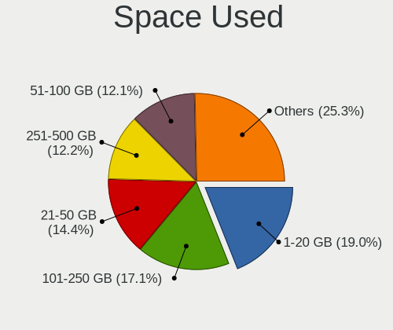
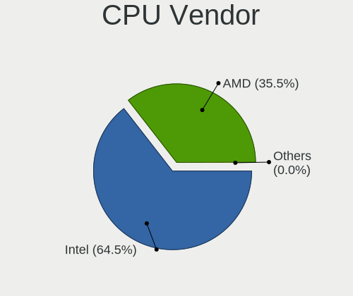
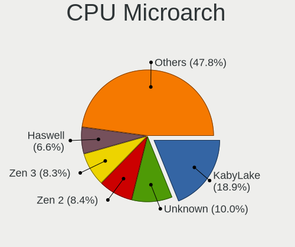
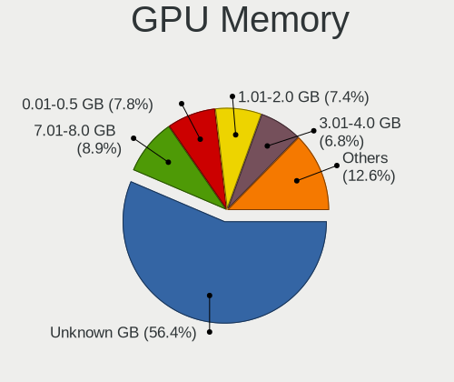
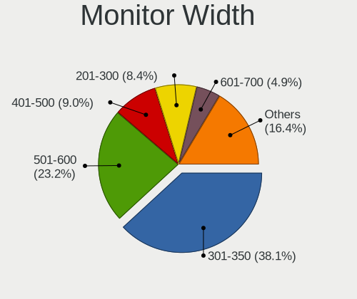
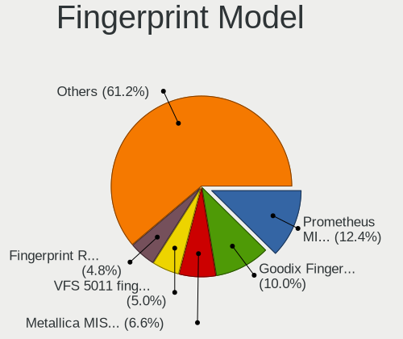

Arch - Tested Hardware & Statistics
-----------------------------------

A project to collect tested hardware configurations for Arch.

Anyone can contribute to this report by the [hw-probe](https://github.com/linuxhw/hw-probe) tool:

    sudo -E hw-probe -all -upload

Please contribute! Especially if your hardware is rare.

This is a report for all computer types. See also reports for [desktops](/Dist/Arch/Desktop/README.md) and [notebooks](/Dist/Arch/Notebook/README.md).

Contents
--------

* [ Test Cases ](#test-cases)

* [ System ](#system)
  - [ OS                       ](#os)
  - [ OS Family                ](#os-family)
  - [ Kernel                   ](#kernel)
  - [ Kernel Family            ](#kernel-family)
  - [ Kernel Major Ver.        ](#kernel-major-ver)
  - [ Arch                     ](#arch)
  - [ DE                       ](#de)
  - [ Display Server           ](#display-server)
  - [ Display Manager          ](#display-manager)
  - [ OS Lang                  ](#os-lang)
  - [ Boot Mode                ](#boot-mode)
  - [ Filesystem               ](#filesystem)
  - [ Part. scheme             ](#part-scheme)
  - [ Dual Boot with Linux/BSD ](#dual-boot-with-linuxbsd)
  - [ Dual Boot (Win)          ](#dual-boot-win)

* [ Board ](#board)
  - [ Vendor                   ](#vendor)
  - [ Model                    ](#model)
  - [ Model Family             ](#model-family)
  - [ MFG Year                 ](#mfg-year)
  - [ Form Factor              ](#form-factor)
  - [ Secure Boot              ](#secure-boot)
  - [ Coreboot                 ](#coreboot)
  - [ RAM Size                 ](#ram-size)
  - [ RAM Used                 ](#ram-used)
  - [ Total Drives             ](#total-drives)
  - [ Has CD-ROM               ](#has-cd-rom)
  - [ Has Ethernet             ](#has-ethernet)
  - [ Has WiFi                 ](#has-wifi)
  - [ Has Bluetooth            ](#has-bluetooth)

* [ Location ](#location)
  - [ Country                  ](#country)
  - [ City                     ](#city)

* [ Drives ](#drives)
  - [ Drive Vendor             ](#drive-vendor)
  - [ Drive Model              ](#drive-model)
  - [ HDD Vendor               ](#hdd-vendor)
  - [ SSD Vendor               ](#ssd-vendor)
  - [ Drive Kind               ](#drive-kind)
  - [ Drive Connector          ](#drive-connector)
  - [ Drive Size               ](#drive-size)
  - [ Space Total              ](#space-total)
  - [ Space Used               ](#space-used)
  - [ Malfunc. Drives          ](#malfunc-drives)
  - [ Malfunc. Drive Vendor    ](#malfunc-drive-vendor)
  - [ Malfunc. HDD Vendor      ](#malfunc-hdd-vendor)
  - [ Malfunc. Drive Kind      ](#malfunc-drive-kind)
  - [ Failed Drives            ](#failed-drives)
  - [ Failed Drive Vendor      ](#failed-drive-vendor)
  - [ Drive Status             ](#drive-status)

* [ Storage controller ](#storage-controller)
  - [ Storage Vendor           ](#storage-vendor)
  - [ Storage Model            ](#storage-model)
  - [ Storage Kind             ](#storage-kind)

* [ Processor ](#processor)
  - [ CPU Vendor               ](#cpu-vendor)
  - [ CPU Model                ](#cpu-model)
  - [ CPU Model Family         ](#cpu-model-family)
  - [ CPU Cores                ](#cpu-cores)
  - [ CPU Sockets              ](#cpu-sockets)
  - [ CPU Threads              ](#cpu-threads)
  - [ CPU Op-Modes             ](#cpu-op-modes)
  - [ CPU Microcode            ](#cpu-microcode)
  - [ CPU Microarch            ](#cpu-microarch)

* [ Graphics ](#graphics)
  - [ GPU Vendor               ](#gpu-vendor)
  - [ GPU Model                ](#gpu-model)
  - [ GPU Combo                ](#gpu-combo)
  - [ GPU Driver               ](#gpu-driver)
  - [ GPU Memory               ](#gpu-memory)

* [ Monitor ](#monitor)
  - [ Monitor Vendor           ](#monitor-vendor)
  - [ Monitor Model            ](#monitor-model)
  - [ Monitor Resolution       ](#monitor-resolution)
  - [ Monitor Diagonal         ](#monitor-diagonal)
  - [ Monitor Width            ](#monitor-width)
  - [ Aspect Ratio             ](#aspect-ratio)
  - [ Monitor Area             ](#monitor-area)
  - [ Pixel Density            ](#pixel-density)
  - [ Multiple Monitors        ](#multiple-monitors)

* [ Network ](#network)
  - [ Net Controller Vendor    ](#net-controller-vendor)
  - [ Net Controller Model     ](#net-controller-model)
  - [ Wireless Vendor          ](#wireless-vendor)
  - [ Wireless Model           ](#wireless-model)
  - [ Ethernet Vendor          ](#ethernet-vendor)
  - [ Ethernet Model           ](#ethernet-model)
  - [ Net Controller Kind      ](#net-controller-kind)
  - [ Used Controller          ](#used-controller)
  - [ NICs                     ](#nics)
  - [ IPv6                     ](#ipv6)

* [ Bluetooth ](#bluetooth)
  - [ Bluetooth Vendor         ](#bluetooth-vendor)
  - [ Bluetooth Model          ](#bluetooth-model)

* [ Sound ](#sound)
  - [ Sound Vendor             ](#sound-vendor)
  - [ Sound Model              ](#sound-model)

* [ Memory ](#memory)
  - [ Memory Vendor            ](#memory-vendor)
  - [ Memory Model             ](#memory-model)
  - [ Memory Kind              ](#memory-kind)
  - [ Memory Form Factor       ](#memory-form-factor)
  - [ Memory Size              ](#memory-size)
  - [ Memory Speed             ](#memory-speed)

* [ Printers & scanners ](#printers--scanners)
  - [ Printer Vendor           ](#printer-vendor)
  - [ Printer Model            ](#printer-model)
  - [ Scanner Vendor           ](#scanner-vendor)
  - [ Scanner Model            ](#scanner-model)

* [ Camera ](#camera)
  - [ Camera Vendor            ](#camera-vendor)
  - [ Camera Model             ](#camera-model)

* [ Security ](#security)
  - [ Fingerprint Vendor       ](#fingerprint-vendor)
  - [ Fingerprint Model        ](#fingerprint-model)
  - [ Chipcard Vendor          ](#chipcard-vendor)
  - [ Chipcard Model           ](#chipcard-model)

* [ Unsupported ](#unsupported)
  - [ Unsupported Devices      ](#unsupported-devices)
  - [ Unsupported Device Types ](#unsupported-device-types)

Test Cases
----------

Total: 10294

| Vendor        | Model                       | Form-Factor | Probe                                                      | Date         |
|---------------|-----------------------------|-------------|------------------------------------------------------------|--------------|
| Apple         | MacBookPro11,3              | Notebook    | [0009d8a468](https://linux-hardware.org/?probe=0009d8a468) | Nov 06, 2023 |
| ASRock        | H110M-ITX                   | Desktop     | [c384352141](https://linux-hardware.org/?probe=c384352141) | Nov 06, 2023 |
| MSI           | B450 TOMAHAWK               | Desktop     | [9b0f4eeb46](https://linux-hardware.org/?probe=9b0f4eeb46) | Nov 06, 2023 |
| HP            | Pavilion Plus Laptop 14-... | Notebook    | [5cfef4c0b7](https://linux-hardware.org/?probe=5cfef4c0b7) | Nov 06, 2023 |
| HP            | Pavilion Plus Laptop 14-... | Notebook    | [f1d9fe0bb7](https://linux-hardware.org/?probe=f1d9fe0bb7) | Nov 06, 2023 |
| Lenovo        | ThinkPad Edge E431 62771... | Notebook    | [8d789a3937](https://linux-hardware.org/?probe=8d789a3937) | Nov 06, 2023 |
| MSI           | Bravo 17 C7VF               | Notebook    | [5982277b4b](https://linux-hardware.org/?probe=5982277b4b) | Nov 06, 2023 |
| HP            | EliteBook 830 G5            | Notebook    | [07ef51bd31](https://linux-hardware.org/?probe=07ef51bd31) | Nov 05, 2023 |
| Huanan        | X99-QD4 V1.0                | Desktop     | [3cedc8f704](https://linux-hardware.org/?probe=3cedc8f704) | Nov 05, 2023 |
| Dell          | Latitude 7280               | Notebook    | [3f1419b0ea](https://linux-hardware.org/?probe=3f1419b0ea) | Nov 05, 2023 |
| HP            | ProBook 450 G5              | Notebook    | [6407166dd5](https://linux-hardware.org/?probe=6407166dd5) | Nov 05, 2023 |
| Notebook      | N85_N87,HJ,HJ1,HK1          | Notebook    | [53f5c381aa](https://linux-hardware.org/?probe=53f5c381aa) | Nov 05, 2023 |
| ASUSTek       | PRIME Z390-P                | Desktop     | [4b29646104](https://linux-hardware.org/?probe=4b29646104) | Nov 05, 2023 |
| HP            | ENVY x360 Convertible 15... | Convertible | [d74f909776](https://linux-hardware.org/?probe=d74f909776) | Nov 05, 2023 |
| Lenovo        | ThinkPad T14s Gen 3 21CQ... | Notebook    | [c235d90592](https://linux-hardware.org/?probe=c235d90592) | Nov 05, 2023 |
| ASUSTek       | PRIME B460M-A               | Desktop     | [52a36f5268](https://linux-hardware.org/?probe=52a36f5268) | Nov 04, 2023 |
| MSI           | MAG B650 TOMAHAWK WIFI      | Desktop     | [5832913981](https://linux-hardware.org/?probe=5832913981) | Nov 04, 2023 |
| MSI           | MAG B650 TOMAHAWK WIFI      | Desktop     | [4f6d5932fa](https://linux-hardware.org/?probe=4f6d5932fa) | Nov 04, 2023 |
| Lenovo        | ThinkPad X1 Carbon Gen 9... | Notebook    | [e95c10c89d](https://linux-hardware.org/?probe=e95c10c89d) | Nov 04, 2023 |
| ASUSTek       | H97M-PLUS                   | Desktop     | [69cb1e7068](https://linux-hardware.org/?probe=69cb1e7068) | Nov 04, 2023 |
| Notebook      | N141CU                      | Notebook    | [8f817eeabf](https://linux-hardware.org/?probe=8f817eeabf) | Nov 04, 2023 |
| Microsoft     | Surface Book 3              | Tablet      | [0a0e80ef0f](https://linux-hardware.org/?probe=0a0e80ef0f) | Nov 04, 2023 |
| Lenovo        | 103D SDK0Q40112 WIN 3305... | Desktop     | [76acaae6cc](https://linux-hardware.org/?probe=76acaae6cc) | Nov 04, 2023 |
| ASUSTek       | VivoBook_ASUSLaptop X513... | Notebook    | [34e4bd156f](https://linux-hardware.org/?probe=34e4bd156f) | Nov 04, 2023 |
| Gigabyte      | H470M K                     | Desktop     | [d69493b7d2](https://linux-hardware.org/?probe=d69493b7d2) | Nov 04, 2023 |
| Gigabyte      | H470M K                     | Desktop     | [80085c7047](https://linux-hardware.org/?probe=80085c7047) | Nov 04, 2023 |
| HP            | 255 G8 Notebook PC          | Notebook    | [2d1116cd1b](https://linux-hardware.org/?probe=2d1116cd1b) | Nov 04, 2023 |
| MSI           | B450 TOMAHAWK               | Desktop     | [2b389d48e1](https://linux-hardware.org/?probe=2b389d48e1) | Nov 04, 2023 |
| MSI           | GV62 7RE                    | Notebook    | [a6ce21c9de](https://linux-hardware.org/?probe=a6ce21c9de) | Nov 04, 2023 |
| ASUSTek       | ROG STRIX X570-E GAMING     | Desktop     | [bc3444ed2f](https://linux-hardware.org/?probe=bc3444ed2f) | Nov 04, 2023 |
| ASUSTek       | ROG STRIX X570-E GAMING     | Desktop     | [3c1e4ea8bf](https://linux-hardware.org/?probe=3c1e4ea8bf) | Nov 04, 2023 |
| Lenovo        | IdeaPad 710S Plus-13ISK ... | Notebook    | [f143d09ba7](https://linux-hardware.org/?probe=f143d09ba7) | Nov 04, 2023 |
| Microsoft     | Surface Book 3              | Tablet      | [ba8e987366](https://linux-hardware.org/?probe=ba8e987366) | Nov 03, 2023 |
| Lenovo        | ThinkPad T14s Gen 3 21CQ... | Notebook    | [d17e6059bb](https://linux-hardware.org/?probe=d17e6059bb) | Nov 03, 2023 |
| HP            | OMEN by Laptop 17-ck2xxx    | Notebook    | [e34a0ab109](https://linux-hardware.org/?probe=e34a0ab109) | Nov 03, 2023 |
| ASUSTek       | PRIME H510M-K               | Desktop     | [9501d6d6cf](https://linux-hardware.org/?probe=9501d6d6cf) | Nov 03, 2023 |
| Dell          | Latitude 7280               | Notebook    | [b795f0157b](https://linux-hardware.org/?probe=b795f0157b) | Nov 03, 2023 |
| Lenovo        | ThinkPad X1 Carbon 5th 2... | Notebook    | [2ac0d5a547](https://linux-hardware.org/?probe=2ac0d5a547) | Nov 03, 2023 |
| HUAWEI        | BOM-WXX9                    | Notebook    | [bc3b3daf33](https://linux-hardware.org/?probe=bc3b3daf33) | Nov 03, 2023 |
| Dell          | Latitude 9330               | Convertible | [d4597194bb](https://linux-hardware.org/?probe=d4597194bb) | Nov 03, 2023 |
| Lenovo        | Legion Pro 5 16ARX8 82WM    | Notebook    | [9ea1c674f9](https://linux-hardware.org/?probe=9ea1c674f9) | Nov 03, 2023 |
| Gigabyte      | Z390 AORUS ELITE-CF         | Desktop     | [7aa3982cb4](https://linux-hardware.org/?probe=7aa3982cb4) | Nov 03, 2023 |
| Notebook      | NJ50_70CU                   | Notebook    | [9cabd6fd2c](https://linux-hardware.org/?probe=9cabd6fd2c) | Nov 02, 2023 |
| Notebook      | NJ50_70CU                   | Notebook    | [3414d178f2](https://linux-hardware.org/?probe=3414d178f2) | Nov 02, 2023 |
| Dell          | Inspiron 5567               | Notebook    | [97348209dd](https://linux-hardware.org/?probe=97348209dd) | Nov 02, 2023 |
| ASUSTek       | ASUS TUF Gaming A17 FA70... | Notebook    | [d17a8bc08a](https://linux-hardware.org/?probe=d17a8bc08a) | Nov 02, 2023 |
| Dell          | Latitude E6330              | Notebook    | [b31f60152f](https://linux-hardware.org/?probe=b31f60152f) | Nov 02, 2023 |
| Samsung       | 750XDA                      | Notebook    | [130a1273e5](https://linux-hardware.org/?probe=130a1273e5) | Nov 02, 2023 |
| Fujitsu       | LIFEBOOK A532               | Notebook    | [b596813aeb](https://linux-hardware.org/?probe=b596813aeb) | Nov 02, 2023 |
| Valve         | Jupiter                     | Notebook    | [3ee2512ba0](https://linux-hardware.org/?probe=3ee2512ba0) | Nov 02, 2023 |
| Valve         | Jupiter                     | Notebook    | [2c454d7632](https://linux-hardware.org/?probe=2c454d7632) | Nov 02, 2023 |
| ASUSTek       | ASUS TUF Dash F15 FX517Z... | Notebook    | [c7d2d860fb](https://linux-hardware.org/?probe=c7d2d860fb) | Nov 02, 2023 |
| Schenker      | XMG FUSION 15 (XFU15M22)    | Notebook    | [4ba182f0d5](https://linux-hardware.org/?probe=4ba182f0d5) | Nov 02, 2023 |
| ASUSTek       | ROG STRIX B450-F GAMING ... | Desktop     | [1fd433ec1e](https://linux-hardware.org/?probe=1fd433ec1e) | Nov 02, 2023 |
| ASUSTek       | TUF Gaming X570-PRO         | Desktop     | [993d985e9e](https://linux-hardware.org/?probe=993d985e9e) | Nov 01, 2023 |
| ASUSTek       | K56CB                       | Notebook    | [9fff1dc94c](https://linux-hardware.org/?probe=9fff1dc94c) | Nov 01, 2023 |
| Dell          | Latitude 7370               | Notebook    | [b16724db59](https://linux-hardware.org/?probe=b16724db59) | Nov 01, 2023 |
| HP            | Laptop 15s-eq2xxx           | Notebook    | [3c04d0213b](https://linux-hardware.org/?probe=3c04d0213b) | Nov 01, 2023 |
| ASUSTek       | ZenBook UX325EA_UX325EA     | Notebook    | [6afebfd732](https://linux-hardware.org/?probe=6afebfd732) | Nov 01, 2023 |
| Gigabyte      | B550M AORUS ELITE           | Desktop     | [be72cba293](https://linux-hardware.org/?probe=be72cba293) | Nov 01, 2023 |
| Dell          | 006K82 A00                  | Desktop     | [f8c521f2f6](https://linux-hardware.org/?probe=f8c521f2f6) | Nov 01, 2023 |
| HP            | Pavilion x360 Convertibl... | Convertible | [d1965aca64](https://linux-hardware.org/?probe=d1965aca64) | Nov 01, 2023 |
| HP            | Laptop 15-bs1xx             | Notebook    | [1bd48815fe](https://linux-hardware.org/?probe=1bd48815fe) | Nov 01, 2023 |
| MSI           | MPG B550 GAMING PLUS        | Desktop     | [301a117426](https://linux-hardware.org/?probe=301a117426) | Nov 01, 2023 |
| ASUSTek       | TUF Gaming X570-PRO         | Desktop     | [ba593f267b](https://linux-hardware.org/?probe=ba593f267b) | Nov 01, 2023 |
| ASUSTek       | ROG STRIX B550-F GAMING ... | Desktop     | [56fe3d964b](https://linux-hardware.org/?probe=56fe3d964b) | Nov 01, 2023 |
| Dell          | Inspiron 7520               | Notebook    | [460c9255bd](https://linux-hardware.org/?probe=460c9255bd) | Nov 01, 2023 |
| Gigabyte      | AX370M-Gaming 3-CF          | Desktop     | [d271d2ae41](https://linux-hardware.org/?probe=d271d2ae41) | Oct 31, 2023 |
| Lenovo        | IdeaPad S145-15IWL 81S9     | Notebook    | [446efaf1bb](https://linux-hardware.org/?probe=446efaf1bb) | Oct 31, 2023 |
| ASUSTek       | F5N                         | Notebook    | [8da324b4fa](https://linux-hardware.org/?probe=8da324b4fa) | Oct 31, 2023 |
| Lenovo        | ThinkPad T495 20NJCTO1WW    | Notebook    | [8e86103e06](https://linux-hardware.org/?probe=8e86103e06) | Oct 31, 2023 |
| Lenovo        | 312D SDK0J40697 WIN 3305... | Mini pc     | [abebb8beea](https://linux-hardware.org/?probe=abebb8beea) | Oct 31, 2023 |
| Samsung       | 750XED                      | Notebook    | [9dab50e37e](https://linux-hardware.org/?probe=9dab50e37e) | Oct 31, 2023 |
| ASUSTek       | PRIME Z590-A                | Desktop     | [40f30de33b](https://linux-hardware.org/?probe=40f30de33b) | Oct 31, 2023 |
| Dell          | G15 5515                    | Notebook    | [c59e97ba9e](https://linux-hardware.org/?probe=c59e97ba9e) | Oct 31, 2023 |
| Gigabyte      | 970-GAMING                  | Desktop     | [2b4315885f](https://linux-hardware.org/?probe=2b4315885f) | Oct 31, 2023 |
| Gigabyte      | X570 AORUS ELITE            | Desktop     | [90172d9cef](https://linux-hardware.org/?probe=90172d9cef) | Oct 31, 2023 |
| Dell          | Vostro 3549                 | Notebook    | [259c646ecb](https://linux-hardware.org/?probe=259c646ecb) | Oct 31, 2023 |
| MSI           | Z270 GAMING M5              | Desktop     | [fb56165b30](https://linux-hardware.org/?probe=fb56165b30) | Oct 31, 2023 |
| HP            | Laptop 15s-eq0xxx           | Notebook    | [1323e3ad04](https://linux-hardware.org/?probe=1323e3ad04) | Oct 31, 2023 |
| ASUSTek       | P7P55D LE                   | Desktop     | [26533c338a](https://linux-hardware.org/?probe=26533c338a) | Oct 31, 2023 |
| Lenovo        | G500 20236                  | Notebook    | [6779e74408](https://linux-hardware.org/?probe=6779e74408) | Oct 31, 2023 |
| MSI           | MAG B650 TOMAHAWK WIFI      | Desktop     | [df43f845a1](https://linux-hardware.org/?probe=df43f845a1) | Oct 31, 2023 |
| Gigabyte      | X570 GAMING X               | Desktop     | [85cb35fdc6](https://linux-hardware.org/?probe=85cb35fdc6) | Oct 31, 2023 |
| HP            | 86F1 10100                  | All in one  | [d3079638ae](https://linux-hardware.org/?probe=d3079638ae) | Oct 31, 2023 |
| Lenovo        | Yoga 900-13ISK 80MK         | Notebook    | [38b70999b9](https://linux-hardware.org/?probe=38b70999b9) | Oct 31, 2023 |
| ASUSTek       | ROG STRIX B760-F GAMING ... | Desktop     | [e0971c3b56](https://linux-hardware.org/?probe=e0971c3b56) | Oct 31, 2023 |
| ASUSTek       | PRIME B360M-A               | Desktop     | [ef307df799](https://linux-hardware.org/?probe=ef307df799) | Oct 31, 2023 |
| Gigabyte      | X570S AORUS ELITE AX        | Desktop     | [01ce498c44](https://linux-hardware.org/?probe=01ce498c44) | Oct 30, 2023 |
| Lenovo        | G500 20236                  | Notebook    | [000230db12](https://linux-hardware.org/?probe=000230db12) | Oct 30, 2023 |
| Lenovo        | IdeaPad Gaming 3 15ACH6 ... | Notebook    | [ab5cef69c3](https://linux-hardware.org/?probe=ab5cef69c3) | Oct 30, 2023 |
| HP            | Pavilion Gaming Notebook    | Notebook    | [17dd2ce988](https://linux-hardware.org/?probe=17dd2ce988) | Oct 30, 2023 |
| Lenovo        | Yoga Slim 7 ProX 14ARH7 ... | Notebook    | [5f8cf197d5](https://linux-hardware.org/?probe=5f8cf197d5) | Oct 30, 2023 |
| HP            | 255 G8 Notebook PC          | Notebook    | [941ca289ce](https://linux-hardware.org/?probe=941ca289ce) | Oct 30, 2023 |
| MSI           | GP66 Leopard 10UG           | Notebook    | [47dbfa475a](https://linux-hardware.org/?probe=47dbfa475a) | Oct 30, 2023 |
| HUAWEI        | BOHK-WAX9X                  | Notebook    | [2b883f993f](https://linux-hardware.org/?probe=2b883f993f) | Oct 30, 2023 |
| MSI           | GF75 Thin 10SC              | Notebook    | [7aa47ebfa1](https://linux-hardware.org/?probe=7aa47ebfa1) | Oct 30, 2023 |
| ASUSTek       | PRIME B550-PLUS             | Desktop     | [59f0a72f7b](https://linux-hardware.org/?probe=59f0a72f7b) | Oct 29, 2023 |
| Lenovo        | ThinkPad Yoga 260 20FES1... | Convertible | [eeddd1e3e1](https://linux-hardware.org/?probe=eeddd1e3e1) | Oct 29, 2023 |
| Lenovo        | ThinkPad T480 20L6S0CE13    | Notebook    | [28a8f59777](https://linux-hardware.org/?probe=28a8f59777) | Oct 29, 2023 |
| HP            | 802E                        | Desktop     | [a57f8d5afa](https://linux-hardware.org/?probe=a57f8d5afa) | Oct 29, 2023 |
| Lenovo        | ThinkPad X250 20CMS04J00    | Notebook    | [773098b9e5](https://linux-hardware.org/?probe=773098b9e5) | Oct 29, 2023 |
| Dell          | 0HHV7N A00                  | Desktop     | [85e507b8b2](https://linux-hardware.org/?probe=85e507b8b2) | Oct 29, 2023 |
| Acer          | Nitro N50-610               | Desktop     | [b83310ffb8](https://linux-hardware.org/?probe=b83310ffb8) | Oct 29, 2023 |
| Lenovo        | IdeaPad 5 Pro 16ARH7 82S... | Notebook    | [d690fa8f27](https://linux-hardware.org/?probe=d690fa8f27) | Oct 29, 2023 |
| ASUSTek       | Zenbook 15 UM3504DA_UM35... | Notebook    | [e34ea8701a](https://linux-hardware.org/?probe=e34ea8701a) | Oct 28, 2023 |
| ASRock        | B550M-C                     | Notebook    | [51c187d805](https://linux-hardware.org/?probe=51c187d805) | Oct 28, 2023 |
| MSI           | X570-A PRO                  | Desktop     | [df6ef51245](https://linux-hardware.org/?probe=df6ef51245) | Oct 28, 2023 |
| Lenovo        | IdeaPad Gaming 3 15ARH05... | Notebook    | [b65d7d3b4a](https://linux-hardware.org/?probe=b65d7d3b4a) | Oct 28, 2023 |
| HP            | EliteBook 2570p             | Notebook    | [bc8c6e67a9](https://linux-hardware.org/?probe=bc8c6e67a9) | Oct 28, 2023 |
| MSI           | PRO Z790-P WIFI             | Desktop     | [60372b59fe](https://linux-hardware.org/?probe=60372b59fe) | Oct 28, 2023 |
| Lenovo        | ThinkPad E560 20EV002JUS    | Notebook    | [07a3c8eea8](https://linux-hardware.org/?probe=07a3c8eea8) | Oct 28, 2023 |
| Lenovo        | ThinkPad E560 20EV002JUS    | Notebook    | [906ed51ecf](https://linux-hardware.org/?probe=906ed51ecf) | Oct 27, 2023 |
| Lenovo        | ThinkPad T450 20BUS00700    | Notebook    | [f74328fd58](https://linux-hardware.org/?probe=f74328fd58) | Oct 27, 2023 |
| HONOR         | BOD-WXX9                    | Notebook    | [6de8b3afda](https://linux-hardware.org/?probe=6de8b3afda) | Oct 27, 2023 |
| ASUSTek       | ROG Strix G513QY_G513QY     | Notebook    | [334f8582b0](https://linux-hardware.org/?probe=334f8582b0) | Oct 27, 2023 |
| ASUSTek       | Zenbook 15 UM3504DA_UM35... | Notebook    | [5e0942e6b0](https://linux-hardware.org/?probe=5e0942e6b0) | Oct 27, 2023 |
| ASUSTek       | ASUS TUF Gaming F15 FX50... | Notebook    | [bbba3e21c7](https://linux-hardware.org/?probe=bbba3e21c7) | Oct 27, 2023 |
| Lenovo        | ThinkPad E14 Gen 5 21JKC... | Notebook    | [c9ba633d37](https://linux-hardware.org/?probe=c9ba633d37) | Oct 27, 2023 |
| ASUSTek       | H81M-E                      | Desktop     | [1cd579935b](https://linux-hardware.org/?probe=1cd579935b) | Oct 27, 2023 |
| Dell          | Latitude 5430               | Notebook    | [af33081c9b](https://linux-hardware.org/?probe=af33081c9b) | Oct 27, 2023 |
| ASUSTek       | SABERTOOTH Z77              | Desktop     | [56f2576af1](https://linux-hardware.org/?probe=56f2576af1) | Oct 27, 2023 |
| MSI           | H97 PC Mate                 | Desktop     | [47336d64a9](https://linux-hardware.org/?probe=47336d64a9) | Oct 27, 2023 |
| MSI           | Z77A-G43                    | Desktop     | [7ac5ac2ae2](https://linux-hardware.org/?probe=7ac5ac2ae2) | Oct 27, 2023 |
| LG Electro... | 15Z95N-G.AAC6U1             | Notebook    | [7f2e8a07de](https://linux-hardware.org/?probe=7f2e8a07de) | Oct 27, 2023 |
| Gigabyte      | B550M AORUS PRO-P           | Desktop     | [298718536d](https://linux-hardware.org/?probe=298718536d) | Oct 26, 2023 |
| Intel         | NUC5i5MYBE H47797-205       | Mini pc     | [c8c1fcb418](https://linux-hardware.org/?probe=c8c1fcb418) | Oct 26, 2023 |
| MSI           | PRO B650-P WIFI             | Desktop     | [4d76763d2d](https://linux-hardware.org/?probe=4d76763d2d) | Oct 26, 2023 |
| HP            | 21B4 A01                    | Desktop     | [8f2a8dec3a](https://linux-hardware.org/?probe=8f2a8dec3a) | Oct 26, 2023 |
| ASUSTek       | ROG Zephyrus G14 GA401QC... | Notebook    | [e3c1de1472](https://linux-hardware.org/?probe=e3c1de1472) | Oct 26, 2023 |
| HP            | 8653 A                      | Desktop     | [07aae59bf1](https://linux-hardware.org/?probe=07aae59bf1) | Oct 26, 2023 |
| Fujitsu       | D3162-A1 S26361-D3162-A1    | Desktop     | [37eda24908](https://linux-hardware.org/?probe=37eda24908) | Oct 26, 2023 |
| Gigabyte      | 970A-D3P                    | Desktop     | [7277bcd3bc](https://linux-hardware.org/?probe=7277bcd3bc) | Oct 26, 2023 |
| Lenovo        | IdeaPad Slim 7 Carbon 14... | Notebook    | [cbba790d59](https://linux-hardware.org/?probe=cbba790d59) | Oct 26, 2023 |
| ASUSTek       | ROG STRIX B550-F GAMING ... | Desktop     | [336fa07e6a](https://linux-hardware.org/?probe=336fa07e6a) | Oct 26, 2023 |
| Gigabyte      | B550M AORUS PRO-P           | Desktop     | [b74c61d287](https://linux-hardware.org/?probe=b74c61d287) | Oct 25, 2023 |
| ASUSTek       | Z170M-PLUS                  | Desktop     | [b75faeaf8a](https://linux-hardware.org/?probe=b75faeaf8a) | Oct 25, 2023 |
| Lenovo        | ThinkPad E14 Gen 5 21JRS... | Notebook    | [0ed2bd399f](https://linux-hardware.org/?probe=0ed2bd399f) | Oct 25, 2023 |
| BBEN          | Cherry Trail CR             | Mini pc     | [a37982a5e5](https://linux-hardware.org/?probe=a37982a5e5) | Oct 25, 2023 |
| MSI           | B450M MORTAR MAX            | Desktop     | [824215ab50](https://linux-hardware.org/?probe=824215ab50) | Oct 25, 2023 |
| MSI           | MPG B650I EDGE WIFI         | Desktop     | [7107e2ed21](https://linux-hardware.org/?probe=7107e2ed21) | Oct 25, 2023 |
| Dell          | Latitude 9430               | Convertible | [5e0239fb7c](https://linux-hardware.org/?probe=5e0239fb7c) | Oct 25, 2023 |
| Foxconn       | 2ABF                        | Desktop     | [50abb592dd](https://linux-hardware.org/?probe=50abb592dd) | Oct 25, 2023 |
| HP            | OMEN by Laptop 15-dc1xxx    | Notebook    | [d69762902a](https://linux-hardware.org/?probe=d69762902a) | Oct 25, 2023 |
| Gigabyte      | B650M AORUS ELITE AX        | Desktop     | [8f09f37e41](https://linux-hardware.org/?probe=8f09f37e41) | Oct 25, 2023 |
| MSI           | B560M-A PRO                 | Desktop     | [1fde726024](https://linux-hardware.org/?probe=1fde726024) | Oct 25, 2023 |
| ASUSTek       | PRIME A320M-K               | Desktop     | [f88a2686e9](https://linux-hardware.org/?probe=f88a2686e9) | Oct 25, 2023 |
| ASUSTek       | ROG Ally RC71L_RC71L        | Tablet      | [a25c5e5185](https://linux-hardware.org/?probe=a25c5e5185) | Oct 25, 2023 |
| HP            | EliteBook 845 G7 Noteboo... | Notebook    | [e51b06f086](https://linux-hardware.org/?probe=e51b06f086) | Oct 24, 2023 |
| Apple         | MacBookPro9,2               | Notebook    | [97f4660a4d](https://linux-hardware.org/?probe=97f4660a4d) | Oct 24, 2023 |
| MSI           | MAG B650 TOMAHAWK WIFI      | Desktop     | [268b32d9bf](https://linux-hardware.org/?probe=268b32d9bf) | Oct 24, 2023 |
| TUXEDO        | InfinityBook Pro Gen8 (M... | Notebook    | [3907a62f64](https://linux-hardware.org/?probe=3907a62f64) | Oct 24, 2023 |
| AZW           | GTR V21                     | Desktop     | [beb87ff047](https://linux-hardware.org/?probe=beb87ff047) | Oct 24, 2023 |
| Acer          | Aspire A315-510P            | Notebook    | [332b714861](https://linux-hardware.org/?probe=332b714861) | Oct 24, 2023 |
| Gigabyte      | B365M DS3H                  | Desktop     | [87102526a5](https://linux-hardware.org/?probe=87102526a5) | Oct 24, 2023 |
| Dell          | Inspiron 7559               | Notebook    | [24a664955f](https://linux-hardware.org/?probe=24a664955f) | Oct 23, 2023 |
| Dell          | Inspiron 7559               | Notebook    | [c931b1ef73](https://linux-hardware.org/?probe=c931b1ef73) | Oct 23, 2023 |
| ASUSTek       | ROG Strix G533QM_G533QM     | Notebook    | [a4c0d7be24](https://linux-hardware.org/?probe=a4c0d7be24) | Oct 23, 2023 |
| ASUSTek       | ROG STRIX X470-F GAMING     | Desktop     | [673f62810a](https://linux-hardware.org/?probe=673f62810a) | Oct 23, 2023 |
| ASUSTek       | ASUS TUF Gaming A15 FA50... | Notebook    | [4f06b99b2e](https://linux-hardware.org/?probe=4f06b99b2e) | Oct 23, 2023 |
| ASRock        | B550M-ITX/ac                | Desktop     | [d4d7110981](https://linux-hardware.org/?probe=d4d7110981) | Oct 23, 2023 |
| ASUSTek       | ASUS EXPERTBOOK B9400CEA... | Notebook    | [817e0c8438](https://linux-hardware.org/?probe=817e0c8438) | Oct 23, 2023 |
| Lenovo        | V15 G2 ITL Ua 82KB          | Notebook    | [399c501d43](https://linux-hardware.org/?probe=399c501d43) | Oct 23, 2023 |
| Lenovo        | SHARKBAY SDK0E50515 STD     | Desktop     | [62ca63bc89](https://linux-hardware.org/?probe=62ca63bc89) | Oct 23, 2023 |
| Dell          | Latitude 5430               | Notebook    | [8d552380c4](https://linux-hardware.org/?probe=8d552380c4) | Oct 23, 2023 |
| ASUSTek       | TUF Gaming X570-PLUS        | Desktop     | [f9efd677fe](https://linux-hardware.org/?probe=f9efd677fe) | Oct 23, 2023 |
| Acer          | Aspire A315-58              | Notebook    | [60402f4ad8](https://linux-hardware.org/?probe=60402f4ad8) | Oct 23, 2023 |
| Dell          | XPS 9315                    | Notebook    | [d04399e8fd](https://linux-hardware.org/?probe=d04399e8fd) | Oct 23, 2023 |
| Lenovo        | ThinkPad X1 Yoga 4th 20Q... | Convertible | [3dcdf62e73](https://linux-hardware.org/?probe=3dcdf62e73) | Oct 22, 2023 |
| UNOWHY        | Y13G012S4EI                 | Notebook    | [37680f1ed6](https://linux-hardware.org/?probe=37680f1ed6) | Oct 22, 2023 |
| HP            | 250 G8 Notebook PC          | Notebook    | [9538ff99bf](https://linux-hardware.org/?probe=9538ff99bf) | Oct 22, 2023 |
| Dell          | 0NW6H5 A00                  | Desktop     | [2b88710042](https://linux-hardware.org/?probe=2b88710042) | Oct 22, 2023 |
| Gigabyte      | B660 AORUS MASTER DDR4      | Desktop     | [2157dd6b76](https://linux-hardware.org/?probe=2157dd6b76) | Oct 22, 2023 |
| Dell          | XPS 9315                    | Notebook    | [e3c5d45e2a](https://linux-hardware.org/?probe=e3c5d45e2a) | Oct 22, 2023 |
| Lenovo        | ThinkPad T430 2349B74       | Notebook    | [7f7998c326](https://linux-hardware.org/?probe=7f7998c326) | Oct 22, 2023 |
| Lenovo        | IdeaPad 320-15IAP 80XR      | Notebook    | [2ee834d08a](https://linux-hardware.org/?probe=2ee834d08a) | Oct 22, 2023 |
| Gigabyte      | B450M DS3H V2               | Desktop     | [7c81d548d6](https://linux-hardware.org/?probe=7c81d548d6) | Oct 22, 2023 |
| Unknown       | Unknown                     | Desktop     | [b8a154c0f6](https://linux-hardware.org/?probe=b8a154c0f6) | Oct 22, 2023 |
| Framework     | Laptop 13 (AMD Ryzen 704... | Notebook    | [f3cde0eac8](https://linux-hardware.org/?probe=f3cde0eac8) | Oct 22, 2023 |
| MSI           | B450 TOMAHAWK               | Desktop     | [ed6b4ba6e8](https://linux-hardware.org/?probe=ed6b4ba6e8) | Oct 22, 2023 |
| ASUSTek       | VivoBook_ASUSLaptop M650... | Notebook    | [f204c7469c](https://linux-hardware.org/?probe=f204c7469c) | Oct 21, 2023 |
| Dell          | Precision 5520              | Notebook    | [79b5c73851](https://linux-hardware.org/?probe=79b5c73851) | Oct 21, 2023 |
| Gigabyte      | B450M DS3H-CF               | Desktop     | [7ddf7a94fd](https://linux-hardware.org/?probe=7ddf7a94fd) | Oct 21, 2023 |
| Dell          | 0NW6H5 A00                  | Desktop     | [a7f899353b](https://linux-hardware.org/?probe=a7f899353b) | Oct 21, 2023 |
| HP            | 250 15.6 inch G10 Notebo... | Notebook    | [f5f8e6f37d](https://linux-hardware.org/?probe=f5f8e6f37d) | Oct 21, 2023 |
| Dell          | Latitude D830               | Notebook    | [53cbc541d2](https://linux-hardware.org/?probe=53cbc541d2) | Oct 20, 2023 |
| Avell High... | B.ON                        | Notebook    | [7f8ce9da76](https://linux-hardware.org/?probe=7f8ce9da76) | Oct 20, 2023 |
| ASUSTek       | Zenbook UM3402YAR_UM3402... | Notebook    | [7323684232](https://linux-hardware.org/?probe=7323684232) | Oct 20, 2023 |
| Dell          | Vostro 3300                 | Notebook    | [827b95e65c](https://linux-hardware.org/?probe=827b95e65c) | Oct 20, 2023 |
| ECS           | G31T-M7                     | Desktop     | [297db99cc3](https://linux-hardware.org/?probe=297db99cc3) | Oct 20, 2023 |
| Acer          | Aspire A315-42G             | Notebook    | [46d5d338b3](https://linux-hardware.org/?probe=46d5d338b3) | Oct 20, 2023 |
| ASUSTek       | ROG Maximus Z790 HERO       | Desktop     | [e5b7455426](https://linux-hardware.org/?probe=e5b7455426) | Oct 19, 2023 |
| Dell          | XPS 13 9310                 | Notebook    | [3a6514e61a](https://linux-hardware.org/?probe=3a6514e61a) | Oct 19, 2023 |
| MSI           | GF63 Thin 10SC              | Notebook    | [41635aba8a](https://linux-hardware.org/?probe=41635aba8a) | Oct 19, 2023 |
| MSI           | GF63 Thin 10SC              | Notebook    | [a370d171d1](https://linux-hardware.org/?probe=a370d171d1) | Oct 19, 2023 |
| ASUSTek       | GL553VD                     | Notebook    | [71ffea0397](https://linux-hardware.org/?probe=71ffea0397) | Oct 19, 2023 |
| ASUSTek       | GL553VD                     | Notebook    | [9ab2c722a5](https://linux-hardware.org/?probe=9ab2c722a5) | Oct 19, 2023 |
| Lenovo        | ThinkPad X1 Carbon 2nd 2... | Notebook    | [94cd063a64](https://linux-hardware.org/?probe=94cd063a64) | Oct 19, 2023 |
| ASRock        | N100M                       | Desktop     | [a52836d33c](https://linux-hardware.org/?probe=a52836d33c) | Oct 19, 2023 |
| Dell          | Latitude E7270              | Notebook    | [673245c691](https://linux-hardware.org/?probe=673245c691) | Oct 19, 2023 |
| Gigabyte      | H87-D3H-CF                  | Desktop     | [b1f1e05664](https://linux-hardware.org/?probe=b1f1e05664) | Oct 19, 2023 |
| ASUSTek       | ROG STRIX X299-E GAMING ... | Desktop     | [6a2e115b95](https://linux-hardware.org/?probe=6a2e115b95) | Oct 18, 2023 |
| Gigabyte      | B550M AORUS PRO-P           | Desktop     | [6e17195f7d](https://linux-hardware.org/?probe=6e17195f7d) | Oct 18, 2023 |
| AXDIA Inte... | PRIMO WIN 10                | Tablet      | [50f89c1f2c](https://linux-hardware.org/?probe=50f89c1f2c) | Oct 18, 2023 |
| Acer          | Aspire A514-55              | Notebook    | [f25a7d5b9e](https://linux-hardware.org/?probe=f25a7d5b9e) | Oct 18, 2023 |
| Dell          | 0MWYPT A02                  | Desktop     | [c0e68da51a](https://linux-hardware.org/?probe=c0e68da51a) | Oct 18, 2023 |
| Lenovo        | IdeaPad 3 15IIL05 81WE      | Notebook    | [57dbbcb9f3](https://linux-hardware.org/?probe=57dbbcb9f3) | Oct 18, 2023 |
| Dell          | Inspiron N5110              | Notebook    | [8543bed1b3](https://linux-hardware.org/?probe=8543bed1b3) | Oct 17, 2023 |
| MSI           | B550M PRO-VDH WIFI          | Desktop     | [11d2b5b9c2](https://linux-hardware.org/?probe=11d2b5b9c2) | Oct 17, 2023 |
| MSI           | B550M PRO-VDH WIFI          | Desktop     | [8d289561bf](https://linux-hardware.org/?probe=8d289561bf) | Oct 17, 2023 |
| HUAWEI        | NBLK-WAX9X                  | Notebook    | [843098c658](https://linux-hardware.org/?probe=843098c658) | Oct 17, 2023 |
| Dell          | XPS 13 9310                 | Notebook    | [295c6b08bd](https://linux-hardware.org/?probe=295c6b08bd) | Oct 17, 2023 |
| Dell          | Latitude 7300               | Notebook    | [e68476c5ee](https://linux-hardware.org/?probe=e68476c5ee) | Oct 17, 2023 |
| MSI           | B450 TOMAHAWK               | Desktop     | [3c93567751](https://linux-hardware.org/?probe=3c93567751) | Oct 17, 2023 |
| ASUSTek       | TUF Gaming Z790-PLUS WIF... | Desktop     | [19d60d452f](https://linux-hardware.org/?probe=19d60d452f) | Oct 17, 2023 |
| ASUSTek       | ROG Zephyrus G14 GA402XV... | Notebook    | [b962ac1dff](https://linux-hardware.org/?probe=b962ac1dff) | Oct 17, 2023 |
| Dell          | XPS 9315                    | Notebook    | [e629bbd153](https://linux-hardware.org/?probe=e629bbd153) | Oct 16, 2023 |
| Dell          | XPS 9315                    | Notebook    | [a0b5099438](https://linux-hardware.org/?probe=a0b5099438) | Oct 16, 2023 |
| Dell          | Latitude 7424 Rugged Ext... | Notebook    | [5e2983dfb6](https://linux-hardware.org/?probe=5e2983dfb6) | Oct 16, 2023 |
| Dell          | XPS 13 9300                 | Notebook    | [e66f442843](https://linux-hardware.org/?probe=e66f442843) | Oct 16, 2023 |
| Dell          | XPS 15 9500                 | Notebook    | [0dcdd0a6a6](https://linux-hardware.org/?probe=0dcdd0a6a6) | Oct 16, 2023 |
| BY OEM        | ZRD1103                     | Desktop     | [1f638b4369](https://linux-hardware.org/?probe=1f638b4369) | Oct 16, 2023 |
| Dell          | XPS 13 9300                 | Notebook    | [eab86d1cc0](https://linux-hardware.org/?probe=eab86d1cc0) | Oct 16, 2023 |
| Dell          | Precision M6700             | Notebook    | [2fb2e2e9a5](https://linux-hardware.org/?probe=2fb2e2e9a5) | Oct 16, 2023 |
| ASUSTek       | N551JW                      | Notebook    | [c78d74d584](https://linux-hardware.org/?probe=c78d74d584) | Oct 16, 2023 |
| Acer          | Nitro AN515-52              | Notebook    | [7f9e09a9e1](https://linux-hardware.org/?probe=7f9e09a9e1) | Oct 16, 2023 |
| Acer          | Nitro AN515-52              | Notebook    | [2571e4fd1b](https://linux-hardware.org/?probe=2571e4fd1b) | Oct 16, 2023 |
| HP            | Victus by Gaming Laptop ... | Notebook    | [f7b210b108](https://linux-hardware.org/?probe=f7b210b108) | Oct 16, 2023 |
| Dell          | Precision 3530              | Notebook    | [79e1f32ab8](https://linux-hardware.org/?probe=79e1f32ab8) | Oct 16, 2023 |
| HONOR         | HYM-WXX                     | Notebook    | [eaff1b458a](https://linux-hardware.org/?probe=eaff1b458a) | Oct 15, 2023 |
| ASUSTek       | ROG Strix G513IM_G513IM     | Notebook    | [81cbdd66c8](https://linux-hardware.org/?probe=81cbdd66c8) | Oct 15, 2023 |
| ASUSTek       | Zephyrus M GM501GS          | Notebook    | [ba4661ac35](https://linux-hardware.org/?probe=ba4661ac35) | Oct 15, 2023 |
| ASUSTek       | VivoBook 15_ASUS Laptop ... | Notebook    | [a9438a93a7](https://linux-hardware.org/?probe=a9438a93a7) | Oct 15, 2023 |
| Dell          | XPS 13 9343                 | Notebook    | [97a3c4d92d](https://linux-hardware.org/?probe=97a3c4d92d) | Oct 15, 2023 |
| Gigabyte      | B550I AORUS PRO AX          | Desktop     | [374a5bf116](https://linux-hardware.org/?probe=374a5bf116) | Oct 15, 2023 |
| HP            | Victus by Laptop 16-e0xx... | Notebook    | [585c33a966](https://linux-hardware.org/?probe=585c33a966) | Oct 15, 2023 |
| Gigabyte      | X570S AORUS PRO AX          | Desktop     | [086ecfefb8](https://linux-hardware.org/?probe=086ecfefb8) | Oct 15, 2023 |
| HP            | Pavilion x360 Convertibl... | Convertible | [33173dac85](https://linux-hardware.org/?probe=33173dac85) | Oct 14, 2023 |
| HP            | ProBook 6560b               | Notebook    | [49ffe8b6c5](https://linux-hardware.org/?probe=49ffe8b6c5) | Oct 14, 2023 |
| Dell          | 0M5DCD A00                  | Desktop     | [02958738fb](https://linux-hardware.org/?probe=02958738fb) | Oct 14, 2023 |
| Lenovo        | IdeaPad Gaming 3 16ARH7 ... | Notebook    | [e9d04fdd59](https://linux-hardware.org/?probe=e9d04fdd59) | Oct 14, 2023 |
| ASUSTek       | Zenbook UX535QE_UM535QE     | Notebook    | [ab093317ba](https://linux-hardware.org/?probe=ab093317ba) | Oct 14, 2023 |
| HP            | OMEN by Gaming Laptop 16... | Notebook    | [5584acb2f0](https://linux-hardware.org/?probe=5584acb2f0) | Oct 14, 2023 |
| Dell          | Inspiron 5575               | Notebook    | [c50573f4ae](https://linux-hardware.org/?probe=c50573f4ae) | Oct 14, 2023 |
| Fujitsu       | LIFEBOOK S752               | Notebook    | [4015286a79](https://linux-hardware.org/?probe=4015286a79) | Oct 14, 2023 |
| Dell          | Latitude 7390               | Notebook    | [12de4c5026](https://linux-hardware.org/?probe=12de4c5026) | Oct 14, 2023 |
| HP            | Pavilion x360 Convertibl... | Convertible | [40731b6ac7](https://linux-hardware.org/?probe=40731b6ac7) | Oct 14, 2023 |
| ASUSTek       | H81M-A                      | Desktop     | [0702e52c02](https://linux-hardware.org/?probe=0702e52c02) | Oct 14, 2023 |
| Acer          | Aspire C24-963              | All in one  | [2e9ddbb840](https://linux-hardware.org/?probe=2e9ddbb840) | Oct 13, 2023 |
| Sony          | VPCEB15EL                   | Notebook    | [f7a3de3793](https://linux-hardware.org/?probe=f7a3de3793) | Oct 13, 2023 |
| Lenovo        | ThinkPad X13 Gen 1 20T3S... | Notebook    | [08a6026b21](https://linux-hardware.org/?probe=08a6026b21) | Oct 13, 2023 |
| Acer          | Swift SF314-511             | Notebook    | [3d63dd4590](https://linux-hardware.org/?probe=3d63dd4590) | Oct 13, 2023 |
| Acer          | Aspire E5-523               | Notebook    | [e45e982b6e](https://linux-hardware.org/?probe=e45e982b6e) | Oct 13, 2023 |
| ASRock        | X370 Killer Sli             | Desktop     | [7cc4b0e44f](https://linux-hardware.org/?probe=7cc4b0e44f) | Oct 13, 2023 |
| Lenovo        | ThinkPad X13 Gen 1 20T3S... | Notebook    | [c97af886ef](https://linux-hardware.org/?probe=c97af886ef) | Oct 12, 2023 |
| ASUSTek       | G11CD                       | Desktop     | [32a4a9380e](https://linux-hardware.org/?probe=32a4a9380e) | Oct 12, 2023 |
| Acer          | Predator PH315-54           | Notebook    | [541e679856](https://linux-hardware.org/?probe=541e679856) | Oct 12, 2023 |
| Acer          | Aspire MC605 v1.0           | Desktop     | [e7252be8a1](https://linux-hardware.org/?probe=e7252be8a1) | Oct 12, 2023 |
| Dell          | G3 3500                     | Notebook    | [1f975cc52a](https://linux-hardware.org/?probe=1f975cc52a) | Oct 12, 2023 |
| Acer          | Aspire MC605 v1.0           | Desktop     | [1328071174](https://linux-hardware.org/?probe=1328071174) | Oct 12, 2023 |
| HP            | OMEN Laptop 15-en0xxx       | Notebook    | [d5040f4ca4](https://linux-hardware.org/?probe=d5040f4ca4) | Oct 12, 2023 |
| MSI           | X470 GAMING PRO             | Desktop     | [88057db3aa](https://linux-hardware.org/?probe=88057db3aa) | Oct 11, 2023 |
| Dell          | XPS 13 9300                 | Notebook    | [6a0e699ccc](https://linux-hardware.org/?probe=6a0e699ccc) | Oct 11, 2023 |
| ASUSTek       | ROG STRIX B650E-F GAMING... | Desktop     | [904d65b1c0](https://linux-hardware.org/?probe=904d65b1c0) | Oct 11, 2023 |
| Acidanther... | Mac-27AD2F918AE68F61 Mac... | Desktop     | [81409b14c4](https://linux-hardware.org/?probe=81409b14c4) | Oct 11, 2023 |
| Gigabyte      | X470 AORUS ULTRA GAMING-... | Desktop     | [68372adfc5](https://linux-hardware.org/?probe=68372adfc5) | Oct 10, 2023 |
| ASUSTek       | S550CM                      | Notebook    | [ad1b08de66](https://linux-hardware.org/?probe=ad1b08de66) | Oct 10, 2023 |
| HP            | Notebook                    | Notebook    | [efd1dac9ef](https://linux-hardware.org/?probe=efd1dac9ef) | Oct 10, 2023 |
| HP            | Victus by Laptop 16-e0xx... | Notebook    | [908a750a93](https://linux-hardware.org/?probe=908a750a93) | Oct 10, 2023 |
| HP            | Victus by Laptop 16-e0xx... | Notebook    | [10b2d6465f](https://linux-hardware.org/?probe=10b2d6465f) | Oct 10, 2023 |
| Dell          | Latitude E5440              | Notebook    | [2f6ed33823](https://linux-hardware.org/?probe=2f6ed33823) | Oct 10, 2023 |
| Dell          | Latitude E5440              | Notebook    | [90b9b12b1b](https://linux-hardware.org/?probe=90b9b12b1b) | Oct 10, 2023 |
| Lenovo        | IdeaPad S145-15IWL 81S9     | Notebook    | [c397035651](https://linux-hardware.org/?probe=c397035651) | Oct 10, 2023 |
| HUAWEI        | HN-WX9X                     | Notebook    | [3bb1bed686](https://linux-hardware.org/?probe=3bb1bed686) | Oct 09, 2023 |
| Gigabyte      | 945GZM-S2                   | Desktop     | [f9bafdf396](https://linux-hardware.org/?probe=f9bafdf396) | Oct 09, 2023 |
| HP            | OMEN by Laptop 16-b0xxx     | Notebook    | [6e8b2311e4](https://linux-hardware.org/?probe=6e8b2311e4) | Oct 09, 2023 |
| Lenovo        | ThinkPad E14 Gen 3 20Y7C... | Notebook    | [d739639932](https://linux-hardware.org/?probe=d739639932) | Oct 09, 2023 |
| HP            | Laptop 15s-eq2xxx           | Notebook    | [341fc3d0f1](https://linux-hardware.org/?probe=341fc3d0f1) | Oct 09, 2023 |
| Gigabyte      | 970A-D3P                    | Desktop     | [beac8a6b4d](https://linux-hardware.org/?probe=beac8a6b4d) | Oct 09, 2023 |
| ASRock        | X370 Killer Sli             | Desktop     | [d90cde5a73](https://linux-hardware.org/?probe=d90cde5a73) | Oct 08, 2023 |
| HP            | Victus by Laptop 16-e0xx... | Notebook    | [29c7192a14](https://linux-hardware.org/?probe=29c7192a14) | Oct 08, 2023 |
| Dell          | Latitude 3440               | Notebook    | [88a0ec8369](https://linux-hardware.org/?probe=88a0ec8369) | Oct 08, 2023 |
| MSI           | MAG B550M MORTAR            | Desktop     | [3d6601e877](https://linux-hardware.org/?probe=3d6601e877) | Oct 08, 2023 |
| Dell          | Latitude 7430               | Notebook    | [1de7d3085b](https://linux-hardware.org/?probe=1de7d3085b) | Oct 08, 2023 |
| HP            | Notebook                    | Notebook    | [a181ec12af](https://linux-hardware.org/?probe=a181ec12af) | Oct 08, 2023 |
| HP            | Notebook                    | Notebook    | [039a70e9ce](https://linux-hardware.org/?probe=039a70e9ce) | Oct 07, 2023 |
| Toshiba       | Satellite L655              | Notebook    | [3f3879060f](https://linux-hardware.org/?probe=3f3879060f) | Oct 07, 2023 |
| Gigabyte      | H81M-DS2                    | Desktop     | [93e298660d](https://linux-hardware.org/?probe=93e298660d) | Oct 07, 2023 |
| Dell          | Latitude 9330               | Convertible | [a2b0fe0523](https://linux-hardware.org/?probe=a2b0fe0523) | Oct 07, 2023 |
| Dell          | XPS 15 9530                 | Notebook    | [1423f1793b](https://linux-hardware.org/?probe=1423f1793b) | Oct 07, 2023 |
| Lenovo        | 370A SDK0J40709 WIN 3259... | Desktop     | [38c0c97684](https://linux-hardware.org/?probe=38c0c97684) | Oct 07, 2023 |
| Gigabyte      | B650I AORUS ULTRA           | Desktop     | [590fa0428f](https://linux-hardware.org/?probe=590fa0428f) | Oct 07, 2023 |
| HP            | EliteBook 8460p             | Notebook    | [80b914414e](https://linux-hardware.org/?probe=80b914414e) | Oct 07, 2023 |
| ASUSTek       | TUF Gaming X570-PLUS        | Desktop     | [40c01d2bf5](https://linux-hardware.org/?probe=40c01d2bf5) | Oct 07, 2023 |
| Lenovo        | IdeaPad 3 15ITL6 82H8       | Notebook    | [d8d241531e](https://linux-hardware.org/?probe=d8d241531e) | Oct 07, 2023 |
| Apple         | MacBookPro11,1              | Notebook    | [b30fe669c6](https://linux-hardware.org/?probe=b30fe669c6) | Oct 07, 2023 |
| ASUSTek       | ROG STRIX B550-F GAMING     | Desktop     | [13d4e4c49f](https://linux-hardware.org/?probe=13d4e4c49f) | Oct 07, 2023 |
| Lenovo        | ThinkPad P15v Gen 3 21EM... | Notebook    | [0354977d6c](https://linux-hardware.org/?probe=0354977d6c) | Oct 07, 2023 |
| Lenovo        | Yoga Slim 7 Pro 14ACH5 8... | Notebook    | [faea5bdeba](https://linux-hardware.org/?probe=faea5bdeba) | Oct 07, 2023 |
| HP            | Pavilion Laptop 15-eh0xx... | Notebook    | [446c6847c3](https://linux-hardware.org/?probe=446c6847c3) | Oct 06, 2023 |
| HONOR         | FRI-HXX                     | Notebook    | [fd2a01c055](https://linux-hardware.org/?probe=fd2a01c055) | Oct 06, 2023 |
| HP            | 255 G4                      | Notebook    | [7097fff4ee](https://linux-hardware.org/?probe=7097fff4ee) | Oct 06, 2023 |
| MSI           | MAG Z490 TOMAHAWK           | Desktop     | [192654dc77](https://linux-hardware.org/?probe=192654dc77) | Oct 06, 2023 |
| ASUSTek       | Zenbook UX5401ZAS_UX5401... | Notebook    | [058c6a0ee6](https://linux-hardware.org/?probe=058c6a0ee6) | Oct 06, 2023 |
| ASUSTek       | ZenBook UX425EA_UX425EA     | Notebook    | [9dc2fd3247](https://linux-hardware.org/?probe=9dc2fd3247) | Oct 06, 2023 |
| Dell          | XPS 15 9530                 | Notebook    | [425aa2b0f7](https://linux-hardware.org/?probe=425aa2b0f7) | Oct 05, 2023 |
| MSI           | GE63 Raider RGB 8RE         | Notebook    | [39b9855097](https://linux-hardware.org/?probe=39b9855097) | Oct 05, 2023 |
| MSI           | GE63 Raider RGB 8RE         | Notebook    | [74bb875f9f](https://linux-hardware.org/?probe=74bb875f9f) | Oct 05, 2023 |
| HP            | Laptop 14s-cf2xxx           | Notebook    | [c40356b94d](https://linux-hardware.org/?probe=c40356b94d) | Oct 05, 2023 |
| Lenovo        | ThinkPad P1 Gen 4i 20Y4S... | Notebook    | [e23d98e73b](https://linux-hardware.org/?probe=e23d98e73b) | Oct 05, 2023 |
| ASUSTek       | ROG STRIX B550-E GAMING     | Desktop     | [947c66cb1f](https://linux-hardware.org/?probe=947c66cb1f) | Oct 05, 2023 |
| HP            | OMEN by Laptop 17-an0xx     | Notebook    | [02ff66cc0c](https://linux-hardware.org/?probe=02ff66cc0c) | Oct 05, 2023 |
| ASUSTek       | PRIME H510M-K               | Desktop     | [43dfd73b17](https://linux-hardware.org/?probe=43dfd73b17) | Oct 04, 2023 |
| Timi          | A30                         | Notebook    | [36d352fb7f](https://linux-hardware.org/?probe=36d352fb7f) | Oct 04, 2023 |
| Dell          | Vostro 15-3568              | Notebook    | [3639fedec4](https://linux-hardware.org/?probe=3639fedec4) | Oct 04, 2023 |
| Positivo      | S14BW01                     | Notebook    | [3027fc7d9b](https://linux-hardware.org/?probe=3027fc7d9b) | Oct 04, 2023 |
| Acidanther... | Mac-27AD2F918AE68F61 Mac... | Desktop     | [ef154408cf](https://linux-hardware.org/?probe=ef154408cf) | Oct 04, 2023 |
| Gigabyte      | X570S AORUS PRO AX          | Desktop     | [d034b84815](https://linux-hardware.org/?probe=d034b84815) | Oct 04, 2023 |
| ASUSTek       | TUF Gaming B550M-PLUS       | Desktop     | [18c399ea1e](https://linux-hardware.org/?probe=18c399ea1e) | Oct 04, 2023 |
| Dell          | 06H91J A00                  | All in one  | [5d6d98d8ef](https://linux-hardware.org/?probe=5d6d98d8ef) | Oct 03, 2023 |
| HP            | Pavilion g7                 | Notebook    | [ec5cf4fb00](https://linux-hardware.org/?probe=ec5cf4fb00) | Oct 03, 2023 |
| Dell          | Latitude E7440              | Notebook    | [3cb4fc2857](https://linux-hardware.org/?probe=3cb4fc2857) | Oct 03, 2023 |
| Acer          | Aspire A314-36M             | Notebook    | [5276b99f12](https://linux-hardware.org/?probe=5276b99f12) | Oct 03, 2023 |
| MSI           | B450M MORTAR MAX            | Desktop     | [50f7cba770](https://linux-hardware.org/?probe=50f7cba770) | Oct 03, 2023 |
| MSI           | PRO B550M-VC WIFI           | Desktop     | [34d3a3bd47](https://linux-hardware.org/?probe=34d3a3bd47) | Oct 03, 2023 |
| Dell          | 0P0MXR A00                  | Desktop     | [06af26dae3](https://linux-hardware.org/?probe=06af26dae3) | Oct 03, 2023 |
| Gigabyte      | B550 AORUS ELITE AX V2      | Desktop     | [ab5cf455ba](https://linux-hardware.org/?probe=ab5cf455ba) | Oct 03, 2023 |
| IP3 Tech      | IB8                         | Desktop     | [ca4d58a353](https://linux-hardware.org/?probe=ca4d58a353) | Oct 03, 2023 |
| Gigabyte      | B550M AORUS PRO-P           | Desktop     | [c5223b1e21](https://linux-hardware.org/?probe=c5223b1e21) | Oct 02, 2023 |
| XIAOMI        | Redmi Book Pro 15 2023      | Notebook    | [09b97f9681](https://linux-hardware.org/?probe=09b97f9681) | Oct 02, 2023 |
| Lenovo        | ThinkBook 14 G2 ITL 20VD    | Notebook    | [b0b5262c87](https://linux-hardware.org/?probe=b0b5262c87) | Oct 02, 2023 |
| Sony          | SVF1421PSGB                 | Notebook    | [11d6cad851](https://linux-hardware.org/?probe=11d6cad851) | Oct 02, 2023 |
| Gigabyte      | 970A-D3P                    | Desktop     | [0620cf8cd6](https://linux-hardware.org/?probe=0620cf8cd6) | Oct 02, 2023 |
| ASRock        | B660M-C                     | Desktop     | [c4ef9b73c9](https://linux-hardware.org/?probe=c4ef9b73c9) | Oct 01, 2023 |
| HP            | ProBook 6560b               | Notebook    | [ea59e8557f](https://linux-hardware.org/?probe=ea59e8557f) | Oct 01, 2023 |
| Sony          | SVF1421PSGB                 | Notebook    | [84a0c8ea9b](https://linux-hardware.org/?probe=84a0c8ea9b) | Oct 01, 2023 |
| Gigabyte      | B550M AORUS PRO-P           | Desktop     | [7109a8a11b](https://linux-hardware.org/?probe=7109a8a11b) | Oct 01, 2023 |
| Lenovo        | ThinkPad T14s Gen 3 21CQ... | Notebook    | [6801ddb23b](https://linux-hardware.org/?probe=6801ddb23b) | Oct 01, 2023 |
| Dell          | Latitude E5450              | Notebook    | [76401b3ca2](https://linux-hardware.org/?probe=76401b3ca2) | Oct 01, 2023 |
| HP            | Victus by Laptop 16-d0xx... | Notebook    | [5ee355215f](https://linux-hardware.org/?probe=5ee355215f) | Oct 01, 2023 |
| HP            | Pavilion Gaming Laptop 1... | Notebook    | [c99f28b27d](https://linux-hardware.org/?probe=c99f28b27d) | Oct 01, 2023 |
| Lenovo        | ThinkPad L14 Gen 1 20U6S... | Notebook    | [b79529501a](https://linux-hardware.org/?probe=b79529501a) | Oct 01, 2023 |
| Gigabyte      | B550M AORUS PRO-P           | Desktop     | [b85781f0d8](https://linux-hardware.org/?probe=b85781f0d8) | Oct 01, 2023 |
| ASUSTek       | VivoBook_ASUSLaptop X512... | Notebook    | [ef74c51c65](https://linux-hardware.org/?probe=ef74c51c65) | Oct 01, 2023 |
| Dell          | Inspiron 5567               | Notebook    | [493a83e70a](https://linux-hardware.org/?probe=493a83e70a) | Sep 30, 2023 |
| Lenovo        | Legion Pro 5 16ARX8 82WM    | Notebook    | [0fad85dfc9](https://linux-hardware.org/?probe=0fad85dfc9) | Sep 30, 2023 |
| Shenzhen M... | F7BSC                       | Desktop     | [79b4f4f30e](https://linux-hardware.org/?probe=79b4f4f30e) | Sep 30, 2023 |
| MSI           | B450-A PRO MAX              | Desktop     | [6ee0910511](https://linux-hardware.org/?probe=6ee0910511) | Sep 30, 2023 |
| HP            | ProBook 6560b               | Notebook    | [904f0eb2cb](https://linux-hardware.org/?probe=904f0eb2cb) | Sep 30, 2023 |
| Lenovo        | ThinkPad 13 2nd Gen 20J2... | Notebook    | [702d68e226](https://linux-hardware.org/?probe=702d68e226) | Sep 30, 2023 |
| ASUSTek       | STRIX Z270E GAMING          | Desktop     | [caa5ce0b99](https://linux-hardware.org/?probe=caa5ce0b99) | Sep 29, 2023 |
| eMachines     | eME732Z                     | Notebook    | [ba03824830](https://linux-hardware.org/?probe=ba03824830) | Sep 29, 2023 |
| Shenzhen M... | F7BAA                       | Desktop     | [30268d41d2](https://linux-hardware.org/?probe=30268d41d2) | Sep 29, 2023 |
| Dell          | 0J3C2F A00                  | Desktop     | [0536b81a43](https://linux-hardware.org/?probe=0536b81a43) | Sep 29, 2023 |
| Dell          | Precision 5480              | Notebook    | [5d157102ea](https://linux-hardware.org/?probe=5d157102ea) | Sep 29, 2023 |
| Lenovo        | ThinkPad T480s 20L8002WM... | Notebook    | [eef8975f1e](https://linux-hardware.org/?probe=eef8975f1e) | Sep 29, 2023 |
| Dell          | XPS 13 9360                 | Notebook    | [2a3e49f18f](https://linux-hardware.org/?probe=2a3e49f18f) | Sep 29, 2023 |
| ASUSTek       | PRIME X370-PRO              | Desktop     | [6d725a3ede](https://linux-hardware.org/?probe=6d725a3ede) | Sep 29, 2023 |
| Google        | Lindar                      | Notebook    | [f8f947a025](https://linux-hardware.org/?probe=f8f947a025) | Sep 28, 2023 |
| MSI           | B450M PRO-M2 MAX            | Desktop     | [da030ed703](https://linux-hardware.org/?probe=da030ed703) | Sep 28, 2023 |
| Google        | Lindar                      | Notebook    | [9ddbc21f0d](https://linux-hardware.org/?probe=9ddbc21f0d) | Sep 28, 2023 |
| Dell          | 0J3C2F A00                  | Desktop     | [451d8ac4ca](https://linux-hardware.org/?probe=451d8ac4ca) | Sep 28, 2023 |
| HP            | 240 G8 Notebook PC          | Notebook    | [af9350dd38](https://linux-hardware.org/?probe=af9350dd38) | Sep 28, 2023 |
| Lenovo        | ThinkPad E15 Gen 2 20TDS... | Notebook    | [92d7b8d41e](https://linux-hardware.org/?probe=92d7b8d41e) | Sep 28, 2023 |
| HP            | 240 G8 Notebook PC          | Notebook    | [d40624877e](https://linux-hardware.org/?probe=d40624877e) | Sep 28, 2023 |
| Dell          | Vostro 5470                 | Notebook    | [b6f9976e23](https://linux-hardware.org/?probe=b6f9976e23) | Sep 28, 2023 |
| ASUSTek       | VivoBook_ASUSLaptop X513... | Notebook    | [58fdd789af](https://linux-hardware.org/?probe=58fdd789af) | Sep 28, 2023 |
| Acer          | Aspire E5-571               | Notebook    | [acd3733ebf](https://linux-hardware.org/?probe=acd3733ebf) | Sep 27, 2023 |
| ASUSTek       | ASUS TUF Gaming F15 FX50... | Notebook    | [c5c6c5233a](https://linux-hardware.org/?probe=c5c6c5233a) | Sep 27, 2023 |
| Dell          | G3 3590                     | Notebook    | [3523165978](https://linux-hardware.org/?probe=3523165978) | Sep 27, 2023 |
| ZOTAC         | NM10                        | Desktop     | [8932b16aa1](https://linux-hardware.org/?probe=8932b16aa1) | Sep 27, 2023 |
| ASUSTek       | ROG STRIX B550-F GAMING     | Desktop     | [cc0d6b9ebb](https://linux-hardware.org/?probe=cc0d6b9ebb) | Sep 27, 2023 |
| ASUSTek       | ROG STRIX B550-F GAMING ... | Desktop     | [0f2a543485](https://linux-hardware.org/?probe=0f2a543485) | Sep 27, 2023 |
| ASUSTek       | ROG STRIX B550-F GAMING ... | Desktop     | [75f65a0438](https://linux-hardware.org/?probe=75f65a0438) | Sep 27, 2023 |
| Dell          | Latitude 3540               | Notebook    | [eb8bf9b174](https://linux-hardware.org/?probe=eb8bf9b174) | Sep 26, 2023 |
| Dell          | G5 5590                     | Notebook    | [c7e7205fff](https://linux-hardware.org/?probe=c7e7205fff) | Sep 26, 2023 |
| Gigabyte      | B550M AORUS PRO-P           | Desktop     | [ef982a7d39](https://linux-hardware.org/?probe=ef982a7d39) | Sep 26, 2023 |
| Gigabyte      | B550M AORUS PRO-P           | Desktop     | [d8f229b5d7](https://linux-hardware.org/?probe=d8f229b5d7) | Sep 26, 2023 |
| Dell          | G5 5590                     | Notebook    | [0e80b66cb6](https://linux-hardware.org/?probe=0e80b66cb6) | Sep 26, 2023 |
| MSI           | GF75 Thin 10SC              | Notebook    | [f19700e7b0](https://linux-hardware.org/?probe=f19700e7b0) | Sep 26, 2023 |
| MSI           | GF75 Thin 10SC              | Notebook    | [a7610be494](https://linux-hardware.org/?probe=a7610be494) | Sep 26, 2023 |
| Lenovo        | IdeaPad Y700-17ISK 80Q0     | Notebook    | [742cfeafb0](https://linux-hardware.org/?probe=742cfeafb0) | Sep 26, 2023 |
| ASUSTek       | ASUS TUF Gaming A15 FA50... | Notebook    | [a7d0f8e075](https://linux-hardware.org/?probe=a7d0f8e075) | Sep 26, 2023 |
| Lenovo        | V15 G3 ABA 82TV             | Notebook    | [2568280c44](https://linux-hardware.org/?probe=2568280c44) | Sep 25, 2023 |
| ASUSTek       | Zenbook UN5401QA_UN5401Q... | Convertible | [fee8085d8d](https://linux-hardware.org/?probe=fee8085d8d) | Sep 25, 2023 |
| Lenovo        | IdeaPad 3 17ALC6 82KV       | Notebook    | [1ce8f959f1](https://linux-hardware.org/?probe=1ce8f959f1) | Sep 25, 2023 |
| ASUSTek       | VivoBook 15_ASUS Laptop ... | Notebook    | [549941d843](https://linux-hardware.org/?probe=549941d843) | Sep 25, 2023 |
| Samsung       | 750XDA                      | Notebook    | [dd03d00004](https://linux-hardware.org/?probe=dd03d00004) | Sep 25, 2023 |
| MSI           | Bravo 15 C7VF               | Notebook    | [ab0a5a435f](https://linux-hardware.org/?probe=ab0a5a435f) | Sep 25, 2023 |
| Gigabyte      | X99-UD4-CF                  | Desktop     | [c50564e3bb](https://linux-hardware.org/?probe=c50564e3bb) | Sep 25, 2023 |
| Gigabyte      | B550 AORUS ELITE AX V2      | Desktop     | [6185e37a03](https://linux-hardware.org/?probe=6185e37a03) | Sep 25, 2023 |
| Dell          | Latitude E5440              | Notebook    | [f4accb1cb0](https://linux-hardware.org/?probe=f4accb1cb0) | Sep 25, 2023 |
| Dell          | Latitude E6330              | Notebook    | [1375d355a5](https://linux-hardware.org/?probe=1375d355a5) | Sep 24, 2023 |
| Dell          | Latitude E5470              | Notebook    | [efb0e356d6](https://linux-hardware.org/?probe=efb0e356d6) | Sep 24, 2023 |
| Lenovo        | IdeaPad N581 7505           | Notebook    | [ed2e5eed86](https://linux-hardware.org/?probe=ed2e5eed86) | Sep 24, 2023 |
| Lenovo        | IdeaPad 3 14IIL05 81WD      | Notebook    | [952169c1ce](https://linux-hardware.org/?probe=952169c1ce) | Sep 24, 2023 |
| Dell          | Inspiron 3543               | Notebook    | [2075d98d66](https://linux-hardware.org/?probe=2075d98d66) | Sep 24, 2023 |
| Dell          | Inspiron 7577               | Notebook    | [685f51111f](https://linux-hardware.org/?probe=685f51111f) | Sep 24, 2023 |
| ASRock        | H97 Anniversary             | Desktop     | [018c8fa4d1](https://linux-hardware.org/?probe=018c8fa4d1) | Sep 24, 2023 |
| Lenovo        | ThinkPad Edge E431 62778... | Notebook    | [31b0e8e9ce](https://linux-hardware.org/?probe=31b0e8e9ce) | Sep 24, 2023 |
| Lenovo        | ThinkPad T480s 20L8002WM... | Notebook    | [234fc6a6fb](https://linux-hardware.org/?probe=234fc6a6fb) | Sep 24, 2023 |
| MSI           | B450 TOMAHAWK               | Desktop     | [903a13bdf8](https://linux-hardware.org/?probe=903a13bdf8) | Sep 24, 2023 |
| HP            | ENVY x360 Convertible 15... | Convertible | [109081e9e3](https://linux-hardware.org/?probe=109081e9e3) | Sep 23, 2023 |
| Dell          | Latitude 5580               | Notebook    | [6353ffcdf5](https://linux-hardware.org/?probe=6353ffcdf5) | Sep 23, 2023 |
| MSI           | Katana GF76 11UE            | Notebook    | [8327fd670f](https://linux-hardware.org/?probe=8327fd670f) | Sep 23, 2023 |
| HP            | Pavilion g6                 | Notebook    | [c49107d782](https://linux-hardware.org/?probe=c49107d782) | Sep 22, 2023 |
| Fujitsu       | LIFEBOOK A357               | Notebook    | [d18e2d8811](https://linux-hardware.org/?probe=d18e2d8811) | Sep 22, 2023 |
| Lenovo        | IdeaPad S145-15IWL 81S9     | Notebook    | [04141bd71c](https://linux-hardware.org/?probe=04141bd71c) | Sep 22, 2023 |
| Biostar       | B85MG                       | Desktop     | [f71d8a75fc](https://linux-hardware.org/?probe=f71d8a75fc) | Sep 22, 2023 |
| ASUSTek       | ZenBook UX325EA_UX325EA     | Notebook    | [900334906e](https://linux-hardware.org/?probe=900334906e) | Sep 22, 2023 |
| HP            | Spectre x360 Convertible... | Convertible | [010c663b72](https://linux-hardware.org/?probe=010c663b72) | Sep 22, 2023 |
| Lenovo        | ThinkPad E14 Gen 4 21E30... | Notebook    | [0f097b1b88](https://linux-hardware.org/?probe=0f097b1b88) | Sep 22, 2023 |
| ASUSTek       | ROG STRIX B650E-I GAMING... | Desktop     | [162ff29125](https://linux-hardware.org/?probe=162ff29125) | Sep 22, 2023 |
| MSI           | MPG Z790 CARBON WIFI        | Desktop     | [d9d063b9e8](https://linux-hardware.org/?probe=d9d063b9e8) | Sep 22, 2023 |
| Lenovo        | ThinkPad P1 Gen 5 21DCCT... | Notebook    | [8c65f7a68a](https://linux-hardware.org/?probe=8c65f7a68a) | Sep 21, 2023 |
| ASUSTek       | X99-A/USB                   | Desktop     | [37990955f8](https://linux-hardware.org/?probe=37990955f8) | Sep 21, 2023 |
| MSI           | A88XM-E45                   | Desktop     | [99b5c7c976](https://linux-hardware.org/?probe=99b5c7c976) | Sep 21, 2023 |
| Lenovo        | ThinkPad T440p 20AWS49Q0... | Notebook    | [65fa77246e](https://linux-hardware.org/?probe=65fa77246e) | Sep 21, 2023 |
| MSI           | MPG B550 GAMING PLUS        | Desktop     | [6c75af44c4](https://linux-hardware.org/?probe=6c75af44c4) | Sep 21, 2023 |
| Dell          | Inspiron 15-3567            | Notebook    | [0f189d3c2a](https://linux-hardware.org/?probe=0f189d3c2a) | Sep 21, 2023 |
| ASUSTek       | N551JW                      | Notebook    | [5dae6d6eda](https://linux-hardware.org/?probe=5dae6d6eda) | Sep 21, 2023 |
| Lenovo        | ThinkPad L540 20AU006CRI    | Notebook    | [e8885911a0](https://linux-hardware.org/?probe=e8885911a0) | Sep 21, 2023 |
| Apple         | MacBookPro12,1              | Notebook    | [bb796b1e6e](https://linux-hardware.org/?probe=bb796b1e6e) | Sep 21, 2023 |
| ASUSTek       | PRIME H510M-K               | Desktop     | [4d863063d6](https://linux-hardware.org/?probe=4d863063d6) | Sep 21, 2023 |
| Lenovo        | Legion Y540-15IRH-PG0 81... | Notebook    | [2310ddb9a7](https://linux-hardware.org/?probe=2310ddb9a7) | Sep 21, 2023 |
| ASUSTek       | N551JW                      | Notebook    | [ae062bd5ca](https://linux-hardware.org/?probe=ae062bd5ca) | Sep 21, 2023 |
| ASUSTek       | ROG STRIX B650E-I GAMING... | Desktop     | [2489245463](https://linux-hardware.org/?probe=2489245463) | Sep 21, 2023 |
| MSI           | MPG Z790 CARBON WIFI        | Desktop     | [6aae39a72b](https://linux-hardware.org/?probe=6aae39a72b) | Sep 21, 2023 |
| Unknown       | HX90                        | Desktop     | [a48f203afc](https://linux-hardware.org/?probe=a48f203afc) | Sep 21, 2023 |
| ASUSTek       | PRIME Z690-P WIFI D4        | Desktop     | [3762f344e9](https://linux-hardware.org/?probe=3762f344e9) | Sep 21, 2023 |
| ASRock        | B365 Pro4                   | Desktop     | [7ee2b2178d](https://linux-hardware.org/?probe=7ee2b2178d) | Sep 20, 2023 |
| ASUSTek       | Vivobook Go E1504FA_E150... | Notebook    | [1850488dd1](https://linux-hardware.org/?probe=1850488dd1) | Sep 20, 2023 |
| ASUSTek       | Vivobook Go E1504FA_E150... | Notebook    | [c122be4331](https://linux-hardware.org/?probe=c122be4331) | Sep 20, 2023 |
| Apple         | MacBookPro12,1              | Notebook    | [49ed4b61ff](https://linux-hardware.org/?probe=49ed4b61ff) | Sep 20, 2023 |
| ASUSTek       | PRIME Z590-A                | Desktop     | [a2f44141ba](https://linux-hardware.org/?probe=a2f44141ba) | Sep 20, 2023 |
| ASUSTek       | ZenBook UX425UAZ_UM425UA... | Notebook    | [91c2eeef2f](https://linux-hardware.org/?probe=91c2eeef2f) | Sep 20, 2023 |
| Gigabyte      | X570 AORUS ELITE            | Desktop     | [0d52c010c8](https://linux-hardware.org/?probe=0d52c010c8) | Sep 20, 2023 |
| ASRock        | H310CM-ITX/ac               | Desktop     | [4959eecff1](https://linux-hardware.org/?probe=4959eecff1) | Sep 19, 2023 |
| ASUSTek       | H81M-R                      | Desktop     | [6ed76f72d7](https://linux-hardware.org/?probe=6ed76f72d7) | Sep 19, 2023 |
| Lenovo        | ThinkPad L13 Yoga 20R500... | Convertible | [1c48bd9962](https://linux-hardware.org/?probe=1c48bd9962) | Sep 19, 2023 |
| ASUSTek       | ASUS TUF Gaming F17 FX70... | Notebook    | [052438c7dd](https://linux-hardware.org/?probe=052438c7dd) | Sep 19, 2023 |
| ASUSTek       | ASUS TUF Gaming F17 FX70... | Notebook    | [a87ec029ab](https://linux-hardware.org/?probe=a87ec029ab) | Sep 19, 2023 |
| MSI           | MPG X570S EDGE MAX WIFI     | Desktop     | [58682c1938](https://linux-hardware.org/?probe=58682c1938) | Sep 19, 2023 |
| Dell          | Vostro 15 3515              | Notebook    | [1929f30e86](https://linux-hardware.org/?probe=1929f30e86) | Sep 18, 2023 |
| Gigabyte      | B550 AORUS ELITE AX V2      | Desktop     | [85d131b5fc](https://linux-hardware.org/?probe=85d131b5fc) | Sep 18, 2023 |
| AZW           | GTR V02                     | Desktop     | [094b661573](https://linux-hardware.org/?probe=094b661573) | Sep 18, 2023 |
| ASUSTek       | PRIME B365M-A               | Desktop     | [8922ced8ec](https://linux-hardware.org/?probe=8922ced8ec) | Sep 18, 2023 |
| Lenovo        | IdeaPad 3 14IIL05 81WD      | Notebook    | [e9c24b2427](https://linux-hardware.org/?probe=e9c24b2427) | Sep 18, 2023 |
| Lenovo        | Yoga 6 13ALC7 82UD          | Convertible | [a7f191e99f](https://linux-hardware.org/?probe=a7f191e99f) | Sep 18, 2023 |
| Lenovo        | Yoga 6 13ALC7 82UD          | Convertible | [50a48f1548](https://linux-hardware.org/?probe=50a48f1548) | Sep 18, 2023 |
| ASUSTek       | TUF Gaming B650M-PLUS WI... | Desktop     | [07d34fd9b5](https://linux-hardware.org/?probe=07d34fd9b5) | Sep 18, 2023 |
| Dell          | Latitude 5501               | Notebook    | [66b2685ca5](https://linux-hardware.org/?probe=66b2685ca5) | Sep 18, 2023 |
| ASUSTek       | TUF Gaming B550M-PLUS       | Desktop     | [f12a86bf92](https://linux-hardware.org/?probe=f12a86bf92) | Sep 18, 2023 |
| Gigabyte      | H410M H V3                  | Desktop     | [cdb4402859](https://linux-hardware.org/?probe=cdb4402859) | Sep 18, 2023 |
| HP            | OMEN by Laptop 15-dc0xxx    | Notebook    | [fe68084259](https://linux-hardware.org/?probe=fe68084259) | Sep 18, 2023 |
| Gigabyte      | Z97P-D3                     | Desktop     | [3baa74b1a6](https://linux-hardware.org/?probe=3baa74b1a6) | Sep 17, 2023 |
| ASUSTek       | ASUS TUF Gaming A17 FA70... | Notebook    | [0c21583146](https://linux-hardware.org/?probe=0c21583146) | Sep 17, 2023 |
| MSI           | PRO Z690-A WIFI DDR4        | Desktop     | [544f02c423](https://linux-hardware.org/?probe=544f02c423) | Sep 17, 2023 |
| ASUSTek       | ASUS TUF Gaming A17 FA70... | Notebook    | [1f152eb6fa](https://linux-hardware.org/?probe=1f152eb6fa) | Sep 17, 2023 |
| Lenovo        | ThinkPad X220 4290LT8       | Notebook    | [56d2386012](https://linux-hardware.org/?probe=56d2386012) | Sep 17, 2023 |
| ASUSTek       | PRIME B660M-A WIFI D4       | Desktop     | [ba8a270a86](https://linux-hardware.org/?probe=ba8a270a86) | Sep 17, 2023 |
| Gigabyte      | B360M D2V                   | Desktop     | [eaffff1bae](https://linux-hardware.org/?probe=eaffff1bae) | Sep 17, 2023 |
| ASUSTek       | ZenBook UX425UAZ_UM425UA... | Notebook    | [959cef0f9e](https://linux-hardware.org/?probe=959cef0f9e) | Sep 17, 2023 |
| ASUSTek       | PRIME Z370-A                | Desktop     | [33ec9c1d72](https://linux-hardware.org/?probe=33ec9c1d72) | Sep 16, 2023 |
| Dell          | Inspiron 5505               | Notebook    | [cf501dc9f9](https://linux-hardware.org/?probe=cf501dc9f9) | Sep 16, 2023 |
| ASUSTek       | ROG STRIX Z590-F GAMING ... | Desktop     | [0b88f9bfaa](https://linux-hardware.org/?probe=0b88f9bfaa) | Sep 16, 2023 |
| Gigabyte      | B550M AORUS PRO-P           | Desktop     | [0f3cba16d7](https://linux-hardware.org/?probe=0f3cba16d7) | Sep 16, 2023 |
| ASRock        | B550 Phantom Gaming 4       | Desktop     | [afbaf99497](https://linux-hardware.org/?probe=afbaf99497) | Sep 16, 2023 |
| ASRock        | B365 Pro4                   | Desktop     | [bd6e35e433](https://linux-hardware.org/?probe=bd6e35e433) | Sep 16, 2023 |
| ASUSTek       | ROG Maximus Z790 APEX       | Desktop     | [76d354fede](https://linux-hardware.org/?probe=76d354fede) | Sep 16, 2023 |
| ASUSTek       | ROG Maximus Z790 APEX       | Desktop     | [ae35c7426c](https://linux-hardware.org/?probe=ae35c7426c) | Sep 16, 2023 |
| Gigabyte      | Z490 AORUS ELITE AC         | Desktop     | [c63f4e5865](https://linux-hardware.org/?probe=c63f4e5865) | Sep 16, 2023 |
| HP            | Pavilion Laptop 15-eg3xx... | Notebook    | [506d025e1e](https://linux-hardware.org/?probe=506d025e1e) | Sep 15, 2023 |
| HUAWEI        | NBD-WXX9                    | Notebook    | [282def5c2a](https://linux-hardware.org/?probe=282def5c2a) | Sep 15, 2023 |
| ASUSTek       | VivoBook_ASUSLaptop TP42... | Convertible | [0f78dca6c4](https://linux-hardware.org/?probe=0f78dca6c4) | Sep 15, 2023 |
| Lenovo        | ThinkPad T14 Gen 3 21CF0... | Notebook    | [72c4bdf239](https://linux-hardware.org/?probe=72c4bdf239) | Sep 15, 2023 |
| Acer          | Predator PH315-54           | Notebook    | [bb4b6fe52f](https://linux-hardware.org/?probe=bb4b6fe52f) | Sep 15, 2023 |
| MSI           | B450M PRO-VDH MAX           | Desktop     | [dd637b6425](https://linux-hardware.org/?probe=dd637b6425) | Sep 15, 2023 |
| Acer          | Nitro AN515-45              | Notebook    | [51c7125a22](https://linux-hardware.org/?probe=51c7125a22) | Sep 15, 2023 |
| ASUSTek       | A88X-PRO                    | Desktop     | [354d2de54e](https://linux-hardware.org/?probe=354d2de54e) | Sep 15, 2023 |
| Lenovo        | Legion S7 15ACH6 82K8       | Notebook    | [fca517e53f](https://linux-hardware.org/?probe=fca517e53f) | Sep 15, 2023 |
| Timi          | A35S                        | Notebook    | [b229627e35](https://linux-hardware.org/?probe=b229627e35) | Sep 14, 2023 |
| MSI           | MAG B550 TOMAHAWK           | Desktop     | [3b3ba64d46](https://linux-hardware.org/?probe=3b3ba64d46) | Sep 14, 2023 |
| Lenovo        | ThinkPad T470 W10DG 20JN... | Notebook    | [d321e5cfc8](https://linux-hardware.org/?probe=d321e5cfc8) | Sep 14, 2023 |
| Lenovo        | Legion 5 Pro 16ACH6H 82J... | Notebook    | [fd9d93d90d](https://linux-hardware.org/?probe=fd9d93d90d) | Sep 14, 2023 |
| Acer          | Predator PH315-54           | Notebook    | [e1a54edbdc](https://linux-hardware.org/?probe=e1a54edbdc) | Sep 14, 2023 |
| ASUSTek       | P8P67 PRO                   | Desktop     | [c3d0531198](https://linux-hardware.org/?probe=c3d0531198) | Sep 14, 2023 |
| Dell          | Inspiron 5537               | Notebook    | [b06966adc5](https://linux-hardware.org/?probe=b06966adc5) | Sep 14, 2023 |
| Dell          | Inspiron 5537               | Notebook    | [9f459c45cc](https://linux-hardware.org/?probe=9f459c45cc) | Sep 14, 2023 |
| Lenovo        | IdeaPad 1 14IAU7 82QC       | Notebook    | [c4b64b54dd](https://linux-hardware.org/?probe=c4b64b54dd) | Sep 14, 2023 |
| Lenovo        | ThinkPad T470 20HES6HC00    | Notebook    | [040dc9433a](https://linux-hardware.org/?probe=040dc9433a) | Sep 14, 2023 |
| ASUSTek       | P8P67 DELUXE                | Desktop     | [116c17dd99](https://linux-hardware.org/?probe=116c17dd99) | Sep 13, 2023 |
| Lenovo        | Legion 5 Pro 16ACH6H 82J... | Notebook    | [72fe934225](https://linux-hardware.org/?probe=72fe934225) | Sep 13, 2023 |
| MSI           | X470 GAMING PLUS MAX        | Desktop     | [bc40188dda](https://linux-hardware.org/?probe=bc40188dda) | Sep 13, 2023 |
| Lenovo        | YogaAir 14s APU8 83AA       | Notebook    | [b8b03de96a](https://linux-hardware.org/?probe=b8b03de96a) | Sep 13, 2023 |
| HP            | Victus by Gaming Laptop ... | Notebook    | [ac50c36768](https://linux-hardware.org/?probe=ac50c36768) | Sep 13, 2023 |
| ASRock        | B450 Gaming-ITX/ac          | Desktop     | [93563efdab](https://linux-hardware.org/?probe=93563efdab) | Sep 13, 2023 |
| ASRock        | B450 Gaming-ITX/ac          | Desktop     | [87bcf1d18a](https://linux-hardware.org/?probe=87bcf1d18a) | Sep 13, 2023 |
| MSI           | B450 GAMING PLUS            | Desktop     | [74ab1950fb](https://linux-hardware.org/?probe=74ab1950fb) | Sep 13, 2023 |
| HP            | Pavilion Aero Laptop 13-... | Notebook    | [d334b8fcd2](https://linux-hardware.org/?probe=d334b8fcd2) | Sep 13, 2023 |
| Lenovo        | ThinkPad T440s 20ARS0XL0... | Notebook    | [31e98e457c](https://linux-hardware.org/?probe=31e98e457c) | Sep 13, 2023 |
| Lenovo        | ThinkPad T450s 20BWS03F0... | Notebook    | [772c104a64](https://linux-hardware.org/?probe=772c104a64) | Sep 13, 2023 |
| Acer          | Aspire A515-45              | Notebook    | [1df9430f46](https://linux-hardware.org/?probe=1df9430f46) | Sep 13, 2023 |
| Lenovo        | ThinkBook 15 G2 ITL 20VE    | Notebook    | [deb3ba5bf7](https://linux-hardware.org/?probe=deb3ba5bf7) | Sep 13, 2023 |
| MSI           | B250M PRO-VDH               | Desktop     | [23ded25239](https://linux-hardware.org/?probe=23ded25239) | Sep 12, 2023 |
| ASUSTek       | GL753VD                     | Notebook    | [c122d5178e](https://linux-hardware.org/?probe=c122d5178e) | Sep 12, 2023 |
| Apple         | MacBookPro15,1              | Notebook    | [3d297f7444](https://linux-hardware.org/?probe=3d297f7444) | Sep 12, 2023 |
| ECS           | A880GM-AD3                  | Desktop     | [828f89ff31](https://linux-hardware.org/?probe=828f89ff31) | Sep 12, 2023 |
| HP            | EliteBook 820 G3            | Notebook    | [c549b7a562](https://linux-hardware.org/?probe=c549b7a562) | Sep 12, 2023 |
| HP            | EliteBook 820 G3            | Notebook    | [26fe63f6ba](https://linux-hardware.org/?probe=26fe63f6ba) | Sep 12, 2023 |
| Lenovo        | ThinkPad Yoga 260 20FES2... | Convertible | [c8ef60f2e0](https://linux-hardware.org/?probe=c8ef60f2e0) | Sep 12, 2023 |
| Lenovo        | IdeaPad 330S-14IKB 81F4     | Notebook    | [471faa50e0](https://linux-hardware.org/?probe=471faa50e0) | Sep 12, 2023 |
| ASUSTek       | X555LN                      | Notebook    | [d5d9b73baa](https://linux-hardware.org/?probe=d5d9b73baa) | Sep 11, 2023 |
| ECS           | H81H3-M4                    | Desktop     | [f1cff1b2ac](https://linux-hardware.org/?probe=f1cff1b2ac) | Sep 11, 2023 |
| ASUSTek       | X555LN                      | Notebook    | [3aef7779ec](https://linux-hardware.org/?probe=3aef7779ec) | Sep 11, 2023 |
| Dell          | Inspiron 5748               | Notebook    | [afa0844d9f](https://linux-hardware.org/?probe=afa0844d9f) | Sep 11, 2023 |
| MSI           | X470 GAMING PLUS MAX        | Desktop     | [d5b7a64e3b](https://linux-hardware.org/?probe=d5b7a64e3b) | Sep 11, 2023 |
| HP            | 2B36                        | Desktop     | [ac92866980](https://linux-hardware.org/?probe=ac92866980) | Sep 11, 2023 |
| HP            | Pavilion Notebook           | Notebook    | [e4a14b2349](https://linux-hardware.org/?probe=e4a14b2349) | Sep 11, 2023 |
| HP            | Elite x2 1012 G1            | Notebook    | [f7546a9d25](https://linux-hardware.org/?probe=f7546a9d25) | Sep 11, 2023 |
| ASRock        | X399M Taichi                | Desktop     | [00c370a89d](https://linux-hardware.org/?probe=00c370a89d) | Sep 11, 2023 |
| MSI           | X470 GAMING PLUS            | Desktop     | [41a8df4387](https://linux-hardware.org/?probe=41a8df4387) | Sep 10, 2023 |
| Dell          | Latitude 5420               | Notebook    | [d561f541f6](https://linux-hardware.org/?probe=d561f541f6) | Sep 10, 2023 |
| Dell          | Latitude 5420               | Notebook    | [982a0e5ce2](https://linux-hardware.org/?probe=982a0e5ce2) | Sep 10, 2023 |
| Acer          | Swift SF314-71              | Notebook    | [00e5dd81d7](https://linux-hardware.org/?probe=00e5dd81d7) | Sep 10, 2023 |
| MSI           | B450M MORTAR MAX            | Desktop     | [8bc39de267](https://linux-hardware.org/?probe=8bc39de267) | Sep 10, 2023 |
| Dell          | Inspiron 5515               | Notebook    | [a6c468e52d](https://linux-hardware.org/?probe=a6c468e52d) | Sep 10, 2023 |
| Timi          | Redmi G 2022                | Notebook    | [320bbb4e83](https://linux-hardware.org/?probe=320bbb4e83) | Sep 10, 2023 |
| Timi          | Redmi G 2022                | Notebook    | [534003f1ab](https://linux-hardware.org/?probe=534003f1ab) | Sep 10, 2023 |
| ASUSTek       | X550CC                      | Notebook    | [838e1d8f4a](https://linux-hardware.org/?probe=838e1d8f4a) | Sep 10, 2023 |
| ASUSTek       | PRIME H510M-K               | Desktop     | [b6a07d9f09](https://linux-hardware.org/?probe=b6a07d9f09) | Sep 10, 2023 |
| ASUSTek       | M5A88-M                     | Desktop     | [227cff101d](https://linux-hardware.org/?probe=227cff101d) | Sep 10, 2023 |
| ASUSTek       | ROG Maximus Z790 HERO       | Desktop     | [fab8427f08](https://linux-hardware.org/?probe=fab8427f08) | Sep 09, 2023 |
| HUAWEI        | HKD-WXX                     | Notebook    | [3b97b2d662](https://linux-hardware.org/?probe=3b97b2d662) | Sep 09, 2023 |
| ASUSTek       | P8H61-MX                    | Desktop     | [be54d62e88](https://linux-hardware.org/?probe=be54d62e88) | Sep 09, 2023 |
| Lenovo        | IdeaPad Gaming 3 15IMH05... | Notebook    | [57e235e93d](https://linux-hardware.org/?probe=57e235e93d) | Sep 09, 2023 |
| Lenovo        | IdeaPad Duet 3 10IGL5 82... | Tablet      | [1715b12029](https://linux-hardware.org/?probe=1715b12029) | Sep 09, 2023 |
| ASRock        | B365 Pro4                   | Desktop     | [d8694d48fe](https://linux-hardware.org/?probe=d8694d48fe) | Sep 09, 2023 |
| ASUSTek       | X555LAB                     | Notebook    | [dd0683372d](https://linux-hardware.org/?probe=dd0683372d) | Sep 09, 2023 |
| ASUSTek       | VivoBook_ASUSLaptop X509... | Notebook    | [fd38d07a69](https://linux-hardware.org/?probe=fd38d07a69) | Sep 08, 2023 |
| MSI           | MPG B550 GAMING PLUS        | Desktop     | [2e5644f065](https://linux-hardware.org/?probe=2e5644f065) | Sep 08, 2023 |
| ASUSTek       | PRIME X370-PRO              | Desktop     | [720beb724e](https://linux-hardware.org/?probe=720beb724e) | Sep 08, 2023 |
| Lenovo        | IdeaPad 1 14AMN7 82VF       | Notebook    | [cbd5cf3e4b](https://linux-hardware.org/?probe=cbd5cf3e4b) | Sep 08, 2023 |
| Dell          | Latitude E5400              | Notebook    | [0ede91c6cd](https://linux-hardware.org/?probe=0ede91c6cd) | Sep 08, 2023 |
| MSI           | MAG B560 TORPEDO            | Desktop     | [b3a181910f](https://linux-hardware.org/?probe=b3a181910f) | Sep 08, 2023 |
| HP            | Laptop 15s-fr1xxx           | Notebook    | [a6e3c47b2d](https://linux-hardware.org/?probe=a6e3c47b2d) | Sep 08, 2023 |
| Dell          | Latitude E5400              | Notebook    | [727b5526f9](https://linux-hardware.org/?probe=727b5526f9) | Sep 08, 2023 |
| Lenovo        | IdeaPad 3 15ITL6 82H8       | Notebook    | [905f93bc0a](https://linux-hardware.org/?probe=905f93bc0a) | Sep 08, 2023 |
| Lenovo        | IdeaPad 3 15ITL6 82H8       | Notebook    | [e87517b925](https://linux-hardware.org/?probe=e87517b925) | Sep 08, 2023 |
| HP            | Pavilion 15                 | Notebook    | [b6de5d8503](https://linux-hardware.org/?probe=b6de5d8503) | Sep 08, 2023 |
| Lenovo        | Legion S7 15ACH6 82K8       | Notebook    | [b6686658dc](https://linux-hardware.org/?probe=b6686658dc) | Sep 07, 2023 |
| ASUSTek       | ROG STRIX B450-I GAMING     | Desktop     | [26448cf759](https://linux-hardware.org/?probe=26448cf759) | Sep 07, 2023 |
| HP            | Pavilion 15                 | Notebook    | [6ab4c7f2d8](https://linux-hardware.org/?probe=6ab4c7f2d8) | Sep 07, 2023 |
| HP            | Pavilion 15                 | Notebook    | [c251475f43](https://linux-hardware.org/?probe=c251475f43) | Sep 07, 2023 |
| MSI           | Z390-A PRO                  | Desktop     | [32c21f0b73](https://linux-hardware.org/?probe=32c21f0b73) | Sep 07, 2023 |
| ASUSTek       | ASUS TUF Dash F15 FX517Z... | Notebook    | [f33c62ab06](https://linux-hardware.org/?probe=f33c62ab06) | Sep 07, 2023 |
| ASUSTek       | Maximus VII HERO            | Desktop     | [d9509a0fa0](https://linux-hardware.org/?probe=d9509a0fa0) | Sep 07, 2023 |
| HP            | ProBook 445 G7              | Notebook    | [373ba724e4](https://linux-hardware.org/?probe=373ba724e4) | Sep 06, 2023 |
| HP            | Pavilion dv6                | Notebook    | [08d38c1680](https://linux-hardware.org/?probe=08d38c1680) | Sep 06, 2023 |
| ASUSTek       | Zenbook UM3402YAR_UM3402... | Notebook    | [a4fb146fe8](https://linux-hardware.org/?probe=a4fb146fe8) | Sep 06, 2023 |
| Acer          | Aspire E1-571               | Notebook    | [5d22a61587](https://linux-hardware.org/?probe=5d22a61587) | Sep 06, 2023 |
| Lenovo        | Yoga Slim 7 14APU8 83AA     | Notebook    | [b884752710](https://linux-hardware.org/?probe=b884752710) | Sep 06, 2023 |
| Gigabyte      | H61M-S2PV                   | Desktop     | [c22fad9c67](https://linux-hardware.org/?probe=c22fad9c67) | Sep 06, 2023 |
| ASUSTek       | PRIME B650M-A II            | Desktop     | [307ca05754](https://linux-hardware.org/?probe=307ca05754) | Sep 06, 2023 |
| ASUSTek       | X555QG                      | Notebook    | [8cf63afc0f](https://linux-hardware.org/?probe=8cf63afc0f) | Sep 06, 2023 |
| Lenovo        | Legion 7 16ARHA7 82UH       | Notebook    | [57764e02db](https://linux-hardware.org/?probe=57764e02db) | Sep 06, 2023 |
| Lenovo        | ThinkPad X390 20Q0002UUS    | Notebook    | [aab185ac48](https://linux-hardware.org/?probe=aab185ac48) | Sep 06, 2023 |
| Microsoft     | Surface Book 2              | Tablet      | [de36160f60](https://linux-hardware.org/?probe=de36160f60) | Sep 06, 2023 |
| HUAWEI        | BOM-WXX9                    | Notebook    | [8e0ee8ad83](https://linux-hardware.org/?probe=8e0ee8ad83) | Sep 06, 2023 |
| Gigabyte      | X99-UD4-CF                  | Desktop     | [ee70bf217a](https://linux-hardware.org/?probe=ee70bf217a) | Sep 06, 2023 |
| Pegatron      | 2AD3                        | Desktop     | [07cfb5b967](https://linux-hardware.org/?probe=07cfb5b967) | Sep 05, 2023 |
| ASUSTek       | ASUS TUF Gaming F15 FX50... | Notebook    | [d3e36fc6ea](https://linux-hardware.org/?probe=d3e36fc6ea) | Sep 05, 2023 |
| Gigabyte      | F2A85X-UP4                  | Desktop     | [9c7d201848](https://linux-hardware.org/?probe=9c7d201848) | Sep 05, 2023 |
| ASUSTek       | ROG STRIX X570-E GAMING ... | Desktop     | [a64157168e](https://linux-hardware.org/?probe=a64157168e) | Sep 05, 2023 |
| Acer          | Nitro AN515-46              | Notebook    | [bbbba2bc47](https://linux-hardware.org/?probe=bbbba2bc47) | Sep 05, 2023 |
| Lenovo        | ThinkPad X1 Yoga 4th 20Q... | Convertible | [cd4ccc8478](https://linux-hardware.org/?probe=cd4ccc8478) | Sep 05, 2023 |
| Dell          | 00V62H A01                  | Desktop     | [51b40f3137](https://linux-hardware.org/?probe=51b40f3137) | Sep 05, 2023 |
| Samsung       | 750XDA                      | Notebook    | [efe919fb13](https://linux-hardware.org/?probe=efe919fb13) | Sep 05, 2023 |
| Intel         | DH55TC AAE70932-206         | Desktop     | [0576ca20ab](https://linux-hardware.org/?probe=0576ca20ab) | Sep 05, 2023 |
| Lenovo        | ThinkPad X1 Yoga 4th 20Q... | Convertible | [1fce93cab3](https://linux-hardware.org/?probe=1fce93cab3) | Sep 05, 2023 |
| Acer          | Veriton M480                | Desktop     | [0c97015cce](https://linux-hardware.org/?probe=0c97015cce) | Sep 05, 2023 |
| Intel         | DH55TC AAE70932-206         | Desktop     | [710c22af52](https://linux-hardware.org/?probe=710c22af52) | Sep 05, 2023 |
| HP            | ProBook 6570b               | Notebook    | [f66ec50e55](https://linux-hardware.org/?probe=f66ec50e55) | Sep 05, 2023 |
| HP            | ProBook 6570b               | Notebook    | [9a31047350](https://linux-hardware.org/?probe=9a31047350) | Sep 05, 2023 |
| Lenovo        | Legion Y530-15ICH 81FV      | Notebook    | [5e7621ae15](https://linux-hardware.org/?probe=5e7621ae15) | Sep 04, 2023 |
| Dell          | XPS 15 9500                 | Notebook    | [3747ee0c29](https://linux-hardware.org/?probe=3747ee0c29) | Sep 04, 2023 |
| ASUSTek       | VivoBook_ASUSLaptop X421... | Notebook    | [ceade9f24f](https://linux-hardware.org/?probe=ceade9f24f) | Sep 04, 2023 |
| HP            | Laptop 15s-eq2xxx           | Notebook    | [522dd175b1](https://linux-hardware.org/?probe=522dd175b1) | Sep 04, 2023 |
| Gigabyte      | Z87X-UD5H-CF                | Desktop     | [4a93cea12b](https://linux-hardware.org/?probe=4a93cea12b) | Sep 04, 2023 |
| Lenovo        | ThinkPad X250 20CLS2TQ0E    | Notebook    | [c5cdf73aa5](https://linux-hardware.org/?probe=c5cdf73aa5) | Sep 04, 2023 |
| ASUSTek       | PRIME Z690-P D4             | Desktop     | [81f816e956](https://linux-hardware.org/?probe=81f816e956) | Sep 03, 2023 |
| Dell          | XPS 13 9310                 | Notebook    | [e30eaf0d9a](https://linux-hardware.org/?probe=e30eaf0d9a) | Sep 03, 2023 |
| ASUSTek       | Maximus VIII HERO           | Desktop     | [d208a16a1b](https://linux-hardware.org/?probe=d208a16a1b) | Sep 03, 2023 |
| HP            | EliteBook Folio 9470m       | Notebook    | [0fe16a99d6](https://linux-hardware.org/?probe=0fe16a99d6) | Sep 03, 2023 |
| ASUSTek       | ROG Maximus Z790 HERO       | Desktop     | [2eed39fb24](https://linux-hardware.org/?probe=2eed39fb24) | Sep 03, 2023 |
| ASRock        | B365 Pro4                   | Desktop     | [d6be71642e](https://linux-hardware.org/?probe=d6be71642e) | Sep 03, 2023 |
| ASUSTek       | A88X-PRO                    | Desktop     | [79ca2081a1](https://linux-hardware.org/?probe=79ca2081a1) | Sep 03, 2023 |
| ASUSTek       | X555LAB                     | Notebook    | [b8aba55b59](https://linux-hardware.org/?probe=b8aba55b59) | Sep 03, 2023 |
| ASUSTek       | ProArt X670E-CREATOR WIF... | Desktop     | [99b1fcf2e9](https://linux-hardware.org/?probe=99b1fcf2e9) | Sep 03, 2023 |
| ASUSTek       | P5G41T-M LX                 | Desktop     | [56520c8e8d](https://linux-hardware.org/?probe=56520c8e8d) | Sep 03, 2023 |
| Acer          | Nitro AN515-46              | Notebook    | [ebfb4ddd3e](https://linux-hardware.org/?probe=ebfb4ddd3e) | Sep 03, 2023 |
| ASUSTek       | Z97M-PLUS                   | Desktop     | [5dac4ae656](https://linux-hardware.org/?probe=5dac4ae656) | Sep 03, 2023 |
| Gigabyte      | Z270X-Ultra Gaming-CF       | Desktop     | [ad65335e8d](https://linux-hardware.org/?probe=ad65335e8d) | Sep 02, 2023 |
| MSI           | MPG B550 GAMING PLUS        | Desktop     | [9ab3e57ab7](https://linux-hardware.org/?probe=9ab3e57ab7) | Sep 02, 2023 |
| MSI           | Modern 14 B11MOU            | Notebook    | [239c2bbc02](https://linux-hardware.org/?probe=239c2bbc02) | Sep 02, 2023 |
| Dell          | Latitude 3410               | Notebook    | [695e65a1f0](https://linux-hardware.org/?probe=695e65a1f0) | Sep 02, 2023 |
| Dell          | 030VXY A02                  | Desktop     | [ff787e57bc](https://linux-hardware.org/?probe=ff787e57bc) | Sep 01, 2023 |
| ASUSTek       | PRIME H510M-K               | Desktop     | [f39e23df01](https://linux-hardware.org/?probe=f39e23df01) | Sep 01, 2023 |
| Lenovo        | ThinkPad P1 Gen 4i 20Y4S... | Notebook    | [6736962dbe](https://linux-hardware.org/?probe=6736962dbe) | Sep 01, 2023 |
| HP            | ENVY x360 2-in-1 Laptop ... | Convertible | [e0c18cf228](https://linux-hardware.org/?probe=e0c18cf228) | Aug 31, 2023 |
| ASUSTek       | X555LAB                     | Notebook    | [e7d07d7c88](https://linux-hardware.org/?probe=e7d07d7c88) | Aug 31, 2023 |
| Lenovo        | IdeaPad Pro 5 16APH8 83A... | Notebook    | [3c434cdeda](https://linux-hardware.org/?probe=3c434cdeda) | Aug 31, 2023 |
| GEO           | GeoFlex 340                 | Convertible | [32d9616a38](https://linux-hardware.org/?probe=32d9616a38) | Aug 31, 2023 |
| GEO           | GeoFlex 340                 | Convertible | [2a0a234dbf](https://linux-hardware.org/?probe=2a0a234dbf) | Aug 31, 2023 |
| HP            | Pavilion Notebook           | Notebook    | [aad9baafe2](https://linux-hardware.org/?probe=aad9baafe2) | Aug 31, 2023 |
| MSI           | MS-7E06                     | Notebook    | [afd9e6ccb2](https://linux-hardware.org/?probe=afd9e6ccb2) | Aug 30, 2023 |
| HP            | Pavilion Notebook           | Notebook    | [86b1c6ecfa](https://linux-hardware.org/?probe=86b1c6ecfa) | Aug 30, 2023 |
| Intel Clie... | LAPAC71H                    | Notebook    | [67d6ffca34](https://linux-hardware.org/?probe=67d6ffca34) | Aug 30, 2023 |
| Intel Clie... | LAPAC71H                    | Notebook    | [e5a008be38](https://linux-hardware.org/?probe=e5a008be38) | Aug 30, 2023 |
| ASRock        | B365 Pro4                   | Desktop     | [6d0b6e95ba](https://linux-hardware.org/?probe=6d0b6e95ba) | Aug 30, 2023 |
| ASUSTek       | A88X-PRO                    | Desktop     | [9327ae4f97](https://linux-hardware.org/?probe=9327ae4f97) | Aug 30, 2023 |
| ASUSTek       | X555LAB                     | Notebook    | [ce793ccb8d](https://linux-hardware.org/?probe=ce793ccb8d) | Aug 30, 2023 |
| Lenovo        | ThinkPad T470s W10DG 20J... | Notebook    | [6dd95e8115](https://linux-hardware.org/?probe=6dd95e8115) | Aug 30, 2023 |
| Lenovo        | ThinkPad X1 Yoga Gen 8 2... | Convertible | [f253067fa5](https://linux-hardware.org/?probe=f253067fa5) | Aug 30, 2023 |
| Lenovo        | Legion 5 Pro 16ACH6H 82J... | Notebook    | [aa23e296ad](https://linux-hardware.org/?probe=aa23e296ad) | Aug 30, 2023 |
| Lenovo        | IdeaPad S145-15IWL 81S9     | Notebook    | [7075df2d62](https://linux-hardware.org/?probe=7075df2d62) | Aug 30, 2023 |
| ASUSTek       | ROG Zephyrus G15 GA503RW... | Notebook    | [7d74c2bc61](https://linux-hardware.org/?probe=7d74c2bc61) | Aug 29, 2023 |
| MSI           | MPG X570 GAMING PRO CARB... | Desktop     | [0b44043b10](https://linux-hardware.org/?probe=0b44043b10) | Aug 29, 2023 |
| ASUSTek       | ROG Zephyrus G15 GA503RW... | Notebook    | [dcceb74a56](https://linux-hardware.org/?probe=dcceb74a56) | Aug 29, 2023 |
| ASUSTek       | H97M-PLUS                   | Desktop     | [c5fb822b1c](https://linux-hardware.org/?probe=c5fb822b1c) | Aug 29, 2023 |
| Lenovo        | ThinkPad X1 Yoga Gen 8 2... | Convertible | [baf0966633](https://linux-hardware.org/?probe=baf0966633) | Aug 29, 2023 |
| Acer          | One Z1402                   | Notebook    | [2e917719ec](https://linux-hardware.org/?probe=2e917719ec) | Aug 29, 2023 |
| Dell          | Inspiron 7791 2n1           | Convertible | [f209f11620](https://linux-hardware.org/?probe=f209f11620) | Aug 29, 2023 |
| Huanan        | H610M-PLUS V1.2             | Desktop     | [083aaaf1eb](https://linux-hardware.org/?probe=083aaaf1eb) | Aug 29, 2023 |
| Acer          | Nitro AN515-44              | Notebook    | [caaf599d6a](https://linux-hardware.org/?probe=caaf599d6a) | Aug 29, 2023 |
| Acer          | Nitro AN515-44              | Notebook    | [f91274084a](https://linux-hardware.org/?probe=f91274084a) | Aug 29, 2023 |
| Gigabyte      | H61M-DS2                    | Desktop     | [0817c6178e](https://linux-hardware.org/?probe=0817c6178e) | Aug 29, 2023 |
| Gigabyte      | H61M-DS2                    | Desktop     | [0a2adee694](https://linux-hardware.org/?probe=0a2adee694) | Aug 29, 2023 |
| HP            | Laptop 14s-dy2xxx           | Notebook    | [598458b278](https://linux-hardware.org/?probe=598458b278) | Aug 28, 2023 |
| ASUSTek       | PRIME Z370-P II             | Desktop     | [56692679f3](https://linux-hardware.org/?probe=56692679f3) | Aug 28, 2023 |
| Lenovo        | ThinkPad E14 20RBCTO1WW     | Notebook    | [15b81ebfc0](https://linux-hardware.org/?probe=15b81ebfc0) | Aug 28, 2023 |
| Dell          | Precision 3520              | Notebook    | [a87048ecac](https://linux-hardware.org/?probe=a87048ecac) | Aug 28, 2023 |
| Dell          | Precision 3520              | Notebook    | [6afb6bacac](https://linux-hardware.org/?probe=6afb6bacac) | Aug 28, 2023 |
| ASUSTek       | ASUS TUF Gaming A17 FA70... | Notebook    | [c2c0708639](https://linux-hardware.org/?probe=c2c0708639) | Aug 28, 2023 |
| ECS           | G31T-M7                     | Desktop     | [f095887170](https://linux-hardware.org/?probe=f095887170) | Aug 28, 2023 |
| ASUSTek       | Zenbook UM3402YAR_UM3402... | Notebook    | [4bff36d914](https://linux-hardware.org/?probe=4bff36d914) | Aug 28, 2023 |
| Gigabyte      | 970A-D3P                    | Desktop     | [e178a50d54](https://linux-hardware.org/?probe=e178a50d54) | Aug 27, 2023 |
| ASUSTek       | Pro B550M-C                 | Desktop     | [3c68838457](https://linux-hardware.org/?probe=3c68838457) | Aug 27, 2023 |
| Gigabyte      | B550M AORUS PRO-P           | Desktop     | [4e7e2a9946](https://linux-hardware.org/?probe=4e7e2a9946) | Aug 27, 2023 |
| Gigabyte      | B650 AORUS ELITE AX         | Desktop     | [b7020427e0](https://linux-hardware.org/?probe=b7020427e0) | Aug 27, 2023 |
| MSI           | H310M PRO-VD PLUS           | Desktop     | [2a25ad0be2](https://linux-hardware.org/?probe=2a25ad0be2) | Aug 27, 2023 |
| Lenovo        | Legion 5 Pro 16ARH7H 82R... | Notebook    | [9b94ab3887](https://linux-hardware.org/?probe=9b94ab3887) | Aug 27, 2023 |
| Lenovo        | IdeaPad 110-15ACL 80TJ      | Notebook    | [72e8fd41af](https://linux-hardware.org/?probe=72e8fd41af) | Aug 26, 2023 |
| Dell          | Latitude 5580               | Notebook    | [e16786f57e](https://linux-hardware.org/?probe=e16786f57e) | Aug 26, 2023 |
| ASUSTek       | ASUS TUF Dash F15 FX517Z... | Notebook    | [fc59d4358f](https://linux-hardware.org/?probe=fc59d4358f) | Aug 26, 2023 |
| MSI           | Z390-A PRO                  | Desktop     | [7425d71f52](https://linux-hardware.org/?probe=7425d71f52) | Aug 26, 2023 |
| Lenovo        | ThinkBook 15 G3 ACL 21A4    | Notebook    | [caf8dd1fc3](https://linux-hardware.org/?probe=caf8dd1fc3) | Aug 26, 2023 |
| MSI           | Z390-A PRO                  | Desktop     | [fc86b0463f](https://linux-hardware.org/?probe=fc86b0463f) | Aug 26, 2023 |
| Lenovo        | ThinkBook 15 G3 ACL 21A4    | Notebook    | [3cce8305bb](https://linux-hardware.org/?probe=3cce8305bb) | Aug 26, 2023 |
| Lenovo        | Legion 7 16ARHA7 82UH       | Notebook    | [83695164cc](https://linux-hardware.org/?probe=83695164cc) | Aug 26, 2023 |
| Lenovo        | Legion 7 16ARHA7 82UH       | Notebook    | [ee4e04964c](https://linux-hardware.org/?probe=ee4e04964c) | Aug 26, 2023 |
| Lenovo        | Legion 5 15ARH05 82B5       | Notebook    | [3ee57cbdbe](https://linux-hardware.org/?probe=3ee57cbdbe) | Aug 26, 2023 |
| ASUSTek       | ASUS TUF Gaming F17 FX70... | Notebook    | [f30251883f](https://linux-hardware.org/?probe=f30251883f) | Aug 25, 2023 |
| Gigabyte      | GA-78LMT-USB3 R2 sex        | Desktop     | [e3c32f6873](https://linux-hardware.org/?probe=e3c32f6873) | Aug 25, 2023 |
| ASUSTek       | PRIME X570-P                | Desktop     | [555c7d17f0](https://linux-hardware.org/?probe=555c7d17f0) | Aug 25, 2023 |
| ASUSTek       | PRIME X570-P                | Desktop     | [2668db7570](https://linux-hardware.org/?probe=2668db7570) | Aug 25, 2023 |
| ASUSTek       | TUF Gaming X570-PLUS        | Desktop     | [3a86d43941](https://linux-hardware.org/?probe=3a86d43941) | Aug 25, 2023 |
| HP            | 1497                        | Desktop     | [32a8075d02](https://linux-hardware.org/?probe=32a8075d02) | Aug 25, 2023 |
| Lenovo        | Legion Y530-15ICH 81FV      | Notebook    | [2707044ee5](https://linux-hardware.org/?probe=2707044ee5) | Aug 25, 2023 |
| MECHREVO      | Code01 Ver2.0               | Notebook    | [f5f6d366a1](https://linux-hardware.org/?probe=f5f6d366a1) | Aug 24, 2023 |
| Gigabyte      | B450M S2H                   | Desktop     | [9d09e14624](https://linux-hardware.org/?probe=9d09e14624) | Aug 24, 2023 |
| Lenovo        | ThinkPad X120e 0611AN2      | Notebook    | [9938e1fbcc](https://linux-hardware.org/?probe=9938e1fbcc) | Aug 24, 2023 |
| Lenovo        | IdeaPad S145-15IWL 81S9     | Notebook    | [d44597af00](https://linux-hardware.org/?probe=d44597af00) | Aug 23, 2023 |
| Gigabyte      | B450M DS3H V2               | Desktop     | [7486221845](https://linux-hardware.org/?probe=7486221845) | Aug 23, 2023 |
| ASUSTek       | TUF Gaming X570-PLUS        | Desktop     | [60588f77af](https://linux-hardware.org/?probe=60588f77af) | Aug 23, 2023 |
| Gigabyte      | GA-78LMT-USB3 R2 sex        | Desktop     | [368f9f947b](https://linux-hardware.org/?probe=368f9f947b) | Aug 23, 2023 |
| HP            | ProBook 445 G7              | Notebook    | [90faf14c05](https://linux-hardware.org/?probe=90faf14c05) | Aug 23, 2023 |
| Dell          | 07978V A10                  | Server      | [dcd73b2802](https://linux-hardware.org/?probe=dcd73b2802) | Aug 23, 2023 |
| Chuwi         | GemiBook Pro                | Notebook    | [95b9733408](https://linux-hardware.org/?probe=95b9733408) | Aug 23, 2023 |
| Lenovo        | ThinkPad T450 20BV0001US    | Notebook    | [34532a7998](https://linux-hardware.org/?probe=34532a7998) | Aug 23, 2023 |
| Gigabyte      | B365M DS3H                  | Desktop     | [74ff13d301](https://linux-hardware.org/?probe=74ff13d301) | Aug 23, 2023 |
| MSI           | X470 GAMING PLUS MAX        | Desktop     | [6c9f647d44](https://linux-hardware.org/?probe=6c9f647d44) | Aug 23, 2023 |
| Acer          | Nitro N50-600 V:1.1         | Desktop     | [6e915a1913](https://linux-hardware.org/?probe=6e915a1913) | Aug 22, 2023 |
| Dell          | XPS 15 9560                 | Notebook    | [3a3b362bd0](https://linux-hardware.org/?probe=3a3b362bd0) | Aug 22, 2023 |
| Lenovo        | ThinkPad X1 Carbon 3460A... | Notebook    | [e0a5f63a8b](https://linux-hardware.org/?probe=e0a5f63a8b) | Aug 22, 2023 |
| Lenovo        | IdeaPad Gaming 3 15IHU6 ... | Notebook    | [8e478e15da](https://linux-hardware.org/?probe=8e478e15da) | Aug 22, 2023 |
| Lenovo        | ThinkPad P14s Gen 1 20Y1... | Notebook    | [cdb0c49b6a](https://linux-hardware.org/?probe=cdb0c49b6a) | Aug 22, 2023 |
| ASUSTek       | TUF B360M-PLUS GAMING/BR    | Desktop     | [9762e16c0e](https://linux-hardware.org/?probe=9762e16c0e) | Aug 21, 2023 |
| ASUSTek       | VivoBook_ASUSLaptop X430... | Notebook    | [8fd1db4fee](https://linux-hardware.org/?probe=8fd1db4fee) | Aug 21, 2023 |
| ASUSTek       | VivoBook_ASUSLaptop X430... | Notebook    | [2cbbb89cd4](https://linux-hardware.org/?probe=2cbbb89cd4) | Aug 21, 2023 |
| MSI           | MPG X570 GAMING PRO CARB... | Desktop     | [4bc2673b83](https://linux-hardware.org/?probe=4bc2673b83) | Aug 21, 2023 |
| Dell          | 0D883F A04                  | Desktop     | [f76b91821d](https://linux-hardware.org/?probe=f76b91821d) | Aug 21, 2023 |
| HONOR         | NMH-WDX9                    | Notebook    | [edc1d99b63](https://linux-hardware.org/?probe=edc1d99b63) | Aug 21, 2023 |
| HP            | Pavilion Gaming Laptop 1... | Notebook    | [2e4f8c0f7c](https://linux-hardware.org/?probe=2e4f8c0f7c) | Aug 21, 2023 |
| Lenovo        | ThinkPad P51 20HJS5WH0D     | Notebook    | [ae8a51b2f5](https://linux-hardware.org/?probe=ae8a51b2f5) | Aug 21, 2023 |
| Gigabyte      | M68M-S2P                    | Desktop     | [41ba06b203](https://linux-hardware.org/?probe=41ba06b203) | Aug 21, 2023 |
| Acer          | Aspire E5-573G              | Notebook    | [005b310c55](https://linux-hardware.org/?probe=005b310c55) | Aug 20, 2023 |
| AZW           | GTR V11                     | Desktop     | [9aefbc3e69](https://linux-hardware.org/?probe=9aefbc3e69) | Aug 20, 2023 |
| Intel         | X99                         | Desktop     | [c1ad35e185](https://linux-hardware.org/?probe=c1ad35e185) | Aug 20, 2023 |
| HP            | 2B29                        | Desktop     | [62f37a51ca](https://linux-hardware.org/?probe=62f37a51ca) | Aug 20, 2023 |
| ASUSTek       | PRIME B660M-K D4            | Desktop     | [28a27adc22](https://linux-hardware.org/?probe=28a27adc22) | Aug 20, 2023 |
| Gigabyte      | AX370-Gaming 3-CF           | Desktop     | [13bcbc11d7](https://linux-hardware.org/?probe=13bcbc11d7) | Aug 20, 2023 |
| ASUSTek       | ROG Zephyrus G14 GA402XY... | Notebook    | [19675df004](https://linux-hardware.org/?probe=19675df004) | Aug 20, 2023 |
| ASUSTek       | ROG Zephyrus G16 GU603VV... | Notebook    | [b156da40ac](https://linux-hardware.org/?probe=b156da40ac) | Aug 20, 2023 |
| ASUSTek       | ROG Zephyrus G16 GU603VV... | Notebook    | [8b4709e684](https://linux-hardware.org/?probe=8b4709e684) | Aug 20, 2023 |
| MSI           | GF75 Thin 10SC              | Notebook    | [f50df27008](https://linux-hardware.org/?probe=f50df27008) | Aug 20, 2023 |
| ASUSTek       | ROG CROSSHAIR VII HERO      | Desktop     | [778ea97c77](https://linux-hardware.org/?probe=778ea97c77) | Aug 20, 2023 |
| TYAN Compu... | S8010                       | Desktop     | [a381c313e3](https://linux-hardware.org/?probe=a381c313e3) | Aug 20, 2023 |
| Alienware     | m15 R4                      | Notebook    | [46f36f26ff](https://linux-hardware.org/?probe=46f36f26ff) | Aug 20, 2023 |
| HUAWEI        | NBLK-WAX9X                  | Notebook    | [e33524b456](https://linux-hardware.org/?probe=e33524b456) | Aug 20, 2023 |
| Dell          | 0VNP2H A01                  | Desktop     | [5724c221b8](https://linux-hardware.org/?probe=5724c221b8) | Aug 19, 2023 |
| Alienware     | m15 R4                      | Notebook    | [cf9a9e0729](https://linux-hardware.org/?probe=cf9a9e0729) | Aug 19, 2023 |
| Lenovo        | ThinkBook 16p Gen 2 20YM    | Notebook    | [0585143fdc](https://linux-hardware.org/?probe=0585143fdc) | Aug 19, 2023 |
| Dell          | XPS 15 9500                 | Notebook    | [006d138f62](https://linux-hardware.org/?probe=006d138f62) | Aug 19, 2023 |
| Lenovo        | IdeaPad L340-15IRH Gamin... | Notebook    | [c95ab5ea6e](https://linux-hardware.org/?probe=c95ab5ea6e) | Aug 18, 2023 |
| ASUSTek       | P8H61-MX                    | Desktop     | [767b42eeca](https://linux-hardware.org/?probe=767b42eeca) | Aug 18, 2023 |
| ASUSTek       | ROG STRIX B550-F GAMING     | Desktop     | [3c0bf7ce7b](https://linux-hardware.org/?probe=3c0bf7ce7b) | Aug 18, 2023 |
| Gigabyte      | B560M D3H                   | Desktop     | [7a9ae970e6](https://linux-hardware.org/?probe=7a9ae970e6) | Aug 18, 2023 |
| Dell          | Inspiron 7591               | Notebook    | [2e09db6501](https://linux-hardware.org/?probe=2e09db6501) | Aug 18, 2023 |
| Lenovo        | ThinkBook 13s G3 ACN 20Y... | Notebook    | [1289521063](https://linux-hardware.org/?probe=1289521063) | Aug 18, 2023 |
| MSI           | MAG B550 TOMAHAWK           | Desktop     | [84cbd742a1](https://linux-hardware.org/?probe=84cbd742a1) | Aug 17, 2023 |
| ASUSTek       | GL552VX                     | Notebook    | [fbe195ec09](https://linux-hardware.org/?probe=fbe195ec09) | Aug 17, 2023 |
| ASUSTek       | GL552VX                     | Notebook    | [37a66a073b](https://linux-hardware.org/?probe=37a66a073b) | Aug 17, 2023 |
| ASUSTek       | PRIME H610M-R D4            | Desktop     | [caae17275e](https://linux-hardware.org/?probe=caae17275e) | Aug 17, 2023 |
| Notebook      | NS50MU                      | Notebook    | [37abf5de2d](https://linux-hardware.org/?probe=37abf5de2d) | Aug 17, 2023 |
| QIYIDA        | X79 (INTEL Xeon E5/Corei... | Desktop     | [1aeba3a6ec](https://linux-hardware.org/?probe=1aeba3a6ec) | Aug 17, 2023 |
| HUAWEI        | NBD-WXX9                    | Notebook    | [3a7f4ca491](https://linux-hardware.org/?probe=3a7f4ca491) | Aug 17, 2023 |
| QIYIDA        | X79 (INTEL Xeon E5/Corei... | Desktop     | [b44417fa3d](https://linux-hardware.org/?probe=b44417fa3d) | Aug 17, 2023 |
| Shenzhen M... | F7BSC                       | Desktop     | [94b9b057b4](https://linux-hardware.org/?probe=94b9b057b4) | Aug 17, 2023 |
| ASUSTek       | ROG STRIX X570-E GAMING     | Desktop     | [eb44f4dfc1](https://linux-hardware.org/?probe=eb44f4dfc1) | Aug 17, 2023 |
| ASUSTek       | K54HR                       | Notebook    | [14ea4148dc](https://linux-hardware.org/?probe=14ea4148dc) | Aug 17, 2023 |
| MSI           | GF75 Thin 9SCSR             | Notebook    | [365fe49e34](https://linux-hardware.org/?probe=365fe49e34) | Aug 17, 2023 |
| CWWK          | N3050 P1                    | Desktop     | [dd3dfb0c02](https://linux-hardware.org/?probe=dd3dfb0c02) | Aug 17, 2023 |
| Shenzhen M... | F7BSC                       | Desktop     | [bfe3223b92](https://linux-hardware.org/?probe=bfe3223b92) | Aug 17, 2023 |
| Acer          | Swift SFX14-41G             | Notebook    | [576626db19](https://linux-hardware.org/?probe=576626db19) | Aug 17, 2023 |
| ASUSTek       | Zenbook 15 UM3504DA_UM35... | Notebook    | [1b29161809](https://linux-hardware.org/?probe=1b29161809) | Aug 16, 2023 |
| Dell          | Latitude E5430 non-vPro     | Notebook    | [fd91c311ff](https://linux-hardware.org/?probe=fd91c311ff) | Aug 16, 2023 |
| HP            | Laptop 15-db0xxx            | Notebook    | [73640f7f83](https://linux-hardware.org/?probe=73640f7f83) | Aug 16, 2023 |
| MSI           | MAG Z390 TOMAHAWK           | Desktop     | [1d389611a3](https://linux-hardware.org/?probe=1d389611a3) | Aug 16, 2023 |
| Dell          | Inspiron 7791 2n1           | Convertible | [b9ce6dd48c](https://linux-hardware.org/?probe=b9ce6dd48c) | Aug 16, 2023 |
| HUAWEI        | WRT-WX9                     | Notebook    | [39a98650a3](https://linux-hardware.org/?probe=39a98650a3) | Aug 16, 2023 |
| Timi          | A35S                        | Notebook    | [7f78fd50bd](https://linux-hardware.org/?probe=7f78fd50bd) | Aug 16, 2023 |
| ASUSTek       | PRIME Z390-P                | Desktop     | [c8ed9b0cb2](https://linux-hardware.org/?probe=c8ed9b0cb2) | Aug 16, 2023 |
| ASUSTek       | VivoBook_ASUS Laptop X51... | Notebook    | [2a3b142ddd](https://linux-hardware.org/?probe=2a3b142ddd) | Aug 16, 2023 |
| Dell          | Latitude 5300               | Notebook    | [506c05d30c](https://linux-hardware.org/?probe=506c05d30c) | Aug 15, 2023 |
| ASUSTek       | ROG STRIX B650E-I GAMING... | Desktop     | [24a5a21c43](https://linux-hardware.org/?probe=24a5a21c43) | Aug 15, 2023 |
| ASUSTek       | ROG STRIX B650E-I GAMING... | Desktop     | [accdc886c7](https://linux-hardware.org/?probe=accdc886c7) | Aug 15, 2023 |
| ASUSTek       | ROG STRIX B650E-I GAMING... | Desktop     | [96d94e5f6c](https://linux-hardware.org/?probe=96d94e5f6c) | Aug 15, 2023 |
| ASUSTek       | ROG STRIX B650E-I GAMING... | Desktop     | [5652688ceb](https://linux-hardware.org/?probe=5652688ceb) | Aug 15, 2023 |
| ASUSTek       | ROG STRIX B650E-I GAMING... | Desktop     | [7463d795e8](https://linux-hardware.org/?probe=7463d795e8) | Aug 15, 2023 |
| ASUSTek       | ROG STRIX B650E-I GAMING... | Desktop     | [38e95ded09](https://linux-hardware.org/?probe=38e95ded09) | Aug 15, 2023 |
| ASUSTek       | ROG STRIX B650E-I GAMING... | Desktop     | [651eae5b59](https://linux-hardware.org/?probe=651eae5b59) | Aug 15, 2023 |
| ASUSTek       | ROG STRIX B650E-I GAMING... | Desktop     | [d32a9fb8a4](https://linux-hardware.org/?probe=d32a9fb8a4) | Aug 15, 2023 |
| ASUSTek       | ROG STRIX B650E-I GAMING... | Desktop     | [5929bf1039](https://linux-hardware.org/?probe=5929bf1039) | Aug 15, 2023 |
| ASUSTek       | ROG STRIX B650E-I GAMING... | Desktop     | [ac0320b2ee](https://linux-hardware.org/?probe=ac0320b2ee) | Aug 15, 2023 |
| MSI           | B450 TOMAHAWK               | Desktop     | [78e30cb8ef](https://linux-hardware.org/?probe=78e30cb8ef) | Aug 15, 2023 |
| Lenovo        | ThinkPad X1 Carbon 3460A... | Notebook    | [67a1535765](https://linux-hardware.org/?probe=67a1535765) | Aug 15, 2023 |
| Gigabyte      | B550M DS3H                  | Desktop     | [e2a4a35103](https://linux-hardware.org/?probe=e2a4a35103) | Aug 15, 2023 |
| ASUSTek       | ROG STRIX B650E-I GAMING... | Desktop     | [5d52bf85ca](https://linux-hardware.org/?probe=5d52bf85ca) | Aug 15, 2023 |
| ASUSTek       | ROG STRIX B650E-I GAMING... | Desktop     | [f972a8359d](https://linux-hardware.org/?probe=f972a8359d) | Aug 15, 2023 |
| ASUSTek       | ROG STRIX B650E-I GAMING... | Desktop     | [ab0235d27c](https://linux-hardware.org/?probe=ab0235d27c) | Aug 15, 2023 |
| ASUSTek       | ROG STRIX B650E-I GAMING... | Desktop     | [3446b719ab](https://linux-hardware.org/?probe=3446b719ab) | Aug 15, 2023 |
| Lenovo        | ThinkPad X120e 0611AN2      | Notebook    | [3750dc2cb1](https://linux-hardware.org/?probe=3750dc2cb1) | Aug 15, 2023 |
| ASUSTek       | ROG CROSSHAIR VIII DARK ... | Desktop     | [e53e56fcbc](https://linux-hardware.org/?probe=e53e56fcbc) | Aug 15, 2023 |
| Acer          | Swift SF314-71              | Notebook    | [b78f4bf01d](https://linux-hardware.org/?probe=b78f4bf01d) | Aug 15, 2023 |
| ASUSTek       | TUF Gaming Z790-PLUS WIF... | Desktop     | [c27b841a97](https://linux-hardware.org/?probe=c27b841a97) | Aug 15, 2023 |
| Lenovo        | ThinkPad E14 Gen 3 20Y7C... | Notebook    | [d6925a9c7a](https://linux-hardware.org/?probe=d6925a9c7a) | Aug 15, 2023 |
| Valve         | Jupiter                     | Notebook    | [acf70a31a9](https://linux-hardware.org/?probe=acf70a31a9) | Aug 14, 2023 |
| Lenovo        | ThinkPad X1 Yoga 2nd 20J... | Convertible | [b223cba859](https://linux-hardware.org/?probe=b223cba859) | Aug 14, 2023 |
| Lenovo        | ThinkPad P1 Gen 4i 20Y4S... | Notebook    | [bbe00bbe48](https://linux-hardware.org/?probe=bbe00bbe48) | Aug 14, 2023 |
| Lenovo        | ThinkPad P14s Gen 2a 21A... | Notebook    | [10f2a6448d](https://linux-hardware.org/?probe=10f2a6448d) | Aug 14, 2023 |
| ASUSTek       | GL752VW                     | Notebook    | [17d837907e](https://linux-hardware.org/?probe=17d837907e) | Aug 14, 2023 |
| ECS           | G31T-M7                     | Desktop     | [2d35b5e140](https://linux-hardware.org/?probe=2d35b5e140) | Aug 14, 2023 |
| Gigabyte      | B365M DS3H                  | Desktop     | [857539aaba](https://linux-hardware.org/?probe=857539aaba) | Aug 14, 2023 |
| Intel         | X79M-S                      | Desktop     | [043e072c46](https://linux-hardware.org/?probe=043e072c46) | Aug 14, 2023 |
| Gigabyte      | B450M DS3H WIFI-CF          | Desktop     | [e6fe434dfa](https://linux-hardware.org/?probe=e6fe434dfa) | Aug 13, 2023 |
| Lenovo        | Legion Y530-15ICH 81FV      | Notebook    | [c822a4c96f](https://linux-hardware.org/?probe=c822a4c96f) | Aug 13, 2023 |
| NZXT          | N7 B550                     | Desktop     | [6cf14ccbe3](https://linux-hardware.org/?probe=6cf14ccbe3) | Aug 13, 2023 |
| ASUSTek       | PRIME B550M-A               | Desktop     | [74a73b0208](https://linux-hardware.org/?probe=74a73b0208) | Aug 13, 2023 |
| Lenovo        | ThinkPad E14 Gen 4 21ECS... | Notebook    | [d344d7ada0](https://linux-hardware.org/?probe=d344d7ada0) | Aug 13, 2023 |
| ASUSTek       | VivoBook_ASUSLaptop X412... | Notebook    | [5286543cae](https://linux-hardware.org/?probe=5286543cae) | Aug 13, 2023 |
| HP            | Pavilion Gaming Laptop 1... | Notebook    | [464dc037bd](https://linux-hardware.org/?probe=464dc037bd) | Aug 13, 2023 |
| HP            | EliteBook 845 G7 Noteboo... | Notebook    | [a6212b25ea](https://linux-hardware.org/?probe=a6212b25ea) | Aug 13, 2023 |
| Acer          | Aspire 7750G                | Notebook    | [494c725472](https://linux-hardware.org/?probe=494c725472) | Aug 13, 2023 |
| ASUSTek       | TUF Gaming B660M-PLUS WI... | Desktop     | [e03e2f8abc](https://linux-hardware.org/?probe=e03e2f8abc) | Aug 13, 2023 |
| Dell          | XPS 13 9310                 | Notebook    | [11a7488d83](https://linux-hardware.org/?probe=11a7488d83) | Aug 12, 2023 |
| Gigabyte      | 970A-D3P                    | Desktop     | [8ef51956a9](https://linux-hardware.org/?probe=8ef51956a9) | Aug 12, 2023 |
| ASUSTek       | TUF Gaming B660M-PLUS WI... | Desktop     | [f7ab4aa00a](https://linux-hardware.org/?probe=f7ab4aa00a) | Aug 12, 2023 |
| HP            | Pavilion Gaming Laptop 1... | Notebook    | [e0e0c962d5](https://linux-hardware.org/?probe=e0e0c962d5) | Aug 12, 2023 |
| MSI           | MPG B650I EDGE WIFI         | Desktop     | [504746e40c](https://linux-hardware.org/?probe=504746e40c) | Aug 12, 2023 |
| ASUSTek       | ASUS TUF Gaming A15 FA50... | Notebook    | [49662a8ac9](https://linux-hardware.org/?probe=49662a8ac9) | Aug 12, 2023 |
| ASUSTek       | ASUS TUF Gaming A15 FA50... | Notebook    | [c946b79f5a](https://linux-hardware.org/?probe=c946b79f5a) | Aug 12, 2023 |
| Alienware     | 15                          | Notebook    | [d6c9c4f931](https://linux-hardware.org/?probe=d6c9c4f931) | Aug 12, 2023 |
| Acer          | Aspire E1-571G              | Notebook    | [ca51aaad9f](https://linux-hardware.org/?probe=ca51aaad9f) | Aug 12, 2023 |
| Timi          | RedmiBook Pro 15S           | Notebook    | [20559d710a](https://linux-hardware.org/?probe=20559d710a) | Aug 12, 2023 |
| Gigabyte      | H61M-DS2                    | Desktop     | [3181a592ac](https://linux-hardware.org/?probe=3181a592ac) | Aug 12, 2023 |
| HP            | EliteBook 840 G1            | Notebook    | [95d93fda2c](https://linux-hardware.org/?probe=95d93fda2c) | Aug 11, 2023 |
| Intel         | NUC7i5BNB J31144-303        | Mini pc     | [144f77980e](https://linux-hardware.org/?probe=144f77980e) | Aug 11, 2023 |
| Gigabyte      | B365 HD3                    | Desktop     | [e2ebf1941c](https://linux-hardware.org/?probe=e2ebf1941c) | Aug 11, 2023 |
| Lenovo        | ThinkPad P1 Gen 4i 20Y30... | Notebook    | [79889c3f89](https://linux-hardware.org/?probe=79889c3f89) | Aug 11, 2023 |
| Lenovo        | IdeaPad S145-15IWL 81S9     | Notebook    | [7fe6adce5e](https://linux-hardware.org/?probe=7fe6adce5e) | Aug 10, 2023 |
| Dell          | Inspiron 5570               | Notebook    | [3771669b84](https://linux-hardware.org/?probe=3771669b84) | Aug 10, 2023 |
| ASRock        | H310CM-HG4                  | Desktop     | [773b111412](https://linux-hardware.org/?probe=773b111412) | Aug 10, 2023 |
| ASRock        | H310CM-HG4                  | Desktop     | [70c4f2863b](https://linux-hardware.org/?probe=70c4f2863b) | Aug 10, 2023 |
| ASUSTek       | ROG STRIX B550-F GAMING     | Desktop     | [d38ef662d4](https://linux-hardware.org/?probe=d38ef662d4) | Aug 10, 2023 |
| Lenovo        | ThinkPad T14 Gen 3 21CF0... | Notebook    | [89cb081c1f](https://linux-hardware.org/?probe=89cb081c1f) | Aug 10, 2023 |
| Lenovo        | ThinkPad T420 4236W1W       | Notebook    | [0b8fc947af](https://linux-hardware.org/?probe=0b8fc947af) | Aug 10, 2023 |
| Lenovo        | ThinkPad P51 20HH0015IX     | Notebook    | [77c11473b2](https://linux-hardware.org/?probe=77c11473b2) | Aug 10, 2023 |
| Lenovo        | MIIX 310-10ICR 80SG         | Tablet      | [6e7a8f72dd](https://linux-hardware.org/?probe=6e7a8f72dd) | Aug 10, 2023 |
| Dell          | Inspiron 5567               | Notebook    | [fdfeffb5f3](https://linux-hardware.org/?probe=fdfeffb5f3) | Aug 10, 2023 |
| Dell          | Inspiron 5567               | Notebook    | [71424c4380](https://linux-hardware.org/?probe=71424c4380) | Aug 10, 2023 |
| HP            | Pavilion x360 Convertibl... | Convertible | [84d6b99d2c](https://linux-hardware.org/?probe=84d6b99d2c) | Aug 10, 2023 |
| ASRock        | B365 Pro4                   | Desktop     | [45da50b5c8](https://linux-hardware.org/?probe=45da50b5c8) | Aug 10, 2023 |
| ASRock        | B365 Pro4                   | Desktop     | [03cb2690f7](https://linux-hardware.org/?probe=03cb2690f7) | Aug 10, 2023 |
| Acer          | Aspire A514-53              | Notebook    | [26e60daa62](https://linux-hardware.org/?probe=26e60daa62) | Aug 10, 2023 |
| HP            | Pavilion 17                 | Notebook    | [65733120b0](https://linux-hardware.org/?probe=65733120b0) | Aug 09, 2023 |
| HUAWEI        | NBLK-WAX9X                  | Notebook    | [51fa860c87](https://linux-hardware.org/?probe=51fa860c87) | Aug 09, 2023 |
| Gigabyte      | H61M-DS2                    | Desktop     | [939205ed85](https://linux-hardware.org/?probe=939205ed85) | Aug 09, 2023 |
| ASUSTek       | PRIME X470-PRO              | Desktop     | [afef0bb361](https://linux-hardware.org/?probe=afef0bb361) | Aug 09, 2023 |
| Gigabyte      | X399 AORUS PRO-CF           | Desktop     | [3ecd6d3f74](https://linux-hardware.org/?probe=3ecd6d3f74) | Aug 09, 2023 |
| Acer          | Swift SF114-32              | Notebook    | [3474fa639e](https://linux-hardware.org/?probe=3474fa639e) | Aug 08, 2023 |
| Lenovo        | IdeaPad 5 15IIL05 81YK      | Notebook    | [3cd08fb125](https://linux-hardware.org/?probe=3cd08fb125) | Aug 08, 2023 |
| HP            | Laptop 14-cm0xxx            | Notebook    | [ffd0be48c6](https://linux-hardware.org/?probe=ffd0be48c6) | Aug 08, 2023 |
| Dell          | Inspiron 13-7353            | Notebook    | [0b797c9368](https://linux-hardware.org/?probe=0b797c9368) | Aug 08, 2023 |
| Dell          | Inspiron 13-7353            | Notebook    | [90fbc716ed](https://linux-hardware.org/?probe=90fbc716ed) | Aug 07, 2023 |
| Lenovo        | Legion S7 15ARH5 82HM       | Notebook    | [044df6f82e](https://linux-hardware.org/?probe=044df6f82e) | Aug 07, 2023 |
| Gigabyte      | B450M DS3H WIFI-CF          | Desktop     | [608c3967b2](https://linux-hardware.org/?probe=608c3967b2) | Aug 07, 2023 |
| ASUSTek       | P8H61-M LX3 PLUS R2.0       | Desktop     | [e6955ee04c](https://linux-hardware.org/?probe=e6955ee04c) | Aug 07, 2023 |
| MSI           | B450M MORTAR MAX            | Desktop     | [f772c670ff](https://linux-hardware.org/?probe=f772c670ff) | Aug 07, 2023 |
| MSI           | B450M MORTAR MAX            | Desktop     | [fc8b72dd99](https://linux-hardware.org/?probe=fc8b72dd99) | Aug 07, 2023 |
| MSI           | H370M BAZOOKA               | Desktop     | [760051e27b](https://linux-hardware.org/?probe=760051e27b) | Aug 07, 2023 |
| Schenker      | XMG FUSION 15 (XFU15M22)    | Notebook    | [5510e9c316](https://linux-hardware.org/?probe=5510e9c316) | Aug 06, 2023 |
| MSI           | Z270 TOMAHAWK OPT BOOST     | Desktop     | [6baabbdd21](https://linux-hardware.org/?probe=6baabbdd21) | Aug 06, 2023 |
| MSI           | MPG X670E CARBON WIFI       | Desktop     | [01b9adfb02](https://linux-hardware.org/?probe=01b9adfb02) | Aug 05, 2023 |
| ASUSTek       | K73SV                       | Notebook    | [c908f2bfdd](https://linux-hardware.org/?probe=c908f2bfdd) | Aug 05, 2023 |
| Dell          | Inspiron 15 3525            | Notebook    | [0219350ae0](https://linux-hardware.org/?probe=0219350ae0) | Aug 05, 2023 |
| Dell          | Inspiron 15 3525            | Notebook    | [350a405f33](https://linux-hardware.org/?probe=350a405f33) | Aug 05, 2023 |
| Dell          | Inspiron 15 7000 Gaming     | Notebook    | [21eaf09dc9](https://linux-hardware.org/?probe=21eaf09dc9) | Aug 05, 2023 |
| Dell          | Latitude E5440              | Notebook    | [f6981c56b7](https://linux-hardware.org/?probe=f6981c56b7) | Aug 05, 2023 |
| Gigabyte      | Z790 AORUS ELITE AX         | Desktop     | [9365c3de56](https://linux-hardware.org/?probe=9365c3de56) | Aug 05, 2023 |
| HP            | OMEN by Laptop              | Notebook    | [78566a197e](https://linux-hardware.org/?probe=78566a197e) | Aug 05, 2023 |
| Lenovo        | IdeaPadFlex 5 15ALC05 82... | Convertible | [2f2d909df8](https://linux-hardware.org/?probe=2f2d909df8) | Aug 05, 2023 |
| Acer          | Nitro AN515-54              | Notebook    | [c4d1667ffe](https://linux-hardware.org/?probe=c4d1667ffe) | Aug 05, 2023 |
| ASRock        | P67 Pro3                    | Desktop     | [da235e8c08](https://linux-hardware.org/?probe=da235e8c08) | Aug 05, 2023 |
| Dell          | Inspiron 14-3462            | Notebook    | [9300232981](https://linux-hardware.org/?probe=9300232981) | Aug 05, 2023 |
| HP            | EliteBook 840 G2            | Notebook    | [64810e5a10](https://linux-hardware.org/?probe=64810e5a10) | Aug 05, 2023 |
| ASRock        | B550 PG Velocita            | Desktop     | [71ca443602](https://linux-hardware.org/?probe=71ca443602) | Aug 05, 2023 |
| Lenovo        | IdeaPad S340-15API 81NC     | Notebook    | [f1e284ec93](https://linux-hardware.org/?probe=f1e284ec93) | Aug 04, 2023 |
| ASUSTek       | ASUS TUF Gaming A17 FA70... | Notebook    | [5799f1a89c](https://linux-hardware.org/?probe=5799f1a89c) | Aug 04, 2023 |
| ASUSTek       | ASUS TUF Gaming A17 FA70... | Notebook    | [058011da0f](https://linux-hardware.org/?probe=058011da0f) | Aug 04, 2023 |
| Chuwi         | GemiBook Pro                | Notebook    | [87ecdcb4bd](https://linux-hardware.org/?probe=87ecdcb4bd) | Aug 04, 2023 |
| HP            | 83E8                        | Desktop     | [0d285189b9](https://linux-hardware.org/?probe=0d285189b9) | Aug 04, 2023 |
| ASUSTek       | Zenbook UX535QE_UM535QE     | Notebook    | [59dda0e2b7](https://linux-hardware.org/?probe=59dda0e2b7) | Aug 04, 2023 |
| Lenovo        | ThinkPad T470 W10DG 20JN... | Notebook    | [bd2d5f588f](https://linux-hardware.org/?probe=bd2d5f588f) | Aug 04, 2023 |
| HP            | Notebook                    | Notebook    | [9b9a2bd44a](https://linux-hardware.org/?probe=9b9a2bd44a) | Aug 04, 2023 |
| PC Special... | Lafite Pro III 17           | Notebook    | [702cdf4138](https://linux-hardware.org/?probe=702cdf4138) | Aug 03, 2023 |
| Gigabyte      | Z490M GAMING X              | Desktop     | [ad51d2548b](https://linux-hardware.org/?probe=ad51d2548b) | Aug 03, 2023 |
| ASUSTek       | ZenBook UX425UG_Q408UG      | Notebook    | [a251ad988c](https://linux-hardware.org/?probe=a251ad988c) | Aug 03, 2023 |
| Acer          | Predator PHN16-71           | Notebook    | [1d1937f1d6](https://linux-hardware.org/?probe=1d1937f1d6) | Aug 03, 2023 |
| ASUSTek       | TUF Gaming Z690-PLUS WIF... | Desktop     | [986cf08dc9](https://linux-hardware.org/?probe=986cf08dc9) | Aug 03, 2023 |
| ASUSTek       | TUF Gaming Z690-PLUS WIF... | Desktop     | [da8d764a97](https://linux-hardware.org/?probe=da8d764a97) | Aug 03, 2023 |
| ASUSTek       | ROG Zephyrus G15 GA503RM... | Notebook    | [c96666b80d](https://linux-hardware.org/?probe=c96666b80d) | Aug 03, 2023 |
| ASUSTek       | TUF Gaming FX505DD_FX505... | Notebook    | [67d851300e](https://linux-hardware.org/?probe=67d851300e) | Aug 03, 2023 |
| Timi          | A7S                         | Notebook    | [7de693ff63](https://linux-hardware.org/?probe=7de693ff63) | Aug 03, 2023 |
| LG Electro... | 16Z90R-K.ADB9U1             | Notebook    | [d3a9e05559](https://linux-hardware.org/?probe=d3a9e05559) | Aug 02, 2023 |
| Dell          | XPS 15 9500                 | Notebook    | [5c8ad99a3c](https://linux-hardware.org/?probe=5c8ad99a3c) | Aug 02, 2023 |
| Lenovo        | Yoga 6 13ARE05 82FN         | Convertible | [2703b03104](https://linux-hardware.org/?probe=2703b03104) | Aug 02, 2023 |
| ASUSTek       | VivoBook_ASUSLaptop K350... | Notebook    | [32d205bbdf](https://linux-hardware.org/?probe=32d205bbdf) | Aug 02, 2023 |
| ASRock        | B650M PG Riptide            | Desktop     | [bdccf9a3db](https://linux-hardware.org/?probe=bdccf9a3db) | Aug 01, 2023 |
| Lenovo        | ThinkPad T480s 20L8002WM... | Notebook    | [6cfc0b2281](https://linux-hardware.org/?probe=6cfc0b2281) | Aug 01, 2023 |
| Gigabyte      | B660 GAMING X DDR4          | Desktop     | [28f1074e0a](https://linux-hardware.org/?probe=28f1074e0a) | Aug 01, 2023 |
| Packard Be... | EasyNote TJ65               | Notebook    | [e5193cc5d3](https://linux-hardware.org/?probe=e5193cc5d3) | Aug 01, 2023 |
| HUAWEI        | KPR-WX9                     | Notebook    | [8918c544fe](https://linux-hardware.org/?probe=8918c544fe) | Aug 01, 2023 |
| Dell          | Latitude 5590               | Notebook    | [466fdce7aa](https://linux-hardware.org/?probe=466fdce7aa) | Aug 01, 2023 |
| Apple         | MacBookPro14,1              | Notebook    | [cb322d77a4](https://linux-hardware.org/?probe=cb322d77a4) | Aug 01, 2023 |
| Microsoft     | Surface Pro 4               | Tablet      | [35f27e05c6](https://linux-hardware.org/?probe=35f27e05c6) | Jul 31, 2023 |
| Lenovo        | ThinkPad Yoga 370 20JJS1... | Convertible | [af6a2cb993](https://linux-hardware.org/?probe=af6a2cb993) | Jul 31, 2023 |
| Lenovo        | ThinkPad X1 Carbon Gen 1... | Notebook    | [f7be9307b1](https://linux-hardware.org/?probe=f7be9307b1) | Jul 31, 2023 |
| ASUSTek       | ROG Strix G713RW_G713RW     | Notebook    | [91887235b2](https://linux-hardware.org/?probe=91887235b2) | Jul 31, 2023 |
| Dell          | G15 5511                    | Notebook    | [278d65cdc0](https://linux-hardware.org/?probe=278d65cdc0) | Jul 31, 2023 |
| Dell          | G15 5511                    | Notebook    | [e4570caa8f](https://linux-hardware.org/?probe=e4570caa8f) | Jul 31, 2023 |
| Dell          | Latitude E6400              | Notebook    | [5863677081](https://linux-hardware.org/?probe=5863677081) | Jul 31, 2023 |
| Lenovo        | ThinkPad P50s 20FLCTO1WW    | Notebook    | [1594795f9e](https://linux-hardware.org/?probe=1594795f9e) | Jul 31, 2023 |
| HP            | ENVY x360 2-in-1 Laptop ... | Convertible | [264f400d7e](https://linux-hardware.org/?probe=264f400d7e) | Jul 30, 2023 |
| MSI           | MPG B550 GAMING PLUS        | Desktop     | [e16ea772e1](https://linux-hardware.org/?probe=e16ea772e1) | Jul 30, 2023 |
| Acer          | Aspire A315-53              | Notebook    | [28ff56233b](https://linux-hardware.org/?probe=28ff56233b) | Jul 30, 2023 |
| Dell          | Latitude 5421               | Notebook    | [3872b1f799](https://linux-hardware.org/?probe=3872b1f799) | Jul 30, 2023 |
| Lenovo        | ThinkPad T480s 20L8S3JE0... | Notebook    | [5e1021c76b](https://linux-hardware.org/?probe=5e1021c76b) | Jul 30, 2023 |
| Gigabyte      | Z170X-Gaming 3              | Desktop     | [3bbfa332c0](https://linux-hardware.org/?probe=3bbfa332c0) | Jul 30, 2023 |
| HP            | 843B                        | Desktop     | [c570a7c5f2](https://linux-hardware.org/?probe=c570a7c5f2) | Jul 29, 2023 |
| ASRock        | X300M-STX                   | Desktop     | [e43da17360](https://linux-hardware.org/?probe=e43da17360) | Jul 29, 2023 |
| Razer         | Blade                       | Notebook    | [6c3ef3aa59](https://linux-hardware.org/?probe=6c3ef3aa59) | Jul 29, 2023 |
| Microsoft     | Surface Pro 3               | Tablet      | [e4efeb0276](https://linux-hardware.org/?probe=e4efeb0276) | Jul 29, 2023 |
| HP            | EliteBook 745 G3            | Notebook    | [30e5e63466](https://linux-hardware.org/?probe=30e5e63466) | Jul 29, 2023 |
| Lenovo        | ThinkPad T480s 20L8S3JE0... | Notebook    | [6426edf740](https://linux-hardware.org/?probe=6426edf740) | Jul 29, 2023 |
| HP            | ProBook 455R G6             | Notebook    | [3731e7465c](https://linux-hardware.org/?probe=3731e7465c) | Jul 29, 2023 |
| Lenovo        | IdeaPadFlex 5 14ALC7 82R... | Convertible | [8d3733b439](https://linux-hardware.org/?probe=8d3733b439) | Jul 29, 2023 |
| Lenovo        | IdeaPadFlex 5 14ALC7 82R... | Convertible | [28bd5d7d66](https://linux-hardware.org/?probe=28bd5d7d66) | Jul 29, 2023 |
| Lenovo        | IdeaPad 5 Pro 16ACH6 82L... | Notebook    | [a8e51655da](https://linux-hardware.org/?probe=a8e51655da) | Jul 28, 2023 |
| Framework     | Laptop (12th Gen Intel C... | Notebook    | [d94c3cc0e8](https://linux-hardware.org/?probe=d94c3cc0e8) | Jul 28, 2023 |
| Gigabyte      | B450 I AORUS PRO WIFI-CF    | Desktop     | [aaa06048d5](https://linux-hardware.org/?probe=aaa06048d5) | Jul 28, 2023 |
| Acer          | Aspire A517-53              | Notebook    | [41c9602cac](https://linux-hardware.org/?probe=41c9602cac) | Jul 28, 2023 |
| Acer          | Aspire 5350                 | Notebook    | [698672b19c](https://linux-hardware.org/?probe=698672b19c) | Jul 28, 2023 |
| MSI           | Raider GE78HX 13VI          | Notebook    | [0b179ca997](https://linux-hardware.org/?probe=0b179ca997) | Jul 28, 2023 |
| Lenovo        | ThinkPad X220 Tablet 429... | Notebook    | [ea402f269e](https://linux-hardware.org/?probe=ea402f269e) | Jul 28, 2023 |
| Google        | Atlas                       | Notebook    | [c3f0326575](https://linux-hardware.org/?probe=c3f0326575) | Jul 28, 2023 |
| ASUSTek       | ROG Strix G533ZW_G533ZW     | Notebook    | [407859fa58](https://linux-hardware.org/?probe=407859fa58) | Jul 27, 2023 |
| HP            | ProBook 4530s               | Notebook    | [46852380f2](https://linux-hardware.org/?probe=46852380f2) | Jul 27, 2023 |
| HUAWEI        | MACHC-WAX9                  | Notebook    | [bf3f7b4c2d](https://linux-hardware.org/?probe=bf3f7b4c2d) | Jul 27, 2023 |
| Lenovo        | ThinkBook 15 G2 ITL 20VE    | Notebook    | [6546d49225](https://linux-hardware.org/?probe=6546d49225) | Jul 27, 2023 |
| HUAWEI        | KPR-WX9                     | Notebook    | [2231e66b3d](https://linux-hardware.org/?probe=2231e66b3d) | Jul 26, 2023 |
| Lenovo        | ThinkPad E14 20RBCTO1WW     | Notebook    | [1bac11c715](https://linux-hardware.org/?probe=1bac11c715) | Jul 26, 2023 |
| Lenovo        | ThinkPad E14 20RBCTO1WW     | Notebook    | [1409af2a38](https://linux-hardware.org/?probe=1409af2a38) | Jul 26, 2023 |
| Lenovo        | 13w Yoga 82S1               | Convertible | [3516b91dc0](https://linux-hardware.org/?probe=3516b91dc0) | Jul 26, 2023 |
| MSI           | MPG X570 GAMING PLUS        | Desktop     | [e79fd50f34](https://linux-hardware.org/?probe=e79fd50f34) | Jul 26, 2023 |
| MECHREVO      | F7BFD V1.0                  | Desktop     | [f9be0fc5a7](https://linux-hardware.org/?probe=f9be0fc5a7) | Jul 26, 2023 |
| ASUSTek       | Pro WS X570-ACE             | Desktop     | [8c8e7f5edd](https://linux-hardware.org/?probe=8c8e7f5edd) | Jul 26, 2023 |
| Lenovo        | IdeaPad S145-15IWL 81S9     | Notebook    | [6c978ec74d](https://linux-hardware.org/?probe=6c978ec74d) | Jul 26, 2023 |
| ASRock        | B450M-HDV R4.0              | Desktop     | [864fcc639d](https://linux-hardware.org/?probe=864fcc639d) | Jul 25, 2023 |
| Acer          | Aspire A514-54              | Notebook    | [787270abee](https://linux-hardware.org/?probe=787270abee) | Jul 25, 2023 |
| ASUSTek       | ZenBook UX325EA_UX325EA     | Notebook    | [7910b0c067](https://linux-hardware.org/?probe=7910b0c067) | Jul 25, 2023 |
| ASUSTek       | ROG Flow X13 GV302XI_GV3... | Convertible | [a326770d26](https://linux-hardware.org/?probe=a326770d26) | Jul 25, 2023 |
| ASUSTek       | PRIME H310M-A R2.0          | Desktop     | [5399a2e19e](https://linux-hardware.org/?probe=5399a2e19e) | Jul 24, 2023 |
| HP            | Pavilion Gaming Laptop 1... | Notebook    | [412bc51f72](https://linux-hardware.org/?probe=412bc51f72) | Jul 24, 2023 |
| Timi          | Mi NoteBook Ultra           | Notebook    | [e1fea727ff](https://linux-hardware.org/?probe=e1fea727ff) | Jul 24, 2023 |
| Gigabyte      | H110M-H-CF                  | Desktop     | [6dbfb1d71e](https://linux-hardware.org/?probe=6dbfb1d71e) | Jul 24, 2023 |
| Lenovo        | MAHOBAY 0B98401 PRO         | Desktop     | [b571da19fb](https://linux-hardware.org/?probe=b571da19fb) | Jul 24, 2023 |
| Gigabyte      | G5 KE                       | Notebook    | [4837040c2a](https://linux-hardware.org/?probe=4837040c2a) | Jul 24, 2023 |
| ASUSTek       | Zenbook UX535QE_UM535QE     | Notebook    | [cb7e913e03](https://linux-hardware.org/?probe=cb7e913e03) | Jul 24, 2023 |
| ASUSTek       | ROG CROSSHAIR VIII HERO     | Desktop     | [2ff464874e](https://linux-hardware.org/?probe=2ff464874e) | Jul 24, 2023 |
| ASUSTek       | M4A87TD EVO                 | Desktop     | [2a23928116](https://linux-hardware.org/?probe=2a23928116) | Jul 24, 2023 |
| ASUSTek       | M4A87TD EVO                 | Desktop     | [247870abec](https://linux-hardware.org/?probe=247870abec) | Jul 24, 2023 |
| Acer          | Nitro AN515-46              | Notebook    | [a2d73523d4](https://linux-hardware.org/?probe=a2d73523d4) | Jul 24, 2023 |
| HP            | Pavilion Laptop 15-eg3xx... | Notebook    | [313f3aa210](https://linux-hardware.org/?probe=313f3aa210) | Jul 23, 2023 |
| Acer          | Nitro AN515-54              | Notebook    | [f1db825d10](https://linux-hardware.org/?probe=f1db825d10) | Jul 23, 2023 |
| ASUSTek       | ASUS TUF Gaming A17 FA70... | Notebook    | [3bd5c9d59c](https://linux-hardware.org/?probe=3bd5c9d59c) | Jul 23, 2023 |
| HUAWEI        | HVY-WXX9                    | Notebook    | [44958ef86b](https://linux-hardware.org/?probe=44958ef86b) | Jul 23, 2023 |
| XIAOMI        | Redmi Book Pro 15 2023      | Notebook    | [0e123e6d85](https://linux-hardware.org/?probe=0e123e6d85) | Jul 23, 2023 |
| ASUSTek       | PRIME X399-A                | Desktop     | [3dac76b45f](https://linux-hardware.org/?probe=3dac76b45f) | Jul 23, 2023 |
| ASUSTek       | VivoBook_ASUSLaptop M140... | Notebook    | [4222b801a9](https://linux-hardware.org/?probe=4222b801a9) | Jul 23, 2023 |
| HUAWEI        | NBLB-WAX9N                  | Notebook    | [ddb8dbe4e4](https://linux-hardware.org/?probe=ddb8dbe4e4) | Jul 23, 2023 |
| HUAWEI        | NBLB-WAX9N                  | Notebook    | [82242fa0a6](https://linux-hardware.org/?probe=82242fa0a6) | Jul 23, 2023 |
| HP            | Pavilion Plus Laptop 14-... | Notebook    | [a6e2f105ed](https://linux-hardware.org/?probe=a6e2f105ed) | Jul 23, 2023 |
| ECS           | A780LM-M2                   | Desktop     | [b8b1304632](https://linux-hardware.org/?probe=b8b1304632) | Jul 22, 2023 |
| Infinix       | INBOOK X2 GEN11             | Notebook    | [2b3d4271bf](https://linux-hardware.org/?probe=2b3d4271bf) | Jul 22, 2023 |
| ASUSTek       | P9X79                       | Desktop     | [2f8efec736](https://linux-hardware.org/?probe=2f8efec736) | Jul 22, 2023 |
| HUAWEI        | MACHC-WAX9                  | Notebook    | [fdbe29a1db](https://linux-hardware.org/?probe=fdbe29a1db) | Jul 22, 2023 |
| Biostar       | A320MH                      | Desktop     | [b4ad5e7452](https://linux-hardware.org/?probe=b4ad5e7452) | Jul 22, 2023 |
| XIAOMI        | Redmi Book Pro 15 2023      | Notebook    | [45065697ac](https://linux-hardware.org/?probe=45065697ac) | Jul 22, 2023 |
| ASUSTek       | ROG STRIX Z790-I GAMING ... | Desktop     | [625e829a7e](https://linux-hardware.org/?probe=625e829a7e) | Jul 22, 2023 |
| ASUSTek       | ZenBook UX363EA_UX363EA     | Convertible | [a96fbb9461](https://linux-hardware.org/?probe=a96fbb9461) | Jul 22, 2023 |
| Lenovo        | IdeaPad Z510 20287          | Notebook    | [fd2bcebb1d](https://linux-hardware.org/?probe=fd2bcebb1d) | Jul 22, 2023 |
| MSI           | MAG B550 TOMAHAWK MAX WI... | Desktop     | [d47c43e734](https://linux-hardware.org/?probe=d47c43e734) | Jul 22, 2023 |
| MSI           | Z490-A PRO                  | Desktop     | [a55a67fa01](https://linux-hardware.org/?probe=a55a67fa01) | Jul 22, 2023 |
| Acer          | Aspire V5-551               | Notebook    | [8a13138f82](https://linux-hardware.org/?probe=8a13138f82) | Jul 21, 2023 |
| Lenovo        | ThinkPad X390 20SDA018CD    | Notebook    | [b2f5443fc2](https://linux-hardware.org/?probe=b2f5443fc2) | Jul 21, 2023 |
| Lenovo        | ThinkPad X390 20SDA018CD    | Notebook    | [3161baf648](https://linux-hardware.org/?probe=3161baf648) | Jul 21, 2023 |
| ASUSTek       | VivoBook_ASUSLaptop M150... | Notebook    | [55639a6416](https://linux-hardware.org/?probe=55639a6416) | Jul 21, 2023 |
| MSI           | MPG X570S EDGE MAX WIFI     | Desktop     | [478fb56a7d](https://linux-hardware.org/?probe=478fb56a7d) | Jul 21, 2023 |
| HP            | ProBook 4530s               | Notebook    | [450e93a8de](https://linux-hardware.org/?probe=450e93a8de) | Jul 21, 2023 |
| ASUSTek       | VivoBook_ASUSLaptop M150... | Notebook    | [8b2077101c](https://linux-hardware.org/?probe=8b2077101c) | Jul 21, 2023 |
| Lenovo        | IdeaPad Z510 20287          | Notebook    | [daff830182](https://linux-hardware.org/?probe=daff830182) | Jul 21, 2023 |
| ASUSTek       | TUF Gaming B650-PLUS WIF... | Desktop     | [cc9f1fdcd8](https://linux-hardware.org/?probe=cc9f1fdcd8) | Jul 21, 2023 |
| ASUSTek       | TUF Gaming B650-PLUS WIF... | Desktop     | [fc0fcad674](https://linux-hardware.org/?probe=fc0fcad674) | Jul 21, 2023 |
| Dell          | Latitude 5580               | Notebook    | [f115a04168](https://linux-hardware.org/?probe=f115a04168) | Jul 20, 2023 |
| Lenovo        | IdeaPad S145-15AST 81N3     | Notebook    | [cb2cdb1a94](https://linux-hardware.org/?probe=cb2cdb1a94) | Jul 20, 2023 |
| HP            | Laptop 15s-eq2xxx           | Notebook    | [9a2d353d76](https://linux-hardware.org/?probe=9a2d353d76) | Jul 20, 2023 |
| Panasonic     | CFSZ5-3                     | Notebook    | [9eb560d292](https://linux-hardware.org/?probe=9eb560d292) | Jul 20, 2023 |
| ASUSTek       | VC66                        | Desktop     | [369cd2ba96](https://linux-hardware.org/?probe=369cd2ba96) | Jul 20, 2023 |
| ASUSTek       | N501VW                      | Notebook    | [08cd5a81b2](https://linux-hardware.org/?probe=08cd5a81b2) | Jul 19, 2023 |
| Lenovo        | IdeaPad S145-15IWL 81S9     | Notebook    | [9b44d7bd03](https://linux-hardware.org/?probe=9b44d7bd03) | Jul 19, 2023 |
| MSI           | A88XM-E35 V2                | Desktop     | [7ab6252e08](https://linux-hardware.org/?probe=7ab6252e08) | Jul 19, 2023 |
| ASRock        | X570 Taichi                 | Desktop     | [db2a22c2eb](https://linux-hardware.org/?probe=db2a22c2eb) | Jul 19, 2023 |
| ASUSTek       | ZenBook UX562IA_UM562IA     | Convertible | [08b6a97698](https://linux-hardware.org/?probe=08b6a97698) | Jul 19, 2023 |
| ASUSTek       | TUF B450-PLUS GAMING        | Desktop     | [b12aa2eb63](https://linux-hardware.org/?probe=b12aa2eb63) | Jul 19, 2023 |
| HP            | Pavilion Notebook           | Notebook    | [6623b71de2](https://linux-hardware.org/?probe=6623b71de2) | Jul 19, 2023 |
| ASUSTek       | TUF Gaming Z790-PLUS WIF... | Desktop     | [ab65cec6fe](https://linux-hardware.org/?probe=ab65cec6fe) | Jul 19, 2023 |
| ASUSTek       | PRIME X370-PRO              | Desktop     | [8a9fabbdc0](https://linux-hardware.org/?probe=8a9fabbdc0) | Jul 19, 2023 |
| Dell          | Inspiron 7400               | Notebook    | [f145687601](https://linux-hardware.org/?probe=f145687601) | Jul 19, 2023 |
| AZW           | U59                         | Desktop     | [1c919967a8](https://linux-hardware.org/?probe=1c919967a8) | Jul 19, 2023 |
| Avell High... | B.ON                        | Notebook    | [bf1f683383](https://linux-hardware.org/?probe=bf1f683383) | Jul 18, 2023 |
| Apple         | MacBookPro11,2              | Notebook    | [3121fc5450](https://linux-hardware.org/?probe=3121fc5450) | Jul 18, 2023 |
| ASUSTek       | TUF Gaming B550M-PLUS       | Desktop     | [c5475d0982](https://linux-hardware.org/?probe=c5475d0982) | Jul 18, 2023 |
| ONDA          | A320SD4-ITX Ver:2.00        | Desktop     | [ffe435deca](https://linux-hardware.org/?probe=ffe435deca) | Jul 18, 2023 |
| ASRock        | X470 Gaming K4              | Desktop     | [7217058966](https://linux-hardware.org/?probe=7217058966) | Jul 18, 2023 |
| Microsoft     | Surface Pro                 | Tablet      | [e68c02f317](https://linux-hardware.org/?probe=e68c02f317) | Jul 18, 2023 |
| ASUSTek       | PRIME Z790-P WIFI           | Desktop     | [02f8df2129](https://linux-hardware.org/?probe=02f8df2129) | Jul 18, 2023 |
| ASUSTek       | PRIME Z790-P WIFI           | Desktop     | [e7e056881b](https://linux-hardware.org/?probe=e7e056881b) | Jul 18, 2023 |
| Lenovo        | B50-45 20388                | Notebook    | [54b4137669](https://linux-hardware.org/?probe=54b4137669) | Jul 18, 2023 |
| ASUSTek       | VivoBook_ASUSLaptop X421... | Notebook    | [50e78d6df5](https://linux-hardware.org/?probe=50e78d6df5) | Jul 18, 2023 |
| Lenovo        | ThinkPad T440s 20AQ005TU... | Notebook    | [53c97d91d4](https://linux-hardware.org/?probe=53c97d91d4) | Jul 18, 2023 |
| HP            | EliteBook 830 G5            | Notebook    | [42eb1edbb6](https://linux-hardware.org/?probe=42eb1edbb6) | Jul 17, 2023 |
| Apple         | MacBookPro11,2              | Notebook    | [6bebb2e751](https://linux-hardware.org/?probe=6bebb2e751) | Jul 17, 2023 |
| ASUSTek       | PRIME X670E-PRO WIFI        | Desktop     | [4e4d74fab5](https://linux-hardware.org/?probe=4e4d74fab5) | Jul 17, 2023 |
| Dell          | 0TY565                      | Desktop     | [1d6edab344](https://linux-hardware.org/?probe=1d6edab344) | Jul 17, 2023 |
| HP            | Pavilion Gaming Laptop 1... | Notebook    | [13ba381894](https://linux-hardware.org/?probe=13ba381894) | Jul 17, 2023 |
| TUXEDO        | Aura 15 Gen1                | Notebook    | [b53aa427b9](https://linux-hardware.org/?probe=b53aa427b9) | Jul 17, 2023 |
| Dell          | XPS 15 9500                 | Notebook    | [5be1306636](https://linux-hardware.org/?probe=5be1306636) | Jul 17, 2023 |
| Dell          | XPS 15 9500                 | Notebook    | [2b81f8a707](https://linux-hardware.org/?probe=2b81f8a707) | Jul 17, 2023 |
| MSI           | H110M PRO-VD PLUS           | Desktop     | [98acac35e7](https://linux-hardware.org/?probe=98acac35e7) | Jul 17, 2023 |
| MSI           | H110M PRO-VD PLUS           | Desktop     | [de9a7deb3b](https://linux-hardware.org/?probe=de9a7deb3b) | Jul 17, 2023 |

...

See full list of test cases in the file [Test_Cases.md](</Dist/Arch/All/Test_Cases.md>).

System
------

OS
--

Installed operating systems

| Name                   | Computers | Percent |
|------------------------|-----------|---------|
| Arch Rolling           | 4325      | 58.97%  |
| Arch                   | 2982      | 40.66%  |
| Arch V20.4.11          | 3         | 0.04%   |
| Arch V19.11.3          | 3         | 0.04%   |
| Arch V20.5.7           | 2         | 0.03%   |
| Arch V20.3.4           | 2         | 0.03%   |
| Arch V19.04.4          | 2         | 0.03%   |
| Arch Workstation       | 1         | 0.01%   |
| Arch V6.9.2            | 1         | 0.01%   |
| Arch V19.09.1          | 1         | 0.01%   |
| Arch V19.07.9          | 1         | 0.01%   |
| Arch V19.07.11         | 1         | 0.01%   |
| Arch V19.06.1          | 1         | 0.01%   |
| Arch V19.05.2          | 1         | 0.01%   |
| Arch V19.01.4          | 1         | 0.01%   |
| Arch Breaking          | 1         | 0.01%   |
| Arch 23.0.0            | 1         | 0.01%   |
| Arch 22.10             | 1         | 0.01%   |
| Arch 20230723.0.166908 | 1         | 0.01%   |
| Arch 2020.09.05        | 1         | 0.01%   |
| Arch 20.08.3           | 1         | 0.01%   |
| Arch 2.7               | 1         | 0.01%   |

OS Family
---------

OS without a version

| Name | Computers | Percent |
|------|-----------|---------|
| Arch | 7139      | 100%    |

Kernel
------

Version of the Linux kernel

| Version         | Computers | Percent |
|-----------------|-----------|---------|
| 5.17.1-arch1-1  | 85        | 1%      |
| 6.4.12-arch1-1  | 78        | 0.92%   |
| 6.0.2-arch1-1   | 71        | 0.84%   |
| 5.8.5-arch1-1   | 70        | 0.82%   |
| 6.5.9-arch2-1   | 64        | 0.75%   |
| 5.9.14-arch1-1  | 61        | 0.72%   |
| 5.9.1-arch1-1   | 60        | 0.71%   |
| 5.17.5-arch1-1  | 53        | 0.62%   |
| 5.17.9-arch1-1  | 51        | 0.6%    |
| 5.8.12-arch1-1  | 48        | 0.57%   |
| 5.8.10-arch1-1  | 48        | 0.57%   |
| 5.8.14-arch1-1  | 47        | 0.55%   |
| 6.3.9-arch1-1   | 46        | 0.54%   |
| 6.1.1-arch1-1   | 46        | 0.54%   |
| 5.7.12-arch1-1  | 46        | 0.54%   |
| 6.5.7-arch1-1   | 45        | 0.53%   |
| 6.5.5-arch1-1   | 45        | 0.53%   |
| 6.2.8-arch1-1   | 45        | 0.53%   |
| 5.13.13-arch1-1 | 45        | 0.53%   |
| 6.0.12-arch1-1  | 43        | 0.51%   |
| 5.8.1-arch1-1   | 43        | 0.51%   |
| 6.0.9-arch1-1   | 42        | 0.49%   |
| 5.11.16-arch1-1 | 42        | 0.49%   |
| 6.5.3-arch1-1   | 40        | 0.47%   |
| 6.3.2-arch1-1   | 38        | 0.45%   |
| 6.2.10-arch1-1  | 37        | 0.44%   |
| 6.1.12-arch1-1  | 37        | 0.44%   |
| 5.6.15-arch1-1  | 37        | 0.44%   |
| 6.1.8-arch1-1   | 35        | 0.41%   |
| 6.5.8-arch1-1   | 34        | 0.4%    |
| 6.4.10-arch1-1  | 34        | 0.4%    |
| 6.3.5-arch1-1   | 34        | 0.4%    |
| 5.18.16-arch1-1 | 34        | 0.4%    |
| 5.11.6-arch1-1  | 34        | 0.4%    |
| 5.11.11-arch1-1 | 34        | 0.4%    |
| 6.3.1-arch1-1   | 33        | 0.39%   |
| 6.2.12-arch1-1  | 33        | 0.39%   |
| 5.12.15-arch1-1 | 33        | 0.39%   |
| 5.10.16-arch1-1 | 33        | 0.39%   |
| 6.0.10-arch2-1  | 32        | 0.38%   |

Kernel Family
-------------

Linux kernel without a distro release

| Version | Computers | Percent |
|---------|-----------|---------|
| 5.17.1  | 105       | 1.24%   |
| 5.8.5   | 92        | 1.08%   |
| 6.4.12  | 90        | 1.06%   |
| 6.0.2   | 90        | 1.06%   |
| 6.5.9   | 80        | 0.94%   |
| 5.9.1   | 77        | 0.91%   |
| 5.8.12  | 73        | 0.86%   |
| 5.9.14  | 72        | 0.85%   |
| 5.17.5  | 70        | 0.82%   |
| 6.5.5   | 66        | 0.78%   |
| 6.3.1   | 65        | 0.77%   |
| 5.8.14  | 63        | 0.74%   |
| 6.5.7   | 62        | 0.73%   |
| 5.8.10  | 62        | 0.73%   |
| 5.17.9  | 61        | 0.72%   |
| 6.3.9   | 59        | 0.7%    |
| 6.1.1   | 57        | 0.67%   |
| 6.5.3   | 56        | 0.66%   |
| 5.13.13 | 56        | 0.66%   |
| 6.2.2   | 54        | 0.64%   |
| 6.1.12  | 54        | 0.64%   |
| 6.4.3   | 53        | 0.62%   |
| 6.2.8   | 53        | 0.62%   |
| 5.8.1   | 53        | 0.62%   |
| 5.7.12  | 53        | 0.62%   |
| 6.0.9   | 52        | 0.61%   |
| 6.0.12  | 52        | 0.61%   |
| 5.11.6  | 52        | 0.61%   |
| 6.3.2   | 51        | 0.6%    |
| 6.1.9   | 51        | 0.6%    |
| 5.11.16 | 51        | 0.6%    |
| 6.3.5   | 49        | 0.58%   |
| 6.2.10  | 49        | 0.58%   |
| 6.5.8   | 45        | 0.53%   |
| 6.4.10  | 45        | 0.53%   |
| 6.1.8   | 44        | 0.52%   |
| 5.11.2  | 43        | 0.51%   |
| 6.0.8   | 42        | 0.49%   |
| 5.12.15 | 42        | 0.49%   |
| 5.10.16 | 42        | 0.49%   |

Kernel Major Ver.
-----------------

Linux kernel major version

| Version | Computers | Percent |
|---------|-----------|---------|
| 5.8     | 522       | 6.39%   |
| 6.1     | 503       | 6.16%   |
| 5.15    | 479       | 5.86%   |
| 6.4     | 421       | 5.15%   |
| 6.0     | 414       | 5.07%   |
| 6.2     | 388       | 4.75%   |
| 5.9     | 384       | 4.7%    |
| 6.5     | 378       | 4.63%   |
| 6.3     | 367       | 4.49%   |
| 5.18    | 367       | 4.49%   |
| 5.10    | 355       | 4.34%   |
| 5.4     | 354       | 4.33%   |
| 5.11    | 350       | 4.28%   |
| 5.19    | 343       | 4.2%    |
| 5.17    | 342       | 4.19%   |
| 5.12    | 310       | 3.79%   |
| 5.16    | 305       | 3.73%   |
| 5.6     | 263       | 3.22%   |
| 5.7     | 260       | 3.18%   |
| 5.14    | 237       | 2.9%    |
| 5.13    | 234       | 2.86%   |
| 5.5     | 148       | 1.81%   |
| 5.3     | 114       | 1.4%    |
| 4.19    | 56        | 0.69%   |
| 5.2     | 54        | 0.66%   |
| 5.0     | 41        | 0.5%    |
| 4.18    | 37        | 0.45%   |
| 5.1     | 32        | 0.39%   |
| 4.20    | 22        | 0.27%   |
| 4.17    | 19        | 0.23%   |
| 4.15    | 15        | 0.18%   |
| 4.14    | 10        | 0.12%   |
| 4.16    | 9         | 0.11%   |
| 6.6     | 7         | 0.09%   |
| 4.9     | 5         | 0.06%   |
| 4.7     | 4         | 0.05%   |
| 4.6     | 4         | 0.05%   |
| 4.11    | 4         | 0.05%   |
| 4.8     | 3         | 0.04%   |
| 4.4     | 3         | 0.04%   |

Arch
----

OS architecture (x86_64, i586, etc.)

| Name    | Computers | Percent |
|---------|-----------|---------|
| x86_64  | 7133      | 99.92%  |
| i686    | 5         | 0.07%   |
| riscv64 | 1         | 0.01%   |

DE
--

Desktop Environment

| Name                     | Computers | Percent |
|--------------------------|-----------|---------|
| GNOME                    | 2372      | 31.87%  |
| KDE5                     | 2007      | 26.96%  |
| Unknown                  | 878       | 11.8%   |
| XFCE                     | 571       | 7.67%   |
| i3                       | 367       | 4.93%   |
| KDE                      | 300       | 4.03%   |
| X-Cinnamon               | 99        | 1.33%   |
| sway                     | 98        | 1.32%   |
| Hyprland                 | 90        | 1.21%   |
| MATE                     | 88        | 1.18%   |
| Budgie                   | 84        | 1.13%   |
| Cinnamon                 | 81        | 1.09%   |
| Deepin                   | 69        | 0.93%   |
| LXQt                     | 59        | 0.79%   |
| bspwm                    | 44        | 0.59%   |
| LXDE                     | 40        | 0.54%   |
| awesome                  | 36        | 0.48%   |
| Openbox                  | 21        | 0.28%   |
| qtile                    | 19        | 0.26%   |
| DWM                      | 18        | 0.24%   |
| GNOME Flashback          | 15        | 0.2%    |
| xmonad                   | 14        | 0.19%   |
| Unity                    | 12        | 0.16%   |
| GNOME Classic            | 9         | 0.12%   |
| leftwm                   | 6         | 0.08%   |
| i3-with-shmlog           | 6         | 0.08%   |
| Enlightenment            | 5         | 0.07%   |
| chadwm                   | 4         | 0.05%   |
| Yaru:ubuntu:GNOME        | 2         | 0.03%   |
| Wayfire                  | 2         | 0.03%   |
| river                    | 2         | 0.03%   |
| jwm                      | 2         | 0.03%   |
| ICEWM                    | 2         | 0.03%   |
| GNUstep                  | 2         | 0.03%   |
| GNOME-Classic            | 2         | 0.03%   |
| dusk                     | 2         | 0.03%   |
| default                  | 2         | 0.03%   |
| /usr/bin/openbox-session | 2         | 0.03%   |
| xinitrc                  | 1         | 0.01%   |
| X-Generic                | 1         | 0.01%   |

Display Server
--------------

X11 or Wayland

| Name    | Computers | Percent |
|---------|-----------|---------|
| X11     | 4293      | 57.97%  |
| Wayland | 1934      | 26.12%  |
| Tty     | 665       | 8.98%   |
| Unknown | 512       | 6.91%   |
| Web     | 1         | 0.01%   |

Display Manager
---------------

SDDM, LightDM, etc.

| Name    | Computers | Percent |
|---------|-----------|---------|
| Unknown | 3051      | 41.41%  |
| SDDM    | 1783      | 24.2%   |
| GDM     | 1044      | 14.17%  |
| LightDM | 823       | 11.17%  |
| TDM     | 398       | 5.4%    |
| Ly      | 77        | 1.05%   |
| XDM     | 56        | 0.76%   |
| LXDM    | 54        | 0.73%   |
| SLiM    | 30        | 0.41%   |
| GREETD  | 24        | 0.33%   |
| LY-DM   | 12        | 0.16%   |
| NODM    | 6         | 0.08%   |
| EMPTTY  | 6         | 0.08%   |
| XINIT   | 1         | 0.01%   |
| MDM     | 1         | 0.01%   |
| KDM     | 1         | 0.01%   |

OS Lang
-------

Language

| Lang       | Computers | Percent |
|------------|-----------|---------|
| en_US      | 3554      | 48.68%  |
| Unknown    | 649       | 8.89%   |
| en_GB      | 429       | 5.88%   |
| C          | 399       | 5.47%   |
| de_DE      | 296       | 4.05%   |
| it_IT      | 245       | 3.36%   |
| ru_RU      | 237       | 3.25%   |
| pt_BR      | 199       | 2.73%   |
| fr_FR      | 169       | 2.32%   |
| pl_PL      | 91        | 1.25%   |
| zh_CN      | 86        | 1.18%   |
| es_ES      | 82        | 1.12%   |
| en_CA      | 81        | 1.11%   |
| en_AU      | 74        | 1.01%   |
| en_IN      | 70        | 0.96%   |
| en_IE      | 38        | 0.52%   |
| en_DK      | 32        | 0.44%   |
| es_MX      | 30        | 0.41%   |
| hu_HU      | 23        | 0.32%   |
| de_AT      | 22        | 0.3%    |
| tr_TR      | 20        | 0.27%   |
| pt_PT      | 20        | 0.27%   |
| es_AR      | 20        | 0.27%   |
| ja_JP      | 18        | 0.25%   |
| nl_NL      | 17        | 0.23%   |
| en_NZ      | 17        | 0.23%   |
| cs_CZ      | 16        | 0.22%   |
| es_CO      | 15        | 0.21%   |
| es_CL      | 15        | 0.21%   |
| en_DE      | 14        | 0.19%   |
| ru_UA      | 13        | 0.18%   |
| en_SG      | 12        | 0.16%   |
| sv_SE      | 11        | 0.15%   |
| en_ZA      | 10        | 0.14%   |
| en_US.UTF8 | 10        | 0.14%   |
| en_AG      | 10        | 0.14%   |
| de_CH      | 10        | 0.14%   |
| zh_TW      | 9         | 0.12%   |
| lv_LV      | 9         | 0.12%   |
| fi_FI      | 9         | 0.12%   |

Boot Mode
---------

EFI or BIOS

| Mode | Computers | Percent |
|------|-----------|---------|
| EFI  | 4506      | 61.86%  |
| BIOS | 2778      | 38.14%  |

Filesystem
----------

Type of filesystem

| Type                | Computers | Percent |
|---------------------|-----------|---------|
| Ext4                | 5082      | 70.16%  |
| Btrfs               | 1592      | 21.98%  |
| Unknown             | 183       | 2.53%   |
| Xfs                 | 169       | 2.33%   |
| F2fs                | 91        | 1.26%   |
| Overlay             | 50        | 0.69%   |
| Zfs                 | 44        | 0.61%   |
| Tmpfs               | 10        | 0.14%   |
| Ext2                | 8         | 0.11%   |
| XXXXX               | 5         | 0.07%   |
| XXX4                | 2         | 0.03%   |
| Jfs                 | 2         | 0.03%   |
| Ext3                | 2         | 0.03%   |
| Reiserfs            | 1         | 0.01%   |
| Fuse.fuse-overlayfs | 1         | 0.01%   |
| Aufs                | 1         | 0.01%   |

Part. scheme
------------

Scheme of partitioning

| Type    | Computers | Percent |
|---------|-----------|---------|
| GPT     | 4602      | 63.54%  |
| Unknown | 2068      | 28.55%  |
| MBR     | 573       | 7.91%   |

Dual Boot with Linux/BSD
------------------------

Hosting more than one Linux/BSD

| Dual boot | Computers | Percent |
|-----------|-----------|---------|
| No        | 6241      | 86.2%   |
| Yes       | 999       | 13.8%   |

Dual Boot (Win)
---------------

Hosting Linux and Windows

| Dual boot | Computers | Percent |
|-----------|-----------|---------|
| No        | 5041      | 69.45%  |
| Yes       | 2217      | 30.55%  |

Board
-----

Vendor
------

Motherboard manufacturer

| Name                   | Computers | Percent |
|------------------------|-----------|---------|
| ASUSTek Computer       | 1390      | 19.47%  |
| Lenovo                 | 1292      | 18.1%   |
| Dell                   | 772       | 10.81%  |
| Hewlett-Packard        | 752       | 10.53%  |
| MSI                    | 594       | 8.32%   |
| Gigabyte Technology    | 573       | 8.03%   |
| ASRock                 | 347       | 4.86%   |
| Acer                   | 342       | 4.79%   |
| Apple                  | 110       | 1.54%   |
| Intel                  | 85        | 1.19%   |
| HUAWEI                 | 75        | 1.05%   |
| Samsung Electronics    | 64        | 0.9%    |
| Toshiba                | 48        | 0.67%   |
| Microsoft              | 39        | 0.55%   |
| Notebook               | 36        | 0.5%    |
| Unknown                | 36        | 0.5%    |
| Timi                   | 34        | 0.48%   |
| Google                 | 29        | 0.41%   |
| Sony                   | 26        | 0.36%   |
| Fujitsu                | 26        | 0.36%   |
| TUXEDO                 | 23        | 0.32%   |
| Framework              | 21        | 0.29%   |
| Alienware              | 20        | 0.28%   |
| Biostar                | 17        | 0.24%   |
| Razer                  | 15        | 0.21%   |
| ECS                    | 14        | 0.2%    |
| Medion                 | 13        | 0.18%   |
| LG Electronics         | 13        | 0.18%   |
| Pegatron               | 11        | 0.15%   |
| Avell High Performance | 11        | 0.15%   |
| System76               | 10        | 0.14%   |
| Schenker               | 10        | 0.14%   |
| Positivo               | 10        | 0.14%   |
| Packard Bell           | 9         | 0.13%   |
| MECHREVO               | 9         | 0.13%   |
| Huanan                 | 9         | 0.13%   |
| Chuwi                  | 9         | 0.13%   |
| Supermicro             | 8         | 0.11%   |
| HONOR                  | 8         | 0.11%   |
| AZW                    | 7         | 0.1%    |

Model
-----

Motherboard model

| Name                             | Computers | Percent |
|----------------------------------|-----------|---------|
| ASUS All Series                  | 68        | 0.95%   |
| Unknown                          | 60        | 0.84%   |
| ASUS TUF Gaming X570-PLUS        | 33        | 0.46%   |
| MSI MS-7C37                      | 32        | 0.45%   |
| MSI MS-7C02                      | 31        | 0.43%   |
| MSI MS-7B86                      | 25        | 0.35%   |
| Gigabyte B450M DS3H              | 23        | 0.32%   |
| ASUS ROG STRIX B550-F GAMING     | 20        | 0.28%   |
| MSI MS-7B89                      | 19        | 0.27%   |
| Dell XPS 15 9500                 | 19        | 0.27%   |
| MSI MS-7B79                      | 18        | 0.25%   |
| HP Notebook                      | 18        | 0.25%   |
| Gigabyte X570 AORUS ELITE        | 18        | 0.25%   |
| Dell XPS 15 9570                 | 18        | 0.25%   |
| ASUS PRIME X470-PRO              | 18        | 0.25%   |
| MSI MS-7C91                      | 17        | 0.24%   |
| MSI MS-7A34                      | 17        | 0.24%   |
| ASUS ROG STRIX B450-F GAMING     | 17        | 0.24%   |
| MSI MS-7C56                      | 16        | 0.22%   |
| Framework Laptop                 | 16        | 0.22%   |
| ASUS PRIME X370-PRO              | 16        | 0.22%   |
| ASUS PRIME B450M-A               | 16        | 0.22%   |
| MSI MS-7A38                      | 15        | 0.21%   |
| Gigabyte X470 AORUS ULTRA GAMING | 15        | 0.21%   |
| Dell XPS 13 9360                 | 14        | 0.2%    |
| ASUS ROG STRIX X570-E GAMING     | 14        | 0.2%    |
| ASUS TUF Gaming B550-PLUS        | 13        | 0.18%   |
| Dell XPS 13 9310                 | 12        | 0.17%   |
| ASRock X570 Taichi               | 12        | 0.17%   |
| ASRock B450M Pro4                | 12        | 0.17%   |
| Gigabyte B450 AORUS ELITE        | 11        | 0.15%   |
| Gigabyte 970A-DS3P               | 11        | 0.15%   |
| Dell XPS 13 9380                 | 11        | 0.15%   |
| ASUS ROG STRIX X470-F GAMING     | 11        | 0.15%   |
| ASUS ROG Strix G513QY_G513QY     | 11        | 0.15%   |
| ASUS PRIME A320M-K               | 11        | 0.15%   |
| MSI MS-7C95                      | 10        | 0.14%   |
| MSI MS-7B98                      | 10        | 0.14%   |
| Lenovo ThinkBook 15 G2 ITL 20VE  | 10        | 0.14%   |
| HUAWEI NBLK-WAX9X                | 10        | 0.14%   |

Model Family
------------

Motherboard model prefix

| Name               | Computers | Percent |
|--------------------|-----------|---------|
| Lenovo ThinkPad    | 696       | 9.75%   |
| ASUS ROG           | 282       | 3.95%   |
| Lenovo IdeaPad     | 229       | 3.21%   |
| ASUS PRIME         | 226       | 3.17%   |
| Acer Aspire        | 195       | 2.73%   |
| Dell Inspiron      | 189       | 2.65%   |
| Dell Latitude      | 181       | 2.54%   |
| Dell XPS           | 177       | 2.48%   |
| ASUS TUF           | 158       | 2.21%   |
| HP Pavilion        | 139       | 1.95%   |
| HP EliteBook       | 119       | 1.67%   |
| ASUS VivoBook      | 84        | 1.18%   |
| Lenovo Legion      | 80        | 1.12%   |
| HP Laptop          | 80        | 1.12%   |
| HP ENVY            | 70        | 0.98%   |
| ASUS All           | 68        | 0.95%   |
| Lenovo Yoga        | 66        | 0.92%   |
| Dell Precision     | 65        | 0.91%   |
| HP ProBook         | 64        | 0.9%    |
| Dell OptiPlex      | 63        | 0.88%   |
| Gigabyte X570      | 62        | 0.87%   |
| Unknown            | 60        | 0.84%   |
| Acer Nitro         | 51        | 0.71%   |
| ASUS ASUS          | 48        | 0.67%   |
| ASUS Zenbook       | 47        | 0.66%   |
| Acer Swift         | 40        | 0.56%   |
| Toshiba Satellite  | 39        | 0.55%   |
| Microsoft Surface  | 39        | 0.55%   |
| Gigabyte B450M     | 39        | 0.55%   |
| HP OMEN            | 37        | 0.52%   |
| Lenovo ThinkBook   | 36        | 0.5%    |
| Dell Vostro        | 36        | 0.5%    |
| MSI MS-7C37        | 32        | 0.45%   |
| MSI MS-7C02        | 31        | 0.43%   |
| HP Spectre         | 31        | 0.43%   |
| ASRock X570        | 31        | 0.43%   |
| Gigabyte B450      | 30        | 0.42%   |
| Lenovo ThinkCentre | 29        | 0.41%   |
| HP Compaq          | 26        | 0.36%   |
| MSI MS-7B86        | 25        | 0.35%   |

MFG Year
--------

Motherboard manufacture year

| Year    | Computers | Percent |
|---------|-----------|---------|
| 2018    | 992       | 13.9%   |
| 2019    | 963       | 13.49%  |
| 2020    | 924       | 12.94%  |
| 2021    | 677       | 9.48%   |
| 2017    | 582       | 8.15%   |
| 2016    | 396       | 5.55%   |
| 2012    | 385       | 5.39%   |
| 2022    | 379       | 5.31%   |
| 2014    | 368       | 5.15%   |
| 2013    | 351       | 4.92%   |
| 2015    | 341       | 4.78%   |
| 2011    | 285       | 3.99%   |
| 2010    | 168       | 2.35%   |
| 2008    | 97        | 1.36%   |
| 2009    | 91        | 1.27%   |
| 2023    | 85        | 1.19%   |
| 2007    | 36        | 0.5%    |
| 2006    | 11        | 0.15%   |
| Unknown | 4         | 0.06%   |
| 2005    | 3         | 0.04%   |
| 2002    | 1         | 0.01%   |

Form Factor
-----------

Physical design of the computer

| Name           | Computers | Percent |
|----------------|-----------|---------|
| Notebook       | 3913      | 54.81%  |
| Desktop        | 2747      | 38.48%  |
| Convertible    | 263       | 3.68%   |
| Tablet         | 79        | 1.11%   |
| Mini pc        | 61        | 0.85%   |
| All in one     | 46        | 0.64%   |
| Server         | 28        | 0.39%   |
| Stick pc       | 1         | 0.01%   |
| System on chip | 1         | 0.01%   |

Secure Boot
-----------

Enabled or disabled

| State    | Computers | Percent |
|----------|-----------|---------|
| Disabled | 7059      | 98.64%  |
| Enabled  | 97        | 1.36%   |

Coreboot
--------

Have coreboot on board

| Used | Computers | Percent |
|------|-----------|---------|
| No   | 7085      | 99.24%  |
| Yes  | 54        | 0.76%   |

RAM Size
--------

Total RAM memory

| Size in GB      | Computers | Percent |
|-----------------|-----------|---------|
| 16.01-24.0      | 2049      | 28.29%  |
| 8.01-16.0       | 1407      | 19.43%  |
| 4.01-8.0        | 1367      | 18.88%  |
| 32.01-64.0      | 1192      | 16.46%  |
| 3.01-4.0        | 569       | 7.86%   |
| 64.01-256.0     | 304       | 4.2%    |
| 24.01-32.0      | 205       | 2.83%   |
| 1.01-2.0        | 85        | 1.17%   |
| 2.01-3.0        | 40        | 0.55%   |
| 0.51-1.0        | 13        | 0.18%   |
| More than 256.0 | 9         | 0.12%   |
| Unknown         | 2         | 0.03%   |

RAM Used
--------

Used RAM memory

| Used GB     | Computers | Percent |
|-------------|-----------|---------|
| 4.01-8.0    | 1931      | 24.45%  |
| 2.01-3.0    | 1836      | 23.25%  |
| 1.01-2.0    | 1604      | 20.31%  |
| 3.01-4.0    | 1322      | 16.74%  |
| 8.01-16.0   | 687       | 8.7%    |
| 0.51-1.0    | 270       | 3.42%   |
| 16.01-24.0  | 109       | 1.38%   |
| 0.01-0.5    | 71        | 0.9%    |
| 24.01-32.0  | 40        | 0.51%   |
| 32.01-64.0  | 23        | 0.29%   |
| 64.01-256.0 | 2         | 0.03%   |
| Unknown     | 2         | 0.03%   |

Total Drives
------------

Number of drives on board

| Drives | Computers | Percent |
|--------|-----------|---------|
| 1      | 3715      | 50.53%  |
| 2      | 1988      | 27.04%  |
| 3      | 808       | 10.99%  |
| 4      | 384       | 5.22%   |
| 5      | 221       | 3.01%   |
| 6      | 95        | 1.29%   |
| 7      | 54        | 0.73%   |
| 0      | 24        | 0.33%   |
| 8      | 21        | 0.29%   |
| 9      | 17        | 0.23%   |
| 12     | 5         | 0.07%   |
| 11     | 5         | 0.07%   |
| 10     | 5         | 0.07%   |
| 14     | 3         | 0.04%   |
| 13     | 3         | 0.04%   |
| 22     | 1         | 0.01%   |
| 19     | 1         | 0.01%   |
| 17     | 1         | 0.01%   |
| 15     | 1         | 0.01%   |

Has CD-ROM
----------

Has CD-ROM on board

| Presented | Computers | Percent |
|-----------|-----------|---------|
| No        | 5715      | 79.59%  |
| Yes       | 1466      | 20.41%  |

Has Ethernet
------------

Has Ethernet on board

| Presented | Computers | Percent |
|-----------|-----------|---------|
| Yes       | 5933      | 82.78%  |
| No        | 1234      | 17.22%  |

Has WiFi
--------

Has WiFi module

| Presented | Computers | Percent |
|-----------|-----------|---------|
| Yes       | 5623      | 78.31%  |
| No        | 1557      | 21.69%  |

Has Bluetooth
-------------

Has Bluetooth module

| Presented | Computers | Percent |
|-----------|-----------|---------|
| Yes       | 5099      | 70.6%   |
| No        | 2123      | 29.4%   |

Location
--------

Country
-------

Geographic location (country)

| Country     | Computers | Percent |
|-------------|-----------|---------|
| USA         | 1331      | 18.51%  |
| Germany     | 683       | 9.5%    |
| Russia      | 481       | 6.69%   |
| Italy       | 405       | 5.63%   |
| Brazil      | 372       | 5.17%   |
| France      | 312       | 4.34%   |
| UK          | 280       | 3.89%   |
| India       | 220       | 3.06%   |
| Poland      | 209       | 2.91%   |
| Canada      | 192       | 2.67%   |
| Spain       | 163       | 2.27%   |
| Netherlands | 138       | 1.92%   |
| China       | 125       | 1.74%   |
| Australia   | 123       | 1.71%   |
| Sweden      | 103       | 1.43%   |
| Austria     | 99        | 1.38%   |
| Ukraine     | 95        | 1.32%   |
| Turkey      | 91        | 1.27%   |
| Finland     | 76        | 1.06%   |
| Switzerland | 68        | 0.95%   |
| Czechia     | 64        | 0.89%   |
| Mexico      | 61        | 0.85%   |
| Romania     | 59        | 0.82%   |
| Hungary     | 59        | 0.82%   |
| Indonesia   | 58        | 0.81%   |
| Argentina   | 54        | 0.75%   |
| Portugal    | 52        | 0.72%   |
| Denmark     | 52        | 0.72%   |
| Belgium     | 52        | 0.72%   |
| Japan       | 49        | 0.68%   |
| Vietnam     | 45        | 0.63%   |
| Norway      | 45        | 0.63%   |
| Greece      | 44        | 0.61%   |
| Chile       | 43        | 0.6%    |
| New Zealand | 38        | 0.53%   |
| Iran        | 36        | 0.5%    |
| Hong Kong   | 36        | 0.5%    |
| Colombia    | 36        | 0.5%    |
| Bulgaria    | 31        | 0.43%   |
| Taiwan      | 28        | 0.39%   |

City
----

Geographic location (city)

| City              | Computers | Percent |
|-------------------|-----------|---------|
| Moscow            | 138       | 1.81%   |
| Paris             | 75        | 0.98%   |
| St Petersburg     | 72        | 0.94%   |
| Berlin            | 72        | 0.94%   |
| Milan             | 60        | 0.79%   |
| Sao Paulo         | 58        | 0.76%   |
| Warsaw            | 55        | 0.72%   |
| Vienna            | 54        | 0.71%   |
| Melbourne         | 47        | 0.62%   |
| Munich            | 43        | 0.56%   |
| Helsinki          | 41        | 0.54%   |
| Frankfurt am Main | 37        | 0.48%   |
| Sydney            | 36        | 0.47%   |
| Amsterdam         | 36        | 0.47%   |
| Los Angeles       | 35        | 0.46%   |
| Rome              | 32        | 0.42%   |
| New York          | 32        | 0.42%   |
| Istanbul          | 31        | 0.41%   |
| Hamburg           | 30        | 0.39%   |
| Valencia          | 29        | 0.38%   |
| Prague            | 29        | 0.38%   |
| London            | 28        | 0.37%   |
| Kyiv              | 27        | 0.35%   |
| Madrid            | 26        | 0.34%   |
| Bengaluru         | 26        | 0.34%   |
| Montreal          | 25        | 0.33%   |
| Budapest          | 25        | 0.33%   |
| Singapore         | 24        | 0.31%   |
| Beijing           | 24        | 0.31%   |
| Athens            | 24        | 0.31%   |
| Seattle           | 23        | 0.3%    |
| Krakow            | 23        | 0.3%    |
| Central           | 22        | 0.29%   |
| Zurich            | 21        | 0.28%   |
| Cologne           | 21        | 0.28%   |
| Auckland          | 21        | 0.28%   |
| Turin             | 20        | 0.26%   |
| Mexico City       | 20        | 0.26%   |
| Dallas            | 20        | 0.26%   |
| Phoenix           | 19        | 0.25%   |

Drives
------

Drive Vendor
------------

Hard drive vendors

| Vendor                      | Computers | Drives | Percent |
|-----------------------------|-----------|--------|---------|
| Samsung Electronics         | 2373      | 3736   | 20.13%  |
| WDC                         | 1577      | 2463   | 13.38%  |
| Seagate                     | 1384      | 2083   | 11.74%  |
| Sandisk                     | 843       | 1127   | 7.15%   |
| Toshiba                     | 712       | 954    | 6.04%   |
| Kingston                    | 612       | 814    | 5.19%   |
| Crucial                     | 491       | 704    | 4.17%   |
| SK hynix                    | 372       | 459    | 3.16%   |
| Intel                       | 342       | 458    | 2.9%    |
| Unknown                     | 291       | 351    | 2.47%   |
| Micron Technology           | 229       | 277    | 1.94%   |
| HGST                        | 198       | 253    | 1.68%   |
| Hitachi                     | 178       | 221    | 1.51%   |
| A-DATA Technology           | 170       | 237    | 1.44%   |
| Phison                      | 118       | 152    | 1%      |
| Micron/Crucial Technology   | 110       | 131    | 0.93%   |
| Phison Electronics          | 99        | 121    | 0.84%   |
| Silicon Motion              | 85        | 103    | 0.72%   |
| KIOXIA                      | 85        | 104    | 0.72%   |
| China                       | 85        | 109    | 0.72%   |
| Apple                       | 77        | 94     | 0.65%   |
| Kingston Technology Company | 63        | 67     | 0.53%   |
| SPCC                        | 61        | 67     | 0.52%   |
| OCZ                         | 55        | 73     | 0.47%   |
| Corsair                     | 51        | 66     | 0.43%   |
| PNY                         | 50        | 62     | 0.42%   |
| Transcend                   | 48        | 64     | 0.41%   |
| ADATA Technology            | 48        | 59     | 0.41%   |
| LITEON                      | 44        | 47     | 0.37%   |
| Patriot                     | 41        | 53     | 0.35%   |
| Realtek Semiconductor       | 34        | 42     | 0.29%   |
| GOODRAM                     | 32        | 41     | 0.27%   |
| JMicron Technology          | 28        | 46     | 0.24%   |
| XPG                         | 27        | 39     | 0.23%   |
| Team                        | 27        | 36     | 0.23%   |
| MAXIO Technology (Hangzhou) | 24        | 25     | 0.2%    |
| Intenso                     | 24        | 26     | 0.2%    |
| Plextor                     | 23        | 32     | 0.2%    |
| Hewlett-Packard             | 23        | 25     | 0.2%    |
| Lexar                       | 21        | 29     | 0.18%   |

Drive Model
-----------

Hard drive models

| Model                                              | Computers | Percent |
|----------------------------------------------------|-----------|---------|
| Samsung NVMe SSD Controller SM981/PM981/PM983 1TB  | 284       | 2.13%   |
| Samsung NVMe SSD Controller PM9A1/PM9A3/980PRO 1TB | 147       | 1.1%    |
| Samsung SSD 860 EVO 500GB                          | 125       | 0.94%   |
| Samsung SSD 850 EVO 500GB                          | 122       | 0.91%   |
| Kingston SA400S37240G 240GB SSD                    | 120       | 0.9%    |
| Seagate ST1000LM035-1RK172 1TB                     | 109       | 0.82%   |
| Samsung SSD 850 EVO 250GB                          | 93        | 0.7%    |
| Samsung SSD 860 EVO 1TB                            | 92        | 0.69%   |
| Seagate ST2000DM008-2FR102 2TB                     | 85        | 0.64%   |
| Samsung NVMe SSD Drive 512GB                       | 82        | 0.61%   |
| Crucial CT500MX500SSD1 500GB                       | 80        | 0.6%    |
| Samsung SSD 970 EVO Plus 1TB                       | 78        | 0.58%   |
| Crucial CT1000MX500SSD1 1TB                        | 78        | 0.58%   |
| Seagate ST1000DM010-2EP102 1TB                     | 70        | 0.52%   |
| Samsung NVMe SSD Drive 1TB                         | 67        | 0.5%    |
| Samsung SSD 970 EVO Plus 500GB                     | 65        | 0.49%   |
| Kingston SA400S37120G 120GB SSD                    | 65        | 0.49%   |
| Samsung NVMe SSD Drive 500GB                       | 64        | 0.48%   |
| Sandisk WD Black SN750 / PC SN730 NVMe SSD 1024GB  | 63        | 0.47%   |
| HGST HTS721010A9E630 1TB                           | 63        | 0.47%   |
| Seagate ST1000LM024 HN-M101MBB 1TB                 | 62        | 0.46%   |
| Kingston SA400S37480G 480GB SSD                    | 62        | 0.46%   |
| Toshiba MQ01ABD100 1TB                             | 60        | 0.45%   |
| WDC WD10EZEX-08WN4A0 1TB                           | 59        | 0.44%   |
| Samsung SSD 860 EVO 250GB                          | 57        | 0.43%   |
| Toshiba DT01ACA100 1TB                             | 54        | 0.4%    |
| Sandisk WD Blue SN550 NVMe SSD 1TB                 | 54        | 0.4%    |
| Seagate ST500DM002-1BD142 500GB                    | 51        | 0.38%   |
| SanDisk NVMe SSD Drive 1TB                         | 51        | 0.38%   |
| Samsung SSD 980 1TB                                | 51        | 0.38%   |
| SanDisk NVMe SSD Drive 512GB                       | 50        | 0.37%   |
| Micron/Crucial P2 NVMe PCIe SSD 500GB              | 50        | 0.37%   |
| Unknown MMC Card  64GB                             | 49        | 0.37%   |
| Seagate ST4000DM004-2CV104 4TB                     | 49        | 0.37%   |
| Toshiba MQ04ABF100 1TB                             | 48        | 0.36%   |
| Samsung PM963 2.5" NVMe PCIe SSD 256GB             | 48        | 0.36%   |
| Unknown MMC Card  32GB                             | 46        | 0.34%   |
| Seagate ST2000DM006-2DM164 2TB                     | 46        | 0.34%   |
| Samsung SSD 860 QVO 1TB                            | 46        | 0.34%   |
| Samsung SSD 840 EVO 250GB                          | 44        | 0.33%   |

HDD Vendor
----------

Hard disk drive vendors

| Vendor              | Computers | Drives | Percent |
|---------------------|-----------|--------|---------|
| Seagate             | 1352      | 2032   | 36.54%  |
| WDC                 | 1228      | 1893   | 33.19%  |
| Toshiba             | 495       | 655    | 13.38%  |
| HGST                | 196       | 251    | 5.3%    |
| Hitachi             | 178       | 221    | 4.81%   |
| Samsung Electronics | 119       | 158    | 3.22%   |
| Unknown             | 28        | 36     | 0.76%   |
| Apple               | 26        | 26     | 0.7%    |
| Fujitsu             | 11        | 11     | 0.3%    |
| Maxtor              | 10        | 10     | 0.27%   |
| External            | 6         | 8      | 0.16%   |
| USB3.0              | 4         | 5      | 0.11%   |
| HGST HTS            | 4         | 4      | 0.11%   |
| ASMT                | 4         | 5      | 0.11%   |
| SSK                 | 3         | 3      | 0.08%   |
| LaCie               | 3         | 3      | 0.08%   |
| Generic-            | 3         | 4      | 0.08%   |
| USB                 | 2         | 2      | 0.05%   |
| SAGE                | 2         | 3      | 0.05%   |
| KESU                | 2         | 2      | 0.05%   |
| Hewlett-Packard     | 2         | 2      | 0.05%   |
| ASUSTOR             | 2         | 2      | 0.05%   |
| ACASIS              | 2         | 2      | 0.05%   |
| TDAS                | 1         | 4      | 0.03%   |
| Synology            | 1         | 1      | 0.03%   |
| StoreJet            | 1         | 1      | 0.03%   |
| RSH-319             | 1         | 1      | 0.03%   |
| QNAP                | 1         | 17     | 0.03%   |
| Pioneer             | 1         | 1      | 0.03%   |
| NeoTech             | 1         | 1      | 0.03%   |
| Maxone              | 1         | 1      | 0.03%   |
| MaxDigital          | 1         | 1      | 0.03%   |
| MARVELL             | 1         | 1      | 0.03%   |
| LIO-ORG             | 1         | 2      | 0.03%   |
| JMicron Technology  | 1         | 16     | 0.03%   |
| Intenso             | 1         | 1      | 0.03%   |
| H/W                 | 1         | 1      | 0.03%   |
| DELLBOSS            | 1         | 1      | 0.03%   |
| Config              | 1         | 1      | 0.03%   |
| ASMedia             | 1         | 1      | 0.03%   |

SSD Vendor
----------

Solid state drive vendors

| Vendor              | Computers | Drives | Percent |
|---------------------|-----------|--------|---------|
| Samsung Electronics | 1055      | 1507   | 27.42%  |
| Kingston            | 472       | 611    | 12.27%  |
| Crucial             | 449       | 643    | 11.67%  |
| SanDisk             | 378       | 516    | 9.82%   |
| WDC                 | 251       | 329    | 6.52%   |
| A-DATA Technology   | 113       | 161    | 2.94%   |
| Intel               | 89        | 105    | 2.31%   |
| China               | 85        | 109    | 2.21%   |
| Toshiba             | 57        | 99     | 1.48%   |
| OCZ                 | 55        | 73     | 1.43%   |
| SPCC                | 52        | 56     | 1.35%   |
| SK hynix            | 52        | 62     | 1.35%   |
| Micron Technology   | 51        | 61     | 1.33%   |
| Transcend           | 45        | 61     | 1.17%   |
| PNY                 | 45        | 57     | 1.17%   |
| Patriot             | 41        | 53     | 1.07%   |
| LITEON              | 39        | 41     | 1.01%   |
| Apple               | 36        | 37     | 0.94%   |
| GOODRAM             | 30        | 39     | 0.78%   |
| Corsair             | 24        | 30     | 0.62%   |
| Intenso             | 23        | 25     | 0.6%    |
| Team                | 21        | 23     | 0.55%   |
| Plextor             | 20        | 21     | 0.52%   |
| Lexar               | 19        | 26     | 0.49%   |
| SABRENT             | 17        | 18     | 0.44%   |
| LITEONIT            | 17        | 17     | 0.44%   |
| KingSpec            | 16        | 18     | 0.42%   |
| Hewlett-Packard     | 12        | 13     | 0.31%   |
| ASMT                | 11        | 12     | 0.29%   |
| Unknown             | 11        | 12     | 0.29%   |
| TO Exter            | 10        | 16     | 0.26%   |
| Netac               | 10        | 10     | 0.26%   |
| Mushkin             | 10        | 15     | 0.26%   |
| Gigabyte Technology | 10        | 11     | 0.26%   |
| Seagate             | 7         | 7      | 0.18%   |
| KingDian            | 6         | 7      | 0.16%   |
| FORESEE             | 6         | 9      | 0.16%   |
| AMD                 | 6         | 7      | 0.16%   |
| XrayDisk            | 5         | 7      | 0.13%   |
| Verbatim            | 5         | 7      | 0.13%   |

Drive Kind
----------

HDD or SSD

| Kind    | Computers | Drives | Percent |
|---------|-----------|--------|---------|
| NVMe    | 3772      | 5631   | 36.31%  |
| SSD     | 3209      | 5165   | 30.89%  |
| HDD     | 3045      | 5391   | 29.31%  |
| MMC     | 245       | 293    | 2.36%   |
| Unknown | 118       | 141    | 1.14%   |

Drive Connector
---------------

SATA, SAS, NVMe, etc.

| Type | Computers | Drives | Percent |
|------|-----------|--------|---------|
| SATA | 4622      | 10210  | 51.29%  |
| NVMe | 3761      | 5590   | 41.73%  |
| SAS  | 384       | 528    | 4.26%   |
| MMC  | 245       | 293    | 2.72%   |

Drive Size
----------

Size of hard drive

| Size in TB | Computers | Drives | Percent |
|------------|-----------|--------|---------|
| 0.01-0.5   | 3263      | 5234   | 48.62%  |
| 0.51-1.0   | 2129      | 3143   | 31.72%  |
| 1.01-2.0   | 709       | 1090   | 10.56%  |
| 3.01-4.0   | 246       | 429    | 3.67%   |
| 4.01-10.0  | 171       | 333    | 2.55%   |
| 2.01-3.0   | 158       | 246    | 2.35%   |
| 10.01-20.0 | 34        | 80     | 0.51%   |
| 20.01-50.0 | 1         | 1      | 0.01%   |

Space Total
-----------

Amount of disk space available on the file system

| Size in GB     | Computers | Percent |
|----------------|-----------|---------|
| 251-500        | 1606      | 21.51%  |
| 101-250        | 1542      | 20.66%  |
| 501-1000       | 1368      | 18.33%  |
| 1001-2000      | 1023      | 13.7%   |
| More than 3000 | 807       | 10.81%  |
| 2001-3000      | 430       | 5.76%   |
| 51-100         | 274       | 3.67%   |
| Unknown        | 193       | 2.59%   |
| 21-50          | 115       | 1.54%   |
| 1-20           | 107       | 1.43%   |

Space Used
----------

Amount of used disk space

| Used GB        | Computers | Percent |
|----------------|-----------|---------|
| 1-20           | 1467      | 18.84%  |
| 101-250        | 1349      | 17.32%  |
| 21-50          | 1078      | 13.84%  |
| 251-500        | 965       | 12.39%  |
| 51-100         | 948       | 12.17%  |
| 501-1000       | 799       | 10.26%  |
| 1001-2000      | 500       | 6.42%   |
| More than 3000 | 291       | 3.74%   |
| 2001-3000      | 197       | 2.53%   |
| Unknown        | 193       | 2.48%   |
| 0              | 1         | 0.01%   |

Malfunc. Drives
---------------

Drive models with a malfunction

| Model                                                         | Computers | Drives | Percent |
|---------------------------------------------------------------|-----------|--------|---------|
| Seagate ST500DM002-1BD142 500GB                               | 15        | 17     | 1.81%   |
| Seagate ST1000LM035-1RK172 1TB                                | 15        | 15     | 1.81%   |
| HGST HTS721010A9E630 1TB                                      | 12        | 12     | 1.45%   |
| HGST HTS541010A9E680 1TB                                      | 9         | 9      | 1.09%   |
| Seagate ST1000LM024 HN-M101MBB 1TB                            | 8         | 13     | 0.97%   |
| WDC WD20EARS-00MVWB0 2TB                                      | 7         | 9      | 0.85%   |
| Seagate ST9500325AS 500GB                                     | 7         | 7      | 0.85%   |
| Seagate ST500LT012-1DG142 500GB                               | 7         | 8      | 0.85%   |
| Seagate ST500LM021-1KJ152 500GB                               | 7         | 10     | 0.85%   |
| Seagate ST2000DM008-2FR102 2TB                                | 7         | 10     | 0.85%   |
| Kingston SV300S37A120G 120GB SSD                              | 7         | 7      | 0.85%   |
| WDC WD5000AAKX-001CA0 500GB                                   | 6         | 7      | 0.73%   |
| WDC WD20EZRZ-00Z5HB0 2TB                                      | 6         | 6      | 0.73%   |
| WDC WD10EZEX-08WN4A0 1TB                                      | 6         | 6      | 0.73%   |
| Toshiba MQ01ABD100 1TB                                        | 6         | 9      | 0.73%   |
| Seagate ST2000DM006-2DM164 2TB                                | 6         | 7      | 0.73%   |
| Seagate ST1000LX015-1U7172 1TB                                | 6         | 8      | 0.73%   |
| Seagate ST1000DM010-2EP102 1TB                                | 6         | 9      | 0.73%   |
| OCZ VERTEX4 256GB SSD                                         | 6         | 9      | 0.73%   |
| HGST HTS545050A7E680 500GB                                    | 6         | 7      | 0.73%   |
| Seagate ST3500418AS 500GB                                     | 5         | 6      | 0.6%    |
| Seagate ST31000528AS 1TB                                      | 5         | 5      | 0.6%    |
| Seagate ST1000LM014-SSHD-8GB                                  | 5         | 5      | 0.6%    |
| Seagate ST1000DM003-9YN162 1TB                                | 5         | 5      | 0.6%    |
| Samsung Electronics SSD 980 1TB                               | 5         | 5      | 0.6%    |
| Samsung Electronics SSD 960 EVO 250GB                         | 5         | 11     | 0.6%    |
| Samsung Electronics NVMe SSD Controller SM981/PM981/PM983 1TB | 5         | 6      | 0.6%    |
| HGST HTS725050A7E630 500GB                                    | 5         | 5      | 0.6%    |
| Crucial CT525MX300SSD1 528GB                                  | 5         | 7      | 0.6%    |
| WDC WD20EARX-00PASB0 2TB                                      | 4         | 4      | 0.48%   |
| WDC WD10EZEX-08M2NA0 1TB                                      | 4         | 4      | 0.48%   |
| WDC WD10EZEX-00WN4A0 1TB                                      | 4         | 4      | 0.48%   |
| WDC WD10EARS-00Y5B1 1TB                                       | 4         | 6      | 0.48%   |
| WDC WD1002FAEX-00Z3A0 1TB                                     | 4         | 5      | 0.48%   |
| Toshiba DT01ACA100 1TB                                        | 4         | 5      | 0.48%   |
| SK hynix HFS128G39TND-N210A 128GB SSD                         | 4         | 4      | 0.48%   |
| Seagate ST9250315AS 250GB                                     | 4         | 4      | 0.48%   |
| Seagate ST3320620AS 320GB                                     | 4         | 4      | 0.48%   |
| Seagate ST31000524AS 1TB                                      | 4         | 5      | 0.48%   |
| Seagate ST2000LM007-1R8174 2TB                                | 4         | 4      | 0.48%   |

Malfunc. Drive Vendor
---------------------

Vendors of faulty drives

| Vendor                      | Computers | Drives | Percent |
|-----------------------------|-----------|--------|---------|
| Seagate                     | 219       | 273    | 27.72%  |
| WDC                         | 176       | 241    | 22.28%  |
| Samsung Electronics         | 70        | 95     | 8.86%   |
| Toshiba                     | 54        | 67     | 6.84%   |
| Hitachi                     | 45        | 48     | 5.7%    |
| HGST                        | 40        | 41     | 5.06%   |
| Kingston                    | 23        | 31     | 2.91%   |
| SanDisk                     | 22        | 24     | 2.78%   |
| Intel                       | 21        | 24     | 2.66%   |
| Crucial                     | 21        | 25     | 2.66%   |
| SK hynix                    | 13        | 14     | 1.65%   |
| OCZ                         | 11        | 18     | 1.39%   |
| A-DATA Technology           | 11        | 12     | 1.39%   |
| Micron Technology           | 6         | 7      | 0.76%   |
| LITEON                      | 5         | 5      | 0.63%   |
| Realtek Semiconductor       | 4         | 5      | 0.51%   |
| Corsair                     | 4         | 4      | 0.51%   |
| Transcend                   | 3         | 11     | 0.38%   |
| Maxtor                      | 3         | 3      | 0.38%   |
| Hewlett-Packard             | 3         | 3      | 0.38%   |
| Drevo                       | 3         | 4      | 0.38%   |
| China                       | 3         | 3      | 0.38%   |
| ASMT                        | 3         | 3      | 0.38%   |
| Apple                       | 3         | 3      | 0.38%   |
| XrayDisk                    | 2         | 4      | 0.25%   |
| SSSTC                       | 2         | 2      | 0.25%   |
| SPCC                        | 2         | 3      | 0.25%   |
| PNY                         | 2         | 3      | 0.25%   |
| Plextor                     | 2         | 9      | 0.25%   |
| Patriot                     | 2         | 2      | 0.25%   |
| VNYEZ                       | 1         | 1      | 0.13%   |
| TO Exter                    | 1         | 1      | 0.13%   |
| Silicon Motion              | 1         | 1      | 0.13%   |
| MAXIO Technology (Hangzhou) | 1         | 1      | 0.13%   |
| KingSpec                    | 1         | 1      | 0.13%   |
| Kingrich                    | 1         | 1      | 0.13%   |
| JMicron Technology          | 1         | 1      | 0.13%   |
| INNOVATION IT               | 1         | 1      | 0.13%   |
| GLOWAY                      | 1         | 1      | 0.13%   |
| Gigabyte Technology         | 1         | 1      | 0.13%   |

Malfunc. HDD Vendor
-------------------

Vendors of faulty HDD drives

| Vendor              | Computers | Drives | Percent |
|---------------------|-----------|--------|---------|
| Seagate             | 219       | 273    | 39.53%  |
| WDC                 | 169       | 232    | 30.51%  |
| Toshiba             | 48        | 61     | 8.66%   |
| Hitachi             | 45        | 48     | 8.12%   |
| HGST                | 40        | 41     | 7.22%   |
| Samsung Electronics | 23        | 28     | 4.15%   |
| Maxtor              | 3         | 3      | 0.54%   |
| Apple               | 3         | 3      | 0.54%   |
| ASMT                | 2         | 2      | 0.36%   |
| Hewlett-Packard     | 1         | 1      | 0.18%   |
| Fujitsu             | 1         | 1      | 0.18%   |

Malfunc. Drive Kind
-------------------

Kinds of faulty drives

| Kind | Computers | Drives | Percent |
|------|-----------|--------|---------|
| HDD  | 511       | 693    | 68.96%  |
| SSD  | 180       | 232    | 24.29%  |
| NVMe | 50        | 77     | 6.75%   |

Failed Drives
-------------

Failed drive models

| Model                                            | Computers | Drives | Percent |
|--------------------------------------------------|-----------|--------|---------|
| Kingston SV300S37A120G 120GB SSD                 | 2         | 2      | 14.29%  |
| WDC WD4000FYYZ-01UL1B2 4TB                       | 1         | 1      | 7.14%   |
| WDC WD3200BEKT-60V5T1 320GB                      | 1         | 1      | 7.14%   |
| WDC WD2500BEVT-22ZCT0 250GB                      | 1         | 1      | 7.14%   |
| Union Memory (Shenzhen) RPFTJ128PDD2EWX 128GB    | 1         | 1      | 7.14%   |
| Transcend TS128GMTE850 128GB                     | 1         | 1      | 7.14%   |
| Seagate ST500DM002-1BD142 500GB                  | 1         | 1      | 7.14%   |
| Seagate ST32000644NS 2TB                         | 1         | 1      | 7.14%   |
| Samsung Electronics MZVLW128HEGR-000L2 128GB     | 1         | 2      | 7.14%   |
| Samsung Electronics MZNLN128HAHQ-000H1 128GB SSD | 1         | 1      | 7.14%   |
| Samsung Electronics MZ7PC128HAFU-000H1 128GB SSD | 1         | 1      | 7.14%   |
| Samsung Electronics HM251JI 250GB                | 1         | 1      | 7.14%   |
| Phison ESO128GTLC9-E8C-2 128GB                   | 1         | 1      | 7.14%   |

Failed Drive Vendor
-------------------

Failed drive vendors

| Vendor                  | Computers | Drives | Percent |
|-------------------------|-----------|--------|---------|
| Samsung Electronics     | 4         | 5      | 28.57%  |
| WDC                     | 3         | 3      | 21.43%  |
| Seagate                 | 2         | 2      | 14.29%  |
| Kingston                | 2         | 2      | 14.29%  |
| Union Memory (Shenzhen) | 1         | 1      | 7.14%   |
| Transcend               | 1         | 1      | 7.14%   |
| Phison                  | 1         | 1      | 7.14%   |

Drive Status
------------

Number of failed and malfunc. drives

| Status   | Computers | Drives | Percent |
|----------|-----------|--------|---------|
| Works    | 3831      | 8425   | 47.37%  |
| Detected | 3534      | 7178   | 43.7%   |
| Malfunc  | 707       | 1002   | 8.74%   |
| Failed   | 14        | 15     | 0.17%   |
| Limited  | 1         | 1      | 0.01%   |

Storage controller
------------------

Storage Vendor
--------------

Storage controller vendors

| Vendor                                  | Computers | Percent |
|-----------------------------------------|-----------|---------|
| Intel                                   | 3909      | 38.38%  |
| AMD                                     | 1907      | 18.72%  |
| Samsung Electronics                     | 1494      | 14.67%  |
| SanDisk                                 | 623       | 6.12%   |
| SK hynix                                | 317       | 3.11%   |
| Phison Electronics                      | 260       | 2.55%   |
| Kingston Technology Company             | 209       | 2.05%   |
| ASMedia Technology                      | 201       | 1.97%   |
| Micron Technology                       | 184       | 1.81%   |
| Toshiba America Info Systems            | 160       | 1.57%   |
| Micron/Crucial Technology               | 148       | 1.45%   |
| ADATA Technology                        | 114       | 1.12%   |
| Silicon Motion                          | 105       | 1.03%   |
| KIOXIA                                  | 88        | 0.86%   |
| Marvell Technology Group                | 76        | 0.75%   |
| Realtek Semiconductor                   | 45        | 0.44%   |
| JMicron Technology                      | 43        | 0.42%   |
| Union Memory (Shenzhen)                 | 28        | 0.27%   |
| MAXIO Technology (Hangzhou)             | 24        | 0.24%   |
| Solid State Storage Technology          | 23        | 0.23%   |
| Yangtze Memory Technologies             | 21        | 0.21%   |
| Lite-On Technology                      | 21        | 0.21%   |
| Broadcom / LSI                          | 21        | 0.21%   |
| Nvidia                                  | 20        | 0.2%    |
| Seagate Technology                      | 19        | 0.19%   |
| Apple                                   | 19        | 0.19%   |
| Lenovo                                  | 18        | 0.18%   |
| Shenzhen Longsys Electronics            | 13        | 0.13%   |
| LSI Logic / Symbios Logic               | 11        | 0.11%   |
| Adaptec                                 | 10        | 0.1%    |
| VIA Technologies                        | 7         | 0.07%   |
| Silicon Image                           | 7         | 0.07%   |
| Hewlett-Packard                         | 6         | 0.06%   |
| Netac Technology                        | 5         | 0.05%   |
| INNOGRIT                                | 5         | 0.05%   |
| Silicon Integrated Systems [SiS]        | 4         | 0.04%   |
| OCZ Technology Group                    | 4         | 0.04%   |
| Biwin Storage Technology                | 3         | 0.03%   |
| Transcend                               | 2         | 0.02%   |
| Shenzhen Unionmemory Information System | 2         | 0.02%   |

Storage Model
-------------

Storage controller models

| Model                                                                          | Computers | Percent |
|--------------------------------------------------------------------------------|-----------|---------|
| AMD FCH SATA Controller [AHCI mode]                                            | 1435      | 12.63%  |
| Samsung NVMe SSD Controller SM981/PM981/PM983                                  | 838       | 7.38%   |
| AMD 400 Series Chipset SATA Controller                                         | 430       | 3.78%   |
| Intel Sunrise Point-LP SATA Controller [AHCI mode]                             | 364       | 3.2%    |
| Intel 8 Series/C220 Series Chipset Family 6-port SATA Controller 1 [AHCI mode] | 247       | 2.17%   |
| Samsung NVMe SSD Controller 980 (DRAM-less)                                    | 244       | 2.15%   |
| Intel 82801 Mobile SATA Controller [RAID mode]                                 | 235       | 2.07%   |
| Intel 7 Series Chipset Family 6-port SATA Controller [AHCI mode]               | 226       | 1.99%   |
| AMD 500 Series Chipset SATA Controller                                         | 217       | 1.91%   |
| Samsung NVMe SSD Controller PM9A1/PM9A3/980PRO                                 | 210       | 1.85%   |
| Intel Q170/Q150/B150/H170/H110/Z170/CM236 Chipset SATA Controller [AHCI Mode]  | 200       | 1.76%   |
| ASMedia ASM1062 Serial ATA Controller                                          | 190       | 1.67%   |
| Samsung NVMe SSD Controller SM961/PM961/SM963                                  | 180       | 1.58%   |
| Intel Cannon Lake Mobile PCH SATA AHCI Controller                              | 178       | 1.57%   |
| Intel 200 Series PCH SATA controller [AHCI mode]                               | 172       | 1.51%   |
| Intel Volume Management Device NVMe RAID Controller                            | 171       | 1.51%   |
| SanDisk Extreme Pro / WD Black SN750 / PC SN730 / Red SN700 NVMe SSD           | 159       | 1.4%    |
| Intel HM170/QM170 Chipset SATA Controller [AHCI Mode]                          | 137       | 1.21%   |
| Intel 6 Series/C200 Series Chipset Family 6 port Mobile SATA AHCI Controller   | 137       | 1.21%   |
| Phison E12 NVMe Controller                                                     | 129       | 1.14%   |
| Intel Wildcat Point-LP SATA Controller [AHCI Mode]                             | 129       | 1.14%   |
| Intel 8 Series SATA Controller 1 [AHCI mode]                                   | 129       | 1.14%   |
| SK hynix Gold P31/BC711/PC711 NVMe Solid State Drive                           | 124       | 1.09%   |
| AMD SB7x0/SB8x0/SB9x0 SATA Controller [AHCI mode]                              | 118       | 1.04%   |
| SanDisk Ultra 3D / WD Blue SN550 NVMe SSD                                      | 117       | 1.03%   |
| Intel Cannon Lake PCH SATA AHCI Controller                                     | 115       | 1.01%   |
| Intel SSD 660P Series                                                          | 112       | 0.99%   |
| Intel 6 Series/C200 Series Chipset Family 6 port Desktop SATA AHCI Controller  | 88        | 0.77%   |
| Intel 7 Series/C210 Series Chipset Family 6-port SATA Controller [AHCI mode]   | 86        | 0.76%   |
| ADATA XPG SX8200 Pro PCIe Gen3x4 M.2 2280 Solid State Drive                    | 85        | 0.75%   |
| Intel SATA Controller [RAID mode]                                              | 80        | 0.7%    |
| Intel 400 Series Chipset Family SATA AHCI Controller                           | 76        | 0.67%   |
| AMD SB7x0/SB8x0/SB9x0 IDE Controller                                           | 76        | 0.67%   |
| AMD 300 Series Chipset SATA Controller                                         | 75        | 0.66%   |
| SanDisk Extreme Pro / WD Black 2018/SN750/PC SN720 NVMe SSD                    | 71        | 0.62%   |
| Intel Cannon Point-LP SATA Controller [AHCI Mode]                              | 71        | 0.62%   |
| Intel Comet Lake SATA AHCI Controller                                          | 70        | 0.62%   |
| Intel 9 Series Chipset Family SATA Controller [AHCI Mode]                      | 69        | 0.61%   |
| Micron/Crucial P2 [Nick P2] / P3 / P3 Plus NVMe PCIe SSD (DRAM-less)           | 66        | 0.58%   |
| AMD X370 Series Chipset SATA Controller                                        | 66        | 0.58%   |

Storage Kind
------------

Kind of storage controller (IDE, SATA, NVMe, SAS, ...)

| Kind | Computers | Percent |
|------|-----------|---------|
| SATA | 5117      | 52.15%  |
| NVMe | 3771      | 38.43%  |
| RAID | 554       | 5.65%   |
| IDE  | 339       | 3.45%   |
| SAS  | 24        | 0.24%   |
| SCSI | 8         | 0.08%   |

Processor
---------

CPU Vendor
----------

Processor vendors

| Vendor     | Computers | Percent |
|------------|-----------|---------|
| Intel      | 4709      | 65.96%  |
| AMD        | 2429      | 34.02%  |
| thead,c906 | 1         | 0.01%   |

CPU Model
---------

Processor models

| Model                                         | Computers | Percent |
|-----------------------------------------------|-----------|---------|
| AMD Ryzen 5 3600 6-Core Processor             | 122       | 1.7%    |
| AMD Ryzen 7 3700X 8-Core Processor            | 114       | 1.59%   |
| Intel Core i5-8250U CPU @ 1.60GHz             | 104       | 1.45%   |
| Intel 11th Gen Core i5-1135G7 @ 2.40GHz       | 95        | 1.33%   |
| Intel Core i7-8550U CPU @ 1.80GHz             | 91        | 1.27%   |
| Intel 11th Gen Core i7-1165G7 @ 2.80GHz       | 86        | 1.2%    |
| Intel Core i7-8565U CPU @ 1.80GHz             | 83        | 1.16%   |
| Intel Core i7-7700HQ CPU @ 2.80GHz            | 81        | 1.13%   |
| Intel Core i7-8750H CPU @ 2.20GHz             | 80        | 1.12%   |
| AMD Ryzen 5 3500U with Radeon Vega Mobile Gfx | 80        | 1.12%   |
| Intel Core i7-9750H CPU @ 2.60GHz             | 79        | 1.1%    |
| AMD Ryzen 5 2600 Six-Core Processor           | 71        | 0.99%   |
| AMD Ryzen 7 2700X Eight-Core Processor        | 65        | 0.91%   |
| AMD Ryzen 5 5600X 6-Core Processor            | 64        | 0.89%   |
| Intel Core i5-8265U CPU @ 1.60GHz             | 59        | 0.82%   |
| AMD Ryzen 5 5500U with Radeon Graphics        | 58        | 0.81%   |
| AMD Ryzen 9 3900X 12-Core Processor           | 56        | 0.78%   |
| Intel Core i7-10750H CPU @ 2.60GHz            | 55        | 0.77%   |
| Intel Core i7-10510U CPU @ 1.80GHz            | 55        | 0.77%   |
| AMD Ryzen 7 5800X 8-Core Processor            | 55        | 0.77%   |
| Intel Core i7-7500U CPU @ 2.70GHz             | 54        | 0.75%   |
| Intel Core i5-7200U CPU @ 2.50GHz             | 54        | 0.75%   |
| AMD Ryzen 7 5800H with Radeon Graphics        | 54        | 0.75%   |
| Intel Core i5-6200U CPU @ 2.30GHz             | 53        | 0.74%   |
| AMD Ryzen 7 4800H with Radeon Graphics        | 52        | 0.73%   |
| AMD Ryzen 9 5900X 12-Core Processor           | 51        | 0.71%   |
| AMD Ryzen 7 5700U with Radeon Graphics        | 51        | 0.71%   |
| AMD Ryzen 7 4700U with Radeon Graphics        | 46        | 0.64%   |
| Intel Core i5-5200U CPU @ 2.20GHz             | 45        | 0.63%   |
| Intel Core i7-6700HQ CPU @ 2.60GHz            | 44        | 0.61%   |
| Intel Core i7-6700K CPU @ 4.00GHz             | 41        | 0.57%   |
| Intel Core i5-10210U CPU @ 1.60GHz            | 40        | 0.56%   |
| AMD Ryzen 9 5950X 16-Core Processor           | 40        | 0.56%   |
| AMD Ryzen 7 3800X 8-Core Processor            | 40        | 0.56%   |
| AMD Ryzen 5 1600 Six-Core Processor           | 40        | 0.56%   |
| Intel Core i5-3320M CPU @ 2.60GHz             | 39        | 0.54%   |
| AMD Ryzen 5 4500U with Radeon Graphics        | 39        | 0.54%   |
| Intel Core i5-6300U CPU @ 2.40GHz             | 38        | 0.53%   |
| Intel Core i5-8300H CPU @ 2.30GHz             | 37        | 0.52%   |
| AMD Ryzen 5 2600X Six-Core Processor          | 37        | 0.52%   |

CPU Model Family
----------------

Processor model prefix

| Model                   | Computers | Percent |
|-------------------------|-----------|---------|
| Intel Core i7           | 1582      | 22.13%  |
| Intel Core i5           | 1477      | 20.66%  |
| AMD Ryzen 5             | 791       | 11.06%  |
| AMD Ryzen 7             | 744       | 10.41%  |
| Other                   | 580       | 8.11%   |
| Intel Core i3           | 323       | 4.52%   |
| AMD Ryzen 9             | 285       | 3.99%   |
| Intel Celeron           | 172       | 2.41%   |
| Intel Xeon              | 136       | 1.9%    |
| Intel Core 2 Duo        | 109       | 1.52%   |
| AMD Ryzen 3             | 102       | 1.43%   |
| Intel Pentium           | 97        | 1.36%   |
| AMD FX                  | 90        | 1.26%   |
| AMD Ryzen 7 PRO         | 81        | 1.13%   |
| Intel Core i9           | 76        | 1.06%   |
| Intel Atom              | 59        | 0.83%   |
| AMD A8                  | 37        | 0.52%   |
| AMD Ryzen Threadripper  | 34        | 0.48%   |
| AMD Ryzen 5 PRO         | 33        | 0.46%   |
| Intel Core 2 Quad       | 28        | 0.39%   |
| AMD A6                  | 28        | 0.39%   |
| AMD A10                 | 28        | 0.39%   |
| Intel Pentium Dual-Core | 21        | 0.29%   |
| AMD Athlon              | 21        | 0.29%   |
| AMD A4                  | 19        | 0.27%   |
| Intel Pentium Silver    | 18        | 0.25%   |
| AMD Phenom II X4        | 14        | 0.2%    |
| AMD E2                  | 12        | 0.17%   |
| Intel Genuine           | 10        | 0.14%   |
| Intel Core m3           | 10        | 0.14%   |
| AMD Athlon II X2        | 10        | 0.14%   |
| AMD Athlon II X4        | 9         | 0.13%   |
| AMD E                   | 8         | 0.11%   |
| Intel Pentium Dual      | 7         | 0.1%    |
| Intel Core 2            | 7         | 0.1%    |
| AMD Phenom II X6        | 7         | 0.1%    |
| AMD E1                  | 7         | 0.1%    |
| Intel Core m5           | 6         | 0.08%   |
| AMD Athlon 64 X2        | 6         | 0.08%   |
| AMD Athlon X4           | 5         | 0.07%   |

CPU Cores
---------

Number of processor cores

| Number  | Computers | Percent |
|---------|-----------|---------|
| 4       | 2608      | 36.46%  |
| 2       | 1776      | 24.83%  |
| 6       | 1154      | 16.13%  |
| 8       | 1070      | 14.96%  |
| 12      | 210       | 2.94%   |
| 16      | 121       | 1.69%   |
| 10      | 56        | 0.78%   |
| 14      | 50        | 0.7%    |
| 1       | 37        | 0.52%   |
| 3       | 29        | 0.41%   |
| 24      | 21        | 0.29%   |
| 32      | 7         | 0.1%    |
| 64      | 4         | 0.06%   |
| Unknown | 3         | 0.04%   |
| 28      | 2         | 0.03%   |
| 18      | 2         | 0.03%   |
| 40      | 1         | 0.01%   |
| 22      | 1         | 0.01%   |
| 20      | 1         | 0.01%   |
| 5       | 1         | 0.01%   |

CPU Sockets
-----------

Number of sockets

| Number  | Computers | Percent |
|---------|-----------|---------|
| 1       | 7100      | 99.45%  |
| 2       | 38        | 0.53%   |
| Unknown | 1         | 0.01%   |

CPU Threads
-----------

Threads per core (Hyper-Threading)

| Number  | Computers | Percent |
|---------|-----------|---------|
| 2       | 5750      | 80.45%  |
| 1       | 1394      | 19.5%   |
| Unknown | 3         | 0.04%   |

CPU Op-Modes
------------

CPU Operation Modes (32-bit, 64-bit)

| Op mode        | Computers | Percent |
|----------------|-----------|---------|
| 32-bit, 64-bit | 7030      | 98.34%  |
| Unknown        | 115       | 1.61%   |
| 32-bit         | 4         | 0.06%   |

CPU Microcode
-------------

Microcode number

| Number     | Computers | Percent |
|------------|-----------|---------|
| Unknown    | 2798      | 37.6%   |
| 0x08701021 | 215       | 2.89%   |
| 0x306a9    | 208       | 2.79%   |
| 0x906ea    | 204       | 2.74%   |
| 0x306c3    | 202       | 2.71%   |
| 0x206a7    | 181       | 2.43%   |
| 0x906e9    | 172       | 2.31%   |
| 0x806ea    | 169       | 2.27%   |
| 0x0800820d | 151       | 2.03%   |
| 0x806ec    | 138       | 1.85%   |
| 0x806c1    | 138       | 1.85%   |
| 0x0a50000c | 131       | 1.76%   |
| 0x506e3    | 123       | 1.65%   |
| 0x406e3    | 112       | 1.5%    |
| 0x806e9    | 107       | 1.44%   |
| 0x08701013 | 100       | 1.34%   |
| 0x306d4    | 92        | 1.24%   |
| 0x08600106 | 91        | 1.22%   |
| 0x08108102 | 91        | 1.22%   |
| 0x40651    | 87        | 1.17%   |
| 0x08108109 | 84        | 1.13%   |
| 0x1067a    | 68        | 0.91%   |
| 0x08001138 | 65        | 0.87%   |
| 0xa0652    | 63        | 0.85%   |
| 0x0a201016 | 61        | 0.82%   |
| 0x08608103 | 55        | 0.74%   |
| 0x08600104 | 55        | 0.74%   |
| 0x0a201009 | 52        | 0.7%    |
| 0x20655    | 50        | 0.67%   |
| 0x0a601203 | 48        | 0.64%   |
| 0x0a50000d | 48        | 0.64%   |
| 0x806eb    | 46        | 0.62%   |
| 0x08600103 | 44        | 0.59%   |
| 0x0a404102 | 43        | 0.58%   |
| 0x706e5    | 38        | 0.51%   |
| 0x906ed    | 36        | 0.48%   |
| 0x0810100b | 36        | 0.48%   |
| 0x0a20120a | 30        | 0.4%    |
| 0x06000852 | 30        | 0.4%    |
| 0x906a3    | 29        | 0.39%   |

CPU Microarch
-------------

Microarchitecture

| Name             | Computers | Percent |
|------------------|-----------|---------|
| KabyLake         | 1509      | 21.07%  |
| Zen 2            | 674       | 9.41%   |
| Haswell          | 520       | 7.26%   |
| Zen 3            | 487       | 6.8%    |
| Zen+             | 438       | 6.12%   |
| Skylake          | 415       | 5.79%   |
| Unknown          | 395       | 5.52%   |
| IvyBridge        | 353       | 4.93%   |
| SandyBridge      | 307       | 4.29%   |
| TigerLake        | 274       | 3.83%   |
| Zen              | 231       | 3.23%   |
| CometLake        | 208       | 2.9%    |
| Broadwell        | 170       | 2.37%   |
| Penryn           | 147       | 2.05%   |
| Alderlake Hybrid | 132       | 1.84%   |
| IceLake          | 125       | 1.75%   |
| Silvermont       | 111       | 1.55%   |
| Piledriver       | 111       | 1.55%   |
| Westmere         | 110       | 1.54%   |
| Goldmont plus    | 60        | 0.84%   |
| K10              | 54        | 0.75%   |
| Excavator        | 49        | 0.68%   |
| Core             | 46        | 0.64%   |
| Nehalem          | 43        | 0.6%    |
| Goldmont         | 34        | 0.47%   |
| Puma             | 21        | 0.29%   |
| Bobcat           | 21        | 0.29%   |
| K10 Llano        | 20        | 0.28%   |
| Bonnell          | 20        | 0.28%   |
| Steamroller      | 19        | 0.27%   |
| Jaguar           | 15        | 0.21%   |
| Tremont          | 11        | 0.15%   |
| K8 Hammer        | 11        | 0.15%   |
| NetBurst         | 7         | 0.1%    |
| Bulldozer        | 7         | 0.1%    |
| Gracemont        | 3         | 0.04%   |
| P6               | 2         | 0.03%   |
| K8 & K10 hybrid  | 2         | 0.03%   |

Graphics
--------

GPU Vendor
----------

Vendors of graphics cards

| Vendor                           | Computers | Percent |
|----------------------------------|-----------|---------|
| Intel                            | 3662      | 41.38%  |
| Nvidia                           | 2773      | 31.33%  |
| AMD                              | 2378      | 26.87%  |
| Matrox Electronics Systems       | 18        | 0.2%    |
| ASPEED Technology                | 11        | 0.12%   |
| Silicon Integrated Systems [SiS] | 4         | 0.05%   |
| ATI Technologies                 | 3         | 0.03%   |
| VIA Technologies                 | 1         | 0.01%   |

GPU Model
---------

Graphics card models

| Model                                                                                    | Computers | Percent |
|------------------------------------------------------------------------------------------|-----------|---------|
| AMD Ellesmere [Radeon RX 470/480/570/570X/580/580X/590]                                  | 305       | 3.36%   |
| Intel UHD Graphics 620                                                                   | 259       | 2.86%   |
| AMD Renoir [Radeon RX Vega 6 (Ryzen 4000/5000 Mobile Series)]                            | 242       | 2.67%   |
| Intel TigerLake-LP GT2 [Iris Xe Graphics]                                                | 241       | 2.66%   |
| Intel CoffeeLake-H GT2 [UHD Graphics 630]                                                | 235       | 2.59%   |
| AMD Picasso/Raven 2 [Radeon Vega Series / Radeon Vega Mobile Series]                     | 219       | 2.41%   |
| Intel 3rd Gen Core processor Graphics Controller                                         | 211       | 2.33%   |
| Intel 2nd Generation Core Processor Family Integrated Graphics Controller                | 206       | 2.27%   |
| AMD Cezanne [Radeon Vega Series / Radeon Vega Mobile Series]                             | 198       | 2.18%   |
| Intel WhiskeyLake-U GT2 [UHD Graphics 620]                                               | 182       | 2.01%   |
| Intel HD Graphics 620                                                                    | 166       | 1.83%   |
| Intel HD Graphics 630                                                                    | 165       | 1.82%   |
| Intel Skylake GT2 [HD Graphics 520]                                                      | 159       | 1.75%   |
| Intel Haswell-ULT Integrated Graphics Controller                                         | 146       | 1.61%   |
| AMD Navi 10 [Radeon RX 5600 OEM/5600 XT / 5700/5700 XT]                                  | 137       | 1.51%   |
| Intel HD Graphics 5500                                                                   | 130       | 1.43%   |
| Intel CometLake-H GT2 [UHD Graphics]                                                     | 116       | 1.28%   |
| Nvidia TU117M [GeForce GTX 1650 Mobile / Max-Q]                                          | 114       | 1.26%   |
| Intel CometLake-U GT2 [UHD Graphics]                                                     | 114       | 1.26%   |
| AMD Lucienne                                                                             | 113       | 1.25%   |
| Intel HD Graphics 530                                                                    | 105       | 1.16%   |
| Intel 4th Gen Core Processor Integrated Graphics Controller                              | 100       | 1.1%    |
| Nvidia GP107 [GeForce GTX 1050 Ti]                                                       | 99        | 1.09%   |
| Intel Xeon E3-1200 v3/4th Gen Core Processor Integrated Graphics Controller              | 91        | 1%      |
| Nvidia GP106 [GeForce GTX 1060 6GB]                                                      | 89        | 0.98%   |
| Nvidia GP107M [GeForce GTX 1050 Mobile]                                                  | 84        | 0.93%   |
| Nvidia GP107M [GeForce GTX 1050 Ti Mobile]                                               | 82        | 0.9%    |
| AMD Rembrandt [Radeon 680M]                                                              | 78        | 0.86%   |
| AMD Raven Ridge [Radeon Vega Series / Radeon Vega Mobile Series]                         | 78        | 0.86%   |
| Nvidia GP104 [GeForce GTX 1070]                                                          | 75        | 0.83%   |
| Intel Alder Lake-P GT2 [Iris Xe Graphics]                                                | 68        | 0.75%   |
| Nvidia GP104 [GeForce GTX 1080]                                                          | 64        | 0.71%   |
| Intel CoffeeLake-S GT2 [UHD Graphics 630]                                                | 64        | 0.71%   |
| Nvidia GA106M [GeForce RTX 3060 Mobile / Max-Q]                                          | 63        | 0.69%   |
| Intel Core Processor Integrated Graphics Controller                                      | 63        | 0.69%   |
| Intel Atom/Celeron/Pentium Processor x5-E8000/J3xxx/N3xxx Integrated Graphics Controller | 63        | 0.69%   |
| AMD Navi 22 [Radeon RX 6700/6700 XT/6750 XT / 6800M/6850M XT]                            | 61        | 0.67%   |
| Nvidia TU117M [GeForce GTX 1650 Ti Mobile]                                               | 59        | 0.65%   |
| Nvidia GM204 [GeForce GTX 970]                                                           | 57        | 0.63%   |
| Intel TigerLake-H GT1 [UHD Graphics]                                                     | 56        | 0.62%   |

GPU Combo
---------

Combinations of graphics cards

| Name                     | Computers | Percent |
|--------------------------|-----------|---------|
| 1 x Intel                | 2256      | 31.31%  |
| 1 x AMD                  | 1797      | 24.94%  |
| 1 x Nvidia               | 1330      | 18.46%  |
| Intel + Nvidia           | 1138      | 15.79%  |
| AMD + Nvidia             | 269       | 3.73%   |
| Intel + AMD              | 186       | 2.58%   |
| 2 x AMD                  | 130       | 1.8%    |
| 2 x Nvidia               | 36        | 0.5%    |
| 2 x Intel                | 15        | 0.21%   |
| 1 x Matrox               | 13        | 0.18%   |
| Other                    | 8         | 0.11%   |
| 1 x ASPEED               | 6         | 0.08%   |
| 1 x SiS                  | 4         | 0.06%   |
| AMD + ASPEED             | 4         | 0.06%   |
| Nvidia + Matrox          | 3         | 0.04%   |
| 2 x AMD + 1 x Nvidia     | 2         | 0.03%   |
| Intel + 2 x Nvidia       | 2         | 0.03%   |
| Intel + AMD + 1 x Nvidia | 2         | 0.03%   |
| AMD + Matrox             | 2         | 0.03%   |
| 3 x Nvidia               | 1         | 0.01%   |
| 1 x VIA                  | 1         | 0.01%   |
| Nvidia + ASPEED          | 1         | 0.01%   |

GPU Driver
----------

Free vs proprietary

| Driver      | Computers | Percent |
|-------------|-----------|---------|
| Free        | 5176      | 71.7%   |
| Proprietary | 1961      | 27.16%  |
| Unknown     | 82        | 1.14%   |

GPU Memory
----------

Total video memory

| Size in GB | Computers | Percent |
|------------|-----------|---------|
| Unknown    | 4017      | 54.52%  |
| 7.01-8.0   | 704       | 9.55%   |
| 1.01-2.0   | 645       | 8.75%   |
| 0.01-0.5   | 565       | 7.67%   |
| 3.01-4.0   | 555       | 7.53%   |
| 0.51-1.0   | 290       | 3.94%   |
| 5.01-6.0   | 271       | 3.68%   |
| 8.01-16.0  | 234       | 3.18%   |
| 2.01-3.0   | 58        | 0.79%   |
| 16.01-24.0 | 25        | 0.34%   |
| 4.01-5.0   | 3         | 0.04%   |
| 32.01-64.0 | 1         | 0.01%   |

Monitor
-------

Monitor Vendor
--------------

Monitor vendors

| Vendor                  | Computers | Percent |
|-------------------------|-----------|---------|
| AU Optronics            | 955       | 11.03%  |
| Samsung Electronics     | 934       | 10.79%  |
| BOE                     | 796       | 9.19%   |
| Chimei Innolux          | 694       | 8.01%   |
| LG Display              | 655       | 7.56%   |
| Dell                    | 594       | 6.86%   |
| Goldstar                | 522       | 6.03%   |
| Acer                    | 336       | 3.88%   |
| AOC                     | 275       | 3.18%   |
| BenQ                    | 260       | 3%      |
| Hewlett-Packard         | 245       | 2.83%   |
| Sharp                   | 232       | 2.68%   |
| Ancor Communications    | 215       | 2.48%   |
| Philips                 | 169       | 1.95%   |
| Lenovo                  | 142       | 1.64%   |
| PANDA                   | 120       | 1.39%   |
| ViewSonic               | 109       | 1.26%   |
| ASUSTek Computer        | 102       | 1.18%   |
| Apple                   | 101       | 1.17%   |
| Iiyama                  | 93        | 1.07%   |
| InfoVision              | 62        | 0.72%   |
| LG Electronics          | 59        | 0.68%   |
| MSI                     | 56        | 0.65%   |
| CSO                     | 53        | 0.61%   |
| Sony                    | 48        | 0.55%   |
| Unknown                 | 45        | 0.52%   |
| Gigabyte Technology     | 41        | 0.47%   |
| NEC Computers           | 36        | 0.42%   |
| Chi Mei Optoelectronics | 36        | 0.42%   |
| Eizo                    | 34        | 0.39%   |
| TMX                     | 25        | 0.29%   |
| Panasonic               | 25        | 0.29%   |
| Unknown                 | 23        | 0.27%   |
| Fujitsu Siemens         | 22        | 0.25%   |
| Sceptre Tech            | 20        | 0.23%   |
| Toshiba                 | 18        | 0.21%   |
| Valve                   | 16        | 0.18%   |
| HannStar                | 16        | 0.18%   |
| Vizio                   | 15        | 0.17%   |
| Pixio                   | 14        | 0.16%   |

Monitor Model
-------------

Monitor models

| Model                                                                | Computers | Percent |
|----------------------------------------------------------------------|-----------|---------|
| Chimei Innolux LCD Monitor CMN14D4 1920x1080 309x173mm 13.9-inch     | 51        | 0.56%   |
| AU Optronics LCD Monitor AUO38ED 1920x1080 344x193mm 15.5-inch       | 44        | 0.49%   |
| AU Optronics LCD Monitor AUO21ED 1920x1080 344x194mm 15.5-inch       | 41        | 0.45%   |
| Goldstar FULL HD GSM5B55 1920x1080 480x270mm 21.7-inch               | 40        | 0.44%   |
| PANDA LCD Monitor NCP004D 1920x1080 344x194mm 15.5-inch              | 34        | 0.38%   |
| Chimei Innolux LCD Monitor CMN15F5 1920x1080 344x193mm 15.5-inch     | 33        | 0.36%   |
| AU Optronics LCD Monitor AUO403D 1920x1080 309x173mm 13.9-inch       | 32        | 0.35%   |
| Samsung Electronics S24F350 SAM0D20 1920x1080 521x293mm 23.5-inch    | 31        | 0.34%   |
| Goldstar Ultra HD GSM5B09 3840x2160 600x340mm 27.2-inch              | 29        | 0.32%   |
| Goldstar LG IPS FULLHD GSM5AB8 1920x1080 480x270mm 21.7-inch         | 27        | 0.3%    |
| Samsung Electronics C24F390 SAM0D2C 1920x1080 521x293mm 23.5-inch    | 26        | 0.29%   |
| Chimei Innolux LCD Monitor CMN1521 1920x1080 344x193mm 15.5-inch     | 25        | 0.28%   |
| Goldstar LG ULTRAWIDE GSM59F1 2560x1080 800x340mm 34.2-inch          | 24        | 0.27%   |
| AOC 24B2W1G5 AOC2402 1920x1080 527x296mm 23.8-inch                   | 24        | 0.27%   |
| Unknown                                                              | 23        | 0.25%   |
| Dell U2412M DELA07A 1920x1200 518x324mm 24.1-inch                    | 22        | 0.24%   |
| BOE LCD Monitor BOE095F 2256x1504 285x190mm 13.5-inch                | 22        | 0.24%   |
| AU Optronics LCD Monitor AUO106C 1366x768 276x155mm 12.5-inch        | 22        | 0.24%   |
| AU Optronics LCD Monitor AUO573D 1920x1080 309x174mm 14.0-inch       | 21        | 0.23%   |
| Chimei Innolux LCD Monitor CMN15E7 1920x1080 344x193mm 15.5-inch     | 20        | 0.22%   |
| LG Display LCD Monitor LGD046F 1920x1080 345x194mm 15.6-inch         | 19        | 0.21%   |
| Goldstar HDR 4K GSM7706 3840x2160 600x340mm 27.2-inch                | 19        | 0.21%   |
| Chimei Innolux LCD Monitor CMN15E8 1920x1080 344x193mm 15.5-inch     | 19        | 0.21%   |
| Ancor Communications VG248 ACI24A4 1920x1080 531x299mm 24.0-inch     | 18        | 0.2%    |
| LG Display LCD Monitor LGD02D8 1366x768 277x156mm 12.5-inch          | 17        | 0.19%   |
| Chimei Innolux LCD Monitor CMN15DB 1366x768 344x193mm 15.5-inch      | 17        | 0.19%   |
| AOC 24B1W1 AOC2401 1920x1080 527x296mm 23.8-inch                     | 17        | 0.19%   |
| Chimei Innolux LCD Monitor CMN14D5 1920x1080 309x173mm 13.9-inch     | 16        | 0.18%   |
| Samsung Electronics U28E590 SAM0C4D 3840x2160 610x350mm 27.7-inch    | 15        | 0.17%   |
| Samsung Electronics LCD Monitor SEC5441 1366x768 309x174mm 14.0-inch | 15        | 0.17%   |
| Samsung Electronics C27F390 SAM0D32 1920x1080 598x336mm 27.0-inch    | 15        | 0.17%   |
| Panasonic LCD Monitor MEI96A2 2880x1620 344x193mm 15.5-inch          | 15        | 0.17%   |
| LG Display LCD Monitor LGD0521 1920x1080 309x174mm 14.0-inch         | 15        | 0.17%   |
| BOE LCD Monitor BOE0872 1920x1080 344x194mm 15.5-inch                | 15        | 0.17%   |
| BOE LCD Monitor BOE0812 1920x1080 344x194mm 15.5-inch                | 15        | 0.17%   |
| AU Optronics LCD Monitor AUO71EC 1366x768 344x193mm 15.5-inch        | 15        | 0.17%   |
| AOC Q27P2W AOC2702 2560x1440 597x336mm 27.0-inch                     | 15        | 0.17%   |
| Valve Index HMD VLV91A8                                              | 14        | 0.15%   |
| LG Display LCD Monitor LGD05E5 1920x1080 344x194mm 15.5-inch         | 14        | 0.15%   |
| Lenovo LCD Monitor LEN40BA 1920x1080 344x194mm 15.5-inch             | 14        | 0.15%   |

Monitor Resolution
------------------

Monitor screen resolution

| Resolution         | Computers | Percent |
|--------------------|-----------|---------|
| 1920x1080 (FHD)    | 3933      | 48.27%  |
| 1366x768 (WXGA)    | 929       | 11.4%   |
| 3840x2160 (4K)     | 649       | 7.97%   |
| 2560x1440 (QHD)    | 633       | 7.77%   |
| 1920x1200 (WUXGA)  | 240       | 2.95%   |
| 1600x900 (HD+)     | 208       | 2.55%   |
| 1680x1050 (WSXGA+) | 154       | 1.89%   |
| 3440x1440          | 150       | 1.84%   |
| 1280x1024 (SXGA)   | 134       | 1.64%   |
| Unknown            | 134       | 1.64%   |
| 1440x900 (WXGA+)   | 111       | 1.36%   |
| 2560x1600          | 102       | 1.25%   |
| 2560x1080          | 95        | 1.17%   |
| 2880x1800          | 63        | 0.77%   |
| 1280x800 (WXGA)    | 62        | 0.76%   |
| 3840x1080          | 60        | 0.74%   |
| 1360x768           | 49        | 0.6%    |
| 3840x2400          | 46        | 0.56%   |
| 2160x1440          | 27        | 0.33%   |
| 2256x1504          | 25        | 0.31%   |
| 3200x1800 (QHD+)   | 24        | 0.29%   |
| 3840x1600          | 23        | 0.28%   |
| 1920x540           | 22        | 0.27%   |
| 2736x1824          | 18        | 0.22%   |
| 3000x2000          | 13        | 0.16%   |
| 3200x2000          | 12        | 0.15%   |
| 3072x1920          | 11        | 0.14%   |
| 1600x1200          | 11        | 0.14%   |
| 7680x2160          | 10        | 0.12%   |
| 1920x1280          | 10        | 0.12%   |
| 5760x1080          | 9         | 0.11%   |
| 4480x1440          | 9         | 0.11%   |
| 2240x1400          | 9         | 0.11%   |
| 5120x1440          | 8         | 0.1%    |
| 3456x2160          | 8         | 0.1%    |
| 1280x720 (HD)      | 8         | 0.1%    |
| 1024x600           | 8         | 0.1%    |
| 1024x768 (XGA)     | 7         | 0.09%   |
| 2520x1680          | 6         | 0.07%   |
| 2288x1287          | 6         | 0.07%   |

Monitor Diagonal
----------------

Diagonal size in inches

| Inches  | Computers | Percent |
|---------|-----------|---------|
| 15      | 1928      | 22.39%  |
| 13      | 866       | 10.06%  |
| 27      | 845       | 9.81%   |
| 24      | 804       | 9.34%   |
| 14      | 741       | 8.6%    |
| 23      | 556       | 6.46%   |
| 21      | 480       | 5.57%   |
| Unknown | 419       | 4.87%   |
| 17      | 299       | 3.47%   |
| 34      | 203       | 2.36%   |
| 31      | 185       | 2.15%   |
| 19      | 165       | 1.92%   |
| 12      | 148       | 1.72%   |
| 18      | 116       | 1.35%   |
| 22      | 111       | 1.29%   |
| 16      | 104       | 1.21%   |
| 20      | 79        | 0.92%   |
| 11      | 61        | 0.71%   |
| 84      | 45        | 0.52%   |
| 72      | 45        | 0.52%   |
| 25      | 41        | 0.48%   |
| 40      | 40        | 0.46%   |
| 54      | 30        | 0.35%   |
| 32      | 30        | 0.35%   |
| 48      | 26        | 0.3%    |
| 28      | 25        | 0.29%   |
| 26      | 25        | 0.29%   |
| 10      | 21        | 0.24%   |
| 37      | 20        | 0.23%   |
| 29      | 20        | 0.23%   |
| 46      | 12        | 0.14%   |
| 65      | 11        | 0.13%   |
| 49      | 10        | 0.12%   |
| 33      | 10        | 0.12%   |
| 35      | 9         | 0.1%    |
| 43      | 7         | 0.08%   |
| 42      | 7         | 0.08%   |
| 39      | 7         | 0.08%   |
| 142     | 6         | 0.07%   |
| 74      | 6         | 0.07%   |

Monitor Width
-------------

Physical width

| Width in mm    | Computers | Percent |
|----------------|-----------|---------|
| 301-350        | 3137      | 37.61%  |
| 501-600        | 1969      | 23.61%  |
| 401-500        | 840       | 10.07%  |
| 201-300        | 707       | 8.48%   |
| Unknown        | 419       | 5.02%   |
| 351-400        | 387       | 4.64%   |
| 601-700        | 314       | 3.76%   |
| 701-800        | 247       | 2.96%   |
| 1001-1500      | 112       | 1.34%   |
| 1501-2000      | 97        | 1.16%   |
| 801-900        | 81        | 0.97%   |
| 901-1000       | 15        | 0.18%   |
| More than 2000 | 7         | 0.08%   |
| 101-200        | 4         | 0.05%   |
| 1-100          | 4         | 0.05%   |

Aspect Ratio
------------

Proportional relationship between the width and the height

| Ratio   | Computers | Percent |
|---------|-----------|---------|
| 16/9    | 5662      | 75.38%  |
| 16/10   | 880       | 11.72%  |
| Unknown | 359       | 4.78%   |
| 21/9    | 249       | 3.32%   |
| 5/4     | 134       | 1.78%   |
| 3/2     | 126       | 1.68%   |
| 4/3     | 36        | 0.48%   |
| 32/9    | 36        | 0.48%   |
| 1.00    | 6         | 0.08%   |
| 2.65    | 4         | 0.05%   |
| 6/5     | 3         | 0.04%   |
| 3.40    | 3         | 0.04%   |
| 2.00    | 3         | 0.04%   |
| 1.96    | 2         | 0.03%   |
| 0.67    | 2         | 0.03%   |
| 3.20    | 1         | 0.01%   |
| 1.03    | 1         | 0.01%   |
| 0.89    | 1         | 0.01%   |
| 0.62    | 1         | 0.01%   |
| 0.58    | 1         | 0.01%   |
| 0.57    | 1         | 0.01%   |

Monitor Area
------------

Area in inch

| Area in inch | Computers | Percent |
|----------------|-----------|---------|
| 101-110        | 1920      | 22.63%  |
| 201-250        | 1530      | 18.03%  |
| 81-90          | 1210      | 14.26%  |
| 301-350        | 868       | 10.23%  |
| 351-500        | 459       | 5.41%   |
| Unknown        | 419       | 4.94%   |
| 71-80          | 393       | 4.63%   |
| 151-200        | 346       | 4.08%   |
| 251-300        | 290       | 3.42%   |
| 121-130        | 217       | 2.56%   |
| More than 1000 | 170       | 2%      |
| 141-150        | 149       | 1.76%   |
| 501-1000       | 134       | 1.58%   |
| 61-70          | 132       | 1.56%   |
| 111-120        | 93        | 1.1%    |
| 51-60          | 66        | 0.78%   |
| 91-100         | 32        | 0.38%   |
| 131-140        | 31        | 0.37%   |
| 41-50          | 19        | 0.22%   |
| 1-40           | 7         | 0.08%   |

Pixel Density
-------------

Pixels per inch

| Density       | Computers | Percent |
|---------------|-----------|---------|
| 121-160       | 2479      | 30.33%  |
| 51-100        | 2368      | 28.97%  |
| 101-120       | 1723      | 21.08%  |
| 161-240       | 735       | 8.99%   |
| Unknown       | 419       | 5.13%   |
| More than 240 | 311       | 3.8%    |
| 1-50          | 139       | 1.7%    |

Multiple Monitors
-----------------

Total monitors connected

| Total | Computers | Percent |
|-------|-----------|---------|
| 1     | 5316      | 72.67%  |
| 2     | 1564      | 21.38%  |
| 3     | 263       | 3.6%    |
| 0     | 145       | 1.98%   |
| 4     | 24        | 0.33%   |
| 5     | 2         | 0.03%   |
| 6     | 1         | 0.01%   |

Network
-------

Net Controller Vendor
---------------------

Controller vendors

| Vendor                            | Computers | Percent |
|-----------------------------------|-----------|---------|
| Intel                             | 4041      | 37.96%  |
| Realtek Semiconductor             | 3838      | 36.05%  |
| Qualcomm Atheros                  | 937       | 8.8%    |
| Broadcom                          | 379       | 3.56%   |
| MediaTek                          | 266       | 2.5%    |
| TP-Link                           | 108       | 1.01%   |
| Ralink Technology                 | 86        | 0.81%   |
| Microsoft                         | 72        | 0.68%   |
| Broadcom Limited                  | 71        | 0.67%   |
| Marvell Technology Group          | 63        | 0.59%   |
| ASIX Electronics                  | 59        | 0.55%   |
| Ralink                            | 51        | 0.48%   |
| Lenovo                            | 50        | 0.47%   |
| Qualcomm                          | 47        | 0.44%   |
| Xiaomi                            | 37        | 0.35%   |
| Sierra Wireless                   | 37        | 0.35%   |
| Samsung Electronics               | 36        | 0.34%   |
| DisplayLink                       | 30        | 0.28%   |
| Aquantia                          | 29        | 0.27%   |
| Ericsson Business Mobile Networks | 27        | 0.25%   |
| D-Link                            | 23        | 0.22%   |
| NetGear                           | 21        | 0.2%    |
| Dell                              | 20        | 0.19%   |
| Qualcomm Atheros Communications   | 18        | 0.17%   |
| Google                            | 18        | 0.17%   |
| Nvidia                            | 16        | 0.15%   |
| Apple                             | 16        | 0.15%   |
| Hewlett-Packard                   | 15        | 0.14%   |
| Mellanox Technologies             | 14        | 0.13%   |
| Huawei Technologies               | 14        | 0.13%   |
| Microchip Technology              | 12        | 0.11%   |
| ASUSTek Computer                  | 12        | 0.11%   |
| Motorola PCS                      | 10        | 0.09%   |
| OPPO Electronics                  | 9         | 0.08%   |
| Linksys                           | 8         | 0.08%   |
| D-Link System                     | 8         | 0.08%   |
| Cypress Semiconductor             | 8         | 0.08%   |
| Oculus VR                         | 7         | 0.07%   |
| Fibocom                           | 7         | 0.07%   |
| JMicron Technology                | 6         | 0.06%   |

Net Controller Model
--------------------

Controller models

| Model                                                             | Computers | Percent |
|-------------------------------------------------------------------|-----------|---------|
| Realtek RTL8111/8168/8411 PCI Express Gigabit Ethernet Controller | 2689      | 21.43%  |
| Intel Wi-Fi 6 AX200                                               | 603       | 4.8%    |
| Intel I211 Gigabit Network Connection                             | 406       | 3.24%   |
| Intel Wireless 8265 / 8275                                        | 298       | 2.37%   |
| Realtek RTL810xE PCI Express Fast Ethernet controller             | 273       | 2.18%   |
| Realtek RTL8125 2.5GbE Controller                                 | 266       | 2.12%   |
| Realtek RTL8153 Gigabit Ethernet Adapter                          | 238       | 1.9%    |
| Intel Wi-Fi 6 AX201                                               | 209       | 1.67%   |
| Intel 82579LM Gigabit Network Connection (Lewisville)             | 197       | 1.57%   |
| Intel Cannon Lake PCH CNVi WiFi                                   | 177       | 1.41%   |
| Qualcomm Atheros QCA9377 802.11ac Wireless Network Adapter        | 176       | 1.4%    |
| Qualcomm Atheros QCA6174 802.11ac Wireless Network Adapter        | 176       | 1.4%    |
| Realtek RTL8822CE 802.11ac PCIe Wireless Network Adapter          | 169       | 1.35%   |
| Intel Ethernet Connection (2) I219-V                              | 168       | 1.34%   |
| Intel Wireless 8260                                               | 161       | 1.28%   |
| Intel Wireless 7265                                               | 158       | 1.26%   |
| Intel Wi-Fi 6 AX210/AX211/AX411 160MHz                            | 142       | 1.13%   |
| Intel Dual Band Wireless-AC 3168NGW [Stone Peak]                  | 138       | 1.1%    |
| Realtek RTL8821CE 802.11ac PCIe Wireless Network Adapter          | 133       | 1.06%   |
| MediaTek MT7921 802.11ax PCI Express Wireless Network Adapter     | 125       | 1%      |
| Intel Ethernet Controller I225-V                                  | 121       | 0.96%   |
| Intel Wireless 7260                                               | 120       | 0.96%   |
| Intel Wireless-AC 9260                                            | 115       | 0.92%   |
| Intel Cannon Point-LP CNVi [Wireless-AC]                          | 107       | 0.85%   |
| Intel Comet Lake PCH CNVi WiFi                                    | 103       | 0.82%   |
| Intel Wireless 3165                                               | 101       | 0.8%    |
| Qualcomm Atheros AR9485 Wireless Network Adapter                  | 99        | 0.79%   |
| Qualcomm Atheros QCA9565 / AR9565 Wireless Network Adapter        | 98        | 0.78%   |
| Intel Comet Lake PCH-LP CNVi WiFi                                 | 98        | 0.78%   |
| Intel Alder Lake-P PCH CNVi WiFi                                  | 98        | 0.78%   |
| Intel Centrino Advanced-N 6205 [Taylor Peak]                      | 95        | 0.76%   |
| Intel Ethernet Connection (7) I219-V                              | 94        | 0.75%   |
| Realtek RTL8822BE 802.11a/b/g/n/ac WiFi adapter                   | 89        | 0.71%   |
| Intel Ethernet Connection I217-LM                                 | 82        | 0.65%   |
| MediaTek MT7922 802.11ax PCI Express Wireless Network Adapter     | 80        | 0.64%   |
| Intel Ethernet Connection (4) I219-LM                             | 78        | 0.62%   |
| Qualcomm Atheros AR9285 Wireless Network Adapter (PCI-Express)    | 70        | 0.56%   |
| Intel Ethernet Connection (4) I219-V                              | 62        | 0.49%   |
| Realtek RTL8852AE 802.11ax PCIe Wireless Network Adapter          | 55        | 0.44%   |
| Intel Wireless 3160                                               | 53        | 0.42%   |

Wireless Vendor
---------------

Wireless vendors

| Vendor                            | Computers | Percent |
|-----------------------------------|-----------|---------|
| Intel                             | 3177      | 53.92%  |
| Realtek Semiconductor             | 827       | 14.04%  |
| Qualcomm Atheros                  | 734       | 12.46%  |
| Broadcom                          | 290       | 4.92%   |
| MediaTek                          | 262       | 4.45%   |
| TP-Link                           | 93        | 1.58%   |
| Ralink Technology                 | 86        | 1.46%   |
| Microsoft                         | 64        | 1.09%   |
| Broadcom Limited                  | 53        | 0.9%    |
| Ralink                            | 51        | 0.87%   |
| Qualcomm                          | 41        | 0.7%    |
| Sierra Wireless                   | 37        | 0.63%   |
| Marvell Technology Group          | 22        | 0.37%   |
| D-Link                            | 20        | 0.34%   |
| NetGear                           | 19        | 0.32%   |
| Qualcomm Atheros Communications   | 18        | 0.31%   |
| Dell                              | 13        | 0.22%   |
| Ericsson Business Mobile Networks | 11        | 0.19%   |
| ASUSTek Computer                  | 11        | 0.19%   |
| Linksys                           | 8         | 0.14%   |
| Fibocom                           | 7         | 0.12%   |
| Hewlett-Packard                   | 6         | 0.1%    |
| Edimax Technology                 | 6         | 0.1%    |
| D-Link System                     | 4         | 0.07%   |
| AVM                               | 4         | 0.07%   |
| Wilocity                          | 3         | 0.05%   |
| Mercucys                          | 3         | 0.05%   |
| Belkin Components                 | 3         | 0.05%   |
| Unknown                           | 3         | 0.05%   |
| Xiaomi                            | 2         | 0.03%   |
| Tenda                             | 2         | 0.03%   |
| Micro Star International          | 2         | 0.03%   |
| IMC Networks                      | 2         | 0.03%   |
| ZyXEL Communications              | 1         | 0.02%   |
| Yoctopuce Sarl                    | 1         | 0.02%   |
| Sitecom Europe                    | 1         | 0.02%   |
| Sagem                             | 1         | 0.02%   |
| Quectel Wireless Solutions        | 1         | 0.02%   |
| BUFFALO                           | 1         | 0.02%   |
| AboCom Systems                    | 1         | 0.02%   |

Wireless Model
--------------

Wireless models

| Model                                                          | Computers | Percent |
|----------------------------------------------------------------|-----------|---------|
| Intel Wi-Fi 6 AX200                                            | 603       | 10.19%  |
| Intel Wireless 8265 / 8275                                     | 298       | 5.04%   |
| Intel Wi-Fi 6 AX201                                            | 209       | 3.53%   |
| Intel Cannon Lake PCH CNVi WiFi                                | 177       | 2.99%   |
| Qualcomm Atheros QCA9377 802.11ac Wireless Network Adapter     | 176       | 2.97%   |
| Qualcomm Atheros QCA6174 802.11ac Wireless Network Adapter     | 176       | 2.97%   |
| Realtek RTL8822CE 802.11ac PCIe Wireless Network Adapter       | 169       | 2.86%   |
| Intel Wireless 8260                                            | 161       | 2.72%   |
| Intel Wireless 7265                                            | 158       | 2.67%   |
| Intel Wi-Fi 6 AX210/AX211/AX411 160MHz                         | 142       | 2.4%    |
| Intel Dual Band Wireless-AC 3168NGW [Stone Peak]               | 138       | 2.33%   |
| Realtek RTL8821CE 802.11ac PCIe Wireless Network Adapter       | 133       | 2.25%   |
| MediaTek MT7921 802.11ax PCI Express Wireless Network Adapter  | 125       | 2.11%   |
| Intel Wireless 7260                                            | 120       | 2.03%   |
| Intel Wireless-AC 9260                                         | 115       | 1.94%   |
| Intel Cannon Point-LP CNVi [Wireless-AC]                       | 107       | 1.81%   |
| Intel Comet Lake PCH CNVi WiFi                                 | 103       | 1.74%   |
| Intel Wireless 3165                                            | 101       | 1.71%   |
| Qualcomm Atheros AR9485 Wireless Network Adapter               | 99        | 1.67%   |
| Qualcomm Atheros QCA9565 / AR9565 Wireless Network Adapter     | 98        | 1.66%   |
| Intel Comet Lake PCH-LP CNVi WiFi                              | 98        | 1.66%   |
| Intel Alder Lake-P PCH CNVi WiFi                               | 96        | 1.62%   |
| Intel Centrino Advanced-N 6205 [Taylor Peak]                   | 95        | 1.61%   |
| Realtek RTL8822BE 802.11a/b/g/n/ac WiFi adapter                | 89        | 1.5%    |
| MediaTek MT7922 802.11ax PCI Express Wireless Network Adapter  | 80        | 1.35%   |
| Qualcomm Atheros AR9285 Wireless Network Adapter (PCI-Express) | 70        | 1.18%   |
| Realtek RTL8852AE 802.11ax PCIe Wireless Network Adapter       | 55        | 0.93%   |
| Intel Wireless 3160                                            | 53        | 0.9%    |
| Intel Ice Lake-LP PCH CNVi WiFi                                | 53        | 0.9%    |
| Broadcom BCM4360 802.11ac Dual Band Wireless Network Adapter   | 51        | 0.86%   |
| MediaTek MT7921K (RZ608) Wi-Fi 6E 80MHz                        | 48        | 0.81%   |
| Broadcom BCM4313 802.11bgn Wireless Network Adapter            | 47        | 0.79%   |
| Realtek RTL8723BE PCIe Wireless Network Adapter                | 44        | 0.74%   |
| Intel Dual Band Wireless-AC 3165 Plus Bluetooth                | 42        | 0.71%   |
| Intel Tiger Lake PCH CNVi WiFi                                 | 40        | 0.68%   |
| Broadcom BCM43142 802.11b/g/n                                  | 39        | 0.66%   |
| Qualcomm Atheros AR9462 Wireless Network Adapter               | 36        | 0.61%   |
| Realtek 802.11ac NIC                                           | 35        | 0.59%   |
| Ralink MT7601U Wireless Adapter                                | 32        | 0.54%   |
| Microsoft Xbox 360 Wireless Adapter                            | 32        | 0.54%   |

Ethernet Vendor
---------------

Ethernet vendors

| Vendor                                 | Computers | Percent |
|----------------------------------------|-----------|---------|
| Realtek Semiconductor                  | 3487      | 54.81%  |
| Intel                                  | 1987      | 31.23%  |
| Qualcomm Atheros                       | 269       | 4.23%   |
| Broadcom                               | 139       | 2.18%   |
| ASIX Electronics                       | 59        | 0.93%   |
| Lenovo                                 | 46        | 0.72%   |
| Marvell Technology Group               | 41        | 0.64%   |
| Samsung Electronics                    | 36        | 0.57%   |
| Xiaomi                                 | 35        | 0.55%   |
| DisplayLink                            | 30        | 0.47%   |
| Aquantia                               | 29        | 0.46%   |
| Broadcom Limited                       | 18        | 0.28%   |
| Nvidia                                 | 16        | 0.25%   |
| Google                                 | 16        | 0.25%   |
| Apple                                  | 16        | 0.25%   |
| TP-Link                                | 15        | 0.24%   |
| Mellanox Technologies                  | 12        | 0.19%   |
| OPPO Electronics                       | 9         | 0.14%   |
| Cypress Semiconductor                  | 8         | 0.13%   |
| Motorola PCS                           | 7         | 0.11%   |
| Microsoft                              | 7         | 0.11%   |
| Huawei Technologies                    | 7         | 0.11%   |
| Qualcomm                               | 6         | 0.09%   |
| JMicron Technology                     | 6         | 0.09%   |
| MediaTek                               | 5         | 0.08%   |
| ICS Advent                             | 5         | 0.08%   |
| ZTE WCDMA Technologies MSM             | 4         | 0.06%   |
| Silicon Integrated Systems [SiS]       | 4         | 0.06%   |
| D-Link System                          | 4         | 0.06%   |
| Sony Ericsson Mobile Communications AB | 3         | 0.05%   |
| QLogic                                 | 3         | 0.05%   |
| Hewlett-Packard                        | 3         | 0.05%   |
| D-Link                                 | 3         | 0.05%   |
| OnePlus Technology (Shenzhen)          | 2         | 0.03%   |
| NetGear                                | 2         | 0.03%   |
| IBM                                    | 2         | 0.03%   |
| HMD Global                             | 2         | 0.03%   |
| Emulex                                 | 2         | 0.03%   |
| American Megatrends                    | 2         | 0.03%   |
| Xilinx                                 | 1         | 0.02%   |

Ethernet Model
--------------

Ethernet models

| Model                                                             | Computers | Percent |
|-------------------------------------------------------------------|-----------|---------|
| Realtek RTL8111/8168/8411 PCI Express Gigabit Ethernet Controller | 2689      | 41.23%  |
| Intel I211 Gigabit Network Connection                             | 406       | 6.23%   |
| Realtek RTL810xE PCI Express Fast Ethernet controller             | 273       | 4.19%   |
| Realtek RTL8125 2.5GbE Controller                                 | 266       | 4.08%   |
| Realtek RTL8153 Gigabit Ethernet Adapter                          | 238       | 3.65%   |
| Intel 82579LM Gigabit Network Connection (Lewisville)             | 197       | 3.02%   |
| Intel Ethernet Connection (2) I219-V                              | 168       | 2.58%   |
| Intel Ethernet Controller I225-V                                  | 121       | 1.86%   |
| Intel Ethernet Connection (7) I219-V                              | 94        | 1.44%   |
| Intel Ethernet Connection I217-LM                                 | 82        | 1.26%   |
| Intel Ethernet Connection (4) I219-LM                             | 78        | 1.2%    |
| Intel Ethernet Connection (4) I219-V                              | 62        | 0.95%   |
| Intel Ethernet Connection (2) I218-V                              | 53        | 0.81%   |
| Intel Ethernet Connection (3) I218-LM                             | 50        | 0.77%   |
| Intel Ethernet Connection (2) I219-LM                             | 50        | 0.77%   |
| ASIX AX88179 Gigabit Ethernet                                     | 50        | 0.77%   |
| Intel Ethernet Connection I219-LM                                 | 49        | 0.75%   |
| Intel Ethernet Connection (6) I219-V                              | 48        | 0.74%   |
| Intel 82579V Gigabit Network Connection                           | 46        | 0.71%   |
| Qualcomm Atheros Killer E2500 Gigabit Ethernet Controller         | 45        | 0.69%   |
| Qualcomm Atheros Killer E220x Gigabit Ethernet Controller         | 42        | 0.64%   |
| Intel Ethernet Connection I218-LM                                 | 40        | 0.61%   |
| Qualcomm Atheros AR8151 v2.0 Gigabit Ethernet                     | 39        | 0.6%    |
| Intel Ethernet Connection (7) I219-LM                             | 38        | 0.58%   |
| Realtek Killer E2600 Gigabit Ethernet Controller                  | 37        | 0.57%   |
| Intel I210 Gigabit Network Connection                             | 32        | 0.49%   |
| Intel 82577LM Gigabit Network Connection                          | 32        | 0.49%   |
| Qualcomm Atheros Killer E2400 Gigabit Ethernet Controller         | 29        | 0.44%   |
| Intel Ethernet Connection I217-V                                  | 29        | 0.44%   |
| Intel Ethernet Connection (6) I219-LM                             | 28        | 0.43%   |
| Qualcomm Atheros QCA8171 Gigabit Ethernet                         | 25        | 0.38%   |
| Intel Ethernet Connection (10) I219-V                             | 25        | 0.38%   |
| Intel 82567LM Gigabit Network Connection                          | 25        | 0.38%   |
| Intel Ethernet Connection I219-V                                  | 24        | 0.37%   |
| Intel 82574L Gigabit Network Connection                           | 24        | 0.37%   |
| Broadcom NetXtreme BCM57766 Gigabit Ethernet PCIe                 | 23        | 0.35%   |
| Xiaomi Mi/Redmi series (RNDIS)                                    | 22        | 0.34%   |
| Samsung Galaxy series, misc. (tethering mode)                     | 20        | 0.31%   |
| Intel Ethernet Connection (5) I219-LM                             | 19        | 0.29%   |
| Realtek RTL8152 Fast Ethernet Adapter                             | 18        | 0.28%   |

Net Controller Kind
-------------------

Ethernet, WiFi or modem

| Kind     | Computers | Percent |
|----------|-----------|---------|
| Ethernet | 5921      | 50.86%  |
| WiFi     | 5613      | 48.21%  |
| Modem    | 92        | 0.79%   |
| Unknown  | 16        | 0.14%   |

Used Controller
---------------

Currently used network controller

| Kind     | Computers | Percent |
|----------|-----------|---------|
| WiFi     | 4298      | 57.13%  |
| Ethernet | 3223      | 42.84%  |
| Modem    | 2         | 0.03%   |

NICs
----

Total network controllers on board

| Total | Computers | Percent |
|-------|-----------|---------|
| 2     | 3787      | 52.81%  |
| 1     | 3070      | 42.81%  |
| 3     | 211       | 2.94%   |
| 0     | 61        | 0.85%   |
| 4     | 26        | 0.36%   |
| 5     | 8         | 0.11%   |
| 6     | 5         | 0.07%   |
| 10    | 1         | 0.01%   |
| 9     | 1         | 0.01%   |
| 8     | 1         | 0.01%   |

IPv6
----

IPv6 vs IPv4

| Used | Computers | Percent |
|------|-----------|---------|
| No   | 5937      | 81.81%  |
| Yes  | 1320      | 18.19%  |

Bluetooth
---------

Bluetooth Vendor
----------------

Controller vendors

| Vendor                          | Computers | Percent |
|---------------------------------|-----------|---------|
| Intel                           | 2819      | 54.46%  |
| Realtek Semiconductor           | 459       | 8.87%   |
| Cambridge Silicon Radio         | 337       | 6.51%   |
| Qualcomm Atheros Communications | 291       | 5.62%   |
| IMC Networks                    | 202       | 3.9%    |
| Broadcom                        | 182       | 3.52%   |
| Foxconn / Hon Hai               | 168       | 3.25%   |
| Lite-On Technology              | 158       | 3.05%   |
| ASUSTek Computer                | 115       | 2.22%   |
| Apple                           | 101       | 1.95%   |
| MediaTek                        | 73        | 1.41%   |
| Realtek                         | 52        | 1%      |
| Dell                            | 37        | 0.71%   |
| TP-Link                         | 23        | 0.44%   |
| Marvell Semiconductor           | 20        | 0.39%   |
| Hewlett-Packard                 | 20        | 0.39%   |
| USI                             | 16        | 0.31%   |
| HTC (High Tech Computer)        | 15        | 0.29%   |
| Toshiba                         | 14        | 0.27%   |
| Ralink                          | 12        | 0.23%   |
| Foxconn International           | 8         | 0.15%   |
| Edimax Technology               | 8         | 0.15%   |
| Dynex                           | 6         | 0.12%   |
| Opticis                         | 5         | 0.1%    |
| Integrated System Solution      | 4         | 0.08%   |
| Smart Modular Technologies      | 3         | 0.06%   |
| Micro Star International        | 3         | 0.06%   |
| Chicony Electronics             | 3         | 0.06%   |
| Belkin Components               | 3         | 0.06%   |
| Askey Computer                  | 3         | 0.06%   |
| SINO WEALTH                     | 2         | 0.04%   |
| Ralink Technology               | 2         | 0.04%   |
| ISSC                            | 2         | 0.04%   |
| Alps Electric                   | 2         | 0.04%   |
| Actions                         | 2         | 0.04%   |
| Syntek                          | 1         | 0.02%   |
| Roper                           | 1         | 0.02%   |
| Fujitsu                         | 1         | 0.02%   |
| Cypress Semiconductor           | 1         | 0.02%   |
| Corsair                         | 1         | 0.02%   |

Bluetooth Model
---------------

Controller models

| Model                                                                | Computers | Percent |
|----------------------------------------------------------------------|-----------|---------|
| Intel Bluetooth wireless interface                                   | 861       | 16.61%  |
| Intel AX200 Bluetooth                                                | 580       | 11.19%  |
| Intel AX201 Bluetooth                                                | 462       | 8.91%   |
| Intel Bluetooth 9460/9560 Jefferson Peak (JfP)                       | 373       | 7.19%   |
| Cambridge Silicon Radio Bluetooth Dongle (HCI mode)                  | 337       | 6.5%    |
| Realtek Bluetooth Radio                                              | 299       | 5.77%   |
| Qualcomm Atheros  Bluetooth Device                                   | 156       | 3.01%   |
| Intel AX210 Bluetooth                                                | 141       | 2.72%   |
| Intel Wireless-AC 3168 Bluetooth                                     | 135       | 2.6%    |
| Intel Bluetooth Device                                               | 117       | 2.26%   |
| Intel Wireless-AC 9260 Bluetooth Adapter                             | 107       | 2.06%   |
| Realtek  Bluetooth 4.2 Adapter                                       | 101       | 1.95%   |
| Foxconn / Hon Hai Wireless_Device                                    | 83        | 1.6%    |
| IMC Networks Wireless_Device                                         | 78        | 1.5%    |
| MediaTek Wireless_Device                                             | 72        | 1.39%   |
| IMC Networks Bluetooth Radio                                         | 66        | 1.27%   |
| Qualcomm Atheros QCA61x4 Bluetooth 4.0                               | 62        | 1.2%    |
| Apple Bluetooth Host Controller                                      | 55        | 1.06%   |
| Realtek Bluetooth Radio                                              | 52        | 1%      |
| Lite-On Qualcomm Atheros QCA9377 Bluetooth                           | 51        | 0.98%   |
| Lite-On Bluetooth Device                                             | 51        | 0.98%   |
| Foxconn / Hon Hai Bluetooth Device                                   | 50        | 0.96%   |
| Intel Centrino Bluetooth Wireless Transceiver                        | 49        | 0.95%   |
| ASUS Broadcom BCM20702A0 Bluetooth                                   | 44        | 0.85%   |
| Broadcom BCM20702A0 Bluetooth 4.0                                    | 39        | 0.75%   |
| IMC Networks Bluetooth Device                                        | 37        | 0.71%   |
| Broadcom BCM20702 Bluetooth 4.0 [ThinkPad]                           | 37        | 0.71%   |
| Qualcomm Atheros AR3012 Bluetooth 4.0                                | 31        | 0.6%    |
| Apple Bluetooth USB Host Controller                                  | 28        | 0.54%   |
| Broadcom BCM2045B (BDC-2.1)                                          | 26        | 0.5%    |
| Realtek RTL8822BE Bluetooth 4.2 Adapter                              | 24        | 0.46%   |
| Lite-On Wireless_Device                                              | 24        | 0.46%   |
| TP-Link UB500 Adapter                                                | 23        | 0.44%   |
| Qualcomm Atheros AR3011 Bluetooth                                    | 21        | 0.41%   |
| ASUS Qualcomm Bluetooth 4.1                                          | 19        | 0.37%   |
| USI Bluetooth Device                                                 | 16        | 0.31%   |
| Realtek RTL8821A Bluetooth                                           | 16        | 0.31%   |
| Marvell Bluetooth and Wireless LAN Composite                         | 16        | 0.31%   |
| HTC (High Tech Computer) Vive Hub Bluetooth 4.1 (Broadcom BCM920703) | 15        | 0.29%   |
| ASUS Bluetooth Radio                                                 | 15        | 0.29%   |

Sound
-----

Sound Vendor
------------

Sound card vendors

| Vendor                               | Computers | Percent |
|--------------------------------------|-----------|---------|
| Intel                                | 4568      | 40.38%  |
| AMD                                  | 2759      | 24.39%  |
| Nvidia                               | 2102      | 18.58%  |
| C-Media Electronics                  | 258       | 2.28%   |
| Logitech                             | 129       | 1.14%   |
| Kingston Technology                  | 94        | 0.83%   |
| Texas Instruments                    | 77        | 0.68%   |
| Focusrite-Novation                   | 77        | 0.68%   |
| JMTek                                | 69        | 0.61%   |
| SteelSeries ApS                      | 63        | 0.56%   |
| Razer USA                            | 63        | 0.56%   |
| Realtek Semiconductor                | 59        | 0.52%   |
| Lenovo                               | 51        | 0.45%   |
| Creative Labs                        | 47        | 0.42%   |
| Creative Technology                  | 46        | 0.41%   |
| ASUSTek Computer                     | 44        | 0.39%   |
| Corsair                              | 42        | 0.37%   |
| Blue Microphones                     | 42        | 0.37%   |
| GN Netcom                            | 34        | 0.3%    |
| Samson Technologies                  | 29        | 0.26%   |
| Generalplus Technology               | 25        | 0.22%   |
| Valve Software                       | 24        | 0.21%   |
| Apple                                | 23        | 0.2%    |
| Yamaha                               | 22        | 0.19%   |
| GYROCOM C&C                          | 22        | 0.19%   |
| Sony                                 | 21        | 0.19%   |
| BEHRINGER International              | 20        | 0.18%   |
| Micro Star International             | 19        | 0.17%   |
| RODE Microphones                     | 17        | 0.15%   |
| Plantronics                          | 16        | 0.14%   |
| FiiO Electronics Technology          | 16        | 0.14%   |
| Audio-Technica                       | 15        | 0.13%   |
| XMOS                                 | 14        | 0.12%   |
| SAVITECH                             | 14        | 0.12%   |
| M-Audio                              | 13        | 0.11%   |
| Thesycon Systemsoftware & Consulting | 12        | 0.11%   |
| Hewlett-Packard                      | 12        | 0.11%   |
| DSEA A/S                             | 12        | 0.11%   |
| Microsoft                            | 11        | 0.1%    |
| Dell                                 | 11        | 0.1%    |

Sound Model
-----------

Sound card models

| Model                                                                      | Computers | Percent |
|----------------------------------------------------------------------------|-----------|---------|
| AMD Family 17h/19h HD Audio Controller                                     | 1052      | 7.7%    |
| Intel Sunrise Point-LP HD Audio                                            | 644       | 4.72%   |
| AMD Starship/Matisse HD Audio Controller                                   | 624       | 4.57%   |
| AMD Renoir Radeon High Definition Audio Controller                         | 524       | 3.84%   |
| Intel Cannon Lake PCH cAVS                                                 | 374       | 2.74%   |
| Intel 7 Series/C216 Chipset Family High Definition Audio Controller        | 347       | 2.54%   |
| AMD Family 17h (Models 00h-0fh) HD Audio Controller                        | 335       | 2.45%   |
| AMD Ellesmere HDMI Audio [Radeon RX 470/480 / 570/580/590]                 | 306       | 2.24%   |
| AMD Raven/Raven2/Fenghuang HDMI/DP Audio Controller                        | 277       | 2.03%   |
| Intel Tiger Lake-LP Smart Sound Technology Audio Controller                | 274       | 2.01%   |
| Intel 6 Series/C200 Series Chipset Family High Definition Audio Controller | 267       | 1.95%   |
| Intel 8 Series/C220 Series Chipset High Definition Audio Controller        | 265       | 1.94%   |
| Intel 100 Series/C230 Series Chipset Family HD Audio Controller            | 241       | 1.76%   |
| Nvidia GP107GL High Definition Audio Controller                            | 219       | 1.6%    |
| AMD Navi 21/23 HDMI/DP Audio Controller                                    | 203       | 1.49%   |
| Intel Cannon Point-LP High Definition Audio Controller                     | 198       | 1.45%   |
| Intel Xeon E3-1200 v3/4th Gen Core Processor HD Audio Controller           | 195       | 1.43%   |
| Intel 200 Series PCH HD Audio                                              | 190       | 1.39%   |
| Nvidia GP104 High Definition Audio Controller                              | 182       | 1.33%   |
| AMD Navi 10 HDMI Audio                                                     | 174       | 1.27%   |
| Intel Broadwell-U Audio Controller                                         | 152       | 1.11%   |
| Intel Comet Lake PCH cAVS                                                  | 151       | 1.11%   |
| Nvidia TU107 GeForce GTX 1650 High Definition Audio Controller             | 149       | 1.09%   |
| Nvidia GP106 High Definition Audio Controller                              | 149       | 1.09%   |
| AMD SBx00 Azalia (Intel HDA)                                               | 149       | 1.09%   |
| Nvidia TU106 High Definition Audio Controller                              | 147       | 1.08%   |
| Intel Wildcat Point-LP High Definition Audio Controller                    | 147       | 1.08%   |
| Intel Haswell-ULT HD Audio Controller                                      | 147       | 1.08%   |
| Intel 8 Series HD Audio Controller                                         | 147       | 1.08%   |
| AMD Rembrandt Radeon High Definition Audio Controller                      | 137       | 1%      |
| Nvidia TU116 High Definition Audio Controller                              | 133       | 0.97%   |
| Nvidia GA104 High Definition Audio Controller                              | 133       | 0.97%   |
| Intel CM238 HD Audio Controller                                            | 132       | 0.97%   |
| Intel Comet Lake PCH-LP cAVS                                               | 123       | 0.9%    |
| Intel 5 Series/3400 Series Chipset High Definition Audio                   | 115       | 0.84%   |
| AMD FCH Azalia Controller                                                  | 106       | 0.78%   |
| Intel Alder Lake PCH-P High Definition Audio Controller                    | 105       | 0.77%   |
| Nvidia TU104 HD Audio Controller                                           | 103       | 0.75%   |
| AMD Baffin HDMI/DP Audio [Radeon RX 550 640SP / RX 560/560X]               | 103       | 0.75%   |
| Nvidia GA106 High Definition Audio Controller                              | 100       | 0.73%   |

Memory
------

Memory Vendor
-------------

Memory module vendors

| Vendor                       | Computers | Percent |
|------------------------------|-----------|---------|
| Samsung Electronics          | 1269      | 20.97%  |
| SK hynix                     | 956       | 15.8%   |
| Kingston                     | 757       | 12.51%  |
| Micron Technology            | 594       | 9.82%   |
| Corsair                      | 583       | 9.63%   |
| Crucial                      | 481       | 7.95%   |
| G.Skill                      | 371       | 6.13%   |
| Unknown                      | 307       | 5.07%   |
| A-DATA Technology            | 119       | 1.97%   |
| Ramaxel Technology           | 93        | 1.54%   |
| Team                         | 56        | 0.93%   |
| Elpida                       | 54        | 0.89%   |
| Patriot                      | 48        | 0.79%   |
| Unknown                      | 37        | 0.61%   |
| GOODRAM                      | 35        | 0.58%   |
| Nanya Technology             | 29        | 0.48%   |
| Unknown (ABCD)               | 22        | 0.36%   |
| Transcend                    | 21        | 0.35%   |
| Smart                        | 21        | 0.35%   |
| AMD                          | 17        | 0.28%   |
| PNY                          | 15        | 0.25%   |
| Apacer                       | 10        | 0.17%   |
| Goldkey                      | 9         | 0.15%   |
| Smart Brazil                 | 7         | 0.12%   |
| Teikon                       | 6         | 0.1%    |
| Kingmax                      | 6         | 0.1%    |
| Golden Empire                | 6         | 0.1%    |
| Silicon Power                | 5         | 0.08%   |
| GeIL                         | 5         | 0.08%   |
| Avant                        | 5         | 0.08%   |
| Wilk Elektronik              | 4         | 0.07%   |
| Neo Forza                    | 4         | 0.07%   |
| Wilk                         | 3         | 0.05%   |
| V-GeN                        | 3         | 0.05%   |
| V-Color                      | 3         | 0.05%   |
| Timetec                      | 3         | 0.05%   |
| Patriot Memory (PDP Systems) | 3         | 0.05%   |
| Lexar                        | 3         | 0.05%   |
| Kllisre                      | 3         | 0.05%   |
| KLEVV                        | 3         | 0.05%   |

Memory Model
------------

Memory module models

| Model                                                       | Computers | Percent |
|-------------------------------------------------------------|-----------|---------|
| Samsung RAM M471A5244CB0-CTD 4GB SODIMM DDR4 3266MT/s       | 74        | 1.15%   |
| Samsung RAM M471A1G44AB0-CWE 8GB SODIMM DDR4 3200MT/s       | 69        | 1.07%   |
| SK hynix RAM HMA81GS6AFR8N-UH 8GB SODIMM DDR4 2667MT/s      | 67        | 1.04%   |
| Corsair RAM CMK16GX4M2B3200C16 8GB DIMM DDR4 3600MT/s       | 66        | 1.02%   |
| Corsair RAM CMK16GX4M2B3000C15 8GB DIMM DDR4 3533MT/s       | 55        | 0.85%   |
| Samsung RAM M471A1K43DB1-CWE 8GB SODIMM DDR4 3200MT/s       | 47        | 0.73%   |
| SK hynix RAM HMA81GS6DJR8N-XN 8GB SODIMM DDR4 3200MT/s      | 41        | 0.64%   |
| Samsung RAM M471A1K43CB1-CTD 8GB SODIMM DDR4 2667MT/s       | 38        | 0.59%   |
| Samsung RAM M471A1K43CB1-CRC 8GB SODIMM DDR4 2667MT/s       | 38        | 0.59%   |
| Unknown                                                     | 37        | 0.57%   |
| SK hynix RAM HMAA1GS6CJR6N-XN 8GB SODIMM DDR4 3200MT/s      | 36        | 0.56%   |
| Kingston RAM KHX3200C16D4/8GX 8GB DIMM DDR4 3733MT/s        | 33        | 0.51%   |
| Samsung RAM M471A2K43DB1-CWE 16GB SODIMM DDR4 3200MT/s      | 31        | 0.48%   |
| SK hynix RAM HMA81GS6JJR8N-VK 8GB SODIMM DDR4 2667MT/s      | 30        | 0.47%   |
| SK hynix RAM HMT451S6BFR8A-PB 4GB SODIMM DDR3 1600MT/s      | 29        | 0.45%   |
| Samsung RAM M471B1G73DB0-YK0 8GB SODIMM DDR3 1600MT/s       | 29        | 0.45%   |
| Samsung RAM M471A1K43EB1-CWE 8GB SODIMM DDR4 3200MT/s       | 29        | 0.45%   |
| Samsung RAM M471A1K43DB1-CTD 8GB SODIMM DDR4 2667MT/s       | 29        | 0.45%   |
| Micron RAM 4ATF1G64HZ-3G2E1 8GB SODIMM DDR4 3200MT/s        | 29        | 0.45%   |
| Samsung RAM M471A5244CB0-CRC 4GB SODIMM DDR4 2667MT/s       | 27        | 0.42%   |
| Samsung RAM M471A1K43BB1-CRC 8GB SODIMM DDR4 2667MT/s       | 27        | 0.42%   |
| SK hynix RAM HMA81GS6CJR8N-VK 8GB SODIMM DDR4 2667MT/s      | 26        | 0.4%    |
| Samsung RAM M471B5173EB0-YK0 4GB SODIMM DDR3 1600MT/s       | 25        | 0.39%   |
| G.Skill RAM F4-3200C16-16GVK 16GB DIMM DDR4 3600MT/s        | 25        | 0.39%   |
| Corsair RAM CMK32GX4M2B3200C16 16GB DIMM DDR4 3400MT/s      | 25        | 0.39%   |
| SK hynix RAM HMT351S6CFR8C-PB 4GB SODIMM DDR3 1600MT/s      | 24        | 0.37%   |
| Samsung RAM M471B5173QH0-YK0 4GB SODIMM DDR3 1600MT/s       | 24        | 0.37%   |
| Samsung RAM M471B5173DB0-YK0 4GB SODIMM DDR3 1600MT/s       | 24        | 0.37%   |
| Samsung RAM M471A5244CB0-CWE 4GB SODIMM DDR4 3200MT/s       | 24        | 0.37%   |
| Samsung RAM M471A2G44AM0-CWE 16384MB SODIMM DDR4 3200MT/s   | 23        | 0.36%   |
| G.Skill RAM F4-3200C16-8GVKB 8GB DIMM DDR4 3866MT/s         | 22        | 0.34%   |
| SK hynix RAM HMA851S6AFR6N-UH 4GB SODIMM DDR4 2667MT/s      | 21        | 0.33%   |
| Samsung RAM M471B5273CH0-CH9 4GB SODIMM DDR3 1334MT/s       | 21        | 0.33%   |
| Micron RAM 4ATF51264HZ-2G6E1 4GB SODIMM DDR4 2667MT/s       | 21        | 0.33%   |
| SK hynix RAM HMT41GS6BFR8A-PB 8192MB SODIMM DDR3 1600MT/s   | 20        | 0.31%   |
| SK hynix RAM HMA851S6CJR6N-VK 4GB SODIMM DDR4 2667MT/s      | 20        | 0.31%   |
| Samsung RAM M471A1G44AB0-CWE 8GB Row Of Chips DDR4 3200MT/s | 20        | 0.31%   |
| Kingston RAM KHX2400C15/8G 8GB DIMM DDR4 3400MT/s           | 20        | 0.31%   |
| Samsung RAM M471B1G73EB0-YK0 8GB SODIMM DDR3 1600MT/s       | 19        | 0.29%   |
| Kingston RAM KHX2666C16/8G 8GB DIMM DDR4 3466MT/s           | 19        | 0.29%   |

Memory Kind
-----------

Memory module kinds

| Kind    | Computers | Percent |
|---------|-----------|---------|
| DDR4    | 3196      | 61.4%   |
| DDR3    | 1204      | 23.13%  |
| LPDDR4  | 209       | 4.02%   |
| LPDDR3  | 152       | 2.92%   |
| DDR5    | 144       | 2.77%   |
| LPDDR5  | 83        | 1.59%   |
| Unknown | 69        | 1.33%   |
| SDRAM   | 66        | 1.27%   |
| DDR2    | 63        | 1.21%   |
| DDR     | 16        | 0.31%   |
| DRAM    | 3         | 0.06%   |

Memory Form Factor
------------------

Physical design of the memory module

| Name         | Computers | Percent |
|--------------|-----------|---------|
| SODIMM       | 2728      | 52.36%  |
| DIMM         | 1962      | 37.66%  |
| Row Of Chips | 459       | 8.81%   |
| Chip         | 41        | 0.79%   |
| Unknown      | 16        | 0.31%   |
| RIMM         | 3         | 0.06%   |
| FB-DIMM      | 1         | 0.02%   |

Memory Size
-----------

Memory module size

| Size  | Computers | Percent |
|-------|-----------|---------|
| 8192  | 2601      | 46.07%  |
| 4096  | 1220      | 21.61%  |
| 16384 | 1105      | 19.57%  |
| 2048  | 363       | 6.43%   |
| 32768 | 288       | 5.1%    |
| 1024  | 60        | 1.06%   |
| 512   | 6         | 0.11%   |
| 65536 | 2         | 0.04%   |
| 49152 | 1         | 0.02%   |

Memory Speed
------------

Memory module speed

| Speed   | Computers | Percent |
|---------|-----------|---------|
| 3200    | 1030      | 18.07%  |
| 2667    | 897       | 15.74%  |
| 1600    | 785       | 13.77%  |
| 2400    | 438       | 7.69%   |
| 2133    | 285       | 5%      |
| 3600    | 284       | 4.98%   |
| 1333    | 221       | 3.88%   |
| 1867    | 138       | 2.42%   |
| 4267    | 114       | 2%      |
| 1334    | 104       | 1.82%   |
| 3733    | 98        | 1.72%   |
| 4800    | 96        | 1.68%   |
| 6400    | 92        | 1.61%   |
| 3266    | 90        | 1.58%   |
| 3400    | 77        | 1.35%   |
| 3000    | 65        | 1.14%   |
| 3533    | 58        | 1.02%   |
| 2933    | 58        | 1.02%   |
| 3800    | 56        | 0.98%   |
| 667     | 49        | 0.86%   |
| 2666    | 44        | 0.77%   |
| 1866    | 42        | 0.74%   |
| 1067    | 38        | 0.67%   |
| Unknown | 37        | 0.65%   |
| 2800    | 34        | 0.6%    |
| 3866    | 33        | 0.58%   |
| 4266    | 32        | 0.56%   |
| 1066    | 31        | 0.54%   |
| 800     | 31        | 0.54%   |
| 3666    | 30        | 0.53%   |
| 3466    | 28        | 0.49%   |
| 1800    | 26        | 0.46%   |
| 8400    | 19        | 0.33%   |
| 4199    | 19        | 0.33%   |
| 6000    | 16        | 0.28%   |
| 5600    | 15        | 0.26%   |
| 400     | 12        | 0.21%   |
| 4000    | 11        | 0.19%   |
| 3333    | 11        | 0.19%   |
| 2733    | 11        | 0.19%   |

Printers & scanners
-------------------

Printer Vendor
--------------

Printer device vendors

| Vendor                   | Computers | Percent |
|--------------------------|-----------|---------|
| Hewlett-Packard          | 37        | 36.27%  |
| Brother Industries       | 17        | 16.67%  |
| Samsung Electronics      | 13        | 12.75%  |
| Canon                    | 13        | 12.75%  |
| Seiko Epson              | 4         | 3.92%   |
| Prolific Technology      | 4         | 3.92%   |
| Dymo-CoStar              | 3         | 2.94%   |
| Xerox                    | 2         | 1.96%   |
| Zebra                    | 1         | 0.98%   |
| XiaoMi                   | 1         | 0.98%   |
| STMicroelectronics       | 1         | 0.98%   |
| Ricoh                    | 1         | 0.98%   |
| QinHeng Electronics      | 1         | 0.98%   |
| Philips (or NXP)         | 1         | 0.98%   |
| Magic Control Technology | 1         | 0.98%   |
| Fuji Xerox               | 1         | 0.98%   |
| Dell                     | 1         | 0.98%   |

Printer Model
-------------

Printer device models

| Model                                                     | Computers | Percent |
|-----------------------------------------------------------|-----------|---------|
| Prolific PL2305 Parallel Port                             | 4         | 3.92%   |
| Samsung M2070 Series                                      | 3         | 2.94%   |
| HP DeskJet 2130 series                                    | 3         | 2.94%   |
| Samsung SCX-4100 Scanner                                  | 2         | 1.96%   |
| HP Officejet Pro 8100                                     | 2         | 1.96%   |
| HP LaserJet P2015 series                                  | 2         | 1.96%   |
| HP LaserJet 1022                                          | 2         | 1.96%   |
| HP LaserJet 1018                                          | 2         | 1.96%   |
| HP LaserJet 1012                                          | 2         | 1.96%   |
| HP DeskJet F4200 series                                   | 2         | 1.96%   |
| HP DeskJet 840c                                           | 2         | 1.96%   |
| HP Deskjet 3050 J610 series                               | 2         | 1.96%   |
| HP DeskJet 2600 series                                    | 2         | 1.96%   |
| Dymo-CoStar LabelWriter 450                               | 2         | 1.96%   |
| Brother Printer                                           | 2         | 1.96%   |
| Brother HL-L2320D series                                  | 2         | 1.96%   |
| Brother HL-5370DW series                                  | 2         | 1.96%   |
| Brother DCP-1510                                          | 2         | 1.96%   |
| Zebra LP2844 Printer                                      | 1         | 0.98%   |
| XiaoMi MIIIW MECH-KBPro                                   | 1         | 0.98%   |
| Xerox Phaser 3020                                         | 1         | 0.98%   |
| Xerox Phaser 3010                                         | 1         | 0.98%   |
| STMicroelectronics LED badge -- mini LED display -- 11x44 | 1         | 0.98%   |
| Seiko Epson XP-7100 Series                                | 1         | 0.98%   |
| Seiko Epson WF-2530 Series                                | 1         | 0.98%   |
| Seiko Epson Printer                                       | 1         | 0.98%   |
| Seiko Epson L3110 Series                                  | 1         | 0.98%   |
| Samsung SCX-4200 series                                   | 1         | 0.98%   |
| Samsung SCX-3200 Series                                   | 1         | 0.98%   |
| Samsung ML-216x Series Laser Printer                      | 1         | 0.98%   |
| Samsung ML-1610 Mono Laser Printer                        | 1         | 0.98%   |
| Samsung M267x 287x Series                                 | 1         | 0.98%   |
| Samsung M2020 Series                                      | 1         | 0.98%   |
| Samsung CLP-325 Color Laser Printer                       | 1         | 0.98%   |
| Samsung C1860 Series                                      | 1         | 0.98%   |
| Ricoh SP 150SU                                            | 1         | 0.98%   |
| QinHeng CH340S                                            | 1         | 0.98%   |
| Philips (or NXP) USB Printer                              | 1         | 0.98%   |
| Magic Control BAY-3U1S1P Parallel Port                    | 1         | 0.98%   |
| HP PSC-1315/PSC-1317                                      | 1         | 0.98%   |

Scanner Vendor
--------------

Scanner device vendors

| Vendor         | Computers | Percent |
|----------------|-----------|---------|
| Canon          | 10        | 55.56%  |
| Seiko Epson    | 6         | 33.33%  |
| Mustek Systems | 2         | 11.11%  |

Scanner Model
-------------

Scanner device models

| Model                                                       | Computers | Percent |
|-------------------------------------------------------------|-----------|---------|
| Seiko Epson GT-X820 [Perfection V600 Photo]                 | 2         | 11.11%  |
| Canon CanoScan N650U/N656U                                  | 2         | 11.11%  |
| Canon CanoScan LiDE 200                                     | 2         | 11.11%  |
| Seiko Epson GT-X900 [Perfection V700/V750 Photo]            | 1         | 5.56%   |
| Seiko Epson GT-F730 [GT-S630/Perfection V33/V330 Photo]     | 1         | 5.56%   |
| Seiko Epson GT-F700 [Perfection V350]                       | 1         | 5.56%   |
| Seiko Epson GT-8200U/GT-8200UF [Perfection 1650/1650 PHOTO] | 1         | 5.56%   |
| Mustek Systems ScanExpress 1200 UB                          | 1         | 5.56%   |
| Mustek Systems BearPaw 1200 CU Plus                         | 1         | 5.56%   |
| Canon CanoScan LiDE 60                                      | 1         | 5.56%   |
| Canon CanoScan LIDE 25                                      | 1         | 5.56%   |
| Canon CanoScan LiDE 220                                     | 1         | 5.56%   |
| Canon CanoScan LiDE 210                                     | 1         | 5.56%   |
| Canon CanoScan LiDE 120                                     | 1         | 5.56%   |
| Canon CanoScan LiDE 110                                     | 1         | 5.56%   |

Camera
------

Camera Vendor
-------------

Camera device vendors

| Vendor                                 | Computers | Percent |
|----------------------------------------|-----------|---------|
| Chicony Electronics                    | 907       | 19.7%   |
| IMC Networks                           | 506       | 10.99%  |
| Logitech                               | 406       | 8.82%   |
| Microdia                               | 385       | 8.36%   |
| Realtek Semiconductor                  | 304       | 6.6%    |
| Bison Electronics                      | 300       | 6.51%   |
| Quanta                                 | 249       | 5.41%   |
| Sunplus Innovation Technology          | 205       | 4.45%   |
| Cheng Uei Precision Industry (Foxlink) | 146       | 3.17%   |
| Syntek                                 | 124       | 2.69%   |
| Lite-On Technology                     | 108       | 2.35%   |
| Acer                                   | 104       | 2.26%   |
| Apple                                  | 91        | 1.98%   |
| Luxvisions Innotech Limited            | 84        | 1.82%   |
| Suyin                                  | 66        | 1.43%   |
| Microsoft                              | 59        | 1.28%   |
| Samsung Electronics                    | 49        | 1.06%   |
| Alcor Micro                            | 43        | 0.93%   |
| Silicon Motion                         | 42        | 0.91%   |
| Sonix Technology                       | 37        | 0.8%    |
| Lenovo                                 | 31        | 0.67%   |
| SunplusIT                              | 24        | 0.52%   |
| Z-Star Microelectronics                | 23        | 0.5%    |
| Valve Software                         | 20        | 0.43%   |
| MacroSilicon                           | 20        | 0.43%   |
| ARC International                      | 15        | 0.33%   |
| Importek                               | 14        | 0.3%    |
| Razer USA                              | 13        | 0.28%   |
| Creative Technology                    | 12        | 0.26%   |
| Ricoh                                  | 11        | 0.24%   |
| KYE Systems (Mouse Systems)            | 11        | 0.24%   |
| Generalplus Technology                 | 11        | 0.24%   |
| ALi                                    | 11        | 0.24%   |
| Primax Electronics                     | 10        | 0.22%   |
| Shenzhen Kingcome Optoelectronic       | 9         | 0.2%    |
| LG Electronics                         | 8         | 0.17%   |
| Jieli Technology                       | 8         | 0.17%   |
| Trust                                  | 6         | 0.13%   |
| Google                                 | 6         | 0.13%   |
| Unknown                                | 5         | 0.11%   |

Camera Model
------------

Camera device models

| Model                                                                      | Computers | Percent |
|----------------------------------------------------------------------------|-----------|---------|
| Chicony Integrated Camera                                                  | 263       | 5.65%   |
| Microdia Integrated_Webcam_HD                                              | 191       | 4.1%    |
| IMC Networks Integrated Camera                                             | 168       | 3.61%   |
| IMC Networks USB2.0 HD UVC WebCam                                          | 154       | 3.31%   |
| Realtek Integrated_Webcam_HD                                               | 120       | 2.58%   |
| Chicony HD Webcam                                                          | 93        | 2%      |
| Logitech HD Pro Webcam C920                                                | 89        | 1.91%   |
| Syntek Integrated Camera                                                   | 84        | 1.81%   |
| Sunplus Integrated_Webcam_HD                                               | 80        | 1.72%   |
| Bison Integrated Camera                                                    | 78        | 1.68%   |
| Logitech Webcam C270                                                       | 64        | 1.38%   |
| Acer Integrated Camera                                                     | 60        | 1.29%   |
| Quanta HD User Facing                                                      | 54        | 1.16%   |
| Lite-On Integrated Camera                                                  | 54        | 1.16%   |
| Bison HD Webcam                                                            | 54        | 1.16%   |
| Samsung Galaxy series, misc. (MTP mode)                                    | 49        | 1.05%   |
| Bison SunplusIT Integrated Camera                                          | 46        | 0.99%   |
| IMC Networks USB2.0 VGA UVC WebCam                                         | 38        | 0.82%   |
| Chicony HP Wide Vision HD Camera                                           | 38        | 0.82%   |
| Chicony USB2.0 Camera                                                      | 37        | 0.8%    |
| Chicony Integrated Camera (1280x720@30)                                    | 37        | 0.8%    |
| Chicony HD User Facing                                                     | 37        | 0.8%    |
| Chicony HP HD Camera                                                       | 36        | 0.77%   |
| Apple FaceTime HD Camera (Built-in)                                        | 35        | 0.75%   |
| Microdia Integrated Webcam                                                 | 32        | 0.69%   |
| Logitech C922 Pro Stream Webcam                                            | 32        | 0.69%   |
| Quanta HP Wide Vision HD Camera                                            | 30        | 0.64%   |
| Apple iPhone 5/5C/5S/6/SE/7/8/X                                            | 29        | 0.62%   |
| Realtek USB Camera                                                         | 27        | 0.58%   |
| Luxvisions Innotech Limited HP TrueVision HD Camera                        | 27        | 0.58%   |
| Sunplus HD WebCam                                                          | 26        | 0.56%   |
| Chicony HP Truevision HD                                                   | 26        | 0.56%   |
| Cheng Uei Precision Industry (Foxlink) HP Wide Vision HD Integrated Webcam | 26        | 0.56%   |
| Microdia Webcam Vitade AF                                                  | 25        | 0.54%   |
| IMC Networks ov9734_azurewave_camera                                       | 25        | 0.54%   |
| Realtek Integrated Webcam                                                  | 24        | 0.52%   |
| Chicony EasyCamera                                                         | 24        | 0.52%   |
| Quanta HP TrueVision HD Camera                                             | 23        | 0.49%   |
| Logitech Webcam C310                                                       | 23        | 0.49%   |
| Logitech BRIO Ultra HD Webcam                                              | 23        | 0.49%   |

Security
--------

Fingerprint Vendor
------------------

Fingerprint sensor vendors

| Vendor                             | Computers | Percent |
|------------------------------------|-----------|---------|
| Synaptics                          | 365       | 36.87%  |
| Validity Sensors                   | 257       | 25.96%  |
| Shenzhen Goodix Technology         | 191       | 19.29%  |
| Elan Microelectronics              | 61        | 6.16%   |
| LighTuning Technology              | 35        | 3.54%   |
| Upek                               | 30        | 3.03%   |
| AuthenTec                          | 21        | 2.12%   |
| STMicroelectronics                 | 10        | 1.01%   |
| Samsung Electronics                | 6         | 0.61%   |
| Realtek USB2.0 Finger Print Bridge | 5         | 0.51%   |
| Microsoft                          | 4         | 0.4%    |
| HOLTEK                             | 3         | 0.3%    |
| Focal-systems.Corp                 | 1         | 0.1%    |
| DigitalPersona                     | 1         | 0.1%    |

Fingerprint Model
-----------------

Fingerprint sensor models

| Model                                                                      | Computers | Percent |
|----------------------------------------------------------------------------|-----------|---------|
| Synaptics Prometheus MIS Touch Fingerprint Reader                          | 129       | 13.03%  |
| Shenzhen Goodix  Fingerprint Device                                        | 98        | 9.9%    |
| Synaptics Metallica MIS Touch Fingerprint Reader                           | 56        | 5.66%   |
| Shenzhen Goodix Fingerprint Reader                                         | 53        | 5.35%   |
| Validity Sensors VFS 5011 fingerprint sensor                               | 46        | 4.65%   |
| Validity Sensors VFS495 Fingerprint Reader                                 | 40        | 4.04%   |
| Shenzhen Goodix FingerPrint                                                | 40        | 4.04%   |
| Validity Sensors Synaptics WBDI                                            | 37        | 3.74%   |
| Elan ELAN:Fingerprint                                                      | 35        | 3.54%   |
| Validity Sensors VFS5011 Fingerprint Reader                                | 28        | 2.83%   |
| Upek Biometric Touchchip/Touchstrip Fingerprint Sensor                     | 28        | 2.83%   |
| Synaptics UWP WBDI                                                         | 28        | 2.83%   |
| Elan ELAN:ARM-M4                                                           | 24        | 2.42%   |
| Synaptics  WBDI                                                            | 22        | 2.22%   |
| Validity Sensors Synaptics VFS7552 Touch Fingerprint Sensor with PurePrint | 21        | 2.12%   |
| Validity Sensors VFS7500 Touch Fingerprint Sensor                          | 20        | 2.02%   |
| Synaptics WBDI                                                             | 20        | 2.02%   |
| Synaptics Metallica MOH Touch Fingerprint Reader                           | 20        | 2.02%   |
| Synaptics Fingerprint reader [HP G6]                                       | 18        | 1.82%   |
| Synaptics UWP WBDI Device                                                  | 17        | 1.72%   |
| LighTuning EgisTec Touch Fingerprint Sensor                                | 15        | 1.52%   |
| LighTuning ES603 Swipe Fingerprint Sensor                                  | 14        | 1.41%   |
| Validity Sensors VFS491                                                    | 13        | 1.31%   |
| Validity Sensors Fingerprint scanner                                       | 13        | 1.31%   |
| Synaptics  FS7604 Touch Fingerprint Sensor with PurePrint                  | 13        | 1.31%   |
| Synaptics FS7604 Touch Fingerprint Sensor with PurePrint                   | 12        | 1.21%   |
| Validity Sensors Synaptics VFS7552 Touch Fingerprint Sensor                | 11        | 1.11%   |
| AuthenTec AES2810                                                          | 11        | 1.11%   |
| STMicroelectronics Fingerprint Reader                                      | 10        | 1.01%   |
| Synaptics WBDI Fingerprint Reader USB 086                                  | 9         | 0.91%   |
| Validity Sensors VFS471 Fingerprint Reader                                 | 7         | 0.71%   |
| Validity Sensors VFS7552 Touch Fingerprint Sensor                          | 6         | 0.61%   |
| Synaptics WBDI Fingerprint Reader USB 102                                  | 5         | 0.51%   |
| Synaptics TouchPad                                                         | 5         | 0.51%   |
| Realtek USB2.0 Finger Print Bridge FocalTech Fingerprint Device            | 5         | 0.51%   |
| Validity Sensors VFS451 Fingerprint Reader                                 | 4         | 0.4%    |
| Validity Sensors Swipe Fingerprint Sensor                                  | 4         | 0.4%    |
| Synaptics WBDI Device                                                      | 4         | 0.4%    |
| Microsoft Fingerprint Reader                                               | 4         | 0.4%    |
| LighTuning Fingerprint Sensor                                              | 4         | 0.4%    |

Chipcard Vendor
---------------

Chipcard module vendors

| Vendor                            | Computers | Percent |
|-----------------------------------|-----------|---------|
| Alcor Micro                       | 148       | 39.36%  |
| Broadcom                          | 127       | 33.78%  |
| Upek                              | 25        | 6.65%   |
| Lenovo                            | 13        | 3.46%   |
| O2 Micro                          | 12        | 3.19%   |
| Clay Logic                        | 8         | 2.13%   |
| Gemalto (was Gemplus)             | 7         | 1.86%   |
| Advanced Card Systems             | 7         | 1.86%   |
| Yubico.com                        | 6         | 1.6%    |
| SCM Microsystems                  | 5         | 1.33%   |
| Reiner SCT Kartensysteme          | 4         | 1.06%   |
| Aladdin Knowledge Systems         | 3         | 0.8%    |
| OmniKey                           | 2         | 0.53%   |
| Aktiv                             | 2         | 0.53%   |
| VASCO Data Security International | 1         | 0.27%   |
| Realtek Semiconductor             | 1         | 0.27%   |
| Hewlett-Packard                   | 1         | 0.27%   |
| Fujitsu Siemens Computers         | 1         | 0.27%   |
| Chicony Electronics               | 1         | 0.27%   |
| C3PO                              | 1         | 0.27%   |
| Aladdin R.D.                      | 1         | 0.27%   |

Chipcard Model
--------------

Chipcard module models

| Model                                                                        | Computers | Percent |
|------------------------------------------------------------------------------|-----------|---------|
| Alcor Micro AU9540 Smartcard Reader                                          | 146       | 38.83%  |
| Broadcom 5880                                                                | 36        | 9.57%   |
| Broadcom BCM5880 Secure Applications Processor with fingerprint swipe sensor | 31        | 8.24%   |
| Broadcom 58200                                                               | 30        | 7.98%   |
| Broadcom BCM5880 Secure Applications Processor                               | 28        | 7.45%   |
| Upek TouchChip Fingerprint Coprocessor (WBF advanced mode)                   | 25        | 6.65%   |
| Lenovo Integrated Smart Card Reader                                          | 13        | 3.46%   |
| O2 Micro OZ776 CCID Smartcard Reader                                         | 11        | 2.93%   |
| Yubico.com Yubikey 4/5 U2F+CCID                                              | 6         | 1.6%    |
| SCM Microsystems SCR3340 - ExpressCard54 Smart Card Reader                   | 3         | 0.8%    |
| Gemalto (was Gemplus) GemPC Twin SmartCard Reader                            | 3         | 0.8%    |
| Gemalto (was Gemplus) Compact Smart Card Reader Writer                       | 3         | 0.8%    |
| Clay Logic Nitrokey Pro                                                      | 3         | 0.8%    |
| Aladdin Knowledge Systems Token JC                                           | 3         | 0.8%    |
| Advanced Card Systems ACR38 SmartCard Reader                                 | 3         | 0.8%    |
| Reiner SCT Kartensysteme cyberJack one                                       | 2         | 0.53%   |
| Clay Logic Nitrokey Start                                                    | 2         | 0.53%   |
| Clay Logic CanoKey Pigeon                                                    | 2         | 0.53%   |
| Broadcom BCM5880 Secure Applications Processor with fingerprint touch sensor | 2         | 0.53%   |
| Alcor Micro Watchdata W 1981                                                 | 2         | 0.53%   |
| Aktiv Rutoken lite                                                           | 2         | 0.53%   |
| Advanced Card Systems ACR122U                                                | 2         | 0.53%   |
| VASCO Data Security International Digipass 905 SmartCard Reader              | 1         | 0.27%   |
| SCM Microsystems SCR3500 C Contact Reader                                    | 1         | 0.27%   |
| SCM Microsystems SCR331-LC1 / SCR3310 SmartCard Reader                       | 1         | 0.27%   |
| Reiner SCT Kartensysteme tanJack USB                                         | 1         | 0.27%   |
| Reiner SCT Kartensysteme cyberJack RFID basis contactless smartcard reader   | 1         | 0.27%   |
| Realtek Semiconductor Smart Card Reader Interface                            | 1         | 0.27%   |
| OmniKey Smart Card Reader USB                                                | 1         | 0.27%   |
| OmniKey 5022 Smart Card Reader                                               | 1         | 0.27%   |
| O2 Micro Oz776 SmartCard Reader                                              | 1         | 0.27%   |
| Hewlett-Packard SC Keyboard - Apollo (Liteon)                                | 1         | 0.27%   |
| Gemalto (was Gemplus) GemPC Key SmartCard Reader                             | 1         | 0.27%   |
| Fujitsu Siemens Computers Keyboard KB100 SCR eSIG                            | 1         | 0.27%   |
| Clay Logic Nitrokey HSM                                                      | 1         | 0.27%   |
| Chicony Electronics HP Skylab USB Smartcard Keyboard                         | 1         | 0.27%   |
| C3PO LTC31v2                                                                 | 1         | 0.27%   |
| Aladdin R.D. JaCarta                                                         | 1         | 0.27%   |
| Advanced Card Systems ACR39U                                                 | 1         | 0.27%   |
| Advanced Card Systems ACR1252 Dual Reader                                    | 1         | 0.27%   |

Unsupported
-----------

Unsupported Devices
-------------------

Total unsupported devices on board

| Total | Computers | Percent |
|-------|-----------|---------|
| 0     | 5087      | 69.72%  |
| 1     | 1776      | 24.34%  |
| 2     | 344       | 4.71%   |
| 3     | 74        | 1.01%   |
| 4     | 11        | 0.15%   |
| 6     | 2         | 0.03%   |
| 7     | 1         | 0.01%   |
| 5     | 1         | 0.01%   |

Unsupported Device Types
------------------------

Types of unsupported devices

| Type                     | Computers | Percent |
|--------------------------|-----------|---------|
| Fingerprint reader       | 965       | 36.42%  |
| Graphics card            | 491       | 18.53%  |
| Chipcard                 | 320       | 12.08%  |
| Net/wireless             | 229       | 8.64%   |
| Multimedia controller    | 195       | 7.36%   |
| Camera                   | 135       | 5.09%   |
| Unassigned class         | 60        | 2.26%   |
| Bluetooth                | 52        | 1.96%   |
| Communication controller | 50        | 1.89%   |
| Sound                    | 38        | 1.43%   |
| Net/ethernet             | 28        | 1.06%   |
| Network                  | 23        | 0.87%   |
| Storage                  | 18        | 0.68%   |
| Card reader              | 14        | 0.53%   |
| Modem                    | 11        | 0.42%   |
| Dvb card                 | 8         | 0.3%    |
| Wireless                 | 2         | 0.08%   |
| Tv card                  | 2         | 0.08%   |
| Storage/raid             | 2         | 0.08%   |
| Storage/nvme             | 2         | 0.08%   |
| Storage/ide              | 2         | 0.08%   |
| Storage/ata              | 1         | 0.04%   |
| Flash memory             | 1         | 0.04%   |
| Firewire controller      | 1         | 0.04%   |

