Archcraft - Tested Hardware & Statistics
----------------------------------------

A project to collect tested hardware configurations for Archcraft.

Anyone can contribute to this report by the [hw-probe](https://github.com/linuxhw/hw-probe) tool:

    sudo -E hw-probe -all -upload

Please contribute! Especially if your hardware is rare.

This is a report for all computer types. See also reports for [desktops](/Dist/Archcraft/Desktop/README.md) and [notebooks](/Dist/Archcraft/Notebook/README.md).

Contents
--------

* [ Test Cases ](#test-cases)

* [ System ](#system)
  - [ OS                       ](#os)
  - [ OS Family                ](#os-family)
  - [ Kernel                   ](#kernel)
  - [ Kernel Family            ](#kernel-family)
  - [ Kernel Major Ver.        ](#kernel-major-ver)
  - [ Arch                     ](#arch)
  - [ DE                       ](#de)
  - [ Display Server           ](#display-server)
  - [ Display Manager          ](#display-manager)
  - [ OS Lang                  ](#os-lang)
  - [ Boot Mode                ](#boot-mode)
  - [ Filesystem               ](#filesystem)
  - [ Part. scheme             ](#part-scheme)
  - [ Dual Boot with Linux/BSD ](#dual-boot-with-linuxbsd)
  - [ Dual Boot (Win)          ](#dual-boot-win)

* [ Board ](#board)
  - [ Vendor                   ](#vendor)
  - [ Model                    ](#model)
  - [ Model Family             ](#model-family)
  - [ MFG Year                 ](#mfg-year)
  - [ Form Factor              ](#form-factor)
  - [ Secure Boot              ](#secure-boot)
  - [ Coreboot                 ](#coreboot)
  - [ RAM Size                 ](#ram-size)
  - [ RAM Used                 ](#ram-used)
  - [ Total Drives             ](#total-drives)
  - [ Has CD-ROM               ](#has-cd-rom)
  - [ Has Ethernet             ](#has-ethernet)
  - [ Has WiFi                 ](#has-wifi)
  - [ Has Bluetooth            ](#has-bluetooth)

* [ Location ](#location)
  - [ Country                  ](#country)
  - [ City                     ](#city)

* [ Drives ](#drives)
  - [ Drive Vendor             ](#drive-vendor)
  - [ Drive Model              ](#drive-model)
  - [ HDD Vendor               ](#hdd-vendor)
  - [ SSD Vendor               ](#ssd-vendor)
  - [ Drive Kind               ](#drive-kind)
  - [ Drive Connector          ](#drive-connector)
  - [ Drive Size               ](#drive-size)
  - [ Space Total              ](#space-total)
  - [ Space Used               ](#space-used)
  - [ Malfunc. Drives          ](#malfunc-drives)
  - [ Malfunc. Drive Vendor    ](#malfunc-drive-vendor)
  - [ Malfunc. HDD Vendor      ](#malfunc-hdd-vendor)
  - [ Malfunc. Drive Kind      ](#malfunc-drive-kind)
  - [ Failed Drives            ](#failed-drives)
  - [ Failed Drive Vendor      ](#failed-drive-vendor)
  - [ Drive Status             ](#drive-status)

* [ Storage controller ](#storage-controller)
  - [ Storage Vendor           ](#storage-vendor)
  - [ Storage Model            ](#storage-model)
  - [ Storage Kind             ](#storage-kind)

* [ Processor ](#processor)
  - [ CPU Vendor               ](#cpu-vendor)
  - [ CPU Model                ](#cpu-model)
  - [ CPU Model Family         ](#cpu-model-family)
  - [ CPU Cores                ](#cpu-cores)
  - [ CPU Sockets              ](#cpu-sockets)
  - [ CPU Threads              ](#cpu-threads)
  - [ CPU Op-Modes             ](#cpu-op-modes)
  - [ CPU Microcode            ](#cpu-microcode)
  - [ CPU Microarch            ](#cpu-microarch)

* [ Graphics ](#graphics)
  - [ GPU Vendor               ](#gpu-vendor)
  - [ GPU Model                ](#gpu-model)
  - [ GPU Combo                ](#gpu-combo)
  - [ GPU Driver               ](#gpu-driver)
  - [ GPU Memory               ](#gpu-memory)

* [ Monitor ](#monitor)
  - [ Monitor Vendor           ](#monitor-vendor)
  - [ Monitor Model            ](#monitor-model)
  - [ Monitor Resolution       ](#monitor-resolution)
  - [ Monitor Diagonal         ](#monitor-diagonal)
  - [ Monitor Width            ](#monitor-width)
  - [ Aspect Ratio             ](#aspect-ratio)
  - [ Monitor Area             ](#monitor-area)
  - [ Pixel Density            ](#pixel-density)
  - [ Multiple Monitors        ](#multiple-monitors)

* [ Network ](#network)
  - [ Net Controller Vendor    ](#net-controller-vendor)
  - [ Net Controller Model     ](#net-controller-model)
  - [ Wireless Vendor          ](#wireless-vendor)
  - [ Wireless Model           ](#wireless-model)
  - [ Ethernet Vendor          ](#ethernet-vendor)
  - [ Ethernet Model           ](#ethernet-model)
  - [ Net Controller Kind      ](#net-controller-kind)
  - [ Used Controller          ](#used-controller)
  - [ NICs                     ](#nics)
  - [ IPv6                     ](#ipv6)

* [ Bluetooth ](#bluetooth)
  - [ Bluetooth Vendor         ](#bluetooth-vendor)
  - [ Bluetooth Model          ](#bluetooth-model)

* [ Sound ](#sound)
  - [ Sound Vendor             ](#sound-vendor)
  - [ Sound Model              ](#sound-model)

* [ Memory ](#memory)
  - [ Memory Vendor            ](#memory-vendor)
  - [ Memory Model             ](#memory-model)
  - [ Memory Kind              ](#memory-kind)
  - [ Memory Form Factor       ](#memory-form-factor)
  - [ Memory Size              ](#memory-size)
  - [ Memory Speed             ](#memory-speed)

* [ Printers & scanners ](#printers--scanners)
  - [ Printer Vendor           ](#printer-vendor)
  - [ Printer Model            ](#printer-model)
  - [ Scanner Vendor           ](#scanner-vendor)
  - [ Scanner Model            ](#scanner-model)

* [ Camera ](#camera)
  - [ Camera Vendor            ](#camera-vendor)
  - [ Camera Model             ](#camera-model)

* [ Security ](#security)
  - [ Fingerprint Vendor       ](#fingerprint-vendor)
  - [ Fingerprint Model        ](#fingerprint-model)
  - [ Chipcard Vendor          ](#chipcard-vendor)
  - [ Chipcard Model           ](#chipcard-model)

* [ Unsupported ](#unsupported)
  - [ Unsupported Devices      ](#unsupported-devices)
  - [ Unsupported Device Types ](#unsupported-device-types)

Test Cases
----------

Total: 119

| Vendor        | Model                       | Form-Factor | Probe                                                      | Date         |
|---------------|-----------------------------|-------------|------------------------------------------------------------|--------------|
| Gigabyte      | H370 HD3-CF                 | Desktop     | [4e2a2b9203](https://linux-hardware.org/?probe=4e2a2b9203) | Dec 14, 2025 |
| ASUSTek       | ASUS Zenbook S 16 UM5606... | Notebook    | [583752550a](https://linux-hardware.org/?probe=583752550a) | Dec 02, 2025 |
| HP            | Victus by Laptop 16-e0xx... | Notebook    | [16d3dda677](https://linux-hardware.org/?probe=16d3dda677) | Oct 13, 2025 |
| Lenovo        | 3709 SDK0J40700 WIN 3258... | Desktop     | [26b1b112c0](https://linux-hardware.org/?probe=26b1b112c0) | Aug 23, 2025 |
| MSI           | Bravo 15 A4DDR              | Notebook    | [8cecfff5e4](https://linux-hardware.org/?probe=8cecfff5e4) | Jul 28, 2025 |
| Gigabyte      | A520M S2H                   | Desktop     | [6bb087d1c4](https://linux-hardware.org/?probe=6bb087d1c4) | Jun 02, 2025 |
| Apple         | Mac-4BC72D62AD45599E Mac... | Mini pc     | [52b58a3787](https://linux-hardware.org/?probe=52b58a3787) | May 25, 2025 |
| Apple         | Mac-4BC72D62AD45599E Mac... | Mini pc     | [eaad4329d5](https://linux-hardware.org/?probe=eaad4329d5) | May 25, 2025 |
| Dell          | Inspiron 3501               | Notebook    | [f15af61211](https://linux-hardware.org/?probe=f15af61211) | Apr 15, 2025 |
| Apple         | MacBookPro9,2               | Notebook    | [0cb1a83784](https://linux-hardware.org/?probe=0cb1a83784) | Jan 17, 2025 |
| ASRock        | X570 Taichi Razer Editio... | Desktop     | [6d2e60df3c](https://linux-hardware.org/?probe=6d2e60df3c) | Nov 12, 2024 |
| Gigabyte      | X470 AORUS GAMING 7 WIFI... | Desktop     | [ce62db7f6c](https://linux-hardware.org/?probe=ce62db7f6c) | Nov 09, 2024 |
| HP            | InsydeH2O EFI BIOS          | Notebook    | [1294da7ab3](https://linux-hardware.org/?probe=1294da7ab3) | Oct 21, 2024 |
| HP            | InsydeH2O EFI BIOS          | Notebook    | [738be8fc77](https://linux-hardware.org/?probe=738be8fc77) | Oct 14, 2024 |
| HP            | InsydeH2O EFI BIOS          | Notebook    | [d946696cbf](https://linux-hardware.org/?probe=d946696cbf) | Oct 07, 2024 |
| Intel         | NUC11DBBi7 M17027-403       | Mini pc     | [e49fade822](https://linux-hardware.org/?probe=e49fade822) | Sep 29, 2024 |
| Intel         | powered classmate PC        | Tablet      | [0545cc60de](https://linux-hardware.org/?probe=0545cc60de) | Sep 06, 2024 |
| Lenovo        | ThinkPad X280 20KFCTO1WW    | Notebook    | [c1be4d981d](https://linux-hardware.org/?probe=c1be4d981d) | Aug 24, 2024 |
| Google        | Blorb                       | Notebook    | [e78979a7d6](https://linux-hardware.org/?probe=e78979a7d6) | Aug 09, 2024 |
| Dell          | Vostro 3520                 | Notebook    | [290969f6d7](https://linux-hardware.org/?probe=290969f6d7) | Aug 07, 2024 |
| ASUSTek       | Zephyrus G GU502DU_GA502... | Notebook    | [a9c3d19fed](https://linux-hardware.org/?probe=a9c3d19fed) | Jul 15, 2024 |
| MSI           | MPG X570 GAMING PRO CARB... | Desktop     | [b97d8e4203](https://linux-hardware.org/?probe=b97d8e4203) | Jun 23, 2024 |
| MSI           | Thin GF63 12UDX             | Notebook    | [8baf5df767](https://linux-hardware.org/?probe=8baf5df767) | May 21, 2024 |
| HUAWEI        | HLYL-WXX9                   | Notebook    | [479cc864f1](https://linux-hardware.org/?probe=479cc864f1) | May 20, 2024 |
| ASUSTek       | TUF Gaming X570-PLUS_BR     | Desktop     | [86c5400c85](https://linux-hardware.org/?probe=86c5400c85) | May 13, 2024 |
| ASUSTek       | TUF Gaming X570-PLUS        | Desktop     | [f9daac6faa](https://linux-hardware.org/?probe=f9daac6faa) | May 04, 2024 |
| HP            | Dragonfly 13.5 inch G4 N... | Notebook    | [2faf3d5ce2](https://linux-hardware.org/?probe=2faf3d5ce2) | Apr 28, 2024 |
| HP            | Laptop 15-da0xxx            | Notebook    | [81bca40901](https://linux-hardware.org/?probe=81bca40901) | Apr 27, 2024 |
| Dell          | Latitude 7290               | Notebook    | [b23f2a505a](https://linux-hardware.org/?probe=b23f2a505a) | Apr 10, 2024 |
| HP            | Pavilion Notebook           | Notebook    | [2cb306402a](https://linux-hardware.org/?probe=2cb306402a) | Feb 23, 2024 |
| SmbiosType... | N20                         | Notebook    | [0188c2ee35](https://linux-hardware.org/?probe=0188c2ee35) | Feb 05, 2024 |
| HP            | ENVY x360 2-in-1 Laptop ... | Convertible | [b77d6182e0](https://linux-hardware.org/?probe=b77d6182e0) | Jan 27, 2024 |
| MouseCompu... | EGPN711R307                 | Notebook    | [fc34633537](https://linux-hardware.org/?probe=fc34633537) | Jan 02, 2024 |
| ASUSTek       | TUF Gaming B550M-E          | Desktop     | [518e259c3c](https://linux-hardware.org/?probe=518e259c3c) | Dec 23, 2023 |
| HP            | 18E4                        | Desktop     | [db6b92644b](https://linux-hardware.org/?probe=db6b92644b) | Dec 12, 2023 |
| Lenovo        | IdeaPadFlex 5 14ALC7 82R... | Convertible | [7ccf4ea5c0](https://linux-hardware.org/?probe=7ccf4ea5c0) | Dec 09, 2023 |
| Lenovo        | 3706 SDK0J40700 WIN 3258... | Desktop     | [82b916eb4a](https://linux-hardware.org/?probe=82b916eb4a) | Nov 24, 2023 |
| ASUSTek       | ROG Strix G513QY_G513QY     | Notebook    | [de15a66a8b](https://linux-hardware.org/?probe=de15a66a8b) | Oct 22, 2023 |
| Packard Be... | EasyNote TK85               | Notebook    | [0c62f48dda](https://linux-hardware.org/?probe=0c62f48dda) | Sep 30, 2023 |
| Lenovo        | IdeaPad 3 15IGL05 81WQ      | Notebook    | [a579fd2872](https://linux-hardware.org/?probe=a579fd2872) | Sep 23, 2023 |
| Lenovo        | IdeaPadFlex 5 14ALC7 82R... | Convertible | [85f07c28fa](https://linux-hardware.org/?probe=85f07c28fa) | Sep 22, 2023 |
| Lenovo        | IdeaPad 3 15IGL05 81WQ      | Notebook    | [1322cd195f](https://linux-hardware.org/?probe=1322cd195f) | Sep 15, 2023 |
| Dell          | 0KP561                      | Desktop     | [90055b146d](https://linux-hardware.org/?probe=90055b146d) | Sep 06, 2023 |
| Dell          | Vostro 3401                 | Notebook    | [792ea03809](https://linux-hardware.org/?probe=792ea03809) | Aug 19, 2023 |
| Packard Be... | EasyNote TK85               | Notebook    | [da059008eb](https://linux-hardware.org/?probe=da059008eb) | Aug 14, 2023 |
| AXDIA Inte... | WINPAD V10                  | Notebook    | [4dc8c20191](https://linux-hardware.org/?probe=4dc8c20191) | Aug 13, 2023 |
| HUAWEI        | HLYL-WXX9                   | Notebook    | [41831db130](https://linux-hardware.org/?probe=41831db130) | Aug 13, 2023 |
| HP            | Laptop 15-dy2xxx            | Notebook    | [bbe4e49261](https://linux-hardware.org/?probe=bbe4e49261) | Aug 01, 2023 |
| AXDIA Inte... | WINPAD V10                  | Notebook    | [0e7e712860](https://linux-hardware.org/?probe=0e7e712860) | Jul 24, 2023 |
| ASUSTek       | K30BF_M32BF_A_F_K31BF_6     | Desktop     | [08d5b71848](https://linux-hardware.org/?probe=08d5b71848) | Jul 22, 2023 |
| Dell          | Latitude E5420              | Notebook    | [be15c1e3d1](https://linux-hardware.org/?probe=be15c1e3d1) | Jul 20, 2023 |
| Lenovo        | MIIX 310-10ICR 80SG         | Tablet      | [2bdf7534ad](https://linux-hardware.org/?probe=2bdf7534ad) | Jul 13, 2023 |
| Lenovo        | MIIX 310-10ICR 80SG         | Tablet      | [e3ad1f49b1](https://linux-hardware.org/?probe=e3ad1f49b1) | Jul 13, 2023 |
| Gigabyte      | B650 AORUS ELITE AX         | Desktop     | [e59862f167](https://linux-hardware.org/?probe=e59862f167) | Jul 05, 2023 |
| HP            | Spectre x360 Convertible... | Convertible | [2499e68e07](https://linux-hardware.org/?probe=2499e68e07) | Jul 01, 2023 |
| Lenovo        | Win8 Pro DPK TPG            | Desktop     | [0efc49ca3a](https://linux-hardware.org/?probe=0efc49ca3a) | Jun 28, 2023 |
| Lenovo        | Win8 Pro DPK TPG            | Desktop     | [72514911c8](https://linux-hardware.org/?probe=72514911c8) | Jun 28, 2023 |
| Infinix       | INBook X1 Pro               | Notebook    | [a03717af50](https://linux-hardware.org/?probe=a03717af50) | Jun 26, 2023 |
| MSI           | A320M-A PRO                 | Desktop     | [09b5be9c77](https://linux-hardware.org/?probe=09b5be9c77) | Jun 24, 2023 |
| ASUSTek       | P8H61-M LX R2.0             | Desktop     | [558c031517](https://linux-hardware.org/?probe=558c031517) | Jun 16, 2023 |
| HP            | Notebook                    | Notebook    | [1ce7986145](https://linux-hardware.org/?probe=1ce7986145) | Jun 11, 2023 |
| HUAWEI        | NBD-WXX9                    | Notebook    | [61c1703e67](https://linux-hardware.org/?probe=61c1703e67) | Jun 10, 2023 |
| HUAWEI        | NBD-WXX9                    | Notebook    | [321ad38786](https://linux-hardware.org/?probe=321ad38786) | Jun 10, 2023 |
| ASRock        | B550M Pro4                  | Desktop     | [8529d01687](https://linux-hardware.org/?probe=8529d01687) | May 27, 2023 |
| ASRock        | B550M Pro4                  | Desktop     | [8301ca5155](https://linux-hardware.org/?probe=8301ca5155) | May 27, 2023 |
| HUAWEI        | BOHB-WAX9                   | Notebook    | [08eb3979f4](https://linux-hardware.org/?probe=08eb3979f4) | May 19, 2023 |
| Dell          | Latitude 5490               | Notebook    | [2ce70b7a2c](https://linux-hardware.org/?probe=2ce70b7a2c) | May 04, 2023 |
| ASUSTek       | ROG Strix G513RC_G513RC     | Notebook    | [eeef579322](https://linux-hardware.org/?probe=eeef579322) | Apr 28, 2023 |
| MSI           | Alpha 15 B5EEK              | Notebook    | [c7f5eaf3f1](https://linux-hardware.org/?probe=c7f5eaf3f1) | Mar 28, 2023 |
| eMachines     | eME730                      | Notebook    | [0e1683ee34](https://linux-hardware.org/?probe=0e1683ee34) | Mar 08, 2023 |
| eMachines     | eME730                      | Notebook    | [db15f88805](https://linux-hardware.org/?probe=db15f88805) | Mar 08, 2023 |
| ASUSTek       | PRIME X470-PRO              | Desktop     | [f9df27503f](https://linux-hardware.org/?probe=f9df27503f) | Feb 03, 2023 |
| MSI           | Katana GF66 11UE            | Notebook    | [aead8d4d18](https://linux-hardware.org/?probe=aead8d4d18) | Jan 26, 2023 |
| HP            | Stream Laptop 11-ak0xxx     | Notebook    | [6f3b4fc131](https://linux-hardware.org/?probe=6f3b4fc131) | Jan 16, 2023 |
| HP            | Stream Laptop 11-ak0xxx     | Notebook    | [b33bedc4c2](https://linux-hardware.org/?probe=b33bedc4c2) | Jan 15, 2023 |
| HP            | Stream Laptop 11-ak0xxx     | Notebook    | [806da9b386](https://linux-hardware.org/?probe=806da9b386) | Jan 12, 2023 |
| HP            | Stream Laptop 11-ak0xxx     | Notebook    | [29e6fcfd32](https://linux-hardware.org/?probe=29e6fcfd32) | Jan 12, 2023 |
| Dell          | Inspiron 7559               | Notebook    | [52cf8ddc0f](https://linux-hardware.org/?probe=52cf8ddc0f) | Dec 22, 2022 |
| ASUSTek       | H110M-E/M.2                 | Desktop     | [82584d7e83](https://linux-hardware.org/?probe=82584d7e83) | Dec 20, 2022 |
| HP            | Stream Laptop 11-ak0xxx     | Notebook    | [d2c04dd7cd](https://linux-hardware.org/?probe=d2c04dd7cd) | Dec 01, 2022 |
| Chuwi         | GemiBook Pro                | Notebook    | [315d8b6ff7](https://linux-hardware.org/?probe=315d8b6ff7) | Nov 08, 2022 |
| MSI           | GF63 Thin 10SC              | Notebook    | [2b22722ce8](https://linux-hardware.org/?probe=2b22722ce8) | Oct 27, 2022 |
| ASUSTek       | H110M-E/M.2                 | Desktop     | [fb73fb5efc](https://linux-hardware.org/?probe=fb73fb5efc) | Oct 18, 2022 |
| ASUSTek       | H110M-E/M.2                 | Desktop     | [77fd87ca91](https://linux-hardware.org/?probe=77fd87ca91) | Oct 18, 2022 |
| Gigabyte      | B550I AORUS PRO AX          | Desktop     | [704da5b600](https://linux-hardware.org/?probe=704da5b600) | Oct 07, 2022 |
| Gigabyte      | F2A68HM-DS2                 | Desktop     | [98e8df2d3d](https://linux-hardware.org/?probe=98e8df2d3d) | Sep 21, 2022 |
| Dell          | Latitude E6420              | Notebook    | [3ea84baba3](https://linux-hardware.org/?probe=3ea84baba3) | Sep 09, 2022 |
| Dell          | Latitude E6420              | Notebook    | [78fd24b713](https://linux-hardware.org/?probe=78fd24b713) | Sep 09, 2022 |
| Apple         | MacBook4,1                  | Notebook    | [500d050ad6](https://linux-hardware.org/?probe=500d050ad6) | Sep 06, 2022 |
| Apple         | MacBook4,1                  | Notebook    | [01b8531ddf](https://linux-hardware.org/?probe=01b8531ddf) | Sep 04, 2022 |
| Apple         | MacBook4,1                  | Notebook    | [9e4c1bc292](https://linux-hardware.org/?probe=9e4c1bc292) | Sep 04, 2022 |
| HP            | Notebook                    | Notebook    | [b0b97c0ea3](https://linux-hardware.org/?probe=b0b97c0ea3) | Aug 30, 2022 |
| HP            | Laptop 15-dw0xxx            | Notebook    | [8bb62c2062](https://linux-hardware.org/?probe=8bb62c2062) | Aug 24, 2022 |
| ASUSTek       | X441SA                      | Notebook    | [cb26c73037](https://linux-hardware.org/?probe=cb26c73037) | Aug 16, 2022 |
| Acer          | Swift SF113-31              | Notebook    | [1c4298ff33](https://linux-hardware.org/?probe=1c4298ff33) | Aug 08, 2022 |
| Acer          | Swift SF113-31              | Notebook    | [0f1ad8ccf7](https://linux-hardware.org/?probe=0f1ad8ccf7) | Aug 08, 2022 |
| Lenovo        | 3111 SDK0J40705 WIN 3425... | Desktop     | [543fe6b6a7](https://linux-hardware.org/?probe=543fe6b6a7) | Aug 07, 2022 |
| Dell          | XPS 13 9310 2-in-1          | Convertible | [9ac134681b](https://linux-hardware.org/?probe=9ac134681b) | Aug 06, 2022 |
| Dell          | Latitude E7250              | Notebook    | [2dd83a16c7](https://linux-hardware.org/?probe=2dd83a16c7) | Aug 01, 2022 |
| Medion        | E3223                       | Convertible | [8d78a4424e](https://linux-hardware.org/?probe=8d78a4424e) | Jul 06, 2022 |
| Acer          | Aspire E5-573               | Notebook    | [01f3150f60](https://linux-hardware.org/?probe=01f3150f60) | Jul 01, 2022 |
| Positivo      | CHT14B                      | Notebook    | [95566d3625](https://linux-hardware.org/?probe=95566d3625) | Jun 05, 2022 |
| MSI           | MAG B550 TOMAHAWK           | Desktop     | [bede15789b](https://linux-hardware.org/?probe=bede15789b) | Jun 02, 2022 |
| Framework     | Laptop                      | Notebook    | [f8790adbf2](https://linux-hardware.org/?probe=f8790adbf2) | May 25, 2022 |
| Standard      | Unknown                     | Notebook    | [74971ae227](https://linux-hardware.org/?probe=74971ae227) | May 04, 2022 |
| HP            | Pavilion Laptop 15-eh0xx... | Notebook    | [c8c2ede566](https://linux-hardware.org/?probe=c8c2ede566) | Feb 11, 2022 |
| Dell          | Inspiron 3542               | Notebook    | [f3f3b08d89](https://linux-hardware.org/?probe=f3f3b08d89) | Feb 09, 2022 |
| Dell          | Inspiron 3542               | Notebook    | [e975782c15](https://linux-hardware.org/?probe=e975782c15) | Jan 31, 2022 |
| ECS           | G31T-M                      | Desktop     | [3820396d91](https://linux-hardware.org/?probe=3820396d91) | Jan 29, 2022 |
| Lenovo        | ThinkPad T430 2351AK9       | Notebook    | [19f50b09d5](https://linux-hardware.org/?probe=19f50b09d5) | Jan 21, 2022 |
| ASRock        | H97M Pro4                   | Desktop     | [232f2dad91](https://linux-hardware.org/?probe=232f2dad91) | Dec 15, 2021 |
| Apple         | MacBookAir4,1               | Notebook    | [ecc4515014](https://linux-hardware.org/?probe=ecc4515014) | Nov 01, 2021 |
| ASUSTek       | ROG DOMINUS EXTREME         | Desktop     | [0adc8fc04d](https://linux-hardware.org/?probe=0adc8fc04d) | Oct 12, 2021 |
| ASUSTek       | ROG DOMINUS EXTREME         | Desktop     | [b977489e9c](https://linux-hardware.org/?probe=b977489e9c) | Oct 12, 2021 |
| Google        | Kindred                     | Notebook    | [c2631a9488](https://linux-hardware.org/?probe=c2631a9488) | Jul 29, 2021 |
| HP            | Laptop 15q-bu1xx            | Notebook    | [af9f2a95ec](https://linux-hardware.org/?probe=af9f2a95ec) | Jun 28, 2021 |
| HP            | Pavilion Laptop 15-cc1xx    | Notebook    | [5e0e7e2b80](https://linux-hardware.org/?probe=5e0e7e2b80) | Jun 25, 2021 |
| HP            | Pavilion g4                 | Notebook    | [6a3471480a](https://linux-hardware.org/?probe=6a3471480a) | May 29, 2021 |
| MSI           | GL65 Leopard 10SFK          | Notebook    | [a9e5bb7556](https://linux-hardware.org/?probe=a9e5bb7556) | May 28, 2021 |

System
------

OS
--

Installed operating systems

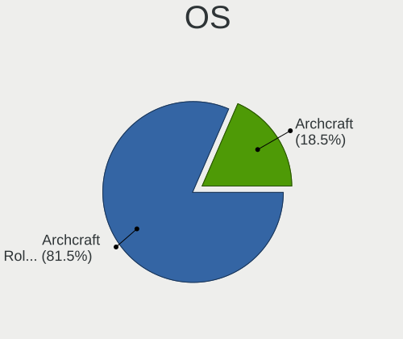

| Name              | Computers | Percent |
|-------------------|-----------|---------|
| Archcraft Rolling | 75        | 81.52%  |
| Archcraft         | 17        | 18.48%  |

OS Family
---------

OS without a version

| Name      | Computers | Percent |
|-----------|-----------|---------|
| Archcraft | 92        | 100%    |

Kernel
------

Version of the Linux kernel

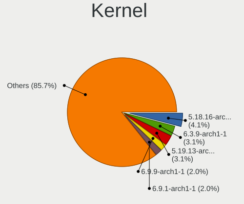

| Version            | Computers | Percent |
|--------------------|-----------|---------|
| 5.18.16-arch1-1    | 4         | 4.08%   |
| 6.3.9-arch1-1      | 3         | 3.06%   |
| 5.19.13-arch1-1    | 3         | 3.06%   |
| 6.9.9-arch1-1      | 2         | 2.04%   |
| 6.9.1-arch1-1      | 2         | 2.04%   |
| 6.8.7-arch1-2      | 2         | 2.04%   |
| 6.6.10-arch1-1     | 2         | 2.04%   |
| 6.4.4-zen1-1-zen   | 2         | 2.04%   |
| 6.4.1-arch2-1      | 2         | 2.04%   |
| 6.2.13-arch1-1     | 2         | 2.04%   |
| 6.17.9-arch1-1     | 2         | 2.04%   |
| 5.12.7-arch1-1     | 2         | 2.04%   |
| 6.9.7-arch1-1      | 1         | 1.02%   |
| 6.8.9-zen1-2-zen   | 1         | 1.02%   |
| 6.8.9-arch1-1      | 1         | 1.02%   |
| 6.8.4-zen1-1-zen   | 1         | 1.02%   |
| 6.8.4-arch1-1      | 1         | 1.02%   |
| 6.7.5-arch1-1      | 1         | 1.02%   |
| 6.7.1-arch1-1      | 1         | 1.02%   |
| 6.6.8-arch1-1      | 1         | 1.02%   |
| 6.6.7-arch1-1      | 1         | 1.02%   |
| 6.6.6-arch1-1      | 1         | 1.02%   |
| 6.6.4-arch1-1      | 1         | 1.02%   |
| 6.6.1-arch1-1      | 1         | 1.02%   |
| 6.5.5-zen1-1-zen   | 1         | 1.02%   |
| 6.5.4-arch2-1      | 1         | 1.02%   |
| 6.4.7-arch1-1      | 1         | 1.02%   |
| 6.4.4-arch1-1      | 1         | 1.02%   |
| 6.4.3-arch1-1      | 1         | 1.02%   |
| 6.4.12-arch1-1     | 1         | 1.02%   |
| 6.4.10-zen2-1-zen  | 1         | 1.02%   |
| 6.4.10-arch1-1     | 1         | 1.02%   |
| 6.3.8-arch1-1      | 1         | 1.02%   |
| 6.3.7-arch1-1-vfio | 1         | 1.02%   |
| 6.3.6-arch1-1      | 1         | 1.02%   |
| 6.3.4-arch1-1      | 1         | 1.02%   |
| 6.3.10-1-clear     | 1         | 1.02%   |
| 6.2.8-zen1-1-zen   | 1         | 1.02%   |
| 6.2.2-arch1-1      | 1         | 1.02%   |
| 6.2.12-arch1-1     | 1         | 1.02%   |

Kernel Family
-------------

Linux kernel without a distro release

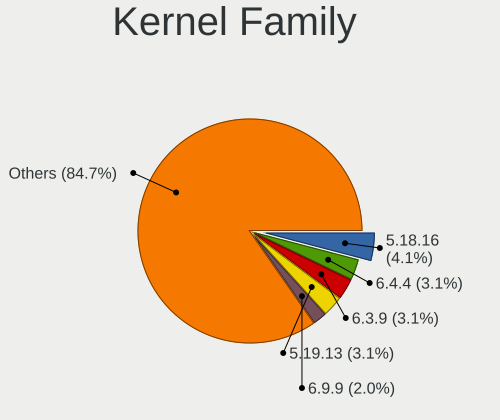

| Version | Computers | Percent |
|---------|-----------|---------|
| 5.18.16 | 4         | 4.08%   |
| 6.4.4   | 3         | 3.06%   |
| 6.3.9   | 3         | 3.06%   |
| 5.19.13 | 3         | 3.06%   |
| 6.9.9   | 2         | 2.04%   |
| 6.9.1   | 2         | 2.04%   |
| 6.8.9   | 2         | 2.04%   |
| 6.8.7   | 2         | 2.04%   |
| 6.8.4   | 2         | 2.04%   |
| 6.6.10  | 2         | 2.04%   |
| 6.4.10  | 2         | 2.04%   |
| 6.4.1   | 2         | 2.04%   |
| 6.2.13  | 2         | 2.04%   |
| 6.17.9  | 2         | 2.04%   |
| 5.12.7  | 2         | 2.04%   |
| 6.9.7   | 1         | 1.02%   |
| 6.7.5   | 1         | 1.02%   |
| 6.7.1   | 1         | 1.02%   |
| 6.6.8   | 1         | 1.02%   |
| 6.6.7   | 1         | 1.02%   |
| 6.6.6   | 1         | 1.02%   |
| 6.6.4   | 1         | 1.02%   |
| 6.6.1   | 1         | 1.02%   |
| 6.5.5   | 1         | 1.02%   |
| 6.5.4   | 1         | 1.02%   |
| 6.4.7   | 1         | 1.02%   |
| 6.4.3   | 1         | 1.02%   |
| 6.4.12  | 1         | 1.02%   |
| 6.3.8   | 1         | 1.02%   |
| 6.3.7   | 1         | 1.02%   |
| 6.3.6   | 1         | 1.02%   |
| 6.3.4   | 1         | 1.02%   |
| 6.3.10  | 1         | 1.02%   |
| 6.2.8   | 1         | 1.02%   |
| 6.2.2   | 1         | 1.02%   |
| 6.2.12  | 1         | 1.02%   |
| 6.17.1  | 1         | 1.02%   |
| 6.16.2  | 1         | 1.02%   |
| 6.15.8  | 1         | 1.02%   |
| 6.14.9  | 1         | 1.02%   |

Kernel Major Ver.
-----------------

Linux kernel major version

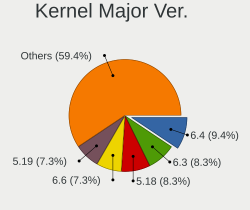

| Version | Computers | Percent |
|---------|-----------|---------|
| 6.4     | 9         | 9.38%   |
| 6.3     | 8         | 8.33%   |
| 5.18    | 8         | 8.33%   |
| 6.6     | 7         | 7.29%   |
| 5.19    | 7         | 7.29%   |
| 6.8     | 6         | 6.25%   |
| 6.9     | 5         | 5.21%   |
| 6.2     | 5         | 5.21%   |
| 6.1     | 4         | 4.17%   |
| 6.0     | 4         | 4.17%   |
| 5.16    | 4         | 4.17%   |
| 5.12    | 4         | 4.17%   |
| 6.17    | 3         | 3.13%   |
| 6.10    | 3         | 3.13%   |
| 5.17    | 3         | 3.13%   |
| 6.7     | 2         | 2.08%   |
| 6.5     | 2         | 2.08%   |
| 6.14    | 2         | 2.08%   |
| 6.11    | 2         | 2.08%   |
| 5.15    | 2         | 2.08%   |
| 5.14    | 2         | 2.08%   |
| 6.16    | 1         | 1.04%   |
| 6.15    | 1         | 1.04%   |
| 6.12    | 1         | 1.04%   |
| 5.10    | 1         | 1.04%   |

Arch
----

OS architecture (x86_64, i586, etc.)

| Name   | Computers | Percent |
|--------|-----------|---------|
| x86_64 | 92        | 100%    |

DE
--

Desktop Environment

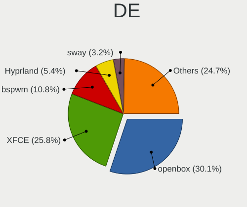

| Name     | Computers | Percent |
|----------|-----------|---------|
| openbox  | 28        | 30.11%  |
| XFCE     | 24        | 25.81%  |
| bspwm    | 10        | 10.75%  |
| Hyprland | 5         | 5.38%   |
| sway     | 3         | 3.23%   |
| KDE6     | 3         | 3.23%   |
| KDE5     | 3         | 3.23%   |
| i3       | 3         | 3.23%   |
| GNOME    | 3         | 3.23%   |
| Unknown  | 3         | 3.23%   |
| dwm      | 2         | 2.15%   |
| xmonad   | 1         | 1.08%   |
| qtile    | 1         | 1.08%   |
| LXDE     | 1         | 1.08%   |
| COSMIC   | 1         | 1.08%   |
| Budgie   | 1         | 1.08%   |
| awesome  | 1         | 1.08%   |

Display Server
--------------

X11 or Wayland

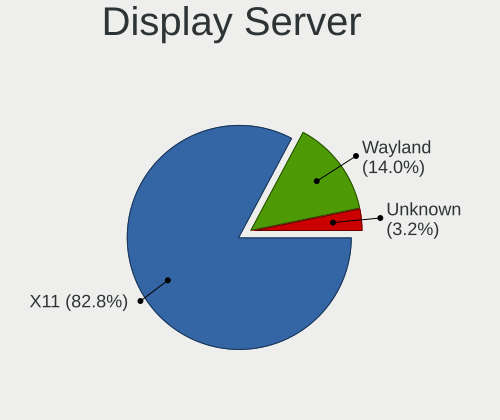

| Name    | Computers | Percent |
|---------|-----------|---------|
| X11     | 77        | 82.8%   |
| Wayland | 13        | 13.98%  |
| Unknown | 3         | 3.23%   |

Display Manager
---------------

SDDM, LightDM, etc.

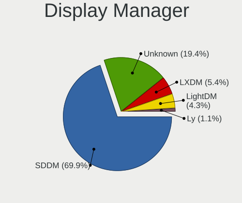

| Name    | Computers | Percent |
|---------|-----------|---------|
| SDDM    | 65        | 69.89%  |
| Unknown | 18        | 19.35%  |
| LXDM    | 5         | 5.38%   |
| LightDM | 4         | 4.3%    |
| Ly      | 1         | 1.08%   |

OS Lang
-------

Language

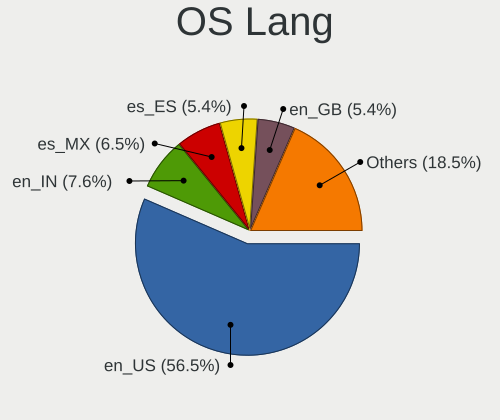

| Lang    | Computers | Percent |
|---------|-----------|---------|
| en_US   | 52        | 56.52%  |
| en_IN   | 7         | 7.61%   |
| es_MX   | 6         | 6.52%   |
| es_ES   | 5         | 5.43%   |
| en_GB   | 5         | 5.43%   |
| it_IT   | 2         | 2.17%   |
| fr_FR   | 2         | 2.17%   |
| en_ZA   | 2         | 2.17%   |
| en_SG   | 2         | 2.17%   |
| tr_TR   | 1         | 1.09%   |
| pt_BR   | 1         | 1.09%   |
| pl_PL   | 1         | 1.09%   |
| es_VE   | 1         | 1.09%   |
| en_PH   | 1         | 1.09%   |
| en_AU   | 1         | 1.09%   |
| de_DE   | 1         | 1.09%   |
| de_AT   | 1         | 1.09%   |
| Unknown | 1         | 1.09%   |

Boot Mode
---------

EFI or BIOS

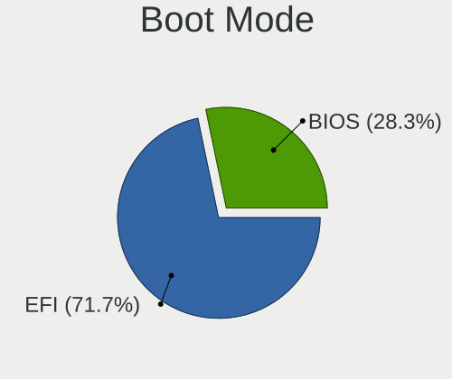

| Mode | Computers | Percent |
|------|-----------|---------|
| EFI  | 66        | 71.74%  |
| BIOS | 26        | 28.26%  |

Filesystem
----------

Type of filesystem

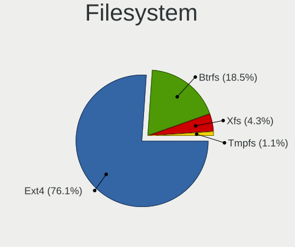

| Type  | Computers | Percent |
|-------|-----------|---------|
| Ext4  | 70        | 76.09%  |
| Btrfs | 17        | 18.48%  |
| Xfs   | 4         | 4.35%   |
| Tmpfs | 1         | 1.09%   |

Part. scheme
------------

Scheme of partitioning

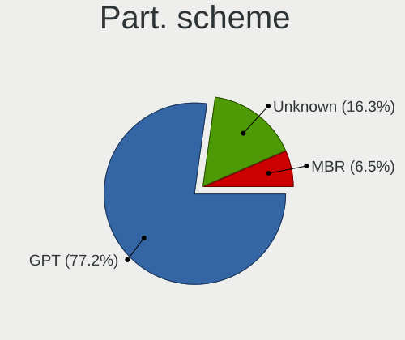

| Type    | Computers | Percent |
|---------|-----------|---------|
| GPT     | 71        | 77.17%  |
| Unknown | 15        | 16.3%   |
| MBR     | 6         | 6.52%   |

Dual Boot with Linux/BSD
------------------------

Hosting more than one Linux/BSD

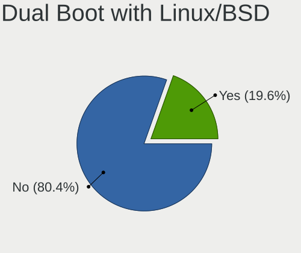

| Dual boot | Computers | Percent |
|-----------|-----------|---------|
| No        | 74        | 80.43%  |
| Yes       | 18        | 19.57%  |

Dual Boot (Win)
---------------

Hosting Linux and Windows

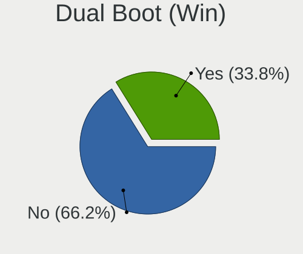

| Dual boot | Computers | Percent |
|-----------|-----------|---------|
| No        | 60        | 64.52%  |
| Yes       | 33        | 35.48%  |

Board
-----

Vendor
------

Motherboard manufacturer

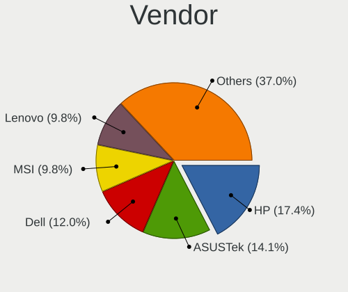

| Name                           | Computers | Percent |
|--------------------------------|-----------|---------|
| Hewlett-Packard                | 16        | 17.39%  |
| ASUSTek Computer               | 13        | 14.13%  |
| Dell                           | 11        | 11.96%  |
| MSI                            | 9         | 9.78%   |
| Lenovo                         | 9         | 9.78%   |
| Gigabyte Technology            | 6         | 6.52%   |
| Apple                          | 4         | 4.35%   |
| HUAWEI                         | 3         | 3.26%   |
| ASRock                         | 3         | 3.26%   |
| Intel                          | 2         | 2.17%   |
| Google                         | 2         | 2.17%   |
| Acer                           | 2         | 2.17%   |
| Standard                       | 1         | 1.09%   |
| SmbiosType1_SystemManufacturer | 1         | 1.09%   |
| Positivo                       | 1         | 1.09%   |
| Packard Bell                   | 1         | 1.09%   |
| MouseComputer                  | 1         | 1.09%   |
| Medion                         | 1         | 1.09%   |
| Infinix                        | 1         | 1.09%   |
| Framework                      | 1         | 1.09%   |
| eMachines                      | 1         | 1.09%   |
| ECS                            | 1         | 1.09%   |
| Chuwi                          | 1         | 1.09%   |
| AXDIA International            | 1         | 1.09%   |

Model
-----

Motherboard model

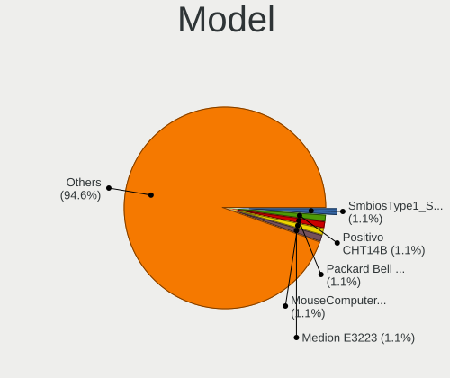

| Name                                    | Computers | Percent |
|-----------------------------------------|-----------|---------|
| SmbiosType1_SystemManufacturer N20      | 1         | 1.09%   |
| Positivo CHT14B                         | 1         | 1.09%   |
| Packard Bell EasyNote TK85              | 1         | 1.09%   |
| MSI Thin GF63 12UDX                     | 1         | 1.09%   |
| MSI MS-7C91                             | 1         | 1.09%   |
| MSI MS-7C51                             | 1         | 1.09%   |
| MSI MS-7B93                             | 1         | 1.09%   |
| MSI Katana GF66 11UE                    | 1         | 1.09%   |
| MSI GL65 Leopard 10SFK                  | 1         | 1.09%   |
| MSI GF63 Thin 10SC                      | 1         | 1.09%   |
| MSI Bravo 15 A4DDR                      | 1         | 1.09%   |
| MSI Alpha 15 B5EEK                      | 1         | 1.09%   |
| MouseComputer EGPN711R307               | 1         | 1.09%   |
| Medion E3223                            | 1         | 1.09%   |
| Lenovo ThinkPad X280 20KFCTO1WW         | 1         | 1.09%   |
| Lenovo ThinkPad T430 2351AK9            | 1         | 1.09%   |
| Lenovo ThinkCentre M710q 10MR0047US     | 1         | 1.09%   |
| Lenovo ThinkCentre Edge72 3484HPU       | 1         | 1.09%   |
| Lenovo MIIX 310-10ICR 80SG              | 1         | 1.09%   |
| Lenovo Legion T530-28APR 90JY007RMH     | 1         | 1.09%   |
| Lenovo IdeaPadFlex 5 14ALC7 82R9        | 1         | 1.09%   |
| Lenovo IdeaPad 3 15IGL05 81WQ           | 1         | 1.09%   |
| Lenovo IdeaCentre 510A-15ARR 90J00061US | 1         | 1.09%   |
| Intel powered classmate PC              | 1         | 1.09%   |
| Intel NUC11BTMi7                        | 1         | 1.09%   |
| Infinix INBook X1 Pro                   | 1         | 1.09%   |
| HUAWEI NBD-WXX9                         | 1         | 1.09%   |
| HUAWEI HLYL-WXX9                        | 1         | 1.09%   |
| HUAWEI BOHB-WAX9                        | 1         | 1.09%   |
| HP Victus by Laptop 16-e0xxx            | 1         | 1.09%   |
| HP Stream Laptop 11-ak0xxx              | 1         | 1.09%   |
| HP Spectre x360 Convertible 15-ch0xx    | 1         | 1.09%   |
| HP Pavilion Notebook                    | 1         | 1.09%   |
| HP Pavilion Laptop 15-eh0xxx            | 1         | 1.09%   |
| HP Pavilion Laptop 15-cc1xx             | 1         | 1.09%   |
| HP Pavilion g4                          | 1         | 1.09%   |
| HP Notebook                             | 1         | 1.09%   |
| HP Laptop 15q-bu1xx                     | 1         | 1.09%   |
| HP Laptop 15-dy2xxx                     | 1         | 1.09%   |
| HP Laptop 15-dw0xxx                     | 1         | 1.09%   |

Model Family
------------

Motherboard model prefix

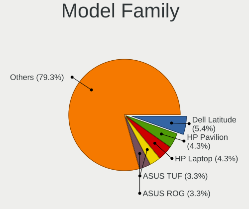

| Name                               | Computers | Percent |
|------------------------------------|-----------|---------|
| Dell Latitude                      | 5         | 5.43%   |
| HP Pavilion                        | 4         | 4.35%   |
| HP Laptop                          | 4         | 4.35%   |
| ASUS TUF                           | 3         | 3.26%   |
| ASUS ROG                           | 3         | 3.26%   |
| Lenovo ThinkPad                    | 2         | 2.17%   |
| Lenovo ThinkCentre                 | 2         | 2.17%   |
| Dell Vostro                        | 2         | 2.17%   |
| Dell Inspiron                      | 2         | 2.17%   |
| SmbiosType1_SystemManufacturer N20 | 1         | 1.09%   |
| Positivo CHT14B                    | 1         | 1.09%   |
| Packard Bell EasyNote              | 1         | 1.09%   |
| MSI Thin                           | 1         | 1.09%   |
| MSI MS-7C91                        | 1         | 1.09%   |
| MSI MS-7C51                        | 1         | 1.09%   |
| MSI MS-7B93                        | 1         | 1.09%   |
| MSI Katana                         | 1         | 1.09%   |
| MSI GL65                           | 1         | 1.09%   |
| MSI GF63                           | 1         | 1.09%   |
| MSI Bravo                          | 1         | 1.09%   |
| MSI Alpha                          | 1         | 1.09%   |
| MouseComputer EGPN711R307          | 1         | 1.09%   |
| Medion E3223                       | 1         | 1.09%   |
| Lenovo MIIX                        | 1         | 1.09%   |
| Lenovo Legion                      | 1         | 1.09%   |
| Lenovo IdeaPadFlex                 | 1         | 1.09%   |
| Lenovo IdeaPad                     | 1         | 1.09%   |
| Lenovo IdeaCentre                  | 1         | 1.09%   |
| Intel powered                      | 1         | 1.09%   |
| Intel NUC11BTMi7                   | 1         | 1.09%   |
| Infinix INBook                     | 1         | 1.09%   |
| HUAWEI NBD-WXX9                    | 1         | 1.09%   |
| HUAWEI HLYL-WXX9                   | 1         | 1.09%   |
| HUAWEI BOHB-WAX9                   | 1         | 1.09%   |
| HP Victus                          | 1         | 1.09%   |
| HP Stream                          | 1         | 1.09%   |
| HP Spectre                         | 1         | 1.09%   |
| HP Notebook                        | 1         | 1.09%   |
| HP InsydeH2O                       | 1         | 1.09%   |
| HP ENVY                            | 1         | 1.09%   |

MFG Year
--------

Motherboard manufacture year

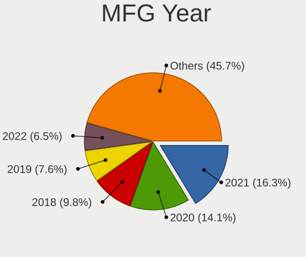

| Year | Computers | Percent |
|------|-----------|---------|
| 2021 | 15        | 16.3%   |
| 2020 | 13        | 14.13%  |
| 2018 | 9         | 9.78%   |
| 2019 | 7         | 7.61%   |
| 2022 | 6         | 6.52%   |
| 2017 | 5         | 5.43%   |
| 2015 | 5         | 5.43%   |
| 2014 | 5         | 5.43%   |
| 2012 | 5         | 5.43%   |
| 2011 | 5         | 5.43%   |
| 2023 | 4         | 4.35%   |
| 2016 | 4         | 4.35%   |
| 2024 | 2         | 2.17%   |
| 2013 | 2         | 2.17%   |
| 2010 | 2         | 2.17%   |
| 2007 | 2         | 2.17%   |
| 2008 | 1         | 1.09%   |

Form Factor
-----------

Physical design of the computer

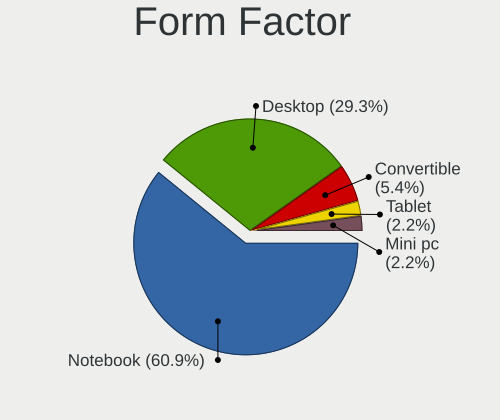

| Name        | Computers | Percent |
|-------------|-----------|---------|
| Notebook    | 56        | 60.87%  |
| Desktop     | 27        | 29.35%  |
| Convertible | 5         | 5.43%   |
| Tablet      | 2         | 2.17%   |
| Mini pc     | 2         | 2.17%   |

Secure Boot
-----------

Enabled or disabled

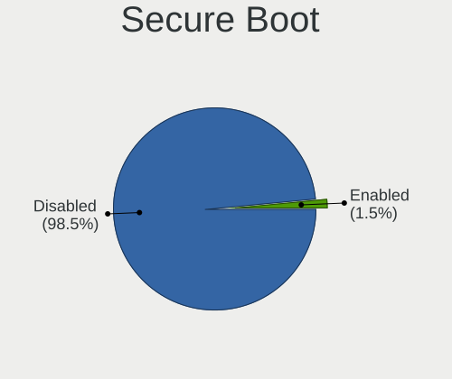

| State    | Computers | Percent |
|----------|-----------|---------|
| Disabled | 91        | 98.91%  |
| Enabled  | 1         | 1.09%   |

Coreboot
--------

Have coreboot on board

| Used | Computers | Percent |
|------|-----------|---------|
| No   | 90        | 97.83%  |
| Yes  | 2         | 2.17%   |

RAM Size
--------

Total RAM memory

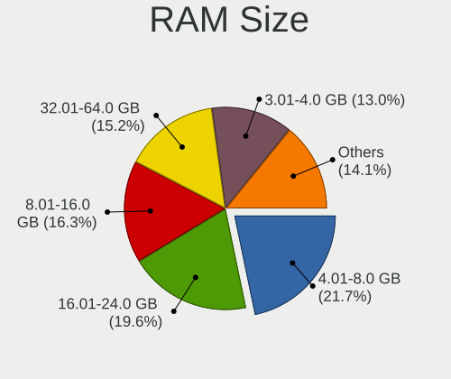

| Size in GB  | Computers | Percent |
|-------------|-----------|---------|
| 4.01-8.0    | 20        | 21.74%  |
| 16.01-24.0  | 18        | 19.57%  |
| 8.01-16.0   | 15        | 16.3%   |
| 32.01-64.0  | 14        | 15.22%  |
| 3.01-4.0    | 12        | 13.04%  |
| 1.01-2.0    | 5         | 5.43%   |
| 64.01-256.0 | 4         | 4.35%   |
| 24.01-32.0  | 3         | 3.26%   |
| 2.01-3.0    | 1         | 1.09%   |

RAM Used
--------

Used RAM memory

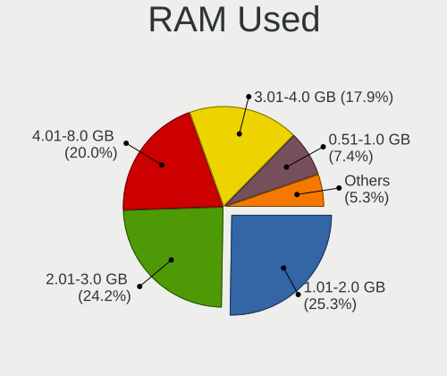

| Used GB   | Computers | Percent |
|-----------|-----------|---------|
| 1.01-2.0  | 24        | 25.26%  |
| 2.01-3.0  | 23        | 24.21%  |
| 4.01-8.0  | 19        | 20%     |
| 3.01-4.0  | 17        | 17.89%  |
| 0.51-1.0  | 7         | 7.37%   |
| 8.01-16.0 | 5         | 5.26%   |

Total Drives
------------

Number of drives on board

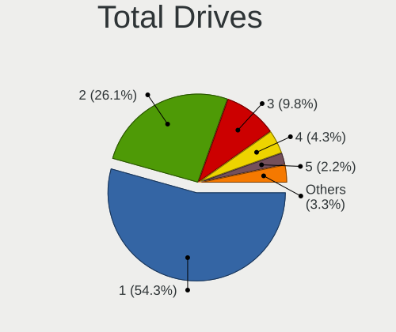

| Drives | Computers | Percent |
|--------|-----------|---------|
| 1      | 50        | 54.35%  |
| 2      | 24        | 26.09%  |
| 3      | 9         | 9.78%   |
| 4      | 4         | 4.35%   |
| 5      | 2         | 2.17%   |
| 8      | 1         | 1.09%   |
| 7      | 1         | 1.09%   |
| 6      | 1         | 1.09%   |

Has CD-ROM
----------

Has CD-ROM on board

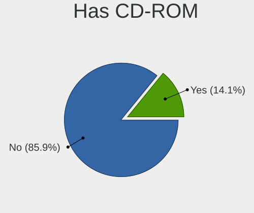

| Presented | Computers | Percent |
|-----------|-----------|---------|
| No        | 79        | 85.87%  |
| Yes       | 13        | 14.13%  |

Has Ethernet
------------

Has Ethernet on board

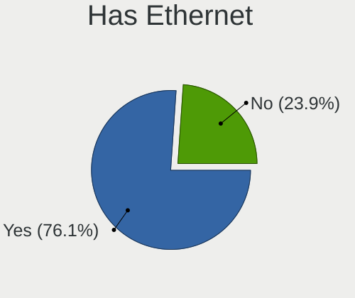

| Presented | Computers | Percent |
|-----------|-----------|---------|
| Yes       | 70        | 76.09%  |
| No        | 22        | 23.91%  |

Has WiFi
--------

Has WiFi module

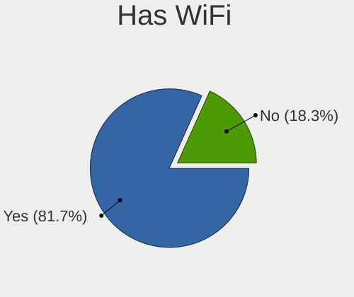

| Presented | Computers | Percent |
|-----------|-----------|---------|
| Yes       | 76        | 81.72%  |
| No        | 17        | 18.28%  |

Has Bluetooth
-------------

Has Bluetooth module

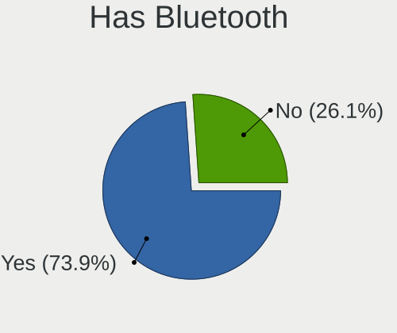

| Presented | Computers | Percent |
|-----------|-----------|---------|
| Yes       | 68        | 73.91%  |
| No        | 24        | 26.09%  |

Location
--------

Country
-------

Geographic location (country)

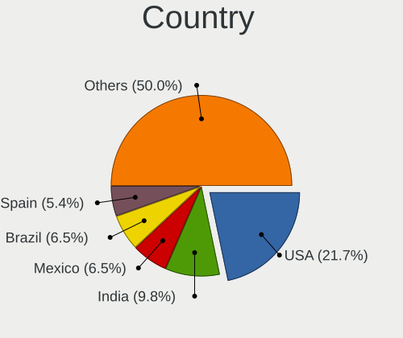

| Country            | Computers | Percent |
|--------------------|-----------|---------|
| USA                | 20        | 21.74%  |
| India              | 9         | 9.78%   |
| Mexico             | 6         | 6.52%   |
| Brazil             | 6         | 6.52%   |
| Spain              | 5         | 5.43%   |
| UK                 | 4         | 4.35%   |
| Italy              | 3         | 3.26%   |
| Germany            | 3         | 3.26%   |
| France             | 3         | 3.26%   |
| Uruguay            | 2         | 2.17%   |
| Turkey             | 2         | 2.17%   |
| Thailand           | 2         | 2.17%   |
| South Africa       | 2         | 2.17%   |
| Russia             | 2         | 2.17%   |
| Malaysia           | 2         | 2.17%   |
| Belarus            | 2         | 2.17%   |
| Vietnam            | 1         | 1.09%   |
| Venezuela          | 1         | 1.09%   |
| Tunisia            | 1         | 1.09%   |
| The Netherlands    | 1         | 1.09%   |
| Slovakia           | 1         | 1.09%   |
| Poland             | 1         | 1.09%   |
| Philippines        | 1         | 1.09%   |
| Japan              | 1         | 1.09%   |
| Indonesia          | 1         | 1.09%   |
| Hungary            | 1         | 1.09%   |
| Finland            | 1         | 1.09%   |
| Ethiopia           | 1         | 1.09%   |
| Dominican Republic | 1         | 1.09%   |
| Czechia            | 1         | 1.09%   |
| Colombia           | 1         | 1.09%   |
| Chile              | 1         | 1.09%   |
| Austria            | 1         | 1.09%   |
| Australia          | 1         | 1.09%   |
| Argentina          | 1         | 1.09%   |

City
----

Geographic location (city)

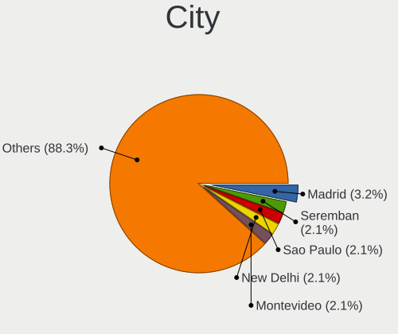

| City               | Computers | Percent |
|--------------------|-----------|---------|
| Madrid             | 3         | 3.19%   |
| Seremban           | 2         | 2.13%   |
| Sao Paulo          | 2         | 2.13%   |
| New Delhi          | 2         | 2.13%   |
| Montevideo         | 2         | 2.13%   |
| Minsk              | 2         | 2.13%   |
| Cape Town          | 2         | 2.13%   |
| Bangkok            | 2         | 2.13%   |
| Yomitan            | 1         | 1.06%   |
| Welwyn Garden City | 1         | 1.06%   |
| Vienna             | 1         | 1.06%   |
| Valencia           | 1         | 1.06%   |
| Vaiano Cremasco    | 1         | 1.06%   |
| Ulm                | 1         | 1.06%   |
| Turin              | 1         | 1.06%   |
| Torreón           | 1         | 1.06%   |
| Tirunelveli        | 1         | 1.06%   |
| Theodore           | 1         | 1.06%   |
| Tábor             | 1         | 1.06%   |
| Sydney             | 1         | 1.06%   |
| Stevens Point      | 1         | 1.06%   |
| St Petersburg      | 1         | 1.06%   |
| Sparta             | 1         | 1.06%   |
| Sousse             | 1         | 1.06%   |
| Santo Domingo Este | 1         | 1.06%   |
| Santiago           | 1         | 1.06%   |
| Santa Rosa         | 1         | 1.06%   |
| San Francisco      | 1         | 1.06%   |
| Rocca di Papa      | 1         | 1.06%   |
| Pune               | 1         | 1.06%   |
| Paulista           | 1         | 1.06%   |
| Osasco             | 1         | 1.06%   |
| Nuremberg          | 1         | 1.06%   |
| Monterrey          | 1         | 1.06%   |
| Milton Keynes      | 1         | 1.06%   |
| Mesa               | 1         | 1.06%   |
| Mazatlán          | 1         | 1.06%   |
| Mar del Plata      | 1         | 1.06%   |
| Mangalore          | 1         | 1.06%   |
| Manchester         | 1         | 1.06%   |

Drives
------

Drive Vendor
------------

Hard drive vendors

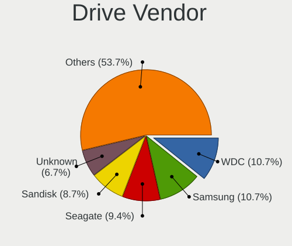

| Vendor                      | Computers | Drives | Percent |
|-----------------------------|-----------|--------|---------|
| WDC                         | 16        | 18     | 10.74%  |
| Samsung Electronics         | 16        | 19     | 10.74%  |
| Seagate                     | 14        | 20     | 9.4%    |
| Sandisk                     | 13        | 16     | 8.72%   |
| Unknown                     | 10        | 17     | 6.71%   |
| Toshiba                     | 6         | 6      | 4.03%   |
| Kingston                    | 6         | 10     | 4.03%   |
| Phison Electronics          | 5         | 5      | 3.36%   |
| Hitachi                     | 5         | 5      | 3.36%   |
| Micron Technology           | 4         | 5      | 2.68%   |
| KIOXIA                      | 4         | 4      | 2.68%   |
| Intel                       | 4         | 7      | 2.68%   |
| Micron/Crucial Technology   | 3         | 3      | 2.01%   |
| Crucial                     | 3         | 3      | 2.01%   |
| Apple                       | 3         | 3      | 2.01%   |
| Unknown                     | 3         | 3      | 2.01%   |
| SPCC                        | 2         | 2      | 1.34%   |
| SK hynix                    | 2         | 2      | 1.34%   |
| Phison                      | 2         | 2      | 1.34%   |
| Patriot                     | 2         | 2      | 1.34%   |
| Kingston Technology Company | 2         | 3      | 1.34%   |
| ADATA Technology            | 2         | 2      | 1.34%   |
| A-DATA Technology           | 2         | 3      | 1.34%   |
| Yangtze Memory Technologies | 1         | 1      | 0.67%   |
| SUNEAST                     | 1         | 1      | 0.67%   |
| Solid State Storage         | 1         | 1      | 0.67%   |
| SABRENT                     | 1         | 1      | 0.67%   |
| ROG                         | 1         | 1      | 0.67%   |
| Realtek Semiconductor       | 1         | 1      | 0.67%   |
| Netac                       | 1         | 1      | 0.67%   |
| Mushkin                     | 1         | 2      | 0.67%   |
| MaxDigital                  | 1         | 1      | 0.67%   |
| KingFast                    | 1         | 2      | 0.67%   |
| Initio                      | 1         | 1      | 0.67%   |
| Inateck                     | 1         | 1      | 0.67%   |
| Hjwdz                       | 1         | 1      | 0.67%   |
| HGST                        | 1         | 1      | 0.67%   |
| Gigabyte Technology         | 1         | 2      | 0.67%   |
| Fanxiang                    | 1         | 1      | 0.67%   |
| EVM                         | 1         | 1      | 0.67%   |

Drive Model
-----------

Hard drive models

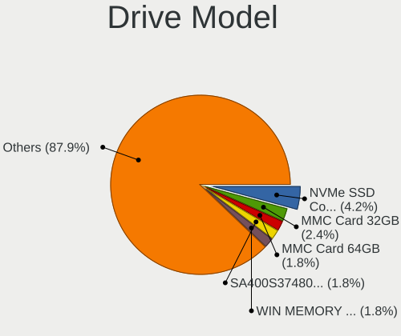

| Model                                             | Computers | Percent |
|---------------------------------------------------|-----------|---------|
| Samsung NVMe SSD Controller SM981/PM981/PM983 1TB | 7         | 4.24%   |
| Unknown MMC Card  32GB                            | 4         | 2.42%   |
| Unknown MMC Card  64GB                            | 3         | 1.82%   |
| Kingston SA400S37480G 480GB SSD                   | 3         | 1.82%   |
| Unknown                                           | 3         | 1.82%   |
| Seagate ST500LM030-2E717D 500GB                   | 2         | 1.21%   |
| Seagate Expansion Desk 4TB                        | 2         | 1.21%   |
| Sandisk WD_BLACK SN770 1TB                        | 2         | 1.21%   |
| Sandisk WD Blue SN550 NVMe SSD 1024GB             | 2         | 1.21%   |
| Samsung SSD 980 1TB                               | 2         | 1.21%   |
| Samsung NVMe SSD Controller 980 (DRAM-less) 256GB | 2         | 1.21%   |
| Phison PS5013 E13 NVMe Controller 500GB           | 2         | 1.21%   |
| Phison E16 PCIe4 NVMe Controller 1TB              | 2         | 1.21%   |
| Yangtze Memory YMTC PC005 256GB                   | 1         | 0.61%   |
| WDC WDS500G2B0C-00PXH0 500GB                      | 1         | 0.61%   |
| WDC WDS500G2B0A-00SM50 500GB                      | 1         | 0.61%   |
| WDC WDS200T2B0B 2TB SSD                           | 1         | 0.61%   |
| WDC WDS120G2G0A-00JH30 120GB SSD                  | 1         | 0.61%   |
| WDC WD5000AAKX-75U6AA0 500GB                      | 1         | 0.61%   |
| WDC WD5000AAKX-60U6AA0 500GB                      | 1         | 0.61%   |
| WDC WD5000AAKX-08U6AA0 500GB                      | 1         | 0.61%   |
| WDC WD3200BPVT-22JJ5T0 320GB                      | 1         | 0.61%   |
| WDC WD20 EARX-00PASB0 2TB                         | 1         | 0.61%   |
| WDC WD10SPZX-75Z10T3 1TB                          | 1         | 0.61%   |
| WDC WD10SPZX-60Z10T0 1TB                          | 1         | 0.61%   |
| WDC WD10SPZX-24Z10T0 1TB                          | 1         | 0.61%   |
| WDC WD10SPCX-60KHST0 1TB                          | 1         | 0.61%   |
| WDC WD10JPVX-22JC3T0 1TB                          | 1         | 0.61%   |
| WDC WD10EZEX-22RKKA0 1TB                          | 1         | 0.61%   |
| WDC WD10EZEX-21M2NA0 1TB                          | 1         | 0.61%   |
| WDC WD10EZEX-08WN4A0 1TB                          | 1         | 0.61%   |
| WDC WD10EARS-00MVWB0 1TB                          | 1         | 0.61%   |
| Unknown SD/MMC/MS PRO 2GB                         | 1         | 0.61%   |
| Unknown SC128  128GB                              | 1         | 0.61%   |
| Unknown NVMe SSD Drive 2TB                        | 1         | 0.61%   |
| Unknown MMC Card  16GB                            | 1         | 0.61%   |
| Unknown MMC Card  128GB                           | 1         | 0.61%   |
| Unknown Essentiel B 1TB                           | 1         | 0.61%   |
| Toshiba XG6 NVMe SSD Controller 1024GB            | 1         | 0.61%   |
| Toshiba MQ01ABF050 500GB                          | 1         | 0.61%   |

HDD Vendor
----------

Hard disk drive vendors

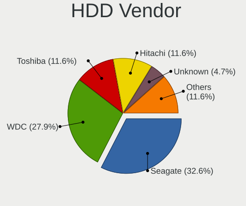

| Vendor     | Computers | Drives | Percent |
|------------|-----------|--------|---------|
| Seagate    | 14        | 20     | 32.56%  |
| WDC        | 12        | 14     | 27.91%  |
| Toshiba    | 5         | 5      | 11.63%  |
| Hitachi    | 5         | 5      | 11.63%  |
| Unknown    | 2         | 3      | 4.65%   |
| Apple      | 2         | 2      | 4.65%   |
| MaxDigital | 1         | 1      | 2.33%   |
| Initio     | 1         | 1      | 2.33%   |
| HGST       | 1         | 1      | 2.33%   |

SSD Vendor
----------

Solid state drive vendors

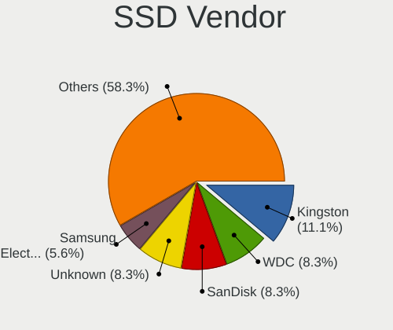

| Vendor              | Computers | Drives | Percent |
|---------------------|-----------|--------|---------|
| Kingston            | 4         | 6      | 11.11%  |
| WDC                 | 3         | 3      | 8.33%   |
| SanDisk             | 3         | 4      | 8.33%   |
| Unknown             | 3         | 3      | 8.33%   |
| Samsung Electronics | 2         | 2      | 5.56%   |
| Patriot             | 2         | 2      | 5.56%   |
| Intel               | 2         | 2      | 5.56%   |
| Crucial             | 2         | 2      | 5.56%   |
| A-DATA Technology   | 2         | 3      | 5.56%   |
| SUNEAST             | 1         | 1      | 2.78%   |
| SPCC                | 1         | 1      | 2.78%   |
| SK hynix            | 1         | 1      | 2.78%   |
| SABRENT             | 1         | 1      | 2.78%   |
| Phison              | 1         | 1      | 2.78%   |
| Netac               | 1         | 1      | 2.78%   |
| Gigabyte Technology | 1         | 2      | 2.78%   |
| Fanxiang            | 1         | 1      | 2.78%   |
| EVM                 | 1         | 1      | 2.78%   |
| China               | 1         | 2      | 2.78%   |
| ASMT                | 1         | 1      | 2.78%   |
| Apple               | 1         | 1      | 2.78%   |
| Apacer              | 1         | 1      | 2.78%   |

Drive Kind
----------

HDD or SSD

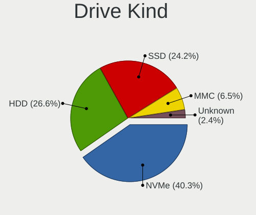

| Kind    | Computers | Drives | Percent |
|---------|-----------|--------|---------|
| NVMe    | 50        | 73     | 40.32%  |
| HDD     | 33        | 52     | 26.61%  |
| SSD     | 30        | 42     | 24.19%  |
| MMC     | 8         | 13     | 6.45%   |
| Unknown | 3         | 4      | 2.42%   |

Drive Connector
---------------

SATA, SAS, NVMe, etc.

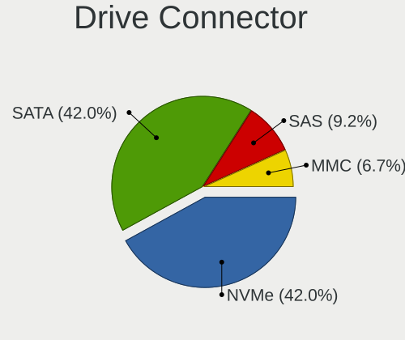

| Type | Computers | Drives | Percent |
|------|-----------|--------|---------|
| NVMe | 50        | 72     | 42.02%  |
| SATA | 50        | 82     | 42.02%  |
| SAS  | 11        | 17     | 9.24%   |
| MMC  | 8         | 13     | 6.72%   |

Drive Size
----------

Size of hard drive

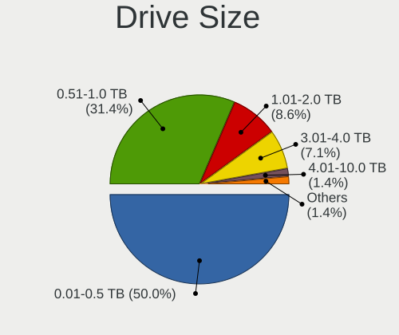

| Size in TB | Computers | Drives | Percent |
|------------|-----------|--------|---------|
| 0.01-0.5   | 35        | 51     | 50%     |
| 0.51-1.0   | 22        | 29     | 31.43%  |
| 1.01-2.0   | 6         | 7      | 8.57%   |
| 3.01-4.0   | 5         | 5      | 7.14%   |
| 2.01-3.0   | 1         | 1      | 1.43%   |
| 4.01-10.0  | 1         | 1      | 1.43%   |

Space Total
-----------

Amount of disk space available on the file system

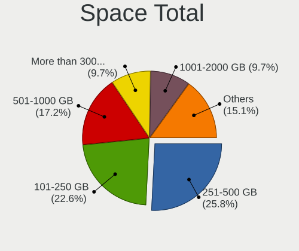

| Size in GB     | Computers | Percent |
|----------------|-----------|---------|
| 251-500        | 24        | 25.81%  |
| 101-250        | 21        | 22.58%  |
| 501-1000       | 16        | 17.2%   |
| More than 3000 | 9         | 9.68%   |
| 1001-2000      | 9         | 9.68%   |
| Unknown        | 6         | 6.45%   |
| 51-100         | 4         | 4.3%    |
| 21-50          | 3         | 3.23%   |
| 2001-3000      | 1         | 1.08%   |

Space Used
----------

Amount of used disk space

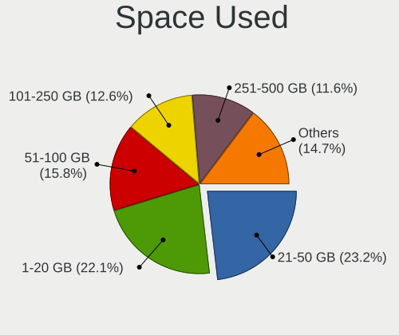

| Used GB        | Computers | Percent |
|----------------|-----------|---------|
| 21-50          | 22        | 23.16%  |
| 1-20           | 21        | 22.11%  |
| 51-100         | 15        | 15.79%  |
| 101-250        | 12        | 12.63%  |
| 251-500        | 11        | 11.58%  |
| Unknown        | 6         | 6.32%   |
| 501-1000       | 4         | 4.21%   |
| More than 3000 | 2         | 2.11%   |
| 1001-2000      | 2         | 2.11%   |

Malfunc. Drives
---------------

Drive models with a malfunction

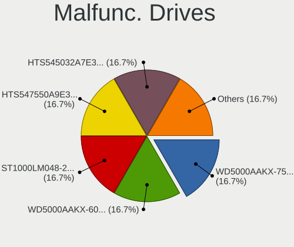

| Model                          | Computers | Drives | Percent |
|--------------------------------|-----------|--------|---------|
| WDC WD5000AAKX-75U6AA0 500GB   | 1         | 1      | 12.5%   |
| WDC WD5000AAKX-60U6AA0 500GB   | 1         | 1      | 12.5%   |
| WDC WD10EARS-00MVWB0 1TB       | 1         | 1      | 12.5%   |
| Seagate ST1000LM048-2E7172 1TB | 1         | 1      | 12.5%   |
| MaxDigital MD4000GBDS 4TB      | 1         | 1      | 12.5%   |
| Hitachi HTS547550A9E384 500GB  | 1         | 1      | 12.5%   |
| Hitachi HTS545032A7E380 320GB  | 1         | 1      | 12.5%   |
| HGST HTS545050A7E680 500GB     | 1         | 1      | 12.5%   |

Malfunc. Drive Vendor
---------------------

Vendors of faulty drives

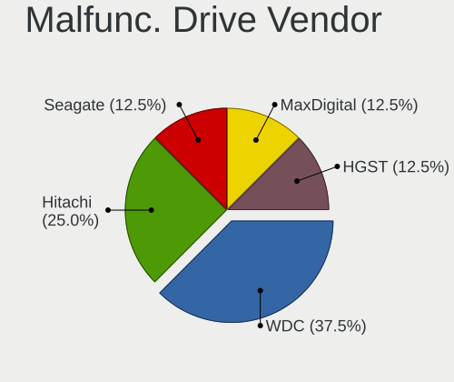

| Vendor     | Computers | Drives | Percent |
|------------|-----------|--------|---------|
| WDC        | 3         | 3      | 37.5%   |
| Hitachi    | 2         | 2      | 25%     |
| Seagate    | 1         | 1      | 12.5%   |
| MaxDigital | 1         | 1      | 12.5%   |
| HGST       | 1         | 1      | 12.5%   |

Malfunc. HDD Vendor
-------------------

Vendors of faulty HDD drives

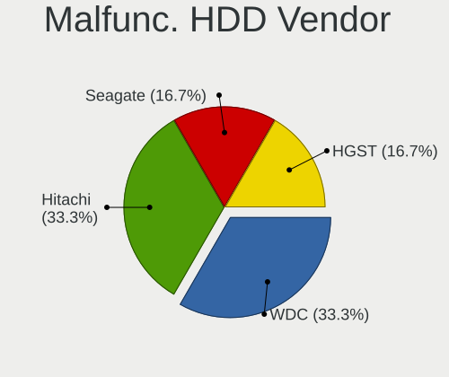

| Vendor     | Computers | Drives | Percent |
|------------|-----------|--------|---------|
| WDC        | 3         | 3      | 37.5%   |
| Hitachi    | 2         | 2      | 25%     |
| Seagate    | 1         | 1      | 12.5%   |
| MaxDigital | 1         | 1      | 12.5%   |
| HGST       | 1         | 1      | 12.5%   |

Malfunc. Drive Kind
-------------------

Kinds of faulty drives

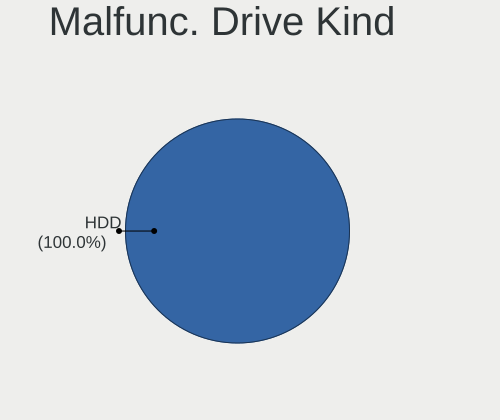

| Kind | Computers | Drives | Percent |
|------|-----------|--------|---------|
| HDD  | 7         | 8      | 100%    |

Failed Drives
-------------

Failed drive models

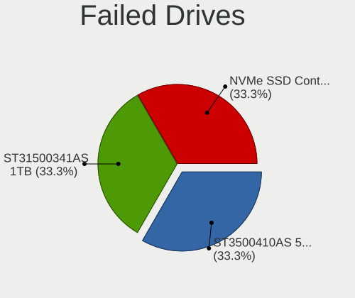

| Model                                                         | Computers | Drives | Percent |
|---------------------------------------------------------------|-----------|--------|---------|
| Seagate ST3500410AS 500GB                                     | 1         | 2      | 33.33%  |
| Seagate ST31500341AS 1TB                                      | 1         | 2      | 33.33%  |
| Samsung Electronics NVMe SSD Controller 980 (DRAM-less) 256GB | 1         | 1      | 33.33%  |

Failed Drive Vendor
-------------------

Failed drive vendors

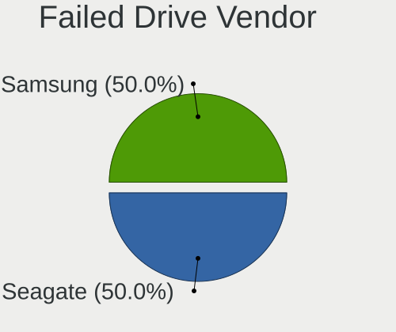

| Vendor              | Computers | Drives | Percent |
|---------------------|-----------|--------|---------|
| Seagate             | 1         | 4      | 50%     |
| Samsung Electronics | 1         | 1      | 50%     |

Drive Status
------------

Number of failed and malfunc. drives

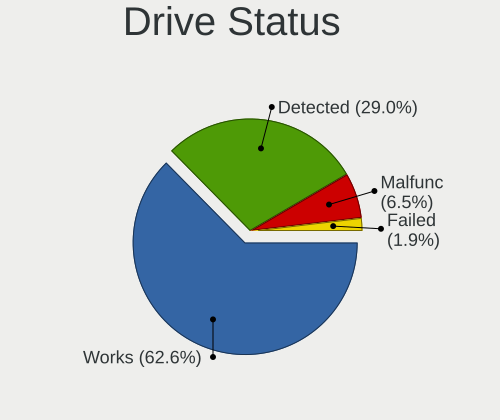

| Status   | Computers | Drives | Percent |
|----------|-----------|--------|---------|
| Works    | 67        | 110    | 62.62%  |
| Detected | 31        | 61     | 28.97%  |
| Malfunc  | 7         | 8      | 6.54%   |
| Failed   | 2         | 5      | 1.87%   |

Storage controller
------------------

Storage Vendor
--------------

Storage controller vendors

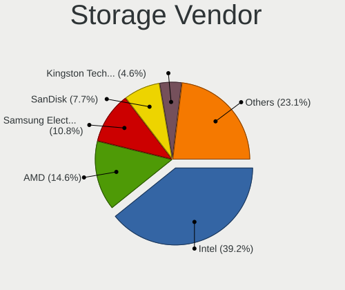

| Vendor                         | Computers | Percent |
|--------------------------------|-----------|---------|
| Intel                          | 51        | 39.23%  |
| AMD                            | 19        | 14.62%  |
| Samsung Electronics            | 14        | 10.77%  |
| SanDisk                        | 10        | 7.69%   |
| Kingston Technology Company    | 6         | 4.62%   |
| Phison Electronics             | 5         | 3.85%   |
| Micron/Crucial Technology      | 4         | 3.08%   |
| Micron Technology              | 4         | 3.08%   |
| KIOXIA                         | 4         | 3.08%   |
| ASMedia Technology             | 3         | 2.31%   |
| ADATA Technology               | 2         | 1.54%   |
| Yangtze Memory Technologies    | 1         | 0.77%   |
| Toshiba America Info Systems   | 1         | 0.77%   |
| Solidigm                       | 1         | 0.77%   |
| Solid State Storage Technology | 1         | 0.77%   |
| SK hynix                       | 1         | 0.77%   |
| Silicon Motion                 | 1         | 0.77%   |
| Realtek Semiconductor          | 1         | 0.77%   |
| INNOGRIT                       | 1         | 0.77%   |

Storage Model
-------------

Storage controller models

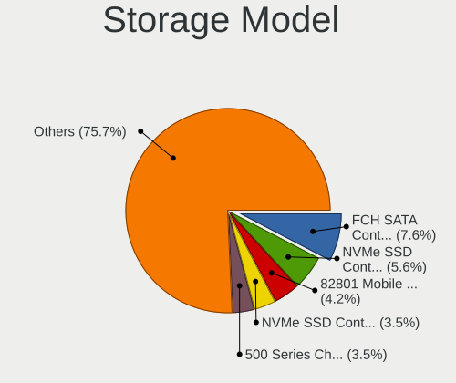

| Model                                                                         | Computers | Percent |
|-------------------------------------------------------------------------------|-----------|---------|
| AMD FCH SATA Controller [AHCI mode]                                           | 11        | 7.64%   |
| Samsung NVMe SSD Controller SM981/PM981/PM983                                 | 8         | 5.56%   |
| Intel 82801 Mobile SATA Controller [RAID mode]                                | 6         | 4.17%   |
| Samsung NVMe SSD Controller 980 (DRAM-less)                                   | 5         | 3.47%   |
| AMD 500 Series Chipset SATA Controller                                        | 5         | 3.47%   |
| Intel 6 Series/C200 Series Chipset Family 6 port Mobile SATA AHCI Controller  | 4         | 2.78%   |
| SanDisk WD SN560/SN740/SN770/SN5000 NVMe SSD                                  | 3         | 2.08%   |
| SanDisk Ultra 3D / WD PC SN530, IX SN530, Blue SN550 NVMe SSD (DRAM-less)     | 3         | 2.08%   |
| Micron/Crucial P2 [Nick P2] / P3 / P3 Plus NVMe PCIe SSD (DRAM-less)          | 3         | 2.08%   |
| KIOXIA NVMe SSD Controller BG4 (DRAM-less)                                    | 3         | 2.08%   |
| Intel Volume Management Device NVMe RAID Controller                           | 3         | 2.08%   |
| Intel Tiger Lake SATA AHCI Controller                                         | 3         | 2.08%   |
| Intel Celeron/Pentium Silver Processor SATA Controller                        | 3         | 2.08%   |
| AMD 400 Series Chipset SATA Controller                                        | 3         | 2.08%   |
| Phison PS5013-E13 PCIe3 NVMe Controller (DRAM-less)                           | 2         | 1.39%   |
| Phison E16 PCIe4 NVMe Controller                                              | 2         | 1.39%   |
| Kingston Company NV1 NVMe SSD [SM2263XT] (DRAM-less)                          | 2         | 1.39%   |
| Intel Wildcat Point-LP SATA Controller [AHCI Mode]                            | 2         | 1.39%   |
| Intel Sunrise Point-LP SATA Controller [AHCI mode]                            | 2         | 1.39%   |
| Intel HM170/QM170 Chipset SATA Controller [AHCI Mode]                         | 2         | 1.39%   |
| Intel Comet Lake SATA AHCI Controller                                         | 2         | 1.39%   |
| Intel Alder Lake-P SATA AHCI Controller                                       | 2         | 1.39%   |
| Intel 82801G (ICH7 Family) IDE Controller                                     | 2         | 1.39%   |
| Intel 8 Series SATA Controller 1 [AHCI mode]                                  | 2         | 1.39%   |
| Intel 7 Series Chipset Family 6-port SATA Controller [AHCI mode]              | 2         | 1.39%   |
| Intel 6 Series/C200 Series Chipset Family 6 port Desktop SATA AHCI Controller | 2         | 1.39%   |
| Intel 5 Series/3400 Series Chipset 4 port SATA AHCI Controller                | 2         | 1.39%   |
| Intel 400 Series Chipset Family SATA AHCI Controller                          | 2         | 1.39%   |
| ASMedia ASM1061/ASM1062 Serial ATA Controller                                 | 2         | 1.39%   |
| Yangtze Memory PC005 NVMe SSD                                                 | 1         | 0.69%   |
| Toshiba America Info Systems XG6 NVMe SSD Controller                          | 1         | 0.69%   |
| Solidigm P44 Pro NVMe SSD [Hollywood Beach]                                   | 1         | 0.69%   |
| Solid State Storage CL1-3D256-Q11 NVMe SSD M.2                                | 1         | 0.69%   |
| SK hynix BC501 NVMe Solid State Drive                                         | 1         | 0.69%   |
| Silicon Motion SM2262/SM2262EN SSD Controller                                 | 1         | 0.69%   |
| SanDisk WD Green SN350 240GB (DRAM-less) / SN560E NVMe SSD                    | 1         | 0.69%   |
| SanDisk WD Blue SN500 / PC SN520 x2 M.2 2280 NVMe SSD                         | 1         | 0.69%   |
| Sandisk WD Black SN850X NVMe SSD                                              | 1         | 0.69%   |
| SanDisk Ultra 3D / WD Blue SN570 NVMe SSD (DRAM-less)                         | 1         | 0.69%   |
| SanDisk PC SN735 / WD_BLACK SN750 SE NVMe SSD (DRAM-less)                     | 1         | 0.69%   |

Storage Kind
------------

Kind of storage controller (IDE, SATA, NVMe, SAS, ...)

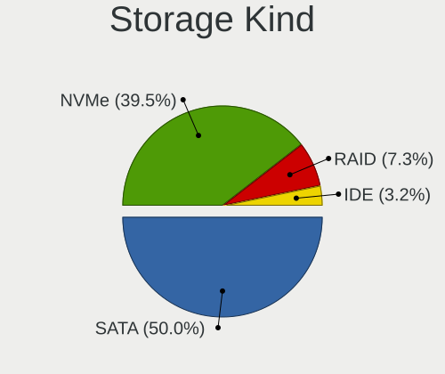

| Kind | Computers | Percent |
|------|-----------|---------|
| SATA | 62        | 50%     |
| NVMe | 49        | 39.52%  |
| RAID | 9         | 7.26%   |
| IDE  | 4         | 3.23%   |

Processor
---------

CPU Vendor
----------

Processor vendors

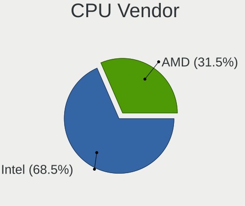

| Vendor | Computers | Percent |
|--------|-----------|---------|
| Intel  | 63        | 68.48%  |
| AMD    | 29        | 31.52%  |

CPU Model
---------

Processor models

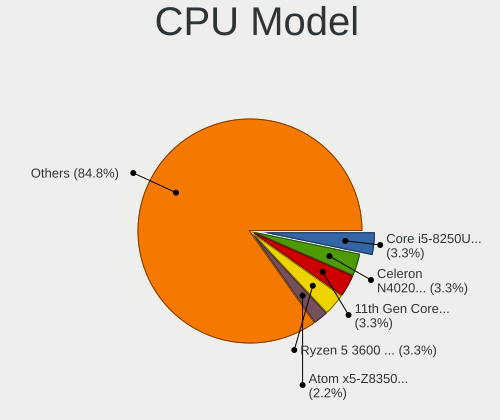

| Model                                          | Computers | Percent |
|------------------------------------------------|-----------|---------|
| Intel Core i5-8250U CPU @ 1.60GHz              | 3         | 3.26%   |
| Intel Celeron N4020 CPU @ 1.10GHz              | 3         | 3.26%   |
| Intel 11th Gen Core i7-11800H @ 2.30GHz        | 3         | 3.26%   |
| AMD Ryzen 5 3600 6-Core Processor              | 3         | 3.26%   |
| Intel Atom x5-Z8350 CPU @ 1.44GHz              | 2         | 2.17%   |
| Intel 11th Gen Core i5-1135G7 @ 2.40GHz        | 2         | 2.17%   |
| AMD Ryzen 7 3800X 8-Core Processor             | 2         | 2.17%   |
| AMD Ryzen 5 4600H with Radeon Graphics         | 2         | 2.17%   |
| AMD A10-7800 Radeon R7, 12 Compute Cores 4C+8G | 2         | 2.17%   |
| Intel Xeon W-3175X CPU @ 3.10GHz               | 1         | 1.09%   |
| Intel Pentium Silver N5030 CPU @ 1.10GHz       | 1         | 1.09%   |
| Intel Pentium CPU N4200 @ 1.10GHz              | 1         | 1.09%   |
| Intel Core i7-8705G CPU @ 3.10GHz              | 1         | 1.09%   |
| Intel Core i7-8700 CPU @ 3.20GHz               | 1         | 1.09%   |
| Intel Core i7-8565U CPU @ 1.80GHz              | 1         | 1.09%   |
| Intel Core i7-8550U CPU @ 1.80GHz              | 1         | 1.09%   |
| Intel Core i7-6700HQ CPU @ 2.60GHz             | 1         | 1.09%   |
| Intel Core i7-5500U CPU @ 2.40GHz              | 1         | 1.09%   |
| Intel Core i7-4510U CPU @ 2.00GHz              | 1         | 1.09%   |
| Intel Core i7-2600K CPU @ 3.40GHz              | 1         | 1.09%   |
| Intel Core i7-10750H CPU @ 2.60GHz             | 1         | 1.09%   |
| Intel Core i7-1065G7 CPU @ 1.30GHz             | 1         | 1.09%   |
| Intel Core i5-8350U CPU @ 1.70GHz              | 1         | 1.09%   |
| Intel Core i5-7400 CPU @ 3.00GHz               | 1         | 1.09%   |
| Intel Core i5-7300U CPU @ 2.60GHz              | 1         | 1.09%   |
| Intel Core i5-7200U CPU @ 2.50GHz              | 1         | 1.09%   |
| Intel Core i5-6500T CPU @ 2.50GHz              | 1         | 1.09%   |
| Intel Core i5-5300U CPU @ 2.30GHz              | 1         | 1.09%   |
| Intel Core i5-4690K CPU @ 3.50GHz              | 1         | 1.09%   |
| Intel Core i5-4570 CPU @ 3.20GHz               | 1         | 1.09%   |
| Intel Core i5-3320M CPU @ 2.60GHz              | 1         | 1.09%   |
| Intel Core i5-3210M CPU @ 2.50GHz              | 1         | 1.09%   |
| Intel Core i5-2540M CPU @ 2.60GHz              | 1         | 1.09%   |
| Intel Core i5-2520M CPU @ 2.50GHz              | 1         | 1.09%   |
| Intel Core i5-2467M CPU @ 1.60GHz              | 1         | 1.09%   |
| Intel Core i5-10300H CPU @ 2.50GHz             | 1         | 1.09%   |
| Intel Core i5-10210U CPU @ 1.60GHz             | 1         | 1.09%   |
| Intel Core i5 CPU M 450 @ 2.40GHz              | 1         | 1.09%   |
| Intel Core i3-5005U CPU @ 2.00GHz              | 1         | 1.09%   |
| Intel Core i3-3220 CPU @ 3.30GHz               | 1         | 1.09%   |

CPU Model Family
----------------

Processor model prefix

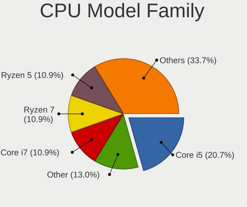

| Model                | Computers | Percent |
|----------------------|-----------|---------|
| Intel Core i5        | 19        | 20.65%  |
| Other                | 12        | 13.04%  |
| Intel Core i7        | 10        | 10.87%  |
| AMD Ryzen 7          | 10        | 10.87%  |
| AMD Ryzen 5          | 10        | 10.87%  |
| Intel Celeron        | 8         | 8.7%    |
| Intel Core i3        | 6         | 6.52%   |
| AMD Ryzen 9          | 4         | 4.35%   |
| Intel Core 2 Duo     | 3         | 3.26%   |
| Intel Atom           | 3         | 3.26%   |
| AMD A10              | 2         | 2.17%   |
| Intel Xeon           | 1         | 1.09%   |
| Intel Pentium Silver | 1         | 1.09%   |
| Intel Pentium        | 1         | 1.09%   |
| AMD Ryzen 3 PRO      | 1         | 1.09%   |
| AMD A4               | 1         | 1.09%   |

CPU Cores
---------

Number of processor cores

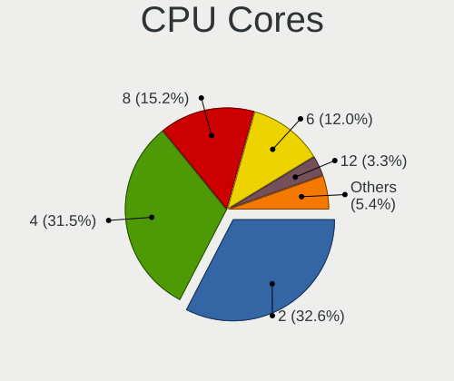

| Number | Computers | Percent |
|--------|-----------|---------|
| 2      | 30        | 32.61%  |
| 4      | 29        | 31.52%  |
| 8      | 14        | 15.22%  |
| 6      | 11        | 11.96%  |
| 12     | 3         | 3.26%   |
| 10     | 3         | 3.26%   |
| 28     | 1         | 1.09%   |
| 16     | 1         | 1.09%   |

CPU Sockets
-----------

Number of sockets

| Number | Computers | Percent |
|--------|-----------|---------|
| 1      | 92        | 100%    |

CPU Threads
-----------

Threads per core (Hyper-Threading)

| Number | Computers | Percent |
|--------|-----------|---------|
| 2      | 69        | 75%     |
| 1      | 23        | 25%     |

CPU Op-Modes
------------

CPU Operation Modes (32-bit, 64-bit)

| Op mode        | Computers | Percent |
|----------------|-----------|---------|
| 32-bit, 64-bit | 92        | 100%    |

CPU Microcode
-------------

Microcode number

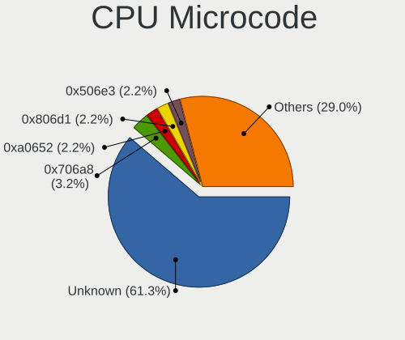

| Number     | Computers | Percent |
|------------|-----------|---------|
| Unknown    | 57        | 61.29%  |
| 0x706a8    | 3         | 3.23%   |
| 0xa0652    | 2         | 2.15%   |
| 0x806d1    | 2         | 2.15%   |
| 0x506e3    | 2         | 2.15%   |
| 0x206a7    | 2         | 2.15%   |
| 0x906e9    | 1         | 1.08%   |
| 0x806ec    | 1         | 1.08%   |
| 0x806ea    | 1         | 1.08%   |
| 0x806c1    | 1         | 1.08%   |
| 0x6fd      | 1         | 1.08%   |
| 0x506c9    | 1         | 1.08%   |
| 0x50654    | 1         | 1.08%   |
| 0x406c4    | 1         | 1.08%   |
| 0x40651    | 1         | 1.08%   |
| 0x306d4    | 1         | 1.08%   |
| 0x306c3    | 1         | 1.08%   |
| 0x306a9    | 1         | 1.08%   |
| 0x0a601203 | 1         | 1.08%   |
| 0x0a50000c | 1         | 1.08%   |
| 0x0a404102 | 1         | 1.08%   |
| 0x0a201016 | 1         | 1.08%   |
| 0x0a201009 | 1         | 1.08%   |
| 0x08701030 | 1         | 1.08%   |
| 0x08701021 | 1         | 1.08%   |
| 0x08608104 | 1         | 1.08%   |
| 0x08600106 | 1         | 1.08%   |
| 0x08600104 | 1         | 1.08%   |
| 0x08108102 | 1         | 1.08%   |
| 0x06003106 | 1         | 1.08%   |
| 0x03000027 | 1         | 1.08%   |

CPU Microarch
-------------

Microarchitecture

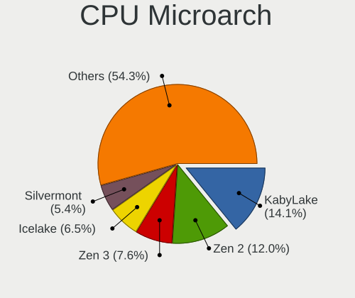

| Name             | Computers | Percent |
|------------------|-----------|---------|
| KabyLake         | 13        | 14.13%  |
| Zen 2            | 11        | 11.96%  |
| Zen 3            | 7         | 7.61%   |
| Icelake          | 6         | 6.52%   |
| Silvermont       | 5         | 5.43%   |
| SandyBridge      | 5         | 5.43%   |
| Goldmont plus    | 5         | 5.43%   |
| Unknown          | 5         | 5.43%   |
| Zen+             | 4         | 4.35%   |
| TigerLake        | 4         | 4.35%   |
| Haswell          | 4         | 4.35%   |
| Skylake          | 3         | 3.26%   |
| IvyBridge        | 3         | 3.26%   |
| Broadwell        | 3         | 3.26%   |
| Westmere         | 2         | 2.17%   |
| Steamroller      | 2         | 2.17%   |
| Core             | 2         | 2.17%   |
| CometLake        | 2         | 2.17%   |
| Alderlake Hybrid | 2         | 2.17%   |
| Tremont          | 1         | 1.09%   |
| Penryn           | 1         | 1.09%   |
| K10 Llano        | 1         | 1.09%   |
| Goldmont         | 1         | 1.09%   |

Graphics
--------

GPU Vendor
----------

Vendors of graphics cards

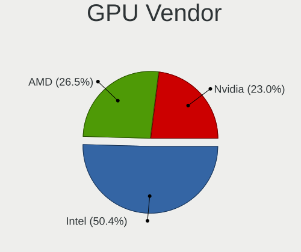

| Vendor | Computers | Percent |
|--------|-----------|---------|
| Intel  | 57        | 50.44%  |
| AMD    | 30        | 26.55%  |
| Nvidia | 26        | 23.01%  |

GPU Model
---------

Graphics card models

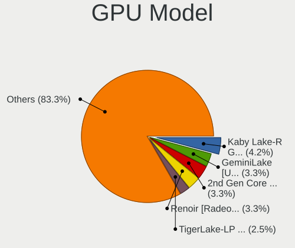

| Model                                                                                    | Computers | Percent |
|------------------------------------------------------------------------------------------|-----------|---------|
| Intel Kaby Lake-R GT2 [UHD Graphics 620]                                                 | 5         | 4.17%   |
| Intel GeminiLake [UHD Graphics 600]                                                      | 4         | 3.33%   |
| Intel 2nd Generation Core Processor Family Integrated Graphics Controller                | 4         | 3.33%   |
| AMD Renoir [Radeon Vega Series / Radeon Vega Mobile Series]                              | 4         | 3.33%   |
| Intel TigerLake-LP GT2 [Iris Xe Graphics]                                                | 3         | 2.5%    |
| Intel TigerLake-H GT1 [UHD Graphics]                                                     | 3         | 2.5%    |
| Intel Broadwell-U GT2 [HD Graphics 5500]                                                 | 3         | 2.5%    |
| Intel Atom/Celeron/Pentium Processor x5-E8000/J3xxx/N3xxx Integrated Graphics Controller | 3         | 2.5%    |
| AMD Ellesmere [Radeon RX 470/480/570/570X/580/580X/590]                                  | 3         | 2.5%    |
| AMD Cezanne [Radeon Vega Series / Radeon Vega Mobile Series]                             | 3         | 2.5%    |
| Nvidia GP107 [GeForce GTX 1050 Ti]                                                       | 2         | 1.67%   |
| Nvidia GM108M [GeForce MX130]                                                            | 2         | 1.67%   |
| Nvidia GA106M [GeForce RTX 3060 Mobile / Max-Q]                                          | 2         | 1.67%   |
| Nvidia GA104M [GeForce RTX 3070 Mobile / Max-Q]                                          | 2         | 1.67%   |
| Nvidia GA104 [GeForce RTX 3060 Ti Lite Hash Rate]                                        | 2         | 1.67%   |
| Intel Kaby Lake-U GT2 [HD Graphics 620]                                                  | 2         | 1.67%   |
| Intel Haswell-ULT Integrated Graphics Controller                                         | 2         | 1.67%   |
| Intel CometLake-U GT2 [UHD Graphics]                                                     | 2         | 1.67%   |
| Intel CometLake-H GT2 [UHD Graphics]                                                     | 2         | 1.67%   |
| Intel Atom Processor Z36xxx/Z37xxx Series Graphics & Display                             | 2         | 1.67%   |
| Intel 3rd Gen Core processor Graphics Controller                                         | 2         | 1.67%   |
| AMD Sun XT [Radeon HD 8670A/8670M/8690M / R5 M330 / M430 / Radeon 520 Mobile]            | 2         | 1.67%   |
| AMD Picasso/Raven 2 [Radeon Vega Series / Radeon Vega Mobile Series]                     | 2         | 1.67%   |
| AMD Navi 31 [Radeon RX 7900 XT/7900 XTX/7900 GRE/7900M]                                  | 2         | 1.67%   |
| AMD Navi 23 [Radeon RX 6600/6600 XT/6600M]                                               | 2         | 1.67%   |
| AMD Navi 10 [Radeon RX 5600 OEM/5600 XT / 5700/5700 XT]                                  | 2         | 1.67%   |
| AMD Kaveri [Radeon R7 Graphics]                                                          | 2         | 1.67%   |
| Nvidia TU116M [GeForce GTX 1660 Ti Mobile]                                               | 1         | 0.83%   |
| Nvidia TU116 [GeForce GTX 1660 Ti]                                                       | 1         | 0.83%   |
| Nvidia TU106M [GeForce RTX 2070 Mobile / Max-Q Refresh]                                  | 1         | 0.83%   |
| Nvidia TU106 [GeForce RTX 2060 SUPER]                                                    | 1         | 0.83%   |
| Nvidia TU106 [GeForce RTX 2060 Rev. A]                                                   | 1         | 0.83%   |
| Nvidia TU102 [TITAN RTX]                                                                 | 1         | 0.83%   |
| Nvidia GP106 [GeForce GTX 1060 6GB]                                                      | 1         | 0.83%   |
| Nvidia GM108M [GeForce MX110]                                                            | 1         | 0.83%   |
| Nvidia GM108M [GeForce 940MX]                                                            | 1         | 0.83%   |
| Nvidia GM108M [GeForce 840M]                                                             | 1         | 0.83%   |
| Nvidia GM107M [GeForce GTX 960M]                                                         | 1         | 0.83%   |
| Nvidia GM107 [GeForce GTX 750 Ti]                                                        | 1         | 0.83%   |
| Nvidia GA107M [GeForce RTX 3050 Mobile]                                                  | 1         | 0.83%   |

GPU Combo
---------

Combinations of graphics cards

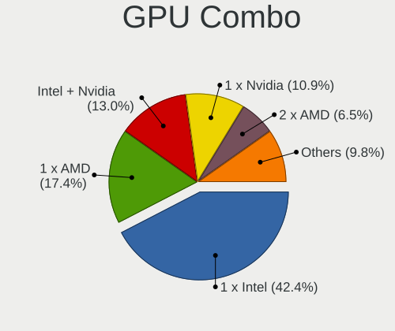

| Name           | Computers | Percent |
|----------------|-----------|---------|
| 1 x Intel      | 39        | 42.39%  |
| 1 x AMD        | 16        | 17.39%  |
| Intel + Nvidia | 12        | 13.04%  |
| 1 x Nvidia     | 10        | 10.87%  |
| 2 x AMD        | 6         | 6.52%   |
| Intel + AMD    | 4         | 4.35%   |
| AMD + Nvidia   | 4         | 4.35%   |
| 2 x Intel      | 1         | 1.09%   |

GPU Driver
----------

Free vs proprietary

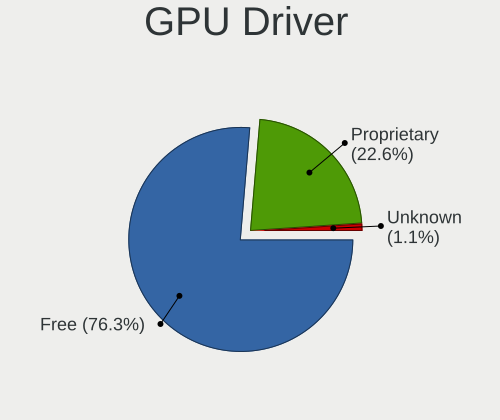

| Driver      | Computers | Percent |
|-------------|-----------|---------|
| Free        | 71        | 76.34%  |
| Proprietary | 21        | 22.58%  |
| Unknown     | 1         | 1.08%   |

GPU Memory
----------

Total video memory

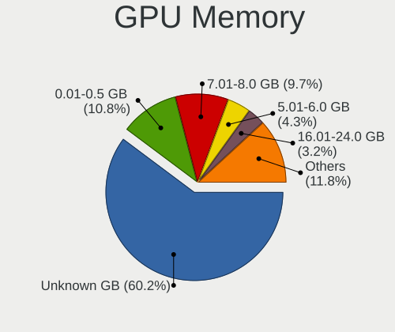

| Size in GB | Computers | Percent |
|------------|-----------|---------|
| Unknown    | 56        | 60.22%  |
| 0.01-0.5   | 10        | 10.75%  |
| 7.01-8.0   | 9         | 9.68%   |
| 5.01-6.0   | 4         | 4.3%    |
| 3.01-4.0   | 3         | 3.23%   |
| 16.01-24.0 | 3         | 3.23%   |
| 1.01-2.0   | 3         | 3.23%   |
| 8.01-16.0  | 3         | 3.23%   |
| 0.51-1.0   | 2         | 2.15%   |

Monitor
-------

Monitor Vendor
--------------

Monitor vendors

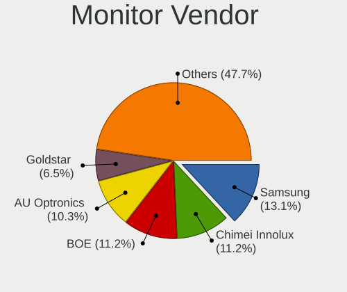

| Vendor               | Computers | Percent |
|----------------------|-----------|---------|
| Samsung Electronics  | 14        | 13.08%  |
| Chimei Innolux       | 12        | 11.21%  |
| BOE                  | 12        | 11.21%  |
| AU Optronics         | 11        | 10.28%  |
| Goldstar             | 7         | 6.54%   |
| LG Display           | 6         | 5.61%   |
| Dell                 | 6         | 5.61%   |
| PANDA                | 5         | 4.67%   |
| Acer                 | 4         | 3.74%   |
| Sharp                | 3         | 2.8%    |
| Apple                | 3         | 2.8%    |
| Ancor Communications | 3         | 2.8%    |
| Lenovo               | 2         | 1.87%   |
| HKC                  | 2         | 1.87%   |
| Hewlett-Packard      | 2         | 1.87%   |
| ASUSTek Computer     | 2         | 1.87%   |
| AOC                  | 2         | 1.87%   |
| Toshiba              | 1         | 0.93%   |
| Roku                 | 1         | 0.93%   |
| Mi                   | 1         | 0.93%   |
| JPN                  | 1         | 0.93%   |
| JLK                  | 1         | 0.93%   |
| InfoVision           | 1         | 0.93%   |
| HUAWEI               | 1         | 0.93%   |
| HJC                  | 1         | 0.93%   |
| BenQ                 | 1         | 0.93%   |
| AGO                  | 1         | 0.93%   |
| Unknown              | 1         | 0.93%   |

Monitor Model
-------------

Monitor models

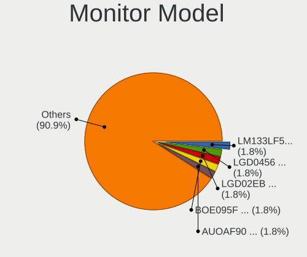

| Model                                                                  | Computers | Percent |
|------------------------------------------------------------------------|-----------|---------|
| PANDA LM133LF5L01 NCP0020 1920x1080 294x165mm 13.3-inch                | 2         | 1.82%   |
| LG Display LCD Monitor LGD0456 1366x768 344x194mm 15.5-inch            | 2         | 1.82%   |
| LG Display LCD Monitor LGD02EB 1366x768 309x174mm 14.0-inch            | 2         | 1.82%   |
| BOE LCD Monitor BOE095F 2256x1504 285x190mm 13.5-inch                  | 2         | 1.82%   |
| AU Optronics LCD Monitor AUOAF90 1920x1080 344x193mm 15.5-inch         | 2         | 1.82%   |
| AU Optronics LCD Monitor AUO38ED 1920x1080 344x193mm 15.5-inch         | 2         | 1.82%   |
| AU Optronics LCD Monitor AUO106C 1366x768 276x155mm 12.5-inch          | 2         | 1.82%   |
| Toshiba TV TSB0206 1920x1080                                           | 1         | 0.91%   |
| Sharp LQ156M1JW25 SHP152C 1920x1080 344x194mm 15.5-inch                | 1         | 0.91%   |
| Sharp LQ156M1JW03 SHP155D 1920x1080 344x194mm 15.5-inch                | 1         | 0.91%   |
| Sharp LCD Monitor SHP14F8 3840x2400 288x180mm 13.4-inch                | 1         | 0.91%   |
| Samsung Electronics U28E590 SAM0C4E 3840x2160 608x345mm 27.5-inch      | 1         | 0.91%   |
| Samsung Electronics S34CG50 SAM730F 3440x1440 798x334mm 34.1-inch      | 1         | 0.91%   |
| Samsung Electronics S24F350 SAM0D20 1920x1080 521x293mm 23.5-inch      | 1         | 0.91%   |
| Samsung Electronics S24D332 SAM0F5E 1920x1080 531x299mm 24.0-inch      | 1         | 0.91%   |
| Samsung Electronics LS24AG32x SAM71DA 1920x1080 527x296mm 23.8-inch    | 1         | 0.91%   |
| Samsung Electronics LCD Monitor SEC335A 1366x768 309x174mm 14.0-inch   | 1         | 0.91%   |
| Samsung Electronics LCD Monitor SEC3046 1366x768 344x193mm 15.5-inch   | 1         | 0.91%   |
| Samsung Electronics LCD Monitor SDC416C 1920x1080 344x194mm 15.5-inch  | 1         | 0.91%   |
| Samsung Electronics LCD Monitor SAM0C39 1920x1080 885x498mm 40.0-inch  | 1         | 0.91%   |
| Samsung Electronics LC49G95T SAM7053 3840x1080 1193x336mm 48.8-inch    | 1         | 0.91%   |
| Samsung Electronics LC27G5xT SAM7079 2560x1440 597x336mm 27.0-inch     | 1         | 0.91%   |
| Samsung Electronics C49RG9x SAM0F9C 3360x1440 1193x336mm 48.8-inch     | 1         | 0.91%   |
| Samsung Electronics C24F390 SAM0D2C 1920x1080 521x293mm 23.5-inch      | 1         | 0.91%   |
| Samsung Electronics ATNA60CL10-0 SDC41AF 2880x1800 344x215mm 16.0-inch | 1         | 0.91%   |
| Roku TV RKU8518 1920x1080 698x392mm 31.5-inch                          | 1         | 0.91%   |
| PANDA LCD Monitor NCP005F 1920x1080 344x194mm 15.5-inch                | 1         | 0.91%   |
| PANDA LCD Monitor NCP004D 1920x1080 344x194mm 15.5-inch                | 1         | 0.91%   |
| PANDA LCD Monitor NCP002D 1920x1080 344x194mm 15.5-inch                | 1         | 0.91%   |
| Mi Monitor XMI3445 3440x1440 797x334mm 34.0-inch                       | 1         | 0.91%   |
| LG Display LCD Monitor LGD04B9 1920x1080 344x194mm 15.5-inch           | 1         | 0.91%   |
| LG Display LCD Monitor LGD04B1 1366x768 310x174mm 14.0-inch            | 1         | 0.91%   |
| Lenovo P24h-10 LEN61AE 2560x1440 527x296mm 23.8-inch                   | 1         | 0.91%   |
| Lenovo LEN T2054pC LEN60D9 1440x900 419x262mm 19.5-inch                | 1         | 0.91%   |
| JPN IPS245FHDR165 JPN2500 1920x1080 552x314mm 25.0-inch                | 1         | 0.91%   |
| JLK F32FR1K-17B JLK3251 1920x1080 544x303mm 24.5-inch                  | 1         | 0.91%   |
| InfoVision LCD Monitor IVO34D1 1920x1280 285x190mm 13.5-inch           | 1         | 0.91%   |
| HUAWEI ZQE-CBA HWV6A25 3440x1440 797x334mm 34.0-inch                   | 1         | 0.91%   |
| HKC GM27X5QIPS HKC0027 2560x1440 597x336mm 27.0-inch                   | 1         | 0.91%   |
| HKC 24N5C HKC2451 1920x1080 523x293mm 23.6-inch                        | 1         | 0.91%   |

Monitor Resolution
------------------

Monitor screen resolution

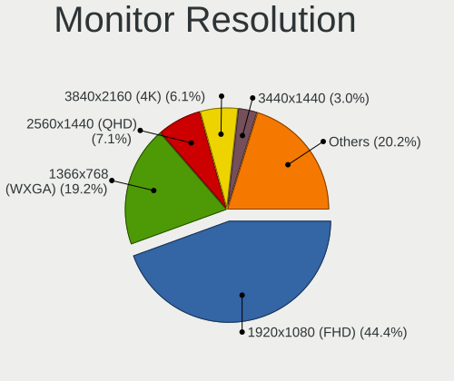

| Resolution       | Computers | Percent |
|------------------|-----------|---------|
| 1920x1080 (FHD)  | 44        | 44.44%  |
| 1366x768 (WXGA)  | 19        | 19.19%  |
| 2560x1440 (QHD)  | 7         | 7.07%   |
| 3840x2160 (4K)   | 6         | 6.06%   |
| 3440x1440        | 3         | 3.03%   |
| 2560x1080        | 3         | 3.03%   |
| 3840x1080        | 2         | 2.02%   |
| 2256x1504        | 2         | 2.02%   |
| 1440x900 (WXGA+) | 2         | 2.02%   |
| 1280x800 (WXGA)  | 2         | 2.02%   |
| 3840x2400        | 1         | 1.01%   |
| 3200x1080        | 1         | 1.01%   |
| 2880x1800        | 1         | 1.01%   |
| 2240x1400        | 1         | 1.01%   |
| 2160x1440        | 1         | 1.01%   |
| 1920x1280        | 1         | 1.01%   |
| 1600x900 (HD+)   | 1         | 1.01%   |
| 1280x1024 (SXGA) | 1         | 1.01%   |
| Unknown          | 1         | 1.01%   |

Monitor Diagonal
----------------

Diagonal size in inches

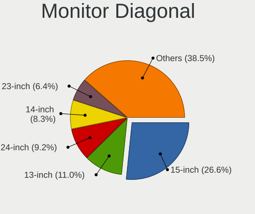

| Inches  | Computers | Percent |
|---------|-----------|---------|
| 15      | 29        | 26.61%  |
| 13      | 12        | 11.01%  |
| 24      | 10        | 9.17%   |
| 14      | 9         | 8.26%   |
| 23      | 7         | 6.42%   |
| 34      | 6         | 5.5%    |
| 31      | 5         | 4.59%   |
| 21      | 5         | 4.59%   |
| 27      | 4         | 3.67%   |
| 12      | 4         | 3.67%   |
| 16      | 3         | 2.75%   |
| 48      | 2         | 1.83%   |
| 19      | 2         | 1.83%   |
| 11      | 2         | 1.83%   |
| 74      | 1         | 0.92%   |
| 64      | 1         | 0.92%   |
| 63      | 1         | 0.92%   |
| 54      | 1         | 0.92%   |
| 32      | 1         | 0.92%   |
| 25      | 1         | 0.92%   |
| 18      | 1         | 0.92%   |
| 17      | 1         | 0.92%   |
| Unknown | 1         | 0.92%   |

Monitor Width
-------------

Physical width

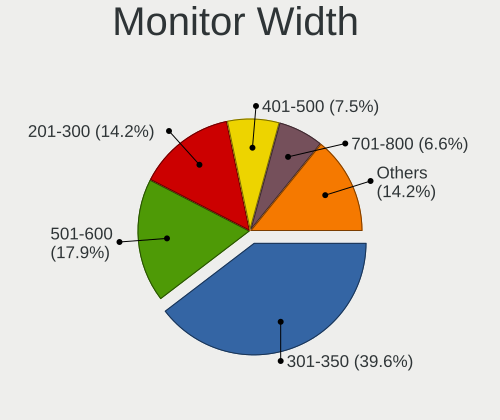

| Width in mm | Computers | Percent |
|-------------|-----------|---------|
| 301-350     | 42        | 39.62%  |
| 501-600     | 19        | 17.92%  |
| 201-300     | 15        | 14.15%  |
| 401-500     | 8         | 7.55%   |
| 701-800     | 7         | 6.6%    |
| 601-700     | 6         | 5.66%   |
| 1001-1500   | 5         | 4.72%   |
| 351-400     | 2         | 1.89%   |
| 1501-2000   | 1         | 0.94%   |
| Unknown     | 1         | 0.94%   |

Aspect Ratio
------------

Proportional relationship between the width and the height

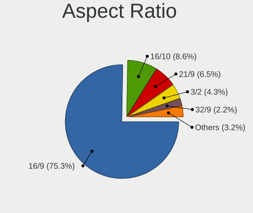

| Ratio   | Computers | Percent |
|---------|-----------|---------|
| 16/9    | 70        | 75.27%  |
| 16/10   | 8         | 8.6%    |
| 21/9    | 6         | 6.45%   |
| 3/2     | 4         | 4.3%    |
| 32/9    | 2         | 2.15%   |
| 5/4     | 1         | 1.08%   |
| 4/3     | 1         | 1.08%   |
| Unknown | 1         | 1.08%   |

Monitor Area
------------

Area in inch²

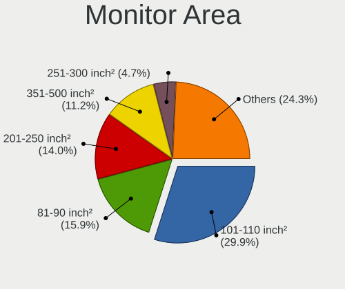

| Area in inch² | Computers | Percent |
|----------------|-----------|---------|
| 101-110        | 32        | 29.91%  |
| 81-90          | 17        | 15.89%  |
| 201-250        | 15        | 14.02%  |
| 351-500        | 12        | 11.21%  |
| 251-300        | 5         | 4.67%   |
| More than 1000 | 4         | 3.74%   |
| 71-80          | 4         | 3.74%   |
| 301-350        | 4         | 3.74%   |
| 61-70          | 3         | 2.8%    |
| 151-200        | 3         | 2.8%    |
| 51-60          | 2         | 1.87%   |
| 141-150        | 2         | 1.87%   |
| 501-1000       | 2         | 1.87%   |
| 111-120        | 1         | 0.93%   |
| Unknown        | 1         | 0.93%   |

Pixel Density
-------------

Pixels per inch

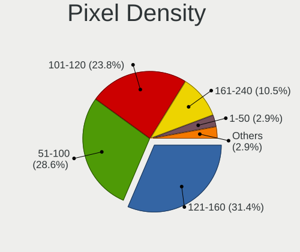

| Density       | Computers | Percent |
|---------------|-----------|---------|
| 121-160       | 33        | 31.43%  |
| 51-100        | 30        | 28.57%  |
| 101-120       | 25        | 23.81%  |
| 161-240       | 11        | 10.48%  |
| 1-50          | 3         | 2.86%   |
| More than 240 | 2         | 1.9%    |
| Unknown       | 1         | 0.95%   |

Multiple Monitors
-----------------

Total monitors connected

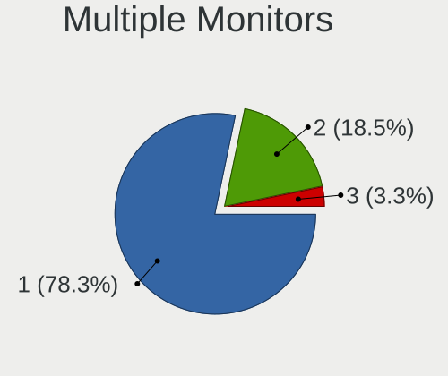

| Total | Computers | Percent |
|-------|-----------|---------|
| 1     | 72        | 78.26%  |
| 2     | 17        | 18.48%  |
| 3     | 3         | 3.26%   |

Network
-------

Net Controller Vendor
---------------------

Controller vendors

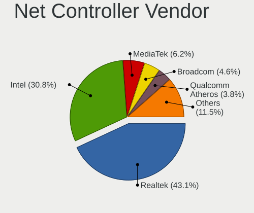

| Vendor                   | Computers | Percent |
|--------------------------|-----------|---------|
| Realtek Semiconductor    | 56        | 43.08%  |
| Intel                    | 40        | 30.77%  |
| MediaTek                 | 8         | 6.15%   |
| Broadcom                 | 6         | 4.62%   |
| Qualcomm Atheros         | 5         | 3.85%   |
| Ralink Technology        | 4         | 3.08%   |
| TP-Link                  | 2         | 1.54%   |
| Broadcom Limited         | 2         | 1.54%   |
| Prolific Technology      | 1         | 0.77%   |
| OPPO Electronics         | 1         | 0.77%   |
| Microsoft                | 1         | 0.77%   |
| Marvell Technology Group | 1         | 0.77%   |
| DisplayLink              | 1         | 0.77%   |
| ASIX Electronics         | 1         | 0.77%   |
| Aquantia                 | 1         | 0.77%   |

Net Controller Model
--------------------

Controller models

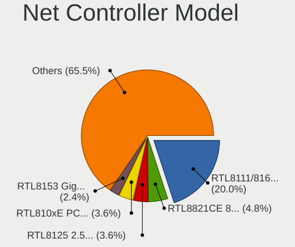

| Model                                                                  | Computers | Percent |
|------------------------------------------------------------------------|-----------|---------|
| Realtek RTL8111/8168/8211/8411 PCI Express Gigabit Ethernet Controller | 33        | 20%     |
| Realtek RTL8821CE 802.11ac PCIe Wireless Network Adapter               | 8         | 4.85%   |
| Realtek RTL8125 2.5GbE Controller                                      | 6         | 3.64%   |
| Realtek RTL810xE PCI Express Fast Ethernet controller                  | 6         | 3.64%   |
| Realtek RTL8153 Gigabit Ethernet Adapter                               | 4         | 2.42%   |
| Intel Wireless 8265 / 8275                                             | 4         | 2.42%   |
| Realtek RTL8723BE PCIe Wireless Network Adapter                        | 3         | 1.82%   |
| Realtek RTL8188EUS 802.11n Wireless Network Adapter                    | 3         | 1.82%   |
| Realtek 802.11ac NIC                                                   | 3         | 1.82%   |
| Ralink MT7601U Wireless Adapter                                        | 3         | 1.82%   |
| MediaTek MT7921 802.11ax PCIe Wireless Network Adapter [Filogic 330]   | 3         | 1.82%   |
| Intel Wi-Fi 6 AX200                                                    | 3         | 1.82%   |
| Intel Wi-Fi 5(802.11ac) Wireless-AC 9x6x [Thunder Peak]                | 3         | 1.82%   |
| Intel Tiger Lake PCH CNVi WiFi                                         | 3         | 1.82%   |
| Intel I211 Gigabit Network Connection                                  | 3         | 1.82%   |
| Intel Gemini Lake PCH CNVi WiFi                                        | 3         | 1.82%   |
| Intel Ethernet Connection (4) I219-LM                                  | 3         | 1.82%   |
| TP-Link 802.11ac WLAN Adapter                                          | 2         | 1.21%   |
| Realtek RTL8822CE 802.11ac PCIe Wireless Network Adapter               | 2         | 1.21%   |
| Realtek RTL8821AE 802.11ac PCIe Wireless Network Adapter               | 2         | 1.21%   |
| Qualcomm Atheros QCA9565 / AR9565 Wireless Network Adapter             | 2         | 1.21%   |
| Qualcomm Atheros QCA9377 802.11ac Wireless Network Adapter             | 2         | 1.21%   |
| MediaTek MT7922 802.11ax PCI Express Wireless Network Adapter          | 2         | 1.21%   |
| MediaTek MT7921K (RZ608) Wi-Fi 6E 80MHz                                | 2         | 1.21%   |
| Intel Wireless 7265                                                    | 2         | 1.21%   |
| Intel Wi-Fi 6E(802.11ax) AX210/AX1675* 2x2 [Typhoon Peak]              | 2         | 1.21%   |
| Intel Wi-Fi 6 AX201                                                    | 2         | 1.21%   |
| Intel Dual Band Wireless-AC 3168NGW [Stone Peak]                       | 2         | 1.21%   |
| Intel Comet Lake PCH-LP CNVi WiFi                                      | 2         | 1.21%   |
| Intel Comet Lake PCH CNVi WiFi                                         | 2         | 1.21%   |
| Intel Centrino Advanced-N 6205 [Taylor Peak]                           | 2         | 1.21%   |
| Intel 82579LM Gigabit Network Connection (Lewisville)                  | 2         | 1.21%   |
| Broadcom NetXtreme BCM57765 Gigabit Ethernet PCIe                      | 2         | 1.21%   |
| Broadcom NetLink BCM57780 Gigabit Ethernet PCIe                        | 2         | 1.21%   |
| Broadcom BCM4331 802.11a/b/g/n                                         | 2         | 1.21%   |
| Realtek RTL8852BE PCIe 802.11ax Wireless Network Controller            | 1         | 0.61%   |
| Realtek RTL8852AE 802.11ax PCIe Wireless Network Adapter               | 1         | 0.61%   |
| Realtek RTL8822BE 802.11a/b/g/n/ac WiFi adapter                        | 1         | 0.61%   |
| Realtek RTL8723DE Wireless Network Adapter                             | 1         | 0.61%   |
| Realtek RTL8192EU 802.11b/g/n WLAN Adapter                             | 1         | 0.61%   |

Wireless Vendor
---------------

Wireless vendors

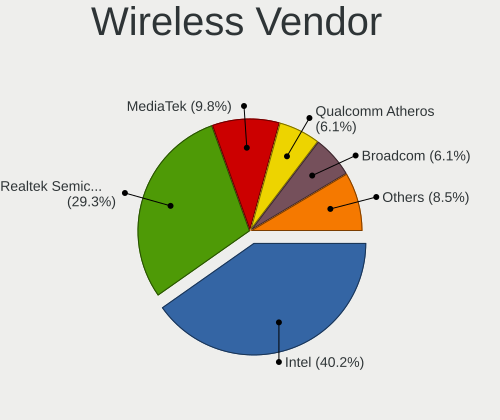

| Vendor                | Computers | Percent |
|-----------------------|-----------|---------|
| Intel                 | 33        | 40.24%  |
| Realtek Semiconductor | 24        | 29.27%  |
| MediaTek              | 8         | 9.76%   |
| Qualcomm Atheros      | 5         | 6.1%    |
| Broadcom              | 5         | 6.1%    |
| Ralink Technology     | 4         | 4.88%   |
| TP-Link               | 2         | 2.44%   |
| Microsoft             | 1         | 1.22%   |

Wireless Model
--------------

Wireless models

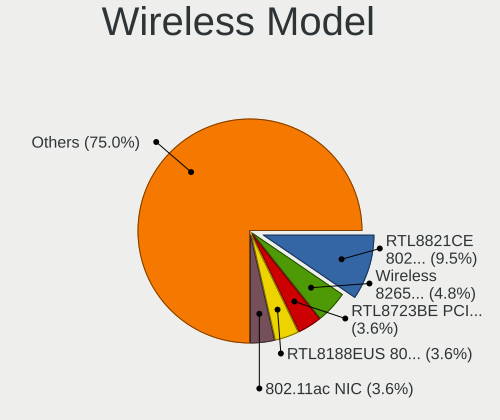

| Model                                                                           | Computers | Percent |
|---------------------------------------------------------------------------------|-----------|---------|
| Realtek RTL8821CE 802.11ac PCIe Wireless Network Adapter                        | 8         | 9.52%   |
| Intel Wireless 8265 / 8275                                                      | 4         | 4.76%   |
| Realtek RTL8723BE PCIe Wireless Network Adapter                                 | 3         | 3.57%   |
| Realtek RTL8188EUS 802.11n Wireless Network Adapter                             | 3         | 3.57%   |
| Realtek 802.11ac NIC                                                            | 3         | 3.57%   |
| Ralink MT7601U Wireless Adapter                                                 | 3         | 3.57%   |
| MediaTek MT7921 802.11ax PCIe Wireless Network Adapter [Filogic 330]            | 3         | 3.57%   |
| Intel Wi-Fi 6 AX200                                                             | 3         | 3.57%   |
| Intel Wi-Fi 5(802.11ac) Wireless-AC 9x6x [Thunder Peak]                         | 3         | 3.57%   |
| Intel Tiger Lake PCH CNVi WiFi                                                  | 3         | 3.57%   |
| Intel Gemini Lake PCH CNVi WiFi                                                 | 3         | 3.57%   |
| TP-Link 802.11ac WLAN Adapter                                                   | 2         | 2.38%   |
| Realtek RTL8822CE 802.11ac PCIe Wireless Network Adapter                        | 2         | 2.38%   |
| Realtek RTL8821AE 802.11ac PCIe Wireless Network Adapter                        | 2         | 2.38%   |
| Qualcomm Atheros QCA9565 / AR9565 Wireless Network Adapter                      | 2         | 2.38%   |
| Qualcomm Atheros QCA9377 802.11ac Wireless Network Adapter                      | 2         | 2.38%   |
| MediaTek MT7922 802.11ax PCI Express Wireless Network Adapter                   | 2         | 2.38%   |
| MediaTek MT7921K (RZ608) Wi-Fi 6E 80MHz                                         | 2         | 2.38%   |
| Intel Wireless 7265                                                             | 2         | 2.38%   |
| Intel Wi-Fi 6E(802.11ax) AX210/AX1675* 2x2 [Typhoon Peak]                       | 2         | 2.38%   |
| Intel Wi-Fi 6 AX201                                                             | 2         | 2.38%   |
| Intel Dual Band Wireless-AC 3168NGW [Stone Peak]                                | 2         | 2.38%   |
| Intel Comet Lake PCH-LP CNVi WiFi                                               | 2         | 2.38%   |
| Intel Comet Lake PCH CNVi WiFi                                                  | 2         | 2.38%   |
| Intel Centrino Advanced-N 6205 [Taylor Peak]                                    | 2         | 2.38%   |
| Broadcom BCM4331 802.11a/b/g/n                                                  | 2         | 2.38%   |
| Realtek RTL8852AE 802.11ax PCIe Wireless Network Adapter                        | 1         | 1.19%   |
| Realtek RTL8822BE 802.11a/b/g/n/ac WiFi adapter                                 | 1         | 1.19%   |
| Realtek RTL8723DE Wireless Network Adapter                                      | 1         | 1.19%   |
| Realtek RTL8192EU 802.11b/g/n WLAN Adapter                                      | 1         | 1.19%   |
| Realtek RTL8192CE PCIe Wireless Network Adapter                                 | 1         | 1.19%   |
| Ralink RT5572 Wireless Adapter                                                  | 1         | 1.19%   |
| Qualcomm Atheros QCA6174 802.11ac Wireless Network Adapter                      | 1         | 1.19%   |
| Microsoft Wireless XBox Controller Dongle                                       | 1         | 1.19%   |
| MediaTek MT7925 802.11be 160MHz 2x2 PCIe Wireless Network Adapter [Filogic 360] | 1         | 1.19%   |
| Intel Raptor Lake PCH CNVi WiFi                                                 | 1         | 1.19%   |
| Intel Ice Lake-LP PCH CNVi WiFi                                                 | 1         | 1.19%   |
| Intel Centrino Ultimate-N 6300                                                  | 1         | 1.19%   |
| Broadcom BCM43225 802.11b/g/n                                                   | 1         | 1.19%   |
| Broadcom BCM43224 802.11a/b/g/n                                                 | 1         | 1.19%   |

Ethernet Vendor
---------------

Ethernet vendors

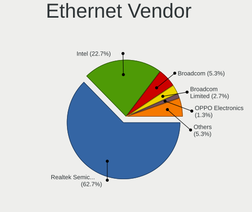

| Vendor                   | Computers | Percent |
|--------------------------|-----------|---------|
| Realtek Semiconductor    | 47        | 62.67%  |
| Intel                    | 17        | 22.67%  |
| Broadcom                 | 4         | 5.33%   |
| Broadcom Limited         | 2         | 2.67%   |
| OPPO Electronics         | 1         | 1.33%   |
| Marvell Technology Group | 1         | 1.33%   |
| DisplayLink              | 1         | 1.33%   |
| ASIX Electronics         | 1         | 1.33%   |
| Aquantia                 | 1         | 1.33%   |

Ethernet Model
--------------

Ethernet models

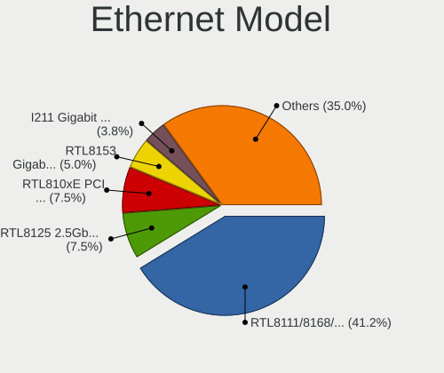

| Model                                                                          | Computers | Percent |
|--------------------------------------------------------------------------------|-----------|---------|
| Realtek RTL8111/8168/8211/8411 PCI Express Gigabit Ethernet Controller         | 33        | 41.25%  |
| Realtek RTL8125 2.5GbE Controller                                              | 6         | 7.5%    |
| Realtek RTL810xE PCI Express Fast Ethernet controller                          | 6         | 7.5%    |
| Realtek RTL8153 Gigabit Ethernet Adapter                                       | 4         | 5%      |
| Intel I211 Gigabit Network Connection                                          | 3         | 3.75%   |
| Intel Ethernet Connection (4) I219-LM                                          | 3         | 3.75%   |
| Intel 82579LM Gigabit Network Connection (Lewisville)                          | 2         | 2.5%    |
| Broadcom NetXtreme BCM57765 Gigabit Ethernet PCIe                              | 2         | 2.5%    |
| Broadcom NetLink BCM57780 Gigabit Ethernet PCIe                                | 2         | 2.5%    |
| Realtek RTL8852BE PCIe 802.11ax Wireless Network Controller                    | 1         | 1.25%   |
| Realtek RTL8169 PCI Gigabit Ethernet Controller                                | 1         | 1.25%   |
| Realtek Killer E3000 2.5GbE Controller                                         | 1         | 1.25%   |
| OPPO RMX3741                                                                   | 1         | 1.25%   |
| Marvell Group 88E8058 PCI-E Gigabit Ethernet Controller                        | 1         | 1.25%   |
| Intel Ethernet Controller I225-V                                               | 1         | 1.25%   |
| Intel Ethernet Controller I225-LM                                              | 1         | 1.25%   |
| Intel Ethernet Connection I217-LM                                              | 1         | 1.25%   |
| Intel Ethernet Connection (7) I219-V                                           | 1         | 1.25%   |
| Intel Ethernet Connection (3) I219-LM                                          | 1         | 1.25%   |
| Intel Ethernet Connection (3) I218-LM                                          | 1         | 1.25%   |
| Intel Ethernet Connection (2) I219-V                                           | 1         | 1.25%   |
| Intel Ethernet Connection (2) I218-V                                           | 1         | 1.25%   |
| Intel Alder Lake-P PCH CNVi WiFi                                               | 1         | 1.25%   |
| DisplayLink USB3 to HDMI                                                       | 1         | 1.25%   |
| Broadcom Limited NetXtreme BCM5761 Gigabit Ethernet PCIe                       | 1         | 1.25%   |
| Broadcom Limited NetLink BCM5787 Gigabit Ethernet PCI Express                  | 1         | 1.25%   |
| ASIX AX88179 Gigabit Ethernet                                                  | 1         | 1.25%   |
| Aquantia AQtion AQC107 NBase-T/IEEE 802.3an Ethernet Controller [Atlantic 10G] | 1         | 1.25%   |

Net Controller Kind
-------------------

Ethernet, WiFi or modem

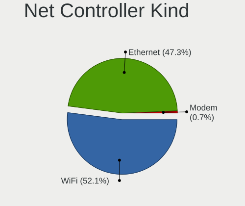

| Kind     | Computers | Percent |
|----------|-----------|---------|
| WiFi     | 76        | 52.05%  |
| Ethernet | 69        | 47.26%  |
| Modem    | 1         | 0.68%   |

Used Controller
---------------

Currently used network controller

| Kind     | Computers | Percent |
|----------|-----------|---------|
| WiFi     | 62        | 66.67%  |
| Ethernet | 31        | 33.33%  |

NICs
----

Total network controllers on board

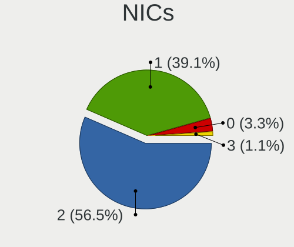

| Total | Computers | Percent |
|-------|-----------|---------|
| 2     | 52        | 56.52%  |
| 1     | 36        | 39.13%  |
| 0     | 3         | 3.26%   |
| 3     | 1         | 1.09%   |

IPv6
----

IPv6 vs IPv4

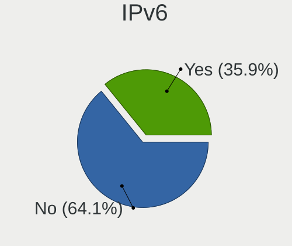

| Used | Computers | Percent |
|------|-----------|---------|
| No   | 59        | 64.13%  |
| Yes  | 33        | 35.87%  |

Bluetooth
---------

Bluetooth Vendor
----------------

Controller vendors

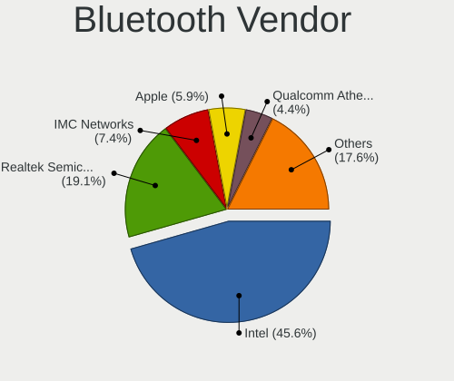

| Vendor                          | Computers | Percent |
|---------------------------------|-----------|---------|
| Intel                           | 31        | 45.59%  |
| Realtek Semiconductor           | 13        | 19.12%  |
| IMC Networks                    | 5         | 7.35%   |
| Apple                           | 4         | 5.88%   |
| Qualcomm Atheros Communications | 3         | 4.41%   |
| MediaTek                        | 3         | 4.41%   |
| Cambridge Silicon Radio         | 3         | 4.41%   |
| Foxconn / Hon Hai               | 2         | 2.94%   |
| Realtek                         | 1         | 1.47%   |
| Lite-On Technology              | 1         | 1.47%   |
| Broadcom                        | 1         | 1.47%   |
| Actions                         | 1         | 1.47%   |

Bluetooth Model
---------------

Controller models

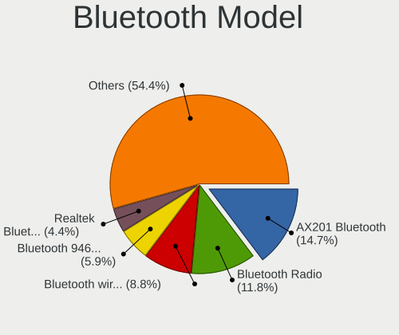

| Model                                               | Computers | Percent |
|-----------------------------------------------------|-----------|---------|
| Intel AX201 Bluetooth                               | 10        | 14.71%  |
| Realtek Bluetooth Radio                             | 8         | 11.76%  |
| Intel Bluetooth wireless interface                  | 6         | 8.82%   |
| Intel Bluetooth 9460/9560 Jefferson Peak (JfP)      | 4         | 5.88%   |
| Realtek  Bluetooth 4.2 Adapter                      | 3         | 4.41%   |
| MediaTek Wireless_Device                            | 3         | 4.41%   |
| Intel Wireless-AC 9260 Bluetooth Adapter            | 3         | 4.41%   |
| Intel AX200 Bluetooth                               | 3         | 4.41%   |
| Cambridge Silicon Radio Bluetooth Dongle (HCI mode) | 3         | 4.41%   |
| Qualcomm Atheros  Bluetooth Device                  | 2         | 2.94%   |
| Intel Wireless-AC 3168 Bluetooth                    | 2         | 2.94%   |
| Intel AX210 Bluetooth                               | 2         | 2.94%   |
| IMC Networks Wireless_Device                        | 2         | 2.94%   |
| IMC Networks Bluetooth Radio                        | 2         | 2.94%   |
| Realtek RTL8822BE Bluetooth 4.2 Adapter             | 1         | 1.47%   |
| Realtek RTL8723B Bluetooth                          | 1         | 1.47%   |
| Realtek Bluetooth Radio                             | 1         | 1.47%   |
| Qualcomm Atheros AR9462 Bluetooth                   | 1         | 1.47%   |
| Lite-On Qualcomm Atheros QCA9377 Bluetooth          | 1         | 1.47%   |
| Intel Bluetooth Device                              | 1         | 1.47%   |
| IMC Networks Bluetooth Device                       | 1         | 1.47%   |
| Foxconn / Hon Hai Wireless_Device                   | 1         | 1.47%   |
| Foxconn / Hon Hai MediaTek Bluetooth Adapter        | 1         | 1.47%   |
| Broadcom BCM20702 Bluetooth 4.0 [ThinkPad]          | 1         | 1.47%   |
| Apple Built-in Bluetooth 2.0+EDR HCI                | 1         | 1.47%   |
| Apple Bluetooth USB Host Controller                 | 1         | 1.47%   |
| Apple Bluetooth Host Controller                     | 1         | 1.47%   |
| Apple Bluetooth HCI                                 | 1         | 1.47%   |
| Actions general adapter                             | 1         | 1.47%   |

Sound
-----

Sound Vendor
------------

Sound card vendors

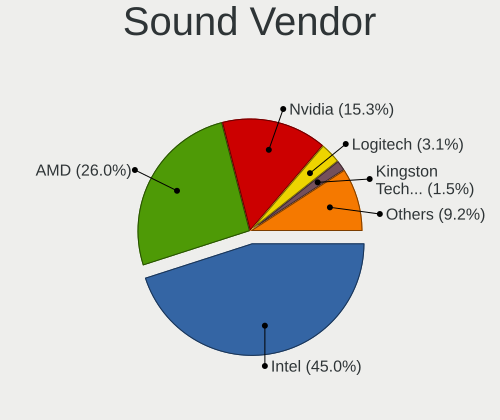

| Vendor                                       | Computers | Percent |
|----------------------------------------------|-----------|---------|
| Intel                                        | 59        | 45.04%  |
| AMD                                          | 34        | 25.95%  |
| Nvidia                                       | 20        | 15.27%  |
| Logitech                                     | 4         | 3.05%   |
| Kingston Technology                          | 2         | 1.53%   |
| C-Media Electronics                          | 2         | 1.53%   |
| Zoran Co. Personal Media Division (Nogatech) | 1         | 0.76%   |
| Texas Instruments                            | 1         | 0.76%   |
| Samson Technologies                          | 1         | 0.76%   |
| Realtek Semiconductor                        | 1         | 0.76%   |
| Oculus VR                                    | 1         | 0.76%   |
| KTMicro                                      | 1         | 0.76%   |
| JMTek                                        | 1         | 0.76%   |
| Focusrite-Novation                           | 1         | 0.76%   |
| Blue Microphones                             | 1         | 0.76%   |
| Astro Gaming                                 | 1         | 0.76%   |

Sound Model
-----------

Sound card models

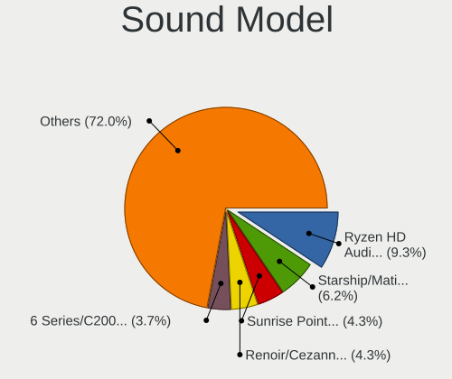

| Model                                                                      | Computers | Percent |
|----------------------------------------------------------------------------|-----------|---------|
| AMD Ryzen HD Audio Controller                                              | 15        | 9.32%   |
| AMD Starship/Matisse HD Audio Controller                                   | 10        | 6.21%   |
| Intel Sunrise Point-LP HD Audio                                            | 7         | 4.35%   |
| AMD Renoir/Cezanne HDMI/DP Audio Controller                                | 7         | 4.35%   |
| Intel 6 Series/C200 Series Chipset Family High Definition Audio Controller | 6         | 3.73%   |
| Intel Celeron/Pentium Silver Processor High Definition Audio               | 5         | 3.11%   |
| Nvidia GA104 High Definition Audio Controller                              | 4         | 2.48%   |
| Intel Tiger Lake-LP Smart Sound Technology Audio Controller                | 4         | 2.48%   |
| Nvidia TU106 High Definition Audio Controller                              | 3         | 1.86%   |
| Nvidia GA106 High Definition Audio Controller                              | 3         | 1.86%   |
| Intel Wildcat Point-LP High Definition Audio Controller                    | 3         | 1.86%   |
| Intel Tiger Lake-H HD Audio Controller                                     | 3         | 1.86%   |
| Intel Broadwell-U Audio Controller                                         | 3         | 1.86%   |
| AMD Navi 21/23 HDMI/DP Audio Controller                                    | 3         | 1.86%   |
| AMD Navi 10 HDMI Audio                                                     | 3         | 1.86%   |
| AMD FCH Azalia Controller                                                  | 3         | 1.86%   |
| AMD Ellesmere HDMI Audio [Radeon RX 470/480 / 570/580/590]                 | 3         | 1.86%   |
| Nvidia TU116 High Definition Audio Controller                              | 2         | 1.24%   |
| Nvidia GP107GL High Definition Audio Controller                            | 2         | 1.24%   |
| Nvidia GA107 High Definition Audio Controller                              | 2         | 1.24%   |
| Intel NM10/ICH7 Family High Definition Audio Controller                    | 2         | 1.24%   |
| Intel Ice Lake-LP Smart Sound Technology Audio Controller                  | 2         | 1.24%   |
| Intel Haswell-ULT HD Audio Controller                                      | 2         | 1.24%   |
| Intel Comet Lake PCH-LP cAVS                                               | 2         | 1.24%   |
| Intel Comet Lake PCH cAVS                                                  | 2         | 1.24%   |
| Intel Alder Lake PCH-P High Definition Audio Controller                    | 2         | 1.24%   |
| Intel 8 Series HD Audio Controller                                         | 2         | 1.24%   |
| Intel 7 Series/C216 Chipset Family High Definition Audio Controller        | 2         | 1.24%   |
| Intel 5 Series/3400 Series Chipset High Definition Audio                   | 2         | 1.24%   |
| Intel 100 Series/C230 Series Chipset Family HD Audio Controller            | 2         | 1.24%   |
| AMD Raven/Raven2/Fenghuang HDMI/DP Audio Controller                        | 2         | 1.24%   |
| AMD Radeon High Definition Audio Controller                                | 2         | 1.24%   |
| AMD Oland/Hainan/Cape Verde/Pitcairn HDMI Audio [Radeon HD 7000 Series]    | 2         | 1.24%   |
| AMD Navi 31 HDMI/DP Audio                                                  | 2         | 1.24%   |
| AMD Kaveri HDMI/DP Audio Controller                                        | 2         | 1.24%   |
| Zoran Co. Personal Media Division (Nogatech) USB Audio and HID             | 1         | 0.62%   |
| Texas Instruments PCM2902 Audio Codec                                      | 1         | 0.62%   |
| Samson Technologies C01U condenser microphone                              | 1         | 0.62%   |
| Realtek Semiconductor USB Audio                                            | 1         | 0.62%   |
| Oculus VR Rift CV1 Audio                                                   | 1         | 0.62%   |

Memory
------

Memory Vendor
-------------

Memory module vendors

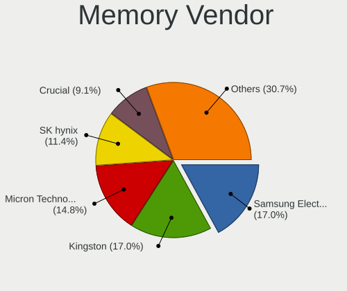

| Vendor              | Computers | Percent |
|---------------------|-----------|---------|
| Samsung Electronics | 15        | 17.05%  |
| Kingston            | 15        | 17.05%  |
| Micron Technology   | 13        | 14.77%  |
| SK hynix            | 10        | 11.36%  |
| Crucial             | 8         | 9.09%   |
| Unknown             | 7         | 7.95%   |
| A-DATA Technology   | 4         | 4.55%   |
| Team                | 3         | 3.41%   |
| Unknown (ABCD)      | 2         | 2.27%   |
| G.Skill             | 2         | 2.27%   |
| Corsair             | 2         | 2.27%   |
| Teclast             | 1         | 1.14%   |
| Ramaxel Technology  | 1         | 1.14%   |
| Nanya Technology    | 1         | 1.14%   |
| ff                  | 1         | 1.14%   |
| ChangXin Memory     | 1         | 1.14%   |
| 4ea5                | 1         | 1.14%   |
| Unknown             | 1         | 1.14%   |

Memory Model
------------

Memory module models

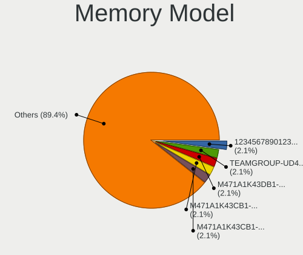

| Model                                                            | Computers | Percent |
|------------------------------------------------------------------|-----------|---------|
| Unknown (ABCD) RAM 123456789012345678 2GB SODIMM LPDDR4 2400MT/s | 2         | 2.13%   |
| Team RAM TEAMGROUP-UD4-3200 8GB DIMM DDR4 3800MT/s               | 2         | 2.13%   |
| SK hynix RAM HMT351S6BFR8C-H9 4GB SODIMM DDR3 1333MT/s           | 2         | 2.13%   |
| Samsung RAM M471A1K43DB1-CWE 8GB SODIMM DDR4 3200MT/s            | 2         | 2.13%   |
| Samsung RAM M471A1K43CB1-CTD 8GB SODIMM DDR4 3200MT/s            | 2         | 2.13%   |
| Samsung RAM M471A1K43CB1-CRC 8GB SODIMM DDR4 8400MT/s            | 2         | 2.13%   |
| Kingston RAM KF2933C17S4/16G 16GB SODIMM DDR4 2933MT/s           | 2         | 2.13%   |
| Unknown RAM Module 8GB SODIMM DDR4 2400MT/s                      | 1         | 1.06%   |
| Unknown RAM Module 8GB SODIMM DDR3 1600MT/s                      | 1         | 1.06%   |
| Unknown RAM Module 8GB DIMM DDR3 1600MT/s                        | 1         | 1.06%   |
| Unknown RAM Module 4GB Row Of Chips LPDDR4 4267MT/s              | 1         | 1.06%   |
| Unknown RAM Module 2GB SODIMM DDR3 1600MT/s                      | 1         | 1.06%   |
| Unknown RAM Module 2GB SODIMM DDR3 1333MT/s                      | 1         | 1.06%   |
| Unknown RAM Module 2GB DIMM SDRAM                                | 1         | 1.06%   |
| Unknown RAM Module 1GB DIMM SDRAM                                | 1         | 1.06%   |
| Teclast RAM YTD48G26N10 8GB SODIMM DDR4 2667MT/s                 | 1         | 1.06%   |
| Team RAM TEAMGROUP-UD4-3600 16GB DIMM DDR4 3600MT/s              | 1         | 1.06%   |
| SK hynix RAM Module 4GB Row Of Chips LPDDR5 6400MT/s             | 1         | 1.06%   |
| SK hynix RAM HYMP512U64CP8-S6 1GB DIMM DDR2 800MT/s              | 1         | 1.06%   |
| SK hynix RAM HYMP125U64CP8-S6 2GB DIMM DDR2 49926MT/s            | 1         | 1.06%   |
| SK hynix RAM HMT451S6MFR8C-PB 4GB SODIMM DDR3 1600MT/s           | 1         | 1.06%   |
| SK hynix RAM HMT451S6CFR6A-PB 4GB SODIMM DDR3 1600MT/s           | 1         | 1.06%   |
| SK hynix RAM HMT451S6BFR8A-PB 4GB SODIMM DDR3 1600MT/s           | 1         | 1.06%   |
| SK hynix RAM HMT41GS6BFR8A-PB 8GB SODIMM DDR3 2667MT/s           | 1         | 1.06%   |
| SK hynix RAM HMT351S6EFR8C-PB 4GB SODIMM DDR3 1600MT/s           | 1         | 1.06%   |
| SK hynix RAM HMAA1GS6CMR6N-VK 8GB Row Of Chips DDR4 2667MT/s     | 1         | 1.06%   |
| SK hynix RAM HMA81GS6JJR8N-VK 8GB SODIMM DDR4 2667MT/s           | 1         | 1.06%   |
| SK hynix RAM HMA81GS6CJR8N-VK 8GB SODIMM DDR4 2667MT/s           | 1         | 1.06%   |
| Samsung RAM Module 2GB SODIMM DDR3 1333MT/s                      | 1         | 1.06%   |
| Samsung RAM M474A2K43BB1-CPB 16GB SODIMM DDR4 2133MT/s           | 1         | 1.06%   |
| Samsung RAM M471B5673FH0-CH9 2048MB SODIMM DDR3 1600MT/s         | 1         | 1.06%   |
| Samsung RAM M471A5244CB0-CRC 4GB SODIMM DDR4 2667MT/s            | 1         | 1.06%   |
| Samsung RAM M471A1K43EB1-CWE 8GB SODIMM DDR4 3200MT/s            | 1         | 1.06%   |
| Samsung RAM M471A1K43BB1-CRC 8GB SODIMM DDR4 2667MT/s            | 1         | 1.06%   |
| Samsung RAM M471A1G44AB0-CWE 8GiB SODIMM DDR4 3200MT/s           | 1         | 1.06%   |
| Samsung RAM M425R1GB4BB0-CQKOL 8GB SODIMM DDR5 4800MT/s          | 1         | 1.06%   |
| Samsung RAM K4F8E304HB-MGCJ 1GB LPDDR4 2400MT/s                  | 1         | 1.06%   |
| Samsung RAM K4A8G165WC-BCTD 4GB Row Of Chips DDR4 2667MT/s       | 1         | 1.06%   |
| Ramaxel RAM RMUA5120ME86H9F-2666 4GB DIMM DDR4 2667MT/s          | 1         | 1.06%   |
| Nanya RAM Module 1GB SODIMM DDR2 667MT/s                         | 1         | 1.06%   |

Memory Kind
-----------

Memory module kinds

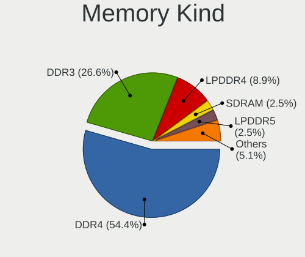

| Kind   | Computers | Percent |
|--------|-----------|---------|
| DDR4   | 43        | 54.43%  |
| DDR3   | 21        | 26.58%  |
| LPDDR4 | 7         | 8.86%   |
| SDRAM  | 2         | 2.53%   |
| LPDDR5 | 2         | 2.53%   |
| DDR5   | 2         | 2.53%   |
| DDR2   | 2         | 2.53%   |

Memory Form Factor
------------------

Physical design of the memory module

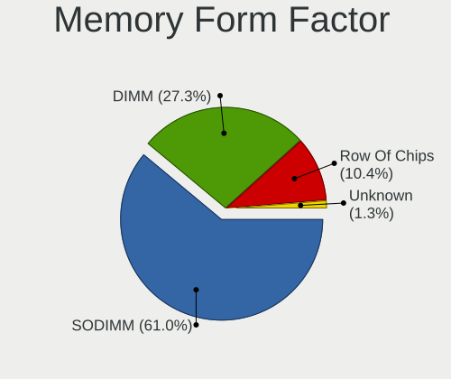

| Name         | Computers | Percent |
|--------------|-----------|---------|
| SODIMM       | 47        | 61.04%  |
| DIMM         | 21        | 27.27%  |
| Row Of Chips | 8         | 10.39%  |
| Unknown      | 1         | 1.3%    |

Memory Size
-----------

Memory module size

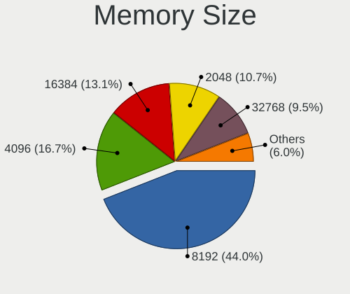

| Size  | Computers | Percent |
|-------|-----------|---------|
| 8192  | 37        | 44.05%  |
| 4096  | 14        | 16.67%  |
| 16384 | 11        | 13.1%   |
| 2048  | 9         | 10.71%  |
| 32768 | 8         | 9.52%   |
| 1024  | 5         | 5.95%   |

Memory Speed
------------

Memory module speed

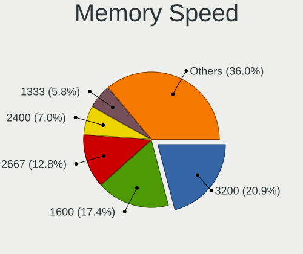

| Speed   | Computers | Percent |
|---------|-----------|---------|
| 3200    | 18        | 20.93%  |
| 1600    | 15        | 17.44%  |
| 2667    | 11        | 12.79%  |
| 2400    | 6         | 6.98%   |
| 1333    | 5         | 5.81%   |
| 3800    | 3         | 3.49%   |
| 3600    | 3         | 3.49%   |
| 2133    | 3         | 3.49%   |
| 8400    | 2         | 2.33%   |
| 4267    | 2         | 2.33%   |
| 3733    | 2         | 2.33%   |
| 2933    | 2         | 2.33%   |
| 49926   | 1         | 1.16%   |
| 7500    | 1         | 1.16%   |
| 6400    | 1         | 1.16%   |
| 5200    | 1         | 1.16%   |
| 4800    | 1         | 1.16%   |
| 4199    | 1         | 1.16%   |
| 3466    | 1         | 1.16%   |
| 3333    | 1         | 1.16%   |
| 1866    | 1         | 1.16%   |
| 1334    | 1         | 1.16%   |
| 1067    | 1         | 1.16%   |
| 800     | 1         | 1.16%   |
| 667     | 1         | 1.16%   |
| Unknown | 1         | 1.16%   |

Printers & scanners
-------------------

Printer Vendor
--------------

Printer device vendors

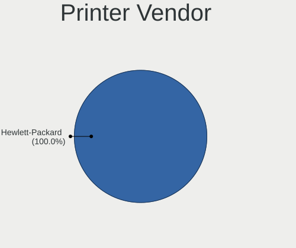

| Vendor          | Computers | Percent |
|-----------------|-----------|---------|
| Hewlett-Packard | 1         | 100%    |

Printer Model
-------------

Printer device models

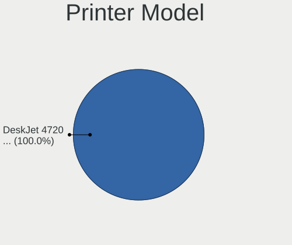

| Model                  | Computers | Percent |
|------------------------|-----------|---------|
| HP DeskJet 4720 series | 1         | 100%    |

Scanner Vendor
--------------

Scanner device vendors

Zero info for selected period =(

Scanner Model
-------------

Scanner device models

Zero info for selected period =(

Camera
------

Camera Vendor
-------------

Camera device vendors

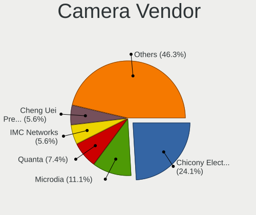

| Vendor                                 | Computers | Percent |
|----------------------------------------|-----------|---------|
| Chicony Electronics                    | 13        | 24.07%  |
| Microdia                               | 6         | 11.11%  |
| Quanta                                 | 4         | 7.41%   |
| IMC Networks                           | 3         | 5.56%   |
| Cheng Uei Precision Industry (Foxlink) | 3         | 5.56%   |
| Bison Electronics                      | 3         | 5.56%   |
| Apple                                  | 3         | 5.56%   |
| Suyin                                  | 2         | 3.7%    |
| Sunplus Innovation Technology          | 2         | 3.7%    |
| Samsung Electronics                    | 2         | 3.7%    |
| Realtek Semiconductor                  | 2         | 3.7%    |
| Luxvisions Innotech Limited            | 2         | 3.7%    |
| Generalplus Technology                 | 2         | 3.7%    |
| Alcor Micro                            | 2         | 3.7%    |
| Shinetech                              | 1         | 1.85%   |
| Ricoh                                  | 1         | 1.85%   |
| Logitech                               | 1         | 1.85%   |
| Lite-On Technology                     | 1         | 1.85%   |
| ARC International                      | 1         | 1.85%   |

Camera Model
------------

Camera device models

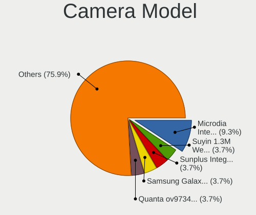

| Model                                                            | Computers | Percent |
|------------------------------------------------------------------|-----------|---------|
| Microdia Integrated_Webcam_HD                                    | 5         | 9.26%   |
| Suyin 1.3M WebCam (notebook emachines E730, Acer sub-brand)      | 2         | 3.7%    |
| Sunplus Integrated_Webcam_HD                                     | 2         | 3.7%    |
| Samsung Galaxy series, misc. (MTP mode)                          | 2         | 3.7%    |
| Quanta ov9734_techfront_camera                                   | 2         | 3.7%    |
| Quanta HP TrueVision HD Camera                                   | 2         | 3.7%    |
| Chicony Integrated IR Camera                                     | 2         | 3.7%    |
| Chicony HP Wide Vision HD Camera                                 | 2         | 3.7%    |
| Chicony HP Truevision HD                                         | 2         | 3.7%    |
| Chicony HD WebCam                                                | 2         | 3.7%    |
| Chicony HD User Facing                                           | 2         | 3.7%    |
| Bison HD Webcam                                                  | 2         | 3.7%    |
| Alcor Micro USB 2.0 Camera                                       | 2         | 3.7%    |
| Shinetech ASUS FHD webcam                                        | 1         | 1.85%   |
| Ricoh Laptop_Integrated_Webcam_FHD                               | 1         | 1.85%   |
| Realtek HP Webcam                                                | 1         | 1.85%   |
| Realtek HD Webcam - Realtek                                      | 1         | 1.85%   |
| Microdia Webcam Vitade AF                                        | 1         | 1.85%   |
| Luxvisions Innotech Limited Integrated Camera                    | 1         | 1.85%   |
| Luxvisions Innotech Limited HP TrueVision HD Camera              | 1         | 1.85%   |
| Logitech HD Pro Webcam C920                                      | 1         | 1.85%   |
| Lite-On Integrated Camera                                        | 1         | 1.85%   |
| IMC Networks Integrated Camera                                   | 1         | 1.85%   |
| IMC Networks HP TrueVision HD Camera                             | 1         | 1.85%   |
| IMC Networks HD Camera                                           | 1         | 1.85%   |
| Generalplus WEB CAM                                              | 1         | 1.85%   |
| Generalplus 808 Camera #9 (web-cam mode)                         | 1         | 1.85%   |
| Chicony USB2.0 VGA UVC WebCam                                    | 1         | 1.85%   |
| Chicony USB 2.0 Webcam Device                                    | 1         | 1.85%   |
| Chicony HP True Vision 5MP Camera                                | 1         | 1.85%   |
| Cheng Uei Precision Industry (Foxlink) HP Wide Vision HD Camera  | 1         | 1.85%   |
| Cheng Uei Precision Industry (Foxlink) HP Wide Vision FHD Camera | 1         | 1.85%   |
| Cheng Uei Precision Industry (Foxlink) HP TrueVision HD Camera   | 1         | 1.85%   |
| Bison Integrated Camera                                          | 1         | 1.85%   |
| ARC International Camera                                         | 1         | 1.85%   |
| Apple FaceTime HD Camera                                         | 1         | 1.85%   |
| Apple FaceTime Camera                                            | 1         | 1.85%   |
| Apple Built-in iSight [Micron]                                   | 1         | 1.85%   |

Security
--------

Fingerprint Vendor
------------------

Fingerprint sensor vendors

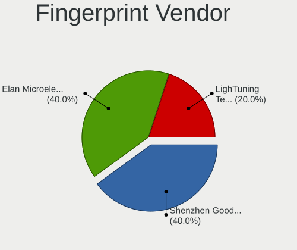

| Vendor                     | Computers | Percent |
|----------------------------|-----------|---------|
| Shenzhen Goodix Technology | 3         | 50%     |
| Elan Microelectronics      | 2         | 33.33%  |
| LighTuning Technology      | 1         | 16.67%  |

Fingerprint Model
-----------------

Fingerprint sensor models

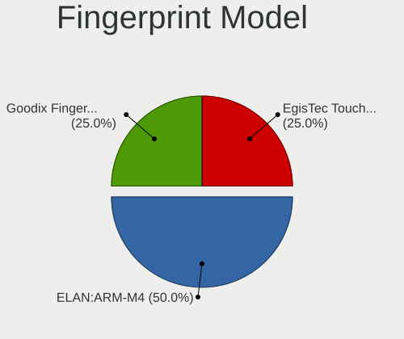

| Model                                       | Computers | Percent |
|---------------------------------------------|-----------|---------|
| Shenzhen Goodix Fingerprint Reader          | 2         | 33.33%  |
| Elan ELAN:ARM-M4                            | 2         | 33.33%  |
| Shenzhen Goodix  Fingerprint Device         | 1         | 16.67%  |
| LighTuning EgisTec Touch Fingerprint Sensor | 1         | 16.67%  |

Chipcard Vendor
---------------

Chipcard module vendors

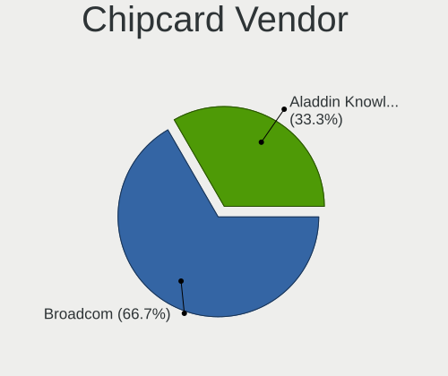

| Vendor                    | Computers | Percent |
|---------------------------|-----------|---------|
| Broadcom                  | 2         | 66.67%  |
| Aladdin Knowledge Systems | 1         | 33.33%  |

Chipcard Model
--------------

Chipcard module models

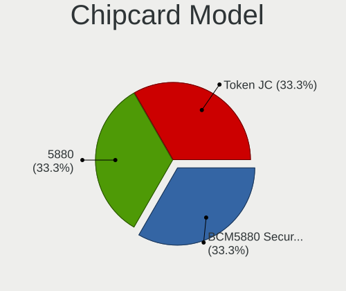

| Model                                          | Computers | Percent |
|------------------------------------------------|-----------|---------|
| Broadcom BCM5880 Secure Applications Processor | 1         | 33.33%  |
| Broadcom 5880                                  | 1         | 33.33%  |
| Aladdin Knowledge Systems Token JC             | 1         | 33.33%  |

Unsupported
-----------

Unsupported Devices
-------------------

Total unsupported devices on board

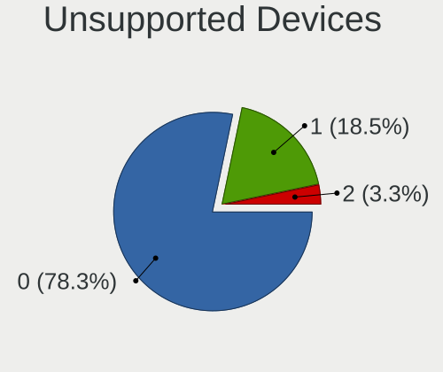

| Total | Computers | Percent |
|-------|-----------|---------|
| 0     | 72        | 78.26%  |
| 1     | 17        | 18.48%  |
| 2     | 3         | 3.26%   |

Unsupported Device Types
------------------------

Types of unsupported devices

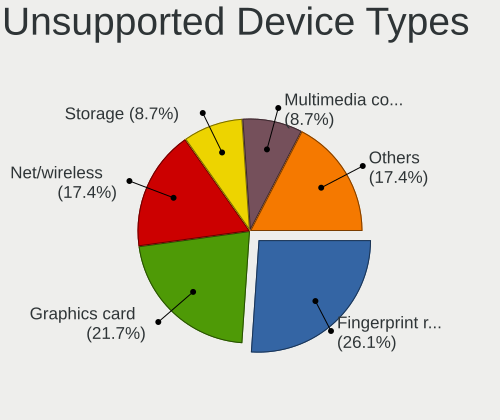

| Type                  | Computers | Percent |
|-----------------------|-----------|---------|
| Fingerprint reader    | 6         | 26.09%  |
| Graphics card         | 5         | 21.74%  |
| Net/wireless          | 4         | 17.39%  |
| Storage               | 2         | 8.7%    |
| Multimedia controller | 2         | 8.7%    |
| Chipcard              | 2         | 8.7%    |
| Unassigned class      | 1         | 4.35%   |
| Sound                 | 1         | 4.35%   |

