Archcraft - Tested Hardware & Statistics (Desktops)
---------------------------------------------------

A project to collect tested hardware configurations for Archcraft.

Anyone can contribute to this report by the [hw-probe](https://github.com/linuxhw/hw-probe) tool:

    sudo -E hw-probe -all -upload

Please contribute! Especially if your hardware is rare.

Contents
--------

* [ Test Cases ](#test-cases)

* [ System ](#system)
  - [ OS                       ](#os)
  - [ OS Family                ](#os-family)
  - [ Kernel                   ](#kernel)
  - [ Kernel Family            ](#kernel-family)
  - [ Kernel Major Ver.        ](#kernel-major-ver)
  - [ Arch                     ](#arch)
  - [ DE                       ](#de)
  - [ Display Server           ](#display-server)
  - [ Display Manager          ](#display-manager)
  - [ OS Lang                  ](#os-lang)
  - [ Boot Mode                ](#boot-mode)
  - [ Filesystem               ](#filesystem)
  - [ Part. scheme             ](#part-scheme)
  - [ Dual Boot with Linux/BSD ](#dual-boot-with-linuxbsd)
  - [ Dual Boot (Win)          ](#dual-boot-win)

* [ Board ](#board)
  - [ Vendor                   ](#vendor)
  - [ Model                    ](#model)
  - [ Model Family             ](#model-family)
  - [ MFG Year                 ](#mfg-year)
  - [ Form Factor              ](#form-factor)
  - [ Secure Boot              ](#secure-boot)
  - [ Coreboot                 ](#coreboot)
  - [ RAM Size                 ](#ram-size)
  - [ RAM Used                 ](#ram-used)
  - [ Total Drives             ](#total-drives)
  - [ Has CD-ROM               ](#has-cd-rom)
  - [ Has Ethernet             ](#has-ethernet)
  - [ Has WiFi                 ](#has-wifi)
  - [ Has Bluetooth            ](#has-bluetooth)

* [ Location ](#location)
  - [ Country                  ](#country)
  - [ City                     ](#city)

* [ Drives ](#drives)
  - [ Drive Vendor             ](#drive-vendor)
  - [ Drive Model              ](#drive-model)
  - [ HDD Vendor               ](#hdd-vendor)
  - [ SSD Vendor               ](#ssd-vendor)
  - [ Drive Kind               ](#drive-kind)
  - [ Drive Connector          ](#drive-connector)
  - [ Drive Size               ](#drive-size)
  - [ Space Total              ](#space-total)
  - [ Space Used               ](#space-used)
  - [ Malfunc. Drives          ](#malfunc-drives)
  - [ Malfunc. Drive Vendor    ](#malfunc-drive-vendor)
  - [ Malfunc. HDD Vendor      ](#malfunc-hdd-vendor)
  - [ Malfunc. Drive Kind      ](#malfunc-drive-kind)
  - [ Failed Drives            ](#failed-drives)
  - [ Failed Drive Vendor      ](#failed-drive-vendor)
  - [ Drive Status             ](#drive-status)

* [ Storage controller ](#storage-controller)
  - [ Storage Vendor           ](#storage-vendor)
  - [ Storage Model            ](#storage-model)
  - [ Storage Kind             ](#storage-kind)

* [ Processor ](#processor)
  - [ CPU Vendor               ](#cpu-vendor)
  - [ CPU Model                ](#cpu-model)
  - [ CPU Model Family         ](#cpu-model-family)
  - [ CPU Cores                ](#cpu-cores)
  - [ CPU Sockets              ](#cpu-sockets)
  - [ CPU Threads              ](#cpu-threads)
  - [ CPU Op-Modes             ](#cpu-op-modes)
  - [ CPU Microcode            ](#cpu-microcode)
  - [ CPU Microarch            ](#cpu-microarch)

* [ Graphics ](#graphics)
  - [ GPU Vendor               ](#gpu-vendor)
  - [ GPU Model                ](#gpu-model)
  - [ GPU Combo                ](#gpu-combo)
  - [ GPU Driver               ](#gpu-driver)
  - [ GPU Memory               ](#gpu-memory)

* [ Monitor ](#monitor)
  - [ Monitor Vendor           ](#monitor-vendor)
  - [ Monitor Model            ](#monitor-model)
  - [ Monitor Resolution       ](#monitor-resolution)
  - [ Monitor Diagonal         ](#monitor-diagonal)
  - [ Monitor Width            ](#monitor-width)
  - [ Aspect Ratio             ](#aspect-ratio)
  - [ Monitor Area             ](#monitor-area)
  - [ Pixel Density            ](#pixel-density)
  - [ Multiple Monitors        ](#multiple-monitors)

* [ Network ](#network)
  - [ Net Controller Vendor    ](#net-controller-vendor)
  - [ Net Controller Model     ](#net-controller-model)
  - [ Wireless Vendor          ](#wireless-vendor)
  - [ Wireless Model           ](#wireless-model)
  - [ Ethernet Vendor          ](#ethernet-vendor)
  - [ Ethernet Model           ](#ethernet-model)
  - [ Net Controller Kind      ](#net-controller-kind)
  - [ Used Controller          ](#used-controller)
  - [ NICs                     ](#nics)
  - [ IPv6                     ](#ipv6)

* [ Bluetooth ](#bluetooth)
  - [ Bluetooth Vendor         ](#bluetooth-vendor)
  - [ Bluetooth Model          ](#bluetooth-model)

* [ Sound ](#sound)
  - [ Sound Vendor             ](#sound-vendor)
  - [ Sound Model              ](#sound-model)

* [ Memory ](#memory)
  - [ Memory Vendor            ](#memory-vendor)
  - [ Memory Model             ](#memory-model)
  - [ Memory Kind              ](#memory-kind)
  - [ Memory Form Factor       ](#memory-form-factor)
  - [ Memory Size              ](#memory-size)
  - [ Memory Speed             ](#memory-speed)

* [ Printers & scanners ](#printers--scanners)
  - [ Printer Vendor           ](#printer-vendor)
  - [ Printer Model            ](#printer-model)
  - [ Scanner Vendor           ](#scanner-vendor)
  - [ Scanner Model            ](#scanner-model)

* [ Camera ](#camera)
  - [ Camera Vendor            ](#camera-vendor)
  - [ Camera Model             ](#camera-model)

* [ Security ](#security)
  - [ Fingerprint Vendor       ](#fingerprint-vendor)
  - [ Fingerprint Model        ](#fingerprint-model)
  - [ Chipcard Vendor          ](#chipcard-vendor)
  - [ Chipcard Model           ](#chipcard-model)

* [ Unsupported ](#unsupported)
  - [ Unsupported Devices      ](#unsupported-devices)
  - [ Unsupported Device Types ](#unsupported-device-types)

Test Cases
----------

Total: 32

| Vendor   | Model                       | Probe                                                      | Date         |
|----------|-----------------------------|------------------------------------------------------------|--------------|
| Gigabyte | H370 HD3-CF                 | [4e2a2b9203](https://linux-hardware.org/?probe=4e2a2b9203) | Dec 14, 2025 |
| Lenovo   | 3709 SDK0J40700 WIN 3258... | [26b1b112c0](https://linux-hardware.org/?probe=26b1b112c0) | Aug 23, 2025 |
| Gigabyte | A520M S2H                   | [6bb087d1c4](https://linux-hardware.org/?probe=6bb087d1c4) | Jun 02, 2025 |
| ASRock   | X570 Taichi Razer Editio... | [6d2e60df3c](https://linux-hardware.org/?probe=6d2e60df3c) | Nov 12, 2024 |
| Gigabyte | X470 AORUS GAMING 7 WIFI... | [ce62db7f6c](https://linux-hardware.org/?probe=ce62db7f6c) | Nov 09, 2024 |
| MSI      | MPG X570 GAMING PRO CARB... | [b97d8e4203](https://linux-hardware.org/?probe=b97d8e4203) | Jun 23, 2024 |
| ASUSTek  | TUF Gaming X570-PLUS_BR     | [86c5400c85](https://linux-hardware.org/?probe=86c5400c85) | May 13, 2024 |
| ASUSTek  | TUF Gaming X570-PLUS        | [f9daac6faa](https://linux-hardware.org/?probe=f9daac6faa) | May 04, 2024 |
| ASUSTek  | TUF Gaming B550M-E          | [518e259c3c](https://linux-hardware.org/?probe=518e259c3c) | Dec 23, 2023 |
| HP       | 18E4                        | [db6b92644b](https://linux-hardware.org/?probe=db6b92644b) | Dec 12, 2023 |
| Lenovo   | 3706 SDK0J40700 WIN 3258... | [82b916eb4a](https://linux-hardware.org/?probe=82b916eb4a) | Nov 24, 2023 |
| Dell     | 0KP561                      | [90055b146d](https://linux-hardware.org/?probe=90055b146d) | Sep 06, 2023 |
| ASUSTek  | K30BF_M32BF_A_F_K31BF_6     | [08d5b71848](https://linux-hardware.org/?probe=08d5b71848) | Jul 22, 2023 |
| Gigabyte | B650 AORUS ELITE AX         | [e59862f167](https://linux-hardware.org/?probe=e59862f167) | Jul 05, 2023 |
| Lenovo   | Win8 Pro DPK TPG            | [0efc49ca3a](https://linux-hardware.org/?probe=0efc49ca3a) | Jun 28, 2023 |
| Lenovo   | Win8 Pro DPK TPG            | [72514911c8](https://linux-hardware.org/?probe=72514911c8) | Jun 28, 2023 |
| MSI      | A320M-A PRO                 | [09b5be9c77](https://linux-hardware.org/?probe=09b5be9c77) | Jun 24, 2023 |
| ASUSTek  | P8H61-M LX R2.0             | [558c031517](https://linux-hardware.org/?probe=558c031517) | Jun 16, 2023 |
| ASRock   | B550M Pro4                  | [8529d01687](https://linux-hardware.org/?probe=8529d01687) | May 27, 2023 |
| ASRock   | B550M Pro4                  | [8301ca5155](https://linux-hardware.org/?probe=8301ca5155) | May 27, 2023 |
| ASUSTek  | PRIME X470-PRO              | [f9df27503f](https://linux-hardware.org/?probe=f9df27503f) | Feb 03, 2023 |
| ASUSTek  | H110M-E/M.2                 | [82584d7e83](https://linux-hardware.org/?probe=82584d7e83) | Dec 20, 2022 |
| ASUSTek  | H110M-E/M.2                 | [fb73fb5efc](https://linux-hardware.org/?probe=fb73fb5efc) | Oct 18, 2022 |
| ASUSTek  | H110M-E/M.2                 | [77fd87ca91](https://linux-hardware.org/?probe=77fd87ca91) | Oct 18, 2022 |
| Gigabyte | B550I AORUS PRO AX          | [704da5b600](https://linux-hardware.org/?probe=704da5b600) | Oct 07, 2022 |
| Gigabyte | F2A68HM-DS2                 | [98e8df2d3d](https://linux-hardware.org/?probe=98e8df2d3d) | Sep 21, 2022 |
| Lenovo   | 3111 SDK0J40705 WIN 3425... | [543fe6b6a7](https://linux-hardware.org/?probe=543fe6b6a7) | Aug 07, 2022 |
| MSI      | MAG B550 TOMAHAWK           | [bede15789b](https://linux-hardware.org/?probe=bede15789b) | Jun 02, 2022 |
| ECS      | G31T-M                      | [3820396d91](https://linux-hardware.org/?probe=3820396d91) | Jan 29, 2022 |
| ASRock   | H97M Pro4                   | [232f2dad91](https://linux-hardware.org/?probe=232f2dad91) | Dec 15, 2021 |
| ASUSTek  | ROG DOMINUS EXTREME         | [0adc8fc04d](https://linux-hardware.org/?probe=0adc8fc04d) | Oct 12, 2021 |
| ASUSTek  | ROG DOMINUS EXTREME         | [b977489e9c](https://linux-hardware.org/?probe=b977489e9c) | Oct 12, 2021 |

System
------

OS
--

Installed operating systems

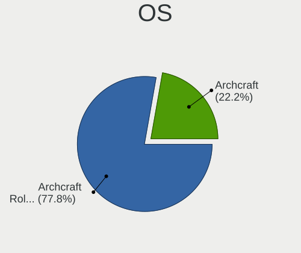

| Name              | Desktops | Percent |
|-------------------|----------|---------|
| Archcraft Rolling | 21       | 77.78%  |
| Archcraft         | 6        | 22.22%  |

OS Family
---------

OS without a version

| Name      | Desktops | Percent |
|-----------|----------|---------|
| Archcraft | 27       | 100%    |

Kernel
------

Version of the Linux kernel

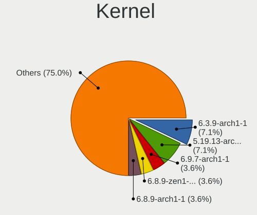

| Version               | Desktops | Percent |
|-----------------------|----------|---------|
| 6.3.9-arch1-1         | 2        | 7.14%   |
| 5.19.13-arch1-1       | 2        | 7.14%   |
| 6.9.7-arch1-1         | 1        | 3.57%   |
| 6.8.9-zen1-2-zen      | 1        | 3.57%   |
| 6.8.9-arch1-1         | 1        | 3.57%   |
| 6.8.4-arch1-1         | 1        | 3.57%   |
| 6.6.7-arch1-1         | 1        | 3.57%   |
| 6.6.6-arch1-1         | 1        | 3.57%   |
| 6.6.1-arch1-1         | 1        | 3.57%   |
| 6.4.4-zen1-1-zen      | 1        | 3.57%   |
| 6.4.12-arch1-1        | 1        | 3.57%   |
| 6.4.1-arch2-1         | 1        | 3.57%   |
| 6.3.8-arch1-1         | 1        | 3.57%   |
| 6.3.4-arch1-1         | 1        | 3.57%   |
| 6.17.9-arch1-1        | 1        | 3.57%   |
| 6.16.2-arch1-1        | 1        | 3.57%   |
| 6.14.9-arch1-1        | 1        | 3.57%   |
| 6.11.1-arch1-1        | 1        | 3.57%   |
| 6.1.9-x64v1-xanmod1-1 | 1        | 3.57%   |
| 6.0.12-arch1-1        | 1        | 3.57%   |
| 5.19.9-arch1-1        | 1        | 3.57%   |
| 5.18.16-arch1-1       | 1        | 3.57%   |
| 5.18.0-arch1-1        | 1        | 3.57%   |
| 5.16.3-arch1-1        | 1        | 3.57%   |
| 5.15.7-zen1-1-zen     | 1        | 3.57%   |
| 5.14.10-arch1-1       | 1        | 3.57%   |

Kernel Family
-------------

Linux kernel without a distro release

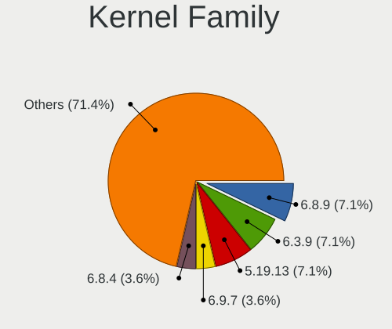

| Version | Desktops | Percent |
|---------|----------|---------|
| 6.8.9   | 2        | 7.14%   |
| 6.3.9   | 2        | 7.14%   |
| 5.19.13 | 2        | 7.14%   |
| 6.9.7   | 1        | 3.57%   |
| 6.8.4   | 1        | 3.57%   |
| 6.6.7   | 1        | 3.57%   |
| 6.6.6   | 1        | 3.57%   |
| 6.6.1   | 1        | 3.57%   |
| 6.4.4   | 1        | 3.57%   |
| 6.4.12  | 1        | 3.57%   |
| 6.4.1   | 1        | 3.57%   |
| 6.3.8   | 1        | 3.57%   |
| 6.3.4   | 1        | 3.57%   |
| 6.17.9  | 1        | 3.57%   |
| 6.16.2  | 1        | 3.57%   |
| 6.14.9  | 1        | 3.57%   |
| 6.11.1  | 1        | 3.57%   |
| 6.1.9   | 1        | 3.57%   |
| 6.0.12  | 1        | 3.57%   |
| 5.19.9  | 1        | 3.57%   |
| 5.18.16 | 1        | 3.57%   |
| 5.18.0  | 1        | 3.57%   |
| 5.16.3  | 1        | 3.57%   |
| 5.15.7  | 1        | 3.57%   |
| 5.14.10 | 1        | 3.57%   |

Kernel Major Ver.
-----------------

Linux kernel major version

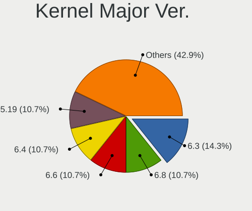

| Version | Desktops | Percent |
|---------|----------|---------|
| 6.3     | 4        | 14.29%  |
| 6.8     | 3        | 10.71%  |
| 6.6     | 3        | 10.71%  |
| 6.4     | 3        | 10.71%  |
| 5.19    | 3        | 10.71%  |
| 5.18    | 2        | 7.14%   |
| 6.9     | 1        | 3.57%   |
| 6.17    | 1        | 3.57%   |
| 6.16    | 1        | 3.57%   |
| 6.14    | 1        | 3.57%   |
| 6.11    | 1        | 3.57%   |
| 6.1     | 1        | 3.57%   |
| 6.0     | 1        | 3.57%   |
| 5.16    | 1        | 3.57%   |
| 5.15    | 1        | 3.57%   |
| 5.14    | 1        | 3.57%   |

Arch
----

OS architecture (x86_64, i586, etc.)

| Name   | Desktops | Percent |
|--------|----------|---------|
| x86_64 | 27       | 100%    |

DE
--

Desktop Environment

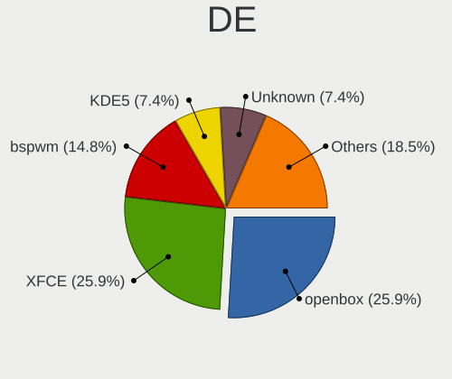

| Name     | Desktops | Percent |
|----------|----------|---------|
| XFCE     | 7        | 25.93%  |
| openbox  | 7        | 25.93%  |
| bspwm    | 4        | 14.81%  |
| KDE5     | 2        | 7.41%   |
| Unknown  | 2        | 7.41%   |
| qtile    | 1        | 3.7%    |
| KDE6     | 1        | 3.7%    |
| i3       | 1        | 3.7%    |
| Hyprland | 1        | 3.7%    |
| awesome  | 1        | 3.7%    |

Display Server
--------------

X11 or Wayland

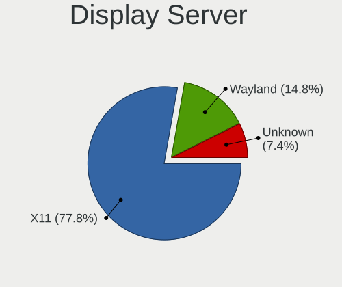

| Name    | Desktops | Percent |
|---------|----------|---------|
| X11     | 21       | 77.78%  |
| Wayland | 4        | 14.81%  |
| Unknown | 2        | 7.41%   |

Display Manager
---------------

SDDM, LightDM, etc.

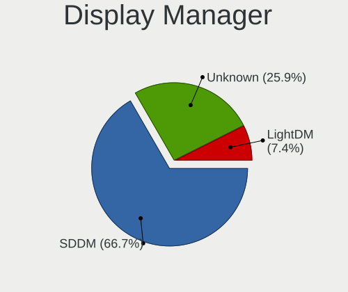

| Name    | Desktops | Percent |
|---------|----------|---------|
| SDDM    | 18       | 66.67%  |
| Unknown | 7        | 25.93%  |
| LightDM | 2        | 7.41%   |

OS Lang
-------

Language

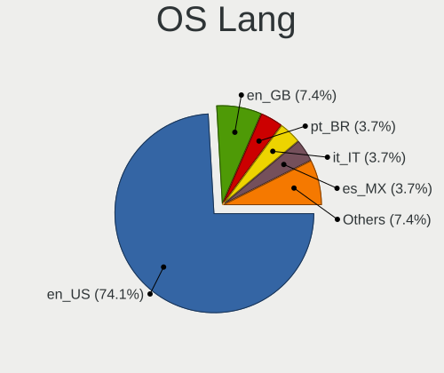

| Lang    | Desktops | Percent |
|---------|----------|---------|
| en_US   | 20       | 74.07%  |
| en_GB   | 2        | 7.41%   |
| pt_BR   | 1        | 3.7%    |
| it_IT   | 1        | 3.7%    |
| es_MX   | 1        | 3.7%    |
| en_IN   | 1        | 3.7%    |
| Unknown | 1        | 3.7%    |

Boot Mode
---------

EFI or BIOS

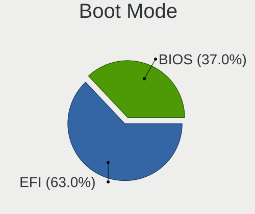

| Mode | Desktops | Percent |
|------|----------|---------|
| EFI  | 17       | 62.96%  |
| BIOS | 10       | 37.04%  |

Filesystem
----------

Type of filesystem

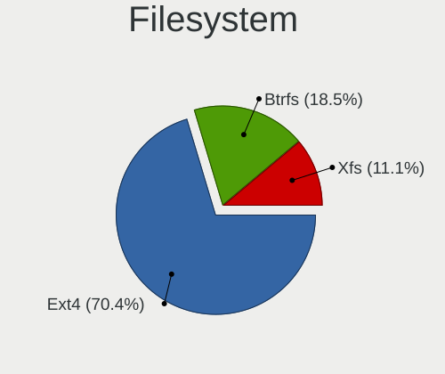

| Type  | Desktops | Percent |
|-------|----------|---------|
| Ext4  | 19       | 70.37%  |
| Btrfs | 5        | 18.52%  |
| Xfs   | 3        | 11.11%  |

Part. scheme
------------

Scheme of partitioning

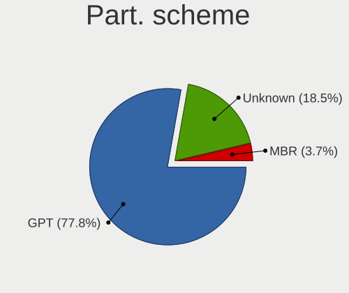

| Type    | Desktops | Percent |
|---------|----------|---------|
| GPT     | 21       | 77.78%  |
| Unknown | 5        | 18.52%  |
| MBR     | 1        | 3.7%    |

Dual Boot with Linux/BSD
------------------------

Hosting more than one Linux/BSD

| Dual boot | Desktops | Percent |
|-----------|----------|---------|
| No        | 20       | 74.07%  |
| Yes       | 7        | 25.93%  |

Dual Boot (Win)
---------------

Hosting Linux and Windows

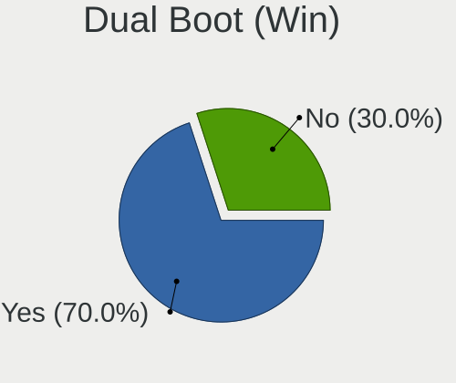

| Dual boot | Desktops | Percent |
|-----------|----------|---------|
| No        | 15       | 55.56%  |
| Yes       | 12       | 44.44%  |

Board
-----

Vendor
------

Motherboard manufacturer

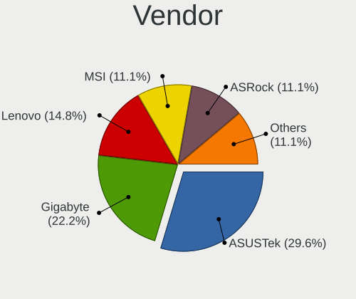

| Name                | Desktops | Percent |
|---------------------|----------|---------|
| ASUSTek Computer    | 8        | 29.63%  |
| Gigabyte Technology | 6        | 22.22%  |
| Lenovo              | 4        | 14.81%  |
| MSI                 | 3        | 11.11%  |
| ASRock              | 3        | 11.11%  |
| Hewlett-Packard     | 1        | 3.7%    |
| ECS                 | 1        | 3.7%    |
| Dell                | 1        | 3.7%    |

Model
-----

Motherboard model

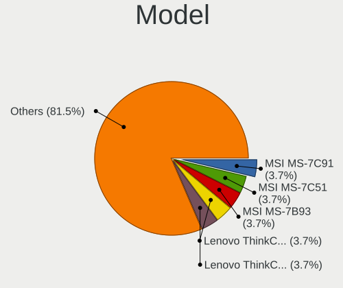

| Name                                    | Desktops | Percent |
|-----------------------------------------|----------|---------|
| MSI MS-7C91                             | 1        | 3.7%    |
| MSI MS-7C51                             | 1        | 3.7%    |
| MSI MS-7B93                             | 1        | 3.7%    |
| Lenovo ThinkCentre M710q 10MR0047US     | 1        | 3.7%    |
| Lenovo ThinkCentre Edge72 3484HPU       | 1        | 3.7%    |
| Lenovo Legion T530-28APR 90JY007RMH     | 1        | 3.7%    |
| Lenovo IdeaCentre 510A-15ARR 90J00061US | 1        | 3.7%    |
| HP EliteDesk 800 G1 TWR                 | 1        | 3.7%    |
| Gigabyte X470 AORUS GAMING 7 WIFI       | 1        | 3.7%    |
| Gigabyte H370HD3                        | 1        | 3.7%    |
| Gigabyte F2A68HM-DS2                    | 1        | 3.7%    |
| Gigabyte B650 AORUS ELITE AX            | 1        | 3.7%    |
| Gigabyte B550I AORUS PRO AX             | 1        | 3.7%    |
| Gigabyte A520M S2H                      | 1        | 3.7%    |
| ECS G31T-M                              | 1        | 3.7%    |
| Dell OptiPlex 330                       | 1        | 3.7%    |
| ASUS TUF Gaming X570-PLUS_BR            | 1        | 3.7%    |
| ASUS TUF Gaming X570-PLUS               | 1        | 3.7%    |
| ASUS TUF Gaming B550M-E                 | 1        | 3.7%    |
| ASUS ROG DOMINUS EXTREME                | 1        | 3.7%    |
| ASUS PRIME X470-PRO                     | 1        | 3.7%    |
| ASUS P8H61-M LX R2.0                    | 1        | 3.7%    |
| ASUS K30BF_M32BF_A_F_K31BF_6            | 1        | 3.7%    |
| ASUS H110M-E/M.2                        | 1        | 3.7%    |
| ASRock X570 Taichi Razer Edition        | 1        | 3.7%    |
| ASRock H97M Pro4                        | 1        | 3.7%    |
| ASRock B550M Pro4                       | 1        | 3.7%    |

Model Family
------------

Motherboard model prefix

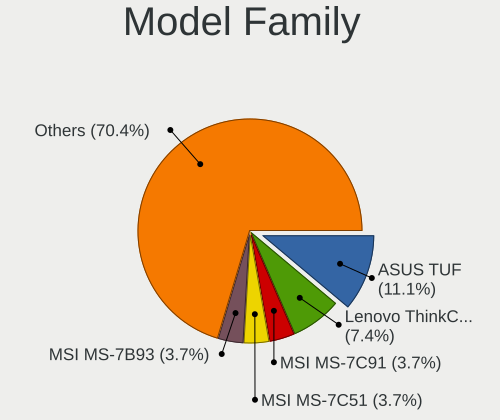

| Name                 | Desktops | Percent |
|----------------------|----------|---------|
| ASUS TUF             | 3        | 11.11%  |
| Lenovo ThinkCentre   | 2        | 7.41%   |
| MSI MS-7C91          | 1        | 3.7%    |
| MSI MS-7C51          | 1        | 3.7%    |
| MSI MS-7B93          | 1        | 3.7%    |
| Lenovo Legion        | 1        | 3.7%    |
| Lenovo IdeaCentre    | 1        | 3.7%    |
| HP EliteDesk         | 1        | 3.7%    |
| Gigabyte X470        | 1        | 3.7%    |
| Gigabyte H370HD3     | 1        | 3.7%    |
| Gigabyte F2A68HM-DS2 | 1        | 3.7%    |
| Gigabyte B650        | 1        | 3.7%    |
| Gigabyte B550I       | 1        | 3.7%    |
| Gigabyte A520M       | 1        | 3.7%    |
| ECS G31T-M           | 1        | 3.7%    |
| Dell OptiPlex        | 1        | 3.7%    |
| ASUS ROG             | 1        | 3.7%    |
| ASUS PRIME           | 1        | 3.7%    |
| ASUS P8H61-M         | 1        | 3.7%    |
| ASUS K30BF           | 1        | 3.7%    |
| ASUS H110M-E         | 1        | 3.7%    |
| ASRock X570          | 1        | 3.7%    |
| ASRock H97M          | 1        | 3.7%    |
| ASRock B550M         | 1        | 3.7%    |

MFG Year
--------

Motherboard manufacture year

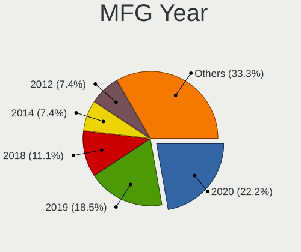

| Year | Desktops | Percent |
|------|----------|---------|
| 2020 | 6        | 22.22%  |
| 2019 | 5        | 18.52%  |
| 2018 | 3        | 11.11%  |
| 2014 | 2        | 7.41%   |
| 2012 | 2        | 7.41%   |
| 2007 | 2        | 7.41%   |
| 2023 | 1        | 3.7%    |
| 2022 | 1        | 3.7%    |
| 2021 | 1        | 3.7%    |
| 2017 | 1        | 3.7%    |
| 2016 | 1        | 3.7%    |
| 2015 | 1        | 3.7%    |
| 2013 | 1        | 3.7%    |

Form Factor
-----------

Physical design of the computer

| Name    | Desktops | Percent |
|---------|----------|---------|
| Desktop | 27       | 100%    |

Secure Boot
-----------

Enabled or disabled

| State    | Desktops | Percent |
|----------|----------|---------|
| Disabled | 27       | 100%    |

Coreboot
--------

Have coreboot on board

| Used | Desktops | Percent |
|------|----------|---------|
| No   | 27       | 100%    |

RAM Size
--------

Total RAM memory

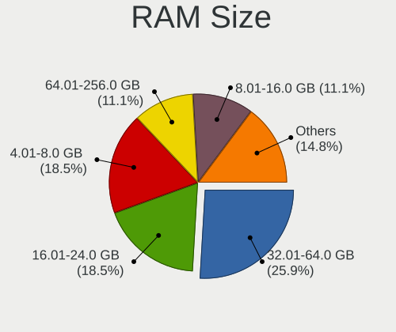

| Size in GB  | Desktops | Percent |
|-------------|----------|---------|
| 32.01-64.0  | 7        | 25.93%  |
| 4.01-8.0    | 5        | 18.52%  |
| 16.01-24.0  | 5        | 18.52%  |
| 64.01-256.0 | 3        | 11.11%  |
| 8.01-16.0   | 3        | 11.11%  |
| 3.01-4.0    | 2        | 7.41%   |
| 24.01-32.0  | 1        | 3.7%    |
| 2.01-3.0    | 1        | 3.7%    |

RAM Used
--------

Used RAM memory

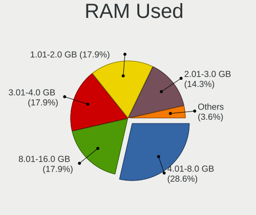

| Used GB   | Desktops | Percent |
|-----------|----------|---------|
| 4.01-8.0  | 8        | 28.57%  |
| 3.01-4.0  | 5        | 17.86%  |
| 1.01-2.0  | 5        | 17.86%  |
| 8.01-16.0 | 5        | 17.86%  |
| 2.01-3.0  | 4        | 14.29%  |
| 0.51-1.0  | 1        | 3.57%   |

Total Drives
------------

Number of drives on board

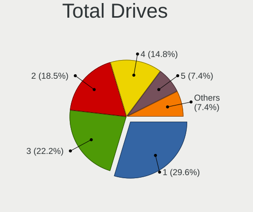

| Drives | Desktops | Percent |
|--------|----------|---------|
| 1      | 8        | 29.63%  |
| 3      | 6        | 22.22%  |
| 2      | 5        | 18.52%  |
| 4      | 4        | 14.81%  |
| 5      | 2        | 7.41%   |
| 8      | 1        | 3.7%    |
| 7      | 1        | 3.7%    |

Has CD-ROM
----------

Has CD-ROM on board

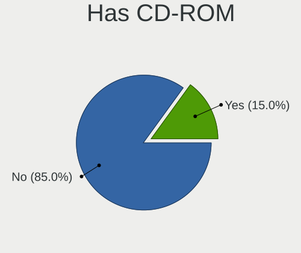

| Presented | Desktops | Percent |
|-----------|----------|---------|
| No        | 24       | 88.89%  |
| Yes       | 3        | 11.11%  |

Has Ethernet
------------

Has Ethernet on board

| Presented | Desktops | Percent |
|-----------|----------|---------|
| Yes       | 27       | 100%    |

Has WiFi
--------

Has WiFi module

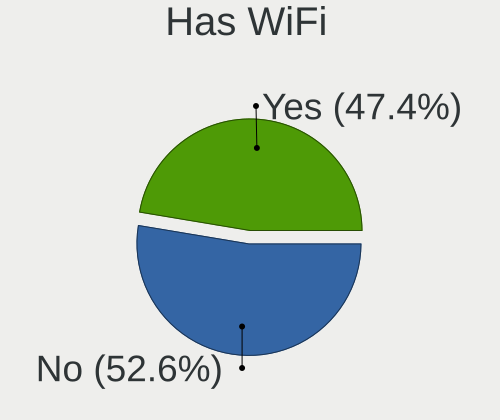

| Presented | Desktops | Percent |
|-----------|----------|---------|
| Yes       | 15       | 55.56%  |
| No        | 12       | 44.44%  |

Has Bluetooth
-------------

Has Bluetooth module

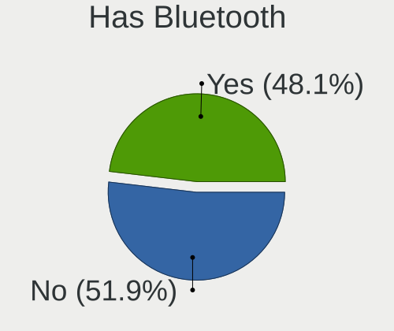

| Presented | Desktops | Percent |
|-----------|----------|---------|
| No        | 14       | 51.85%  |
| Yes       | 13       | 48.15%  |

Location
--------

Country
-------

Geographic location (country)

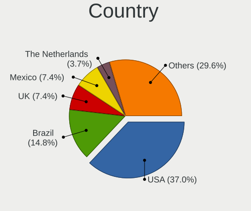

| Country         | Desktops | Percent |
|-----------------|----------|---------|
| USA             | 10       | 37.04%  |
| Brazil          | 4        | 14.81%  |
| UK              | 2        | 7.41%   |
| Mexico          | 2        | 7.41%   |
| The Netherlands | 1        | 3.7%    |
| Thailand        | 1        | 3.7%    |
| Slovakia        | 1        | 3.7%    |
| Poland          | 1        | 3.7%    |
| Italy           | 1        | 3.7%    |
| India           | 1        | 3.7%    |
| Hungary         | 1        | 3.7%    |
| Czechia         | 1        | 3.7%    |
| Belarus         | 1        | 3.7%    |

City
----

Geographic location (city)

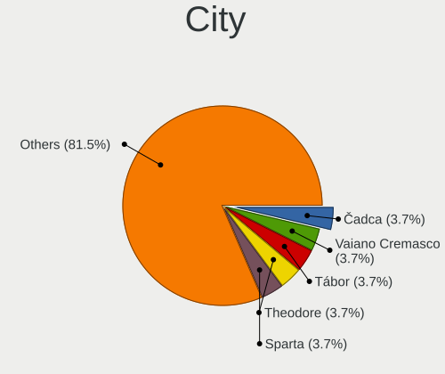

| City                  | Desktops | Percent |
|-----------------------|----------|---------|
| Vaiano Cremasco       | 1        | 3.7%    |
| Theodore              | 1        | 3.7%    |
| Tábor                | 1        | 3.7%    |
| Sparta                | 1        | 3.7%    |
| Sao Paulo             | 1        | 3.7%    |
| Paulista              | 1        | 3.7%    |
| Osasco                | 1        | 3.7%    |
| Minsk                 | 1        | 3.7%    |
| Milton Keynes         | 1        | 3.7%    |
| Mesa                  | 1        | 3.7%    |
| Manchester            | 1        | 3.7%    |
| Lelystad              | 1        | 3.7%    |
| Guadalajara           | 1        | 3.7%    |
| Gdansk                | 1        | 3.7%    |
| Frisco                | 1        | 3.7%    |
| Fort Gibson           | 1        | 3.7%    |
| Dallas                | 1        | 3.7%    |
| Clio                  | 1        | 3.7%    |
| Ciudad Nezahualcoyotl | 1        | 3.7%    |
| Chapecó              | 1        | 3.7%    |
| Čadca                | 1        | 3.7%    |
| Budapest              | 1        | 3.7%    |
| Brookville            | 1        | 3.7%    |
| Bengaluru             | 1        | 3.7%    |
| Bangkok               | 1        | 3.7%    |
| Atlanta               | 1        | 3.7%    |
| Abilene               | 1        | 3.7%    |

Drives
------

Drive Vendor
------------

Hard drive vendors

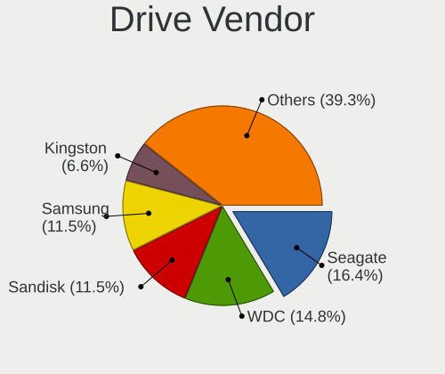

| Vendor                    | Desktops | Drives | Percent |
|---------------------------|----------|--------|---------|
| Seagate                   | 10       | 15     | 16.39%  |
| WDC                       | 9        | 11     | 14.75%  |
| Sandisk                   | 7        | 9      | 11.48%  |
| Samsung Electronics       | 7        | 8      | 11.48%  |
| Kingston                  | 4        | 8      | 6.56%   |
| Toshiba                   | 3        | 3      | 4.92%   |
| Hitachi                   | 3        | 3      | 4.92%   |
| Phison Electronics        | 2        | 2      | 3.28%   |
| Intel                     | 2        | 5      | 3.28%   |
| A-DATA Technology         | 2        | 3      | 3.28%   |
| Unknown                   | 1        | 1      | 1.64%   |
| SUNEAST                   | 1        | 1      | 1.64%   |
| SPCC                      | 1        | 1      | 1.64%   |
| ROG                       | 1        | 1      | 1.64%   |
| Patriot                   | 1        | 1      | 1.64%   |
| Micron/Crucial Technology | 1        | 1      | 1.64%   |
| MaxDigital                | 1        | 1      | 1.64%   |
| Crucial                   | 1        | 1      | 1.64%   |
| China                     | 1        | 2      | 1.64%   |
| Apacer                    | 1        | 1      | 1.64%   |
| ADATA Technology          | 1        | 1      | 1.64%   |
| Unknown                   | 1        | 1      | 1.64%   |

Drive Model
-----------

Hard drive models

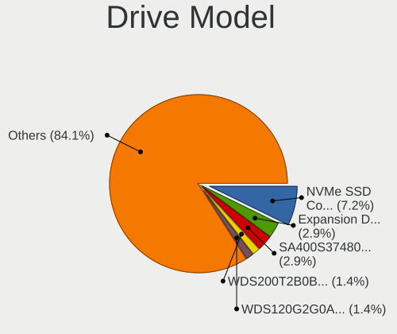

| Model                                             | Desktops | Percent |
|---------------------------------------------------|----------|---------|
| Samsung NVMe SSD Controller SM981/PM981/PM983 1TB | 5        | 7.25%   |
| Seagate Expansion Desk 4TB                        | 2        | 2.9%    |
| Kingston SA400S37480G 480GB SSD                   | 2        | 2.9%    |
| WDC WDS200T2B0B 2TB SSD                           | 1        | 1.45%   |
| WDC WDS120G2G0A-00JH30 120GB SSD                  | 1        | 1.45%   |
| WDC WD5000AAKX-75U6AA0 500GB                      | 1        | 1.45%   |
| WDC WD5000AAKX-60U6AA0 500GB                      | 1        | 1.45%   |
| WDC WD5000AAKX-08U6AA0 500GB                      | 1        | 1.45%   |
| WDC WD3200BPVT-22JJ5T0 320GB                      | 1        | 1.45%   |
| WDC WD20 EARX-00PASB0 2TB                         | 1        | 1.45%   |
| WDC WD10EZEX-22RKKA0 1TB                          | 1        | 1.45%   |
| WDC WD10EZEX-21M2NA0 1TB                          | 1        | 1.45%   |
| WDC WD10EZEX-08WN4A0 1TB                          | 1        | 1.45%   |
| WDC WD10EARS-00MVWB0 1TB                          | 1        | 1.45%   |
| Unknown NVMe SSD Drive 2TB                        | 1        | 1.45%   |
| Toshiba HDWD110 1TB                               | 1        | 1.45%   |
| Toshiba DT01ACA200 2TB                            | 1        | 1.45%   |
| Toshiba DT01ACA100 1TB                            | 1        | 1.45%   |
| SUNEAST SSD SE800 128GB                           | 1        | 1.45%   |
| SPCC M.2 PCIe SSD 4TB                             | 1        | 1.45%   |
| Seagate ST6000DM003-2CY186 6TB                    | 1        | 1.45%   |
| Seagate ST500DM002-1BD142 500GB                   | 1        | 1.45%   |
| Seagate ST4000DM004-2CV104 4TB                    | 1        | 1.45%   |
| Seagate ST3500410AS 500GB                         | 1        | 1.45%   |
| Seagate ST320LM001 HN-M320MBB 320GB               | 1        | 1.45%   |
| Seagate ST3160815AS 160GB                         | 1        | 1.45%   |
| Seagate ST31500341AS 1TB                          | 1        | 1.45%   |
| Seagate ST3000DM003-1F216N 3TB                    | 1        | 1.45%   |
| Seagate ST2000DM 008-2FR102 2TB                   | 1        | 1.45%   |
| Seagate ST1000DM010-2EP102 1TB                    | 1        | 1.45%   |
| Sandisk WD_BLACK SN770 1TB                        | 1        | 1.45%   |
| Sandisk WD Green SN350 500GB 2G0C                 | 1        | 1.45%   |
| Sandisk WD Blue SN550 NVMe SSD 1024GB             | 1        | 1.45%   |
| Sandisk WD Black SN750 / PC SN730 NVMe SSD 500GB  | 1        | 1.45%   |
| SanDisk SSD PLUS 240 GB                           | 1        | 1.45%   |
| SanDisk SDSSDA240G 240GB                          | 1        | 1.45%   |
| SanDisk NVMe SSD Drive 1TB                        | 1        | 1.45%   |
| SanDisk Extreme 55AE 1TB SSD                      | 1        | 1.45%   |
| Samsung SSD 970 EVO Plus 1TB                      | 1        | 1.45%   |
| Samsung NVMe SSD Controller 980 (DRAM-less) 256GB | 1        | 1.45%   |

HDD Vendor
----------

Hard disk drive vendors

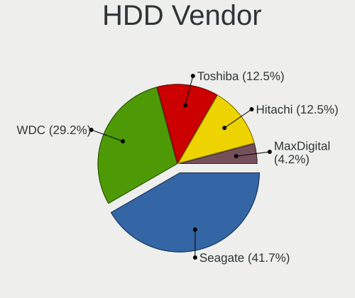

| Vendor     | Desktops | Drives | Percent |
|------------|----------|--------|---------|
| Seagate    | 10       | 15     | 41.67%  |
| WDC        | 7        | 9      | 29.17%  |
| Toshiba    | 3        | 3      | 12.5%   |
| Hitachi    | 3        | 3      | 12.5%   |
| MaxDigital | 1        | 1      | 4.17%   |

SSD Vendor
----------

Solid state drive vendors

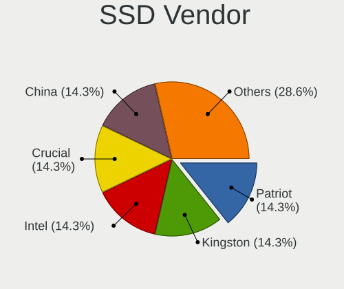

| Vendor            | Desktops | Drives | Percent |
|-------------------|----------|--------|---------|
| SanDisk           | 3        | 4      | 17.65%  |
| Kingston          | 3        | 5      | 17.65%  |
| WDC               | 2        | 2      | 11.76%  |
| A-DATA Technology | 2        | 3      | 11.76%  |
| SUNEAST           | 1        | 1      | 5.88%   |
| Patriot           | 1        | 1      | 5.88%   |
| Intel             | 1        | 1      | 5.88%   |
| Crucial           | 1        | 1      | 5.88%   |
| China             | 1        | 2      | 5.88%   |
| Apacer            | 1        | 1      | 5.88%   |
| Unknown           | 1        | 1      | 5.88%   |

Drive Kind
----------

HDD or SSD

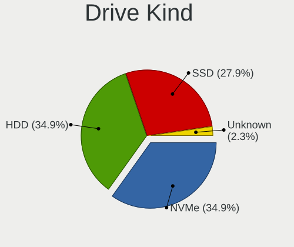

| Kind    | Desktops | Drives | Percent |
|---------|----------|--------|---------|
| NVMe    | 15       | 26     | 34.88%  |
| HDD     | 15       | 31     | 34.88%  |
| SSD     | 12       | 22     | 27.91%  |
| Unknown | 1        | 1      | 2.33%   |

Drive Connector
---------------

SATA, SAS, NVMe, etc.

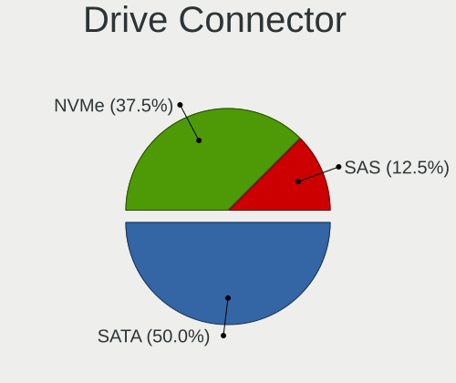

| Type | Desktops | Drives | Percent |
|------|----------|--------|---------|
| SATA | 20       | 46     | 50%     |
| NVMe | 15       | 26     | 37.5%   |
| SAS  | 5        | 8      | 12.5%   |

Drive Size
----------

Size of hard drive

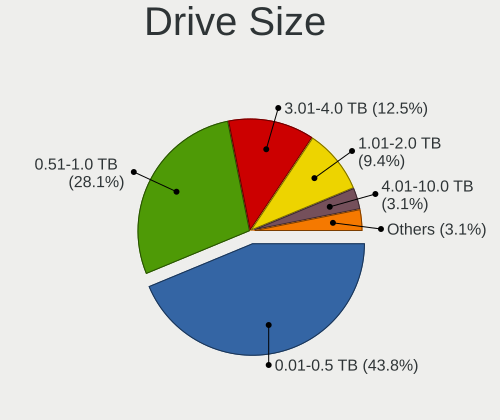

| Size in TB | Desktops | Drives | Percent |
|------------|----------|--------|---------|
| 0.01-0.5   | 14       | 28     | 43.75%  |
| 0.51-1.0   | 9        | 15     | 28.13%  |
| 3.01-4.0   | 4        | 4      | 12.5%   |
| 1.01-2.0   | 3        | 4      | 9.38%   |
| 2.01-3.0   | 1        | 1      | 3.13%   |
| 4.01-10.0  | 1        | 1      | 3.13%   |

Space Total
-----------

Amount of disk space available on the file system

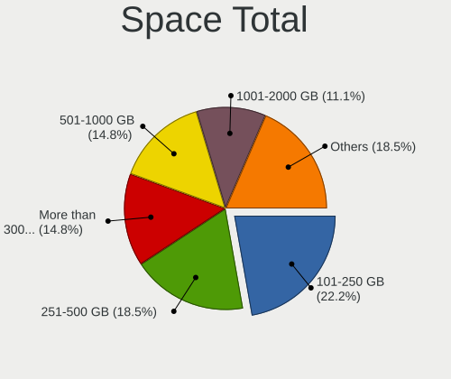

| Size in GB     | Desktops | Percent |
|----------------|----------|---------|
| 101-250        | 6        | 22.22%  |
| 251-500        | 5        | 18.52%  |
| More than 3000 | 4        | 14.81%  |
| 501-1000       | 4        | 14.81%  |
| 1001-2000      | 3        | 11.11%  |
| Unknown        | 3        | 11.11%  |
| 2001-3000      | 1        | 3.7%    |
| 51-100         | 1        | 3.7%    |

Space Used
----------

Amount of used disk space

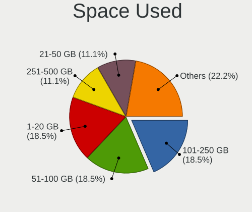

| Used GB        | Desktops | Percent |
|----------------|----------|---------|
| 101-250        | 5        | 18.52%  |
| 1-20           | 5        | 18.52%  |
| 51-100         | 5        | 18.52%  |
| 251-500        | 3        | 11.11%  |
| 21-50          | 3        | 11.11%  |
| Unknown        | 3        | 11.11%  |
| 1001-2000      | 2        | 7.41%   |
| More than 3000 | 1        | 3.7%    |

Malfunc. Drives
---------------

Drive models with a malfunction

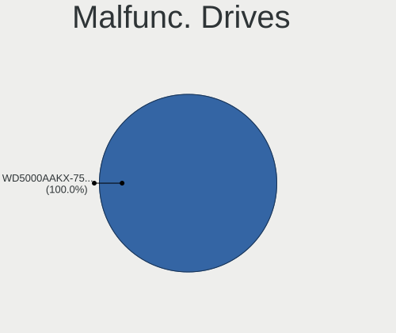

| Model                         | Desktops | Drives | Percent |
|-------------------------------|----------|--------|---------|
| WDC WD5000AAKX-75U6AA0 500GB  | 1        | 1      | 20%     |
| WDC WD5000AAKX-60U6AA0 500GB  | 1        | 1      | 20%     |
| WDC WD10EARS-00MVWB0 1TB      | 1        | 1      | 20%     |
| MaxDigital MD4000GBDS 4TB     | 1        | 1      | 20%     |
| Hitachi HTS547550A9E384 500GB | 1        | 1      | 20%     |

Malfunc. Drive Vendor
---------------------

Vendors of faulty drives

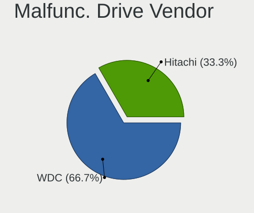

| Vendor     | Desktops | Drives | Percent |
|------------|----------|--------|---------|
| WDC        | 3        | 3      | 60%     |
| MaxDigital | 1        | 1      | 20%     |
| Hitachi    | 1        | 1      | 20%     |

Malfunc. HDD Vendor
-------------------

Vendors of faulty HDD drives

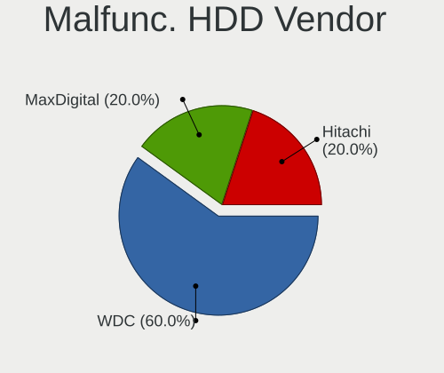

| Vendor     | Desktops | Drives | Percent |
|------------|----------|--------|---------|
| WDC        | 3        | 3      | 60%     |
| MaxDigital | 1        | 1      | 20%     |
| Hitachi    | 1        | 1      | 20%     |

Malfunc. Drive Kind
-------------------

Kinds of faulty drives

| Kind | Desktops | Drives | Percent |
|------|----------|--------|---------|
| HDD  | 4        | 5      | 100%    |

Failed Drives
-------------

Failed drive models

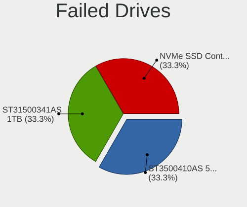

| Model                                                         | Desktops | Drives | Percent |
|---------------------------------------------------------------|----------|--------|---------|
| Seagate ST3500410AS 500GB                                     | 1        | 2      | 33.33%  |
| Seagate ST31500341AS 1TB                                      | 1        | 2      | 33.33%  |
| Samsung Electronics NVMe SSD Controller 980 (DRAM-less) 256GB | 1        | 1      | 33.33%  |

Failed Drive Vendor
-------------------

Failed drive vendors

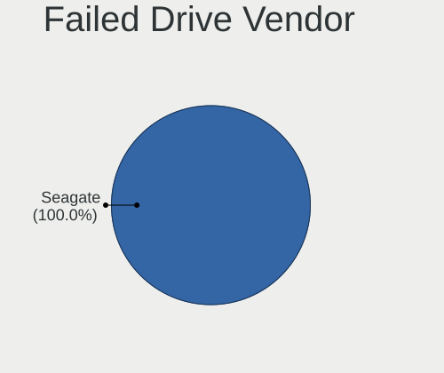

| Vendor              | Desktops | Drives | Percent |
|---------------------|----------|--------|---------|
| Seagate             | 1        | 4      | 50%     |
| Samsung Electronics | 1        | 1      | 50%     |

Drive Status
------------

Number of failed and malfunc. drives

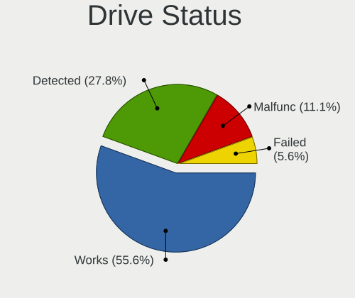

| Status   | Desktops | Drives | Percent |
|----------|----------|--------|---------|
| Works    | 20       | 45     | 55.56%  |
| Detected | 10       | 25     | 27.78%  |
| Malfunc  | 4        | 5      | 11.11%  |
| Failed   | 2        | 5      | 5.56%   |

Storage controller
------------------

Storage Vendor
--------------

Storage controller vendors

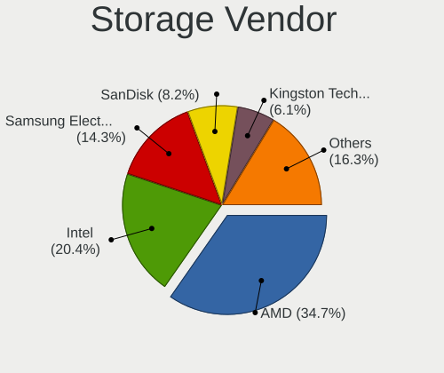

| Vendor                      | Desktops | Percent |
|-----------------------------|----------|---------|
| AMD                         | 17       | 34.69%  |
| Intel                       | 10       | 20.41%  |
| Samsung Electronics         | 7        | 14.29%  |
| SanDisk                     | 4        | 8.16%   |
| Kingston Technology Company | 3        | 6.12%   |
| Phison Electronics          | 2        | 4.08%   |
| ASMedia Technology          | 2        | 4.08%   |
| Solidigm                    | 1        | 2.04%   |
| Micron/Crucial Technology   | 1        | 2.04%   |
| INNOGRIT                    | 1        | 2.04%   |
| ADATA Technology            | 1        | 2.04%   |

Storage Model
-------------

Storage controller models

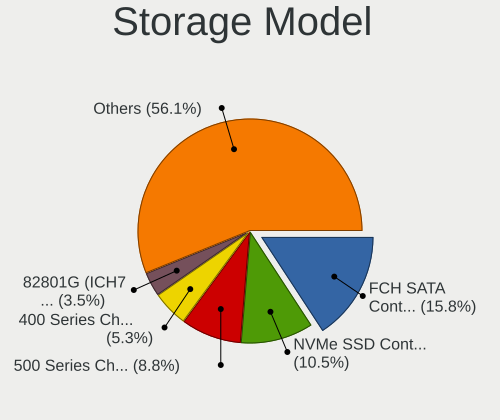

| Model                                                                          | Desktops | Percent |
|--------------------------------------------------------------------------------|----------|---------|
| AMD FCH SATA Controller [AHCI mode]                                            | 9        | 15.79%  |
| Samsung NVMe SSD Controller SM981/PM981/PM983                                  | 6        | 10.53%  |
| AMD 500 Series Chipset SATA Controller                                         | 5        | 8.77%   |
| AMD 400 Series Chipset SATA Controller                                         | 3        | 5.26%   |
| Intel 82801G (ICH7 Family) IDE Controller                                      | 2        | 3.51%   |
| Intel 6 Series/C200 Series Chipset Family 6 port Desktop SATA AHCI Controller  | 2        | 3.51%   |
| ASMedia ASM1061/ASM1062 Serial ATA Controller                                  | 2        | 3.51%   |
| Solidigm P44 Pro NVMe SSD [Hollywood Beach]                                    | 1        | 1.75%   |
| SanDisk WD SN560/SN740/SN770/SN5000 NVMe SSD                                   | 1        | 1.75%   |
| SanDisk WD Green SN350 240GB (DRAM-less) / SN560E NVMe SSD                     | 1        | 1.75%   |
| Sandisk WD Black SN850X NVMe SSD                                               | 1        | 1.75%   |
| SanDisk Ultra 3D / WD PC SN530, IX SN530, Blue SN550 NVMe SSD (DRAM-less)      | 1        | 1.75%   |
| SanDisk Extreme Pro / WD Black SN750 / PC SN730 / Red SN700 NVMe SSD           | 1        | 1.75%   |
| Samsung NVMe SSD Controller 980 (DRAM-less)                                    | 1        | 1.75%   |
| Phison E16 PCIe4 NVMe Controller                                               | 1        | 1.75%   |
| Phison E12 NVMe Controller                                                     | 1        | 1.75%   |
| Micron/Crucial P2 [Nick P2] / P3 / P3 Plus NVMe PCIe SSD (DRAM-less)           | 1        | 1.75%   |
| Kingston Company NV1 NVMe SSD [SM2263XT] (DRAM-less)                           | 1        | 1.75%   |
| Kingston Company KC3000/FURY Renegade NVMe SSD [E18]                           | 1        | 1.75%   |
| Kingston Company A1000/U-SNS8154P3 x2 NVMe SSD [E8]                            | 1        | 1.75%   |
| Intel Volume Management Device NVMe RAID Controller                            | 1        | 1.75%   |
| Intel Q170/Q150/B150/H170/H110/Z170/CM236 Chipset SATA Controller [AHCI Mode]  | 1        | 1.75%   |
| Intel Optane SSD 900P Series                                                   | 1        | 1.75%   |
| Intel NM10/ICH7 Family SATA Controller [IDE mode]                              | 1        | 1.75%   |
| Intel NM10/ICH7 Family SATA Controller [AHCI mode]                             | 1        | 1.75%   |
| Intel Cannon Lake PCH SATA AHCI Controller                                     | 1        | 1.75%   |
| Intel C620 Series Chipset Family IDE Redirection                               | 1        | 1.75%   |
| Intel 9 Series Chipset Family SATA Controller [AHCI Mode]                      | 1        | 1.75%   |
| Intel 8 Series/C220 Series Chipset Family 6-port SATA Controller 1 [AHCI mode] | 1        | 1.75%   |
| Intel 200 Series PCH SATA controller [AHCI mode]                               | 1        | 1.75%   |
| INNOGRIT NVMe SSD Controller IG5236 [RainierPC]                                | 1        | 1.75%   |
| AMD FCH SATA Controller [IDE mode]                                             | 1        | 1.75%   |
| AMD A320 Chipset SATA Controller [AHCI mode]                                   | 1        | 1.75%   |
| AMD 600 Series Chipset SATA Controller                                         | 1        | 1.75%   |
| ADATA XPG SX8200 Pro PCIe Gen3x4 M.2 2280 Solid State Drive                    | 1        | 1.75%   |

Storage Kind
------------

Kind of storage controller (IDE, SATA, NVMe, SAS, ...)

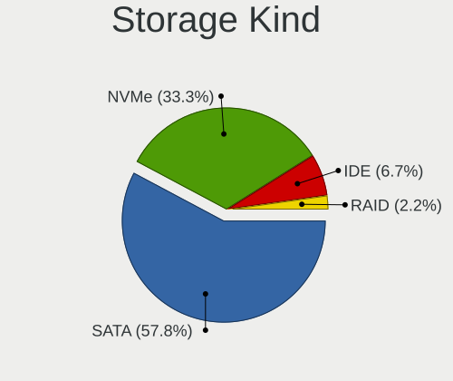

| Kind | Desktops | Percent |
|------|----------|---------|
| SATA | 26       | 57.78%  |
| NVMe | 15       | 33.33%  |
| IDE  | 3        | 6.67%   |
| RAID | 1        | 2.22%   |

Processor
---------

CPU Vendor
----------

Processor vendors

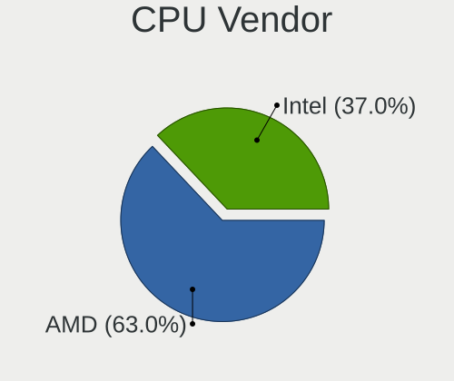

| Vendor | Desktops | Percent |
|--------|----------|---------|
| AMD    | 17       | 62.96%  |
| Intel  | 10       | 37.04%  |

CPU Model
---------

Processor models

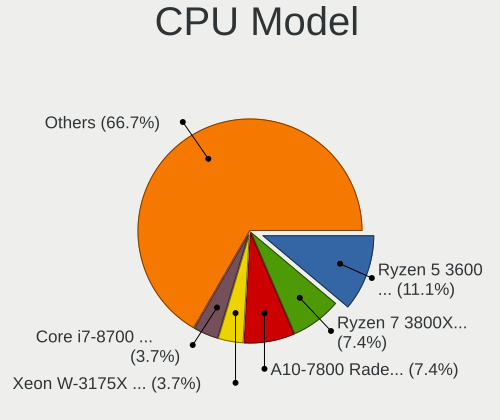

| Model                                           | Desktops | Percent |
|-------------------------------------------------|----------|---------|
| AMD Ryzen 5 3600 6-Core Processor               | 3        | 11.11%  |
| AMD Ryzen 7 3800X 8-Core Processor              | 2        | 7.41%   |
| AMD A10-7800 Radeon R7, 12 Compute Cores 4C+8G  | 2        | 7.41%   |
| Intel Xeon W-3175X CPU @ 3.10GHz                | 1        | 3.7%    |
| Intel Core i7-8700 CPU @ 3.20GHz                | 1        | 3.7%    |
| Intel Core i7-2600K CPU @ 3.40GHz               | 1        | 3.7%    |
| Intel Core i5-7400 CPU @ 3.00GHz                | 1        | 3.7%    |
| Intel Core i5-6500T CPU @ 2.50GHz               | 1        | 3.7%    |
| Intel Core i5-4690K CPU @ 3.50GHz               | 1        | 3.7%    |
| Intel Core i5-4570 CPU @ 3.20GHz                | 1        | 3.7%    |
| Intel Core i3-3220 CPU @ 3.30GHz                | 1        | 3.7%    |
| Intel Core 2 Duo CPU E4600 @ 2.40GHz            | 1        | 3.7%    |
| Intel Core 2 Duo CPU E4500 @ 2.20GHz            | 1        | 3.7%    |
| AMD Ryzen 9 5950X 16-Core Processor             | 1        | 3.7%    |
| AMD Ryzen 9 5900X 12-Core Processor             | 1        | 3.7%    |
| AMD Ryzen 9 3900X 12-Core Processor             | 1        | 3.7%    |
| AMD Ryzen 7 7700X 8-Core Processor              | 1        | 3.7%    |
| AMD Ryzen 7 3700X 8-Core Processor              | 1        | 3.7%    |
| AMD Ryzen 7 2700X Eight-Core Processor          | 1        | 3.7%    |
| AMD Ryzen 5 5600X 6-Core Processor              | 1        | 3.7%    |
| AMD Ryzen 5 4600G with Radeon Graphics          | 1        | 3.7%    |
| AMD Ryzen 5 3400G with Radeon Vega Graphics     | 1        | 3.7%    |
| AMD Ryzen 3 PRO 3200G with Radeon Vega Graphics | 1        | 3.7%    |

CPU Model Family
----------------

Processor model prefix

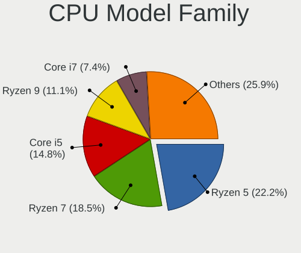

| Model            | Desktops | Percent |
|------------------|----------|---------|
| AMD Ryzen 5      | 6        | 22.22%  |
| AMD Ryzen 7      | 5        | 18.52%  |
| Intel Core i5    | 4        | 14.81%  |
| AMD Ryzen 9      | 3        | 11.11%  |
| Intel Core i7    | 2        | 7.41%   |
| Intel Core 2 Duo | 2        | 7.41%   |
| AMD A10          | 2        | 7.41%   |
| Intel Xeon       | 1        | 3.7%    |
| Intel Core i3    | 1        | 3.7%    |
| AMD Ryzen 3 PRO  | 1        | 3.7%    |

CPU Cores
---------

Number of processor cores

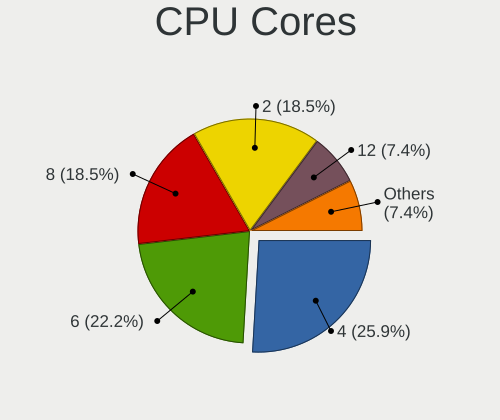

| Number | Desktops | Percent |
|--------|----------|---------|
| 4      | 7        | 25.93%  |
| 6      | 6        | 22.22%  |
| 8      | 5        | 18.52%  |
| 2      | 5        | 18.52%  |
| 12     | 2        | 7.41%   |
| 28     | 1        | 3.7%    |
| 16     | 1        | 3.7%    |

CPU Sockets
-----------

Number of sockets

| Number | Desktops | Percent |
|--------|----------|---------|
| 1      | 27       | 100%    |

CPU Threads
-----------

Threads per core (Hyper-Threading)

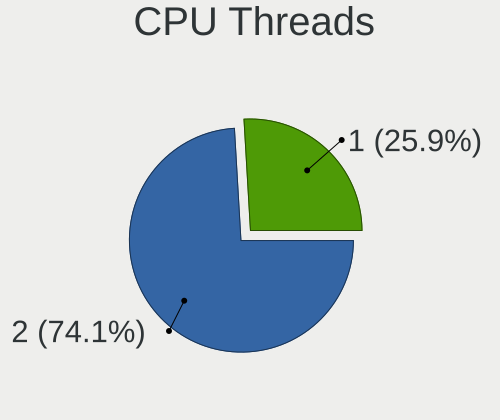

| Number | Desktops | Percent |
|--------|----------|---------|
| 2      | 20       | 74.07%  |
| 1      | 7        | 25.93%  |

CPU Op-Modes
------------

CPU Operation Modes (32-bit, 64-bit)

| Op mode        | Desktops | Percent |
|----------------|----------|---------|
| 32-bit, 64-bit | 27       | 100%    |

CPU Microcode
-------------

Microcode number

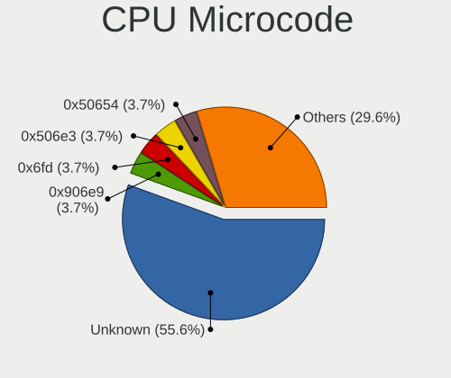

| Number     | Desktops | Percent |
|------------|----------|---------|
| Unknown    | 15       | 55.56%  |
| 0x906e9    | 1        | 3.7%    |
| 0x6fd      | 1        | 3.7%    |
| 0x506e3    | 1        | 3.7%    |
| 0x50654    | 1        | 3.7%    |
| 0x306c3    | 1        | 3.7%    |
| 0x0a601203 | 1        | 3.7%    |
| 0x0a201016 | 1        | 3.7%    |
| 0x0a201009 | 1        | 3.7%    |
| 0x08701030 | 1        | 3.7%    |
| 0x08701021 | 1        | 3.7%    |
| 0x08108102 | 1        | 3.7%    |
| 0x06003106 | 1        | 3.7%    |

CPU Microarch
-------------

Microarchitecture

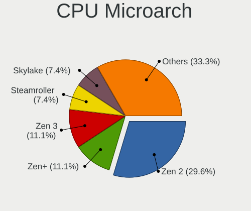

| Name        | Desktops | Percent |
|-------------|----------|---------|
| Zen 2       | 8        | 29.63%  |
| Zen+        | 3        | 11.11%  |
| Zen 3       | 3        | 11.11%  |
| Steamroller | 2        | 7.41%   |
| Skylake     | 2        | 7.41%   |
| KabyLake    | 2        | 7.41%   |
| Haswell     | 2        | 7.41%   |
| Core        | 2        | 7.41%   |
| SandyBridge | 1        | 3.7%    |
| IvyBridge   | 1        | 3.7%    |
| Unknown     | 1        | 3.7%    |

Graphics
--------

GPU Vendor
----------

Vendors of graphics cards

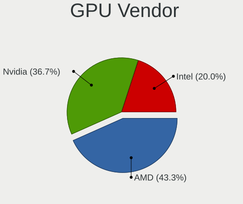

| Vendor | Desktops | Percent |
|--------|----------|---------|
| AMD    | 13       | 43.33%  |
| Nvidia | 11       | 36.67%  |
| Intel  | 6        | 20%     |

GPU Model
---------

Graphics card models

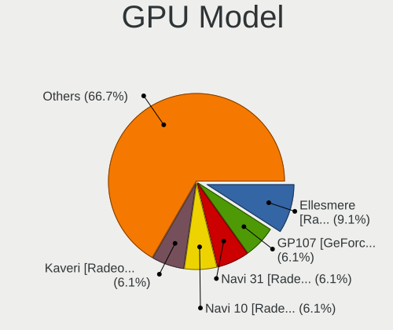

| Model                                                                       | Desktops | Percent |
|-----------------------------------------------------------------------------|----------|---------|
| AMD Ellesmere [Radeon RX 470/480/570/570X/580/580X/590]                     | 3        | 9.09%   |
| Nvidia GP107 [GeForce GTX 1050 Ti]                                          | 2        | 6.06%   |
| AMD Navi 31 [Radeon RX 7900 XT/7900 XTX/7900 GRE/7900M]                     | 2        | 6.06%   |
| AMD Navi 10 [Radeon RX 5600 OEM/5600 XT / 5700/5700 XT]                     | 2        | 6.06%   |
| AMD Kaveri [Radeon R7 Graphics]                                             | 2        | 6.06%   |
| Nvidia TU116 [GeForce GTX 1660 Ti]                                          | 1        | 3.03%   |
| Nvidia TU106 [GeForce RTX 2060 SUPER]                                       | 1        | 3.03%   |
| Nvidia TU106 [GeForce RTX 2060 Rev. A]                                      | 1        | 3.03%   |
| Nvidia TU102 [TITAN RTX]                                                    | 1        | 3.03%   |
| Nvidia GP106 [GeForce GTX 1060 6GB]                                         | 1        | 3.03%   |
| Nvidia GM107 [GeForce GTX 750 Ti]                                           | 1        | 3.03%   |
| Nvidia GA106 [GeForce RTX 3060 Lite Hash Rate]                              | 1        | 3.03%   |
| Nvidia GA104 [GeForce RTX 3060 Ti Lite Hash Rate]                           | 1        | 3.03%   |
| Nvidia GA102 [GeForce RTX 3080 Ti]                                          | 1        | 3.03%   |
| Intel Xeon E3-1200 v3/4th Gen Core Processor Integrated Graphics Controller | 1        | 3.03%   |
| Intel Xeon E3-1200 v2/3rd Gen Core processor Graphics Controller            | 1        | 3.03%   |
| Intel Skylake-S GT2 [HD Graphics 530]                                       | 1        | 3.03%   |
| Intel Kaby Lake-S GT2 [HD Graphics 630]                                     | 1        | 3.03%   |
| Intel CoffeeLake-S GT2 [UHD Graphics 630]                                   | 1        | 3.03%   |
| Intel 82G33/G31 Express Integrated Graphics Controller                      | 1        | 3.03%   |
| AMD RV710 [Radeon HD 4350/4550]                                             | 1        | 3.03%   |
| AMD Renoir [Radeon Vega Series / Radeon Vega Mobile Series]                 | 1        | 3.03%   |
| AMD Raphael                                                                 | 1        | 3.03%   |
| AMD Pitcairn PRO [Radeon HD 7850 / R7 265 / R9 270 1024SP]                  | 1        | 3.03%   |
| AMD Picasso/Raven 2 [Radeon Vega Series / Radeon Vega Mobile Series]        | 1        | 3.03%   |
| AMD Oland [Radeon HD 8570 / R5 430 OEM / R7 240/340 / Radeon 520 OEM]       | 1        | 3.03%   |
| AMD Navi 23 [Radeon RX 6600/6600 XT/6600M]                                  | 1        | 3.03%   |

GPU Combo
---------

Combinations of graphics cards

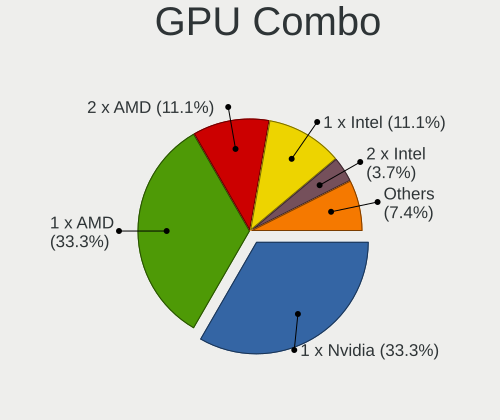

| Name           | Desktops | Percent |
|----------------|----------|---------|
| 1 x Nvidia     | 9        | 33.33%  |
| 1 x AMD        | 9        | 33.33%  |
| 2 x AMD        | 3        | 11.11%  |
| 1 x Intel      | 3        | 11.11%  |
| 2 x Intel      | 1        | 3.7%    |
| Intel + Nvidia | 1        | 3.7%    |
| AMD + Nvidia   | 1        | 3.7%    |

GPU Driver
----------

Free vs proprietary

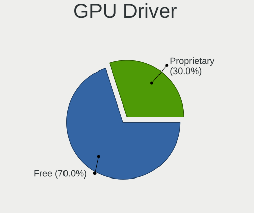

| Driver      | Desktops | Percent |
|-------------|----------|---------|
| Free        | 18       | 64.29%  |
| Proprietary | 10       | 35.71%  |

GPU Memory
----------

Total video memory

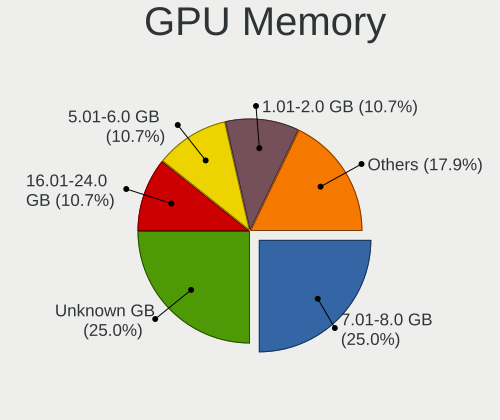

| Size in GB | Desktops | Percent |
|------------|----------|---------|
| 7.01-8.0   | 7        | 25%     |
| Unknown    | 7        | 25%     |
| 5.01-6.0   | 3        | 10.71%  |
| 16.01-24.0 | 3        | 10.71%  |
| 1.01-2.0   | 3        | 10.71%  |
| 8.01-16.0  | 2        | 7.14%   |
| 0.51-1.0   | 2        | 7.14%   |
| 3.01-4.0   | 1        | 3.57%   |

Monitor
-------

Monitor Vendor
--------------

Monitor vendors

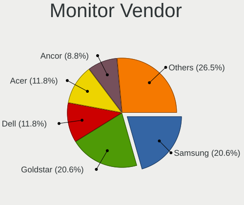

| Vendor               | Desktops | Percent |
|----------------------|----------|---------|
| Samsung Electronics  | 7        | 20.59%  |
| Goldstar             | 7        | 20.59%  |
| Dell                 | 4        | 11.76%  |
| Acer                 | 4        | 11.76%  |
| Ancor Communications | 3        | 8.82%   |
| Hewlett-Packard      | 2        | 5.88%   |
| Toshiba              | 1        | 2.94%   |
| Roku                 | 1        | 2.94%   |
| Lenovo               | 1        | 2.94%   |
| BenQ                 | 1        | 2.94%   |
| ASUSTek Computer     | 1        | 2.94%   |
| AGO                  | 1        | 2.94%   |
| Unknown              | 1        | 2.94%   |

Monitor Model
-------------

Monitor models

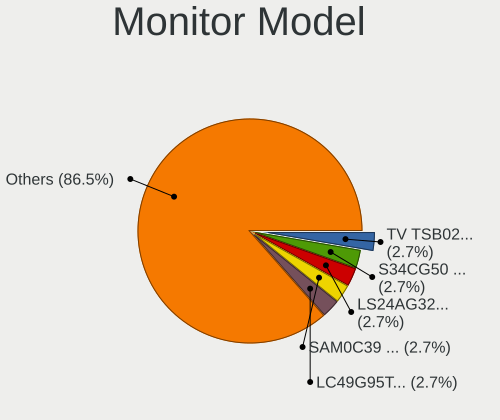

| Model                                                                 | Desktops | Percent |
|-----------------------------------------------------------------------|----------|---------|
| Toshiba TV TSB0206 1920x1080                                          | 1        | 2.7%    |
| Samsung Electronics S34CG50 SAM730F 3440x1440 798x334mm 34.1-inch     | 1        | 2.7%    |
| Samsung Electronics LS24AG32x SAM71DA 1920x1080 527x296mm 23.8-inch   | 1        | 2.7%    |
| Samsung Electronics LCD Monitor SAM0C39 1920x1080 885x498mm 40.0-inch | 1        | 2.7%    |
| Samsung Electronics LC49G95T SAM7053 3840x1080 1193x336mm 48.8-inch   | 1        | 2.7%    |
| Samsung Electronics LC27G5xT SAM7079 2560x1440 597x336mm 27.0-inch    | 1        | 2.7%    |
| Samsung Electronics C49RG9x SAM0F9C 3360x1440 1193x336mm 48.8-inch    | 1        | 2.7%    |
| Samsung Electronics C24F390 SAM0D2C 1920x1080 521x293mm 23.5-inch     | 1        | 2.7%    |
| Roku TV RKU8518 1920x1080 698x392mm 31.5-inch                         | 1        | 2.7%    |
| Lenovo P24h-10 LEN61AE 2560x1440 527x296mm 23.8-inch                  | 1        | 2.7%    |
| Hewlett-Packard V320 HPN3363 1920x1080 698x393mm 31.5-inch            | 1        | 2.7%    |
| Hewlett-Packard LA2306 HWP2949 1920x1080 510x287mm 23.0-inch          | 1        | 2.7%    |
| Goldstar L1742 GSM449C 1280x1024 338x270mm 17.0-inch                  | 1        | 2.7%    |
| Goldstar HDR WFHD GSM7714 2560x1080 798x334mm 34.1-inch               | 1        | 2.7%    |
| Goldstar HDR WFHD GSM5BB9 2560x1080 798x334mm 34.1-inch               | 1        | 2.7%    |
| Goldstar HDR WFHD GSM5BA0 2560x1080 798x334mm 34.1-inch               | 1        | 2.7%    |
| Goldstar HDR 4K GSM7750 3840x2160 697x392mm 31.5-inch                 | 1        | 2.7%    |
| Goldstar FULL HD GSM5BFB 1920x1080 480x270mm 21.7-inch                | 1        | 2.7%    |
| Goldstar FULL HD GSM5B55 1920x1080 480x270mm 21.7-inch                | 1        | 2.7%    |
| Dell SE2417HG DELD08E 1920x1080 521x293mm 23.5-inch                   | 1        | 2.7%    |
| Dell SE2417HG DELD08D 1920x1080 521x293mm 23.5-inch                   | 1        | 2.7%    |
| Dell S2421NX DEL41FB 1920x1080 527x296mm 23.8-inch                    | 1        | 2.7%    |
| Dell S2240T DELA094 1920x1080 477x268mm 21.5-inch                     | 1        | 2.7%    |
| Dell E198WFP DELF005 1440x900 408x255mm 18.9-inch                     | 1        | 2.7%    |
| BenQ BL3200 BNQ8017 2560x1440 708x398mm 32.0-inch                     | 1        | 2.7%    |
| ASUSTek Computer ROG PG65UQ AUS65A1 3840x2160 1430x800mm 64.5-inch    | 1        | 2.7%    |
| Ancor Communications ROG PG348Q ACI3433 3440x1440 798x335mm 34.1-inch | 1        | 2.7%    |
| Ancor Communications ASUS VS228 ACI22FD 1920x1080 476x268mm 21.5-inch | 1        | 2.7%    |
| Ancor Communications ASUS PB278 ACI27A3 2560x1440 597x336mm 27.0-inch | 1        | 2.7%    |
| AGO LCD Monitor AGO0001 1920x1080 300x230mm 14.9-inch                 | 1        | 2.7%    |
| AGO LCD Monitor AGO0001 1920x1080 256x192mm 12.6-inch                 | 1        | 2.7%    |
| Acer XF251Q ACR0624 1920x1080 544x303mm 24.5-inch                     | 1        | 2.7%    |
| Acer S271HL ACR02CA 1920x1080 598x336mm 27.0-inch                     | 1        | 2.7%    |
| Acer K222HQL ACR03E1 1920x1080 477x268mm 21.5-inch                    | 1        | 2.7%    |
| Acer G246HL ACR02FF 1920x1080 531x299mm 24.0-inch                     | 1        | 2.7%    |
| Acer G235H ACR0120 1920x1080 521x293mm 23.5-inch                      | 1        | 2.7%    |
| Unknown                                                               | 1        | 2.7%    |

Monitor Resolution
------------------

Monitor screen resolution

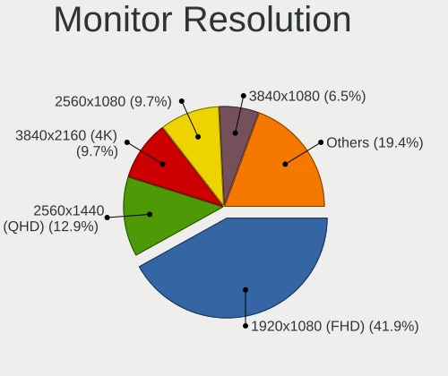

| Resolution       | Desktops | Percent |
|------------------|----------|---------|
| 1920x1080 (FHD)  | 13       | 41.94%  |
| 2560x1440 (QHD)  | 4        | 12.9%   |
| 3840x2160 (4K)   | 3        | 9.68%   |
| 2560x1080        | 3        | 9.68%   |
| 3840x1080        | 2        | 6.45%   |
| 3440x1440        | 2        | 6.45%   |
| 3200x1080        | 1        | 3.23%   |
| 1440x900 (WXGA+) | 1        | 3.23%   |
| 1280x1024 (SXGA) | 1        | 3.23%   |
| Unknown          | 1        | 3.23%   |

Monitor Diagonal
----------------

Diagonal size in inches

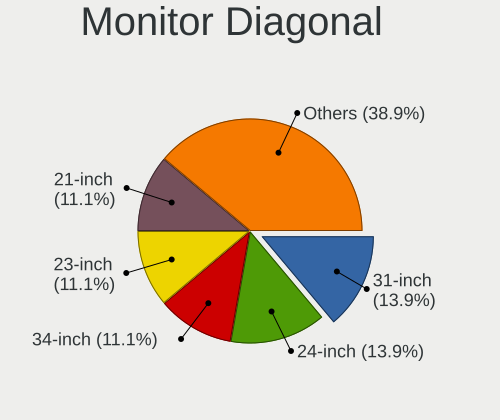

| Inches  | Desktops | Percent |
|---------|----------|---------|
| 31      | 5        | 13.89%  |
| 24      | 5        | 13.89%  |
| 34      | 4        | 11.11%  |
| 23      | 4        | 11.11%  |
| 21      | 4        | 11.11%  |
| 48      | 2        | 5.56%   |
| 27      | 2        | 5.56%   |
| 74      | 1        | 2.78%   |
| 64      | 1        | 2.78%   |
| 63      | 1        | 2.78%   |
| 54      | 1        | 2.78%   |
| 32      | 1        | 2.78%   |
| 19      | 1        | 2.78%   |
| 17      | 1        | 2.78%   |
| 14      | 1        | 2.78%   |
| 12      | 1        | 2.78%   |
| Unknown | 1        | 2.78%   |

Monitor Width
-------------

Physical width

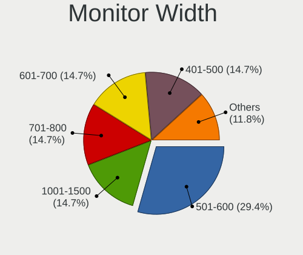

| Width in mm | Desktops | Percent |
|-------------|----------|---------|
| 501-600     | 10       | 29.41%  |
| 701-800     | 5        | 14.71%  |
| 601-700     | 5        | 14.71%  |
| 401-500     | 5        | 14.71%  |
| 1001-1500   | 5        | 14.71%  |
| 301-350     | 1        | 2.94%   |
| 201-300     | 1        | 2.94%   |
| 1501-2000   | 1        | 2.94%   |
| Unknown     | 1        | 2.94%   |

Aspect Ratio
------------

Proportional relationship between the width and the height

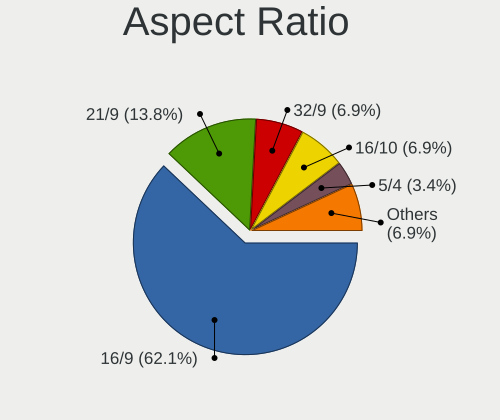

| Ratio   | Desktops | Percent |
|---------|----------|---------|
| 16/9    | 18       | 62.07%  |
| 21/9    | 4        | 13.79%  |
| 32/9    | 2        | 6.9%    |
| 16/10   | 2        | 6.9%    |
| 5/4     | 1        | 3.45%   |
| 4/3     | 1        | 3.45%   |
| Unknown | 1        | 3.45%   |

Monitor Area
------------

Area in inch²

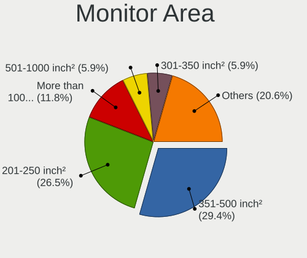

| Area in inch² | Desktops | Percent |
|----------------|----------|---------|
| 351-500        | 10       | 29.41%  |
| 201-250        | 9        | 26.47%  |
| More than 1000 | 4        | 11.76%  |
| 301-350        | 2        | 5.88%   |
| 151-200        | 2        | 5.88%   |
| 501-1000       | 2        | 5.88%   |
| 71-80          | 1        | 2.94%   |
| 251-300        | 1        | 2.94%   |
| 141-150        | 1        | 2.94%   |
| 101-110        | 1        | 2.94%   |
| Unknown        | 1        | 2.94%   |

Pixel Density
-------------

Pixels per inch

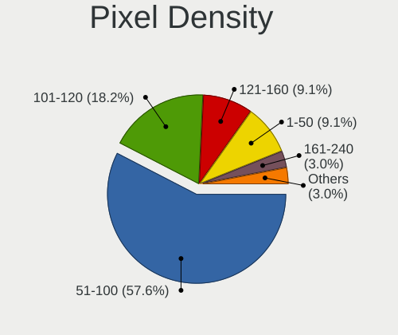

| Density | Desktops | Percent |
|---------|----------|---------|
| 51-100  | 19       | 57.58%  |
| 101-120 | 6        | 18.18%  |
| 1-50    | 3        | 9.09%   |
| 121-160 | 3        | 9.09%   |
| 161-240 | 1        | 3.03%   |
| Unknown | 1        | 3.03%   |

Multiple Monitors
-----------------

Total monitors connected

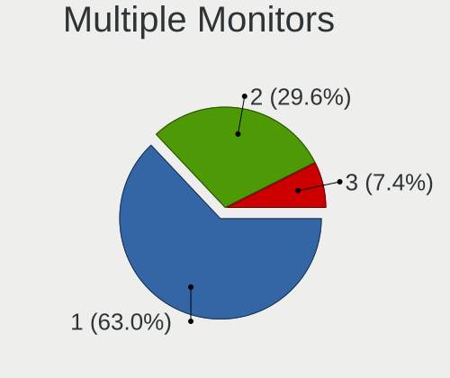

| Total | Desktops | Percent |
|-------|----------|---------|
| 1     | 17       | 62.96%  |
| 2     | 8        | 29.63%  |
| 3     | 2        | 7.41%   |

Network
-------

Net Controller Vendor
---------------------

Controller vendors

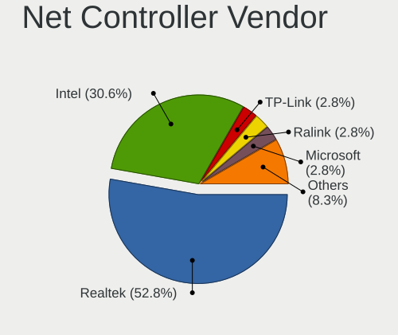

| Vendor                | Desktops | Percent |
|-----------------------|----------|---------|
| Realtek Semiconductor | 19       | 52.78%  |
| Intel                 | 11       | 30.56%  |
| TP-Link               | 1        | 2.78%   |
| Ralink Technology     | 1        | 2.78%   |
| Microsoft             | 1        | 2.78%   |
| MediaTek              | 1        | 2.78%   |
| Broadcom Limited      | 1        | 2.78%   |
| Aquantia              | 1        | 2.78%   |

Net Controller Model
--------------------

Controller models

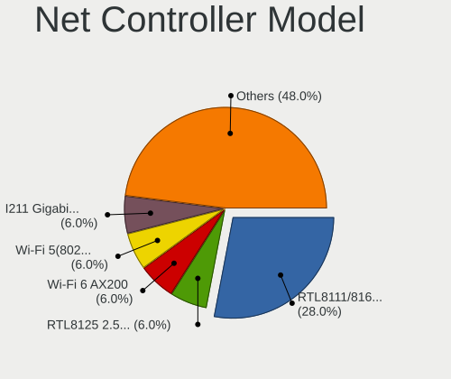

| Model                                                                          | Desktops | Percent |
|--------------------------------------------------------------------------------|----------|---------|
| Realtek RTL8111/8168/8211/8411 PCI Express Gigabit Ethernet Controller         | 14       | 28%     |
| Realtek RTL8125 2.5GbE Controller                                              | 3        | 6%      |
| Intel Wi-Fi 6 AX200                                                            | 3        | 6%      |
| Intel Wi-Fi 5(802.11ac) Wireless-AC 9x6x [Thunder Peak]                        | 3        | 6%      |
| Intel I211 Gigabit Network Connection                                          | 3        | 6%      |
| Realtek RTL8821AE 802.11ac PCIe Wireless Network Adapter                       | 2        | 4%      |
| Realtek RTL8153 Gigabit Ethernet Adapter                                       | 2        | 4%      |
| TP-Link 802.11ac WLAN Adapter                                                  | 1        | 2%      |
| Realtek RTL8822BE 802.11a/b/g/n/ac WiFi adapter                                | 1        | 2%      |
| Realtek RTL8821CE 802.11ac PCIe Wireless Network Adapter                       | 1        | 2%      |
| Realtek RTL8192EU 802.11b/g/n WLAN Adapter                                     | 1        | 2%      |
| Realtek RTL8192CE PCIe Wireless Network Adapter                                | 1        | 2%      |
| Realtek RTL8169 PCI Gigabit Ethernet Controller                                | 1        | 2%      |
| Realtek RTL810xE PCI Express Fast Ethernet controller                          | 1        | 2%      |
| Realtek Killer E3000 2.5GbE Controller                                         | 1        | 2%      |
| Realtek 802.11ac NIC                                                           | 1        | 2%      |
| Ralink MT7601U Wireless Adapter                                                | 1        | 2%      |
| Microsoft Wireless XBox Controller Dongle                                      | 1        | 2%      |
| MediaTek MT7922 802.11ax PCI Express Wireless Network Adapter                  | 1        | 2%      |
| Intel Wireless 8265 / 8275                                                     | 1        | 2%      |
| Intel Ethernet Connection I217-LM                                              | 1        | 2%      |
| Intel Ethernet Connection (7) I219-V                                           | 1        | 2%      |
| Intel Ethernet Connection (3) I219-LM                                          | 1        | 2%      |
| Intel Ethernet Connection (2) I219-V                                           | 1        | 2%      |
| Intel Ethernet Connection (2) I218-V                                           | 1        | 2%      |
| Broadcom Limited NetLink BCM5787 Gigabit Ethernet PCI Express                  | 1        | 2%      |
| Aquantia AQtion AQC107 NBase-T/IEEE 802.3an Ethernet Controller [Atlantic 10G] | 1        | 2%      |

Wireless Vendor
---------------

Wireless vendors

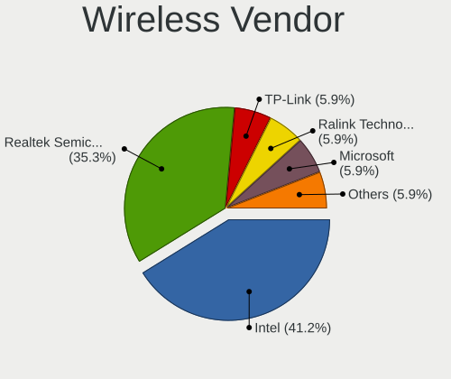

| Vendor                | Desktops | Percent |
|-----------------------|----------|---------|
| Intel                 | 7        | 41.18%  |
| Realtek Semiconductor | 6        | 35.29%  |
| TP-Link               | 1        | 5.88%   |
| Ralink Technology     | 1        | 5.88%   |
| Microsoft             | 1        | 5.88%   |
| MediaTek              | 1        | 5.88%   |

Wireless Model
--------------

Wireless models

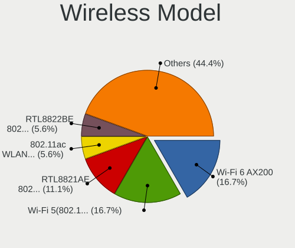

| Model                                                         | Desktops | Percent |
|---------------------------------------------------------------|----------|---------|
| Intel Wi-Fi 6 AX200                                           | 3        | 16.67%  |
| Intel Wi-Fi 5(802.11ac) Wireless-AC 9x6x [Thunder Peak]       | 3        | 16.67%  |
| Realtek RTL8821AE 802.11ac PCIe Wireless Network Adapter      | 2        | 11.11%  |
| TP-Link 802.11ac WLAN Adapter                                 | 1        | 5.56%   |
| Realtek RTL8822BE 802.11a/b/g/n/ac WiFi adapter               | 1        | 5.56%   |
| Realtek RTL8821CE 802.11ac PCIe Wireless Network Adapter      | 1        | 5.56%   |
| Realtek RTL8192EU 802.11b/g/n WLAN Adapter                    | 1        | 5.56%   |
| Realtek RTL8192CE PCIe Wireless Network Adapter               | 1        | 5.56%   |
| Realtek 802.11ac NIC                                          | 1        | 5.56%   |
| Ralink MT7601U Wireless Adapter                               | 1        | 5.56%   |
| Microsoft Wireless XBox Controller Dongle                     | 1        | 5.56%   |
| MediaTek MT7922 802.11ax PCI Express Wireless Network Adapter | 1        | 5.56%   |
| Intel Wireless 8265 / 8275                                    | 1        | 5.56%   |

Ethernet Vendor
---------------

Ethernet vendors

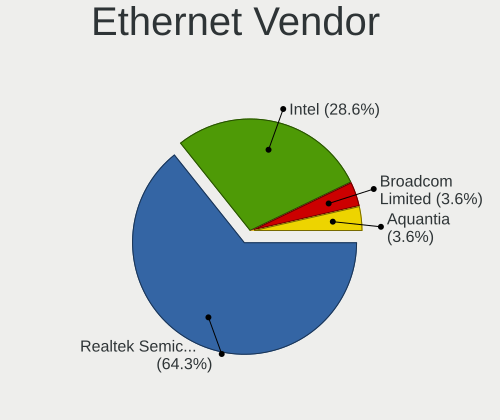

| Vendor                | Desktops | Percent |
|-----------------------|----------|---------|
| Realtek Semiconductor | 18       | 64.29%  |
| Intel                 | 8        | 28.57%  |
| Broadcom Limited      | 1        | 3.57%   |
| Aquantia              | 1        | 3.57%   |

Ethernet Model
--------------

Ethernet models

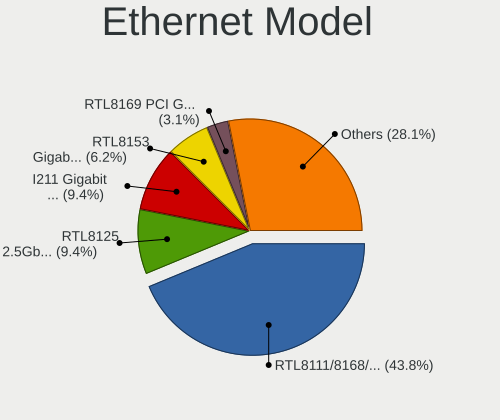

| Model                                                                          | Desktops | Percent |
|--------------------------------------------------------------------------------|----------|---------|
| Realtek RTL8111/8168/8211/8411 PCI Express Gigabit Ethernet Controller         | 14       | 43.75%  |
| Realtek RTL8125 2.5GbE Controller                                              | 3        | 9.38%   |
| Intel I211 Gigabit Network Connection                                          | 3        | 9.38%   |
| Realtek RTL8153 Gigabit Ethernet Adapter                                       | 2        | 6.25%   |
| Realtek RTL8169 PCI Gigabit Ethernet Controller                                | 1        | 3.13%   |
| Realtek RTL810xE PCI Express Fast Ethernet controller                          | 1        | 3.13%   |
| Realtek Killer E3000 2.5GbE Controller                                         | 1        | 3.13%   |
| Intel Ethernet Connection I217-LM                                              | 1        | 3.13%   |
| Intel Ethernet Connection (7) I219-V                                           | 1        | 3.13%   |
| Intel Ethernet Connection (3) I219-LM                                          | 1        | 3.13%   |
| Intel Ethernet Connection (2) I219-V                                           | 1        | 3.13%   |
| Intel Ethernet Connection (2) I218-V                                           | 1        | 3.13%   |
| Broadcom Limited NetLink BCM5787 Gigabit Ethernet PCI Express                  | 1        | 3.13%   |
| Aquantia AQtion AQC107 NBase-T/IEEE 802.3an Ethernet Controller [Atlantic 10G] | 1        | 3.13%   |

Net Controller Kind
-------------------

Ethernet, WiFi or modem

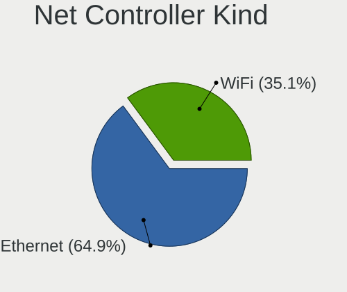

| Kind     | Desktops | Percent |
|----------|----------|---------|
| Ethernet | 27       | 64.29%  |
| WiFi     | 15       | 35.71%  |

Used Controller
---------------

Currently used network controller

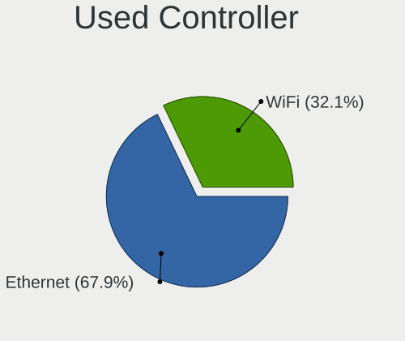

| Kind     | Desktops | Percent |
|----------|----------|---------|
| Ethernet | 19       | 67.86%  |
| WiFi     | 9        | 32.14%  |

NICs
----

Total network controllers on board

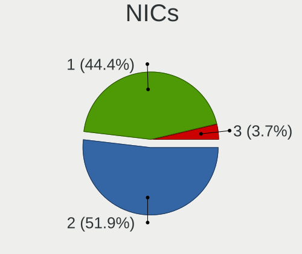

| Total | Desktops | Percent |
|-------|----------|---------|
| 2     | 14       | 51.85%  |
| 1     | 12       | 44.44%  |
| 3     | 1        | 3.7%    |

IPv6
----

IPv6 vs IPv4

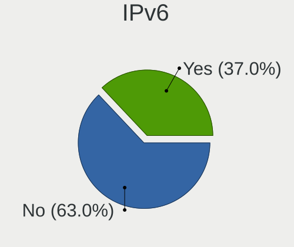

| Used | Desktops | Percent |
|------|----------|---------|
| No   | 17       | 62.96%  |
| Yes  | 10       | 37.04%  |

Bluetooth
---------

Bluetooth Vendor
----------------

Controller vendors

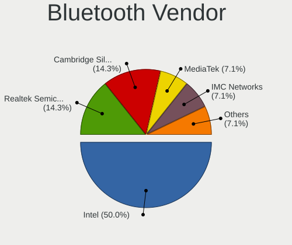

| Vendor                  | Desktops | Percent |
|-------------------------|----------|---------|
| Intel                   | 7        | 50%     |
| Realtek Semiconductor   | 2        | 14.29%  |
| Cambridge Silicon Radio | 2        | 14.29%  |
| MediaTek                | 1        | 7.14%   |
| IMC Networks            | 1        | 7.14%   |
| Actions                 | 1        | 7.14%   |

Bluetooth Model
---------------

Controller models

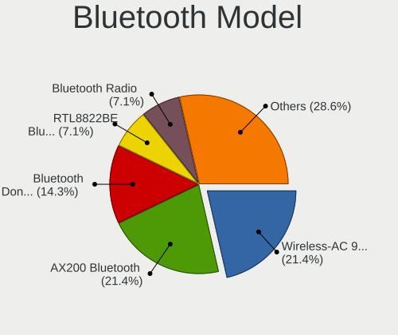

| Model                                               | Desktops | Percent |
|-----------------------------------------------------|----------|---------|
| Intel Wireless-AC 9260 Bluetooth Adapter            | 3        | 21.43%  |
| Intel AX200 Bluetooth                               | 3        | 21.43%  |
| Cambridge Silicon Radio Bluetooth Dongle (HCI mode) | 2        | 14.29%  |
| Realtek RTL8822BE Bluetooth 4.2 Adapter             | 1        | 7.14%   |
| Realtek Bluetooth Radio                             | 1        | 7.14%   |
| MediaTek Wireless_Device                            | 1        | 7.14%   |
| Intel Bluetooth wireless interface                  | 1        | 7.14%   |
| IMC Networks Bluetooth Radio                        | 1        | 7.14%   |
| Actions general adapter                             | 1        | 7.14%   |

Sound
-----

Sound Vendor
------------

Sound card vendors

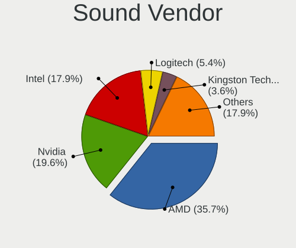

| Vendor              | Desktops | Percent |
|---------------------|----------|---------|
| AMD                 | 20       | 35.71%  |
| Nvidia              | 11       | 19.64%  |
| Intel               | 10       | 17.86%  |
| Logitech            | 3        | 5.36%   |
| Kingston Technology | 2        | 3.57%   |
| C-Media Electronics | 2        | 3.57%   |
| Texas Instruments   | 1        | 1.79%   |
| Samson Technologies | 1        | 1.79%   |
| Oculus VR           | 1        | 1.79%   |
| KTMicro             | 1        | 1.79%   |
| JMTek               | 1        | 1.79%   |
| Focusrite-Novation  | 1        | 1.79%   |
| Blue Microphones    | 1        | 1.79%   |
| Astro Gaming        | 1        | 1.79%   |

Sound Model
-----------

Sound card models

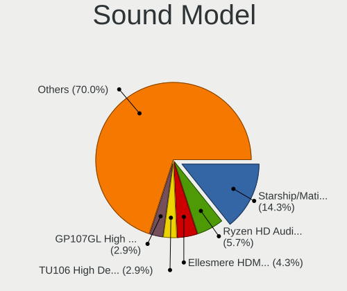

| Model                                                                      | Desktops | Percent |
|----------------------------------------------------------------------------|----------|---------|
| AMD Starship/Matisse HD Audio Controller                                   | 10       | 14.29%  |
| AMD Ryzen HD Audio Controller                                              | 4        | 5.71%   |
| AMD Ellesmere HDMI Audio [Radeon RX 470/480 / 570/580/590]                 | 3        | 4.29%   |
| Nvidia TU106 High Definition Audio Controller                              | 2        | 2.86%   |
| Nvidia GP107GL High Definition Audio Controller                            | 2        | 2.86%   |
| Intel NM10/ICH7 Family High Definition Audio Controller                    | 2        | 2.86%   |
| Intel 6 Series/C200 Series Chipset Family High Definition Audio Controller | 2        | 2.86%   |
| AMD Oland/Hainan/Cape Verde/Pitcairn HDMI Audio [Radeon HD 7000 Series]    | 2        | 2.86%   |
| AMD Navi 31 HDMI/DP Audio                                                  | 2        | 2.86%   |
| AMD Navi 10 HDMI Audio                                                     | 2        | 2.86%   |
| AMD Kaveri HDMI/DP Audio Controller                                        | 2        | 2.86%   |
| AMD FCH Azalia Controller                                                  | 2        | 2.86%   |
| Texas Instruments PCM2902 Audio Codec                                      | 1        | 1.43%   |
| Samson Technologies C01U condenser microphone                              | 1        | 1.43%   |
| Oculus VR Rift CV1 Audio                                                   | 1        | 1.43%   |
| Nvidia TU116 High Definition Audio Controller                              | 1        | 1.43%   |
| Nvidia TU102 High Definition Audio Controller                              | 1        | 1.43%   |
| Nvidia GP106 High Definition Audio Controller                              | 1        | 1.43%   |
| Nvidia GM107 High Definition Audio Controller [GeForce 940MX]              | 1        | 1.43%   |
| Nvidia GA106 High Definition Audio Controller                              | 1        | 1.43%   |
| Nvidia GA104 High Definition Audio Controller                              | 1        | 1.43%   |
| Nvidia GA102 High Definition Audio Controller                              | 1        | 1.43%   |
| Logitech Logitech USB Microphone                                           | 1        | 1.43%   |
| Logitech H390 headset with microphone                                      | 1        | 1.43%   |
| Logitech G432 Gaming Headset                                               | 1        | 1.43%   |
| KTMicro K38                                                                | 1        | 1.43%   |
| Kingston Technology HyperX QuadCast S                                      | 1        | 1.43%   |
| Kingston Technology HyperX QuadCast                                        | 1        | 1.43%   |
| JMTek USB PnP Audio Device                                                 | 1        | 1.43%   |
| Intel Xeon E3-1200 v3/4th Gen Core Processor HD Audio Controller           | 1        | 1.43%   |
| Intel Cannon Lake PCH cAVS                                                 | 1        | 1.43%   |
| Intel C62x HD Audio Controller                                             | 1        | 1.43%   |
| Intel 9 Series Chipset Family HD Audio Controller                          | 1        | 1.43%   |
| Intel 8 Series/C220 Series Chipset High Definition Audio Controller        | 1        | 1.43%   |
| Intel 200 Series PCH HD Audio                                              | 1        | 1.43%   |
| Intel 100 Series/C230 Series Chipset Family HD Audio Controller            | 1        | 1.43%   |
| Focusrite-Novation Scarlett 2i2 3rd Gen                                    | 1        | 1.43%   |
| C-Media Electronics Audio Adapter (Unitek Y-247A)                          | 1        | 1.43%   |
| C-Media Electronics Antlion USB adapter                                    | 1        | 1.43%   |
| Blue Microphones Yeti Nano                                                 | 1        | 1.43%   |

Memory
------

Memory Vendor
-------------

Memory module vendors

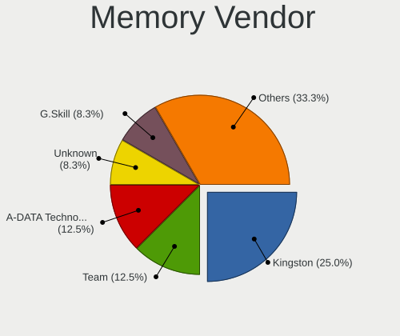

| Vendor              | Desktops | Percent |
|---------------------|----------|---------|
| Kingston            | 6        | 25%     |
| Team                | 3        | 12.5%   |
| A-DATA Technology   | 3        | 12.5%   |
| Unknown             | 2        | 8.33%   |
| G.Skill             | 2        | 8.33%   |
| Crucial             | 2        | 8.33%   |
| Corsair             | 2        | 8.33%   |
| SK hynix            | 1        | 4.17%   |
| Samsung Electronics | 1        | 4.17%   |
| Ramaxel Technology  | 1        | 4.17%   |
| Micron Technology   | 1        | 4.17%   |

Memory Model
------------

Memory module models

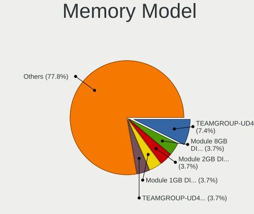

| Model                                                   | Desktops | Percent |
|---------------------------------------------------------|----------|---------|
| Team RAM TEAMGROUP-UD4-3200 8GB DIMM DDR4 3800MT/s      | 2        | 7.41%   |
| Unknown RAM Module 8GB DIMM DDR3 1600MT/s               | 1        | 3.7%    |
| Unknown RAM Module 2GB DIMM SDRAM                       | 1        | 3.7%    |
| Unknown RAM Module 1GB DIMM SDRAM                       | 1        | 3.7%    |
| Team RAM TEAMGROUP-UD4-3600 16GB DIMM DDR4 3600MT/s     | 1        | 3.7%    |
| SK hynix RAM HYMP512U64CP8-S6 1GB DIMM DDR2 800MT/s     | 1        | 3.7%    |
| SK hynix RAM HYMP125U64CP8-S6 2GB DIMM DDR2 49926MT/s   | 1        | 3.7%    |
| Samsung RAM M471A1K43CB1-CRC 8GB SODIMM DDR4 8400MT/s   | 1        | 3.7%    |
| Ramaxel RAM RMUA5120ME86H9F-2666 4GB DIMM DDR4 2667MT/s | 1        | 3.7%    |
| Micron RAM F6451U64F9333G 4GB DIMM DDR3 1333MT/s        | 1        | 3.7%    |
| Kingston RAM KHX2666C16/8G 8GiB DIMM DDR4 3466MT/s      | 1        | 3.7%    |
| Kingston RAM KF552C40-8 8GB DIMM DDR5 5200MT/s          | 1        | 3.7%    |
| Kingston RAM KF3600C16D4/16GX 16GB DIMM DDR4 3800MT/s   | 1        | 3.7%    |
| Kingston RAM KF3200C16D4/8GX 8GiB DIMM DDR4 3600MT/s    | 1        | 3.7%    |
| Kingston RAM CL16-20-20 D4-3200 16GB DIMM DDR4 3200MT/s | 1        | 3.7%    |
| Kingston RAM 9905743-019.A00G 8GB DIMM DDR4 3200MT/s    | 1        | 3.7%    |
| Kingston RAM 9905402-532.A00LF 4GB DIMM DDR3 1600MT/s   | 1        | 3.7%    |
| G.Skill RAM F4-3200C16-16GVK 16GB DIMM DDR4 3600MT/s    | 1        | 3.7%    |
| G.Skill RAM F4-3000C16-8GTZR 8GB DIMM DDR4 3200MT/s     | 1        | 3.7%    |
| Crucial RAM CT51264BA1339.M16F 4GB DIMM DDR3 1333MT/s   | 1        | 3.7%    |
| Crucial RAM BL8G36C16U4B.M8FE1 8GB DIMM DDR4 3733MT/s   | 1        | 3.7%    |
| Corsair RAM CMZ16GX3M2A1600C10 8GB DIMM DDR3 1600MT/s   | 1        | 3.7%    |
| Corsair RAM CMT16GX4M2K4266C19 8GB DIMM DDR4 2133MT/s   | 1        | 3.7%    |
| A-DATA RAM Module 8GB DIMM DDR4 2133MT/s                | 1        | 3.7%    |
| A-DATA RAM DDR4 3600 2OZ 8GB DIMM DDR4 2667MT/s         | 1        | 3.7%    |
| A-DATA RAM DDR4 3200 2OZ 8GB DIMM DDR4 3200MT/s         | 1        | 3.7%    |

Memory Kind
-----------

Memory module kinds

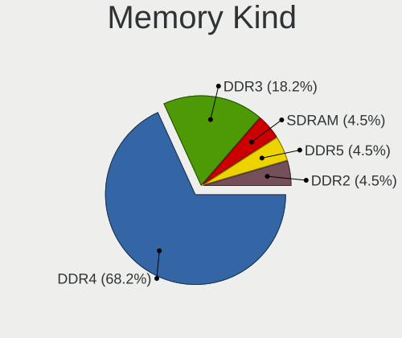

| Kind  | Desktops | Percent |
|-------|----------|---------|
| DDR4  | 15       | 68.18%  |
| DDR3  | 4        | 18.18%  |
| SDRAM | 1        | 4.55%   |
| DDR5  | 1        | 4.55%   |
| DDR2  | 1        | 4.55%   |

Memory Form Factor
------------------

Physical design of the memory module

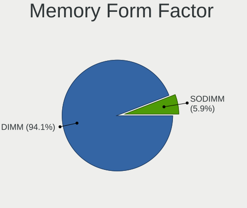

| Name   | Desktops | Percent |
|--------|----------|---------|
| DIMM   | 21       | 95.45%  |
| SODIMM | 1        | 4.55%   |

Memory Size
-----------

Memory module size

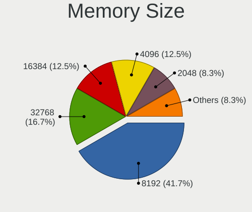

| Size  | Desktops | Percent |
|-------|----------|---------|
| 8192  | 10       | 41.67%  |
| 32768 | 4        | 16.67%  |
| 16384 | 3        | 12.5%   |
| 4096  | 3        | 12.5%   |
| 2048  | 2        | 8.33%   |
| 1024  | 2        | 8.33%   |

Memory Speed
------------

Memory module speed

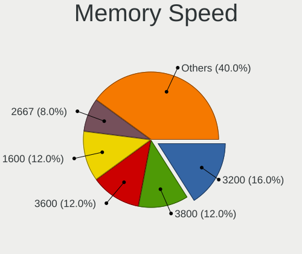

| Speed   | Desktops | Percent |
|---------|----------|---------|
| 3200    | 4        | 16%     |
| 3800    | 3        | 12%     |
| 3600    | 3        | 12%     |
| 1600    | 3        | 12%     |
| 2667    | 2        | 8%      |
| 2133    | 2        | 8%      |
| 49926   | 1        | 4%      |
| 8400    | 1        | 4%      |
| 5200    | 1        | 4%      |
| 3733    | 1        | 4%      |
| 3466    | 1        | 4%      |
| 1333    | 1        | 4%      |
| 800     | 1        | 4%      |
| Unknown | 1        | 4%      |

Printers & scanners
-------------------

Printer Vendor
--------------

Printer device vendors

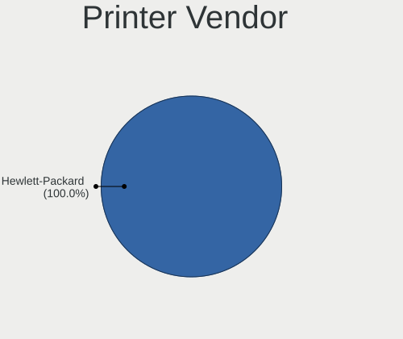

| Vendor          | Desktops | Percent |
|-----------------|----------|---------|
| Hewlett-Packard | 1        | 100%    |

Printer Model
-------------

Printer device models

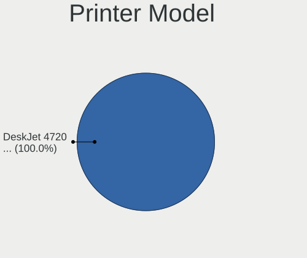

| Model                  | Desktops | Percent |
|------------------------|----------|---------|
| HP DeskJet 4720 series | 1        | 100%    |

Scanner Vendor
--------------

Scanner device vendors

Zero info for selected period =(

Scanner Model
-------------

Scanner device models

Zero info for selected period =(

Camera
------

Camera Vendor
-------------

Camera device vendors

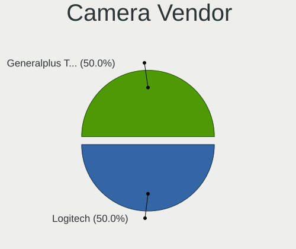

| Vendor                 | Desktops | Percent |
|------------------------|----------|---------|
| Samsung Electronics    | 2        | 33.33%  |
| Generalplus Technology | 2        | 33.33%  |
| Logitech               | 1        | 16.67%  |
| ARC International      | 1        | 16.67%  |

Camera Model
------------

Camera device models

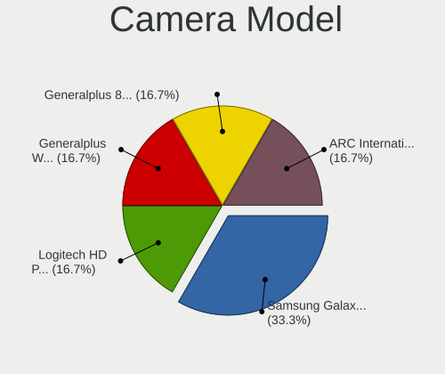

| Model                                    | Desktops | Percent |
|------------------------------------------|----------|---------|
| Samsung Galaxy series, misc. (MTP mode)  | 2        | 33.33%  |
| Logitech HD Pro Webcam C920              | 1        | 16.67%  |
| Generalplus WEB CAM                      | 1        | 16.67%  |
| Generalplus 808 Camera #9 (web-cam mode) | 1        | 16.67%  |
| ARC International Camera                 | 1        | 16.67%  |

Security
--------

Fingerprint Vendor
------------------

Fingerprint sensor vendors

Zero info for selected period =(

Fingerprint Model
-----------------

Fingerprint sensor models

Zero info for selected period =(

Chipcard Vendor
---------------

Chipcard module vendors

Zero info for selected period =(

Chipcard Model
--------------

Chipcard module models

Zero info for selected period =(

Unsupported
-----------

Unsupported Devices
-------------------

Total unsupported devices on board

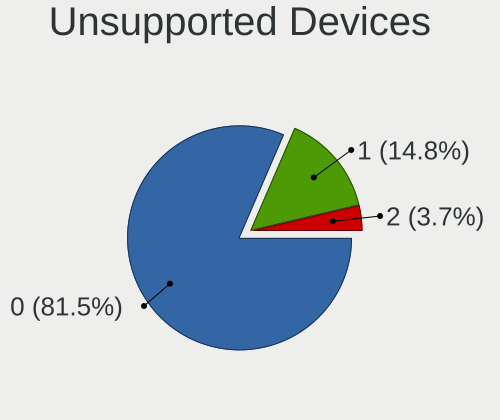

| Total | Desktops | Percent |
|-------|----------|---------|
| 0     | 22       | 81.48%  |
| 1     | 4        | 14.81%  |
| 2     | 1        | 3.7%    |

Unsupported Device Types
------------------------

Types of unsupported devices

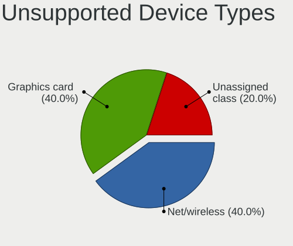

| Type             | Desktops | Percent |
|------------------|----------|---------|
| Net/wireless     | 2        | 40%     |
| Graphics card    | 2        | 40%     |
| Unassigned class | 1        | 20%     |

