Archcraft - Tested Hardware & Statistics (Desktops)
---------------------------------------------------

A project to collect tested hardware configurations for Archcraft.

Anyone can contribute to this report by the [hw-probe](https://github.com/linuxhw/hw-probe) tool:

    sudo -E hw-probe -all -upload

Please contribute! Especially if your hardware is rare.

Contents
--------

* [ Test Cases ](#test-cases)

* [ System ](#system)
  - [ OS                       ](#os)
  - [ OS Family                ](#os-family)
  - [ Kernel                   ](#kernel)
  - [ Kernel Family            ](#kernel-family)
  - [ Kernel Major Ver.        ](#kernel-major-ver)
  - [ Arch                     ](#arch)
  - [ DE                       ](#de)
  - [ Display Server           ](#display-server)
  - [ Display Manager          ](#display-manager)
  - [ OS Lang                  ](#os-lang)
  - [ Boot Mode                ](#boot-mode)
  - [ Filesystem               ](#filesystem)
  - [ Part. scheme             ](#part-scheme)
  - [ Dual Boot with Linux/BSD ](#dual-boot-with-linuxbsd)
  - [ Dual Boot (Win)          ](#dual-boot-win)

* [ Board ](#board)
  - [ Vendor                   ](#vendor)
  - [ Model                    ](#model)
  - [ Model Family             ](#model-family)
  - [ MFG Year                 ](#mfg-year)
  - [ Form Factor              ](#form-factor)
  - [ Secure Boot              ](#secure-boot)
  - [ Coreboot                 ](#coreboot)
  - [ RAM Size                 ](#ram-size)
  - [ RAM Used                 ](#ram-used)
  - [ Total Drives             ](#total-drives)
  - [ Has CD-ROM               ](#has-cd-rom)
  - [ Has Ethernet             ](#has-ethernet)
  - [ Has WiFi                 ](#has-wifi)
  - [ Has Bluetooth            ](#has-bluetooth)

* [ Location ](#location)
  - [ Country                  ](#country)
  - [ City                     ](#city)

* [ Drives ](#drives)
  - [ Drive Vendor             ](#drive-vendor)
  - [ Drive Model              ](#drive-model)
  - [ HDD Vendor               ](#hdd-vendor)
  - [ SSD Vendor               ](#ssd-vendor)
  - [ Drive Kind               ](#drive-kind)
  - [ Drive Connector          ](#drive-connector)
  - [ Drive Size               ](#drive-size)
  - [ Space Total              ](#space-total)
  - [ Space Used               ](#space-used)
  - [ Malfunc. Drives          ](#malfunc-drives)
  - [ Malfunc. Drive Vendor    ](#malfunc-drive-vendor)
  - [ Malfunc. HDD Vendor      ](#malfunc-hdd-vendor)
  - [ Malfunc. Drive Kind      ](#malfunc-drive-kind)
  - [ Failed Drives            ](#failed-drives)
  - [ Failed Drive Vendor      ](#failed-drive-vendor)
  - [ Drive Status             ](#drive-status)

* [ Storage controller ](#storage-controller)
  - [ Storage Vendor           ](#storage-vendor)
  - [ Storage Model            ](#storage-model)
  - [ Storage Kind             ](#storage-kind)

* [ Processor ](#processor)
  - [ CPU Vendor               ](#cpu-vendor)
  - [ CPU Model                ](#cpu-model)
  - [ CPU Model Family         ](#cpu-model-family)
  - [ CPU Cores                ](#cpu-cores)
  - [ CPU Sockets              ](#cpu-sockets)
  - [ CPU Threads              ](#cpu-threads)
  - [ CPU Op-Modes             ](#cpu-op-modes)
  - [ CPU Microcode            ](#cpu-microcode)
  - [ CPU Microarch            ](#cpu-microarch)

* [ Graphics ](#graphics)
  - [ GPU Vendor               ](#gpu-vendor)
  - [ GPU Model                ](#gpu-model)
  - [ GPU Combo                ](#gpu-combo)
  - [ GPU Driver               ](#gpu-driver)
  - [ GPU Memory               ](#gpu-memory)

* [ Monitor ](#monitor)
  - [ Monitor Vendor           ](#monitor-vendor)
  - [ Monitor Model            ](#monitor-model)
  - [ Monitor Resolution       ](#monitor-resolution)
  - [ Monitor Diagonal         ](#monitor-diagonal)
  - [ Monitor Width            ](#monitor-width)
  - [ Aspect Ratio             ](#aspect-ratio)
  - [ Monitor Area             ](#monitor-area)
  - [ Pixel Density            ](#pixel-density)
  - [ Multiple Monitors        ](#multiple-monitors)

* [ Network ](#network)
  - [ Net Controller Vendor    ](#net-controller-vendor)
  - [ Net Controller Model     ](#net-controller-model)
  - [ Wireless Vendor          ](#wireless-vendor)
  - [ Wireless Model           ](#wireless-model)
  - [ Ethernet Vendor          ](#ethernet-vendor)
  - [ Ethernet Model           ](#ethernet-model)
  - [ Net Controller Kind      ](#net-controller-kind)
  - [ Used Controller          ](#used-controller)
  - [ NICs                     ](#nics)
  - [ IPv6                     ](#ipv6)

* [ Bluetooth ](#bluetooth)
  - [ Bluetooth Vendor         ](#bluetooth-vendor)
  - [ Bluetooth Model          ](#bluetooth-model)

* [ Sound ](#sound)
  - [ Sound Vendor             ](#sound-vendor)
  - [ Sound Model              ](#sound-model)

* [ Memory ](#memory)
  - [ Memory Vendor            ](#memory-vendor)
  - [ Memory Model             ](#memory-model)
  - [ Memory Kind              ](#memory-kind)
  - [ Memory Form Factor       ](#memory-form-factor)
  - [ Memory Size              ](#memory-size)
  - [ Memory Speed             ](#memory-speed)

* [ Printers & scanners ](#printers--scanners)
  - [ Printer Vendor           ](#printer-vendor)
  - [ Printer Model            ](#printer-model)
  - [ Scanner Vendor           ](#scanner-vendor)
  - [ Scanner Model            ](#scanner-model)

* [ Camera ](#camera)
  - [ Camera Vendor            ](#camera-vendor)
  - [ Camera Model             ](#camera-model)

* [ Security ](#security)
  - [ Fingerprint Vendor       ](#fingerprint-vendor)
  - [ Fingerprint Model        ](#fingerprint-model)
  - [ Chipcard Vendor          ](#chipcard-vendor)
  - [ Chipcard Model           ](#chipcard-model)

* [ Unsupported ](#unsupported)
  - [ Unsupported Devices      ](#unsupported-devices)
  - [ Unsupported Device Types ](#unsupported-device-types)

Test Cases
----------

Total: 14

| Vendor   | Model                       | Probe                                                      | Date         |
|----------|-----------------------------|------------------------------------------------------------|--------------|
| ASRock   | B550M Pro4                  | [8529d01687](https://linux-hardware.org/?probe=8529d01687) | May 27, 2023 |
| ASRock   | B550M Pro4                  | [8301ca5155](https://linux-hardware.org/?probe=8301ca5155) | May 27, 2023 |
| ASUSTek  | PRIME X470-PRO              | [f9df27503f](https://linux-hardware.org/?probe=f9df27503f) | Feb 03, 2023 |
| ASUSTek  | H110M-E/M.2                 | [82584d7e83](https://linux-hardware.org/?probe=82584d7e83) | Dec 20, 2022 |
| ASUSTek  | H110M-E/M.2                 | [fb73fb5efc](https://linux-hardware.org/?probe=fb73fb5efc) | Oct 18, 2022 |
| ASUSTek  | H110M-E/M.2                 | [77fd87ca91](https://linux-hardware.org/?probe=77fd87ca91) | Oct 18, 2022 |
| Gigabyte | B550I AORUS PRO AX          | [704da5b600](https://linux-hardware.org/?probe=704da5b600) | Oct 07, 2022 |
| Gigabyte | F2A68HM-DS2                 | [98e8df2d3d](https://linux-hardware.org/?probe=98e8df2d3d) | Sep 21, 2022 |
| Lenovo   | 3111 SDK0J40705 WIN 3425... | [543fe6b6a7](https://linux-hardware.org/?probe=543fe6b6a7) | Aug 07, 2022 |
| MSI      | MAG B550 TOMAHAWK           | [bede15789b](https://linux-hardware.org/?probe=bede15789b) | Jun 02, 2022 |
| ECS      | G31T-M                      | [3820396d91](https://linux-hardware.org/?probe=3820396d91) | Jan 29, 2022 |
| ASRock   | H97M Pro4                   | [232f2dad91](https://linux-hardware.org/?probe=232f2dad91) | Dec 15, 2021 |
| ASUSTek  | ROG DOMINUS EXTREME         | [0adc8fc04d](https://linux-hardware.org/?probe=0adc8fc04d) | Oct 12, 2021 |
| ASUSTek  | ROG DOMINUS EXTREME         | [b977489e9c](https://linux-hardware.org/?probe=b977489e9c) | Oct 12, 2021 |

System
------

OS
--

Installed operating systems

| Name              | Desktops | Percent |
|-------------------|----------|---------|
| Archcraft Rolling | 9        | 90%     |
| Archcraft         | 1        | 10%     |

OS Family
---------

OS without a version

| Name      | Desktops | Percent |
|-----------|----------|---------|
| Archcraft | 10       | 100%    |

Kernel
------

Version of the Linux kernel

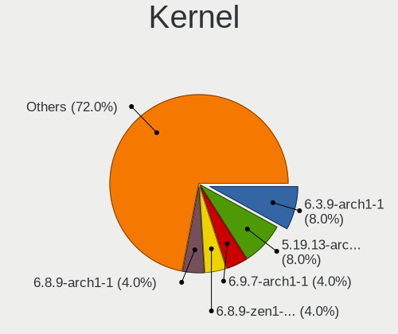

| Version               | Desktops | Percent |
|-----------------------|----------|---------|
| 5.19.13-arch1-1       | 2        | 18.18%  |
| 6.3.4-arch1-1         | 1        | 9.09%   |
| 6.1.9-x64v1-xanmod1-1 | 1        | 9.09%   |
| 6.0.12-arch1-1        | 1        | 9.09%   |
| 5.19.9-arch1-1        | 1        | 9.09%   |
| 5.18.16-arch1-1       | 1        | 9.09%   |
| 5.18.0-arch1-1        | 1        | 9.09%   |
| 5.16.3-arch1-1        | 1        | 9.09%   |
| 5.15.7-zen1-1-zen     | 1        | 9.09%   |
| 5.14.10-arch1-1       | 1        | 9.09%   |

Kernel Family
-------------

Linux kernel without a distro release

| Version | Desktops | Percent |
|---------|----------|---------|
| 5.19.13 | 2        | 18.18%  |
| 6.3.4   | 1        | 9.09%   |
| 6.1.9   | 1        | 9.09%   |
| 6.0.12  | 1        | 9.09%   |
| 5.19.9  | 1        | 9.09%   |
| 5.18.16 | 1        | 9.09%   |
| 5.18.0  | 1        | 9.09%   |
| 5.16.3  | 1        | 9.09%   |
| 5.15.7  | 1        | 9.09%   |
| 5.14.10 | 1        | 9.09%   |

Kernel Major Ver.
-----------------

Linux kernel major version

| Version | Desktops | Percent |
|---------|----------|---------|
| 5.19    | 3        | 27.27%  |
| 5.18    | 2        | 18.18%  |
| 6.3     | 1        | 9.09%   |
| 6.1     | 1        | 9.09%   |
| 6.0     | 1        | 9.09%   |
| 5.16    | 1        | 9.09%   |
| 5.15    | 1        | 9.09%   |
| 5.14    | 1        | 9.09%   |

Arch
----

OS architecture (x86_64, i586, etc.)

| Name   | Desktops | Percent |
|--------|----------|---------|
| x86_64 | 10       | 100%    |

DE
--

Desktop Environment

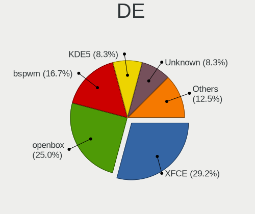

| Name    | Desktops | Percent |
|---------|----------|---------|
| openbox | 4        | 40%     |
| XFCE    | 2        | 20%     |
| qtile   | 1        | 10%     |
| KDE5    | 1        | 10%     |
| bspwm   | 1        | 10%     |
| Unknown | 1        | 10%     |

Display Server
--------------

X11 or Wayland

| Name    | Desktops | Percent |
|---------|----------|---------|
| X11     | 9        | 90%     |
| Wayland | 1        | 10%     |

Display Manager
---------------

SDDM, LightDM, etc.

| Name    | Desktops | Percent |
|---------|----------|---------|
| SDDM    | 8        | 80%     |
| LightDM | 1        | 10%     |
| Unknown | 1        | 10%     |

OS Lang
-------

Language

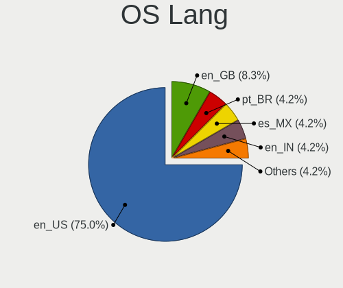

| Lang  | Desktops | Percent |
|-------|----------|---------|
| en_US | 6        | 60%     |
| en_GB | 2        | 20%     |
| pt_BR | 1        | 10%     |
| es_MX | 1        | 10%     |

Boot Mode
---------

EFI or BIOS

| Mode | Desktops | Percent |
|------|----------|---------|
| EFI  | 7        | 70%     |
| BIOS | 3        | 30%     |

Filesystem
----------

Type of filesystem

| Type  | Desktops | Percent |
|-------|----------|---------|
| Ext4  | 5        | 50%     |
| Btrfs | 4        | 40%     |
| Xfs   | 1        | 10%     |

Part. scheme
------------

Scheme of partitioning

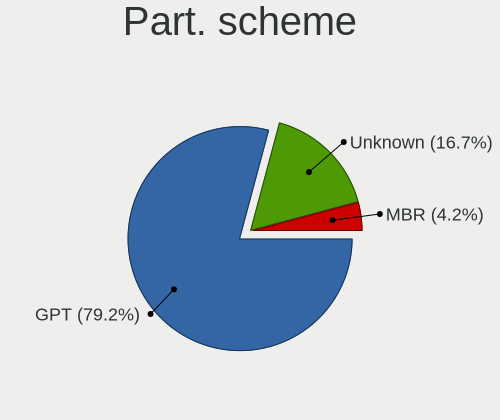

| Type    | Desktops | Percent |
|---------|----------|---------|
| GPT     | 8        | 80%     |
| MBR     | 1        | 10%     |
| Unknown | 1        | 10%     |

Dual Boot with Linux/BSD
------------------------

Hosting more than one Linux/BSD

| Dual boot | Desktops | Percent |
|-----------|----------|---------|
| No        | 7        | 70%     |
| Yes       | 3        | 30%     |

Dual Boot (Win)
---------------

Hosting Linux and Windows

| Dual boot | Desktops | Percent |
|-----------|----------|---------|
| Yes       | 7        | 70%     |
| No        | 3        | 30%     |

Board
-----

Vendor
------

Motherboard manufacturer

| Name                | Desktops | Percent |
|---------------------|----------|---------|
| ASUSTek Computer    | 3        | 30%     |
| Gigabyte Technology | 2        | 20%     |
| ASRock              | 2        | 20%     |
| MSI                 | 1        | 10%     |
| Lenovo              | 1        | 10%     |
| ECS                 | 1        | 10%     |

Model
-----

Motherboard model

| Name                                | Desktops | Percent |
|-------------------------------------|----------|---------|
| MSI MS-7C91                         | 1        | 10%     |
| Lenovo ThinkCentre M710q 10MR0047US | 1        | 10%     |
| Gigabyte F2A68HM-DS2                | 1        | 10%     |
| Gigabyte B550I AORUS PRO AX         | 1        | 10%     |
| ECS G31T-M                          | 1        | 10%     |
| ASUS ROG DOMINUS EXTREME            | 1        | 10%     |
| ASUS PRIME X470-PRO                 | 1        | 10%     |
| ASUS H110M-E/M.2                    | 1        | 10%     |
| ASRock H97M Pro4                    | 1        | 10%     |
| ASRock B550M Pro4                   | 1        | 10%     |

Model Family
------------

Motherboard model prefix

| Name                 | Desktops | Percent |
|----------------------|----------|---------|
| MSI MS-7C91          | 1        | 10%     |
| Lenovo ThinkCentre   | 1        | 10%     |
| Gigabyte F2A68HM-DS2 | 1        | 10%     |
| Gigabyte B550I       | 1        | 10%     |
| ECS G31T-M           | 1        | 10%     |
| ASUS ROG             | 1        | 10%     |
| ASUS PRIME           | 1        | 10%     |
| ASUS H110M-E         | 1        | 10%     |
| ASRock H97M          | 1        | 10%     |
| ASRock B550M         | 1        | 10%     |

MFG Year
--------

Motherboard manufacture year

| Year | Desktops | Percent |
|------|----------|---------|
| 2020 | 3        | 30%     |
| 2014 | 2        | 20%     |
| 2019 | 1        | 10%     |
| 2018 | 1        | 10%     |
| 2017 | 1        | 10%     |
| 2016 | 1        | 10%     |
| 2007 | 1        | 10%     |

Form Factor
-----------

Physical design of the computer

| Name    | Desktops | Percent |
|---------|----------|---------|
| Desktop | 10       | 100%    |

Secure Boot
-----------

Enabled or disabled

| State    | Desktops | Percent |
|----------|----------|---------|
| Disabled | 10       | 100%    |

Coreboot
--------

Have coreboot on board

| Used | Desktops | Percent |
|------|----------|---------|
| No   | 10       | 100%    |

RAM Size
--------

Total RAM memory

| Size in GB  | Desktops | Percent |
|-------------|----------|---------|
| 32.01-64.0  | 4        | 40%     |
| 4.01-8.0    | 3        | 30%     |
| 3.01-4.0    | 1        | 10%     |
| 64.01-256.0 | 1        | 10%     |
| 16.01-24.0  | 1        | 10%     |

RAM Used
--------

Used RAM memory

| Used GB   | Desktops | Percent |
|-----------|----------|---------|
| 3.01-4.0  | 3        | 27.27%  |
| 2.01-3.0  | 3        | 27.27%  |
| 4.01-8.0  | 2        | 18.18%  |
| 1.01-2.0  | 2        | 18.18%  |
| 8.01-16.0 | 1        | 9.09%   |

Total Drives
------------

Number of drives on board

| Drives | Desktops | Percent |
|--------|----------|---------|
| 2      | 3        | 30%     |
| 5      | 2        | 20%     |
| 4      | 2        | 20%     |
| 3      | 2        | 20%     |
| 1      | 1        | 10%     |

Has CD-ROM
----------

Has CD-ROM on board

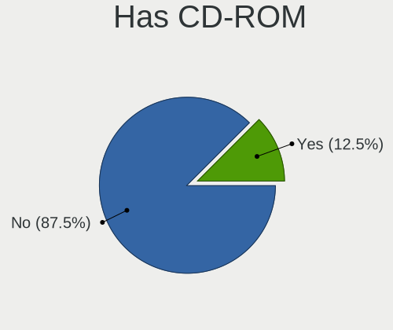

| Presented | Desktops | Percent |
|-----------|----------|---------|
| No        | 9        | 90%     |
| Yes       | 1        | 10%     |

Has Ethernet
------------

Has Ethernet on board

| Presented | Desktops | Percent |
|-----------|----------|---------|
| Yes       | 10       | 100%    |

Has WiFi
--------

Has WiFi module

| Presented | Desktops | Percent |
|-----------|----------|---------|
| Yes       | 5        | 50%     |
| No        | 5        | 50%     |

Has Bluetooth
-------------

Has Bluetooth module

| Presented | Desktops | Percent |
|-----------|----------|---------|
| No        | 6        | 60%     |
| Yes       | 4        | 40%     |

Location
--------

Country
-------

Geographic location (country)

| Country  | Desktops | Percent |
|----------|----------|---------|
| USA      | 3        | 30%     |
| UK       | 2        | 20%     |
| Slovakia | 1        | 10%     |
| Mexico   | 1        | 10%     |
| Hungary  | 1        | 10%     |
| Czechia  | 1        | 10%     |
| Brazil   | 1        | 10%     |

City
----

Geographic location (city)

| City          | Desktops | Percent |
|---------------|----------|---------|
| Tábor        | 1        | 10%     |
| Osasco        | 1        | 10%     |
| Milton Keynes | 1        | 10%     |
| Manchester    | 1        | 10%     |
| Guadalajara   | 1        | 10%     |
| Frisco        | 1        | 10%     |
| Čadca        | 1        | 10%     |
| Budapest      | 1        | 10%     |
| Atlanta       | 1        | 10%     |
| Abilene       | 1        | 10%     |

Drives
------

Drive Vendor
------------

Hard drive vendors

| Vendor              | Desktops | Drives | Percent |
|---------------------|----------|--------|---------|
| WDC                 | 4        | 4      | 15.38%  |
| Seagate             | 4        | 7      | 15.38%  |
| Samsung Electronics | 3        | 3      | 11.54%  |
| Phison Electronics  | 2        | 2      | 7.69%   |
| Kingston            | 2        | 2      | 7.69%   |
| Intel               | 2        | 5      | 7.69%   |
| Toshiba             | 1        | 1      | 3.85%   |
| Sandisk             | 1        | 1      | 3.85%   |
| ROG                 | 1        | 1      | 3.85%   |
| Patriot             | 1        | 1      | 3.85%   |
| Hitachi             | 1        | 1      | 3.85%   |
| Crucial             | 1        | 1      | 3.85%   |
| China               | 1        | 2      | 3.85%   |
| Apacer              | 1        | 1      | 3.85%   |
| A-DATA Technology   | 1        | 2      | 3.85%   |

Drive Model
-----------

Hard drive models

| Model                                               | Desktops | Percent |
|-----------------------------------------------------|----------|---------|
| Samsung NVMe SSD Controller SM981/PM981/PM983 256GB | 2        | 7.41%   |
| WDC WD5000AAKX-75U6AA0 500GB                        | 1        | 3.7%    |
| WDC WD5000AAKX-08U6AA0 500GB                        | 1        | 3.7%    |
| WDC WD3200BPVT-22JJ5T0 320GB                        | 1        | 3.7%    |
| WDC WD10EZEX-22RKKA0 1TB                            | 1        | 3.7%    |
| Toshiba DT01ACA200 2TB                              | 1        | 3.7%    |
| Seagate ST6000DM003-2CY186 6TB                      | 1        | 3.7%    |
| Seagate ST3500410AS 500GB                           | 1        | 3.7%    |
| Seagate ST320LM001 HN-M320MBB 320GB                 | 1        | 3.7%    |
| Seagate ST31500341AS 1TB                            | 1        | 3.7%    |
| Seagate ST1000DM010-2EP102 1TB                      | 1        | 3.7%    |
| Sandisk WD_BLACK SN770 1TB                          | 1        | 3.7%    |
| Samsung SSD 970 EVO Plus 1TB                        | 1        | 3.7%    |
| ROG ESD-S1C 1TB                                     | 1        | 3.7%    |
| Phison E16 PCIe4 NVMe Controller 1TB                | 1        | 3.7%    |
| Phison E12 NVMe Controller 256GB                    | 1        | 3.7%    |
| Patriot Burst 120GB SSD                             | 1        | 3.7%    |
| Kingston SFYRS500G 500GB                            | 1        | 3.7%    |
| Kingston SA400M8240G 240GB SSD                      | 1        | 3.7%    |
| Intel SSDSC2KW256G8 256GB                           | 1        | 3.7%    |
| Intel SSDPE21D480GA 480GB                           | 1        | 3.7%    |
| Hitachi HTS545050A7E380 500GB                       | 1        | 3.7%    |
| Crucial M4-CT064M4SSD2 64GB                         | 1        | 3.7%    |
| China SATA SSD 512GB                                | 1        | 3.7%    |
| Apacer AS350 128GB SSD                              | 1        | 3.7%    |
| A-DATA SU650 240GB SSD                              | 1        | 3.7%    |

HDD Vendor
----------

Hard disk drive vendors

| Vendor  | Desktops | Drives | Percent |
|---------|----------|--------|---------|
| WDC     | 4        | 4      | 40%     |
| Seagate | 4        | 7      | 40%     |
| Toshiba | 1        | 1      | 10%     |
| Hitachi | 1        | 1      | 10%     |

SSD Vendor
----------

Solid state drive vendors

| Vendor            | Desktops | Drives | Percent |
|-------------------|----------|--------|---------|
| Patriot           | 1        | 1      | 14.29%  |
| Kingston          | 1        | 1      | 14.29%  |
| Intel             | 1        | 1      | 14.29%  |
| Crucial           | 1        | 1      | 14.29%  |
| China             | 1        | 2      | 14.29%  |
| Apacer            | 1        | 1      | 14.29%  |
| A-DATA Technology | 1        | 2      | 14.29%  |

Drive Kind
----------

HDD or SSD

| Kind    | Desktops | Drives | Percent |
|---------|----------|--------|---------|
| HDD     | 7        | 13     | 36.84%  |
| NVMe    | 6        | 11     | 31.58%  |
| SSD     | 5        | 9      | 26.32%  |
| Unknown | 1        | 1      | 5.26%   |

Drive Connector
---------------

SATA, SAS, NVMe, etc.

| Type | Desktops | Drives | Percent |
|------|----------|--------|---------|
| SATA | 8        | 22     | 53.33%  |
| NVMe | 6        | 11     | 40%     |
| SAS  | 1        | 1      | 6.67%   |

Drive Size
----------

Size of hard drive

| Size in TB | Desktops | Drives | Percent |
|------------|----------|--------|---------|
| 0.01-0.5   | 7        | 14     | 53.85%  |
| 0.51-1.0   | 4        | 6      | 30.77%  |
| 1.01-2.0   | 1        | 1      | 7.69%   |
| 4.01-10.0  | 1        | 1      | 7.69%   |

Space Total
-----------

Amount of disk space available on the file system

| Size in GB | Desktops | Percent |
|------------|----------|---------|
| 1001-2000  | 3        | 30%     |
| 251-500    | 2        | 20%     |
| 501-1000   | 2        | 20%     |
| 2001-3000  | 1        | 10%     |
| 101-250    | 1        | 10%     |
| Unknown    | 1        | 10%     |

Space Used
----------

Amount of used disk space

| Used GB   | Desktops | Percent |
|-----------|----------|---------|
| 101-250   | 3        | 30%     |
| 251-500   | 2        | 20%     |
| 21-50     | 1        | 10%     |
| 1001-2000 | 1        | 10%     |
| 1-20      | 1        | 10%     |
| 51-100    | 1        | 10%     |
| Unknown   | 1        | 10%     |

Malfunc. Drives
---------------

Drive models with a malfunction

| Model                        | Desktops | Drives | Percent |
|------------------------------|----------|--------|---------|
| WDC WD5000AAKX-75U6AA0 500GB | 1        | 1      | 100%    |

Malfunc. Drive Vendor
---------------------

Vendors of faulty drives

| Vendor | Desktops | Drives | Percent |
|--------|----------|--------|---------|
| WDC    | 1        | 1      | 100%    |

Malfunc. HDD Vendor
-------------------

Vendors of faulty HDD drives

| Vendor | Desktops | Drives | Percent |
|--------|----------|--------|---------|
| WDC    | 1        | 1      | 100%    |

Malfunc. Drive Kind
-------------------

Kinds of faulty drives

| Kind | Desktops | Drives | Percent |
|------|----------|--------|---------|
| HDD  | 1        | 1      | 100%    |

Failed Drives
-------------

Failed drive models

| Model                     | Desktops | Drives | Percent |
|---------------------------|----------|--------|---------|
| Seagate ST3500410AS 500GB | 1        | 2      | 50%     |
| Seagate ST31500341AS 1TB  | 1        | 2      | 50%     |

Failed Drive Vendor
-------------------

Failed drive vendors

| Vendor  | Desktops | Drives | Percent |
|---------|----------|--------|---------|
| Seagate | 1        | 4      | 100%    |

Drive Status
------------

Number of failed and malfunc. drives

| Status   | Desktops | Drives | Percent |
|----------|----------|--------|---------|
| Works    | 9        | 26     | 69.23%  |
| Detected | 2        | 3      | 15.38%  |
| Malfunc  | 1        | 1      | 7.69%   |
| Failed   | 1        | 4      | 7.69%   |

Storage controller
------------------

Storage Vendor
--------------

Storage controller vendors

| Vendor                      | Desktops | Percent |
|-----------------------------|----------|---------|
| Intel                       | 5        | 27.78%  |
| AMD                         | 5        | 27.78%  |
| Samsung Electronics         | 3        | 16.67%  |
| Phison Electronics          | 2        | 11.11%  |
| SanDisk                     | 1        | 5.56%   |
| Kingston Technology Company | 1        | 5.56%   |
| ASMedia Technology          | 1        | 5.56%   |

Storage Model
-------------

Storage controller models

| Model                                                                         | Desktops | Percent |
|-------------------------------------------------------------------------------|----------|---------|
| Samsung NVMe SSD Controller SM981/PM981/PM983                                 | 3        | 13.64%  |
| AMD 500 Series Chipset SATA Controller                                        | 3        | 13.64%  |
| SanDisk WD Black SN770 NVMe SSD                                               | 1        | 4.55%   |
| Phison E16 PCIe4 NVMe Controller                                              | 1        | 4.55%   |
| Phison E12 NVMe Controller                                                    | 1        | 4.55%   |
| Kingston Company Company Non-Volatile memory controller                       | 1        | 4.55%   |
| Intel Volume Management Device NVMe RAID Controller                           | 1        | 4.55%   |
| Intel Q170/Q150/B150/H170/H110/Z170/CM236 Chipset SATA Controller [AHCI Mode] | 1        | 4.55%   |
| Intel Optane SSD 900P Series                                                  | 1        | 4.55%   |
| Intel NM10/ICH7 Family SATA Controller [IDE mode]                             | 1        | 4.55%   |
| Intel C620 Series Chipset Family IDE Redirection                              | 1        | 4.55%   |
| Intel 9 Series Chipset Family SATA Controller [AHCI Mode]                     | 1        | 4.55%   |
| Intel 82801G (ICH7 Family) IDE Controller                                     | 1        | 4.55%   |
| Intel 200 Series PCH SATA controller [AHCI mode]                              | 1        | 4.55%   |
| ASMedia ASM1062 Serial ATA Controller                                         | 1        | 4.55%   |
| AMD FCH SATA Controller [IDE mode]                                            | 1        | 4.55%   |
| AMD FCH SATA Controller [AHCI mode]                                           | 1        | 4.55%   |
| AMD 400 Series Chipset SATA Controller                                        | 1        | 4.55%   |

Storage Kind
------------

Kind of storage controller (IDE, SATA, NVMe, SAS, ...)

| Kind | Desktops | Percent |
|------|----------|---------|
| SATA | 9        | 50%     |
| NVMe | 6        | 33.33%  |
| IDE  | 2        | 11.11%  |
| RAID | 1        | 5.56%   |

Processor
---------

CPU Vendor
----------

Processor vendors

| Vendor | Desktops | Percent |
|--------|----------|---------|
| Intel  | 5        | 50%     |
| AMD    | 5        | 50%     |

CPU Model
---------

Processor models

| Model                                          | Desktops | Percent |
|------------------------------------------------|----------|---------|
| Intel Xeon W-3175X CPU @ 3.10GHz               | 1        | 10%     |
| Intel Core i5-7400 CPU @ 3.00GHz               | 1        | 10%     |
| Intel Core i5-6500T CPU @ 2.50GHz              | 1        | 10%     |
| Intel Core i5-4690K CPU @ 3.50GHz              | 1        | 10%     |
| Intel Core 2 Duo CPU E4600 @ 2.40GHz           | 1        | 10%     |
| AMD Ryzen 9 5900X 12-Core Processor            | 1        | 10%     |
| AMD Ryzen 7 2700X Eight-Core Processor         | 1        | 10%     |
| AMD Ryzen 5 5600X 6-Core Processor             | 1        | 10%     |
| AMD Ryzen 5 3600 6-Core Processor              | 1        | 10%     |
| AMD A10-7800 Radeon R7, 12 Compute Cores 4C+8G | 1        | 10%     |

CPU Model Family
----------------

Processor model prefix

| Model            | Desktops | Percent |
|------------------|----------|---------|
| Intel Core i5    | 3        | 30%     |
| AMD Ryzen 5      | 2        | 20%     |
| Intel Xeon       | 1        | 10%     |
| Intel Core 2 Duo | 1        | 10%     |
| AMD Ryzen 9      | 1        | 10%     |
| AMD Ryzen 7      | 1        | 10%     |
| AMD A10          | 1        | 10%     |

CPU Cores
---------

Number of processor cores

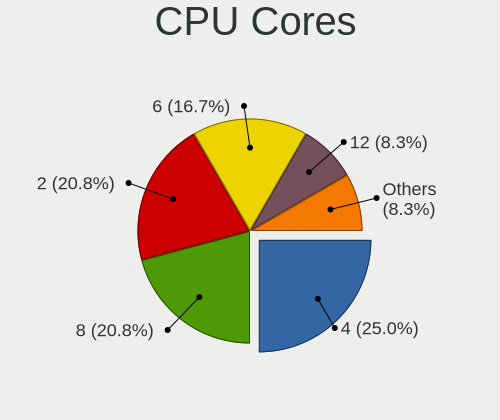

| Number | Desktops | Percent |
|--------|----------|---------|
| 4      | 3        | 30%     |
| 6      | 2        | 20%     |
| 2      | 2        | 20%     |
| 28     | 1        | 10%     |
| 12     | 1        | 10%     |
| 8      | 1        | 10%     |

CPU Sockets
-----------

Number of sockets

| Number | Desktops | Percent |
|--------|----------|---------|
| 1      | 10       | 100%    |

CPU Threads
-----------

Threads per core (Hyper-Threading)

| Number | Desktops | Percent |
|--------|----------|---------|
| 2      | 6        | 60%     |
| 1      | 4        | 40%     |

CPU Op-Modes
------------

CPU Operation Modes (32-bit, 64-bit)

| Op mode        | Desktops | Percent |
|----------------|----------|---------|
| 32-bit, 64-bit | 10       | 100%    |

CPU Microcode
-------------

Microcode number

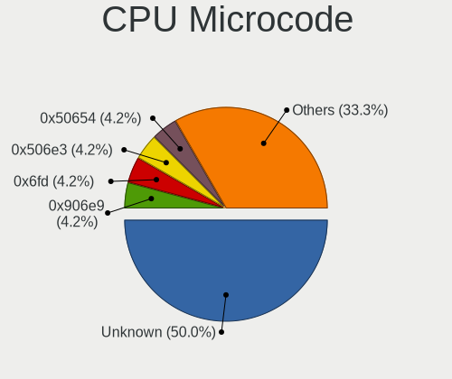

| Number     | Desktops | Percent |
|------------|----------|---------|
| Unknown    | 2        | 20%     |
| 0x906e9    | 1        | 10%     |
| 0x6fd      | 1        | 10%     |
| 0x506e3    | 1        | 10%     |
| 0x50654    | 1        | 10%     |
| 0x306c3    | 1        | 10%     |
| 0x0a201016 | 1        | 10%     |
| 0x0a201009 | 1        | 10%     |
| 0x08701021 | 1        | 10%     |

CPU Microarch
-------------

Microarchitecture

| Name        | Desktops | Percent |
|-------------|----------|---------|
| Zen 3       | 2        | 20%     |
| Skylake     | 2        | 20%     |
| Zen+        | 1        | 10%     |
| Zen 2       | 1        | 10%     |
| Steamroller | 1        | 10%     |
| KabyLake    | 1        | 10%     |
| Haswell     | 1        | 10%     |
| Core        | 1        | 10%     |

Graphics
--------

GPU Vendor
----------

Vendors of graphics cards

| Vendor | Desktops | Percent |
|--------|----------|---------|
| Nvidia | 6        | 50%     |
| AMD    | 4        | 33.33%  |
| Intel  | 2        | 16.67%  |

GPU Model
---------

Graphics card models

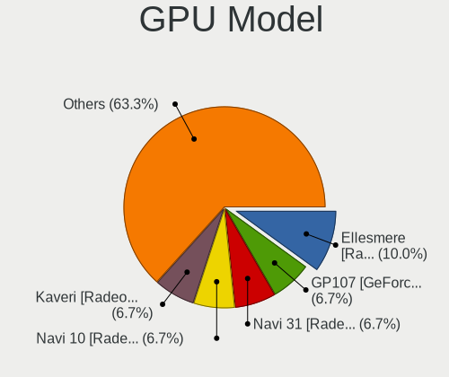

| Model                                                                 | Desktops | Percent |
|-----------------------------------------------------------------------|----------|---------|
| Nvidia GP107 [GeForce GTX 1050 Ti]                                    | 2        | 15.38%  |
| AMD Ellesmere [Radeon RX 470/480/570/570X/580/580X/590]               | 2        | 15.38%  |
| Nvidia TU106 [GeForce RTX 2060 SUPER]                                 | 1        | 7.69%   |
| Nvidia TU102 [TITAN RTX]                                              | 1        | 7.69%   |
| Nvidia GP106 [GeForce GTX 1060 6GB]                                   | 1        | 7.69%   |
| Nvidia GA106 [GeForce RTX 3060 Lite Hash Rate]                        | 1        | 7.69%   |
| Intel HD Graphics 630                                                 | 1        | 7.69%   |
| Intel HD Graphics 530                                                 | 1        | 7.69%   |
| AMD RV710 [Radeon HD 4350/4550]                                       | 1        | 7.69%   |
| AMD Oland [Radeon HD 8570 / R5 430 OEM / R7 240/340 / Radeon 520 OEM] | 1        | 7.69%   |
| AMD Kaveri [Radeon R7 Graphics]                                       | 1        | 7.69%   |

GPU Combo
---------

Combinations of graphics cards

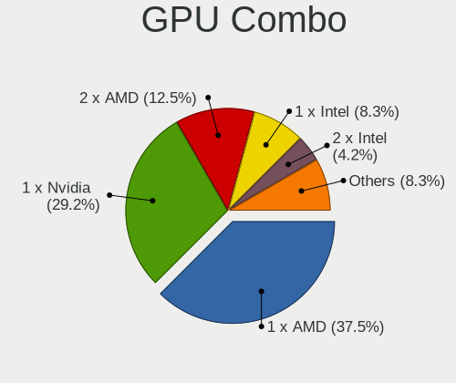

| Name           | Desktops | Percent |
|----------------|----------|---------|
| 1 x Nvidia     | 4        | 40%     |
| 1 x AMD        | 2        | 20%     |
| 2 x AMD        | 1        | 10%     |
| Intel + Nvidia | 1        | 10%     |
| 1 x Intel      | 1        | 10%     |
| AMD + Nvidia   | 1        | 10%     |

GPU Driver
----------

Free vs proprietary

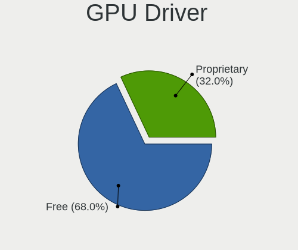

| Driver      | Desktops | Percent |
|-------------|----------|---------|
| Free        | 6        | 54.55%  |
| Proprietary | 5        | 45.45%  |

GPU Memory
----------

Total video memory

| Size in GB | Desktops | Percent |
|------------|----------|---------|
| 7.01-8.0   | 3        | 27.27%  |
| Unknown    | 3        | 27.27%  |
| 5.01-6.0   | 1        | 9.09%   |
| 3.01-4.0   | 1        | 9.09%   |
| 16.01-24.0 | 1        | 9.09%   |
| 8.01-16.0  | 1        | 9.09%   |
| 0.51-1.0   | 1        | 9.09%   |

Monitor
-------

Monitor Vendor
--------------

Monitor vendors

| Vendor               | Desktops | Percent |
|----------------------|----------|---------|
| Dell                 | 2        | 16.67%  |
| Ancor Communications | 2        | 16.67%  |
| Samsung Electronics  | 1        | 8.33%   |
| Hewlett-Packard      | 1        | 8.33%   |
| Goldstar             | 1        | 8.33%   |
| BenQ                 | 1        | 8.33%   |
| ASUSTek Computer     | 1        | 8.33%   |
| AGO                  | 1        | 8.33%   |
| Acer                 | 1        | 8.33%   |
| Unknown              | 1        | 8.33%   |

Monitor Model
-------------

Monitor models

| Model                                                                 | Desktops | Percent |
|-----------------------------------------------------------------------|----------|---------|
| Samsung Electronics C24F390 SAM0D2C 1920x1080 521x293mm 23.5-inch     | 1        | 7.14%   |
| Hewlett-Packard V320 HPN3363 1920x1080 698x393mm 31.5-inch            | 1        | 7.14%   |
| Goldstar L1742 GSM449C 1280x1024 338x270mm 17.0-inch                  | 1        | 7.14%   |
| Dell SE2417HG DELD08E 1920x1080 521x293mm 23.5-inch                   | 1        | 7.14%   |
| Dell SE2417HG DELD08D 1920x1080 521x293mm 23.5-inch                   | 1        | 7.14%   |
| Dell S2421NX DEL41FB 1920x1080 527x296mm 23.8-inch                    | 1        | 7.14%   |
| BenQ BL3200 BNQ8017 2560x1440 708x398mm 32.0-inch                     | 1        | 7.14%   |
| ASUSTek Computer ROG PG65UQ AUS65A1 3840x2160 1430x800mm 64.5-inch    | 1        | 7.14%   |
| Ancor Communications ROG PG348Q ACI3433 3440x1440 798x335mm 34.1-inch | 1        | 7.14%   |
| Ancor Communications ASUS VS228 ACI22FD 1920x1080 476x268mm 21.5-inch | 1        | 7.14%   |
| AGO LCD Monitor AGO0001 1920x1080 300x230mm 14.9-inch                 | 1        | 7.14%   |
| AGO LCD Monitor AGO0001 1920x1080 256x192mm 12.6-inch                 | 1        | 7.14%   |
| Acer XF251Q ACR0624 1920x1080 544x303mm 24.5-inch                     | 1        | 7.14%   |
| Unknown                                                               | 1        | 7.14%   |

Monitor Resolution
------------------

Monitor screen resolution

| Resolution       | Desktops | Percent |
|------------------|----------|---------|
| 1920x1080 (FHD)  | 5        | 45.45%  |
| 3840x2160 (4K)   | 1        | 9.09%   |
| 3440x1440        | 1        | 9.09%   |
| 3200x1080        | 1        | 9.09%   |
| 2560x1440 (QHD)  | 1        | 9.09%   |
| 1280x1024 (SXGA) | 1        | 9.09%   |
| Unknown          | 1        | 9.09%   |

Monitor Diagonal
----------------

Diagonal size in inches

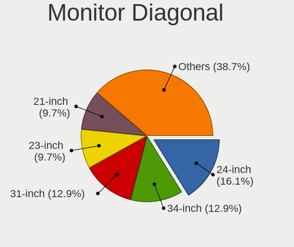

| Inches  | Desktops | Percent |
|---------|----------|---------|
| 24      | 2        | 15.38%  |
| 23      | 2        | 15.38%  |
| 64      | 1        | 7.69%   |
| 34      | 1        | 7.69%   |
| 32      | 1        | 7.69%   |
| 31      | 1        | 7.69%   |
| 21      | 1        | 7.69%   |
| 17      | 1        | 7.69%   |
| 14      | 1        | 7.69%   |
| 12      | 1        | 7.69%   |
| Unknown | 1        | 7.69%   |

Monitor Width
-------------

Physical width

| Width in mm | Desktops | Percent |
|-------------|----------|---------|
| 501-600     | 4        | 33.33%  |
| 701-800     | 2        | 16.67%  |
| 601-700     | 1        | 8.33%   |
| 401-500     | 1        | 8.33%   |
| 301-350     | 1        | 8.33%   |
| 201-300     | 1        | 8.33%   |
| 1001-1500   | 1        | 8.33%   |
| Unknown     | 1        | 8.33%   |

Aspect Ratio
------------

Proportional relationship between the width and the height

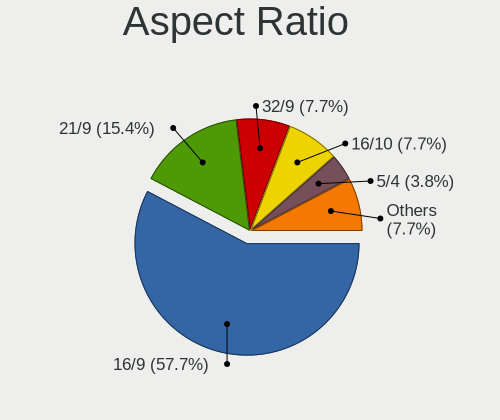

| Ratio   | Desktops | Percent |
|---------|----------|---------|
| 16/9    | 7        | 63.64%  |
| 5/4     | 1        | 9.09%   |
| 4/3     | 1        | 9.09%   |
| 21/9    | 1        | 9.09%   |
| Unknown | 1        | 9.09%   |

Monitor Area
------------

Area in inch²

| Area in inch² | Desktops | Percent |
|----------------|----------|---------|
| 201-250        | 4        | 30.77%  |
| 351-500        | 3        | 23.08%  |
| More than 1000 | 1        | 7.69%   |
| 71-80          | 1        | 7.69%   |
| 251-300        | 1        | 7.69%   |
| 141-150        | 1        | 7.69%   |
| 101-110        | 1        | 7.69%   |
| Unknown        | 1        | 7.69%   |

Pixel Density
-------------

Pixels per inch

| Density | Desktops | Percent |
|---------|----------|---------|
| 51-100  | 8        | 61.54%  |
| 101-120 | 2        | 15.38%  |
| 161-240 | 1        | 7.69%   |
| 121-160 | 1        | 7.69%   |
| Unknown | 1        | 7.69%   |

Multiple Monitors
-----------------

Total monitors connected

| Total | Desktops | Percent |
|-------|----------|---------|
| 2     | 5        | 50%     |
| 1     | 5        | 50%     |

Network
-------

Net Controller Vendor
---------------------

Controller vendors

| Vendor                | Desktops | Percent |
|-----------------------|----------|---------|
| Realtek Semiconductor | 7        | 50%     |
| Intel                 | 5        | 35.71%  |
| Ralink Technology     | 1        | 7.14%   |
| Aquantia              | 1        | 7.14%   |

Net Controller Model
--------------------

Controller models

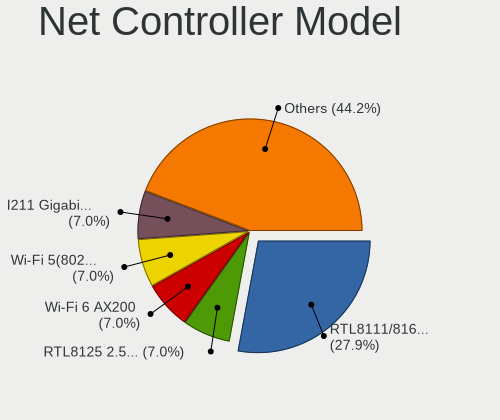

| Model                                                             | Desktops | Percent |
|-------------------------------------------------------------------|----------|---------|
| Realtek RTL8111/8168/8411 PCI Express Gigabit Ethernet Controller | 4        | 21.05%  |
| Realtek RTL8125 2.5GbE Controller                                 | 2        | 10.53%  |
| Realtek RTL8821AE 802.11ac PCIe Wireless Network Adapter          | 1        | 5.26%   |
| Realtek RTL8169 PCI Gigabit Ethernet Controller                   | 1        | 5.26%   |
| Realtek RTL810xE PCI Express Fast Ethernet controller             | 1        | 5.26%   |
| Realtek 802.11ac NIC                                              | 1        | 5.26%   |
| Ralink MT7601U Wireless Adapter                                   | 1        | 5.26%   |
| Intel Wireless-AC 9260                                            | 1        | 5.26%   |
| Intel Wireless 8265 / 8275                                        | 1        | 5.26%   |
| Intel Wi-Fi 6 AX200                                               | 1        | 5.26%   |
| Intel I211 Gigabit Network Connection                             | 1        | 5.26%   |
| Intel Ethernet Connection (3) I219-LM                             | 1        | 5.26%   |
| Intel Ethernet Connection (2) I219-V                              | 1        | 5.26%   |
| Intel Ethernet Connection (2) I218-V                              | 1        | 5.26%   |
| Aquantia AQC107 NBase-T/IEEE 802.3bz Ethernet Controller [AQtion] | 1        | 5.26%   |

Wireless Vendor
---------------

Wireless vendors

| Vendor                | Desktops | Percent |
|-----------------------|----------|---------|
| Intel                 | 3        | 60%     |
| Realtek Semiconductor | 1        | 20%     |
| Ralink Technology     | 1        | 20%     |

Wireless Model
--------------

Wireless models

| Model                                                    | Desktops | Percent |
|----------------------------------------------------------|----------|---------|
| Realtek RTL8821AE 802.11ac PCIe Wireless Network Adapter | 1        | 16.67%  |
| Realtek 802.11ac NIC                                     | 1        | 16.67%  |
| Ralink MT7601U Wireless Adapter                          | 1        | 16.67%  |
| Intel Wireless-AC 9260                                   | 1        | 16.67%  |
| Intel Wireless 8265 / 8275                               | 1        | 16.67%  |
| Intel Wi-Fi 6 AX200                                      | 1        | 16.67%  |

Ethernet Vendor
---------------

Ethernet vendors

| Vendor                | Desktops | Percent |
|-----------------------|----------|---------|
| Realtek Semiconductor | 6        | 54.55%  |
| Intel                 | 4        | 36.36%  |
| Aquantia              | 1        | 9.09%   |

Ethernet Model
--------------

Ethernet models

| Model                                                             | Desktops | Percent |
|-------------------------------------------------------------------|----------|---------|
| Realtek RTL8111/8168/8411 PCI Express Gigabit Ethernet Controller | 4        | 30.77%  |
| Realtek RTL8125 2.5GbE Controller                                 | 2        | 15.38%  |
| Realtek RTL8169 PCI Gigabit Ethernet Controller                   | 1        | 7.69%   |
| Realtek RTL810xE PCI Express Fast Ethernet controller             | 1        | 7.69%   |
| Intel I211 Gigabit Network Connection                             | 1        | 7.69%   |
| Intel Ethernet Connection (3) I219-LM                             | 1        | 7.69%   |
| Intel Ethernet Connection (2) I219-V                              | 1        | 7.69%   |
| Intel Ethernet Connection (2) I218-V                              | 1        | 7.69%   |
| Aquantia AQC107 NBase-T/IEEE 802.3bz Ethernet Controller [AQtion] | 1        | 7.69%   |

Net Controller Kind
-------------------

Ethernet, WiFi or modem

| Kind     | Desktops | Percent |
|----------|----------|---------|
| Ethernet | 10       | 66.67%  |
| WiFi     | 5        | 33.33%  |

Used Controller
---------------

Currently used network controller

| Kind     | Desktops | Percent |
|----------|----------|---------|
| Ethernet | 8        | 80%     |
| WiFi     | 2        | 20%     |

NICs
----

Total network controllers on board

| Total | Desktops | Percent |
|-------|----------|---------|
| 2     | 5        | 50%     |
| 1     | 4        | 40%     |
| 3     | 1        | 10%     |

IPv6
----

IPv6 vs IPv4

| Used | Desktops | Percent |
|------|----------|---------|
| No   | 7        | 70%     |
| Yes  | 3        | 30%     |

Bluetooth
---------

Bluetooth Vendor
----------------

Controller vendors

| Vendor                  | Desktops | Percent |
|-------------------------|----------|---------|
| Intel                   | 3        | 75%     |
| Cambridge Silicon Radio | 1        | 25%     |

Bluetooth Model
---------------

Controller models

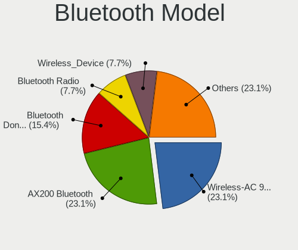

| Model                                               | Desktops | Percent |
|-----------------------------------------------------|----------|---------|
| Intel Wireless-AC 9260 Bluetooth Adapter            | 1        | 25%     |
| Intel Bluetooth wireless interface                  | 1        | 25%     |
| Intel AX200 Bluetooth                               | 1        | 25%     |
| Cambridge Silicon Radio Bluetooth Dongle (HCI mode) | 1        | 25%     |

Sound
-----

Sound Vendor
------------

Sound card vendors

| Vendor              | Desktops | Percent |
|---------------------|----------|---------|
| AMD                 | 7        | 28%     |
| Nvidia              | 6        | 24%     |
| Intel               | 5        | 20%     |
| Logitech            | 2        | 8%      |
| C-Media Electronics | 2        | 8%      |
| Texas Instruments   | 1        | 4%      |
| Oculus VR           | 1        | 4%      |
| Kingston Technology | 1        | 4%      |

Sound Model
-----------

Sound card models

| Model                                                                   | Desktops | Percent |
|-------------------------------------------------------------------------|----------|---------|
| AMD Starship/Matisse HD Audio Controller                                | 3        | 10.71%  |
| Nvidia GP107GL High Definition Audio Controller                         | 2        | 7.14%   |
| AMD Ellesmere HDMI Audio [Radeon RX 470/480 / 570/580/590]              | 2        | 7.14%   |
| Texas Instruments PCM2902 Audio Codec                                   | 1        | 3.57%   |
| Oculus VR Rift CV1 Audio                                                | 1        | 3.57%   |
| Nvidia TU106 High Definition Audio Controller                           | 1        | 3.57%   |
| Nvidia TU102 High Definition Audio Controller                           | 1        | 3.57%   |
| Nvidia GP106 High Definition Audio Controller                           | 1        | 3.57%   |
| Nvidia GA106 High Definition Audio Controller                           | 1        | 3.57%   |
| Logitech H390 headset with microphone                                   | 1        | 3.57%   |
| Logitech G432 Gaming Headset                                            | 1        | 3.57%   |
| Kingston Technology HyperX Quadcast                                     | 1        | 3.57%   |
| Intel NM10/ICH7 Family High Definition Audio Controller                 | 1        | 3.57%   |
| Intel Lewisburg MROM 0                                                  | 1        | 3.57%   |
| Intel 9 Series Chipset Family HD Audio Controller                       | 1        | 3.57%   |
| Intel 200 Series PCH HD Audio                                           | 1        | 3.57%   |
| Intel 100 Series/C230 Series Chipset Family HD Audio Controller         | 1        | 3.57%   |
| C-Media Electronics Audio Adapter (Unitek Y-247A)                       | 1        | 3.57%   |
| C-Media Electronics Antlion USB adapter                                 | 1        | 3.57%   |
| AMD RV710/730 HDMI Audio [Radeon HD 4000 series]                        | 1        | 3.57%   |
| AMD Oland/Hainan/Cape Verde/Pitcairn HDMI Audio [Radeon HD 7000 Series] | 1        | 3.57%   |
| AMD Kaveri HDMI/DP Audio Controller                                     | 1        | 3.57%   |
| AMD FCH Azalia Controller                                               | 1        | 3.57%   |
| AMD Family 17h (Models 00h-0fh) HD Audio Controller                     | 1        | 3.57%   |

Memory
------

Memory Vendor
-------------

Memory module vendors

| Vendor              | Desktops | Percent |
|---------------------|----------|---------|
| Corsair             | 2        | 20%     |
| A-DATA Technology   | 2        | 20%     |
| Unknown             | 1        | 10%     |
| Team                | 1        | 10%     |
| Samsung Electronics | 1        | 10%     |
| Kingston            | 1        | 10%     |
| G.Skill             | 1        | 10%     |
| Crucial             | 1        | 10%     |

Memory Model
------------

Memory module models

| Model                                                    | Desktops | Percent |
|----------------------------------------------------------|----------|---------|
| Unknown RAM Module 2GB DIMM SDRAM                        | 1        | 9.09%   |
| Unknown RAM Module 1GB DIMM SDRAM                        | 1        | 9.09%   |
| Team RAM TEAMGROUP-UD4-3200 16GB DIMM DDR4 3800MT/s      | 1        | 9.09%   |
| Samsung RAM M471A1K43CB1-CRC 8GB SODIMM DDR4 2667MT/s    | 1        | 9.09%   |
| Kingston RAM KF3600C16D4/16GX 16384MB DIMM DDR4 3600MT/s | 1        | 9.09%   |
| G.Skill RAM F4-3000C16-8GTZR 8GB DIMM DDR4 3200MT/s      | 1        | 9.09%   |
| Crucial RAM BL8G36C16U4B.M8FE1 8GB DIMM DDR4 3733MT/s    | 1        | 9.09%   |
| Corsair RAM CMZ16GX3M2A1600C10 8GB DIMM DDR3 1600MT/s    | 1        | 9.09%   |
| Corsair RAM CMT16GX4M2K4266C19 8GB DIMM DDR4 2133MT/s    | 1        | 9.09%   |
| A-DATA RAM Module 8GB DIMM DDR4 2133MT/s                 | 1        | 9.09%   |
| A-DATA RAM DDR4 3600 2OZ 8GB DIMM DDR4 2667MT/s          | 1        | 9.09%   |

Memory Kind
-----------

Memory module kinds

| Kind  | Desktops | Percent |
|-------|----------|---------|
| DDR4  | 7        | 77.78%  |
| SDRAM | 1        | 11.11%  |
| DDR3  | 1        | 11.11%  |

Memory Form Factor
------------------

Physical design of the memory module

| Name   | Desktops | Percent |
|--------|----------|---------|
| DIMM   | 8        | 88.89%  |
| SODIMM | 1        | 11.11%  |

Memory Size
-----------

Memory module size

| Size  | Desktops | Percent |
|-------|----------|---------|
| 8192  | 6        | 60%     |
| 32768 | 1        | 10%     |
| 16384 | 1        | 10%     |
| 2048  | 1        | 10%     |
| 1024  | 1        | 10%     |

Memory Speed
------------

Memory module speed

| Speed   | Desktops | Percent |
|---------|----------|---------|
| 2667    | 2        | 20%     |
| 2133    | 2        | 20%     |
| 3800    | 1        | 10%     |
| 3733    | 1        | 10%     |
| 3600    | 1        | 10%     |
| 3200    | 1        | 10%     |
| 1600    | 1        | 10%     |
| Unknown | 1        | 10%     |

Printers & scanners
-------------------

Printer Vendor
--------------

Printer device vendors

| Vendor          | Desktops | Percent |
|-----------------|----------|---------|
| Hewlett-Packard | 1        | 100%    |

Printer Model
-------------

Printer device models

| Model                  | Desktops | Percent |
|------------------------|----------|---------|
| HP DeskJet 4720 series | 1        | 100%    |

Scanner Vendor
--------------

Scanner device vendors

Zero info for selected period =(

Scanner Model
-------------

Scanner device models

Zero info for selected period =(

Camera
------

Camera Vendor
-------------

Camera device vendors

| Vendor                 | Desktops | Percent |
|------------------------|----------|---------|
| Logitech               | 1        | 50%     |
| Generalplus Technology | 1        | 50%     |

Camera Model
------------

Camera device models

| Model                       | Desktops | Percent |
|-----------------------------|----------|---------|
| Logitech HD Pro Webcam C920 | 1        | 50%     |
| Generalplus GENERAL WEBCAM  | 1        | 50%     |

Security
--------

Fingerprint Vendor
------------------

Fingerprint sensor vendors

Zero info for selected period =(

Fingerprint Model
-----------------

Fingerprint sensor models

Zero info for selected period =(

Chipcard Vendor
---------------

Chipcard module vendors

Zero info for selected period =(

Chipcard Model
--------------

Chipcard module models

Zero info for selected period =(

Unsupported
-----------

Unsupported Devices
-------------------

Total unsupported devices on board

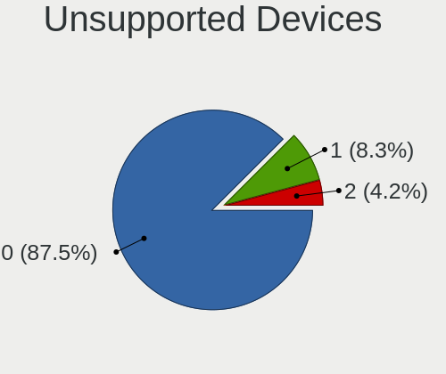

| Total | Desktops | Percent |
|-------|----------|---------|
| 0     | 8        | 80%     |
| 2     | 1        | 10%     |
| 1     | 1        | 10%     |

Unsupported Device Types
------------------------

Types of unsupported devices

| Type             | Desktops | Percent |
|------------------|----------|---------|
| Unassigned class | 1        | 50%     |
| Graphics card    | 1        | 50%     |

