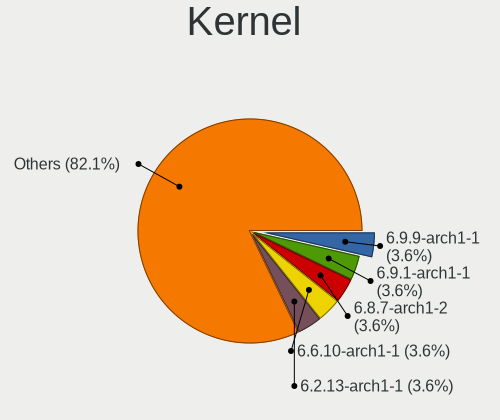
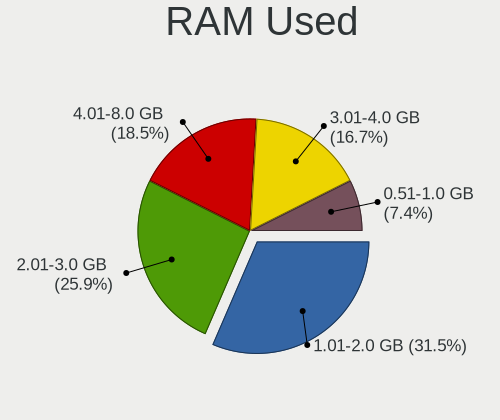
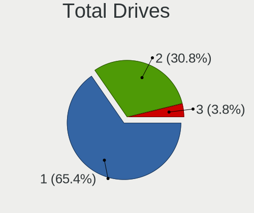
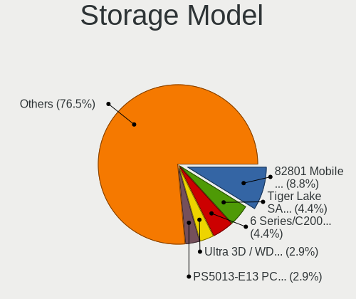
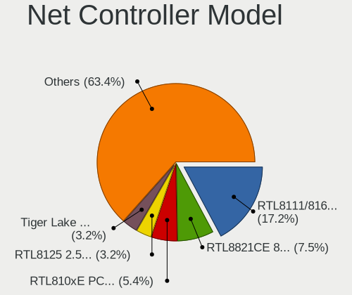
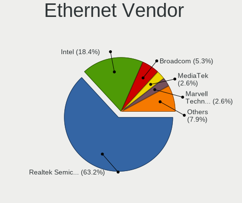
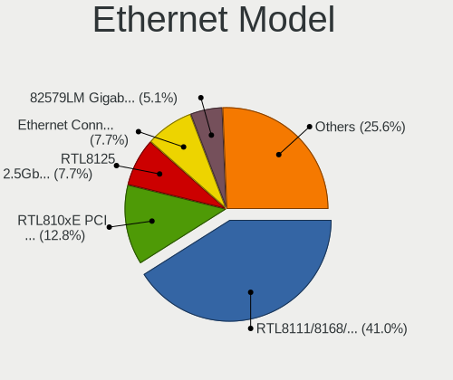
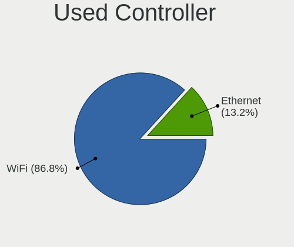
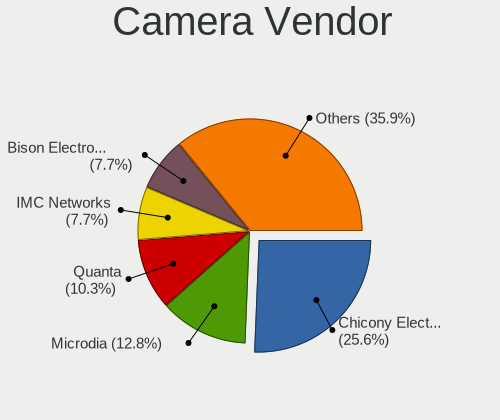
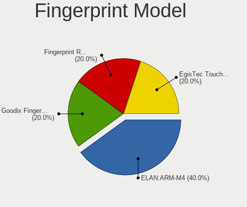

Archcraft - Tested Hardware & Statistics (Notebooks)
----------------------------------------------------

A project to collect tested hardware configurations for Archcraft.

Anyone can contribute to this report by the [hw-probe](https://github.com/linuxhw/hw-probe) tool:

    sudo -E hw-probe -all -upload

Please contribute! Especially if your hardware is rare.

Contents
--------

* [ Test Cases ](#test-cases)

* [ System ](#system)
  - [ OS                       ](#os)
  - [ OS Family                ](#os-family)
  - [ Kernel                   ](#kernel)
  - [ Kernel Family            ](#kernel-family)
  - [ Kernel Major Ver.        ](#kernel-major-ver)
  - [ Arch                     ](#arch)
  - [ DE                       ](#de)
  - [ Display Server           ](#display-server)
  - [ Display Manager          ](#display-manager)
  - [ OS Lang                  ](#os-lang)
  - [ Boot Mode                ](#boot-mode)
  - [ Filesystem               ](#filesystem)
  - [ Part. scheme             ](#part-scheme)
  - [ Dual Boot with Linux/BSD ](#dual-boot-with-linuxbsd)
  - [ Dual Boot (Win)          ](#dual-boot-win)

* [ Board ](#board)
  - [ Vendor                   ](#vendor)
  - [ Model                    ](#model)
  - [ Model Family             ](#model-family)
  - [ MFG Year                 ](#mfg-year)
  - [ Form Factor              ](#form-factor)
  - [ Secure Boot              ](#secure-boot)
  - [ Coreboot                 ](#coreboot)
  - [ RAM Size                 ](#ram-size)
  - [ RAM Used                 ](#ram-used)
  - [ Total Drives             ](#total-drives)
  - [ Has CD-ROM               ](#has-cd-rom)
  - [ Has Ethernet             ](#has-ethernet)
  - [ Has WiFi                 ](#has-wifi)
  - [ Has Bluetooth            ](#has-bluetooth)

* [ Location ](#location)
  - [ Country                  ](#country)
  - [ City                     ](#city)

* [ Drives ](#drives)
  - [ Drive Vendor             ](#drive-vendor)
  - [ Drive Model              ](#drive-model)
  - [ HDD Vendor               ](#hdd-vendor)
  - [ SSD Vendor               ](#ssd-vendor)
  - [ Drive Kind               ](#drive-kind)
  - [ Drive Connector          ](#drive-connector)
  - [ Drive Size               ](#drive-size)
  - [ Space Total              ](#space-total)
  - [ Space Used               ](#space-used)
  - [ Malfunc. Drives          ](#malfunc-drives)
  - [ Malfunc. Drive Vendor    ](#malfunc-drive-vendor)
  - [ Malfunc. HDD Vendor      ](#malfunc-hdd-vendor)
  - [ Malfunc. Drive Kind      ](#malfunc-drive-kind)
  - [ Failed Drives            ](#failed-drives)
  - [ Failed Drive Vendor      ](#failed-drive-vendor)
  - [ Drive Status             ](#drive-status)

* [ Storage controller ](#storage-controller)
  - [ Storage Vendor           ](#storage-vendor)
  - [ Storage Model            ](#storage-model)
  - [ Storage Kind             ](#storage-kind)

* [ Processor ](#processor)
  - [ CPU Vendor               ](#cpu-vendor)
  - [ CPU Model                ](#cpu-model)
  - [ CPU Model Family         ](#cpu-model-family)
  - [ CPU Cores                ](#cpu-cores)
  - [ CPU Sockets              ](#cpu-sockets)
  - [ CPU Threads              ](#cpu-threads)
  - [ CPU Op-Modes             ](#cpu-op-modes)
  - [ CPU Microcode            ](#cpu-microcode)
  - [ CPU Microarch            ](#cpu-microarch)

* [ Graphics ](#graphics)
  - [ GPU Vendor               ](#gpu-vendor)
  - [ GPU Model                ](#gpu-model)
  - [ GPU Combo                ](#gpu-combo)
  - [ GPU Driver               ](#gpu-driver)
  - [ GPU Memory               ](#gpu-memory)

* [ Monitor ](#monitor)
  - [ Monitor Vendor           ](#monitor-vendor)
  - [ Monitor Model            ](#monitor-model)
  - [ Monitor Resolution       ](#monitor-resolution)
  - [ Monitor Diagonal         ](#monitor-diagonal)
  - [ Monitor Width            ](#monitor-width)
  - [ Aspect Ratio             ](#aspect-ratio)
  - [ Monitor Area             ](#monitor-area)
  - [ Pixel Density            ](#pixel-density)
  - [ Multiple Monitors        ](#multiple-monitors)

* [ Network ](#network)
  - [ Net Controller Vendor    ](#net-controller-vendor)
  - [ Net Controller Model     ](#net-controller-model)
  - [ Wireless Vendor          ](#wireless-vendor)
  - [ Wireless Model           ](#wireless-model)
  - [ Ethernet Vendor          ](#ethernet-vendor)
  - [ Ethernet Model           ](#ethernet-model)
  - [ Net Controller Kind      ](#net-controller-kind)
  - [ Used Controller          ](#used-controller)
  - [ NICs                     ](#nics)
  - [ IPv6                     ](#ipv6)

* [ Bluetooth ](#bluetooth)
  - [ Bluetooth Vendor         ](#bluetooth-vendor)
  - [ Bluetooth Model          ](#bluetooth-model)

* [ Sound ](#sound)
  - [ Sound Vendor             ](#sound-vendor)
  - [ Sound Model              ](#sound-model)

* [ Memory ](#memory)
  - [ Memory Vendor            ](#memory-vendor)
  - [ Memory Model             ](#memory-model)
  - [ Memory Kind              ](#memory-kind)
  - [ Memory Form Factor       ](#memory-form-factor)
  - [ Memory Size              ](#memory-size)
  - [ Memory Speed             ](#memory-speed)

* [ Printers & scanners ](#printers--scanners)
  - [ Printer Vendor           ](#printer-vendor)
  - [ Printer Model            ](#printer-model)
  - [ Scanner Vendor           ](#scanner-vendor)
  - [ Scanner Model            ](#scanner-model)

* [ Camera ](#camera)
  - [ Camera Vendor            ](#camera-vendor)
  - [ Camera Model             ](#camera-model)

* [ Security ](#security)
  - [ Fingerprint Vendor       ](#fingerprint-vendor)
  - [ Fingerprint Model        ](#fingerprint-model)
  - [ Chipcard Vendor          ](#chipcard-vendor)
  - [ Chipcard Model           ](#chipcard-model)

* [ Unsupported ](#unsupported)
  - [ Unsupported Devices      ](#unsupported-devices)
  - [ Unsupported Device Types ](#unsupported-device-types)

Test Cases
----------

Total: 61

| Vendor        | Model                       | Probe                                                      | Date         |
|---------------|-----------------------------|------------------------------------------------------------|--------------|
| HP            | Dragonfly 13.5 inch G4 N... | [2faf3d5ce2](https://linux-hardware.org/?probe=2faf3d5ce2) | Apr 28, 2024 |
| HP            | Laptop 15-da0xxx            | [81bca40901](https://linux-hardware.org/?probe=81bca40901) | Apr 27, 2024 |
| Dell          | Latitude 7290               | [b23f2a505a](https://linux-hardware.org/?probe=b23f2a505a) | Apr 10, 2024 |
| HP            | Pavilion Notebook           | [2cb306402a](https://linux-hardware.org/?probe=2cb306402a) | Feb 23, 2024 |
| SmbiosType... | N20                         | [0188c2ee35](https://linux-hardware.org/?probe=0188c2ee35) | Feb 05, 2024 |
| MouseCompu... | EGPN711R307                 | [fc34633537](https://linux-hardware.org/?probe=fc34633537) | Jan 02, 2024 |
| ASUSTek       | ROG Strix G513QY_G513QY     | [de15a66a8b](https://linux-hardware.org/?probe=de15a66a8b) | Oct 22, 2023 |
| Packard Be... | EasyNote TK85               | [0c62f48dda](https://linux-hardware.org/?probe=0c62f48dda) | Sep 30, 2023 |
| Lenovo        | IdeaPad 3 15IGL05 81WQ      | [a579fd2872](https://linux-hardware.org/?probe=a579fd2872) | Sep 23, 2023 |
| Lenovo        | IdeaPad 3 15IGL05 81WQ      | [1322cd195f](https://linux-hardware.org/?probe=1322cd195f) | Sep 15, 2023 |
| Dell          | Vostro 3401                 | [792ea03809](https://linux-hardware.org/?probe=792ea03809) | Aug 19, 2023 |
| Packard Be... | EasyNote TK85               | [da059008eb](https://linux-hardware.org/?probe=da059008eb) | Aug 14, 2023 |
| AXDIA Inte... | WINPAD V10                  | [4dc8c20191](https://linux-hardware.org/?probe=4dc8c20191) | Aug 13, 2023 |
| HUAWEI        | HLYL-WXX9                   | [41831db130](https://linux-hardware.org/?probe=41831db130) | Aug 13, 2023 |
| HP            | Laptop 15-dy2xxx            | [bbe4e49261](https://linux-hardware.org/?probe=bbe4e49261) | Aug 01, 2023 |
| AXDIA Inte... | WINPAD V10                  | [0e7e712860](https://linux-hardware.org/?probe=0e7e712860) | Jul 24, 2023 |
| Dell          | Latitude E5420              | [be15c1e3d1](https://linux-hardware.org/?probe=be15c1e3d1) | Jul 20, 2023 |
| Infinix       | INBook X1 Pro               | [a03717af50](https://linux-hardware.org/?probe=a03717af50) | Jun 26, 2023 |
| HP            | Notebook                    | [1ce7986145](https://linux-hardware.org/?probe=1ce7986145) | Jun 11, 2023 |
| HUAWEI        | NBD-WXX9                    | [61c1703e67](https://linux-hardware.org/?probe=61c1703e67) | Jun 10, 2023 |
| HUAWEI        | NBD-WXX9                    | [321ad38786](https://linux-hardware.org/?probe=321ad38786) | Jun 10, 2023 |
| HUAWEI        | BOHB-WAX9                   | [08eb3979f4](https://linux-hardware.org/?probe=08eb3979f4) | May 19, 2023 |
| Dell          | Latitude 5490               | [2ce70b7a2c](https://linux-hardware.org/?probe=2ce70b7a2c) | May 04, 2023 |
| ASUSTek       | ROG Strix G513RC_G513RC     | [eeef579322](https://linux-hardware.org/?probe=eeef579322) | Apr 28, 2023 |
| MSI           | Alpha 15 B5EEK              | [c7f5eaf3f1](https://linux-hardware.org/?probe=c7f5eaf3f1) | Mar 28, 2023 |
| eMachines     | eME730                      | [0e1683ee34](https://linux-hardware.org/?probe=0e1683ee34) | Mar 08, 2023 |
| eMachines     | eME730                      | [db15f88805](https://linux-hardware.org/?probe=db15f88805) | Mar 08, 2023 |
| MSI           | Katana GF66 11UE            | [aead8d4d18](https://linux-hardware.org/?probe=aead8d4d18) | Jan 26, 2023 |
| HP            | Stream Laptop 11-ak0xxx     | [6f3b4fc131](https://linux-hardware.org/?probe=6f3b4fc131) | Jan 16, 2023 |
| HP            | Stream Laptop 11-ak0xxx     | [b33bedc4c2](https://linux-hardware.org/?probe=b33bedc4c2) | Jan 15, 2023 |
| HP            | Stream Laptop 11-ak0xxx     | [806da9b386](https://linux-hardware.org/?probe=806da9b386) | Jan 12, 2023 |
| HP            | Stream Laptop 11-ak0xxx     | [29e6fcfd32](https://linux-hardware.org/?probe=29e6fcfd32) | Jan 12, 2023 |
| Dell          | Inspiron 7559               | [52cf8ddc0f](https://linux-hardware.org/?probe=52cf8ddc0f) | Dec 22, 2022 |
| HP            | Stream Laptop 11-ak0xxx     | [d2c04dd7cd](https://linux-hardware.org/?probe=d2c04dd7cd) | Dec 01, 2022 |
| Chuwi         | GemiBook Pro                | [315d8b6ff7](https://linux-hardware.org/?probe=315d8b6ff7) | Nov 08, 2022 |
| MSI           | GF63 Thin 10SC              | [2b22722ce8](https://linux-hardware.org/?probe=2b22722ce8) | Oct 27, 2022 |
| Dell          | Latitude E6420              | [3ea84baba3](https://linux-hardware.org/?probe=3ea84baba3) | Sep 09, 2022 |
| Dell          | Latitude E6420              | [78fd24b713](https://linux-hardware.org/?probe=78fd24b713) | Sep 09, 2022 |
| Apple         | MacBook4,1                  | [500d050ad6](https://linux-hardware.org/?probe=500d050ad6) | Sep 06, 2022 |
| Apple         | MacBook4,1                  | [01b8531ddf](https://linux-hardware.org/?probe=01b8531ddf) | Sep 04, 2022 |
| Apple         | MacBook4,1                  | [9e4c1bc292](https://linux-hardware.org/?probe=9e4c1bc292) | Sep 04, 2022 |
| HP            | Notebook                    | [b0b97c0ea3](https://linux-hardware.org/?probe=b0b97c0ea3) | Aug 30, 2022 |
| HP            | Laptop 15-dw0xxx            | [8bb62c2062](https://linux-hardware.org/?probe=8bb62c2062) | Aug 24, 2022 |
| ASUSTek       | X441SA                      | [cb26c73037](https://linux-hardware.org/?probe=cb26c73037) | Aug 16, 2022 |
| Acer          | Swift SF113-31              | [1c4298ff33](https://linux-hardware.org/?probe=1c4298ff33) | Aug 08, 2022 |
| Acer          | Swift SF113-31              | [0f1ad8ccf7](https://linux-hardware.org/?probe=0f1ad8ccf7) | Aug 08, 2022 |
| Dell          | Latitude E7250              | [2dd83a16c7](https://linux-hardware.org/?probe=2dd83a16c7) | Aug 01, 2022 |
| Acer          | Aspire E5-573               | [01f3150f60](https://linux-hardware.org/?probe=01f3150f60) | Jul 01, 2022 |
| Positivo      | CHT14B                      | [95566d3625](https://linux-hardware.org/?probe=95566d3625) | Jun 05, 2022 |
| Framework     | Laptop                      | [f8790adbf2](https://linux-hardware.org/?probe=f8790adbf2) | May 25, 2022 |
| Standard      | Unknown                     | [74971ae227](https://linux-hardware.org/?probe=74971ae227) | May 04, 2022 |
| HP            | Pavilion Laptop 15-eh0xx... | [c8c2ede566](https://linux-hardware.org/?probe=c8c2ede566) | Feb 11, 2022 |
| Dell          | Inspiron 3542               | [f3f3b08d89](https://linux-hardware.org/?probe=f3f3b08d89) | Feb 09, 2022 |
| Dell          | Inspiron 3542               | [e975782c15](https://linux-hardware.org/?probe=e975782c15) | Jan 31, 2022 |
| Lenovo        | ThinkPad T430 2351AK9       | [19f50b09d5](https://linux-hardware.org/?probe=19f50b09d5) | Jan 21, 2022 |
| Apple         | MacBookAir4,1               | [ecc4515014](https://linux-hardware.org/?probe=ecc4515014) | Nov 01, 2021 |
| Google        | Kindred                     | [c2631a9488](https://linux-hardware.org/?probe=c2631a9488) | Jul 29, 2021 |
| HP            | Laptop 15q-bu1xx            | [af9f2a95ec](https://linux-hardware.org/?probe=af9f2a95ec) | Jun 28, 2021 |
| HP            | Pavilion Laptop 15-cc1xx    | [5e0e7e2b80](https://linux-hardware.org/?probe=5e0e7e2b80) | Jun 25, 2021 |
| HP            | Pavilion g4                 | [6a3471480a](https://linux-hardware.org/?probe=6a3471480a) | May 29, 2021 |
| MSI           | GL65 Leopard 10SFK          | [a9e5bb7556](https://linux-hardware.org/?probe=a9e5bb7556) | May 28, 2021 |

System
------

OS
--

Installed operating systems

| Name              | Notebooks | Percent |
|-------------------|-----------|---------|
| Archcraft Rolling | 38        | 82.61%  |
| Archcraft         | 8         | 17.39%  |

OS Family
---------

OS without a version

| Name      | Notebooks | Percent |
|-----------|-----------|---------|
| Archcraft | 46        | 100%    |

Kernel
------

Version of the Linux kernel

| Version                | Notebooks | Percent |
|------------------------|-----------|---------|
| 6.8.7-arch1-2          | 2         | 4.08%   |
| 6.2.13-arch1-1         | 2         | 4.08%   |
| 5.18.16-arch1-1        | 2         | 4.08%   |
| 5.12.7-arch1-1         | 2         | 4.08%   |
| 6.8.4-zen1-1-zen       | 1         | 2.04%   |
| 6.7.5-arch1-1          | 1         | 2.04%   |
| 6.6.8-arch1-1          | 1         | 2.04%   |
| 6.6.10-arch1-1         | 1         | 2.04%   |
| 6.5.5-zen1-1-zen       | 1         | 2.04%   |
| 6.4.7-arch1-1          | 1         | 2.04%   |
| 6.4.4-zen1-1-zen       | 1         | 2.04%   |
| 6.4.4-arch1-1          | 1         | 2.04%   |
| 6.4.10-zen2-1-zen      | 1         | 2.04%   |
| 6.4.10-arch1-1         | 1         | 2.04%   |
| 6.4.1-arch2-1          | 1         | 2.04%   |
| 6.3.9-arch1-1          | 1         | 2.04%   |
| 6.3.7-arch1-1-vfio     | 1         | 2.04%   |
| 6.3.6-arch1-1          | 1         | 2.04%   |
| 6.2.8-zen1-1-zen       | 1         | 2.04%   |
| 6.2.2-arch1-1          | 1         | 2.04%   |
| 6.2.12-arch1-1         | 1         | 2.04%   |
| 6.1.7-arch1-1          | 1         | 2.04%   |
| 6.1.4-x64v1-xanmod1-1  | 1         | 2.04%   |
| 6.1.1-arch1-1          | 1         | 2.04%   |
| 6.0.7-arch1-1          | 1         | 2.04%   |
| 6.0.2-arch1-1          | 1         | 2.04%   |
| 6.0.10-x64v1-xanmod1-1 | 1         | 2.04%   |
| 5.19.7-arch1-1         | 1         | 2.04%   |
| 5.19.6-arch1-1         | 1         | 2.04%   |
| 5.19.3-arch1-1         | 1         | 2.04%   |
| 5.19.13-arch1-1        | 1         | 2.04%   |
| 5.18.6-arch1-1         | 1         | 2.04%   |
| 5.18.14-zen1-1-zen     | 1         | 2.04%   |
| 5.17.9-arch1-1         | 1         | 2.04%   |
| 5.17.6-arch1-1         | 1         | 2.04%   |
| 5.17.5-arch1-1         | 1         | 2.04%   |
| 5.16.8-arch1-1         | 1         | 2.04%   |
| 5.16.7-arch1-1         | 1         | 2.04%   |
| 5.16.4-arch1-1         | 1         | 2.04%   |
| 5.16.1-arch1-1         | 1         | 2.04%   |

Kernel Family
-------------

Linux kernel without a distro release

| Version | Notebooks | Percent |
|---------|-----------|---------|
| 6.8.7   | 2         | 4.08%   |
| 6.4.4   | 2         | 4.08%   |
| 6.4.10  | 2         | 4.08%   |
| 6.2.13  | 2         | 4.08%   |
| 5.18.16 | 2         | 4.08%   |
| 5.12.7  | 2         | 4.08%   |
| 6.8.4   | 1         | 2.04%   |
| 6.7.5   | 1         | 2.04%   |
| 6.6.8   | 1         | 2.04%   |
| 6.6.10  | 1         | 2.04%   |
| 6.5.5   | 1         | 2.04%   |
| 6.4.7   | 1         | 2.04%   |
| 6.4.1   | 1         | 2.04%   |
| 6.3.9   | 1         | 2.04%   |
| 6.3.7   | 1         | 2.04%   |
| 6.3.6   | 1         | 2.04%   |
| 6.2.8   | 1         | 2.04%   |
| 6.2.2   | 1         | 2.04%   |
| 6.2.12  | 1         | 2.04%   |
| 6.1.7   | 1         | 2.04%   |
| 6.1.4   | 1         | 2.04%   |
| 6.1.1   | 1         | 2.04%   |
| 6.0.7   | 1         | 2.04%   |
| 6.0.2   | 1         | 2.04%   |
| 6.0.10  | 1         | 2.04%   |
| 5.19.7  | 1         | 2.04%   |
| 5.19.6  | 1         | 2.04%   |
| 5.19.3  | 1         | 2.04%   |
| 5.19.13 | 1         | 2.04%   |
| 5.18.6  | 1         | 2.04%   |
| 5.18.14 | 1         | 2.04%   |
| 5.17.9  | 1         | 2.04%   |
| 5.17.6  | 1         | 2.04%   |
| 5.17.5  | 1         | 2.04%   |
| 5.16.8  | 1         | 2.04%   |
| 5.16.7  | 1         | 2.04%   |
| 5.16.4  | 1         | 2.04%   |
| 5.16.1  | 1         | 2.04%   |
| 5.15.43 | 1         | 2.04%   |
| 5.14.15 | 1         | 2.04%   |

Kernel Major Ver.
-----------------

Linux kernel major version

| Version | Notebooks | Percent |
|---------|-----------|---------|
| 6.4     | 5         | 10.64%  |
| 6.2     | 5         | 10.64%  |
| 5.19    | 4         | 8.51%   |
| 5.18    | 4         | 8.51%   |
| 5.12    | 4         | 8.51%   |
| 6.8     | 3         | 6.38%   |
| 6.3     | 3         | 6.38%   |
| 6.1     | 3         | 6.38%   |
| 6.0     | 3         | 6.38%   |
| 5.17    | 3         | 6.38%   |
| 5.16    | 3         | 6.38%   |
| 6.6     | 2         | 4.26%   |
| 6.7     | 1         | 2.13%   |
| 6.5     | 1         | 2.13%   |
| 5.15    | 1         | 2.13%   |
| 5.14    | 1         | 2.13%   |
| 5.10    | 1         | 2.13%   |

Arch
----

OS architecture (x86_64, i586, etc.)

| Name   | Notebooks | Percent |
|--------|-----------|---------|
| x86_64 | 46        | 100%    |

DE
--

Desktop Environment

| Name     | Notebooks | Percent |
|----------|-----------|---------|
| openbox  | 17        | 36.96%  |
| XFCE     | 15        | 32.61%  |
| bspwm    | 5         | 10.87%  |
| sway     | 2         | 4.35%   |
| i3       | 2         | 4.35%   |
| GNOME    | 2         | 4.35%   |
| LXDE     | 1         | 2.17%   |
| Hyprland | 1         | 2.17%   |
| Unknown  | 1         | 2.17%   |

Display Server
--------------

X11 or Wayland

| Name    | Notebooks | Percent |
|---------|-----------|---------|
| X11     | 43        | 93.48%  |
| Wayland | 3         | 6.52%   |

Display Manager
---------------

SDDM, LightDM, etc.

| Name    | Notebooks | Percent |
|---------|-----------|---------|
| SDDM    | 32        | 68.09%  |
| Unknown | 8         | 17.02%  |
| LXDM    | 5         | 10.64%  |
| Ly      | 1         | 2.13%   |
| LightDM | 1         | 2.13%   |

OS Lang
-------

Language

| Lang  | Notebooks | Percent |
|-------|-----------|---------|
| en_US | 20        | 43.48%  |
| es_MX | 5         | 10.87%  |
| en_IN | 5         | 10.87%  |
| es_ES | 4         | 8.7%    |
| en_ZA | 2         | 4.35%   |
| en_SG | 2         | 4.35%   |
| en_GB | 2         | 4.35%   |
| tr_TR | 1         | 2.17%   |
| pl_PL | 1         | 2.17%   |
| it_IT | 1         | 2.17%   |
| fr_FR | 1         | 2.17%   |
| en_PH | 1         | 2.17%   |
| de_AT | 1         | 2.17%   |

Boot Mode
---------

EFI or BIOS

| Mode | Notebooks | Percent |
|------|-----------|---------|
| EFI  | 34        | 73.91%  |
| BIOS | 12        | 26.09%  |

Filesystem
----------

Type of filesystem

| Type  | Notebooks | Percent |
|-------|-----------|---------|
| Ext4  | 37        | 80.43%  |
| Btrfs | 8         | 17.39%  |
| Xfs   | 1         | 2.17%   |

Part. scheme
------------

Scheme of partitioning

| Type    | Notebooks | Percent |
|---------|-----------|---------|
| GPT     | 34        | 73.91%  |
| Unknown | 7         | 15.22%  |
| MBR     | 5         | 10.87%  |

Dual Boot with Linux/BSD
------------------------

Hosting more than one Linux/BSD

| Dual boot | Notebooks | Percent |
|-----------|-----------|---------|
| No        | 39        | 84.78%  |
| Yes       | 7         | 15.22%  |

Dual Boot (Win)
---------------

Hosting Linux and Windows

| Dual boot | Notebooks | Percent |
|-----------|-----------|---------|
| No        | 31        | 67.39%  |
| Yes       | 15        | 32.61%  |

Board
-----

Vendor
------

Motherboard manufacturer

| Name                           | Notebooks | Percent |
|--------------------------------|-----------|---------|
| Hewlett-Packard                | 11        | 23.91%  |
| Dell                           | 8         | 17.39%  |
| MSI                            | 4         | 8.7%    |
| HUAWEI                         | 3         | 6.52%   |
| ASUSTek Computer               | 3         | 6.52%   |
| Lenovo                         | 2         | 4.35%   |
| Apple                          | 2         | 4.35%   |
| Acer                           | 2         | 4.35%   |
| Standard                       | 1         | 2.17%   |
| SmbiosType1_SystemManufacturer | 1         | 2.17%   |
| Positivo                       | 1         | 2.17%   |
| Packard Bell                   | 1         | 2.17%   |
| MouseComputer                  | 1         | 2.17%   |
| Infinix                        | 1         | 2.17%   |
| Google                         | 1         | 2.17%   |
| Framework                      | 1         | 2.17%   |
| eMachines                      | 1         | 2.17%   |
| Chuwi                          | 1         | 2.17%   |
| AXDIA International            | 1         | 2.17%   |

Model
-----

Motherboard model

| Name                                  | Notebooks | Percent |
|---------------------------------------|-----------|---------|
| SmbiosType1_SystemManufacturer N20    | 1         | 2.17%   |
| Positivo CHT14B                       | 1         | 2.17%   |
| Packard Bell EasyNote TK85            | 1         | 2.17%   |
| MSI Katana GF66 11UE                  | 1         | 2.17%   |
| MSI GL65 Leopard 10SFK                | 1         | 2.17%   |
| MSI GF63 Thin 10SC                    | 1         | 2.17%   |
| MSI Alpha 15 B5EEK                    | 1         | 2.17%   |
| MouseComputer EGPN711R307             | 1         | 2.17%   |
| Lenovo ThinkPad T430 2351AK9          | 1         | 2.17%   |
| Lenovo IdeaPad 3 15IGL05 81WQ         | 1         | 2.17%   |
| Infinix INBook X1 Pro                 | 1         | 2.17%   |
| HUAWEI NBD-WXX9                       | 1         | 2.17%   |
| HUAWEI HLYL-WXX9                      | 1         | 2.17%   |
| HUAWEI BOHB-WAX9                      | 1         | 2.17%   |
| HP Stream Laptop 11-ak0xxx            | 1         | 2.17%   |
| HP Pavilion Notebook                  | 1         | 2.17%   |
| HP Pavilion Laptop 15-eh0xxx          | 1         | 2.17%   |
| HP Pavilion Laptop 15-cc1xx           | 1         | 2.17%   |
| HP Pavilion g4                        | 1         | 2.17%   |
| HP Notebook                           | 1         | 2.17%   |
| HP Laptop 15q-bu1xx                   | 1         | 2.17%   |
| HP Laptop 15-dy2xxx                   | 1         | 2.17%   |
| HP Laptop 15-dw0xxx                   | 1         | 2.17%   |
| HP Laptop 15-da0xxx                   | 1         | 2.17%   |
| HP Dragonfly 13.5 inch G4 Notebook PC | 1         | 2.17%   |
| Google Kindred                        | 1         | 2.17%   |
| Framework Laptop                      | 1         | 2.17%   |
| eMachines eME730                      | 1         | 2.17%   |
| Dell Vostro 3401                      | 1         | 2.17%   |
| Dell Latitude E7250                   | 1         | 2.17%   |
| Dell Latitude E6420                   | 1         | 2.17%   |
| Dell Latitude E5420                   | 1         | 2.17%   |
| Dell Latitude 7290                    | 1         | 2.17%   |
| Dell Latitude 5490                    | 1         | 2.17%   |
| Dell Inspiron 7559                    | 1         | 2.17%   |
| Dell Inspiron 3542                    | 1         | 2.17%   |
| Chuwi GemiBook Pro                    | 1         | 2.17%   |
| AXDIA International WINPAD V10        | 1         | 2.17%   |
| ASUS X441SA                           | 1         | 2.17%   |
| ASUS ROG Strix G513RC_G513RC          | 1         | 2.17%   |

Model Family
------------

Motherboard model prefix

| Name                               | Notebooks | Percent |
|------------------------------------|-----------|---------|
| Dell Latitude                      | 5         | 10.87%  |
| HP Pavilion                        | 4         | 8.7%    |
| HP Laptop                          | 4         | 8.7%    |
| Dell Inspiron                      | 2         | 4.35%   |
| ASUS ROG                           | 2         | 4.35%   |
| SmbiosType1_SystemManufacturer N20 | 1         | 2.17%   |
| Positivo CHT14B                    | 1         | 2.17%   |
| Packard Bell EasyNote              | 1         | 2.17%   |
| MSI Katana                         | 1         | 2.17%   |
| MSI GL65                           | 1         | 2.17%   |
| MSI GF63                           | 1         | 2.17%   |
| MSI Alpha                          | 1         | 2.17%   |
| MouseComputer EGPN711R307          | 1         | 2.17%   |
| Lenovo ThinkPad                    | 1         | 2.17%   |
| Lenovo IdeaPad                     | 1         | 2.17%   |
| Infinix INBook                     | 1         | 2.17%   |
| HUAWEI NBD-WXX9                    | 1         | 2.17%   |
| HUAWEI HLYL-WXX9                   | 1         | 2.17%   |
| HUAWEI BOHB-WAX9                   | 1         | 2.17%   |
| HP Stream                          | 1         | 2.17%   |
| HP Notebook                        | 1         | 2.17%   |
| HP Dragonfly                       | 1         | 2.17%   |
| Google Kindred                     | 1         | 2.17%   |
| Framework Laptop                   | 1         | 2.17%   |
| eMachines eME730                   | 1         | 2.17%   |
| Dell Vostro                        | 1         | 2.17%   |
| Chuwi GemiBook                     | 1         | 2.17%   |
| AXDIA International WINPAD         | 1         | 2.17%   |
| ASUS X441SA                        | 1         | 2.17%   |
| Apple MacBookAir4                  | 1         | 2.17%   |
| Apple MacBook4                     | 1         | 2.17%   |
| Acer Swift                         | 1         | 2.17%   |
| Acer Aspire                        | 1         | 2.17%   |
| Unknown                            | 1         | 2.17%   |

MFG Year
--------

Motherboard manufacture year

| Year | Notebooks | Percent |
|------|-----------|---------|
| 2021 | 13        | 28.26%  |
| 2020 | 5         | 10.87%  |
| 2018 | 4         | 8.7%    |
| 2011 | 4         | 8.7%    |
| 2017 | 3         | 6.52%   |
| 2015 | 3         | 6.52%   |
| 2014 | 3         | 6.52%   |
| 2023 | 2         | 4.35%   |
| 2016 | 2         | 4.35%   |
| 2012 | 2         | 4.35%   |
| 2010 | 2         | 4.35%   |
| 2022 | 1         | 2.17%   |
| 2019 | 1         | 2.17%   |
| 2008 | 1         | 2.17%   |

Form Factor
-----------

Physical design of the computer

| Name     | Notebooks | Percent |
|----------|-----------|---------|
| Notebook | 46        | 100%    |

Secure Boot
-----------

Enabled or disabled

| State    | Notebooks | Percent |
|----------|-----------|---------|
| Disabled | 46        | 100%    |

Coreboot
--------

Have coreboot on board

| Used | Notebooks | Percent |
|------|-----------|---------|
| No   | 45        | 97.83%  |
| Yes  | 1         | 2.17%   |

RAM Size
--------

Total RAM memory

| Size in GB  | Notebooks | Percent |
|-------------|-----------|---------|
| 4.01-8.0    | 12        | 26.09%  |
| 3.01-4.0    | 9         | 19.57%  |
| 16.01-24.0  | 8         | 17.39%  |
| 8.01-16.0   | 8         | 17.39%  |
| 32.01-64.0  | 4         | 8.7%    |
| 1.01-2.0    | 3         | 6.52%   |
| 24.01-32.0  | 1         | 2.17%   |
| 64.01-256.0 | 1         | 2.17%   |

RAM Used
--------

Used RAM memory

| Used GB  | Notebooks | Percent |
|----------|-----------|---------|
| 1.01-2.0 | 16        | 34.04%  |
| 2.01-3.0 | 14        | 29.79%  |
| 4.01-8.0 | 7         | 14.89%  |
| 3.01-4.0 | 6         | 12.77%  |
| 0.51-1.0 | 4         | 8.51%   |

Total Drives
------------

Number of drives on board

| Drives | Notebooks | Percent |
|--------|-----------|---------|
| 1      | 29        | 63.04%  |
| 2      | 16        | 34.78%  |
| 3      | 1         | 2.17%   |

Has CD-ROM
----------

Has CD-ROM on board

| Presented | Notebooks | Percent |
|-----------|-----------|---------|
| No        | 36        | 78.26%  |
| Yes       | 10        | 21.74%  |

Has Ethernet
------------

Has Ethernet on board

| Presented | Notebooks | Percent |
|-----------|-----------|---------|
| Yes       | 31        | 67.39%  |
| No        | 15        | 32.61%  |

Has WiFi
--------

Has WiFi module

| Presented | Notebooks | Percent |
|-----------|-----------|---------|
| Yes       | 45        | 95.74%  |
| No        | 2         | 4.26%   |

Has Bluetooth
-------------

Has Bluetooth module

| Presented | Notebooks | Percent |
|-----------|-----------|---------|
| Yes       | 38        | 82.61%  |
| No        | 8         | 17.39%  |

Location
--------

Country
-------

Geographic location (country)

| Country            | Notebooks | Percent |
|--------------------|-----------|---------|
| India              | 7         | 15.22%  |
| USA                | 4         | 8.7%    |
| Spain              | 4         | 8.7%    |
| Mexico             | 4         | 8.7%    |
| Uruguay            | 2         | 4.35%   |
| UK                 | 2         | 4.35%   |
| South Africa       | 2         | 4.35%   |
| Russia             | 2         | 4.35%   |
| Malaysia           | 2         | 4.35%   |
| Italy              | 2         | 4.35%   |
| Vietnam            | 1         | 2.17%   |
| Turkey             | 1         | 2.17%   |
| Thailand           | 1         | 2.17%   |
| Philippines        | 1         | 2.17%   |
| Japan              | 1         | 2.17%   |
| Indonesia          | 1         | 2.17%   |
| France             | 1         | 2.17%   |
| Finland            | 1         | 2.17%   |
| Dominican Republic | 1         | 2.17%   |
| Colombia           | 1         | 2.17%   |
| Chile              | 1         | 2.17%   |
| Brazil             | 1         | 2.17%   |
| Belarus            | 1         | 2.17%   |
| Austria            | 1         | 2.17%   |
| Argentina          | 1         | 2.17%   |

City
----

Geographic location (city)

| City               | Notebooks | Percent |
|--------------------|-----------|---------|
| Seremban           | 2         | 4.26%   |
| New Delhi          | 2         | 4.26%   |
| Montevideo         | 2         | 4.26%   |
| Madrid             | 2         | 4.26%   |
| Cape Town          | 2         | 4.26%   |
| Yomitan            | 1         | 2.13%   |
| Welwyn Garden City | 1         | 2.13%   |
| Vienna             | 1         | 2.13%   |
| Valencia           | 1         | 2.13%   |
| Turin              | 1         | 2.13%   |
| Torreón           | 1         | 2.13%   |
| Tirunelveli        | 1         | 2.13%   |
| Stevens Point      | 1         | 2.13%   |
| St Petersburg      | 1         | 2.13%   |
| Sao Paulo          | 1         | 2.13%   |
| Santo Domingo Este | 1         | 2.13%   |
| Santiago           | 1         | 2.13%   |
| Santa Rosa         | 1         | 2.13%   |
| Rocca di Papa      | 1         | 2.13%   |
| Pune               | 1         | 2.13%   |
| Monterrey          | 1         | 2.13%   |
| Mazatlán          | 1         | 2.13%   |
| Mar del Plata      | 1         | 2.13%   |
| Mangalore          | 1         | 2.13%   |
| Malang             | 1         | 2.13%   |
| Loskutova          | 1         | 2.13%   |
| London             | 1         | 2.13%   |
| Lannion            | 1         | 2.13%   |
| Jorge Negrete      | 1         | 2.13%   |
| Istanbul           | 1         | 2.13%   |
| Hyderabad          | 1         | 2.13%   |
| Helsinki           | 1         | 2.13%   |
| Hanoi              | 1         | 2.13%   |
| Gebze              | 1         | 2.13%   |
| Clifton Park       | 1         | 2.13%   |
| Bhubaneswar        | 1         | 2.13%   |
| Barranquilla       | 1         | 2.13%   |
| Barcelona          | 1         | 2.13%   |
| Bangkok            | 1         | 2.13%   |
| Babruysk           | 1         | 2.13%   |

Drives
------

Drive Vendor
------------

Hard drive vendors

| Vendor                      | Notebooks | Drives | Percent |
|-----------------------------|-----------|--------|---------|
| WDC                         | 6         | 6      | 10.34%  |
| Unknown                     | 6         | 12     | 10.34%  |
| Samsung Electronics         | 5         | 5      | 8.62%   |
| Sandisk                     | 4         | 5      | 6.9%    |
| Seagate                     | 3         | 4      | 5.17%   |
| Phison Electronics          | 3         | 3      | 5.17%   |
| KIOXIA                      | 3         | 3      | 5.17%   |
| Toshiba                     | 2         | 2      | 3.45%   |
| SK hynix                    | 2         | 2      | 3.45%   |
| Kingston                    | 2         | 2      | 3.45%   |
| Hitachi                     | 2         | 2      | 3.45%   |
| Crucial                     | 2         | 2      | 3.45%   |
| Unknown                     | 2         | 2      | 3.45%   |
| Yangtze Memory Technologies | 1         | 1      | 1.72%   |
| SPCC                        | 1         | 1      | 1.72%   |
| Solid State Storage         | 1         | 1      | 1.72%   |
| Realtek Semiconductor       | 1         | 1      | 1.72%   |
| Phison                      | 1         | 1      | 1.72%   |
| Netac                       | 1         | 1      | 1.72%   |
| Mushkin                     | 1         | 2      | 1.72%   |
| Micron/Crucial Technology   | 1         | 1      | 1.72%   |
| Kingston Technology Company | 1         | 2      | 1.72%   |
| KingFast                    | 1         | 2      | 1.72%   |
| Intel                       | 1         | 1      | 1.72%   |
| Initio                      | 1         | 1      | 1.72%   |
| HGST                        | 1         | 1      | 1.72%   |
| Gigabyte Technology         | 1         | 2      | 1.72%   |
| EVM                         | 1         | 1      | 1.72%   |
| Apple                       | 1         | 1      | 1.72%   |

Drive Model
-----------

Hard drive models

| Model                                             | Notebooks | Percent |
|---------------------------------------------------|-----------|---------|
| Unknown MMC Card  32GB                            | 2         | 3.13%   |
| Seagate ST500LM030-2E717D 500GB                   | 2         | 3.13%   |
| Phison PS5013 E13 NVMe Controller 512GB           | 2         | 3.13%   |
| Unknown                                           | 2         | 3.13%   |
| Yangtze Memory YMTC PC005 256GB                   | 1         | 1.56%   |
| WDC WDS500G2B0C-00PXH0 500GB                      | 1         | 1.56%   |
| WDC WDS500G2B0A-00SM50 500GB SSD                  | 1         | 1.56%   |
| WDC WD10SPZX-75Z10T3 1TB                          | 1         | 1.56%   |
| WDC WD10SPZX-60Z10T0 1TB                          | 1         | 1.56%   |
| WDC WD10SPZX-24Z10T0 1TB                          | 1         | 1.56%   |
| WDC WD10JPVX-22JC3T0 1TB                          | 1         | 1.56%   |
| Unknown SD/MMC/MS PRO 128GB                       | 1         | 1.56%   |
| Unknown SC128  128GB                              | 1         | 1.56%   |
| Unknown MMC Card  64GB                            | 1         | 1.56%   |
| Unknown MMC Card  16GB                            | 1         | 1.56%   |
| Unknown MMC Card  128GB                           | 1         | 1.56%   |
| Unknown Essentiel B 1TB                           | 1         | 1.56%   |
| Toshiba MQ01ABF050 500GB                          | 1         | 1.56%   |
| Toshiba MQ01ABD100 1TB                            | 1         | 1.56%   |
| SPCC Solid State Disk 128GB                       | 1         | 1.56%   |
| Solid State Storage SSSTC CL1-4D256 256GB         | 1         | 1.56%   |
| SK hynix NVMe SSD Drive 128GB                     | 1         | 1.56%   |
| SK hynix HFS128G39TND-N210A 128GB SSD             | 1         | 1.56%   |
| Seagate ST1000LM048-2E7172 1TB                    | 1         | 1.56%   |
| Seagate Expansion 2TB                             | 1         | 1.56%   |
| Sandisk WD_BLACK SN770 1TB                        | 1         | 1.56%   |
| Sandisk WD PC SN735 SDBPNHH-512G-1002 512GB       | 1         | 1.56%   |
| Sandisk WD Blue SN570 1TB                         | 1         | 1.56%   |
| Sandisk WD Blue SN550 NVMe SSD 2TB                | 1         | 1.56%   |
| Sandisk WD Blue SN500 / PC SN520 NVMe SSD 512GB   | 1         | 1.56%   |
| Samsung SSD PM871 mSATA 256GB                     | 1         | 1.56%   |
| Samsung SSD 860 EVO 1TB                           | 1         | 1.56%   |
| Samsung NVMe SSD Controller SM981/PM981/PM983 1TB | 1         | 1.56%   |
| Samsung NVMe SSD Controller SM961/PM961/SM963 1TB | 1         | 1.56%   |
| Samsung MZVLQ512HBLU-00B00 512GB                  | 1         | 1.56%   |
| Realtek Teclast BD 512GB SSD                      | 1         | 1.56%   |
| Phison Sabrent Rocket 4.0 Plus 1TB                | 1         | 1.56%   |
| Phison E16 PCIe4 NVMe Controller 1TB              | 1         | 1.56%   |
| Netac S535N8/256 256GB SSD                        | 1         | 1.56%   |
| Mushkin MKNSSDPE500GB-D8                          | 1         | 1.56%   |

HDD Vendor
----------

Hard disk drive vendors

| Vendor  | Notebooks | Drives | Percent |
|---------|-----------|--------|---------|
| WDC     | 4         | 4      | 26.67%  |
| Seagate | 3         | 4      | 20%     |
| Unknown | 2         | 3      | 13.33%  |
| Toshiba | 2         | 2      | 13.33%  |
| Hitachi | 2         | 2      | 13.33%  |
| Initio  | 1         | 1      | 6.67%   |
| HGST    | 1         | 1      | 6.67%   |

SSD Vendor
----------

Solid state drive vendors

| Vendor              | Notebooks | Drives | Percent |
|---------------------|-----------|--------|---------|
| Samsung Electronics | 2         | 2      | 14.29%  |
| Unknown             | 2         | 2      | 14.29%  |
| WDC                 | 1         | 1      | 7.14%   |
| SPCC                | 1         | 1      | 7.14%   |
| SK hynix            | 1         | 1      | 7.14%   |
| Netac               | 1         | 1      | 7.14%   |
| Kingston            | 1         | 1      | 7.14%   |
| Intel               | 1         | 1      | 7.14%   |
| Gigabyte Technology | 1         | 2      | 7.14%   |
| EVM                 | 1         | 1      | 7.14%   |
| Crucial             | 1         | 1      | 7.14%   |
| Apple               | 1         | 1      | 7.14%   |

Drive Kind
----------

HDD or SSD

| Kind    | Notebooks | Drives | Percent |
|---------|-----------|--------|---------|
| NVMe    | 22        | 27     | 39.29%  |
| SSD     | 14        | 15     | 25%     |
| HDD     | 14        | 17     | 25%     |
| MMC     | 5         | 9      | 8.93%   |
| Unknown | 1         | 2      | 1.79%   |

Drive Connector
---------------

SATA, SAS, NVMe, etc.

| Type | Notebooks | Drives | Percent |
|------|-----------|--------|---------|
| SATA | 24        | 29     | 43.64%  |
| NVMe | 22        | 27     | 40%     |
| MMC  | 5         | 9      | 9.09%   |
| SAS  | 4         | 5      | 7.27%   |

Drive Size
----------

Size of hard drive

| Size in TB | Notebooks | Drives | Percent |
|------------|-----------|--------|---------|
| 0.01-0.5   | 17        | 19     | 58.62%  |
| 0.51-1.0   | 11        | 12     | 37.93%  |
| 1.01-2.0   | 1         | 1      | 3.45%   |

Space Total
-----------

Amount of disk space available on the file system

| Size in GB     | Notebooks | Percent |
|----------------|-----------|---------|
| 101-250        | 14        | 30.43%  |
| 251-500        | 13        | 28.26%  |
| 501-1000       | 6         | 13.04%  |
| More than 3000 | 3         | 6.52%   |
| 1001-2000      | 3         | 6.52%   |
| 51-100         | 3         | 6.52%   |
| 21-50          | 2         | 4.35%   |
| Unknown        | 2         | 4.35%   |

Space Used
----------

Amount of used disk space

| Used GB  | Notebooks | Percent |
|----------|-----------|---------|
| 21-50    | 17        | 36.17%  |
| 1-20     | 12        | 25.53%  |
| 51-100   | 7         | 14.89%  |
| 251-500  | 4         | 8.51%   |
| 501-1000 | 3         | 6.38%   |
| 101-250  | 2         | 4.26%   |
| Unknown  | 2         | 4.26%   |

Malfunc. Drives
---------------

Drive models with a malfunction

| Model                          | Notebooks | Drives | Percent |
|--------------------------------|-----------|--------|---------|
| Seagate ST1000LM048-2E7172 1TB | 1         | 1      | 33.33%  |
| Hitachi HTS545032A7E380 320GB  | 1         | 1      | 33.33%  |
| HGST HTS545050A7E680 500GB     | 1         | 1      | 33.33%  |

Malfunc. Drive Vendor
---------------------

Vendors of faulty drives

| Vendor  | Notebooks | Drives | Percent |
|---------|-----------|--------|---------|
| Seagate | 1         | 1      | 33.33%  |
| Hitachi | 1         | 1      | 33.33%  |
| HGST    | 1         | 1      | 33.33%  |

Malfunc. HDD Vendor
-------------------

Vendors of faulty HDD drives

| Vendor  | Notebooks | Drives | Percent |
|---------|-----------|--------|---------|
| Seagate | 1         | 1      | 33.33%  |
| Hitachi | 1         | 1      | 33.33%  |
| HGST    | 1         | 1      | 33.33%  |

Malfunc. Drive Kind
-------------------

Kinds of faulty drives

| Kind | Notebooks | Drives | Percent |
|------|-----------|--------|---------|
| HDD  | 3         | 3      | 100%    |

Failed Drives
-------------

Failed drive models

Zero info for selected period =(

Failed Drive Vendor
-------------------

Failed drive vendors

Zero info for selected period =(

Drive Status
------------

Number of failed and malfunc. drives

| Status   | Notebooks | Drives | Percent |
|----------|-----------|--------|---------|
| Works    | 33        | 43     | 67.35%  |
| Detected | 13        | 24     | 26.53%  |
| Malfunc  | 3         | 3      | 6.12%   |

Storage controller
------------------

Storage Vendor
--------------

Storage controller vendors

| Vendor                         | Notebooks | Percent |
|--------------------------------|-----------|---------|
| Intel                          | 32        | 57.14%  |
| SanDisk                        | 5         | 8.93%   |
| Samsung Electronics            | 3         | 5.36%   |
| Phison Electronics             | 3         | 5.36%   |
| KIOXIA                         | 3         | 5.36%   |
| Micron/Crucial Technology      | 2         | 3.57%   |
| Kingston Technology Company    | 2         | 3.57%   |
| Yangtze Memory Technologies    | 1         | 1.79%   |
| Solid State Storage Technology | 1         | 1.79%   |
| SK hynix                       | 1         | 1.79%   |
| Silicon Motion                 | 1         | 1.79%   |
| Realtek Semiconductor          | 1         | 1.79%   |
| AMD                            | 1         | 1.79%   |

Storage Model
-------------

Storage controller models

| Model                                                                            | Notebooks | Percent |
|----------------------------------------------------------------------------------|-----------|---------|
| Intel 82801 Mobile SATA Controller [RAID mode]                                   | 5         | 8.2%    |
| Intel Tiger Lake SATA AHCI Controller                                            | 3         | 4.92%   |
| Intel 6 Series/C200 Series Chipset Family 6 port Mobile SATA AHCI Controller     | 3         | 4.92%   |
| SanDisk Ultra 3D / WD Blue SN550 NVMe SSD                                        | 2         | 3.28%   |
| Phison PS5013-E13 PCIe3 NVMe Controller (DRAM-less)                              | 2         | 3.28%   |
| Micron/Crucial P2 [Nick P2] / P3 / P3 Plus NVMe PCIe SSD (DRAM-less)             | 2         | 3.28%   |
| KIOXIA NVMe SSD Controller BG4 (DRAM-less)                                       | 2         | 3.28%   |
| Intel Wildcat Point-LP SATA Controller [AHCI Mode]                               | 2         | 3.28%   |
| Intel Volume Management Device NVMe RAID Controller                              | 2         | 3.28%   |
| Intel Sunrise Point-LP SATA Controller [AHCI mode]                               | 2         | 3.28%   |
| Intel Comet Lake SATA AHCI Controller                                            | 2         | 3.28%   |
| Intel Celeron/Pentium Silver Processor SATA Controller                           | 2         | 3.28%   |
| Intel 8 Series SATA Controller 1 [AHCI mode]                                     | 2         | 3.28%   |
| Intel 5 Series/3400 Series Chipset 4 port SATA AHCI Controller                   | 2         | 3.28%   |
| Intel 400 Series Chipset Family SATA AHCI Controller                             | 2         | 3.28%   |
| Yangtze Memory PC005 NVMe SSD                                                    | 1         | 1.64%   |
| Solid State Storage CL1-3D256-Q11 NVMe SSD M.2                                   | 1         | 1.64%   |
| SK hynix BC501 NVMe Solid State Drive                                            | 1         | 1.64%   |
| Silicon Motion SM2262/SM2262EN SSD Controller                                    | 1         | 1.64%   |
| SanDisk WD Blue SN500 / PC SN520 x2 M.2 2280 NVMe SSD                            | 1         | 1.64%   |
| SanDisk WD Black SN770 / PC SN740 256GB / PC SN560 (DRAM-less) NVMe SSD          | 1         | 1.64%   |
| SanDisk Ultra 3D / WD Blue SN570 NVMe SSD (DRAM-less)                            | 1         | 1.64%   |
| SanDisk PC SN735 NVMe SSD (DRAM-less)                                            | 1         | 1.64%   |
| Samsung NVMe SSD Controller SM981/PM981/PM983                                    | 1         | 1.64%   |
| Samsung NVMe SSD Controller SM961/PM961/SM963                                    | 1         | 1.64%   |
| Samsung NVMe SSD Controller 980 (DRAM-less)                                      | 1         | 1.64%   |
| Realtek RTS5765DL NVMe SSD Controller (DRAM-less)                                | 1         | 1.64%   |
| Phison E18 PCIe4 NVMe Controller                                                 | 1         | 1.64%   |
| Phison E16 PCIe4 NVMe Controller                                                 | 1         | 1.64%   |
| KIOXIA NVMe SSD Controller XG8                                                   | 1         | 1.64%   |
| Kingston Company OM3PDP3 NVMe SSD                                                | 1         | 1.64%   |
| Kingston Company NV2 NVMe SSD SM2267XT (DRAM-less)                               | 1         | 1.64%   |
| Kingston Company NV1 NVMe SSD SM2263XT (DRAM-less)                               | 1         | 1.64%   |
| Intel Jasper Lake SATA AHCI Controller                                           | 1         | 1.64%   |
| Intel HM170/QM170 Chipset SATA Controller [AHCI Mode]                            | 1         | 1.64%   |
| Intel Celeron N3350/Pentium N4200/Atom E3900 Series SATA AHCI Controller         | 1         | 1.64%   |
| Intel Atom/Celeron/Pentium Processor x5-E8000/J3xxx/N3xxx Series SATA Controller | 1         | 1.64%   |
| Intel 82801HM/HEM (ICH8M/ICH8M-E) SATA Controller [AHCI mode]                    | 1         | 1.64%   |
| Intel 82801HM/HEM (ICH8M/ICH8M-E) IDE Controller                                 | 1         | 1.64%   |
| Intel 7 Series Chipset Family 6-port SATA Controller [AHCI mode]                 | 1         | 1.64%   |

Storage Kind
------------

Kind of storage controller (IDE, SATA, NVMe, SAS, ...)

| Kind | Notebooks | Percent |
|------|-----------|---------|
| SATA | 27        | 47.37%  |
| NVMe | 22        | 38.6%   |
| RAID | 7         | 12.28%  |
| IDE  | 1         | 1.75%   |

Processor
---------

CPU Vendor
----------

Processor vendors

| Vendor | Notebooks | Percent |
|--------|-----------|---------|
| Intel  | 40        | 86.96%  |
| AMD    | 6         | 13.04%  |

CPU Model
---------

Processor models

| Model                                     | Notebooks | Percent |
|-------------------------------------------|-----------|---------|
| Intel Core i5-8250U CPU @ 1.60GHz         | 3         | 6.52%   |
| Intel 11th Gen Core i7-11800H @ 2.30GHz   | 3         | 6.52%   |
| Intel Celeron N4020 CPU @ 1.10GHz         | 2         | 4.35%   |
| Intel 11th Gen Core i5-1135G7 @ 2.40GHz   | 2         | 4.35%   |
| Intel Pentium CPU N4200 @ 1.10GHz         | 1         | 2.17%   |
| Intel Core i7-8565U CPU @ 1.80GHz         | 1         | 2.17%   |
| Intel Core i7-8550U CPU @ 1.80GHz         | 1         | 2.17%   |
| Intel Core i7-6700HQ CPU @ 2.60GHz        | 1         | 2.17%   |
| Intel Core i7-5500U CPU @ 2.40GHz         | 1         | 2.17%   |
| Intel Core i7-4510U CPU @ 2.00GHz         | 1         | 2.17%   |
| Intel Core i7-10750H CPU @ 2.60GHz        | 1         | 2.17%   |
| Intel Core i7-1065G7 CPU @ 1.30GHz        | 1         | 2.17%   |
| Intel Core i5-7300U CPU @ 2.60GHz         | 1         | 2.17%   |
| Intel Core i5-5300U CPU @ 2.30GHz         | 1         | 2.17%   |
| Intel Core i5-3320M CPU @ 2.60GHz         | 1         | 2.17%   |
| Intel Core i5-2540M CPU @ 2.60GHz         | 1         | 2.17%   |
| Intel Core i5-2467M CPU @ 1.60GHz         | 1         | 2.17%   |
| Intel Core i5-10300H CPU @ 2.50GHz        | 1         | 2.17%   |
| Intel Core i5-10210U CPU @ 1.60GHz        | 1         | 2.17%   |
| Intel Core i5 CPU M 450 @ 2.40GHz         | 1         | 2.17%   |
| Intel Core i3-5005U CPU @ 2.00GHz         | 1         | 2.17%   |
| Intel Core i3-2310M CPU @ 2.10GHz         | 1         | 2.17%   |
| Intel Core i3-10110U CPU @ 2.10GHz        | 1         | 2.17%   |
| Intel Core i3-1005G1 CPU @ 1.20GHz        | 1         | 2.17%   |
| Intel Core i3 CPU M 350 @ 2.27GHz         | 1         | 2.17%   |
| Intel Core 2 Duo CPU T8300 @ 2.40GHz      | 1         | 2.17%   |
| Intel Celeron N5095 @ 2.00GHz             | 1         | 2.17%   |
| Intel Celeron J4125 CPU @ 2.00GHz         | 1         | 2.17%   |
| Intel Celeron CPU N3060 @ 1.60GHz         | 1         | 2.17%   |
| Intel Celeron 2957U @ 1.40GHz             | 1         | 2.17%   |
| Intel Atom x5-Z8350 CPU @ 1.44GHz         | 1         | 2.17%   |
| Intel Atom CPU Z3735F @ 1.33GHz           | 1         | 2.17%   |
| Intel 13th Gen Core i7-1355U              | 1         | 2.17%   |
| Intel 11th Gen Core i3-1115G4 @ 3.00GHz   | 1         | 2.17%   |
| AMD Ryzen 9 5900HX with Radeon Graphics   | 1         | 2.17%   |
| AMD Ryzen 7 6800H with Radeon Graphics    | 1         | 2.17%   |
| AMD Ryzen 7 5800H with Radeon Graphics    | 1         | 2.17%   |
| AMD Ryzen 5 4600H with Radeon Graphics    | 1         | 2.17%   |
| AMD Ryzen 5 4500U with Radeon Graphics    | 1         | 2.17%   |
| AMD A4-3330MX APU with Radeon HD Graphics | 1         | 2.17%   |

CPU Model Family
----------------

Processor model prefix

| Model            | Notebooks | Percent |
|------------------|-----------|---------|
| Intel Core i5    | 11        | 23.91%  |
| Other            | 7         | 15.22%  |
| Intel Core i7    | 7         | 15.22%  |
| Intel Celeron    | 6         | 13.04%  |
| Intel Core i3    | 5         | 10.87%  |
| Intel Atom       | 2         | 4.35%   |
| AMD Ryzen 7      | 2         | 4.35%   |
| AMD Ryzen 5      | 2         | 4.35%   |
| Intel Pentium    | 1         | 2.17%   |
| Intel Core 2 Duo | 1         | 2.17%   |
| AMD Ryzen 9      | 1         | 2.17%   |
| AMD A4           | 1         | 2.17%   |

CPU Cores
---------

Number of processor cores

| Number | Notebooks | Percent |
|--------|-----------|---------|
| 2      | 20        | 43.48%  |
| 4      | 16        | 34.78%  |
| 8      | 6         | 13.04%  |
| 6      | 3         | 6.52%   |
| 10     | 1         | 2.17%   |

CPU Sockets
-----------

Number of sockets

| Number | Notebooks | Percent |
|--------|-----------|---------|
| 1      | 46        | 100%    |

CPU Threads
-----------

Threads per core (Hyper-Threading)

| Number | Notebooks | Percent |
|--------|-----------|---------|
| 2      | 34        | 73.91%  |
| 1      | 12        | 26.09%  |

CPU Op-Modes
------------

CPU Operation Modes (32-bit, 64-bit)

| Op mode        | Notebooks | Percent |
|----------------|-----------|---------|
| 32-bit, 64-bit | 46        | 100%    |

CPU Microcode
-------------

Microcode number

| Number     | Notebooks | Percent |
|------------|-----------|---------|
| Unknown    | 24        | 52.17%  |
| 0x706a8    | 3         | 6.52%   |
| 0xa0652    | 2         | 4.35%   |
| 0x806d1    | 2         | 4.35%   |
| 0x206a7    | 2         | 4.35%   |
| 0x806ec    | 1         | 2.17%   |
| 0x806ea    | 1         | 2.17%   |
| 0x506e3    | 1         | 2.17%   |
| 0x506c9    | 1         | 2.17%   |
| 0x406c4    | 1         | 2.17%   |
| 0x40651    | 1         | 2.17%   |
| 0x306d4    | 1         | 2.17%   |
| 0x306a9    | 1         | 2.17%   |
| 0x0a50000c | 1         | 2.17%   |
| 0x0a404102 | 1         | 2.17%   |
| 0x08600106 | 1         | 2.17%   |
| 0x08600104 | 1         | 2.17%   |
| 0x03000027 | 1         | 2.17%   |

CPU Microarch
-------------

Microarchitecture

| Name             | Notebooks | Percent |
|------------------|-----------|---------|
| KabyLake         | 8         | 17.39%  |
| IceLake          | 5         | 10.87%  |
| TigerLake        | 3         | 6.52%   |
| Silvermont       | 3         | 6.52%   |
| SandyBridge      | 3         | 6.52%   |
| Goldmont plus    | 3         | 6.52%   |
| Broadwell        | 3         | 6.52%   |
| Zen 3            | 2         | 4.35%   |
| Zen 2            | 2         | 4.35%   |
| Westmere         | 2         | 4.35%   |
| Haswell          | 2         | 4.35%   |
| CometLake        | 2         | 4.35%   |
| Tremont          | 1         | 2.17%   |
| Skylake          | 1         | 2.17%   |
| Penryn           | 1         | 2.17%   |
| K10 Llano        | 1         | 2.17%   |
| IvyBridge        | 1         | 2.17%   |
| Goldmont         | 1         | 2.17%   |
| Alderlake Hybrid | 1         | 2.17%   |
| Unknown          | 1         | 2.17%   |

Graphics
--------

GPU Vendor
----------

Vendors of graphics cards

| Vendor | Notebooks | Percent |
|--------|-----------|---------|
| Intel  | 39        | 66.1%   |
| Nvidia | 11        | 18.64%  |
| AMD    | 9         | 15.25%  |

GPU Model
---------

Graphics card models

| Model                                                                                    | Notebooks | Percent |
|------------------------------------------------------------------------------------------|-----------|---------|
| Intel UHD Graphics 620                                                                   | 4         | 6.45%   |
| Intel TigerLake-H GT1 [UHD Graphics]                                                     | 3         | 4.84%   |
| Intel HD Graphics 5500                                                                   | 3         | 4.84%   |
| Intel GeminiLake [UHD Graphics 600]                                                      | 3         | 4.84%   |
| Intel 2nd Generation Core Processor Family Integrated Graphics Controller                | 3         | 4.84%   |
| Nvidia GM108M [GeForce MX130]                                                            | 2         | 3.23%   |
| Nvidia GA104M [GeForce RTX 3070 Mobile / Max-Q]                                          | 2         | 3.23%   |
| Intel TigerLake-LP GT2 [Iris Xe Graphics]                                                | 2         | 3.23%   |
| Intel Haswell-ULT Integrated Graphics Controller                                         | 2         | 3.23%   |
| Intel CometLake-U GT2 [UHD Graphics]                                                     | 2         | 3.23%   |
| Intel CometLake-H GT2 [UHD Graphics]                                                     | 2         | 3.23%   |
| Intel Atom/Celeron/Pentium Processor x5-E8000/J3xxx/N3xxx Integrated Graphics Controller | 2         | 3.23%   |
| AMD Sun XT [Radeon HD 8670A/8670M/8690M / R5 M330 / M430 / Radeon 520 Mobile]            | 2         | 3.23%   |
| AMD Renoir [Radeon RX Vega 6 (Ryzen 4000/5000 Mobile Series)]                            | 2         | 3.23%   |
| AMD Cezanne [Radeon Vega Series / Radeon Vega Mobile Series]                             | 2         | 3.23%   |
| Nvidia TU106M [GeForce RTX 2070 Mobile / Max-Q Refresh]                                  | 1         | 1.61%   |
| Nvidia GM108M [GeForce MX110]                                                            | 1         | 1.61%   |
| Nvidia GM108M [GeForce 940MX]                                                            | 1         | 1.61%   |
| Nvidia GM108M [GeForce 840M]                                                             | 1         | 1.61%   |
| Nvidia GM107M [GeForce GTX 960M]                                                         | 1         | 1.61%   |
| Nvidia GA107M [GeForce RTX 3050 Mobile]                                                  | 1         | 1.61%   |
| Nvidia GA106M [GeForce RTX 3060 Mobile / Max-Q]                                          | 1         | 1.61%   |
| Intel WhiskeyLake-U GT2 [UHD Graphics 620]                                               | 1         | 1.61%   |
| Intel Tiger Lake-LP GT2 [UHD Graphics G4]                                                | 1         | 1.61%   |
| Intel Raptor Lake-P [Iris Xe Graphics]                                                   | 1         | 1.61%   |
| Intel Mobile GM965/GL960 Integrated Graphics Controller (secondary)                      | 1         | 1.61%   |
| Intel Mobile GM965/GL960 Integrated Graphics Controller (primary)                        | 1         | 1.61%   |
| Intel JasperLake [UHD Graphics]                                                          | 1         | 1.61%   |
| Intel Iris Plus Graphics G7                                                              | 1         | 1.61%   |
| Intel Iris Plus Graphics G1 (Ice Lake)                                                   | 1         | 1.61%   |
| Intel HD Graphics 620                                                                    | 1         | 1.61%   |
| Intel HD Graphics 530                                                                    | 1         | 1.61%   |
| Intel Core Processor Integrated Graphics Controller                                      | 1         | 1.61%   |
| Intel Atom Processor Z36xxx/Z37xxx Series Graphics & Display                             | 1         | 1.61%   |
| Intel Apollo Lake [HD Graphics 505]                                                      | 1         | 1.61%   |
| Intel 3rd Gen Core processor Graphics Controller                                         | 1         | 1.61%   |
| AMD Sumo [Radeon HD 6480G]                                                               | 1         | 1.61%   |
| AMD Rembrandt [Radeon 680M]                                                              | 1         | 1.61%   |
| AMD Park [Mobility Radeon HD 5430/5450/5470]                                             | 1         | 1.61%   |
| AMD Navi 23 [Radeon RX 6600/6600 XT/6600M]                                               | 1         | 1.61%   |

GPU Combo
---------

Combinations of graphics cards

| Name           | Notebooks | Percent |
|----------------|-----------|---------|
| 1 x Intel      | 27        | 58.7%   |
| Intel + Nvidia | 10        | 21.74%  |
| 1 x AMD        | 4         | 8.7%    |
| 2 x AMD        | 2         | 4.35%   |
| Intel + AMD    | 2         | 4.35%   |
| AMD + Nvidia   | 1         | 2.17%   |

GPU Driver
----------

Free vs proprietary

| Driver      | Notebooks | Percent |
|-------------|-----------|---------|
| Free        | 35        | 76.09%  |
| Proprietary | 10        | 21.74%  |
| Unknown     | 1         | 2.17%   |

GPU Memory
----------

Total video memory

| Size in GB | Notebooks | Percent |
|------------|-----------|---------|
| Unknown    | 38        | 82.61%  |
| 0.01-0.5   | 5         | 10.87%  |
| 7.01-8.0   | 1         | 2.17%   |
| 5.01-6.0   | 1         | 2.17%   |
| 8.01-16.0  | 1         | 2.17%   |

Monitor
-------

Monitor Vendor
--------------

Monitor vendors

| Vendor              | Notebooks | Percent |
|---------------------|-----------|---------|
| Chimei Innolux      | 10        | 20.41%  |
| AU Optronics        | 9         | 18.37%  |
| BOE                 | 8         | 16.33%  |
| LG Display          | 6         | 12.24%  |
| Samsung Electronics | 3         | 6.12%   |
| Sharp               | 2         | 4.08%   |
| PANDA               | 2         | 4.08%   |
| Apple               | 2         | 4.08%   |
| Mi                  | 1         | 2.04%   |
| Lenovo              | 1         | 2.04%   |
| JPN                 | 1         | 2.04%   |
| InfoVision          | 1         | 2.04%   |
| HJC                 | 1         | 2.04%   |
| Dell                | 1         | 2.04%   |
| ASUSTek Computer    | 1         | 2.04%   |

Monitor Model
-------------

Monitor models

| Model                                                                | Notebooks | Percent |
|----------------------------------------------------------------------|-----------|---------|
| LG Display LCD Monitor LGD0456 1366x768 344x194mm 15.5-inch          | 2         | 4.08%   |
| LG Display LCD Monitor LGD02EB 1366x768 309x174mm 14.0-inch          | 2         | 4.08%   |
| BOE LCD Monitor BOE095F 2256x1504 285x190mm 13.5-inch                | 2         | 4.08%   |
| AU Optronics LCD Monitor AUO38ED 1920x1080 344x193mm 15.5-inch       | 2         | 4.08%   |
| AU Optronics LCD Monitor AUO106C 1366x768 277x156mm 12.5-inch        | 2         | 4.08%   |
| Sharp LQ156M1JW25 SHP152C 1920x1080 344x194mm 15.5-inch              | 1         | 2.04%   |
| Sharp LQ156M1JW03 SHP155D 1920x1080 344x194mm 15.5-inch              | 1         | 2.04%   |
| Samsung Electronics U28E590 SAM0C4E 3840x2160 608x345mm 27.5-inch    | 1         | 2.04%   |
| Samsung Electronics LCD Monitor SEC335A 1366x768 309x174mm 14.0-inch | 1         | 2.04%   |
| Samsung Electronics LCD Monitor SEC3046 1366x768 344x193mm 15.5-inch | 1         | 2.04%   |
| PANDA LM133LF5L01 NCP0020 1920x1080 294x165mm 13.3-inch              | 1         | 2.04%   |
| PANDA LCD Monitor NCP004D 1920x1080 344x194mm 15.5-inch              | 1         | 2.04%   |
| Mi Monitor XMI3445 3440x1440 797x334mm 34.0-inch                     | 1         | 2.04%   |
| LG Display LCD Monitor LGD04B9 1920x1080 340x190mm 15.3-inch         | 1         | 2.04%   |
| LG Display LCD Monitor LGD04B1 1366x768 310x174mm 14.0-inch          | 1         | 2.04%   |
| Lenovo LEN T2054pC LEN60D9 1440x900 419x262mm 19.5-inch              | 1         | 2.04%   |
| JPN IPS245FHDR165 JPN2500 1920x1080 552x314mm 25.0-inch              | 1         | 2.04%   |
| InfoVision LCD Monitor IVO34D1 1920x1280 285x190mm 13.5-inch         | 1         | 2.04%   |
| HJC LCD Monitor HJC003D 1920x1080 309x174mm 14.0-inch                | 1         | 2.04%   |
| Dell AW2518HF DELA101 1920x1080 544x303mm 24.5-inch                  | 1         | 2.04%   |
| Chimei Innolux P140ZKA-BZ1 CMN8C03 2160x1440 296x197mm 14.0-inch     | 1         | 2.04%   |
| Chimei Innolux LCD Monitor CMN1604 1920x1080 355x199mm 16.0-inch     | 1         | 2.04%   |
| Chimei Innolux LCD Monitor CMN15E7 1920x1080 344x193mm 15.5-inch     | 1         | 2.04%   |
| Chimei Innolux LCD Monitor CMN15E3 1920x1080 344x193mm 15.5-inch     | 1         | 2.04%   |
| Chimei Innolux LCD Monitor CMN15CA 1366x768 344x193mm 15.5-inch      | 1         | 2.04%   |
| Chimei Innolux LCD Monitor CMN1541 1366x768 344x193mm 15.5-inch      | 1         | 2.04%   |
| Chimei Innolux LCD Monitor CMN1521 1920x1080 344x193mm 15.5-inch     | 1         | 2.04%   |
| Chimei Innolux LCD Monitor CMN14D4 1920x1080 309x173mm 13.9-inch     | 1         | 2.04%   |
| Chimei Innolux LCD Monitor CMN1404 1920x1080 309x173mm 13.9-inch     | 1         | 2.04%   |
| Chimei Innolux LCD Monitor CMN1147 1366x768 256x144mm 11.6-inch      | 1         | 2.04%   |
| BOE LCD Monitor BOE0974 2560x1440 344x194mm 15.5-inch                | 1         | 2.04%   |
| BOE LCD Monitor BOE08E5 1366x768 344x194mm 15.5-inch                 | 1         | 2.04%   |
| BOE LCD Monitor BOE0872 1920x1080 344x194mm 15.5-inch                | 1         | 2.04%   |
| BOE LCD Monitor BOE07FF 1920x1080 344x194mm 15.5-inch                | 1         | 2.04%   |
| BOE LCD Monitor BOE0696 1366x768 309x173mm 13.9-inch                 | 1         | 2.04%   |
| BOE LCD Monitor BOE0644 1366x768 309x173mm 13.9-inch                 | 1         | 2.04%   |
| AU Optronics LCD Monitor AUOB78F 1920x1080 344x194mm 15.5-inch       | 1         | 2.04%   |
| AU Optronics LCD Monitor AUOAF90 1920x1080 344x193mm 15.5-inch       | 1         | 2.04%   |
| AU Optronics LCD Monitor AUO80ED 1920x1080 344x193mm 15.5-inch       | 1         | 2.04%   |
| AU Optronics LCD Monitor AUO21ED 1920x1080 344x193mm 15.5-inch       | 1         | 2.04%   |

Monitor Resolution
------------------

Monitor screen resolution

| Resolution       | Notebooks | Percent |
|------------------|-----------|---------|
| 1920x1080 (FHD)  | 22        | 45.83%  |
| 1366x768 (WXGA)  | 16        | 33.33%  |
| 2256x1504        | 2         | 4.17%   |
| 3840x2160 (4K)   | 1         | 2.08%   |
| 3440x1440        | 1         | 2.08%   |
| 2560x1440 (QHD)  | 1         | 2.08%   |
| 2160x1440        | 1         | 2.08%   |
| 1920x1280        | 1         | 2.08%   |
| 1600x900 (HD+)   | 1         | 2.08%   |
| 1440x900 (WXGA+) | 1         | 2.08%   |
| 1280x800 (WXGA)  | 1         | 2.08%   |

Monitor Diagonal
----------------

Diagonal size in inches

| Inches | Notebooks | Percent |
|--------|-----------|---------|
| 15     | 22        | 44.9%   |
| 13     | 9         | 18.37%  |
| 14     | 7         | 14.29%  |
| 24     | 2         | 4.08%   |
| 12     | 2         | 4.08%   |
| 11     | 2         | 4.08%   |
| 34     | 1         | 2.04%   |
| 27     | 1         | 2.04%   |
| 25     | 1         | 2.04%   |
| 19     | 1         | 2.04%   |
| 16     | 1         | 2.04%   |

Monitor Width
-------------

Physical width

| Width in mm | Notebooks | Percent |
|-------------|-----------|---------|
| 301-350     | 32        | 65.31%  |
| 201-300     | 10        | 20.41%  |
| 501-600     | 3         | 6.12%   |
| 701-800     | 1         | 2.04%   |
| 601-700     | 1         | 2.04%   |
| 401-500     | 1         | 2.04%   |
| 351-400     | 1         | 2.04%   |

Aspect Ratio
------------

Proportional relationship between the width and the height

| Ratio | Notebooks | Percent |
|-------|-----------|---------|
| 16/9  | 39        | 84.78%  |
| 3/2   | 4         | 8.7%    |
| 16/10 | 2         | 4.35%   |
| 21/9  | 1         | 2.17%   |

Monitor Area
------------

Area in inch²

| Area in inch² | Notebooks | Percent |
|----------------|-----------|---------|
| 101-110        | 23        | 46.94%  |
| 81-90          | 15        | 30.61%  |
| 61-70          | 2         | 4.08%   |
| 51-60          | 2         | 4.08%   |
| 251-300        | 2         | 4.08%   |
| 71-80          | 1         | 2.04%   |
| 351-500        | 1         | 2.04%   |
| 301-350        | 1         | 2.04%   |
| 201-250        | 1         | 2.04%   |
| 151-200        | 1         | 2.04%   |

Pixel Density
-------------

Pixels per inch

| Density | Notebooks | Percent |
|---------|-----------|---------|
| 121-160 | 25        | 51.02%  |
| 101-120 | 14        | 28.57%  |
| 161-240 | 6         | 12.24%  |
| 51-100  | 4         | 8.16%   |

Multiple Monitors
-----------------

Total monitors connected

| Total | Notebooks | Percent |
|-------|-----------|---------|
| 1     | 41        | 89.13%  |
| 2     | 5         | 10.87%  |

Network
-------

Net Controller Vendor
---------------------

Controller vendors

| Vendor                   | Notebooks | Percent |
|--------------------------|-----------|---------|
| Realtek Semiconductor    | 28        | 40%     |
| Intel                    | 22        | 31.43%  |
| Qualcomm Atheros         | 5         | 7.14%   |
| Broadcom                 | 4         | 5.71%   |
| Ralink Technology        | 3         | 4.29%   |
| MediaTek                 | 3         | 4.29%   |
| TP-Link                  | 1         | 1.43%   |
| Marvell Technology Group | 1         | 1.43%   |
| DisplayLink              | 1         | 1.43%   |
| Broadcom Limited         | 1         | 1.43%   |
| ASIX Electronics         | 1         | 1.43%   |

Net Controller Model
--------------------

Controller models

| Model                                                                  | Notebooks | Percent |
|------------------------------------------------------------------------|-----------|---------|
| Realtek RTL8111/8168/8211/8411 PCI Express Gigabit Ethernet Controller | 12        | 14.81%  |
| Realtek RTL810xE PCI Express Fast Ethernet controller                  | 5         | 6.17%   |
| Realtek RTL8821CE 802.11ac PCIe Wireless Network Adapter               | 4         | 4.94%   |
| Realtek RTL8125 2.5GbE Controller                                      | 3         | 3.7%    |
| Intel Tiger Lake PCH CNVi WiFi                                         | 3         | 3.7%    |
| Realtek RTL8822CE 802.11ac PCIe Wireless Network Adapter               | 2         | 2.47%   |
| Realtek RTL8723BE PCIe Wireless Network Adapter                        | 2         | 2.47%   |
| Realtek RTL8188EUS 802.11n Wireless Network Adapter                    | 2         | 2.47%   |
| Realtek 802.11ac NIC                                                   | 2         | 2.47%   |
| Ralink MT7601U Wireless Adapter                                        | 2         | 2.47%   |
| Qualcomm Atheros QCA9565 / AR9565 Wireless Network Adapter             | 2         | 2.47%   |
| Qualcomm Atheros QCA9377 802.11ac Wireless Network Adapter             | 2         | 2.47%   |
| Intel Wireless 7265                                                    | 2         | 2.47%   |
| Intel Ethernet Connection (4) I219-LM                                  | 2         | 2.47%   |
| Intel Dual Band Wireless-AC 3168NGW [Stone Peak]                       | 2         | 2.47%   |
| Intel Comet Lake PCH-LP CNVi WiFi                                      | 2         | 2.47%   |
| Intel Comet Lake PCH CNVi WiFi                                         | 2         | 2.47%   |
| Intel Centrino Advanced-N 6205 [Taylor Peak]                           | 2         | 2.47%   |
| Intel 82579LM Gigabit Network Connection (Lewisville)                  | 2         | 2.47%   |
| Broadcom NetLink BCM57780 Gigabit Ethernet PCIe                        | 2         | 2.47%   |
| TP-Link 802.11ac WLAN Adapter                                          | 1         | 1.23%   |
| Realtek RTL8852BE PCIe 802.11ax Wireless Network Controller            | 1         | 1.23%   |
| Realtek RTL8723DE Wireless Network Adapter                             | 1         | 1.23%   |
| Ralink RT5572 Wireless Adapter                                         | 1         | 1.23%   |
| Qualcomm Atheros QCA6174 802.11ac Wireless Network Adapter             | 1         | 1.23%   |
| MediaTek MT7922 802.11ax PCI Express Wireless Network Adapter          | 1         | 1.23%   |
| MediaTek MT7921K (RZ608) Wi-Fi 6E 80MHz                                | 1         | 1.23%   |
| MediaTek MT7921 802.11ax PCI Express Wireless Network Adapter          | 1         | 1.23%   |
| Marvell Group 88E8058 PCI-E Gigabit Ethernet Controller                | 1         | 1.23%   |
| Intel Wireless 8265 / 8275                                             | 1         | 1.23%   |
| Intel Wi-Fi 6E(802.11ax) AX210/AX1675* 2x2 [Typhoon Peak]              | 1         | 1.23%   |
| Intel Wi-Fi 6 AX201                                                    | 1         | 1.23%   |
| Intel Raptor Lake PCH CNVi WiFi                                        | 1         | 1.23%   |
| Intel Ice Lake-LP PCH CNVi WiFi                                        | 1         | 1.23%   |
| Intel Gemini Lake PCH CNVi WiFi                                        | 1         | 1.23%   |
| Intel Ethernet Controller I225-V                                       | 1         | 1.23%   |
| Intel Ethernet Connection (3) I218-LM                                  | 1         | 1.23%   |
| Intel Centrino Ultimate-N 6300                                         | 1         | 1.23%   |
| DisplayLink USB3 to HDMI                                               | 1         | 1.23%   |
| Broadcom Limited NetXtreme BCM5761 Gigabit Ethernet PCIe               | 1         | 1.23%   |

Wireless Vendor
---------------

Wireless vendors

| Vendor                | Notebooks | Percent |
|-----------------------|-----------|---------|
| Intel                 | 20        | 41.67%  |
| Realtek Semiconductor | 13        | 27.08%  |
| Qualcomm Atheros      | 5         | 10.42%  |
| Ralink Technology     | 3         | 6.25%   |
| MediaTek              | 3         | 6.25%   |
| Broadcom              | 3         | 6.25%   |
| TP-Link               | 1         | 2.08%   |

Wireless Model
--------------

Wireless models

| Model                                                         | Notebooks | Percent |
|---------------------------------------------------------------|-----------|---------|
| Realtek RTL8821CE 802.11ac PCIe Wireless Network Adapter      | 4         | 8.16%   |
| Intel Tiger Lake PCH CNVi WiFi                                | 3         | 6.12%   |
| Realtek RTL8822CE 802.11ac PCIe Wireless Network Adapter      | 2         | 4.08%   |
| Realtek RTL8723BE PCIe Wireless Network Adapter               | 2         | 4.08%   |
| Realtek RTL8188EUS 802.11n Wireless Network Adapter           | 2         | 4.08%   |
| Realtek 802.11ac NIC                                          | 2         | 4.08%   |
| Ralink MT7601U Wireless Adapter                               | 2         | 4.08%   |
| Qualcomm Atheros QCA9565 / AR9565 Wireless Network Adapter    | 2         | 4.08%   |
| Qualcomm Atheros QCA9377 802.11ac Wireless Network Adapter    | 2         | 4.08%   |
| Intel Wireless 7265                                           | 2         | 4.08%   |
| Intel Dual Band Wireless-AC 3168NGW [Stone Peak]              | 2         | 4.08%   |
| Intel Comet Lake PCH-LP CNVi WiFi                             | 2         | 4.08%   |
| Intel Comet Lake PCH CNVi WiFi                                | 2         | 4.08%   |
| Intel Centrino Advanced-N 6205 [Taylor Peak]                  | 2         | 4.08%   |
| TP-Link 802.11ac WLAN Adapter                                 | 1         | 2.04%   |
| Realtek RTL8852BE PCIe 802.11ax Wireless Network Controller   | 1         | 2.04%   |
| Realtek RTL8723DE Wireless Network Adapter                    | 1         | 2.04%   |
| Ralink RT5572 Wireless Adapter                                | 1         | 2.04%   |
| Qualcomm Atheros QCA6174 802.11ac Wireless Network Adapter    | 1         | 2.04%   |
| MediaTek MT7922 802.11ax PCI Express Wireless Network Adapter | 1         | 2.04%   |
| MediaTek MT7921K (RZ608) Wi-Fi 6E 80MHz                       | 1         | 2.04%   |
| MediaTek MT7921 802.11ax PCI Express Wireless Network Adapter | 1         | 2.04%   |
| Intel Wireless 8265 / 8275                                    | 1         | 2.04%   |
| Intel Wi-Fi 6E(802.11ax) AX210/AX1675* 2x2 [Typhoon Peak]     | 1         | 2.04%   |
| Intel Wi-Fi 6 AX201                                           | 1         | 2.04%   |
| Intel Raptor Lake PCH CNVi WiFi                               | 1         | 2.04%   |
| Intel Ice Lake-LP PCH CNVi WiFi                               | 1         | 2.04%   |
| Intel Gemini Lake PCH CNVi WiFi                               | 1         | 2.04%   |
| Intel Centrino Ultimate-N 6300                                | 1         | 2.04%   |
| Broadcom BCM43225 802.11b/g/n                                 | 1         | 2.04%   |
| Broadcom BCM43224 802.11a/b/g/n                               | 1         | 2.04%   |
| Broadcom BCM4321 802.11a/b/g/n                                | 1         | 2.04%   |

Ethernet Vendor
---------------

Ethernet vendors

| Vendor                   | Notebooks | Percent |
|--------------------------|-----------|---------|
| Realtek Semiconductor    | 20        | 62.5%   |
| Intel                    | 6         | 18.75%  |
| Broadcom                 | 2         | 6.25%   |
| Marvell Technology Group | 1         | 3.13%   |
| DisplayLink              | 1         | 3.13%   |
| Broadcom Limited         | 1         | 3.13%   |
| ASIX Electronics         | 1         | 3.13%   |

Ethernet Model
--------------

Ethernet models

| Model                                                                  | Notebooks | Percent |
|------------------------------------------------------------------------|-----------|---------|
| Realtek RTL8111/8168/8211/8411 PCI Express Gigabit Ethernet Controller | 12        | 37.5%   |
| Realtek RTL810xE PCI Express Fast Ethernet controller                  | 5         | 15.63%  |
| Realtek RTL8125 2.5GbE Controller                                      | 3         | 9.38%   |
| Intel Ethernet Connection (4) I219-LM                                  | 2         | 6.25%   |
| Intel 82579LM Gigabit Network Connection (Lewisville)                  | 2         | 6.25%   |
| Broadcom NetLink BCM57780 Gigabit Ethernet PCIe                        | 2         | 6.25%   |
| Marvell Group 88E8058 PCI-E Gigabit Ethernet Controller                | 1         | 3.13%   |
| Intel Ethernet Controller I225-V                                       | 1         | 3.13%   |
| Intel Ethernet Connection (3) I218-LM                                  | 1         | 3.13%   |
| DisplayLink USB3 to HDMI                                               | 1         | 3.13%   |
| Broadcom Limited NetXtreme BCM5761 Gigabit Ethernet PCIe               | 1         | 3.13%   |
| ASIX AX88179 Gigabit Ethernet                                          | 1         | 3.13%   |

Net Controller Kind
-------------------

Ethernet, WiFi or modem

| Kind     | Notebooks | Percent |
|----------|-----------|---------|
| WiFi     | 45        | 60%     |
| Ethernet | 30        | 40%     |

Used Controller
---------------

Currently used network controller

| Kind     | Notebooks | Percent |
|----------|-----------|---------|
| WiFi     | 41        | 87.23%  |
| Ethernet | 6         | 12.77%  |

NICs
----

Total network controllers on board

| Total | Notebooks | Percent |
|-------|-----------|---------|
| 2     | 27        | 58.7%   |
| 1     | 17        | 36.96%  |
| 0     | 2         | 4.35%   |

IPv6
----

IPv6 vs IPv4

| Used | Notebooks | Percent |
|------|-----------|---------|
| No   | 30        | 65.22%  |
| Yes  | 16        | 34.78%  |

Bluetooth
---------

Bluetooth Vendor
----------------

Controller vendors

| Vendor                          | Notebooks | Percent |
|---------------------------------|-----------|---------|
| Intel                           | 17        | 45.95%  |
| Realtek Semiconductor           | 7         | 18.92%  |
| Qualcomm Atheros Communications | 3         | 8.11%   |
| IMC Networks                    | 2         | 5.41%   |
| Apple                           | 2         | 5.41%   |
| Realtek                         | 1         | 2.7%    |
| MediaTek                        | 1         | 2.7%    |
| Lite-On Technology              | 1         | 2.7%    |
| Foxconn / Hon Hai               | 1         | 2.7%    |
| Cambridge Silicon Radio         | 1         | 2.7%    |
| Broadcom                        | 1         | 2.7%    |

Bluetooth Model
---------------

Controller models

| Model                                               | Notebooks | Percent |
|-----------------------------------------------------|-----------|---------|
| Intel AX201 Bluetooth                               | 8         | 21.62%  |
| Realtek Bluetooth Radio                             | 4         | 10.81%  |
| Realtek  Bluetooth 4.2 Adapter                      | 2         | 5.41%   |
| Qualcomm Atheros  Bluetooth Device                  | 2         | 5.41%   |
| Intel Wireless-AC 3168 Bluetooth                    | 2         | 5.41%   |
| Intel Bluetooth wireless interface                  | 2         | 5.41%   |
| Intel Bluetooth 9460/9560 Jefferson Peak (JfP)      | 2         | 5.41%   |
| Realtek 802.11ac WLAN Adapter                       | 1         | 2.7%    |
| Realtek Bluetooth Radio                             | 1         | 2.7%    |
| Qualcomm Atheros AR9462 Bluetooth                   | 1         | 2.7%    |
| MediaTek Wireless_Device                            | 1         | 2.7%    |
| Lite-On Qualcomm Atheros QCA9377 Bluetooth          | 1         | 2.7%    |
| Intel Bluetooth Device                              | 1         | 2.7%    |
| Intel AX211 Bluetooth                               | 1         | 2.7%    |
| Intel AX210 Bluetooth                               | 1         | 2.7%    |
| IMC Networks Wireless_Device                        | 1         | 2.7%    |
| IMC Networks Bluetooth Device                       | 1         | 2.7%    |
| Foxconn / Hon Hai Wireless_Device                   | 1         | 2.7%    |
| Cambridge Silicon Radio Bluetooth Dongle (HCI mode) | 1         | 2.7%    |
| Broadcom BCM20702 Bluetooth 4.0 [ThinkPad]          | 1         | 2.7%    |
| Apple Built-in Bluetooth 2.0+EDR HCI                | 1         | 2.7%    |
| Apple Bluetooth HCI                                 | 1         | 2.7%    |

Sound
-----

Sound Vendor
------------

Sound card vendors

| Vendor                                       | Notebooks | Percent |
|----------------------------------------------|-----------|---------|
| Intel                                        | 38        | 74.51%  |
| AMD                                          | 7         | 13.73%  |
| Nvidia                                       | 5         | 9.8%    |
| Zoran Co. Personal Media Division (Nogatech) | 1         | 1.96%   |

Sound Model
-----------

Sound card models

| Model                                                                                             | Notebooks | Percent |
|---------------------------------------------------------------------------------------------------|-----------|---------|
| Intel Sunrise Point-LP HD Audio                                                                   | 5         | 8.06%   |
| AMD Family 17h/19h HD Audio Controller                                                            | 5         | 8.06%   |
| AMD Renoir Radeon High Definition Audio Controller                                                | 4         | 6.45%   |
| Intel Wildcat Point-LP High Definition Audio Controller                                           | 3         | 4.84%   |
| Intel Tiger Lake-LP Smart Sound Technology Audio Controller                                       | 3         | 4.84%   |
| Intel Tiger Lake-H HD Audio Controller                                                            | 3         | 4.84%   |
| Intel Celeron/Pentium Silver Processor High Definition Audio                                      | 3         | 4.84%   |
| Intel Broadwell-U Audio Controller                                                                | 3         | 4.84%   |
| Intel 6 Series/C200 Series Chipset Family High Definition Audio Controller                        | 3         | 4.84%   |
| Nvidia GA104 High Definition Audio Controller                                                     | 2         | 3.23%   |
| Intel Ice Lake-LP Smart Sound Technology Audio Controller                                         | 2         | 3.23%   |
| Intel Haswell-ULT HD Audio Controller                                                             | 2         | 3.23%   |
| Intel Comet Lake PCH-LP cAVS                                                                      | 2         | 3.23%   |
| Intel Comet Lake PCH cAVS                                                                         | 2         | 3.23%   |
| Intel 8 Series HD Audio Controller                                                                | 2         | 3.23%   |
| Intel 5 Series/3400 Series Chipset High Definition Audio                                          | 2         | 3.23%   |
| AMD Navi 21/23 HDMI/DP Audio Controller                                                           | 2         | 3.23%   |
| Zoran Co. Personal Media Division (Nogatech) USB Audio and HID                                    | 1         | 1.61%   |
| Nvidia TU106 High Definition Audio Controller                                                     | 1         | 1.61%   |
| Nvidia GA106 High Definition Audio Controller                                                     | 1         | 1.61%   |
| Nvidia Audio device                                                                               | 1         | 1.61%   |
| Intel Raptor Lake-P/U/H cAVS                                                                      | 1         | 1.61%   |
| Intel Jasper Lake HD Audio                                                                        | 1         | 1.61%   |
| Intel Celeron N3350/Pentium N4200/Atom E3900 Series Audio Cluster                                 | 1         | 1.61%   |
| Intel Cannon Point-LP High Definition Audio Controller                                            | 1         | 1.61%   |
| Intel Atom/Celeron/Pentium Processor x5-E8000/J3xxx/N3xxx Series High Definition Audio Controller | 1         | 1.61%   |
| Intel 82801H (ICH8 Family) HD Audio Controller                                                    | 1         | 1.61%   |
| Intel 7 Series/C216 Chipset Family High Definition Audio Controller                               | 1         | 1.61%   |
| Intel 100 Series/C230 Series Chipset Family HD Audio Controller                                   | 1         | 1.61%   |
| AMD FCH Azalia Controller                                                                         | 1         | 1.61%   |
| AMD Cedar HDMI Audio [Radeon HD 5400/6300/7300 Series]                                            | 1         | 1.61%   |

Memory
------

Memory Vendor
-------------

Memory module vendors

| Vendor              | Notebooks | Percent |
|---------------------|-----------|---------|
| Samsung Electronics | 11        | 23.4%   |
| SK hynix            | 9         | 19.15%  |
| Micron Technology   | 9         | 19.15%  |
| Kingston            | 8         | 17.02%  |
| Crucial             | 4         | 8.51%   |
| Unknown (ABCD)      | 1         | 2.13%   |
| Unknown             | 1         | 2.13%   |
| Teclast             | 1         | 2.13%   |
| Nanya Technology    | 1         | 2.13%   |
| ChangXin Memory     | 1         | 2.13%   |
| Unknown             | 1         | 2.13%   |

Memory Model
------------

Memory module models

| Model                                                            | Notebooks | Percent |
|------------------------------------------------------------------|-----------|---------|
| SK hynix RAM HMT351S6BFR8C-H9 4GB SODIMM DDR3 1333MT/s           | 2         | 4%      |
| Kingston RAM KF2933C17S4/16G 16GB SODIMM DDR4 2933MT/s           | 2         | 4%      |
| Unknown RAM Module 2GB SODIMM DDR3 1333MT/s                      | 1         | 2%      |
| Unknown (ABCD) RAM 123456789012345678 2GB SODIMM LPDDR4 2400MT/s | 1         | 2%      |
| Teclast RAM YTD48G26N10 8GB SODIMM DDR4 2667MT/s                 | 1         | 2%      |
| SK hynix RAM Module 4GB Row Of Chips LPDDR5 6400MT/s             | 1         | 2%      |
| SK hynix RAM HMT451S6MFR8C-PB 4GB SODIMM DDR3 1600MT/s           | 1         | 2%      |
| SK hynix RAM HMT451S6CFR6A-PB 4GB SODIMM DDR3 1600MT/s           | 1         | 2%      |
| SK hynix RAM HMT451S6BFR8A-PB 4GB SODIMM DDR3 1600MT/s           | 1         | 2%      |
| SK hynix RAM HMT41GS6BFR8A-PB 8GB SODIMM DDR3 1600MT/s           | 1         | 2%      |
| SK hynix RAM HMT351S6EFR8C-PB 4096MB SODIMM DDR3 1600MT/s        | 1         | 2%      |
| SK hynix RAM HMAA1GS6CMR6N-VK 8GB Row Of Chips DDR4 2667MT/s     | 1         | 2%      |
| SK hynix RAM HMA81GS6JJR8N-VK 8GB SODIMM DDR4 2667MT/s           | 1         | 2%      |
| SK hynix RAM HMA81GS6CJR8N-VK 8GB SODIMM DDR4 2667MT/s           | 1         | 2%      |
| Samsung RAM Module 2GB SODIMM DDR3 1333MT/s                      | 1         | 2%      |
| Samsung RAM M474A2K43BB1-CPB 16GB SODIMM DDR4 2133MT/s           | 1         | 2%      |
| Samsung RAM M471B5673FH0-CH9 2GB SODIMM DDR3 1334MT/s            | 1         | 2%      |
| Samsung RAM M471A5244CB0-CRC 4GB SODIMM DDR4 2667MT/s            | 1         | 2%      |
| Samsung RAM M471A1K43EB1-CWE 8GB SODIMM DDR4 3200MT/s            | 1         | 2%      |
| Samsung RAM M471A1K43DB1-CWE 8GB SODIMM DDR4 3200MT/s            | 1         | 2%      |
| Samsung RAM M471A1K43CB1-CTD 8GB SODIMM DDR4 2667MT/s            | 1         | 2%      |
| Samsung RAM M471A1K43CB1-CRC 8GB SODIMM DDR4 2667MT/s            | 1         | 2%      |
| Samsung RAM M471A1K43BB1-CRC 8192MB SODIMM DDR4 2667MT/s         | 1         | 2%      |
| Samsung RAM M471A1G44AB0-CWE 8192MB SODIMM DDR4 3200MT/s         | 1         | 2%      |
| Samsung RAM M425R1GB4BB0-CQKOL 8GB SODIMM 4800MT/s               | 1         | 2%      |
| Samsung RAM K4A8G165WC-BCTD 4GB Row Of Chips DDR4 2667MT/s       | 1         | 2%      |
| Nanya RAM Module 1GB SODIMM DDR2 667MT/s                         | 1         | 2%      |
| Micron RAM MTC4C10163S1SC48BA1 8GB SODIMM DDR5 4800MT/s          | 1         | 2%      |
| Micron RAM Module 4GB Row Of Chips DDR4 2400MT/s                 | 1         | 2%      |
| Micron RAM Module 2GB SODIMM DDR3 1866MT/s                       | 1         | 2%      |
| Micron RAM K4A8G165WB-BCRC 8GB Row Of Chips LPDDR4 3333MT/s      | 1         | 2%      |
| Micron RAM 8KTF25664HZ-1G6M1 2GB SODIMM DDR3                     | 1         | 2%      |
| Micron RAM 8ATF1G64HZ-3G2J1 8GB SODIMM DDR4 3200MT/s             | 1         | 2%      |
| Micron RAM 4ATF51264HZ-3G2R1 4GB SODIMM DDR4 3200MT/s            | 1         | 2%      |
| Micron RAM 16KTF1G64HZ-1G6E1 8GB SODIMM DDR3 1600MT/s            | 1         | 2%      |
| Micron RAM 16ATF2G64HZ-2G3E1 16GB SODIMM DDR4 2667MT/s           | 1         | 2%      |
| Kingston RAM KN2M64-ETB 8GB SODIMM DDR3 1600MT/s                 | 1         | 2%      |
| Kingston RAM K821PJ-MID 16GB SODIMM DDR4 2400MT/s                | 1         | 2%      |
| Kingston RAM ACR256X64D3S1333C9 2GB SODIMM DDR3 1334MT/s         | 1         | 2%      |
| Kingston RAM ACR16D3LS1KNG/4G 4GB SODIMM DDR3 1600MT/s           | 1         | 2%      |

Memory Kind
-----------

Memory module kinds

| Kind   | Notebooks | Percent |
|--------|-----------|---------|
| DDR4   | 21        | 51.22%  |
| DDR3   | 14        | 34.15%  |
| LPDDR4 | 3         | 7.32%   |
| LPDDR5 | 1         | 2.44%   |
| DDR5   | 1         | 2.44%   |
| DDR2   | 1         | 2.44%   |

Memory Form Factor
------------------

Physical design of the memory module

| Name         | Notebooks | Percent |
|--------------|-----------|---------|
| SODIMM       | 34        | 85%     |
| Row Of Chips | 6         | 15%     |

Memory Size
-----------

Memory module size

| Size  | Notebooks | Percent |
|-------|-----------|---------|
| 8192  | 17        | 37.78%  |
| 4096  | 11        | 24.44%  |
| 16384 | 7         | 15.56%  |
| 2048  | 6         | 13.33%  |
| 32768 | 2         | 4.44%   |
| 1024  | 2         | 4.44%   |

Memory Speed
------------

Memory module speed

| Speed | Notebooks | Percent |
|-------|-----------|---------|
| 2667  | 9         | 20%     |
| 1600  | 9         | 20%     |
| 3200  | 8         | 17.78%  |
| 1333  | 4         | 8.89%   |
| 2400  | 3         | 6.67%   |
| 2933  | 2         | 4.44%   |
| 1334  | 2         | 4.44%   |
| 6400  | 1         | 2.22%   |
| 4800  | 1         | 2.22%   |
| 3733  | 1         | 2.22%   |
| 3333  | 1         | 2.22%   |
| 2133  | 1         | 2.22%   |
| 1866  | 1         | 2.22%   |
| 1067  | 1         | 2.22%   |
| 667   | 1         | 2.22%   |

Printers & scanners
-------------------

Printer Vendor
--------------

Printer device vendors

Zero info for selected period =(

Printer Model
-------------

Printer device models

Zero info for selected period =(

Scanner Vendor
--------------

Scanner device vendors

Zero info for selected period =(

Scanner Model
-------------

Scanner device models

Zero info for selected period =(

Camera
------

Camera Vendor
-------------

Camera device vendors

| Vendor                                 | Notebooks | Percent |
|----------------------------------------|-----------|---------|
| Chicony Electronics                    | 9         | 25.71%  |
| Microdia                               | 4         | 11.43%  |
| Quanta                                 | 3         | 8.57%   |
| IMC Networks                           | 3         | 8.57%   |
| Suyin                                  | 2         | 5.71%   |
| Sunplus Innovation Technology          | 2         | 5.71%   |
| Realtek Semiconductor                  | 2         | 5.71%   |
| Cheng Uei Precision Industry (Foxlink) | 2         | 5.71%   |
| Bison Electronics                      | 2         | 5.71%   |
| Apple                                  | 2         | 5.71%   |
| Ricoh                                  | 1         | 2.86%   |
| Luxvisions Innotech Limited            | 1         | 2.86%   |
| Alcor Micro                            | 1         | 2.86%   |
| Acer                                   | 1         | 2.86%   |

Camera Model
------------

Camera device models

| Model                                                           | Notebooks | Percent |
|-----------------------------------------------------------------|-----------|---------|
| Microdia Integrated_Webcam_HD                                   | 3         | 8.57%   |
| Suyin 1.3M WebCam (notebook emachines E730, Acer sub-brand)     | 2         | 5.71%   |
| Sunplus Integrated_Webcam_HD                                    | 2         | 5.71%   |
| Quanta ov9734_techfront_camera                                  | 2         | 5.71%   |
| Chicony Integrated IR Camera                                    | 2         | 5.71%   |
| Chicony HP Truevision HD                                        | 2         | 5.71%   |
| Chicony HD WebCam                                               | 2         | 5.71%   |
| Bison HD Webcam                                                 | 2         | 5.71%   |
| Ricoh Laptop_Integrated_Webcam_FHD                              | 1         | 2.86%   |
| Realtek HP Webcam                                               | 1         | 2.86%   |
| Realtek HD Webcam - Realtek                                     | 1         | 2.86%   |
| Quanta HP TrueVision HD Camera                                  | 1         | 2.86%   |
| Microdia Webcam Vitade AF                                       | 1         | 2.86%   |
| Luxvisions Innotech Limited HP TrueVision HD Camera             | 1         | 2.86%   |
| IMC Networks Integrated Camera                                  | 1         | 2.86%   |
| IMC Networks HP TrueVision HD Camera                            | 1         | 2.86%   |
| IMC Networks HD Camera                                          | 1         | 2.86%   |
| Chicony USB2.0 VGA UVC WebCam                                   | 1         | 2.86%   |
| Chicony HP Wide Vision HD Camera                                | 1         | 2.86%   |
| Chicony HD User Facing                                          | 1         | 2.86%   |
| Cheng Uei Precision Industry (Foxlink) HP Wide Vision HD Camera | 1         | 2.86%   |
| Cheng Uei Precision Industry (Foxlink) HP TrueVision HD Camera  | 1         | 2.86%   |
| Apple FaceTime Camera                                           | 1         | 2.86%   |
| Apple Built-in iSight [Micron]                                  | 1         | 2.86%   |
| Alcor Micro USB 2.0 PC cam                                      | 1         | 2.86%   |
| Acer Integrated Camera                                          | 1         | 2.86%   |

Security
--------

Fingerprint Vendor
------------------

Fingerprint sensor vendors

| Vendor                     | Notebooks | Percent |
|----------------------------|-----------|---------|
| Shenzhen Goodix Technology | 2         | 40%     |
| Elan Microelectronics      | 2         | 40%     |
| LighTuning Technology      | 1         | 20%     |

Fingerprint Model
-----------------

Fingerprint sensor models

| Model                                       | Notebooks | Percent |
|---------------------------------------------|-----------|---------|
| Elan ELAN:ARM-M4                            | 2         | 40%     |
| Shenzhen Goodix  Fingerprint Device         | 1         | 20%     |
| Shenzhen Goodix Fingerprint Reader          | 1         | 20%     |
| LighTuning EgisTec Touch Fingerprint Sensor | 1         | 20%     |

Chipcard Vendor
---------------

Chipcard module vendors

| Vendor                    | Notebooks | Percent |
|---------------------------|-----------|---------|
| Broadcom                  | 2         | 66.67%  |
| Aladdin Knowledge Systems | 1         | 33.33%  |

Chipcard Model
--------------

Chipcard module models

| Model                                          | Notebooks | Percent |
|------------------------------------------------|-----------|---------|
| Broadcom BCM5880 Secure Applications Processor | 1         | 33.33%  |
| Broadcom 5880                                  | 1         | 33.33%  |
| Aladdin Knowledge Systems Token JC             | 1         | 33.33%  |

Unsupported
-----------

Unsupported Devices
-------------------

Total unsupported devices on board

| Total | Notebooks | Percent |
|-------|-----------|---------|
| 0     | 34        | 73.91%  |
| 1     | 10        | 21.74%  |
| 2     | 2         | 4.35%   |

Unsupported Device Types
------------------------

Types of unsupported devices

| Type                  | Notebooks | Percent |
|-----------------------|-----------|---------|
| Fingerprint reader    | 5         | 35.71%  |
| Storage               | 2         | 14.29%  |
| Net/wireless          | 2         | 14.29%  |
| Multimedia controller | 2         | 14.29%  |
| Chipcard              | 2         | 14.29%  |
| Graphics card         | 1         | 7.14%   |

