Archcraft - Tested Hardware & Statistics
----------------------------------------

A project to collect tested hardware configurations for Archcraft.

Anyone can contribute to this report by the [hw-probe](https://github.com/linuxhw/hw-probe) tool:

    sudo -E hw-probe -all -upload

Please contribute! Especially if your hardware is rare.

This is a report for all computer types. See also reports for [desktops](/Dist/Archcraft/Desktop/README.md) and [notebooks](/Dist/Archcraft/Notebook/README.md).

Contents
--------

* [ Test Cases ](#test-cases)

* [ System ](#system)
  - [ OS                       ](#os)
  - [ OS Family                ](#os-family)
  - [ Kernel                   ](#kernel)
  - [ Kernel Family            ](#kernel-family)
  - [ Kernel Major Ver.        ](#kernel-major-ver)
  - [ Arch                     ](#arch)
  - [ DE                       ](#de)
  - [ Display Server           ](#display-server)
  - [ Display Manager          ](#display-manager)
  - [ OS Lang                  ](#os-lang)
  - [ Boot Mode                ](#boot-mode)
  - [ Filesystem               ](#filesystem)
  - [ Part. scheme             ](#part-scheme)
  - [ Dual Boot with Linux/BSD ](#dual-boot-with-linuxbsd)
  - [ Dual Boot (Win)          ](#dual-boot-win)

* [ Board ](#board)
  - [ Vendor                   ](#vendor)
  - [ Model                    ](#model)
  - [ Model Family             ](#model-family)
  - [ MFG Year                 ](#mfg-year)
  - [ Form Factor              ](#form-factor)
  - [ Secure Boot              ](#secure-boot)
  - [ Coreboot                 ](#coreboot)
  - [ RAM Size                 ](#ram-size)
  - [ RAM Used                 ](#ram-used)
  - [ Total Drives             ](#total-drives)
  - [ Has CD-ROM               ](#has-cd-rom)
  - [ Has Ethernet             ](#has-ethernet)
  - [ Has WiFi                 ](#has-wifi)
  - [ Has Bluetooth            ](#has-bluetooth)

* [ Location ](#location)
  - [ Country                  ](#country)
  - [ City                     ](#city)

* [ Drives ](#drives)
  - [ Drive Vendor             ](#drive-vendor)
  - [ Drive Model              ](#drive-model)
  - [ HDD Vendor               ](#hdd-vendor)
  - [ SSD Vendor               ](#ssd-vendor)
  - [ Drive Kind               ](#drive-kind)
  - [ Drive Connector          ](#drive-connector)
  - [ Drive Size               ](#drive-size)
  - [ Space Total              ](#space-total)
  - [ Space Used               ](#space-used)
  - [ Malfunc. Drives          ](#malfunc-drives)
  - [ Malfunc. Drive Vendor    ](#malfunc-drive-vendor)
  - [ Malfunc. HDD Vendor      ](#malfunc-hdd-vendor)
  - [ Malfunc. Drive Kind      ](#malfunc-drive-kind)
  - [ Failed Drives            ](#failed-drives)
  - [ Failed Drive Vendor      ](#failed-drive-vendor)
  - [ Drive Status             ](#drive-status)

* [ Storage controller ](#storage-controller)
  - [ Storage Vendor           ](#storage-vendor)
  - [ Storage Model            ](#storage-model)
  - [ Storage Kind             ](#storage-kind)

* [ Processor ](#processor)
  - [ CPU Vendor               ](#cpu-vendor)
  - [ CPU Model                ](#cpu-model)
  - [ CPU Model Family         ](#cpu-model-family)
  - [ CPU Cores                ](#cpu-cores)
  - [ CPU Sockets              ](#cpu-sockets)
  - [ CPU Threads              ](#cpu-threads)
  - [ CPU Op-Modes             ](#cpu-op-modes)
  - [ CPU Microcode            ](#cpu-microcode)
  - [ CPU Microarch            ](#cpu-microarch)

* [ Graphics ](#graphics)
  - [ GPU Vendor               ](#gpu-vendor)
  - [ GPU Model                ](#gpu-model)
  - [ GPU Combo                ](#gpu-combo)
  - [ GPU Driver               ](#gpu-driver)
  - [ GPU Memory               ](#gpu-memory)

* [ Monitor ](#monitor)
  - [ Monitor Vendor           ](#monitor-vendor)
  - [ Monitor Model            ](#monitor-model)
  - [ Monitor Resolution       ](#monitor-resolution)
  - [ Monitor Diagonal         ](#monitor-diagonal)
  - [ Monitor Width            ](#monitor-width)
  - [ Aspect Ratio             ](#aspect-ratio)
  - [ Monitor Area             ](#monitor-area)
  - [ Pixel Density            ](#pixel-density)
  - [ Multiple Monitors        ](#multiple-monitors)

* [ Network ](#network)
  - [ Net Controller Vendor    ](#net-controller-vendor)
  - [ Net Controller Model     ](#net-controller-model)
  - [ Wireless Vendor          ](#wireless-vendor)
  - [ Wireless Model           ](#wireless-model)
  - [ Ethernet Vendor          ](#ethernet-vendor)
  - [ Ethernet Model           ](#ethernet-model)
  - [ Net Controller Kind      ](#net-controller-kind)
  - [ Used Controller          ](#used-controller)
  - [ NICs                     ](#nics)
  - [ IPv6                     ](#ipv6)

* [ Bluetooth ](#bluetooth)
  - [ Bluetooth Vendor         ](#bluetooth-vendor)
  - [ Bluetooth Model          ](#bluetooth-model)

* [ Sound ](#sound)
  - [ Sound Vendor             ](#sound-vendor)
  - [ Sound Model              ](#sound-model)

* [ Memory ](#memory)
  - [ Memory Vendor            ](#memory-vendor)
  - [ Memory Model             ](#memory-model)
  - [ Memory Kind              ](#memory-kind)
  - [ Memory Form Factor       ](#memory-form-factor)
  - [ Memory Size              ](#memory-size)
  - [ Memory Speed             ](#memory-speed)

* [ Printers & scanners ](#printers--scanners)
  - [ Printer Vendor           ](#printer-vendor)
  - [ Printer Model            ](#printer-model)
  - [ Scanner Vendor           ](#scanner-vendor)
  - [ Scanner Model            ](#scanner-model)

* [ Camera ](#camera)
  - [ Camera Vendor            ](#camera-vendor)
  - [ Camera Model             ](#camera-model)

* [ Security ](#security)
  - [ Fingerprint Vendor       ](#fingerprint-vendor)
  - [ Fingerprint Model        ](#fingerprint-model)
  - [ Chipcard Vendor          ](#chipcard-vendor)
  - [ Chipcard Model           ](#chipcard-model)

* [ Unsupported ](#unsupported)
  - [ Unsupported Devices      ](#unsupported-devices)
  - [ Unsupported Device Types ](#unsupported-device-types)

Test Cases
----------

Total: 72

| Vendor        | Model                       | Form-Factor | Probe                                                      | Date         |
|---------------|-----------------------------|-------------|------------------------------------------------------------|--------------|
| HP            | Laptop 15-dy2xxx            | Notebook    | [bbe4e49261](https://linux-hardware.org/?probe=bbe4e49261) | Aug 01, 2023 |
| AXDIA Inte... | WINPAD V10                  | Notebook    | [0e7e712860](https://linux-hardware.org/?probe=0e7e712860) | Jul 24, 2023 |
| ASUSTek       | K30BF_M32BF_A_F_K31BF_6     | Desktop     | [08d5b71848](https://linux-hardware.org/?probe=08d5b71848) | Jul 22, 2023 |
| Dell          | Latitude E5420              | Notebook    | [be15c1e3d1](https://linux-hardware.org/?probe=be15c1e3d1) | Jul 20, 2023 |
| Lenovo        | MIIX 310-10ICR 80SG         | Tablet      | [2bdf7534ad](https://linux-hardware.org/?probe=2bdf7534ad) | Jul 13, 2023 |
| Lenovo        | MIIX 310-10ICR 80SG         | Tablet      | [e3ad1f49b1](https://linux-hardware.org/?probe=e3ad1f49b1) | Jul 13, 2023 |
| Gigabyte      | B650 AORUS ELITE AX         | Desktop     | [e59862f167](https://linux-hardware.org/?probe=e59862f167) | Jul 05, 2023 |
| HP            | Spectre x360 Convertible... | Convertible | [2499e68e07](https://linux-hardware.org/?probe=2499e68e07) | Jul 01, 2023 |
| Lenovo        | Win8 Pro DPK TPG            | Desktop     | [0efc49ca3a](https://linux-hardware.org/?probe=0efc49ca3a) | Jun 28, 2023 |
| Lenovo        | Win8 Pro DPK TPG            | Desktop     | [72514911c8](https://linux-hardware.org/?probe=72514911c8) | Jun 28, 2023 |
| Infinix       | INBook X1 Pro               | Notebook    | [a03717af50](https://linux-hardware.org/?probe=a03717af50) | Jun 26, 2023 |
| MSI           | A320M-A PRO                 | Desktop     | [09b5be9c77](https://linux-hardware.org/?probe=09b5be9c77) | Jun 24, 2023 |
| ASUSTek       | P8H61-M LX R2.0             | Desktop     | [558c031517](https://linux-hardware.org/?probe=558c031517) | Jun 16, 2023 |
| HP            | Notebook                    | Notebook    | [1ce7986145](https://linux-hardware.org/?probe=1ce7986145) | Jun 11, 2023 |
| HUAWEI        | NBD-WXX9                    | Notebook    | [61c1703e67](https://linux-hardware.org/?probe=61c1703e67) | Jun 10, 2023 |
| HUAWEI        | NBD-WXX9                    | Notebook    | [321ad38786](https://linux-hardware.org/?probe=321ad38786) | Jun 10, 2023 |
| ASRock        | B550M Pro4                  | Desktop     | [8529d01687](https://linux-hardware.org/?probe=8529d01687) | May 27, 2023 |
| ASRock        | B550M Pro4                  | Desktop     | [8301ca5155](https://linux-hardware.org/?probe=8301ca5155) | May 27, 2023 |
| HUAWEI        | BOHB-WAX9                   | Notebook    | [08eb3979f4](https://linux-hardware.org/?probe=08eb3979f4) | May 19, 2023 |
| Dell          | Latitude 5490               | Notebook    | [2ce70b7a2c](https://linux-hardware.org/?probe=2ce70b7a2c) | May 04, 2023 |
| ASUSTek       | ROG Strix G513RC_G513RC     | Notebook    | [eeef579322](https://linux-hardware.org/?probe=eeef579322) | Apr 28, 2023 |
| MSI           | Alpha 15 B5EEK              | Notebook    | [c7f5eaf3f1](https://linux-hardware.org/?probe=c7f5eaf3f1) | Mar 28, 2023 |
| eMachines     | eME730                      | Notebook    | [0e1683ee34](https://linux-hardware.org/?probe=0e1683ee34) | Mar 08, 2023 |
| eMachines     | eME730                      | Notebook    | [db15f88805](https://linux-hardware.org/?probe=db15f88805) | Mar 08, 2023 |
| ASUSTek       | PRIME X470-PRO              | Desktop     | [f9df27503f](https://linux-hardware.org/?probe=f9df27503f) | Feb 03, 2023 |
| MSI           | Katana GF66 11UE            | Notebook    | [aead8d4d18](https://linux-hardware.org/?probe=aead8d4d18) | Jan 26, 2023 |
| HP            | Stream Laptop 11-ak0xxx     | Notebook    | [6f3b4fc131](https://linux-hardware.org/?probe=6f3b4fc131) | Jan 16, 2023 |
| HP            | Stream Laptop 11-ak0xxx     | Notebook    | [b33bedc4c2](https://linux-hardware.org/?probe=b33bedc4c2) | Jan 15, 2023 |
| HP            | Stream Laptop 11-ak0xxx     | Notebook    | [806da9b386](https://linux-hardware.org/?probe=806da9b386) | Jan 12, 2023 |
| HP            | Stream Laptop 11-ak0xxx     | Notebook    | [29e6fcfd32](https://linux-hardware.org/?probe=29e6fcfd32) | Jan 12, 2023 |
| Dell          | Inspiron 7559               | Notebook    | [52cf8ddc0f](https://linux-hardware.org/?probe=52cf8ddc0f) | Dec 22, 2022 |
| ASUSTek       | H110M-E/M.2                 | Desktop     | [82584d7e83](https://linux-hardware.org/?probe=82584d7e83) | Dec 20, 2022 |
| HP            | Stream Laptop 11-ak0xxx     | Notebook    | [d2c04dd7cd](https://linux-hardware.org/?probe=d2c04dd7cd) | Dec 01, 2022 |
| Chuwi         | GemiBook Pro                | Notebook    | [315d8b6ff7](https://linux-hardware.org/?probe=315d8b6ff7) | Nov 08, 2022 |
| MSI           | GF63 Thin 10SC              | Notebook    | [2b22722ce8](https://linux-hardware.org/?probe=2b22722ce8) | Oct 27, 2022 |
| ASUSTek       | H110M-E/M.2                 | Desktop     | [fb73fb5efc](https://linux-hardware.org/?probe=fb73fb5efc) | Oct 18, 2022 |
| ASUSTek       | H110M-E/M.2                 | Desktop     | [77fd87ca91](https://linux-hardware.org/?probe=77fd87ca91) | Oct 18, 2022 |
| Gigabyte      | B550I AORUS PRO AX          | Desktop     | [704da5b600](https://linux-hardware.org/?probe=704da5b600) | Oct 07, 2022 |
| Gigabyte      | F2A68HM-DS2                 | Desktop     | [98e8df2d3d](https://linux-hardware.org/?probe=98e8df2d3d) | Sep 21, 2022 |
| Dell          | Latitude E6420              | Notebook    | [3ea84baba3](https://linux-hardware.org/?probe=3ea84baba3) | Sep 09, 2022 |
| Dell          | Latitude E6420              | Notebook    | [78fd24b713](https://linux-hardware.org/?probe=78fd24b713) | Sep 09, 2022 |
| Apple         | MacBook4,1                  | Notebook    | [500d050ad6](https://linux-hardware.org/?probe=500d050ad6) | Sep 06, 2022 |
| Apple         | MacBook4,1                  | Notebook    | [01b8531ddf](https://linux-hardware.org/?probe=01b8531ddf) | Sep 04, 2022 |
| Apple         | MacBook4,1                  | Notebook    | [9e4c1bc292](https://linux-hardware.org/?probe=9e4c1bc292) | Sep 04, 2022 |
| HP            | Notebook                    | Notebook    | [b0b97c0ea3](https://linux-hardware.org/?probe=b0b97c0ea3) | Aug 30, 2022 |
| HP            | Laptop 15-dw0xxx            | Notebook    | [8bb62c2062](https://linux-hardware.org/?probe=8bb62c2062) | Aug 24, 2022 |
| ASUSTek       | X441SA                      | Notebook    | [cb26c73037](https://linux-hardware.org/?probe=cb26c73037) | Aug 16, 2022 |
| Acer          | Swift SF113-31              | Notebook    | [1c4298ff33](https://linux-hardware.org/?probe=1c4298ff33) | Aug 08, 2022 |
| Acer          | Swift SF113-31              | Notebook    | [0f1ad8ccf7](https://linux-hardware.org/?probe=0f1ad8ccf7) | Aug 08, 2022 |
| Lenovo        | 3111 SDK0J40705 WIN 3425... | Desktop     | [543fe6b6a7](https://linux-hardware.org/?probe=543fe6b6a7) | Aug 07, 2022 |
| Dell          | XPS 13 9310 2-in-1          | Convertible | [9ac134681b](https://linux-hardware.org/?probe=9ac134681b) | Aug 06, 2022 |
| Dell          | Latitude E7250              | Notebook    | [2dd83a16c7](https://linux-hardware.org/?probe=2dd83a16c7) | Aug 01, 2022 |
| Medion        | E3223                       | Convertible | [8d78a4424e](https://linux-hardware.org/?probe=8d78a4424e) | Jul 06, 2022 |
| Acer          | Aspire E5-573               | Notebook    | [01f3150f60](https://linux-hardware.org/?probe=01f3150f60) | Jul 01, 2022 |
| Positivo      | CHT14B                      | Notebook    | [95566d3625](https://linux-hardware.org/?probe=95566d3625) | Jun 05, 2022 |
| MSI           | MAG B550 TOMAHAWK           | Desktop     | [bede15789b](https://linux-hardware.org/?probe=bede15789b) | Jun 02, 2022 |
| Framework     | Laptop                      | Notebook    | [f8790adbf2](https://linux-hardware.org/?probe=f8790adbf2) | May 25, 2022 |
| Standard      | Unknown                     | Notebook    | [74971ae227](https://linux-hardware.org/?probe=74971ae227) | May 04, 2022 |
| HP            | Pavilion Laptop 15-eh0xx... | Notebook    | [c8c2ede566](https://linux-hardware.org/?probe=c8c2ede566) | Feb 11, 2022 |
| Dell          | Inspiron 3542               | Notebook    | [f3f3b08d89](https://linux-hardware.org/?probe=f3f3b08d89) | Feb 09, 2022 |
| Dell          | Inspiron 3542               | Notebook    | [e975782c15](https://linux-hardware.org/?probe=e975782c15) | Jan 31, 2022 |
| ECS           | G31T-M                      | Desktop     | [3820396d91](https://linux-hardware.org/?probe=3820396d91) | Jan 29, 2022 |
| Lenovo        | ThinkPad T430 2351AK9       | Notebook    | [19f50b09d5](https://linux-hardware.org/?probe=19f50b09d5) | Jan 21, 2022 |
| ASRock        | H97M Pro4                   | Desktop     | [232f2dad91](https://linux-hardware.org/?probe=232f2dad91) | Dec 15, 2021 |
| Apple         | MacBookAir4,1               | Notebook    | [ecc4515014](https://linux-hardware.org/?probe=ecc4515014) | Nov 01, 2021 |
| ASUSTek       | ROG DOMINUS EXTREME         | Desktop     | [0adc8fc04d](https://linux-hardware.org/?probe=0adc8fc04d) | Oct 12, 2021 |
| ASUSTek       | ROG DOMINUS EXTREME         | Desktop     | [b977489e9c](https://linux-hardware.org/?probe=b977489e9c) | Oct 12, 2021 |
| Google        | Kindred                     | Notebook    | [c2631a9488](https://linux-hardware.org/?probe=c2631a9488) | Jul 29, 2021 |
| HP            | Laptop 15q-bu1xx            | Notebook    | [af9f2a95ec](https://linux-hardware.org/?probe=af9f2a95ec) | Jun 28, 2021 |
| HP            | Pavilion Laptop 15-cc1xx    | Notebook    | [5e0e7e2b80](https://linux-hardware.org/?probe=5e0e7e2b80) | Jun 25, 2021 |
| HP            | Pavilion g4                 | Notebook    | [6a3471480a](https://linux-hardware.org/?probe=6a3471480a) | May 29, 2021 |
| MSI           | GL65 Leopard 10SFK          | Notebook    | [a9e5bb7556](https://linux-hardware.org/?probe=a9e5bb7556) | May 28, 2021 |

System
------

OS
--

Installed operating systems

| Name              | Computers | Percent |
|-------------------|-----------|---------|
| Archcraft Rolling | 45        | 83.33%  |
| Archcraft         | 9         | 16.67%  |

OS Family
---------

OS without a version

| Name      | Computers | Percent |
|-----------|-----------|---------|
| Archcraft | 54        | 100%    |

Kernel
------

Version of the Linux kernel

| Version                | Computers | Percent |
|------------------------|-----------|---------|
| 5.18.16-arch1-1        | 4         | 7.02%   |
| 6.3.9-arch1-1          | 3         | 5.26%   |
| 6.4.4-zen1-1-zen       | 2         | 3.51%   |
| 6.4.1-arch2-1          | 2         | 3.51%   |
| 6.2.13-arch1-1         | 2         | 3.51%   |
| 5.19.13-arch1-1        | 2         | 3.51%   |
| 5.12.7-arch1-1         | 2         | 3.51%   |
| 6.4.7-arch1-1          | 1         | 1.75%   |
| 6.4.3-arch1-1          | 1         | 1.75%   |
| 6.3.8-arch1-1          | 1         | 1.75%   |
| 6.3.6-arch1-1          | 1         | 1.75%   |
| 6.3.4-arch1-1          | 1         | 1.75%   |
| 6.3.10-1-clear         | 1         | 1.75%   |
| 6.2.8-zen1-1-zen       | 1         | 1.75%   |
| 6.2.2-arch1-1          | 1         | 1.75%   |
| 6.2.12-arch1-1         | 1         | 1.75%   |
| 6.1.9-x64v1-xanmod1-1  | 1         | 1.75%   |
| 6.1.7-arch1-1          | 1         | 1.75%   |
| 6.1.4-x64v1-xanmod1-1  | 1         | 1.75%   |
| 6.1.1-arch1-1          | 1         | 1.75%   |
| 6.0.7-arch1-1          | 1         | 1.75%   |
| 6.0.2-arch1-1          | 1         | 1.75%   |
| 6.0.12-arch1-1         | 1         | 1.75%   |
| 6.0.10-x64v1-xanmod1-1 | 1         | 1.75%   |
| 5.19.9-arch1-1         | 1         | 1.75%   |
| 5.19.7-arch1-1         | 1         | 1.75%   |
| 5.19.6-arch1-1         | 1         | 1.75%   |
| 5.19.3-arch1-1         | 1         | 1.75%   |
| 5.18.9-zen1-1-zen      | 1         | 1.75%   |
| 5.18.6-arch1-1         | 1         | 1.75%   |
| 5.18.14-zen1-1-zen     | 1         | 1.75%   |
| 5.18.0-arch1-1         | 1         | 1.75%   |
| 5.17.9-arch1-1         | 1         | 1.75%   |
| 5.17.6-arch1-1         | 1         | 1.75%   |
| 5.17.5-arch1-1         | 1         | 1.75%   |
| 5.16.8-arch1-1         | 1         | 1.75%   |
| 5.16.7-arch1-1         | 1         | 1.75%   |
| 5.16.4-arch1-1         | 1         | 1.75%   |
| 5.16.3-arch1-1         | 1         | 1.75%   |
| 5.16.1-arch1-1         | 1         | 1.75%   |

Kernel Family
-------------

Linux kernel without a distro release

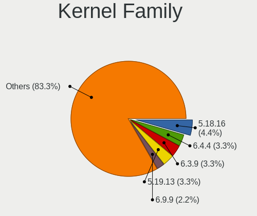

| Version | Computers | Percent |
|---------|-----------|---------|
| 5.18.16 | 4         | 7.02%   |
| 6.3.9   | 3         | 5.26%   |
| 6.4.4   | 2         | 3.51%   |
| 6.4.1   | 2         | 3.51%   |
| 6.2.13  | 2         | 3.51%   |
| 5.19.13 | 2         | 3.51%   |
| 5.12.7  | 2         | 3.51%   |
| 6.4.7   | 1         | 1.75%   |
| 6.4.3   | 1         | 1.75%   |
| 6.3.8   | 1         | 1.75%   |
| 6.3.6   | 1         | 1.75%   |
| 6.3.4   | 1         | 1.75%   |
| 6.3.10  | 1         | 1.75%   |
| 6.2.8   | 1         | 1.75%   |
| 6.2.2   | 1         | 1.75%   |
| 6.2.12  | 1         | 1.75%   |
| 6.1.9   | 1         | 1.75%   |
| 6.1.7   | 1         | 1.75%   |
| 6.1.4   | 1         | 1.75%   |
| 6.1.1   | 1         | 1.75%   |
| 6.0.7   | 1         | 1.75%   |
| 6.0.2   | 1         | 1.75%   |
| 6.0.12  | 1         | 1.75%   |
| 6.0.10  | 1         | 1.75%   |
| 5.19.9  | 1         | 1.75%   |
| 5.19.7  | 1         | 1.75%   |
| 5.19.6  | 1         | 1.75%   |
| 5.19.3  | 1         | 1.75%   |
| 5.18.9  | 1         | 1.75%   |
| 5.18.6  | 1         | 1.75%   |
| 5.18.14 | 1         | 1.75%   |
| 5.18.0  | 1         | 1.75%   |
| 5.17.9  | 1         | 1.75%   |
| 5.17.6  | 1         | 1.75%   |
| 5.17.5  | 1         | 1.75%   |
| 5.16.8  | 1         | 1.75%   |
| 5.16.7  | 1         | 1.75%   |
| 5.16.4  | 1         | 1.75%   |
| 5.16.3  | 1         | 1.75%   |
| 5.16.1  | 1         | 1.75%   |

Kernel Major Ver.
-----------------

Linux kernel major version

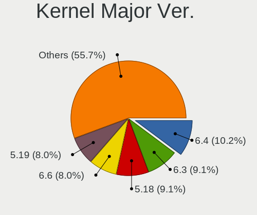

| Version | Computers | Percent |
|---------|-----------|---------|
| 5.18    | 8         | 14.29%  |
| 6.3     | 7         | 12.5%   |
| 6.4     | 6         | 10.71%  |
| 5.19    | 6         | 10.71%  |
| 6.2     | 5         | 8.93%   |
| 6.1     | 4         | 7.14%   |
| 6.0     | 4         | 7.14%   |
| 5.16    | 4         | 7.14%   |
| 5.12    | 4         | 7.14%   |
| 5.17    | 3         | 5.36%   |
| 5.15    | 2         | 3.57%   |
| 5.14    | 2         | 3.57%   |
| 5.10    | 1         | 1.79%   |

Arch
----

OS architecture (x86_64, i586, etc.)

| Name   | Computers | Percent |
|--------|-----------|---------|
| x86_64 | 54        | 100%    |

DE
--

Desktop Environment

| Name     | Computers | Percent |
|----------|-----------|---------|
| openbox  | 21        | 38.89%  |
| XFCE     | 12        | 22.22%  |
| bspwm    | 7         | 12.96%  |
| sway     | 2         | 3.7%    |
| KDE5     | 2         | 3.7%    |
| GNOME    | 2         | 3.7%    |
| Unknown  | 2         | 3.7%    |
| qtile    | 1         | 1.85%   |
| LXDE     | 1         | 1.85%   |
| i3       | 1         | 1.85%   |
| Hyprland | 1         | 1.85%   |
| dwm      | 1         | 1.85%   |
| awesome  | 1         | 1.85%   |

Display Server
--------------

X11 or Wayland

| Name    | Computers | Percent |
|---------|-----------|---------|
| X11     | 49        | 90.74%  |
| Wayland | 4         | 7.41%   |
| Unknown | 1         | 1.85%   |

Display Manager
---------------

SDDM, LightDM, etc.

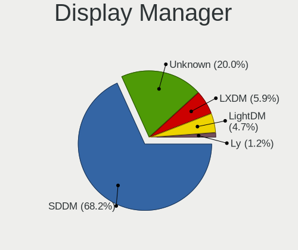

| Name    | Computers | Percent |
|---------|-----------|---------|
| SDDM    | 37        | 68.52%  |
| Unknown | 9         | 16.67%  |
| LXDM    | 5         | 9.26%   |
| LightDM | 2         | 3.7%    |
| Ly      | 1         | 1.85%   |

OS Lang
-------

Language

| Lang  | Computers | Percent |
|-------|-----------|---------|
| en_US | 27        | 50%     |
| es_MX | 6         | 11.11%  |
| en_GB | 4         | 7.41%   |
| es_ES | 3         | 5.56%   |
| en_ZA | 2         | 3.7%    |
| en_SG | 2         | 3.7%    |
| en_IN | 2         | 3.7%    |
| tr_TR | 1         | 1.85%   |
| pt_BR | 1         | 1.85%   |
| pl_PL | 1         | 1.85%   |
| it_IT | 1         | 1.85%   |
| fr_FR | 1         | 1.85%   |
| en_PH | 1         | 1.85%   |
| de_DE | 1         | 1.85%   |
| de_AT | 1         | 1.85%   |

Boot Mode
---------

EFI or BIOS

| Mode | Computers | Percent |
|------|-----------|---------|
| EFI  | 39        | 72.22%  |
| BIOS | 15        | 27.78%  |

Filesystem
----------

Type of filesystem

| Type  | Computers | Percent |
|-------|-----------|---------|
| Ext4  | 41        | 75.93%  |
| Btrfs | 11        | 20.37%  |
| Xfs   | 2         | 3.7%    |

Part. scheme
------------

Scheme of partitioning

| Type    | Computers | Percent |
|---------|-----------|---------|
| GPT     | 41        | 75.93%  |
| Unknown | 8         | 14.81%  |
| MBR     | 5         | 9.26%   |

Dual Boot with Linux/BSD
------------------------

Hosting more than one Linux/BSD

| Dual boot | Computers | Percent |
|-----------|-----------|---------|
| No        | 46        | 85.19%  |
| Yes       | 8         | 14.81%  |

Dual Boot (Win)
---------------

Hosting Linux and Windows

| Dual boot | Computers | Percent |
|-----------|-----------|---------|
| No        | 35        | 64.81%  |
| Yes       | 19        | 35.19%  |

Board
-----

Vendor
------

Motherboard manufacturer

| Name                | Computers | Percent |
|---------------------|-----------|---------|
| Hewlett-Packard     | 9         | 16.67%  |
| Dell                | 7         | 12.96%  |
| ASUSTek Computer    | 7         | 12.96%  |
| MSI                 | 6         | 11.11%  |
| Lenovo              | 4         | 7.41%   |
| Gigabyte Technology | 3         | 5.56%   |
| HUAWEI              | 2         | 3.7%    |
| ASRock              | 2         | 3.7%    |
| Apple               | 2         | 3.7%    |
| Acer                | 2         | 3.7%    |
| Standard            | 1         | 1.85%   |
| Positivo            | 1         | 1.85%   |
| Medion              | 1         | 1.85%   |
| Infinix             | 1         | 1.85%   |
| Google              | 1         | 1.85%   |
| Framework           | 1         | 1.85%   |
| eMachines           | 1         | 1.85%   |
| ECS                 | 1         | 1.85%   |
| Chuwi               | 1         | 1.85%   |
| AXDIA International | 1         | 1.85%   |

Model
-----

Motherboard model

| Name                                 | Computers | Percent |
|--------------------------------------|-----------|---------|
| Positivo CHT14B                      | 1         | 1.85%   |
| MSI MS-7C91                          | 1         | 1.85%   |
| MSI MS-7C51                          | 1         | 1.85%   |
| MSI Katana GF66 11UE                 | 1         | 1.85%   |
| MSI GL65 Leopard 10SFK               | 1         | 1.85%   |
| MSI GF63 Thin 10SC                   | 1         | 1.85%   |
| MSI Alpha 15 B5EEK                   | 1         | 1.85%   |
| Medion E3223                         | 1         | 1.85%   |
| Lenovo ThinkPad T430 2351AK9         | 1         | 1.85%   |
| Lenovo ThinkCentre M710q 10MR0047US  | 1         | 1.85%   |
| Lenovo ThinkCentre Edge72 3484HPU    | 1         | 1.85%   |
| Lenovo MIIX 310-10ICR 80SG           | 1         | 1.85%   |
| Infinix INBook X1 Pro                | 1         | 1.85%   |
| HUAWEI NBD-WXX9                      | 1         | 1.85%   |
| HUAWEI BOHB-WAX9                     | 1         | 1.85%   |
| HP Stream Laptop 11-ak0xxx           | 1         | 1.85%   |
| HP Spectre x360 Convertible 15-ch0xx | 1         | 1.85%   |
| HP Pavilion Laptop 15-eh0xxx         | 1         | 1.85%   |
| HP Pavilion Laptop 15-cc1xx          | 1         | 1.85%   |
| HP Pavilion g4                       | 1         | 1.85%   |
| HP Notebook                          | 1         | 1.85%   |
| HP Laptop 15q-bu1xx                  | 1         | 1.85%   |
| HP Laptop 15-dy2xxx                  | 1         | 1.85%   |
| HP Laptop 15-dw0xxx                  | 1         | 1.85%   |
| Google Kindred                       | 1         | 1.85%   |
| Gigabyte F2A68HM-DS2                 | 1         | 1.85%   |
| Gigabyte B650 AORUS ELITE AX         | 1         | 1.85%   |
| Gigabyte B550I AORUS PRO AX          | 1         | 1.85%   |
| Framework Laptop                     | 1         | 1.85%   |
| eMachines eME730                     | 1         | 1.85%   |
| ECS G31T-M                           | 1         | 1.85%   |
| Dell XPS 13 9310 2-in-1              | 1         | 1.85%   |
| Dell Latitude E7250                  | 1         | 1.85%   |
| Dell Latitude E6420                  | 1         | 1.85%   |
| Dell Latitude E5420                  | 1         | 1.85%   |
| Dell Latitude 5490                   | 1         | 1.85%   |
| Dell Inspiron 7559                   | 1         | 1.85%   |
| Dell Inspiron 3542                   | 1         | 1.85%   |
| Chuwi GemiBook Pro                   | 1         | 1.85%   |
| AXDIA International WINPAD V10       | 1         | 1.85%   |

Model Family
------------

Motherboard model prefix

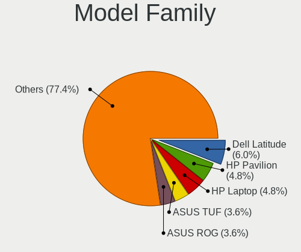

| Name                       | Computers | Percent |
|----------------------------|-----------|---------|
| Dell Latitude              | 4         | 7.41%   |
| HP Pavilion                | 3         | 5.56%   |
| HP Laptop                  | 3         | 5.56%   |
| Lenovo ThinkCentre         | 2         | 3.7%    |
| Dell Inspiron              | 2         | 3.7%    |
| ASUS ROG                   | 2         | 3.7%    |
| Positivo CHT14B            | 1         | 1.85%   |
| MSI MS-7C91                | 1         | 1.85%   |
| MSI MS-7C51                | 1         | 1.85%   |
| MSI Katana                 | 1         | 1.85%   |
| MSI GL65                   | 1         | 1.85%   |
| MSI GF63                   | 1         | 1.85%   |
| MSI Alpha                  | 1         | 1.85%   |
| Medion E3223               | 1         | 1.85%   |
| Lenovo ThinkPad            | 1         | 1.85%   |
| Lenovo MIIX                | 1         | 1.85%   |
| Infinix INBook             | 1         | 1.85%   |
| HUAWEI NBD-WXX9            | 1         | 1.85%   |
| HUAWEI BOHB-WAX9           | 1         | 1.85%   |
| HP Stream                  | 1         | 1.85%   |
| HP Spectre                 | 1         | 1.85%   |
| HP Notebook                | 1         | 1.85%   |
| Google Kindred             | 1         | 1.85%   |
| Gigabyte F2A68HM-DS2       | 1         | 1.85%   |
| Gigabyte B650              | 1         | 1.85%   |
| Gigabyte B550I             | 1         | 1.85%   |
| Framework Laptop           | 1         | 1.85%   |
| eMachines eME730           | 1         | 1.85%   |
| ECS G31T-M                 | 1         | 1.85%   |
| Dell XPS                   | 1         | 1.85%   |
| Chuwi GemiBook             | 1         | 1.85%   |
| AXDIA International WINPAD | 1         | 1.85%   |
| ASUS X441SA                | 1         | 1.85%   |
| ASUS PRIME                 | 1         | 1.85%   |
| ASUS P8H61-M               | 1         | 1.85%   |
| ASUS K30BF                 | 1         | 1.85%   |
| ASUS H110M-E               | 1         | 1.85%   |
| ASRock H97M                | 1         | 1.85%   |
| ASRock B550M               | 1         | 1.85%   |
| Apple MacBookAir4          | 1         | 1.85%   |

MFG Year
--------

Motherboard manufacture year

| Year | Computers | Percent |
|------|-----------|---------|
| 2021 | 10        | 18.52%  |
| 2020 | 8         | 14.81%  |
| 2014 | 5         | 9.26%   |
| 2018 | 4         | 7.41%   |
| 2017 | 4         | 7.41%   |
| 2016 | 4         | 7.41%   |
| 2012 | 4         | 7.41%   |
| 2011 | 4         | 7.41%   |
| 2019 | 3         | 5.56%   |
| 2015 | 3         | 5.56%   |
| 2022 | 2         | 3.7%    |
| 2010 | 1         | 1.85%   |
| 2008 | 1         | 1.85%   |
| 2007 | 1         | 1.85%   |

Form Factor
-----------

Physical design of the computer

| Name        | Computers | Percent |
|-------------|-----------|---------|
| Notebook    | 35        | 64.81%  |
| Desktop     | 15        | 27.78%  |
| Convertible | 3         | 5.56%   |
| Tablet      | 1         | 1.85%   |

Secure Boot
-----------

Enabled or disabled

| State    | Computers | Percent |
|----------|-----------|---------|
| Disabled | 54        | 100%    |

Coreboot
--------

Have coreboot on board

| Used | Computers | Percent |
|------|-----------|---------|
| No   | 53        | 98.15%  |
| Yes  | 1         | 1.85%   |

RAM Size
--------

Total RAM memory

| Size in GB  | Computers | Percent |
|-------------|-----------|---------|
| 4.01-8.0    | 15        | 27.78%  |
| 3.01-4.0    | 9         | 16.67%  |
| 8.01-16.0   | 9         | 16.67%  |
| 32.01-64.0  | 8         | 14.81%  |
| 16.01-24.0  | 7         | 12.96%  |
| 1.01-2.0    | 4         | 7.41%   |
| 24.01-32.0  | 1         | 1.85%   |
| 64.01-256.0 | 1         | 1.85%   |

RAM Used
--------

Used RAM memory

| Used GB   | Computers | Percent |
|-----------|-----------|---------|
| 1.01-2.0  | 18        | 32.14%  |
| 2.01-3.0  | 16        | 28.57%  |
| 3.01-4.0  | 9         | 16.07%  |
| 4.01-8.0  | 8         | 14.29%  |
| 0.51-1.0  | 3         | 5.36%   |
| 8.01-16.0 | 2         | 3.57%   |

Total Drives
------------

Number of drives on board

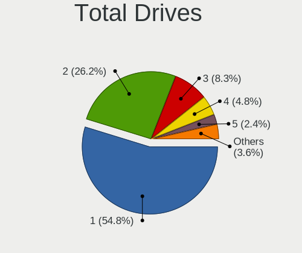

| Drives | Computers | Percent |
|--------|-----------|---------|
| 1      | 28        | 51.85%  |
| 2      | 18        | 33.33%  |
| 3      | 3         | 5.56%   |
| 5      | 2         | 3.7%    |
| 4      | 2         | 3.7%    |
| 7      | 1         | 1.85%   |

Has CD-ROM
----------

Has CD-ROM on board

| Presented | Computers | Percent |
|-----------|-----------|---------|
| No        | 45        | 83.33%  |
| Yes       | 9         | 16.67%  |

Has Ethernet
------------

Has Ethernet on board

| Presented | Computers | Percent |
|-----------|-----------|---------|
| Yes       | 39        | 72.22%  |
| No        | 15        | 27.78%  |

Has WiFi
--------

Has WiFi module

| Presented | Computers | Percent |
|-----------|-----------|---------|
| Yes       | 44        | 81.48%  |
| No        | 10        | 18.52%  |

Has Bluetooth
-------------

Has Bluetooth module

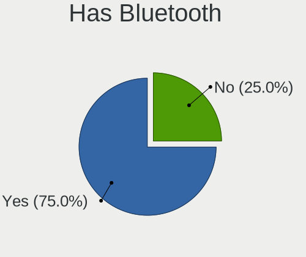

| Presented | Computers | Percent |
|-----------|-----------|---------|
| Yes       | 37        | 68.52%  |
| No        | 17        | 31.48%  |

Location
--------

Country
-------

Geographic location (country)

| Country            | Computers | Percent |
|--------------------|-----------|---------|
| USA                | 10        | 18.52%  |
| Mexico             | 6         | 11.11%  |
| UK                 | 4         | 7.41%   |
| India              | 4         | 7.41%   |
| Spain              | 3         | 5.56%   |
| Brazil             | 3         | 5.56%   |
| Uruguay            | 2         | 3.7%    |
| South Africa       | 2         | 3.7%    |
| Malaysia           | 2         | 3.7%    |
| Germany            | 2         | 3.7%    |
| Vietnam            | 1         | 1.85%   |
| Turkey             | 1         | 1.85%   |
| Thailand           | 1         | 1.85%   |
| Slovakia           | 1         | 1.85%   |
| Russia             | 1         | 1.85%   |
| Poland             | 1         | 1.85%   |
| Philippines        | 1         | 1.85%   |
| Italy              | 1         | 1.85%   |
| Indonesia          | 1         | 1.85%   |
| Hungary            | 1         | 1.85%   |
| France             | 1         | 1.85%   |
| Finland            | 1         | 1.85%   |
| Dominican Republic | 1         | 1.85%   |
| Czechia            | 1         | 1.85%   |
| Austria            | 1         | 1.85%   |
| Argentina          | 1         | 1.85%   |

City
----

Geographic location (city)

| City               | Computers | Percent |
|--------------------|-----------|---------|
| Seremban           | 2         | 3.64%   |
| New Delhi          | 2         | 3.64%   |
| Montevideo         | 2         | 3.64%   |
| Madrid             | 2         | 3.64%   |
| Cape Town          | 2         | 3.64%   |
| Welwyn Garden City | 1         | 1.82%   |
| Vienna             | 1         | 1.82%   |
| Valencia           | 1         | 1.82%   |
| Ulm                | 1         | 1.82%   |
| Torreón           | 1         | 1.82%   |
| Tirunelveli        | 1         | 1.82%   |
| Tábor             | 1         | 1.82%   |
| Stevens Point      | 1         | 1.82%   |
| Sao Paulo          | 1         | 1.82%   |
| Santo Domingo Este | 1         | 1.82%   |
| Santa Rosa         | 1         | 1.82%   |
| Rocca di Papa      | 1         | 1.82%   |
| Paulista           | 1         | 1.82%   |
| Osasco             | 1         | 1.82%   |
| Monterrey          | 1         | 1.82%   |
| Milton Keynes      | 1         | 1.82%   |
| Mazatlán          | 1         | 1.82%   |
| Mar del Plata      | 1         | 1.82%   |
| Manchester         | 1         | 1.82%   |
| Malang             | 1         | 1.82%   |
| Loskutova          | 1         | 1.82%   |
| Lorain             | 1         | 1.82%   |
| London             | 1         | 1.82%   |
| Lannion            | 1         | 1.82%   |
| Jorge Negrete      | 1         | 1.82%   |
| Istanbul           | 1         | 1.82%   |
| Ibbenbueren        | 1         | 1.82%   |
| Helsinki           | 1         | 1.82%   |
| Hanoi              | 1         | 1.82%   |
| Guadalajara        | 1         | 1.82%   |
| Gebze              | 1         | 1.82%   |
| Gdansk             | 1         | 1.82%   |
| Frisco             | 1         | 1.82%   |
| Dallas             | 1         | 1.82%   |
| Clifton Park       | 1         | 1.82%   |

Drives
------

Drive Vendor
------------

Hard drive vendors

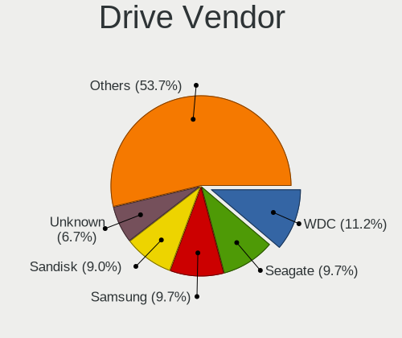

| Vendor                      | Computers | Drives | Percent |
|-----------------------------|-----------|--------|---------|
| WDC                         | 10        | 12     | 11.9%   |
| Seagate                     | 8         | 13     | 9.52%   |
| Unknown                     | 7         | 12     | 8.33%   |
| Samsung Electronics         | 6         | 6      | 7.14%   |
| Sandisk                     | 5         | 5      | 5.95%   |
| Phison Electronics          | 5         | 5      | 5.95%   |
| Hitachi                     | 5         | 5      | 5.95%   |
| Toshiba                     | 4         | 4      | 4.76%   |
| KIOXIA                      | 3         | 3      | 3.57%   |
| Kingston                    | 3         | 3      | 3.57%   |
| Intel                       | 3         | 6      | 3.57%   |
| Unknown                     | 3         | 3      | 3.57%   |
| SK hynix                    | 2         | 2      | 2.38%   |
| Phison                      | 2         | 2      | 2.38%   |
| Micron/Crucial Technology   | 2         | 2      | 2.38%   |
| Crucial                     | 2         | 2      | 2.38%   |
| Yangtze Memory Technologies | 1         | 1      | 1.19%   |
| ROG                         | 1         | 1      | 1.19%   |
| Patriot                     | 1         | 1      | 1.19%   |
| Netac                       | 1         | 1      | 1.19%   |
| Mushkin                     | 1         | 2      | 1.19%   |
| Kingston Technology Company | 1         | 2      | 1.19%   |
| KingFast                    | 1         | 2      | 1.19%   |
| Initio                      | 1         | 1      | 1.19%   |
| HGST                        | 1         | 1      | 1.19%   |
| Gigabyte Technology         | 1         | 2      | 1.19%   |
| China                       | 1         | 2      | 1.19%   |
| Apple                       | 1         | 1      | 1.19%   |
| Apacer                      | 1         | 1      | 1.19%   |
| A-DATA Technology           | 1         | 2      | 1.19%   |

Drive Model
-----------

Hard drive models

| Model                                               | Computers | Percent |
|-----------------------------------------------------|-----------|---------|
| Unknown MMC Card  32GB                              | 3         | 3.19%   |
| Unknown                                             | 3         | 3.19%   |
| Unknown MMC Card  64GB                              | 2         | 2.13%   |
| Seagate ST500LM030-2E717D 500GB                     | 2         | 2.13%   |
| Samsung NVMe SSD Controller SM981/PM981/PM983 500GB | 2         | 2.13%   |
| Phison PS5013 E13 NVMe Controller 256GB             | 2         | 2.13%   |
| Phison E16 PCIe4 NVMe Controller 1TB                | 2         | 2.13%   |
| Yangtze Memory YMTC PC005 256GB                     | 1         | 1.06%   |
| WDC WDS500G2B0C-00PXH0 500GB                        | 1         | 1.06%   |
| WDC WDS500G2B0A-00SM50 500GB SSD                    | 1         | 1.06%   |
| WDC WD5000AAKX-75U6AA0 500GB                        | 1         | 1.06%   |
| WDC WD5000AAKX-60U6AA0 500GB                        | 1         | 1.06%   |
| WDC WD5000AAKX-08U6AA0 500GB                        | 1         | 1.06%   |
| WDC WD3200BPVT-22JJ5T0 320GB                        | 1         | 1.06%   |
| WDC WD20 EARX-00PASB0 2TB                           | 1         | 1.06%   |
| WDC WD10SPZX-24Z10T0 1TB                            | 1         | 1.06%   |
| WDC WD10JPVX-22JC3T0 1TB                            | 1         | 1.06%   |
| WDC WD10EZEX-22RKKA0 1TB                            | 1         | 1.06%   |
| WDC WD10EZEX-21M2NA0 1TB                            | 1         | 1.06%   |
| WDC WD10EARS-00MVWB0 1TB                            | 1         | 1.06%   |
| Unknown SD/MMC/MS PRO 128GB                         | 1         | 1.06%   |
| Unknown SC128  128GB                                | 1         | 1.06%   |
| Unknown MMC Card  16GB                              | 1         | 1.06%   |
| Unknown MMC Card  128GB                             | 1         | 1.06%   |
| Unknown Essentiel B 1TB                             | 1         | 1.06%   |
| Toshiba MQ01ABF050 500GB                            | 1         | 1.06%   |
| Toshiba MQ01ABD100 1TB                              | 1         | 1.06%   |
| Toshiba DT01ACA200 2TB                              | 1         | 1.06%   |
| Toshiba DT01ACA100 1TB                              | 1         | 1.06%   |
| SK hynix NVMe SSD Drive 128GB                       | 1         | 1.06%   |
| SK hynix HFS128G39TND-N210A 128GB SSD               | 1         | 1.06%   |
| Seagate ST6000DM003-2CY186 6TB                      | 1         | 1.06%   |
| Seagate ST3500410AS 500GB                           | 1         | 1.06%   |
| Seagate ST320LM001 HN-M320MBB 320GB                 | 1         | 1.06%   |
| Seagate ST31500341AS 1TB                            | 1         | 1.06%   |
| Seagate ST2000DM 008-2FR102 2TB                     | 1         | 1.06%   |
| Seagate ST1000LM048-2E7172 1TB                      | 1         | 1.06%   |
| Seagate ST1000DM010-2EP102 1TB                      | 1         | 1.06%   |
| Seagate Expansion Desk 8TB                          | 1         | 1.06%   |
| Seagate Expansion 1TB                               | 1         | 1.06%   |

HDD Vendor
----------

Hard disk drive vendors

| Vendor  | Computers | Drives | Percent |
|---------|-----------|--------|---------|
| WDC     | 8         | 10     | 27.59%  |
| Seagate | 8         | 13     | 27.59%  |
| Hitachi | 5         | 5      | 17.24%  |
| Toshiba | 4         | 4      | 13.79%  |
| Unknown | 2         | 3      | 6.9%    |
| Initio  | 1         | 1      | 3.45%   |
| HGST    | 1         | 1      | 3.45%   |

SSD Vendor
----------

Solid state drive vendors

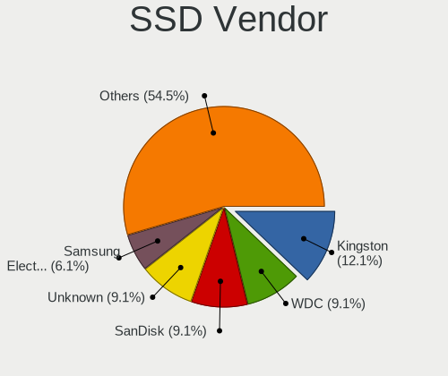

| Vendor              | Computers | Drives | Percent |
|---------------------|-----------|--------|---------|
| Unknown             | 3         | 3      | 14.29%  |
| Samsung Electronics | 2         | 2      | 9.52%   |
| Kingston            | 2         | 2      | 9.52%   |
| Intel               | 2         | 2      | 9.52%   |
| WDC                 | 1         | 1      | 4.76%   |
| SK hynix            | 1         | 1      | 4.76%   |
| SanDisk             | 1         | 1      | 4.76%   |
| Phison              | 1         | 1      | 4.76%   |
| Patriot             | 1         | 1      | 4.76%   |
| Netac               | 1         | 1      | 4.76%   |
| Gigabyte Technology | 1         | 2      | 4.76%   |
| Crucial             | 1         | 1      | 4.76%   |
| China               | 1         | 2      | 4.76%   |
| Apple               | 1         | 1      | 4.76%   |
| Apacer              | 1         | 1      | 4.76%   |
| A-DATA Technology   | 1         | 2      | 4.76%   |

Drive Kind
----------

HDD or SSD

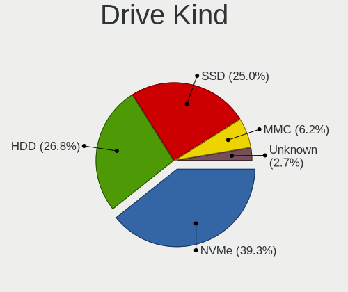

| Kind    | Computers | Drives | Percent |
|---------|-----------|--------|---------|
| NVMe    | 24        | 32     | 33.33%  |
| HDD     | 21        | 37     | 29.17%  |
| SSD     | 19        | 24     | 26.39%  |
| MMC     | 6         | 9      | 8.33%   |
| Unknown | 2         | 3      | 2.78%   |

Drive Connector
---------------

SATA, SAS, NVMe, etc.

| Type | Computers | Drives | Percent |
|------|-----------|--------|---------|
| SATA | 33        | 55     | 47.83%  |
| NVMe | 24        | 32     | 34.78%  |
| SAS  | 6         | 9      | 8.7%    |
| MMC  | 6         | 9      | 8.7%    |

Drive Size
----------

Size of hard drive

| Size in TB | Computers | Drives | Percent |
|------------|-----------|--------|---------|
| 0.01-0.5   | 26        | 36     | 59.09%  |
| 0.51-1.0   | 14        | 20     | 31.82%  |
| 1.01-2.0   | 2         | 3      | 4.55%   |
| 4.01-10.0  | 2         | 2      | 4.55%   |

Space Total
-----------

Amount of disk space available on the file system

| Size in GB     | Computers | Percent |
|----------------|-----------|---------|
| 101-250        | 15        | 27.78%  |
| 251-500        | 11        | 20.37%  |
| 1001-2000      | 8         | 14.81%  |
| 501-1000       | 8         | 14.81%  |
| More than 3000 | 4         | 7.41%   |
| 51-100         | 3         | 5.56%   |
| Unknown        | 3         | 5.56%   |
| 21-50          | 1         | 1.85%   |
| 2001-3000      | 1         | 1.85%   |

Space Used
----------

Amount of used disk space

| Used GB        | Computers | Percent |
|----------------|-----------|---------|
| 21-50          | 14        | 25.93%  |
| 1-20           | 12        | 22.22%  |
| 51-100         | 8         | 14.81%  |
| 251-500        | 6         | 11.11%  |
| 101-250        | 5         | 9.26%   |
| 501-1000       | 4         | 7.41%   |
| Unknown        | 3         | 5.56%   |
| More than 3000 | 1         | 1.85%   |
| 1001-2000      | 1         | 1.85%   |

Malfunc. Drives
---------------

Drive models with a malfunction

| Model                          | Computers | Drives | Percent |
|--------------------------------|-----------|--------|---------|
| WDC WD5000AAKX-75U6AA0 500GB   | 1         | 1      | 14.29%  |
| WDC WD5000AAKX-60U6AA0 500GB   | 1         | 1      | 14.29%  |
| WDC WD10EARS-00MVWB0 1TB       | 1         | 1      | 14.29%  |
| Seagate ST1000LM048-2E7172 1TB | 1         | 1      | 14.29%  |
| Hitachi HTS547550A9E384 500GB  | 1         | 1      | 14.29%  |
| Hitachi HTS545032A7E380 320GB  | 1         | 1      | 14.29%  |
| HGST HTS545050A7E680 500GB     | 1         | 1      | 14.29%  |

Malfunc. Drive Vendor
---------------------

Vendors of faulty drives

| Vendor  | Computers | Drives | Percent |
|---------|-----------|--------|---------|
| WDC     | 3         | 3      | 42.86%  |
| Hitachi | 2         | 2      | 28.57%  |
| Seagate | 1         | 1      | 14.29%  |
| HGST    | 1         | 1      | 14.29%  |

Malfunc. HDD Vendor
-------------------

Vendors of faulty HDD drives

| Vendor  | Computers | Drives | Percent |
|---------|-----------|--------|---------|
| WDC     | 3         | 3      | 42.86%  |
| Hitachi | 2         | 2      | 28.57%  |
| Seagate | 1         | 1      | 14.29%  |
| HGST    | 1         | 1      | 14.29%  |

Malfunc. Drive Kind
-------------------

Kinds of faulty drives

| Kind | Computers | Drives | Percent |
|------|-----------|--------|---------|
| HDD  | 6         | 7      | 100%    |

Failed Drives
-------------

Failed drive models

| Model                     | Computers | Drives | Percent |
|---------------------------|-----------|--------|---------|
| Seagate ST3500410AS 500GB | 1         | 2      | 50%     |
| Seagate ST31500341AS 1TB  | 1         | 2      | 50%     |

Failed Drive Vendor
-------------------

Failed drive vendors

| Vendor  | Computers | Drives | Percent |
|---------|-----------|--------|---------|
| Seagate | 1         | 4      | 100%    |

Drive Status
------------

Number of failed and malfunc. drives

| Status   | Computers | Drives | Percent |
|----------|-----------|--------|---------|
| Works    | 38        | 64     | 61.29%  |
| Detected | 17        | 30     | 27.42%  |
| Malfunc  | 6         | 7      | 9.68%   |
| Failed   | 1         | 4      | 1.61%   |

Storage controller
------------------

Storage Vendor
--------------

Storage controller vendors

| Vendor                      | Computers | Percent |
|-----------------------------|-----------|---------|
| Intel                       | 34        | 49.28%  |
| AMD                         | 9         | 13.04%  |
| SanDisk                     | 5         | 7.25%   |
| Phison Electronics          | 5         | 7.25%   |
| Samsung Electronics         | 4         | 5.8%    |
| Micron/Crucial Technology   | 3         | 4.35%   |
| KIOXIA                      | 3         | 4.35%   |
| Kingston Technology Company | 2         | 2.9%    |
| Yangtze Memory Technologies | 1         | 1.45%   |
| SK hynix                    | 1         | 1.45%   |
| Silicon Motion              | 1         | 1.45%   |
| ASMedia Technology          | 1         | 1.45%   |

Storage Model
-------------

Storage controller models

| Model                                                                            | Computers | Percent |
|----------------------------------------------------------------------------------|-----------|---------|
| AMD FCH SATA Controller [AHCI mode]                                              | 5         | 6.49%   |
| Samsung NVMe SSD Controller SM981/PM981/PM983                                    | 3         | 3.9%    |
| Micron/Crucial P2 [Nick P2] / P3 / P3 Plus NVMe PCIe SSD (DRAM-less)             | 3         | 3.9%    |
| KIOXIA NVMe SSD Controller BG4 (DRAM-less)                                       | 3         | 3.9%    |
| Intel 82801 Mobile SATA Controller [RAID mode]                                   | 3         | 3.9%    |
| Intel 6 Series/C200 Series Chipset Family 6 port Mobile SATA AHCI Controller     | 3         | 3.9%    |
| AMD 500 Series Chipset SATA Controller                                           | 3         | 3.9%    |
| Phison PS5013 E13 NVMe Controller                                                | 2         | 2.6%    |
| Phison E16 PCIe4 NVMe Controller                                                 | 2         | 2.6%    |
| Intel Volume Management Device NVMe RAID Controller                              | 2         | 2.6%    |
| Intel Tiger Lake SATA AHCI Controller                                            | 2         | 2.6%    |
| Intel Sunrise Point-LP SATA Controller [AHCI mode]                               | 2         | 2.6%    |
| Intel HM170/QM170 Chipset SATA Controller [AHCI Mode]                            | 2         | 2.6%    |
| Intel Comet Lake SATA AHCI Controller                                            | 2         | 2.6%    |
| Intel Celeron/Pentium Silver Processor SATA Controller                           | 2         | 2.6%    |
| Intel 8 Series SATA Controller 1 [AHCI mode]                                     | 2         | 2.6%    |
| Intel 6 Series/C200 Series Chipset Family 6 port Desktop SATA AHCI Controller    | 2         | 2.6%    |
| Intel 400 Series Chipset Family SATA AHCI Controller                             | 2         | 2.6%    |
| Yangtze Memory PC005 NVMe SSD                                                    | 1         | 1.3%    |
| SK hynix BC501 NVMe Solid State Drive                                            | 1         | 1.3%    |
| Silicon Motion SM2262/SM2262EN SSD Controller                                    | 1         | 1.3%    |
| SanDisk WD Blue SN570 NVMe SSD 1TB                                               | 1         | 1.3%    |
| SanDisk WD Blue SN550 NVMe SSD                                                   | 1         | 1.3%    |
| SanDisk WD Blue SN500 / PC SN520 NVMe SSD                                        | 1         | 1.3%    |
| SanDisk WD Black SN770 / PC SN740 256GB / PC SN560 (DRAM-less) NVMe SSD          | 1         | 1.3%    |
| SanDisk PC SN735 NVMe SSD (DRAM-less)                                            | 1         | 1.3%    |
| Samsung NVMe SSD Controller 980                                                  | 1         | 1.3%    |
| Phison E18 PCIe4 NVMe Controller                                                 | 1         | 1.3%    |
| Phison E12 NVMe Controller                                                       | 1         | 1.3%    |
| Kingston Company Company Non-Volatile memory controller                          | 1         | 1.3%    |
| Kingston Company OM3PDP3 NVMe SSD                                                | 1         | 1.3%    |
| Kingston Company KC3000/Renegade NVMe SSD                                        | 1         | 1.3%    |
| Intel Wildcat Point-LP SATA Controller [AHCI Mode]                               | 1         | 1.3%    |
| Intel Q170/Q150/B150/H170/H110/Z170/CM236 Chipset SATA Controller [AHCI Mode]    | 1         | 1.3%    |
| Intel Optane SSD 900P Series                                                     | 1         | 1.3%    |
| Intel NM10/ICH7 Family SATA Controller [IDE mode]                                | 1         | 1.3%    |
| Intel Celeron N3350/Pentium N4200/Atom E3900 Series SATA AHCI Controller         | 1         | 1.3%    |
| Intel C620 Series Chipset Family IDE Redirection                                 | 1         | 1.3%    |
| Intel Atom/Celeron/Pentium Processor x5-E8000/J3xxx/N3xxx Series SATA Controller | 1         | 1.3%    |
| Intel 9 Series Chipset Family SATA Controller [AHCI Mode]                        | 1         | 1.3%    |

Storage Kind
------------

Kind of storage controller (IDE, SATA, NVMe, SAS, ...)

| Kind | Computers | Percent |
|------|-----------|---------|
| SATA | 38        | 54.29%  |
| NVMe | 24        | 34.29%  |
| RAID | 5         | 7.14%   |
| IDE  | 3         | 4.29%   |

Processor
---------

CPU Vendor
----------

Processor vendors

| Vendor | Computers | Percent |
|--------|-----------|---------|
| Intel  | 42        | 77.78%  |
| AMD    | 12        | 22.22%  |

CPU Model
---------

Processor models

| Model                                          | Computers | Percent |
|------------------------------------------------|-----------|---------|
| Intel Core i5-8250U CPU @ 1.60GHz              | 2         | 3.7%    |
| Intel Atom x5-Z8350 CPU @ 1.44GHz              | 2         | 3.7%    |
| Intel 11th Gen Core i7-11800H @ 2.30GHz        | 2         | 3.7%    |
| Intel 11th Gen Core i5-1135G7 @ 2.40GHz        | 2         | 3.7%    |
| AMD A10-7800 Radeon R7, 12 Compute Cores 4C+8G | 2         | 3.7%    |
| Intel Xeon W-3175X CPU @ 3.10GHz               | 1         | 1.85%   |
| Intel Pentium Silver N5030 CPU @ 1.10GHz       | 1         | 1.85%   |
| Intel Pentium CPU N4200 @ 1.10GHz              | 1         | 1.85%   |
| Intel Core i7-8705G CPU @ 3.10GHz              | 1         | 1.85%   |
| Intel Core i7-8565U CPU @ 1.80GHz              | 1         | 1.85%   |
| Intel Core i7-8550U CPU @ 1.80GHz              | 1         | 1.85%   |
| Intel Core i7-6700HQ CPU @ 2.60GHz             | 1         | 1.85%   |
| Intel Core i7-4510U CPU @ 2.00GHz              | 1         | 1.85%   |
| Intel Core i7-2600K CPU @ 3.40GHz              | 1         | 1.85%   |
| Intel Core i7-10750H CPU @ 2.60GHz             | 1         | 1.85%   |
| Intel Core i7-1065G7 CPU @ 1.30GHz             | 1         | 1.85%   |
| Intel Core i5-7400 CPU @ 3.00GHz               | 1         | 1.85%   |
| Intel Core i5-6500T CPU @ 2.50GHz              | 1         | 1.85%   |
| Intel Core i5-5300U CPU @ 2.30GHz              | 1         | 1.85%   |
| Intel Core i5-4690K CPU @ 3.50GHz              | 1         | 1.85%   |
| Intel Core i5-3320M CPU @ 2.60GHz              | 1         | 1.85%   |
| Intel Core i5-2540M CPU @ 2.60GHz              | 1         | 1.85%   |
| Intel Core i5-2467M CPU @ 1.60GHz              | 1         | 1.85%   |
| Intel Core i5-10300H CPU @ 2.50GHz             | 1         | 1.85%   |
| Intel Core i5-10210U CPU @ 1.60GHz             | 1         | 1.85%   |
| Intel Core i3-5005U CPU @ 2.00GHz              | 1         | 1.85%   |
| Intel Core i3-3220 CPU @ 3.30GHz               | 1         | 1.85%   |
| Intel Core i3-2310M CPU @ 2.10GHz              | 1         | 1.85%   |
| Intel Core i3-10110U CPU @ 2.10GHz             | 1         | 1.85%   |
| Intel Core i3 CPU M 350 @ 2.27GHz              | 1         | 1.85%   |
| Intel Core 2 Duo CPU T8300 @ 2.40GHz           | 1         | 1.85%   |
| Intel Core 2 Duo CPU E4600 @ 2.40GHz           | 1         | 1.85%   |
| Intel Celeron N4020 CPU @ 1.10GHz              | 1         | 1.85%   |
| Intel Celeron J4125 CPU @ 2.00GHz              | 1         | 1.85%   |
| Intel Celeron CPU N3060 @ 1.60GHz              | 1         | 1.85%   |
| Intel Celeron 2957U @ 1.40GHz                  | 1         | 1.85%   |
| Intel Atom CPU Z3735F @ 1.33GHz                | 1         | 1.85%   |
| Intel 11th Gen Core i7-1165G7 @ 2.80GHz        | 1         | 1.85%   |
| Intel 11th Gen Core i3-1115G4 @ 3.00GHz        | 1         | 1.85%   |
| AMD Ryzen 9 5900X 12-Core Processor            | 1         | 1.85%   |

CPU Model Family
----------------

Processor model prefix

| Model                | Computers | Percent |
|----------------------|-----------|---------|
| Intel Core i5        | 11        | 20.37%  |
| Intel Core i7        | 8         | 14.81%  |
| Other                | 6         | 11.11%  |
| Intel Core i3        | 5         | 9.26%   |
| Intel Celeron        | 4         | 7.41%   |
| AMD Ryzen 7          | 4         | 7.41%   |
| AMD Ryzen 5          | 4         | 7.41%   |
| Intel Atom           | 3         | 5.56%   |
| Intel Core 2 Duo     | 2         | 3.7%    |
| AMD A10              | 2         | 3.7%    |
| Intel Xeon           | 1         | 1.85%   |
| Intel Pentium Silver | 1         | 1.85%   |
| Intel Pentium        | 1         | 1.85%   |
| AMD Ryzen 9          | 1         | 1.85%   |
| AMD A4               | 1         | 1.85%   |

CPU Cores
---------

Number of processor cores

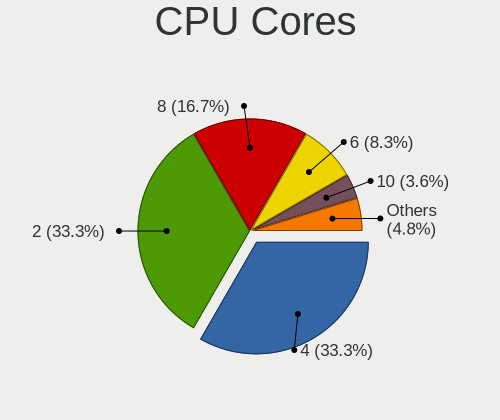

| Number | Computers | Percent |
|--------|-----------|---------|
| 4      | 22        | 40.74%  |
| 2      | 19        | 35.19%  |
| 8      | 6         | 11.11%  |
| 6      | 5         | 9.26%   |
| 28     | 1         | 1.85%   |
| 12     | 1         | 1.85%   |

CPU Sockets
-----------

Number of sockets

| Number | Computers | Percent |
|--------|-----------|---------|
| 1      | 54        | 100%    |

CPU Threads
-----------

Threads per core (Hyper-Threading)

| Number | Computers | Percent |
|--------|-----------|---------|
| 2      | 38        | 70.37%  |
| 1      | 16        | 29.63%  |

CPU Op-Modes
------------

CPU Operation Modes (32-bit, 64-bit)

| Op mode        | Computers | Percent |
|----------------|-----------|---------|
| 32-bit, 64-bit | 54        | 100%    |

CPU Microcode
-------------

Microcode number

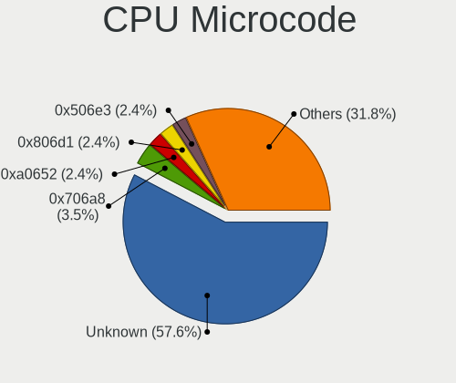

| Number     | Computers | Percent |
|------------|-----------|---------|
| Unknown    | 24        | 44.44%  |
| 0xa0652    | 2         | 3.7%    |
| 0x806d1    | 2         | 3.7%    |
| 0x706a8    | 2         | 3.7%    |
| 0x506e3    | 2         | 3.7%    |
| 0x206a7    | 2         | 3.7%    |
| 0x906e9    | 1         | 1.85%   |
| 0x806ec    | 1         | 1.85%   |
| 0x806ea    | 1         | 1.85%   |
| 0x806c1    | 1         | 1.85%   |
| 0x6fd      | 1         | 1.85%   |
| 0x506c9    | 1         | 1.85%   |
| 0x50654    | 1         | 1.85%   |
| 0x406c4    | 1         | 1.85%   |
| 0x40651    | 1         | 1.85%   |
| 0x306d4    | 1         | 1.85%   |
| 0x306c3    | 1         | 1.85%   |
| 0x306a9    | 1         | 1.85%   |
| 0x0a601203 | 1         | 1.85%   |
| 0x0a404102 | 1         | 1.85%   |
| 0x0a201016 | 1         | 1.85%   |
| 0x0a201009 | 1         | 1.85%   |
| 0x08701021 | 1         | 1.85%   |
| 0x08600106 | 1         | 1.85%   |
| 0x06003106 | 1         | 1.85%   |
| 0x03000027 | 1         | 1.85%   |

CPU Microarch
-------------

Microarchitecture

| Name          | Computers | Percent |
|---------------|-----------|---------|
| KabyLake      | 8         | 14.81%  |
| TigerLake     | 4         | 7.41%   |
| Silvermont    | 4         | 7.41%   |
| SandyBridge   | 4         | 7.41%   |
| Zen 3         | 3         | 5.56%   |
| Zen 2         | 3         | 5.56%   |
| Skylake       | 3         | 5.56%   |
| Icelake       | 3         | 5.56%   |
| Haswell       | 3         | 5.56%   |
| Goldmont plus | 3         | 5.56%   |
| Steamroller   | 2         | 3.7%    |
| IvyBridge     | 2         | 3.7%    |
| CometLake     | 2         | 3.7%    |
| Broadwell     | 2         | 3.7%    |
| Unknown       | 2         | 3.7%    |
| Zen+          | 1         | 1.85%   |
| Westmere      | 1         | 1.85%   |
| Penryn        | 1         | 1.85%   |
| K10 Llano     | 1         | 1.85%   |
| Goldmont      | 1         | 1.85%   |
| Core          | 1         | 1.85%   |

Graphics
--------

GPU Vendor
----------

Vendors of graphics cards

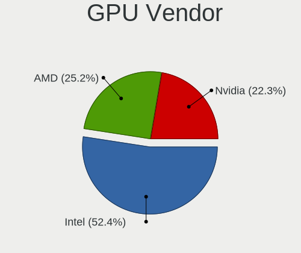

| Vendor | Computers | Percent |
|--------|-----------|---------|
| Intel  | 38        | 55.88%  |
| Nvidia | 15        | 22.06%  |
| AMD    | 15        | 22.06%  |

GPU Model
---------

Graphics card models

| Model                                                                                    | Computers | Percent |
|------------------------------------------------------------------------------------------|-----------|---------|
| Intel UHD Graphics 620                                                                   | 3         | 4.11%   |
| Intel TigerLake-LP GT2 [Iris Xe Graphics]                                                | 3         | 4.11%   |
| Intel Atom/Celeron/Pentium Processor x5-E8000/J3xxx/N3xxx Integrated Graphics Controller | 3         | 4.11%   |
| Intel 2nd Generation Core Processor Family Integrated Graphics Controller                | 3         | 4.11%   |
| AMD Ellesmere [Radeon RX 470/480/570/570X/580/580X/590]                                  | 3         | 4.11%   |
| Nvidia GP107 [GeForce GTX 1050 Ti]                                                       | 2         | 2.74%   |
| Nvidia GM108M [GeForce MX130]                                                            | 2         | 2.74%   |
| Intel TigerLake-H GT1 [UHD Graphics]                                                     | 2         | 2.74%   |
| Intel HD Graphics 630                                                                    | 2         | 2.74%   |
| Intel HD Graphics 5500                                                                   | 2         | 2.74%   |
| Intel HD Graphics 530                                                                    | 2         | 2.74%   |
| Intel Haswell-ULT Integrated Graphics Controller                                         | 2         | 2.74%   |
| Intel GeminiLake [UHD Graphics 600]                                                      | 2         | 2.74%   |
| Intel CometLake-U GT2 [UHD Graphics]                                                     | 2         | 2.74%   |
| Intel CometLake-H GT2 [UHD Graphics]                                                     | 2         | 2.74%   |
| AMD Sun XT [Radeon HD 8670A/8670M/8690M / R5 M330 / M430 / Radeon 520 Mobile]            | 2         | 2.74%   |
| AMD Renoir                                                                               | 2         | 2.74%   |
| AMD Kaveri [Radeon R7 Graphics]                                                          | 2         | 2.74%   |
| Nvidia TU106M [GeForce RTX 2070 Mobile / Max-Q Refresh]                                  | 1         | 1.37%   |
| Nvidia TU106 [GeForce RTX 2060 SUPER]                                                    | 1         | 1.37%   |
| Nvidia TU102 [TITAN RTX]                                                                 | 1         | 1.37%   |
| Nvidia GP106 [GeForce GTX 1060 6GB]                                                      | 1         | 1.37%   |
| Nvidia GM108M [GeForce 940MX]                                                            | 1         | 1.37%   |
| Nvidia GM108M [GeForce 840M]                                                             | 1         | 1.37%   |
| Nvidia GM107M [GeForce GTX 960M]                                                         | 1         | 1.37%   |
| Nvidia GA107M [GeForce RTX 3050 Mobile]                                                  | 1         | 1.37%   |
| Nvidia GA106M [GeForce RTX 3060 Mobile / Max-Q]                                          | 1         | 1.37%   |
| Nvidia GA106 [GeForce RTX 3060 Lite Hash Rate]                                           | 1         | 1.37%   |
| Nvidia GA104M [GeForce RTX 3070 Mobile / Max-Q]                                          | 1         | 1.37%   |
| Intel Xeon E3-1200 v2/3rd Gen Core processor Graphics Controller                         | 1         | 1.37%   |
| Intel WhiskeyLake-U GT2 [UHD Graphics 620]                                               | 1         | 1.37%   |
| Intel Tiger Lake-LP GT2 [UHD Graphics G4]                                                | 1         | 1.37%   |
| Intel Mobile GM965/GL960 Integrated Graphics Controller (secondary)                      | 1         | 1.37%   |
| Intel Mobile GM965/GL960 Integrated Graphics Controller (primary)                        | 1         | 1.37%   |
| Intel Iris Plus Graphics G7                                                              | 1         | 1.37%   |
| Intel GeminiLake [UHD Graphics 605]                                                      | 1         | 1.37%   |
| Intel Core Processor Integrated Graphics Controller                                      | 1         | 1.37%   |
| Intel Atom Processor Z36xxx/Z37xxx Series Graphics & Display                             | 1         | 1.37%   |
| Intel Apollo Lake [HD Graphics 505]                                                      | 1         | 1.37%   |
| Intel 3rd Gen Core processor Graphics Controller                                         | 1         | 1.37%   |

GPU Combo
---------

Combinations of graphics cards

| Name           | Computers | Percent |
|----------------|-----------|---------|
| 1 x Intel      | 26        | 48.15%  |
| Intel + Nvidia | 9         | 16.67%  |
| 1 x AMD        | 6         | 11.11%  |
| 2 x AMD        | 4         | 7.41%   |
| 1 x Nvidia     | 4         | 7.41%   |
| Intel + AMD    | 3         | 5.56%   |
| AMD + Nvidia   | 2         | 3.7%    |

GPU Driver
----------

Free vs proprietary

| Driver      | Computers | Percent |
|-------------|-----------|---------|
| Free        | 42        | 76.36%  |
| Proprietary | 13        | 23.64%  |

GPU Memory
----------

Total video memory

| Size in GB | Computers | Percent |
|------------|-----------|---------|
| Unknown    | 38        | 69.09%  |
| 7.01-8.0   | 4         | 7.27%   |
| 0.01-0.5   | 3         | 5.45%   |
| 5.01-6.0   | 2         | 3.64%   |
| 3.01-4.0   | 2         | 3.64%   |
| 16.01-24.0 | 2         | 3.64%   |
| 0.51-1.0   | 2         | 3.64%   |
| 1.01-2.0   | 1         | 1.82%   |
| 8.01-16.0  | 1         | 1.82%   |

Monitor
-------

Monitor Vendor
--------------

Monitor vendors

| Vendor               | Computers | Percent |
|----------------------|-----------|---------|
| Chimei Innolux       | 8         | 13.33%  |
| BOE                  | 8         | 13.33%  |
| LG Display           | 6         | 10%     |
| AU Optronics         | 6         | 10%     |
| Samsung Electronics  | 5         | 8.33%   |
| Dell                 | 4         | 6.67%   |
| PANDA                | 3         | 5%      |
| Goldstar             | 3         | 5%      |
| Ancor Communications | 3         | 5%      |
| Lenovo               | 2         | 3.33%   |
| ASUSTek Computer     | 2         | 3.33%   |
| Apple                | 2         | 3.33%   |
| Toshiba              | 1         | 1.67%   |
| Sharp                | 1         | 1.67%   |
| HJC                  | 1         | 1.67%   |
| Hewlett-Packard      | 1         | 1.67%   |
| BenQ                 | 1         | 1.67%   |
| AGO                  | 1         | 1.67%   |
| Acer                 | 1         | 1.67%   |
| Unknown              | 1         | 1.67%   |

Monitor Model
-------------

Monitor models

| Model                                                                | Computers | Percent |
|----------------------------------------------------------------------|-----------|---------|
| PANDA LM133LF5L01 NCP0020 1920x1080 294x165mm 13.3-inch              | 2         | 3.23%   |
| LG Display LCD Monitor LGD0456 1366x768 344x194mm 15.5-inch          | 2         | 3.23%   |
| LG Display LCD Monitor LGD02EB 1366x768 309x174mm 14.0-inch          | 2         | 3.23%   |
| BOE LCD Monitor BOE095F 2256x1504 285x190mm 13.5-inch                | 2         | 3.23%   |
| Toshiba TV TSB0206 1920x1080 1600x1000mm 74.3-inch                   | 1         | 1.61%   |
| Sharp LCD Monitor SHP14F8 3840x2400 288x180mm 13.4-inch              | 1         | 1.61%   |
| Samsung Electronics U28E590 SAM0C4E 3840x2160 608x345mm 27.5-inch    | 1         | 1.61%   |
| Samsung Electronics LCD Monitor SEC335A 1366x768 309x174mm 14.0-inch | 1         | 1.61%   |
| Samsung Electronics LCD Monitor SEC3046 1366x768 344x193mm 15.5-inch | 1         | 1.61%   |
| Samsung Electronics C49RG9x SAM0F9C 3840x1080 1193x336mm 48.8-inch   | 1         | 1.61%   |
| Samsung Electronics C24F390 SAM0D2C 1920x1080 521x293mm 23.5-inch    | 1         | 1.61%   |
| PANDA LCD Monitor NCP004D 1920x1080 344x194mm 15.5-inch              | 1         | 1.61%   |
| LG Display LCD Monitor LGD04B9 1920x1080 344x194mm 15.5-inch         | 1         | 1.61%   |
| LG Display LCD Monitor LGD04B1 1366x768 310x174mm 14.0-inch          | 1         | 1.61%   |
| Lenovo P24h-10 LEN61AE 2560x1440 527x296mm 23.8-inch                 | 1         | 1.61%   |
| Lenovo LEN T2054pC LEN60D9 1440x900 419x262mm 19.5-inch              | 1         | 1.61%   |
| HJC LCD Monitor HJC003D 1920x1080 309x174mm 14.0-inch                | 1         | 1.61%   |
| Hewlett-Packard V320 HPN3363 1920x1080 698x393mm 31.5-inch           | 1         | 1.61%   |
| Goldstar L1742 GSM449C 1280x1024 338x270mm 17.0-inch                 | 1         | 1.61%   |
| Goldstar HDR WFHD GSM5BB9 2560x1080 798x334mm 34.1-inch              | 1         | 1.61%   |
| Goldstar FULL HD GSM5BFB 1920x1080 480x270mm 21.7-inch               | 1         | 1.61%   |
| Dell SE2417HG DELD08E 1920x1080 521x293mm 23.5-inch                  | 1         | 1.61%   |
| Dell SE2417HG DELD08D 1920x1080 521x293mm 23.5-inch                  | 1         | 1.61%   |
| Dell S2421NX DEL41FB 1920x1080 527x296mm 23.8-inch                   | 1         | 1.61%   |
| Dell S2240T DELA094 1920x1080 477x268mm 21.5-inch                    | 1         | 1.61%   |
| Dell AW2518HF DELA101 1920x1080 540x300mm 24.3-inch                  | 1         | 1.61%   |
| Chimei Innolux P140ZKA-BZ1 CMN8C03 2160x1440 296x197mm 14.0-inch     | 1         | 1.61%   |
| Chimei Innolux LCD Monitor CMN15E7 1920x1080 344x193mm 15.5-inch     | 1         | 1.61%   |
| Chimei Innolux LCD Monitor CMN15E3 1920x1080 344x193mm 15.5-inch     | 1         | 1.61%   |
| Chimei Innolux LCD Monitor CMN15CA 1366x768 344x193mm 15.5-inch      | 1         | 1.61%   |
| Chimei Innolux LCD Monitor CMN1541 1366x768 344x193mm 15.5-inch      | 1         | 1.61%   |
| Chimei Innolux LCD Monitor CMN1521 1920x1080 344x193mm 15.5-inch     | 1         | 1.61%   |
| Chimei Innolux LCD Monitor CMN1404 1920x1080 309x173mm 13.9-inch     | 1         | 1.61%   |
| Chimei Innolux LCD Monitor CMN1147 1366x768 256x144mm 11.6-inch      | 1         | 1.61%   |
| BOE LCD Monitor BOE0974 2560x1440 344x194mm 15.5-inch                | 1         | 1.61%   |
| BOE LCD Monitor BOE0872 1920x1080 344x194mm 15.5-inch                | 1         | 1.61%   |
| BOE LCD Monitor BOE07FF 1920x1080 344x194mm 15.5-inch                | 1         | 1.61%   |
| BOE LCD Monitor BOE0730 3840x2160 345x194mm 15.6-inch                | 1         | 1.61%   |
| BOE LCD Monitor BOE0696 1366x768 309x173mm 13.9-inch                 | 1         | 1.61%   |
| BOE LCD Monitor BOE0644 1366x768 309x173mm 13.9-inch                 | 1         | 1.61%   |

Monitor Resolution
------------------

Monitor screen resolution

| Resolution       | Computers | Percent |
|------------------|-----------|---------|
| 1920x1080 (FHD)  | 25        | 42.37%  |
| 1366x768 (WXGA)  | 14        | 23.73%  |
| 2560x1440 (QHD)  | 4         | 6.78%   |
| 3840x2160 (4K)   | 3         | 5.08%   |
| 2256x1504        | 2         | 3.39%   |
| 3840x2400        | 1         | 1.69%   |
| 3840x1080        | 1         | 1.69%   |
| 3440x1440        | 1         | 1.69%   |
| 3200x1080        | 1         | 1.69%   |
| 2560x1080        | 1         | 1.69%   |
| 2160x1440        | 1         | 1.69%   |
| 1600x900 (HD+)   | 1         | 1.69%   |
| 1440x900 (WXGA+) | 1         | 1.69%   |
| 1280x800 (WXGA)  | 1         | 1.69%   |
| 1280x1024 (SXGA) | 1         | 1.69%   |
| Unknown          | 1         | 1.69%   |

Monitor Diagonal
----------------

Diagonal size in inches

| Inches  | Computers | Percent |
|---------|-----------|---------|
| 15      | 18        | 29.51%  |
| 13      | 9         | 14.75%  |
| 14      | 8         | 13.11%  |
| 24      | 5         | 8.2%    |
| 21      | 3         | 4.92%   |
| 34      | 2         | 3.28%   |
| 27      | 2         | 3.28%   |
| 23      | 2         | 3.28%   |
| 12      | 2         | 3.28%   |
| 11      | 2         | 3.28%   |
| 74      | 1         | 1.64%   |
| 64      | 1         | 1.64%   |
| 48      | 1         | 1.64%   |
| 32      | 1         | 1.64%   |
| 31      | 1         | 1.64%   |
| 19      | 1         | 1.64%   |
| 17      | 1         | 1.64%   |
| Unknown | 1         | 1.64%   |

Monitor Width
-------------

Physical width

| Width in mm | Computers | Percent |
|-------------|-----------|---------|
| 301-350     | 28        | 46.67%  |
| 201-300     | 11        | 18.33%  |
| 501-600     | 8         | 13.33%  |
| 401-500     | 4         | 6.67%   |
| 701-800     | 3         | 5%      |
| 601-700     | 2         | 3.33%   |
| 1001-1500   | 2         | 3.33%   |
| 1501-2000   | 1         | 1.67%   |
| Unknown     | 1         | 1.67%   |

Aspect Ratio
------------

Proportional relationship between the width and the height

| Ratio   | Computers | Percent |
|---------|-----------|---------|
| 16/9    | 43        | 76.79%  |
| 16/10   | 4         | 7.14%   |
| 3/2     | 3         | 5.36%   |
| 21/9    | 2         | 3.57%   |
| 5/4     | 1         | 1.79%   |
| 4/3     | 1         | 1.79%   |
| 32/9    | 1         | 1.79%   |
| Unknown | 1         | 1.79%   |

Monitor Area
------------

Area in inch²

| Area in inch² | Computers | Percent |
|----------------|-----------|---------|
| 101-110        | 19        | 31.15%  |
| 81-90          | 13        | 21.31%  |
| 201-250        | 7         | 11.48%  |
| 71-80          | 4         | 6.56%   |
| 351-500        | 4         | 6.56%   |
| More than 1000 | 2         | 3.28%   |
| 51-60          | 2         | 3.28%   |
| 301-350        | 2         | 3.28%   |
| 251-300        | 2         | 3.28%   |
| 151-200        | 2         | 3.28%   |
| 61-70          | 1         | 1.64%   |
| 141-150        | 1         | 1.64%   |
| 501-1000       | 1         | 1.64%   |
| Unknown        | 1         | 1.64%   |

Pixel Density
-------------

Pixels per inch

| Density       | Computers | Percent |
|---------------|-----------|---------|
| 121-160       | 20        | 33.33%  |
| 101-120       | 16        | 26.67%  |
| 51-100        | 13        | 21.67%  |
| 161-240       | 7         | 11.67%  |
| More than 240 | 2         | 3.33%   |
| 1-50          | 1         | 1.67%   |
| Unknown       | 1         | 1.67%   |

Multiple Monitors
-----------------

Total monitors connected

| Total | Computers | Percent |
|-------|-----------|---------|
| 1     | 44        | 81.48%  |
| 2     | 9         | 16.67%  |
| 3     | 1         | 1.85%   |

Network
-------

Net Controller Vendor
---------------------

Controller vendors

| Vendor                   | Computers | Percent |
|--------------------------|-----------|---------|
| Realtek Semiconductor    | 31        | 41.33%  |
| Intel                    | 25        | 33.33%  |
| Ralink Technology        | 4         | 5.33%   |
| Qualcomm Atheros         | 4         | 5.33%   |
| MediaTek                 | 3         | 4%      |
| Broadcom                 | 3         | 4%      |
| TP-Link                  | 1         | 1.33%   |
| OPPO Electronics         | 1         | 1.33%   |
| Marvell Technology Group | 1         | 1.33%   |
| Broadcom Limited         | 1         | 1.33%   |
| Aquantia                 | 1         | 1.33%   |

Net Controller Model
--------------------

Controller models

| Model                                                             | Computers | Percent |
|-------------------------------------------------------------------|-----------|---------|
| Realtek RTL8111/8168/8411 PCI Express Gigabit Ethernet Controller | 17        | 18.89%  |
| Realtek RTL8125 2.5GbE Controller                                 | 5         | 5.56%   |
| Realtek RTL810xE PCI Express Fast Ethernet controller             | 5         | 5.56%   |
| Realtek RTL8821CE 802.11ac PCIe Wireless Network Adapter          | 4         | 4.44%   |
| Ralink MT7601U Wireless Adapter                                   | 3         | 3.33%   |
| Realtek RTL8821AE 802.11ac PCIe Wireless Network Adapter          | 2         | 2.22%   |
| Qualcomm Atheros QCA9565 / AR9565 Wireless Network Adapter        | 2         | 2.22%   |
| MediaTek MT7922 802.11ax PCI Express Wireless Network Adapter     | 2         | 2.22%   |
| Intel Wireless 8265 / 8275                                        | 2         | 2.22%   |
| Intel Wireless 7265                                               | 2         | 2.22%   |
| Intel Wi-Fi 6 AX201                                               | 2         | 2.22%   |
| Intel Tiger Lake PCH CNVi WiFi                                    | 2         | 2.22%   |
| Intel Dual Band Wireless-AC 3168NGW [Stone Peak]                  | 2         | 2.22%   |
| Intel Comet Lake PCH-LP CNVi WiFi                                 | 2         | 2.22%   |
| Intel Comet Lake PCH CNVi WiFi                                    | 2         | 2.22%   |
| Intel Centrino Advanced-N 6205 [Taylor Peak]                      | 2         | 2.22%   |
| Intel 82579LM Gigabit Network Connection (Lewisville)             | 2         | 2.22%   |
| TP-Link 802.11ac WLAN Adapter                                     | 1         | 1.11%   |
| Realtek RTL8822CE 802.11ac PCIe Wireless Network Adapter          | 1         | 1.11%   |
| Realtek RTL8723BE PCIe Wireless Network Adapter                   | 1         | 1.11%   |
| Realtek RTL8192EU 802.11b/g/n WLAN Adapter                        | 1         | 1.11%   |
| Realtek RTL8188EUS 802.11n Wireless Network Adapter               | 1         | 1.11%   |
| Realtek RTL8169 PCI Gigabit Ethernet Controller                   | 1         | 1.11%   |
| Realtek RTL8153 Gigabit Ethernet Adapter                          | 1         | 1.11%   |
| Realtek 802.11ac NIC                                              | 1         | 1.11%   |
| Ralink RT5572 Wireless Adapter                                    | 1         | 1.11%   |
| Qualcomm Atheros QCA9377 802.11ac Wireless Network Adapter        | 1         | 1.11%   |
| Qualcomm Atheros QCA6174 802.11ac Wireless Network Adapter        | 1         | 1.11%   |
| OPPO SM6375-QRD _SN:0AF7C3B5                                      | 1         | 1.11%   |
| MediaTek MT7921K (RZ608) Wi-Fi 6E 80MHz                           | 1         | 1.11%   |
| Marvell Group 88E8058 PCI-E Gigabit Ethernet Controller           | 1         | 1.11%   |
| Intel Wireless-AC 9260                                            | 1         | 1.11%   |
| Intel Wi-Fi 6 AX210/AX211/AX411 160MHz                            | 1         | 1.11%   |
| Intel Wi-Fi 6 AX200                                               | 1         | 1.11%   |
| Intel Ice Lake-LP PCH CNVi WiFi                                   | 1         | 1.11%   |
| Intel I211 Gigabit Network Connection                             | 1         | 1.11%   |
| Intel Gemini Lake PCH CNVi WiFi                                   | 1         | 1.11%   |
| Intel Ethernet Connection (4) I219-LM                             | 1         | 1.11%   |
| Intel Ethernet Connection (3) I219-LM                             | 1         | 1.11%   |
| Intel Ethernet Connection (3) I218-LM                             | 1         | 1.11%   |

Wireless Vendor
---------------

Wireless vendors

| Vendor                | Computers | Percent |
|-----------------------|-----------|---------|
| Intel                 | 22        | 46.81%  |
| Realtek Semiconductor | 10        | 21.28%  |
| Ralink Technology     | 4         | 8.51%   |
| Qualcomm Atheros      | 4         | 8.51%   |
| MediaTek              | 3         | 6.38%   |
| Broadcom              | 3         | 6.38%   |
| TP-Link               | 1         | 2.13%   |

Wireless Model
--------------

Wireless models

| Model                                                         | Computers | Percent |
|---------------------------------------------------------------|-----------|---------|
| Realtek RTL8821CE 802.11ac PCIe Wireless Network Adapter      | 4         | 8.33%   |
| Ralink MT7601U Wireless Adapter                               | 3         | 6.25%   |
| Realtek RTL8821AE 802.11ac PCIe Wireless Network Adapter      | 2         | 4.17%   |
| Qualcomm Atheros QCA9565 / AR9565 Wireless Network Adapter    | 2         | 4.17%   |
| MediaTek MT7922 802.11ax PCI Express Wireless Network Adapter | 2         | 4.17%   |
| Intel Wireless 8265 / 8275                                    | 2         | 4.17%   |
| Intel Wireless 7265                                           | 2         | 4.17%   |
| Intel Wi-Fi 6 AX201                                           | 2         | 4.17%   |
| Intel Tiger Lake PCH CNVi WiFi                                | 2         | 4.17%   |
| Intel Dual Band Wireless-AC 3168NGW [Stone Peak]              | 2         | 4.17%   |
| Intel Comet Lake PCH-LP CNVi WiFi                             | 2         | 4.17%   |
| Intel Comet Lake PCH CNVi WiFi                                | 2         | 4.17%   |
| Intel Centrino Advanced-N 6205 [Taylor Peak]                  | 2         | 4.17%   |
| TP-Link 802.11ac WLAN Adapter                                 | 1         | 2.08%   |
| Realtek RTL8822CE 802.11ac PCIe Wireless Network Adapter      | 1         | 2.08%   |
| Realtek RTL8723BE PCIe Wireless Network Adapter               | 1         | 2.08%   |
| Realtek RTL8192EU 802.11b/g/n WLAN Adapter                    | 1         | 2.08%   |
| Realtek RTL8188EUS 802.11n Wireless Network Adapter           | 1         | 2.08%   |
| Realtek 802.11ac NIC                                          | 1         | 2.08%   |
| Ralink RT5572 Wireless Adapter                                | 1         | 2.08%   |
| Qualcomm Atheros QCA9377 802.11ac Wireless Network Adapter    | 1         | 2.08%   |
| Qualcomm Atheros QCA6174 802.11ac Wireless Network Adapter    | 1         | 2.08%   |
| MediaTek MT7921K (RZ608) Wi-Fi 6E 80MHz                       | 1         | 2.08%   |
| Intel Wireless-AC 9260                                        | 1         | 2.08%   |
| Intel Wi-Fi 6 AX210/AX211/AX411 160MHz                        | 1         | 2.08%   |
| Intel Wi-Fi 6 AX200                                           | 1         | 2.08%   |
| Intel Ice Lake-LP PCH CNVi WiFi                               | 1         | 2.08%   |
| Intel Gemini Lake PCH CNVi WiFi                               | 1         | 2.08%   |
| Intel Centrino Ultimate-N 6300                                | 1         | 2.08%   |
| Broadcom BCM43225 802.11b/g/n                                 | 1         | 2.08%   |
| Broadcom BCM43224 802.11a/b/g/n                               | 1         | 2.08%   |
| Broadcom BCM4321 802.11a/b/g/n                                | 1         | 2.08%   |

Ethernet Vendor
---------------

Ethernet vendors

| Vendor                   | Computers | Percent |
|--------------------------|-----------|---------|
| Realtek Semiconductor    | 26        | 66.67%  |
| Intel                    | 8         | 20.51%  |
| OPPO Electronics         | 1         | 2.56%   |
| Marvell Technology Group | 1         | 2.56%   |
| Broadcom Limited         | 1         | 2.56%   |
| Broadcom                 | 1         | 2.56%   |
| Aquantia                 | 1         | 2.56%   |

Ethernet Model
--------------

Ethernet models

| Model                                                             | Computers | Percent |
|-------------------------------------------------------------------|-----------|---------|
| Realtek RTL8111/8168/8411 PCI Express Gigabit Ethernet Controller | 17        | 40.48%  |
| Realtek RTL8125 2.5GbE Controller                                 | 5         | 11.9%   |
| Realtek RTL810xE PCI Express Fast Ethernet controller             | 5         | 11.9%   |
| Intel 82579LM Gigabit Network Connection (Lewisville)             | 2         | 4.76%   |
| Realtek RTL8169 PCI Gigabit Ethernet Controller                   | 1         | 2.38%   |
| Realtek RTL8153 Gigabit Ethernet Adapter                          | 1         | 2.38%   |
| OPPO SM6375-QRD _SN:0AF7C3B5                                      | 1         | 2.38%   |
| Marvell Group 88E8058 PCI-E Gigabit Ethernet Controller           | 1         | 2.38%   |
| Intel I211 Gigabit Network Connection                             | 1         | 2.38%   |
| Intel Ethernet Connection (4) I219-LM                             | 1         | 2.38%   |
| Intel Ethernet Connection (3) I219-LM                             | 1         | 2.38%   |
| Intel Ethernet Connection (3) I218-LM                             | 1         | 2.38%   |
| Intel Ethernet Connection (2) I219-V                              | 1         | 2.38%   |
| Intel Ethernet Connection (2) I218-V                              | 1         | 2.38%   |
| Broadcom NetLink BCM57780 Gigabit Ethernet PCIe                   | 1         | 2.38%   |
| Broadcom Limited NetXtreme BCM5761 Gigabit Ethernet PCIe          | 1         | 2.38%   |
| Aquantia AQC107 NBase-T/IEEE 802.3bz Ethernet Controller [AQtion] | 1         | 2.38%   |

Net Controller Kind
-------------------

Ethernet, WiFi or modem

| Kind     | Computers | Percent |
|----------|-----------|---------|
| WiFi     | 44        | 53.66%  |
| Ethernet | 38        | 46.34%  |

Used Controller
---------------

Currently used network controller

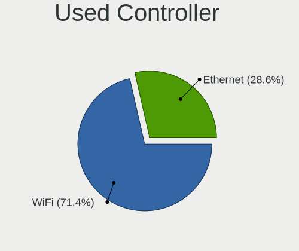

| Kind     | Computers | Percent |
|----------|-----------|---------|
| WiFi     | 35        | 66.04%  |
| Ethernet | 18        | 33.96%  |

NICs
----

Total network controllers on board

| Total | Computers | Percent |
|-------|-----------|---------|
| 2     | 27        | 50%     |
| 1     | 23        | 42.59%  |
| 0     | 3         | 5.56%   |
| 3     | 1         | 1.85%   |

IPv6
----

IPv6 vs IPv4

| Used | Computers | Percent |
|------|-----------|---------|
| No   | 33        | 61.11%  |
| Yes  | 21        | 38.89%  |

Bluetooth
---------

Bluetooth Vendor
----------------

Controller vendors

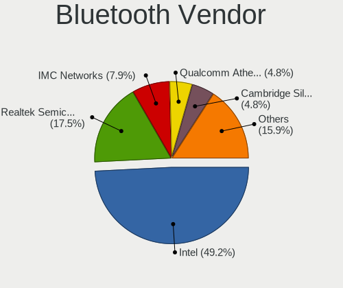

| Vendor                          | Computers | Percent |
|---------------------------------|-----------|---------|
| Intel                           | 19        | 51.35%  |
| Realtek Semiconductor           | 5         | 13.51%  |
| Qualcomm Atheros Communications | 2         | 5.41%   |
| MediaTek                        | 2         | 5.41%   |
| IMC Networks                    | 2         | 5.41%   |
| Cambridge Silicon Radio         | 2         | 5.41%   |
| Apple                           | 2         | 5.41%   |
| Lite-On Technology              | 1         | 2.7%    |
| Foxconn / Hon Hai               | 1         | 2.7%    |
| Broadcom                        | 1         | 2.7%    |

Bluetooth Model
---------------

Controller models

| Model                                               | Computers | Percent |
|-----------------------------------------------------|-----------|---------|
| Intel AX201 Bluetooth                               | 8         | 21.62%  |
| Realtek Bluetooth Radio                             | 4         | 10.81%  |
| Intel Bluetooth wireless interface                  | 4         | 10.81%  |
| MediaTek Wireless_Device                            | 2         | 5.41%   |
| Intel Wireless-AC 3168 Bluetooth                    | 2         | 5.41%   |
| Intel Bluetooth 9460/9560 Jefferson Peak (JfP)      | 2         | 5.41%   |
| Cambridge Silicon Radio Bluetooth Dongle (HCI mode) | 2         | 5.41%   |
| Realtek  Bluetooth 4.2 Adapter                      | 1         | 2.7%    |
| Qualcomm Atheros  Bluetooth Device                  | 1         | 2.7%    |
| Qualcomm Atheros AR9462 Bluetooth                   | 1         | 2.7%    |
| Lite-On Qualcomm Atheros QCA9377 Bluetooth          | 1         | 2.7%    |
| Intel Wireless-AC 9260 Bluetooth Adapter            | 1         | 2.7%    |
| Intel AX210 Bluetooth                               | 1         | 2.7%    |
| Intel AX200 Bluetooth                               | 1         | 2.7%    |
| IMC Networks Bluetooth Radio                        | 1         | 2.7%    |
| IMC Networks Bluetooth Device                       | 1         | 2.7%    |
| Foxconn / Hon Hai Wireless_Device                   | 1         | 2.7%    |
| Broadcom BCM20702 Bluetooth 4.0 [ThinkPad]          | 1         | 2.7%    |
| Apple Built-in Bluetooth 2.0+EDR HCI                | 1         | 2.7%    |
| Apple Bluetooth HCI                                 | 1         | 2.7%    |

Sound
-----

Sound Vendor
------------

Sound card vendors

| Vendor              | Computers | Percent |
|---------------------|-----------|---------|
| Intel               | 39        | 53.42%  |
| AMD                 | 15        | 20.55%  |
| Nvidia              | 10        | 13.7%   |
| Logitech            | 3         | 4.11%   |
| C-Media Electronics | 2         | 2.74%   |
| Texas Instruments   | 1         | 1.37%   |
| Oculus VR           | 1         | 1.37%   |
| Kingston Technology | 1         | 1.37%   |
| JMTek               | 1         | 1.37%   |

Sound Model
-----------

Sound card models

| Model                                                                                             | Computers | Percent |
|---------------------------------------------------------------------------------------------------|-----------|---------|
| Intel 6 Series/C200 Series Chipset Family High Definition Audio Controller                        | 5         | 5.68%   |
| AMD Family 17h/19h HD Audio Controller                                                            | 5         | 5.68%   |
| Intel Tiger Lake-LP Smart Sound Technology Audio Controller                                       | 4         | 4.55%   |
| Intel Sunrise Point-LP HD Audio                                                                   | 3         | 3.41%   |
| Intel Celeron/Pentium Silver Processor High Definition Audio                                      | 3         | 3.41%   |
| AMD Starship/Matisse HD Audio Controller                                                          | 3         | 3.41%   |
| AMD Renoir Radeon High Definition Audio Controller                                                | 3         | 3.41%   |
| AMD FCH Azalia Controller                                                                         | 3         | 3.41%   |
| AMD Ellesmere HDMI Audio [Radeon RX 470/480 / 570/580/590]                                        | 3         | 3.41%   |
| Nvidia TU106 High Definition Audio Controller                                                     | 2         | 2.27%   |
| Nvidia GP107GL High Definition Audio Controller                                                   | 2         | 2.27%   |
| Nvidia GA106 High Definition Audio Controller                                                     | 2         | 2.27%   |
| Intel Wildcat Point-LP High Definition Audio Controller                                           | 2         | 2.27%   |
| Intel Tiger Lake-H HD Audio Controller                                                            | 2         | 2.27%   |
| Intel Haswell-ULT HD Audio Controller                                                             | 2         | 2.27%   |
| Intel Comet Lake PCH-LP cAVS                                                                      | 2         | 2.27%   |
| Intel Comet Lake PCH cAVS                                                                         | 2         | 2.27%   |
| Intel Broadwell-U Audio Controller                                                                | 2         | 2.27%   |
| Intel 8 Series HD Audio Controller                                                                | 2         | 2.27%   |
| Intel 100 Series/C230 Series Chipset Family HD Audio Controller                                   | 2         | 2.27%   |
| AMD Oland/Hainan/Cape Verde/Pitcairn HDMI Audio [Radeon HD 7000 Series]                           | 2         | 2.27%   |
| AMD Kaveri HDMI/DP Audio Controller                                                               | 2         | 2.27%   |
| Texas Instruments PCM2902 Audio Codec                                                             | 1         | 1.14%   |
| Oculus VR Rift CV1 Audio                                                                          | 1         | 1.14%   |
| Nvidia TU102 High Definition Audio Controller                                                     | 1         | 1.14%   |
| Nvidia GP106 High Definition Audio Controller                                                     | 1         | 1.14%   |
| Nvidia GA104 High Definition Audio Controller                                                     | 1         | 1.14%   |
| Nvidia Audio device                                                                               | 1         | 1.14%   |
| Logitech Logitech USB Microphone                                                                  | 1         | 1.14%   |
| Logitech H390 headset with microphone                                                             | 1         | 1.14%   |
| Logitech G432 Gaming Headset                                                                      | 1         | 1.14%   |
| Kingston Technology HyperX QuadCast                                                               | 1         | 1.14%   |
| JMTek USB PnP Audio Device                                                                        | 1         | 1.14%   |
| Intel NM10/ICH7 Family High Definition Audio Controller                                           | 1         | 1.14%   |
| Intel Lewisburg MROM 0                                                                            | 1         | 1.14%   |
| Intel Ice Lake-LP Smart Sound Technology Audio Controller                                         | 1         | 1.14%   |
| Intel CM238 HD Audio Controller                                                                   | 1         | 1.14%   |
| Intel Celeron N3350/Pentium N4200/Atom E3900 Series Audio Cluster                                 | 1         | 1.14%   |
| Intel Cannon Point-LP High Definition Audio Controller                                            | 1         | 1.14%   |
| Intel Atom/Celeron/Pentium Processor x5-E8000/J3xxx/N3xxx Series High Definition Audio Controller | 1         | 1.14%   |

Memory
------

Memory Vendor
-------------

Memory module vendors

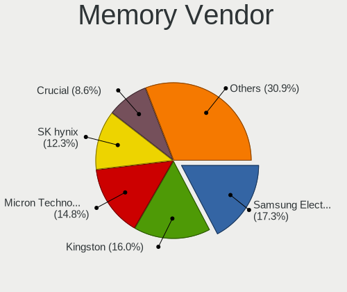

| Vendor              | Computers | Percent |
|---------------------|-----------|---------|
| Samsung Electronics | 12        | 21.82%  |
| Kingston            | 8         | 14.55%  |
| SK hynix            | 7         | 12.73%  |
| Micron Technology   | 7         | 12.73%  |
| Unknown             | 5         | 9.09%   |
| Crucial             | 5         | 9.09%   |
| Unknown (ABCD)      | 2         | 3.64%   |
| Corsair             | 2         | 3.64%   |
| A-DATA Technology   | 2         | 3.64%   |
| Team                | 1         | 1.82%   |
| Nanya Technology    | 1         | 1.82%   |
| G.Skill             | 1         | 1.82%   |
| ChangXin Memory     | 1         | 1.82%   |
| Unknown             | 1         | 1.82%   |

Memory Model
------------

Memory module models

| Model                                                            | Computers | Percent |
|------------------------------------------------------------------|-----------|---------|
| Unknown (ABCD) RAM 123456789012345678 2GB SODIMM LPDDR4 2400MT/s | 2         | 3.39%   |
| SK hynix RAM HMT351S6BFR8C-H9 4GB SODIMM DDR3 1333MT/s           | 2         | 3.39%   |
| Samsung RAM M471A1K43CB1-CRC 8GB SODIMM DDR4 2667MT/s            | 2         | 3.39%   |
| Kingston RAM KF2933C17S4/16G 16GB SODIMM DDR4 2933MT/s           | 2         | 3.39%   |
| Unknown RAM Module 8GB DIMM DDR3 1600MT/s                        | 1         | 1.69%   |
| Unknown RAM Module 4GB Row Of Chips LPDDR4 4267MT/s              | 1         | 1.69%   |
| Unknown RAM Module 2GB SODIMM DDR3 1600MT/s                      | 1         | 1.69%   |
| Unknown RAM Module 2GB SODIMM DDR3 1333MT/s                      | 1         | 1.69%   |
| Unknown RAM Module 2GB DIMM SDRAM                                | 1         | 1.69%   |
| Unknown RAM Module 1GB DIMM SDRAM                                | 1         | 1.69%   |
| Team RAM TEAMGROUP-UD4-3200 8GB DIMM DDR4 3800MT/s               | 1         | 1.69%   |
| SK hynix RAM HMT451S6MFR8C-PB 4GB SODIMM DDR3 1600MT/s           | 1         | 1.69%   |
| SK hynix RAM HMT451S6CFR6A-PB 4096MB SODIMM DDR3 1600MT/s        | 1         | 1.69%   |
| SK hynix RAM HMT451S6BFR8A-PB 4GB SODIMM DDR3 1600MT/s           | 1         | 1.69%   |
| SK hynix RAM HMT41GS6BFR8A-PB 8GB SODIMM DDR3 1600MT/s           | 1         | 1.69%   |
| SK hynix RAM HMT351S6EFR8C-PB 4GB SODIMM DDR3 1600MT/s           | 1         | 1.69%   |
| SK hynix RAM HMA81GS6JJR8N-VK 8GB SODIMM DDR4 2667MT/s           | 1         | 1.69%   |
| SK hynix RAM HMA81GS6CJR8N-VK 8GB SODIMM DDR4 2667MT/s           | 1         | 1.69%   |
| Samsung RAM Module 2GB SODIMM DDR3 1333MT/s                      | 1         | 1.69%   |
| Samsung RAM M474A2K43BB1-CPB 16GB SODIMM DDR4 2133MT/s           | 1         | 1.69%   |
| Samsung RAM M471B5673FH0-CH9 2GB SODIMM DDR3 1334MT/s            | 1         | 1.69%   |
| Samsung RAM M471A5244CB0-CRC 4GB SODIMM DDR4 2667MT/s            | 1         | 1.69%   |
| Samsung RAM M471A1K43EB1-CWE 8GB SODIMM DDR4 3200MT/s            | 1         | 1.69%   |
| Samsung RAM M471A1K43DB1-CWE 8192MB SODIMM DDR4 3200MT/s         | 1         | 1.69%   |
| Samsung RAM M471A1K43CB1-CTD 8GB SODIMM DDR4 2667MT/s            | 1         | 1.69%   |
| Samsung RAM M471A1K43BB1-CRC 8GB SODIMM DDR4 2667MT/s            | 1         | 1.69%   |
| Samsung RAM M471A1G44AB0-CWE 8GB SODIMM DDR4 3200MT/s            | 1         | 1.69%   |
| Samsung RAM M425R1GB4BB0-CQKOL 8GB SODIMM DDR5 4800MT/s          | 1         | 1.69%   |
| Samsung RAM K4A8G165WC-BCTD 4GB Row Of Chips DDR4 2667MT/s       | 1         | 1.69%   |
| Nanya RAM Module 1GB SODIMM DDR2 667MT/s                         | 1         | 1.69%   |
| Micron RAM MTC4C10163S1SC48BA1 8GB SODIMM DDR5 4800MT/s          | 1         | 1.69%   |
| Micron RAM Module 2GB SODIMM DDR3 1866MT/s                       | 1         | 1.69%   |
| Micron RAM K4A8G165WB-BCRC 8GB Row Of Chips LPDDR4 3333MT/s      | 1         | 1.69%   |
| Micron RAM F6451U64F9333G 4GB DIMM DDR3 1333MT/s                 | 1         | 1.69%   |
| Micron RAM 8KTF25664HZ-1G6M1 2GB SODIMM DDR3 1600MT/s            | 1         | 1.69%   |
| Micron RAM 4ATF51264HZ-3G2R1 4GB SODIMM DDR4 3200MT/s            | 1         | 1.69%   |
| Micron RAM 16ATF2G64HZ-2G3E1 16GB SODIMM DDR4 2667MT/s           | 1         | 1.69%   |
| Kingston RAM KN2M64-ETB 8GB SODIMM DDR3 1600MT/s                 | 1         | 1.69%   |
| Kingston RAM KF552C40-8 8GB DIMM DDR5 4800MT/s                   | 1         | 1.69%   |
| Kingston RAM KF3600C16D4/16GX 16GB DIMM DDR4 3600MT/s            | 1         | 1.69%   |

Memory Kind
-----------

Memory module kinds

| Kind   | Computers | Percent |
|--------|-----------|---------|
| DDR4   | 22        | 45.83%  |
| DDR3   | 17        | 35.42%  |
| LPDDR4 | 5         | 10.42%  |
| DDR5   | 2         | 4.17%   |
| SDRAM  | 1         | 2.08%   |
| DDR2   | 1         | 2.08%   |

Memory Form Factor
------------------

Physical design of the memory module

| Name         | Computers | Percent |
|--------------|-----------|---------|
| SODIMM       | 31        | 65.96%  |
| DIMM         | 12        | 25.53%  |
| Row Of Chips | 4         | 8.51%   |

Memory Size
-----------

Memory module size

| Size  | Computers | Percent |
|-------|-----------|---------|
| 8192  | 22        | 42.31%  |
| 4096  | 12        | 23.08%  |
| 16384 | 7         | 13.46%  |
| 2048  | 7         | 13.46%  |
| 1024  | 3         | 5.77%   |
| 32768 | 1         | 1.92%   |

Memory Speed
------------

Memory module speed

| Speed   | Computers | Percent |
|---------|-----------|---------|
| 1600    | 12        | 22.64%  |
| 2667    | 9         | 16.98%  |
| 3200    | 7         | 13.21%  |
| 1333    | 5         | 9.43%   |
| 2133    | 3         | 5.66%   |
| 4800    | 2         | 3.77%   |
| 3733    | 2         | 3.77%   |
| 2933    | 2         | 3.77%   |
| 2400    | 2         | 3.77%   |
| 4267    | 1         | 1.89%   |
| 3800    | 1         | 1.89%   |
| 3600    | 1         | 1.89%   |
| 3333    | 1         | 1.89%   |
| 1866    | 1         | 1.89%   |
| 1334    | 1         | 1.89%   |
| 1067    | 1         | 1.89%   |
| 667     | 1         | 1.89%   |
| Unknown | 1         | 1.89%   |

Printers & scanners
-------------------

Printer Vendor
--------------

Printer device vendors

| Vendor          | Computers | Percent |
|-----------------|-----------|---------|
| Hewlett-Packard | 1         | 100%    |

Printer Model
-------------

Printer device models

| Model                  | Computers | Percent |
|------------------------|-----------|---------|
| HP DeskJet 4720 series | 1         | 100%    |

Scanner Vendor
--------------

Scanner device vendors

Zero info for selected period =(

Scanner Model
-------------

Scanner device models

Zero info for selected period =(

Camera
------

Camera Vendor
-------------

Camera device vendors

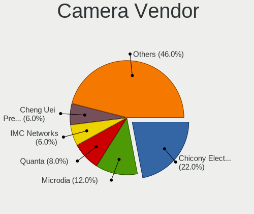

| Vendor                                 | Computers | Percent |
|----------------------------------------|-----------|---------|
| Chicony Electronics                    | 7         | 21.88%  |
| Microdia                               | 4         | 12.5%   |
| Cheng Uei Precision Industry (Foxlink) | 3         | 9.38%   |
| Acer                                   | 3         | 9.38%   |
| Realtek Semiconductor                  | 2         | 6.25%   |
| IMC Networks                           | 2         | 6.25%   |
| Apple                                  | 2         | 6.25%   |
| Alcor Micro                            | 2         | 6.25%   |
| Suyin                                  | 1         | 3.13%   |
| Sunplus Innovation Technology          | 1         | 3.13%   |
| Ricoh                                  | 1         | 3.13%   |
| Quanta                                 | 1         | 3.13%   |
| Luxvisions Innotech Limited            | 1         | 3.13%   |
| Logitech                               | 1         | 3.13%   |
| Generalplus Technology                 | 1         | 3.13%   |

Camera Model
------------

Camera device models

| Model                                                            | Computers | Percent |
|------------------------------------------------------------------|-----------|---------|
| Microdia Integrated_Webcam_HD                                    | 3         | 9.38%   |
| Chicony HD WebCam                                                | 2         | 6.25%   |
| Alcor Micro USB 2.0 Camera                                       | 2         | 6.25%   |
| Acer HD Webcam                                                   | 2         | 6.25%   |
| Suyin 1.3M WebCam (notebook emachines E730, Acer sub-brand)      | 1         | 3.13%   |
| Sunplus Integrated_Webcam_HD                                     | 1         | 3.13%   |
| Ricoh Laptop_Integrated_Webcam_FHD                               | 1         | 3.13%   |
| Realtek HP Webcam                                                | 1         | 3.13%   |
| Realtek HD Webcam - Realtek                                      | 1         | 3.13%   |
| Quanta ov9734_techfront_camera                                   | 1         | 3.13%   |
| Microdia Webcam Vitade AF                                        | 1         | 3.13%   |
| Luxvisions Innotech Limited HP TrueVision HD Camera              | 1         | 3.13%   |
| Logitech HD Pro Webcam C920                                      | 1         | 3.13%   |
| IMC Networks HP TrueVision HD Camera                             | 1         | 3.13%   |
| IMC Networks HD Camera                                           | 1         | 3.13%   |
| Generalplus WEB CAM                                              | 1         | 3.13%   |
| Chicony USB2.0 VGA UVC WebCam                                    | 1         | 3.13%   |
| Chicony Integrated IR Camera                                     | 1         | 3.13%   |
| Chicony HP Wide Vision HD Camera                                 | 1         | 3.13%   |
| Chicony HP Truevision HD                                         | 1         | 3.13%   |
| Chicony HD User Facing                                           | 1         | 3.13%   |
| Cheng Uei Precision Industry (Foxlink) HP Wide Vision HD Camera  | 1         | 3.13%   |
| Cheng Uei Precision Industry (Foxlink) HP Wide Vision FHD Camera | 1         | 3.13%   |
| Cheng Uei Precision Industry (Foxlink) HP TrueVision HD Camera   | 1         | 3.13%   |
| Apple FaceTime Camera                                            | 1         | 3.13%   |
| Apple Built-in iSight [Micron]                                   | 1         | 3.13%   |
| Acer Integrated Camera                                           | 1         | 3.13%   |

Security
--------

Fingerprint Vendor
------------------

Fingerprint sensor vendors

| Vendor                     | Computers | Percent |
|----------------------------|-----------|---------|
| Elan Microelectronics      | 2         | 50%     |
| Shenzhen Goodix Technology | 1         | 25%     |
| LighTuning Technology      | 1         | 25%     |

Fingerprint Model
-----------------

Fingerprint sensor models

| Model                                       | Computers | Percent |
|---------------------------------------------|-----------|---------|
| Elan ELAN:ARM-M4                            | 2         | 50%     |
| Shenzhen Goodix  Fingerprint Device         | 1         | 25%     |
| LighTuning EgisTec Touch Fingerprint Sensor | 1         | 25%     |

Chipcard Vendor
---------------

Chipcard module vendors

| Vendor   | Computers | Percent |
|----------|-----------|---------|
| Broadcom | 1         | 100%    |

Chipcard Model
--------------

Chipcard module models

| Model                                          | Computers | Percent |
|------------------------------------------------|-----------|---------|
| Broadcom BCM5880 Secure Applications Processor | 1         | 100%    |

Unsupported
-----------

Unsupported Devices
-------------------

Total unsupported devices on board

| Total | Computers | Percent |
|-------|-----------|---------|
| 0     | 43        | 79.63%  |
| 1     | 8         | 14.81%  |
| 2     | 3         | 5.56%   |

Unsupported Device Types
------------------------

Types of unsupported devices

| Type                  | Computers | Percent |
|-----------------------|-----------|---------|
| Fingerprint reader    | 4         | 30.77%  |
| Storage               | 2         | 15.38%  |
| Net/wireless          | 2         | 15.38%  |
| Graphics card         | 2         | 15.38%  |
| Unassigned class      | 1         | 7.69%   |
| Multimedia controller | 1         | 7.69%   |
| Chipcard              | 1         | 7.69%   |

