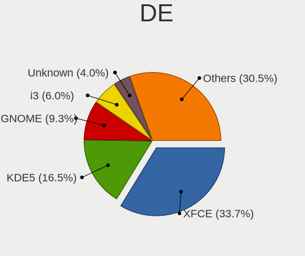
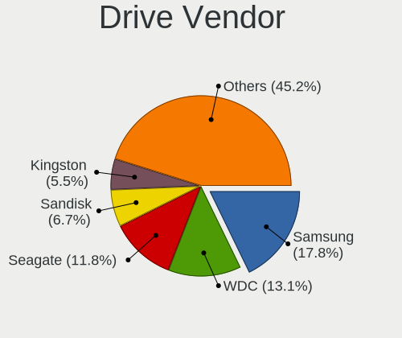
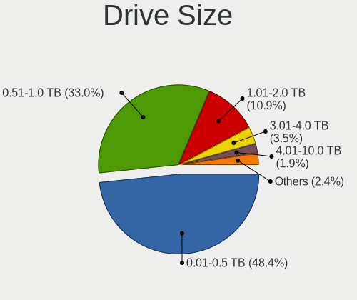
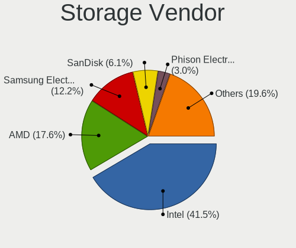
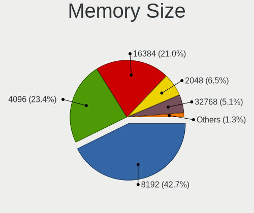
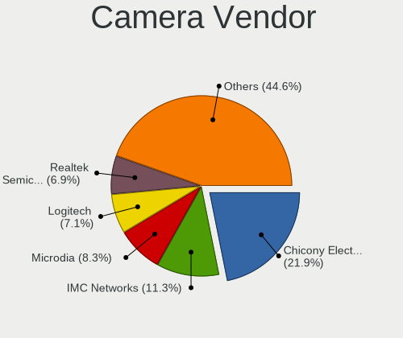

ArcoLinux - Tested Hardware & Statistics
----------------------------------------

A project to collect tested hardware configurations for ArcoLinux.

Anyone can contribute to this report by the [hw-probe](https://github.com/linuxhw/hw-probe) tool:

    sudo -E hw-probe -all -upload

Please contribute! Especially if your hardware is rare.

This is a report for all computer types. See also reports for [desktops](/Dist/ArcoLinux/Desktop/README.md) and [notebooks](/Dist/ArcoLinux/Notebook/README.md).

Contents
--------

* [ Test Cases ](#test-cases)

* [ System ](#system)
  - [ OS                       ](#os)
  - [ OS Family                ](#os-family)
  - [ Kernel                   ](#kernel)
  - [ Kernel Family            ](#kernel-family)
  - [ Kernel Major Ver.        ](#kernel-major-ver)
  - [ Arch                     ](#arch)
  - [ DE                       ](#de)
  - [ Display Server           ](#display-server)
  - [ Display Manager          ](#display-manager)
  - [ OS Lang                  ](#os-lang)
  - [ Boot Mode                ](#boot-mode)
  - [ Filesystem               ](#filesystem)
  - [ Part. scheme             ](#part-scheme)
  - [ Dual Boot with Linux/BSD ](#dual-boot-with-linuxbsd)
  - [ Dual Boot (Win)          ](#dual-boot-win)

* [ Board ](#board)
  - [ Vendor                   ](#vendor)
  - [ Model                    ](#model)
  - [ Model Family             ](#model-family)
  - [ MFG Year                 ](#mfg-year)
  - [ Form Factor              ](#form-factor)
  - [ Secure Boot              ](#secure-boot)
  - [ Coreboot                 ](#coreboot)
  - [ RAM Size                 ](#ram-size)
  - [ RAM Used                 ](#ram-used)
  - [ Total Drives             ](#total-drives)
  - [ Has CD-ROM               ](#has-cd-rom)
  - [ Has Ethernet             ](#has-ethernet)
  - [ Has WiFi                 ](#has-wifi)
  - [ Has Bluetooth            ](#has-bluetooth)

* [ Location ](#location)
  - [ Country                  ](#country)
  - [ City                     ](#city)

* [ Drives ](#drives)
  - [ Drive Vendor             ](#drive-vendor)
  - [ Drive Model              ](#drive-model)
  - [ HDD Vendor               ](#hdd-vendor)
  - [ SSD Vendor               ](#ssd-vendor)
  - [ Drive Kind               ](#drive-kind)
  - [ Drive Connector          ](#drive-connector)
  - [ Drive Size               ](#drive-size)
  - [ Space Total              ](#space-total)
  - [ Space Used               ](#space-used)
  - [ Malfunc. Drives          ](#malfunc-drives)
  - [ Malfunc. Drive Vendor    ](#malfunc-drive-vendor)
  - [ Malfunc. HDD Vendor      ](#malfunc-hdd-vendor)
  - [ Malfunc. Drive Kind      ](#malfunc-drive-kind)
  - [ Failed Drives            ](#failed-drives)
  - [ Failed Drive Vendor      ](#failed-drive-vendor)
  - [ Drive Status             ](#drive-status)

* [ Storage controller ](#storage-controller)
  - [ Storage Vendor           ](#storage-vendor)
  - [ Storage Model            ](#storage-model)
  - [ Storage Kind             ](#storage-kind)

* [ Processor ](#processor)
  - [ CPU Vendor               ](#cpu-vendor)
  - [ CPU Model                ](#cpu-model)
  - [ CPU Model Family         ](#cpu-model-family)
  - [ CPU Cores                ](#cpu-cores)
  - [ CPU Sockets              ](#cpu-sockets)
  - [ CPU Threads              ](#cpu-threads)
  - [ CPU Op-Modes             ](#cpu-op-modes)
  - [ CPU Microcode            ](#cpu-microcode)
  - [ CPU Microarch            ](#cpu-microarch)

* [ Graphics ](#graphics)
  - [ GPU Vendor               ](#gpu-vendor)
  - [ GPU Model                ](#gpu-model)
  - [ GPU Combo                ](#gpu-combo)
  - [ GPU Driver               ](#gpu-driver)
  - [ GPU Memory               ](#gpu-memory)

* [ Monitor ](#monitor)
  - [ Monitor Vendor           ](#monitor-vendor)
  - [ Monitor Model            ](#monitor-model)
  - [ Monitor Resolution       ](#monitor-resolution)
  - [ Monitor Diagonal         ](#monitor-diagonal)
  - [ Monitor Width            ](#monitor-width)
  - [ Aspect Ratio             ](#aspect-ratio)
  - [ Monitor Area             ](#monitor-area)
  - [ Pixel Density            ](#pixel-density)
  - [ Multiple Monitors        ](#multiple-monitors)

* [ Network ](#network)
  - [ Net Controller Vendor    ](#net-controller-vendor)
  - [ Net Controller Model     ](#net-controller-model)
  - [ Wireless Vendor          ](#wireless-vendor)
  - [ Wireless Model           ](#wireless-model)
  - [ Ethernet Vendor          ](#ethernet-vendor)
  - [ Ethernet Model           ](#ethernet-model)
  - [ Net Controller Kind      ](#net-controller-kind)
  - [ Used Controller          ](#used-controller)
  - [ NICs                     ](#nics)
  - [ IPv6                     ](#ipv6)

* [ Bluetooth ](#bluetooth)
  - [ Bluetooth Vendor         ](#bluetooth-vendor)
  - [ Bluetooth Model          ](#bluetooth-model)

* [ Sound ](#sound)
  - [ Sound Vendor             ](#sound-vendor)
  - [ Sound Model              ](#sound-model)

* [ Memory ](#memory)
  - [ Memory Vendor            ](#memory-vendor)
  - [ Memory Model             ](#memory-model)
  - [ Memory Kind              ](#memory-kind)
  - [ Memory Form Factor       ](#memory-form-factor)
  - [ Memory Size              ](#memory-size)
  - [ Memory Speed             ](#memory-speed)

* [ Printers & scanners ](#printers--scanners)
  - [ Printer Vendor           ](#printer-vendor)
  - [ Printer Model            ](#printer-model)
  - [ Scanner Vendor           ](#scanner-vendor)
  - [ Scanner Model            ](#scanner-model)

* [ Camera ](#camera)
  - [ Camera Vendor            ](#camera-vendor)
  - [ Camera Model             ](#camera-model)

* [ Security ](#security)
  - [ Fingerprint Vendor       ](#fingerprint-vendor)
  - [ Fingerprint Model        ](#fingerprint-model)
  - [ Chipcard Vendor          ](#chipcard-vendor)
  - [ Chipcard Model           ](#chipcard-model)

* [ Unsupported ](#unsupported)
  - [ Unsupported Devices      ](#unsupported-devices)
  - [ Unsupported Device Types ](#unsupported-device-types)

Test Cases
----------

Total: 2065

| Vendor        | Model                       | Form-Factor | Probe                                                      | Date         |
|---------------|-----------------------------|-------------|------------------------------------------------------------|--------------|
| HP            | Folio 13                    | Notebook    | [9f00cfe432](https://linux-hardware.org/?probe=9f00cfe432) | Dec 31, 2022 |
| HP            | Folio 13                    | Notebook    | [3ed5b405cb](https://linux-hardware.org/?probe=3ed5b405cb) | Dec 31, 2022 |
| HP            | EliteBook 830 G5            | Notebook    | [bdd6f3912d](https://linux-hardware.org/?probe=bdd6f3912d) | Dec 30, 2022 |
| MSI           | MPG Z490 GAMING EDGE WIF... | Desktop     | [056ae8185c](https://linux-hardware.org/?probe=056ae8185c) | Dec 30, 2022 |
| Gigabyte      | Z490I AORUS ULTRA           | Desktop     | [6cf8d26754](https://linux-hardware.org/?probe=6cf8d26754) | Dec 30, 2022 |
| ASUSTek       | PRIME X570-P                | Desktop     | [33fd3ed258](https://linux-hardware.org/?probe=33fd3ed258) | Dec 29, 2022 |
| Packard Be... | EasyNote TE69HW             | Notebook    | [9613dfc76b](https://linux-hardware.org/?probe=9613dfc76b) | Dec 28, 2022 |
| ASUSTek       | ROG STRIX X670E-I GAMING... | Desktop     | [338e7b0029](https://linux-hardware.org/?probe=338e7b0029) | Dec 28, 2022 |
| MSI           | Raider GE77HX 12UGS         | Notebook    | [9f7185ccd7](https://linux-hardware.org/?probe=9f7185ccd7) | Dec 27, 2022 |
| ASUSTek       | ROG STRIX B550-F GAMING ... | Desktop     | [dc6cc81a73](https://linux-hardware.org/?probe=dc6cc81a73) | Dec 24, 2022 |
| MSI           | Z170-A PRO                  | Desktop     | [3948dcc7ef](https://linux-hardware.org/?probe=3948dcc7ef) | Dec 23, 2022 |
| ASUSTek       | PRIME A320M-K               | Desktop     | [bc1c9956b3](https://linux-hardware.org/?probe=bc1c9956b3) | Dec 23, 2022 |
| Dell          | Inspiron 7580               | Notebook    | [eb5b708877](https://linux-hardware.org/?probe=eb5b708877) | Dec 22, 2022 |
| Gigabyte      | Z490I AORUS ULTRA           | Desktop     | [de140c1edd](https://linux-hardware.org/?probe=de140c1edd) | Dec 22, 2022 |
| ASUSTek       | PRIME Z490-A                | Desktop     | [59d46f37db](https://linux-hardware.org/?probe=59d46f37db) | Dec 22, 2022 |
| Sony          | SVF15N26CXB                 | Notebook    | [ffc2ea8936](https://linux-hardware.org/?probe=ffc2ea8936) | Dec 22, 2022 |
| ASUSTek       | VANGUARD B85                | Desktop     | [73560a1b6a](https://linux-hardware.org/?probe=73560a1b6a) | Dec 21, 2022 |
| Lenovo        | IdeaPad 5 14ALC05 82LM      | Notebook    | [4906017260](https://linux-hardware.org/?probe=4906017260) | Dec 21, 2022 |
| Lenovo        | IdeaPad 5 14ALC05 82LM      | Notebook    | [085b8c23b4](https://linux-hardware.org/?probe=085b8c23b4) | Dec 21, 2022 |
| Gigabyte      | B650 AORUS ELITE AX         | Desktop     | [58da003de3](https://linux-hardware.org/?probe=58da003de3) | Dec 21, 2022 |
| MSI           | X470 GAMING PLUS MAX        | Desktop     | [e2942bceb2](https://linux-hardware.org/?probe=e2942bceb2) | Dec 20, 2022 |
| MSI           | GL75 Leopard 10SDK          | Notebook    | [a269c3ef8a](https://linux-hardware.org/?probe=a269c3ef8a) | Dec 20, 2022 |
| ASUSTek       | X555QA                      | Notebook    | [3a7e8867bd](https://linux-hardware.org/?probe=3a7e8867bd) | Dec 19, 2022 |
| Dell          | Latitude 5580               | Notebook    | [c8b402d4df](https://linux-hardware.org/?probe=c8b402d4df) | Dec 18, 2022 |
| Dell          | Latitude 5580               | Notebook    | [b45e1798cc](https://linux-hardware.org/?probe=b45e1798cc) | Dec 18, 2022 |
| Dell          | 088DT1 A01                  | Desktop     | [911e6f6d33](https://linux-hardware.org/?probe=911e6f6d33) | Dec 18, 2022 |
| ASUSTek       | PRIME A320M-K               | Desktop     | [7adfddc31e](https://linux-hardware.org/?probe=7adfddc31e) | Dec 16, 2022 |
| Gigabyte      | B650 AORUS ELITE AX         | Desktop     | [adb08a48f3](https://linux-hardware.org/?probe=adb08a48f3) | Dec 15, 2022 |
| Gigabyte      | X570 AORUS PRO WIFI         | Desktop     | [535643e246](https://linux-hardware.org/?probe=535643e246) | Dec 15, 2022 |
| HP            | EliteBook 850 G1            | Notebook    | [d923d3def3](https://linux-hardware.org/?probe=d923d3def3) | Dec 14, 2022 |
| ASRock        | B250M-HDV                   | Desktop     | [20c4b98c2c](https://linux-hardware.org/?probe=20c4b98c2c) | Dec 14, 2022 |
| MSI           | GE72VR 6RF                  | Notebook    | [ce2ebf80a1](https://linux-hardware.org/?probe=ce2ebf80a1) | Dec 14, 2022 |
| Lenovo        | Legion 5 15ARH05 82B5       | Notebook    | [f62b69abcb](https://linux-hardware.org/?probe=f62b69abcb) | Dec 14, 2022 |
| Gigabyte      | X570 AORUS MASTER           | Desktop     | [5a9654c743](https://linux-hardware.org/?probe=5a9654c743) | Dec 13, 2022 |
| ASUSTek       | PRIME B450M-K               | Desktop     | [2212bad256](https://linux-hardware.org/?probe=2212bad256) | Dec 12, 2022 |
| ASUSTek       | PRIME B450M-K               | Desktop     | [20cb7a525a](https://linux-hardware.org/?probe=20cb7a525a) | Dec 12, 2022 |
| Apple         | MacBookAir6,2               | Notebook    | [65bc0e828c](https://linux-hardware.org/?probe=65bc0e828c) | Dec 08, 2022 |
| LG Electro... | C500                        | Notebook    | [078e13cadd](https://linux-hardware.org/?probe=078e13cadd) | Dec 08, 2022 |
| Lenovo        | ThinkCentre M58 6258D3G     | Desktop     | [1613228bb2](https://linux-hardware.org/?probe=1613228bb2) | Dec 08, 2022 |
| Lenovo        | ThinkCentre M58 6258D3G     | Desktop     | [04a09baf04](https://linux-hardware.org/?probe=04a09baf04) | Dec 08, 2022 |
| ASRock        | B250M-HDV                   | Desktop     | [e7495f12e4](https://linux-hardware.org/?probe=e7495f12e4) | Dec 08, 2022 |
| ASUSTek       | PRIME Z490-A                | Desktop     | [7ba193202d](https://linux-hardware.org/?probe=7ba193202d) | Dec 08, 2022 |
| Gigabyte      | 970A-UD3P                   | Desktop     | [4a41ed7fae](https://linux-hardware.org/?probe=4a41ed7fae) | Dec 07, 2022 |
| ASUSTek       | ROG STRIX B550-I GAMING     | Desktop     | [3a91c2e245](https://linux-hardware.org/?probe=3a91c2e245) | Dec 07, 2022 |
| MSI           | GE72VR 6RF                  | Notebook    | [23a83a5e8e](https://linux-hardware.org/?probe=23a83a5e8e) | Dec 06, 2022 |
| ASUSTek       | X556UQK                     | Notebook    | [2f693620e1](https://linux-hardware.org/?probe=2f693620e1) | Dec 06, 2022 |
| HP            | Spectre x360 Convertible... | Convertible | [fceea368d5](https://linux-hardware.org/?probe=fceea368d5) | Dec 06, 2022 |
| HP            | Spectre x360 Convertible... | Convertible | [0fcd09c9f8](https://linux-hardware.org/?probe=0fcd09c9f8) | Dec 06, 2022 |
| Dell          | Inspiron 5502               | Notebook    | [311215d00b](https://linux-hardware.org/?probe=311215d00b) | Dec 05, 2022 |
| ASUSTek       | X550MD                      | Notebook    | [e5058b43c3](https://linux-hardware.org/?probe=e5058b43c3) | Dec 05, 2022 |
| Fanless Mi... | Rev GMLR1                   | Mini pc     | [b8546e4162](https://linux-hardware.org/?probe=b8546e4162) | Dec 04, 2022 |
| Lenovo        | ThinkPad T14s Gen 2i 20W... | Notebook    | [ac92442dbc](https://linux-hardware.org/?probe=ac92442dbc) | Dec 04, 2022 |
| ASUSTek       | X555QA                      | Notebook    | [677ef3b3f2](https://linux-hardware.org/?probe=677ef3b3f2) | Dec 03, 2022 |
| Intel         | NUC7JYB J67967-404          | Mini pc     | [abb243027a](https://linux-hardware.org/?probe=abb243027a) | Dec 03, 2022 |
| Acer          | Aspire XC-780               | Desktop     | [b385e11c00](https://linux-hardware.org/?probe=b385e11c00) | Dec 01, 2022 |
| MSI           | B460M PRO-VDH WIFI          | Desktop     | [3b7321ba87](https://linux-hardware.org/?probe=3b7321ba87) | Dec 01, 2022 |
| Lenovo        | ThinkPad X270 20HNS03B00    | Notebook    | [bd40de3011](https://linux-hardware.org/?probe=bd40de3011) | Nov 30, 2022 |
| Intel         | NUC7JYB J67967-404          | Mini pc     | [fd897211fa](https://linux-hardware.org/?probe=fd897211fa) | Nov 30, 2022 |
| MSI           | Katana GF76 11UD            | Notebook    | [186950bae6](https://linux-hardware.org/?probe=186950bae6) | Nov 29, 2022 |
| MSI           | Katana GF76 11UD            | Notebook    | [48bb9075a7](https://linux-hardware.org/?probe=48bb9075a7) | Nov 29, 2022 |
| HP            | 8876 11                     | Desktop     | [babda62ffa](https://linux-hardware.org/?probe=babda62ffa) | Nov 29, 2022 |
| Gigabyte      | Z690 AORUS ELITE AX         | Desktop     | [3ba81fa674](https://linux-hardware.org/?probe=3ba81fa674) | Nov 28, 2022 |
| Lenovo        | B51-80 80LM                 | Notebook    | [3c50a742a9](https://linux-hardware.org/?probe=3c50a742a9) | Nov 28, 2022 |
| MSI           | B460M PRO-VDH WIFI          | Desktop     | [da2828f715](https://linux-hardware.org/?probe=da2828f715) | Nov 28, 2022 |
| System76      | Oryx Pro                    | Notebook    | [c7d2918a69](https://linux-hardware.org/?probe=c7d2918a69) | Nov 27, 2022 |
| ASUSTek       | TUF Gaming X570-PLUS        | Desktop     | [7cb4ad7428](https://linux-hardware.org/?probe=7cb4ad7428) | Nov 27, 2022 |
| Lenovo        | ThinkPad X240 20AMA0W706    | Notebook    | [b792955af6](https://linux-hardware.org/?probe=b792955af6) | Nov 27, 2022 |
| HP            | 18E7                        | Desktop     | [5a5c2667a5](https://linux-hardware.org/?probe=5a5c2667a5) | Nov 26, 2022 |
| Lenovo        | ThinkPad X240 20AMA0W706    | Notebook    | [033e206fab](https://linux-hardware.org/?probe=033e206fab) | Nov 25, 2022 |
| Gigabyte      | Z87X-SLI                    | Desktop     | [19719414c0](https://linux-hardware.org/?probe=19719414c0) | Nov 24, 2022 |
| HP            | 8750                        | Desktop     | [b1ac308187](https://linux-hardware.org/?probe=b1ac308187) | Nov 24, 2022 |
| HP            | EliteBook 840 G1            | Notebook    | [1071e10a2c](https://linux-hardware.org/?probe=1071e10a2c) | Nov 23, 2022 |
| ASUSTek       | PRIME B450M-A               | Desktop     | [69d71bba75](https://linux-hardware.org/?probe=69d71bba75) | Nov 23, 2022 |
| ASUSTek       | PRIME A320M-K               | Desktop     | [9a74fdb05b](https://linux-hardware.org/?probe=9a74fdb05b) | Nov 22, 2022 |
| Dell          | 08NPPY A00                  | Desktop     | [24fb42db2b](https://linux-hardware.org/?probe=24fb42db2b) | Nov 21, 2022 |
| HP            | Victus by Laptop 16-e0xx... | Notebook    | [88bbdb925b](https://linux-hardware.org/?probe=88bbdb925b) | Nov 20, 2022 |
| ASUSTek       | STRIX Z270H GAMING          | Desktop     | [d7ee80553a](https://linux-hardware.org/?probe=d7ee80553a) | Nov 20, 2022 |
| ASUSTek       | P8Z77-V LE                  | Desktop     | [f55a45b87f](https://linux-hardware.org/?probe=f55a45b87f) | Nov 20, 2022 |
| MSI           | X570-A PRO                  | Desktop     | [912f6ac7a3](https://linux-hardware.org/?probe=912f6ac7a3) | Nov 20, 2022 |
| HUAWEI        | KLVL-WXX9                   | Notebook    | [f7ebd3f633](https://linux-hardware.org/?probe=f7ebd3f633) | Nov 20, 2022 |
| ASUSTek       | P8Z77-V LE                  | Desktop     | [e3d6c78ed4](https://linux-hardware.org/?probe=e3d6c78ed4) | Nov 20, 2022 |
| ASUSTek       | P5K                         | Desktop     | [44b338a17d](https://linux-hardware.org/?probe=44b338a17d) | Nov 19, 2022 |
| HP            | 2B2C                        | Desktop     | [91862a2497](https://linux-hardware.org/?probe=91862a2497) | Nov 19, 2022 |
| ASUSTek       | PRIME A320M-K               | Desktop     | [41266bf8f0](https://linux-hardware.org/?probe=41266bf8f0) | Nov 18, 2022 |
| Fujitsu       | LIFEBOOK U759               | Notebook    | [945910eb8a](https://linux-hardware.org/?probe=945910eb8a) | Nov 18, 2022 |
| HUAWEI        | HLYL-WXX9                   | Notebook    | [560c24bf74](https://linux-hardware.org/?probe=560c24bf74) | Nov 18, 2022 |
| ASUSTek       | K52Jc                       | Notebook    | [375bc280d3](https://linux-hardware.org/?probe=375bc280d3) | Nov 18, 2022 |
| ASUSTek       | H110M-A                     | Desktop     | [abbaaa8589](https://linux-hardware.org/?probe=abbaaa8589) | Nov 17, 2022 |
| ASUSTek       | H110M-A                     | Desktop     | [33a412b9d5](https://linux-hardware.org/?probe=33a412b9d5) | Nov 17, 2022 |
| HP            | 250 G7 Notebook PC          | Notebook    | [10b5bb5eab](https://linux-hardware.org/?probe=10b5bb5eab) | Nov 17, 2022 |
| HP            | 250 G7 Notebook PC          | Notebook    | [c765249482](https://linux-hardware.org/?probe=c765249482) | Nov 17, 2022 |
| ASUSTek       | PRIME X470-PRO              | Desktop     | [882e91c53a](https://linux-hardware.org/?probe=882e91c53a) | Nov 16, 2022 |
| ASUSTek       | PRIME X470-PRO              | Desktop     | [83c0e1f2a1](https://linux-hardware.org/?probe=83c0e1f2a1) | Nov 16, 2022 |
| MSI           | B450M MORTAR MAX            | Desktop     | [2ea755455d](https://linux-hardware.org/?probe=2ea755455d) | Nov 16, 2022 |
| ASRock        | B250M-HDV                   | Desktop     | [30916d8420](https://linux-hardware.org/?probe=30916d8420) | Nov 16, 2022 |
| HP            | 2B2C                        | Desktop     | [2eb8311f18](https://linux-hardware.org/?probe=2eb8311f18) | Nov 16, 2022 |
| ASUSTek       | STRIX Z270H GAMING          | Desktop     | [c9876aa0fd](https://linux-hardware.org/?probe=c9876aa0fd) | Nov 16, 2022 |
| ASUSTek       | PRIME A320M-K               | Desktop     | [9a7cae7b96](https://linux-hardware.org/?probe=9a7cae7b96) | Nov 15, 2022 |
| Dell          | Vostro 3550                 | Notebook    | [a195c7598f](https://linux-hardware.org/?probe=a195c7598f) | Nov 14, 2022 |
| Dell          | Vostro 3550                 | Notebook    | [2176ff6bc0](https://linux-hardware.org/?probe=2176ff6bc0) | Nov 14, 2022 |
| Acer          | Predator G3-710             | Desktop     | [4be3a9e016](https://linux-hardware.org/?probe=4be3a9e016) | Nov 13, 2022 |
| ASUSTek       | P8H61-M LX3 PLUS R2.0       | Desktop     | [e7820d3dfb](https://linux-hardware.org/?probe=e7820d3dfb) | Nov 13, 2022 |
| Toshiba       | Satellite L775              | Notebook    | [a8c9c0ffda](https://linux-hardware.org/?probe=a8c9c0ffda) | Nov 12, 2022 |
| Dell          | Latitude 3380               | Notebook    | [f770a70f68](https://linux-hardware.org/?probe=f770a70f68) | Nov 12, 2022 |
| HP            | EliteBook 840 G2            | Notebook    | [91bdce735b](https://linux-hardware.org/?probe=91bdce735b) | Nov 12, 2022 |
| Alienware     | 0TYR0X A00                  | Desktop     | [01dbd42727](https://linux-hardware.org/?probe=01dbd42727) | Nov 10, 2022 |
| Alienware     | 0TYR0X A00                  | Desktop     | [dde7e92189](https://linux-hardware.org/?probe=dde7e92189) | Nov 10, 2022 |
| Dell          | Precision 3571              | Notebook    | [039ece6391](https://linux-hardware.org/?probe=039ece6391) | Nov 10, 2022 |
| CSL-Comput... | R Evolve C14i               | Notebook    | [2a99a4d733](https://linux-hardware.org/?probe=2a99a4d733) | Nov 10, 2022 |
| Dell          | XPS 15 9570                 | Notebook    | [44c3eceeee](https://linux-hardware.org/?probe=44c3eceeee) | Nov 10, 2022 |
| MSI           | MAG B550 TOMAHAWK           | Desktop     | [bf5e7a39a0](https://linux-hardware.org/?probe=bf5e7a39a0) | Nov 09, 2022 |
| Timi          | RedmiBook Pro 15S           | Notebook    | [02b3508a99](https://linux-hardware.org/?probe=02b3508a99) | Nov 09, 2022 |
| Dell          | Latitude E5470              | Notebook    | [a9c69c7418](https://linux-hardware.org/?probe=a9c69c7418) | Nov 09, 2022 |
| Dell          | Precision 3571              | Notebook    | [d305848533](https://linux-hardware.org/?probe=d305848533) | Nov 08, 2022 |
| Dell          | Precision 3571              | Notebook    | [681a655e1c](https://linux-hardware.org/?probe=681a655e1c) | Nov 08, 2022 |
| MSI           | H110M PRO-VH PLUS           | Desktop     | [533c6216c7](https://linux-hardware.org/?probe=533c6216c7) | Nov 08, 2022 |
| HP            | Pavilion dv6                | Notebook    | [f715c6e15c](https://linux-hardware.org/?probe=f715c6e15c) | Nov 07, 2022 |
| HP            | Laptop 15-da0xxx            | Notebook    | [f8d2bbf15a](https://linux-hardware.org/?probe=f8d2bbf15a) | Nov 06, 2022 |
| Lenovo        | ThinkPad T14 Gen 1 20UDC... | Notebook    | [caf9066e2a](https://linux-hardware.org/?probe=caf9066e2a) | Nov 06, 2022 |
| MSI           | A320M-HDV R4.0              | Desktop     | [78196c6656](https://linux-hardware.org/?probe=78196c6656) | Nov 05, 2022 |
| ASUSTek       | PRIME A520M-K               | Desktop     | [52c7829518](https://linux-hardware.org/?probe=52c7829518) | Nov 05, 2022 |
| TUXEDO        | Aura 15 Gen2                | Notebook    | [681d0b959b](https://linux-hardware.org/?probe=681d0b959b) | Nov 05, 2022 |
| HP            | 8768 A                      | Desktop     | [adc86e7963](https://linux-hardware.org/?probe=adc86e7963) | Nov 04, 2022 |
| Gigabyte      | B85M-D3H                    | Desktop     | [6491b1d525](https://linux-hardware.org/?probe=6491b1d525) | Nov 04, 2022 |
| ASUSTek       | PRIME Z690-A                | Desktop     | [e7254fb467](https://linux-hardware.org/?probe=e7254fb467) | Nov 04, 2022 |
| Alienware     | 14                          | Notebook    | [0c11295ebe](https://linux-hardware.org/?probe=0c11295ebe) | Nov 03, 2022 |
| HP            | EliteBook 840 G2            | Notebook    | [813cfb5bdf](https://linux-hardware.org/?probe=813cfb5bdf) | Nov 03, 2022 |
| HP            | Pavilion Gaming Laptop 1... | Notebook    | [f790aefcad](https://linux-hardware.org/?probe=f790aefcad) | Nov 03, 2022 |
| Acer          | Aspire E1-571               | Notebook    | [d81e8b3ea2](https://linux-hardware.org/?probe=d81e8b3ea2) | Nov 01, 2022 |
| ASUSTek       | Zephyrus S GX531GS_GX531... | Notebook    | [4823244248](https://linux-hardware.org/?probe=4823244248) | Nov 01, 2022 |
| Apple         | MacBookPro9,2               | Notebook    | [69768228d4](https://linux-hardware.org/?probe=69768228d4) | Nov 01, 2022 |
| MSI           | Z170M MORTAR                | Desktop     | [041dbc2c18](https://linux-hardware.org/?probe=041dbc2c18) | Oct 31, 2022 |
| Dell          | Vostro 3500                 | Notebook    | [a3abf820e1](https://linux-hardware.org/?probe=a3abf820e1) | Oct 31, 2022 |
| Samsung       | 300E4A/300E5A/300E7A/343... | Notebook    | [73aa3e4a7e](https://linux-hardware.org/?probe=73aa3e4a7e) | Oct 30, 2022 |
| ASRock        | B450M Pro4-F R2.0           | Desktop     | [5fb37123e0](https://linux-hardware.org/?probe=5fb37123e0) | Oct 30, 2022 |
| ASRock        | Z690 Steel Legend           | Desktop     | [cbfd203fd4](https://linux-hardware.org/?probe=cbfd203fd4) | Oct 29, 2022 |
| Lenovo        | 3717 SDK0J40709 WIN 3259... | Desktop     | [39d64a1014](https://linux-hardware.org/?probe=39d64a1014) | Oct 29, 2022 |
| Lenovo        | ThinkPad X1 Carbon Gen 1... | Notebook    | [8440ee2b2a](https://linux-hardware.org/?probe=8440ee2b2a) | Oct 29, 2022 |
| HUAWEI        | VLT-WX0                     | Notebook    | [7b414a3c7c](https://linux-hardware.org/?probe=7b414a3c7c) | Oct 29, 2022 |
| HP            | ENVY x360 Convertible 13... | Convertible | [4f5623de73](https://linux-hardware.org/?probe=4f5623de73) | Oct 28, 2022 |
| ASUSTek       | ROG CROSSHAIR VIII HERO     | Desktop     | [865ff52614](https://linux-hardware.org/?probe=865ff52614) | Oct 27, 2022 |
| ASUSTek       | ROG CROSSHAIR VIII HERO     | Desktop     | [4411ceb907](https://linux-hardware.org/?probe=4411ceb907) | Oct 27, 2022 |
| Dell          | Inspiron 5590               | Notebook    | [f1a5637218](https://linux-hardware.org/?probe=f1a5637218) | Oct 27, 2022 |
| Dell          | Precision 7530              | Notebook    | [daee9e9524](https://linux-hardware.org/?probe=daee9e9524) | Oct 26, 2022 |
| MSI           | B550M PRO-VDH WIFI          | Desktop     | [696c30d8c3](https://linux-hardware.org/?probe=696c30d8c3) | Oct 25, 2022 |
| ASUSTek       | PRIME Z490-A                | Desktop     | [76fa0d836f](https://linux-hardware.org/?probe=76fa0d836f) | Oct 25, 2022 |
| HP            | 1589                        | Desktop     | [ad8920e059](https://linux-hardware.org/?probe=ad8920e059) | Oct 25, 2022 |
| Dell          | Inspiron 5590               | Notebook    | [802e0f0c61](https://linux-hardware.org/?probe=802e0f0c61) | Oct 24, 2022 |
| NEC Comput... | PC-VK27MXZCG                | Notebook    | [04c88c4087](https://linux-hardware.org/?probe=04c88c4087) | Oct 24, 2022 |
| Dell          | Latitude E6440              | Notebook    | [692b716621](https://linux-hardware.org/?probe=692b716621) | Oct 23, 2022 |
| Lenovo        | 30D2 SDK0J40697 WIN 3305... | Desktop     | [839e67703e](https://linux-hardware.org/?probe=839e67703e) | Oct 23, 2022 |
| Lenovo        | ThinkPad X1 Carbon Gen 9... | Notebook    | [c16378c914](https://linux-hardware.org/?probe=c16378c914) | Oct 23, 2022 |
| Lenovo        | ThinkPad Edge S430 33643... | Notebook    | [a73e4a9246](https://linux-hardware.org/?probe=a73e4a9246) | Oct 23, 2022 |
| Toshiba       | Satellite L775              | Notebook    | [180b9ab9ae](https://linux-hardware.org/?probe=180b9ab9ae) | Oct 23, 2022 |
| Lenovo        | ThinkPad X1 Carbon Gen 1... | Notebook    | [3dd060400b](https://linux-hardware.org/?probe=3dd060400b) | Oct 21, 2022 |
| MSI           | B450M MORTAR MAX            | Desktop     | [02643d35a4](https://linux-hardware.org/?probe=02643d35a4) | Oct 20, 2022 |
| ASUSTek       | TUF Gaming FX505DY_FX505... | Notebook    | [aca44a3eab](https://linux-hardware.org/?probe=aca44a3eab) | Oct 20, 2022 |
| Lenovo        | ThinkPad T450s 20BWA0DW0... | Notebook    | [117e1e8e03](https://linux-hardware.org/?probe=117e1e8e03) | Oct 20, 2022 |
| Acer          | Aspire 7720Z                | Notebook    | [164c89c324](https://linux-hardware.org/?probe=164c89c324) | Oct 20, 2022 |
| HUAWEI        | HLYL-WXX9                   | Notebook    | [6a7e7ac7ce](https://linux-hardware.org/?probe=6a7e7ac7ce) | Oct 19, 2022 |
| TUXEDO        | Aura 15 Gen2                | Notebook    | [f5d5e3fb86](https://linux-hardware.org/?probe=f5d5e3fb86) | Oct 19, 2022 |
| ASUSTek       | P8Z77-V DELUXE              | Desktop     | [2a207c39d4](https://linux-hardware.org/?probe=2a207c39d4) | Oct 19, 2022 |
| HP            | Pavilion g7                 | Notebook    | [19048aa8f0](https://linux-hardware.org/?probe=19048aa8f0) | Oct 19, 2022 |
| ASUSTek       | VivoBook_ASUSLaptop X530... | Notebook    | [e1a32857ba](https://linux-hardware.org/?probe=e1a32857ba) | Oct 19, 2022 |
| HP            | 3397                        | Desktop     | [b32a50dc29](https://linux-hardware.org/?probe=b32a50dc29) | Oct 19, 2022 |
| Gigabyte      | P55-USB3                    | Desktop     | [6f441865a9](https://linux-hardware.org/?probe=6f441865a9) | Oct 19, 2022 |
| ASUSTek       | ROG CROSSHAIR VII HERO      | Desktop     | [3c91e0c6ec](https://linux-hardware.org/?probe=3c91e0c6ec) | Oct 19, 2022 |
| Dell          | Latitude 3380               | Notebook    | [352bedd96b](https://linux-hardware.org/?probe=352bedd96b) | Oct 18, 2022 |
| MSI           | MPG X570 GAMING PLUS        | Desktop     | [fc51a7c9dc](https://linux-hardware.org/?probe=fc51a7c9dc) | Oct 18, 2022 |
| ASUSTek       | VivoBook_ASUSLaptop X530... | Notebook    | [9357d641ef](https://linux-hardware.org/?probe=9357d641ef) | Oct 18, 2022 |
| Gigabyte      | X570 AORUS ELITE            | Desktop     | [e8828a135a](https://linux-hardware.org/?probe=e8828a135a) | Oct 18, 2022 |
| Gigabyte      | X570 AORUS ELITE            | Desktop     | [30dfac67f5](https://linux-hardware.org/?probe=30dfac67f5) | Oct 18, 2022 |
| Gigabyte      | X570 AORUS MASTER           | Desktop     | [fc0a9a6b24](https://linux-hardware.org/?probe=fc0a9a6b24) | Oct 18, 2022 |
| HP            | 18E7                        | Desktop     | [db33d9c2c2](https://linux-hardware.org/?probe=db33d9c2c2) | Oct 18, 2022 |
| ASRock        | H310M-STX                   | Desktop     | [56f9a169fa](https://linux-hardware.org/?probe=56f9a169fa) | Oct 18, 2022 |
| Sony          | SVE14A27CXH                 | Notebook    | [85398590ee](https://linux-hardware.org/?probe=85398590ee) | Oct 18, 2022 |
| Sony          | SVE14A27CXH                 | Notebook    | [76a531edcf](https://linux-hardware.org/?probe=76a531edcf) | Oct 18, 2022 |
| Gigabyte      | B360M DS3H                  | Desktop     | [ca57bb441c](https://linux-hardware.org/?probe=ca57bb441c) | Oct 18, 2022 |
| LG Electro... | C500                        | Notebook    | [f688cc0536](https://linux-hardware.org/?probe=f688cc0536) | Oct 18, 2022 |
| HP            | 8399                        | Desktop     | [2637ec62e5](https://linux-hardware.org/?probe=2637ec62e5) | Oct 18, 2022 |
| Dell          | 0T10XW A02                  | Desktop     | [04bef71f33](https://linux-hardware.org/?probe=04bef71f33) | Oct 18, 2022 |
| ASUSTek       | PRIME Z490-A                | Desktop     | [9d471dbf37](https://linux-hardware.org/?probe=9d471dbf37) | Oct 18, 2022 |
| Dell          | Latitude 3380               | Notebook    | [76a82ca1e6](https://linux-hardware.org/?probe=76a82ca1e6) | Oct 17, 2022 |
| Dell          | Latitude 3380               | Notebook    | [ab6969eabd](https://linux-hardware.org/?probe=ab6969eabd) | Oct 17, 2022 |
| HP            | Laptop 15s-eq2xxx           | Notebook    | [57436f7d31](https://linux-hardware.org/?probe=57436f7d31) | Oct 17, 2022 |
| HP            | 2B36                        | Desktop     | [b4e2f30d82](https://linux-hardware.org/?probe=b4e2f30d82) | Oct 17, 2022 |
| Dell          | Latitude 3380               | Notebook    | [901d7614e5](https://linux-hardware.org/?probe=901d7614e5) | Oct 17, 2022 |
| Gigabyte      | X570 AORUS PRO WIFI         | Desktop     | [b140bed0ec](https://linux-hardware.org/?probe=b140bed0ec) | Oct 17, 2022 |
| Acer          | Aspire 5750G                | Notebook    | [f7e44be1b5](https://linux-hardware.org/?probe=f7e44be1b5) | Oct 17, 2022 |
| ASUSTek       | TUF Gaming B560M-PLUS       | Desktop     | [4ab8d609e7](https://linux-hardware.org/?probe=4ab8d609e7) | Oct 16, 2022 |
| HP            | 86EE                        | All in one  | [8a8d043075](https://linux-hardware.org/?probe=8a8d043075) | Oct 16, 2022 |
| Acer          | Predator G3-710             | Desktop     | [289b6c8a18](https://linux-hardware.org/?probe=289b6c8a18) | Oct 16, 2022 |
| Dell          | Latitude 3350               | Notebook    | [4c634a0308](https://linux-hardware.org/?probe=4c634a0308) | Oct 16, 2022 |
| Lenovo        | IdeaPad 320-15ISK 80XH      | Notebook    | [411a334a74](https://linux-hardware.org/?probe=411a334a74) | Oct 16, 2022 |
| ASUSTek       | TUF Gaming B560M-PLUS       | Desktop     | [8781d340f7](https://linux-hardware.org/?probe=8781d340f7) | Oct 16, 2022 |
| ZOTAC         | ZBOX-ECM73070C/53060C       | Mini pc     | [ed4dba1f16](https://linux-hardware.org/?probe=ed4dba1f16) | Oct 14, 2022 |
| Lenovo        | IdeaPad 320-15ISK 80XH      | Notebook    | [d928c22430](https://linux-hardware.org/?probe=d928c22430) | Oct 14, 2022 |
| Gigabyte      | B360M D3H-CF                | Desktop     | [ad1d808caa](https://linux-hardware.org/?probe=ad1d808caa) | Oct 14, 2022 |
| Schenker      | SLIM_13_14_SSL13_14L18      | Notebook    | [b7bd0894f2](https://linux-hardware.org/?probe=b7bd0894f2) | Oct 13, 2022 |
| ASRock        | B250M-HDV                   | Desktop     | [478ba58d34](https://linux-hardware.org/?probe=478ba58d34) | Oct 13, 2022 |
| Lenovo        | Legion 5 15IMH05H 81Y6      | Notebook    | [11573d282c](https://linux-hardware.org/?probe=11573d282c) | Oct 13, 2022 |
| Microsoft     | Surface Pro 3               | Tablet      | [1a2fe5eeb4](https://linux-hardware.org/?probe=1a2fe5eeb4) | Oct 12, 2022 |
| HP            | Laptop 14s-dk1xxx           | Notebook    | [1eb06e8e12](https://linux-hardware.org/?probe=1eb06e8e12) | Oct 12, 2022 |
| ASUSTek       | Q87M-E                      | Desktop     | [79f94ede46](https://linux-hardware.org/?probe=79f94ede46) | Oct 11, 2022 |
| MSI           | B450 GAMING PRO CARBON A... | Desktop     | [8e93637f42](https://linux-hardware.org/?probe=8e93637f42) | Oct 11, 2022 |
| ASUSTek       | X705UDR                     | Notebook    | [5c8601bb4f](https://linux-hardware.org/?probe=5c8601bb4f) | Oct 11, 2022 |
| ASUSTek       | ROG STRIX Z390-F GAMING     | Desktop     | [3341f329c9](https://linux-hardware.org/?probe=3341f329c9) | Oct 11, 2022 |
| System76      | Oryx Pro                    | Notebook    | [5e2fd69a86](https://linux-hardware.org/?probe=5e2fd69a86) | Oct 11, 2022 |
| Gigabyte      | X570 AORUS MASTER           | Desktop     | [aa7d067a6f](https://linux-hardware.org/?probe=aa7d067a6f) | Oct 11, 2022 |
| ASUSTek       | P8Z77-V DELUXE              | Desktop     | [1a8e6d1061](https://linux-hardware.org/?probe=1a8e6d1061) | Oct 10, 2022 |
| ASUSTek       | PN50                        | Mini pc     | [b90b027e31](https://linux-hardware.org/?probe=b90b027e31) | Oct 10, 2022 |
| Acer          | Aspire E5-575G              | Notebook    | [ed74f1da66](https://linux-hardware.org/?probe=ed74f1da66) | Oct 10, 2022 |
| ASUSTek       | PRIME H270-PRO              | Desktop     | [b98f2dc115](https://linux-hardware.org/?probe=b98f2dc115) | Oct 08, 2022 |
| HP            | Pavilion Laptop 15-cw0xx... | Notebook    | [593d28a4cf](https://linux-hardware.org/?probe=593d28a4cf) | Oct 08, 2022 |
| ASUSTek       | M4A785TD-V EVO              | Desktop     | [c7ae238295](https://linux-hardware.org/?probe=c7ae238295) | Oct 07, 2022 |
| Dell          | Inspiron 7559               | Notebook    | [c963b4157a](https://linux-hardware.org/?probe=c963b4157a) | Oct 07, 2022 |
| ASUSTek       | VivoBook_ASUSLaptop X513... | Notebook    | [ae8f71dbd3](https://linux-hardware.org/?probe=ae8f71dbd3) | Oct 06, 2022 |
| ASUSTek       | ROG STRIX B365-F GAMING     | Desktop     | [c5cc32bb50](https://linux-hardware.org/?probe=c5cc32bb50) | Oct 05, 2022 |
| ASUSTek       | VivoBook_ASUSLaptop X513... | Notebook    | [d389c9fa00](https://linux-hardware.org/?probe=d389c9fa00) | Oct 05, 2022 |
| MSI           | CR61 3M                     | Notebook    | [496910c25b](https://linux-hardware.org/?probe=496910c25b) | Oct 04, 2022 |
| Lenovo        | ThinkPad Edge 03193UG       | Notebook    | [49afe38831](https://linux-hardware.org/?probe=49afe38831) | Oct 04, 2022 |
| Gigabyte      | X570 AORUS PRO WIFI         | Desktop     | [4a364c0802](https://linux-hardware.org/?probe=4a364c0802) | Oct 04, 2022 |
| Sony          | SVE14A27CXH                 | Notebook    | [09cb572f35](https://linux-hardware.org/?probe=09cb572f35) | Oct 03, 2022 |
| MSI           | CR61 3M                     | Notebook    | [818a721825](https://linux-hardware.org/?probe=818a721825) | Oct 02, 2022 |
| HUAWEI        | HLYL-WXX9                   | Notebook    | [318010d949](https://linux-hardware.org/?probe=318010d949) | Oct 01, 2022 |
| Casper        | C15B                        | Desktop     | [be4c7469a6](https://linux-hardware.org/?probe=be4c7469a6) | Oct 01, 2022 |
| ASRock        | H87M Pro4                   | Desktop     | [bf8e635afa](https://linux-hardware.org/?probe=bf8e635afa) | Oct 01, 2022 |
| ASRock        | X300M-STX                   | Desktop     | [f6e2c51367](https://linux-hardware.org/?probe=f6e2c51367) | Sep 30, 2022 |
| ASUSTek       | X580VD                      | Notebook    | [e7ef06706d](https://linux-hardware.org/?probe=e7ef06706d) | Sep 30, 2022 |
| ASRock        | H87M Pro4                   | Desktop     | [f8bb8b6de8](https://linux-hardware.org/?probe=f8bb8b6de8) | Sep 30, 2022 |
| Lenovo        | ThinkPad X260 20F5S6P801    | Notebook    | [e948792d3d](https://linux-hardware.org/?probe=e948792d3d) | Sep 30, 2022 |
| TUXEDO        | Aura 15 Gen2                | Notebook    | [e8ebe97f13](https://linux-hardware.org/?probe=e8ebe97f13) | Sep 30, 2022 |
| Gigabyte      | P55-USB3                    | Desktop     | [adf7389f06](https://linux-hardware.org/?probe=adf7389f06) | Sep 30, 2022 |
| Gigabyte      | Z390 UD                     | Desktop     | [afe1282d38](https://linux-hardware.org/?probe=afe1282d38) | Sep 29, 2022 |
| Positivo B... | VJFE42F11X-XXXXXX           | Notebook    | [fdcdf06f55](https://linux-hardware.org/?probe=fdcdf06f55) | Sep 29, 2022 |
| Dell          | Latitude 3410               | Notebook    | [0f7ad40255](https://linux-hardware.org/?probe=0f7ad40255) | Sep 29, 2022 |
| ASRock        | B250M-HDV                   | Desktop     | [b248539946](https://linux-hardware.org/?probe=b248539946) | Sep 29, 2022 |
| HP            | 2B2C                        | Desktop     | [df8a8ec9bc](https://linux-hardware.org/?probe=df8a8ec9bc) | Sep 29, 2022 |
| ASUSTek       | PRIME Z390-A                | Desktop     | [37a7291916](https://linux-hardware.org/?probe=37a7291916) | Sep 29, 2022 |
| ASUSTek       | ROG Strix G531GW_G531GW     | Notebook    | [113f7431d5](https://linux-hardware.org/?probe=113f7431d5) | Sep 28, 2022 |
| Lenovo        | Y520-15IKBN 80WK            | Notebook    | [cf8fefa8b5](https://linux-hardware.org/?probe=cf8fefa8b5) | Sep 28, 2022 |
| ASUSTek       | ROG Strix G531GW_G531GW     | Notebook    | [d0f2ed977a](https://linux-hardware.org/?probe=d0f2ed977a) | Sep 28, 2022 |
| ASRock        | B450 Pro4                   | Desktop     | [ecdbe4f54f](https://linux-hardware.org/?probe=ecdbe4f54f) | Sep 28, 2022 |
| Acer          | Aspire A715-75G             | Notebook    | [9489561c26](https://linux-hardware.org/?probe=9489561c26) | Sep 28, 2022 |
| Gigabyte      | AORUS 15P YD                | Notebook    | [61e297be71](https://linux-hardware.org/?probe=61e297be71) | Sep 28, 2022 |
| ASUSTek       | P8H61-M LE/CSM              | Desktop     | [45031620df](https://linux-hardware.org/?probe=45031620df) | Sep 27, 2022 |
| Apple         | Mac-35C5E08120C7EEAF Mac... | Mini pc     | [4a86d53530](https://linux-hardware.org/?probe=4a86d53530) | Sep 25, 2022 |
| Gigabyte      | Z97-D3H-CF                  | Desktop     | [59d0400171](https://linux-hardware.org/?probe=59d0400171) | Sep 24, 2022 |
| Gigabyte      | A320M-S2H V2-CF             | Desktop     | [71766e04c0](https://linux-hardware.org/?probe=71766e04c0) | Sep 23, 2022 |
| ASUSTek       | ROG Maximus X HERO          | Desktop     | [3666836ba0](https://linux-hardware.org/?probe=3666836ba0) | Sep 23, 2022 |
| ASUSTek       | Maximus IX HERO             | Desktop     | [6cb872fe4a](https://linux-hardware.org/?probe=6cb872fe4a) | Sep 22, 2022 |
| Gigabyte      | X570 GAMING X               | Desktop     | [832a8d1947](https://linux-hardware.org/?probe=832a8d1947) | Sep 22, 2022 |
| Lenovo        | ThinkBook 13s-IML 20RR      | Notebook    | [03428c1a17](https://linux-hardware.org/?probe=03428c1a17) | Sep 21, 2022 |
| ASUSTek       | TUF Gaming X570-PLUS        | Desktop     | [a06139b33d](https://linux-hardware.org/?probe=a06139b33d) | Sep 17, 2022 |
| ASUSTek       | ROG STRIX B550-F GAMING     | Desktop     | [82ec942b27](https://linux-hardware.org/?probe=82ec942b27) | Sep 17, 2022 |
| Packard Be... | IMEDIA S3850                | Desktop     | [1fd4536a73](https://linux-hardware.org/?probe=1fd4536a73) | Sep 16, 2022 |
| Gigabyte      | X570S AERO G                | Desktop     | [37681cbc64](https://linux-hardware.org/?probe=37681cbc64) | Sep 11, 2022 |
| ASUSTek       | E402BA                      | Notebook    | [e672656164](https://linux-hardware.org/?probe=e672656164) | Sep 10, 2022 |
| HP            | ENVY x360 Convertible 13... | Convertible | [6bb6224efd](https://linux-hardware.org/?probe=6bb6224efd) | Sep 10, 2022 |
| Gigabyte      | AERO 15-SA                  | Notebook    | [5ec761c633](https://linux-hardware.org/?probe=5ec761c633) | Sep 09, 2022 |
| ASUSTek       | ZenBook UX331FA_UX331FA     | Notebook    | [a877bbf17d](https://linux-hardware.org/?probe=a877bbf17d) | Sep 09, 2022 |
| HP            | ENVY x360 Convertible 13... | Convertible | [80a2ececa9](https://linux-hardware.org/?probe=80a2ececa9) | Sep 07, 2022 |
| Lenovo        | Legion 5 15ARH05 82B5       | Notebook    | [2850ddb81f](https://linux-hardware.org/?probe=2850ddb81f) | Sep 06, 2022 |
| System76      | Oryx Pro                    | Notebook    | [66f701b53f](https://linux-hardware.org/?probe=66f701b53f) | Sep 06, 2022 |
| ASUSTek       | TUF Gaming X570-PLUS        | Desktop     | [a677e67805](https://linux-hardware.org/?probe=a677e67805) | Sep 06, 2022 |
| Lenovo        | Legion 5 15ARH05 82B5       | Notebook    | [c1cc348ec8](https://linux-hardware.org/?probe=c1cc348ec8) | Sep 06, 2022 |
| System76      | Oryx Pro                    | Notebook    | [78adcc218f](https://linux-hardware.org/?probe=78adcc218f) | Sep 04, 2022 |
| System76      | Oryx Pro                    | Notebook    | [0113a2a928](https://linux-hardware.org/?probe=0113a2a928) | Sep 04, 2022 |
| Apple         | MacBookAir7,2               | Notebook    | [73b50385f0](https://linux-hardware.org/?probe=73b50385f0) | Sep 01, 2022 |
| Apple         | Mac-77F17D7DA9285301 iMa... | All in one  | [43835631c2](https://linux-hardware.org/?probe=43835631c2) | Sep 01, 2022 |
| HP            | Pavilion Laptop 15-eh1xx... | Notebook    | [748558225a](https://linux-hardware.org/?probe=748558225a) | Aug 30, 2022 |
| Acer          | Predator G3-710             | Desktop     | [b14bf667d5](https://linux-hardware.org/?probe=b14bf667d5) | Aug 30, 2022 |
| ASUSTek       | ROG Zephyrus G15 GA502IV... | Notebook    | [777f18537c](https://linux-hardware.org/?probe=777f18537c) | Aug 30, 2022 |
| Chuwi         | GemiBook Pro                | Notebook    | [b85d2b0ec5](https://linux-hardware.org/?probe=b85d2b0ec5) | Aug 30, 2022 |
| Shuttle       | DS437                       | Notebook    | [9b866a79d6](https://linux-hardware.org/?probe=9b866a79d6) | Aug 27, 2022 |
| ASUSTek       | N61Jv                       | Notebook    | [a8b586b903](https://linux-hardware.org/?probe=a8b586b903) | Aug 27, 2022 |
| Intel         | NUC7JYB J67967-404          | Mini pc     | [da48ed6b65](https://linux-hardware.org/?probe=da48ed6b65) | Aug 27, 2022 |
| Gigabyte      | B450 AORUS M                | Desktop     | [86a305b6e7](https://linux-hardware.org/?probe=86a305b6e7) | Aug 26, 2022 |
| ASRock        | B550M Pro4                  | Desktop     | [21157a31fe](https://linux-hardware.org/?probe=21157a31fe) | Aug 26, 2022 |
| Samsung       | 550XDA                      | Notebook    | [505f5100d0](https://linux-hardware.org/?probe=505f5100d0) | Aug 25, 2022 |
| Gigabyte      | B365 M AORUS ELITE-CF       | Desktop     | [05a337504b](https://linux-hardware.org/?probe=05a337504b) | Aug 25, 2022 |
| Gigabyte      | F2A68HM-DS2                 | Desktop     | [a6d3642195](https://linux-hardware.org/?probe=a6d3642195) | Aug 24, 2022 |
| HP            | ProBook 450 G1              | Notebook    | [986bb07198](https://linux-hardware.org/?probe=986bb07198) | Aug 24, 2022 |
| HP            | ProBook 450 G1              | Notebook    | [c7a1d435fb](https://linux-hardware.org/?probe=c7a1d435fb) | Aug 24, 2022 |
| Chuwi         | GemiBook Pro                | Notebook    | [03ed2d6805](https://linux-hardware.org/?probe=03ed2d6805) | Aug 22, 2022 |
| HP            | 212B                        | Desktop     | [ba5bf87e58](https://linux-hardware.org/?probe=ba5bf87e58) | Aug 21, 2022 |
| Gigabyte      | Z390 AORUS ELITE-CF         | Desktop     | [ba3fb2513f](https://linux-hardware.org/?probe=ba3fb2513f) | Aug 21, 2022 |
| Gigabyte      | Z390 AORUS ELITE-CF         | Desktop     | [7ee8720a43](https://linux-hardware.org/?probe=7ee8720a43) | Aug 21, 2022 |
| HP            | 83EF                        | Desktop     | [6f964c19c3](https://linux-hardware.org/?probe=6f964c19c3) | Aug 21, 2022 |
| Unknown       | Unknown                     | Notebook    | [472eb48ecc](https://linux-hardware.org/?probe=472eb48ecc) | Aug 21, 2022 |
| MSI           | B550M PRO-VDH WIFI          | Desktop     | [2a32a11841](https://linux-hardware.org/?probe=2a32a11841) | Aug 20, 2022 |
| Dell          | Vostro 3400                 | Notebook    | [3b7d550ab9](https://linux-hardware.org/?probe=3b7d550ab9) | Aug 19, 2022 |
| Dell          | Vostro 3400                 | Notebook    | [9b438d4bbf](https://linux-hardware.org/?probe=9b438d4bbf) | Aug 19, 2022 |
| Toshiba       | Satellite P55t-C            | Notebook    | [deac60d261](https://linux-hardware.org/?probe=deac60d261) | Aug 18, 2022 |
| Dell          | Inspiron 5570               | Notebook    | [a6de4113fa](https://linux-hardware.org/?probe=a6de4113fa) | Aug 17, 2022 |
| Dell          | G7 7588                     | Notebook    | [246c96a8ae](https://linux-hardware.org/?probe=246c96a8ae) | Aug 16, 2022 |
| Gigabyte      | B550M AORUS PRO             | Desktop     | [ea53a9b42b](https://linux-hardware.org/?probe=ea53a9b42b) | Aug 16, 2022 |
| ASUSTek       | PRIME X570-P                | Desktop     | [d193a200da](https://linux-hardware.org/?probe=d193a200da) | Aug 16, 2022 |
| Dell          | 09KPNV A01                  | Desktop     | [d6e920456d](https://linux-hardware.org/?probe=d6e920456d) | Aug 16, 2022 |
| Gigabyte      | B450M H                     | Desktop     | [a16dfdfe7b](https://linux-hardware.org/?probe=a16dfdfe7b) | Aug 15, 2022 |
| Dell          | 09KPNV A01                  | Desktop     | [abf9c78bdd](https://linux-hardware.org/?probe=abf9c78bdd) | Aug 15, 2022 |
| HP            | EliteBook 8540p             | Notebook    | [e2799ec7f9](https://linux-hardware.org/?probe=e2799ec7f9) | Aug 15, 2022 |
| Chuwi         | HeroBook Air                | Notebook    | [dcf4a63c1e](https://linux-hardware.org/?probe=dcf4a63c1e) | Aug 12, 2022 |
| ASUSTek       | VivoBook_ASUS Laptop X50... | Notebook    | [9e77f6044a](https://linux-hardware.org/?probe=9e77f6044a) | Aug 12, 2022 |
| Lenovo        | ThinkPad X240 20AL00BNRT    | Notebook    | [72139648d3](https://linux-hardware.org/?probe=72139648d3) | Aug 10, 2022 |
| Acer          | Aspire E5-575G              | Notebook    | [5ebbabea13](https://linux-hardware.org/?probe=5ebbabea13) | Aug 10, 2022 |
| ASUSTek       | TUF Gaming X570-PLUS        | Desktop     | [cba8c9f4ac](https://linux-hardware.org/?probe=cba8c9f4ac) | Aug 10, 2022 |
| ASUSTek       | TUF Gaming X570-PLUS        | Desktop     | [55430614f9](https://linux-hardware.org/?probe=55430614f9) | Aug 10, 2022 |
| Gigabyte      | F2A68HM-DS2                 | Desktop     | [93bd067b5d](https://linux-hardware.org/?probe=93bd067b5d) | Aug 09, 2022 |
| Lenovo        | ThinkPad T550 20CJS1MW00    | Notebook    | [490109686e](https://linux-hardware.org/?probe=490109686e) | Aug 07, 2022 |
| Lenovo        | Legion 5 15ACH6 82JW        | Notebook    | [cd51b4a39c](https://linux-hardware.org/?probe=cd51b4a39c) | Aug 06, 2022 |
| Xplore        | iX104C5                     | Notebook    | [6ef6194939](https://linux-hardware.org/?probe=6ef6194939) | Aug 06, 2022 |
| Lenovo        | Legion 5 15IMH05H 82CF      | Notebook    | [2f96d2d61a](https://linux-hardware.org/?probe=2f96d2d61a) | Aug 06, 2022 |
| Dell          | 0M9KCM A00                  | Desktop     | [b303a37caf](https://linux-hardware.org/?probe=b303a37caf) | Aug 05, 2022 |
| Gigabyte      | H87-HD3                     | Desktop     | [afc72e5375](https://linux-hardware.org/?probe=afc72e5375) | Aug 04, 2022 |
| Gigabyte      | Z690 UD DDR4                | Desktop     | [3225b48633](https://linux-hardware.org/?probe=3225b48633) | Aug 03, 2022 |
| MSI           | A320M-HDV R4.0              | Desktop     | [76a5116e6f](https://linux-hardware.org/?probe=76a5116e6f) | Aug 03, 2022 |
| MSI           | A320M-HDV R4.0              | Desktop     | [d5d6bd6478](https://linux-hardware.org/?probe=d5d6bd6478) | Aug 03, 2022 |
| Lenovo        | IdeaPad S340-15API 81NC     | Notebook    | [5ab9ae3992](https://linux-hardware.org/?probe=5ab9ae3992) | Aug 03, 2022 |
| Casper        | C600 NOTEBOOK DISCRETE      | Notebook    | [d3163f70f3](https://linux-hardware.org/?probe=d3163f70f3) | Aug 02, 2022 |
| Sony          | VPCF120FL                   | Notebook    | [75bd2bb218](https://linux-hardware.org/?probe=75bd2bb218) | Aug 02, 2022 |
| ASUSTek       | Z170-A                      | Desktop     | [5f41623898](https://linux-hardware.org/?probe=5f41623898) | Aug 01, 2022 |
| Lenovo        | ThinkPad L14 Gen 1 20U6A... | Notebook    | [76d752f0ad](https://linux-hardware.org/?probe=76d752f0ad) | Aug 01, 2022 |
| Dell          | Inspiron 5558               | Notebook    | [2dee8f9fb1](https://linux-hardware.org/?probe=2dee8f9fb1) | Jul 31, 2022 |
| Chuwi         | GemiBook Pro                | Notebook    | [458c2e644f](https://linux-hardware.org/?probe=458c2e644f) | Jul 31, 2022 |
| Dell          | Inspiron 5558               | Notebook    | [06b58ca667](https://linux-hardware.org/?probe=06b58ca667) | Jul 31, 2022 |
| ASUSTek       | ROG STRIX B550-F GAMING     | Desktop     | [5a31407c67](https://linux-hardware.org/?probe=5a31407c67) | Jul 31, 2022 |
| Biostar       | J3060NH                     | Desktop     | [64ac6dadf2](https://linux-hardware.org/?probe=64ac6dadf2) | Jul 30, 2022 |
| HP            | Pavilion Laptop 15-eh0xx... | Notebook    | [c2bcea4cf1](https://linux-hardware.org/?probe=c2bcea4cf1) | Jul 28, 2022 |
| Chuwi         | GemiBook Pro                | Notebook    | [bfed86a5c4](https://linux-hardware.org/?probe=bfed86a5c4) | Jul 28, 2022 |
| MSI           | B550M PRO-VDH WIFI          | Desktop     | [7c72a6289c](https://linux-hardware.org/?probe=7c72a6289c) | Jul 27, 2022 |
| System76      | Oryx Pro                    | Notebook    | [b55d1a9fe5](https://linux-hardware.org/?probe=b55d1a9fe5) | Jul 25, 2022 |
| System76      | Oryx Pro                    | Notebook    | [3b91037c6f](https://linux-hardware.org/?probe=3b91037c6f) | Jul 25, 2022 |
| HP            | Pavilion Notebook           | Notebook    | [437ba53b68](https://linux-hardware.org/?probe=437ba53b68) | Jul 25, 2022 |
| ASUSTek       | ROG CROSSHAIR VIII HERO     | Desktop     | [987aa33ced](https://linux-hardware.org/?probe=987aa33ced) | Jul 25, 2022 |
| Biostar       | J3060NH                     | Desktop     | [37eb1606ef](https://linux-hardware.org/?probe=37eb1606ef) | Jul 25, 2022 |
| Dell          | Inspiron 14 5401            | Notebook    | [eaf315be72](https://linux-hardware.org/?probe=eaf315be72) | Jul 24, 2022 |
| HP            | 3397                        | Desktop     | [017afa048c](https://linux-hardware.org/?probe=017afa048c) | Jul 20, 2022 |
| Biostar       | J3060NH                     | Desktop     | [ba16aba804](https://linux-hardware.org/?probe=ba16aba804) | Jul 20, 2022 |
| HP            | ENVY x360 Convertible 13... | Convertible | [f5aba6ba0f](https://linux-hardware.org/?probe=f5aba6ba0f) | Jul 19, 2022 |
| HP            | ENVY x360 Convertible 15... | Convertible | [d8852d71bf](https://linux-hardware.org/?probe=d8852d71bf) | Jul 18, 2022 |
| ASRock        | FM2A58M-VG3+ R2.0           | Desktop     | [04affeedf7](https://linux-hardware.org/?probe=04affeedf7) | Jul 18, 2022 |
| Lenovo        | 30D2 SDK0J40697 WIN 3305... | Desktop     | [bafb527de8](https://linux-hardware.org/?probe=bafb527de8) | Jul 17, 2022 |
| HP            | Unknown                     | Notebook    | [01622a24ef](https://linux-hardware.org/?probe=01622a24ef) | Jul 17, 2022 |
| Lenovo        | IdeaPad S340-15IWL 81N8     | Notebook    | [3cc4a578df](https://linux-hardware.org/?probe=3cc4a578df) | Jul 17, 2022 |
| ASUSTek       | EX-B150M-V3                 | Desktop     | [f8585ad958](https://linux-hardware.org/?probe=f8585ad958) | Jul 17, 2022 |
| ASUSTek       | EX-B150M-V3                 | Desktop     | [f2372286e0](https://linux-hardware.org/?probe=f2372286e0) | Jul 17, 2022 |
| HP            | Notebook                    | Notebook    | [e5a1df8ba8](https://linux-hardware.org/?probe=e5a1df8ba8) | Jul 17, 2022 |
| System76      | Oryx Pro                    | Notebook    | [5cac9c78e6](https://linux-hardware.org/?probe=5cac9c78e6) | Jul 16, 2022 |
| Apple         | Mac-F65AE981FFA204ED Mac... | Mini pc     | [27741b20dd](https://linux-hardware.org/?probe=27741b20dd) | Jul 16, 2022 |
| System76      | Oryx Pro                    | Notebook    | [7cb7b3fd6a](https://linux-hardware.org/?probe=7cb7b3fd6a) | Jul 14, 2022 |
| Lenovo        | ThinkPad Yoga 260 20FES1... | Convertible | [a6c59d3803](https://linux-hardware.org/?probe=a6c59d3803) | Jul 14, 2022 |
| Dell          | XPS 17 9710                 | Notebook    | [2438f42e95](https://linux-hardware.org/?probe=2438f42e95) | Jul 13, 2022 |
| ASRock        | Z170 Gaming K4              | Desktop     | [a1bf65c2d7](https://linux-hardware.org/?probe=a1bf65c2d7) | Jul 12, 2022 |
| Dell          | Vostro 15 3510              | Notebook    | [b44d77c9a0](https://linux-hardware.org/?probe=b44d77c9a0) | Jul 12, 2022 |
| Dell          | Inspiron N5050              | Notebook    | [8002a8ec0f](https://linux-hardware.org/?probe=8002a8ec0f) | Jul 10, 2022 |
| MSI           | Z390-A PRO                  | Desktop     | [f3a1f552c8](https://linux-hardware.org/?probe=f3a1f552c8) | Jul 09, 2022 |
| Gigabyte      | X570 AORUS PRO WIFI         | Desktop     | [fb5a2ac873](https://linux-hardware.org/?probe=fb5a2ac873) | Jul 09, 2022 |
| HP            | Laptop 15-da1xxx            | Notebook    | [ec18f88382](https://linux-hardware.org/?probe=ec18f88382) | Jul 07, 2022 |
| ASUSTek       | S551LN                      | Notebook    | [019c2b1194](https://linux-hardware.org/?probe=019c2b1194) | Jul 07, 2022 |
| HP            | 3397                        | Desktop     | [5f251b624d](https://linux-hardware.org/?probe=5f251b624d) | Jul 07, 2022 |
| ASRock        | B550M Pro4                  | Desktop     | [532bbca1f1](https://linux-hardware.org/?probe=532bbca1f1) | Jul 06, 2022 |
| ASUSTek       | S551LN                      | Notebook    | [1f47ada680](https://linux-hardware.org/?probe=1f47ada680) | Jul 06, 2022 |
| Chuwi         | GemiBook Pro                | Notebook    | [06b9f15824](https://linux-hardware.org/?probe=06b9f15824) | Jul 06, 2022 |
| Acer          | Aspire V5-571G              | Notebook    | [8476e2e1c3](https://linux-hardware.org/?probe=8476e2e1c3) | Jul 06, 2022 |
| Chuwi         | GemiBook Pro                | Notebook    | [ab630b447f](https://linux-hardware.org/?probe=ab630b447f) | Jul 06, 2022 |
| Acer          | Aspire V5-571G              | Notebook    | [add34d1f6a](https://linux-hardware.org/?probe=add34d1f6a) | Jul 05, 2022 |
| ASUSTek       | Zephyrus M GU502GU_GU502... | Notebook    | [1773a0941f](https://linux-hardware.org/?probe=1773a0941f) | Jul 05, 2022 |
| Acer          | Aspire E5-576G              | Notebook    | [74f6e010da](https://linux-hardware.org/?probe=74f6e010da) | Jul 04, 2022 |
| Biostar       | J3060NH                     | Desktop     | [313e87f523](https://linux-hardware.org/?probe=313e87f523) | Jul 02, 2022 |
| Gigabyte      | B450M S2H                   | Desktop     | [63da8fa3b9](https://linux-hardware.org/?probe=63da8fa3b9) | Jul 02, 2022 |
| Supermicro    | A2SAN-E-WOHSA               | Desktop     | [f8d0b19c1e](https://linux-hardware.org/?probe=f8d0b19c1e) | Jul 01, 2022 |
| MSI           | GL65 Leopard 10SEK          | Notebook    | [5043bf1cd4](https://linux-hardware.org/?probe=5043bf1cd4) | Jun 29, 2022 |
| Lenovo        | Legion Y540-15IRH 81SX      | Notebook    | [1b5babe2aa](https://linux-hardware.org/?probe=1b5babe2aa) | Jun 29, 2022 |
| System76      | Oryx Pro                    | Notebook    | [7fa7a1ca82](https://linux-hardware.org/?probe=7fa7a1ca82) | Jun 29, 2022 |
| Lenovo        | ThinkPad E15 Gen 2 20T80... | Notebook    | [5ebcb2f152](https://linux-hardware.org/?probe=5ebcb2f152) | Jun 29, 2022 |
| MSI           | MEG X570 UNIFY              | Desktop     | [0fbd5ca967](https://linux-hardware.org/?probe=0fbd5ca967) | Jun 29, 2022 |
| MSI           | MAG X570 TOMAHAWK WIFI      | Desktop     | [cf7b4fb7e1](https://linux-hardware.org/?probe=cf7b4fb7e1) | Jun 29, 2022 |
| Apple         | MacBookPro5,4               | Notebook    | [66a8fd4642](https://linux-hardware.org/?probe=66a8fd4642) | Jun 28, 2022 |
| Medion        | E7214                       | Notebook    | [439509e70a](https://linux-hardware.org/?probe=439509e70a) | Jun 28, 2022 |
| Biostar       | J3060NH                     | Desktop     | [6cefe763b7](https://linux-hardware.org/?probe=6cefe763b7) | Jun 28, 2022 |
| ASUSTek       | PRIME A320M-K               | Desktop     | [af267c59cd](https://linux-hardware.org/?probe=af267c59cd) | Jun 28, 2022 |
| MSI           | B450-A PRO MAX              | Desktop     | [23b355d820](https://linux-hardware.org/?probe=23b355d820) | Jun 27, 2022 |
| Toshiba       | Satellite Pro S300          | Notebook    | [09f9ef25cd](https://linux-hardware.org/?probe=09f9ef25cd) | Jun 27, 2022 |
| MSI           | B250 GAMING M3              | Desktop     | [b294a7b0b1](https://linux-hardware.org/?probe=b294a7b0b1) | Jun 26, 2022 |
| HP            | EliteBook 840 G3            | Notebook    | [0d16a3f2ce](https://linux-hardware.org/?probe=0d16a3f2ce) | Jun 26, 2022 |
| Intel Clie... | LAPKC71F                    | Notebook    | [11d7e1ecc7](https://linux-hardware.org/?probe=11d7e1ecc7) | Jun 26, 2022 |
| Intel Clie... | LAPKC71F                    | Notebook    | [6452ae1060](https://linux-hardware.org/?probe=6452ae1060) | Jun 26, 2022 |
| ASUSTek       | TUF Gaming B550M-E WIFI     | Desktop     | [e3fcc67ecc](https://linux-hardware.org/?probe=e3fcc67ecc) | Jun 26, 2022 |
| ASUSTek       | All Series                  | Notebook    | [19dde83002](https://linux-hardware.org/?probe=19dde83002) | Jun 26, 2022 |
| Acer          | Aspire E1-572G              | Notebook    | [c2fceb2c81](https://linux-hardware.org/?probe=c2fceb2c81) | Jun 24, 2022 |
| Dell          | Inspiron 5459               | Notebook    | [d3a3e2cf32](https://linux-hardware.org/?probe=d3a3e2cf32) | Jun 22, 2022 |
| Dell          | 0VHWTR A02                  | Desktop     | [d8f9374e6c](https://linux-hardware.org/?probe=d8f9374e6c) | Jun 22, 2022 |
| Dell          | 0VHWTR A02                  | Desktop     | [00495646c1](https://linux-hardware.org/?probe=00495646c1) | Jun 22, 2022 |
| Gigabyte      | X570 AORUS PRO WIFI         | Desktop     | [518331cc83](https://linux-hardware.org/?probe=518331cc83) | Jun 21, 2022 |
| Acer          | Aspire ES1-571              | Notebook    | [cfbc040f69](https://linux-hardware.org/?probe=cfbc040f69) | Jun 21, 2022 |
| Lenovo        | ThinkPad T420 4236EF4       | Notebook    | [1894bb8853](https://linux-hardware.org/?probe=1894bb8853) | Jun 21, 2022 |
| ASRock        | X299 Taichi CLX             | Desktop     | [ee5ad45d8b](https://linux-hardware.org/?probe=ee5ad45d8b) | Jun 21, 2022 |
| Lenovo        | ThinkPad T470s 20HGS1D00... | Notebook    | [eacaed715b](https://linux-hardware.org/?probe=eacaed715b) | Jun 21, 2022 |
| Dell          | 0F896N A02                  | Desktop     | [223cbe95f4](https://linux-hardware.org/?probe=223cbe95f4) | Jun 20, 2022 |
| System76      | Oryx Pro                    | Notebook    | [c623d50d29](https://linux-hardware.org/?probe=c623d50d29) | Jun 20, 2022 |
| ASRock        | Z370 Extreme4               | Desktop     | [c971857c53](https://linux-hardware.org/?probe=c971857c53) | Jun 20, 2022 |
| MSI           | A320M PRO-M2                | Desktop     | [8ffdebb12e](https://linux-hardware.org/?probe=8ffdebb12e) | Jun 20, 2022 |
| Lenovo        | ThinkPad T420 4180DY4       | Notebook    | [bf292ae80a](https://linux-hardware.org/?probe=bf292ae80a) | Jun 20, 2022 |
| Lenovo        | ThinkPad X1 Carbon 4th 2... | Notebook    | [1cf9eae6e5](https://linux-hardware.org/?probe=1cf9eae6e5) | Jun 20, 2022 |
| Lenovo        | B590 20206                  | Notebook    | [f9eddff413](https://linux-hardware.org/?probe=f9eddff413) | Jun 19, 2022 |
| MSI           | X570-A PRO                  | Desktop     | [3ac49a6b54](https://linux-hardware.org/?probe=3ac49a6b54) | Jun 19, 2022 |
| PLEXHD        | X79 Turbo                   | Desktop     | [b93749f5e0](https://linux-hardware.org/?probe=b93749f5e0) | Jun 19, 2022 |
| ASUSTek       | PRIME Z490-A                | Desktop     | [17e0b3e4c0](https://linux-hardware.org/?probe=17e0b3e4c0) | Jun 19, 2022 |
| Dell          | 0VHWTR A02                  | Desktop     | [208e447fe1](https://linux-hardware.org/?probe=208e447fe1) | Jun 17, 2022 |
| Schenker      | VISION 15 (SVS15E21)        | Notebook    | [8845a2219f](https://linux-hardware.org/?probe=8845a2219f) | Jun 17, 2022 |
| Notebook      | PA70ES                      | Notebook    | [7024a9dc03](https://linux-hardware.org/?probe=7024a9dc03) | Jun 16, 2022 |
| Gigabyte      | H87-HD3                     | Desktop     | [b018aaf572](https://linux-hardware.org/?probe=b018aaf572) | Jun 15, 2022 |
| MSI           | Z390-A PRO                  | Desktop     | [3074e50dff](https://linux-hardware.org/?probe=3074e50dff) | Jun 15, 2022 |
| ASRock        | X299 Taichi CLX             | Desktop     | [d349f8b0f5](https://linux-hardware.org/?probe=d349f8b0f5) | Jun 15, 2022 |
| HP            | ZBook Studio G3             | Notebook    | [0dda22b68b](https://linux-hardware.org/?probe=0dda22b68b) | Jun 12, 2022 |
| System76      | Oryx Pro                    | Notebook    | [8488dcacf9](https://linux-hardware.org/?probe=8488dcacf9) | Jun 11, 2022 |
| Lenovo        | IdeaPad 330-17ICH 81FL      | Notebook    | [5d49ce7763](https://linux-hardware.org/?probe=5d49ce7763) | Jun 10, 2022 |
| Razer         | Blade                       | Notebook    | [2d8524dc81](https://linux-hardware.org/?probe=2d8524dc81) | Jun 10, 2022 |
| HP            | Laptop 14-dk1xxx            | Notebook    | [f895a113f9](https://linux-hardware.org/?probe=f895a113f9) | Jun 09, 2022 |
| HP            | Laptop 14-dk1xxx            | Notebook    | [e29eb57530](https://linux-hardware.org/?probe=e29eb57530) | Jun 09, 2022 |
| Dell          | Latitude 5421               | Notebook    | [24665e8e4b](https://linux-hardware.org/?probe=24665e8e4b) | Jun 08, 2022 |
| Gigabyte      | AB350N-Gaming WIFI-CF       | Desktop     | [ee0fb46764](https://linux-hardware.org/?probe=ee0fb46764) | Jun 08, 2022 |
| HP            | Laptop 15-da1xxx            | Notebook    | [02f5bd70bb](https://linux-hardware.org/?probe=02f5bd70bb) | Jun 07, 2022 |
| Gigabyte      | Z370XP SLI-CF               | Desktop     | [23191e0c1d](https://linux-hardware.org/?probe=23191e0c1d) | Jun 07, 2022 |
| Gigabyte      | B550 AORUS ELITE V2         | Desktop     | [8f5dae3cd7](https://linux-hardware.org/?probe=8f5dae3cd7) | Jun 06, 2022 |
| ASUSTek       | M5A78L-M LX PLUS            | Desktop     | [b3a7546aa9](https://linux-hardware.org/?probe=b3a7546aa9) | Jun 06, 2022 |
| MSI           | H81M-P33                    | Desktop     | [b48f5d554f](https://linux-hardware.org/?probe=b48f5d554f) | Jun 05, 2022 |
| Dell          | 05XGC8 A01                  | Desktop     | [2a1316250b](https://linux-hardware.org/?probe=2a1316250b) | Jun 05, 2022 |
| Dell          | 0WR7PY A01                  | Desktop     | [dc7a83708a](https://linux-hardware.org/?probe=dc7a83708a) | Jun 04, 2022 |
| ASUSTek       | GL703VD                     | Notebook    | [3a9d836e5e](https://linux-hardware.org/?probe=3a9d836e5e) | Jun 03, 2022 |
| ASUSTek       | GL703VD                     | Notebook    | [531d7297d9](https://linux-hardware.org/?probe=531d7297d9) | Jun 03, 2022 |
| ASUSTek       | ROG Strix G733ZX_G733ZX     | Notebook    | [dca80e1df5](https://linux-hardware.org/?probe=dca80e1df5) | Jun 02, 2022 |
| ASUSTek       | VivoBook_ASUSLaptop X510... | Notebook    | [4b11a98b62](https://linux-hardware.org/?probe=4b11a98b62) | May 31, 2022 |
| Biostar       | J3060NH                     | Desktop     | [e2d33f6c66](https://linux-hardware.org/?probe=e2d33f6c66) | May 31, 2022 |
| Lenovo        | IdeaPad 3 15ITL6 82H8       | Notebook    | [606c1d3f8e](https://linux-hardware.org/?probe=606c1d3f8e) | May 31, 2022 |
| Gigabyte      | H110N-CF                    | Desktop     | [3a0b00c45d](https://linux-hardware.org/?probe=3a0b00c45d) | May 30, 2022 |
| System76      | Oryx Pro                    | Notebook    | [5f84134f5d](https://linux-hardware.org/?probe=5f84134f5d) | May 29, 2022 |
| Toshiba       | Satellite C675              | Notebook    | [72daf96a34](https://linux-hardware.org/?probe=72daf96a34) | May 28, 2022 |
| Unknown       | Unknown                     | Notebook    | [7ca69b6206](https://linux-hardware.org/?probe=7ca69b6206) | May 28, 2022 |
| Biostar       | J3060NH                     | Desktop     | [2c67e6fc81](https://linux-hardware.org/?probe=2c67e6fc81) | May 28, 2022 |
| Gigabyte      | X570 AORUS MASTER           | Desktop     | [c025e27a90](https://linux-hardware.org/?probe=c025e27a90) | May 27, 2022 |
| Lenovo        | Yoga 7 16IAP7 82QG          | Convertible | [509fc21647](https://linux-hardware.org/?probe=509fc21647) | May 27, 2022 |
| ASUSTek       | PRIME H310M-R R2.0          | Desktop     | [a434348da9](https://linux-hardware.org/?probe=a434348da9) | May 26, 2022 |
| Dell          | 0RY007                      | Desktop     | [2d0a227175](https://linux-hardware.org/?probe=2d0a227175) | May 26, 2022 |
| Lenovo        | IdeaPad 510-15IKB 80SV      | Notebook    | [caaf2a56b6](https://linux-hardware.org/?probe=caaf2a56b6) | May 26, 2022 |
| Intel         | NUC7JYB J67967-404          | Mini pc     | [4976553dfc](https://linux-hardware.org/?probe=4976553dfc) | May 25, 2022 |
| System76      | Oryx Pro                    | Notebook    | [2652ac64a4](https://linux-hardware.org/?probe=2652ac64a4) | May 25, 2022 |
| Dell          | 0YJPT1 A00                  | Desktop     | [f4afc8ed1d](https://linux-hardware.org/?probe=f4afc8ed1d) | May 25, 2022 |
| ASUSTek       | PRIME Z490-A                | Desktop     | [6e5dd6f76f](https://linux-hardware.org/?probe=6e5dd6f76f) | May 25, 2022 |
| Lenovo        | ThinkPad L540 20AV0031GE    | Notebook    | [13f326fc7d](https://linux-hardware.org/?probe=13f326fc7d) | May 25, 2022 |
| ASUSTek       | VivoBook_ASUSLaptop X510... | Notebook    | [7a1059d5cc](https://linux-hardware.org/?probe=7a1059d5cc) | May 25, 2022 |
| HP            | 86EE                        | All in one  | [0870a9cf1a](https://linux-hardware.org/?probe=0870a9cf1a) | May 24, 2022 |
| Toshiba       | PORTEGE R30-A               | Notebook    | [94cf17bcb6](https://linux-hardware.org/?probe=94cf17bcb6) | May 24, 2022 |
| MSI           | GF75 Thin 9SC               | Notebook    | [49b7f895e9](https://linux-hardware.org/?probe=49b7f895e9) | May 24, 2022 |
| Lenovo        | Yoga 7 16IAP7 82QG          | Convertible | [0c5e493177](https://linux-hardware.org/?probe=0c5e493177) | May 24, 2022 |
| LG Electro... | C500                        | Notebook    | [e59da09f71](https://linux-hardware.org/?probe=e59da09f71) | May 24, 2022 |
| MSI           | MAG B550 TOMAHAWK           | Desktop     | [5c9c033d2f](https://linux-hardware.org/?probe=5c9c033d2f) | May 24, 2022 |
| Alienware     | m15 Ryzen Ed. R5            | Notebook    | [f451e1b307](https://linux-hardware.org/?probe=f451e1b307) | May 22, 2022 |
| ASUSTek       | PRIME Z490-A                | Desktop     | [d1ca28a2fb](https://linux-hardware.org/?probe=d1ca28a2fb) | May 21, 2022 |
| Gigabyte      | A520 AORUS ELITE            | Desktop     | [2fdd079ebc](https://linux-hardware.org/?probe=2fdd079ebc) | May 21, 2022 |
| HP            | Pavilion Notebook           | Notebook    | [f729776db3](https://linux-hardware.org/?probe=f729776db3) | May 21, 2022 |
| Supermicro    | X12SPO-F                    | Server      | [1cdd61e1cc](https://linux-hardware.org/?probe=1cdd61e1cc) | May 20, 2022 |
| Gigabyte      | X570 AORUS MASTER           | Desktop     | [1609781085](https://linux-hardware.org/?probe=1609781085) | May 20, 2022 |
| Supermicro    | X12SPO-F                    | Server      | [5b5ab34565](https://linux-hardware.org/?probe=5b5ab34565) | May 20, 2022 |
| Sony          | SVE1712C1EW                 | Notebook    | [9410df7433](https://linux-hardware.org/?probe=9410df7433) | May 20, 2022 |
| MSI           | B460M-A PRO                 | Desktop     | [2f1ec161d1](https://linux-hardware.org/?probe=2f1ec161d1) | May 20, 2022 |
| ASUSTek       | ROG Strix G513IC_G513IC     | Notebook    | [efd1b236a1](https://linux-hardware.org/?probe=efd1b236a1) | May 20, 2022 |
| Gigabyte      | B550 GAMING X V2            | Desktop     | [371eb0d1b7](https://linux-hardware.org/?probe=371eb0d1b7) | May 19, 2022 |
| ASUSTek       | P8Z68-V                     | Desktop     | [c3438d922b](https://linux-hardware.org/?probe=c3438d922b) | May 19, 2022 |
| Supermicro    | X12SCZ-TLN4FA               | Desktop     | [d29a88fa1f](https://linux-hardware.org/?probe=d29a88fa1f) | May 18, 2022 |
| Supermicro    | X12SCZ-TLN4FA               | Desktop     | [d87dcc4dff](https://linux-hardware.org/?probe=d87dcc4dff) | May 18, 2022 |
| HP            | Laptop 15-dy2xxx            | Notebook    | [75ec4a948b](https://linux-hardware.org/?probe=75ec4a948b) | May 18, 2022 |
| HP            | 2B36                        | Desktop     | [390784f8e5](https://linux-hardware.org/?probe=390784f8e5) | May 15, 2022 |
| Lenovo        | ThinkPad T400 276521G       | Notebook    | [9a2f5118c5](https://linux-hardware.org/?probe=9a2f5118c5) | May 15, 2022 |
| MSI           | B350M MORTAR                | Desktop     | [459e7e3586](https://linux-hardware.org/?probe=459e7e3586) | May 15, 2022 |
| HP            | Folio 13                    | Notebook    | [9c9cd2aa91](https://linux-hardware.org/?probe=9c9cd2aa91) | May 15, 2022 |
| Biostar       | J3060NH                     | Desktop     | [09900d1cf6](https://linux-hardware.org/?probe=09900d1cf6) | May 14, 2022 |
| System76      | Oryx Pro                    | Notebook    | [d740686b5e](https://linux-hardware.org/?probe=d740686b5e) | May 14, 2022 |
| Gigabyte      | X570 AORUS MASTER           | Desktop     | [2342a9d519](https://linux-hardware.org/?probe=2342a9d519) | May 12, 2022 |
| ASUSTek       | Z170 PRO GAMING             | Desktop     | [2484d9989f](https://linux-hardware.org/?probe=2484d9989f) | May 12, 2022 |
| Lenovo        | ThinkPad X200 7458WAY       | Notebook    | [1d845e69bd](https://linux-hardware.org/?probe=1d845e69bd) | May 11, 2022 |
| Gigabyte      | A520M H                     | Desktop     | [d3088d7665](https://linux-hardware.org/?probe=d3088d7665) | May 11, 2022 |
| Acer          | Predator G3-605             | Desktop     | [fb7a7e74d1](https://linux-hardware.org/?probe=fb7a7e74d1) | May 11, 2022 |
| ASRock        | B550 Phantom Gaming 4/ac    | Desktop     | [6a69aab6ee](https://linux-hardware.org/?probe=6a69aab6ee) | May 11, 2022 |
| MSI           | MPG X570 GAMING EDGE WIF... | Desktop     | [08deba5f5f](https://linux-hardware.org/?probe=08deba5f5f) | May 11, 2022 |
| Gigabyte      | X570 AORUS PRO WIFI         | Desktop     | [e45fa22892](https://linux-hardware.org/?probe=e45fa22892) | May 11, 2022 |
| Lenovo        | IdeaPad S510p 20298         | Notebook    | [3780dc0fe5](https://linux-hardware.org/?probe=3780dc0fe5) | May 10, 2022 |
| Lenovo        | IdeaPad S510p 20298         | Notebook    | [09d0c5a57c](https://linux-hardware.org/?probe=09d0c5a57c) | May 10, 2022 |
| MSI           | X570-A PRO                  | Desktop     | [34a59f46c4](https://linux-hardware.org/?probe=34a59f46c4) | May 10, 2022 |
| Samsung       | 550XDA                      | Notebook    | [d3d7a64817](https://linux-hardware.org/?probe=d3d7a64817) | May 08, 2022 |
| MSI           | B460M-A PRO                 | Desktop     | [29c0818bcd](https://linux-hardware.org/?probe=29c0818bcd) | May 08, 2022 |
| Acer          | WMCP78M                     | Desktop     | [bb0d37a6b8](https://linux-hardware.org/?probe=bb0d37a6b8) | May 08, 2022 |
| HP            | EliteBook 840 G3            | Notebook    | [ac1853274e](https://linux-hardware.org/?probe=ac1853274e) | May 08, 2022 |
| MSI           | A320M-HDV R4.0              | Desktop     | [837a74d32f](https://linux-hardware.org/?probe=837a74d32f) | May 08, 2022 |
| HP            | 250 G5 Notebook PC          | Notebook    | [a21e01fec5](https://linux-hardware.org/?probe=a21e01fec5) | May 07, 2022 |
| HP            | Laptop 17-cn0xxx            | Notebook    | [eab46c9089](https://linux-hardware.org/?probe=eab46c9089) | May 07, 2022 |
| Lenovo        | ThinkPad T470p 20J7S0BR0... | Notebook    | [ac2c2a5969](https://linux-hardware.org/?probe=ac2c2a5969) | May 06, 2022 |
| Gigabyte      | B550 AORUS PRO V2           | Desktop     | [feaa2cb9fb](https://linux-hardware.org/?probe=feaa2cb9fb) | May 06, 2022 |
| MSI           | A320M-HDV R4.0              | Desktop     | [43b827546c](https://linux-hardware.org/?probe=43b827546c) | May 06, 2022 |
| Lenovo        | ThinkPad X220 4290LD4       | Notebook    | [0a28279824](https://linux-hardware.org/?probe=0a28279824) | May 05, 2022 |
| ASUSTek       | PRIME B250M-PLUS            | Desktop     | [6f9cfe324a](https://linux-hardware.org/?probe=6f9cfe324a) | May 05, 2022 |
| Gigabyte      | GA-M55PLUS-S3G              | Desktop     | [ff948aad6c](https://linux-hardware.org/?probe=ff948aad6c) | May 05, 2022 |
| ASRock        | FM2A78M Pro4+               | Desktop     | [7a00557ba5](https://linux-hardware.org/?probe=7a00557ba5) | May 05, 2022 |
| ASUSTek       | G752VT                      | Notebook    | [b007cf4ed2](https://linux-hardware.org/?probe=b007cf4ed2) | May 04, 2022 |
| HP            | ENVY x360 Convertible 15... | Convertible | [404c22feca](https://linux-hardware.org/?probe=404c22feca) | May 04, 2022 |
| Lenovo        | ThinkPad T14 Gen 2a 20XK... | Notebook    | [744b50ab3b](https://linux-hardware.org/?probe=744b50ab3b) | May 03, 2022 |
| Lenovo        | ThinkPad X13 Gen 1 20UFC... | Notebook    | [3835b6bdb8](https://linux-hardware.org/?probe=3835b6bdb8) | May 03, 2022 |
| HP            | ENVY x360 Convertible 15... | Convertible | [1f33fda19d](https://linux-hardware.org/?probe=1f33fda19d) | May 03, 2022 |
| ASUSTek       | TUF Gaming FX505GT_FX505... | Notebook    | [90aa5187ab](https://linux-hardware.org/?probe=90aa5187ab) | May 02, 2022 |
| ASUSTek       | VivoBook 15_ASUS Laptop ... | Notebook    | [5c628f1d84](https://linux-hardware.org/?probe=5c628f1d84) | May 01, 2022 |
| Lenovo        | IdeaPad 5 15ARE05 81YQ      | Notebook    | [95ec2ff7d2](https://linux-hardware.org/?probe=95ec2ff7d2) | Apr 30, 2022 |
| ASUSTek       | TUF Gaming FX705GM_FX705... | Notebook    | [3589ada8b3](https://linux-hardware.org/?probe=3589ada8b3) | Apr 30, 2022 |
| ASUSTek       | ROG STRIX B550-A GAMING     | Desktop     | [297dca51b9](https://linux-hardware.org/?probe=297dca51b9) | Apr 30, 2022 |
| Intel         | NUC7JYB J67967-404          | Mini pc     | [3a7104d6b4](https://linux-hardware.org/?probe=3a7104d6b4) | Apr 29, 2022 |
| Gigabyte      | B365M H                     | Desktop     | [6755ed2aa6](https://linux-hardware.org/?probe=6755ed2aa6) | Apr 29, 2022 |
| MSI           | B450M PRO-VDH MAX           | Desktop     | [2514409f18](https://linux-hardware.org/?probe=2514409f18) | Apr 28, 2022 |
| ASUSTek       | Z87-PLUS                    | Desktop     | [3b25bc9d0d](https://linux-hardware.org/?probe=3b25bc9d0d) | Apr 27, 2022 |
| Lenovo        | IdeaPad 310-14ISK 80SL      | Notebook    | [a57363e60a](https://linux-hardware.org/?probe=a57363e60a) | Apr 27, 2022 |
| Dell          | 0J3C2F A02                  | Desktop     | [833d1610d5](https://linux-hardware.org/?probe=833d1610d5) | Apr 25, 2022 |
| HP            | 2B47                        | Desktop     | [3805de3dc4](https://linux-hardware.org/?probe=3805de3dc4) | Apr 25, 2022 |
| ASUSTek       | VivoBook_ASUSLaptop X512... | Notebook    | [7fc8d31b49](https://linux-hardware.org/?probe=7fc8d31b49) | Apr 24, 2022 |
| Dell          | Latitude 3380               | Notebook    | [2aa3eacaee](https://linux-hardware.org/?probe=2aa3eacaee) | Apr 24, 2022 |
| ASUSTek       | Z87-PLUS                    | Desktop     | [cdc3ddaa2d](https://linux-hardware.org/?probe=cdc3ddaa2d) | Apr 22, 2022 |
| ASUSTek       | H87-PRO                     | Desktop     | [aa1df63f27](https://linux-hardware.org/?probe=aa1df63f27) | Apr 20, 2022 |
| Dell          | 0N4YC8 A00                  | Desktop     | [32cc2a24ac](https://linux-hardware.org/?probe=32cc2a24ac) | Apr 20, 2022 |
| HP            | 2B2C                        | Desktop     | [195e5473e9](https://linux-hardware.org/?probe=195e5473e9) | Apr 20, 2022 |
| ASUSTek       | ROG CROSSHAIR VIII HERO     | Desktop     | [4a4df2dc70](https://linux-hardware.org/?probe=4a4df2dc70) | Apr 20, 2022 |
| HP            | Pavilion g7                 | Notebook    | [6bfdb0c3c9](https://linux-hardware.org/?probe=6bfdb0c3c9) | Apr 19, 2022 |
| Lenovo        | IdeaPad 310-15ISK 80SM      | Notebook    | [0579e465d1](https://linux-hardware.org/?probe=0579e465d1) | Apr 19, 2022 |
| HP            | Pavilion g7                 | Notebook    | [97e00013eb](https://linux-hardware.org/?probe=97e00013eb) | Apr 19, 2022 |
| Lenovo        | IdeaPadFlex 5 15ITL05 82... | Convertible | [e44ad7d84e](https://linux-hardware.org/?probe=e44ad7d84e) | Apr 19, 2022 |
| ASUSTek       | G752VSK                     | Notebook    | [4b6d535621](https://linux-hardware.org/?probe=4b6d535621) | Apr 18, 2022 |
| Pegatron      | 2AC3                        | Desktop     | [771e8a4439](https://linux-hardware.org/?probe=771e8a4439) | Apr 18, 2022 |
| Dell          | 0N4YC8 A00                  | Desktop     | [b4ea114ce4](https://linux-hardware.org/?probe=b4ea114ce4) | Apr 17, 2022 |
| ASUSTek       | G752VSK                     | Notebook    | [dfbc0779e8](https://linux-hardware.org/?probe=dfbc0779e8) | Apr 17, 2022 |
| Gigabyte      | B550 AORUS MASTER           | Desktop     | [9ba73648b1](https://linux-hardware.org/?probe=9ba73648b1) | Apr 16, 2022 |
| HP            | 2B2C                        | Desktop     | [f88798fff2](https://linux-hardware.org/?probe=f88798fff2) | Apr 15, 2022 |
| HP            | EliteBook 820 G3            | Notebook    | [a587867d2e](https://linux-hardware.org/?probe=a587867d2e) | Apr 15, 2022 |
| Dell          | Latitude E7250              | Notebook    | [532fb04297](https://linux-hardware.org/?probe=532fb04297) | Apr 15, 2022 |
| Dell          | 00V62H A00                  | Desktop     | [499a00bcf8](https://linux-hardware.org/?probe=499a00bcf8) | Apr 15, 2022 |
| HP            | ProBook 4430s               | Notebook    | [79e30d321b](https://linux-hardware.org/?probe=79e30d321b) | Apr 15, 2022 |
| Lenovo        | IdeaPad 330-15ICH 81FK      | Notebook    | [afe37cb756](https://linux-hardware.org/?probe=afe37cb756) | Apr 14, 2022 |
| Dell          | Latitude E7250              | Notebook    | [a1e63550ab](https://linux-hardware.org/?probe=a1e63550ab) | Apr 14, 2022 |
| Lenovo        | ThinkPad X220 4291IU6       | Notebook    | [a4c2a2bff9](https://linux-hardware.org/?probe=a4c2a2bff9) | Apr 14, 2022 |
| Lenovo        | IdeaPad L340-15IRH Gamin... | Notebook    | [b5375b9ffb](https://linux-hardware.org/?probe=b5375b9ffb) | Apr 13, 2022 |
| ASRock        | TRX40 Taichi                | Desktop     | [7ce5e071a2](https://linux-hardware.org/?probe=7ce5e071a2) | Apr 13, 2022 |
| Lenovo        | IdeaPad 320-15IKB 80YH      | Notebook    | [85062520f7](https://linux-hardware.org/?probe=85062520f7) | Apr 13, 2022 |
| ASUSTek       | M51BC                       | Desktop     | [4c52c99ee9](https://linux-hardware.org/?probe=4c52c99ee9) | Apr 12, 2022 |
| ASUSTek       | M51BC                       | Desktop     | [162850d6b3](https://linux-hardware.org/?probe=162850d6b3) | Apr 12, 2022 |
| HP            | Laptop 15s-eq2xxx           | Notebook    | [542c9c6703](https://linux-hardware.org/?probe=542c9c6703) | Apr 11, 2022 |
| Gigabyte      | B450 AORUS ELITE            | Desktop     | [5738641fc9](https://linux-hardware.org/?probe=5738641fc9) | Apr 11, 2022 |
| Unknown       | Unknown                     | Desktop     | [c6577346b8](https://linux-hardware.org/?probe=c6577346b8) | Apr 11, 2022 |
| HP            | Laptop 15s-gr0xxx           | Notebook    | [36e02535fb](https://linux-hardware.org/?probe=36e02535fb) | Apr 11, 2022 |
| Dell          | 0N4YC8 A00                  | Desktop     | [c32c875fc6](https://linux-hardware.org/?probe=c32c875fc6) | Apr 10, 2022 |
| ASUSTek       | ROG STRIX B550-A GAMING     | Desktop     | [36b98241e2](https://linux-hardware.org/?probe=36b98241e2) | Apr 10, 2022 |
| Dell          | Latitude E6230              | Notebook    | [67750bdf0f](https://linux-hardware.org/?probe=67750bdf0f) | Apr 10, 2022 |
| ASUSTek       | TUF Gaming X570-PLUS        | Desktop     | [d03632cea9](https://linux-hardware.org/?probe=d03632cea9) | Apr 10, 2022 |
| Dell          | Latitude E6230              | Notebook    | [db52ca23d3](https://linux-hardware.org/?probe=db52ca23d3) | Apr 09, 2022 |
| HP            | ProBook 470 G2              | Notebook    | [a6aee71c13](https://linux-hardware.org/?probe=a6aee71c13) | Apr 09, 2022 |
| HP            | ProBook 470 G2              | Notebook    | [1d1cdbd95c](https://linux-hardware.org/?probe=1d1cdbd95c) | Apr 09, 2022 |
| Unknown       | Unknown                     | Desktop     | [73abf1d6fd](https://linux-hardware.org/?probe=73abf1d6fd) | Apr 08, 2022 |
| Supermicro    | A2SDi-8C-HLN4F              | Desktop     | [7d87907153](https://linux-hardware.org/?probe=7d87907153) | Apr 07, 2022 |
| Supermicro    | A2SDi-8C-HLN4F              | Desktop     | [41fc926d28](https://linux-hardware.org/?probe=41fc926d28) | Apr 07, 2022 |
| Supermicro    | A2SDi-8C-HLN4F              | Desktop     | [586edef1b9](https://linux-hardware.org/?probe=586edef1b9) | Apr 07, 2022 |
| Supermicro    | A2SDi-8C-HLN4F              | Desktop     | [bb881ed0ee](https://linux-hardware.org/?probe=bb881ed0ee) | Apr 07, 2022 |
| ASUSTek       | ROG STRIX B450-F GAMING ... | Desktop     | [5370b9e906](https://linux-hardware.org/?probe=5370b9e906) | Apr 07, 2022 |
| Lenovo        | IdeaPad 320-15IKB 80XL      | Notebook    | [ca558e6708](https://linux-hardware.org/?probe=ca558e6708) | Apr 07, 2022 |
| MSI           | Z390-A PRO                  | Desktop     | [4e232c446f](https://linux-hardware.org/?probe=4e232c446f) | Apr 06, 2022 |
| Supermicro    | A2SDi-8C-HLN4F              | Desktop     | [30591629c3](https://linux-hardware.org/?probe=30591629c3) | Apr 05, 2022 |
| Supermicro    | A2SDi-8C-HLN4F              | Desktop     | [8181b0cd19](https://linux-hardware.org/?probe=8181b0cd19) | Apr 05, 2022 |
| Dell          | Latitude E6430              | Notebook    | [c974a805b2](https://linux-hardware.org/?probe=c974a805b2) | Apr 05, 2022 |
| Supermicro    | A2SDi-8C-HLN4F              | Desktop     | [dd1fef9175](https://linux-hardware.org/?probe=dd1fef9175) | Apr 05, 2022 |
| Apple         | MacBookPro11,1              | Notebook    | [f41079b495](https://linux-hardware.org/?probe=f41079b495) | Apr 05, 2022 |
| ASUSTek       | TUF Gaming FX705GD_FX705... | Notebook    | [091e8b72d9](https://linux-hardware.org/?probe=091e8b72d9) | Apr 05, 2022 |
| Supermicro    | A2SDi-8C-HLN4F              | Desktop     | [fe7fdad91b](https://linux-hardware.org/?probe=fe7fdad91b) | Apr 04, 2022 |
| Supermicro    | A2SDi-8C-HLN4F              | Desktop     | [a26b03795a](https://linux-hardware.org/?probe=a26b03795a) | Apr 04, 2022 |
| Supermicro    | A2SDi-8C-HLN4F              | Desktop     | [d467a8e89f](https://linux-hardware.org/?probe=d467a8e89f) | Apr 04, 2022 |
| Supermicro    | A2SDi-8C-HLN4F              | Desktop     | [5cfb35fb9e](https://linux-hardware.org/?probe=5cfb35fb9e) | Apr 04, 2022 |
| Notebook      | P65_P67RGRERA               | Notebook    | [654f1700c4](https://linux-hardware.org/?probe=654f1700c4) | Apr 04, 2022 |
| Lenovo        | ThinkPad T410 2522AC1       | Notebook    | [b22a799f67](https://linux-hardware.org/?probe=b22a799f67) | Apr 04, 2022 |
| Sony          | SVE1712C1EW                 | Notebook    | [989843d8cf](https://linux-hardware.org/?probe=989843d8cf) | Apr 04, 2022 |
| Lenovo        | SHARKBAY SDK0J40705 WIN     | Desktop     | [374819f582](https://linux-hardware.org/?probe=374819f582) | Apr 04, 2022 |
| Gigabyte      | AB350N-Gaming WIFI-CF       | Desktop     | [2c39a577ac](https://linux-hardware.org/?probe=2c39a577ac) | Apr 04, 2022 |
| Dell          | Latitude 5421               | Notebook    | [78ac6f00cd](https://linux-hardware.org/?probe=78ac6f00cd) | Apr 04, 2022 |
| Lenovo        | ThinkPad T480s 20L7001SG... | Notebook    | [440bfc13d9](https://linux-hardware.org/?probe=440bfc13d9) | Apr 03, 2022 |
| Sony          | SVE1712C1EW                 | Notebook    | [5e530d1a32](https://linux-hardware.org/?probe=5e530d1a32) | Apr 03, 2022 |
| Gigabyte      | Z270-Gaming K3              | Desktop     | [492c2c7bf4](https://linux-hardware.org/?probe=492c2c7bf4) | Apr 03, 2022 |
| Gigabyte      | Z270-Gaming K3              | Desktop     | [97969b1325](https://linux-hardware.org/?probe=97969b1325) | Apr 03, 2022 |
| Acer          | WMCP78M                     | Desktop     | [7c9d2a802f](https://linux-hardware.org/?probe=7c9d2a802f) | Apr 03, 2022 |
| Unknown       | Unknown                     | Desktop     | [14a3433a91](https://linux-hardware.org/?probe=14a3433a91) | Apr 03, 2022 |
| Lenovo        | ThinkPad T460 20FMS07000    | Notebook    | [35057588b4](https://linux-hardware.org/?probe=35057588b4) | Apr 03, 2022 |
| Lenovo        | ThinkPad T460 20FMS07000    | Notebook    | [9050980874](https://linux-hardware.org/?probe=9050980874) | Apr 02, 2022 |
| ASUSTek       | TUF B450M-PLUS GAMING       | Desktop     | [a4228141cb](https://linux-hardware.org/?probe=a4228141cb) | Apr 02, 2022 |
| Unknown       | Unknown                     | Desktop     | [9ea14bf201](https://linux-hardware.org/?probe=9ea14bf201) | Apr 02, 2022 |
| ASUSTek       | TUF Gaming FX705GD_FX705... | Notebook    | [6b00b2928a](https://linux-hardware.org/?probe=6b00b2928a) | Apr 01, 2022 |
| HPE           | ProLiant DL380 Gen10        | Server      | [5cdc7436c0](https://linux-hardware.org/?probe=5cdc7436c0) | Mar 31, 2022 |
| ASRock        | B450M Steel Legend          | Desktop     | [097d78d0b6](https://linux-hardware.org/?probe=097d78d0b6) | Mar 31, 2022 |
| Supermicro    | A2SAN-E-WOHSA               | Desktop     | [f74de3797f](https://linux-hardware.org/?probe=f74de3797f) | Mar 31, 2022 |
| Supermicro    | A2SDi-8C-HLN4F              | Desktop     | [44eafd5b02](https://linux-hardware.org/?probe=44eafd5b02) | Mar 31, 2022 |
| Lenovo        | ThinkBook 15 G2 ITL 20VE    | Notebook    | [8e7fc0aef9](https://linux-hardware.org/?probe=8e7fc0aef9) | Mar 31, 2022 |
| HUAWEI        | KLVL-WXX9                   | Notebook    | [9a18c2ac1c](https://linux-hardware.org/?probe=9a18c2ac1c) | Mar 31, 2022 |
| Intel         | Unknown                     | Desktop     | [4689fbf7e1](https://linux-hardware.org/?probe=4689fbf7e1) | Mar 31, 2022 |
| HUAWEI        | KLVL-WXX9                   | Notebook    | [ceae86aef1](https://linux-hardware.org/?probe=ceae86aef1) | Mar 30, 2022 |
| Acer          | Predator G3-710             | Desktop     | [d8d0331e9e](https://linux-hardware.org/?probe=d8d0331e9e) | Mar 30, 2022 |
| Lenovo        | B550 20053                  | Notebook    | [e3c65a5e44](https://linux-hardware.org/?probe=e3c65a5e44) | Mar 30, 2022 |
| Lenovo        | ThinkPad T420 4180MBM       | Notebook    | [339d70da8c](https://linux-hardware.org/?probe=339d70da8c) | Mar 30, 2022 |
| Intel         | NUC7JYB J67967-404          | Mini pc     | [99de1a9e9d](https://linux-hardware.org/?probe=99de1a9e9d) | Mar 30, 2022 |
| Kanji         | Tamura MAX DUO              | Convertible | [1434c90e55](https://linux-hardware.org/?probe=1434c90e55) | Mar 30, 2022 |
| MSI           | B450-A PRO                  | Desktop     | [e33537863b](https://linux-hardware.org/?probe=e33537863b) | Mar 28, 2022 |
| ASUSTek       | PRIME X570-P                | Desktop     | [d72468b304](https://linux-hardware.org/?probe=d72468b304) | Mar 27, 2022 |
| MSI           | Z390-A PRO                  | Desktop     | [1f36f7eada](https://linux-hardware.org/?probe=1f36f7eada) | Mar 27, 2022 |
| Samsung       | 3570R/370R/470R/450R/510... | Notebook    | [799c1dfce8](https://linux-hardware.org/?probe=799c1dfce8) | Mar 26, 2022 |
| MSI           | H170 GAMING M3              | Desktop     | [6467169a74](https://linux-hardware.org/?probe=6467169a74) | Mar 26, 2022 |
| HP            | Laptop 15-dw0xxx            | Notebook    | [a2bd44d0a4](https://linux-hardware.org/?probe=a2bd44d0a4) | Mar 25, 2022 |
| MSI           | H170 GAMING M3              | Desktop     | [e1aeadc089](https://linux-hardware.org/?probe=e1aeadc089) | Mar 25, 2022 |
| HP            | 8643 SMVB                   | Desktop     | [170657280c](https://linux-hardware.org/?probe=170657280c) | Mar 25, 2022 |
| Dell          | Inspiron 15 7000 Gaming     | Notebook    | [98b597334b](https://linux-hardware.org/?probe=98b597334b) | Mar 25, 2022 |
| System76      | Oryx Pro                    | Notebook    | [b128755fa4](https://linux-hardware.org/?probe=b128755fa4) | Mar 22, 2022 |
| Lenovo        | ThinkPad X260 20F60086MD    | Notebook    | [828cc46772](https://linux-hardware.org/?probe=828cc46772) | Mar 22, 2022 |
| Dell          | Inspiron 15 7000 Gaming     | Notebook    | [40f5402f5a](https://linux-hardware.org/?probe=40f5402f5a) | Mar 21, 2022 |
| ASUSTek       | PRIME B450M-A II            | Desktop     | [672496577e](https://linux-hardware.org/?probe=672496577e) | Mar 21, 2022 |
| Dell          | Inspiron 15 7000 Gaming     | Notebook    | [92c8ac9161](https://linux-hardware.org/?probe=92c8ac9161) | Mar 21, 2022 |
| ASUSTek       | N550JK                      | Notebook    | [dac9dfc52d](https://linux-hardware.org/?probe=dac9dfc52d) | Mar 20, 2022 |
| Dell          | Inspiron 7520               | Notebook    | [3617d07720](https://linux-hardware.org/?probe=3617d07720) | Mar 20, 2022 |
| Gigabyte      | X570 GAMING X               | Desktop     | [555255cb84](https://linux-hardware.org/?probe=555255cb84) | Mar 19, 2022 |
| Lenovo        | ThinkPad T14 Gen 2a 20XK... | Notebook    | [c0faa2a27b](https://linux-hardware.org/?probe=c0faa2a27b) | Mar 19, 2022 |
| ASUSTek       | PRIME Z490-A                | Desktop     | [2692e4dfd1](https://linux-hardware.org/?probe=2692e4dfd1) | Mar 18, 2022 |
| Unknown       | Intel X79                   | Desktop     | [1b92468c15](https://linux-hardware.org/?probe=1b92468c15) | Mar 17, 2022 |
| Lenovo        | ThinkPad T460s 20F9S02U0... | Notebook    | [f255ab814c](https://linux-hardware.org/?probe=f255ab814c) | Mar 17, 2022 |
| MSI           | GS66 Stealth 10SE           | Notebook    | [fb8d2216a5](https://linux-hardware.org/?probe=fb8d2216a5) | Mar 17, 2022 |
| Dell          | XPS 13 7390                 | Notebook    | [d0a87aedef](https://linux-hardware.org/?probe=d0a87aedef) | Mar 16, 2022 |
| ASUSTek       | P8Z77-V LE                  | Desktop     | [908e3fe366](https://linux-hardware.org/?probe=908e3fe366) | Mar 16, 2022 |
| ASRock        | Z87 Professional            | Desktop     | [e75eb7a802](https://linux-hardware.org/?probe=e75eb7a802) | Mar 15, 2022 |
| HP            | Laptop 15-da0xxx            | Notebook    | [51409532cc](https://linux-hardware.org/?probe=51409532cc) | Mar 15, 2022 |
| Acer          | Aspire A515-52G             | Notebook    | [13775d028d](https://linux-hardware.org/?probe=13775d028d) | Mar 15, 2022 |
| Dell          | Precision 7540              | Notebook    | [9d4662756c](https://linux-hardware.org/?probe=9d4662756c) | Mar 15, 2022 |
| ASUSTek       | ROG Strix G513IC_G513IC     | Notebook    | [cb2918a35e](https://linux-hardware.org/?probe=cb2918a35e) | Mar 12, 2022 |
| Dell          | Latitude E7240              | Notebook    | [fed08a1d40](https://linux-hardware.org/?probe=fed08a1d40) | Mar 12, 2022 |
| ASRock        | B550 Phantom Gaming 4/ac    | Desktop     | [d7c05bb862](https://linux-hardware.org/?probe=d7c05bb862) | Mar 11, 2022 |
| Lenovo        | ThinkPad X1 Nano Gen 1 2... | Notebook    | [1f4fadbe2e](https://linux-hardware.org/?probe=1f4fadbe2e) | Mar 11, 2022 |
| MSI           | B450M MORTAR MAX            | Desktop     | [e141c99bf2](https://linux-hardware.org/?probe=e141c99bf2) | Mar 09, 2022 |
| Lenovo        | ThinkPad T420 4180MBM       | Notebook    | [a83a1ffe1a](https://linux-hardware.org/?probe=a83a1ffe1a) | Mar 09, 2022 |
| Lenovo        | Yoga 7 14ACN6 82N7          | Convertible | [ed3d7239af](https://linux-hardware.org/?probe=ed3d7239af) | Mar 09, 2022 |
| System76      | Oryx Pro                    | Notebook    | [d36e30fa5b](https://linux-hardware.org/?probe=d36e30fa5b) | Mar 08, 2022 |
| Dell          | 02YYK5 A01                  | Desktop     | [dbf296e963](https://linux-hardware.org/?probe=dbf296e963) | Mar 08, 2022 |
| Dell          | 02YYK5 A01                  | Desktop     | [7b670726c4](https://linux-hardware.org/?probe=7b670726c4) | Mar 08, 2022 |
| Sony          | VPCEH25FM                   | Notebook    | [5a60a14cf4](https://linux-hardware.org/?probe=5a60a14cf4) | Mar 07, 2022 |
| ASRock        | B450M Steel Legend          | Desktop     | [d772cac60d](https://linux-hardware.org/?probe=d772cac60d) | Mar 07, 2022 |
| Dell          | Precision M4800             | Notebook    | [6bca1ea21f](https://linux-hardware.org/?probe=6bca1ea21f) | Mar 06, 2022 |
| Lenovo        | IdeaPad Gaming 3 15IMH05... | Notebook    | [8dda7f6478](https://linux-hardware.org/?probe=8dda7f6478) | Mar 06, 2022 |
| Dell          | 055H3G A01                  | Desktop     | [7e00973942](https://linux-hardware.org/?probe=7e00973942) | Mar 06, 2022 |
| Lenovo        | Legion 5 Pro 16ACH6H 82J... | Notebook    | [6ba21bc191](https://linux-hardware.org/?probe=6ba21bc191) | Mar 05, 2022 |
| ASUSTek       | ROG STRIX B550-F GAMING     | Desktop     | [531e740b37](https://linux-hardware.org/?probe=531e740b37) | Mar 05, 2022 |
| MSI           | Z390-A PRO                  | Desktop     | [d5ab693301](https://linux-hardware.org/?probe=d5ab693301) | Mar 05, 2022 |
| MSI           | B350 GAMING PLUS            | Desktop     | [2383184762](https://linux-hardware.org/?probe=2383184762) | Mar 05, 2022 |
| ASRock        | X399 Taichi                 | Desktop     | [2efd176b6f](https://linux-hardware.org/?probe=2efd176b6f) | Mar 03, 2022 |
| Gigabyte      | A520M H                     | Desktop     | [1b45a09429](https://linux-hardware.org/?probe=1b45a09429) | Mar 03, 2022 |
| ASUSTek       | ROG Strix G513IC_G513IC     | Notebook    | [ee905a56c9](https://linux-hardware.org/?probe=ee905a56c9) | Mar 02, 2022 |
| ASUSTek       | CM6870                      | Desktop     | [45c8e5fea2](https://linux-hardware.org/?probe=45c8e5fea2) | Mar 01, 2022 |
| Apple         | MacBookPro11,2              | Notebook    | [eb57cef46a](https://linux-hardware.org/?probe=eb57cef46a) | Feb 28, 2022 |
| Dell          | Latitude E5400              | Notebook    | [ab5ce36275](https://linux-hardware.org/?probe=ab5ce36275) | Feb 27, 2022 |
| Dell          | XPS 15 9570                 | Notebook    | [b531665e82](https://linux-hardware.org/?probe=b531665e82) | Feb 27, 2022 |
| Unknown       | Intel X79                   | Desktop     | [6a9245acd2](https://linux-hardware.org/?probe=6a9245acd2) | Feb 27, 2022 |
| HP            | Pavilion Gaming Laptop 1... | Notebook    | [d606848435](https://linux-hardware.org/?probe=d606848435) | Feb 27, 2022 |
| Gigabyte      | B550 AORUS MASTER           | Desktop     | [759958a4b0](https://linux-hardware.org/?probe=759958a4b0) | Feb 26, 2022 |
| ASUSTek       | ROG Strix G513IC_G513IC     | Notebook    | [36e7b3c4aa](https://linux-hardware.org/?probe=36e7b3c4aa) | Feb 26, 2022 |
| ASUSTek       | VivoBook_ASUSLaptop X509... | Notebook    | [a9bcae50d2](https://linux-hardware.org/?probe=a9bcae50d2) | Feb 26, 2022 |
| ASUSTek       | VivoBook_ASUS Laptop E21... | Notebook    | [270aaf59b6](https://linux-hardware.org/?probe=270aaf59b6) | Feb 25, 2022 |
| Lenovo        | ThinkPad S430 68852BU       | Notebook    | [7d7bb498fe](https://linux-hardware.org/?probe=7d7bb498fe) | Feb 25, 2022 |
| Casper        | C600 NOTEBOOK DISCRETE      | Notebook    | [6423622186](https://linux-hardware.org/?probe=6423622186) | Feb 23, 2022 |
| ASUSTek       | Z170 PRO GAMING             | Desktop     | [52bbb8515e](https://linux-hardware.org/?probe=52bbb8515e) | Feb 23, 2022 |
| Casper        | C600 NOTEBOOK DISCRETE      | Notebook    | [9a32d51389](https://linux-hardware.org/?probe=9a32d51389) | Feb 22, 2022 |
| ASUSTek       | PRIME X570-P                | Desktop     | [eacd6c646c](https://linux-hardware.org/?probe=eacd6c646c) | Feb 22, 2022 |
| Medion        | MS-7707                     | Desktop     | [2e4723aea4](https://linux-hardware.org/?probe=2e4723aea4) | Feb 22, 2022 |
| Dell          | Latitude E7240              | Notebook    | [91cc26a6ac](https://linux-hardware.org/?probe=91cc26a6ac) | Feb 22, 2022 |
| Lenovo        | IdeaPad Flex-14API 81SS     | Notebook    | [e24c41d802](https://linux-hardware.org/?probe=e24c41d802) | Feb 21, 2022 |
| HP            | ZBook 15 G5                 | Notebook    | [1947127ef5](https://linux-hardware.org/?probe=1947127ef5) | Feb 21, 2022 |
| Dell          | Inspiron 5567               | Notebook    | [1ba170be6a](https://linux-hardware.org/?probe=1ba170be6a) | Feb 20, 2022 |
| Lenovo        | ThinkPad T14 Gen 1 20UDC... | Notebook    | [fb981fe5b0](https://linux-hardware.org/?probe=fb981fe5b0) | Feb 20, 2022 |
| Dell          | Inspiron 15-3567            | Notebook    | [0fd79af602](https://linux-hardware.org/?probe=0fd79af602) | Feb 19, 2022 |
| ASUSTek       | K54L                        | Notebook    | [5850a8dd22](https://linux-hardware.org/?probe=5850a8dd22) | Feb 19, 2022 |
| Razer         | Blade 15 Base Model (Ear... | Notebook    | [3beffcfd3e](https://linux-hardware.org/?probe=3beffcfd3e) | Feb 19, 2022 |
| Lenovo        | ThinkPad T420 4180DY4       | Notebook    | [88c3891424](https://linux-hardware.org/?probe=88c3891424) | Feb 19, 2022 |
| ASUSTek       | PRIME X570-P                | Desktop     | [732c7ad77e](https://linux-hardware.org/?probe=732c7ad77e) | Feb 18, 2022 |
| ASUSTek       | ROG STRIX B550-F GAMING     | Desktop     | [1982ff9621](https://linux-hardware.org/?probe=1982ff9621) | Feb 18, 2022 |
| Lenovo        | ThinkPad X1 Extreme Gen ... | Notebook    | [35ac77d812](https://linux-hardware.org/?probe=35ac77d812) | Feb 17, 2022 |
| Gigabyte      | B365M H                     | Desktop     | [fec0662c03](https://linux-hardware.org/?probe=fec0662c03) | Feb 16, 2022 |
| ASUSTek       | ROG STRIX B450-F GAMING ... | Desktop     | [1e8c363a67](https://linux-hardware.org/?probe=1e8c363a67) | Feb 16, 2022 |
| ASUSTek       | K53E                        | Notebook    | [929e5d8462](https://linux-hardware.org/?probe=929e5d8462) | Feb 15, 2022 |
| ASUSTek       | Z170-A                      | Desktop     | [046f5cdbd7](https://linux-hardware.org/?probe=046f5cdbd7) | Feb 14, 2022 |
| ASUSTek       | ROG Maximus XI FORMULA      | Desktop     | [0ee015dd8e](https://linux-hardware.org/?probe=0ee015dd8e) | Feb 14, 2022 |
| HUAWEI        | KLVL-WXX9                   | Notebook    | [34bd2af067](https://linux-hardware.org/?probe=34bd2af067) | Feb 14, 2022 |
| Lenovo        | ThinkPad R61/R61i 8934A7... | Notebook    | [e60d5e52f2](https://linux-hardware.org/?probe=e60d5e52f2) | Feb 14, 2022 |
| Lenovo        | ThinkPad X1 Carbon 2nd 2... | Notebook    | [ed2717ae86](https://linux-hardware.org/?probe=ed2717ae86) | Feb 14, 2022 |
| ASUSTek       | VivoBook_ASUSLaptop X515... | Notebook    | [b12c01311a](https://linux-hardware.org/?probe=b12c01311a) | Feb 13, 2022 |
| ASUSTek       | VivoBook_ASUSLaptop X515... | Notebook    | [1df0e30fbc](https://linux-hardware.org/?probe=1df0e30fbc) | Feb 13, 2022 |
| ASUSTek       | STRIX Z270F GAMING          | Desktop     | [0f83b2fd97](https://linux-hardware.org/?probe=0f83b2fd97) | Feb 12, 2022 |
| Gigabyte      | F2A78M-D3H                  | Desktop     | [ca5c3f80ae](https://linux-hardware.org/?probe=ca5c3f80ae) | Feb 11, 2022 |
| HP            | 255 G7 Notebook PC          | Notebook    | [cb0abbfe2d](https://linux-hardware.org/?probe=cb0abbfe2d) | Feb 10, 2022 |
| Lenovo        | V15-IIL 82C5                | Notebook    | [c50b098929](https://linux-hardware.org/?probe=c50b098929) | Feb 10, 2022 |
| Dell          | XPS 15 9570                 | Notebook    | [dbfb51d331](https://linux-hardware.org/?probe=dbfb51d331) | Feb 10, 2022 |
| ASUSTek       | Z170-A                      | Desktop     | [aa66dba98f](https://linux-hardware.org/?probe=aa66dba98f) | Feb 09, 2022 |
| Lenovo        | ThinkPad W510 4389BB4       | Notebook    | [ecaa14289f](https://linux-hardware.org/?probe=ecaa14289f) | Feb 09, 2022 |
| Compal        | PBL21                       | Notebook    | [7a0b26892e](https://linux-hardware.org/?probe=7a0b26892e) | Feb 09, 2022 |
| Lenovo        | IdeaPad Slim 7 Pro 14IHU... | Notebook    | [e6bc24c5b9](https://linux-hardware.org/?probe=e6bc24c5b9) | Feb 08, 2022 |
| ASUSTek       | TUF Z390-PRO GAMING         | Desktop     | [de476d2b5a](https://linux-hardware.org/?probe=de476d2b5a) | Feb 08, 2022 |
| Acer          | Nitro AN515-54              | Notebook    | [8023f7f6d2](https://linux-hardware.org/?probe=8023f7f6d2) | Feb 08, 2022 |
| Acer          | Nitro AN515-54              | Notebook    | [66c6eadf8b](https://linux-hardware.org/?probe=66c6eadf8b) | Feb 08, 2022 |
| ASUSTek       | ROG STRIX X470-F GAMING     | Desktop     | [8a7cf7aca4](https://linux-hardware.org/?probe=8a7cf7aca4) | Feb 07, 2022 |
| Biostar       | J3060NH                     | Desktop     | [b34126597c](https://linux-hardware.org/?probe=b34126597c) | Feb 07, 2022 |
| HP            | 255 G7 Notebook PC          | Notebook    | [587efdf773](https://linux-hardware.org/?probe=587efdf773) | Feb 06, 2022 |
| Acer          | Aspire A515-41G             | Notebook    | [0785fcc2af](https://linux-hardware.org/?probe=0785fcc2af) | Feb 06, 2022 |
| Supermicro    | X11SAE-M                    | Server      | [ecb9ec0d34](https://linux-hardware.org/?probe=ecb9ec0d34) | Feb 06, 2022 |
| ASUSTek       | ROG STRIX B550-F GAMING     | Desktop     | [6c3ac00f6a](https://linux-hardware.org/?probe=6c3ac00f6a) | Feb 06, 2022 |
| Dell          | 084J0R A00                  | Desktop     | [70c2ff9419](https://linux-hardware.org/?probe=70c2ff9419) | Feb 06, 2022 |
| Fujitsu       | LIFEBOOK E756               | Notebook    | [92c26ed8dc](https://linux-hardware.org/?probe=92c26ed8dc) | Feb 06, 2022 |
| ASUSTek       | STRIX Z270F GAMING          | Desktop     | [30bb989cfa](https://linux-hardware.org/?probe=30bb989cfa) | Feb 05, 2022 |
| HP            | 255 G7 Notebook PC          | Notebook    | [b8aa657ab7](https://linux-hardware.org/?probe=b8aa657ab7) | Feb 05, 2022 |
| Dell          | Precision 5550              | Notebook    | [2853896d4c](https://linux-hardware.org/?probe=2853896d4c) | Feb 04, 2022 |
| Lenovo        | ThinkPad P14s Gen 2a 21A... | Notebook    | [4a36d79506](https://linux-hardware.org/?probe=4a36d79506) | Feb 04, 2022 |
| Lenovo        | ThinkPad E14 Gen 2 20TA0... | Notebook    | [8aafebe07c](https://linux-hardware.org/?probe=8aafebe07c) | Feb 03, 2022 |
| ASUSTek       | TUF Z390M-PRO GAMING        | Desktop     | [f4a6341837](https://linux-hardware.org/?probe=f4a6341837) | Feb 03, 2022 |
| Gigabyte      | B450M DS3H-CF               | Desktop     | [655eea9ee5](https://linux-hardware.org/?probe=655eea9ee5) | Feb 02, 2022 |
| Notebook      | PA70ES                      | Notebook    | [794ffc9a83](https://linux-hardware.org/?probe=794ffc9a83) | Feb 02, 2022 |
| ASUSTek       | X750LN                      | Notebook    | [94a70cdd5d](https://linux-hardware.org/?probe=94a70cdd5d) | Feb 02, 2022 |
| Dell          | Latitude E5430 non-vPro     | Notebook    | [1c3c43b4ce](https://linux-hardware.org/?probe=1c3c43b4ce) | Feb 02, 2022 |
| Acer          | Aspire V3-771               | Notebook    | [f755eb7a78](https://linux-hardware.org/?probe=f755eb7a78) | Feb 01, 2022 |
| Lenovo        | ThinkPad T440s 20ARS06C0... | Notebook    | [88085159bf](https://linux-hardware.org/?probe=88085159bf) | Jan 31, 2022 |
| Casper        | EXCALIBUR G860              | Notebook    | [e6f107eb25](https://linux-hardware.org/?probe=e6f107eb25) | Jan 30, 2022 |
| Gigabyte      | A520M S2H                   | Desktop     | [ccbf2ec4f5](https://linux-hardware.org/?probe=ccbf2ec4f5) | Jan 29, 2022 |
| Gigabyte      | H110M-A-CF                  | Desktop     | [e6a3a69257](https://linux-hardware.org/?probe=e6a3a69257) | Jan 29, 2022 |
| Dell          | XPS 15 9500                 | Notebook    | [d2ebf4698b](https://linux-hardware.org/?probe=d2ebf4698b) | Jan 29, 2022 |
| Lenovo        | ThinkPad T14s Gen 1 20T0... | Notebook    | [9a1fb4d53e](https://linux-hardware.org/?probe=9a1fb4d53e) | Jan 29, 2022 |
| Lenovo        | ThinkPad T540p 20BE0086M... | Notebook    | [707a381138](https://linux-hardware.org/?probe=707a381138) | Jan 28, 2022 |
| Dell          | XPS 15 9500                 | Notebook    | [1db87d66c6](https://linux-hardware.org/?probe=1db87d66c6) | Jan 28, 2022 |
| Lenovo        | 3111 SDK0J40697 WIN 3305... | Mini pc     | [1f9df11a59](https://linux-hardware.org/?probe=1f9df11a59) | Jan 28, 2022 |
| Dell          | Latitude E6510              | Notebook    | [efc619cc61](https://linux-hardware.org/?probe=efc619cc61) | Jan 28, 2022 |
| HP            | 1998                        | Desktop     | [4ee1e4fcee](https://linux-hardware.org/?probe=4ee1e4fcee) | Jan 28, 2022 |
| ASUSTek       | VivoBook_ASUSLaptop X512... | Notebook    | [75082acc94](https://linux-hardware.org/?probe=75082acc94) | Jan 27, 2022 |
| Lenovo        | ThinkPad L460 20FVS0QQ00    | Notebook    | [470cd66ae6](https://linux-hardware.org/?probe=470cd66ae6) | Jan 27, 2022 |
| Gigabyte      | B450M DS3H V2               | Desktop     | [efe16c5921](https://linux-hardware.org/?probe=efe16c5921) | Jan 27, 2022 |
| Lenovo        | ThinkPad Yoga 11e 3rd Ge... | Convertible | [599ea5acd6](https://linux-hardware.org/?probe=599ea5acd6) | Jan 26, 2022 |
| ASUSTek       | ROG STRIX B450-F GAMING ... | Desktop     | [0b57afd8bf](https://linux-hardware.org/?probe=0b57afd8bf) | Jan 26, 2022 |
| Dell          | XPS 17 9710                 | Notebook    | [d8e76e70e8](https://linux-hardware.org/?probe=d8e76e70e8) | Jan 26, 2022 |
| ASUSTek       | ROG Zephyrus G15 GA503QM... | Notebook    | [a4172550fa](https://linux-hardware.org/?probe=a4172550fa) | Jan 26, 2022 |
| Gigabyte      | B550 AORUS PRO V2           | Desktop     | [dfe4dda46b](https://linux-hardware.org/?probe=dfe4dda46b) | Jan 26, 2022 |
| Casper        | EXCALIBUR G860              | Notebook    | [76a2a4e935](https://linux-hardware.org/?probe=76a2a4e935) | Jan 24, 2022 |
| ASRock        | P75 Pro3                    | Desktop     | [76bb99305c](https://linux-hardware.org/?probe=76bb99305c) | Jan 24, 2022 |
| ASUSTek       | ROG STRIX B450-F GAMING ... | Desktop     | [269d1509c2](https://linux-hardware.org/?probe=269d1509c2) | Jan 24, 2022 |
| Gigabyte      | AB350N-Gaming WIFI-CF       | Desktop     | [2dbb65e1bc](https://linux-hardware.org/?probe=2dbb65e1bc) | Jan 24, 2022 |
| Gigabyte      | B450 I AORUS PRO WIFI-CF    | Desktop     | [a2ed61ffcd](https://linux-hardware.org/?probe=a2ed61ffcd) | Jan 24, 2022 |
| HP            | ProBook 450 G1              | Notebook    | [269396626c](https://linux-hardware.org/?probe=269396626c) | Jan 23, 2022 |
| Fujitsu       | LIFEBOOK S751               | Notebook    | [22757e0dd9](https://linux-hardware.org/?probe=22757e0dd9) | Jan 23, 2022 |
| Apple         | Mac-27ADBB7B4CEE8E61 iMa... | All in one  | [2ce129a03e](https://linux-hardware.org/?probe=2ce129a03e) | Jan 23, 2022 |
| Gigabyte      | Z390 AORUS PRO WIFI-CF      | Desktop     | [0d9f79bb17](https://linux-hardware.org/?probe=0d9f79bb17) | Jan 23, 2022 |
| Unknown       | Intel X79                   | Desktop     | [7d1ab99839](https://linux-hardware.org/?probe=7d1ab99839) | Jan 23, 2022 |
| ASUSTek       | X580VD                      | Notebook    | [299f1c8cca](https://linux-hardware.org/?probe=299f1c8cca) | Jan 23, 2022 |
| Toshiba       | Satellite L640              | Notebook    | [280b5d9630](https://linux-hardware.org/?probe=280b5d9630) | Jan 22, 2022 |
| Standard      | MB50II                      | Notebook    | [aa719e1665](https://linux-hardware.org/?probe=aa719e1665) | Jan 22, 2022 |
| ASRock        | A300M-STX                   | Desktop     | [13de9d767d](https://linux-hardware.org/?probe=13de9d767d) | Jan 21, 2022 |
| HUAWEI        | KLVL-WXX9                   | Notebook    | [ae399035f5](https://linux-hardware.org/?probe=ae399035f5) | Jan 21, 2022 |
| Lenovo        | ThinkPad P51 20HJS2JJ01     | Notebook    | [3a0225272f](https://linux-hardware.org/?probe=3a0225272f) | Jan 21, 2022 |
| MSI           | A320M-HDV R4.0              | Desktop     | [09347426df](https://linux-hardware.org/?probe=09347426df) | Jan 20, 2022 |
| Lenovo        | Yoga Slim 7 Pro 14ACH5 O... | Notebook    | [4d77516c19](https://linux-hardware.org/?probe=4d77516c19) | Jan 19, 2022 |
| Lenovo        | Yoga C740-15IML 81TD        | Convertible | [3bc52b8340](https://linux-hardware.org/?probe=3bc52b8340) | Jan 19, 2022 |
| Lenovo        | IdeaPad Y580                | Notebook    | [2a4100e03c](https://linux-hardware.org/?probe=2a4100e03c) | Jan 18, 2022 |
| Dell          | Inspiron 15 7000 Gaming     | Notebook    | [0287de904c](https://linux-hardware.org/?probe=0287de904c) | Jan 18, 2022 |
| HP            | Pavilion Gaming Laptop 1... | Notebook    | [0fddd05eae](https://linux-hardware.org/?probe=0fddd05eae) | Jan 18, 2022 |
| Lenovo        | ThinkPad P15v Gen 1 20TQ... | Notebook    | [6f87d7372b](https://linux-hardware.org/?probe=6f87d7372b) | Jan 18, 2022 |
| ASUSTek       | PRIME X470-PRO              | Desktop     | [03aa6d19c1](https://linux-hardware.org/?probe=03aa6d19c1) | Jan 18, 2022 |
| ASUSTek       | PRIME B550M-A               | Desktop     | [30edae47a1](https://linux-hardware.org/?probe=30edae47a1) | Jan 17, 2022 |
| Dell          | Latitude 7480               | Notebook    | [526c09a456](https://linux-hardware.org/?probe=526c09a456) | Jan 17, 2022 |
| Gigabyte      | GA-970A-UD3                 | Desktop     | [b123404920](https://linux-hardware.org/?probe=b123404920) | Jan 17, 2022 |
| ASUSTek       | 1001PX                      | Notebook    | [5343777492](https://linux-hardware.org/?probe=5343777492) | Jan 16, 2022 |
| HP            | 250 G7 Notebook PC          | Notebook    | [6da1d84e76](https://linux-hardware.org/?probe=6da1d84e76) | Jan 16, 2022 |
| MSI           | B450 TOMAHAWK               | Desktop     | [9324cf10f9](https://linux-hardware.org/?probe=9324cf10f9) | Jan 15, 2022 |
| ASUSTek       | PRIME B450M-A               | Desktop     | [f87a30cc1b](https://linux-hardware.org/?probe=f87a30cc1b) | Jan 15, 2022 |
| ASUSTek       | PRIME B450M-A               | Desktop     | [a7e3aee849](https://linux-hardware.org/?probe=a7e3aee849) | Jan 15, 2022 |
| ASUSTek       | P5L8L-SE                    | Desktop     | [459b062c3e](https://linux-hardware.org/?probe=459b062c3e) | Jan 14, 2022 |
| Gigabyte      | P55-USB3                    | Desktop     | [07d50b5a0a](https://linux-hardware.org/?probe=07d50b5a0a) | Jan 14, 2022 |
| HP            | 83E0                        | Desktop     | [4a54d6921c](https://linux-hardware.org/?probe=4a54d6921c) | Jan 13, 2022 |
| HP            | ProBook 450 G2              | Notebook    | [7ace73b9e5](https://linux-hardware.org/?probe=7ace73b9e5) | Jan 12, 2022 |
| Lenovo        | ThinkPad T420 4180DY4       | Notebook    | [968c8c3b82](https://linux-hardware.org/?probe=968c8c3b82) | Jan 11, 2022 |
| HP            | EliteBook x360 1030 G4      | Convertible | [3ac159be99](https://linux-hardware.org/?probe=3ac159be99) | Jan 10, 2022 |
| Samsung       | 350V5C/351V5C/3540VC/344... | Notebook    | [148b934acf](https://linux-hardware.org/?probe=148b934acf) | Jan 09, 2022 |
| Lenovo        | ThinkPad T560 20FH001TUS    | Notebook    | [f8400f7913](https://linux-hardware.org/?probe=f8400f7913) | Jan 09, 2022 |
| Dell          | 05CNYF A01                  | Desktop     | [c197ba435d](https://linux-hardware.org/?probe=c197ba435d) | Jan 09, 2022 |
| Acer          | Aspire A315-21              | Notebook    | [2f505d02d9](https://linux-hardware.org/?probe=2f505d02d9) | Jan 09, 2022 |
| Dell          | Latitude E5430 non-vPro     | Notebook    | [37d39e8efe](https://linux-hardware.org/?probe=37d39e8efe) | Jan 09, 2022 |
| Lenovo        | IdeaPad Yoga 13 20175       | Notebook    | [ad8e8b92cb](https://linux-hardware.org/?probe=ad8e8b92cb) | Jan 08, 2022 |
| Dell          | XPS 13 7390                 | Notebook    | [4026f1e18c](https://linux-hardware.org/?probe=4026f1e18c) | Jan 08, 2022 |
| MSI           | MEG X570 GODLIKE            | Desktop     | [2e21ca6670](https://linux-hardware.org/?probe=2e21ca6670) | Jan 08, 2022 |
| Acer          | Extensa 5620                | Notebook    | [a10369e225](https://linux-hardware.org/?probe=a10369e225) | Jan 08, 2022 |
| Sony          | VPCEB2B4E                   | Notebook    | [4d3b6ede0c](https://linux-hardware.org/?probe=4d3b6ede0c) | Jan 08, 2022 |
| Gigabyte      | B550 AORUS MASTER           | Desktop     | [c56817a778](https://linux-hardware.org/?probe=c56817a778) | Jan 08, 2022 |
| HP            | 843B                        | Desktop     | [24e5dae02e](https://linux-hardware.org/?probe=24e5dae02e) | Jan 07, 2022 |
| ASUSTek       | ROG STRIX B450-F GAMING ... | Desktop     | [5cec5778a0](https://linux-hardware.org/?probe=5cec5778a0) | Jan 06, 2022 |
| Lenovo        | ThinkPad T420 4180AJ3       | Notebook    | [d744cfb251](https://linux-hardware.org/?probe=d744cfb251) | Jan 06, 2022 |
| HP            | 82F2 A01                    | Desktop     | [416ee28a87](https://linux-hardware.org/?probe=416ee28a87) | Jan 04, 2022 |
| ASUSTek       | ROG CROSSHAIR VIII HERO     | Desktop     | [e2753ebd08](https://linux-hardware.org/?probe=e2753ebd08) | Jan 04, 2022 |
| HP            | x2 Detachable 10-p0XX       | Tablet      | [e913dca33e](https://linux-hardware.org/?probe=e913dca33e) | Jan 04, 2022 |
| Dell          | 0KWVT8 A02                  | Desktop     | [fe5ca696c8](https://linux-hardware.org/?probe=fe5ca696c8) | Jan 04, 2022 |
| Monster       | ABRA A5 V11.1               | Notebook    | [0cc6ec8af7](https://linux-hardware.org/?probe=0cc6ec8af7) | Jan 03, 2022 |
| ASUSTek       | ROG STRIX B450-F GAMING ... | Desktop     | [3383929020](https://linux-hardware.org/?probe=3383929020) | Jan 03, 2022 |
| VS Company    | MCP61M                      | Desktop     | [8009a6fbdf](https://linux-hardware.org/?probe=8009a6fbdf) | Jan 02, 2022 |
| Lenovo        | ThinkPad E580 20KS005ASC    | Notebook    | [0a37cdb124](https://linux-hardware.org/?probe=0a37cdb124) | Jan 02, 2022 |
| Lenovo        | ThinkPad X1 Extreme 20MF... | Notebook    | [14ca887c8f](https://linux-hardware.org/?probe=14ca887c8f) | Jan 02, 2022 |
| Lenovo        | ThinkStation S10 6483CTO    | Desktop     | [0d867912a7](https://linux-hardware.org/?probe=0d867912a7) | Jan 01, 2022 |
| Dell          | XPS 17 9710                 | Notebook    | [23110f625c](https://linux-hardware.org/?probe=23110f625c) | Dec 31, 2021 |
| MSI           | MPG X570 GAMING PLUS        | Desktop     | [98ed791fc8](https://linux-hardware.org/?probe=98ed791fc8) | Dec 31, 2021 |
| ASUSTek       | ROG STRIX B450-F GAMING ... | Desktop     | [3e3a3df7ce](https://linux-hardware.org/?probe=3e3a3df7ce) | Dec 31, 2021 |
| Gigabyte      | B150-HD3P-CF                | Desktop     | [46c8424272](https://linux-hardware.org/?probe=46c8424272) | Dec 31, 2021 |
| Lenovo        | ThinkPad T410 2522AC1       | Notebook    | [0cf80c2ee3](https://linux-hardware.org/?probe=0cf80c2ee3) | Dec 31, 2021 |
| Acer          | Aspire E5-575G              | Notebook    | [f6d8856ace](https://linux-hardware.org/?probe=f6d8856ace) | Dec 30, 2021 |
| Dell          | XPS 13 9370                 | Notebook    | [17548c6fc7](https://linux-hardware.org/?probe=17548c6fc7) | Dec 30, 2021 |
| Gigabyte      | Z77X-D3H                    | Desktop     | [44cbef1c02](https://linux-hardware.org/?probe=44cbef1c02) | Dec 30, 2021 |
| Dell          | 0YXT71 A01                  | Desktop     | [1bd919981a](https://linux-hardware.org/?probe=1bd919981a) | Dec 30, 2021 |
| Lenovo        | ThinkPad T460 20FMS80M0C    | Notebook    | [dfdcb1f759](https://linux-hardware.org/?probe=dfdcb1f759) | Dec 29, 2021 |
| Lenovo        | SHARKBAY NOK                | Desktop     | [7376dd6793](https://linux-hardware.org/?probe=7376dd6793) | Dec 29, 2021 |
| Acer          | Nitro AN715-51              | Notebook    | [c3caffed3c](https://linux-hardware.org/?probe=c3caffed3c) | Dec 29, 2021 |
| ASUSTek       | Zephyrus G GU502DU_GA502... | Notebook    | [4a1c70f95f](https://linux-hardware.org/?probe=4a1c70f95f) | Dec 28, 2021 |
| Dell          | Latitude E4310              | Notebook    | [8b6976bdd2](https://linux-hardware.org/?probe=8b6976bdd2) | Dec 28, 2021 |
| Lenovo        | V14-ADA 82C6                | Notebook    | [3ac88f1f0b](https://linux-hardware.org/?probe=3ac88f1f0b) | Dec 28, 2021 |
| ASUSTek       | TUF Gaming B550-PLUS        | Desktop     | [34c9874e50](https://linux-hardware.org/?probe=34c9874e50) | Dec 27, 2021 |
| Dell          | Inspiron 5458               | Notebook    | [58bbd792ef](https://linux-hardware.org/?probe=58bbd792ef) | Dec 27, 2021 |
| Acer          | Aspire 4736                 | Notebook    | [128ea022f0](https://linux-hardware.org/?probe=128ea022f0) | Dec 26, 2021 |
| ASUSTek       | STRIX Z270H GAMING          | Desktop     | [54774d551c](https://linux-hardware.org/?probe=54774d551c) | Dec 26, 2021 |
| ASUSTek       | PRIME B350-PLUS             | Desktop     | [a3f574b521](https://linux-hardware.org/?probe=a3f574b521) | Dec 26, 2021 |
| MSI           | B450I GAMING PLUS MAX WI... | Desktop     | [9cb5033472](https://linux-hardware.org/?probe=9cb5033472) | Dec 26, 2021 |
| Lenovo        | ThinkPad X200 2024AY7       | Notebook    | [d3c8923c22](https://linux-hardware.org/?probe=d3c8923c22) | Dec 26, 2021 |
| Apple         | MacBookPro8,1               | Notebook    | [21f95ee091](https://linux-hardware.org/?probe=21f95ee091) | Dec 25, 2021 |
| Acer          | Aspire A715-75G             | Notebook    | [65a1aa570a](https://linux-hardware.org/?probe=65a1aa570a) | Dec 25, 2021 |
| Lenovo        | G40-45 80E1                 | Notebook    | [391b2705c1](https://linux-hardware.org/?probe=391b2705c1) | Dec 25, 2021 |
| Lenovo        | ThinkPad X201 3323LWA       | Notebook    | [8910de29bc](https://linux-hardware.org/?probe=8910de29bc) | Dec 25, 2021 |
| Lenovo        | Yoga 7 15ITL5 82BJ          | Convertible | [685afb1399](https://linux-hardware.org/?probe=685afb1399) | Dec 24, 2021 |
| ASUSTek       | ROG STRIX B460-I GAMING     | Desktop     | [258369e6dc](https://linux-hardware.org/?probe=258369e6dc) | Dec 24, 2021 |
| Monster       | ABRA A5 V11.1               | Notebook    | [00b9630631](https://linux-hardware.org/?probe=00b9630631) | Dec 24, 2021 |
| MSI           | MS-AA1511                   | All in one  | [ef477f6784](https://linux-hardware.org/?probe=ef477f6784) | Dec 24, 2021 |
| ASUSTek       | ROG STRIX B450-F GAMING     | Desktop     | [d971e22ea1](https://linux-hardware.org/?probe=d971e22ea1) | Dec 24, 2021 |
| Lenovo        | ThinkPad X201 3323LWA       | Notebook    | [7768babe1d](https://linux-hardware.org/?probe=7768babe1d) | Dec 24, 2021 |
| Dell          | Latitude E4310              | Notebook    | [e5b46c1542](https://linux-hardware.org/?probe=e5b46c1542) | Dec 24, 2021 |
| Lenovo        | CRESCENTBAY No DPK          | All in one  | [b5cd12bc15](https://linux-hardware.org/?probe=b5cd12bc15) | Dec 24, 2021 |
| ASRock        | 880GM-LE FX                 | Desktop     | [ed79d730cd](https://linux-hardware.org/?probe=ed79d730cd) | Dec 24, 2021 |
| ASUSTek       | X450LD                      | Notebook    | [b5e36a24f9](https://linux-hardware.org/?probe=b5e36a24f9) | Dec 24, 2021 |
| Lenovo        | IdeaPad Yoga 13 20175       | Notebook    | [0c879745b1](https://linux-hardware.org/?probe=0c879745b1) | Dec 24, 2021 |
| ASUSTek       | CROSSHAIR VI HERO           | Desktop     | [82a81d9287](https://linux-hardware.org/?probe=82a81d9287) | Dec 24, 2021 |
| ASRock        | H310CM-HDV                  | Desktop     | [3b01d877ce](https://linux-hardware.org/?probe=3b01d877ce) | Dec 24, 2021 |
| MSI           | B250M BAZOOKA               | Desktop     | [af10afb79b](https://linux-hardware.org/?probe=af10afb79b) | Dec 23, 2021 |
| Timi          | TM1701                      | Notebook    | [ce3374e321](https://linux-hardware.org/?probe=ce3374e321) | Dec 23, 2021 |
| Dell          | XPS 15 9510                 | Notebook    | [9bd5592765](https://linux-hardware.org/?probe=9bd5592765) | Dec 23, 2021 |
| Medion        | E4213 MD99329               | Notebook    | [8801cfdb2a](https://linux-hardware.org/?probe=8801cfdb2a) | Dec 23, 2021 |
| Teclast       | F15S                        | Notebook    | [8be33fb7e2](https://linux-hardware.org/?probe=8be33fb7e2) | Dec 23, 2021 |
| MSI           | GE72 6QC                    | Notebook    | [8f778b6205](https://linux-hardware.org/?probe=8f778b6205) | Dec 23, 2021 |
| Lenovo        | ThinkPad X220 42912WA       | Notebook    | [c4e472298a](https://linux-hardware.org/?probe=c4e472298a) | Dec 23, 2021 |
| Gigabyte      | Z170N-WIFI-CF               | Desktop     | [9bcfc1e034](https://linux-hardware.org/?probe=9bcfc1e034) | Dec 23, 2021 |
| Apple         | MacBookPro8,1               | Notebook    | [8e773bb4e5](https://linux-hardware.org/?probe=8e773bb4e5) | Dec 23, 2021 |
| ASUSTek       | CROSSHAIR VI HERO           | Desktop     | [a54f9967ef](https://linux-hardware.org/?probe=a54f9967ef) | Dec 23, 2021 |
| ASUSTek       | CROSSHAIR VI HERO           | Desktop     | [2ca39a2067](https://linux-hardware.org/?probe=2ca39a2067) | Dec 23, 2021 |
| ASUSTek       | Z170 PRO GAMING             | Desktop     | [b73f1f9cb1](https://linux-hardware.org/?probe=b73f1f9cb1) | Dec 23, 2021 |
| Gigabyte      | GA-78LMT-S2P                | Desktop     | [870a0913ee](https://linux-hardware.org/?probe=870a0913ee) | Dec 23, 2021 |
| Dell          | Latitude 3410               | Notebook    | [a0b79031ae](https://linux-hardware.org/?probe=a0b79031ae) | Dec 23, 2021 |
| HP            | 1998                        | Desktop     | [f8e644ed15](https://linux-hardware.org/?probe=f8e644ed15) | Dec 23, 2021 |
| ASUSTek       | ROG STRIX B550-F GAMING     | Desktop     | [d00c0b2ded](https://linux-hardware.org/?probe=d00c0b2ded) | Dec 23, 2021 |
| ASUSTek       | E502NA                      | Notebook    | [66ade120a5](https://linux-hardware.org/?probe=66ade120a5) | Dec 23, 2021 |
| HP            | Laptop 15s-eq2xxx           | Notebook    | [d4fcc94659](https://linux-hardware.org/?probe=d4fcc94659) | Dec 22, 2021 |
| SYWZ          | S210H Series                | Desktop     | [df3edf9f7b](https://linux-hardware.org/?probe=df3edf9f7b) | Dec 21, 2021 |
| Lenovo        | XiaoXin-15ARE 2020 81YR     | Notebook    | [fabd656de1](https://linux-hardware.org/?probe=fabd656de1) | Dec 21, 2021 |
| ASUSTek       | ROG STRIX B550-F GAMING     | Desktop     | [7b2a363709](https://linux-hardware.org/?probe=7b2a363709) | Dec 21, 2021 |
| ASUSTek       | ROG STRIX X470-F GAMING     | Desktop     | [8b33da2ce4](https://linux-hardware.org/?probe=8b33da2ce4) | Dec 21, 2021 |
| Acer          | Aspire A715-75G             | Notebook    | [c349552561](https://linux-hardware.org/?probe=c349552561) | Dec 20, 2021 |
| ASUSTek       | VivoBook_ASUSLaptop X531... | Notebook    | [d347eea0b2](https://linux-hardware.org/?probe=d347eea0b2) | Dec 19, 2021 |
| ASUSTek       | ROG STRIX B550-F GAMING     | Desktop     | [82a9ed12b5](https://linux-hardware.org/?probe=82a9ed12b5) | Dec 19, 2021 |
| Apple         | MacBookPro8,1               | Notebook    | [9f084a2062](https://linux-hardware.org/?probe=9f084a2062) | Dec 19, 2021 |
| Acer          | Aspire E5-575G              | Notebook    | [342ba009be](https://linux-hardware.org/?probe=342ba009be) | Dec 19, 2021 |
| Toshiba       | Satellite C50-B             | Notebook    | [9da235adb3](https://linux-hardware.org/?probe=9da235adb3) | Dec 19, 2021 |
| Toshiba       | Satellite C50-B             | Notebook    | [037f47a340](https://linux-hardware.org/?probe=037f47a340) | Dec 19, 2021 |
| Unknown       | Unknown                     | Desktop     | [de9ccde374](https://linux-hardware.org/?probe=de9ccde374) | Dec 18, 2021 |
| Acer          | Aspire F5-573G              | Notebook    | [55e4486324](https://linux-hardware.org/?probe=55e4486324) | Dec 18, 2021 |
| ASUSTek       | ROG STRIX X570-I GAMING     | Desktop     | [bee0b80356](https://linux-hardware.org/?probe=bee0b80356) | Dec 18, 2021 |
| ASUSTek       | ROG STRIX X570-I GAMING     | Desktop     | [bc4e465833](https://linux-hardware.org/?probe=bc4e465833) | Dec 18, 2021 |
| ECS           | H61H2-MV                    | Desktop     | [b8967e6235](https://linux-hardware.org/?probe=b8967e6235) | Dec 18, 2021 |
| Lenovo        | ThinkPad T430 2349DG5       | Notebook    | [9bd0a6e07d](https://linux-hardware.org/?probe=9bd0a6e07d) | Dec 18, 2021 |
| MSI           | GE72 6QC                    | Notebook    | [1d77c47b4c](https://linux-hardware.org/?probe=1d77c47b4c) | Dec 18, 2021 |
| Acer          | Aspire 5741G                | Notebook    | [702be0b615](https://linux-hardware.org/?probe=702be0b615) | Dec 17, 2021 |
| Acer          | Aspire 5741G                | Notebook    | [60d68b4c13](https://linux-hardware.org/?probe=60d68b4c13) | Dec 17, 2021 |
| Dell          | Inspiron 3505               | Notebook    | [14ffa86838](https://linux-hardware.org/?probe=14ffa86838) | Dec 17, 2021 |
| Gigabyte      | GA-78LMT-S2P                | Desktop     | [082bd4283a](https://linux-hardware.org/?probe=082bd4283a) | Dec 16, 2021 |
| MSI           | MAG B550 TOMAHAWK           | Desktop     | [8b9e71b388](https://linux-hardware.org/?probe=8b9e71b388) | Dec 16, 2021 |
| ASRock        | B450M Steel Legend          | Desktop     | [f9f891f9b2](https://linux-hardware.org/?probe=f9f891f9b2) | Dec 16, 2021 |
| ASUSTek       | ROG STRIX X570-E GAMING     | Desktop     | [e2633be8cd](https://linux-hardware.org/?probe=e2633be8cd) | Dec 16, 2021 |
| Lenovo        | IdeaPad S340-14API 81NB     | Notebook    | [8218845f08](https://linux-hardware.org/?probe=8218845f08) | Dec 15, 2021 |
| Lenovo        | IdeaPad 320-15ABR 80XS      | Notebook    | [4c02cd3e26](https://linux-hardware.org/?probe=4c02cd3e26) | Dec 15, 2021 |
| Apple         | MacBookPro11,2              | Notebook    | [9cb226408e](https://linux-hardware.org/?probe=9cb226408e) | Dec 15, 2021 |
| Lenovo        | ThinkPad X250 20CLS2XA00    | Notebook    | [276d570689](https://linux-hardware.org/?probe=276d570689) | Dec 15, 2021 |
| Lenovo        | ThinkPad T540p 20BFS31F0... | Notebook    | [b7b09dcc5e](https://linux-hardware.org/?probe=b7b09dcc5e) | Dec 15, 2021 |
| Lenovo        | ThinkPad W540 20BG0011US    | Notebook    | [ead3a18508](https://linux-hardware.org/?probe=ead3a18508) | Dec 15, 2021 |
| Dell          | Precision M4800             | Notebook    | [90109636fe](https://linux-hardware.org/?probe=90109636fe) | Dec 15, 2021 |
| Dell          | Precision M4800             | Notebook    | [0d1cfc9a0e](https://linux-hardware.org/?probe=0d1cfc9a0e) | Dec 15, 2021 |
| Notebook      | NH5xAx                      | Notebook    | [62f88112f1](https://linux-hardware.org/?probe=62f88112f1) | Dec 14, 2021 |
| ASRock        | B450M Steel Legend          | Desktop     | [9f5ee59afb](https://linux-hardware.org/?probe=9f5ee59afb) | Dec 14, 2021 |
| ASUSTek       | TUF Gaming B550-PRO         | Desktop     | [62f4289baa](https://linux-hardware.org/?probe=62f4289baa) | Dec 14, 2021 |
| ASUSTek       | CM6870                      | Desktop     | [05624c26d2](https://linux-hardware.org/?probe=05624c26d2) | Dec 14, 2021 |
| Foxconn       | 2AB1                        | Desktop     | [d5328cbc95](https://linux-hardware.org/?probe=d5328cbc95) | Dec 14, 2021 |
| Lenovo        | MAHOBAY NO DPK              | Desktop     | [12da1dc78f](https://linux-hardware.org/?probe=12da1dc78f) | Dec 14, 2021 |
| Alienware     | 15 R3                       | Notebook    | [6394aa965a](https://linux-hardware.org/?probe=6394aa965a) | Dec 14, 2021 |
| Acer          | Aspire E5-532G              | Notebook    | [8cbbaee4ad](https://linux-hardware.org/?probe=8cbbaee4ad) | Dec 14, 2021 |
| MSI           | MPG X570 GAMING PLUS        | Desktop     | [05db94d8a5](https://linux-hardware.org/?probe=05db94d8a5) | Dec 14, 2021 |
| EVGA          | 141-HW-E877                 | Desktop     | [a9d6f7c590](https://linux-hardware.org/?probe=a9d6f7c590) | Dec 14, 2021 |
| ASUSTek       | P8P67 LE                    | Desktop     | [36ce439bef](https://linux-hardware.org/?probe=36ce439bef) | Dec 14, 2021 |
| Lenovo        | ThinkPad T410 2522E38       | Notebook    | [5faef7686a](https://linux-hardware.org/?probe=5faef7686a) | Dec 14, 2021 |
| Dell          | Inspiron 15 7000 Gaming     | Notebook    | [ba92d0772e](https://linux-hardware.org/?probe=ba92d0772e) | Dec 14, 2021 |
| MSI           | X470 GAMING PLUS MAX        | Desktop     | [dc12c3cae7](https://linux-hardware.org/?probe=dc12c3cae7) | Dec 14, 2021 |
| HP            | Laptop 15-da0xxx            | Notebook    | [2b3ad3643a](https://linux-hardware.org/?probe=2b3ad3643a) | Dec 14, 2021 |
| HP            | 1587h                       | Desktop     | [b9f599ed03](https://linux-hardware.org/?probe=b9f599ed03) | Dec 13, 2021 |
| MSI           | MPG B550 GAMING EDGE WIF... | Desktop     | [afbed7279a](https://linux-hardware.org/?probe=afbed7279a) | Dec 13, 2021 |
| ECS           | H61H2-MV                    | Desktop     | [b55aea9c38](https://linux-hardware.org/?probe=b55aea9c38) | Dec 13, 2021 |
| ASRock        | AB350 Pro4                  | Desktop     | [ebf80cd948](https://linux-hardware.org/?probe=ebf80cd948) | Dec 13, 2021 |
| Acer          | Extensa 5635ZG              | Notebook    | [d232d67b9e](https://linux-hardware.org/?probe=d232d67b9e) | Dec 13, 2021 |
| ASUSTek       | TUF Gaming FX505DT_FX505... | Notebook    | [5cf5b44fc8](https://linux-hardware.org/?probe=5cf5b44fc8) | Dec 13, 2021 |
| ASUSTek       | TUF Z390M-PRO GAMING        | Desktop     | [fd1da12c59](https://linux-hardware.org/?probe=fd1da12c59) | Dec 13, 2021 |
| Lenovo        | IdeaPad S340-15IWL 81N8     | Notebook    | [91eeb42bcb](https://linux-hardware.org/?probe=91eeb42bcb) | Dec 13, 2021 |
| Acer          | EM61SM/EM61PM               | Desktop     | [2e90062d9a](https://linux-hardware.org/?probe=2e90062d9a) | Dec 12, 2021 |
| Packard Be... | IMEDIA S2185                | Desktop     | [26f91db3d6](https://linux-hardware.org/?probe=26f91db3d6) | Dec 12, 2021 |
| ASUSTek       | PRIME X470-PRO              | Desktop     | [b14b8a40ec](https://linux-hardware.org/?probe=b14b8a40ec) | Dec 12, 2021 |
| Lenovo        | IdeaPad 510-15ISK 80SR      | Notebook    | [ece425bcfc](https://linux-hardware.org/?probe=ece425bcfc) | Dec 12, 2021 |
| Gigabyte      | G41M-Combo                  | Desktop     | [666796bd7e](https://linux-hardware.org/?probe=666796bd7e) | Dec 12, 2021 |
| HP            | 1495                        | Desktop     | [489e740957](https://linux-hardware.org/?probe=489e740957) | Dec 12, 2021 |
| MSI           | B450 GAMING PRO CARBON A... | Desktop     | [981dc4e673](https://linux-hardware.org/?probe=981dc4e673) | Dec 12, 2021 |
| Dell          | Precision 5550              | Notebook    | [9e88f6034f](https://linux-hardware.org/?probe=9e88f6034f) | Dec 12, 2021 |
| System76      | Galago Pro                  | Notebook    | [9fe1e9175f](https://linux-hardware.org/?probe=9fe1e9175f) | Dec 12, 2021 |
| Lenovo        | IdeaPad 510S-14ISK 80TK     | Notebook    | [6343dc8a43](https://linux-hardware.org/?probe=6343dc8a43) | Dec 12, 2021 |
| Lenovo        | IdeaPad 310-15IKB 80TV      | Notebook    | [5cd58ae5d9](https://linux-hardware.org/?probe=5cd58ae5d9) | Dec 12, 2021 |
| Apple         | MacBookPro11,5              | Notebook    | [e59e1a3c29](https://linux-hardware.org/?probe=e59e1a3c29) | Dec 12, 2021 |
| Lenovo        | ThinkPad X201 3680KC5       | Notebook    | [64958365b3](https://linux-hardware.org/?probe=64958365b3) | Dec 12, 2021 |
| ASUSTek       | PRIME X570-P                | Desktop     | [1812d44a36](https://linux-hardware.org/?probe=1812d44a36) | Dec 12, 2021 |
| Gigabyte      | H81M-S                      | Desktop     | [c11f61f55f](https://linux-hardware.org/?probe=c11f61f55f) | Dec 12, 2021 |
| Lenovo        | Legion 5 Pro 16ACH6H 82J... | Notebook    | [da7c19f0b4](https://linux-hardware.org/?probe=da7c19f0b4) | Dec 12, 2021 |
| Lenovo        | IdeaPad 5 14ARE05 81YM      | Notebook    | [85770fb8f5](https://linux-hardware.org/?probe=85770fb8f5) | Dec 12, 2021 |
| ASUSTek       | P8H61-M LX                  | Desktop     | [48325242e3](https://linux-hardware.org/?probe=48325242e3) | Dec 12, 2021 |
| System76      | Darter Pro                  | Notebook    | [2e84db8ffb](https://linux-hardware.org/?probe=2e84db8ffb) | Dec 12, 2021 |
| ASUSTek       | PRIME B360M-A               | Desktop     | [69ecf03c84](https://linux-hardware.org/?probe=69ecf03c84) | Dec 12, 2021 |
| Dell          | Inspiron 5570               | Notebook    | [1bed203660](https://linux-hardware.org/?probe=1bed203660) | Dec 12, 2021 |
| Gigabyte      | Z77-D3H                     | Desktop     | [f73c5829df](https://linux-hardware.org/?probe=f73c5829df) | Dec 12, 2021 |
| ASUSTek       | G75VW                       | Notebook    | [4fce5a6b3b](https://linux-hardware.org/?probe=4fce5a6b3b) | Dec 12, 2021 |
| ASUSTek       | ROG STRIX X570-E GAMING     | Desktop     | [a2bfa3a5d3](https://linux-hardware.org/?probe=a2bfa3a5d3) | Dec 12, 2021 |
| MSI           | MAG X570 TOMAHAWK WIFI      | Desktop     | [00b5d9eba5](https://linux-hardware.org/?probe=00b5d9eba5) | Dec 12, 2021 |
| Acer          | Aspire A515-51G             | Notebook    | [dfa992fc24](https://linux-hardware.org/?probe=dfa992fc24) | Dec 12, 2021 |
| Lenovo        | IdeaPad 310-15IKB 80TV      | Notebook    | [15e97e023d](https://linux-hardware.org/?probe=15e97e023d) | Dec 12, 2021 |
| ASUSTek       | PRIME X570-PRO              | Desktop     | [b9eda20029](https://linux-hardware.org/?probe=b9eda20029) | Dec 12, 2021 |
| ASUSTek       | TUF Gaming X570-PLUS        | Desktop     | [ed5c21cccd](https://linux-hardware.org/?probe=ed5c21cccd) | Dec 11, 2021 |
| ASUSTek       | X99-S                       | Desktop     | [df25f864d4](https://linux-hardware.org/?probe=df25f864d4) | Dec 11, 2021 |
| ASUSTek       | ROG STRIX B550-F GAMING     | Desktop     | [330425b3b7](https://linux-hardware.org/?probe=330425b3b7) | Dec 11, 2021 |
| HP            | 86EE                        | All in one  | [1865c9ea80](https://linux-hardware.org/?probe=1865c9ea80) | Dec 11, 2021 |
| HP            | Pavilion Gaming Laptop 1... | Notebook    | [c5f999eb1e](https://linux-hardware.org/?probe=c5f999eb1e) | Dec 11, 2021 |
| Lenovo        | SHARKBAY NOK                | Desktop     | [882e308c93](https://linux-hardware.org/?probe=882e308c93) | Dec 11, 2021 |
| Dell          | 084J0R A00                  | Desktop     | [dff25b4704](https://linux-hardware.org/?probe=dff25b4704) | Dec 11, 2021 |
| HP            | 8768 A                      | Desktop     | [dddb82f6a8](https://linux-hardware.org/?probe=dddb82f6a8) | Dec 11, 2021 |
| ASUSTek       | CROSSHAIR VI HERO           | Desktop     | [34dacc4911](https://linux-hardware.org/?probe=34dacc4911) | Dec 11, 2021 |
| ASRock        | H310M-STX                   | Desktop     | [96a7160cee](https://linux-hardware.org/?probe=96a7160cee) | Dec 11, 2021 |
| Acer          | Swift SF314-41              | Notebook    | [4e9e6b5c99](https://linux-hardware.org/?probe=4e9e6b5c99) | Dec 11, 2021 |
| ASUSTek       | PRIME B450M-A II            | Desktop     | [1b3b98bfd7](https://linux-hardware.org/?probe=1b3b98bfd7) | Dec 11, 2021 |
| Gigabyte      | Z97X-Gaming GT              | Desktop     | [efb6380716](https://linux-hardware.org/?probe=efb6380716) | Dec 11, 2021 |
| MSI           | MAG X570 TOMAHAWK WIFI      | Desktop     | [684572bd8a](https://linux-hardware.org/?probe=684572bd8a) | Dec 11, 2021 |
| ASRock        | H310M-STX                   | Desktop     | [f40860a3ed](https://linux-hardware.org/?probe=f40860a3ed) | Dec 11, 2021 |
| Dell          | 0WR7PY A03                  | Desktop     | [1676bf41af](https://linux-hardware.org/?probe=1676bf41af) | Dec 11, 2021 |
| Apple         | MacBookPro11,2              | Notebook    | [debd9b86e1](https://linux-hardware.org/?probe=debd9b86e1) | Dec 11, 2021 |
| Dell          | 00F82W A01                  | Desktop     | [ecdd032df4](https://linux-hardware.org/?probe=ecdd032df4) | Dec 10, 2021 |
| Intel         | NUC5i7RYB H73774-102        | Mini pc     | [9115bc7a4e](https://linux-hardware.org/?probe=9115bc7a4e) | Dec 09, 2021 |
| ASUSTek       | ROG STRIX B450-F GAMING ... | Desktop     | [e7b92397a3](https://linux-hardware.org/?probe=e7b92397a3) | Dec 09, 2021 |
| Gigabyte      | Z370M AORUS Gaming-CF       | Desktop     | [1a64f6d9ca](https://linux-hardware.org/?probe=1a64f6d9ca) | Dec 09, 2021 |
| ASUSTek       | VivoBook S13 X330FA_S330... | Notebook    | [9a01f01187](https://linux-hardware.org/?probe=9a01f01187) | Dec 09, 2021 |
| MSI           | GE63 Raider RGB 8RE         | Notebook    | [8fe2d382de](https://linux-hardware.org/?probe=8fe2d382de) | Dec 08, 2021 |
| ASUSTek       | PRIME Z370-P                | Desktop     | [a9cb8442ac](https://linux-hardware.org/?probe=a9cb8442ac) | Dec 08, 2021 |
| Dell          | Inspiron 5468               | Notebook    | [ff0b877d5a](https://linux-hardware.org/?probe=ff0b877d5a) | Dec 08, 2021 |
| Lenovo        | ThinkPad T550 20CJS0S800    | Notebook    | [cf8576527d](https://linux-hardware.org/?probe=cf8576527d) | Dec 07, 2021 |
| Lenovo        | ThinkPad T470 W10DG 20JN... | Notebook    | [ee8b533768](https://linux-hardware.org/?probe=ee8b533768) | Dec 07, 2021 |
| ASRock        | B450M Steel Legend          | Desktop     | [b9ebbe30d3](https://linux-hardware.org/?probe=b9ebbe30d3) | Dec 05, 2021 |
| HP            | ENVY Notebook               | Notebook    | [179bd0eae8](https://linux-hardware.org/?probe=179bd0eae8) | Dec 05, 2021 |
| HP            | ENVY Notebook               | Notebook    | [58488b0351](https://linux-hardware.org/?probe=58488b0351) | Dec 05, 2021 |
| Gigabyte      | B550 AORUS MASTER           | Desktop     | [b25e4ae64c](https://linux-hardware.org/?probe=b25e4ae64c) | Dec 05, 2021 |
| Medion        | B360H4-EM V1.0              | Desktop     | [5f5964c9a4](https://linux-hardware.org/?probe=5f5964c9a4) | Dec 05, 2021 |
| Intel         | DH67BL AAG10189-208         | Desktop     | [8647345ee8](https://linux-hardware.org/?probe=8647345ee8) | Dec 05, 2021 |
| MSI           | Summit E13FlipEvo A11MT     | Convertible | [ed656c15ad](https://linux-hardware.org/?probe=ed656c15ad) | Dec 05, 2021 |
| Razer         | Blade Stealth               | Notebook    | [03738c7e11](https://linux-hardware.org/?probe=03738c7e11) | Dec 04, 2021 |
| Dell          | 07C0H8 A00                  | Desktop     | [8b0b4e0427](https://linux-hardware.org/?probe=8b0b4e0427) | Dec 04, 2021 |
| Acer          | Aspire A315-21              | Notebook    | [322f9afcb0](https://linux-hardware.org/?probe=322f9afcb0) | Dec 04, 2021 |
| ASUSTek       | K501UX                      | Notebook    | [3f9b547c57](https://linux-hardware.org/?probe=3f9b547c57) | Dec 04, 2021 |
| Gigabyte      | Z87X-UD3H-CF                | Desktop     | [5efc3e5fc4](https://linux-hardware.org/?probe=5efc3e5fc4) | Dec 03, 2021 |
| HP            | Notebook                    | Notebook    | [9f7082bedb](https://linux-hardware.org/?probe=9f7082bedb) | Dec 03, 2021 |
| MSI           | B450 GAMING PRO CARBON A... | Desktop     | [df01b853dd](https://linux-hardware.org/?probe=df01b853dd) | Dec 03, 2021 |
| Lenovo        | V14-ADA 82C6                | Notebook    | [7fd0e9e7cd](https://linux-hardware.org/?probe=7fd0e9e7cd) | Dec 03, 2021 |
| ASUSTek       | TUF Z370-PRO GAMING         | Desktop     | [f35a1d4b6f](https://linux-hardware.org/?probe=f35a1d4b6f) | Dec 02, 2021 |
| Gigabyte      | Z270XP-SLI-CF               | Desktop     | [2f4124145a](https://linux-hardware.org/?probe=2f4124145a) | Dec 01, 2021 |
| Lenovo        | CRESCENTBAY No DPK          | All in one  | [473e7afa6d](https://linux-hardware.org/?probe=473e7afa6d) | Dec 01, 2021 |
| MSI           | B460M-A PRO                 | Desktop     | [53de3c938f](https://linux-hardware.org/?probe=53de3c938f) | Nov 30, 2021 |
| ASUSTek       | K72Jr                       | Notebook    | [518ee0b884](https://linux-hardware.org/?probe=518ee0b884) | Nov 30, 2021 |
| Dell          | Inspiron 15-3552            | Notebook    | [7fbb6be9e3](https://linux-hardware.org/?probe=7fbb6be9e3) | Nov 30, 2021 |
| ASUSTek       | K72Jr                       | Notebook    | [405b87f8bf](https://linux-hardware.org/?probe=405b87f8bf) | Nov 29, 2021 |
| ASUSTek       | Rampage III GENE            | Desktop     | [8967a333fa](https://linux-hardware.org/?probe=8967a333fa) | Nov 29, 2021 |
| HP            | Pavilion g7                 | Notebook    | [da6e298046](https://linux-hardware.org/?probe=da6e298046) | Nov 29, 2021 |

...

See full list of test cases in the file [Test_Cases.md](</Dist/ArcoLinux/All/Test_Cases.md>).

System
------

OS
--

Installed operating systems

| Name                  | Computers | Percent |
|-----------------------|-----------|---------|
| ArcoLinux Rolling     | 1302      | 88.87%  |
| ArcoLinux             | 115       | 7.85%   |
| ArcoLinux 20.6.5      | 11        | 0.75%   |
| ArcoLinux 20.7.5      | 8         | 0.55%   |
| ArcoLinux 20.3.4      | 4         | 0.27%   |
| ArcoLinux 20.3.3      | 3         | 0.2%    |
| ArcoLinux 20.2.12     | 3         | 0.2%    |
| ArcoLinux 19.12.15    | 3         | 0.2%    |
| ArcoLinux 19.07.11    | 3         | 0.2%    |
| ArcoLinux 20.1.4      | 2         | 0.14%   |
| ArcoLinux 19.02.4     | 2         | 0.14%   |
| ArcoLinux I3-v19.02.4 | 1         | 0.07%   |
| ArcoLinux 6.9.2       | 1         | 0.07%   |
| ArcoLinux 6.9.1       | 1         | 0.07%   |
| ArcoLinux 20.5.7      | 1         | 0.07%   |
| ArcoLinux 20.5.2      | 1         | 0.07%   |
| ArcoLinux 20.4.11     | 1         | 0.07%   |
| ArcoLinux 20.2.9      | 1         | 0.07%   |
| ArcoLinux 19.11.3     | 1         | 0.07%   |
| ArcoLinux 19.03.3     | 1         | 0.07%   |

OS Family
---------

OS without a version

| Name      | Computers | Percent |
|-----------|-----------|---------|
| ArcoLinux | 1455      | 100%    |

Kernel
------

Version of the Linux kernel

| Version           | Computers | Percent |
|-------------------|-----------|---------|
| 5.15.7-arch1-1    | 48        | 2.79%   |
| 5.15.10-arch1-1   | 39        | 2.26%   |
| 5.13.13-arch1-1   | 38        | 2.21%   |
| 5.14.14-arch1-1   | 26        | 1.51%   |
| 5.16.11-arch1-1   | 25        | 1.45%   |
| 5.13.12-arch1-1   | 22        | 1.28%   |
| 5.14.12-arch1-1   | 21        | 1.22%   |
| 5.17.1-arch1-1    | 18        | 1.05%   |
| 5.8.14-arch1-1    | 16        | 0.93%   |
| 5.12.13-arch1-2   | 16        | 0.93%   |
| 5.9.14-arch1-1    | 15        | 0.87%   |
| 5.19.13-arch1-1   | 15        | 0.87%   |
| 5.16.2-arch1-1    | 15        | 0.87%   |
| 5.12.15-arch1-1   | 15        | 0.87%   |
| 6.0.8-arch1-1     | 14        | 0.81%   |
| 5.15.5-arch1-1    | 14        | 0.81%   |
| 5.15.11-arch2-1   | 14        | 0.81%   |
| 5.9.8-arch1-1     | 13        | 0.75%   |
| 5.15.4-arch1-1    | 13        | 0.75%   |
| 5.12.12-arch1-1   | 13        | 0.75%   |
| 6.0.2-arch1-1     | 12        | 0.7%    |
| 5.9.1-arch1-1     | 12        | 0.7%    |
| 5.17.9-arch1-1    | 12        | 0.7%    |
| 5.17.5-arch1-1    | 12        | 0.7%    |
| 5.15.2-arch1-1    | 12        | 0.7%    |
| 5.12.10-arch1-1   | 12        | 0.7%    |
| 5.10.84-1-lts     | 12        | 0.7%    |
| 6.0.12-arch1-1    | 11        | 0.64%   |
| 6.0.10-arch2-1    | 11        | 0.64%   |
| 5.9.6-arch1-1     | 11        | 0.64%   |
| 5.17.4-arch1-1    | 11        | 0.64%   |
| 5.16.10-arch1-1   | 11        | 0.64%   |
| 5.14.6-arch1-1    | 11        | 0.64%   |
| 5.12.14-arch1-1   | 11        | 0.64%   |
| 5.9.10-arch1-1    | 10        | 0.58%   |
| 5.18.3-arch1-1    | 10        | 0.58%   |
| 5.18.16-arch1-1   | 10        | 0.58%   |
| 5.16.16-arch1-1   | 10        | 0.58%   |
| 5.15.7-zen1-1-zen | 10        | 0.58%   |
| 5.15.6-arch2-1    | 10        | 0.58%   |

Kernel Family
-------------

Linux kernel without a distro release

| Version | Computers | Percent |
|---------|-----------|---------|
| 5.15.7  | 59        | 3.43%   |
| 5.15.10 | 41        | 2.38%   |
| 5.13.13 | 38        | 2.21%   |
| 5.16.11 | 28        | 1.63%   |
| 5.14.14 | 26        | 1.51%   |
| 5.17.1  | 25        | 1.45%   |
| 6.0.2   | 24        | 1.39%   |
| 5.14.12 | 24        | 1.39%   |
| 5.13.12 | 24        | 1.39%   |
| 6.0.8   | 19        | 1.1%    |
| 5.9.14  | 19        | 1.1%    |
| 5.16.2  | 19        | 1.1%    |
| 5.9.8   | 18        | 1.05%   |
| 5.17.5  | 18        | 1.05%   |
| 5.15.4  | 18        | 1.05%   |
| 5.12.15 | 18        | 1.05%   |
| 5.12.13 | 18        | 1.05%   |
| 5.8.14  | 17        | 0.99%   |
| 5.9.6   | 16        | 0.93%   |
| 5.15.5  | 16        | 0.93%   |
| 5.9.1   | 15        | 0.87%   |
| 5.19.13 | 15        | 0.87%   |
| 5.15.11 | 15        | 0.87%   |
| 5.15.2  | 14        | 0.81%   |
| 5.12.12 | 14        | 0.81%   |
| 6.0.12  | 13        | 0.75%   |
| 6.0.10  | 13        | 0.75%   |
| 5.17.9  | 13        | 0.75%   |
| 5.15.6  | 13        | 0.75%   |
| 5.14.9  | 13        | 0.75%   |
| 6.0.1   | 12        | 0.7%    |
| 5.9.10  | 12        | 0.7%    |
| 5.16.16 | 12        | 0.7%    |
| 5.16.10 | 12        | 0.7%    |
| 5.15.12 | 12        | 0.7%    |
| 5.14.6  | 12        | 0.7%    |
| 5.12.10 | 12        | 0.7%    |
| 5.10.84 | 12        | 0.7%    |
| 5.10.16 | 12        | 0.7%    |
| 6.0.7   | 11        | 0.64%   |

Kernel Major Ver.
-----------------

Linux kernel major version

| Version | Computers | Percent |
|---------|-----------|---------|
| 5.15    | 284       | 17.12%  |
| 5.10    | 213       | 12.84%  |
| 5.16    | 131       | 7.9%    |
| 5.14    | 131       | 7.9%    |
| 6.0     | 115       | 6.93%   |
| 5.13    | 110       | 6.63%   |
| 5.9     | 109       | 6.57%   |
| 5.12    | 107       | 6.45%   |
| 5.17    | 92        | 5.55%   |
| 5.18    | 87        | 5.24%   |
| 5.11    | 77        | 4.64%   |
| 5.19    | 72        | 4.34%   |
| 5.4     | 60        | 3.62%   |
| 5.8     | 34        | 2.05%   |
| 6.1     | 7         | 0.42%   |
| 5.6     | 7         | 0.42%   |
| 5.7     | 6         | 0.36%   |
| 5.5     | 5         | 0.3%    |
| 5.3     | 3         | 0.18%   |
| 5.0     | 3         | 0.18%   |
| 4.19    | 2         | 0.12%   |
| 5.2     | 1         | 0.06%   |
| 4.20    | 1         | 0.06%   |
| 4.18    | 1         | 0.06%   |
| 4.17    | 1         | 0.06%   |

Arch
----

OS architecture (x86_64, i586, etc.)

| Name   | Computers | Percent |
|--------|-----------|---------|
| x86_64 | 1455      | 100%    |

DE
--

Desktop Environment

| Name           | Computers | Percent |
|----------------|-----------|---------|
| XFCE           | 509       | 33.18%  |
| KDE5           | 279       | 18.19%  |
| i3             | 107       | 6.98%   |
| GNOME          | 95        | 6.19%   |
| awesome        | 95        | 6.19%   |
| qtile          | 67        | 4.37%   |
| X-Cinnamon     | 53        | 3.46%   |
| bspwm          | 53        | 3.46%   |
| xmonad         | 46        | 3%      |
| DWM            | 40        | 2.61%   |
| KDE            | 25        | 1.63%   |
| Unknown        | 25        | 1.63%   |
| LeftWM         | 24        | 1.56%   |
| Deepin         | 19        | 1.24%   |
| Cinnamon       | 14        | 0.91%   |
| MATE           | 12        | 0.78%   |
| LXQt           | 12        | 0.78%   |
| Budgie         | 12        | 0.78%   |
| herbstluftwm   | 10        | 0.65%   |
| i3-with-shmlog | 8         | 0.52%   |
| Cutefish       | 4         | 0.26%   |
| Unity          | 3         | 0.2%    |
| sway           | 3         | 0.2%    |
| spectrwm       | 3         | 0.2%    |
| ICEWM          | 3         | 0.2%    |
| cwm            | 3         | 0.2%    |
| chadwm         | 3         | 0.2%    |
| openbox        | 2         | 0.13%   |
| dusk           | 2         | 0.13%   |
| jwm            | 1         | 0.07%   |
| GNOME Classic  | 1         | 0.07%   |
| dwm-sc         | 1         | 0.07%   |

Display Server
--------------

X11 or Wayland

| Name    | Computers | Percent |
|---------|-----------|---------|
| X11     | 1338      | 91.27%  |
| Tty     | 85        | 5.8%    |
| Wayland | 32        | 2.18%   |
| Unknown | 11        | 0.75%   |

Display Manager
---------------

SDDM, LightDM, etc.

| Name    | Computers | Percent |
|---------|-----------|---------|
| SDDM    | 799       | 51.85%  |
| TDM     | 295       | 19.14%  |
| LightDM | 258       | 16.74%  |
| Unknown | 155       | 10.06%  |
| GDM     | 26        | 1.69%   |
| Ly      | 5         | 0.32%   |
| XDM     | 1         | 0.06%   |
| SLiM    | 1         | 0.06%   |
| LXDM    | 1         | 0.06%   |

OS Lang
-------

Language

| Lang    | Computers | Percent |
|---------|-----------|---------|
| en_US   | 854       | 57.9%   |
| en_GB   | 125       | 8.47%   |
| de_DE   | 74        | 5.02%   |
| en_CA   | 49        | 3.32%   |
| en_IN   | 35        | 2.37%   |
| fr_FR   | 31        | 2.1%    |
| en_AU   | 30        | 2.03%   |
| ru_RU   | 24        | 1.63%   |
| es_ES   | 19        | 1.29%   |
| pt_BR   | 17        | 1.15%   |
| pl_PL   | 15        | 1.02%   |
| Unknown | 14        | 0.95%   |
| hu_HU   | 11        | 0.75%   |
| es_AR   | 11        | 0.75%   |
| en_ZA   | 11        | 0.75%   |
| it_IT   | 10        | 0.68%   |
| sv_SE   | 9         | 0.61%   |
| tr_TR   | 8         | 0.54%   |
| C       | 7         | 0.47%   |
| nl_NL   | 6         | 0.41%   |
| fi_FI   | 6         | 0.41%   |
| en_IL   | 6         | 0.41%   |
| en_IE   | 6         | 0.41%   |
| ru_UA   | 5         | 0.34%   |
| pt_PT   | 5         | 0.34%   |
| nl_BE   | 5         | 0.34%   |
| fr_CA   | 5         | 0.34%   |
| es_MX   | 5         | 0.34%   |
| en_SG   | 5         | 0.34%   |
| en_DK   | 5         | 0.34%   |
| ja_JP   | 4         | 0.27%   |
| en_PH   | 4         | 0.27%   |
| de_CH   | 4         | 0.27%   |
| de_AT   | 4         | 0.27%   |
| zh_CN   | 3         | 0.2%    |
| es_CO   | 3         | 0.2%    |
| es_CL   | 3         | 0.2%    |
| en_AG   | 3         | 0.2%    |
| el_GR   | 3         | 0.2%    |
| da_DK   | 3         | 0.2%    |

Boot Mode
---------

EFI or BIOS

| Mode | Computers | Percent |
|------|-----------|---------|
| EFI  | 1041      | 70.91%  |
| BIOS | 427       | 29.09%  |

Filesystem
----------

Type of filesystem

| Type     | Computers | Percent |
|----------|-----------|---------|
| Ext4     | 1110      | 74.75%  |
| Btrfs    | 265       | 17.85%  |
| Overlay  | 68        | 4.58%   |
| Xfs      | 20        | 1.35%   |
| F2fs     | 10        | 0.67%   |
| Unknown  | 8         | 0.54%   |
| Jfs      | 2         | 0.13%   |
| Tmpfs    | 1         | 0.07%   |
| Reiserfs | 1         | 0.07%   |

Part. scheme
------------

Scheme of partitioning

| Type    | Computers | Percent |
|---------|-----------|---------|
| GPT     | 1103      | 74.83%  |
| MBR     | 226       | 15.33%  |
| Unknown | 145       | 9.84%   |

Dual Boot with Linux/BSD
------------------------

Hosting more than one Linux/BSD

| Dual boot | Computers | Percent |
|-----------|-----------|---------|
| No        | 1112      | 74.38%  |
| Yes       | 383       | 25.62%  |

Dual Boot (Win)
---------------

Hosting Linux and Windows

| Dual boot | Computers | Percent |
|-----------|-----------|---------|
| No        | 877       | 59.66%  |
| Yes       | 593       | 40.34%  |

Board
-----

Vendor
------

Motherboard manufacturer

| Name                | Computers | Percent |
|---------------------|-----------|---------|
| ASUSTek Computer    | 284       | 19.52%  |
| Lenovo              | 255       | 17.53%  |
| Dell                | 161       | 11.07%  |
| Hewlett-Packard     | 154       | 10.58%  |
| Gigabyte Technology | 119       | 8.18%   |
| MSI                 | 114       | 7.84%   |
| Acer                | 61        | 4.19%   |
| ASRock              | 58        | 3.99%   |
| Apple               | 41        | 2.82%   |
| Supermicro          | 18        | 1.24%   |
| Toshiba             | 16        | 1.1%    |
| Intel               | 12        | 0.82%   |
| Unknown             | 12        | 0.82%   |
| Sony                | 10        | 0.69%   |
| Samsung Electronics | 10        | 0.69%   |
| Medion              | 9         | 0.62%   |
| HUAWEI              | 9         | 0.62%   |
| System76            | 8         | 0.55%   |
| Fujitsu             | 8         | 0.55%   |
| Alienware           | 8         | 0.55%   |
| Razer               | 7         | 0.48%   |
| Timi                | 6         | 0.41%   |
| Notebook            | 6         | 0.41%   |
| TUXEDO              | 5         | 0.34%   |
| Pegatron            | 4         | 0.27%   |
| Schenker            | 3         | 0.21%   |
| Packard Bell        | 3         | 0.21%   |
| Foxconn             | 3         | 0.21%   |
| Chuwi               | 3         | 0.21%   |
| Casper              | 3         | 0.21%   |
| ZOTAC               | 2         | 0.14%   |
| Teclast             | 2         | 0.14%   |
| Shuttle             | 2         | 0.14%   |
| Microsoft           | 2         | 0.14%   |
| LG Electronics      | 2         | 0.14%   |
| Biostar             | 2         | 0.14%   |
| AZW                 | 2         | 0.14%   |
| Xplore              | 1         | 0.07%   |
| VS Company          | 1         | 0.07%   |
| UNITCOM             | 1         | 0.07%   |

Model
-----

Motherboard model

| Name                                | Computers | Percent |
|-------------------------------------|-----------|---------|
| Unknown                             | 16        | 1.1%    |
| ASUS TUF Gaming X570-PLUS           | 13        | 0.89%   |
| ASUS All Series                     | 13        | 0.89%   |
| Supermicro SYS-5019A-FTN4           | 10        | 0.69%   |
| ASUS ROG STRIX B550-F GAMING        | 10        | 0.69%   |
| MSI MS-7C37                         | 8         | 0.55%   |
| MSI MS-7C91                         | 7         | 0.48%   |
| ASUS PRIME X570-P                   | 7         | 0.48%   |
| ASUS PRIME X470-PRO                 | 7         | 0.48%   |
| MSI MS-7B89                         | 6         | 0.41%   |
| MSI MS-7B79                         | 6         | 0.41%   |
| HP Pavilion Notebook                | 6         | 0.41%   |
| MSI MS-7971                         | 5         | 0.34%   |
| HP Notebook                         | 5         | 0.34%   |
| Gigabyte X570 AORUS PRO WIFI        | 5         | 0.34%   |
| Gigabyte X570 AORUS MASTER          | 5         | 0.34%   |
| ASUS PRIME B450M-A                  | 5         | 0.34%   |
| ASUS PRIME A320M-K                  | 5         | 0.34%   |
| Razer Blade                         | 4         | 0.27%   |
| MSI MS-7C95                         | 4         | 0.27%   |
| Lenovo Legion 5 Pro 16ACH6H 82JQ    | 4         | 0.27%   |
| HP EliteBook 840 G3                 | 4         | 0.27%   |
| Dell XPS 15 9570                    | 4         | 0.27%   |
| Dell OptiPlex 7010                  | 4         | 0.27%   |
| ASUS Z170 PRO GAMING                | 4         | 0.27%   |
| ASUS STRIX Z270H GAMING             | 4         | 0.27%   |
| ASUS ROG CROSSHAIR VIII HERO        | 4         | 0.27%   |
| ASRock B450M Pro4                   | 4         | 0.27%   |
| Timi TM1607                         | 3         | 0.21%   |
| MSI MS-7B98                         | 3         | 0.21%   |
| MSI MS-7B86                         | 3         | 0.21%   |
| MSI MS-7B85                         | 3         | 0.21%   |
| MSI MS-7A38                         | 3         | 0.21%   |
| MSI MS-7817                         | 3         | 0.21%   |
| Lenovo Legion Y540-15IRH 81SX       | 3         | 0.21%   |
| Lenovo Legion 5 15ARH05 82B5        | 3         | 0.21%   |
| Lenovo IdeaPad 5 14ARE05 81YM       | 3         | 0.21%   |
| HUAWEI KLVL-WXX9                    | 3         | 0.21%   |
| HP ProDesk 600 G1 SFF               | 3         | 0.21%   |
| HP Pavilion Gaming Laptop 15-ec0xxx | 3         | 0.21%   |

Model Family
------------

Motherboard model prefix

| Name                      | Computers | Percent |
|---------------------------|-----------|---------|
| Lenovo ThinkPad           | 125       | 8.59%   |
| ASUS PRIME                | 49        | 3.37%   |
| Dell Inspiron             | 48        | 3.3%    |
| Lenovo IdeaPad            | 47        | 3.23%   |
| ASUS ROG                  | 47        | 3.23%   |
| Dell Latitude             | 41        | 2.82%   |
| Acer Aspire               | 40        | 2.75%   |
| ASUS TUF                  | 35        | 2.41%   |
| Dell XPS                  | 26        | 1.79%   |
| HP Pavilion               | 24        | 1.65%   |
| HP EliteBook              | 22        | 1.51%   |
| Lenovo Legion             | 21        | 1.44%   |
| HP Laptop                 | 21        | 1.44%   |
| ASUS VivoBook             | 21        | 1.44%   |
| Dell OptiPlex             | 20        | 1.37%   |
| Gigabyte X570             | 17        | 1.17%   |
| Unknown                   | 16        | 1.1%    |
| Lenovo Yoga               | 14        | 0.96%   |
| Toshiba Satellite         | 13        | 0.89%   |
| HP ENVY                   | 13        | 0.89%   |
| ASUS All                  | 13        | 0.89%   |
| Lenovo ThinkCentre        | 11        | 0.76%   |
| Dell Vostro               | 11        | 0.76%   |
| Dell Precision            | 11        | 0.76%   |
| Supermicro SYS-5019A-FTN4 | 10        | 0.69%   |
| Gigabyte B450             | 9         | 0.62%   |
| MSI MS-7C37               | 8         | 0.55%   |
| Apple MacBookPro11        | 8         | 0.55%   |
| Acer Nitro                | 8         | 0.55%   |
| Razer Blade               | 7         | 0.48%   |
| MSI MS-7C91               | 7         | 0.48%   |
| HP ProBook                | 7         | 0.48%   |
| HP EliteDesk              | 7         | 0.48%   |
| HP Compaq                 | 7         | 0.48%   |
| Fujitsu LIFEBOOK          | 7         | 0.48%   |
| ASUS STRIX                | 7         | 0.48%   |
| ASUS P8Z77-V              | 7         | 0.48%   |
| ASRock B450M              | 7         | 0.48%   |
| MSI MS-7B89               | 6         | 0.41%   |
| MSI MS-7B79               | 6         | 0.41%   |

MFG Year
--------

Motherboard manufacture year

| Year    | Computers | Percent |
|---------|-----------|---------|
| 2019    | 207       | 14.23%  |
| 2020    | 190       | 13.06%  |
| 2018    | 186       | 12.78%  |
| 2017    | 135       | 9.28%   |
| 2021    | 98        | 6.74%   |
| 2013    | 97        | 6.67%   |
| 2016    | 91        | 6.25%   |
| 2015    | 89        | 6.12%   |
| 2011    | 88        | 6.05%   |
| 2012    | 80        | 5.5%    |
| 2014    | 65        | 4.47%   |
| 2010    | 59        | 4.05%   |
| 2009    | 26        | 1.79%   |
| 2008    | 18        | 1.24%   |
| 2022    | 10        | 0.69%   |
| 2007    | 9         | 0.62%   |
| 2006    | 5         | 0.34%   |
| 2005    | 1         | 0.07%   |
| Unknown | 1         | 0.07%   |

Form Factor
-----------

Physical design of the computer

| Name        | Computers | Percent |
|-------------|-----------|---------|
| Notebook    | 759       | 52.16%  |
| Desktop     | 625       | 42.96%  |
| Convertible | 33        | 2.27%   |
| All in one  | 15        | 1.03%   |
| Mini pc     | 13        | 0.89%   |
| Server      | 5         | 0.34%   |
| Tablet      | 4         | 0.27%   |
| Stick pc    | 1         | 0.07%   |

Secure Boot
-----------

Enabled or disabled

| State    | Computers | Percent |
|----------|-----------|---------|
| Disabled | 1455      | 100%    |

Coreboot
--------

Have coreboot on board

| Used | Computers | Percent |
|------|-----------|---------|
| No   | 1450      | 99.66%  |
| Yes  | 5         | 0.34%   |

RAM Size
--------

Total RAM memory

| Size in GB  | Computers | Percent |
|-------------|-----------|---------|
| 16.01-24.0  | 394       | 26.77%  |
| 4.01-8.0    | 342       | 23.23%  |
| 8.01-16.0   | 258       | 17.53%  |
| 32.01-64.0  | 227       | 15.42%  |
| 3.01-4.0    | 144       | 9.78%   |
| 64.01-256.0 | 49        | 3.33%   |
| 24.01-32.0  | 33        | 2.24%   |
| 1.01-2.0    | 17        | 1.15%   |
| 2.01-3.0    | 7         | 0.48%   |
| Unknown     | 1         | 0.07%   |

RAM Used
--------

Used RAM memory

| Used GB    | Computers | Percent |
|------------|-----------|---------|
| 1.01-2.0   | 488       | 30.25%  |
| 2.01-3.0   | 397       | 24.61%  |
| 4.01-8.0   | 249       | 15.44%  |
| 3.01-4.0   | 219       | 13.58%  |
| 0.51-1.0   | 154       | 9.55%   |
| 8.01-16.0  | 72        | 4.46%   |
| 0.01-0.5   | 27        | 1.67%   |
| 16.01-24.0 | 5         | 0.31%   |
| 24.01-32.0 | 1         | 0.06%   |
| Unknown    | 1         | 0.06%   |

Total Drives
------------

Number of drives on board

| Drives | Computers | Percent |
|--------|-----------|---------|
| 1      | 696       | 46.37%  |
| 2      | 434       | 28.91%  |
| 3      | 173       | 11.53%  |
| 4      | 105       | 7%      |
| 5      | 51        | 3.4%    |
| 6      | 18        | 1.2%    |
| 7      | 9         | 0.6%    |
| 0      | 6         | 0.4%    |
| 9      | 4         | 0.27%   |
| 8      | 3         | 0.2%    |
| 11     | 1         | 0.07%   |
| 10     | 1         | 0.07%   |

Has CD-ROM
----------

Has CD-ROM on board

| Presented | Computers | Percent |
|-----------|-----------|---------|
| No        | 1049      | 71.65%  |
| Yes       | 415       | 28.35%  |

Has Ethernet
------------

Has Ethernet on board

| Presented | Computers | Percent |
|-----------|-----------|---------|
| Yes       | 1289      | 88.41%  |
| No        | 169       | 11.59%  |

Has WiFi
--------

Has WiFi module

| Presented | Computers | Percent |
|-----------|-----------|---------|
| Yes       | 1101      | 75.57%  |
| No        | 356       | 24.43%  |

Has Bluetooth
-------------

Has Bluetooth module

| Presented | Computers | Percent |
|-----------|-----------|---------|
| Yes       | 979       | 66.33%  |
| No        | 497       | 33.67%  |

Location
--------

Country
-------

Geographic location (country)

| Country      | Computers | Percent |
|--------------|-----------|---------|
| USA          | 323       | 22.09%  |
| Germany      | 114       | 7.8%    |
| UK           | 85        | 5.81%   |
| Canada       | 66        | 4.51%   |
| India        | 56        | 3.83%   |
| France       | 44        | 3.01%   |
| Brazil       | 39        | 2.67%   |
| Belgium      | 36        | 2.46%   |
| Russia       | 34        | 2.33%   |
| Netherlands  | 33        | 2.26%   |
| Australia    | 32        | 2.19%   |
| Spain        | 29        | 1.98%   |
| Italy        | 29        | 1.98%   |
| Poland       | 27        | 1.85%   |
| Turkey       | 24        | 1.64%   |
| Sweden       | 24        | 1.64%   |
| Switzerland  | 22        | 1.5%    |
| Hungary      | 21        | 1.44%   |
| Romania      | 19        | 1.3%    |
| Argentina    | 19        | 1.3%    |
| Ukraine      | 16        | 1.09%   |
| Norway       | 16        | 1.09%   |
| Mexico       | 15        | 1.03%   |
| Finland      | 15        | 1.03%   |
| Greece       | 14        | 0.96%   |
| Indonesia    | 13        | 0.89%   |
| Bulgaria     | 13        | 0.89%   |
| South Africa | 12        | 0.82%   |
| Portugal     | 12        | 0.82%   |
| Ireland      | 11        | 0.75%   |
| Austria      | 11        | 0.75%   |
| Bangladesh   | 10        | 0.68%   |
| Egypt        | 9         | 0.62%   |
| Czechia      | 9         | 0.62%   |
| Colombia     | 9         | 0.62%   |
| Japan        | 8         | 0.55%   |
| Denmark      | 8         | 0.55%   |
| Serbia       | 7         | 0.48%   |
| Malaysia     | 7         | 0.48%   |
| Estonia      | 7         | 0.48%   |

City
----

Geographic location (city)

| City              | Computers | Percent |
|-------------------|-----------|---------|
| Sydney            | 17        | 1.12%   |
| Durham            | 17        | 1.12%   |
| Berlin            | 15        | 0.98%   |
| Moscow            | 10        | 0.66%   |
| Lier              | 10        | 0.66%   |
| Paris             | 9         | 0.59%   |
| Madrid            | 9         | 0.59%   |
| Houston           | 9         | 0.59%   |
| Warsaw            | 8         | 0.53%   |
| Vienna            | 8         | 0.53%   |
| Pune              | 8         | 0.53%   |
| London            | 8         | 0.53%   |
| Budapest          | 8         | 0.53%   |
| Amsterdam         | 8         | 0.53%   |
| Toronto           | 7         | 0.46%   |
| Sofia             | 7         | 0.46%   |
| Sao Paulo         | 7         | 0.46%   |
| Helsinki          | 7         | 0.46%   |
| Frankfurt am Main | 7         | 0.46%   |
| Athens            | 7         | 0.46%   |
| Zurich            | 6         | 0.39%   |
| Wilrijk           | 6         | 0.39%   |
| Tallinn           | 6         | 0.39%   |
| Portland          | 6         | 0.39%   |
| Milan             | 6         | 0.39%   |
| Istanbul          | 6         | 0.39%   |
| Dublin            | 6         | 0.39%   |
| Central           | 6         | 0.39%   |
| Brooklyn          | 6         | 0.39%   |
| Bengaluru         | 6         | 0.39%   |
| Ankara            | 6         | 0.39%   |
| Stockholm         | 5         | 0.33%   |
| Rio de Janeiro    | 5         | 0.33%   |
| Oslo              | 5         | 0.33%   |
| New York          | 5         | 0.33%   |
| Melbourne         | 5         | 0.33%   |
| Lisbon            | 5         | 0.33%   |
| Kyiv              | 5         | 0.33%   |
| Dhaka             | 5         | 0.33%   |
| Dallas            | 5         | 0.33%   |

Drives
------

Drive Vendor
------------

Hard drive vendors

| Vendor                    | Computers | Drives | Percent |
|---------------------------|-----------|--------|---------|
| Samsung Electronics       | 463       | 763    | 18.71%  |
| WDC                       | 403       | 638    | 16.29%  |
| Seagate                   | 335       | 497    | 13.54%  |
| Toshiba                   | 161       | 202    | 6.51%   |
| Kingston                  | 128       | 166    | 5.17%   |
| SanDisk                   | 114       | 135    | 4.61%   |
| Crucial                   | 105       | 149    | 4.24%   |
| SK hynix                  | 66        | 79     | 2.67%   |
| Intel                     | 62        | 87     | 2.51%   |
| Hitachi                   | 48        | 56     | 1.94%   |
| A-DATA Technology         | 48        | 59     | 1.94%   |
| Unknown                   | 43        | 62     | 1.74%   |
| HGST                      | 37        | 47     | 1.5%    |
| Micron Technology         | 29        | 30     | 1.17%   |
| Phison                    | 27        | 44     | 1.09%   |
| Apple                     | 27        | 37     | 1.09%   |
| PNY                       | 24        | 35     | 0.97%   |
| SPCC                      | 19        | 23     | 0.77%   |
| Corsair                   | 18        | 29     | 0.73%   |
| KIOXIA                    | 17        | 20     | 0.69%   |
| JMicron Technology        | 16        | 19     | 0.65%   |
| China                     | 15        | 30     | 0.61%   |
| Phison Electronics        | 13        | 15     | 0.53%   |
| LITEON                    | 13        | 14     | 0.53%   |
| Silicon Motion            | 12        | 13     | 0.49%   |
| Gigabyte Technology       | 11        | 14     | 0.44%   |
| XPG                       | 10        | 13     | 0.4%    |
| Transcend                 | 10        | 14     | 0.4%    |
| Patriot                   | 10        | 18     | 0.4%    |
| Hewlett-Packard           | 9         | 10     | 0.36%   |
| OCZ                       | 8         | 9      | 0.32%   |
| Micron/Crucial Technology | 8         | 9      | 0.32%   |
| LITEONIT                  | 8         | 8      | 0.32%   |
| Intenso                   | 7         | 8      | 0.28%   |
| Plextor                   | 6         | 6      | 0.24%   |
| Mushkin                   | 6         | 9      | 0.24%   |
| ASMT                      | 6         | 6      | 0.24%   |
| ADATA Technology          | 6         | 6      | 0.24%   |
| Team                      | 5         | 5      | 0.2%    |
| SABRENT                   | 5         | 6      | 0.2%    |

Drive Model
-----------

Hard drive models

| Model                                               | Computers | Percent |
|-----------------------------------------------------|-----------|---------|
| Samsung SSD 860 EVO 500GB                           | 46        | 1.62%   |
| Kingston SA400S37240G 240GB SSD                     | 34        | 1.2%    |
| Seagate ST1000LM035-1RK172 1TB                      | 32        | 1.13%   |
| Samsung SSD 850 EVO 250GB                           | 26        | 0.92%   |
| Samsung SSD 850 EVO 500GB                           | 24        | 0.85%   |
| Samsung NVMe SSD Controller SM981/PM981/PM983 500GB | 24        | 0.85%   |
| Samsung SSD 970 EVO Plus 500GB                      | 23        | 0.81%   |
| Samsung SSD 970 EVO Plus 1TB                        | 23        | 0.81%   |
| Seagate ST1000DM010-2EP102 1TB                      | 22        | 0.77%   |
| Samsung SSD 860 EVO 1TB                             | 22        | 0.77%   |
| WDC WD10EZEX-08WN4A0 1TB                            | 19        | 0.67%   |
| Toshiba MQ04ABF100 1TB                              | 19        | 0.67%   |
| Samsung SSD 860 EVO 250GB                           | 19        | 0.67%   |
| Crucial CT1000MX500SSD1 1TB                         | 19        | 0.67%   |
| Toshiba MQ01ABD100 1TB                              | 18        | 0.63%   |
| Seagate ST2000DM008-2FR102 2TB                      | 17        | 0.6%    |
| Kingston SA400S37120G 120GB SSD                     | 16        | 0.56%   |
| Seagate ST1000LM024 HN-M101MBB 1TB                  | 15        | 0.53%   |
| Samsung SSD 970 EVO 1TB                             | 15        | 0.53%   |
| Crucial CT500MX500SSD1 500GB                        | 15        | 0.53%   |
| Unknown SD/MMC/MS PRO 64GB                          | 14        | 0.49%   |
| Seagate ST2000DM001-1ER164 2TB                      | 13        | 0.46%   |
| WDC WDS500G2B0A-00SM50 500GB SSD                    | 12        | 0.42%   |
| Samsung SSD 840 EVO 250GB                           | 12        | 0.42%   |
| WDC WDS240G2G0A-00JH30 240GB SSD                    | 11        | 0.39%   |
| Toshiba HDWD110 1TB                                 | 11        | 0.39%   |
| Seagate ST1000LM048-2E7172 1TB                      | 11        | 0.39%   |
| Seagate ST1000DM003-1ER162 1TB                      | 11        | 0.39%   |
| Seagate Expansion 4TB                               | 11        | 0.39%   |
| Samsung NVMe SSD Controller PM9A1/PM9A3/980PRO 2TB  | 11        | 0.39%   |
| Kingston SA400S37480G 480GB SSD                     | 11        | 0.39%   |
| JMicron Generic 240GB SSD                           | 11        | 0.39%   |
| Crucial CT1000P1SSD8 1TB                            | 11        | 0.39%   |
| Toshiba KXG60ZNV1T02 1TB                            | 10        | 0.35%   |
| Samsung SSD 870 EVO 1TB                             | 10        | 0.35%   |
| HGST HTS721010A9E630 1TB                            | 10        | 0.35%   |
| Toshiba DT01ACA100 1TB                              | 9         | 0.32%   |
| Seagate ST4000DM004-2CV104 4TB                      | 9         | 0.32%   |
| Crucial CT240BX500SSD1 240GB                        | 9         | 0.32%   |
| Seagate ST2000DM001-1CH164 2TB                      | 8         | 0.28%   |

HDD Vendor
----------

Hard disk drive vendors

| Vendor              | Computers | Drives | Percent |
|---------------------|-----------|--------|---------|
| Seagate             | 324       | 475    | 36.57%  |
| WDC                 | 272       | 442    | 30.7%   |
| Toshiba             | 116       | 146    | 13.09%  |
| Hitachi             | 48        | 56     | 5.42%   |
| HGST                | 37        | 47     | 4.18%   |
| Samsung Electronics | 33        | 42     | 3.72%   |
| Unknown             | 15        | 21     | 1.69%   |
| Apple               | 9         | 11     | 1.02%   |
| ASMT                | 6         | 6      | 0.68%   |
| Maxtor              | 4         | 6      | 0.45%   |
| Hewlett-Packard     | 3         | 4      | 0.34%   |
| USB3.0              | 2         | 3      | 0.23%   |
| Intenso             | 2         | 2      | 0.23%   |
| Fantom              | 2         | 5      | 0.23%   |
| WD MediaMax         | 1         | 1      | 0.11%   |
| RSH-319             | 1         | 1      | 0.11%   |
| PHD 3.0             | 1         | 1      | 0.11%   |
| LaCie               | 1         | 1      | 0.11%   |
| KESU                | 1         | 1      | 0.11%   |
| JMicron Technology  | 1         | 3      | 0.11%   |
| Inateck             | 1         | 1      | 0.11%   |
| HPE                 | 1         | 1      | 0.11%   |
| HGST HUS            | 1         | 1      | 0.11%   |
| HGST HTS            | 1         | 1      | 0.11%   |
| Fujitsu             | 1         | 1      | 0.11%   |
| ExcelStor           | 1         | 2      | 0.11%   |
| Unknown             | 1         | 1      | 0.11%   |

SSD Vendor
----------

Solid state drive vendors

| Vendor              | Computers | Drives | Percent |
|---------------------|-----------|--------|---------|
| Samsung Electronics | 269       | 411    | 28.29%  |
| Kingston            | 104       | 128    | 10.94%  |
| Crucial             | 88        | 118    | 9.25%   |
| SanDisk             | 86        | 97     | 9.04%   |
| WDC                 | 79        | 102    | 8.31%   |
| A-DATA Technology   | 31        | 40     | 3.26%   |
| PNY                 | 23        | 31     | 2.42%   |
| SK hynix            | 22        | 29     | 2.31%   |
| Intel               | 17        | 21     | 1.79%   |
| Apple               | 16        | 18     | 1.68%   |
| Toshiba             | 15        | 22     | 1.58%   |
| SPCC                | 15        | 17     | 1.58%   |
| Micron Technology   | 15        | 16     | 1.58%   |
| China               | 15        | 30     | 1.58%   |
| JMicron Technology  | 11        | 11     | 1.16%   |
| Patriot             | 10        | 18     | 1.05%   |
| LITEON              | 10        | 11     | 1.05%   |
| Transcend           | 9         | 13     | 0.95%   |
| OCZ                 | 8         | 9      | 0.84%   |
| LITEONIT            | 8         | 8      | 0.84%   |
| Corsair             | 7         | 10     | 0.74%   |
| Team                | 5         | 5      | 0.53%   |
| KingSpec            | 5         | 5      | 0.53%   |
| Intenso             | 5         | 6      | 0.53%   |
| Gigabyte Technology | 5         | 5      | 0.53%   |
| Plextor             | 4         | 4      | 0.42%   |
| Mushkin             | 4         | 7      | 0.42%   |
| Hewlett-Packard     | 4         | 4      | 0.42%   |
| GOODRAM             | 4         | 6      | 0.42%   |
| Unknown             | 3         | 3      | 0.32%   |
| TO Exter            | 3         | 3      | 0.32%   |
| Seagate             | 3         | 5      | 0.32%   |
| Lexar               | 3         | 3      | 0.32%   |
| Vaseky              | 2         | 4      | 0.21%   |
| Netac               | 2         | 2      | 0.21%   |
| Leven               | 2         | 2      | 0.21%   |
| KingFast            | 2         | 2      | 0.21%   |
| HS-SSD-C100         | 2         | 3      | 0.21%   |
| Hoodisk             | 2         | 2      | 0.21%   |
| Drevo               | 2         | 2      | 0.21%   |

Drive Kind
----------

HDD or SSD

| Kind    | Computers | Drives | Percent |
|---------|-----------|--------|---------|
| SSD     | 779       | 1269   | 35.77%  |
| HDD     | 741       | 1282   | 34.02%  |
| NVMe    | 612       | 914    | 28.1%   |
| MMC     | 27        | 39     | 1.24%   |
| Unknown | 19        | 27     | 0.87%   |

Drive Connector
---------------

SATA, SAS, NVMe, etc.

| Type | Computers | Drives | Percent |
|------|-----------|--------|---------|
| SATA | 1137      | 2387   | 59.62%  |
| NVMe | 610       | 901    | 31.99%  |
| SAS  | 133       | 204    | 6.97%   |
| MMC  | 27        | 39     | 1.42%   |

Drive Size
----------

Size of hard drive

| Size in TB | Computers | Drives | Percent |
|------------|-----------|--------|---------|
| 0.01-0.5   | 809       | 1335   | 49.09%  |
| 0.51-1.0   | 550       | 747    | 33.37%  |
| 1.01-2.0   | 162       | 261    | 9.83%   |
| 3.01-4.0   | 61        | 95     | 3.7%    |
| 4.01-10.0  | 32        | 55     | 1.94%   |
| 2.01-3.0   | 31        | 51     | 1.88%   |
| 10.01-20.0 | 3         | 7      | 0.18%   |

Space Total
-----------

Amount of disk space available on the file system

| Size in GB     | Computers | Percent |
|----------------|-----------|---------|
| 101-250        | 346       | 22.45%  |
| 251-500        | 306       | 19.86%  |
| 501-1000       | 253       | 16.42%  |
| 1001-2000      | 197       | 12.78%  |
| More than 3000 | 157       | 10.19%  |
| Unknown        | 69        | 4.48%   |
| 1-20           | 67        | 4.35%   |
| 2001-3000      | 63        | 4.09%   |
| 51-100         | 58        | 3.76%   |
| 21-50          | 25        | 1.62%   |

Space Used
----------

Amount of used disk space

| Used GB        | Computers | Percent |
|----------------|-----------|---------|
| 1-20           | 405       | 25.28%  |
| 21-50          | 294       | 18.35%  |
| 101-250        | 235       | 14.67%  |
| 51-100         | 184       | 11.49%  |
| 251-500        | 148       | 9.24%   |
| 501-1000       | 129       | 8.05%   |
| Unknown        | 69        | 4.31%   |
| 1001-2000      | 65        | 4.06%   |
| More than 3000 | 43        | 2.68%   |
| 2001-3000      | 29        | 1.81%   |
| 0              | 1         | 0.06%   |

Malfunc. Drives
---------------

Drive models with a malfunction

| Model                               | Computers | Drives | Percent |
|-------------------------------------|-----------|--------|---------|
| Seagate ST1000LM024 HN-M101MBB 1TB  | 7         | 7      | 2.36%   |
| Seagate ST1000LM035-1RK172 1TB      | 6         | 6      | 2.02%   |
| Toshiba MQ01ABD100 1TB              | 5         | 5      | 1.68%   |
| Seagate ST9320325AS 320GB           | 5         | 6      | 1.68%   |
| Seagate ST31000528AS 1TB            | 5         | 5      | 1.68%   |
| Toshiba MQ01ABF050 500GB            | 3         | 3      | 1.01%   |
| Seagate ST500LM021-1KJ152 500GB     | 3         | 3      | 1.01%   |
| Seagate ST3500312CS 500GB           | 3         | 5      | 1.01%   |
| Seagate ST2000DM001-1ER164 2TB      | 3         | 4      | 1.01%   |
| Seagate ST1000LM014-1EJ164 1TB      | 3         | 3      | 1.01%   |
| Seagate ST1000DM003-9YN162 1TB      | 3         | 3      | 1.01%   |
| SanDisk SSD PLUS 1000GB             | 3         | 3      | 1.01%   |
| Samsung Electronics SSD 870 EVO 1TB | 3         | 3      | 1.01%   |
| WDC WDS500G1X0E-00AFY0 500GB        | 2         | 2      | 0.67%   |
| WDC WD5000AAKX-603CA0 500GB         | 2         | 6      | 0.67%   |
| WDC WD5000AAKX-00ERMA0 500GB        | 2         | 2      | 0.67%   |
| WDC WD5000AAKX-001CA0 500GB         | 2         | 3      | 0.67%   |
| WDC WD40EFRX-68N32N0 4TB            | 2         | 6      | 0.67%   |
| WDC WD3200AVJS-63B6A0 320GB         | 2         | 3      | 0.67%   |
| WDC WD3200AAJS-00L7A0 320GB         | 2         | 2      | 0.67%   |
| WDC WD20EFRX-68EUZN0 2TB            | 2         | 2      | 0.67%   |
| WDC WD20EARX-00PASB0 2TB            | 2         | 2      | 0.67%   |
| WDC WD10EARS-00Y5B1 1TB             | 2         | 3      | 0.67%   |
| WDC WD1003FZEX-00K3CA0 1TB          | 2         | 2      | 0.67%   |
| Seagate ST9500325AS 500GB           | 2         | 2      | 0.67%   |
| Seagate ST9320423AS 320GB           | 2         | 2      | 0.67%   |
| Seagate ST9250315AS 250GB           | 2         | 2      | 0.67%   |
| Seagate ST500LT012-1DG142 500GB     | 2         | 2      | 0.67%   |
| Seagate ST3500413AS 500GB           | 2         | 2      | 0.67%   |
| Seagate ST31000524AS 1TB            | 2         | 2      | 0.67%   |
| Seagate ST3000DM001-1ER166 3TB      | 2         | 3      | 0.67%   |
| Seagate ST1000LX015-1U7172 1TB      | 2         | 2      | 0.67%   |
| Seagate ST1000LM049-2GH172 1TB      | 2         | 2      | 0.67%   |
| Seagate ST1000DM010-2EP102 1TB      | 2         | 2      | 0.67%   |
| Maxtor STM3250310AS 250GB           | 2         | 3      | 0.67%   |
| Hitachi HTS547575A9E384 752GB       | 2         | 2      | 0.67%   |
| Hitachi HDS723020BLA642 2TB         | 2         | 2      | 0.67%   |
| Hitachi HDS721010CLA332 1TB         | 2         | 3      | 0.67%   |
| HGST HTS725050A7E630 500GB          | 2         | 2      | 0.67%   |
| HGST HTS545050A7E680 500GB          | 2         | 2      | 0.67%   |

Malfunc. Drive Vendor
---------------------

Vendors of faulty drives

| Vendor              | Computers | Drives | Percent |
|---------------------|-----------|--------|---------|
| Seagate             | 77        | 91     | 27.21%  |
| WDC                 | 72        | 110    | 25.44%  |
| Toshiba             | 21        | 23     | 7.42%   |
| Samsung Electronics | 21        | 22     | 7.42%   |
| Hitachi             | 12        | 14     | 4.24%   |
| HGST                | 12        | 14     | 4.24%   |
| SanDisk             | 7         | 7      | 2.47%   |
| Intel               | 7         | 10     | 2.47%   |
| SK hynix            | 6         | 6      | 2.12%   |
| Kingston            | 6         | 8      | 2.12%   |
| Corsair             | 4         | 7      | 1.41%   |
| Transcend           | 3         | 3      | 1.06%   |
| Micron Technology   | 3         | 3      | 1.06%   |
| Maxtor              | 3         | 5      | 1.06%   |
| Crucial             | 3         | 3      | 1.06%   |
| A-DATA Technology   | 3         | 3      | 1.06%   |
| LITEONIT            | 2         | 2      | 0.71%   |
| Hewlett-Packard     | 2         | 2      | 0.71%   |
| Drevo               | 2         | 2      | 0.71%   |
| China               | 2         | 3      | 0.71%   |
| Apple               | 2         | 2      | 0.71%   |
| XPG                 | 1         | 1      | 0.35%   |
| USB3.0              | 1         | 2      | 0.35%   |
| SSSTC               | 1         | 1      | 0.35%   |
| SPCC                | 1         | 1      | 0.35%   |
| Plextor             | 1         | 1      | 0.35%   |
| Patriot             | 1         | 1      | 0.35%   |
| Mushkin             | 1         | 1      | 0.35%   |
| Lenovo              | 1         | 1      | 0.35%   |
| LaCie               | 1         | 1      | 0.35%   |
| Inateck             | 1         | 1      | 0.35%   |
| HGST HTS            | 1         | 1      | 0.35%   |
| ASMedia             | 1         | 2      | 0.35%   |
| Unknown             | 1         | 1      | 0.35%   |

Malfunc. HDD Vendor
-------------------

Vendors of faulty HDD drives

| Vendor              | Computers | Drives | Percent |
|---------------------|-----------|--------|---------|
| Seagate             | 77        | 91     | 37.2%   |
| WDC                 | 70        | 106    | 33.82%  |
| Toshiba             | 19        | 21     | 9.18%   |
| Hitachi             | 12        | 14     | 5.8%    |
| HGST                | 12        | 14     | 5.8%    |
| Samsung Electronics | 6         | 6      | 2.9%    |
| Maxtor              | 3         | 5      | 1.45%   |
| Apple               | 2         | 2      | 0.97%   |
| USB3.0              | 1         | 2      | 0.48%   |
| LaCie               | 1         | 1      | 0.48%   |
| Inateck             | 1         | 1      | 0.48%   |
| HGST HTS            | 1         | 1      | 0.48%   |
| Hewlett-Packard     | 1         | 1      | 0.48%   |
| Unknown             | 1         | 1      | 0.48%   |

Malfunc. Drive Kind
-------------------

Kinds of faulty drives

| Kind | Computers | Drives | Percent |
|------|-----------|--------|---------|
| HDD  | 194       | 266    | 71.85%  |
| SSD  | 61        | 71     | 22.59%  |
| NVMe | 15        | 18     | 5.56%   |

Failed Drives
-------------

Failed drive models

| Model                                            | Computers | Drives | Percent |
|--------------------------------------------------|-----------|--------|---------|
| WDC WD10SPZX-21Z10T0 1TB                         | 1         | 1      | 12.5%   |
| Seagate ST9320325AS 320GB                        | 1         | 1      | 12.5%   |
| Seagate ST32000641AS 2TB                         | 1         | 2      | 12.5%   |
| Seagate ST2000DL001-9VT156 2TB                   | 1         | 1      | 12.5%   |
| Samsung Electronics SSD 980 1TB                  | 1         | 1      | 12.5%   |
| Samsung Electronics MZ7TY128HDHP-000L1 128GB SSD | 1         | 1      | 12.5%   |
| HGST HTS721010A9E630 1TB                         | 1         | 1      | 12.5%   |
| HGST HTS545050A7E680 500GB                       | 1         | 1      | 12.5%   |

Failed Drive Vendor
-------------------

Failed drive vendors

| Vendor              | Computers | Drives | Percent |
|---------------------|-----------|--------|---------|
| Seagate             | 3         | 4      | 37.5%   |
| Samsung Electronics | 2         | 2      | 25%     |
| HGST                | 2         | 2      | 25%     |
| WDC                 | 1         | 1      | 12.5%   |

Drive Status
------------

Number of failed and malfunc. drives

| Status   | Computers | Drives | Percent |
|----------|-----------|--------|---------|
| Works    | 1176      | 2622   | 67.39%  |
| Detected | 297       | 545    | 17.02%  |
| Malfunc  | 264       | 355    | 15.13%  |
| Failed   | 8         | 9      | 0.46%   |

Storage controller
------------------

Storage Vendor
--------------

Storage controller vendors

| Vendor                         | Computers | Percent |
|--------------------------------|-----------|---------|
| Intel                          | 933       | 45.51%  |
| AMD                            | 374       | 18.24%  |
| Samsung Electronics            | 240       | 11.71%  |
| SanDisk                        | 98        | 4.78%   |
| Phison Electronics             | 60        | 2.93%   |
| SK hynix                       | 45        | 2.2%    |
| ASMedia Technology             | 39        | 1.9%    |
| Kingston Technology Company    | 32        | 1.56%   |
| Toshiba America Info Systems   | 27        | 1.32%   |
| Micron/Crucial Technology      | 27        | 1.32%   |
| Marvell Technology Group       | 26        | 1.27%   |
| ADATA Technology               | 24        | 1.17%   |
| KIOXIA                         | 22        | 1.07%   |
| Silicon Motion                 | 19        | 0.93%   |
| Micron Technology              | 15        | 0.73%   |
| Nvidia                         | 14        | 0.68%   |
| Realtek Semiconductor          | 11        | 0.54%   |
| Seagate Technology             | 7         | 0.34%   |
| JMicron Technology             | 7         | 0.34%   |
| Lite-On Technology             | 6         | 0.29%   |
| Union Memory (Shenzhen)        | 4         | 0.2%    |
| Lenovo                         | 3         | 0.15%   |
| Apple                          | 3         | 0.15%   |
| VIA Technologies               | 2         | 0.1%    |
| Shenzhen Longsys Electronics   | 2         | 0.1%    |
| MAXIO Technology (Hangzhou)    | 2         | 0.1%    |
| LSI Logic / Symbios Logic      | 2         | 0.1%    |
| Broadcom / LSI                 | 2         | 0.1%    |
| Solid State Storage Technology | 1         | 0.05%   |
| Silicon Image                  | 1         | 0.05%   |
| INNOGRIT                       | 1         | 0.05%   |
| Adaptec                        | 1         | 0.05%   |

Storage Model
-------------

Storage controller models

| Model                                                                          | Computers | Percent |
|--------------------------------------------------------------------------------|-----------|---------|
| AMD FCH SATA Controller [AHCI mode]                                            | 271       | 11.84%  |
| Samsung NVMe SSD Controller SM981/PM981/PM983                                  | 141       | 6.16%   |
| Intel Sunrise Point-LP SATA Controller [AHCI mode]                             | 93        | 4.06%   |
| AMD 400 Series Chipset SATA Controller                                         | 85        | 3.72%   |
| Intel 8 Series/C220 Series Chipset Family 6-port SATA Controller 1 [AHCI mode] | 71        | 3.1%    |
| Intel 82801 Mobile SATA Controller [RAID mode]                                 | 59        | 2.58%   |
| Intel Q170/Q150/B150/H170/H110/Z170/CM236 Chipset SATA Controller [AHCI Mode]  | 57        | 2.49%   |
| AMD 500 Series Chipset SATA Controller                                         | 50        | 2.19%   |
| Intel 6 Series/C200 Series Chipset Family 6 port Mobile SATA AHCI Controller   | 49        | 2.14%   |
| Intel 200 Series PCH SATA controller [AHCI mode]                               | 47        | 2.05%   |
| Intel 7 Series Chipset Family 6-port SATA Controller [AHCI mode]               | 44        | 1.92%   |
| Intel Cannon Lake Mobile PCH SATA AHCI Controller                              | 40        | 1.75%   |
| ASMedia ASM1062 Serial ATA Controller                                          | 37        | 1.62%   |
| Samsung NVMe SSD Controller SM961/PM961/SM963                                  | 34        | 1.49%   |
| Phison E12 NVMe Controller                                                     | 34        | 1.49%   |
| Intel Cannon Lake PCH SATA AHCI Controller                                     | 34        | 1.49%   |
| Intel 7 Series/C210 Series Chipset Family 6-port SATA Controller [AHCI mode]   | 34        | 1.49%   |
| Intel 8 Series SATA Controller 1 [AHCI mode]                                   | 29        | 1.27%   |
| Samsung NVMe SSD Controller 980                                                | 28        | 1.22%   |
| SanDisk WD Blue SN550 NVMe SSD                                                 | 27        | 1.18%   |
| SanDisk WD Black SN750 / PC SN730 NVMe SSD                                     | 27        | 1.18%   |
| Samsung NVMe SSD Controller PM9A1/PM9A3/980PRO                                 | 27        | 1.18%   |
| Intel SSD 660P Series                                                          | 25        | 1.09%   |
| Intel Wildcat Point-LP SATA Controller [AHCI Mode]                             | 24        | 1.05%   |
| Intel HM170/QM170 Chipset SATA Controller [AHCI Mode]                          | 23        | 1.01%   |
| ADATA XPG SX8200 Pro PCIe Gen3x4 M.2 2280 Solid State Drive                    | 22        | 0.96%   |
| Phison E16 PCIe4 NVMe Controller                                               | 21        | 0.92%   |
| AMD SB7x0/SB8x0/SB9x0 IDE Controller                                           | 21        | 0.92%   |
| KIOXIA NVMe SSD Controller BG4                                                 | 20        | 0.87%   |
| Intel SATA Controller [RAID mode]                                              | 20        | 0.87%   |
| Intel 5 Series/3400 Series Chipset 4 port SATA AHCI Controller                 | 20        | 0.87%   |
| Intel 6 Series/C200 Series Chipset Family 6 port Desktop SATA AHCI Controller  | 19        | 0.83%   |
| Intel 5 Series/3400 Series Chipset 6 port SATA AHCI Controller                 | 19        | 0.83%   |
| SK hynix Gold P31/PC711 NVMe Solid State Drive                                 | 18        | 0.79%   |
| Intel Comet Lake SATA AHCI Controller                                          | 18        | 0.79%   |
| Toshiba America Info Systems XG6 NVMe SSD Controller                           | 16        | 0.7%    |
| Intel 400 Series Chipset Family SATA AHCI Controller                           | 16        | 0.7%    |
| Micron Non-Volatile memory controller                                          | 15        | 0.66%   |
| Intel Cannon Point-LP SATA Controller [AHCI Mode]                              | 15        | 0.66%   |
| Silicon Motion SM2263EN/SM2263XT SSD Controller                                | 14        | 0.61%   |

Storage Kind
------------

Kind of storage controller (IDE, SATA, NVMe, SAS, ...)

| Kind | Computers | Percent |
|------|-----------|---------|
| SATA | 1170      | 59.21%  |
| NVMe | 611       | 30.92%  |
| RAID | 97        | 4.91%   |
| IDE  | 93        | 4.71%   |
| SAS  | 3         | 0.15%   |
| SCSI | 2         | 0.1%    |

Processor
---------

CPU Vendor
----------

Processor vendors

| Vendor  | Computers | Percent |
|---------|-----------|---------|
| Intel   | 1024      | 70.38%  |
| AMD     | 430       | 29.55%  |
| Unknown | 1         | 0.07%   |

CPU Model
---------

Processor models

| Model                                         | Computers | Percent |
|-----------------------------------------------|-----------|---------|
| AMD Ryzen 5 3600 6-Core Processor             | 27        | 1.85%   |
| Intel Core i5-8250U CPU @ 1.60GHz             | 24        | 1.65%   |
| Intel Core i5-7200U CPU @ 2.50GHz             | 21        | 1.44%   |
| Intel Core i7-8750H CPU @ 2.20GHz             | 20        | 1.37%   |
| AMD Ryzen 7 3700X 8-Core Processor            | 20        | 1.37%   |
| Intel Core i7-9750H CPU @ 2.60GHz             | 19        | 1.3%    |
| Intel Core i7-7700HQ CPU @ 2.80GHz            | 18        | 1.23%   |
| AMD Ryzen 7 5800X 8-Core Processor            | 18        | 1.23%   |
| AMD Ryzen 7 2700X Eight-Core Processor        | 16        | 1.1%    |
| Intel Core i7-8550U CPU @ 1.80GHz             | 15        | 1.03%   |
| Intel Core i7-8565U CPU @ 1.80GHz             | 14        | 0.96%   |
| Intel Core i5-2520M CPU @ 2.50GHz             | 14        | 0.96%   |
| AMD Ryzen 9 5900X 12-Core Processor           | 14        | 0.96%   |
| AMD Ryzen 9 3900X 12-Core Processor           | 14        | 0.96%   |
| Intel Core i7-10750H CPU @ 2.60GHz            | 12        | 0.82%   |
| Intel Core i5-8265U CPU @ 1.60GHz             | 12        | 0.82%   |
| Intel 11th Gen Core i7-1165G7 @ 2.80GHz       | 12        | 0.82%   |
| AMD Ryzen 5 5600X 6-Core Processor            | 12        | 0.82%   |
| Intel Core i7-6500U CPU @ 2.50GHz             | 11        | 0.75%   |
| Intel Core i5-6200U CPU @ 2.30GHz             | 11        | 0.75%   |
| AMD Ryzen 7 4800H with Radeon Graphics        | 11        | 0.75%   |
| AMD Ryzen 3 2200G with Radeon Vega Graphics   | 11        | 0.75%   |
| Intel Core i7-7700K CPU @ 4.20GHz             | 10        | 0.69%   |
| Intel Core i7-4790 CPU @ 3.60GHz              | 10        | 0.69%   |
| Intel Core i7-3770 CPU @ 3.40GHz              | 10        | 0.69%   |
| Intel Atom CPU C3758 @ 2.20GHz                | 10        | 0.69%   |
| Intel 11th Gen Core i5-1135G7 @ 2.40GHz       | 10        | 0.69%   |
| AMD Ryzen 9 5950X 16-Core Processor           | 10        | 0.69%   |
| AMD Ryzen 5 3600X 6-Core Processor            | 10        | 0.69%   |
| Intel Core i7-7700 CPU @ 3.60GHz              | 9         | 0.62%   |
| Intel Core i7-7500U CPU @ 2.70GHz             | 9         | 0.62%   |
| Intel Core i7-6700K CPU @ 4.00GHz             | 9         | 0.62%   |
| Intel Core i5-8400 CPU @ 2.80GHz              | 9         | 0.62%   |
| Intel Core i5-6500 CPU @ 3.20GHz              | 9         | 0.62%   |
| Intel Core i5-6300U CPU @ 2.40GHz             | 9         | 0.62%   |
| AMD Ryzen 7 5800H with Radeon Graphics        | 9         | 0.62%   |
| AMD Ryzen 5 2500U with Radeon Vega Mobile Gfx | 9         | 0.62%   |
| Intel Core i5-9400F CPU @ 2.90GHz             | 8         | 0.55%   |
| Intel Core i5-3210M CPU @ 2.50GHz             | 8         | 0.55%   |
| AMD Ryzen 5 4500U with Radeon Graphics        | 8         | 0.55%   |

CPU Model Family
----------------

Processor model prefix

| Model                   | Computers | Percent |
|-------------------------|-----------|---------|
| Intel Core i5           | 366       | 25.1%   |
| Intel Core i7           | 347       | 23.8%   |
| AMD Ryzen 5             | 137       | 9.4%    |
| AMD Ryzen 7             | 120       | 8.23%   |
| Intel Core i3           | 76        | 5.21%   |
| Other                   | 51        | 3.5%    |
| AMD Ryzen 9             | 46        | 3.16%   |
| Intel Pentium           | 36        | 2.47%   |
| AMD Ryzen 3             | 33        | 2.26%   |
| Intel Xeon              | 32        | 2.19%   |
| Intel Celeron           | 32        | 2.19%   |
| Intel Core 2 Duo        | 25        | 1.71%   |
| Intel Atom              | 19        | 1.3%    |
| Intel Core i9           | 15        | 1.03%   |
| AMD FX                  | 14        | 0.96%   |
| AMD A6                  | 11        | 0.75%   |
| AMD A10                 | 10        | 0.69%   |
| AMD Ryzen 7 PRO         | 9         | 0.62%   |
| Intel Pentium Dual-Core | 7         | 0.48%   |
| AMD A8                  | 7         | 0.48%   |
| AMD A4                  | 7         | 0.48%   |
| AMD Phenom II X4        | 6         | 0.41%   |
| AMD A12                 | 6         | 0.41%   |
| Intel Pentium Dual      | 5         | 0.34%   |
| AMD Ryzen Threadripper  | 5         | 0.34%   |
| Intel Xeon Silver       | 3         | 0.21%   |
| Intel Pentium Silver    | 3         | 0.21%   |
| Intel Core m3           | 3         | 0.21%   |
| AMD Athlon 64 X2        | 3         | 0.21%   |
| Intel Core 2 Quad       | 2         | 0.14%   |
| Intel Core 2            | 2         | 0.14%   |
| AMD Ryzen 5 PRO         | 2         | 0.14%   |
| AMD Phenom II X6        | 2         | 0.14%   |
| AMD E2                  | 2         | 0.14%   |
| AMD Athlon II X2        | 2         | 0.14%   |
| AMD Athlon              | 2         | 0.14%   |
| Intel Pentium Gold      | 1         | 0.07%   |
| Intel Pentium 4         | 1         | 0.07%   |
| Intel Genuine           | 1         | 0.07%   |
| Intel Core m7           | 1         | 0.07%   |

CPU Cores
---------

Number of processor cores

| Number  | Computers | Percent |
|---------|-----------|---------|
| 4       | 533       | 36.53%  |
| 2       | 455       | 31.19%  |
| 6       | 222       | 15.22%  |
| 8       | 165       | 11.31%  |
| 12      | 37        | 2.54%   |
| 16      | 17        | 1.17%   |
| 1       | 10        | 0.69%   |
| 3       | 8         | 0.55%   |
| 10      | 7         | 0.48%   |
| 14      | 2         | 0.14%   |
| 32      | 1         | 0.07%   |
| 24      | 1         | 0.07%   |
| Unknown | 1         | 0.07%   |

CPU Sockets
-----------

Number of sockets

| Number  | Computers | Percent |
|---------|-----------|---------|
| 1       | 1452      | 99.73%  |
| 2       | 3         | 0.21%   |
| Unknown | 1         | 0.07%   |

CPU Threads
-----------

Threads per core (Hyper-Threading)

| Number  | Computers | Percent |
|---------|-----------|---------|
| 2       | 1130      | 77.61%  |
| 1       | 325       | 22.32%  |
| Unknown | 1         | 0.07%   |

CPU Op-Modes
------------

CPU Operation Modes (32-bit, 64-bit)

| Op mode        | Computers | Percent |
|----------------|-----------|---------|
| 32-bit, 64-bit | 1448      | 99.52%  |
| Unknown        | 7         | 0.48%   |

CPU Microcode
-------------

Microcode number

| Number     | Computers | Percent |
|------------|-----------|---------|
| Unknown    | 175       | 11.8%   |
| 0x306c3    | 81        | 5.46%   |
| 0x906ea    | 78        | 5.26%   |
| 0x306a9    | 76        | 5.12%   |
| 0x206a7    | 74        | 4.99%   |
| 0x08701021 | 60        | 4.05%   |
| 0x906e9    | 58        | 3.91%   |
| 0x806ea    | 46        | 3.1%    |
| 0x506e3    | 45        | 3.03%   |
| 0x806e9    | 42        | 2.83%   |
| 0x406e3    | 39        | 2.63%   |
| 0x0800820d | 35        | 2.36%   |
| 0x40651    | 31        | 2.09%   |
| 0x806ec    | 29        | 1.96%   |
| 0x0a201016 | 29        | 1.96%   |
| 0x806c1    | 25        | 1.69%   |
| 0x306d4    | 25        | 1.69%   |
| 0x08108109 | 24        | 1.62%   |
| 0x20655    | 22        | 1.48%   |
| 0x08600106 | 22        | 1.48%   |
| 0x1067a    | 21        | 1.42%   |
| 0x0a201009 | 21        | 1.42%   |
| 0x08108102 | 19        | 1.28%   |
| 0xa0652    | 18        | 1.21%   |
| 0x0a50000c | 17        | 1.15%   |
| 0x08701013 | 17        | 1.15%   |
| 0x706e5    | 14        | 0.94%   |
| 0x106e5    | 12        | 0.81%   |
| 0x806eb    | 11        | 0.74%   |
| 0x30678    | 11        | 0.74%   |
| 0x08101016 | 11        | 0.74%   |
| 0x0810100b | 11        | 0.74%   |
| 0x506f1    | 10        | 0.67%   |
| 0x08600104 | 10        | 0.67%   |
| 0xa0653    | 9         | 0.61%   |
| 0x906ed    | 9         | 0.61%   |
| 0x906ec    | 9         | 0.61%   |
| 0x08600103 | 9         | 0.61%   |
| 0xa0655    | 8         | 0.54%   |
| 0x706a8    | 8         | 0.54%   |

CPU Microarch
-------------

Microarchitecture

| Name             | Computers | Percent |
|------------------|-----------|---------|
| KabyLake         | 320       | 21.95%  |
| Haswell          | 136       | 9.33%   |
| Zen 2            | 128       | 8.78%   |
| Skylake          | 97        | 6.65%   |
| IvyBridge        | 96        | 6.58%   |
| Zen+             | 86        | 5.9%    |
| Zen 3            | 86        | 5.9%    |
| SandyBridge      | 86        | 5.9%    |
| Zen              | 40        | 2.74%   |
| Westmere         | 39        | 2.67%   |
| CometLake        | 39        | 2.67%   |
| Penryn           | 32        | 2.19%   |
| Broadwell        | 30        | 2.06%   |
| TigerLake        | 27        | 1.85%   |
| Excavator        | 25        | 1.71%   |
| Silvermont       | 24        | 1.65%   |
| Icelake          | 24        | 1.65%   |
| Piledriver       | 20        | 1.37%   |
| Goldmont         | 18        | 1.23%   |
| Nehalem          | 16        | 1.1%    |
| Unknown          | 15        | 1.03%   |
| K10              | 14        | 0.96%   |
| Goldmont plus    | 14        | 0.96%   |
| Core             | 11        | 0.75%   |
| Alderlake Hybrid | 9         | 0.62%   |
| Steamroller      | 7         | 0.48%   |
| K8 Hammer        | 4         | 0.27%   |
| Jaguar           | 4         | 0.27%   |
| Puma             | 3         | 0.21%   |
| Bonnell          | 3         | 0.21%   |
| Bulldozer        | 2         | 0.14%   |
| Tremont          | 1         | 0.07%   |
| NetBurst         | 1         | 0.07%   |
| K10 Llano        | 1         | 0.07%   |

Graphics
--------

GPU Vendor
----------

Vendors of graphics cards

| Vendor                     | Computers | Percent |
|----------------------------|-----------|---------|
| Intel                      | 769       | 43.35%  |
| Nvidia                     | 592       | 33.37%  |
| AMD                        | 397       | 22.38%  |
| ASPEED Technology          | 14        | 0.79%   |
| Matrox Electronics Systems | 1         | 0.06%   |
| ATI Technologies           | 1         | 0.06%   |

GPU Model
---------

Graphics card models

| Model                                                                                    | Computers | Percent |
|------------------------------------------------------------------------------------------|-----------|---------|
| Intel 2nd Generation Core Processor Family Integrated Graphics Controller                | 64        | 3.53%   |
| AMD Ellesmere [Radeon RX 470/480/570/570X/580/580X/590]                                  | 56        | 3.09%   |
| Intel CoffeeLake-H GT2 [UHD Graphics 630]                                                | 49        | 2.7%    |
| AMD Picasso/Raven 2 [Radeon Vega Series / Radeon Vega Mobile Series]                     | 47        | 2.59%   |
| Intel UHD Graphics 620                                                                   | 45        | 2.48%   |
| Intel 3rd Gen Core processor Graphics Controller                                         | 45        | 2.48%   |
| Intel HD Graphics 620                                                                    | 42        | 2.32%   |
| Intel HD Graphics 630                                                                    | 41        | 2.26%   |
| Intel Skylake GT2 [HD Graphics 520]                                                      | 40        | 2.21%   |
| AMD Renoir                                                                               | 39        | 2.15%   |
| Intel Haswell-ULT Integrated Graphics Controller                                         | 35        | 1.93%   |
| Intel 4th Gen Core Processor Integrated Graphics Controller                              | 32        | 1.77%   |
| Intel WhiskeyLake-U GT2 [UHD Graphics 620]                                               | 28        | 1.55%   |
| Intel HD Graphics 530                                                                    | 26        | 1.43%   |
| Intel Core Processor Integrated Graphics Controller                                      | 26        | 1.43%   |
| Intel TigerLake-LP GT2 [Iris Xe Graphics]                                                | 25        | 1.38%   |
| Intel HD Graphics 5500                                                                   | 24        | 1.32%   |
| AMD Cezanne [Radeon Vega Series / Radeon Vega Mobile Series]                             | 24        | 1.32%   |
| Nvidia GP106 [GeForce GTX 1060 6GB]                                                      | 23        | 1.27%   |
| Intel Xeon E3-1200 v3/4th Gen Core Processor Integrated Graphics Controller              | 23        | 1.27%   |
| Intel CoffeeLake-S GT2 [UHD Graphics 630]                                                | 21        | 1.16%   |
| AMD Raven Ridge [Radeon Vega Series / Radeon Vega Mobile Series]                         | 20        | 1.1%    |
| Nvidia GP107M [GeForce GTX 1050 Mobile]                                                  | 19        | 1.05%   |
| Intel CometLake-H GT2 [UHD Graphics]                                                     | 19        | 1.05%   |
| Intel CometLake-U GT2 [UHD Graphics]                                                     | 17        | 0.94%   |
| AMD Navi 10 [Radeon RX 5600 OEM/5600 XT / 5700/5700 XT]                                  | 16        | 0.88%   |
| Nvidia TU106M [GeForce RTX 2060 Mobile]                                                  | 15        | 0.83%   |
| Nvidia GP104 [GeForce GTX 1080]                                                          | 15        | 0.83%   |
| Nvidia GP102 [GeForce GTX 1080 Ti]                                                       | 15        | 0.83%   |
| AMD Navi 21 [Radeon RX 6800/6800 XT / 6900 XT]                                           | 15        | 0.83%   |
| Nvidia TU117M [GeForce GTX 1650 Mobile / Max-Q]                                          | 14        | 0.77%   |
| Nvidia GK208B [GeForce GT 710]                                                           | 14        | 0.77%   |
| Intel Xeon E3-1200 v2/3rd Gen Core processor Graphics Controller                         | 14        | 0.77%   |
| ASPEED Technology ASPEED Graphics Family                                                 | 14        | 0.77%   |
| Nvidia GP104 [GeForce GTX 1070]                                                          | 13        | 0.72%   |
| Nvidia GM204 [GeForce GTX 970]                                                           | 13        | 0.72%   |
| Intel Atom/Celeron/Pentium Processor x5-E8000/J3xxx/N3xxx Integrated Graphics Controller | 12        | 0.66%   |
| Intel Atom Processor Z36xxx/Z37xxx Series Graphics & Display                             | 12        | 0.66%   |
| AMD Wani [Radeon R5/R6/R7 Graphics]                                                      | 12        | 0.66%   |
| AMD Stoney [Radeon R2/R3/R4/R5 Graphics]                                                 | 12        | 0.66%   |

GPU Combo
---------

Combinations of graphics cards

| Name           | Computers | Percent |
|----------------|-----------|---------|
| 1 x Intel      | 479       | 32.63%  |
| 1 x Nvidia     | 340       | 23.16%  |
| 1 x AMD        | 315       | 21.46%  |
| Intel + Nvidia | 227       | 15.46%  |
| Intel + AMD    | 37        | 2.52%   |
| AMD + Nvidia   | 26        | 1.77%   |
| 2 x AMD        | 22        | 1.5%    |
| 1 x ASPEED     | 14        | 0.95%   |
| Other          | 3         | 0.2%    |
| 2 x Nvidia     | 2         | 0.14%   |
| 2 x Intel      | 2         | 0.14%   |
| 1 x Matrox     | 1         | 0.07%   |

GPU Driver
----------

Free vs proprietary

| Driver      | Computers | Percent |
|-------------|-----------|---------|
| Free        | 1046      | 71.06%  |
| Proprietary | 380       | 25.82%  |
| Unknown     | 46        | 3.13%   |

GPU Memory
----------

Total video memory

| Size in GB | Computers | Percent |
|------------|-----------|---------|
| Unknown    | 778       | 52.25%  |
| 1.01-2.0   | 152       | 10.21%  |
| 7.01-8.0   | 128       | 8.6%    |
| 3.01-4.0   | 117       | 7.86%   |
| 0.01-0.5   | 115       | 7.72%   |
| 0.51-1.0   | 75        | 5.04%   |
| 5.01-6.0   | 58        | 3.9%    |
| 8.01-16.0  | 50        | 3.36%   |
| 2.01-3.0   | 14        | 0.94%   |
| 16.01-24.0 | 2         | 0.13%   |

Monitor
-------

Monitor Vendor
--------------

Monitor vendors

| Vendor                  | Computers | Percent |
|-------------------------|-----------|---------|
| Samsung Electronics     | 188       | 11.05%  |
| AU Optronics            | 171       | 10.05%  |
| LG Display              | 164       | 9.64%   |
| Chimei Innolux          | 129       | 7.58%   |
| BOE                     | 128       | 7.52%   |
| Dell                    | 125       | 7.35%   |
| Goldstar                | 123       | 7.23%   |
| Acer                    | 68        | 4%      |
| BenQ                    | 54        | 3.17%   |
| AOC                     | 53        | 3.12%   |
| Ancor Communications    | 50        | 2.94%   |
| Hewlett-Packard         | 43        | 2.53%   |
| Sharp                   | 33        | 1.94%   |
| Apple                   | 32        | 1.88%   |
| Philips                 | 30        | 1.76%   |
| Lenovo                  | 28        | 1.65%   |
| ASUSTek Computer        | 24        | 1.41%   |
| ViewSonic               | 19        | 1.12%   |
| Sony                    | 17        | 1%      |
| PANDA                   | 15        | 0.88%   |
| Iiyama                  | 14        | 0.82%   |
| Chi Mei Optoelectronics | 13        | 0.76%   |
| MSI                     | 12        | 0.71%   |
| Eizo                    | 11        | 0.65%   |
| Panasonic               | 10        | 0.59%   |
| Vizio                   | 9         | 0.53%   |
| Unknown                 | 9         | 0.53%   |
| Sceptre Tech            | 9         | 0.53%   |
| CSO                     | 8         | 0.47%   |
| InfoVision              | 7         | 0.41%   |
| Gigabyte Technology     | 6         | 0.35%   |
| Toshiba                 | 5         | 0.29%   |
| Vestel Elektronik       | 4         | 0.24%   |
| HannStar                | 4         | 0.24%   |
| VIE                     | 3         | 0.18%   |
| MStar                   | 3         | 0.18%   |
| MiTAC                   | 3         | 0.18%   |
| Compal                  | 3         | 0.18%   |
| VIZ                     | 2         | 0.12%   |
| UTV                     | 2         | 0.12%   |

Monitor Model
-------------

Monitor models

| Model                                                                  | Computers | Percent |
|------------------------------------------------------------------------|-----------|---------|
| AU Optronics LCD Monitor AUO38ED 1920x1080 344x193mm 15.5-inch         | 11        | 0.63%   |
| Goldstar FULL HD GSM5B55 1920x1080 480x270mm 21.7-inch                 | 10        | 0.57%   |
| Chimei Innolux LCD Monitor CMN15F5 1920x1080 344x193mm 15.5-inch       | 10        | 0.57%   |
| Samsung Electronics C24F390 SAM0D2C 1920x1080 521x293mm 23.5-inch      | 9         | 0.51%   |
| Dell SE2416H DELD081 1920x1080 527x296mm 23.8-inch                     | 9         | 0.51%   |
| AU Optronics LCD Monitor AUO21ED 1920x1080 344x193mm 15.5-inch         | 9         | 0.51%   |
| AU Optronics LCD Monitor AUO61ED 1920x1080 344x194mm 15.5-inch         | 8         | 0.46%   |
| PANDA LCD Monitor NCP002D 1920x1080 344x194mm 15.5-inch                | 7         | 0.4%    |
| Goldstar ULTRAWIDE GSM59F1 2560x1080 798x334mm 34.1-inch               | 7         | 0.4%    |
| Goldstar HDR 4K GSM7707 3840x2160 600x340mm 27.2-inch                  | 7         | 0.4%    |
| LG Display LCD Monitor LGD02DC 1366x768 344x194mm 15.5-inch            | 6         | 0.34%   |
| LG Display LCD Monitor LGD02D8 1366x768 277x156mm 12.5-inch            | 6         | 0.34%   |
| Chimei Innolux LCD Monitor CMN14D4 1920x1080 309x173mm 13.9-inch       | 6         | 0.34%   |
| Samsung Electronics LCD Monitor SEC5441 1366x768 344x194mm 15.5-inch   | 5         | 0.28%   |
| Samsung Electronics C27F390 SAM0D32 1920x1080 598x336mm 27.0-inch      | 5         | 0.28%   |
| Panasonic LCD Monitor MEI96A2 2880x1620 344x193mm 15.5-inch            | 5         | 0.28%   |
| LG Display LCD Monitor LGD05E5 1920x1080 340x190mm 15.3-inch           | 5         | 0.28%   |
| Chimei Innolux LCD Monitor CMN15DB 1366x768 344x193mm 15.5-inch        | 5         | 0.28%   |
| Chimei Innolux LCD Monitor CMN15D5 1920x1080 344x193mm 15.5-inch       | 5         | 0.28%   |
| BOE LCD Monitor BOE0812 1920x1080 344x194mm 15.5-inch                  | 5         | 0.28%   |
| BOE LCD Monitor BOE0747 1920x1080 344x194mm 15.5-inch                  | 5         | 0.28%   |
| BOE LCD Monitor BOE06A4 1366x768 344x194mm 15.5-inch                   | 5         | 0.28%   |
| BenQ GW2480 BNQ78E7 1920x1080 527x296mm 23.8-inch                      | 5         | 0.28%   |
| AU Optronics LCD Monitor AUO70EC 1366x768 344x193mm 15.5-inch          | 5         | 0.28%   |
| AU Optronics LCD Monitor AUO403D 1920x1080 309x173mm 13.9-inch         | 5         | 0.28%   |
| Apple Color LCD APP9CC7 1280x800 286x179mm 13.3-inch                   | 5         | 0.28%   |
| Acer V173 ACR0053 1280x1024 338x270mm 17.0-inch                        | 5         | 0.28%   |
| Vestel Elektronik 40UHD_LCD_TV VES3700 3840x2160 890x500mm 40.2-inch   | 4         | 0.23%   |
| Sharp LCD Monitor SHP14D1 1920x1200 336x210mm 15.6-inch                | 4         | 0.23%   |
| Samsung Electronics S24F350 SAM0D20 1920x1080 520x290mm 23.4-inch      | 4         | 0.23%   |
| Samsung Electronics S22E310 SAM0C2D 1920x1080 477x268mm 21.5-inch      | 4         | 0.23%   |
| Samsung Electronics LCD Monitor SAM090B 1920x1080 1020x570mm 46.0-inch | 4         | 0.23%   |
| Philips PHL 223V5 PHLC0CF 1920x1080 477x268mm 21.5-inch                | 4         | 0.23%   |
| Panasonic TV MEIA296 1920x1080 698x392mm 31.5-inch                     | 4         | 0.23%   |
| LG Display LCD Monitor LGD0590 1920x1080 344x194mm 15.5-inch           | 4         | 0.23%   |
| LG Display LCD Monitor LGD046F 1920x1080 344x194mm 15.5-inch           | 4         | 0.23%   |
| LG Display LCD Monitor LGD046D 1920x1080 309x174mm 14.0-inch           | 4         | 0.23%   |
| Goldstar TV SSCR2 GSMC0C8 3840x2160                                    | 4         | 0.23%   |
| Goldstar IPS FULLHD GSM5AB8 1920x1080 480x270mm 21.7-inch              | 4         | 0.23%   |
| Goldstar HDR WFHD GSM7714 2560x1080 798x334mm 34.1-inch                | 4         | 0.23%   |

Monitor Resolution
------------------

Monitor screen resolution

| Resolution         | Computers | Percent |
|--------------------|-----------|---------|
| 1920x1080 (FHD)    | 782       | 49.31%  |
| 1366x768 (WXGA)    | 230       | 14.5%   |
| 2560x1440 (QHD)    | 125       | 7.88%   |
| 3840x2160 (4K)     | 115       | 7.25%   |
| 1600x900 (HD+)     | 54        | 3.4%    |
| 1280x1024 (SXGA)   | 33        | 2.08%   |
| 1920x1200 (WUXGA)  | 29        | 1.83%   |
| 2560x1080          | 28        | 1.77%   |
| 1680x1050 (WSXGA+) | 28        | 1.77%   |
| 1440x900 (WXGA+)   | 27        | 1.7%    |
| 1280x800 (WXGA)    | 23        | 1.45%   |
| 3440x1440          | 20        | 1.26%   |
| 1360x768           | 13        | 0.82%   |
| 2880x1800          | 10        | 0.63%   |
| 1920x540           | 10        | 0.63%   |
| 3840x1080          | 9         | 0.57%   |
| 2560x1600          | 8         | 0.5%    |
| 2160x1440          | 8         | 0.5%    |
| 3200x1800 (QHD+)   | 5         | 0.32%   |
| Unknown            | 5         | 0.32%   |
| 3840x2400          | 4         | 0.25%   |
| 3840x1600          | 3         | 0.19%   |
| 2288x1287          | 2         | 0.13%   |
| 2160x1350          | 2         | 0.13%   |
| 1600x1200          | 2         | 0.13%   |
| 1024x600           | 2         | 0.13%   |
| 5760x2160          | 1         | 0.06%   |
| 480x1920           | 1         | 0.06%   |
| 3840x1200          | 1         | 0.06%   |
| 3240x2160          | 1         | 0.06%   |
| 3200x2000          | 1         | 0.06%   |
| 3000x2000          | 1         | 0.06%   |
| 2048x1152          | 1         | 0.06%   |
| 1400x1050          | 1         | 0.06%   |
| 1024x768 (XGA)     | 1         | 0.06%   |

Monitor Diagonal
----------------

Diagonal size in inches

| Inches  | Computers | Percent |
|---------|-----------|---------|
| 15      | 395       | 23.39%  |
| 27      | 184       | 10.89%  |
| 24      | 151       | 8.94%   |
| 13      | 126       | 7.46%   |
| 14      | 122       | 7.22%   |
| 23      | 116       | 6.87%   |
| 21      | 103       | 6.1%    |
| 17      | 93        | 5.51%   |
| 31      | 55        | 3.26%   |
| Unknown | 41        | 2.43%   |
| 34      | 40        | 2.37%   |
| 19      | 34        | 2.01%   |
| 12      | 31        | 1.84%   |
| 18      | 25        | 1.48%   |
| 22      | 21        | 1.24%   |
| 20      | 15        | 0.89%   |
| 84      | 14        | 0.83%   |
| 72      | 13        | 0.77%   |
| 54      | 11        | 0.65%   |
| 32      | 9         | 0.53%   |
| 25      | 9         | 0.53%   |
| 16      | 9         | 0.53%   |
| 11      | 8         | 0.47%   |
| 40      | 6         | 0.36%   |
| 28      | 6         | 0.36%   |
| 39      | 5         | 0.3%    |
| 26      | 5         | 0.3%    |
| 52      | 4         | 0.24%   |
| 48      | 4         | 0.24%   |
| 10      | 4         | 0.24%   |
| 49      | 3         | 0.18%   |
| 46      | 3         | 0.18%   |
| 43      | 3         | 0.18%   |
| 42      | 3         | 0.18%   |
| 35      | 3         | 0.18%   |
| 65      | 2         | 0.12%   |
| 55      | 2         | 0.12%   |
| 37      | 2         | 0.12%   |
| 33      | 2         | 0.12%   |
| 29      | 2         | 0.12%   |

Monitor Width
-------------

Physical width

| Width in mm    | Computers | Percent |
|----------------|-----------|---------|
| 301-350        | 584       | 35.57%  |
| 501-600        | 406       | 24.73%  |
| 401-500        | 177       | 10.78%  |
| 201-300        | 118       | 7.19%   |
| 351-400        | 98        | 5.97%   |
| 601-700        | 85        | 5.18%   |
| 701-800        | 52        | 3.17%   |
| Unknown        | 41        | 2.5%    |
| 1001-1500      | 30        | 1.83%   |
| 1501-2000      | 27        | 1.64%   |
| 801-900        | 17        | 1.04%   |
| 901-1000       | 6         | 0.37%   |
| More than 2000 | 1         | 0.06%   |

Aspect Ratio
------------

Proportional relationship between the width and the height

| Ratio   | Computers | Percent |
|---------|-----------|---------|
| 16/9    | 1198      | 80.62%  |
| 16/10   | 143       | 9.62%   |
| 21/9    | 52        | 3.5%    |
| 5/4     | 31        | 2.09%   |
| Unknown | 28        | 1.88%   |
| 3/2     | 15        | 1.01%   |
| 4/3     | 9         | 0.61%   |
| 32/9    | 5         | 0.34%   |
| 6/5     | 3         | 0.2%    |
| 1.00    | 1         | 0.07%   |
| 0.25    | 1         | 0.07%   |

Monitor Area
------------

Area in inch

| Area in inch | Computers | Percent |
|----------------|-----------|---------|
| 101-110        | 392       | 23.54%  |
| 201-250        | 324       | 19.46%  |
| 81-90          | 188       | 11.29%  |
| 301-350        | 186       | 11.17%  |
| 351-500        | 110       | 6.61%   |
| 121-130        | 71        | 4.26%   |
| 151-200        | 64        | 3.84%   |
| 71-80          | 60        | 3.6%    |
| 251-300        | 53        | 3.18%   |
| More than 1000 | 49        | 2.94%   |
| 141-150        | 41        | 2.46%   |
| Unknown        | 41        | 2.46%   |
| 501-1000       | 28        | 1.68%   |
| 61-70          | 27        | 1.62%   |
| 51-60          | 9         | 0.54%   |
| 91-100         | 8         | 0.48%   |
| 131-140        | 7         | 0.42%   |
| 111-120        | 4         | 0.24%   |
| 41-50          | 3         | 0.18%   |

Pixel Density
-------------

Pixels per inch

| Density       | Computers | Percent |
|---------------|-----------|---------|
| 51-100        | 529       | 32.94%  |
| 121-160       | 460       | 28.64%  |
| 101-120       | 405       | 25.22%  |
| 161-240       | 94        | 5.85%   |
| 1-50          | 43        | 2.68%   |
| Unknown       | 41        | 2.55%   |
| More than 240 | 34        | 2.12%   |

Multiple Monitors
-----------------

Total monitors connected

| Total | Computers | Percent |
|-------|-----------|---------|
| 1     | 1083      | 73.03%  |
| 2     | 307       | 20.7%   |
| 0     | 57        | 3.84%   |
| 3     | 34        | 2.29%   |
| 4     | 2         | 0.13%   |

Network
-------

Net Controller Vendor
---------------------

Controller vendors

| Vendor                                 | Computers | Percent |
|----------------------------------------|-----------|---------|
| Realtek Semiconductor                  | 816       | 38.29%  |
| Intel                                  | 802       | 37.63%  |
| Qualcomm Atheros                       | 220       | 10.32%  |
| Broadcom                               | 94        | 4.41%   |
| Ralink Technology                      | 22        | 1.03%   |
| Broadcom Limited                       | 18        | 0.84%   |
| TP-Link                                | 15        | 0.7%    |
| Marvell Technology Group               | 12        | 0.56%   |
| Nvidia                                 | 11        | 0.52%   |
| MediaTek                               | 9         | 0.42%   |
| ASIX Electronics                       | 9         | 0.42%   |
| Microsoft                              | 8         | 0.38%   |
| Dell                                   | 8         | 0.38%   |
| Sierra Wireless                        | 7         | 0.33%   |
| Ralink                                 | 5         | 0.23%   |
| Ericsson Business Mobile Networks      | 5         | 0.23%   |
| Qualcomm Atheros Communications        | 4         | 0.19%   |
| NetGear                                | 4         | 0.19%   |
| Lenovo                                 | 4         | 0.19%   |
| Insyde Software                        | 4         | 0.19%   |
| Hewlett-Packard                        | 4         | 0.19%   |
| D-Link System                          | 4         | 0.19%   |
| Aquantia                               | 4         | 0.19%   |
| Samsung Electronics                    | 3         | 0.14%   |
| Huawei Technologies                    | 3         | 0.14%   |
| DisplayLink                            | 3         | 0.14%   |
| D-Link                                 | 3         | 0.14%   |
| Qualcomm                               | 2         | 0.09%   |
| Oculus VR                              | 2         | 0.09%   |
| JMicron Technology                     | 2         | 0.09%   |
| ASUSTek Computer                       | 2         | 0.09%   |
| Xiaomi                                 | 1         | 0.05%   |
| vivo                                   | 1         | 0.05%   |
| U-Blox                                 | 1         | 0.05%   |
| Tenda                                  | 1         | 0.05%   |
| Sony Ericsson Mobile Communications AB | 1         | 0.05%   |
| Solarflare Communications              | 1         | 0.05%   |
| Seeed Technology                       | 1         | 0.05%   |
| Novatel Wireless                       | 1         | 0.05%   |
| Motorola PCS                           | 1         | 0.05%   |

Net Controller Model
--------------------

Controller models

| Model                                                             | Computers | Percent |
|-------------------------------------------------------------------|-----------|---------|
| Realtek RTL8111/8168/8411 PCI Express Gigabit Ethernet Controller | 615       | 23.93%  |
| Intel Wi-Fi 6 AX200                                               | 121       | 4.71%   |
| Intel I211 Gigabit Network Connection                             | 77        | 3%      |
| Realtek RTL810xE PCI Express Fast Ethernet controller             | 63        | 2.45%   |
| Qualcomm Atheros QCA9377 802.11ac Wireless Network Adapter        | 60        | 2.33%   |
| Intel Wireless 8265 / 8275                                        | 54        | 2.1%    |
| Intel 82579LM Gigabit Network Connection (Lewisville)             | 52        | 2.02%   |
| Realtek RTL8125 2.5GbE Controller                                 | 45        | 1.75%   |
| Intel Ethernet Connection (2) I219-V                              | 42        | 1.63%   |
| Intel Cannon Lake PCH CNVi WiFi                                   | 41        | 1.6%    |
| Realtek RTL8821CE 802.11ac PCIe Wireless Network Adapter          | 40        | 1.56%   |
| Intel Wireless 7260                                               | 40        | 1.56%   |
| Realtek RTL8153 Gigabit Ethernet Adapter                          | 35        | 1.36%   |
| Qualcomm Atheros QCA6174 802.11ac Wireless Network Adapter        | 32        | 1.25%   |
| Intel Wireless-AC 9260                                            | 31        | 1.21%   |
| Intel Wireless 8260                                               | 31        | 1.21%   |
| Qualcomm Atheros QCA9565 / AR9565 Wireless Network Adapter        | 29        | 1.13%   |
| Intel Wireless 7265                                               | 29        | 1.13%   |
| Intel Ethernet Connection I217-LM                                 | 29        | 1.13%   |
| Intel Centrino Advanced-N 6205 [Taylor Peak]                      | 28        | 1.09%   |
| Intel Dual Band Wireless-AC 3168NGW [Stone Peak]                  | 27        | 1.05%   |
| Intel Wireless 3165                                               | 25        | 0.97%   |
| Qualcomm Atheros AR9485 Wireless Network Adapter                  | 23        | 0.89%   |
| Intel Ethernet Connection (7) I219-V                              | 23        | 0.89%   |
| Realtek RTL8822CE 802.11ac PCIe Wireless Network Adapter          | 22        | 0.86%   |
| Intel Comet Lake PCH CNVi WiFi                                    | 22        | 0.86%   |
| Intel Wi-Fi 6 AX201                                               | 21        | 0.82%   |
| Intel Ethernet Controller I225-V                                  | 21        | 0.82%   |
| Broadcom BCM4360 802.11ac Wireless Network Adapter                | 17        | 0.66%   |
| Intel Cannon Point-LP CNVi [Wireless-AC]                          | 16        | 0.62%   |
| Realtek RTL8723BE PCIe Wireless Network Adapter                   | 15        | 0.58%   |
| Intel Centrino Ultimate-N 6300                                    | 15        | 0.58%   |
| Realtek RTL8188EUS 802.11n Wireless Network Adapter               | 14        | 0.54%   |
| Intel Comet Lake PCH-LP CNVi WiFi                                 | 14        | 0.54%   |
| Intel 82577LM Gigabit Network Connection                          | 14        | 0.54%   |
| Qualcomm Atheros AR9285 Wireless Network Adapter (PCI-Express)    | 13        | 0.51%   |
| Intel Ethernet Connection I218-LM                                 | 13        | 0.51%   |
| Realtek RTL8188CE 802.11b/g/n WiFi Adapter                        | 12        | 0.47%   |
| Intel Ethernet Connection I217-V                                  | 12        | 0.47%   |
| Intel Ethernet Connection (3) I218-LM                             | 12        | 0.47%   |

Wireless Vendor
---------------

Wireless vendors

| Vendor                          | Computers | Percent |
|---------------------------------|-----------|---------|
| Intel                           | 611       | 53.27%  |
| Realtek Semiconductor           | 187       | 16.3%   |
| Qualcomm Atheros                | 174       | 15.17%  |
| Broadcom                        | 69        | 6.02%   |
| Ralink Technology               | 22        | 1.92%   |
| TP-Link                         | 14        | 1.22%   |
| Broadcom Limited                | 13        | 1.13%   |
| MediaTek                        | 9         | 0.78%   |
| Microsoft                       | 8         | 0.7%    |
| Sierra Wireless                 | 7         | 0.61%   |
| Ralink                          | 5         | 0.44%   |
| Qualcomm Atheros Communications | 4         | 0.35%   |
| NetGear                         | 4         | 0.35%   |
| Dell                            | 4         | 0.35%   |
| D-Link                          | 3         | 0.26%   |
| Marvell Technology Group        | 2         | 0.17%   |
| Hewlett-Packard                 | 2         | 0.17%   |
| D-Link System                   | 2         | 0.17%   |
| ASUSTek Computer                | 2         | 0.17%   |
| Tenda                           | 1         | 0.09%   |
| IMC Networks                    | 1         | 0.09%   |
| Fibocom                         | 1         | 0.09%   |
| Edimax Technology               | 1         | 0.09%   |
| CyberTAN Technology             | 1         | 0.09%   |

Wireless Model
--------------

Wireless models

| Model                                                          | Computers | Percent |
|----------------------------------------------------------------|-----------|---------|
| Intel Wi-Fi 6 AX200                                            | 121       | 10.48%  |
| Qualcomm Atheros QCA9377 802.11ac Wireless Network Adapter     | 60        | 5.19%   |
| Intel Wireless 8265 / 8275                                     | 54        | 4.68%   |
| Intel Cannon Lake PCH CNVi WiFi                                | 41        | 3.55%   |
| Realtek RTL8821CE 802.11ac PCIe Wireless Network Adapter       | 40        | 3.46%   |
| Intel Wireless 7260                                            | 40        | 3.46%   |
| Qualcomm Atheros QCA6174 802.11ac Wireless Network Adapter     | 32        | 2.77%   |
| Intel Wireless-AC 9260                                         | 31        | 2.68%   |
| Intel Wireless 8260                                            | 31        | 2.68%   |
| Qualcomm Atheros QCA9565 / AR9565 Wireless Network Adapter     | 29        | 2.51%   |
| Intel Wireless 7265                                            | 29        | 2.51%   |
| Intel Centrino Advanced-N 6205 [Taylor Peak]                   | 28        | 2.42%   |
| Intel Dual Band Wireless-AC 3168NGW [Stone Peak]               | 27        | 2.34%   |
| Intel Wireless 3165                                            | 25        | 2.16%   |
| Qualcomm Atheros AR9485 Wireless Network Adapter               | 23        | 1.99%   |
| Realtek RTL8822CE 802.11ac PCIe Wireless Network Adapter       | 22        | 1.9%    |
| Intel Comet Lake PCH CNVi WiFi                                 | 22        | 1.9%    |
| Intel Wi-Fi 6 AX201                                            | 21        | 1.82%   |
| Broadcom BCM4360 802.11ac Wireless Network Adapter             | 17        | 1.47%   |
| Intel Cannon Point-LP CNVi [Wireless-AC]                       | 16        | 1.39%   |
| Realtek RTL8723BE PCIe Wireless Network Adapter                | 15        | 1.3%    |
| Intel Centrino Ultimate-N 6300                                 | 15        | 1.3%    |
| Realtek RTL8188EUS 802.11n Wireless Network Adapter            | 14        | 1.21%   |
| Intel Comet Lake PCH-LP CNVi WiFi                              | 14        | 1.21%   |
| Qualcomm Atheros AR9285 Wireless Network Adapter (PCI-Express) | 13        | 1.13%   |
| Realtek RTL8188CE 802.11b/g/n WiFi Adapter                     | 12        | 1.04%   |
| Intel Centrino Advanced-N 6200                                 | 12        | 1.04%   |
| Realtek RTL8822BE 802.11a/b/g/n/ac WiFi adapter                | 11        | 0.95%   |
| Realtek RTL8821AE 802.11ac PCIe Wireless Network Adapter       | 10        | 0.87%   |
| Realtek RTL8723DE Wireless Network Adapter                     | 10        | 0.87%   |
| Ralink MT7601U Wireless Adapter                                | 10        | 0.87%   |
| Intel Dual Band Wireless-AC 3165 Plus Bluetooth                | 10        | 0.87%   |
| Intel Centrino Advanced-N 6235                                 | 10        | 0.87%   |
| Intel Wireless 3160                                            | 9         | 0.78%   |
| Broadcom BCM4331 802.11a/b/g/n                                 | 9         | 0.78%   |
| Realtek RTL8852AE 802.11ax PCIe Wireless Network Adapter       | 8         | 0.69%   |
| Realtek RTL8188EE Wireless Network Adapter                     | 8         | 0.69%   |
| Intel Ice Lake-LP PCH CNVi WiFi                                | 8         | 0.69%   |
| Broadcom Limited BCM4360 802.11ac Wireless Network Adapter     | 8         | 0.69%   |
| Broadcom BCM4313 802.11bgn Wireless Network Adapter            | 8         | 0.69%   |

Ethernet Vendor
---------------

Ethernet vendors

| Vendor                                 | Computers | Percent |
|----------------------------------------|-----------|---------|
| Realtek Semiconductor                  | 754       | 55.89%  |
| Intel                                  | 417       | 30.91%  |
| Qualcomm Atheros                       | 65        | 4.82%   |
| Broadcom                               | 41        | 3.04%   |
| Nvidia                                 | 11        | 0.82%   |
| Marvell Technology Group               | 10        | 0.74%   |
| ASIX Electronics                       | 9         | 0.67%   |
| Broadcom Limited                       | 5         | 0.37%   |
| Lenovo                                 | 4         | 0.3%    |
| Insyde Software                        | 4         | 0.3%    |
| Aquantia                               | 4         | 0.3%    |
| Samsung Electronics                    | 3         | 0.22%   |
| DisplayLink                            | 3         | 0.22%   |
| Qualcomm                               | 2         | 0.15%   |
| JMicron Technology                     | 2         | 0.15%   |
| D-Link System                          | 2         | 0.15%   |
| Xiaomi                                 | 1         | 0.07%   |
| TP-Link                                | 1         | 0.07%   |
| Sony Ericsson Mobile Communications AB | 1         | 0.07%   |
| Solarflare Communications              | 1         | 0.07%   |
| Novatel Wireless                       | 1         | 0.07%   |
| Motorola PCS                           | 1         | 0.07%   |
| MediaTek                               | 1         | 0.07%   |
| ICS Advent                             | 1         | 0.07%   |
| Huawei Technologies                    | 1         | 0.07%   |
| Google                                 | 1         | 0.07%   |
| Emulex                                 | 1         | 0.07%   |
| Apple                                  | 1         | 0.07%   |
| 3Com                                   | 1         | 0.07%   |

Ethernet Model
--------------

Ethernet models

| Model                                                             | Computers | Percent |
|-------------------------------------------------------------------|-----------|---------|
| Realtek RTL8111/8168/8411 PCI Express Gigabit Ethernet Controller | 615       | 44.15%  |
| Intel I211 Gigabit Network Connection                             | 77        | 5.53%   |
| Realtek RTL810xE PCI Express Fast Ethernet controller             | 63        | 4.52%   |
| Intel 82579LM Gigabit Network Connection (Lewisville)             | 52        | 3.73%   |
| Realtek RTL8125 2.5GbE Controller                                 | 45        | 3.23%   |
| Intel Ethernet Connection (2) I219-V                              | 42        | 3.02%   |
| Realtek RTL8153 Gigabit Ethernet Adapter                          | 35        | 2.51%   |
| Intel Ethernet Connection I217-LM                                 | 29        | 2.08%   |
| Intel Ethernet Connection (7) I219-V                              | 23        | 1.65%   |
| Intel Ethernet Controller I225-V                                  | 21        | 1.51%   |
| Intel 82577LM Gigabit Network Connection                          | 14        | 1.01%   |
| Intel Ethernet Connection I218-LM                                 | 13        | 0.93%   |
| Intel Ethernet Connection I217-V                                  | 12        | 0.86%   |
| Intel Ethernet Connection (3) I218-LM                             | 12        | 0.86%   |
| Qualcomm Atheros Killer E220x Gigabit Ethernet Controller         | 11        | 0.79%   |
| Intel Ethernet Connection X553 1GbE                               | 10        | 0.72%   |
| Intel Ethernet Connection I219-LM                                 | 10        | 0.72%   |
| Intel Ethernet Connection (4) I219-LM                             | 10        | 0.72%   |
| Intel 82579V Gigabit Network Connection                           | 10        | 0.72%   |
| Qualcomm Atheros AR8151 v2.0 Gigabit Ethernet                     | 9         | 0.65%   |
| Intel Ethernet Connection (4) I219-V                              | 9         | 0.65%   |
| Qualcomm Atheros AR8131 Gigabit Ethernet                          | 8         | 0.57%   |
| Intel I210 Gigabit Network Connection                             | 8         | 0.57%   |
| Intel Ethernet Connection (2) I219-LM                             | 8         | 0.57%   |
| Broadcom NetXtreme BCM57766 Gigabit Ethernet PCIe                 | 8         | 0.57%   |
| ASIX AX88179 Gigabit Ethernet                                     | 8         | 0.57%   |
| Qualcomm Atheros Killer E2500 Gigabit Ethernet Controller         | 7         | 0.5%    |
| Qualcomm Atheros Killer E2400 Gigabit Ethernet Controller         | 7         | 0.5%    |
| Intel Ethernet Connection I219-V                                  | 7         | 0.5%    |
| Broadcom NetXtreme BCM57765 Gigabit Ethernet PCIe                 | 7         | 0.5%    |
| Realtek Killer E2600 Gigabit Ethernet Controller                  | 6         | 0.43%   |
| Qualcomm Atheros QCA8171 Gigabit Ethernet                         | 6         | 0.43%   |
| Qualcomm Atheros AR8161 Gigabit Ethernet                          | 6         | 0.43%   |
| Nvidia MCP79 Ethernet                                             | 6         | 0.43%   |
| Intel Ethernet Connection (6) I219-V                              | 6         | 0.43%   |
| Intel Ethernet Connection (7) I219-LM                             | 5         | 0.36%   |
| Intel Ethernet Connection (5) I219-LM                             | 5         | 0.36%   |
| Intel Ethernet Connection (2) I218-V                              | 5         | 0.36%   |
| Broadcom NetXtreme BCM5764M Gigabit Ethernet PCIe                 | 5         | 0.36%   |
| Marvell Group 88E8057 PCI-E Gigabit Ethernet Controller           | 4         | 0.29%   |

Net Controller Kind
-------------------

Ethernet, WiFi or modem

| Kind     | Computers | Percent |
|----------|-----------|---------|
| Ethernet | 1286      | 53.38%  |
| WiFi     | 1101      | 45.7%   |
| Modem    | 21        | 0.87%   |
| Unknown  | 1         | 0.04%   |

Used Controller
---------------

Currently used network controller

| Kind     | Computers | Percent |
|----------|-----------|---------|
| WiFi     | 836       | 54.57%  |
| Ethernet | 696       | 45.43%  |

NICs
----

Total network controllers on board

| Total | Computers | Percent |
|-------|-----------|---------|
| 2     | 825       | 56.55%  |
| 1     | 565       | 38.73%  |
| 3     | 44        | 3.02%   |
| 4     | 18        | 1.23%   |
| 0     | 6         | 0.41%   |
| 9     | 1         | 0.07%   |

IPv6
----

IPv6 vs IPv4

| Used | Computers | Percent |
|------|-----------|---------|
| No   | 1160      | 78.33%  |
| Yes  | 321       | 21.67%  |

Bluetooth
---------

Bluetooth Vendor
----------------

Controller vendors

| Vendor                          | Computers | Percent |
|---------------------------------|-----------|---------|
| Intel                           | 509       | 51.31%  |
| Realtek Semiconductor           | 102       | 10.28%  |
| Qualcomm Atheros Communications | 75        | 7.56%   |
| Cambridge Silicon Radio         | 61        | 6.15%   |
| Broadcom                        | 42        | 4.23%   |
| Apple                           | 41        | 4.13%   |
| IMC Networks                    | 39        | 3.93%   |
| Lite-On Technology              | 32        | 3.23%   |
| ASUSTek Computer                | 30        | 3.02%   |
| Foxconn / Hon Hai               | 21        | 2.12%   |
| Dell                            | 9         | 0.91%   |
| Realtek                         | 4         | 0.4%    |
| Belkin Components               | 4         | 0.4%    |
| Toshiba                         | 3         | 0.3%    |
| MediaTek                        | 3         | 0.3%    |
| Edimax Technology               | 3         | 0.3%    |
| Dynex                           | 3         | 0.3%    |
| HTC (High Tech Computer)        | 2         | 0.2%    |
| Hewlett-Packard                 | 2         | 0.2%    |
| TP-Link                         | 1         | 0.1%    |
| SINO WEALTH                     | 1         | 0.1%    |
| Ralink Technology               | 1         | 0.1%    |
| Ralink                          | 1         | 0.1%    |
| Opticis                         | 1         | 0.1%    |
| Marvell Semiconductor           | 1         | 0.1%    |
| Chicony Electronics             | 1         | 0.1%    |

Bluetooth Model
---------------

Controller models

| Model                                                                               | Computers | Percent |
|-------------------------------------------------------------------------------------|-----------|---------|
| Intel Bluetooth wireless interface                                                  | 181       | 18.23%  |
| Intel AX200 Bluetooth                                                               | 116       | 11.68%  |
| Intel Bluetooth 9460/9560 Jefferson Peak (JfP)                                      | 71        | 7.15%   |
| Cambridge Silicon Radio Bluetooth Dongle (HCI mode)                                 | 61        | 6.14%   |
| Realtek Bluetooth Radio                                                             | 58        | 5.84%   |
| Intel AX201 Bluetooth                                                               | 57        | 5.74%   |
| Qualcomm Atheros  Bluetooth Device                                                  | 53        | 5.34%   |
| Realtek  Bluetooth 4.2 Adapter                                                      | 32        | 3.22%   |
| Intel Wireless-AC 9260 Bluetooth Adapter                                            | 32        | 3.22%   |
| Intel Wireless-AC 3168 Bluetooth                                                    | 25        | 2.52%   |
| Apple Bluetooth USB Host Controller                                                 | 18        | 1.81%   |
| Apple Bluetooth Host Controller                                                     | 18        | 1.81%   |
| Broadcom BCM2045B (BDC-2.1)                                                         | 16        | 1.61%   |
| Intel Centrino Bluetooth Wireless Transceiver                                       | 15        | 1.51%   |
| IMC Networks Bluetooth Device                                                       | 15        | 1.51%   |
| Lite-On Bluetooth Device                                                            | 14        | 1.41%   |
| IMC Networks Bluetooth Radio                                                        | 13        | 1.31%   |
| Lite-On Qualcomm Atheros QCA9377 Bluetooth                                          | 11        | 1.11%   |
| ASUS Broadcom BCM20702A0 Bluetooth                                                  | 11        | 1.11%   |
| Broadcom BCM20702A0 Bluetooth 4.0                                                   | 9         | 0.91%   |
| Qualcomm Atheros AR3012 Bluetooth 4.0                                               | 8         | 0.81%   |
| Foxconn / Hon Hai Bluetooth Device                                                  | 8         | 0.81%   |
| Realtek RTL8821A Bluetooth                                                          | 7         | 0.7%    |
| ASUS Bluetooth Device                                                               | 7         | 0.7%    |
| Intel Centrino Advanced-N 6230 Bluetooth adapter                                    | 6         | 0.6%    |
| Dell BCM20702A0 Bluetooth Module                                                    | 6         | 0.6%    |
| Qualcomm Atheros QCA61x4 Bluetooth 4.0                                              | 5         | 0.5%    |
| Apple Built-in Bluetooth 2.0+EDR HCI                                                | 5         | 0.5%    |
| Realtek RTL8723B Bluetooth                                                          | 4         | 0.4%    |
| Realtek Bluetooth Radio                                                             | 4         | 0.4%    |
| Intel Bluetooth Device                                                              | 4         | 0.4%    |
| Broadcom BCM20702 Bluetooth 4.0 [ThinkPad]                                          | 4         | 0.4%    |
| Belkin Components F8T065BF Mini Bluetooth 4.0 Adapter                               | 4         | 0.4%    |
| Qualcomm Atheros Bluetooth USB Host Controller                                      | 3         | 0.3%    |
| MediaTek Wireless_Device                                                            | 3         | 0.3%    |
| Lite-On Broadcom BCM43142A0 Bluetooth Device                                        | 3         | 0.3%    |
| Lite-On Atheros AR3012 Bluetooth                                                    | 3         | 0.3%    |
| IMC Networks Bluetooth USB Host Controller                                          | 3         | 0.3%    |
| Foxconn / Hon Hai Wireless_Device                                                   | 3         | 0.3%    |
| Foxconn / Hon Hai Foxconn T77H114 BCM2070 [Single-Chip Bluetooth 2.1 + EDR Adapter] | 3         | 0.3%    |

Sound
-----

Sound Vendor
------------

Sound card vendors

| Vendor                               | Computers | Percent |
|--------------------------------------|-----------|---------|
| Intel                                | 988       | 43.54%  |
| AMD                                  | 503       | 22.17%  |
| Nvidia                               | 472       | 20.8%   |
| C-Media Electronics                  | 46        | 2.03%   |
| Logitech                             | 32        | 1.41%   |
| Kingston Technology                  | 19        | 0.84%   |
| Texas Instruments                    | 13        | 0.57%   |
| JMTek                                | 13        | 0.57%   |
| Focusrite-Novation                   | 13        | 0.57%   |
| Creative Technology                  | 11        | 0.48%   |
| Corsair                              | 10        | 0.44%   |
| Realtek Semiconductor                | 9         | 0.4%    |
| Razer USA                            | 8         | 0.35%   |
| Creative Labs                        | 8         | 0.35%   |
| SteelSeries ApS                      | 7         | 0.31%   |
| RODE Microphones                     | 6         | 0.26%   |
| Sennheiser Communications            | 5         | 0.22%   |
| Generalplus Technology               | 5         | 0.22%   |
| Blue Microphones                     | 5         | 0.22%   |
| BEHRINGER International              | 5         | 0.22%   |
| Thesycon Systemsoftware & Consulting | 4         | 0.18%   |
| SAVITECH                             | 4         | 0.18%   |
| Samson Technologies                  | 4         | 0.18%   |
| GN Netcom                            | 4         | 0.18%   |
| Yamaha                               | 3         | 0.13%   |
| VIA Technologies                     | 3         | 0.13%   |
| Sony                                 | 3         | 0.13%   |
| PreSonus Audio Electronics           | 3         | 0.13%   |
| Plantronics                          | 3         | 0.13%   |
| Native Instruments                   | 3         | 0.13%   |
| Lenovo                               | 3         | 0.13%   |
| XMOS                                 | 2         | 0.09%   |
| Project                              | 2         | 0.09%   |
| Mark of the Unicorn                  | 2         | 0.09%   |
| FIFINE Microphones                   | 2         | 0.09%   |
| Dell                                 | 2         | 0.09%   |
| Cambridge Silicon Radio              | 2         | 0.09%   |
| ASUSTek Computer                     | 2         | 0.09%   |
| Asahi Kasei Microsystems             | 2         | 0.09%   |
| Unknown (ABC)                        | 1         | 0.04%   |

Sound Model
-----------

Sound card models

| Model                                                                      | Computers | Percent |
|----------------------------------------------------------------------------|-----------|---------|
| AMD Family 17h/19h HD Audio Controller                                     | 157       | 5.88%   |
| Intel Sunrise Point-LP HD Audio                                            | 138       | 5.17%   |
| AMD Starship/Matisse HD Audio Controller                                   | 137       | 5.13%   |
| Intel 7 Series/C216 Chipset Family High Definition Audio Controller        | 93        | 3.48%   |
| Intel Cannon Lake PCH cAVS                                                 | 91        | 3.41%   |
| Intel 6 Series/C200 Series Chipset Family High Definition Audio Controller | 84        | 3.15%   |
| Intel 8 Series/C220 Series Chipset High Definition Audio Controller        | 83        | 3.11%   |
| AMD Renoir Radeon High Definition Audio Controller                         | 66        | 2.47%   |
| AMD Raven/Raven2/Fenghuang HDMI/DP Audio Controller                        | 61        | 2.28%   |
| Intel 100 Series/C230 Series Chipset Family HD Audio Controller            | 58        | 2.17%   |
| AMD Ellesmere HDMI Audio [Radeon RX 470/480 / 570/580/590]                 | 55        | 2.06%   |
| Intel Xeon E3-1200 v3/4th Gen Core Processor HD Audio Controller           | 54        | 2.02%   |
| Intel 200 Series PCH HD Audio                                              | 49        | 1.84%   |
| AMD Family 17h (Models 00h-0fh) HD Audio Controller                        | 49        | 1.84%   |
| Intel 5 Series/3400 Series Chipset High Definition Audio                   | 45        | 1.69%   |
| Nvidia TU116 High Definition Audio Controller                              | 42        | 1.57%   |
| Nvidia GP106 High Definition Audio Controller                              | 40        | 1.5%    |
| Nvidia GP107GL High Definition Audio Controller                            | 37        | 1.39%   |
| Nvidia GP104 High Definition Audio Controller                              | 37        | 1.39%   |
| Nvidia TU106 High Definition Audio Controller                              | 36        | 1.35%   |
| Intel Haswell-ULT HD Audio Controller                                      | 35        | 1.31%   |
| Intel 8 Series HD Audio Controller                                         | 35        | 1.31%   |
| Nvidia TU107 GeForce GTX 1650 High Definition Audio Controller             | 32        | 1.2%    |
| Intel Cannon Point-LP High Definition Audio Controller                     | 32        | 1.2%    |
| Intel Wildcat Point-LP High Definition Audio Controller                    | 29        | 1.09%   |
| Intel Broadwell-U Audio Controller                                         | 29        | 1.09%   |
| Intel Comet Lake PCH cAVS                                                  | 28        | 1.05%   |
| Intel Tiger Lake-LP Smart Sound Technology Audio Controller                | 27        | 1.01%   |
| AMD Navi 21/23 HDMI/DP Audio Controller                                    | 27        | 1.01%   |
| Intel CM238 HD Audio Controller                                            | 26        | 0.97%   |
| AMD Family 15h (Models 60h-6fh) Audio Controller                           | 25        | 0.94%   |
| Nvidia GA104 High Definition Audio Controller                              | 24        | 0.9%    |
| AMD SBx00 Azalia (Intel HDA)                                               | 24        | 0.9%    |
| AMD FCH Azalia Controller                                                  | 22        | 0.82%   |
| AMD Navi 10 HDMI Audio                                                     | 21        | 0.79%   |
| Nvidia GK208 HDMI/DP Audio Controller                                      | 19        | 0.71%   |
| Nvidia GK107 HDMI Audio Controller                                         | 19        | 0.71%   |
| AMD Oland/Hainan/Cape Verde/Pitcairn HDMI Audio [Radeon HD 7000 Series]    | 19        | 0.71%   |
| AMD Kabini HDMI/DP Audio                                                   | 19        | 0.71%   |
| Nvidia GM204 High Definition Audio Controller                              | 18        | 0.67%   |

Memory
------

Memory Vendor
-------------

Memory module vendors

| Vendor              | Computers | Percent |
|---------------------|-----------|---------|
| Samsung Electronics | 323       | 20.91%  |
| SK hynix            | 270       | 17.48%  |
| Kingston            | 159       | 10.29%  |
| Corsair             | 148       | 9.58%   |
| Micron Technology   | 139       | 9%      |
| Crucial             | 119       | 7.7%    |
| Unknown             | 88        | 5.7%    |
| G.Skill             | 88        | 5.7%    |
| A-DATA Technology   | 31        | 2.01%   |
| Team                | 25        | 1.62%   |
| Ramaxel Technology  | 21        | 1.36%   |
| Nanya Technology    | 19        | 1.23%   |
| Elpida              | 17        | 1.1%    |
| Patriot             | 13        | 0.84%   |
| Unknown (ABCD)      | 8         | 0.52%   |
| Unknown             | 7         | 0.45%   |
| Avant               | 6         | 0.39%   |
| Transcend           | 5         | 0.32%   |
| Silicon Power       | 5         | 0.32%   |
| Goldkey             | 5         | 0.32%   |
| Apacer              | 5         | 0.32%   |
| Neo Forza           | 4         | 0.26%   |
| GOODRAM             | 4         | 0.26%   |
| ASint Technology    | 4         | 0.26%   |
| AMD                 | 3         | 0.19%   |
| PNY                 | 2         | 0.13%   |
| Lexar               | 2         | 0.13%   |
| Kingmax             | 2         | 0.13%   |
| GeIL                | 2         | 0.13%   |
| CSX                 | 2         | 0.13%   |
| Unknown (898F)      | 1         | 0.06%   |
| Unknown (0x8634)    | 1         | 0.06%   |
| Unknown (0x8319)    | 1         | 0.06%   |
| Unknown (09D5)      | 1         | 0.06%   |
| Unifosa             | 1         | 0.06%   |
| Timetec             | 1         | 0.06%   |
| Smart               | 1         | 0.06%   |
| Sesame              | 1         | 0.06%   |
| Saikano             | 1         | 0.06%   |
| S                   | 1         | 0.06%   |

Memory Model
------------

Memory module models

| Model                                                            | Computers | Percent |
|------------------------------------------------------------------|-----------|---------|
| SK hynix RAM HMA81GS6AFR8N-UH 8GB SODIMM DDR4 2667MT/s           | 19        | 1.14%   |
| Samsung RAM M471A5244CB0-CRC 4GB SODIMM DDR4 2667MT/s            | 19        | 1.14%   |
| Samsung RAM M471A5244CB0-CTD 4GB SODIMM DDR4 3266MT/s            | 18        | 1.08%   |
| SK hynix RAM HMT41GS6BFR8A-PB 8GB SODIMM DDR3 1600MT/s           | 16        | 0.96%   |
| Samsung RAM M471A1K43DB1-CWE 8GB SODIMM DDR4 3200MT/s            | 15        | 0.9%    |
| Samsung RAM M471A1K43CB1-CRC 8GB SODIMM DDR4 2667MT/s            | 15        | 0.9%    |
| Samsung RAM M471A1K43DB1-CTD 8GB SODIMM DDR4 2667MT/s            | 13        | 0.78%   |
| Samsung RAM M471A1K43CB1-CTD 8GB SODIMM DDR4 2667MT/s            | 13        | 0.78%   |
| SK hynix RAM HMA82GR7DJR8N-XN 16GB DIMM DDR4 3200MT/s            | 12        | 0.72%   |
| Samsung RAM M471A1K43BB1-CRC 8192MB SODIMM DDR4 2667MT/s         | 12        | 0.72%   |
| Corsair RAM CMK16GX4M2B3200C16 8GB DIMM DDR4 3600MT/s            | 12        | 0.72%   |
| SK hynix RAM HMT451S6BFR8A-PB 4GB SODIMM DDR3 1600MT/s           | 11        | 0.66%   |
| G.Skill RAM F4-3000C16-8GISB 8GB DIMM DDR4 3200MT/s              | 11        | 0.66%   |
| Corsair RAM CMK16GX4M2B3000C15 8GB DIMM DDR4 3200MT/s            | 11        | 0.66%   |
| Samsung RAM M471B5173QH0-YK0 4GB SODIMM DDR3 1600MT/s            | 9         | 0.54%   |
| Samsung RAM M471B5173EB0-YK0 4GB SODIMM DDR3 1600MT/s            | 9         | 0.54%   |
| Samsung RAM M471B5173DB0-YK0 4GB SODIMM DDR3 1600MT/s            | 9         | 0.54%   |
| Samsung RAM M471A1G44AB0-CWE 8GB SODIMM DDR4 3200MT/s            | 9         | 0.54%   |
| Micron RAM 8ATF1G64HZ-3G2J1 8GB SODIMM DDR4 3200MT/s             | 9         | 0.54%   |
| Samsung RAM M471B1G73DB0-YK0 8GB SODIMM DDR3 1600MT/s            | 8         | 0.48%   |
| Corsair RAM CMK32GX4M2B3200C16 16GB DIMM DDR4 3400MT/s           | 8         | 0.48%   |
| SK hynix RAM Module 4GB SODIMM DDR3 1600MT/s                     | 7         | 0.42%   |
| SK hynix RAM HMT451S6AFR8A-PB 4GB SODIMM DDR3 1600MT/s           | 7         | 0.42%   |
| SK hynix RAM HMT351S6CFR8C-PB 4GB SODIMM DDR3 1600MT/s           | 7         | 0.42%   |
| SK hynix RAM HMT351S6BFR8C-H9 4GB SODIMM DDR3 1334MT/s           | 7         | 0.42%   |
| SK hynix RAM HMA851S6CJR6N-VK 4GB SODIMM DDR4 2667MT/s           | 7         | 0.42%   |
| SK hynix RAM HMA81GS6JJR8N-VK 8GB SODIMM DDR4 2667MT/s           | 7         | 0.42%   |
| SK hynix RAM HMA81GS6DJR8N-XN 8GB SODIMM DDR4 3200MT/s           | 7         | 0.42%   |
| Micron RAM 4ATF51264HZ-2G6E1 4GB SODIMM DDR4 2667MT/s            | 7         | 0.42%   |
| Unknown                                                          | 7         | 0.42%   |
| Unknown (ABCD) RAM 123456789012345678 2GB SODIMM LPDDR4 2400MT/s | 6         | 0.36%   |
| SK hynix RAM HMA81GS6CJR8N-VK 8GB SODIMM DDR4 2667MT/s           | 6         | 0.36%   |
| Samsung RAM M471B5773DH0-CH9 2GB SODIMM DDR3 1600MT/s            | 6         | 0.36%   |
| Samsung RAM M471B5273DH0-CH9 4096MB SODIMM DDR3 1334MT/s         | 6         | 0.36%   |
| Samsung RAM M471B5273CH0-CH9 4GB SODIMM DDR3 1334MT/s            | 6         | 0.36%   |
| Samsung RAM M471B1G73QH0-YK0 8192MB SODIMM DDR3 1600MT/s         | 6         | 0.36%   |
| Micron RAM 8JTF51264AZ-1G6E1 4GB DIMM DDR3 1600MT/s              | 6         | 0.36%   |
| Micron RAM 16KTF51264HZ-1G6M1 4GB SODIMM DDR3 1600MT/s           | 6         | 0.36%   |
| Micron RAM 16KTF1G64HZ-1G6E1 8GB SODIMM DDR3 1600MT/s            | 6         | 0.36%   |
| Unknown RAM Module 8GB DIMM DDR3 1333MT/s                        | 5         | 0.3%    |

Memory Kind
-----------

Memory module kinds

| Kind    | Computers | Percent |
|---------|-----------|---------|
| DDR4    | 772       | 58.48%  |
| DDR3    | 414       | 31.36%  |
| LPDDR3  | 33        | 2.5%    |
| LPDDR4  | 28        | 2.12%   |
| Unknown | 25        | 1.89%   |
| SDRAM   | 18        | 1.36%   |
| DDR2    | 18        | 1.36%   |
| DDR5    | 7         | 0.53%   |
| DDR     | 3         | 0.23%   |
| LPDDR5  | 2         | 0.15%   |

Memory Form Factor
------------------

Physical design of the memory module

| Name         | Computers | Percent |
|--------------|-----------|---------|
| SODIMM       | 691       | 52.47%  |
| DIMM         | 554       | 42.07%  |
| Row Of Chips | 64        | 4.86%   |
| Chip         | 8         | 0.61%   |

Memory Size
-----------

Memory module size

| Size  | Computers | Percent |
|-------|-----------|---------|
| 8192  | 631       | 43.82%  |
| 4096  | 401       | 27.85%  |
| 16384 | 238       | 16.53%  |
| 2048  | 105       | 7.29%   |
| 32768 | 48        | 3.33%   |
| 1024  | 15        | 1.04%   |
| 64    | 1         | 0.07%   |
| 16    | 1         | 0.07%   |

Memory Speed
------------

Memory module speed

| Speed   | Computers | Percent |
|---------|-----------|---------|
| 1600    | 300       | 20.44%  |
| 2667    | 237       | 16.14%  |
| 3200    | 227       | 15.46%  |
| 2400    | 138       | 9.4%    |
| 1333    | 74        | 5.04%   |
| 2133    | 68        | 4.63%   |
| 3600    | 67        | 4.56%   |
| 1334    | 33        | 2.25%   |
| 1867    | 28        | 1.91%   |
| 3000    | 23        | 1.57%   |
| 3400    | 22        | 1.5%    |
| 3733    | 21        | 1.43%   |
| 1067    | 20        | 1.36%   |
| 3266    | 19        | 1.29%   |
| 3466    | 18        | 1.23%   |
| Unknown | 13        | 0.89%   |
| 800     | 12        | 0.82%   |
| 667     | 12        | 0.82%   |
| 4267    | 11        | 0.75%   |
| 2800    | 11        | 0.75%   |
| 2933    | 10        | 0.68%   |
| 3866    | 8         | 0.54%   |
| 3800    | 8         | 0.54%   |
| 2666    | 8         | 0.54%   |
| 1866    | 8         | 0.54%   |
| 4199    | 6         | 0.41%   |
| 1800    | 5         | 0.34%   |
| 8400    | 4         | 0.27%   |
| 3334    | 4         | 0.27%   |
| 2048    | 4         | 0.27%   |
| 1648    | 4         | 0.27%   |
| 4800    | 3         | 0.2%    |
| 3333    | 3         | 0.2%    |
| 1066    | 3         | 0.2%    |
| 975     | 3         | 0.2%    |
| 533     | 3         | 0.2%    |
| 6400    | 2         | 0.14%   |
| 5200    | 2         | 0.14%   |
| 3066    | 2         | 0.14%   |
| 2934    | 2         | 0.14%   |

Printers & scanners
-------------------

Printer Vendor
--------------

Printer device vendors

| Vendor              | Computers | Percent |
|---------------------|-----------|---------|
| Hewlett-Packard     | 14        | 35.9%   |
| Brother Industries  | 14        | 35.9%   |
| Canon               | 4         | 10.26%  |
| Seiko Epson         | 3         | 7.69%   |
| Samsung Electronics | 1         | 2.56%   |
| MIIIW               | 1         | 2.56%   |
| Gprinter            | 1         | 2.56%   |
| Dymo-CoStar         | 1         | 2.56%   |

Printer Model
-------------

Printer device models

| Model                                  | Computers | Percent |
|----------------------------------------|-----------|---------|
| Seiko Epson ET-4700 Series             | 2         | 5.13%   |
| HP DeskJet 2620 All-in-One Printer     | 2         | 5.13%   |
| Brother Printer                        | 2         | 5.13%   |
| Brother DCP-7055 scanner/printer       | 2         | 5.13%   |
| Seiko Epson L3150 Series               | 1         | 2.56%   |
| Samsung SCX-3400 Series                | 1         | 2.56%   |
| MIIIW MW Keyboard Air Mini             | 1         | 2.56%   |
| HP OfficeJet Pro 8020 series           | 1         | 2.56%   |
| HP OfficeJet Pro 6960                  | 1         | 2.56%   |
| HP OfficeJet 5200 series               | 1         | 2.56%   |
| HP OfficeJet 4650 series               | 1         | 2.56%   |
| HP LaserJet Professional P1102w        | 1         | 2.56%   |
| HP LaserJet P1005                      | 1         | 2.56%   |
| HP LaserJet M203-M206                  | 1         | 2.56%   |
| HP ENVY 4500 series                    | 1         | 2.56%   |
| HP Deskjet 4640 series                 | 1         | 2.56%   |
| HP DeskJet 3700 series                 | 1         | 2.56%   |
| HP DeskJet 2700 series                 | 1         | 2.56%   |
| HP Deskjet 1050 J410                   | 1         | 2.56%   |
| Gprinter GP-58                         | 1         | 2.56%   |
| Dymo-CoStar DYMO LabelWriter 450 Turbo | 1         | 2.56%   |
| Canon TS5100 series                    | 1         | 2.56%   |
| Canon PIXMA MG3600 Series              | 1         | 2.56%   |
| Canon G2000 series                     | 1         | 2.56%   |
| Canon CanoScan LiDE 300                | 1         | 2.56%   |
| Brother MFC-L3770CDW series            | 1         | 2.56%   |
| Brother MFC-L3750CDW                   | 1         | 2.56%   |
| Brother MFC-J6545DW                    | 1         | 2.56%   |
| Brother MFC-J497DW                     | 1         | 2.56%   |
| Brother MFC-J485DW                     | 1         | 2.56%   |
| Brother MFC-J450DW                     | 1         | 2.56%   |
| Brother MFC-7460DN                     | 1         | 2.56%   |
| Brother HL-3140CW series               | 1         | 2.56%   |
| Brother DCP-L3550CDW series            | 1         | 2.56%   |
| Brother DCP-1610W                      | 1         | 2.56%   |

Scanner Vendor
--------------

Scanner device vendors

| Vendor          | Computers | Percent |
|-----------------|-----------|---------|
| Seiko Epson     | 2         | 50%     |
| Hewlett-Packard | 2         | 50%     |

Scanner Model
-------------

Scanner device models

| Model                                                   | Computers | Percent |
|---------------------------------------------------------|-----------|---------|
| Seiko Epson GT-F730 [GT-S630/Perfection V33/V330 Photo] | 1         | 25%     |
| Seiko Epson GT-9300UF [Perfection 2400 PHOTO]           | 1         | 25%     |
| HP ScanJet 2400c                                        | 1         | 25%     |
| HP ScanJet 2200c                                        | 1         | 25%     |

Camera
------

Camera Vendor
-------------

Camera device vendors

| Vendor                                            | Computers | Percent |
|---------------------------------------------------|-----------|---------|
| Chicony Electronics                               | 202       | 22.85%  |
| IMC Networks                                      | 96        | 10.86%  |
| Logitech                                          | 77        | 8.71%   |
| Acer                                              | 76        | 8.6%    |
| Realtek Semiconductor                             | 68        | 7.69%   |
| Microdia                                          | 68        | 7.69%   |
| Sunplus Innovation Technology                     | 46        | 5.2%    |
| Cheng Uei Precision Industry (Foxlink)            | 31        | 3.51%   |
| Apple                                             | 31        | 3.51%   |
| Quanta                                            | 29        | 3.28%   |
| Syntek                                            | 21        | 2.38%   |
| Lite-On Technology                                | 18        | 2.04%   |
| Suyin                                             | 16        | 1.81%   |
| Lenovo                                            | 10        | 1.13%   |
| Microsoft                                         | 9         | 1.02%   |
| Silicon Motion                                    | 8         | 0.9%    |
| Samsung Electronics                               | 6         | 0.68%   |
| Primax Electronics                                | 5         | 0.57%   |
| Luxvisions Innotech Limited                       | 5         | 0.57%   |
| KYE Systems (Mouse Systems)                       | 5         | 0.57%   |
| Creative Technology                               | 5         | 0.57%   |
| Razer USA                                         | 4         | 0.45%   |
| Hewlett-Packard                                   | 4         | 0.45%   |
| Generalplus Technology                            | 4         | 0.45%   |
| Alcor Micro                                       | 4         | 0.45%   |
| Ricoh                                             | 3         | 0.34%   |
| Importek                                          | 3         | 0.34%   |
| GEMBIRD                                           | 3         | 0.34%   |
| WaveRider Communications                          | 2         | 0.23%   |
| Unknown                                           | 2         | 0.23%   |
| Sunplus Technology                                | 2         | 0.23%   |
| Sonix Technology                                  | 2         | 0.23%   |
| Ruision                                           | 2         | 0.23%   |
| AVerMedia Technologies                            | 2         | 0.23%   |
| ARC International                                 | 2         | 0.23%   |
| Z-Star Microelectronics                           | 1         | 0.11%   |
| USB Camera                                        | 1         | 0.11%   |
| STMicroelectronics Imaging Division (VLSI Vision) | 1         | 0.11%   |
| OmniVision Technologies                           | 1         | 0.11%   |
| Mimaki Engineering                                | 1         | 0.11%   |

Camera Model
------------

Camera device models

| Model                                | Computers | Percent |
|--------------------------------------|-----------|---------|
| Chicony Integrated Camera            | 54        | 6.07%   |
| Realtek Integrated_Webcam_HD         | 30        | 3.37%   |
| Microdia Integrated_Webcam_HD        | 28        | 3.15%   |
| IMC Networks Integrated Camera       | 25        | 2.81%   |
| Acer Integrated Camera               | 25        | 2.81%   |
| Logitech HD Pro Webcam C920          | 22        | 2.47%   |
| Chicony HD WebCam                    | 22        | 2.47%   |
| IMC Networks USB2.0 HD UVC WebCam    | 21        | 2.36%   |
| Logitech Webcam C270                 | 18        | 2.02%   |
| Syntek Integrated Camera             | 15        | 1.69%   |
| Lite-On Integrated Camera            | 14        | 1.57%   |
| IMC Networks USB2.0 VGA UVC WebCam   | 14        | 1.57%   |
| Sunplus Integrated_Webcam_HD         | 13        | 1.46%   |
| Chicony USB2.0 Camera                | 11        | 1.24%   |
| Acer EasyCamera                      | 11        | 1.24%   |
| Chicony HP TrueVision HD             | 9         | 1.01%   |
| Apple Built-in iSight                | 9         | 1.01%   |
| Microdia Integrated Webcam           | 8         | 0.9%    |
| Chicony HP Wide Vision HD Camera     | 8         | 0.9%    |
| Apple iPhone5/5C/5S/6                | 8         | 0.9%    |
| Quanta HD Webcam                     | 7         | 0.79%   |
| Logitech C922 Pro Stream Webcam      | 7         | 0.79%   |
| Chicony USB2.0 VGA UVC WebCam        | 7         | 0.79%   |
| Apple FaceTime HD Camera (Built-in)  | 7         | 0.79%   |
| Acer BisonCam,NB Pro                 | 7         | 0.79%   |
| Samsung Galaxy A5 (MTP)              | 6         | 0.67%   |
| Lenovo Integrated Webcam [R5U877]    | 6         | 0.67%   |
| IMC Networks Lenovo EasyCamera       | 6         | 0.67%   |
| Chicony HP TrueVision HD Camera      | 6         | 0.67%   |
| Chicony HP HD Webcam                 | 6         | 0.67%   |
| Chicony HP HD Camera                 | 6         | 0.67%   |
| Chicony EasyCamera                   | 6         | 0.67%   |
| Apple FaceTime HD Camera             | 6         | 0.67%   |
| Quanta HD User Facing                | 5         | 0.56%   |
| Microsoft LifeCam HD-3000            | 5         | 0.56%   |
| Microdia USB 2.0 Camera              | 5         | 0.56%   |
| Microdia Laptop_Integrated_Webcam_HD | 5         | 0.56%   |
| IMC Networks VGA UVC WebCam          | 5         | 0.56%   |
| Chicony USB2.0 HD UVC WebCam         | 5         | 0.56%   |
| Chicony TOSHIBA Web Camera - HD      | 5         | 0.56%   |

Security
--------

Fingerprint Vendor
------------------

Fingerprint sensor vendors

| Vendor                     | Computers | Percent |
|----------------------------|-----------|---------|
| Validity Sensors           | 63        | 40.91%  |
| Synaptics                  | 33        | 21.43%  |
| Shenzhen Goodix Technology | 25        | 16.23%  |
| Upek                       | 10        | 6.49%   |
| Elan Microelectronics      | 10        | 6.49%   |
| LighTuning Technology      | 6         | 3.9%    |
| AuthenTec                  | 6         | 3.9%    |
| STMicroelectronics         | 1         | 0.65%   |

Fingerprint Model
-----------------

Fingerprint sensor models

| Model                                                                      | Computers | Percent |
|----------------------------------------------------------------------------|-----------|---------|
| Validity Sensors VFS 5011 fingerprint sensor                               | 17        | 11.04%  |
| Validity Sensors VFS495 Fingerprint Reader                                 | 11        | 7.14%   |
| Synaptics Prometheus MIS Touch Fingerprint Reader                          | 11        | 7.14%   |
| Upek Biometric Touchchip/Touchstrip Fingerprint Sensor                     | 10        | 6.49%   |
| Validity Sensors Synaptics WBDI                                            | 9         | 5.84%   |
| Shenzhen Goodix  Fingerprint Device                                        | 9         | 5.84%   |
| Shenzhen Goodix Fingerprint Reader                                         | 9         | 5.84%   |
| Unknown                                                                    | 8         | 5.19%   |
| Shenzhen Goodix FingerPrint                                                | 7         | 4.55%   |
| Validity Sensors VFS5011 Fingerprint Reader                                | 5         | 3.25%   |
| Validity Sensors VFS471 Fingerprint Reader                                 | 5         | 3.25%   |
| Synaptics  WBDI                                                            | 5         | 3.25%   |
| Synaptics Metallica MIS Touch Fingerprint Reader                           | 5         | 3.25%   |
| LighTuning EgisTec Touch Fingerprint Sensor                                | 5         | 3.25%   |
| Elan ELAN:Fingerprint                                                      | 5         | 3.25%   |
| Validity Sensors Swipe Fingerprint Sensor                                  | 4         | 2.6%    |
| Validity Sensors VFS7500 Touch Fingerprint Sensor                          | 3         | 1.95%   |
| Validity Sensors Fingerprint scanner                                       | 3         | 1.95%   |
| Elan ELAN:ARM-M4                                                           | 3         | 1.95%   |
| Validity Sensors Synaptics VFS7552 Touch Fingerprint Sensor with PurePrint | 2         | 1.3%    |
| Synaptics WBDI Device                                                      | 2         | 1.3%    |
| Elan fingerprint sensor [FeinTech FPS00200]                                | 2         | 1.3%    |
| AuthenTec AES1600                                                          | 2         | 1.3%    |
| Validity Sensors VFS491                                                    | 1         | 0.65%   |
| Validity Sensors VFS451 Fingerprint Reader                                 | 1         | 0.65%   |
| Validity Sensors VFS101 Fingerprint Reader                                 | 1         | 0.65%   |
| Validity Sensors VFS Fingerprint sensor                                    | 1         | 0.65%   |
| Synaptics  VFS7552 Touch Fingerprint Sensor with PurePrint                 | 1         | 0.65%   |
| Synaptics Metallica MOH Touch Fingerprint Reader                           | 1         | 0.65%   |
| STMicroelectronics Fingerprint Reader                                      | 1         | 0.65%   |
| LighTuning ES603 Swipe Fingerprint Sensor                                  | 1         | 0.65%   |
| AuthenTec Fingerprint Sensor                                               | 1         | 0.65%   |
| AuthenTec AES2810                                                          | 1         | 0.65%   |
| AuthenTec AES2550 Fingerprint Sensor                                       | 1         | 0.65%   |
| AuthenTec AES1660 Fingerprint Sensor                                       | 1         | 0.65%   |

Chipcard Vendor
---------------

Chipcard module vendors

| Vendor                | Computers | Percent |
|-----------------------|-----------|---------|
| Broadcom              | 27        | 38.57%  |
| Alcor Micro           | 26        | 37.14%  |
| O2 Micro              | 5         | 7.14%   |
| Lenovo                | 4         | 5.71%   |
| Upek                  | 2         | 2.86%   |
| Gemalto (was Gemplus) | 2         | 2.86%   |
| Yubico.com            | 1         | 1.43%   |
| SCM Microsystems      | 1         | 1.43%   |
| Clay Logic            | 1         | 1.43%   |
| Cherry                | 1         | 1.43%   |

Chipcard Model
--------------

Chipcard module models

| Model                                                                        | Computers | Percent |
|------------------------------------------------------------------------------|-----------|---------|
| Alcor Micro AU9540 Smartcard Reader                                          | 26        | 37.14%  |
| Broadcom BCM5880 Secure Applications Processor                               | 7         | 10%     |
| Broadcom 5880                                                                | 7         | 10%     |
| Broadcom BCM5880 Secure Applications Processor with fingerprint swipe sensor | 6         | 8.57%   |
| Broadcom 58200                                                               | 6         | 8.57%   |
| O2 Micro OZ776 CCID Smartcard Reader                                         | 4         | 5.71%   |
| Lenovo Integrated Smart Card Reader                                          | 4         | 5.71%   |
| Upek TouchChip Fingerprint Coprocessor (WBF advanced mode)                   | 2         | 2.86%   |
| Gemalto (was Gemplus) GemPC Twin SmartCard Reader                            | 2         | 2.86%   |
| Yubico.com Yubikey NEO(-N) OTP+CCID                                          | 1         | 1.43%   |
| SCM Microsystems SCR3500 A Contact Reader                                    | 1         | 1.43%   |
| O2 Micro Oz776 SmartCard Reader                                              | 1         | 1.43%   |
| Clay Logic Nitrokey Pro                                                      | 1         | 1.43%   |
| Cherry Smart Card Reader USB                                                 | 1         | 1.43%   |
| Broadcom BCM5880 Secure Applications Processor with fingerprint touch sensor | 1         | 1.43%   |

Unsupported
-----------

Unsupported Devices
-------------------

Total unsupported devices on board

| Total | Computers | Percent |
|-------|-----------|---------|
| 0     | 1064      | 71.6%   |
| 1     | 337       | 22.68%  |
| 2     | 77        | 5.18%   |
| 3     | 5         | 0.34%   |
| 4     | 3         | 0.2%    |

Unsupported Device Types
------------------------

Types of unsupported devices

| Type                     | Computers | Percent |
|--------------------------|-----------|---------|
| Fingerprint reader       | 153       | 30.97%  |
| Graphics card            | 133       | 26.92%  |
| Chipcard                 | 67        | 13.56%  |
| Net/wireless             | 48        | 9.72%   |
| Multimedia controller    | 22        | 4.45%   |
| Camera                   | 22        | 4.45%   |
| Communication controller | 15        | 3.04%   |
| Unassigned class         | 10        | 2.02%   |
| Bluetooth                | 7         | 1.42%   |
| Network                  | 4         | 0.81%   |
| Net/ethernet             | 3         | 0.61%   |
| Card reader              | 3         | 0.61%   |
| Modem                    | 2         | 0.4%    |
| Dvb card                 | 2         | 0.4%    |
| Wireless                 | 1         | 0.2%    |
| Storage/nvme             | 1         | 0.2%    |
| Storage                  | 1         | 0.2%    |

